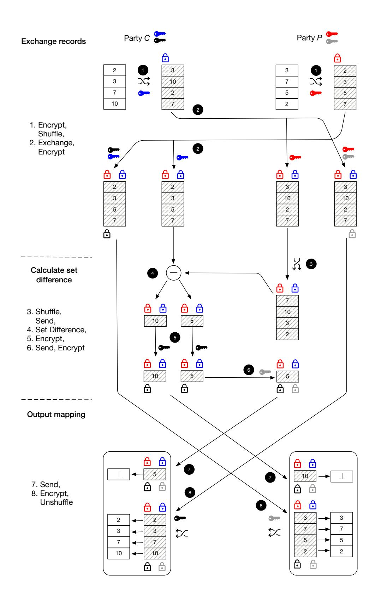
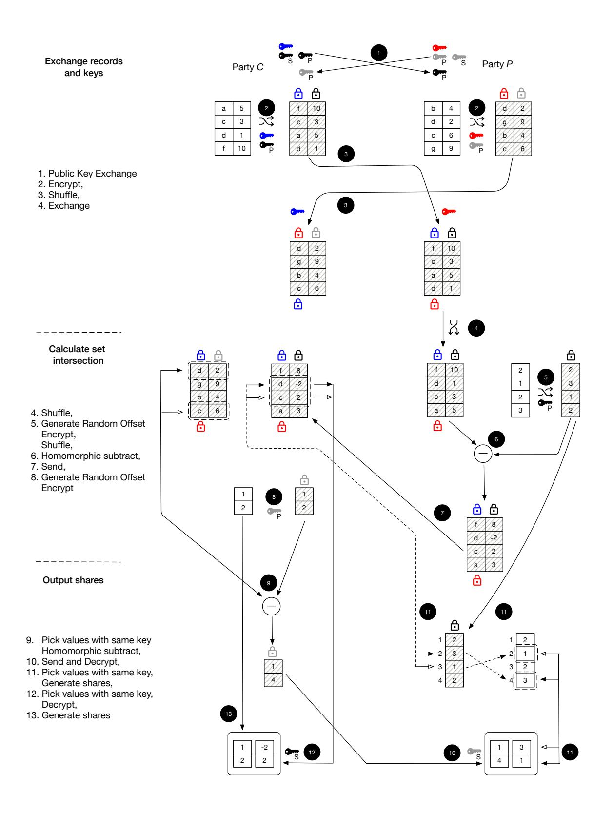
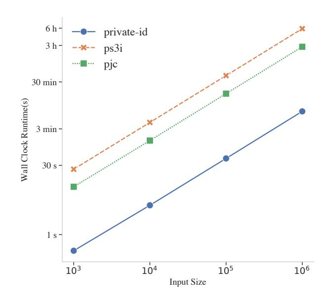
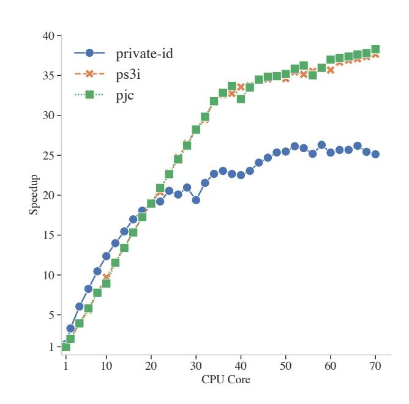

{0}------------------------------------------------

# Private Matching for Compute

Prasad Buddhavarapu Andrew Knox Payman Mohassel Shubho Sengupta Erik Taubeneck Vlad Vlaskin Facebook

#### **Abstract**

We revisit the problem of two-party private set intersection for aggregate computation which we refer to as *private matching for compute*. In this problem, two parties want to perform various downstream computation on the intersection of their two datasets according to a previously agreed-upon identifier. We observe that prior solutions to this problem have important limitations. For example, any change or update to the records in either party's dataset triggers a rerun of the private matching component; and it is not clear how to support a streaming arrival of one party's set in small batches without revealing the match rate for each individual batch.

We introduce two new formulations of the private matching for compute problem meeting these requirements, called private-ID and streaming private secret shared set intersection (PS3 I), and design new DDH-based constructions for both. Our implementation shows that when taking advantage of the inherent parallelizability of these solutions, we can execute the matching for datasets of size upto 100 million records within an hour.

# **1 Introduction**

Joining data from one dataset to another based on shared identifiers is a common precursor to performing many calculations. For example, consider two parties with datasets wherein each record is associated with a single user and has an identifier and possibly a value. The identifier is usually a username, email address, or a phone number for that user. The parties want to securely aggregate the values corresponding to the set of matched identifiers, also known as the inner join of the two datasets, without revealing the identifiers and values themselves.

This secure calculation can rely on input data associated with the matching records from just one party, or both, and can range from something as simple as aggregation to training machine learning models. Some example scenarios in this setting are:

- The average age or the total sum of funds held by the set of matched users.
- The test statistic of a randomized controlled trial, comparing an outcome known to one party between a test and control group known to the other party.
- A model that calculates the risk of a specific health condition, where case-specific health condition labels are known by one party and the predictive features are known by the other party.

While each individual record is privacy sensitive and may identify users even if obvious anonymization techniques are applied [\[Swe97,](#page-19-0) [MS04](#page-18-0), [Han06,](#page-17-0) [NS08\]](#page-18-1), the downstream computation performed on the matched records is only concerned with aggregate information that does not reveal individual records and hence can often be effectively protected using rigorous noise addition

{1}------------------------------------------------

frameworks such as differential privacy [[DMNS06](#page-17-1), [Dwo08](#page-17-2), [DR](#page-17-3)+14, [ACG](#page-16-0)+16] without significantly impacting the utility of computation.

We study the design of protocols that enable such downstream computation without leaking any information about the individual records beyond the final output. This is closely related to the classic private set intersection (PSI) problem [[Mea86](#page-18-2), [HFH99,](#page-17-4) [FNP04,](#page-17-5) [KS05](#page-18-3)] wherein two parties, each with their own private sets, compute the intersection without revealing anything else about the two sets. The majority of constructions in the PSI literature reveal the records in the intersection, and focus on improving computation complexity [[PSZ14,](#page-18-4) [KKRT16](#page-18-5)], communication complexity [\[JL10](#page-18-6), [DCT10,](#page-17-6) [PRTY19](#page-18-7), [IKN](#page-18-8)+19] or security by protecting against malicious adversaries [\[DSMRY09,](#page-17-7) [DCKT10](#page-17-8), [HN10,](#page-17-9) [RR17\]](#page-19-1). In many cases, divulging the membership of any record in the other dataset may leak sensitive information, or be used as an oracle as a component of a more sophisticated attack.

A much smaller subset of constructions focus on variants of PSI that yield potential solutions to the problem we set out to solve, i.e. that of computing on the intersection of two sets without revealing which records are in the intersection. Circuit-based constructions [[HEK12,](#page-17-10) [PSSZ15](#page-18-9), [PSWW18](#page-18-10), [PSTY19](#page-18-11)] support arbitrary computation on the intersection by reducing the problem to that of executing private equality tests using a general-purpose MPC protocol. These constructions are complex, and have larger communication costs, but have the benefit of generality. Custom DDHstyle protocols, on the other hand, focus on computing the cardinality or linear functions of the intersection [\[DCGT12](#page-17-11), [IKN](#page-18-8)+19]. They are simpler and more communication-efficient but so far have only enabled a limited set of computations on the intersection.

Both approaches, however, have limitations that restrict their usage in certain practical scenarios. For example, they assume that complete records, and not just the identifiers are present during the execution of the private matching if they are to be used in the downstream computation. The reason is that adding more columns to matched records reveals to one or both parties which records are in the intersection. This not only prevents gradual addition or omission of new features or labels to records after the private matching process but also leads to more expensive matching protocols when there are many features per record all of which needs to be processed within the protocol. Similarly, most constructions assume that the two sets of identifiers are fixed before the matching takes place. But a typical scenario is for one party's dataset of records to be large and stable for some time, while the other party's dataset arrives in a streaming fashion and in small batches. For example, parameters of a machine learning model can be continuously updated as new batches of records arrive.

# **2 Our Contribution**

We develop two-party private matching protocols that enable downstream privacy-preserving computation on the matched records without leaking them, that can work with real-world constraints such as unavailability of entire records at the time of matching or the arrival of a dataset in streaming small batches to the matching process. Similar to the DDH-style PSI, we aim for simple, easy to develop, and bandwidth-efficient protocols that can compose with general-purpose secure multi-party computation (MPC) to enable arbitrary computation on the intersection.

We consider two new formulations of the private matching for compute problem (PMC):

• The first variant which we call Private-ID, allows the parties to privately compute a set of pseudorandom universal identifiers (UID) corresponding to the records in the union of their sets, where each party additionally learns which UIDs correspond to which items in its set but not if they belong to the intersection or not. This new formulation enables the parties 

{2}------------------------------------------------

to independently sort their UIDs and the associated records and feed them to any general-purpose MPC that ignores the non-matching records and computes on the matching ones. We design a new DDH-based construction for Private-ID that is only a factor of two more expensive than standard DDH-based PSI, and prove it secure against honest-but-curious adversaries. Our Private-ID protocol has the advantage that it only needs the identifiers from the records as input to produce the UIDs and hence for each application, parties can assemble a possibly new set of features/labels per identifier for the downstream computation without re-executing the protocol.

• The second variant which we call private secret shared set intersection (PS3I), is a natural extension of PSI where instead of learning the plaintext matched records, parties only learn additive shares of those records which they can feed to any general-purpose MPC to execute the desired computation on. Moreover, we assume that one party's records arrive in small batches and parties learn secret shares of the matching records in each batch without learning which ones were a match or even how many were a match. Hiding the number of matches is important in this variant of the problem where batch sizes can be as small as one record. We show how to efficiently extend existing DDH-based PSI using any additively homomorphic encryption scheme to realize streaming PS3I.

The advantage of PS3I over Private-ID is that its output size and hence the complexity of the subsequent MPC is proportional to the size of intersection (or proportional to the smaller set in the streaming version) which in some cases is much smaller than size of union of the two original datasets. Its disadvantage, similar to prior work, is that full records and not just the identifiers need be ready at the time of execution, and requires a rerun when associated records change for the same identifiers.

We implement both protocol variants in the Rust programming language and report on the efficiency of the constructions. Our experiments confirm that both protocols are highly parallelizable and can leverage resources of multi-processor servers to scale to large datasets. For example, our Private-ID protocol processes datasets with 100 million records from each party in 60 minutes, while the PS3I protocol can process datasets with 5 million records in the same amount of time. The latter is more expensive due to its usage of homomorphic encryption which we instantiate using Paillier's encryption scheme.

### 3 Private ID Protocol

The diagram in Figure 1 visualizes the protocol, while Figure 2 contains a formal description. We denote the party on the left as C and the party on the right as P. Let  $C = \{c_1, \ldots, c_n\}$  be the set of unique identifiers associated with user records in C's dataset, and similarly  $P = \{p_1, \ldots, p_m\}$  be the set of unique identifiers associated with user records in P's dataset. These are shown as unhatched tables in the diagram. The protocol outputs a map from a universe of Universal ID (UID),  $U = (C \cup P) = \{u_1, \ldots, u_n\}$ , to each parties records, where both parties learn the same set of unique identifiers  $UID = \{uid_1, \ldots, uid_{|U|}\}$ . Party C learns a map  $M_c$  where  $M_c[uid_i] = u_i$  if  $u_i \in C$  and  $M_c[uid_i] = \bot$  otherwise. Similarly, party P learns the map  $M_p$  where  $M_p[uid_i] = u_i$  if  $u_i \in P$  and  $M_p[uid_i] = \bot$  otherwise. These maps are shown at the bottom of Figure 1. Furthermore the protocol only reveals n = |C|, m = |P| and  $\ell = |C \cap P|$  but nothing else.

The protocol proceeds in the following stages.

**Exchange records.** Our starting point is a DDH-based scheme pursued in prior work [HFH99, JL10, DCKT10, IKN+19].

{3}------------------------------------------------

Figure 1: Private ID protocol

- 1. In step 1 of Figure 1 party C hashes its records  $c_i$  as  $H(c_i)$  and computes  $H(c_i)^{k_c}$  using a random secret scalar  $k_c$ . Party P also computes  $H(p_j)^{k_p}$  for each of its records. These random secret scalars are shown as keys. They shuffle  $H(c_i)^{k_c}$  and  $H(p_j)^{k_p}$  and exchange these records.
- 2. In step 2, party C computes  $H(p_j)^{k_pk_c}$  and similarly party P computes  $H(c_i)^{k_ck_p}$ . These double exponentiated DH values are denoted by  $E_p$  and  $E_c$  and shown in the diagram using two lock symbols. A first natural attempt is to use the same DH values as UIDs for the universe, such that  $UID = E_c \cup E_p$ . However this reveals the items in the intersection to party C which we want to avoid. A common trick to avoid this leakage is for C to receive  $E_c$  randomly shuffled, so that it only learns the size of the intersection, but this breaks the linkages between the universal identifiers and their corresponding values in C's set. this means we cannot use  $E_c \cup E_p$  directly as UID. Instead, each party uses one more random secret scalar  $r_c$  and  $r_p$  to calculate  $H(p_j)^{k_pk_cr_c}$  and  $H(c_i)^{k_ck_pr_p}$  as  $V_p$  and  $V_c$  respectively. These are shown using three lock symbols in Figure 1, and will

{4}------------------------------------------------

eventually be transformed into UIDs.

Calculate set difference. Party P shuffles  $E_c$  in step  $\P$  and sends it to party C which uses it to calculate the symmetric set difference. In step  $\P$ , party C calculates two set differences;  $S_c = E_c \setminus E_p$  and  $S_p = E_p \setminus E_c$ . Party C then computes  $s_c^{r_c}$  and  $s_p^{r_c}$  for all elements  $s_c$  and  $s_p$  in  $S_c$  and  $S_p$  respectively. These are shown as outputs of step  $\P$ . In step  $\P$ , party P computes  $s_p^{r_c r_p}$ .

**Output mapping.** The last step calculates the universal identifiers as  $H(c_i)^{k_c k_p r_c r_p}$  and  $H(p_j)^{k_c k_p r_c r_p}$ . A key point to note is that each party knows its own permutation and can undo it to generate the mapping M.

- 1. In step  $\bigcirc$ , party C sends elements  $s_c^{r_c}$  to party P. Note that  $s_c^{r_c r_p}$  is of the form  $H(p_j)^{k_c k_p r_c r_p}$ . Similarly it sends  $V_p$  to party P in step  $\bigcirc$ . Party P undoes the permutation and computes  $v_p^{r_p}$  for each element in  $V_p$  to get elements of the form  $H(p_j)^{k_c k_p r_c r_p}$ . To generate the mapping M, elements of the form  $s_c^{r_c r_p}$  are mapped to  $\bot$  and undoing the permutation maps  $v_p^{r_p}$  to the original records.
- 2. Likewise, in step **7**, party P sends elements  $s_p^{r_c r_p}$  to party C. Note that these elements are of the form  $H(c_i)^{k_c k_p r_c r_p}$ . Similarly it sends  $V_c$  to party C in step **8**. Party C the undoes the permutation and computes  $v_c^{r_c}$  for each element in  $V_c$  to get elements of the form  $H(c_i)^{k_c k_p r_c r_p}$ . The mapping is generated in an identical manner.

We present the protocol  $\prod^{\mathsf{PID}}$  formally in Figure 2.

{5}------------------------------------------------

#### ∏PID

Inputs: 
$$[C : \{c_1, ..., c_n\}, P : \{p_1, ..., p_m\}]$$
  
Outputs:  $[C : (UID, M_c), P : (UID, M_p)]$ 

Let *G* be a cyclic group of order *q* with generator *g* wherein DDH is hard, and *H*(*·*) : *{*0*,* 1*} ∗ → G* modeled as a random oracle.

### **Step 1 (Exchange records):** *C*

- Let *kc, rc R←* Z*q*, and *Uc ← ∅*.
- For each *ci ∈ C* compute *u i c* = *H*(*ci*) *kc* and let *Uc* = *Uc ∪ {u i c}*.
- Randomly shuffle the elements in *Uc* using a permutation *πc* and send to P.

#### **Step 1 (Exchange records):** *P*

- Let *kp, rp R←* Z*q*, and *Up, Ec, Vc ← ∅*
- For each *pi ∈ P* compute *u i p* = *H*(*pi*) *kp* , and let *Up* = *Up ∪ {u i p}*
- Randomly shuffle the elements in *Up* using a permutation *πp*
- For each *u i c ∈ Uc*:
  - **–** Compute *e i c* = (*u i c*) *kp* and let *Ec* = *Ec ∪ {e i c}*
  - **–** Compute *v i c* = (*e i c*) *rp* and let *Vc* = *Vc ∪ {v i c}*
- Randomly shuffle the elements in *Ec* and send the sets *Ec, Vc, Up* to C

#### **Step 2 (Calculate set difference):** *C*

- Let *Ep, Vp, S′ c* = *∅*
- For each *u i p ∈ Up*:
  - **–** Compute *e i p* = (*u i p*) *kc* and let *Ep* = *Ep ∪ {e i p}*
  - **–** Compute *v i p* = (*u i p*) *kcrc* and let *Vp* = *Vp ∪ {v i p}*
- Let *Sp* = *Ep \ Ec* and *Sc* = *Ec \ Ep*
- For each *s i c ∈ Sc*, let *S ′ c* = *S ′ c ∪ {*(*s i c*) *rc }*
- Send the sets *Vp, S′ c, Sp* to P

#### **Step 2 (Output mapping):** *P*

- Let *S ′′ c , Wp* = *∅*
- Shuffle back the elements of *Vp* using *π −*1 *p* . For every *v i p ∈ Vp*, let *Wp* = *Wp ∪ {*(*v i p*) *rp }*, and *Mp*[(*v i p*) *rp* ] = *pi*
- For each *s i c ∈ S ′ c*, let *S ′′ c* = *S ′′ c ∪ {*(*s i c*) *rp }* and *Mp*[(*s i c*) *rp* ] = *⊥*
- Output *UIDp* = *Wp ∪ S ′′ c* and *Mp*
- For each *s i p ∈ Sp*, let *S ′ p* = *S ′ p ∪ {*(*s i p*) *rp }*
- Send *S ′ p* to C

### **Step 3 (Output mapping):** *C*

- Let *Wc, S′′ p* = *∅*
- Shuffle back the elements of *Vc* using *π −*1 *c* . For every *v i c ∈ Vc* let *Wc* = *Wc ∪ {*(*v i c*) *rc }* and *Mc*[(*v i c*) *rc* ] = *ci*
- For every *s i p ∈ S ′ p* let *S ′′ p* = *S ′′ p ∪ {*(*s i p*) *rc }* and *Mc*[(*s i p*) *rc* ] = *⊥*
- Output *UIDc* = *Wc ∪ S ′′ p* and *Mc*

Figure 2: Private-ID Protocol

{6}------------------------------------------------

# 3.1 Security of Private-ID, $\prod^{PID}$

We use standard simulation-based definitions of security for secure multiparty computation to prove that the protocol is secure against a semi-honest (honest-but-curious) adversary. In particular, the security argument is split into two pieces, one against a corrupted C and another against a corrupted P.

In each case, we describe a simulator SIM that only takes the corrupted party's input, the size of the two sets  $\mathcal{C}$  and  $\mathcal{P}$  (and in case of corrupted C also size of  $\mathcal{C} \cap \mathcal{P}$ ) as input and indistinguishably simulates the view of that party in the real protocol. The *view* of a party consists of its inputs, the randomness it uses, as well as messages sent and received throughout the protocol. More formally, let  $\mathsf{REAL}^{a,\lambda}_{\Pi^{\mathsf{PID}}}(\mathcal{C},\mathcal{P})$  be a random variable representing the view of party a in a real protocol execution where the random variable ranges over the internal randomness of both parties. Our first theorem captures security against a corrupted C as follows.

**Theorem 1** (Security of  $\prod^{\mathsf{PID}}$  against a semi-honest C). There exists a PPT simulator  $\mathsf{SIM}_c$  such that for all security parameter  $\lambda$  and all inputs  $\mathcal{C} = \{c_1, \ldots, c_n\}$  and  $\mathcal{P} = \{p_1, \ldots, p_m\}$ ,

$$\mathsf{REAL}_{\Pi^{\mathsf{PID}}}^{C,\lambda}(\mathcal{C},\mathcal{P}) \approx \mathsf{SIM}_c(\mathcal{C},1^{\lambda},m,n,\ell)$$

where  $\ell = |\mathcal{C} \cap \mathcal{P}|$ .

proof sketch. In Figure 3, we describe the simulator  $SIM_c$  which we claim indistinguisably simulates the real view of party C.

#### Simulate C's step 1:

- Generate  $k_c, r_c \stackrel{R}{\leftarrow} \mathbb{Z}_q$
- Honestly generate  $U_c$ , i.e. for each  $c_i \in \mathcal{C}$  compute  $u_c^i = H(c_i)^{k_c}$  and let  $U_c = U_c \cup \{u_c^i\}$ .

#### Simulate P's step 1:

- For each  $i \in [n]$  compute  $g_i \stackrel{R}{\leftarrow} G$ , and let  $E_c = E_c \cup \{g_i^{k_c}\}$ .
- For each  $j \in [m]$ , if  $j \le \ell$ , let  $h_j = g_j$ , else let  $h_j \stackrel{R}{\leftarrow} G$ , and let  $U_p = U_p \cup \{h_j\}$ .
- Let  $V_c = \{v_1, \dots, v_n\}$  where all  $v_i$ 's are randomly selected from G
- Randomly shuffle the elements in  $E_c, U_p$  and send the sets  $E_c, V_c, U_p$  to C

Simulate C's step 2:  $SIM_c$  does this step exactly as the protocol describes and using  $r_c$  and  $k_c$  it generated above. So we skip the full details. At the end of this step SIM outputs  $V_p, S'_c, S_p$  for P.

### Simulate P's step 2:

• Let  $J = m - \ell$ . For  $i \in [J]$ , let  $S'_p = S'_p \cup \{s_i\}$  for randomly selected  $s_i$  in G, and send  $S'_p$  to C.

Simulate C's Step 3:  $SIM_c$  does this step exactly as the protocol describes and using  $r_c$  it generated above.

Figure 3: Description of  $SIM_c$  for Theorem 1

Using a sequence of hybrid arguments, we show that the distribution generated by  $\mathsf{SIM}_c$  is indeed indistinguisable from the real view of C.

{7}------------------------------------------------

 $\mathcal{H}_0$ : This is the view of party C in the real execution of the protocol.

 $\mathcal{H}_{1,0}$ : Identical to  $\mathcal{H}_0$ .

 $\mathcal{H}_{1,i}$ : For  $i \in [n-\ell]$ , the same as  $\mathcal{H}_{1,i-1}$  except that we replace  $H(c_{i*})^{k_c k_p}$  in  $E_c$  with  $g_i^{k_c}$  for random  $g_i \in G$ , where  $i^*$  is the index of the first not-yet-replaced item in  $\mathcal{C} \setminus \mathcal{P}$ .

 $\mathcal{H}_{2,0}$ : Identical to  $\mathcal{H}_{1,n-\ell}$ .

 $\mathcal{H}_{2,j}$ : For  $j \in \{1, \dots, m-\ell\}$ , the same as  $\mathcal{H}_{2,j-1}$  except that we repalce  $H(p_{j*})^{k_p}$  in  $U_p$  with random  $h_j \in G$ , where  $j^*$  the first not-yet-replaced item in  $\mathcal{P} \setminus \mathcal{C}$ .

 $\mathcal{H}_{3,0}$ : Identical to  $\mathcal{H}_{2,m-\ell}$ 

 $\mathcal{H}_{3,t}$ : For  $t \in [\ell]$ : the same as  $\mathcal{H}_{3,t-1}$  except that we replace  $H(c_{t*})^{k_c k_p}$  in  $E_c$  with  $g_{t*}^{k_c}$  and  $H(p_{t*})^{k_p}$  in  $U_p$  with  $g_{t*}$  where  $t^*$  is the index of the first not-yet-replaced item in the intersection  $\mathcal{C} \cap \mathcal{P}$ 

 $\mathcal{H}_{4,0}$ : Identical to  $\mathcal{H}_{3,\ell}$ 

 $\mathcal{H}_{4,i}$ : for  $i \in [n]$ , the same as  $\mathcal{H}_{4,i-1}$  except that we replace  $v_i \in V_c$  with a randomly selected element in G

 $\mathcal{H}_{5,0}$ : Identical to  $\mathcal{H}_{4,n}$ 

 $\mathcal{H}_{5,i}$ : for  $i \in [m-\ell]$ , the same as  $\mathcal{H}_{5,i-1}$  except that we replace  $s_i \in S'_c$  with a randomly selected element in G

 $\mathcal{H}_6$ : The view of C output by  $\mathsf{SIM}_c$ .

We now need to argue that each consecutive pair of hybrids in the above sequence are indistinguisable by a PPT algorithm. The interesting arguments here are those for  $(\mathcal{H}_{1,i-1},\mathcal{H}_{1,i})$ ,  $(\mathcal{H}_{2,j-1},\mathcal{H}_{2,j})$ ,  $(\mathcal{H}_{3,t-1},\mathcal{H}_{3,t})$ ,  $(\mathcal{H}_{4,i-1},\mathcal{H}_{4,i})$  and  $(\mathcal{H}_{5,i-1},\mathcal{H}_{5,i})$ . Given that they all follow a similar line of argument that relies on hardness of DDH and the random oracle property of the hash function, we go through the argument for  $(\mathcal{H}_{1,i-1},\mathcal{H}_{1,i})$  as an example. In particular, we argue that for any PPT adversary  $\mathcal{A}$  who can distinguish the two hybrids, we devise an adversary  $\mathcal{B}$  who can solve the DDH problem.  $\mathcal{B}$  is given  $(g,g^a,g^b,g^c)$  and needs to decide whether c is random or c=ab. First note  $\mathcal{B}$  can program  $H(\cdot)$  to return  $g^b$  on input  $c_{i*}$ . We also let  $g^a=g^{k_p}$ . Then it is easy to observe that since  $g_i$  is uniformly random, the tuple  $(g,g^a,H(c_{i*}),g^c)$  is identically distributed to  $\mathcal{H}_{1,i-1}$  if c=ab and is identically distributed to  $\mathcal{H}_{1,i}$  if c is random (since  $g_i$  is uniformly random). If  $\mathcal{A}$  can decide which hybrid it is interacting with,  $\mathcal{B}$  can decide which DDH tuple it was given with the same probability.

**Theorem 2** (Security of  $\prod^{\mathsf{PID}}$  against a semi-honest P). There exists a PPT simulator  $\mathsf{SIM}_p$  such that for all security parameter  $\lambda$  and all inputs  $\mathcal{C} = \{c_1, \ldots, c_n\}$  and  $\mathcal{P} = \{p_1, \ldots, p_m\}$ ,

$$\mathsf{REAL}_{\Pi^{\mathsf{PID}}}^{P,\lambda}(\mathcal{C},\mathcal{P}) \approx \mathsf{SIM}_p(\mathcal{P},1^{\lambda},m,n)$$

where  $\ell = |\mathcal{C} \cap \mathcal{P}|$ .

proof sketch. The first thing to note is that a corrupted P does not learn the size of intersection and hence we do not need to pass  $\ell$  as input to  $\mathsf{SIM}_p$ .

The description of  $\mathsf{SIM}_p$  is quite straighforward. It generates  $r_p, k_p$  randomly as P would, and performs all computations that P does throughout the protocol using these two values as described.

{8}------------------------------------------------

Figure 4: Private Set Intersection protocol

For all group elements to be received from C,  $\mathsf{SIM}_p$  replaces them with randomly generated elements in G. This includes elements in  $U_c, V_p, S'_c, S_p$ .

We will not go through a detailed sequence of hyrid arguments but note that starting from the first hybrid which is the view of P in the real protocol, we sequentially replace elements sent by C with random group elements until we reach the view generated by  $\mathsf{SIM}_c$ . The argument we used in the proof of Theorem 1 can be plugged in here to show that each pair of consecutive hybrids are indistinguishable if DDH is hard and H is a random oracle.

## 4 Private Secret Shared Set Intersection Protocol

The Private Shared Set Intersection protocol,  $\Pi^{PS^3I}$ , shown in Figure 4 computes additive shares of records common to both parties. As before, let  $\mathcal{C} = \{(c_1, v_{c,1}), \dots, (c_n, v_{c,n})\}$  be the set of tuples

9

{9}------------------------------------------------

of (identifier, value) associated with party C on the left. Similarly  $\mathcal{P} = \{(p_1, v_{p,1}), \dots, (p_m, v_{p,m})\}$  be the same for party P on the right. For simplicity, we assume a single value  $v_{c,i}$  or  $v_{p,i}$  associated with each record but this can be easily generalized to a vector of values per record on each side and the protocol would work the same way.

The goal is to compute additive shares of  $v_{c,i}$ 's and  $v_{p,j}$ 's for all i, j where  $c_i = p_j$ , i.e. to compute additive shares for all records in the intersection of  $\mathcal{C} \cap \mathcal{P}$ . These additive shares can later be fed to a downstream MPC protocol that internally reconstructs the values by adding the shares and performs aggregate analysis on them.

More precisely, let  $S = \{(v_{c,i}, v_{p,j}) \text{ for all } i, j \text{ s.t. } c_i = p_j\}$  and let |S| = k. C and P want to learn the sets  $R_{c,I} = \{(r_i^c, r_i^p)\}_{i=1}^k$  and  $R_{p,I} = \{(s_i^c, s_i^p)\}_{i=1}^k$  for random values in  $[0, 2^\ell)$  where  $r_i^c + s_i^c = v_{c,i} \mod 2^\ell$  and  $r_i^p + s_i^p = v_{p,i} \mod 2^\ell$ , for an agreed upon integer  $\ell$ .

# 4.1 The non-streaming $\prod^{PS^{3}I}$

Once again, our starting point is a DDH-based PSI along with random shuffling which ensures original records cannot be linked to those in the intersection.

Exchange records and keys. In step  $\P$ , C and P generate keypairs  $(pk_c, sk_c)$  and  $(pk_p, sk_p)$  for the additively homomorphic scheme HE = (KG, Enc, Dec) they will use to compute shares, and share the public key with each other. In step  $\P$ , C computes  $H(c_i)^{k_c}$  using a random scalar  $k_c$  for all i, randomly shuffles them and sends them to P. C also computes  $Enc(pk_c; v_{c,i})$ , shuffles and sends to P. Similarly P computes  $H(p_j)^{k_p}$  using a random scalar  $k_p$  and computes  $Enc(pk_p; v_{p,i})$ , randomly shuffles them and sends to C. In step  $\P$ , C computes  $H(p_j)^{k_ck_p}$  and P computes  $H(c_i)^{k_ck_p}$  and further shuffles  $H(c_i)^{k_ck_p}$  in step  $\P$ . We denote  $H(c_i)^{k_ck_p}$  as  $E_c$  and  $H(p_j)^{k_ck_p}$  as  $E_p$ . These double exponentiated DH values are used to determine which ones correspond to records in the intersection.

Calculate intersection. P generates a random plaintext  $r_{c,i}$  in the domain of the encryption scheme in step  $\S$ ; homomorphically subtracts it from  $Enc(pk_c; v_{c,i})$  in step  $\S$  and sends back to C in step  $\S$ . The homomorphic subtraction fully hides the values as a one-time pad encryption, while providing additive shares  $(v_{c,i} - r_{c,i}, r_{c,i})$  of  $v_{c,i}$  for all i, between P and C. C intersects the two shuffled sets of DH values  $E_p$  and  $E_c$ . In step  $\S$  and  $\S$ , C generates random plaintexts  $r_{p,i}$ , encrypts them with  $pk_p$  and homomorphically subtracts them from encrypted values  $Enc(pk_p; v_{p,i})$  that lie in the intersection.

Output shares For each item in  $E_c$  that is in the intersection, C decrypts the corresponding ciphertext and outputs  $v_{c,j} - r_{c,j}$  as its additive share in step 13. In step 11, C also lets P know the index j such that P can use the correct  $r_{c,j}$  as its additive share of  $v_{c,j}$ . Learning the index j does not reveal the actual item in the intersection to P since C had shuffled its DH values before sending to P. Similarly in step 10, for each item in  $E_p$  that is in the intersection, C outputs  $r_{p,j}$  as its additive share and sends the corresponding ciphertext  $Enc(pk_p; v_{p,j} - r_{p,j})$  to P who decrypts and outputs its additive share.

In the above discussion, we assume that the plaintext domain of the encryption scheme is  $\mathbb{Z}_N$  for some integer N. For Paillier's encryption, however, N is quite large and it may not be the domain that the downstream MPC would want to operate on. Let's assume that the downstream application performs arithmetic operations modulo  $2^{\ell}$  for a smaller integer  $\ell$ .

In particular, at the end of this interaction, for each shared value in the intersection, one party holds a value  $a \in \mathbb{Z}_N$ , while the other party a value  $b \in \mathbb{Z}_N$  such that  $a + b = x \mod N$  where +

{10}------------------------------------------------

is integer addition and  $x < 2^{\ell}$ . Since we know the range of plaintext values we work with in our application and can bound them accordingly.

We claim that  $a' = a \mod 2^{\ell}$  and  $b' = b - N \mod 2^{\ell}$  are correct additive shares of  $x \mod 2^{\ell}$  except with probability  $1/2^{N-\ell}$  which is negligibly small when  $N \gg \ell$ . More precisely, in our protocol  $a = x + (N - r) \mod N$  and b = r for a random  $r \in \mathbb{Z}_N$ . Moreover, it is easy to see that as long as  $r > 2^{\ell}$ , we can write a = x + (N - r) as integer addition without the modular operation since the sum will not be larger than N. For a random r in  $\mathbb{Z}_N$ , this is true with probability  $1 - 2^{\ell}/N$  which is all but negligible for all reasonable value of  $\ell$  given that N is large. As a result we have a + b = x + (N - r) + r = x + N. Then note that

$$x = a + b - N$$

$$= a_0 + a_1 2^{\ell} + b_0 + b_1 2^{\ell} - N_0 - N_1 2^{\ell}$$

$$= (a_0 + b_0 - N_0) + (a_1 + b_1 - N_1) 2^{\ell}$$

where  $a_0, b_0, N_0 < 2^{\ell}$ . Since  $x < 2^{\ell}$ , we then have that  $x \mod 2^{\ell} = x = (a_0 + b_0 - N_0) \mod 2^{\ell}$ . In other words, it suffices for one party to compute  $a_0 = a \mod 2^{\ell}$  and for the other party to compute  $b_0 - N_0 = (b - N) \mod 2^{\ell}$  and these would be correct additive shares of  $x \mod 2^{\ell}$ .

We present a formal description of the protocol in Figure 5

{11}------------------------------------------------

# Non-Streaming $\prod^{PS^3I}$

Inputs:  $[C: \{(c_1, v_{c,1}), \dots, (c_n, v_{c,n})\}, P: \{(p_1, v_{p,1}), \dots, (p_m, v_{p,m})\}]$  for  $v_{c,i}, v_{p,i} \in [0, 2^{\ell})$  Outputs:  $[C: R_{c,I} = \{(r_i^c, r_i^p)\}_{i=1}^k, P: R_{p,I} = \{(s_i^c, s_i^p)\}_{i=1}^k]$  for  $k = |\mathcal{C} \cap \mathcal{P}|$  size of intersection Common setup: Let G be a cyclic group of order q with generator g wherein DDH is hard, and hash function  $H(\cdot): \{0,1\}^* \to G$  modeled as a random oracle. Let HE = (KG, Enc, Dec) be a semantically secure additively homomorphic encryption scheme.

#### Step 1 (Exchange records and keys): C

- Let  $k_c \stackrel{R}{\leftarrow} \mathbb{Z}_q$ ,  $(pk_c, sk_c) \leftarrow KG(1^{\lambda})$ , and  $U_c \leftarrow \emptyset$ .
- For each  $c_i \in \mathcal{C}$  compute  $u_c^i = (H(c_i)^{k_c}, Enc(pk_c, v_{c,i}))$  and let  $U_c = U_c \cup \{u_c^i\}$ .
- Randomly shuffle the records in  $U_c$  and send  $U_c, pk_c$  to P.

#### Step 1 (Exchange records and keys): P

- Let  $k_p \stackrel{R}{\leftarrow} \mathbb{Z}_q$ ,  $(pk_p, sk_p) \leftarrow KG(1^{\lambda})$ , and  $U_p, E_c, \leftarrow \emptyset$
- For each  $p_i \in \mathcal{P}$  compute  $u_p^i = (H(p_i)^{k_p}, Enc(pk_p, v_{p,i}))$ , and let  $U_p = U_p \cup \{u_p^i\}$
- Randomly shuffle the records in  $U_p$
- For each  $u_c^i \in U_c$ :
  - Compute  $r_{c,i} \stackrel{R}{\leftarrow} \mathbb{Z}_N$  and let  $e_c^i = ((u_c^i[0])^{k_p}, u_c^i[1] \ominus_h r_{c,i})$  and let  $E_c = E_c \cup \{e_c^i\}$
- Randomly shuffle the records in  $E_c$  using a permutation  $\pi_p$  and send the sets  $E_c, U_p, pk_p$  to C

#### Step 2 (Calculate set intersection, Output shares): C

- Let  $E_p, L \leftarrow \emptyset$
- For each  $u_p^i \in U_p$ :
  - Compute  $e_p^i = ((u_p^i[0])^{k_c}, u_p^i[1])$  and let  $E_p = E_p \cup \{e_p^i\}$
- For every i, j where  $e_c^i[0] = e_p^j[0]$ 
  - Compute  $r_{p,j} \stackrel{R}{\leftarrow} \mathbb{Z}_N$  and let  $L = L \cup (i, e_p^j[1] \ominus_h r_{p,j})$
  - Let  $R_{c,I} = R_{c,I} \cup \{(Dec(sk_c, e_c^i[1]) \mod 2^\ell, r_{p,j}) \mod 2^\ell\}$
- Send L to P, and output  $R_{c,I}$

#### Step 2 (Output shares): P

- For each  $(i, e_p^j[1]) \in L$ , let  $R_{p,I} = R_{p,I} \cup \{(r_{c,\pi_p^{-1}(i)} N \mod 2^\ell, Dec(sk_p, e_p^j[1]) N \mod 2^\ell)\}$
- Output  $R_{p,I}$

Figure 5: Non-Streaming Private Secret Shared Set Intersection

# 4.2 Security of $\prod^{PS^3I}$

We claim that the  $\Pi^{PS^3I}$  protocol is secure against a semi-honest adversaries who may corrupt either party. The following two theorems capture this security.

{12}------------------------------------------------

**Theorem 3** (Security of ∏PS3 I against a semi-honest *C*)**.** *There exists a PPT simulator* SIM*c such that for all security parameter λ and all inputs C* = *{c*1*, . . . , cn} and P* = *{p*1*, . . . , pm},*

$$\mathsf{REAL}_{\Pi^{PS^3I}}^{C,\lambda}(\mathcal{C},\mathcal{P}) \approx \mathsf{SIM}_c(\mathcal{C},1^\lambda,m,n,\ell)$$

*where ℓ* = *|C ∩ P|.*

*proof intuition.*We only sketch out how the simulator could work here. The complete proof and sequence of hybrid games would follow a similar line of argument as the ∏PID protocol. We can simulate the DH values *C* receives from *P* in step 1 of Figure [5](#page-11-0), by simply making sure *ℓ* of them are a match with *C*'s input and the other ones are random group elements. As before, this cannot be distinguished given the DDH assumption and the fact that *H* is a RO. The encrypted values associated with *C*'s set can be simulated with encrypted random plaintexts which would be identically distributed to those *P* sends which are one-time padded by subtracting random values modulo *N*. The encrypted values associated with *P*'s set, can be simulated by encryptions of zero and would be computationally indistinguishable due to semantic security of the *HE* scheme.

**Theorem 4** (Security of ∏PS3 I against a semi-honest *P*)**.** *There exists a PPT simulator* SIM*p such that for all security parameter λ and all inputs C* = *{c*1*, . . . , cn} and P* = *{p*1*, . . . , pm},*

$$\mathsf{REAL}_{\Pi^{PS^3I}}^{P,\lambda}(\mathcal{C},\mathcal{P}) \approx \mathsf{SIM}_p(\mathcal{P},1^\lambda,m,n,\ell)$$

*where ℓ* = *|C ∩ P|.*

*proof intuition.* We can simulate *P*'s view in step 1 of Figure [5](#page-11-0) by replacing the DH values *C* sends with random group elements which would be indistinguishable based on the DDH assumption and the fact *H* is an RO, and the encrypted values *C* sends with encryptions of zeros which would be indistinguishable due to semantic security of *HE*. What *P* receives in step 2 of Figure [5](#page-11-0) are tuples of indices and encryption of one-time padded values. The indices can be simulated with *ℓ* randomly chosen indices [1*, n*] which is identically distributed given that *C* would also randomly shuffle its set before sending to *P*. The encrypted values can be replaced with encrypted uniformly random plaintexts which again would be indetically distributed given the one-time pad property of modular addition.

#### **4.3 The streaming** ∏**PS**3 **I**

We also consider a streaming version of the above protocol where *P*'s dataset will come in incrementally in batches, one per epoch, and each batch will be processed and immediately incorporated into an ongoing downstream computation instead of waiting to receive them all before starting the computation.

*C* holds a fixed set *C* of tuples (*ci , vc,i*), and during each epoch, *P* will hold a batch *B* of tuples (*pi , vp,i*) for i in [1*, m*] where *m* = *|B|*. The goal is to compute additive shares of *vc,i*'s and *vp,i*'s for items in the intersection of *B* and *C*, and compute additive shares of 0 for those items in *B* that are not in the intersection. This formulation ensures that *P* does not learn which items in *B* are in the intersection. This is important given the small size of *B* and the fact that *P* knows which users are in *B*. In the extreme case, if *B* always contains a single user record known to *P*, learning whether there was a match or not is equivalent to revealing the full intersection to *P*.

In Figure [6,](#page-14-0) we describe an enhanced version of ∏PS3 I which avoids this leakage while processing *P*'s input in a streaming fashion. In an initial stage that is run only once, *P* and *C* compute the

{13}------------------------------------------------

double-exponentiated DH values corresponding to *C* as well as for a set of dummy records *D* created by *C* of size *T*, where *T* is an upperbound on total size of all batches we want to process for *P*. We make sure *C* learns these DH values in a randomly shuffled order where it knows which ones correspond to dummy items while it does not know the order of DH values for the non-dummy items. As before, we have *P* randomly shuffle the set after exponentiating them with its secret scalar *kp*, and to help *C* learn which ones are associated with a dummy element, we use a randomizable public-key encryption *RE*. In particular, *C* sends along with each DH value *H*(*ci*) *kc* , *Enc*(1) to indicate it is a real value and with each *H*(*di*) *kc* , *Enc*(0) to indiate it is dummy. *P* can then randomize these ciphrertexts when sending back the associated DH values. Upon decryption, if the plaintext corresponds to a 0, *C* knows the item was dummy and if it is non-zero, it marks it as "real". In addition, we ensure that both parties learn additive shares of the values corresponding to each DH value (achieved similar to the non-streaming version using the additively hoomomohpric encryption scheme) where *C* chooses the value associated with each dummy element to be zero (or some other default value). *P* does not learn which items are dummy in this process and holds an additive share for every real and dummy value in the set.

Every time a new batch *B* of *P*'s items arrive, the two parties interact for *C* to learn the DH values for *P*'s new batch in a shuffled order. If a DH value finds a match in the pre-processed set of DH values from the initial setup, it is in the intersection and if it does not find a match, *C* simply uses one of the dummy records in place of a real one. *C* just needs to make sure it never uses a dummy value twice and that each time it chooses the next dummy element uniformly at random. The rest of the protocol is similar to the non-streaming variant. For each item in *B*, *C* and *P* will end up additively sharing either the values corresponding to a real item in the intersection of the batch and *C*, or the dummy value 0. P does not know which is the case. Only the downstream computation can determine this by reconstructing the shares and inspecting the value.

{14}------------------------------------------------

# Streaming $\prod^{PS^3I}$

Inputs:  $[C: \{(c_1, v_{c,1}), \dots, (c_n, v_{c,n})\}, P: B = \{(p_1, v_{p,1}), \dots, (p_m, v_{p,m})\}]$  for  $v_{c,i}, v_{p,i} \in [0, 2^{\ell})$  Outputs for each batch:  $[C: R_{c,I} = \{(r_i^c, r_i^p)\}_{i=1}^m, P: R_{p,I} = \{(s_i^c, s_i^p)\}_{i=1}^m$  for m = |B|

**Common setup:** Let G be a cyclic group of order q with generator g wherein DDH is hard, and  $H(\cdot): \{0,1\}^* \to G$  modeled as a random oracle. Let  $HE = (KG_1, Enc_1, Dec_1)$  be a semantically secure additively homomorphic encryption scheme, and  $RE = (KG_2, Enc_2, Dec_2, Rand_2)$  is a randomizable semantically secure PKE.

#### Initial Setup

#### Step 1: C

- Let  $k_c \stackrel{R}{\leftarrow} \mathbb{Z}_q$ ,  $(pk_c^1, sk_c^1) \leftarrow KG_1(1^{\lambda})$ ,  $(pk_c^2, sk_c^2) \leftarrow KG_2(1^{\lambda})$  and  $U_c \leftarrow \emptyset$ .
- For each  $c_i \in \mathcal{C}$  compute  $u_c^i = (H(c_i)^{k_c}, Enc_1(pk_c^1, v_{c,i}), Enc_2(pk_c^2, 1))$  and let  $U_c = U_c \cup \{u_c^i\}$ .
- Generate a set  $D = \{d_1, \dots d_T\}$  of dummy records where T is an upperbound on total size of all of P's batches combined.
- For each  $d_i \in D$  compute  $d_c^i = (H(d_i)^{k_c}, Enc_1(pk_c^1, 0), Enc_2(pk_c^2, 0))$  and let  $U_c = U_c \cup \{d_c^i\}$ .
- Randomly shuffle the records in  $U_c$  and send  $U_c$ ,  $pk_c$  to P.

#### Step 1: P

- Let  $k_p \stackrel{R}{\leftarrow} \mathbb{Z}_q$ ,  $(pk_p, sk_p) \leftarrow KG(1^{\lambda})$ , and  $E_c \leftarrow \emptyset$
- For each  $u_c^i \in U_c$ :
  - Compute  $r_{c,i}, r'_{c,i} \stackrel{R}{\leftarrow} \mathbb{Z}_N$  and let  $e_c^i = ((u_c^i[0])^{k_p}, u_c^i[1] \ominus_h r_{c,i}), Rand_2(u_c^i[2])$  and let  $E_c = E_c \cup \{e_c^i\}$
- Randomly shuffle the records in  $E_c$  using a permutation  $\pi_p$  and send the set  $E_c$  and  $pk_p$  to C

#### Step 2: C

- Let  $F_c \leftarrow \emptyset$ .
- For each  $e_c^i \in E_c$ : let  $f_c^i[0] = e_c^i[0]$ ;  $f_c^i[1] = Dec_1(sk_c^1, e_c^i[1])$  and  $f_c^i[2] =$  "dummy" if  $Dec_2(sk_c^2, e_c^i[2]) \stackrel{?}{=} 0$  and  $f_c^i[2] =$  "real" otherwise. Let  $F_c = F_c \cup \{f_c^i\}$

#### Repeat for each batch $\mathcal{B}$

#### Step 1: P

- For each  $p_i \in B$  compute  $u_p^i = (H(p_i)^{k_p}, Enc(pk_p, v_{p,i}))$ , and let  $U_p = U_p \cup \{u_p^i\}$
- Randomly shuffle the records in  $U_p$  and sends to C

#### Step 1: C

- Let  $L, O \leftarrow \emptyset$
- For each  $u_n^i \in U_p$  compute  $e_n^i[0] = u_n^i[0]^{k_c}$
- For every  $0 \le j \le m$ 
  - Compute  $r_{p,j} \stackrel{R}{\leftarrow} \mathbb{Z}_N$
  - if  $f_c^i[0] \stackrel{?}{=} e_p^j[0]$  for some i, let  $L = L \cup (i, u_p^i[1] \ominus_h r_{p,i})$  and let  $R_{c,I} = R_{c,I} \cup \{(f_c^i[1]) \mod 2^\ell, r_{p,j} \mod 2^\ell\}$
  - if  $e_p^j[0] \neq f_c^i[0]$  for any *i*, choose a random  $0 \leq k \leq n + T$  where  $f_c^k[2] =$  "dummy" and  $k \notin O$ . Let  $L = L \cup (k, u_p^k[1] \ominus_h r_{p,k}), O = O \cup \{k\}$  and  $R_{c,I} = R_{c,I} \cup \{(f_c^k[1]) \mod 2^\ell, r_{p,k}) \mod 2^\ell\}$
- Send L to P, and output  $R_{c,I}$

#### Step 2: P

- For each  $(i, e_p^j[1]) \in L$ , let  $R_{p,I} = R_{p,I} \cup \{(r_{c,\pi_p^{-1}(i)} N \mod 2^\ell, Dec(sk_p, e_p^j[1]) N \mod 2^\ell)\}$
- Output  $R_{p,I}$

Figure 6: Streaming Private Secret Shared Set Intersection

{15}------------------------------------------------

# **5 Evaluation**

In this section, we discuss our implementation and present various performance characteristics of our two protocols, including wall-clock time and network traffic volume. We also show the effect of communication overhead, SIMD features like AVX2, and multiple CPU cores on these protocols. We further implement the Private Join and Compute (PJ&C) protocol of [[IKN](#page-18-8)+19] as a baseline for comparison. We implement all protocols in the Rust programming language and plan to opensource the code.

### **5.1 Implementation**

Our decision to use Rust was driven by its superior safety features when it comes to memory management in a multi-threaded setting and the quality of existing open-source cryptographic libraries. We use the Dalek library for Elliptic Curve Cryptography [\[dal20\]](#page-17-12) which implements the Ristretto technique [[ris20](#page-19-2)] for Curve25519. This enables the use of a fast curve while avoiding high-cofactor curves vulnerabilities. For PS3 I and PJ&C protocols, we use Paillier with a 2048-bit public key as the additive HE scheme. We use the Paillier implementation of KZen Networks [[pai20\]](#page-18-12) which in turn relies on GMP C**++** library[[Gt20\]](#page-17-13) for arbitrary precision arithmetic. The parties communicate via RPC over TLSv1.3 using Protocol Buffers.

### **5.2 Single thread performance**

We measure single thread performance on c5.18xlarge instances on AWS, with Intel Xeon Platinum 8000, using Rust version 1.43.1 running in Docker on Ubuntu 18.04. Each party runs on its own AWS instance, both of which are in the same region and availability zone. The processor has AVX2 instructions that speed up ECC operations in Dalek library by up to 60%. Computation time depends on the size of the intersection between the records from two different parties. In Table [1](#page-15-0) we show performance when the intersection size is 50% of input size. We create artificial datasets where records have identifiers that are 128-bit long strings and values are unsigned 64-bit integers. As expected, we see linear increase in both wall clock time and in the amount of data communicated as we increase the number of records.

| Input size | Private-ID |             | PS3 I |            | PJ&C    |            |
|------------|------------|-------------|----------|------------|---------|------------|
|            | Time(s)    | In/Out [MB] | Time(s)  | In/Out[MB] | Time(s) | In/Out[MB] |
| 103        | 0.5        | 0.1/0.1     | 25       | 1.9/2.6    | 10.5    | 0.04/1.3   |
| 104        | 4.2        | 1/1.2       | 247      | 19.5/26    | 101     | 0.4/13.3   |
| 105        | 42         | 11.5/13.4   | 2461     | 196/261    | 1014    | 4.6/133    |
| 106        | 425        | 106/123     | 24618    | 1950/2600  | 10125   | 45.5/1330  |

\* In/Out communication is shown for one party *P*, since it is the same for both parties. Data obtained from network communication is measured by Docker container stats. Input size is the number of records that *C* and *P* each have.

Table 1: Single thread performance at different input sizes across protocols

{16}------------------------------------------------

Figure 7: Single thread performance

Figure 8: CPU Speedup

### 5.3 Multi-core and Inter-region Performance

| Protocol                    | Input size | Time(s) | In/Out [MB] | Time % |               |                   |
|-----------------------------|------------|---------|-------------|--------|---------------|-------------------|
| 1 1000001                   | input size |         |             | EC     | $\mathbf{HE}$ | ${\bf Misc. Ops}$ |
| Private-ID                  | $10^{7}$   | 317     | 1050/1210   | 36.8   | 0.0           | 63.2              |
| $\mathbf{PS}^{3}\mathbf{I}$ | $10^{7}$   | 6524    | 19500/26000 | 0.7    | 94.7          | 4.6               |
| PJ&C                        | $10^{7}$   | 2642    | 448/13300   | 1.7    | 93.9          | 4.4               |

 $^*$  C and P each runs on a dedicated virtual server instance in the same availability zone.

Table 2: Cloud performance for input size 10 million records on AWS c5.18xlarge

We tested the viability of our protocols for real-world scenarios where size of datasets can be as large as millions or even tens of millions of records. Each party runs on its own c5.18xlarge AWS instance that features a 3.6 GHz AVX2 enabled processor with 72 CPU cores (hyperthreaded) and 144GB RAM. We use a thread pool to efficiently utilize the available cores for compute heavy cryptogrphic operations. Other I/O bound operations such as permutations, disk and network I/O, and serialization/deserialization use a single thread. Figure 8 shows how performance varies with number of available cores. We see that performance saturates at around 40 cores which is what we would expect from Amdahl's law. Table 2 shows the performance for each protocol on 10 million records and the percentage of the time the code takes for varios operations. As expected, HE takes most of the time for PS3I and PJ&C. For Private-ID, miscellaneous single-threaded operations take a more significant portion, indicating that communication becomes the main bottleneck when we parallelize computation.

To test scalability, we also ran the Private-ID protocol on 100 million records which took 60 minutes when both parties were within the same availability zone and 94 minutes when one party was in a AWS datacenter in Frankfurt, Germany and another in Ohio, US—a 55% increase due to inter-region communication.

## References

[ACG+16] Martin Abadi, Andy Chu, Ian Goodfellow, H Brendan McMahan, Ilya Mironov, Kunal Talwar, and Li Zhang. Deep learning with differential privacy. In *Proceedings of the* 

{17}------------------------------------------------

- *2016 ACM SIGSAC Conference on Computer and Communications Security*, pages 308–318, 2016.
- [dal20] Dalek library for elliptic curve cryptography. [https://github.com/](https://github.com/dalek-cryptography/curve25519-dalek) [dalek-cryptography/curve25519-dalek](https://github.com/dalek-cryptography/curve25519-dalek), May 2020.
- [DCGT12] Emiliano De Cristofaro, Paolo Gasti, and Gene Tsudik. Fast and private computation of cardinality of set intersection and union. In *International Conference on Cryptology and Network Security*, pages 218–231. Springer, 2012.
- [DCKT10] Emiliano De Cristofaro, Jihye Kim, and Gene Tsudik. Linear-complexity private set intersection protocols secure in malicious model. In *International Conference on the Theory and Application of Cryptology and Information Security*, pages 213–231. Springer, 2010.
- [DCT10] Emiliano De Cristofaro and Gene Tsudik. Practical private set intersection protocols with linear complexity. In *International Conference on Financial Cryptography and Data Security*, pages 143–159. Springer, 2010.
- [DMNS06] Cynthia Dwork, Frank McSherry, Kobbi Nissim, and Adam Smith. Calibrating noise to sensitivity in private data analysis. In *Theory of cryptography conference*, pages 265–284. Springer, 2006.
- [DR+14] Cynthia Dwork, Aaron Roth, et al. The algorithmic foundations of differential privacy. *Foundations and Trends® in Theoretical Computer Science*, 9(3–4):211–407, 2014.
- [DSMRY09] Dana Dachman-Soled, Tal Malkin, Mariana Raykova, and Moti Yung. Efficient robust private set intersection. In *International Conference on Applied Cryptography and Network Security*, pages 125–142. Springer, 2009.
- [Dwo08] Cynthia Dwork. Differential privacy: A survey of results. In *International conference on theory and applications of models of computation*, pages 1–19. Springer, 2008.
- [FNP04] Michael J Freedman, Kobbi Nissim, and Benny Pinkas. Efficient private matching and set intersection. In *International conference on the theory and applications of cryptographic techniques*, pages 1–19. Springer, 2004.
- [Gt20] Torbjörn Granlund and the GMP development team. GNU MP: The GNU Multiple Precision Arithmetic Library, 2020. <http://gmplib.org/>.
- [Han06] Saul Hansell. Aol removes search data on vast group of web users. *New York Times*, 8:C4, 2006.
- [HEK12] Yan Huang, David Evans, and Jonathan Katz. Private set intersection: Are garbled circuits better than custom protocols? In *NDSS*, 2012.
- [HFH99] Bernardo A Huberman, Matt Franklin, and Tad Hogg. Enhancing privacy and trust in electronic communities. In *Proceedings of the 1st ACM conference on Electronic commerce*, pages 78–86. ACM, 1999.
- [HN10] Carmit Hazay and Kobbi Nissim. Efficient set operations in the presence of malicious adversaries. In *International Workshop on Public Key Cryptography*, pages 312–331. Springer, 2010.

{18}------------------------------------------------

- [IKN+19] Mihaela Ion, Ben Kreuter, Ahmet Erhan Nergiz, Sarvar Patel, Mariana Raykova, Shobhit Saxena, Karn Seth, David Shanahan, and Moti Yung. On deploying secure computing commercially: Private intersection-sum protocols and their business applications. Cryptology ePrint Archive, Report 2019/723, 2019. [https://eprint.iacr.](https://eprint.iacr.org/2019/723) [org/2019/723](https://eprint.iacr.org/2019/723).
- [JL10] Stanisław Jarecki and Xiaomin Liu. Fast secure computation of set intersection. In *International Conference on Security and Cryptography for Networks*, pages 418–435. Springer, 2010.
- [KKRT16] Vladimir Kolesnikov, Ranjit Kumaresan, Mike Rosulek, and Ni Trieu. Efficient batched oblivious prf with applications to private set intersection. In *Proceedings of the 2016 ACM SIGSAC Conference on Computer and Communications Security*, pages 818–829, 2016.
- [KS05] Lea Kissner and Dawn Song. Privacy-preserving set operations. In *Annual International Cryptology Conference*, pages 241–257. Springer, 2005.
- [Mea86] Catherine Meadows. A more efficient cryptographic matchmaking protocol for use in the absence of a continuously available third party. In *1986 IEEE Symposium on Security and Privacy*, pages 134–134. IEEE, 1986.
- [MS04] Bradley Malin and Latanya Sweeney. How (not) to protect genomic data privacy in a distributed network: using trail re-identification to evaluate and design anonymity protection systems. *Journal of biomedical informatics*, 37(3):179–192, 2004.
- [NS08] Arvind Narayanan and Vitaly Shmatikov. Robust de-anonymization of large sparse datasets. In *2008 IEEE Symposium on Security and Privacy (sp 2008)*, pages 111–125. IEEE, 2008.
- [pai20] Kzen-networks paillier encryption code. [https://github.com/KZen-networks/](https://github.com/KZen-networks/rust-paillier) [rust-paillier](https://github.com/KZen-networks/rust-paillier), May 2020.
- [PRTY19] Benny Pinkas, Mike Rosulek, Ni Trieu, and Avishay Yanai. Spot-light: Lightweight private set intersection from sparse ot extension. In *Annual International Cryptology Conference*, pages 401–431. Springer, 2019.
- [PSSZ15] Benny Pinkas, Thomas Schneider, Gil Segev, and Michael Zohner. Phasing: Private set intersection using permutation-based hashing. In *24th {USENIX} Security Symposium ({USENIX} Security 15)*, pages 515–530, 2015.
- [PSTY19] Benny Pinkas, Thomas Schneider, Oleksandr Tkachenko, and Avishay Yanai. Efficient circuit-based psi with linear communication. In *Annual International Conference on the Theory and Applications of Cryptographic Techniques*, pages 122–153. Springer, 2019.
- [PSWW18] Benny Pinkas, Thomas Schneider, Christian Weinert, and Udi Wieder. Efficient circuit-based psi via cuckoo hashing. In *Annual International Conference on the Theory and Applications of Cryptographic Techniques*, pages 125–157. Springer, 2018.
- [PSZ14] Benny Pinkas, Thomas Schneider, and Michael Zohner. Faster private set intersection based on *{*OT*}* extension. In *23rd {USENIX} Security Symposium ({USENIX} Security 14)*, pages 797–812, 2014.

{19}------------------------------------------------

- [ris20] Ristretto. <https://ristretto.group/>, May 2020.
- [RR17] Peter Rindal and Mike Rosulek. Improved private set intersection against malicious adversaries. In *Annual International Conference on the Theory and Applications of Cryptographic Techniques*, pages 235–259. Springer, 2017.
- [Swe97] Latanya Sweeney. Weaving technology and policy together to maintain confidentiality. *The Journal of Law, Medicine & Ethics*, 25(2-3):98–110, 1997.