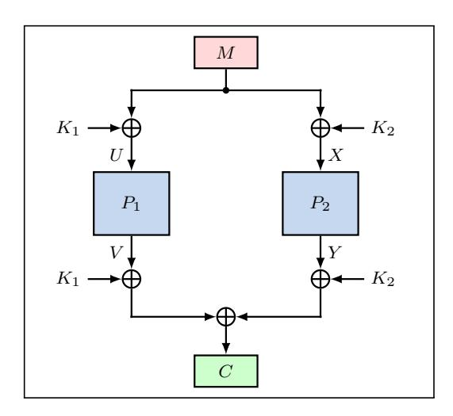
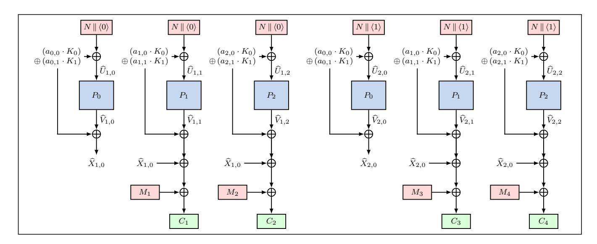
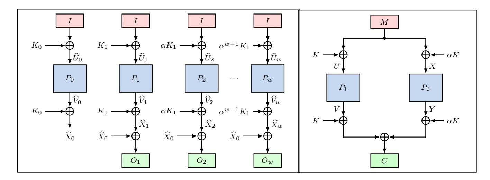
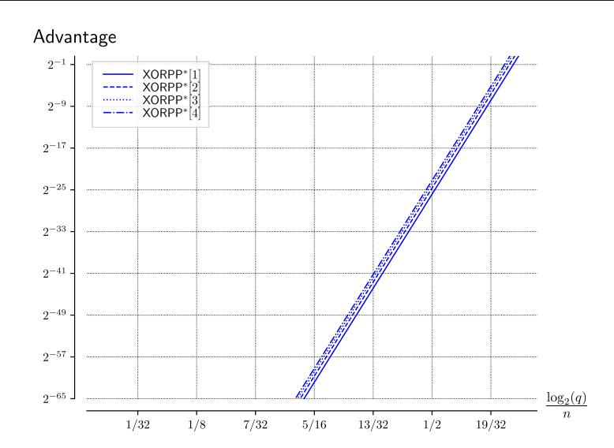
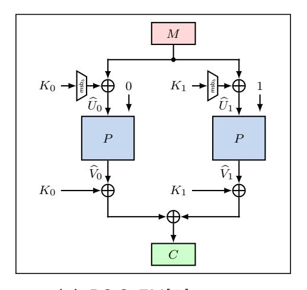
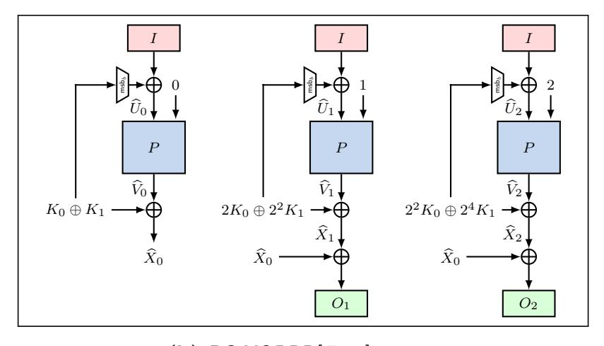

{0}------------------------------------------------

### CENCPP<sup>∗</sup> – Beyond-birthday-secure Encryption from Public Permutations

Arghya Bhattacharjee · Avijit Dutta · Eik List · Mridul Nandi

April 18, 2022

Abstract Public permutations have been established as important primitives for the purpose of designing cryptographic schemes. While many such schemes for authentication and encryption have been proposed in the past decade, the birthday bound in terms of the primitive's block length n has been mostly accepted as the standard security goal. Thus, remarkably little research has been conducted yet on permutation-based modes with higher security guarantees. At CRYPTO'19, Chen et al. showed two constructions with higher security based on the sum of two public permutations. Their work has sparked increased interest in this direction by the community. However, since their proposals were domain-preserving, the question of encryption schemes with beyond-birthday-bound security was left open.

This work tries to address this gap by proposing CENCPP<sup>∗</sup> , a nonce-based encryption scheme from public permutations. Our proposal is a variant of Iwata's block-cipher-based mode CENC that we adapt for public permutations, thereby generalizing Chen et al.'s Sum-of-Even-Mansour construction to a mode with variable output lengths. Like CENC, our proposal enjoys a

A. Bhattacharjee Indian Statistical Institute, Kolkata, India bhattacharjeearghya29(at)gmail.com.

A. Dutta Institute of Advancing Intelligence, TCG-CREST, Kolkata, India avirocks.dutta13(at)gmail.com.

E. List Bauhaus-Universität Weimar, Weimar, Germany eik.list(at)uni-weimar.de M. Nandi Indian Statistical Institute, Kolkata, India mridul.nandi(at)gmail.com.

{1}------------------------------------------------

comfortable rate-security trade-off that needs w + 1 calls to the primitive for w primitive outputs. We show a tight security level for up to O(22n/3/w<sup>2</sup> ) primitive calls. While the term of w ≥ 1 can be arbitrary, two independent keys suffice. Beyond our proposal of CENCPP<sup>∗</sup> in a generic setting with w + 1 independent permutations, we show that only log<sup>2</sup> (w + 1) bits of the input for domain separation suffice to obtain a single-permutation variant with a security level of up to O(22n/3/w<sup>4</sup> ) queries.

Keywords symmetric-key cryptography · permutation · provable security · CENC · SoEM.

Mathematics Subject Classification (2010) 94A60

## 1 Introduction

Permutation-based cryptography has become an important branch of symmetric-key cryptography. Permutations spare the cryptographer from the task of designing and analyzing a secure key schedule. Permutations have a long history in many applications. For example, the eSTREAM candidate Salsa [\[1\]](#page-39-0) already allowed hashing, expansion, and encryption based on a permutation. After Keccak's selection as the SHA-3 standard [\[37\]](#page-41-0), the number of proposed permutations and the number of schemes built upon them has surged. Nowadays, various schemes exist, few for hashing and authentication like Chaskey [\[34\]](#page-40-0), but many more for authenticated encryption, where many AE schemes are based on the Duplex construction [\[3\]](#page-39-1).

The security of many block-cipher-based modes, such as GCM [\[30\]](#page-40-1) or OCB3 [\[28\]](#page-40-2) is limited by the birthday bound of the primitive's state size (usually indicated by n bits). This limitation renders the privacy guarantees void when some internal collision occurs, which happens with non-negligible probability after O(2n/<sup>2</sup> ) blocks have been processed under the same key. Modes with higher security guarantees appear helpful for cases where smaller primitives must be used. As a response, the cryptographic community has proposed various modes with higher security over the previous decades, such as CENC [\[24\]](#page-40-3). Many more modes have been proposed in the domain of MACs and fixedoutput-length PRFs, that includes designs like PMAC<sup>+</sup> [\[42\]](#page-41-1), Sum-ECBC [\[41\]](#page-41-2), 3kf9 [\[43\]](#page-41-3), LightMAC\_Plus [\[35\]](#page-41-4), or the Sum of GCM constructions [\[27\]](#page-40-4), many of which could be generalized under the framework of Double-block-Hash-then-Sum designs [\[12\]](#page-39-2). The rise of tweakable block ciphers (TBCs) [\[29\]](#page-40-5), that take a tweak as an additional public input, allowed the construction of further modes with enhanced security guarantees, such as ΘCB3 [\[28\]](#page-40-2) or OTR [\[33\]](#page-40-6).

For permutation-based modes, the birthday-bound limitation is often tolerated, e.g. in Farfalle [\[2\]](#page-39-3), or Elephant [\[4\]](#page-39-4), or OPP [\[19\]](#page-40-7) and compensated by the usage of larger permutations. However, birthday-bound-secure permutationbased modes are not useful in practice if the underlying permutation size is small. For example, a birthday-bound-secure permutation-based mode instantiated with PHOTON [\[22\]](#page-40-8) of state size 100 bits or SPONGENT [\[6\]](#page-39-5) of state size 

{2}------------------------------------------------

88 bits, gives only 50 (resp. 44) bits of security. At CRYPTO'19, Chen et al. [9] initiated a line of research for fixed output-length PRFs with beyond-birthday-bound security. They proposed two designs: the Sum-of-Even-Mansour constructions (SoEM) and the Sum of Key-alternating Ciphers (SoKAC), with proofs for up to  $O(2^{2n/3})$  queries. The single-primitive variants were revisited by Nandi [36] and Chakraborti et al. [7], respectively. More importantly, the latter work proposed PDM-MAC, a version of SoKAC that needed only a single permutation and its inverse, as well as only a single key while maintaining security for up to  $O(2^{2n/3})$  queries.

Besides those stateless deterministic constructions, at least two nonce-based PRFs for variable-length inputs with higher security exist. In [7], Chakraborti et al. also proposed PDM\*MAC, which extends PDM-MAC to variablelength inputs by adding a polynomial hash of the message in the middle. At Africacrypt 2020, Dutta et al. [17] introduced  $\mathsf{nEHtM}_p$ , a variant of Enhanced Hash-then-MAC from public permutations. Both PDM\*MAC and  $nEHtM_p$  are nonce-based 2n/3-bit-secure MACs. In the long run, however, the question will be to build more secure authenticated encryption schemes. For this purpose, at least equally secure encryption modes are necessary. The constructions above can produce only fixed-length outputs. Modes with security beyond the birthday bound are desirable for settings that are bound to small primitives but need higher security. One can use a fixed-output-length PRF repeatedly by changing the input for every block. However, this would imply a rate of 1/2, e.g. for SoEM or PDM-MAC in counter mode. Therefore, the task of designing a variable-output-length encryption scheme with comparable security and higher efficiency is still open.

In this work, we propose  $CENCPP^*[w]$ , a mode of operation, built from n-bit permutations with  $O(2^{2n/3}/w^2)$  security where w is a small user-adjustable integer that represents a trade-off between security and efficiency. It is a variableoutput-length version of SoEM22 that adapts Iwata's block-cipher-based mode CENC [24]. CENCPP\* can be instantiated directly with usual permutations and requires only two independent keys for variable sizes. While our generic construction CENCPP\*[w] assumes (w+1) independent permutations, we suggest a variant that needs only a single public permutation while sacrificing only  $\log_2(w+1)$  bits of the input space for separating domains. We derive domain-separated single-primitive variants of SoEM and CENCPP\*, that we call DS-SoEM and DS-CENCPP[w], and show their security. We argue that two independent keys are necessary and sufficient for our security guarantees by providing distinguishers for all constructions in  $O(2^{n/2})$  queries if they used a single key or a simple key-scheduling approach. Moreover, we describe distinguishers in  $O(2^{2n/3})$  queries to show that the security is effectively tight except for the logarithmic factor in w.

Table 1 compares our proposals with beyond-birthday-secure PRFs from the literature that are built upon public permutations. Although no standalone parallelizable encryption mode from permutations seems to exist, our mode is not a novum; the encryption procedures inside many permutation-based

{3}------------------------------------------------

authenticated encryption schemes, as in Elephant [4], OPP [19], Minalpher [40], etc. can be seen as such. We added them as well as SoEM and PDM-MAC in counter mode for comparison.

To compare their state sizes, let k,  $\nu$ , and c denote the length of keys, nonces, and counters in bits, respectively. Elephant-like modes have  $\min(n/2, k)$ -bit security and need  $2n+\nu+c$  bits of state size:  $\nu+c$  bits for the nonce and counter input, n bits for the mask derived from the key, and n bits for the current block. A similar argument holds for Duplex-based constructions, which need only 2n bits of state for  $\min(n/2, k)$ -bit security. In contrast, the previously proposed PRFs with beyond-birthday-bound security need more memory. For example, SoEM and SoKAC21 need 4n bits each: 2n bits for the keys and 2n bits for the state. With a single key, PDM-MAC could reduce the memory to 3n bits. CENCPP and DS-CENCPP needs 2n bits for the state, 2n bits for two keys, and  $\nu+c$  bits for nonce and counter. It would be desirable to further reduce those figures in future work.

Hereafter, Section 2 recalls preliminaries before Section 3 defines CENCPP\*. We employ two different keys for security and show that it is necessary to combine them for most primitive calls. We show that simpler key schedulings would lead to a birthday-bound distinguisher in Section 4. Next, we analyze the security of the generic CENCPP\* construction in Section 5. In Section 6, we propose domain-separated variants of SoEM and CENCPP\*, called DS-SoEM and DS-CENCPP. We provide a design rationale and distinguishers on weaker variants in Section 7. We analyze the security of DS-CENCPP and DS-SoEM in Section 8.1 and 8.2, respectively. Section 9 concludes.

## <span id="page-3-0"></span>2 Preliminaries

In general, we will use lowercase letters x,y for indices and integers, uppercase letters X,Y for binary strings and functions, calligraphic uppercase letters  $\mathcal{X},\mathcal{Y}$  for sets and spaces. For an event  $\mathsf{E}$ , we write  $\mathsf{E}$  to denote its complementary event. We write  $\mathbb{F}_2$  for the finite field of characteristic 2 and  $\mathbb{F}_2^n$  for an n-element vector of elements in  $\mathbb{F}_2$ , or bit strings. We will use  $\mathbb{F}_2^n$  and  $\{0,1\}^n$  interchangeably in this paper.  $X \parallel Y$  denotes the concatenation of binary strings X and Y, and  $X \oplus Y$  for their bitwise XOR, i.e., addition in  $\mathbb{F}_2$ . We indicate the length of X in bits by |X| and write  $X_i$  for the i-th block. We denote by  $X \twoheadleftarrow \mathcal{X}$  that X is chosen uniformly at random from the set  $\mathcal{X}$ . We define  $\mathsf{Func}(\mathcal{X},\mathcal{Y})$  for the set of all functions  $F:\mathcal{X} \to \mathcal{Y}$ ,  $\mathsf{Perm}(\mathcal{X})$  for the set of all permutations  $P:\mathcal{X} \to \mathcal{X}$ . We define by  $X_1, \ldots, X_j \xleftarrow{\mathcal{X}} X$  an injective splitting of a string X into blocks of x-bit such that  $X = X_1 \parallel \cdots \parallel X_j, |X_i| = x$  for  $1 \le i \le j-1$ , and  $|X_j| \le x$ . For positive integer m, we use  $\mathcal{X}^{\le m} \stackrel{\text{def}}{=} \bigcup_{i=0}^m \mathcal{X}^i$ . By  $\langle X \rangle_n$ , we denote the encoding of an integer X into an n-bit string, e.g.,  $\langle 135 \rangle_8 = (10000111)_2$ . For any n-bit string X and non-negative integer  $x \le n$ ,

{4}------------------------------------------------

<span id="page-4-0"></span>Table 1: Comparison with existing PRFs from public permutations with beyond-birthday-bound security and few modes with birthday-bound security. Prim. = primitives, IF = inverse-free, n = state size (in bits), w = word parameter, d = domain size,  $\nu =$  nonce size, c = counter size, \* = variable size, security in  $O(\cdot)$  bits under n-bit keys,  $\bullet/- = \text{yes/no}$ ,  $\dagger$  = rate for the finalization only, (B)BB = (beyond-)birthday-bound.

|                                                           |                             | Efficiency           |                      |                |     | S   |                    |
|-----------------------------------------------------------|-----------------------------|----------------------|----------------------|----------------|-----|-----|--------------------|
| Construction                                              | $\# \mathrm{Prim.} \ \Big $ | #Keys<br>IF<br>Nonce | Rate                 | State size     | In  | Out | Security           |
| Fixed-length input, fixed                                 | ed-leng                     | th outpu             | ıt                   |                |     |     |                    |
| PDM-MAC [7]                                               | 1                           | 1                    | 1/2                  | 3n             | n   | n   | 2n/3               |
| SoEM22 [9]                                                | 2                           | 2 • -                | 1/2                  | 4n             | n   | n   | 2n/3               |
| SoKAC22 [9]                                               | 2                           | 2 • -                | 1/2                  | 4n             | n   | n   | 2n/3               |
| pEDM [18]                                                 | 1                           | 2 • -                | 1/2                  | 4n             | n   | n   | 2n/3               |
| DS-SoEM [Sect. 6]                                         | 1                           | 2 • -                | (n-d)/2n             | 4n             | n-d | n   | 2n/3               |
| Variable-length input,                                    | fixed-le                    | ength out            | tput                 |                |     |     |                    |
| $nEHtM_p$ [17]                                            | 1                           | 2 • •                | $1/2$ $^{\dagger}$   | 4n - 1         | *   | n   | 2n/3               |
| PDM*MAC [7]                                               | 1                           | 2 - •                | $1/2$ $^{\dagger}$   | 3n             | *   | n   | 2n/3               |
| 1K-PDM*MAC [7]                                            | 1                           | 1 - •                | $1/2$ $^{\dagger}$   | 3n             | *   | n   | 2n/3               |
| Variable-length input, variable-length output BB security |                             |                      |                      |                |     |     |                    |
| Elephant [4]                                              | 1                           | 1 • •                | 1                    | $2n + \nu + c$ | *   | *   | $\min(k, n/2)$     |
| Minalpher [40]                                            | 1                           | 1 • •                | 1                    | $2n + \nu + c$ | *   | *   | $\min(k, n/2)$     |
| OPP [19]                                                  | 1                           | 1 • •                | 1                    | $2n + \nu + c$ | *   | *   | $\min(k, n/2)$     |
| Variable-length input,                                    | variabl                     | e-length             | output, BBB security | y              |     |     |                    |
| CTR-SoEM22                                                | 2                           | 2 • -                | 1/2                  | $4n + \nu + c$ | *   | *   | 2n/3               |
| CTR-PDM-MAC                                               | 1                           | 1                    | 1/2                  | $3n + \nu + c$ | *   | *   | 2n/3               |
| CENCPP* [Sect. 3]                                         | w+1                         | 2 • •                | w/(w + 1)            | $4n + \nu + c$ | *   | *   | $2n/3 - \log(w^2)$ |
| DS-CENCPP [Sect. 6]                                       | 1                           | 2 • •                | w(n-d)/((w+1)n)      | $4n + \nu + c$ | *   | *   | $2n/3 - \log(w^4)$ |

we use  $\mathsf{lsb}_x(X)$  and  $\mathsf{msb}_x(X)$  to denote the x least significant and most significant bits of X, respectively. For  $q \in \mathbb{N}$ , we define  $[q] \stackrel{\text{def}}{=} \{1, \ldots, q\}$  and  $[0..q] \stackrel{\text{def}}{=} \{0, \ldots, q\}$ . Given a vector space  $\mathcal{V} \subseteq \mathbb{F}$  of a field  $\mathbb{F}$ , and an element  $\alpha \in \mathcal{K}$ , we define the space  $\alpha \cdot \mathcal{V} \stackrel{\text{def}}{=} \{\alpha \cdot V : V \in \mathcal{V}\}$ . We write  $\alpha \mathcal{V}$  or  $\alpha \cdot \mathcal{V}$  when the operation is clear from the context. Given two spaces  $\mathcal{V}, \mathcal{W} \subseteq \mathbb{F}$ , we define  $\mathcal{V} + \mathcal{W} \stackrel{\text{def}}{=} \{V \in \mathcal{V}, W \in \mathcal{W} : V + W\}$ , where addition is in  $\mathbb{F}$ .

A distinguisher **D** is an efficient Turing machine that interacts with a set of oracles that are black boxes to **D**. We write  $\Delta_{\mathbf{D}}(\mathcal{O}^1; \mathcal{O}^2)$  for the advantage of **D** to distinguish between  $\mathcal{O}^1$  and  $\mathcal{O}^2$ . Mathematically, it is expressed as

<span id="page-4-1"></span>
$$\Delta_{\mathbf{D}}(\mathcal{O}^1; \mathcal{O}^2) \stackrel{\text{def}}{=} \left| \Pr[\mathbf{D}^{\mathcal{O}^1} \Rightarrow 1] - \Pr[\mathbf{D}^{\mathcal{O}^2} \Rightarrow 1] \right|,$$
(1)

where the notation  $\mathbf{D}^{\mathcal{O}} \Rightarrow 1$  denotes that the distinguisher  $\mathbf{D}$  is given access to the oracle  $\mathcal{O}$  to which it interacts with and after the interaction it outputs

{5}------------------------------------------------

1. All probabilities in Equation (1) are defined over the random coins of the oracles and those of  $\mathbf{D}$ , if applicable.

We consider information-theoretic distinguishers **D**, whose resources are bounded only in terms of their maximal numbers of queries and blocks that they can ask to their available oracles. One can derive computation-theoretic counterparts straightforwardly.

PRF security refers to the maximal advantage of distinguishing the outputs of a scheme from random bits of the expected length. Given two non-empty sets or spaces  $\mathcal{X}, \mathcal{Y}$ , let  $F : \mathcal{K} \times \mathcal{X} \to \mathcal{Y}$  be a function,  $\rho \leftarrow \mathsf{Func}(\mathcal{X}, \mathcal{Y})$  and  $K \leftarrow \mathcal{K}$  be a secret key. Then, the PRF advantage of  $\mathbf{D}$  is defined as  $\mathbf{Adv}_F^{\mathsf{PRF}}(\mathbf{D}) \stackrel{\text{def}}{=} \Delta_{\mathbf{D}}(F; \rho)$ . We call  $\mathbf{D}$  a PRF distinguisher.

Similar to the PRF advantage, we define PRP advantage as follows: given a non-empty set or space  $\mathcal{X}$ , let  $E: \mathcal{K} \times \mathcal{X} \to \mathcal{X}$  be a bijective function,  $P \leftarrow \mathsf{Perm}(\mathcal{X})$  and  $K \leftarrow \mathcal{K}$  be a secret key. Then, the PRP advantage of  $\mathbf{D}$  is defined as  $\mathbf{Adv}_E^{\mathsf{PRP}}(\mathbf{D}) \stackrel{\text{def}}{=} \Delta_{\mathbf{D}}(E; P)$ . We call  $\mathbf{D}$  a PRP distinguisher.

A nonce-based encryption scheme  $\Pi = (\mathcal{E}, \mathcal{D})$  is a tuple of algorithms for encryption and decryption with signatures  $\mathcal{E} : \mathcal{K} \times \mathcal{N} \times \mathbb{F}_2^* \to \mathbb{F}_2^*$  and  $\mathcal{D} : \mathcal{K} \times \mathcal{N} \times \mathbb{F}_2^* \to \mathbb{F}_2^*$ , where  $\mathcal{N}$  denotes a nonce space. The nonce  $N \in \mathcal{N}$  must not repeat over all encryption queries. Distinguishers that obey this requirement are called nonce-respecting. We assume that  $\Pi$  is correct, i.e., for all  $K, N, M \in \mathcal{K} \times \mathcal{N} \times \mathbb{F}_2^*$ , it holds that  $\mathcal{D}_K(N, \mathcal{E}_K(N, M)) = M$ . Let  $K \leftarrow \mathcal{K}$  and  $\rho : \mathcal{N} \times \mathbb{F}_2^* \to \mathbb{F}_2^*$  be a function that, on input (N, M), samples uniformly a random string C of the same length as the output length of  $\mathcal{E}_K$  for random  $K \leftarrow \mathcal{K}$ . The nE-security of a nonce-respecting distinguisher  $\mathbf{D}$  is defined as  $\mathbf{Adv}_{\Pi}^{\mathsf{nE}}(\mathbf{D}) \stackrel{\mathrm{def}}{=} \Delta_{\mathbf{D}}(\mathcal{E}; \rho)$ . We call  $\mathbf{D}$  a nE distinguisher.

In the ideal-permutation model, the distinguisher has one additional oracle  $P^{\pm}$  that provides access to the permutation P in for- and backward directions. This work studies the security notions such as PRF and nE security in the ideal-permutation model. We write  $\Pi[P]$  and  $\mathcal{E}[P]$ ,  $\mathcal{D}[P]$ , etc. to indicate that  $\Pi$  is based on a primitive P.

We have to parameterize our distinguishers in terms of the resources it can use. We write  $\mathbf{Adv}_F^X(q_c, \sigma, m) \stackrel{\text{def}}{=} \max_{\mathbf{D}} \{\mathbf{Adv}_F^X(\mathbf{D})\}$  to denote the maximal advantage over all X-distinguishers  $\mathbf{D}$  on F, where  $X \in \{\mathsf{PRF}, \mathsf{PRP}\}$ , that ask  $\leq q_c$  queries of  $\leq \sigma$  blocks in total to its oracles such that the maximum number of message blocks in a query is at most m. When we analyze constructions based on public permutations  $P_0, \ldots, P_w$  in the ideal-permutation model, we further use  $q_p$  for the number of queries to the primitive oracles, i.e., we write

$$\mathbf{Adv}_F^X(q_p, q_c, \sigma, m) \stackrel{\text{def}}{=} \max_{\mathbf{D}} \{ \mathbf{Adv}_F^X(\mathbf{D}) \}$$

to denote the maximal advantage over all X-distinguishers **D** on F that ask  $\leq q_p$  primitive queries,  $\leq q_c$  construction queries of  $\leq \sigma$  blocks in total to

{6}------------------------------------------------

its oracles such that the maximum number of message blocks in a query is at most m. Since we consider information-theoretic distinguishers, we will not consider their time parameter t in defining their advantages. However, based on contexts, we omit some resources in defining the adversarial advantage. W.l.o.g., we assume that  $\mathbf{D}$  never asks queries to which it already knows the answer.

The H-coefficient technique is a proof method by Patarin [38,39] that was modernized by Chen and Steinberger [8]. A distinguisher **D** interacts with oracles  $\mathcal{O}^1$  and obtains outputs from a real world  $\mathcal{O}_{\text{real}}$  or an ideal world  $\mathcal{O}_{\text{ideal}}$ . The results of its interaction are collected in a transcript  $\tau$ . The oracles can sample random coins before the experiment (often a key or an ideal primitive that is sampled beforehand) and are then deterministic [8]. We choose two random variables  $\Theta_{\text{real}}$  for the distribution of transcripts in the real world and correspondingly  $\Theta_{\text{ideal}}$  for that in the ideal world, respectively. A transcript  $\tau$  is attainable if **D** can observe  $\tau$  with non-zero probability in the ideal world. Let Att denote the set of all attainable transcripts. The Fundamental Lemma of the H-coefficients technique, whose proof can be found, e.g., in [8,38], states that we can split the set Att into two disjoint sets GOODT and BADT and bound the distinguishing advantage as:

<span id="page-6-3"></span>**Lemma 1 ([38])** Assume, there exist  $\epsilon_1, \epsilon_2 \geq 0$  s. t. for any transcript  $\tau \in \text{GOODT}$ , it holds  $\frac{\Pr[\Theta_{\text{real}} = \tau]}{\Pr[\Theta_{\text{ideal}} = \tau]} \geq 1 - \epsilon_1$  and  $\Pr[\Theta_{\text{ideal}} \in \text{BADT}] \leq \epsilon_2$ . Then, for all distinguishers **D**, it holds that  $\Delta_{\mathbf{D}}(\mathcal{O}_{\text{real}}; \mathcal{O}_{\text{ideal}}) \leq \epsilon_1 + \epsilon_2$ .

The technique has been generalized by Hoang and Tessaro [23] in their expectation method, which allowed them to derive the Fundamental lemma as a corollary.

<span id="page-6-1"></span>**Lemma 2** Let  $d \geq 0$  be a positive integer and  $K_0, K_1 \leftarrow \{0,1\}^n$  be two independent *n*-bit random variables. Let  $\mathbf{A}_{2\times 2} = (a_{ij}) \in \{0,1\}^n$  be a non-singular matrix. Then for any  $b_1 \in \{0,1\}^{n-d}$  and for any  $b_2 \in \{0,1\}^n$ 

$$\Pr\left[\mathsf{msb}_{n-d}(a_{0,0}\cdot K_0 \oplus a_{0,1}\cdot K_1) = b_1, (a_{1,0}\cdot K_0 \oplus a_{1,1}\cdot K_1) = b_2\right] = \frac{2^d}{2^{2n}}.$$

*Proof.* Let us consider the two equations

<span id="page-6-2"></span>
$$\begin{cases} a_{0,0} \cdot K_0 \oplus a_{0,1} \cdot K_1 = b_1 || \langle \alpha \rangle_d \\ a_{1,0} \cdot K_0 \oplus a_{1,1} \cdot K_1 = b_2 \end{cases},$$

where  $\alpha \in \{0,1\}^d$ . Now, the number of solutions to the above system of equations is 1. Therefore, by varying the last d bits of the constant of the first equations to its all possible choices, we have total  $2^d$  many solutions to the original system of equations and hence the result follows.

A simple corollary of the above result yields the following:

<span id="page-6-0"></span><sup>&</sup>lt;sup>1</sup> The oracle  $\mathcal{O}$  could be a sequence of multiple oracles.

{7}------------------------------------------------

Lemma 3 Let A2×<sup>2</sup> = (aij ) ∈ {0, 1} <sup>n</sup> be a non-singular matrix. For any b1, b<sup>2</sup> ∈ {0, 1} n

$$\Pr\left[K_0, K_1 \leftarrow \{0, 1\}^n : \mathbf{A} \cdot (K_0, K_1)^\top = (b_1, b_2)^\top\right] = 2^{-2n}.$$

Proof. This result simply follows from Lemma [2](#page-6-1) by setting d = 0.

<span id="page-7-1"></span>Lemma 4 Let 0 ≤ p<sup>i</sup> ≤ 1 for i = 1, . . . , n. Then, we have

$$\prod_{i=1}^{n} (1 - p_i) \le 1 - \sum_{i=1}^{n} p_i + \sum_{1 \le i < j \le n} p_i p_j.$$

Proof. We prove the result by induction on n. The result holds true for n = 1, 2. Let the result holds true for n = m. We prove the result for n = m + 1. Therefore,

$$\prod_{i=1}^{m+1} (1 - p_i) = \prod_{i=1}^{m} (1 - p_i)(1 - p_{m+1})$$

$$\leq (1 - \sum_{i=1}^{m} p_i + \sum_{1 \leq i < j \leq m} p_i p_j)(1 - p_{m+1})$$

$$= (1 - \sum_{i=1}^{m+1} p_i + \sum_{1 \leq i < j \leq m+1} p_i p_j) + \sum_{1 \leq i < j \leq m} p_i p_j p_{m+1}$$

$$\leq (1 - \sum_{i=1}^{m+1} p_i + \sum_{1 \leq i < j \leq m+1} p_i p_j),$$

which proves the result for n = m + 1 and hence we prove the result.

# <span id="page-7-0"></span>3 The CENCPP<sup>∗</sup> Mode

This section defines a generic CENC construction that we call CENCPP<sup>∗</sup> . Standing on the shoulders of existing constructions, we start with the necessary details of SoEM and CENC.

# 3.1 SoEM

At CRYPTO'19, Chen et al. [\[9\]](#page-39-6) proposed SoEM (Sum of Even-Mansour constructions) and SoKAC (Sum of Key-alternating Ciphers). Both designs represent fixed-length PRFs which they provided analyses for up to O(22n/<sup>3</sup> ) queries for both. An improved analysis that showed subtleties of the proof of SoKAC21 was presented later in [\[36\]](#page-41-5). The former sums the results of two single-round Even-Mansour ciphers; the latter is a variant of Encrypted Davies-Meyer [\[31\]](#page-40-12) from public instead of keyed primitives.

{8}------------------------------------------------

<span id="page-8-0"></span>

Fig. 1: The construction SoEM22 by Chen et al. [9].

Chen et al. parametrized their constructions as  $\mathsf{SoEM}\lambda\kappa$  and  $\mathsf{SoKAC}\lambda\kappa$ , where  $\lambda$  denoted the number of permutations, and  $\kappa$  the number of keys. Figure 1 illustrates  $\mathsf{SoEM22}$ , which will be relevant in this work. Both modes need two calls to the independent permutations. Moreover,  $\mathsf{SoEM}$  demanded two independent keys. Chen et al. also studied  $\mathsf{SoEM12}$  with a single permutation:  $P(M \oplus K_1) \oplus K_1 \oplus P(M \oplus K_2) \oplus K_2$ , and  $\mathsf{SoKAC12}$  as  $P(P(M \oplus K_1) \oplus K_2) \oplus K_1 \oplus P(M \oplus K_1) \oplus K_2$ , and showed distinguishers with  $O(2^{n/2})$  queries for both. However, Chakraborti et al. [7] showed that the distinguisher on the latter may be incorrect and  $\mathsf{SoKAC12}$  could offer a security bound of  $\Omega(2^{2n/3})$  (cf. [18]).

#### 3.2 **CENC**

CENC is a nonce-based block-cipher mode that generalizes the sum of permutations by Iwata [24]. It uses the nonce concatenated with a counter as block-cipher input, splits each sequence of w message blocks into chunks, and processes them by XORP.

In XORP, the message M is split into w blocks of n bits, for a small positive integer w. Let  $n, \nu, \mu$  be integers such that  $n = \nu + \mu$  and  $w + 1 \leq 2^{\mu}$ . Let  $E: \mathcal{K} \times \mathbb{F}_2^n \to \mathbb{F}_2^n$  be a block cipher, and let  $\mathcal{N} = \mathbb{F}_2^{\nu}$  be a nonce space. The remaining  $\mu$  input bits are used for a counter. Let  $K \in \mathcal{K}$  be a secret key and  $N \in \mathcal{N}$  be a nonce. Then,  $\mathsf{XORP}[E_K, w](N, s)$  computes a key stream  $S_1 \parallel \ldots \parallel S_w$  as

$$S_i \stackrel{\text{def}}{=} E_K(N \parallel \langle s \rangle_{\mu}) \oplus E_K(N \parallel \langle s + i \rangle_{\mu}), \text{ for } i \in [w].$$

Thus, it makes w+1 block-cipher calls with pairwise distinct inputs, where  $E_K(X \parallel \langle s \rangle_{\mu})$  with the starting value s of the counter is XORed to each of the other blocks.  $\mathsf{XORP}[E_K, w]$  can be used as a length-restricted encryption scheme by XORing its output to a message M of  $|M| \leq n \cdot w$  bits. The final chunk is simply truncated to the length of the final message block. We slightly

{9}------------------------------------------------



**Fig. 2:** Encryption of a message  $M = (M_1, ..., M_4)$  with CENCPP\* $[(P_0, P_1, P_2), 2]_{K_0, K_1}$ . The final chunk is truncated if its length is less than 2n bits. N is a nonce,  $K_0$  and  $K_1$  are independent secret keys and  $P_0$ ,  $P_1$ , and  $P_2$  independent permutations. In this figure,  $\widehat{U}_{i,j}$  (resp.  $\widehat{V}_{i,j}$ ) denotes the permutation input (resp. output) for the j-th invocation of the permutation in the i-th chunk. For the i-th chunk,  $\widehat{X}_{i,0}$  denotes  $\widehat{V}_{i,0} \oplus a_{i,0}K_0 \oplus a_{i,1}K_1$ .

adapt the definition by [24,26] to

$$\mathsf{XORP}[E_K, w] : \mathcal{N} \times \mathbb{F}_2^{\mu} \to (\mathbb{F}_2)^{n \cdot w},$$

where  $\mathsf{XORP}[E_K, w](N, i)$  uses  $N \parallel \langle i \rangle_{\mu}$ ,  $N \parallel \langle i+1 \rangle_{\mu}$ , ... as inputs to  $E_K$ . CENC concatenates several instances of  $\mathsf{XORP}[E_K, w]$  with pair-wise distinct inputs. Let  $M \in \mathbb{F}_2^*$  be a message s. t.  $(M_1 \parallel \ldots \parallel M_m) \xleftarrow{n} M$ . Let  $\ell = \lceil m/w \rceil$  denote the number of chunks. It must hold that  $\ell \cdot (w+1) < 2^{\mu}$ . Then

$$\mathsf{CENC}[E_K, w](N, M) \stackrel{\mathrm{def}}{=} \mathsf{msb}_{|M|} \left( \parallel_{i=0}^{\ell-1} \mathsf{XORP}[E_K, w] \left( N, i \cdot (w+1) \right) \right) \oplus M.$$

### 3.3 CENCPP\*

In the following, we adapt CENC to the public-permutation setting. Let  $\mathbf{A} = (a_{ij})$  be a  $(w+1) \times 2$  dimensional matrix such that each of its elements  $a_{ij}$  is an n-bit binary string. Let  $P_0, \ldots, P_w \in \mathsf{Perm}(\mathbb{F}_2^n)$  be permutations, and let  $K_0, K_1 \in \mathbb{F}_2^n$  be independent secret keys. We define  $\mathbf{P} \stackrel{\text{def}}{=} (P_0, \ldots, P_w)$  as shorthand form. Furthermore,  $\mathcal{D} \subseteq \mathbb{F}_2^\mu$  be a set of domains, s. t.  $n = \nu + \mu$ . For brevity, we define a key vector  $\mathbf{K} = (K_0, K_1)$ . We combine both keys  $K_0$  and  $K_1$  for the individual permutations as  $(a_{i,0} \cdot K_0) \oplus (a_{i,1} \cdot K_1)$  to generate the i-th round key  $K'_i$ , for all  $i \in [0..w]$ . In matrix notation, we write this as follows:

$$\mathbf{A} \cdot \mathbf{K} = \begin{bmatrix} a_{0,0} & a_{0,1} \\ a_{1,0} & a_{1,1} \\ \dots & \dots \\ a_{w,0} & a_{w,1} \end{bmatrix} \cdot \begin{bmatrix} K_0 \\ K_1 \end{bmatrix} = \begin{bmatrix} K'_0 \\ K'_1 \\ \vdots \\ K'_w \end{bmatrix}.$$

{10}------------------------------------------------

#### <span id="page-10-0"></span>**Algorithm 1** Definition of CENCPP\*.

```
101: function CENCPP*[\mathbf{P}, w, \mathbf{A}].\mathcal{E}_{\mathbf{K}}(N, M)
                                                                                                           301: function XORPP*[\mathbf{P}, w, \mathbf{A}]_{\mathbf{K}}(I)
                                                                                                           302: (K_0, K_1) \leftarrow \mathbf{K}
            (M_1,\ldots,M_m) \stackrel{n}{\leftarrow} M
102:
                                                                                                           303: (P_0, \ldots, P_w) \leftarrow \mathbf{P}
103: \ell \leftarrow \lceil m/w \rceil
             for i \leftarrow 0..\ell - 1 do
                                                                                                           304: L_0 \leftarrow (a_{0,0} \cdot K_0) \oplus (a_{0,1} \cdot K_1)
104:
                                                                                                                      \widehat{U}_0 \leftarrow I \oplus L_0
105:
               j \leftarrow i \cdot w
                                                                                                           305:
                                                                                                                       \widehat{X}_0 \leftarrow P_0(\widehat{U}_0) \oplus L_0
                (S_{j+1} \parallel \cdots \parallel S_{j+w})
106:
                                                                                                           306:
                       \leftarrow \mathsf{XORPP}^*[\mathbf{P}, w, \mathbf{A}]_{\mathbf{K}}(N \parallel \langle i \rangle_{\mu})
                                                                                                                       for \alpha \leftarrow 1..w do
107:
                                                                                                           307:
                                                                                                                          L_{\alpha} \leftarrow (a_{\alpha,0} \cdot K_0) \oplus (a_{\alpha,1} \cdot K_1)
108:
                for k \leftarrow j + 1..j + w do
                                                                                                           308:
                 C_k \leftarrow \mathsf{msb}_{|M_k|}(S_k) \oplus M_k
                                                                                                                          \widehat{U}_{\alpha} \leftarrow I \oplus L_{\alpha}
109:
                                                                                                           309:
                                                                                                                         \widehat{X}_{\alpha} \leftarrow P_{\alpha}(\widehat{U}_{\alpha}) \oplus L_{\alpha}
                                                                                                           310:
             return (C_1 \parallel \cdots \parallel C_m)
110:
                                                                                                                          O_{\alpha} \leftarrow \widehat{X}_{\alpha} \oplus \widehat{X}_{0}
                                                                                                           311:
                                                                                                           312: return O \leftarrow (O_1 \parallel \cdots \parallel O_w)
201: function CENCPP*[\mathbf{P}, w, \mathbf{A}].\mathcal{D}_{\mathbf{K}}(N, C)
202: return CENCPP*[\mathbf{P}, w, \mathbf{A}].\mathcal{E}_{\mathbf{K}}(N, C)
```

We call **A** the *key-scheduling matrix*. We adapt XORP to XORPP\* to note that it is based on the XOR of **public** permutations. For a key-scheduling matrix **A** of dimension  $(w+1) \times 2$ , we define XORPP\*  $[\mathbf{P}, w, \mathbf{A}] : (\mathbb{F}_2^n)^2 \times \mathbb{F}_2^n \to (\mathbb{F}_2^n)^w$ , instantiated with w+1 permutations  $P_0, \ldots, P_w$ , a key space  $(\mathbb{F}_2^n)^2$  and the key-scheduling matrix **A**. We write XORPP\* as short for XORPP\*  $[\mathbf{P}, w, \mathbf{A}]$  when w, key-scheduling matrix **A** and the permutations **P** are clear from the context. Given that the permutations are independent, CENCPP\* uses the same input  $(N \parallel \langle i \rangle_{\mu})$  for each permutation in one call of XORPP\*. We define encryption and decryption of the nonce-based mode CENCPP\* as given in Algorithm 1.

#### 3.4 Discussion

Further constructions with beyond-birthday security from public permutations are naturally possible. However, our proposal CENCPP\* seems efficient. Instantiating CENC with a two-round Even-Mansour construction could be a generic approach that can provide roughly the security of the primitive, i.e., 2n/3 bits, and would employ  $\lceil 2\frac{w+1}{w} \rceil$  calls to the permutation for w message blocks. In their proposal of AES-PRF, Mennink and Neves increased the performance of their construction [32] by instantiating it with five-round AES. However, its security margin is thin [14] and improved cryptanalysis could break it in the near future.

More related works exist in the secret-permutation setting. Cogliati and Seurin [10] showed that a variant of EDM with a single keyed permutation – that is  $E_K(E_K(M) \oplus M)$  – possesses roughly  $O(2^{2n/3})$  security. The work by Guo et al. [21] followed this direction, showing  $O(2^{2n/3}/n)$  security for the single-permutation variants of EDM and its dual EDMD–  $E_K(E_K(M)) \oplus E_K(M)$ . Moreover, they proved a similar security result also for the sum from a single permutation and its inverse, SUMPIP:  $E_K(M) \oplus E_K^{-1}(M)$ . The Decrypted Wegman-Carter Davies-Meyer construction [13] would also possess a security bound of  $O(2^{2n/3})$  but limited the input space to 2n/3 bits. SUMPIP could

{11}------------------------------------------------



Fig. 3: Example of using a weak key schedule for XORPP\* (left) and SoEM' (right).

retain beyond-birthday-bound security with public permutations, i.e.

$$P(M \oplus K_1) \oplus K_1 \oplus P^{-1}(M \oplus K_2) \oplus K_2$$

could be secure beyond  $O(2^{n/2})$  queries when using a public primitive P. MACs from public permutations obtained a high level of attention recently. In [7], Chakraborti et al. proposed a PDM-MAC

$$P^{-1}(P(K \oplus M) \oplus K \oplus 2K \oplus M) \oplus 2K$$
,

which eliminated the need for a second key from SUMPIP. They also considered a nonce-based variable-input-length PRF, PDM\*MAC, and a single-key version 1K-PDM\*MAC. All of their constructions maintained a security bound of  $O(2^{2n/3})$ . However, the instantiations needed both forward and inverse of the permutation, which is less practical for a permutation-based design compared to the construction that invokes the permutation only in forward direction.

In [18], Dutta et al. studied the security pEDM, a strongly related variant of SoKAC12, which uses the single permutation only in forward direction:

$$P(P(M \oplus K_1) \oplus (M \oplus K_1) \oplus K_2) \oplus K_1$$
,

also with  $O(2^{2n/3})$  security. These constructions consider related aspects, but are fixed-output-length PRFs, whereas CENCPP\* can encrypt messages of variable lengths. Comparing CENCPP\* with w=1, pEDM has the advantage of using only a single primitive. Though, the latter can evaluate the primitive calls in parallel and allows a better rate for greater w, whereas for an encryption with the latter, similar arguments as for a counter mode with a two-round Even-Mansour construction would hold.

# <span id="page-11-0"></span>4 Birthday-bound Distinguisher on $\mathsf{CENCPP}^*$ with Weak Key Scheduling

To derive the *i*-th round key  $L_i$  of CENCPP\*, we have  $L_i = (a_{i,0} \cdot K_0) \oplus (a_{i,1} \cdot K_1)$  for all  $i \in [0..w]$ , where  $\mathbf{A} = (a_{i,j}) \in \{0,1\}^n$  is the key-scheduling matrix of

{12}------------------------------------------------

dimension  $(w+1) \times 2$  and  $K_0, K_1$  are two independent *n*-bit keys. Using SoEM as a base, it is tempting to use a key scheduling of  $K_0, K_1, \alpha K_1, \alpha^2 K_1, \ldots$ , which omits the addition of  $K_0$  for all subsequent permutation calls. In matrix form, this key scheduling would produce

$$\underbrace{\begin{bmatrix} \texttt{1} \ \texttt{0} \ \texttt{0} \ \cdots \ \texttt{0} \\ \texttt{0} \ \texttt{1} \ \alpha \cdots \alpha^{w-1} \end{bmatrix}^\top}_{\mathbf{A}^\top} \cdot \begin{bmatrix} K_0 \\ K_1 \end{bmatrix} \ .$$

While the latter appears much simpler, after transposing its matrix form to w+1 rows, it contains dependent rows. Let two dependent rows be denoted as  $\mathbf{A}_i$  and  $\mathbf{A}_j$  in the key-scheduling matrix  $\mathbf{A}$  such that they are linearly dependent, i.e.,  $\mathbf{A}_i = \alpha \mathbf{A}_j$  for some non-zero  $\alpha \in \{0,1\}^n$ . Then, we have  $L_i = \alpha L_j$  for some  $\alpha \in \{0,1\}^n \setminus \{0^n\}$ . We use the idea of canceling dependent outputs and thus reduce the distinguishing problem to that for single-key SoEM. Since the steps are not intuitive, we illustrate the birthday-bound distinguisher of CENCPP\* in the following. First, we show that we can reduce the security of CENCPP\* to the security of SoEM with the key usage of  $(L_i, \alpha L_i)$  for some non-zero  $\alpha \in \{0,1\}^n$  when  $\mathbf{A}_i$  and  $\mathbf{A}_j$  rows of  $\mathbf{A}$  are linearly dependent. We denote this variant of SoEM as SoEM'  $\stackrel{\text{def}}{=}$  SoEM[ $P_i, P_j$ ] $L_i, \alpha L_i$ .

## 4.1 Reduction to SoEM'

Suppose, **D** is an information-theoretic distinguisher on SoEM' and  $\tau = \{K\} \cup \tau_p \cup \tau_c$  is a transcript, consisting of the key, the primitive-query transcript  $\tau_p$  with  $q_p$  primitive queries and their corresponding responses  $(U^i, V^i)$  to  $P_1$  and  $(X^k, Y^k)$  to  $P_2$  each, as well as the construction-query transcript  $\tau_c$  with  $q_c$  construction queries and their corresponding responses  $(M^j, C^j)$ . After the interaction, **D** is given  $\tau$ , including the key  $K \leftarrow \mathbb{F}_2^n$ , and sees  $C = W \oplus Z$  where

$$W \stackrel{\text{def}}{=} P_1(M \oplus K) \oplus K$$
 and  $Z \stackrel{\text{def}}{=} P_2(M \oplus (\alpha \cdot K)) \oplus (\alpha \cdot K)$ .

In comparison, a distinguisher  $\mathbf{D}'$  on  $\mathsf{CENCPP}^*$   $[P_0, P_i, P_j]_{K_0, K_1}$  with key schedule as above can compute  $C_i \oplus C_j = (X_i \oplus X_0) \oplus (X_j \oplus X_0) = W \oplus Z = C$ . Thus,

$$\mathbf{Adv}^{\mathsf{PRF}}_{\mathsf{CENCPP}^*}(\mathbf{D}') \geq \mathbf{Adv}^{\mathsf{PRF}}_{\mathsf{SoEM}'}(\mathbf{D})\,,$$

where **D** and **D**' ask the same number of construction queries  $q_c$  and primitive queries  $q_p$  to each of the primitives. Note that the distinguisher **D**' knows the values of i and j from the knowledge of the key-scheduling algorithm.

{13}------------------------------------------------

#### 4.2 Birthday-bound Attack on SoEM'

Let  $\mathcal{U}$  and  $\mathcal{V}$  be two subspaces of  $\mathbb{F}_2^n$ . Then, for every  $\alpha \in \mathbb{F}_2^n$ ,  $\mathcal{U} + \mathcal{V} \stackrel{\text{def}}{=} \{u + v | u \in \mathcal{U}, v \in \mathcal{V}\}$  and  $\alpha \cdot \mathcal{V} \stackrel{\text{def}}{=} \{\alpha \cdot v | v \in \mathcal{V}\}$  are also subspaces. We write  $\mathbf{0}$  and  $\mathbf{1}$  for the neutral elements of addition and multiplication, respectively. If  $\{x_1, x_2, \dots, x_{n/2}\}$  is a basis of  $\mathcal{V}$ , then  $\{\alpha \cdot x_1, \alpha \cdot x_2, \dots, \alpha \cdot x_{n/2}\}$  is also a basis of  $\alpha \cdot \mathcal{V}$ , where  $\alpha \neq \mathbf{0}$ .

**Fact 1.** Let  $\mathcal{U}$  and  $\mathcal{V}$  be two subspaces of  $\mathbb{F}_{2^n}$ . If their intersection contains only the zero element  $\mathcal{U} \cap \mathcal{V} = \{\mathbf{0}\}$ , we say that  $\mathcal{U}$  and  $\mathcal{V}$  have zero intersection. If both have zero intersection, it holds that  $\dim(\mathcal{U} + \mathcal{V}) = \dim(\mathcal{U}) + \dim(\mathcal{V})$ . Equivalently, one can say that the basis elements of  $\mathcal{U}$  and  $\mathcal{V}$  are linearly independent.

<span id="page-13-0"></span>**Theorem 1** Let  $\alpha \notin \{0,1\}$ . For every  $1 \leq i \leq n/2$ , there exists a subspace  $\mathcal{V} \subseteq \mathbb{F}_2^n$  with  $\dim(\mathcal{V}) = i$  such that  $\mathcal{V}$  and  $\alpha \cdot \mathcal{V}$  have zero intersection. In particular, there is a subspace  $\mathcal{V}$  of dimension n/2 such that  $\mathcal{V} + \alpha \cdot \mathcal{V} = \mathbb{F}_2^n$ .

*Proof.* We prove Theorem 1 by induction on i. For i=1, the statement is obvious by choosing non-zero  $x_1$ . For  $1 \le i < n/2$ , suppose, we have picked  $x_1, x_2, \dots, x_i$  such that all elements from  $\{x_1, x_2, \dots, x_i, \alpha \cdot x_1, \alpha \cdot x_2, \dots \alpha \cdot x_i\}$  are linearly independent. Let

$$S_i \stackrel{\text{def}}{=} \mathbf{span}(\{x_1, x_2, \cdots, x_i, \alpha \cdot x_1, \alpha \cdot x_2, \cdots, \alpha \cdot x_i\}),$$

i.e., its span. Moreover, we define  $\mathcal{T}_i$  as short form of

$$\mathcal{T}_i \stackrel{\text{def}}{=} \mathcal{S}_i \cup (\alpha^{-1} \cdot \mathcal{S}_i) \cup ((1+\alpha)^{-1} \cdot \mathcal{S}_i)$$
.

It holds that  $|\mathcal{T}_i| \leq 3 \cdot 2^{n-2} < 2^n$ . When we choose a new element  $x_{i+1} \notin \mathcal{T}_i$ , it follows from the definition of  $\mathcal{T}_i$  that  $x_{i+1}$ ,  $\alpha \cdot x_{i+1}$  and  $(1+\alpha) \cdot x_{i+1}$  are not in  $\mathcal{S}_i$ . Hence, the elements

$$\{x_1, x_2, \cdots, x_{i+1}, \alpha \cdot x_1, \alpha \cdot x_2, \cdots, \alpha \cdot x_{i+1}\}$$

are linearly independent, which concludes the proof. Note that such a basis can be constructed efficiently, element by element.  $\Box$ 

Distinguisher on SoEM': Next, we demonstrate a distinguisher on SoEM'. Given the observation above, we can first construct a vector space  $\mathcal{X}$  of dimension n/2 such that  $\mathcal{X} + (1 + \alpha) \cdot \mathcal{X} = \mathbb{F}_2^n$ . Let  $\mathcal{M} = (1 + \alpha)^{-1} \cdot \mathcal{X}$ . So,  $\mathcal{M} + \mathcal{X} = \mathbb{F}_2^n$  and hence there exists  $X \in \mathcal{X}$  and  $M \in \mathcal{M}$  with  $M + X = \alpha \cdot K$ . Let  $\mathcal{U} = \alpha^{-1} \cdot \mathcal{X}$ . Then

$$\mathcal{U} = \alpha^{-1} \cdot (1 + \alpha) \cdot \mathcal{M} = (1 + \alpha^{-1}) \cdot M$$
.

Thus,  $M + K = \alpha^{-1} \cdot X + (1 + \alpha^{-1}) \cdot M \in \mathcal{U}$  and there exists  $M \in \mathcal{M}, U \in \mathcal{U}$ , and  $X \in \mathcal{X}$  such that  $M \oplus U = K$  and  $M \oplus X = \alpha K$ .

{14}------------------------------------------------

Let  $P_1(U) = V$  and  $P_2(X) = Y$ . Then,  $C = \mathsf{SoEM}'(M) = (1 \oplus \alpha) \cdot K \oplus V \oplus Y$ . We use shorthand notations  $V^{\oplus c}$ ,  $Y^{\oplus c}$  and  $C^{\oplus c}$  to denote  $P_1(U \oplus c)$ ,  $P_2(X \oplus c)$  and  $\mathsf{SoEM}'(M \oplus c)$  respectively for some non-zero  $c \in \{0,1\}^n$ . It is easy to see that for any c, it holds that

$$C^{\oplus c} = (1 \oplus \alpha) \cdot K \oplus V^{\oplus c} \oplus Y^{\oplus c}$$

and hence  $C \oplus C^{\oplus c} = (V \oplus V^{\oplus c}) \oplus (Y \oplus Y^{\oplus c})$ . We use this observation to complete our attack. Suppose that c and d are two distinct constants outside of  $\mathcal{U}$ ,  $\mathcal{X}$ , and  $\mathcal{M}$ . Then, the distinguisher can proceed as follows:

- 1. It queries all values  $U_i \in \mathcal{U}$ ,  $U_i \oplus c$  and  $U_i \oplus d$  to its primitive oracle  $P_1$ , and stores them together with the corresponding responses  $V_i$ ,  $V_i^{\oplus c}$  and  $V_i^{\oplus d}$ .
- 2. Similarly, it queries all values  $X_i \in \mathcal{X}$ ,  $X_i \oplus c$  and  $X_i \oplus d$  to its primitive oracle  $P_2$ , and stores them together with the corresponding responses  $Y_i$ ,  $Y_i^{\oplus c}$  and  $Y_i^{\oplus d}$ .
- 3. Moreover, it queries all values  $M_i \in \mathcal{M}$ ,  $M_i \oplus c$  and  $M_i \oplus d$  to its construction oracle, and stores them together with the corresponding responses  $C_i$ ,  $C_i^{\oplus c}$  and  $C_i^{\oplus d}$ .
- 4. After making all queries as described above, it looks for triple (i, j, k) such that the following two equalities hold:

$$4.1 C_i \oplus C_i^{\oplus c} = (V_j \oplus V_j^{\oplus c}) \oplus (Y_k \oplus Y_k^{\oplus c}).$$
$$4.2 C_i \oplus C_i^{\oplus d} = (V_j \oplus V_j^{\oplus d}) \oplus (Y_k \oplus Y_k^{\oplus d}).$$

5. If there exists such triple (i, j, k), it outputs real and random otherwise.

## <span id="page-14-0"></span>5 Security Analysis of CENCPP\*

This section studies the nE security of CENCPP\*. Prior, we briefly revisit that of CENC.

## 5.1 Recalling the Security of CENC

The security of XORP: In [24], Iwata showed that CENC[w] is secure for up to  $2^{2n/3}/w$  message blocks as long as  $E_K$  is a secure block cipher. At Dagstuhl'07 [25], he added an attack that needed  $2^n/w$  queries, and showed  $O(2^n/w)$  security if the total number of primitive calls remained below  $\sigma < 2^{n/2}$ . He conjectured that CENC may be secure for up to  $2^n/w$  blocks. In [26], Iwata et al. confirmed that conjecture by a simple corollary from Patarin. We briefly recall their conclusion.

In [39, Theorem 6], Patarin showed the indistinguishability for the sum of multiple independent secret permutations under assumptions on the validity

{15}------------------------------------------------

of the Mirror Theory. [26] adapted this bound to upper bound the PRF security of XORP:

<span id="page-15-1"></span><span id="page-15-0"></span>
$$\mathbf{Adv}_{\mathsf{XORP}}^{\mathsf{PRF}}(q_c, t) \le \frac{w^2 q}{2^n} + \mathbf{Adv}_E^{\mathsf{PRP}}((w+1)q_c, t). \tag{2}$$

Theorem 3 in [26] conjectured for m being a multiple of w, where m is the maximum number of message blocks queried:

$$\mathbf{Adv}_{\mathsf{CENC}}^{\mathsf{nE}}(q_c, m, t) \le \frac{mwq_c}{2^n} + \mathbf{Adv}_E^{\mathsf{PRP}}\left(\frac{w+1}{w}mq_c, t\right). \tag{3}$$

Note that in Eqn. (2) and Eqn. (3), the authors considered computationally bounded distinguishers for which we included the time parameter t. Thus, CENC provided a convenient trade-off of w+1 calls per w message blocks with security for up to  $2^n/w$  calls to  $E_K$ . The proof sketch by [26] reduced the security of CENC to the proof of the sum of two permutations. At that time, the latter analysis relied on recursive arguments of Patarin's Mirror Theory that were subject to controversies. The work by Bhattacharya and Nandi [5] proved similar security for the generalized sum of permutations and CENC using the  $\chi^2$  method [11].

#### 5.2 The Security of CENCPP\*

In the following, let n, w be positive integers,  $P_0, \ldots, P_w \leftarrow \mathsf{Perm}(\mathbb{F}_2^n)$  be independent public permutations,  $K_0, K_1 \leftarrow \mathbb{F}_2^n$  be a pair of n-bit independent secret keys which are sampled uniformly at random from  $\mathbb{F}_2^n$ . Let  $\mathbf{A}$  be the key-scheduling matrix of dimension  $(w+1) \times 2$  such that each entry is an n-bit binary string. We write  $\mathbf{K} = (K_0, K_1)$  and  $\mathbf{P} = (P_0, \ldots, P_w)$  for brevity. Again, we conduct a two-step analysis, where we consider (1) the PRF security of XORPP\*  $[\mathbf{P}, w, \mathbf{A}]_{\mathbf{K}}$  and (2) the  $\mathbf{nE}$  security of CENCPP\*  $[\mathbf{P}, w, \mathbf{A}]_{\mathbf{K}}$ . Since the matrix  $\mathbf{A}$  is public, we omit it from the notation XORPP\*  $[\mathbf{P}, w, \mathbf{A}]_{\mathbf{K}}$  and CENCPP\*  $[\mathbf{P}, w, \mathbf{A}]_{\mathbf{K}}$  and simply write XORPP\*  $[\mathbf{P}, w]_{\mathbf{K}}$  and CENCPP\*  $[\mathbf{P}, w]_{\mathbf{K}}$ , as XORPP\* and CENCPP\*  $[\mathbf{P}, w]_{\mathbf{K}}$  as XORPP\* and CENCPP\*  $[\mathbf{P}, w]_{\mathbf{K}}$  as XORPP\*

<span id="page-15-2"></span>**Theorem 2** It holds that 
$$\mathbf{Adv}_{\mathsf{CENCPP}^*}^{\mathsf{nE}}(q_p, q_c, m) \leq \mathbf{Adv}_{\mathsf{XORPP}^*}^{\mathsf{PRF}}\left(q_p, \frac{m}{w}q_c\right)$$
.

*Proof.* Recall that, m is the maximum number of message blocks in all queries. Therefore, for a maximal number of message chunks  $\ell = \lceil m/w \rceil$ , CENCPP\* consists of the application of  $\ell$  instances of XORPP\*. We can replace XORPP\* by a random function  $\rho$  at the cost of

$$\mathbf{Adv}_{\mathsf{XORPP}^*}^{\mathsf{PRF}}\left(q_p, \frac{m}{w}q_c\right)$$
.

<span id="page-15-3"></span>Since the resulting construction is indistinguishable from random bits, Theorem 2 follows.

{16}------------------------------------------------

<span id="page-16-0"></span>

**Fig. 4:** Security of XORPP\*[w] when varying w, here with n = 64.

**Theorem 3** Let **A** be a matrix of  $(w+1) \times 2$  entries such that each of its elements is an *n*-bit binary string and all its rows are pairwise linearly independent. Let  $q_p + (w+1)q_c \leq 2^n/2(w+1)$ . It holds that

$$\begin{aligned} \mathbf{Adv}_{\mathsf{XORPP^*}}^{\mathsf{PRF}}(q_p,q_c) &\leq \frac{(w+1)^2 q_p^2 q_c}{2^{2n+1}} + \frac{4w q_p^2 q_c}{2^{2n}} + \frac{2w q_c^2 q_p}{2^{2n}} + \frac{w^2 q_c^2 q_p}{2^{2n}} + \frac{3w^2 q_p^2 q_c}{2^{2n+1}} \\ &+ \frac{3w^3 q_p^2 q_c^2}{2^{3n}} + \frac{(w+1)^2 q_c (q_p+q_c)^2}{2^{2n}} \,. \end{aligned}$$

The security for varying values of w is illustrated in Figure 4.

Corollary 1 CENCPP\* security results by combining Theorem 2 and Theorem 3 as follows:

$$\begin{split} \mathbf{Adv}_{\mathsf{CENCPP^*}}^{\mathsf{nE}}(q_p,q_c,m) &\leq \frac{2wmq_p^2q_c}{2^{2n}} + \frac{4mq_p^2q_c}{2^{2n}} + \frac{2q_pm^2}{w2^{2n}} + \frac{q_pm^2}{2^{2n}} + \frac{3wmq_p^2q_c}{2^{2n+1}} \\ &+ \frac{3wm^2q_p^2q_c^2}{2^{3n}} + \frac{4wmq_cq_p^2 + 8m^2q_pq_c^2}{2^{2n}} + \frac{4m^3q_c^3}{w2^{2n}} \,, \end{split}$$

where m is the maximum number of message blocks among all  $q_c$  queries and we used  $2w \ge w + 1$ .

Proof of Theorem 3. We fix a non-trivial information-theoretic deterministic distinguisher  $\mathbf{D}$  who is given access to (w+2) oracles in either of the real or ideal world. In the real world,  $\mathbf{D}$  is given access to the construction oracle  $\mathsf{XORPP}^*[\mathbf{P},w]_{\mathbf{K}}$  where  $\mathbf{K}=(K_0,K_1)$  is a pair of n-bit random keys and  $\mathbf{P}=(P_0,P_1,\ldots,P_w)$  is a tuple of w+1 many n-bit independent random permutations, and the primitive oracles  $\mathbf{P}=(P_0,\ldots,P_w)$ . In the ideal world,  $\mathbf{D}$  is given access to a random function, which answers each query of  $\mathbf{D}$  by w blocks of n bits uniform and independent random strings  $\mathbf{O}=(O_1,\ldots,O_w)$  and to the tuple of w+1 many independent n-bit random permutations  $\mathbf{P}=(P_0,P_1,\ldots,P_w)$ . Query to the construction oracle is called the construction query and to that of the primitive oracle is called the primitive query. We assume that  $\mathbf{D}$  can ask exactly  $q_c$  construction queries and  $q_p$  primitive queries

{17}------------------------------------------------

to each of primitive oracle  $P_{\alpha}$ ,  $\alpha \in [0..w]$ . For queries to each of the primitive oracle  $P_{\alpha}$ , **D** can either make a forward query  $U_{\alpha}$  to its primitive oracle  $P_{\alpha}$ and receives response  $V_{\alpha}$  or can make an inverse query  $V_{\alpha}$  to  $P_{\alpha}^{-1}$  and receives response  $U_{\alpha}$ . We summarize the interaction of the distinguisher **D** with the oracles in a transcript  $\tau$  which is partitioned into  $\tau = \tau_c \cup \tau_0 \cup \ldots \cup \tau_w$ , where each partial transcript captures the queries and responses from a particular oracle. The construction transcript contains the queries to and responses from the construction oracle:  $\tau_c = \{(I^1, \mathbf{O}^1), \dots, (I^{q_c}, \mathbf{O}^{q_c})\}$ , where  $\mathbf{O}^i = (O_1^i, \dots, O_w^i)$ . The primitive transcripts  $\tau_{\alpha} = \{(U_{\alpha}^1, V_{\alpha}^1), \ldots, (U_{\alpha}^{q_p}, V_{\alpha}^{q_p})\}$  contain exactly the queries to and responses from permutation  $P_{\alpha}$  for all  $\alpha \in [0..w]$ . Since **D** is non-trivial, we assume that  $\tau$  does not contain duplicate elements. After the interaction, we release the keys  $K_0, K_1$  to the distinguisher before it outputs its decision bit. In the real world  $(K_0, K_1)$  are the keys used in the construction, whereas in the ideal world they are sampled uniformly at random. Hence, the transcript  $\tau$  becomes  $\tau = \tau_c \cup \tau_0 \cup \ldots \cup \tau_w \cup \{(K_0, K_1)\}$ . With the help of the transcript  $\tau$ , **D** can compute the all the inputs  $\widehat{U}_{\alpha}^{i}$  to the permutations  $P_{\alpha}$  for  $q_c$  construction queries using the following equation

<span id="page-17-0"></span>
$$\widehat{U}_{\alpha}^{i} \stackrel{\text{def}}{=} I^{i} \oplus a_{\alpha,0} \cdot K_{0} \oplus a_{\alpha,1} \cdot K_{1}, \qquad (4)$$

where  $\alpha \in [0..w]$  and  $i \in [q_c]$ . We partition the set of all attainable transcripts Att into two disjoint sets of GOODT and BADT that represent good and bad transcripts.

**Bad Events:** Let  $\tau = \tau_c \cup \tau_0 \cup \ldots \cup \tau_w \cup \{(K_0, K_1)\}$  be an attainable transcript. Since, the distinguisher is given the keys  $\mathbf{K}$ , it can compute all the permutation inputs  $(\widehat{U}_{\alpha}^i)_{i \in [q_c], \alpha \in [0..w]}$  using Eqn. (4). Before defining the bad events for XORPP\*, we give a brief rationale for them.

RATIONALE. For w+1 *n*-bit permutations  $(P_0, \ldots, P_w)$ , we denote  $P_{\alpha}(\widehat{U}_{\alpha}^i)$  as  $\widehat{V}_{\alpha}^i$  for  $\alpha \in [0..w]$ . Then the construction for *i*-th query leads to the following system of equations:

$$\mathbb{E}_{i} = \begin{cases} \widehat{V}_{0}^{i} \oplus \widehat{V}_{1}^{i} = O_{1}^{i} \oplus (a_{0,0} \oplus a_{1,0}) \cdot K_{0} \oplus (a_{0,1} \oplus a_{1,1}) \cdot K_{1} \\ \widehat{V}_{0}^{i} \oplus \widehat{V}_{2}^{i} = O_{2}^{i} \oplus (a_{0,0} \oplus a_{2,0}) \cdot K_{0} \oplus (a_{0,1} \oplus a_{2,1}) \cdot K_{1} \\ \vdots & \vdots & \vdots \\ \widehat{V}_{0}^{i} \oplus \widehat{V}_{w}^{i} = O_{w}^{i} \oplus (a_{0,0} \oplus a_{w,0}) \cdot K_{0} \oplus (a_{0,1} \oplus a_{w,1}) \cdot K_{1}, \end{cases}$$

A trivial bad event is, if for *i*-th construction query, both inputs to the permutation simultaneously collide with two primitive inputs, i.e.,  $\widehat{U}_{\alpha}^{i} = U_{\beta}^{j}$  and  $\widehat{U}_{\beta}^{i} = U_{\beta}^{k}$  for  $\alpha \neq \beta \in [0..w]$ . If  $\widehat{U}_{\alpha}^{i}$  collides with  $U_{\alpha}^{j}$  for some  $\alpha \in [0..w]$ , then this event uniquely determines the value of the permutation output for the remaining variables in  $\mathbb{E}_{i}$ . In the real world, such a collision uniquely determines the rest of the variables, whereas this property does not hold in the ideal world. A bad event occurs if any of such determined variables collides with any primitive query output. Assume that the *i*-th and *j*-th construction

{18}------------------------------------------------

query, respectively,  $\widehat{U}_0^i$  and  $\widehat{U}_0^j$ , collide with some primitive input each. In turn, this uniquely determines the value of the permutation output for the remaining variables in the respective system of equations. A bad event occurs if any two of such determined variables collide with each other. A similar situation arises when for two construction queries, let them be the *i*-th and *j*-th construction query, respectively,  $\widehat{U}_{\alpha}^i$  and  $\widehat{U}_{\beta}^j$  collide with some primitive input for some  $\alpha, \beta \in [0..w]$ , and the determined variables collides. We say that  $\tau$  is bad if any of the following bad events hold.

- 1. Two inputs to the permutations for a construction query simultaneously collide with the input of corresponding two primitive queries.
  - $\mathsf{bad}_1$ :  $\exists i \in [q_c], j, k \in [q_p]$ , and distinct permutation indices  $\alpha, \beta \in [0..w]$  such that  $(\widehat{U}_{\alpha}^i = U_{\alpha}^j) \wedge (\widehat{U}_{\beta}^i = U_{\beta}^k)$ .
- 2. For a construction query, one of the inputs collides with the input of a primitive query, which lets the output of another permutation call of the same construction query collide with the output of another primitive query.
  - bad<sub>2</sub>:  $\exists i \in [q_c], j, k \in [q_p]$ , and permutation index  $\alpha \in [w]$  such that  $(\widehat{U}_0^i = U_0^j) \wedge (V_0^j \oplus O_\alpha^i \oplus (a_{0,0} \oplus a_{\alpha,0}) \cdot K_0 \oplus (a_{0,1} \oplus a_{\alpha,1}) \cdot K_1 = V_\alpha^k)$ .
  - bad<sub>3</sub>:  $\exists i \in [q_c], j, k \in [q_p]$ , and permutation index  $\alpha \in [w]$  such that  $(\widehat{U}_{\alpha}^i = U_{\alpha}^j) \wedge (V_{\alpha}^j \oplus O_{\alpha}^i \oplus (a_{0,0} \oplus a_{\alpha,0}) \cdot K_0 \oplus (a_{0,1} \oplus a_{\alpha,1}) \cdot K_1 = V_0^k)$ .
  - bad<sub>4</sub>:  $\exists i \in [q_c], j, k \in [q_p]$ , and distinct permutation indices  $\alpha, \beta \in [w]$  such that  $(\widehat{U}_{\alpha}^i = U_{\alpha}^j) \wedge (V_{\alpha}^j \oplus O_{\alpha}^i \oplus O_{\beta}^i \oplus (a_{\alpha,0} \oplus a_{\beta,0}) \cdot K_0 \oplus (a_{\alpha,1} \oplus a_{\beta,1}) \cdot K_1 = V_{\beta}^k)$ .
- 3. For two construction queries i and j, one of the inputs of i-th construction query collides with the input of a primitive query, and one of the inputs of j-th construction query collides with the input of a primitive query, and the output of any two permutation calls collide.
  - bad<sub>5</sub>:  $\exists i, j \in [q_c], k, l \in [q_p]$ , and permutation index  $\alpha \in [w]$  such that  $(\widehat{U}_0^i = U_0^k) \wedge (\widehat{U}_0^j = U_0^l) \wedge (V_0^k \oplus O_\alpha^i = V_0^l \oplus O_\alpha^j)$ .
  - bad<sub>6</sub>:  $\exists i, j \in [q_c], k, l \in [q_p]$ , and permutation index  $\alpha \in [w]$  such that  $(\widehat{U}_{\alpha}^i = U_{\alpha}^k) \wedge (\widehat{U}_{\alpha}^j = U_{\alpha}^l) \wedge (V_{\alpha}^k \oplus O_{\alpha}^i = V_{\alpha}^l \oplus O_{\alpha}^j)$ .
  - bad<sub>7</sub>:  $\exists i, j \in [q_c], k, l \in [q_p]$ , and distinct permutation indices  $\alpha, \beta \in [w]$  such that  $(\widehat{U}_{\alpha}^i = U_{\alpha}^k) \wedge (\widehat{U}_{\alpha}^j = U_{\alpha}^l) \wedge (V_{\alpha}^k \oplus O_{\alpha}^i \oplus O_{\beta}^i = V_{\alpha}^l \oplus O_{\alpha}^j \oplus O_{\beta}^j)$ .
  - bad<sub>8</sub>:  $\exists i, j \in [q_c], k, l \in [q_p]$ , and distinct permutation indices  $\gamma, \beta \in [w]$  such that  $(\widehat{U}_0^i = U_0^k) \wedge (\widehat{U}_{\gamma}^j = U_{\gamma}^l) \wedge (V_0^k \oplus V_{\gamma}^l \oplus O_{\beta}^i \oplus O_{\gamma}^j \oplus O_{\beta}^j = (a_{0,0} \oplus a_{\gamma,0}) \cdot K_0 \oplus (a_{0,1} \oplus a_{\gamma,1}) \cdot K_1).$
  - $\mathsf{bad}_9$ :  $\exists i, j \in [q_c], k, l \in [q_p]$ , and distinct permutation indices  $\alpha, \gamma \in [w]$  such that  $(\widehat{U}_{\alpha}^i = U_{\alpha}^k) \wedge (\widehat{U}_{\gamma}^j = U_{\gamma}^l) \wedge (V_{\alpha}^k \oplus V_{\gamma}^l \oplus O_{\alpha}^i \oplus O_{\gamma}^j = (a_{\alpha,0} \oplus a_{\gamma,0}) \cdot K_0 \oplus (a_{\alpha,1} \oplus a_{\gamma,1}) \cdot K_1)$ .

{19}------------------------------------------------

-  $\mathsf{bad}_{10}$ :  $\exists i, j \in [q_c], k, l \in [q_p]$ , and distinct permutation indices  $\alpha, \beta, \gamma \in [w]$  such that  $(\widehat{U}^i_{\alpha} = U^k_{\alpha}) \wedge (\widehat{U}^j_{\gamma} = U^l_{\gamma}) \wedge (V^k_{\alpha} \oplus V^l_{\gamma} \oplus O^i_{\alpha} \oplus O^i_{\beta} \oplus O^j_{\gamma} \oplus O^j_{\beta} = (a_{\alpha,0} \oplus a_{\gamma,0}) \cdot K_0 \oplus (a_{\alpha,1} \oplus a_{\gamma,1}) \cdot K_1).$ 

Using the union bound, the probability that a transcript in the ideal world is bad is at most

<span id="page-19-1"></span>
$$\Pr\left[\Theta_{\text{ideal}} \in \text{BADT}\right] \le \sum_{i=1}^{10} \Pr\left[\mathsf{bad}_i\right].$$
 (5)

<span id="page-19-0"></span>Lemma 5 It holds that

$$\Pr\left[\Theta_{\text{ideal}} \in \text{BADT}\right] \le \frac{(w+1)^2 q_p^2 q_c}{2^{2n+1}} + \frac{4w q_p^2 q_c}{2^{2n}} + \frac{2w q_c^2 q_p}{2^{2n}} + \frac{w^2 q_c^2 q_p}{2^{2n}} + \frac{3w^2 q_p^2 q_c}{2^{2n+1}} + \frac{3w^3 q_p^2 q_c^2}{2^{3n}}.$$

*Proof.* In the following, we study the probabilities of the individual bad events. Before, we recall the key-scheduling matrix  $\mathbf{A}$  as follows:

$$\mathbf{A} = \begin{bmatrix} a_{0,0} \ a_{1,0} \ a_{2,0} \dots a_{w,0} \\ a_{0,1} \ a_{1,1} \ a_{2,1} \dots a_{w,1} \end{bmatrix}^{\top}.$$

 $bad_1$ : This event considers the collisions between two construction-query inputs and two primitive-query inputs. For this event, it must hold that

$$I^i \oplus (a_{\alpha,0} \cdot K_0 \oplus a_{\alpha,1} \cdot K_1) = U^j_{\alpha}$$
 and  $I^i \oplus (a_{\beta,0} \cdot K_0 \oplus a_{\beta,1} \cdot K_1) = U^k_{\beta}$ ,

with  $[a_{i,0} \ a_{i,1}]$  as the *i*-th row of the key-scheduling matrix. The two equations can be seen as

$$\mathbf{A}' \cdot \mathbf{K} = \begin{bmatrix} a_{\alpha,0} \ a_{\alpha,1} \\ a_{\beta,0} \ a_{\beta,1} \end{bmatrix} \cdot \begin{bmatrix} K_0 \\ K_1 \end{bmatrix} = \begin{bmatrix} I^i \oplus U^j_{\alpha} \\ I^i \oplus U^k_{\beta} \end{bmatrix}$$

Since all rows of **A** are pairwise linearly independent, **A**' is non-singular. Moreover,  $K_0$  and  $K_1$  are uniform random variables over  $\{0,1\}^n$ . Thus, we can apply Lemma 3 and the probability of this event for a fixed choice of indices is  $2^{-2n}$ . Since one can choose  $\alpha$  and  $\beta$  in  $\binom{w+1}{2}$  ways, we obtain from the union bound over all indices

$$\Pr[\mathsf{bad}_1] = \sum_{i \in [q_c]} \sum_{j \in [q_p]} \sum_{k \in [q_p]} \sum_{0 \le \alpha < \beta \le w} \Pr\left[\widehat{U}_{\alpha}^i = U_{\alpha}^j \wedge \widehat{U}_{\beta}^i = U_{\beta}^k\right] \le \frac{\binom{w+1}{2} q_p^2 q_c}{2^{2n}}.$$
(6)

{20}------------------------------------------------

**bad**<sub>2</sub>: This event considers the collision between the input of  $P_0$  corresponding to a construction query and the input to  $P_0$  corresponding to a primitive query, and the collision between the output of  $P_{\alpha}$  corresponding to the same construction query and the output of  $P_{\alpha}$  corresponding to a primitive query. For this event, it must hold that

$$I^{i} \oplus (a_{0,0} \cdot K_{0} \oplus a_{0,1} \cdot K_{1}) = U_{0}^{j}$$
 and  $(V_{0}^{j} \oplus O_{\alpha}^{i} \oplus (a_{0,0} \oplus a_{\alpha,0}) \cdot K_{0} \oplus (a_{0,1} \oplus a_{\alpha,1}) \cdot K_{1} = V_{\alpha}^{k}),$ 

The two equations can be seen as

$$\mathbf{A}' \cdot \mathbf{K} = \begin{bmatrix} a_{0,0} & a_{0,1} \\ (a_{0,0} \oplus a_{\alpha,0}) & (a_{0,1} \oplus a_{\alpha,1}) \end{bmatrix} \cdot \begin{bmatrix} K_0 \\ K_1 \end{bmatrix} = \begin{bmatrix} I^i \oplus U_0^j \\ V_\alpha^k \oplus V_0^j \oplus O_\alpha^i \end{bmatrix}$$

Since all rows of **A** are pairwise linearly independent, **A**' is non-singular, because  $\det(A') = (a_{0,0}a_{\alpha,1} \oplus a_{0,1}a_{\alpha,0})$  which is the determinant of the following matrix

$$\mathbf{A}'' = \begin{bmatrix} a_{0,0} & a_{0,1} \\ a_{\alpha,0} & a_{\alpha,1} \end{bmatrix}$$

and  $\mathbf{A}''$  is non-singular. Moreover,  $K_0$  and  $K_1$  are uniform random variables over  $\{0,1\}^n$ . Thus, we can apply Lemma 3 and the probability of this event for a fixed choice of indices is  $2^{-2n}$ . Since one can choose i in  $q_c$  ways, j and k in  $q_p$  ways and  $\alpha$  in k ways, we obtain from the union bound over all indices

$$\Pr[\mathsf{bad}_2] \le \frac{wq_p^2 q_c}{2^{2n}} \,. \tag{7}$$

**bad**<sub>3</sub>: This event considers the collision between the input of  $P_{\alpha}$  corresponding to a construction query and the input to  $P_{\alpha}$  corresponding to a primitive query for  $\alpha \in [w]$ , and the collision between the output of  $P_0$  corresponding to the same construction query and the output of  $P_0$  corresponding to a primitive query. For this event, it must hold that

$$I^{i} \oplus (a_{\alpha,0} \cdot K_{0} \oplus a_{\alpha,1} \cdot K_{1}) = U_{\alpha}^{j} \quad \text{and}$$
$$(V_{\alpha}^{j} \oplus O_{\alpha}^{i} \oplus (a_{0,0} \oplus a_{\alpha,0}) \cdot K_{0} \oplus (a_{0,1} \oplus a_{\alpha,1}) \cdot K_{1} = V_{0}^{k}).$$

The two equations can be seen as

$$\mathbf{A}' \cdot \mathbf{K} = \begin{bmatrix} a_{\alpha,0} & a_{\alpha,1} \\ (a_{0,0} \oplus a_{\alpha,0}) & (a_{0,1} \oplus a_{\alpha,1}) \end{bmatrix} \cdot \begin{bmatrix} K_0 \\ K_1 \end{bmatrix} = \begin{bmatrix} I^i \oplus U^j_{\alpha} \\ V^k_0 \oplus V^j_{\alpha} \oplus O^i_{\alpha} \end{bmatrix}$$

Since all rows of **A** are pairwise linearly independent, **A**' is non-singular, because  $\det(A') = (a_{0,1}a_{\alpha,0} \oplus a_{0,0}a_{\alpha,1})$  which is the determinant of the matrix **A**" as defined in bad<sub>2</sub>. Moreover,  $K_0$  and  $K_1$  are uniform random variables over  $\{0,1\}^n$ . Thus, we can apply Lemma 3 and the probability of this event

{21}------------------------------------------------

for a fixed choice of indices is  $2^{-2n}$ . Since one can choose i in  $q_c$  ways, j and k in  $q_p$  ways and  $\alpha$  in w ways, we obtain from the union bound over all indices

$$\Pr[\mathsf{bad}_3] \le \frac{wq_p^2 q_c}{2^{2n}} \,. \tag{8}$$

**bad**<sub>4</sub>: This event considers the collision between the input of  $P_{\alpha}$  corresponding to a construction query and the input to  $P_{\alpha}$  corresponding to a primitive query for  $\alpha \in [w]$ , and the collision between the output of  $P_{\beta}$  corresponding to the same construction query and the output of  $P_{\beta}$  corresponding to a primitive query for some  $\beta \neq \alpha$ . For this event, it must hold that

$$\begin{cases} I^{i} \oplus (a_{\alpha,0} \cdot K_{0} \oplus a_{\alpha,1} \cdot K_{1}) = U_{\alpha}^{j} \\ (V_{\alpha}^{j} \oplus O_{\alpha}^{i} \oplus O_{\beta}^{i} \oplus (a_{\alpha,0} \oplus a_{\beta,0}) \cdot K_{0} \oplus (a_{\alpha,1} \oplus a_{\beta,1}) \cdot K_{1} = V_{\beta}^{k}). \end{cases}$$

The two equations can be seen as

$$\mathbf{A}' \cdot \mathbf{K} = \begin{bmatrix} a_{\alpha,0} & a_{\alpha,1} \\ (a_{\alpha,0} \oplus a_{\beta,0}) & (a_{\alpha,1} \oplus a_{\beta,1}) \end{bmatrix} \cdot \begin{bmatrix} K_0 \\ K_1 \end{bmatrix} = \begin{bmatrix} I^i \oplus U^j_{\alpha} \\ V^k_{\beta} \oplus V^j_{\alpha} \oplus O^i_{\alpha} \oplus O^i_{\beta} \end{bmatrix}$$

Since all rows of **A** are pairwise linearly independent, **A**' is non-singular, because  $\det(A') = (a_{\beta,1}a_{\alpha,0} \oplus a_{\beta,0}a_{\alpha,1})$  which is the determinant of the following matrix

$$\mathbf{A}'' = \begin{bmatrix} a_{\alpha,0} \ a_{\alpha,1} \\ a_{\beta,0} \ a_{\beta,1} \end{bmatrix}$$

and  $\mathbf{A}''$  is non-singular. Moreover,  $K_0$  and  $K_1$  are uniform random variables over  $\{0,1\}^n$ . Thus, we can apply Lemma 3 and the probability of this event for a fixed choice of indices is  $2^{-2n}$ . Since one can choose i in  $q_c$  ways, j and k in  $q_p$  ways and  $\alpha$  and  $\beta$  in  $\binom{w}{2}$  ways, we obtain from the union bound over all indices

<span id="page-21-0"></span>
$$\Pr[\mathsf{bad}_4] \le \frac{\binom{w}{2} q_p^2 q_c}{2^{2n}} \,. \tag{9}$$

**bad**<sub>5</sub>: This event considers the collision between the input of  $P_0$  for two construction queries and the corresponding primitive input to  $P_0$  and the collision between the output of  $P_{\alpha}$  for some  $\alpha \in [w]$  corresponding to the same two construction queries. For this event, it must hold that

$$\begin{cases} (a_{0,0} \cdot K_0 \oplus a_{0,1} \cdot K_1) = I^i \oplus U_0^k = I^j \oplus U_0^l & (E.1) \\ (O_{\alpha}^i \oplus O_{\alpha}^j = V_0^k \oplus V_0^l) . \end{cases}$$

We can easily observe that

$$\Pr[(\mathsf{E}.\mathsf{1})] = \Pr[I^i \oplus U_0^k = I^j \oplus U_0^l] \cdot \Pr[(\mathsf{E}.\mathsf{1}) \mid I^i \oplus U_0^k = I^j \oplus U_0^l] \tag{10}$$

{22}------------------------------------------------

Let's first fix a value for  $\alpha$  and the choice of indices of the two construction queries and the two primitive queries. We'll break down the event into two following cases.

Firstly, if the last among four queries is a backward primitive query (w.l.o.g., suppose it's  $V_0^k$  to obtain  $U_0^k$ ), then the probability of Equation (10) comes out to be  $\frac{1}{2^n} \cdot \frac{1}{2^n}$ . The first  $\frac{1}{2^n}$  comes from the randomness over  $U_0^k$  and the second  $\frac{1}{2^n}$  comes from the randomness over  $a_{0,0} \cdot K_0 \oplus a_{0,1} \cdot K_1$ . But in this case,  $\Pr[O_\alpha^i \oplus O_\alpha^j = V_0^k \oplus V_0^l] = 1$ .

Secondly, if the last among four queries is a forward positive query (w.l.o.g., suppose it's  $U_0^k$  to obtain  $V_0^k$ ) or a construction query (w.l.o.g., suppose it's  $I^i$  to obtain  $O^i$ ), then the probability of Equation (10) comes out to be  $1.\frac{1}{2^n}$ . The  $\frac{1}{2^n}$  comes from randomness over  $a_{0,0} \cdot K_0 \oplus a_{0,1} \cdot K_1$ . But in this case  $\Pr[O_\alpha^i \oplus O_\alpha^j = V_0^k \oplus V_0^l] = \frac{1}{2^n}$ . The  $\frac{1}{2^n}$  comes from randomness over  $V_0^k$  or  $O_\alpha^i$  respectively.

Now, in case when the last query is a primitive query, then i and j can be chosen in  $2\binom{q_c}{2}$  ways. But the value of the index corresponding to the last primitive query gets fixed once one fixes the value of the index of the other primitive query (This can be done in  $q_p$  ways). Similarly, in case when the last query is a construction query, then k and l can be chosen in  $q_p^2$  ways. But the value of the index corresponding to the last construction query gets fixed once one fixes the value of the index of the other construction query (This can be done in  $q_c$  ways). As one can choose  $\alpha$  in w ways, we obtain from the union bound over all indices

$$\Pr[\mathsf{bad}_5] \le \max\left(\frac{2w\binom{q_c}{2}q_p}{2^{2n}}, \frac{wq_cq_p^2}{2^{2n}}\right) \le \frac{2w\binom{q_c}{2}q_p}{2^{2n}} + \frac{wq_cq_p^2}{2^{2n}}. \tag{11}$$

**bad**<sub>6</sub>: This event considers the collision between the input of  $P_{\alpha}$  for two construction queries and the corresponding primitive input to  $P_{\alpha}$  for some  $\alpha \in [w]$  and the collision between the output of  $P_0$  corresponding to the same two construction queries. For this event, it must hold that

<span id="page-22-0"></span>
$$\begin{cases} (a_{\alpha,0} \cdot K_0 \oplus a_{\alpha,1} \cdot K_1) = I^i \oplus U_{\alpha}^k = I^j \oplus U_{\alpha}^l & (\mathsf{E}.1) \\ (O_{\alpha}^i \oplus O_{\alpha}^j = V_{\alpha}^k \oplus V_{\alpha}^l) \,. \end{cases}$$

We'll bound the probability of this event in a way similar to that of bad<sub>5</sub>. We can easily observe that

$$\Pr[(\mathsf{E}.1)] = \Pr[I^i \oplus U^k_\alpha = I^j \oplus U^l_\alpha] \cdot \Pr[(\mathsf{E}.1) \mid I^i \oplus U^k_\alpha = I^j \oplus U^l_\alpha]$$
 (12)

Let's first fix a value for  $\alpha$  and the choice of indices of the two construction queries and the two primitive queries. We'll break down the event into two following cases.

{23}------------------------------------------------

Firstly, if the last among four queries is a backward primitive query (w.l.o.g., suppose it's  $V_{\alpha}^{k}$  to obtain  $U_{\alpha}^{k}$ ), then the probability of Equation (12) comes out to be  $\frac{1}{2^{n}} \cdot \frac{1}{2^{n}}$ . The first  $\frac{1}{2^{n}}$  comes from the randomness over  $U_{\alpha}^{k}$  and the second  $\frac{1}{2^{n}}$  comes from the randomness over  $a_{0,0} \cdot K_{0} \oplus a_{0,1} \cdot K_{1}$ . But in this case,  $\Pr[O_{\alpha}^{i} \oplus O_{\alpha}^{j} = V_{\alpha}^{k} \oplus V_{\alpha}^{l}] = 1$ .

Secondly, if the last among four queries is a forward positive query (w.l.o.g., suppose it's  $U_{\alpha}^{k}$  to obtain  $V_{\alpha}^{k}$ ) or a construction query (w.l.o.g., suppose it's  $I^{i}$  to obtain  $O^{i}$ ), then the probability of Equation (12) comes out to be  $1.\frac{1}{2^{n}}$ . The  $\frac{1}{2^{n}}$  comes from randomness over  $a_{0,0} \cdot K_{0} \oplus a_{0,1} \cdot K_{1}$ . But in this case  $\Pr[O_{\alpha}^{i} \oplus O_{\alpha}^{j} = V_{\alpha}^{k} \oplus V_{\alpha}^{l}] = \frac{1}{2^{n}}$ . The  $\frac{1}{2^{n}}$  comes from randomness over  $V_{\alpha}^{k}$  or  $O_{\alpha}^{i}$  respectively.

Now, in case when the last query is a primitive query, then i and j can be chosen in  $2\binom{q_c}{2}$  ways. But the value of the index corresponding to the last primitive query gets fixed once one fixes the value of the index of the other primitive query (This can be done in  $q_p$  ways). Similarly, in case when the last query is a construction query, then k and l can be chosen in  $q_p^2$  ways. But the value of the index corresponding to the last construction query gets fixed once one fixes the value of the index of the other construction query (This can be done in  $q_c$  ways). As one can choose  $\alpha$  in w ways, we obtain from the union bound over all indices

$$\Pr[\mathsf{bad}_6] \le \max\left(\frac{2w\binom{q_c}{2}q_p}{2^{2n}}, \frac{wq_cq_p^2}{2^{2n}}\right) \le \frac{2w\binom{q_c}{2}q_p}{2^{2n}} + \frac{wq_cq_p^2}{2^{2n}}. \tag{13}$$

**bad**<sub>7</sub>: This event considers the collision between the input of  $P_{\alpha}$  for two construction queries and the corresponding primitive input to  $P_{\alpha}$  for some  $\alpha \in [w]$  and the collision between the output of  $P_{\beta}$  corresponding to the same two construction queries for some  $\beta \in [w]$  with  $\beta \neq \alpha$ . For this event, it must hold that

<span id="page-23-0"></span>
$$\begin{cases} (a_{\alpha,0} \cdot K_0 \oplus a_{\alpha,1} \cdot K_1) = I^i \oplus U_{\alpha}^k = I^j \oplus U_{\alpha}^l \\ (O_{\alpha}^i \oplus O_{\beta}^i \oplus O_{\alpha}^j \oplus O_{\beta}^j = V_{\alpha}^k \oplus V_{\alpha}^l). \end{cases}$$
(E.1)

Again we'll bound the probability of this event in a way similar to that of the previous bad event. We can easily observe that

$$\Pr[(\mathsf{E}.1)] = \Pr[I^i \oplus U^k_\alpha = I^j \oplus U^l_\alpha] \cdot \Pr[(\mathsf{E}.1) \mid I^i \oplus U^k_\alpha = I^j \oplus U^l_\alpha]$$
 (14)

Let's first fix the values for  $\alpha$  and  $\beta$  and the choice of indices of the two construction queries and the two primitive queries. We'll break down the event into two following cases.

Firstly, if the last among four queries is a backward primitive query (w.l.o.g., suppose it's  $V_{\alpha}^{k}$  to obtain  $U_{\alpha}^{k}$ ), then the probability of Equation (14) comes out to be  $\frac{1}{2^{n}} \cdot \frac{1}{2^{n}}$ . The first  $\frac{1}{2^{n}}$  comes from the randomness over  $U_{\alpha}^{k}$  and the

{24}------------------------------------------------

second  $\frac{1}{2^n}$  comes from the randomness over  $a_{0,0} \cdot K_0 \oplus a_{0,1} \cdot K_1$ . But in this case,  $\Pr[O^i_\alpha \oplus O^i_\beta \oplus O^j_\alpha \oplus O^j_\beta = V^k_\alpha \oplus V^l_\alpha] = 1$ .

Secondly, if the last among four queries is a forward positive query (w.l.o.g., suppose it's  $U_{\alpha}^{k}$  to obtain  $V_{\alpha}^{k}$ ) or a construction query (w.l.o.g., suppose it's  $I^{i}$  to obtain  $O^{i}$ ), then the probability of Equation (14) comes out to be  $1.\frac{1}{2^{n}}$ . The  $\frac{1}{2^{n}}$  comes from randomness over  $a_{0,0} \cdot K_{0} \oplus a_{0,1} \cdot K_{1}$ . But in this case  $\Pr[O_{\alpha}^{i} \oplus O_{\beta}^{i} \oplus O_{\alpha}^{j} \oplus O_{\beta}^{j} = V_{\alpha}^{k} \oplus V_{\alpha}^{l}] = \frac{1}{2^{n}}$ . The  $\frac{1}{2^{n}}$  comes from randomness over  $V_{\alpha}^{k}$  or  $O_{\alpha}^{i} \oplus O_{\beta}^{i}$  respectively.

Now, in case when the last query is a primitive query, then i and j can be chosen in  $2\binom{q_c}{2}$  ways. But the value of the index corresponding to the last primitive query gets fixed once one fixes the value of the index of the other primitive query (This can be done in  $q_p$  ways). Similarly, in case when the last query is a construction query, then k and l can be chosen in  $q_p^2$  ways. But the value of the index corresponding to the last construction query gets fixed once one fixes the value of the index of the other construction query (This can be done in  $q_c$  ways). As one can choose  $\alpha$  and  $\beta$  in  $2\binom{w}{2}$  ways, we obtain from the union bound over all indices

$$\Pr[\mathsf{bad}_7] \le \max\left(\frac{4\binom{w}{2}\binom{q_c}{2}q_p}{2^{2n}}, \frac{2\binom{w}{2}q_cq_p^2}{2^{2n}}\right) \le \frac{4\binom{w}{2}\binom{q_c}{2}q_p}{2^{2n}} + \frac{2\binom{w}{2}q_cq_p^2}{2^{2n}}. \quad (15)$$

**bad**<sub>8</sub>: This event considers the collision between the input of  $P_0$  for *i*-th construction query and a primitive input to  $P_0$ , the collision between the input of  $P_{\gamma}$  for *j*-th construction query and a primitive input to  $P_{\gamma}$  for some  $\gamma \in [w]$  and the collision between the output of  $P_{\beta}$  for *i*-th and *j*-th construction queries for some  $\beta \in [w]$  with  $\beta \neq \gamma$ . For this event, it must hold that

$$\begin{cases} (a_{0,0} \cdot K_0 \oplus a_{0,1} \cdot K_1) = I^i \oplus U_0^k \\ (a_{\gamma,0} \cdot K_0 \oplus a_{\gamma,1} \cdot K_1) = I^j \oplus U_{\gamma}^l \\ (a_{0,0} \oplus a_{\gamma,0}) \cdot K_0 \oplus (a_{0,1} \oplus a_{\gamma,1}) \cdot K_1) = (V_0^k \oplus V_{\gamma}^l \oplus O_{\beta}^i \oplus O_{\gamma}^j \oplus O_{\beta}^j). \end{cases}$$

Note that the system of equations above can be written equivalently as

$$\begin{cases} (a_{0,0} \cdot K_0 \oplus a_{0,1} \cdot K_1) = I^i \oplus U_0^k \\ (a_{\gamma,0} \cdot K_0 \oplus a_{\gamma,1} \cdot K_1) = I^j \oplus U_\gamma^l \\ I^i \oplus I^j \oplus U_0^k \oplus U_\gamma^l = (V_0^k \oplus V_\gamma^l \oplus O_\beta^i \oplus O_\gamma^j \oplus O_\beta^j). \end{cases}$$

Let's first fix the values for  $\gamma$  and  $\beta$  and the choice of indices of the two construction queries and the two primitive queries. The probability of each of the first two equations comes out to be  $\frac{1}{2^n}$ , which comes from the randomness over  $a_{0,0} \cdot K_0 \oplus a_{0,1} \cdot K_1$  and  $a_{\gamma,0} \cdot K_0 \oplus a_{\gamma,1} \cdot K_1$  respectively. Since the matrix

$$\begin{bmatrix} a_{0,0} & a_{0,1} \\ a_{\gamma,0} & a_{\gamma,1} \end{bmatrix}$$

{25}------------------------------------------------

is full-rank, the joint probability of the first two equations comes out to be  $\frac{1}{2^{2n}}$ . The probability of the third equation comes out to be  $\frac{1}{2^n}$ , but the randomness comes from different variables depending on the last query. The different possible cases are as follows.

- 1. If the last among four queries is the construction query to obtain  $O^i$  from  $I^i$ , then the randomness comes from  $O^i_{\beta}$ .
- 2. If the last among four queries is the construction query to obtain  $O^j$  from  $I^j$ , then the randomness comes from  $O^j_{\gamma} \oplus O^j_{\beta}$ .
- 3. If the last among four queries is the forward primitive query to obtain  $V_0^k$  from  $U_0^k$ , then the randomness comes from  $V_0^k$ .
- 4. If the last among four queries is the forward primitive query to obtain  $V_{\gamma}^{l}$  from  $U_{\gamma}^{l}$ , then the randomness comes from  $V_{\gamma}^{l}$ .
- 5. If the last among four queries is the backward primitive query to obtain  $U_0^k$  from  $V_0^k$ , then the randomness comes from  $U_0^k$ .
- 6. If the last among four queries is the backward primitive query to obtain  $U_{\gamma}^{l}$  from  $V_{\gamma}^{l}$ , then the randomness comes from  $U_{\gamma}^{l}$ .

Now, one can choose i and j together in  $2\binom{q_c}{2}$  ways and k and l in  $q_p$  ways each. Moreover,  $\gamma$  and  $\beta$  together can be chosen in  $2\binom{w}{2}$  ways. Thus, we obtain from the union bound over all indices

$$\Pr[\mathsf{bad}_8] \le \frac{4\binom{w}{2}\binom{q_c}{2}q_p^2}{2^{3n}}. \tag{16}$$

**bad**<sub>9</sub>: This event considers the collision between the input of  $P_{\alpha}$  for *i*-th construction queries and a primitive input to  $P_{\alpha}$ , the collision between the input of  $P_{\gamma}$  for *j*-th construction queries and a primitive input to  $P_{\gamma}$  for some  $\alpha \neq \gamma \in [w]$  and the collision between the output of  $P_0$  for *i*-th and *j*-th construction queries. For this event, it must hold that

$$\begin{cases} (a_{\alpha,0} \cdot K_0 \oplus a_{\alpha,1} \cdot K_1) = I^i \oplus U_{\alpha}^k \\ (a_{\gamma,0} \cdot K_0 \oplus a_{\gamma,1} \cdot K_1) = I^j \oplus U_{\gamma}^l \\ (a_{\alpha,0} \oplus a_{\gamma,0}) \cdot K_0 \oplus (a_{\alpha,1} \oplus a_{\gamma,1}) \cdot K_1) = (V_{\alpha}^k \oplus V_{\gamma}^l \oplus O_{\alpha}^i \oplus O_{\gamma}^j) \,. \end{cases}$$

Note that the above system of equations can be equivalently written as

$$\begin{cases}
(a_{\alpha,0} \cdot K_0 \oplus a_{\alpha,1} \cdot K_1) = I^i \oplus U_{\alpha}^k \\
(a_{\gamma,0} \cdot K_0 \oplus a_{\gamma,1} \cdot K_1) = I^j \oplus U_{\gamma}^l \\
I^i \oplus I^j \oplus U_{\alpha}^k \oplus U_{\gamma}^l = (V_{\alpha}^k \oplus V_{\gamma}^l \oplus O_{\alpha}^i \oplus O_{\gamma}^j).
\end{cases}$$

Using the similar reasoning while bounding  $bad_8$ , we have

$$\Pr[\mathsf{bad}_9] \le \frac{4\binom{w}{2}\binom{q_c}{2}q_p^2}{2^{3n}}. \tag{17}$$

{26}------------------------------------------------

**bad**<sub>10</sub>: This event considers the collision between the input of  $P_{\alpha}$  for *i*-th construction queries and a primitive input to  $P_{\alpha}$ , the collision between the input of  $P_{\gamma}$  for *j*-th construction queries and a primitive input to  $P_{\gamma}$  for some  $\alpha \neq \gamma \in [w]$  and the collision between the output of  $P_{\beta}$  for *i*-th and *j*-th construction queries for some  $\beta \in [w]$  such that  $\beta \neq \alpha, \beta \neq \gamma$ . For this event, it must hold that

$$\begin{cases} (a_{\alpha,0} \cdot K_0 \oplus a_{\alpha,1} \cdot K_1) = I^i \oplus U_{\alpha}^k \\ (a_{\gamma,0} \cdot K_0 \oplus a_{\gamma,1} \cdot K_1) = I^j \oplus U_{\gamma}^l \\ (a_{\alpha,0} \oplus a_{\gamma,0}) \cdot K_0 \oplus (a_{\alpha,1} \oplus a_{\gamma,1}) \cdot K_1) = (V_{\alpha}^k \oplus V_{\gamma}^l \oplus O_{\alpha}^i \oplus O_{\beta}^j \oplus O_{\gamma}^j \oplus O_{\beta}^j). \end{cases}$$

Note that the above system of equations can be equivalently written as

$$\begin{cases} (a_{\alpha,0} \cdot K_0 \oplus a_{\alpha,1} \cdot K_1) = I^i \oplus U_{\alpha}^k \\ (a_{\gamma,0} \cdot K_0 \oplus a_{\gamma,1} \cdot K_1) = I^j \oplus U_{\gamma}^l \\ I^i \oplus I^j \oplus U_{\alpha}^k \oplus U_{\gamma}^l = (V_{\alpha}^k \oplus V_{\gamma}^l \oplus O_{\alpha}^i \oplus O_{\beta}^i \oplus O_{\gamma}^j \oplus O_{\beta}^j). \end{cases}$$

Using the similar reasoning while bounding bad<sub>8</sub>, we have

<span id="page-26-0"></span>
$$\Pr[\mathsf{bad}_{10}] \le \frac{2w(w-1)(w-2)\binom{q_c}{2}q_p^2}{2^{3n}}.$$
 (18)

The bound in Lemma 5 follows from Eqn. (5)-Eqn. (18).

**Good Transcripts:** It remains to study the interpolation probabilities of good transcripts.

<span id="page-26-1"></span>**Lemma 6** Let  $q_p + (w+1)q_c \leq 2^n/2(w+1)$ . For any good transcript  $\tau = \tau_c \cup \tau_0 \cup \ldots \tau_w \cup \{K_0, K_1\}$ , it holds that

$$\frac{\Pr[\Theta_{\text{real}} = \tau]}{\Pr[\Theta_{\text{ideal}} = \tau]} \ge 1 - \frac{(w+1)^2 q_c (q_p + q_c)^2}{2^{2n}}.$$

*Proof.* Let  $\mathsf{All}_{\mathrm{real}}(\tau)$  denote the set of all oracles in the real world and  $\mathsf{All}_{\mathrm{ideal}}(\tau)$  the set of all oracles in the ideal world that produce  $\tau \in \mathsf{Good}$ . Moreover, let  $\mathsf{Comp}_{\mathrm{real}}(\tau)$  denote the fraction of oracles in the real world that are compatible with  $\tau$  and  $\mathsf{Comp}_{\mathrm{ideal}}(\tau)$  the corresponding fraction in the ideal world. It holds that

$$\frac{\Pr\left[\Theta_{\mathrm{real}} = \tau\right]}{\Pr\left[\Theta_{\mathrm{ideal}} = \tau\right]} = \frac{\left|\mathsf{Comp}_{\mathrm{real}}(\tau)\right| \cdot \left|\mathsf{All}_{\mathrm{ideal}}(\tau)\right|}{\left|\mathsf{Comp}_{\mathrm{ideal}}(\tau)\right| \cdot \left|\mathsf{All}_{\mathrm{real}}(\tau)\right|}.$$

We can easily bound the number for three out of four terms:  $|\mathsf{All}_{\mathrm{real}}(\tau)| = (2^n)^2 \cdot (2^n!)^{w+1}$  since there exist  $(2^n)^2$  keys and  $2^n!$  possible ways for each of the w+1 independent permutations  $P_\alpha$  for  $\alpha \in [0..w]$ . The same argument holds in the ideal world  $|\mathsf{All}_{\mathrm{ideal}}(\tau)| = (2^n)^2 \cdot (2^n!)^{w+1} \cdot (2^{wn})^{2^n}$ , combined with  $(2^{wn})^{2^n}$  random functions for construction queries' answers. Moreover,  $|\mathsf{Comp}_{\mathrm{ideal}}(\tau)| = (2^{wn})^{2^n-q_c} \cdot \prod_{i=0}^w (2^n-q_p)!$  compatible oracles exist

{27}------------------------------------------------

in the ideal world, where  $(2^{wn})^{2^n-q_c}$  are the oracles that produce the correct construction-query outputs for the  $2^n-q_c$  remaining non-queried inputs, and for all permutations, there exist  $(2^n-q_p)!$  compatible primitives each. It remains to find  $|\mathsf{Comp}_{\mathrm{real}}(\tau)|$ . Note that

$$|\mathsf{Comp}_{\mathrm{real}}(\tau)| = \left| \left\{ \mathbf{P} = (P_0, \dots, P_w) : \mathsf{XORPP}^*[\mathbf{P}, w]_{\mathbf{K}} \mapsto \tau_c \wedge \bigwedge_{\alpha=0}^w P_\alpha \mapsto \tau_\alpha \right\} \right|,$$

where  $\mathsf{XORPP}^*[\mathbf{P}, w]_{\mathbf{K}} \mapsto \tau_c$  denotes that  $\mathsf{XORPP}^*[\mathbf{P}, w]_{\mathbf{K}}$  produces the construction query transcript  $\tau_c$ . Similarly, for all  $\alpha \in [0..w]$ ,  $P_\alpha \mapsto \tau_\alpha$  denotes that the permutation  $P_\alpha$  produces the primitive query transcript  $\tau_\alpha$ . In other words, if  $\mathsf{Dom}_\alpha$  denotes the set  $\{U_\alpha^i: (U_\alpha^i, V_\alpha^i) \in \tau_\alpha\}$  and  $\mathsf{Ran}_\alpha$  denotes the set  $\{V_\alpha^i: (U_\alpha^i, V_\alpha^i) \in \tau_\alpha\}$ , then  $P_\alpha \mapsto \tau_\alpha$  equivalently means  $P_\alpha$  maps elements from  $\mathsf{Dom}_\alpha$  to  $\mathsf{Ran}_\alpha$ . Now, in order to compute  $|\mathsf{Comp}_{\mathrm{real}}(\tau)|$ , we regroup the queries from  $\tau_c, \tau_0, \ldots, \tau_w$  to  $\tau_c^{\mathsf{new}}, \tau_0^{\mathsf{new}}, \ldots, \tau_w^{\mathsf{new}}$ . The new transcript sets are initialized by their corresponding old parts, and reordered as follows:

- 1. if  $\exists i \in [q_c], j \in [q_p]$  such that  $\widehat{U}_0^i = U_0^j$ , then
  - $-\tau_c^{\mathsf{new}} \leftarrow \tau_c^{\mathsf{new}} \setminus \{(I^i, \mathbf{O}^i)\}$  and
  - for all  $\alpha \in [w]$ ,  $\tau_{\alpha}^{\mathsf{new}} \leftarrow \tau_{\alpha}^{\mathsf{new}} \cup \{(\widehat{U}_{\alpha}^{i}, V_{0}^{j} \oplus O_{\alpha}^{i} \oplus (a_{0,0} \oplus a_{\alpha,0}) \cdot K_{0} \oplus (a_{0,1} \oplus a_{\alpha,1}) \cdot K_{1})\}.$
- 2. if  $\exists i \in [q_c], j \in [q_p]$ , and  $\alpha \in [w]$  such that  $\widehat{U}^i_{\alpha} = U^j_{\alpha}$ , then
  - $-\tau_c^{\mathsf{new}} \leftarrow \tau_c^{\mathsf{new}} \setminus \{(I^i, \mathbf{O}^i)\}$  and
  - $-\tau_0^{\mathsf{new}} \leftarrow \tau_0^{\mathsf{new}} \cup \{(\widehat{U}_0^i, V_\alpha^j \oplus O_\alpha^i \oplus (a_{0,0} \oplus a_{\alpha,0}) \cdot K_0 \oplus (a_{0,1} \oplus a_{\alpha,1}) \cdot K_1)\}$  and
  - for all  $\beta \in [w]$  with  $\beta \neq \alpha$ ,  $\tau_{\beta}^{\mathsf{new}} \leftarrow \tau_{\beta}^{\mathsf{new}} \cup \{(\widehat{U}_{\beta}^{i}, V_{\alpha}^{j} \oplus O_{\alpha}^{i} \oplus O_{\beta}^{i} \oplus (a_{\alpha,0} \oplus a_{\beta,0}) \cdot K_{0} \oplus (a_{\alpha,1} \oplus a_{\beta,1}) \cdot K_{1})\}.$

Note that such an addition of elements in Step (1) and Step (2) is sound. For Step (1),

- since  $\widehat{U}_0^i$  collides with  $U_0^j$ ,  $\widehat{U}_\alpha^i$  cannot collide with any  $U_\alpha^k$  for  $\alpha \in [w]$  due to  $\overline{\mathsf{bad}}_1$ .
- Similarly,  $(V_0^j \oplus O_{\alpha}^i \oplus (a_{0,0} \oplus a_{\alpha,0}) \cdot K_0 \oplus (a_{0,1} \oplus a_{\alpha,1}) \cdot K_1)$  cannot collide with any  $V_{\alpha}^k$  for  $\alpha \in [w]$  due to  $\overline{\mathsf{bad}_2}$ .
- Moroever,  $(V_0^j \oplus O_{\alpha}^i \oplus (a_{0,0} \oplus a_{\alpha,0}) \cdot K_0 \oplus (a_{0,1} \oplus a_{\alpha,1}) \cdot K_1)$  is distinct due to  $\overline{\mathsf{bad}_5}$  and  $\overline{\mathsf{bad}_8}$ .

For Step (2),

- since  $\widehat{U}_{\alpha}^{i}$  collides with  $U_{\alpha}^{j}$  for  $\alpha \in [w]$ , neither  $\widehat{U}_{0}^{i}$  can collide with any  $U_{0}^{k}$  nor  $\widehat{U}_{\beta}^{i}$  can collide with any  $U_{\beta}^{k}$  for  $\beta \in [w]$  with  $\beta \neq \alpha$  due to  $\overline{\mathsf{bad}_{1}}$ .

{28}------------------------------------------------

- Similarly,  $(V_{\alpha}^{j} \oplus O_{\alpha}^{i} \oplus (a_{0,0} \oplus a_{\alpha,0}) \cdot K_{0} \oplus (a_{0,1} \oplus a_{\alpha,1}) \cdot K_{1})$  cannot collide with any  $V_{0}^{k}$  due to  $\overline{\mathsf{bad}_{3}}$ .
- $(V_{\alpha}^{j} \oplus O_{\alpha}^{i} \oplus O_{\beta}^{i} \oplus (a_{\alpha,0} \oplus a_{\beta,0}) \cdot K_{0} \oplus (a_{\alpha,1} \oplus a_{\beta,1}) \cdot K_{1}) \text{ cannot collide with } V_{\beta}^{k} \text{ for } \beta \in [w] \text{ with } \beta \neq \alpha \text{ due to } \overline{\mathsf{bad}_{4}}.$
- $-(V_{\alpha}^{j} \oplus O_{\alpha}^{i} \oplus (a_{0,0} \oplus a_{\alpha,0}) \cdot K_{0} \oplus (a_{0,1} \oplus a_{\alpha,1}) \cdot K_{1})$  is distinct due to  $\overline{\mathsf{bad}_{6}}$  and  $\overline{\mathsf{bad}_{9}}$ .
- $-\underbrace{(V_{\alpha}^{j} \oplus O_{\alpha}^{i} \oplus O_{\beta}^{i} \oplus (a_{\alpha,0} \oplus a_{\beta,0}) \cdot K_{0} \oplus (a_{\alpha,1} \oplus a_{\beta,1}) \cdot K_{1})}_{\mathsf{bad}_{7} \mathsf{and}} \overset{i}{\mathsf{bad}_{10}} \oplus (a_{\alpha,0} \oplus a_{\beta,0}) \cdot K_{0} \oplus (a_{\alpha,1} \oplus a_{\beta,1}) \cdot K_{1}) \mathsf{is} \mathsf{distinct} \mathsf{due} \mathsf{to}$

Also note that such an addition of elements (x,y) in the transcript  $\tau_{\alpha}^{\text{new}}$  for  $\alpha \in [0..w]$  also updates the set  $\mathsf{Dom}_{\alpha} \leftarrow \mathsf{Dom}_{\alpha} \cup \{x\}$  and  $\mathsf{Ran}_{\alpha} \leftarrow \mathsf{Ran}_{\alpha} \cup \{y\}$ . Now, given  $q_c$  constructions queries and  $q_p$  queries to each of the permutations in the original transcript, let the numbers of queries moved from  $\tau_c$  be r which includes total  $s_{\alpha}$  many elements into the primitive partial transcripts  $\tau_{\alpha}$  for  $\alpha \in [0..w]$ . Thus, the number of queries in the new construction transcript is denoted by  $q' = q_c - r$  and the w+1 sets of transcripts,  $(\tau_0^{\mathsf{new}}, \tau_1^{\mathsf{new}}, \dots, \tau_w^{\mathsf{new}})$  define exactly  $(q_p + s_0, q_p + s_1, \dots, q_p + s_w)$  input-output tuples for  $(P_0, \dots, P_w)$  respectively. Therefore, it is easy to see that  $(s_0 + \dots + s_w) = rw$ . Moreover, for each  $\alpha \in [0..w], s_{\alpha} \leq r \leq q_c$ . Now, what remains is the counting of the number of permutations  $(P_0, \dots, P_w)$  that satisfy these  $(q_p + s_0, q_p + s_1, \dots, q_p + s_w)$  tuples respectively. That could give the remaining transcript  $\tau_c^{\mathsf{new}}$ , i.e., we are interested to count the number of permutations  $(P_0, \dots, P_w)$  that satisfies the following system of equations:

$$\mathbb{E}_{i} = \begin{cases} P_{0}(\widehat{U}_{0}^{i}) \oplus P_{1}(\widehat{U}_{1}^{i}) = O_{1}^{i} \oplus (a_{0,0} \oplus a_{1,0}) \cdot K_{0} \oplus (a_{0,1} \oplus a_{1,1}) \cdot K_{1} \\ P_{0}(\widehat{U}_{0}^{i}) \oplus P_{2}(\widehat{U}_{2}^{i}) = O_{2}^{i} \oplus (a_{0,0} \oplus a_{2,0}) \cdot K_{0} \oplus (a_{0,1} \oplus a_{2,1}) \cdot K_{1} \\ \vdots & \vdots & \vdots \\ P_{0}(\widehat{U}_{0}^{i}) \oplus P_{w}(\widehat{U}_{w}^{i}) = O_{w}^{i} \oplus (a_{0,0} \oplus a_{w,0}) \cdot K_{0} \oplus (a_{0,1} \oplus a_{w,1}) \cdot K_{1}, \end{cases}$$

where  $i \in [q']$ ,  $U_{\alpha}^i = I^i \oplus (a_{\alpha,0} \cdot K_0 \oplus a_{\alpha,1} \cdot K_1)$  for all  $\{(I^i, \mathbf{O}^i)\} \in \tau_c^{\mathsf{new}}$ , along with the fact that for each  $\alpha \in [0..w]$ ,  $P_{\alpha}$  maps  $\mathcal{D}_{\alpha}$  to  $\mathcal{R}_{\alpha}$ , where  $\mathcal{D}_{\alpha} = \{0,1\}^n \setminus \mathsf{Dom}_{\alpha}$  and  $\mathcal{R}_{\alpha} = \{0,1\}^n \setminus \mathsf{Ran}_{\alpha}$ . Note that

$$\begin{split} \mathsf{Dom}_\alpha &\stackrel{\mathrm{def}}{=} \{U_\alpha^i : (U_\alpha^i, V_\alpha^i) \in \tau_\alpha^{\mathsf{new}} \} \\ \mathsf{Ran}_\alpha &\stackrel{\mathrm{def}}{=} \{V_\alpha^i : (U_\alpha^i, V_\alpha^i) \in \tau_\alpha^{\mathsf{new}} \}. \end{split}$$

It is easy to see that  $|\mathcal{D}_{\alpha}| = |\mathcal{R}_{\alpha}| = (2^n - q_p - s_{\alpha})$ . Note that  $\mathsf{Ran}_{\alpha} = \{0,1\}^n \setminus \mathcal{R}_{\alpha}$ , for  $\alpha \in [0..w]$ , as the set of range values of  $P_{\alpha}$  that are prohibited (basically these are the V values in  $\tau_{\alpha}$ ). Now, for j = [0..q' - 1], let

$$\lambda_{j+1} \stackrel{\text{def}}{=} \left| \left\{ (\mathsf{P}_0^1, \dots, \mathsf{P}_0^{j+1}, \dots, \mathsf{P}_w^1, \dots, \mathsf{P}_w^{j+1}) \right\} \right| \tag{19}$$

be the number of solutions that satisfy

{29}------------------------------------------------

- (1) the system of equations  $\mathbb{E}_1 \cup \mathbb{E}_2 \cup \ldots \cup \mathbb{E}_{j+1}$
- (2)  $\forall \alpha \in [0..w]$ , it holds that  $\mathsf{P}_{\alpha}^{j+1} \not\in \{\mathsf{P}_{\alpha}^{1}, \ldots, \mathsf{P}_{\alpha}^{j}\} \cup \mathsf{Ran}_{\alpha}$ .

Then, the goal is to define a recursive expression for  $\lambda_{j+1}$  from  $\lambda_j$  such that a lower bound can be found for the expression  $\lambda_{j+1}/\lambda_j$ . It holds that

$$|\mathsf{Comp}_{real}(\tau)| = \lambda_{q'} \cdot (2^n - (q_n + s_0 + q'))! \cdot \dots \cdot (2^n - (q_n + s_w + q'))!,$$

where the second term represents the number of permutations compatible with  $P_0$  and the rightmost term contains the number of permutations compatible with  $P_w$ . We obtain

<span id="page-29-0"></span>
$$\frac{\Pr[\Theta_{\text{real}} = \tau]}{\Pr[\Theta_{\text{ideal}} = \tau]} = \frac{\lambda_{q'} \cdot \prod_{i=0}^{w} (2^n - (q_p + s_i + q'))! \cdot (2^n)^{w \cdot q_c}}{((2^n - q_p)!)^{w+1}}.$$
 (20)

Let  $\mathcal{B}_{(1)}$  denote the set of solutions that comply with only Condition (1) without considering Conditions (2.0) through (2.w). Moreover, let  $\mathcal{B}_{(2.\iota:i)}$  denote the set of solutions compatible with Condition (1), but not with (2. $\iota:i$ ), for  $i = 1, \ldots, j + |\mathsf{Ran}_{\iota}|$ . From the inclusion-exclusion principle, it follows that

$$\begin{split} \lambda_{j+1} &= \left|\mathcal{B}_{(1)}\right| - \left|\left(\bigcup_{i=1}^{j+|\mathsf{Ran}_{0}|} \mathcal{B}_{(2.0:i)}\right) \cup \dots \cup \left(\bigcup_{i=1}^{j+|\mathsf{Ran}_{w}|} |\mathcal{B}_{(2.w:i)}|\right)\right| \\ &\geq \left|\mathcal{B}_{(1)}\right| - \left|\sum_{i=1}^{j+|\mathsf{Ran}_{0}|} |\mathcal{B}_{(2.0:i)}|\right| - \dots - \left|\sum_{i=1}^{j+|\mathsf{Ran}_{w}|} |\mathcal{B}_{(2.w:i)}|\right| \\ &+ \sum_{i=1}^{j+|\mathsf{Ran}_{0}|} \sum_{i'=1}^{j+|\mathsf{Ran}_{w}|} \underbrace{\left|\mathcal{B}_{(2.0:i)} \cap \mathcal{B}_{(2.1:i')}\right|}_{\geq 0} + \dots \\ &+ \sum_{i=1}^{j+|\mathsf{Ran}_{w-1}|} \sum_{i'=1}^{j+|\mathsf{Ran}_{w}|} \underbrace{\left|\mathcal{B}_{(2.(w-1):i)} \cap \mathcal{B}_{(2.w:i')}\right|}_{\geq 0} \\ &\geq 2^{n} \cdot \lambda_{j} - \sum_{i=1}^{j+|\mathsf{Ran}_{0}|} \lambda_{j} - \dots - \sum_{i=1}^{j+|\mathsf{Ran}_{w}|} \lambda_{j}. \end{split}$$

It follows that  $\lambda_{j+1} \geq 2^n \cdot \lambda_j - (j + q_p + s_0) \cdot \lambda_j - \dots - (j + q_p + s_w) \cdot \lambda_j$ . Therefore,

$$\frac{\lambda_{j+1}}{\lambda_j} \ge 2^n - (w+1)j - (w+1)q_p - \sum_{\alpha=0}^w s_{\alpha}$$

with  $\lambda_0 = 1$ . It follows that Equation (20) can be written as

$$\prod_{t=0}^{s_0-1} \frac{2^n}{2^n - q_p - t} \cdot \dots \cdot \prod_{t=0}^{s_w-1} \frac{2^n}{2^n - q_p - t} \cdot \prod_{i=0}^{q'-1} \frac{\lambda_{i+1}}{\lambda_i} \cdot \frac{(2^n)^w}{\prod_{\alpha=0}^w (2^n - q_p - i - s_\alpha)}$$

{30}------------------------------------------------

$$\geq \prod_{i=0}^{q'-1} \left( \frac{(2^n - (w+1)i - (w+1)q_p - \sum_{\alpha=0}^w s_\alpha)}{\prod_{\alpha=0}^w (2^n - q_p - i - s_\alpha)} \cdot 2^{nw} \right). \tag{21}$$

By substituting  $z_i \stackrel{\text{def}}{=} q_p + i$  and setting  $p_{i,\alpha} \stackrel{\text{def}}{=} (z_i + s_\alpha)/2^n$ , we get

$$(21) = \prod_{i=0}^{q'-1} \left( \frac{(2^n)^{w+1} - 2^{nw} \cdot ((w+1)z_i + \sum_{\alpha=0}^w s_\alpha)}{\prod_{\alpha=0}^w (2^n - (z_i + s_\alpha))} \right)$$
 (22)

<span id="page-30-2"></span><span id="page-30-1"></span><span id="page-30-0"></span>
$$\geq \prod_{i=0}^{q'-1} \left( \frac{(2^n)^{w+1} - 2^{nw} \cdot ((w+1)z_i + \sum_{\alpha=0}^w s_\alpha)}{2^{n(w+1)} (1 - \sum_{\alpha=0}^w p_{i,\alpha} + \sum_{0 \leq \alpha < \beta \leq w} p_{i,\alpha} p_{i,\beta})} \right)$$
(23)

Note that  $0 \le p_{i,\alpha} \le 1$  and  $s_{\max} \stackrel{\text{def}}{=} \max\{s_{\alpha} : 0 \le \alpha \le w\}$  and by applying Lemma 4, we derived Eqn. (23) from Eqn. (22). Therefore, we have

$$(23) \geq \prod_{i=0}^{q'-1} \left( 1 - \frac{\sum_{\alpha < \beta} (z_i + s_\alpha)(z_i + s_\beta)}{2^{2n} (1 - \sum_{\alpha = 0}^w p_{i,\alpha} + \sum_{0 \leq \alpha < \beta \leq w} p_{i,\alpha} p_{i,\beta})} \right)$$

$$\geq \prod_{i=0}^{q'-1} \left( 1 - \frac{\binom{w+1}{2} (z_i + s_{\max})^2}{2^{2n} - 2^n \sum_{\alpha = 0}^w (z_i + s_\alpha) + \sum_{\alpha < \beta} (z_i + s_\alpha)(z_i + s_\beta)} \right)$$

$$\stackrel{(1)}{\geq} \prod_{i=0}^{q'-1} \left( 1 - \frac{2 \cdot \binom{w+1}{2} \cdot (q_p + q_c)^2}{2^{2n}} \right) \stackrel{(2)}{\geq} \left( 1 - \frac{(w+1)^2 q' (q_p + q_c)^2}{2^{2n}} \right) (24)$$

where (1) follows from the fact that  $z_i + s_{\max} = q_p + i + s_{\max} \le q_p + q' + r = q_p + q_c$ . Moreover,  $2^n \sum_{\alpha=0}^w (z_i + s_\alpha) - \sum_{\alpha<\beta} (z_i + s_\alpha)(z_i + s_\beta) \le 2^{2n}/2$ , that follows due to the fact that  $(q_p + q_c) \le (q_p + (w+1)q_c) \le 2^n/2(w+1)$ . (2) holds due to Bernoulli's inequality. Finally, we used  $q_c \ge q'$  to derive the final bound.

Our claim in Theorem 3 follows from Lemma 1, 5, and 6.  $\Box$ 

#### 5.3 CENCPP: An Instantiation of CENCPP\*

A natural instantiation of CENCPP\* can be realized by instantiating the keyscheduling matrix **A** of dimension  $(w + 1) \times 2$  of XORPP\* as follows:

$$\mathbf{L} \cdot \mathbf{K} = \begin{bmatrix} \mathbf{1} \ \alpha^1 \ \alpha^2 \cdots \ \alpha^w \\ \mathbf{1} \ \alpha^2 \ \alpha^4 \cdots \alpha^{2w} \end{bmatrix}^\top \cdot \begin{bmatrix} K_0 \\ K_1 \end{bmatrix},$$

where the elements are in  $\mathbb{F}_2^n$ , and  $\alpha \in \mathbb{F}_2^n$  is a primitive element, which is often  $\alpha = 2$ , that is the polynomial  $\mathbf{x}^1$  for practical values of  $\mathbb{F}_2^n \cdot p(\mathbf{x})$  is an irreducible modulus polynomial in  $\mathbb{F}_2^n$ . Note that any two rows of the matrix  $\mathbf{L}$  above are linearly independent. We refer to the instantiation of XORPP\* with

{31}------------------------------------------------

## <span id="page-31-1"></span>**Algorithm 2** Definition of CENCPP.

```
101: function CENCPP[\mathbf{P}, w].\mathcal{E}_{\mathbf{K}}(N, M)
                                                                                                   301: function XORPP[\mathbf{P}, w]<sub>\mathbf{K}</sub>(I)
102: (M_1,\ldots,M_m) \stackrel{n}{\leftarrow} M
                                                                                                   302: (K_0, K_1) \leftarrow \mathbf{K}
                                                                                                   303: (P_0,\ldots,P_w)\leftarrow \mathbf{P}
           \ell \leftarrow \lceil m/w \rceil
103:
                                                                                                   304: L_0 \leftarrow K_0 \oplus K_1
            for i \leftarrow 0..\ell - 1 do
104:
                                                                                                   305: U_0 \leftarrow I \oplus L_0
               j \leftarrow i \cdot w
105:
                                                                                                              X_0 \leftarrow P_0(U_0) \oplus L_0
                                                                                                   306:
               (S_{j+1} \parallel \cdots \parallel S_{j+w})
106:
                                                                                                               for \alpha \leftarrow 1..w do
                      \leftarrow \mathsf{XORPP}^* [\mathbf{P}, w]_{\mathbf{K}}(N \parallel \langle i \rangle_{\mu})
                                                                                                   307:
107:
                                                                                                                 L_{\alpha} \leftarrow (2^{\alpha} \cdot K_0) \oplus (2^{2\alpha} \cdot K_1)
                                                                                                   308:
               for k \leftarrow j + 1..j + w do
108:
                                                                                                                  \widehat{U}_{\alpha} \leftarrow I \oplus L_{\alpha}
                                                                                                   309:
109:
                 C_k \leftarrow \mathsf{msb}_{|M_k|}(S_k) \oplus M_k
                                                                                                                  \widehat{X}_{\alpha} \leftarrow P_{\alpha}(\widehat{U}_{\alpha}) \oplus L_{\alpha}
                                                                                                   310:
           return (C_1 \parallel \cdots \parallel C_m)
110:
                                                                                                                  O_{\alpha} \leftarrow \widehat{X}_{\alpha} \oplus \widehat{X}_{0}
                                                                                                   311:
                                                                                                              return (O_1 \parallel \cdots \parallel O_w)
                                                                                                   312:
201: function CENCPP[\mathbf{P}, w].\mathcal{D}_{\mathbf{K}}(N, C)
           return CENCPP[\mathbf{P}, w].\mathcal{E}_{\mathbf{K}}(N, C)
202:
```

matrix **L** as XORPP. We define the concrete nonce- and public-permutation-based encryption scheme CENCPP in Algorithm 2. Since any two rows in the key-scheduling matrix of CENCPP are linearly independent, the security of CENCPP follows from Theorems 2 and 3.

#### <span id="page-31-0"></span>6 Domain-separated Variants

DS-SoEM is a sum of Even-Mansour constructions with d=1 bit of domain separation, i.e., it uses (n-1)-bit message inputs and fixes the last bit to encode domains that are distinct for each permutation. Let  $P \in \mathsf{Perm}(\mathbb{F}_2^n)$  and  $\mathbf{K} \stackrel{\mathrm{def}}{=} (K_0, K_1) \in field_2^n)^2$ . We define DS-SoEM $[P]_{K_0, K_1} : (\mathbb{F}_2^n)^2 \times \mathbb{F}_2^{n-1} \to \mathbb{F}_2^n$  to compute DS-SoEM $[P]_{K_0, K_1}(M)$ , as listed in Algorithm 3. Note that we use (n-1) bits of the key in forward direction only, i.e., the domain is **not** masked. For this construction, we set a zero bit for the call to the left and a one bit for the domain input to the right permutation. An illustration is given in Figure 5a.

**DS-XORPP:** We can define DS-XORPP[P, w] similarly. Here,  $d \geq \lceil \log_2(w+1) \rceil$  bits are necessary to separate the domains. Let again  $\mathbf{K} \stackrel{\text{def}}{=} (K_0, K_1) \in (\mathbb{F}_2^n)^2$ . We define DS-XORPP[P, w] :  $(\mathbb{F}_2^n)^2 \times \mathbb{F}_2^{n-d} \to (\mathbb{F}_2^n)^w$  as given in Algorithm 3 and shown in Figure 5b. The input domain is  $\mathbb{F}_2^{n-d}$ . Again, we use (n-d) bits of the key in forward direction only, i.e., the domain is **not** masked.

DS-CENCPP is then defined naturally. Let  $\mathcal{N} \stackrel{\text{def}}{=} \mathbb{F}_2^{\nu+\mu}$  be a nonce space such that  $\nu + \mu = n - d$ . Let  $N \in \mathcal{N}$  be a nonce and  $M \in \mathbb{F}_2^*$  be a message. Let again  $\mathbf{K} \stackrel{\text{def}}{=} (K_0, K_1) \in (\mathbb{F}_2^n)^2$  and  $P \in \mathsf{Perm}(\mathbb{F}_2^n)$ . Then, the encryption and decryption algorithms  $\mathcal{E}$  and  $\mathcal{D}$  of DS-CENCPP $[P, w]_{\mathbf{K}}(N, M)$  are provided in Algorithm 3.

{32}------------------------------------------------

### <span id="page-32-1"></span>Algorithm 3 Definition of DS-CENCPP, DS-XORPP, and DS-SoEM.

```
101: function DS-CENCPP[P, w].\mathcal{E}_{\mathbf{K}}(N, M)
                                                                                                       301: function DS-XORPP[P, w]<sub>K</sub>(I)
            (M_1,\ldots,M_m) \stackrel{n}{\leftarrow} M
                                                                                                                  (K_0,K_1)\leftarrow \mathbf{K}
                                                                                                       302:
102:
                                                                                                                  L_0 \leftarrow K_0 \oplus K_1
                                                                                                       303:
            \ell \leftarrow \lceil m/w \rceil
103:
                                                                                                                  \widehat{U}_0 \leftarrow (I \oplus \mathsf{msb}_{n-d}(L_0)) \| \langle 0 \rangle_d
                                                                                                       304:
            for i \leftarrow 0..\ell - 1 do
104:
                                                                                                                   \widehat{X}_0 \leftarrow P(\widehat{U}_0) \oplus L_0
               j \leftarrow i \cdot w
                                                                                                       305:
105:
               (S_{j+1} \parallel \cdots \parallel S_{j+w})
                                                                                                                   for \alpha \leftarrow 1..w do
106:
                                                                                                       306:
                                                                                                                     L_{\alpha} \leftarrow (2^{\alpha} \cdot K_0) \oplus (2^{2\alpha} \cdot K_1)
                       \leftarrow \mathsf{DS}\text{-}\mathsf{XORPP}[P,w]_{\mathbf{K}}(N \parallel \langle i \rangle_{\mu})
107:
                                                                                                       307:
108:
               for k \leftarrow j + 1..j + w do
                                                                                                                      \widehat{U}_{\alpha} \leftarrow (I \oplus \mathsf{msb}_{n-d}(L_{\alpha})) \| \langle \alpha \rangle_{d}
                                                                                                       308:
                  C_k \leftarrow S_k \oplus M_k
109:
                                                                                                                      \widehat{X}_{\alpha} \leftarrow P(\widehat{U}_{\alpha}) \oplus L_{\alpha}
                                                                                                       309:
            return \mathsf{msb}_{|M|}(C_1 \parallel \cdots \parallel C_m)
110:
                                                                                                                      O_{\alpha} \leftarrow \widehat{X}_{\alpha} \oplus \widehat{X}_{0}
                                                                                                       310:
                                                                                                                  return (O_1 \parallel \cdots \parallel O_w)
                                                                                                      311:
201: function DS-CENCPP[P, w].\mathcal{D}_{\mathbf{K}}(N, C)
202: return DS-CENCPP[P, w].\mathcal{E}_{\mathbf{K}}(N, C)
                                                                                                       401: function DS-SoEM[P, w]<sub>K</sub>(M)
                                                                                                                   (K_0,K_1)\leftarrow \mathbf{K}
                                                                                                       402:
                                                                                                                  \widehat{U}_0 \leftarrow (\mathsf{msb}_{n-1}(K_0) \oplus M) \parallel \langle 0 \rangle_1
                                                                                                       403:
                                                                                                       404:
                                                                                                                  \hat{U}_1 \leftarrow (\mathsf{msb}_{n-1}(K_1) \oplus M) \| \langle 1 \rangle_1
                                                                                                                   \widehat{V}_0 \leftarrow P(\widehat{U}_0)
                                                                                                       405:
                                                                                                                   \widehat{V}_1 \leftarrow P(\widehat{U}_1)
                                                                                                       406:
                                                                                                                   return \widehat{V}_0 \oplus \widehat{V}_1 \oplus K_0 \oplus K_1
                                                                                                       407:
```

<span id="page-32-2"></span>



(a) DS-SoEM $[P]_{K_0,K_1}$ .

(b)  $\mathsf{DS}\text{-}\mathsf{XORPP}[P,w]_{K_0,K_1}.$ 

**Fig. 5:** The domain-separated constructions, here with DS-XORPP[P,2]. The trapezoids represent truncation of the key masks at the input to their b=n-d most significant bits. For DS-SoEM, the trapezoid truncates the key masks at the input to their n-1 most significant bits, whereas for DS-XORPP, it truncates n-2 most significant bits.

## <span id="page-32-0"></span>7 Distinguishers on DS-SoEM and DS-XORPP

This section provides a distinguisher on DS-SoEM that matches our security bound and distinguishers on variants that mask also the domain and use only a single key. Thus, they show that our bound is tight (up to a logarithmic factor) and explain our designs.

The existing distinguisher from [9, Proposition 2] on SoEM12 (one permutation, two independent keys) needed  $3 \cdot 2^{n/2}$  queries:

1. For 
$$i \leftarrow 1..2^{n/2}$$
, query  $M^i = (\langle i \rangle_{n/2} \| 0^{n/2})$  to get  $C^i$ , and  $M^{*i} = M^i \oplus 1$  to get  $C^{*i}$ .

{33}------------------------------------------------

2. For  $j \leftarrow 1...2^{n/2}$ , query  $M'^{j} = (0^{n/2} ||\langle j \rangle_{n/2})$  to get  $C'^{j}$ , and  $M'^{*j} = M'^{j} \oplus 1$  for  $C'^{*j}$ .

After  $3 \cdot 2^{n/2}$  queries, there exists one tuple  $(M^i, M^{*i}, M'^j, M'^{*j})$  such that  $M^i \oplus M'^j = M^{*i} \oplus M'^{*j} = K_0 \oplus K_1$ , which can be seen if  $C^i = C'^j$  and  $C^{*i} = C'^{*j}$ . Note that the fourth set of queries  $M'^{*j}$  is not new, but can be taken from the other sets. For SoEM, the distinguisher exploited that one can find two queries M and M' such that their inputs to the left and right permutation are **swapped**. For DS-SoEM, this distinguisher does **not** apply since the domain separation prevents that the permutation inputs can be swapped.

A working distinguisher can be constructed with significant advantage and  $6c \cdot 2^{2n/3}$  queries, for small constant  $c \ge 1$ . Let  $q = c \cdot 2^{2n/3}$ .

- 1. For  $j \leftarrow 1..q$ , query a random  $M^j$  without replacement, get  $C^j$ . Moreover, query  $M^{*j} = M^j \oplus \langle 1 \rangle_{n-1}$  to get  $C^{*j}$  and store  $(C^j, C^{*j})$ .
- 2. For  $i \leftarrow 1..q$ , sample  $u_0^i \in \mathbb{F}_2^{n-1}$  without replacement, query  $U_0^i = (u_0^i \parallel \langle 0 \rangle_1)$  to P, and obtain  $V_0^i$ . Query  $U_0^{*i} = U_0^i \oplus 10^{n-1}$  to P to obtain  $V_0^{*i}$  and store  $(V_0^i, V_0^{*i})$ .
- 3. For  $k \leftarrow 1..q$ , sample  $u_1^k \in \mathbb{F}_2^{n-1}$  without replacement, query  $U_1^k = (u_1^k \parallel \langle 1 \rangle_1)$  to P, and get  $V_1^k$ . Query  $U_1^{*k} = U_1^k \oplus 10^{n-1}$  to P to get  $V_1^{*k}$  and store  $(V_1^k, V_1^{*k})$ .

With high probability, there exists a tuple  $(M^j, U_0^i, U_1^k)$  such that

$$((M^j \oplus \mathsf{msb}_{n-1}(K_0)) \| \langle 0 \rangle_1) = U_0^i \text{ and } ((M^j \oplus \mathsf{msb}_{n-1}(K_1)) \| \langle 1 \rangle_1) = U_1^k.$$

If this is the case, check if

$$((M^{*j} \oplus \mathsf{msb}_{n-1}(K_0) \| \langle 0 \rangle_1) = U_0^{*i} \text{ and } ((M^{*j} \oplus \mathsf{msb}_{n-1}(K_1)) \| \langle 1 \rangle_1) = U_1^{*k}$$

also holds. If yes, return real; return random otherwise.

Why not also mask the domain? If the keys  $K_0$  and  $K_1$  would be XORed also to the domains, it could hold for DS-SoEM that  $\mathsf{lsb}_1(K_0) \oplus \langle 0 \rangle_1 = \mathsf{lsb}_1(K_1) \oplus \langle 1 \rangle_1$ . Similarly, it could hold for DS-XORPP for any distinct pair  $i, j \in [0..w]$  that

$$\mathsf{lsb}_d(2^iK_0 \oplus 2^{2i}K_1) \oplus \langle i \rangle_d = \mathsf{lsb}_d(2^jK_0 \oplus 2^{2j}K_1)) \oplus \langle j \rangle_d$$

This would counter the distinct domains. While the distinguisher from [9, Proposition 2] would still be inapplicable, a slide attack (cf. [15,16]) could become a threat. In the following, we consider a variant of DS-SoEM[P] with the permutation inputs

$$U_0^i \leftarrow (M^i \parallel \langle 0 \rangle_1) \oplus K_0$$
 and  $U_1^i \leftarrow (M^i \parallel \langle 1 \rangle_1) \oplus K_1$ .

Let  $K_0, K_1 \leftarrow \mathbb{F}_2^n$ , and  $\mathsf{lsb}_1(K_0) \oplus \mathsf{lsb}_1(K_1) = 1$ , i.e., their least significant bit differs, which holds with probability 0.5. Let  $c \in \mathbb{F}_2^{n-1}$  be a non-zero constant. Then:

{34}------------------------------------------------

- 1. For  $i \leftarrow 1..2^{n/2}$ , sample  $M^i = (\langle i \rangle_{n/2} \parallel 0^{n/2-1})$ , obtain  $C^i$  and store it.
- 2. Derive  $M^{*i} = M^i \oplus c$ , and obtain its corresponding ciphertext  $C^{*i}$ .
- 3. Similarly, for  $j \leftarrow 1..2^{n/2-1}$ , sample  $M^j = (0^{n/2} \| \langle j \rangle_{n/2-1})$ , obtain  $C^j$  and store it.
- 4. Derive  $M^{*j} = M^j \oplus c$ , and obtain its corresponding ciphertext  $C^{*j}$ .
- 5. If  $\exists i \neq j$  such that  $C^i = C^j$  and  $C^{*i} = C^{*j}$ , return real; return random otherwise.

Then, there exists a pair s. t.  $M^i \oplus M^j = \mathsf{msb}_{n-1}(K^0 \oplus K^1)$ . It follows that  $U^i_0 = U^j_1$  and  $U^j_0 = U^i_1$ , from which  $C^i = C^j$  follows. A similar argument holds for  $C^{*i} = C^{*j}$ .

A distinguisher on a single-key variant shows that the tempting approach of using a single-key domain-separated variant of DS-SoEM does not offer sufficient security in practice. Since the domain differs in both permutation calls, this would ensure distinct inputs on both sides of each query. However, this construction would possess only n/2-bit PRF security. In the following, we sketch a distinguisher, where we assume that both keys  $K_0$  and  $K_1$  are replaced by a single key K.

- 1. For  $i \leftarrow 1..2^{n/2}$ , sample  $M^i = (\langle i \rangle_{n/2} \parallel 0^{n/2-1})$  to obtain  $C^i$  and store them. To each  $M^i$ , associate a plaintext  ${M'}^i = M^i \oplus (10^{n-2})$  and its output  ${C'}^i$ .
- 2. For  $j \leftarrow 1..2^{n/2-1}$ , ask for the primitive encryption of  $U_0^j = (\langle 0 \rangle_{n/2} \parallel \langle i \rangle_{n/2-1} \parallel \langle 0 \rangle_1)$  to obtain  $V_0^j$ . Query  $U_0^{\prime j} = U_0^j \oplus (10^{n-1})$  to obtain  $V_0^{\prime j}$ .
- 3. Similarly, for  $j \leftarrow 1..2^{n/2-1}$ , ask for the primitive encryption of  $U_1^j = (\langle 0 \rangle n/2 \parallel \langle i \rangle_{n/2-1} \parallel \langle 1 \rangle_1)$  to obtain  $V_1^j$ . Query  $U_1^{\prime j} = U_1^j \oplus (10^{n-1})$  to obtain  $V_1^{\prime j}$ .
- 4. If there exists one tuple i, j s. t.  $C^i = V_0^j \oplus V_1^j$  and  $C'^i = V_0'^j \oplus V_1'^j$ , output real and output random otherwise.

With probability one, there will be one collision for the real construction, whereas the probability of the event is negligible in the ideal world.

#### 8 Security Analysis of DS-CENCPP and DS-SoEM

Here, we study the nE security of DS-CENCPP.

## <span id="page-34-0"></span>8.1 Security Result of DS-CENCPP

As before, let  $P \leftarrow \mathsf{Perm}(\mathbb{F}_2^n)$  and  $K_0, K_1 \leftarrow \mathcal{K}$  be independent secret keys; we write  $\mathbf{K} = (K_0, K_1)$  for brevity. Again, we conducted a two-step analysis,

{35}------------------------------------------------

where we consider (1) the PRF security of DS-XORPP[P, w] and (2) the nE security of DS-CENCPP[P, w]. For simplicity of notation, we write DS-XORPP[P, w] as DS-XORPP. Moreover, we write DS-CENCPP[P, w] as DS-CENCPP.

<span id="page-35-0"></span>**Theorem 4** It holds that

$$\mathbf{Adv}_{\mathsf{DS-CENCPP}}^{\mathsf{nE}}(q_p, q_c, m) \leq \mathbf{Adv}_{\mathsf{DS-XORPP}}^{\mathsf{PRF}}\left(q_p, \frac{m}{m}q_c\right)$$
.

<span id="page-35-1"></span>The proof follows a similar argumentation as that of CENCPP\*.

**Theorem 5** Let  $v \stackrel{\text{def}}{=} w + 1$  and  $q_c + v(q_p + q_c) \leq 2^n/2(w+1)$ . It holds that

$$\begin{split} \mathbf{Adv}_{\mathsf{DS-XORPP}}^{\mathsf{PRF}}(q_p,q_c) & \leq \frac{2^{2d}v^2q_cq_p^2}{2^{2n+1}} + \frac{2^{d+1}wvq_cq_p^2}{2^{2n}} + \frac{2^{d}v^3q_cq_p^2}{2^{2n+1}} + \frac{2^{2d}w^3q_c^2q_p}{2^{2n}} \\ & + \frac{2^{2d+1}w^3q_cq_p^2}{2^{2n}} + \frac{2^{2d}w^4q_c^2q_p}{2^{2n}} + \frac{2^{2d+1}w^4q_c^2q_p^2}{2^{3n}} \\ & + \frac{wq_c}{2^n} + \frac{\binom{w}{2}q_c}{2^n} + \frac{4v^4q_c^3 + 4v^4q_c^2q_p + v^4q_cq_p^2}{2^{2n}} \,. \end{split}$$

<span id="page-35-2"></span>**Corollary 2** The Security of DS-CENCPP results from combining Theorem 4 and Theorem 5 as follows:

$$\begin{split} \mathbf{Adv}_{\mathsf{DS-CENCPP}}^{\mathsf{nE}}(q_p,q_c,m) & \leq \frac{2^{2d}vmq_cq_p^2}{2^{2n}} + \frac{2^{d+1}vmq_cq_p^2}{2^{2n}} + \frac{2^{d}v^2mq_cq_p^2}{2^{2n}} \\ & + \frac{2^{2d}wm^2q_c^2q_p}{2^{2n}} + \frac{2^{2d+1}w^2mq_cq_p^2}{2^{2n}} + \frac{2^{2d}w^2m^2q_c^2q_p}{2^{2n}} \\ & + \frac{2^{2d+1}m^2w^2q_c^2q_p^2}{2^{3n}} + \frac{mq_c}{2^n} + \frac{mwq_c}{2^{n+1}} \\ & + \frac{4(w+7)m^3q_c^3 + 16v^2m^2q_c^2q_p + 2v^3mq_cq_p^2}{2^{2n}} \,, \end{split}$$

where m is the maximum number of message blocks among all  $q_c$  queries.

For the bound in Corollary 2, we used that  $v^2/w \le 2v$  and  $v^4/w^3 \le (w+7)$  and  $v^4/w \le 2v^3$ .

Proof of Theorem 5. We fix a non-trivial information-theoretic deterministic distinguisher  $\mathbf{D}$  that is given access to the oracle DS-XORPP $[P,w]_{\mathbf{K}}$  and the primitive oracle P, for a pair of n-bit random keys  $\mathbf{K} = (K_0, K_1)$  and an n-bit random permutation P, in the real world. In the ideal world, it is given access to a random function, which answers each query of  $\mathbf{D}$  by w blocks of n bits uniform and independent random strings  $\mathbf{O} = (O_1, \ldots, O_w)$  and to an n-bit random permutation P. We assume that  $\mathbf{D}$  can ask exactly  $q_c$  construction queries and  $q'_p = (w+1)q_p$  forward and backward primitive queries altogether to the primitive P, where  $U^i_\alpha$  is the i-th forward primitive query to the primitive P whose last P bits is equal to P and P is the corresponding response and vice versa. We summarize the interaction of the distinguisher P with the oracles in a transcript P which is partitioned into P and P is the corresponding response and vice versa.

{36}------------------------------------------------

where the construction transcript  $\tau_c$  contains the queries to and responses from the construction oracle:  $\tau_c = \{(I^1, \mathbf{O}^1), \dots, (I^{q_c}, \mathbf{O}^{q_c})\}$  and the primitive transcripts  $\tau_\alpha = \{(U_\alpha^1, V_\alpha^1), \dots, (U_\alpha^{q_p}, V_\alpha^{q_p})\}$  contain exactly the queries to and responses from permutation P such that the last d bits of  $U_\alpha^i$  for all  $i \in [q_p]$  and for all  $\alpha \in [0..w]$  is equal to  $\langle \alpha \rangle_d$ . Since  $\mathbf{D}$  is non-trivial,  $\tau$  does not contain duplicate elements. After the interaction is over, we release the keys  $K_0, K_1$ , which happens to be the keys used in the construction in the real world, and sampled uniformly at random in the ideal world, to the distinguisher before it outputs its decision bit. Hence, the transcript  $\tau$  becomes  $\tau = \tau_c \cup \tau_0 \cup \ldots \cup \tau_w \cup \{(K_0, K_1)\}$ . With the help of the transcript  $\tau$ ,  $\mathbf{D}$  can compute the all the inputs  $\hat{U}_\alpha^i$  to the permutations P for  $q_c$  construction queries using the following equation

<span id="page-36-0"></span>
$$\widehat{U}_{\alpha}^{i} \stackrel{\text{def}}{=} I^{i} \oplus \mathsf{msb}_{n-d}(2^{\alpha} \cdot K_{0} \oplus 2^{2\alpha} \cdot K_{1}) \| \langle \alpha \rangle_{d}, \qquad (25)$$

where  $\alpha \in [0..w]$  and  $i \in [q_c]$ . We partition the set of all attainable transcripts Att into two disjoint sets of GOODT and BADT that represent good and bad transcripts.

**Bad Transcripts:** Let  $\tau = \tau_c \cup \tau_0 \cup \ldots \cup \tau_w \cup \{(K_0, K_1)\}$  be an attainable transcript. Since, the distinguisher is given the keys  $\mathbf{K}$ , it can compute all the permutation inputs  $(\widehat{U}_{\alpha}^i)_{i \in [q_c], \alpha \in [0..w]}$  using Eqn. (25). We say that  $\tau$  is bad if any of the following bad events holds.

- 1. Two inputs to the permutations for a construction query simultaneously collides with the input of corresponding two primitive queries.
  - $\mathsf{bad}_1$ :  $\exists i \in [q_c], j, k \in [q_p]$  and distinct permutation indices  $\alpha, \beta \in [0..w]$  such that.  $(\widehat{U}_{\alpha}^i = U_{\alpha}^j) \wedge (\widehat{U}_{\beta}^i = U_{\beta}^j)$ .
- 2. For a construction query, one of the inputs collides with the input of a primitive query, which makes the output of another permutation call of the same construction query to collide with the output of another primitive query.
  - bad<sub>2</sub>:  $\exists i \in [q_c], j, k \in [q_p]$  and permutation indices  $\alpha \in [w]$  and  $\beta \in [0..w]$  such that  $(\widehat{U}_0^i = U_0^j) \wedge (V_0^j \oplus O_\alpha^i \oplus (2^\alpha \oplus 1) \cdot K_0 \oplus (2^{2\alpha} \oplus 1) \cdot K_1 = V_\beta^k)$ .
  - bad<sub>3</sub>:  $\exists i \in [q_c], j, k \in [q_p]$  and permutation indices  $\alpha \in [w]$  and  $\beta \in [0..w]$  such that  $(\widehat{U}_{\alpha}^i = U_{\alpha}^j) \wedge (V_{\alpha}^j \oplus O_{\alpha}^i \oplus (2^{\alpha} \oplus 1) \cdot K_0 \oplus (2^{2\alpha} \oplus 1) \cdot K_1 = V_{\beta}^k)$ .
  - bad<sub>4</sub>:  $\exists i \in [q_c], j, k \in [q_p]$  and disinct permutation indices  $\alpha, \beta \in [w]$  and  $\gamma \in [0..w]$  such that  $(\widehat{U}^i_{\alpha} = U^j_{\alpha}) \wedge (V^j_{\alpha} \oplus O^i_{\alpha} \oplus O^i_{\beta} \oplus (2^{\alpha} \oplus 2^{\beta}) \cdot K_0 \oplus (2^{2\alpha} \oplus 2^{2\beta}) \cdot K_1 = V^k_{\gamma}).$
- 3. For two construction queries i and j, one of the inputs of i-th construction query collides with the input of a primitive query, and one of the inputs of j-th construction query collides with the input of a primitive query, and the output of any two permutation calls collide.

{37}------------------------------------------------

- bad<sub>5</sub>:  $\exists i, j \in [q_c], k, l \in [q_p]$  and permutation indices  $\beta, \gamma \in [w]$  such that  $(\widehat{U}_0^i = U_0^k) \wedge (\widehat{U}_0^j = U_0^l) \wedge (V_0^k \oplus O_\beta^i \oplus O_\gamma^j \oplus V_0^l = (2^\beta \oplus 2^\gamma) \cdot K_0 \oplus (2^{2\beta} \oplus 2^{2\gamma}) \cdot K_1)$ .
- bad<sub>6</sub>:  $\exists i, j \in [q_c], k, l \in [q_p]$  and permutation index  $\alpha \in [w]$  and permutation indices  $\beta, \gamma \in [0..w]$  such that  $\alpha \neq \beta, \alpha \neq \gamma$  and  $(\widehat{U}_{\alpha}^i = U_{\alpha}^k) \wedge (\widehat{U}_{\alpha}^j = U_{\alpha}^l) \wedge (V_{\alpha}^k \oplus V_{\alpha}^l \oplus O_{\alpha}^i \oplus O_{\beta}^i \oplus O_{\alpha}^j \oplus O_{\gamma}^j = (2^{\beta} \oplus 2^{\gamma}) \cdot K_0 \oplus (2^{2\beta} \oplus 2^{2\gamma}) \cdot K_1).$
- bad<sub>7</sub>:  $\exists i, j \in [q_c], k, l \in [q_p]$  and permutation index  $\alpha \in [w]$  and permutation indices  $\beta \in [w]$  and  $\gamma \in [0..w]$  such that  $\alpha \neq \gamma$  and  $(\widehat{U}_0^i = U_0^k) \wedge (\widehat{U}_\alpha^j = U_\alpha^l) \wedge (V_0^k \oplus V_\alpha^l \oplus O_\beta^i \oplus O_\alpha^j \oplus O_\gamma^j = (1 \oplus 2^\alpha \oplus 2^\beta \oplus 2^\gamma) \cdot K_0 \oplus (1 \oplus 2^{2\alpha} \oplus 2^{2\beta} \oplus 2^{2\gamma}) \cdot K_1).$
- bad<sub>8</sub>:  $\exists i, j \in [q_c], k, l \in [q_p]$  and distinct permutation indices  $\alpha, \beta \in [w]$  and permutation indices  $\gamma, \rho \in [0..w]$  such that  $\alpha \neq \gamma, \rho \neq \beta$  and  $(\widehat{U}_{\alpha}^i = U_{\alpha}^k) \wedge (\widehat{U}_{\beta}^j = U_{\beta}^l) \wedge (V_{\alpha}^k \oplus V_{\beta}^l \oplus O_{\alpha}^i \oplus O_{\gamma}^i \oplus O_{\beta}^j \oplus O_{\rho}^j = (2^{\rho} \oplus 2^{\alpha} \oplus 2^{\beta} \oplus 2^{\gamma}) \cdot K_0 \oplus (2^{2\rho} \oplus 2^{2\alpha} \oplus 2^{2\beta} \oplus 2^{2\gamma}) \cdot K_1).$
- bad<sub>9</sub>:  $\exists i \in [q_c]$  and a permutation index  $\alpha \in [w]$  such that  $O_{\alpha}^i = (K_0 \oplus K_1) \oplus (2^{\alpha}K_0 \oplus 2^{2\alpha}K_1)$ .
- $\mathsf{bad}_{10}$ :  $\exists i \in [q_c]$  and distinct permutation indices  $\alpha, \beta \in [w]$  such that  $O^i_\alpha \oplus O^i_\beta = (2^\alpha \oplus 2^\beta) \cdot K_0(2^{2\alpha} \oplus 2^{2\beta}) \cdot K_1$ .

### <span id="page-37-0"></span>Lemma 7 It holds that

$$\begin{split} \Pr\left[\Theta_{\text{ideal}} \in \text{BadT}\right] &\leq \frac{2^{2d} \binom{w+1}{2} q_c q_p^2}{2^{2n}} + \frac{2^{d+1} w (w+1) q_c q_p^2}{2^{2n}} + \frac{2^{d} (w+1) \binom{w+1}{2} q_c q_p^2}{2^{2n}} \\ &+ \frac{2^{2d} w^3 q_c^2 q_p}{2^{2n}} + \frac{2^{2d+1} w^3 q_c q_p^2}{2^{2n}} + \frac{2^{2d} w^4 q_c^2 q_p}{2^{2n}} + \frac{2^{2d+1} w^4 q_c^2 q_p^2}{2^{3n}} + \frac{w q_c}{2^n} + \frac{\binom{w}{2} q_c}{2^n} \,. \end{split}$$

We provide the proof of Lemma 7 in Appendix A.

**Good Transcripts:** It remains to study the interpolation probabilities of good transcripts.

<span id="page-37-1"></span>**Lemma 8** Let  $v \stackrel{\text{def}}{=} w + 1$  and  $q_c + v(q_p + q_c) \leq 2^n/2(w+1)$ . For any good transcript  $\tau = \tau_c \cup \tau_0 \cup \ldots \tau_w \cup \{K_0, K_1\}$ , it holds that

$$\frac{\Pr[\Theta_{\text{real}} = \tau]}{\Pr[\Theta_{\text{ideal}} = \tau]} \ge 1 - \frac{4v^4q_c^3 + 4v^4q_c^2q_p + v^4q_cq_p^2}{2^{2n}}.$$

The proof of Lemma 8 is deferred to Appendix B. Our claim in Theorem 5 follows from Lemmas 1, 7, and 8.  $\Box$ 

{38}------------------------------------------------

#### <span id="page-38-0"></span>8.2 Security Result of DS-SoEM

We consider DS-SoEM[P]<sub>K</sub> with d=1,  $P \leftarrow \mathsf{Perm}(\mathbb{F}_2^n)$ ,  $K_0, K_1 \leftarrow \mathbb{F}_2^n$ , and  $\mathbf{K} = (K_0, K_1)$ . For the simplicity of the notation, we write DS-SoEM[P]<sub>K</sub> as DS-SoEM. Note that the security result of DS-SoEM can be trivially deduced from the security result of DS-XORPP by putting the value of w=1, d=1 and letting  $K'_0 = K_0 \oplus K_1$  and  $K'_1 = 2K_0 \oplus 2^2K_1$  in Theorem 5, where  $K'_0$  and  $K'_1$  are the keys of DS-SoEM. It remains to argue that  $K'_0$  and  $K'_1$  are statistically independent random variables. This is easy to see as the two equations  $K_0 \oplus K_1$  and  $2K_0 \oplus 2^2K_1$  are linearly independent, where  $K_0, K_1$  are uniformly sampled two independent n-bit keys, i.e, for any pair of n bit string  $k'_0, k'_1$ ,

$$\Pr[K_0' = k_0', K_1' = k_1'] = 2^{-2n}.$$

This holds true as

$$\Pr[K_0' = k_0', K_1' = k_1'] = \Pr[K_0 \oplus K_1 = k_0', 2K_0 \oplus 2^2 K_1 = k_1']$$

which can be equivalently written as

<span id="page-38-2"></span>
$$\Pr\left[\underbrace{\begin{bmatrix}1 & 1\\ 2 & 2^2\end{bmatrix}}_{\mathbf{A}'} \cdot \begin{bmatrix}K_0\\ K_1\end{bmatrix} = \begin{bmatrix}k'_0\\ k'_1\end{bmatrix}\right]. \tag{26}$$

Since the matrix  $\mathbf{A}'$  is non-singular, using Lemma 3 we can deduce the probability in Eqn. (26) is exactly  $2^{-2n}$ . Moreover, it is also easy to see that

$$\Pr[K_0' = k_0'] = \Pr[K_1' = k_1'] = 2^{-n},$$

which establishes the independence the round keys used in DS-SoEM. Thus, the secrurity result of DS-SoEM is stated as follows:

Corollary 3 Let **D** be a distinguisher with exactly  $q_c$  construction queries and  $q_p$  primitive queries. Let  $2q_p + 3q_c \le 2^{n-2}$ . Then

$$\mathbf{Adv}_{\mathsf{DS-SoEM}}^{\mathsf{PRF}}(\mathbf{D}) \leq \frac{56q_cq_p^2}{2^{2n}} + \frac{100q_c^2q_p}{2^{2n}} + \frac{64q_c^3}{2^{2n}} + \frac{q_c}{2^n} + \frac{8q_c^2q_p^2}{2^{3n}}.$$

### <span id="page-38-1"></span>9 Conclusion

This work has proposed a variant of CENC from public permutations, CENCPP\*. From that base, it is straightforward to obtain a nonce-based encryption scheme or a fixed-input-length variable-output-length PRF with a security bound of up to  $O(2^{2n/3}/w^2)$  queries. Our result can be combined with a beyond-birthday-secure MAC from public permutations to obtain an authenticated encryption scheme. The doubling-based key schedule ensures pairwise

{39}------------------------------------------------

independent keys for all pairs of permutation inputs in XORPP<sup>∗</sup> and DS-XORPP. Although the key masks can be cached, for values of w ≤ 2, the choice of keys can be improved in terms of computations. For w = 1, XORPP<sup>∗</sup> degenerates to the SoEM construction and can simply use (K0, K1) for the permutation calls. For w = 2, XORPP<sup>∗</sup> can use (K0, K<sup>0</sup> ⊕ K1, K1) for the calls to the permutations to ensure independent keys without the need for doubling. We see the recent summation-truncation-hybrid by Gunsing and Mennink [\[20\]](#page-40-19) to be similar to the sum of permutation, although it is based on secret permutations. Adapting it to beyond-birthday-bound security with public permutations seems an interesting future work.

### References

- <span id="page-39-0"></span>1. Daniel J. Bernstein. Salsa20 specification. eSTREAM Project algorithm description, 2005.
- <span id="page-39-3"></span>2. Guido Bertoni, Joan Daemen, Seth Hoffert, Michaël Peeters, Gilles Van Assche, and Ronny Van Keer. Farfalle: parallel permutation-based cryptography. IACR Trans. Symmetric Cryptol., 2017(4):1–38, 2017.
- <span id="page-39-1"></span>3. Guido Bertoni, Joan Daemen, Michaël Peeters, and Gilles Van Assche. Duplexing the Sponge: Single-Pass Authenticated Encryption and Other Applications. In Ali Miri and Serge Vaudenay, editors, SAC, volume 7118 of LNCS, pages 320–337. Springer, 2011.
- <span id="page-39-4"></span>4. Tim Beyne, Yu Long Chen, Christoph Dobraunig, and Bart Mennink. Dumbo, Jumbo, and Delirium: Parallel Authenticated Encryption for the Lightweight Circus. IACR Trans. Symmetric Cryptol., 2020(1):5–30, 2020.
- <span id="page-39-12"></span>5. Srimanta Bhattacharya and Mridul Nandi. Revisiting Variable Output Length XOR Pseudorandom Function. IACR Trans. Symmetric Cryptol., 2018(1):314–335, 2018.
- <span id="page-39-5"></span>6. Andrey Bogdanov, Miroslav Knezevic, Gregor Leander, Deniz Toz, Kerem Varici, and Ingrid Verbauwhede. SPONGENT: A Lightweight Hash Function. In Bart Preneel and Tsuyoshi Takagi, editors, CHES, volume 6917 of LNCS, pages 312–325. Springer, 2011.
- <span id="page-39-7"></span>7. Avik Chakraborti, Mridul Nandi, Suprita Talnikar, and Kan Yasuda. On the Composition of Single-Keyed Tweakable Even-Mansour for Achieving BBB Security. IACR Trans. Symmetric Cryptol., 2020(2):1–39, 2020.
- <span id="page-39-8"></span>8. Shan Chen and John P. Steinberger. Tight Security Bounds for Key-Alternating Ciphers. In Phong Q. Nguyen and Elisabeth Oswald, editors, EUROCRYPT, volume 8441 of LNCS, pages 327–350. Springer, 2014. Full version at [https://eprint.iacr.](https://eprint.iacr.org/2013/222) [org/2013/222](https://eprint.iacr.org/2013/222).
- <span id="page-39-6"></span>9. Yu Long Chen, Eran Lambooij, and Bart Mennink. How to Build Pseudorandom Functions from Public Random Permutations. In Alexandra Boldyreva and Daniele Micciancio, editors, CRYPTO I, volume 11692 of LNCS, pages 266–293. Springer, 2019.
- <span id="page-39-10"></span>10. Benoît Cogliati and Yannick Seurin. Analysis of the single-permutation encrypted Davies-Meyer construction. Des. Codes Cryptogr., 86(12):2703–2723, 2018.
- <span id="page-39-13"></span>11. Wei Dai, Viet Tung Hoang, and Stefano Tessaro. Information-Theoretic Indistinguishability via the Chi-Squared Method. In Jonathan Katz and Hovav Shacham, editors, CRYPTO Part III, volume 10403 of LNCS, pages 497–523. Springer, 2017. Full version at <http://eprint.iacr.org/2017/537>, latest version 20170616:190106.
- <span id="page-39-2"></span>12. Nilanjan Datta, Avijit Dutta, Mridul Nandi, and Goutam Paul. Double-block Hashthen-Sum: A Paradigm for Constructing BBB Secure PRF. IACR Trans. Symmetric Cryptol., 2018(3):36–92, 2018.
- <span id="page-39-11"></span>13. Nilanjan Datta, Avijit Dutta, Mridul Nandi, and Kan Yasuda. Encrypt or Decrypt? To Make a Single-Key Beyond Birthday Secure Nonce-Based MAC. In Hovav Shacham and Alexandra Boldyreva, editors, CRYPTO I, volume 10991 of LNCS, pages 631–661. Springer, 2018.
- <span id="page-39-9"></span>14. Patrick Derbez, Tetsu Iwata, Ling Sun, Siwei Sun, Yosuke Todo, Haoyang Wang, and Meiqin Wang. Cryptanalysis of AES-PRF and Its Dual. IACR Trans. Symmetric Cryptol., 2018(2):161–191, 2018.

{40}------------------------------------------------

- <span id="page-40-17"></span>15. Itai Dinur, Orr Dunkelman, Nathan Keller, and Adi Shamir. Key Recovery Attacks on 3-round Even-Mansour, 8-step LED-128, and Full AES<sup>2</sup> . In Kazue Sako and Palash Sarkar, editors, ASIACRYPT I, volume 8269 of LNCS, pages 337–356. Springer, 2013.
- <span id="page-40-18"></span>16. Orr Dunkelman, Nathan Keller, and Adi Shamir. Minimalism in Cryptography: The Even-Mansour Scheme Revisited. In David Pointcheval and Thomas Johansson, editors, EUROCRYPT, volume 7237 of LNCS, pages 336–354. Springer, 2012.
- <span id="page-40-9"></span>17. Avijit Dutta and Mridul Nandi. BBB Secure Nonce Based MAC Using Public Permutations. In Abderrahmane Nitaj and Amr M. Youssef, editors, AFRICACRYPT, volume 12174 of LNCS, pages 172–191. Springer, 2020.
- <span id="page-40-10"></span>18. Avijit Dutta, Mridul Nandi, and Suprita Talnikar. Permutation Based EDM: An Inverse Free BBB Secure PRF. IACR Trans. Symmetric Cryptol., 2021(2):39, 2021. To appear.
- <span id="page-40-7"></span>19. Robert Granger, Philipp Jovanovic, Bart Mennink, and Samuel Neves. Improved Masking for Tweakable Blockciphers with Applications to Authenticated Encryption. In Marc Fischlin and Jean-Sébastien Coron, editors, EUROCRYPT I, volume 9665 of LNCS, pages 263–293. Springer, 2016.
- <span id="page-40-19"></span>20. Aldo Gunsing and Bart Mennink. The Summation-Truncation Hybrid: Reusing Discarded Bits for Free. In Daniele Micciancio and Thomas Ristenpart, editors, CRYPTO I, volume 12170 of LNCS, pages 187–217. Springer, 2020.
- <span id="page-40-15"></span>21. Chun Guo, Yaobin Shen, Lei Wang, and Dawu Gu. Beyond-birthday secure domainpreserving PRFs from a single permutation. Des. Codes Cryptogr., 87(6):1297–1322, 2019.
- <span id="page-40-8"></span>22. Jian Guo, Thomas Peyrin, and Axel Poschmann. The PHOTON Family of Lightweight Hash Functions. In Phillip Rogaway, editor, CRYPTO, volume 6841 of LNCS, pages 222–239. Springer, 2011.
- <span id="page-40-11"></span>23. Viet Tung Hoang and Stefano Tessaro. Key-Alternating Ciphers and Key-Length Extension: Exact Bounds and Multi-user Security. In Matthew Robshaw and Jonathan Katz, editors, CRYPTO I, volume 9814 of LNCS, pages 3–32. Springer, 2016.
- <span id="page-40-3"></span>24. Tetsu Iwata. New Blockcipher Modes of Operation with Beyond the Birthday Bound Security. In Matthew J. B. Robshaw, editor, FSE, volume 4047 of LNCS, pages 310–327. Springer, 2006.
- <span id="page-40-16"></span>25. Tetsu Iwata. Tightness of the Security Bound of CENC. In Eli Biham, Helena Handschuh, Stefan Lucks, and Vincent Rijmen, editors, Symmetric Cryptography, volume 07021 of Dagstuhl Seminar Proceedings. Internationales Begegnungs- und Forschungszentrum fuer Informatik (IBFI), Schloss Dagstuhl, Germany, 2007.
- <span id="page-40-13"></span>26. Tetsu Iwata, Bart Mennink, and Damian Vizár. CENC is Optimally Secure. IACR Cryptology ePrint Archive, 2016:1087, 2016.
- <span id="page-40-4"></span>27. Tetsu Iwata and Kazuhiko Minematsu. Stronger Security Variants of GCM-SIV. IACR Trans. Symmetric Cryptol., 2016(1):134–157, 2016.
- <span id="page-40-2"></span>28. Ted Krovetz and Phillip Rogaway. The Software Performance of Authenticated-Encryption Modes. In Antoine Joux, editor, FSE, volume 6733 of LNCS, pages 306–327. Springer, 2011.
- <span id="page-40-5"></span>29. Moses D. Liskov, Ronald L. Rivest, and David A. Wagner. Tweakable Block Ciphers. In Moti Yung, editor, CRYPTO, volume 2442 of LNCS, pages 31–46. Springer, 2002.
- <span id="page-40-1"></span>30. David A. McGrew and John Viega. The Security and Performance of the Galois/Counter Mode (GCM) of Operation. In Anne Canteaut and Kapalee Viswanathan, editors, INDOCRYPT, volume 3348 of LNCS, pages 343–355. Springer, 2004.
- <span id="page-40-12"></span>31. Bart Mennink and Samuel Neves. Encrypted Davies-Meyer and Its Dual: Towards Optimal Security Using Mirror Theory. In Jonathan Katz and Hovav Shacham, editors, CRYPTO, Part III, volume 10403 of LNCS, pages 556–583. Springer, 2017. Full version at <https://eprint.iacr.org/2017/473>.
- <span id="page-40-14"></span>32. Bart Mennink and Samuel Neves. Optimal PRFs from Blockcipher Designs. IACR Trans. Symmetric Cryptol., 2017(3):228–252, 2017.
- <span id="page-40-6"></span>33. Kazuhiko Minematsu. Parallelizable Rate-1 Authenticated Encryption from Pseudorandom Functions. In Phong Q. Nguyen and Elisabeth Oswald, editors, EUROCRYPT, volume 8441 of LNCS, pages 275–292. Springer, 2014.
- <span id="page-40-0"></span>34. Nicky Mouha, Bart Mennink, Anthony Van Herrewege, Dai Watanabe, Bart Preneel, and Ingrid Verbauwhede. Chaskey: An Efficient MAC Algorithm for 32-bit Microcontrollers. In Antoine Joux and Amr M. Youssef, editors, SAC, volume 8781 of LNCS, pages 306–323. Springer, 2014.

{41}------------------------------------------------

- <span id="page-41-4"></span>35. Yusuke Naito. Blockcipher-Based MACs: Beyond the Birthday Bound Without Message Length. In Tsuyoshi Takagi and Thomas Peyrin, editors, ASIACRYPT III, volume 10626 of LNCS, pages 446–470. Springer, 2017.
- <span id="page-41-5"></span>36. Mridul Nandi. Mind the Composition: Birthday Bound Attacks on EWCDMD and SoKAC21. In Anne Canteaut and Yuval Ishai, editors, EUROCRYPT I, volume 12105 of LNCS, pages 203–220. Springer, 2020.
- <span id="page-41-0"></span>37. NIST. SHA-3 Standard: Permutation-Based Hash and Extendable-Output Functions. Federal Information Processing Standards (FIPS) Publication, 202, 2015.
- <span id="page-41-7"></span>38. Jacques Patarin. The "Coefficients H" Technique. In Roberto Maria Avanzi, Liam Keliher, and Francesco Sica, editors, SAC, volume 5381 of LNCS, pages 328–345. Springer, 2008.
- <span id="page-41-8"></span>39. Jacques Patarin. Introduction to Mirror Theory: Analysis of Systems of Linear Equalities and Linear Non Equalities for Cryptography. IACR Cryptology ePrint Archive, 2010:287, 2010.
- <span id="page-41-6"></span>40. Yu Sasaki, Yosuke Todo, Kazumaro Aoki, Yusuke Naito, Takeshi Sugawara, Yumiko Murakami, Mitsuru Matsui, and Shoichi Hirose. Minalpher v1.1. 29 August 2015. Second-round submission to the CAESAR competition.
- <span id="page-41-2"></span>41. Kan Yasuda. The Sum of CBC MACs Is a Secure PRF. In Josef Pieprzyk, editor, CT-RSA, volume 5985 of LNCS, pages 366–381. Springer, 2010.
- <span id="page-41-1"></span>42. Kan Yasuda. A New Variant of PMAC: Beyond the Birthday Bound. In Phillip Rogaway, editor, CRYPTO, volume 6841 of LNCS, pages 596–609. Springer, 2011.
- <span id="page-41-3"></span>43. Liting Zhang, Wenling Wu, Han Sui, and Peng Wang. 3kf9: Enhancing 3GPP-MAC beyond the Birthday Bound. In Xiaoyun Wang and Kazue Sako, editors, ASIACRYPT, volume 7658 of LNCS, pages 296–312. Springer, 2012.

## <span id="page-41-9"></span>A Analysis of Bad Transcripts of DS-XORPP

We restate the lemma to aid the reader.

Lemma 7 It holds that

$$\Pr\left[\Theta_{\text{ideal}} \in \text{BADT}\right] \leq \frac{2^{2d} \binom{w+1}{2} q_c q_p^2}{2^{2n}} + \frac{2^{d+1} w (w+1) q_c q_p^2}{2^{2n}} + \frac{2^{d} (w+1) \binom{w+1}{2} q_c q_p^2}{2^{2n}} + \frac{2^{2d} w^3 q_c^2 q_p}{2^{2n}} + \frac{2^{2d+1} w^3 q_c q_p^2}{2^{2n}} + \frac{2^{2d} w^4 q_c^2 q_p}{2^{2n}} + \frac{2^{2d+1} w^4 q_c^2 q_p^2}{2^{3n}} + \frac{wq_c}{2^n} + \frac{\binom{w}{2} q_c}{2^n}.$$

Proof. In the following, we study the probabilities of the individual bad events. Before that, we recall the key-scheduling matrix A as follows:

$$\mathbf{A} = \begin{bmatrix} 1 & 2 & 2^2 & \dots & 2^w \\ 1 & 2^2 & 2^4 & \dots & 2^2 w \end{bmatrix}^\top.$$

bad<sup>1</sup> This event considers the collision between the input of P corresponding to a construction query whose last d bits is hαi<sup>d</sup> and the input to P corresponding to a primitive query whose last d bits is hαid, and a similar collision corresponding to construction and primitive query whose last d bits is hβid. To bound the event, it must hold that

$$\begin{split} \operatorname{msb}_{n-d}(2^{\alpha}\cdot K_0 \oplus 2^{2\alpha}\cdot K_1) &= I^i \oplus \operatorname{msb}_{n-d}(U_{\alpha}^j) \quad \text{and} \\ \operatorname{msb}_{n-d}(2^{\beta}\cdot K_0 \oplus 2^{2\beta}\cdot K_1) &= I^i \oplus \operatorname{msb}_{n-d}(U_{\beta}^k) \,. \end{split}$$

with [2<sup>α</sup> 2 <sup>2</sup>α] and [2<sup>β</sup> 2 <sup>2</sup>β] as the (α + 1)-th and the (β + 1)-th row of A respectively. The two equations can be seen as

$$\mathsf{msb}_{n-d}\left(\mathbf{A}'\cdot\mathbf{K}\right) = \mathsf{msb}_{n-d}\left(\begin{bmatrix}2^{\alpha} & 2^{2\alpha} \\ 2^{\beta} & 2^{2\beta}\end{bmatrix}\cdot\begin{bmatrix}K_0 \\ K_1\end{bmatrix}\right) = \begin{bmatrix}I^i \oplus \mathsf{msb}_{n-d}(U_{\alpha}^j) \\ I^i \oplus \mathsf{msb}_{n-d}(U_{\beta}^k)\end{bmatrix}$$

{42}------------------------------------------------

Since all rows of **A** are pairwise linearly independent, **A**' is non-singular. Moreover,  $K_0$  and  $K_1$  are uniform random variables over  $\{0,1\}^n$ . Thus, we can apply Lemma 3 and the probability of this event for a fixed choice of indices is  $2^{-2(n-d)}$ . Since one can choose  $\alpha$  and  $\beta$  in  $\binom{w+1}{2}$  ways, we obtain from the union bound over all indices

$$\Pr[\mathsf{bad}_1] \le \frac{2^{2d} \binom{w+1}{2} q_c q_p^2}{2^{2n}}.$$

**bad**<sub>2</sub> This event considers the collision between the input of P corresponding to a construction query whose last d bits is  $\langle 0 \rangle_d$  and the input to P corresponding to a primitive query whose last d bits is  $\langle 0 \rangle_d$ , and the collision between the output of P corresponding to the same construction query whose last d bits is  $\langle \alpha \rangle_d$  and the output of P corresponding to a primitive query whose last d bits is  $\langle \beta \rangle_d$  for  $\alpha \in [w]$  and  $\beta \in [0..w]$ . For this event, it must hold that

$$\mathsf{msb}_{n-d}(K_0 \oplus K_1) = I^i \oplus \mathsf{msb}_{n-d}(U_0^j) \quad \text{and}$$
$$(2^\alpha \oplus 1) \cdot K_0 \oplus (2^{2\alpha} \oplus 1) \cdot K_1 = O_\alpha^i \oplus V_0^j \oplus V_\beta^k.$$

Note that the matrix

$$\mathbf{A}' = \begin{bmatrix} 1 & 1 \\ 2^{\alpha} \oplus 1 & 2^{2\alpha} \oplus 1 \end{bmatrix}$$

is non-singular. Since  $K_0$  and  $K_1$  are uniform random variables over  $\{0,1\}^n$ , the probability of this event for a fixed choice of indices is  $2^d/2^{2n}$  as follows from Lemma 2. Since one can choose  $\alpha$  in w ways and  $\beta$  in w+1 ways, we obtain from the union bound over all indices

$$\Pr[\mathsf{bad}_2] \le \frac{2^d w(w+1)q_c q_p^2}{2^{2n}} \ .$$

**bad**<sub>3</sub> This event considers the collision between the input of P corresponding to a construction query whose last d bits is  $\langle \alpha \rangle_d$  and the input to P corresponding to a primitive query whose last d bits is  $\langle \alpha \rangle_d$ , and the collision between the output of P corresponding to the same construction query whose last d bits is  $\langle 0 \rangle_d$  and the output of P corresponding to a primitive query whose last d bits is  $\langle \beta \rangle_d$  for  $\alpha \in [w]$  and  $\beta \in [0..w]$ . For this event, it must hold that

$$\mathsf{msb}_{n-d}(2^{\alpha} \cdot K_0 \oplus 2^{2\alpha} \cdot K_1) = I^i \oplus \mathsf{msb}_{n-d}(U_{\alpha}^j) \quad \text{and}$$
$$(2^{\alpha} \oplus 1) \cdot K_0 \oplus (2^{2\alpha} \oplus 1) \cdot K_1 = O_{\alpha}^i \oplus V_{\alpha}^j \oplus V_{\beta}^k .$$

Note that the matrix

$$\mathbf{A}' = \begin{bmatrix} 2^{\alpha} & 2^{2\alpha} \\ 2^{\alpha} \oplus 1 & 2^{2\alpha} \oplus 1 \end{bmatrix}$$

is non-singular. Since  $K_0$  and  $K_1$  are uniform random variables over  $\{0,1\}^n$ , the probability of this event for a fixed choice of indices is  $2^d/2^{2n}$  as follows from Lemma 2. Since one can choose  $\alpha$  in w ways and  $\beta$  in w+1 ways, we obtain from the union bound over all indices

$$\Pr[\mathsf{bad}_3] \le \frac{2^d w(w+1)q_c q_p^2}{2^{2n}} \ .$$

{43}------------------------------------------------

**bad**<sub>4</sub> This event considers the collision between the input of P corresponding to a construction query whose last d bits is  $\langle \alpha \rangle_d$  and the input to P corresponding to a primitive query whose last d bits is  $\langle \alpha \rangle_d$ , and the collision between the output of P corresponding to the same construction query whose last d bits is  $\langle \beta \rangle_d$  and the output of P corresponding to a primitive query whose last d bits is  $\langle \gamma \rangle_d$  for  $\alpha$  and  $\beta \in [w]$  and  $\gamma \in [0..w]$ . For this event, it must hold that

$$\mathsf{msb}_{n-d}(2^{\alpha} \cdot K_0 \oplus 2^{2\alpha} \cdot K_1) = I^i \oplus \mathsf{msb}_{n-d}(U_{\alpha}^j) \quad \text{and} \quad (2^{\alpha} \oplus 2^{\beta}) \cdot K_0 \oplus (2^{2\alpha} \oplus 2^{2\beta}) \cdot K_1 = O_{\alpha}^i \oplus O_{\beta}^i \oplus V_{\alpha}^j \oplus V_{\gamma}^k.$$

Note that the matrix

$$\mathbf{A}' = \begin{bmatrix} 2^{\alpha} & 2^{2\alpha} \ 2^{\alpha} \oplus 2^{\beta} & 2^{2\alpha} \oplus 2^{2\beta} \end{bmatrix}$$

is non-singular. Since  $K_0$  and  $K_1$  are uniform random variables over  $\{0,1\}^n$ , the probability of this event for a fixed choice of indices is  $2^d/2^{2n}$  as follows from Lemma 2. Since one can choose  $\alpha$  and  $\beta$  in  $\binom{w+1}{2}$  ways and  $\gamma$  in w+1 ways, we obtain from the union bound over all indices

$$\Pr[\mathsf{bad}_4] \le \frac{2^d (w+1) {w+1 \choose 2} q_c q_p^2}{2^{2n}}.$$

**bad**<sub>5</sub> This event considers the collision between the input of P corresponding to the i-th construction query whose last d bits is  $\langle 0 \rangle_d$  and to that of the input of corresponding primitive query and the collision between the input of P corresponding to the j-th construction query whose last d bits is  $\langle 0 \rangle_d$  and to that of the input of corresponding primitive query and the collision between the output of P corresponding to the i-th construction query whose last d bits is  $\langle \beta \rangle_d$  and the output of P corresponding to the j-th construction query whose last d bits is  $\langle \gamma \rangle_d$  for  $\beta, \gamma \in [w]$ . For this event, it must hold that

$$\begin{cases} \operatorname{msb}_{n-d}(K_0 \oplus K_1) = I^i \oplus \operatorname{msb}_{n-d}(U_0^k), \\ \operatorname{msb}_{n-d}(K_0 \oplus K_1) = I^j \oplus \operatorname{msb}_{n-d}(U_0^l), \\ (2^\beta \oplus 2^\gamma) \cdot K_0 \oplus (2^{2\beta} \oplus 2^{2\gamma}) \cdot K_1 = V_0^k \oplus O_\beta^i \oplus O_\gamma^j \oplus V_0^l \,. \end{cases}$$

Note that the system of equations above can be rewritten as

$$\begin{cases} K_0 \oplus K_1 = U_0^k \oplus (I^i \| \langle x \rangle_d) = U_0^l \oplus (I^j \| \langle y \rangle_d), & (\mathsf{E}.1) \\ (2^\beta \oplus 2^\gamma) \cdot K_0 \oplus (2^{2\beta} \oplus 2^{2\gamma}) \cdot K_1 = V_0^k \oplus O_\beta^i \oplus O_\gamma^j \oplus V_0^l, \end{cases}$$

where  $x, y \in \{0, 1\}^d$ . We can easily observe that

<span id="page-43-0"></span>
$$\Pr[(\mathsf{E}.1)] = \Pr[U_0^k \oplus (I^i \| \langle x \rangle_d) = U_0^l \oplus (I^j \| \langle y \rangle_d)]$$

$$\cdot \Pr[(\mathsf{E}.1) \mid U_0^k \oplus (I^i \| \langle x \rangle_d) = U_0^l \oplus (I^j \| \langle y \rangle_d)]. \tag{27}$$

Let's first fix the choice of indices of the two construction queries and the two primitive queries, and the values of  $\beta$ ,  $\gamma$ , x and y. Now in the first case, if the last among four queries is a backward primitive query (w.l.o.g., suppose it's  $V_0^k$  to obtain  $U_0^k$ ), then the probability of Equation (27) comes out to be  $\frac{1}{2^n} \cdot \frac{1}{2^n}$ . The first  $\frac{1}{2^n}$  comes from the randomness over  $U_0^k$  and the second  $\frac{1}{2^n}$  comes from the randomness over  $K_0 \oplus K_1$ . And in the second case, if the last among four queries is a forward positive query (w.l.o.g., suppose it's  $U_0^k$  to obtain  $V_0^k$ ) or a construction query (w.l.o.g., suppose it's  $I^i$  to obtain  $O^i$ ), then the probability of Equation (27) comes out to be  $1 \cdot \frac{1}{2^n}$ . The  $\frac{1}{2^n}$  comes from randomness over  $K_0 \oplus K_1$ . In both

{44}------------------------------------------------

the cases,  $\Pr[(2^{\beta} \oplus 2^{\gamma}) \cdot K_0 \oplus (2^{2\beta} \oplus 2^{2\gamma}) \cdot K_1 = V_0^k \oplus O_{\beta}^i \oplus O_{\gamma}^j \oplus V_0^l] = \frac{1}{2^n}$ . The  $\frac{1}{2^n}$  comes from randomness over  $(2^{\beta} \oplus 2^{\gamma}) \cdot K_0 \oplus (2^{2\beta} \oplus 2^{2\gamma}) \cdot K_1$ . Since the matrix

$$\begin{bmatrix} 1 & 1 \\ (2^{\beta} \oplus 2^{\gamma}) & (2^{2\beta} \oplus 2^{2\gamma}) \end{bmatrix}$$

is full-rank, the probability of the third equation, conditioned on the first two equations comes out to be  $\frac{1}{2^n}$ , and as a result, the joint probability of all the three equations corresponding to  $\mathsf{bad}_5$  comes out to be  $\frac{1}{2^{3n}}$  (in the first case) or  $\frac{1}{2^{2n}}$  (in the second case). In the first case, one can choose i and j together in  $\binom{q_c}{2}$  ways, and k and l in  $q_p$  ways each. In the second case, if the last query is a forward primitive query, then i and j can be chosen in  $2\binom{q_c}{2}$  ways. But the value of the index corresponding to the last primitive query gets fixed once one fixes the value of the index of the other primitive query (This can be done in  $q_p$  ways). Similarly, if the last query is a construction query, then k and l can be chosen in  $q_p$  ways. But the value of the index corresponding to the last construction query gets fixed once one fixes the value of the index of the other construction query (This can be done in  $q_c$  ways). Moreover,  $\beta$  and  $\gamma$  together can be chosen in  $w^2$  ways. Thus, we obtain from the union bound over all indices and all possible values of x and y,

$$\begin{split} \Pr[\mathsf{bad}_5] & \leq \max\left(\frac{2^{2d} w^2\binom{q_c}{2}q_p^2}{2^{3n}}, \frac{2^{2d} w^2\binom{q_c}{2}q_p}{2^{2n}}, \frac{2^{2d} w^2q_cq_p^2}{2^{2n}}\right) \\ & \leq \frac{2^{2d} w^2\binom{q_c}{2}q_p^2}{2^{3n}} + \frac{2^{2d} w^2\binom{q_c}{2}q_p}{2^{2n}} + \frac{2^{2d} w^2q_cq_p^2}{2^{2n}} \,. \end{split}$$

**bad**<sub>6</sub> This event considers the collision between the input of P corresponding to the i-th construction query whose last d bits is  $\langle \alpha \rangle_d$  and to that of the input of corresponding primitive query and collision between the input of P corresponding to the j-th construction query whose last d bits is  $\langle \alpha \rangle_d$  and to that of the input of corresponding primitive query for some  $\alpha \in [w]$  and the collision between the output of P corresponding to the i-th construction query whose last d bits is  $\langle \beta \rangle_d$  and the output of P corresponding to the j-th construction query whose last d bits is  $\langle \gamma \rangle_d$  for  $\beta, \gamma \in [0..w]$  such that  $\alpha \neq \beta, \alpha \neq \gamma$ . For this event, it must hold that

$$\begin{cases} \operatorname{msb}_{n-d}(2^{\alpha} \cdot K_0 \oplus 2^{2\alpha} \cdot K_1) = I^i \oplus \operatorname{msb}_{n-d}(U_{\alpha}^k), \\ \operatorname{msb}_{n-d}(2^{\alpha} \cdot K_0 \oplus 2^{2\alpha} \cdot K_1) = I^j \oplus \operatorname{msb}_{n-d}(U_{\alpha}^l), \\ (2^{\beta} \oplus 2^{\gamma}) \cdot K_0 \oplus (2^{2\beta} \oplus 2^{2\gamma}) \cdot K_1 = V_{\alpha}^k \oplus V_{\alpha}^l \oplus O_{\alpha}^i \oplus O_{\beta}^i \oplus O_{\alpha}^j \oplus O_{\gamma}^j \,. \end{cases}$$

Note that the above system of equations can be rewritten as

$$\begin{cases} 2^{\alpha} \cdot K_0 \oplus 2^{2\alpha} \cdot K_1 = U_{\alpha}^k \oplus (I^i || \langle x \rangle_d), \\ 2^{\alpha} \cdot K_0 \oplus 2^{2\alpha} \cdot K_1 = U_{\alpha}^l \oplus (I^j || \langle y \rangle_d), \\ (2^{\beta} \oplus 2^{\gamma}) \cdot K_0 \oplus (2^{2\beta} \oplus 2^{2\gamma}) \cdot K_1 = V_{\alpha}^k \oplus V_{\alpha}^l \oplus O_{\alpha}^i \oplus O_{\beta}^j \oplus O_{\alpha}^j \oplus O_{\gamma}^j, \end{cases}$$

where  $x, y \in \{0, 1\}^d$ . Using the similar reasoning while bounding bad<sub>5</sub>, we have

$$\Pr[\mathsf{bad}_6] \le \frac{2^{2d} w^3\binom{q_c}{2}q_p^2}{2^{3n}} + \frac{2^{2d} w^3\binom{q_c}{2}q_p}{2^{2n}} + \frac{2^{2d} w^3q_cq_p^2}{2^{2n}} \,.$$

{45}------------------------------------------------

**bad**<sub>7</sub> This event considers the collision between the input of P corresponding to the i-th construction query whose last d bits is  $\langle 0 \rangle_d$  and to that of the input of corresponding primitive query and collision between the input of P corresponding to the j-th construction query whose last d bits is  $\langle \alpha \rangle_d$  and to that of the input of corresponding primitive query for some  $\alpha \in [w]$  and the collision between the output of P corresponding to the i-th construction query whose last d bits is  $\langle \beta \rangle_d$  and the output of P corresponding to the j-th construction query whose last d bits is  $\langle \gamma \rangle_d$  for  $\beta \in [w]$  and  $\gamma \in [0..w]$  such that  $\alpha \neq \gamma$ . For this event, it must hold that

$$\begin{cases} \operatorname{msb}_{n-d}(K_0 \oplus K_1) = I^i \oplus \operatorname{msb}_{n-d}(U_0^k) \,, \\ \operatorname{msb}_{n-d}(2^\alpha \cdot K_0 \oplus 2^{2\alpha} \cdot K_1) = I^j \oplus \operatorname{msb}_{n-d}(U_\alpha^l) \,, \\ (1 \oplus 2^\alpha \oplus 2^\beta \oplus 2^\gamma) \cdot K_0 \oplus (1 \oplus 2^{2\alpha} \oplus 2^{2\beta} \oplus 2^{2\gamma}) \cdot K_1 \\ = V_0^k \oplus V_\alpha^l \oplus O_\beta^i \oplus O_\alpha^j \oplus O_\gamma^j \,. \end{cases}$$

Note that the above system of equations can be rewritten as

$$\begin{cases} K_0 \oplus K_1 = U_0^k \oplus (I^i || \langle x \rangle_d), \\ 2^{\alpha} \cdot K_0 \oplus 2^{2\alpha} \cdot K_1 = U_{\alpha}^l \oplus (I^j || \langle y \rangle_d), \\ (1 \oplus 2^{\alpha} \oplus 2^{\beta} \oplus 2^{\gamma}) \cdot K_0 \oplus (1 \oplus 2^{2\alpha} \oplus 2^{2\beta} \oplus 2^{2\gamma}) \cdot K_1 \\ = V_0^k \oplus V_{\alpha}^l \oplus O_{\beta}^i \oplus O_{\alpha}^j \oplus O_{\gamma}^j, \end{cases}$$

where  $x, y \in \{0, 1\}^d$ . Let's first fix the choice of indices of the two construction queries and the two primitive queries, and the values of  $\alpha$ ,  $\beta$ ,  $\gamma$ , x and y. The rank of the first two equations over  $K_0$  and  $K_1$  is 2 and hence the joint probability of the first two equations comes out to be  $\frac{1}{2^{2n}}$ . Once we bound the probability of the first two equations,  $K_0$  and  $K_1$  gets fixed. The probability of the third equation depends on the randomness of different variables depending on the last query.

- 1. If the last among four queries is the construction query to obtain  $O^i$  from  $I^i$ , then the randomness comes from  $O^i_{\beta}$ , and the probability of the third equation comes out to be  $\frac{1}{2^n}$ .
- 2. If the last among four queries is the construction query to obtain  $O^j$  from  $I^j$ , then the randomness comes from  $O^j_{\alpha} \oplus O^j_{\gamma}$ , and the probability of the third equation comes out to be  $\frac{1}{2^n}$ .
- 3. If the last among four queries is the forward primitive query to obtain  $V_0^k$  from  $U_0^k$ , then the randomness comes from  $V_0^k$ , and the probability of the third equation comes out to be  $\frac{1}{2^n}$ .
- 4. If the last among four queries is the forward primitive query to obtain  $V_{\alpha}^{l}$  from  $U_{\alpha}^{l}$ , then the randomness comes from  $V_{\alpha}^{l}$ , and the probability of the third equation comes out to be  $\frac{1}{2^{n}}$ .
- 5. If the last among four queries is the backward primitive query to obtain  $U_0^k$  from  $V_0^k$ , then the probability of the third equation comes out to be 1.
- 6. If the last among four queries is the backward primitive query to obtain  $U_{\alpha}^{l}$  from  $V_{\alpha}^{l}$ , then the probability of the third equation comes out to be 1.

Now, one can choose i and j together in  $2\binom{q_c}{2}$  ways. If the last query is a construction query or a forward primitive query, then one can choose k and l in  $q_p$  ways each. but if the last query is a backward primitive query, then the value of the index of the last primitive query gets fixed once one fixes the value of the index of the other primitive query (This can be done in  $q_p$  ways). Moreover,  $\beta$ ,  $\gamma$  can be chosen in  $w^2$  ways and  $\alpha$  can be chosen in w ways. Thus, we obtain from the union bound over all indices and all possible values of x and y,

$$\Pr[\mathsf{bad}_7] \le \max\left(\frac{2^{2d} w^3\binom{q_c}{2}q_p^2}{2^{3n}}, \frac{2^{2d} w^3\binom{q_c}{2}q_p}{2^{2n}}\right) \le \frac{2^{2d} w^3\binom{q_c}{2}q_p^2}{2^{3n}} + \frac{2^{2d} w^3\binom{q_c}{2}q_p}{2^{2n}} \,.$$

{46}------------------------------------------------

**bad**<sub>8</sub> This event considers the collision between the input of P corresponding to the i-th construction query whose last d bits is  $\langle \alpha \rangle_d$  and to that of the input of corresponding primitive query for some  $\alpha \in [w]$  and collision between the input of P corresponding to the j-th construction query whose last d bits is  $\langle \beta \rangle_d$  and to that of the input of corresponding primitive query for some  $\beta \in [w]$  and the collision between the output of P corresponding to the i-th construction query whose last d bits is  $\langle \gamma \rangle_d$  and the output of P corresponding to the j-th construction query whose last d bits is  $\langle \gamma \rangle_d$  for  $\beta \in [w]$  and  $\gamma, \rho \in [0..w]$  such that  $\alpha \neq \gamma$  and  $\rho \neq \beta$ . For this event, it must hold that

$$\begin{cases} \operatorname{msb}_{n-d}(2^{\alpha} \cdot K_0 \oplus 2^{2\alpha} \cdot K_1) = I^i \oplus \operatorname{msb}_{n-d}(U_{\alpha}^k) \,, \\ \operatorname{msb}_{n-d}(2^{\beta} \cdot K_0 \oplus 2^{2\beta} \cdot K_1) = I^j \oplus \operatorname{msb}_{n-d}(U_{\beta}^l) \,, \\ (2^{\rho} \oplus 2^{\alpha} \oplus 2^{\beta} \oplus 2^{\gamma}) \cdot K_0 \oplus (2^{2\rho} \oplus 2^{2\alpha} \oplus 2^{2\beta} \oplus 2^{2\gamma}) \cdot K_1 \\ = V_{\alpha}^k \oplus V_{\beta}^l \oplus O_{\alpha}^i \oplus O_{\gamma}^i \oplus O_{\beta}^j \oplus O_{\rho}^j \,. \end{cases}$$

Note that the above system of equations can be rewritten as

$$\begin{cases}
2^{\alpha} \cdot K_{0} \oplus 2^{2\alpha} \cdot K_{1} = U_{\alpha}^{k} \oplus (I^{i} \| \langle x \rangle_{d}), \\
2^{\beta} \cdot K_{0} \oplus 2^{2\beta} \cdot K_{1} = U_{\beta}^{l} \oplus (I^{j} \| \langle y \rangle_{d}), \\
(2^{\rho} \oplus 2^{\alpha} \oplus 2^{\beta} \oplus 2^{\gamma}) \cdot K_{0} \oplus (2^{2\rho} \oplus 2^{2\alpha} \oplus 2^{2\beta} \oplus 2^{2\gamma}) \cdot K_{1} \\
= V_{\alpha}^{k} \oplus V_{\beta}^{l} \oplus O_{\alpha}^{i} \oplus O_{\gamma}^{j} \oplus O_{\beta}^{j} \oplus O_{\rho}^{j},
\end{cases}$$

where  $x, y \in \{0, 1\}^d$ . Using the similar reasoning while bounding bad, we have

$$\Pr[\mathsf{bad}_8] \le \frac{2^{2d} w^4 \binom{q_c}{2} q_p^2}{2^{3n}} + \frac{2^{2d} w^4 \binom{q_c}{2} q_p}{2^{2n}} \,.$$

**bad**<sub>9</sub> To bound the event, it must hold that

$$(2^{\alpha} + 1) \cdot K_0 \oplus (2^{2\alpha} + 1) \cdot K_1 = O_{\alpha}^i$$
.

Since  $K_0$  and  $K_1$  are uniform random variables over  $\{0,1\}^n$ , the probability of this event for a fixed choice of indices is  $2^n$ . Since one can choose  $\alpha$  in at most w ways and i in at most  $q_c$  ways, we obtain from the union bound over all indices

$$\Pr[\mathsf{bad}_9] \le \frac{wq_c}{2^n} \,.$$

 $\mathbf{bad}_{10}$  To bound the event, it must hold that

$$(2^{\alpha} + 2^{\beta}) \cdot K_0 \oplus (2^{2\alpha} + 2^{2\beta}) \cdot K_1 = O_{\alpha}^i + O_{\beta}^i$$
.

Since  $K_0$  and  $K_1$  are uniform random variables over  $\{0,1\}^n$ , the probability of this event for a fixed choice of indices is  $2^n$ . Since one can choose  $\alpha$  and  $\beta$  in at most  $\binom{w}{2}$  ways and i in at most  $q_c$  ways, we obtain from the union bound over all indices

$$\Pr[\mathsf{bad}_{10}] \leq \frac{{w \choose 2}q_c}{2^n}$$
.

The bound in Lemma 7 follows from the sum of probabilities of the individual bad events.  $\Box$ 

{47}------------------------------------------------

#### <span id="page-47-0"></span>B Analysis of Good Transcripts of DS-XORPP

It remains to consider the interpolation probability of **good** attainable transcripts. Again, we restate the lemma to aid the reader.

**Lemma 8** Let  $v \stackrel{\text{def}}{=} w + 1$  and  $q_c + v(q_p + q_c) \leq 2^n/2(w+1)$ . For any good transcript  $\tau = \tau_c \cup \tau_0 \cup \ldots \tau_w \cup \{K_0, K_1\}$ , it holds that

$$\frac{\Pr[\Theta_{\text{real}} = \tau]}{\Pr[\Theta_{\text{ideal}} = \tau]} \ge 1 - \frac{4v^4q_c^3 + 4v^4q_c^2q_p + v^4q_cq_p^2}{2^{2n}}.$$

*Proof.* Let  $\mathsf{All}_{\mathrm{real}}(\tau)$  denote the set of all oracles in the real world, and  $\mathsf{All}_{\mathrm{ideal}}(\tau)$  the set of all oracles in the ideal world. Let  $\mathsf{Comp}_{\mathrm{real}}(\tau)$  denote the fraction of oracles in the real world that are compatible with  $\tau$  and  $\mathsf{Comp}_{\mathrm{ideal}}(\tau)$  the corresponding fraction in the ideal world. It holds that

$$\frac{\Pr[\Theta_{\mathrm{real}} = \tau]}{\Pr[\Theta_{\mathrm{ideal}} = \tau]} = \frac{|\mathsf{Comp}_{\mathrm{real}}(\tau)| \cdot |\mathsf{All}_{\mathrm{ideal}}(\tau)|}{|\mathsf{Comp}_{\mathrm{ideal}}(\tau)| \cdot |\mathsf{All}_{\mathrm{real}}(\tau)|}.$$

We can easily bound three out of four terms:

$$|\mathsf{All}_{\mathrm{real}}(\tau)| = (2^n)^2 \cdot (2^n)!$$

since there exist  $(2^n)^2$  keys and  $2^n!$  possible permutations. The same argument holds in the ideal world, i.e.,

$$|\mathsf{All}_{\mathsf{ideal}}(\tau)| = (2^n)^2 \cdot (2^n)! \cdot (2^{wn})^{2^n},$$

combined with  $(2^{wn})^{2^n}$  random functions for the answers to the construction queries. Moreover,

$$|\mathsf{Comp}_{\mathsf{ideal}}(\tau)| = (2^{wn})^{2^n - q_c} \cdot (2^n - (w+1) \cdot q_p)!$$

compatible oracles exist in the ideal world, where  $(2^{wn})^{2^n-q_c}$  are the random function oracles that are compatible with the construction query transcripts and  $(2^n - (w+1)q_p)!$  permutation oracles that are compatible with primitive query transcripts. Now, it remains to determine  $|\mathsf{Comp}_{real}(\tau)|$ . Note that

$$|\mathsf{Comp}_{\mathrm{real}}(\tau)| = \left| \left\{ P : \mathsf{DS-XORPP}[P, w]_{\mathbf{K}} \mapsto \tau_c \land \bigwedge_{\alpha = 0}^w P \mapsto \tau_\alpha \right\} \right| \, .$$

For  $\alpha \in [0..w]$ , let  $\mathsf{Dom}_{\alpha}$  denotes the set  $\{U_{\alpha}^{i}: (U_{\alpha}^{i}, V_{\alpha}^{i}) \in \tau_{\alpha}\}$  and  $\mathsf{Ran}_{\alpha}$  denotes the set  $\{V_{\alpha}^{i}: (U_{\alpha}^{i}, V_{\alpha}^{i}) \in \tau_{\alpha}\}$ , then  $\bigwedge_{\alpha=0}^{w} P \mapsto \tau_{\alpha}$  equivalently means that for each  $\alpha \in [0..w]$ , P maps elements from  $\mathsf{Dom}_{\alpha}$  to  $\mathsf{Ran}_{\alpha}$ . Now, in order to compute  $|\mathsf{Comp}_{\mathrm{real}}(\tau)|$ , we regroup the queries from  $\tau_{c}, \tau_{0}, \ldots, \tau_{w}$  to  $\tau_{c}^{\mathsf{new}}, \tau_{0}^{\mathsf{new}}, \ldots, \tau_{w}^{\mathsf{new}}$ . Using the similar regrouping technique, the new transcript sets are initialized by their corresponding old parts, and reordered as follows:

- 1. if  $\exists i \in [q_c], j \in [q_p]$ , such that  $\widehat{U}_0^i = U_0^j$ , then
  - $-\tau_c^{\mathsf{new}} \leftarrow \tau_c^{\mathsf{new}} \setminus \{(I^i, \mathbf{O}^i)\}$  and
  - for all  $\alpha \in [w]$ ,  $\tau_{\alpha}^{\mathsf{new}} \leftarrow \tau_{\alpha}^{\mathsf{new}} \cup \{(\widehat{U}_{\alpha}^{i}, V_{0}^{j} \oplus O_{\alpha}^{i} \oplus (2^{\alpha} \oplus 1) \cdot K_{0} \oplus (2^{2\alpha} \oplus 1) \cdot K_{1})\}.$
- 2. if  $\exists i \in [q_c], j \in [q_p]$ , and  $\alpha \in [w]$  such that  $\widehat{U}^i_{\alpha} = U^j_{\alpha}$ , then
  - $\tau_c^{\mathsf{new}} \leftarrow \tau_c^{\mathsf{new}} \setminus \{(I^i, \mathbf{O}^i)\}$  and
  - $\tau_0^{\mathsf{new}} \leftarrow \tau_0^{\mathsf{new}} \cup \{(\widehat{U}_0^i, V_\alpha^j \oplus O_\alpha^i \oplus (2^\alpha \oplus 1) \cdot K_0 \oplus (2^{2\alpha} \oplus 1) \cdot K_1)\} \text{ and }$

{48}------------------------------------------------

- for all  $\beta \in [w]$  with  $\beta \neq \alpha$ ,  $\tau_{\beta}^{\mathsf{new}} \leftarrow \tau_{\beta}^{\mathsf{new}} \cup \{(\widehat{U}_{\beta}^{i}, V_{\alpha}^{j} \oplus O_{\alpha}^{i} \oplus O_{\beta}^{i} \oplus (2^{\alpha} \oplus 2^{\beta}) \cdot K_{0} \oplus (2^{2\alpha} \oplus 2^{2\beta}) \cdot K_{1})\}.$ 

Note that the addition of elements in Steps (1) and (2) is sound. For Step (1),

- since  $\widehat{U}_0^i$  collides with  $U_0^j$ ,  $\widehat{U}_\alpha^i$  cannot collide with any  $U_\alpha^k$  for  $\alpha \in [w]$  due to  $\overline{\mathsf{bad}_1}$ .
- Similarly,  $(V_0^j \oplus O_\alpha^i \oplus (2^\alpha \oplus 1) \cdot K_0 \oplus (2^{2\alpha} \oplus 1) \cdot K_1)$  cannot collide with any  $V_\beta^k$  for  $\beta \in [0..w]$  due to  $\overline{\mathsf{bad}}_2$ .
- Moroever,  $(V_0^j \oplus O_{\alpha}^i \oplus (2^{\alpha} \oplus 1) \cdot K_0 \oplus (2^{2\alpha} \oplus 1) \cdot K_1)$  is distinct due to  $\overline{\mathsf{bad}_5}$  and  $\overline{\mathsf{bad}_7}$ . For Step (2),
- since  $\widehat{U}_{\alpha}^{i}$  collides with  $U_{\alpha}^{j}$  for  $\alpha \in [w]$ , neither  $\widehat{U}_{0}^{i}$  can collide with any  $U_{0}^{k}$  nor  $\widehat{U}_{\beta}^{i}$  can collide with any  $U_{\beta}^{k}$  for  $\beta \in [w]$  with  $\beta \neq \alpha$  due to  $\overline{\mathsf{bad}_{1}}$ .
- Similarly,  $(V_{\alpha}^{j} \oplus O_{\alpha}^{i} \oplus (2^{\alpha} \oplus 1) \cdot K_{0} \oplus (2^{2\alpha} \oplus 1) \cdot K_{1})$  cannot collide with any  $V_{\beta}^{k}$  for any  $\beta \in [0..w]$  due to  $\overline{\mathsf{bad}_{3}}$  and
- $(V_{\alpha}^{j} \oplus O_{\alpha}^{i} \oplus O_{\beta}^{i} \oplus (2^{\alpha} \oplus 2^{\beta}) \cdot K_{0} \oplus (2^{2\alpha} \oplus 2^{2\beta}) \cdot K_{1}) \text{ cannot collide with } V_{\gamma}^{k} \text{ for any } \gamma \in [0..w] \text{ due to } \overline{\mathsf{bad}_{4}}.$
- Moroever,  $(V_{\alpha}^{j} \oplus O_{\alpha}^{i} \oplus (2^{\alpha} \oplus 1) \cdot K_{0} \oplus (2^{2\alpha} \oplus 1) \cdot K_{1})$  is distinct due to  $\overline{\mathsf{bad}_{6}}$  and  $\overline{\mathsf{bad}_{8}}$ .

Further note that such an addition of elements (x,y) in the transcript  $\tau_{\alpha}^{\mathsf{new}}$  for  $\alpha \in [0..w]$  also updates the set  $\mathsf{Dom}_{\alpha} \leftarrow \mathsf{Dom}_{\alpha} \cup \{x\}$  and  $\mathsf{Ran}_{\alpha} \leftarrow \mathsf{Ran}_{\alpha} \cup \{y\}$ . Now, given  $q_c$  constructions queries and  $q'_p = (w+1)q_p$  primitive queries to the permutation P in the original transcript, let the numbers of queries moved from  $\tau_c$  be r which includes total  $s_{\alpha}$  elements into the primitive partial transcripts  $\tau_{\alpha}$  for  $\alpha \in [0..w]$ . Thus, the number of queries in the new construction transcript is denoted by  $q' = q_c - r$ . Moreover, we define  $q''_{\alpha} = q_p + s_{\alpha}$ , for all  $0 \le \alpha \le w$  and for each  $\alpha \in [0..w]$ ,  $s_{\alpha} \le q_c$ . The w+1 sets of transcripts,  $(\tau_0^{\mathsf{new}}, \tau_1^{\mathsf{new}}, \dots, \tau_w^{\mathsf{new}})$  define exactly  $(q''_0, q''_1, \dots, q''_w)$  input-output tuples for P. What remains is the counting of the number of permutations P that satisfy these  $q''_0 + \dots + q''_w$  tuples, and that could give the remaining transcript  $\tau_c^{\mathsf{new}}$ , i.e., we are interested to count the number of permutation P that satisfies the following system of equations:

$$\mathbb{E}_{i} = \begin{cases} P(\widehat{U}_{0}^{i}) \oplus P(\widehat{U}_{1}^{i}) = O_{1}^{i} \oplus 2 \cdot K_{0} \oplus 2^{2} \cdot K_{1} \oplus K_{0} \oplus K_{1} \\ P(\widehat{U}_{0}^{i}) \oplus P(\widehat{U}_{2}^{i}) = O_{2}^{i} \oplus 2^{2} \cdot K_{0} \oplus 2^{4} \cdot K_{1} \oplus K_{0} \oplus K_{1} \\ \vdots & \vdots & \vdots \\ P(\widehat{U}_{0}^{i}) \oplus P(\widehat{U}_{w}^{i}) = O_{w}^{i} \oplus 2^{w} \cdot K_{0} \oplus 2^{2w} \cdot K_{1} \oplus K_{0} \oplus K_{1} \end{cases}$$

where  $i \in [q']$ ,  $U_{\alpha}^i = I^i \oplus \mathsf{msb}_{n-d}(2^{\alpha} \cdot K_0 \oplus 2^{2\alpha} \cdot K_1) \parallel \langle \alpha \rangle_d$  for all  $\{(I^i, \mathbf{O}^i)\} \in \tau_c^{\mathsf{new}}$ , along with the fact that for each  $\alpha \in [0..w]$ , P maps  $\mathcal{D}_{\alpha}$  to  $\mathcal{R}_{\alpha}$ , where  $\mathcal{D}_{\alpha} = \{0,1\}^n \setminus \mathsf{Dom}_{\alpha}$  and  $\mathcal{R}_{\alpha} = \{0,1\}^n \setminus \mathsf{Ran}_{\alpha}$ . Since  $\tau$  is a good transcript, it follows that the constants in the right hand side of each equation of  $\mathbb{E}_i$ , i.e.,  $O_{\alpha}^i \oplus 2^{\alpha} \cdot K_0 \oplus 2^{2\alpha} \cdot K_1 \oplus K_0 \oplus K_1$ , is non-zero, for  $\alpha \in [w]$  (due to  $\overline{\mathsf{bad}_9}$ ). Similarly, due to  $\overline{\mathsf{bad}_{10}}$ , we have all the constants in the right hand side of equations  $\mathbb{E}_i$  distinct from each other. Note that,

$$\begin{split} \mathsf{Dom}_\alpha & \stackrel{\mathrm{def}}{=} \{U_\alpha^i : (U_\alpha^i, V_\alpha^i) \in \tau_\alpha^{\mathsf{new}} \} \\ \mathsf{Ran}_\alpha & \stackrel{\mathrm{def}}{=} \{V_\alpha^i : (U_\alpha^i, V_\alpha^i) \in \tau_\alpha^{\mathsf{new}} \}. \end{split}$$

It is easy to see that  $|\mathcal{D}_{\alpha}| = |\mathcal{R}_{\alpha}| = (2^n - q_p - s_{\alpha})$ . Note that, for each  $\alpha \in [0..w]$ ,  $V_{\alpha}^{\text{out}} = \{0,1\}^n \setminus \mathcal{R}_{\alpha}$  is the set of range values of P that are prohibited (basically these are the V values in  $\tau_{\alpha}$ ). Now, for j = [0..q' - 1], let

$$\lambda_{j+1} \stackrel{\text{def}}{=} \left| \left\{ (\mathsf{P}_0^1, \dots, \mathsf{P}_0^{j+1}, \dots, \mathsf{P}_w^1, \dots, \mathsf{P}_w^{j+1}) \right\} \right| \tag{28}$$

be the number of solutions that satisfy

{49}------------------------------------------------

- (1) the system of equations  $\mathbb{E}_1 \cup \mathbb{E}_2 \cup \ldots \cup \mathbb{E}_{j+1}$ .
- (2) For all  $\alpha \in [0..w]$ , it holds that  $\mathsf{P}_{\alpha}^{j+1} \not\in \{\mathsf{P}_{\alpha}^{1}, \ldots, \mathsf{P}_{\alpha}^{j}\} \cup \mathsf{Ran}_{0} \cup \mathsf{Ran}_{1} \cup \ldots \cup \mathsf{Ran}_{w}$ .

Then, the goal is to define a recursive expression for  $\lambda_{j+1}$  from  $\lambda_j$  such that a lower bound can be found for the expression  $\lambda_{j+1}/\lambda_j$ . It holds that

<span id="page-49-0"></span>
$$|\mathsf{Comp}_{\mathrm{real}}(\tau)| = \lambda_{q'} \cdot \left( 2^n - \left( \sum_{\alpha=0}^w q''_{\alpha} + (w+1)q' \right) \right)!$$

We obtain

$$\frac{\Pr[\Theta_{\text{real}} = \tau]}{\Pr[\Theta_{\text{ideal}} = \tau]} = \frac{\lambda_{q'} \cdot (2^n - (\sum_{\alpha=0}^w q''_{\alpha} + (w+1)q'))!}{(2^n - (w+1)q_p)!} \cdot (2^{wn})^{q_c}.$$
 (29)

Let  $\mathcal{B}_{(1)}$  denote the set of solutions that comply with only Condition (1) without considering Conditions (2.0) through (2.w). Moreover, let  $\mathcal{B}_{(2.\iota:i)}$  denote the set of solutions compatible with Condition (1), but not with  $(2.\iota:i)$ , for  $i=1,\ldots,j+\sum_{\alpha=0}^{w}|\mathsf{Ran}_{\alpha}|$ . From the inclusion-exclusion principle, it follows that  $\lambda_{j+1}$  can be written as

$$\begin{split} &\left|\mathcal{B}_{(1)}\right| - \left|\left( \bigcup_{i=1}^{j+|\mathsf{Ran}_0|+\ldots+|\mathsf{Ran}_w|} \mathcal{B}_{(2.0:i)} \right) \cup \cdots \cup \left( \bigcup_{i=1}^{j+|\mathsf{Ran}_0|+\ldots+|\mathsf{Ran}_w|} \mathcal{B}_{(2.w:i)} \right) \right| \\ &\geq \left|\mathcal{B}_{(1)}\right| - \left| \sum_{i=1}^{j+|\mathsf{Ran}_0|+\ldots+|\mathsf{Ran}_w|} \left|\mathcal{B}_{(2.0:i)}\right| - \cdots - \left| \sum_{i=1}^{j+|\mathsf{Ran}_w|+\ldots+|\mathsf{Ran}_w|} \left|\mathcal{B}_{(2.w:i)}\right| \right| \\ &\geq 2^n \cdot \lambda_j - \sum_{i=1}^{j+|\mathsf{Ran}_0|+\ldots+|\mathsf{Ran}_w|} \lambda_j - \cdots - \sum_{i=1}^{j+|\mathsf{Ran}_0|+\ldots+|\mathsf{Ran}_w|} \lambda_j \,. \end{split}$$

So, it follows that

$$\lambda_{j+1} \ge 2^n \cdot \lambda_j - \left(j + \sum_{\alpha=0}^w q_\alpha''\right) \cdot \lambda_j - \dots - \left(j + \sum_{\alpha=0}^w q_\alpha''\right) \cdot \lambda_j$$

where recall that  $q''_{\alpha} = q_p + s_{\alpha}$  for  $\alpha \in [0..w]$ . Therefore,

<span id="page-49-1"></span>
$$\frac{\lambda_{j+1}}{\lambda_j} \ge 2^n - (w+1)j - (w+1) \left(\sum_{\alpha=0}^w q_\alpha''\right).$$

with  $\lambda_0 = 1$ . Let  $s = s_0 + \ldots + s_w$ . It follows from Equation (29) that

$$(29) = \prod_{t=0}^{s-1} \frac{2^n}{2^n - (w+1)q_p - t} \cdot \prod_{j=0}^{q'-1} \frac{\lambda_{j+1}}{\lambda_j} \cdot \frac{(2^n)^w}{\prod_{\alpha=0}^w (2^n - \sum_{k=0}^w q_k'' - jq' - j)}$$

$$\geq \prod_{j=0}^{q'-1} \left( \frac{(2^n - (w+1)j - (w+1)\sum_{\alpha=0}^w q_\alpha'')}{\prod_{\alpha=0}^w (2^n - \sum_{k=0}^w q_k'' - jq' - j)} \right) 2^{nw} . \tag{30}$$

We use  $q_{\text{sum}} \stackrel{\text{def}}{=} \sum_{k=0}^{w} q_k''$  and define  $p = (q' + q_{\text{sum}})/2^n$ . Note that,  $0 \le p \le 1$  and therefore by applying Lemma 4 on Eqn. (30), we have

$$(30) \ge \prod_{j=0}^{q'-1} \left( \frac{(2^n)^{w+1} - (w+1) \cdot p \cdot 2^{n(w+1)}}{(2^n - p \cdot 2^n)^{w+1}} \right)$$

$$(31)$$

{50}------------------------------------------------

$$\geq \prod_{j=0}^{q'-1} \left( \frac{1 - (w+1)p}{1 - (w+1)p + {w+1 \choose 2}p^2} \right)$$

$$= \prod_{j=0}^{q'-1} \left( 1 - \frac{{w+1 \choose 2}p^2}{1 - (w+1)p + {w+1 \choose 2}p^2} \right)$$
(32)

$$= \prod_{j=0}^{q'-1} \left(1 - \frac{\binom{w+1}{2}(q'+q_{\mathsf{sum}})^2}{2^{2n} - (w+1)2^n(q'+q_{\mathsf{sum}}) + \binom{w+1}{2}(q'+q_{\mathsf{sum}})^2}\right)$$

$$\geq \prod_{j=0}^{q'-1} \left( 1 - \frac{2\binom{w+1}{2}(q'+q_{\mathsf{sum}})^2}{2^{2n}} \right) \tag{33}$$

$$\geq \left(1 - \frac{(w+1)^2 q' (q'+q_{\mathsf{sum}})^2}{2^{2n}}\right) \tag{34}$$

$$\stackrel{(1)}{\geq} \left( 1 - \frac{v^2(q_c^3 + 2q_c^2v(q_c + q_p) + q_cv^2(q_c + q_p)^2)}{2^{2n}} \right) \tag{35}$$

$$\geq \left(1 - \frac{4v^4q_c^3 + 4v^4q_c^2q_p + v^4q_cq_p^2}{2^{2n}}\right). \tag{36}$$

Note that,  $(w+1)2^n(q'+q_{\mathsf{sum}}) - \binom{w+1}{2}(q'+q_{\mathsf{sum}})^2 \leq 2^{2n}/2$  as  $q'+q_{\mathsf{sum}} = q' + \sum_{\alpha=0}^w q''_\alpha = q' + (w+1)q_p + \sum_{\alpha=0}^w s_\alpha$  and for each  $\alpha \in [0..w]$ ,  $s_\alpha \leq q_c$  and  $q' \leq q_c$ , it follows that  $q_{\mathsf{sum}} \leq (w+1)(q_p+q_c)$ , and thereby  $q'+q_{\mathsf{sum}} \leq q_c + (w+1)(q_p+q_c) \leq 2^n/2(w+1)$ . (1) follows due to  $v \stackrel{\text{def}}{=} w+1$  and  $q' \leq q_c$  and  $q_{\mathsf{sum}} \leq v(q_p+q_c)$ . which concludes our proof.  $\square$