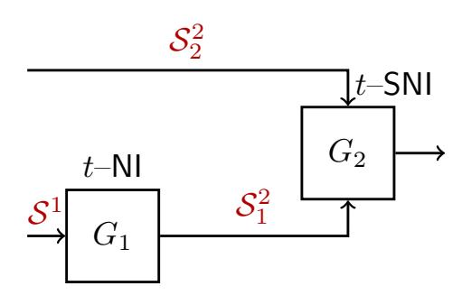
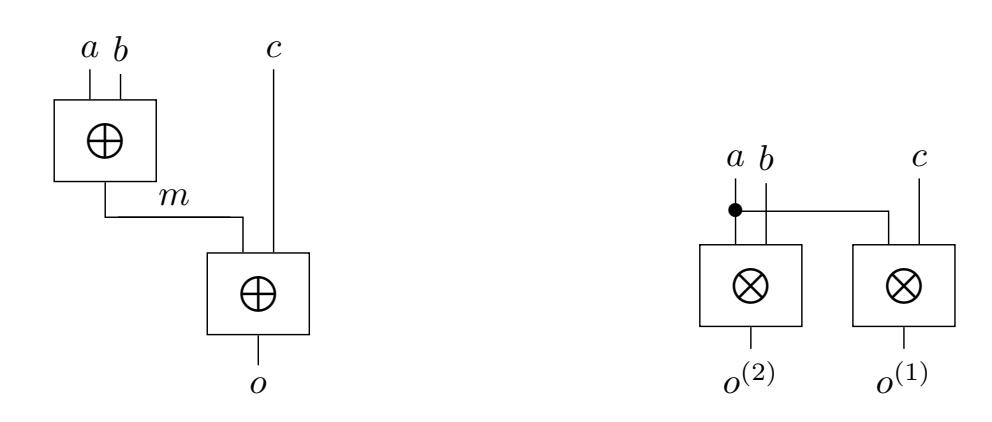
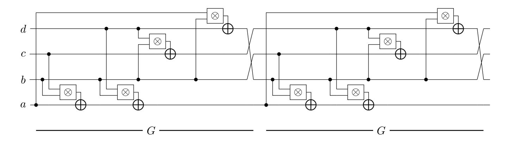
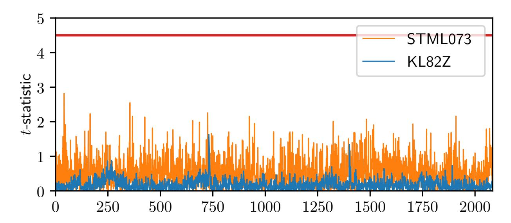
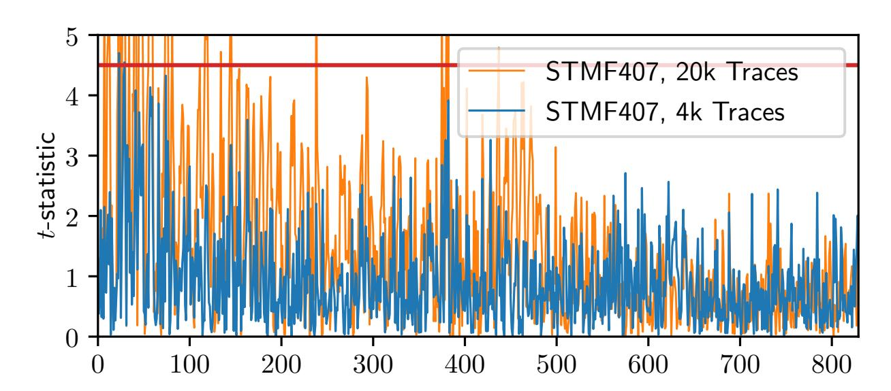
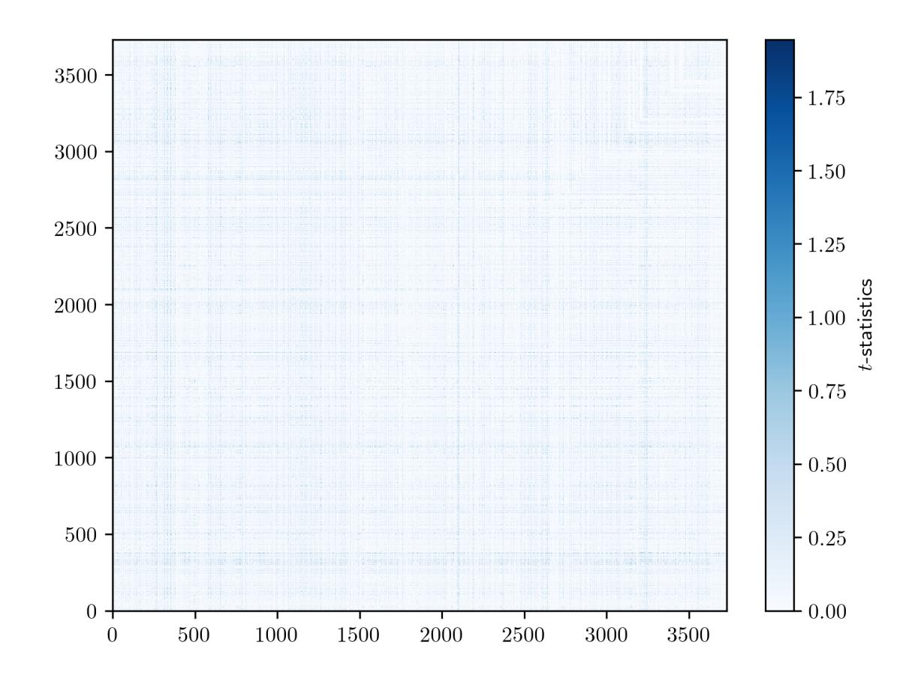

{0}------------------------------------------------

# **Masking in Fine-Grained Leakage Models: Construction, Implementation and Verification**

Gilles Barthe<sup>1</sup>*,*<sup>2</sup> , Marc Gourjon<sup>3</sup>*,*<sup>4</sup> , Benjamin Grégoire<sup>5</sup> , Maximilian Orlt<sup>6</sup> , Clara Paglialonga<sup>6</sup> and Lars Porth<sup>6</sup>

```
1 MPI-SP, Germany
         2
           IMDEA Software Institute, Spain gjbarthe@gmail.com
3 Hamburg University of Technology, Germany, firstname.lastname@tuhh.de
                    4 NXP Semiconductors, Germany
              5
               Inria, France, firstname.lastname@inria.fr
    6 TU Darmstadt, Germany, firstname.lastname@tu-darmstadt.de
```

**Abstract.** We propose a new ap[proach for building efficient, pro](mailto:firstname.lastname@inria.fr)vably secure, and practically hardened implementatio[ns of masked algorithms. Our approach i](mailto:firstname.lastname@tu-darmstadt.de)s based on a Domain Specific Language in which users can write efficient assembly implementations *and* fine-grained leakage models. The latter are then used as a basis for formal verification, allowing for the first time formal guarantees for a broad range of device-specific leakage effects not addressed by prior work. The practical benefits of our approach are demonstrated through a case study of the PRESENT S-Box: we develop a highly optimized and provably secure masked implementation, and show through practical evaluation based on TVLA that our implementation is practically resilient. Our approach significantly narrows the gap between formal verification of masking and practical security.

**Keywords:** Side-channel resilience · Higher-order masking · Probing security · Verification · Domain Specific Language

# **1 Introduction**

Physical measurements reveal information beyond the inputs and outputs of programs as execution on physical devices emits information on intermediate computations steps. This information, encoded in the noise, time, power or electromagnetic radiations, is known as side-channel leakage and can be used to mount effective side-channel attacks.

The *masking* countermeasure splits secret data *a* into *d* shares (*a*0*, . . . , ad−*1) such that it is easy to compute *a* from all shares but impossible from less than *d* shares [CJRR99, ISW03]. This requires attacks to recover *d* shares instead of a single secret value. An active line of research considers the construction of masked algorithms, denoted "gadgets", which compute some functionality on masked inputs while enforcing that secrets cannot be recovered from less than *d* intermediate values. Construction of gadgets is pa[rticularly](#page-24-0) [difficult](#page-25-0) when considering side-channel leakage which allows to observe more than just the intermediate computation steps [GMPO19]. Extended leakage models have been devised to consider additional side-channel information in systematic manner [FGP<sup>+</sup>18, PR13, DDF14,BGI<sup>+</sup>18].

Naturally, the question arises whether the masking countermeasure has been applied correctly to a gadget and wheth[er it actu](#page-25-1)ally improves security. There exist two main, and fairly distinct, approaches to evaluate the effectiveness of the appl[ied count](#page-24-1)[ermea](#page-25-2)[sures: \(](#page-24-2)[I\) Physic](#page-23-0)al validation performing specific attacks or statistical tests on physical

{1}------------------------------------------------

measurements [DSM17,DSV14, SM15,PV17,MOW17] and (II) Provable resilience based on attacker and leakage models [CJRR99,ISW03,FGP+18,PR13,DDF19] and automated verification [BBD+15,BBD+16,Cor18,EWS14]. We review the strengths and weaknesses of both approaches.

The main [benefit o](#page-24-3)[f reprod](#page-24-4)[ucing](#page-25-3) [attack](#page-25-4)s [is the c](#page-25-5)lose correspondence to security; a successful attack implies a real [threat, a](#page-24-0)[n unsuc](#page-25-0)[cessful a](#page-24-1)[ttack r](#page-25-2)[ules out](#page-24-5) a vulnerability from exactl[y this att](#page-22-0)[ack under](#page-22-1) [the sp](#page-24-6)[ecific eva](#page-24-7)luation parameters. The drawback is the inherently limited attacker scope to only those attacks which have been performed and the fact that exhaustive evaluation of all attacks remains intractable in most cases. Statistical evaluation allows to bound the retrievable side-channel information, the success rate of retrieval, or to detect side-channel information leakage without considering actual attacks [SM15,DSM17,DSV14]. Nonetheless, the evaluation remains specific to the input data and measurement environment used during assessment. In both cases it is difficult to decide at which point to stop the evaluation and to declare an implementation to be secure. In addition, these methods have large computational requirements which imply an incre[ased w](#page-25-3)[ait time](#page-24-3) [for the e](#page-24-4)valuation results. This prevents fast iterative development cycles with repeated proposal of implementations and evaluation thereof. Vice versa; the implementer has to carefully produce good implementations to avoid too frequent evaluation, limiting creative freedom.

Provable resilience provides a rigorous approach for proving the resilience of masked algorithms. The main benefit of this approach is that guarantees hold in all environments which comply with the assumptions of the proof and that assessment ends when such a proof is found. Inherent to all formal security notions for side-channel is (I) a formal *leakage model* which defines the side-channel characteristics considered in the proof and (II) an *attacker model*. The leakage model defines which side-channel information leakages (observations) are accessible to the attacker during execution of a masked program whereas the formal attacker model defines the capabilities of the attacker exploiting this information, e.g. how many side-channel measurements an attacker can perform.

Threshold probing security is arguably the most established approach for provable resilience. In this approach, execution leaks the value of intermediate computations, and the attacker can observe at most *t* side-channel leakages during an execution of a program masked with *d > t* shares. The notion of threshold probing security proves perfect resilience against adversaries observing at most *t* leakages but cannot provide assurance for attackers which potentially observe more. Programs enjoy security against practical attackers w.r.t. the chosen notion if the side-channel model accurately captures the device's leakage characteristics. The main benefit of probing security is that it can be used to rule out classes of attacks entirely, in difference to physical evaluation such as Test Vector Leakage Assessment (TVLA) [SM16]. Variations of threshold probing security such as the *t*–Non-interference (*t*–NI) and *t*–Strong-Non-interference (*t*–SNI) refinements exist which are easier to evaluate (check) or guarantee additional properties [BBD<sup>+</sup>16].

A further benefit of provable resilience, and in particular of threshold probing security, is that it is amenable to auto[mated](#page-26-0) verification. The main benefit of automated verification is that it delegates the formal analysis to a computer program and manages the combinatorial explosion that arises when analyzing complex gad[gets at hig](#page-22-1)h orders.

The main critique of formal security notions for side-channel security is related to the large gap between formal model and behavior in practice, resulting in security assurance that are sometimes hard to interpret as recently shown by Gao *et al.* [GMPO19]. In particular, implementations of verified threshold probing secure algorithms frequently enjoy much less practical side-channel resilience as precisely analyzed by Balasch *et al.* [BGG<sup>+</sup>14] and [GMPO19]. The advantage of physical evaluation is preeminent in that the increasing diversity of discovered side-channel leakage effects is not entirely con[sidered by](#page-25-1) existing verification frameworks. One of the reasons being that the considered leakage effects are

{2}------------------------------------------------

inherently integrated into the tool and therefore prevent flexible and fine-grained modeling. In the current setting, to consider new leakage with distinct behavior it is required to modify the tool's implementation. But the diversity of power side-channel leakage encountered in practice is expected to grow as long as new execution platforms are developed [PV17,BGG+14,CGD18,MOW17,SSB+19,Ves14].

# **1.1 Our Work**

In thi[s pape](#page-25-4)[r, we illus](#page-23-1)t[rate tha](#page-23-2)[t automa](#page-25-5)[ted verifi](#page-26-1)[cation](#page-26-2) can deliver provably resilient and practically hardened masked implementations with low overhead.

**Fine-Grained Modeling of Leakage** We define a Domain Specific Language (DSL), denoted IL, for modeling assembly implementations *and* specifying fine-grained leakage models. The dual nature of IL has significant benefits. First, it empowers implementers to capture real leakage behavior in the form of device-specific leakage models, which ultimately ensure that the purported formal resilience guarantees are in close correspondence with practical behavior. Second, it supports efficient assembly level implementations of masked algorithms, and bypasses thorny issues with secure compilation. Third, it forms the basis of a generic automated verification framework in which assembly implementations can be analyzed generically, without the need to commit to a fixed or pre-existing leakage model. Specifically, we present a tool that takes as input an implementation and checks whether the implementation is secure w.r.t., the security notion associated with the leakage models given with the implementation. This stands in sharp contrast with prior work on automated verification, which commits to one or a fixed set of leakage models.

**Optimized Hardening of Masking** The combination of fine-grained leakage models and reliable verification enables the construction of masked implementations which exhibit no detectable leakage in physical assessment, known as "hardened masking" or "hardening" of masked implementations. We demonstrate several improvements in constructing hardened gadgets and a hardened PRESENT S-Box at 1 st and 2 nd order which exhibit no detectable leakage beyond one million measurements in TVLA. We provide generic optimization strategies which reduce the overhead from hardening by executing the code of a secure composition of gadgets in an altered order instead of introducing overhead by inserting additional instructions as countermeasure. The resulting overhead reduction of almost 57% for the first order implementation and of 64% for the second order shows a need to consider composition *strategies* in addition to established secure composition results. Our contributions outperform the "lazy strategy" [BGG<sup>+</sup>14] of doubling the number of shares in masking instead of performing hardening; the security order can be increased without detrimental impact on performance as our optimized 2 nd order hardened PRESENT S-Box is as fast as a non-optimized 1 st order hardened PRESENT S-Box, effectively increasing the security order "for free".

#### **1.2 Related Work**

For the sake of clarity, we organize related work by areas:

**Provable Resilience** Provable resilience of masked implementations was initiated by Chari *et al.* [CJRR99], and later continued by Ishai, Sahai and Wagner (ISW) [ISW03] and many others. As of today, provable resilience remains a thriving area of research, partially summarized in [KR19], with multiple very active sub-areas. One such relevant area is the study of leakage models, involving the definition and comparison of new models, including the n[oisy leaka](#page-24-0)ge model, the random probing model, the threshold probin[g model](#page-25-0)

{3}------------------------------------------------

with glitches [PR13, DDF14, BGI+18]. Leakage effects were for the first time summarized in a general model by the Robust Probing model [FGP+18]. Later, De Meyer *et al.* in [DBR19], introduce their concept of glitch immunity and unify security concepts such as (Strong) Non-Interference in an information theoretic manner. In comparison to these works, our DS[L offe](#page-25-2)[rs a mu](#page-24-2)c[h higher](#page-23-0) flexibility in terms of leakages, since it allows to take into account a broader class of leakages, and co[nsequentl](#page-24-1)y more realistic scenarios. [Anothe](#page-24-8)r relevant area tackles the problem of composing secure gadgets; a prominent new development is the introduction of strong non-interference, which achieves desirable composition properties that cannot be obtained under the standard notion of threshold probing security [BBD<sup>+</sup>16]. Belaid *et al.* present an elegant alternative approach to solve the problem of composition; however their approach is based on the assumption that only ISW gadgets are used [BGR18]. The formal analysis of composability in extended leakage models started to receive more attention with the analysis of Faust *et al.* in [FGP+18], which formalized [the physi](#page-22-1)cal leakages of glitches, transitions and couplings with the concept of extended-probes and proved the ISW multiplication scheme to be probing secure against glitches in two [cycles.](#page-23-3) Later, Cassiers *et al.* in [CGLS20] proposed the concept of Hardware Private Circuits, which formalizes compositional probing securi[ty against](#page-24-1) glitches, and presented gadgets securely composable at arbitrary orders against glitches. Our work augments the *t*–NI and *t*–SNI notions to capture resilience and composition in any fine-grained model which can be expressed usin[g our DS](#page-24-9)L and in the presence of stateful execution, as required for provably secure compilers such as MaskComp and Tornado [BBD<sup>+</sup>16,BDM+20]. The research area of optimization of hardened masking did not receive much attention in the literature, for the best of our knowledge.

**Automated Verification** Proving resilience of masked implementations at high orders incurs a [significant](#page-22-1) [combinat](#page-23-4)orial cost, making the task error-prone, even for relatively simple gadgets. Moss *et al.* [MOPT12] were the first to show how this issue can be managed using program analysis. Although their work is focused on first-order implementations, it has triggered a spate of works, many of which accommodate high orders [BRNI13,EWS14, BBD+15,Cor18,ZGSW18,BGI+18]. MaskVerif [BBD+15,BBC+19], which we use in our work, is arguably one of th[e most ad](#page-25-6)vanced tools, and is able to verify different notions of security, including *t*–NI and *t*–SNI at higher orders, for different models, including ISW, ISW with transitions, and ISW with glitches. Notably, SILVE[R can ve](#page-23-5)[rify the](#page-24-7) [recent PI](#page-22-0)[NI noti](#page-24-6)[on \[KSM2](#page-26-3)[0\]. Giger](#page-23-0)l *et al.* verify [the secur](#page-22-0)i[ty of soft](#page-22-2)ware implementations executed on a processor's netlist w.r.t. a fixed hardware leakage model, bridging both worlds [GHP<sup>+</sup>20]. Furthermore, the latest version of MaskVerif captures multiple sidechannel effects for hardware platforms, which are configurable by the user. However, the input language of [MaskVeri](#page-25-7)f lacks the expressiveness of IL, making it difficult to capture the rich class of potential leakage in software implementations.

**Modeling Side-Channel Behavior** Side-channel behavior is also expressed for analysis purposes other than provable resilience. Papagiannopoulos and Veshchikov construct models of platform specific side-channel effects they discover in practice [PV17]. Their tool ASCOLD prevents combinations of shares in the considered leakage effects, which are hard coded into the tool. Most importantly, they show that implementations enjoy improved practical security when no shares are combined in their leakage model, which is reminiscent of first order probing security in extended leakage models. Our [contr](#page-25-4)ibutions allow users to provide fine-grained leakage specifications in IL to verify widely established formal security notions at higher orders.

ELMO [MOW17], MAPS [CGD18] and SILK [Ves14] intend to simulate physical measurements based on detailed models. The tools assume fixed leakage effects but allow customization by the user in form of valuation functions. This degree of detail is relevant

{4}------------------------------------------------

for simulating good physical measurements but not necessary for our information theoretic notions of security. The authors of MAPS distinguish effects which are beyond what is captured in ELMO's fixed set of combinations and show the need to remain unbiased towards leakage specifications when developing tools for side-channel resilience evaluation. Most notably, ELMO can accurately simulate measurements from models inferred in an almost automated manner and is now being used in works attempting to automate the construction of hardened implementations [SSB+19].

# **2 Expressing Side-Channel Leakage**

Verification of side-channel resilience requires suitable representation of the implementation under assessment. This representation must express a program's functional semantic and information observable per side-channel. It is well known that the leakage behavior of execution platforms differs, and this diversity must be expressible to gain meaningful security assurance from verification.

# **2.1 A Domain Specific Language with Explicit Leakage**

<span id="page-4-0"></span>Already at CHES 2013 Bayrak *et al.* [BRNI13] point out the difficulty of expressing arbitrary side-channel leakage behavior yet providing a "good interface" to users willing to specify *device specific* side-channel characteristics. The reason can be related to the fundamental approach of implicitly augmenting the underlying language's operators with side-channel. In such setting, the additi[on of two](#page-23-5) variables *c ← a* + *b*; implicitly models information observable by an adversary, but what is leaked (e.g. *a*, *b*, or *a* + *b*) must be encoded in the language semantics (i.e., the meaning of *←* and +) and thus prevents flexible adoption of leakage characteristics.

The concept of "explicit leakage" is an alternative as it requires to explicitly state what side-channel information is emitted. We present a Domain Specific Language (DSL) adopting the concept; the language's constructs do not capture side-channel behavior (i.e., their execution provides no observable side-channel information), except for a dedicated statement "leak" which can be understood as providing specific information to an adversary. The given example can now be stated as *c ← a* + *b*; leak *{a* + *b}* ;, which has two important benefits: First, verification and representation of programs can be decoupled to become two independent tasks. Second, specification of side-channel behavior becomes more flexible in that a diverse set of complex side-channels can be expressed and altered without effort.

Our DSL, named "IL" for "intermediate language" has specific features to support representation of low-level software. A Backus Normal Form representation is given in Figure 1. Its building blocks are states *χ*, expressions *e*, commands *c* of multiple statements *i* and global declarations *g* of variables and macros with local variables *x*1*, . . . , xk*.

```
χ ::= x | x[e] | hei
e ::= χ | n ∈ Z | l | o (e1, . . . , ej )
i ::= χ ← e | leak {e1, . . . , ej} | m (e1, . . . , ej )
      | label l | goto e
      | if e then c else c | while e do c
c ::= i∗
g ::= var x | macro m (x1, . . . , xj ) x1, . . . , xk {c}
```

Figure 1: Simplified syntax of the intermediate language where *n* ranges on integers, *x* on variables, *m* on macro identifiers, *o* on operations and *l* on label identifiers.

{5}------------------------------------------------

A state element  $\chi$  is either a variable x, an array x with an indexing expression e, or a location in memory  $\langle e \rangle$ . Memory is distinguished to allow specifications of disjoint memory regions which eases formal verification. Expressions are built from state elements  $\chi$ , constant integers n, unique labels l, and operators o applied to expressions. Infix abbreviations for logical "and"  $\otimes$ , "exclusive-or"  $\oplus$ , addition + and right shift  $\gg$  are used in the following. Allowed statements i are assignments  $\chi \leftarrow e$ , explicit leaks leak  $\{e_1,\ldots,e_j\}$  of one or more expressions and call to a previously defined macro  $m(e_1,\ldots,e_j)$  where m is the name of the macro. Statements for if conditionals and while loops are supported as well. Labels l are needed to represent the execution of microcontrollers (MCUs) which is based on the address of an instruction. They are defined by a dedicated statement, enabling execution to proceed at the instruction subsequent to this label. Static jumps to unique labels and indirect jumps based on expressions of labels are supported to represent control-flow.

In a nutshell, executable implementations consist of an unstructured list of hardware instructions where each instruction is located at a specific address and execution steps over addresses. We represent implementations as a list of label definitions and macro calls: every instruction is represented by an IL label corresponding to the address of this instruction and a macro call representing the hardware instruction and its operands. A line of Assembly code "0x16E: ADDS RO R1" becomes almost identical IL code: label 0x16E; ADDS(R0, R1); where ADDS is a call to the model of the "ADDS" instruction.

The DSL allows to express fine-grained leakage models specifying the semantic and side-channel behavior of assembly instructions. In this light, verifying side-channel resilience of implementations involves three steps: (I) modeling behavior of instructions, (II) representing an implementation using such a model and (III) analyzing or verifying the representation (Section 3).

We stress the significant benefit: verification and representation become separate concerns, i.e., automated verification is now defined over the semantic of our DSL and the separate leakage model of step (I) can be freely modified or exchanged without altering the work-flow in stages (II) and (III). In particular, our tool, named "scVerif" allows the user to provide such a leakage specification in conjunction with an implementation for verification of side-channel resilience.

#### 2.2 Modeling Instruction Semantics

The DSL allows to construct models which are specific to the device executing an implementation by attaching device specific side-channel behavior. This is especially important for the Arm and RISC-V Instruction Set Architectures (ISAs) since these are implemented in various MCUs which execute instructions differently, potentially giving rise to distinct side-channel information. The instruction semantic must be modeled since some leakage effects depend not only on intermediate state but also on the order of execution (e.g. control flow). In the following, we show construction of models for Arm Cortex M0+ (CM0+) instructions which are augmented with leakage in Section 2.3. The DSL enables construction of leakage models for other architectures or programming languages as well.

IL enables to express architecture flags, carry bits, unsigned/signed operations, cast between data types, bit operations, control flow, etc. in close correspondence to ISA specifications. The instructions of the CM0+ ISA operate on a set of globally accessible registers and flags, denoted *architecture state*. They can be modeled as global variables in IL: var R0; var R1; ... var PC; var apsrc; (carry flag) var apsrv; (overflow flag) var apsrz; (zero flag) var apsrz; (negative flag).

Addition is used in the ADDS instruction and instructions operating on pointers such as LDR (load) and STR (store). Expressing the semantic of addition with carry requires casting 32 bit values to unsigned, respective signed values and comparing the results of addition to assign the carry and overflow flags correctly. The IL model of ADDS is

{6}------------------------------------------------

#### Algorithm 1 Low-level model of addition with carry and instruction for addition.

```
1: macro ADDWITHCARRY (x, y, carry, result, carryOut, overflow)
       var unsignedSum, var signedSum {
 2:
 3:
        unsignedSum \leftarrow (uint) x + (uint) y + (uint) carry;
        signedSum \leftarrow (int) x + (int) y + (int) carry;
 4:
        result \leftarrow (w32) unsignedSum;
 5:
        carryOut \leftarrow \neg ((uint) result = unsignedSum);
 6:
 7:
        overflow \leftarrow \neg ((int) result = signedSum);
   }
 8:
 9: macro ADDS (rd, rn) {
                                                                       \triangleright model of rd \leftarrow rd + rn
        ADDWITHCARRY(rd, rn, 0, rd, apsrc, apsrv);
10:
        apsrz \leftarrow rd = 0;
11:
        apsrn \leftarrow (rd \gg 31) = 1;
12:
       if rd \simeq_n pc then
13:
           goto rd;
14:
        end if
15:
16: }
```

expressed in Algorithm 1, closely following the Arm ISA specification [ARM18] with six parameters for inputs, output, carry and overflow flags<sup>1</sup>. unsignedSum and signedSum are local values. The ADDS instruction is modeled by calling the macro and expressing the side-effect on global flags. A special case of addition to pc requires to issue a branch to the resulting address (represented as label). The operator  $\simeq_n$  is used to compare whether the parameter rd is equal to the register with name pc and conditionally issue a branch.

Sampling randomness, e.g. in the form of queries to random number generators, can be expressed by reading from a tape of pre-sampled randomness in global state.

# 2.3 Modeling Leakage

<span id="page-6-0"></span>We augment the instruction models with a representation of power side-channels specific to threshold probing security. For this security notion it is sufficient to model the dependencies of leakages, which is much simpler and more portable than modeling the constituting function defining the actual value observable by an adversary. Specifying multiple expressions within a single  $leak\{e_1, e_2, ...\}$  statement allows the threshold probing attacker to observe multiple values (expressions) at the cost of a single probe. On hardware this is known from the "glitch" leakage effect which allows to observe multiple values at once [FGP+18]. The leak statement allows generic specification of such multi-variate leakage both for side-channel leakage effects but also as worst-case specifications of observations. In particular, a program which is resilient w.r.t.  $leak\{e_1, e_2\}$  is necessarily resilient w.r.t. any function f(a, b) in  $leak\{f(e_1, e_2)\}$  but not vice versa.

The ADDS instruction is augmented with leakage, which is representative for ANDS (logical conjunction) and EORS (exclusive disjunction) as they behave similar in our model. Observable leakage arises from computing the sum and can be modeled by the statement leak  $\{rd + rn\}$ ;. Transition leakage as in the robust probing model of  $[FGP^+18]$  is modeled in a worst case manner: instead of the Hamming-Distance there are two values leaked at the cost of a single probe: leak  $\{rd, rd + rn\}$ ;, covering any exotic combination as e.g. observed in [GMPO19, MOW17]. The order of execution matters, thus this leakage must be added at the top of the function, before assigning  $rd^2$ . For better clarity we expose these two leakage effects as macros. The specification of ADDS is given in Algorithm 2.

<sup>&</sup>lt;sup>1</sup>Called macros are substituted in-place and modify input parameters instead of returning values.

<span id="page-6-3"></span><span id="page-6-2"></span><sup>&</sup>lt;sup>2</sup>The order in which leak statements are placed does not matter since leaks have no semantic side-effect.

{7}------------------------------------------------

**Definition 1** (Computation Leakage Effect). The computation leakage effect produces an observation on the value resulting from the evaluation of expression **e**.

```
1: macro EmitComputationLeak (e) {
2: leak {e};
3: }
```

**Definition 2** (Transition Leakage Effect). The transition leakage effect provides an observation on state **x** and the value **e** which is to be assigned.

```
1: macro EmitTransitionLeak (x, e) {
2: leak {x, e};
3: }
```

#### Algorithm 2 Leakage model of ADDS instruction.

```
1: macro LEAKYADDS (rd, rn) {
2: EMITCOMPUTATIONLEAK(rd + rn);
3: EMITTRANSITIONLEAK(rd, rd + rn);
4: EMITREVENANTLEAK(opA, rd);
5: EMITREVENANTLEAK(opB, rn);
6: ADDS(rd, rn);
7: }
```

Power side-channels encountered in practice sometimes depend on previously executed instructions. Corre et al. describe a leakage effect, named "operand leakage", which leaks a combination of current and previous operands of two instructions (e.g. parameters to ADDS) CGD18. A similar effect on memory accesses was observed by Papagiannopoulos and Veshchikov, denoted as "memory remnant" in [PV17]. The explicit leak statement enables modeling of such cross-instruction leakage effects by introducing additional state elements  $\chi$ , denoted as "leakage state". In general, leakage effects which depend on one value p from past execution and one value c from current instruction can be modeled by placing p in global state opA during the first instruction and emitting a leak of global state and current value in leak {opA, p} in the latter instruction. The operand and memory remnant leakage effects always emit leakage and update leakage state jointly. We put forward a systematization under the name "revenant leakage", leaning its name to the (unexpected) comeback of sensitive data from past execution steps and, in the figurative sense, haunting the living cryptographer during construction of secure masking. The leakage effect is modeled in Definition 3 and applied to the ADDS instruction in Algorithm 2. The definition can easily be modified such that the state change is conditional to a userdefined predicate or the leakage is extended to a history of more than one instruction.

**Definition 3** (Revenant Leakage Effect). The "revenant" leakage effect releases a transition leakage prior to updating some leakage state  $x \leftarrow p$ .

```
    macro Emitrevenantleak (x, p) {
    leak {x, p};
    x ← p;
    }
```

The leakage effects are applied in instruction models by calling EMITREVENANTLEAK with the distinct leakage state used for caching the value (e.g. opA) and the value leaking in combination, e.g. the first operand to an addition.

The overall leakage model for a simplified ISA is depicted in Algorithm 3, it corresponds to the model used for CM0+ Assembly<sup>3</sup>. In our model the leakage state elements are

<sup>&</sup>lt;sup>3</sup>The full model is provided in combination with our tool scVerif [BGG<sup>+</sup>20]

{8}------------------------------------------------

#### Algorithm 3 Simplified power side-channel leakage model for CM0+ instructions.

```
1: var R0; var R1; ... var R12; var PC;

▷ Global registers

                                                                     ⊳ Global leakage state
 2: var opA; var opB; var opR; var opW;
 3: macro XOR (rd, rn) {
                                                                > combination of revenants
       leak {opA, rd, opB, rn};
 4:
       EMITTRANSITIONLEAK(rd, rd \oplus rn);
 5:
 6:
       EMITREVENANTLEAK(opA, rd);
       EMITREVENANTLEAK(opB, rn);
 7:
       rd \leftarrow rd \oplus rn;
 8:
 9: }
10: macro AND (rd, rn) {
       leak {opA, rd, opB, rn};
                                                                > combination of revenants
11:
       EMITTRANSITIONLEAK(rd, rd \otimes rn);
12:
       EMITREVENANTLEAK(opA, rd);
13:
       EMITREVENANTLEAK(opB, rn);
14:
15:
       rd \leftarrow rd \otimes rn;
16: }
17: macro LOAD (rd, rn, i) {
       leak {opA, rn, opB, i};
                                                             ▶ Manual multivariate leakage
18:
       EMITREVENANTLEAK(opA, rn);
                                                                          ▶ mixed mapping
19:
       EMITREVENANTLEAK(opB, rd);
20:
                                                   ▶ note: destination register propagated
       EMITREVENANTLEAK(opR, \langle rn, i \rangle);
21:
       EMITTRANSITIONLEAK(rd, \langle rn, i \rangle);
22:
       rd \leftarrow \langle rn, i \rangle;
23:
24: }
25: macro STORE (rd, rn, i) {
       leak {opA, rn, opB, i};
                                                             ▶ Manual multivariate leakage
26:
       EMITREVENANTLEAK(opA, rn);
                                                                          ▷ mixed mapping
27:
       EMITREVENANTLEAK(opB, rd);
                                                                          ▷ mixed mapping
28:
       EMITREVENANTLEAK(opW, rd);
                                                                    ⊳ note: individual state
29:
       \langle \mathtt{rn}, i \rangle \leftarrow \mathtt{rd};
30:
31: }
```

denoted by opA, opB, opR, opW to model four distinct revenant effects for the 1<sup>st</sup> and 2<sup>nd</sup> operand of computation as well as for LOAD and STORE separately. Some effects have been refined to match the behavior encountered in practice, which diverges in the mapping of operands and an unexpected propagation of the destination register in LOAD instructions.

The empirical construction of this model was conducted in cooperation and is described in [ABB<sup>+</sup>21]. In short, the model was initiated by testing whether the leakage effects discovered in prior work, are detectable on our platform by constructing small first-order test cases as described in [PV17]. In an iterative process multiple gadgets with provable security in the model were constructed and assessed by physical leakage detection. Every detected leakage was analyzed and added to the model, again guided by tests according to [PV17], until no leakage was detectable anymore.

In [PV17] the "neighboring" leakage is reported, but we did not observe it on CM0+MCUs during our case-study. The effect represents a coupling between registers, probably related to the special architecture of the "ATMega163", highlighting the need of device specific leakage models. Neighboring leakage can be modeled by using the  $\simeq_n$  operator as shown in Definition 4.

{9}------------------------------------------------

**Definition 4** (Neighboring Leakage Effect). The neighboring leakage effect causes a leak of an unrelated register RN when register RM is accessed.

```
1: macro EMITNEIGHBORLEAK (e) {
2: if e \simeq_n RM then
3: leak \{RN, RM\};
4: end if
5: }
```

The DSL in combination with the concept of explicit leakage enables to model all leakage effects known to us such that verification of threshold probing security becomes aware of these additional leakages. Our effect definitions can serve as building block to construct models such as our model in Algorithm 3 but can be freely modified to model behavior not yet publicly known. In particular, the expressiveness of modeling appears not to be limited except in that further computation operations o might need to be added to our small DSL.

# 3 Stateful (S)NI and Automated Verification

<span id="page-9-0"></span>In this section, we lay the foundations for proving security of IL implementations. We first define security notions for IL gadgets: following a recent trend [BBD<sup>+</sup>16], we consider two notions: non-interference (NI) and strong non-interference (SNI), which achieve different composability properties. Then, we present an effective method for verifying whether an IL gadget satisfies one of these notions.

## 3.1 Security Definitions

We first start with a brief explanation of the need for a new security definition. At a high level, security of stateful computations requires dealing with residual effects on state. Indeed, when a gadget is executed on the processor, it does not only return the computed output but it additionally leaves "residue" in registers, memory, or leakage state. Code subsequently executed might produce leakages combining these residues with output shares, breaking secure composability. As an example, let us consider the composition of a stateful refreshing gadget with a stateful multiplication scheme: Refr(Mult(x,y)). In the case of non-stateful gadgets, if Mult is t-NI and Refr is t-SNI, such a composition is t-SNI. However, if the gadgets are stateful this is not necessarily anymore the case.

We give a concrete example: Consider a modified ISW multiplication such that it is t-SNI even with the leakages defined in the previous chapter, the output state  $s_{out}$  of the multiplication, in combination with the revenant leakage effect in the LOAD of Algorithm 3 can be used to retrieve information about the secret as follows: After the multiplication one register could contain the last output share of the multiplication gadget and the gadget is still secure. If the refreshing first loads the first output share of the multiplication in the same register, the revenant effect emits an observation containing both values (the first and last output share of the multiplication) in a single probe. Thus, the last probes can be used to get the remaining output shares of the multiplication, and the composition is clearly vulnerable.

We first introduce the notion of gadget, on which our security definitions are based. Informally, gadgets are IL macros with security annotations.

**Definition 5** (Gadget). A gadget is an IL macro with security annotations:

• a security environment, mapping inputs and outputs to a security level: secret (H) or public (L),

{10}------------------------------------------------

- a memory typing, mapping memory locations to a security level: secret (H), public (L), random (R),
- share declarations, consisting of tuples of inputs and outputs. We adopt the convention that all tuples are of the same size, and disjoint, and that all inputs and outputs must belong to a share declaration.

We now state two main notions of security. The first notion is an elaboration of the usual notion of non-interference, and is stated relative to a public input state  $s_{in}$  and public output state  $s_{out}$ . The definition is split in two parts: the first part captures that the gadget does not leak, and the second part captures that the gadget respects the security annotations.

**Definition 6** (Stateful t-NI). A gadget with input state  $s_{in}$  and output state  $s_{out}$  is stateful t-Non-Interfering (t-NI) if every set of t observations can be simulated by using at most t shares of each input and any number of values from the input state  $s_{in}$ . Moreover, any number of observations on the output state  $s_{out}$  can be simulated without using any input share but using any number of values from the input state  $s_{in}$ .

The second notion is an elaboration of strong non-interference. Following standard practice, we dinstinguish between internal observations (i.e., observations that differ from outputs) and output observations.

**Definition 7** (Stateful t-SNI). A gadget with input state  $s_{in}$  and output state  $s_{out}$  is stateful t-Strong-Non-Interfering (t-SNI), if every set of  $t_1$  observations on the internal observations,  $t_2$  observations on the output values such that  $t_1 + t_2 \leq t$ , combined with any number of observations on the output state  $s_{out}$ , can be simulated by using at most  $t_1$  shares of each input and any number of values from the input state  $s_{in}$ .

<span id="page-10-0"></span>Both definitions require that gadgets have a fixed number of shares. This assumption is made here for the simplicity of presentation but is not required by our tool.

Finally, we note that there exist other notions of security. One such notion is called probing security. We do not define this notion formally here but note that for stateful gadgets t-SNI implies probing security, provided the masked inputs are mutually independent families of shares, and the input state is probabilistic independent of masked inputs and internal randomness.

We validate our notions of security through a proof that they are composable — Section 4 introduces new and optimized composition theorems. The general composition results hold for stateful t-NI, respective stateful t-SNI, because the notions ensure similar properties as their non-stateful counterparts.

**Proposition 1.** Let  $G_1(\cdot, \cdot)$  and  $G_2(\cdot)$  be two stateful gadgets as in Figure 2. Assuming  $G_2$  is stateful t-SNI and  $G_1$  is stateful t-NI, then the composition  $G_2(G_1(\cdot), \cdot)$  is stateful t-SNI.

*Proof.* Let  $s_{in}^1$  and  $s_{out}^1$  be respectively the state input and state output of  $G_1$  and  $s_{in}^2$  and  $s_{out}^2$  respectively the state input and state output of  $G_2$ . We prove in the following that the composition  $G_2(G_1(\cdot),\cdot)$  is stateful t-SNI.

Let  $\Omega = (I, \mathcal{O})$  be the set of observations on the whole composition, where  $I_i$  are the observations on the internal computation of  $G_i$ ,  $I = I_1 \cup I_2$  with  $|I| = |I_1 \cup I_2| \le t_1$  and  $|I| + |\mathcal{O}| \le t$ .

Since  $G_2$  is stateful t-SNI and  $|I_2 \cup \mathcal{O}| \leq t$ , then there exist observation sets  $\mathcal{S}_1^2$  and  $\mathcal{S}_2^2$  such that  $|\mathcal{S}_1^2| \leq |I_2|$ ,  $|\mathcal{S}_2^2| \leq |I_2|$  and all the observations on internal and output values combined with any number of observations on the output state  $s_{out}^2$  can be simulated by using any number of values from the input state  $s_{in}^2$  and the shares of each input with index respectively in  $\mathcal{S}_1^2$  and  $\mathcal{S}_2^2$ .

{11}------------------------------------------------

Since  $G_1$  is stateful t-NI,  $|I_1 \cup \mathcal{S}_1^2| \leq |I_1 \cup I_2| \leq t$  and  $s_{out}^1 = s_{in}^2$ , then there exists an observation set  $\mathcal{S}^1$  such that  $|\mathcal{S}^1| \leq |I_1| + |\mathcal{S}_1^2|$  and all the observations on internal and output values combined with any number of observations on the output state  $s_{out}^2$  can be simulated by using any number of values from the input state  $s_{in}^1$  and the shares of the input with index in  $\mathcal{S}^1$ .

Now, composing the simulators that we have for the two gadgets  $G_1$  and  $G_2$ , all the observations on internal and output values of the circuit combined with any number of observations on the output state can be simulated from  $|\mathcal{S}^1| \leq |I_1| + |\mathcal{S}^2_1| \leq |I_1| + |I_2| \leq t_1$  shares of the first input and  $|\mathcal{S}^2_2| \leq |I_2|$  shares of the second input and any number of values from the input state  $s^1_{in}$ . Therefore, we conclude that the circuit is stateful t-SNI.



Figure 2: Example of composition

#### <span id="page-11-0"></span>3.2 Automated Verification

In this section, we consider the problem of formally verifying that an IL program is secure at order t, for  $t \geq 1$ . The obvious angle for attacking this problem is to extend existing formal verification approaches to IL. However, there are two important caveats. First, some verification approaches make specific assumptions on the programs, e.g. |BGR18| assumes that gadgets are built from ISW core gadgets. Such assumptions are reasonable for more theoretical models but are difficult to transpose to a more practical model; besides they defeat the purpose of our approach, which is to provide programmers with a flexible environment to build verified implementations. Second, reimplementing t-SNI and t-NI checker for IL is a very significant engineering endeavour. Therefore, we follow an alternative method: we define a transformation T that maps IL programs into a fragment that coincides with the core language of MaskVerif and reuse the verification algorithm<sup>4</sup> of MaskVerif for checking the transformed program. The transformation is explained below and satisfies correctness and precision. Specifically, the transformation T is correct: if T(P) is secure at order t then P is secure at order t (where security is either t-NI or t-SNI) of t). The transformation T is also precise: if P is secure at order t and T(P) is defined then T(P) is secure at order t. Thus, the sole concern with the approach is the partial nature of the transformation T. While our approach rejects legitimate programs, it works well on a broad range of examples.

**Target language and high-level algorithm** The core language of MaskVerif is a subset of IL:

$$\begin{array}{lll} \chi & ::= & x \mid x[n] & e & ::= & \chi \mid n \mid o\left(e_1,\dots,e_j\right) \\ i & ::= & s \leftarrow e \mid \operatorname{leak}\left\{e_1,\dots,e_j\right\} & c & ::= & i* \end{array}$$

The main differences between IL and MaskVerif is that the latter does not have memory accesses, macros and control-flow instructions and limits array accesses to constant indices. Our program transformation proceeds in two steps: first, all macros are inlined; then the expanded program is partially evaluated.

<span id="page-11-1"></span> $<sup>^4</sup>$ The checker has been slightly modified to allow the verification of stateful t-SNI and t-NI.

{12}------------------------------------------------

**Partial evaluation** The partial evaluator takes as input an IL program and a public initial state and returns another IL program. The output program is equivalent to the original program w.r.t. functionality and leakage, under some mild assumptions about initial memory layout, explained below.

Our partial evaluator manipulates abstract values and tuples of abstract values, and abstract memories. An abstract value *ϑ* can be either a base value corresponding to concrete base values like Boolean *b* or integer *n*, a label *l* that represent abstract code pointers and are used for indirect jumps, and abstract pointers *hx, ni*. The latter are an abstract representation of a real pointer. Formally, the syntax of values is defined by:

```
ϑ ::= b | n | l | hx, ni | ⊥ v ::= ϑ | [ϑ; . . . ; ϑ]
```

Initially the abstract memory is split into different (disjoint) regions modeled by fresh arrays with maximal offset that do not exist in the original program. Those regions is what we call the memory layout. A base value *hx, ni* represents a pointer to the memory region *x* with the offset *n* (an integer). This encoding is helpful to deal with pointer arithmetic. The following code gives an example of region declarations:

```
region mem w32 a[0:1]
region mem w32 b[0:1]
region mem w32 c[0:1]
region mem w32 rnd[0:0]
region mem w32 stack[-4:-1]
```

It means that the initial memory is split into 5 distinct region a, b, c, rnd, stack, where a is an array of size 2 with index 0 and 1. Remark that the initial assumption is not checked (and cannot be checked by the tool). Then another part of the memory layout provides some initialisation for registers (IL variables):

```
init r0 <rnd, 0>
init r1 <c, 0>
init r2 <a, 0>
init r3 <b, 0>
init sp <stack, 0>
```

In particular, this specifies that initially the register r0 is a pointer to the region rnd. Some extra information is also provided to indicate which regions initially contain random values, or correspond to input/output shares.

The partial evaluator is parameterized by a state *hp, c, µ, ρ, eci*, where *p* is the original IL program, *c* is the current command, *µ* a mapping from *p*'s variables to their abstract value, *ρ* a mapping from variable corresponding to memory region to their abstract value, and *ec* is the sequence of commands that have been partially executed. The partial evaluator iteratively propagates values, removes branching instructions, and replaces memory accesses by variable accesses (or constant array accesses). Figure 3 provides some selected rules for the partial evaluator.

For expressions, the partial evaluator computes the value *ϑ* of *e* in *µ* and *ρ* (which can be *⊥*) and an expression *e <sup>0</sup>* where memory/array accesses are replaced by variables/constant array accesses, i.e., [[*e*]]*<sup>ρ</sup> <sup>µ</sup>* = (*ϑ, e<sup>0</sup>* ). If the expression is of t[he](#page-13-0) form *o*(*e*1*, . . . , en*), all the arguments *e<sup>i</sup>* are partially evaluated to (*ϑ<sup>i</sup> , e<sup>0</sup> i* ), the resulting expression is the operator applied to the resulting expressions *e 0 i* and the resulting value is the partial evaluation of *o*˜(*ϑ*1*, . . . , ϑn*). *o*˜ checks if the *ϑ<sup>i</sup>* are concrete values in that case it computes the concrete values else it returns *⊥*. Sometimes the partial evaluator uses more powerful simplification rules like 0+˜*ϑ* ⇝ *ϑ*.

If the expression is a variable, the partial evaluator simply returns the value stored in *µ* and the variable itself. The case is similar for array accesses, first the index expression is

{13}------------------------------------------------

<span id="page-13-0"></span>
$$\begin{split} & & & & & & & & & & & & & & & & & & &$$

Figure 3: Partial evaluation of expressions and programs

evaluated and the resulting value should be an integer *n*, the resulting expression is simple *x*[*n*] and the resulting value is the value stored in *µ*(*x*) at position *n* (the partial evaluator checks that *n* is in the bound of the array). For memory access *hei* the partial evaluation of *e* should lead to an abstract pointer *hx,* ofs*i*, in this case the resulting expression is *x*[ofs] and the value is *ρ*(*x*)[ofs].

For assignment, the partial evaluator evaluates the left side of the assignment *χ* as an expression, leading to a refined "left side" expression *χ 0* , the right part of the assignment *e* is also partially evaluated leading to (*ϑ, e<sup>0</sup>* ) the partially evaluated assignment is *χ <sup>0</sup> ← e 0* and the mapping *µ* and *ρ* are updated accordingly with the value *ϑ*. For leak instructions, the partial evaluator simply propagates known information into the command. For controlflow instructions, the partial evaluator tries to resolve the control-flow and eliminates the instruction. For goto statements, the partial evaluator tries to resolve the next instruction to be executed and eliminates the instruction.

The transformation is sound.

**Proposition 2** (Informal)**.** *Let P and P 0 be an IL gadget and the corresponding MaskVerif gadget output by the partial evaluator. For every initial state s satisfying the memory layout assumptions, the global leakage of P w.r.t. s and a set of inputs is equal to the global leakage of P <sup>0</sup> w.r.t. the same inputs.*

<span id="page-13-1"></span>We briefly comment on proving Proposition 2. In order to provide a formal proof, a formal semantics of gadgets is needed. Our treatment so far has intentionally been left informal. However, the behavior of gadgets can be made precise using programming language semantics. We briefly explain how. Specifically, the execution of gadgets can be modelled by a small-step semantics that captures [on](#page-13-1)e-step execution between states. This semantics is mostly standard, except for the leak statements which generate observations. Using the small-step semantics, one can model global leakage as a function that takes as input initial values for the inputs and an initial state and produces a sequence of observations, a list of outputs and a final state. Last, we transform global leakage into a probabilistic function by sampling all inputs tagged with the security type *R* independently and uniformly from their underlying set. This yields a function that takes as input initial values for the inputs and an initial partial state (restricted to the non-random values), a list of observations selected by the adversary and returns a joint distribution over tuples of values, where each tuple corresponds to an observation selected by the adversary.

{14}------------------------------------------------

#### 3.3 Implementation

We have implemented the partial evaluator as a front-end to MaskVerif, named "scVerif". Since the input language of MaskVerif did not include a leak construction (only the internal representation was using it), we have modified the MaskVerif input language to provide direct access to the leak statement as well as leak free assignment. Users are now able to write MaskVerif gadgets with custom leakage by using explicit leak and leak-free statements.

Moreover, we have extended the input language of mask verif so that inputs and outputs can be declared as public. This allows to express the presented notions of stateful t–SNI and t–NI. The extended checker verifies that public outputs only depend on constants and public inputs, i.e., they neither depend on the private or shared input variables, nor the random variables used by the gadget. No further modification was necessary to check formal notions w.r.t. to custom leakage models. Automated representation of programs in custom leakage models is done by the scVerif front-end that generates an equivalent MaskVerif program (see Prop 2).

Users can write leakage models, annotations and programs in IL or provide programs in Assembly code. If the output program lies in the MaskVerif fragment, then verification starts with user specified parameters such as security order or which property to verify. Else, the program is rejected. The tool also applies to bit- and n-sliced implementations and provides additional automation for temporal accumulation of probes to represent capacitance in physical measurement. Sharesclicing is not yet supported as the scheme is questioned in [GMPO19] and fundamentally insecure in our CM0+ models. However, few additional transformations allow to extend our work to these implementations.

# 4 Representative Proofs of Efficient Masking

<span id="page-14-0"></span>We describe the construction and optimization of gadgets that do not exhibit vulnerable leakage at any order  $t \leq d-1$ , where d is the number of shares. That is, we harden masked implementations to be secure at the optimal order t = d-1 in fine-grained leakage models, opposed to the "lazy" strategy of masking in a basic model at higher orders with the intention to achieve practical security at lower orders t < d-1 [BGG<sup>+</sup>14].

Creating a secure gadget is an iterative process which involves three tasks: (a) understanding and modeling the actual leakage behavior (b) constructing an (efficient) implementation which is secure in the fine-grained model (c) optionally performing physical evaluation of side-channel resilience to assess the quality of the model for the specific target platform. Protecting an implementation against side-channel effects mandates insertion of instructions to circumvent vulnerable combination of masked secrets.

# 4.1 Hardened Masking

<span id="page-14-1"></span>In this section, we discuss the development of gadgets which enjoy security in any fine-grained leakage model. We design gadgets first in the simplified IL model depicted in Algorithm 3. Designing in IL is more flexible than assembly since shortcuts such as leakage free operations and abstract countermeasures are available. Once the gadget is hardened the gadget is implemented in assembly and verified again, which is to a large degree trivial but requires to substitute abstract countermeasures by concrete instructions.

Each gadget takes as input one or two values a and b, respectively encoded in  $(a_0, \ldots, a_{d-1})$  and  $(b_0, \ldots, b_{d-1})$ , and gives as output the shares  $(c_0, \ldots, c_{d-1})$ , encoding a value c. By convention, inputs and outputs are stored in memory to allow construction of implementations at higher orders. Our gadgets, provided in the Supplementary material, use the registers RO, R1, R2, and R3 as memory addresses pointing to inputs, outputs and ran-

{15}------------------------------------------------

dom values stored in memory. The registers R4*,* R5*,* R6, and R7 are used to perform the elementary operations. Registers beyond R7 are used rarely.

A gadget which is correctly masked in the basic leakage model, i.e., secure against computation leakage (Definition 1), can be secured by purging the architecture and leakage state at selected locations within the code<sup>5</sup> . The reason is simple: every leak must be defined over elements of the state and removing sensitive data from these elements prior the instruction causing such leak mitigates the ability to observe the sensitive data.

We distinguish "scrubbing" [c](#page-7-2)ountermeasures, which purge architecture state, and "clearing" countermeasures, which remove [v](#page-15-0)alues residing in leakage state. Two macros serve as abstract countermeasures, scrub(R0) and clear(opA) assign some value which is independent of secrets to R0, respectively opA. On assembly level these need to be substituted by available instructions. Clearing opA or opB is mostly done by ANDS(R0*,* R0) ; since R0 is a public memory address. Purging opR (respective opW) requires to execute LOAD (respectively STORE) instruction reading (writing) a public value from memory, but the side-effects of both instructions require additional care. Sometimes multiple countermeasures can be combined in assembly.

Moreover, we approach the problem of securing a composition against the leakage effects introduced in Section 2.1 by ensuring that all the registers involved in the computation of a gadget are completely cleaned before the composition with the next gadget. This, indeed, easily guarantees the requirements of stateful *t*–SNI in Definition 7. We use fclear as abstract placeholder for the macro run after each gadget to clear the state *sout*. Additional clearings are need[ed b](#page-4-0)etween intermediate computations in the gadgets; these macros are represented as clear*<sup>i</sup>* , where the index distinguishes between the different macros in the gadget since each variety of leakage needs a different counterme[as](#page-10-0)ure.

Finally, randomness is employed in order to randomize part of the computation, especially in the case of non-linear gadgets, where otherwise with one probe the attacker could get the knowledge of several shares of the inputs. We indicate with rnd a value picked uniformly at random from F 32 2 , prior to execution.

For giving an intuition of our strategy, we depict in Algorithm 4 and Algorithm 5 respectively an addition and a multiplication scheme at 1 st order of security. Some other examples of stateful *t*–SNI addition, multiplication and refreshing schemes for different orders can be found in section A of the Supplementary material. They have all been verified to be stateful *t*–SNI with the use of our new tool. Some al[go](#page-16-0)rithms are clearl[y](#page-17-0) inspired by schemes already existing in the literature, as the ISW multiplication [ISW03] and the schemes in [BBP+16]. We analyze the S-Box of Present and provide a stateful *t*–NI secure Algorithm for first a[nd](#page-27-0) second order in Appendix C. Stateful *t*–SNI Security can be achieved by refreshing the output with a secure stateful *t*–SNI Refresh gadget. For reasons of simplicity, we divided the S-Box into three functions and designed state[ful](#page-25-0) *t*–NI secure Gadgets acco[rdingly. C](#page-22-5)onsidering that all three Gadgets only have one fan-in and fan-out, the composition is also stateful *t*–NI secure.

The methodology just described, despite being easy to apply, can be expensive, as it requires an extensive use of clearings, especially for guaranteeing secure composition. However, a couple of strategies can be adopted in order to overcome this drawback and optimize the use of clearings. We describe such optimization strategies in the following.

# **4.2 Optimized Composition of Linear Gadgets**

<span id="page-15-1"></span>The first scenario of optimization is the case when linear gadgets are composed to each other. We refer to this situation as *linear composition*. We exploit the fact that linear gadgets never combine multiple shares of an input and thus independent computation are performed on each input share, denoted "share-wise". We modify the order in which the

<span id="page-15-0"></span><sup>5</sup>All *t*–NI and *t*–SNI algorithms enjoy this property since computation leakage is inherent to masking.

{16}------------------------------------------------

#### Algorithm 4 Addition scheme, 1<sup>st</sup> order stateful t-NI

```
Input: a = (a_0, a_1), b = (b_0, b_1)
Output: c = (c_0, c_1), such that (c_0 = a_0 + b_0), (c_1 = a_1 + b_1)
 1: LOAD(R4, R1, 0);
                                                                             \triangleright Load a_0 into register r_4
                                                                             \triangleright Load b_0 into register r_5
 2: LOAD(R5, R2, 0);
 3: XOR(R4, R5);
                                                                     \triangleright after XOR r_4 contains a_0 + b_0
 4: STORE(R4, R0, 0);
                                                          \triangleright Store the value of r_4 as output share c_0
 5: CLEAR(opW);
 6: LOAD(R5, R1, 1);
                                                                             \triangleright Load a_1 into register r_5
                                                                             \triangleright Load b_1 into register r_6
 7: LOAD(R6, R2, 1);
                                                                     \triangleright after XOR r_5 contains a_1 + b_1
 8: XOR(R5, R6);
                                                          \triangleright Store the value of r_5 as output share c_1
 9: STORE(R5, R0, 1);
10: SCRUB(R4); SCRUB(R5); SCRUB(R6);
11: CLEAR(opA); CLEAR(opB); CLEAR(opR); CLEAR(opW);
```

operations are usually performed, in such a way that initially all the operations of the first shares are applied, then all the ones on the second shares, and so on.

More formally, let a, b, c be d-shared encodings  $(a_i)_{i \in [d]}$ ,  $(b_i)_{i \in [d]}$ ,  $(c_i)_{i \in [d]}$  and let  $\mathcal{F}(a, b) := (\mathcal{F}_0(a_0, b_0), \text{CLEAR}_0, \dots, \mathcal{F}_{d-1}(a_{d-1}, b_{d-1}), \text{CLEAR}_{d-1}, \text{FCLEAR})$  be a share-wise simulatable linear gadget with, e.g.  $\mathcal{F}_i(a_i, b_i)$  outputs  $a_i \oplus b_i$  as described in Figure 4 (left) and CLEAR are the leakage countermeasures between each share-wise computation as explained in Section 4.1. In the following we consider a composition  $\mathcal{F}(\mathcal{F}(a, b), c)$  and present a technique to optimize the efficiency of both gadgets. Instead of performing first the inner function  $\mathcal{F}(a, b) = m$  and then the outer function  $\mathcal{F}(m, c) = 0$ , we perform

$$\hat{\mathcal{F}}(a, b, c) = \left( \left( \hat{\mathcal{F}}_i(a_i, b_i, c_i), \text{CLEAR}_i \right)_{i \in [d]}, \text{FCLEAR} \right)$$

with  $\hat{\mathcal{F}}_i(a_i, b_i, c_i) = \mathcal{F}_i(\mathcal{F}_i(a_i, b_i), c_i)$ . In other words, we change the order of computation to  $m_0, o_0, \dots, m_{d-1}, o_{d-1}$ , rather than  $m_0, \dots, m_{d-1}, o_0, \dots, o_{d-1}$ .

This method allows us to save on the number of CLEAR, LOAD, and STORE operations. In a normal execution, the output m of the first gadget needs to be stored in memory, just to be loaded during the execution of the second gadget. With the optimized execution, instead, we do not need to have such LOADs and STOREs, since the two gadgets are performed at the same time. Additionally, by considering the composition as a unique gadget, we can save on the clearings that would be otherwise needed after the first gadget to ensure the stateful t-SNI. We provide a security proof for  $\hat{\mathcal{F}}(a,b,c)$  in Proposition 3 and a concrete application of Proposition 3 to Algorithm 4 in the Supplementary material.

**Proposition 3.** The optimized gadget  $\hat{\mathcal{F}}(a,b,c)$  as described above, is stateful-t-NI.

<span id="page-16-1"></span>*Proof.* We show that all observations in the gadget depend on at most one share of each input. Since the attacker can perform at most n-1 observations, this implies that any combination of its observations is independent of at least one share of each input. More precisely, the computation of the  $i^{th}$  output of  $\hat{\mathcal{F}}(a,b,c)$  only depends on the  $i^{th}$  shares of a,b or c. Hence the observations in each iteration only leak information about the  $i^{th}$  share since we clear the state after the computation of each output share. Therefore, any combination of  $t \leq d-1$  observations is dependent on at most t shares of each input, and any set t observations is simulatable with at most t shares of each input bundle.

{17}------------------------------------------------

#### **Algorithm 5** Multiplication scheme, $1^{st}$ order stateful t-SNI

```
Input: a = (a_0, a_1), b = (b_0, b_1)
Output: c = (c_0, c_1), such that (c_0 = a_0b_0 + RND_0 + a_0b_1), (c_1 = a_1b_1 + RND_0 + a_1b_0)
 1: LOAD(R4, R2, 0);
 2: LOAD(R5, R1, 0);
 3: AND(R4, R5);
                                                                       \triangleright after AND r_4 contains a_0b_0
 4: LOAD(R6, R3, 0);
 5: XOR(R6, R4);
                                                              \triangleright after XOR r_6 contains a_0b_0 + \text{RND}_0
 6: LOAD(R7, R2, 1);
 7: AND(R5, R7);
                                                                        \triangleright after AND r_4 contains a_0b_1
 8: XOR(R5, R6);
                                                     \triangleright after XOR r_5 contains a_0b_1 + a_0b_0 + \text{RND}_0
 9: STORE(R5, R0, 0);
                                                         \triangleright Store the value of r_5 as output share c_0
10: CLEAR(opW); SCRUB(R4); SCRUB(R6);
11: LOAD(R4, R1, 1);
12: AND(R7, R4);
                                                                        \triangleright after AND r_7 contains b_1a_1
13: LOAD(R6, R3, 0);
14: XOR(R6, R7);
                                                              \triangleright after XOR r_7 contains b_1a_1 + \text{RND}_0
15: LOAD(R5, R2, 0);
16: AND(R5, R4);
                                                                        \triangleright after AND r_5 contains b_0a_1
17: XOR(R6, R5);
                                                     \triangleright after XOR r_6 contains b_0a_1 + b_1a_1 + RND_0
18: STORE(R6, R0, 1);
                                                         \triangleright Store the value of r_6 as output share c_1
19: SCRUB(R4); SCRUB(R5); SCRUB(R6); SCRUB(R7);
20: CLEAR(opA); CLEAR(opB); CLEAR(opR); CLEAR(opW);
```



<span id="page-17-1"></span>Figure 4: Examples of linear composition (left) and non-linear composition (right)

## 4.3 Optimized Composition of Gadgets with Independent Inputs

<span id="page-17-2"></span>The second scenario that we take into account is the one described in Figure 4 (right), where two non-linear gadgets, e.g. two multiplication algorithms, sharing one of the inputs are performed. We refer in the following to this situation as *non-linear composition*. In this case, it is possible to reduce the number of loadings and clearings, by re-using the shares in common, once loaded into the registers and replacing the intermediate clearings of a gadget by independent computations of another gadget.

The optimization technique described to save clearings also holds for two gadgets with independent inputs. The intermediate clearings in a gadget ensure that two computations on two different shares of the same secret do not leak together. Since this clearing is only a computation independent of the secret, the clearing can be replaced by a useful computation of another gadget.

With our tool, we have proven that the merge of stateful t-SNI multiplications, given in Appendix A of the Supplementary material, is also stateful t-SNI. Since we only need the more efficient special optimization for the PRESENT S-Box, we focus on two multiplications with shared input. In total, we save 64% cycles for second order. Overhead

{18}------------------------------------------------

<span id="page-18-0"></span>

Figure 5: The Non-Linear Layer of the Present S-Box

from clearings and scrubs reduces by 86%, the amount of loads and stores by 40%.

## 4.4 Case study: Masking the PRESENT S-Box

The impact of our methodology is estimated by masking a large circuit, the PRESENT block cipher, at 1<sup>st</sup> and 2<sup>nd</sup> order with the basic rules for composability (Section 3) and the introduced optimizations (Section 4.2 and 4.3). The structure of the S-Box of PRESENT allows the adoption of the optimization techniques, both in the linear and in the non-linear composition. Based on [CFE16], the S-Box consists of two share-wise functions and one non-linear function. The non-linear part is depicted in Figure 5. A complete description of the S-Box is provided in the Supplementary material.

Our masked implementation of the PRESENT S-Box, using the trivial solution for composability, is provided in the Supplementary material. Algorithm 12 in Appendix C depicts the masked S-Box, where the subroutines CALCA in Algorithm 14, CALCB in Algorithm 15 and CALCG in Algorithm 16 are first order NI gadgets. The optimized version of it, instead, employs our optimization techniques which are given in the subroutines CALCA\_OPT, CALCB\_OPT and CALCG\_OPT, respectively in Algorithms 17, 18 and 19. Our focus is the optimization of computational overhead arising from hardening masked implementations. The optimizations reduce the use of randomness in case of probabilistic clearings and scrubs. Furthermore, the tool can verify that manual choices of randomness reuse in large implementations are secure [FPS17].

Our  $1^{st}$  and  $2^{nd}$  order PRESENT S-Box require 7, respective 26 words of entropy, the implementation is given in Algorithm 13. With the help of the tool the requirements can be reduced to 3, respective 18 words of entropy.

As metric to measure the improvements of our optimization techniques, we take the amount of basic operations used in the implementations, as shown in Table 1. For reference, the metric from an unprotected bitsliced PRESENT S-Box is shown as well. From this comparison, we can see that both implementations use almost the same amount of core operations (XOR and AND), since the two versions implement the same algorithm. More precisely, the non-optimized version requires two XOR operations less, thanks to the parallel calculation of all output values in CALCG\_OPT, where  $b \cdot d$  needs to be added to a' and a'. On the other hand, since in the non-optimized version more intermediate values need to be stored and loaded inside the functions, while in the optimized version it is only needed to store intermediate values between the functions, the number of STORES and LOADs employed is lower, producing an improvement in terms of operation count. Additionally, the amount of LOADs is reduced further in the optimized version by loading every input share once per output share. This holds with the exception of the limited amount of registers, requiring to load  $a_1$  and  $a_2$  twice for the second output share and  $a_3$  and  $a_4$  only are needed to load once in the whole gadget.

In Table 2 the efficiency of our approach is depicted as the ratio between the operation needed for the calculation and the overhead caused by clearings in both the normally

{19}------------------------------------------------

composed and the optimized versions of the PRESENT S-Box. The comparison shows that the optimizations strongly reduce the overhead from hardening.

In these regards, we underline how the aforementioned optimization is possible thanks to the use of our new tool. The latter, indeed, allows us to first prove the security of combination of stateful gadgets, i.e., the optimized compositions discussed above, and then to verify their security in the biggest context of the S-Box, which would otherwise be too exhaustive to prove by pen and paper.

Table 1: Operation and cycle count of normally composed and optimized PRESENT S-Box

<span id="page-19-0"></span>

|            |             | 1 <sup>st</sup> order |           |                    | $2^{\rm nd}$ order |           |                    |
|------------|-------------|-----------------------|-----------|--------------------|--------------------|-----------|--------------------|
|            | unprotected | composition           | optimized | $\frac{opt}{comp}$ | composition        | optimized | $\frac{opt}{comp}$ |
| XOR        | 21          | 57                    | 59        | 1.035              | 133                | 142       | 1.07               |
| AND        | 18          | 24                    | 24        | 1                  | 54                 | 54        | 1                  |
| LOAD       | 18          | 129                   | 60        | 0.47               | 251                | 136       | 0.54               |
| STORE      | 4           | 82                    | 40        | 0.49               | 93                 | 72        | 0.77               |
| SCRUB()    | -           | 95                    | 16        | 0.17               | 211                | 54        | 0.26               |
| CLEAR(opA) | -           | 35                    | 12        | 0.34               | 67                 | 20        | 0.30               |
| CLEAR(opB) | -           | 35                    | 30        | 0.86               | 314                | 29        | 0.09               |
| CLEAR(opR) | -           | 35                    | 10        | 0.29               | 260                | 20        | 0.08               |
| CLEAR(opW) | -           | 56                    | 4         | 0.07               | 93                 | 10        | 0.11               |
| cycles     | 110         | 876                   | 377       | 0.43               | 2173               | 788       | 0.36               |

Table 2: Density of PRESENT S-Box, i.e., the ratio between clearings and operation count

|                           | 1st orde           | er           | 2 <sup>nd</sup> order |              |  |
|---------------------------|--------------------|--------------|-----------------------|--------------|--|
|                           | Normal composition | Optimization | $Normal\ composition$ | Optimization |  |
| #clearings<br>#operations | 0.81               | 0.38         | 1.78                  | 0.32         |  |

#### 4.5 Resilience in Practice

The question whether proofs in fine-grained leakage models connect to resilience in practice was left open so far.

The connection between threshold probing security and resilience in practice is straightforward: the formal property that no combination of t (modeled) observations provides benefit to an attacker can directly be transposed to the physical setting where no combination of t measurement samples should provide valuable information on secrets. A threshold probing proof is thus representative whenever the specified leakage model contains all information derivable from measurement samples, i.e., the model is sufficiently complete. Our work enables verification in leakage models with the mandated precision.

The assurance of representative proofs is important in that it provides a lower bound on the attack complexity since at least t pieces of information have to be recovered and this difficulty is exponential in t when sufficient noise is present [PR13]. Our systematic approach allows to get the most out of masking by achieving the optimal resilience at security order t = d - 1 in practice, which is important for efficient implementations.

The question of evaluating the quality of a model is still unanswered for this new kind of specification which expresses data dependency only. Leakage certification is an established approach to systematically validate the quality of leakage models but requires more detail than needed for probing security since the constituting function for each measurement sample must be modeled [DSM17, DSV14]. Leakage detection is a good candidate

{20}------------------------------------------------

due to direct connection to probing security and the way models are shared across implementations. Representative proofs of threshold probing security correspond to the hypothesis that the distribution of every combination of *t* leakage observations is independent of secrets. Leakage detection methods such as TVLA assess exactly this hypothesis in comparing the distribution of measurement samples taken during execution on a fixed secret with execution on random secrets [SM15]. Informally, TVLA evaluates whether the observable leakage of computation on secrets can be distinguished from leakage generated by random inputs, which should be indistinguishable for secure implementations. Other detection techniques such as Hotelling's *T* 2 -test (e.g. [BSS19]) can be used to increase accuracy, as long as the inherent probi[ng thr](#page-25-3)eshold is obeyed. We prefer TVLA since positive results indicate the originating measurement sample(s), easing model adoption.

The quality of our model is evaluated by constructing multiple implementations in this shared model and applying physical leakage detect[ion ind](#page-23-7)ependently on each implementation. We stress that in this assessment strategy the model becomes stronger the more verified implementations are evaluated using leakage detection, which is a significant benefit of systematic hardening in general. Our model is (empirically) qualitative since all implementations are leakage free at their optimal order in physical leakage detection assessment at a minimum of one million traces<sup>6</sup> .

The power consumption of two CM0+ MCUs ("FRDM-KL82Z", "STM32L073RZ") is each measured with an oscilloscope sampling the current consumption via an inductive current probe at 2*.*5 GS/s, a bandwidth of 500 MHz and 8bit quantification. The MCUs are clocked at 4 MHz and every 125 sample[s](#page-20-0) are averaged resulting in 5 samples per cycle. Each execution is averaged over four repeated executions to further reduce the noise, resulting in an assessment with very little noise. Sets of one million measurements each are compared in random vs. fixed Welch *t*-test, alpha certainty of 0*.*0001. Significant leakage is detected when the *t*-statistics are larger than the non-adopted threshold of 4*.*5.

Our 1 st order PRESENT S-Box is free of significant leakage on both MCUs, as seen in Figure 6. The need for device-specific models is justified by the fact that our practically resilient and formally secure code emits detectable leakage when executed on the distinct Arm Cortex M4F (CM4F) architecture, namely the "STM32F407", as seen in Figure 7. A distinct fine-grained leakage model is needed for this processor as there are clear signs of leakage [a](#page-21-0)t low number of traces. The three-stage pipeline with three-address arithmetic logic unit of the CM4F are likely causing distinct leakage behavior, amenable to future, fine-grained leakage models.

To show the applicability of our model at higher order we evaluate our 2 nd order PRESENT S-Box in 2 nd order multivariate TVLA on the KL82Z by processing the measurements such that every pair of sample points is combined and evaluated, the results are shown in Appendix D, Figure 8. The combinatorial blow-up requires hundreds of CPU hours to evaluate the S-Box, compared to few seconds when using scVerif.

The model sufficiently represents power side-channel leakage for uni-variate (first order) and multi-variate (higher-order) attacks up to one million traces and as such threshold probing security pr[oof](#page-37-0)s in this [p](#page-37-1)articular model appear representative. In general, the combination of probing security and TVLA evaluation is beneficial as strict verification of many implementations depends on a single, shared specification of leakage behavior while physical evaluation strengthens the shared specification by assessing in different contexts. Re-using models in the form of shared libraries allows to reduce the risk of specification errors as well, thus we provide our model as open source [BGG<sup>+</sup>20]. Moreover, our approach allows to verify concrete implementations at higher orders of security with predictable resilience in practice, scaling beyond the computational bound of multivariate TVLA.

<span id="page-20-0"></span><sup>6</sup>The IL and Assembly code for stateful-*t*–SNI and and refresh[, the](#page-23-8) stateful-*t*–NI xor, copy and negation gadgets, stateful-*t*–NI compositions thereof, the optimized stateful-*t*–NI PRESENT S-Box, all masked at 1 st and 2 nd order, as well as the full leakage model are provided in [BGG+20]

{21}------------------------------------------------

<span id="page-21-0"></span>

Figure 6: Physical leakage detection t-statistics of optimized 1<sup>st</sup> order PRESENT S-Box assessment, x axis represents sample points.



Figure 7: Physical leakage is detected when the optimized 1<sup>st</sup> order PRESENT S-Box is executed on an Arm Cortex M4F microcontroller despite being secure in our model for CM0+ and leakage free on two CM0+ microcontrollers. The x axis represents sample points.

## 5 Conclusion

In this paper, we show how automated verification can deliver provably resilient and practically hardened masked implementations with low overhead.

Our DSL allows to construct fine-grained models of side-channel behavior which can be adopted flexibly to specific contexts. For the first time, this approach allows to verify formal notions of side-channel resilience in user-provided models at higher orders. The combination of representative leakage models and formal verification enables to rule out entire classes of practical side-channel attacks backed by provable security statements.

New generic optimization strategies are introduced to reduce the overhead mandated by additional countermeasures for security in fine-grained leakage models. The optimizations are applied to a masked PRESENT S-Box and validated to be leak free up to a high number of traces in physical leakage assessment despite the high efficiency of the constructions. Moreover, the optimized and hardened constructions show that practical resilience and efficiency can go hand in hand, motivating further research.

Our tool scVerif serves as front-end to MaskVerif but the presented concept to model side-channel behavior explicitly is likely adoptable to verification of other security notions such as noisy or random probing security, given that sufficient information such as signal-

{22}------------------------------------------------

to-noise ratio or occurrence probabilities are encoded in the model. This could allow to bound the success rate of attacks at order *t > d* in combination with the powerful but bounded assurance from probing security for *t ≤ d*.

## **Acknowledgements**

Clara Paglialonga and Maximilian Orlt are partially funded by the VeriSec project 16KIS0634 from the Federal Ministry of Education and Research (BMBF) and the Hessen State Ministry for Higher Education, Research and the Arts within their joint support of the National Research Center for Applied Cybersecurity ATHENE, and by the Emmy Noether Program FA 1320/1-1. Marc Gourjon is partially funded by the VeriSec project 16KIS0601K from BMBF.

# **References**

- <span id="page-22-4"></span>[ABB+21] Arnold Abromeit, Florian Bache, Leon A. Becker, Marc Gourjon, Tim Güneysu, Sabrina Jorn, Amir Moradi, Maximilian Orlt, and Falk Schellenberg. Automated masking of software implementations on industrial microcontrollers. In Franco Fummi and Ian O'Connor, editors, *Design, Automation & Test in Europe Conference & Exhibition, DATE 2021, Virtual, February 01-05, 2021*. IEEE, 2021.
- <span id="page-22-3"></span>[ARM18] ARM Limited. Arm v6-m architecture reference manual. Technical report, ARM Limited, 2018. ARM DDI 0419E (ID070218).
- <span id="page-22-2"></span>[BBC+19] Gilles Barthe, Sonia Belaïd, Gaëtan Cassiers, Pierre-Alain Fouque, Benjamin Grégoire, and François-Xavier Standaert. maskVerif: Automated verification of higher-order masking in presence of physical defaults. In Kazue Sako, Steve Schneider, and Peter Y. A. Ryan, editors, *ESORICS 2019: 24th European Symposium on Research in Computer Security, Part I*, volume 11735 of *Lecture Notes in Computer Science*, pages 300–318, Luxembourg, September 23–27, 2019. Springer, Heidelberg, Germany.
- <span id="page-22-0"></span>[BBD+15] Gilles Barthe, Sonia Belaïd, François Dupressoir, Pierre-Alain Fouque, Benjamin Grégoire, and Pierre-Yves Strub. Verified proofs of higher-order masking. In Elisabeth Oswald and Marc Fischlin, editors, *Advances in Cryptology – EU-ROCRYPT 2015, Part I*, volume 9056 of *Lecture Notes in Computer Science*, pages 457–485, Sofia, Bulgaria, April 26–30, 2015. Springer, Heidelberg, Germany.
- <span id="page-22-1"></span>[BBD<sup>+</sup>16] Gilles Barthe, Sonia Belaïd, François Dupressoir, Pierre-Alain Fouque, Benjamin Grégoire, Pierre-Yves Strub, and Rébecca Zucchini. Strong noninterference and type-directed higher-order masking. In Edgar R. Weippl, Stefan Katzenbeisser, Christopher Kruegel, Andrew C. Myers, and Shai Halevi, editors, *ACM CCS 2016: 23rd Conference on Computer and Communications Security*, pages 116–129, Vienna, Austria, October 24–28, 2016. ACM Press.
- <span id="page-22-5"></span>[BBP<sup>+</sup>16] Sonia Belaïd, Fabrice Benhamouda, Alain Passelègue, Emmanuel Prouff, Adrian Thillard, and Damien Vergnaud. Randomness complexity of private circuits for multiplication. In Marc Fischlin and Jean-Sébastien Coron, editors, *Advances in Cryptology – EUROCRYPT 2016, Part II*, volume 9666 of *Lecture Notes in Computer Science*, pages 616–648, Vienna, Austria, May 8–12, 2016. Springer, Heidelberg, Germany.

{23}------------------------------------------------

- [BDM+20] Sonia Belaïd, Pierre-Évariste Dagand, Darius Mercadier, Matthieu Rivain, and Raphaël Wintersdorff. Tornado: Automatic generation of probing-secure masked bitsliced implementations. In Anne Canteaut and Yuval Ishai, editors, *Advances in Cryptology - EUROCRYPT 2020 - 39th Annual International Conference on the Theory and Applications of Cryptographic Techniques, Zagreb, Croatia, May 10-14, 2020, Proceedings, Part III*, volume 12107 of *Lecture Notes in Computer Science*, pages 311–341. Springer, 2020.
- <span id="page-23-4"></span>[BGG+14] Josep Balasch, Benedikt Gierlichs, Vincent Grosso, Oscar Reparaz, and François-Xavier Standaert. On the cost of lazy engineering for masked software implementations. In Marc Joye and Amir Moradi, editors, *CARDIS 2014*, volume 8968 of *Lecture Notes in Computer Science*, pages 64–81. Springer, 2014.
- <span id="page-23-1"></span>[BGG+20] Gilles Barthe, Marc Gourjon, Benjamin Grégoire, Maximilian Orlt, Clara Paglialonga, and Lars Porth. Open source publication of complete leakage model, implementations and the verification tool. GitHub, 2020. https: //github.com/scverif/scverif, https://github.com/scverif/gadgets.
- <span id="page-23-8"></span>[BGI+18] Roderick Bloem, Hannes Groß, Rinat Iusupov, Bettina Könighofer, Stefan Mangard, and Johannes Winter. Formal verification of masked hardware implementations in the presence of glitches. In Jesper Buus Nielsen and Vincent [Rijmen,](https://github.com/scverif/scverif) editors, *[Advances in Cryptology – E](https://github.com/scverif/scverif)[UROCRYPT 2018, Part II](https://github.com/scverif/gadgets)*, volume 10821 of *Lecture Notes in Computer Science*, pages 321–353, Tel Aviv, Israel, April 29 – May 3, 2018. Springer, Heidelberg, Germany.
- <span id="page-23-0"></span>[BGR18] Sonia Belaïd, Dahmun Goudarzi, and Matthieu Rivain. Tight private circuits: Achieving probing security with the least refreshing. In Thomas Peyrin and Steven Galbraith, editors, *Advances in Cryptology – ASIACRYPT 2018, Part II*, volume 11273 of *Lecture Notes in Computer Science*, pages 343–372, Brisbane, Queensland, Australia, December 2–6, 2018. Springer, Heidelberg, Germany.
- <span id="page-23-3"></span>[BRNI13] Ali Galip Bayrak, Francesco Regazzoni, David Novo, and Paolo Ienne. Sleuth: Automated verification of software power analysis countermeasures. In Guido Bertoni and Jean-Sébastien Coron, editors, *Cryptographic Hardware and Embedded Systems – CHES 2013*, volume 8086 of *Lecture Notes in Computer Science*, pages 293–310, Santa Barbara, CA, USA, August 20–23, 2013. Springer, Heidelberg, Germany.
- <span id="page-23-5"></span>[BSS19] Olivier Bronchain, Tobias Schneider, and François-Xavier Standaert. Multituple leakage detection and the dependent signal issue. *IACR Transactions on Cryptographic Hardware and Embedded Systems*, 2019(2):318–345, 2019. https: //tches.iacr.org/index.php/TCHES/article/view/7394.
- <span id="page-23-7"></span>[CFE16] Cong Chen, Mohammad Farmani, and Thomas Eisenbarth. A tale of two shares: Why two-share threshold implementation seems worthwhile - and why it is not. [In Jung Hee Cheon and Tsuyoshi Takagi, editors,](https://tches.iacr.org/index.php/TCHES/article/view/7394) *Advances in Crypt[ology –](https://tches.iacr.org/index.php/TCHES/article/view/7394) ASIACRYPT 2016, Part I*, volume 10031 of *Lecture Notes in Computer Science*, pages 819–843, Hanoi, Vietnam, December 4–8, 2016. Springer, Heidelberg, Germany.
- <span id="page-23-6"></span><span id="page-23-2"></span>[CGD18] Yann Le Corre, Johann Großschädl, and Daniel Dinu. Micro-architectural power simulator for leakage assessment of cryptographic software on ARM cortex-M3 processors. In Junfeng Fan and Benedikt Gierlichs, editors, *COSADE 2018: 9th International Workshop on Constructive Side-Channel Analysis and Secure Design*, volume 10815 of *Lecture Notes in Computer Science*, pages 82–98, Singapore, April 23–24, 2018. Springer, Heidelberg, Germany.

{24}------------------------------------------------

- [CGLS20] Gaëtan Cassiers, Benjamin Grégoire, Itamar Levi, and François-Xavier Standaert. Hardware private circuits: From trivial composition to full verification. Cryptology ePrint Archive, Report 2020/185, 2020. https://eprint.iacr. org/2020/185.
- <span id="page-24-9"></span>[CJRR99] Suresh Chari, Charanjit S. Jutla, Josyula R. Rao, and Pankaj Rohatgi. Towards sound approaches to counteract power-analysis attacks. In Michael J. Wiener, editor, *Advances in Cryptology – CRYPTO'99*[, volume 1666 of](https://eprint.iacr.org/2020/185) *Lec[ture Notes in](https://eprint.iacr.org/2020/185) Computer Science*, pages 398–412, Santa Barbara, CA, USA, August 15–19, 1999. Springer, Heidelberg, Germany.
- <span id="page-24-0"></span>[Cor18] Jean-Sébastien Coron. Formal verification of side-channel countermeasures via elementary circuit transformations. In Bart Preneel and Frederik Vercauteren, editors, *ACNS 18: 16th International Conference on Applied Cryptography and Network Security*, volume 10892 of *Lecture Notes in Computer Science*, pages 65–82, Leuven, Belgium, July 2–4, 2018. Springer, Heidelberg, Germany.
- <span id="page-24-6"></span>[DBR19] Lauren De Meyer, Begül Bilgin, and Oscar Reparaz. Consolidating security notions in hardware masking. *IACR Transactions on Cryptographic Hardware and Embedded Systems*, 2019(3):119–147, 2019. https://tches.iacr.org/index. php/TCHES/article/view/8291.
- <span id="page-24-8"></span>[DDF14] Alexandre Duc, Stefan Dziembowski, and Sebastian Faust. Unifying leakage models: From probing attacks to noisy leakage. In Phong Q. Nguyen and Elisabeth Oswald, editors, *Advances in Cry[ptology – EUROCRYPT 2014](https://tches.iacr.org/index.php/TCHES/article/view/8291)*, volume 8441 of *[Lecture Notes in Co](https://tches.iacr.org/index.php/TCHES/article/view/8291)mputer Science*, pages 423–440, Copenhagen, Denmark, May 11–15, 2014. Springer, Heidelberg, Germany.
- <span id="page-24-2"></span>[DDF19] Alexandre Duc, Stefan Dziembowski, and Sebastian Faust. Unifying leakage models: From probing attacks to noisy leakage. *Journal of Cryptology*, 32(1):151–177, January 2019.
- <span id="page-24-5"></span>[DSM17] François Durvaux, François-Xavier Standaert, and Santos Merino Del Pozo. Towards easy leakage certification: extended version. *Journal of Cryptographic Engineering*, 7(2):129–147, June 2017.
- <span id="page-24-3"></span>[DSV14] François Durvaux, François-Xavier Standaert, and Nicolas Veyrat-Charvillon. How to certify the leakage of a chip? In Phong Q. Nguyen and Elisabeth Oswald, editors, *Advances in Cryptology – EUROCRYPT 2014*, volume 8441 of *Lecture Notes in Computer Science*, pages 459–476, Copenhagen, Denmark, May 11–15, 2014. Springer, Heidelberg, Germany.
- <span id="page-24-4"></span>[EWS14] Hassan Eldib, Chao Wang, and Patrick Schaumont. Formal verification of software countermeasures against side-channel attacks. *ACM Trans. Softw. Eng. Methodol.*, 24(2):11:1–11:24, 2014.
- <span id="page-24-7"></span>[FGP<sup>+</sup>18] Sebastian Faust, Vincent Grosso, Santos Merino Del Pozo, Clara Paglialonga, and François-Xavier Standaert. Composable masking schemes in the presence of physical defaults & the robust probing model. *IACR Transactions on Cryptographic Hardware and Embedded Systems*, 2018(3):89–120, 2018. https://tches.iacr.org/index.php/TCHES/article/view/7270.
- <span id="page-24-10"></span><span id="page-24-1"></span>[FPS17] Sebastian Faust, Clara Paglialonga, and Tobias Schneider. Amortizing randomness complexity in private circuits. In Tsuyoshi Takagi and Thomas Peyrin, editors, *Advances in Cryptology – ASIACRYPT 2017, Part I*, volume 10624 of *[Lecture Notes in Computer Science](https://tches.iacr.org/index.php/TCHES/article/view/7270)*, pages 781–810, Hong Kong, China, December 3–7, 2017. Springer, Heidelberg, Germany.

{25}------------------------------------------------

- [GHP+20] Barbara Gigerl, Vedad Hadzic, Robert Primas, Stefan Mangard, and Roderick Bloem. Coco: Co-design and co-verification of masked software implementations on CPUs. Cryptology ePrint Archive, Report 2020/1294, 2020. https://eprint.iacr.org/2020/1294.
- [GMPO19] Si Gao, Ben Marshall, Dan Page, and Elisabeth Oswald. Share-slicing: Friend or foe? *IACR Transactions on Cryptographic Hardware and Embedded Systems*[, 2020\(1\):152–174, 2019.](https://eprint.iacr.org/2020/1294) https://tches.iacr.org/index.php/TCHES/ article/view/8396.
- <span id="page-25-1"></span>[ISW03] Yuval Ishai, Amit Sahai, and David Wagner. Private circuits: Securing hardware against probing attacks. In Dan Boneh, editor, *Advances in Cryptology [– CRYPTO 2003](https://tches.iacr.org/index.php/TCHES/article/view/8396)*, volume 2729 of *[Lecture Notes in Computer Science](https://tches.iacr.org/index.php/TCHES/article/view/8396)*, pages 463–481, Santa Barbara, CA, USA, August 17–21, 2003. Springer, Heidelberg, Germany.
- <span id="page-25-0"></span>[KR19] Yael Tauman Kalai and Leonid Reyzin. A survey of leakage-resilient cryptography. In *Providing Sound Foundations for Cryptography: On the Work of Shafi Goldwasser and Silvio Micali*, pages 727–794. 2019.
- [KSM20] David Knichel, Pascal Sasdrich, and Amir Moradi. SILVER statistical independence and leakage verification. In Shiho Moriai and Huaxiong Wang, editors, *Advances in Cryptology – ASIACRYPT 2020, Part I*, volume 12491 of *Lecture Notes in Computer Science*, pages 787–816, Daejeon, South Korea, December 7–11, 2020. Springer, Heidelberg, Germany.
- <span id="page-25-7"></span>[MOPT12] Andrew Moss, Elisabeth Oswald, Dan Page, and Michael Tunstall. Compiler assisted masking. In Emmanuel Prouff and Patrick Schaumont, editors, *Cryptographic Hardware and Embedded Systems – CHES 2012*, volume 7428 of *Lecture Notes in Computer Science*, pages 58–75, Leuven, Belgium, September 9–12, 2012. Springer, Heidelberg, Germany.
- <span id="page-25-6"></span>[MOW17] David McCann, Elisabeth Oswald, and Carolyn Whitnall. Towards practical tools for side channel aware software engineering: 'grey box' modelling for instruction leakages. In Engin Kirda and Thomas Ristenpart, editors, *USENIX Security 2017: 26th USENIX Security Symposium*, pages 199–216, Vancouver, BC, Canada, August 16–18, 2017. USENIX Association.
- <span id="page-25-5"></span>[PR13] Emmanuel Prouff and Matthieu Rivain. Masking against side-channel attacks: A formal security proof. In Thomas Johansson and Phong Q. Nguyen, editors, *Advances in Cryptology – EUROCRYPT 2013*, volume 7881 of *Lecture Notes in Computer Science*, pages 142–159, Athens, Greece, May 26–30, 2013. Springer, Heidelberg, Germany.
- <span id="page-25-2"></span>[PV17] Kostas Papagiannopoulos and Nikita Veshchikov. Mind the gap: Towards secure 1st-order masking in software. In Sylvain Guilley, editor, *COSADE 2017: 8th International Workshop on Constructive Side-Channel Analysis and Secure Design*, volume 10348 of *Lecture Notes in Computer Science*, pages 282–297, Paris, France, April 13–14, 2017. Springer, Heidelberg, Germany.
- <span id="page-25-4"></span><span id="page-25-3"></span>[SM15] Tobias Schneider and Amir Moradi. Leakage assessment methodology - A clear roadmap for side-channel evaluations. In Tim Güneysu and Helena Handschuh, editors, *Cryptographic Hardware and Embedded Systems – CHES 2015*, volume 9293 of *Lecture Notes in Computer Science*, pages 495–513, Saint-Malo, France, September 13–16, 2015. Springer, Heidelberg, Germany.

{26}------------------------------------------------

- [SM16] Tobias Schneider and Amir Moradi. Leakage assessment methodology extended version. *Journal of Cryptographic Engineering*, 6(2):85–99, June 2016.
- <span id="page-26-0"></span>[SSB+19] Madura A Shelton, Niels Samwel, Lejla Batina, Francesco Regazzoni, Markus Wagner, and Yuval Yarom. Rosita: Towards automatic elimination of poweranalysis leakage in ciphers. Cryptology ePrint Archive, Report 2019/1445, 2019. https://eprint.iacr.org/2019/1445.
- <span id="page-26-1"></span>[Ves14] Nikita Veshchikov. SILK: high level of abstraction leakage simulator for side channel analysis. In Mila Dalla Preda and Jeffrey Todd McDonald, editors, *[PPREW@ACSAC 2014](https://eprint.iacr.org/2019/1445)*, pages 3:1–3:11. ACM, 2014.
- <span id="page-26-3"></span><span id="page-26-2"></span>[ZGSW18] Jun Zhang, Pengfei Gao, Fu Song, and Chao Wang. Scinfer: Refinementbased verification of software countermeasures against side-channel attacks. In *Computer-Aided Verification*, 2018.

{27}------------------------------------------------

# Supplementary material

#### <span id="page-27-0"></span>**Basic algorithms** Α

#### **Addition gadgets A.1**

```
Algorithm 6 SECXOR: Addition scheme at 2<sup>nd</sup> order of security
Input: a = (a_0, a_1, a_2), b = (b_0, b_1, b_2)
Output: c = (c_0, c_1, c_2), such that
                                                 c_0 = a_0 + b_0
                                                 c_1 = a_1 + b_1
                                                 c_2 = a_2 + b_2
                                       9: XOR(R7, R6);
 1: LOAD(R4, R1, 0);
                                                                            17: STORE(R5, R0, 2);
 2: LOAD(R5, R2, 0);
                                      10: STORE(R7, R0, 1);
                                                                            18: SCRUB(R4);
 3: XOR(R4, R5);
                                      11: CLEAR(opB);
                                                                            19: SCRUB(R5);
 4: STORE(R4, R0, 0);
                                      12: CLEAR(opW);
                                                                            20: SCRUB(R6);
                                                                            21: CLEAR(opA);
                                      13: SCRUB(R6);
 5: CLEAR(opB);
 6: CLEAR(opW);
                                      14: LOAD(R5, R1, 2);
                                                                            22: CLEAR(opB);
 7: LOAD(R6, R1, 1);
                                      15: LOAD(R6, R2, 2);
                                                                            23: CLEAR(opR);
                                      16: XOR(R5, R6);
 8: LOAD(R7, R2, 1);
                                                                            24: CLEAR(opW);
```

```
Algorithm 7 Addition scheme at n^{\text{th}} order of security
Input: a = (a_0, ..., a_n), b = (b_0, ..., b_n)
Output: c = (c_0, ..., c_n), such that
                                              c_i = a_i + b_i, 0 < i < n
 1: for (i = 0 \text{ to } n) do
       LOAD(R4, R1, i);
 2:
       LOAD(R5, R2, i);
 3:
       XOR(R4, R5);
 4:
       STORE(R4, R0, i);
 5:
       CLEAR(opW);
 6:
       SCRUB(R4);
 7:
       SCRUB(R5);
 8:
 9: end for
10: CLEAR(opA);
11: CLEAR(opB);
12: CLEAR(opR);
```

{28}------------------------------------------------

#### A.2 Multiplication gadgets

Algorithm 8 SECMULT: Multiplication scheme at 2<sup>nd</sup> order of security **Input:**  $a = (a_0, a_1, a_2), b = (b_0, b_1, b_2)$ Output:  $c = (c_0, c_1, c_2)$ , such that  $c_0 = a_0b_0 + rnd_0 + a_0b_1 + rnd_1 + a_1b_0$  $c_1 = a_1b_1 + rnd_1 + a_1b_2 + rnd_2 + a_2b_1$  $c_0 = a_2b_2 + rnd_2 + a_2b_0 + rnd_0 + a_0b_2$ 1: LOAD(R5, R1, 0); 39: XOR(R6, R4); 2: LOAD(R4, R2, 0); 40: CLEAR(opA); 41: SCRUB(R5); 3: AND(R4, R5); 4: LOAD(R6, R3, 0); 42: LOAD(R5, R3, 2); 5: XOR(R6, R4); 43: XOR(R6, R5); 6: CLEAR(opB); 44: STORE(R6, R0, 1);7: LOAD(R7, R2, 1); 45: CLEAR(opW); 8: AND(R7, R5); 46: SCRUB(R4); 9: XOR(R6, R7); 47: SCRUB(R5); 10: SCRUB(R4);48: SCRUB(R7); 11: LOAD(R4, R1, 1); 49: LOAD(R5, R1, 2); 12: LOAD(R5, R2, 0); 50: LOAD(R4, R2, 2); 13: CLEAR(opB); 51: AND(R4, R5);14: AND(R4, R5); 52: LOAD(R6, R3, 2); 15: XOR(R6, R4); 53: XOR(R6, R4); 16: CLEAR(opA); 54: CLEAR(opB); 17: SCRUB(R5); 55: LOAD(R7, R2, 0); 18: LOAD(R5, R3, 1); 56: AND(R7, R5); 19: XOR(R6, R5); 57: XOR(R6, R7); 58: **SCRUB**(**R4**); 20: STORE(R6, R0, 0);21: CLEAR(opW); 59: LOAD(R4, R1, 0); 22: SCRUB(R4); 60: LOAD(R5, R2, 2); 23: SCRUB(R5); 61: CLEAR(opB); 24: SCRUB(R7); 62: AND(R4, R5); 63: XOR(R6, R4); 25: LOAD(R5, R1, 1); 26: LOAD(R4, R2, 1); 64: CLEAR(opA); 65: SCRUB(R5); 27: AND(R4, R5); 28: LOAD(R6, R3, 1); 66: LOAD(R5, R3, 0); 29: XOR(R6, R4); 67: XOR(R6, R5); 68: STORE(R6, R0, 2); 30: CLEAR(opB);31: LOAD(R7, R2, 2); 69: **SCRUB**(**R4**); 32: AND(R7, R5); 70: SCRUB(R5);33: XOR(R6, R7); 71: SCRUB(R6); 34: SCRUB(R4); 72: SCRUB(R7); 35: LOAD(R4, R1, 2); 73: CLEAR(opA); 36: LOAD(R5, R2, 1); 74: CLEAR(opB); 37: CLEAR(opB);75: CLEAR(opR); 76: CLEAR(opW); 38: AND(R4, R5);

{29}------------------------------------------------

#### A.3 Refreshing gadgets

```
Algorithm 9 FIRSTREF: Refreshing scheme at 1<sup>st</sup> order of security
Input: a = (a_0, a_1)
Output: c = (c_0, c_1), such that
                                                       c_0 = a_0 + rnd_0
                                                       c_1 = a_1 + rnd_0
 1: LOAD(R4, R1, 0);
                                                                                                  \triangleright Load a_0 into register r_4
                                                                                               \triangleright Load rnd_0 into register r_5
 2: LOAD(R5, R3, 0);
                                                                                       \triangleright after XOR r_4 contains a_0 + rnd_0
 3: XOR(R4, R5);
 4: STORE(R4, R0, 0);
                                                                               \triangleright Store the value of r_4 as output share c_0
 5: CLEAR(opW);
                                                                                                  \triangleright Load a_1 into register r_6
 6: LOAD(R6, R1, 1);
                                                                                       \triangleright after XOR r_4 contains a_1 + rnd_0
 7: XOR(R6, R5);
                                                                               \triangleright Store the value of r_4 as output share c_1
 8: STORE(R4, R0, 1);
 9: SCRUB(R4);
10: SCRUB(R5);
11: SCRUB(R6);
12: CLEAR(opA);
13: CLEAR(opB);
14: CLEAR(opR);
15: CLEAR(opW);
```

```
Algorithm 10 SECREF: Refreshing scheme at 2<sup>nd</sup> order of security
```

```
Input: a = (a_0, a_1, a_2)
Output: c = (c_0, c_1, c_2), such that
                                           c_0 = a_0 + rnd_0
                                           c_1 = a_1 + rnd_1
                                           c_2 = a_2 + rnd_0 + rnd_1
 1: LOAD(R4, R3, 0);
                                                        15: XOR(R4, R5);
                                                        16: SCRUB(R5);
 2: LOAD(R6, R1, 0);
 3: CLEAR(opR);
                                                        17: CLEAR(opB);
                                                        18: LOAD(R5, R1, 2);
 4: LOAD(R5, R3, 1);
 5: XOR(R6, R4);
                                                        19: XOR(R5, R4);
 6: STORE(R6, R0, 0);
                                                        20: STORE(R5, R0, 2);
                                                        21: SCRUB(R4);
 7: CLEAR(opW);
 8: SCRUB(R6);
                                                        22: SCRUB(R5);
 9: LOAD(R7, R1, 1);
                                                        23: SCRUB(R6);
10: CLEAR(opA);
                                                        24: SCRUB(R7);
11: XOR(R7, R5);
                                                        25: CLEAR(opA);
12: STORE(R7, R0, 1);
                                                        26: CLEAR(opB);
13: CLEAR(opW);
                                                        27: CLEAR(opR);
14: CLEAR(opB);
                                                        28: CLEAR(opW);
```

{30}------------------------------------------------

# B Optimization with Proposition 3

In Algorithm 11, we give the concrete construction of how Proposition 3 is applied to the standard XOR given in Algorithm 7. We point out that we analyzed the worst-case scenario in Proposition 2, and in Algorithm 11, a complete clear is not needed between the computation of each output share. Table 3 illustrates that all observations never depend on two different shares of the same input and t-NI security holds with the same arguments as in the proof.

**Algorithm 11** Optimized addition scheme at  $n^{\text{th}}$  order of security

```
Input: a = (a_0, ..., a_n), b = (b_0, ..., b_n) and c = (c_0, ..., c_n)
Output: d = (d_0, ..., d_n), such that d_i = a_i + b_i + c_i, 0 \le i \le n
```

```
1: for (i = 0 \text{ to } n) do
2:
       LOAD(R5, R2, i);
       LOAD(R4, R1, i);
3:
       XOR(R4, R5);
4:
       LOAD(R5, R3, i);
5:
       XOR(R4, R5);
 6:
       STORE(R4, R0, i);
7:
       CLEAR(opW);
8:
       SCRUB(R4);
9:
10: end for
11: SCRUB(R5);
12: CLEAR(opA);
13: CLEAR(opB);
14: CLEAR(opR);
```

Table 3: Observations captured in the  $i^{th}$  loop iteration of Algorithm 11

| Table 9. Observations captured in the viscop heration of ringertinin 11 |                                 |             |                         |                           |                                     |                                                                                      |
|-------------------------------------------------------------------------|---------------------------------|-------------|-------------------------|---------------------------|-------------------------------------|--------------------------------------------------------------------------------------|
| Leakage effect                                                          | line 2                          | line 3      | line 4                  | line 5                    | line 6                              | line 7                                                                               |
| Computation                                                             | -                               | -           | $(a_i + b_i)$           |                           | $(a_i + b_i + c_i)$                 |                                                                                      |
| Transition                                                              | $\left  (c_{i-1}, b_i) \right $ | $pub, a_i)$ | $(a_i, b_i, a_i + b_i)$ | $(b_i, c_i)$              | $(a_i + b_i, c_i, a_i + b_i + c_i)$ |                                                                                      |
| Revenant                                                                | $ b_i, c_{i-1}) $               | $b_i, a_i)$ | $(pub, a_i)$            | $(b_i, b_i),  (b_i, c_i)$ | $(b_i,c_i)$                         | $ \begin{vmatrix} (pub, a_i + b_i + qc_i), \\ (c_i, a_i + b_i + c_i) \end{vmatrix} $ |

{31}------------------------------------------------

# **C** PRESENT Sbox

<span id="page-31-1"></span>The PRESENT S-box S of the first order implementation, based on [CFE16], is expressed in the following way:

$$S(x) = A(\mathsf{G}(\mathsf{G}(B(x))))$$

with the affine functions A and B:

$$A(x) = \begin{bmatrix} 1 & 0 & 1 & 0 \\ 0 & 1 & 0 & 0 \\ 1 & 0 & 0 & 0 \\ 1 & 0 & 1 & 1 \end{bmatrix} x \oplus \begin{bmatrix} 0 \\ 1 \\ 0 \\ 1 \end{bmatrix} \qquad B(x) = \begin{bmatrix} 1 & 1 & 0 & 0 \\ 0 & 1 & 1 & 0 \\ 0 & 0 & 1 & 0 \\ 0 & 1 & 0 & 1 \end{bmatrix} x \oplus \begin{bmatrix} 0 \\ 0 \\ 0 \\ 1 \end{bmatrix}$$

and the function  $G: \{0,1\}^4 \mapsto \{0,1\}^4$ 

$$G(a, b, c, d) = (a', b', c', d')$$

$$a' = a + bc + bd$$

$$b' = d + ab$$

$$c' = b$$

$$d' = c + bd$$

#### C.1 first order

Algorithm 12 PRESENT s-Box at 1<sup>st</sup> order of security

Input:  $x = (x_0, x_1)$ 

<span id="page-31-0"></span>Output:  $y = (y_0, y_1)$ , such that

$$y_0 \oplus y_1 = A(\mathsf{G}(\mathsf{G}(B(x_0 \oplus x_1))))$$

- 1: CALCB();
- 2: CALCG();
- 3: CALCG();
- 4: CALCA();

Algorithm 13 optimized PRESENT s-Box at 1<sup>st</sup> order of security

**Input:**  $x = (x_0, x_1)$ 

<span id="page-31-3"></span>Output:  $y = (y_0, y_1)$ , such that

$$y_0 \oplus y_1 = A(\mathsf{G}(\mathsf{G}(B(x_0 \oplus x_1))))$$

- 1: CALCB\_OPT();
- 2: CALCG\_OPT();
- 3: CALCG\_OPT();
- 4: CALCA\_OPT();

Algorithm 14 CALCA: function A of the PRESENT s-Box at 1<sup>st</sup> order of security

Input:  $\overline{x} = \overline{(x_0, x_1)}$ 

<span id="page-31-2"></span>Output:  $y = (y_0, y_1)$ , such that

$$y_0 \oplus y_1 = A(x_0 \oplus x_1)$$

- 1:  $FIRSTXOR(x_0, x_2, y_0);$
- 2: FIRSTXORONE $(x_1, y_1)$ ;
- 3: FIRSTSTORE $(x_0, y_2)$ ;
- 4:  $FIRSTXOR(x_0, x_2, y_3);$
- 5:  $FIRSTXOR(y_3, x_3, y_3);$
- 6: FIRSTXORONE $(y_3, y_3)$ ;

{32}------------------------------------------------

# <span id="page-32-0"></span>Algorithm 15 CALCB: function B of the PRESENT s-Box at 1<sup>st</sup> order of security

```
Input: x = (x_0), (x_1)
Output: y = (y_0, y_1), such that
y_0 \oplus y_1 = B(x_0 \oplus x_1)
1: FIRSTXOR(x_1, x_3, y_3);
2: FIRSTXORONE(y_3, y_3);
3: FIRSTSTORE(x_2, y_2);
4: FIRSTXOR(x_1, x_2, y_1);
5: FIRSTREF(y_1, \mathbf{R3}, 0, y_1);
6: FIRSTXOR(x_0, x_1, y_0);
```

```
Algorithm 16 CALCG: function G of the PRESENT s-Box at 1<sup>st</sup> order of security

Input: x = (x_0, x_1)
Output: y = (y_0, y_1), such that

y_0 \oplus y_1 = G((x_0 \oplus x_1))
1: FIRSTMULT(b_{in}, d_{in}, R3, d_{out});
2: FIRSTMULT(b_{in}, c_{in}, R3, a_{out});
3: FIRSTXOR(a_{out}, a_{in}, a_{out});
4: FIRSTXOR(a_{out}, d_{out}, d_{out}, d_{out});
5: FIRSTXOR(c_{in}, d_{out}, d_{out}, d_{out});
6: FIRSTMULT(a_{in}, b_{in}, R3, b_{out});
7: FIRSTXOR(b_{out}, d_{in}, b_{out});
8: FIRSTSTORE(b_{in}, c_{out});
```

{33}------------------------------------------------

#### Algorithm 17 CALCA\_OPT: optimized function A of the PRESENT s-Box at 1<sup>st</sup> order of security

```
Input: x = (x_0, x_1)
Output: y = (y_0, y_1), such that y_0 \oplus y_1 = A(x_0 \oplus x_1)
 1: LOAD(R4, R1, 0);
                                                                                                       \triangleright Load a_0 into register r_4
 2: STORE(R4, R0, 4);
                                                                                   \triangleright Store the value of r_4 as output share c'_0
 3: LOAD(R5, R1, 4);
 4: XOR(R5, R4);
                                                                                               \triangleright after XOR r_5 contains c_0 + a_0
                                                                                  \triangleright Store the value of r_5 as output share a_0'
 5: STORE(R5, R0, 0);
 6: XOR(R5, 0xFFFFFFFF);
                                                                                          \triangleright after XOR r_5 contains c_0 + a_0 + 1
 7: LOAD(R6, R1, 6);
 8: XOR(R5, R6);
                                                                                   \triangleright after XOR r_5 contains c_0 + a_0 + 1 + d_0
 9: STORE(R5, R0, 6);
                                                                                   \triangleright Store the value of r_5 as output share d'_0
10: LOAD(R5, R1, 2);
11: XOR(R5, 0xFFFFFFFF);
                                                                                                \triangleright after XOR r_5 contains b_0 + 1
                                                                                   \triangleright Store the value of r_5 as output share b'_0
12: STORE(R5, R0, 2);
                                                                                                       \triangleright Load a_1 into register r_5
13: LOAD(R5, R1, 1);
14: STORE(R5, R0, 5);
                                                                                   \triangleright Store the value of r_5 as output share c'_1
15: LOAD(R4, R1, 7);
                                                                                               \triangleright after XOR r_4 contains c_1 + a_1
16: XOR(R4, R4);
17: STORE(R4, R0, 1);
                                                                                   \triangleright Store the value of r_4 as output share a'_1
18: LOAD(R5, R1, 7);
19: XOR(R4, R5);
                                                                                        \triangleright after XOR r_4 contains c_1 + a_1 + d_1
                                                                                  \triangleright Store the value of r_4 as output share d'_1
20: STORE(R4, R0, 7);
                                                                                                       \triangleright Load b_1 into register r_5
21: LOAD(R5, R1, 3);
                                                                                   \triangleright Store the value of r_5 as output share b'_1
22: STORE(R5, R0, 3);
23: SCRUB(R4);
24: SCRUB(R5);
25: SCRUB(R6);
26: CLEAR(opA);
27: CLEAR(opB);
28: CLEAR(opR);
29: CLEAR(opW);
```

### Algorithm 18 CALCB\_OPT: optimized function B of the PRESENT s-Box at 1<sup>st</sup> order of security

```
Input: x = (x_0, x_1)
Output: y = (y_0, y_1), such that y_0 \oplus y_1 = B(x_0 \oplus x_1)
 1: LOAD(R4, R1, 2);
                                      13: STORE(R4, R0, 2);
                                                                             25: XOR(R4, R6);
                                      14: STORE(R5, R0, 4);
                                                                             26: STORE(R4, R0, 3);
 2: LOAD(R5, R1, 6);
 3: XOR(R5, R4);
                                      15: LOAD(R4, R1, 3);
                                                                             27: STORE(R5, R0, 5);
 4: XOR(R5, 0xFFFFFFFF);
                                      16: LOAD(R5, R1, 7);
                                                                             28: SCRUB(R4);
                                      17: XOR(R5, R4);
 5: STORE(R5, R0, 6);
                                                                             29: SCRUB(R5);
 6: LOAD(R6, R1, 0);
                                      18: STORE(R5, R0, 7);
                                                                            30: SCRUB(R6);
                                      19: LOAD(R6, R1, 1);
 7: XOR(R6, R4);
                                                                             31: CLEAR(opA);
 8: STORE(R6, R0, 0);
                                      20: XOR(R6, R4);
                                                                             32: CLEAR(opB);
                                      21: STORE(R6, R0, 1);
 9: LOAD(R5, R1, 4);
                                                                            33: CLEAR(opR);
10: XOR(R4, R5);
                                      22: LOAD(R5, R1, 7);
                                                                            34: CLEAR(opW);
11: LOAD(R6, R3, 2);
                                      23: XOR(R4, R5);
12: XOR(R4, R6);
                                      24: LOAD(R6, R3, 2);
```

{34}------------------------------------------------

#### Algorithm 19 CALCG\_OPT: optimized function G of the PRESENT s-Box at 1<sup>st</sup> order of security

Input:  $x = (x_0, x_1)$ Output:  $y = (y_0, y_1)$ , such that

 $y_0 \oplus y_1 = G(x_0 \oplus x_1)$ 

```
1: LOAD(R4, R1, 2);
                                      30: CLEAR(opR);
                                                                             59: XOR(R5, R6);
2: LOAD(R6, R1, 5);
                                      31: LOAD(R7, R1, 1);
                                                                             60: AND(R6, R7);
3: AND(R6, R4);
                                                                             61: CLEAR(opA);
                                      32: AND(R4, R7);
4: LOAD(R5, R1, 6);
                                      33: LOAD(R7, R3, 2);
                                                                             62: XOR(R5, R4);
5: AND(R5, R4);
                                      34: CLEAR(opB);
                                                                             63: STORE(R5, R0, 1);
                                                                             64: LOAD(R5, R1, 7);
6: XOR(R6, R5);
                                      35: XOR(R5, R7);
7: LOAD(R7, R3, 0);
                                      36: CLEAR(opB);
                                                                             65: CLEAR(opB);
8: XOR(R6, R7);
                                      37: CLEAR(opA);
                                                                             66: XOR(R6, R5);
9: LOAD(R7, R3, 1);
                                      38: XOR(R5, R4);
                                                                             67: STORE(R7, R0, 5);
10: XOR(R5, R7);
                                      39: STORE(R5, R0, 2);
                                                                             68: SCRUB(R4);
11: LOAD(R7, R1, 4);
                                      40: LOAD(R7, R1, 3);
                                                                             69: CLEAR(opR);
12: XOR(R5, R7);
                                      41: LOAD(R5, R1, 4);
                                                                             70: LOAD(R4, a_{in}, 0);
13: AND(R7, R4);
                                      42: AND(R5, R7);
                                                                             71: CLEAR(opB);
14: XOR(R6, R7);
                                      43: AND(R6, R7);
                                                                             72: AND(R7, R4);
15: LOAD(R7, R1, 7);
                                      44: XOR(R5, R6);
                                                                             73: LOAD(R4, R3, 2);
16: AND(R7, R4);
                                      45: LOAD(\mathbb{R}4, \mathbb{R}3, 0);
                                                                             74: CLEAR(opB);
17: XOR(R5, R7);
                                                                             75: XOR(R6, R4);
                                      46: CLEAR(opB);
18: STORE(R5, R0, 6);
                                      47: XOR(R5, R4);
                                                                             76: CLEAR(opB);
19: CLEAR(opR);
                                      48: LOAD(\mathbb{R}4, \mathbb{R}3, 1);
                                                                             77: CLEAR(opA);
20: LOAD(R5, a_{in}, 0);
                                      49: XOR(R6, R4);
                                                                             78: XOR(R5, R4);
21: XOR(R6, R5);
                                      50: LOAD(R4, R1, 5);
                                                                             79: STORE(R5, R0, 3);
22: AND(R5, R4);
                                      51: XOR(R6, R4);
                                                                             80: SCRUB(R5);
23: CLEAR(opA);
                                      52: AND(R4, R7);
                                                                             81: SCRUB(R6);
24: XOR(R6, R7);
                                      53: XOR(R5, R4);
                                                                             82: SCRUB(R4);
25: STORE(R6, R0, 0);
                                      54: LOAD(R4, R1, 7);
                                                                             83: SCRUB(R7);
26: LOAD(R6, R1, 6);
                                      55: AND(R4, R7);
                                                                             84: CLEAR(opR);
27: CLEAR(opB);
                                      56: XOR(R6, R4);
                                                                             85: CLEAR(opW);
28: XOR(R5, R6);
                                      57: STORE(R6, R0, 7);
                                                                             86: CLEAR(opA);
29: STORE(R4, R0, 4);
                                      58: LOAD(R6, R1, 1);
                                                                             87: CLEAR(opB);
```

#### C.2 second order

```
Algorithm 20 CALCA_OPT: optimized function A of the PRESENT s-Box at 2<sup>nd</sup> order of security
Input: x = (x_0, x_1, x_2)
Output: y = (y_0, y_1, y_2), such that y_0 \oplus y_1 \oplus y_2 = A(x_0 \oplus x_1 \oplus x_2)
 1: LOAD(R4, R1, 0);
                                                                                      34: STORE(R4, R0, 11);
                            12: STORE(R5, R0, 3);
                                                         23: LOAD(R5, R1, 4);
                                                                                      35: LOAD(R5, R1, 5);
 2: STORE(R4, R0, 6);
                            13: LOAD(R5, R1, 1);
                                                         24: STORE(R5, R0, 4);
                            14: STORE(R5, R0, 7);
 3: LOAD(R5, R1, 6);
                                                         25: LOAD(R5, R1, 2);
                                                                                      36: STORE(R5, R0, 5);
                            15: CLEAR(opB);
                                                                                      37: SCRUB(R4);
 4: XOR(R5, R4);
                                                         26: STORE(R5, R0, 8);
                            16: LOAD(R4, R1, 7);
 5: STORE(R5, R0, 0);
                                                         27: CLEAR(opB);
                                                                                      38: SCRUB(R5);
 6: XOR(R5, 0xFFFFFFF);
                            17: CLEAR(opB);
                                                         28: LOAD(R4, R1, 8);
                                                                                      39: SCRUB(R6);
 7: LOAD(R6, R1, 9);
                                                         29: CLEAR(opB);
                                                                                      40: CLEAR(opA);
                            18: XOR(R4, R5);
                                                         30: XOR(R4, R5);
                            19: STORE(R4, R0, 1);
                                                                                      41: CLEAR(opB);
 8: XOR(R5, R6);
                                                                                      42: CLEAR(opR);
 9: STORE(R5, R0, 9);
                            20: LOAD(R5, R1, 10);
                                                         31: STORE(R4, R0, 2);
10: LOAD(R5, R1, 3);
                            21: XOR(R4, R5);
                                                         32: LOAD(R5, R1, 11);
                                                                                      43: CLEAR(opW);
11: XOR(R5, 0xFFFFFFFF);
                            22: STORE(R4, R0, 10);
                                                         33: XOR(R4, R5);
```

{35}------------------------------------------------

Algorithm 21 CALCB\_OPT: optimized function B of the Present s-Box at 2<sup>nd</sup> order of security

Input:  $x = (x_0, x_1, x_2)$ Output:  $y = (y_0, y_1, y_2)$  such that  $y_0 \oplus y_1 \oplus y_2 = R(x_0 \oplus x_1)$ 

```
Output: y = (y_0, y_1, y_2), such that y_0 \oplus y_1 \oplus y_2 = B(x_0 \oplus x_1 \oplus x_2)
```

```
1: LOAD(R4, R1, 3);
                            29: LOAD(R5, R1, 10);
                                                        57: SCRUB(R6);
                                                                                    85: LOAD(R7, R3, 5);
2: LOAD(R5, R1, 9);
                                                        58: LOAD(R6, R3, 0);
                            30: XOR(R5, R4);
                                                                                    86: CLEAR(opB);
                                                        59: CLEAR(opR);
3: XOR(R5, R4);
                            31: LOAD(R6, R3, 1);
                                                                                    87: XOR(R6, R7);
4: XOR(R5, 0xFFFFFFF);
                            32: XOR(R5, R6);
                                                                                    88: CLEAR(opA);
                                                        60: LOAD(R7, R3, 1);
                                                        61: CLEAR(opB);
5: LOAD(R6, R3, 0);
                            33: STORE(R5, R0, 10);
                                                                                    89: CLEAR(opB);
6: XOR(R5, R6);
                                                                                    90: XOR(R4, R6);
                            34: LOAD(R6, R1, 1);
                                                        62: XOR(R6, R7);
                            35: XOR(R6, R4);
7: STORE(\mathbb{R}5, \mathbb{R}0, 9);
                                                        63: CLEAR(opA);
                                                                                    91: STORE(R4, R0, 5);
                            36: LOAD(R5, R3, 3);
8: LOAD(R6, R1, 0);
                                                        64: CLEAR(opB);
                                                                                    92: SCRUB(R6);
9: XOR(R6, R4);
                            37: XOR(R6, R5);
                                                        65: XOR(R5, R6);
                                                                                    93: LOAD(R6, R3, 6);
10: LOAD(R5, R3, 2);
                            38: STORE(R6, R0, 1);
                                                        66: STORE(R5, R0, 11);
                                                                                    94: CLEAR(opR);
11: XOR(R6, R5);
                            39: LOAD(R5, R1, 7);
                                                        67: LOAD(R6, R1, 2);
                                                                                    95: LOAD(R7, R3, 7);
12: STORE(R6, R0, 0);
                            40: XOR(R4, R5);
                                                        68: XOR(R6, R4);
                                                                                    96: CLEAR(opB);
13: LOAD(R5, R1, 6);
                            41: LOAD(R6, R3, 5);
                                                        69: SCRUB(R5);
                                                                                    97: XOR(R6, R7);
14: XOR(R4, R5);
                            42: XOR(R4, R6);
                                                        70: LOAD(R5, R3, 2);
                                                                                    98: CLEAR(opA);
15: LOAD(R6, R3, 4);
                            43: STORE(R4, R0, 4);
                                                        71: CLEAR(opR);
                                                                                    99: CLEAR(opB);
16: XOR(R4, R6);
                                                        72: LOAD(R7, R3, 3);
                                                                                    100: XOR(R5, R6);
                            44: LOAD(R6, R3, 7);
                            45: XOR(R5, R6);
                                                        73: CLEAR(opB);
17: STORE(\mathbb{R}4, \mathbb{R}0, 3);
                                                                                    101: STORE(R5, R0, 8);
18: LOAD(R6, R3, 6);
                            46: STORE(R5, R0, 7);
                                                                                    102: SCRUB(R4);
                                                        74: XOR(R5, R7);
19: XOR(R5, R6);
                            47: SCRUB(R4);
                                                        75: CLEAR(opA);
                                                                                    103: SCRUB(R5);
20: STORE(R5, R0, 6);
                            48: SCRUB(R5);
                                                        76: CLEAR(opB);
                                                                                    104: SCRUB(R6);
21: SCRUB(R4);
                            49: SCRUB(R6);
                                                        77: XOR(R6, R5);
                                                                                    105: SCRUB(R7);
22: SCRUB(R5);
                                                        78: STORE(R6, R0, 2);
                                                                                    106: CLEAR(opA);
                            50: CLEAR(opA);
23: SCRUB(R6);
                            51: CLEAR(opB);
                                                                                    107: CLEAR(opB);
                                                        79: LOAD(R5, R1, 8);
                                                                                    108: CLEAR(opR);
24: CLEAR(opA);
                            52: CLEAR(opR);
                                                        80: CLEAR(opB);
25: CLEAR(opB);
                            53: CLEAR(opW);
                                                        81: XOR(R4, R5);
                                                                                    109: CLEAR(opW);
26: CLEAR(opR);
                            54: LOAD(R4, R1, 5);
                                                        82: SCRUB(R6);
27: CLEAR(opW);
                            55: LOAD(R5, R1, 11);
                                                        83: LOAD(R6, R3, 4);
28: LOAD(R4, R1, 4);
                            56: XOR(R5, R4);
                                                        84: CLEAR(opR);
```

{36}------------------------------------------------

Algorithm 22 CALCG\_OPT: optimized function G of PRESENT s-Box at 2<sup>nd</sup> order of security

**Input:**  $x = (x_0, x_1, x_2)$ 

Output:  $y = (y_0, y_1, y_2)$ , such that

```
y_0 \oplus y_1 \oplus y_2 = G(x_0 \oplus x_1 \oplus x_2)
```

```
1: LOAD(R4, R1, 3);
                             46: XOR(R5, R0);
                                                          91: CLEAR(opB);
                                                                                       136: XOR(R6, R0);
2: LOAD(R5, R1, 10);
                             47: XOR(R6, R0);
                                                          92: CLEAR(opA);
                                                                                       137: AND(R0, R4);
                                                          93: XOR(R5, R0);
                                                                                       138: XOR(R7, R0);
3: LOAD(R6, R1, 5);
                             48: STORE(R6, R0, 0);
                                                          94: LOAD(R0, R3, 5);
                                                                                       139: LOAD(R0, R1, 8);
4: LOAD(R7, R1, 1);
                             49: STORE(R7, R0, 3);
5: AND(R5, R4);
                                                          95: XOR(R6, R0);
                                                                                       140: XOR(R5, R0);
                             50: STORE(R4, R0, 6);
6: AND(R6, R4);
                             51: STORE(R5, R0, 9);
                                                          96: LOAD(R0, R3, 8);
                                                                                       141: AND(R0, R4);
                                                          97: XOR(R7, R0);
7: AND(R7, R4);
                             52: SCRUB(RO);
                                                                                       142: XOR(R6, R0);
                             53: SCRUB(R5);
                                                          98: LOAD(R0, R1, 0);
8: XOR(R6, R5);
                                                                                       143: LOAD(R0, R1, 11);
9: LOAD(R0, R3, 0);
                             54: SCRUB(R6);
                                                          99: AND(R0, R4);
                                                                                       144: XOR(R7, R0);
10: XOR(R5, R0);
                                                          100: XOR(R7, R0);
                             55: SCRUB(R4);
                                                                                       145: AND(R0, R4);
11: LOAD(R0, R3, 3);
                                                          101: LOAD(R0, R1, 6);
                             56: SCRUB(R7);
                                                                                       146: XOR(R5, R0);
12: XOR(R6, R0);
                             57: CLEAR(opA);
                                                          102: AND(R0, R4);
                                                                                       147: XOR(R6, R0);
13: LOAD(R0, R3, 6);
                                                                                       148: SCRUB(R0);
                             58: CLEAR(opB);
                                                          103: XOR(R6, R0);
14: XOR(R7, R0);
                                                          104: LOAD(R0, R1, 9);
                                                                                       149: CLEAR(opR);
                             59: CLEAR(opR);
15: LOAD(\mathbb{R}0, \mathbb{R}1, 0);
                             60: CLEAR(opW);
                                                          105: AND(R0, R4);
                                                                                       150: LOAD(R0, R3, 0);
                             61: LOAD(R4, R1, 4);
16: XOR(R6, R0);
                                                          106: XOR(R5, R0);
                                                                                       151: CLEAR(opB);
17: AND(R0, R4);
                                                                                       152: CLEAR(opA);
                             62: LOAD(R5, R1, 11);
                                                          107: XOR(R6, R0);
18: XOR(R7, R0);
                             63: LOAD(R6, R1, 8);
                                                                                       153: XOR(R5, R0);
                                                          108: STORE(R6, R0, 1);
                                                                                       154: LOAD(R0, R3, 3);
19: LOAD(R0, R1, 6);
                             64: LOAD(R7, R1, 2);
                                                          109: STORE(R7, R0, 4);
20: XOR(R5, R0);
                             65: AND(R5, R4);
                                                          110: STORE(R4, R0, 7);
                                                                                       155: XOR(R6, R0);
21: AND(R0, R4);
                                                                                       156: LOAD(R0, R3, 6);
                             66: AND(R6, R4);
                                                          111: STORE(R5, R0, 10);
22: XOR(R6, R0);
                                                                                       157: XOR(R7, R0);
                             67: AND(R7, R4);
                                                          112: SCRUB(R0);
23: LOAD(R0, R1, 9);
                             68: XOR(R6, R5);
                                                          113: SCRUB(R5);
                                                                                       158: LOAD(\mathbb{R}0, \mathbb{R}1, 1);
24: XOR(R7, R0);
                             69: LOAD(R0, R3, 1);
                                                          114: SCRUB(R6);
                                                                                       159: AND(R0, R4);
25: AND(R0, R4);
                             70: XOR(R5, R0);
                                                          115: SCRUB(R4);
                                                                                       160: XOR(R7, R0);
                             71: LOAD(R0, R3, 4);
26: XOR(R5, R0);
                                                          116: SCRUB(R7);
                                                                                       161: LOAD(\mathbb{R}0, \mathbb{R}1, 5);
27: XOR(R6,R0);
                             72: XOR(R6, R0);
                                                          117: CLEAR(opA);
                                                                                       162: AND(R0, R4);
28: SCRUB(R0);
                             73: LOAD(R0, R3, 7);
                                                          118: CLEAR(opB);
                                                                                       163: XOR(R6, R0);
29: CLEAR(opR);
                             74: XOR(R7, R0);
                                                          119: CLEAR(opR);
                                                                                       164: LOAD(\mathbb{R}0, \mathbb{R}1, 10);
30: LOAD(\mathbb{R}0, \mathbb{R}3, 1);
                             75: LOAD(R0, R1, 1);
                                                          120: CLEAR(opW);
                                                                                       165: AND(R0, R4);
31: CLEAR(opA);
                             76: XOR(R6,R0);
                                                          121: LOAD(\mathbb{R}4, \mathbb{R}1, 5);
                                                                                       166: XOR(R5, R0);
32: CLEAR(opB);
                             77: AND(R0, R4);
                                                          122: LOAD(R5, R1, 9);
                                                                                       167: XOR(R6, R0);
                             78: XOR(R7, R0);
33: XOR(R5, R0);
                                                                                       168: STORE(R6, R0, 2);
                                                          123: LOAD(R6, R1, 6);
34: LOAD(R0, R3, 4);
                             79: LOAD(R0, R1, 5);
                                                          124: LOAD(R7, R1, 0);
                                                                                       169: STORE(R7, R0, 5);
                                                                                       170: STORE(R4, R0, 8);
35: XOR(R6, R0);
                             80: XOR(R5, R0);
                                                          125: AND(R5, R4);
36: LOAD(R0, R3, 7);
                                                          126: AND(R6, R4);
                             81: AND(R0, R4);
                                                                                       171: STORE(R5, R0, 11);
37: XOR(R7, R0);
                                                          127: AND(R7, R4);
                             82: XOR(R6, R0);
                                                                                       172: SCRUB(R0);
38: LOAD(R0, R1, 2);
                             83: LOAD(R0, R1, 10);
                                                          128: XOR(R6, R5);
                                                                                       173: SCRUB(R5);
39: AND(R0, R4);
                             84: XOR(R7, R0);
                                                          129: LOAD(\mathbb{R}0, \mathbb{R}3, 2);
                                                                                       174: SCRUB(R6);
40: XOR(R7, R0);
                             85: AND(R0, R4);
                                                          130: XOR(R5, R0);
                                                                                       175: SCRUB(R4);
41: LOAD(R0, R1, 8);
                                                          131: LOAD(R0, R3, 5);
                             86: XOR(R5, R0);
                                                                                       176: SCRUB(R7);
42: AND(R0, R4);
                             87: XOR(R6, R0);
                                                          132: XOR(R6, R0);
                                                                                       177: CLEAR(opA);
                                                          133: LOAD(R0, R3, 8);
43: XOR(R6, R0);
                             88: SCRUB(R0);
                                                                                       178: CLEAR(opB);
44: LOAD(R0, R1, 11);
                             89: CLEAR(opR);
                                                          134: XOR(R7, R0);
                                                                                       179: CLEAR(opR);
45: AND(R0, R4);
                             90: LOAD(R0, R3, 2);
                                                          135: LOAD(R0, R1, 2);
                                                                                       180: CLEAR(opW);
```

{37}------------------------------------------------

# <span id="page-37-1"></span><span id="page-37-0"></span>**D Bivariate-TVLA report**



Figure 8: Bivariate TVLA of the optimized 2 nd order PRESENT S-Box executed on the KL82Z microcontroller. No significant leakage is detected for every pair of sample points on the *x* and *y* axis as the values are far below the threshold of 4*.*5.