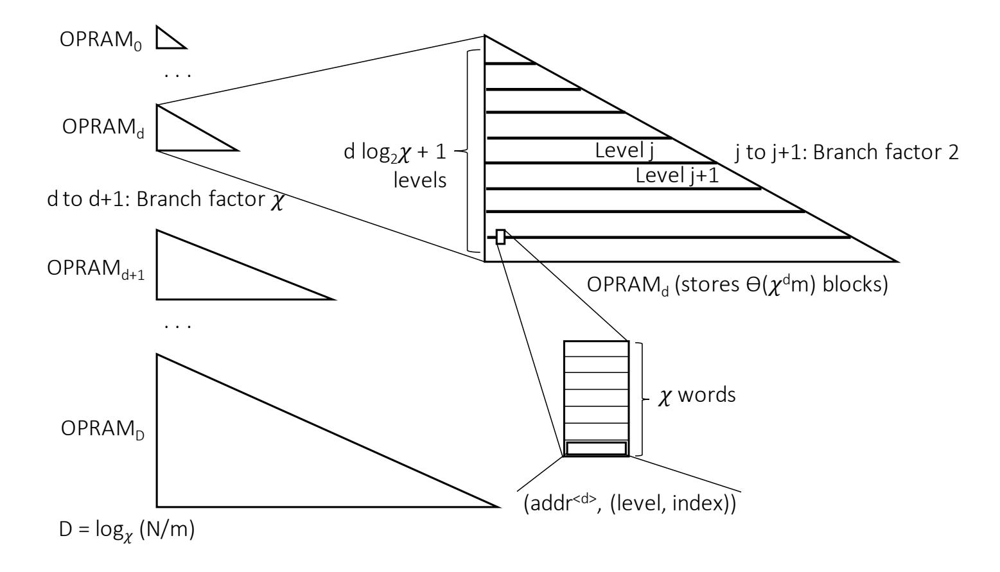

{0}------------------------------------------------

# Perfectly Oblivious (Parallel) RAM Revisited, and Improved Constructions\*

T-H. Hubert Chan<sup>†</sup>
HKU
hubert@cs.hku.hk

Elaine Shi<sup>‡</sup>
CMU
runting@cs.cmu.edu

Wei-Kai Lin<sup>§</sup>
Cornell
wklin@cs.cornell.edu

Kartik Nayak¶ Duke kartik@cs.duke.edu

#### Abstract

Oblivious RAM (ORAM) is a technique for compiling any RAM program to an oblivious counterpart, i.e., one whose access patterns do not leak information about the secret inputs. Similarly, Oblivious Parallel RAM (OPRAM) compiles a parallel RAM program to an oblivious counterpart. In this paper, we care about ORAM/OPRAM with perfect security, i.e., the access patterns must be identically distributed no matter what the program's memory request sequence is. In the past, two types of perfect ORAMs/OPRAMs have been considered: constructions whose performance bounds hold in expectation (but may occasionally run more slowly); and constructions whose performance bounds hold deterministically (even though the algorithms themselves are randomized).

In this paper, we revisit the performance metrics for perfect ORAM/OPRAM, and show novel constructions that achieve asymptotical improvements for all performance metrics. Our first result is a new perfectly secure OPRAM scheme with  $O(\log^3 N/\log\log N)$  expected overhead. In comparison, prior literature has been stuck at  $O(\log^3 N)$  for more than a decade.

Next, we show how to construct a perfect ORAM with  $O(\log^3 N/\log\log N)$  deterministic simulation overhead. We further show how to make the scheme parallel, resulting in an perfect OPRAM with  $O(\log^4 N/\log\log N)$  deterministic simulation overhead. For perfect ORAMs/OPRAMs with deterministic performance bounds, our results achieve subexponential improvement over the state-of-the-art. Specifically, the best known prior scheme incurs more than  $\sqrt{N}$  deterministic simulation overhead (Raskin and Simkin, Asiacrypt'19); moreover, their scheme works only for the sequential setting and is not amenable to parallelization.

Finally, we additionally consider perfect ORAMs/OPRAMs whose performance bounds hold with high probability. For this new performance metric, we show new constructions whose simulation overhead is upper bounded by  $O(\log^3/\log\log N)$  except with negligible in N probability, i.e., we prove high-probability performance bounds that match the expected bounds mentioned earlier.

<sup>\*</sup>Author ordering is randomized.

<sup>&</sup>lt;sup>†</sup>T-H. Hubert Chan was partially supported by the Hong Kong RGC under the grants 17200418 and 17201220.

 $<sup>^{\</sup>ddagger}$ Elaine Shi was partially supported by NSF CNS-1601879, an ONR YIP award, and a Packard Fellowship.

<sup>&</sup>lt;sup>§</sup>Wei-Kai Lin was supported by a DARPA Brandeis award.

<sup>¶</sup>Kartik Nayak was partially supported by NSF Award 2016393.

{1}------------------------------------------------

# 1 Introduction

Oblivious RAM (ORAM) is an algorithmic construction that provably obfuscates a (parallel) program's access patterns. It was first proposed in the ground-breaking work by Goldreich and Ostrovsky [\[GO96,](#page-39-0) [Gol87\]](#page-39-1), and its parallel counterpart Oblivious Parallel ORAM (OPRAM) was proposed by Boyle et al. [\[BCP16\]](#page-38-0). ORAM and OPRAM are fundamental building blocks for enabling various forms of secure computation on sensitive data, e.g., either through trustedhardware [\[RYF](#page-40-0)+13, [FRY](#page-39-2)+14, [MLS](#page-39-3)+13, [LHM](#page-39-4)+15] or relying on cryptographic multi-party computation [\[GKK](#page-39-5)+12, [LWN](#page-39-6)+15]. Since the initial proposal, ORAM and OPRAM have attracted much interest from various communities, and there has been a line of work dedicated to understanding their asymptotic and concrete efficiencies. It is well-known [\[GO96,](#page-39-0)[Gol87,](#page-39-1)[LN18\]](#page-39-7) that any O(P)RAM scheme must incur at least a logarithmic overhead (also known as simulation overhead) in (parallel) runtime relative to the insecure counterpart. On the other hand, ORAM/OPRAM schemes with poly-logarithmic overhead have been known [\[GO96,](#page-39-0)[Gol87,](#page-39-1)[GM11,](#page-39-8)[KLO12,](#page-39-9) [SCSL11,](#page-40-1) [SvDS](#page-40-2)+13, [WCS15,](#page-40-3) [PPRY18\]](#page-40-4), and the very recent exciting work of Asharov et al. [\[AKL](#page-38-1)+20a] showed how to match the logarithmic lower bound in the sequential ORAM setting, assuming the existence of oneway functions and a computationally bounded adversary.[1](#page-1-0) Throughout this paper, we use the standard notion of simulation overhead originally suggested by Goldreich and Ostrovsky [\[GO96,](#page-39-0)[Gol87\]](#page-39-1): if the original RAM/PRAM's (parallel) runtime is T and the corresponding ORAM/OPRAM's (parallel) runtime is χT, we say that the ORAM/OPRAM has simulation overhead χ.

Motivation for perfectly secure ORAMs/OPRAMs. With the exception of very few works, most of the literature has focused on either computationally secure [\[GO96,](#page-39-0) [Gol87,](#page-39-1) [GM11,](#page-39-8) [KLO12,](#page-39-9) [CGLS17,](#page-38-2)[PPRY18,](#page-40-4)[AKL](#page-38-1)+20a] or statistically secure [\[Ajt10,](#page-37-0)[SCSL11,](#page-40-1)[SvDS](#page-40-2)+13[,CLP14,](#page-38-3)[WCS15\]](#page-40-3) ORAMs. A computationally secure (or statistically secure, resp.) ORAM guarantees that for any two request sequences of the same length, the access patterns incurred are computationally (or statistically resp.) indistinguishable. Most known computationally secure or statistically secure schemes [\[GO96,](#page-39-0)[Gol87,](#page-39-1)[SCSL11,](#page-40-1)[SvDS](#page-40-2)+13[,WCS15,](#page-40-3)[BCP16,](#page-38-0)[CS17\]](#page-38-4) suffer from a small failure probability that is negligible in the ORAM's size henceforth denoted N while achieving poly log N overhead. If the ORAM/OPRAM's size is large, say, N ≥ λ for some desired security parameter λ, then the failure probability would also be negligible in the security parameter. Unfortunately, for small choices of N (e.g., N = poly log λ), these schemes actually give polylogarithmic overhead in security parameter λ (and not in N) to achieve a negl(λ) security failure probability — note that a poly log λ overhead equals to N Θ(1) for this parameter regime, and thus the dependence on N is undesirable. Even though at first sight, it seems like we might not care about the parameter regime when N is much smaller than λ; as it turns out, such a small-N ORAM/OPRAM (with polylogarithmic in N overhead) was needed in many scenarios, such as in the construction of searchable encryption schemes [\[DPP18\]](#page-39-10), oblivious algorithms [\[SCSL11,](#page-40-1) [PPRY18,](#page-40-4) [ACN](#page-37-1)+19, [AKL](#page-38-1)+20a] including notably, the recent OptORAMa work [\[AKL](#page-38-1)+20a] that constructed an optimal ORAM.

The study of perfectly secure ORAMs/OPRAMs is partly motivated by the aforementioned mismatch. Moreover, recall also that perfect security has long been a topic of interest in the multi-party computation and zero-knowledge proof literature [\[IKO](#page-39-11)+11,[GIW16\]](#page-39-12), and its theoretical importance widely-accepted. Historically, perfect security is viewed as attractive since 1) the security holds in any computational model even if quantum computers or other forms of computers can be built; and 2) perfectly secure schemes often have clean compositional properties. Therefore, another natural application of perfectly secure ORAM/OPRAM is to construct efficient perfectly secure, RAM-model MPC.

<span id="page-1-0"></span><sup>1</sup>For the parallel setting, how to achieve optimality remains open.

{2}------------------------------------------------

Does there exist a perfectly secure ORAM/OPRAM with o(log<sup>3</sup> N) overhead? Despite the sustained and lively progress in understanding the asymptotic overhead of computationally and statistically secure ORAMs/OPRAMs, our understanding of perfectly secure ORAMs/OPRAMs has been somewhat stuck. In general, few results are known in the perfect security regime: in 2011, Damg˚ard et al. [\[DMN11\]](#page-38-5) first showed a perfectly secure ORAM scheme with O(log<sup>3</sup> N) expected simulation overhead and O(log N) server space blowup, where the space blowup is the ratio between the server space consumed by the scheme compared to the insecure space N. Recently, Chan et al. [\[CNS18\]](#page-38-6) show an improved and simplified construction that removed the log N server space blowup; and moreover, they showed how to extend the approach to the parallel setting resulting in a perfectly secure OPRAM scheme with O(log<sup>3</sup> N) expected overhead. There is no known super-logarithmic lower bound for perfect security, and thus we do not understand yet whether the requirement of perfect security would inherently incur more overhead than computationally secure ORAMs. Therefore, an exciting and extremely challenging open direction is to understand the exact asymptotic complexity of perfectly secure ORAMs and OPRAMs, that is, to seek a matching upper- and lower-bound. This is a very ambitious goal and in this paper, we aim to take the next natural step forward. Since all prior upper bounds seem stuck at O(log<sup>3</sup> N), we ask the following natural question: does there exist an ORAM/OPRAM with o(log<sup>3</sup> N) asymptotic overhead?

The large gap between expected and deterministic performance bounds. To achieve perfect security, the prior perfect ORAM/OPRAM constructions pay a price: specifically their algorithms are Las Vegas, and the stated O(log<sup>3</sup> N) overhead is in an expected sense. Their ORAMs can occasionally run longer than O(log<sup>3</sup> N) time if certain unlucky events happen (where the unlucky events are identically distributed for all inputs so that the scheme remains perfectly secure). Moreover, the smaller the choice of N, the more likely that the ORAM can run much longer than the expectation.

Raskin et al. [\[RS19\]](#page-40-5) (Asiacrypt'19) recently pointed out that this issue was somewhat shoved under the rug in prior works on perfect ORAMs/OPRAMs, and they were the first to ask how to construct perfect ORAMs with deterministic performance bounds. To avoid confusion, note that all ORAM schemes with non-trivial efficiency must be randomized algorithms; however, their performance bounds can be made deterministic (i.e., deterministic performance bounds does not mean that the algorithm is deterministic). Raskin et al. showed a perfectly secure ORAM with a deterministic simulation overhead O( √ N log N log log N ) (assuming O(1) client-side storage[2](#page-2-0) ). While conceptually interesting, in comparison with the O(log<sup>3</sup> N) schemes [\[DMN11,](#page-38-5)[CNS18\]](#page-38-6), the price to obtain deterministic bounds seems high. Therefore, another natural question is, does there exist perfectly secure ORAMs/OPRAMs with deterministic polylogarithmic overhead?

## 1.1 Our Results and Contributions

Our contributions are two-fold. First, following Raskin et al., we make another effort at systematizing the performance metrics for perfect ORAM/OPRAMs. Besides expected and deterministic performance bounds, we additionally consider the notion of high-probability performance bounds (explained below). Second, we show novel perfect ORAM/OPRAM constructions with asymptotical performance improvements for all three types of performance metrics: expected, high-probability, and deterministic.

Revisiting the performance metrics for perfectly secure ORAMs/OPRAMs. We consider the following performance bounds for ORAM/OPRAMs:

<span id="page-2-0"></span><sup>2</sup>Their overhead can be improved to O( √ N) if we allowed O( √ N) client-side storage.

{3}------------------------------------------------

- 1. Expected performance bounds. Suppose that the original RAM/PRAM runs in (parallel) time T, and the corresponding ORAM/OPRAM runs in expected (parallel) time χ · T, then we say that the ORAM/OPRAM satisfies expected simulation overhead (or expected overhead) χ.
- 2. High-probability performance bounds. Suppose that the original RAM/PRAM runs in (parallel) time T, and the corresponding ORAM/OPRAM runs in (parallel) time χ·T with 1−δ probability where δ is suitably small (e.g., negligibly small in some security parameter), then, we say that ORAM/OPRAM satisfies simulation overhead (or overhead) χ with probability 1 − δ. We stress that the failure probability δ describes the probability that the ORAM/OPRAM exceeds the performance bounds, it does not describe security failure since the ORAM/OPRAM is perfectly secure. This is a natural, intermediate notion that is not as stringent as deterministic performance bounds and yet gives a strong guarantee. This notion may permit asymptotically better schemes than insisting on deterministic performance bounds.
- 3. Deterministic performance bounds. Suppose that the original RAM/PRAM runs in (parallel) time T, and the corresponding ORAM/OPRAM runs in (parallel) time χ · T with probability 1, then we say that the ORAM/OPRAM satisfies deterministic simulation overhead χ.

Asymptotically better constructions for all performance metrics. We show novel perfect ORAM/OPRAM constructions that achieve asymptotical performance improvements across the board.

- First, for expected performance, we overcome the log<sup>3</sup> N barrier that the literature has been stuck at for the past decade. Our perfect ORAM/OPRAM scheme has O(log<sup>3</sup> N/ log log N) expected overhead.
- Second, for high-probability performance bounds, previously, there were no documented schemes with this type of performance bounds to the best of our knowledge. We show new perfectly secure ORAM/OPRAMs that achieve O(log<sup>3</sup> N/ log log N) simulation overhead with probability 1 − negl(N).[3](#page-3-0)
- Finally, we construct perfect ORAM/OPRAMs with deterministic, poly-logarithmic simulation overhead. Our result achieves a sub-exponential performance improvement relative to prior art [\[RS19\]](#page-40-5).

Our results are summarized in the following theorems, and moreover, Table [1](#page-4-0) gives an explicit comparison of our results with prior work.

<span id="page-3-1"></span>Theorem 1.1 (Informal: perfect OPRAM with expected performance bounds). There exists a perfectly secure OPRAM scheme that consumes only O(1) blocks of client private cache and O(N) blocks of server-space; moreover the scheme achieves O(log<sup>3</sup> N/ log log N) expected simulation overhead.

<span id="page-3-2"></span>Theorem 1.2 (Informal: perfect OPRAM with high-probability performance bounds). There exists a perfectly secure OPRAM scheme that consumes only O(1) blocks of client private cache and O(N) blocks of server-space; moreover the scheme achieves O 1 log log N · (log<sup>3</sup> N + log<sup>2</sup> N · log<sup>2</sup> log(1/δ) + log N · log<sup>3</sup> log(1/δ)) simulation overhead with probability 1 − δ.

<span id="page-3-0"></span><sup>3</sup>Note that our formal theorem statement gives a parametrized version where the performance failure probability may be any free parameter.

{4}------------------------------------------------

<span id="page-4-0"></span>Table 1: Comparison of our results with prior work. For simplicity, the high-probability bounds are parameterized to 1 - negl(N) failure probability.

|                                                         |                                                                   | Space                       | ORAM overhead                                                                    | OPRAM overhead                               |
|---------------------------------------------------------|-------------------------------------------------------------------|-----------------------------|----------------------------------------------------------------------------------|----------------------------------------------|
| Schemes with <b>expected</b> performance bounds         | Damgård et al. [DMN11]<br>Chan et al. [CNS18]<br><b>This work</b> | $O(N \log N)$ $O(N)$ $O(N)$ | $O(\log^3 N)$ $O(\log^3 N)$ $O(\log^3 N/\log\log N)$                             | $N/A$ $O(\log^3 N)$ $O(\log^3 N/\log\log N)$ |
| Schemes with high-<br>probability<br>performance bounds | This work                                                         | O(N)                        | $O(\log^3 N/\log\log N)$                                                         | $O(\log^3 N/\log\log N)$                     |
| Schemes with <b>deterministic</b> performance bounds    | Raskin et al. [RS19] <b>This work</b>                             | O(N) $O(N)$                 | $\frac{O(\sqrt{N} \cdot \frac{\log N}{\log \log N})}{O(\log^3 N / \log \log N)}$ | $\frac{\text{N/A}}{O(\log^4 N/\log\log N)}$  |

<span id="page-4-1"></span>**Theorem 1.3** (Informal: perfect OPRAM with deterministic performance bounds). There exists a perfectly secure ORAM scheme that achieves  $O(\log^3 N/\log\log N)$  simulation overhead with probability 1. For the parallel setting: there exists a perfectly secure OPRAM scheme that achieves  $O(\log^4 N/\log\log N)$  simulation overhead with probability 1.

For both the ORAM/OPRAM schemes above, we need only O(1) blocks of client private cache and O(N) blocks of server-space.

#### 1.2 Technical Highlight

Getting an  $O(\log^3 N/\log\log N)$  deterministic overhead ORAM. To improve the overhead of perfectly secure ORAMs to  $O(\log^3 N/\log\log N)$ , our techniques are inspired by the rebalancing trick of Kushilevitz et al. [KLO12] (SODA'12), and yet departs significantly from Kushilevitz et al. Namely, the existing perfect ORAM/OPRAM constructions of Chan et al. [CNS18] consist of an "online fetch phase" and an "offline maintain phase," the fetch phase takes a logical request (as an input to the ORAM) and answers to the request using a data structure, and then the maintain phase reshuffles the data structure. We observe that the maintain and fetch phases suffer from an imbalance; specifically, the offline maintain phase costs  $O(\log^3 N)$  per request whereas the online fetch phase costs only  $O(\log^2 N)$ . A natural idea is to modify the scheme and rebalance the costs of the offline maintain phase and the online fetch phase, such that both phases would cost only  $O(\log^3 N/\log\log N)$ . Unfortunately, existing techniques such as Kushilevitz et al. completely fail for rebalancing perfect ORAMs/OPRAMs — we describe the technical reasons in detail in Appendix A.

Our starting point is the perfect ORAM construction by Chan et al. [CNS18] in which the maintain phase costs  $O(\log^3 N)$  and the fetch phase costs only  $O(\log^2 N)$ . Specifically, their construction consists of  $D = O(\log N)$  number of ORAMs such that except for the last ORAM which stores the actual data blocks, every other ORAM serves as a (recursive) index structure into the next ORAM — for this reason, these D ORAMs are also called D recursion depths; and all of the recursion depths jointly realize an implicit logical index structure that is in fact isomorphic to a binary tree (which has a branching factor of 2).

First, we show how to use a fat-block trick to increase the branching factor and hence reduce the number of recursion depths by a  $\log \log N$  factor. Specifically, we increase the implicit index structure's branching factor from 2 (i.e., storing two pointers or position labels in the next recursion depth) to  $\log N$ . Thus a fat-block is a bundle of logarithmically many normal blocks and hence each fat-block can store logarithmically many pointers. While this reduces the recursion depth by a  $\log \log N$  factor, the fetch phase now costs a logarithmic factor more per recursion depth (since 

{5}------------------------------------------------

obliviously accessing a fat-block is a logarithmic factor more costly than accessing a normal block). The primary challenge is to realize the maintain phase such that the amortized per-depth maintain-phase cost preserves the asymptotics, despite the fat-block now being logarithmically fatter. To accomplish this we rely on the following two key insights:

- 1. Exploit residual randomness. First, we rely on an elegant observation first made in the PanORAMa work [\[PPRY18\]](#page-40-4) in the context of computationally secure ORAMs. Here we make the same observation for perfectly secure ORAMs. At the core of Chan et al.'s ORAM construction is a data structure called an oblivious "one-time-memory" (OTM). When an OTM is initialized, all elements in it are randomly permuted (and the randomness concealed from the adversary) — note that in our setting, each element is a fat-block. The critical observation is that after accessing a subset of the elements in this OTM data structure, the remaining unvisited elements still appear in a random order. By exploiting such residual randomness, when we would like to build a new OTM consisting of the remaining unvisited elements, we can avoid performing expensive oblivious permutation (which would take time O(n log n) to sort n elements) and instead rely on linear-time operations.
- 2. Exploit sparsity. In the construction of Chan et al., the D ORAMs at all recursion depths must perform a "coordinated shuffle" operation during the maintain phase. An important step in this coordinated shuffle is (for each recursion depth) to inform the parent depth the locations of its fat-blocks after the reshuffle. In Chan et al., two adjacent recursion depths perform such "communication" through oblivious sorting, thus incurring O(n log n) cost per-depth to rebuild a data structure of size n.

Our key observation is that the fat-blocks contained in each OTM data structure in each recursion depth are sparsely populated. In fact, most entries in the fat-blocks are irrelevant and only a 1/ log N fraction of them are populated. Thus, we employ an oblivious tight compaction [\[AKL](#page-38-1)+20a] to compress away the wasted space, where tight compaction is a degenerated sorting that sorts elements tagged with 0/1 keys. After this compression, the OTM becomes logarithmically smaller and we can apply an oblivious sort.

Finally, we stress that to get an ORAM with deterministic performance bounds, we will need to instantiate our ORAM with building blocks that give deterministic performance. We defer the details to later technical sections.

Parallelizing the scheme. To parallelize our ORAM scheme, we encounter several additional technicalities. Some of the core algorithmic building blocks can be parallelized; however, to preserve the asymptotical total work of the sequential versions, the only known parallel counterparts give Las Vegas-type performance bounds. This would be fine if we only wanted an OPRAM with expected O(log<sup>3</sup> N/ log log N) overhead. However, more work is needed to get an OPRAM whose simulation overhead is O(log<sup>3</sup> N/ log log N) with high probability. Finally, to get an OPRAM whose simulation overhead holds deterministically, we need to replace some of the oblivious parallel building blocks with ones with deterministic performance bounds — here we lose an extra logarithmic factor in total work. We defer a more detailed exposition of these technicalities to later sections.

# 2 Technical Overview

We start with an informal and intuitive exposition of our main technical ideas. For simplicity, most of the section describes how to get the sequential ORAM result with deterministic O(log<sup>3</sup> N/ log log N) simulation overhead. Then, in Section [2.4,](#page-11-0) we sketch the additional steps 

{6}------------------------------------------------

and technicalities needed to parallelize the scheme to get the expected, high-probability, and deterministic performance bounds for OPRAM. The full formal details will be deferred to the technical sections later.

## 2.1 Background on Perfect ORAM

The goal of an ORAM scheme is to simulate to the client a memory array of N blocks, where each block consists of Ω(log N) bits. In the simulated memory, each block is indexed by a logically address in {0, 1, . . . , N − 1}, and the client can read or write a block using a logical address. The ORAM is allowed to use client-side storage of only O(1) number of blocks as well as server storage, where the server supports only fetch or store the content of blocks (but no computation). By perfect security, we require that the sequence of accessed blocks on the server (also called the access pattern) be identically distributed for any sequence of read/write accesses to the memory simulated by ORAM. Such settings are standard in previous works [\[DMN11,](#page-38-5) [CNS18,](#page-38-6) [RS19\]](#page-40-5).

In a recent work, Chan et al. [\[CNS18\]](#page-38-6) propose a perfectly secure ORAM with O(log<sup>3</sup> N) simulation overhead. At a high level, their scheme is inspired by the hierarchical ORAM paradigm by Goldreich and Ostrovsky [\[GO96,](#page-39-0)[Gol87\]](#page-39-1), but Chan et al. replace the "oblivious hashing" (which has a negligible statistical imperfectness) with perfectly secure data structures (including a "one-timememory" as well as a"position map"). In this way, they also remove the pseudo-random function (PRF) in Goldreich and Ostrovsky's construction [\[GO96,](#page-39-0)[Gol87\]](#page-39-1).

#### <span id="page-6-0"></span>2.1.1 Position-based Hierarchical ORAM

First, imagine that the client can store per-block metadata and we will later remove this strong assumption through a non-blackbox recursion technique. Specifically, imagine that the client remembers where exactly each block is residing on the server. In this case, we can construct a perfect ORAM as follows — henceforth this building block is called "position-based ORAM" since we assume that the correct position label for every requested block is known to the client.

Hierarchical levels. The server-side data structure is organized into log N + 1 levels numbered 0, 1, . . . , log N where level i is either 1. empty, in which case it stores no blocks; or 2. full, in which case the level stores 2<sup>i</sup> real blocks plus 2<sup>i</sup> dummy blocks in a randomly permuted fashion (we also say that the level has capacity 2 i ). Each block, whose logical addresses range from 0 to N − 1, resides in exactly one of the levels at a random position within the level.

Fetch phase. Every time a block with address addr is requested, the client looks up the block's position. Suppose that the block resides in the j-th position of level `. The client now visits for one block per full level from the server — note that the levels are visited in a fixed order from 0 to log N:

- for level ` (i.e., where the desired block resides), the client reads precisely the j-th position to fetch the real block; it then marks the visited position as visited;
- for every other level ` <sup>0</sup> 6= `, the client reads a random unvisited dummy block (and marks the corresponding block on the server as visited for obliviousness).

Maintain phase. Every time a block B has been fetched by the client, it updates the block B's contents if this is a write request, and then it puts B back to level 0 as an unvisited block so that level 0 becomes full. Now, suppose levels 0, 1, . . . , `<sup>∗</sup> are all full and either level ` <sup>∗</sup> + 1 is empty or ` <sup>∗</sup> = log N. The client will now merge levels 0, 1, . . . , `<sup>∗</sup> into the "target" level `tgt := 

{7}------------------------------------------------

min(` <sup>∗</sup> + 1, log N). This procedure is called "rebuilding" level `tgt. At the end of the rebuild, it marks level `tgt as full and every smaller level as empty.

To merge consecutively full levels into the next empty level (or the largest level), the goal is to implement the following ideal functionality obliviously:

- 1. extract all unvisited real blocks to be merged and place them in an array called A;
- 2. pad A with dummy blocks to a length of 2 · 2 `tgt blocks and randomly permute the resulting array.

Chan et al. show how to achieve the above obliviously — even though the client has only O(1) blocks of client storage — through oblivious sorting (using the AKS sorting network [\[AKS83\]](#page-38-7)). The cost of rebuilding a level of capacity n is dominated by the oblivious sorting on O(n) blocks, which has a cost of O(n log n).

Note that the above construction guarantees that whenever a real block is accessed, it is moved into a smaller level. Thus, in every level, each real or dummy block is accessed at most once before the level is rebuilt; and this is important for obliviousness. For this reason, later in our technical sections, we name each level in this hierarchy an oblivious "one-time memory". Note also that the number of dummies in a level must match the total number of accesses the level can support before it is rebuilt again.

Additional details about dummy positions. The above description implicitly assumed that for a level the desired block does not reside in, the client is informed of the position of a random unvisited dummy block. If the client does not store this information locally, it can construct a (per-level) metadata array M on the server every time a level is rebuilt. When a block is being requested, the client can sequentially scan the metadata array at every level (including the level where the desired block resides) to discover the location of the next unvisited dummy (residing at a random unvisited location in the level).

As Chan et al. show, such a dummy metadata array can be constructed with O(n log n) overhead using oblivious sorting too, at the same time when a level of capacity n is rebuilt.

Overhead. Summarizing, in the position-based ORAM, after every 2` requests, the level ` will be rebuilt, paying O(2` · log(2` )) cost. Amortizing the total cost over the sequence of requests, it is not difficult to see that the average cost per request is O(log<sup>2</sup> N).

#### <span id="page-7-0"></span>2.1.2 Recursive Position Map

So far we have assumed that the client magically remembers where exactly each block is residing on the server. To remove this assumption, Chan et al. propose to recursively store the blocks' position labels in smaller ORAMs until the ORAM's size becomes constant, resulting in D = O(log N) ORAMs henceforth denoted ORAM0, ORAM1, . . . , ORAM<sup>D</sup> respectively, where ORAM<sup>i</sup> stores the position labels of all blocks in ORAMi+1 for i ∈ {0, 1, . . . , D}. We often call ORAM<sup>D</sup> the "data ORAM" and every other ORAM a "metadata ORAM"; we also refer to the index i as the depth of ORAM<sup>i</sup> . Now, suppose that each block can store Ω(log N) bits of information, such that we can pack the position labels of at least 2 blocks into a single block. In this case, each ORAM<sup>i</sup> is twice smaller in capacity than ORAMi+1 and thus ORAM<sup>0</sup> would be of O(1) size — thus operations to ORAM<sup>0</sup> can be supported trivially by scanning through the whole ORAM<sup>0</sup> consuming only constant cost, and the total space is still O(N).

As Chan et al. show, in the hierarchical ORAM context such a recursion idea does not work

{8}------------------------------------------------

in a straightforward blackbox manner,[4](#page-8-0) but needs a special "coordinated rebuild" technique which we now explain. Henceforth, suppose that each block's logical address addr is log N bits long, and we use the notation addrhd<sup>i</sup> to denote the address addr, written in binary format, truncated to the most significant d bits.

- Fetch phase (straightforward): To fetch a block at some logical address addr, the client looks up logical address addrhd<sup>i</sup> in each ORAM<sup>d</sup> for d = 0, 1, . . . D sequentially. Since the block at logical address addrhd<sup>i</sup> in ORAM<sup>d</sup> stores the position labels for the two blocks at logical addresses addrhd<sup>i</sup> k0 addrhd<sup>i</sup> k1 in ORAMd+1, the client is always able to find out the position of the block in the next recursion depth before it performs a lookup there.
- Maintain phase (coordinated rebuild): The maintain phase needs special treatment such that the rebuilds at all recursion depths are coordinated. Specifically, whenever the data ORAM<sup>D</sup> is rebuilding the level `, each other recursion depth ORAM<sup>d</sup> would be rebuilding level min(`, d) in a coordinated fashion — note that each ORAM<sup>d</sup> has only d levels.

The main goal of the coordination is for each ORAM<sup>d</sup> to pass the blocks' updated position labels back to the parent depth ORAMd−1. More specifically, recall that when ORAM<sup>d</sup> rebuilds a level `, all real blocks in the level would now be placed at a new random position. When these new positions have been decided, ORAM<sup>d</sup> must inform the corresponding metadata blocks in ORAMd−<sup>1</sup> the new position labels. The coordinated rebuild is possible due to the following invariant which is not hard to observe (recall that addrhd<sup>i</sup> is the block that stores the position labels for the block addrhd+1<sup>i</sup> in ORAMd+1):

For every addr, the block at address addrhd<sup>i</sup> in ORAM<sup>d</sup> is always stored at a smaller or equal level relative to the level of the block at address addrhd+1<sup>i</sup> in ORAMd+1.

Chan et al. show how to us oblivious sorting to perform a coordinated rebuild, paying O(n log n) to pass the new position labels of level-` in ORAM<sup>d</sup> to the parent ORAMd−<sup>1</sup> where n = 2` is the level's capacity.

#### 2.1.3 Analysis

It is not hard to see that the entire fetch phase consumes O(log<sup>2</sup> N) overhead where one log N factor comes from the number of levels within each recursion depth, and another comes from the number of recursion depths. The maintain phase, on the other hand, consumes O(log<sup>3</sup> N) amortized cost where one logarithmic factor arises from the number of recursion depths, one arises from the number of levels within each depth, and the last one stems from the additional logarithmic factor in oblivious sorting.

To asymptotically improve the overhead, one promising idea is to somehow balance the fetch and maintain phases. This idea has been explored in computationally secure ORAMs first by Kushilevitz et al. [\[KLO12\]](#page-39-9) and later improved in subsequent works [\[CGLS17\]](#page-38-2). Unfortunately as we explain in Appendix [A,](#page-40-6) Kushilevitz et al.'s rebalancing trick is not compatible with known perfect ORAMs. Thus we need fundamentally new techniques for realizing such a rebalancing idea.

## <span id="page-8-1"></span>2.2 Building Blocks

Before we introduce our new algorithms, we describe two important oblivious algorithms as building blocks that were discovered in very recent works [\[Pes18,](#page-40-7) [AKL](#page-38-1)+20a].

<span id="page-8-0"></span><sup>4</sup>Roughly speaking, it is because each logical access on ORAMi+1 would have incurred too many accesses on ORAMi, and then the cost of such recursion would have been too expensive.

{9}------------------------------------------------

**Tight compaction.** Tight compaction is the following task: given an input array containing m balls where each ball is tagged with a bit indicating whether it is real or dummy, produce an output array containing also m balls such that all real balls in the input appear in the front and all dummies appear at the end.

In a very recent work called OptORAMa [AKL $^+$ 20a], the authors show how to accomplish tight compaction obliviously in O(m) time. Their algorithm can be expressed as a linear-sized circuit (of constant fan-in and fan-out), consisting only of boolean gates and swap gates, where a boolean gate can perform boolean computations on two input bits; and a swap gate takes in a bit and two balls, and decides to either swap or not swap the two balls.

**Intersperse.** The same work OptORAMa described another randomized oblivious algorithm called "intersperse", which accomplishes the following task in deterministic linear time: given two randomly shuffled input arrays  $\mathbf{I}$  and  $\mathbf{I'}$  (where the permutations used in the shuffles are hidden from the adversary), create an output array of length  $|\mathbf{I}| + |\mathbf{I'}|$  that contains all elements from the two input arrays, and moreover, all elements in the output array are randomly shuffled in the view of the adversary.

#### 2.3 A New Rebalancing Trick for Perfectly Secure ORAMs

We propose new techniques for instantiating such a rebalancing trick. Our idea is to introduce a notion called a fat-block. A fat-block is a bundle of  $\chi := \log N$  normal blocks; thus to access a fat-block requires paying  $\chi = \log N$  cost.

Imagine that in each metadata ORAM, the atomic unit of storage is a fat-block (rather than a normal block). Since each fat-block can pack  $\chi = \log N$  position labels, the depth of the recursion is now  $\log_{\chi} N = \log N/\log\log N$ , i.e., a  $\log\log N$  factor smaller than before (see Section 2.1.2). More concretely, a metadata ORAM ORAM<sub>d</sub> at depth d stores a total of  $\chi^d$  metadata fat-blocks—for the time being we assume that N is a power of  $\chi$  for simplicity, and let  $D := \log_{\chi} N + 1$  be the number of recursion depths such that the total storage is still O(N) blocks (our idea can be generalized to the case when N is not a power of  $\chi$ ). Within each ORAM<sub>d</sub>, as before, we have a total of  $d \log \chi + 1$  levels where each level  $\ell$  can store  $2^{\ell}$  fat-blocks.

It is not hard to see that the fetch phase would now incur  $O(\log^3 N/\log\log N)$  cost across all recursion depths — in comparison with before, the extra  $\log N$  factor arises from the cost of reading a fat-block, and the  $\log\log N$  factor saving comes from the  $\log\log N$  saving in recursion depth.

Our hope is that now with the smaller recursion depth, we can accomplish the maintain phase in amortized  $O(\log^3 N/\log\log N)$  cost. Recall that each level  $\ell$  in a metadata  $\mathsf{ORAM}_d$  now contains  $2^\ell$  fat-blocks. The crux is to rebuild a level containing  $2^\ell$  fat-blocks in cost that is linear in the level's total size, that is,  $2^\ell \cdot \chi$ . Note that if we naïvely used oblivious sorting on fat-blocks (like in Section 2.1.1) to accomplish this, the cost would have been  $2^\ell \cdot \chi \cdot \log(2^\ell)$  which is more expensive than previous scheme and undesirable.

To resolve this challenge, the following two insights are critical:

- Sparsity: First, observe that each level in a metadata ORAM is sparsely populated: although the entire level, say, level  $\ell$ , has the capacity to store  $2^{\ell} \cdot \chi$  position labels, the level is rebuilt after every  $2^{\ell}$  requests. Thus in fact only  $2^{\ell}$  of these position label entries are populated.
- Residual randomness: The second important observation is that the unvisited fat-blocks contained in any level appear in a random order where the randomness of the permutation is hidden from the adversary note that a similar observation was first made in the PanORAMa work [PPRY18] by Patel et al.

{10}------------------------------------------------

More specifically, suppose that to start with, a level contains n fat-blocks including some reals and some dummies, and all of these n fat-blocks have been randomly permuted (where the randomness of the permutation is hidden from the adversary). As the client visits fat-blocks in a level, the adversary learns which blocks are visited. Now, among all the unvisited blocks, there are both real and dummy blocks and all these blocks are equally likely to appear in any order w.r.t. the adversary's view.

We now explain how to rely on the above insights to rebuild a level containing n = 2` fat-blocks in O(n·χ) time — note that at most half of these fat-blocks are real, and the remaining are dummy. From Section [2.1.2,](#page-7-0) we learned that to rebuild a level containing n fat-blocks, it suffices to realize the following functionality obliviously:

- a) Merge. The first step of the rebuild is to merge consecutively full levels into the next empty level (or the largest level). After this merge step, this new level is marked full and every smaller level is marked empty.
- b) Permute. After the above merge step, the resulting array containing n fat-blocks must be randomly permuted (and their positions after the permutation will then be passed to the parent depth next).
- c) Update. After the permutation step, each real fat-block in the level (at a recursion depth d) whose logical address is addr must receive up to χ updated positions from the child recursion depth, i.e., the fat-block at logical address addr wants to learn where the fat-blocks at logical addresses addr||0, addr||1, . . ., addr||(χ − 1) newly reside in the child depth d + 1.
- d) Create dummy metadata. Finally, create a dummy metadata array to accompany this level: the dummy metadata array containing n entries where each entry is O(log N) bits (note that an entry is a normal block, not a fat-block). This array should store the positions of all dummy fat-blocks contained in the level in a randomly permuted order.

Realizing "merge + permute". We first explain how to accomplish the "merge + permute" steps. For simplicity we focus on explaining the case where consecutive full levels are merged into the next empty level (since it would be fine if the merging into the largest level alone is done na¨ıvely using oblivious sort on all fat-blocks). Here it is important to rely on the residual randomness property mentioned earlier. Suppose the levels to be merged contain 1, 2, 4, 8, . . . , n/2 fat-blocks respectively. Recall that in all of these levels to be merged, the unvisited blocks appear in a random order w.r.t. the adversary's view. Thus, we can simply do O(log n) cascading merges using Intersperse (see Section [2.2\)](#page-8-1), every time merging two arrays each containing 2<sup>i</sup> fat-blocks into an array containing 2i+1 fat-blocks, and the overall cost is O(n).

Realizing "update". At this moment, let us not view the level as an array of n fat-blocks any more, but as an array of O(n · χ) position entries. For realizing the "update" step in O(n · χ) overhead, the key insight is to exploit the sparsity.

Recall that the problem we need to solve boils down to the following. There is a destination array D consisting O(n · χ) position entries among which O(n) entries are going to be updated, and we override terminologies "real" and "dummy" (opposed to previously denoted real or dummy fat-blocks) and say the to-be-updated O(n) entries are real while all remaining entries are dummy. Additionally, there is a source array S consisting of O(n) entries (which can be real or dummy). In both the source S and the destination D, each real entry is of the form (k, v) where k denotes a key and v denotes a payload value; further, in each array D or S, every real entry must have a distinct key. Now, we would like to route each real entry (k, v) ∈ S to the corresponding entry with the same key in the destination array D.

{11}------------------------------------------------

Exploiting the sparsity in the problem definition, we devise the following algorithm where an important building block is linear-time oblivious tight compaction (see Section [2.2\)](#page-8-1).

First, we rely on oblivious tight compaction to compact the destination array D, resulting in a compacted array <sup>D</sup><sup>e</sup> consisting of only <sup>O</sup>(n) entries. Moreover, recall that oblivious tight compaction can be viewed as a circuit consisting of boolean gates and swap gates. When we compact the destination array D, each swap gate remembers the routing decision since later it will be useful to run this circuit in the reverse direction. After the compaction, we can now afford to pay the cost of oblivious sorting. Hence, each entry in the source S can route itself to each entry in the compacted destination <sup>D</sup><sup>e</sup> — this can be accomplished through a standard technique called oblivious routing [\[BCP16,](#page-38-0) [CS17\]](#page-38-4), which has a cost of O(n log n). Now, by running the aforementioned tight compaction circuit in the reverse direction, we can route each element of the compacted destination <sup>D</sup><sup>e</sup> back into the original destination array <sup>D</sup>.

It is not difficult to see that the above steps require only O(n · (χ + log n)) = O(n log N) cost.

Obliviously create dummy metadata array. Finally, obliviously creating the dummy metadata array is easy: this can be accomplished by writing down O(log N) bits of metadata per fat-block, and then performing a combination of oblivious random permutation and oblivious sort on the resulting metadata array. To get deterministic simulation overhead for our ORAM, we will need to use an oblivious random permutation algorithm with deterministic performance bounds — fortunately, this is known due to Asharov et al. [\[AKL](#page-38-1)+20a].

Summary. In the above, we took care to make sure that all oblivious building blocks used give deterministic performance bounds. At this moment, we derive a perfect ORAM scheme with O(log<sup>3</sup> N/ log log N) deterministic overhead. This warmup result already improves upon Chan et al. [\[CNS18\]](#page-38-6) who showed O(log<sup>3</sup> N) expected simulation overhead, as well as Raskin [\[RS19\]](#page-40-5) who showed roughly <sup>√</sup> N deterministic simulation overhead.

## <span id="page-11-0"></span>2.4 Parallelizing the Scheme

So far, for simplicity we have focused on the sequential case. To obtain our OPRAM result, we need to make the above scheme parallel. To this end, we will rely on the OPRAM techniques by Chan et al. [\[CNS18\]](#page-38-6), that is, the fetch phase is still performed sequentially, but the maintain phase is realized using parallel and oblivious sorting, tight compaction, and random permutation. One main challenge here is that we will need a parallel counterpart for the Intersperse algorithm. Note that Asharov et al. [\[AKL](#page-38-1)+20a]'s Intersperse algorithm gives deterministic performance bounds and perfect security, but is inherently sequential. We devise a new parallel Intersperse algorithm that preserves the same asymptotical total work as the sequential version of Asharov et al. [\[AKL](#page-38-1)+20a] (for fat-blocks); however, the algorithm gives Las-Vegas-type performance. This is fine if we only aim for an O(log<sup>3</sup> / log log N)-expected-overhead OPRAM, but it will not work if we want matching high probability performance bounds. Observe that our parallel Intersperse algorithm's performance bounds are more concentrated around the mean for larger input sizes. In our OPRAM, the Intersperse algorithm needs to be applied to input arrays containing 1, 2, 4, . . . , N/ log N fat blocks. Therefore, to get O(log<sup>3</sup> / log log N) overhead with 1 − negl(N) probability, our idea is to apply the Las-Vegas Intersperse algorithm only to sufficiently large instances, and for small instances, we apply a variant which gives deterministic performance bounds but is a logarithmic factor more expensive. We prove that this bi-modal approach gives an OPRAM scheme whose simulation overhead is O(log<sup>3</sup> / log log N) with 1 − negl(N) probability.

Finally, to get an OPRAM with deterministic performance bounds, we need to replace the Intersperse building block entirely with one that gives deterministic performance bounds, but is a 

{12}------------------------------------------------

logarithmic factor more expensive. This explains why our OPRAM with deterministic performance bounds has an extra logarithmic factor.

## 2.5 Open Questions

Our paper raises several interesting open questions. First, for constructions with deterministic performance bounds, currently our OPRAM scheme has a logarithmic factor higher simulation overhead than the sequential ORAM — this extra logarithmic factor stems from the parallel perfect oblivious permutation building block we use [\[AS96\]](#page-38-8). One open question is whether we can get rid of this extra logarithmic factor.

In our paper, we adopt the standard notion of simulation overhead originally defined by Goldreich and Ostrovsky [\[GO96,](#page-39-0)[Gol87\]](#page-39-1). This standard notion is naturally amortized over the multiple steps of the RAM/PRAM, since it takes the ratio of the total runtime of the ORAM/OPRAM and that of the original RAM/PRAM. In comparison, some earlier works consider an even stronger notion, often referred to as worst-case overhead [\[OS97,](#page-40-8)[SCSL11,](#page-40-1)[KLO12,](#page-39-9)[CGLS17,](#page-38-2)[RS19\]](#page-40-5): a worst-case overhead of χ requires that every (parallel) step of the original RAM/PRAM is simulated by at most χ steps in the compiled ORAM/OPRAM. While some previous ORAM/OPRAM constructions are amenable to a standard deamortization trick [\[OS97,](#page-40-8) [KLO12\]](#page-39-9) to achieve worst-case overhead that match the amortized, our constructions are not compatible with standard deamortization techniques [\[KLO12\]](#page-39-9) for a similar reason why PanORAMa [\[PPRY18\]](#page-40-4) and OptORAMa [\[AKL](#page-38-1)+20a] are also not compatible with standard deamortization. It is due to the "residual randomness" technique: after the residual randomness of an element is used to facilitate a random permutation, if the same element is then accessed due to the deamortization, then such residual randomness is revealed and the random permutation is no longer random in the adversarial view, which is insecure. An interesting future direction is whether we can achieve worst-case overhead that match the amortized bounds claimed in our paper.

Our paper focuses on the theoretical understanding of the asymptotic complexity of perfectly secure ORAMs/OPRAMs. Our asymptotic constant is huge due to using AKS sorting network [\[AKS83\]](#page-38-7) and the linear tight compaction [\[AKL](#page-38-9)+20b]. The constants are similar to earlier works [\[DMN11,](#page-38-5) [CNS18\]](#page-38-6) that also use AKS sorting. A standard way to replace the huge constant with another logarithmic factor is to replace both AKS sorting and tight compaction with bitonic sorter [\[Bat68\]](#page-38-10) (notice that the standard bitonic sort takes O(n log<sup>2</sup> n) work, but to sort only 0/1 elements, i.e. tight compaction, a bitonic sort augmented with counting takes only O(n log n) work). An interesting question is whether we can achieve the performance bounds claimed in this paper, but without the use of expander graphs with large constants.

Last but not the least, for perfectly secure ORAM/OPRAM (and in fact even for statistically secure ORAM/OPRAM), we still do not have matching upper- and lower-bounds. Therefore, a more challenging direction is to close this obvious gap in our understanding.

## 2.6 Roadmap of Subsequent Formal Sections

In the technical sections, we formalize the blueprint described in this section. Our formal description is modularized which will facilitate formal analysis and proofs. Moreover, in our formal sections we will directly present the OPRAM result (since the sequential ORAM is a special case of the more general OPRAM result).

# 3 Preliminaries

{13}------------------------------------------------

#### 3.1 Definitions

#### 3.1.1 Parallel Random-Access Machines

We review the concepts of a parallel random-access machine (PRAM) and an oblivious parallel random-access machine (OPRAM). The definitions in this section are borrowed from Chan et al. [CNS18]. Although we give definitions only for the parallel case, we point out that this is without loss of generality, since a sequential RAM can be thought of as a special case PRAM with one CPU.

Parallel Random-Access Machine (PRAM) A parallel random-access machine consists of a set of CPUs and a shared memory denoted by mem indexed by the address space  $\{0, 1, ..., N-1\}$ , where N is a power of 2. In this paper, we refer to each memory word also as a block, which is at least  $w = \Omega(\log N)$  bits long.

We consider a PRAM model where the number of CPUs is fixed to be some parameter  $m \leq N^5$ . Each CPU has a state that stores O(1) blocks. In each step, each CPU executes a next instruction circuit denoted  $\Pi$ , and then interacts with memory. Circuit  $\Pi$  can perform word-level operations including addition, subtraction, and bit-wise boolean operations in unit time and then updates the CPU state. Further, CPUs interact with memory through request instructions  $\vec{I}^{(t)} := (I_i^{(t)} : i \in [m])$ . Specifically, at time step t, CPU i's instruction is of the form  $I_i^{(t)} := (\text{read}, \text{addr})$ , or  $I_i^{(t)} := (\text{write}, \text{addr}, \text{data})$  where the operation is performed on the memory block with address addr and the block content data.

If  $I_i^{(t)} = (\text{read}, \text{addr})$  then the CPU i should receive the contents of mem[addr] at the beginning of time step t. Else if  $I_i^{(t)} = (\text{write}, \text{addr}, \text{data})$ , CPU i should still receive the contents of mem[addr] at the beginning of time step t; further, at the end of step t, the contents of mem[addr] should be updated to data.

Write conflict resolution. By definition, multiple read operations can be executed concurrently with other operations even if they visit the same address. However, if multiple concurrent write operations visit the same address, a conflict resolution rule will be necessary for our PRAM to be well-defined. In this paper, we assume the following:

- The original PRAM supports concurrent reads and concurrent writes (CRCW) with an arbitrary, parametrizable rule for write conflict resolution. In other words, there exists some priority rule to determine which write operation takes effect if there are multiple concurrent writes in some time step t.
- Our compiled, oblivious PRAM (defined below) is a "concurrent read, exclusive write" PRAM (CREW). In other words, our OPRAM algorithm must ensure that there are no concurrent writes at any time.

**CPU-to-CPU communication.** In the remainder of the paper, we sometimes describe our algorithms using CPU-to-CPU communication. For our OPRAM algorithm to be oblivious, the inter-CPU communication pattern must be oblivious too. We stress that such inter-CPU communication can be emulated using shared memory reads and writes. Therefore, when we express our performance metrics, we assume that all inter-CPU communication is implemented with shared memory reads and writes.

<span id="page-13-0"></span><sup>&</sup>lt;sup>5</sup>If N < m, the oblivious simulation can be achieved by assigning at most one address to each CPU and then performing oblivious routing [BCP16], which takes only  $O(\log m)$  overhead.

{14}------------------------------------------------

Additional assumptions and notations. Henceforth, we assume that each CPU can only store O(1) memory blocks. Further, we assume for simplicity that the runtime T of the PRAM is fixed a priori and publicly known. Therefore, we can consider a PRAM to be parametrized by the following tuple

$$\mathsf{PRAM} := (\Pi, N, T, m),$$

where  $\Pi$  denotes the next instruction circuit, N denotes the total memory size (in terms of number of blocks), T denotes the PRAM's total runtime, and m denotes the number of CPUs.

Finally, in this paper, we consider PRAMs that are *stateful* and can evaluate a sequence of inputs, carrying states in between, where each input can be stored in a single memory block.

#### 3.1.2 Oblivious Parallel Random-Access Machines

An OPRAM is a (randomized) PRAM with certain security properties, i.e., its access patterns leak no information about the inputs to the PRAM.

Randomized PRAM. A randomized PRAM is a PRAM where the CPUs are allowed to generate private random numbers. Concretely, we assume that the next instruction circuit  $\Pi$  can sample a uniform random number from [a] for any positive integer  $a \leq 2^w$  in unit time (recall that w is the memory word size in bits), where the assumption is needed by the oblivious random permutation (e.g., [AS96]). For simplicity, we assume that a randomized PRAM has a priori known, deterministic runtime, and that the CPU activation pattern in each time step is also fixed a priori and publicly known.

Memory access patterns. Given a PRAM program denoted PRAM and a sequence inp of inputs, we define the notation Addresses[PRAM](inp) as follows:

- Let T be the total number of parallel steps that PRAM takes to evaluate inputs inp.
- Let  $A_t := (\mathsf{addr}_1^t, \mathsf{addr}_2^t, \dots, \mathsf{addr}_m^t)$  be the list of addresses such that the *i*-th CPU accesses memory address  $\mathsf{addr}_i^t$  in time step t.
- We define Addresses[PRAM](inp) to be the random object  $[A_t]_{t \in [T]}$ .

**Oblivious PRAM (OPRAM).** We say that a PRAM is *perfectly oblivious*, iff for any two input sequences  $\mathsf{inp}_0$  and  $\mathsf{inp}_1$  of equal length, it holds that the following distributions are identically distributed (where  $\equiv$  denotes identically distributed):

$$Addresses[PRAM](inp_0) \equiv Addresses[PRAM](inp_1)$$

We remark that for statistical and computational security, some earlier works [CGLS17, CS17] presented an adaptive, composable security notion. The perfectly oblivious counterpart of their adaptive, composable notion is equivalent to our notion defined above. In particular, our notion implies security against an adaptive adversary who might choose the input sequence inp adaptively over time after having observed partial access patterns of PRAM.

We say that OPRAM is a *perfectly oblivious simulation* of PRAM iff OPRAM is perfectly oblivious, and moreover OPRAM(inp) is identically distributed as PRAM(inp) for any input inp.

**Metrics.** We will use the standard notion of *simulation overhead* to characterize an OPRAM's performance [GO96,Gol87,BCP16]. If a PRAM that consumes m CPUs and completes in T parallel steps can be obliviously simulated by an OPRAM that completes in  $\gamma \cdot T$  steps also with m CPUs, then we say that the simulation overhead is  $\gamma$ . Moreover, supposing that the OPRAM is randomized (by a random tape that is independent from the PRAM), and letting the OPRAM completes in T'

{15}------------------------------------------------

steps with m CPUs where T 0 is a random variable, we say that the expected simulation overhead is γ if E[T 0 ] = γT, and we say that the simulation overhead is γ with probability 1−δ if Pr[T <sup>0</sup> ≤ γT] ≥ 1 − δ. We additionally say the simulation overhead γ is deterministic if it is γ with probability 1, which coincides with the standard simulation overhead.

More generally, suppose that an ample (i.e., unbounded) number of CPUs are available: in this case if algorithm can be completed in T parallel steps consuming m1, m2, . . . , m<sup>T</sup> CPUs in each step respectively, then we say that the algorithm can be completed in T depth and W := P <sup>t</sup>∈[T] m<sup>t</sup> total work. Similar to that of simulation overhead, when the total work and depth are random variables, we quantify the total work and depth using expected, with probability, or deterministic, where deterministic is sometimes omitted.

Therefore, for an OPRAM, if the original PRAM (taking T parallel steps and using m CPUs) can be obliviously simulated in W<sup>0</sup> total work and T <sup>0</sup> = O(W0/m) depth then the OPRAM has simulation overhead W0/Tm.

Oblivious simulation of a non-reactive functionality. For defining the security of intermediate building blocks, we now define what it means to obliviously realize a non-reactive functionality. Let F : {0, 1} <sup>∗</sup> → {0, 1} <sup>∗</sup> be a possibly randomized functionality. We say that M<sup>F</sup> is a perfect oblivious simulation (or oblivious simulation for short) of F with leakage L, iff there exists a simulator Sim, such that for every input x ∈ {0, 1} ∗ , the following real-world and ideal-world distributions are identical:

- Real world: execute M<sup>F</sup> (x) and let y be the output and Addr be the memory access patterns; output (y, Addr);
- Ideal world: output (F(x), Sim(L(x))).

For simplicity, if the leakage function L(x) = |x|, we often say that M<sup>F</sup> is a perfect oblivious simulation of F (omitting the leakage function) for short.

Modeling input assumptions. Some of our building blocks provide perfect obliviousness only if the input array is randomly shuffled and the corresponding randomness concealed. More formally, suppose that a machine M(A, x) and a functionality F(A, x) both take in an array A ∈ D<sup>n</sup> where D ∈ {0, 1} ` as input and possibly an additional input x ∈ {0, 1} ∗ . Formally, we say that "the machine M is a perfectly oblivious simulation of the functionality F with leakage L assuming that the input array A is randomly shuffled", iff for every A ∈ D<sup>n</sup> and every x ∈ {0, 1} ∗ , the following real-world and ideal-world distributions are identical:

- Real world: randomly shuffle the array A and obtain A<sup>0</sup> , execute M<sup>F</sup> (A<sup>0</sup> , x) and let y be the output and Addr be the memory access patterns; output (y, Addr);
- Ideal world: output (F(A, x), Sim(`,L(A, x)).

Note that the above definition considers only a single input array A, but there is a natural generalization for algorithms that take two or more input arrays — in this case we may require that some or all of these input arrays be randomly shuffled to achieve perfect obliviousness.

## 3.2 Oblivious Algorithm Building Blocks

We describe some algorithmic building blocks. Unless otherwise noted, for algorithms that operate on arrays of n elements, we always assume that a single memory word is wide enough to store the index of each element within the array, i.e., w ≥ log n where w is the bit-width of each PRAM word. We typically use the following notation: let B denote the bit-width of each element, and let β := dB/we denote the number of memory words it takes to store each element.

{16}------------------------------------------------

#### 3.2.1 Oblivious Sort

Oblivious sorting can be accomplished through a sorting network such as the famous construction by Ajtai, Koml´os, and Szemer´edi [\[AKS83\]](#page-38-7). We restate this result in the context of PRAM algorithms:

Theorem 3.1 (Oblivious sorting [\[AKS83\]](#page-38-7)). There exists a deterministic, oblivious algorithm that sorts an array of n elements consuming O(β · n log n) total work and O(log n) depth where β ≥ 1 denotes the number of memory words it takes to represent each element.

#### <span id="page-16-3"></span>3.2.2 Oblivious Random Permutation

Let ORP be an algorithm that upon receiving an input array X, outputs a permutation of X. Let Fperm denote an ideal functionality that upon receiving the input array X, outputs a perfectly random permutation of X. We say that ORP is a perfectly oblivious random permutation, iff it is a perfect oblivious simulation of the functionality Fperm. Recall that for any integer m ∈ [n], each CPU of the PRAM can sample an integer uniformly at random from [m] in unit time.

Sequential ORP algorithm with deterministic performance bounds. Recently, a sequential oblivious algorithm is developed to perform such permutation in O(n log n) total work [\[AKL](#page-38-1)+20a, Section 6.4].

Theorem 3.2 (A sequential ORP algorithm [\[AKL](#page-38-1)+20a]). Let β ≥ 1 denote the number of memory words it takes to represent each element. There exists an oblivious random permutation construction that completes in deterministic O(β · n log n) total work.

Parallel ORP algorithm with deterministic performance bounds. Alonso and Schott [\[AS96\]](#page-38-8) construct a parallel random permutation algorithm that takes O(n log<sup>2</sup> n) total work and O(log<sup>2</sup> n) depth to randomly permute n elements. Although achieving obliviousness was not a goal of their paper, it turns out that their algorithm is also perfectly oblivious, giving rise to the following theorem:

<span id="page-16-2"></span>Theorem 3.3 (Alonso-Schott ORP). There is a perfectly oblivious algorithm that permutes an array of n elements in deterministic O(β · n log n + n log<sup>2</sup> n) total work and O(log<sup>2</sup> n) depth where β ≥ 1 denotes the number of memory words for representing each element.

Parallel, Las Vegas ORP algorithm. A few recent works [\[CCS17,](#page-38-11) [AKL](#page-38-1)+20a] describe another perfectly oblivious random permutation algorithm which is asymptotically more efficient but the algorithm is Las Vegas, i.e., the algorithm satisfies perfect obliviousness and correctness, but with a small probability the algorithm may run longer than the stated bound.[6](#page-16-0) Below, we restate this result in the form that we desire in this paper — the specific theorem stated below arises from the improved analysis of Asharov et al. [\[AKL](#page-38-1)+20a, Theorem 4.3] where we replace the "quadratic oblivious random permutation" with Alonso-Schott ORP; for the performance bounds, we state an expected version and a high-probability version. Notice that the replaced ORP incurs an O(log<sup>2</sup> n) depth with probability o(1) but not in expectation.

<span id="page-16-1"></span>Theorem 3.4 (A Las Vegas ORP algorithm). Let β ≥ 1 denote the number of memory words it takes to represent each element. There exists a Las Vegas perfectly oblivious random permutation construction that completes in expected O(β · n log n) total work and expected O(log n) depth. Furthermore, except with n <sup>−</sup>Ω(<sup>√</sup> <sup>n</sup>) probability, the algorithm completes in O(β · n log n) total work and O(log<sup>2</sup> n) depth.

<span id="page-16-0"></span><sup>6</sup>Using more depth but only unbiased random bits, Czumaj [\[Czu15\]](#page-38-12) shows a Las Vegas switching network to achieve the same abstraction.

{17}------------------------------------------------

Note that the above theorem gives a high-probability performance bound for sufficiently large n. Later in our OPRAM construction, we will adopt ORP for problems of different sizes — we will use Theorem [3.4](#page-16-1) for sufficiently large instances and use Theorem [3.3](#page-16-2) for small instances.

#### 3.2.3 Oblivious Routing

Oblivious routing [\[BCP16\]](#page-38-0) is the following primitive where n source CPUs wish to route data to n <sup>0</sup> destination CPUs based on the key.

- Inputs: The inputs contain two arrays: 1) a source array src := {(k<sup>i</sup> , vi)}i∈[n] where each element is a (key, value) pair or a dummy element denoted (⊥, ⊥); and 2) a destination array dst := {k 0 i }i∈[n<sup>0</sup> ] containing a list of (possibly dummy) keys.
  - We assume that each (non-dummy) key appears no more than C times in the src array where C = O(1) is a known constant; however, each (non-dummy) key can appear any number of times in dst.
- Outputs: We would like to output an array Out := {v 0 i,j}i∈[n<sup>0</sup> ],j∈[C] where (v 0 i,1 , . . . , v<sup>0</sup> i,C) contains all the values contained in src whose keys match k 0 i (padded with ⊥ to length C).

<span id="page-17-2"></span>Theorem 3.5 (Oblivious routing [\[BCP16,](#page-38-0)[CS17,](#page-38-4)[CCS17\]](#page-38-11)). There exists a perfectly oblivious routing algorithm that accomplishes the above task in O(log(n + n 0 )) depth and O(β · (n + n 0 ) log(n + n 0 )) total work where β ≥ 1 denotes the number of words it takes to represent each element.

#### 3.2.4 Oblivious Tight Compaction

As mentioned in Section [2.2,](#page-8-1) tight compaction is the following task: given an input array containing n elements where each element is tagged with a bit indicating whether it is real or dummy, produce an output array containing also n elements such that all real elements in the input appear in the front and all dummies appear at the end. We will use the parallel oblivious tight compaction of Asharov et al. [\[AKL](#page-38-9)+20b] running in linear work and logarithmic depth.

<span id="page-17-0"></span>Theorem 3.6 (Oblivious tight compaction [\[AKL](#page-38-9)+20b]). There exists a deterministic, oblivious tight compaction algorithm that compacts an array of n elements in total work O(β · n) and depth O(log n) where β ≥ 1 denotes the number of words it takes to represent each element.

We point out that Asharov et al.'s oblivious parallel compaction algorithm [\[AKL](#page-38-9)+20b] works in the so-called indivisibility model, that is, the payload of the elements are moved around as opaque strings.

## <span id="page-17-1"></span>3.3 Parallel Intersperse

Oblivious intersperse is an abstraction that which can be used to mix two input arrays such that the mixing is uniformly at random in the adversarial view. The abstraction was originated in PanORAMa [\[PPRY18\]](#page-40-4) and then formally defined and realized in OptORAMa [\[AKL](#page-38-1)+20a]. In this section, we define intersperse for completeness and then state the sequential and parallel realizations that run in expected, high probability, or deterministic performance bounds.

{18}------------------------------------------------

#### 3.3.1 Definition

Informally, in the definition of OptORAMa, the Intersperse algorithm receives the concatenation of the two input arrays and only the sum of their lengths is public but not each array's individual length where each input array is shuffled uniformly at random, and then Intersperse is required to output a uniformly shuffled array consisting of all input elements. More specifically, Intersperse has the following syntax.

- Input. The concatenated array I0kI1, and two integers n<sup>0</sup> := |I0| and n<sup>1</sup> := |I1|.
- Output. An array B of size n = n<sup>0</sup> + n<sup>1</sup> that contains all elements of I<sup>0</sup> and I1. Each position in B will hold an element from either I<sup>0</sup> or I1, chosen uniformly at random and the choices are concealed from the adversary.

We now define the security notion required for Intersperse. We require that when we run Intersperse on two input arrays I<sup>0</sup> and I<sup>1</sup> that are both randomly shuffled (based on a secret permutation), the resulting array will be randomly shuffled (based on a secret permutation) too. More formally stated, we require that Intersperse is a perfect oblivious simulation of the following Fshuffle(I0, I1) functionality provided that the two input arrays are randomly shuffled. Henceforth we assume that the bit-width of each element in the input arrays is a publicly known parameter that the scheme is implicitly parametrized with.

```
Fshuffle(I0kI1, n0, n1):
```

- 1. Choose a permutation π : [n] → [n] uniformly at random where n := |I0| + |I1|.
- 2. Let I be the concatenation of I0kI1.
- 3. Initialize an array B of size n. Assign B[i] := I[π(i)] for every i = 1, . . . , n.
- 4. Output: The array B.

The recent work OptORAMa [\[AKL](#page-38-1)+20a, Claim 6.3] showed how to construct an Intersperse algorithm in linear time, i.e., O(n); however, their algorithm is inherently sequential (see the following warmup). A manuscript by Asharov et al. [\[AKL](#page-38-13)+20c] considered how to devise a parallel version of Intersperse in an attempt to make OptORAMa parallel; but their parallel Intersperse algorithm achieves only statistical security.[7](#page-18-0) Later in this section we will describe a variant of the parallel intersperse that is perfectly secure but consumes more cost.

#### 3.3.2 Warmup: A Sequential, Linear-Work Intersperse Algorithm

Asharov et al. [\[AKL](#page-38-1)+20a] used the following method to construct a sequential Intersperse algorithm:

1. First, initialize an array Aux of size n that has n<sup>0</sup> zeros and n<sup>1</sup> ones, where the zeros' positions are chosen uniformly at random (and the remaining positions are ones). More formally, the algorithm must obliviously simulate the following FSampleAux(n, n0) functionality with leakage (n, n0).

<span id="page-18-0"></span><sup>7</sup>The algorithm of Asharov et al. [\[AKL](#page-38-13)<sup>+</sup>20c] may abort and fail with a negligible probability, and such negligible event reveals some information about the input (n, n0) so that it is only statistically secure.

{19}------------------------------------------------

FSampleAux(n, n0) – Sample Auxiliary Array

- Input: Two numbers n, n<sup>0</sup> ∈ N such that n<sup>0</sup> ≤ n.
- The functionality: Sample an array Aux of n bits uniformly at random conditioned on having n<sup>0</sup> zeros and n − n<sup>0</sup> ones. Output Aux.
- 2. Next, we route elements 1-to-1 from I<sup>0</sup> to zeros in Aux and 1-to-1 route elements from I<sup>1</sup> to ones in Aux. This can be accomplished by running oblivious tight compaction circuit (Theorem [3.6\)](#page-17-0) to pack all the 0s in Aux in the front. During the process, all swap gates remember their routing decisions. Now, we can run the oblivious tight compaction circuit in reverse and on the input array I0||I1. It is not hard to see that in the outcome, every 0 position in Aux would receive an element from I<sup>0</sup> and every 1 position in Aux would receive an element from I1.

Asharov et al. [\[AKL](#page-38-1)+20a, Claim 6.3] proved that the above algorithm indeed realizes the Intersperse abstraction as defined above. Moreover, they show how to implement the above idea obliviously in linear-time, resulting in the following theorem:

<span id="page-19-1"></span>Theorem 3.7 (Sequential, linear-time Intersperse [\[AKL](#page-38-1)+20a]). There exists an algorithm that perfectly obliviously simulates Fshuffle for two randomly shuffled input arrays. Moreover, the algorithm completes in deterministic O(βn) total work where n denotes the sum of the lengths of the two input arrays, and β ≥ 1 denotes the number of memory words required to represent each element.

#### 3.3.3 Parallel Intersperse Algorithms

We need a parallel version of the Intersperse algorithm. In Asharov et al. [\[AKL](#page-38-1)+20a]'s Intersperse construction, while the oblivious tight compaction building block can be replaced with a parallel realization of tight compaction (Theorem [3.6\)](#page-17-0), unfortunately they adopt a highly sequential procedure for generating the Aux array. To get a parallel algorithm, it suffices to devise a parallel procedure for generating such an Aux array. More formally, we would like to devise an algorithm that obliviously simulates the functionality FSampleAux(n, n0).

A na¨ıve algorithm with deterministic performance. A na¨ıve algorithm is the following: simply write down exactly n<sup>0</sup> number of 0s and n − n<sup>0</sup> number of 1s, apply an oblivious random permutation to permute the array, and output the result. If we use Theorem [3.3](#page-16-2) to instantiate this na¨ıve algorithm, we obtain the following theorem:

Theorem 3.8 (Na¨ıve parallel algorithm for sampling Aux). For any n<sup>0</sup> ≤ n, there exists an algorithm that perfectly obliviously simulates FSampleAux(n, n0); moreover, for sampling an Aux array of length n, the algorithm completes in deterministic O(n log<sup>2</sup> n) total work and O(log<sup>2</sup> n) depth.

This immediately gives rise to the following corollary for Intersperse due to the result of Asharov et al. [\[AKL](#page-38-1)+20a] and parallel tight compaction (Theorem [3.6\)](#page-17-0):

<span id="page-19-0"></span>Corollary 3.9 (Na¨ıve parallel Intersperse). There exists an algorithm that perfectly obliviously simulates Fshuffle for two randomly shuffled input arrays. Moreover, the algorithm completes in deterministic O(βn+n log<sup>2</sup> n) total work and O(log<sup>2</sup> n) depth where n denotes the sum of the lengths of the two input arrays, and β ≥ 1 denotes the number of memory words required to represent each element.

{20}------------------------------------------------

A more efficient Las Vegas algorithm. To obliviously simulates the functionality  $\mathcal{F}_{\text{SampleAux}}(n, n_0)$  with better performance, we use the Las Vegas version of oblivious random permutation, Theorem 3.4, which gives the following theorem:

**Theorem 3.10** (Las Vegas parallel algorithm for sampling Aux). For any  $n_0 \leq n$ , there exists a Las Vegas algorithm that perfectly obliviously simulates  $\mathcal{F}_{\text{SampleAux}}(n, n_0)$ . Except with probability  $n^{-\Omega(\sqrt{n})}$ , the algorithm completes in  $O(n \log n)$  total work and  $O(\log^2 n)$  depth. Furthermore, the above stated performance bounds also apply in expectation.

Now due to the work of Asharov et al. [AKL<sup>+</sup>20a] and parallel tight compaction (Theorem 3.6), we have the following corollary.

<span id="page-20-0"></span>Corollary 3.11 (Parallel Intersperse). Let  $\beta \geq 1$  be the number of words used to represent an element. There is an Intersperse algorithm that is a perfectly oblivious simulation of  $\mathcal{F}_{\text{shuffle}}$  on two randomly shuffled input arrays; moreover, except with  $n^{-\Omega(\sqrt{n})}$  probability, the algorithm completes in  $O(\beta n + n \log n)$  total work and  $O(\log^2 n)$  depth. Moreover, the stated performance bounds also apply in expectation.

## <span id="page-20-1"></span>4 One-Time Memory

We describe an abstract data structure called an oblivious one-time memory (OTM) which will serve as a core building block in our OPRAM construction. Roughly speaking, a one-time memory (OTM) is initialized with a set of elements using a procedure called Build. Once initialized, it allows each element stored in it to be looked up at most once using a procedure called Lookup. Further, it is assumed that when each lookup request arrives, the request is accompanied by a correct "position label" for the element requested. When the OTM is no longer needed, one can call a Getall operation to extract the set of remaining unvisited elements. A similar notion of oblivious OTM was formulated by Chan et al. [CNS18]. Moreover, assuming that each element can be represented with  $\chi \geq 1$  words, Chan et al. show how to construct a perfectly oblivious OTM that consumes  $O(\chi n \log n)$  total work to initialize an OTM data structure containing n elements; and where each lookup incurs only  $O(\chi)$  overhead.

In this section, we construct an oblivious OTM assuming that the input array of elements provided to the OTM at initialization has already been randomly shuffled (and the randomness hidden from the adversary). Our goal is to allow each lookup to be supported with  $O(\chi)$  total work as before (as long as a correct position label accompanies each lookup request); however, we would like the initialization procedure to consume only  $O(n \cdot (\chi + \log n))$  total work which is asymptotically better than the OTM of Chan et al. when  $\chi$  dominates  $\log n$ . In other words, in our construction, the initialization procedure is allowed to perform only linear work moving and/or copying the fat elements (i.e., a bundle of  $\chi$  words), but is additionally allowed  $O(n \log n)$  amount of computation on metadata.

## 4.1 Definition

A parallel oblivious one-time memory supports three operations: 1) Build, 2) Lookup, and 3) Getall. Build is called once upfront to create the data structure: it takes in a set of randomly permuted real elements (each tagged with its logical address) and creates a data structure that facilitates lookup. After this data structure is created, a sequence of lookup operations can be performed: each lookup can request a real element identified by its logical address or a dummy address denoted  $\bot$  — if the requested element has a real address, we assume that the correct position label is supplied to

{21}------------------------------------------------

indicate where in the data structure the requested element is. Finally, when the data structure is no longer needed, one may call a Getall operation to obtain a list of real elements (tagged with their logical addresses) that have not been looked up yet, mixed with an appropriate number of dummies, and permuted according to a secret random permutation.

We require that our oblivious one-time memory data structure retain obliviousness as long as 1) the sequence of real addresses looked up all exist in the data structure (i.e., it appeared as part of the input to Build), and 2) each real address is looked up at most once.

#### 4.1.1 Formal Definition

A (parallel) one-time memory scheme denoted OTM[n,m,t] is parametrized by three parameters: n denotes the upper bound on the number of real elements; m is the batch size for lookups; t is the number of batch lookups supported.

The scheme OTM[n,m,t] is comprised of the following possibly randomized, stateful algorithms (Build, Lookup, Getall), to be executed on a Concurrent-Read, Exclusive-Write PRAM — note that since the algorithms are stateful, every invocation will update an implicit data structure in memory. Henceforth we use the terminology key and value in the formal description but in our OPRAM scheme later, a real key will be a logical memory address and its value refers to its content.

 U ← Build(S): The algorithm takes as input an array S of n elements, where each element is either a real key-value pair of the form (k<sup>i</sup> , vi), or dummy denoted (⊥, ⊥); moreover any two real elements in S must have distinct keys. The algorithm then creates an in-memory data structure to facilitate subsequent lookup requests (not included in the output); moreover it outputs a position-label array U containing exactly n key-position pairs each of the form (k, pos). Further, every real key in the input S will appear exactly once in the list U; and the list U is padded with ⊥ to a length n.

Recall that each value v<sup>i</sup> in the input S can be "fatter" than its position label pos that is included in the output U. Later in our OPRAM scheme (Section [5\)](#page-26-0), this key-position list U will be propagated back to the parent recursion depth during a coordinated rebuild[8](#page-21-0) .

- (v<sup>i</sup> : i ∈ [m]) ← Lookup (k<sup>i</sup> , pos<sup>i</sup> ) : i ∈ [m] : there are m concurrent Lookup requests in a single batch, where we allow each key k<sup>i</sup> requested to be either real or ⊥. If k<sup>i</sup> is a real key, then k<sup>i</sup> must be contained in S that was input to Build earlier. In other words, Lookup requests are not supposed to ask for real keys that do not exist in the data structure.[9](#page-21-1) Moreover, each real (k<sup>i</sup> , pos<sup>i</sup> ) pair supplied to Lookup must exist in the U array returned by the earlier invocation of Build, i.e., pos<sup>i</sup> must be a correct position label for k<sup>i</sup> .
- R ← Getall: the Getall algorithm returns an array R of length n where each entry is either ⊥ or real and of the form (k, v). The array R should contain all real elements inserted during Build but have not been looked up yet, mixed with ⊥ to a length of n.

Valid request sequence. Our oblivious one-time memory ensures correctness and obliviousness only if the sequence of requests is valid, defined as below. Roughly speaking, a request sequence is

<span id="page-21-0"></span><sup>8</sup>Note that we do not explicitly denote the implicit data structure in the output of Build, since the implicit data structure is needed only internally by the current oblivious one-time memory instance. In comparison, U is explicitly outputted since U will later on be (externally) needed by the parent recursion depth in our OPRAM construction.

<span id="page-21-1"></span><sup>9</sup>We emphasize this is a major difference between this one-time memory scheme and the oblivious hashing abstraction of Chan et al. [\[CGLS17\]](#page-38-2)); Chan et al.'s abstraction [\[CGLS17\]](#page-38-2) allows lookup queries to ask for keys that do not exist in the data structure.

{22}------------------------------------------------

valid only if lookups are non-recurrent (i.e., never look for the same real key twice); and moreover the number of batch requests must be exactly the predetermined parameter t. More formally, a sequence of operations is valid, iff:

- The sequence begins with a single call to Build upfront; followed by a sequence of t batch Lookup calls, each of which supplies a batch of m keys and the corresponding position labels; and finally the sequence ends with a single call to Getall.
- Also, in all Lookup operations in the sequence, no two real keys requested (either within the same batch or across different batches) are the same.

#### Correctness. Correctness requires that

- 1. For any valid request sequence, with probability 1, for every Lookup ((k<sup>i</sup> , pos<sup>i</sup> ) : i ∈ [m]) request, if k<sup>i</sup> = ⊥, the i-th answer returned must be ⊥; else if k<sup>i</sup> 6= ⊥, Lookup must return the correct value v<sup>i</sup> associated with k<sup>i</sup> that was input to the earlier invocation of Build.
- 2. For any valid request sequence, with probability 1, Getall must return an array R containing every (k, v) pair that was supplied to Build but has not been looked up; moreover the remaining elements in R must all be ⊥.

Perfect obliviousness. For obliviousness, we require that there exists a simulator Sim(1<sup>n</sup> , 1 <sup>m</sup>, 1 t ) that takes in only the length of the input array provided to Build, the number of requests in a concurrent batch, and the total number of batched requests the OTM must support, such that the following holds. For any input array S consisting of n elements, any sequence of batched requests K := {ki,j}i∈[t],j∈[m] such that every key queried must appear in S and moreover, every key is looked up at most once in the same batch or across batches, the following real- and ideal-world distributions must be identical:

- Real-world. Consider the following real-world experiment.
  - 1. Randomly shuffle the input array S; and run Build on the outcome;
  - 2. Make a sequence of t batch Lookup operations defined by K, and in every request in any batch, provide the correct position labels as defined by the output U of Build;
  - 3. Run Getall and let R be the resulting array.
  - 4. The real-world distribution is defined by the tuple (Addresses, R) where Addresses is the access patterns incurred by the OTM in the above experiment.
- Ideal world. The ideal-world experiment outputs the following joint distribution:

$$\left(\mathsf{Sim}(1^n, 1^m, 1^t), \mathcal{F}_{\text{getall}}(S, K)\right),$$

where Fgetall(S, K) is the ideal functionality that performs the following: mark every entry in S whose key is contained in K as dummy, randomly shuffle the resulting array and output it.

{23}------------------------------------------------

#### 4.2 Construction

#### 4.2.1 Intuition

We would like achieve the following obliviously. When Build receives an input array of elements, we want to create 1) an array A containing all real elements in the input and an appropriate number of dummies such that all elements are randomly shuffled; and 2) a dummy metadata array denoted dummy that contains a randomly permuted list of the locations of dummy elements in A. When a batch of m Lookup requests arrive, each of the m requests is either a real request tagged with the desired element's correct position in A; or it is a dummy request denoted as  $\bot$ . Imagine that there are m CPUs, i.e., one for serving each of the m requests. The m CPUs find the next m unvisited dummy positions from the array dummy, denoted  $\mathsf{dpos}_1, \ldots, \mathsf{dpos}_m$ . For each CPU  $i \in [m]$ , if it received a real request, it fetches the element from the specified position (that accompanies the request); otherwise it fetches a dummy element from position  $\mathsf{dpos}_i$ . Finally,  $\mathsf{Getall}$  simply removes all the visited locations from A and returns the remaining unvisited elements — it is not hard to see that in the array returned by  $\mathsf{Getall}$ , all elements are randomly shuffled. We stress that the number of dummy elements in the array A must be sufficient to support the number of lookup queries to the OTM.

The main challenge is how to realize the Build procedure obliviously consuming only linear total work on the (possibly fat) elements but allowing  $O(n \log n)$  total work on metadata. Here we exploit the fact that the input array has already been randomly shuffled and the randomness hidden from the adversary. Therefore, we only have to pad the input array with an appropriate number of dummies and intersperse this concatenated array. For building the dummy metadata array dummy, we only have to deal with metadata, thus we can rely on standard oblivious sorting techniques.

#### <span id="page-23-0"></span>4.2.2 Detailed Construction

Build aims to create an in-memory data structure consisting of the following:

- 1. An array A of length  $n + \tilde{n}$ , where  $\tilde{n} := tm$  denotes the number of added dummies and n denotes the number of real elements. Each entry of the array A (real or dummy alike) contains a key-value pair (key, val) (where val can be of large size).
- 2. An array dummy of  $\tilde{n}$  indices that indicate the positions of the added dummies within A, and a counter count that keeps track of how many elements have been looked up so far.

These in-memory data structures, (A, dummy, count), will then be updated during Lookup.

**<u>Build</u>** Algorithm Build  $((k_i, v_i) : i \in [n])$  proceeds as follows.

- 1. Initialize. In parallel, construct an array  $A_1$  of length n are copied from the input, an array  $A_0$  of length  $\widetilde{n}$  with entries set to  $(\bot, \bot)$ .
- <span id="page-23-1"></span>2. Permute real and dummy elements. Perform Parallel Intersperse (Section 3.3) on the arrays  $A_0, A_1$  by interleaving the n elements from  $A_1$  with the  $\tilde{n}$  elements from  $A_0$ . The resulting permuted array is the A in the data structure.
- 3. Construct the key-position map U. The map U is constructed in the following steps.
  - a) Let M be a metadata array of length  $n+\widetilde{n}$ , where the entries of M are of the form (key, pos), and  $\mathsf{pos} \in [1..n+\widetilde{n}]$  will index a position within the array A. For each  $i \in [n+\widetilde{n}]$  in parallel, set  $M[i].\mathsf{key} := A[i].\mathsf{key}$  and  $M[i].\mathsf{pos} = i$ .

{24}------------------------------------------------

- b) Oblivious sort the array M on the keys to produce an array  $\widehat{M}$ ; we use the convention that the extra dummy keys  $\bot$ 's are at the end.
- c) We construct the key-position map U from the first n entries of  $\widehat{M}$  recall that each entry of U is of a key-position pair  $(k, \mathsf{pos})$ .
- <span id="page-24-2"></span>4. Construct the dummy indices. For each  $i \in [1..\tilde{n}]$ , we denote  $\widehat{M}_n[i] := \widehat{M}[n+i]$ . Perform a perfectly oblivious random permutation (ORP, Section 3.2.2) on  $\widehat{M}_n[1..\tilde{n}]$  (which contain only metadata). We then construct the array of dummy indices: for  $i \in [1..\tilde{n}]$  in parallel, we set dummy $[i] := \widehat{M}_n[i]$ .pos.

We initialize the counter count := 0.

At this moment, the data structure  $(A, \mathsf{dummy}, \mathsf{count})$  is stored in memory. The key-position map U is explicitly output and later in our OPRAM scheme it will be passed to the parent recursion depth during coordinated rebuild.

If we instantiate **Intersperse** using the algorithm corresponding to Corollary 3.11, and instantiate the oblivious random permutation using the algorithm corresponding to Theorem 3.4, we obtain the following fact — for simplicity, throughout Sections 4 and 5, we will focus on the *expected* performance. Later in Section 6, we will describe how to obtain high-probability performance bounds (where we will need to instantiate small instances with non-Las-Vegas algorithms with deterministic performance bounds).

<span id="page-24-1"></span>Fact 1. The Build algorithm completes in  $O((n+\widetilde{n})\cdot(\chi+\log(n+\widetilde{n})))$  total work and  $O(\log^2(n+\widetilde{n}))$  depth in expectation.

As mentioned before, when the elements can be "fat" and the metadata is "thin", our Build is asymptotically more efficient than that of Chan et al. [CNS18]. We now prove the above fact.

Proof. The depth is dominated by **Intersperse**, which follows by Corollary 3.11. The total work on elements is dominated by the **Intersperse** procedure on  $(A_0, A_1)$ , which is  $O((n + \tilde{n}) \cdot (\chi + \log(n + \tilde{n})))$  by Corollary 3.11. On metadata, the dominating subroutines are the oblivious sort (realized with the AKS sorting network [AKS83]) on M and the oblivious random permutation on  $\widehat{M}$  (Theorem 3.4). Hence, the summed total work is  $O((n + \tilde{n}) \cdot (\chi + \log(n + \tilde{n})))$ .

**Lookup** We implement a batch of m concurrent lookup operations  $\mathsf{Lookup}((k_i, \mathsf{pos}_i) : i \in [m])$  as follows. For each  $i \in [m]$ , we perform the following in parallel.

1. Decide position to fetch from. If  $k_i \neq \bot$  is real, set  $pos := pos_i$ , i.e., we want to use the position label supplied from the input. Else if  $k_i = \bot$ , set pos := dummy[count + i], i.e., the position to fetch from is the next indexed dummy. (To ensure obliviousness, the algorithm can always pretend to execute both branches of the if-statement.)

At this moment, pos is the position to fetch from (for the i-th request out of m concurrent requests).

- <span id="page-24-0"></span>2. Read and remove. Read value from A[pos], mark  $A[pos] := \bot$ .
- 3. Update counter. The counter is only updated once per batch request: count := count + m.
- 4. Return. Return the value read in the above Step 2.

The following fact is straightforward from the algorithm.

{25}------------------------------------------------

#### <span id="page-25-0"></span>**Fact 2.** The Lookup algorithm runs in $O(m\chi)$ total work and O(1) depth.

<u>Getall</u> By always having exactly t batch requests, there are exactly  $\tilde{n}$  entries in A have been accessed during previous <u>Lookup</u> operations. Our goal is to remove these accessed entries and output a list of remaining unvisited entries. Note that the algorithm *need not hide* which entries have been accessed since this information has already been observed by the adversary.

It is not hard to see that we can accomplish this removal in  $O((n+\tilde{n})\cdot\chi)$  total work and  $O(\log(n+\tilde{n}))$  depth. Basically, the algorithm boils down to an all-prefix-sum calculation: suppose we write down  $b_i := 0$  if the *i*-th element has been visited and write down  $b_i := 1$  otherwise. Let  $s_i := \sum_{j=[i]} b_i$  denote the prefix sum up to index *i*. We will then assign *i*-th CPU to grab the *i*-th element and if it is unvisited, the CPU places it at index  $s_i$  in the final output array.

To compute all prefix sums in parallel, we can rely on a binary tree — without loss of generality, assume that  $n + \tilde{n}$  is a power of 2.

- 1. Consider a binary tree with  $n + \tilde{n}$  leaves where the *i*-th leaf is tagged with the bit  $b_i$ . Every node in the tree wants to compute two sums: 1) a *subtree sum* that sums up all leaves in its own subtree; and 2) a *prefix sum* defined as the sum of the entire prefix upto the rightmost child in its subtree.
- 2. First, compute the subtree sums of all nodes in  $O(n+\tilde{n})$  total work and  $O(\log(n+\tilde{n}))$  depth using the most natural algorithm: from the leaf level to the root, every node sums up the subtree sums of its two children.
- 3. Next, compute all nodes' prefix sums in the following fashion. First, the prefix sum of the root is the same as its subtree sum. Now, a node in the tree can calculate its own prefix sum as long as its parent has calculated its prefix sum:
  - If the node is the *left* child of some parent, its prefix sum is its parent's prefix sum minus its sibling's subtree sum;
  - If the node is the *right* child of some parent, simply copy the parent's prefix sum.

It is not hard to see that when executed in parallel, the above algorithm completes in  $O(n+\tilde{n})$  total work and  $O(\log(n+\tilde{n}))$  depth. We thus have the following fact.

<span id="page-25-1"></span>**Fact 3.** The Getall algorithm runs in  $O((n+\widetilde{n})\cdot\chi)$  total work and  $O(\log(n+\widetilde{n}))$  depth.

<span id="page-25-2"></span>**Lemma 4.1** (Perfect obliviousness of the one-time memory scheme). The above (parallel) one-time memory scheme satisfies perfect obliviousness.

*Proof.* It suffices to prove that for any  $S = ((k_i, v_i) : i \in [n])$  and  $K \subseteq \{k_i\}_{i \in [n]}$ , the real-world distribution of (Accesses, R) is identical to the ideal-world ( $\mathsf{Sim}(1^n, 1^m, 1^t), \mathcal{F}_{\mathsf{getall}}(S, K)$ ). We proceed by defining  $\mathsf{Sim}$ , then we show the real-world Accesses is identical to  $\mathsf{Sim}$  and that the marginal distribution of R is identical to  $\mathcal{F}_{\mathsf{getall}}(S, K)$ .

First, almost all parts of Build are deterministic and data oblivious and thus the algorithm's access patterns can be simulated in the most straightforward fashion. The only randomized part of access patterns for Build is due to the oblivious random permutation. To simulate this part, the simulator calls the oblivious random permutation's simulator.

Second, to simulate the access patterns of Lookup, for every  $i \in [m]$ , the simulator would read the memory location storing count and then read the dummy index dummy[count + i]. Then, it reads a random unread index of the array A and writes to it once too. Finally, it writes to count for every  $i \in [m]$ .

{26}------------------------------------------------

Third, simulating the access patterns of Getall is done in the most natural manner since the access pattern of Getall is a deterministic function of the access pattern of the second step, Lookup.

Observe the list S is randomly permuted upfront (before Build) in the real-world and the added dummies (⊥, <sup>⊥</sup>) are also randomly permuted (as dummies differ only in the metadata <sup>M</sup>c). Then, in the array A generated by Build, every real and dummy element will be in a random location by Intersperse (Corollary [3.11\)](#page-20-0). With a valid request sequence, the real-world algorithm Lookup accesses each real or dummy element at most once, and thus every real-world access visits a random position of the array A (besides reading and writing dummy and count). Hence, the marginal distribution of Accesses is identical to the output of Sim.

For the marginal variable R of real-world experiment, we use again that, in the array A generated by Build, every real and dummy element is in a random location. Conditioning on any fixed access pattern in the real world, the unvisited locations holds still a random unvisited real element or a random unvisited dummy (⊥, ⊥). As R consists of all the unvisited real and dummy elements in the sequential ordering, it is identical to the ideal output Fgetall(S, K).

Summarizing the above Fact [1,](#page-24-1) [2,](#page-25-0) [3,](#page-25-1) and Lemma [4.1,](#page-25-2) we conclude with the following theorem.

Theorem 4.2. The above scheme (Build, Lookup, Getall) is a perfectly oblivious (parallel) one-time memory. Assume that each element can be represented as χ words, the performance is:

- Build: O (<sup>n</sup> <sup>+</sup> <sup>n</sup>e) · (<sup>χ</sup> + log(<sup>n</sup> <sup>+</sup> <sup>n</sup>e)) total work and O(log<sup>2</sup> (<sup>n</sup> <sup>+</sup> <sup>n</sup>e)) depth in expectation,
- Lookup: O(mχ) total work and O(1) depth, and
- Getall: O (<sup>n</sup> <sup>+</sup> <sup>n</sup>e) · <sup>χ</sup> total work and <sup>O</sup>(log(<sup>n</sup> <sup>+</sup> <sup>n</sup>e)) depth.

# <span id="page-26-0"></span>5 Perfect OPRAM with Expected Performance Bound

In this section we will put together the building blocks constructed earlier and obtain our final OPRAM scheme.

Terminology. Adopting the terminology of earlier works on ORAMs [\[SvDS](#page-40-2)+13[,WCS15,](#page-40-3) [SCSL11\]](#page-40-1) and OPRAMs [\[CS17,](#page-38-4) [BCP16\]](#page-38-0), we use the term block to refer to a word of the PRAM. Recall that the PRAM makes batches of requests where each batch is of size m. Our construction uses χ = Θ(log N) to denote a "branching factor" which we assume is a power of 2 without loss of generality.

# 5.1 Overview

Recursive OPRAMs. Let D := log<sup>χ</sup> N m . Our OPRAM construction consists of D + 1 positionbased OPRAMs (defined and constructed in Section [5.2\)](#page-27-0) henceforth denoted OPRAM0, OPRAM1, OPRAM2, . . ., OPRAM<sup>D</sup> — we also refer to them as D + 1 recursion depths. Each position-based OPRAM denoted OPRAM<sup>d</sup> consists of d log<sup>2</sup> χ + 1 levels geometrically growing (with factor 2) in size, where each level is a one-time oblivious memory scheme as defined and described in Section [4.](#page-20-1)

For d < D, OPRAM<sup>d</sup> stores Θ(χ d · m) fat-blocks where each fat-block is a bundle of χ normal blocks (i.e., χ words). The last recursion depth OPRAM<sup>D</sup> stores the actual data blocks. Henceforth every OPRAM<sup>d</sup> where d < D is said to be a metadata OPRAM; since these OPRAMs jointly store a logical index structure for discovering the position labels of the desired (fat-)blocks in the next recursion depth. The last OPRAM<sup>D</sup> is called the data OPRAM since it stores the actual data blocks.

{27}------------------------------------------------

Format of depth-d block and address. Suppose that a block's logical address is a log<sup>2</sup> N-bit string denoted addrhD<sup>i</sup> := addr[1..(log<sup>2</sup> N)] (expressed in binary format), where addr[1] is the most significant bit. In general, at depth d, an address addrhd<sup>i</sup> is the length-(log<sup>2</sup> m + d log<sup>2</sup> χ) prefix of the full address addrhD<sup>i</sup> . Henceforth, we refer to addrhd<sup>i</sup> as a depth-d address (or the depth-d truncation of addr).

When we look up a data block, we would look up the full address addrhD<sup>i</sup> in recursion depth D; we look up addrhD−1<sup>i</sup> at depth D − 1, addrhD−2<sup>i</sup> at depth D − 2, and so on. Finally at depth 0, the log<sup>2</sup> m-bit address uniquely determines one of the m fat-blocks stored at OPRAM0. Since each batch consists of m concurrent lookups, one of them will be responsible for this fat-block in OPRAM0.

For d < D, a fat-block with the address addrhd<sup>i</sup> in OPRAM<sup>d</sup> stores the position labels for χ (fat-)blocks in OPRAMd+1, at addresses {addrhd<sup>i</sup> ||s : s ∈ {0, 1} log<sup>2</sup> <sup>χ</sup>}. Henceforth, we say that these χ addresses are siblings to one another.

## <span id="page-27-1"></span><span id="page-27-0"></span>5.2 Position-Based OPRAM



Figure 1: OPRAM data structure.

A position-based OPRAM is almost a fully functioning OPRAM except that whenever a batch of memory requests come in, we assume that each request must be tagged with a correct position label indicating exactly where the requested block is in the OPRAM. In our subsequent full OPRAM construction, to fetch a data block in OPRAMD, we recursively request the block's position label from OPRAMD−<sup>1</sup> first — once a correct position label is obtained, we may begin accessing OPRAM<sup>D</sup> for the desired block. In other words, every OPRAM<sup>d</sup> stores the position labels for the next OPRAMd+1.

#### 5.2.1 Data Structure

We next describe OPRAM<sup>d</sup> for some 1 ≤ d ≤ D = log<sup>χ</sup> N m . As we shall see, the case OPRAM<sup>0</sup> is trivial and is treated specially.

{28}------------------------------------------------

**Hierarchical levels.** The position-based  $\mathsf{OPRAM}_d$  consists of  $d\log_2\chi+1$  levels henceforth denoted as  $(\mathsf{OTM}_j:j=0,\ldots,d\log_2\chi)$  where level j is a one-time oblivious memory scheme,

$$\mathsf{OTM}_j := \mathsf{OTM}^{[2^j \cdot m, m, 2^j]}$$

with at most  $n=2^j \cdot m$  real (fat- or data) blocks, m concurrent lookups in each batch (which can all be real), and  $2^j$  batch requests. This means that for every  $\mathsf{OPRAM}_d$ , the smallest level is capable of storing up to m real fat-blocks. Every subsequent level can store twice as many real (fat- or data) blocks as the previous level. For the largest  $\mathsf{OPRAM}_D$ , its largest level is capable of storing N real data blocks given that  $D = \log_\chi \frac{N}{m}$  — this means that the total space consumed is O(N). Plugging in the hierarchical levels, the full  $\mathsf{OPRAM}$  data structure is illustrated in Figure 1.

Every level j is marked as either empty (when the corresponding  $\mathsf{OTM}_j$  has not been rebuilt) or full (when  $\mathsf{OTM}_j$  is ready and in operation). Initially, all levels are marked as empty, i.e., the OPRAM initially is empty.

**Position label.** Henceforth we assume that a position label of a block specifies 1) which level the block resides in; and 2) the index within the level the block resides at.

**Augmented block.** We assume that each fat block or data block is of the form (logical address, payload), i.e., each block carries its own logical address. This will simplify the procedure MergeLevels later.

#### <span id="page-28-1"></span>5.2.2 Operations

Each position-based OPRAM supports two operations, Lookup and Shuffle. In the following, we describe the algorithms Lookup and Shuffle for every OPRAM<sub>d</sub> where  $d \geq 1$ , and then we will describe the Lookup and Shuffle for the trivial case, OPRAM<sub>0</sub>.

**Lookup.** Every batch lookup operation, denoted Lookup( $(addr_i, pos_i) : i \in [m]$ ) receives as input the logical addresses of m blocks as well as a correct position label for each requested block. To complete the batch lookup request, we perform the following.

- 1. For each  $j = 0, \ldots, d \log_2 \chi$  in parallel, perform the following:
  - For each  $i \in [m]$  in parallel, perform the following: If  $\mathsf{pos}_i$  indicates that the block should be stored in level j, then set  $\mathsf{addr}_i' := \mathsf{addr}_i$  and let  $\mathsf{pos}_i' := \mathsf{pos}_i$  (and specifically the part of the position label denoting the offset within level j); otherwise, set  $\mathsf{addr}_i' := \bot$  and  $\mathsf{pos}_i' := \bot$ .
  - $(v_{ij}: i \in [m]) \leftarrow \mathsf{OTM}_i.\mathsf{Lookup}((\mathsf{addr}_i', \mathsf{pos}_i'): i \in [m]).$
- 2. For each  $i \in [m]$  in parallel, perform the following: set  $\mathsf{val}_i$  to be the only non-dummy element in  $(v_{ij}: j = 0, \dots, d \log_2 \chi)$ , if it exists; otherwise set  $\mathsf{val}_i := \bot$ . This step can be accomplished using an oblivious select operation in  $O(\log d + \log \log \chi)$  depth consuming  $d \log_2 \chi$  CPUs.
- 3. Return  $(\mathsf{val}_i : i \in [m])$ .

The following follows by Fact 2, the total work of OTM.Lookup.

<span id="page-28-0"></span>Fact 4. For OPRAM<sub>d</sub>, for each Lookup containing a batch of m requests, the total work is  $O(m \cdot \chi \cdot d \cdot \log_2 \chi)$ , and the depth is  $O(\log d + \log \log \chi)$ .

{29}------------------------------------------------

**Shuffle.** A shuffle operation, denoted  $\mathsf{Shuffle}(U,\ell,A_0)$ , receives as input an update array U (we will define constraints on U subsequently), the level  $\ell$  to be rebuilt, and an array  $A_0$  of m fat- or data blocks. For each  $\mathsf{OPRAM}_d$  it must be guaranteed that  $\ell \leq d\log_2\chi$ ; moreover, the operation is called only when level  $\ell$  is empty or  $\ell = d\log_2\chi$ . The  $\mathsf{Shuffle}$  algorithm is triggered by a previous  $\mathsf{Lookup}$  instance, which fetches the m fat- or data blocks and then passes these m blocks in the array  $A_0$ . For the case d = D, the contents of these data blocks might possibly be updated.

The Shuffle algorithm then combines levels  $0, 1, \ldots, \ell - 1$  into level  $\ell$ : at the end of the shuffle operation, all levels  $0, 1, \ldots, \ell - 1$  are now marked as empty and level  $\ell$  is now marked as full.

For d = D, the update array  $U = \emptyset$ ; for d < D, the update array U must satisfy the following validity requirement. Let  $A := A_0 \cup (\bigcup_{i=0}^{\ell} \mathsf{OTM}_i.\mathsf{Getall})$ , where the operator  $\cup$  denotes union. We shall see that each entry of the update array U contains a pair of depth-(d+1) address and the corresponding updated position label in  $\mathsf{OPRAM}_{d+1}$ ; moreover, if a real depth-(d+1) address appears in U, then its depth-d prefix address must appear in A, whose fat-block will need update.

In our full OPRAM scheme later, the update array U will be passed from the immediate larger OPRAM<sub>d+1</sub>, and contains the new position labels that OPRAM<sub>d+1</sub> has chosen for recently accessed logical addresses.

As we later see, Shuffle actually needs to be performed in parallel across all recursion depths. Hence, Shuffle  $(U, \ell, A_0)$ , is actually broken into two phases as follows.

Merge levels. The first phase is MergeLevels( $\ell, A_0$ ):

<span id="page-29-0"></span>1. Randomly Interspersing Adjacent Levels. Apply oblivious random permutation (Theorem 3.4) to the m elements in  $A_0$ . Then, for i from 1 to  $\ell$ , perform the following:

```
A_i := \mathbf{Intersperse}(A_{i-1}, \mathsf{OTM}_{i-1}.\mathsf{Getall}).
```

At this moment, only  $A_{\ell}$  needs to be kept; the old  $\mathsf{OTM}_0, \ldots, \mathsf{OTM}_{\ell}$  instances and intermediate  $A_i$ 's (for  $i < \ell$ ) may be destroyed.

- 2. Let  $(\mathsf{OTM}', U') \leftarrow \mathsf{OTM}_{\ell}$ . Build $(A_{\ell})$  (recall that each block in  $A_{\ell}$  is augmented to carry its own logical address).
- 3. OTM' is now the new level  $\ell$  and henceforth it will be denoted OTM $_{\ell}$ . Mark level  $\ell$  as full and levels  $0, 1, \ldots, \ell 1$  as empty.
- 4. Finally, output U' (in our full OPRAM construction later, U' will be passed to the next (i.e., immediately smaller) position-based OPRAM as the update array for performing its shuffle.

**Update level.** The second phase is  $\mathsf{UpdateLevel}(U,\ell)$ :

- 1. **Updating Positions.** For d = D, U should be empty and this phase is skipped; for d < D, we perform the following.
  - Recall that in  $\mathsf{OTM}_\ell$ , internally there is an array A of length  $2 \cdot m \cdot 2^\ell$ , where each non-dummy entry is a fat-block containing  $\chi$  positions in  $\mathsf{OPRAM}_{d+1}$ , where each position contains the level number and the index within that level. In parallel, convert each fat-block into  $\chi$  sibling entries, each of which is a pair of depth-(d+1) address together with the corresponding position. We use M to denote the resulting array that contains  $2\chi \cdot m \cdot 2^\ell$  such entries.
- 2. Next, observe that each entry of U is also a pair of depth-(d+1) address together with its updated position. However, since U contains at most  $m \cdot 2^{\ell}$  entries, we want to avoid performing oblivious sort on the whole of M and U.

{30}------------------------------------------------

The key insight is that the position of an entry in M contains the level number (in  $\mathsf{OPRAM}_{d+1}$ ). This position needs to be updated *iff* its level is at most  $\ell$ . Hence, each such entry can be marked as special.

- 3. Using oblivious tight compaction (Section 3.6), we can produce an array M' of size  $m \cdot 2^{\ell}$  that contains all these special entries. While performing oblivious tight compaction, we also record the information (on the server) that later allows us to obliviously reverse the movements.
- 4. The entries of M' are updated using the positions in U via oblivious routing (Theorem 3.5), which can be implemented by oblivious sorts.
- 5. Then, using the recorded information (on server), the movements of tight compaction are reversed such that the updated positions in M' get obliviously routed back to the special entries in M. Finally, from the updated array M, we get back the corresponding updated array A, which also forms the updated  $\mathsf{OTM}_\ell$ .

<span id="page-30-1"></span>Fact 5. For OPRAM<sub>d</sub>, let  $\ell \leq d \log_2 \chi$ , then the above two phases of Shuffle $(U, \ell, A)$  runs in  $O(m \cdot 2^{\ell} \cdot (\chi + \ell + \log m))$  total work and  $O(\ell \cdot (\log m + \ell)^2)$  depth in expectation.<sup>10</sup>

*Proof.* From the description of the algorithm, we analyze the two phases.

- The first phase MergeLevels is dominated by Intersperse and  $OTM_{\ell}$ . Build. The  $\ell$  instances of Intersperse run on fat-blocks of size  $\chi$ , which takes  $O(m \cdot 2^{\ell} \cdot (\chi + \ell + \log m))$  total work and  $O(\ell \cdot (\log m + \ell)^2)$  depth. By Fact 1,  $OTM_{\ell}$ . Build runs in  $O(m \cdot 2^{\ell}(\chi + \ell + \log m))$  total work and  $O((\log m + \ell)^2)$  depth in expectation. Note that if d = D, the elements are normal data blocks of size O(1), which is strictly bounded by  $\chi$ , and hence the total work holds as well.
- The second phase UpdateLevel is not used if d = D. For d < D, updating the positions from U takes  $O(m \cdot 2^{\ell} \cdot \chi)$  total work on address-position pairs due to tight compaction and  $O(m \cdot 2^{\ell} \cdot (\ell + \log m))$  operations due to oblivious sorting, which sums up to the claimed total work. The depth is dominated by tight compaction,  $O(\log m + \ell)$ .

Combining the above gives the result.

**Trivial Case:** OPRAM<sub>0</sub>. OPRAM<sub>0</sub> simply stores its entries in an array A[0..m) of size m and we assume that the entries are indexed by a  $(\log_2 m)$ -bit string. Moreover, each address is also a  $(\log_2 m)$ -bit string, whose block is stored at the corresponding entry in A.

- Lookup. Upon receiving a batch of m depth-m truncated addresses where all the real addresses are distinct, use oblivious routing to route A[0..m) to the requested addresses. This can be accomplished in  $O(\chi m \log m)$  total work and  $O(\log m)$  depth. Note that  $\mathsf{OPRAM}_0$ 's lookup does not receive any position labels.
- Shuffle. Since there is only one array A (at level 0), Shuffle( $U, 0, A_0$ ) can be implemented by oblivious sorting, where U contains the updated fat-block contents and  $A_0$  is empty for OPRAM<sub>0</sub>. To elaborate, OPRAM<sub>0</sub>. MergeLevels shuffles A and outputs  $\emptyset$ , and OPRAM<sub>0</sub>. UpdateLevel takes U as input and updates the contents of A. It takes  $O(\chi m \log m)$  total work and  $O(\log m)$  depth.

<span id="page-30-0"></span><sup>&</sup>lt;sup>10</sup>Later in Section 6, we will describe how to obtain high-probability performance bounds.

{31}------------------------------------------------

#### 5.2.3 Analysis of Position-Based OPRAM

<span id="page-31-0"></span>**Fact 6.** The construction of position-based OPRAM maintains correctness. More specifically, at every recursion depth d, the correct position labels will be input to the Lookup operations of  $\mathsf{OPRAM}_d$ ; and every batch of requests will return the correct answers.

*Proof.* Given as input the correct position labels, the Lookup of position-based OPRAM passes the labels to OTM.Lookup, and hence the correctness follows.

In our position-based OPRAM construction, for every OPRAM<sub>d</sub> at recursion depth d, the following invariants are respected by construction as stated in the following facts. For any recursion depth d, denote  $L(d) := d \log_2 \chi$  as the largest level in OPRAM<sub>d</sub>.

<span id="page-31-1"></span>Fact 7. For every  $\mathsf{OPRAM}_d$ , every  $\mathsf{OTM}_\ell$  instance at level  $\ell \leq L(d)$  that is created needs to answer at most  $2^\ell$  batches of m requests before  $\mathsf{OTM}_\ell$  instance is destroyed.

Proof. For every  $\mathsf{OPRAM}_d$ , the following is true: imagine that there is a L(d)+1-bit binary counter initialized to 0 that increments whenever a batch of m requests come in. Now, for  $0 \le \ell < L(d)$ , whenever the  $\ell$ -th bit flips from 1 to 0, the  $\ell$ -th level of  $\mathsf{OPRAM}_d$  is destroyed; whenever the  $\ell$ -th bit flips from 0 to 1, the  $\ell$ -th level of  $\mathsf{OPRAM}_d$  is reconstructed. For the largest level L(d) of  $\mathsf{OPRAM}_d$ , whenever the L(d)-th (most significant) bit of this binary counter flips from 0 to 1 or from 1 to 0, the L(d)-th level is destroyed and reconstructed. The fact follows in a straightforward manner by observing this binary-counter argument.

<span id="page-31-2"></span>**Fact 8.** For every  $\mathsf{OPRAM}_d$  and every  $\mathsf{OTM}_\ell$  instance at level  $\ell \leq L(d)$ , during the lifetime of the  $\mathsf{OTM}_\ell$  instance: (a) no two real requests will ask for the same depth-d address; and (b) for every request that asks for a real depth-d address, the address must exist in  $\mathsf{OTM}_\ell$ .

Proof. We first prove claim (a). Observe that for any  $\mathsf{OPRAM}_d$ , if some depth-d address  $\mathsf{addr}^{\langle d \rangle}$  is fetched from some level  $\ell \leq L(d)$ , at this moment,  $\mathsf{addr}^{\langle d \rangle}$  will either enter a smaller level  $\ell' < \ell$ ; or some level  $\ell'' \geq \ell$  will be rebuilt and  $\mathsf{addr}^{\langle d \rangle}$  will go into level  $\ell''$  — in the latter case, level  $\ell$  will be destroyed prior to the rebuilding of level  $\ell''$ . In either of the above cases, due to correctness of the construction, if )  $\mathsf{addr}^{\langle d \rangle}$  is needed again from  $\mathsf{OPRAM}_d$ , a correct position label will be provided for  $\mathsf{addr}^{\langle d \rangle}$  such that the request will not go to level  $\ell$  (until the level is reconstructed). Finally, claim (b) follows from correctness of the position labels (Fact 6).

#### 5.3 Detailed OPRAM Scheme

#### <span id="page-31-3"></span>5.3.1 Operations

Upon receiving a batch of m requests denoted as  $((op_i, addr_i, data_i) : i \in [m])$ , we perform the following steps.

1. Conflict resolution. For every depth  $d \in \{0, 1, ..., D\}$  in parallel, perform oblivious conflict resolution on the depth-d truncation of all m addresses requested.

For d = D, we suppress duplicate addresses. If multiple requests collide on addresses, we would prefer a write request over a read request (since write requests also fetch the old memory value back before overwriting it with a new value). In the case of concurrent write operations to the same address, we use the properties of the underlying PRAM to determine which write operation prevails.

{32}------------------------------------------------

For  $0 \le d < D$ , after conflict resolution, the m requests for  $\mathsf{OPRAM}_d$  become  $((\mathsf{addr}_i^{\langle d \rangle}, \mathsf{flags}_i) : i \in [m])$ , where each non-dummy depth-d truncated address  $\mathsf{addr}_i^{\langle d \rangle}$  is distinct and has a  $\chi$ -bit  $\mathsf{flags}_i$  that indicates whether each of the  $\chi$  sibling addresses  $\{\mathsf{addr}_i^{\langle d \rangle} | | s : s \in \{0,1\}^{\log_2 \chi}\}$  is requested in  $\mathsf{OPRAM}_{d+1}$ .

For completeness, we briefly describe the conflict resolution procedure for  $1 \le d < D$  as follows:

- (a) Consider the depth-(d+1) truncated address:  $A^{\langle d+1\rangle} := (\mathsf{addr}_1^{\langle d+1\rangle}, \ldots, \mathsf{addr}_m^{\langle d+1\rangle})$ , and use oblivious sorting to suppress duplicates of depth-(d+1) addresses, i.e., each repeated depth-(d+1) address is replaced by a dummy. Let  $\widehat{A}^{\langle d+1\rangle}$  be the resulting array (of size m) sorted by the (unique) depth-(d+1) addresses.
- (b) Using  $\widehat{A}^{\langle d+1\rangle}$ , for each  $i \in [1..m]$ , we produce an entry  $(\mathsf{addr}_i^{\langle d \rangle}, \mathsf{flags}_i)$  according to the following rules:
  - i. If  $\mathsf{addr}_i^{\langle d+1\rangle}$  is a dummy, then  $\mathsf{addr}_i^{\langle d\rangle} := \bot$  and  $\mathsf{flags}_i := \bot$  are also dummy.
  - ii. Observe that all addresses with the same depth-d prefix are grouped together. Hence, within such a group, we only need to keep the last one (truncated to its depth-d prefix) and add a  $\chi$ -bit flag to indicate which of the sibling addresses are present. All other addresses are set to dummy.
- (c) The batch access for  $\mathsf{OPRAM}_d$  is  $((\mathsf{addr}_i^{\langle d \rangle}, \mathsf{flags}_i) : i \in [m])$ .

As noted by prior works [BCP16, CLT16, CS17], conflict resolution can be completed by employing oblivious sorting.

- 2. **Fetch.** For d = 0 to D sequentially, perform the following:
  - For each  $i \in [m]$  in parallel: let  $(\mathsf{addr}_i^{\langle d \rangle}, \mathsf{flags}_i)$  be the depth-d result of conflict resolution.
  - Call OPRAM<sub>d</sub>.Lookup to look up the depth-d addresses  $\mathsf{addr}_i^{\langle d \rangle}$  for all  $i \in [m]$ ; observe that position labels  $P^{\langle d \rangle}$  for the lookups of non-dummy addresses will be available from the lookup of the previous  $\mathsf{OPRAM}_{d-1}$  for  $d \geq 1$ , which is described in the next step. Recall that for  $\mathsf{OPRAM}_0$ , no position labels are needed. We use  $A_d$  to denote the m (fat- or data) blocks returned from the lookup of  $\mathsf{OPRAM}_d$ , and proceed with the following two cases of d.
  - If d < D, each lookup from a non-dummy  $(\mathsf{addr}_i^{\langle d \rangle}, \mathsf{flags}_i)$  will return positions for the  $\chi$  sibling addresses  $\{\mathsf{addr}_i^{\langle d \rangle} | | s : s \in \{0,1\}^{\log_2 \chi}\}$ . The  $\chi$  bits in  $\mathsf{flags}_i$  will determine whether each of these  $\chi$  position labels will be "needed" later in the lookup of  $\mathsf{OPRAM}_{d+1}$ . At recursion depth d+1, there are m CPUs waiting for the position labels corresponding to  $\{\mathsf{addr}_i^{\langle d+1 \rangle} : i \in [m]\}$ . At depth d, there are  $\chi$  (real or dummy) labels per CPU. To get the m labels needed at depth d+1, run tight compaction on the  $\chi \cdot m$  labels such that moves the m needed positions to the front. Now, using oblivious routing (see Theorem 3.5), the m position labels  $P^{\langle d+1 \rangle}$  can be delivered to the m CPUs at recursion depth d+1,
  - If d = D,  $A_D$  will contain the data blocks fetched. Recall that conflict resolution was used to suppress duplicates. Hence, oblivious routing can be used to deliver each data block to the corresponding CPUs that request it.
- 3. **Maintain.** We first consider depth D. For every  $i \in [m]$  in parallel: set  $u_i := (\mathsf{addr}_i^{\langle D \rangle}, \mathsf{data}_i)$ , where  $\mathsf{data}_i$  is the updated data block for the address  $\mathsf{addr}_i^{\langle D \rangle}$  (or just the original data block if

{33}------------------------------------------------

it is not modified). Set the array  $A_D := \{u_i : i \in [m]\}$  and  $U^{\langle D \rangle} := \emptyset$ . Suppose that  $\ell^{\langle D \rangle}$  is the smallest empty level in  $\mathsf{OPRAM}_D$ .

For  $1 \leq d < D$ , recall  $A_d$  denote the m fat-blocks that are returned from the lookup of  $\mathsf{OPRAM}_d$ ; for the trivial case d = 0,  $A_0 := \emptyset$ . By the construction of  $\mathsf{OPRAM}_d$ , we have the invariant that for all  $0 \leq d < D$ , if  $\ell^{\langle D \rangle} < d \log_2 \chi$  (recall that  $\mathsf{OPRAM}_d$  consists of  $d \log_2 \chi$  levels), then  $\ell^{\langle D \rangle}$  is also the smallest empty level in  $\mathsf{OPRAM}_d$ .

For d := D down to 0, each of the following steps is done in parallel across different d's:

- If  $d \log_2 \chi < \ell^{\langle D \rangle}$ , set  $\ell_d := d \log_2 \chi$ ; otherwise, set  $\ell_d := \ell^{\langle D \rangle}$ .
- Call  $U^{(d-1)} \leftarrow \mathsf{OPRAM}_d$ . MergeLevels $(\ell_d, A_d)$ .
- After the previous step, all  $U^{\langle d \rangle}$ 's are ready. Hence, we call  $\mathsf{OPRAM}_d$ .  $\mathsf{UpdateLevel}(U^{\langle d \rangle}, \ell_d)$ .

#### 5.3.2 Analysis of OPRAM Scheme

**Obliviousness.** Given Fact 7 and 8, our OPRAM construction maintains perfect obliviousness.

<span id="page-33-0"></span>**Lemma 5.1** (Obliviousness). The above OPRAM construction satisfies perfect obliviousness.

Proof. For every parallel one-time memory instance constructed during the lifetime of the OPRAM, Facts 7 and 8 are satisfied, and thus every one-time memory instance receives a valid request sequence. Putting together the perfect obliviousness of the parallel one-time memory scheme (Lemma 4.1) and the Intersperse (Corollary 3.11), the position-based OPRAM is perfectly oblivious — the output of OTM.Getall is uniformly random shuffled, then the result of Intersperse is uniformly random shuffled, and then the input to the subsequent OTM.Build is uniformly random shuffled, which implies such OTM is perfectly oblivious. The perfect obliviousness of the position-based OPRAM and then the full OPRAM follows by observing that all other access patterns of the construction are identically distributed and independent of the input requests. □

**Efficiency.** We now analyze the asymptotical efficiency of our OPRAM construction. First, observe that the asymptotical performance of the conflict resolution and fetch phases as stated in the following fact.

<span id="page-33-1"></span>**Fact 9.** The fetch phase can be completed using  $O(Dm\chi \log N) = O(\frac{m \log^3 N}{\log \log N})$  total work and  $O(D \cdot (\log \log N + \log m)) = O(\log N \cdot (\log \log N + \log m))$  depth.

*Proof.* The factor D comes from the number of recursion depths. For each recursion depth, the following costs are incurred: 1) Within each recursion depth, there are  $O(\log \frac{N}{m})$  hierarchical levels. Each of the m requests accesses and computes on one fat- or data block per level (Fact 4). 2) The routing between adjacent depths can be implemented with the AKS sorting network [AKS83] that moves  $O(m \log m)$  fat-blocks, which takes  $O(\chi m \log m)$  total work and  $O(\log m)$  depth. Hence, the total work is

$$O(Dm\chi\log\frac{N}{m}) + O(D\chi m\log m) = O(Dm\chi\log N) = O\left(\frac{m\log^3 N}{\log\log N}\right),$$

because  $\chi = \Theta(\log N)$ . The depth is  $O(D \cdot (\log \log N + \log m))$ , where  $O(\log \log N)$  is the depth of each  $\mathsf{OPRAM}_d$ . Lookup (Fact 4).

We now proceed to analyze the efficiency of the maintain phase.

{34}------------------------------------------------

<span id="page-34-1"></span>Fact 10. Let T be the total steps of the original PRAM (where each step contains m memory concurrent requests). Using m CPUs, the maintain phase of OPRAM takes T ·O log<sup>3</sup> N log log N parallel steps in expectation.

Proof. After every 2` batch of m requests, for each OPRAMd, the level ` is reconstructed. Due to Fact [5,](#page-30-1) each such reconstruction will take O(m · 2 ` · (χ + ` + log m)) total work in expectation for each d. Summing from d = 0 to D, the total work is O(D · m · 2 ` · (χ + ` + log m)). The depth of all D reconstructions is still O(` ·(log m + `) 2 ) from Fact [5](#page-30-1) because both OPRAMd.MergeLevels and OPRAMd.UpdateLevel(U hdi , `d) are performed in parallel across different d's. Because the depth is less than the total work divided by m, the number of parallel steps is just O(D · 2 ` ·(χ+`+ log m)) for each `.

Then, during T batch of requests, for each ` such that 2` ≤ T, it takes T 2 ` · O(D · 2 ` · (χ + ` + log m)) = T · O(D · (χ + ` + log m)) parallel steps. Summing over all levels ` = 0 to D log<sup>2</sup> χ, the total number of parallel steps is

$$T \cdot O\left(D \cdot \left( (\chi + \log m) D \log_2 \chi + D^2 \log^2 \chi \right) \right) = T \cdot O\left( \frac{\log^3 N}{\log \log N} \right)$$

in expectation, because χ = Θ(log N) and D = O( log N log χ ).

<span id="page-34-2"></span>Theorem 5.2 (Formal statement of Theorem [1.1\)](#page-3-1). The OPRAM construction achieves O log<sup>3</sup> N log log N simulation overhead in expectation for any sequence of operations.

Proof. Straightforward from Lemma [5.1,](#page-33-0) Facts [9](#page-33-1) and [10.](#page-34-1)

# <span id="page-34-0"></span>6 Perfect OPRAM with High-Probability and Deterministic Bounds

So far, we have focused on the expected performance of our OPRAM construction. We can in fact upgrade our performance guarantees to hold with high probability or deterministically (at the cost of logarithmically greater overhead). Observe that in our OPRAM construction, only oblivious random permutation (Section [3.2.2\)](#page-16-3) and intersperse (Section [3.3\)](#page-17-1) may run longer than the expected cost. To obtain an OPRAM that takes a claimed overhead with high probability or deterministically, it suffices to instantiate oblivious random permutation and intersperse that run in deterministic cost.

## <span id="page-34-3"></span>6.1 Deterministic Performance

Concretely, the OPRAM in Section [5](#page-26-0) is modified as follows to achieve deterministic performance.

OPRAM scheme with deterministic performance. The construction is similar to that of Section [5.3.1](#page-31-3) and the only difference is below:

- 1. Implement every oblivious random permutation using the algorithm of Theorem [3.3](#page-16-2) (i.e., replacing Theorem [3.4\)](#page-16-1). Recall that oblivious random permutation is used in the following procedure:
  - The Build procedure of one-time memory (Step [4,](#page-24-2) Section [4.2.2\)](#page-23-0).
- 2. Implement every parallel intersperse using the algorithm of Corollary [3.9](#page-19-0) (i.e., replacing Corollary [3.11\)](#page-20-0). Recall that parallel intersperse is used in the following procedures:

{35}------------------------------------------------

- The Build procedure of one-time memory (Step 2, Section 4.2.2).
- The MergeLevels procedure of position-based OPRAM (Step 1, Section 5.2.2).

Also, note that the new parallel intersperse algorithm (Corollary 3.9) also uses the new oblivious random permutation (Theorem 3.3) as an internal building block.

For both building blocks, i.e., oblivious random permutation and intersperse, the new modification takes logarithmically more total work while using the same depth, and the performance bounds are now deterministic. Hence, for the resulting OPRAM, obliviousness and correctness follow directly, and it takes logarithmically more overhead compared to Theorem 5.2. We thus have the following theorem.

<span id="page-35-0"></span>**Theorem 6.1** (Formal statement of Theorem 1.3: OPRAM part). For any N, there exists a perfect OPRAM scheme whose simulation overhead is  $O\left(\frac{\log^4 N}{\log\log N}\right)$  deterministically.

If we do not need parallelism, the simulation overhead can be further reduced by a logarithmic factor. Basically, to construct a perfect ORAM with deterministic performance bounds, we can instantiate the oblivious random permutation with the sequential variant of Asharov et al. [AKL<sup>+</sup>20a, Theorem 4.6]. Similarly, the oblivious random permutation in the **Intersperse** algorithm (Corollary 3.9) is also replaced with the sequential version Theorem 3.7. Since the sequential version is a logarithmic factor more efficient in work than the parallel version, we get the following corollary.

**Corollary 6.2** (Formal statement of Theorem 1.3: ORAM part). For any N, there exists a perfect ORAM scheme whose simulation overhead is  $O\left(\frac{\log^3 N}{\log\log N}\right)$  deterministically.

#### 6.2 High-Probability Performance

We now construct a perfect OPRAM that achieves simulation overhead  $O(\frac{\log^3 N}{\log\log N} + \frac{\log^2 N}{\log\log N})$  polylog  $\log \log \frac{1}{\delta}$  with  $1 - O(T \cdot \delta)$  probability, where T is the parallel runtime of the original PRAM. As will become later, the T factor is due to taking a union bound over all time steps. Typically, one might want to set  $T \cdot \delta = \mathsf{negl}(N)$  — in this case, assuming that  $T = \mathsf{poly}(N)$ , our perfect OPRAM scheme achieves  $O(\frac{\log^3 N}{\log\log N})$  simulation overhead with all but  $\mathsf{negl}(N)$  probability. Observe that the Las Vegas oblivious random permutation (Theorem 3.4) is more likely to exceed the performance bound  $n \log n$  when the problem size n is smaller — more specifically, the failure probability is upper bounded by  $n^{-\Omega(\sqrt{n})}$ . Hence, we would like to apply the Las Vegas oblivious random permutation only when n is large enough so that  $n^{-\Omega(\sqrt{n})}$  is less than the given probability  $\delta$ ; in cases of small n, we simply apply an oblivious random permutation with deterministic performance. The running time of intersperse (Corollary 3.11) is bounded with similar probability, and thus we take a similar approach. The modification is described below.

**OPRAM scheme with high probability performance.** Given probability  $\delta < 1$ , let  $\sigma := \max\{m, \log^2(1/\delta)\}$  for short. The construction is similar to that of Section 5.3.1 and the only difference is below:

1. Implement oblivious random permutation using the algorithm of Theorem 3.3 (i.e., replacing Theorem 3.4) only when the input size  $n < \sigma$ , i.e., for levels  $i < \log(\sigma/m)$ . Otherwise, Theorem 3.4 is still applied. Recall that oblivious random permutation is used in the Build procedure of one-time memory (Step 4, Section 4.2.2).

{36}------------------------------------------------

2. Implement parallel intersperse using the algorithm of Corollary 3.9 (i.e., replacing Corollary 3.11) only when the input size  $n < \sigma$ , i.e., for levels  $i < \log(\sigma/m)$ . Otherwise Corollary 3.11 is still applied. Recall that the parallel intersperse is used in the Build procedure of one-time memory (Step 2, Section 4.2.2), and in the MergeLevels procedure of position-based OPRAM (Step 1, Section 5.2.2). Note that for the oblivious random permutation inside the intersperse procedure, we use Theorem 3.3.

**Analysis.** The correctness and obliviousness follows directly. We start from the high-probability performance bounds for one-time memory and and position-based OPRAM.

<span id="page-36-0"></span>Fact 11 (High probability performance bounds for one-time memory). There exists a perfectly oblivious one-time memory scheme with the following performance. For  $n \geq \sigma$ , the Build algorithm completes in  $O((n+\widetilde{n})\cdot(\chi+\log(n+\widetilde{n})))$  total work and  $O(\log^2(n+\widetilde{n}))$  depth, except with probability  $\delta^{\Omega(1)}$ . For  $n < \sigma$ , it completes, with probability 1, in  $O((n+\widetilde{n})\cdot(\chi+\log^2(n+\widetilde{n})))$  total work and  $O(\log^2(n+\widetilde{n}))$  depth.

*Proof.* The  $n \geq \sigma$  case is similar to the proof of Fact 1, and the only difference is that we plug in the high-probability bounds of intersperse and random permutation, which are both  $n^{-\Omega(\sqrt{n})}$ . Hence, the probability of running longer is at most  $\exp(-\Omega(n^{1/2})) \leq \delta^{\Omega(1)}$ . The  $n < \sigma$  case follows by Theorem 3.3 and Corollary 3.9.

<span id="page-36-1"></span>Fact 12 (High probability performance bounds for position-based OPRAM). For any OPRAM<sub>d</sub>, let  $\ell \leq d \log_2 \chi$ , then the two phases of Shuffle( $U, \ell, A$ ) (i.e., MergeLevels and UpdateLevel) have the following performance:

- For  $m \cdot 2^{\ell} < \sigma$ , with probability 1, it completes in  $O(m \cdot 2^{\ell} \cdot (\chi + (\ell + \log m)^2) + \chi m \log m)$  total work and  $O(\ell \cdot (\ell + \log m)^2)$  depth.
- For  $m \cdot 2^{\ell} \geq \sigma$ , except with probability  $\ell \cdot \delta^{\Omega(1)}$ , it completes with

$$\begin{cases} O\left(m \cdot 2^{\ell} \cdot (\chi + \ell + \log m) + \sigma \cdot (\chi + \log^{2} \sigma) + \chi m \log m\right) & total \ work, \ and \\ O\left(\ell \cdot (\ell + \log m)^{2} + \log^{3} \sigma\right) & depth. \end{cases}$$

Proof. We first analyze MergeLevels. For small instances,  $m \cdot 2^{\ell} < \sigma$ , the total cost of MergeLevels is dominated by the non-Las-Vegas variants of **Intersperse**, ORP (only in the case OPRAM<sub>0</sub>), and OTM<sub>ℓ</sub>.Build, while the depth is dominated by performing **Intersperse** for  $\ell$  times. Hence, by Corollary 3.9, Theorem 3.3, and Fact 11, it takes  $O(m \cdot 2^{\ell} \cdot (\chi + (\ell + \log m)^2) + \chi m \log m)$  total work and  $O(\ell \cdot (\ell + \log m)^2)$  depth. Otherwise,  $m \cdot 2^{\ell} \ge \sigma$ , in MergeLevels, the first  $\log(\sigma/m)$  levels of non-Las-Vegas **Intersperse** take  $O(\sigma \cdot (\chi + \log^2 \sigma) + \chi m \log m)$  total work and  $O(\log^3 \sigma)$  depth; The remaining  $O(\ell)$  levels of **Intersperse** and one OTM<sub>ℓ</sub>.Build are both Las Vegas, and thus the analysis is similar to the analysis of Fact 5, where the only difference is taking union bound over the probability that any of such subroutines run longer, where the probability is  $\delta^{\Omega(1)}$  for each **Intersperse** (Corollary 3.11) and OTM<sub>ℓ</sub>.Build (Fact 11). Adding up, except with probability  $\ell \cdot \delta^{\Omega(1)}$ , it takes the claimed total work and depth.

Then, in the second phase, UpdateLevel is constructed identical to the construction of Fact 5, and hence the total work and depth is the same and absorbed by MergeLevels in both cases.  $\Box$ 

We next give the high probability statement for the maintain phase of the OPRAM.

{37}------------------------------------------------

<span id="page-37-2"></span>Fact 13. Let T be the total steps of the original PRAM (where each step contains m memory concurrent requests). For any  $\delta < 1$  and  $N > \sigma$ , except with  $T \cdot \delta^{\Omega(1)}$  probability, the maintain phase of the OPRAM scheme incurs  $T \cdot O\left(\frac{\log^3 N}{\log\log N} + \frac{\log^2 N \cdot \log^2 \sigma + \log N \cdot \log^3 \sigma}{\log\log N}\right)$  parallel steps consuming m CPUs. Otherwise, for  $N \leq \sigma$ , the maintain phase incurs  $T \cdot O\left(\frac{\log^4 N}{\log\log N}\right)$  parallel steps with probability 1.

*Proof.* If  $N \leq \sigma$ , then the scheme is identical to the deterministic one (Section 6.1) and the performance bound follows by Theorem 6.1.

If  $N > \sigma$ , we have levels  $\ell$  from 0 to  $\log(\sigma/m)$  falls to the small case and the remaining  $O(D\log_2\chi)$  levels falls to the large case in Fact 12. During T batches of requests, for each  $\ell$  such that  $m \cdot 2^{\ell} < \sigma$ , we perform  $DT/m2^{\ell}$  instances of  $\mathsf{Shuffle}(U,\ell,A)$  for all D recursion depths, and hence the maintenance on the  $\log(\sigma/m)$  small levels takes

$$T \cdot O\left(D \cdot \left(\log \sigma \cdot (\log^2 m + \chi \log m) + \log^2 \sigma \cdot \log m + \log^3 \sigma\right)\right)$$
$$= T \cdot O\left(\frac{\log^2 N \cdot \log^2 \sigma + \log N \cdot \log^3 \sigma}{\log \log N}\right)$$

parallel steps (recall that  $m \leq \sigma$ ). On the  $O(D \log_2 \chi)$  large levels, the calculation is similar to the proof of Fact 10, and the only difference is the probability of taking running longer. Hence, the total number of parallel steps is

$$T \cdot O\left(\frac{\log^3 N}{\log\log N} + \frac{\log^2 N \cdot \log^2 \sigma + \log N \cdot \log^3 \sigma}{\log\log N}\right).$$

During any sequence of T requests, the Las Vegas subroutines **Intersperse** or ORP are called by the maintain phase (indirectly from the position-based OPRAM or one-time memory) for at most T times and the probability bound holds by taking union bound over Corollary 3.11 and Theorem 3.4, which yields  $T \cdot \delta^{\Omega(1)}$ .

**Theorem 6.3** (Formal statement of Theorem 1.2). For any  $\delta < 1$  and capacity  $N \in \mathbb{N}$ , there exists a perfect OPRAM scheme whose simulation overhead is upper bounded by

$$O\left(\frac{\log^3 N}{\log\log N} + \frac{\log^2 N \cdot \log^2 \log(1/\delta) + \log N \cdot \log^3 \log(1/\delta)}{\log\log N}\right)$$

with probability  $1 - O(T \cdot \delta)$  where T denotes the parallel runtime of the original PRAM being simulated obliviously by the OPRAM.

*Proof.* It follows from Lemma 5.1, Facts 9 and 13. We remark that our analysis of the claimed probability uses only union bound in Fact 13, and one can obtain a tighter probability when T is large via concentration bounds as all events of running longer are independent.

## References

<span id="page-37-1"></span>[ACN<sup>+</sup>19] Gilad Asharov, Hubert Chan, Kartik Nayak, Rafael Pass, Ling Ren, and Elaine Shi. Locality-preserving oblivious ram. In *Eurocrypt*, 2019.

<span id="page-37-0"></span>[Ajt10] Miklós Ajtai. Oblivious rams without cryptographic assumptions. In STOC, 2010.

{38}------------------------------------------------

- <span id="page-38-1"></span>[AKL+20a] Gilad Asharov, Ilan Komargodski, Wei-Kai Lin, Kartik Nayak, Enoch Peserico, and Elaine Shi. Optorama: Optimal oblivious ram. In Anne Canteaut and Yuval Ishai, editors, Advances in Cryptology – EUROCRYPT 2020, pages 403–432, Cham, 2020. Springer International Publishing.
- <span id="page-38-9"></span>[AKL+20b] Gilad Asharov, Ilan Komargodski, Wei-Kai Lin, Enoch Peserico, and Elaine Shi. Oblivious Parallel Tight Compaction. In 1st Conference on Information-Theoretic Cryptography (ITC 2020), volume 163 of Leibniz International Proceedings in Informatics (LIPIcs), pages 11:1–11:23, 2020.
- <span id="page-38-13"></span>[AKL+20c] Gilad Asharov, Ilan Komargodski, Wei-Kai Lin, Enoch Peserico, and Elaine Shi. Optimal oblivious parallel ram. Cryptology ePrint Archive, Report 2020/1292, 2020. <https://eprint.iacr.org/2020/1292>.
- <span id="page-38-7"></span>[AKS83] M. Ajtai, J. Koml´os, and E. Szemer´edi. An O(N Log N) sorting network. In Proceedings of the Fifteenth Annual ACM Symposium on Theory of Computing, STOC '83, pages 1–9, New York, NY, USA, 1983. ACM.
- <span id="page-38-8"></span>[AS96] Laurent Alonso and Ren´e Schott. A parallel algorithm for the generation of a permutation and applications. Theoretical Computer Science, 159(1):15–28, May 1996.
- <span id="page-38-10"></span>[Bat68] K. E. Batcher. Sorting Networks and Their Applications. AFIPS '68 (Spring), 1968.
- <span id="page-38-0"></span>[BCP16] Elette Boyle, Kai-Min Chung, and Rafael Pass. Oblivious parallel RAM and applications. In Theory of Cryptography - 13th International Conference, TCC 2016-A, Tel Aviv, Israel, January 10-13, 2016, Proceedings, Part II, pages 175–204, 2016.
- <span id="page-38-11"></span>[CCS17] T-H. Hubert Chan, Kai-Min Chung, and Elaine Shi. On the depth of oblivious parallel RAM. In Asiacrypt, 2017.
- <span id="page-38-2"></span>[CGLS17] T-H. Hubert Chan, Yue Guo, Wei-Kai Lin, and Elaine Shi. Oblivious hashing revisited, and applications to asymptotically efficient ORAM and OPRAM. In Asiacrypt, 2017.
- <span id="page-38-3"></span>[CLP14] Kai-Min Chung, Zhenming Liu, and Rafael Pass. Statistically-secure ORAM with O˜(log<sup>2</sup> n) overhead. In Asiacrypt, 2014.
- <span id="page-38-14"></span>[CLT16] Binyi Chen, Huijia Lin, and Stefano Tessaro. Oblivious parallel RAM: improved efficiency and generic constructions. In Theory of Cryptography - 13th International Conference, TCC 2016-A, Tel Aviv, Israel, January 10-13, 2016, Proceedings, Part II, pages 205–234, 2016.
- <span id="page-38-6"></span>[CNS18] T-H. Hubert Chan, Kartik Nayak, and Elaine Shi. Perfectly secure oblivious parallel RAM. In TCC, 2018.
- <span id="page-38-4"></span>[CS17] T-H. Hubert Chan and Elaine Shi. Circuit OPRAM: A unifying framework for computationally and statistically secure ORAMs and OPRAMs. In TCC, 2017.
- <span id="page-38-12"></span>[Czu15] Artur Czumaj. Random Permutations Using Switching Networks. In Proceedings of the Forty-seventh Annual ACM Symposium on Theory of Computing, STOC '15, pages 703–712, New York, NY, USA, 2015. ACM.
- <span id="page-38-5"></span>[DMN11] Ivan Damg˚ard, Sigurd Meldgaard, and Jesper Buus Nielsen. Perfectly secure oblivious RAM without random oracles. In TCC, pages 144–163, 2011.

{39}------------------------------------------------

- <span id="page-39-10"></span>[DPP18] Ioannis Demertzis, Dimitrios Papadopoulos, and Charalampos Papamanthou. Searchable encryption with optimal locality: Achieving sublogarithmic read efficiency. In Advances in Cryptology – CRYPTO 2018, 2018.
- <span id="page-39-2"></span>[FRY+14] Christopher W. Fletcher, Ling Ren, Xiangyao Yu, Marten van Dijk, Omer Khan, and Srinivas Devadas. Suppressing the oblivious RAM timing channel while making information leakage and program efficiency trade-offs. In HPCA, pages 213–224, 2014.
- <span id="page-39-12"></span>[GIW16] Daniel Genkin, Yuval Ishai, and Mor Weiss. Binary AMD circuits from secure multiparty computation. In Theory of Cryptography Conference, pages 336–366. Springer, 2016.
- <span id="page-39-5"></span>[GKK+12] S. Dov Gordon, Jonathan Katz, Vladimir Kolesnikov, Fernando Krell, Tal Malkin, Mariana Raykova, and Yevgeniy Vahlis. Secure two-party computation in sublinear (amortized) time. In ACM Conference on Computer and Communications Security (CCS), 2012.
- <span id="page-39-8"></span>[GM11] Michael T. Goodrich and Michael Mitzenmacher. Privacy-preserving access of outsourced data via oblivious RAM simulation. In ICALP, pages 576–587, 2011.
- <span id="page-39-0"></span>[GO96] Oded Goldreich and Rafail Ostrovsky. Software protection and simulation on oblivious RAMs. J. ACM, 1996.
- <span id="page-39-1"></span>[Gol87] O. Goldreich. Towards a theory of software protection and simulation by oblivious RAMs. In STOC, 1987.
- <span id="page-39-11"></span>[IKO+11] Yuval Ishai, Eyal Kushilevitz, Rafail Ostrovsky, Manoj Prabhakaran, and Amit Sahai. Efficient non-interactive secure computation. In Annual International Conference on the Theory and Applications of Cryptographic Techniques, pages 406–425. Springer, 2011.
- <span id="page-39-9"></span>[KLO12] Eyal Kushilevitz, Steve Lu, and Rafail Ostrovsky. On the (in)security of hash-based oblivious RAM and a new balancing scheme. In SODA, 2012.
- <span id="page-39-4"></span>[LHM+15] Chang Liu, Austin Harris, Martin Maas, Michael Hicks, Mohit Tiwari, and Elaine Shi. Ghostrider: A hardware-software system for memory trace oblivious computation. SIGPLAN Not., 50(4):87–101, March 2015.
- <span id="page-39-7"></span>[LN18] Kasper Green Larsen and Jesper Buus Nielsen. Yes, there is an oblivious RAM lower bound! In Advances in Cryptology - CRYPTO 2018 - 38th Annual International Cryptology Conference, Santa Barbara, CA, USA, August 19-23, 2018, Proceedings, Part II, pages 523–542, 2018.
- <span id="page-39-6"></span>[LWN+15] Chang Liu, Xiao Shaun Wang, Kartik Nayak, Yan Huang, and Elaine Shi. Oblivm: A programming framework for secure computation. In 2015 IEEE Symposium on Security and Privacy, SP 2015, San Jose, CA, USA, May 17-21, 2015, pages 359–376, 2015.
- <span id="page-39-3"></span>[MLS+13] Martin Maas, Eric Love, Emil Stefanov, Mohit Tiwari, Elaine Shi, Kriste Asanovic, John Kubiatowicz, and Dawn Song. Phantom: Practical oblivious computation in a secure processor. In ACM Conference on Computer and Communications Security (CCS), 2013.

{40}------------------------------------------------

- <span id="page-40-8"></span>[OS97] Rafail Ostrovsky and Victor Shoup. Private information storage (extended abstract). In ACM Symposium on Theory of Computing (STOC), pages 294–303, 1997.
- <span id="page-40-7"></span>[Pes18] Enoch Peserico. Deterministic oblivious distribution (and tight compaction) in linear time. CoRR, abs/1807.06719, 2018.
- <span id="page-40-4"></span>[PPRY18] S. Patel, G. Persiano, M. Raykova, and K. Yeo. Panorama: Oblivious ram with logarithmic overhead. In IEEE 59th Annual Symposium on Foundations of Computer Science (FOCS), pages 871–882, 2018.
- <span id="page-40-5"></span>[RS19] Michael Raskin and Mark Simkin. Perfectly secure oblivious ram with sublinear bandwidth overhead. In Steven D. Galbraith and Shiho Moriai, editors, Advances in Cryptology – ASIACRYPT 2019, pages 537–563, 2019.
- <span id="page-40-0"></span>[RYF+13] Ling Ren, Xiangyao Yu, Christopher W. Fletcher, Marten van Dijk, and Srinivas Devadas. Design space exploration and optimization of path oblivious RAM in secure processors. In ISCA, pages 571–582, 2013.
- <span id="page-40-1"></span>[SCSL11] Elaine Shi, T.-H. Hubert Chan, Emil Stefanov, and Mingfei Li. Oblivious RAM with O((log N) 3 ) worst-case cost. In ASIACRYPT, pages 197–214, 2011.
- <span id="page-40-2"></span>[SvDS+13] Emil Stefanov, Marten van Dijk, Elaine Shi, Christopher Fletcher, Ling Ren, Xiangyao Yu, and Srinivas Devadas. Path ORAM – an extremely simple oblivious ram protocol. In CCS, 2013.
- <span id="page-40-3"></span>[WCS15] Xiao Shaun Wang, T-H. Hubert Chan, and Elaine Shi. Circuit ORAM: On Tightness of the Goldreich-Ostrovsky Lower Bound. In ACM CCS, 2015.

# <span id="page-40-6"></span>A Why the KLO Rebalancing Trick Fails for Perfect ORAMs

To asymptotically improve the overhead, one promising idea is to somehow balance the fetch and maintain phases. This idea has been explored in computationally secure ORAMs first by Kushilevitz et al. [\[KLO12\]](#page-39-9) and later improved in subsequent works [\[CGLS17\]](#page-38-2). Kushilevitz et al.'s idea is essentially a reparametrization trick that works for a (computationally secure) hierarchical ORAM.

We will explain Kushilevitz et al.'s trick pretending that the underlying hierarchical ORAM construction is the position-based ORAM scheme in Section [2.1.1](#page-6-0) — we then explain why this particular trick is in fact, incompatible with our perfectly secure (position-based) ORAM (even though it worked in the context of earlier computationally secure schemes).

Basically, instead of having log<sup>2</sup> N many levels of doubling sizes, we now have L := log<sup>χ</sup> N + 1 super-levels numbered 0, 1, . . . , L − 1 where χ > 2 is called the branching factor. Except for the largest super-level L − 1, each super-level ` < L − 1 contains χ copies of normal levels where each level stores at most χ ` real blocks (and an appropriate number of dummies). The largest level can store N real blocks (and an appropriate number of dummy blocks).

A super-level is full iff all levels within it are full. Now for the maintain phase, suppose that super-levels 0, 1, . . . , `<sup>∗</sup> are all full (and suppose that ` <sup>∗</sup> + 1 is not the largest level), we will merge all super-levels 0, . . . , `<sup>∗</sup> (as well as the most recently fetched block) into an empty level contained within the super-level ` <sup>∗</sup> + 1. If all super-levels are full, then we merge all super-levels into the largest super-level. For the fetch phase, we need to read a block from every level residing in every super-level.

{41}------------------------------------------------

Assuming that this reparametrization had worked, then the fetch phase would incur O(χ log<sup>χ</sup> N) where χ stems from the number of levels within each super-level, and log<sup>χ</sup> N comes from the number of levels. For the maintain phase, every χ ` accesses we would need to rebuild a level of capacity χ ` . Thus (pretending for the time being that the number of dummies in a level equals the number of real blocks) the amortized cost incurred by the maintain phase would be log<sup>χ</sup> N log<sup>2</sup> N where the log<sup>2</sup> N factor comes from the oblivious sorting and the log<sup>χ</sup> N factor can be thought of as coming from the number of super-levels. Now observe if we set χ = log N, both fetch- and maintainphases would incur O(log<sup>2</sup> N/ log log N); thus overall we achieve log log N factor improvement over Section [2.1.1.](#page-6-0)

There is, however, a flaw in the above argument. In this reparametrized scheme, it is not hard to see that a level of capacity χ ` (contained inside a super-level) is accessed χ `+1 times before it is rebuilt. To ensure that each location is accessed at most once, the level needs to contain χ `+1 number of dummies. Since the number of dummies is χ times larger than the level's capacity (i.e., the number of real blocks the level stores), the actual (amortized) cost of the maintain phase is χ factor greater than our analysis above.

In comparison, in earlier computationally secure ORAM constructions [\[KLO12,](#page-39-9)[CGLS17\]](#page-38-2), each level is a data structure called an "oblivious hash table" where dummies need not be over-provisioned relative to the number of reals (contrary to our perfectly secure construction in Section [2.1.1\)](#page-6-0); and yet such an "oblivious hash table" can support unbounded number of accesses, as long as each real block is requested at most once [\[KLO12,](#page-39-9)[CGLS17\]](#page-38-2). This explains why this rebalancing trick worked in the context of earlier computationally secure ORAMs.