{0}------------------------------------------------

# LUSA: the HPC library for lattice-based cryptanalysis

Artur Mariano

Abstract—This paper introduces LUSA - the Lattice Unified Set of Algorithms library - a C++ library that comprises many high performance, parallel implementations of lattice algorithms, with particular focus on lattice-based cryptanalysis. Currently, LUSA offers algorithms for lattice reduction and the SVP.

LUSA was designed to be 1) simple to install and use, 2) have no other dependencies, 3) be designed specifically for latticebased cryptanalysis, including the majority of the most relevant algorithms in this field and 4) offer efficient, parallel and scalable methods for those algorithms.

LUSA explores paralellism mainly at the thread level, being based on OpenMP. However the code is also written to be efficient at the cache and operation level, taking advantage of carefully sorted data structures and data level parallelism.

This paper shows that LUSA delivers these promises, by being simple to use while consistently outperforming its counterparts, such as NTL, plll and fplll, and offering scalable, parallel implementations of the most relevant algorithms to date, which are currently not available in other libraries.

*Index Terms*—Lattices, lattice-based cryptanalysis, algorithms, hpc, parallel.

#### I. INTRODUCTION

**Quantum computing: a new era.** Although the most skeptical disbelief the idea that quantum computers will ever exist, that possibility has already started to redefine the landscape of many scientific fields. While in some of those fields, scientists wait eagerly for their arrival, in others, such as cryptography, they represent a race against the clock. Back in the nineties, the news broke that several classical cryptographic schemes (such as RSA and ElGamal) were insecure against quantum computers [1], [2]. The key change with quantum computers in the game is that mathematical problems used as the foundation of many cryptosystems (e.g. factoring large numbers in RSA and solving discrete logarithms in ElGamal) would no longer be a hard row to hoe, which would render those cryptosystems insecure [3]. After this discovery, many cryptographers sprang to the challenge of designing cryptosystems that are safe even in the presence of quantum computers, which eventually became known as post-quantum cryptography.

Lattice-based cryptography and cryptanalysis. Over the years, several types of so-called "post-quantum" cryptosystems have been proposed, in order to prevent that the rise of quantum computers does pose a challenge from a security standpoint. Not long after the security of classical cryptosystems was found to be compromised in the presence of quantum computers, Ajtai discovered that certain lattice problems have interesting properties for cryptography [4],

Artur Mariano thanks DFG for supporting this work. Artur Mariano is funded by the Deutsche Forschungsgemeinschaft (DFG, German Research Foundation) Projektnummer 382285730.

[5], [6]. This startling discovery marked the beginning of lattice-based cryptography, leading many researchers to engage on an intensive investigation of lattice-based cryptosystems. Not only lattice-based cryptography holds the promise to be quantum immune, as lattice-based schemes enjoy very strong security proofs based on worst-case hardness<sup>1</sup>. To date, no fast quantum algorithms to solve hard lattice problems efficiently were found. In 2009, lattices became very attractive as a candidate to post-quantum cryptography, since Gentry used them, in 2009, to construct a Fully Homomorphic Encryption (which allows cryptosystems to perform operations on data without decrypting it) scheme [7], something whose feasibility scientists wondered for over 30 years [8], [9], [10], after Rivest et al. introduced this idea in 1978 [11]. Over time, lattice-based cryptosystems became increasingly popular and a hot topic of research, because not only do they support fully homomorphic encryption as they are also easy to implement e.g. [12], [13], [14] and quite efficient in practice e.g. [15], [16], [14]. Today, lattice-based cryptography stands out as one of the most prominent and rapidly growing fields of postquantum cryptography.

1

**Lattices.** Lattices are discrete subgroups of the n-dimensional Euclidean space  $\mathbb{R}^n$ , with a strong periodicity property<sup>2</sup>. A lattice  $\mathcal{L}$  generated by a basis  $\mathbf{B}$ , a set of linearly independent vectors  $\mathbf{b}_1,...,\mathbf{b}_m$  in  $\mathbb{R}^n$ , is denoted by:

$$\mathcal{L}(\mathbf{B}) = \left\{ \mathbf{x} \in \mathbb{R}^n : \mathbf{x} = \sum_{i=1}^m \mathbf{u}_i \mathbf{b}_i, \, \mathbf{u} \in \mathbb{Z}^m \right\}, \tag{1}$$

where  $m \leq n$  is the *rank* of the lattice. When m = n, the lattice is said to be of *full rank*. When n is at least 2, each lattice has infinitely many different bases.

Lattice-based cryptography uses integer lattices primarily, because even though there are non-integer lattices, solving lattice problems on integer lattices is still (very) hard, but they are easier to handle computationally because there are no/fewer precision problems. There are also different types of lattices, including Goldstein-Mayer lattices (which are commonly referred to as *random lattices* [19], which we use in this paper) and Ajtai lattices [4], which typically have vectors with relatively small coordinates. There are other lattices, with additional structure, such as ideal lattices [20]. Although we do not use ideal lattices in this paper, they are still important in the context of lattice-based cryptography [21], [22]; it is important

<sup>1</sup>Put simply, this means that breaking cryptosystems based on randomly chosen, average-case lattice problem instances, is at least as hard as solving certain lattice problems in the worst case.

<sup>2</sup>We refer the reader to the papers [17], [18] in order to learn more about lattices, especially in the context of lattice-based cryptography.

{1}------------------------------------------------

to say that LUSA works with ideal lattices (and every kind of lattices, to that matter) although there are currently no routines in the algorithms to explore the structure of ideal lattices. In the context of cryptanalysis, we should keep in mind that adversaries may take advantage of this additional structure in lattices, and so this is a very relevant point. In the future, LUSA may include versions of algorithms that can indeed explore ideal lattices.

For visual purposes, we show a lattice and lattice vector operations in Figure 1. This is a lattice in  $\mathbb{R}^2$ , where the basis **B** is composed of  $\mathbf{b}_1$  and  $\mathbf{b}_2$ , i.e.  $\mathbf{B} = \{\mathbf{b}_1, \mathbf{b}_2\}$ . The vector  $\mathbf{b}_3$  is an example of an operation with lattice vectors: it is a linear combination of the basis vectors, in particular  $\mathbf{b}_3 = \mathbf{b}_1 - 2 \times \mathbf{b}_2$ . This particular linear combination also shows that  $\mathbf{b}_1$  can be made shorter (in terms of Euclidean norm) at the cost of  $\mathbf{b}_2$ , given that  $\mathbf{b}_3$  is smaller than  $\mathbf{b}_1$ . This process of making lattice vectors (bases) shorter by adding/subtracting other lattice vectors is often referred to as vector (basis) reduction, which is widely used in various lattice algorithms and is itself carried out with specific algorithms.

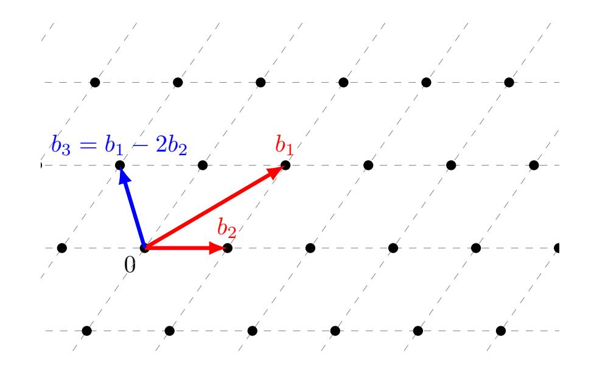

Fig. 1. Example of a lattice in  $\mathbb{R}^2$  and its basis  $(\mathbf{b}_1, \mathbf{b}_2)$  in red.

Notes, terminology and notation. Let  $\mathbb{R}^n$  be a n-dimensional Euclidean vector space. In this paper, we write vectors and matrices in bold face (or italic if represented with Greek letters), while vectors are written in lower-case and matrices in upper-case (or lower-case if represented with Greek letters), as in vector  $\mathbf{v}$  and matrices  $\mathbf{M}$  and  $\mu$ . Vectors (also called lattice points or simply points) in  $\mathbb{R}^n$  represent  $1 \times n$  matrices, from both a mathematical and computational perspective. The Euclidean norm (or length) of a given vector  $\mathbf{v}$  in  $\mathbb{R}^n$ ,  $\|\mathbf{v}\|$ , is  $\sqrt{\sum_{i=1}^n \mathbf{v}_i^2}$ , where  $\mathbf{v}_i$  is the  $\mathbf{i}^{th}$  coordinate of  $\mathbf{v}$ . When we mention a "short" vector, we refer to its Euclidean norm (or length). The term  $zero\ vector$  is used for the vector whose norm is zero, i.e., the origin of the lattice.

"Schemes" is the short version of "cryptoschemes" or "cryptosystems" (the reader may also recognize the term "code", which means the same).

Cryptology is the science that focuses on the study of cryptography and cryptanalysis. While "cryptography" can be defined as the practice of creating and understanding codes that keep information secret, "cryptanalysis can be defined as the science that studies the procedures, processes and methods used to translate or interpret secret writings, as codes and ciphers, for which the key is unknown. In practice,

cryptanalysis enables one to analyze cryptosystems, so that one can trust them. As we show later, crypanalysis is also fundamental, as it is the tool used to define the parameters of new cryptosystems, so that they are secure and efficient.

Security of lattice-based crytposystems. Cryptosystems base their security on hard mathematical problems. For instance, the security of the RSA cryptosystem is based on the hardness of factoring certain large integers. In practice, this means that an attacker is able to break the scheme if he/she can efficiently factor large numbers with the same number of bits as the key in the scheme. Therefore, the security of RSA relies on the fact that factoring large integers is a very hard problem, and its complexity grows fast with the input size. In practice, key sizes are chosen such that there is no attacker who can factor a large number of that size in a reasonable amount of time. We comment on this problem in the next subsection.

Lattice-based cryptosystems also base their security on hard mathematical problems, in particular lattice problems. Depending on the exact scheme, these may be 1) lattice basis reduction, 2) the Shortest Vector Problem (SVP), 3) the Closest Vector Problem (CVP), 4) the Learning with Errors (LWE) and several variants of these, to name the most relevant ones. Due to the connection between the problems and the security of the corresponding cryptosystems, the algorithms that solve these problems are sometimes referred to as *attacks*.

How to choose security parameters such as the key size of the scheme? Till deployment of cryptosystems, we must carry out an intense scrutiny of possible attacks against those cryptosystems, so that one can have increased confidence on their security and appropriate parameters of practical implementations of these systems can be chosen.

Selecting security parameters is not a simple, deterministic process. Intuitively, we would simply define "very high" parameters, but these would lead to slow (also said inefficient) schemes. In practice, parameter selection is a two-step, rather empirical process. First, the potential of attacks has to be determined in practice and not just in theory. This has to be done in the highest-end computer architectures, which adversaries may have access to. Having determined this potential, the second step is to define security parameters of schemes such that it is intractable to solve the underlying security problems with those parameters, based on the known potential of the available attacks and computer architectures.

Thus, the scrutiny for possible attacks to these systems must consist of comprehensive and tenacious efforts at solving these problems. Until the arrival of quantum computers, the strongest attacks one can envision in this context are efficient implementations of the best algorithms to solve the aforementioned lattice problems. In particular, it should be investigated how suited and scalable these algorithms are on parallel, high performance computer architectures. At the same time, it is important to note that the necessity for serious testing in practice also stems from the fact that lattice algorithms tend to behave differently in practice than predicted in theory, especially in large-scale experiments.

These arguments alone go to show that high performance computing is a key tool in cryptanalysis, as it only makes 

{2}------------------------------------------------

sense to assess the potential of attacks on the highest-end computer architectures. In fact, this is why we have witnessed considerable efforts in the development of parallel, efficient implementation of attacks. In short, implementing the best attacks known on the best parallel multi- and many-core architectures is the only way to actually determine the potential of attacks in practice and therefore accurately select security parameters for lattice-based cryptosystems, such that they are both secure and efficient.

We note that there are no "standard" lattice dimensions which we would see in real case scenarious; instead, the goal of lattice based cryptanalysis is, fundamentally, to determine how high one can go with the available algorithms and computer architectures. For the sake of this paper, we have limited lattice dimensions to 60 and 65, depending on the algorithm. We note that although LUSA could, in theory, perform very differently for much higher dimensions, the goal is of this paper is to show how the library performs per se and how it compares to other available implementations.

Why LUSA? First off, implementing a library with attacks (and building blocks for the development of new attacks) is of paramount importance in the context of lattice-based cryptanalysis, because as we showed, assessing the performance of attacks on high-end computer architectures is vital.

LUSA was primarily developed due to the lack of some features on some of the existent lattice libraries, such as NTL<sup>3</sup> , plll<sup>4</sup> and fplll<sup>5</sup> .

First, neither NTL nor fplll are specifically coded for lowlevel efficiency (although they are efficient libraries to some extent, they are better known for offering several methods, with great focus on mathematical aspects), and no parallel implementations are generally offered. For instance, NTL's BKZ implementation is often used in high dimensional lattices as a common pre-processor, and it can require days of computation, depending on the lattice dimension and BKZ parameters. This has indeed been a limiting factor in the context of trying to break into higher dimensions of the SVP-Challenge<sup>6</sup> .

Second, NTL, fplll and plll depend upon other libraries, rendering the overall installation cumbersome and timeconsuming. Also, this increases compilation and execution time of the used library algorithms, among other problems.

Third, although a very useful library in many fields related to number theory, NTL it is not specifically designed to be used in the context of lattice-based cryptanalysis. NTL is a number theory library that includes a myriad of algorithms that, although useful and relevant in many scientific fields, are usually not used by the lattice-based cryptanalysis community. In fact, the complexity of NTL served as the subject of many offline (interesting) conversations at cryptography conferences the author attended over the past 6 years. The target public of lattice libraries are mainly users with a strong background on mathematics, who prefer to work with libraries that are simple to install and use. Also, because NTL comprises so many classes of algorithms, some of which growing by the day, it is difficult to catch up with the headway made on lattice algorithms and their implementations. This means that NTL is not specifically designed for lattice-based crytptography and cryptanalysis, and it is often regarded as "a sledgehammer" even if we only want to kill a fly. At the same time, the same mathematicians who find the current libraries too hard to install are interested in performance.

fplll, in contrast to NTL, was mainly designed for latticebased crytptography and cryptanalysis purposes, offering several lattice algorithms, such as LLL [23] and BKZ [24] (cf. Section II for more details), including BKZ 2.0 [25]. The central algorithm of the library is LLL, thus the name of the library; it is also very much based on floating-point orthogonalization. The floating-point LLL reduction algorithms offered by fplll [26], [27] are based on a trade-off between speed and guarantees. fplll is thus a very centered library, as it it very focused on this particular angle (which is surely very relevant for the cryptanalysis and cryptography communities). There is some effort in creating a very modular library and specific operations to be oblivious to the user. However, as we will show in this paper, LUSA not only offers more algorithms than fplll as it also offers efficient, parallel versions of those algorithms (to our knowledge, although fplll is somewhat thread-safe, there are no built-in functions that can run in parallel - there are only such functions in the context of fplll "ecosystems", i.e. external modules/libraries).

Released in 2014, plll is another major library in this context. The library was also mainly designed for latticebased crytptography and cryptanalysis purposes, judging by the implementations offered, but while it includes a vast array of algorithms and options for those algorithms, it does not include the most recent ones (e.g. sieving). Additionally, plll depends upon other libraries (GMP, MTFR and the boost library) and there is only one parallel algorithm in the entire library, enumeration (with some form of pruning).

LUSA was designed to be simple - we made LUSA 100% independent from other libraries - efficient and specifically thought out for lattice-based cryptography. Plus, all algorithms in LUSA (except for LLL, whose execution time is not large in most cryptanalysis setups - if LLL is to be run on high lattice dimensions then LUSA is probably not the best library to that end) can run with multiple threads and scale very well.

LUSA's promises. LUSA promises two things: simplicity - it is simple to install and use, depending upon no other library - and performance/parallelism, as most methods are also very efficient and parallel. The majority of the provided implementations are considerably faster that those in similar libraries, such as NTL, fplll and plll, as we show in this paper.

But why are cryptographers interested in usability and performance, for such a library? Most cryptographers do not have a strong background in computer science (as they are mainly mathematicians) so usability is very important<sup>7</sup> . As for performance, there are mainly two reasons for its need:

1) The first reason is parameter selection, as we mentioned before. If LUSA's algorithms are directly used to esti-

<sup>3</sup>https://www.shoup.net/ntl/

<sup>4</sup>https://github.com/fplll/fplll

<sup>5</sup>https://felix.fontein.de/plll/

<sup>6</sup>https://www.latticechallenge.org/svp-challenge/

<sup>7</sup>Yet, some cryptographers have presented beautiful works on algorithms coded for efficiency, let alone computer libraries.

{3}------------------------------------------------

mate security parameters of schemes, they need (and are) to be efficient. In fact, to this day, there is no standard library for this matter; this is currently done relying on many different, isolated implementations, which are typically not normalized as they are tested and assessed in different architectures, compilers, and other variables.

2) The second reason is because new algorithms are oftentimes developed using existing ones as building blocks. Having a set of parallel, efficient algorithms will ensure that the new attacks are themselves efficient and parallel. This is very relevant in order to assess the actual performance of new attacks in practice, as they are developed. In fact, some algorithms are very good in theory but intractable in practice e.g. a Voronoi-based SVP-solver proposed in [28]. Having a tool to assist experimentation right after design is crucial to shed light on the tractability of attacks.

LUSA's scientific contribution. LUSA contributes to the scientific field of lattice-based cryptanalysis in the following ways:

- i) LUSA includes implementations of algorithms that are the fastest implementations known. These implementations contain a variety of novel HPC and parallel computing techniques/strategies.
- ii) As LUSA offers algorithms that can be used in a modular way, LUSA is itself a platform that enables cryptographers to create new, high performance attacks. This is especially true for attacks that include other lattice algorithms as part of their execution (e.g. some latticebased reduction algorithms use SVP-solvers as part of their logic). As a result, cryptographers will have a much better sense of the performance of the algorithms as they develop them.
- iii) Not only LUSA allows for the development of new algorithms in terms of performance and parallelism, but it can also suport the development of new algorithms by containing many routines which can be used as building blocks (e.g. from the Gram-Schmit ortogonalization to lattice reduction algorithms).
- iv) LUSA presents itself as a standard library to normalize performance assessment across several attacks and lattice algorithms, a crucial problem in parameter selection. The community can simply download LUSA and test the algorithms therein on their desired CPU platform (in the future, we will extend this to GPUs).

Roadmap. The rest of this paper is organized as follows. In Section II, we provide a brief overview of the lattice-based cryptography and cryptanalysis field, its evolution in recent years and how LUSA fits in. In Section III, we present LUSA, by explaining how the library is structured and what methods are available. In Section IV we present the benchmark platform used in this paper, which was chosen to be well representative of a possible LUSA end user. In Section V we present and comment on the performance of LUSA, including how well it compares to other libraries and how it scales with the number of cores. In Section VI, we wrap up the paper, with some brief conclusions and comments. In Section VII, we provide lines of future work, providing timelines for LUSA's next versions.

## II. LATTICE BASED CRYPTANALYSIS TODAY

"*Do you hack cryptosystems for a living? Not quite...*"

Lattice-based cryptanalysis has evolved quite rapidly, as a way to scrutinize lattice-based schemes which developed, themselves, very quickly. As for lattice-based cryptography, there are a few papers, reports and notes published on the field. In particular, emphasize 1) introductory papers from 2006 and 2009 [17], [29], 2) an extensive tutorial for beginners, from 2015 [30] and and 3) a paper/survey from 2016, which also provides an introduction to lattice-based cryptography as well as the progress in the field over a decade [31]. As for latticebased cryptanalysis, there is a comprehensive survey, from 2017, solely on the advances of the field, which we refer the reader to [32], shall he want to know more. Yet, we provide a brief overview of the field, stating where and how LUSA frames in. Other resources on both lattice-based cryptography and cryptanalysis include surveys and overviews ([33], [34], [35], [36], [37], [38], [10], [39]), PhD theses (e.g. [7], [40], [41], [42], [43], [44]) and books [45], [46], [47]. There are also multiple talk slides and videos available online for free on the topic.

# *A. Problems on lattice-based cryprography: SVP, CVP and lattice reduction*

There are many lattice problems in the context of cryptography and cryptanalysis. As we show in the following, LUSA's first release version (v1.0) addresses the SVP and lattice basis reduction.

SVP. The norm of a shortest vector<sup>8</sup> of a lattice is denoted by λ1(L). The norm of the shortest vector in the lattice is also the minimal distance between any two vectors in the lattice. Finding the shortest vector in the lattice is a problem known as the Shortest Vector Problem (SVP). The SVP is one of the most studied problems in lattice-based cryptanalysis. Formally, the SVP can be defined as: given a basis B of the lattice L, find a non-zero vector p ∈ L such that: kpk = min kvk : v ∈ L(B), kvk 6= 0. This is typically called "exact SVP" as there are approximate versions of the SVP (e.g. α-SVP, which is an approximate version of the SVP and whose solution is at most α% off the SVP solution). In fact, the SVP is especially relevant in the context of latticebased cryptography because it 1) can actually be used to break cryptosystems that rely on the α-SVP and 2) it is used in many other, practical algorithms in the field, such as BKZ 2.0, the most practical lattice basis reduction algorithm (which can also be used to solve the α-SVP), uses SVP-solvers as part of its logic. For a comprehensive review of the approximate versions of the SVP, the reader is referred to [29]. In order to understand the impact of LUSA, note that the SVP does not state anything about the basis, but the used basis has a big impact on the practical performance of SVP- and other solvers. Emde Boas showed, in 1981, that the SVP with infinity norms

<sup>8</sup>Note that due to the natural symmetry in lattices, there is not only one shortest vector.

{4}------------------------------------------------

is NP-hard [48]. In 1998, Ajtai showed that the SVP is NPhard under randomized reductions for the Euclidean norms as well [6]. The Ajtai-Dwork cryptosystem bases its security on the γ-Unique SVP, a derivative problem of the SVP [5].

CVP. The Closest Vector Problem can be defined as: given a basis B of the lattice L, and a target vector v ∈ L, find a vector p that is closest to v, i.e. such that: p = min kv-wk : w ∈ L(B). Just like the SVP, the CVP has also derivative and approximate versions (cf. [49], [29]). Arora et al. have shown that the CVP is NP-hard to approximate within any constant factor [50]. Goldreich et al. showed that the CVP and the SVP share the same hardness [51]. An example of a cryptosystems whose security is based on the hardness of the CVP is the Goldreich-Goldwasser-Halevi (GGH) cryptosystem [52].

Lattice basis reduction. Lattice basis reduction algorithms aim at improving the "quality" of the lattice bases, by shorting the basis vectors and making them more orthogonal. Currently, the main lattice reduction algorithms are LLL and BKZ (both of which have many versions). Lattice basis reduction is one of the most well-studied problems in lattice-based cryptography, as they marked the beginning of remarkable cryptanalytic events (e.g. LLL was used to attack many lattice-based and non lattice-based schemes) and render problems such as the SVP and CVP easier from a computational standpoint, as solvers become much faster. Also, approximate versions of the SVP can also be solved with lattice basis reduction algorithms.

There are other lattice problems that are very relevant is the context of lattice-based cryptography. One of these problems in the learning with errors (LWE) problem, initially proposed by Regev in 2015 (cf. [53], which had a preliminary version at STOC 2005). The LWE is a generalization of the Learning Parity with Noise (LPN). If the reader wants to know more about LWE, we refer to [53], [34], [32], [31].

The Short Integer Solution (SIS) problem is another relevant problem in the context of lattice-based cryptanalysis. Introduced by Ajtai in 1996 [53], it has served as the foundation for many schemes, ranging from identification schemes to minicrypt primitives (but not public-key encryption). If the reader wants to know more about SIS, we refer to [53], [31].

In the future, LUSA will aim at including solvers for LWE and other lattice problems that are relevant for lattice-based cryptography.

# *B. Brief state of the art of SVP- and CVP-solvers*

Many algorithms have been proposed to solve the SVP and the CVP. Table I briefly summarizes them. The algorithms in blue are included in LUSA, the algorithms in red are scheduled for the next versions of LUSA; the others are not relevant for LUSA, in the short term, but they may be integrated in the long term.

It is also worth noting that the original SE (from "Schnorr-Euchner") enumeration algorithm was presented in [28], but was improved in [66], an improved version which we refer to as SE++. This algorithm was later improved in [71] by discarding symmetric branches on the enumeration tree, specifically for SVP computations, which was named "Improved SE++". This can be considered as a form of pruning, i.e., a method

| Algorithm                | Family       | Type    | Year |
|--------------------------|--------------|---------|------|
| Relevant Vectors [28]    | Voronoi Cell | CVP/SVP | 2002 |
| Micciancio et al. [33]   | Voronoi Cell | SVP     | 2010 |
| AKS [54]                 | Sieving      | SVP     | 2001 |
| Nguy˜en-Vidick [55]<br>ˆ | Sieving      | SVP     | 2008 |
| ListSieve (LS) [56]      | Sieving      | SVP     | 2010 |
| GaussSieve (GS) [56]     | Sieving      | SVP     | 2010 |
| LS-birthday [57]         | Sieving      | SVP     | 2009 |
| WLTB sieve [58]          | Sieving      | SVP     | 2011 |
| Three-level sieve [59]   | Sieving      | SVP     | 2013 |
| Overlattice sieve [60]   | Sieving      | CVP/SVP | 2014 |
| HashSieve [61]           | Sieving      | SVP     | 2015 |
| BGJ sieve[62]            | Sieving      | SVP     | 2015 |
| LDSieve [63]             | Sieving      | SVP     | 2016 |
| 3-Sieve from G6K [64]    | Sieving      | SVP     | 2019 |
| Kannan [65]              | Enumeration  | CVP/SVP | 1983 |
| ENUM [24]                | Enumeration  | SVP     | 1994 |
| SE [28]                  | Enumeration  | SVP/CVP | 2002 |
| SE++ [66]                | Enumeration  | SVP/CVP | 2002 |
| Improved SE++ [67]       | Enumeration  | SVP/CVP | 2002 |
| Extreme Pruning [68]     | Enumeration  | SVP     | 2010 |
| MW-Enum [69]             | Enumeration  | SVP     | 2015 |
| Fukase et al. [70]       | RS           | SVP     | 2015 |
|                          | TABLE I      |         |      |

ALGORITHMS FOR THE SVP AND THE CVP. ALGORITHMS IN BLUE ARE INCLUDED IN LUSA, ALGORITHMS IN RED ARE SCHEDULED TO APPEAR IN LATER VERSIONS OF LUSA.

to discard computation. The concept of pruning is more established as a method to discard computation (which may be redundant or not) in enumeration algorithms, as these are usually based on trees of computations. The basic enumeration method in LUSA (**enumerate**) is based on [24]. The extreme pruning method in LUSA (**enumeratePruned**) is based on [68].

#### III. LUSA

"*Lusitania (Portuguese: Lusitania) was an ancient Iberian ˆ Roman province located where modern Portugal and a small part of western Spain lie. The term "lusa" is derived from "lusitania".*"

In this section, we briefly present LUSA, starting with LUSA's ad hoc multiple-precision module and mentioning the main algorithms offered.

#### *A. Multiple-precision capable LLL*

Libraries for lattice algorithms should be prepared to handle big numbers, because lattices are frequently generated in a way that vectors end up with mega-large coordinates. The orders of magnitude of these numbers can be of tens/hundreds or even thousands of billions (10<sup>10</sup> or 10<sup>11</sup> digits). This means that the primitive data types of common languages, such as C and C++, are not enough to store such numbers and therefore other datatypes are needed. Lattice libraries must be able to represent and execute known arithmetic operations, such as additions and multiplications, on such numbers. This is known as multiple- or arbitrary-precision capability, which can be applied to both integer and floating-point numbers.

As we zeroed in on performance when designing LUSA, we endowed LUSA with a multi-precision module implemented from scratch, specifically coded for performance. The key features of this module are:

{5}------------------------------------------------

- An implementation of an extended exponent double precision data type, or xdouble<sup>9</sup> , which allows to represent floating point numbers with the same precision as a double, but with a much larger exponent. It is provided in LUSA as a C++ class and supports a multitude of different operators (the user is referred to LUSA's manual for more details on this). This is indeed very similar to the class with the same name in NTL.
- An implementation of ZZ, a class which allows to represent integers that do not fit into primitive data types. This is also provided as a class with a multitude of operators (the user is referred to LUSA's manual for more details on this). Our ZZ class is unique and different from the implementations of other libraries (although some operations are based on the same algorithms, as there are only a handful, if that much, per operation).
- An implementation of RR, which allows to represent floating point numbers with arbitrary precision. Unlike primitive floating point data types, the precision of numbers represented with this class are not fixed. This class also supports a multitude of operators (the user is referred to LUSAs manual for more details on this). The same we said for ZZ applies to the RR class.

LUSA also contains the basis class (with the basis.h header), which contains all methods and algorithms provided.

#### *B. Lattice-reduction algorithms: LLL and BKZ*

LUSA implements several LLL variants, both heuristic and exact versions. These include:

- The **lll** routine, the core implementation of LLL in LUSA, a floating-point implementation based on Schnorr's floating point LLL version [24]. This method uses our ZZ class. In fact, there are two methods in this description, but one uses native datatypes for the floating point part of LLL (**lllnd**) and the other uses our xdouble class (**lll**). The former works up until dimension 50, the latter works on any dimension (we comment on this later on).
- An exact version of LLL, called **exactlll**, which makes use of native data types, based on the [23]. This means that the numbers in the lattice basis should fit, at most, in long long datatypes (forces 64 bit). There is also a variant of this version (**exactlllmp**), which works on any lattice basis, regardless of their size.

The fastest LLL variant in the library is indeed an heuristic variant of the LLL algorithm with floating point arithmetic, which was proposed by Schnorr and Euchner [24] and can be invoked with the **lll** method (note that we implemented this method with xdouble so that there are no precision problems up until high lattice basis dimensions). The LLL implementations in LUSA are not parallel, as LLL is not particularly suitable for parallelization [72], [73], [74], [75] (most parallel versions of LLL do not scale well in practice; to improve upon this, many variants of the original algorithm were created as a way to improve its parallelization potential, but LUSA intends to implement the original LLL floating point algorithm by Schnorr and Euchner). In most lattice-based cryptanalysis setups, LLL tends to result in a much smaller portion of time than other algorithms, say BKZ. However, as LLL may play an important role in specific setups (and in other areas of crytanalysis), we plan on optimizing LLL in the future.

LUSA assumes that all lattice bases are LLL-reduced before any other algorithm is invoked. Therefore, as LLL is the starting point of any significant computation in LUSA, all LLL implementations use the multiple precision directly, in order to handle large numbers that may exist in the raw, unprocessed input lattices. All LLL variants yield a final basis that fits into native C datatypes. This means that users should first LLL-reduce any basis they want to run LUSA's algorithms on (even if other lattice-reduction algorithms are to be used after). Listing 1 is an example of how LUSA can be used in a main.cpp file and be started off (with an LLL reduction, in this case). As this paper is not intended to be a manual for LUSA, please check the manual on LUSA's webpage<sup>10</sup>. Each algorithm has a set of parameters which are both used as input and output. This can be checked in LUSA's manual.

```
# i n cl u d e " b a s i s . h "
i n t main ( i n t a r g c , char ∗ a r g v [ ] )
{
       B a si s ∗B = new B a s i s ( a r g v [ 1 ] ) ;
       f l o a t d e l t a = 0 . 9 9 f ;
      B−>l l l ( d e l t a ) ;
       r e t u r n 0 ;
}
```

Listing 1. Example of how to start LUSA, with an LLL-reduction.

After the input basis is LLL-reduced, any of the algorithms in LUSA can be called upon it. For instance, after the basis is LLL-reduced, we can move on to SVP calculations (in this case with enumeration), as shown in Listing 2.

```
# i n cl u d e " b a s i s . h "
i n t main ( i n t a r g c , char ∗ a r g v [ ] )
{
       B a si s ∗B = new B a s i s ( a r g v [ 1 ] ) ;
       f l o a t d e l t a = 0 . 9 9 f ;
       i n t dim = B−>g et Dim e n si o n ( ) ;
      B−>l l l ( d e l t a ) ;
      B−>c o n v e r t B a s i s ( ) ;
       i n t b e t a = 2 0;
      B−>bkz ( b et a , d e l t a ) ;
      l o n g ∗ S h o r t e s t V e c t o r = ( l o n g ∗) c a l l o c ( dim , 8 ) ;
      d ouble S h o rt e st N o rm = 0 . 0 ;
       S h o rt e st N o rm = B−>e n um e r at e ( S h o r t e s t V e c t o r ) ;
      r e t u r n 0 ;
```

<sup>9</sup>We have maintained the terminology of NTL in order to reduce the learning curve of current NTL users.

<sup>10</sup>http://alfa.di.uminho.pt/˜ ammm/lusa.html

{6}------------------------------------------------

} Listing 2. Example of an SVP-solver (enumeration) call in LUSA, after a LLL and a BKZ basis reduction.

The Block Korkine Zolotarev (BKZ) algorithm is the other most prominent algorithm for lattice basis reduction. LUSA also provides a method to BKZ-reduce a basis (which, as any other algorithms, assumes that the input basis is LLL-reduced). LUSA's BKZ implementation is parallel, thus being able to run with a single or multiple threads. We also implemented BKZ 2.0, but this version does not yield the optimal result yet, and is still under development.

#### *C. CVP-solvers*

Currently, LUSA does not offer methods to compute the CVP. However, most of the enumeration methods included in LUSA (and some of the sieving routines) are capable of solving the CVP, if a few modifications are conducted. Given that our goal is to develop an independent library that includes most lattice algorithms, these will be available in LUSA v2.0 and subsequent versions.

# *D. SVP-solvers*

LUSA offers a wide range of SVP-solvers, as this is the main focus of v1.0. LUSA implements the enumeration family (**enumerate** and **enumeratePruned**), based on [24], [68], both of which versions are parallel. In order to run LUSA's methods in parallel, each method has an interface that can be called with a certain number of threads, as we show in Listing 3.

```
# i n cl u d e " b a s i s . h "
i n t main ( i n t a r g c , char ∗ a r g v [ ] )
{
       B a s i s ∗B = new B a si s ( a r g v [ 1 ] ) ;
       i n t dim = B−>g et Dim e n si o n ( ) ;
      l o n g ∗ S h o r t e s t V e c t o r = ( l o n g ∗) c a l l o c ( dim , 8 ) ;
      d ouble S h o rt e st N o rm = 0 . 0 ;
      S h o rt e st N o rm = B−>e n um e r at e ( S h o r t e s t V e c t o r , 4 ) ;
      r e t u r n 0 ;
}
```

Listing 3. This is simply illustrating how to call the enumerate method; in practice and LLL call and the convertBasis() methods are necessary!

Notice that **enumerate** in the listing above is called with 4 threads. If no thread count is specified, then LUSA captures the number of logical cores in the system and executes the invoked methods with the same number of threads as logical cores.

LUSA also includes the sieving family, implementing pretty much all relevant sieving algorithms for the SVP. In particular, LUSA offers ListSieve (**listSieve**) [56], [76], GaussSieve (**gaussSieve**) [56], [77], and HashSieve (**hashSieve**) [61], [78], [79] (LDSieve - **ldSieve** -, presented in [63], [32], is scheduled for future work). Recently, a few other sieving algorithms have been published e.g. [80], [64], but these are not yet implemented in LUSA, although we do expect to offer them in v2.0 and subsequent versions.

Finally, LUSA offers other SVP-solvers, such as Voronoicell based ones. In particular, it offers **voronoi**, which is based on the "Relevant Vectors" algorithm described in [28], **voronoi2.0**, an optimized Voronoi-cell based algorithm presented in [81]. Both these implementations are also parallel.

LUSA offers some other methods (e.g. Gram-Schmit ortogonalization) and although they are relevant while doing extensive algorithmic work with the library, they are not mentioned in this paper as they are commented on in LUSA's manual.

#### IV. HARDWARE SPECIFICATIONS

In this paper, we show LUSA's performance and we compare it against other well-established libraries. To carry out these tests, we picked the machine specified in Table II. Although this is not the kind of machine that would be used to carry out attacks or assess algorithms under hard constraints (e.g. large lattice dimensions), this is a sufficiently good representative machine of the end user of LUSA.

TABLE II SPECIFICATIONS OF THE CPU SYSTEM USED FOR BENCHMARK. SMT STANDS FOR SIMULTANEOUS MULTI-THREADING AND HT STANDS FOR HYPER THREADING.

| Sockets   | 1                   |  |
|-----------|---------------------|--|
| CPU       | Intel Core i7 740QM |  |
| Clock     | 1.73 GHz (2.93 GHz) |  |
| frequency |                     |  |
| Cores per | 4                   |  |
| socket    |                     |  |
| SMT       | Yes                 |  |
|           | (w/HT, 8 threads)   |  |
| L1 Cache  | 32 kB i + 32 kB d   |  |
| L2 Cache  | 256 kB              |  |
| L3 Cache  | 6 MB                |  |
| RAM       | 8 GB                |  |
| Compiler  | g++ 7.2.0           |  |

The clock frequency in parenthesis is the maximum frequency of the CPU, when Turbo Boost is turned on. L1 cache values are split between instruction cache (i) and data cache (d). The machine runs Ubuntu 17.10 x86 64 with kernel version 4.13. All programs were compiled with the -march=native -O3 optimization flags.

The lattices used on this paper were obtained using the SVP-Challenge's lattice basis generator<sup>11</sup> .

# V. LUSA'S PERFORMANCE

"*I dont care if it works on your machine! We are not shipping your machine!*"

In this section, we present LUSA's performance briefly, while comparing it against the other most popular lattice libraries: NTL (v. 11.3), plll (v. 1.0) and fplll (v. 5.2.1).

#### *A. Lattice reduction algorithms*

Figure 2 shows the performance of LUSA's LLL and BKZ. LUSA's LLL, although coded for performance, encapsulates a few operations that make it, overall, slower than

<sup>11</sup>https://www.latticechallenge.org/svp-challenge/

{7}------------------------------------------------

a "standard C LLL implementation". This has to do with managing datatypes, allocating structures that are necessary for the overall LUSA execution, among others. We made this decision because LLL is the "entry point" of any substantial computation with LUSA, and it typically reduces lattices in less than a few seconds, even for high dimensions. In short, if one user wants to simply run LLL on a lattice-basis and aims for maximum performance, LUSA's LLL is not the goto solution.

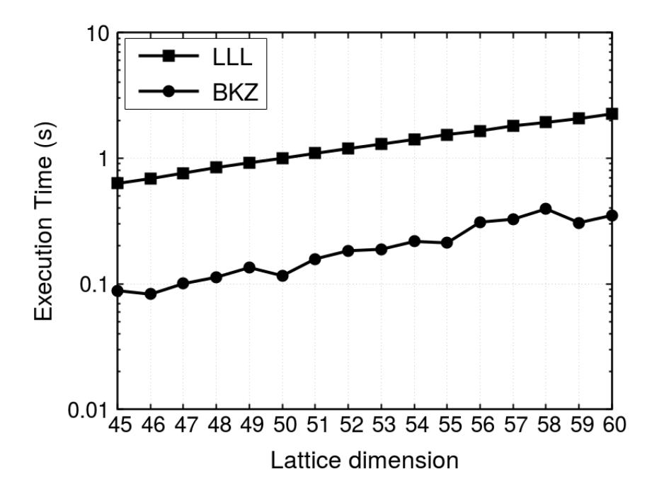

Fig. 2. Average execution times for the LLL and BKZ (block size 20) routines, using 1 thread.

As we said, our LLL implementation runs LUSA's multiprecision module. This lowers LLL's overall performance, as we store the basis in different formats and many datatypes "conversions" take place. After LLL is executed, the user has to call the **convertBasis** method, which converts the basis to the native datatypes (instead of multiple precision datatypes) and can then call any other algorithm in LUSA. We opted to not call this method transparently after an LLL execution because the user should be aware of this, if basis elements are read. In Listing 4, note that enumeration is called after LLL, but the method **convertBasis** is called in between.

```
# i n cl u d e " b a s i s . h "
i n t main ( i n t a r g c , char ∗ a r g v [ ] )
{
       B a s i s ∗B = new B a si s ( a r g v [ 1 ] ) ;
       f l o a t d e l t a = 0 . 9 9 f ;
      B−>l l l ( d e l t a ) ;
      B−>c o n v e r t B a s i s ( ) ;
       l o n g ∗ S h o r t e s t V e c t o r = ( l o n g ∗) c a l l o c ( dim , 8 ) ;
       d ouble S h o rt e st N o rm = 0 . 0 ;
       S h o rt e st N o rm = B−>e n um e r at e ( S h o r t e s t V e c t o r ) ;
       r e t u r n 0 ;
}
```

Listing 4. Example of an enumeration call in LUSA, after a LLL, with the explicit call of the convertBasis method.

We now compare LUSA against other libraries in terms of lattice-reduction algorithms.

Given that our LLL makes use of the multi-precision module to "convert" the lattice basis into one basis that fits in native datatypes and initiates other libraries functions, our LLL is slower than NTL's - which also uses multiple-precision - and fplll's implementations<sup>12</sup> of LLL (as shown in Figure 3). fplll implements a different LLL variant.

However, we point out that 1) performance is generally not a problem in LLL, because LLL can run high lattice dimensions in a very short time-frame (in Figures 3 and 4 LLL requires more time than BKZ not only because of multiprecision being required but also because we ran BKZ with a low block size), and 2) as mentioned before, our LLL implementation encapsulates several steps that prepare the execution of following algorithms. In fact, we have centered LUSA around the premise that all input lattice bases are first LLL-reduced, and we accepted a loss of performance at that point. The main reason for this is that, as mentioned, LLL is one of the fastest lattice algorithms there is, and high performance is typically not required.

Note that NTL's LLL becomes significantly slower after dimension 50, where performance becomes comparable to LUSA. This is because NTL uses the xdouble class after dimension 50, whereas LUSA uses it for any dimension (in practice we could have determined xdouble is necessary for a given lattice basis and turn it on/off accordingly - note that LUSA also has an LLL implementation that does not use xdouble - which we have not as LLL runs very quickly anyway).

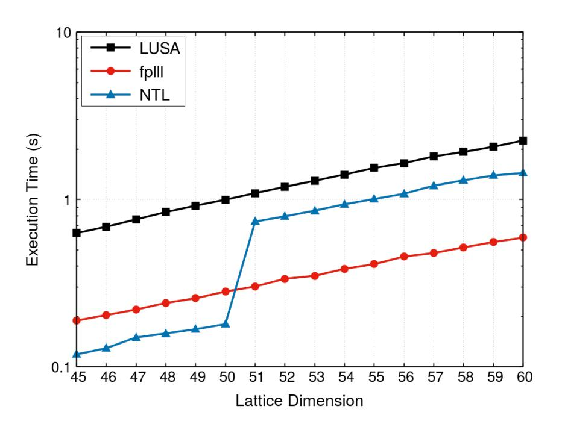

Fig. 3. Comparison of the LLL routine for the LUSA, fplll and NTL implementations, using 1 thread.

As for BKZ, as Figure 4 shows, our implementation is considerably faster than both NTL's and fplll. There are two main reasons for this: 1) the LLL calls within BKZ are very much optimized, in terms of memory handling, pointer arithmetic and coding, and 2) our xdouble module (i.e. including operations on xdouble datatypes) is more efficient than NTL's. In a follow-up paper, we will scrutinize LUSA's performance from a computational standpoint, and we will show analytics pertaining to these factors (e.g. cache miss rates

<sup>12</sup>fplll was set to run without specifying any options, thus the library uses as much precision as it desires (it may use GMP).

{8}------------------------------------------------

across different cache levels, computational pointer arithmetic vs memory usage, etc).

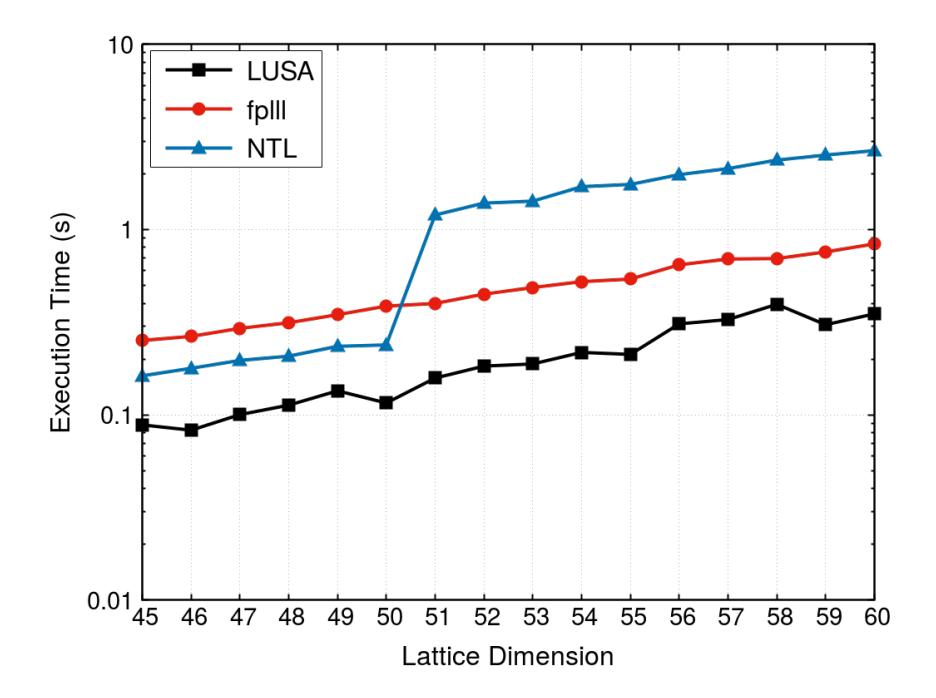

Fig. 4. Comparison of the BKZ (block size 20) routine for the LUSA, fplll and NTL implementations, using 1 thread.

Another important point is that LUSA's BKZ is parallel. In Figure 4, we present the results for a single thread. The scalability of BKZ is shown in Figure 5. As the figure shows, BKZ scales well, but only if the BKZ window is large enough. Essentially, we parallelized BKZ by executing the enumeration routines on each window with LUSA's parallel enumeration routine, which scales itself very well (but only after a certain window). We believe this is a good choice as small-window runs of BKZ are not too much time-consuming anyway.

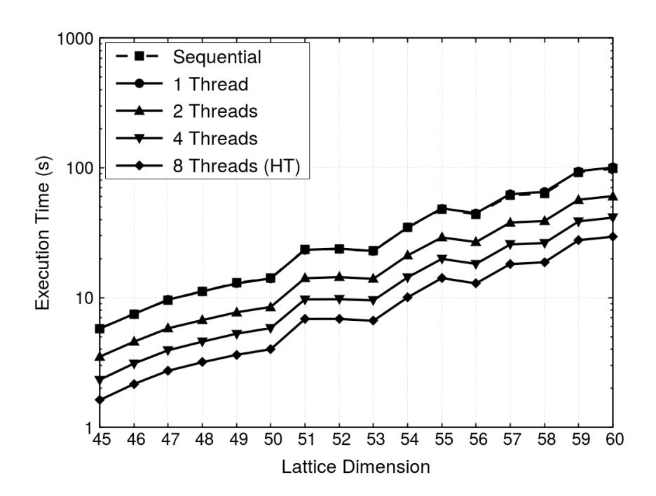

Fig. 5. Performance of LUSA's parallel BKZ, for 1-8 threads. Beta (window size) set to 40.

For dimension 60, LUSA's BKZ implementation obtains speedups of approximately 2.5x for 4 threads and about 3.5 for 8 threads (4 SMT-based threads).

# *B. SVP-solvers*

This subsection shows the performance of LUSA's SVPsolvers, in isolation and compared to other libraries, and their scalability.

Performance. Figure 6 shows the performance of LUSA's enumeration routine with pruning turned on and off

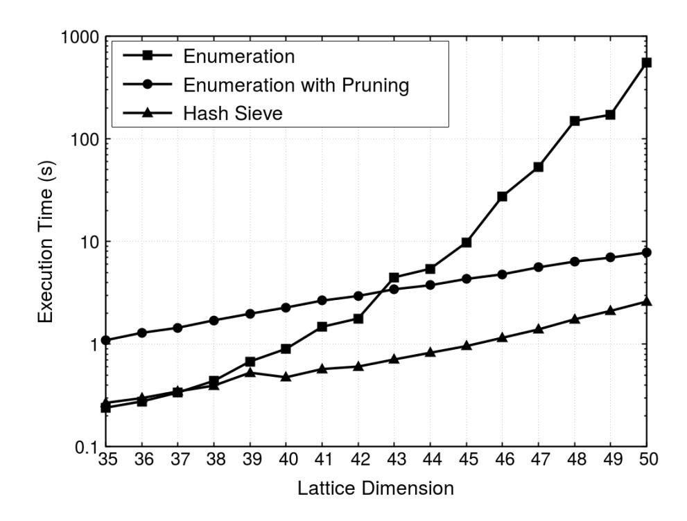

Fig. 6. Average execution times for the enumeration and hash sieve routines, using 1 thread.

(**enumerate** and **enumeratePruned**) and the Hashsieve routine (**hashSieve**), for a single thread.

In LUSA, Hashsieve is better than enumeration with (extreme) pruning, which is congruent with previous results on these algorithms in other contexts other than libraries.

These implementations have all been presented in [79], [71], [67]. Although slight modifications have been made to the implementations, so that they fit LUSA (e.g. allowing for generic parameterization, global variables, thread safety, etc), their core implementation is the same as presented in the papers, and LUSA's performance is in line with that of those implementations. As data structures are allocated when each method is called, LUSA incurs overhead that isolated implementations do not.

LUSA vs other libraries. We now show results of LUSA compared to other libraries and implementations. Figure 7 compares LUSA's enumeration routine (**enumerate**) against fplll. fplll is faster than LUSA running with one thread, for this particular algorithm, but fplll does not provide a parallel version of the algorithm, and LUSA is much faster if the algorithm is run with multiple threads.

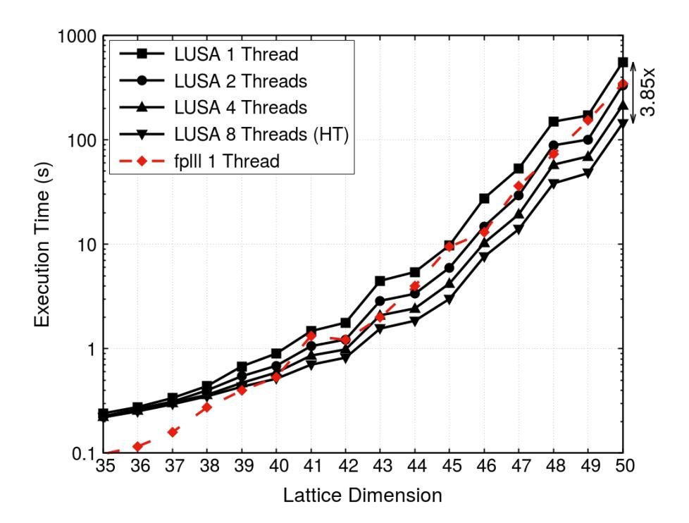

Fig. 7. LUSA's enumeration, for 1-8 threads, compared to fplll.

The results (i.e. the shortest vector) yielded by the methods

{9}------------------------------------------------

in both libraries are identical.

As for LUSA's pruned enumeration routine (**enumeratePruned**), it is considerably faster than that of plll for higher dimensions, as shown in Figure 8. This is indeed the only algorithm that can run with multiple threads in plll, but it is slower than LUSA for higher dimensions, the most interesting ones. To our knowledge plll does not offer a pure enumeration algorithm, while fplll does not offer the user enumeration with any kind of pruning (although it is used internally, to compute BKZ 2.0).

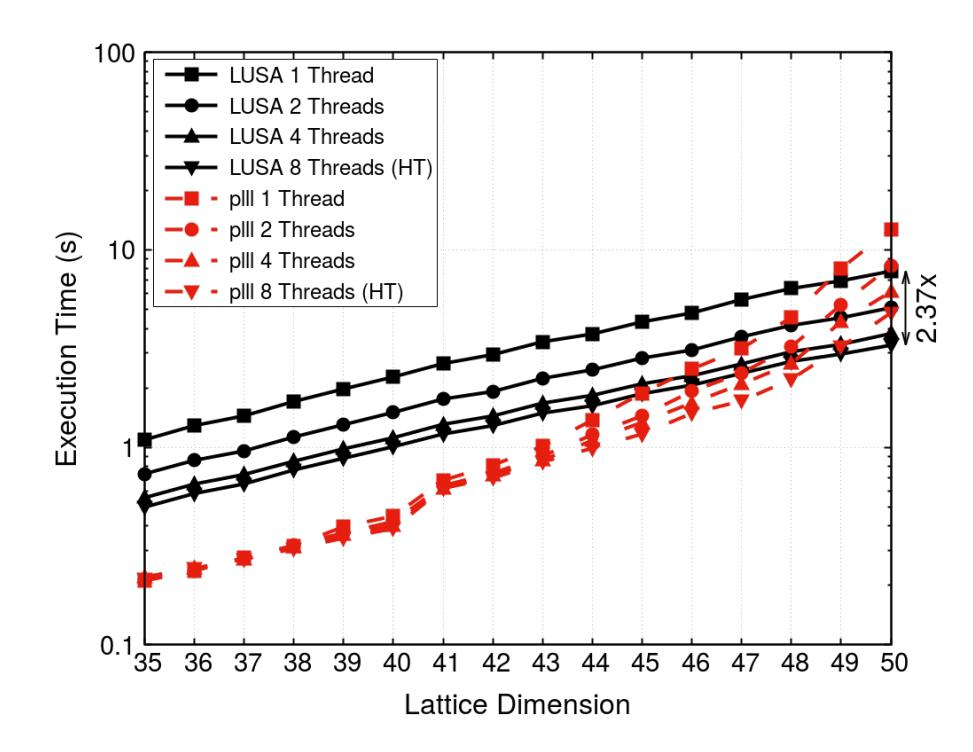

Fig. 8. LUSA's extreme pruned enumeration, for 1-8 threads, compared to plll.

As for sieving algorithms, LUSA's ListSieve implementation (**listSieve**) compares very well against plll, as shown in Figure 9. For dimension 50, LUSA attains a speedup of almost 6x with 4 physical and 4 logical threads (i.e. 4 cores with hyper threading). While it is not a surprise that sieving algorithms are memory bound, the scalability of LUSA is excellent.

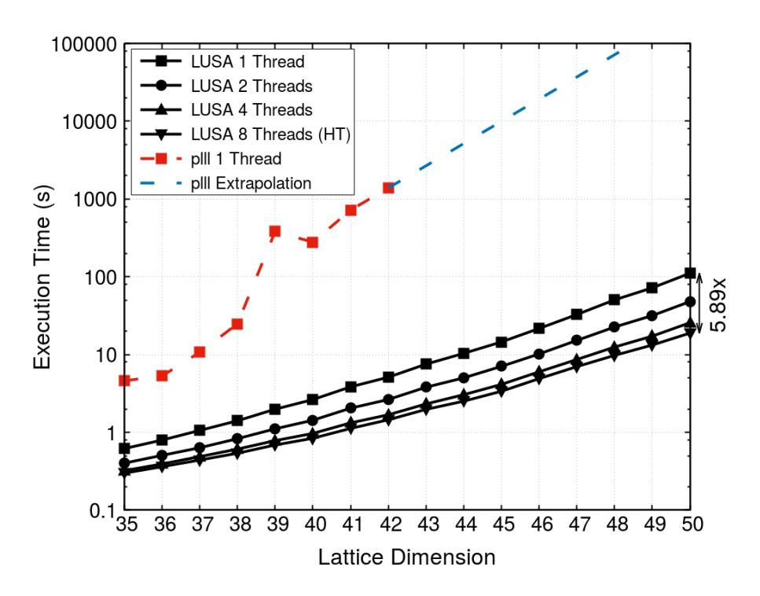

Fig. 9. LUSA's ListSieve implementation, for 1-8 threads, compared to plll.

LUSA's GaussSieve implementation (**gaussSieve**) also compares very well against both plll and fplll, and scales considerably well, as shown in Figure 10. We note that this implementation is based on the lock-free list based implementation in [77], which scales itself well.

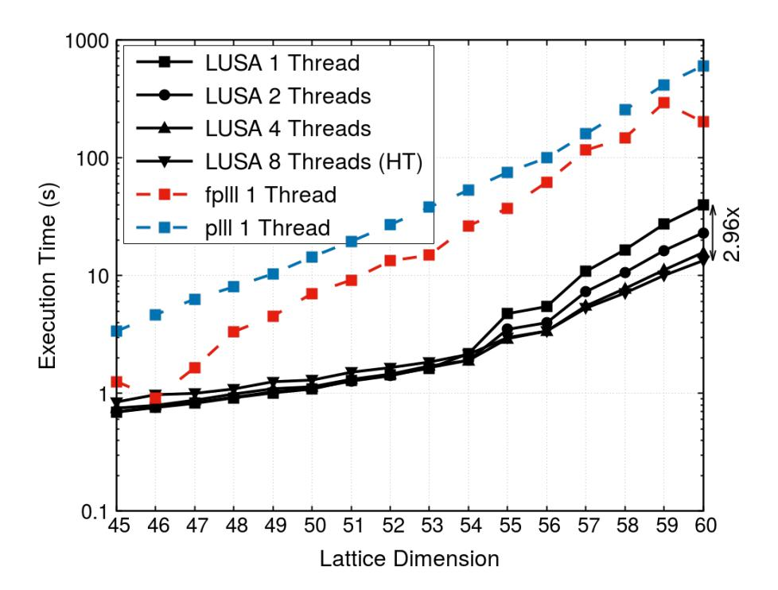

Fig. 10. LUSA's GaussSieve implementation, for 1-8 threads, compared to fplll.

To our knowledge, LUSA is the only library to offer a HashSieve implementation (**hashSieve**). LUSA's implementation is based on a probable lock-free mechanism [79]. There is another publicly available implementation of HashSieve, which was presented by Thijs Laarhoven in the original Hash-Sieve paper [82]. Figure 11 shows the performance of both LUSA and the baseline implementation, and LUSA performs considerably better. As the execution time of the baseline implementation grows much faster than LUSA's, the difference becomes quite significant for higher dimensions. We reserved the tests for those "higher" dimensions for the scalability tests.

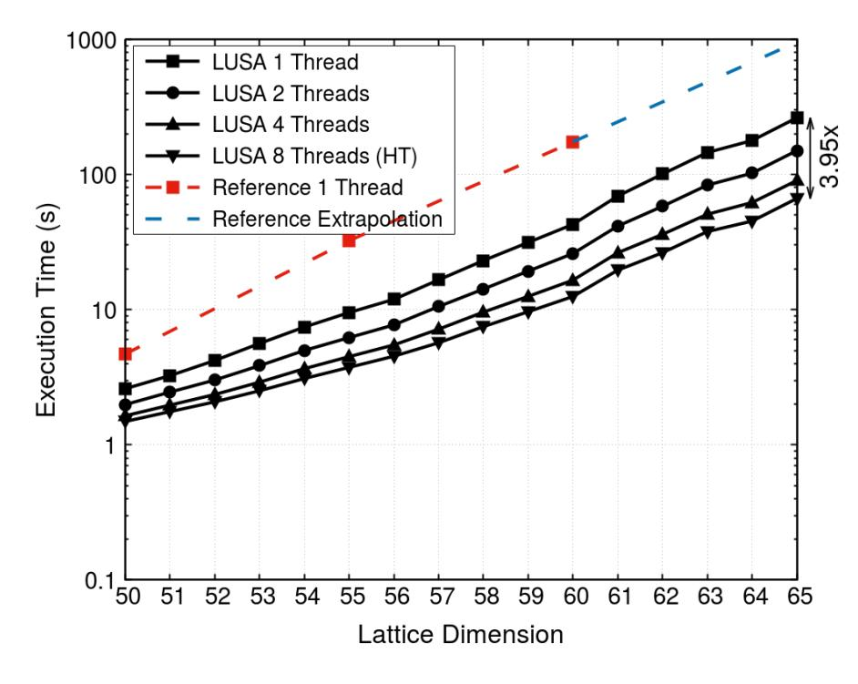

Fig. 11. Performance of LUSA's HashSieve routine, for 1-8 threads, compared to the baseline implementation (sequential).

LUSA's provides a sequential and a parallel version of the Voronoi-based algorithm to solve the SVP, the relevant vectors routine [28] which LUSA calls Voronoi (**voronoi**) and scales according to Figure 12. In the same figure, we show the performance of LUSA's Voronoi 2.0 algorithm (**voronoi2**), an optimized version of the Voronoi algorithm presented in [28] ("relevant vectors").

Scalability. One of LUSA's strongest points is scalability. Most implementations in LUSA are based on implementations that were previously shown to scale linearly or almost linearly

{10}------------------------------------------------

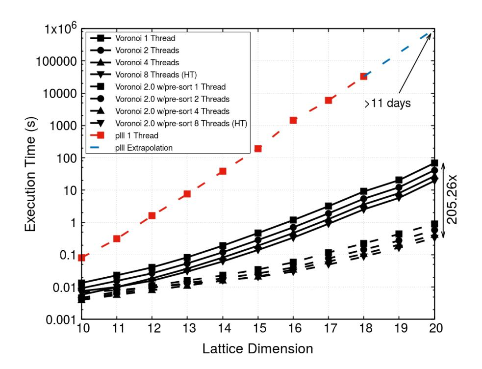

Fig. 12. LUSA's Voronoi cell-based SVP solver and Voronoi 2.0, using 1-8 threads, compared to plll.

with the number of CPU threads used. In order to integrate some of these implementations in LUSA, many adaptations had to be done, in order to connect all LUSA modules and keep the entire LUSA ecosystem thread safe (e.g. the user can run multiple LUSA algorithms in parallel, while each algorithm is itself parallel). However, most LUSA implementations scale linearly with the number of threads, as we show in the following.

- 1) Enumeration (with pruning turned on and off). As Figure 13 shows, the scalability of both the **enumerate** and the **enumeratePruned** routines is fairly good with the number of threads used. Non-pruned enumeration scales particularly well, with a 3.85x speedup for 8 threads, and pruned enumeration achieves a speedup of 2.37x for 8 threads. Note that in these tests 8 threads do not mean the use of 8 physical cores (but 4 physical and 4 logical cores instead). Pruned enumeration does not scale as well as pruning introduces workload imbalance among threads. As pruned enumeration is based on randomizing the lattice basis a few times and running pruned enumeration on each lattice instance, each lattice will take a different amount of time to be executed [67].
- 2) HashSieve. Even for a relatively low dimension, such as 50 (which takes less than 2 seconds to solve), LUSA achieves a speedup of 3.95x for 8 threads (on 4 physical plus 4 logical cores). Figure 14 shows the scalability results for HashSieve. Based on these results, LUSA attains an overall speedup of more than 3x for 4 threads in dimensions higher than 60, and almost 4x for 8 threads (4 of which are SMT-based).

# VI. WRAP UP

This paper presents LUSA, a lattice library specifically designed for lattice-based cryptanalysis. LUSA aims at achieving simplicity, being very easy to download and install, and high performance, to which end the code has been thoroughly optimized, and most implementations come with a parallel version.

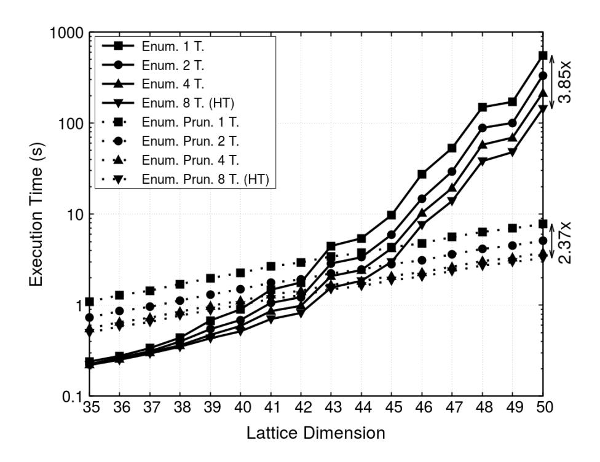

Fig. 13. Performance of LUSA's enumeration routines (non-pruned and pruned enumerations), for 1-8 threads.

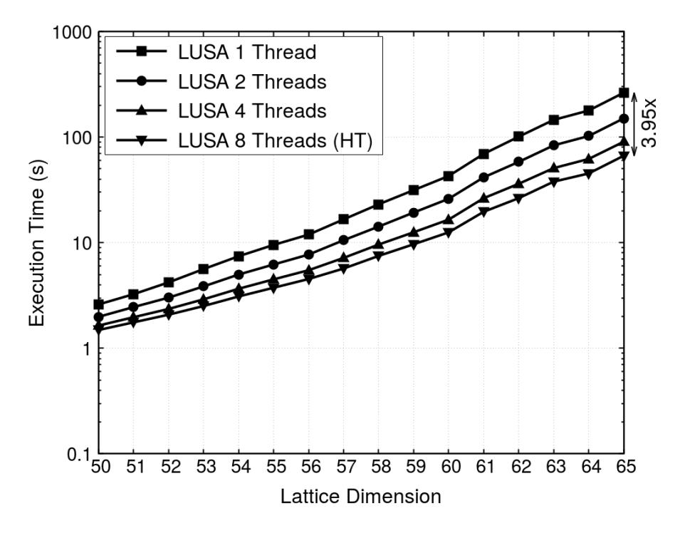

Fig. 14. LUSA's HashSieve performance on lattices in dimensions 50-65.

In this paper we show that LUSA is not only generally faster than other libraries, as it is also the most complete library in terms of the most relevant algorithms in lattice-based cryptanalysis, and almost of its methods are parallel and scale very well with the number of CPU cores used.

In [32], we have reviewed most available implementations of SVP- and CVP-solvers. We concluded which versions were better and we did code those versions on LUSA. Yet, such assessment has many variables (benchmarking machine/CPU architecture, compiler version, compiler flags, code flags/ macros, etc) and some users may find out that a specific implementation on their specific computer may have a different performance than what we concluded in [32]. We will make an effort to gather feedback from the community members, especially if they find an implementation that is faster than its analog in LUSA. If this happens, we intend to integrate such particular implementation(s) in LUSA, so that LUSA holds the most efficient implementations of all algorithms offered.

To download and start using LUSA, please go to http://alfa.di.uminho.pt/˜ ammm/lusa.html. The documentation to use the library is also available there.

{11}------------------------------------------------

# VII. VERSIONS SCHEDULED FOR FUTURE WORK

In the next v1.\* versions of LUSA, we plan to:

- Incorporate SIMD instructions in our LLL implementation, as shown in [83], which should enable our LLL implementation to be faster;
- Integrate better bounding functions to improve the algorithmic performance of BKZ 2.0 and offer this method;
- Increase the performance of enumeration methods, so that LUSA's enumeration is the fastest among all libraries;

In LUSA v2.0, we plan to incorporate CVP algorithms and newer SVP algorithms that recently became available:

- Add variants of the existent algorithms, such as those listed in plll (LUSA aims to be the most complete library available);
- Include other methods that are not solvers;
- Add CVP-solvers (both enumeration- and sieving-based);
- Add newer Sieving algorithms, such as [64];

In LUSA v3.0, we plan to:

• Add solvers of other relevant lattice problems, such as LWE and SIS;

In LUSA v4.0, we plan to make LUSA capable of executing code on GPUs, and, for some algorithms, on CPUs and GPUs simultaneously. As we intend to make LUSA 100% library independent (except for standard libraries), it is still unclear whether we will need to implement a run-time system for CPU+GPU environments, use a built-in system or implement every method on CPU+GPU environments by hand.

Additionally, we plan to deeply assess LUSA from a computational efficiency standpoint, by 1) characterizing cache behavior (to which end we will use PAPI and assess cache miss rates and other factors) and power consumption, 2) identifying opportunities to cache optimization and code vectorization, 3) assessing and improving workload balancing/idle time among threads in parallel methods and 4) implementing built-in techniques to improve performance on NUMA systems as e.g. done with HashSieve before [84].

## ACKNOWLEDGEMENTS

I would like to thank my previous student Fabio Correia, ´ for the implementation of the multiple-precision capability in LUSA module and most enumeration-related algorithms. I thank my previous student Filipe Cabeleira for implementing the Voronoi cell based algorithms in LUSA and assisting with some of the testing and logistics of the library. I thank Ozg ¨ ur¨ Dagdelen and Robert Fitzpatrick for the work we developed together, which helped to inspire me to create this library. I thank particularly Thijs Laarhoven for the beautiful work we have done together and being the best science partner one can have. I thank TU-Darmstadt and Christian Bischof in particular for introducing me to this awesome subject, and all the people I ever worked with in the context of lattice-based cryptanalysis (some of whom instilled me to create and develop LUSA, as they figured my passion for performance and optimization). I thank my previous hosts, especially Gabriel Falcao at the ˜ University of Coimbra, whom I have worked on lattice-based cryptography. I thank my current host, professor Luis Paulo Santos, for hosting me and having taught me since I started my BSc. I thank Martin Albrecht for insightful comments on early verions of this paper. Lastly but not least, I thank DFG, who made this project possible. Artur Mariano is funded by the Deutsche Forschungsgemeinschaft (DFG, German Research Foundation) Projektnummer 382285730.

#### REFERENCES

- [1] P. Shor, "Polynomial-time algorithms for prime factorization and discrete logarithms on a quantum computer," *SIAM J. Comput.*, vol. 26, no. 5, pp. 1484–1509, Oct. 1997. [Online]. Available: http://dx.doi.org/10.1137/S0097539795293172
- [2] ——, "Algorithms for quantum computation: Discrete logarithms and factoring," in *Proceedings of the 35th Annual Symposium on Foundations of Computer Science*, ser. SFCS '94. Washington, DC, USA: IEEE Computer Society, 1994, pp. 124–134. [Online]. Available: http://dx.doi.org/10.1109/SFCS.1994.365700
- [3] D. Bernstein, J. Buchmann, and E. Dahmen, Eds., *Postquantum cryptography*. Springer, 2009. [Online]. Available: http://www.springerlink.com/content/978-3-540-88701-0
- [4] M. Ajtai, "Generating hard instances of lattice problems (extended abstract)," in *STOC*. New York, NY, USA: ACM, 1996, pp. 99–108.
- [5] M. Ajtai and C. Dwork, "A public-key cryptosystem with worstcase/average-case equivalence," in *Proceedings of the Twenty-ninth Annual ACM Symposium on Theory of Computing*, ser. STOC '97. New York, NY, USA: ACM, 1997, pp. 284–293. [Online]. Available: http://doi.acm.org/10.1145/258533.258604
- [6] M. Ajtai, "The shortest vector problem in L<sup>2</sup> is NP-hard for randomized reductions (extended abstract)," in *STOC*, 1998, pp. 10–19.
- [7] C. Gentry, "A fully homomorphic encryption scheme," Ph.D. dissertation, Stanford, CA, USA, 2009, aAI3382729.
- [8] A. Acar, H. Aksu, A. S. Uluagac, and M. Conti, "A survey on homomorphic encryption schemes: Theory and implementation," *ACM Comput. Surv.*, vol. 51, no. 4, pp. 79:1–79:35, Jul. 2018. [Online]. Available: http://doi.acm.org/10.1145/3214303
- [9] C. Fontaine and F. Galand, "A survey of homomorphic encryption for nonspecialists," *EURASIP Journal on Information Security*, vol. 2007, no. 1, p. 013801, Dec 2007. [Online]. Available: https://doi.org/10.1155/2007/13801
- [10] P. Martins, A. Mariano, and L. Sousa, "A survey on fully homomorphic encryption: an engineering perspective," in *ACM Computing Surveys*, 2017, p. To appear.
- [11] R. L. Rivest, L. Adleman, and M. L. Dertouzos, "On data banks and privacy homomorphisms," *Foundations of Secure Computation, Academia Press*, pp. 169–179, 1978.
- [12] V. Kuchta and O. Markowitch, "Multi-authority distributed attributebased encryption with application to searchable encryption on lattices," in *Paradigms in Cryptology - Mycrypt 2016. Malicious and Exploratory Cryptology - Second International Conference, Mycrypt 2016, Kuala Lumpur, Malaysia, December 1-2, 2016, Revised Selected Papers*, 2016, pp. 409–435. [Online]. Available: https://doi.org/10.1007/978-3- 319-61273-7 20
- [13] L. Zhou, Z. Hu, and F. Lv, "A simple lattice-based pke scheme," *SpringerPlus*, vol. 5, no. 1, p. 1627, Sep 2016. [Online]. Available: https://doi.org/10.1186/s40064-016-3300-4
- [14] E. Alkim, P. S. L. M. Barreto, N. Bindel, P. Longa, and J. E. Ricardini, "The lattice-based digital signature scheme qtesla," *IACR Cryptology ePrint Archive*, vol. 2019, p. 85, 2019. [Online]. Available: https://eprint.iacr.org/2019/085
- [15] T. Gneysu, M. Krausz, T. Oder, and J. Speith, "Evaluation of lattice-based signature schemes in embedded systems," in *2018 25th IEEE International Conference on Electronics, Circuits and Systems (ICECS)*, 2018, pp. 385–388. [Online]. Available: https://app.dimensions.ai/details/publication/pub.1111608955
- [16] L. Ducas, E. Kiltz, T. Lepoint, V. Lyubashevsky, P. Schwabe, G. Seiler, and D. Stehle, "Crystals-dilithium: A lattice-based digital signature ´ scheme," *IACR Trans. Cryptogr. Hardw. Embed. Syst.*, vol. 2018, no. 1, pp. 238–268, 2018.
- [17] O. Regev, *Lattice-Based Cryptography*. Berlin, Heidelberg: Springer Berlin Heidelberg, 2006, pp. 131–141.
- [18] P. Nguyen and J. Stern, "The Two Faces of Lattices in Cryptology," in *CaLC*, 2001, pp. 146–180.
- [19] J. van de Pol, "Lattice-based cryptography," Master's thesis, Technische Universiteit Eindhoven, The Netherlands, 2011.

{12}------------------------------------------------

- [20] V. Lyubashevsky, "Lattice-Based Identification Schemes Secure Under Active Attacks," 2008, pp. 162–179.
- [21] V. Lyubashevsky, C. Peikert, and O. Regev, *On Ideal Lattices and Learning with Errors over Rings*. Berlin, Heidelberg: Springer Berlin Heidelberg, 2010, pp. 1–23.
- [22] D. Stehle, R. Steinfeld, K. Tanaka, and K. Xagawa, ´ *Efficient Public Key Encryption Based on Ideal Lattices*, 2009, pp. 617–635.
- [23] A. Lenstra, H. Lenstra, and L. Lovasz, "Factoring polynomials with ´ rational coefficients," *Math. Ann.*, vol. 261, pp. 515–534, 1982.
- [24] C.-P. Schnorr and M. Euchner, "Lattice basis reduction: Improved practical algorithms and solving subset sum problems," *Mathematical Programming*, vol. 66, no. 2–3, pp. 181–199, 1994.
- [25] Y. Chen and P. Q. Nguyen, *BKZ 2.0: Better Lattice Security Estimates*. Berlin, Heidelberg: Springer Berlin Heidelberg, 2011, pp. 1–20.
- [26] P. Nguyen and D. Stehle, "An LLL algorithm with quadratic complexity," ´ *SIAM J. Comput.*, vol. 39, no. 3, pp. 874–903, 2009.
- [27] I. Morel, D. Stehle, and G. Villard, "H-LLL: using householder inside ´ LLL," in *ISSAC*. ACM, 2009, pp. 271–278.
- [28] E. Agrell, T. Eriksson, A. Vardy, and K. Zeger, "Closest point search in lattices," *IEEE Transactions on Information Theory*, vol. 48, no. 8, pp. 2201–2214, Aug 2002.
- [29] D. Micciancio and O. Regev, *Post-Quantum Cryptography*. Berlin, Heidelberg: Springer Berlin Heidelberg, 2009, ch. Lattice-based Cryptography, pp. 147–191.
- [30] D. P. Chi, J. W. Choi, J. S. Kim, and T. Kim, "Lattice based cryptography for beginners," Cryptology ePrint Archive, Report 2015/938, 2015, https://eprint.iacr.org/2015/938.
- [31] C. Peikert, "A decade of lattice cryptography," *Found. Trends Theor. Comput. Sci.*, vol. 10, no. 4, pp. 283–424, Mar. 2016. [Online]. Available: http://dx.doi.org/10.1561/0400000074
- [32] A. Mariano, T. Laarhoven, and C. Bischof, "A parallel variant of ldsieve for the svp on lattices," in *2017 25th Euromicro International Conference on Parallel, Distributed and Network-based Processing (PDP)*, March 2017, pp. 23–30.
- [33] D. Micciancio, *Cryptographic Functions from Worst-Case Complexity Assumptions*. Berlin, Heidelberg: Springer Berlin Heidelberg, 2010, pp. 427–452.
- [34] O. Regev, "The learning with errors problem (invited survey)," in *2010 IEEE 25th Annual Conference on Computational Complexity*, 2010, pp. 191–204.
- [35] V. Vaikuntanathan, "Computing blindfolded: New developments in fully homomorphic encryption," in *2011 IEEE 52nd Annual Symposium on Foundations of Computer Science*, Oct 2011, pp. 5–16.
- [36] P. Q. Nguyen and J. Stern, "The two faces of lattices in cryptology," in *Cryptography and Lattices*, J. H. Silverman, Ed. Berlin, Heidelberg: Springer Berlin Heidelberg, 2001, pp. 146–180.
- [37] D. Stehle,´ *The LLL Algorithm: Survey and Applications*. Berlin, Heidelberg: Springer Berlin Heidelberg, 2010, ch. Floating-Point LLL: Theoretical and Practical Aspects, pp. 179–213.
- [38] C. P. Schnorr, *The LLL Algorithm: Survey and Applications*. Berlin, Heidelberg: Springer Berlin Heidelberg, 2010, ch. Progress on LLL and Lattice Reduction, pp. 145–178.
- [39] H. Nejatollahi, N. Dutt, S. Ray, F. Regazzoni, I. Banerjee, and R. Cammarota, "Post-quantum lattice-based cryptography implementations: A survey," *ACM Comput. Surv.*, vol. 51, no. 6, pp. 129:1–129:41, Jan. 2019. [Online]. Available: http://doi.acm.org/10.1145/3292548
- [40] A. Mariano, "High performance algorithms for lattice-based cryptanalysis," Ph.D. dissertation, Technische Universitat Darmstadt, Darmstadt, ¨ Germany, 2016.
- [41] T. Lepoint, "Design and implementation of lattice-based cryptography," p. PhD Thesis, 06 2014.
- [42] R. Bendlin, "Lattice-based Cryptography: Threshold Protocols and Multiparty Computation," Ph.D. dissertation, Department of Computer Science, Aarhus University, Darmstadt, Germany, 2013.
- [43] Y. Chen, "Reduction de reseau et securite concrete du chiffrement completement homomorphe," Ph.D. dissertation, Universite Paris Diderot, ´ Paris, France, 2015.
- [44] T. Laarhoven, "Search problems in cryptography: From fingerprinting to lattice sieving," Ph.D. dissertation, Technische Universiteit Eindhoven, The Netherlands, 2016.
- [45] D. Micciancio and S. Goldwasser, *Complexity of Lattice Problems: A Cryptographic Perspective*, 01 2002, vol. 671.
- [46] ——, *Complexity of Lattice Problems: a cryptographic perspective*, ser. The Kluwer International Series in Engineering and Computer Science. Boston, Massachusetts: Kluwer Academic Publishers, Mar. 2002, vol. 671.

- [47] S. D. Galbraith, *Mathematics of Public Key Cryptography*, 1st ed. New York, NY, USA: Cambridge University Press, 2012.
- [48] E. Boas, "Another NP-complete partition problem and the complexity of computing short vectors in a lattice," *Technical Report 81-04, Mathematische Instituut, University of Amsterdam*, 1981.
- [49] D. Micciancio, "Efficient reductions among lattice problems," in *Proceedings of the Nineteenth Annual ACM-SIAM Symposium on Discrete Algorithms*, ser. SODA '08. Philadelphia, PA, USA: Society for Industrial and Applied Mathematics, 2008, pp. 84–93. [Online]. Available: http://dl.acm.org/citation.cfm?id=1347082.1347092
- [50] S. Arora, L. Babai, J. Stern, and Z. Sweedyk, "The hardness of approximate optima in lattices, codes, and systems of linear equations," *J. Comput. Syst. Sci.*, vol. 54, no. 2, pp. 317–331, 1997. [Online]. Available: http://dx.doi.org/10.1006/jcss.1997.1472
- [51] O. Goldreich, D. Micciancio, S. Safra, and J.-P. Seifert, "Approximating shortest lattice vectors is not harder than approximating closest lattice vectors," vol. 71, no. 2, pp. 55–61, 1999.
- [52] O. Goldreich, S. Goldwasser, and S. Halevi, "Public-key cryptosystems from lattice reduction problems," in *Proceedings of the 17th Annual International Cryptology Conference on Advances in Cryptology*, ser. CRYPTO '97. London, UK, UK: Springer-Verlag, 1997, pp. 112–131.
- [53] O. Regev, "On lattices, learning with errors, random linear codes, and cryptography," *J. ACM*, vol. 56, no. 6, pp. 34:1–34:40, 2009. Preliminary version in STOC 2005.
- [54] M. Ajtai, R. Kumar, and D. Sivakumar, "A sieve algorithm for the shortest lattice vector problem," pp. 601–610, 2001.
- [55] P. Nguyen and T. Vidick, "Sieve algorithms for the shortest vector problem are practical," *Journal of Mathematical Cryptology*, vol. 2, no. 2, pp. 181–207, 2008.
- [56] D. Micciancio and P. Voulgaris, "Faster exponential time algorithms for the shortest vector problem," pp. 1468–1480, 2010.
- [57] X. Pujol and D. Stehl, "Solving the shortest lattice vector problem in time 22.465n." *IACR Cryptology ePrint Archive*, vol. 2009, p. 605, 2009. [Online]. Available: http://dblp.unitrier.de/db/journals/iacr/iacr2009.htmlPujolS09
- [58] X. Wang, M. Liu, C. Tian, and J. Bi, "Improved Nguyen-Vidick Heuristic Sieve Algorithm for Shortest Vector Problem," in *Proceedings of the 6th ACM Symposium on Information, Computer and Communications Security*, ser. ASIACCS '11. New York, NY, USA: ACM, 2011, pp. 1–9. [Online]. Available: http://doi.acm.org/10.1145/1966913.1966915
- [59] F. Zhang, Y. Pan, and G. Hu, "A three-level sieve algorithm for the shortest vector problem," in *SAC*, 2013, pp. 29–47.
- [60] A. Becker, N. Gama, and A. Joux, "A sieve algorithm based on overlattices," in *ANTS*, 2014, pp. 49–70.
- [61] T. Laarhoven, "Sieving for shortest vectors in lattices using angular locality-sensitive hashing," in *CRYPTO*, 2015, pp. 3–22.
- [62] A. Becker, N. Gama, and A. Joux, "Speeding-up lattice sieving without increasing the memory, using sub-quadratic nearest neighbor search," *IACR Cryptology ePrint Archive*, vol. 2015, p. 522, 2015. [Online]. Available: https://eprint.iacr.org/2015/522
- [63] A. Becker, L. Ducas, N. Gama, and T. Laarhoven, "New directions in nearest neighbor searching with applications to lattice sieving," in *SODA*, 2016.
- [64] M. R. Albrecht, L. Ducas, G. Herold, E. Kirshanova, E. W. Postlethwaite, and M. Stevens, "The general sieve kernel and new records in lattice reduction," in *Advances in Cryptology – EUROCRYPT 2019*, Y. Ishai and V. Rijmen, Eds. Cham: Springer International Publishing, 2019, pp. 717–746.
- [65] G. Hanrot and D. Stehle, "Improved analysis of kannan's shortest ´ lattice vector algorithm," in *Advances in Cryptology - CRYPTO 2007*, A. Menezes, Ed. Berlin, Heidelberg: Springer Berlin Heidelberg, 2007, pp. 170–186.
- [66] A. Ghasemmehdi and E. Agrell, "Faster Recursions in Sphere Decoding." *IEEE Transactions on Information Theory*, vol. 57, no. 6, pp. 3530– 3536, 2011.
- [67] F. Correia, A. Mariano, A. Proena, C. Bischof, and E. Agrell, "Parallel Improved Schnorr-Euchner Enumeration SE++ on Shared and Distributed Memory Systems, With and Without Extreme Pruning," *Journal of Wireless Mobile Networks, Ubiquitous Computing, and Dependable Applications (JoWUA)*, vol. 7, no. 4, pp. 1–19, December 2016.
- [68] N. Gama, P. Nguyen, and O. Regev, "Lattice enumeration using extreme pruning," in *EUROCRYPT*, 2010, pp. 257–278.
- [69] D. Micciancio and M. Walter, "Practical, predictable lattice basis reduction," Cryptology ePrint Archive, Report 2015/1123, 2015, http://eprint.iacr.org/2015/1123.

{13}------------------------------------------------

- [70] M. Fukase and K. Kashiwabara, "An accelerated algorithm for solving SVP based on statistical analysis," *JIP*, vol. 23, no. 1, pp. 67–80, 2015.
- [71] F. Correia, A. Mariano, A. Proenc¸a, C. H. Bischof, and E. Agrell, "Parallel Improved Schnorr-Euchner Enumeration SE++ for the CVP and SVP," in *24th Euromicro International Conference on Parallel, Distributed, and Network-Based Processing, PDP 2016, Heraklion, Crete, Greece, February 17-19, 2016*, 2016, pp. 596–603.
- [72] Y. Luo and S. Qiao, "A parallel lll algorithm," in *Proceedings of The Fourth International C\* Conference on Computer Science and Software Engineering*, ser. C3S2E '11. New York, NY, USA: ACM, 2011, pp. 93–101. [Online]. Available: http://doi.acm.org/10.1145/1992896.1992908
- [73] M. Liu and P. Q. Nguyen, *Solving BDD by Enumeration: An Update* Berlin, Heidelberg: Springer Berlin Heidelberg, 2013, pp. 293–309.
- [74] W. Backes and S. Wetzel, "A Parallel LLL using POSIX Threads," 2008.

.

- [75] ——, "Improving the Parallel Schnorr-Euchner LLL Algorithm," ser. ICA3PP'11, 2011, pp. 27–39.
- [76] A. Mariano, Ozg ¨ ur Dagdelen, and C. Bischof, "A comprehensive em- ¨ pirical comparison of parallel ListSieve and GaussSieve," in *APCI&E* , 2014.
- [77] A. Mariano, S. Timnat, and C. Bischof, "Lock-free GaussSieve for linear speedups in parallel high performance SVP calculation," ser. SBAC-PAD'14, 2014.
- [78] A. Mariano, T. Laarhoven, and C. Bischof, "Parallel (probable) lock-free HashSieve: a practical sieving algorithm for the SVP," in *ICPP*, 2015.
- [79] A. Mariano and C. Bischof, "Enhancing the scalability and memory usage of HashSieve on multi-core CPUs," in *PDP16, to appear*, 2016.
- [80] T. Laarhoven and A. Mariano, "Progressive lattice sieving," in *Post-Quantum Cryptography*, T. Lange and R. Steinwandt, Eds. Cham: Springer International Publishing, 2018, pp. 292–311.
- [81] A. Mariano, F. Cabeleira, G. Falcao, and L. P. Santos, "Pruned, parallel Voronoi cell-based algorithms," in ¨ *White paper*, 2019.
- [82] T. Laarhoven, "Sieving for shortest vectors in lattices using angular locality-sensitive hashing," in *CRYPTO*, 2015, pp. 3–22.
- [83] A. Mariano, F. Correia, and C. Bischof, "A vectorized, cache efficient LLL implementation," in *12th International Meeting on High Performance Computing for Computational Science, Porto, Portugal, June 28th to 30th, 2016*, 2016.
- [84] A. Mariano, M. Diener, C. H. Bischof, and P. O. A. Navaux, "Analyzing and Improving Memory Access Patterns of Large Irregular Applications on NUMA Machines," in *24th Euromicro International Conference on Parallel, Distributed, and Network-Based Processing, PDP 2016, Heraklion, Crete, Greece, February 17-19, 2016*, 2016, pp. 382–387.