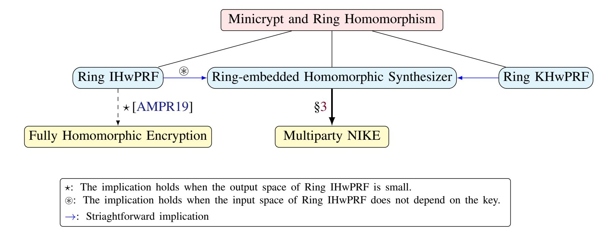

{0}------------------------------------------------

# Multiparty Noninteractive Key Exchange from Ring Key-Homomorphic Weak PRFs

Navid Alamati\* Hart Montgomery† Sikhar Patranabis‡

#### Abstract

A *weak* pseudorandom function F : K × X → Y is said to be *ring* key-homomorphic if, given F (k1, x) and F (k2, x), there are efficient algorithms to compute F (k1 ⊕ k2, x) and F (k1 ⊗ k2, x) where ⊕ and ⊗ are the addition and multiplication operations in the ring K, respectively. In this work, we initiate the study of ring key-homomorphic weak PRFs (RKHwPRFs). As our main result, we show that *any* RKHwPRF implies *multiparty noninteractive key exchange* (NIKE) for an arbitrary number of parties in the standard model.

Our analysis of RKHwPRFs in a sense takes a major step towards the goal of building cryptographic primitives from Minicrypt primitives with structure, which has been studied in a recent line of works. With our result, most of the well-known asymmetric cryptographic primitives can be built from a weak PRF with either a group or ring homomorphism over either the input space or the key space.

# 1 Introduction

An important line of research in cryptography in the past few decades has been to build cryptographic primitives with more functionalities from more structured concrete mathematical assumptions. A typical example is N-party noninteractive key exchange (NIKE) protocol, where N parties send a (single) message in a public channel, and then agree on a shared key that is hidden against any passive attacker who can see messages on the channel. An initial progress in this direction was the invention of Diffie-Hellman key exchange protocol [\[DH76\]](#page-17-0), which can be viewed as a two-party NIKE. In the past decade, several works have studied the security of two-party NIKE protocols [\[FHKP13,](#page-17-1) [FHH14,](#page-17-2) [HHK18,](#page-17-3) [HHKL21\]](#page-17-4).

For the case of three parties, the first result made possible by the development of pairing-based cryptography [\[Jou04\]](#page-18-0), enabling the realization of a *three-party* NIKE protocol. Such a NIKE protocol was not known previously from classical assumptions such as the Decisional Diffie-Hellman (DDH) assumption. Later, Boneh and Silverberg [\[BS03\]](#page-17-5) showed a generalization of the three-party NIKE construction of [\[Jou04\]](#page-18-0), demonstrating an (N + 1)-party NIKE protocol from any N-linear map; however, no plausible instantiation of N-linear maps was known for N > 2. In 2013, Garg, Gentry, and Halevi proposed the first candidate construction of multilinear maps [\[GGH13\]](#page-17-6) based on ideal lattices, followed by a construction from Coron, Lepoint, and Tibouchi over the integers [\[CLT13\]](#page-17-7) and also a construction of graph-induced multilinear maps by Gorbunov, Gentry, and Halevi [\[GGH15\]](#page-17-8) based on lattices. However, several of candidate constructions of multilinear maps were cryptanalyzed [\[CHL](#page-17-9)+15, [MSZ16,](#page-18-1) [HJ16,](#page-18-2) [CLLT16\]](#page-17-10), breaking essentially all of the originally proposed schemes.

To the best of our knowledge, the only generic way to realize multiparty NIKE is based on general-purpose indistinguishability obfuscation (iO) or functional encryption (FE) [\[BZ14,](#page-17-11) [GPSZ17,](#page-17-12) [KWZ22\]](#page-18-3), for which there is no known instantiation based on the polynomial hardness of standard computationally intractable problems. The recent work of [\[JLS21\]](#page-18-4) constructed iO based on *subexponential* hardness of certain problems, and building iO from polynomial hardness of standard problems has so far remained out of reach (we refer to [\[GLSW15\]](#page-17-13) for a discussion on the necessity of superpolynoimal security loss for realizing iO). In 2018, Boneh *et al.* [\[BGK](#page-16-0)+20] showed a mathematical framework based on isogenies to build multiparty NIKE, but their framework needs a certain algorithm to have a working protocol.

\*VISA Research.

†Linux Foundation.

‡ IBM Research India.

{1}------------------------------------------------

Specifically, the protocol of [\[BGK](#page-16-0)+20] needs an algorithm that takes an abelian variety (presented as a product of isogenous elliptic curves) and outputs an isomorphism invariant of the abelian variety, for which we currently do not have any efficient algorithm.

Multiparty NIKE from Structured Primitives? In this work, we study multiparty NIKE in a way that somewhat differs from the common theme of proposing more mathematical assumptions and constructions. Our approach is motivated by the following question: what sort of simple primitive with algebraic structure is sufficient to realize multiparty NIKE? Studying the complexity of multiparty NIKE can help us to either build or rule out constructions of this primitive from simple assumptions. Given the multitude of works that have attempted to build multiparty NIKE, we think this is a worthwhile direction in cryptography.

There has been a long line of research studying the relationship between public-key cryptography and mathematical structure (see [\[Bar17\]](#page-16-1) for a survey of the topic). In a recent work [\[AMPR19\]](#page-16-2), this relationship was formalized to some degree, and the authors showed that applying *input* homomorphisms to simple primitives in Minicrypt like weak pseudorandom functions (wPRFs) allows us to build many cryptographic primitives in Cryptomania.[1](#page-1-0) For instance, an input-homomorphic wPRF can be used to build many of the asymmetric cryptographic primitives that we know how to build from the DDH assumption. Another follow-up work [\[AMP19\]](#page-16-3) studied the power of simple primitives with an algebraically structured *secret/key* space [\[NPR99,](#page-18-5) [DKPW12,](#page-17-14) [BLMR13\]](#page-16-4). While [\[AMP19\]](#page-16-3) showed some cryptographic implication of weak PRFs with *key* homomorphism, it did not consider richer cryptographic applications such as multiparty NIKE. So despite all of the recent works studying the cryptographic power of simple primitives endowed with algebraic structure, very little is known on multiparty NIKE. So the question that we address is the following:

*Are there simple, algebraically structured primitives that imply multiparty NIKE, thus providing more insight into the kind of assumptions (or mathematical structure) that are seemingly sufficient to realize multiparty NIKE?*

#### 1.1 Our Contributions

We answer the question above in the affirmative by providing definitions for two new simple cryptographic primitives with certain algebraic structure, which we call *ring key-homomorphic weak pseudorandom function* (RKHwPRF) and *ring-embedded homomorphic synthesizer* (RHS). Ring-embedded homomorphic synthesizers have substantially weaker requirements compared to RKHwPRFs, akin to the relationship between weak PRFs and synthesizers (we define these primitives informally in the next paragraph). As our main result, we show how to build multiparty NIKE from any RHS (and hence from any RKHwPRF). We outline this implication in the rest of this section. We refer to Figure [1](#page-1-1) for a (simplified) overview of our results.

Figure 1: Implications of symmetric primitives with ring homomorphism

1We use the terminology of [\[Imp95\]](#page-18-6), which used "Minicrypt" and "Cryptomania" to describe the worlds of symmetric-key and asymmetric-key cryptography, respectively.

{2}------------------------------------------------

**Definitions.** We now provide informal definitions of RKHwPRF and RHS. A weak PRF1 is *ring key-homomorphic* if, for some weak PRF  $F: \mathcal{K} \times \mathcal{X} \to \mathcal{Y}$  such that both the key space  $(\mathcal{K}, \oplus, \otimes)$  and the output space  $(\mathcal{Y}, \boxplus, \boxtimes)$  are rings with efficiently computable ring operations, the following holds:

$$F(k_1, x) \boxplus F(k_2, x) = F(k_1 \oplus k_2, x),$$
  
 $F(k_1, x) \boxtimes F(k_2, x) = F(k_1 \otimes k_2, x).$ 

To define our second primitive, we first recall the definition of pseudorandom synthesizers. A pseudorandom synthesizer is a function  $S: X \times G \to R$  such that on random inputs  $(x_1, ..., x_m) \in X^m$  and  $(g_1, ..., g_n) \in G^n$ , the matrix M defined as  $M_{ij} := S(x_i, g_j)$  is indistinguishable from random [NR95].

A ring-embedded homomorphic synthesizer is a pseudorandom synthesizer  $S: X \times G \to R$  such that  $(G, \oplus)$  is a group with efficiently computable group operation,  $(R, \boxplus, \boxtimes)$  is a ring with efficiently computable ring operation, and the following holds:

$$S(x, q) \boxplus S(x, q') = S(x, q \oplus q').$$

Our definition of RHS weakens the requirements of an RKHwPRF in multiple ways: (1) the homomorphism is required *only* with respect to addition (i.e., G is not required to be a ring), (2) we require efficient multiplication *only* on the output space of the synthesizer, (3) and the underlying function is not required to be a weak PRF. It is straightforward to see that an RHS is implied by any RKHwPRF. We refer the reader to Section 2 for the formal definitions.

**Multiparty NIKE from RHS.** Our main construction is a multiparty NIKE protocol (with trusted setup) for any number of parties from any RKHwPRF or RHS (in this overview, we will assume an RKHwPRF for ease of exposition). The construction is relatively simple and relies on our new technique to show the psuedorandomness of matrix products over the output space of any RKHwPRF.

**Theorem 1.1.** (Informal) There is a multiparty NIKE protocol (for any number of parties) from any RKHwPRF (or more generally, any ring-embedded homomorphic synthesizer).

We next provide an overview of our construction and its proof of security. In this overview, we will focus on the 3-party case instead of the N-party case for simplicity. The intuition for the N-party case follows similarly. Given an RKHwPRF  $F: \mathcal{K} \times \mathcal{X} \to \mathcal{Y}$ , fix parameters  $m > 3 \log |\mathcal{K}|$  and  $n > 6 m^2 \log(|\mathcal{Y}|)$ . Let  $\mathcal{R} = M_m(\mathcal{Y})$  denote the ring of all m by m square matrices over  $\mathcal{Y}$ . We remark that  $\log(|\mathcal{R}^{n \times n}|)$  is polynomial in the security parameter, and hence elements of  $\mathcal{R}^{n \times n}$  can be represented using polynomially many bits.

To generate public parameters for 3-party NIKE we sample two matrices  $\mathbf{R}^{(1)}$  and  $\mathbf{R}^{(2)}$  uniformly from  $\mathcal{R}^{n\times n}$ , where  $\mathcal{R}$  is the matrix ring as defined above. Our proposed protocol works as follows:

| <u>Alice</u>                                              | $\underline{\mathrm{Bob}}$                                    | <u>Charlie</u>                                            |
|-----------------------------------------------------------|---------------------------------------------------------------|-----------------------------------------------------------|
| Sample $\mathbf{S}_A \leftarrow \mathcal{R}^{n \times n}$ | Sample $\mathbf{S}_B \leftarrow \mathcal{R}^{n \times n}$     | Sample $\mathbf{S}_C \leftarrow \mathcal{R}^{n \times n}$ |
| Publish $\mathbf{P}_A = \mathbf{S}_A \mathbf{R}^{(1)}$    | Publish $\mathbf{P}_{B}^{(1)}=\mathbf{R}^{(1)}\mathbf{S}_{B}$ | Publish $\mathbf{P}_C = \mathbf{R}^{(2)} \mathbf{S}_C$    |
|                                                           | $\mathbf{P}_B^{(2)} = \mathbf{S}_B \mathbf{R}^{(2)}$          |                                                           |

The final shared secret is  $\mathbf{S} := \mathbf{S}_A \mathbf{R}^{(1)} \mathbf{S}_B \mathbf{R}^{(2)} \mathbf{S}_C$ . Alice/Bob/Charlie can compute the final secret  $\mathbf{S}$  as

$$\mathbf{S} = \mathbf{S}_A \mathbf{R}^{(1)} \mathbf{S}_B \mathbf{R}^{(2)} \mathbf{S}_C = \mathbf{S}_A \mathbf{P}_B^{(1)} \mathbf{P}_C$$

$$= \mathbf{P}_A \mathbf{S}_B \mathbf{P}_C$$

$$= \mathbf{P}_A \mathbf{P}_B^{(2)} \mathbf{S}_C$$
(Alice)
$$= \mathbf{P}_A \mathbf{P}_B^{(2)} \mathbf{S}_C$$
(Charlie).

While the construction is surprisingly simple (and it does not even have any explicit RKHwPRF evaluation), the security proof is substantially more involved (in particular, when generalizing to an arbitrary number of parties) and it relies on the weak pseudorandomness of F to show certain properties of the output space of any RKHwPRF.

&lt;sup>1Recall that a weak PRF is a weakened version of a normal/strong PRF where an adversary gets to see the outputs on *randomly* chosen inputs.

{3}------------------------------------------------

Specifically, we first show that based on the weak pseudorandomness of F, the tuples R(1) , SAR(1) and R(1) , TA are computationally indistinguishable where TA is a randomly chosen matrix from Rn×n. We can apply a similar line of argument to the term containing SC as well. Thus, we can reduce the security our NIKE protocol to distinguishing between the following tuples:

$$\left(\mathbf{R}^{(1)}, \mathbf{R}^{(2)}, \mathbf{T}_A, \mathbf{R}^{(1)} \mathbf{S}_B, \mathbf{S}_B \mathbf{R}^{(2)}, \mathbf{T}_C, \mathbf{T}_A \mathbf{S}_B \mathbf{T}_C\right),$$
$$\left(\mathbf{R}^{(1)}, \mathbf{R}^{(2)}, \mathbf{T}_A, \mathbf{R}^{(1)} \mathbf{S}_B, \mathbf{S}_B \mathbf{R}^{(2)}, \mathbf{T}_C, \mathbf{U}\right).$$

The difficult step in the proof involves implicitly showing that giving an adversary *both* R(1)SB and SBR(2), it cannot learn "enough" about the matrix SB to distinguish the final term (i.e., TASBTC ) from random.

To do this, we exploit the fact that any uniformly random matrix (with large enough dimensions) in the output ring of the RKHwPRF is computationally indistinguishable from a tensor product of two uniformly random vectors in the output ring of the RKHwPRF. We introduce and prove certain statistical lemmas with respect to modules[1](#page-3-0) that, when combined with the aforementioned observation, allow us to argue that the secret matrix SB is computationally hidden, even given both R(1)SB and SBR(2). The security of the protocol follows from this argument. We refer the reader to Section [3](#page-7-0) for the detailed proof.

Field-embedded Homomorphic Synthesizers Are Impossible. Given the implication that an RHS is sufficient to realize multiparty NIKE, it is natural to ask whether it is possible to have a stronger version of an RHS where the output space is a field with efficiently computable field operations (we call such a primitive a field-embedded homomorphic synthesizer, or FHS in short). We answer this question in negative by showing that there is no (secure) FHS. Since an FHS is implied by a field key-homomorphic weak PRF (FKHwPRF), it follows that there is no FKHwPRF as well.

Previously, Maurer and Raub [\[MR07\]](#page-18-8) showed that (secure) field-homomorphic one-way permutations are not realizable, and our work extends their result to synthesizers (and weak PRFs). Moreover, it seems unlikely that our attacks here can be extended to the ring case. In particular, it is not known how to compute kernels or inverses over general rings, which makes our attack on fields infeasible to trivially extend to rings. We refer the reader to [\[ADM06,](#page-16-5) [Jag12,](#page-18-9) [YYHK20\]](#page-18-10) for discussions on the hardness of computing inverses/kernels over generic rings and its implications. Finally, our impossibility result also extends to a wider class of rings where one can efficiently perform the inversion operation (provided that the inverse exists).

Public-Key Cryptography and Mathematical Structure. By showing that another well-known primitive (namely multiparty NIKE) can be constructed from a simple primitive with structure, our work takes a major step towards the goal of building cryptographic primitives from Minicrypt primitives with algebraic structure [\[AMPR19,](#page-16-2) [AMP19\]](#page-16-3). The structure over a Minicrypt primitive also happens to be easy to state: either a group or ring homomorphism over the input space or key space. This bolsters the argument that it makes sense to base theoretical constructions of cryptographic primitives (i.e., constructions that are focused on showing the existence of something rather than a practical implementation) on generic primitives rather than concrete assumptions. We defer to the work of [\[AMPR19\]](#page-16-2) for a more elaborate argument of this point.

#### 1.2 RKHwPRFs and Related Cryptographic Primitives/Models

In this subsection, we discuss the relationship of RKHwPRFs with related cryptographic primitives.

Relation to Indistinguishability Obfuscation (iO). It is natural to ask if we can construct RKHwPRFs from iO. It turns out that a *black-box* construction of RKHwPRFs from iO is *impossible*. Any RKHwPRF naturally implies (in a black-box manner) a key-homomorphic weak PRF (KHwPRF), where the homomorphism is purely with respect to the group operations in the key space and the output space [\[BLMR13\]](#page-16-4). Any KHwPRF in turn implies (again, in a black-box manner) a family of collision-resistant hash functions (CRHFs) [\[AMPR19,](#page-16-2) [AMP19\]](#page-16-3). Combining these observations with known results on the black-box separation of iO from CRHFs [\[AS15\]](#page-16-6), we immediately obtain a

1 Informally, a module is a generalization of vector space where the "scalars" form a ring (rather than a field).

{4}------------------------------------------------

black-box separation between RKHwPRFs and iO. In fact, the black-box separation from iO also applies to any RHS, since it is straightforward to show that any RHS also implies a CRHF in a black-box manner. We leave it as an open question to explore a non-black-box construction of RKHwPRFs from iO.

"Slotted"/"Almost" RKHwPRFs. The definitions of RKHwPRFs that we consider in this paper can be viewed as "classic" versions of RKHwPRFs, that allow an *unbounded* number of homomorphic operations with respect to both addition and multiplication. We choose to focus on this version of RKHwPRFs in this paper for ease of exposition. We can further generalize this definition to cover a situation where the number of homomorphic multiplicative operations is restricted. Concretely, in such an RKHwPRF, we have "slots" for elements, and the elements must be multiplied in a certain *order* (for example, the multiplication operation could only be defined between wPRF evaluations from "adjacent" slots, in which case the maximum multiplicative depth is bounded by the number of slots). We refer to such a restricted RKHwPRF as a "slotted" RKHwPRF. In our construction of multiparty NIKE from RKHwPRFs, evaluating the final secret key requires the public/secret matrices of ring elements from various parties to be multiplied in a specific pre-determined order (informally, in the order in which the parties are indexed). So, the lack of ability to multiply elements "out of order" does not hinder our construction, which can be based correctly and securely on a slotted RKHwPRF. We avoid these details when presenting our construction for ease of exposition, and also because the core focus of this paper is the classic version of RKHwPRFs.

We can further generalize the definition of classic and slotted RKHwPRFs to accommodate approximate (or bounded) additive homomorphisms. We refer to this primitive as "almost" (slotted) RKHwPRFs. Unlike a slotted RKHwPRF where the only restrictions are on the multiplicative depth, an almost slotted RKHwPRF is additionally bounded with respect to the number of homomorphic addition operations it supports at any given interval-slot. Since our NIKE construction has a pre-fixed additive depth (the additive depth of the key derivation circuit is O(Nm), where N is the number of parties participating in the protocol and  $m = \text{poly}(\lambda)$  is a fixed matrix dimension), our construction and proof for multiparty NIKE can be based on almost (slotted) RKHwPRFs.

**Relation to Generic/Idealized Models.** Another natural question to ask is what RHS or RKHwPRF offers in comparison to generic/idealized graded encoding or multilinear map models, which were also used to build multiparty NIKE. An analogous comparison would be group-homomorphic encryption (or input-homomorphic weak PRF) versus the generic group model [Sho97]. We note that while a generic multilinear map or graded encoding is inherently limited from an instantiation point of view, an RHS/RKHwPRF is a "standard-model" primitive with potentially secure instantiations. Moreover, some cryptographic implications in generic/idealized models can be too powerful to realize in the standard model. As a concrete example, virtual black-box obfuscation can be constructed in the generic graded encoding model [BR14, BGK+14], but not in the standard model [BGI+01].

#### 2 Preliminaries

**Notation.** For any positive integer n, we use [n] to denote the set  $\{1,\ldots,n\}$ . For two integers m and n we denote the set  $\{m,m+1,\ldots,n\}$  by [m,n]. We use  $\lambda$  for the security parameter. We use the symbols  $\oplus$  and  $\otimes$  as ring operations defined in the context. We assume that rings have multiplicative identity element. For a finite set S, we use  $s \leftarrow S$  to sample uniformly from the set S. We denote statistical and computational indistinguishability by  $\stackrel{s}{\approx}$  and  $\stackrel{c}{\approx}$ , respectively. Let  $(R,\oplus,\otimes)$  be an arbitrary finite ring. We denote the additive/multiplicative identity of R by  $0_R/1_R$ . We define the multiplication of two matrices of ring elements in the natural way: for two arbitrary matrices

$$\mathbf{A} = [a_{ij}]_{\{i \in [\ell], j \in [m]\}} \in R^{\ell \times m} \quad , \quad \mathbf{B} = [b_{ij}]_{\{i \in [m], j \in [n]\}} \in R^{m \times n},$$

their product  $\mathbf{C} = [c_{ij}]_{\{i \in [\ell], j \in [n]\}} = \mathbf{AB}$  is defined as

$$c_{ij} = (a_{i,1} \otimes b_{1,j}) \oplus (a_{i,2} \otimes b_{2,j}) \oplus \cdots \oplus (a_{i,m} \otimes b_{m,j}).$$

{5}------------------------------------------------

#### 2.1 Basic Primitives

**Weak Pseudorandom Functions.** If  $G: X \to Y$  is a function, let  $G^{\$}$  denote a randomized oracle that, when invoked, samples  $x \leftarrow X$  uniformly and outputs (x, G(x)). A keyed function family is a function  $F: K \times X \to Y$  such that K is the key space and X, Y are input and output spaces, respectively. We may use the notation  $F_k(x)$  to denote F(k, x). A weak pseudorandom function (wPRF) family is an efficiently computable (keyed) function family F such that for all PPT adversaries  $\mathcal{A}$  we have

 $\left|\Pr[\mathcal{A}^{F_k^{\$}} = 1] - \Pr[\mathcal{A}^{U^{\$}} = 1]\right| \le \operatorname{negl}(\lambda),$ 

where  $k \leftarrow K$ , and  $U: X \to Y$  is a truly random function. Roughly speaking, the security requirement is that given access to polynomially many (random) input-output pairs of the form  $(x_i, y_i)$ , no attacker can distinguish between the real experiment where  $y_i = F_k(x_i)$  and the ideal experiment where  $y_i = U(x_i)$  for a truly random function U.

(**Pseudorandom**) Synthesizers. Let  $\ell$  and m be (polynomially bounded) integers, and let  $S: X \times Y \to Z$  be an efficiently computable function. Assume that  $\mathbf{x} \leftarrow X^{\ell}$  and  $\mathbf{y} \leftarrow Y^m$  are two uniformly chosen vectors, and let  $\mathbf{Z} \leftarrow Z^{\ell \times m}$  be a uniformly chosen matrix. We say that S is a pseudorandom synthesizer if for any probabilistic polynomial time (PPT) attacker we have

$$[S(\mathbf{x}, \mathbf{y})] \stackrel{c}{\approx} \mathbf{Z},$$

where  $[S(\mathbf{x}, \mathbf{y})]$  is an  $\ell \times m$  matrix whose  $ij^{\text{th}}$  entry is  $S(x_i, y_j)$ .

In this paper we focus on multiparty NIKE with trusted setup and passive model of security, where each party's "public key" is computed honestly. We refer to [FHKP13] for an analysis of security models for two-party NIKE.

**Multiparty NIKE.** Let N > 1 be an integer denoting the number of parties. We say that a tuple of randomized algorithms (Gen,  $(A_i)_{i \in N}$ ,  $(S_i)_{i \in N}$ ) (described below) is a noninteractive NIKE protocol for N parties if it satisfies the correctness and security properties as defined below.

- Gen: It takes security parameter  $\lambda$  as its input and outputs pp.
- $A_i$ : It takes a public parameter pp as its input. It outputs a randomness  $R_i$  and a public message  $P_i$ .1 (The randomness  $R_i$  is going to be kept secret by the party i.)
- $S_i$ : It takes N-1 public messages  $\{P_j\}_{j\in[N]\setminus\{i\}}$  and a (private) randomness  $R_i$ , and outputs some key K.
- Correctness: We require that if  $pp \leftarrow Gen(1^{\lambda})$  and  $(P_j, R_j) \leftarrow \mathcal{A}_j(pp)$  (for  $j \in [N]$ ), the following holds with overwhelming probability

$$S_1(R_1, \{P_i\}_{i \in [N] \setminus \{1\}}) = S_2(R_2, \{P_i\}_{i \in [N] \setminus \{2\}}) = \dots = S_N(R_N, \{P_N\}_{i \in [N] \setminus \{N\}}).$$

• Security: If  $pp \leftarrow Gen(1^{\lambda})$  and  $(P_j, R_j) \leftarrow \mathcal{A}_j(pp)$  (for  $j \in [N]$ ), the following holds with overwhelming probability for any  $i^* \in N$ :

$$(pp, \{P_i\}_{i \in [N]}, \mathcal{S}_{i^*}(R_{i^*}, \{P_i\}_{i \in [N] \setminus \{i^*\}})) \stackrel{c}{\approx} (pp, \{P_i\}_{i \in [N]}, U),$$

where U is uniformly sampled from the (common) output space of  $\mathcal{S}_{i^*}$ .

Remark 2.1. The above definition of NIKE implicitly assumes that the set of parties performing the NIKE is fixed (note that once the set is fixed, the parties can use a canonical ordering to index themselves properly within the group). An alternative definition of NIKE that has been considered in prior works (e.g., in the construction of three-party NIKE from bilinear maps [Jou04]) is as follows: (a) the number of users in the system is defined at Gen, (b) every party publishes a public message, and (c) a party can adaptively choose a subset of the parties to perform the key

&lt;sup>1We assume that each public message also includes the index i.

{6}------------------------------------------------

exchange. We note that this alternative definition naturally captures "symmetric" NIKE protocols where all parties perform identical operations and do not need to know the ordering of the parties prior to publishing their messages. On the other hand, the definition of NIKE detailed above naturally captures "asymmetric" NIKE protocols where each party performs potentially different operations to create its message based on the ordering of the parties, and hence needs to know this ordering prior to publishing its message. A well-known example of such an asymmetric key exchange protocol is the two-party key exchange protocol from learning with rounding (LWR) [\[Pei14\]](#page-18-12). We opt for the asymmetric definition of NIKE in this paper as our proposed NIKE protocol from RKHwPRFs is also asymmetric.

## 2.2 Homomorphic Primitives

We endow weak PRFs and (pseudorandom) synthesizers with ring homomorphism. We remark that it is also possible to define the notion of bounded homomorphism, similar to [\[AMPR19\]](#page-16-2) and [\[AMP19\]](#page-16-3) using a universal mapping that handles a bounded number of homomorphism. We refer to [\[AMPR19\]](#page-16-2) and [\[AMP19\]](#page-16-3) for more details.

Definition 2.2. (Ring Key-Homomorphic Weak PRF.) A weak PRF family F : K × X → Y is a Ring Key-Homomorphic weak PRF (RKHwPRF) family if it satisfies the following two properties:

- (K, ⊕, ⊗) and (Y, ⊞, ⊠) are efficiently samplable (finite) rings with efficiently computable ring operations.
- For any x ∈ X the function F(·, x) : K → Y is a ring homomorphism, i.e., for any x ∈ X and k, k′ ∈ K we have

$$F(k \oplus k', x) = F(k, x) \boxplus F(k', x)$$
 ,  $F(k \otimes k', x) = F(k, x) \boxtimes F(k', x)$ .

Definition 2.3. (Ring Input-Homomorphic Weak PRF.) A weak PRF family F : K × X → Y is a Ring Input-Homomorphic weak PRF (RIHwPRF) family if it satisfies the following two properties:

- (X, ⊕, ⊗) and (Y, ⊞, ⊠) are efficiently samplable (finite) rings with efficiently computable ring operations.
- For any k ∈ K the function F(k, ·) : X → Y is a ring homomorphism, i.e., for any k ∈ K and x, x′ ∈ X we have

$$F(k, x \oplus x') = F(k, x) \boxplus F(k, x')$$
,  $F(k, x \otimes x') = F(k, x) \boxtimes F(k, x')$ .

Definition 2.4. (Ring-Embedded Homomorphic Synthesizer.) A Ring-Embedded Homomorphic Synthesizer S : X × G → R is a synthesizer that satisfies the following properties:

- (G, ⊕) is an efficiently samplable (finite) group with efficiently computable group operation.
- (R, ⊞, ⊠) is an efficiently samplable (finite) ring with efficiently computable ring operations.
- For any x ∈ X the function S(x, ·) : G → R is a *group* homomorphism, i.e., for any x ∈ X and g1, g2 ∈ G we have

$$S(x, g_1 \oplus g_2) = S(x, g_1) \boxplus S(x, g_2).$$

It is easy to see that a ring-embedded homomorphic synthesizer is implied by an RKHwPRF or an RIHwPRF (for which the input space does not depend on the choice of the key).

#### 2.3 Leftover Hash Lemma

We use the following lemmata which are related to the leftover hash lemma [\[IZ89\]](#page-18-13), and its special cases over rings. We begin with the following simple lemma, a proof can be found in [\[IZ89\]](#page-18-13) (Claim 2).[1](#page-6-0)

Lemma 2.5. *Let* X1 *and* X2 *be two independent and identically distributed random variables with finite support* S*. If* Pr[X1 = X2] ≤ (1 + 4ε 2 )/|S|*, the statistical distance between the uniform distribution over* S *and* X1 *is at most* ε*.*

1The proof of the lemma is attributed to Rackoff, as pointed out by [\[IZ89,](#page-18-13) [Mic02\]](#page-18-14).

{7}------------------------------------------------

We remark that since the additive group of any ring is abelian, the following statement follows from uniformity (aka regularity) of subset sum over finite (abelian) groups, which in turn can based on the (general version of) leftover hash lemma. We refer to [Reg09] for a proof.

**Lemma 2.6.** Let R be a finite ring with additive/multiplicative identity  $0_R/1_R$  such that  $|R| = \lambda^{\omega(1)}$ , and let  $m > 3 \log |R|$ . Assume that  $\mathbf{r} \leftarrow R^m$  is a vector of uniformly chosen ring elements. For any (unbounded) adversary we have

$$(\mathbf{r}, \mathbf{r}^t \mathbf{s}) \stackrel{s}{\approx} (\mathbf{r}, u),$$

where  $u \leftarrow R$  is a uniformly chosen ring element and  $\mathbf{s} \leftarrow \{0_R, 1_R\}^m$ .

We also need the following lemma on the distribution of R-linear sums for a finite ring R. A proof can be found in [Mic02].

**Lemma 2.7.** Let R be a finite ring, and let  $\mathbf{r} = (r_1, \dots, r_m)$  be an arbitrary vector in  $R^m$ . If  $\mathbf{u} \leftarrow R^m$ , then the distribution of  $\mathbf{u}^t \mathbf{r}$  (respectively,  $\mathbf{r}^t \mathbf{u}$ ) is uniform over the left (respectively, right) ideal in R generated by the set  $(r_1, \dots, r_m)$ .

### 3 Multiparty Noninteractive Key Exchange

Here we show a construction of multiparty noninteractive key exchange from a ring-embedded homomorphic synthesizer. As we mentioned before, it is straightforward to show that a ring-embedded homomorphic synthesizer is implied by either any RIHwPRF (for which the input space does not depend on the choice of the key) or any RKHwPRF. First, we mention a hardness assumption that is *implied* by ring-embedded homomorphic synthesizers. The following theorem is adapting the Theorem 1 of [AMP19] to ring-embedded homomorphic synthesizers.

**Theorem 3.1.** Let  $S: X \times G \to R$  be a ring-embedded homomorphic synthesizer, and let  $m = \text{poly}(\lambda)$  be an (arbitrary) positive integer. Let  $d = \text{poly}(\lambda)$  be such that  $d > 3 \log |G|$ . Let  $\mathbf{R} \leftarrow R^{m \times d}$  be a matrix of ring elements such that each entry  $r_{i,j}$  (for  $i \in [m], j \in [d]$ ) is drawn uniformly and independently from R. If  $\mathbf{s} \leftarrow \{0_R, 1_R\}^d$ , then for any PPT adversary we have

$$(\mathbf{R},\mathbf{R}\mathbf{s})\stackrel{c}{\approx}(\mathbf{R},\mathbf{u})$$

where  $\mathbf{u} \leftarrow R^m$  is a vector of uniformly chosen ring elements from R.

*Proof.* The proof mostly follows the blueprint of Theorem 1 from [AMP19], and we sketch an argument here. First, define  $\mathbf{M} \in R^{m \times d}$  as  $\mathbf{M}_{i,j} = S(x_i, g_j)$ , where  $x_i \leftarrow X, g_j \leftarrow G$  (for  $i \in [m], j \in [d]$ ) are chosen uniformly and independently. We also define the vector  $\mathbf{g}$  as  $\mathbf{g} = (g_1, \dots, g_d)$ . Now, we show that  $(\mathbf{M}, \mathbf{M}\mathbf{s}) \stackrel{c}{\approx} (\mathbf{R}, \mathbf{u})$  where  $\mathbf{R} \in R^{m \times d}$  (respectively,  $\mathbf{u} \in R^m$ ) is a uniformly chosen matrix (respectively, vector) of ring elements. Using the homomorphism of S and by the leftover hash lemma over rings (Lemma 2.6) we can write

$$\mathbf{Ms} = \begin{pmatrix} S(x_1, \bigoplus_{\mathbf{s}} \mathbf{g}) \\ S(x_2, \bigoplus_{\mathbf{s}} \mathbf{g}) \\ \vdots \\ S(x_m, \bigoplus_{\mathbf{s}} \mathbf{g}) \end{pmatrix} \approx \begin{pmatrix} S(x_1, g^*) \\ S(x_2, g^*) \\ \vdots \\ S(x_m, g^*) \end{pmatrix},$$

where  $g^* \leftarrow G$  is uniformly chosen. By the pseudorandomness property of S, we have  $(\mathbf{M}, \mathbf{Ms}) \stackrel{c}{\approx} (\mathbf{R}, \mathbf{u})$ . Observe that since  $\mathbf{M} \stackrel{c}{\approx} \mathbf{R}$ , a straightforward reduction implies that  $(\mathbf{M}, \mathbf{Ms}) \stackrel{c}{\approx} (\mathbf{R}, \mathbf{Rs})$ . By transitivity, it follows that  $(\mathbf{R}, \mathbf{Rs}) \stackrel{c}{\approx} (\mathbf{R}, \mathbf{u})$ , as required.

**Theorem 3.2.** Let  $S: X \times G \to R$  be a ring-embedded homomorphic synthesizer, and let  $m = \text{poly}(\lambda)$  be a positive integer such that  $m > 3 \log |G|$ . Let  $M_m(R)$  be the matrix ring over R, i.e., the ring of m by m square matrices over R. If  $F: M_m(R) \times M_m(R) \to M_m(R)$  is the function defined by  $F(\mathbf{K}, \mathbf{X}) = \mathbf{X} \boxtimes \mathbf{K}$ , then F is a weak PRF (and

{8}------------------------------------------------

hence a synthesizer). In addition, F satisfies (right)  $M_m(R)$ -module homomorphism over the key space, i.e., for any  $\mathbf{K}, \mathbf{K}', \mathbf{X} \in M_m(R)$  we have

$$F(\mathbf{K} \boxtimes \mathbf{K}', \mathbf{X}) = F(\mathbf{K}, \mathbf{X}) \boxtimes F(\mathbf{K}', \mathbf{X}) \quad , \quad F(\mathbf{K} \boxtimes \mathbf{K}', \mathbf{X}) = F(\mathbf{K}, \mathbf{X}) \boxtimes \mathbf{K}',$$

where  $(\boxplus, \boxtimes)$  is addition and multiplication over  $M_m(R)$ , respectively.1

*Proof.* Observe that (right)  $M_m(R)$ -module homomorphism of F over the key space is easy to verify. We now prove the weak pseudorandomness of F. Let  $Q = \text{poly}(\lambda)$  be any arbitrary positive integer. It is enough to show that

$$(\mathbf{A}, \mathbf{AK}) \stackrel{c}{\approx} (\mathbf{A}, \mathbf{U}),$$

where  $\mathbf{A} \leftarrow R^{Qm \times m}$  and  $\mathbf{U} \leftarrow R^{Qm \times m}$ . One can view  $(\mathbf{A}, \mathbf{AK})$  as stacking up Q input-output pairs in the real (weak PRF) game. By Theorem 3.1, we have

$$(\mathbf{A}, \mathbf{As}) \stackrel{c}{\approx} (\mathbf{A}, \mathbf{u}),$$

where  $\mathbf{s} \leftarrow \{0_R, 1_R\}^m$  and  $\mathbf{u} \leftarrow R^{Qm}$ . It is easy to see that if  $\mathbf{k} \leftarrow R^m$ , then the distributions of  $\mathbf{k}$  and  $\mathbf{s} + \mathbf{k}$  are identical, where + denotes component-wise addition in  $R^m$  induced by R. It follows that

$$(\mathbf{A}, \mathbf{A}\mathbf{k}) \stackrel{s}{\approx} (\mathbf{A}, \mathbf{A}(\mathbf{k} + \mathbf{s})) \stackrel{c}{\approx} (\mathbf{A}, \mathbf{A}\mathbf{k} + \mathbf{u}) \stackrel{s}{\approx} (\mathbf{A}, \mathbf{u}'),$$

where  $\mathbf{u}' \leftarrow R^{Qm}$ . By applying a standard hybrid argument over the columns of  $\mathbf{AK}$ , and using the fact that  $(\mathbf{A}, \mathbf{Ak}) \overset{c}{\approx} (\mathbf{A}, \mathbf{u})$ , it follows that

$$(\mathbf{A}, \mathbf{A}\mathbf{K}) \stackrel{c}{\approx} (\mathbf{A}, \mathbf{U}).$$

**Construction (Three-party NIKE).** Here we start with the simpler case of three-party key exchange protocol from any ring-embedded homomorphic synthesizer. Later, we show how to construct a noninteractive key exchange protocol for more than three parties, and we formally prove its security.

Given a ring-embedded homomorphic synthesizer  $S: X \times G \to R$ , we first fix parameters  $m > 3 \log |G|$  and  $n > 6m^2 \log(|R|)$ . Let  $\mathcal{R} = M_m(R)$  denote m by m square matrices over R. We remark that  $\log(|\mathcal{R}^{n \times n}|)$  is polynomial in the security parameter, and hence elements of  $\mathcal{R}^{n \times n}$  can be represented using polynomially many bits.

We also assume that  $\mathbf{R}^{(1)} \leftarrow \mathcal{R}^{n \times n}$  and  $\mathbf{R}^{(2)} \leftarrow \mathcal{R}^{n \times n}$  are two matrices of uniformly chosen ring elements, and they are published as public parameters of the protocol. The protocol is described as follows:

- Alice generates her own (secret) randomness  $\mathbf{S}_A \leftarrow \mathcal{R}^{n \times n}$ , and publishes  $\mathbf{P}_A := \mathbf{S}_A \mathbf{R}^{(1)}$ .
- Bob chooses his randomness as  $\mathbf{S}_B \leftarrow \mathcal{R}^{n \times n}$ , and publishes  $(\mathbf{P}_B^{(1)}, \mathbf{P}_B^{(2)})$  where

$$\mathbf{P}_{B}^{(1)} := \mathbf{R}^{(1)} \mathbf{S}_{B} \quad , \quad \mathbf{P}_{B}^{(2)} := \mathbf{S}_{B} \mathbf{R}^{(2)}.$$

- Charlie generates his randomness as  $\mathcal{R}^{n\times n}$ , and publishes  $\mathbf{P}_C:=\mathbf{R}^{(2)}\mathbf{S}_C$ .
- The final shared secret is  $\mathbf{S} := \mathbf{S}_A \mathbf{R}^{(1)} \mathbf{S}_B \mathbf{R}^{(2)} \mathbf{S}_C$ . Alice/Bob/Charlie can compute the final secret  $\mathbf{S}$  as

$$\begin{split} \boxed{\mathbf{S}} &= \mathbf{S}_A \mathbf{R}^{(1)} \mathbf{S}_B \mathbf{R}^{(2)} \mathbf{S}_C = \mathbf{S}_A \mathbf{P}_B^{(1)} \mathbf{P}_C \\ &= \mathbf{P}_A \mathbf{S}_B \mathbf{P}_C \\ &= \mathbf{P}_A \mathbf{P}_B^{(2)} \mathbf{S}_C \end{split} \tag{Alice}$$

$$(Alice)$$

$$= \mathbf{P}_A \mathbf{P}_B^{(2)} \mathbf{S}_C \tag{Charlie}.$$

We formally prove the security of protocol via the following theorem:

&lt;sup>1We remark that we use ( $\boxplus$ ,  $\boxtimes$ ) operations for the ring Mm(R), and these operations are inherited from R. Later, we drop this notation for simplification.

{9}------------------------------------------------

**Theorem 3.3.** Let  $S: X \times G \to R$  be a ring-embedded homomorphic synthesizer, and assume that m and n be integers such that  $m > 3\log|G|$  and  $n > 6m^2\log(|R|)$ . Let  $\mathcal{R} = M_m(R)$  denote m by m square matrices matrices over R. If  $\mathbf{R}^{(1)} \leftarrow \mathcal{R}^{n \times n}$  and  $\mathbf{R}^{(2)} \leftarrow \mathcal{R}^{n \times n}$  are two matrices of uniformly chosen ring elements, for any PPT adversary we have

$$(\mathbf{R}^{(1)}, \mathbf{R}^{(2)}, \mathbf{S}_A \mathbf{R}^{(1)}, \mathbf{R}^{(1)} \mathbf{S}_B, \mathbf{S}_B \mathbf{R}^{(2)}, \mathbf{R}^{(2)} \mathbf{S}_C, \mathbf{S}_A \mathbf{R}^{(1)} \mathbf{S}_B \mathbf{R}^{(2)} \mathbf{S}_C)$$

$$\stackrel{c}{\approx} (\mathbf{R}^{(1)}, \mathbf{R}^{(2)}, \mathbf{S}_A \mathbf{R}^{(1)}, \mathbf{R}^{(1)} \mathbf{S}_B, \mathbf{S}_B \mathbf{R}^{(2)}, \mathbf{R}^{(2)} \mathbf{S}_C, \mathbf{U}),$$

where  $\mathbf{S}_A, \mathbf{S}_B, \mathbf{S}_C \leftarrow \mathcal{R}^{n \times n}$  are uniformly chosen (secret) matrices, and  $\mathbf{U} \leftarrow \mathcal{R}^{n \times n}$ .

Before explaining the proof, we show a few auxiliary lemmata that will be useful for proving the security of the protocol.

**Lemma 3.4.** Let R be a finite ring such that  $|R| = \lambda^{\omega(1)}$ , and let  $m > 6 \log |R|$ . For a vector  $\mathbf{r} \in R^m$ , let  $\mathsf{LKer}(\mathbf{r})$  be the set of all vectors  $\mathbf{w} \in R^m$  such that  $\mathbf{w}^t \mathbf{r} = 0_R$ . If  $\mathbf{u} \leftarrow R^m$ ,  $\mathbf{r} \leftarrow R^m$ ,  $\mathbf{v} \leftarrow \mathsf{LKer}(\mathbf{r})$ ,  $s \leftarrow R$ , the following holds

$$(\mathbf{r}, \mathbf{u}, \mathbf{v}^t \mathbf{u}) \stackrel{s}{\approx} (\mathbf{r}, \mathbf{u}, s).$$

*Proof.* The proof is similar to the proof of leftover hash lemma [IZ89, HILL99], and we use collision probability to bound the statistical distance. First, we split the vectors as  $\mathbf{u} = (\mathbf{u}_1, \mathbf{u}_2)$ ,  $\mathbf{r} = (\mathbf{r}_1, \mathbf{r}_2)$ ,  $\mathbf{v} = (\mathbf{v}_1, \mathbf{v}_2)$  such that  $\mathbf{u}_2, \mathbf{r}_2$ , and  $\mathbf{v}_2$  all belong to  $R^{m'}$  where  $m' = \lceil 3 \log |R| \rceil$ . By Lemma 2.6 and Lemma 2.7, it follows that if  $\mathbf{r}_2$  is sampled uniformly, then (with overwhelming probability over the choice of  $\mathbf{r}_2$ ) the (left) ideal generated by (components of)  $\mathbf{r}_2$  is R, since otherwise the (left) ideal generated by  $\mathbf{r}_2$  would not cover at least half of the elements in R (recall that any proper additive subgroup of R cannot contain more than half of the elements of R). Moreover, if R is sampled uniformly from  $R^{m'}$  then  $R^{m'}$  then  $R^{m'}$  then  $R^{m'}$  is (statistically close to) uniform over R. It follows that

$$(\mathbf{r}, \mathbf{v}_1, \mathbf{v}_2) \stackrel{s}{\approx} (\mathbf{r}, \mathbf{u}_1', \mathbf{u}_2'),$$

where  $\mathbf{u}_1' \leftarrow R^{m-m'}$  is sampled uniformly and independently, and  $\mathbf{u}_2' \in R^{m'}$  is sampled conditioned on  $\mathbf{u}_1'^t\mathbf{r}_1 + \mathbf{u}_2'^t\mathbf{r}_2 = 0_R$ . This means that to generate a (statistically close to) uniform vector  $\mathbf{v}$  in LKer( $\mathbf{r}$ ), one can sample the first m' components (i.e.,  $\mathbf{v}_1$ ) uniformly, and generate the rest of the components (i.e.,  $\mathbf{v}_2$ ) conditioned on  $\mathbf{v}_1^t\mathbf{r}_1 + \mathbf{v}_2^t\mathbf{r}_2 = 0_R$ . In particular, this implies that first m' components of  $\mathbf{v}$  generate R with overwhelming probability. By applying Lemma 2.7 and using the fact that components of  $\mathbf{v}_1$  (and hence components of  $\mathbf{v}$ ) generate R with overwhelming probability, it follows that

$$(\mathbf{r}, \mathbf{v}^t \mathbf{u}) \stackrel{s}{\approx} (\mathbf{r}, s).^2$$

Now we compute the collision probability for two *independent* instances of  $(\mathbf{r}, \mathbf{u}, \mathbf{v}^t \mathbf{u})$  as

$$\Pr[(\mathbf{r}, \mathbf{u}, \mathbf{v}^t \mathbf{u}) = (\mathbf{r}', \mathbf{u}', \mathbf{v}'^t \mathbf{u}')]$$

$$= \Pr[\mathbf{v}^t \mathbf{u} = \mathbf{v}'^t \mathbf{u}' \mid \mathbf{r} = \mathbf{r}', \mathbf{u} = \mathbf{u}'] \cdot \Pr[\mathbf{r} = \mathbf{r}', \mathbf{u} = \mathbf{u}']$$

$$= \Pr[\mathbf{u}^t (\mathbf{v} - \mathbf{v}') = 0_R] \cdot |R|^{-2m}$$

$$= \Pr[\mathbf{u}^t \mathbf{v} = 0_R] \cdot |R|^{-2m} \le (1 + \text{negl}) \cdot |R|^{-2m-1},$$

where the inequality follows from  $(\mathbf{r}, \mathbf{v}^t \mathbf{u}) \stackrel{s}{\approx} (\mathbf{r}, s)$ , and the last equality follows from the fact that distribution of  $\mathbf{v} - \mathbf{v}'$  is identical to that of  $\mathbf{v}$  (because LKer( $\mathbf{r}$ ) forms an additive group). By applying Lemma 2.5, it follows that

$$(\mathbf{r}, \mathbf{u}, \mathbf{v}^t \mathbf{u}) \stackrel{s}{\approx} (\mathbf{r}, \mathbf{u}, s),$$

as required.

We also need the following lemma. The proof is identical to the previous case.

&lt;sup>1Note that such an alternative way of sampling is possible because for any finite ring R and arbitrary vector  $\mathbf{v} \in R^n$ , any R-linear function defined by  $f_{\mathbf{v}}(\mathbf{x}) = \sum_{i=1}^n v_i x_i$  is regular over the (left) ideal of R generated by  $\mathbf{v}$ , i.e., any possible output in the ideal has the same number of preimages. Without regularity, the alternative sampling may yield a skewed distribution that is far from uniform. The regularity naturally extends to functions defined by any matrix of ring elements.

&lt;sup>2This is simply a weaker version of the lemma in which **u** is not given publicly.

{10}------------------------------------------------

**Lemma 3.5.** Let R be a finite ring such that  $|R| = \lambda^{\omega(1)}$ , and let  $m > 6 \log |R|$ . For a vector  $\mathbf{r} \in R^m$ , let  $\mathsf{RKer}(\mathbf{r})$  be the set of all vectors  $\mathbf{w} \in R^m$  such that  $\mathbf{r}^t \mathbf{w} = 0_R$ . If  $\mathbf{u} \leftarrow R^m$ ,  $\mathbf{r} \leftarrow R^m$ ,  $\mathbf{v} \leftarrow \mathsf{RKer}(\mathbf{r})$ ,  $s \leftarrow R$ , the following holds

$$(\mathbf{r}, \mathbf{u}, \mathbf{u}^t \mathbf{v}) \stackrel{s}{\approx} (\mathbf{r}, \mathbf{u}, s).$$

**Lemma 3.6.** Let R be a finite ring such that  $|R| = \lambda^{\omega(1)}$ , and let  $m > 6 \log |R|$ . If  $\mathbf{r}, \mathbf{r}', \mathbf{u}, \mathbf{u}' \leftarrow R^m$  be four uniformly chosen vectors, and  $\mathbf{S} \leftarrow R^{m \times m}$  be a uniformly chosen matrix of ring elements, we have

$$(\mathbf{r}, \mathbf{r}', \mathbf{r}^t \mathbf{S}, \mathbf{S} \mathbf{r}', \mathbf{u}, \mathbf{u}', \mathbf{u}^t \mathbf{S} \mathbf{u}') \stackrel{s}{\approx} (\mathbf{r}, \mathbf{r}', \mathbf{r}^t \mathbf{S}, \mathbf{S} \mathbf{r}', \mathbf{u}, \mathbf{u}', s),$$

where  $s \leftarrow R$  is a uniformly chosen ring element.

*Proof.* At a high level, the proof proceeds by showing that the matrix S can be sampled as the sum of two random matrices K and C such that  $\mathbf{r}^t K = K \mathbf{r}' = \mathbf{0}$  and C is a random "coset representative" matrix, and we will argue that the entropy in K is enough to randomize the term  $\mathbf{u}^t S \mathbf{u}'$ , even given the tuple  $(\mathbf{r}, \mathbf{r}', \mathbf{r}^t S, S \mathbf{r}', \mathbf{u}, \mathbf{u}')$ .

Let K be a subset of  $R^{m \times m}$  defined as

$$K = \{ \mathbf{K} \in R^{m \times m} \mid \mathbf{r}^t \mathbf{K} = \mathbf{K} \mathbf{r}' = \mathbf{0} \},$$

and observe that K is an additive subgroup of R. Fix some arbitrary set of coset representatives  $C = \{\mathbf{C}_i\}_{i \in [m']}$  (where  $\mathbf{C}_i \in R^{m \times m}$  and  $m' = |R^{m \times m}/K|$ ) such that

$$K = \bigcup_{i=1}^{m'} K + \mathbf{C}_i, \quad (K + \mathbf{C}_i) \cap (K + \mathbf{C}_j) = \emptyset \quad (i \neq j).$$

We note that such a partition is possible since  $R^{m \times m}/K$  forms a quotient additive group. Because cosets are equal sized, it follows that one can sample **S** by adding two matrices **K** and **C** such that  $\mathbf{K} \leftarrow K$  and  $\mathbf{C} \leftarrow C$ . By replacing **S** with  $\mathbf{K} + \mathbf{C}$ , we need to show that

$$(\mathbf{r}, \mathbf{r}', \mathbf{r}^t \mathbf{C}, \mathbf{C} \mathbf{r}', \mathbf{u}, \mathbf{u}', \mathbf{u}^t \mathbf{K} \mathbf{u}' + \mathbf{u}^t \mathbf{C} \mathbf{u}') \stackrel{s}{\approx} (\mathbf{r}, \mathbf{r}', \mathbf{r}^t \mathbf{S}, \mathbf{S} \mathbf{r}', \mathbf{u}, \mathbf{u}', s).$$

Since C contains no information about K, it is enough to prove that  $\mathbf{u}^t \mathbf{K} \mathbf{u}'$  randomizes the last term on the left side, i.e., it suffices to prove that

$$(\mathbf{r}, \mathbf{r}', \mathbf{u}, \mathbf{u}', \mathbf{u}^t \mathbf{K} \mathbf{u}') \stackrel{s}{\approx} (\mathbf{r}, \mathbf{r}', \mathbf{u}, \mathbf{u}', s).$$

In the rest of the proof, we show that one can sample "blocks" of K consecutively and we argue that the entropy in at least one block is enough to randomize the last term (similar to the proof of Lemma 3.4). Specifically, we write K as

$$\mathbf{K} = \left[ \begin{array}{cc} \mathbf{U} & \mathbf{A} \ \mathbf{A}' & \mathbf{B} \end{array} \right],$$

where  $\mathbf{U}, \mathbf{A}, \mathbf{A}', \mathbf{B}$  belong to  $R^{\bar{m}}$ ,  $m = 2\bar{m}$ , and  $m \in 2\mathbb{N}$ . To sample a uniform  $\mathbf{K} \leftarrow K$ , first we sample a uniform  $\mathbf{U} \leftarrow R^{\bar{m} \times \bar{m}}$  and then we sample  $\mathbf{A}$  uniformly conditioned on  $\mathbf{r}_1^t \mathbf{U} + \mathbf{r}_2^t \mathbf{A}' = \mathbf{0}$ , where  $\mathbf{r}_1$  and  $\mathbf{r}_2$  are the first and second half of  $\mathbf{r}$ , respectively. Analogously, we sample  $\mathbf{A}$  conditioned on  $\mathbf{U}\mathbf{r}_1' + \mathbf{A}\mathbf{r}_2' = \mathbf{0}$ , where  $\mathbf{r}_1'$  and  $\mathbf{r}_2'$  are the first and second half of  $\mathbf{r}'$ , respectively. Finally, we sample  $\mathbf{B}$  uniformly conditioned on the following equations  $\mathbf{r}_1'$ 

$$\mathbf{r}_1^t \mathbf{A} + \mathbf{r}_2^t \mathbf{B} = \mathbf{0}, \quad \mathbf{A}' \mathbf{r}_1' + \mathbf{B} \mathbf{r}_2' = \mathbf{0}$$
 ( $\diamondsuit$ )

First, observe that the equations described above ensure that  $\mathbf{K} \in K$ . Second, we need to argue that given  $\mathbf{r}, \mathbf{r}', \mathbf{A}, \mathbf{A}'$  there are exponentially many solutions for  $\mathbf{B}$  (with overwhelming probability). Define the function  $f_{\mathbf{r}_2, \mathbf{r}'_2} : R^{\bar{m} \times \bar{m}} \to R^{\bar{m}} \times R^{\bar{m}}$  as  $f_{\mathbf{r}_2, \mathbf{r}'_2}(\mathbf{B}) = (\mathbf{r}_2^t \mathbf{B}, \mathbf{B} \mathbf{r}'_2)$ . By Lemma 2.6 and Lemma 2.7, it follows that (with

 $^{1}$ As in Lemma 3.4, we remark that such an alternative way of sampling is possible because of the regularity of R-linear functions for vectors/matrices over any finite ring R.

{11}------------------------------------------------

overwhelming probability) the ideal generated by  $\mathbf{r}_2$  (or  $\mathbf{r}_2'$ ) is R. Moreover, for any arbitrary  $(\mathbf{v}, \mathbf{w}) \in \text{Im}(f_{\mathbf{r}_2, \mathbf{r}_2'})$  we have  $\mathbf{r}_2^t \mathbf{w} = \mathbf{v}^t \mathbf{r}_2'$ .

In the next step, we determine the size of  $\operatorname{Im}(f_{\mathbf{r}_2,\mathbf{r}_2'})$  assuming that  $\mathbf{r}_2$  and  $\mathbf{r}_2'$  generate R. First, we claim that (with overwhelming probability over the choice of  $\mathbf{r}_2$  and  $\mathbf{r}_2'$ ) for any fixed  $\mathbf{v}$  there are  $|R|^{\bar{m}-1}$  possible solutions for  $\mathbf{w}$  in the equation  $\mathbf{r}_2^t\mathbf{w} = \mathbf{v}^t\mathbf{r}_2'$ . This is because the kernel of the function  $g_{\mathbf{r}_2}(\mathbf{w}) = \mathbf{r}_2^t\mathbf{w}$  forms an additive subgroup of  $\operatorname{Im}(g_{\mathbf{r}_2})$ , and  $\operatorname{Im}(g_{\mathbf{r}_2}) = R$  with overwhelming probability. Moreover, all cosets of the kernel subgroup are equal sized. Assuming  $\mathbf{r}_2$  and  $\mathbf{r}_2'$  generate R, it follows that

$$\left| \operatorname{Im}(f_{\mathbf{r}_2,\mathbf{r}_2'}) \right| = |R|^{\bar{m}} \cdot |\ker(g_{\mathbf{r}_2})| = |R|^{\bar{m}} \cdot |R|^{\bar{m}} \cdot |\operatorname{Im}(g_{\mathbf{r}_2})|^{-1} = |R|^{2\bar{m}-1}$$

where in the second equality we relied upon the fact that for any homomorphic mapping (additively)  $\pi: G \to H$  it holds that  $|G/\ker(\pi)| = |\operatorname{Im}(\pi)|$ . Thus, using the fact that  $\mathbf{r}_2$  and  $\mathbf{r}_2'$  generate R with probability  $1 - \operatorname{negl}$  (Lemma 2.6 and Lemma 2.7) we get

$$\Pr_{\mathbf{r}_2,\mathbf{r}_2'} \left[ \left| \text{Im}(f_{\mathbf{r}_2,\mathbf{r}_2'}) \right| = |R|^{2\bar{m}-1} \right] = 1 - \text{negl}.$$

Therefore, (assuming that  $\mathbf{r}_2$  and  $\mathbf{r}_2'$  generate R) for any  $(\mathbf{v},\mathbf{w})\in \mathrm{Im}(f_{\mathbf{r}_2,\mathbf{r}_2'})$  we can write

$$\begin{aligned} \left| f_{\mathbf{r}_{2},\mathbf{r}_{2}'}^{-1}(\mathbf{v},\mathbf{w}) \right| &= \left| \ker(f_{\mathbf{r}_{2},\mathbf{r}_{2}'}) \right| \\ &= \left| R \right|^{\bar{m} \times \bar{m}} \cdot \left| \operatorname{Im}(f_{\mathbf{r}_{2},\mathbf{r}_{2}'}) \right|^{-1} \\ &= \left| R \right|^{\bar{m} \times \bar{m}} \cdot \left( \left| R \right|^{2\bar{m}-1} \right)^{-1} = \left| R \right|^{(\bar{m}-1)^{2}}, \end{aligned}$$

where the first equality follows from the fact that all cosets of the kernel subgroup are equal sized. In particular, given  $(\mathbf{r}_1, \mathbf{r}_1', \mathbf{A}, \mathbf{A}')$  we have

$$\Pr_{\mathbf{r}_2, \mathbf{r}_2'} \left[ \left| f_{\mathbf{r}_2, \mathbf{r}_2'}^{-1} (-\mathbf{r}_1^t \mathbf{A}, -\mathbf{A}' \mathbf{r}_1') \right| = |R|^{(\bar{m}-1)^2} \right] = 1 - \text{negl},$$

and hence there are exponentially many choices of **B** for the equations ( $\diamondsuit$ ) above. By rewriting the term  $\mathbf{u}^t \mathbf{K} \mathbf{u}'$  and relying on the previous lemmata, it follows that

$$(\mathbf{r}, \mathbf{r}', \mathbf{u}, \mathbf{u}', \mathbf{u}^t \begin{bmatrix} \mathbf{U} & \mathbf{A} \\ \mathbf{A}' & \mathbf{B} \end{bmatrix} \mathbf{u}') \stackrel{s}{\approx} (\mathbf{r}, \mathbf{r}', \mathbf{u}, \mathbf{u}', s),$$

where the statistical indistinguishability follows from the fact that the matrix  ${\bf B}$  has sufficient entropy to randomize the product term on the left-hand side. This completes the proof of Lemma 3.6.

Next we prove the following lemma, which may be viewed as a weaker version of Theorem 3.3 where we used vectors  $s_A$  and  $s_C$  (instead of matrices) as Alice's and Charlie's secrets, respectively.

**Lemma 3.7.** Let  $S: X \times G \to R$  be a ring-embedded homomorphic synthesizer, and assume that m and n are integers such that  $m > 3 \log |G|$  and  $n > 6m^2 \log(|R|)$ . Let  $\mathcal{R} = M_m(R)$  denote m by m square matrices over R. If  $\mathbf{R}^{(1)} \leftarrow \mathcal{R}^{n \times n}$  and  $\mathbf{R}^{(2)} \leftarrow \mathcal{R}^{n \times n}$  are two matrices of uniformly chosen ring elements, for any PPT adversary we have

$$(\mathbf{R}^{(1)}, \mathbf{R}^{(2)}, \mathbf{s}_A^t \mathbf{R}^{(1)}, \mathbf{R}^{(1)} \mathbf{S}_B, \mathbf{S}_B \mathbf{R}^{(2)}, \mathbf{R}^{(2)} \mathbf{s}_C, \mathbf{s}_A^t \mathbf{R}^{(1)} \mathbf{S}_B \mathbf{R}^{(2)} \mathbf{s}_C)$$

$$\stackrel{c}{\approx} (\mathbf{R}^{(1)}, \mathbf{R}^{(2)}, \mathbf{s}_A^t \mathbf{R}^{(1)}, \mathbf{R}^{(1)} \mathbf{S}_B, \mathbf{S}_B \mathbf{R}^{(2)}, \mathbf{R}^{(2)} \mathbf{s}_C, u),$$

where  $\mathbf{s}_A \leftarrow \mathcal{R}^n, \mathbf{S}_B \leftarrow \mathcal{R}^{n \times n}, \mathbf{s}_C \leftarrow \mathcal{R}^n$ , and  $u \leftarrow \mathcal{R}$ .

*Proof.* First, we define the following hybrids:

•  $\mathcal{H}_0$ : This corresponds to the "real" game, which is the tuple

$$(\mathbf{R}^{(1)}, \mathbf{R}^{(2)}, \mathbf{s}_A^t \mathbf{R}^{(1)}, \mathbf{R}^{(1)} \mathbf{S}_B, \mathbf{S}_B \mathbf{R}^{(2)}, \mathbf{R}^{(2)} \mathbf{s}_C, \mathbf{s}_A^t \mathbf{R}^{(1)} \mathbf{S}_B \mathbf{R}^{(2)} \mathbf{s}_C).$$

•  $\mathcal{H}_1$  In this hybrid, we replace the vector  $\mathbf{s}_A^t \mathbf{R}^{(1)}$  with a uniform vector  $\mathbf{u}_1^t \leftarrow \mathcal{R}^n$ , i.e., the corresponding tuple is

$$(\mathbf{R}^{(1)}, \mathbf{R}^{(2)}, \mathbf{u}_1^t, \mathbf{R}^{(1)}\mathbf{S}_B, \mathbf{S}_B\mathbf{R}^{(2)}, \mathbf{R}^{(2)}\mathbf{S}_C, \mathbf{u}_1^t\mathbf{S}_B\mathbf{R}^{(2)}\mathbf{s}_C).$$

{12}------------------------------------------------

•  $\mathcal{H}_2$ : In this hybrid, we replace  $\mathbf{R}^{(2)}\mathbf{s}_C$  with a uniformly chosen vector  $\mathbf{u}_2 \leftarrow \mathcal{R}^n$ , i.e., the corresponding tuple is

$$(\mathbf{R}^{(1)}, \mathbf{R}^{(2)}, \mathbf{u}_1^t, \mathbf{R}^{(1)}\mathbf{S}_B, \mathbf{S}_B\mathbf{R}^{(2)}, \mathbf{u}_2, \mathbf{u}_1^t\mathbf{S}_B\mathbf{u}_2).$$

•  $\mathcal{H}_3$ : In this hybrid, we replace the term  $\mathbf{u}_1^t \mathbf{S}_B \mathbf{u}_2$  with a uniform element  $u \leftarrow \mathcal{R}$ , i.e., the corresponding tuple is

$$(\mathbf{R}^{(1)}, \mathbf{R}^{(2)}, \mathbf{u}_1^t, \mathbf{R}^{(1)}\mathbf{S}_B, \mathbf{S}_B\mathbf{R}^{(2)}, \mathbf{u}_2, u).$$

•  $\mathcal{H}_4$ : In this hybrid, we replace  $\mathbf{u}_1^t$  with  $\mathbf{s}_A^t \mathbf{R}^{(1)}$ , i.e., the corresponding tuple is

$$(\mathbf{R}^{(1)}, \mathbf{R}^{(2)}, \mathbf{s}_A^t \mathbf{R}^{(1)}, \mathbf{R}^{(1)} \mathbf{S}_B, \mathbf{S}_B \mathbf{R}^{(2)}, \mathbf{u}_2, u).$$

•  $\mathcal{H}_5$ : This corresponds to "ideal" game, and we replace  $\mathbf{u}_2$  with  $\mathbf{R}^{(2)}\mathbf{s}_C$ . So the tuple is

$$(\mathbf{R}^{(1)}, \mathbf{R}^{(2)}, \mathbf{s}_A^t \mathbf{R}^{(1)}, \mathbf{R}^{(1)} \mathbf{S}_B, \mathbf{S}_B \mathbf{R}^{(2)}, \mathbf{R}^{(2)} \mathbf{s}_C, u).$$

Now we show that consecutive hybrids are indistinguishable, which implies the security of the key exchange protocol.

•  $\mathcal{H}_0 \stackrel{c}{\approx} \mathcal{H}_1$ : By applying Theorem 3.1 and 3.2, if  $\mathbf{R} \leftarrow \mathcal{R}^{n \times n}$  and  $\mathbf{s} \leftarrow \mathcal{R}^n$  then we have  $(\mathbf{R}, \mathbf{s}^t \mathbf{R}) \stackrel{c}{\approx} (\mathbf{R}, \mathbf{u}^t)$ . Assuming there is an attacker  $\mathcal{A}$  that distinguishes  $\mathcal{H}_0$  and  $\mathcal{H}_1$ , we construct an attacker  $\mathcal{B}$  that distinguishes  $(\mathbf{R}, \mathbf{s}^t \mathbf{R})$  and  $(\mathbf{R}, \mathbf{u}^t)$ . Given a pair of the form  $(\mathbf{R}, \mathbf{r}^t)$  (where  $\mathbf{r}$  is either  $\mathbf{s}^t \mathbf{R}$  or random), the reduction (uniformly) samples  $\mathbf{R}^{(2)} \leftarrow \mathcal{R}^{n \times n}, \mathbf{S}_B \leftarrow \mathcal{R}^{n \times n}, \mathbf{s}_C \leftarrow \mathcal{R}^n$  and sets  $\mathbf{R}^{(1)} := \mathbf{R}$ . It then runs  $\mathcal{A}$  on the following tuple

$$(\mathbf{R}^{(1)}, \mathbf{R}^{(2)}, \mathbf{r}^t, \mathbf{R}^{(1)}\mathbf{S}_B, \mathbf{S}_B\mathbf{R}^{(2)}, \mathbf{R}^{(2)}\mathbf{s}_C, \mathbf{r}^t\mathbf{S}_B\mathbf{R}^{(2)}\mathbf{s}_C).$$

Observe that if  $\mathbf{r}^t = \mathbf{s}^t \mathbf{R}$ , the tuple corresponds to  $\mathcal{H}_0$ . If  $\mathbf{r}^t$  is random, the tuple corresponds to  $\mathcal{H}_1$ . Hence, the reduction perfectly simulates  $\mathcal{H}_0$  or  $\mathcal{H}_1$ . It follows that  $\mathcal{H}_0 \stackrel{c}{\approx} \mathcal{H}_1$ .

- $\mathcal{H}_1 \overset{c}{\approx} \mathcal{H}_2$ : This is similar to the proof of  $\mathcal{H}_0 \overset{c}{\approx} \mathcal{H}_1$ .
- $\mathcal{H}_2 \stackrel{c}{\approx} \mathcal{H}_3$ : For two vectors  $\mathbf{x} \in \mathcal{R}^{n_1}$  and  $\mathbf{y} \in \mathcal{R}^{n_2}$ , let  $\mathsf{T}(\mathbf{x}, \mathbf{y})$  be an  $n_1$  by  $n_2$  matrix whose ij'th entry is  $x_i y_j$ . We remark that we use the same notation for row vectors as well, so clearly we have

$$T(\mathbf{x}, \mathbf{y}) = T(\mathbf{x}^t, \mathbf{y}^t) = T(\mathbf{x}^t, \mathbf{y}) = T(\mathbf{x}, \mathbf{y}^t).$$

By Theorem 3.2, we know that if  $\mathbf{x}$  and  $\mathbf{y}$  are two uniformly chosen vector of ring elements then  $\mathsf{T}(\mathbf{x},\mathbf{y})$  is computationally indistinguishable from a uniform matrix  $\mathbf{U} \in \mathcal{R}^{n_1 \times n_2}$ . Let  $\mathbf{x}, \mathbf{y}, \mathbf{r}_1, \mathbf{r}_2 \leftarrow \mathcal{R}^n$  be four uniformly chosen vectors. Since statistical distance cannot be increased by applying a (randomized) function, by Lemma 3.6 it follows that

$$(\mathsf{T}(\mathbf{x}, \mathbf{r}), \mathsf{T}(\mathbf{r}', \mathbf{y}), \mathbf{u}_1, \mathsf{T}(\mathbf{x}, \mathbf{r}^t \mathbf{S}_B), \mathsf{T}(\mathbf{S}_B \mathbf{r}', \mathbf{y}), \mathbf{u}_2, \mathbf{u}_1^t \mathbf{S}_B \mathbf{u}_2)$$

$$\overset{s}{\approx} (\mathsf{T}(\mathbf{x}, \mathbf{r}), \mathsf{T}(\mathbf{r}', \mathbf{y}), \mathbf{u}_1, \mathsf{T}(\mathbf{x}, \mathbf{r}^t \mathbf{S}_B), \mathsf{T}(\mathbf{S}_B \mathbf{r}', \mathbf{y}), \mathbf{u}_2, u).$$

Using  $\mathcal{R}$ -module homomorphism of F we get

$$(\mathsf{T}(\mathbf{x}, \mathbf{r}), \mathsf{T}(\mathbf{r}', \mathbf{y}), \mathbf{u}_1, \mathsf{T}(\mathbf{x}, \mathbf{r})\mathbf{S}_B, \mathbf{S}_B\mathsf{T}(\mathbf{y}, \mathbf{r}'), \mathbf{u}_2, \mathbf{u}_1^t\mathbf{S}_B\mathbf{u}_2)$$

$$\stackrel{s}{\approx} (\mathsf{T}(\mathbf{x}, \mathbf{r}), \mathsf{T}(\mathbf{r}', \mathbf{y}), \mathbf{u}_1, \mathsf{T}(\mathbf{x}, \mathbf{r})\mathbf{S}_B, \mathbf{S}_B\mathsf{T}(\mathbf{y}, \mathbf{r}'), \mathbf{u}_2, u).$$

By Theorem 3.2, we know that  $(\mathsf{T}(\mathbf{x},\mathbf{r}),\mathsf{T}(\mathbf{r}',\mathbf{y})) \stackrel{c}{\approx} (\mathbf{R}^{(1)},\mathbf{R}^{(2)})$  where we have  $\mathbf{R}^{(1)},\mathbf{R}^{(2)} \leftarrow \mathcal{R}^{n\times n}$ . By plugging in the corresponding terms, it follows that

$$(\mathbf{R}^{(1)}, \mathbf{R}^{(2)}, \mathbf{u}_1^t, \mathbf{R}^{(1)}\mathbf{S}_B, \mathbf{S}_B\mathbf{R}^{(2)}, \mathbf{u}_2, \mathbf{u}_1^t\mathbf{S}_B\mathbf{u}_2)$$

$$\stackrel{c}{\approx} (\mathbf{R}^{(1)}, \mathbf{R}^{(2)}, \mathbf{u}_1^t, \mathbf{R}^{(1)}\mathbf{S}_B, \mathbf{S}_B\mathbf{R}^{(2)}, \mathbf{u}_2, u).$$

{13}------------------------------------------------

- $\mathcal{H}_3 \stackrel{c}{\approx} \mathcal{H}_4$ : This is similar to the proof of  $\mathcal{H}_0 \stackrel{c}{\approx} \mathcal{H}_1$ .
- $\mathcal{H}_4 \stackrel{c}{\approx} \mathcal{H}_5$ : This is similar to the proof of  $\mathcal{H}_0 \stackrel{c}{\approx} \mathcal{H}_1$ .

*Proof.* [Theorem 3.3] The idea is similar to the proof of  $\mathcal{H}_2 \stackrel{c}{\approx} \mathcal{H}_3$  in the previous lemma. By Lemma 3.7, we know that

$$\begin{pmatrix} \mathbf{R}^{(1)}, \mathbf{R}^{(2)}, \mathbf{s}_A^t \mathbf{R}^{(1)}, \mathbf{R}^{(1)} \mathbf{S}_B, \mathbf{S}_B \mathbf{R}^{(2)}, \mathbf{R}^{(2)} \mathbf{s}_C, \mathbf{s}_A^t \mathbf{R}^{(1)} \mathbf{S}_B \mathbf{R}^{(2)} \mathbf{s}_C \end{pmatrix}$$

$$\stackrel{c}{\approx} \left( \mathbf{R}^{(1)}, \mathbf{R}^{(2)}, \mathbf{s}_A^t \mathbf{R}^{(1)}, \mathbf{R}^{(1)} \mathbf{S}_B, \mathbf{S}_B \mathbf{R}^{(2)}, \mathbf{R}^{(2)} \mathbf{s}_C, u \right).$$

Let  $\mathbf{x} \leftarrow \mathcal{R}^n$  be a uniform vector. Since  $\mathsf{T}(\mathbf{s}_A^t\mathbf{R}^{(1)},\mathbf{x})$  and  $\mathsf{T}(\mathbf{x},u)$  can be computed in polynomial time, it follows that

$$\left(\mathbf{R}^{(1)}, \mathbf{R}^{(2)}, \mathsf{T}(\mathbf{x}, \mathbf{s}_A^t \mathbf{R}^{(1)}), \mathbf{R}^{(1)} \mathbf{S}_B, \mathbf{S}_B \mathbf{R}^{(2)}, \mathbf{R}^{(2)} \mathbf{s}_C, \mathsf{T}(\mathbf{x}, \mathbf{s}_A^t \mathbf{R}^{(1)} \mathbf{S}_B \mathbf{R}^{(2)} \mathbf{s}_C)\right) \approx \left(\mathbf{R}^{(1)}, \mathbf{R}^{(2)}, \mathsf{T}(\mathbf{x}, \mathbf{s}_A^t \mathbf{R}^{(1)}), \mathbf{R}^{(1)} \mathbf{S}_B, \mathbf{S}_B \mathbf{R}^{(2)}, \mathbf{R}^{(2)} \mathbf{s}_C, \mathsf{T}(\mathbf{x}, u)\right).$$

Using  $\mathcal{R}$ -module homomorphism of F we get

$$\begin{pmatrix} \mathbf{R}^{(1)}, \mathbf{R}^{(2)}, \mathsf{T}(\mathbf{x}, \mathbf{s}_A^t) \mathbf{R}^{(1)}, \mathbf{R}^{(1)} \mathbf{S}_B, \mathbf{S}_B \mathbf{R}^{(2)}, \mathbf{R}^{(2)} \mathbf{s}_C, \mathsf{T}(\mathbf{x}, \mathbf{s}_A^t) \mathbf{R}^{(1)} \mathbf{S}_B \mathbf{R}^{(2)} \mathbf{s}_C \end{pmatrix} \stackrel{c}{\approx} \left( \mathbf{R}^{(1)}, \mathbf{R}^{(2)}, \mathsf{T}(\mathbf{x}, \mathbf{s}_A^t) \mathbf{R}^{(1)}, \mathbf{R}^{(1)} \mathbf{S}_B, \mathbf{S}_B \mathbf{R}^{(2)}, \mathbf{R}^{(2)} \mathbf{s}_C, \mathsf{T}(\mathbf{x}, u) \right).$$

By Theorem 3.2, we know that  $(\mathsf{T}(\mathbf{s}_A^t, \mathbf{x}), \mathsf{T}(\mathbf{x}, u)) \stackrel{c}{\approx} (\mathbf{S}_A, \mathbf{u}^t)$  where  $\mathbf{S}_A \leftarrow \mathcal{R}^{n \times n}$  and  $\mathbf{u} \leftarrow \mathcal{R}^n$ . By plugging in the corresponding terms, it follows that

$$\begin{pmatrix} \mathbf{R}^{(1)}, \mathbf{R}^{(2)}, \mathbf{S}_A \mathbf{R}^{(1)}, \mathbf{R}^{(1)} \mathbf{S}_B, \mathbf{S}_B \mathbf{R}^{(2)}, \mathbf{R}^{(2)} \mathbf{s}_C, \mathbf{S}_A \mathbf{R}^{(1)} \mathbf{S}_B \mathbf{R}^{(2)} \mathbf{s}_C \end{pmatrix}$$

$$\stackrel{c}{\approx} \begin{pmatrix} \mathbf{R}^{(1)}, \mathbf{R}^{(2)}, \mathbf{S}_A \mathbf{R}^{(1)}, \mathbf{R}^{(1)} \mathbf{S}_B, \mathbf{S}_B \mathbf{R}^{(2)}, \mathbf{R}^{(2)} \mathbf{s}_C, \mathbf{u} \end{pmatrix}.$$

By a similar argument if  $\mathbf{y} \leftarrow \mathcal{R}^n$ , we have

$$\left(\mathbf{R}^{(1)}, \mathbf{R}^{(2)}, \mathbf{S}_A \mathbf{R}^{(1)}, \mathbf{R}^{(1)} \mathbf{S}_B, \mathbf{S}_B \mathbf{R}^{(2)}, \mathbf{R}^{(2)} \mathsf{T}(\mathbf{s}_C, \mathbf{y}), \mathbf{S}_A \mathbf{R}^{(1)} \mathbf{S}_B \mathbf{R}^{(2)} \mathsf{T}(\mathbf{s}_C, \mathbf{y})\right) \stackrel{c}{\approx} \left(\mathbf{R}^{(1)}, \mathbf{R}^{(2)}, \mathbf{S}_A \mathbf{R}^{(1)}, \mathbf{R}^{(1)} \mathbf{S}_B, \mathbf{S}_B \mathbf{R}^{(2)}, \mathbf{R}^{(2)} \mathsf{T}(\mathbf{s}_C, \mathbf{y}), \mathsf{T}(\mathbf{u}, \mathbf{y})\right).$$

By Theorem 3.2, we know that  $(\mathsf{T}(\mathbf{s}_C,\mathbf{y}),\mathsf{T}(\mathbf{u},\mathbf{y})) \stackrel{c}{\approx} (\mathbf{S}_C,\mathbf{U})$  where  $\mathbf{S}_A \leftarrow \mathcal{R}^{n\times n}$  and  $\mathbf{U} \leftarrow \mathcal{R}^{n\times n}$ . By plugging in the corresponding terms, it follows that

$$(\mathbf{R}^{(1)}, \mathbf{R}^{(2)}, \mathbf{S}_A \mathbf{R}^{(1)}, \mathbf{R}^{(1)} \mathbf{S}_B, \mathbf{S}_B \mathbf{R}^{(2)}, \mathbf{R}^{(2)} \mathbf{S}_C, \mathbf{S}_A \mathbf{R}^{(1)} \mathbf{S}_B \mathbf{R}^{(2)} \mathbf{S}_C)$$

$$\stackrel{c}{\approx} (\mathbf{R}^{(1)}, \mathbf{R}^{(2)}, \mathbf{S}_A \mathbf{R}^{(1)}, \mathbf{R}^{(1)} \mathbf{S}_B, \mathbf{S}_B \mathbf{R}^{(2)}, \mathbf{R}^{(2)} \mathbf{S}_C, \mathbf{U}),$$

and the proof is complete.

Generalizing to Any Number of Parties. Now we describe a k-party NIKE protocol for any k. Similar to the 3-party case, let  $S: X \times G \to R$  be a ring-embedded homomorphic synthesizer, and assume that m and n be integers such that  $m > 3\log|G|$  and  $n > 6m^2\log(|R|)$ . Let  $\mathcal{R} = M_m(R)$  denote m by m square matrices matrices over R, and let  $\mathbf{R}^{(1)}, \ldots, \mathbf{R}^{(k-1)}$  be k-1 matrices that are uniformly chosen from  $\mathcal{R}^{n \times n}$  (published as public parameters). The protocol is described as follows:

- Party 1 chooses its randomness  $\mathbf{S}_1 \leftarrow \mathcal{R}^{n \times n}$ , and publishes  $\mathbf{P}_1 = \mathbf{S}_1 \mathbf{R}^{(1)}$ .
- Each party i (for  $2 \le i \le k-1$ ) chooses its randomness  $\mathbf{S}_i \leftarrow \mathcal{R}^{n \times n}$ , and publishes  $(\mathbf{P}_i^{(1)}, \mathbf{P}_i^{(2)})$  where

$$\mathbf{P}_i^{(1)} = \mathbf{R}^{(i-1)} \mathbf{S}_i$$
 ,  $\mathbf{P}_i^{(2)} = \mathbf{S}_i \mathbf{R}^{(i)}$ .

{14}------------------------------------------------

- Party k chooses its randomness  $\mathbf{S}_k \leftarrow \mathcal{R}^{n \times n}$  and publishes  $\mathbf{P}_k = \mathbf{R}^{(k-1)} \mathbf{S}_k$ .
- The final shared secret is  $\mathbf{S} = \mathbf{S}_1 \mathbf{R}^{(1)} \mathbf{S}_2 \mathbf{R}^{(2)} \cdots \mathbf{S}_{k-1} \mathbf{R}^{(k-1)} \mathbf{S}_k$ . Each party computes the final secret  $\mathbf{S}$  as

$$\mathbf{S} = \mathbf{S}_1 \mathbf{P}_2^{(1)} \mathbf{P}_3^{(1)} \cdots \mathbf{P}_{k-1}^{(1)} \mathbf{P}_k \qquad (Party 1)$$

$$= \mathbf{P}_1 \mathbf{P}_2^{(2)} \cdots \mathbf{P}_{i-1}^2 \mathbf{S}_i \mathbf{P}_{i+1}^{(1)} \cdots \mathbf{P}_{k-1}^{(1)} \mathbf{P}_k \qquad (Party i \text{ for } 2 \le i \le k-1)$$

$$= \mathbf{P}_1 \mathbf{P}_2^{(2)} \mathbf{P}_3^{(2)} \cdots \mathbf{P}_{k-1}^{(2)} \mathbf{S}_k \qquad (Party k).$$

The security proof for the aforementioned protocol is similar to the proof of Theorem 3.3, and we sketch an argument here. Let the following matrices

$$\left( \{\mathbf{S}_i\}_{i \in [k]}, \{\mathbf{R}^{(i)}\}_{i \in [k-1]}, \mathbf{P}_1, \{\mathbf{P}_i^{(1)}, \mathbf{P}_i^{(2)}\}_{i \in [k-1]}, \mathbf{P}_k, \boxed{\mathbf{S}} \right),$$

be defined as in the protocol. It is enough to show that

$$\left( \{\mathbf{R}^{(i)}\}_{i \in [k-1]}, \mathbf{P}_1, \{\mathbf{P}_i^{(1)}, \mathbf{P}_i^{(2)}\}_{i \in [2,k-1]}, \mathbf{P}_k, \boxed{\mathbf{S}} \right) \\
\stackrel{c}{\approx} \left( \{\mathbf{R}^{(i)}\}_{i \in [k-1]}, \mathbf{P}_1, \{\mathbf{P}_i^{(1)}, \mathbf{P}_i^{(2)}\}_{i \in [2,k-1]}, \mathbf{P}_k, \mathbf{U} \right)$$

where  $\mathbf{U} \leftarrow \mathcal{R}^{n \times n}$  is a uniform matrix. First, observe that similar to the 3-party case, it is sufficient to prove the following weaker version of the protocol

$$\left( \{\mathbf{R}^{(i)}\}_{i \in [k-1]}, \mathbf{P}_1, \{\mathbf{P}_i^{(1)}, \mathbf{P}_i^{(2)}\}_{i \in [2,k-1]}, \mathbf{R}^{(k-1)}\mathbf{s}_k, \mathbf{S}_1\mathbf{R}^{(1)} \cdots \mathbf{S}_{k-1}\mathbf{R}^{(k-1)}\mathbf{s}_k \right) \\
\stackrel{c}{\approx} \left( \{\mathbf{R}^{(i)}\}_{i \in [k-1]}, \mathbf{P}_1, \{\mathbf{P}_i^{(1)}, \mathbf{P}_i^{(2)}\}_{i \in [2,k-1]}, \mathbf{R}^{(k-1)}\mathbf{s}_k, \mathbf{u} \right),$$

where kth party used a vector (instead of a matrix) as its secret. To prove the latter, first we replace  $\mathbf{R}^{(k-1)}\mathbf{s}_k$  with a uniform vector  $\mathbf{u}'$ . We then replace  $\mathbf{R}^{(k-1)}$  with  $\mathsf{T}(\mathbf{r},\mathbf{x})$  where  $\mathbf{r},\mathbf{x}$  are uniform vectors in  $\mathcal{R}^n$ . By Theorem 3.2, we need to prove that

$$\left( \{\mathbf{R}^{(i)}\}_{i \in [k-2]}, \mathsf{T}(\mathbf{r}, \mathbf{x}), \mathbf{P}_{1}, \{\mathbf{P}_{i}^{(1)}, \mathbf{P}_{i}^{(2)}\}_{i \in [2, k-1]}, \mathbf{u}', \mathbf{S}_{1}\mathbf{R}^{(1)} \cdots \mathbf{S}_{k-1}\mathbf{u}' \right) \\
\stackrel{c}{\approx} \left( \{\mathbf{R}^{(i)}\}_{i \in [k-2]}, \mathsf{T}(\mathbf{r}, \mathbf{x}), \mathbf{P}_{1}, \{\mathbf{P}_{i}^{(1)}, \mathbf{P}_{i}^{(2)}\}_{i \in [2, k-1]}, \mathbf{u}', \mathbf{u} \right),$$

and hence it is enough to show that

$$\left( \{ \mathbf{R}^{(i)} \}_{i \in [1,k-2]}, \mathbf{r}, \mathbf{P}_1, \{ \mathbf{P}_i^{(1)}, \mathbf{P}_i^{(2)} \}_{i \in [2,k-2]}, \mathbf{R}^{(k-2)} \mathbf{S}_{k-1}, \mathbf{S}_{k-1} \mathbf{r}, \mathbf{u}', \mathbf{S}_1 \mathbf{R}^{(1)} \cdots \mathbf{R}^{(k-2)} \mathbf{S}_{k-1} \mathbf{u}' \right) \\
\stackrel{c}{\approx} \left( \{ \mathbf{R}^{(i)} \}_{i \in [1,k-2]}, \mathbf{r}, \mathbf{P}_1, \{ \mathbf{P}_i^{(1)}, \mathbf{P}_i^{(2)} \}_{i \in [2,k-2]}, \mathbf{R}^{(k-2)} \mathbf{S}_{k-1}, \mathbf{S}_{k-1} \mathbf{r}, \mathbf{u}', \mathbf{u} \right).$$

Observe that if  $S_{k-1}\mathbf{r}$  were not present in the tuples above, then the computational indistinguishability of two tuples would follow from the security of (k-1)-party key exchange protocol. To get around this problem, we can replace  $S_{k-1}$  with the sum of a uniform "kernel" matrix and a uniform "coset representative" matrix (as in the proof of Lemma 3.6). An argument similar to that of proof of Lemma 3.6 implies that

$$\left( \{ \mathbf{R}^{(i)} \}_{i \in [1,k-2]}, \mathbf{r}, \mathbf{P}_1, \{ \mathbf{P}_i^{(1)}, \mathbf{P}_i^{(2)} \}_{i \in [2,k-2]}, \mathbf{R}^{(k-2)} \mathbf{S}_{k-1}, \hat{\mathbf{u}}, \mathbf{u}', \mathbf{S}_1 \mathbf{R}^{(1)} \cdots \mathbf{R}^{(k-2)} \mathbf{S}_{k-1} \mathbf{u}' \right) \\
\stackrel{c}{\approx} \left( \{ \mathbf{R}^{(i)} \}_{i \in [1,k-2]}, \mathbf{r}, \mathbf{P}_1, \{ \mathbf{P}_i^{(1)}, \mathbf{P}_i^{(2)} \}_{i \in [2,k-2]}, \mathbf{R}^{(k-2)} \mathbf{S}_{k-1}, \hat{\mathbf{u}}, \mathbf{u}', \mathbf{u} \right),$$

where  $\hat{\mathbf{u}}$  is uniform and independent of any other randomness. It is easy to see that the tuples above are computationally indistinguishable based on the security of (k-1)-party key exchange protocol. The rest of the proof is almost identical to the 3-party case, and hence we omit the details.

{15}------------------------------------------------

*Remark 3.8.* We remark that in the constructions and proofs above, we never used the fact that the output ring R of the ring-embedded homomorphic synthesizer is commutative. The reader may note that for any nontrivial ring R, the matrix ring Mn(R) for any n ≥ 2 is noncommutative. Therefore, all the constructions inherently rely on noncommutative *matrix rings*, and hence some of the known algorithms to solve a system of linear equations over certain commutative rings are not applicable here.

*Remark 3.9.* Our construction of NIKE is "asymmetric" in the sense that each party performs different operations to create its message based on the ordering of the parties. This is similar in flavor to the asymmetric two-party key exchange protocol from LWR [\[Pei14\]](#page-18-12). We leave it as an open question to extend/modify our protocol to satisfy the "symmetric" definition of multiparty NIKE where the parties do not need prior knowledge of such an ordering (as in the construction of three-party NIKE from bilinear maps [\[Jou04\]](#page-18-0)). Unfortunately, such as extension is not straightforward since our construction relies exclusively on noncommutative matrix multiplication operations over the output ring of the RHS. By contrast, the construction of three-party NIKE from bilinear maps inherently relies on commutative multiplication of field elements in the exponent, which allows it to satisfy the symmetric definition of NIKE.

# 4 Impossibility of Field-embedded Homomorphic Synthesizers

It is natural to ask whether it is possible to have a stronger version of an RHS where the output space is a field with efficiently computable field operations (we call such a primitive a field-embedded homomorphic synthesizer). In this section, we formally define Field-embedded Homomorphic Synthesizer (FHS) and show that there is no (secure) FHS. Previously, Maurer and Raub [\[MR07\]](#page-18-8) showed that (secure) field-homomorphic one-way permutations are not realizable, and our work extends their result to synthesizers (and weak PRFs). Since a field KHwPRF[1](#page-15-0) trivially implies an FHS, it follows that field KHwPRF is impossible to realize as well.

Definition 4.1. (Field-embedded Homomorphic Synthesizer.) A Field-embedded Homomorphic Synthesizer (FHS) S : X × G → F is a synthesizer with following properties:

- (G, ⊕) is an efficiently samplable (finite) group with efficiently computable group operation.
- (F, ⊞, ⊠) is an efficiently samplable (finite) field with efficiently computable field operations.
- For any x ∈ X the function S(x, ·) : G → F is a *group* homomorphism, i.e., for any x ∈ X and g1, g2 ∈ G we have

$$S(x, g_1 \oplus g_2) = S(x, g_1) \boxplus S(x, g_2).$$

Let S : X × F¯ → F be a field-embedded homomorphic synthesizer, and fix an integer m > 3 log |F¯|. If F ← F m×m and s ← {0F , 1F } m, by Theorem [3.1](#page-7-2) it follows that

$$(\mathbf{F}, \mathbf{Fs}) \stackrel{c}{\approx} (\mathbf{F}, \mathbf{u}),$$

where u ← F m is a uniformly chosen vector of field elements. We define the set S as

$$\mathcal{S} = \{ \mathbf{F}\mathbf{s} : \mathbf{s} \in \{0_F, 1_F\}^m \}.$$

Since |F| = λ ω(1), i.e., the field F is superpolynomially large in λ (otherwise it is easy to describe an attack), it follows that

- F is a full-rank matrix with high probability.
- Pr[u ∈ S] ≤ negl(λ) where the probability is taken over the randomness of F and u.

1A field KHwPRF F : K × X → Y is a stronger version of RKHwPRF where K, Y are fields and for any input x ∈ X we have a *field homomorphism* from K to Y induced by F(·, x).

{16}------------------------------------------------

Given a pair of the form (F, c) where either c = Fs or c is a uniform vector over F m, the attacker solves the (linear) equation Fx = c and checks whether the solution is binary. Notice that Gaussian elimination is possible since the field operations (including inverse) can be efficiently done in F. If there exists a binary solution, the attacker outputs 1. Otherwise, it outputs 0. It is easy to see that the advantage of the attacker in distinguishing (F, Fs) and (F, u) is 1 − negl, and hence there is no (secure) field-embedded homomorphic synthesizer.

Finally, our impossibility result also extends to a wider class of rings where one can efficiently perform the inversion operation (provided that the inverse exists). We remark that there exist rings where only a negligible fraction of the ring elements do not have inverses.

# Acknowledgement

We thank the anonymous reviewers of CT-RSA 2023 for their helpful comments and suggestions.

# References

- [ADM06] V. Arvind, Bireswar Das, and Partha Mukhopadhyay. The complexity of black-box ring problems. In *Proceedings of the 12th Annual International Conference on Computing and Combinatorics*, COCOON'06, pages 126–135, Berlin, Heidelberg, 2006. Springer-Verlag.
- [AMP19] Navid Alamati, Hart Montgomery, and Sikhar Patranabis. Symmetric primitives with structured secrets. In Alexandra Boldyreva and Daniele Micciancio, editors, *CRYPTO 2019, Part I*, volume 11692 of *LNCS*, pages 650–679. Springer, Heidelberg, August 2019.
- [AMPR19] Navid Alamati, Hart Montgomery, Sikhar Patranabis, and Arnab Roy. Minicrypt primitives with algebraic structure and applications. In Yuval Ishai and Vincent Rijmen, editors, *EUROCRYPT 2019, Part II*, volume 11477 of *LNCS*, pages 55–82. Springer, Heidelberg, May 2019.
- [AS15] Gilad Asharov and Gil Segev. Limits on the power of indistinguishability obfuscation and functional encryption. In Venkatesan Guruswami, editor, *56th FOCS*, pages 191–209. IEEE Computer Society Press, October 2015.
- [Bar17] Boaz Barak. The complexity of public-key cryptography. In *Tutorials on the Foundations of Cryptography*, pages 45–77. 2017.
- [BGI+01] Boaz Barak, Oded Goldreich, Russell Impagliazzo, Steven Rudich, Amit Sahai, Salil P. Vadhan, and Ke Yang. On the (im)possibility of obfuscating programs. In Joe Kilian, editor, *CRYPTO 2001*, volume 2139 of *LNCS*, pages 1–18. Springer, Heidelberg, August 2001.
- [BGK+14] Boaz Barak, Sanjam Garg, Yael Tauman Kalai, Omer Paneth, and Amit Sahai. Protecting obfuscation against algebraic attacks. In Phong Q. Nguyen and Elisabeth Oswald, editors, *EUROCRYPT 2014*, volume 8441 of *LNCS*, pages 221–238. Springer, Heidelberg, May 2014.
- [BGK+20] Dan Boneh, Darren B. Glass, Daniel Krashen, Kristin E. Lauter, Shahed Sharif, Alice Silverberg, Mehdi Tibouchi, and Mark Zhandry. Multiparty non-interactive key exchange and more from isogenies on elliptic curves. *J. Math. Cryptol.*, 14(1):5–14, 2020.
- [BLMR13] Dan Boneh, Kevin Lewi, Hart William Montgomery, and Ananth Raghunathan. Key homomorphic PRFs and their applications. In Ran Canetti and Juan A. Garay, editors, *CRYPTO 2013, Part I*, volume 8042 of *LNCS*, pages 410–428. Springer, Heidelberg, August 2013.
- [BR14] Zvika Brakerski and Guy N. Rothblum. Virtual black-box obfuscation for all circuits via generic graded encoding. In Yehuda Lindell, editor, *TCC 2014*, volume 8349 of *LNCS*, pages 1–25. Springer, Heidelberg, February 2014.

{17}------------------------------------------------

- [BS03] Dan Boneh and Alice Silverberg. Applications of multilinear forms to cryptography. *Contemporary Mathematics*, 324(1):71–90, 2003.
- [BZ14] Dan Boneh and Mark Zhandry. Multiparty key exchange, efficient traitor tracing, and more from indistinguishability obfuscation. In Juan A. Garay and Rosario Gennaro, editors, *CRYPTO 2014, Part I*, volume 8616 of *LNCS*, pages 480–499. Springer, Heidelberg, August 2014.
- [CHL+15] Jung Hee Cheon, Kyoohyung Han, Changmin Lee, Hansol Ryu, and Damien Stehle. Cryptanalysis of the ´ multilinear map over the integers. In Elisabeth Oswald and Marc Fischlin, editors, *EUROCRYPT 2015, Part I*, volume 9056 of *LNCS*, pages 3–12. Springer, Heidelberg, April 2015.
- [CLLT16] Jean-Sebastien Coron, Moon Sung Lee, Tancr ´ ede Lepoint, and Mehdi Tibouchi. Cryptanalysis of GGH15 ` multilinear maps. In Matthew Robshaw and Jonathan Katz, editors, *CRYPTO 2016, Part II*, volume 9815 of *LNCS*, pages 607–628. Springer, Heidelberg, August 2016.
- [CLT13] Jean-Sebastien Coron, Tancr ´ ede Lepoint, and Mehdi Tibouchi. Practical multilinear maps over the integers. ` In Ran Canetti and Juan A. Garay, editors, *CRYPTO 2013, Part I*, volume 8042 of *LNCS*, pages 476–493. Springer, Heidelberg, August 2013.
- [DH76] Whitfield Diffie and Martin E. Hellman. New directions in cryptography. *IEEE Transactions on Information Theory*, IT-22(6):644–654, 1976.
- [DKPW12] Yevgeniy Dodis, Eike Kiltz, Krzysztof Pietrzak, and Daniel Wichs. Message authentication, revisited. In David Pointcheval and Thomas Johansson, editors, *EUROCRYPT 2012*, volume 7237 of *LNCS*, pages 355–374. Springer, Heidelberg, April 2012.
- [FHH14] Eduarda S. V. Freire, Julia Hesse, and Dennis Hofheinz. Universally composable non-interactive key exchange. In Michel Abdalla and Roberto De Prisco, editors, *SCN 14*, volume 8642 of *LNCS*, pages 1–20. Springer, Heidelberg, September 2014.
- [FHKP13] Eduarda S. V. Freire, Dennis Hofheinz, Eike Kiltz, and Kenneth G. Paterson. Non-interactive key exchange. In Kaoru Kurosawa and Goichiro Hanaoka, editors, *PKC 2013*, volume 7778 of *LNCS*, pages 254–271. Springer, Heidelberg, February / March 2013.
- [GGH13] Sanjam Garg, Craig Gentry, and Shai Halevi. Candidate multilinear maps from ideal lattices. In Thomas Johansson and Phong Q. Nguyen, editors, *EUROCRYPT 2013*, volume 7881 of *LNCS*, pages 1–17. Springer, Heidelberg, May 2013.
- [GGH15] Craig Gentry, Sergey Gorbunov, and Shai Halevi. Graph-induced multilinear maps from lattices. In Yevgeniy Dodis and Jesper Buus Nielsen, editors, *TCC 2015, Part II*, volume 9015 of *LNCS*, pages 498–527. Springer, Heidelberg, March 2015.
- [GLSW15] Craig Gentry, Allison Bishop Lewko, Amit Sahai, and Brent Waters. Indistinguishability obfuscation from the multilinear subgroup elimination assumption. In Venkatesan Guruswami, editor, *56th FOCS*, pages 151–170. IEEE Computer Society Press, October 2015.
- [GPSZ17] Sanjam Garg, Omkant Pandey, Akshayaram Srinivasan, and Mark Zhandry. Breaking the sub-exponential barrier in obfustopia. In Jean-Sebastien Coron and Jesper Buus Nielsen, editors, ´ *EUROCRYPT 2017, Part III*, volume 10212 of *LNCS*, pages 156–181. Springer, Heidelberg, April / May 2017.
- [HHK18] Julia Hesse, Dennis Hofheinz, and Lisa Kohl. On tightly secure non-interactive key exchange. In Hovav Shacham and Alexandra Boldyreva, editors, *CRYPTO 2018, Part II*, volume 10992 of *LNCS*, pages 65–94. Springer, Heidelberg, August 2018.
- [HHKL21] Julia Hesse, Dennis Hofheinz, Lisa Kohl, and Roman Langrehr. Towards tight adaptive security of non-interactive key exchange. In Kobbi Nissim and Brent Waters, editors, *TCC 2021, Part III*, volume 13044 of *LNCS*, pages 286–316. Springer, 2021.

{18}------------------------------------------------

- [HILL99] Johan Hastad, Russell Impagliazzo, Leonid A. Levin, and Michael Luby. A pseudorandom generator from ˚ any one-way function. *SIAM J. Comput.*, 28(4):1364–1396, 1999.
- [HJ16] Yupu Hu and Huiwen Jia. Cryptanalysis of GGH map. In Marc Fischlin and Jean-Sebastien Coron, editors, ´ *EUROCRYPT 2016, Part I*, volume 9665 of *LNCS*, pages 537–565. Springer, Heidelberg, May 2016.
- [Imp95] R. Impagliazzo. A personal view of average-case complexity. In *Proceedings of Structure in Complexity Theory. Tenth Annual IEEE Conference*, pages 134–147, June 1995.
- [IZ89] Russell Impagliazzo and David Zuckerman. How to recycle random bits. In *30th FOCS*, pages 248–253. IEEE Computer Society Press, October / November 1989.
- [Jag12] Tibor Jager. *On black-box models of computation in cryptology*. PhD thesis, Ruhr University Bochum, 2012.
- [JLS21] Aayush Jain, Huijia Lin, and Amit Sahai. Indistinguishability obfuscation from well-founded assumptions. In Samir Khuller and Virginia Vassilevska Williams, editors, *STOC, 2021*, pages 60–73. ACM, 2021.
- [Jou04] Antoine Joux. A one round protocol for tripartite Diffie-Hellman. *Journal of Cryptology*, 17(4):263–276, September 2004.
- [KWZ22] Venkata Koppula, Brent Waters, and Mark Zhandry. Adaptive multiparty NIKE. In Eike Kiltz and Vinod Vaikuntanathan, editors, *TCC 2022, Part II*, volume 13748 of *LNCS*, pages 244–273. Springer, 2022.
- [Mic02] Daniele Micciancio. Generalized compact knapsacks, cyclic lattices, and efficient one-way functions from worst-case complexity assumptions. In *43rd FOCS*, pages 356–365. IEEE Computer Society Press, November 2002.
- [MR07] Ueli M. Maurer and Dominik Raub. Black-box extension fields and the inexistence of field-homomorphic one-way permutations. In Kaoru Kurosawa, editor, *ASIACRYPT 2007*, volume 4833 of *LNCS*, pages 427–443. Springer, Heidelberg, December 2007.
- [MSZ16] Eric Miles, Amit Sahai, and Mark Zhandry. Annihilation attacks for multilinear maps: Cryptanalysis of indistinguishability obfuscation over GGH13. In Matthew Robshaw and Jonathan Katz, editors, *CRYPTO 2016, Part II*, volume 9815 of *LNCS*, pages 629–658. Springer, Heidelberg, August 2016.
- [NPR99] Moni Naor, Benny Pinkas, and Omer Reingold. Distributed pseudo-random functions and KDCs. In Jacques Stern, editor, *EUROCRYPT'99*, volume 1592 of *LNCS*, pages 327–346. Springer, Heidelberg, May 1999.
- [NR95] Moni Naor and Omer Reingold. Synthesizers and their application to the parallel construction of pseudorandom functions. In *36th FOCS*, pages 170–181. IEEE Computer Society Press, October 1995.
- [Pei14] Chris Peikert. Lattice cryptography for the internet. In Michele Mosca, editor, *Post-Quantum Cryptography - 6th International Workshop, PQCrypto 2014*, pages 197–219. Springer, Heidelberg, October 2014.
- [Reg09] Oded Regev. On lattices, learning with errors, random linear codes, and cryptography. *J. ACM*, 56(6):1–40, 2009. Preliminary version in STOC 2005.
- [Sho97] Victor Shoup. Lower bounds for discrete logarithms and related problems. In Walter Fumy, editor, *EUROCRYPT'97*, volume 1233 of *LNCS*, pages 256–266. Springer, Heidelberg, May 1997.
- [YYHK20] Takashi Yamakawa, Shota Yamada, Goichiro Hanaoka, and Noboru Kunihiro. Generic hardness of inversion on ring and its relation to self-bilinear map. *Theor. Comput. Sci.*, 820:60–84, 2020.