{0}------------------------------------------------

# **Energy Analysis of Lightweight AEAD Circuits**

Andrea Caforio, Fatih Balli and Subhadeep Banik

LASEC, École Polytechnique Fédérale de Lausanne, Switzerland [andrea.caforio@epfl.ch](mailto:andrea.caforio@epfl.ch), [fatih.balli@epfl](mailto:fatih.balli@epfl), [subhadeep.banik@epfl.ch](mailto:subhadeep.banik@epfl.ch)

**Abstract.** The selection criteria for NIST's Lightweight Crypto Standardization (LWC) have been slowly shifting towards the lightweight efficiency of designs, given that a large number of candidates already establish their security claims on conservative, well-studied paradigms. The research community has accumulated a decent level of experience on authenticated encryption primitives, thanks mostly to the recently completed CAESAR competition, with the advent of the NIST LWC, the de facto focus is now on evaluating efficiency of the designs with respect to hardware metrics like area, throughput, power and energy.

In this paper, we focus on a less investigated metric under the umbrella term lightweight, i.e. energy consumption. Quantitatively speaking, energy is the sum total electrical work done by a voltage source and thus is a critical metric of lightweight efficiency. Among the thirty-two second round candidates, we give a detailed evaluation of the ten that only make use of a lightweight or semi-lightweight block cipher at their core. We use this pool of candidates to investigate a list of generic implementation choices that have considerable effect on both the size and the energy consumption of modes of operation circuit, which function as an authenticated encryption primitive. Besides providing energy and circuit size metrics of these candidates, our results provide useful insights for designers who wish to understand what particular choices incur significant energy consumption in AEAD schemes.

In the second part of the paper we shift our focus to threshold implementations that offer protection against first order power analysis attacks. There has been no study focusing on energy efficiency of such protected implementations and as such the optimizations involved in such circuits are not well established. We explore the simplest possible protected circuit: the one in which only the state path of the underlying block cipher is shared, and we explore how design choices like number of shares, implementation of the masked s-box and the circuit structure of the AEAD scheme affect the energy consumption. [1](#page-0-0)

**Keywords:** energy · power · lightweight cryptography · AEAD · block ciphers · unrolling · hardware · logic synthesis

# **1 Introduction**

Applications running on resource-constrained devices generally require a decent level of protection regarding their communication layer, even though the allocated budget for security tends to be sparse. It presents itself in the form of constraints over few metrics, such as circuit size, energy consumption, or latency; and prioritization among them depends on the particular application and the device in question. Sensor networks, medical implants, smart cards, and Internet-of-Things are a selection of applications where either one or few of these metrics play a key role.

<span id="page-0-0"></span><sup>1</sup>The complete source code alongside test vectors of all presented implementations is publicly available on [GitHub](https://github.com/qantik/Energy-Analysis-of-Lightweight-AEAD-Circuit) and [c4science.](https://c4science.ch/diffusion/10499)

{1}------------------------------------------------

These constraints spurred multiple lines of research in the crypto community, one mainly focusing on realizing the standardized symmetric primitives in a more lightweight manner. For instance, reducing the circuit-size of AES has been extensively studied [\[SMTM01,](#page-36-0) [Can05,](#page-35-0) [FWR05,](#page-35-1) [MPL](#page-36-1)<sup>+</sup>11, [MSS](#page-36-2)<sup>+</sup>15, [BBR16a\]](#page-33-0). On a separate line of research, bootstrapping new primitives from scratch is taken as an alternative and is possibly more fruitful approach to obtain symmetric primitives with better lightweight characteristics. This justifies why the literature has seen a large number of new block ciphers such as PRESENT [\[BKL](#page-34-0)<sup>+</sup>07], KATAN [\[CDK09\]](#page-35-2), SIMON [\[BSS](#page-34-1)<sup>+</sup>13], SKINNY [\[BJK](#page-34-2)<sup>+</sup>16], and GIFT [\[BPP](#page-34-3)<sup>+</sup>17], to name only a few. There are even some attempts to discover new techniques to improve *lightweightness* of these new block ciphers [\[JMPS17,](#page-35-3) [BBRV19\]](#page-33-1). As block ciphers alone are not ready-to-use primitives but rather need to be wrapped in a mode of operation, a group of candidates in NIST LWC utilize these lightweight block ciphers to attain an authenticated encryption (AE) primitive, i.e. the ten candidates on which this paper focuses [\[nisa\]](#page-36-3).

With the advent of CMOS technology, ever-smaller transistors relaxed the constraints on all mentioned lightweight metrics, in a trend commonly known as *Moore's law*; yet energy costs have only decreased due to downscaling of supply voltages. Storing energy did not become as cheaper, and the capacity of batteries increased at most few folds over the decade. Hence among these constraints, energy (and similarly power) still remains as a challenging one for certain applications. Examples include battery-powered IoT devices, sensors that are expected to run up to year on a typical AAA battery, medical electronic implants whose replacement would induce heavy toll for patients, RFID devices that rely on an external reader to supply the power for their computations. Hence during the development of these applications, any energy consuming operation must be thoroughly justified, and if found too expensive, a security feature might even be dropped altogether even though it is desirable.

Although energy consumption of a block cipher is a harder metric to quantify and hardly intuitive, Kerckhof et al. [\[KDH](#page-36-4)<sup>+</sup>12] provide initial results by evaluating the effects of unrolling and voltage scaling. Batina et al. [\[BDE](#page-33-2)<sup>+</sup>13] gives a comprehensive comparison between lightweight block ciphers and AES; and draws attention to the trade-off between area and energy consumption. In fact, the two metrics barely correlate. As an example, for the combined encryption and decryption of AES, the smallest bytewise serialized circuit with (2060 GE) consumes six times more energy than that of a 1-round unrolled circuit (22729 GE). [\[BBR16b,](#page-33-3) [BBR17\]](#page-33-4).

Banik et al. [\[BBR15\]](#page-33-5) finally presented a model that captures the energy consumption of a block cipher in terms of *r*, where *r* denotes the number of unrolling in an implementation. For many ciphers, including AES, their model verifiably predicts that the energy-optimal choice is *r* = 1, where for some lighter block ciphers, such as PRESENT, the optimal point shifts to *r* = 2. However, as stated before, block ciphers usually are not ready-to-use primitives and must be wrapped within a mode of operation. Therefore, the effects of additional circuitry to energy consumption remains unanswered.

## **1.1 Our Contributions**

Our paper's contribution expands in few directions, with the main focus on energy:

1. We explore the effects of clock-gating, *r*-round unrolling, fully-unrolling, inversegating and register-borrowing techniques to deduce the architectural design choices that lead to the most energy efficient implementations. We look at each candidate individually and identify optimal circuit configurations that would reduce the energy consumption of AEAD circuit. The large number of implementations helps us make broader observations regarding energy efficiency in AEAD modes instantiated with lightweight block ciphers.

{2}------------------------------------------------

- 2. In parallel to the first effort, we provide a fair evaluation of the aforementioned candidates from NIST LWC. The data we obtain show how each candidate fares, when implemented with the similar approach.
- 3. We extend the model of Banik et al. [\[BBR15\]](#page-33-5) from block ciphers to modes of operation. Based on the extended model and the measurements on the selected candidates, we demonstrate that the optimal choice of *r* boils down to two factors; the complexity of the core cipher and the complexity of the surrounding mode of operation circuitry. Whereas the optimal choice for block ciphers is typically *r* ∈ {1*,* 2}, for full AE circuits we experimentally show that this becomes *r* ∈ {2*,* 3}.
- 4. In the last part of the paper we move to threshold implementations that provide security against power analysis attacks. Although there have been many papers that optimize the circuit area of these circuits [\[PMK](#page-36-5)<sup>+</sup>11, [BJK](#page-34-2)<sup>+</sup>16], there have not been many papers that look at the energy consumption of these circuits as an optimizable metric. We look at both 3-share and 4-share threshold circuits, and look at factors like number of shares, *decomposability* of s-boxes that affect the energy consumption of such circuits.

## **1.2 Outline**

The paper unfolds as follows. Section [2](#page-2-0) reiterates known energy-reduction techniques and lays out a common interface and test bench for all implementations. In Section [3,](#page-5-0) we briefly introduce the chosen schemes alongside their internal block ciphers and detail their implementations. Section [4](#page-16-0) evaluates the effects of the individual design choices on the schemes and extends Banik et al.'s energy model of block ciphers to modes of operations in the chosen authenticated encryption algorithms. We also elaborate on the obtained energy measurements and chart the results. In Section [5,](#page-27-0) we turn our attention to first order threshold implementations of the AEAD schemes. We conclude our paper with the takeaway claims for designers and implementors in Section [6.](#page-31-0)

# <span id="page-2-0"></span>**2 Preliminaries**

To guarantee fair conditions in our evaluation we unified our implementations under a common interface. Our hardware API is designed to be simple, as it assumes that the associated data and message bits are properly padded so that they only consists of multiple blocks. This padding must be done according to the individual specification of the AE scheme, before the AE operation is initiated in the circuit. Then our AEAD implementations can be used in all possible configurations (e.g. partial blocks, no authenticated data or no message blocks) and comply with the exact specification.

Our reasoning for favoring this simpler API (with external-padding) is that it ensures that no significant energy is consumed to handle the API itself. For instance, the CAESAR HW API [\[HDF](#page-35-4)<sup>+</sup>16] requires padding to be done by the circuit, which brings a large array of multiplexers and amplifies the energy consumption for each loaded associated data and message block. However, depending on the application, this padding cost can be avoided, e.g. handling padding on a microprocessor that makes the call can be less costly, or the application might not even need padding, if the transmitted data always respects the block sizes. Nonetheless, a preprocessor circuit could be placed before our AE schemes to ensure CAESAR HW API compatibility. The input and output ports of our hardware API are defined in the following way:

• input\_wire CLK, RST: System clock and active-low reset signal. We distinguish two different clock rates; 10 MHz for the partially-unrolled versions and 5 MHz for the 

{3}------------------------------------------------

fully-unrolled implementations[2](#page-3-0) .

- input\_vector KEY, NONCE: Key and nonce vectors. These signals are stable once the circuit is reset and are kept active during the entire computation.
- input\_vector DATA: Single data vector from which both both associated data and regular plaintext blocks are loaded into the circuit. This choice saves an additional large multiplexer, since all the schemes process associated data and plaintext blocks separately and not in parallel.
- input\_wire EAD, EPT: Single bit signals that indicate whether there are no associated data blocks (EAD) or no plaintext blocks (EPT). Both signals are supplied with the reset pulse and remain stable throughout the computation.
- input\_wire LBLK, LPRT: Single bit signals that indicate whether the currently processed block is the last associated data block or the last plaintext block (LBLK), and also whether it is partially filled (LPRT). Both signals are supplied alongside each data block and remain stable during its computation.
- output\_wire BRDY, ARDY: Single bit output indicators whether the circuit has finished processing a data block and a new one can be supplied on the following rising clock edge (BRDY) or the entire AEAD computation has been completed (ARDY).
- output\_wire CRDY, TRDY: Single bit output indicators whether the CT and TAG ports will have meaningful ciphertext and tag values starting from the following rising clock edge.
- output\_vector CT, TAG: Separate ciphertext and tag vectors. This again saves an additional multiplexer in schemes where the ciphertext and tag are not ready at the same time, or they appear at different wires.

### **2.1 Test Bench and Synthesis Options**

One of the criteria in the NIST lightweight competition lies in the optimization of the proposed schemes when they are fed with messages as short as eight blocks [\[nisb\]](#page-36-6). Hence, our test bench focuses on supplying the circuit with various input lengths where a single AE call contains at most one associated data block (where we consider each block as 128-bit), along with a random number of message blocks (not more than eight blocks to make it short). The corner cases are also captured by generating inputs with either empty authenticated data or empty message, as well as incomplete last blocks. Each round-based AEAD implementation is run with the same test vector, where the length ratio between authenticated data blocks and message blocks is roughly one to eight. For unrolled implementations we use a shorter vector. This is summarized in Table [1.](#page-4-0)

Another point to consider is that the power dissipation and energy consumption of an ASIC circuit is highly sensitive to the actual silicon technology it is implemented, as well as generic optimization techniques available to the development kit. The RTL synthesizer (in our case Synopsys Design Vision v2019.03) can also bring a significant change in the results depending on the compilation flags. In order to isolate variations in energy consumption caused by these, besides using the same technology (TSMC 90nm), we maintain compilation options consistent when comparing candidates. Although these variations are not likely to change the final ordering of candidates, it makes it difficult to reproduce results if subtle details are not reported Further details on compilation options are given in Section [4.7.](#page-22-0)

<span id="page-3-0"></span><sup>2</sup>The inverse-gating technique uses only the first phase of the clock cycle to compute the full block cipher call, therefore the clock period is doubled to ensure all glitches are stabilized during this clock phase.

{4}------------------------------------------------

<span id="page-4-0"></span>

| Implementation | Synopsys Compilation Flags           | # AD blocks | # Msg blocks |
|----------------|--------------------------------------|-------------|--------------|
| r-Round AE     | compile_ultra                        | 535         | 4278         |
| Fully-unrolled | compile -exact_map -area_effort high | 28          | 207          |
| Section 4.2    | compile_ultra -noautogroup           | 535         | 4278         |
| Threshold      | compile_ultra                        | 535         | 4278         |

Table 1: Synthesis options, and the size of test vectors

For all results reported in the paper, we maintained the following design flow. The design was implemented at RTL level. A functional verification of the VHDL code was then done using *Mentor Graphics ModelSim*. Thereafter, *Synopsys Design Compiler* was used to synthesize the RTL design using the compile options in Table [1,](#page-4-0) and post-synthesis correctness is verified with *Synopsys VCS MX Compiled Simulator*. The switching activity of each gate of the circuit was collected by running post-synthesis simulation. The average power was obtained using *Synopsys Power Compiler*, using the back annotated switching activity. The "energy per processed block" metric was then computed as the product of the average power and the total time taken to process *x* number of blocks, divided by *x* itself.

### <span id="page-4-3"></span>**2.2 Clock-gating**

Clock-gating describes a general power-reduction technique that aims to limit the switching activity of register banks. A classic, non-gated flip-flop is continuously charged and discharged by the system clock which results in wasted activity during periods when the flip-flop needs to preserve its content for multiple cycles. The clock signal in a clock-gated register is artificially held constant through additional logic during these constant phases. There exist many ways to implement clock-gated registers as detailed in [\[KAN11\]](#page-35-5), however in our case we chose the simple approach of NANDing the clock signal with an active-low enable signal to produce a gated clock. A clock-gated register bank can fall prey to timing issues if a single gated clock signal is used to drive many flip-flops, which can be circumvented by partitioning the register bank into smaller segments such that each segment is driven by its own gated clock as shown in Figure [1.](#page-5-1)

### <span id="page-4-1"></span>**2.3 Inverse-gating**

In a sequential arrangement of round function circuits, the glitches generated in the first computation, until a stable value is reached, are amplified in the subsequent round function calls, which is responsible for most of the dynamic power consumption of the entire implementation. Banik et al. suggested round-gating as an effective countermeasure against the propagation of glitches between the round functions [\[BBR](#page-33-6)<sup>+</sup>16c]. The technique saw a revision in 2018, coined *inverse-gating*, through an addendum by the same authors [\[BBR](#page-33-7)<sup>+</sup>18]. In broad terms, inverse-gating suppresses the glitches between round functions by inserting AND gates on the critical path which are then activated by a delayed clock signal. Preferably, the delay time should be at least as big as the signal latency at each round function output. Figure [1](#page-5-1) depicts an inverse-gated unrolled arrangement. Although, this technique effectively eliminates most of the propagated glitches, it comes with a hefty impact on the additional amount of gates depending on the number rounds and the width of the critical path.

## <span id="page-4-2"></span>**2.4 Register-borrowing**

A generic *r*-round unrolled implementation of a block cipher contains a register for its internal state. Meanwhile, an AEAD circuitry around the block cipher also tends to bring

{5}------------------------------------------------

<span id="page-5-1"></span>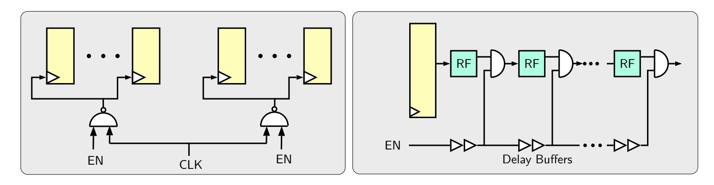

Figure 1: Partitioned clock-gated register (left), fully-unrolled inverse-gated round function (right).

a few additional registers (e.g. see Figure **??**). An important observation is that for the candidates GIFT-COFB, SUNDAE-GIFT, HYENA, Romulus; one of the external registers is only needed to temporarily store a value for a brief amount of time during which the core block cipher is not active. For instance, when processing message blocks, Romulus-N1 needs to store a *running state* for one clock cycle, only to feed it back as an input to the core block cipher in the subsequent clock cycle (Figure 2.6 of [\[IKMP19\]](#page-35-6)). Therefore, we can remove the register inside the block cipher and let the register of the AEAD circuit store the internal block cipher states. While the block cipher is idle, the AEAD reclaims the control of the register, hence otherwise *borrowing* it to the block cipher. This external register dependence comes at the cost of a multiplexer if *r* does not divide the total number of block cipher rounds. Overall, this technique saves a full block-sized register. This technique is not applicable to other candidates as they need to store a value throughout multiple block cipher calls.

# <span id="page-5-0"></span>**3 Implementations**

Out of the 32 remaining candidates in the second round of the NIST lightweight competition we singled out ten schemes that are bootstrapped either directly via lightweight block ciphers or variants of them. Five out of the ten schemes are directly instantiated with the GIFT block cipher [\[BPP](#page-34-3)<sup>+</sup>17] or through a slightly adapted tweakable alteration. Three other schemes are based on the SKINNY block cipher [\[BJK](#page-34-2)<sup>+</sup>16] or a forked version of it. Finally, the Pyjamask and SATURNIN AEAD schemes deploy their own dedicated substitution-permutation networks of the same names. Table [2](#page-6-0) lists all investigated schemes alongside their internal block cipher. Note that our selection excludes schemes that deploy AES as their core block cipher, use a combination of block cipher and permutation as found in Spook [\[BBB](#page-32-0)<sup>+</sup>19], or integrate a keyed permutation that resembles a stream cipher such as TinyJAMBU [\[WH19\]](#page-36-7).

# <span id="page-5-2"></span>**3.1** *r***-Round Unrolled**

The sequential placement of multiple round function circuits allows the computation of several rounds during a single clock cycle. This results in fewer required cycles to complete one encryption, i.e. in an *r*-round partial unrolling setting a block cipher composed of *R* rounds can be computed in d *R r* e cycles. The adverse effects of unrolling include a larger overall circuit area and an increased signal delay across the circuit.

Nevertheless, as shown by Banik et al. [\[BBR15\]](#page-33-5), partial unrolling can reduce the energy consumption of certain (especially lightweight) block ciphers noticeably. In broad terms, it is possible to quantify the total amount of consumed energy *E* as a quadratic polynomial

{6}------------------------------------------------

<span id="page-6-0"></span>

| Scheme      | Block Cipher   | Reference | Best Implementation |
|-------------|----------------|-----------|---------------------|
| GIFT-COFB   | GIFT-128       | [BCI+19]  | 2-Round-CG-RB       |
| SUNDAE-GIFT | GIFT-128       | [BBP+19]  | 3-Round-RB          |
| HYENA       | GIFT-128       | [CDJN19]  | 2-Round-CG-RB       |
| LOTUS-AEAD  | TWE-GIFT-64    | [CDJ+19]  | 3-Round-CG          |
| LOCUS-AEAD  | TWE-GIFT-64    | [CDJ+19]  | 3-Round-CG          |
| SKINNY-AEAD | SKINNY-128-384 | [BJK+19]  | Unrolled-IG         |
| Romulus     | SKINNY-128-384 | [IKMP19]  | 2-Round-RB          |
| ForkAE      | ForkSkinny     | [ALP+19]  | 2-Round-CG          |
| Pyjamask    | Pyjamask-128   | [GJK+19]  | Unrolled-IG         |
| SATURNIN    | SATURNIN       | [CDL+19]  | Unrolled-IG         |

Table 2: AEAD Schemes Based on Lightweight Block Ciphers

function of the unrolling factor *r* such that

$$E = (Ar^2 + Br + C)\left(\lceil 1 + \frac{R}{r}\rceil\right),\,$$

where *A, B* and *C* represent energy values depending on the internal switching activity of the block cipher such as registers, multiplexers and arithmetic logic. Hence, if the block cipher is on the lighter side, *E* can be minimized for *r* ≥ 2, on the other hand complex and heavy circuits such as AES incur large constants *A, B* and *C* where *E* is only minimized for *r <* 2.

Partial *r*-round unrolling is usually realized in hardware without much hassle, as round function and key expansion circuits often remain invariant throughout all rounds of the computation. In such a case the round function and key expansion circuits can be replicated *r* times and connected through data paths where the output of the last replicated circuit is stored in the state and key registers. Special care has to be taken when *r* - *R*, here the ciphertext will not be produced by the last replicated instance but it must come from an intermediate computation. A generic depiction of *r*-round partial unrolling can be seen in Figure [2.](#page-7-0) Note that a multiplexer is required after the state register to choose whether the *r*-round computation is performed over internally stored round key and state or if it must come from input key and plaintext at the start of the encryption. Further note that clock-gating is an ineffective technique for the registers, since at every clock cycle new values are loaded, keeping the registers busy at all times during the computation.

### <span id="page-6-1"></span>**3.2 Fully-unrolled**

In a fully-unrolled setting we have *r* = *R*, i.e. an entire encryption is performed in a single clock cycle. Such a configuration results in large combinatorial and latency-heavy circuit. However, state registers that store intermediate results, as previously seen for partially-unrolled block ciphers, are not needed anymore. As detailed in Section [2.3,](#page-4-1) the propagation and the subsequent amplification of glitches between the round function circuits cause a large spike in terms of energy consumption for which inverse-gating is an effective remedy. In particular, the overall reduction in dissipated energy can be as large as 90 percent for certain schemes as demonstrated in [\[BBR](#page-33-7)<sup>+</sup>18].

{7}------------------------------------------------

<span id="page-7-0"></span>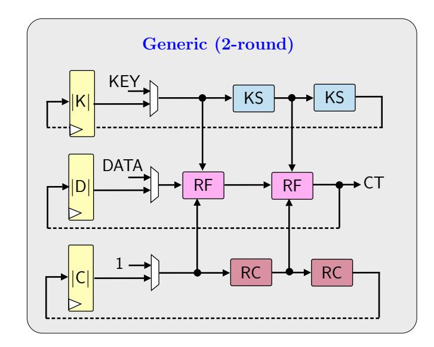

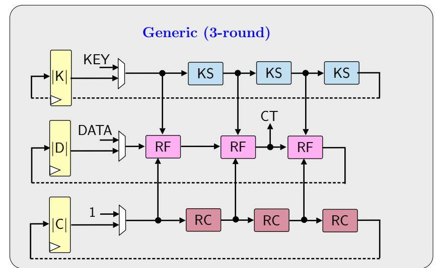

Figure 2: *r*-round partial unrolling of a generic block cipher consisting of an internal state, round keys and round constants for *r* = 2 (left) and *r* = 3 (right).

## **3.3 Block Ciphers**

We briefly detail the high-level picture of each block cipher and the techniques used to obtain partial *r*-round and fully-unrolled versions.

#### **3.3.1** GIFT

The ultra-lightweight block cipher GIFT, devised by Banik et al. [\[BPP](#page-34-3)<sup>+</sup>17], reiterates the substitution-permutation design of PRESENT [\[BKL](#page-34-0)<sup>+</sup>07] to achieve an even lighter construction. Its main variant GIFT-128 processes 128-bit blocks with a key of the same size and operates over 40 identical rounds, which in turn means that it can be seamlessly unrolled without further modifications. GIFT-128 is optimized for a small hardware overhead and can be implemented on an area below 2000 gate equivalents, thus outperforming other lightweight block ciphers of the same block and key size such as SKINNY, MIDORI and SIMON [\[BJK](#page-34-2)<sup>+</sup>16, [BBI](#page-33-10)<sup>+</sup>15, [BSS](#page-34-5)<sup>+</sup>15].

## **3.3.2** TWE-GIFT

The GIFT block cipher can alternatively be fed with 64-bit blocks while keeping the key size at 128 bits, operating over 28 rounds. As part of the LOTUS-AEAD and LOCUS-AEAD schemes GIFT-64 is transformed into a tweakable variation TWE-GIFT-64 [\[CDJ](#page-35-8)<sup>+</sup>19]. The tweak consists of a constant 4-bit value that is mixed into the block cipher state at the end of every fourth round. The 64-bit state further reduces the hardware footprint to a point where it currently stands as one of the lightest designs among block ciphers of similar sizes [\[BBRV19\]](#page-33-1).

#### **3.3.3** SKINNY

SKINNY comprises a family of lightweight tweakable block ciphers, proposed by Beierle et al. [\[BJK](#page-34-2)<sup>+</sup>16]. Its versions process 64-bit or 128-bit blocks. Contrary to TWE-GIFT-64, SKINNY-AEAD does not separate the encryption key from the tweakey but unifies them in a single tweakey input whose size is either 128, 256 or 384 bits. Both SKINNY-AEAD and Romulus deploy the block cipher in its heaviest version, i.e. SKINNY-128-384 with a block size of 128 bits and a 384-bit tweakey operating over 56 identical rounds. The ForkAE AEAD scheme uses a forked version of ForkSkinny-128-288 termed ForkSkinny, see Section [3.3.4.](#page-8-0) As with GIFT and TWE-GIFT, SKINNY-AEAD can be unrolled without any caveats.

{8}------------------------------------------------

### <span id="page-8-0"></span>**3.3.4** ForkSkinny

The idea of forkcipher is proposed by Andreeva et al. [\[ARVV18\]](#page-32-2). It takes a round-based block cipher (with or without a tweak) with *r* rounds, and extends it into a forkcipher that uses *r*init + *r*<sup>0</sup> + *r*<sup>1</sup> rounds in total and outputs two blocks *C*0, *C*1. In a higherlevel AEAD construction, *C*<sup>0</sup> block is intended to be used as the ciphertext, and *C*<sup>1</sup> is appended to a running state to provide authentication. The number of rounds are chosen *r < r*init + *r*<sup>0</sup> + *r*<sup>1</sup> *<* 2*r* so that processing a message block in AE takes less than two full block cipher calls. In their submission [\[ALP](#page-32-1)<sup>+</sup>19], the authors choose the tweakable block cipher SKINNY and apply the forking paradigm to obtain ForkSkinny, which is used as the core cipher upon which the AE scheme ForkAE is sequentially built. More precisely, the authors' principal cipher is ForkSkinny-128-288 with a 128-bit block and a 288-bit tweakey, where the number of iterations are chosen as *r*init = 25, *r*<sup>0</sup> = 31 and *r*<sup>1</sup> = 31 (in comparison SKINNY contains 56 rounds). In order to obtain higher number of round keys, the authors extend the 6-bit LFSR into a 7-bit one.

<span id="page-8-1"></span>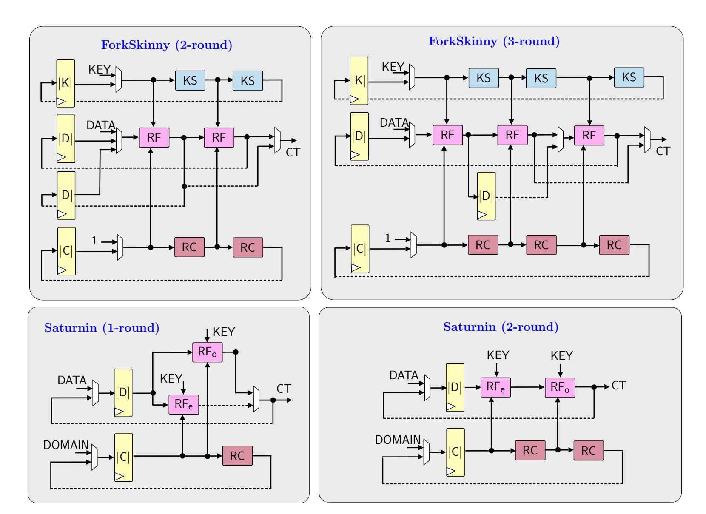

| Register size    | GIFT | TWE-GIFT | SKINNY | ForkSkinny | Pyjamask | SATURNIN |
|------------------|------|----------|--------|------------|----------|----------|
| K  (key)         | 128  | 128      | 384    | 384        | 128      | –        |
| D  (state)       | 128  | 64       | 128    | 128        | 128      | 256      |
| C  (round cst.)  | 6    | 6        | 6      | 7          | 4        | 32       |
| Total flip-flops | 262  | 198      | 518    | 647        | 260      | 288      |

Figure 3: Example schema for *r*-round unrolled block cipher implementations. The bottom table reports the total number of flip flops used in each block cipher. Registers are shown with yellow rectangles and KS, RF, RC denotes key scheduling function, round function and round constant function respectively.

{9}------------------------------------------------

Implementing ForkSkinny requires an additional 128-bit register to store the forking state, unless the block cipher supports combined encryption and decryption functionality [\[BB19\]](#page-32-3). Compared to generic unrolling, there is a caveat in unrolling ForkSkinny. For 2-round and 3-round implementations, an extra multiplexer is required to choose the correct state for storing and loading back the forking state. This is depicted in Figure [3.](#page-8-1)

### **3.3.5** Pyjamask-BC

The Pyjamask AEAD scheme deploys a newly-crafted block cipher of the same name, denoted by Pyjamask-BC, as its core [\[GJK](#page-35-9)<sup>+</sup>19]. The block cipher exists with block sizes of either 96 or 128 bits both with a 128-bit keys. It is a substitution-permutation network that runs over 14 rounds for both versions. Due to this low number of round function invocation, the operations in a single round are heavier than both GIFT and SKINNY-AEAD.

#### **3.3.6** SATURNIN-BC

As Pyjamask-BC, SATURNIN-BC is a dedicated 256-bit block cipher created for the AEAD of the same name [\[GJK](#page-35-9)<sup>+</sup>19]. Of all the ciphers seen so far SATURNIN-BC is the only one with a key size of 256 bits alongside a state of the same size. The substitution-permutation network runs over 20 rounds. As with Pyjamask, the low number of rounds results in a more complex circuit.

The block cipher SATURNIN-BC employs 3 types of round functions: even *R*0, two types of odd rounds with indices congruent to 1 and 3 mod 4, call them *R*<sup>1</sup> and *R*3, invoked in the following order

$$R_0, R_1, R_0, R_3, R_0, R_1, R_0, R_3 \dots$$

As a result, round-based implementations are very inefficient for this cipher, requiring multiple muxes to filter signals. On the other hand, a 2-round implementation which implements *R*0*, R*<sup>1</sup> and *R*0*, R*<sup>3</sup> together requires only a single level of filtering between the outputs of *R*1*, R*3, and is probably the best with respect to speed and energy consumption. For similar reasons, a 3-round implementation would be terribly inefficient, whereas a 4-round implementation which implements the double super-round *R*0*, R*1*, R*0*, R*<sup>3</sup> requires no additional filtering, but requires a larger power and area footprint.

### **3.4 AEAD Schemes**

In the following, we briefly describe the selection of ten AEAD schemes. Our descriptions are not meant to fully explain how these schemes work, but instead highlight the most important aspects from a circuit designer's perspective. We further explain which of the aforementioned techniques from Section [2](#page-2-0) are applicable for each candidate.

### **3.4.1** GIFT-COFB

This scheme, as proposed by Banik et al. [\[BCI](#page-33-8)<sup>+</sup>19], deploys the GIFT-128 block cipher in a combined feedback mode of operation (COFB), first detailed in [\[CIMN17\]](#page-35-11). The construction processes 128-bit blocks with a key and nonce of the same size and has a small register footprint only requiring a single additional 64-bit register as seen in Figure [4,](#page-10-0) whose value is denoted by variable *L*. Our implementation focuses on keeping the GIFT-128 core busy at all times so that the additional logic as well as the energy consumption in the mode of operation circuit becomes as small as possible. The design supports both clock-gating (for 64-bit register), and register-borrowing.

At the beginning of the operation, the nonce value is first processed with a block cipher call. The output of the block cipher is used to initialize the *L* value, stored in a 64-bit 

{10}------------------------------------------------

register. For each associated data block, the previous output of the block cipher is first passed through a function, denoted by G, and XORed with the said associated data block and current value of L, and the result of this summation is used input to the next block cipher call. After each block cipher call, L value is also updated with a function denoted by  $\Delta$ , which computed either of 2L, 3L or 9L in the finite field  $\mathsf{GF}(2^{64})$ . The message blocks are processed in the same manner. Each ciphertext block is computed by mixing the current plaintext block with the state. Finally, the encryption of the last plaintext block yields the tag. The call sequence and the high-level view of AEAD circuit is depicted in Figure 4.

<span id="page-10-0"></span>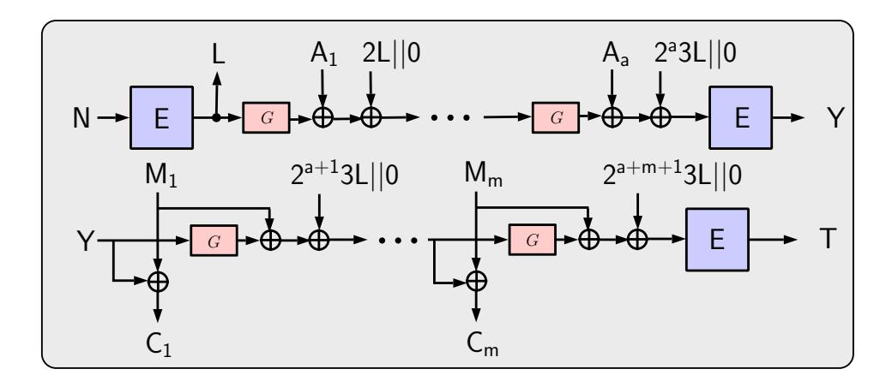

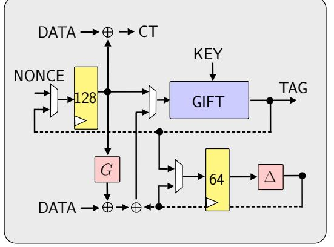

Figure 4: Combined feedback mode of operation (left) and the GIFT-COFB circuit (right). Note the additional 64-bit register required for the L value.

#### 3.4.2 SUNDAE-GIFT

This construction was proposed by Banik et al. [BBP<sup>+</sup>19], based on the SUNDAE mode of operation [BBLT18]. As GIFT-COFB, it uses the GIFT-128 block cipher in its core and processes 128-bit blocks with a key of the same size. The nonce is variably-size and included in the first associated data block. SUNDAE-GIFT does not require any additional registers, except naturally the one for the block cipher state, with the output to the core being multiplied over  $GF(2^{128})$ . Hence, since the core is kept busy during all cycles, SUNDAE-GIFT cannot make use of clock-gating. On the other hand, the mode of operation does support the register-borrowing technique.

As depicted in Figure 5, the state is initialized by encrypting a zero string where the leftmost byte is the domain separator (omitted in the figure). Each AD block is directly mixed with the current state and fed into the block cipher core, except for the last block which is processed first through a multiplication in the finite field. The message blocks are processed in the same way, with the encryption of the last block producing the tag. Finally, for each message block the state circularly encrypts itself again where each result is mixed with a message block to produce the ciphertext blocks. Although SUNDAE-GIFT is a lighter primitive than GIFT-COFB, this double-processing of the message blocks incurs a heavy latency and energy penalty.

<span id="page-10-1"></span>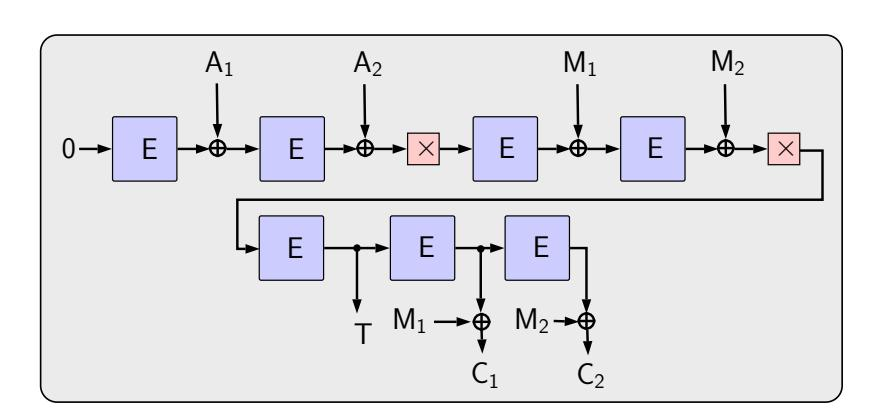

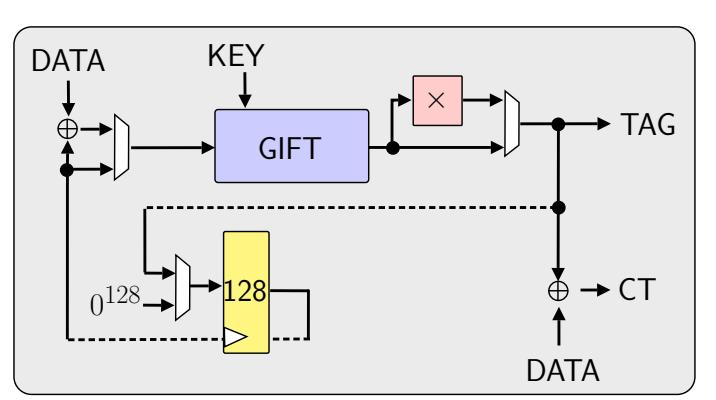

Figure 5: SUNDAE mode of operation (left) and the SUNDAE-GIFT circuit (right).

{11}------------------------------------------------

#### **3.4.3** HYENA

The HYENA authenticated encryption scheme was proposed by Chakraborti et al. [CDJN19]. Its construction is based on a hybrid feedback mode of operation, where the input to the encryption core is composed of an external data block and the feedback of the previous encryption. It processes 128-bit blocks with a 128-bit key and a 96-bit nonce. Its structure resembles the one already seen in GIFT-COFB with an additional 64-bit register L that holds a temporary value that is updated before each encryption through a  $\Delta$  function. The register holding the value of L can be clock-gated during its idle periods. The scheme also supports register-borrowing.

The state and the L registers are initialized through the encryption of the nonce (see Figure 6). Each associated data block is first passed through the hybrid-feedback function H together with the  $\Delta$ -updated L value and the current state. The result is passed to the encryption core. Each message block is processed in the same manner where an auxiliary output of H marks each ciphertext block. The output of the last plaintext encryption will then yield the tag.

<span id="page-11-0"></span>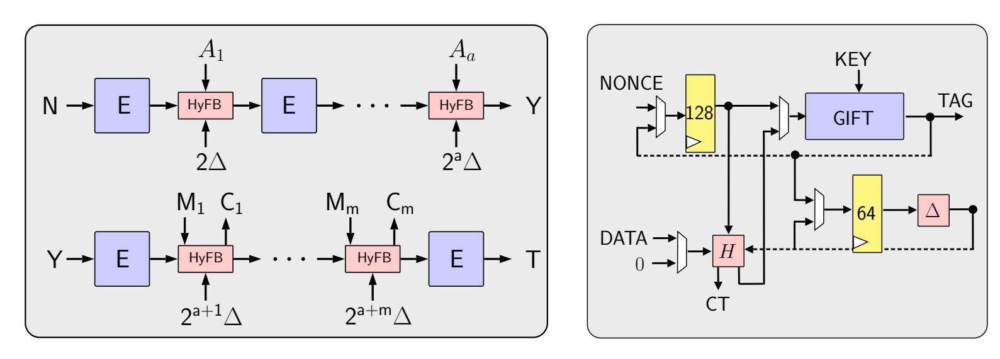

Figure 6: Hybrid feedback mode of operation (left) and the HYENA circuit (right).

#### 3.4.4 LOTUS-AEAD and LOCUS-AEAD

Both schemes were presented in the same submission by Chakraborti et al. [CDJ<sup>+</sup>19]. They use a dedicated tweakable variant of GIFT-64 termed TWE-GIFT-64 at their core and process 64-bit data blocks using a 128-bit key and a nonce of the same size. The schemes are more involved than the other GIFT-based algorithms as they require four additional register banks. One storing a temporary key value L that is updated before each new block through a  $\Delta$  function, another one that sums the encryption of the associated data blocks V, a similar one for the summation of the ciphertext blocks W and finally a last storage unit holding a masking value  $\Delta_N$  that is mixed with each data block. Naturally, this arrangement responds very well to clock-gating. Note that LOTUS-AEAD and LOCUS-AEAD do not utilize register-borrowing since the block cipher state is reloaded before each encryption.

In LOTUS-AEAD and LOCUS-AEAD,  $\Delta_N$  is initialized by first encrypting a zero vector and re-encrypting this result again. Mixing the key and the nonce yields the initial L value. Again in both schemes, each associated data block is first masked by  $\Delta_N$  then encrypted with the encryption key being the  $\Delta$ -updated L value. The results are accumulated in the V register. In LOTUS-AEAD, each even plaintext block is processed in the same way where the result of the encryption is re-encrypted. The cipher of this second encryption is mixed with the following message block and encrypted twice again yielding two ciphertext blocks. The result of the second and fourth encryption call is then added to the W register. Such a configuration entails large latency as each 64-bit message block invokes two encryption

{12}------------------------------------------------

calls. LOCUS-AEAD has a slightly simpler computation of the message blocks, however with an identical latency. The tag is obtained by encrypting the addition of V, W and  $\Delta_N$  and masking the result with  $\Delta_N$ .

<span id="page-12-0"></span>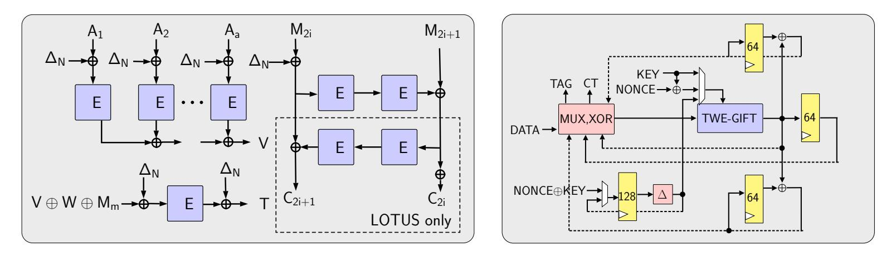

Figure 7: LOTUS/LOCUS mode of operation (left) and the LOTUS/LOCUS-AEAD circuit (right).

#### 3.4.5 SKINNY-AEAD

The SKINNY-AEAD scheme, proposed by Beierle et al. [BJK<sup>+</sup>], is a thin wrapper around the SKINNY-128-384 tweakable block cipher [BJK<sup>+</sup>16]. It processes 128-bit data blocks using a key and nonce of the same size in the OCB3 mode of operation [KR11]. Alongside the block cipher state, the AEAD mode adds a 64-bit LFSR, and two 128-bit registers. The last two registers are denoted with variables Y and  $\Sigma$  and used for summing up the block cipher outputs respectively for authenticated data and message blocks. The two summation registers can be clock-gated while the encryption core is busy. However, SKINNY-AEAD does not make use of register-borrowing as the block cipher state is reloaded before each encryption call. The output of the LFSR is appended to the tweakey before each encryption and is updated afterwards.

The encryption of each plaintext block directly yields a corresponding ciphertext block. The tag is then computed by encrypting  $\Sigma$  and adding the result to Y.

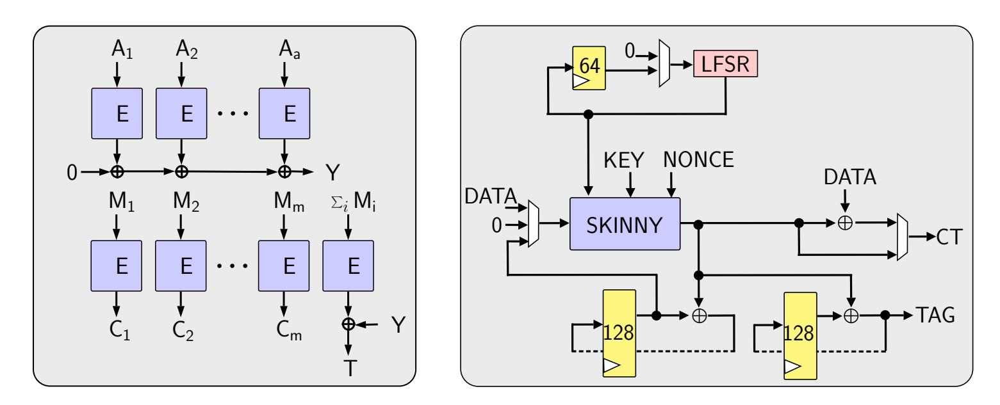

Figure 8: OCB3 of operation (left) and the SKINNY-AEAD circuit (right).

#### 3.4.6 Romulus

Romulus, designed by Iwata et al. [IKMP19], resembles the Cipher Feedback (CFB) mode, in the sense that each output of the block cipher and the incoming data block (associated data or message) are together passed through a light combinatorial function denoted by

{13}------------------------------------------------

 $\rho$ . The output of this function is immediate input to the next block cipher call. Hence a register keeps this *running state*, and at the last step it is encrypted to produce the tag.

Romulus handles odd and even authenticated data blocks differently; the odd blocks are input to  $\rho$ , and even blocks are fed to the nonce port of the block cipher, as the underlying cipher SKINNY-128-384 has a 384-bit long tweakey. The actual AEAD nonce is not used before all authenticated data blocks are processed, and later used as block cipher nonce while message blocks are encrypted. A 56-bit LFSR is also a part of the tweakey for SKINNY calls, and keeps the count of authenticated data and message block fed to the AEAD circuit since the beginning of the AE operation.

In hardware, Romulus, as a mode of operation, lends itself to a clean r-round unrolled implementation in terms of number of registers it requires. However, as the core cipher SKINNY-128-384 itself is a rather heavy cipher with large tweakey size, this gain is diminished. In addition, the designers' choice to compute  $\rho$  for every second authenticated data block (instead for each single block) brings a few extra multiplexers into the design. It also prevents us from arranging SKINNY and  $\rho$  circuits sequentially, as we have to wait for the next data block to be available. The design supports both clock-gating (due to LFSR) and register-borrowing techniques.

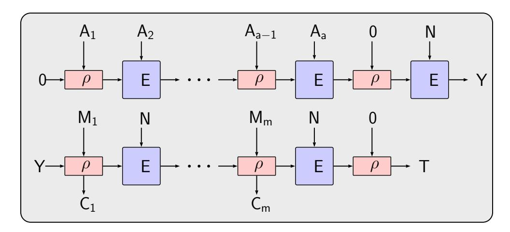

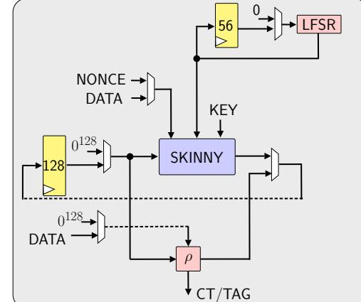

Figure 9: Romulus mode of operation (left) and the Romulus authenticated encryption circuit (right).

#### **3.4.7** Pyjamask

Pyjamask, as proposed by Goudarzi et al. [GJK<sup>+</sup>19], uses the OCB mode of operation instantiated with the semi-lightweight block cipher Pyjamask-BC. The mode of operation requires 4 stand-alone registers other than the ones used in the block cipher to compute ciphertext and tag. The following salient features can be noted about the mode of operation:

- 1. The block cipher Pyjamask-BC has a binary matrix based linear layer. More specifically, there are five  $32 \times 32$  binary matrices  $M_0, M_1, M_2, M_3, M_K$  that are used to premultiply each of the rows of the state and one of the rows of the key. In the design document, the authors say that they use Paar's algorithm to deduce that they can be constructed using 347 XOR gates each. However for an energy efficient solution, implementing these using the randomized version of the above algorithm [BFI19] yields solutions of 168, 144, 192, 144 and 189 XOR gates respectively.
- 2. The mode Pyjamask requires a minimum of four registers to operate other than those used to operate the block cipher. The first is required to store the accumulated sum of the encryption of the associated data blocks. The second is required to store the accumulated sum of the plaintext blocks. The third for the input-output masks  $O_i$ , and the fourth for the encryption of the zero vector  $L_* = \mathsf{E}_K(0^n)$ .
- 3. The mode requires to store the values of L(i) where  $L(0) = 4 \cdot L_*$  and  $L(i) = 2 \cdot L(i-1)$ , where the multiplication is defined over  $GF(2^{128})/\langle x^{128} + x^7 + x^2 + x + 1 \rangle$ . To

{14}------------------------------------------------

128

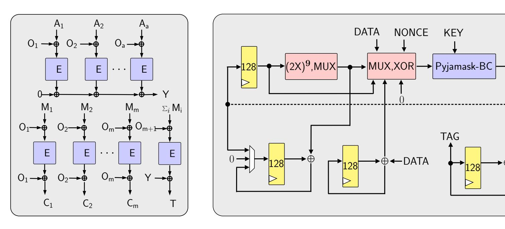

Figure 10: OCB mode of operation (left) and the Pyjamask authenticated encryption circuit (right).

process the block indexed at *z*, the required value of *L*(*z*) is *L*(NTZ(*z*)) where NTZ(*z*) is the number of trailing zeros in the binary representation of *z*. For example to process the 7th, 8th and 9th blocks the circuit requires values of *L*(0)*, L*(2)*, L*(0) in three successive cycles. A naive approach to solve this problem would be to store *L*(0) in a register and compute *L*(NTZ(*z*)) before every round.

4. We can use clock-gating for the value *L*∗. We build a set of doubling circuits one on top of the other on the register, so that the output of each successive doubling is *L*(*i*). For example, if we want our circuit to be able to process up to 1023 blocks of data then NTZ(*z*) can have a maximum value of 9, and then 10 doubling circuits are sufficient. The map *z* → NTZ(*z*) can be implemented as a simple look up table, which can be then be used a selecting signal to a set of multiplexers that filter *L*(NTZ(*z*)) at each successive data block indexed *z*. The advantage in this kind of a setup is that the computation of *L*(*i*) values are one-time and does not require much energy and no more than one register. The only energy consumed is by the set of multiplexers, and that is limited to only once per block cipher call.

#### **3.4.8** SATURNIN

SATURNIN, designed by Canteaut et al. [\[CDL](#page-35-10)<sup>+</sup>19], is a post-quantum secure mode of operation, again instantiated with a semi-lightweight block cipher SATURNIN-BC. The mode has a rate of 1*/*2, i.e there are 2 encryption calls per block of plaintext. However, since the underlying block cipher has a block size of 256 bits, the reduction on the number of calls and the block size evens out in terms of energy and throughput.

Implementing SATURNIN in hardware, in the manner presented in the specifications by the authors [\[CDL](#page-35-10)<sup>+</sup>19], is slightly tricky if one takes a direct approach. The mode has the following steps:

- 1. Encrypt the padded nonce.
- 2. Use the counter mode to generate ciphertext blocks from plaintext blocks.
- 3. Use the cascade mode to process each associated data block to produce the intermediate tag *t*. By cascade mode we mean process each AD*<sup>i</sup>* block with *t<sup>i</sup>*+1 ← AD*<sup>i</sup>* ⊕ E*<sup>t</sup><sup>i</sup>* (AD*i*), and take *t* as the last *t<sup>j</sup>* value.

{15}------------------------------------------------

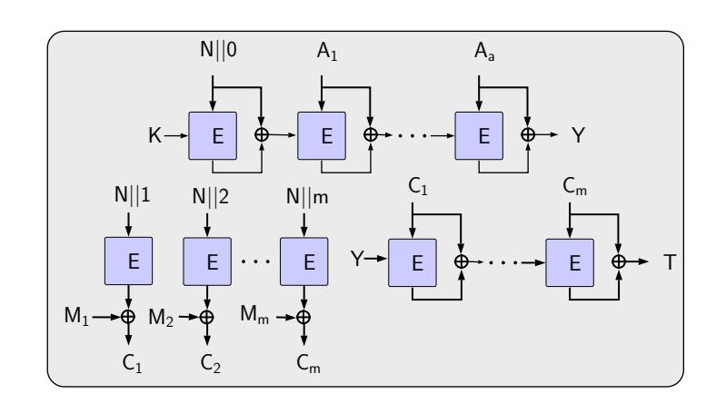

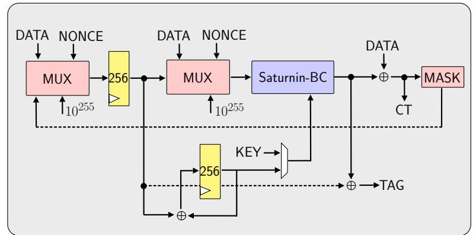

Figure 11: SATURNIN mode of operation (left) and the SATURNIN circuit (right).

4. Use the output t produced above, and process each ciphertext block  $\mathsf{CT}_i$  in cascade mode to produce the final tag.

It immediately becomes clear, where the difficulty in implementing the above in hardware arises from. It is necessary to store each ciphertext block in hardware after the counter mode so that they can be used during the cascade mode later to produce the tag. This requires a lot of memory and energy to store ciphertext bits, and especially infeasible on constrained environments that can not support high storage space. Instead one can re-interpret the SATURNIN operations so as to not require the additional memory. We can compute the ciphertext blocks and tag as follows:

- 1. Encrypt padded nonce.
- 2. Use the cascade mode to process AD to produce the intermediate tag t and store it in a register.
- 3. For each plaintext block  $M_i$  do the following:
  - Encrypt  $M_i$  with counter mode to produce  $CT_i$ .
  - Employ the cascade mode with  $\mathsf{CT}_i$ . Take  $t_1 \leftarrow t$  from the previous computation of t stored in the register, and compute  $t_{i+1} = \mathsf{CT}_i \oplus \mathsf{E}_t(\mathsf{CT}_i)$  for each ciphertext block simultaneously, and store back  $t_{i+1}$  on the register.

The above process obviates the need for employing large storage elements to implement SATURNIN, and implies that the mode can easily be employed on constrained environments. This design supports clock-gating (i.e. t-register), but is not compatible with register-borrowing technique.

#### **3.4.9** ForkAE

Andreeva et al. construct their AEAD scheme with a new paradigm [ALP<sup>+</sup>19], where the core is a forkcipher that outputs two different blocks for each plaintext block, one is meant for authentication and the other for the ciphertext. Although their primary choice for the mode of operation, PAEF, is thin with only a block-sized register, the forkcipher itself is quite demanding: it needs five registers in total (see Figure 3). In terms of energy, this makes ForkAE one of the least efficient candidates we evaluated in this paper.

For ForkSkinny-128-288 hardware implementation, the authors discuss about the possibility of removing 64 flip flops, i.e. a half register, for the last block of tweakey (as it is initialized to all zeroes), which would require skipping the last block of the tweakey addition every second round [ALP<sup>+</sup>19]. This could be done for 1-round and 2-round implementations with some minor updates, but it would incur extra cost for k-round implementations for odd k > 1. Hence, we implemented the tweakey registers fully, i.e. with 384 flip flops.

{16}------------------------------------------------

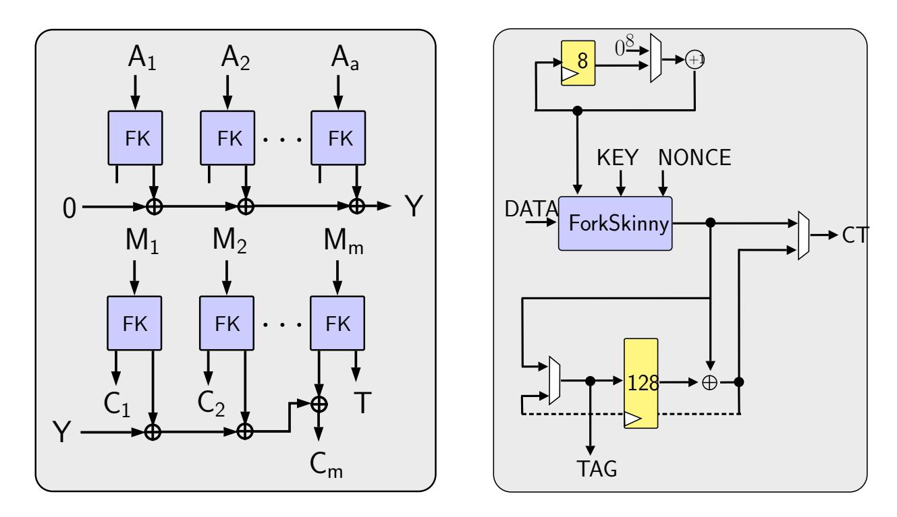

Figure 12: PAEF mode of operation (left) and the ForkAE circuit (right).

On the other hand, because the authors do not propose a parameter for the maximum number of authenticated data or message blocks that can be processed, we decided to implement it for at most 64 blocks by fixing the counter size to 8 bits. This choice is justified by the fact that we evaluate the lightweightness of candidates under the short message setting, i.e. the constrained device need to encrypt only few blocks of messages. Hence the block counter consists of 8 bits, and thereby we use an 8-bit register and an 8-bit adder. Implementing the counter and the adder with 56 bits would increase the total number of flip flop in ForkAE from 776 to 824.

ForkAE does not support the register-borrowing technique, because there is an explicit running tag in the design. It supports clock-gating, and in that configuration all registers that are inactive for multiple clock cycles are frozen. This essentially concerns two registers: the 128-bit register in ForkAE circuitry, and 128-bit register that stores the forking state inside the block cipher for round-based implementation of ForkSkinny. Unrolled PAEF-ForkSkinny-128-288 follows the same techniques described in Section [3.2.](#page-6-1) For the IG configuration, we set the delay of each inverse gate as 1.25ns, in order to accommodate 87 rounds of operation into 100ns as much as possible.

# <span id="page-16-0"></span>**4 Effects of Design Choices**

### **4.1 Clock Frequency**

Note that it has already been shown in numerous papers [\[BBR15,](#page-33-5) [BBR](#page-33-6)<sup>+</sup>16c, [KDH](#page-36-4)<sup>+</sup>12] that in low leakage environments, at high enough frequencies, the total energy consumption of a circuit is independent of clock frequency since it is the measure of total circuit glitch. To provide more evidence for this we constructed a typical circuit for a round based implementation of AES-128, in the TSMC 90nm library and measured the energy per encryption value at 4 different frequencies. The results are summarized in Figures [13.](#page-17-0) The *Energy vs Frequency* plot on the right clearly suggests that for frequencies larger than 10 MHz, the energy consumption is more or less constant.

Why does this happen? The total power consumption in a CMOS circuit comes form two components **a)** dynamic and **b)** leakage. Dynamic power is consumed due to the charging and discharging of the capacitive nodes of the transistors of the circuit. Every 0 → 1*/*1 → 0 transition, as well as every transient glitch contributes to this type of power consumption. On the other hand, leakage power is mainly due to the sub-threshold leakage

{17}------------------------------------------------

<span id="page-17-0"></span>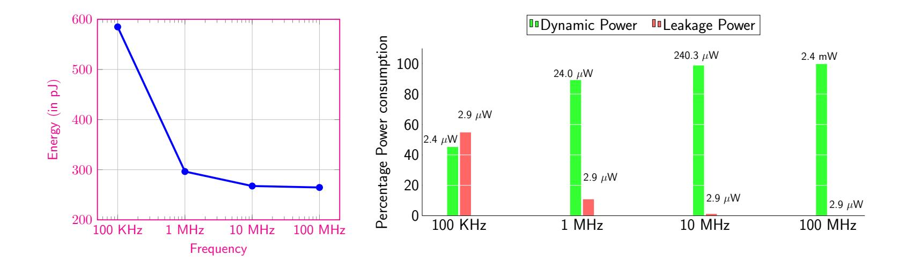

Figure 13: Variation of energy consumption with frequency (left), percentage contribution of the dynamic, leakage component of the power at different frequencies (right).

current, which is the drain-source current in a CMOS gate when the transistor is off, and other continuous currents drawn by the power source. It is generally well known that, the leakage component of the power drawn by a circuit is generally independent of the frequency of operation of the circuit and only varies as its total silicon area. Also the dynamic component of the power consumption varies directly as the clock frequency of the circuit and hence inversely as the clock period. Since the total physical time to complete any operation, all other things being the same, varies directly as the clock period, the dynamic component of the energy consumption (product of dynamic power and total time) is generally constant with respect to change in clock period or frequency. Therefore, at higher frequencies the dynamic energy of the same circuit remains a constant as the contribution of the leakage energy (product of the frequency independent leakage power and the physical time taken) becomes lesser and lesser. This was what led [BBR15, KDH<sup>+</sup>12] to conclude that at high frequencies the total energy (sum of dynamic and leakage energies) consumption of block ciphers is more or less a constant and frequency-independent. All the above facts are borne out by right hand plot in Figure 13, which breaks down the percentage contributions of the dynamic/leakage power at different frequencies of the same AES circuit. The dynamic component indeed scales as the frequency and the leakage component remains constant at 2.9  $\mu$ W. As a result at higher frequencies, the contribution of the leakage part becomes more and more insignificant. In fact at 10 MHz it is less than 1.2 %.

So what should be the frequency of operation at which one should benchmark energy figures for different AEAD schemes. If we opt for lower frequencies, the results will be heavily influenced by the leakage component, and then the energy optimization exercise effectively reduces to an area minimization problem, since circuits with lower silicon area also tend to have lower leakage. Although this problem is also important, it is less intellectually stimulating from purely an energy engineering point of view. When we compare different AEAD schemes for energy efficiency, ideally we should be comparing algorithmic/circuit level aspects of the scheme that allow for lesser glitching or lesser logic transitions in the circuit nodes. In fact this is also the approach followed in energy optimization of block and stream ciphers [BBR15, BBI+15, BMA+18]. This is essentially the optimization of the dynamic energy component. Thus is why in our experiments we keep the clock frequency at 10 MHz so that the leakage power is rendered insignificant, and the paper becomes an exercise in comparing the switching characteristics of different AEAD schemes.

Note that for libraries with standard cells composed of transistors of lower feature size, the leakage power is significant even at 10 MHz. Typically, a 15nm library will have leakage power many orders more than a 90nm library. For such libraries, a similar exercise of comparing dynamic energy must be done at frequencies much higher than 10 MHz,

{18}------------------------------------------------

(for the Nangate 15nm library for example a clock frequency of around 5-10 GHz may be required). Once this is done, the results reported in 90 nm libraries, can be seamlessly reproduced in 15nm or lower feature size libraries.

### <span id="page-18-0"></span>4.2 Optimal Unrolling

In Section 3.1, we had briefly mentioned that the energy consumed by an r-round unrolled block cipher as described in [BBR15] is given as  $E = (Ar^2 + Br + C) \left( \left\lceil 1 + \frac{R}{r} \right\rceil \right)$ . Let us try to understand the above expression briefly. If two or more block cipher round functions are connected serially, each transient glitch produced in the first round results in further glitches in the subsequent rounds. Due to this phenomenon, the energy consumption of the second round circuit is generally more than the first. Similarly, if three rounds are connected serially, the third round function circuit is likely to consume more than the second, and the second is likely to consume more than the first. It was shown in [BBR15], that all other things remaining equal, the power consumption in successive rounds is approximately given by an arithmetic series. Since the sum of terms of an arithmetic series is a quadratic in number of terms, this is where the quadratic term in the energy consumption comes from. We multiply it by  $\left\lceil 1 + \frac{R}{r} \right\rceil$  because that is the number of clock cycles required to encrypt.

For heavyweight round functions like AES, the compounding of glitches across one round to the other increases rapidly. Such circuits would naturally have high values of coefficients for A, B to indicate that energy consumption increases rapidly with increasing r. For lighter round functions like PRESENT, SKINNY and SIMON, the compounding of glitches is not so significant, so it results in lower values for the coefficients A, B. For these circuits, increase in power due to the quadratic term is not higher than the leeway given by the decrease in latency due to the  $\lceil 1 + \frac{R}{r} \rceil$  term. And it was shown in [BBR15], that for almost all lightweight block ciphers, r=2 is the optimum energy configuration.

Things are slightly different for modes instantiated with block ciphers that are lightweight. The  $(Ar^2+Br+C)$  term is actually the average power consumed by the circuit and is typically output by any standard power compiler engine after inspecting either the switching statistic of every node or the value change dump file that records all the signal transitions in the circuit in a given time period. The term is then multiplied with  $(\lceil 1+\frac{R}{r}\rceil)$  to produce the energy consumed. The first question to investigate is how the power consumption of a mode instantiated with a lightweight block cipher would behave with varying degrees of unrolling. Consider an example from [BBR15]. The authors had estimated that in the STM 90nm process, the energy consumption of an unrolled implementation of PRESENT followed the expression  $(3.15+1.40r+0.795r^2)\cdot (1+\lceil\frac{32}{r}\rceil)$  pJ. It is elementary to see that r=2 is the minimum of this expression, as for r=1, 2, 3 the expression evaluates to 176.85, 155.21, 174.06 pJ respectively. Now consider PRESENT used in a mode of operation that employs, some other operations like doubling over a finite field, writing on a register, XORing values etc, i.e. operations that increase the constant term in the quadratic expression.

At this point let us look at a more concrete example. Suppose that to encrypt 8 blocks of plaintext using the mode requires 10 calls to the block cipher and the extra energy per cycle consumed in the unrolling-independent operations is  $\alpha$  pJ per cycle. Let's say the mode requires  $\left(1+\left\lceil\frac{32}{r}\right\rceil\right)$  cycles for the computation (10 block cipher calls). This makes the energy expression for the mode  $E(r)=\left[\alpha+\left(3.15+1.40r+0.795r^2\right)\right]\cdot\left(1+\left\lceil\frac{32}{r}\right\rceil\right)\cdot 10$  pJ. If  $\alpha\approx 4$  or more, it is now clearly visible that the minima of this expression is r=3, since it evaluates to 3.084, 2.232, 2.220, 2.292 nJ, for r=1,2,3,4. Thus although, the block cipher itself may be energy-optimal at a particular degree of unrolling, it does not necessarily imply that the mode will also be energy-optimal at the same degree. In fact, this is a phenomenon we have observed for 3 lightweight modes of operation SUNDAE-GIFT, LOTUS-AEAD, LOCUS-AEAD. The modes of operation are all based on the GIFT block

{19}------------------------------------------------

cipher. Although the block cipher itself is energy-optimal at *r* = 2, the modes are optimal at *r* = 3. Note that this optimum is subject to other operating parameters like choice of library, or the level of compile time optimization of the circuit etc., but all other things remaining same, this observation stands.

To illustrate the point further, we experimented with 3 lightweight modes of operation: GIFT-COFB, SUNDAE-GIFT, and LOTUS-AEAD, all of which are instantiated with some version of the GIFT cipher. Figure [14,](#page-20-0) illustrates the power consumption breakdown of individual components of the 1, 2 and 3-round unrolled implementations of the modes[3](#page-19-0) . Note that the 3-round unrolled implementation uses an additional multiplexer to filter signals. Since the total number of rounds in both GIFT-64/128 are not multiples of 3, the signals used to update the state after the execution of 3 rounds in each clock cycle, and the final output of the block cipher are to be tapped from different circuit nodes and hence the need for an extra mux. Note that for this particular implementation, GIFT-COFB and SUNDAE-GIFT attain optimal energy configuration at *r* = 2, whereas LOTUS-AEAD optimizes at *r* = 3. Take the case of LOTUS-AEAD, in which as the degree of unrolling *r* increases, the power consumption contribution of the terms depending on *r*, which are the individual round functions and the incremental components of the state/key registers, increase moderately. This is in contrast to the constant power consumption sources like control system, writing values to various registers and consumption of other gates, all of which increase the constant term in the power consumption. Hence the energy consumed to process eight blocks of plaintext and one block of associated data is around 10.88, 7.20, 6.15 nJ for *r* = 1*,* 2*,* 3 respectively. This is not the case for both of these particular implementations of GIFT-COFB or SUNDAE-GIFT, and hence the optimum point remains at *r* = 2.

## **4.3 Clock-gating**

We have applied clock-gating technique only for those implementations which contain idle registers, i.e. round-based implementations, as explained in Section [2.4.](#page-4-2) These are LOTUS-AEAD, LOCUS-AEAD, SKINNY-AEAD, ForkAE, Pyjamask, Romulus and SATURNIN.

In Tables [5](#page-24-0)[-7,](#page-26-0) we report the number of clock cycles it takes to process the baseline AEAD input, which consists of one authenticated data and eight message blocks, where each block contains 128 bits. As explained in Section [2.2,](#page-4-3) clock-gating saves energy by preventing unnecessary reloading of registers with the same value, therefore the total energy saving grows proportionally with the total number of clock cycles of an AEAD operation. In other words, the effects of this technique becomes obvious for (1) candidates with more AEAD registers (2) *r*-round unrolled implementations with small *r* ∈ {1*,* 2} as they require more clock cycles. For instance, because 1-round unrolled LOTUS-AEAD implementation lasts 1036 clock cycles, and the design contains a couple of 64-bit registers (see Figure [7\)](#page-12-0), this technique saves more than one third in energy. This gap between the implementations are presented in Figure [15](#page-21-0) for LOTUS-AEAD, ForkAE, SKINNY-AEAD and further measurements are presented in full tables in Appendix [4.8.](#page-23-0)

Therefore, as a rule of thumb, clock-gating is a worthwhile effort if the particular design in question contains large number of flip flops, e.g. registers, that stays frozen for hundreds of cycles.

### **4.4 Inverse-gating**

The general effect of an inverse-gated fully-unrolled block cipher is a drastic reduction in terms of energy as already demonstrated in [\[BBR](#page-33-6)<sup>+</sup>16c, [BBR](#page-33-7)<sup>+</sup>18]. Most of the ten selected

<span id="page-19-0"></span><sup>3</sup>To obtain these figures which illustrate the power consumption of individual circuit elements, we used a different compile directive to the circuit compiler, hence the figures are slightly different from the optimal energy figures tabulated in Table [5.](#page-24-0)

{20}------------------------------------------------

<span id="page-20-0"></span>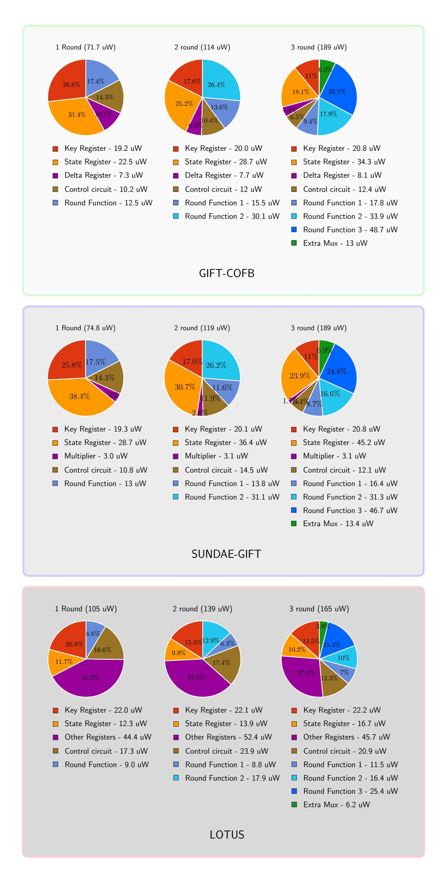

Figure 14: Breakdown of power consumptions of three lightweight modes

{21}------------------------------------------------

<span id="page-21-0"></span>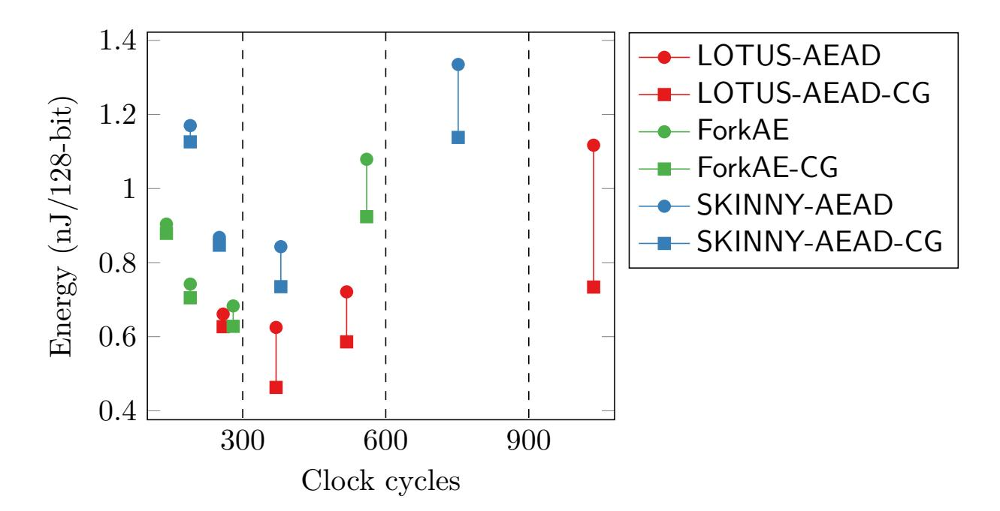

Figure 15: The energy consumption (per 128-bit block) of round based implementations of LOTUS-AEAD, ForkAE, SKINNY-AEAD with/without clock-gating, in comparison to the number of clock cycles.

AEAD in this paper are thin wrappers around a core block cipher, i.e. additional storage elements but no large combinatorial circuits on the critical path. It thus not surprising that those results extrapolate to the full AEAD construct, however with different magnitudes.

The largest reduction can be observed for SKINNY-AEAD due to its isolated block cipher instance that is directly fed from either the data input or the state registers and whose output glitches are not amplified in a subsequent combinatorial function. Such an arrangement is thus even more energy-efficient than the partially-unrolled implementations. Similar effects can be noted for the schemes that are based on GIFT or TWE-GIFT whose structures only place relatively lightweight combinatorial functions in front or after the core block cipher. However, the reduced energy does not fully undercut the partially-unrolled implementations.

On the other hand, inverse-gating is not as effective on more involved constructions such as ForkAE and Romulus. In the case of Romulus the computation and the subsequent loading of the state registers of the *ρ* function happens in a separate clock cycle during which the core block cipher is redundantly invoked. We note that our inverse-gated Romulus can thus be further improved by preventing the core from progressing during the evaluation of *ρ*. In the case of ForkAE, to process message blocks, we need to make a dual ForkSkinny call to obtain both *C*<sup>0</sup> and *C*<sup>1</sup> values. This means that, by design, ForkSkinny needs to compute 87 consecutive rounds of key scheduling, which in total exceeds 100ns in the TSMC 90nm technology. Therefore, one either needs to increase the clock phase, that is to say sacrifice the throughput, or implement inverse-gating only for the initial 75 to 80 rounds that could be completed in 100ns. Our measurements are based on the latter choice.

An energy consumption chart of all the fully-unrolled implementations with inversegating or without can be seen in Figure [17.](#page-23-1) The complete data sheets for each candidate's fully-unrolled implementations can be found in Appendix [4.8.](#page-23-0)

### **4.5 Register-borrowing**

Although it shares the same intuition with clock-gating, register-borrowing is harder to implement in practice, as it requires specific tweaks in the circuit design. The control logics of both the block cipher and the AEAD wrapper must be updated consistently to handle register sharing properly. In order to understand how much we can gain by removing a register, we implemented Romulus with three variations (and for each *r* ∈ {1*,* 2*,* 3*,* 4}). The

{22}------------------------------------------------

Table 4: Energy consumption (nJ/128-bit) of Romulus for each configuration (see Table [6](#page-25-0) for full details).

| Design Techniques | 1-Round | 2-Round | 3-Round | 4-Round |
|-------------------|---------|---------|---------|---------|
| PLAIN             | 0.853   | 0.543   | 0.646   | 0.806   |
| RB                | 0.782   | 0.497   | 0.644   | 0.801   |
| CG                | 0.818   | 0.555   | 0.663   | 0.850   |

<span id="page-22-1"></span>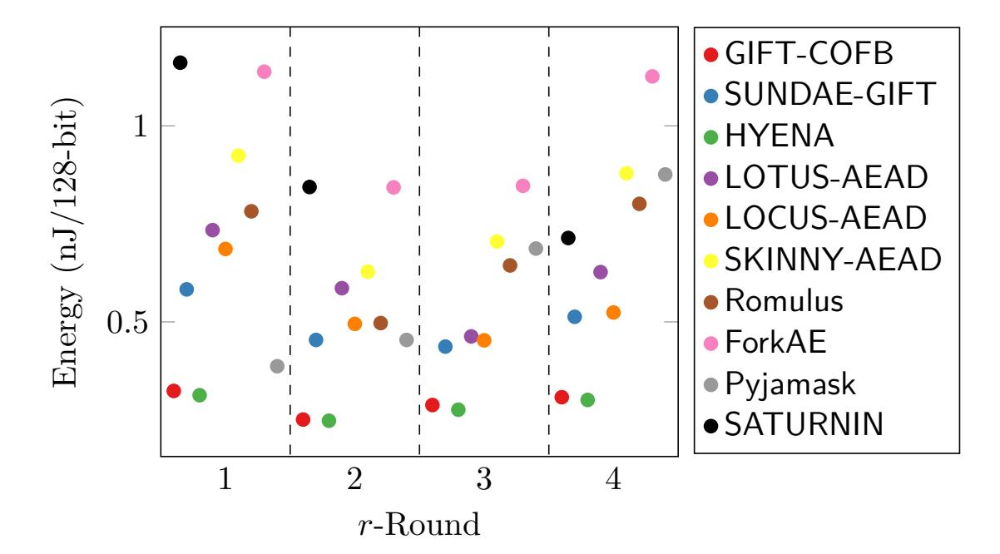

Figure 16: Energy consumption (nJ/128-bit) comparison chart for the *r*-round partiallyunrolled implementations with *r* ∈ {1*,* 2*,* 3*,* 4}. For each candidate the best obtained energy value obtained through techniques from Section [2](#page-2-0) is used.

plain version of Romulus contains two separate registers, one in the block cipher and the other in the AEAD circuit. For Romulus-CG, both registers stay, but we freeze the AEAD register with clock-gating, whenever it must remain idle. In Romulus-RB, the AEAD circuit borrows the register to the block cipher, and the latter does not have a dedicated register. Energy consumption (per 128-bit) for each of these configurations are given in Table [6,](#page-25-0) which shows that register-borrowing performs much better regardless of the degree of unrolling. However, the gap is not huge because the core SKINNY-128-384 already contains four blocks, i.e. 4 × 128 bits, of storage regardless of which technique is used.

### **4.6 Results**

Figure [16](#page-22-1) charts the optimal energy per 128-bit block value for each *r* and candidate. The category is dominated by GIFT-COFB and HYENA which both are lightweight in terms of gate count but respond equally well to partial unrolling. On the trailing end are the more involved schemes, such as ForkAE, SKINNY-AEAD and SATURNIN.

The situation is different for the fully-unrolled implementation where inverse-gating equalizes most of the measured values. Figure [17](#page-23-1) charts the energy per 128-bit block results for the fully-unrolled variants. A detailed tabulation of all the measurements including gate count, latency and throughput can be found in Tables [5,](#page-24-0) [6,](#page-25-0) [7.](#page-26-0)

### <span id="page-22-0"></span>**4.7 Compilation Options**

The Synopsys circuit compiler provides large number of flags during compilation, but in order to keep things simple, we used them in the following combinations: The compile\_ultra option instructs Synopsys to perform an all-in-one, computationally intensive optimiza-

{23}------------------------------------------------

<span id="page-23-1"></span>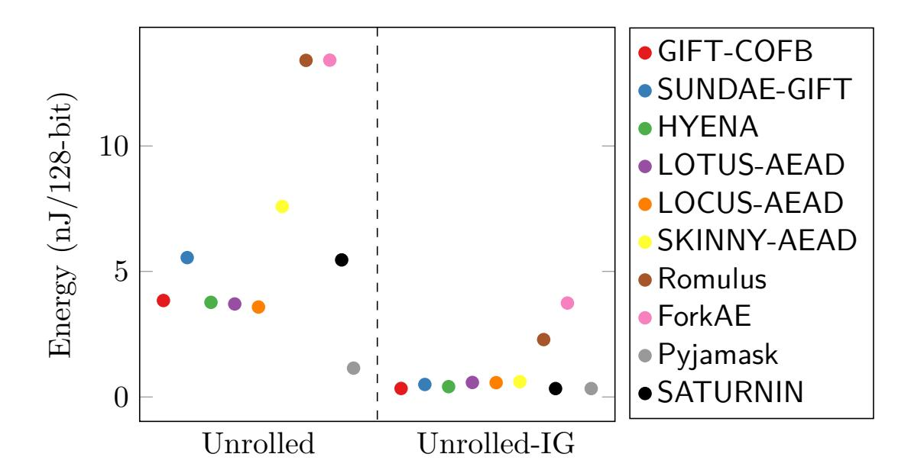

Figure 17: Energy consumption (nJ/128-bit) comparison chart for the fully-unrolled implementations with and without inverse-gating.

tion, during which boundaries between components are removed and the whole design is considered as one large circuit. This provides better results for r-round unrolled implementations, but becomes time consuming and works poorly as r grows larger. Therefore we do not use this option with fully-unrolled implementations. The command compile—exact\_map—area\_effort high command essentially ensures that sequential elements are not touched, and that Synopsys favors area as a metric to improve (a common flag used by designer, but not of vital importance in our case). This combination is ideal for unrolled circuits, as the area by default is already quite large and there are possibly many optimizations to perform. A third combination compile—no\_autoungroup is used only to obtain results in Section 4.2. This flag instructs Synopsys not to remove the boundaries between components at lower level, so that we can obtain power consumption of each individual element, and compute necessary parameters in our model. For clock-gating implementations, we first compiled clock-gating circuitry and then used set\_dont\_touch option to ensure that Synopsys does not try to optimize it later, as it generally leads them not to function.

#### <span id="page-23-0"></span>4.8 Measurement Tables

The measurements are reached through the following calculations:

- The latency reports the total number of clock cycles it takes for an AEAD circuit to process 128 bits of authenticated data followed by  $8 \times 128 = 1024$  bits of message.
- Throughput of the circuit is calculated by  $TP = \frac{9 \times 128}{\mathsf{latency} \times \tau}$  where  $\tau$  denotes the critical path delay. This is the maximum achievable on this circuit. Further throughput optimizations are possible by instructing Synopsys Design Compiler to recompile the design with additional time constraints, but this falls outside the scope of the paper.
- Average power  $P_{avg}$  is directly obtained by the Synopsys Power Compiler.
- The total energy is computed by  $E_{\mathsf{total}} = P_{\mathsf{avg}} \times t$  where t is the time it takes to process the full test vector (see Table 1). Then we divide  $E_{\mathsf{total}}$  by the number of processed data blocks (authenticated data and message combined).

In the Tables 5-7 below, the flags CG and RB represent the clock-gating and the register-borrowing techniques respectively.

{24}------------------------------------------------

<span id="page-24-0"></span>Table 5: Measurements for GIFT-COFB, SUNDAE-GIFT, HYENA, LOTUS-AEAD implementations.

| Candidate   | Implementation | Latency  | Area  | TPmax   | Power   | Energy       |
|-------------|----------------|----------|-------|---------|---------|--------------|
|             |                | (cycles) | (GE)  | (Mbps)  | (µW)    | (nJ/128-bit) |
| GIFT-COFB   | 1-Round-RB     | 400      | 4710  | 615.38  | 69.3    | 0.363        |
|             | 1-Round-CG-RB  | 400      | 4700  | 569.17  | 61.9    | 0.324        |
|             | 2-Round-RB     | 200      | 5548  | 1192.55 | 106.8   | 0.280        |
|             | 2-Round-CG-RB  | 200      | 5510  | 952.06  | 95.5    | 0.251        |
|             | 3-Round-RB     | 140      | 6372  | 1211.87 | 159.0   | 0.293        |
|             | 3-Round-CG-RB  | 140      | 6311  | 1172.16 | 156.2   | 0.288        |
|             | 4-Round-RB     | 100      | 7144  | 1304.64 | 237.0   | 0.314        |
|             | 4-Round-CG-RB  | 100      | 7036  | 1140.59 | 232.4   | 0.308        |
|             | Unrolled       | 10       | 35735 | 2015.75 | 12628.4 | 3.841        |
|             | Unrolled-IG    | 10       | 43584 | 711.15  | 1107.0  | 0.337        |
| SUNDAE-GIFT | 1-Round-RB     | 720      | 3548  | 430.11  | 69.4    | 0.583        |
|             | 2-Round-RB     | 360      | 4313  | 642.57  | 107.8   | 0.454        |
|             | 3-Round-RB     | 252      | 5136  | 769.42  | 147.7   | 0.437        |
|             | 4-Round-RB     | 180      | 5858  | 863.70  | 242.5   | 0.513        |
|             | Unrolled       | 18       | 34571 | 1145.93 | 12045.5 | 5.551        |
|             | Unrolled-IG    | 18       | 42419 | 395.01  | 1076.7  | 0.496        |
| HYENA       | 1-Round-RB     | 400      | 3941  | 744.19  | 68.3    | 0.358        |
|             | 1-Round-CG-RB  | 400      | 3850  | 662.07  | 59.8    | 0.313        |
|             | 2-Round-RB     | 200      | 4746  | 1062.73 | 97.5    | 0.256        |
|             | 2-Round-CG-RB  | 200      | 4787  | 1066.67 | 94.4    | 0.248        |
|             | 3-Round-RB     | 140      | 5629  | 1380.63 | 151.7   | 0.280        |
|             | 3-Round-CG-RB  | 140      | 5542  | 1413.84 | 149.2   | 0.276        |
|             | 4-Round-RB     | 100      | 6327  | 1425.74 | 227.2   | 0.301        |
|             | 4-Round-CG-RB  | 100      | 6238  | 1500.00 | 232.4   | 0.307        |
|             | Unrolled       | 10       | 34988 | 2045.45 | 12389.3 | 3.768        |
|             | Unrolled-IG    | 10       | 49661 | 711.02  | 134.5   | 0.409        |
| LOTUS-AEAD  | 1-Round        | 1036     | 6462  | 223.29  | 88.08   | 1.117        |
|             | 1-Round-CG     | 1036     | 6150  | 223.29  | 57.9    | 0.734        |
|             | 2-Round        | 518      | 6938  | 358.70  | 108.3   | 0.721        |
|             | 2-Round-CG     | 518      | 6710  | 376.94  | 88.10   | 0.586        |
|             | 3-Round        | 370      | 7404  | 431.23  | 138.3   | 0.625        |
|             | 3-Round-CG     | 370      | 7154  | 441.63  | 102.2   | 0.463        |
|             | 4-Round        | 259      | 7843  | 481.37  | 181.5   | 0.661        |
|             | 4-Round-CG     | 259      | 6238  | 539.14  | 171.9   | 0.627        |
|             | Unrolled       | 37       | 19867 | 819.56  | 4013.4  | 3.704        |
|             | Unrolled-IG    | 37       | 27912 | 216.64  | 623.9   | 0.576        |

{25}------------------------------------------------

<span id="page-25-0"></span>Table 6: Measurements for LOTUS-AEAD, SKINNY-AEAD and Romulus implementations.

| Candidate   | Implementation | Latency<br>(cycles) | Area<br>(GE) | TPmax<br>(Mbps) | Power<br>(µW) | Energy<br>(nJ/128-bit) |
|-------------|----------------|---------------------|--------------|-----------------|---------------|------------------------|
| LOCUS-AEAD  | 1-Round        | 1036                | 5969         | 265.39          | 84.96         | 1.048                  |
|             | 1-Round-CG     | 1036                | 5724         | 287.34          | 55.6          | 0.686                  |
|             | 2-Round        | 518                 | 6471         | 402.89          | 102.6         | 0.634                  |
|             | 2-Round-CG     | 518                 | 6229         | 503.15          | 80.1          | 0.495                  |
|             | 3-Round        | 370                 | 7035         | 522.40          | 132.2         | 0.585                  |
|             | 3-Round-CG     | 370                 | 6688         | 540.54          | 102.4         | 0.453                  |
|             | 4-Round        | 259                 | 7445         | 617.76          | 175.2         | 0.544                  |
|             | 4-Round-CG     | 259                 | 7048         | 597.03          | 171.9         | 0.524                  |
|             | Unrolled       | 37                  | 19410        | 819.99          | 3880.6        | 3.582                  |
|             | Unrolled-IG    | 37                  | 27455        | 216.58          | 615.6         | 0.568                  |
| SKINNY-AEAD | 1-Round        | 560                 | 8011         | 493.32          | 159.1         | 1.079                  |
|             | 1-Round-CG     | 560                 | 7451         | 400.22          | 136.3         | 0.924                  |
|             | 2-Round        | 280                 | 8701         | 645.88          | 200.9         | 0.683                  |
|             | 2-Round-CG     | 280                 | 8205         | 683.44          | 184.7         | 0.628                  |
|             | 3-Round        | 190                 | 11109        | 682.02          | 320.5         | 0.742                  |
|             | 3-Round-CG     | 190                 | 10546        | 648.47          | 304.4         | 0.705                  |
|             | 4-Round        | 140                 | 12890        | 691.48          | 528.4         | 0.904                  |
|             | 4-Round-CG     | 140                 | 12354        | 783.67          | 513.8         | 0.879                  |
|             | Unrolled       | 10                  | 69155        | 1422.22         | 26581.4       | 7.588                  |
|             | Unrolled-IG    | 10                  | 110012       | 829.85          | 2125.9        | 0.607                  |
| Romulus     | 1-Round-RB     | 514                 | 5729         | 642.19          | 123.2         | 0.782                  |
|             | 1-Round        | 514                 | 6778         | 431.84          | 134.3         | 0.853                  |
|             | 1-Round-CG     | 514                 | 6648         | 471.84          | 128.8         | 0.818                  |
|             | 2-Round-RB     | 262                 | 6315         | 657.24          | 153.1         | 0.497                  |
|             | 2-Round        | 262                 | 7326         | 614.10          | 167.2         | 0.543                  |
|             | 2-Round-CG     | 262                 | 7187         | 710.33          | 170.9         | 0.555                  |
|             | 3-Round-RB     | 181                 | 8960         | 665.06          | 286.4         | 0.644                  |
|             | 3-Round        | 181                 | 9836         | 691.06          | 287.4         | 0.646                  |
|             | 3-Round-CG     | 181                 | 9693         | 664.37          | 294.9         | 0.663                  |
|             | 4-Round-RB     | 136                 | 10398        | 662.80          | 472.9         | 0.801                  |
|             | 4-Round        | 136                 | 11442        | 732.75          | 476.2         | 0.806                  |
|             | 4-Round-CG     | 136                 | 11338        | 657.14          | 502.1         | 0.850                  |
|             | Unrolled       | 19                  | 68095        | 751.79          | 26480.1       | 13.409                 |
|             | Unrolled-IG    | 19                  | 79277        | 683.63          | 4513.2        | 2.285                  |

{26}------------------------------------------------

Table 7: Measurements for Pyjamask, SATURNIN and ForkAE implementations.

<span id="page-26-0"></span>

| Candidate | Implementation | Latency  | Area   | TPmax   | Power   | Energy       |
|-----------|----------------|----------|--------|---------|---------|--------------|
|           |                | (cycles) | (GE)   | (Mbps)  | (µW)    | (nJ/128-bit) |
| ForkAE    | 1-Round        | 752      | 7362   | 363.88  | 159.4   | 1.335        |
|           | 1-Round-CG     | 752      | 6841   | 330.87  | 135.9   | 1.138        |
|           | 2-Round        | 380      | 8433   | 487.39  | 198.7   | 0.843        |
|           | 2-Round-CG     | 380      | 7618   | 478.92  | 173.3   | 0.735        |
|           | 3-Round        | 251      | 9863   | 666.13  | 309.0   | 0.868        |
|           | 3-Round-CG     | 251      | 9125   | 587.66  | 301.5   | 0.847        |
|           | 4-Round        | 190      | 12082  | 485.44  | 548.7   | 1.170        |
|           | 4-Round-CG     | 190      | 11608  | 482.74  | 528.0   | 1.126        |
|           | Unrolled       | 9        | 103713 | 1606.63 | 55318.4 | 13.418       |
|           | Unrolled-IG    | 9        | 166923 | 1177.01 | 15418.5 | 3.740        |
| Pyjamask  | 1-Round        | 180      | 15667  | 1255.87 | 243.4   | 0.487        |
|           | 1-Round-CG     | 180      | 15158  | 1485.04 | 193.3   | 0.387        |
|           | 2-Round        | 96       | 19552  | 1956.26 | 467.1   | 0.498        |
|           | 2-Round-CG     | 96       | 19184  | 1959.60 | 426.5   | 0.454        |
|           | 3-Round        | 72       | 26707  | 2287.67 | 897.4   | 0.718        |
|           | 3-Round-CG     | 72       | 26353  | 2287.67 | 859.0   | 0.687        |
|           | 4-Round        | 60       | 34363  | 2249.45 | 1354.9  | 0.903        |
|           | 4-Round-CG     | 60       | 34031  | 2241.19 | 1315.1  | 0.876        |
|           | Unrolled       | 12       | 60540  | 4027.83 | 8602.7  | 1.147        |
|           | Unrolled-IG    | 12       | 65610  | 2491.91 | 2494.1  | 0.333        |
| SATURNIN  | 1-Round        | 273      | 15214  | 638.78  | 413.8   | 1.255        |
|           | 1-Round-CG     | 273      | 14540  | 622.96  | 382.6   | 1.161        |
|           | 2-Round        | 143      | 20530  | 2226.89 | 564.8   | 0.897        |
|           | 2-Round-CG     | 143      | 19184  | 2226.89 | 531.3   | 0.844        |
|           | 4-Round        | 78       | 22895  | 2062.23 | 858.1   | 0.744        |
|           | 4-Round-CG     | 78       | 22160  | 2092.87 | 823.3   | 0.714        |
|           | Unrolled       | 13       | 70348  | 3322.58 | 37791.1 | 5.459        |
|           | Unrolled-IG    | 13       | 87854  | 2491.91 | 4790.6  | 0.623        |
|           |                |          |        |         |         |              |

{27}------------------------------------------------

# <span id="page-27-0"></span>5 Threshold Implementations

The idea of threshold implementations (TI) are based on the concept of multi-party computation and secret sharing, and aims to implement non-linear functions in order to use it as a d-th order DPA countermeasure on a device that leaks information through side channels like power consumption.

The method can be described as follows: Consider a function  $S: \{0,1\}^m \to \{0,1\}^n$ . Let  $S_i: \{0,1\}^m \to \{0,1\}$  for  $0 \le i \le n-1$  denote functions which corresponds to coordinates of S. Namely, S is the concatenation of  $S_0||S_1||\dots||S_{n-1}$ . The idea is, for each of the m input variables x, to construct t random shares  $x_1, x_2, \dots, x_t$  such that  $x = \bigoplus_{j=1}^t x_j$ . Accordingly each coordinate function  $S_i$  is represented with u output shares  $S_{i,0}, S_{i,1}, \dots, S_{i,u-1}$ , each of which is also a boolean function that admits  $x_1 \dots x_t$  as input. It is known that any d-th order TI satisfies the following properties:

**Correctness:** For all  $0 \le i \le n-1$ ,  $S_i = \bigoplus_{k=0}^{u-1} S_{i,k}$  must be satisfied.

(d-1)-th order non-completeness: Let  $S_{*,j}$  denote  $S_{0,j}||S_{1,j}||\dots||S_{n-1,j}$ . Then  $S_{*,j}$  must be independent of inputs  $x_{(j+1) \mod u}, \dots, x_{(j+d) \mod u}$ , without loss of generality over the choice of indices. Essentially, each  $S_{*,j}$  must be independent of d different input shares, which makes each  $S_{i,j}$  a boolean function that admits m(u-d) input bits. Such a TI implementation resists up to (d-1)-th order differential power analysis.

**Uniformity:** For each unshared input, each individual shared output value must be equally likely. This means that once we fix any m-bit input, the mt-bit shares are constructed in such a way that, each term  $S_{*,j}$  for  $0 \le u$  is uniformly distributed over  $\{0,1\}^n$ . Here,  $S_{*,j}$  represents the concatenation of  $S_{0,j}||S_{1,j}||\dots||S_{n-1,j}$ . Here uniform distribution condition applies to terms individually.

It is well known that the minimum number of input shares required to implement the TI of a function of algebraic degree w is w+1 [NRS11]. This means that quadratic s-boxes need at least 3 shares and cubic s-boxes need at least 4 shares even for first order TI. However the more the number of shares, we proportionally need to scale up the number of registers and other constituent logic gates in the circuit. Needless to say this comes with proportional scaling up of not only the circuit area but also power and energy consumption of the circuit. Thus at first glance it might appear that, from an energy efficiency point of view, one should rather aim to minimize the number of shares in the circuit.

Most lightweight cryptographic s-boxes are of algebraic degree 3 (e.g. those of PRESENT, GIFT, MIDORI) and hence for a while it was inconceivable to construct a TI of less than 4 shares. However, in [PMK+11], the authors showed how to construct 3-share TI of a block cipher cubic s-box. In the paper, the authors presented a 2300 GE 3-share TI of the PRESENT block cipher. The idea is as follows: although the s-box S of PRESENT is cubic, it can be written as  $S = F \circ G$ , where F and G are quadratic s-boxes. So a 3 shared implementation of the PRESENT s-box can be done by implementing the TI of G and F separated by a register bank in between, which suppresses the glitches produced by the TI of G. The approach has been summarized in Figure 18 (left).

The above approach has an obvious disadvantage that additional registers are required in between the G and F layers. However we can think of an alternate arrangement as shown in the right side of Figure 18. The idea is to have a demultiplexer bank in front of the G layer, that switches off the input to this layer in every alternate clock cycle. By doing so, the G-layer outputs once computed are fed back to the register bank. In the next cycle the register feeds the G-layer output through the demux on to the F-layer (shown by the red datapath). Although, this type of a structure does not need an extra register layer, it is counter-productive as far as energy efficiency is concerned (unless there are

{28}------------------------------------------------

<span id="page-28-0"></span>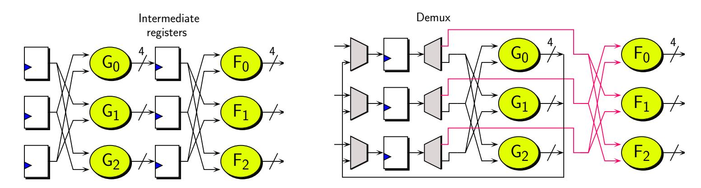

Figure 18: Implementing TI of a cubic s-box in 3 shares in 2 ways

special algebraic structures/relations between *G* and *F*). First, the structure replaces a register with a demultiplexer bank and yet another multiplexer bank that filters the G-layer output back into the register, so as far as circuit area is concerned it offers no real advantages. Secondly, the structure increases the physical length of the datapath in the circuit, and so extra gate delay produced thereof results in additional glitches [\[BBI](#page-33-10)<sup>+</sup>15], which is counterproductive for energy.

Both of the above structures have an additional disadvantage that they require 2 clock cycles to compute the shared s-box output, whereas a 4-share implementation would require only one cycle. Since time efficiency is also an equally important component of energy efficiency, this implies that it is not immediately evident that a 3-share would beat 4-share, as far as energy consumption of a TI is concerned. To make a fair evaluation of the energy efficiency of the AEAD schemes we implemented first order TI with the following characteristics:

- 1. We implemented first order TI of only round based circuits. This is necessary because *r*-round unrolled circuits must necessarily have higher algebraic degree, and as per the observation in [\[NRS11\]](#page-36-9), it will require more shares to construct a TI. For example a 2-round unrolled TI of a block cipher with a cubic s-box has algebraic degree 6, if properly designed and then 7 shares are required. The exact algebraic forms of each bit of a 7-share of a TI is likely to be very complicated, due to high degree, with multiple terms in each expression, eventually leading to large costs in area and power. Also each output bit of the non linear layer in a *r*-round unrolled circuit is a function of a large number of input bits, which is much more than the input size of the s-box. For example, every bit in the output of 2-round PRESENT is a function of at least 16 bits. This only increases the circuit area and power consumption needed to implement each shared output bit.
- 2. We implement TI profiles in which only the state path of the underlying encryption primitive is shared, but not the keypath. Many previous papers have taken this approach [\[PMK](#page-36-5)<sup>+</sup>11, [BJK](#page-34-2)<sup>+</sup>16], as it is adequate for first order security and for simplicity we follow the suit. If the keypaths were also shared, we estimate that it would increase the power consumption of the AEAD schemes by a similar factor, and energy consumption comparisons would probably lead to similar results. In short, we implement threshold circuits for all the AEAD schemes except SATURNIN. The mode SATURNIN was designed in an unusual way that the output of block cipher is used as the key in the subsequent block cipher call. And so a TI which only considers shares in the datapath is not possible for this mode. We believe it would be unfair to compare its energy profile with the remaining schemes, as it could not guarantee the same level of security. In any case, both the s-boxes used in SATURNIN belong to the cubic class C<sup>270</sup> listed in [\[BNN](#page-34-9)<sup>+</sup>12]. This class of s-box cannot be decomposed into 2 quadratic functions *F* ◦ *G*, so we need at least 3 quadratic functions to decompose this class of s-boxes. This of course means that in a 3-share TI, the s-box layer needs

{29}------------------------------------------------

3 cycles for evaluation and so more energy is spent doing so.

### **5.1 S-box details**

Most of the schemes benchmarked in this work have cubic s-boxes with 4-bit inputs that are decomposable into quadratics *F* ◦ *G*, and so efficient 3 and 4-share implementations are possible.

GIFT**:** The s-box of GIFT belongs to the cubic class C<sup>172</sup> which is decomposable into 2 quadratics. The algebraic expressions of the output shares of both the 3 and 4-share TI can be found in [\[JGC](#page-35-12)<sup>+</sup>20].

Pyjamask-BC**:** The s-box of Pyjamask-BC belongs to the cubic class C<sup>223</sup> (same as PICCOLO) which is decomposable into 2 quadratics. Appendix [A](#page-37-0) has detailed expressions for the output shares for the 3 and 4-share implementations.

SKINNY**:** The s-box *S*<sup>8</sup> of SKINNY takes 8 input bits and has algebraic degree equal to 6. Therefore, a single cycle implementation would require 7 shares. Instead, we implement only a 3-share TI of all SKINNY based modes based on the recommendation given by the designers in [\[BJK](#page-34-2)<sup>+</sup>16]. *S*<sup>8</sup> can be decomposed into I ◦ H ◦ G ◦ F where each of these functions is an 8-bit quadratic s-box. This means that in order to implement a 3-share TI, we could use a strategy similar to the one given in the right side of Figure [18.](#page-28-0) In this particular case, a MUX is placed at the output of F, G, H and I (which is merged with the round function circuit). We did not use a demultiplexer in this particular case, as the round function is rather lightweight, and precisely stuck to the formulas given by the original paper [\[BJK](#page-34-2)<sup>+</sup>16]. Further improvements are possible by finding decomposition that makes use of the same algebraic function. The algebraic expressions of the output shares of the 3-share TI can be found in [\[BJK](#page-34-2)<sup>+</sup>16, page 32].

### **5.2 Results**

Table [8](#page-30-0) lists the simulation results using the same measurement setup as the unshared round-based implementations (see Table [1\)](#page-4-0). It can be seen that the schemes using SKINNY consume most energy, which is intuitive since the s-box needs 4 clock cycles for evaluation. On the other hand, it is surprising to see that 4-share TI circuits have similar energyefficiency when compared to the corresponding 3-share circuits.

One of the reasons for the above observation can be justified as follows: the fact that a 3-share circuit takes 2 cycles to evaluate s-box works against it. To understand the reasons better, we re-ran the Pyjamask simulations (with -no\_autoungroup directive to the compiler) and obtained a breakdown of the energies consumed by individual circuit components to process 1 associated data and 8 plaintext blocks. A summary is presented in Figure [19.](#page-31-1)

One can see that whereas the energy consumed by the other components are comparable, the shared s-box layer (marked as S-Layer in the figure) of the 4-share TI consumes a lot of energy which is to be expected because the shares are algebraically more complicated (see Appendix [A\)](#page-37-0). However, the 3-share TI does one additional operation, which the 4-share TI is not required to do, and that is writing values output by the G-layer on to the intermediate register bank. As it turns out these intermediate register writes consumes almost as much energy as the shared s-box circuit in the 4-share TI. Thus on average the energy consumed by the block cipher components in both the implementations balance out.

{30}------------------------------------------------

<span id="page-30-0"></span>Table 8: Measurements for the 1-round threshold implementations. The schemes using GIFT are colored in light gray whereas, SKINNY based schemes are in white

| Candidate   | Conf. | Shares<br># | Latency<br>(cycles) | Area<br>(GE) | TPmax<br>(Mbps) | Power<br>(mW) | Energy<br>(nJ/128-bit) |
|-------------|-------|-------------|---------------------|--------------|-----------------|---------------|------------------------|
| GIFT-COFB   | CG-RB | 3           | 800                 | 16386        | 208.9           | 0.214         | 2.243                  |
|             | CG-RB | 4           | 400                 | 25850        | 350.8           | 0.358         | 1.875                  |
| SUNDAE-GIFT | RB    | 3           | 1440                | 13297        | 145.7           | 0.215         | 3.719                  |
|             | RB    | 4           | 720                 | 21848        | 285.2           | 0.357         | 2.999                  |
| HYENA       | CG-RB | 3           | 800                 | 14769        | 344.9           | 0.212         | 2.216                  |
|             | CG-RB | 4           | 400                 | 24540        | 497.4           | 0.358         | 1.875                  |
| LOTUS-AEAD  | CG    | 3           | 2072                | 14176        | 121.7           | 0.145         | 3.581                  |
|             | CG    | 4           | 1036                | 19712        | 133.0           | 0.262         | 3.232                  |
| LOCUS-AEAD  | CG    | 3           | 2072                | 12366        | 121.7           | 0.137         | 3.362                  |
|             | CG    | 4           | 1036                | 17597        | 176.8           | 0.255         | 3.148                  |
| SKINNY-AEAD | CG    | 3           | 2240                | 18501        | 92.83           | 0.2264        | 6.134                  |
| Romulus     | CG-RB | 3           | 2056                | 13450        | 130.00          | 0.1865        | 4.656                  |
| ForkAE      | CG    | 3           | 3008                | 17008        | 76.60           | 0.2483        | 8.304                  |
| Pyjamask    | CG-RB | 3           | 348                 | 42001        | 620.2           | 0.472         | 1.825                  |
|             | CG-RB | 4           | 180                 | 64577        | 927.6           | 0.814         | 1.628                  |

{31}------------------------------------------------

<span id="page-31-1"></span>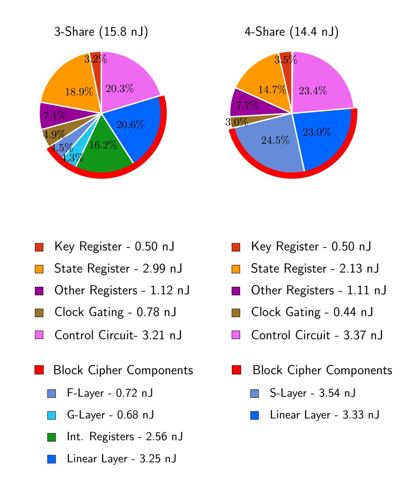

Figure 19: Breakdown of the energy consumptions in Pyjamask

# <span id="page-31-0"></span>**6 Final Observations and Conclusion**

We give a comprehensive guide to designing energy-efficient authenticated encryption schemes by evaluating a selection of ten NIST LWC candidates that make use of a lightweight or a semi-lightweight block cipher at their core. In the process we were able to look at each candidate individually and identify optimal circuit configurations that would reduce the energy consumption of the AEAD circuit as a whole. We were also able to make broader observations regarding energy efficiency in AEAD modes instantiated with lightweight block ciphers. Some of them were broad and generic, e.g. the techniques like clock-gating, register-borrowing are attractive to isolate register glitches and hence optimize energy consumption. We also observed that when a mode instantiated with an *r*-round unrolled block cipher, which might reach its optimal energy consumption at some particular value of *r*, this does not necessarily mean that *r* is the optimal value for the AEAD circuit. For scheme employing slightly more heavyweight block ciphers, our observations indicate that inverse-gated fully-unrolled implementations work best.

In the second part of the paper we turned our attention towards threshold implementations, for those applications that also seek a modest level of physical security. We looked at both 3-share and 4-share threshold implementations of the schemes and made energy measurements. For schemes based on SKINNY, the fact that 4 cycles are required to evaluate the shared s-box, means that the AEAD scheme must sacrifice more of its energy for the cipher itself. For the other candidates we note an up to 20 percent decrease in energy consumption for the 4-share implementation in comparison to the 3-share designs.

{32}------------------------------------------------

We conclude our paper with the following claims, which applies to block cipher based AEAD paradigm, that can hopefully help achieve the ultimate goal of lightweightness with respect to energy consumption.

- **Claim 1.** *The size of register banks have an utmost importance, if not plays the most significant role, in energy and area of an r-round unrolled AEAD circuit*[4](#page-32-4) *. In order to achieve lightweightness, the designers should favor choices which lead to fewer number of storage elements, i.e. choose a block cipher with less internal storage, and utilize as small number of temporary variables as possible in the mode of operation.*
- **Claim 2.** *The r-round unrolled implementations strike a good balance between area, throughput and the energy consumption. However, the sweet spot for r depends both on the block cipher and the surrounding mode of operation. Implementors are recommended to experiment with different choices of r for the full AEAD scheme, and keep in mind that experiments based solely on block ciphers are not sufficient.*
- **Claim 3.** *If a given AEAD scheme contains many storage elements, implementors are recommended to employ techniques such as clock-gating and register-borrowing as much as possible to reduce the energy consumption. These techniques have almost no drawback, except the time and the effort it takes to realize them. The register-borrowing technique, if applicable, allows one to get rid of a register bank. The efficiency of the clock-gating scales up with the number of idle storage elements and the total number of clock cycles during which they remain inactive.*
- **Claim 4.** *From the energy perspective, there is almost a direct correlation between the lightweightness of non-threshold and threshold implementations of an AEAD scheme. Hence the optimal design choices for TI align well with the aforementioned decisions.*

# **References**

- <span id="page-32-1"></span>[ALP<sup>+</sup>19] Elena Andreeva, Virginie Lallemand, Antoon Purnal, Reza Reyhanitabar, and Arnab Roy Damian Vizár. Forkae v.1. *NIST Lightweight Cryptography Project*, 2019.
- <span id="page-32-2"></span>[ARVV18] Elena Andreeva, Reza Reyhanitabar, Kerem Varici, and Damian Vizár. Forking a blockcipher for authenticated encryption of very short messages. *IACR Cryptology ePrint Archive*, 2018:916, 2018.
- <span id="page-32-3"></span>[BB19] Fatih Balli and Subhadeep Banik. Exploring lightweight efficiency of forkaes. Cryptology ePrint Archive, Report 2019/1213, 2019. [https://eprint.iacr.](https://eprint.iacr.org/2019/1213) [org/2019/1213](https://eprint.iacr.org/2019/1213).
- <span id="page-32-0"></span>[BBB<sup>+</sup>19] Davide Bellizia, Francesco Berti, Olivier Bronchain, Gaëtan Cassiers, Sébastien Duval, Chun Guo, Gregor Leander, Gaëtan Leurent, Itamar Levi, Charles Momin, Olivier Pereira, Thomas Peters, François-Xavier Standaert, and Friedrich Wiemer. Spook:sponge-based leakage-resistant authenticated encryption with a masked tweakable block cipher. *NIST Lightweight Cryptography Project*, 2019.

<span id="page-32-4"></span><sup>4</sup>The Claim 1 is based on the fact that for 1-round unrolling of GIFT-COFB and SUNDAE-GIFT, more than half of the energy is consumed by the registers in Figure [14,](#page-20-0) even though these two have relatively fewer flip-flops. On the other hand, percentage of energy consumption by registers are much higher for LOTUS-AEAD, because the mode of operation brings many flip-flops into the circuit. A second observation is comparison between Romulus, SUNDAE-GIFT and GIFT-COFB, whose mode of operation are strikingly similar. However, they differ in the choice blockcipher, respectively SKINNY-128-384, GIFT and GIFT, which results in Romulus spending twice the energy of the other two and occupying larger area, according to Tables [5](#page-24-0)[,6.](#page-25-0)

{33}------------------------------------------------

- <span id="page-33-10"></span>[BBI<sup>+</sup>15] Subhadeep Banik, Andrey Bogdanov, Takanori Isobe, Kyoji Shibutani, Harunaga Hiwatari, Toru Akishita, and Francesco Regazzoni. Midori: A block cipher for low energy. In *Advances in Cryptology - ASIACRYPT 2015 - 21st International Conference on the Theory and Application of Cryptology and Information Security, Auckland, New Zealand, November 29 - December 3, 2015, Proceedings, Part II*, pages 411–436, 2015.
- <span id="page-33-11"></span>[BBLT18] Subhadeep Banik, Andrey Bogdanov, Atul Luykx, and Elmar Tischhauser. SUNDAE: small universal deterministic authenticated encryption for the internet of things. *IACR Trans. Symmetric Cryptol.*, 2018(3):1–35, 2018.
- <span id="page-33-9"></span>[BBP<sup>+</sup>19] Subhadeep Banik, Andrey Bogdanov, Thomas Peyrin, Yu Sasaki, Siang Meng Sim, Elmar Tischhauser, and Yosuke Todo. Sundae-gift v1.0. *NIST Lightweight Cryptography Project*, 2019.
- <span id="page-33-5"></span>[BBR15] Subhadeep Banik, Andrey Bogdanov, and Francesco Regazzoni. Exploring energy efficiency of lightweight block ciphers. In *Selected Areas in Cryptography - SAC 2015 - 22nd International Conference, Sackville, NB, Canada, August 12-14, 2015, Revised Selected Papers*, pages 178–194, 2015.
- <span id="page-33-0"></span>[BBR16a] Subhadeep Banik, Andrey Bogdanov, and Francesco Regazzoni. Atomicaes: A compact implementation of the AES encryption/decryption core. In *Progress in Cryptology - INDOCRYPT 2016 - 17th International Conference on Cryptology in India, Kolkata, India, December 11-14, 2016, Proceedings*, pages 173–190, 2016.
- <span id="page-33-3"></span>[BBR16b] Subhadeep Banik, Andrey Bogdanov, and Francesco Regazzoni. Atomic-aes v 2.0. *IACR Cryptology ePrint Archive*, 2016:1005, 2016.
- <span id="page-33-6"></span>[BBR<sup>+</sup>16c] Subhadeep Banik, Andrey Bogdanov, Francesco Regazzoni, Takanori Isobe, Harunaga Hiwatari, and Toru Akishita. Round gating for low energy block ciphers. In *2016 IEEE International Symposium on Hardware Oriented Security and Trust, HOST 2016, McLean, VA, USA, May 3-5, 2016*, pages 55–60, 2016.
- <span id="page-33-4"></span>[BBR17] Subhadeep Banik, Andrey Bogdanov, and Francesco Regazzoni. Efficient configurations for block ciphers with unified ENC/DEC paths. In *2017 IEEE International Symposium on Hardware Oriented Security and Trust, HOST 2017, McLean, VA, USA, May 1-5, 2017*, pages 41–46, 2017.
- <span id="page-33-7"></span>[BBR<sup>+</sup>18] Subhadeep Banik, Andrey Bogdanov, Francesco Regazzoni, Takanori Isobe, Harunaga Hiwatari, and Toru Akishita. Inverse gating for low energy encryption. In *2018 IEEE International Symposium on Hardware Oriented Security and Trust, HOST 2018, Washington, DC, USA, April 30 - May 4, 2018*, pages 173–176, 2018.
- <span id="page-33-1"></span>[BBRV19] Subhadeep Banik, Fatih Balli, Francesco Regazzoni, and Serge Vaudenay. Swap and rotate: Lightweight linear layers for spn-based blockciphers. Cryptology ePrint Archive, Report 2019/1212, 2019. [https://eprint.iacr.org/2019/](https://eprint.iacr.org/2019/1212) [1212](https://eprint.iacr.org/2019/1212).
- <span id="page-33-8"></span>[BCI<sup>+</sup>19] Subhadeep Banik, Avik Chakraborti, Tetsu Iwata, Kazuhiko Minematsu, Mridul Nandi, Thomas Peyrin, Yu Sasaki, Siang Meng Sim, and Yosuke Todo. Gift-cofb v1.0. *NIST Lightweight Cryptography Project*, 2019.
- <span id="page-33-2"></span>[BDE<sup>+</sup>13] Lejla Batina, Amitabh Das, Baris Ege, Elif Bilge Kavun, Nele Mentens, Christof Paar, Ingrid Verbauwhede, and Tolga Yalçin. Dietary recommendations for lightweight block ciphers: Power, energy and area analysis of recently

{34}------------------------------------------------

- developed architectures. In *Radio Frequency Identification Security and Privacy Issues 9th International Workshop, RFIDsec 2013, Graz, Austria, July 9-11, 2013, Revised Selected Papers*, pages 103–112, 2013.
- <span id="page-34-7"></span>[BFI19] Subhadeep Banik, Yuki Funabiki, and Takanori Isobe. More results on shortest linear programs. In *Advances in Information and Computer Security - 14th International Workshop on Security, IWSEC 2019, Tokyo, Japan, August 28-30, 2019, Proceedings*, pages 109–128, 2019.
- <span id="page-34-6"></span>[BJK<sup>+</sup>] Christof Beierle, Jérémy Jean, Stefan Kölbl, Gregor Leander, Amir Moradi, Thomas Peyrin, Yu Sasaki, Pascal Sasdrich, and Siang Meng Sim. Skinny-aead and skinny-hash.
- <span id="page-34-2"></span>[BJK<sup>+</sup>16] Christof Beierle, Jérémy Jean, Stefan Kölbl, Gregor Leander, Amir Moradi, Thomas Peyrin, Yu Sasaki, Pascal Sasdrich, and Siang Meng Sim. The SKINNY family of block ciphers and its low-latency variant MANTIS. In *Advances in Cryptology - CRYPTO 2016 - 36th Annual International Cryptology Conference, Santa Barbara, CA, USA, August 14-18, 2016, Proceedings, Part II*, pages 123–153, 2016.
- <span id="page-34-4"></span>[BJK<sup>+</sup>19] Christof Beierle, Jérémy Jean, Stefan Kölbl, Gregor Leander, Amir Moradi, Thomas Peyrin, Yu Sasaki, Pascal Sasdrich, and Siang Meng Sim. Skinny-aead and skinny-hash. *NIST Lightweight Cryptography Project*, 2019.
- <span id="page-34-0"></span>[BKL<sup>+</sup>07] Andrey Bogdanov, Lars R. Knudsen, Gregor Leander, Christof Paar, Axel Poschmann, Matthew J. B. Robshaw, Yannick Seurin, and C. Vikkelsoe. PRESENT: an ultra-lightweight block cipher. In *Cryptographic Hardware and Embedded Systems - CHES 2007, 9th International Workshop, Vienna, Austria, September 10-13, 2007, Proceedings*, pages 450–466, 2007.
- <span id="page-34-8"></span>[BMA<sup>+</sup>18] Subhadeep Banik, Vasily Mikhalev, Frederik Armknecht, Takanori Isobe, Willi Meier, Andrey Bogdanov, Yuhei Watanabe, and Francesco Regazzoni. Towards low energy stream ciphers. *IACR Trans. Symmetric Cryptol.*, 2018(2):1–19, 2018.
- <span id="page-34-9"></span>[BNN<sup>+</sup>12] Begül Bilgin, Svetla Nikova, Ventzislav Nikov, Vincent Rijmen, and Georg Stütz. Threshold implementations of all 3 ×3 and 4 ×4 s-boxes. In Emmanuel Prouff and Patrick Schaumont, editors, *Cryptographic Hardware and Embedded Systems - CHES 2012 - 14th International Workshop, Leuven, Belgium, September 9-12, 2012. Proceedings*, volume 7428 of *Lecture Notes in Computer Science*, pages 76–91. Springer, 2012.
- <span id="page-34-3"></span>[BPP<sup>+</sup>17] Subhadeep Banik, Sumit Kumar Pandey, Thomas Peyrin, Yu Sasaki, Siang Meng Sim, and Yosuke Todo. GIFT: A small present - towards reaching the limit of lightweight encryption. In *Cryptographic Hardware and Embedded Systems - CHES 2017 - 19th International Conference, Taipei, Taiwan, September 25-28, 2017, Proceedings*, pages 321–345, 2017.
- <span id="page-34-1"></span>[BSS<sup>+</sup>13] Ray Beaulieu, Douglas Shors, Jason Smith, Stefan Treatman-Clark, Bryan Weeks, and Louis Wingers. The SIMON and SPECK families of lightweight block ciphers. *IACR Cryptology ePrint Archive*, 2013:404, 2013.
- <span id="page-34-5"></span>[BSS<sup>+</sup>15] Ray Beaulieu, Douglas Shors, Jason Smith, Stefan Treatman-Clark, Bryan Weeks, and Louis Wingers. The SIMON and SPECK lightweight block ciphers. In *Proceedings of the 52nd Annual Design Automation Conference, San Francisco, CA, USA, June 7-11, 2015*, pages 175:1–175:6, 2015.

{35}------------------------------------------------

- <span id="page-35-0"></span>[Can05] David Canright. A very compact s-box for AES. In *Cryptographic Hardware and Embedded Systems - CHES 2005, 7th International Workshop, Edinburgh, UK, August 29 - September 1, 2005, Proceedings*, pages 441–455, 2005.
- <span id="page-35-8"></span>[CDJ<sup>+</sup>19] Avik Chakraborti, Nilanjan Datta, Ashwin Jha, Cuauhtemoc Mancillas Lopez, Mridul Nandi, and Yu Sasaki. Lotus-aead and locus-aead. *NIST Lightweight Cryptography Project*, 2019.
- <span id="page-35-7"></span>[CDJN19] Avik Chakraborti, Nilanjan Datta, Ashwin Jha, and Mridul Nandi. Hyena. *NIST Lightweight Cryptography Project*, 2019.
- <span id="page-35-2"></span>[CDK09] Christophe De Cannière, Orr Dunkelman, and Miroslav Knezevic. KATAN and KTANTAN - A family of small and efficient hardware-oriented block ciphers. In *Cryptographic Hardware and Embedded Systems - CHES 2009, 11th International Workshop, Lausanne, Switzerland, September 6-9, 2009, Proceedings*, pages 272–288, 2009.
- <span id="page-35-10"></span>[CDL<sup>+</sup>19] Anne Canteaut, Sébastien Duval, Gaëtan Leurent, María Naya-Plasencia, Léo Perrin, Thomas Pornin, and André Schrottenloher. Saturnin: a suite of lightweight symmetric algorithms for post-quantum security. *NIST Lightweight Cryptography Project*, 2019.
- <span id="page-35-11"></span>[CIMN17] Avik Chakraborti, Tetsu Iwata, Kazuhiko Minematsu, and Mridul Nandi. Blockcipher-based authenticated encryption: How small can we go? In *Cryptographic Hardware and Embedded Systems - CHES 2017 - 19th International Conference, Taipei, Taiwan, September 25-28, 2017, Proceedings*, pages 277–298, 2017.
- <span id="page-35-1"></span>[FWR05] Martin Feldhofer, J Wolkerstorfer, and Vincent Rijmen. Aes implementation on a grain of sand. *Information Security, IEE Proceedings*, 152:13– 20, 11 2005.
- <span id="page-35-9"></span>[GJK<sup>+</sup>19] Dahmun Goudarzi, Jérémy Jean, Stefan Kölbl, Thomas Peyrin, Matthieu Rivain, Yu Sasaki, and Siang Meng Sim. Pyjamask v1.0. *NIST Lightweight Cryptography Project*, 2019.
- <span id="page-35-4"></span>[HDF<sup>+</sup>16] Ekawat Homsirikamol, William Diehl, Ahmed Ferozpuri, Farnoud Farahmand, Panasayya Yalla, Jens-Peter Kaps, and Kris Gaj. Caesar hardware api. Cryptology ePrint Archive, Report 2016/626, 2016. [https:](https://eprint.iacr.org/2016/626) [//eprint.iacr.org/2016/626](https://eprint.iacr.org/2016/626).
- <span id="page-35-6"></span>[IKMP19] Tetsu Iwata, Mustafa Khairallah, Kazuhiko Minematsu, and Thomas Peyrin. Romulus v1.2. *NIST Lightweight Cryptography Project*, 2019.
- <span id="page-35-12"></span>[JGC<sup>+</sup>20] Arpan Jati, Naina Gupta, Anupam Chattopadhyay, Somitra Kumar Sanadhya, and Donghoon Chang. Threshold implementations of GIFT: A trade-off analysis. *IEEE Trans. Information Forensics and Security*, 15:2110–2120, 2020.
- <span id="page-35-3"></span>[JMPS17] Jérémy Jean, Amir Moradi, Thomas Peyrin, and Pascal Sasdrich. Bit-sliding: A generic technique for bit-serial implementations of spn-based primitives applications to aes, PRESENT and SKINNY. In *Cryptographic Hardware and Embedded Systems - CHES 2017 - 19th International Conference, Taipei, Taiwan, September 25-28, 2017, Proceedings*, pages 687–707, 2017.
- <span id="page-35-5"></span>[KAN11] Jagrit Kathuria, M Ayoubkhan, and Arti Noor. A review of clock gating techniques. *MIT International Journal of Electronics and Communication Engineering*, 1(2):106–114, 2011.

{36}------------------------------------------------

- <span id="page-36-4"></span>[KDH<sup>+</sup>12] Stéphanie Kerckhof, François Durvaux, Cédric Hocquet, David Bol, and François-Xavier Standaert. Towards green cryptography: A comparison of lightweight ciphers from the energy viewpoint. In *Cryptographic Hardware and Embedded Systems - CHES 2012 - 14th International Workshop, Leuven, Belgium, September 9-12, 2012. Proceedings*, pages 390–407, 2012.
- <span id="page-36-8"></span>[KR11] Ted Krovetz and Phillip Rogaway. The software performance of authenticatedencryption modes. In Antoine Joux, editor, *Fast Software Encryption - 18th International Workshop, FSE 2011, Lyngby, Denmark, February 13-16, 2011, Revised Selected Papers*, volume 6733 of *Lecture Notes in Computer Science*, pages 306–327. Springer, 2011.
- <span id="page-36-1"></span>[MPL<sup>+</sup>11] Amir Moradi, Axel Poschmann, San Ling, Christof Paar, and Huaxiong Wang. Pushing the limits: A very compact and a threshold implementation of AES. In *Advances in Cryptology - EUROCRYPT 2011 - 30th Annual International Conference on the Theory and Applications of Cryptographic Techniques, Tallinn, Estonia, May 15-19, 2011. Proceedings*, pages 69–88, 2011.
- <span id="page-36-2"></span>[MSS<sup>+</sup>15] Sanu Mathew, Sudhir Satpathy, Vikram Suresh, Mark Anders, Himanshu Kaul, Amit Agarwal, Steven Hsu, Gregory K. Chen, and Ram Krishnamurthy. 340 mv-1.1 v, 289 gbps/w, 2090-gate nanoaes hardware accelerator with areaoptimized encrypt/decrypt GF(2 4 ) 2 polynomials in 22 nm tri-gate CMOS. *J. Solid-State Circuits*, 50(4):1048–1058, 2015.
- <span id="page-36-3"></span>[nisa] Nist lightweight cryptography project. [https://csrc.nist.gov/projects/](https://csrc.nist.gov/projects/lightweight-cryptography) [lightweight-cryptography](https://csrc.nist.gov/projects/lightweight-cryptography).
- <span id="page-36-6"></span>[nisb] Nist submission requirements and evaluation criteria for the lightweight cryptography standardization process. [https://csrc.nist.gov/Projects/](https://csrc.nist.gov/Projects/Lightweight-Cryptography) [Lightweight-Cryptography](https://csrc.nist.gov/Projects/Lightweight-Cryptography).
- <span id="page-36-9"></span>[NRS11] Svetla Nikova, Vincent Rijmen, and Martin Schläffer. Secure hardware implementation of nonlinear functions in the presence of glitches. *J. Cryptology*, 24(2):292–321, 2011.
- <span id="page-36-5"></span>[PMK<sup>+</sup>11] Axel Poschmann, Amir Moradi, Khoongming Khoo, Chu-Wee Lim, Huaxiong Wang, and San Ling. Side-channel resistant crypto for less than 2, 300 GE. *J. Cryptology*, 24(2):322–345, 2011.
- <span id="page-36-0"></span>[SMTM01] Akashi Satoh, Sumio Morioka, Kohji Takano, and Seiji Munetoh. A compact rijndael hardware architecture with s-box optimization. In *Advances in Cryptology - ASIACRYPT 2001, 7th International Conference on the Theory and Application of Cryptology and Information Security, Gold Coast, Australia, December 9-13, 2001, Proceedings*, pages 239–254, 2001.
- <span id="page-36-7"></span>[WH19] Hongjun Wu and Tao Huang. Tinyjambu: A family of lightweight authenticated encryption algorithms. *NIST Lightweight Cryptography Project*, 2019.

{37}------------------------------------------------

# <span id="page-37-0"></span>**A Output shares for** Pyjamask-BC **Sbox**

### **A.1 4-share implementation**

```
S0,0 = a1 ⊕ b1 ⊕ c1 ⊕ a1 · b1 ⊕ a1 · b2 ⊕ a1 · b3 ⊕ a3 · b2 ⊕ a1 · c1 ⊕ a1 · c2 ⊕ a1 · c3⊕
        a3 · c2 ⊕ a1 · d1 ⊕ a1 · d2 ⊕ a1 · d3 ⊕ a3 · d2 ⊕ c1 · d1 ⊕ c1 · d2 ⊕ c1 · d3 ⊕ c3 · d2⊕
        a1 · b1 · c1 ⊕ a1 · b2 · c1 ⊕ a1 · b3 · c1 ⊕ a2 · b3 · c1 ⊕ a3 · b2 · c1 ⊕ a1 · b1 · c2⊕
        a1 · b2 · c2 ⊕ a1 · b3 · c2 ⊕ a3 · b1 · c2 ⊕ a3 · b2 · c2 ⊕ a3 · b3 · c2 ⊕ a1 · b1 · c3⊕
        a1 · b2 · c3 ⊕ a1 · b3 · c3 ⊕ a2 · b1 · c3 ⊕ a3 · b2 · c3
S0,1 = 1 ⊕ a1 ⊕ a1 · c1 ⊕ a1 · c2 ⊕ a1 · c3 ⊕ a3 · c2 ⊕ c1 · d1 ⊕ c1 · d2 ⊕ c1 · d3 ⊕ c3 · d2
S0,2 = a1 ⊕ c1 ⊕ d1 ⊕ a1 · b1 ⊕ a1 · b2 ⊕ a1 · b3 ⊕ a3 · b2 ⊕ b1 · c1 ⊕ b1 · c2 ⊕ b1 · c3⊕
        b3 · c2 ⊕ a1 · b1 · c1 ⊕ a1 · b2 · c1 ⊕ a1 · b3 · c1 ⊕ a2 · b3 · c1 ⊕ a3 · b2 · c1 ⊕ a1 · b1 · c2⊕
        a1 · b2 · c2 ⊕ a1 · b3 · c2 ⊕ a3 · b1 · c2 ⊕ a3 · b2 · c2 ⊕ a3 · b3 · c2 ⊕ a1 · b1 · c3⊕
        a1 · b2 · c3 ⊕ a1 · b3 · c3 ⊕ a2 · b1 · c3 ⊕ a3 · b2 · c3 ⊕ b1 · c1 · d1 ⊕ b1 · c2 · d1⊕
        b1 · c3 · d1 ⊕ b2 · c3 · d1 ⊕ b3 · c2 · d1 ⊕ b1 · c1 · d2 ⊕ b1 · c2 · d2 ⊕ b1 · c3 · d2⊕
        b3 · c1 · d2 ⊕ b3 · c2 · d2 ⊕ b3 · c3 · d2 ⊕ b1 · c1 · d3 ⊕ b1 · c2 · d3 ⊕ b1 · c3 · d3⊕
        b2 · c1 · d3 ⊕ b3 · c2 · d3
S0,3 = a1 ⊕ d1 ⊕ b1 · c1 ⊕ b1 · c2 ⊕ b1 · c3 ⊕ b3 · c2
```

Note that *d* (resp *a*) denotes the input MSB (resp. LSB) of the s-box, and *d*0*, d*1*, d*2*, d*<sup>3</sup> are the 4 shares of the input variable *d*. Denote by the vector *X<sup>i</sup>* = [*d<sup>i</sup> , c<sup>i</sup> , b<sup>i</sup> , a<sup>i</sup>* ] for all *i* ∈ [0*,* 3], then *S*0*,j* is expressed in compact form as *f<sup>j</sup>* (*X*1*, X*2*, X*3) for all *j* ∈ [0*,* 3]. As is the case in direct sharing, the expressions for the other output shares *S*1*,j , S*2*,j* and *S*3*,j* are given as *f<sup>j</sup>* (*X*0*, X*2*, X*3), *f<sup>j</sup>* (*X*0*, X*1*, X*3) and *f<sup>j</sup>* (*X*0*, X*1*, X*2) respectively for all *j* ∈ [0*,* 3], except *S*3*,*<sup>1</sup> which is given as 1 ⊕ *f*1(*X*0*, X*1*, X*2) to maintain correctness in the second LSB.

## **A.2 3-share implementation**

The s-box is decomposed as *F* ◦ *G*. The output shares of *G* are given as follows:

$$\begin{aligned} g_{0,0} &= b_2 \ g_{0,1} &= c_2 \ g_{0,2} &= a_2 \oplus b_2 \oplus d_2 \oplus b_1 \cdot c_1 \oplus b_1 \cdot c_2 \oplus b_2 \cdot c_1 \ g_{0,3} &= a_2 \oplus a_1 \cdot c_1 \oplus a_1 \cdot c_2 \oplus a_2 \cdot c_1 \oplus c_1 \cdot d_1 \oplus c_1 \cdot d_2 \oplus c_2 \cdot d_1 \end{aligned}$$

Again *d* (resp *a*) denotes the input MSB (resp. LSB) of the s-box, and *X<sup>i</sup>* = [*d<sup>i</sup> , c<sup>i</sup> , b<sup>i</sup> , a<sup>i</sup>* ] for all *i* ∈ [0*,* 2]. If *g*0*,j* is expressed as *r<sup>j</sup>* (*X*1*, X*2) for all *j* ∈ [0*,* 3], then *g*1*,j* and *g*2*,j* are given as *r<sup>j</sup>* (*X*0*, X*2) and *r<sup>j</sup>* (*X*0*, X*1) for all *j*. The output shares of *F* are given as

$$f_{0,0} = a_2 \oplus b_2 \oplus c_1 \cdot d_1 \oplus c_1 \cdot d_2 \oplus c_2 \cdot d_1$$

$$f_{0,1} = 1 \oplus d_2$$

$$f_{0,2} = a_2 \oplus b_2 \oplus c_2 \oplus a_1 \cdot d_1 \oplus a_1 \cdot d_2 \oplus a_2 \cdot d_1$$

$$f_{0,3} = a_2 \oplus c_2$$

Again if *f*0*,j* is expressed as *s<sup>j</sup>* (*X*1*, X*2) for all *j* ∈ [0*,* 3], then *f*1*,j* and *f*2*,j* are given as *s<sup>j</sup>* (*X*0*, X*2) and *s<sup>j</sup>* (*X*0*, X*1) for all *j*.