{0}------------------------------------------------

# **The Area-Latency Symbiosis: Towards Improved Serial Encryption Circuits**

Fatih Balli, Andrea Caforio and Subhadeep Banik

LASEC, École Polytechnique Fédérale de Lausanne, Switzerland [{fatih.balli,andrea.caforio,subhadeep.banik}@epfl.ch](mailto:{fatih.balli, andrea.caforio, subhadeep.banik}@epfl.ch)

**Abstract.** The *bit-sliding* paper of Jean et al. (CHES 2017) showed that the smallestsize circuit for SPN based block ciphers such as AES, SKINNY and PRESENT can be achieved via bit-serial implementations. Their technique decreases the bit size of the datapath and naturally leads to a significant loss in latency (as well as the maximum throughput). Their designs complete a single round of the encryption in 168 (resp. 68) clock cycles for 128 (resp. 64) bit blocks. A follow-up work by Banik et al. (FSE 2020) introduced the *swap-and-rotate* technique that both eliminates this loss in latency and achieves even smaller footprints.

In this paper, we extend these results on bit-serial implementations all the way to four authenticated encryption schemes from NIST LWC. Our first focus is to decrease latency and improve throughput with the use of the *swap-and-rotate* technique. Our block cipher implementations have the most efficient round operations in the sense that a round function of an *n*-bit block cipher is computed in exactly *n* clock cycles. This leads to implementations that are similar in size to the state of the art, but have much lower latency (savings up to 20 percent). We then extend our technique to 4 and 8-bit implementations.

Although these results are promising, block ciphers themselves are not end-user primitives, as they need to be used in conjunction with a mode of operation. Hence, in the second part of the paper, we use our serial block ciphers to bootstrap four active NIST authenticated encryption candidates: SUNDAE-GIFT, Romulus, SAEAES and SKINNY-AEAD. In the wake of this effort, we provide the smallest block-cipher-based authenticated encryption circuits known in the literature so far.

**Keywords:** Lightweight, Latency, Swap, Rotate, Block Cipher, Authenticated Encryption, NIST LWC, AES, SKINNY, GIFT, SUNDAE, SAEAES, SKINNY-AEAD, Romulus, Grain-128AEAD

# **1 Introduction**

The number of applications that rely on standard cryptographic primitives to establish a secure communication channel grow larger each day. Given the large variety of platforms these applications are run by, the available device resources spread to a large spectrum. In this spectrum, those applications related to IoT, sensor networks, RFID, vehicle-to-vehicle communication suffer from having tight security budgets. They hence rely on the future promise by an emerging field, that is *lightweight cryptography*, where new standards of primitives that are cheaper in terms of hardware footprint, energy, power and latency are anticipated. NIST's ongoing standardization process for lightweight cryptography (NIST LWC) clearly reflects the vivid effort in this domain. The candidates, 32 of which are elected for the second round, provide new designs for an authenticated encryption primitive, with the final goal of attaining security and lightweightness at the same time.

{1}------------------------------------------------

<span id="page-1-2"></span>

| Candidate   | P:         | rimary           | A           | lternative         |              |
|-------------|------------|------------------|-------------|--------------------|--------------|
|             | cipher     | size (block+key) | cipher      | size (block+key)   | cipher calls |
| COMET       | AES        | 128+128          | CHAM, Speck | 64/128+128         | enc          |
| ESTATE      | TweAES     | 128 + 128        | TweGIFT     | 128 + 128          | enc+dec      |
| ForkAE      | ForkSKINNY | 128 + 288        | ForkSKINNY  | 64/128+192/256/288 | enc+dec      |
| GIFT-COFB   | GIFT*      | 128 + 128        | -           | -<br>-             | enc          |
| HYENA       | GIFT       | 128 + 128        | -           | -                  | enc          |
| LOTUS-AEAD  | TweGIFT    | 64 + 128         | -           | -                  | enc          |
| mixFeed     | AES        | 128 + 128        | -           | -                  | enc          |
| Pyjamask    | Pyjamask   | 128 + 128        | Pyjamask    | 96 + 128           | enc          |
| Romulus     | SKINNY     | 128 + 384        | SKINNY      | 128 + 256/384      | enc          |
| SAEAES      | AES        | 128 + 128        | -           | -                  | enc          |
| Saturnin    | Saturnin   | 256 + 256        | -           | -                  | enc          |
| SKINNY-AEAD | SKINNY     | 128 + 384        | SKINNY      | 128 + 256/384      | enc          |
| SUNDAE-GIFT | GIFT*      | 128 + 128        | _           | <del>-</del>       | enc          |

Table 1: The list of second-round NIST LWC candidates that are based on block ciphers. GIFT refers to the original block cipher from [BPP+17], and GIFT\* refers to the version that assumes different ordering of the input bits and the key [BCI+19, BBP+19].

LIGHTWEIGHT METRIC. In the crypto community, the definition of security is defined with rigor, generally by resorting to algorithmic games. However, the term *lightweight* does not hold up to the same precision.

First, there is a question of which metric should be prioritized. In practice, each application is most concerned about the particular implementation aspect of the cryptographic primitive that conflicts with its own tight-budget. For battery-powered sensors, the energy spent per encrypted bit is a matter of priority, and directly determines how long the battery lasts. Sometimes, multiple metrics must be taken into consideration. As an example, an RFID device might prioritize power, but at the same time its silicon area footprint is also crucial.

Secondly, there is a question of how to quantify this metric. This is highly dependent on how the scheme is implemented, e.g. as an application-specific integrated circuit (ASIC), on a field-programmable gate array (FPGA) or programmed to a microprocessor. This further depends on the specific details. For instance, the transistor size of the cell library in ASIC plays a key role in area, power consumption as well as the response time of the gates.

In this paper, the term lightweight refers to the combination of both the area (in terms of gate-equivalence GE) and the latency (in terms of clock cycles) of an architecture realized as an ASIC. We believe that these two metrics are most easily reproducible, in the sense that given two implementations A and B, there is a methodological and fair approach to decide which one performs better<sup>1</sup>. In our implementations, we prioritize both area and latency. Therefore, our goal is to remain in the same area budget (or have further reductions if possible) of the ultra-small (i.e. 1/4/8-bit-datapath) implementations and reduce the latency (i.e. the number of clock cycles) as much as possible.

Reducing latency is an important goal, as it directly translates into a throughput gain, as well as a reduction in the energy consumption<sup>2</sup>. Given the variety of application profiles, it is worth noting that the ideal goal from an implementation standpoint is to lower the cost in one or few metrics so that the design is sufficient to meet the expectation of most (if not all) applications.

<span id="page-1-0"></span> $<sup>^{1}</sup>$ GE measurements are not perfectly reliable across different technology libraries. For fairness, we compare GE-sizes of two implementations A and B synthesized in the same technology library.

<span id="page-1-1"></span><sup>&</sup>lt;sup>2</sup>The energy consumption is lower, if we assume that the power consumption remains same. This holds true for most of our implementations.

{2}------------------------------------------------

Mode of operations. Among the active second round candidates, 13 out of 32 are based on block ciphers. These candidates simply design a mode of operation around a given block cipher to function as an authenticated encryption scheme. From Table [1,](#page-1-2) note that:

- 4 candidates use either the standard or a tweaked version of AES as the primary choice. These are COMET, ESTATE, mixFeed, SAEAES [\[GJN19,](#page-36-0) [CDJ](#page-36-1)<sup>+</sup>19a, [CN19,](#page-36-2) [NMMaS](#page-37-0)<sup>+</sup>19].
- 3 candidates use either the standard or a forked version of SKINNY as the primary choice. These are ForkAE, Romulus, SKINNY-AEAD [\[ALP](#page-34-0)<sup>+</sup>19, [IKMP19,](#page-36-3) [BJK](#page-35-3)<sup>+</sup>19].
- 2 candidates use either the standard or a tweaked version of 128-bit variant of GIFT. Namely, ESTATE uses the tweaked version of GIFT as an alternative choice [\[CDJ](#page-36-1)<sup>+</sup>19a], whereas HYENA uses the original version [\[CDJN19,](#page-36-4) [BPP](#page-35-0)<sup>+</sup>17]. Besides these two, LOTUS-AEAD also employs a tweaked 64-bit variant of GIFT [\[CDJ](#page-36-5)<sup>+</sup>19b, [BPP](#page-35-0)<sup>+</sup>17].
- 2 candidates use GIFT<sup>∗</sup> . These two candidates are GIFT-COFB and SUNDAE-GIFT [\[BCI](#page-35-1)<sup>+</sup>19, [BBP](#page-35-2)<sup>+</sup>19]. The difference between GIFT<sup>∗</sup> and GIFT is that the former assumes a different indexing of the input and output bits. We denote their modified version with GIFT<sup>∗</sup> , as it leads to a significant difference from a design and implementation perspective (but remains equivalent in terms of cryptanalysis).
- Pyjamask and Saturnin are the exceptions to the popular approach, as they bring their own dedicated block cipher designs into the standardization [\[GJK](#page-36-6)<sup>+</sup>19, [CDL](#page-36-7)<sup>+</sup>19].

Given the modular approach taken by these candidates, one can pose the two following questions, which relates directly to their lightweight performance: (1) How lightweight is the block cipher employed at the core? (2) What is the cost of the surrounding mode of operation? Our work and results respond to these two significant questions.

Bottleneck of storage. Most low-area implementations of SPN-based block ciphers eventually face a bottleneck of storage, quite similar to the fashion in which they are observed in hash functions [\[BLP](#page-35-4)<sup>+</sup>08]. Namely, all implementations (except those that are fully unrolled) need to store the key and the cipher state during the encryption operation. For a block cipher with *`b*-bit block and *`k*-bit key, this typically requires the use of *`<sup>b</sup>* + *`<sup>k</sup>* flip-flops. More concretely, the area-cost of storing 256-bit corresponds to 1088 GE, 832 GE and 1451 GE for the cell libraries UMC 90 nm, STM 90 nm and NanGate 45 nm respectively. It naturally follows that for the smallest implementations of AES (resp. SKINNY-128-128, GIFT), the 73% (resp. 83%, 69%) of the circuit is due to merely D flip-flops [\[JMPS17,](#page-37-1) [BPP](#page-35-0)<sup>+</sup>17]. Therefore, the state-of-the-art ultra-small ASIC implementations of block ciphers contain mostly storage elements, and space for further area optimizations is limited. We take this as an indicator that we should divert our focus to the other aspects of the circuit while remaining in the same area budget.

### **1.1 Area, Latency and Energy**

Serialized implementations generally have poor energy efficiency as explained in [\[BBR15\]](#page-35-5). There are two principal reasons for this:

• These circuits generally require larger latency than round-based circuits. For example, Atomic-AES [\[BBR16\]](#page-35-6), which closely follows the design by Moradi et al. [\[MPL](#page-37-2)<sup>+</sup>11], has a datapath of 8 bits, occupies around 2060 GE, and requires 226 clock cycles to execute one block of AES encryption. The latency is twentyfold compared to 11 clock cycles it takes for the round-based circuit to do the same, but it occupies around 4 times less area than the round-based circuit, as the latter costs 8000 GE. Due to this, the byte-serial circuit takes around 7-8 times more energy than a round-based

{3}------------------------------------------------

circuit (allowing for some variations due to circuit design and the choice of the CMOS library).

• Any serialized circuit is required to perform many more register write operations. A round-based circuit overwrites its internal register 11 times, once per clock cycle, with intermediate round output. Consider on the other hand any byte-serial circuit (or more specifically the Atomic-AES circuit). A simple operation

$$b_0, b_1, \ldots, b_{15} \longrightarrow b_1, \ldots, b_{15}, S(b_0 \oplus k_0)$$

which basically rotates the state by one byte, and substitutes the least significant byte with the output of the AddRoundkey and S-box on the byte *b*0, requires an entire register overwrite. As is obvious, this needs to be done at least 15 more times for each byte *b<sup>i</sup>* and then again 4 times for the MixColumns operation for each of the 10 rounds. Since each register write requires finite energy, it is obvious that the energy budget shoots up in the process. The energy consumption proportionally increases the more we try to reduce the length of the datapath. Therefore, a bit-serial datapath would by a similar logic, be even more expensive energy-wise.

However, this logic does not extend to power consumption, as power is the time derivative of energy and essentially the rate of energy spent per unit of time. The fewer number of gates a circuit consists of, it is more often the case that its power footprint becomes smaller. As a consequence, serialized circuits should not be used in situations where energy efficiency is a prime concern, but can still be favored in scenarios where power is the target metric. For example, for battery-driven devices energy consumption is a top priority, whereas for applications like medical implants and passive RFID tags (that typically do not use the latest CMOS technology), power consumption is very important. In implantable devices, power is a more crucial metric, as the wearer certainly can not tolerate any rise in operating temperature as a side effect of high power consumption over a number of cycles. Although energy is an important metric, our research direction is directed towards these applications that cannot ignore area and power constraints.

There is ample scope for optimization, in an engineering sense, that allows us to strive to design better circuits, no matter how narrow the scope to do so might initially seem. Again, let us go to the example of Atomic-AES, which is a byte-serial circuit that spends 21 cycles to execute one AES round computation. It is well known that Atomic-AES uses only one S-box circuit. It is not feasible to design an AES circuit with a single S-box that completes a round in less than 20 clock cycles. This is obvious, since one AES round requires 20 S-box accesses per round (16 in the substitution layer and 4 in the key update). In this respect, the Atomic-AES circuit is close to optimum in terms of latency. Now, one way to convert a byte-serial circuit to bit-serial could be to chain the flip-flops in each byte register sequentially, so that it takes 8 clock cycles instead of 1 to transfer one byte of information. This way, the conversion of the Atomic-AES circuit into bit-serial would require 21 × 8 = 168 cycles to execute one AES round. Is it possible to actually achieve this circuit (or do better)? This question was already answered affirmatively by Moradi et al. [\[JMPS17\]](#page-37-1), which constructed a circuit that performed one AES round in 168 clock cycles. What is the lowest possible number of cycles in which we can hope to do one AES round in a bit-serial circuit? A little thinking will tell us that we can not possibly do it in fewer than 128 cycles, which is the block size of AES, since each bit in the state needs to be rotated around the state pipeline at least once, and this requires 128 clock cycles. One of the things we investigate in this paper is whether it is possible to attain this minimum.

# **1.2 Motivation**

In comparison to their 8-bit (or even 32/128-bit) counterparts, bit-serial implementations offer lower throughput, as they execute only single bit of operation in each clock cycle 

{4}------------------------------------------------

[\[JMPS17,](#page-37-1) [BBR17,](#page-35-7) [BBRV20\]](#page-35-8). Then, one might wonder whether this latency loss is justified for the sake of reducing area, and whether these designs will see industrial applications. Let us elaborate on that point briefly, and explain our motivation to further pursue 1-bit-serial implementation techniques.

Even though the silicon fabrication process makes progress each year, some of the applications lag behind in catching up with the newer smaller-size transistor technologies, mostly because of the costs involved in establishing the fabrication process. While the smallest-size transistors see a rather short time to catch up with the market for personal computers and smartphones, this is not true for many low-cost devices, which prioritize the price. These devices mainly include those that are bought in bulk quantities such as electronic identity or public transportation cards, electronic event tickets etc. More concretely, take MIFARE brand of products by NXP Semiconductors as an example. Among this series, MIFARE Ultralight is sold as the most cost-effective product, because the cost of system ownership as well as the individual card prices are the lowest. These devices are protected with 32-bit passwords against malicious writes, and use 3DES + CBC to achieve authentication through a shared secret key [\[MIFb,](#page-37-3) [MIFa\]](#page-37-4). Enabling up-to-date lightweight symmetric cryptography, in particular an authenticated encryption scheme with low-area footprint on these platforms is of great importance, because they are used by thousands, if not millions, of people. The correct application and engineering of cryptography on these devices would fix some of the previous design flaws [\[GdKGM](#page-36-8)<sup>+</sup>08, [dKGHG08\]](#page-36-9).

Also note that one of the benefits of bit/byte-serial circuits with respect to area reduction is that the circuit requires fewer number of scan flip-flops (which is typically larger than a flip-flop without scan functionality) to construct. However, consider design for testability (DFT) features like scan chains which, when incorporated in a circuit, would require all flip-flops to have the scan functionality in order to accommodate the scan-chain path. In spite of this, serialized circuits have remained popular in the literature and has been employed in numerous papers. Why is this so? Note that for most libraries the compiler implements a scan flip-flop as a multiplexer (MUX) with a simple flip-flop (without reset). So in this context, reducing the number of scan flip-flops is really equal to reducing the extra MUXes needed in the circuit. If a scan-chain DFT functionality is still incorporated on top of it, then every flip-flop used in the circuit will require an additional input port (along with a MUX), irrespective of whether it was designed as a scan flip-flop or normal flip-flop, to accommodate the scan chain used for testing. Therefore including DFT will always increase the area of the circuit by around *n* 2-input MUXes (where *n* is the number of storage bits in the circuit), irrespective of the number scan flip-flops in the circuit without DFT. This is the reason why reduction of the number of scan flip-flops is done in many papers in the community and it remains popular.

It should also be noted that, for most of the aforementioned applications, bit-serial implementations can provide sufficient throughput. For instance, our bit-serial authenticated encryption implementations have maximum throughput of roughly 4-10 Mbit/s in a rather old STM 90 nm library, which reaches up to 90-145 Mbit/s in a newer NanGate 15 nm library. This throughput already exceeds the communication bandwidth of these low-cost devices. And lastly, the goal of our effort is to discover new techniques that can also be applied to 4/8-bit implementations. In that regard, we also provide 4/8-bit implementations that are small but better in terms of latency compared to previous work.

Comparison with Related Work: Two previous papers that immediately evokes comparison with our work are [\[JMPS17,](#page-37-1) [BBRV20\]](#page-35-8). The former was the first paper to propose a 1-bit datapath implementation of AES, PRESENT and SKINNY family. However none of the implementations reported in this paper achieved a latency per round figure equal to the block size of the underlying block cipher. One of the reasons for this is that they approach the entire round function as a monolithic entity, i.e. all the algebraic operations in the round were completed in the time period allotted for the round. Large

{5}------------------------------------------------

amount of the engineering in this paper is devoted towards investigating what happens if we flirt with these boundaries by executing some operations of round *i* in the time period allotted to round *i* + 1 while maintaining correct functionality. As it turns out, when we do this efficiently, we can limit latency per round (in clock cycles) to the block size and that is exactly the mathematical challenge we faced in this work. To make things clearer, note that [\[JMPS17\]](#page-37-1) reports a bit-serial implementation of AES which completes a round in 168 cycles. 128 clock cycles are used to rotate bits across the state pipeline and perform AddRoundKey and SubBytes operations simultaneously. Precisely 8 cycles are used for ShiftRows and 32 more for MixColumns. However, we observed that we could be more flexible in the scheduling of operations, which is to say neither do we have to wait for the AddRoundKey and SubBytes operation to be completed on the entire 128-bit state to begin ShiftRows, nor wait for the ShiftRows to complete to begin MixColumns. When a group of bits in the state have undergone AddRoundKey and SubBytes, we can already begin ShiftRows on those bits immediately and the same holds for the scheduling of MixColumns vis-à-vis ShiftRows. In the process of developing this technique, we find that not all operations of a round is finished in the time allocated for the round, and so we improvise and try to get them done in the next round, while trying to maintain functionality at all times.

A preliminary version of the aforementioned technique was applied by Banik et al. specifically to the permutation layers of GIFT-64 and PRESENT, but without generalization to other family of block ciphers [\[BBRV20\]](#page-35-8). The previous work does not make it clear how to generalize the technique to implementations of higher-bit datapaths, nor how to extend it to other family of block ciphers. However as we will describe in Section [3,](#page-9-0) our approach takes the idea further from bit-serial to arbitrary-size datapath in a seamless fashion. In other words, from the bit-serial implementation the circuit designer is able to infer how to both physically assemble and schedule operations of the circuit of higher-size datapath.

Contributions. In the first part of the paper, we provide 1/4/8-bit-serial architectures for the popular 128-bit block size variants of the block ciphers AES, SKINNY, GIFT<sup>∗</sup> and GIFT, which are popular among NIST candidates. Our implementations can be employed by 10 candidates out of 13 listed in Table [1.](#page-1-2) Our approach has the following benefits, and the detailed comparison with the state of the art is summarized in Table [2:](#page-6-0)

- In terms of circuit area, each of our block cipher implementations is an evident contender to be the smallest implementation.
- Each implementation fully utilizes both the state and the key pipelines. With 1-bit datapath, each round consisting of 128-bit is executed exactly in 128 clock cycles. This ensures that we get the maximum throughput from 1-bit-serial implementation. This leads to an approximately 20% reduction in latency (in clock cycle units) over the circuits reported by the previous work [\[JMPS17,](#page-37-1) [BPP](#page-35-0)<sup>+</sup>17] (note that the AES, SKINNY, GIFT circuits in these papers report a latency of 168, 168, 160 cycles per round respectively). Our circuit design is novel in the sense that both pipelines are continuously active.
- With 8-bit datapath, each round consisting of 128 bits is executed exactly in 16 clock cycles. This leads to a roughly 20% reduction in latency over the circuits reported in [\[JMPS17,](#page-37-1) [BBR16\]](#page-35-6) (note that the AES, SKINNY, GIFT circuits in these papers report a latency of 21, 21, 20 cycles per round respectively).
- Each implementation respects the standard ordering of input and output bits. We do not make a non-standard assumption on the ordering of the bits to reduce the area and latency. Namely, we ensure that an implementation from our paper is readily usable from a NIST LWC candidates without having to modify and deal with the ordering the bits. Some implementations of AES, e.g. [\[MPL](#page-37-2)<sup>+</sup>11, [JMPS17,](#page-37-1) [BBR16,](#page-35-6) [BBR17\]](#page-35-7),

{6}------------------------------------------------

<span id="page-6-0"></span>

| Block cipher                                                                                             | Area (0<br>NanGate 45                        | GE)<br>UMC 90                                | Power<br>NanGate 45<br>@ 100 KHz                 | (μW)<br>UMC 90<br>@ 100 KHz                  | Latency                                | (cycles)<br>total                                  | Energy (n. NanGate 45<br>@ 100 KHz                          | J/128-bit)<br>UMC 90<br>@ 100 KHz | Ref.                                                                             |
|----------------------------------------------------------------------------------------------------------|----------------------------------------------|----------------------------------------------|--------------------------------------------------|----------------------------------------------|----------------------------------------|----------------------------------------------------|-------------------------------------------------------------|-----------------------------------|----------------------------------------------------------------------------------|
| AES (standard)<br>AES (non-standard)<br>AES (standardized) <sup>a</sup>                                  | 1974<br>1982<br>2029                         | 1600<br>1596<br>1641                         | 102.4<br>100.2                                   | 0.55<br>0.67<br>-                            | 128<br>168<br>168                      | 1408<br>1776<br>1904                               | 1441.8<br>1779.6                                            | <b>7.7</b><br>11.9                | this work, Sec. 4 [JMPS17] [JMPS17]                                              |
| SKINNY-128-128<br>SKINNY-128-128<br>SKINNY-128-256<br>SKINNY-128-256<br>SKINNY-128-384<br>SKINNY-128-384 | 1748<br>1740<br>2502<br>2501<br>3263<br>3260 | 1355<br>1363<br>1927<br>1937<br>2518<br>2508 | 87.7<br>86.7<br>125.0<br>123.5<br>162.8<br>160.0 | 0.43<br>0.56<br>0.62<br>1.15<br>0.82<br>1.55 | 128<br>168<br>128<br>168<br>128<br>168 | <b>5248</b> 6976 <b>6272</b> 8448 <b>7296</b> 9920 | 4602.0<br>6045.4<br>7837.5<br>10432.4<br>11877.2<br>15875.0 | 22.6 39.1 38.9 97.2 59.8 153.8    | this work, Sec. 5 [JMPS17] this work, Sec. 5 [JMPS17] this work, Sec. 5 [JMPS17] |
|                                                                                                          | STM 90                                       | UMC 90                                       | STM 90<br>@ 10 MHz                               | UMC 90<br>@ 10 MHz                           |                                        |                                                    | STM 90<br>@ 10 MHz                                          | UMC 90<br>@ 10 MHz                |                                                                                  |
| GIFT<br>GIFT<br>GIFT* <sup>b</sup>                                                                       | 1215<br>1213<br>1108                         | 1531<br>-<br>1332                            | 51.8<br>40.3<br>49.8                             | 51.3<br>-<br>48.7                            | 128<br>160<br>128                      | <b>5248</b> 6528 <b>5248</b>                       | 27.2<br>26.3<br><b>26.1</b>                                 | 26.9<br><b>25.5</b>               | this work, Sec. A [BPP+17] this work, Sec. 6                                     |

Table 2: The comparison of our work with the state of the art in terms of latency, area, power and energy. The measurements respect to the use of the same library and clock frequency, NanGate 45 nm and UMC 90 nm for AES, SKINNY and STM 90 nm for GIFT\*. For fair comparison, all power figures are measured at frequencies reported in the original papers [JMPS17, BPP+17]. <sup>a</sup>It has been estimated in [MPL+11] that converting a non-standardized to a standardized circuit requires an additional 20 MUXes. The area figures in this row is obtained by adding the area of 20 MUXes to the figures in the previous row. <sup>b</sup>GIFT\* refers to the slightly modified version of GIFT used in SUNDAE-GIFT [BBP+19].

assume that plaintext and the key is arranged in a row major fashion (which we call non-standard), even though the original specification of AES assumes a column-major arrangement [NIS01].

• We avoid techniques such as clock-gating, which might sometimes result in timing inconsistencies during synthesis phase and cost additional circuit area. This also brings the additional benefit of being compatible with the recently introduced glitch-resistant security model [BGI<sup>+</sup>18]. This paper provides framework for formal verification of masked designs in the presence of glitches and is thus a very useful tool to have for implementors. However, the model used in the paper assumes that all registers are triggered by a perfectly synchronized clock signal. In the case of clock-gating, this assumption does not hold, because gated clock has variable delay in comparison to the main clock source. Thus when our techniques are used to produce masked implementations by simply duplicating the combinatorial and storage circuitry, it has the added advantage of conforming to this security model, which would make it easier for the circuit designer to formally verify the security of the circuit in the presence of glitches.

In the second part of the paper, we direct our attention to implementation of four AE schemes, one for each block cipher: SUNDAE-GIFT (1201 GE), SAEAES (1350 GE), Romulus (2399 GE) and SKINNY-AEAD (3589 GE). We have chosen these candidates, because the mode of operation part of the circuit has the minimal storage requirement, thus leading to very compact implementations. To the best of our knowledge, these are the smallest block-cipher-based authenticated encryption schemes reported so far in the bit-serial and 4/8-bit-serial configurations. In Table 3, we summarize the synthesis figures for the multi-bit implementations and similarly, Table 4 tabulates the synthesis figures for our AEAD constructions under the same technology library. The measurements for other libraries can be found in Section 7.5. The source code of our implementations are also publicly available [git, c4s].

{7}------------------------------------------------

<span id="page-7-0"></span>

|                    | Area   | a (GE)  | Power    | r (μW)               | Latency | (cycles)   | Energy (r | nJ/128-bit)          |                       |
|--------------------|--------|---------|----------|----------------------|---------|------------|-----------|----------------------|-----------------------|
| Block cipher       | STM 90 | UMC 180 | STM 90   | UMC 180              | round   | total      | STM 90    | UMC 180              | Ref.                  |
|                    |        |         | @ 10 MHz | $@~100~\mathrm{KHz}$ |         |            | @ 10 MHz  | $@~100~\mathrm{KHz}$ |                       |
| AES (standard)     | 1785   | -       | 104.5    | -                    | 16      | 176        | 1.84      | -                    | this work, Sec. 4.6   |
| AES (non-standard) | -      | 2400    | -        | 3.7                  | 21      | 226        | -         | 8.36                 | $[MPL^{+}11]$         |
| AES (non-standard) | 2060   | -       | 130.1    | -                    | 23      | 246        | -         | 3.2                  | [BBR17]               |
| SKINNY-128-128     | 1326   | -       | 62.4     | -                    | 16      | 656        | 4.10      | -                    | this work, Sec. 5     |
| SKINNY-128-128     | 1638   | -       | 79.1     | -                    | 21      | 840        | 6.64      | -                    | [BPP+17]              |
| SKINNY-128-128     | -      | 1840    | -        | -                    | 21      | 872        | -         | -                    | [BJK <sup>+</sup> 16] |
| SKINNY-128-256     | 1880   | -       | 90.5     | -                    | 16      | <b>784</b> | 7.10      | -                    | this work, Sec. 5     |
| SKINNY-128-256     | -      | 2655    | -        | -                    | 21      | 1040       | -         | -                    | [BJK+16]              |
| SKINNY-128-384     | 2431   | -       | 119.6    | -                    | 16      | <b>912</b> | 10.9      | -                    | this work, Sec. 5     |
| SKINNY-128-384     | -      | 3474    | -        | -                    | 21      | 1208       | -         | -                    | $[BJK^{+}16]$         |
| GIFT <sup>a</sup>  | 1455   | -       | 79.7     | -                    | 33      | 1352       | 10.78     | -                    | [BPP+17]              |
| GIFT* <sup>b</sup> | 1430   | -       | 61.4     | -                    | 32      | 1312       | 8.06      | -                    | this work, Sec. 6     |

Table 3: The comparison of our work with regards to 8-bit-serial AES, SKINNY and 4-bit-serial GIFT state-of-the-art implementations.  ${}^{a}$ The number of clock cycles is incorrectly reported for the 128-bit version of GIFT in [BPP<sup>+</sup>17] (and confirmed by the authors). We report the rectified figures for the respective implementation.  ${}^{b}$ GIFT\* refers to the slightly modified version of GIFT used in SUNDAE-GIFT [BBP<sup>+</sup>19].

<span id="page-7-1"></span>

|             |       | Area<br>(GE) | Power (μW @ 10 MHz) | Latency (cycles) | Energy<br>(nJ/1152-bit) | Ref.     |
|-------------|-------|--------------|---------------------|------------------|-------------------------|----------|
| SUNDAE-GIFT | 1-bit | 1201         | 50.1                | 92544            | 463.6                   | Sec. 7.1 |
| SUNDAE-GIFT | 4-bit | 1587         | 63.9                | 23136            | 147.8                   | Sec. 7.1 |
| SAEAES      | 1-bit | 1350         | 77.2                | 24448            | 188.7                   | Sec. 7.2 |
| SAEAES      | 8-bit | 1940         | 108.0               | 3056             | 33.0                    | Sec. 7.2 |
| Romulus-N1  | 1-bit | 2399         | 98.1                | 64647            | 634.2                   | Sec. 7.3 |
| Romulus-N1  | 8-bit | 2912         | 114.0               | 8080             | 92.6                    | Sec. 7.3 |
| SKINNY-AEAD | 1-bit | 3589         | 134.3               | 72960            | 979.9                   | Sec. 7.4 |
| SKINNY-AEAD | 8-bit | 3783         | 149.0               | 9856             | 146.9                   | Sec. 7.4 |

Table 4: Synthesis figures for the implemented bit-serial AEAD schemes using the STM 90 nm process. Energy and throughput figures are based on the processing of 1024 bits of plaintext and 128 bits of associated data.

# <span id="page-7-2"></span>2 Preliminaries

**Notation.** We denote the set of integers  $\{a, a+1, \ldots, b\}$  with [a, b]. Furthermore, we define  $(a, b) = [a, b] \setminus \{a, b\}$ ,  $(a, b) = [a, b] \setminus \{a\}$  and  $[a, b) = [a, b] \setminus \{b\}$ . [n] is a shorthand for [0, n]. The bit string concatenation is denoted with  $|\cdot|$ .

**Pipelines.** In a circuit, a bit-serial pipeline is a series of flip-flops that are arranged in a way that allows the stored value to be shifted in a fixed direction, one bit position at each clock cycle. In mathematical terms, an n-bit pipeline can be denoted with a series of 1-bit variables  $\mathsf{FF}_0, \mathsf{FF}_1, \ldots, \mathsf{FF}_{n-1}$  that supports two main operations: shift and swap. This corresponds to flip-flops in circuit, and we simply write  $\mathsf{FF}$  to represent this series. The two operations could be better explained with the following algorithmic descriptions, which take the previous state  $\mathsf{FF}$  and returns the updated state  $\mathsf{FF}'$ :

```
\frac{\operatorname{shift}(\mathsf{FF},\,b_{\mathsf{in}}):}{1:\,\,\mathsf{FF}'_{n-1}\leftarrow b_{\mathsf{in}}} \qquad \frac{\operatorname{swap}^{u,v}(\mathsf{FF}):}{1:\,\,\mathsf{FF}'_i\leftarrow \mathsf{FF}_i\,\,\mathsf{for}\,\,i\in[0,n)\setminus\{u,v\}}\\ 2:\,\,\mathsf{FF}'_{i-1}\leftarrow \mathsf{FF}_i\,\,\mathsf{for}\,\,i\in[1,n) \qquad 2:\,\,\mathsf{FF}'_u\leftarrow \mathsf{FF}_v\\ 3:\,\,b_{\mathsf{out}}\leftarrow \mathsf{FF}_0 \qquad 3:\,\,\mathsf{FF}'_v\leftarrow \mathsf{FF}_u\\ 4:\,\,\mathbf{return}\,\,(\mathsf{FF}',b_{\mathsf{out}}) \qquad 4:\,\,\mathbf{return}\,\,\mathsf{FF}'
```

{8}------------------------------------------------

Here, the shift operation additionally takes a new bit to be loaded into the first flip-flop FF*n*−<sup>1</sup> of the pipeline, and outputs the bit at the last flip-flop FF<sup>0</sup> [3](#page-8-0) . The swap operation on the other hand, which we simply refer with a tuple (*u, v*) hereafter, only swaps the contents of FF*<sup>u</sup>* and FF*<sup>v</sup>* without touching the other values.

What makes these two operations special is that (1) bit-sliding implementations already contain a pipeline, hence a shift operation is already available, and (2) a swap operation (*u, v*) can be implemented by replacing two regular flip-flops with two scan flip-flops, which brings only small cost to the circuit in terms of area footprint. However, it must be noted that *u* and *v* values must be hard coded into the swap operation, as the positions of scan flip-flops are fixed. Therefore, each distinct (*u, v*) swap brings extra small cost.

An interesting observation is that given any single swap operation (*u, v*) (with *u* 6= *v* and gcd(*u* − *v, n*) = 1) and the shift operation, one could execute an arbitrary permutation over *n* bits through a finite invocations of shift and swap operations, as pointed out by Banik et al. [\[BBRV20\]](#page-35-8). Therefore, in theory, one could implement the permutation layer of any block cipher through a single fixed swap operation, as long as the correct sequence of shift and swap calls are made by the controller circuit. However, this approach would take a large number of shift calls, hence would lead to unrealistically many number of clock cycles. A good approach therefore is to add few other swap operations to strike a balance between the circuit size and the reasonable latency.

**Color Coding.** In the following, we make extensive use of colors to mark the swap positions in a register pipeline, as shown in Figure [1.](#page-8-1) This figure should be interpreted as a legend for the rest of the figures in this paper. Let us briefly explain the meaning of the color coding with respect to both functionality and cost. Let *`*FF and *`*MUX denote the areas of a simple flip-flop (without reset functionality) and a 2-input multiplexer respectively. As shown in Figure [1,](#page-8-1) a white box denotes a simple flip-flop and occupies area equal to *`*FF. Any box that contains *n* different colors represents a flip-flop that can accept *n* + 1 input bits, one of which is latched on the flip-flop in the next rising clock edge, depending on some select signal. All such instances cost *`*FF + *n* × *`*MUX units of silicon area (unless the technology library has a dedicated cell implementation for this primitive).

<span id="page-8-1"></span>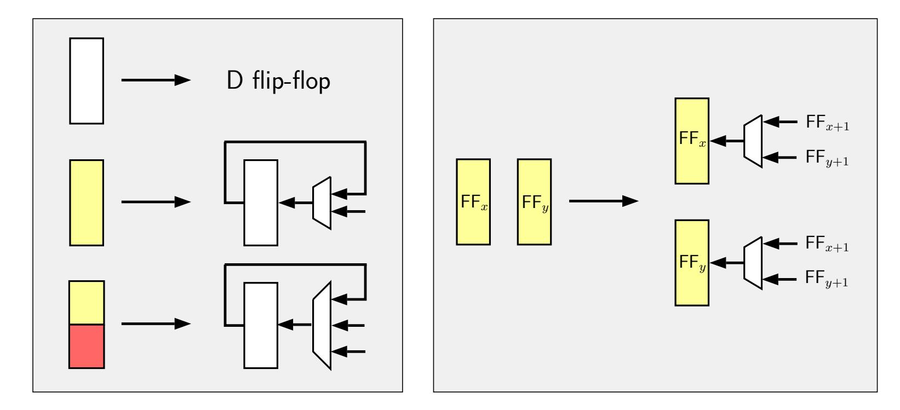

Figure 1: The color legend for interpreting circuit figures. White boxes denote a regular D flip-flop, a single-colored box is used for 2-input scan flip-flop and an *n*-color flip-flop denotes an (*n* + 1)-input flip-flop. Two boxes that share a color mean that they are interconnected and therefore they can swap their input bits.

<span id="page-8-0"></span><sup>3</sup>The indexing might come as counter intuitive at the first sight. However, if we load the bit sequence *b*0, *b*1, . . . , *bn*−<sup>1</sup> to the pipeline in given order, after *n* shift calls, each FF*<sup>i</sup>* stores exactly *bi*.

{9}------------------------------------------------

# <span id="page-9-0"></span>**3 Generic Approach**

An SPN-based block cipher generally consists of three layers of operation in a round: key addition, substitution and a linear operation. The linear layer is often a combination of a permutation function and a matrix multiplication. For example in AES, the permutation function is the ShiftRows operation and matrix multiplication is done by the MixColumns operation. In the context of lightweight circuits, we can further classify these operations into 2 broad classes: (1) swap-based and (2) replacement-based. In AES, for example, the SubBytes and MixColumns operations can be seen as replacement-based operations, since they take a finite portion of the AES state and replace them with new data block of equal length. ShiftRows can be seen as a swap-based operation because it essentially swaps some bits at two different locations of the state vector. Our technique, for implementing an SPN-based block cipher, then consists of finding a good and short sequence of swap operations that corresponds to the swap-based operation, and interleave them with the replacement-based operations.

In particular, let us look at AES as an example. At the byte level, the ShiftRows is a permutation over the set [0*,* 15] which can be formulated as

$$(1, 13, 9, 5) \circ (2, 10) \circ (6, 14) \circ (3, 7, 11, 15)$$

Given that the AES byte order is *b*0*, b*1*, . . . , b*15, the above notation means that after ShiftRows, *b*<sup>1</sup> is moved to location 13, *b*<sup>13</sup> is moved to location 9 etc. Note that each of the *k*-cycles correspond to a particular row of the AES state and they commute with each other, so the order of their execution is irrelevant. The above expression can be decomposed further as

$$[(9,13)\circ(5,9)\circ(1,5)]\circ(2,10)\circ(6,14)\circ[(11,15)\circ(7,15)\circ(3,15)]$$

What does this tell us? First is that, since for all the swaps (*x, y*) listed above, we have *y* − *x* ≡ 0 (mod 4), so the permutation is special and of type 4 as per the definition by Banik et al. [\[BBRV20,](#page-35-8) Definition 1].

Let us turn our attention to the first 4-cycle which decomposes as (9*,* 13) ◦ (5*,* 9) ◦ (1*,* 5) (note that these swaps no longer commute). We will show how to implement this 4-cycle in 16 clock intervals. Let us choose to implement the (11*,* 15) swap in the circuit for this purpose, for which we place scan-flip-flop-based byte registers in locations 10 and 14 as shown in Figure [2.](#page-10-0) The only reason we chose these locations was that they are 4 places apart. Later it would be easy to see that we could have chosen any 2 locations (*x, x* + 4) for this purpose.

The first task is to execute (1*,* 5). We do the rotate operation, denoted by *r*, a total of 6 times on the circuit, and so that bits arrive to positions shown in Figure [2\(](#page-10-0)b). We now invoke the scan functionality so that in the next cycle bytes 1, 5 would be in positions 10 and 14 as shown in Figure [2\(](#page-10-0)c). Note that in doing so we effectively execute the permutation *θ* = *r* ◦ (11*,* 15). The next swap to be executed is (5*,* 9), which corresponds to *b*<sup>1</sup> ↔ *b*<sup>9</sup> in the current state. By rotating 3 more times, we reach to the state in Figure [2\(](#page-10-0)d), where the bytes *b*1, *b*<sup>9</sup> are in place to be swapped in the next cycle. After executing *θ* at this point, we reach to the state in Figure [2\(](#page-10-0)e). The final swap to be performed is (9*,* 13), which as per the previous logic is swapping bytes *b*<sup>1</sup> ↔ *b*13. Again it is easy to see that performing *θ* ◦ *r* <sup>3</sup> over the next 4 cycles gives us the position in Figure [2\(](#page-10-0)g), where all the bytes have now been swapped as required. We perform the rotate operation once more to get the position in Figure [2\(](#page-10-0)h), where all bytes are back to the original position and the ShiftRows operation has been executed on the 1st row. In effect the permutation we performed is *r* ◦ *θ* ◦ *r* <sup>3</sup> ◦ *θ* ◦ *r* <sup>3</sup> ◦ *θ* ◦ *r* 6 , which takes 16 cycles. Note that if we had chosen any other swap location of the form (*x, x* + 4), it would still be possible to do the above sequence of operations. For example if we had chosen the swap (9*,* 13) instead of (11*,* 15),

{10}------------------------------------------------

<span id="page-10-0"></span>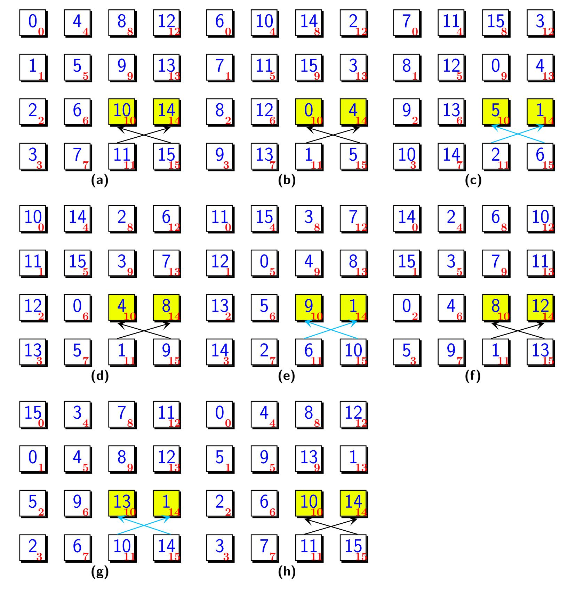

Figure 2: The contents of pipeline (a) initially, (b) after  $r^6$ , (c) after  $\theta \circ r^6$ , (d) after  $r^3 \circ \theta \circ r^6$ , (e) after  $\theta \circ r^3 \circ \theta \circ r^6$ , (f) after  $r^3 \circ \theta \circ r^3 \circ \theta \circ r^6$ , (g) after  $\theta \circ r^3 \circ \theta \circ r^3 \circ \theta \circ r^6$ , (g) finally after  $r \circ \theta \circ r^3 \circ \theta \circ r^3 \circ \theta \circ r^6$ . Note the numbers in blue denote the byte index, i.e corresponds to  $b_i$ , and the subscripts in red denote the fixed register positions. As explained in Figure 1, the yellow boxes denote the byte registers implemented with scan flip-flops. Cyan and black arrows denote whether the operation  $\theta$  or r is executed respectively.

{11}------------------------------------------------

we would need to execute  $\theta' \circ r^3 \circ \theta' \circ r^3 \circ \theta' \circ r^8$ , where  $\theta' = r \circ (9, 13)$ . This already takes 17 cycles and so all the bytes will be indeed swapped correctly, but not return to their original positions as before. Conceptually this means that if the AES round is executed in 16 cycles, then a few of the swap operations of the current round would take place in the next round, and we would have to tailor the other operations in the pipeline accordingly.

Following the same logic, let us now try to do the swaps  $(2, 10) \circ (6, 14)$  of the next row. This time, let us choose two swap locations 8 places apart, in particular (5, 13). The above swaps commute and so can be done in any order, so let us do (2, 6) first. After  $r^{13}$ , the bytes  $b_2$ ,  $b_6$  are in place for swapping, and in the next cycle we execute the scan functionality to perform  $\alpha = r \circ (5, 13)$ . After 3 more cycles of r, the bytes  $b_6$ ,  $b_{14}$  are in place, and then we execute  $\alpha$  again. Thus by executing  $\alpha \circ r^3 \circ \alpha \circ r^{13}$ , we have again already spent 18 cycles. As explained before, this indicates that at this point, the bytes have again been correctly swapped in terms of their relative order in the pipeline and that in terms of data flow in the circuit, some of the swaps of the current AES round overflow into the next round.

The third set of swaps for the final row is  $(11,15) \circ (7,15) \circ (3,15)$ . We can construct this sequence with 3 different swap locations also at distances 4, 8 and 12 apart. Let us choose the swaps (11,15), (5,13) as before and (2,14) as the additional swap location. We have to execute (3,15) first, therefore we rotate once to bring the bytes  $b_3$  and  $b_{15}$  in place and then execute  $\beta = r \circ (2,14)$ . We will now use the swap locations (11,15), (5,13), which have already been used to do swaps in the previous 2 rows. At this point  $b_7$  and after the previous swap  $b_3$  are already in place and so we execute  $\alpha$  on the location (5,13) by invoking its scan functionality. For the last remaining swap (11,15), we have to wait till  $b_{11}$  returns to location 11, which requires 13 more rotations after which we can invoke  $\theta$ .

Putting it together. We have just put together a set of swap sequences that enable the execution of the AES ShiftRows operation. We looked at each row separately and so it is conceivable that the swap sequences be performed one after the other, thereby requiring a little over 48 cycles. But in the interest of latency, we wish to do them in 16 and if required within a few cycles of the next round. Since the k-cycles in each row that we executed commute with each other, the swaps can actually be executed concurrently. That is, following the above example, we

- 1. invoke scan functionality on the swap location (2, 14) at clock cycle 1 (assuming we start with cycle 0);
- 2. invoke scan functionality on the swap location (5, 13) at clock cycles 2, 13, 17;
- 3. invoke scan functionality on the swap location (11, 15) at cycle 6, 10, 14, 16.

The point is that since the k-cycles commute, we execute the swaps concurrently on the given locations in 18 continuous cycles (numbered 0 to 17) and still achieve the ShiftRows functionality (this roughly follows from [BBRV20, Lemma 7]). Indeed it is a matter of a simple arithmetic exercise to see that the arrangement of bytes obtained after executing the above sequence of swaps concurrently in 18 cycles results in ShiftRows off by 2 extra rotations.

We have seen that we can execute AES ShiftRows and more generally any permutation of type 4, by judiciously choosing swap locations at distances 4, 8, 12 and tailoring the swap sequences around it. What about the other operations like SubBytes and MixColumns? That is where the engineering challenge lies. Since these are substitution type operations, they have to be accommodated in the pipeline preferably when the scan functionalities of the registers are not being invoked. There are of course precedence issues a designer would have to deal with, for example, the SubBytes and ShiftRows in any round must precede the MixColumns. Can this technique be applied to other block ciphers in general? For block ciphers that employ some kind of byte/nibble/word-based swap operations in their

{12}------------------------------------------------

permutation function, the answer is affirmative. For example, SKINNY has a permutation function given by

$$(4, 5, 6, 7) \circ (9, 11) \circ (8, 10) \circ (12, 15, 14, 13).$$

This is a permutation of type 1, and has a similar form with AES, so it takes modest effort to construct it using swaps, in the same fashion explained above. For block ciphers such as GIFT that employ bit-based permutation function, the technique becomes slightly more involved.

**From byte to bit-serial.** When we reduce the datapath to 1 bit, we can no longer swap 2 bytes in one cycle and it would take exactly 8 cycles for every byte swap. At the bit level, ShiftRows of AES is essentially the composition of the following permutations over the set [0, 127] for all  $k \in [0, 7]$ :

```
(8+k, 104+k, 72+k, 40+k) \circ (16+k, 80+k) \circ (48+k, 112+k) \circ (24+k, 56+k, 88+k, 120+k)
```

As it can be seen from this expansion, at the bit level, everything scales by a factor of 8. At the byte level, we used the sequence  $r \circ \theta \circ r^3 \circ \theta \circ r^3 \circ \theta \circ r^6$  to execute 4-cycle (1,13,9,5) with the swap located at (11,15). At the bit level, let us choose the swap locations (88,120), located 32 places apart. Using the same logic as before, it is easy to see that  $r^8 \circ \theta_1^8 \circ r^{24} \circ \theta_1^8 \circ r^{48}$  can realize  $\bigcup_{k=0}^7 (8+k,104+k,72+k,40+k)$ , where  $\theta_1 = (88,120) \circ r$  (with  $\bigcup$  denoting the composition operation). Similarly by choosing swap locations that are 64 and 96 places apart, we can permute the other rows using the same multiplicity by 8 principle. Similarly the SKINNY permutations can be designed for the bit-serial datapath with swap locations 8, 16 and 24 places apart.

# <span id="page-12-0"></span>4 AES

For the rest of this section, we assume familiarity with the round function and the key scheduling algorithms of AES [NIS01]. Our circuit simply consists of the following circuits in the main hierarchy: (1) a state pipeline, (2) a key pipeline, (3) a controller, (4) a shared S-box.

### 4.1 State Pipeline

The state in our design uses the following components/techniques:

- nibble-level MixColumns circuit introduced by Jean et al. [JMPS17],
- the smallest known AES S-box "bonus" from Maximov and Ekdahl [ME19].

Given that state and key bits are stored in a pipelined fashion, one can easily notice that AddRoundKey can be performed without much hassle as long as each of the state and key pipelines produces the correct bit per clock cycle. Hence, the main challenges on the state pipeline part is to (1) execute all SubBytes, ShiftRows, MixColumns operations simultaneously, (2) complete the operations in 128 clock cycles, while (3) following the standard ordering of bits for the plaintext and the key. Below, we first describe each layer separately, and show how we can fuse them into one operation that executes over the state pipeline continuously.

#### <span id="page-12-1"></span>4.2 ShiftRows with Swaps

Assume that the 128-bit pipeline is defined in the same fashion as in Section 2, i.e. the bits are loaded into  $FF_{127}$  and they are flushed out by  $FF_0$ . We use three swap operations to execute the ShiftRows layer: (80, 112), (56, 120) and (25, 121). The timetable for scheduling

{13}------------------------------------------------

<span id="page-13-1"></span>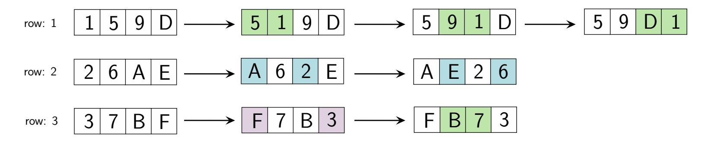

Figure 3: The transition diagram for rows 1, 2, 3; where the colored cells denote the recently modified values. Note that there are three distinct swap operations, with distance 0, 1 and 2 cells in-between.

these swaps are given in Table [5.](#page-13-0) Below, we explain how we came up with these swap sequences and the mechanism in which they work for shifting rows correctly.

For simplicity, let us forget about the pipeline and shift operations for the moment, and focus on the nature of ShiftRows in the 16-byte state. We try to express ShiftRows in terms of byte swaps. Suppose that the values contained in the state are the hexadecimal characters 0*,* 1*, . . . ,* F. Considering the standard byte arrangement for loading the initial data [\[NIS01\]](#page-37-5), row 0 contains the values 0*,* 4*,* 8*,* C; row 1 contains the values 1*,* 5*,* 9*,* D etc. We then devise a sequence of swap operations over the rows 1, 2, 3 to perform ShiftRows. Our three distinct swaps are denoted with distinct colors in Figure [3.](#page-13-1) This figure shows the movement of the bytes as they arrive to their final position implied by ShiftRows.

We point out two important observations: (1) each byte-swap operation can be executed by a bit-swap circuit through 8 consecutive calls interleaved by shift operations, (2) the swap operations denoted with the same color can actually be executed by a single swap operation as long as it is enabled in the correct clock cycle. Therefore, the choice of swaps and the timetable in Table [5](#page-13-0) are straightforward extensions of this example into the 128-bit state pipeline.

<span id="page-13-0"></span>

| pipeline | operation      | active cycles                              |
|----------|----------------|--------------------------------------------|
| state    | swap (80, 112) | [56, 64) ∪ [88, 96) ∪ [120, 127] ∪ [8, 16) |
|          | swap (56, 120) | [88, 96) ∪ [120, 127] ∪ [0, 8)             |
|          | swap (25, 121) | {127} ∪ [0, 6]                             |
|          | load S-box     | {8k + 7 : k ∈ [0, 15]}                     |
|          | load Mix Col.  | [32, 40) ∪ [64, 72) ∪ [96, 104) ∪ [0, 8)   |
| key      | swap (96, 128) | [0, 8)                                     |
|          | swap (40, 72)  | [56, 64)                                   |
|          | load S-box     | {112} ∪ {120} ∪ {0} ∪ {8}                  |
|          | key XOR        | [0, 96)                                    |
|          | add RC         | (lookup table)                             |

Table 5: The timetable of operations for bit-serial AES encryption.

To help understand how the structure helps perform the ShiftRows operation, we note that since the pipeline is always active, the shift operation is performed in every clock cycle. To additionally perform the swap 80 ↔ 112, in any clock cycle, we need to place scan flip-flops at locations 79 and 111 (and wire the output of 80 to the input of 111; wire the output of 112 to the input of 79) as is shown in Figure [4.](#page-15-0) So assuming that the bits indexed 0 to 127 enter the pipelines through the location 127, at clock cycle *k* ≤ 127, the pipeline stores exactly *k* bits. For instance, in the 56-th clock cycle, the bits indexed 8, 40 are at locations 80, 112 respectively. Enabling swaps for cycles 56 to 63 therefore swaps bits 8*, . . . ,* 15 with 40*, . . . ,* 47, which are essentially bytes indexed by 1 and 5. It can be

{14}------------------------------------------------

verified without difficulty that performing the same swap in cycles [88,96) actually swaps bytes 1 and 9. This exactly follows the explanation in Section 3 using (80,112) as swap locations instead of (88,120). Similarly the same swap in cycles [120,127) swaps bytes 1 with 13, which completes the ShiftRows operation on row 1. It is not too difficult to verify that the other swaps at cycles as listed in Table 3 faithfully perform the remaining ShiftRows operations.

### 4.3 The Nibble MixColumns

The nibble MixColumns was introduced by Jean et al. [JMPS17]. The multiplication over a single column is completed over 8 clock cycles, updating each nibble at a time. To simplify, we first represent a single column of bytes as 8 vertical nibble vectors as below. Namely, from the pipeline given in Figure 4, the vectors  $M_i$  are defined for  $0 \le i \le 7$  as below:

$$M_i := \begin{bmatrix} \mathsf{FF}_i \\ \mathsf{FF}_{i+8} \\ \mathsf{FF}_{i+16} \\ \mathsf{FF}_{i+24} \end{bmatrix} \qquad \qquad \mathcal{R}(M_0) := \begin{bmatrix} \mathsf{FF}_8 \\ \mathsf{FF}_{16} \\ \mathsf{FF}_{24} \\ \mathsf{FF}_0 \end{bmatrix}$$

The nibble MixColumns architecture employs an additional set of 4 flip-flops to help with the serialized computation of this functionality. Define the vector  $M_8$  to denote this additional internal 4-bit storage this architecture employs. During its 8 clock cycle operation, these flip-flops are used to keep the value of the leftmost bit of each one of the four bytes. We define a function upward rotation  $\mathcal{R}$  that rotates the elements in a given vertical matrix by one position, as exemplified above. The circuit essentially performs the following sequence of operations to derive the new value of  $M_i$  for each  $i = 0, 1, \ldots, 7$ , starting from i = 0 respectively:

- if i = 0, store  $M_8 \leftarrow M_0$  before any of the following computation,
- update  $M_i \leftarrow \mathcal{R}(M_i) \oplus \mathcal{R}^2(M_i) \oplus \mathcal{R}^3(M_i) \oplus M_{i+1} \oplus \mathcal{R}(M_{i+1})$ ,
- if  $i \in \{3,4,6\}$ , further update  $M_i \leftarrow M_i \oplus M_8 \oplus \mathcal{R}(M_8)$ .

In other words, at each clock cycle, based on the internal 7-bit counter, we can execute a single slice of the previous computation. In total, it takes 8 clock cycles for a single column, and 32 clock cycles for the whole MixColumns layer. This serial circuit can be realized with 8 XOR, 8 NAND gates and 4 flip-flops (see Figure 1 of [JMPS17]).

#### 4.4 Combined State Pipeline

In the controller, the circuit contains an 11-bit counter to keep both the round (4-bit) and the phase (7-bit). We split this counter into two parts and refer to them respectively by variables  $0 \le \text{round} \le 10$  for the upper 4-bit and  $0 \le \text{count} \le 127$  for the lower 7-bit.

In contrast to previous work [JMPS17], we follow the standard ordering of bits in our implementation. That is given a plaintext and a key, the bits are loaded into the circuit starting from the leftmost bits, and following the natural order [NIS01]. This becomes a crucial aspect of a block cipher implementation, if it is meant to be used in a mode of operation that needs to comply with a fixed standard.

At the beginning of its operation, the 11-bit counter is reset to zero. During initialization, i.e. round = 0, the white-colored MUXes in Figure 4 are configured so that the next bit s of the state is received from the input port PT but after the XOR is performed with KEY, which is also being loaded at the same time. For round > 0, we select the state bit to be loaded from the exit of the state pipeline.

{15}------------------------------------------------

<span id="page-15-0"></span>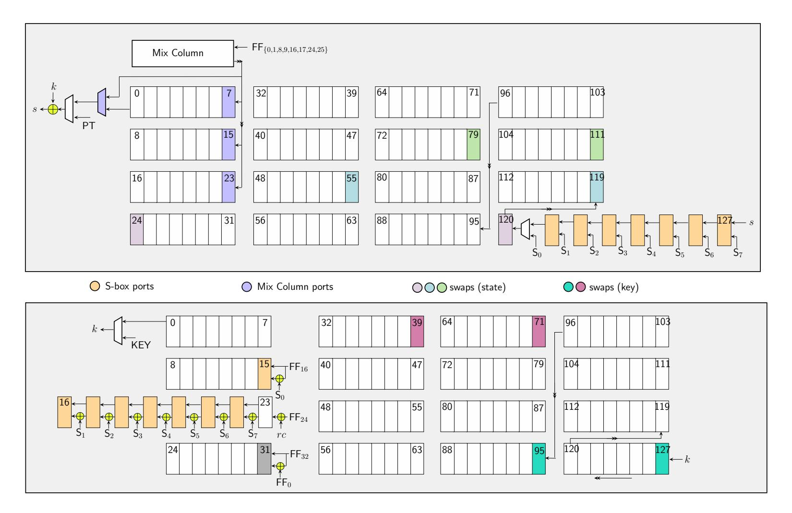

Figure 4: The state (above) and key (below) pipelines of AES-128 encryption with colored scan flip-flops. S-box output ports are denoted with  $S_0||S_1||...||S_7$ .

**SubBytes.** Meanwhile, we proceed with executing the SubBytes layer, by enabling the S-box at every 8-th cycle. More precisely, the S-box is configured to take  $\mathsf{FF}_{121}, \mathsf{FF}_{122}, \ldots, \mathsf{FF}_{127}$  and s as input, and the scan flip-flops  $\mathsf{FF}_{120}, \ldots, \mathsf{FF}_{127}$  are instructed to load the output from the S-box if **count** mod s = 7.

ShiftRows. Starting from count = 56, the swap operations become active. Many of the bits need to make a couple of jumps before they are located into their ultimate positions implied by ShiftRows, as demonstrated in Figure 3. Hence, position-wise, many bits are incorrectly located and look garbled as they pass through flip-flops  $\mathsf{FF}_{24}, \ldots, \mathsf{FF}_{120}$ . Nonetheless, as soon as they exit the last swap position  $\mathsf{FF}_{24}$ , they are guaranteed to be in their final position. See Table 5 to notice that the last swap operation executed on a layer actually happens when count = 15 in the next round. In other words, performing ShiftRows over the *i*-th state uses the last 72 cycles of the round *i* and the first 16 cycles of the round i+1, and it is not aligned with the counter round itself.

**MixColumns.** The input ports to the nibble MixColumns circuit are flip-flops  $\mathsf{FF}_i$  for  $i \in \{0, 1, 8, 9, 16, 17, 24, 25\}$ , and the output ports are input to the exit MUX of the pipeline and  $\mathsf{FF}_7, \mathsf{FF}_{15}, \mathsf{FF}_{23}$  respectively. The MixColumns of round i is performed at round  $i \in i+1$  and it is active during  $0 \leq \mathsf{count} \mod 32 \leq 7$ , except the last round where MixColumns must be skipped.

**Resolving overlaps.** Note that there are two clock cycles, i.e. count values, during which two operations modify the same FF simultaneously in Table 5. First, at clock cycle 127 both S-box and swap (25, 121) attempts to overwrite  $FF_{120}$ . Here, the operation precedence is given to the S-box (as SubBytes comes before ShiftRows), meaning that the leftmost output bit of the S-box is fed to the swap operation (instead of  $FF_{120}$ ). A second overlap occurs when count = 3, as MixColumns circuit attempts to read  $FF_{25}$  before its value is updated correctly by the swap (25, 121). Here, the precedence is given to the swap operations, meaning that the output of the swap operation is fed as input to MixColumns

{16}------------------------------------------------

circuit (instead of  $FF_{25}$ ).

#### 4.5 Key Pipeline

Suppose that  $K_0, K_1, \ldots, K_{15}$  represent the key bytes of a particular round. Then the next round key sequence  $K_{16}, \ldots, K_{31}$  is computed as follows:

$$\begin{bmatrix} K_{16} & K_{20} & K_{24} & K_{28} \\ K_{17} & K_{21} & K_{25} & K_{29} \\ K_{18} & K_{22} & K_{26} & K_{30} \\ K_{19} & K_{23} & K_{27} & K_{31} \end{bmatrix} \leftarrow \begin{bmatrix} K_{0} & K_{4} & K_{8} & K_{12} \\ K_{1} & K_{5} & K_{9} & K_{13} \\ K_{2} & K_{6} & K_{10} & K_{14} \\ K_{3} & K_{7} & K_{11} & K_{15} \end{bmatrix} \oplus \begin{bmatrix} \mathsf{S}(K_{13}) \oplus \mathsf{RC} & K_{16} & K_{20} & K_{24} \\ \mathsf{S}(K_{14}) & K_{17} & K_{21} & K_{25} \\ \mathsf{S}(K_{15}) & K_{18} & K_{22} & K_{26} \\ \mathsf{S}(K_{12}) & K_{19} & K_{23} & K_{27} \end{bmatrix}$$

where RC denotes the round constant byte.

In summary, the first column requires special treatment, because it involves S-box calls, and the remaining three columns can be updated smoothly (by simply XORing with a neighboring bytes). In particular, one can notice the disarrangement in the update of the first column, as it takes the current last columns bytes with a downward rotation (by one byte). If we implement this in a straightforward fashion by updating each byte when they arrive to position 0, we would have to choose the input of the S-box either from the position 13 (for computing  $K_{16}$ ,  $K_{17}$ ,  $K_{18}$ ) or 9 (for computing  $K_{19}$ ). This means that we would have to put an extra 8-bit MUX to choose which value needs to be fed to the S-box. Instead, we decided to temporarily move the byte  $K_{12}$  to position 13 before it is fed to S-box, and then return back to its original position after the S-box operation is done. Therefore the pipeline performs the following operations in sequence:

- In the first 8 clock cycles, we activate the swap (96, 128) so that the key byte  $K_{12}$  is temporarily moved such that it comes after  $K_{15}$ . Here,  $\mathsf{FF}_{128}$  actually refers to the new key bit that is about to be loaded into the key pipeline. With this operation, the key pipeline contains  $K_{13}$ ,  $K_{14}$ ,  $K_{15}$ ,  $K_{12}$ , in given order. Hence, it respects the order they are being used to update the first key column.
- In clock cycles 112, 120 (of the current round) and 0, 8 (of the next round); the S-box is used by the key pipeline. During these cycles, the S-box reads  $K_{13}$ ,  $K_{14}$ ,  $K_{15}$ ,  $K_{12}$  from  $\mathsf{FF}_{120},\ldots,\mathsf{FF}_{127}$  in given order. The output from the S-box is XORed with  $\mathsf{FF}_{16},\ldots,\mathsf{FF}_{23}$  and the result is loaded into  $\mathsf{FF}_{15},\ldots,\mathsf{FF}_{22}$ .
- The round constant is added as the bit  $\mathsf{FF}_{24}$  is loaded into  $\mathsf{FF}_{23}$ . We use a lookup table to decide when the round constant bit is enabled. In total, this bit is enabled 16 times during the whole encryption.
- During the clock cycles [56, 64), we activate the swap (40, 72) to return  $K_{12}$  back to its original relative position. Hence the internal ordering of the bytes becomes  $K_{12}$ ,  $K_{13}$ ,  $K_{14}$ ,  $K_{15}$  again.
- For the rest of the key bits, we handle the key scheduling by activating  $\mathsf{FF}_{31} \leftarrow \mathsf{FF}_0 \oplus \mathsf{FF}_{32}$  during the clock cycles [0,96).

Table 6 tabulates the synthesis results for this AES circuit under 5 different standard cell libraries.

### <span id="page-16-0"></span>4.6 8-bit Datapath

As already stated, there are several implementations of AES with a byte-serial datapath that can execute one AES round in 21 cycles [MPL<sup>+</sup>11, BBR16]. Since it is not possible to implement the circuit in less than 20 cycles if the number of S-boxes is limited to one, this represents a close-to-optimal latency for this datapath. However, note that these two circuits adopt a non-standard, row first arrangement of bytes. One of our goals therefore

{17}------------------------------------------------

<span id="page-17-1"></span>

| Library       | Area      |      | Power (µW) |       | Latency (cycles) | Energy       | Throughput |
|---------------|-----------|------|------------|-------|------------------|--------------|------------|
|               | (µm2<br>) | (GE) | @ 10 MHz   | round | total            | (nJ/128-bit) | (Mbit/s)   |
|               |           |      | 1-bit      |       |                  |              |            |
| STM 90 nm     | 5562.6    | 1267 | 73.6       | 128   | 1408             | 10.4         | 13.44      |
| UMC 90 nm     | 5016.8    | 1600 | 65.2       | 128   | 1408             | 9.2          | 12.53      |
| TSMC 90 nm    | 4692.2    | 1663 | 56.1       | 128   | 1408             | 7.9          | 14.50      |
| NanGate 15 nm | 441.8     | 2247 | 18.4       | 128   | 1408             | 2.6          | 293.89     |
| NanGate 45 nm | 1575      | 1974 | 143        | 128   | 1408             | 20.1         | 45.87      |
|               |           |      | 8-bit      |       |                  |              |            |
| STM 90 nm     | 7838.0    | 1785 | 104.5      | 16    | 176              | 1.84         | 112.96     |
| UMC 90 nm     | 6917.2    | 2206 | 85.6       | 16    | 176              | 1.51         | 115.60     |
| TSMC 90 nm    | 6361.0.2  | 2256 | 68.9       | 16    | 176              | 1.21         | 121.89     |
| NanGate 15 nm | 564.2     | 2870 | 23.1       | 16    | 176              | 0.42         | 2160.68    |
| NanGate 45 nm | 2022.9    | 2535 | 192.4      | 16    | 176              | 3.38         | 376.94     |

Table 6: Synthesis figures for the AES-128 encryption-only circuits.

was to design a circuit that uses standard byte ordering. Since there already exists a 21-cycles-per-round circuit that achieves close to optimal latency, we did not attempt to design one that also achieves 20 cycles per round. Instead, we focus on an implementation that closely matches our bit-serial circuit, and achieves one round in 16 cycles, by using 2 S-box circuits[4](#page-17-2) .

Since this circuit closely resembles the bit-serial circuit, all the calculations of swap locations and the time intervals when the swap functionality is invoked basically scale by a factor of 8. It is best to summarize it using the following salient points:

- The circuit has 32 byte-registers Reg<sup>0</sup> to Reg<sup>15</sup> and Key<sup>0</sup> to Key15, and we use the following swap operations to implement ShiftRows: **(a)** (9*,* 13) in cycles 7, 11, 15, 0, **(b)** (6*,* 14) in cycles 11, 15, 0, and **(c)** (2*,* 14) in cycle 0.
- We use a {0*,* 1} <sup>32</sup> → {0*,* 1} <sup>32</sup> MixColumns circuit for this implementation. We chose to use the MixColumns implementation with 92 XOR gates from Maximov [\[Max19\]](#page-37-7), which has the lowest gate count known in the literature. The operation is performed in cycles 0, 4, 8, 12. The inputs are taken from the byte registers in the first column and written in registers 1, 2, 3, 15 in the order from MSB to LSB. This closely resembles the bit-serial circuit.
- The key addition and S-box are done in every cycle.
- The key pipeline uses the swaps (11*,* 15) in cycle 0 and (4*,* 8) in cycle 7. The column addition in the key update is done by calculating Key<sup>3</sup> ← Key0⊕ Key4, in cycles 0 to 11.

Table [6](#page-17-1) tabulates the synthesis results for the 8-bit circuit for the same 5 different standard cell libraries.

# <span id="page-17-0"></span>**5 SKINNY**

SKINNY provides six different variants [\[BJK](#page-35-10)<sup>+</sup>16]. In this paper, we consider the variants that are used by NIST LWC candidates, i.e. these are the members with 128-bit block

<span id="page-17-2"></span><sup>4</sup>Note that theoretically, it ought to be possible to implement an AES round in 10 cycles with 2 S-boxes, but we found that it would be difficult to design a pipeline for such a circuit using low gate count. Such implementation would require many multiplexers to arrange the component operations in place and would increase the area significantly.

{18}------------------------------------------------

<span id="page-18-0"></span>

| pipeline      | operation       | active cycles                                                                      |
|---------------|-----------------|------------------------------------------------------------------------------------|
| state         | swap (112, 120) | [112, 120) ∪ [120, 127] ∪ [0, 8) ∪ [64, 72)                                        |
|               | swap (104, 120) | [64, 72) ∪ [88, 96) ∪ [96, 104)                                                    |
|               | swap (96, 120)  | [64, 72)                                                                           |
|               | load S-box      | {8k : k ∈ [0, 15]}                                                                 |
|               | rc addition.    | (lookup table + LFSR)                                                              |
|               | load Mix Col.   | [0, 32)                                                                            |
| tweakey 1,2,3 | swap (56, 120)  | [72, 127] ∪ [0, 8)                                                                 |
|               | swap (48, 56)   | [120, 127]                                                                         |
|               | swap (24, 56)   | [112, 120) ∪ [120, 127] ∪ [0, 8)                                                   |
|               | swap (8, 24)    | [120, 127] ∪ [0, 8) ∪ [24, 32)                                                     |
| tweakey 2     | swap (0, 1)     | [0, 6] ∪ [8, 14] ∪ [16, 22] ∪ [24, 30] ∪ [32, 38] ∪ [40, 46] ∪ [48, 54] ∪ [56, 62] |
|               | LFSR XOR        | {8k : k ∈ [0, 7]}                                                                  |
| tweakey 3     | LFSR (8-bit)    | {8k : k ∈ [0, 7]}                                                                  |

Table 7: The timetable of operations for bit-serial SKINNY-128-384 encryption circuit.

size, as given in Table [1.](#page-1-2) In these variants, the tweakey size is variable, i.e. it can consists of 128*z* bits for *z* = 1*,* 2*,* 3. For the remainder of the paper, we refer to these three versions by SKINNY-128-128, SKINNY-128-256 and SKINNY-128-384 respectively.

SKINNY is quite similar to AES in design, but it employs more lightweight operations for the round function. Prominently, S-box and MixColumns can be realized with much smaller circuitry compared to AES. The round function consists of SubCells, AddConstants, AddRoundTweakey, ShiftRows, MixColumns. For the finer details of these layers, we refer the reader to the original SKINNY paper [\[BJK](#page-35-10)<sup>+</sup>16].

Our design follows a similar architecture to that of AES. The circuit simply consists of the following parts in the main hierarchy: (1) a state pipeline (which includes a dedicated S-box), (2) a key pipeline, (3) a controller. Below, we will explain the 1-bit implementation, and modifying the circuit into 8-bit implementation is quite straightforward.

## **5.1 Combined State Pipeline**

In the controller, the circuit contains an 13-bit counter to keep both the round (6-bit) and the phase (7-bit). We split this counter into two parts and refer to them respectively by variables 0 ≤ round ≤ 56 for the upper 4-bit and 0 ≤ count ≤ 127 for the lower 7-bit.

Because SKINNY is already designed with hardware-friendliness in mind, we load the bits into the circuit starting from the leftmost bits, by following the standard [\[BJK](#page-35-10)<sup>+</sup>16]. In our implementations the key blocks and the plaintext are loaded simultaneously and completed in 128 cycles. This applies to all three versions of SKINNY-128-128, SKINNY-128-256, SKINNY-128-384.

At the beginning of its operation, the 13-bit counter is reset to zero. Then during initialization, i.e. round = 0, the plaintext is loaded through 1-bit input port, and the key is loaded through *z*-bit input port into their respective pipelines without modification. Each tweakey block has its own dedicated input port. These ports are denoted with PT (for plaintext) and KEY1, KEY2, KEY3 for the tweakey. Below, we describe the layers of operations executed on the state pipeline, in an order observed by the incoming bits.

**SubCells.** SubCells layer is executed by enabling the S-box at every 8-th cycle. More precisely, the S-box is configured to read FF120*,* FF121*, . . . ,* FF<sup>127</sup> as input, and the scan flipflops FF119*, . . . ,* FF<sup>126</sup> are instructed to be loaded with the S-box output if count mod 8 = 0.

**AddConstants.** The round constants are added right after the S-box operation. An XOR gate is placed between FF<sup>119</sup> and FF120, and the round constant bit *rc* is added. We

{19}------------------------------------------------

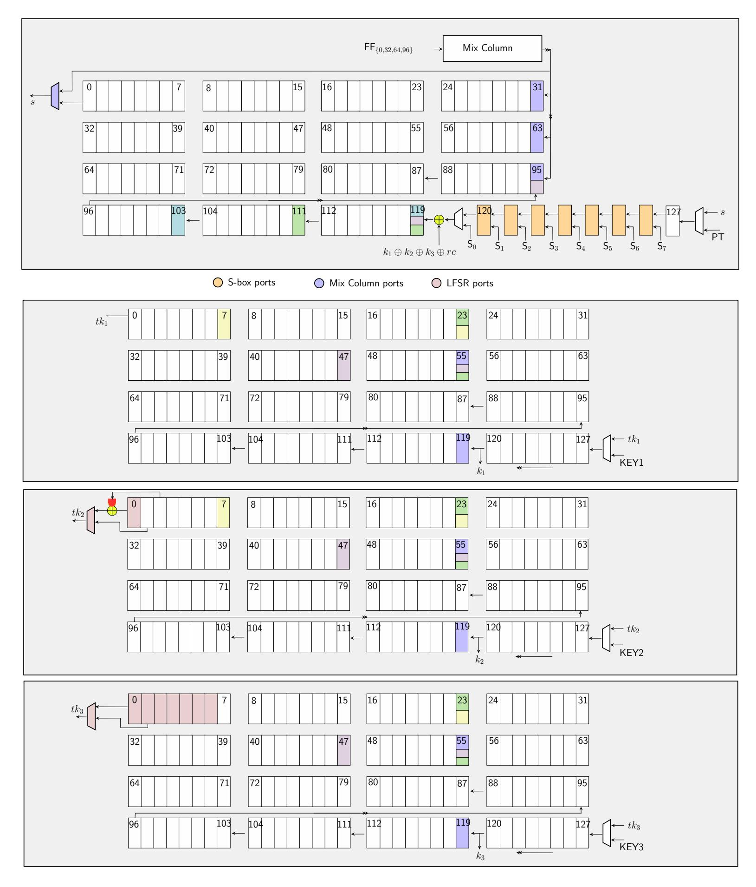

Figure 5: The state (above) and key  $(TK1,\,TK2 \text{ and } TK3 \text{ respectively})$  pipelines of SKINNY encryption.

{20}------------------------------------------------

use a 7-bit LFSR circuit (not shown in the figure) to produce the round constant bit.

AddRoundTweakey. The key bits are added at the same position with the round constant bit, i.e. between  $\mathsf{FF}_{119}$  and  $\mathsf{FF}_{120}$ . In order to synchronize this with the key pipeline, the key bits  $k_0, k_1, k_2$  are read from  $\mathsf{FF}_{120}$  of the key pipeline. The key addition is active during  $8 \leq \mathsf{count} < 72$ . This corresponds to adding the first half of each tweakey.

**ShiftRows.** This layer is executed with 3 swap operations, similar to AES, and the timetable of swaps are given in Table 7. Position-wise, bits are incorrectly located and look garbled as they pass through flip-flops  $\mathsf{FF}_{95}, \ldots, \mathsf{FF}_{119}$ , but as soon as they exit the last swap position  $\mathsf{FF}_{95}$ , they are guaranteed to be in their final position.

**MixColumns.** The input ports to the nibble MixColumns circuit are flip-flops  $\mathsf{FF}_i$  for  $i \in \{0, 32, 64, 96\}$ , and the output ports are input to the exit MUX of the pipeline and  $\mathsf{FF}_{31}, \mathsf{FF}_{63}, \mathsf{FF}_{95}$  respectively. The MixColumns is active during the first 32 clock cycles of a round.

**Resolving overlaps.** Note that during clock cycles  $64 \le \text{count} < 72$  three swaps (112, 120), (104, 120), (96, 120) are active at the same time and overlap at the same flip-flop  $\mathsf{FF}_{120}$ . The order of execution here is (96, 120), (104, 120) and (112, 120) respectively.

### 5.2 Key Pipeline

SKINNY can have up to three blocks of tweakey, referred to as TK1, TK2, TK3 [BJK<sup>+</sup>16]. The key schedule algorithm is quite similar in all three key blocks. More precisely, suppose that  $K_0, K_1, \ldots, K_{15}$  represent the key bytes of a particular tweakey block. Then the next round key sequence  $K_{16}, \ldots, K_{31}$  is computed as follows:

$$\begin{bmatrix} K_{16} & K_{17} & K_{18} & K_{19} \\ K_{20} & K_{21} & K_{22} & K_{23} \\ K_{24} & K_{25} & K_{26} & K_{27} \\ K_{28} & K_{29} & K_{30} & K_{31} \end{bmatrix} \leftarrow \begin{bmatrix} \mathcal{L}_i(K_9) & \mathcal{L}_i(K_{15}) & \mathcal{L}_i(K_8) & \mathcal{L}_i(K_{13}) \\ \mathcal{L}_i(K_{10}) & \mathcal{L}_i(K_{14}) & \mathcal{L}_i(K_{12}) & \mathcal{L}_i(K_{11}) \\ K_0 & K_1 & K_2 & K_3 \\ K_4 & K_5 & K_6 & K_7 \end{bmatrix}$$

where the operation  $\mathcal{L}_i$  are 8-bit permutations given below:

$$\mathcal{L}_{1}(x_{7}||x_{6}||x_{5}||x_{4}||x_{3}||x_{2}||x_{1}||x_{0}) := x_{7}||x_{6}||x_{5}||x_{4}||x_{3}||x_{2}||x_{1}||x_{0}$$

$$\mathcal{L}_{2}(x_{7}||x_{6}||x_{5}||x_{4}||x_{3}||x_{2}||x_{1}||x_{0}) := x_{6}||x_{5}||x_{4}||x_{3}||x_{2}||x_{1}||x_{0}||(x_{7} \oplus x_{5})$$

$$\mathcal{L}_{3}(x_{7}||x_{6}||x_{5}||x_{4}||x_{3}||x_{2}||x_{1}||x_{0}) := (x_{0} \oplus x_{6})||x_{7}||x_{6}||x_{5}||x_{4}||x_{3}||x_{2}||x_{1}$$

Therefore, our key pipelines do the following operations in sequence. First, we swap the first and the last eight bytes by using the swap (56, 120). Then we perform the local byte permutations on the upper half (i.e. the first 8 bytes) of the key through swaps (48, 56), (24, 56), (8, 24). Finally we apply the 8-bit permutation  $\mathcal{L}_2$  through another swap (0, 1) for TK2, and a dedicated 8-bit LFSR circuit for  $\mathcal{L}_3$  in TK3.

The 8-bit implementation is in fact simpler than 1-bit, because circuitry such as LFSR, S-box are already compatible with the datapath size. We only need to add extra gates for swaps, e.g. extend each single swap into byte swap, and duplicate circuit for MixColumns. The timetable is also updated so that each consecutive activity in 8 clock cycles are squeezed into one. Table 8 tabulates the synthesis results for the 1/8-bit circuit for 5 different standard cell libraries.

## <span id="page-20-0"></span>6 GIFT\*

We will be focusing our efforts on the bit-sliced design of the GIFT block cipher, as utilized in the NIST LWC candidates GIFT-COFB and SUNDAE-GIFT [BCI<sup>+</sup>19, BBP<sup>+</sup>19]. We denote it by GIFT\* as it differs from the original construction in the way data bits are

{21}------------------------------------------------

<span id="page-21-0"></span>

| Library         | $Are$ $(\mu m^2)$  | ea<br>(GE) | Power $(\mu W)$ @ 10 MHz | Latency<br>round   | y (cycles)<br>total | Energy (nJ/128-bit) | Throughput (Mbit/s) |
|-----------------|--------------------|------------|--------------------------|--------------------|---------------------|---------------------|---------------------|
|                 | $\frac{(\mu m)}{}$ | (GE)       |                          |                    |                     | (113/120-010)       | (MDIC/S)            |
| CTM 00          | 4607.7             | 1070       | SKINNY-128               |                    |                     | 07.0                | 10.51               |
| STM 90 nm       | 4697.7             | 1070       | 51.47                    | 128                | 5248                | 27.0                | 12.51               |
| UMC 90 nm       | 4249.3             | 1355       | 52.08                    | 128                | 5248                | 27.3                | 10.72               |
| TSMC 90 nm      | 4022.6             | 1425       | 47.12                    | 128                | 5248                | 24.7                | 14.36               |
| NanGate 15 nm   | 391.7              | 1992       | 15.89                    | 128                | 5248                | 8.3                 | 258.45              |
| NanGate 45 nm   | 1394.9             | 1748       | 122.06                   | 128                | 5248                | 64.1                | 38.77               |
| CETA F. O.O.    | <b>X</b> 000 0     | 1000       | SKINNY-128               |                    |                     |                     | <b>=</b> 1.00       |
| STM 90 nm       | 5820.6             | 1326       | 62.44                    | 16                 | 656                 | 4.1                 | 71.02               |
| UMC 90 nm       | 5233.2             | 1669       | 61.38                    | 16                 | 656                 | 4.0                 | 58.52               |
| TSMC 90 nm      | 4812.2             | 1706       | 51.67                    | 16                 | 656                 | 3.4                 | 72.69               |
| NanGate 15 nm   | 453.1              | 2304       | 18.62                    | 16                 | 656                 | 1.2                 | 979.38              |
| NanGate 45 nm   | 1617.8             | 2022       | 146.17                   | 16                 | 656                 | 9.6                 | 209.08              |
|                 |                    |            | SKINNY-128               | 8- <b>256</b> 1-bi |                     |                     |                     |
| STM 90 nm       | 6642.7             | 1513       | 75.30                    | 128                | 6272                | 47.2                | 11.93               |
| UMC 90 nm       | 6043.9             | 1927       | 75.70                    | 128                | 6272                | 47.5                | 10.52               |
| TSMC 90 nm      | 5730.9             | 2030       | 69.25                    | 128                | 6272                | 43.4                | 14.36               |
| NanGate 15 nm   | 561.0              | 2853       | 22.99                    | 128                | 6272                | 14.4                | 232.6               |
| NanGate 45 nm   | 1996.9             | 2502       | 175.28                   | 128                | 6272                | 109.9               | 38.13               |
|                 |                    |            | SKINNY-128               | 8- <b>256</b> 8-bi | t                   |                     |                     |
| STM 90 nm       | 8252.9             | 1880       | 90.47                    | 16                 | 784                 | 7.1                 | 59.64               |
| $UMC \ 90 \ nm$ | 7463.7             | 2380       | 88.64                    | 16                 | 784                 | 6.9                 | 43.27               |
| TSMC 90 nm      | 6864.1             | 2434       | 75.21                    | 16                 | 784                 | 5.9                 | 60.42               |
| NanGate 15 nm   | 658.5              | 3350       | 27.19                    | 16                 | 784                 | 2.1                 | 1033.79             |
| NanGate 45 nm   | 2338.7             | 2923       | 211.66                   | 16                 | 784                 | 16.6                | 166.14              |
|                 |                    |            | SKINNY-128               | 8-384 1-bi         | t                   |                     |                     |
| STM 90 nm       | 8631.5             | 1966       | 99.36                    | 128                | 7296                | 72.5                | 8.25                |
| UMC 90 nm       | 7895.7             | 2518       | 99.73                    | 128                | 7296                | 72.8                | 9.94                |
| TSMC 90 nm      | 7465.2             | 2645       | 91.38                    | 128                | 7296                | 66.7                | 14.82               |
| NanGate 15 nm   | 733.7              | 3732       | 30.22                    | 128                | 7296                | 22.0                | 211.46              |
| NanGate 45 nm   | 2603.6             | 3263       | 229.10                   | 128                | 7296                | 167.2               | 38.77               |
|                 |                    |            | SKINNY-128               | 8-384 8-bi         | t                   |                     |                     |
| STM 90 nm       | 10674.2            | 2431       | 119.60                   | 16                 | 912                 | 10.9                | 50.84               |
| UMC~90~nm       | 9670.6             | 3084       | 116.40                   | 16                 | 912                 | 10.6                | 38.61               |
| TSMC 90 nm      | 8896.9             | 3155       | 99.29                    | 16                 | 912                 | 9.1                 | 68.41               |
| NanGate 15 nm   | 859.5              | 4372       | 35.72                    | 16                 | 912                 | 3.3                 | 744.33              |
| NanGate 45 nm   | 3060.3             | 3825       | 277.45                   | 16                 | 912                 | 25.3                | 143.14              |

Table 8: Synthesis figures for the  ${\sf SKINNY}$  encryption-only circuits.

organized (the implementation of the regular GIFT circuit is given in Appendix A). In this variant, the cipher state is reordered and interpreted as a two-dimensional array, i.e. four 32-bit segments  $S_0, S_1, S_2, S_3$  such that

$$\begin{bmatrix} S_0 \\ S_1 \\ S_2 \\ S_3 \end{bmatrix} = \begin{bmatrix} s_3 & s_7 & \dots & s_{127} \\ s_2 & s_6 & \dots & s_{126} \\ s_1 & s_5 & \dots & s_{125} \\ s_0 & s_4 & \dots & s_{124} \end{bmatrix},$$

where  $s_0s_1...s_{127}$  are the state bits. In this ordering,  $s_3$  becomes the most significant bit of  $S_0$  and  $s_{127}$  becomes its least significant bit. The 4-bit S-box is applied column-wise and the permutation layer consists of four independent row-wise permutations as shown in Table 9.

In contrast, the key state is not reordered and remains unchanged with respect to the

{22}------------------------------------------------

```
Index 31 30 29 28 27 26 25 24 23 22 21 20 19 18 17 16 15 14 13 12 11 10 9 8 7 6 5 4 3 2 1 0 S_0 29 25 21 17 13 9 5 1 30 26 22 18 14 10 6 2 31 27 23 19 15 11 7 3 28 24 20 16 12 8 4 0 S_1 30 26 22 18 14 10 6 2 31 27 23 19 15 11 7 3 28 24 20 16 12 8 4 0 S_2 31 27 23 19 15 11 7 3 28 24 20 16 12 8 4 0 29 25 21 17 13 9 5 1 S_2 31 27 23 19 15 11 7 3 28 24 20 16 12 8 4 0 29 25 21 17 13 9 5 1 30 26 22 18 14 10 6 2 S_3 28 24 20 16 12 8 4 0 29 25 21 17 13 9 5 1 30 26 22 18 14 10 6 2
```

Table 9: Bit-sliced GIFT\* permutation where index 0 is the rightmost bit of a row segment. Following the notation by SUNDAE-GIFT proposal, the bit identified by j moves to the its new position denoted in  $S_i$  after application of the permutation [BBP+19].

regular GIFT\* specification, i.e.

$$\begin{bmatrix} K_0 \mid\mid K_1 \\ K_2 \mid\mid K_3 \\ K_4 \mid\mid K_5 \\ K_6 \mid\mid K_7 \end{bmatrix} = \begin{bmatrix} k_0 & k_1 & \dots & k_{31} \\ k_{32} & k_{33} & \dots & k_{63} \\ k_{64} & k_{65} & \dots & k_{95} \\ k_{96} & k_{97} & \dots & k_{127} \end{bmatrix},$$

where  $k_0k_1...k_{127}$  are the key bits. The key schedule consists of two 16-bit internal rotations and an external rotation that spans the entire state. More specifically,  $K_6$  is rotated 2 positions to right,  $K_7$  is rotated 12 position to the right and the entire key state is rotated concurrently by 32 positions to the right.

$$[K_0, K_1, K_2, K_3, K_4, K_5, K_6, K_7] \leftarrow [K_6 \gg 2, K_7 \gg 12, K_0, K_1, K_2, K_3, K_4, K_5].$$

In each round, 64 bits of the key are mixed into the cipher state as follows

$$S_2 = S_2 \oplus U$$
$$S_1 = S_1 \oplus V,$$

where  $U = K_2 \mid\mid K_3$  and  $V = K_6 \mid\mid K_7$ . Alongside the round keys, in each round there is also a 6-bit  $(c_5, c_4, c_3, c_2, c_1, c_0)$  round constant that is added to the state and updated such that

$$S_3 = S_3 \oplus 0$$
x800000XY,

where  $XY = 00c_5c_4c_3c_2c_1c_0$ .

#### <span id="page-22-2"></span>6.1 1-Bit Datapath

In this section, we present our 1-bit swap-and-rotated GIFT\* architecture in which each round function computation is performed in exactly 128 cycles.

#### <span id="page-22-1"></span>**6.1.1** State Pipeline

The bit-wise nature of both the GIFT\* and GIFT permutation complicates matters in a swap-and-rotate setting, since each state bit needs to be moved to its designated position individually. As a consequence, a simple solution with few swaps as devised for the AES ShiftRows procedure, detailed in Section 4.2 is not achievable.

Nevertheless, the GIFT\* permutation can be partitioned into three layers each can be generated with three separate swaps, thus, in total, we allocate nine swaps.

1. 
$$(FF_{31}, FF_{30}), (FF_{31}, FF_{28}), (FF_{31}, FF_{29}).$$

2. 
$$(FF_{28}, FF_{24}), (FF_{28}, FF_{26}), (FF_{28}, FF_{26}).$$

{23}------------------------------------------------

<span id="page-23-0"></span>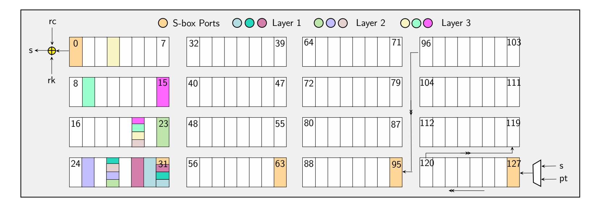

Figure 6: 128-cycle, bit-serial GIFT\* round function implementation using nine swaps.

3. 
$$(FF_{22}, FF_4)$$
,  $(FF_{22}, FF_{10})$ ,  $(FF_{22}, FF_{16})$ .

Due to the column-wise application of the substitution layer in GIFT\*, the S-box ports in the state pipeline are FF<sub>31</sub>, FF<sub>63</sub>, FF<sub>95</sub> and FF<sub>127</sub> which are active during the cycles 96 to 127. A graphical depiction of the GIFT\* state pipeline is given in Figure 6.

#### 6.1.2 Key Pipeline

The bit-sliced interpretation of  $\mathsf{GIFT}^*$  significantly simplifies how the 64-bit round keys are extracted in each round since they are now mixed into a continuous stretch of the cipher state. For this we can assume, without loss of generality, that the master key K is loaded in the following order as to simplify the swapping algorithm.

$$K = \begin{bmatrix} K_0 \mid \mid K_1 \\ K_6 \mid \mid K_7 \\ K_2 \mid \mid K_3 \\ K_4 \mid \mid K_5 \end{bmatrix},$$

In this scenario, the 64-bit round keys  $K_2||K_3||K_6||K_7$  are added to the block cipher states during the cycles 32 to 96.

The swap sequence for the GIFT\* key schedule is partitioned into four phases.

Phase 1 (Rotating the state). We rotate the entire key state by 64 positions to the left. This operation can be achieved with a single swap during 64 active cycles. Preferably, the transformation should occur concurrently with the addition of the round key into the cipher state, i.e. we allocate  $FF_0$  and  $FF_{64}$  to perform the rotation during the cycles 32 to 96.

Phase 2 (Swapping the precedence). To achieve a full emulation of the 96-bit rightward rotation of the key schedule, it is further necessary to swap the precedence of the utilized round key halves, i.e.  $K_2||K_3$  and  $K_6||K_7$ . This again only requires a single swap during 32 cycles and can be performed subsequently to the first phase, hence we allocate  $\mathsf{FF}_0$  and  $\mathsf{FF}_{96}$  for this second phase.

Phase 3 (Rotating  $K_6$ ). This transformation can been seen as a 14-bit leftward rotation that can be achieved by composing three leftward rotations of magnitude 8, 4, and 2. The position and the interval of those three swaps can be chosen relatively freely, as  $K_6||K_7$  is not a part of the current round key, as long as they occur after the second phase has terminated. To simplify the matter, we chose to perform them back-to-back during the cycles 32 and 66. More concretely, the 4-bit rotation is done during the cycles 32 to 44

{24}------------------------------------------------

<span id="page-24-0"></span>

| pipeline | operation      | active cycles                                                        |
|----------|----------------|----------------------------------------------------------------------|
| state    | swap (31, 30)  | {8k + 7 : k ∈ [0, 15]}                                               |
|          | swap (31, 28)  | {8k + 5 : k ∈ [0, 15]} ∪ {8k + 7 : k ∈ [0, 15]}                      |
|          | swap (31, 29)  | {8k + 5 : k ∈ [0, 15]}                                               |
|          | swap (28, 24)  | {0, 1, 42, 43, 50, 51, 58, 59, 66, 67, 104, 105, 112, 113, 120, 121} |
|          | swap (28, 26)  | {6, 7, 10, 11, 14, 15, 18, 19, 22, 23, 26, 27, 30, 31}               |
|          |                | ∪{34, 35, 72, 73, 80, 81, 88, 89, 96, 97}                            |
|          | swap (28, 22)  | {74, 75, 82, 83, 90, 91, 98, 99}                                     |
|          | swap (22, 4)   | {2, 3, 34, 35, 66, 67, 98, 99}                                       |
|          | swap (22, 10)  | {4, 5, 26, 27, 36, 37, 58, 59, 68, 69, 90, 91, 100, 101, 122, 123}   |
|          | swap (22, 16)  | {6, 7, 18, 19, 28, 29, 38, 39, 50, 51, 60, 61, 70, 71}               |
|          |                | ∪{82, 83, 92, 93, 102, 103, 114, 115, 124, 125}                      |
|          | key addition   | [32, 96)                                                             |
|          | rc addition    | (lookup table)                                                       |
|          | load S-box     | [96, 128)                                                            |
| key      | swap (64, 128) | [32, 96)                                                             |
|          | swap (32, 128) | [96, 128]                                                            |
|          | swap (96, 100) | [32, 44)                                                             |
|          | swap (84, 92)  | [44, 52)                                                             |
|          | swap (76, 78)  | [52, 66)                                                             |
|          | swap (96, 100) | [48, 60)                                                             |
|          |                |                                                                      |

Table 10: The timetable of operations for bit-serial GIFT<sup>∗</sup> encryption.

using a swap at register FF<sup>95</sup> and FF99. Subsequently, we perform the 8-bit rotation during cycles 44 to 52 with the registers FF<sup>83</sup> and FF91, followed by the 2-bit rotation during cycles 52 to 66 using the registers FF<sup>75</sup> and FF77.

**Phase 4 (Rotating** *K*7**).** Phase 3 is followed by a 4-bit leftward rotation of *K*<sup>7</sup> that is congruent to the 12-bit rightward rotation of the specification. This necessitates a single swap of size 4 for which we can reuse the same swap as utilized in phase 3, i.e. FF<sup>99</sup> and FF<sup>95</sup> during the cycles 48 to 60.

A summary of both the key schedule and round function swaps is tabulated in Table [10.](#page-24-0)

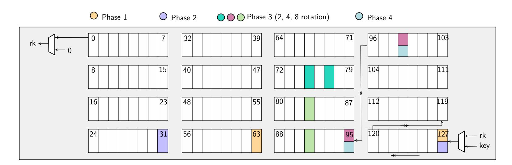

Figure 7: 128-cycle, bit-serial GIFT<sup>∗</sup> key schedule implementation using five swaps.

{25}------------------------------------------------

# **6.2 4-Bit Datapath**

Analogous to the bit-serial implementation presented in the previous section, we now describe the 4-bit-serial architecture that completes execution of a round in 32 clock cycles.

#### **6.2.1 State Pipeline**

The 4-bit state pipeline is unlikely to be achieved by simple swaps and a concurrent rotation as the substitution layer overwrites 4 non-adjacent bits FF31, FF63, FF95, FF<sup>127</sup> (see Figure [6\)](#page-23-0). Then it follows that the swaps performing the permutation must necessarily be placed in the most significant quarter of the state pipeline and each 32-bit row of the state has to be permuted in only 8 cycles. Furthermore since we employed 9 swaps, i.e. 18 scan flip-flops, in the bit-serial construct, we need at the least four times this amount in the 4-bit case . This makes at least 72 MUXed flip-flops which significantly complicates the placement of swaps.

A second difficulty arises due to the fact that the pipeline rotates four positions at a time, thus the S-box taps are not constant but move further down the pipeline with every clock cycle, requiring a significant number of multiplexers to differentiate the different taps.

In order to circumvent those complexities, we chose to equip the entire 128-bit state with scan flip-flops and execute the permutation in the last cycle of the round while using 4 S-boxes in parallel to substitute 16 bits of the state during the cycles 24 to 31. Note that a single GIFT<sup>∗</sup> S-box can be synthesized in fewer than 20 GE, thus the overhead of using four units is marginal and possibly still smaller than using multiplexers for the moving S-box taps.

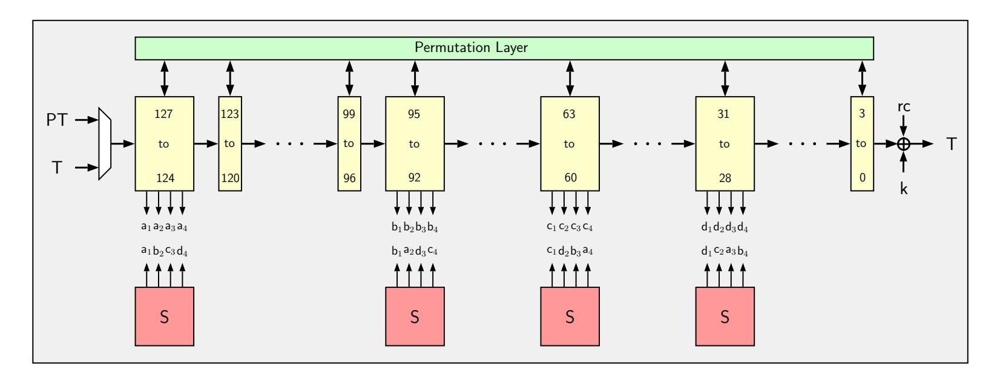

Figure 8: 4-bit GIFT<sup>∗</sup> state pipeline. Registers are marked in yellow.

#### **6.2.2 Key Pipeline**

The 4-bit key pipeline can be seamlessly adapted from the 1-bit counterpart by simply turning the single-bit swaps into nibble swaps, following the generic technique from Section [3.](#page-9-0) As we had 5 swaps in the single-bit version we now have 4 × 5 = 20 swaps, i.e. 40 scan flip-flops. In Table [11,](#page-26-0) we list the synthesis results for our 1-bit and 4-bit GIFT<sup>∗</sup> circuits.

In addition to these encryption circuits, the decryption circuits for all these block ciphers are also easy to construct. Most of the AEAD modes we implement are inversefree, therefore encryption-only circuits are sufficient for these candidates. However for a complete discussion, we present some ideas on decryption in Appendix [B.](#page-38-1)

{26}------------------------------------------------

<span id="page-26-0"></span>

| Library       | Area      |      | Power (µW) |       | Latency (cycles) | Energy       | Throughput |
|---------------|-----------|------|------------|-------|------------------|--------------|------------|
|               | (µm2<br>) | (GE) | @ 10 MHz   | round | total            | (nJ/128-bit) | (Mbit/s)   |
|               |           |      | 1-bit      |       |                  |              |            |
| STM 90 nm     | 4863.5    | 1108 | 48.7       | 128   | 5248             | 25.5         | 9.09       |
| UMC 90 nm     | 4410.8    | 1332 | 49.8       | 128   | 5248             | 26.1         | 9.77       |
| TSMC 90 nm    | 4176.5    | 1480 | 45.1       | 128   | 5248             | 23.7         | 12.51      |
| NanGate 15 nm | 402.3     | 2047 | 15.4       | 128   | 5248             | 8.1          | 178.92     |
| NanGate 45 nm | 1432.1    | 1791 | 122.3      | 128   | 5248             | 64.2         | 29.82      |
|               |           |      | 4-bit      |       |                  |              |            |
| STM 90 nm     | 6280.5    | 1430 | 61.4       | 32    | 1312             | 5.1          | 8.98       |
| UMC 90 nm     | 5779.7    | 1779 | 60.9       | 32    | 1312             | 4.4          | 7.73       |
| TSMC 90 nm    | 5135.6    | 1819 | 50.8       | 32    | 1312             | 4.3          | 9.73       |
| NanGate 15 nm | 481.5     | 2449 | 17.1       | 32    | 1312             | 1.9          | 166.14     |
| NanGate 45 nm | 1704.5    | 2130 | 152.9      | 32    | 1312             | 13.9         | 28.72      |

Table 11: Synthesis figures for 1-bit and 4-bit GIFT<sup>∗</sup> encryption-only circuits.

# **7 AEAD**

As standalone block ciphers are not ready-to-use primitives, and hence they are usually wrapped in a mode of operation. In this section, we investigate four NIST LWC candidates which are bootstrapped via the improved 1-bit (and 4/8-bit) implementations of AES, SKINNY and GIFT<sup>∗</sup> presented in the previous sections. Namely, these candidates are SUNDAE-GIFT, SAEAES, Romulus and SKINNY-AEAD [\[BBP](#page-35-2)<sup>+</sup>19, [NMMaS](#page-37-0)<sup>+</sup>19, [IKMP19,](#page-36-3) [BJK](#page-35-3)<sup>+</sup>19]. For all four schemes, we report the hitherto smallest block-cipher-based authenticated encryption circuits in the literature.

The choice of these four particular candidates in our work is influenced by the observation that the area of a block cipher is determined, to a large extent, by the amount of storage elements, rather than how lightweight the round operations are. This is more evident when one compares SKINNY-128-384, whose round function comprises lightweight operations, to AES, whose S-box and MixColumns circuits are significantly larger. The former is much larger, only because it requires large number of flip-flops to store the key.

Because an authenticated encryption scheme produces a tag besides the ciphertext blocks, it is natural to expect a particular value that is initialized at the beginning and updated repetitively after processing each new block of data. We refer to this value as *the running state*. The running state is eventually used to compute the tag, so that all blocks contribute to its value. From the area perspective, an important question is whether storing the running state requires an extra register or not. For the chosen candidates, the running state is actually not a separate value, but rather it is passed between consecutive encryption calls. In other words, we can use the state register inside the block cipher to keep this value temporarily until the next encryption starts. It is precisely the reduction in the storage area that yields the impressive area results for the four candidates.

In the special case of Romulus, which actually defines six different variants, we decided to implement two members, the primary member N1 and its sibling N3 that is likely to cost the smallest area in ASIC circuit. Romulus-N1 is larger than Romulus-N3, because the latter favors the smaller SKINNY-128-256, while its other nonce-based siblings all use SKINNY-128-384.

Another important detail about our AEAD implementations, which directly concerns the hardware API, is that we assume the padding is done a priori to the AEAD call. In other words, our implementations leave padding task to the caller, and assume that the associated data and message bits are well aligned with the block boundaries. This is in contrast to the CAESAR Hardware API, which assumes the padding as the responsibility of the circuit [\[HDF](#page-36-12)<sup>+</sup>16]. Hence, our reported area figures should be carefully interpreted,

{27}------------------------------------------------

if one happens to compare them with other implementations which contain the padding circuit. AEAD mode of operations generally treat the last, empty or partial blocks specially through some allocated bits in the domain separator. Hence, when assuming that the associated data and message are properly chopped into blocks and passed to the circuit, information lost during the padding must also be passed along. In our lightweight API, we use few input signals to indicate if the current data block must be specially processed, e.g. whether the current data block is the last block of associated data, or a padded block. The input and output ports of our hardware API are defined in the following way and can be scaled for both 1/4/8-bit inputs:

- input\_wire CLK, RST: System clock and active-low reset signals.
- input\_vector KEY, NONCE: Key and nonce ports through which key/nonce are introduced in the circuit in chunks of 1/4/8 bits.
- input\_vector DATA: Unified data port from which both associated data and regular plaintext blocks are loaded into the circuit in chunks of 1/4/8 bits.
- input\_wire EAD, EPT: Single-bit signals that indicate whether there are no associated data blocks (EAD) or no plaintext blocks (EPT). Both signals are supplied with the reset pulse and remain stable throughout the computation.
- input\_wire LBLK, LPRT: Single-bit signals that indicate whether the currently processed block is the last associated data block or the last plaintext block (LBLK), and also whether it is partially filled (LPRT). Both signals are supplied alongside each data block and remain stable until the next block is fed to the circuit.
- output\_wire BRDY, ARDY: Single-bit output signals that indicate whether the circuit has finished processing a data block and a new one can be supplied on the following rising clock edge (BRDY) or the entire AEAD computation has been completed (ARDY).
- output\_wire CRDY, TRDY: Single-bit output signals that indicate whether the CT and TAG ports will have meaningful ciphertext and tag values starting from the following rising clock edge.
- output\_vector CT, TAG: Separate ciphertext and tag ports, via which the output is available in chunks of 1/4/8 bits.

### <span id="page-27-0"></span>**7.1 SUNDAE-GIFT**

The SUNDAE-GIFT AEAD scheme was proposed by Banik et al. and is based on the SUNDAE mode of operation, featuring GIFT<sup>∗</sup> block cipher at its core [\[BBP](#page-35-2)<sup>+</sup>19, [BBLT18\]](#page-35-11). It is a bare-bones construction that does not require any additional registers aside the ones used within the block cipher. After the encryption of the init vector, each data block is mixed into the AEAD state between the encryption calls. A field multiplication over *GF*(2128) is applied after the last associated data has been added to the state. The same multiplication is also performed for the last message block. The multiplication is either ×2 when the last AD or message block has been padded or ×4 whenever the last blocks are complete without any padding. More formally, the multiplication ×2 is encoded as a byte-wise shift and the addition of the most significant byte into other bytes of the state such that if *B*0||*B*1|| *. . .* ||*B*<sup>15</sup> represents the 16 bytes of the intermediate AEAD state (with *B*<sup>0</sup> being the most significant byte), we have that

$$2 \times (B_0||B_1||\dots||B_{15}) = B_1||B_2||\dots|B_{10}||B_{11} \oplus B_0||B_{12}||B_{13} \oplus B_0||B_{14}||B_{15} \oplus B_0||B_0,$$

{28}------------------------------------------------

and  $4 \times (B_0||B_1||\dots||B_{15}) = 2 \times (2 \times (B_0||B_1||\dots||B_{15}))$ . The tag is produced after processing all AD and message blocks and the ciphertext blocks are generated by reprocessing the message blocks afterwards. A schematic of the SUNDAE-GIFT is depicted in Figure 9.

<span id="page-28-1"></span>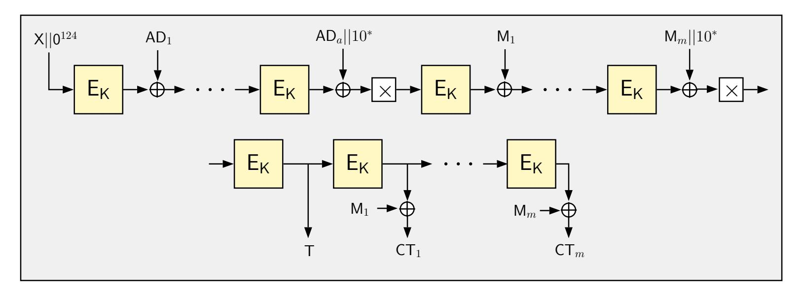

Figure 9: The high-level overview of SUNDAE-GIFT, which depicts the processing of m message and a associated data blocks. X denotes a 4-bit parameter, whose value depends on the length of the nonce and whether there are no AD or message blocks.

The simplicity of SUNDAE-GIFT can be exploited in a bit-serial implementation to attain a circuit with very low overhead in terms of area. In fact, except for the slight increase in the control logic, the sole addition to the GIFT\* circuit presented in Section 6 is the field multiplication.

The multiplier can be achieved with two swaps (one for  $\times 2$ , another for  $\times 4$ ) and one XOR gate. More concretely, we allocate 128 rounds for the multiplication  $\times 2$  and  $\times 4$  during which the block cipher round function and key swaps are disabled. In other words, while the ciphertext bits exit the last round function computation, we swap  $\mathsf{FF}_{120}$  and  $\mathsf{FF}_0$  during the cycles 8 to 127 which rotates the state by 8 positions to the left. Similarly,  $\mathsf{FF}_{112}$  and  $\mathsf{FF}_0$  are swapped during the cycles 16 to 127 in order to execute the 16-bit rotation. Hence, in the worst case, we require  $2 \times 128 = 256$  additional cycles for multiplications. In terms of latency, each new encryption call is loaded with the new plaintext, while the ciphertext bits of the previous computation exit the pipeline. As a consequence the very first encryption operates over  $41 \times 128 = 5248$  cycles, while the remaining encryption each take  $40 \times 128 = 5120$  cycles.

The 1-bit version of SUNDAE-GIFT can seamlessly be amended to a 4-bit datapath design by changing the bit swaps to nibble swaps. After synthesis, the resulting SUNDAE-GIFT architecture is the smallest authenticated encryption circuit at around 1200 GE for the STM 90 nm process, which is only a 8 percent larger compared to the bit-serial GIFT\* implementation presented in Section 6.

### <span id="page-28-0"></span>7.2 SAEAES

The SAEAES AEAD scheme was proposed by Naito et al. [NMMaS<sup>+</sup>19] and uses the AES block cipher as the underlying encryption core. The SAEAES document proposes a number of parameters according to which the mode can be operated, but the primary candidate among them is SAEAES128-64-128, which implies a key size of 128 bits, message/AD blocks of 64 bits and a tag size of 128 bits. This effectively makes the primary mode of rate 1/2, since 2 block cipher calls are required per 128 bits of message/AD. However, the mode requires no additional state other than those required in the calculation of the block cipher encryption and so a very compact implementation is possible.

We only summarize the details regarding the 1-bit implementation, as transforming it to 8-bit follows the generic technique outline in Section 3. A high-level description of the

{29}------------------------------------------------

<span id="page-29-1"></span>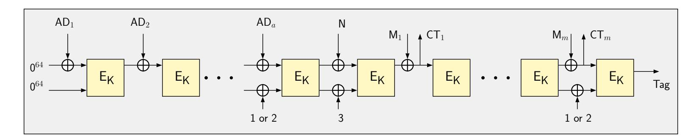

Figure 10: The high-level overview of SAEAES, which depicts the processing of m message and a associated data blocks.

mode of operation is presented in Figure 10. It is easy to see that this mode of operation does not require additional storage other than the ones required in the block cipher. From a circuit designer's point of view, it is not difficult to implement the mode, as the only real challenge is to ensure that at the beginning of a particular encryption operation the circuit feeds the correct input vectors to the block cipher circuit, which are as follows:

- $\mathsf{Inp}_i = \mathsf{AD}_i || 0^{64} \oplus \mathsf{E}_\mathsf{K}(\mathsf{Inp}_{i-1})$  or  $\mathsf{AD}_1$  (if i=1) during the associated data processing stage, where  $\mathsf{Inp}_i$  is the i-th input to the block cipher.
- $Inp_a = AD_a||const_{64} \oplus E_K(Inp_{a-1})|$  for the last AD block, where  $const_{64}$  denotes a 64-bit constant.
- $\mathsf{IV} = \mathsf{N} \oplus 0^{126}11 \oplus \mathsf{E}_{\mathsf{K}}(\mathsf{Inp}_a)$  before the processing of the plaintext begins, where  $0^{126}11$  corresponds to the number 3 encoded as 128-bit string and  $\mathsf{N}$  denotes the nonce.
- $\operatorname{Inp}_i' = \operatorname{M}_i \oplus \operatorname{E}_{\mathsf{K}}(\operatorname{Inp}_{i-1}')$  during the plaintext processing stage, where  $\operatorname{Inp}_i'$  is the *i*-th input to the block cipher during plaintext processing. It can also be seen that  $\operatorname{Inp}_i'$  is also incidentally the *i*-th ciphertext block, and the tag is simply the outcome of the final encryption call that the mode performs.

A bit-wise AES encryption core produces output 1 bit per clock cycle during the last 128 cycles of the encryption operation. Since we are using no additional storage blocks, the output bits, once produced, need to be XORed with the appropriate input signal and concurrently fed back to the block cipher as the input of the following encryption call. Essentially cycles 1281 to 1408 not only produce the output of the i-th encryption but also serve as the input period for the (i+1)-th encryption. Thus one needs to exercise some more fine-grained control over the circuit, to ensure that the block cipher circuit is able to perform the dual role during cycles 1281 to 1408. This effectively means that all encryption calls except the first requires 1280 cycles. Hence, in order to process a AD and m plaintext chunks of 64 bits each, the circuit requires a + m + 1 encryption calls which leads to a + m + 1 encryption calls which leads to a + m + 1 encryption calls which

#### <span id="page-29-0"></span>7.3 Romulus

Romulus is an AEAD scheme designed by Iwata et al. [IKMP19], and uses the SKINNY family of block ciphers. In this work, we provide implementations for two members Romulus-N1 (both 1-bit and 8-bit) and Romulus-N3 (1-bit only). The former is the primary candidate of the family that employs SKINNY-128-384 whereas the latter is the lightest among them because it employs SKINNY-128-256.

In order to reduce the number of block cipher calls, and make use of the large tweakey space, that is 384 bits for the primary member, Romulus makes 1/2 block cipher call per associated data block, and 1 block cipher call per message block. Romulus-N1 member admits 128-bit key, 128-bit nonce, variable-length message chopped into 128-bit blocks, and

{30}------------------------------------------------

produces 128-bit tag. In terms of input parameter sizes, the difference in Romulus-N3 is that it uses 96-bit nonce. An interesting design choice regarding Romulus is that associated data blocks can have alternating size based on which member is chosen. For example, with Romulus-N3, for some integer i,  $AD_{2i-1}$  blocks are 128-bit, and  $AD_{2i}$  blocks are 96-bit. In order to ease notation and the description, one can actually treat  $AD_{2i-1}||AD_{2i}||$  as a single 224-bit block, assuming that the original padding is preserved during this conversion. In the case of Romulus-N1, things are much simpler, because all associated data blocks are fixed to 128 bits. Figure 11 describes the three phases a full AEAD operation passes through,

<span id="page-30-0"></span>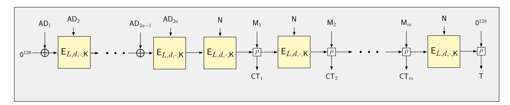

Figure 11: The high-level view of Romulus-N1, which depicts the processing of 2a associated data and m message blocks. L denotes the 56-bit LFSR that counts the number of processed blocks, and d denotes a single byte domain separator followed by  $0^{64}$ .

namely processing of (1) associated data, (2) nonce and (3) message blocks. Below, we first explain Romulus-N3 and the crucial details regarding its 1-bit implementation, and give the differences for Romulus-N1 later.

During associated data phase, each combined 224-bit  $AD_{2i-1}||AD_{2i}|$  block is processed with a single block cipher call  $E_K$ . For each of these SKINNY-128-256 calls, the plaintext is  $AD_{2i-1}$ , and the tweakey is concatenation of 24-bit counter<sup>5</sup>, 8-bit domain separator, 96-bit  $AD_{2i}$  block and the 128-bit key K. The output from the block cipher is treated as the running state, and XORed with each new  $AD_{2i-1}$  block. Once all  $AD_{2i-1}||AD_{2i}|$  combined blocks are processed, the running state is encrypted by using the nonce N itself as a part of the tweakey. We refer to this as processing of the nonce. During the message phase, for each of the 128-bit message blocks, the running state and the message block  $M_i$  are passed through  $\rho$  function defined below. Essentially  $\rho$  acts as XOR in the lateral direction, hence the running state is XORed with the message blocks as before. Once all message blocks are processed, the final block cipher output is passed through  $\rho$  with  $O^{128}$  to produce the tag.  $\rho(S, M) = (S', C)$  is defined as  $S' \leftarrow S \oplus M$  and  $C \leftarrow G(S) \oplus M$ . For each byte, G performs the following operation:

$$G(x_7||x_6||x_5||x_4||x_3||x_2||x_1||x_0) := (x_0 \oplus x_7)||x_7||x_6||x_5||x_4||x_3||x_2||x_1||x_1||x_2||x_1||x_2||x_1||x_3||x_2||x_1||x_3||x_2||x_1||x_3||x_2||x_3||x_3||x_2||x_3||x_3||x_3$$

It is then clear how we can use 1-bit-serial SKINNY-128-256 to realize Romulus-N3. Except for the computation of the ciphertext blocks through  $\rho$ , we can simply reuse the state pipeline of SKINNY-128-256 to store the running state. In order to compute G, we use two external 7-bit buffer pipelines, which keeps the copy of the last 7 bits that exit the state pipeline and the last 7-bit of message block which is being fed to the circuit. This leads to 7 clock cycle of delay in between the time a message block is fed and the time the ciphertext bits become available. This similarly applies to the tag as well, hence the delay of 7 clock cycles must be considered during latency calculation. As a concrete example, the circuit would process  $2 \times 224$  bits of associated data and  $1 \times 128$  bits of message as follows:

• During the first 128 cycles, the key K, and the first associated data block AD<sub>1</sub> are loaded simultaneously. Starting from the clock cycle 32, 96-bit AD<sub>2</sub> is also being

<span id="page-30-1"></span><sup>&</sup>lt;sup>5</sup>24-bit counter is defined with regards to a LFSR (see [IKMP19]), and counts the number of block cipher calls during a phase.

{31}------------------------------------------------

loaded[6](#page-31-1) . After loading is complete, the circuit becomes busy for 47 rounds (for SKINNY-128-256 encryption), i.e. this takes 47 × 128 clock cycles. At the last clock cycle, the circuit signals that it is ready for receiving the next data block, which can be either AD<sup>3</sup> or M1, depending on whether there are more associated data blocks to process. For the sake of this example, we assume there are 224 more bits of associated data to process.

- For the following 128 cycles, the state pipeline XORs its content with AD3, and initiates the first round of encryption simultaneously. Again, the key is reloaded starting from cycle 0 and AD<sup>4</sup> is also loaded starting from clock cycle 32. The circuit becomes busy for 47 rounds to compute the encryption. At the last cycle, the circuit signals that the key and the nonce must be reloaded the following round.
- The running state is encrypted, i.e. the state pipeline reloads its own content and starts encryption. No data block needs to be loaded, but the key and the nonce must be loaded simultaneously. Since nonce and 96-bit AD blocks are using the exact same positions in the tweakey, the nonce is loaded starting from clock cycles 32. After 47 rounds, the circuit signals that the next data (i.e. message) block can be loaded.
- The message block is loaded, which happens simultaneously with reloading of the key. The nonce also follows the key with 32 clock cycles delay, as before. The ciphertext bits become available with 7 clock cycles of delay. The circuit again takes 47 rounds to perform the final encryption.
- A final *ρ* operation is performed with the running state and the 0 <sup>128</sup> vector. The tag becomes available with 7 clock cycles delay.

As for 1-bit-serial implementation of Romulus-N1, the steps taken by the state machine is precisely same. As for differences, however, (1) the invoked block cipher is SKINNY-128-384, (2) all associated data blocks are 128-bit, hence loading for even and odd-numbered associated data blocks (as well as nonce) starts and ends at the same clock cycles, (3) and the block counter is defined as 56-bit LFSR (instead of 24-bit). Moving towards 8-bit implementation is also quite straightforward, with the only difference being the removal of the 7 clock latency caused by *ρ* function. Since it operates on the byte level, it is realized as a fully combinatorial circuit.

According to the 1-bit implementation of Romulus-N1, processing 1 AD blocks and 8 message blocks takes (1 + 8) × 56 × 128 + 128 + 7 clock cycles. The additional 128 clock cycles are incurred due to the delay of loading/flushing the pipelines, and the 7 clock cycle is due to the execution delay of *ρ*. As for 8-bit implementation, the clock cycles are amended as (1 + 8) × 56 × 16 + 16.

### <span id="page-31-0"></span>**7.4 SKINNY-AEAD**

SKINNY-AEAD relies on the ΘCB3 mode of operation [\[KR11\]](#page-37-8) and uses the heaviest SKINNY variant, i.e. SKINNY-128-384, as the core block cipher. ΘCB3 requires the addition of three auxiliary registers that store intermediate values during the computation; a 128-bit register denoted by Auth that accumulates the encrypted AD block, a second 128-bit register Σ that holds the summation of all message blocks and finally a 64-bit LFSR block counter *L*. Both the 1-bit and 8-bit version of SKINNY-AEAD can be instantiated without any further modifications to the serial SKINNY-128-384 cores.

<span id="page-31-1"></span><sup>6</sup>According to Romulus-N3 specification, the last 96 bits of *TK*1 should receive nonce/associated data blocks. The leftmost 32 bits of *TK*1 are reserved for the counter and the domain separator.

{32}------------------------------------------------

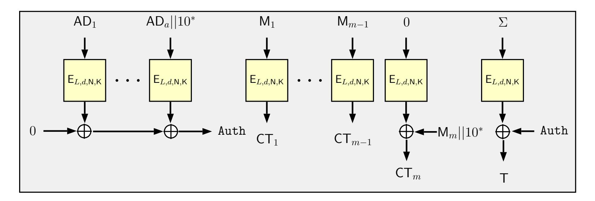

Figure 12: The high-level view of SKINNY-AEAD. The block counter *L*, a domain separator *d*, the nonce *N* and the encryption key *K* together make up the 384-bit tweakey. The encryption of the zero string is only performed when the last message block is incomplete.

# <span id="page-32-0"></span>**7.5 Synthesis Results**

<span id="page-32-2"></span>

| Candidate      | Datapath | Area      |      | Power(µW) | Latency  | Energy        | Throughput |
|----------------|----------|-----------|------|-----------|----------|---------------|------------|
|                |          | (µm2<br>) | (GE) | @ 10 MHz  | (cycles) | (nJ/1152-bit) | (Mbit/s)   |
|                |          |           |      | STM 90 nm |          |               |            |
| SUNDAE-GIFT    | 1-bit    | 5273.9    | 1201 | 50.1      | 92544    | 463.6         | 4.48       |
| SUNDAE-GIFT    | 4-bit    | 6969.8    | 1587 | 63.9      | 23136    | 147.8         | 13.76      |
| SAEAES         | 1-bit    | 5938.0    | 1350 | 77.2      | 24448    | 188.7         | 6.13       |
| SAEAES         | 8-bit    | 8534.9    | 1940 | 108.0     | 3056     | 33.0          | 55.14      |
| Romulus-N1     | 1-bit    | 10534.8   | 2399 | 98.1      | 64647    | 634.2         | 4.91       |
| Romulus-N1     | 8-bit    | 12783.8   | 2912 | 114.6     | 8080     | 92.6          | 33.24      |
| Romulus-N3     | 1-bit    | 7812.7    | 1780 | 79.1      | 55431    | 438.5         | 5.92       |
| SKINNY-AEAD    | 1-bit    | 15756.1   | 3589 | 134.3     | 72960    | 979.9         | 5.04       |
| SKINNY-AEAD    | 8-bit    | 16606.7   | 3783 | 149.0     | 9856     | 146.9         | 37.16      |
| Grain-128AEAD7 | 1-bit    | 9576.6    | 2181 | 102.0     | 1664     | 17.0          | 331.78     |
| Grain-128AEAD  | 4-bit    | 11378.8   | 2592 | 104.0     | 416      | 4.3           | 1320.47    |
| Grain-128AEAD  | 8-bit    | 14324.4   | 3263 | 106.0     | 208      | 2.2           | 2614.78    |
|                |          |           |      | UMC 90 nm |          |               |            |
| SUNDAE-GIFT    | 1-bit    | 4729.9    | 1508 | 51.1      | 92544    | 472.9         | 4.67       |
| SUNDAE-GIFT    | 4-bit    | 6109.7    | 1948 | 63.5      | 23136    | 146.9         | 13.01      |
| SAEAES         | 1-bit    | 5329.6    | 1700 | 95.0      | 24448    | 232.3         | 9.52       |
| SAEAES         | 8-bit    | 8094.0    | 2581 | 103.9     | 3056     | 31.7          | 55.56      |
| Romulus-N1     | 1-bit    | 9683.2    | 3088 | 103.7     | 64647    | 670.4         | 4.80       |
| Romulus-N1     | 8-bit    | 11696.5   | 3730 | 118.5     | 8080     | 95.7          | 30.02      |
| Romulus-N3     | 1-bit    | 7155.6    | 2282 | 81.6      | 55431    | 452.3         | 6.31       |
| SKINNY-AEAD    | 1-bit    | 14567.5   | 4645 | 143.1     | 72960    | 1044.1        | 3.68       |
| SKINNY-AEAD    | 8-bit    | 15161     | 4834 | 155.0     | 9856     | 152.8         | 23.42      |
| Grain-128AEAD  | 1-bit    | 7354.7    | 2345 | 91.4      | 1664     | 15.2          | 354.96     |
| Grain-128AEAD  | 4-bit    | 9006.6    | 2872 | 94.4      | 416      | 3.9           | 1239.87    |
| Grain-128AEAD  | 8-bit    | 11255.1   | 3589 | 100.0     | 208      | 2.1           | 2456.68    |

Table 12: Synthesis figures for selected AEAD Schemes in STM 90 nm and UMC 90 nm libraries. Energy and throughput are based on 1024 bits of plaintext and 128 bits of AD.

<span id="page-32-1"></span><sup>7</sup>The 1/4/8-bit Grain-128AEAD implementations were taken from [\[SHSK19\]](#page-37-9) and re-synthesized.

{33}------------------------------------------------

<span id="page-33-0"></span>

| Candidate     | Datapath | Area<br>(µm2<br>) | (GE) | Power(µW)<br>@ 10 MHz | Latency<br>(cycles) | Energy<br>(nJ/1152-bit) | Throughput<br>(Mbit/s) |
|---------------|----------|-------------------|------|-----------------------|---------------------|-------------------------|------------------------|
|               |          |                   |      |                       |                     |                         |                        |
|               |          |                   |      | TSMC 90 nm            |                     |                         |                        |
| SUNDAE-GIFT   | 1-bit    | 4444.6            | 1576 | 45.9                  | 92544               | 424.8                   | 5.37                   |
| SUNDAE-GIFT   | 4-bit    | 5640.6            | 2000 | 52.1                  | 23136               | 120.5                   | 12.73                  |
| SAEAES        | 1-bit    | 4942.7            | 1751 | 56.9                  | 24448               | 139.1                   | 7.11                   |
| SAEAES        | 8-bit    | 6895.1            | 2452 | 70.2                  | 3056                | 21.5                    | 61.88                  |
| Romulus-N1    | 1-bit    | 9019.0            | 3198 | 95.3                  | 64647               | 616.1                   | 6.99                   |
| Romulus-N1    | 8-bit    | 10552.3           | 3742 | 100.8                 | 8080                | 81.4                    | 39.30                  |
| Romulus-N3    | 1-bit    | 6658.8            | 2361 | 74.0                  | 55431               | 410.2                   | 9.31                   |
| SKINNY-AEAD   | 1-bit    | 13554.6           | 4807 | 122.5                 | 72960               | 893.8                   | 6.84                   |
| SKINNY-AEAD   | 8-bit    | 13943.4           | 4944 | 137.0                 | 9856                | 135.0                   | 35.96                  |
| Grain-128AEAD | 1-bit    | 7509.0            | 2663 | 87.4                  | 1664                | 14.5                    | 452.21                 |
| Grain-128AEAD | 4-bit    | 8763.6            | 3108 | 93.1                  | 416                 | 3.9                     | 1375.49                |
| Grain-128AEAD | 8-bit    | 13943.4           | 4944 | 95.9                  | 208                 | 2.0                     | 2627.79                |
|               |          |                   |      | NanGate 15 nm         |                     |                         |                        |
| SUNDAE-GIFT   | 1-bit    | 426.6             | 2170 | 15.9                  | 92544               | 147.1                   | 84.80                  |
| SUNDAE-GIFT   | 4-bit    | 541.4             | 2754 | 19.5                  | 23136               | 45.1                    | 279.33                 |
| SAEAES        | 1-bit    | 464.3             | 2362 | 18.8                  | 24448               | 46.0                    | 142.21                 |
| SAEAES        | 8-bit    | 606.7             | 3086 | 24.9                  | 3056                | 7.6                     | 1119.93                |
| Romulus-N1    | 1-bit    | 882.3             | 4488 | 32.1                  | 64647               | 207.5                   | 73.89                  |
| Romulus-N1    | 8-bit    | 1012.9            | 5152 | 36.8                  | 8080                | 29.7                    | 566.54                 |
| Romulus-N3    | 1-bit    | 650.8             | 3310 | 25.0                  | 55431               | 138.6                   | 152.46                 |
| SKINNY-AEAD   | 1-bit    | 1323.5            | 6732 | 46.0                  | 72960               | 335.6                   | 75.29                  |
| SKINNY-AEAD   | 8-bit    | 1381.2            | 7025 | 32.0                  | 9856                | 31.5                    | 530.80                 |
| Grain-128AEAD | 1-bit    | 631.4             | 3211 | 20.4                  | 1664                | 3.4                     | 3143.97                |
| Grain-128AEAD | 4-bit    | 732.5             | 3726 | 20.6                  | 416                 | 0.9                     | 11003.88               |
| Grain-128AEAD | 8-bit    | 914.7             | 4652 | 21.3                  | 208                 | 0.4                     | 21127.46               |
|               |          |                   |      | NanGate 45 nm         |                     |                         |                        |
| SUNDAE-GIFT   | 1-bit    | 1527.9            | 1910 | 130.3                 | 92544               | 1205.8                  | 14.13                  |
| SUNDAE-GIFT   | 4-bit    | 1871.3            | 2339 | 168.2                 | 23136               | 389.1                   | 49.98                  |
| SAEAES        | 1-bit    | 1653.5            | 2067 | 148.8                 | 24448               | 363.8                   | 21.20                  |
| SAEAES        | 8-bit    | 2190.2            | 2745 | 205.5                 | 3056                | 62.8                    | 186.27                 |
| Romulus-N1    | 1-bit    | 3103.4            | 3879 | 265.5                 | 64647               | 1716.4                  | 17.17                  |
| Romulus-N1    | 8-bit    | 3566.0            | 4458 | 311.9                 | 8080                | 252.0                   | 99.25                  |
| Romulus-N3    | 1-bit    | 2304.1            | 2880 | 199.0                 | 55431               | 1103.1                  | 19.82                  |
| SKINNY-AEAD   | 1-bit    | 4784.0            | 5980 | 408.4                 | 72960               | 2979.7                  | 15.21                  |
| SKINNY-AEAD   | 8-bit    | 4793.3            | 5992 | 410.8                 | 9856                | 404.9                   | 94.46                  |
| Grain-128AEAD | 1-bit    | 2584.4            | 3231 | 214.0                 | 1664                | 35.6                    | 1082.35                |
| Grain-128AEAD | 4-bit    | 2958.5            | 3698 | 237.1                 | 416                 | 9.9                     | 4001.41                |
| Grain-128AEAD | 8-bit    | 3609.1            | 4511 | 288.1                 | 208                 | 6.0                     | 7545.52                |

Table 13: Low-latency synthesis figures for selected AEAD Schemes in TSMC 90 nm, NanGate 15nm and 45nm libraries. Energy and throughput are calculated for processing 1024 bits of plaintext and 128 bits of AD.

### **7.6 Discussion**

To conclude the section, let us take a look back at the main results of this paper. The synthesis results of AES, SKINNY and GIFT<sup>∗</sup> are summarized in Tables [6,](#page-17-1) [8,](#page-21-0) [11](#page-26-0) respectively (for 5 standard cell libraries). For each of the 3 block ciphers, we see that in the bit-serial mode, the area occupied by the circuits is very close to the total area required by the storage elements (for the state and key registers). For AES, the area is only slightly higher since it has an 8-bit S-box and a reasonably heavyweight MixColumns circuit. But for the other ciphers that have relatively lightweight S-box and linear layer, the purely combinatorial circuit elements occupy only around 10% of the total silicon area. Additionally, we are able to reduce the round latency to match precisely the block size of the underlying block cipher. Note that it is not possible to have an implementation that has lower round latency in

{34}------------------------------------------------

clock cycles than the block size of the cipher, because for a bit-serial circuit of SPN-based ciphers, all the state bits must be rotated across the pipeline. Therefore, this represents the optimal trade-off spot in the area-latency curve, as far as SPN-based block ciphers are concerned. For implementations with higher-bit datapaths, the area only marginally grows, mainly because the number of MUXes and XOR gates required in the circuit needs to be multiplied by the length of the datapath the circuit aims to achieve.

An interesting research direction is to extend our results to Feistel-based block ciphers. Note that the SIMON/SPECK family of block ciphers were mainly designed to achieve this optimal trade-off point, since the state update of these ciphers can simply be described using rotate and a few bit-wise AND/XOR operations [\[BSS](#page-36-13)<sup>+</sup>13]. Nevertheless, not all Feistel ciphers in the literature are designed with this specific goal in mind. It would be interesting to see how a block cipher like PICCOLO can be re-engineered at the circuit level to achieve the best possible area and latency figures [\[SIH](#page-37-10)<sup>+</sup>11].

Tables [12](#page-32-2) and [13](#page-33-0) tabulate synthesis results we obtained for all the individual modes of operation that we investigated in this paper. SUNDAE-GIFT and SAEAES are essentially rate 1/2 modes that need 2 block cipher calls for every 128-bit message block. Note that for these two, the underlying block ciphers admit 128-bit key, and they require exactly 256 flip-flops to store the key and the state. Thus in a sense, minimalism of the core block cipher comes at the cost of having to execute 2 block cipher calls per 128-bit message block. On the other hand, the rate 1 modes, which require only 1 block cipher call per block of message, such as Romulus and SKINNY-AEAD employ SKINNY-128-384. They take advantage of the large (384-bit) tweakey space to accommodate nonce, domain separator, and counter for each block cipher invocation. However, for SKINNY-128-384, this comes at the cost 512 flip-flops for both the state and the tweakey. This results in an interesting latency and area trade-off, and gives further insights on the nature of these designs.

# **8 Conclusion**

Bit-serial implementations of block ciphers and authenticated encryption schemes provide the smallest known implementations, because they reduce the number of gates on the datapath, such as MUXes, XOR gates etc. In this paper, we implemented compact bit-serial implementations of the three block ciphers, which save around 20% in latency when compared to the state of the art, with the added advantage that we do not alter the standard arrangement of the bits as recommended in their specifications. We further generalize our bit-serial architectures to multi-bit datapaths. In the wake of this endeavor, we obtain constructions that are readily usable in any mode of operation that uses them as an underlying encryption primitive. As a proof of concept, we implement four lightweight AEAD schemes from NIST LWC project that also turn out to be the most compact implementations of these schemes reported in the literature.

**Acknowledgments:** We wish to thank Begül Bilgin for helping us improve this draft. The 1st and 3rd authors are supported by the Swiss National Science Foundation (SNSF) through the Ambizione Grant PZ00P2\_179921.

# **References**

<span id="page-34-0"></span>[ALP<sup>+</sup>19] Elena Andreeva, Virginie Lallemand, Antoon Purnal, Reza Reyhanitabar, Arnab Roy, and Damian Vizár. ForkAE. *NIST Lightweight Cryptography Project*, 2019.

{35}------------------------------------------------

- <span id="page-35-11"></span>[BBLT18] Subhadeep Banik, Andrey Bogdanov, Atul Luykx, and Elmar Tischhauser. SUNDAE: Small Universal Deterministic Authenticated Encryption for the Internet of Things. *IACR Trans. Symmetric Cryptol.*, 2018(3):1–35, 2018.
- <span id="page-35-2"></span>[BBP<sup>+</sup>19] Subhadeep Banik, Andrey Bogdanov, Thomas Peyrin, Yu Sasaki, Siang Meng Sim, Elmar Tischhauser, and Yosuke Todo. SUNDAE-GIFT v1.0. *NIST Lightweight Cryptography Project*, 2019.
- <span id="page-35-5"></span>[BBR15] Subhadeep Banik, Andrey Bogdanov, and Francesco Regazzoni. Exploring Energy Efficiency of Lightweight Block Ciphers. In *Selected Areas in Cryptography - SAC 2015 - 22nd International Conference, Sackville, NB, Canada, August 12-14, 2015, Revised Selected Papers*, pages 178–194, 2015.
- <span id="page-35-6"></span>[BBR16] Subhadeep Banik, Andrey Bogdanov, and Francesco Regazzoni. Atomic-AES: A Compact Implementation of the AES Encryption/Decryption Core. In *Progress in Cryptology - INDOCRYPT 2016 - 17th International Conference on Cryptology in India, Kolkata, India, December 11-14, 2016, Proceedings*, pages 173–190, 2016.
- <span id="page-35-7"></span>[BBR17] Subhadeep Banik, Andrey Bogdanov, and Francesco Regazzoni. Compact Circuits for Combined AES Encryption/Decryption. *Journal of Cryptographic Engineering*, pages 1–15, 2017.
- <span id="page-35-8"></span>[BBRV20] Subhadeep Banik, Fatih Balli, Francesco Regazzoni, and Serge Vaudenay. Swap and Rotate: Lightweight Linear Layers for SPN-based Blockciphers. *IACR Trans. Symmetric Cryptol.*, 2020(1):185–232, 2020.
- <span id="page-35-1"></span>[BCI<sup>+</sup>19] Subhadeep Banik, Avik Chakraborti, Tetsu Iwata, Kazuhiko Minematsu, Mridul Nandi, Thomas Peyrin, Yu Sasaki, Siang Meng Sim, and Yosuke Todo. GIFT-COFB v1.0. *NIST Lightweight Cryptography Project*, 2019.
- <span id="page-35-9"></span>[BGI<sup>+</sup>18] Roderick Bloem, Hannes Gross, Rinat Iusupov, Bettina Könighofer, Stefan Mangard, and Johannes Winter. Formal Verification of Masked Hardware Implementations in the Presence of Glitches. In Jesper Buus Nielsen and Vincent Rijmen, editors, *Advances in Cryptology – EUROCRYPT 2018*, pages 321–353, Cham, 2018. Springer International Publishing.
- <span id="page-35-10"></span>[BJK<sup>+</sup>16] Christof Beierle, Jérémy Jean, Stefan Kölbl, Gregor Leander, Amir Moradi, Thomas Peyrin, Yu Sasaki, Pascal Sasdrich, and Siang Meng Sim. The SKINNY Family of Block Ciphers and Its Low-Latency Variant MANTIS. In *Advances in Cryptology - CRYPTO 2016 - 36th Annual International Cryptology Conference, Santa Barbara, CA, USA, August 14-18, 2016, Proceedings, Part II*, pages 123–153, 2016.
- <span id="page-35-3"></span>[BJK<sup>+</sup>19] Christof Beierle, Jérémy Jean, Stefan Kölbl, Gregor Leander, Amir Moradi, Thomas Peyrin, Yu Sasaki, Pascal Sasdrich, and Siang Meng Sim. SKINNY-AEAD. *NIST Lightweight Cryptography Project*, 2019.
- <span id="page-35-4"></span>[BLP<sup>+</sup>08] Andrey Bogdanov, Gregor Leander, Christof Paar, Axel Poschmann, Matthew J. B. Robshaw, and Yannick Seurin. Hash Functions and RFID Tags: Mind the Gap. In *Cryptographic Hardware and Embedded Systems - CHES 2008, 10th International Workshop, Washington, D.C., USA, August 10-13, 2008. Proceedings*, pages 283–299, 2008.
- <span id="page-35-0"></span>[BPP<sup>+</sup>17] Subhadeep Banik, Sumit Kumar Pandey, Thomas Peyrin, Yu Sasaki, Siang Meng Sim, and Yosuke Todo. GIFT: A Small Present - Towards

{36}------------------------------------------------

- Reaching the Limit of Lightweight Encryption. In *Cryptographic Hardware and Embedded Systems - CHES 2017 - 19th International Conference, Taipei, Taiwan, September 25-28, 2017, Proceedings*, pages 321–345, 2017.
- <span id="page-36-13"></span>[BSS<sup>+</sup>13] Ray Beaulieu, Douglas Shors, Jason Smith, Stefan Treatman-Clark, Bryan Weeks, and Louis Wingers. The SIMON and SPECK Families of Lightweight Block Ciphers. *IACR Cryptol. ePrint Arch.*, 2013:404, 2013.
- <span id="page-36-11"></span>[c4s] The-Area-Latency-Symbiosis. <https://c4science.ch/diffusion/10848>.
- <span id="page-36-1"></span>[CDJ<sup>+</sup>19a] Avik Chakraborti, Nilanjan Datta, Ashwin Jha, Cuauhtemoc Mancillas Lopez, Mridul Nandi, and Yu Sasaki. ESTATE. *NIST Lightweight Cryptography Project*, 2019.
- <span id="page-36-5"></span>[CDJ<sup>+</sup>19b] Avik Chakraborti, Nilanjan Datta, Ashwin Jha, Cuauhtemoc Mancillas Lopez, Mridul Nandi, and Yu Sasaki. LOTUS-AEAD and LOCUS-AEAD. *NIST Lightweight Cryptography Project*, 2019.
- <span id="page-36-4"></span>[CDJN19] Avik Chakraborti, Nilanjan Datta, Ashwin Jha, and Mridul Nandi. HYENA. *NIST Lightweight Cryptography Project*, 2019.
- <span id="page-36-7"></span>[CDL<sup>+</sup>19] Anne Canteaut, Sébastien Duval, Gaëtan Leurent, María Naya-Plasencia, Léo Perrin, Thomas Pornin, and André Schrottenloher. Saturnin. *NIST Lightweight Cryptography Project*, 2019.
- <span id="page-36-2"></span>[CN19] Bishwajit Chakraborty and Mridul Nandi. mixFeed. *NIST Lightweight Cryptography Project*, 2019.
- <span id="page-36-9"></span>[dKGHG08] Gerhard de Koning Gans, Jaap-Henk Hoepman, and Flavio D. Garcia. A Practical Attack on the MIFARE Classic. In Gilles Grimaud and François-Xavier Standaert, editors, *Smart Card Research and Advanced Applications*, pages 267–282, Berlin, Heidelberg, 2008. Springer Berlin Heidelberg.
- <span id="page-36-8"></span>[GdKGM<sup>+</sup>08] Flavio D. Garcia, Gerhard de Koning Gans, Ruben Muijrers, Peter van Rossum, Roel Verdult, Ronny Wichers Schreur, and Bart Jacobs. Dismantling MIFARE Classic. In Sushil Jajodia and Javier Lopez, editors, *Computer Security - ESORICS 2008*, pages 97–114, Berlin, Heidelberg, 2008. Springer Berlin Heidelberg.
- <span id="page-36-10"></span>[git] The-Area-Latency-Symbiosis. [https://github.com/qantik/](https://github.com/qantik/The-Area-Latency-Symbiosis) [The-Area-Latency-Symbiosis](https://github.com/qantik/The-Area-Latency-Symbiosis).
- <span id="page-36-6"></span>[GJK<sup>+</sup>19] Dahmun Goudarzi, Jérémy Jean, Stefan Kölbl, Thomas Peyrin, Matthieu Rivain, Yu Sasaki, and Siang Meng Sim. Pyjamask. *NIST Lightweight Cryptography Project*, 2019.
- <span id="page-36-0"></span>[GJN19] Shay Gueron, Ashwin Jha, and Mridul Nandi. COMET. *NIST Lightweight Cryptography Project*, 2019.
- <span id="page-36-12"></span>[HDF<sup>+</sup>16] Ekawat Homsirikamol, William Diehl, Ahmed Ferozpuri, Farnoud Farahmand, Panasayya Yalla, Jens-Peter Kaps, and Kris Gaj. CAESAR Hardware API. Cryptology ePrint Archive, Report 2016/626, 2016. <https://eprint.iacr.org/2016/626>.
- <span id="page-36-3"></span>[IKMP19] Tetsu Iwata, Mustafa Khairallah, Kazuhiko Minematsu, and Thomas Peyrin. Romulus v1.2. *NIST Lightweight Cryptography Project*, 2019.

{37}------------------------------------------------

- <span id="page-37-1"></span>[JMPS17] Jérémy Jean, Amir Moradi, Thomas Peyrin, and Pascal Sasdrich. Bit-Sliding: A Generic Technique for Bit-Serial Implementations of SPN-based Primitives - Applications to AES, PRESENT and SKINNY. In *Cryptographic Hardware and Embedded Systems - CHES 2017 - 19th International Conference, Taipei, Taiwan, September 25-28, 2017, Proceedings*, pages 687–707, 2017.
- <span id="page-37-8"></span>[KR11] Ted Krovetz and Phillip Rogaway. The Software Performance of Authenticated-Encryption Modes. In Antoine Joux, editor, *Fast Software Encryption - 18th International Workshop, FSE 2011, Lyngby, Denmark, February 13-16, 2011, Revised Selected Papers*, volume 6733 of *Lecture Notes in Computer Science*, pages 306–327. Springer, 2011.
- <span id="page-37-7"></span>[Max19] Alexander Maximov. AES MixColumn with 92 XOR gates. *IACR Cryptol. ePrint Arch.*, 2019:833, 2019.
- <span id="page-37-6"></span>[ME19] Alexander Maximov and Patrik Ekdahl. New circuit minimization techniques for smaller and faster AES sboxes. *IACR Trans. Cryptogr. Hardw. Embed. Syst.*, 2019(4):91–125, 2019.
- <span id="page-37-4"></span>[MIFa] Contactless IC supporting 3DES cryptography in limited-use applications. <https://www.nxp.com/docs/en/data-sheet/MF0ICU2.pdf>. Accessed: 2020-07-10.
- <span id="page-37-3"></span>[MIFb] Contactless IC with password protection for limited-use smart paper tickets and cards. <https://www.nxp.com/docs/en/data-sheet/MF0ULX1.pdf>. Accessed: 2020-07-10.
- <span id="page-37-2"></span>[MPL<sup>+</sup>11] Amir Moradi, Axel Poschmann, San Ling, Christof Paar, and Huaxiong Wang. Pushing the Limits: A Very Compact and a Threshold Implementation of AES. In Kenneth G. Paterson, editor, *Advances in Cryptology – EUROCRYPT 2011*, pages 69–88, Berlin, Heidelberg, 2011. Springer Berlin Heidelberg.
- <span id="page-37-11"></span>[nis] NIST Lightweight Cryptography Project. [https://csrc.nist.gov/](https://csrc.nist.gov/projects/lightweight-cryptography) [projects/lightweight-cryptography](https://csrc.nist.gov/projects/lightweight-cryptography).
- <span id="page-37-5"></span>[NIS01] Advanced Encryption Standard (AES). 2001.
- <span id="page-37-0"></span>[NMMaS<sup>+</sup>19] Yusuke Naito, Yasuyuki Sakai Mitsuru Matsui and, Daisuke Suzuki, Kazuo Sakiyama, and Takeshi Sugawara. SAEAES. *NIST Lightweight Cryptography Project*, 2019.
- <span id="page-37-9"></span>[SHSK19] Jonathan Sönnerup, Martin Hell, Mattias Sönnerup, and Ripudaman Khattar. Efficient Hardware Implementations of Grain-128AEAD. In Feng Hao, Sushmita Ruj, and Sourav Sen Gupta, editors, *Progress in Cryptology - INDOCRYPT 2019 - 20th International Conference on Cryptology in India, Hyderabad, India, December 15-18, 2019, Proceedings*, volume 11898 of *Lecture Notes in Computer Science*, pages 495–513. Springer, 2019.
- <span id="page-37-10"></span>[SIH<sup>+</sup>11] Kyoji Shibutani, Takanori Isobe, Harunaga Hiwatari, Atsushi Mitsuda, Toru Akishita, and Taizo Shirai. Piccolo: An Ultra-Lightweight Blockcipher. In *Cryptographic Hardware and Embedded Systems - CHES 2011 - 13th International Workshop, Nara, Japan, September 28 - October 1, 2011. Proceedings*, pages 342–357, 2011.

{38}------------------------------------------------

# <span id="page-38-0"></span>**A GIFT**

The regular GIFT specification is significantly harder to transform into a low-latency swap-and-rotate circuit due to the fact that the round key bits are not added to cipher state in a continuous stretch. Namely, if *U* = *K*5||*K*<sup>4</sup> and *V* = *K*1||*K*<sup>0</sup> represent the 64-bit round key, then its individual bits are mixed into the state *S* as follows,

$$s_{4i+2} = s_{4i+2} \oplus u_i, \ s_{4i+1} = s_{4i+1} \oplus v_i, \ \forall i \in \{0, \dots, 31\}.$$

By reordering the key bits in a manner such that the bits of *U* and *V* exit the pipeline during the correct cycles, we can reuse the rotation techniques to obtain a key schedule with 6 different swaps. On the other hand, we can recall the intuition for the state pipeline from Section [6.1.1,](#page-22-1) in order to generate the swap sequence for the GIFT round function. The summary of all GIFT key schedule and round function swaps are tabulated in Table [15.](#page-39-0)

| Library       | Area<br>(µm2<br>) | (GE) | Power (µW)<br>@ 10 MHz | round | Latency (cycles)<br>total | Energy<br>(nJ) | Throughput<br>(Mbit/s) |
|---------------|-------------------|------|------------------------|-------|---------------------------|----------------|------------------------|
| STM 90 nm     | 5334.3            | 1215 | 51.3                   | 128   | 5248                      | 26.9           | 7.35                   |
| UMC 90 nm     | 4801.2            | 1531 | 51.8                   | 128   | 5248                      | 27.2           | 6.32                   |
| TSMC 90 nm    | 4507.3            | 1597 | 45.9                   | 128   | 5248                      | 24.1           | 8.61                   |
| NanGate 15 nm | 430.5             | 2190 | 16.1                   | 128   | 5248                      | 8.4            | 146.92                 |
| NanGate 45 nm | 1528.4            | 1915 | 131.8                  | 128   | 5248                      | 69.2           | 23.34                  |

Table 14: Synthesis figures for the bit-serial GIFT encryption circuit.

# <span id="page-38-1"></span>**B Cost of Decryption**

Some of the AEAD schemes in the NIST LWC [\[nis\]](#page-37-11) do require the inverse, i.e. the decryption functionality, of block ciphers as well. Therefore let us also assess the cost of implementing the combined encryption and decryption circuit for the three block ciphers:

• For AES, the challenge really comes in arranging the order of operations, these are namely inverse MixColumns, inverse ShiftRows and inverse SubBytes. Note that the inverse ShiftRows is also a special permutation of type 4, and a swap sequence can be constructed in the same way as described in Section [3.](#page-9-0) Furthermore, in order to avoid adding more MUXes to the circuit, we can reuse the same swap locations as much as possible from the encryption. Hence, the cost of implementing inverse ShiftRows is small, other than the control logic required to generate the swap signals. The inverse MixColumns operation is perhaps the most difficult operation to implement in this setting. It is well known that MixColumns matrix *M* used in AES has the property that *M*<sup>3</sup> = *M*<sup>−</sup><sup>1</sup> . Hence if we want to implement multiplication by *M*<sup>−</sup><sup>1</sup> without any extra gates, then it would be necessary make three full rotations in the state pipeline until the MixColumns operation is completed (this is the approach tried out in [\[BBR17,](#page-35-7) [JMPS17\]](#page-37-1)). This invariably comes with a latency penalty. If we do not want to impose a latency penalty, we must pay with extra gate area: by accommodating 2 additional MixColumns circuits one after the other. This comes with an additional area penalty of 100–120 GE, but makes it possible to complete the decryption round in 128 clock cycles. Implementing a combined circuit for the forward and inverse S-box also requires at most 50 GE [\[ME19\]](#page-37-6). The inverse key schedule can be implemented without much additional logic as already explained in [\[BBR16\]](#page-35-6).

{39}------------------------------------------------

<span id="page-39-0"></span>

| pipeline | operation                  | active cycles                                                                  |
|----------|----------------------------|--------------------------------------------------------------------------------|
| state    | swap (39, 71)              | [0, 8) ∪ [8, 16) ∪ [16, 24) ∪ [121, 128)                                       |
|          | swap (38, 22)              | [0, 9] ∪ [58, 73] ∪ [122, 127]                                                 |
|          | swap (98, 110)             | [10, 13] ∪ [34, 37] ∪ [54, 57] ∪ [74, 77] ∪ [98, 101] ∪ [118, 121]             |
|          | swap (109, 85)             | [7, 10] ∪ [51, 54] ∪ [71, 74] ∪ [115, 118]                                     |
|          | swap (108, 72)             | [4, 7] ∪ [68, 71]                                                              |
|          |                            | ∪{34, 35, 72, 73, 80, 81, 88, 89, 96, 97}                                      |
|          | swap (121, 117)            | {16k + 5 : k ∈ [0, 15]} ∪ {16k + 13 : k ∈ [0, 15]} ∪ {16k + 15 : k ∈ [0, 15]}  |
|          | swap (122, 114)            | {16k + 1 : k ∈ [0, 15]} ∪ {16k + 3 : k ∈ [0, 15]}                              |
|          | swap (123, 111)            | {16k + 1 : k ∈ [0, 15]}                                                        |
|          | swap (22, 4)               | {2, 3, 34, 35, 66, 67, 98, 99}                                                 |
|          | swap (22, 10)              | {4, 5, 26, 27, 36, 37, 58, 59, 68, 69, 90, 91, 100, 101, 122, 123}             |
|          | swap (22, 16)              | {6, 7, 18, 19, 28, 29, 38, 39, 50, 51, 60, 61, 70, 71}                         |
|          |                            | ∪{82, 83, 92, 93, 102, 103, 114, 115, 124, 125}                                |
|          | key addition               | {4k + 1 : k ∈ [0, 31]} ∪ {4k + 2 : k ∈ [0, 31]}                                |
|          | rc addition                | (lookup table)                                                                 |
|          | load S-box                 | {4k + 3 : k ∈ [0, 31]}                                                         |
| key      | swap (120, 128)            | {4k : k ∈ [3, 16]} if round mod 4 = 0                                          |
|          |                            | {4k − 1 : k ∈ [3, 16]} if round mod 4 = 1                                      |
|          |                            | {4k + 1 : k ∈ [3, 16]} if round mod 4 = 2                                      |
|          |                            | {4k − 2 : k ∈ [3, 16]} if round mod 4 = 3                                      |
|          | swap (112, 128)            | {1} ∪ {4k − 2 : k ∈ [5, 16] ∪ [21, 32]} if round mod 4 = 0                     |
|          |                            | {4k : k ∈ [5, 16] ∪ [21, 31]} if round mod 4 = 1                               |
|          |                            | {1} ∪ {4k − 1 : k ∈ [5, 16] ∪ [21, 32]} if round mod 4 = 2                     |
|          |                            | {4k + 1 : k ∈ [5, 16] ∪ [21, 31]} if round mod 4 = 3                           |
|          | swap (1, 128)              | {4k : k ∈ [1, 31]} if round mod 4 = 0                                          |
|          |                            | {0} if round mod 4 = 1                                                         |
|          |                            | {4k + 2 : k ∈ [0, 31]} if round mod 4 = 3                                      |
|          | swap (1, 33)               | {4k + 1 : k ∈ [0, 7]} if round mod 4 = 0                                       |
|          |                            | {4k + 3 : k ∈ [0, 7]} if round mod 4 = 1                                       |
|          |                            | {4k + 2 : k ∈ [0, 7]} if round mod 4 = 2                                       |
|          |                            | {4k : k ∈ [1, 8]} if round mod 4 = 3                                           |
|          | swap (4, 5)<br>swap (2, 3) | {4k : k ∈ [0, 31]} if round mod 4 = 0<br>{4k : k ∈ [0, 31]} if round mod 4 = 3 |
|          |                            |                                                                                |

Table 15: The timetable of operations for bit-serial GIFT encryption.

- For SKINNY, which also has the similar structure with AES, the costs are considerably smaller. Inverse ShiftRows is again easily implemented with the techniques described in Section [3.](#page-9-0) For this cipher, the S-box and MixColumns circuit are extremely lightweight, and so the forward and inverse function can be implemented without any significant area costs. The inverse tweakey update functions at all the 3 levels are simple byte-based LFSR updates and permutations, and can be instantiated with only a few multiplexers.
- For GIFT<sup>∗</sup> , both the swaps in the round function and the key schedule are partitioned in layers that are executed one after another (see Section [6.1\)](#page-22-2). This means the decryption can be performed by simply inverting the order of the swap layers. The main overhead comes therefore in the form of the additional inverse S-box which can be synthesized with fewer than 20 GE.