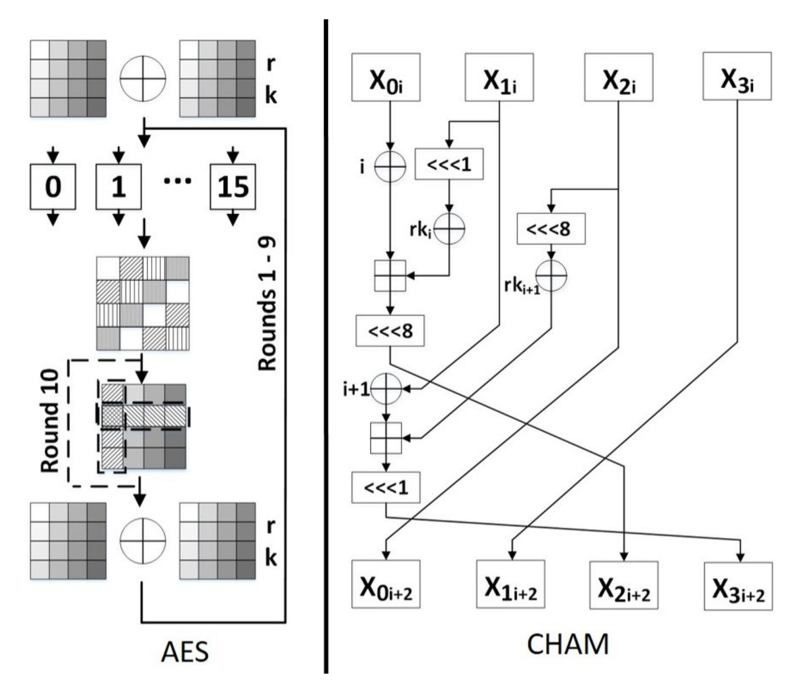
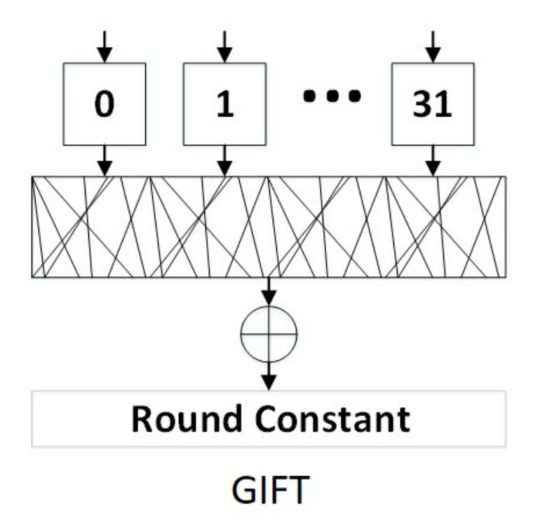
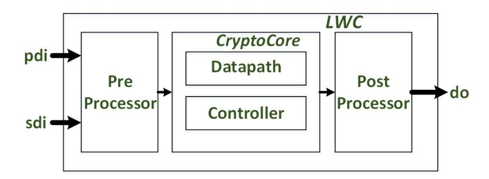
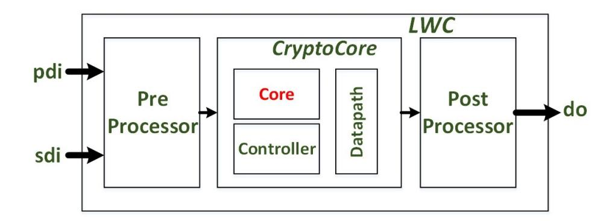
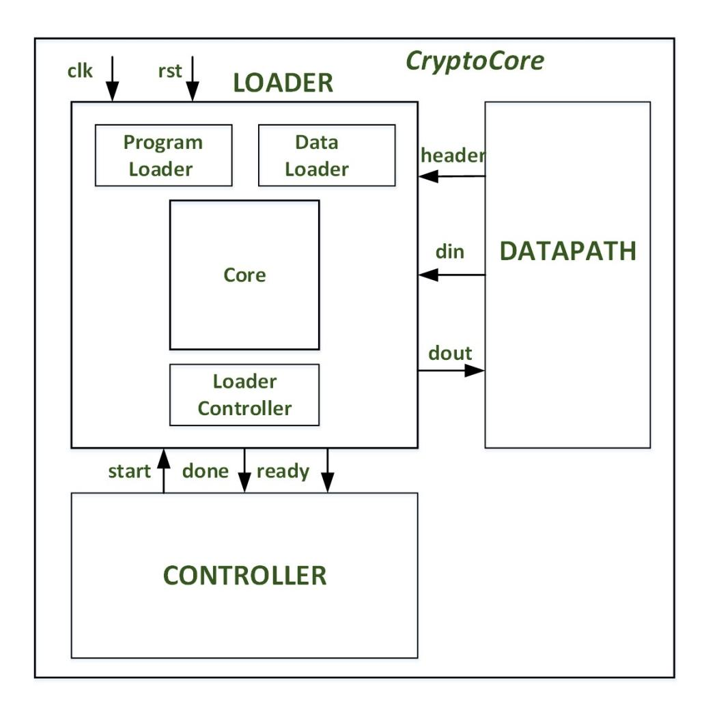
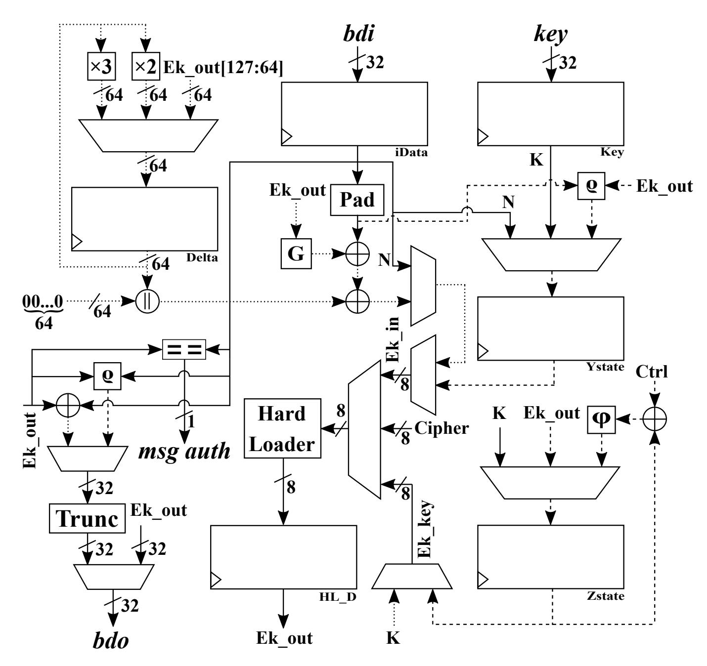
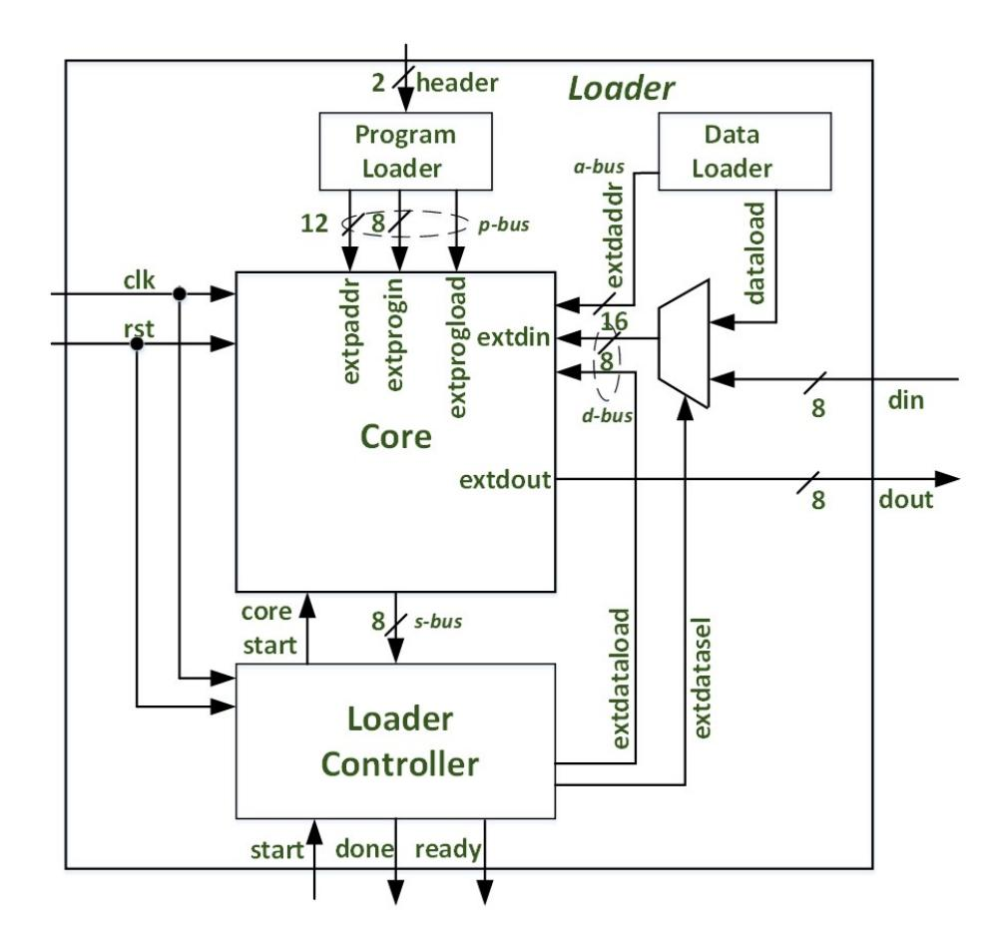
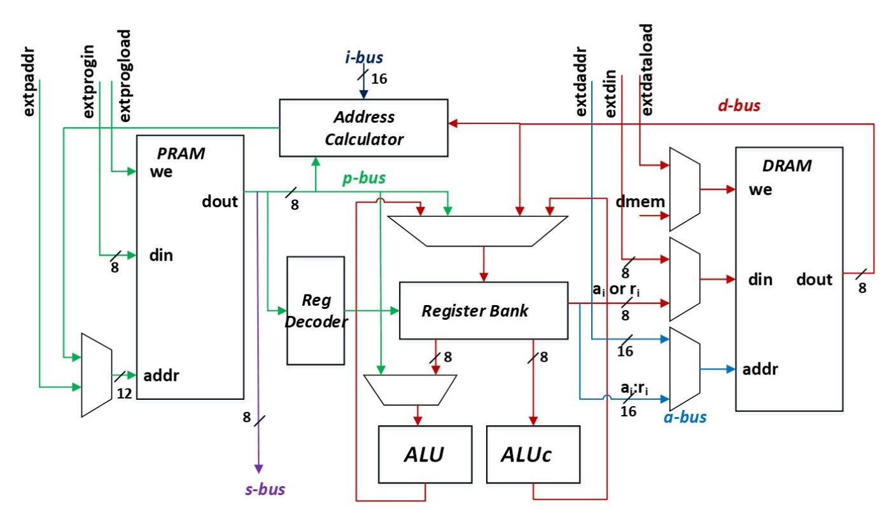

{0}------------------------------------------------

# Efficient Simultaneous Deployment of Multiple Lightweight Authenticated Ciphers

Behnaz Rezvani, Thomas Conroy, Luke Beckwith, Matthew Bozzay, Trevor Laffoon, David McFeeters, Yijia Shi, Minh Vu, and William Diehl

> Virginia Tech, Blacksburg, VA 24061, USA email: {behnaz, tconroy, luke98, mb20022, tslaffoon98, davidmm, yijiashi, minv17, wdiehl}@vt.edu

Abstract. Cryptographic protections are ubiquitous in information technology, including the emerging Internet of Things (IoT). As a result of technology migration to a resource-challenged landscape and new threats to cryptographic security, governments and industry are exploring new cryptographic algorithms. While new standards will emerge, however, old standards will not disappear for the time being. It is therefore important to explore platforms where multiple cryptographic deployments can be dynamically interchanged and even share resources. In this research we build on the Development Package for the Applications Programming Interface for Hardware Implementations of Lightweight Cryptography (DP API HW LWC). In this construct, developers design hardware implementations of authenticated encryption with associated data (AEAD) inside a cryptographic core (CryptoCore) encapsulated by input/output utilities. While CryptoCore is intended for single register-transfer level (RTL) implementations, we install a custom-designed soft core microprocessor inside CryptoCore to run underlying block ciphers, along with a shell to facilitate AEAD processing. Through dynamic loading and execution of block ciphers on the core, we demonstrate a single LWC deployment on an Artix-7 FPGA, capable of executing 3 NIST LWC Standardization Process Round 2 AEAD candidates (COMET-AES, COMET-CHAM and GIFT-COFB) using only 55% of the combined area of separate RTL implementations of the same ciphers.

Keywords: NIST · Lightweight cryptography · FPGA · Implementation · Authenticated encryption · AES · CHAM · GIFT · COMET · GIFT-COFB · Microprocessor · Instruction Set Extension

# 1 Introduction

Cryptographic protections, consisting of mathematically secure and ideally efficient algorithms, are an important part of many information technology sectors, including national security, finance, transportation, energy, medical, and personal privacy. Cryptographic services include confidentiality, i.e., preventing a 3rd party from reading a transmission, authenticity, i.e., verification that a transmission originated from a particular sender, and integrity, i.e., assurance that the transmission was not altered between sender and receiver.

{1}------------------------------------------------

At present, the state of cryptography is at a point of inflection not observed in the past several decades. One driver is the ubiquitous nature of the Internet of Things (IoT), where small, intelligent devices pervade many aspects of our daily lives and communicate with one another as well as with centralized applications. Much of the data handled by IoT devices is sensitive and requires cryptographic protections. However, existing secret key cryptographic standards, e.g., the Advanced Encryption Standard (AES) [41], were designed for larger desktop computers and centralized servers. Government and industry are seeking alternatives for resource-constrained devices; an example of such a search is the U.S. National Institute of Standards and Technology (NIST) Lightweight Cryptography (LWC) Standardization Process, which is investigating lightweight authenticated encryption with associated data (AEAD) and optional hash functions [30].

A second driver is a potential upending of security premises due to the emergence of quantum computing. Known quantum algorithms can handily defeat security premises based on integer factorization and discrete logarithms, which would render current public key cryptographic standards such as RSA (Rivest-Shamir-Adelman) and ECC (Elliptic Curve Cryptography) ineffective [38]. While secret key algorithms would not be completely defeated by known quantum attacks, security could be reduced necessitating the adoption of longer keys [16]. NIST is preparing to adopt new standards through its Post-Quantum Cryptography (PQC) Standardization Process [3].

At the end of both of the above standardization efforts, it is unlikely that there will be a single secret or public key standard. Rather, legacy and newer standards will likely be simultaneously employed in the near- and mid-term. As an example, consider the case of Google's experimentation with dual public key deployments in its Chrome browser [12]. In this experiment, transmissions would be authenticated using simultaneous ECC and a post-quantum solution (i.e., an earlier version of the NIST PQC candidate New Hope [4]). Additionally, the idea of investigating convergence in proposed PQC and LWC algorithms was proposed in [34]. Similar situations can be contemplated for secret key cryptography in IoT Devices; for example, a lightweight hub might communicate with wireless sensors using ZigBee protocol using a very lightweight cipher, but use a higher throughput AES-GCM/CCM scheme with a remote command post using WiFi.

Candidate ciphers in cryptographic contests and standardization processes are evaluated by many metrics, including performance, required resources, and security, prior to being finally standardized. However, most evaluations consider ciphers individually, e.g., "which of ciphers A, B, or C is most efficient?" However, an emerging question to ask is "which group of ciphers {A, B, C} or {D, E, F} is most efficient when operated together?"

To address the former question, the Applications Programming Interface for Hardware Implementations of Lightweight Cryptography (API HW LWC) has been proposed for fair benchmarking and evaluation of candidates in the NIST LWC Standardization Process [25]. To facilitate adaption of HW implementations to the API HW LWC, a developer's package, the Developer's Package (DP) for 

{2}------------------------------------------------

API HW LWC (DP API HW LWC) is available [40]. Using the DP, a designer inserts a hardware implementation of an authenticated cipher in a centralized wrapper called "CryptoCore," and encapsulates CryptoCore in a top module called "LWC," which also contains input and output modules called "Preprocessor" and "Postprocessor" which comply with the API HW LWC.

However, the DP API HW LWC is only designed to operate with one authenticated cipher at a time. In fact, while HW implementations (e.g., designed using register transfer level (RTL) or high level synthesis (HLS)) of ciphers are more efficient than software implementations running on generalized processors, they rapidly lose advantage when combining functionality of multiple ciphers.

In this research, we prepare an environment to answer the latter question of "which groups of ciphers are more efficient?" We modify CryptoCore in the DP API HW LWC to include a common controller and datapath capable of handling AEAD functionality for a number of authenticated ciphers, and embed a soft core processor (i.e., "core") to run the underlying block cipher associated with one of several authenticated ciphers. The core is a lightweight 8-bit custom-designed soft core processor called "HOKSTER," although any number of existing or future processors could be substituted. An advantage of this architecture is that test vectors and other facilities of the DP API HW LWC are fully compatible (although we have made a small addition to the API to dynamically select algorithm in use), which enables comparison of multiple HW and SW combinations of AEAD along many dimensions.

We demonstrate the common CryptoCore with embedded processor using a concatenation of test vectors (TVs) consisting of TVs for the COMET-AES, COMET-CHAM, and GIFT-COFB NIST LWC Round 2 candidate authenticated ciphers. Whenever a TV from a new algorithm commences processing, the CryptoCore controller loads the corresponding block cipher into the core (i.e., AES, CHAM, and GIFT, respectively). We then evaluate the resulting implementation, capable of executing multiple ciphers, in terms of area and throughput versus previous RTL implementations of the individual ciphers.

Our contributions in this work are as follows:

- 1. We demonstrate a model for reducing the costs of simultaneous deployment of existing and newly-emerging cryptographic standards, which could be required during extended transitional periods between standards.
- 2. We open new arenas for comparison of cipher hardware implementations, including hybrid AEAD implementations consisting of a rigid outer hardware layer and a flexible inner software core, and combinations of groups of ciphers versus single implementations or other groups, using the existing API HW LWC framework.
- 3. We develop, test, and integrate a new 8-bit soft core microprocessor, which adds to the variability of 8-bit platforms on which NIST candidate authenticated ciphers and associated primitives can be evaluated.
- 4. We investigate instruction set extensions for cryptographic applications, with focus on newly-fielded CHAM and GIFT block ciphers.

{3}------------------------------------------------

# 2 Background

### 2.1 Authenticated encryption with associated data

Authenticated encryption with associated data (AEAD) is introduced in [33], and in one algorithm can provide confidentiality, authenticity and integrity without relying on composition of distinct ciphers and hashes. "Associated data" (AD) refers to data which does not require encryption, but for which authenticity and integrity are important, such as protocol or header information. Inputs to AEAD include message or plaintext (P T), a public message number (npub) (e.g., nonce or "number used once"), AD, and secret key (K). Outputs from authenticated encryption are ciphertext (CT) and a tag (T ag). During authenticated decryption, CT is converted back to P T, but only released if T ag is verified to be correct.

Underlying cryptographic primitives of AEAD, such as block ciphers, are "data-intensive;" they are highly parallel and repeatable transactions with simple and highly-predictable control process. Therefore, they can be implemented very efficiently in hardware using a variety of architectures. By contrast, AEAD algorithms are, with the exception of underlying primitives, "control-intensive;" they have complex and irregular control processes which must allow for a wide variety of circumstances (e.g., missing AD or P T, partial or incomplete blocks, padding, etc.) Therefore, fully-functional single-algorithm AEAD HW implementations are more complex than block ciphers, and multi-algorithm implementations can be very costly.

COMET COunter Mode Encryption with authentication Tag (COMET) is a combination of Beetle and CTR modes of operation that provides AEAD functionality [24]. COMET is single-pass and inverse-free. It has three members; in this paper, we consider two of them: COMET-128 AES-128/128 (the primary member) and COMET-128 CHAM-128/128. The authors' recommendations are key size k = 128 bits, data block size n = 128 bits, nonce size n = 128 bits, and tag size τ = 128 bits. The n-bit Y -state (cipher state) and the k-bit Z-state (key state) are concatenated to form the (n + k)-bit state of COMET. The initial state (Y0||Z0) is formed by using the nonce (Z0 = Ek(N)) and the secret key (Y0 = K). There are 5-bit control constants that are used as domain separators to differentiate between AD, P T, and T ag processes, and moreover, to distinguish between partial and full blocks.

GIFT-COFB GIFT-COFB refers to the COmbined FeedBack (COFB) mode of operation using the underlying cipher GIFT-128 [6]. Similar to COMET, GIFT-COFB is also inverse-free and single-pass. It processes 128-bit data blocks using a 128-bit key and a 128-bit nonce, and it also provides a 128-bit tag. The initial state is loaded by a nonce (N) and after 40 iterations of the GIFT round function, the state is updated. The upper 64 bits of the updated state are stored in a register called delta state. For each block of AD or P T, the delta state is multiplied by 2 in GF(264) and then added to the state before the start of the

{4}------------------------------------------------

round function process. However, in some special cases, such as partial blocks of AD or P T, or null AD or P T segments, the delta state is multiplied by 3.

#### 2.2 Block Cipher Primitives

In most hardware and software implementations of authenticated ciphers, underlying primitives such as block ciphers can be invoked in a "black box" approach, from which the possibility of dynamically-varying implementations arises. The AES, CHAM, and GIFT block ciphers are described below.

AES AES [41], or Advanced Encryption Standard, has been a U.S. and worldwide secret key standard for two decades. AES-128 (with 128-bit plaintext blocks and 128-bit key) consists of 10 rounds of several transformations, including the linear ShiftRows and MixColumns, the non-linear SubBytes consisting of 16 8-bit S-Boxes, and the addition of round keys, including an initial prewhitening stage before Round 1. A simplified rendition of AES is shown in Fig. 1; MixColumns is not performed in Round 10, which is indicated by the path with dashed lines in the figure.

CHAM CHAM [27] is in the family of ARX (Addition, Rotation, XOR) ciphers which use modulo-addition to develop non-linearity. It is designed to be smaller in area in hardware than SIMON [8] and is made of features which are simple to implement in lightweight processors, including 1) simple key scheduling; 2) 1- and 8-bit left rotations only; and 3) round numbers reused as round constants. CHAM128/128 consists of a 4-branch Generalized Feistel Structure (GFS), executes a block encryption in 80 rounds, and is shown in Fig. 1.

GIFT GIFT [7] is an update to the popular PRESENT cipher [11]. Several NIST LWC Round 2 candidates use GIFT, including ESTATE [15], GIFT-COFB [6], LOTUS/LOCUS-AED [14] and SUNDAE-GIFT [5]. GIFT is a simple substitution-permutation network (SPN), consisting of 32 4-bit S-Boxes, a 128-bit permutation, round constant addition, and round key updates at each of 40 rounds. A simplified block diagram is shown in Fig. 2.

## 2.3 NIST LWC Standardization Process

In 2018, NIST established the Lightweight Cryptographic (LWC) Standardization Process to investigate new AEAD and optional hash algorithms which perform significantly better than current standards. 56 candidates were accepted to Round 1 in April 2019, and 32 candidates were selected to Round 2 in August 2019. The standardization process is expected to last several years, after which new LWC standards could be formalized. Submissions should be optimized for short messages (e.g., 8 bytes), and should demonstrate good performance in resource-constrained environments, including 8-bit processors. NIST especially encourages 3rd-party (i.e., parties other than a submission's author) evaluations of candidates.

{5}------------------------------------------------

Fig. 1: AES (left) and CHAM (right). AES consists of 16 8-bit S-Boxes (Sub-Bytes), permutations (ShiftRows and MixColumns), and round key addition (AddRoundKey). CHAM (depicting rounds i and i + 1) consists of a Feistel structure with 32-bit modular addition, 1-bit and 8-bit rotations, and XORs, including round constant additions. Round key computation is not shown.

### 2.4 Applications Programming Interface for Hardware Implementations of Lightweight Cryptography

Experience from previous cryptographic competitions, such as the NIST SHA-3 and Competition for Authenticated Encryption: Security, Applicability and Robustness (CAESAR) have shown the importance of having a standardized API for HW implementations, in order to facilitate fair comparisons among a large number of ciphers. Accordingly the Applications Programming Interface for Hardware Implementations of Lightweight Cryptography (API HW LWC) was proposed [25]. This API establishes a standard set of external AXI-capable interfaces and protocols, such as pdi (public data interface), sdi (secret data interface), and do (data output), on which all data arrive and depart. pdi, sdi and do can have bus widths w = 8, 16, or 32 bits; we use 32-bit external bus widths in our implementations. TVs are formatted using a protocol which defines

{6}------------------------------------------------

Fig. 2: GIFT block cipher, consisting of substitution (32 4-bit S-Boxes), 128-bit permutation, and round constant addition. Round key computation is not shown. Note: the permutation (middle) block is an abstract rendering not intended to convey the full permutation.

all authenticated encryption and decryption (and optionally hash) operations on npub, P T, AD, K, CT and T ag. To facilitate easy deployment of the API HW LWC, a Development Package (DP API HW LWC) is provided [40]. Using the DP, a designer encapsulates their design in CryptoCore (Fig. 3), with no changes required to surrounding modules. Automated TVs are generated using a Python script called cryptotvgen, which can be functionally verified using a Hardware Description Language (HDL) test bench in an simulator such as Vivado Simulator or ModelSim. However, the API and DP are only designed to encapsulate a single AEAD or hash algorithm at a time; there is no support for deployment and evaluation of simultaneous multiple algorithms.

Fig. 3: LWC top module used in the Development Package for the Applications Programming Interface for Hardware Implementations of Lightweight Cryptography.

{7}------------------------------------------------

#### 2.5 Hardware implementations of NIST LWC AEAD candidates

Hardware implementations in either FPGA or ASIC have been provided by NIST LWC candidate authors for many ciphers, including Ascon, ESTATE, SAEAES, Oribadita, LOTUS, and ACE [23, 13, 29, 10, 14, 1]. However, these implementations do not use a uniform implementation standard such as the API HW LWC, making a cross-comparison difficult. One study performs a direct comparison of several NIST LWC Round 2 candidate HW implementations in the API HW LWC, including Ascon, COMET-AES, COMET-CHAM, GIFT-COFB, SpoC, and Schwaemm & Esch (SPARKLE) [32]. Data derived from individual cipher implementations in the Artix-7 FPGA from that work can be used for a direct comparison with the simultaneous multiple deployment in this research; results are reported subsequently.

### 2.6 Software implementations of NIST LWC AEAD and block cipher primitives

Since our architecture includes a processor core to run software implementations of AEAD-associated block ciphers, it is helpful to examine the history of software benchmarking on lightweight processors.

A significant study of multiple NIST LWC AEAD implementations is conducted in [31]. Authors benchmark applications on the Arduino Uno R3 with 8-bit ATmega328P, STM32F1 "bluepill" with 32-bit ARM Cortex M3, STM32 NUCLEO-F746ZG with 32-bit ARM Cortex M4, and Espressif ESP32 WROOM with 32-bit Xtensa LX6. All 56 NIST Round 1 candidate ciphers were benchmarked, including 213 variants using C/C++ implementations. Results pertinent to this research are reported and compared subsequently.

Another prominent study is FELICS (Fair Evaluation of Lightweight Cryptographic Systems), which evaluates multiple AEAD candidates and block ciphers using C and assembly language (ASM) implementations in 8-bit AVR ATmega128, 16-bit MSP430, and 32-bit ARM Atmel SAM3X8 with Cortex M3 [36]. Specifically, ciphers are evaluated in many lightweight-application scenarios, and a FELICS-AEAD framework has been proposed for authenticated ciphers. However, to date there has been no evaluation of the authenticated or block ciphers in this research, with the exception of AES.

We note that both of the above software studies propose tailored APIs and test frameworks which are a close analogies to the API for HW implementations, and all APIs closely resemble the SW API specified in [30].

### 2.7 Custom processor implementations including Instruction Set Extensions

Custom instruction set extensions (ISEs) for reconfigurable processors are an open and fast-moving area of research. The study of ISEs for cryptographic applications can generally be grouped into those that seek to improve efficiency and those that address security concerns, such as side channel and fault attacks. 

{8}------------------------------------------------

The long-term desire is for security and efficiency enhancements to converge, but this is a challenging open problem.

Efficiency In [28] the authors present XCrypto, an ISE for RISC-V to perform bit permutations, S-Boxes, look up tables, and randomness generation. They also include a 16-entry 32-bit register file, which makes their enhancement similar to a co-processor. In [21] authors explore tightly coupled accelerators, including 28 new instructions, to address lattice-based post-quantum cryptography (PQC). In [35], authors show that the inclusion of two simple custom instructions to the RISC-V RV321 ISA leads to a 5-fold speed up of the permutation in the SNEIK authenticated cipher. Additionally, in [39], authors estimate the effect of implementing bit manipulations instructions in the RISC-V on the speed up for cryptographic operations, such as AES, ChaCha, and Keccak.

Security In [26] authors introduce SKIVA, based on the SPARC-V8 instruction set architecture and 32-bit LEON3 open-source soft core processor [17], with custom instructions to defend against side channel and fault attacks. Based on programs partially or wholly transformed into bitsliced applications, the ISE provide support for instruction redundancy and conversion to and from bitslice representations. In [22], authors introduce an ISE concept called FENL to prevent micoarchitectural leakage present during interactions between instructions due to Hamming Weight, distance across pipeline stages or physical electrical transactions. The ISE concept is agnostic to ISA or platform, but demonstrated on RISC-V. In [18], authors develop a custom side channel protected soft core processor, which includes ISEs for lightweight block ciphers such as PRESENT, LED, and TWINE protected against power analysis side channel attacks.

In this research, we introduce several ISEs, with efficiency and security as the near-term and long-term goals, respectively.

# 3 Design

#### 3.1 Modified CryptoCore

In this research, we modify the internals of CryptoCore to enable simultaneous deployment of multiple lightweight authenticated ciphers, while all deployed ciphers remain compliant with the API HW LWC. Specifically, CryptoCore is modified from its traditional RTL single-cipher structure in Fig. 3 to a new form shown in Fig. 4.

We make one modification to the API HW LWC, which is to add an m-bit code (4 bits in this research) indicating the block cipher in use. The code is appended to the TV by creating a new API instruction (INS = 0x1) per the format in [25]. In this research, 0x2 = COMET-AES, 0x1 = COMET-CHAM, and 0x0 = GIFT-COFB. For example, a TV for COMET-CHAM would be preceeded by INS = 11000000, which is padded to 32 bits since w = 32 in these

{9}------------------------------------------------

implementations. The Preprocessor is also modified to read and interpret the cipher initialization instruction, which is subsequently passed to CryptoCore.

The modified CryptoCore is further detailed in Fig. 5, and includes a datapath and controller which are common to the AEAD-layer functions of the COMET and GIFT-COFB authenticated ciphers, and the soft core processor, itself encapsulated in a loader. Common AEAD-layer functionality includes buffering and assembling strings of P T, CT, AD, npub; loading the expected T ag and performing tag verification during authenticated decryption, loading and buffering of secret keys, assembly of initialization vectors, control decisions based on various lengths of P T, CT and AD (including null P T or AD), and padding.

The combined datapath for this research is shown in Fig. 6; the solid lines are common between COMET and GIFT-COFB, the dashed lines are only used in COMET, and the dotted lines are only used in GIFT-COFB. The datapath first designates the specified cipher to the loader on the 8-bit din bus in one clock cycle. Then, it stores the 128-bit secret key (K) from the 32-bit key bus in the Key register in 4 clock cycles. GIFT-COFB uses the same secret key for all encryption blocks (Ek) during each encryption/decryption process. However, as we mentioned before, COMET is based on the CTR mode of operation, so it exploits the ϕ permutation to update the Z-state for each block of data. The domain separation constants (Ctrl) are also combined with the ϕ permutation to indicate the proper location of the encryption/decryption process. Then, based on the specified cipher, either the secret key (for GIFT-COFB) or the Z-state (for COMET) is selected to be passed to the core via the loader. Since the Ek-key is 128 bits and the din size is 8 bits, this process takes 16 clock cycles.

The datapath gets the 128-bit nonce (N), AD, P T, and expected tag (T) from the 32-bit bdi bus and stores them in the iData register, for which loading each block takes 4 clock cycles. Then if it is necessary, the AD and P T blocks are padded before inserting to the state. In GIFT-COFB, the updated state (Ek-out) is passed through the G module and then combined with both the delta state (explained in the GIFT-COFB section) and the AD/P T block. In COMET, the AD/P T block and the Ek-out are combined in the % module and then update the Y -state. Similar to Ek-key, either the GIFT-COFB state or the Y -state is chosen as the core input (Ek-in) and passed to the loader in 16 clock cycles.

The datapath receives the updated state (Ek-out) from the core on the 8-bit dout bus in 16 clock cycles. The CT is obtained from the combination of Ek-out and AD/P T, and if it is necessary, is truncated. The 32-bit output bus (bdo) receives either the CT block or the T ag (during encryption only) in 4 clock cycles. In decryption, the expected T ag and the computed T ag0 are compared, and based on the result, the msg auth signal is set to one or zero, which respectively shows whether the tag verification step passed or failed.

The communication and signaling to the core is simple, and helps preserve flexibility to enable additional authenticated and block ciphers. Data is exchanged via din and dout, which are n-bit (8 bits in this case, corresponding to an 8-bit processor core). Data exchanged includes bytes of P T, AD, CT, T ag, npub, or K, using a protocol agreed to by the CryptoCore and loader controllers. A

{10}------------------------------------------------

Fig. 4: LWC top module with modified CryptoCore and Preprocessor, including multi-algorithm datapath and controller and embedded processor core.

Fig. 5: Internal construction of CryptoCore, including encapsulation of core in loader, and signaling to loader.

header signal (2 bits in this version) signals the context of din, i.e., P T, K, or control information. Upon receipt of a new TV, the CryptoCore can take several actions: 1) if the desired block cipher is not currently loaded into the core, the CryptoCore controller directs the loader controller to load the new block cipher; or 2) if the desired block cipher is already loaded, applicable data (e.g., P T, K, etc.) is loaded to core, and the block cipher commences.

The loader (detailed in Fig. 7) contains its own API to load and retrieve data from the core, load and run programs, reset the core, and perform other system calls from the core; it functions as an operating system for the core. Block cipher programs and initialization data for AES, CHAM, and GIFT block ciphers are

{11}------------------------------------------------

Fig. 6: Common datapath for AEAD-layer functionality for COMET and GIFT-COFB authenticated ciphers.

prestored in .vhd look up tables (ROM), and are loaded on command by the loader controller. By convention in our implementation, PT is always loaded into, and CT extracted from, Data RAM locations  $0 \times 00 - 0 \times 0F$ , and K is always loaded to  $0 \times 10 - 0 \times 1F$ . Other conventions are possible.

#### 3.2 Custom-Designed Soft Core Processor

An embedded soft core processor is used to compute block cipher encryptions in this research. We introduce the HOKSTER custom-designed 8-bit soft core processor; HOKSTER stands for Hardware-oriented Kustom Security Test & Evaluation Resource, since it is ultimately intended for prototyping protections against active and passive side channel attacks. Although any number of popular soft core microprocessors could be included as the embedded core, our motivations for including a custom-designed processor are as follows:

{12}------------------------------------------------

Fig. 7: Loader encapsulates core, and loads and runs block cipher operations in core upon command from CryptoCore.

- 1. [30] calls for evaluation of candidates in 8-bit processors, yet most modern 8-bit evaluations take place exclusively on the AVR ATmega series. We provide an alternative to increase breadth of comparison.
- 2. The ATmega128 is billed as a Reduced Instruction Set Computer (RISC) but has 133 instructions with 32 general purpose (GP) registers. We provide a more parsimonious architecture consisting of only 38 instructions with 16 (nearly) GP registers, which allows analysis of SW efficiency from a different perspective.
- 3. Our architecture allows for experimentation with cryptographic-specific instruction set extensions (ISEs) and memory-mapped accelerators at low overhead.
- 4. Microprocessor design is a living art that did not "die" with the roll-out of the RISC-V; alternative designs should be investigated and encouraged.

HOKSTER is an 8-bit RISC processor with a baseline Instruction Set Architecture (ISA) of 38 instructions and 16 (nearly) GP registers. It uses a Harvard architecture with up to 4K of Program RAM (PRAM) and 64K of Data RAM (DRAM), each of which are instantiated by the user in blocks of 2n bytes at synthesis time. Instructions (8 or 16 bits long) are drawn 8 bits at a time from PRAM, and executed in 1 or 2 clock cycles per instruction. It is an expanded and improved version of the soft core processor used in [19, 18].

{13}------------------------------------------------

HOKSTER is a classic load-store architecture where arithmetic operations are only permitted on values in registers, although increments and decrements are permitted on immediate values of 1 to 16. HOKSTER has 8 8-bit "a" registers and 8 8-bit"r" registers. While all arithmetic operations are permitted on a and r registers, concatenations of like-numbered a and r registers (labeled ai : ri) are used to represent 16-bit values, such as DRAM addresses or interrupt masks. There are also special purpose registers such as pc (program counter), sp (stack pointer), sr (status register), and ie (interrupt enable) which are accessible only through ISA instructions.

There are two functional units: the Arithmetic Logic Unit (ALU) and the custom ALU (ALUc). While 16 operations are pre-defined on ALU, ALUc allows user implementation of 2-operand ISEs, which can execute in an arbitrary number of clock cycles. In our research we implement ISEs for hardware-friendly cryptographic operations such as S-Boxes, column multiplications in finite fields, and complex bitwise permutations. For more complex operations HOKSTER supports memory-mapped peripherals and up to 16 priority encoded vectored interrupts, including user-defined interrupt service routines (ISR).

The HOKSTER source code, development tools, documentation, and application base are provided at [9]. Development tools include assembler and simulator coded in Python, and simulation tools designed primarily for Xilinx Vivado. Sample applications include the AES, CHAM and GIFT source code used in this research, classic computational benchmarks like BubbleSort and TreeSort, and a Direct Memory Access (DMA) external peripheral used to demonstrate memory-mapped accelerators and interrupts.

A simplified overview of HOKSTER is shown in Fig. 8. HOKSTER signals are grouped into a number of buses, including d-bus (n-bit data communications), p-bus (8-bit words and 12-bit program addresses), a-bus (16-bit DRAM address bus), i-bus (16-bit incoming pending interrupts), and s-bus (8-bit communication for core to external entities, including interrupt acknowledgement). The i-bus is not used in this research.

#### 3.3 Instruction Set Extensions

We implement instruction set extensions (ISEs) for several transformations associated with the subject block ciphers. ISEs are executed by the custom ALU (ALUc) in the format <opcode> <op1, op2>, e.g., asb r1, r2 computes the AES S-Box on contents of Register r1 and puts the result in Register r2. ISEs implemented in this research are shown in Table 1. The numbers of clock cycles for an atomic ISE operation are shown in the "Cycles per operation" column, and the effective cycles per byte are shown in the "cpb" column. In this architecture, ISEs can occur on long word or block sizes, e.g., swd or gsp, which require calls in a particular sequence; otherwise indeterminate results can occur.

For AES, the asb instruction computes 1 8-bit S-Box per call. The amc instruction loads and computes a 32-bit column multiplication on Galois Fields (i.e., AES MixColumns transformation). For CHAM, the swd instruction loads a 32-bit field (i.e., one Feistel branch) and performs arbitrary rotations on the

{14}------------------------------------------------

Fig. 8: Simplified block diagram of HOKSTER soft core processor.

|     |     | Cipher ISE Description                                               | Cycles per operation  | cpb    |  |  |  |  |
|-----|-----|----------------------------------------------------------------------|-----------------------|--------|--|--|--|--|
| AES | asb | 8-bit S-Box                                                          | 2 per S-Box=2         | 2.0000 |  |  |  |  |
| AES |     | amc 32-bit Col. Mult.                                                | 2x5 calls/column+3=13 | 3.2500 |  |  |  |  |
|     |     | CHAM swd ROT (1 - 31 bits) on 32-bit word 2x6 calls/32-bit word+1=13 |                       | 3.2500 |  |  |  |  |

Table 1: Instruction Set Extensions.

field. For GIFT, the gsp instruction loads an entire 128-bit block, and computes 32 4-bit S-Boxes and 128-bit permutations in parallel.

GIFT gsp 32 4-bit S-Box & 128-bit Perm. 2x23 calls/128-bit block+1=47 2.9375

ISEs must be designed to not adversely affect the critical path of the core, which sometimes necessitates distributing ISE computations over multiple clock cycles. As shown in Table 1, effectively 2 to 3 cycles per byte are required for these ISEs.

# 4 Results

### 4.1 Simultaneous deployment of multiple ciphers vs. individual ciphers

The modified CryptoCore enabling simultaneous deployment of 3 authenticated ciphers, COMET-AES, COMET-CHAM, and GIFT-COFB, is implemented in VHDL as described above, and functionally verified in Vivado Simulator using the test benches included in the DP API HW LWC. The combined LWC platform is implemented on the Xilinx Artix-7 (xc7a100tcsg324-3) FPGA, and further optimized using the Minerva Automated Hardware Optimization Tool [20].

{15}------------------------------------------------

| Cipher           | Frequency | Area    | TP Formula   | TP         | SW Comparison |  |  |
|------------------|-----------|---------|--------------|------------|---------------|--|--|
| Implementation   | MHz       | LUT     | Cycles/Block | Mbps       | µs [31]       |  |  |
| Individual [32]  | -         | -       | -            | -          | -             |  |  |
| COMET-AES        | 251.0     | 2753 20 |              | 1606       | -             |  |  |
| COMET-CHAM 201.0 |           | 2214 91 |              | 283        | -             |  |  |
| GIFT-COFB        | 263.0     | 1932 53 |              | 635        | -             |  |  |
| Multiple [TW]    | 104.0     | 3785 -  |              | -          | -             |  |  |
| COMET-AES        | -         | -       | 14380        | 0.926 529  |               |  |  |
| COMET-CHAM -     |           | -       | 20456        | 0.651 1534 |               |  |  |
| GIFT-COFB        | -         | -       | 59661        | 0.223 3495 |               |  |  |

Table 2: AEAD Implementations.

Although no hybrid HW/SW implementations of this type are known to exist, we can confidently compare our simultaneous deployment of 3 ciphers against individual RTL hardware implementations constructed with similar methodology. For example, individual implementations of COMET-AES, COMET-CHAM, and GIFT-COFB, which are compliant with the API HW LWC, use the associated development package, and are implemented in the Artix-7 FPGA (optimized by Minerva), are available in [32]. In our implementation, resource savings in terms of FPGA area (e.g., Look Up Tables – LUTs) are significant. Specifically, our combined LWC deployment requires 3785 LUTS, while the combined area of COMET-AES, COMET-CHAM and GIFT-COFB implementations in [32] is 6899 LUTs, i.e., our implementation is 55% the size of the separately packaged implementations. However, software implementations can rarely rival the high performance (e.g., throughput (TP)) of tailored RTL implementations, as shown in our results. Specifically, TP of our COMET-AES, COMET-CHAM, and GIFT-COFB implementations are only 0.06%, 2.3%, and 0.035% of their respective HW implementations; our implementation sacrifices performance for resources and flexibility.

An interesting indirect comparison can be made with NIST LWC AEAD software benchmarking performed in [31], where the authors compute total run times for a number of TVs on various 32-bit processors; we include their least capable 32-bit processor, the STM32F1 with Arm Cortex M3, for purposes of comparison. Even though the F1 implementations in [31] do not employ ISEs, the order of latencies (least to greatest) corresponds to order in this work (TW), namely COMET-AES, COMET-CHAM, and GIFT-COFB, whereas GIFT-COFB and COMET-CHAM are reversed when comparing basic-iterative architectures using pure RTL design in [32].

#### 4.2 Comparison of HOKSTER core with popular cores

Although designing a microprocessor to outperform existing processors was not a goal of this research, a comparison of HOKSTER with some contemporary soft core processors is provided for the interested reader (shown in Table 3). HOKSTER results are as implemented in this research; Microblaze and VexRiscv

{16}------------------------------------------------

results are based on [45], and [43, 42], respectively. All FPGA areas in LUTs are synthesized results on the Artix-7 FPGA. A HOKSTER core implemented at 50 MHz frequency with no ISEs, including 512 bytes of Program RAM and 128 bytes of Data RAM, uses 803 LUTs; The HOKSTER core as implemented in this project with 4 ISEs requires 1130 LUTs (results are shown in parenthesis). A HOKSTER core with these 4 ISEs capable of 105 MHz, implemented using [20], required 1323 LUTs. Microblaze and VexRiscv do not include memory or instruction extensions in the listed results.

| Table 3: Soft Core Processor Comparisons. "GP" is general purpose; "ISE" is |  |
|-----------------------------------------------------------------------------|--|
| instruction set extension; "FSL" is Fast Simplex Link.                      |  |

| Field                        | HOKSTER       | Microblaze (Default)     | RISC-V (VexRiscv)    |  |  |  |
|------------------------------|---------------|--------------------------|----------------------|--|--|--|
| LUTs                         | 803(1130)     | 1190                     | 556                  |  |  |  |
| Max Frequency (MHz) 105      |               | 174                      | 240                  |  |  |  |
| Architecture                 | Harvard       | Harvard                  | Harvard              |  |  |  |
| Bus Size                     | 8-bit         | 32-bit                   | 32-bit               |  |  |  |
| GP Registers                 | 16            | 32                       | 31                   |  |  |  |
| Co-processors                | ISE           | FSL Accelerators         | ISE; Core extension  |  |  |  |
| Interrupt Support            | Yes           | Yes                      | Yes                  |  |  |  |
| Mem. Mapped Devices Allowed  |               | AXI DMA                  | Allowed              |  |  |  |
|                              |               | 0-4GB Data               | 0-4GB Data           |  |  |  |
|                              | 0-4kB Program | 0-4GB Program            | 0-4GB Program        |  |  |  |
| Memory                       | 0-64kB Data   | 0-64kB Data Cache        | Variable Data +      |  |  |  |
|                              |               | 0-64kB Instruction Cache | Instruction Caches   |  |  |  |
|                              |               |                          | 47 Base,             |  |  |  |
| ISA Instruction Count 38(42) |               | 79                       | >115 with extensions |  |  |  |

#### 4.3 SW Implementations of Block Ciphers

Results of block cipher implementations are shown in Table 4. Cipher implementations are shown without, and with ISEs (indicated by ∗). Program and Data RAM bytes are shown; Data RAM includes any stack usage. Latency (cycles) is encryption time for 1 128-bit block, and cpb is cycles per byte. Speed Up (Spd. Up) is latency improvement using ISE. ISE area (LUTs) is the synthesized area of additional HW components in the Artix-7 FPGA. Latency-to-area (L/A) ratio is shown, where area is basic core area (Table 3), along with change in L/A ratio L/A' (denoting (L/A)/(L/A) ∗ ), where area is (basic core + ISE) area. "NE" indicates that this combination was not evaluated.

Based on these results, we provide the following points of analysis:

Bitwise Permutations Bitwise permutations in GIFT, PRESENT, and other block ciphers are known to be easy in HW but challenging in SW [2]. This is why Feistel structures often have advantages in SW, as they are able to conduct

{17}------------------------------------------------

Cipher Program Data Latency cpb Spd. Up ISE Area L/A L/A' ∗=ISE Bytes Bytes Cycles LUT Ratio AES NE - - - - - - - AES\* 363 64 14332 896 - 98 15.90 - CHAM 396 64 25832 1615 - - 32.17 - CHAM\* 320 64 20312 1270 1.27 86 22.85 0.71 GIFT 448 128 156884 9805 - - 195.37 - GIFT\* 355 128 59564 3722 2.63 140 63.16 0.32

Table 4: SW Implementations.

wholesale permutations on fields of 8, 16, 32, or 64 bits, sometimes at the cost of more rounds. In our non-ISE GIFT implementations, permutations account for 81200 cycles out of 156884, or 52% of total cycles. In contrast, computation of 32 4-bit S-Boxes requires only 21160 cycles (13% of total). However, since we are required to load all 128 bits into an ISE "permutator," we can easily perform all S-Box conversions at only the cost of LUT area for S-Boxes. Therefore, we implement a single substitution + permutation ISE gsp. Since a substitution + permutation sequence requires 47 clock cycles per round, 102360 cycles are reduced to 1880 in the ISE version, for a transactional speed up of 54× (with overall block encryption speed up of 2.6×). The speed up comes at a 17% increase in processor area, but reduces the L/A ratio by 68%. Further improvements in GIFT and permutation-based ciphers can be realized using innovative bitsliced implementations e.g., [2], and the impending adoption of bit manipulation ISEs and peripherals for open-source architectures, e.g., [44].

Light processor-friendly rotations Our CHAM results back up claims in [27, 37] of CHAM's efficiency in software. In particular, CHAM uses only 1-bit and 8-bit left rotations. The 8-bit rotation can be implemented in a series of byte swaps in 8- or 16-bit processors; the 1-bit rotations are more complex, and are implemented as a series of shifts and concatenations across 4 consecutive bytes with wrap-around. We provide an ISE for rotations on a 32-bit field called swd, which solves any rotations in a 32-bit Feistel branch. However, we note a speed up of only 1.3× using this ISE. This speed up comes with an 11% increase in processor area, which reduces L/A ratio by 29%. If we are resource-limited for ISEs, we should first choose a generalized bitwise permutator (e.g., for GIFT) before fixed short-distance rotators used in CHAM.

Key scheduling Another CHAM efficiency claim in [27] is "stateless-on-thefly" key scheduling. Since our block ciphers all include organic on-the-fly key scheduling, the total key scheduling overhead significantly impacts performance. CHAM key scheduling, for example, incurs a one-time cost of 687 clock cycles per block encryption (with the same key), while GIFT requires 236 cycles per round (9204 cycles total), and AES requires 648 per round (6480 total). CHAM

{18}------------------------------------------------

key scheduling uses only 7.4% of the cycles of GIFT key scheduling; this leads to a significant performance improvement.

Auto post-increment indexing Although the HOKSTER architecture contains nearly only essential instructions for an orthogonal ISA, it includes auto post-increment loads and stores (lpb and spb, respectively), which load/store a byte from/to memory, and then increment the register holding the address (index). We note that without the use of l/spb, CHAM∗ takes 5520 clock cycles (or 20%) longer, than with the auto post-increment, while added core HW complexity is only negligibly increased.

# 5 Conclusions

In this work we expanded the applicability of the Development Package for Applications Programming Interface for Hardware Implementations of Lightweight Cryptography (DP API HW LWC), from its base-case of one cryptographic implementation, to a construct allowing simultaneous deployments of multiple algorithms. We demonstrated a modification of CryptoCore to include a common datapath and control segment for the authenticated encryption layers of 3 NIST LWC Standardization Process Round 2 candidates COMET-AES, COMET-CHAM and GIFT-COFB, and a processor core running AES, CHAM, or GIFT block ciphers. For the core, we designed, tested, and installed a custom 8-bit soft core processor, although substitutions with other popular cores is possible. The core implementations consisted of tailored software for AES, CHAM, and GIFT, and selected instruction set extensions (ISE) shown to improve performance for a modest cost in additional resources. We showed that our simultaneous deployment of multiple ciphers consumed only 55% of the combined FPGA resources of separate individual cipher implementations using identical benchmarking frameworks. This work has demonstrated a model in which legacy and emerging cryptographic standards can be simultaneously deployed, during a lengthy standards transition period, at reduced cost. Additionally, this research opens the door to a sound benchmarking methodology to compare hybrid hardware and software cipher implementations to pure hardware implementations, or for comparing various groups and combinations of ciphers to determine their ability to efficiently share resources.

# Acknowledgement

This research was supported by National Institute of Standards and Technology (NIST) Award 70NANB18H219 for Lightweight Cryptography in Hardware and Embedded Systems.

{19}------------------------------------------------

# References

- 1. Aagaard, M.D., Sattarov, M., Zidaric, N.: Hardware Design and Analysis of the ACE and WAGE Ciphers. arXiv:1909.12338 [cs] (Jan 2020), http://arxiv.org/ abs/1909.12338, arXiv: 1909.12338
- 2. Adomnicai, A., Najm, Z., Peyrin, T.: Fixslicing: A New GIFT Representation. Cryptology ePrint Archive, Report 2020/412 (2020), https://eprint.iacr.org/ 2020/412
- 3. Alagic, G., Alperin-Sheriff, J., Apon, D., Cooper, D., Dang, Q., Miller, C., Moody, D., Peralta, R., Perlner, R., Robinson, A., Smith-Tone, D., Liu, Y.: Status Report on the First Round of the NIST Post-Quantum Cryptography Standardization Process. Tech. rep. (2019)
- 4. Alkim, E., Avanzi, R., Bos, J., Ducas, L., de la Piedra, A., P¨oppelmann, T., Schwabe, P., Stebila, D., Albrecht, M., Orsini, E., Osheter, V., Paterson, K., Peer, G., Smart, N.: NewHope Algorithm Specifications and Supporting Documentation Version 1.03 (Jul 2019), https://newhopecrypto.org/data/NewHope\\_2019\\_07\\_10.pdf
- 5. Banik, S., Bogdanov, A., Peyrin, T., Sasaki, Y., Sim, S.M., Tischhauser, E., Todo, Y.: SUNDAE-GIFT: An Authenticated Cipher Submission to the NIST LWC Competition (Mar 2019), https://csrc.nist.gov/Projects/Lightweight-Cryptography/ Round-2-Candidates
- 6. Banik, S., Chakraborti, A., Iwata, T., Minematsu, K., Nandi, M., Peyrin, T., Sasaki, Y., Sim, S.M., Todo, Y.: GIFT-COFB: An Authenticated Cipher Submission to the NIST LWC Competition (Mar 2019), https://csrc.nist.gov/Projects/ lightweight-cryptography/Round-2-candidates
- 7. Banik, S., Pandey, S.K., Peyrin, T., Sasaki, Y., Sim, S.M., Todo, Y.: GIFT: A Small Present - Towards Reaching the Limit of Lightweight Encryption. In: International Conference on Cryptographic Hardware and Embedded Systems (CHES). pp. 321– 345 (Sep 2017)
- 8. Beaulieu, R., Shors, D., Smith, J., Treatman-Clark, S., Weeks, B., Wingers, L.: Simon and Speck: Block Ciphers for the Internet of Things (July 2015), https://csrc. nist.gov/csrc/media/events/lightweight-cryptography-workshop-2015/ documents/papers/session1-shors-paper.pdf
- 9. Beckwith, L., Bozzay, M., Conroy, T., Diehl, W., Laffoon, T., McFeeters, D., Rezvani, B., Shi, Y., Vu, M.: HOKSTER Custom Microprocessor (2020), https: //github.com/willja001/hokster
- 10. Bhattacharjee, A., List, E., L´opez, C.M., Nandi, M.: The Oribatida Family of Lightweight Authenticated Encryption Schemes (Mar 2019), https://csrc.nist. gov/Projects/Lightweight-Cryptography/Round-2-Candidates
- 11. Bogdanov, A., Knudsen, L.R., Leander, G., Paar, C., Poschmann, A., Robshaw, M.J.B., Seurin, Y., Vikkelsoe, C.: PRESENT: An Ultra-Lightweight Block Cipher. In: Paillier, P., Verbauwhede, I. (eds.) Cryptographic Hardware and Embedded Systems - CHES 2007. pp. 450–466. Springer Berlin Heidelberg, Berlin, Heidelberg (2007)
- 12. Braithwaite, M.: Experimenting with Post-Quantum Cryptography (Jul 2016), https://security.googleblog.com/2016/07/ experimenting-with-post-quantum.html
- 13. Chakraborti, A., Datta, N., Jha, A., Lopez, C.M., Nandi, M., Sasaki, Y.: ESTATE: Hardware Benchmarking and Security Analysis (Nov 2019), https://csrc.nist. gov/Events/2019/lightweight-cryptography-workshop-2019

{20}------------------------------------------------

- 14. Chakraborti, A., Datta, N., Jha, A., Lopez, C.M., Nandi, M., Sasaki, Y.: LOTUS and LOCUS AEAD: Hardware Benchmarking and Security (Nov 2019), https: //csrc.nist.gov/Events/2019/lightweight-cryptography-workshop-2019
- 15. Chakraborti, A., Datta, N., Jha, A., Lopez, C.M., Nandi, M., Sasaki, Y.: ESTATE (Mar 2019), https://csrc.nist.gov/Projects/Lightweight-Cryptography/ Round-2-Candidates
- 16. Chen, L., Jordan, S., Liu, Y., Moody, D., Peralta, R., Perlner, R., Smith-Tone, D.: Report on Post-Quantum Cryptography. Tech. rep., National Institute of Standards and Technology (2016)
- 17. Cobham Gaisler Research: LEON-3 Processor (2018), https://www.gaisler.com/ index.php/products/processors/leon3
- 18. Diehl, W., Abdulgadir, A., Kaps, J., Gaj, K.: Side-channel resistant soft core processor for lightweight block ciphers. In: 2017 International Conference on Re-ConFigurable Computing and FPGAs (ReConFig). pp. 1–8 (2017)
- 19. Diehl, W., Farahmand, F., Yalla, P., Kaps, J., Gaj, K.: Comparison of hardware and software implementations of selected lightweight block ciphers. In: 2017 27th International Conference on Field Programmable Logic and Applications (FPL). pp. 1–4 (2017)
- 20. Farahmand, F., Ferozpuri, A., Diehl, W., Gaj, K.: Minerva (Dec 2017), https: //cryptography.gmu.edu/athena/index.php?id=Minerva
- 21. Fritzmann, T., Sigl, G., Sep´ulveda, J.: RISQ-V: Tightly Coupled RISC-V Accelerators for Post-Quantum Cryptography. Cryptology ePrint Archive, Report 2020/446 (2020), https://eprint.iacr.org/2020/446
- 22. Gao, S., Marshall, B., Page, D., Pham, T.: FENL: an ISE to mitigate analogue micro-architectural leakage. IACR Transactions on Cryptographic Hardware and Embedded Systems (TCHES) 2020(2), 73—-98 (3 2020). https://doi.org/https://doi.org/10.13154/tches.v2020.i2.73-98
- 23. Gross, H., Wenger, E., Dobraunig, C., Ehrenh¨ofer, C.: Ascon hardware implementations and side-channel evaluation. Microprocessors and Microsystems 52, 470– 479 (Jul 2017). https://doi.org/10.1016/j.micpro.2016.10.006, https://linkinghub. elsevier.com/retrieve/pii/S0141933116302721
- 24. Gueron, S., Jha, A., Nandi, M.: COMET: COunter Mode Encryption with authentication Tag. Tech. rep. (Nov 2019), https://csrc.nist.gov/Projects/ lightweight-cryptography/round-2-candidates
- 25. Kaps, J.P., Diehl, W., Tempelmeier, M., Homsirikamol, E., Gaj, K.: Hardware API for Lightweight Cryptography. Tech. rep. (Oct 2019), https://cryptography.gmu. edu/athena/index.php?id=LWC
- 26. Kiaei, P., Mercadier, D., Dagand, P.E., Heydemann, K., Schaumont, P.: Custom Instruction Support for Modular Defense against Side-channel and Fault Attacks. Cryptology ePrint Archive, Report 2020/466 (2020), https://eprint.iacr.org/ 2020/466
- 27. Koo, B., Roh, D., Kim, H., Jung, Y., Lee, D.G., Kwon, D.: CHAM: A Family of Lightweight Block Ciphers for Resource-Constrained Devices. In: Kim, H., Kim, D.C. (eds.) Information Security and Cryptology – ICISC 2017, vol. 10779, pp. 3–25. Springer International Publishing, Cham (2018)
- 28. Marshall, B., Page, D., Pham, T.: XCrypto: a cryptographic ISE for RISC-V (2019), https://github.com/scarv/xcrypto
- 29. Naito, Y., Matsui, M., Sakai, Y., Suzuki, D., Sakiyama, K., Sugawara, T.: SAEAES (Feb 2019), https://csrc.nist.gov/Projects/Lightweight-Cryptography/ Round-2-Candidates

{21}------------------------------------------------

- 30. National Institute for Standards and Technology: Submission Requirements and Evaluation Criteria for the Lightweight Cryptography Standardization Process. Tech. rep. (Aug 2018), https://csrc.nist.gov/projects/lightweight-cryptography
- 31. Renner, S., Pozzobon, E., Mottok, J.: Benchmarking Software Implementations of 1st Round Candidates of the NIST LWC Project on MCUs. Tech. rep., Laboratory for Safe and Secure Systems, OTH Regensburg (2019)
- 32. Rezvani, B., Coleman, F., Sachin, S., Diehl, W.: Hardware Implementations of NIST Lightweight Cryptographic Candidates: A First Look p. 26 (Feb 2020), https://eprint.iacr.org/2019/824/20190716:135314
- 33. Rogaway, P.: Authenticated-encryption with associated-data. p. 98 (01 2002). https://doi.org/10.1145/586123.586125
- 34. Saarinen, M.J.O.: Exploring NIST LWC/PQC Synergy with R5Sneik: How SNEIK 1.1 Algorithms were Designed to Support Round5. Cryptology ePrint Archive, Report 2019/685 (2019), https://eprint.iacr.org/2019/685
- 35. Saarinen, M.J.O.: SNEIK on Microcontrollers: AVR, ARMv7-M, and RISC-V with Custom Instructions. Cryptology ePrint Archive, Report 2019/936 (2019), https://eprint.iacr.org/2019/936
- 36. dos Santos, L.C., Großsch¨adl, J., Biryukov, A.: FELICS-AEAD: Benchmarking of Lightweight Authenticated Encryption Algorithms. Tech. rep., University of Luxembourg – CryptoLux (2020)
- 37. Seok, B., Lee, C.: Fast implementations of ARX-based lightweight block ciphers (SPARX, CHAM) on 32-bit processor. International Journal of Distributed Sensor Networks 15(9), 10 (Sep 2019). https://doi.org/10.1177/1550147719874180
- 38. Shor, P.W.: Algorithms for quantum computation: discrete logarithms and factoring. In: Proceedings 35th Annual Symposium on Foundations of Computer Science. pp. 124–134 (1994)
- 39. Stoffelen, K.: Efficient Cryptography on the RISC-V Architecture. In: Schwabe, P., Th´eriault, N. (eds.) Progress in Cryptology – LATINCRYPT 2019. pp. 323–340. Springer International Publishing, Cham (2019)
- 40. Tempelmeier, M., Farahmand, F., Homsirikamol, E., Diehl, W., Kaps, J.P., Gaj, K.: Implementer's Guide to Hardware Implementations Compliant with the Hardware API for Lightweight Cryptography (Nov 2019), https://cryptography.gmu.edu/ athena/index.php?id=LWC
- 41. U.S. Commerce Department: Announcing the Advanced Encryption Standard (AES). Tech. rep., National Bureau of Standards (2001)
- 42. Verbeure, T.: SpinalHDL/VexRiscv (2018), https://github.com/SpinalHDL/ VexRiscv#area-usage-and-maximal-frequency
- 43. Waterman, A., Asanovic, K.: The RISC-V Instruction Set Manual Volume I: User-Level ISA (2017), https://content.riscv.org/wp-content/uploads/2017/ 05/riscv-spec-v2.2.pdf
- 44. Wolf, C.: RISC-V Bitmanip Extension (2020), https://github.com/riscv/ riscv-bitmanip
- 45. Xilinx: Microblaze Processor Reference Guide (2008), https://www.xilinx.com/ support/documentation/sw\_manuals/mb\_ref\_guide.pdf