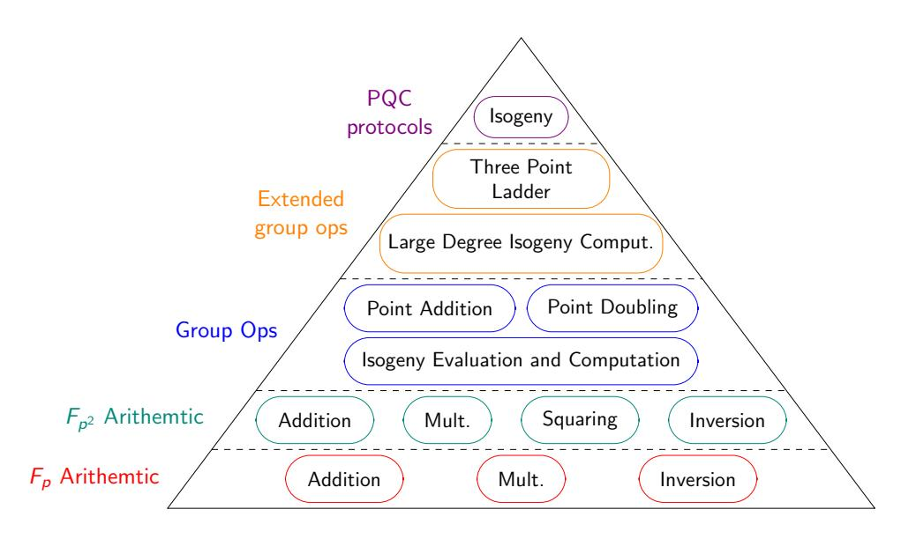
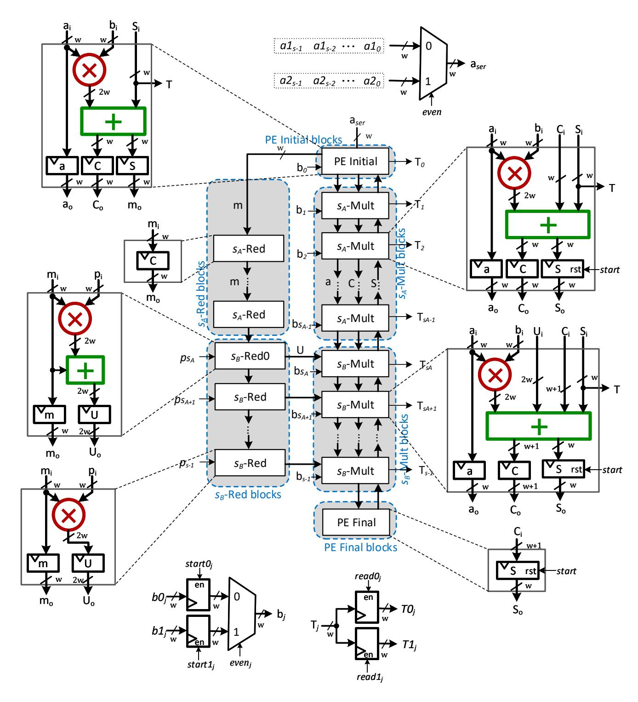
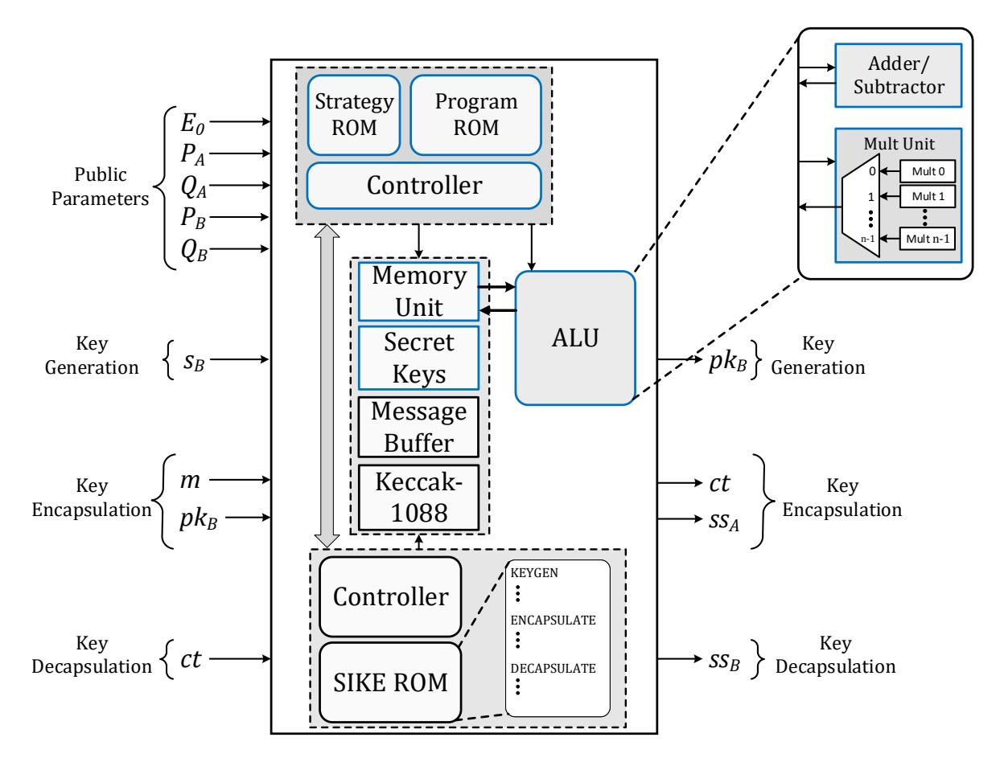

{0}------------------------------------------------

# Efficient and Fast Hardware Architectures for SIKE Round 2 on FPGA

Rami Elkhatib<sup>1</sup> , Reza Azarderakhsh<sup>1</sup> , and Mehran Mozaffari-Kermani<sup>2</sup>

> <sup>1</sup>Florida Atlantic University, Boca Raton, FL {relkhatib2015,razarderakhsh}@fau.edu. <sup>2</sup>University of South Florida, Tampa, FL mehran2@usf.edu.

Abstract. New primes were proposed for Supersingular Isogeny Key Encapsulation (SIKE) in NIST standardization process of Round 2 after further cryptanalysis research showed that the security levels of the initial primes chosen were over-estimated [1,3]. In this paper, we develop a highly optimized F<sup>p</sup> Montgomery multiplication algorithm and architecture that further utilizes the special form of SIKE prime compared to previous implementations available in the literature. We then implement SIKE for all Round 2 NIST security levels (SIKEp434 for NIST security level 1, SIKEp503 for NIST security level 2, SIKEp610 for NIST security level 3, and SIKEp751 for NIST security level 5) on Xilinx Virtex 7 using the proposed multiplier. Our best implementation (NIST security level 1) runs 29% faster and occupies 30% less hardware resources in comparison to the leading counterpart available in the literature [13] and implementations for other security levels achieved similar improvement.

Keywords: hardware architectures, isogeny-based cryptography, Montgomery multiplication, post-quantum cryptography, SIKE.

## 1 Introduction

Post-quantum cryptography (PQC) centers on identifying and understanding new mathematical techniques upon which cryptography can be built that are both resistant against quantum attacks and feasible to be implemented on today's widely used computerized devices. In a seminal paper [23], Peter Shor showed that both RSA and ECC would be easily broken by employing a quantum computer. The five main classes of quantum-hard problems are as follows [25]: code-based cryptography, lattice-based cryptography, hash-based cryptography, multivariate cryptography, and isogeny-based cryptography. The second round of the NIST PQC standardization process features a greater emphasis on evaluating the performance of candidates. NIST has anticipated that the second round will conclude by June 2020 and the third round will begin after. During the two final rounds, the PQC candidates will be scrutinized for their security and performance.

When considering quantum-safe alternatives to ECC, isogeny-based cryptography appears as an attractive replacement. The security of isogeny-based

{1}------------------------------------------------

Table 1. SIKE primes for post-quantum cryptography based on NIST Round 2 standardization process [3]

| Security          | Prime Form            | Public Key   | Shared Key  |  |
|-------------------|-----------------------|--------------|-------------|--|
| Level             |                       | Size (Bytes) | Size (Bits) |  |
| NIST level 1 p434 | = 22163<br>137 −<br>1 | 330          | 128         |  |
| NIST level 2 p503 | = 22503<br>159 −<br>1 | 378          | 192         |  |
| NIST level 3 p610 | = 23053<br>192 −<br>1 | 462          | 192         |  |
| NIST level 5 p751 | = 23723<br>239 −<br>1 | 564          | 256         |  |

cryptosystems such as Supersingular Isogeny Key Encapsulation (SIKE) scheme is based on the problem of computing isogenies between elliptic curves. Improving the performance of isogeny-based cryptography is critical to ensuring that it survives into subsequent rounds of standardization. Notably, the supersingular isogeny key encapsulation (SIKE) [3] scheme features the smallest public key sizes [4,7] of known quantum-safe public key exchange algorithms. Although isogeny-based cryptography is among the newest PQC candidates, SIKE offers a conservative security analysis, no possibility of decryption errors, and similar computations to well-established ECC. Small public key sizes are extremely advantageous in many different scenarios as it reduces the communication overhead and storage necessary for secure communications. As an example, low communication overhead is critical to establishing and maintaining secure communications over long distances or in high interference environments. The smallest set of SIKE parameters with key compression features keys of only 196 bytes, which is only around three times larger than 57-byte NIST X448 or 67-byte NIST P-521 public keys. SIKE offers all recommended security levels named SIKEp434, SIKEp503, SIKEp610, and SIKEp751 for NIST level-1, -2, -3, -5, respectively. Unfortunately, the main drawback of SIKE is that it is a few orders of magnitude slower than ECC or other PQC schemes. However, recently researchers were able to improve the computation time of SIKE by over an order of magnitude [15,16], reducing the total time to under 20 milliseconds while adding protection against active attacks. In this work, we show that there is still room for improvement of intensive lower level computations. This paper is another step forward in this direction which reduces the computation time to less than 10 milliseconds and cuts the occupied number of hardware resources considerably when implemented in FPGA. The goal of this paper is to develop efficient and high-performance hardware architectures for SIKE. The contributions of this paper is itemized in the following:

#### Our contributions:

– We develop a highly optimized Montgomery multiplication algorithm and architecture that further utilizes the special form of SIKE prime. We ex-

{2}------------------------------------------------

- perimented various configurations for our high-radix design to find the best choice for area-time trade-offs.
- We implement SIKE for NIST Round 2 primes; SIKEp434, SIKEp503, SIKEp610, and SIKEp751 with the developed Montgomery multiplier architecture.
- We evaluate time and area performance of the proposed hardware architecture benchmarked on an FPGA and compare with counterparts.

The organization of the paper is as follows. In Section 2, we give a literature review of SIKE. In Section 3, we discuss the algorithm and architecture of our highly optimized Montgomery multiplication. In Section 4, we propose our SIKE architecture and compare our results with counterparts available in the literature. Finally, in Section 5, we give our final thoughts and discuss future work.

## 2 Preliminaries: SIKE Protocol

In this section, we provide an overview of the SIKE protocol. SIKE mainly requires two operations: Isogeny and Shake256. The latter is part of the NIST standardized hashing algorithm SHA-3 [24]. Isogeny operations are done over Montgomery curve [8,19] using the efficient projective isogeny formulas [3] for better performance.

#### 2.1 SIKE Operations

A prime p is chosen of the form  $2^{e_A}3^{e_B}-1$  where  $2^{e_A}\approx 3^{e_B}$  (Check Table 1 for standardized primes). For public parameters, we have a starting curve  $E_0$ , two points  $P_A$  and  $Q_A$  of order  $2^{e_A}$  and two points  $P_B$  and  $Q_B$  of order  $3^{e_B}$  (standardized parameters are in SIKE specs [3]). Each pair of points with the same order must be chosen such that there is Weil pairing so that P + [s]Q also has an order of  $\ell^e$  (the order of P and Q) for any  $s < \ell^e$ .

**Key Generation:** In key generation, Bob chooses a random secret key  $s_B \in [0, 3^{e_B})$  and computes the isogenous elliptic curve  $E_B$  using the isogeny  $\phi_B$  with kernel  $\langle P_B + [s_B]Q_B \rangle$ . The elliptic curve  $E_B$  along with  $\phi_B(P_A)$  and  $\phi_B(Q_A)$  make up Bob's public key  $pk_B$ .

**Key Encapsulation:** In key encapsulation, Alice chooses a secret message  $m \in [0, 2^{ss} - size)$  (where  $ss\_size$  is the shared key size in Table 1) and hashes  $\{m, pk_B\}$  using Shake256 to generate her secret key r of size  $2^{e_A}$  bits. She can then compute her emphemeral public key  $\{E_A, \phi_A(P_B), \phi_A(Q_B)\}$  using the isogeny  $\phi_A : E_0 \to E_B \cong E_0 / \langle P_A + [r]Q_A \rangle$ . She also generates a key to encrypt the message m by first computing the elliptic curve  $E_{AB}$  under the isogeny  $\phi_{AB} : E_B \to E_{AB} \cong E_B / \langle \phi_B(P_A) + [r]\phi_B(Q_A) \rangle$ . Then she computes the j-invariant  $j(E_{AB})$  and hashes it with Shake256 to the same size of the message. She encrypts the message m by **XOR**ing it with the key to generate c. She shares the ciphertext  $ct = \{pk_A, c\}$  publicly and, finally, generates the shared secret

{3}------------------------------------------------



Fig. 1. Breakdown of isogeny computations [16]

 $ss_A$  of size ss size by hashing  $\{m, ct\}$  with Shake256.

**Key Decapsulation:** In key decapsulation, Bob first computes the key used to encrypt c by first computing the elliptic curve  $E_{BA}$  under the isogeny  $\phi_{BA}$ :  $E_A \to E_{BA} \cong E_A/\langle \phi_A(P_B) + [s_B]\phi_A(Q_A)\rangle$  using Alice's public key  $pk_A$ . If he receives Alice's correct ciphertext,  $E_{BA}$  should be isomorphic to  $E_{AB}$ , a.k.a. equal j-invariant. Therefore, he can compute the key by hashing the j-invariant  $j(E_{BA})$  with Shake256. The message m' can then be recovered by **XOR**ing c with the key. He can recover Alice's secret key r' by hashing  $\{m', pk_B\}$  and then generate Alice's public key  $pk'_A = \{E'_A, \phi'_A(P_B), \phi'_A(Q_B)\}$  under the isogeny  $\phi'_A = E_0 \to E'_A \cong E_0/\langle P_A + [r']Q_A\rangle$ . He checks that Alice's public key he computed is equal to Alice's actual public key. If they are equal, he outputs the correct shared secret  $ss_B$  by hashing  $\{m, pk_A, c\}$ .

Isogeny Computations: The pyramid in Fig. 1 shows the breakdown of isogeny computations. To compute the Isogeny  $E/\langle P+[s]Q\rangle$ , the kernel point R=P+[s]Q needs to be computed first using a three point ladder algorithm. The fastest algorithm is in [11] which requires one point addition and one point doubling per bit of the scalar s. For the large degree isogeny computation  $E/\langle R\rangle$ , we break it down into point multiplications and small isogeny evaluations and computations following a specific strategy. When the kernel is of order  $3^{e_B}$ , we perform point tripling and 3-isogenies. When the kernel is of order  $2^{e_A}$ , we perform point quadrupling and 4-isogenies as their formulas are more efficient than point doubling and 2-isogenies. Note that for SIKEp610, since  $e_A$  is odd, one 2-isogeny is performed at the beginning. The elliptic curve group operations are built using  $\mathbb{F}_p$  arithmetic which in turn is built using  $\mathbb{F}_p$  arithmetic.

## 3 Proposed Efficient Lower Level Arithmetic Operations

In this section, we are going to discuss our low level arithmetic operations. For the modular adder, we reused the modular adder in the leading hardware candidate

{4}------------------------------------------------

Table 2. Optimal modular adder parameters

| Prime    | $a \pm b$     | $a \pm b \mp p$ |
|----------|---------------|-----------------|
| SIKEp434 | L = 23, H = 3 | L = 21, H = 3   |
| SIKEp503 | L = 20, H = 3 | L = 26, H = 3   |
| SIKEp610 | L = 27, H = 3 | L = 20, H = 3   |
| SIKEp751 | L = 25, H = 3 | L = 20, H = 3   |

of SIKE [13], which utilizes the adder in [22], with more efficient parameters. The parameter L indicates length of carry chain before going to the next level compaction while the parameter H indicates the maximum level of compaction. It is near impossible to obtain the optimal parameters for the adder as place and route greatly changes for different parameters. However, going beyond H=3 will add a significant routing delay and roughly  $L=\sqrt{p}$  is a good starting point to test. We tested all L around  $\sqrt{p}$  for H=1,2,3 for  $a\pm b$  first and then for  $a\pm b\mp p$ . Table 2 shows optimal parameters for the modular adder we are using.

For the modular multiplication  $(a \times b \mod p)$ , Montgomery multiplication is a fast modular multiplication algorithm that transforms the expensive division by p into a cheap division by power of 2 which is a simple shift right in software or hardware. Word-by-word Montgomery multiplication algorithms were proposed in [12,21]. Some hardware implementations can be found in [13,10,20,2,5,6,9].

Finely Integrated Operand Scanning (FIOS) Montgomery multiplication algorithm is a word-by-word algorithm first proposed in [12]. The original implementation was suitable for software. In [10], the FIOS algorithm was re-purposed for hardware implementation suitable for SIKE primes. We had two issues using that implementation directly in SIKE. The first issue is that it was not fully interleaved (a.k.a unused blocks in the multiplier unit can't be used before the multiplication is complete). Since SIKE has a lot of modular multiplication computation that can be parallelized, the extra cycles from non-interleaving slows down SIKE. The issue can be easily resolved by pushing each chunk of the multiplicand (b for example) into the corresponding processing element as soon as it is needed instead of pushing all the chunks in one go. This technique will have no impact on the total number of cycles. The second issue is that when plugged in SIKE, the operating frequency is around 200MHz. This frequency makes the implementation non-competitive.

#### 3.1 Proposed Montgomery Multiplication Algorithm

We further optimized the Montgomery multiplication algorithm in [10] to minimize the number of operations in the critical path and the total number of operations used specifically for SIKE primes. Our optimized algorithm is provided in Algorithm 1. The algorithm performs the following s (number of words) times: an initial step, s-1 multiplication-reduction steps and a final step.

{5}------------------------------------------------

Algorithm 1: Optimized Montgomery Multiplication for SIKE Primes

```
Input : p = 2^{e_A} \cdot 3^{e_B} - 1 < 2^K, R = 2^K, w, s, K = w \cdot s, s_A = \lfloor 2^{e_A}/w \rfloor,
                    a, b < 2p - 1
     Output: MontMult(a, b)
 1 T \leftarrow 0
 2 for i \leftarrow 0 to s-1 do
           (C,S) \leftarrow T[0] + a[i] \cdot b[0]
 3
                                                                             PE Initial
           m \leftarrow S
 4
          for j \leftarrow 1 to s_A - 1 do
 5
            (C,S) \leftarrow T[j] + a[i] \cdot b[j] + C 
T[j-1] \leftarrow S 
  6
                                                                           \rangle s_A-Mult
  7
                                                                           \ > s_B-Red0
          U[s_A] \leftarrow m + m \cdot p[s_A]
 8
           for j \leftarrow s_A + 1 to s - 1 do
 9
                                                                          \rangle s_B-Red
            U[j] \leftarrow m \cdot p[j]
10
          for j \leftarrow s_A to s-1 do
11
             \begin{bmatrix} (C,S) \leftarrow T[j] + U[j] + a[i] \cdot b[j] + C \\ T[j-1] \leftarrow S \end{bmatrix}
12
                                                                          \rangle s_B-Mult
13
          if p < 2^K - 2 then
14
                (C,S) \leftarrow C
15
                T[s-1] \leftarrow S
16
           else
17
                                                                             PE Final
               (C,S) \leftarrow T[s] + C
T[s-1] \leftarrow S
18
19
                T[s] \leftarrow C
20
21 return T
```

The initial step begins by adding the first result chunk T[0] with  $a[i] \times p[0]$ . The least significant word S is used to compute the quotient m and the carry C is propagated to the first multiplication-reduction step. Because of the special form of SIKE primes where p[0] is all 1s for any word  $w < e_A$ ,  $p' = -p^{-1} \mod 2^w = 1$ . This leads to  $m = S \cdot p' \mod 2^w = S$ . Finally, a second carry  $C_r$  is propagated to the first multiplication-reduction step.  $(C_r, S) = S + m \cdot p[0] = m + m \cdot p[0] = (m, 0) \implies C_r = m$ . Our first change here is to keep the carries separate instead of merging them together by adding them.

Each of the multiplication-reduction steps consists of addition of current result chunk T[j], two parallel multiplications  $(a[i] \cdot b[j])$  and  $m \cdot p[j]$ , and the carry from the previous step. The least significant word is stored in the previous result chunk T[j-1] and the carry is propagated to the next step. Our approach was to split the multiplication-reductions steps into two parts. In the first part where  $1 \leq j < s_A = \lfloor 2^{e_A}/w \rfloor$   $(s_A$ -Mult), we notice that all the bits of p[j] are 1. The reduction operation  $m \times p[j]$  can be skipped completely as  $(C_r, S) = C_r + m \times p[j] = (m, 0)$ . Therefore, T[j-1] is independent of the reduction operation and we are always propagating m to the next step. In the second part where  $s_A \leq j < s$   $(s_B$ -Mult and  $s_B$ -Red), all operations of the multiplication-

{6}------------------------------------------------



Fig. 2. Proposed Montgomery multiplication architecture.

reduction step are performed. In the first reduction operation  $(s_B\text{-Red0})$ , we add the carry  $C_r = m$  to the reduction operation  $m \times p[s_A]$  which will be added to the first multiplication operation in  $s_B$ -Mult and merged with the carry C in subsequent steps. This means that in subsequent reduction operations only  $m \times p[j]$  is performed without adding  $C_r$ . Note that the carry C is 1 bit larger (w+1) bits total after the merging.

In the final step, the carry C of the last multiplication-reduction step is pushed into the final result chunk T[s-1]. If the radix  $R=2^K=2^{s\cdot w}$  is chosen such that  $p<2^{K-2}$ , then  $C<2^w$  can fit in the result chunk. Otherwise, if  $p=2^{K-1}$ , then an additional 1-bit register T[s] is used to process the extra bit of C.

{7}------------------------------------------------

Table 3. Breakdown of our proposed Montgomery multiplication architecture compared to previous design (Dual Multiplier).

|                             | Total           | Block                                                         | Critical  | Arithmetic         | Total Arithmetic                             |  |  |
|-----------------------------|-----------------|---------------------------------------------------------------|-----------|--------------------|----------------------------------------------|--|--|
| Block<br>Blocks             |                 | Operation                                                     | Path      | Operation          | Operations                                   |  |  |
| El Khatib et al. [10] twice |                 |                                                               |           |                    |                                              |  |  |
| PE initial                  | 1               | T[0] + a[i] · b[0]                                            | Mw + A2w  | Mw + A2w           | Mw + A2w                                     |  |  |
| Mult-Red                    |                 | s − 1 T [i] + a[i] · b[j] + m · p[j] + C Mw + 2A2w 2Mw + 3A2w |           |                    | (2s − 2)Mw + (3s − 3)A2w                     |  |  |
| PE final                    | 1               | C                                                             | 0         | 0                  | 0                                            |  |  |
| Full design                 | -               | -                                                             | Mw + 2A2w | -                  | (2s − 1)Mw + (3s − 2)A2w                     |  |  |
|                             | Proposed Design |                                                               |           |                    |                                              |  |  |
| PE initial                  | 1               | T[0] + a[i] · b[0]                                            | Mw + A2w  | Mw + A2w           | Mw + A2w                                     |  |  |
| sA-Red                      | sA − 2          | C                                                             | 0         | 0                  | 0                                            |  |  |
| sA-Mult                     | sA − 1          | T[i] + a[i] · b[j] + C                                        |           |                    | Mw + A2w Mw + 2A2w (sA − 1)Mw + (2sA − 2)A2w |  |  |
| sB-Red0                     | 1               | m + m · p[j]                                                  | Mw + A2w  | Mw + A2w           | Mw + A2w                                     |  |  |
| sB-Red                      | sB − 1          | m · p[j]                                                      | Mw        | Mw                 | (sB − 1)Mw                                   |  |  |
| sB-Mult                     | sB              | T [i] + U[j] + a[i] · b[j] + C                                |           | Mw + A2w Mw + 3A2w | (sB)Mw + (3sB)A2w                            |  |  |
| PE final                    | 1               | C                                                             | 0         | 0                  | 0                                            |  |  |
| Full design                 | -               | -                                                             | Mw + A2w  | -                  | (s + sB)MW + (2s + sB)A2w                    |  |  |

Note: s<sup>B</sup> = s − s<sup>A</sup>

The changes made to the algorithm cut s<sup>A</sup> − 1 multiplications and s<sup>A</sup> − 2 additions. Furthermore, sB-Red operations can be computed ahead of time which will reduce the critical path delay in our architecture.

#### 3.2 Proposed Architecture for Montgomery Multiplication

Fig. 2 shows our proposed architecture. Our design can perform two multiplications in parallel and each block in our design is pipelined and performs one operation in the algorithm. The first block PE initial computes the first multiplication carry C and the quotient m, which is also the reduction carry C<sup>r</sup> for Montgomery multiplication with SIKE primes. m is pushed to the reduction path (sA-Red→ sB-Red0→ sB-Red) where the reduction operations in the algorithm are performed. The first multiplication carry C is pushed to the multiplication path (sA-Mult→ sB-Mult) where the multiplication operations in the algorithm are performed and the result chunks are collected. Finally, PE final receives the final carry from the multiplication path and is used to process the final result chunk. Inside the main path (PE initial→Multiplication path→PE final), carry C is propagated forward while S is propagated backward as S is stored in previous result chunk T[j − 1] in the algorithm.

a1 and a2, the first operands for the dual multiplier, are pushed serially in odd and even cycles, respectively, into PE initial and then propagated to the next block in the multiplication path. The second operands for the dual multiplier,

{8}------------------------------------------------

Table 4. DSP breakdown of our proposed Montgomery multiplication architecture (Dual Multiplier)

| Block       | DSP 1              | DSP 2                               | Total DSPs  |
|-------------|--------------------|-------------------------------------|-------------|
| PE initial  | T[0] + a[i] × b[0] | -                                   | 1           |
| sA-Red      | -                  | -                                   | -           |
| sA-Mult     | a[i] × b[j]        | DSP 1 + T[i] + C                    | 2(sA − 1)   |
| sB-Red0     | m + m · p[j]       | -                                   | 1           |
| sB-Red      | m · p[j]           | -                                   | sB − 1      |
| sB-Mult     |                    | U[j] + a[i] × b[j] DSP 1 + T[i] + C | 2sB         |
| PE final    | -                  | -                                   | 0           |
| Full design | -                  | -                                   | 2s + sB − 1 |

b1 and b2, are pushed directly to their respective block. However, to achieve interleaving and increase throughput, b1 and b2 are pushed in the first s cycles with one cycle delay for the next word. On odd cycles, the odd blocks (1, 3, 5, . . .) compute chunks for the first pair of operands (a1and b1) while the even blocks (2, 4, 6, . . .) compute chunks for the second pair of operands (a<sup>2</sup> and b2). On even cycles, the blocks switch places where now the odd blocks work on the second pair of operands and the even blocks work on the first pair of operands. A reset is required to the register S that stores the result chunks during the first s cycles. The final result is collected word-by-word over s cycles after 2s cycles have passed since the start of the multiplier.

In the reduction path, sA-Red is completely eliminated in our algorithm and therefore m is simply propagated to sB-Red0 after a certain delay. To shorten the critical path, sB-Red blocks are processed one cycle in advance before the result is pushed into their corresponding sA-Mult block.

Table 3 gives a breakdown of the total number of blocks required as well as the critical path and the number of arithmetic operations used in comparison to [10] (used twice for dual-multiplication). The critical path is shortened by one addition and the design requires s<sup>A</sup> − 1 less multiplications and s<sup>A</sup> − 2 less additions.

#### 3.3 Implementation and Results

The FPGA we are using in our SIKE implementation is the Xilinx Virtex-7. The DSP unit in this series of FPGA can perform fast multiply-and-add (a × b + c) or 3-input addition (a + b + c). Chaining the DSPs allow for complex arithmetic operations with a small additional delay per DSP. Furthermore, DSPs support dual input for one of the multiplicand (a × b<sup>1</sup> + c or a × b<sup>2</sup> + c) by exploiting the pre-adder. This allows us to design a dual multiplier while fully utilizing the DSP unit. Table 4 shows how to utilize a maximum of 2 DSPs per block. In [10], the reduction and multiplication operations are not separated and therefore require 3 chained DSPs to compute them and more DSPs for a dual-multiplier

{9}------------------------------------------------

Table 5. Montgomery multiplication DSP and timing analysis

|                               | #        | Freq | Latency (cc) |                                             | Latency (ns) |     |  |  |
|-------------------------------|----------|------|--------------|---------------------------------------------|--------------|-----|--|--|
| Reference                     |          |      |              | DSP (MHz) Mult. Interleave Mult. Interleave |              |     |  |  |
|                               | SIKEp434 |      |              |                                             |              |     |  |  |
| Liu et al. [17]∗<br>36<br>236 |          |      |              | 54                                          | 280          | 229 |  |  |
| This work                     | 65       | 294  | 81           | 52                                          | 276          | 177 |  |  |
|                               | SIKEp503 |      |              |                                             |              |     |  |  |
| Koziel et al. [13]            | 88       | 171  | 70           | 49                                          | 409          | 286 |  |  |
| Liu et al. [17]∗              | 64       | 213  | 66           | 54                                          | 310          | 254 |  |  |
| This work                     | 75       | 294  | 93           | 60                                          | 316          | 204 |  |  |
|                               |          |      | SIKEp610     |                                             |              |     |  |  |
| Liu et al. [17]∗              | 81       | 191  | 66           | 54                                          | 346          | 283 |  |  |
| This work                     | 90       | 294  | 111          | 72                                          | 378          | 245 |  |  |
| SIKEp751                      |          |      |              |                                             |              |     |  |  |
| Koziel et al. [13]            | 128      | 167  | 100          | 69                                          | 597          | 412 |  |  |
| Liu et al. [17]∗              | 144      | 161  | 66           | 54                                          | 410          | 335 |  |  |
| This work                     | 113      | 294  | 138          | 90                                          | 469          | 306 |  |  |

<sup>∗</sup> LUT usage is 5-6× more than our design.

design. Thus, our design requires less number of DSPs in the critical path and less total DSPs.

A few additional optimizations can be exploited by the DSP. The registers to store the second operands b0 and b1 are used directly in the DSP. The DSP can select whether to add 0 or one of the operands in the addition step. This is used to replace the reset signal of the registers that hold the result chunks S. Another optimization that can be utilized is to store a and b going to the multiplication of each block in the DSP's register. This will add one extra cycle but greatly shorten the critical path. The start control signals and the even control signal for b1 and b2 are stored one cycle in advance in the DSP's control registers for improved performance. The registers used to store C and S are stored in the fabric outside the DSP as this will give the best performance.

Table 5 shows number of DSPs used and timing results of our implementations for each of the SIKE primes. Our design requires less DSP, has a higher frequency, but require more clock cycles in comparison to [13]. However, the higher frequency dominates the increased cycle count and the overall total time to perform an operation is lower. In [17], a huge part of the computation is moved from DSP to fabric. Their LUT usage for SIKEp434 is 6724 in comparison to our LUT usage of 1,157. In addition, the design is not very scalable as SIKEp751 uses more DSP and 5× LUT in comparison to our design. We reserve further comment until the design is plugged in SIKE.

{10}------------------------------------------------



Fig. 3. Proposed Hardware Architecture for SIKE protocol.

# 4 FPGA Implementations of SIKE

The implementation is performed in Xilinx Vivado 2019.2 for Xilinx Virtex-7 FPGA xc7vx690tffg1157-3 to be able to fairly compare our proposed scheme with the ones available in the literature. This FPGA includes 108,300 Slices (each with four LUTs and eight flip-flops), 3,600 DSP blocks and 1,470 36kb BlockRAMs. Each DSP slice contains a pre-adder, a  $25 \times 18$  multiplier, an adder, and an accumulator. Our design is based on the design in the leading literature [13] with a modified ALU based on Section 3.

#### 4.1 Proposed SIKE Architecture

The architecture for SIKE used in our design is illustrated in Fig. 3 which is composed of field arithmetic logic unit (ALU), main SIKE controller/ROM, program and strategy controller/ROM, memory unit, message buffer to hold Alice's message and ciphertext and Bob's message, secret key buffer to hold Alice's secret key and Bob's secret key, and hash unit based on Keccak-1088.

The ALU is the main core and performs operations in  $\mathbb{F}_p$  while interacting with the memory unit.  $\mathbb{F}_{p^2}$  arithmetic is done using  $\mathbb{F}_p$  architectures. For instance, a  $\mathbb{F}_{p^2}$  multiplication requires three  $\mathbb{F}_p$  multiplications, two  $\mathbb{F}_p$  additions and three  $\mathbb{F}_p$  subtractions, whereas a  $\mathbb{F}_{p^2}$  squaring requires only two  $\mathbb{F}_p$  multiplications, two  $\mathbb{F}_p$  additions and one  $\mathbb{F}_p$  subtraction. The ALU consists of a Multiplication unit and adder/subtractor unit. The adder/subtractor unit computes modular addition and subtraction ( mod 2p) as well as modular reduction

{11}------------------------------------------------

( mod p) over the specified primes for SIKE. The multiplication unit consists of n Dual-Multipliers based on the design proposed in Section 3. Since the multiplication unit is the critical resource, we use as many Dual-Multipliers as is allowed for parallelization while trying to minimize Time-Area cost.

The memory unit is implemented using BlockRAM resources from the FPGA device. The memory unit, secret key buffer, message buffer, and the hash unit can share data with each other and can be accessed directly 64-bit at a time. The SIKE controller/ROM includes main routines (fixed sequence of instructions) for key generation, key encapsulation, and key decapsulation. On the other hand, The strategy and program controller/ROM includes hand-optimized routines for all the operations required for computing an isogeny (three-point ladder and large-degree isogeny). The ROM units, similar to the memory unit, are implemented using the BlockRam resources. Our design requires 32 BlockRAMs for SIKEp434.

The sizes for various component of the SIKE architecture are different based on the required security level. For the whole operation, first we pre-load public parameters into the Memory unit. Secret keys are generated in the host CPU. Following the SIKE protocol discussed in Section 2.1, key encapsulation and decapsulation are performed and ss<sup>A</sup> and ss<sup>B</sup> are generated.

## 4.2 Implementation Results and Comparison

The proposed SIKE architectures for all NIST security levels were implemented and tested using Xilinx Vivado 2019.2 and all the results were obtained after place-and-route. We report area, timing and area-time trade-off (number of slices×time in ms) results of the design in Tables 6 and . For the best performance, we chose 3 Dual-Multipliers (6 multipliers total) for SIKEp434, SIKEp503 and SIKEp610 and 4 Dual-Multipliers for SIKEp751. We tested the functionality of the design using known answers tests (KATs) available in SIKE submission to NIST.

We compare our architecture results to the previous leading one [13] as well as the Software-Hardware co-design [18] (fast implementation only) and some of the previous Supersingular Isogeny Diffie-Hellman (SIDH) implementations. The total latency is the summation of key encapsulation and key decapsulation as key generation can be done offline. As one can see, for NIST level 1 security (SIKEp434) in Virtex-7, our design requires 5,458 Slices (17,557 flip flops, 12,999 LUTs), 195 DSPs, and 32 BlockRAMs. It also runs 249.6 MHz and performs the whole SIKE protocol in 8.8 ms. The drop in frequency in comparison to the Montgomery multiplier in Table 5 is caused by the strategy and program controller. Our design is smaller (except for the BlockRAMs) and faster with area-time trade-off being about 92% improved in comparison to the leading counterpart [13]. For the remaining security levels in Virtex-7, a similar improvement can be observed. It is to be noted that the design in [18] is one design for all SIKE security levels. In addition, the design targets smaller area/lower performance device so a direct comparison is not fair.

{12}------------------------------------------------

Table 6. Area results of SIKE implementation in Xilinx Virtex-7

| Reference           |          |        |          |        |     | # Mults # FFs # LUTs # Slices # DSPs # BRAMs |  |
|---------------------|----------|--------|----------|--------|-----|----------------------------------------------|--|
|                     | SIKEp434 |        |          |        |     |                                              |  |
| MLGB [18] (F)       | -        | -      | -        | 7,408  | 162 | 38.0                                         |  |
| Koziel et al. [13]  | 6        | 23,819 | 21,059   | 8,121  | 240 | 26.5                                         |  |
| This work           | 6        | 18,271 | 12,818   | 5,527  | 195 | 32.0                                         |  |
|                     |          |        | SIKEp503 |        |     |                                              |  |
| Koziel et al. [16]∗ | 6        | 30,031 | 24,499   | 10,298 | 192 | 27                                           |  |
| Koziel et al. [14]∗ | 6        | 26,659 | 19,882   | 8,918  | 192 | 40                                           |  |
| Koziel et al. [15]∗ | 6        | 24,908 | 18,820   | 7,491  | 192 | 43.5                                         |  |
| MLGB [18] (F)       | -        | -      | -        | 7,408  | 162 | 38.0                                         |  |
| Koziel et al. [13]  | 6        | 27,609 | 23,746   | 8,907  | 264 | 33.5                                         |  |
| This work           | 6        | 19,935 | 13,963   | 6,163  | 225 | 34.0                                         |  |
|                     |          |        | SIKEp610 |        |     |                                              |  |
| MLGB [18] (F)       | -        | -      | -        | 7,408  | 162 | 38.0                                         |  |
| Koziel et al. [13]  | 6        | 33,297 | 28,217   | 10,675 | 312 | 39.5                                         |  |
| This work           | 6        | 26,757 | 16,226   | 7,461  | 270 | 38.5                                         |  |
| SIKEp751            |          |        |          |        |     |                                              |  |
| SIKE Team [3]       | 8        | 51,914 | 44,822   | 16,756 | 376 | 56.5                                         |  |
| MLGB [18] (F)       | -        | -      | -        | 7,408  | 162 | 38.0                                         |  |
| Koziel et al. [13]  | 8        | 50,079 | 39,953   | 15,834 | 512 | 43.5                                         |  |
| This work           | 8        | 39,339 | 20,207   | 11,136 | 452 | 41.5                                         |  |

∗ SIDH

The improvements made in the design makes SIKE a feasible option for small embedded devices. Note that SIKE already offers smallest key sizes which reduces communication overhead in comparison to the other PQC submissions. Although all of our computations and implementations in this paper are secure (based on [13]) and constant-time, it is worth mentioning that this work mainly focuses on the high-performance implementations of the isogeny-based candidate SIKE in FPGA and investigating side-channel analysis attacks will be in our future work.

## 5 Conclusion

Post-quantum crypto accelerator hardware cores offer chip-makers an easy-tointegrate technology-independent solution, offering various NIST recommended security levels. In this paper, we optimized the Montgomery multiplication algorithm and architecture targeting SIKE primes. We also presented FPGA implementations of supersingular isogeny key encapsulation (SIKE) for all NIST

{13}------------------------------------------------

Table 7. Timing and Area-Time trade-off results of SIKE implementation in Xilinx Virtex-7

|                     |         | Time  |                 |             | Area×Time |
|---------------------|---------|-------|-----------------|-------------|-----------|
| Reference           | # Mults | Freq  | Latency         | Total       | AT×10−3   |
|                     |         |       | (MHz) (cc × 106 | ) time (ms) |           |
| SIKEp434            |         |       |                 |             |           |
| MLGB [18] (Fast)    | -       | 152.2 | -               | 24.3        | 180       |
| Koziel et al. [13]  | 6       | 168.4 | 1.91            | 11.3        | 92        |
| This work           | 6       | 249.6 | 2.19            | 8.8         | 48        |
| SIKEp503            |         |       |                 |             |           |
| Koziel et al. [16]∗ | 6       | 177   | 5.97            | 33.7        | 347       |
| Koziel et al. [14]∗ | 6       | 181.4 | 3.80            | 20.9        | 186       |
| Koziel et al. [15]∗ | 6       | 202.1 | 3.34            | 16.5        | 124       |
| MLGB [18] (Fast)    | -       | 152.2 | -               | 28.7        | 212       |
| Koziel et al. [13]  | 6       | 165.9 | 2.35            | 14.1        | 126       |
| This work           | 6       | 243.7 | 2.88            | 11.8        | 73        |
| SIKEp610            |         |       |                 |             |           |
| MLGB [18] (F)       | -       | 152.2 | -               | 51.8        | 384       |
| Koziel et al. [13]  | 6       | 165.8 | 3.59            | 21.6        | 231       |
| This work           | 6       | 239.0 | 4.56            | 19.1        | 142       |
| SIKEp751            |         |       |                 |             |           |
| SIKE Team [3]       | 8       | 198.0 | 6.60            | 33.4        | 560       |
| MLGB [18] (F)       | -       | 152.2 | -               | 60.8        | 450       |
| Koziel et al. [13]  | 8       | 163.1 | 4.55            | 27.8        | 440       |
| This work           | 8       | 232.7 | 5.93            | 25.5        | 284       |

<sup>∗</sup> SIDH

Round 2 security levels. The designs are the fastest FPGA implementations of SIKE over large prime characteristic fields for various NIST security levels. More specifically, our design utilizes 36% less hardware area and is 12-20% faster than the leading FPGA implementations. For NIST level 1, our proposed hardware accelerator performs the SIKE protocol in 8.8 ms. We verified our architectures by using the Known Answer Tests (KATs) from the SIKE submission and our code will be available online for further improvements and evaluations.

Minimizing public key sizes are critical for reducing transmission and storage requirements for internet applications as well as IoTs. Our future work will involve implementing the key compression mechanism and bench-marking the whole design with compressed keys for various security level required by NIST.

{14}------------------------------------------------

## 6 Acknowledgment

The authors would like to thank the reviewers for their comments. This work is supported in parts by NSF CNS-1801341 and NIST 60NANB16D246.

# References

- 1. Adj, G., Cervantes-Vázquez, D., Chi-Domínguez, J., Menezes, A., Rodríguez-Henríquez, F.: On the Cost of Computing Isogenies Between Supersingular Elliptic Curves. Cryptology ePrint Archive, Report 2018/313 (2018), https://eprint. iacr.org/2018/313
- 2. Alrimeih, H., Rakhmatov, D.: Fast and flexible hardware support for ecc over multiple standard prime fields. IEEE Transactions on Very Large Scale Integration (VLSI) Systems 22(12), 2661–2674 (Dec 2014). https://doi.org/10.1109/TVLSI.2013.2294649
- 3. Azarderakhsh, R., Campagna, M., Costello, C., De Feo, L., Hess, B., Jalali, A., Jao, D., Koziel, B., LaMacchia, B., Longa, P., Naehrig, M., Pereira, G., Renes, J., Soukharev, V., Urbanik, D.: Supersingular Isogeny Key Encapsulation. Submission to the NIST Post-Quantum Standardization Project (2019), https://sike.org/
- 4. Azarderakhsh, R., Jao, D., Kalach, K., Koziel, B., Leonardi, C.: Key Compression for Isogeny-Based Cryptosystems. In: Proceedings of the 3rd ACM International Workshop on ASIA Public-Key Cryptography. pp. 1–10 (2016)
- 5. Blum, T., Paar, C.: High-radix montgomery modular exponentiation on reconfigurable hardware. IEEE Transactions on Computers 50(7), 759–764 (July 2001). https://doi.org/10.1109/12.936241
- 6. Chen, G., Bai, G., Chen, H.: A high-performance elliptic curve cryptographic processor for general curves over gf(p) based on a systolic arithmetic unit. IEEE Transactions on Circuits and Systems II: Express Briefs 54(5), 412–416 (May 2007). https://doi.org/10.1109/TCSII.2006.889459
- 7. Costello, C., Jao, D., Longa, P., Naehrig, M., Renes, J., Urbanik, D.: Efficient compression of sidh public keys. In: Annual International Conference on the Theory and Applications of Cryptographic Techniques. pp. 679–706. Springer (2017)
- 8. De Feo, L., Jao, D., Plût, J.: Towards Quantum-Resistant Cryptosystems from Supersingular Elliptic Curve Isogenies. Journal of Mathematical Cryptology 8(3), 209–247 (Sep 2014)
- 9. Eberle, H., Gura, N., Shantz, S.C., Gupta, V., Rarick, L., Sundaram, S.: A publickey cryptographic processor for rsa and ecc. In: Proceedings. 15th IEEE International Conference on Application-Specific Systems, Architectures and Processors, 2004. pp. 98–110 (Sep 2004). https://doi.org/10.1109/ASAP.2004.1342462
- 10. El Khatib, R., Azarderakhsh, R., Mozaffari-Kermani, M.: Optimized algorithms and architectures for montgomery multiplication for post-quantum cryptography. In: International Conference on Cryptology and Network Security. pp. 83–98. Springer (2019)
- 11. Faz-Hernández, A., López, J., Ochoa-Jiménez, E., Rodríguez-Henríquez, F.: A faster software implementation of the supersingular isogeny diffie-hellman key exchange protocol. IEEE Transactions on Computers 67(11), 1622–1636 (2017)
- 12. Kaya Koc, C., Acar, T., Kaliski, B.S.: Analyzing and comparing montgomery multiplication algorithms. IEEE Micro 16(3), 26–33 (June 1996). https://doi.org/10.1109/40.502403

{15}------------------------------------------------

- 13. Koziel, B., Ackie, A., El Khatib, R., Azarderakhsh, R., Kermani, M.M.: Sike'd up: Fast hardware architectures for supersingular isogeny key encapsulation. IEEE Transactions on Circuits and Systems I: Regular Papers pp. 1–13 (2020)
- 14. Koziel, B., Azarderakhsh, R., Mozaffari-Kermani, M.: Fast Hardware Architectures for Supersingular Isogeny Diffie-Hellman Key Exchange on FPGA. In: Progress in Cryptology – INDOCRYPT 2016: 17th International Conference on Cryptology in India. pp. 191–206 (2016)
- 15. Koziel, B., Azarderakhsh, R., Mozaffari-Kermani, M.: A High-Performance and Scalable Hardware Architecture for Isogeny-Based Cryptography. IEEE Transactions on Computers 67(11), 1594–1609 (Nov 2018). https://doi.org/10.1109/TC.2018.2815605
- 16. Koziel, B., Azarderakhsh, R., Mozaffari-Kermani, M., Jao, D.: Post-Quantum Cryptography on FPGA Based on Isogenies on Elliptic Curves. IEEE Transactions on Circuits and Systems I: Regular Papers 64(1), 86–99 (Jan 2017). https://doi.org/10.1109/TCSI.2016.2611561
- 17. Liu, W., Ni, Z., Ni, J., Rafferty, C., O'Neill, M.: High performance modular multiplication for sidh. IEEE Transactions on Computer-Aided Design of Integrated Circuits and Systems (2019)
- 18. Massolino, P.M.C., Longa, P., Renes, J., Batina, L.: A compact and scalable hardware/software co-design of sike. IACR Transactions on Cryptographic Hardware and Embedded Systems pp. 245–271 (2020)
- 19. Montgomery, P.L.: Speeding the Pollard and Elliptic Curve Methods of Factorization. Mathematics of Computation pp. 243–264 (1987)
- 20. Mrabet, A., Mrabet, N.E., Lashermes, R., Rigaud, J., Bouallegue, B., Mesnager, S., Machhout, M.: High-performance elliptic curve cryptography by using the CIOS method for modular multiplication. In: Risks and Security of Internet and Systems - 11th International Conference, CRiSIS 2016, Roscoff, France, September 5-7, 2016, Revised Selected Papers. pp. 185–198 (2016)
- 21. Orup, H.: Simplifying Quotient Determination in High-Radix Modular Multiplication. In: Proceedings of the 12th Symposium on Computer Arithmetic. pp. 193–9. ARITH '95, IEEE Computer Society, Washington, DC, USA (1995)
- 22. Preußer, T.B., Zabel, M., Spallek, R.G.: Accelerating computations on fpga carry chains by operand compaction. In: 2011 IEEE 20th Symposium on Computer Arithmetic. pp. 95–102. IEEE (2011)
- 23. Shor, P.W.: Algorithms for Quantum Computation: Discrete Logarithms and Factoring. In: 35th Annual Symposium on Foundations of Computer Science (FOCS 1994). pp. 124–134 (1994)
- 24. The National Institute of Standards and Technology (NIST): Sha-3 standard: Permutation-based hash and extendable-output functions. Tech. rep. (2015)
- 25. The National Institute of Standards and Technology (NIST): Post-quantum cryptography standardization (2017–2018), https://csrc.nist.gov/projects/ post-quantum-cryptography/post-quantum-cryptography-standardization