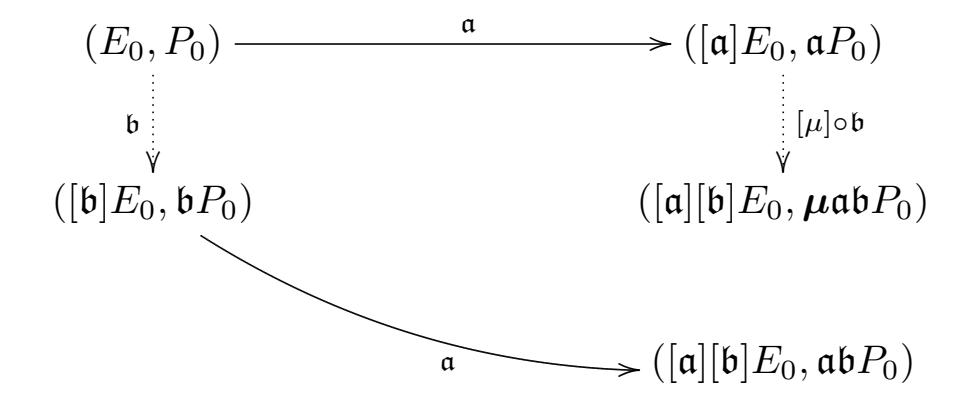
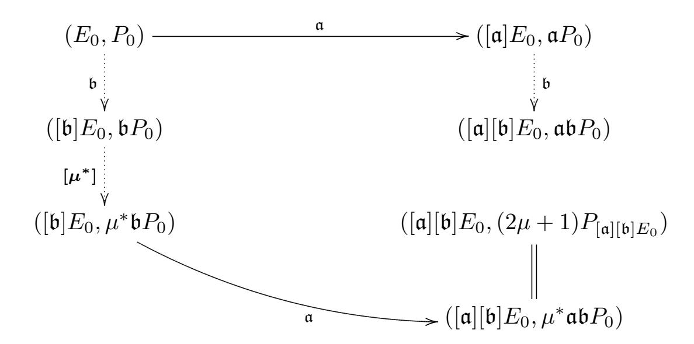

{0}------------------------------------------------

# SiGamal: A supersingular isogeny-based PKE and its application to a PRF

Tomoki Moriya<sup>1</sup>, Hiroshi Onuki<sup>1</sup>, and Tsuyoshi Takagi<sup>1</sup>

Department of Mathematical Informatics, The University of Tokyo, Japan {tomoki\_moriya,onuki,takagi}@mist.i.u-tokyo.ac.jp

Abstract. We propose two new supersingular isogeny-based public key encryptions: SiGamal and C-SiGamal. They were developed by giving an additional point of the order  $2^r$  to CSIDH. SiGamal is similar to ElGamal encryption, while C-SiGamal is a compressed version of SiGamal. We prove that SiGamal and C-SiGamal are IND-CPA secure without using hash functions under a new assumption: the P-CSSDDH assumption. This assumption comes from the expectation that no efficient algorithm can distinguish between a random point and a point that is the image of a public point under a hidden isogeny.

Next, we propose a Naor-Reingold type pseudo random function (PRF) based on SiGamal. If the P-CSSDDH assumption and the CSSDDH\* assumption, which guarantees the security of CSIDH that uses a prime p in the setting of SiGamal, hold, then our proposed function is a pseudo random function. Moreover, we estimate that the computational costs of group actions to compute our proposed PRF are about  $\sqrt{\frac{8T}{3\pi}}$  times that of the group actions in CSIDH, where T is the Hamming weight of the input of the PRF.

Finally, we experimented with group actions in SiGamal and C-SiGamal. The computational costs of group actions in SiGamal-512 with a 256-bit plaintext message space were about 2.62 times that of a group action in CSIDH-512.

**Keywords:** isogeny-based cryptography · isogenies · CSIDH · public key encryption.

# 1 Introduction

Public key cryptosystems are important technologies for guaranteeing the security of communication. Currently, RSA [24] and ECC [16,11] are widely used public key cryptosystems. Shor showed, however, that both of them can be broken by using a quantum computer in polynomial time [25]. Thus, we need to develop new cryptosystems that cannot be broken even by using quantum computers (*i.e.*, post-quantum cryptosystems), before actual quantum computers that can break RSA and ECC are developed.

Isogeny-based cryptosystems depend on the computational complexity of the isogeny problem. Because the isogeny problem is considered hard to solve even

{1}------------------------------------------------

<span id="page-1-0"></span>Schemes SIKE SIDH CSIDH SETA ´ SiGamal Hash Used Not used Used Not used Used Not used Not used Security IND-CCA OW-CPA IND-CPA OW-CPA IND-CPA OW-CPA IND-CPA Assumption SSCDH SSDDH SSCDH CSSDDH CSSCDH RCSSI P-CSSDDH

**Table 1.** Comparison of isogeny-based encryption schemes

by using quantum computers, isogeny-based cryptosystems are considered to be one potential type of post-quantum cryptosystem. In fact, Supersingular Isogeny Key Encapsulation (SIKE) [\[1\]](#page-27-0) remained a candidate for the standardization of post-quantum cryptography in the NIST second-round competition [\[19\]](#page-28-4).

There are some isogeny-based key encryption schemes. In 2011, Jao and De Feo proposed an isogeny-based key exchange scheme: Supersingular Isogeny Diffie-Hellman (SIDH) [\[10\]](#page-28-5). In 2018, Castryck, Lange, Martindale, Panny, and Renes proposed another isogeny-based key exchange scheme: Commutative Supersingular Isogeny Diffie-Hellman (CSIDH) [\[3\]](#page-27-1). Finally, in 2019, de Saint Guilhem, Kutas, Petit, and Javier proposed a public key encryption scheme: Supersingular Encryption from Torsion Attacks (SETA) [ ´ [6\]](#page-27-2). As far as we know, these key encryptions require hash functions for IND-CPA security.

# **1.1 Our results**

One of our motivations in this paper is to construct secure schemes under a minimum assumption. Without using hash functions, we propose two new public key encryption schemes based on CSIDH: SiGamal and C-SiGamal. SiGamal is very similar to ElGamal encryption [\[8\]](#page-28-6), while C-SiGamal is a compressed version of SiGamal. The bit length of a ciphertext in SiGamal is four times the bit length of the prime *p* in the setting, while the bit length of a ciphertext in C-SiGamal is twice the bit length of the prime *p* in the setting.

We define two new assumptions: the P-CSSCDH assumption (the Point-Commutative Supersingular Computational Diffie-Hellman assumption) and the P-CSSDDH assumption (the Point-Commutative Supersingular Decisional Diffie-Hellman assumption). These two assumptions come from the idea that it is hard to compute the image point of a given point under a hidden isogeny. The P-CSSCDH assumption is a computational assumption, and the P-CSSDDH assumption is a decisional assumption. We prove that, if the P-CSSCDH assumption holds, then SiGamal and C-SiGamal are OW-CPA secure; furthermore, if the P-CSSDDH assumption holds, then SiGamal and C-SiGamal are IND-CPA secure.

We summarize a comparison of isogeny-based public key encryption schemes in Table [1.](#page-1-0) Here, we regard SIDH and CSIDH as encryption schemes that use the simple XOR cipher. As shown in this table, only our proposed schemes can achieve IND-CPA security without using hash functions.

Next, we construct a new Naor-Reingold type pseudo random function (PRF) from SiGamal. This PRF is a post-quantum PRF. We prove that the pseudo 

{2}------------------------------------------------

randomness of this function is guaranteed from the P-CSSDDH and CSSDDH\* assumptions. The CSSDDH\* assumption guarantees the security of CSIDH that uses a prime p in the setting of SiGamal. This PRF needs to compute group actions many times. We estimate, by using approximations, that the computational costs of our proposed PRF are  $\sqrt{\frac{8T}{3\pi}}$  times that of a group action in SiGamal, where T is the Hamming weight of the input of the PRF.

Finally, to evaluate the proposed key encryption schemes, we implemented group actions in SiGamal and C-SiGamal and measured their computational costs. In our experiment, the computational costs of group actions in SiGamal and C-SiGamal that send 256-bit plaintexts were about 2.62 times that of a group action in CSIDH-512. Furthermore, we implemented t times group actions to evaluate the proposed PRF. Our approximation was roughly correct.

**Organization.** We explain important mathematical concepts and algorithms in §2.1 to 2.4. We explain public key encryption in §2.5. In §2.6, we explain the PRF. Then, we propose SiGamal in §3 and C-SiGamal in §4. In §5, we propose a new isogeny-based PRF. In §6, we show our experimentation results, and in §7, we conclude this paper.

# 2 Preliminaries

#### 2.1 Basic mathematical concepts

Here, we explain the basic mathematical concepts behind isogeny-based cryptography.

Elliptic curves. Let  $\mathbb{L}$  be a field, and let  $\mathbb{L}'$  be an algebraic extension field of  $\mathbb{L}$ . First, an *elliptic curve* E defined over  $\mathbb{L}$  is a nonsingular algebraic curve that is defined over  $\mathbb{L}$  and has genus one. Denote by  $E(\mathbb{L}')$  the  $\mathbb{L}'$ -rational points of the elliptic curve E. Here,  $E(\mathbb{L}')$  is an abelian group [27, III. 2]. Next, a supersingular elliptic curve E over a finite field  $\mathbb{L}$  of characteristic p is defined as an elliptic curve that satisfies  $\#E(\mathbb{L}) \equiv 1 \pmod{p}$ , where  $\#E(\mathbb{L})$  is the cardinality of  $E(\mathbb{L})$ . Furthermore, let  $\mathbb{L}$  be a field whose characteristic is odd. Then, an elliptic curve E defined by the following equation is called a *Montgomery curve*:

$$E : bY^2Z = X^3 + aX^2Z + XZ^2 \quad (a, b \in \mathbb{L} \text{ and } b(a^2 - 4) \neq 0).$$

Let E and E' be elliptic curves defined over  $\mathbb{L}$ . Define an  $isogeny \ \phi \colon E \to E'$  over  $\mathbb{L}'$  as a rational map over  $\mathbb{L}'$  that is a non-zero group homomorphism from  $E(\overline{\mathbb{L}})$  to  $E'(\overline{\mathbb{L}})$ , where  $\overline{\mathbb{L}}$  is the algebraic closure of  $\mathbb{L}$ . A separable isogeny satisfying  $\# \ker \phi = \ell$  is called an  $\ell$ -isogeny. Denote by  $\operatorname{End}_{\mathbb{L}'}(E)$  the endomorphism ring of E over  $\mathbb{L}'$ , and represent it as  $\operatorname{End}_p(E)$  when  $\mathbb{L}'$  is a prime field  $\mathbb{F}_p$ . Note also that an isogeny  $\phi \colon E \to E'$  defined over  $\mathbb{L}'$  is called an isomorphism over  $\mathbb{L}'$  if it has the inverse isogeny over  $\mathbb{L}'$ .

{3}------------------------------------------------

If *G* is a finite subgroup of *E*(L), then there exists an isogeny *ϕ*: *E → E′* such that its kernel is *G* and *E′* is unique up to an L-isomorphism [\[27,](#page-29-0) Proposition III.4.12]. This isogeny can be efficiently calculated by using V´elu formulas [\[29\]](#page-29-1). We denote a representative of *E′* by *E/G*.

Next, we define the *j-invariant* of a Montgomery curve *E* : *bY* <sup>2</sup>*Z* = *X*<sup>3</sup> + *aX*2*Z* + *XZ*<sup>2</sup> (*a, b ∈* L and *b*(*a* <sup>2</sup> *−* 4) *6*= 0) by the following equation:

$$j(E) := \frac{256(a^2 - 3)^3}{a^2 - 4}.$$

It is known that the *j*-invariants of two elliptic curves are the same if and only if the elliptic curves are L-isomorphic.

Finally, we define *E*[*k*] (*k ∈* Z*>*0) as the *k*-torsion subgroup of *E*(L). For an endomorphism *ϕ* of *E*, we sometimes denote ker *ϕ* by *E*[*ϕ*].

**Ideal class groups.** Let L be a number field, and *O* be an order in L. A *fractional ideal* a of *O* is a non-zero *O*-submodule of L that satisfies *α*a *⊂ O* for some *α ∈ O \ {*0*}*. Moreover, an *invertible fractional ideal* a of *O* is defined as a fractional ideal of *O* that satisfies ab = *O* for some fractional ideal b of *O*. The fractional ideal b can be represented as a *−*1 . If a fractional ideal a is contained in *O*, then it is called an *integral ideal* of *O*. Let *J*(*O*) be a set of integral ideals of *O*.

Next, let *I*(*O*) specifically be a set of invertible fractional ideals of *O*. *I*(*O*) is then an abelian group derived from the multiplication of ideals with the identity *O*. Let *P*(*O*) be a subgroup of *I*(*O*) defined by *P*(*O*) = *{*a *|* a = *αO* (for some *α ∈* L *<sup>×</sup>*)*}*. We call the abelian group cl(*O*) defined by *I*(*O*)*/P*(*O*) the *ideal class group* of *O*. Denote by [a] an element of cl(*O*) that is an equivalence class of a.

**Notation.** The F*p*-endomorphism ring End*p*(*E*) of a supersingular elliptic curve *E* defined over F*<sup>p</sup>* is isomorphic to an order in an imaginary quadratic field [\[7\]](#page-27-3). Denote by *Eℓℓp*(*O*) the set of F*p*-isomorphism classes of any elliptic curve *E* whose F*p*-endomorphism ring End*p*(*E*) is isomorphic to *O*.

# **2.2 Group action of ideal class group**

In this subsection, we explain an important group action that is a main part of our proposed encryption system. First, Waterhouse gave the following theorem.

<span id="page-3-0"></span>**Theorem 1 ([\[30,](#page-29-2) Theorem 4.5]).** *Let O be an order of an imaginary quadratic field and E be an elliptic curve defined over* F*p. If Eℓℓp*(*O*) *contains the* F*pisomorphism class of supersingular elliptic curves, then the action of the ideal class group* cl(*O*) *on Eℓℓp*(*O*)*,*

$$\operatorname{cl}(\mathcal{O}) \times \mathcal{E}\ell_p(\mathcal{O}) \longrightarrow \mathcal{E}\ell\ell_p(\mathcal{O})$$
  
 $([\mathfrak{a}], E) \longmapsto E/E[\mathfrak{a}],$ 

{4}------------------------------------------------

is free and transitive, where  $\mathfrak{a}$  is an integral ideal of  $\mathcal{O}$ , and  $E[\mathfrak{a}]$  is the intersection of the kernels of elements in  $\mathfrak{a}$ .

In general, we cannot efficiently compute the group action in Theorem 1. Castryck, Lange, Martindale, Panny, and Renes, however, proposed a method for computing this group action efficiently in a special case [3]. They focused on the action of  $\operatorname{cl}(\mathbb{Z}[\pi_p])$  on  $\operatorname{Ell}_p(\mathbb{Z}[\pi_p])$ , where  $\pi_p$  is the p-Frobenius map over elliptic curves. In [3], they proved the following theorem.

<span id="page-4-1"></span>**Theorem 2** ([3, Proposition 8]). Let p be a prime satisfying  $p \equiv 3 \pmod{8}$ . Let E be a supersingular elliptic curve defined over  $\mathbb{F}_p$ . Then,  $\operatorname{End}_p(E) \cong \mathbb{Z}[\pi_p]$  holds if and only if there exists  $a \in \mathbb{F}_p$  such that E is  $\mathbb{F}_p$ -isomorphic to a Montgomery curve  $Y^2Z = X^3 + aX^2Z + XZ^2$ , where  $\pi_p$  is the p-Frobenius map. Moreover, if such an a exists, then it is unique.

In other words, a Montgomery curve that belongs to an  $\mathbb{F}_p$ -isomorphism class  $E/E[\mathfrak{a}]$  is unique. Denote this Montgomery curve by  $[\mathfrak{a}]E$ .

Let the prime p be  $4 \cdot \ell_1 \cdots \ell_n - 1$ , where the  $\ell_1, \ldots, \ell_n$  are small distinct odd primes. Let integral ideals  $\mathfrak{l}_i$   $(i=1,\ldots,n)$  in  $\mathbb{Z}[\pi_p]$  be  $(\ell_i,\pi_p-1)$  and integral ideals  $\overline{\mathfrak{l}_i}$   $(i=1,\ldots,n)$  in  $\mathbb{Z}[\pi_p]$  be  $(\ell_i,\pi_p+1)$ . Because  $\pi_p^2 + p = 0$  over supersingular elliptic curves defined over  $\mathbb{F}_p$ , it is easy to verify that  $[\mathfrak{l}_i]^{-1} = [\overline{\mathfrak{l}_i}]$  over such elliptic curves. The actions of  $[\mathfrak{l}_i]$  and  $[\overline{\mathfrak{l}_i}]$  are efficiently computed by Theorem 1 and Vélu formulas on Montgomery curves [15]. Therefore, an action of  $[\mathfrak{l}_1]^{e_1} \cdots [\mathfrak{l}_n]^{e_n} \in \mathrm{cl}(\mathbb{Z}[\pi_p])$  can be efficiently computed, where  $e_1, \ldots, e_n$  are integers whose absolute values are small. According to the discussion in [3], from some heuristic assumptions, it holds that

$$\#\operatorname{cl}(\mathbb{Z}[\pi_p]) \approx \#\{[\mathfrak{l}_1]^{e_1} \cdots [\mathfrak{l}_n]^{e_n} \mid e_1, \dots, e_n \in \{-m, \dots, m\}\},\$$

where m is the smallest number that satisfies  $2m+1 \geq \sqrt[2n]{p}$ , and we call m a key bound. Therefore, it suffices to consider the action of  $[\mathfrak{l}_1]^{e_1} \cdots [\mathfrak{l}_n]^{e_n}$ , instead of the action of a random element of  $\operatorname{cl}(\mathbb{Z}[\pi_p])$ . Algorithm 1 specifies this sequence of group actions.

In this paper, we extend this computational method for our proposed scheme. In our scheme, we use a prime p that satisfies  $p = 2^r \cdot \ell_1 \cdots \ell_n - 1$ , where  $r \geq 3$  and the  $\ell_1, \ldots, \ell_n$  are small distinct odd primes. Therefore, we need the following theorem.

<span id="page-4-0"></span>**Theorem 3 ([2, Proposition 3]).** Let p > 3 be a prime that satisfies  $p \equiv 3 \pmod{4}$ , and let E be a supersingular elliptic curve defined over  $\mathbb{F}_p$ . If  $\operatorname{End}_p(E) \cong \mathbb{Z}[\pi_p]$  holds, then there exists  $a \in \mathbb{F}_p$  such that E is  $\mathbb{F}_p$ -isomorphic to  $Y^2Z = X^3 + aX^2Z + X^2Z$ . Moreover, if such an a exists, then it is unique.

From Theorem 3, even if we use a prime  $p = 2^r \cdot \ell_1 \cdots \ell_n - 1$ , we can compute the action of  $\operatorname{cl}(\mathbb{Z}[\pi_p])$  in the same way as that proposed in [3] (*i.e.*, Algorithm 1).

Moreover, we consider mapping points in E to  $[\mathfrak{a}]E$  by an isogeny whose kernel is  $E[\mathfrak{a}]$ . Because we use isogenies to compute  $[\mathfrak{a}]E$ , it is easy to map a

{5}------------------------------------------------

# **Algorithm 1** Evaluation of a class group action [3]

```
Input: a \in \mathbb{F}_p such that E: Y^2Z = X^3 + aX^2Z + XZ^2 is supersingular, and a list of
     integers (e_1,\ldots,e_n)
Output: A Montgomery coefficient of [\mathfrak{l}_1^{e_1} \cdots \mathfrak{l}_n^{e_n}]E
 1: while some e_i \neq 0 do
 2:
        Sample a random x \in \mathbb{F}_p
        x(P) \leftarrow x
 3:
        Set s \leftarrow +1 if x^3 + ax^2 + x is a square in \mathbb{F}_p, else s \leftarrow -1
 4:
        Let S = \{i \mid sign(e_i) = s\}
 5:
        if S = \emptyset then
 6:
            Go to line 2
 7:
        end if
 8:
        k \leftarrow \prod_{i \in S} \ell_i, \ x(P) \leftarrow x(((p+1)/k)P)
 9:
         for all i \in S do
10:
            x(Q) \leftarrow x((k/\ell_i)P)
11:
            if Q \neq (0:1:0) then
12:
                Compute an \ell_i-isogeny \phi \colon E_a \to E_{a'} with \ker \phi = \langle Q \rangle
13:
                a \leftarrow a', x(P) \leftarrow x(\phi(P)), k \leftarrow k/\ell_i, e_i \leftarrow e_i - s
14:
            end if
15:
16:
         end for
17: end while
18: return a
```

point  $P \in E$  to  $[\mathfrak{a}]E$ . In general, however, the image of P is not unique since there are various isogenies  $E \to [\mathfrak{a}]E$  whose kernels are  $E[\mathfrak{a}]$ . In particular, in general, the image of P over the isogeny  $E \to [\mathfrak{a}]E \to [\mathfrak{a}][\mathfrak{b}]E$  and that of P over the isogeny  $E \to [\mathfrak{b}]E \to [\mathfrak{a}][\mathfrak{b}]E$  are not same. The following theorem guarantees that the image of P is unique up to  $\{\pm 1\}$ .

<span id="page-5-1"></span>**Theorem 4.** Let E be a supersingular elliptic curve defined over  $\mathbb{F}_p$ . Let  $\Phi_{[\mathfrak{a}],(F)}$  denote an isogeny  $\phi \colon F \to [\mathfrak{a}]F$  such that  $\ker \phi = F[\mathfrak{a}]$ . If the following isogenies are defined over  $\mathbb{F}_p$ , then they satisfy the following equations:

$$\Phi_{[\mathfrak{b}],([\mathfrak{a}]E)} \circ \Phi_{[\mathfrak{a}],(E)} = [\pm 1] \circ \Phi_{[\mathfrak{a}],([\mathfrak{b}]E)} \circ \Phi_{[\mathfrak{b}],(E)}.$$

<span id="page-5-2"></span>To prove Theorem 4, we need the following lemma.

**Lemma 1.** Let  $E_1$  and  $E_2$  be supersingular elliptic curves defined over  $\mathbb{F}_p$ . Let G be a finite subgroup of  $E_1(\overline{\mathbb{F}_p})$  defined over  $\mathbb{F}_p$  (i.e.,  $\pi_p(G) = G$ ). Let  $\phi \colon E_1 \to E_2$  and  $\psi \colon E_1 \to E_2$  be separable isogenies defined over  $\mathbb{F}_p$ . If  $\ker \phi = \ker \psi = G$ , then  $\phi = \psi$ , or  $\phi = [-1] \circ \psi$ .

*Proof.* From [9, Theorem 9.6.18], there are unique isogenies  $\lambda_1 : E_2 \to E_2$  and  $\lambda_2 : E_2 \to E_2$  defined over  $\mathbb{F}_p$  such that  $\psi = \lambda_1 \circ \phi$  and  $\phi = \lambda_2 \circ \psi$ . Furthermore, from the uniqueness of isogenies in [9, Theorem 9.6.18], it holds that  $\lambda_1 = \lambda_2^{-1}$ . Therefore,  $\lambda_2$  is an automorphism of  $E_2$  defined over  $\mathbb{F}_p$ .

Next, from [27, Theorem III.10.1], if  $j(E_2) \neq 0$  and  $j(E_2) \neq 1728$ , then there are no automorphisms other than  $[\pm 1]$ . Therefore, we have  $\lambda_2(x,y) = (x,\pm y) =$ 

{6}------------------------------------------------

 $[\pm 1](x,y)$ . Since  $E_2$  is supersingular, if  $j(E_2) = 0$ , then  $p \equiv 2 \pmod{3}$ , and if  $j(E_2) = 1728$ , then  $p \equiv 3 \pmod{4}$ . Therefore, from [27, Theorem III.10.1], even if  $j(E_2) = 0$  or  $j(E_2) = 1728$ , there are no automorphisms defined over  $\mathbb{F}_p$  other than  $[\pm 1]$ , and we have  $\lambda_2(x,y) = (x,\pm y) = [\pm 1](x,y)$ .

Now, we can prove Theorem 4.

Proof of Theorem 4. From Lemma 1, it suffices to show that

$$\ker \left( \Phi_{[\mathfrak{b}],([\mathfrak{a}]E)} \circ \Phi_{[\mathfrak{a}],(E)} \right) = \ker \left( \Phi_{[\mathfrak{a}],([\mathfrak{b}]E)} \circ \Phi_{[\mathfrak{b}],(E)} \right).$$

Indeed, this holds from [30, Proposition 3.12].

As shown above, the image of  $P \in E$  under the isogeny defined by the integral ideal  $\mathfrak{a}$  in  $\operatorname{End}(E)$  is unique up to  $[\pm 1]$ . We denote this equivalence class of two points by  $\mathfrak{a}P$ . Note that, even if  $[\mathfrak{a}] = [\mathfrak{a}']$ , it does not always hold that  $\mathfrak{a}P = \mathfrak{a}'P$ . In fact, when  $[\mathfrak{a}][\overline{\mathfrak{a}}] = [1]$ , we have  $\mathfrak{a}\overline{\mathfrak{a}}P = N(\mathfrak{a})P$ , where  $N(\mathfrak{a})$  is the norm of  $\mathfrak{a}$ .

All elements of  $J(\mathbb{Z}[\pi_p])$  appearing in this paper are defined by  $(\alpha)\mathfrak{l}_1^{e_1}\cdots\mathfrak{l}_n^{e_n}$ , where  $\alpha$  is an integer. An equivalence class  $(\alpha)\mathfrak{l}_1^{e_1}\cdots\mathfrak{l}_n^{e_n}P$  is a class of images of  $\alpha P$  under the isogeny defined by  $\mathfrak{l}_1^{e_1}\cdots\mathfrak{l}_n^{e_n}$ .

## 2.3 CSIDH

CSIDH (Commutative Supersingular Isogeny Diffie-Hellman) is a Diffie-Hellmantype key exchange scheme [3]. It is based on actions of the ideal class group  $\operatorname{cl}(\mathbb{Z}[\pi_p])$  on  $\operatorname{\mathcal{E}\!\ell\ell}_p(\mathbb{Z}[\pi_p])$ .

The exact scheme is as follows. Suppose that Alice and Bob want to share a shared key denoted by  $SK_{shared}$ .

**Setup** Let p be a prime that satisfies  $p = 4 \cdot \ell_1 \cdots \ell_n - 1$ , where  $\ell_1, \dots, \ell_n$  are small distinct odd primes. Then, let p and  $E_0: Y^2Z = X^3 + XZ^2$  be public parameters.

**Key generation** Randomly choose an integer vector  $(e_1, \ldots, e_n)$  from  $\{-m, \ldots, m\}^n$ . Define  $[\mathfrak{a}] = [\mathfrak{l}_1^{e_1} \cdots \mathfrak{l}_n^{e_n}] \in \operatorname{cl}(\mathbb{Z}[\pi_p])$ . Then, calculate the action of  $[\mathfrak{a}]$  on  $E_0$  and the Montgomery coefficient  $a \in \mathbb{F}_p$  of  $[\mathfrak{a}]E_0 \colon Y^2Z = X^3 + aX^2Z + XZ^2$ . The integer vector  $(e_1, \ldots, e_n)$  is the secret key, and  $a \in \mathbb{F}_p$  is the public key.

**Key exchange** Alice and Bob have pairs of keys, ( $[\mathfrak{a}]$ , a) and ( $[\mathfrak{b}]$ , b), respectively. Alice calculates the action  $[\mathfrak{a}][\mathfrak{b}]E_0$ . Bob calculates the action  $[\mathfrak{b}][\mathfrak{a}]E_0$ . Denote the Montgomery coefficient of  $[\mathfrak{a}][\mathfrak{b}]E_0$  by  $SK_{Alice}$  and that of  $[\mathfrak{b}][\mathfrak{a}]E_0$  by  $SK_{Bob}$ .

From the commutativity of  $cl(\mathbb{Z}[\pi_p])$  and Theorem 2,  $SK_{Alice} = SK_{Bob}$  holds. This value is the shared key  $SK_{shared}$ .

<span id="page-6-0"></span>CSIDH is secure under the following assumption.

{7}------------------------------------------------

Definition 1 (Commutative Supersingular Decisional Diffie-Hellman assumption (CSSDDH assumption)). Let p be a prime that satisfies  $p = 4 \cdot \ell_1 \cdots \ell_n - 1$ , where  $\ell_1, \ldots \ell_n$  are small distinct odd primes. Let  $E_0$  be the elliptic curve  $Y^2Z = X^3 + XZ^2$  and  $[\mathfrak{a}]$ ,  $[\mathfrak{b}]$ , and  $[\mathfrak{c}]$  be random elements of  $\operatorname{cl}(\mathbb{Z}[\pi_p])$ . Set  $\lambda$  as the bit length of p.

The CSSDDH assumption holds if, for any efficient algorithm (e.g., any probabilistic polynomial time (PPT) algorithm) A,

$$\left| \text{Pr} \left[ b = b^* \middle| \begin{array}{l} [\mathfrak{a}], [\mathfrak{b}], [\mathfrak{c}] \leftarrow \text{cl}(\mathbb{Z}[\pi_p]), \ b \xleftarrow{\$} \{0, 1\}, \\ F_0 \coloneqq [\mathfrak{a}][\mathfrak{b}]E_0, \ F_1 \coloneqq [\mathfrak{c}]E_0, \\ b^* \leftarrow \mathcal{A}(E_0, [\mathfrak{a}]E_0, [\mathfrak{b}]E_0, F_b) \end{array} \right] - \frac{1}{2} \right| < \text{negl}(\lambda).$$

Remark 1. In the above definition, we sample elements of  $\operatorname{cl}(\mathbb{Z}[\pi_p])$  by taking  $(e_1, \ldots, e_n)$  uniformly from  $\{-m, \ldots, m\}^n$  that represents  $[\mathfrak{l}_1^{e_1} \cdots \mathfrak{l}_n^{e_n}] \in \operatorname{cl}(\mathbb{Z}[\pi_p])$ . This is not a uniform sampling method from  $\operatorname{cl}(\mathbb{Z}[\pi_p])$ . For instance, refer to [21].

# 2.4 Pohlig-Hellman algorithm [23]

Pohlig and Hellman proposed an algorithm in 1978 to solve the discrete logarithm problem [23]. The Pohlig-Hellman algorithm indicates that, if a cyclic group G has smooth order, then the discrete logarithm problem over G can be efficiently solved. In this subsection, we explain this algorithm to solve the discrete logarithm problem over  $\mathbb{Z}/2^r\mathbb{Z}$ .

Let  $\mu$  be an element of  $\mathbb{Z}/2^r\mathbb{Z}$ , and P be a generator of  $\mathbb{Z}/2^r\mathbb{Z}$ . Let  $\mu_0, \ldots, \mu_{r-1}$  be numbers in  $\{0,1\}$  that satisfy  $\mu = \sum_{j=0}^{r-1} \mu_j 2^j$ . For given P and  $\mu P$ , we want to compute  $\mu$  efficiently.

**Step 0:** First, we compute  $2^{r-1} \cdot \mu P$ . If  $\mu_0 = 0$ , then  $2^{r-1} \cdot \mu P = 0$ , while if  $\mu_0 = 1$ , then  $2^{r-1} \cdot \mu P \neq 0$ . Therefore, we can obtain the value of  $\mu_0$  by computing  $2^{r-1} \cdot \mu P$ .

Step i  $(1 \le i \le r-1)$ : Define  $\mu^{(i)} = \mu - \sum_{j=0}^{i-1} \mu_j 2^j$ . From the definition of  $\mu_0, \ldots, \mu_{r-1}$ , it is clearly true that  $\mu^{(i)} = \sum_{j=i}^{r-1} \mu_j 2^j$ . We thus compute  $\mu^{(i)}P = \mu P - \sum_{j=0}^{i-1} \mu_j 2^j P$ . Furthermore, we compute  $2^{r-i-1} \cdot \mu^{(i)}P$ . If  $\mu_i = 0$ , then  $2^{r-i-1} \cdot \mu^{(i)}P = 0$ , while if  $\mu_i = 1$ , then  $2^{r-i-1} \cdot \mu^{(i)}P \ne 0$ . Therefore, we can obtain the value of  $\mu_i$  by computing  $2^{r-i-1} \cdot \mu^{(i)}P$ .

As a result, from the r-1 steps above, we obtain the value of  $\mu$ . Algorithm 2 is the Pohlig-Hellman algorithm for points in Montgomery curves.

#### 2.5 Public key encryption

In this subsection, we introduce the definition and security of public key encryption.

{8}------------------------------------------------

## Algorithm 2 The Pohlig-Hellman algorithm for Montgomery curves

```
Input: a \in \mathbb{F}_p such that E: Y^2Z = X^3 + aX^2Z + XZ^2 is supersingular, and x-
    coordinates of points P, Q \in E that have order 2^r and satisfy Q \in \langle P \rangle
Output: \mu or 2^r - \mu such that P = \mu Q
1: x(P_0) \leftarrow x(P)
 2: x(Q_0) \leftarrow x(Q)
 3: for all i \in \{1, ..., r-2\} do
       x(P_i) \leftarrow x(2P_{i-1})
 4:
       x(Q_i) \leftarrow x(2Q_{i-1})
 5:
 6: end for
 7: M \leftarrow 1
 8: for all i \in \{2, ..., r-1\} do
9:
       x(R) \leftarrow x(MQ_{r-i})
       if x(P_{r-i}) \neq x(R) then
10:
          M \leftarrow M + 2^i
11:
       end if
12:
13: end for
14: return M
```

# Definition of public key encryption.

**Definition 2 (Public key encryption (PKE)).** An algorithm  $\mathcal{P}(\lambda)$  is called a public key encryption scheme (i.e., a PKE scheme) if it consists of the following algorithms that can be computed efficiently (e.g., PPT algorithms): KeyGen, Enc, Dec.

KeyGen: Given a security parameter  $\lambda$  as input, output public keys  $\mathbf{pk}$ , secret keys  $\mathbf{sk}$ , and a plaintext message space  $\mathcal{M}$ .

Enc: Given a plaintext  $\mu \in \mathcal{M}$  and  $\mathbf{pk}$ , output a ciphertext c.

Dec: Given c and sk, output a plaintext  $\tilde{\mu}$ .

**Definition 3 (Correctness).** If a public key encryption scheme  $\mathcal{P}(\lambda)$  holds for any plaintexts  $\mu$ , i.e.,

$$Dec(Enc(\mu, \mathbf{pk}), \mathbf{sk}) = \mu,$$

then  $\mathcal{P}(\lambda)$  is correct.

Security of public key encryption. Here, we introduce some security definitions.

**Definition 4 (OW-CPA security).** Let  $\mathcal{P}$  be a public key encryption with a plaintext message space  $\mathcal{M}$ . We say that  $\mathcal{P}$  is OW-CPA secure if, for any efficient adversary  $\mathcal{A}$ ,

$$\Pr\left[\begin{array}{c|c} \mu = \mu^* & c(\mathbf{pk}, \mathbf{sk}) \leftarrow \mathsf{KeyGen}(\lambda), \ \mu \xleftarrow{\$} \mathcal{M}, \\ c \leftarrow \mathsf{Enc}(\mathbf{pk}, \mu), \ \mu^* \leftarrow \mathcal{A}(\mathbf{pk}, c) \end{array}\right] < \mathrm{negl}(\lambda),$$

<span id="page-8-1"></span>where  $\mu \stackrel{\$}{\leftarrow} \mathcal{M}$  means that  $\mu$  is uniformly and randomly sampled from  $\mathcal{M}$ .

{9}------------------------------------------------

**Definition 5 (IND-CPA security).** Let  $\mathcal{P}$  be a public key encryption with a plaintext message space  $\mathcal{M}$ . We say that  $\mathcal{P}$  is IND-CPA secure if, for any efficient adversary  $\mathcal{A}$ ,

$$\left| \text{ Pr} \left[ \begin{array}{c|c} b = b^* & (\mathbf{pk}, \mathbf{sk}) \leftarrow \mathsf{KeyGen}(\lambda), \ \mu_0, \mu_1 \leftarrow \mathcal{A}(\mathbf{pk}), \\ b \xleftarrow{\$} \{0, 1\}, \ c \leftarrow \mathsf{Enc}(\mathbf{pk}, \mu_b), \\ b^* \leftarrow \mathcal{A}(\mathbf{pk}, c) \end{array} \right] - \frac{1}{2} \right| < \mathsf{negl}(\lambda).$$

**Definition 6 (IND-CCA security).** Let  $\mathcal{P}$  be a public key encryption with a plaintext message space  $\mathcal{M}$ . We say that  $\mathcal{P}$  is IND-CCA secure if, for any efficient adversary  $\mathcal{A}$ ,

$$\left| \text{ Pr} \left[ b = b^* \middle| \begin{array}{l} (\mathbf{pk}, \mathbf{sk}) \leftarrow \mathsf{KeyGen}(\lambda), \ \mu_0, \mu_1 \leftarrow \mathcal{A}^{O(\cdot)}(\mathbf{pk}), \\ b \xleftarrow{\$} \{0, 1\}, \ c \leftarrow \mathsf{Enc}(\mathbf{pk}, \mu_b), \\ b^* \leftarrow \mathcal{A}^{O(\cdot)}(\mathbf{pk}, c) \end{array} \right] - \frac{1}{2} \right| < \operatorname{negl}(\lambda),$$

where  $O(\cdot)$  is a decryption oracle that outputs  $Dec(\mathbf{sk}, c^*)$  for all  $c^* \neq c$ .

<span id="page-9-0"></span>Natural ElGamal-like PKE based on CSIDH. We explain a natural way of constructing a PKE based on CSIDH without using hash functions.

KeyGen: Let p be a prime that satisfies  $p = 4 \cdot \ell_1 \cdots \ell_n - 1$ , where  $\ell_1, \ldots, \ell_n$  are small distinct odd primes. Let  $E_0$  be an elliptic curve  $Y^2Z = X^3 + XZ^2$ . Alice takes random integers  $e_1, \ldots, e_n$ , defines  $[\mathfrak{a}] = [\mathfrak{l}_1^{e_1} \cdots \mathfrak{l}_n^{e_n}] \in \operatorname{cl}(\mathbb{Z}[\pi_p])$ , and then computes  $E_1 \coloneqq [\mathfrak{a}]E_0$ . Alice publishes  $(E_0, E_1)$  as public keys and keeps  $(e_1, \ldots, e_n)$  as a secret key. Let  $\{0, 1\}^{\log_2 p}$  be a plaintext message space  $\mathcal{M}$ .

Enc: Let  $\mu$  be a plaintext in  $\mathcal{M}$ . Bob takes random integers  $e'_1, \ldots, e'_n$ , defines  $[\mathfrak{b}] = [\mathfrak{l}_1^{e'_1} \cdots \mathfrak{l}_n^{e'_n}]$  in  $\operatorname{cl}(\mathbb{Z}[\pi_p])$ , and computes a point  $E_3 := [\mathfrak{b}]E_0$ ,  $E_4 := [\mathfrak{b}]E_1$ . Let the Montgomery coefficient of  $E_4$  be S. Then, Bob computes  $c := \mu \oplus S$  and sends  $(E_3, c)$  to Alice as a ciphertext.

Dec: Alice computes  $[\mathfrak{a}]E_3$  and gets the Montgomery coefficient of  $[\mathfrak{a}]E_3$ , which is S. Alice then computes  $c \oplus S$  as a plaintext.

It is trivial that  $c \oplus S = \mu$ , and this key encryption scheme is thus correct.

**Theorem 5.** This key exchange scheme is not IND-CPA secure.

*Proof.* Let  $(E_3, c)$  be a ciphertext of a plaintext  $\mu_b$ , where b = 0, 1. An adversary  $\mathcal{A}$  computes  $\mu_0 \oplus c$  and  $\mu_1 \oplus c$ . Note that the probability that a random elliptic curve defined over  $\mathbb{F}_p$  becomes supersingular is exponentially small. If  $\mu_{b'} \oplus c$  represents a supersingular elliptic curve, then b = b' holds with high probability. Therefore,  $\mathcal{A}$  can guess b, and the scheme is not IND-CPA secure.

By using an entropy-smoothing hash function H, however, we can construct an IND-CPA secure scheme under the CSSDDH assumption (Definition 1). In this scheme, the ciphertext is  $(E_3, \mu \oplus H(S))$  instead of  $(E_3, \mu \oplus S)$ . Refer to [26, §3.4] for the details.

{10}------------------------------------------------

## 2.6 Pseudo random function

In this subsection, we explain the pseudo random function (PRF).

**Definition of PRF.** Below is the definition of the basic PRF.

**Definition 7 (Pseudo random functions).** Let  $f^{(s)}: \{0,1\}^t \to \{0,1\}^{t'}$  be a function indexed by  $s \in S_{\text{Key}}$ , where  $S_{\text{Key}}$  is a set of keys. A family of functions  $\mathcal{F} = \{f^{(s)} \mid s \in S_{\text{Key}}\}$  is called a pseudo random function family if it satisfies two properties:

- 1. There is an efficient algorithm to compute  $f_s(x)$  from given s and x.
- 2. For any efficient adversary A that makes  $poly(\lambda)$  queries to the oracle,

$$\left| \operatorname{Pr} \left[ b = b^* \middle| \begin{array}{l} b \stackrel{\$}{\leftarrow} \{0, 1\}, \ \mathbf{pk} \stackrel{\$}{\leftarrow} S_{\operatorname{PubKey}}, \\ f_0 \stackrel{\$}{\leftarrow} \mathcal{F}, \ f_1 \stackrel{\$}{\leftarrow} \mathcal{R}, \ b^* \leftarrow \mathcal{A}^{f_b(\cdot)}(\mathbf{pk}) \end{array} \right] - \frac{1}{2} \right| < \operatorname{negl}(\lambda),$$

where  $\mathcal{R}$  is a set of functions mapping from  $\{0,1\}^t$  to  $\{0,1\}^{t'}$ ,  $\lambda$  is a bit length of p, and  $S_{\text{PubKey}}$  is a set of public keys.

Naor-Reingold PRF. Naor and Reingold proposed an efficient PRF under the Decisional Diffie-Hellman assumption (DDH assumption) [18].

**Definition 8 (Naor-Reingold PRF).** Let p be a prime, let q be a prime divisor of p-1 that satisfies  $p \approx q$ , and let g be an element of  $(\mathbb{F}_p)^{\times}$  whose order is q. The set  $\{p, q, g\}$  is a public key. Take  $a_0, \ldots, a_t$  from  $(\mathbb{F}_q)^{\times}$  as secret keys. Define a function  $f_{\{a_0, \ldots, a_t\}} \colon \{0, 1\}^t \to \langle g \rangle$ :

$$f_{\{a_0,\ldots,a_t\}}((x_1,\ldots,x_t)) \coloneqq g^{a_0 \prod_{i=1}^t a_i^{x_i}}.$$

If the DDH assumption holds, this function is a PRF [18, Theorem 4.1], and it is called the Naor-Reingold PRF.

# 3 SiGamal

In this section, we explain the first proposed scheme: SiGamal.

#### 3.1 Overview

The main idea of this scheme is to send plaintexts by using isogenies. Alice publishes  $(E_0, P_0)$ , where  $E_0$  is an elliptic curve, and  $P_0$  is a point of  $E_0$ . Bob computes an isogeny  $\phi \colon E_0 \to E_0'$  and a point  $\mu \phi(P_0)$ , where  $\mu$  is a plaintext. If Alice can learn  $\phi(P_0)$  in some way, then she gets  $\mu$  by solving the discrete logarithm problem.

{11}------------------------------------------------

# **Algorithm 3** Evaluation of a class group action with a point $P_0$

```
Input: a \in \mathbb{F}_p such that E: Y^2Z = X^3 + aX^2Z + XZ^2 is supersingular, the x-
     coordinate of a point P_0 of E, and a list of integers (\alpha, e_1, \ldots, e_n)
Output: A Montgomery coefficient of [\mathfrak{l}_1^{e_1}\cdots\mathfrak{l}_n^{e_n}]E, and the x-coordinate of
     (\alpha)\mathfrak{l}_1^{e_1}\cdots\mathfrak{l}_n^{e_n}P_0
 1: P_0 \leftarrow \alpha P_0
 2: while some e_i \neq 0 do
        Sample a random x \in \mathbb{F}_p
 3:
        x(P) \leftarrow x
 4:
        Set s \leftarrow +1 if x^3 + ax^2 + x is a square in \mathbb{F}_p, else s \leftarrow -1
 5:
        Let S = \{i \mid sign(e_i) = s\}
 6:
 7:
        if S = \emptyset then
            Go to line 2
 8:
        end if
 9:
         k \leftarrow \prod_{i \in S} \ell_i, \ x(P) \leftarrow x(((p+1)/k)P)
10:
         for all i \in S do
11:
12:
            x(Q) \leftarrow x((k/\ell_i)P)
            if Q \neq (0:1:0) then
13:
                Compute an \ell_i-isogeny \phi \colon E_a \to E_{a'} with \ker \phi = \langle Q \rangle
14:
                a \leftarrow a', x(P) \leftarrow x(\phi(P)), k \leftarrow k/\ell_i, x(P_0) \leftarrow x(\phi(P_0)), e_i \leftarrow e_i - s
15:
            end if
16:
17:
         end for
18: end while
19: return a, x(P_0)
```

SiGamal achieves this in a similar way to ElGamal encryption [8]. The main diagram of SiGamal is as follows.



#### 3.2 Encryption scheme of SiGamal

In this subsection, we explain the scheme of SiGamal in precise detail.

KeyGen: Let p be a prime that satisfies  $p = 2^r \cdot \ell_1 \cdots \ell_n - 1$ , where  $\ell_1, \ldots, \ell_n$  are small distinct odd primes. Let  $E_0$  be the elliptic curve  $Y^2Z = X^3 + XZ^2$ , and  $P_0$  be a random point in  $E_0(\mathbb{F}_p)$  of order  $2^r$ . Alice takes random integers  $\alpha, e_1, \ldots, e_n$ , defines  $\mathfrak{a} = (\alpha)\mathfrak{l}_1^{e_1} \cdots \mathfrak{l}_n^{e_n} \in J(\mathbb{Z}[\pi_p])$ , and computes  $E_1 := [\mathfrak{a}]E_0$  and  $P_1 := \mathfrak{a}P_0$ , where  $\alpha$  is a uniformly random element of

{12}------------------------------------------------

 $(\mathbb{Z}/2^r\mathbb{Z})^{\times}$ . Alice then publishes  $(E_0, P_0)$  and  $(E_1, P_1)$  as public keys, and she keeps  $(\alpha, e_1, \dots, e_n)$  as a secret key. Let  $\{0, 1\}^{r-2}$  be a plaintext message space.

Enc: Let  $\mu \in \{0,1\}^{r-2}$  be a plaintext. Bob embeds  $\mu$  in  $(\mathbb{Z}/2^r\mathbb{Z})^{\times}$  via  $\mu \mapsto 2\mu + 1 \in (\mathbb{Z}/2^r\mathbb{Z})^{\times}$ . Bob takes random integers  $\beta, e'_1, \ldots, e'_n$  and defines  $\mathfrak{b} = (\beta)\mathfrak{l}_1^{e'_1} \cdots \mathfrak{l}_n^{e'_n} \in J(\mathbb{Z}[\pi_p])$ , where  $\beta$  is a uniformly random element of  $(\mathbb{Z}/2^r\mathbb{Z})^{\times}$ . Next, Bob computes  $(2\mu + 1)P_1$ ,  $E_3 := [\mathfrak{b}]E_0$ ,  $P_3 := \mathfrak{b}P_0$ ,  $E_4 := [\mathfrak{b}]E_1$ , and  $P_4 := \mathfrak{b}((2\mu + 1)P_1)$ . Bob then sends  $(E_3, P_3, E_4, P_4)$  to Alice as a ciphertext.

Dec: Alice computes  $\mathfrak{a}P_3$  and solves the discrete logarithm problem over  $\mathbb{Z}/2^r\mathbb{Z}$  for  $\mathfrak{a}P_3$  and  $P_4$  by using the Pohlig-Hellman algorithm. Let M be the solution of this computation. If the most significant bit of M is 1, then Alice changes M to  $2^r - M$ . Finally, Alice computes (M - 1)/2 as a plaintext  $\tilde{\mu}$ .

Remark 2. In the above scheme, any point is described by its x-coordinate. For instance, to be precise, Bob sends  $(E_3, x(P_3), E_4, x(P_4))$  to Alice.

Remark 3. For computing a group action, we use Algorithm 3.

Remark 4. In this paper, we construct SiGamal based on CSIDH key exchange [3]. Similarly, we can construct SiGamal based on SIDH key exchange [10] according to [13]. In that case, we take a prime p satisfying  $p = 2^r 3^{e_A} 5^{e_B} - 1$ , where  $3^{e_A} \approx 5^{e_B}$ .

Moreover, we can construct SiGamal based on CSURF [2]. In the CSURF algorithm, we need to compute 2-isogenies. Therefore, we embed a plaintext  $\mu$  in a subgroup of order  $\ell^r$ , where  $\ell$  is an odd prime.

<span id="page-12-0"></span>Theorem 6. SiGamal is correct.

Proof. By Theorem 4,  $\mathfrak{a}P_3$  is  $\mathfrak{b}P_1$  or  $-\mathfrak{b}P_1$ . Therefore, Alice gets  $2\mu + 1$  or  $2^r - (2\mu + 1)$ . Since the bit length of  $\mu$  is less than r - 2, the most significant bit of  $2\mu + 1$  is always 0. Thus, if the most significant bit of M is 1, then  $M = 2^r - (2\mu + 1)$ . Therefore, after adjusting this, Alice gets  $2\mu + 1$  as M. Hence,  $\tilde{\mu} = \mu$ , and SiGamal is correct.

#### 3.3 Security of SiGamal

In this subsection, we prove the security of SiGamal.

First, we define new assumptions: the P-CSSCDH assumption and the P-CSSDDH assumption. These assumptions are based on the idea that it is hard to compute the image of a fixed point under a hidden isogeny. In [28,6], problems of computing images over isogenies in SIDH settings are considered hard to solve. Petit provided a method for computing an isogeny between two given elliptic curves in an SIDH setting by using image points of sufficiently large degree under the isogeny [22]. Because the isogeny problem is hard, the problem of computing image points in the SIDH setting is considered hard. When we translate these problems into those in the CSIDH setting, the P-CSSCDH assumption and the P-CSSDDH assumption are one of natural constructions of assumptions. Therefore, we consider these new assumptions below to be correct.

{13}------------------------------------------------

Definition 9 (Points-Commutative Supersingular Isogeny Computational Diffie-Hellman assumption (P-CSSCDH assumption)). Let p be a prime that satisfies  $p = 2^r \cdot \ell_1 \cdots \ell_n - 1$ , where  $\ell_1, \dots \ell_n$  are small distinct odd primes. Let  $E_0$  be the elliptic curve  $Y^2Z = X^3 + XZ^2$ ,  $P_0$  be a uniformly random point in  $E_0(\mathbb{F}_p)$  of order  $2^r$ , and  $\mathfrak{a}$  and  $\mathfrak{b}$  be random elements of  $J(\mathbb{Z}[\pi_p])$ . Set  $\lambda$  as the bit length of p.

The P-CSSCDH assumption holds if, for any efficient algorithm A,

$$\Pr\left[\begin{array}{c|c} \mathfrak{ab}P_0 = P^* & P_0 \xleftarrow{\$} E_0(\mathbb{F}_p)_{\text{order } 2^r}, \ \mathfrak{a}, \mathfrak{b} \leftarrow J(\mathbb{Z}[\pi_p]), \\ P^* \leftarrow \mathcal{A}(E_0, P_0, [\mathfrak{a}]E_0, \mathfrak{a}P_0, [\mathfrak{b}]E_0, \mathfrak{b}P_0, [\mathfrak{a}][\mathfrak{b}]E_0) \end{array}\right] < \text{negl}(\lambda).$$

Definition 10 (Points-Commutative Supersingular Isogeny Decisional Diffie-Hellman assumption (P-CSSDDH assumption)). Let p be a prime that satisfies  $p = 2^r \cdot \ell_1 \cdots \ell_n - 1$ , where  $\ell_1, \dots \ell_n$  are small distinct odd primes. Let  $E_0$  be the elliptic curve  $Y^2Z = X^3 + XZ^2$ ,  $P_0$  be a uniformly random point in  $E_0(\mathbb{F}_p)$  of order  $2^r$ , and  $\mathfrak{a}$  and  $\mathfrak{b}$  be random elements of  $J(\mathbb{Z}[\pi_p])$  whose norms are odd. Furthermore, let Q be a uniformly random point of order  $2^r$  in  $([\mathfrak{a}][\mathfrak{b}]E_0)(\mathbb{F}_p)$ . Set  $\lambda$  as the bit length of p.

The P-CSSDDH assumption holds if, for any efficient algorithm A,

$$\left| \operatorname{Pr} \left[ b = b^* \middle| \begin{array}{l} P_0 \xleftarrow{\$} E_0(\mathbb{F}_p)_{\operatorname{order}\ 2^r}, \ \mathfrak{a}, \mathfrak{b} \leftarrow J(\mathbb{Z}[\pi_p]), \ b \xleftarrow{\$} \{0, 1\}, \\ Q \xleftarrow{\$} ([\mathfrak{a}][\mathfrak{b}]E_0)(\mathbb{F}_p)_{\operatorname{order}\ 2^r}, \ R_0 \coloneqq \mathfrak{ab}P_0, \ R_1 \coloneqq Q, \\ b^* \leftarrow \mathcal{A}(E_0, P_0, [\mathfrak{a}]E_0, \mathfrak{a}P_0, [\mathfrak{b}]E_0, \mathfrak{b}P_0, [\mathfrak{a}][\mathfrak{b}]E_0, R_b) \end{array} \right] - \frac{1}{2} \right| < \operatorname{negl}(\lambda).$$

Remark 5. An equivalence class  $\mathfrak{ab}P_0$  is uniquely determined from

$$E_0, P_0, [\mathfrak{a}]E_0, \mathfrak{a}P_0, [\mathfrak{b}]E_0, \mathfrak{b}P_0, [\mathfrak{a}][\mathfrak{b}]E_0.$$

Now, we prove this fact.

Let  $\mathfrak{a}$ ,  $\mathfrak{a}'$ ,  $\mathfrak{b}$ , and  $\mathfrak{b}'$  be elements of  $J(\mathbb{Z}[\pi_p])$  such that  $[\mathfrak{a}] = [\mathfrak{a}']$ ,  $[\mathfrak{b}] = [\mathfrak{b}']$ ,  $\mathfrak{a}P_0 = \mathfrak{a}'P_0$ ,  $\mathfrak{b}P_0 = \mathfrak{b}'P_0$ , and the norms of  $\mathfrak{a}$ ,  $\mathfrak{a}'$ ,  $\mathfrak{b}$ , and  $\mathfrak{b}'$  are coprime to the order of  $P_0$ . Now, we prove that  $\mathfrak{a}\mathfrak{b}P_0 = \mathfrak{a}'\mathfrak{b}'P_0$ . From the definition of an ideal class group, there exist  $\alpha, \beta \in \mathbb{Q}(\pi_p)^{\times}$  such that  $\mathfrak{a} = \mathfrak{a}'\alpha$  and  $\mathfrak{b} = \mathfrak{b}'\beta$ . Then,  $\alpha(P_0) = \pm P_0$  holds because the norms of  $\mathfrak{a}$  and  $\mathfrak{a}'$  are coprime to the order of  $P_0$ , and  $\mathfrak{a}P_0 = \mathfrak{a}'P_0$ . Similarly,  $\beta(P_0) = \pm P_0$ . Therefore,  $\mathfrak{a}\mathfrak{b}P_0 = \mathfrak{a}'\mathfrak{b}'\alpha\beta P_0 = \mathfrak{a}'\mathfrak{b}'P_0$ .

Remark 6. In the above definitions, we sample elements of  $J(\mathbb{Z}[\pi_p])$  by taking  $(\alpha, e_1, \ldots, e_n)$  uniformly from  $(\mathbb{Z}/2^r\mathbb{Z})^{\times} \times \{-m, \ldots, m\}^n$  that represents  $\alpha \mathfrak{l}_1^{e_1} \cdots \mathfrak{l}_n^{e_n} \in J(\mathbb{Z}[\pi_p])$ .

Next, we prove the security of SiGamal under the above assumptions.

**Theorem 7.** If the P-CSSCDH assumption holds, then SiGamal is OW-CPA secure.

*Proof.* Assume that SiGamal is not OW-CPA secure. In that case, there exists an efficient algorithm (adversary)  $\mathcal{A}'$  that, with high probability, outputs a hidden plaintext  $\mu$  from

$$(E_0, P_0, [\mathfrak{a}]E_0, \mathfrak{a}P_0), ([\mathfrak{b}]E_0, \mathfrak{b}P_0, [\mathfrak{a}][\mathfrak{b}]E_0, (2\mu + 1)\mathfrak{a}\mathfrak{b}P_0).$$

{14}------------------------------------------------

Now, we construct a new algorithm  $\mathcal{A}$  that outputs  $\mathfrak{ab}P_0$  from

$$(E_0, P_0), ([\mathfrak{a}]E_0, \mathfrak{a}P_0), ([\mathfrak{b}]E_0, \mathfrak{b}P_0), [\mathfrak{a}][\mathfrak{b}]E_0$$

with high probability (i.e.,  $\omega\left(\frac{1}{\operatorname{poly}(\lambda)}\right)$ ). Taking a random point Q of order  $2^r$  from  $[\mathfrak{a}][\mathfrak{b}]E_0$ , we compute

$$\mu := \mathcal{A}'((E_0, P_0, [\mathfrak{a}]E_0, \mathfrak{a}P_0), ([\mathfrak{b}]E_0, \mathfrak{b}P_0, [\mathfrak{a}][\mathfrak{b}]E_0, Q)).$$

Here,  $Q = (2\mu + 1)\mathfrak{ab}P_0$  holds with high probability. Note that  $2\mu + 1$  belongs to  $(\mathbb{Z}/2^r\mathbb{Z})^{\times}$ . From Q and  $\mu$ , we compute  $\frac{1}{2\mu+1}Q$ . That is, algorithm  $\mathcal{A}$  outputs  $\frac{1}{2\mu+1}Q$ , which is  $\mathfrak{ab}P_0$  with high probability.

It is clear that  $\mathcal{A}$  is an efficient algorithm. Therefore, the P-CSSCDH assumption does not hold.

**Theorem 8.** If the P-CSSDDH assumption holds, then SiGamal is IND-CPA secure.

*Proof.* Assume that SiGamal is not IND-CPA secure. In that case, there exists an efficient algorithm (adversary)  $\mathcal{A}'$  judging whether a given ciphertext was encrypted from  $\mu_0$  or  $\mu_1$ . Denote the advantage of  $\mathcal{A}'$  (*i.e.*, the left side of the inequality in Definition 5) by  $\mathrm{Adv}_{\mathcal{A}'}(\lambda)$ . Note that  $\mathrm{Adv}_{\mathcal{A}'}(\lambda) = \omega\left(\frac{1}{\mathrm{poly}(\lambda)}\right)$ .

Now, we construct a new algorithm  $\mathcal{A}$  that outputs b, with a probability of  $\omega\left(\frac{1}{\text{poly}(\lambda)}\right) + \frac{1}{2}$ , from

$$E_0, P_0, [\mathfrak{a}]E_0, \mathfrak{a}P_0, [\mathfrak{b}]E_0, \mathfrak{b}P_0, [\mathfrak{a}][\mathfrak{b}]E_0, R_b,$$

where  $R_0 = \mathfrak{ab}P_0$ , and  $R_1 = Q$ . Taking  $\tilde{b} \in \{0,1\}$  uniformly at random, we compute  $(2\mu_{\tilde{b}} + 1)R_b$ . Let

$$b^* := \mathcal{A}'((E_0, P_0, [\mathfrak{a}]E_0, \mathfrak{a}P_0), ([\mathfrak{b}]E_0, \mathfrak{b}P_0, [\mathfrak{a}][\mathfrak{b}]E_0, (2\mu_{\tilde{b}} + 1)R_b)).$$

If  $\tilde{b} = b^*$ , then  $\mathcal{A}$  outputs 0, while if  $\tilde{b} \neq b^*$ ,  $\mathcal{A}$  outputs 1.

Next, we discuss the probability that  $\mathcal{A}$  outputs the correct b. If b = 0, then  $b^* = \tilde{b}$  with a probability of  $\operatorname{Adv}_{\mathcal{A}'}(\lambda) + \frac{1}{2}$  or  $-\operatorname{Adv}_{\mathcal{A}'}(\lambda) + \frac{1}{2}$ . If b = 1, then the adversary  $\mathcal{A}'$  cannot get any information about  $\mu_{\tilde{b}}$  since  $(2\mu_{\tilde{b}} + 1)R_b$  is a uniformly random point. Therefore, if b = 1,  $b^* \neq \tilde{b}$  with a probability of  $\frac{1}{2}$ . Consequently, the probability that  $\mathcal{A}$  outputs the correct b is

$$\frac{1}{2}\left(\pm \mathrm{Adv}_{\mathcal{A}'}(\lambda) + \frac{1}{2} + \frac{1}{2}\right) = \pm \frac{1}{2}\mathrm{Adv}_{\mathcal{A}'}(\lambda) + \frac{1}{2} = \omega\left(\frac{1}{\mathrm{poly}(\lambda)}\right) + \frac{1}{2}.$$

Therefore, as algorithm  $\mathcal{A}$  is an efficient algorithm, the P-CSSDDH assumption does not hold.

Note that SiGamal is not IND-CCA secure, because anyone can easily compute a ciphertext of a plaintext  $3\mu + 1$ : ( $[\mathfrak{b}]E_0$ ,  $\mathfrak{b}P_0$ ,  $[\mathfrak{b}]E_1$ ,  $3(2\mu + 1)\mathfrak{b}P_1$ ) from the ciphertext of a plaintext  $\mu$ : ( $[\mathfrak{b}]E_0$ ,  $\mathfrak{b}P_0$ ,  $[\mathfrak{b}]E_1$ ,  $(2\mu + 1)\mathfrak{b}P_1$ ).

{15}------------------------------------------------

Remark 7. In the SiGamal scheme, Bob can omit sending  $[\mathfrak{a}][\mathfrak{b}]E_0$  in the ciphertext  $([\mathfrak{b}]E_0, \mathfrak{b}P_0, [\mathfrak{a}][\mathfrak{b}]E_0, (2\mu+1)\mathfrak{a}\mathfrak{b}P_0)$ . Note that Bob sends only the x-coordinate of  $(2\mu+1)\mathfrak{a}\mathfrak{b}P_0$ . When Bob omits sending  $[\mathfrak{a}][\mathfrak{b}]E_0$ , it is hard to compute the ciphertext of a plaintext  $3\mu+1$  from that of a plaintext  $\mu$ , because the elliptic curve  $[\mathfrak{a}][\mathfrak{b}]E_0$  is hidden. The question of whether SiGamal with hidden  $[\mathfrak{a}][\mathfrak{b}]E_0$  is IND-CCA secure is an open problem.

Remark 8. SiGamal is attacked by computing a group element  $[\mathfrak{a}]$  from  $E_0$  and  $[\mathfrak{a}]E_0$ . This method of attack is the same as that for CSIDH. Therefore, the security level of SiGamal is the same as that of CSIDH for the same security parameter.

# 4 C-SiGamal (Compressed-SiGamal)

In this section, we explain the second proposed scheme: C-SiGamal, which is a compressed version of SiGamal. The bit length of a ciphertext in C-SiGamal is half that of a ciphertext in SiGamal, but the scheme of C-SiGamal is a little bit more complicated than that of SiGamal.

# 4.1 Encryption scheme of C-SiGamal

In this subsection, we explain the scheme of C-SiGamal in precise detail.

Let E be a supersingular elliptic curve  $Y^2Z = X^3 + aX^2Z + XZ^2$ . Let  $P_E$  be a point in E such that  $P_E = \ell_1 \cdots \ell_n \tilde{P}_E$ , where  $\tilde{P}_E$  is the point in  $E(\mathbb{F}_p)$  that has the largest x-coordinate in  $\{-2, -3, \ldots, -p+1\}$  among points whose orders are divisible by  $2^r$ . We use this point to construct C-SiGamal. The reason why we define  $\tilde{P}_E$  as above is explained in Appendix A.

The scheme of C-SiGamal is as follows.

KeyGen: Let p be a prime that satisfies  $p = 2^r \cdot \ell_1 \cdots \ell_n - 1$ , where  $\ell_1, \ldots, \ell_n$  are small distinct odd primes. Let  $E_0$  be the elliptic curve  $Y^2Z = X^3 + XZ^2$ , and  $P_0$  be a random point in  $E_0(\mathbb{F}_p)$  of order  $2^r$ . Alice takes random integers  $\alpha, e_1, \ldots, e_n$ , defines  $\mathfrak{a} = (\alpha)\mathfrak{l}_1^{e_1} \cdots \mathfrak{l}_n^{e_n} \in J(\mathbb{Z}[\pi_p])$ , and computes  $E_1 \coloneqq [\mathfrak{a}]E_0$  and  $P_1 \coloneqq \mathfrak{a}P_0$ . Alice then publishes  $(E_0, P_0)$  and  $(E_1, P_1)$  as public keys, and keeps  $(\alpha, e_1, \ldots, e_n)$  as a secret key. Let  $\{0, 1\}^{r-2}$  be a plaintext message space.

Enc: Let  $\mu$  be a plaintext. Bob takes random integers  $\beta, e'_1, \ldots, e'_n$ , defines  $\mathfrak{b} = (\beta)\mathfrak{l}_1^{e'_1} \cdots \mathfrak{l}_n^{e'_n}$  in  $J(\mathbb{Z}[\pi_p])$ , and computes  $E_3 \coloneqq [\mathfrak{b}]E_0$ ,  $P_3 \coloneqq \mathfrak{b}P_0$ ,  $E_4 \coloneqq [\mathfrak{b}]E_1$ , and  $P_4 \coloneqq \mathfrak{b}P_1$ . Bob computes  $(2\mu + 1)P_{E_4}$  and gets  $\mu^*$  satisfying  $(2\mu + 1)P_{E_4} = \mu^*P_4$  by using the Pohlig-Hellman algorithm. Bob then computes  $P'_3 \coloneqq \mu^*P_3$  and sends  $(E_3, P'_3)$  to Alice as a ciphertext.

Dec: Alice computes  $E_4 = [\mathfrak{a}]E_3$  and  $\mathfrak{a}P_3'$ . Alice then solves the discrete logarithm problem over  $\mathbb{Z}/2^r\mathbb{Z}$  for  $\mathfrak{a}P_3'$  and  $P_{E_4}$  by using the Pohlig-Hellman algorithm. Let M be the solution of this computation. If the most significant bit of M is 1, then Alice changes M to  $2^r - M$ . Finally, Alice computes (M-1)/2 as a plaintext  $\tilde{\mu}$ .

{16}------------------------------------------------

The main diagram of C-SiGamal is as follows.



**Theorem 9.** C-SiGamal is correct.

*Proof.* The proof of this theorem is similar to that of Theorem 6.

## 4.2 Security of C-SiGamal

In this subsection, we prove the security of C-SiGamal.

**Theorem 10.** If the P-CSSCDH assumption holds, then C-SiGamal is OW-CPA secure.

*Proof.* Assume that C-SiGamal is not OW-CPA secure. In that case, there is an efficient algorithm (adversary)  $\mathcal{A}'$  that, with high probability, outputs a hidden plaintext  $\mu$  from

$$(E_0, P_0, [\mathfrak{a}]E_0, \mathfrak{a}P_0), ([\mathfrak{b}]E_0, \mu^*\mathfrak{b}P_0).$$

Now, we construct a new algorithm  $\mathcal{A}$  that outputs  $\mathfrak{ab}P_0$  from

$$(E_0, P_0), ([\mathfrak{a}]E_0, \mathfrak{a}P_0), ([\mathfrak{b}]E_0, \mathfrak{b}P_0), [\mathfrak{a}][\mathfrak{b}]E_0$$

with high probability (i.e.,  $\omega\left(\frac{1}{\text{poly}(\lambda)}\right)$ ). Taking a random element  $\nu$  in  $(\mathbb{Z}/2^r\mathbb{Z})^{\times}$  and the point  $P_{[\mathfrak{a}][\mathfrak{b}]E_0}$  in  $[\mathfrak{a}][\mathfrak{b}]E_0$ , we compute

$$\mu := \mathcal{A}'((E_0, P_0, [\mathfrak{a}]E_0, \mathfrak{a}P_0), ([\mathfrak{b}]E_0, \nu\mathfrak{b}P_0)).$$

Here,  $(2\mu + 1)P_{[\mathfrak{a}][\mathfrak{b}]E_0} = \nu\mathfrak{ab}P_0$  holds with high probability. Then, we compute  $\frac{2\mu+1}{\nu}P_{[\mathfrak{a}][\mathfrak{b}]E_0}$ . That is, algorithm  $\mathcal{A}$  outputs  $\frac{2\mu+1}{\nu}P_{[\mathfrak{a}][\mathfrak{b}]E_0}$ , which is  $\mathfrak{ab}P_0$  with high probability.

It is clear that  $\mathcal{A}$  is an efficient algorithm. Therefore, the P-CSSCDH assumption does not hold.

**Theorem 11.** If the P-CSSDDH assumption holds, then C-SiGamal is IND-CPA secure.

{17}------------------------------------------------

*Proof.* Assume that C-SiGamal is not IND-CPA secure. In that, there exists an efficient algorithm (adversary)  $\mathcal{A}'$  judging whether a given ciphertext was encrypted from  $\mu_0$  or  $\mu_1$ . Denote the advantage of  $\mathcal{A}'$  (*i.e.*, the left side of the inequality in Definition 5) by  $\mathrm{Adv}_{\mathcal{A}'}(\lambda)$ . Note that  $\mathrm{Adv}_{\mathcal{A}'}(\lambda) = \omega\left(\frac{1}{\mathrm{poly}(\lambda)}\right)$ .

Now, we construct a new algorithm  $\mathcal{A}$  that outputs b, with a probability of  $\omega\left(\frac{1}{\text{poly}(\lambda)}\right) + \frac{1}{2}$ , from

$$E_0, P_0, [\mathfrak{a}]E_0, \mathfrak{a}P_0, [\mathfrak{b}]E_0, \mathfrak{b}P_0, [\mathfrak{a}][\mathfrak{b}]E_0, R_b,$$

where  $R_0 = \mathfrak{a}\mathfrak{b}P_0$ , and  $R_1 = Q$ . Taking the point  $P_{[\mathfrak{a}][\mathfrak{b}]E_0}$  in  $[\mathfrak{a}][\mathfrak{b}]E_0$  and  $\tilde{b} \in \{0,1\}$  uniformly at random, we compute a point  $(2\mu_{\tilde{b}}+1)R_b$  and a value  $\mu_{\tilde{b}}^* \in (\mathbb{Z}/2^r\mathbb{Z})^{\times}$  such that  $\mu_{\tilde{b}}^*P_{[\mathfrak{a}][\mathfrak{b}]E_0} = (2\mu_{\tilde{b}}+1)R_b$ . Then, let

$$b^* := \mathcal{A}'((E_0, P_0, [\mathfrak{a}]E_0, \mathfrak{a}P_0), ([\mathfrak{b}]E_0, \mu_{\tilde{i}}^*\mathfrak{b}P_0)).$$

If  $\tilde{b} = b^*$ , then  $\mathcal{A}$  outputs 0, while if  $\tilde{b} \neq b^*$ ,  $\mathcal{A}$  outputs 1.

Next, we discuss the probability that  $\mathcal{A}$  outputs the correct b. If b = 0, then  $b^* = \tilde{b}$  with a probability of  $\operatorname{Adv}_{\mathcal{A}'}(\lambda) + \frac{1}{2}$  or  $-\operatorname{Adv}_{\mathcal{A}'}(\lambda) + \frac{1}{2}$ . If b = 1, then the adversary  $\mathcal{A}'$  cannot get any information about  $\mu_{\tilde{b}}$  because  $(2\mu_{\tilde{b}} + 1)R_b$  is a uniformly random point and  $\mu_{\tilde{b}}^*$  is a uniformly random value. Therefore, if b = 1, then  $b^* \neq \tilde{b}$  with a probability of  $\frac{1}{2}$ . Consequently, the probability that  $\mathcal{A}$  outputs the correct b is

$$\frac{1}{2}\left(\pm \operatorname{Adv}_{\mathcal{A}'}(\lambda) + \frac{1}{2} + \frac{1}{2}\right) = \pm \frac{1}{2}\operatorname{Adv}_{\mathcal{A}'}(\lambda) + \frac{1}{2} = \omega\left(\frac{1}{\operatorname{poly}(\lambda)}\right) + \frac{1}{2}.$$

As algorithm  $\mathcal A$  is an efficient algorithm, the P-CSSDDH assumption does not hold.  $\hfill\Box$ 

Finally, note that C-SiGamal is not IND-CCA secure for the same reason that SiGamal is not.

#### 4.3 Comparing key size of each scheme

In this subsection, we compare the key sizes of CSIDH, SiGamal, and C-SiGamal. The result of comparison is shown in Table 2, where p is a prime in the setting of each scheme, and r is an exponent of a prime factor 2 of p+1.

From this table, the bit length of a ciphertext in SiGamal is twice that of a ciphertext in CSIDH; however, that of a ciphertext in C-SiGamal is the same as that of a ciphertext in CSIDH. Therefore, though C-SiGamal is more complicated than SiGamal, the cost of sending ciphertexts in C-SiGamal is as small as that in CSIDH.

{18}------------------------------------------------

| CSIDH | SiGamal | C-SiGamal | Sizes of plaintexts  $(2^r || (p+1))$  | - | r-2 | r-2 | Alice's public key |  $2 \log_2 p$  |  $4 \log_2 p$  |  $4 \log_2 p$  | Bob's public key (ciphertext) |  $2 \log_2 p$  |  $4 \log_2 p$  |  $2 \log_2 p$ 

<span id="page-18-0"></span>Table 2. Comparison of key sizes of CSIDH, SiGamal, and C-SiGamal

# 5 Naor-Reingold type PRF based on SiGamal

In this section, we propose a new Naor-Reingold type pseudo random function based on SiGamal. This type of PRF can be realized by using CSIDH in a similar way to [18, Construction 4.2]. In this construction, we need a family of pairwise independent hash functions because the output of this function is a supersingular elliptic curve. However, by using SiGamal, we can construct a Naor-Reingold type PRF without using hash functions.

## 5.1 Definition of our proposed PRF

<span id="page-18-1"></span>**Definition 11.** Let a prime p satisfy  $p = 2^r \ell_1 \cdots \ell_n - 1$ , where  $\ell_1, \ldots, \ell_n$  are small distinct odd primes. Let  $E_0$  be the supersingular elliptic curve  $Y^2Z = X^3 + XZ^2$ , and  $P_0$  be a point of order  $2^r$  in  $E_0(\mathbb{F}_p)$ . Let  $\mathfrak{a}_0, \ldots, \mathfrak{a}_t$  be random integral ideals of  $\mathbb{Z}[\pi_p]$  whose norms are odd. Denote by  $\mathfrak{A}$  the set  $(\mathfrak{a}_0, \ldots, \mathfrak{a}_t)$ .

We define the function  $f_{p,E_0,P_0,\mathfrak{A}}: \{0,1\}^t \to \{0,1\}^{r-2} = \{0,\dots,2^{r-2}-1\}$  as follows. From  $x = (x_1,\dots,x_t) \in \{0,1\}^t$ ,  $f_{p,E_0,P_0,\mathfrak{A}}$  outputs  $\nu_x$ , where  $\nu_x$  is the value in  $\{0,1\}^{r-2}$  satisfying

$$\mathfrak{a}_0 \prod_{i=1}^t \mathfrak{a}_i^{x_i} P_0 = (2\nu_x + 1) P_{[\mathfrak{a}_0] \prod_{i=1}^t [\mathfrak{a}_i]^{x_i} E_0}.$$

The function defined in Definition 11 is a pseudo random function over the P-CSSDDH assumption and the CSSDDH\* assumption. First, we define the CSSDDH\* assumption. This assumption is essentially the same as the CSSDDH assumption (Definition 1). The difference between the CSSDDH assumption and the CSSDDH\* assumption is the setting of the prime p.

**Definition 12 (CSSDDH\* assumption).** Let p be a prime that satisfies  $p = 2^r \cdot \ell_1 \cdots \ell_n - 1$ , where  $\ell_1, \ldots \ell_n$  are small distinct odd primes. Let  $E_0$  be the elliptic curve  $Y^2Z = X^3 + XZ^2$ , and  $[\mathfrak{a}]$ ,  $[\mathfrak{b}]$ , and  $[\mathfrak{c}]$  be random elements of  $\operatorname{cl}(\mathbb{Z}[\pi_p])$ . Set  $\lambda$  as the bit length of p.

The CSSDDH\* assumption holds if, for any efficient algorithm A,

$$\left| \operatorname{Pr} \left[ b = b^* \middle| \begin{array}{l} [\mathfrak{a}], [\mathfrak{b}], [\mathfrak{c}] \leftarrow \operatorname{cl}(\mathbb{Z}[\pi_p]), \ b \xleftarrow{\$} \{0, 1\}, \\ F_0 := [\mathfrak{a}][\mathfrak{b}]E_0, \ F_1 := [\mathfrak{c}]E_0, \\ b^* \leftarrow \mathcal{A}(E_0, [\mathfrak{a}]E_0, [\mathfrak{b}]E_0, F_b) \end{array} \right] - \frac{1}{2} \right| < \operatorname{negl}(\lambda).$$

{19}------------------------------------------------

Next, we prove that the function defined in Definition 11 is a pseudo random function.

<span id="page-19-0"></span>**Theorem 12.** If the P-CSSDDH assumption and the CSSDDH\* assumption hold, the function defined in Definition 11 is a pseudo random function.

Before proving Theorem 12, we prove the following lemmas.

<span id="page-19-1"></span>**Lemma 2.** Let a prime p satisfy  $p = 2^r \ell_1 \cdots \ell_n - 1$ , where  $\ell_1, \ldots, \ell_n$  are small distinct odd primes, and let  $\lambda$  be the bit length of p. If the P-CSSDDH assumption and the CSSDDH\* assumption hold, for any efficient adversary  $\mathcal{A}$ ,

$$\left| \text{Pr} \left[ b = b^* \middle| \begin{array}{l} P_0 \stackrel{\$}{\leftarrow} E_0(\mathbb{F}_p)_{\text{order } 2^r}, \ \mathfrak{a}, \mathfrak{b}, \mathfrak{c} \leftarrow J(\mathbb{Z}[\pi_p]), \\ b \stackrel{\$}{\leftarrow} \{0, 1\}, \ F_0 \coloneqq [\mathfrak{a}][\mathfrak{b}]E_0, \ R_0 \coloneqq \mathfrak{a}\mathfrak{b}P_0, \\ F_1 \coloneqq [\mathfrak{c}]E_0, \ R_1 \coloneqq \mathfrak{c}P_0, \\ b^* \leftarrow \mathcal{A}(E_0, P_0, [\mathfrak{a}]E_0, \mathfrak{a}P_0, [\mathfrak{b}]E_0, \mathfrak{b}P_0, F_b, R_b) \end{array} \right] - \frac{1}{2} \right| < \text{negl}(\lambda).$$

*Proof.* For simplicity, let  $S_p := \{E_0, P_0, [\mathfrak{a}]E_0, \mathfrak{a}P_0, [\mathfrak{b}]E_0, \mathfrak{b}P_0\}$ . From the P-CSSDDH assumption,

$$\left| \Pr\left[ \mathcal{A}(S_{\mathbf{p}}, [\mathfrak{a}][\mathfrak{b}] E_0, \mathfrak{ab} P_0) = 1 \right] - \Pr\left[ \mathcal{A}(S_{\mathbf{p}}, [\mathfrak{a}][\mathfrak{b}] E_0, k \mathfrak{ab} P_0) = 1 \left| k \xleftarrow{\$} (\mathbb{Z}/2^r \mathbb{Z})^{\times} \right] \right| < \operatorname{negl}(\lambda).$$

Note that  $\mathfrak{a}P_0$ ,  $\mathfrak{b}P_0$ , and  $\mathfrak{c}P_0$  are uniformly random points in  $([\mathfrak{a}]E_0)(\mathbb{F}_p)_{\text{order }2^r}$ ,  $([\mathfrak{b}]E_0)(\mathbb{F}_p)_{\text{order }2^r}$ , and  $([\mathfrak{c}]E_0)(\mathbb{F}_p)_{\text{order }2^r}$ , respectively. From the CSSDDH\* assumption,

$$\left| \Pr \left[ \mathcal{A}(A_{\mathbf{p}}, [\mathfrak{a}][\mathfrak{b}] E_0, k \mathfrak{a} \mathfrak{b} P_0) = 1 \left| k \xleftarrow{\$} (\mathbb{Z}/2^r \mathbb{Z})^{\times} \right| - \Pr \left[ \mathcal{A}(S_{\mathbf{p}}, [\mathfrak{c}] E_0, \mathfrak{c} P_0) = 1 \right] \right| < \operatorname{negl}(\lambda).$$

Therefore,

$$|\Pr[\mathcal{A}(S, [\mathfrak{a}][\mathfrak{b}]E_0, \mathfrak{ab}P_0) = 1] - \Pr[\mathcal{A}(S, [\mathfrak{c}]E_0, \mathfrak{c}P_0) = 1]| < 2 \cdot \operatorname{negl}(\lambda).$$

This inequality is equivalent to what we want to prove.

<span id="page-19-2"></span>**Lemma 3.** Let a prime p satisfy  $p = 2^r \ell_1 \cdots \ell_n - 1$ , where  $\ell_1, \ldots, \ell_n$  are small distinct odd primes, let  $\lambda$  be the bit length of p, and let v be a small integer such that  $v = \text{poly}(\lambda)$ . If the P-CSSDDH assumption and the CSSDDH\* assumption hold, for any efficient adversary A,

$$\left| \text{Pr} \left[ b = b^* \left| \begin{array}{l} P_0 \stackrel{\$}{\leftarrow} E_0(\mathbb{F}_p)_{\text{order } 2^r}, \ b \stackrel{\$}{\leftarrow} \{0, 1\}, \\ \mathfrak{a}, \mathfrak{b}_1, \dots, \mathfrak{b}_v, \mathfrak{c}_1, \dots, \mathfrak{c}_v \leftarrow J(\mathbb{Z}[\pi_p]), \ F_0^{(i)} \coloneqq [\mathfrak{a}][\mathfrak{b}_i]E_0, \\ R_0^{(i)} \coloneqq \mathfrak{ab}_i P_0, \ F_1^{(i)} \coloneqq [\mathfrak{c}_i]E_0, \ R_1^{(i)} \coloneqq \mathfrak{c}_i P_0, \\ b^* \leftarrow \mathcal{A}(E_0, P_0, [\mathfrak{a}]E_0, \mathfrak{a}P_0, \{[\mathfrak{b}_i]E_0, \mathfrak{b}_i P_0, F_b^{(i)}, R_b^{(i)}\}_{i=1,\dots,v}\}) \end{array} \right] - \frac{1}{2} \right| < \text{negl}(\lambda).$$

*Proof.* For simplicity, let  $S_p := \{E_0, P_0, [\mathfrak{a}]E_0, \mathfrak{a}P_0\}$ . From Lemma 2, for any efficient adversary  $\mathcal{A}'$ ,

$$|\Pr[\mathcal{A}'(S_{\mathbf{p}}, [\mathfrak{b}]E_0, \mathfrak{b}P_0, [\mathfrak{a}][\mathfrak{b}]E_0, \mathfrak{ab}P_0) = 1] - \Pr[\mathcal{A}'(S_{\mathbf{p}}, [\mathfrak{b}]E_0, \mathfrak{b}P_0, [\mathfrak{c}]E_0, \mathfrak{c}P_0) = 1]| < \operatorname{negl}(\lambda).$$

{20}------------------------------------------------

Therefore, for any  $j \in \{1, \ldots, v\}$ ,

$$|\Pr[\mathcal{A}(S_{p}, DH_{i}, R_{i}) = 1] - \Pr[\mathcal{A}(S_{p}, DH_{i-1}, R_{i-1}) = 1]| < \operatorname{negl}(\lambda),$$

where  $DH_j$  is the set  $\{[\mathfrak{b}_i]E_0, \mathfrak{b}_iP_0, [\mathfrak{a}][\mathfrak{b}_i]E_0, \mathfrak{ab}_iP_0 \mid i=1,\ldots,j\}$ , and  $R_j$  is the set  $\{[\mathfrak{b}_i]E_0, \mathfrak{b}_iP_0, [\mathfrak{c}_i]E_0, \mathfrak{c}_iP_0 \mid i=j+1,\ldots,v\}$ . We have

$$|\Pr[\mathcal{A}(S_{p}, DH_{v}, R_{v}) = 1] - \Pr[\mathcal{A}(S_{p}, DH_{0}, R_{0}) = 1]|$$

$$\leq \sum_{j=1}^{v} |\Pr[\mathcal{A}(S_{p}, DH_{j}, R_{j}) = 1] - \Pr[\mathcal{A}(S_{p}, DH_{j-1}, R_{j-1}) = 1]|$$

$$< v \cdot \operatorname{negl}(\lambda).$$

This inequality is equivalent to what we want to prove.

Now, we prove Theorem 12.

*Proof of Theorem 12.* This proof is similar to that of [18, Theorem 4.1].

Let  $\mathcal{A}$  be an efficient adversary. Let a prime p satisfy  $p = 2^r \ell_1 \cdots \ell_n - 1$ , where  $\ell_1, \ldots, \ell_n$  are small distinct odd primes. Let  $E_0$  be the supersingular elliptic curve  $Y^2Z = X^3 + XZ^2$ . Now, we prove

$$\left| \operatorname{Pr} \left[ b = b^* \middle| \begin{array}{l} P_0 \stackrel{\$}{\leftarrow} E_0(\mathbb{F}_p)_{\operatorname{order} \ 2^r}, \ b \stackrel{\$}{\leftarrow} \{0, 1\}, \\ \mathfrak{A} \leftarrow J(\mathbb{Z}[\pi_p])^{t+1}, \ f_0 \coloneqq f_{p, E_0, P_0, \mathfrak{A}}, \\ f_1 \stackrel{\$}{\leftarrow} \mathcal{R}, \ b^* \leftarrow \mathcal{A}^{f_b(\cdot)}(p, E_0, P_0) \end{array} \right] - \frac{1}{2} \right| < \operatorname{negl}(\lambda),$$

where  $\mathcal{R}$  is a set of functions mapping from  $\{0,1\}^t$  to  $\{0,1\}^{r-2}$ , and  $\lambda$  is a bit length of p.

Let  $\mathfrak{a}, \mathfrak{b}_1, \ldots, \mathfrak{b}_v, \mathfrak{c}_1, \ldots, \mathfrak{c}_v$  be random elements of  $J(\mathbb{Z}[\pi_p])$  whose norms are odd. Let  $F_0^{(j)} := [\mathfrak{a}][\mathfrak{b}_j]E_0$ ,  $R_0^{(j)} := \mathfrak{ab}_jP_0$ ,  $F_1^{(j)} := [\mathfrak{c}_j]E_0$ , and  $R_1^{(j)} := \mathfrak{c}_jP_0$ . Let the queries asked by  $\mathcal{A}$  be  $x^{(1)}, \ldots, x^{(u)}$ . We define an efficient adversary  $\mathcal{A}'$  as follows.

- 1. Receive  $S_{p,b} := (p, E_0, P_0, [\mathfrak{a}]E_0, \mathfrak{a}P_0, \{[\mathfrak{b}_j]E_0, \mathfrak{b}_jP_0, F_b^{(j)}, R_b^{(j)}\}_{j=1,...,u})$ , where b is 0 or 1.
- 2. Take a random element J from  $\{1, \ldots, t\}$ .
- 3. Take random elements  $\mathfrak{a}_{J+1},\ldots,\mathfrak{a}_t$  from  $J(\mathbb{Z}[\pi_p])$  whose norms are odd.
- 4. Give  $(p, E_0, P_0)$  to  $\mathcal{A}$ .
- 5. For the query  $x^{(u')}$ , reply with

$$\left( \prod_{i=J+1,...,t} [\mathfrak{a}_i]^{x_i^{(u')}} F_b^{(j)}, \prod_{i=J+1,...,t} \mathfrak{a}_i^{x_i^{(u')}} R_b^{(j)} \right) \quad (\text{if } x_J^{(u')} = 1),$$
 
$$\left( \prod_{i=J+1,...,t} [\mathfrak{a}_i]^{x_i^{(u')}} [\mathfrak{b}_j] E_0, \prod_{i=J+1,...,t} \mathfrak{a}_i^{x_i^{(u')}} \mathfrak{b}_j P_0 \right) \quad (\text{if } x_J^{(u')} = 0),$$

where  $u' = 1, \ldots, u$ , and

$$j = j(u') = \min \{ u'' \mid (x_1^{(u'')}, \dots, x_{J-1}^{(u'')}) = (x_1^{(u')}, \dots, x_{J-1}^{(u')}) \}.$$

{21}------------------------------------------------

6. Output whatever  $\mathcal{A}$  outputs.

From Lemma 3, it holds that, for any i = 1, ..., t,

$$|\Pr[\mathcal{A}'(S_{p,0}) = 1 \mid J = i] - \Pr[\mathcal{A}'(S_{p,1}) = 1 \mid J = i]| < \operatorname{negl}(\lambda).$$

By the definition of  $\mathcal{A}'$ ,

$$\Pr[\mathcal{A}'(S_{p,1}) = 1 \mid J = i ] = \Pr[\mathcal{A}'(S_{p,0}) = 1 \mid J = i + 1 ],$$

$$\Pr[\mathcal{A}'(S_{p,0}) = 1 \mid J = 1 ] = \Pr[\mathcal{A}^{f_0(\cdot)}(p, E_0, P_0) = 1],$$

$$\Pr[\mathcal{A}'(S_{p,1}) = 1 \mid J = v ] = \Pr[\mathcal{A}^{f_1(\cdot)}(p, E_0, P_0) = 1].$$

Therefore,

$$\left| \Pr[\mathcal{A}^{f_{0}(\cdot)}(p, E_{0}, P_{0}) = 1] - \Pr[\mathcal{A}^{f_{1}(\cdot)}(p, E_{0}, P_{0}) = 1] \right| 
= \left| \Pr[\mathcal{A}'(S_{p,0}) = 1 \mid J = 1 \right] - \Pr[\mathcal{A}'(S_{p,1}) = 1 \mid J = t \right] | 
\leq \sum_{J=1}^{t} \left| \Pr[\mathcal{A}'(S_{p,0}) = 1 \mid J = i \right] - \Pr[\mathcal{A}'(S_{p,1}) = 1 \mid J = i \right] | 
< t \cdot \operatorname{negl}(\lambda).$$

This inequality is equivalent to what we want to prove.

## <span id="page-21-0"></span>5.2 Evaluating cost of computing our proposed PRF

In this subsection, we discuss the cost of computing our proposed PRF.

It seems that the main cost of computing our proposed PRF is the cost of computing group actions T times, where T is the Hamming weight of an input (i.e., the number of 1s contained in the bit string of input is T). However, the cost of the calculations can be reduced by adding integer vectors before computing group actions. We show that the cost of group actions for the PRF is about  $\sqrt{\frac{8T}{3\pi}}$  times that of an original group action under some approximations.

From [12], the cost of group actions are evaluated approximately by the  $L^1$ norm of an integer vector  $(e_1, \ldots, e_n)$ . Therefore, if we compute these actions
straightforwardly, the cost is about

$$\sum_{k=1}^{T} \sum_{j=1}^{n} \mathrm{E}\left[|i| \mid i \xleftarrow{\$} \{-m, \dots, m\}\right] = Tn \cdot \frac{1}{2m+1} \sum_{i=-m}^{m} |i| = \frac{Tnm(m+1)}{2m+1},$$

where E[X] is the expected value of a random value X. However, if we consider that  $\mathfrak{l}_i \overline{\mathfrak{l}_i} P = \ell_i P$ , we can reduce the number of computations of isogenies. How much it costs to compute group actions T times is not trivial.

The expected value of the  $L^1$ -norm of the integer vector of T times group actions is

$$\sum_{j=1}^{n} \mathrm{E}\left[\left|\sum_{i=1}^{T} m_i\right| \mid m_1, \dots, m_T \stackrel{\$}{\leftarrow} \{-m, \dots, m\}\right].$$

{22}------------------------------------------------

From the Central Limit Theorem, when  $T \to \infty$ ,

$$\Pr\left[\sum_{i=1}^{T} m_i = s \mid m_1, \dots, m_T \xleftarrow{\$} \{-m, \dots, m\}\right] \approx \frac{1}{\sqrt{2\pi T\sigma^2}} \exp\left(-\frac{s^2}{2T\sigma^2}\right),$$

where  $\sigma^2 = \mathbb{E}[i^2 \mid i \stackrel{\$}{\leftarrow} \{-m, \dots, m\}] = \frac{m(m+1)}{3}$ . Based on this equation, we approximate as follows.

The expected value we want is about  $n\sqrt{\frac{2Tm(m+1)}{3\pi}}$ . Note that the expected value of the  $L^1$ -norm of an integer vector of one group action is  $\frac{nm(m+1)}{2m+1}$ . In conclusion, the cost of our proposed PRF when the Hamming weight of input is T is about

$$\sqrt{\frac{2Tm(m+1)}{3\pi}} \cdot \frac{2m+1}{m(m+1)} \approx \sqrt{\frac{8T}{3\pi}}$$

times that of a group action in SiGamal.

This result was confirmed in our experiment in subsection 6.3.

Remark 9. Our discussion in this subsection focuses on a non-constant time algorithm of group actions. When we use a constant time algorithm (e.g., algorithms proposed in [14,20,4]), this discussion does not hold.

# 6 Experimentation

In this section, we show the results of our experimentation to estimate the computational costs of our proposed schemes. We fixed the security levels of all schemes to the security level of CSIDH-512. In other words, we chose primes that satisfied the condition that their bit lengths were about 512 in all experiments. Our source codes of MAGMA are published on http://tomoriya.work/code.html.

# 6.1 Parameters

In this subsection, we propose two parameters for SiGamal and C-SiGamal:  $(p_{128}, P_{128})$  for the case when the plaintext message space is  $\{0, 1\}^{128}$  and  $(p_{256}, P_{256})$  for the case when the plaintext message space is  $\{0, 1\}^{256}$ . Let the bit lengths of  $p_{128}$  and  $p_{256}$  be about 512 to adapt the security level of SiGamal and C-SiGamal to that of CSIDH-512.

{23}------------------------------------------------

<span id="page-23-0"></span>

| parameters            | $ (p_{128}, P_{128}) $ | $ (p_{256}, P_{256}) $ | CSIDH-512 |
|-----------------------|------------------------|------------------------|-----------|
| bit lengths of primes | 522                    | 515                    | 512       |
| M                     | 511,531                | 866,000                | 328,301   |
| S                     | 158,849                | 302,400                | 116,953   |
| a                     | 480,134                | 838,330                | 332,933   |
| total                 | 662,617                | 1,149,836              | 438,510   |

Table 3. Computational costs of group actions

 $(p_{128}, P_{128})$  Let  $p_{128}$  be a prime  $2^{130} \cdot \ell_1 \cdots \ell_{60} - 1$ , where  $\ell_1$  through  $\ell_{59}$  are the smallest distinct odd primes, and  $\ell_{60}$  is 569. The bit length of  $p_{128}$  is 522. Set a key bound  $m_{128}$  over  $p_{128}$  as 10. Finally, let a point  $P_{128}$  of order  $2^{130}$  in  $E_0(\mathbb{F}_{p_{128}})$  be  $\ell_1 \cdots \ell_{60} \tilde{P}_{128}$ , where  $\tilde{P}_{128}$  is a point whose x-coordinate is 331.

 $(p_{256}, P_{256})$  Let  $p_{256}$  be a prime  $2^{258} \cdot \ell_1 \cdots \ell_{43} - 1$ , where  $\ell_1$  through  $\ell_{42}$  are the smallest distinct odd primes, and  $\ell_{43}$  is 307. The bit length of  $p_{256}$  is 515. Set a key bound  $m_{258}$  over  $p_{258}$  as 32. Finally, let a point  $P_{256}$  of order  $2^{258}$  in  $E_0(\mathbb{F}_{p_{256}})$  be  $\ell_1 \cdots \ell_{43} \tilde{P}_{256}$ , where  $\tilde{P}_{256}$  is a point whose x-coordinate is 199.

# 6.2 Computational costs of SiGamal and C-SiGamal

In this subsection, we show the results of our experiment on SiGamal and C-SiGamal. The schemes of SiGamal and C-SiGamal consist of group actions, scalar multiplications, and the Pohlig-Hellman algorithm. The computational complexity of scalar multiplications is O(r), and that of the Pohlig-Hellman algorithm is  $O(r^2)$ . Their computational costs have a little effect on all computational costs of SiGamal and C-SiGamal.

We implemented group actions of  $\operatorname{cl}(\mathbb{Z}[\pi_p])$  over  $p_{128}, p_{256}$ , and, as a reference value,  $p_0$ . Here,  $p_0$  is a prime proposed in the original CSIDH paper [3]: a prime  $4\ell_1 \cdots \ell_{74} - 1$  such that  $\ell_1 \ldots \ell_{73}$  are the smallest distinct odd primes and  $\ell_{74} = 587$ , and the key bound  $m_0$  is 5. We implemented Algorithm 3 over  $p_{128}$  and  $p_{256}$  and Algorithm 1 over  $p_0$  according to [15]. Then, for each case, we measured the average computational cost over 50,000 trials. Refer to [17, Appendix A.1] for the computational costs of each formula for the Montgomery curves. The results are listed in Table 3, in which we denote field multiplication by  $\mathbf{M}$ , field squaring by  $\mathbf{S}$ , and field addition, subtraction, or doubling by  $\mathbf{a}$ . The quantity "total" means the total number of  $\mathbf{M}$ , where  $1\mathbf{S} = 0.8\mathbf{M}$ , and  $1\mathbf{a} = 0.05\mathbf{M}$ .

Remark 10. There are techniques for improving the efficiency of group actions in CSIDH, such as SIMBA [14], optimal addition chains for scalar multiplications [4], and key space optimization [12]. These techniques can be adapted to SiGamal and C-SiGamal.

Next, we implemented the schemes of SiGamal and C-SiGamal. We used Algorithm 2 for the Pohlig-Hellman algorithm in our experiments. The result is shown in Table 4. The computational costs of the encryption algorithms of

{24}------------------------------------------------

| parameters                 | (p128, P128) |                                     | (p256, P256) |           |
|----------------------------|--------------|-------------------------------------|--------------|-----------|
| a bit length of plaintexts | 128          |                                     | 256          |           |
| schemes                    |              | SiGamal C-SiGamal SiGamal C-SiGamal |              |           |
| key generation             | 663,411      |                                     | 1,154,035    |           |
| encryption                 | 1,327,899    | 1,434,944                           | 2,306,317    | 2,703,339 |
| decryption                 | 761,058      | 768,602                             | 1,538,498    | 1,545,253 |

<span id="page-24-1"></span>**Table 4.** Computational costs of SiGamal and C-SiGamal (numbers of **M**)

C-SiGamal over *p*<sup>128</sup> were about 108% higher than that of two group actions, and those over *p*<sup>256</sup> were about 117% higher than that of two group actions. Moreover, that of the decryption algorithms of SiGamal and C-SiGamal over *p*<sup>128</sup> were about 116% higher than that of one group action, and those over *p*<sup>256</sup> were about 134% higher than that of one group action.

From Table [3,](#page-23-0) the computational cost of a group action over (*p*256*, P*256) was about 2*.*62 times that of a group action of CSIDH-512. Therefore, SiGamal and C-SiGamal need more computation than CSIDH. However, when we use CSIDH for secure communication, we need to use hash functions since a shared key in CSIDH is a supersingular elliptic curve. If these hash functions are attacked, the communication is less secure, even if CSIDH is not broken. In fact, the ElGamal like encryption based on CSIDH in subsection [2.5](#page-9-0) is not IND-CPA secure without using hash functions. In comparison, when we use SiGamal or C-SiGamal, the security of communication is guaranteed by the security of SiGamal or C-SiGamal. Moreover, bit lengths of shared keys in CSIDH are determined by the security parameter (*i.e.*, the bit length of the prime *p*) and hash functions, while bit lengths of plaintexts in SiGamal and C-SiGamal are determined by *r*. Because the only condition that *r* satisfies is *r <* log<sup>2</sup> *p*, bit lengths of plaintexts in SiGamal and C-SiGamal are determined relatively freely. In summary, SiGamal and C-SiGamal are less efficient than CSIDH; however, SiGamal and C-SiGamal are superior to CSIDH in terms of security and functionality.

# <span id="page-24-0"></span>**6.3 Computational costs of our proposed PRF**

In this subsection, we show the result of our experiment with our proposed PRF. We measured the computational costs of *T* = 128 and 256 times group actions over (*p*128*, P*0*,*(128)). These costs are close to the computational costs of our proposed PRF, where *T* is the Hamming weight of an input. Moreover, we

<span id="page-24-2"></span>**Table 5.** Computational costs of *T* times group actions over (*p*128*, P*128)

|                                           | T = 128 | T = 256                      | T = 1 |
|-------------------------------------------|---------|------------------------------|-------|
| Computational costs                       |         | 7,196,112 10,184,430 662,617 |       |
| (costs of<br>T times)/(costs of one time) | 10.860  | 15.370                       | 1     |
| √<br>8T<br>(in subsection 5.2)<br>3π      | 10.424  | 14.741                       | −     |

{25}------------------------------------------------

computed the value of the computational costs of *T* times group actions divided by that of one time group action, and we compared them with the approximation q 8*T* 3*π* in subsection [5.2.](#page-21-0)

q All of the results are shown in Table [5.](#page-24-2) As can be seen, the approximation 8*T* 3*π* has some precision.

# **7 Conclusion**

We proposed new isogeny-based public key encryptions: SiGamal and C-SiGamal. We developed SiGamal by giving CSIDH additional points of order 2*<sup>r</sup>* , where *r −* 2 is the bit length of a plaintext. The scheme of SiGamal is similar to that of ElGamal encryption, while C-SiGamal is a compressed version of SiGamal. These schemes do not use hash functions.

In addition, we proved that, if the new P-CSSCDH assumption holds, then SiGamal and C-SiGamal are OW-CPA secure, and if the new P-CSSDDH assumption holds, then SiGamal and C-SiGamal are IND-CPA secure.

Next, we constructed an isogeny-based Naor-Reingold type PRF from SiGamal. We showed that if the P-CSSDDH assumption and the CSSDDH*<sup>∗</sup>* assumption hold, then our proposed function is a PRF. Furthermore, we estimated the computational cost of the PRF when the Hamming weight of an input is *T*. In our discussion, the computational cost is about q 8*T* 3*π* times that of a group action in SiGamal.

Finally, we experimented with group actions in SiGamal and C-SiGamal and measured their computational costs. The costs of these group actions in SiGamal and C-SiGamal with *r* = 258 were about 2*.*62 times that of a group action in CSIDH-512. Moreover, we experimented with *T* times group actions, and we confirmed the approximated value q 8*T* 3*π* .

# **7.1 Future work**

CSIDH also has an algorithm that uses Edwards curves [\[17\]](#page-28-18); however, it is not obvious how to implement SiGamal and C-SiGamal on Edwards curves because, in [\[17\]](#page-28-18), *p ≡* 3 (mod 8) is crucial. It will be a future work for us to realize SiGamal and C-SiGamal with Edwards curves.

Another important direction for future work will be developing high-level schemes (*e.g.*, homomorphic encryptions, an oblivious PRF) based on SiGamal and C-SiGamal.

**Acknowlegements.** This work was supported by JST CREST Grant Number JPMJCR14D6, Japan.

{26}------------------------------------------------

# <span id="page-26-0"></span>Appendix A Generating points of order $2^r$

In this section, we explain the properties of points in Montgomery curves. These properties give us an efficient method for generating points of order  $2^r$  for C-SiGamal.

**Definition 13.** Let E be a Montgomery curve defined over a field  $\mathbb{K}$  and P = (X : Y : Z) be a point in  $E(\overline{\mathbb{K}}) \setminus \{(0 : 1 : 0)\}$ . Define the function  $x : E \to \overline{\mathbb{K}}$  as x(P) := X/Z, and define the function  $y : E \to \overline{\mathbb{K}}$  as y(P) := Y/Z.

<span id="page-26-1"></span>**Proposition 1.** Let p be a prime satisfying  $p \equiv 3 \pmod{4}$  and E be a supersingular Montgomery curve defined over  $\mathbb{F}_p$  satisfying  $\operatorname{End}_p(E) \cong \mathbb{Z}[\pi_p]$ . If a point  $P \in E$  belongs to  $E[\pi_p - 1] \setminus E[2]$ , then

$$x(P) \in (\mathbb{F}_p^{\times})^2 \iff P \in 2E[\pi_p - 1].$$

If a point  $P \in E$  belongs to  $E[\pi_p + 1] \setminus E[2]$ , then

$$x(P) \notin (\mathbb{F}_p^{\times})^2 \iff P \in 2E[\pi_p + 1].$$

*Proof.* We prove the case that  $P \in E[\pi_p - 1] \setminus E[2]$ . The other case can be proven in a similar way.

Assume that  $P \in 2E[\pi_p - 1]$ . Let Q be a point in  $E[\pi_p - 1]$  such that P = 2Q. From doubling formulas of Montgomery curves,

$$x(P) = \frac{(x(Q)^2 - 1)^2}{4y(Q)^2}.$$

Since  $x(Q), y(Q) \in \mathbb{F}_p$ , x(P) belongs to  $(\mathbb{F}_p)^2$ . Note that (0:0:1) is a point of order 2. We have  $x(P) \in (\mathbb{F}_p^{\times})^2$ .

Conversely, assume that  $P \not\in 2E[\pi_p - 1]$ . First, we assume  $E = E_0$  (i.e.,  $E \colon Y^2Z = X^3 + XZ^2$ ). Take  $x' \in \mathbb{F}_p^{\times}$  such that  $x'^2 + 1 \not\in (\mathbb{F}_p^{\times})^2$ . Note that x' exists since, if it does not exist, all elements in  $\mathbb{F}_p^{\times}$  belong to  $(\mathbb{F}_p^{\times})^2$ . Define a point  $Q = (x_1, y_1) \in E$  as  $Q := (x', \sqrt{x'(x'^2 + 1)})$ . If Q does not belong to  $E[\pi_p - 1]$ , we retake -x' as x'. Now,  $x_1 \not\in (\mathbb{F}_p^{\times})^2$  holds because  $x_1^2 + 1 \not\in (\mathbb{F}_p^{\times})^2$  and  $x_1^3 + x_1 \in (\mathbb{F}_p^{\times})^2$ . Therefore, by the previous paragraph,  $Q \not\in 2E[\pi_p - 1]$ . Define a point  $R = (x_2, y_2) \in E$  as R := P - Q. By considering the order of R, we have  $R \in 2E[\pi_p - 1]$ . Since  $x_2$  and  $y_2^2 = x_2^3 + x_2$  belong to  $(\mathbb{F}_p^{\times})^2$ , it holds that  $x_2^2 + 1 \in (\mathbb{F}_p^{\times})^2$ . From the addition formulas of Montgomery curves,

$$x(P) = \left(\frac{y_2 - y_1}{x_2 - x_1}\right)^2 - x_1 - x_2 = \frac{\left(\sqrt{x_1(x_2^2 + 1)} - \sqrt{x_2(x_1^2 + 1)}\right)^2}{(x_2 - x_1)^2}.$$

Since  $x_1, x_1^2 + 1 \notin (\mathbb{F}_p^{\times})^2$  and  $x_2, x_2^2 + 1 \in (\mathbb{F}_p^{\times})^2$ , it holds that  $x_1(x_2^2 + 1)$  and  $x_2(x_1^2 + 1)$  are not in  $(\mathbb{F}_p^{\times})^2$ . For any  $d \notin \mathbb{F}_p^2$ , we can write  $\mathbb{F}_{p^2} = \mathbb{F}_p(\sqrt{d})$ . Therefore, there exists  $\alpha \in \mathbb{F}_p$  such that

$$\sqrt{x_1(x_2^2+1)} - \sqrt{x_2(x_1^2+1)} = \alpha\sqrt{d}.$$

{27}------------------------------------------------

Then, we have *α 6*= 0 since an easy calculation shows that *α* = 0 if and only if *x*1*x*<sup>2</sup> = 1 or *x*<sup>1</sup> = *x*2. Therefore, it holds that *x*(*P*) *6∈* (F *× p* ) 2 .

Next, we prove the general case. By Theorem [1,](#page-3-0) there exists an ideal class [a] *∈* cl(Z[*πp*]) such that *E* = *E*0*/E*0[a]. We can take a representative a as an integral ideal prime to *π<sup>p</sup> −* 1. This means that there is an isogeny *φ* : *E*<sup>0</sup> *→ E* defined over F*<sup>p</sup>* whose degree is prime to *p* + 1. Then, the isogeny *φ* induces a bijection from *E*0[*π<sup>p</sup> −* 1] to *E*[*π<sup>p</sup> −* 1], and maps 2*E*0[*π<sup>p</sup> −* 1] onto 2*E*[*π −* 1]. Furthermore, by a formula of isogenies with odd degree between Montgomery curves (*e.g.*, see Theorem 1 in [\[5\]](#page-27-6)), we have *x*(*P*) *∈* (F *× p* ) 2 if and only if *x*(*φ*(*P*)) *∈* (F *× p* ) 2 for *P ∈ E*0[*π −* 1]. Therefore, the general case follows from the case of *E*0. *ut*

Define *p* = 2*<sup>r</sup> ℓ*<sup>1</sup> *· · · ℓ<sup>n</sup> −*1, where *ℓ*1*, . . . , ℓ<sup>n</sup>* are small distinct odd primes, and *r ≥* 3. From the law of quadratic reciprocity, 2*, ℓ*1*, . . . , ℓ<sup>n</sup>* are all square in F*p*. Therefore, according to Proposition [1,](#page-26-1) points in *E*(F*p*) whose *x*-coordinates are products of these primes belong to 2*E*[*π<sup>p</sup> −* 1]. Therefore, we need to exclude these points to generate a point of order 2*<sup>r</sup>* in *E*(F*p*). Conversely, points in *E*(F*p*) whose *x*-coordinates are *−*1 times products of 2*, ℓ*1*, . . . , ℓ<sup>n</sup>* do not belong to 2*E*[*π<sup>p</sup> −*1]. Therefore, to generate points of order 2*<sup>r</sup>* in *E*(F*p*), it is convenient to take *x*-coordinates of points from *−*2 to *−p* + 1.

# **References**

- <span id="page-27-0"></span>1. Reza Azarderakhsh, Matthew Campagna, Craig Costello, LD Feo, Basil Hess, A Jalali, D Jao, B Koziel, B LaMacchia, P Longa, et al. Supersingular isogeny key encapsulation. *Submission to the NIST Post-Quantum Standardization project*, 2017.
- <span id="page-27-4"></span>2. Wouter Castryck and Thomas Decru. CSIDH on the surface. In *International Conference on Post-Quantum Cryptography–PQCrypto 2020*, page 1404. Springer, 2020.
- <span id="page-27-1"></span>3. Wouter Castryck, Tanja Lange, Chloe Martindale, Lorenz Panny, and Joost Renes. CSIDH: an efficient post-quantum commutative group action. In *International Conference on the Theory and Application of Cryptology and Information Security– ASIACRYPT 2018*, pages 395–427. Springer, 2018.
- <span id="page-27-5"></span>4. Daniel Cervantes-V´azquez, Mathilde Chenu, Jes´us-Javier Chi-Dom´ınguez, Luca De Feo, Francisco Rodr´ıguez-Henr´ıquez, and Benjamin Smith. Stronger and faster side-channel protections for csidh. In *International Conference on Cryptology and Information Security in Latin America–LATINCRYPT 2019*, pages 173–193. Springer, 2019.
- <span id="page-27-6"></span>5. Craig Costello and Huseyin Hisil. A simple and compact algorithm for SIDH with arbitrary degree isogenies. In *International Conference on the Theory and Application of Cryptology and Information Security–ASIACRYPT 2017*, pages 303–329. Springer, 2017.
- <span id="page-27-2"></span>6. Cyprien Delpech de Saint Guilhem, P´eter Kutas, Christophe Petit, and Javier Silva. SETA: Supersingular encryption from torsion attacks. ´ *IACR Cryptology ePrint Archive*, 2019:1291, 2019. <https://ia.cr/2019/1291>.
- <span id="page-27-3"></span>7. Christina Delfs and Steven D Galbraith. Computing isogenies between supersingular elliptic curves over F*p*. *Designs, Codes and Cryptography*, pages 425–440, 2016.

{28}------------------------------------------------

- <span id="page-28-6"></span>8. Taher ElGamal. A public key cryptosystem and a signature scheme based on discrete logarithms. *IEEE transactions on information theory*, 31(4):469–472, 1985.
- <span id="page-28-8"></span>9. Steven D Galbraith. *Mathematics of Public Key Cryptography*. Cambridge University Press, 2012.
- <span id="page-28-5"></span>10. David Jao and Luca De Feo. Towards quantum-resistant cryptosystems from supersingular elliptic curve isogenies. In *International Workshop on Post-Quantum Cryptography–PQCrypto 2011*, pages 19–34. Springer, 2011.
- <span id="page-28-2"></span>11. Neal Koblitz. Elliptic curve cryptosystems. *Mathematics of computation*, pages 203–209, 1987.
- <span id="page-28-15"></span>12. Nakagawa Kohei, Onuki Hiroshi, Takayasu Atsushi, and Takagi Tsuyoshi. *L*1 norm ball for CSIDH: Optimal strategy for choosing the secret key space. *IACR Cryptology ePrint Archive*, 2020:181, 2020. <https://ia.cr/2020/181>.
- <span id="page-28-13"></span>13. Christopher Leonardi. A note on the ending elliptic curve in SIDH. *IACR Cryptology ePrint Archive*, 2020:262, 2020. <https://ia.cr/2020/262>.
- <span id="page-28-16"></span>14. Michael Meyer, Fabio Campos, and Steffen Reith. On Lions and Elligators: An efficient constant-time implementation of CSIDH. In *International Conference on Post–Quantum Cryptography–PQCrypto 2018*, pages 307–325. Springer, 2019.
- <span id="page-28-7"></span>15. Michael Meyer and Steffen Reith. A faster way to the CSIDH. In *International Conference on Cryptology in India–INDOCRYPT 2018*, pages 137–152. Springer, 2018.
- <span id="page-28-1"></span>16. Victor S Miller. Use of elliptic curves in cryptography. In *Conference on the theory and application of cryptographic techniques–CRYPTO 1985*, pages 417–426. Springer, 1985.
- <span id="page-28-18"></span>17. Tomoki Moriya, Hiroshi Onuki, and Tsuyoshi Takagi. How to construct CSIDH on Edwards curves. In *Topics in Cryptology–CT-RSA 2020*, pages 512–537. Springer, 2020.
- <span id="page-28-12"></span>18. Moni Naor and Omer Reingold. Number-theoretic constructions of efficient pseudorandom functions. *Journal of the ACM (JACM)*, 51(2):231–262, 2004.
- <span id="page-28-4"></span>19. National Institute of Standards and Technology. Post–quantum cryptography standardization, December 2016. [https://csrc.nist.gov/Projects/](https://csrc.nist.gov/Projects/Post-Quantum-Cryptography/Post-Quantum-Cryptography-Standardization) [Post-Quantum-Cryptography/Post-Quantum-Cryptography-Standardization](https://csrc.nist.gov/Projects/Post-Quantum-Cryptography/Post-Quantum-Cryptography-Standardization).
- <span id="page-28-17"></span>20. Hiroshi Onuki, Yusuke Aikawa, Tsutomu Yamazaki, and Tsuyoshi Takagi. A Faster Constant-time Algorithm of CSIDH keeping Two Points. In *Advances in Information and Computer Security–IWSEC 2019*, pages 23–33. Springer, 2019.
- <span id="page-28-9"></span>21. Hiroshi Onuki and Tsuyoshi Takagi. On collisions related to an ideal class of order 3 in CSIDH. In *International Workshop on Security–IWSEC 2020*, pages 131–148. Springer, 2020.
- <span id="page-28-14"></span>22. Christophe Petit. Faster algorithms for isogeny problems using torsion point images. In *International Conference on the Theory and Application of Cryptology and Information Security–ASIACRYPT 2017*, pages 330–353. Springer, 2017.
- <span id="page-28-10"></span>23. Stephen Pohlig and Martin Hellman. An improved algorithm for computing logarithms over *GF*(*p*) and its cryptographic significance. *IEEE Transactions on information Theory*, 24(1):106–110, 1978.
- <span id="page-28-0"></span>24. Ronald L Rivest, Adi Shamir, and Leonard Adleman. A method for obtaining digital signatures and public-key cryptosystems. *Communications of the ACM*, pages 120–126, 1978.
- <span id="page-28-3"></span>25. Peter W Shor. Algorithms for quantum computation: Discrete logarithms and factoring. In *Proceedings 35th annual symposium on foundations of computer science*, pages 124–134. Ieee, 1994.
- <span id="page-28-11"></span>26. Victor Shoup. Sequences of games: a tool for taming complexity in security proofs. *IACR Cryptology ePrint Archive*, 2004:332, 2004. <https://ia.cr/2004/332>.

{29}------------------------------------------------

- <span id="page-29-0"></span>27. Joseph H Silverman. *The arithmetic of elliptic curves*, volume 106. Springer Science & Business Media, 2009.
- <span id="page-29-3"></span>28. Oleg Taraskin, Vladimir Soukharev, David Jao, and Jason LeGrow. An isogenybased password-authenticated key establishment protocol. *IACR Cryptology ePrint Archive*, 2018:886, 2018. <https://ia.cr/2018/886>.
- <span id="page-29-1"></span>29. Jacques V´elu. Isog´enies entre courbes elliptiques. *CR Acad. Sci. Paris, S´eries A*, pages 305–347, 1971.
- <span id="page-29-2"></span>30. William C Waterhouse. Abelian varieties over finite fields. In *Annales scientifiques de l'Ecole Normale Sup´erieure ´* , pages 521–560, 1969.