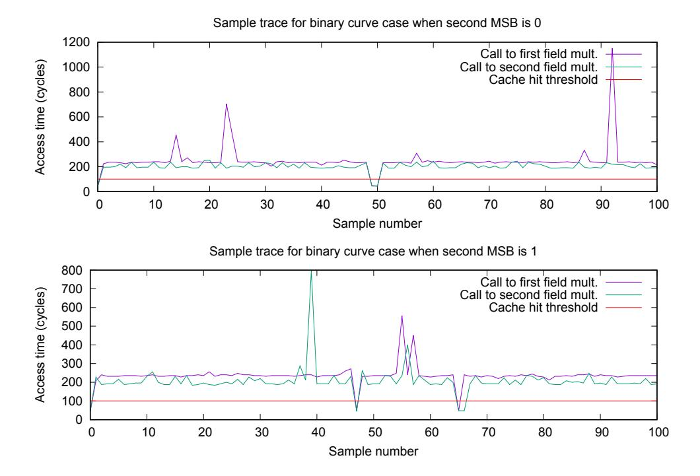
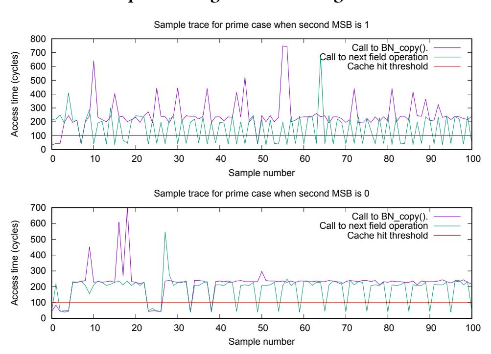
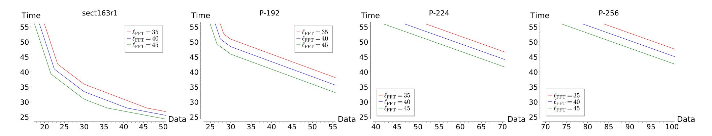
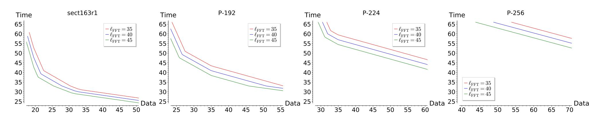
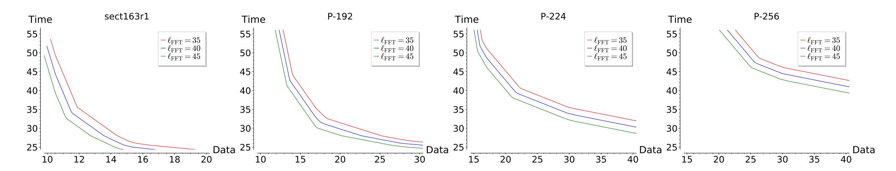
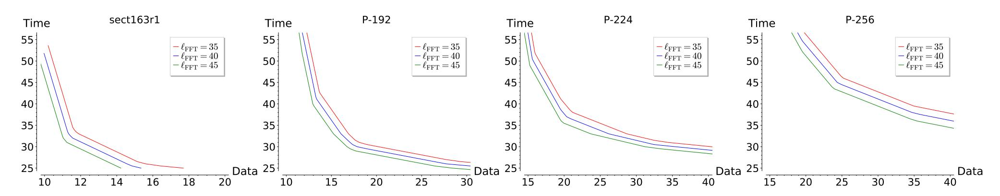
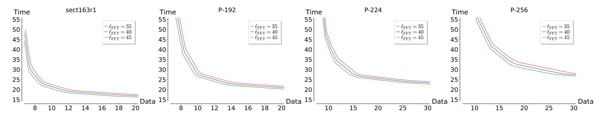
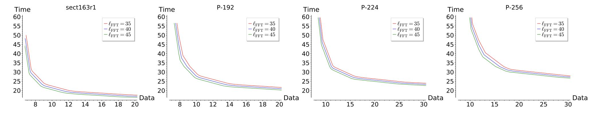

{0}------------------------------------------------

# LadderLeak: Breaking ECDSA With Less Than One Bit Of Nonce Leakage

Diego F. Aranha DIGIT, Aarhus University Denmark dfaranha@eng.au.dk Felipe Rodrigues Novaes
University of Campinas
Brazil
ra135663@students.ic.unicamp.br

Akira Takahashi DIGIT, Aarhus University Denmark takahashi@cs.au.dk

Mehdi Tibouchi NTT Corporation Japan mehdi.tibouchi.br@hco.ntt.co.jp Yuval Yarom University of Adelaide and Data61 Australia yval@cs.adelaide.edu.au

#### **ABSTRACT**

Although it is one of the most popular signature schemes today, ECDSA presents a number of implementation pitfalls, in particular due to the very sensitive nature of the random value (known as the *nonce*) generated as part of the signing algorithm. It is known that any small amount of nonce exposure or nonce bias can in principle lead to a full key recovery: the key recovery is then a particular instance of Boneh and Venkatesan's *hidden number problem* (HNP). That observation has been practically exploited in many attacks in the literature, taking advantage of implementation defects or side-channel vulnerabilities in various concrete ECDSA implementations. However, most of the attacks so far have relied on at least *2 bits* of nonce bias (except for the special case of curves at the 80-bit security level, for which attacks against 1-bit biases are known, albeit with a very high number of required signatures).

In this paper, we uncover *LadderLeak*, a novel class of sidechannel vulnerabilities in implementations of the Montgomery ladder used in ECDSA scalar multiplication. The vulnerability is in particular present in several recent versions of OpenSSL. However, it leaks *less than* 1 *bit* of information about the nonce, in the sense that it reveals the most significant bit of the nonce, but with probability < 1. Exploiting such a mild leakage would be intractable using techniques present in the literature so far. However, we present a number of theoretical improvements of the Fourier analysis approach to solving the HNP (an approach originally due to Bleichenbacher), and this lets us practically break *LadderLeak*-vulnerable ECDSA implementations instantiated over the sect163r1 and NIST P-192 elliptic curves. In so doing, we achieve several significant computational records in practical attacks against the HNP.

#### **KEYWORDS**

side-channel attack, cache attack, ECDSA, OpenSSL, Montgomery ladder, hidden number problem, Bleichenbacher's attack, generalized birthday problem

#### 1 INTRODUCTION

The ECDSA algorithm is one of the most widely deployed signature schemes today, and is part of many practical cryptographic protocols such as TLS and SSH. Its signing operation relies on an

ephemeral random value called *nonce*, which is particularly sensitive: it is crucial to make sure that the nonces are kept in secret and sampled from the uniform distribution over a certain integer interval. It is easy to see that if the nonce is exposed or reused completely, then an attacker is able to extract the secret signing key by observing only a few signatures. By extending this simple observation, cryptanalysts have discovered stronger attacks that make it possible to recover the secret key even if short bit substrings of the nonces are leaked or biased. These extended attacks relate key recovery to the so-called hidden number problem (HNP) of Boneh and Venkatesan [15], and are part of a line of research initiated by Howgrave-Graham and Smart [36], who described a lattice-based attack to solve the corresponding problem, and Bleichenbacher [13], who proposed a Fourier analysis-based approach.

Lattice-based attacks are known to perform very efficiently when sufficiently long substrings of the nonces are known to the attacker (say over 4 bits for signatures on a 256-bit elliptic curve, and at least 2 bits for a 160-bit curve). As a result, a number of previous works adapted Howgrave-Graham and Smart's technique to practically break vulnerable implementations of ECDSA and related schemes like Schnorr signatures [60], for instance by combining it with sidechannel analysis on the nonces (see related works in Section 2.4). However, a limitation of lattice-based attacks is that they become essentially inapplicable when only a very small fraction of the nonce is known for each input sample. In particular, for a singlebit nonce leakage, it is believed that they should fail with high probability, since the lattice vector corresponding to the secret is no longer expected to be significantly shorter than other vectors in the lattice [6, 49]. In addition, lattice-based approaches assume that inputs are perfectly correct, and behave very poorly in the presence of erroneous leakage information.

In contrast, Bleichenbacher's Fourier analysis-based attack can in principle tackle arbitrarily small nonce biases, and handles erroneous inputs out of the box, so to speak. Despite those features, it has garnered far less attention from the community than lattice-based approaches, perhaps in part due to the lack of formal publications describing the attack until recently (even though some attack records were announced publicly [14]). It was only in 2013 that De Mulder et al. [23] revisited the theory of Bleichenbacher's approach in a formally published scholarly publication, followed soon after by Aranha et al. [6], who overcame the 1-bit "lattice barrier" by breaking 160-bit ECDSA with a single bit of nonce bias. Takahashi,

{1}------------------------------------------------

<span id="page-1-1"></span>Table 1: Comparison with the previous records of solutions to the hidden number problem with small nonce leakages. Each row corresponds to the size of group order in which the problem is instantiated. Each column corresponds to the *maximum* number of leaked nonce bits per signature. Citations in green (resp. purple) use Bleichenbacher's approach (resp. lattice attacks).

|         | < 1       | 1                              | 2          | 3    | 4                |
|---------|-----------|--------------------------------|------------|------|------------------|
| 256-bit | _         | -                              | [64]       | [64] | [45, 57, 58, 70] |
| 192-bit | This work | This work                      | _          | _    | _                |
| 160-bit | This work | [6, 14], this work (less data) | [13], [41] | [47] | _                |

Tibouchi and Abe [64] improved the space complexity of Bleichenbacher's attack and broke qDSA [55] (a variant of Schnorr) with 2-bit nonce leaks. However, the practicality of these works may seem limited: indeed, De Mulder et al. attacked parameters (i.e., 384-bit with 5-bit bias) that can be solved more efficiently by lattice attacks; Aranha et al. required over 8 billion signatures as input; and Takahashi et al. only mounted the attack by artificially injecting physical faults into the modified, non-standard implementation.

In this work, we present the first real-world ECDSA vulnerabilities that are *not* susceptible to lattice attacks, but become practically exploitable with the Fourier analysis method, thanks to novel theoretical improvements that we propose over existing literature.

#### 1.1 Contributions

New Cache Timing Attacks Against OpenSSL Montgomery Ladder. We first propose LadderLeak, a new class of vulnerabilities lurking in scalar multiplication algorithms invoked by ECDSA. Our attack exploits small timing differences within the implementations of Montgomery ladder [46] relying on inappropriate coordinate handling, and allows the attacker to learn a single-bit of the secret scalar (which corresponds to nonces in ECDSA) with high probability. We discovered *LadderLeak* vulnerabilities in several versions of OpenSSL (particularly in the 1.0.2 and 1.1.0 branches), and in version 0.4.0 of RELIC toolkit [5]. We present two attack flavors: one for binary curves and the other for prime curves. Both have been experimentally validated, and provide high-precision distinguishers for ECDSA nonces in our target versions of OpenSSL. In principle, the vulnerability affects various curve parameters in the above implementations, including NIST P-192, P-224, P-256, P-384, P-521, B-283, K-283, K-409, B-571, sect163r1, secp192k1, secp256k1 <sup>1</sup>. In Section 3 we describe the attack idea, as well as concrete side-channel experiments carried out using Flush+Reload cache timing attacks [73]. As concrete targets we choose ECDSA instantiated over NIST P-192 and sect163r1, and successfully retrieve 1-bit of nonce information with high probability.

Improved Theoretical Analysis of Bleichenbacher's Solution to the HNP. In Section 4 we establish a unified time–space–data tradeoff formula for Bleichenbacher style attacks, and use it to concretely find optimal attack parameter choices for a given group size and a given amount of nonce bias. Our formula relies on the connection

between the hidden number problem on the one hand and the Klist sum problem on the other (the latter of which is a sub-problem of Wagner's generalized birthday problem (GBP) [69], particularly well-known in symmetric key cryptology). Our approach is generic, allowing to integrate in principle any K-list integer sum algorithms to derive a similar tradeoff formula. Although Bleichenbacher's method was thought to require billions of signatures as input to attack 1-bit of nonce leakage, we prove that it is possible to significantly reduce the data complexity by carefully choosing the inputs to our tradeoff formula. Our analysis also provides significant improvements to the data complexity for leaks of more than 1 bit, allowing the side-channel attacker to recover the ECDSA key given only several thousands signatures in many cases, or even several hundreds in some scenarios. The complete complexity estimates given in Appendix D may therefore be of independent interest. We further incorporate the effect of misdetection in the most significant bit of the HNP samples, which becomes crucial when combining with the practical side-channel leakage we consider.

Optimized Implementation and New Attack Records for the HNP. Putting both contributions together, we mount a full signing key recovery attack on ECDSA signatures instantiated over the sect163r1 binary curve and over the NIST P-192 prime curve, using less than 1 bit of nonce leakage (in the sense that we recover 1 bit of the nonces, but with probability less than 1). The tradeoff formula we develop allows us to break the corresponding HNP instances with realistic computational resources. In our attack experiments, presented in Section 5, the data complexity required for the former case is significantly less than Aranha et al. [6], by a factor of around 2<sup>10</sup>. Furthermore, to the best of our knowledge, 192-bit ECDSA has never been broken before with 1 bit of leakage or less (see Table 1 for the comparison with previous HNP records), and our concrete attack therefore marks a dramatic advance in concrete attacks on the HNP. This was made possible by tuning the tradeoffs to optimize the time complexity and by running our highly optimized scalable implementation in Amazon Web Service (AWS) EC2 cloud instances. The approach and implementation devised in this work can be applied to various types of leakage from ECDSA independent of the LadderLeak vulnerability, and hence offer an interesting avenue for future cryptanalytic work. For example, our empirical results also indicate that breaking larger instances like P-224 with 1-bit leak, or P-256 with 2-bit leak would be practically doable with relatively modest data complexity. The experimental results regarding cache attacks, submitted patches with countermeasures, tradeoff formula solver, and optimized implementation of Bleichenbacher's attack are available in our GitHub repository<sup>2</sup>.

<span id="page-1-0"></span><sup>&</sup>lt;sup>1</sup>OpenSSL does not invoke the vulnerable ladder implementation for P-256 by default and relies instead on custom code enabled during compilation. Custom code can also be similarly enabled at build time for P-224 and P-521 with the switch enable-ec\_nistp\_64\_gcc\_128 (see https://wiki.openssl.org/index.php/Compilation\_and\_Installation#Configure\_Options). We thank an anonymous reviewer for pointing out these behaviors of OpenSSL.

<span id="page-1-2"></span><sup>&</sup>lt;sup>2</sup>https://github.com/akiratk0355/ladderleak-attack-ecdsa

{2}------------------------------------------------

# 1.2 Vulnerable Software Versions and Coordinated Disclosure

In December 2019, we originally reported to the OpenSSL development team the vulnerabilities in versions 1.0.2t and 1.0.11 in accordance with the OpenSSL security policy<sup>3</sup> before the end of longterm support for those versions. After version 1.0.2u was released, we confirmed that the same vulnerabilities were still present, and hence we proposed a patch with corresponding countermeasures, which has already been approved<sup>4</sup>. Although the 1.0.2 branch is now out of public support as of May 2020, the OpenSSL development team still provides its customers with an extended support for 1.0.2 and our patch is included in their further internal releases. While it is hard to estimate how the vulnerability would affect real products due to the lack of public releases containing the patch, searching over GitHub revealed several projects updating their build process to take into account a new release from the 1.0.2 branch. Similar steps have also been taken to address the vulnerability in RELIC, and a fix was pushed in January 2020.

#### 2 PRELIMINARIES

*Notations.* We denote the imaginary unit by roman i. For any positive integer x a function  $\mathsf{MSB}_n(x)$  returns its most significant n bits. When a and b are integers such that a < b we use the integer interval notation [a,b] to indicate  $\{a,a+1,\ldots,b\}$ . Throughout the paper  $\log c$  denotes the binary logarithm of c>0.

#### 2.1 Cache Attacks

To deliver the high performance expected of modern computers, processors employ an array of techniques that aim to predict program behavior and optimize the processor for such behavior. As a direct consequence, program execution affects the internal state of the processor, which in turn affects the speed of future program execution. Thus, by monitoring its own performance, a program can learn about execution patterns of other programs, creating an unintended and unmonitored communication channel [29].

Unintended leakage of cryptographic software execution patterns can have a devastating impact on the security of the implementation. Over the years, multiple attacks have demonstrated complete key recovery, exploiting leakage through the internal state of various microarchitectural components, including caches [1, 40, 51, 66], branch predictors [2, 39], functional units [3, 18], and translation tables [31].

Flush+Reload [34, 73] is a prominent attack strategy, in which the attacker monitors victim access to a memory location. The attack consists of two steps. In the *flush* step, the attacker evicts the monitored memory location from memory, typically using a dedicated instruction such as CLFLUSH. The attacker then waits a bit to allow the victim time to execute. Finally, in the *reload* step, the attacker accesses the memory location, while measuring how long the access takes. If the victim has not accessed the monitored location, it will remain uncached, and access will be slow. Conversely, if the victim has accessed the monitored location between the flush and the reload steps, the memory location will be cached, and access

will be fast. Repeating the attack, an attacker can recover the memory usage patterns of the victim, allowing attacks on symmetric ciphers [34, 37], public key primitives, both traditional [10, 52, 73] and post-quantum [32, 53], as well as on non-cryptographic software [33, 71].

# <span id="page-2-2"></span>2.2 The Montgomery Ladder and its Secure Implementation

An elliptic curve E defined over a finite field  $\mathbb{F}$  is the set of solutions  $(x,y) \in \mathbb{F}$  that satisfy the curve equation, together with a point at infinity O. The chord-and-tangent rule defines a group law  $(\oplus)$  for adding and doubling points on the curve, with O the identity element. Given  $P \in E(\mathbb{F})$  and  $k \in \mathbb{Z}$ , the *scalar multiplication* operation computes R = [k]P, which corresponds to adding P to itself (k-1) times. Cryptographic protocols rely on multiplication by a secret scalar as a fundamental operation to base security on the Elliptic Curve Discrete Logarithm Problem (ECDLP): find k given inputs (P, [k]P). Concrete instances of elliptic curves used in cryptography employ a subgroup of points of large prime order q for which the ECDLP is known to be hard. For efficiency reasons, it is common to represent points in projective coordinates (X, Y, Z) and avoid the computation of expensive field inversions during the evaluation of the group law.

In many settings, an adversary able to recover leakage from the scalar multiplication operation, in particular bits of the scalar, can substantially reduce the effort necessary to solve the ECDLP. The Montgomery ladder, which was initially proposed for accelerating the ECM factorization method [46], later became crucial for secure implementations of elliptic curve cryptography due to its inherent regularity in the way the scalar is processed: the same number of group operations is required no matter the bit pattern of k. Algorithm 1 illustrates the idea. There is a rich literature about coordinate systems and elliptic curve models for securely implementing the algorithm [21, 50]. Unfortunately, these techniques do not always work for the standardized curves in the Weierstrass model that greatly contributed to the adoption of elliptic curves in industry through the SECG and NIST standards [38].

A constant-time implementation of the Montgomery ladder protected against timing attacks must satisfy three basic preconditions: (i) the number of loop iterations must be fixed; (ii) memory operations cannot depend on bits of the secret scalar, to avoid leakage through the memory hierarchy; (iii) the group law must be evaluated with the same number and type of field operations in the same order, independently of the bits of the scalar. The first is easier to guarantee, by conditionally adding q or 2q until the resulting scalar  $\hat{k}$  has fixed length. Note that this approach has the interesting side-effect of preserving the MSB of *k* in the second MSB of  $\hat{k}$  when q is just below a power of 2. The second can be achieved by simply replacing branches with conditional operations to swap the accumulators  $(R_0, R_1)$ . The third is more involved, but greatly simplified by complete addition laws that compute the correct result for all possible inputs [12] (even when the point is being doubled) without any exceptions or corner cases. While complete addition laws for Weierstrass curves do exist [54], they incur a substantial performance penalty and have not been popularized enough for current implementations of classical standardized curves. A version of the algorithm with these countermeasures applied can be

<span id="page-2-0"></span><sup>&</sup>lt;sup>3</sup>https://www.openssl.org/policies/secpolicy.html

<span id="page-2-1"></span><sup>&</sup>lt;sup>4</sup>https://github.com/openssl/openssl/pull/11361

{3}------------------------------------------------

#### <span id="page-3-1"></span>**Algorithm 1** Montgomery ladder

```
Require: k \in \mathbb{Z}_q, point P on E(\mathbb{F}).
Ensure: The results of the scalar multiplication R = [k]P.
  1: (R_0, R_1) \leftarrow (P, 2P)
  2: for i = \lfloor \lg(k) \rfloor - 1 downto 0 do
          if k_i = 0 then
  3:
               (R_0, R_1) \leftarrow ([2]R_0, R_0 \oplus R_1)
  4:
          else
  5:
               (R_0, R_1) \leftarrow (R_0 \oplus R_1, [2]R_1)
  6:
          end if
  7:
  8: end for
  9: return R_0
```

found in Appendix A. As we further discuss in Section 3, attempts to improve side-channel security of current implementations of scalar multiplication risk retrofitting an otherwise constant-time Montgomery ladder on top of a group law implementation that still leaks information through optimizations.

# <span id="page-3-3"></span>2.3 ECDSA and Hidden Number Problem with Erroneous Input

The signing key extraction from the nonce leakages in ECDSA signatures typically amounts to solving the so-called *hidden number problem (HNP)*. We present a generalized variant of the original HNP by Boneh and Venkatesan [15], incorporating some erroneous information of the most significant bits. In particular, the error distribution below models the attacker's misdetection during the side-channel acquisition.

Definition 2.1 (Hidden Number Problem with Erroneous Input). Let q be a prime and  $sk \in \mathbb{Z}_q$  be a secret. Let  $h_i$  and  $k_i$  be uniformly random elements in  $\mathbb{Z}_q$  for each  $i=1,\ldots,M$  and define  $z_i=k_i-h_i\cdot sk \mod q$ . Suppose some fixed distribution  $\chi_b$  on  $\{0,1\}^b$  for b>0 and define a probabilistic algorithm  $\mathsf{EMSB}_{\chi_b}(x)$  which returns  $\mathsf{MSB}_b(x) \oplus e$  for some error bit string e sampled from  $\chi_b$ . Given  $(h_i,z_i)$  and  $\mathsf{EMSB}_{\chi_b}(k_i)$  for  $i=i,\ldots,M$ , the HNP with error distribution  $\chi_b$  asks one to find sk.

In our concrete attacks against OpenSSL ECDSA, we focus on the case where b=1 and  $\chi_b$  is the Bernoulli distribution  $\mathscr{B}_\epsilon$  for some error rate parameter  $\epsilon \in [0,1/2]$ , i.e., EMSB $_{\chi_b}(x)$  simply returns the negation of the most significant bit of x with probability  $\epsilon$ , and otherwise returns the correct bit.

A straightforward calculation shows that a set of ECDSA signatures with leaky nonces is indeed an instance of the HNP. Notice that the ECDSA signature (r,s) generated as in Algorithm 2 satisfies  $s=(H(\mathsf{msg})+r\cdot sk)/k \mod q$  for uniformly chosen  $k\in\mathbb{Z}_q$ . Rearranging the terms, we get

$$H(msg)/s = k - (r/s) \cdot sk \mod q$$
.

Hence letting  $z = H(msg)/s \mod q$  and  $h = r/s \mod q$ , we obtain a HNP sample if the MSB of k is leaked with some probability.

### <span id="page-3-0"></span>2.4 Lattice Attacks on HNP

Boneh and Venkatesan [15] suggest solving the Hidden Number Problem by first reducing it to the lattice Closest Vector Problem

#### <span id="page-3-2"></span>Algorithm 2 ECDSA signature generation

**Require:** Signing key  $sk \in \mathbb{Z}_q$ , message  $msg \in \{0, 1\}^*$ , group order q, base point G, and cryptographic hash function  $H : \{0, 1\}^* \to \mathbb{Z}_q$ . **Ensure:** A valid signature (r, s)

1:  $k \leftarrow \mathbb{Z}_q$ 2:  $R = (r_x, r_y) \leftarrow [k]G; r \leftarrow r_x \mod q$ 3:  $s \leftarrow (H(\text{msg}) + r \cdot sk)/k \mod q$ 4: **return** (r, s)

(CVP). Howgrave-Graham and Smart [36] show the reduction of partial nonce leakage from DSA to HNP, which they solve by reduction to CVP. Nguyen and Shparlinski [47] prove that the Howgrave-Graham and Smart approach works with a leak of  $\log \log q$  bits from a polynomial number of ephemeral keys. They later extend the result to ECDSA [48].

Brumley and Tuveri [17] demonstrate a timing attack on OpenSSH acquiring a small number of bits from the ephemeral keys. Following works present electromagnetic emanation [8, 30], cache [4, 9, 52, 68] and other microarchitectural [18] attacks, all use a conversion of HNP to a lattice problem. Dall et al. [22] explore the viability of solving HNP with errors using a lattice attack. One of the main target curves in our work is NIST P-192, which was also exploited by Medwed and Oswald [43] using several bits of nonce acquired via template-based SPA attacks.

#### <span id="page-3-4"></span>2.5 Bleichenbacher's Attack Framework

The Fourier analysis-based approach to the HNP was first proposed by Bleichenbacher [13] and it has been used to break ECDSA, Schnorr and variants with small nonce leakages that are hard to exploit with the lattice-based method [6, 24, 64]. This section covers the fundamentals of Bleichenbacher's framework, summarized in Algorithm 3. For more theoretical details we refer to the aforementioned previous works. The essential idea of the method is to quantify the modular bias of nonce k using the bias functions in the form of inverse discrete Fourier transform (iDFT).

<span id="page-3-5"></span>Definition 2.2 (Bias Functions). Let K be a random variable over  $\mathbb{Z}_q$ . The modular bias  $B_q(K)$  is defined as

$$B_q(\mathbf{K}) = \mathbf{E} \left[ e^{(2\pi \mathbf{K}/q)\mathbf{i}} \right]$$

where E(K) represents the mean and i is the imaginary unit. Likewise, the *sampled bias* of a set of points  $K = \{k_i\}_{i=1}^M$  in  $\mathbb{Z}_q$  is defined by

$$B_q(K) = \frac{1}{M} \sum_{i=1}^{M} e^{(2\pi k_i/q)i}.$$

When the l MSBs of K are fixed to some constant and K is otherwise uniform modulo q, then it is known that the norm of bias  $|B_q(K)|$  converges to  $2^l \cdot \sin(\pi/2^l)/\pi$  for large q [64, Corollary 1]. The estimate holds for the sampled bias  $B_q(K)$  as well for a given set of biased nonces  $\{k_i\}_{i=1}^M$ . For example, if the first MSB of each  $k_i$  is fixed to a constant bit then the bias is estimated as  $|B_q(K)| \approx 2/\pi \approx 0.637$ . Moreover, if the  $k_i$ 's follow the uniform distribution over  $\mathbb{Z}_q$  then the mean of the norm of sampled bias

{4}------------------------------------------------

is estimated as  $1/\sqrt{M}$ , which is a direct consequence of the well-known fact about average distance from the origin for a random walk on the complex plane [6].

Small linear combinations. Given such a function, it would be straightforward to come up with a naive approach to find *sk*: for each candidate secret key  $w \in \mathbb{Z}_q$ , compute the corresponding set of candidate nonces  $K_w = \{z_i + h_i w \mod q\}_{i=1}^M$  and then conclude that w=sk if the sampled bias  $|B_q(K_w)|$  shows a peak value. This is of course no better than the exhaustive search over the entire  $\mathbb{Z}_q$ . To avoid this issue, the so-called *collision search* of input samples is required, which is the crucial preliminary step to expand the peak width. De Mulder et al. [24] and Aranha et al. [6] showed that the peak width broadens to approximately  $q/L_{FFT}$ , by taking linear combinations of input samples  $\{(h_i, z_i)\}_{i=1}^M$  to generate new samples  $\{(h'_j, z'_j)\}_{j=1}^{M'}$  such that  $h'_j < L_{\text{FFT}}$ . This way, one could hit somewhere in the broadened peak by only checking the sampled biases at  $L_{\text{FFT}}$  candidate points over  $\mathbb{Z}_q$ . As the inverse DFT at  $L_{\text{FFT}}$ points can be efficiently computed by fast Fourier transform (FFT) algorithms in  $O(L_{\text{FFT}} \log L_{\text{FFT}})$  time and  $O(L_{\text{FFT}})$  space, the first goal of the collision search phase is to find sufficiently small linear combinations of the samples so that the FFT on the table of size  $L_{\text{FFT}}$  becomes practically computable. A few different approaches have been explored to the collision search phase, such as lattice reduction [24], sort-and-difference [6] and 4-list sum algorithm [64].

Sparse linear combinations. One may be tempted to repeat such collision search operations as many times as needed until the linear combinations with the desired upper bound are observed. However, the linear combinations come at a price; in exchange of the broader peak width, the peak height gets reduced exponentially. Concretely, if the original modular bias of nonce is  $|B_q(K)|$  and all coefficients in the linear combinations are restricted to  $\{-1,0,1\}$  then the peak bias gets exponentiated by  $L_1$ -norm of the coefficient vector [64]. Thus, for the peak height to be distinguishable from the noise value the diminished peak should be significantly larger than the noise value (which is  $1/\sqrt{M'}$  on average as mentioned above). This imposes another constraint on the collision search phase: the sparsity of linear combinations. In summary, the efficiency of Bleichenbacher's attack crucially relies upon the complexities of small and sparse linear combination search algorithm.

#### 2.6 K-list Sum Problem

We introduce a variant of the  $\mathcal{K}$ -list sum problem [25] (a subproblem of GBP [69]) instantiated over the integers. The latter part of the paper discusses the connection between this problem and Bleichenbacher's framework.

Definition 2.3 (K-list Sum Problem). Given K sorted lists  $\mathcal{L}_1$ , ...,  $\mathcal{L}_K$ , each of which consists of  $2^a$  uniformly random  $\ell$ -bit integers, the K-list sum problem asks one to find a non-empty list  $\mathcal{L}'$  consisting of  $x' = \sum_{i=1}^K \omega_i x_i$ , where K-tuples  $(x_1, \ldots, x_K) \in \mathcal{L}_1 \times \ldots \times \mathcal{L}_K$  and  $(\omega_1, \ldots, \omega_K) \in \{-1, 0, 1\}^K$  satisfy  $\mathsf{MSB}_n(x') = 0$  for some target parameter  $n \leq \ell$ .

Algorithm 4 is an instance of the  $\mathcal{K}$ -list sum algorithm for  $\mathcal{K}=4$ . This is essentially a parameterized variant of the Howgrave–Graham–Joux [35], which we analyze by extending Dinur's framework [25] in Section 4.

### <span id="page-4-1"></span>Algorithm 3 Bleichenbacher's attack framework

# Require:

 $\{(h_i, z_i)\}_{i=1}^M$  - HNP samples over  $\mathbb{Z}_q$ . M' - Number of linear combinations to be found.  $L_{\text{FFT}}$  - FFT table size.

**Ensure:** Most significant bits of *sk* 

- 1: Collision search
- 2: Generate M' samples  $\{(h'_j, z'_j)\}_{j=1}^{M'}$ , where  $(h'_j, z'_j) = (\sum_i \omega_{i,j} h_i, \sum_i \omega_{i,j} z_i)$  is a pair of linear combinations with the coefficients  $\omega_{i,j} \in \{-1,0,1\}$ , such that for  $j \in [1,M']$
- (1) Small:  $0 \le h'_i < L_{FFT}$  and
- (2) Sparse:  $|B_q(\mathbf{K})|^{\Omega_j} \gg 1/\sqrt{M'}$  for all  $j \in [1, M']$ , where  $\Omega_j := \sum_i |\omega_{i,j}|$ .
- 3: Bias Computation
- 4:  $Z := (Z_0, \dots, Z_{L_{\text{FFT}}-1}) \leftarrow (0, \dots, 0)$
- 5: **for** j = 1 to M' **do**
- 6:  $Z_{h'_j} \leftarrow Z_{h'_i} + e^{(2\pi z'_j/q)i}$
- 7: end for
- 8:  $\{B_q(K_{w_i})\}_{i=0}^{L_{\text{FFT}}-1} \leftarrow \text{FFT}(Z)$ , where  $w_i = iq/L_{\text{FFT}}$ .
- 9: Find the value *i* such that  $|B_q(K_{w_i})|$  is maximal.
- 10: Output most significant  $\log L_{\text{FFT}}$  bits of  $w_i$ .

<span id="page-4-2"></span>**Algorithm 4** Parameterized 4-list sum algorithm based on Howgrave–Graham–Joux [35]

#### Require:

 $\left\{\mathcal{L}_i\right\}_{i=1}^4$  - Sorted lists of  $2^a$  uniform random  $\ell$ -bit samples.

*n* - Number of nullified top bits per each round.

 $v \in [0, a]$  - Parameter.

**Ensure:**  $\mathcal{L}'$  - List of  $(\ell - n)$ -bit samples.

- <span id="page-4-3"></span>1. For each  $c \in [0, 2^{v})$ :
  - a. Look for pairs  $(x_1, x_2) \in \mathcal{L}_1 \times \mathcal{L}_2$  such that  $\mathsf{MSB}_a(x_1 + x_2) = c$ . Store the expected number of  $2^{2a-a} = 2^a$  output sums  $x_1 + x_2$  in a new sorted list  $\mathcal{L}'_1$ . Do the same for  $\mathcal{L}_3$  and  $\mathcal{L}_4$  to build the sorted list  $\mathcal{L}'_2$ .
  - b. Look for pairs  $(x_1', x_2') \in \mathcal{L}_1' \times \mathcal{L}_2'$  such that  $\mathsf{MSB}_n(|x_1' x_2'|) = 0$ . Store the expected number of  $2^{2a (n a)} = 2^{3a n}$  output sums  $|x_1' x_2'|$  in the list  $\mathcal{L}'$ .
- <span id="page-4-4"></span>2. Output  $\mathcal{L}'$  of the expected length  $M' = 2^{3a+v-n}$

# <span id="page-4-0"></span>3 TIMING ATTACKS ON MONTGOMERY LADDER

An implementation of the Montgomery ladder must be built on top of a constant-time implementation of the group law to enjoy its side-channel resistance guarantees. Any minor deviation in the number of field operations or memory access pattern in the group law can leak information about which of the two branches of a certain iteration are being evaluated, which further leaks information about the key bit. In this work, we exploit a vulnerability in the way the Montgomery ladder is prepared (line 1 of Algorithm 1), by observing that implementations employing projective coordinates will have accumulators  $R_0$  in affine coordinates in which input point P is typically given; and  $R_1$  in projective coordinates after a point doubling is performed. This coordinate mismatch allows the

{5}------------------------------------------------

attacker to mount a cache-timing attack against the first iteration of the ladder, revealing the second MSB of the scalar. We found the issue in the popular OpenSSL cryptographic library, and in the research-oriented RELIC toolkit [5], both apparently caused by attempting to implement a constant-time ladder on top of a group law optimized for special cases. This generality motivated us to name the discovered vulnerability under the moniker *LadderLeak*.

# 3.1 Cache-timing vulnerabilities in OpenSSL's implementation

OpenSSL contains multiple implementations of the Montgomery ladder in its codebase, depending on the choice of curve and field, so we split the discussion based on the choice of underlying field.

Binary curves. For curves defined over  $\mathbb{F}_{2^m}$ , OpenSSL employs the well-known López-Dahab scalar multiplication algorithm [42], which amounts to the Montgomery ladder over points represented in López-Dahab coordinates ( $x = X/Z, y = Y/Z^2$ ). Parameters affected are SECG curve sect163r1; and NIST curves B-283, K-283, K-409 and B-571 (i.e. binary curves with group order slightly below the power of two) in versions 1.0.2u and 1.1.0l. The latest 1.1.1 branch is not affected due to a unified and protected implementation of the ladder.

The Montgomery ladder is implemented in function ec\_GF2m \_montgomery\_point\_multiply() in file crypto/ec/ec2\_mult.c. The function computes scalar multiplication [k]P for fixed-length scalar k and input point P = (x, y). The ladder starts by initializing two points  $(X_1, Z_1) = (x, 1)$  and  $(X_2, Z_2) = [2]P = (x^4 + b, x^2)$ . The first loop iteration follows after a conditional swap function that exchanges these two points based on the value of the second MSB. The first function to be called within the first iteration is gf2m\_Madd() for point addition, which starts by multiplying by value  $Z_1$ . However, since the finite field arithmetic is not implemented in constant-time for binary fields, there is a timing difference between multiplying by (1) or  $(x^2)$ , since modular reduction is only needed in the latter case. In particular, a modular reduction will be computed when  $Z_1 = x^2$  after the conditional swap. This happens when the second MSB is 1 because the conditional swap effectively swapped the two sets of values. A cache-timing attack can then monitor when the modular reduction code is called to reduce a non-trivial intermediate multiplication result.

*Prime curves*. In curves defined over  $\mathbb{F}_p$  for large prime p, OpenSSL 1.0.2u employs the Montgomery ladder when precomputation is turned off, a scenario prevalent in practice since precomputation must be manually turned on for a certain point (typically a fixed generator) [67]. Parameters affected are NIST curves P-192, P-224, P-384 and P-521; and SECG curves secp192k1 and secp256k1 (i.e. prime curves with group order slightly below the power of two). Curve P-256 is affected in principle, but OpenSSL has customized code enabled by default at build time. Note that secp256k1 refers to the curve adopted for signing Bitcoin transactions with ECDSA.

In this case, OpenSSL implements the Montgomery ladder by using optimized formulas for elliptic curve arithmetic in the Weierstrass model. The ladder is implemented in ec\_mul\_consttime() within /crypto/ec/ec\_mult.c, but which does not run in constant-time from a cache perspective, despite the naming. The ladder starts

by initializing two accumulators  $R_0 = P$  (in affine coordinates) and  $R_1 = 2P$  (in projective coordinates). The first loop iteration is non-trivial and computes a point addition and a point doubling after a conditional swap. Depending on the key bit, the conditional swap is effective and only one point will remain stored in projective coordinates. Both the point addition and point doubling functions have optimizations in place for mixed addition, and the Z coordinate of the input point can be detected for the point doubling case implemented in function ec\_GFp\_simple\_dbl(). When the input point for the doubling function is in affine coordinates, a field multiplication by Z is replaced by a faster call to BN\_copy(). This happens when the two accumulators are not swapped in the ladder, which means that point  $R_0$  in affine coordinates is doubled and the second MSB is 0. The timing difference is very small, but can be detected with a cache-timing attack.

# 3.2 Implementation of the attacks

We implemented cache-timing attacks using Flush+Reload from the FR-trace program available in the Mastik side-channel analysis toolkit [72]. We targeted OpenSSL by running the command-line signature computation in two Broadwell CPUs with models Core i7-5500U and i7-3520M clocked at 2.4GHz and 2.9GHz, respectively, and TurboBoost disabled. OpenSSL was built using a standard configuration with debugging symbols and optimizations enabled. Targeted parameters were at lowest security in each class: sect163r1 for the binary and P-192/secp192k1 for the prime case. Although the observed timing difference was very small in both cases, we managed to amplify it using performance degradation [4]: multiple threads running in the background penalize the targeted pieces of code (modular reduction in the binary case and BN\_copy() in the prime case) by constantly evicting their addresses from the cache. The timing difference for computing the first iteration of the ladder was amplified to around 100,000 and 15,000 cycles for the binary and prime case, respectively. Amplifying the timing difference made it feasible to detect the second MSB with high probability: around 99% for curves sect163r1 and P-192. We configured the slot, or the time between two consecutive probings by the Flush+Reload thread, to 5,000 cycles to obtain finer granularity.

In the binary case, the detection strategy consisted of first locating in the traces a cache-hit matching the execution of the first field multiplication by  $Z_1$  in gf2m\_Madd() at the beginning of the first ladder iteration, and then looking for the next cache-hit matching the second field multiplication which marks the end of the first. If the number of slots between the two was above 15, this means a timing difference of at least 75,000 cycles. The first version of the attack achieved 97.3% precision, which was later improved. When running the attack against 10,000 signature computations, we were able to correctly detect 2,735 signatures with second MSB 1 and only 27 false positives, amounting to a precision of 99.00%. Sample traces illustrating the strategy can be found in Figure 1.

In the prime case, the detection strategy consisted of looking for the first ladder iteration by locating in the traces for a cache-hit matching the execution of ec\_GFp\_simple\_dbl() and then counting the number of consecutive cache-hits matching the execution of BN\_copy(). If the next two slots had cache-hits for the latter, this means that the copy took around 3 slots, or 15,000 cycles. When running the attack against 10,000 signature computations, we were

{6}------------------------------------------------

<span id="page-6-1"></span>

Figure 1: Pattern in traces collected by FR-trace for the binary curve case. Cache accesses are considered hits when below the default threshold of 100 cycles. The cache hits correspond to executions of the two first field multiplications inside point addition, the first by  $Z_1$ . When the second MSB is 0 and  $Z_1 = 1$  in the first trace above, there is no modular reduction, hence the two first field multiplications in point addition quickly follow in succession. When the second MSB is 1 and  $Z_1 = x^2$  in the second trace, performance degradation penalizes modular reduction and the time between the two field multiplications grows much larger.

<span id="page-6-2"></span>

Figure 2: Pattern in traces collected by FR-trace for the prime curve case. Cache accesses are again considered hits when below the default threshold of 100 cycles. The cache hits correspond to the time a BN\_copy() operation inside point doubling takes to complete under performance degradation. When the second MSB is 1 in the first trace, BN\_copy() is not called inside point doubling, but the cache line containing the function call and next field operation is brought to the cache. When the second MSB is 0, BN\_copy() is actually called and takes longer to complete due to performance degradation. The pattern is visible between slots 20 and 30.

able to correctly detect 2,343 signatures with second MSB 0 and only 12 false positives, amounting to a precision of 99.53%. Sample traces illustrating the strategy can be found in Figure 2.

# 3.3 Translating Nonce Leakages to the Hidden Number Problem Instance

In OpenSSL, the nonce  $k \in \{1, ..., q-1\}$  is rewritten to be either  $\ddot{k} = k + q$  or  $\ddot{k} = k + 2q$  before passed to a scalar multiplication algorithm, so that the resulting  $\hat{k}$  has the fixed bit length. This is to countermeasure the remote timing attacks of Brumley and Tuveri [17]. For the curves with group order slightly below the power of 2 (denoted by  $q = 2^{\ell} - \delta$ ), it holds that  $\hat{k} = k + q$  except with negligible probability. Our LadderLeak attack detects the second MSB of  $\hat{k}$  and we argue that it coincides with the first MSB of k with overwhelming probability. Let us denote the  $\ell$ -th bit of k (resp. k) by  $k_{\ell}$  (resp.  $k_{\ell}$ ). Then  $\Pr[k_{\ell} \neq k_{\ell}] < \Pr[k_{\ell} = 0 \land k < \delta] + \Pr[k_{\ell} = 0 \land k < \delta]$  $1 \wedge k < \delta + 2^{\ell-1}$  since the  $\ell$ -th bit of q is 1 and  $k_{\ell}$  gets flipped only if there's no carry from the lower bits in the addition k + q. It is easy to see that the right-hand side of the above inequality is negligibly small if  $\delta$  is negligibly smaller than q. Therefore, putting together with the usual conversion in Section 2.3 we have obtained HNP instances with error rate at most  $\epsilon = 0.01$  for P-192 and  $\epsilon = 0.027$ for sect163r1.

# <span id="page-6-0"></span>4 IMPROVED ANALYSIS OF BLEICHENBACHER'S ATTACK

# 4.1 Unified Time-Space-Data Tradeoffs

The FFT-based approach to the HNP typically requires significant amount of input signatures, compared to lattice-based attacks. The sort-and-difference method attempted by Aranha et al. [6], for instance, required 2<sup>33</sup> input signatures to break 160-bit ECDSA with 1-bit bias. We could of course take the same approach to exploit the leakage of sect163r1 from the previous section, but collecting over 8 million signatures via cache attacks doesn't seem very easy in practice. Takahashi, Tibouchi and Abe [64] took much more space-efficient approach by making use of Howgrave-Graham and Joux's (HGJ) knapsack solver [35]. They also provide "lower bounds" for the required amount of input samples to attack given signature parameters and bit biases. However, their lower bound formula implicitly relies on two artificial assumptions: (1) the number of input and output samples, space complexity, and FFT table size are all equal (i.e.,  $M = M' = L_{FFT}$  in Algorithm 3), and (2) the number of collided bits to be found by the HGJ algorithm is fixed to some constant. Such assumptions do help stabilizing time and space complexities throughout the entire attack, but at the same time seem to sacrifice the true potential of applying the HGJ algorithm. In [27], Fouque et al. briefly mentioned that an algorithm for the GBP helps reducing the number of signatures required in Bleichenbacher-style attacks by initially amplifying the amount of samples, although their analysis was neither detailed nor general. In fact, the HGJ-like algorithm implemented in [64] can be regarded as an instance of the generalized birthday algorithm analyzed by Wagner [69] and Dinur [25]. The latter in particular analyzes the time-space tradeoffs in detail, which we would like to apply and extend by introducing the third parameter, the *data complexity*. Our 

{7}------------------------------------------------

formulation below is motivated by a practical situation where the adversary may want to trade the "online" side-channel detection costs (i.e., data complexity) for the "offline" resources required by Bleichenbacher's attack (i.e., time and space complexities). We are now set out to address the following question.

For given most significant bits information in the HNP and the attacker's budget for computational resources, what would be the optimal balance between the time, memory, and input data complexities?

4.1.1 Tradeoffs for Parameterized 4-list Sum Algorithm. We begin by presenting our mild generalization of Dinur's tradeoff formula (the one for the algorithm denoted by  $A_{4,1}$ ). The main difference is that we made the number of output samples arbitrary M'.

<span id="page-7-2"></span>THEOREM 4.1. For Algorithm 4, the following tradeoff holds.

$$2^4M'N = TM^2$$

or put differently

$$m' = 3a + v - n$$

where each parameter is defined as follows:  $N = 2^n$ , where n is the number of top bits to be nullified;  $M = 2^m = 4 \times 2^a$  is the number of input samples, where  $2^a$  is the length of each sublist;  $M' = 2^{m'} \le 2^{2a}$  is the number of output samples such that the top n bits are 0;  $v \in [0, a]$  is a parameter deciding how many iterations of the collision search to be executed;  $T = 2^t = 2^{a+v}$  is the time complexity.

PROOF. For each partial target value  $c \in [0, 2^v)$ , Step 1.a. takes  $\tilde{O}(2^a)$  time and  $O(2^m)$  space to find  $2^a$  pairs that sum to c in the top a bits, e.g., by employing the sort-merge join-like algorithm of [64]. At Step 1.b. since two pairs  $x_1'$  and  $x_2'$  are guaranteed to collide in the top a bits the probability that the collision occurs in the top a bits is  $1/2^{n-a}$ . Hence we get approximately  $2^{2a}/2^{n-a} = 2^{3a-n}$  linear combinations<sup>5</sup>. Iterating these steps  $2^v$  times, we get in total  $M' = 2^{m'} = 2^{3a+v-n}$  samples in  $\tilde{O}(2^{a+v})$  time and  $O(2^m)$  space. As the algorithm goes through at most  $2^a \times 2^v$  linear combinations of four it follows that  $2^{m'} \le 2^{2a}$ .

The above tradeoff gives more flexibility to the sample amplification; as the formula implies one could amplify the number of input samples to at most  $2^{2a}$  by reducing nullified bits, or by increasing time or memory complexity. This is in particular important in Bleichenbacher's framework, since it allows us to carefully coordinate the number of output samples so that the noise floor is sufficiently smaller than the peak.

4.1.2 Integration with Bleichenbacher and Linear Programming. We now integrate the above basic tradeoff formula with two crucial constraints for Bleichenbacher's attack to work; namely, smallness and sparsity of the output linear combinations. In Bleichenbacher's attack, the adversary could repeat the 4-list sum algorithm for r rounds to find small linear combinations of  $4^r$  integers below certain budget parameter for the FFT table,  $L_{\text{FFT}} = 2^{\ell_{\text{FFT}}}$ , so that

### <span id="page-7-1"></span>Algorithm 5 Iterative HGJ 4-list sum algorithm

### Require:

 $\mathcal{L}$  - List of  $M = 4 \times 2^a$  uniform random  $\ell$ -bit samples.

 $\{n_i\}_{i=0}^{r-1}$  - Number of nullified top bits per each round.

 $\{v_i\}_{i=0}^{r-1}$  - Parameter where  $v_i \in [0, a_i]$ .

**Ensure:**  $\mathcal{L}'$  - List of  $(\ell - \sum_{i=0}^{r-1} n_i)$ -bit samples of the length  $2^{m_r}$ .

- 1. Let  $a_0 = a$ .
- 2. For each i = 0, ..., r 1:
  - a. Divide  $\mathcal{L}$  into 4 disjoint lists  $\mathcal{L}_1, \ldots, \mathcal{L}_4$  of length  $2^{a_i}$  and sort them.
  - b. Apply Algorithm 4 to  $\{\mathcal{L}_i\}_{i=1}^4$  with parameters  $n_i$  and  $v_i$ . Obtain a single list  $\mathcal{L}'$  of the expected length  $2^{m_{i+1}} = 2^{3a_i+v_i-n_i}$ . Let  $\mathcal{L}:=\mathcal{L}'$ .
- 3. Output  $\mathcal{L}'$ .

<span id="page-7-3"></span>Table 2: Linear programming problems based on the iterative HGJ 4-list sum algorithm (Algorithm 5). Each column corresponds to the objective and constraints of linear programming problems for optimizing time, space, and data complexities, respectively. The boxed equations are the common constraints for all problems.

|                                      | Time                                                 | Space                                            | Data                                                                                                       |
|--------------------------------------|------------------------------------------------------|--------------------------------------------------|------------------------------------------------------------------------------------------------------------|
| minimize<br>subject to<br>subject to | $t_0 = \dots = t_{r-1}$ $-$ $m_i \le m_{\text{max}}$ | $m_0 = \dots = m_{r-1}$ $t_i \le t_{\text{max}}$ | $m_{\text{in}}$ $t_i \le t_{\text{max}}$ $m_i \le m_{\text{max}}$                                          |
| subject to                           | $\ell$ $\leq \ell_1$                                 | $i + v_i$ $i$ $i + 2$                            | $i \in [0, r - 1]$<br>$i \in [0, r - 1]$<br>$i \in [0, r - 1]$<br>$i \in [0, r - 1]$<br>$i \in [0, r - 1]$ |

the computation of FFT becomes tractable. Hence we rewrite the tradeoff formula for each round i = 0, ..., r - 1 as

$$m_i' = 3a_i + v_i - n_i$$

where we define  $n_i, m_i, m_i', a_i, v_i$ , and  $t_i$  as in Theorem 4.1. Algorithm 5 describes the iterative HGJ 4-list sum algorithm, which calls Algorithm 4 as a subroutine. Note that now the  $2^{m_i'}$  outputs from the i-th round are used as inputs to the (i+1)-th round, so we have  $m_{i+1} = m_i'$ . Moreover, we could also incorporate a simple filtering technique that trades the initial problem size for the data complexity: given  $2^{m_{\rm in}}$  uniformly random  $\ell$ -bit samples, one could keep only  $2^{m_0} = 2^{m_{\rm in}-f}$  samples below  $(\ell - f)$ -bit for any  $f \geq 0$ .

With these notations in mind, the smallness condition from Algorithm 3 is expressed as  $\log h_j' \leq \ell - f - \sum_{i=0}^{r-1} n_i \leq \ell_{\text{FFT}}$ , since after r iterations the top  $\sum_{i=0}^{r-1} n_i$  bits of  $(\ell-f)$ -bit input samples get nullified. On the other hand, recall that the peak height decays exponentially in the  $L_1$ -norm of the coefficient vectors (see Section 2.5), many sparse linear combinations need to be found in the end to satisfy the second condition  $|B_q(K)|^{4^r} \gg 1/\sqrt{M'}$ , where  $M' = 2^{m_r}$ 

<span id="page-7-0"></span><sup>&</sup>lt;sup>5</sup>We remark that one could obtain slightly more solutions here thanks to the carries of additions and subtractions, when the problem is instantiated over *integers* (but not over  $\mathbb{F}_2$ ) [64, Theorem 1]. Accordingly the tradeoff above should be adjusted by a small constant term on the right-hand side, although this of course doesn't matter asymptotically.

{8}------------------------------------------------

is the number of outputs after *r* rounds. By introducing a new slack variable  $\alpha \geq 1$  and taking the logarithm the inequality can be converted to the equivalent equation  $m_r = 2(\log \alpha - 4^r \log(|B_q(K)|))$ . Here we remark that the slack variable  $\alpha$  should be determined depending on the possible largest noise value, which should be somewhat larger than the average  $1/\sqrt{M'}$ . This can be estimated by checking the distribution of  $\{h'_j\}_{j=1}^{M'}$  after the collision search in Algorithm 3: let H' and Z' be random variables corresponding to  $h'_j = \sum_j \omega_{i,j} h_i$  and  $z'_j = \sum_j \omega_{i,j} z_i$ , and hence let K' = Z' + skH'. Since Bleichenbacher's attack should detect the peak at a candidate point within  $q/(2L_{FFT})$  distance from the actual secret sk, all the modular biases of incorrect guess  $K'_x = Z' + (sk \pm x)H' \mod q$ for  $x \in [q/(2L_{\text{FFT}}), q/2)$  are noise. Thus the largest noise value is  $\max_{x} |B_q(K_x')| = \max_{x} (|B_q(K')| \cdot |B_q(xH')|)$  (due to Lemma 1 of [24]), which relies on the distribution that H' follows. For each concrete collision search algorithm one could experimentally find the maximum value of  $|B_q(K'_x)|$ , and therefore can choose the appropriate  $\alpha$  to make sure that the bias peak is larger than that. For instance, for two rounds of the iterative HGJ we observed  $\max_{x} |B_q(K_x')| \approx 5/\sqrt{M'}$ . In Appendix C we discuss the estimation of noise floor in a more formal fashion.

Putting together, we obtain the unified tradeoffs in the form of linear programming problem, summarized in Table 2. For instance, to optimize the data complexity the goal of linear programming is to minimize the (logarithm of) number of inputs  $m_{\rm in}$  while the problem receives budget parameters  $t_{\text{max}}$ ,  $m_{\text{max}}$ ,  $\ell_{\text{FFT}}$ , slack parameter  $\alpha$ , and estimated bias  $B_q(K)$  as fixed constants. We can further iteratively solve the linear programming over choices of r to find the optimal number of rounds that leads to the best result. For small number of bit biases like less than 4-bit biases, r is at most 5, so we can efficiently find the optimal parameters. We present in Figs. 3 and 4 the optimal time and data complexities for attacking 1-bit biased HNP, with different FFT table sizes and max memory bounds. These results are obtained by solving the linear programming problems with our SageMath [65] script available in our GitHub repository. More tradeoff graphs in case of few bits nonce leakages are also given in Appendix D.

One caveat is, that simply iterating Algorithm 4 *r* rounds does not necessarily guarantee the 4<sup>r</sup> sums in the resulting list; the same element in the original list may be used more than once in a single linear combinations of  $4^r$  when the output list of *i*-th round is used as input to the i + 1-th round. This would violate the coefficient constraints of the collision search phase required in Algorithm 3, since due to the [24, Lemma 1.d.] if *K* follows the uniform distribution over  $[0, q/2^l)$  then the bias peak cancels out, i.e.,  $|B_q(2^l K)| = 0$ . To circumvent the issue one could alternatively use the "layered" HGJ algorithm due to Dinur [25], of which we present a generalized variant in Algorithm 7 together with its tradeoff linear programming problems in Table 4. This way, the input list is first divided into  $4^r$ sub-lists and the algorithm guarantees to find linear combinations composed of single element per each sub-list, while we observe that the concrete complexities for attacking our OpenSSL targets are worse than the iterative HGJ. In practice, a few iterations of HGJ algorithm outputs a negligible fraction of such undesirable linear combinations, and hence the actual bias peak is only slightly lower than the estimated  $|B_q(K)|^{4^r}$ . This heuristic was also implicitly

exploited by [64] and we chose to make use of Algorithm 5 for the better performance in the attack experiments.

Finally, we remark that our approach is generic, allowing to integrate in principle any  $\mathcal{K}$ -list integer sum algorithms to establish a similar time-space-data tradeoff formula. In Appendix E, we present more linear programming problems derived from other  $\mathcal{K}$ -list sum algorithms, such as the 16-list sum due to Becker, Coron and Joux (BCJ) [7] and its multi-layer variant by Dinur [25]. For the specific HNP instances related to our attack on OpenSSL, these  $\mathcal{K}$ -list sum algorithms provide slightly worse complexities than the iterative HGJ. We leave for future work the discovery of parameter ranges where those alternatives perform better, as well as the adaptation of further list sum algorithms.

#### 4.2 Bias Function in Presence of Misdetection

All previous FFT-based attack papers [6, 24, 64] only considered the idealized setting where input HNP samples have no errors in MSB information (corresponding to  $\epsilon = 0$  in Section 2.3). As observed in Section 3, however, this is usually not the case in practice since the side-channel detection is not 100 percent accurate. This motivates us to consider the behavior of the bias function on non-uniformly biased samples. Below we show how to concretely calculate biases when there are  $\epsilon$  errors in the input. For instance, our cache timing attack yields HNP samples with  $\epsilon = 0.01$  for P-192 (resp.  $\epsilon = 0.027$  for sect163r1), and the present lemma gives  $|B_q(K)| = (1 - 2\epsilon)|B_q(K_0)| \approx 0.98 \times 0.637$  (resp.  $|B_q(K)| = (1-2\epsilon)|B_q(K_1)| \approx 0.946 \times 0.637$ ). Note that the extreme case where  $\epsilon = 1/2$  simply means that the samples are not biased at all, and therefore  $|B_q(K)|$  degenerates to 0. This also matches the intuition; when the attacker gains no side-channel information about nonces it should be information theoretically impossible to solve the HNP (except with some auxiliary information like the knowledge of public key corresponding to the secret).

<span id="page-8-0"></span>Lemma 4.2. For  $b \in \{0, 1\}$ , any  $\epsilon \in [0, 1/2]$  and even integer q > 0 the following holds.

Let K be a random variable following the weighted uniform distribution over  $\mathbb{Z}_q$  below.

$$\Pr[K = k_i] = (1 - b) \cdot \frac{1 - \epsilon}{q/2} + b \cdot \frac{\epsilon}{q/2} \quad \text{if} \quad 0 \le k_i < q/2$$

$$\Pr[K = k_i] = b \cdot \frac{1 - \epsilon}{q/2} + (1 - b) \cdot \frac{\epsilon}{q/2} \quad \text{if} \quad q/2 \le k_i < q$$

Then the modular bias of K is

$$B_q(\mathbf{K}) = (1 - 2\epsilon)B_q(\mathbf{K}_b)$$

where  $K_b$  follows the uniform distributions over [0+bq/2, q/2+bq/2).

PROOF. We prove the case for b = 0. The other case holds by symmetry. By Definition 2.2 the bias for K is rewritten as follows

{9}------------------------------------------------

<span id="page-9-0"></span>

Figure 3: Time–Data tradeoffs where  $m_{\text{max}} = 30$ , nonce k is 1-bit biased, slack parameter  $\alpha = 8$  and the number of rounds r = 2.

<span id="page-9-1"></span>

Figure 4: Time–Data tradeoffs where  $m_{\text{max}} = 35$ , nonce k is 1-bit biased, slack parameter  $\alpha = 8$  and the number of rounds r = 2.

due to the law of the unconscious statistician.

$$\begin{split} B_{q}(K) = & \mathbf{E} \left[ e^{(2\pi K/q)\mathbf{i}} \right] = \sum_{k_{i} \in \mathbb{Z}_{q}} e^{(2\pi k_{i}/q)\mathbf{i}} \cdot \Pr[K = k_{i}] \\ = & \frac{1 - \epsilon}{q/2} \sum_{k_{i} \in [0, q/2)} e^{(2\pi k_{i}/q)\mathbf{i}} + \frac{\epsilon}{q/2} \sum_{k_{i} \in [q/2, q)} e^{(2\pi k_{i}/q)\mathbf{i}} \\ = & \frac{1 - \epsilon}{q/2} \sum_{k_{i} \in [0, q/2)} e^{(2\pi k_{i}/q)\mathbf{i}} + \frac{\epsilon}{q/2} \sum_{k'_{i} \in [0, q/2)} e^{(2\pi (k'_{i} + q/2)/q)\mathbf{i}} \\ = & \frac{1 - \epsilon}{q/2} \sum_{k_{i} \in [0, q/2)} e^{(2\pi k_{i}/q)\mathbf{i}} - \frac{\epsilon}{q/2} \sum_{k'_{i} \in [0, q/2)} e^{(2\pi k'_{i}/q)\mathbf{i}} \\ = & \frac{1 - 2\epsilon}{q/2} \sum_{k_{i} \in [0, q/2)} e^{(2\pi k_{i}/q)\mathbf{i}} = (1 - 2\epsilon) \mathbf{E} \left[ e^{(2\pi K_{0}/q)\mathbf{i}} \right] \end{split}$$

where 
$$k_i' := k_i - q/2$$
 and we used  $e^{(2\pi(k_i' + \pi)/q)i} = -e^{(2\pi k_i'/q)i}$ .

For brevity, we omit an almost identical result for odd q. We remark that if q is odd then there is a tiny additive error of order 1/q. In practice, such an error is negligible since q is always significantly large for the actual HNP instances, and we experimentally confirmed that the bias peak for odd q behaves as if q was even.

#### <span id="page-9-2"></span>4.3 Concrete Parameters to Attack OpenSSL

sect163r1. To showcase the power of our tradeoff formula we describe how to concretely choose the optimal parameters to exploit error-prone 1-bit leakages from OpenSSL ECDSA. For sect163r1, the attacker would be able to obtain  $\ell=162$ -bit HNP samples with error rate at most  $\epsilon=0.027$  due to our cache timing side-channel analysis. By Lemma 4.2 the modular bias is estimated as  $|B_q(K)| \approx 0.602$ . Suppose the attacker's computational budget is  $t_{\rm max}=44$ ,  $m_{\rm max}=29$ ,  $\ell_{\rm FFT}=34$  and let the slack variable  $\alpha=8$ .

We show in the next section that such computational facilities are relatively modest in practice. If the attacker's goal is to minimize the number of input samples  $m_{\rm in}$ , then by solving the linear programming for the data complexity optimization we obtain the solution  $m_{\rm in} = 24$ . Our solver script gives all intermediate attack parameters, suggesting the following attack strategy that amplifies the number of samples by  $2^5$  during the first round.

- The first round generates  $2^{m_1} = 2^{29}$  samples with top  $n_0 = 59$  bits nullified via Algorithm 4 in time  $2^{t_0} = 2^{a_0 + v_0} = 2^{22 + 22} = 2^{44}$ , given  $2^{m_0} = 2^{m_{\text{in}}} = 2^{24}$  input samples.
- The second round generates  $2^{m_2} = 2^{29}$  samples with top  $n_1 = 69$  bits nullified via Algorithm 4 in time  $2^{t_1} = 2^{a_1 + v_1} = 2^{27+17} = 2^{44}$ , given  $2^{m_1} = 2^{29}$  input samples.
- After r=2 rounds of the collision search phase, the bias computation phase does the FFT of table size  $2^{\ell_{\text{FFT}}}=2^{\ell-n_0-n_1}=2^{34}$ , expecting to find the peak of height  $|B_q(K)|^{4^2}=\alpha/\sqrt{2^{m_2}}\approx 0.0003$  and then recover the top 34 bits of sk.

Notice that the required number of input signatures is now significantly lower than what would have been derived from the previous published works. For example, the implementation of Aranha et al. [6] would require over 2<sup>33</sup> input samples in our setting. The lower bound formula found in [64] with the same slack parameter would yield 2<sup>29</sup> signatures as input for 2 rounds of the HGJ algorithm. Surprisingly, the best previous attack record dates back to 2005, in which Bleichenbacher informally claimed to break 160-bit DSA given only 2<sup>24</sup> signatures [14] although no details have been ever explained to date. Since the claimed number of samples does match our result, our parameter choice above may explain what he conducted back then. Moreover, all these works only considered the setting where HNP samples come without any errors in the MSB information. In such an ideal case, our tradeoff formula actually allows to mount the attack given only 2<sup>23</sup> samples with almost the

{10}------------------------------------------------

same time and space complexity. Appendix B describes how it can be achieved in detail.

*NIST P-192.* Attacking the  $\ell=192$ -bit HNP would be much more costly in terms of time complexity, and the attacker would be likely to want to minimize the time. Hence we now present a solution to the linear programming problem for the optimal time complexity. Note that our cache attack had the error rate at most  $\epsilon=0.01$ , so the estimated bias peak is slightly more evident than the one for sect163r1. Suppose the attacker is given  $2^{m_{\rm in}}=2^{35}$  samples as input and its computational budget is  $m_{\rm max}=29$ ,  $\ell_{\rm FFT}=37$  and now let us set the slack variable  $\alpha=16$  to observe more prominent peak than before.

- As a preprocessing phase, filter f=6 bits to collect  $2^{m_0}=2^{m_{\rm in}-f}=2^{29}$  samples such that  $h<2^{\ell-f}=2^{186}$  holds.
- The first round generates  $2^{m_1} = 29$  samples with top  $n_0 = 75$  bits nullified via Algorithm 4 in time  $2^{t_0} = 2^{a_0 + v_0} = 2^{27 + 23} = 2^{50}$ , given  $2^{m_0} = 2^{29}$  input samples.
- The second round generates  $2^{m_2} = 30$  samples with top  $n_1 = 74$  bits nullified via Algorithm 4 in time  $2^{t_1} = 2^{a_1 + v_1} = 2^{27+23} = 2^{50}$ , given  $2^{m_1} = 2^{29}$  input samples.
- After r=2 rounds of the collision search phase, the bias computation phase does the FFT of table size  $2^{\ell_{\text{FFT}}}=2^{\ell-f-n_0-n_1}=2^{37}$ , expecting to find the peak of height  $|B_q(\mathbf{K})|^{4^2}=\alpha/\sqrt{2^{m_2}}\approx 0.0005$  and then recover the top 37 bits of sk.

Such optimized time complexity allowed us to practically solve the previously unbroken 192-bit HNP even with erroneous 1-bit leakage. Moreover, if we assume error-free input then only  $2^{29}$  samples are needed to solve the instance with almost the same computational cost as described in Appendix B. We remark that the lower bound formula of [64] with the same slack parameter, filtering bits and modular bias would yield almost the same number of signatures as input. However, their non-parameterized HGJ algorithm exhaustively looks at all bit patterns in top a bits and tries to find collisions there (which can be seen as a special case of  $A_{4,2^m}$  algorithm in Dinur's framework by fixing the parameter v=a). The resulting algorithm would thus run in quadratic time, leading to a much worse time complexity of around  $2^{56}$ .

#### <span id="page-10-0"></span>**5 EXPERIMENTAL RESULTS**

# 5.1 Optimized Parallel Implementations

We implemented Bleichenbacher's attack instantiated with Algorithm 5 as a collision search method. Our MPI-based parallel implementation is built upon the public available code base of Takahashi et al. [63, 64], and we applied various optimizations to it, which we summarize below.

- Our implementation accepts the flexible configurations of attack parameters, to fully accommodate the tradeoffs observed in the previous section, while [64] only allowed to exhaustively nullify the fixed number of bits and did not support any sample amplifications.
- After the preliminary collision search phase in top *a* bits between two lists, we only keep the top 64 bits of linear combinations of two, instead of 128 bits as [64] did. Without losing the correctness of the algorithm, this allows us to represent samples using the standard uint64\_t type and avoid the multiprecision integer arithmetic altogether in

- later collision search phase. Due to this change, both the RAM usage and cycle counts have been improved by a factor two.
- The 4-list sum algorithm requires to frequently sort the large arrays of uniformly distributed random elements (i.e., sorting of  $\mathcal{L}_1'$  and  $\mathcal{L}_2'$  in Algorithm 4 step 1.a.). In such a situation the radix sort usually performs better than comparison sort algorithms like the quick sort used by [64]. By utilizing the spreadsort function of Boost library  $^6$  we achieved a maximum speedup factor of 1.5.
- In [6] and [64] the FFT computations were carried out in a single-node machine. To achieve scalability we utilize the distributed-memory FFT interfaces of FFTW [28].

# 5.2 Attack Experiments

NIST P-192. We exploited AWS EC2 to attack two HNP instances without errors and with  $\epsilon = 0.001$  error. The concrete attack parameters are described in Appendix B and Section 4.3, respectively. To simulate the ECDSA signatures with side-channel leakage, we first obtained 2<sup>29</sup> and 2<sup>35</sup> signatures with (erroneous) MSB information of nonces using our custom command line interface relying on modified OpenSSL 1.0.2u (in a way that the MSB information of k gets exposed according to the same empirical profile built on Section 3), and then preprocessed them to initialize the HNP samples as in Section 2.3. The entire signature generation took 114 CPU hours and 7282 CPU hours in total for each case, and the latter computation was parallelized. The experimental results for the first iteration of Bleichenbacher's attack are summarized in Table 3. For both experiments we used 24 r5.24xlarge on-demand instances (with 96 vCPUs for each) to carry out the collision search phase. Since the current largest memory-optimized instance in EC2 is x1e.32xlarge (with 4TB RAM)<sup>7</sup> we accordingly set the FFT table size budget  $L_{\text{FFT}} = 2^{38}$  using two such instances. To test both parallelized and non-parallelized FFT, we launched 2 distributed-memory nodes with 128 shared-memory threads for the former experiment, and just a single thread for the latter. As a result we were able to recover the expected number of most significant key bits. The detected peak sizes matched the estimate  $|B_q(K)|^{16}$  with a small relative error of order  $2^{-5}$ , and the largest noise floors were about 5 times the estimated average (i.e.,  $5/\sqrt{2^{m_2}}$ ) in both experiments.

Once the top  $\ell'$  MSBs of sk have been found, recovering the remaining bits is fairly straightforward in Bleichenbacher's framework; one could just "re-inject" the known part of the secret to the HNP samples as  $k=z+h\cdot sk=(z+h\cdot sk_{\rm hi}\cdot 2^{\ell-\ell'})+h\cdot sk_{\rm lo}$ , where  $sk=sk_{\rm hi}\cdot 2^{\ell-\ell'}+sk_{\rm lo}$ , Thus one would obtain a new set of HNP samples and apply Algorithm 3 iteratively to recover the top bits of  $sk_{\rm lo}$ . These iterations are much more efficient than the top MSB recovery because now the collision search only needs to find the linear combinations smaller than  $2^{\ell_{\rm FFT}+\ell'}$  (see [24] for more details). Following the convention from previous works we took a small security margin; assuming that only  $\ell_{\rm FFT}-4$  bits are correctly recovered for each iteration, we set the search space for the unknown  $sk_{\rm lo}$  to a slightly larger interval  $[0,2^{\ell'+4}]$ . In our experiment, we ran Algorithm 3 in total 5 times until the top 170 bits

<span id="page-10-1"></span> $<sup>^6</sup> https://www.boost.org/doc/libs/1\_72\_0/libs/sort/doc/html/index.html$ 

<span id="page-10-2"></span><sup>&</sup>lt;sup>7</sup>https://aws.amazon.com/ec2/pricing/on-demand/

{11}------------------------------------------------

<span id="page-11-0"></span>Table 3: Summary of the experimental results. The "Thread" columns are of the format #shared-memory threads  $\times$  #distributed-memory nodes. The "Recovered MSBs" were computed with respect to the relative error from the actual secret sk, i.e.,  $\lfloor \ell - \log |sk - w| \rfloor$ , where w is an estimated secret key and  $\ell$  is the bit-length of group size. We remark that the large body of memory consumption is due to the parallelization overhead, and in fact, the per-thread RAM usages were below 6GB in the collision search phase and 32GB in FFT, respectively.

| Target     | Facility    | Cost     | Error rate | Input    | Output   | Thread<br>(Collision) | Time<br>(Collision) | RAM<br>(Collision) | $L_{\rm FFT}$ | Thread<br>(FFT) | Time<br>(FFT) | RAM<br>(FFT) | Peak<br>Height        | Max<br>Noise          | Recovered<br>MSBs |
|------------|-------------|----------|------------|----------|----------|-----------------------|---------------------|--------------------|---------------|-----------------|---------------|--------------|-----------------------|-----------------------|-------------------|
| NIST P-192 | AWS EC2     | \$16,429 | 0          | $2^{29}$ | $2^{27}$ | $96 \times 24$        | 113h                | 492GB              | $2^{38}$      | $128 \times 2$  | 0.5h          | 4TB          | $7.28 \times 10^{-4}$ | $4.48 \times 10^{-4}$ | 39                |
| NIST P-192 | AWS EC2     | \$7,870  | 0.010      | $2^{35}$ | $2^{30}$ | $96 \times 24$        | 52h                 | 492GB              | $2^{37}$      | 1               | 12h           | 4TB          | $5.04 \times 10^{-4}$ | $1.55 \times 10^{-4}$ | 39                |
| sect163r1  | Cluster     | _        | 0          | $2^{23}$ | $2^{27}$ | $16 \times 16$        | 7h                  | 80GB               | $2^{35}$      | $8 \times 8$    | 1h            | 128GB        | $4.92 \times 10^{-4}$ | $4.29 \times 10^{-4}$ | 36                |
| sect163r1  | Workstation | -        | 0.027      | $2^{24}$ | $2^{29}$ | 48                    | 42h                 | 250GB              | $2^{34}$      | 16              | 1h            | 512GB        | $2.82 \times 10^{-4}$ | $2.21 \times 10^{-4}$ | 35                |

of sk are recovered and then did the exhaustive search to find the remaining 22 bits. All but first iterations have been completed in around 6 hours using Intel Xeon E5-2670 CPU  $\times 2$  (16 cores in total) with 128GB RAM.

sect163r1. We exploited parallel cluster computing nodes (Intel Xeon E5-2670) and workstation (Intel Xeon E5-2697) to attack two HNP instances without errors and with  $\epsilon = 0.0027$  error. The concrete attack parameters for the former are described in Appendix B and the ones for the latter were already described in Section 4.3. We first generated  $2^{23}$  and  $2^{24}$  ECDSA signatures like in the case of P-192, which took 1.8 and 3.6 CPU hours respectively. The measured experimental results are in Table 3. The recovery of remaining bits was carried out as well and it took about 2 hours using the single computing node. We observed that the peak height after the collision search for sect163r1 without error is lower than the estimated  $|B_q(K)|^{16} \approx 7.3 \times 10^{-4}$ . We conjecture that this may have been caused by the second round of HGJ applying to distributions which are no longer uniform, although the formal analysis is left for future work. Owing to our optimized implementation both attacks succeeded with relatively modest computational costs compared to previous works. Since the CPU times are below 3 months and per-thread memory usage was 32GB in both cases we can infer that the entire attack could be easily performed with a current laptop.

AWS Cost Estimates to Attack NIST P-224 and P-256. Fig. 4 indicates that given 2<sup>35</sup> P-224 signatures and 2<sup>35</sup> memory space one could complete the collision search phase in 2<sup>54.5</sup> time and then solve the HNP by computing the FFT of size 2<sup>45</sup>. Hence we can infer from the above empirical results the concrete AWS costs to break P-224 given only 1-bit nonce leaks; indeed, the entire computation for such a case could be completed by paying about \$300,000 to Amazon and running 256 x1e.32xlarge instances for 45 days (even considering the parallelization overhead), which should be practically doable for well-funded adversaries. Breaking P-256 with 1-bit leakage remains challenging; however, if 2 bits of leakage are available thanks to a more powerful side-channel attack, then Fig. 6 implies that key recovery is doable with the same computational/AWS costs, given about half a million signatures.

#### **6 SOFTWARE COUNTERMEASURES**

The main countermeasure to defend against our attack is enforcing constant-time behavior in the implementation of scalar multiplication. We discuss three options, in increasing implementation complexity: *Z*-coordinate randomization, constant-time evaluation of the group law and alternative scalar multiplication algorithms.

Given a high-quality entropy source also required to generate nonces for ECDSA, the countermeasure that is easiest to implement is randomization of Z-coordinates to guarantee all intermediate points in project coordinates. This is a popular countermeasure when implementing the Montgomery ladder in Curve25519, although its exact efficacy against side-channel attacks in that context is not entirely clear [26]. We further note that additional care must be taken when converting from projective to affine coordinates at the end of the computation to prevent a related attack [19].

Another potential countermeasure is to refactor the implementation to satisfy constant-time guarantees. A first option is to implement the group law in constant time using the complete formulas in [54], admitting a substantial performance impact [61]. There are other alternatives for the scalar multiplication algorithm which do not penalize performance as much. For example, the SPA-resistance left-to-right double-and-add scalar multiplication strategy by Coron [20] computes a point addition and a point doubling at every iteration, using a conditional copy to select the correct result at the end. This strategy would have comparable performance to Montgomery ladder in the Weierstrass model while being conceptually simpler to implement securely. Other alternatives would be implementing the ladder over co-Z arithmetic to remove explicit handling of Z-coordinates [44], or a dedicated exception-free ladder that favors constant-time execution [62].

Our patches submitted as part of coordinated disclosure implement the coordinate randomization countermeasure to randomize both accumulators independently as a defense-in-depth measure, without needing to take into account how the underlying field arithmetic is implemented. We validated the effectiveness of the countermeasure in both binary and prime curves by failing to mount the same cache-timing attacks against the patched implementations, and later by runing the dudect dynamic analysis tool [56]. Our patches illustrating the countermeasure are available in our GitHub repository, together with datasets for signature computation containing the cache-timing traces and dudect integration.

Following recent trends in research and practice, we recommend new applications of digital signatures to adopt more modern schemes that facilitate constant-time implementation [11].

{12}------------------------------------------------

#### **ACKNOWLEDGMENTS**

This research was supported by: the Concordium Blockchain Research Center, Aarhus University, Denmark; the Carlsberg Foundation under the Semper Ardens Research Project CF18-112 (BCM); the European Research Council (ERC) under the European Unions's Horizon 2020 research and innovation programme under grant agreement No 803096 (SPEC); the Danish Independent Research Council under Grant-ID DFF-6108-00169 (FoCC); an Australian Research Council Discovery Early Career Researcher Award (project number DE200101577); a gift from Intel. We thank the OpenSSL development team and anonymous reviewers for their valuable comments and suggestions. Some of the computing for this project was performed on the GenomeDK cluster. We would like to thank GenomeDK and Center for Genome Analysis and Personalized Medicine (CGPM) for providing computational resources and support that contributed to these research results.

### **REFERENCES**

- <span id="page-12-7"></span>[1] Onur Acıiçmez, Billy Bob Brumley, and Philipp Grabher. 2010. New Results on Instruction Cache Attacks. In *CHES 2010 (LNCS, Vol. 6225)*, Stefan Mangard and François-Xavier Standaert (Eds.). Springer, Heidelberg, 110–124. https://doi.org/10.1007/978-3-642-15031-9\_8
- <span id="page-12-8"></span>[2] Onur Aciiçmez, Shay Gueron, and Jean-Pierre Seifert. 2007. New Branch Prediction Vulnerabilities in OpenSSL and Necessary Software Countermeasures. In 11th IMA International Conference on Cryptography and Coding (LNCS, Vol. 4887), Steven D. Galbraith (Ed.). Springer, Heidelberg, 185–203.
- <span id="page-12-9"></span>[3] Onur Acıiçmez and Jean-Pierre Seifert. 2007. Cheap Hardware Parallelism Implies Cheap Security. In *Fourth International Workshop on Fault Diagnosis and Tolerance in Cryptography*. Vienna, AT, 80–91.
- <span id="page-12-21"></span>[4] Thomas Allan, Billy Bob Brumley, Katrina E. Falkner, Joop van de Pol, and Yuval Yarom. 2016. Amplifying side channels through performance degradation. In *ACSAC*. 422–435.
- <span id="page-12-5"></span>[5] D. F. Aranha et al. [n.d.]. RELIC is an Efficient LIbrary for Cryptography. https://github.com/relic-toolkit/relic.
- <span id="page-12-2"></span>[6] Diego F. Aranha, Pierre-Alain Fouque, Benoît Gérard, Jean-Gabriel Kammerer, Mehdi Tibouchi, and Jean-Christophe Zapalowicz. 2014. GLV/GLS Decomposition, Power Analysis, and Attacks on ECDSA Signatures with Single-Bit Nonce Bias. In ASIACRYPT 2014, Part I (LNCS, Vol. 8873), Palash Sarkar and Tetsu Iwata (Eds.). Springer, Heidelberg, 262–281. https://doi.org/10.1007/978-3-662-45611-8 14
- <span id="page-12-27"></span>[7] Anja Becker, Jean-Sébastien Coron, and Antoine Joux. 2011. Improved Generic Algorithms for Hard Knapsacks. In *EUROCRYPT 2011 (LNCS, Vol. 6632)*, Kenneth G. Paterson (Ed.). Springer, Heidelberg, 364–385. https://doi.org/10.1007/978-3-642-20465-4\_21
- <span id="page-12-19"></span>[8] Pierre Belgarric, Pierre-Alain Fouque, Gilles Macario-Rat, and Mehdi Tibouchi. 2016. Side-Channel Analysis of Weierstrass and Koblitz Curve ECDSA on Android Smartphones. In *CT-RSA 2016 (LNCS, Vol. 9610)*, Kazue Sako (Ed.). Springer, Heidelberg, 236–252. https://doi.org/10.1007/978-3-319-29485-8\_14
- <span id="page-12-22"></span>[9] Naomi Benger, Joop van de Pol, Nigel P. Smart, and Yuval Yarom. 2014. "Ooh Aah... Just a Little Bit": A Small Amount of Side Channel Can Go a Long Way. In *CHES 2014 (LNCS, Vol. 8731)*, Lejla Batina and Matthew Robshaw (Eds.). Springer, Heidelberg, 75–92. https://doi.org/10.1007/978-3-662-44709-3\_5
- <span id="page-12-13"></span>[10] Daniel J. Bernstein, Joachim Breitner, Daniel Genkin, Leon Groot Bruinderink, Nadia Heninger, Tanja Lange, Christine van Vredendaal, and Yuval Yarom. 2017. Sliding Right into Disaster: Left-to-Right Sliding Windows Leak. In CHES 2017 (LNCS, Vol. 10529), Wieland Fischer and Naofumi Homma (Eds.). Springer, Heidelberg, 555–576. https://doi.org/10.1007/978-3-319-66787-4\_27
- <span id="page-12-32"></span>[11] Daniel J. Bernstein, Niels Duif, Tanja Lange, Peter Schwabe, and Bo-Yin Yang. 2012. High-speed high-security signatures. *Journal of Cryptographic Engineering* 2, 2 (Sept. 2012), 77–89. https://doi.org/10.1007/s13389-012-0027-1
- <span id="page-12-17"></span>[12] Daniel J. Bernstein and Tanja Lange. 2007. Faster Addition and Doubling on Elliptic Curves. In *ASIACRYPT 2007 (LNCS, Vol. 4833)*, Kaoru Kurosawa (Ed.). Springer, Heidelberg, 29–50. https://doi.org/10.1007/978-3-540-76900-2\_3
- <span id="page-12-1"></span>[13] Daniel Bleichenbacher. 2000. On the generation of one-time keys in DL signature schemes. Presentation at IEEE P1363 working group meeting.
- <span id="page-12-3"></span>[14] Daniel Bleichenbacher. 2005. Experiments with DSA. Rump session at CRYPTO 2005. Available from https://www.iacr.org/conferences/crypto2005/r/3.pdf.
- <span id="page-12-0"></span>[15] Dan Boneh and Ramarathnam Venkatesan. 1996. Hardness of Computing the Most Significant Bits of Secret Keys in Diffie-Hellman and Related Schemes. In *CRYPTO'96 (LNCS, Vol. 1109)*, Neal Koblitz (Ed.). Springer, Heidelberg, 129–142. https://doi.org/10.1007/3-540-68697-5\_11

- <span id="page-12-33"></span>[16] Jonathan Bootle, Claire Delaplace, Thomas Espitau, Pierre-Alain Fouque, and Mehdi Tibouchi. 2018. LWE Without Modular Reduction and Improved Side-Channel Attacks Against BLISS. In *ASIACRYPT 2018, Part I (LNCS, Vol. 11272)*, Thomas Peyrin and Steven Galbraith (Eds.). Springer, Heidelberg, 494–524. https://doi.org/10.1007/978-3-030-03326-2\_17
- <span id="page-12-18"></span>[17] Billy Bob Brumley and Nicola Tuveri. 2011. Remote Timing Attacks Are Still Practical. In *ESORICS 2011 (LNCS, Vol. 6879)*, Vijay Atluri and Claudia Díaz (Eds.). Springer, Heidelberg, 355–371. https://doi.org/10.1007/978-3-642-23822-2\_20
- <span id="page-12-10"></span>[18] Alejandro Cabrera Aldaya, Billy Bob Brumley, Sohaib ul Hassan, Cesar Pereida García, and Nicola Tuveri. 2019. Port Contention for Fun and Profit. In 2019 IEEE Symposium on Security and Privacy. IEEE Computer Society Press, 870–887. https://doi.org/10.1109/SP.2019.00066
- <span id="page-12-30"></span>[19] Alejandro Cabrera Aldaya, Cesar Pereida García, and Billy Bob Brumley. 2020. From A to Z: Projective coordinates leakage in the wild. *IACR Trans. Cryptogr. Hardw. Embed. Syst.* 2020, 3 (2020), 428–453. https://doi.org/10.13154/tches.v2020. i3.428-453
- <span id="page-12-31"></span>[20] Jean-Sébastien Coron. 1999. Resistance against Differential Power Analysis for Elliptic Curve Cryptosystems. In *CHES'99 (LNCS, Vol. 1717)*, Çetin Kaya Koç and Christof Paar (Eds.). Springer, Heidelberg, 292–302. https://doi.org/10.1007/3-540-48059-5\_25
- <span id="page-12-16"></span>[21] Craig Costello and Benjamin Smith. 2018. Montgomery curves and their arithmetic - The case of large characteristic fields. *Journal of Cryptographic Engineering* 8, 3 (Sept. 2018), 227–240. https://doi.org/10.1007/s13389-017-0157-6
- <span id="page-12-23"></span>[22] Fergus Dall, Gabrielle De Micheli, Thomas Eisenbarth, Daniel Genkin, Nadia Heninger, Ahmad Moghimi, and Yuval Yarom. 2018. CacheQuote: Efficiently Recovering Long-term Secrets of SGX EPID via Cache Attacks. *IACR TCHES* 2018, 2 (2018), 171–191. https://doi.org/10.13154/tches.v2018.i2.171-191 https://tches.iacr.org/index.php/TCHES/article/view/879.
- <span id="page-12-4"></span>[23] Elke De Mulder, Michael Hutter, Mark E. Marson, and Peter Pearson. 2013. Using Bleichenbacher's Solution to the Hidden Number Problem to Attack Nonce Leaks in 384-Bit ECDSA. In *CHES 2013 (LNCS, Vol. 8086)*, Guido Bertoni and Jean-Sébastien Coron (Eds.). Springer, Heidelberg, 435–452. https://doi.org/10.1007/978-3-642-40349-1 25
- <span id="page-12-24"></span>[24] Elke De Mulder, Michael Hutter, Mark E. Marson, and Peter Pearson. 2014. Using Bleichenbacher's solution to the hidden number problem to attack nonce leaks in 384-bit ECDSA: extended version. *Journal of Cryptographic Engineering* 4, 1 (April 2014), 33–45. https://doi.org/10.1007/s13389-014-0072-z
- <span id="page-12-25"></span>[25] Itai Dinur. 2019. An algorithmic framework for the generalized birthday problem. *Des. Codes Cryptogr.* 87, 8 (2019), 1897–1926. https://doi.org/10.1007/s10623-018-00594-6
- <span id="page-12-29"></span>[26] Michael Düll, Björn Haase, Gesine Hinterwälder, Michael Hutter, Christof Paar, Ana Helena Sánchez, and Peter Schwabe. 2015. High-speed Curve25519 on 8-bit, 16-bit, and 32-bit microcontrollers. *Des. Codes Cryptogr.* 77, 2-3 (2015), 493–514.
- <span id="page-12-26"></span>[27] Pierre-Alain Fouque, Sylvain Guilley, Cédric Murdica, and David Naccache. 2016. Safe-Errors on SPA Protected Implementations with the Atomicity Technique. In *The New Codebreakers - Essays Dedicated to David Kahn on the Occasion of His 85th Birthday (Lecture Notes in Computer Science, Vol. 9100)*, Peter Y. A. Ryan, David Naccache, and Jean-Jacques Quisquater (Eds.). Springer, 479–493. https://doi.org/10.1007/978-3-662-49301-4\_30
- <span id="page-12-28"></span>[28] Matteo Frigo and Steven G. Johnson. 2005. The Design and Implementation of FFTW3. *Proc. IEEE* 93, 2 (2005), 216–231. Special issue on "Program Generation, Optimization, and Platform Adaptation".
- <span id="page-12-6"></span>[29] Qian Ge, Yuval Yarom, David Cock, and Gernot Heiser. 2018. A survey of microarchitectural timing attacks and countermeasures on contemporary hardware. *Journal of Cryptographic Engineering* 8, 1 (April 2018), 1–27. https://doi.org/10.1007/s13389-016-0141-6
- <span id="page-12-20"></span>[30] Daniel Genkin, Lev Pachmanov, Itamar Pipman, Eran Tromer, and Yuval Yarom. 2016. ECDSA Key Extraction from Mobile Devices via Nonintrusive Physical Side Channels. In *ACM CCS 2016*, Edgar R. Weippl, Stefan Katzenbeisser, Christopher Kruegel, Andrew C. Myers, and Shai Halevi (Eds.). ACM Press, 1626–1638. https://doi.org/10.1145/2976749.2978353
- <span id="page-12-11"></span>[31] Ben Gras, Kaveh Razavi, Herbert Bos, and Cristiano Giuffrida. 2018. Translation Leak-aside Buffer: Defeating Cache Side-channel Protections with TLB Attacks. In *USENIX Security 2018*, William Enck and Adrienne Porter Felt (Eds.). USENIX Association, 955–972.
- <span id="page-12-14"></span>[32] Leon Groot Bruinderink, Andreas Hülsing, Tanja Lange, and Yuval Yarom. 2016. Flush, Gauss, and Reload - A Cache Attack on the BLISS Lattice-Based Signature Scheme. In *CHES 2016 (LNCS, Vol. 9813)*, Benedikt Gierlichs and Axel Y. Poschmann (Eds.). Springer, Heidelberg, 323–345. https://doi.org/10.1007/978-3-662-53140-2\_16
- <span id="page-12-15"></span>[33] Daniel Gruss, Raphael Spreitzer, and Stefan Mangard. 2015. Cache Template Attacks: Automating Attacks on Inclusive Last-Level Caches. In *USENIX Security* 2015, Jaeyeon Jung and Thorsten Holz (Eds.). USENIX Association, 897–912.
- <span id="page-12-12"></span>[34] David Gullasch, Endre Bangerter, and Stephan Krenn. 2011. Cache Games - Bringing Access-Based Cache Attacks on AES to Practice. In *2011 IEEE Symposium on Security and Privacy*. IEEE Computer Society Press, 490–505. https://doi.org/10.1109/SP.2011.22

{13}------------------------------------------------

- <span id="page-13-29"></span>[35] Nick Howgrave-Graham and Antoine Joux. 2010. New Generic Algorithms for Hard Knapsacks. In *EUROCRYPT 2010 (LNCS, Vol. 6110)*, Henri Gilbert (Ed.). Springer, Heidelberg, 235–256. https://doi.org/10.1007/978-3-642-13190-5\_12
- <span id="page-13-0"></span>[36] Nick Howgrave-Graham and Nigel Smart. 2001. Lattice attacks on digital signature schemes. *Designs, Codes and Cryptography* 23, 3 (2001), 283–290.
- <span id="page-13-18"></span>[37] Gorka Irazoqui Apecechea, Mehmet Sinan Inci, Thomas Eisenbarth, and Berk Sunar. 2014. Wait a Minute! A fast, Cross-VM Attack on AES. In *RAID*. 299–319.
- <span id="page-13-23"></span>[38] Ann Hibner Koblitz, Neal Koblitz, and Alfred Menezes. 2008. Elliptic Curve Cryptography: The Serpentine Course of a Paradigm Shift. Cryptology ePrint Archive, Report 2008/390. http://eprint.iacr.org/2008/390.
- <span id="page-13-17"></span>[39] Sangho Lee, Ming-Wei Shih, Prasun Gera, Taesoo Kim, Hyesoon Kim, and Marcus Peinado. 2017. Inferring Fine-grained Control Flow Inside SGX Enclaves with Branch Shadowing. In *USENIX Security 2017*, Engin Kirda and Thomas Ristenpart (Eds.). USENIX Association, 557–574.
- <span id="page-13-14"></span>[40] Fangfei Liu, Yuval Yarom, Qian Ge, Gernot Heiser, and Ruby B. Lee. 2015. Last-Level Cache Side-Channel Attacks are Practical. In *2015 IEEE Symposium on Security and Privacy*. IEEE Computer Society Press, 605–622. https://doi.org/10. 1109/SP.2015.43
- <span id="page-13-8"></span>[41] Mingjie Liu and Phong Q. Nguyen. 2013. Solving BDD by Enumeration: An Update. In CT-RSA 2013 (LNCS, Vol. 7779), Ed Dawson (Ed.). Springer, Heidelberg, 293–309. https://doi.org/10.1007/978-3-642-36095-4\_19
- <span id="page-13-30"></span>[42] Julio Cesar López-Hernández and Ricardo Dahab. 1999. Fast Multiplication on Elliptic Curves over  $\mathrm{GF}(2^m)$  without Precomputation. In *CHES'99 (LNCS, Vol. 1717)*, Çetin Kaya Koç and Christof Paar (Eds.). Springer, Heidelberg, 316–327. https://doi.org/10.1007/3-540-48059-5\_27
- <span id="page-13-28"></span>[43] Marcel Medwed and Elisabeth Oswald. 2009. Template Attacks on ECDSA. In WISA 08 (LNCS, Vol. 5379), Kyo-Il Chung, Kiwook Sohn, and Moti Yung (Eds.). Springer, Heidelberg, 14–27.
- <span id="page-13-36"></span>[44] Nicolas Meloni. 2007. New Point Addition Formulae for ECC Applications. In WAIFI (Lecture Notes in Computer Science, Vol. 4547). Springer, 189–201.
- <span id="page-13-4"></span>[45] Daniel Moghimi, Berk Sunar, Thomas Eisenbarth, and Nadia Heninger. 2019. TPM-FAIL: TPM meets Timing and Lattice Attacks. *CoRR* abs/1911.05673 (2019). http://arxiv.org/abs/1911.05673 To appear at USENIX Security 2020.
- <span id="page-13-11"></span>[46] Peter L. Montgomery. 1987. Speeding the Pollard and elliptic curve methods of factorization. *Mathematics of computation* 48, 177 (1987), 243–264.
- <span id="page-13-9"></span>[47] Phong Q. Nguyen and Igor Shparlinski. 2002. The Insecurity of the Digital Signature Algorithm with Partially Known Nonces. *Journal of Cryptology* 15, 3 (June 2002), 151–176. https://doi.org/10.1007/s00145-002-0021-3
- <span id="page-13-26"></span>[48] Phong Q. Nguyen and Igor E. Shparlinski. 2003. The Insecurity of the Elliptic Curve Digital Signature Algorithm with Partially Known Nonces. *Des. Codes Cryptogr.* 30, 2 (2003), 201–217.
- <span id="page-13-2"></span>[49] Phong Q. Nguyen and Mehdi Tibouchi. 2012. Lattice-Based Fault Attacks on Signatures. In *Fault Analysis in Cryptography*, Marc Joye and Michael Tunstall (Eds.). Springer, 201–220. https://doi.org/10.1007/978-3-642-29656-7\_12
- <span id="page-13-22"></span>[50] Thomaz Oliveira, Julio Cesar López-Hernández, and Francisco Rodríguez-Henríquez. 2018. The Montgomery ladder on binary elliptic curves. *Journal of Cryptographic Engineering* 8, 3 (Sept. 2018), 241–258. https://doi.org/10.1007/s13389-017-0163-8
- <span id="page-13-15"></span>[51] Dag Arne Osvik, Adi Shamir, and Eran Tromer. 2006. Cache Attacks and Countermeasures: The Case of AES. In *CT-RSA 2006 (LNCS, Vol. 3860)*, David Pointcheval (Ed.). Springer, Heidelberg, 1–20. https://doi.org/10.1007/11605805\_1
- <span id="page-13-19"></span>[52] Cesar Pereida García and Billy Bob Brumley. 2017. Constant-Time Callees with Variable-Time Callers. In *USENIX Security 2017*, Engin Kirda and Thomas Ristenpart (Eds.). USENIX Association, 83–98.
- <span id="page-13-20"></span>[53] Peter Pessl, Leon Groot Bruinderink, and Yuval Yarom. 2017. To BLISS-B or not to be: Attacking strongSwan's Implementation of Post-Quantum Signatures. In *ACM CCS 2017*, Bhavani M. Thuraisingham, David Evans, Tal Malkin, and Dongyan Xu (Eds.). ACM Press, 1843–1855. https://doi.org/10.1145/3133956.3134023
- <span id="page-13-24"></span>[54] Joost Renes, Craig Costello, and Lejla Batina. 2016. Complete Addition Formulas for Prime Order Elliptic Curves. In *EUROCRYPT 2016*, *Part I (LNCS, Vol. 9665)*, Marc Fischlin and Jean-Sébastien Coron (Eds.). Springer, Heidelberg, 403–428. https://doi.org/10.1007/978-3-662-49890-3\_16
- <span id="page-13-10"></span>[55] Joost Renes and Benjamin Smith. 2017. qDSA: Small and Secure Digital Signatures with Curve-Based Diffie-Hellman Key Pairs. In *ASIACRYPT 2017, Part II (LNCS, Vol. 10625)*, Tsuyoshi Takagi and Thomas Peyrin (Eds.). Springer, Heidelberg, 273–302. https://doi.org/10.1007/978-3-319-70697-9\_10
- <span id="page-13-38"></span>[56] Oscar Reparaz, Josep Balasch, and Ingrid Verbauwhede. 2017. Dude, is my code constant time?. In *DATE*. IEEE, 1697–1702.
- <span id="page-13-5"></span>[57] Keegan Ryan. 2018. Return of the Hidden Number Problem. *IACR TCHES* 2019, 1 (2018), 146–168. https://doi.org/10.13154/tches.v2019.i1.146-168 https://tches.iacr.org/index.php/TCHES/article/view/7337.
- <span id="page-13-6"></span>[58] Keegan Ryan. 2019. Hardware-Backed Heist: Extracting ECDSA Keys from Qualcomm's TrustZone. In *ACM CCS 2019*, Lorenzo Cavallaro, Johannes Kinder, XiaoFeng Wang, and Jonathan Katz (Eds.). ACM Press, 181–194. https://doi.org/10.1145/3319535.3354197
- <span id="page-13-40"></span>[59] Øvind Ryan and Mérouane Debbah. 2009. Asymptotic Behaviour of Random Vandermonde Matrices with Entries on the Unit Circle. *IEEE Trans. Information Theory* 55, 7 (2009), 243–264.

- <span id="page-13-1"></span>[60] Claus-Peter Schnorr. 1990. Efficient Identification and Signatures for Smart Cards. In *CRYPTO'89 (LNCS, Vol. 435)*, Gilles Brassard (Ed.). Springer, Heidelberg, 239–252. https://doi.org/10.1007/0-387-34805-0\_22
- <span id="page-13-35"></span>[61] Peter Schwabe and Daan Sprenkels. 2019. The Complete Cost of Cofactor h=1. In *INDOCRYPT 2019 (LNCS, Vol. 11898)*, Feng Hao, Sushmita Ruj, and Sourav Sen Gupta (Eds.). Springer, Heidelberg, 375–397. https://doi.org/10.1007/978-3-030-35423-7\_19
- <span id="page-13-37"></span>[62] Ruggero Susella and Sofia Montrasio. 2016. A Compact and Exception-Free Ladder for All Short Weierstrass Elliptic Curves. In *CARDIS (Lecture Notes in Computer Science, Vol. 10146)*. Springer, 156–173.
- <span id="page-13-34"></span>[63] Akira Takahashi and Mehdi Tibouchi. 2018. New Bleichenbacher Records: Parallel Implementation. https://github.com/security-kouza/new-bleichenbacher-records.
- <span id="page-13-3"></span>[64] Akira Takahashi, Mehdi Tibouchi, and Masayuki Abe. 2018. New Bleichenbacher Records: Fault Attacks on qDSA Signatures. *IACR TCHES* 2018, 3 (2018), 331–371. https://doi.org/10.13154/tches.v2018.i3.331-371 https://tches.iacr.org/index.php/ TCHES/article/view/7278.
- <span id="page-13-33"></span>[65] The Sage Developers. YYYY. SageMath, the Sage Mathematics Software System (Version x.y.z). https://www.sagemath.org.
- <span id="page-13-16"></span>[66] Yukiyasu Tsunoo, Etsuko Tsujihara, Kazuhiko Minematsu, and Hiroshi Hiyauchi. 2002. Cryptanalysis of Block Ciphers Implemented on Computers with Cache. In *International Symposium on Information Theory and Its Applications*.
- <span id="page-13-31"></span>[67] Nicola Tuveri, Sohaib ul Hassan, Cesar Pereida García, and Billy Bob Brumley. 2018. Side-Channel Analysis of SM2: A Late-Stage Featurization Case Study. In Proceedings of the 34th Annual Computer Security Applications Conference, ACSAC 2018, San Juan, PR, USA, December 03-07, 2018. ACM, 147–160. https://doi.org/10.1145/3274694.3274725
- <span id="page-13-27"></span>[68] Joop van de Pol, Nigel P. Smart, and Yuval Yarom. 2015. Just a Little Bit More. In CT-RSA 2015 (LNCS, Vol. 9048), Kaisa Nyberg (Ed.). Springer, Heidelberg, 3–21. https://doi.org/10.1007/978-3-319-16715-2\_1
- <span id="page-13-13"></span>[69] David Wagner. 2002. A Generalized Birthday Problem. In CRYPTO 2002 (LNCS, Vol. 2442), Moti Yung (Ed.). Springer, Heidelberg, 288–303. https://doi.org/10.1007/3-540-45708-9 19
- <span id="page-13-7"></span>[70] Samuel Weiser, David Schrammel, Lukas Bodner, and Raphael Spreitzer. 2020. Big Numbers - Big Troubles: Systematically Analyzing Nonce Leakage in (EC)DSA Implementations. In *USENIX Security 2020*). USENIX Association, Boston, MA. https://www.usenix.org/conference/usenixsecurity20/presentation/weiser
- <span id="page-13-21"></span>[71] Mengjia Yan, Christopher W. Fletcher, and Josep Torrellas. 2020. Cache Telepathy: Leveraging Shared Resource Attacks to Learn DNN Architectures. In *USENIX Security 2020*. USENIX Association.
- <span id="page-13-32"></span>[72] Yuval Yarom. 2016. Mastik: A micro-architectural side-channel toolkit. *Retrieved from School of Computer Science Adelaide: http://cs. adelaide. edu. au/yval/Mastik* 16 (2016).
- <span id="page-13-12"></span>[73] Yuval Yarom and Katrina Falkner. 2014. FLUSH+RELOAD: A High Resolution, Low Noise, L3 Cache Side-Channel Attack. In *USENIX Security 2014*, Kevin Fu and Jaeyeon Jung (Eds.). USENIX Association, 719–732.

### <span id="page-13-25"></span>A CONSTANT-TIME MONTGOMERY LADDER

Algorithm 6 below fulfills the conditions enumerated in Section 2.2 to implement the Montgomery ladder in constant time. The selection, conditional swaps and group law should naturally be implemented in constant time, following the related literature [26, 54].

### <span id="page-13-39"></span>Algorithm 6 Constant-time Montgomery ladder

**Require:**  $k \in \mathbb{Z}_q$ , point P on  $E(\mathbb{F})$ .

**Ensure:** The results of the scalar multiplication R = [k]P.

- 1:  $(R_0, R_1) \leftarrow (P, 2P)$
- 2:  $\hat{k} \leftarrow Select(k+q,k+2q)$
- 3: **for**  $i = \lfloor \lg(q) \rfloor$  **downto** 0 **do**
- 4:  $Swap(R_0, R_1) \text{ if } \hat{k}_i = 0$
- 5:  $(R_0, R_1) = ([2]R_0, R_0 \oplus R_1)$
- 6:  $Swap(R_0, R_1) \text{ if } \hat{k}_i = 0$
- 7: end for
- 8: return  $R_0$

{14}------------------------------------------------

# <span id="page-14-2"></span>B CONCRETE PARAMETERS TO ATTACK HNP WITHOUT ERRORS

sect163r1. For  $\ell=162$  we present a solution to the linear programming problem in Table 2 for the optimized data complexity. Suppose the attacker is given  $2^{m_{\rm in}}=2^{23}$  HNP samples with  $\epsilon=0$  as input and its computational budget is  $m_{\rm max}=29$ ,  $\ell_{\rm FFT}=35$  and let the slack variable  $\alpha=8$ .

- The first round generates  $2^{m_1} = 29$  samples with top  $n_0 = 55$  bits nullified via Algorithm 4 in time  $2^{t_0} = 2^{a_0 + v_0} = 2^{21 + 21} = 2^{42}$ , given  $2^{m_0} = 2^{m_{\text{in}}} = 2^{23}$  input samples.
- The second round generates  $2^{m_2} = 27$  samples with top  $n_1 = 72$  bits nullified via Algorithm 4 in time  $2^{t_1} = 2^{a_1 + v_1} = 2^{27+18} = 2^{45}$ , given  $2^{m_1} = 2^{29}$  input samples.
- After r=2 rounds of the collision search phase, the bias computation phase does the FFT of table size  $2^{\ell_{\text{FFT}}}=2^{\ell-n_0-n_1}=2^{35}$ , expecting to find the peak of height  $|B_q(K)|^{4^2}=\alpha/\sqrt{2^{m_2}}\approx 0.0007$  and then recover the top 35 bits of sk.

P-192. For  $\ell=192$  we present a solution to the linear programming problem in Table 2 for the optimized time complexity. Suppose the attacker is given  $2^{m_{\rm in}}=2^{29}$  HNP samples with  $\epsilon=0$  as input and its computational budget is  $m_{\rm max}=29$ ,  $\ell_{\rm FFT}=38$  and let the slack variable  $\alpha=8$ .

- The first round generates  $2^{m_1} = 29$  samples with top  $n_0 = 76$  bits nullified via Algorithm 4 in time  $2^{t_0} = 2^{a_0 + v_0} = 2^{27 + 24} = 2^{51}$ , given  $2^{m_0} = 2^{m_{\text{in}}} = 2^{29}$  input samples.
- The second round generates  $2^{m_2} = 27$  samples with top  $n_1 = 78$  bits nullified via Algorithm 4 in time  $2^{t_1} = 2^{a_1 + v_1} = 2^{27 + 24} = 2^{51}$ , given  $2^{m_1} = 2^{29}$  input samples.
- After r=2 rounds of the collision search phase, the bias computation phase does the FFT of table size  $2^{\ell_{\text{FFT}}}=2^{\ell-n_0-n_1}=2^{38}$ , expecting to find the peak of height  $|B_q(K)|^{4^2}=\alpha/\sqrt{2^{m_2}}\approx 0.0007$  and then recover the top 38 bits of sk.

# <span id="page-14-1"></span>C ESTIMATING THE HEIGHT OF THE NOISE FLOOR

In this appendix, we rely on standard results on subgaussian random variables as introduced for example in [16]. In particular, we use the following result. It is stated over  $\mathbb R$  in op. cit., but the generalization to  $\mathbb C$  is immediate.

<span id="page-14-4"></span>LEMMA C.1 ([16, LEMMA 4.4]). Let  $\vec{v}$  be a  $\tau$ -subgaussian random vector in  $\mathbb{C}^N$ . Then:

$$\Pr[\|\vec{v}\|_{\infty} > t] \le 2N \cdot \exp\left(-\frac{t^2}{2\tau^2}\right).$$

Now consider  $H' = \{h'_i\}_{i=1}^M$  a family of M independent identically distributed random variables over  $\mathbb{Z}_q$ , and suppose that for some  $x \in \mathbb{Z}_q$ , it holds that the modular bias of the distribution of the  $x \cdot h'_i$ 's is zero. This is for example satisfied when the  $h'_i$  are uniform over  $\{0, \ldots, L-1\}$  for some L dividing q, and x is a nonzero multiple of q/L. The sample bias:

$$B_q(x \cdot H') = \frac{1}{M} \sum_{i=1}^{M} e^{2i\pi x \cdot h'_i/q}$$

is a linear combination of the random variables  $u_i = e^{2i\pi x \cdot h_i'/q}$  which are independent, of mean 0 by the modular bias assumption, and supported over the unit circle, hence 1-subgaussian by Hoeffding's lemma (see [16, Lemma 2.5(iv)]). Therefore,  $B_q(x \cdot H')$  itself is  $\tau$ -subgaussian for  $\tau = \sqrt{1/M^2 + \cdots + 1/M^2} = 1/\sqrt{M}$ .

Given a family X of points x as above, suppose that the subgaussian random variables  $B_q(x\cdot H')$ ,  $x\in X$  are independent. Then the vector  $\vec{v}=\left(B_q(x\cdot H')\right)_{x\in X}$  is again  $1/\sqrt{M}$ -subgaussian. In particular, by Lemma C.1, we have:

$$\Pr[\|\vec{v}\|_{\infty} > t] \le 2|X| \cdot e^{-Mt^2/2}.$$

In other words, except with probability at most  $\epsilon$ , we have:

$$\max_{x \in X} |B_q(x_i \cdot H')| \le \sqrt{\frac{2\ln(2|X|/\epsilon)}{M}}.$$

When carrying out the FFT-based peak search, we are in the setting where L is the number of FFT points and X is the set of the L-1 non zero multiples of q/L. The argument shows that we expect the noise floor to be at most a factor  $\sqrt{2\ln(2L/\epsilon)}$  times higher than the average  $1/\sqrt{M}$ .

As an example, taking  $L=2^{35}$  and  $\epsilon=2^{-10}$ , this gives an upper bound slightly below 8. Hence, picking a slack value somewhat above 8 for a  $2^{35}$ -point FFT should ensure the correct recovery of the peak with high probability.

# <span id="page-14-0"></span>D IMPROVED COMPLEXITY ESTIMATES TO HNP WITH MORE NONCE LEAKAGES

For the attacks against OpenSSL ECDSA we focused on analyzing the cases of (less than) single-bit nonce leakages. In this appendix, we consider less restricted situations where a few bits of nonces per signature are available to the attacker. To our knowledge, all previously discovered ECDSA vulnerabilities in the literature required at least 3 bits of nonces to mount the lattice attacks in practice (except 160-bit DSA with 2-bit leakages broken by [41]). Thanks to our tradeoff formula, we indicate that 2 or 3 bits of nonce leakages are indeed exploitable with modest input data complexity, while maintaining the realistic time and space complexities (recall that our attack experiments for P-192 practically solved the case corresponding to over  $2^{50}$  time and  $2^{29}$  space). For instance, the high-profile NIST P-256 curve can be easily broken given only a several thousands of signatures leaking 3 bits of nonces for each. We include in Figs. 5 to 8 the time-data tradeoffs for various different combinations of parameters: the target group size, the number of biased nonce bits, max memory bound, and FFT table size. All results are obtained by solving the linear programming problem in Table 2.

<span id="page-14-3"></span><sup>&</sup>lt;sup>8</sup>It is possible but non trivial to quantify the extent to which this assumption holds: see e.g. [59]. In our setting, it seems to be a reasonable heuristic assumption.

{15}------------------------------------------------

<span id="page-15-1"></span>

Figure 5: Time–Data tradeoffs where  $m_{\text{max}} = 30$ , nonce k is 2-bit biased, slack parameter  $\alpha = 8$  and the number of rounds r = 3.

<span id="page-15-0"></span>

Figure 6: Time–Data tradeoffs where  $m_{\text{max}} = 35$ , nonce k is 2-bit biased, slack parameter  $\alpha = 8$  and the number of rounds r = 3.



Figure 7: Time–Data tradeoffs where  $m_{\text{max}} = 30$ , nonce k is 3-bit biased, slack parameter  $\alpha = 8$  and the number of rounds r = 4.

<span id="page-15-2"></span>

Figure 8: Time–Data tradeoffs where  $m_{\text{max}} = 35$ , nonce k is 3-bit biased, slack parameter  $\alpha = 8$  and the number of rounds r = 4.

{16}------------------------------------------------

# <span id="page-16-1"></span>E MORE LIST SUM ALGORITHMS AND TRADEOFF FORMULAS

In the next page we present alternative  $\mathcal{K}$ -list sum algorithms in Algorithms 7, 9 and 10 that can be applied to the collision search phase, instead of the iterative HGJ in Algorithm 5. The corresponding linear programming problems representing the tradeoffs are found in Tables 4 to 6. The solver script for all problems is also available in our GitHub repository.

<span id="page-16-0"></span>Table 4: Linear programming problems based on the multilayer  $\mathcal{K} = 4^r$ -list sum algorithm (Algorithm 7).

|            | Time                                                                                                      | Space                    | Data                                                                                 |
|------------|-----------------------------------------------------------------------------------------------------------|--------------------------|--------------------------------------------------------------------------------------|
| minimize   | $t_0 = \ldots = t_{r-1}$                                                                                  | $m_0 = \ldots = m_{r-1}$ | $2^{m_{\rm in}}$                                                                     |
| subject to | _                                                                                                         | $t_i \leq t_{\max}$      | $t_i \leq t_{\max}$                                                                  |
| subject to | $m_i \leq m_{\max}$                                                                                       | _                        | $m_i \leq m_{\max}$                                                                  |
| subject to | $t_{i} = a_{i}$ $v_{i} \leq a_{i}$ $m_{i} = a_{i}$ $a_{i+1} \leq 2\ell$ $m_{in} = m$ $\ell \leq \ell_{I}$ | r + 2(r - i)             | $i \in [0, r-1]$ $i \in [0, r-1]$ $i \in [0, r-1]$ $i \in [0, r-1]$ $i \in [0, r-1]$ |

Table 5: Linear programming problems based on the iterative BCJ 16-list sum algorithm (Algorithm 9).

|                                      | Time                                                 | Space                                            | Data                                                                                           |
|--------------------------------------|------------------------------------------------------|--------------------------------------------------|------------------------------------------------------------------------------------------------|
| minimize<br>subject to<br>subject to | $t_0 = \dots = t_{r-1}$ $-$ $m_i \le m_{\text{max}}$ | $m_0 = \dots = m_{r-1}$ $t_i \le t_{\text{max}}$ | $m_{\text{in}}$ $t_i \le t_{\text{max}}$ $m_i \le m_{\text{max}}$                              |
| subject to                           | $\ell$ $\leq \ell_{\rm I}$                           | $a_i + w_i$ $a_i + 4$                            | $i \in [0, r - 1]$ $i \in [0, r - 1]$ $i \in [0, r - 1]$ $i \in [0, r - 1]$ $i \in [0, r - 1]$ |

<span id="page-16-2"></span>Table 6: Linear programming problems based on the multilayer BCJ 16-list sum algorithm (Algorithm 10).

|                                      | Time                                                                               | Space                                             | Data                                                                                           |
|--------------------------------------|------------------------------------------------------------------------------------|---------------------------------------------------|------------------------------------------------------------------------------------------------|
| minimize<br>subject to<br>subject to | $t_0 = \dots = t_r$ $-$ $m_i \le m_{\text{max}}$                                   | $m_0 = \ldots = m_{r-1}$ $t_i \le t_{\text{max}}$ | $m_{\mathrm{in}}$ $t_i \le t_{\mathrm{max}}$ $m_i \le m_{\mathrm{max}}$                        |
| subject to                           | $t_{i} = 2$ $w_{i} \leq 4$ $m_{i} = 6$ $a_{i+1} \leq 4$ $m_{in} = 6$ $\ell \leq 6$ | $a_i + 4(r-i)$                                    | $i \in [0, r - 1]$ $i \in [0, r - 1]$ $i \in [0, r - 1]$ $i \in [0, r - 1]$ $i \in [0, r - 1]$ |

{17}------------------------------------------------

#### <span id="page-17-0"></span>**Algorithm 7** Parameterized multi-layer $\mathcal{K} = 4^r$ -list sum algorithm based on Dinur [25]

#### Require:

- $\mathcal{L}$  List of  $M = 4^r \times 2^a$  uniform random  $\ell$ -bit samples.
- $\{n_i\}_{i=0}^{r-1}$  Number of nullified top bits per each round.
- $\{v_i\}_{i=0}^{r-1}$  Parameter where  $v_i \in [0, a_i]$ .

**Ensure:**  $\mathcal{L}'$  - List of  $(\ell - \sum_{i=0}^{r-1} n_i)$ -bit samples of the length  $2^{m_r}$ .

- 1. Divide  $\mathcal{L}$  into  $4^r$  disjoint lists  $\mathcal{L}_1, \ldots, \mathcal{L}_{4^r}$ . Let  $a_0 = a$ .
- 2. For each i = 0, ..., r 1:
  - a. Sort lists  $\mathcal{L}_1, \ldots, \mathcal{L}_{4^{r-i}}$  and apply Algorithm  $4 \, 4^{r-i-1}$  times to  $\{\mathcal{L}_i\}_{i=1}^4, \ldots, \{\mathcal{L}_i\}_{i=4^{r-i}-3}^{4^{r-i}}$  with parameters  $n_i$  and  $v_i$ . Obtain  $4^{r-i-1}$  lists  $\mathcal{L}'_1, \ldots, \mathcal{L}'_{4^{r-i-1}}$  of the expected length  $2^{a_{i+1}} = 2^{3a_i + v_i n_i}$ .
  - b. Let  $\mathcal{L}_1 := \mathcal{L}'_1, \ldots, \mathcal{L}_{4^{r-i-1}} := \mathcal{L}'_{4^{r-i-1}}$ .
- 3. Output  $\mathcal{L}_1$ .

# <span id="page-17-3"></span>Algorithm 8 Parameterized 16-list sum algorithm based on Becker–Coron–Joux [7]

#### Require:

- $\{\mathcal{L}_i\}_{i=1}^{16}$  Sorted lists of  $2^a$  uniform random  $\ell$ -bit samples.
- n Number of nullified top bits per each round.
- $w \in [0, 9a]$  Parameter.

**Ensure:**  $\mathcal{L}'$  - List of  $(\ell - n)$ -bit samples.

- 1. For each  $2^w$  possible values of the four 3a-bit words  $c_1, c_2, c_3$  and  $c_4$  that satisfy  $c_1 + c_2 c_3 c_4 = 0$ :
  - a. Apply Algorithm 4 four times to lists  $\{\mathcal{L}_i\}_{i=1}^4$ ,  $\{\mathcal{L}_i\}_{i=5}^8$ ,  $\{\mathcal{L}_i\}_{i=9}^{12}$  and  $\{\mathcal{L}_i\}_{i=13}^{16}$  with parameters n=3a, v=a and  $c_1, c_2, c_3$  and  $c_4$  as the 3a-bit target values (i.e., find linear combinations of four such that the top 3a bits are  $c_i$ ), respectively. Store the expected number of  $2^{4a-3a}=2^a$  output sums in new sorted lists  $\mathcal{L}'_1, \mathcal{L}'_2, \mathcal{L}'_3$  and  $\mathcal{L}'_4$ .
  - b. Apply Algorithm 4 to  $\mathcal{L}_1'$ ,  $\mathcal{L}_2'$ ,  $\mathcal{L}_3'$  and  $\mathcal{L}_4'$  with parameters n=n-3a and v=a. Store the expected number of  $2^{4a-(n-3a)}=2^{7a-n}$  output sums in the list  $\mathcal{L}'$ .
- 2. Output  $\mathcal{L}'$  of the expected length  $2^{7a+w-n}$ .

### <span id="page-17-1"></span>Algorithm 9 Iterative BCJ 16-list sum algorithm

### Require:

- $\mathcal{L}$  List of  $M = 16 \times 2^a$  uniform random  $\ell$ -bit samples.
- $\{n_i\}_{i=0}^{r-1}$  Number of nullified top bits per each round.
- $\{w_i\}_{i=0}^{r-1}$  Parameter where  $w_i \in [0, 9a_i]$ .

**Ensure:**  $\mathcal{L}'$  - List of  $(\ell - \sum_{i=0}^{r-1} n_i)$ -bit samples of the length  $2^{m_r}$ .

- 1. Let  $a_0 = a$ .
- 2. For each i = 0, ..., r 1:
  - a. Divide  $\mathcal{L}$  into 16 disjoint lists  $\mathcal{L}_1, \ldots, \mathcal{L}_{16}$  of length  $2^{a_i}$  and sort them.
  - b. Apply Algorithm 8 to  $\{\mathcal{L}_i\}_{i=1}^{16}$  with parameters  $n_i$  and  $w_i$ . Obtain a single list  $\mathcal{L}'$  of the expected length  $2^{m_{i+1}} = 2^{7a_i + w_i n_i}$ . Let  $\mathcal{L} := \mathcal{L}'$ .
- 3. Output  $\mathcal{L}'$ .

### <span id="page-17-2"></span>**Algorithm 10** Parameterized multi-layer $\mathcal{K} = 16^r$ -list sum algorithm based on Dinur [25]

#### Require:

- $\mathcal{L}$  List of  $M = 16^r \times 2^a$  uniform random  $\ell$ -bit samples.
- $\{n_i\}_{i=0}^{r-1}$  Number of nullified top bits per each round.
- $\{w_i\}_{i=0}^{r-1}$  Parameter where  $w_i \in [0, 9a_i]$

**Ensure:**  $\mathcal{L}'$  - List of  $(\ell - \sum_{i=0}^{r-1} n_i)$ -bit samples of the length  $2^{m_r}$ .

- 1. Divide  $\mathcal{L}$  into  $16^r$  disjoint lists  $\mathcal{L}_1, \ldots, \mathcal{L}_{16^r}$ . Let  $a_0 = a$ .
- 2. For each i = 0, ..., r 1:
  - a. Sort lists  $\mathcal{L}_1, \ldots, \mathcal{L}_{16^{r-i}}$  and apply Algorithm 8  $16^{r-i-1}$  times to  $\{\mathcal{L}_i\}_{i=1}^{16}, \ldots, \{\mathcal{L}_i\}_{i=16^{r-i}-15}^{16^{r-i}}$  with parameters  $n_i$  and  $w_i$ . Obtain  $16^{r-i-1}$  lists  $\mathcal{L}'_1, \ldots, \mathcal{L}'_{16^{r-i-1}}$  of the expected length  $2^{a_{i+1}} = 2^{7a_i + w_i n_i}$ .
  - b. Let  $\mathcal{L}_1 \coloneqq \mathcal{L}'_1, \ldots, \mathcal{L}_{16^{r-i-1}} \coloneqq \mathcal{L}'_{16^{r-i-1}}$ .
- 3. Output  $\mathcal{L}_1$ .