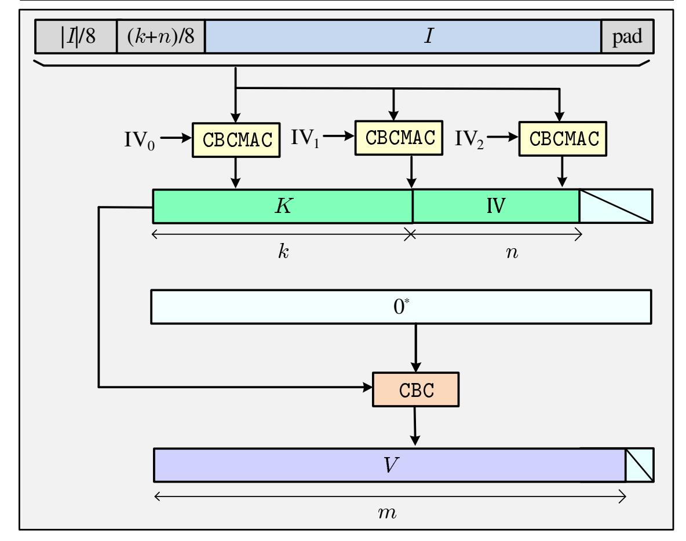
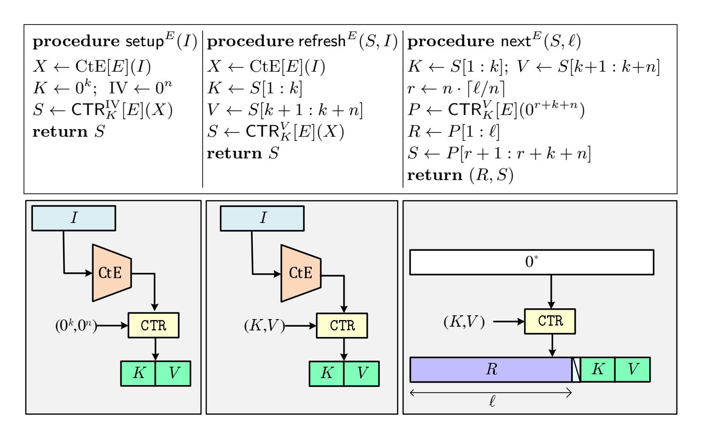
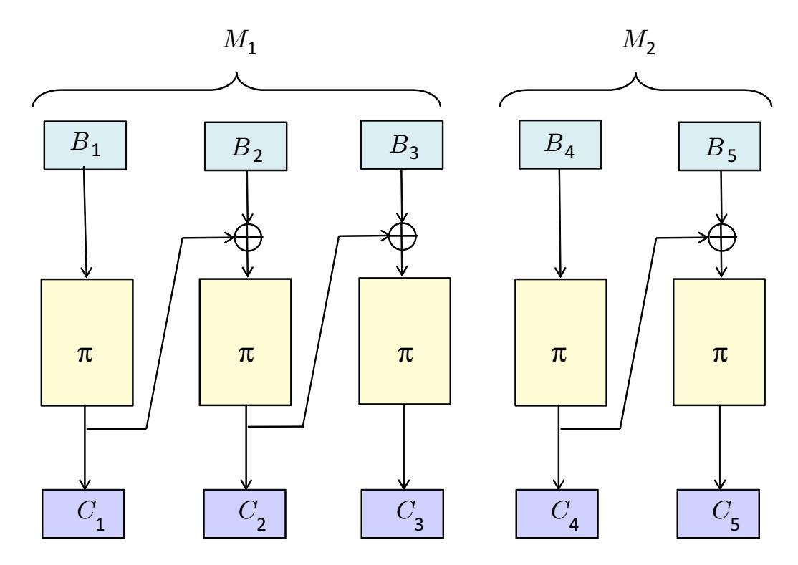
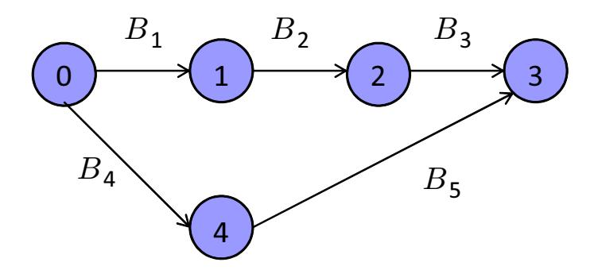
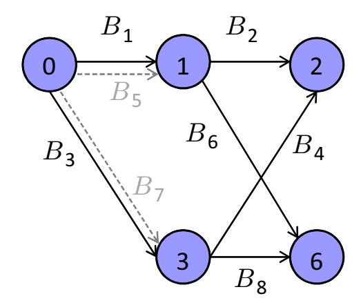
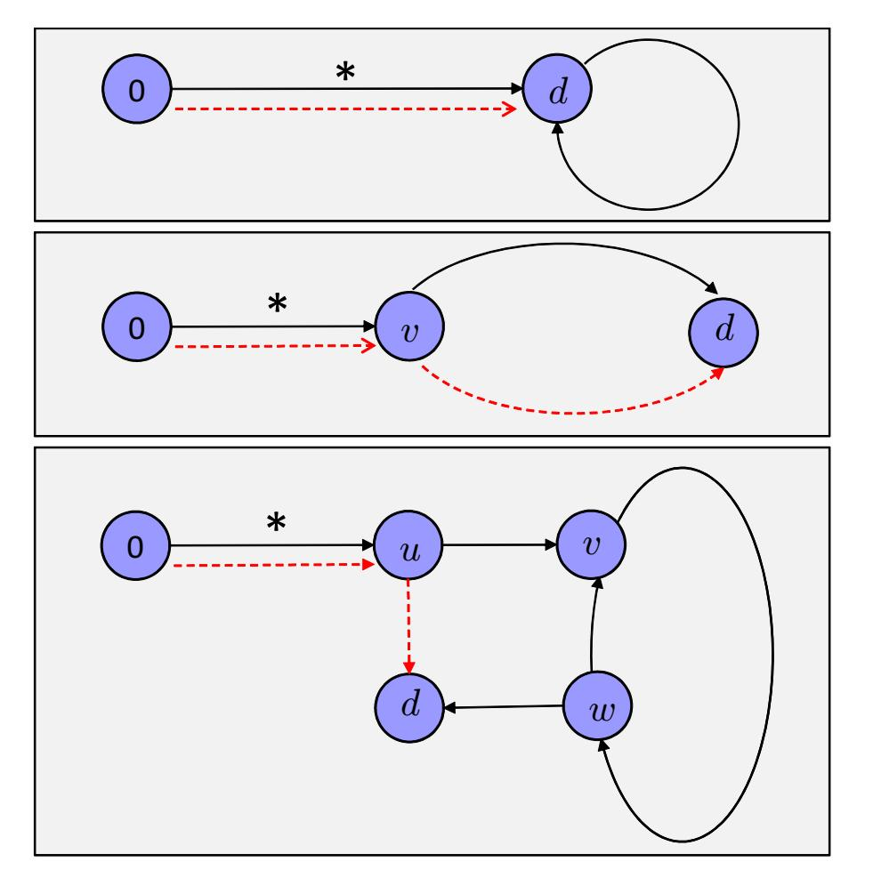
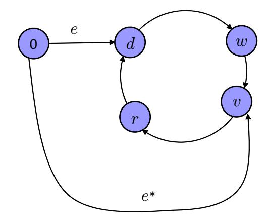

{0}------------------------------------------------

# <span id="page-0-0"></span>**Security Analysis of NIST CTR-DRBG**

Viet Tung Hoang<sup>1</sup> and Yaobin Shen<sup>2</sup>

<sup>1</sup> Dept. of Computer Science, Florida State University <sup>2</sup> Dept. of Computer Science & Engineering, Shanghai Jiao Tong University, China

**Abstract.** We study the security of CTR-DRBG, one of NIST's recommended Pseudorandom Number Generator (PRNG) designs. Recently, Woodage and Shumow (Eurocrypt' 19), and then Cohney et al. (S&P' 20) point out some potential vulnerabilities in both NIST specification and common implementations of CTR-DRBG. While these researchers do suggest counter-measures, the security of the patched CTR-DRBG is still questionable. Our work fills this gap, proving that CTR-DRBG satisfies the robustness notion of Dodis et al. (CCS'13), the standard security goal for PRNGs.

## **1 Introduction**

Cryptography ubiquitously relies on the assumption that high-quality randomness is available. Violation of this assumption would often lead to security disasters [\[9,](#page-27-0)[12,](#page-27-1)[20\]](#page-28-0), and thus a good Pseudorandom Number Generator (PRNG) is a fundamental primitive in cryptography, in both theory and practice. In this work we study the security of CTR-DRBG, the most popular standardized PRNG.<sup>1</sup>

A troubled history. CTR-DRBG is one of the recommended designs of NIST standard SP 800-90A, which initially included the now infamous Dual-EC. While the latter has received lots of scrutiny [\[8,](#page-27-2) [9\]](#page-27-0), the former had attracted little attention until Woodage and Shumow [\[31\]](#page-28-1) point out vulnerabilities in a NISTcompliant version. Even worse, very recently, Cohney et al. [\[12\]](#page-27-1) discover that many common implementations of CTR-DRBG still rely on table-based AES and thus are susceptible to cache side-channel attacks [\[5,](#page-27-3) [18,](#page-28-2) [24,](#page-28-3) [25\]](#page-28-4).

While the attacks above are catastrophic, they only show that (i) some insecure options in the overly flexible specification of CTR-DRBG should be deprecated, and (ii) developers of CTR-DRBG implementation should be mindful of misuses such as leaky table-based AES, failure to refresh periodically, or using lowentropy inputs. Following these counter-measures will thwart the known attacks,

<sup>1</sup> A recent study by Cohney et al. [\[12\]](#page-27-1) finds that CTR-DRBG is supported by 67.8% of validated implementations in NIST's Cryptographic Module Validation Program (CMVP). The other recommended schemes in NISP SP 800-90A, Hash-DRBG and HMAC-DRBG, are only supported by 36.3% and 37.0% of CMVP-certified uses, respectively.

{1}------------------------------------------------

but security of CTR-DRBG remains questionable. A full-fledged provable-security treatment of CTR-DRBG is therefore highly desirable—Woodage and Shumow consider it an important open problem [\[31\]](#page-28-1).

Prior provable security. Most prior works [\[7,](#page-27-4)[30\]](#page-28-5) only consider a simplified variant of CTR-DRBG that takes no random input, and assume that the initial state is truly random. These analyses fail to capture scenarios where the PRNG's state is either compromised or updated with adversarial random inputs. Consequently, their results are limited and cannot support security claims in NIST SP 800-90A.

A recent PhD thesis of Hutchinson [\[22\]](#page-28-6) aims to do better, analyzing security of CTR-DRBG via the robustness notion of Dodis et al. [\[15\]](#page-27-5). But upon examining this work, we find numerous issues, effectively invalidating the results. A detailed discussion of the problems in Hutchinson's analysis can be found in Appendix [A.](#page-28-7)

Contributions. In this work, we prove that the patched CTR-DRBG satisfies the robustness security of Dodis et al. [\[15\]](#page-27-5). Obtaining a good bound for CTR-DRBG requires surmounting several theoretical obstacles, which we will elaborate below.

An important stepping stone in proving robustness of CTR-DRBG is to analyze the security of the underlying randomness extractor that we name *Condensethen-Encrypt* (CtE); see Fig. [2](#page-8-0) for the code and an illustration of CtE. The conventional approach [\[15,](#page-27-5) [29,](#page-28-8) [31\]](#page-28-1) requires that the extracted outputs be pseudorandom. However, CtE oddly applies CBCMAC multiple times on the *same* random input (with different constant prefixes), foiling attempts to use existing analysis of CBCMAC [\[14\]](#page-27-6).

To address the issue above, we observe that under CTR-DRBG, the outputs of CtE are used for deriving keys and IVs of the CTR mode. If we model the underlying blockcipher of CTR as an ideal cipher then the extracted outputs only need to be *unpredictable*. In other words, CtE only needs to be a good *randomness condenser* [\[27\]](#page-28-9). In light of the Generalized Leftover Hash Lemma [\[1\]](#page-27-7), one thus needs to prove that CtE is a good almost-universal hash function, which is justified by the prior CBCMAC analysis of Dodis et al. [\[14\]](#page-27-6). As an added plus, aiming for just unpredictability allows us to reduce the min-entropy threshold on random inputs from 280 bits to 216 bits.

Still, the analysis above relies on the CBCMAC result in [\[14\]](#page-27-6), but the latter implicitly *assumes* that each random input is sampled from a set of equal-length strings. (Alternatively, one can view that each random input is sampled from a general universe, but then its exact length is revealed to the adversary.) This assumption may unnecessarily limit the choices of random sources for CtE or squander entropy of random inputs, and thus removing it is desirable. Unfortunately, one cannot simply replace the result of [\[14\]](#page-27-6) by existing CBCMAC analysis for variable-length inputs [\[4\]](#page-27-8), as the resulting unpredictability bound for CtE will be poor. Specifically, we would end up with an inferior term <sup>√</sup> · */*<sup>2</sup> <sup>64</sup> in bounding the unpredictability of extracted outputs against guesses.

{2}------------------------------------------------

To circumvent the obstacle above, we uncover a neat idea behind the seemingly cumbersome design of CtE. In particular, given a random input I, CtE first condenses it to a key  $K \leftarrow \mathsf{CBCMAC}(0 \parallel I)$  and an initialization vector  $\mathsf{IV} \leftarrow \mathsf{CBCMAC}(1 \parallel I)$ , and then uses CBC mode to encrypt a constant string under K and  $\mathsf{IV}$ . To predict the CBC ciphertext, an adversary must guess both K and  $\mathsf{IV}$  simultaneously. Apparently, the designers of CtE intend to use the iteration of CBCMAC to undo the square-root effect in the Leftover Hash Lemma [14,19] that has plagued existing CBCMAC analysis [14]. Still, giving a good unpredictability bound for  $(K,\mathsf{IV})$  is nontrivial, as (i) they are derived from the same random input I, and (ii) prior results [4], relying on analysis of ordinary collision on CBCMAC, can only be used to bound the marginal unpredictability of either K or  $\mathsf{IV}$ . We instead analyze a multi-collision property for CBCMAC, and thus can obtain a tighter bound on the unpredictability of  $(K,\mathsf{IV})$ . Concretely, we can improve the term  $\sqrt{q} \cdot p/2^{64}$  above to  $\sqrt{qL} \cdot \sigma/2^{128}$ , where L is the maximum block length of the random inputs, and  $\sigma$  is their total block length.

Even with the good security of CtE, obtaining a strong robustness bound for CTR-DRBG is still challenging. The typical approach [15,17,31] is to decompose the complex robustness notion into simpler ones, preserving and recovering. But this simplicity comes with a cost: if we can bound the recovering and preserving advantage by  $\epsilon$  and  $\epsilon'$  respectively, then we only obtain a loose bound  $p(\epsilon + \epsilon')$  in the robustness advantage, where p is the number of random inputs. In our context, the blowup factor p will lead to a rather poor bound.

Even worse, as pointed out by Dodis et al. [15], there is an adaptivity issue in proving recovering security of PRNGs that are built on top of a universal hash H. In particular, here an adversary, given a uniform hash key K, needs to pick an index  $i \in \{1, \ldots, p\}$  to indicate which random input  $I_i$  that it wants to attack, and then predicts the output of  $H_K(I_i)$  via q guesses. The subtlety here is that the adversary can adaptively pick the index i that depends on the key K, creating a situation similar to selective-opening attacks [3,16]. Dodis et al. [15] give a simple solution for this issue, but their treatment leads to another blowup factor p in the security bound. In Section 6.1 we explore this problem further, showing that the blowup factor p is inherent via a counter-example. Our example is based on a contrived universal hash function, so it does not imply that CTR-DRBG has inferior recovering security per se. Still, it shows that if one wants to prove a good recovering bound for CTR-DRBG, one must go beyond treating CtE as a universal hash function.

Given the situation above, instead of using the decomposition approach, we give a direct proof for the robustness security via the H-coefficient technique [10,26].

<sup>&</sup>lt;sup>2</sup> For a simple comparison of the two bounds, assume that  $\sigma \lesssim 2^{18} \cdot p$ , meaning that a random input is at most 4MB on average, which seems to be a realistic assumption for typical applications. The standard NIST SP 800-90A dictates that  $L \leq 2^{28}$ . Then our bound  $\sqrt{qL} \cdot \sigma/2^{128}$  is around  $\sqrt{q} \cdot p/2^{96}$ . If we instead consider the worst case where  $\sigma \approx Lp$ , then our bound is around  $\sqrt{q} \cdot p/2^{86}$ .

{3}------------------------------------------------

We carefully exercise the union bound to sidestep pesky adaptivity pitfalls and obtain a tight bound.[3](#page-0-0)

Limitations. In this work, we assume that each random input has sufficient min entropy. This restriction is admittedly limited, failing to show that CTR-DRBG can slowly accumulate entropy in multiple low-entropy inputs, which is an important property in the robustness notion. Achieving full robustness for CTR-DRBG is an important future direction. Still, our setting is meaningful, comparable to the notion of Barak and Halevi [\[2\]](#page-27-11). This is also the setting that the standard NIST SP 800-90A assumes. We note that Woodage and Shumow [\[31\]](#page-28-1) use the same setting for analyzing HMAC-DRBG, and Hutchinson [\[22\]](#page-28-6) for CTR-DRBG.

Seed-dependent inputs. Our work makes a standard assumption that the random inputs are independent of the seed of the randomness extractor.[4](#page-0-0) This assumption seems unavoidable as deterministic extraction from a general source is impossible [\[11\]](#page-27-12). In a recent work, Coretti et al. [\[13\]](#page-27-13) challenge the conventional wisdom with meaningful notions for *seedless* extractors and PRNGs, and show that CBCMAC is *insecure* in their model. In Section [7,](#page-24-0) we extend their ideas to attack CTR-DRBG. We note that this is just a theoretical attack with a contrived sampler of random inputs, and does not directly translate into an exploit of realworld CTR-DRBG implementations.

Ruhault [\[28\]](#page-28-14) also considers attacking CTR-DRBG with a seed-dependent sampler. But his attack, as noted by Woodage and Shumow [\[31\]](#page-28-1), only applies to a variant of CTR-DRBG that does not comply with NIST standard. It is unclear how to use his ideas to break the actual CTR-DRBG.

## **2 Preliminaries**

Notation. Let denote the empty string. For an integer , we let [] denote a -bit representation of . For a finite set , we let ←\$ denote the uniform sampling from and assigning the value to . Let || denote the length of the string , and for 1 ≤  *<*  ≤ ||, let [ : ] denote the substring from the -th bit to the -th bit (inclusive) of . If is an algorithm, we let ← (1*, . . .* ; ) denote running with randomness on inputs 1*, . . .* and assigning the output to . We let ←\$ (1*, . . .*) be the result of picking at random and letting ← (1*, . . .* ; ).

Conditional Min-entropy and Statistical Distance. For two random variables and , the *(average-case) conditional min-entropy* of given is

$$H_{\infty}(X \mid Y) = -\log\left(\sum_{y} \Pr[Y = y] \cdot \max_{x} \Pr[X = x \mid Y = y]\right).$$

<sup>3</sup> Using the same treatment for recovering security still ends up with the blowup factor , as it is inherent.

<sup>4</sup> In the context of CtE, the seed is the encoding of the ideal cipher. In other words, we assume that the sampler of the random inputs has no access to the ideal cipher.

{4}------------------------------------------------

The *statistical distance* between and is

$$SD(X,Y) = \frac{1}{2} \sum_{z} |Pr[X=z] - Pr[Y=z]|$$
.

The statistical distance SD(*,*  ) is the best possible advantage of an (even computationally unbounded) adversary in distinguishing and .

Systems and Transcripts. Following the notation from [\[21\]](#page-28-15), it is convenient to consider interactions of a distinguisher with an abstract system **S** which answers 's queries. The resulting interaction then generates a transcript = ((1*,* 1)*, . . . ,*(*,* )) of query-answer pairs. It is known that **S** is entirely described by the probabilities p**S**( ) that correspond to the system **S** responding with answers as indicated by when the queries in are made.

We will generally describe systems informally, or more formally in terms of a set of oracles they provide, and only use the fact that they define corresponding probabilities p**S**( ) without explicitly giving these probabilities. We say that a transcript is valid for system **S** if p**S**( ) *>* 0.

The H-coefficient technique. We now describe the H-coefficient technique of Patarin [\[10,](#page-27-10) [26\]](#page-28-13). Generically, it considers a deterministic distinguisher that tries to distinguish a "real" system **S**<sup>1</sup> from an "ideal" system **S**0. The adversary's interactions with those systems define transcripts <sup>1</sup> and 0, respectively, and a bound on the distinguishing advantage of is given by the statistical distance SD(1*,* 0).

<span id="page-4-0"></span>**Lemma 1.** [\[10,](#page-27-10)[26\]](#page-28-13) *Suppose we can partition the set of valid transcripts for the ideal system into good and bad ones. Further, suppose that there exists* ≥ 0 *such that* 1 − p**S**<sup>1</sup> () p**S**<sup>0</sup> () ≤ *for every good transcript . Then,*

$$SD(X_1, X_0) \le \epsilon + \Pr[X_0 \text{ is bad}]$$
.

## **3 Modeling Security of PRNGs**

In this section we recall the syntax and security notion of Pseudorandom Number Generator (PRNG) from Dodis et al. [\[15\]](#page-27-5).

Syntax. A PRNG with state space State and seed space Seed is a tuple of deterministic algorithms = (setup*,*refresh*,* next). Under the syntax of [\[15\]](#page-27-5), setup is instead probabilistic: it takes no input, and returns seed ←\$ Seed and ←\$ State. However, as pointed out by Shrimpton and Terashima [\[29\]](#page-28-8), this fails to capture real-world PRNGs, where the state may include, for example, counters. Moreover, real-world setup typically gets its coins from an entropy source, and thus the coins may be non-uniform. Therefore, following [\[29,](#page-28-8) [31\]](#page-28-1), we instead require 

{5}------------------------------------------------

that the algorithm setup(seed*,* ) take as input a seed seed ∈ Seed and a string , and then output an initial state ∈ State; there is no explicit requirement on the distribution of .

Next, algorithm refresh(seed*, ,* ) takes as input a seed seed, a state , and a string , and then outputs a new state. Finally algorithm next(seed*, , ℓ*) takes as input a seed seed, a state , and a number *ℓ* ∈ N, and then outputs a new state and an *ℓ*-bit output string. Here we follow the recent work of Woodage and Shumow [\[31\]](#page-28-1) to allow variable output length.

Distribution samplers. A *distribution sampler* is a stateful, probabilistic algorithm. Given the current state , it will output a tuple ( ′ *, , ,* ) in which ′ is the updated state, is the next randomness input for the PRNG , ≥ 0 is a real number, and is some side information of given to an adversary attacking . Let be an upper bound of the number of calls to in our security games. Let <sup>0</sup> be the empty string, and let ( *, , ,* ) ←\$ (−1) for every ∈ {1*, . . . ,* }. For each ≤ , let

$$\mathcal{I}_{p,i} = (I_1, \dots, I_{i-1}, I_{i+1}, \dots, I_p, \gamma_1, \dots, \gamma_p, z_1, \dots, z_p)$$
.

We say that sampler is *legitimate* if ∞( | ℐ*,*) ≥ for every ∈ {1*, . . . ,* }. A legitimate sampler is -*simple* if ≥ for every .

In this work, we will consider only simple samplers for a sufficiently large minentropy threshold . In other words, we will assume that each random input has sufficient min entropy. This setting is somewhat limited, as it fails to show that the PRNG can slowly accumulate entropy in multiple low-entropy inputs. However, it is still meaningful—this is actually the setting that the standard NIST SP 800-90A assumes. We note that Woodage and Shumow [\[31\]](#page-28-1) also analyze the HMAC-DRBG construction under the same setting.

Robustness. Let  *>* 0 be a real number, be an adversary attacking , and be a legitimate distribution sampler. Define

$$\mathsf{Adv}^{\mathrm{rob}}_{\mathcal{G},\lambda}(A,\mathcal{D}) = 2\Pr\Big[\mathbf{G}^{\mathrm{rob}}_{\mathcal{G},\lambda}(A,\mathcal{D})\Big] - 1 \ ,$$

where game **G**rob *,*(*,* ) is defined in Fig. [1.](#page-6-0)

Informally, the game picks a challenge bit ←\$ {0*,* 1} and maintains a counter of the current estimated amount of accumulated entropy that is initialized to 0. It runs the distribution sampler on an empty-string state to generate the first randomness input . It then calls the setup algorithm on a uniformly random seed to generate the initial state , and increments to . The adversary , given the seed and the side information and entropy estimation of , has access to the following:

(i) An oracle Ref() to update the state via the algorithm refresh with the next randomness input . The adversary learns the corresponding side information and the entropy estimation of . The counter is incremented by .

{6}------------------------------------------------

```
Game \mathbf{G}_{\mathcal{G},\lambda}^{\mathrm{rob}}(A,\mathcal{D})
                                                                                       procedure Ref()
                                                                                       (s, I, \gamma, z) \leftarrow \mathcal{D}(s)
 b \leftarrow \$ \{0,1\}; \ s \leftarrow \varepsilon; \ seed \leftarrow \$ \operatorname{Seed}
                                                                                       S \leftarrow \mathsf{refresh}(seed, S, I); \ c \leftarrow c + \gamma
 c \leftarrow 0; \ (s, I, \gamma, z) \leftarrow \mathcal{D}(s);
                                                                                      |\mathbf{return}| (\gamma, z)
 S \leftarrow \mathsf{setup}(\mathsf{seed}, I); \ c \leftarrow c + \gamma \\ b' \leftarrow A^{\mathsf{Ref}, \mathsf{RoR}, \mathsf{Get}, \mathsf{Set}}(\mathsf{seed}, \gamma, z)
 return (b' = b)
procedure RoR(1^{\ell})
                                                                                       procedure Get() | procedure Set(S^*)
                                                                                                                                  S \leftarrow S^*; \ c \leftarrow 0
(R_1, S) \leftarrow \mathsf{next}(seed, S, \ell)
                                                                                       c \leftarrow 0
if (c < \lambda) then c \leftarrow 0; return R_1
                                                                                       return S
R_0 \leftarrow \$ \{0,1\}^{\ell}; return R_b
```

Fig. 1: Game defining robustness for a PRNG  $\mathcal{G} = (\text{setup}, \text{refresh}, \text{next})$  against an adversary A and a distribution sampler  $\mathcal{D}$ , with respect to an entropy threshold  $\lambda$ .

- (ii) An oracle Get() to obtain the current state S. The counter c is reset to 0.
- (iii) An oracle Set() to set the current state to an adversarial value  $S^*$ . The counter c is reset to 0.
- (iv) An oracle  $\operatorname{RoR}(1^{\ell})$  to get the next  $\ell$ -bit output. The game runs the next algorithm on the current state S to update it and get an  $\ell$ -bit output  $R_1$ , and also samples a uniformly random string  $R_0 \leftarrow \{0,1\}^{\ell}$ . If the accumulated entropy is insufficient (meaning  $c < \lambda$ ) then c is reset to 0 and  $R_1$  is returned to the adversary. Otherwise,  $R_b$  is given to the adversary.

The goal of the adversary is to guess the challenge bit b, by outputting a bit b'. The advantage  $\mathsf{Adv}^{\mathrm{rob}}_{\mathcal{G},\lambda}(A,\mathcal{D})$  measures the normalized probability that the adversary's guess is correct.

EXTENSION FOR IDEAL MODELS. In many cases, the PRNG is based on an ideal primitive  $\Pi$  such as an ideal cipher or a random oracle. One then can imagine that the PRNG uses a huge seed that encodes  $\Pi$ . In the robustness notion, the adversary A would be given oracle access to  $\Pi$  but the distribution sampler  $\mathcal{D}$  is assumed to be independent of the seed, and thus has no access to  $\Pi$ . This extension for ideal models is also used in prior work [6,31].

Some PRNGs, such as CTR-DRBG or the Intel PRNG [29], use AES with a constant key  $K_0$ . For example,  $K_0 \leftarrow \text{AES}(0^{128}, 0^{127} || 1)$  for the Intel PRNG, and  $K_0 \leftarrow 0 \times 00010203 \cdots$  for CTR-DRBG. An alternative treatment for ideal models in this case is to let both  $\mathcal{D}$  and A have access to the ideal primitive, but pretend that  $K_0$  is truly random, independent of  $\mathcal{D}$ . This approach does not work well in our situation because (i) the constant key of CTR-DRBG does not look random at all, and (ii) allowing  $\mathcal{D}$  access to the ideal primitive substantially complicates the robustness proof of CTR-DRBG. We therefore avoid this approach to keep the proof simple.

{7}------------------------------------------------

### <span id="page-7-0"></span>4 The Randomness Extractor of CTR-DRBG

A PRNG is often built on top of an internal (seeded) randomness extractor  $\operatorname{Ext}:\operatorname{Seed}\times\{0,1\}^*\to\{0,1\}^s$  that takes as input a seed  $\operatorname{seed}\in\operatorname{Seed}$  and a random input  $I\in\{0,1\}^*$  to deterministically output a string  $V\in\{0,1\}^s$ . For example, the Intel PRNG [29] is built on top of CBCMAC, or HMAC-DRBG on top of HMAC. In this section we will analyze the security of the randomness extractor of CTR-DRBG, which we call  $\operatorname{Condense-then-Encrypt}$  (CtE). We shall assume that the underlying blockcipher is AES.<sup>5</sup>

#### 4.1 The CtE Construction

The randomness extractor CtE is based on two standard components: CBCMAC and CBC encryption. Below, we first recall the two components of CtE, and then describe how to compose them in CtE.

THE CBCMAC CONSTRUCTION. Let  $\pi: \{0,1\}^n \to \{0,1\}^n$  be a permutation. For the sake of convenience, we will describe CBCMAC with a general IV; one would set IV  $\leftarrow 0^n$  in the standard CBCMAC algorithm. For an initialization vector IV  $\in \{0,1\}^n$  and a message  $M = M_1 \cdots M_t$ , with each  $|M_i| = n$ , we recursively define

$$\mathsf{CBCMAC}^{\mathsf{IV}}[\pi](M_1 \cdots M_t) = \mathsf{CBCMAC}^R[\pi](M_2 \cdots M_t)$$

where  $R \leftarrow \pi(\text{IV} \oplus M_1)$ , and in the base case of the empty-string message, let  $\mathsf{CBCMAC}^{\mathrm{IV}}[\pi](\varepsilon) = \mathrm{IV}$ . In the case that  $\mathrm{IV} = 0^n$ , we simply write  $\mathsf{CBCMAC}[\pi](M)$  instead of  $\mathsf{CBCMAC}^{\mathrm{IV}}[\pi](M)$ .

THE CBC ENCRYPTION CONSTRUCTION. In the context of CtE, the CBC encryption is only used for full-block messages. Let  $E: \{0,1\}^k \times \{0,1\}^n \to \{0,1\}^n$  be a blockcipher. For a key  $K \in \{0,1\}^k$ , an initialization vector  $IV \in \{0,1\}^n$ , and a message  $M = M_1 \cdots M_t$ , with each  $|M_i| = n$ , let

$$CBC_K^{IV}[E](M_1\cdots M_t) = C_1\cdots C_t ,$$

where  $C_1, \ldots, C_t$  are defined recursively via  $C_0 \leftarrow IV$  and  $C_i \leftarrow E_K(C_{i-1} \oplus M_i)$  for every  $1 \le i \le t$ . In our context, since we do *not* need decryptability, the IV is *excluded* in the output of CBC.

THE CtE CONSTRUCTION. Let  $E: \{0,1\}^k \times \{0,1\}^n \to \{0,1\}^n$  be a blockcipher, such that k and n are divisible by 8, and  $n \le k \le 2n$ —this captures all choices of AES key length. Let pad :  $\{0,1\}^* \to (\{0,1\}^n)^+$  be the padding scheme that first appends the byte 0x08, and then appends 0's until the length is a multiple

<sup>&</sup>lt;sup>5</sup> While CTR-DRBG does support 3DES, the actual deployment is rare: among the CMVP-certified implementations that support CTR-DRBG, only 1% of them use 3DES [12].

{8}------------------------------------------------

```
procedure CtE[E, m](I)

X \leftarrow pad([|I|/8]_{32} \parallel [(k+n)/8]_{32} \parallel I)

for i \leftarrow 0 to 2 do

IV_i \leftarrow \pi([i]_{32} \parallel 0^{n-32}); \quad T_i \leftarrow \mathsf{CBCMAC}^{\mathsf{IV}}[\pi](X)

Y \leftarrow T_1 \parallel T_2 \parallel T_3; \quad K \leftarrow Y[1:k]; \quad IV \leftarrow Y[k+1:k+n]

C \leftarrow \mathsf{CBC}_K^{\mathsf{IV}}[E](0^{3n}); \quad \mathbf{return} \quad C[1:m]
```



Fig. 2: The  $\mathrm{CtE}[E,m]$  construction, built on top of a blockcipher  $E:\{0,1\}^k\times\{0,1\}^n\to\{0,1\}^n$ . Here the random input I is a byte string. For an integer i, we let  $[i]_t$  denote a t-bit representation of i, and the permutation  $\pi$  is instantiated from E with the k-bit constant key  $0 \times 00010203 \cdots$ .

of n. Note that  $pad(X) \neq pad(Y)$  for any  $X \neq Y$ . For the sake of convenience, we shall describe a more generalized construction CtE[E, m], with  $m \leq 3n$ . The code of this construction is shown in Fig. 2. The randomness extractor of CTR-DRBG corresponds to CtE[E, k+n]; we also write CtE[E] for simplicity.

#### 4.2 Security of CtE

SECURITY MODELING. In modeling the security of a randomness extractor Ext, prior work [14,29,31] usually requires that  $\operatorname{Ext}(\operatorname{seed},I)$  be pseudorandom for an adversary that is given the seed S, provided that (i) the random input I has sufficiently high min entropy, and (ii) the seed S is uniformly random. In our situation, following the conventional route would require each random input to have at least 280 bits of min entropy for CTR-DRBG to achieve birthday-bound security. However, for the way that CtE is used in CTR-DRBG, we only need the

{9}------------------------------------------------

```
\frac{\text{Game } \mathbf{G}^{\text{guess}}_{\text{Cond}}(A, \mathcal{S})}{(I, z) \leftarrow \$ \mathcal{S}; \text{ } seed \leftarrow \$ \text{ Seed}; \text{ } V \leftarrow \text{Cond}(seed, I)}{(Y_1, \dots, Y_q) \leftarrow \$ A(seed, z); \text{ } \mathbf{return} \text{ } (V \in \{Y_1, \dots, Y_q\})}
```

Fig. 3: Game defining security of a condenser Cond against an adversary A and a source S.

n-bit prefix of the output to be unpredictable, allowing us to reduce the minentropy threshold to 216 bits. In other words, we only need CtE[E, n] to be a good condenser [27].

We now recall the security notion for randomness condensers. Let Cond : Seed  $\times$   $\{0,1\}^* \to \{0,1\}^n$  be a deterministic algorithm. Let  $\mathcal{S}$  be a  $\lambda$ -source, meaning a stateless, probabilistic algorithm that outputs a random input I and some side information z such that  $H_{\infty}(I \mid z) \geq \lambda$ . For an adversary A, define

$$\mathsf{Adv}^{\mathrm{guess}}_{\mathsf{Cond}}(A,\mathcal{S}) = \Pr[\mathbf{G}^{\mathrm{guess}}_{\mathsf{Cond}}(A,\mathcal{S})]$$

as the guessing advantage of A against the condenser Cond on the source S, where game  $\mathbf{G}_{\mathsf{Cond}}^{\mathsf{guess}}(A, S)$  is defined in Fig. 3. Informally, the game measures the chance that the adversary can guess the output  $\mathsf{Cond}(\mathsf{seed}, I)$  given the seed  $\mathsf{seed} \leftarrow \mathsf{s}$  Seed and some side information z of the random input I.

When the condenser Cond is built on an ideal primitive  $\Pi$  such as a random oracle or an ideal cipher, we only consider sources independent of  $\Pi$ . Following [14], instead of giving A oracle access to  $\Pi$ , we will give the adversary A the entire (huge) encoding of  $\Pi$ , which can only help the adversary. In other words, we view the encoding of  $\Pi$  as the seed of Cond, and as defined in game  $\mathbf{G}_{\mathsf{Cond}}^{\mathsf{guess}}(A,\mathcal{S})$ , the adversary A is given the seed.

To show that CtE[E, n] is a good condenser, we will first show that it is an almost universal (AU) hash, and then apply a Generalized Leftover Hash Lemma of Barak et al. [1]. Below, we will recall the notion of AU hash.

AU HASH. Let Cond : Seed  $\times$  Dom  $\to \{0,1\}^n$  be a (keyed) hash function. For each string X, define its block length to be  $\max\{1,|X|/n\}$ . For a function  $\delta: \mathbb{N} \to [1,\infty)$ , we say that Cond is a  $\delta$ -almost universal hash if for every distinct strings  $X_1, X_2$  whose block lengths are at most  $\ell$ , we have

$$\Pr_{seed \, \leftarrow \$ \, \mathrm{Seed}}[\mathsf{Cond}(seed, X_1) = \mathsf{Cond}(seed, X_2)] \leq \frac{\delta(\ell)}{2^n} \ .$$

The following Generalized Leftover Hash Lemma of Barak et al. [1] shows that an AU hash function is a good condenser.

<span id="page-9-1"></span>Lemma 2 (Generalized Leftover Hash Lemma). [1] Let Cond : Seed  $\times$  Dom  $\to \{0,1\}^n$  be a  $\delta$ -AU hash function, and let  $\lambda > 0$  be a real number. Let  $\mathcal{S}$ 

{10}------------------------------------------------

*be a -source whose random input has at most ℓ blocks. For any adversary making at most guesses,*

$$\mathsf{Adv}^{\mathrm{guess}}_{\mathsf{Cond}}(A,\mathcal{S}) \leq \frac{q}{2^n} + \sqrt{\frac{q}{2^\lambda} + \frac{q \cdot (\delta(\ell) - 1)}{2^n}} \enspace .$$

Discussion. A common way to analyze CBCMAC-based extractors is to use a result by Dodis et al. [\[14\]](#page-27-6). However, this analysis is restricted to the situation in which either (i) the length of the random input is fixed, or (ii) the side information reveals the exact length of the random input. On the one hand, while the assumption (i) is true in Linux PRNG where the kernel entropy pool has size 4,096 bits, it does not hold in, say Intel PRNG where the system keeps collecting entropy and lengthening the random input. On the other hand, the assumption (ii) may unnecessarily squander entropy of random inputs by intentionally leaking their lengths. Given that CTR-DRBG is supposed to deal with a generic source of potentially limited entropy, it is desirable to remove the assumptions (i) and (ii) in the analysis.

At the first glance, one can deal with variable input length by using the following analysis of Bellare et al. [\[4\]](#page-27-8) of CBCMAC. Let Perm() be the set of permutations on {0*,* 1} . Then for any distinct, full-block messages <sup>1</sup> and <sup>2</sup> of at most *ℓ* ≤ 2 */*<sup>4</sup> blocks, Bellare et al. show that

<span id="page-10-1"></span>
$$\Pr_{\pi \leftrightarrow \$\operatorname{Perm}(n)}[\mathsf{CBCMAC}[\pi](X_1) = \mathsf{CBCMAC}[\pi](X_2)] \le \frac{2\sqrt{\ell}}{2^n} + \frac{64\ell^4}{2^{2n}} \ . \tag{1}$$

However, this bound is too weak for our purpose due to the square root in Lemma [2.](#page-9-1) In particular, using this formula leads to an inferior term <sup>√</sup>· 2*/*<sup>2</sup> in bounding the unpredictability of extracted outputs against guesses.

To improve the concrete bound, we observe that to guess the output of CtE[*,* ], the adversary has to guess both the key and IV of the CBC encryption simultaneously. Giving a good bound for this joint unpredictability is nontrivial, since the key and the IV are derived from the *same* source of randomness (but with different constant prefixes). This requires us to handle a *multi-collision* property of CBCMAC.

Security Analysis of CtE. The following Lemma [3](#page-10-0) gives a multi-collision property of CBCMAC that CtE needs; the proof is in Appendix [B.](#page-29-0)

<span id="page-10-0"></span>**Lemma 3 (Multi-collision of CBCMAC).** *Let* ≥ 32 *be an integer. Let* 1*, . . . ,* <sup>4</sup> *be distinct, non-empty, full-block messages such that*

- *(i)* <sup>1</sup> *and* <sup>2</sup> *have the same first block, and* <sup>3</sup> *and* <sup>4</sup> *have the same first block, but these two blocks are different, and*
- *(ii) the block length of each message is at most ℓ, with* 4 ≤ *ℓ* ≤ 2 */*3−4 *.*

{11}------------------------------------------------

Then for a truly random permutation  $\pi \leftarrow \operatorname{sPerm}(n)$ , the probability that both  $\mathsf{CBCMAC}[\pi](X_1) = \mathsf{CBCMAC}[\pi](X_2)$  and  $\mathsf{CBCMAC}[\pi](X_3) = \mathsf{CBCMAC}[\pi](X_4)$  happen is at most  $64\ell^3/2^{2n}$ .

Armed with the result above, we now can show in Lemma 4 below that  $\mathrm{CtE}[E,n]$  is a good AU hash. Had we used the naive bound in Equation (1), we would have obtained an inferior bound  $\frac{2\sqrt{\ell}}{2^n} + \frac{64\ell^4}{2^{2n}}$ .

<span id="page-11-0"></span>**Lemma 4.** Let  $n \geq 32$  and  $k \in \{n, n+1, \ldots, 2n\}$  be integers. Let  $E : \{0, 1\}^k \times \{0, 1\}^n \to \{0, 1\}^n$  that we model as an ideal cipher. Let CtE[E, n] be described as above. Let  $I_1, I_2$  be distinct strings of at most  $\ell$  blocks, with  $\ell + 2 \leq 2^{n/3-4}$ . Then

$$\Pr[\text{CtE}[E, n](I_1) = \text{CtE}[E, n](I_2)] \le \frac{1}{2^n} + \frac{64(\ell+2)^3}{2^{2n}}$$
,

where the randomness is taken over the choices of E.

*Proof.* Recall that in  $CtE[E, n](I_b)$ , with  $b \in \{1, 2\}$ , we first iterate through CBCMAC three times to derive a key  $K_b$  and an IV  $J_b$ , and then output  $E(K_b, J_b)$ . Let  $Y_b$  and  $Z_b$  be the first block and the second block of  $K_b \parallel J_b$ , respectively. We consider the following cases:

Case 1:  $(Y_1, Z_1) \neq (Y_2, Z_2)$ . Hence  $(K_1, J_1) \neq (K_2, J_2)$ . If  $K_1 = K_2$  then since E is a blockcipher,  $E(K_1, J_1) \neq E(K_2, J_2)$ . Suppose that  $K_1 \neq K_2$ . Without loss of generality, assume that  $K_1$  is not the constant key in CBCMAC. Since E is modeled as an ideal cipher,  $E(K_1, J_1)$  is a uniformly random string, independent of  $E(K_2, J_2)$ , and thus the chance that  $E(K_1, J_1) = E(K_2, J_2)$  is  $1/2^n$ . Therefore, in this case, the probability that  $CtE[E, n](I_1) = CtE[E, n](I_2)$  is at most  $1/2^n$ .

Case 2:  $(Y_1, Z_1) = (Y_2, Z_2)$ . It suffices to show that this case happens with probability at most  $64(\ell+2)^3/2^{2n}$ . For each  $a \in \{0,1\}$ , let  $P_a \leftarrow [a]_{32} \parallel 0^{n-32}$ . For  $b \in \{1,2\}$ , let

$$U_b \leftarrow \operatorname{pad}([|I_b|/8]_{32} || [(k+n)/8]_{32} || I_b)$$
.

Let  $\pi$  be the permutation in CBCMAC. Note that  $Y_b \leftarrow \mathsf{CBCMAC}[\pi](P_0 \parallel U_b)$  and  $Z_b \leftarrow \mathsf{CBCMAC}[\pi](P_1 \parallel U_b)$  for every  $b \in \{1,2\}$ . Applying Lemma 3 with  $X_1 = P_0 \parallel U_1, \ X_2 = P_0 \parallel U_2, \ X_3 = P_1 \parallel U_1, \ \text{and} \ X_4 = P_1 \parallel U_2 \ \text{(note that these strings have block length at most } \ell + 2), the chance that <math>Y_1 = Y_2 \text{ and } Z_1 = Z_2$  is at most  $64(\ell + 2)^3/2^{2n}$ .

Combining Lemma 2 and Lemma 4, we immediately obtain the following result, establishing that CtE[E, n] is a good condenser.

<span id="page-11-1"></span>**Theorem 1.** Let  $n \geq 32$  and  $k \in \{n, n+1, \ldots, 2n\}$  be integers. Let  $E : \{0, 1\}^k \times \{0, 1\}^n \to \{0, 1\}^n$  that we model as an ideal cipher. Let CtE[E, n] be described as above. Let S be a  $\lambda$ -source that is independent of E and outputs random inputs of at most  $\ell$  blocks. Then for any adversary A making at most q guesses,

$$\mathsf{Adv}^{\mathrm{guess}}_{\mathrm{CtE}[E,n]}(A,\mathcal{S}) \le \frac{q}{2^n} + \frac{\sqrt{q}}{2^{\lambda/2}} + \frac{8\sqrt{q(\ell+2)^3}}{2^n} \ .$$

{12}------------------------------------------------

```
procedure XP[]()
 ← pad(︀
        [||/8]32 ‖ [( + )/8]32 ‖ 
                              )︀
for  ← 0 to 2 do
  IV ← ([]32 ‖ 0
               −32);  ← CBCMACIV
                                     []()
 ← 1 ‖ 2 ‖ 3;  ←  [1 : ]; IV ←  [ + 1 :  + ]
 ← (,IV) //Output of CtE[, ]()
return  ⊕ [1 : ]
```

Fig. 4: **The** XP[] **construction, built on top of a blockcipher** : {0*,* 1} × {0*,* 1} → {0*,* 1} **.** Here the random input is a byte string. For an integer , we let [] denote a -bit representation of , and the permutation is instantiated from with the -bit constant key 0x00010203 · · · .

Another requirement of CtE. In proving security of CTR-DRBG, one would encounter the following situation. We first derive the key ← CtE[]() on a random input , and let be the key of CBC encryption in CtE[](). The adversary then specifies a mask . It wins if = ⊕ ; that is, the adversary wins if it can predict ⊕ . To bound the winning probability of the adversary, our strategy is to show that even the -bit prefix of ⊕ is hard to guess. In particular, we consider a construction *Xor-Prefix* (XP) such that XP[]() outputs the -bit prefix of ⊕, and then show that XP[] is a good condenser. The code of XP[] is given in Fig. [4.](#page-12-0) Informally, XP[]() first runs CtE[*,* ]() to obtain an -bit string , and then outputs ⊕ [1 : ], where is the key of CBC encryption in CtE[*,* ]().

<span id="page-12-1"></span>The following result shows that XP[] is a good AU hash.

**Lemma 5.** *Let* ≥ 32 *and* ∈ {*,*  + 1*, . . . ,* 2} *be integers. Let* : {0*,* 1} × {0*,* 1} → {0*,* 1} *that we model as an ideal cipher. Let* XP[] *be described as above. Let* 1*,* <sup>2</sup> *be distinct strings of at most ℓ blocks, with ℓ*+ 2 ≤ 2 */*3−4 *. Then*

$$\Pr[XP[E](I_1) = XP[E](I_2)] \le \frac{1}{2^n} + \frac{64(\ell+2)^3}{2^{2n}}$$
,

*where the randomness is taken over the choices of .*

*Proof.* Recall that in XP[](), with ∈ {1*,* 2}, we first iterate through CBCMAC to derive a key and an IV , and then output (*,* ) ⊕ [1 : ]. Let and be the first block and the second block of ‖ , respectively. We consider the following cases:

**Case 1:** (1*,* 1) ̸= (2*,* 2). Hence (1*,* 1) ̸= (2*,* 2). If <sup>1</sup> = <sup>2</sup> then since is a blockcipher, (1*,* 1) ̸= (2*,* 2) and thus

$$E(K_1, J_1) \oplus K_1[1:n] \neq E(K_2, J_2) \oplus K_2[1:n]$$
.

Suppose that <sup>1</sup> ̸= 2. Without loss of generality, assume that <sup>1</sup> is not the constant key in CBCMAC. Since is modeled as an ideal cipher, the string 

{13}------------------------------------------------

 $E(K_1, J_1) \oplus K_1[1:n]$  is uniformly random, independent of  $E(K_2, J_2) \oplus K_2[1:n]$ , and thus the chance that these two strings are the same is  $1/2^n$ . Therefore, in this case, the probability that  $XP[E](I_1) = XP[E](I_2)$  is at most  $1/2^n$ .

Case 2:  $(Y_1, Z_1) = (Y_2, Z_2)$ . It suffices to show that this case happens with probability at most  $64(\ell+2)^3/2^{2n}$ . For each  $a \in \{0,1\}$ , let  $P_b \leftarrow [b]_{32} \parallel 0^{n-32}$ . For  $b \in \{1,2\}$ , let

$$U_b \leftarrow \operatorname{pad}([|I_b|/8]_{32} || [(k+n)/8]_{32} || I_b)$$
.

Let  $\pi$  be the permutation in CBCMAC. Note that  $Y_b \leftarrow \mathsf{CBCMAC}[\pi](P_0 \parallel U_b)$  and  $Z_b \leftarrow \mathsf{CBCMAC}[\pi](P_1 \parallel U_b)$  for every  $b \in \{1, 2\}$ . Applying Lemma 3 with  $X_1 = P_0 \parallel U_1$ ,  $X_2 = P_0 \parallel U_2$ ,  $X_3 = P_1 \parallel U_1$ , and  $X_4 = P_1 \parallel U_2$  (note that these strings have block length at most  $\ell + 2$ ), the chance that  $Y_1 = Y_2$  and  $Z_1 = Z_2$  is at most  $64(\ell + 2)^3/2^{2n}$ .

Combining Lemma 2 and Lemma 5, we immediately obtain the following result, establishing that XP[E] is a good condenser.

<span id="page-13-0"></span>**Lemma 6.** Let  $n \geq 32$  and  $k \in \{n, n+1, \ldots, 2n\}$  be integers. Let  $E : \{0, 1\}^k \times \{0, 1\}^n \to \{0, 1\}^n$  that we model as an ideal cipher. Let XP[E] be described as above. Let S be a  $\lambda$ -source that is independent of E and outputs random inputs of at most  $\ell$  blocks. Then for any adversary A making at most q guesses,

$$\mathsf{Adv}^{\mathrm{guess}}_{\mathrm{XP}[E]}(A,\mathcal{S}) \leq \frac{q}{2^n} + \frac{\sqrt{q}}{2^{\lambda/2}} + \frac{8\sqrt{q(\ell+2)^3}}{2^n} \enspace .$$

### 5 The CTR-DRBG Construction

The CTR-DRBG construction is based on the randomness extractor CtE in Section 4 and the Counter (CTR) mode of encryption. Below, we will first recall the CTR mode before describing CTR-DRBG.

THE COUNTER MODE. Let  $E: \{0,1\}^k \times \{0,1\}^n \to \{0,1\}^n$  be a blockcipher. For a key  $K \in \{0,1\}^k$ , an IV  $\in \{0,1\}^n$ , and a message M, let  $r \leftarrow \lceil |M|/n \rceil$ , and let

$$\mathsf{CTR}^{\mathsf{IV}}_K[E](M) = M \oplus Y[1:|M|] \ ,$$

in which  $Y \leftarrow Y_1 \parallel \cdots \parallel Y_r$  and each  $Y_i \leftarrow E(K, IV + i \mod 2^n)$ . Since we do not need decryptability, the IV is excluded in the output of CTR.

THE CTR-DRBG CONSTRUCTION. The code of CTR-DRBG[E] is given in Fig. 5. Recall that here we model E as an ideal cipher, and thus the algorithms of CTR-DRBG are given oracle access to E instead of being given a seed.

REMARKS. The specification of CTR-DRBG in NIST 800-90A is actually very flexible, allowing a wide range of options that do not conform to the specification in Fig. 5:

{14}------------------------------------------------

<span id="page-14-0"></span>

Fig. 5: **The CTR-DRBG construction.** Each picture illustrates the algorithm right on top of it. The state S consists of an n-bit string V and a k-bit string K.

- Bypassing randomness extraction: The use of CtE to extract randomness is actually *optional*, but if CtE is not used then the random inputs are required to be uniformly random. In practice, it is unclear how to enforce the full-entropy requirement. In fact, as Woodage and Shumow [31] point out, OpenSSL implementation of CTR-DRBG allows one to turn off the use of CtE, yet directly use raw random inputs. Bypassing CtE, coupled with the negligence of properly sanitizing random inputs, may lead to security vulnerabilities, as demonstrated via an attack of Woodage and Shumow. We therefore suggest making the use of CtE mandatory.
- Use of nonces: Procedures setup and refresh may take an additional nonce as input. This extension allows one to run multiple instances of CTR-DRBG on the *same* source of randomness, provided that they are given different nonces. In this work we do not consider multi-instance security.
- Use of additional inputs: Procedure next may take an additional random input. If CtE is used, this extension is simply a composition of refresh and the basic next (without additional inputs). Therefore, without loss of generality, we can omit the use of addition inputs in next.

{15}------------------------------------------------

## **6 Security Analysis of CTR-DRBG**

### <span id="page-15-0"></span>**6.1 Results and Discussion**

Consider an adversary attacking CTR-DRBG that makes at most oracle queries (including ideal-cipher ones) in which each next query is called to output at most blocks, and the total block length of those outputs is at most . Let be a -simple distribution sampler. Assume that under 's queries, produces at most random inputs, in which the -th random input has maximum block length *ℓ* . Let

$$L = \max\{\ell_1, \dots, \ell_p\}$$

be the maximum block length of the random inputs, and let

$$\sigma = \ell_1 + \dots + \ell_p$$

be their maximum total block length. The following Theorem [2](#page-15-1) gives a bound on the robustness of CTR-DRBG on simple samplers.

<span id="page-15-1"></span>**Theorem 2.** *Let* : {0*,* 1} × {0*,* 1} → {0*,* 1} *be a blockcipher. Let be the construction* CTR*-*DRBG[] *as described above. Let be a -simple distribution sampler and be an adversary attacking whose accounting of queries is given above. Then*

$$\mathsf{Adv}^{\text{rob}}_{\mathcal{G},\lambda}(A,\mathcal{D}) \leq \frac{2(B+3)(s+3p)}{2^n} + \frac{6q(q+1)}{2^k} + \frac{6p(q+1)}{2^n} + \frac{12p \cdot \sqrt{q}}{2^{\lambda/2}} + \frac{48(\sqrt{q}+1) \cdot \sqrt{L+2} \cdot (\sigma+2p)}{2^n} \ .$$

Interpreting our bound. Under NIST SP 800-90A, ≤ 2 <sup>28</sup> and ≤ 2 12 . Assuming that *,*  ≤ 2 <sup>45</sup> and *,*  ≤ 2 <sup>50</sup>, if the min-entropy threshold is at least 216, the adversary's advantage is at most 2 <sup>−</sup><sup>32</sup>. This is comparable to what conventional blockcipher-based constructions (such as CBCMAC) offer.[6](#page-0-0)

Caveat. Under our security notion, if an adversary can learn the state of CTR-DRBG, the outputs of next are compromised until refresh is called. Thus Theorem [2](#page-15-1) does not contradict the recent (side-channel) attack of Cohney et al. [\[12\]](#page-27-1) on common implementations of CTR-DRBG. Our results indicate that such an attack can be mitigated by calling refresh frequently, assuming that each random input has sufficient min entropy. This is consistent with the recommendation of Cohney et al., and thus our work can be viewed as a theoretical justification for their counter-measures.

<sup>6</sup> We choose the bound 2 <sup>−</sup><sup>32</sup> in this example because this is a failure probability that NIST standards usually accept. For instance, NIST 800-38B requires CMAC implementation to rekey after 2 <sup>48</sup> messages so that the probability of collision in CMAC under a single key is below 2 −32 .

{16}------------------------------------------------

SECURITY RECOMMENDATION. NIST SP 800-90A only requires that random inputs have min entropy of at least 128 bits. This threshold is too low, even for the modest goal of using CtE to extract randomness from p random inputs. We therefore recommend increasing the min-entropy threshold to at least 216 bits. On the other hand, the standard only requires calling refresh after producing  $2^{48}$  bits for the outputs. We suggest reducing this limit to, say  $2^{24}$  to force implementations to refresh more frequently.

OBSTACLES IN THE PROOF OF THEOREM 2. A common way to prove robustness of a PRGN is to decompose the complex notion of robustness into two simpler notions: preserving and recovering [15,17,31]. In particular, if we can bound the recovering and preserving advantages by  $\epsilon$  and  $\epsilon'$  respectively, then this gives a bound  $p(\epsilon + \epsilon')$  on robustness. However, if one uses the decomposition approach above to deal with CTR-DRBG then one would run into the following issues.

First, at best one can only obtain a birthday bound  $B^2/2^n$  for the preserving and recovering security: a birthday security is unavoidable since under these two notions, the adversary has to distinguish a CTR output with a truly random string. Combining this birthday bound with the blowup factor p leads to an inferior bound  $B^2p/2^n$ .

Next, there lies a trap in proving recovering security of any PRNG that is built on top of an AU hash function H. In particular, under the recovering notion, the adversary needs to pick an index  $i \in \{1, ..., p\}$  to indicate which random input  $I_i$  that it wants to attack, and then predicts the output of  $H_K(I_i)$  via q guesses. At the first glance, one can trivially use the Generalized Leftover Hash Lemma to bound the guessing advantage of each  $I_j$  as  $\delta$ ; the recovering advantage should be also at most  $\delta$ . However, this argument is wrong, because here the adversary can adaptively pick the index i after seeing the hash key K. The correct bound for the recovering advantage should be  $p \cdot \delta$ . This subtlety is somewhat similar to selective-opening security on encryption schemes [3, 16].

To understand the adaptivity issue above, consider the following counter-example. Let  $H: \{0,1\}^t \times \mathrm{Dom} \to \{0,1\}^n$  be a hash function, and let  $p=2^t$ . Let  $\mathrm{Dom}_1,\ldots,\mathrm{Dom}_p$  be a partition of Dom. Suppose that we have p random inputs  $I_1 \in \mathrm{Dom}_1,\ldots,I_p \in \mathrm{Dom}_p$ , each of at least  $\lambda$  min entropy. Assume that if the key K is a t-bit encoding of an integer i and the input X belongs to  $\mathrm{Dom}_i$  then H misbehaves, outputting  $0^n$ ; otherwise it is a good cryptographic hash function that we can model as a (keyed) random oracle. Then H is still a good condenser: for each fixed  $i \in \{1,\ldots,p\}$  and for a uniformly random key  $K \leftarrow \{0,1\}^t$ , the chance that one can predict  $H_K(I_i)$  after q guesses is at most  $\frac{1}{2^t} + \frac{q}{2^\lambda} + \frac{q}{2^n}$ . Now, under the recovering notion, the adversary can choose the index i after seeing the key K. If the adversary chooses i as the integer that K encodes, then  $H(K,I_i) = 0^n$ , and thus the adversary can trivially predict  $H(K,I_i)$ .

The subtlety above also arises in the proof of a theoretical PRNG by Dodis et al. [15]. These authors are aware of the adaptivity issue, and give a proper treatment of the recovering bound at the expense of a blowup factor p. The

{17}------------------------------------------------

```
\begin{aligned} & \mathbf{procedure} \ \mathsf{CTR}_K^V[E](M) \\ & m \leftarrow \lceil |M|/n \rceil \\ & \mathbf{if} \ c \geq \lambda \ \mathbf{then} \ \mathsf{Keys} \leftarrow \mathsf{Keys} \cup \{K\} \\ & \mathbf{for} \ i \leftarrow 1 \ \mathbf{to} \ m \ \mathbf{do} \\ & P_i \leftarrow E(K,V+i) \\ & \mathbf{if} \ c \geq \lambda \ \mathbf{then} \ \mathsf{Queries} \leftarrow \mathsf{Queries} \cup \{(K,V+i,P_i)\} \\ & P \leftarrow P_1 \cdots P_m; \ C \leftarrow P[1:|M|] \oplus M; \ \mathbf{return} \ C \end{aligned}
```

Fig. 6: The extended code of procedures CTR of  $S_{real}$ . The code maintains two lists Keys and Queries that are initialized to  $\emptyset$ . Here c is the global counter estimating min entropy of the state of  $S_{real}$ .

counter-example above suggests that this factor p is inherent, and there is no hope to improve the recovering advantage.

To cope with the issues above, instead of using the decomposition approach, we give a direct proof for the robustness security via the H-coefficient technique. By considering all CTR outputs at once, we can replace the term  $B^2p/2^n$  by a better one  $Bs/2^n$ . Likewise, a direct proof helps us to avoid the blowup factor p in bounding the guessing advantage of the extracted randomness  $CtE(I_i)$ .

TIGHTNESS OF THE BOUND. Our bound is probably not tight. First, the term  $p \cdot \sqrt{q}/2^{\lambda/2}$  is from our use of the Generalized Leftover Hash Lemma to analyze the guessing advantage of CtE[E, n]. It is unclear if a dedicated analysis of the guessing advantage of CtE can improve this term. Next, the term  $pq/2^n$  is an artifact of our analysis in which we only consider the unpredictability of the n-bit prefix of each CTR key instead of the entire key. It seems possible to improve this to  $pq/2^k$ , leading to a better security bound if the underlying blockcipher is either AES-192 or AES-256. Finally, the term  $\sqrt{qL} \cdot \sigma/2^n$  is the result of our multi-collision analysis of CBCMAC, but the bound in Lemma 3 is rather loose. We leave this as an open problem to improve our bound.

#### 6.2 Proof of Theorem 2

SETUP. Since we consider computationally unbounded adversaries, without loss of generality, assume that A is deterministic. Let  $\mathbf{S}_{\text{real}}$  and  $\mathbf{S}_{\text{ideal}}$  be the systems that model the oracles accessed by A in game  $\mathbf{G}_{\mathcal{G},\lambda}^{\text{rob}}(A,\mathcal{D})$  with the challenge bit b=1 and b=0 respectively. For bookkeeping purpose, the system  $\mathbf{S}_{\text{real}}$  also maintains two ordered lists Keys and Queries that are initialized to be  $\emptyset$ . Those lists shall be updated within procedure CTR of  $\mathbf{S}_{\text{real}}$ ; the extended code of CTR is shown in Fig. 6. Informally, Keys keeps track of CTR keys whose min-entropy counter is at least  $\lambda$ , and Queries maintains the corresponding ideal-cipher queries of CTR.

A Hybrid Argument. We will now create a hybrid system  $\mathbf{S}_{hybrid}$ . The hybrid system will implement  $\mathbf{S}_{real}$ , but each time it's asked to run CTR, if the min-

{18}------------------------------------------------

```
\begin{aligned} & \mathbf{procedure} \ \mathsf{CTR}_K^V[E](M) \\ & m \leftarrow \lceil |M|/n \rceil \\ & \mathbf{if} \ c \geq \lambda \ \mathbf{then} \ \mathsf{Keys} \leftarrow \mathsf{Keys} \cup \{K\} \\ & \mathbf{for} \ i \leftarrow 1 \ \mathbf{to} \ m \ \mathbf{do} \\ & \mathbf{if} \ c \geq \lambda \ \mathbf{then} \ P_i \leftarrow^{\$} \{0,1\}^n; \ \ \mathsf{Queries} \leftarrow \mathsf{Queries} \cup \{(K,V+i,P_i)\} \\ & \mathbf{else} \ P_i \leftarrow E(K,V+i) \\ & P \leftarrow P_1 \cdots P_m; \ C \leftarrow P[1:|M|] \oplus M; \ \ \mathbf{return} \ C \end{aligned}
```

Fig. 7: The extended code of procedures CTR of  $S_{\mathrm{hybrid}}$ .

entropy level c is at least the threshold  $\lambda$ , our hybrid system will use a fresh, uniformly random string instead of the CTR output. In particular, the outputs of RoR of  $\mathbf{S}_{hybrid}$ , when  $c \geq \lambda$ , are uniformly random strings. The code of procedure CTR of  $\mathbf{S}_{hybrid}$  is shown in Fig. 7. It also maintains the lists Keys and Queries. To avoid confusion, we shall write  $\mathsf{Keys}(\mathbf{S})$  and  $\mathsf{Queries}(\mathbf{S})$  to refer to the corresponding lists of system  $\mathbf{S} \in \{\mathbf{S}_{real}, \mathbf{S}_{hybrid}\}$ .

For any systems  $S_1$  and  $S_0$ , let  $\Delta_A(S_1, S_0)$  denote the distinguishing advantage of the adversary A against the "real" system  $S_1$  and "ideal" system  $S_0$ . We now construct an adversary  $A^*$  of about the same efficiency as A such that

$$\Delta_{A^*}(\mathbf{S}_{\text{real}}, \mathbf{S}_{\text{hybrid}}) = \Delta_A(\mathbf{S}_{\text{ideal}}, \mathbf{S}_{\text{hybrid}})$$
.

Adversary  $A^*$  runs A and provides the latter with access to its oracles. However, for each RoR query, if  $c \geq \lambda$  (which  $A^*$  can calculate), instead of giving A the true output,  $A^*$  will instead give A a uniformly random string of the same length. Finally, when A outputs its guess b', adversary  $A^*$  will output the same guess. Adversary  $A^*$  perfectly simulates the systems  $\mathbf{S}_{\text{ideal}}$  (in the real world) and  $\mathbf{S}_{\text{hybrid}}$  (in the hybrid world) for A, and thus achieves the same distinguishing advantage.

Below, we will show that

<span id="page-18-1"></span>
$$\Delta_{A}(\mathbf{S}_{\text{real}}, \mathbf{S}_{\text{hybrid}}) \leq \frac{(B+3)(s+3p)}{2^{n}} + \frac{3q(q+1)}{2^{k}} + \frac{3p(q+1)}{2^{n}} + \frac{6p \cdot \sqrt{q}}{2^{\lambda/2}} + \frac{24(\sqrt{q}+1) \cdot \sqrt{L+2} \cdot (\sigma+2p)}{2^{n}} .$$
(2)

Since this bound applies to any adversary of the same accounting of queries, it applies to adversary  $A^*$  as well, meaning that

<span id="page-18-2"></span>
$$\Delta_{A^*}(\mathbf{S}_{\text{real}}, \mathbf{S}_{\text{hybrid}}) \leq \frac{(B+3)(s+3p)}{2^n} + \frac{3q(q+1)}{2^k} + \frac{3p(q+1)}{2^n} + \frac{6p \cdot \sqrt{q}}{2^{\lambda/2}} + \frac{24(\sqrt{q}+1) \cdot \sqrt{L+2} \cdot (\sigma+2p)}{2^n} .$$
(3)

{19}------------------------------------------------

By the triangle inequality,

<span id="page-19-0"></span>
$$\mathsf{Adv}_{\mathcal{G},\lambda}^{\text{rob}}(A,\mathcal{D}) = \Delta_A(\mathbf{S}_{\text{real}}, \mathbf{S}_{\text{ideal}}) 
\leq \Delta_A(\mathbf{S}_{\text{real}}, \mathbf{S}_{\text{hybrid}}) + \Delta_A(\mathbf{S}_{\text{hybrid}}, \mathbf{S}_{\text{ideal}}) 
= \Delta_A(\mathbf{S}_{\text{real}}, \mathbf{S}_{\text{hybrid}}) + \Delta_{A^*}(\mathbf{S}_{\text{real}}, \mathbf{S}_{\text{hybrid}}) .$$
(4)

From Equations (2), (3), and (4).

$$\begin{split} \mathsf{Adv}^{\text{rob}}_{\mathcal{G},\lambda}(A,\mathcal{D}) & \leq \frac{2(B+3)(s+3p)}{2^n} + \frac{6q(q+1)}{2^k} + \frac{6p(q+1)}{2^n} + \frac{12p \cdot \sqrt{q}}{2^{\lambda/2}} \\ & + \frac{48(\sqrt{q}+1) \cdot \sqrt{L+2} \cdot (\sigma+2p)}{2^n} \ . \end{split}$$

We now justify Equation (2) by the H-coefficient technique.

DEFINING BAD TRANSCRIPTS. Recall that when A interacts with a system  $\mathbf{S} \in \{\mathbf{S}_{\text{real}}, \mathbf{S}_{\text{hybrid}}\}$ , the system  $\mathbf{S}$  maintains a (k+n)-bit state S=(K,V). This state starts as  $(K_0, V_0) = (0^k, 0^n)$ , and then setup is called to update the state to  $(K_1, V_1)$ . The queries of A will cause it to be updated to  $(K_2, V_2), (K_3, V_3)$ , and so on. When the adversary A finishes querying  $\mathbf{S}$ , we'll grant it all states  $(K_i, V_i)$ , all random inputs  $I_j$  and their extracted randomness  $\text{CtE}[E](I_j)$ , the list Queries, and triples (J, X, E(J, X)) for any  $J \in \{0, 1\}^k \setminus \text{Keys}(\mathbf{S})$  and  $X \in \{0, 1\}^n$ . This extra information can only help the adversary. A transcript is bad if one of the following conditions happens:

- (i) There are different triples  $(J, X_1, Y_1), (J, X_2, Y_2) \in \mathsf{Queries}(\mathbf{S})$  that are generated under the same call of CTR (meaning that  $X_1 \neq X_2$ ) such that  $Y_1 = Y_2$ . This cannot happen in  $\mathbf{S}_{\text{real}}$  but may happen in  $\mathbf{S}_{\text{hybrid}}$ .
- (ii) The transcript contains a query (J, X) of A to  $E/E^{-1}$  such that  $J \in \mathsf{Keys}(\mathbf{S})$ . In other words, the adversary somehow managed to guess a secret key of the CTR mode before it is granted extra information.
- (iii) There are distinct i and j, with  $K_j \in \mathsf{Keys}(\mathbf{S})$ , such that  $K_i = K_j$ . That is, there is a collision between the keys  $K_i$  and  $K_j$ , in which  $K_j$  is the secret keys for CTR mode that we want to protect. The other key  $K_i$  may either be a secret CTR key, or a compromised key that the adversary knows.
- (iv) There is some key  $K_i \in \mathsf{Keys}(\mathbf{S})$  that is also the constant key in CBCMAC.
- (v) There is some key  $J \in \mathsf{Keys}(\mathbf{S})$  that is derived from  $I_j$  and there is an index  $i \neq j$  such that J is also the key of CBC encryption in  $\mathrm{CtE}[E](I_i)$ .
- (vi) There is some key  $J \in \mathsf{Keys}(\mathbf{S})$  that is derived from  $I_j$  such that J is also the key of CBC encryption in  $\mathrm{CtE}[E](I_j)$ .

If a transcript is not bad then we say that it's good. Let  $\mathcal{T}_{real}$  and  $\mathcal{T}_{hybrid}$  be the random variables of the transcript for  $\mathbf{S}_{real}$  and  $\mathbf{S}_{hybrid}$  respectively.

One can tell whether two triples in Queries(S) belong to the same call of CTR since the list Queries(S) is ordered, and the lengths of the messages of CTR are known.

{20}------------------------------------------------

Probability of bad transcripts. We now bound the chance that hybrid is bad. Let Bad be the event that hybrid violates the -th condition. By the union bound,

$$\Pr[\mathcal{T}_{\text{hybrid}} \text{ is bad}] = \Pr[\text{Bad}_1 \cup \dots \cup \text{Bad}_6] \leq \sum_{i=1}^6 \Pr[\text{Bad}_i]$$
.

We first bound Pr[Bad1]. Suppose that Queries(**S**hybrid) are generated from calls of CTR, and let 1*, . . . ,*  be the corresponding CTR outputs. Let 1*, . . . ,*  be the block length of 1*, . . . ,* . Note that *,* 1*, . . . ,*  are random variables, but since ≤ 2, we have ≤ + 3 for every , and <sup>1</sup> + · · · + ≤ + 3. The event Bad<sup>1</sup> happens if among blocks of some , there are two duplicate blocks. Since the blocks of each are uniformly random,

$$\Pr[\text{Bad}_1] \le \mathbf{E}\left(\sum_{i=1}^{Q} \frac{T_i^2}{2^n}\right) \le \mathbf{E}\left(\sum_{i=1}^{Q} \frac{T_i \cdot (B+3)}{2^n}\right) \le \frac{(B+3)(s+3p)}{2^n}.$$

Next, we shall bound Pr[Bad2]. Note that the keys in Keys(**S**hybrid) can be categorized as follows.

- **– Strong keys:** Those keys are picked uniformly at random.
- **– Weak keys:** Those keys are generated via

$$K_i \leftarrow \mathsf{CTR}_{K_{i-1}}^{V_{i-1}}[E] \big( \mathsf{CtE}[E](I) \big) [1:k]$$

for a random input of .

For a strong key, the chance that the adversary can guess it using ideal-cipher queries is at most */*2 . Since there are at most strong keys, the chance that one of the strong keys causes Bad<sup>2</sup> to happen is at most <sup>2</sup>*/*2 . For each ≤ , let Hit2() be the event that the key derived from the random input is a weak key, and it causes Bad<sup>2</sup> to happen. From the union bound,

$$\Pr[\mathrm{Bad}_2] \le \frac{q^2}{2^k} + \Pr[\mathsf{Hit}_2(1) \cup \dots \cup \mathsf{Hit}_2(p)] \le \frac{q^2}{2^k} + \sum_{j=1}^p \Pr[\mathsf{Hit}_2(j)] .$$

We now bound each Pr[Hit2()]. Let be the key derived from the random input and assume that is weak. Since ∈ Keys(**S**hybrid), the next state of **S**hybrid is generated (as shown in Fig. [7\)](#page-18-0) by picking a uniformly random string, and thus subsequent queries give no information on . In addition, recall that the -bit prefix of is the xor of CtE[*,* ]( ) with a mask . If we grant to the adversary then it only increases Pr[Hit2()]. The event Hit2() happens only if the adversary can somehow guess CtE[*,* ]( ) via choices of its idealcipher queries. But anything that the adversary receives is derived from the blockcipher , the side information and the entropy estimation of , the 

{21}------------------------------------------------

other ( *, ,* ) with ̸= . Thus from Theorem [1,](#page-11-1)

$$\begin{split} \Pr[\mathsf{Hit}_2(j)] & \leq \frac{q}{2^n} + \frac{\sqrt{q}}{2^{\lambda/2}} + \frac{8\sqrt{q(\ell_j + 2)^3}}{2^n} \\ & \leq \frac{q}{2^n} + \frac{\sqrt{q}}{2^{\lambda/2}} + \frac{8\sqrt{q(L + 2)} \cdot (\ell_j + 2)}{2^n} \ . \end{split}$$

Summing up over all events Hit2(1)*, . . . ,* Hit2(),

$$\Pr[\text{Bad}_2] \le \frac{q^2}{2^k} + \frac{pq}{2^n} + \frac{p \cdot \sqrt{q}}{2^{\lambda/2}} + \frac{8\sqrt{q(L+2)} \cdot (\sigma + 2p)}{2^n}$$

*.*

*.*

*.*

*.*

We now bound Pr[Bad3]. For a strong key, the chance that it collides with one of the other keys in the system in at most */*2 . Since there are at most strong keys, the chance that some strong key causes Bad<sup>3</sup> to happen is at most <sup>2</sup>*/*2 . For each ≤ , let Hit3() be the event that the key derived from the random input is a weak key, and it causes Bad<sup>3</sup> to happen. From the union bound,

$$\Pr[\mathrm{Bad}_3] \le \frac{q^2}{2^k} + \Pr[\mathsf{Hit}_3(1) \cup \dots \cup \mathsf{Hit}_3(p)] \le \frac{q^2}{2^k} + \sum_{j=1}^p \Pr[\mathsf{Hit}_3(j)] .$$

We now bound each Pr[Hit3()]. The event Hit3() happens only if the environment somehow can "guess" CtE[*,* ]( ) via choices of its other keys, using just information from the blockcipher , the side information and the entropy estimation of , the other ( *, ,* ) with ̸= . Thus from Theorem [1,](#page-11-1)

$$\Pr[\mathsf{Hit}_{3}(j)] \le \frac{q}{2^{n}} + \frac{\sqrt{q}}{2^{\lambda/2}} + \frac{8\sqrt{q(\ell_{j}+2)^{3}}}{2^{n}} \\ \le \frac{q}{2^{n}} + \frac{\sqrt{q}}{2^{\lambda/2}} + \frac{8\sqrt{q(L+2)} \cdot (\ell_{j}+2)}{2^{n}}$$

Summing up over all events Hit3(1)*, . . . ,* Hit3(),

$$\Pr[\text{Bad}_3] \le \frac{q^2}{2^k} + \frac{pq}{2^n} + \frac{p \cdot \sqrt{q}}{2^{\lambda/2}} + \frac{8\sqrt{q(L+2)} \cdot (\sigma + 2p)}{2^n}$$

Bounding Pr[Bad4] is similar to handling Bad3, but now the environment has just a *single* choice, instead of choices. Thus

$$\Pr[\text{Bad}_4] \le \frac{q}{2^k} + \frac{p}{2^n} + \frac{p}{2^{\lambda/2}} + \frac{8\sqrt{(L+2)} \cdot (\sigma + 2p)}{2^n}$$
.

Bounding Pr[Bad5] is similar to handling Bad3, but now the environment has choices instead of ones. Thus

$$\Pr[\text{Bad}_5] \le \frac{pq}{2^k} + \frac{p^2}{2^n} + \frac{p^{1.5}}{2^{\lambda/2}} + \frac{8\sqrt{p(L+2)} \cdot (\sigma + 2p)}{2^n}$$

{22}------------------------------------------------

Finally, consider Bad<sub>6</sub>. Again, the chance that some strong key causes Bad<sub>6</sub> to happen is at most  $q/2^k$ . For each  $j \leq p$ , let  $\mathsf{Hit}_6(j)$  be the event that the key derived from the random input  $I_j$  is a weak key, and it causes Bad<sub>6</sub> to happen. From the union bound,

$$\Pr[\mathrm{Bad}_6] \le \frac{q}{2^k} + \Pr[\mathsf{Hit}_6(1) \cup \cdots \cup \mathsf{Hit}_6(p)] \le \frac{q}{2^k} + \sum_{j=1}^p \Pr[\mathsf{Hit}_6(j)] .$$

We now bound each  $\Pr[\mathsf{Hit}_6(j)]$ . The event  $\mathsf{Hit}_6(j)$  happens only if the environment somehow can "guess"  $\mathsf{XP}[E](I_j)$  via a single choice of the CTR mask, using just information from the blockcipher E, the side information  $z_j$  and the entropy estimation  $\gamma_j$  of  $I_j$ , the other  $(I_i, \gamma_i, z_i)$  with  $i \neq j$ . From Lemma 6 with a single guess,

$$\Pr[\mathsf{Hit}_6(j)] \le \frac{1}{2^n} + \frac{1}{2^{\lambda/2}} + \frac{8\sqrt{(\ell_j + 2)^3}}{2^n} \le \frac{1}{2^n} + \frac{1}{2^{\lambda/2}} + \frac{8\sqrt{(L+2)} \cdot (\ell_j + 2)}{2^n} \ .$$

Summing up over all events  $\mathsf{Hit}_6(1), \ldots, \mathsf{Hit}_6(p),$ 

$$\Pr[\text{Bad}_6] \le \frac{q}{2^k} + \frac{p}{2^n} + \frac{p}{2^{\lambda/2}} + \frac{8\sqrt{(L+2)} \cdot (\sigma + 2p)}{2^n}$$
.

Summing up, and taking into account that  $q \geq p$ ,

<span id="page-22-0"></span>
$$\Pr[\mathcal{T}_{\text{hybrid}} \text{ is bad}] \le \frac{(B+3)(s+3p)}{2^n} + \frac{3q(q+1)}{2^k} + \frac{3p(q+1)}{2^n} + \frac{6p \cdot \sqrt{q}}{2^{\lambda/2}} + \frac{24(\sqrt{q}+1) \cdot \sqrt{L+2} \cdot (\sigma+2p)}{2^n} . \tag{5}$$

TRANSCRIPT RATIO. Let  $\tau$  be a good transcript such that  $\Pr[\mathcal{T}_{hybrid} = \tau] > 0$ . We now prove that

<span id="page-22-1"></span>
$$1 - \frac{\Pr[\mathcal{T}_{\text{real}} = \tau]}{\Pr[\mathcal{T}_{\text{hybrid}} = \tau]} \le 0 .$$
 (6)

If  $\mathcal{T}_{\text{real}}$  is good then  $\text{Queries}(\mathbf{S}_{\text{real}})$  and the granted triples (K, X, Y) at the end of the game (with all  $K \in \{0, 1\}^n \setminus \text{Keys}(\mathbf{S}_{\text{real}})$  and  $X \in \{0, 1\}^n$ ), would contain all adversary's queries to  $E/E^{-1}$  and  $\mathbf{S}_{\text{real}}$ 's queries to E in its setup, next, refresh procedures. Since A is deterministic, when  $\mathcal{T}_{\text{real}}$  is good, it is completely determined from  $\mathcal{D}$ 's outputs,  $\text{Queries}(\mathbf{S}_{\text{real}})$ , and the granted triples (K, X, Y) at the end of the game. Let  $\text{Queries}(\tau)$  and  $\text{Keys}(\tau)$  be the value of  $\text{Queries}(\mathbf{S})$  and  $\text{Keys}(\mathbf{S})$  for  $\mathbf{S} \in \{\mathbf{S}_{\text{real}}, \mathbf{S}_{\text{hybrid}}\}$  indicated by  $\tau$ . Thus the event that  $\mathcal{T}_{\text{real}} = \tau$  can be factored into the following sub-events:

- Inputs: The distribution sampler  $\mathcal{D}$  outputs as instructed in  $\tau$ .
- Prim: The blockcipher E agrees with the granted queries (K, X, Y) in  $\tau$ , with  $K \in \{0, 1\}^n \backslash \mathsf{Keys}(\tau)$ . That is, for any such triple (K, X, Y), if we query E(K, X), we'll get the answer Y.
- $\mathsf{Coll}_{\mathrm{real}}$ : The blockcipher E agrees with the triples in  $\mathsf{Queries}(\tau)$ . Note that for any  $(K, X, Y) \in \mathsf{Queries}(\tau)$ , we have  $K \in \mathsf{Keys}(\tau)$ .

{23}------------------------------------------------

Due to the key separation in Prim and  $Coll_{real}$  and due to the fact that  $\mathcal{D}$  has no access to E,

$$\Pr[\mathcal{T}_{real} = \tau] = \Pr[\mathsf{Inputs}] \cdot \Pr[\mathsf{Prim}] \cdot \Pr[\mathsf{Coll}_{real}]$$
.

Likewise, if  $\mathcal{T}_{hybrid}$  is good then the granted triples (K, X, Y) at the end of the game (with all  $K \in \{0,1\}^n \setminus \mathsf{Keys}(\mathbf{S}_{hybrid})$  and  $X \in \{0,1\}^n$ ), would contain all adversary's queries to  $E/E^{-1}$  and  $\mathbf{S}_{hybrid}$ 's queries to E in its setup, next, refresh procedures. Thus if  $\mathcal{T}_{hybrid}$  is good then it is completely determined from  $\mathcal{D}$ 's outputs, Queries( $\mathbf{S}_{hybrid}$ ), and the granted triples (K, X, Y) at the end of the game. Hence the event that  $\mathcal{T}_{hybrid} = \tau$  can be factored into Inputs, Prim and the following sub-event:

-  $\mathsf{Coll}_{\mathsf{ideal}}$ : For any triple  $(K, X, Y) \in \mathsf{Queries}(\tau)$ , if we pick  $Z \leftarrow \{0, 1\}^n$ , we'll have Z = Y. This random variable Z stands for the uniformly random block that  $\mathbf{S}_{\mathsf{hybrid}}$  samples when it is supposed to run E(K, X) (but actually does not do) under procedure CTR on key  $K \in \mathsf{Keys}(\tau)$ .

Then

$$\Pr[\mathcal{T}_{hybrid} = \tau] = \Pr[\mathsf{Inputs}] \cdot \Pr[\mathsf{Prim}] \cdot \Pr[\mathsf{Coll}_{ideal}]$$
.

Therefore,

$$\frac{\Pr[\mathcal{T}_{\mathrm{real}} = \tau]}{\Pr[\mathcal{T}_{\mathrm{hybrid}} = \tau]} = \frac{\Pr[\mathsf{Coll}_{\mathrm{real}}]}{\Pr[\mathsf{Coll}_{\mathrm{ideal}}]} \ .$$

Now, suppose that  $Queries(\tau)$  contains exactly r keys, and the i-th key contains exactly  $t_i$  tuples. Since  $\tau$  is good, for any two tuples (K, X, Y) and (K, X', Y') of the i-th key, we have  $X \neq X'$  and  $Y \neq Y'$ . Thus on the one hand,

$$\Pr[\mathsf{Coll}_{\text{real}}] = \prod_{i=1}^{r} \frac{1}{2^{n}(2^{n}-1)\cdots(2^{n}-t_{i}+1)} .$$

On the other hand,

$$\Pr[\mathsf{Coll}_{\mathrm{ideal}}] = \prod_{i=1}^{r} \frac{1}{(2^n)^{t_i}} .$$

Hence

$$\Pr[\mathsf{Coll}_{\mathrm{ideal}}] \leq \Pr[\mathsf{Coll}_{\mathrm{real}}] \ ,$$

and thus

$$\frac{\Pr[\mathcal{T}_{\mathrm{real}} = \tau]}{\Pr[\mathcal{T}_{\mathrm{hybrid}} = \tau]} = \frac{\Pr[\mathsf{Coll}_{\mathrm{real}}]}{\Pr[\mathsf{Coll}_{\mathrm{ideal}}]} \geq 1$$

as claimed.

WRAPPING IT UP. From Lemma 1 and Equations (5) and (6), we conclude that

$$\Delta_{A}(\mathbf{S}_{\text{real}}, \mathbf{S}_{\text{hybrid}}) \leq \frac{(B+3)(s+3p)}{2^{n}} + \frac{3q(q+1)}{2^{k}} + \frac{3p(q+1)}{2^{n}} + \frac{6p \cdot \sqrt{q}}{2^{\lambda/2}} + \frac{24(\sqrt{q}+1) \cdot \sqrt{L+2} \cdot (\sigma+2p)}{2^{n}}$$

as claimed.

{24}------------------------------------------------

<span id="page-24-1"></span>

| $ \frac{b \leftarrow \$ \{0,1\};  s \leftarrow \varepsilon;  (I,s) \leftarrow \$ A^{II}(s)}{b \leftarrow \$ A^{II}(s)} $ | $S \leftarrow refresh^\Pi(S, I)$ | procedure RoR(1 <sup><math>\ell</math></sup> ) $(R_1, S) \leftarrow next^{\Pi}(S, \ell)$ $R_0 \leftarrow \{0, 1\}^{\ell}$ |
|--------------------------------------------------------------------------------------------------------------------------|----------------------------------|---------------------------------------------------------------------------------------------------------------------------|
| $S \leftarrow setup^{\Pi}(I); \ b' \leftarrow A^{Ref,RoR,\Pi}(s)$<br>$return\ (b' = b)$                                  |                                  | $\begin{array}{c} R_b \end{array}$                                                                                        |

Fig. 8: Game defining resilience for a seedless PRNG  $\mathcal{G} = (\text{setup}, \text{refresh}, \text{next})$  that is built on top of an ideal primitive  $\Pi$ .

### <span id="page-24-0"></span>7 Breaking CTR-DRBG with a Seed-dependent Sampler

In this section, we show that if the underlying blockcipher is AES-128 then CTR-DRBG is *insecure* in the new security model of Coretti et al. [13].

SEEDLESS PRNGs. A seedless PRNG that is built on top of an ideal primitive  $\Pi$  is a tuple of deterministic algorithms  $\mathcal{G} = (\mathsf{setup}, \mathsf{refresh}, \mathsf{next})$ , any of which has oracle access to  $\Pi$ . Algorithm  $\mathsf{setup}^\Pi(I)$ , on a random input I, outputs a state S. Next, algorithm  $\mathsf{refresh}^\Pi(S,I)$  takes as input a state S and a string I and then outputs a new state. Finally algorithm  $\mathsf{next}^\Pi(S,\ell)$  takes as input a state S and a number  $\ell \in \mathbb{N}$ , and then outputs a new state and an  $\ell$ -bit output string. Note that the description of CTR-DRBG in Fig. 5 also conforms to this syntax.

SECURITY MODELING. Instead of using the full notion of Coretti et al. [13], we levy some additional restrictions on the adversary to simplify the definition and to make our attack more practical. In particular, we (i) strip away the adversary's ability to read or modify the PRNG's state, (ii) require that each random input must have sufficient min entropy, and (iii) forbid the adversary from calling next when the accumulated entropy is insufficient. The simplified notion, which we call resilience, is described in Fig. 8. Define

$$\mathsf{Adv}^{\mathsf{res}}_{\mathcal{G},\Pi}(A) = 2\Pr\Big[\mathbf{G}^{\mathsf{res}}_{\mathcal{G},\Pi}(A)\Big] - 1$$

as the advantage of A breaking the resilience of  $\mathcal{G}$ . Informally, the game begins by picking a challenge bit  $b \leftarrow \{0,1\}$ . In the first phase, the adversary A, given just oracle access to  $\Pi$ , outputs a random input I and keeps some state s. The game then runs  $\mathsf{setup}^{\Pi}(I)$  to generate an initial state S for the PRNG. In the second phase, the adversary, in addition to  $\Pi$ , is given the following oracles:

- (i) An oracle Ref(I) to update the state S via  $S \leftarrow \mathsf{refresh}^{\Pi}(I)$ .
- (ii) An oracle  $RoR(1^{\ell})$  to get the next  $\ell$ -bit output. The game runs the next algorithm on the current state S to update it and get an  $\ell$ -bit output  $R_1$ , and also samples a uniformly random string  $R_0 \leftarrow \{0,1\}^{\ell}$ . It then returns  $R_b$  to the adversary.

The goal of the adversary is to guess the challenge bit b, by outputting a bit b'.

To avoid known impossibility results [11], one needs to carefully impose restrictions on the adversary A. Consider game  $\mathbf{G}_{\mathcal{G},\Pi}^{\mathrm{res}}(A)$  in which the challenge bit

{25}------------------------------------------------

b=0. Note that this game is independent of the construction  $\mathcal{G}$ : one can implement the oracle Ref(I) to do nothing, and oracle  $\text{RoR}(1^{\ell})$  to return  $R \leftarrow \{0,1\}^{\ell}$ . Let  $s_i$  and  $L_i$  be the random variables for the adversary's state and its current list of queries/answers to  $\Pi$  right before the adversary makes the i-th query to RoR, respectively. Let  $\mathcal{I}_i$  be the list of random inputs before the adversary makes the i-th query to RoR. We say that A is  $\lambda$ -legitimate if  $H_{\infty}(I \mid s_i, L_i) \geq \lambda$ , for any  $i \in \mathbb{N}$  and any  $I \in \mathcal{I}_i$ .

THE ATTACK. We adapt the ideas of the CBCMAC attack in [13] to attack CTR-DRBG, assuming that the key length and block length of the underlying blockcipher are the same. In other words, our attack only applies if the underlying blockcipher is AES-128. Still, it works for any fixed entropy threshold  $\lambda > 0$ .

Let  $E: \{0,1\}^k \times \{0,1\}^n \to \{0,1\}^n$  be the underlying blockcipher of CTR-DRBG, and let  $\pi$  be the permutation in CBCMAC. Pick an arbitrary integer  $m \geq \lambda$ . For each  $a \in \{0,1\}$ , let

$$U_a \leftarrow [a]_{32} \parallel 0^{n-32} \parallel [(mn + n - 64)/8]_{32} \parallel [n/4]_{32}$$
,

and let

$$B_a \leftarrow \mathsf{CBCMAC}[\pi](U_a \parallel 0^{n-64})$$
.

For each integer  $i \geq 0$  and any string  $x \in \{0,1\}^n$ , define  $\pi^i(x)$  recursively via  $\pi^i(x) \leftarrow \pi(\pi^{i-1}(x))$  and  $\pi^0(x) \leftarrow x$ . In the first phase, for each  $i \in \{0, \ldots, m-1\}$ , the adversary A picks  $M_i \leftarrow \{\pi^i(B_0) \oplus \pi^i(B_1), 0^n\}$ . It then outputs

$$I \leftarrow 0^{n-64} \| M_0 \| \cdots \| M_{m-1}$$
,

and also outputs the empty string as its state s. In the second phase, A queries  $RoR(1^n)$  to get an answer Y. Next, recall that in the real world (where the challenge bit b = 1), to set up the initial state, setup(I) first derives

$$K \leftarrow \mathsf{CBCMAC}[\pi](U_0 \parallel I \parallel P); \ \mathsf{IV} \leftarrow \mathsf{CBCMAC}[\pi](U_1 \parallel I \parallel P) \ ,$$

where  $P \leftarrow \text{pad}(\varepsilon)$ , and then runs  $\mathsf{CBC}_K^{\mathsf{IV}}[E](0^{2n})$ . Our adversary aims to predict two possible pairs  $(K_0, V_0)$  and  $(K_1, V_1)$  for  $(K, \mathsf{IV})$ , and then compare Y with the corresponding RoR outputs  $Z_0$  and  $Z_1$ . Specifically, A runs the following code

for 
$$a \in \{0,1\}$$
 do  
 $P \leftarrow \operatorname{pad}(\varepsilon)$ ;  $K_a \leftarrow \pi(\pi^m(B_a) \oplus P)$ ;  $V_a \leftarrow \pi(\pi^m(B_{1-a}) \oplus P)$   
 $R_a \leftarrow \operatorname{CBC}_{K_a}^{V_a}[E](0^{2n})$ ;  $J_a \leftarrow R_a[1:n]$ ,  $V_a^* \leftarrow R_a[n+1:2n]$   
 $Z_a \leftarrow \operatorname{CTR}^E(J_a, V_a^*, 0^n)$   
\nif  $Y \in \{Z_0, Z_1\}$  then return 1 else return 0

In summary, A makes 2m queries to  $\pi$  in the first phase, and 2m+4 queries to  $\pi$  and 6 queries to E in the second phase. Let L be the list of queries and answers to  $\pi$  and E. Since the state s of A right before it queries RoR is the

{26}------------------------------------------------

empty string, in the ideal world, we have  $H_{\infty}(I \mid s, L) = m \geq \lambda$ , and thus the adversary is  $\lambda$ -legitimate.

We now analyze the adversary's advantage. In the ideal world, the answer Y is a uniformly random string, independent of  $Z_0$  and  $Z_1$ , and thus the chance that  $Y \in \{Z_0, Z_1\}$  is  $2^{1-n}$ . As a result, the chance that A outputs 1 in the ideal world is  $2^{1-n}$ . In the real world, we claim that A's prediction of (K, V) is correct. Consequently, the chance that it outputs 1 in the real world is 1, and thus  $\mathsf{Adv}^{\mathsf{res}}_{\mathcal{G},\Pi}(A) = 1 - 2^{1-n}$ .

To justify the claim above, note that  $K \leftarrow \mathsf{CBCMAC}[\pi](B_0, M_0 \cdots M_{m-1} \parallel P)$  and  $\mathsf{IV} \leftarrow \mathsf{CBCMAC}[\pi](B_1, M_0 \cdots M_{m-1} \parallel P)$ . From the definition of  $\mathsf{CBCMAC}$ , the two  $\mathsf{CBCMAC}$  calls above can be rewritten as follows:

$$X_0 \leftarrow B_0$$
;  $Y_0 \leftarrow B_1$   
**for**  $i = 0$  **to**  $m - 1$  **do**  $X_{i+1} \leftarrow \pi(X_i \oplus M_i)$ ;  $Y_{i+1} \leftarrow \pi(Y_i \oplus M_i)$   
 $K \leftarrow \pi(X_m \oplus P)$ ;  $IV \leftarrow \pi(Y_m \oplus P)$ 

We will prove by induction that in the code above,  $\{X_i, Y_i\} = \{\pi^i(B_0), \pi^i(B_1)\}$  for every  $i \in \{0, ..., m\}$ ; the claim above corresponds to the special case i = m. The statement is true for the base case i = 0, from the definition of  $X_0$  and  $Y_0$ . Assume that our statement is true for i < m, we now prove that it also holds for i + 1. Since  $M_i \in \{\pi^i(B_0) \oplus \pi^i(B_1), 0^n\}$ , from the inductive hypothesis,  $\{X_i \oplus M_i, Y_i \oplus M_i\} = \{\pi^i(B_0), \pi^i(B_1)\}$ . As  $X_{i+1} \leftarrow \pi(X_i \oplus M_i)$  and  $Y_{i+1} \leftarrow \pi(X_i \oplus M_i)$ , our statement also holds for i + 1.

DISCUSSION. The key idea of the attack above is to craft a random input I such that it is easy to learn both the key K and the initialization vector IV of CBC in CtE[E](I). This attack can be extended for a general key length  $k \in \{n, ..., 2n\}$ , but now the adversary can only learn just K and the (2n - k)-bit prefix of IV. Still, the adversary can make  $2^{k-n}$  guesses to determine the remaining k-n bits of IV. This leads to a theoretical attack of about  $2^{64}$  operations for AES-192, but for AES-256, the cost  $(2^{128}$  operations) is prohibitive. We leave it as an open problem to either extend our attack for CTR-DRBG with AES-256, or to prove that it is actually resilient.

### Acknowledgments

We thank Stefano Tessaro for insightful discussions, Yevgeniy Dodis for suggesting the study of CTR-DRBG in the seedless setting, and CRYPTO reviewers for useful feedback. Viet Tung Hoang was supported in part by NSF grants CICI-1738912 and CRII-1755539. Yaobin Shen was supported in part by National Key Research and Development Program of China (No. 2019YFB2101601, No. 2018YFB0803400), 13th five-year National Development Fund of Cryptography (MMJJ20170114), China Scholarship Council (No. 201806230107). Much of this work was done while Yaobin Shen was visiting Florida State University.

{27}------------------------------------------------

## **References**

- <span id="page-27-7"></span>1. B. Barak, Y. Dodis, H. Krawczyk, O. Pereira, K. Pietrzak, F.-X. Standaert, and Y. Yu. Leftover hash lemma, revisited. In P. Rogaway, editor, *CRYPTO 2011*, volume 6841 of *LNCS*, pages 1–20. Springer, Heidelberg, Aug. 2011.
- <span id="page-27-11"></span>2. B. Barak and S. Halevi. A model and architecture for pseudo-random generation with applications to /dev/random. In V. Atluri, C. Meadows, and A. Juels, editors, *ACM CCS 05*, pages 203–212. ACM Press, Nov. 2005.
- <span id="page-27-9"></span>3. M. Bellare, D. Hofheinz, and S. Yilek. Possibility and impossibility results for encryption and commitment secure under selective opening. In A. Joux, editor, *EUROCRYPT 2009*, volume 5479 of *LNCS*, pages 1–35. Springer, Heidelberg, Apr. 2009.
- <span id="page-27-8"></span>4. M. Bellare, K. Pietrzak, and P. Rogaway. Improved security analyses for CBC MACs. In V. Shoup, editor, *CRYPTO 2005*, volume 3621 of *LNCS*, pages 527– 545. Springer, Heidelberg, Aug. 2005.
- <span id="page-27-3"></span>5. D. J. Bernstein. Cache-timing attacks on AES, 2005.
- <span id="page-27-14"></span>6. G. Bertoni, J. Daemen, M. Peeters, and G. Van Assche. Sponge-based pseudorandom number generators. In S. Mangard and F.-X. Standaert, editors, *CHES 2010*, volume 6225 of *LNCS*, pages 33–47. Springer, Heidelberg, Aug. 2010.
- <span id="page-27-4"></span>7. M. Campagna. Security bounds for the NIST codebook-based deterministic random bit generator. Cryptology ePrint Archive, Report 2006/379, 2006. [https:](https://eprint.iacr.org/2006/379) [//eprint.iacr.org/2006/379](https://eprint.iacr.org/2006/379).
- <span id="page-27-2"></span>8. S. Checkoway, J. Maskiewicz, C. Garman, J. Fried, S. Cohney, M. Green, N. Heninger, R.-P. Weinmann, E. Rescorla, and H. Shacham. A systematic analysis of the Juniper Dual EC incident. In *Proceedings of the 2016 ACM SIGSAC Conference on Computer and Communications Security*, pages 468–479. ACM, 2016.
- <span id="page-27-0"></span>9. S. Checkoway, R. Niederhagen, A. Everspaugh, M. Green, T. Lange, T. Ristenpart, D. J. Bernstein, J. Maskiewicz, H. Shacham, and M. Fredrikson. On the practical exploitability of dual EC in TLS implementations. In *Proceedings of the 23rd USENIX Security Symposium*, pages 319–335, August 2014.
- <span id="page-27-10"></span>10. S. Chen and J. P. Steinberger. Tight security bounds for key-alternating ciphers. In P. Q. Nguyen and E. Oswald, editors, *EUROCRYPT 2014*, volume 8441 of *LNCS*, pages 327–350. Springer, Heidelberg, May 2014.
- <span id="page-27-12"></span>11. B. Chor and O. Goldreich. Unbiased bits from sources of weak randomness and probabilistic communication complexity (extended abstract). In *26th FOCS*, pages 429–442. IEEE Computer Society Press, Oct. 1985.
- <span id="page-27-1"></span>12. S. Cohney, A. Kwong, S. Paz, D. Genkin, N. Heninger, E. Ronen, and Y. Yarom. Pseudorandom black swans: Cache attacks on CTR DRBG. In *IEEE Security and Privacy 2020*, 2020.
- <span id="page-27-13"></span>13. S. Coretti, Y. Dodis, H. Karthikeyan, and S. Tessaro. Seedless fruit is the sweetest: Random number generation, revisited. In *CRYPTO 2019*, pages 205–234, 2019.
- <span id="page-27-6"></span>14. Y. Dodis, R. Gennaro, J. Håstad, H. Krawczyk, and T. Rabin. Randomness extraction and key derivation using the CBC, cascade and HMAC modes. In M. Franklin, editor, *CRYPTO 2004*, volume 3152 of *LNCS*, pages 494–510. Springer, Heidelberg, Aug. 2004.
- <span id="page-27-5"></span>15. Y. Dodis, D. Pointcheval, S. Ruhault, D. Vergnaud, and D. Wichs. Security analysis of pseudo-random number generators with input: /dev/random is not robust. In A.-R. Sadeghi, V. D. Gligor, and M. Yung, editors, *ACM CCS 13*, pages 647–658. ACM Press, Nov. 2013.

{28}------------------------------------------------

- <span id="page-28-12"></span>16. C. Dwork, M. Naor, O. Reingold, and L. J. Stockmeyer. Magic functions. In *40th FOCS*, pages 523–534. IEEE Computer Society Press, Oct. 1999.
- <span id="page-28-11"></span>17. P. Gazi and S. Tessaro. Provably robust sponge-based PRNGs and KDFs. In M. Fischlin and J.-S. Coron, editors, *EUROCRYPT 2016, Part I*, volume 9665 of *LNCS*, pages 87–116. Springer, Heidelberg, May 2016.
- <span id="page-28-2"></span>18. D. Gullasch, E. Bangerter, and S. Krenn. Cache games - bringing access-based cache attacks on AES to practice. In *2011 IEEE Symposium on Security and Privacy*, pages 490–505. IEEE Computer Society Press, May 2011.
- <span id="page-28-10"></span>19. J. Håstad, R. Impagliazzo, L. A. Levin, and M. Luby. A pseudorandom generator from any one-way function. *SIAM Journal on Computing*, 28(4):1364–1396, 1999.
- <span id="page-28-0"></span>20. N. Heninger, Z. Durumeric, E. Wustrow, and J. A. Halderman. Mining your Ps and Qs: Detection of widespread weak keys in network devices. In *Proceedings of the 21st USENIX Security Symposium*, pages 205–220, August 2012.
- <span id="page-28-15"></span>21. V. T. Hoang and S. Tessaro. Key-alternating ciphers and key-length extension: Exact bounds and multi-user security. In M. Robshaw and J. Katz, editors, *CRYPTO 2016, Part I*, volume 9814 of *LNCS*, pages 3–32. Springer, Heidelberg, Aug. 2016.
- <span id="page-28-6"></span>22. D. Hutchinson. *Randomness in Cryptography: Theory Meets Practice*. PhD thesis, Royal Holloway, University of London, 2018.
- <span id="page-28-16"></span>23. A. Jha and M. Nandi. Revisiting structure graphs: Applications to CBC-MAC and EMAC. *Journal of Mathematical Cryptology*, 10(3-4):157–180, 2016.
- <span id="page-28-3"></span>24. M. Neve and J.-P. Seifert. Advances on access-driven cache attacks on AES. In E. Biham and A. M. Youssef, editors, *SAC 2006*, volume 4356 of *LNCS*, pages 147–162. Springer, Heidelberg, Aug. 2007.
- <span id="page-28-4"></span>25. D. A. Osvik, A. Shamir, and E. Tromer. Cache attacks and countermeasures: The case of AES. In D. Pointcheval, editor, *CT-RSA 2006*, volume 3860 of *LNCS*, pages 1–20. Springer, Heidelberg, Feb. 2006.
- <span id="page-28-13"></span>26. J. Patarin. The "coefficients H" technique (invited talk). In R. M. Avanzi, L. Keliher, and F. Sica, editors, *SAC 2008*, volume 5381 of *LNCS*, pages 328–345. Springer, Heidelberg, Aug. 2009.
- <span id="page-28-9"></span>27. R. Raz and O. Reingold. On recycling the randomness of states in space bounded computation. In *31st ACM STOC*, pages 159–168. ACM Press, May 1999.
- <span id="page-28-14"></span>28. S. Ruhault. SoK: security models for pseudo-random number generators. *IACR Transactions on Symmetric Cryptology*, pages 506–544, 2017.
- <span id="page-28-8"></span>29. T. Shrimpton and R. S. Terashima. A provable-security analysis of Intel's secure key RNG. In E. Oswald and M. Fischlin, editors, *EUROCRYPT 2015, Part I*, volume 9056 of *LNCS*, pages 77–100. Springer, Heidelberg, Apr. 2015.
- <span id="page-28-5"></span>30. T. Shrimpton and R. S. Terashima. Salvaging weak security bounds for blockcipherbased constructions. In J. H. Cheon and T. Takagi, editors, *ASIACRYPT 2016, Part I*, volume 10031 of *LNCS*, pages 429–454. Springer, Heidelberg, Dec. 2016.
- <span id="page-28-1"></span>31. J. Woodage and D. Shumow. An analysis of NIST SP 800-90A. In *EUROCRYPT 2019*, pages 151–180, 2019.

## <span id="page-28-7"></span>**A Problems in Hutchinson's Analysis of CTR-DRBG**

In this section, we describe the issues in Hutchinson's analysis of CTR-DRBG [\[22\]](#page-28-6). For convenience, we shall use the notation and terminology in Section [4.](#page-7-0)

{29}------------------------------------------------

First, under CTR-DRBG, one uses CBCMAC to extract randomness multiple times from basically the *same* random input (with different constant prefixes). Conventional analysis of CBCMAC [14] via the Leftover Hash Lemma [19] only implies that each of the corresponding outputs is *marginally* pseudorandom, but in the proof of his Lemma 5.5.4, Hutchinson incorrectly concludes that they are *jointly* pseudorandom.

Next, in the proof of his Lemma 5.5.14, Hutchinson considers a multicollision

$$\mathsf{CBCMAC}[\pi](M_1) = \mathsf{CBCMAC}[\pi](M_1^*), \ldots, \mathsf{CBCMAC}[\pi](M_r) = \mathsf{CBCMAC}[\pi](M_r^*)$$

with  $r \in \{2,3\}$  and a truly random permutation  $\pi : \{0,1\}^n \to \{0,1\}^n$ . Assume that each individual collision  $\mathsf{CBCMAC}[\pi](M_i) = \mathsf{CBCMAC}[\pi](M_i^*)$  happens with probability at most  $\epsilon$ . Hutchinson claims (without proof) that the multicollision happens with probability at most  $\epsilon^3$ , but this is obviously wrong for r = 2. While one may try to salvage the proof by changing the multicollision probability to  $\epsilon^r$ , proving such a bound is difficult.

Next, in several places, his probabilistic reasoning is problematic. For instance, in the proof of his Lemma 5.5.14, he considers  $X_1 \leftarrow \mathsf{CBC}^{\mathsf{IV}_1}_{K_1}[E](0^{3n})$  and  $X_2 \leftarrow \mathsf{CBC}^{\mathsf{IV}_2}_{K_2}[E](0^{3n})$ , for  $K_1 \neq K_2$  and  $\mathsf{IV}_1 \neq \mathsf{IV}_2$ , and  $E: \{0,1\}^k \times \{0,1\}^n \to \{0,1\}^n$  is modeled as an ideal cipher. He claims that

$$\Pr[X_1 = X_2] \le \frac{1}{2^{3n}} \cdot \left(\frac{18}{2^n}\right)^3$$
,

but this collision probability is actually around  $\frac{1}{2^{3n}}$ , which is much bigger than the claimed bound.

In addition, while Hutchinson appears to consider random inputs of a general block length L, he actually uses L=3 in the proof of his Lemma 5.5.4, and the resulting incorrect bound propagates to other places.

Finally, even if all the bugs above are fixed, Hutchinson's approach is doomed to yield a weak bound

$$\frac{p^2}{2^{(\lambda-n)/2}} + \frac{\sigma p}{2^{n/2}} ,$$

assuming that we have p random inputs, each of at least  $\lambda \geq n$  bits of min entropy, and their total block length is at most  $\sigma$ . This poor bound is due to: (i) the decomposition of robustness to two other notions (preserving and recovering) that leads to a p-blowup, and (ii) the unnecessary requirement that CBCMAC on random inputs yield pseudorandom (instead of just unpredictable) outputs.

## <span id="page-29-0"></span>B Proof of Lemma 3

#### B.1 A graph representation of CBCMAC

In this section, for the sake of completeness, we recall the concept of structure graphs of CBCMAC, and their known combinatorial properties [4,23]. Let n be

{30}------------------------------------------------

<span id="page-30-0"></span>

Fig. 9: Illustration of the blocks  $C_1, \ldots, C_m$  for the case of two messages  $M_1$  and  $M_2$ , and there are m = 5 blocks.

the block length and let  $t \geq 1$  be an integer. Fix t distinct, full-block messages  $M_1, \ldots, M_t$  (meaning that each  $|M_i|$  is a multiple of n). Let  $M = M_1 || \cdots || M_t$ , and parse it as  $B_1 \cdots B_m$ , where each  $B_i$  is a single n-bit block. For each  $i \leq t$ , let  $m_i$  denote the total block length of the first i messages  $M_1, \ldots, M_i$ , and thus  $m = m_t$ . Let  $\mathcal{M}$  be the list  $\{M_1, \ldots, M_t\}$ . Let Perm(n) denote the set of permutations  $\pi : \{0,1\}^n \to \{0,1\}^n$ .

STRUCTURE GRAPHS. Given the list  $\mathcal{M}$  and a permutation  $\pi \in \text{Perm}(n)$ , the corresponding structure graph  $G_{\pi}^{\mathcal{M}} = (V, E, L)$  is a directed graph, with node set  $V \subseteq \{0, \ldots, m\}$ , and an edge-labeling function  $L : E \to \{B_1, \ldots, B_m\}$ . Let  $C_0 = 0^n$ , and for each  $i \in \{1, \ldots, m\}$ , define

$$C_i = \begin{cases} \pi(C_{i-1} \oplus B_i) & \text{if } i \notin \{m_1 + 1, \dots, m_{t-1} + 1\} \\ \pi(B_i) & \text{otherwise} \end{cases}$$

See Fig. 9 for an illustration. Then, for every  $i \in \{0, ..., m\}$ , define  $\mathsf{post}(i) = \min\{k : C_k = C_i\}$ , and let  $\mathsf{pre}(i) = \mathsf{post}(i)$  if  $i \notin \{0, m_1, ..., m_t\}$ , and let  $\mathsf{pre}(i) = 0$  otherwise. Now the structure graph  $G_{\pi}^{\mathcal{M}} = (V, E, L)$  is defined via  $V = \{\mathsf{post}(i) \mid 1 \le i \le m\}$ ,  $E = \{e_i = (\mathsf{pre}(i-1), \mathsf{post}(i)) \mid 1 \le i \le m\}$ , and  $L(e_i) = B_i$ . See Fig. 10 for an illustration.

We shall adopt standard graph terminology in dealing with structure graphs. Note that in the structure graph  $G_{\pi}^{\mathcal{M}}$ , it is possible that at two different steps i and j, the corresponding edges  $e_i$  and  $e_j$  point from the same tail to the same head. In that case we consider them a single edge. Computing  $\mathsf{CBCMAC}[\pi](M_k)$  can be viewed as a walk from node 0 that follows the edges corresponding to the blocks of  $M_k$ .

{31}------------------------------------------------

<span id="page-31-0"></span>

Fig. 10: **The structure graph for the example in Fig. [9,](#page-30-0) assuming that the blocks** 1*, . . . ,* <sup>4</sup> **are distinct, but somehow** <sup>5</sup> = 3**.**

<span id="page-31-1"></span>

Fig. 11: **Illustration of induced collisions and accidents.**

Collisions and accidents. Suppose that the graph <sup>ℳ</sup> is revealed edge by edge, meaning that at step , the edge is shown to us. We say that <sup>ℳ</sup> has a *collision* at step if the revealed edge points to a node that is already in the graph. (However, if this edge is the same as a prior edge then this does not count.) Collisions are categorized into two types: (i) *induced collisions* and (ii) *accidents*. Informally, an induced collision in step is a collision that is implied by the collisions of the first − 1 steps, whereas an accident is a "surprising" collision. A rigorous treatment of induced collisions and accidents can be found in the paper of Bellare et al. [\[4\]](#page-27-8).

For example, consider Fig. [11.](#page-31-1) This is the structure graph of four messages <sup>1</sup> = 12, <sup>2</sup> = 34, <sup>3</sup> = 5<sup>6</sup> with <sup>5</sup> = 1, and <sup>4</sup> = 7<sup>8</sup> with <sup>7</sup> = <sup>3</sup> and <sup>8</sup> = <sup>2</sup> ⊕ <sup>4</sup> ⊕ 6. We assume that somehow <sup>4</sup> = 2, and thus

$$C_1 \oplus B_2 = C_3 \oplus B_4 ,$$

since the left-hand side is −1 (2) whereas the right-hand side is −1 (4). Then

$$C_8 = \pi(C_3 \oplus B_8) = \pi(C_1 \oplus B_2 \oplus B_4 \oplus B_8) = \pi(C_1 \oplus B_6) = C_6$$
.

Thus the collision <sup>2</sup> = <sup>4</sup> is an accident, whereas the collision <sup>6</sup> = <sup>8</sup> is an induced collision.

Of course the number of collisions is always greater than or equal to the number of accidents. If the structure graph has no accident then the graph is a tree 

{32}------------------------------------------------

rooted at node 0, and there is no collision. Let  $\mathcal{G}(\mathcal{M})$  denote the set of structure graphs of  $\mathcal{M}$  for all choices of  $\pi \in \operatorname{Perm}(n)$ , and let  $\operatorname{Acc}(G_{\pi}^{\mathcal{M}})$  denotes the set of accidents of  $G_{\pi}^{\mathcal{M}}$ . Bellare et al. [4] show that given just  $\mathcal{M}$  and the accident set  $\operatorname{Acc}(G_{\pi}^{\mathcal{M}})$ , one can fully reconstruct the structure graph  $G_{\pi}^{\mathcal{M}}$ .

<span id="page-32-2"></span>**Lemma 7.** [4] Any graph  $G \in \mathcal{G}(\mathcal{M})$  is uniquely determined from Acc(G) and  $\mathcal{M}$  alone.

A collision formed by an edge  $e_i$  pointing to a prior node j can be specified via a pair (i,j). If there is no prior edge  $e_k$  pointing to j then j must be node 0, and thus the edge  $e_i$  is the first incoming edge of node 0. Otherwise this collision is formed by two edges  $e_i = (u,j)$  and  $e_k = (v,j)$  pointing to the same node j. We say that this is a true collision. For example, in Fig. 11, both collisions are true ones. A true collision formed by  $e_i = (u,j)$  and  $e_k = (v,j)$  implies that  $C_u \oplus B_i = C_v \oplus B_k$ , since both of them are  $\pi^{-1}(C_j)$ . This leads to the linear equation

$$C_u \oplus C_v = B_i \oplus B_k$$

in which we view  $C_u$  and  $C_v$  as variables, and  $B_i$  and  $B_k$  as constants. Let  $\mathsf{rank}(G_\pi^\mathcal{M})$  be the rank of the system of linear equations formed by the true collisions of  $G_\pi^\mathcal{M}$ . Then

<span id="page-32-0"></span>
$$|\mathsf{Acc}(G_{\pi}^{\mathcal{M}})| = \begin{cases} \mathsf{rank}(G_{\pi}^{\mathcal{M}}) & \text{if there is no incoming edge to node 0} \\ \mathsf{rank}(G_{\pi}^{\mathcal{M}}) + 1 & \text{otherwise} \end{cases}$$
 (7)

In fact, this is the definition of Jha and Nandi [23] for the number of accidents in a structure graph. We immediately obtain the following result.

<span id="page-32-4"></span>**Lemma 8.** If  $G_{\pi}^{\mathcal{M}}$  has just one accident and there is an incoming edge to node 0 then it has no true collision.

Proof. Since  $|\operatorname{Acc}(G_{\pi}^{\mathcal{M}})| = 1$  and  $G_{\pi}^{\mathcal{M}}$  has an incoming edge to node 0, from Equation (7),  $\operatorname{rank}(G_{\pi}^{\mathcal{M}}) = 0$ . Hence this graph must have no true collision, otherwise its rank must be at least 1.

COMBINATORIAL RESULTS ON STRUCTURE GRAPHS. We now recall the known combinatorial results on structure graphs.

<span id="page-32-3"></span>**Lemma 9.** [4] For a given  $\mathcal{M} = \{M_1, \dots, M_t\}$  of totally m blocks and for any graph  $G \in \mathcal{G}(\mathcal{M})$  of a accidents,

$$\Pr_{\pi \leftrightarrow \text{\$Perm}(n)}[G_{\pi}^{\mathcal{M}} = G] \le \frac{1}{(2^n - m)^a}.$$

<span id="page-32-1"></span>**Lemma 10.** [4,23] For a given  $\mathcal{M} = \{M_1, \dots, M_t\}$  of totally m blocks and for any integer  $a \geq 0$ ,

$$\Pr_{\pi \leftrightarrow \operatorname{Perm}(n)} \left[ |\operatorname{Acc}(G_{\pi}^{\mathcal{M}})| \ge a \right] \le \left( \frac{m^2}{2^n} \right)^a .$$

{33}------------------------------------------------

<span id="page-33-0"></span>

Fig. 12: **Characterization of structure graphs in** Coll(ℳ) **of one accident for two suffix-free messages** <sup>1</sup> **and** 2**: rho-shaped (top), forked (middle) and convoluted (bottom).** The solid lines represent the walk corresponding to CBCMAC[](1), whereas the dashed ones represent the walk corresponding to CBCMAC[](2). Each path with an asterisk label may collapse into a single node in degenerate cases.

Structure graphs of two suffix-free messages. Suppose that we have two distinct, full-block messages <sup>1</sup> and 2, with |1| ≥ |2|. Assume that these messages are *suffix-free*, meaning that either (i) <sup>2</sup> is the empty string, or (ii) <sup>2</sup> is non-empty, but its last block is different from the last block of 1. Let Coll(ℳ) denote the set of structure graphs <sup>ℳ</sup> for all choices of ∈ Perm() such that CBCMAC[](1) = CBCMAC[](2). The following result gives a bound on the number of elements of Coll(ℳ) of one accident.

<span id="page-33-1"></span>**Lemma 11.** [\[4,](#page-27-8) [23\]](#page-28-16) *Fix* ℳ = {1*,* 2} *as above, and assume that* ℳ *has totally blocks. Then there are at most* <sup>√</sup> 2 *graphs* ∈ Coll(ℳ) *of exactly one accident.*

Jha and Nandi [\[23\]](#page-28-16) show that any ∈ Coll(ℳ) of exactly one accident must have one of the following forms:

**– Rho-shaped:** The graph, as illustrated in the top panel of Fig. [12,](#page-33-0) consists of a simple directe path from node 0 to another node , and a simple directed cycle going through . Except for the common node , the path and the cycle are node-disjoint. In degenerate cases, the path may be just the node 0.

{34}------------------------------------------------

- In the walk  $\mathsf{CBCMAC}[\pi](M_1)$ , one first goes from 0 to d via P, and then loops through C several times, and finally stops at the destination d. In the walk  $\mathsf{CBCMAC}[\pi](M_2)$ , one directly goes from 0 to d via P and stops there.
- Forked: The graph, as illustrated in the middle panel of Fig. 12, consists of a simple directed path  $P_1$  from node 0 to another node v, and two other simple directed paths  $P_2$  and  $P_3$  from v to another node d. Except for the common nodes v and d, the paths  $P_2$  and  $P_3$  are node-disjoint. Moreover, except for the common node v, each of  $P_2$  and  $P_3$  is node-disjoint with  $P_1$ . In degenerate cases, the path  $P_1$  may be just the node 0.
  - In the walk  $\mathsf{CBCMAC}[\pi](M_1)$ , one first goes from 0 to v via  $P_1$ , and then goes to the destination d via path  $P_2$ . In the walk  $\mathsf{CBCMAC}[\pi](M_2)$ , one first goes from 0 to v via  $P_1$ , and then goes to the destination d via path  $P_3$ .
- Convoluted: The graph, as illustrated in the bottom panel of Fig. 12, consists of a simple directed path P (of at least one edge) from node 0 to another node d, and another simple directed cycle C that contains a directed edge (w, v). The cycle C and the path P are node-disjoint. Let u be the prior node of d in P. (Note that in degenerate cases, u may be node 0.) The graph also includes another directed edge (u, v) and another directed edge (w, d). In the walk  $\mathsf{CBCMAC}[\pi](M_1)$ , one first goes from 0 to u via P, and then takes the edge (u, v), and then loops through C multiple times before pausing at w, and finally takes the edge (w, d) to stop at the destination d. In the walk  $\mathsf{CBCMAC}[\pi](M_2)$ , one directly goes from 0 to d via the path P.

#### B.2 The proof

Without loss of generality, assume that  $|X_1| \geq |X_2|$  and  $|X_3| \geq |X_4|$ . Let R be the longest common full-block suffix of  $X_1$  and  $X_2$ . Let  $M_1$  and  $M_2$  be the messages obtained by removing R from  $X_1$  and  $X_2$  respectively; these messages  $M_1$  and  $M_2$  are suffix-free. Moreover, since  $\mathsf{CBCMAC}[\pi](X_1) = \mathsf{CBCMAC}[\pi](X_2)$ , we will have  $\mathsf{CBCMAC}[\pi](M_1) = \mathsf{CBCMAC}[\pi](M_2)$ . Define  $M_3$  and  $M_4$  for  $X_3$  and  $X_4$  accordingly. Again  $M_3$  and  $M_3$  are suffix-free, and  $\mathsf{CBCMAC}[\pi](M_3) = \mathsf{CBCMAC}[\pi](M_4)$ . Note that  $M_1$  and  $M_3$  are still non-empty, but  $M_2$  and  $M_4$  might be empty.

Let  $\mathcal{M}$  be the list  $\{M_1, M_2, M_3, M_4\}$  and let  $\mathcal{M}^*$  be the list  $\{M_1, M_2\}$ . Hence  $\mathcal{M}^*$  has at most  $m = 2\ell$  blocks, and  $\mathcal{M}$  has at most 2m blocks. From Lemma 10 with a = 3, the chance that the structure graph  $G_{\pi}^{\mathcal{M}}$  has three or more accidents is at most  $\left(\frac{4m^2}{2^n}\right)^3$ . Assume that  $G_{\pi}^{\mathcal{M}}$  has at most two accidents. Note that

$$|\operatorname{Acc}(G_{\pi}^{\mathcal{M}})| \ge |\operatorname{Acc}(G_{\pi}^{\mathcal{M}^*})| \ge 1$$
,

since  $\mathsf{CBCMAC}[\pi](M_1) = \mathsf{CBCMAC}[\pi](M_2)$ . We will consider three cases according to the number of accidents of the structure graphs  $G_{\pi}^{\mathcal{M}^*}$  and  $G_{\pi}^{\mathcal{M}}$ .

Case 1:  $|\mathsf{Acc}(G_\pi^{\mathcal{M}})| = 2$  and  $|\mathsf{Acc}(G_\pi^{\mathcal{M}^*})| = 2$ . Let S be the system of linear equations induced by all collisions of  $G_\pi^{\mathcal{M}^*}$ , and let the two accidents of  $G_\pi^{\mathcal{M}}$  be

{35}------------------------------------------------

 $(i_0, j_0)$  and  $(i_1, j_1)$ . In this case,  $G_{\pi}^{\mathcal{M}^*}$  has exactly two accidents, and when we extend this graph with messages  $M_3$  and  $M_4$  to obtain the graph  $G_{\pi}^{\mathcal{M}}$ , there is no other accident. We now consider two sub-cases.

Case 1.1:  $G_{\pi}^{\mathcal{M}}$  has some incoming edge to node 0. Thus, there must be some  $b \in \{0,1\}$  such that  $j_b = 0$ . Now, there are two choices for b, and m choices for  $i_b$ , and  $m(m-1) \leq m^2$  choices for  $(i_{1-b}, j_{1-b})$ . Hence this case has at most  $2m^3$  choices for the two accidents. On the other hand, from Lemma 7,  $G_{\pi}^{\mathcal{M}}$  is uniquely determine from its two accidents and  $\mathcal{M}$ , and thus there are at most  $2m^3$  choices G for the graph  $G_{\pi}^{\mathcal{M}}$ . For each such G, from Lemma 9 with a=2,

$$\Pr_{\pi \leftrightarrow \operatorname{Perm}(n)}[G_{\pi}^{\mathcal{M}} = G] \le \frac{1}{(2^n - 2m)^2}.$$

Thus from the union bound, the chance this case happens is at most

$$\frac{2m^3}{(2^n - 2m)^2} \ .$$

Case 1.2:  $G_{\pi}^{\mathcal{M}}$  has no incoming edge to node 0. Let e and  $e^*$  be the edge corresponding to the first block of  $M_1$  and  $M_3$  in  $G_{\pi}^{\mathcal{M}}$ ; they both start from node 0. Note that these edges exist, because  $M_1$  and  $M_3$  are non-empty. Since the first block of  $M_3$  (which is also the first block of  $X_3$ ) is different from that of  $M_1$  (which is also the first block of  $X_1$ ), we must have  $e^* \neq e$ . Since  $G_{\pi}^{\mathcal{M}^*}$  has no incoming edge to node 0, thus e is the only outgoing edge in  $G_{\pi}^{\mathcal{M}^*}$ , and thus  $e^*$  is not an edge of  $G_{\pi}^{\mathcal{M}^*}$ .

In the extension of  $G_{\pi}^{\mathcal{M}^*}$ , when we reveal edge by edge, sooner or later we will have to hit a prior node, as  $\mathsf{CBCMAC}[\pi](M_3) = \mathsf{CBCMAC}[\pi](M_4)$ . Let v be the first such node, and let's say that it is hit by an edge  $e_k = (u, v)$ . If u is not a node in  $G_{\pi}^{\mathcal{M}^*}$  then this is a new accident, which is a contradiction. Thus u must be a node in  $G_{\pi}^{\mathcal{M}^*}$ , but since we are looking at the *first* hit after  $G_{\pi}^{\mathcal{M}^*}$  is revealed, we must have  $e_k = e^*$ .

Now, since  $e^*$  is not an edge of  $G_{\pi}^{\mathcal{M}^*}$ , this hitting is in fact a true collision. In other words, one of the two the accidents  $(i_0, j_0)$  and  $(i_1, j_1)$ , say  $(i_b, j_b)$ , must introduce the variable  $C_0$  to the system S. Since e is the only outgoing edge of node 0 in  $G_{\pi}^{\mathcal{M}^*}$  and e is the very first edge when we reveal the edges of  $G_{\pi}^{\mathcal{M}^*}$ , this accident must be caused by some edge hitting the node 1, the head of e. In other words,  $j_b = 1$ .

Now, there are two choices for b, and m choices for  $i_b$ , and  $m(m-1) \leq m^2$  choices for  $(i_{1-b}, j_{1-b})$ . Hence this case has at most  $2m^3$  choices for the two accidents. Again, from Lemma 7,  $G_{\pi}^{\mathcal{M}}$  is uniquely determine from its two accidents and  $\mathcal{M}$ , and thus there are at most  $2m^3$  choices G for the graph  $G_{\pi}^{\mathcal{M}}$ . For each such G, from Lemma 9 with a=2,

$$\Pr_{\pi \leftrightarrow \operatorname{Perm}(n)}[G_{\pi}^{\mathcal{M}} = G] \le \frac{1}{(2^n - 2m)^2}.$$

{36}------------------------------------------------

Thus from the union bound, the chance this case happens is at most

$$\frac{2m^3}{(2^n-2m)^2} .$$

CASE 2:  $|\operatorname{Acc}(G_{\pi}^{\mathcal{M}})| = 2$  and  $|\operatorname{Acc}(G_{\pi}^{\mathcal{M}^*})| = 1$ . Recall that an accident formed by an edge  $e_i$  and a prior node j is fully specified by the pair (i,j). In this case,  $G_{\pi}^{\mathcal{M}^*}$  has exactly one accident  $(i_0,j_0)$ , and when we extend this graph with messages  $M_3$  and  $M_4$  to obtain the graph  $G_{\pi}^{\mathcal{M}}$ , we add an additional accident  $(i_1,j_1)$ .

First, from Lemma 11, there are at most  $\sqrt{2m}$  choices for the graph  $G_{\pi}^{\mathcal{M}^*}$ , and thus there are at most  $\sqrt{2m}$  choices for the pair  $(i_0, j_0)$  of the first accident. Next, there are at most  $2m(2m-1) \leq 4m^2$  choices for the pair  $(i_1, j_1)$  of the second accident. Hence totally there are at most  $\sqrt{2m} \cdot 4m^2 \leq 6m^{2.5}$  ways to specify these two accidents. On the other hand, from Lemma 7,  $G_{\pi}^{\mathcal{M}}$  is uniquely determine from its two accidents and  $\mathcal{M}$ . Hence there are at most  $6m^{2.5}$  choices G for  $G_{\pi}^{\mathcal{M}}$  in this case. For each such G, from Lemma 9 with G

$$\Pr_{\pi \leftrightarrow \operatorname{Perm}(n)}[G_{\pi}^{\mathcal{M}} = G] \leq \frac{1}{(2^{n} - 2m)^{2}}.$$

Thus from the union bound, the chance this case happens is at most

$$\frac{6m^{2.5}}{(2^n - 2m)^2} .$$

CASE 3:  $|\operatorname{Acc}(G_{\pi}^{\mathcal{M}})| = 1$  and  $|\operatorname{Acc}(G_{\pi}^{\mathcal{M}^*})| = 1$ . In this case,  $G_{\pi}^{\mathcal{M}^*}$  has exactly one accident, and when we extend this graph with messages  $M_3$  and  $M_4$  to obtain the graph  $G_{\pi}^{\mathcal{M}}$ , there is no other accident.

Let e and  $e^*$  be the edges corresponding to the first block of  $M_1$  and  $M_3$  respectively. Since  $M_1$  and  $M_3$  have different first blocks,  $e \neq e^*$ . Now, in the extension of  $G_{\pi}^{\mathcal{M}^*}$ , when we reveal edge by edge, sooner or later we will have to hit a prior node, as  $\mathsf{CBCMAC}[\pi](M_3) = \mathsf{CBCMAC}[\pi](M_4)$ . Let v be the first such node, and let's say that it is hit by an edge  $e_k = (u, v)$ . If u is not a node in  $G_{\pi}^{\mathcal{M}^*}$  then this is a new accident, which is a contradiction. Thus u must be a node in  $G_{\pi}^{\mathcal{M}^*}$ , but since we are looking at the first hit after  $G_{\pi}^{\mathcal{M}^*}$  is revealed, we must have  $e_k = e^*$ .

Case 3.1:  $G_{\pi}^{\mathcal{M}}$  has some incoming edge to node 0. We now prove that  $M_2$  must be empty, and similarly,  $M_4$  must be empty. Assume to the contrary that  $M_2$  is non-empty. Let f and f' be the edges corresponding to the last block of  $M_1$  and  $M_2$  respectively. Since  $M_1$  and  $M_2$  are suffix-free,  $f \neq f'$ . But since  $\mathsf{CBCMAC}[\pi](M_1) = \mathsf{CBCMAC}[\pi](M_2)$ , the two edges f and f' form a true collision, contradicting Lemma 8.

We now consider two sub-cases.

Since  $M_2$  is the empty string,  $\mathsf{CBCMAC}[\pi](M_2) = 0^n$ , and thus  $\mathsf{CBCMAC}[\pi](M_1)$  is also  $0^n$ . In other words, in the walk of  $\mathsf{CBCMAC}[\pi](M_1)$ , one starts from node 0

{37}------------------------------------------------

<span id="page-37-0"></span>

Fig. 13: Illustration for Case 3.2 of the proof of Lemma 3.

and ends up at node 0 as well. Since  $G_{\pi}^{\mathcal{M}^*}$  has one accident, it follows Jha and Nandi's characterization in Fig. 12. As the destination in  $G_{\pi}^{\mathcal{M}^*}$  is node 0, this graph must be a simple directed cycle, a special case of the rho-shaped form.

Now, as e is the only outgoing edge of node 0 in  $G_{\pi}^{\mathcal{M}^*}$  and  $e^*$  is also an outgoing edge of node 0, the edge  $e^*$  is not an edge in  $G_{\pi}^{\mathcal{M}^*}$ . Since  $e^*$  does not point to node 0 and it hits a node v of  $G_{\pi}^{\mathcal{M}^*}$  as shown above, this hitting creates a true collision, contradicting Lemma 8. Hence this sub-case cannot happen.

Case 3.2:  $G_{\pi}^{\mathcal{M}}$  has no incoming edge to node 0. Thus e is also the only outgoing edge of node 0 in  $G_{\pi}^{\mathcal{M}^*}$ . As e is the only outgoing edge of node 0 in  $G_{\pi}^{\mathcal{M}^*}$  and  $e^*$  is also an outgoing edge of node 0, the edge  $e^*$  is not an edge in  $G_{\pi}^{\mathcal{M}^*}$ . Since  $e^*$  does not point to node 0 and it hits a node v of  $G_{\pi}^{\mathcal{M}^*}$  as shown above, this hitting creates a true collision.

Now, suppose that the only accident in  $G_{\pi}^{\mathcal{M}^*}$  (which is a true collision, from Lemma 8) is formed by two edges  $e_i$  and  $e_j$  meeting each other at their common head. The tail of one of them must be the node 0; otherwise the true collision created by  $e^*$  above creates a new accident, which is a contradiction. Since the only outgoing edge of node 0 in  $G_{\pi}^{\mathcal{M}^*}$  is e, the only accident of  $G_{\pi}^{\mathcal{M}^*}$  is formed by e's hitting another edge. On the other hand, since  $G_{\pi}^{\mathcal{M}^*}$  has one accident, it follows Jha and Nandi's characterization in Fig. 12. Note that since  $G_{\pi}^{\mathcal{M}^*}$  has no incoming edge to node 0,  $M_2$  must be nonempty, otherwise CBCMAC[ $\pi$ ]( $M_1$ ) =  $0^n$ , which is a contradiction. Hence  $M_2$  also contains the edge e. As the walks of CBCMAC[ $\pi$ ]( $M_1$ ) and CBCMAC[ $\pi$ ]( $M_2$ ) share the first edge e, the graph  $G_{\pi}^{\mathcal{M}^*}$  will not fall into a degenerate case. Among the 3 forms (rho-shaped, forked, and convoluted), the only non-degenerate form whose accident is created by the first edge is the rho-shaped one. Moreover, the length of the path in this rho shape is just 1.

Now, recall that the edge  $e^*$  hits a node v of the rho shape above. Since  $e^* \neq e$  and  $e^*$  starts from node 0, the node v is not the destination d of the rho shape. Let w and r be the prior node of v and d in the directed cycle of the rho shape, respectively. See Fig. 13 for an illustration. The accident of the rho shape introduces a linear equation involving  $C_0$  and  $C_r$ , whereas the collision created by  $e^*$  introduces another linear equation involving  $C_0$  and  $C_w$ . Thus  $\text{rank}(C_\pi^{\mathcal{M}})$  is at least 2, which is a contradiction. Hence this sub-case also cannot happen.

{38}------------------------------------------------

Wrapping things up. Summing over all cases, the chance that  $\mathsf{CBCMAC}[\pi](M_1) = \mathsf{CBCMAC}[\pi](M_2)$  and  $\mathsf{CBCMAC}[\pi](M_3) = \mathsf{CBCMAC}[\pi](M_4)$ , with  $\pi \leftarrow \mathsf{Perm}(n)$ , is at most

$$\frac{64m^6}{2^{3n}} + \frac{4m^3 + 6m^{2.5}}{(2^n - 2m)^2} .$$

On the one hand, since  $m \leq 2^{n/3-3}$ , the first term in the sum above is at most  $\frac{m^3}{2^{2n}}$ . On the other hand, as  $8 \leq m \leq 2^{n-8}$ , the second term in the sum above is at most  $\frac{7m^3}{2^{2n}}$ . The sum above is therefore at most

$$\frac{8m^3}{2^{2n}} = \frac{64\ell^3}{2^{2n}} \ .$$