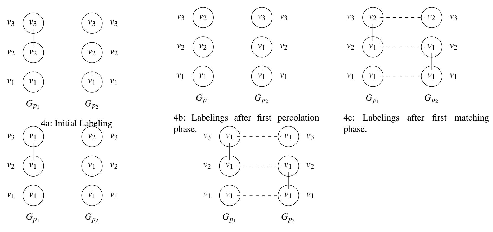
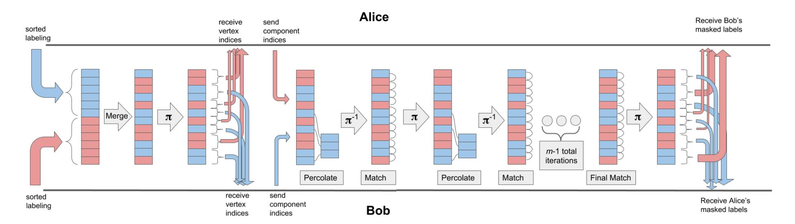
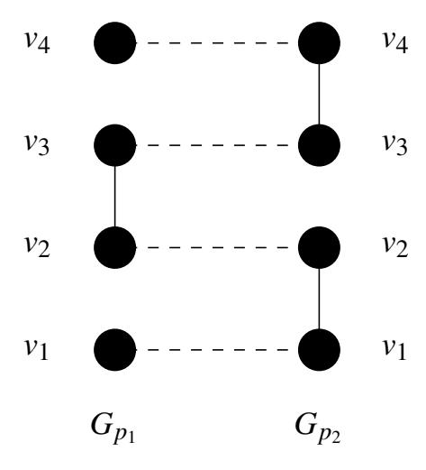

{0}------------------------------------------------

# Private Identity Agreement for Private Set Functionalities

Ben Kreuter<sup>1</sup> , Sarvar Patel<sup>1</sup> , and Ben Terner<sup>2</sup>

<sup>1</sup> Google {benkreuter,sarvar}@google.com <sup>2</sup> UC Santa Barbara bterner@cs.ucsb.edu

Abstract. Private set intersection and related functionalities are among the most prominent real-world applications of secure multiparty computation. While such protocols have attracted significant attention from the research community, other functionalities are often required to support a PSI application in practice. For example, in order for two parties to run a PSI over the unique users contained in their databases, they might first invoke on a support functionality to agree on the primary keys to represent their users.

This paper studies a secure approach to agreeing on primary keys. We introduce and realize a functionality that computes a common set of identifiers based on incomplete information held by two parties, which we refer to as *private identity agreement*. We explain the subtleties in designing such a functionality that arise from privacy requirements when intending to compose securely with PSI protocols. We also argue that the cost of invoking this functionality can be amortized over a large number of PSI sessions, and that for applications that require many repeated PSI executions, this represents an improvement over a PSI protocol that directly uses incomplete or fuzzy matches.

Keywords: private set intersection, private identity agreement, garbled circuits

{1}------------------------------------------------

# 1 Introduction

In recent years *Private Set Intersection* (PSI) and related two-party protocols have been deployed in realworld applications [IKN+17]. In the simplest setting of PSI, each party has a set *X<sup>i</sup>* as its input, and the output will be the intersection T *Xi* . More generally the parties may wish to compute some function *f* over the intersection and obtain output *f*( T *Xi*) [IKN+17,CO18,PSWW18,FNO18,PSTY19].

Owing to its importance in real-world applications, PSI has been the topic of a significant body of research. Common PSI paradigms include DDH-style protocols [HFH99,AES03,DCKT10,Lam16,SFF14], approaches based on oblivious transfer [PSZ14,PSSZ15,DCW13,RR16] or oblivious polynomial evaluation [FNP04,DSMRY09], and approaches based on garbled circuits [HEK12,PSSZ15,PSTY19]. Performance improvements have been dramatic, especially the computational overhead of PSI.

State-of-the-art PSI protocols require *exact* matches to compute the intersection; in other words, the intersection is based on bitwise equality. In real-world application scenarios the parties may not have inputs that match exactly. As an example, consider the case of two centralized electronic medical record (EMR) providers, which supply and aggregate medical records for medical practitioners, who wish to conduct a study about the number of patients who develop a particular disease after their recent medical histories indicate at-risk status. The EMR providers could use a PSI protocol to count the total number of unique diagnoses among their collective patients. Unfortunately, the EMR providers may not have the same set of information about each patient in their databases; for example, one might identify Alice by her street address and phone number, while the other might use her phone number and email address. Further complicating matters, Bob could use "bob@email.com" for one provider, but "BobDoe123@university.edu" for another.

It may appear that naively applying PSI to each column in two parties' databases would allow them to realize their desired functionality, but such an approach has many flaws. For example, in the case that individuals use different identifying information for the different services, this approach could incur false negatives. To remedy this issue, there has been previous research on the private record linkage problem, in which "fuzzy matches" between records are permitted [WD14,HMFS17]. In this problem, two rows from different parties' databases can be said to match if they satisfy some closeness relation, for example by matching approximately on *t* out of *n* columns. However, fuzzy matching PSI protocols are not as performant as exact-matching protocols.

As a design goal, we consider applications in which two parties would like to run PSI many times over respective databases. In our EMR example, the rows comprising users change slowly as new patients enter the system and some are expunged. However, auxiliary medical data could change frequently, at least daily. If the EMR providers wish to continuously update their medical models or run multiple analyses, they may run many PSI instances with auxiliary data [IKN+17].

In general, for many applications it is desirable for two parties to run PSI-style protocols many times over their respective data sets, and in this work we assume the parties will perform many joint queries. It is therefore advantageous for the parties to first to establish a new column for their databases, containing a single key for each row that can be used for the most performant exact-match PSI protocols.

As a second design goal, we relax an assumption that is standard for the private record linkage problem. We believe that it is not always realistic in practice to assume or to ensure that each participant's database uniquely maps its rows to identities. For example, one EMR provider may unknowingly have multiple records about the same person in its database, as a result of that person providing different identifying information to different medical providers. As part of a correct protocol, some preprocessing phase must identify records that belong to the same individual – using both parties' records – and group them accordingly. This is especially important for PSI applications that compute aggregate statistics.

{2}------------------------------------------------

This correctness requirement introduces an additional privacy concern. Consider the case in which party A has a single row in its database that matches more than one row in party B's database. Naively running a protocol to produce primary keys which link records would inevitably reveal some information to one of the parties. Either party A would learn that the party B is unaware that its rows could be merged, or party B would learn that it has several rows that correspond to a single person. Either way, one party will learn more about the other party's input than it should.

This work focuses on resolving the apparent trade-offs in privacy and performance between state-of-theart exact-matching and fuzzy-matching PSI protocols. Our approach is to design a new two-party protocol that computes a new identifier for every row in both databases that will give exact matches. To avoid the additional leakage problem described above, our protocol outputs either (a) shares of the new identifiers, or (b) encryptions of the new identifiers for a generic CPA-secure encryption scheme with XOR homomorphism, which can be decrypted with a key held by the other party. (Our protocol can also output both share and encryptions, and we in fact prove security in the case that it outputs both.) The regime of PSI protocols that can be composed with our protocol is limited to those that can *combine shares or decrypt online* without revealing the plaintext to either party. However, the flexibility we provide in producing outputs offers flexibility to the design of PSI protocols which can be composed with ours. Additionally, although our identifier-agreement protocol is computationally intensive compared to the subsequent PSI protocol, we argue that this is a one-time cost that can be amortized over many PSI computations.

### 1.1 Our Contributions

This work addresses two problems: (1) The performance and accuracy tradeoffs between exact matching PSI and fuzzy matching PSI protocols. (2) The correctness and privacy problems introduced to PSI by the possibility of poorly defined rows. We address both of these problems in one shot by defining a functionality that computes shared primary keys for two parties' databases, such that the keys can be used multiple times as inputs to successive efficient PSI protocols, *without revealing the keys to the parties.* We refer to our stated problem as the *private identity agreement* functionality, and define it formally. We additionally discuss the security implications of composing our identity agreement functionality and subsequent PSI functionalities. We note that identity agreement is substantially more complex than private set intersection and private record linkage because of the concerns introduced by producing an intermediate output of a larger functionality.

After defining the identity agreement problem, we present a novel two-party protocol that solves the problem. We additionally describe a modification to our generic protocol that allows the outputs to naturally compose with DDH-style PSI protocols. Finally we present performance of our prototype implementation.

# 2 Problem Definition

Our setting assumes two parties, each holding some database, that wish to engage in inner-join style queries on their two databases, which we refer to as the *private joint-database query* functionality *F* Query. The join will be over some subset of columns, and will be a disjunction i.e. two rows are matched if any of the columns in the join match. In Figure 1 we present the ideal private joint-database query functionality.

We consider a scenario in which it is advantageous for the parties to first establish a new database column containing keys for each record, so that this key can be used for many exact-match PSI protocols. We refer to this as the *private identity agreement* functionality, denoted *F* ID and described in Figure 2. As we have explained, establishing these keys is a setup phase in a general protocol that realizes *F* Query . Importantly, the newly established identities should not be revealed to either party, as this could also reveal information about the other party's input. This makes it impossible to separate the protocol for *F* ID from the 

{3}------------------------------------------------

subsequence PSI-style protocols that the parties will use for their joint queries. We must instead modify the PSI-style protocols as well to ensure a secure composition with  $\mathcal{F}^{\text{ID}}$ . Our security analysis must therefore consider the entire  $\mathcal{F}^{\text{Query}}$  as a single system.

### 2.1 The Identity Agreement Functionality

We denote the set of possible identifiers that either party may hold by  $I = \bigotimes I_i$ , with each set  $I_i$  being one column and having  $\bot \in I_i$ . To define a "match" we define an equivalence relation  $S_1 \stackrel{\text{user}}{\sim} S_2$  as follows: if there exists component of  $s_{1,j} \ne \bot$  of  $S_1$  and a component  $s_{2,k} \ne \bot$  of  $S_2$  such that  $s_{1,j} = s_{2,k}$  then  $S_1 \stackrel{\text{user}}{\sim} S_2$ . In other words, we consider two rows to be equivalent if any of their non-empty columns are equal.

For each party  $p_i$  with database  $\mathcal{D}_{p_i}$ , we assume for simplicity of exposition that every pair of rows  $S_1$  and  $S_2$  satisfies  $S_1 \not\sim S_2$ . (This means that the party does not have sufficient information to conclude that the two rows represent the same element.) Note, however, that it is possible for  $p_1$  to have rows  $S_{1,1}, S_{1,2}$ , and for  $p_2$  to have a row  $S_2$  such that  $S_{1,1} \stackrel{\text{user}}{\sim} S_2 \stackrel{\text{user}}{\sim} S_{1,2}$ . In such a situation,  $p_1$  is not aware that its database contains two rows that represent the same element.

The goal of the identity agreement functionality  $\mathcal{F}^{\mathsf{ID}}$  is to compute a map  $\Lambda \colon \mathcal{D}_{p_1} \cup \mathcal{D}_{p_2} \to \mathcal{U}$  such that for any  $S_1 \overset{\mathsf{user}}{\sim} S_2$ ,  $\Lambda(S_1) = \Lambda(S_2)$ , and for all  $S_1 \not\sim S_2$ ,  $\Lambda(S_1) \neq \Lambda(S_2)$ . As we explain below, the parties will not learn  $\Lambda(S_i)$  for their respective databases; they will only see encryptions of the map.

We define the privacy goals of  $\mathcal{F}^{\mathsf{ID}}$  in relation to the overall query functionality  $\mathcal{F}^{\mathsf{Query}}$ : to compute some PSI functionality where the intersection is determined by the  $\overset{\mathsf{user}}{\sim}$  relation. Importantly, if  $\mathcal{F}^{\mathsf{ID}}$  is composed with other protocols to realize  $\mathcal{F}^{\mathsf{Query}}$ , then  $\mathcal{F}^{\mathsf{ID}}$  may not reveal any information about  $\overset{\mathsf{user}}{\sim}$  to either party. Consider, for example, a situation where  $p_1$  has in its input  $S_1$  and  $S_2$ , and in  $p_2$ 's input there is a  $S_*$  such that  $S_1 \overset{\mathsf{user}}{\sim} S_* \overset{\mathsf{user}}{\sim} S_2$ . It should not be the case that  $p_1$  will learn  $S_1 \overset{\mathsf{user}}{\sim} S_2$ , beyond what can be inferred from the output of the PSI functionality. Likewise,  $p_2$  should not learn that  $p_1$  has such elements in its input. If  $\mathcal{F}^{\mathsf{ID}}$  revealed such information, then some party could learn more from the composition of  $\mathcal{F}^{\mathsf{ID}}$  with another functionality than it would learn from querying only  $\mathcal{F}^{\mathsf{Query}}$ .

### Private Query Functionality $\mathcal{F}^{Query}$

- 1. **Setup:** Upon receiving messages of the form (setup, sid,  $\mathcal{D}_{p_i}$ ) from  $p_i$ , store (sid,  $\mathcal{D}_{p_i}$ , i). After receiving setup from both parties with matching sid, ignore all future setup messages with sid.
- 2. **Queries:** Upon receiving messages of the form (query, sid, f) from party  $p_i$ , where  $f = (f_1, f_2)$  is the description of a two-party functionality over two databases:
  - (a) If both parties have not sent setup messages for sid, ignore the message. Otherwise proceed as follows.
  - (b) Record the message (query, sid,  $(f_1, f_2)$ , i). If have already recorded (query, sid,  $(f_1, f_2)$ , 3 i), then send (response, sid,  $f_1(\mathcal{D}_{p_1}, \mathcal{D}_{p_2})$ ) to  $p_1$  and (response, sid,  $f_2(\mathcal{D}_{p_1}, \mathcal{D}_{p_2})$ ) to  $p_2$ .

Fig. 1: Query functionality  $\mathcal{F}^{Query}$ , which receives two parties' databases and responds to queries over functions of the databases.

<sup>&</sup>lt;sup>3</sup> It is possible to establish  $\stackrel{\mathsf{user}}{\sim}$  for  $S_1$  and  $S_2$  for any binary relation that  $s_{1,j}$  and  $s_{2,k}$  may satisfy; however, we feel that equality is the most natural, and consider only equality in this work. We remark later to indicate when one could substitute another relation for equality in the construction.

{4}------------------------------------------------

### ID Agreement Functionality $\mathcal{F}^{\mathsf{ID}}$

- 1. **Inputs:** Each party  $p_i$  has a tuple input<sub> $p_i$ </sub> =  $(\mathcal{D}_{p_i}, \mathsf{k}_{p_i}^{\mathsf{enc}})$ , where  $\mathcal{D}_{p_i}$  is the party's database and  $\mathsf{k}_{p_i}^{\mathsf{enc}}$  is an encryption key for a CPA-secure encryption scheme (referred to as CPA).
- 2. **Generate Identifiers:** Upon receiving (submit, sid, input<sub> $p_i$ </sub>) from each  $p_i$  for session sid,  $\mathcal{F}^{\mathsf{ID}}$  computes a map  $\Lambda \colon \mathcal{D}_{p_1} \cup \mathcal{D}_{p_2} \to \mathcal{U}$ , where  $\mathcal{U} = \{0,1\}^\ell$  is a universe of user identities, such that for any two rows  $S_1$  and  $S_2$  for which  $S_1 \overset{\mathsf{user}}{\sim} S_2$ ,  $\Lambda(S_1) = \Lambda(S_2)$ , and for all two rows for which  $S_1 \overset{\mathsf{user}}{\not\sim} S_2$ ,  $\Lambda(S_1) \neq \Lambda(S_2)$ . Let  $\Lambda(S)$  be the identifier assigned to a row S. For each row  $S \in \mathcal{D}_{p_i}$ ,  $\mathcal{F}^{\mathsf{ID}}$  returns (sid, S, CPA.enc( $\mathsf{k}_{p_{3-i}}^{\mathsf{enc}}$ ,  $\Lambda(S)$ )) to  $p_i$ .

Fig. 2: ID Agreement functionality  $\mathcal{F}^{\mathsf{ID}}$ 

### Two-Party Component Labeling Functionality $\mathcal{F}^{\mathsf{lbl}}$

- 1. **Inputs:** Each party  $p_i$  has a tuple input  $p_i = (G_{p_i}, \mathsf{k}^{\mathsf{enc}}_{p_i}, \rho_{p_i})$ , where  $G_{p_i} = (V_{p_i}, E_{p_i})$  is a graph,  $\mathsf{k}^{\mathsf{enc}}_{p_i}$  is an encryption key for a CPA-secure encryption scheme (referred to as CPA), and  $\rho_{p_i} = \{\rho_{p_i,j}\}_{j \in [N]}$  is a list of N  $\ell$ -bit one-time pads.
- 2. **Generate Labels:** Upon receiving (submit, sid, input<sub> $p_i$ </sub>) from each  $p_i$  for session sid,  $\mathcal{F}^{\mathsf{Ibl}}$  samples random elements from a universe  $\mathcal{U} = \{0,1\}^\ell$  and computes a map  $\Lambda \colon V_{p_1} \cup V_{p_2} \to \{0,1\}^\ell$  such that for any two vertices  $v_1, v_2 \in V_{p_1} \cup V_{p_2}$ ,  $\Lambda(v_1) = \Lambda(v_2)$  if and only if  $v_1$  and  $v_2$  are in the same connected component in  $G_1 \cup G_2$ . For  $i \in \{1,2\}$  and  $j \in [|V_{p_i}|]$ , let  $v_{p_i,j}$  be the jth vertex in  $V_{p_i}$ .  $\mathcal{F}^{\mathsf{Ibl}}$  computes  $f_{p_i}^{\mathsf{enc}} = \{\mathsf{CPA.enc}(\mathsf{k}_{p_i}^{\mathsf{enc}}, \Lambda(v_{p_i,j})\}_{j \in [|V_{p_i}|]}$  and  $f_{p_i}^{\mathsf{mask}} = \{\rho_{p_i,j} \oplus \Lambda(v_{p_i,j})\}_{j \in [|V_{p_i}|]}$   $\mathcal{F}^{\mathsf{Ibl}}$  sends (labeling, sid,  $f_{p_1}^{\mathsf{enc}}, f_{p_2}^{\mathsf{mask}}$ ) to  $p_1$  and (labeling, sid,  $f_{p_2}^{\mathsf{enc}}, f_{p_1}^{\mathsf{mask}}$ ) to  $p_2$ .

Fig. 3: Two-Party Component Labeling Functionality  $\mathcal{F}^{\mathsf{lbl}}$ 

# 3 Security Primitives and Cryptographic Assumptions

### 3.1 Garbled Circuits

Garbled circuits were proposed by Andrew Yao [Yao82] as a means to a generic two-party computation protocol. Yao's protocol consists of two subprotocols: a garbling scheme [BHR12] and an oblivious transfer. Garbled circuit constructions have promising performance characteristics. Most of the CPU work of a garbled circuit protocol involves symmetric primitives, and as Bellare et al. show, garbling schemes can use a block cipher with a fixed key, further improving performance [BHR12]. A drawback of garbled circuits is that they require as much communication as computation, but this can be mitigated by using garbled circuits to implement efficient subprotocols of a larger protocol.

### 3.2 ElGamal Encryption

The ElGamal encryption scheme is CPA-secure under the DDH assumption, and supports homomorphic group operations (denoted ElGl.*Mul* below). If the plaintext space is small, addition in the exponent can also be supported, but decryption in this case requires computing a discrete logarithm. Using the identity element of the group, ElGl.*Mul* can be used to re-randomize a ciphertext.

**Definition 1** (**ElGamal Encryption**) The ElGamal encryption scheme [ElG85] is an additively homomorphic encryption scheme, consisting of the following probabilistic polynomial-time algorithms:

EIGI.**Gen** Given a security parameter  $\lambda$ , EIGI. $Gen(\lambda)$  returns a public-private key pair (pk, sk), and specifies a message space  $\mathcal{M}$ .

{5}------------------------------------------------

ElGl.Enc *Given the public key pk and a plaintext message m* ∈ *M , one can compute a ciphertext* ElGl.*Enc*(*pk*,*m*)*, an El Gamal encryption of m under pk.*

ElGl.Dec *Given the secret key sk and a ciphertext* ElGl.*Enc*(*pk*,*m*)*, one can run* ElGl.*Dec to recover the plaintext m.*

ElGl.Mul *Given the public key pk and a set of ciphertexts* {ElGl.*Enc*(*pk*,*mi*)} *encrypting messages* {*mi*}*, one can homomorphically compute a ciphertext encrypting the product of the underlying messages:*

$$\mathsf{EIGI}.Enc(pk,\prod_i m_i) = \mathsf{EIGI}.Mul(\{\mathsf{EIGI}.Enc(pk,m_i)\}_i)$$

As described in Section 4.4, we will use ElGl.*Mul* to induce an XOR homomorphism by encrypting bit-by-bit. This allows us to avoid performing group operations in the garbled circuit part of our protocol and reduces our communication cost, at the cost of CPU effort.

# 4 Secure ID Agreement as Secure Two-Party Component Labeling

In this section, we define a graph problem that we call Two-Party Component Labeling, and provide a reduction between ID agreement and Two-Party Component Labeling. We then describe an algorithm to compute component labeling and a two-party protocol that securely implements it.

# 4.1 Two-Party Component Labeling

In the two-party component labeling problem, each party *p<sup>i</sup>* ∈ {*p*1, *p*2} has a graph *Gp<sup>i</sup>* = (*Vp<sup>i</sup>* ,*Ep<sup>i</sup>* ), where there exists some universe of vertices *V* for which *Vp*<sup>1</sup> ⊂ *V* and *Vp*<sup>2</sup> ⊂ *V*. Each party's graph contains at most *N* vertices, which are distributed among connected components of size at most *m*. Both *N* and *m* are parameters of the problem. As shorthand, we refer to a connected component as a component. As output, each party assigns a label to every component in its graph. If there are two components *C*<sup>1</sup> ∈ *Gp*<sup>1</sup> and *C*<sup>2</sup> ∈ *Gp*<sup>2</sup> for which *C*<sup>1</sup> and *C*<sup>2</sup> have a non-empty intersection, then *p*<sup>1</sup> and *p*<sup>2</sup> must assign the same label to *C*<sup>1</sup> and *C*2. Just as we explained with ID Agreement, this property induces a transitive relation. If two vertices *v* ∈ *Gp*<sup>1</sup> and *u* ∈ *Gp*<sup>2</sup> are in the same component of *G* = *Gp*<sup>1</sup> ∪ *Gp*<sup>2</sup> , then their components in *Gp*<sup>1</sup> and *Gp*<sup>2</sup> , respectively, must be assigned the same label.

More precisely, consider parties *p*<sup>1</sup> and *p*<sup>2</sup> with graphs *Gp*<sup>1</sup> and *Gp*<sup>2</sup> , respectively, and let *C<sup>p</sup><sup>i</sup>* represent the set of components that constitute *Gp<sup>i</sup>* . Moreover, assume the vertices in *Gp*<sup>1</sup> and *Gp*<sup>2</sup> are drawn from some universe of vertices *V*. The two-party component labeling problem is to construct a map Λ: *C<sup>p</sup>*<sup>1</sup> ∪*C<sup>p</sup>*<sup>2</sup> → *U*, where *U* is a universe of labels. For any two components *C*1,*C<sup>n</sup>* ∈ *C<sup>p</sup>*<sup>1</sup> ∪*C<sup>p</sup>*<sup>2</sup> , Λ(*C*1) = Λ(*Cn*) if and only if there is some series of components *C*2,...,*Cn*−<sup>1</sup> ∈ *C<sup>p</sup>*<sup>1</sup> ∪*C<sup>p</sup>*<sup>2</sup> such that *C<sup>i</sup>* ∩*Ci*+<sup>1</sup> 6= 0/ for *i* ∈ {1...*n*−1}.

### 4.2 Reducing ID Agreement to Two-Party Component Labeling

We reduce the two-party identity agreement problem to two-party component labeling. Each party *p* represents its database as a graph *G<sup>p</sup>* = (*Vp*,*E<sup>p</sup>* ) as follows. Each piece of identifying information in party *p*'s database is represented by a vertex in *p*'s graph. (Empty entries in a database are simply left out of the graph.) Edges in the graph connect vertices which represent identifying information of the same user. Therefore, each set in a party's database is represented as a component in the party's graph.

The component labeling of two graphs *Gp*<sup>1</sup> and *Gp*<sup>2</sup> can be trivially used to assign user identities. The identifier of a user represented by a component*C* in *G<sup>p</sup>* is directly copied from the label assigned to*C* during component labeling.

{6}------------------------------------------------

Intuitively, the reduction works because the two parties compute ID agreement over their databases by computing a union of their graphs. If the two parties' graphs contain the same vertex *v* (meaning both databases contain the same piece of identifying information), then the components containing *v* in *Gp*<sup>1</sup> and *Gp*<sup>2</sup> are the same component in the union graph *G* = *Gp*<sup>1</sup> ∪*Gp*<sup>2</sup> .

# 4.3 An Algorithm for Two-Party Component Labeling

In this section, we present a component labeling algorithm without explicitly addressing privacy concerns. In Section 4.4, we present a protocol to implement the algorithm while preserving privacy. We illustrate an execution of our percolate-and-match algorithm in Figure 5 and provide pseudo-code in Figure 7.

Our component labeling algorithm is an iterative procedure in which the two parties assign labels to every vertex in their respective graphs and then progressively update their vertices' labels. To initialize the procedure, each party *p* constructs an initial labeling for its graph by assiging a unique label to every vertex in its graph *G<sup>p</sup>* . Specifically, every vertex *v* in *G<sup>p</sup>* is assigned the label *v*, the encoding of the vertex itself. <sup>4</sup> Notice that in the initial labeling, no two vertices within a party's graph are assigned the same label. However, any vertex that is included in both graphs is assigned the same label by both parties.

By the end of the iterative procedure, two properties of the labelings must be met. First, within each component of a party's graph, all vertices must have the same label. Second, if any vertex is in both parties' graphs, then the vertex has the same label in both parties' labelings. Together, these two requirements enforce that every two vertices within a component of *C* ⊂ *G* have the same label. This common label can then be taken as the component's label.

Each step in our iterative procedure is a two phase process. The first phase operates on each party's graph independently. It enforces the property that for each component in a party's graph, every vertex in the component has the same label. In this phase, the algorithm assigns to every vertex *v* ∈ *G<sup>p</sup>* the (lexicographic) minimum of all labels in its component in *Gp*. We call this a *percolation phase* because common labels are percolated to every vertex in a component.

In the second phase, the algorithm operates on the vertices which are common to both parties' graphs. It ensures that every vertex *v* which is common to both parties' graphs has been assigned the same label in the two parties' labelings. If one party's label for *v* differs from the other party's label for *v*, then both labels are updated to the minimum of two labels that have been assigned to *v*. We call this a *matching phase* because vertices which are common to both graphs are assigned matching labels in the two labelings.

If some vertex's label is updated in a matching phase, then its label may differ from the labels of the other vertices in its component. Therefore, the iterative procedure repeats until labelings stabilize. During percolation, each vertex's label is set to the minimum label of all vertices in its component. If some vertex's label changes during a matching phase, its new label must be "smaller" than its previous label. During the next percolation phase, the change is propagated by again updating the label of each vertex in the component is to the minimum label in the component. In Appendix B, we prove that if *m* denotes the maximum size of a component in *Gp*<sup>1</sup> ∪*Gp*<sup>2</sup> , then at most *m*−1 iterations are necessary for vertex labels to stabilize.

# 4.4 Private Component Labeling

We now provide a protocol which implements the component labeling algorithm described in Section 4.3 while preserving privacy. The ideal functionality *F* lbl for private two-party component labeling is given in Figure 3.

<sup>4</sup> In an application, the label would be the data that the vertex represents. Additionally, if the parties agree on an encoding scheme beforehand, types (address, zip, phone) can be encoded as part of a label at the cost of only a few bits.

{7}------------------------------------------------



4d: Labelings after second percolation phase. 4e: Labelings after second matching phase.

Fig. 5: Depiction of the percolate-and-match algorithm for component labeling. *v*1, *v*2, and *v*<sup>3</sup> are common to both *Gp*<sup>1</sup> an *Gp*<sup>2</sup> . Each vertex's label is drawn inside the vertex, and its identity is on the side. *p*1's graph has an edge between *v*<sup>2</sup> and *v*3, while *p*2's graph has an edge between *v*<sup>1</sup> and *v*2. Solid lines depict edges in each party's graph. Dotted lines depict matches that occur during matching phases. The figures show the evolution of the algorithm over 2 iterations.

Approach The challenge of securely implementing the percolate-and-match algorithm arises from the fact that percolate-and-match performs two operations: (1) comparisons on vertices, and (2) updates on vertex labels. However, if either party knew the output of any such operation on its vertices, then it would learn information about the other party's graph. Consider that if a participant learns that its vertex's label changed during the any matching phase or during a percolation phase, it learns that one of the vertices in its graph has a matching vertex in the other party's graph. Similarly, it a party learns that its vertex's label *isn't* updated during the first matching or percolation phase, it learns its vertex isn't in the other party's graph.

Our approach is to perform both vertex comparisons and label updates without revealing the output of any comparison or update, and to encrypt all intermediate and output labels so that no information is leaked about the computation. Naively adapting state-of-the-art PSI protocols in order to perform our matching phase does not work for this approach, because in addition to finding the common vertices in the two parties' graphs, we also must perform updates on matching labels, and state of the art PSI protocols do not provide easy ways to modify auxiliary data without revealing additional information.

To implement comparisons and updates, we use garbled circuits. Importantly, garbled circuits must implement oblivious algorithms, whose operation is independent of the input data. Notably, for any branch in the execution tree of an oblivious algorithm, we must perform operations for both possible paths, replacing the untaken path with dummy operations. Additionally, random accesses to an array (i.e. those for which the index being read is input-dependent) must either scan over the entire array, incurring a *O*(*N*) cost, or use *Oblivious RAM* techniques, which incurs log(*N*) communication overhead per access [LN18,AKL+18].

*Matching via Garbled Circuits* To perform our matching phase obliviously, we adapt a technique described by Huang, Evans, and Katz for PSI [HEK12]. In their scheme, called Sort-Compare-Shuffle, each party sorts its elements, then provides its sorted list to a garbled circuit which merges the two lists. If two parties submit the same element, then the two copies of the element land in adjacent indices in the merged list. The circuit

{8}------------------------------------------------

```
function Percolate(G, \mathcal{L})
procedure COMPONENTLABELING(G_1, G_2, m)
                                                                                                          for all component C \in G do
     \mathcal{L}_1 \leftarrow \text{SETUP}(G_1)
                                                                                                                \mathsf{Ibl}^* \leftarrow \min_{u \in C} \mathsf{FINDVERT}(\mathcal{L}, u).\mathsf{Ibl}
     \mathcal{L}_2 \leftarrow \text{SETUP}(G_2)
                                                                                                                for all vertex v \in C do
     for m-1 times do
                                                                                                                      UPDATELABEL(\mathcal{L}, v, |b|^*)
           \mathcal{L}_1 \leftarrow \text{PERCOLATE}(G_1, \mathcal{L}_1)
                                                                                                                end for
           \mathcal{L}_2 \leftarrow \text{PERCOLATE}(G_2, \mathcal{L}_2)
                                                                                                          end for
           \mathcal{L}_1, \mathcal{L}_2 \leftarrow MATCH(\mathcal{L}_1, \mathcal{L}_2)
                                                                                                          return \mathcal{L}
     end for
                                                                                                     end function
     return \mathcal{L}_1, \mathcal{L}_2
                                                                                                     function MATCH(\mathcal{L}_1, \mathcal{L}_2)
end procedure
                                                                                                          for all vertex v in \mathcal{L}_1 and in \mathcal{L}_2 do
function SETUP(G)
                                                                                                                a \leftarrow \text{FINDVERT}(\mathcal{L}_1, v).\mathsf{lbl}
     \mathcal{L} \leftarrow []_N
                                                                                                                b \leftarrow \text{FINDVERT}(\mathcal{L}_2, v).\mathsf{lbl}
     for all vertex v \in G do
                                                                                                                UPDATELABEL(\mathcal{L}_1, v, \min(a, b))
           \mathcal{L}.append((vrt : v, lbl : v))
                                                                                                                UPDATELABEL(\mathcal{L}_2, v, \min(a, b))
     end for
                                                                                                          end for
     return \mathcal{L}
                                                                                                          return \mathcal{L}_1, \mathcal{L}_2
end function
                                                                                                     end function
function UPDATELABEL(\mathcal{L}, v, |b|^*)
                                                                                                     function FINDVERT(\mathcal{L}, v)
     FINDVERT(\mathcal{L}, v).lbl \leftarrow lbl^*
                                                            \triangleright updates v's label in \mathcal{L}
                                                                                                           return (vrt, lbl) \in \mathcal{L} for which vrt = v
end function
                                                                                                     end function
```

Fig. 7: Pseudocode for Component Labeling algorithm.

iterates through the list, comparing elements at adjacent indices in order to identify common elements. After comparing, their circuit shuffles the sorted list before revealing elements in the intersection.

Our construction adapts the sort-compare-shuffle technique to efficiently perform our matching phase with label updates as follows. Each party submits a sorted list of vertices to a garbled circuit, including auxiliary information for each vertex that represents the vertex's currently assigned label. To perform matching, we merge the two parties' lists of vertices into one sorted list  $\mathcal{L}$  and iterate through  $\mathcal{L}$ . At each pair of adjacent indices in  $\mathcal{L}$ , we conditionally assign both elements' current labels to the minimum of the two labels only if the vertices match. Matching in this way via garbled circuit hides from both parties all of the matches that are made between the two parties' graphs and their respective label updates.

Percolation via Garbled Circuits To percolate labels within a component, a party can submit all of the vertices in one of its components to a garbled circuit along with each vertex's current label. The circuit computes the minimum of the labels and assigns the minimum label to each vertex in the component.

Stitching Percolation and Matching Together The remaining question is how to efficiently stitch together percolation phases and matching phases without revealing intermediate labels of any vertices. We perform percolation and matching in the same circuit. To transition between percolation and matching phases, we permute the list of vertices. We define a permutation  $\pi$  which is hidden from both parties, and apply  $\pi$  and  $\pi^{-1}$  to  $\mathcal{L}$  to transition from matching phase to percolation phase and back.

Our garbled circuit begins by merging the two parties' sorted lists into one large list  $\mathcal{L}$ . We then apply  $\pi$  to the list to shuffle the list, hiding all information about the sorted order of  $\mathcal{L}$ . Next, we reveal indices of each party's components in  $\pi(\mathcal{L})$ . For the graph  $G_{p_i}$  of each party i, and for each component  $C \subset G_{p_i}$ , both parties learn the indices of C's vertices in  $\pi(\mathcal{L})$ . We use these indices to hard-wire the min-circuit that percolates labels within C. After percolating, we apply the inverse permutation  $\pi^{-1}$  to  $\pi(\mathcal{L})$  and can again iterate through  $\mathcal{L}$  to merge. The circuit repeatedly applies  $\pi$  and  $\pi^{-1}$  to  $\mathcal{L}$  to transition from matching phase to percolation phase and back. After m-1 iterations, the circuit outputs encrypted labels to the two parties.

We remark that permuting  $\mathcal{L}$  and revealing indices of each party's components avoids in-circuit random access to look up current vertex labels for each percolation circuit, and hence the overhead of ORAM.

{9}------------------------------------------------



Fig. 8: Illustration of the percolate-and-match garbled circuit approach.

Revealing indices allows our circuit to hard-wire the indices of the min-circuits that perform percolation, achieving O(1) cost per label lookup at the expense of an  $O(n \log n)$  shuffle between phases. We can consider that this technique allows us to amortize the expense of two permutations with cost  $n \log n$  over the n memory accesses we do for each iteration, which yields the same asymptotic complexity as ORAM [LN18,AKL<sup>+</sup>18].

Graph Structure There is one additional caveat. Revealing the indices of the vertices of each component in  $\mathcal{L}$  reveals the structure of the parties' graphs. To prevent this, we require that both parties pad their graphs to uniform structure. If the two parties do not have uniformly structured graphs, then they must agree on a graph structure, and then pad their graphs using randomly selected vertices. To simplify the presentation, we set a number of components C and a maximum size of each component m, and then have each party pad its graphs using randomly selected vertices until each graph contains N = Cm vertices.

Outputs We remark that in the protocol we present, each party receives as output XOR-shares of both parties' labels and their own labels encrypted under a key held by the other party.

**Protocol in Depth** We now describe how to privately implement our percolate-and-match algorithm. Figure 8 illustrates our approach, Figure 9 contains the full protocol, and Figure 10 describes our garbled circuits.

Protocol Inputs As input, each party p has a graph  $G_p = (V_p, E_p)$ . If some party has fewer than m vertices in some component(s) of its graph, it pads its graph by randomly sampling vertices to add to its component(s). The two parties must agree on a number of components C and the maximum size of a component m, and each must pad its graph until it has N = Cm vertices.

In addition, each party  $p_i$  has a key  $k_{p_i}^{enc}$  for a CPA-Secure encryption scheme with XOR homomorphism. Third, it has a list of N  $\ell$ -bit random strings  $\rho_p$ . The key and random strings are used for the output; the key will encrypt the other party's output labels, and random strings will hide p's own labels from the other party.

Initial Labelings Each party represents the current labeling of its graph as a list of vertex descriptors. A descriptor  $\mathcal{L}(v)$  of a vertex v is a triple  $(\text{img}_v, |\text{bl}_v, \text{party}_v)$ , where  $\text{img}_v$  is the image of vertex v under a shared function  $H: \{0,1\}^* \to \{0,1\}^{\ell}$ ,  $|\text{bl}_v|$  is the label assigned to v, and  $\text{party}_v$  is the party's identifier (1 or 2). We note that we use H to hash each vertex descriptor to a uniform length. In the description of the protocol and the proof, we treat H as a random oracle.

We refer to p's labeling as  $\mathcal{L}_p = \{\mathcal{L}(v)\}_{v \in G_p}$ . In the initial labeling that each party constructs, each vertex's label is initially set to its image under H (meaning  $\operatorname{img}_v = |\mathsf{bl}_v|$ ). After constructing its labeling  $\mathcal{L}_{p_i}$ , each party sorts its labeling  $\mathcal{L}_{p_i}$  on the images of its vertices under H.

{10}------------------------------------------------

Garbled Circuit Part 1: Merge, Permute, and Reveal Order After the parties set up their inputs, they invoke a garbled circuit that merges their descriptors into a combined labeling  $\mathcal{L}$  and reveals the indices of their descriptors under a random permutation. First, each party  $p_i$  submits its sorted labeling  $\mathcal{L}_{p_i}$  to a garbled circuit. The garbled circuit merges  $\mathcal{L}_{p_1}$  and  $\mathcal{L}_p$  into one list  $\mathcal{L}$  using a Batcher Merge [Bat68]. Second, the circuit shuffles  $\mathcal{L}$  using a permutation  $\pi$  unknown to either party using Waksman networks [Wak68,BD02]. Each party  $p_i$  randomly samples a permutation  $\pi_{p_i}$  on 2N elements and inputs its selection bits  $s_{p_i}$  to the circuit. We define  $\pi = \pi_{p_1} \circ \pi_{p_2}$ ; the circuit permutes  $\mathcal{L}$  as  $\pi(\mathcal{L})$ .

Next, the circuit reveals to each party the indices of its own vertices in  $\pi(\mathcal{L})$ . First, each party samples 2N one-time pads  $\sigma_{p_i}$  and submits them to the circuit. The garbled circuit then iterates through  $\pi(\mathcal{L})$ , and at each index, the descriptor's third element (which is the party identity) determines what to output to each party. If the vertex at index j was submitted by  $p_i$ , then  $p_i$  receives from the garbled circuit  $\pi(\mathcal{L})[j]$ .img, the image of the vertex at index j in the permuted list, and  $p_{3-i}$  receives  $\pi(\mathcal{L})[j]$ .img  $\oplus \sigma_{p_i,j}$ , which is the same image but masked by  $p_1$ 's jth one-time pad.

Given the indices of each of its vertices in  $\pi(\mathcal{L})$ , each party computes the indices composing each of its components. Let idx(v) denote the index of vertex v in  $\pi(\mathcal{L})$ . For each component  $C \subset G_{p_i}$ ,  $p_i$  computes  $idx(C) = \{idx(v)\}_{v \in C}$ . For each component C in  $G_{p_i}$ ,  $p_i$  shares idx(C) with  $p_{3-i}$ . Note that each party  $p_i$  learns the indices of its own vertices in  $\pi(\mathcal{L})$  and it learns the indices corresponding to each of  $p_{3-i}$ 's components in  $\pi(\mathcal{L})$ . However, neither party learns the original positions of either party's vertices in  $\mathcal{L}$ . In the proof, we show that revealing these indices in  $\pi(\mathcal{L})$  reveals no information about the other party's inputs.

Garbled Circuit Part 2: Percolate and Match In the second subcircuit, the parties perform percolation and matching. The parties use the information revealed about their components' indices in  $\pi(\mathcal{L})$  to hardwire the indices of each component in order to perform percolation. Percolation happens via independent subcircuit for each component in both parties' graphs. For each component C, let  $\mathrm{idx}(C)$  be the indices of the component's vertices in  $\pi(\mathcal{L})$ . The circuit computes  $\mathrm{lbl}^* \leftarrow \min_{j \in \mathrm{idx}(C)} \pi(\mathcal{L})[j].\mathrm{lbl}$ , and then assigns  $\pi(\mathcal{L})[j].\mathrm{lbl} \leftarrow \mathrm{lbl}^*$  for each  $j \in \mathrm{idx}(C)$ .

Given a circuit with the parties' descriptors arranged as  $\pi(\mathcal{L})$ , the circuit applies  $\pi^{-1} = \pi_{p_2}^{-1} \circ \pi_{p_1}^{-1}$  to  $\pi(\mathcal{L})$  to retrieve  $\mathcal{L}$ . It then performs matching by iterating through  $\mathcal{L}$  and obliviously comparing the descriptors at each pair of adjacent indices in  $\mathcal{L}$ . Let  $\mathcal{L}[i] = (\operatorname{img}_i, \operatorname{lbl}_i, \operatorname{party}_i)$  be the descriptor at index i in  $\mathcal{L}$ , and let  $\mathcal{L}[i+1] = (\operatorname{img}_{i+1}, \operatorname{lbl}_{i+1}, \operatorname{party}_{i+1})$  be the descriptor at index i+1. If  $\operatorname{img}_i = \operatorname{img}_{i+1}$ , then both  $\operatorname{lbl}_i$  and  $\operatorname{lbl}_{i+1}$  are set to be the minimum among  $\operatorname{lbl}_i$  and  $\operatorname{lbl}_{i+1}$ .

The circuit iterates between percolation and matching m-1 times, applying  $\pi$  to transition from matching to percolation, and  $\pi^{-1}$  to transition from percolation to matching. After the final matching phase, the circuit again applies  $\pi$  to transition to the output phase.

Encrypting Vertex Labels At the end of the protocol, each party must receive its vertex labels encrypted under a key known only to the other party. We show how to move encryption outside of the garbled circuit in order to save the cost of online encryption at the expense of a few extra rounds of communication.

For a generic CPA-secure encryption scheme, we use the following technique. Consider a message m, computed within a circuit, that needs to be encrypted under a key k known only to  $p_1$  without either party learning m. At the end,  $p_2$  should learn  $c = \operatorname{enc}(k, m)$ . We can encrypt m under k as follows.  $p_2$  samples a one-time pad v and submits it to the circuit. The circuit outputs  $m \oplus v$  to  $p_1$ .  $p_1$  computes  $c' = \operatorname{enc}(k + v)$ . Then,  $p_1$  sends c' to  $p_2$ , and  $p_2$  computes  $c = c' \oplus v = \operatorname{enc}(k, m)$ .

<sup>&</sup>lt;sup>5</sup> If not using equality to compare the descriptors, then one could substitute any other comparison circuit to evaluate matching between two elements.

{11}------------------------------------------------

The garbled circuit produces outputs to the parties as follows. Let  $\mathsf{out}_i$  be the set of indices of  $p_i$ 's vertices in  $\pi(\mathcal{L})$ . For the jth index in  $\mathsf{out}_i$ ,  $p_{3-i}$  receives  $\pi(\mathcal{L})[\mathsf{out}_i[j]].\mathsf{lbl} \oplus \rho_{p_i}[j]$ , which is  $p_i$ 's jth label masked by  $p_i$ 's jth random pad. The parties use the technique above to recover their encrypted labels.

*Interfacing with DDH-Style PSI Protocols* We present our technique for ElGamal encrypting vertex labels. As we show below, DDH-style PSI protocols can be modified to accept ElGamal-encrypted inputs.

First, the parties agree on  $\ell$  group elements  $\{h_{j,0}\}_{j\in[\ell]}$ . They then compute  $h_{j,1}=h_{i,0}^{-1}$  as the inverse of each element. Neither party should know the discrete logarithm of these group elements; this can be accomplished, for example, by using the Diffie-Hellman key exchange to agree on  $h_{j,0}$  for each j.

We represent a label m using these group elements by letting each pair of group elements  $(h_{j,0},h_{j,1})$  corresponds to the possible values of the bit at position j of the label (the same group elements are used for all labels). Let  $m_j$  be the jth bit of m. m can be represented as  $\{h_{j,m_j}\}_{j\in[|m|]}$ . Notice that each bit can be inverted by computing  $h_{i,b}^{q-2}$  where q is the order of the group. Therefore, to compute  $m \oplus p$ , it is sufficient to invert the elements representing m where the bits of p are 1.

Suppose m is the label of one of  $p_i's$  vertices. As we described above,  $p_i$  submits a mask v to the circuit, and the circuit outputs  $m' = m \oplus v$  to  $p_{3-i}$ . For each bit  $m_j'$  in m',  $p_{3-i}$  will encrypt  $h_{j,m_j'}$  under its public key, and will send the  $\ell$  ciphertexts for m' to  $p_i$ . When  $p_i$  receives its ciphertexts, it removes v as follows. For each bit  $v_j$  of v where  $v_j = 1$ ,  $p_i$  uses ElGl. Mul to invert the plaintext of the corresponding bit ciphertext. Finally,  $p_i$  uses ElGl. Mul to combine the bit-ciphertexts into a single label.

Recall that DDH-style PSI protocols proceed as follows:

- 1.  $p_1$  chooses a random exponent  $R_1$  and, for each element  $S_{1,i}$  in its set, sends  $S_{1,i}^{R_1}$  to  $p_2$ .
- 2.  $p_2$  chooses a random exponent  $R_2$  and, for each element  $S_{2,j}$  in its set, computes  $S_{2,j}^{R_2}$ . It then computes  $(S_{1,i}^{R_1})^{R_2}$ , and sends  $\{S_{1,i}^{R_1R_2}\}$  and  $\{S_{2,j}^{R_2}\}$  to  $p_1$ .
- 3.  $p_1$  computes  $(S_{2,j}^{R_2})^{R_1}$  and the intersection.

We note that the exponentiations of each party's input elements can actually be performed using ElGl.*Mul*. Since the other party has the key to decrypt these ciphertexts, the protocol proceeds as follows:

- 1.  $p_1$  samples a random exponent  $R_1$  and, for each element  $enc_{pk_2}(S_{1,i})$  in its set, sends  $enc_{pk_2}(S_{1,i}^{R_1})$  to  $p_2$ .
- 2.  $p_2$  samples a random exponent  $R_2$  and, for each element  $\operatorname{enc}_{pk_1}(S_{2,j})$  in its set, computes  $\operatorname{enc}_{pk_1}(S_{2,j}^{R_2})$ .  $p_2$  computes  $S_{1,i}^{R_1} \leftarrow \operatorname{dec}_{sk_2}(\operatorname{enc}_{pk_2}(S_{1,i}^{R_1}))$  and then  $(S_{1,i}^{R_1})^{R_2}$ , and sends  $\{S_{1,i}^{R_1R_2}\}$  and  $\{\operatorname{enc}_{pk_1}(S_{2,j}^{R_2})\}$  to  $p_1$ .
- 3.  $p_1$  decrypts, computes  $(S_{2,j}^{R_2})^{R_1}$ , and computes the intersection.

*Protocol Outputs* Each party outputs two sets of encrypted labels. First, each party outputs the other party's masked labels, which it receives from the garbled circuit. Second it output its own vertices' encrypted labels.

Parties associate their encrypted labels with their vertices based on the order in which they receive their encrypted labels. In the earlier reveal phase, the parties learn the indices of their own vertices in the permuted list. They sort their vertices based on their indices in that list, and then associate the sorted vertices in order with the encrypted labels they receive.

To choose a component label, a party arbitrarily selects any label assigned to a vertex in the component.

{12}------------------------------------------------

#### Secure Two-Party Component Labeling Protocol

- Shared Inputs The two parties share a security parameter  $\lambda$  and a random oracle  $H: \{0,1\}^* \to \{0,1\}^\ell$
- Local Input Each party  $p_i \in \{p_1, p_2\}$  has the following inputs:
  - $G_{p_i} = (V_{p_i}, E_{p_i})$  is a party's graph. For each party,  $V_{p_i}$  is a subset of a universal set V. Moreover,  $|V_{p_i}| = N$ . Each graph  $G_{p_i}$  is composed of components containing at most m vertices.
  - $k_{p_i}^{enc}$  is an encryption key for a CPA-secure encryption scheme with XOR homomorphism
  - $\rho_{p_i} = {\{\rho_{p_i,j}\}_{j \in N} \text{ is a set of } N \text{ } \ell\text{-bit strings.}}$
- **Setup**: Each party  $p_i$ 
  - Randomly selects a permutation on 2N elements  $\pi_{p_i}$  and generates its Waksman select bits  $s_{p_i}$ .
  - Samples 2N  $\ell$ -bit masks  $\sigma_{p_i} = {\{\sigma_{p_i,j}\}_{j \in [2N]}}$  uniformly at random.
  - Computes  $V_{p_i}^H \leftarrow \text{sort}(\text{map}(V_{p_i}, \lambda(x) : H(x)), \lambda(x, y) : x < y)$ , which applies H to each of  $p_i$ 's vertices and then sorts the images lexicographically.
- Computes  $\mathcal{L}_{p_i} = \{(\text{img}: V_{p_i,j}^H, \text{lbl}: V_{p_i,j}^H, \text{party}: i)\}_{j \in [N]}$  Revealing order under permutation. Each party  $p_i$ :
- - Submits  $\mathcal{L}_{p_i}$ ,  $\sigma_{p_i}$ , and  $s_i$  to the garbled circuit  $\mathsf{GC}^{\mathsf{RevealOrder}}$ , which merges  $\mathcal{L}_{p_1}$  and  $\mathcal{L}_{p_2}$  as  $\mathcal{L}$ , and permutes  $\mathcal{L}$  as  $\pi(\mathcal{L})$ . Each party receives 2N  $\ell$ -bit outputs from  $\mathsf{GC}^{\mathsf{RevealOrder}}$ . Let  $o_{p_i}^{\mathsf{order}} = \{o_{p_i,j}^{\mathsf{order}}\}_{j \in [2N]}$  be the set of outputs received by party  $p_i$ .
  - Computes the indices of both parties' labels in the list  $\pi(\mathcal{L})$  computed by  $\mathsf{GC}^{\mathsf{RevealOrder}}$ .  $p_i$  sets  $\mathsf{out}_{p_i} \leftarrow \{j \colon o^{\mathsf{order}}_{p_i,j} \in \mathcal{L}\}$  $V_{p_i}^H$ }, and sets  $\mathsf{out}_{p_{3-i}} \leftarrow \{j \colon o_{p_i,j}^{\mathsf{order}} \not\in V_{p_i}^H\}$ , where  $\mathsf{out}_{p_i}$  is the set of indices of  $p_i$ 's vertices in  $\pi(\mathcal{L})$ .
  - Records the index of each of its vertices in  $\pi(\mathcal{L})$ . For all  $v \in V_{p_i}$ , assigns  $idx(v) \leftarrow j$ :  $o_{p_i,j}^{\mathsf{order}} = H(v)$ .
  - Groups the indices in  $o_{p_i}^{\mathsf{order}}$  by component. For each component  $C \in G_{p_i}$ , assign  $\mathsf{idx}(C) \leftarrow \{\mathsf{idx}(v)\}_{v \in C}$ .
  - Sends  $I_{p_i} = \{ \operatorname{idx}(C) \}_{C \in G_{p_i}}$  to  $p_{3-i}$ .
- Percolate and Match
  - The parties use and  $I_{p_1}$ ,  $I_{p_2}$ ,  $\operatorname{out}_{p_1}$ , and  $\operatorname{out}_{p_2}$  to hard-wire  $\operatorname{\mathsf{GC}}^{\mathsf{Perc}\&\mathsf{Match}}_{I_{p_1},I_{p_2},\operatorname{\mathsf{out}}_{p_1},\operatorname{\mathsf{out}}_{p_2}}$ . Each party  $p_i$  submits  $\rho_{p_i}$  to the circuit and receives the other party's masked labels. Let  $\{o_{p_i,j}^{\mathsf{pm}}\}_{j\in[N]}$  be  $p_i$ 's final output from the garbled circuit.
- Encrypting Labels. Each party  $p_i$ :
  - Encrypts the other party's masked labels using  $k_{p_i}^{enc}$  and sends them to  $p_{3-i}$ . For all  $j \in [N]$ ,  $p_i$  computes  $\phi_{p_{3-i},j} =$ CPA.enc( $k_{p_i,1}^{enc}, o_{p_i,j}^{pm}$ ) and sends  $\{\phi_{p_{3-i},j}\}_{j\in[N]}$  to  $p_{3-i}$ .
- **PostProcessing**. Each party  $p_i$ :
  - Removes the masks from the encrypted labels it receives.  $p_i$  receives  $\{\phi_{p_i,j}\}_{j\in[N]}$  from  $p_{3-i}$ , and computes  $\gamma_{p_i,j}$   $\leftarrow$  $\phi_{p_i,j} \oplus \rho_{p_i,j}$ .
  - Maps its vertices to its encrypted output labels.  $p_i$  computes  $Y \leftarrow \mathsf{sort}(V_{p_i}, \lambda(x, y) : \mathsf{idx}(x) < \mathsf{idx}(y))$ . Then  $p_i$  constructs  $\Lambda_{p_i} = \{(Y_j, \gamma_{p_i,j})\}_{j \in [N]}$
- **Outputs** Each party  $p_i$  outputs  $\{o_{p_i,j}^{\mathsf{pm}}\}_{j\in[N]}$  and  $\Lambda_{p_i}$ .

Fig. 9: Full Protocol for Secure Component Labeling.

#### **Evaluation** 5

#### **Asymptotic Analysis 5.1**

The offline cost of the protocol is dominated by setup and encryption phases. In the setup, sorting a list of N of vertices offline requires  $O(N \log N)$  offline comparisons. During the encryption phase, each party encrypts the other party's N labels and performs N XOR operations to retrieve its own encrypted labels.

The garbled circuit performs the following computations for the percolate-and-match algorithm. Merging two sorted lists of size N requires  $O(N \log N)$  oblivious comparisons using a Batcher merge. For each iteration of the loop, it computes C (the number of components) min-circuits over m-sized lists to perform the percolation phase. We can find the minimum of a list with m elements using m comparisons; therefore, in total the min circuits require N = Cm comparisons per iteration. To perform matching in each iteration, we require O(N) pairwise comparisons. In addition, each Waksman network requires  $O(N \log N)$  oblivious swaps, and two permutation networks are computed per iteration. Therefore, each iteration of the loop

{13}------------------------------------------------

```
function PERCOLATE(\mathcal{L}, I)
procedure REVEALORDER(\mathcal{L}_{p_1}, \mathcal{L}_{p_2}, \sigma_{p_1}, \sigma_{p_2}, s_{p_1}, s_{p_2})
                                                                                                                // I provides the indices in \mathcal{L} that compose each component
      // Merge, Permute, and Reveal the permuted index of each
                                                                                                          C in some party's graph.
vertex to the vertex's owner
                                                                                                                for all idx(C) \in I do
      \mathcal{L} \leftarrow \text{BATCHERMERGE}(\mathcal{L}_{p_1}, \mathcal{L}_{p_2}, \text{Cmplmg})
                                                                                                                      \psi \leftarrow []_m
      \mathcal{L} \leftarrow \text{PERMUTE}(\mathcal{L}, s_{p_1}, s_{p_2})
      o_{p_1} \leftarrow []_{2N}, o_{p_2} \leftarrow []_{2N}
                                                                                                                      for all j \in [m] do
      for all j \in [2N] do
                                                                                                                            \psi|j| \leftarrow \mathcal{L}|\mathsf{idx}(C)|j||.\mathsf{lbl}|
            if \mathcal{L}|j|.party = p_1 then
                                                                                                                      end for
                                                                                                                      minlbl \leftarrow min_{j \in [m]} \psi[j]
                  o_{p_1}[j] \leftarrow \mathcal{L}[j].\mathsf{img}
                  o_{p_2}[j] \leftarrow \mathcal{L}[j].\mathsf{img} \oplus \sigma_{p_1,j}
                                                                                                                      for all j \in [m] do
            else
                                                                                                                             \mathcal{L}[\mathsf{idx}(C)[j]].\mathsf{lbl} \leftarrow \mathsf{minlbl}
                  o_{p_1}[j] \leftarrow \mathcal{L}[j].\mathsf{img} \oplus \sigma_{p_2,j}
                                                                                                                      end for
                  o_{p_2}[j] \leftarrow \mathcal{L}[j].\mathsf{img}
                                                                                                                end for
            end if
                                                                                                                return \mathcal{L}
      end for
                                                                                                          end function
      Output o_{p_1} to p_1 and o_{p_2} to p_2
                                                                                                          function MATCH(\mathcal{L})
end procedure
                                                                                                                for all i ∈ |2N - 1| do
procedure PERC&MATCH( \mathcal{L}, \rho_{p_1}, \rho_{p_2}, s_{p_1}, s_{p_2})
                                                                                                                      \mathsf{Ibl}^* \leftarrow \min(\mathcal{L}[i].\mathsf{lbl}, \mathcal{L}[i+1].\mathsf{lbl})
      //I_{p_1}, I_{p_2}, \text{out}_{p_1}, \text{out}_{p_2} must be hard-coded
                                                                                                                      if \mathcal{L}[i].img = \mathcal{L}[i+1].img then
      // \mathcal{L} is passed to this subcircuit already permuted
                                                                                                                             \mathcal{L}|i|.\mathsf{lbl} \leftarrow \mathsf{lbl}^*
      for all i \in [m-1] do
                                                                                                                             \mathcal{L}[i+1].\mathsf{lbl} \leftarrow \mathsf{lbl}^*
            \mathcal{L} \leftarrow \text{PERCOLATE}(\mathcal{L}, I_{p_1})
                                                                                                                      end if
            \mathcal{L} \leftarrow \text{PERCOLATE}(\mathcal{L}, I_{p_2})
                                                                                                                end for
            \mathcal{L} \leftarrow \text{InvertPermute}(\mathcal{L}, s_{p_1}, s_{p_2})
                                                                                                                return \mathcal{L}
            \mathcal{L} \leftarrow \text{MATCH}(\mathcal{L})
                                                                                                          end function
            \mathcal{L} \leftarrow \text{PERMUTE}(\mathcal{L}, s_{p_1}, s_{p_2})
                                                                                                          function MASKFIXEDOUTPUTS(\mathcal{L}, \rho, \text{out})
      end for
                                                                                                                j \leftarrow 0
      o_{p_1} \leftarrow \text{MASKFIXEDOUTPUTS}(\mathcal{L}, \rho_{p_2}, \text{out}_{p_2})
                                                                                                                o \leftarrow ||_{N}
      o_{p_2} \leftarrow \text{MASKFIXEDOUTPUTS}(\mathcal{L}, \rho_{p_1}, \text{out}_{p_1})
                                                                                                                for all i \in \text{out do}
      Output o_{p_1} to p_1 and o_{p_2} to p_2
                                                                                                                      o[j] \leftarrow \mathcal{L}[i] \oplus \rho[j]
end procedure
                                                                                                                      j \leftarrow j + 1
function PERMUTE(L, s_1, s_2)
                                                                                                                end for
      return Waksman(Waksman(L, s_1), s_2)
                                                                                                                return o
end function
                                                                                                          end function
function InvertPermute(L, s_1, s_2)
                                                                                                          function CMPIMG(l_1, l_2)
      return Waksman<sup>-1</sup> (Waksman<sup>-1</sup> (L, s_2), s_1)
                                                                                                                return l_1.img \leq l_2.img
end function
                                                                                                          end function
```

Fig. 10: Garbled Circuit for Secure Component Labeling. The subcircuits  $GC^{RevealOrder}$  and  $GC^{Perc\&Match}$  are defined by the procedures RevealOrder and PercAndMatch. In  $GC^{Perc\&Match}$ , variables out<sub> $p_i$ </sub> and  $I_{p_i}$  are public and must be hard-coded.

requires  $O(N \log N)$  operations, and the iterative procedure loops m-1 times. In total, the garbled circuit performs  $O(Nm \log N)$  comparisons and swaps. The circuit must also compute 2N conditional XOR operations for the first output to the two parties, and an addition N XORs for the final output.

The total cost of the protocol is dominated by the garbled circuit implementation of the percolate-and-match algorithm. The number of Yao gates depends on the output length  $\ell$  of the hash function H because each comparison is performed over  $\ell$ -bit values. The total cost of the circuit is therefore  $O(Nm\ell\log N)$  gates. In Appendix D, we show how  $\ell$  is set as a function of the input size N and the tolerable correctness error  $\epsilon$ . Specifically, we set show that  $\ell \geq \lceil 2\log(2N) - \log(\epsilon) - 1 \rceil$ , making the total size of the circuit  $O(Nm\log(N)(\log(N) + \log(\frac{1}{\epsilon})))$  gates.

{14}------------------------------------------------

### 5.2 Experiments

We implemented our protocol using Obliv-C [ZE15] and Absentminded Crypto Kit [Doe17], adding our own optimizations to Obliv-C. Our tests were performed in parallel on Google Compute Platform (GCP) on n1 highmem-32 (32 vCPUs with 208GB memory) machines between pairs of machines in the same datacenter. El-Gamal operations were performed over elliptic curve secp256r1. We present our experimental results in Appendix A.

# 5.3 Security Analysis

We prove our protocol secure in the honest-but-curious model. The proof is presented in Appendix C. Although the honest-but-curious model is admittedly weak, we believe it is a realistic model for our desired application. Adaptation to malicious security is future work.

# 6 Related Work

Private set intersection with "fuzzy" matches has been considered in previous research. An early work by Freedman, Nissim, and Pinkas on PSI included a proposed fuzzy matching protocol based on oblivious polynomial evaluation [FNP04]. Unfortunately that protocol had a subtle flaw identified by Chmielewski and Hoepman, who proposed solutions based on OPE, secret sharing, and private Hamming distance [CH08].

Wen and Dong presented a protocol solving the *private record linkage* problem, which is similar to the common identifiers problem in this work [WD14]. In that setting the goal is to determine which records in several databases correspond to the same person, and to then reveal those records. Wen and Dong present two approaches, one for exact matches using the *garbled bloom filter* technique from previous work on PSI [DCW13] and one for fuzzy matches that uses locality-sensitive hash functions [IM98] to build the bloom filter. One important difference between the PRL setting and ours is that our privacy goal requires the matches and non-matches to remain secret from both parties. We also assign a label to each record, with the property that when two records match they are assigned the same label.

Huang, Evans, and Katz compared the performance of custom PSI protocols to approaches based on garbled circuits [HEK12]. One of their constructions, which they call *sort-compare-shuffle*, is familiar to our approach. Our protocol uses the sort-compare-shuffle technique as a repeated subroutine. Unlike their constructions, our output is not a set intersection.

# 7 Conclusion and Future Work

We have presented a two-party protocol that can be used as a setup for subsequent PSI-style computations. Although we work in the honest-but-curious model, only small modifications would be needed to adapt the ID agreement protocol to the malicious model. That said, modifying a PSI protocol to securely compose with the ID agreement protocol in the malicious model appears challenging, and we leave it for future work.

Our ID-agreement protocol was designed for use with DDH-style PSI protocols. In particular, we rely on the fact that in DDH-style protocols it is straightforward to work with ElGamal encryptions by taking advantage of the homomorphism over the group operation. We believe similar techniques can be applied to other PSI paradigms, which we leave for future work.

In a real-world application it is possible that the parties will update their respective databases and require new encrypted labels for their modified rows. One approach to computing the updated labels would be to run the entire protocol again, but this would be expensive if the updates occur frequently. More efficiently updating labels without scaning over bother parties' entire inputs is an interesting future direction.

{15}------------------------------------------------

# References

- [AES03] Rakesh Agrawal, Alexandre Evfimievski, and Ramakrishnan Srikant. Information sharing across private databases. In *Proceedings of the 2003 ACM SIGMOD International Conference on Management of Data*, SIGMOD '03, pages 86–97, New York, NY, USA, 2003. ACM.
- [AKL+18] Gilad Asharov, Ilan Komargodski, Wei-Kai Lin, Kartik Nayak, Enoch Peserico, and Elaine Shi. Optorama: Optimal oblivious ram. Cryptology ePrint Archive, Report 2018/892, 2018. https://eprint.iacr.org/2018/892.
- [Bat68] Kenneth E Batcher. Sorting networks and their applications. In *Proceedings of the April 30–May 2, 1968, spring joint computer conference*, pages 307–314. ACM, 1968.
- [BD02] Bruno Beauquier and Eric Darrot. On arbitrary size waksman networks and their vulnerability. ´ *Parallel Processing Letters*, 12(03n04):287–296, 2002.
- [BHR12] Mihir Bellare, Viet Tung Hoang, and Phillip Rogaway. Foundations of garbled circuits. Cryptology ePrint Archive, Report 2012/265, 2012. https://eprint.iacr.org/2012/265.
- [CH08] Lukasz Chmielewski and Jaap-Henk Hoepman. Fuzzy private matching. In *Availability, Reliability and Security, 2008. ARES 08. Third International Conference on*, pages 327–334. IEEE, 2008.
- [CO18] Michele Ciampi and Claudio Orlandi. Combining private set-intersection with secure two-party computation. In Dario Catalano and Roberto De Prisco, editors, *Security and Cryptography for Networks - 11th International Conference, SCN 2018, Amalfi, Italy, September 5-7, 2018, Proceedings*, volume 11035 of *Lecture Notes in Computer Science*, pages 464–482. Springer, 2018.
- [DCKT10] Emiliano De Cristofaro, Jihye Kim, and Gene Tsudik. Linear-complexity private set intersection protocols secure in malicious model. In *International Conference on the Theory and Application of Cryptology and Information Security*, pages 213–231. Springer, 2010.
- [DCW13] Changyu Dong, Liqun Chen, and Zikai Wen. When private set intersection meets big data: an efficient and scalable protocol. In *Proceedings of the 2013 ACM SIGSAC conference on Computer & communications security*, CCS '13, pages 789–800, New York, NY, USA, 2013. ACM.
- [Doe17] Jack Doerner. Absentminded crypto kit, 2017.
- [DSMRY09] Dana Dachman-Soled, Tal Malkin, Mariana Raykova, and Moti Yung. Efficient robust private set intersection. In *International Conference on Applied Cryptography and Network Security*, pages 125–142. Springer, 2009.
- [ElG85] Taher ElGamal. *A Public Key Cryptosystem and a Signature Scheme Based on Discrete Logarithms*, pages 10–18. Springer Berlin Heidelberg, Berlin, Heidelberg, 1985.
- [FNO18] Brett Hemenway Falk, Daniel Noble, and Rafail Ostrovsky. Private set intersection with linear communication from general assumptions. Cryptology ePrint Archive, Report 2018/238, 2018. https://eprint.iacr.org/2018/238.
- [FNP04] Michael J. Freedman, Kobbi Nissim, and Benny Pinkas. Efficient private matching and set intersection. In *Advances in Cryptology - EUROCRYPT 2004, International Conference on the Theory and Applications of Cryptographic Techniques, Interlaken, Switzerland, May 2-6, 2004, Proceedings*, volume 3027 of *Lecture Notes in Computer Science*, pages 1–19. Springer, 2004.
- [HEK12] Yan Huang, David Evans, and Jonathan Katz. Private set intersection: Are garbled circuits better than custom protocols? In *19th Annual Network and Distributed System Security Symposium, NDSS 2012, San Diego, California, USA, February 5-8, 2012*, 2012.
- [HFH99] Bernardo A Huberman, Matt Franklin, and Tad Hogg. Enhancing privacy and trust in electronic communities. In *Proceedings of the 1st ACM conference on Electronic commerce*, pages 78–86. ACM, 1999.
- [HMFS17] Xi He, Ashwin Machanavajjhala, Cheryl Flynn, and Divesh Srivastava. Composing differential privacy and secure computation: A case study on scaling private record linkage. In *Proceedings of the 2017 ACM SIGSAC Conference on Computer and Communications Security*, CCS '17, pages 1389–1406, New York, NY, USA, 2017. ACM.
- [IKN+17] Mihaela Ion, Ben Kreuter, Erhan Nergiz, Sarvar Patel, Shobhit Saxena, Karn Seth, David Shanahan, and Moti Yung. Private intersection-sum protocol with applications to attributing aggregate ad conversions. Technical report, Cryptology ePrint Archive, Report 2017/738, 2017.
- [IM98] Piotr Indyk and Rajeev Motwani. Approximate nearest neighbors: towards removing the curse of dimensionality. In *Proceedings of the thirtieth annual ACM symposium on Theory of computing*, pages 604–613. ACM, 1998.
- [Lam16] Mikkel Lambæk. Breaking and fixing private set intersection protocols. Technical report, Cryptology ePrint Archive, Report 2016/665, 2016. http://eprint. iacr. org/2016/665, 2016.
- [LN18] Kasper Green Larsen and Jesper Buus Nielsen. Yes, there is an oblivious ram lower bound! In *Annual International Cryptology Conference*, pages 523–542. Springer, 2018.
- [PSSZ15] Benny Pinkas, Thomas Schneider, Gil Segev, and Michael Zohner. Phasing: Private set intersection using permutationbased hashing. In *24th USENIX Security Symposium (USENIX Security 15)*, pages 515–530, Washington, D.C., 2015. USENIX Association.

{16}------------------------------------------------

- [PSTY19] Benny Pinkas, Thomas Schneider, Oleksandr Tkachenko, and Avishay Yanai. Efficient circuit-based psi with linear communication. Cryptology ePrint Archive, Report 2019/241, 2019. https://eprint.iacr.org/2019/241.
- [PSWW18] Benny Pinkas, Thomas Schneider, Christian Weinert, and Udi Wieder. Efficient circuit-based psi via cuckoo hashing. Cryptology ePrint Archive, Report 2018/120, 2018. https://eprint.iacr.org/2018/120.
- [PSZ14] Benny Pinkas, Thomas Schneider, and Michael Zohner. Faster private set intersection based on ot extension. In *Usenix Security*, volume 14, pages 797–812, 2014.
- [RR16] Peter Rindal and Mike Rosulek. Improved private set intersection against malicious adversaries. Technical report, 2016.
- [SFF14] Aaron Segal, Bryan Ford, and Joan Feigenbaum. Catching bandits and only bandits: Privacy-preserving intersection warrants for lawful surveillance. In *FOCI*, 2014.
- [Wak68] Abraham Waksman. A permutation network. *Journal of the ACM (JACM)*, 15(1):159–163, 1968.
- [WD14] Zikai Wen and Changyu Dong. Efficient protocols for private record linkage. In *Proceedings of the 29th Annual ACM Symposium on Applied Computing*, pages 1688–1694. ACM, 2014.
- [Yao82] Andrew C. Yao. Protocols for secure computations. In *Proceedings of the 23rd Annual Symposium on Foundations of Computer Science*, SFCS '82, pages 160–164, Washington, DC, USA, 1982. IEEE Computer Society.
- [ZE15] Samee Zahur and David Evans. Obliv-c: A language for extensible data-oblivious computation. *IACR Cryptology ePrint Archive*, 2015:1153, 2015.

# **A** Experimental Results

For each problem size, we ran our tests for three label lengths, each length corresponding to a parameterization of the correctness error, as explained in Appendix D; specifically, we ran tests for parameters that bound the correctness error probability at  $2^{-40}$ ,  $2^{-60}$ , and  $2^{-80}$ . For each problem size N and correctness parameter  $\varepsilon$ , we computed the requisite bit length  $\ell = \ell(N, \varepsilon)$  and then rounded up the label length to the next full byte. We then instantiated the function H by truncating SHA256 outputs to the first  $\ell$  bits.

We summarize our experimental results in Figures 11a, 11b, 11c and 11d. We evaluated the performance of our generic the garbled circuit protocol (including outputting of masked labels), and present the results in Figures 11a, Figure 11b, and Figure 11c. In the generic protocol, encryptions of output labels were computed using AES in CTR mode. Each test was performed with m=4 (maximum component size); Figure 11c contains the time per iteration of each percolate-and-match subcomponent, which can be used to roughly extrapolate to other values of m. All circuit sizes were run 5 times. In Figure 11d, we evaluate our El Gamal interface for composing with DDH-style PSI protocols. We benchmarked El-Gamal encryption for only three (smaller) problem sizes.

Importantly, our prototype implementation was not parallelized. We believe performance could be improved substantially by parallelizing, in particular because parts of the garbled circuit and the vast majority of the El-Gamal phase are embarrassingly parallel.

### **B** Termination of Percolate-and-Match

**Theorem 1** (**Termination of Percolate-and-Match**). Let V be a set of vertices, let  $G_{p_1} = (V_1, E_1)$ ,  $G_{p_2} = (V_2, E_2)$  such that  $V_1 \subset V$  and  $V_2 \subset V$ , and let  $G = G_1 \cup G_2$ . If the maximum size (by number of vertices) of a connected component in G is m, then in the worst case, m-1 iterations of the percolate-and-match algorithm are both necessary and sufficient for vertex labels to stabilize.

*Proof.* We show that vertex labels stabilize after m-1 iterations, where m is a parameter denoting the largest component (by number of vertices) in  $G = G_{p_1} \cup G_{p_2}$ . We do so by analyzing how labels percolate between vertices during each iteration. If in the beginning an iteration, the label of some vertex  $u \in V_p$  is lbl, and at the end of the iteration, the label of u is lbl', then we say lbl' reaches u during the iteration.

<sup>&</sup>lt;sup>6</sup> We measured the iteration time twice per experiment and take the average as the iteration time for that experiment.

{17}------------------------------------------------

| Input Size | Label  | Non-Free   | Time               |
|------------|--------|------------|--------------------|
|            | Length | Gates      | (minutes)          |
|            | (bits) | (billions) |                    |
| 4,096      | 72     | 0.21       | $1.53 \pm 0.2$     |
|            | 88     | 0.26       | $1.76 \pm 0.2$     |
|            | 112    | 0.33       | $2.4 \pm 0.4$      |
|            | 72     | 0.98       | $6.7 \pm 0.8$      |
| 16,384     | 96     | 1.30       | $8.5 \pm 1.0$      |
|            | 112    | 1.51       | $10.1 \pm 0.8$     |
| 65,536     | 80     | 4.88       | $29.8 \pm 0.5$     |
|            | 96     | 5.85       | $39.2 \pm 3.1$     |
|            | 120    | 7.29       | $49.0 \pm 1.5$     |
| 262,144    | 80     | 21.74      | $123.9 \pm 3.9$    |
|            | 104    | 28.18      | $161.5 \pm 8.4$    |
|            | 120    | 32.48      | $173.9 \pm 3.3$    |
| 1,048,576  | 88     | 105.25     | $590.5 \pm 31.2$   |
|            | 104    | 124.18     | $740.5 \pm 22.7$   |
|            | 128    | 152.58     | $824.8 \pm 7.1$    |
| 2,097,152  | 88     | 220.20     | $1280.8 \pm 21.1$  |
|            | 104    | 259.82     | $1563.2 \pm 140.8$ |
|            | 128    | 319.25     | $1928.8 \pm 43.4$  |

|            | Proportion of Execution Time |                    |                       |
|------------|------------------------------|--------------------|-----------------------|
| Input Size | 4,096                        | 65,536             | 1,048,576             |
| Merge      | $0.15\pm1.6E^{-2}$           | $0.15\pm1.0E^{-2}$ | $0.15\pm2.0E^{-3}$    |
| Permute    | $0.55\pm3.6E^{-2}$           | $0.58\pm1.9E^{-2}$ | $0.61\pm1.5E^{-3}$    |
| Percolate  | $0.01\pm5.1E^{-3}$           | $0.01\pm1.2E^{-3}$ | $0.01\pm1.0E^{-4}$    |
| Match      | $0.06\pm2.7E^{-3}$           | $0.05\pm3.3E^{-3}$ | $0.04 \pm 4.8 E^{-4}$ |

11b: Proportion of total execution time spent performing each component of our garbled circuit, with 95% confidence interval.

|            | Per-Iteration Time (minutes) |                        |            |
|------------|------------------------------|------------------------|------------|
| Input Size | 4,096                        | 65,536                 | 1,048,576  |
| Minutes    | $0.60 \pm 5.30 E^{-2}$       | $12.3 \pm 6.00 E^{-1}$ | 217.4±1.97 |

11c: Time spent <sup>6</sup>per iteration of percolate and match, with 95% confidence interval.

| Input Size | Label  | El Gamal Time    |
|------------|--------|------------------|
|            | Length | (minutes)        |
|            | (bits) |                  |
| 4,096      | 112    | 32.7 ±7.7        |
| 16,384     | 112    | $121.4 \pm 26.2$ |
| 65,536     | 120    | $448.2 \pm 13.8$ |

11a: Runtime evaluation of our generic protocol. For each experiment, we provide the number of non-free gates and time to eval- 11d: Runtime evaluation, with 95% confidence interval, of the El uate with 95% confidence interval.

Gamal interface for Diffie-Hellman Style PSI Protocols.

Fig. 12: Evaluation of our prototype implementation. We tested three different label lengths per input size; with lengths corresponding to correctness parameters (which upperbound the error probability) of  $2^{-40}$ ,  $2^{-60}$ , and  $2^{-80}$ . In Figure 11a, we present results for all three lengths. In Figures 11b, 11c, and 11d, we present results only for error probability of  $2^{-80}$ .



Fig. 13: Worst case example for the number of iterations until labels stabilize.  $v_1$ ,  $v_2$ ,  $v_3$ , and  $v_4$  are in both  $G_{p_1}$  and  $G_{p_2}$ . Solid lines represent edges in  $G_{p_1}$  or  $G_{p_2}$ . Dotted lines represent matches during the matching phase. Three iterations are required to percolate a label from  $v_1$  to  $v_4$  in  $p_1$ 's graph.

{18}------------------------------------------------

Consider any component  $C \subset G$ . Let v be the vertex in C with the minimum label in either party's initial labeling, and let its label be  $|b|^*$ . We show that in each iteration until labels stabilize,  $|b|^*$  must reach at least one new vertex in both  $G_{p_1}$  and  $G_{p_2}$ . As m denotes the maximum number of vertices in a component,  $|b|^*$  reaches every vertex in C in at most m-1 iterations.

If in any percolation phase,  $lbl^*$  does not reach a new vertex in either party's graph (meaning it does not reach a new vertex in  $G_{p_2}$ ), then the label has finished percolating because it cannot match to a new vertex in the following matching phase. Similarly, if during any matching phase,  $lbl^*$  does not match from a vertex in one party's graph to a vertex in the other party's graph which is not yet labeled  $lbl^*$ , then the label has finished percolating because it reaches no new components in the phase. Therefore, if there is ever an iteration of the algorithm in which  $lbl^*$  does not reach a new vertex in either party's graph, then iteration is complete. By contrapositive, while iteration is not complete,  $lbl^*$  must reach at least one new vertex in some party's graph during each percolation phase, and in each matching phase it must match to the same vertex in the other party's graph.

In Figure 13, we provide an example of a graph in which  $lbl^*$  reaches only one new vertex in each iteration. This completes the proof, as it shows that m-1 iterations are required for some graphs in which the maximum component size is m. One could analogously construct an example for any value of m. At each percolation phase,  $lbl^*$  reaches one new vertex, and in the following matching phase the label matches to a new sub-component in the other party's graph. The algorithm therefore takes m-1 iterations to percolate a label to all m vertices in C.

### **C** Security Proof

Our protocol for component labeling achieves security in the honest-but-curious model with random oracles. We write the proof in a hybrid model in which the parties have access to a functionality  $\mathcal{F}^{\mathsf{GC}}$  that takes the place of their garbled circuit evaluations.  $\mathcal{F}^{\mathsf{GC}}$  takes the description of a circuit c and two parties' inputs and it returns the evaluation of c on those inputs to the parties, revealing the order of c's output gates. The parties invoke  $\mathcal{F}^{\mathsf{GC}}$  to evaluate their garbled circuits.

We denote by  $\mathcal{F}^{\text{lbl}} = (\mathcal{F}_1^{\text{lbl}}, \mathcal{F}_2^{\text{lbl}})$  the two-party component labeling functionality. Recall that  $\mathcal{F}_i^{\text{lbl}}$  is a pair  $(f_{p_{3-i}}^{\text{mask}}(x,y), f_{p_i}^{\text{enc}}(x,y))$ . We denote by  $\Pi$  our component labeling protocol. Denote by output  $\Pi = (\text{output}_1^{\Pi}, \text{output}_2^{\Pi})$  the pair of random variables describing each party's output of a real execution of  $\Pi$ .

Let  $\mathsf{VIEW}_p^\Pi(x,y,\lambda)$  be the view of party p in a real execution of  $\Pi$  when  $p_1$  has input x,  $p_2$  has input y, and  $\lambda$  is the security parameter. Recall that  $x = (G_{p_1}, \mathsf{k}_{p_1}^{\mathsf{enc}}, \rho_{p_1})$  and  $y = (G_{p_2}, \mathsf{k}_{p_2}^{\mathsf{enc}}, \rho_{p_2})$ .  $p_i$ 's view in an execution of  $\Pi$  is composed of its input, its internal randomness  $r_{p_i}$ , and the messages it receives during the protocol.

**Theorem 2** (Security with respect to honest-but-curious adversaries). In the  $\mathcal{F}^{GC}$ -hybrid model with random oracles, there exist PPT simulators  $S_1$  and  $S_2$  such that for all inputs x, y and security parameter  $\lambda$ :

$$\begin{split} &\{(\mathsf{VIEW}^{\Pi}_{p_1}(x,y,\lambda),\mathsf{output}^{\Pi}(x,y,\lambda))\}_{x,y,\lambda} \approx \\ &\{(\mathcal{S}_1(1^{\lambda},x,\mathcal{F}^{\mathsf{Ibl}}_1(x,y)),\mathcal{F}^{\mathsf{Ibl}}(x,y))\}_{x,y,\lambda} \\ &\{(\mathsf{VIEW}^{\Pi}_{p_2}(x,y,\lambda),\mathsf{output}^{\Pi}(x,y,\lambda))\}_{x,y,\lambda} \approx \\ &\{(\mathcal{S}_2(1^{\lambda},y,\mathcal{F}^{\mathsf{Ibl}}_2(x,y)),\mathcal{F}^{\mathsf{Ibl}}(x,y))\}_{x,y,\lambda} \end{split}$$

*Proof.* We describe how  $S_1$  simulates the view of  $p_1$ ;  $S_2$  is analogous. At a high level,  $S_1$  generates a view by randomly sampling an input graph for  $p_2$ , and then faithfully simulating the interaction until the last step.

{19}------------------------------------------------

For the last step  $S_1$  uses its knowledge of  $p_1$ 's ideal-functionality outputs to ensure that  $p_1$ 's simulated view implies the correct outputs, and that the final messages sent by  $p_1$  are consistent with the honest  $p_2$ 's outputs.

Intuitively, the strategy works for  $S_1$  for the following reason.  $p_1$  learns two kinds of information from the messages it receives. First, it learns encryptions of its own and the other party's vertex labels. For these messages,  $S_1$  generates encryptions of junk which are indistinguishable from  $p_1$ 's real messages. Second,  $p_1$  learns information about the ordering of the images of  $p_1$  and  $p_2$ 's vertices under a permutation  $\pi$ , which is defined by composing  $\pi_{p_1}$  and  $\pi_{p_2}$ , the permutations selected by the honest parties. Because each honest party randomly selects its permutation  $\pi_{p_i}$ ,  $\pi$  is a random permutation as long as one participant is honest. Therefore, the permuted ordering is distributed identically to the ordering of the images of  $p_1$ 's vertices and  $S_1$ 's dummy vertices when S selects its own random permutation  $\pi_S$  and the images are permuted by  $\pi' = \pi_{p_1} \circ \pi_S$ .

The description of  $S_1$  follows:

- 1. **Random Tapes:**  $S_1$  uniformly samples  $r_{p_1}$  as its random tape for the simulation of  $p_1$  and  $r_{p_2}$  as its random tape for the emulation of  $p_2$ . (Each party's tape must be long enough to provide randomness for every encryption that it must compute, all of the one-time pads it must generate.)
- 2. **Simulated inputs for**  $p_2$ :  $S_1$  randomly samples an input graph  $G_S$  that it uses as input for  $p_2$ . It samples  $G_S$  by sampling N vertices  $V_S \leftarrow V$ , and then randomly partitioning  $V_S$  into components of size m subject to the constraint that in the graph  $G = G_{p_1} \cup G_S$ , there are no components of size larger than m.  $S_1$  does not randomly sample an encryption key to serve as  $k_{p_2}^{\mathsf{enc}}$  and it does not sample one time pads to serve as replacements for  $\rho_{p_2}$ .
- 3. **Honest Execution:** For every step of the protocol except for those in which  $p_1$  receives its protocol outputs,  $S_1$  faithfully emulates the behavior of  $p_1$  and  $p_2$  in interaction with each other using inputs x for  $p_1$ ,  $G_S$  as  $p_2$ 's graph, and  $r_{p_1}$  and  $r_{p_2}$  as the parties' internal random tapes.
- 4. **Fixing**  $p_1$ 's outputs:  $S_1$  deviates from its strategy of faithfully emulating the execution of  $p_1$  and  $p_2$  order to ensure that the view constructed for  $p_1$  is consistent with the ideal-functionality output of  $p_1$ . Recall that  $\mathcal{F}_1^{\mathsf{lbl}}(x,y) = (f_{p_2}^{\mathsf{mask}}(x,y), f_{p_1}^{\mathsf{enc}}(x,y))$ .  $S_1$  fixes the messages received by  $p_1$  as follows:
  - Recall that  $\mathcal{F}_1^{\mathsf{lbl}}(x,y) = (f_{p_2}^{\mathsf{mask}}(x,y), f_{p_1}^{\mathsf{enc}}(x,y))$ .  $\mathcal{S}_1$  fixes the messages received by  $p_1$  as follows:

    (a)  $f_{p_2}^{\mathsf{mask}}(x,y)$ :  $\mathcal{S}_1$  provides  $p_1$  with  $f_{p_2}^{\mathsf{mask}}$ , which is  $p_2$ 's ideal-functionality labels masked with random strings in  $p_2$ 's input y.
  - (b)  $f_{p_1}^{\mathsf{enc}}(x,y)$ :  $\mathcal{S}_1$  masks the encrypted labels given by  $\mathcal{F}_1^{\mathsf{lbl}}$  with  $\rho_{p_1}$ , which are the random strings in  $p_1$ 's input designated for masking its final labels. (Recall that in a real execution,  $p_1$  submits these to the garbled circuit.) Let  $e_j$  for  $j \in [N]$  be the jth encrypted label given by  $f_{p_1}^{\mathsf{enc}}$ .  $\mathcal{S}_1$  provides  $e_j \oplus \rho_{p_1,j}$  for each masked-and-encrypted label in  $p_1$ 's output.

We proceed to compare the distributions of messages that  $p_1$  receives in a real execution with the distributions of messages that  $S_1$  constructs for  $p_1$ .

1.  $p_1$ 's first message: In a real execution,  $p_1$  receives  $\{o_{p_i,j}^{\mathsf{order}}\}_{j\in[2N]}$ . We divide these 2N strings into two sets of N strings. In the first set, the garbled circuit returns the images of  $p_1$ 's vertices, randomly permuted. In the other set,  $p_1$  receives the images of  $p_2$ 's vertices under H, randomly permuted and masked by one-time pads generated by  $p_2$ . The first set in  $\{o_{p_i,j}^{\mathsf{order}}\}_{j\in[2N]}$  reveal the indices of  $p_1$ 's vertex images when sorted with  $p_2$  vertex images and permuted by  $p_2$ . In  $p_2$ 's generated view, the message received by  $p_1$  is different in two ways. First, its vertices are permuted by some other random permutation  $p_2$ 's second, the messages it receives for  $p_2$ 's vertices are the images of  $p_2$ 's wasked by one-time pads generated by  $p_2$ .

{20}------------------------------------------------

- 2.  $p_1$ 's second message: In a real execution, for each component  $C \in G_{p_2}$ ,  $p_1$  receives the indices of C in the permuted image of  $V_{p_1}||V_{p_2}$ . (Recall that each component is size m, so for each  $C \in G_{p_2}$ ,  $p_1$  receives m unique indices in [2N].) In the view generated by S, for each component  $C \in G_S$ ,  $p_1$  receives the indices of C in the permuted form of  $V_{p_1}||V_S$ .
- 3.  $p_1$ 's third message: In a real execution,  $p_1$  invokes  $\mathcal{F}^{\mathsf{GC}}$  to evaluate  $\mathsf{GC}^{\mathsf{Perc\&Match}}$  and receives the set of  $p_2$ 's output labels, masked by  $p_2$ 's one-time pads.  $\mathcal{S}_1$  does not invoke  $\mathcal{F}^{\mathsf{GC}}$ , but simply provides  $p_1$  with  $f_{p_2}^{\mathsf{mask}}(x,y)$ , which it learns from  $p_1$ 's ideal-functionality output. The difference between the messages in the real and simulated execution is that in a real execution, these labels are images of the vertices in  $V_{p_1}$  under H and masked with  $\rho_{p_2}$ , while in the view generated by  $\mathcal{S}_1$ , the labels are sampled randomly by  $\mathcal{F}^{\mathsf{Ibl}}$  and masked with  $\rho_{p_2}$ .
- 4.  $p_1$ 's fourth message: In a real execution,  $p_1$  receives  $\{\phi_{p_1,j}\}_{j\in[N]}$  from  $p_2$ , where each  $\phi_{p_1,j} = \operatorname{enc}(\mathsf{k}^{\mathsf{enc}}_{p_2}, o_j) = \operatorname{enc}(\mathsf{k}^{\mathsf{enc}}_{p_2}, |\mathsf{bl}_j \oplus \rho_{p_1,j}) = \operatorname{enc}(\mathsf{k}^{\mathsf{enc}}_{p_2}, |\mathsf{bl}_j) \oplus \rho_{p_1,j}$ .  $p_1$  removes its masks, after which it has N labels encrypted under  $\mathsf{k}^{\mathsf{enc}}_{p_2}$ .
  - $S_1$  fixes this message to ensure that  $p_1$ 's simulated view is consistent with  $f_{p_1}^{\sf enc}$ , which it learns from  $\mathcal{F}^{\sf lbl}$ . For  $j \in [N]$ ,  $S_1$  provides  $p_1$  with  $e_j \oplus \rho_{p_1,j}$ . (In a real execution, an honest  $p_1$  would remove the masks  $\rho_{p_1,j}$  to derive its encrypted labels.)

To satisfy the definition of security, we must also show that the view generated by  $S_1$  is consistent with the ideal functionality outputs of  $p_2$ . Recall that  $\mathcal{F}_2^{\mathsf{lbl}}(x,y) = (f_{p_1}^{\mathsf{mask}}(x,y), f_{p_2}^{\mathsf{enc}}(x,y))$ .

- 1.  $f_{p_2}^{\sf enc}(x,y)$ : The consistency of this output of  $p_2$  with the view output by  $S_1$  is implied by the fact that  $S_1$  fixes  $p_1$ 's penultimate message to be exactly  $f_{p_2}^{\sf mask}$ , which it receives from the ideal functionality. Recall that in a real execution,  $p_1$  encrypts the padded outputs it receives from the final garbled circuit using its encryption key  $k_{p_1}^{\sf enc}$ , and then  $p_2$  removes the pads  $\rho_{p_2}$  from these encryptions after receiving them from  $p_1$ .  $p_2$ 's output  $f_{p_2}^{\sf enc}$  is precisely the set of encryptions yielded by removing the pads  $\rho_{p_2}$  from the encryptions sent by  $p_1$ .
  - Therefore, in the simulated view,  $S_1$  provides  $p_1$  with precisely the masked pads that  $p_1$  would then encrypt and send back to  $p_2$ ; this is the message  $f_{p_2}^{\mathsf{mask}}(x,y)$  which S receives from  $\mathcal{F}^{\mathsf{lbl}}$  as part of  $p_1$ 's output and forwards to  $p_1$ . The consistency of  $p_2$ 's ideal functionality output with the message sent by  $p_1$  follows directly from the fact that the output of  $p_2$  is a set of encryptions of the messages that S forwards to  $p_1$  from the ideal functionality.
- 2.  $f_{p_1}^{\mathsf{mask}}(x,y)$ : This is the set of labels of  $p_1$ 's vertices, masked with  $p_1$ 's one-time pads, which  $p_2$  outputs. Recall that in a real execution,  $p_2$  receives these masked labels from  $\mathsf{GC}^{\mathsf{Perc\&Match}}$ , encrypts them using its encryption key, and sends the encryptions to  $p_1$ , who removes the masks and outputs the encryptions. This output must be consistent with
  - (a) the message that  $p_2$  computes as a function of  $f_{p_1}^{\mathsf{mask}}(x,y)$  and sends to  $p_1$  as  $p_1$ 's final message. (Specifically, this is the set of encryptions that  $p_2$  computes and sends to  $p_1$  in order to unmask and output.)
  - (b) the garbled circuit inputs that are in  $p_1$ 's view.

**Consistency with**  $p_1$ 's **final message:** In order for  $f_{p_1}^{\mathsf{mask}}(x,y)$  to be consistent with  $p_1$ 's final message in the view generated by  $S_1$ , it must be the case that the message  $p_1$  receives is composed of encryptions of  $f_{p_1}^{\mathsf{mask}}(x,y)$  under  $p_2$ 's encryption key.

This is the case, since  $S_1$  fixes  $p_1$ 's final message to be the pairwise XOR of  $f_{p_1}^{\sf enc}$  with  $\rho_{p_1}$ , where  $f_{p_1}^{\sf enc}$  is given to S by  $\mathcal{F}^{\sf lbl}$ , and  $f_{p_1}^{\sf enc}$  is defined to be the result of encrypting  $f_{p_1}^{\sf mask}$  and then homomorphically removing the pads  $\rho_{p_1}$ .

{21}------------------------------------------------

**Consistency with GC Inputs:** All of  $p_2$ 's inputs to  $\mathsf{GC}^{\mathsf{Perc\&Match}}$  are outside of  $p_1$ 's view. Therefore,  $f_{p_1}^{\mathsf{mask}}(x,y)$  must be consistent with the inputs to the garbled circuit which are in  $p_1$ 's simulated view.  $p_1$  has two inputs to  $\mathsf{GC}^{\mathsf{Perc\&Match}}$ :  $\mathcal{L}_{p_1}$  and  $\rho_{p_1}$ .  $\rho_{p_1}$  is specified by  $p_1$ 's input, and  $\mathcal{L}_{p_1}$  is a function of  $p_1$ 's input vertices and the random oracle H.

Consider that from  $p_1$ 's inputs (specifically its one-time pads  $\rho_{p_1}$ ) and  $f_{p_1}^{\mathsf{mask}}(x,y)$ , it is possible to learn  $p_1$ 's true vertex labels and to map  $p_1$ 's vertices to their final labels. Therefore,  $f_{p_1}^{\mathsf{mask}}$  and the mapping of  $p_1$ 's vertices to their final labels must be consistent with  $p_1$ 's inputs. This follows directly from the correctness of  $f_{p_1}^{\mathsf{mask}}$  provided by  $\mathcal{F}^{\mathsf{lbl}}$ , and the fact that  $\mathcal{S}$  can program the random oracle so that queries on  $p_1$ 's vertices give images that correspond to the output prescribed by  $f_{p_1}^{\mathsf{mask}}$ .

We proceed with the full proof of security in presence of a corrupt  $p_1$ ; specifically, in the  $\mathcal{F}^{\mathsf{GC}}$ -hybrid model, there exists a PPT simulator  $\mathcal{S}_1$  such that for all inputs x, y and security parameters  $\lambda$ :

$$\{(\mathsf{VIEW}^{\Pi}_{p_1}(x,y,\lambda),\mathsf{output}^{\Pi}(x,y,\lambda))\}_{x,y,\lambda} \approx \{(\mathcal{S}_1(1^{\lambda},x,\mathcal{F}^{\mathsf{Ibl}}_1(x,y)),\mathcal{F}^{\mathsf{Ibl}}(x,y))\}_{x,y,\lambda}$$

The proof follows from a hybrid argument. In each hybrid we give a simulator that produces a random variable describing the view of  $p_1$  in either a real or simulated execution.

Hyb<sub>0</sub> This is the viewproduced by a simulator S that knows  $p_1$ 's and  $p_2$ 's inputs and faithfully executes the protocol on their behalves using their inputs. It is distributed identically to  $(VIEW_{p_1}^{\Pi}(x,y,\lambda))$ 

Hyb<sub>1</sub> This identical to Hyb<sub>0</sub>, except for the order in which  $p_1$  receives its outputs from  $\mathcal{F}^{\mathsf{GC}}$  on the evaluation of  $\mathsf{GC}^{\mathsf{RevealOrder}}$  and for the indices that it receives in its second message.

**Order in first message:** Recall that in a real execution,  $p_1$  and  $p_2$  each select 2N one-time pads  $\sigma_{p_i}$  and Waksman selection bits  $s_{p_i}$  and submit these along with their vertices to  $\mathcal{F}^{\mathsf{GC}}$  in order to evaluate  $\mathsf{GC}^{\mathsf{RevealOrder}}$ . In this hybrid, instead of delivering  $p_1$ 's output in the order corresponding to  $\mathcal{F}^{\mathsf{GC}}(\mathsf{GC}^{\mathsf{RevealOrder}}, \mathcal{L}_{p_1}, \mathcal{L}_{p_2}, s_{p_1}, s_{p_2}, \sigma_{p_1}, \sigma_{p_2})$  (as in a real execution),  $\mathcal{S}$  randomly samples a graph  $G_{\mathcal{S}}$ , Waksman select bits  $s_{\mathcal{S}}$ , and one-time pads  $\sigma_{\mathcal{S}}$  that it uses as input for  $p_2$ , and additionally invokes  $\mathcal{F}^{\mathsf{GC}}(\mathsf{GC}^{\mathsf{RevealOrder}}, \mathcal{L}_{p_1}, \mathcal{L}_{\mathcal{S}}, s_{p_1}, s_{\mathcal{S}}, \sigma_{p_1}, \sigma_{\mathcal{S}})$ ).  $\mathcal{S}$  then changes the indices in which  $p_1$  receives its own labels as if receiving output from  $\mathcal{F}^{\mathsf{GC}}(\mathsf{GC}^{\mathsf{RevealOrder}}, \mathcal{L}_{p_1}, \mathcal{L}_{\mathcal{S}}, s_{p_1}, s_{\mathcal{S}}, \sigma_{p_1}, \sigma_{\mathcal{S}})$ . (Note that  $\mathcal{S}$  does not actually use the outputs of  $\mathcal{F}^{\mathsf{GC}}(\mathsf{GC}^{\mathsf{RevealOrder}}, \mathcal{L}_{p_1}, \mathcal{L}_{\mathcal{S}}, s_{p_1}, s_{\mathcal{S}}, \sigma_{p_1}, \sigma_{\mathcal{S}})$ , but it delivers  $p_1$ 's outputs from  $\mathcal{F}^{\mathsf{GC}}(\mathsf{GC}^{\mathsf{RevealOrder}}, \mathcal{L}_{p_1}, \mathcal{L}_{\mathcal{S}}, s_{p_1}, s_{\mathcal{S}}, \sigma_{p_1}, \sigma_{\mathcal{S}})$ .)

To better discuss the order in which labels are output, we define an n-ordering to be a list containing an n-sized subset of  $\{1, \ldots 2n\}$ . We define a procedure  $O(\pi, l_1, l_2)$  which takes a permutation  $\pi$  and two lists  $l_1$  and  $l_2$  such that  $|l_1| = |l_2| = n$  and no list  $l_i$  contains duplicate elements (although the two lists have elements in common with each other). O constructs  $l_3 = l_1||l_2|$ , and then sorts  $l_3$ . Finally, it applies  $\pi$  to  $l_3$ . O returns an n-ordering which for each element of  $l_1$  gives its index in  $l_3$ .

Observe that the indices of  $p_1$ 's outputs of  $\mathcal{F}^{\mathsf{GC}}$  in  $\mathsf{Hyb}_0$  correspond to  $O(\pi, V_1, V_2)$  and that the indices of  $p_1$ 's outputs of  $\mathcal{F}^{\mathsf{GC}}$  in  $\mathsf{Hyb}_1$  correspond to  $O(\pi', V_1, V_S)$ , where  $\pi = \pi_1 \circ \pi_2$  and  $\pi' = \pi_1 \circ \pi_S$ . Because both  $\pi$  and  $\pi'$  are random, the n-orderings describing  $p_1$ 's indices in  $\mathsf{Hyb}_0$  and  $\mathsf{Hyb}_1$  are independent of both the third argument to O and the contents of  $l_1$  and  $l_2$ . It follows that  $p_1$ 's first message is identically distributed in  $\mathsf{Hyb}_0$  and  $\mathsf{Hyb}_1$ .

**Indices in second message:**  $p_1$ 's second message contains random assignments of  $p_2$ 's indices into k-sized components. As we argued for  $p_1$ 's first message, the division of  $p_2$ 's indices into components is independent of  $p_2$ 's vertices because the permutation on  $V_{p_1}||V_{p_2}$  (or  $V_{p_1}||V_{S}$ ) induced by  $\pi$  (or  $\pi'$ ) is

{22}------------------------------------------------

random. It follows that the message  $p_1$  receives in  $\mathsf{Hyb}_0$  is distributed identically to the message that it receives in  $\mathsf{Hyb}_1$ . Thus,  $p_2$ 's second message is identically distributed in  $\mathsf{Hyb}_0$  and  $\mathsf{Hyb}_1$ , and  $\mathsf{Hyb}_0$  is distributed identically to  $\mathsf{Hyb}_1$ .

Hyb<sub>2</sub> This is identical to Hyb<sub>1</sub>, except for the outputs that  $p_1$  receives from invoking  $\mathcal{F}^{\mathsf{GC}}$  on  $\mathsf{GC}^{\mathsf{RevealOrder}}$ .  $\mathcal{S}$  invokes  $\mathcal{F}^{\mathsf{GC}}$  on  $\mathsf{GC}^{\mathsf{RevealOrder}}$  with  $p_1$ 's inputs and the dummy inputs that it generates for  $p_2$ . In contrast to Hyb<sub>1</sub>,  $\mathcal{S}$  no longer discards the output of  $\mathcal{F}^{\mathsf{GC}}(\mathsf{GC}^{\mathsf{RevealOrder}}, \mathcal{L}_{p_1}, \mathcal{L}_{\mathcal{S}}, s_{p_1}, s_{\mathcal{S}}, \sigma_{p_1}, \sigma_{\mathcal{S}})$  but uses it in place of the output of  $\mathcal{F}^{\mathsf{GC}}(\mathsf{GC}^{\mathsf{RevealOrder}}, \mathcal{L}_{p_1}, \mathcal{L}_{p_2}, s_{p_1}, s_{p_2}, \sigma_{p_1}, \sigma_{p_2})$ 

We divide our analysis of  $p_1$ 's first message in  $\mathsf{Hyb}_1$  and  $\mathsf{Hyb}_2$  into two parts. First we consider only those indices for which  $p_1$  receives one of  $p_2$ 's masked labels. Second we consider only those indices for which  $p_1$  receives its own labels.

The set of strings corresponding to  $p_2$ 's indices in  $\mathsf{Hyb}_1$  and in  $\mathsf{Hyb}_2$  are identically distributed, since both  $\sigma_{p_2}$  and  $\sigma_{\mathcal{S}}$  are one-time pads sampled uniformly at random, and mask the labels output to  $p_1$  which are not its own. The distributions of these masked strings that  $p_1$  receives at  $p_2$ 's indices in  $\mathsf{Hyb}_1$  and  $\mathsf{Hyb}_2$  are both identical to the uniform random distribution.

For all the indices for which  $p_1$  receives one of its own labels, the set of strings it receives in  $\mathsf{Hyb}_2$  is distributed identically to the set that  $p_1$  receives in  $\mathsf{Hyb}_1$ . In both cases it receives precisely the images of its own vertex labels under the random oracle H. We conclude that  $\mathsf{Hyb}_2$  is distributed identically to  $\mathsf{Hyb}_1$ .

- Hyb<sub>3</sub> This is identical to Hyb<sub>2</sub>, except that the third message received by  $p_1$  is replaced by  $f_{p_2}^{\mathsf{mask}}$ , which  $\mathcal{S}$  learns from  $p_1$ 's ideal-functionality output. This takes the place of the output of  $\mathcal{F}^{\mathsf{GC}}(\mathsf{GC}^{\mathsf{Perc\&Match}},\cdots)$ , which  $\mathcal{S}$  does not invoke in this Hybrid. Because in both Hyb<sub>2</sub> and Hyb<sub>3</sub>,  $p_1$  receives the other party's vertex labels masked by  $p_{p_2}$ , this message in Hyb<sub>3</sub> is identically distributed to Hyb<sub>2</sub> if the labels generated by  $\mathcal{F}^{\mathsf{Ibl}}$  are identically distributed to the vertex labels constructed in a real execution. Because in a real execution, the parties invoke a random oracle to compute the images of their vertices, the images of their vertices in a real execution are uniformly randomly distributed. However, this is not identical to an interaction with  $\mathcal{F}^{\mathsf{Ibl}}$ , since  $\mathcal{F}^{\mathsf{Ibl}}$  samples random labels subject to the constraint that if two vertices are not in the same component, they are assigned different labels, while the hash function is subject to the birthday bound. However, the output space of the random oracle can be chosen to be large enough that the probability of a collision is negligible. Therefore, for appropriately chosen parameters, Hyb<sub>2</sub> and Hyb<sub>3</sub> are computationally indistinguishable.
- Hyb<sub>4</sub> This is identical to Hyb<sub>3</sub>, except that the fourth message received by  $p_1$  is replaced by the element-wise xor of  $f_{p_1}^{\sf enc}$  and  $\rho_{p_1}$ . In both Hyb<sub>3</sub> and Hyb<sub>4</sub>,  $p_1$  receives encryptions of its output labels, masked with  $\rho_{p_1}$ . Remove the pad from each using  $\rho_{p_1}$ , and  $p_1$  has N encryptions of plaintext labels under  $k_{p_2}^{\sf enc}$ . By the semantic security of the encryption scheme, these are computationally indistinguishable.

Hyb<sub>4</sub> is identical to  $S_1(1^{\lambda}, x, \mathcal{F}_1^{\mathsf{lbl}}(x, y))$ ; therefore, as we have already shown that the view output by  $S_1$  is consistent with the ideal functionality output, we conclude that  $\{(S_1(1^{\lambda}, x, \mathcal{F}_1^{\mathsf{lbl}}(x, y)), \mathcal{F}^{\mathsf{lbl}}(x, y))\}_{x,y} \approx_c \{(\mathsf{VIEW}_{p_1}^{\Pi}(x, y, \lambda), \mathsf{output}^{\Pi}(x, y))\}_{x,y}$ . The simulator and analysis for a corrupt  $p_2$  is analogous. This concludes the proof.

### **D** Fine-Grained Correctness

We observe that if an application does not require that correctness holds except with negligible probability, then it is possible to tune the protocol to allow error with some tolerable probability  $\epsilon$  in order to improve efficiency. Specifically, we show that we can set the bit length  $\ell$  of the labels assigned to vertices as a function

{23}------------------------------------------------

### Modified Two-Party Component Labeling Functionality $\mathcal{F}^{\mathsf{lbl}}_{\epsilon}$

- 1. **Inputs:** Each party  $p_i$  has a tuple input  $p_i = (G_{p_i}, \mathsf{k}^{\mathsf{enc}}_{p_i}, \rho_{p_i})$ , where  $G_{p_i} = (V_{p_i}, E_{p_i})$  is a graph,  $\mathsf{k}^{\mathsf{enc}}_{p_i}$  is an encryption key for a CPA-secure encryption scheme (referred to as CPA), and  $\rho_{p_i} = \{\rho_{p_i,j}\}_{j \in [N]}$  is a list of N  $\ell$ -bit one-time pads.
- 2. **Generate Labels:** Upon receiving (submit, sid, input<sub> $p_i$ </sub>) from each  $p_i$  for session sid,  $\mathcal{F}^{\mathsf{lbl}}_{\epsilon}$  samples elements from a universe  $\mathcal{U} = \{0,1\}^{\ell}$  and computes a map  $\Lambda \colon V_{p_1} \cup V_{p_2} \to \mathcal{U}$  such that with probability  $1-\epsilon$ , it is the case that for every two vertices  $v_1, v_2 \in V_{p_1} \cup V_{p_2}$ ,  $\Lambda(v_1) = \Lambda(v_2)$  if and only if  $v_1$  and  $v_2$  are in the same connected component in  $G_1 \cup G_2$ . For  $i \in \{1,2\}$  and  $j \in [|V_{p_i}|]$ , let  $v_{p_i,j}$  be the jth vertex in  $V_{p_i}$ .  $\mathcal{F}^{\mathsf{lbl}}$  computes  $f_{p_i}^{\mathsf{enc}} = \{\mathsf{CPA.enc}(\mathsf{k}_{p_i}^{\mathsf{enc}}, \Lambda(v_{p_i,j})\}_{j \in [|V_{p_i}|]}$  and  $f_{p_i}^{\mathsf{mask}} = \{\rho_{p_i,j} \oplus \Lambda(v_{p_i,j})\}_{j \in [|V_{p_i}|]}$   $\mathcal{F}^{\mathsf{lbl}}$  sends (labeling, sid,  $f_{p_1}^{\mathsf{enc}}, f_{p_2}^{\mathsf{mask}}$ ) to  $p_1$  and (labeling, sid,  $f_{p_2}^{\mathsf{enc}}, f_{p_1}^{\mathsf{mask}}$ ) to  $p_2$ .

Fig. 14: Modified Two-Party Component Labeling Functionality  $\mathcal{F}_{\epsilon}^{\mathsf{Ibl}}$ 

of  $\varepsilon$ . Reducing bit length of the labels directly improves the cost of the protocol, as the number of gates in the garbled circuit is linear in the bit length of the labels.

Recall that correctness of our protocol requires that for every pair of vertices u, v in  $G = G_{p_1} \cup G_{p_2}$ , u and v assigned the same label if and only if they are in the same component in G. In our protocol, if u and v are in the same component in G, then they are assigned the same label by construction. If they are not in the same component, then they may be assigned the same label only if there is a spurious collision in the images of two unconnected vertices under H.

Our analysis is an application of the birthday bound. Recall that each party has a graph of size N, and consider that H is a random oracle. Let collision be the event that any two distinct vertices in G are mapped to the same image under H. By the birthday bound, it follows that

$$\Pr[\mathsf{collision}] \le \frac{(2N)^2}{2*2^\ell} \tag{1}$$

where N is the number of vertices in each participant's graph, and  $\ell$  is the output length of H.

Therefore, it is possible to achieve correctness with probability  $1 - \varepsilon$  by upperbounding the probability of a spurious collision by  $\varepsilon$ . To do so, we set  $\ell = \lceil 2\log(2N) - \log(\varepsilon) - 1 \rceil$ . In our experiments, we additionally round  $\ell$  up to the next full byte, guaranteeing that the probability of collision is less than the desired parameter.

### The Ideal Functionality

In Figure 14, we present a new ideal functionality parameterized by  $\varepsilon$ , which represents the probability of correctness error. The proof needs to be modified only in the transition from Hybrid 2 to Hybrid 3. In particular, the probability of a spurious collision in the real game is precisely the  $\varepsilon$  that we use to parameterize the error probability of the ideal functionality. In the real game, a spurious collision is the only way that vertices which are not members of the same component are assigned the same label; therefore, the probability of error in the real game and the consequences of such an error are identical to the probability of error by the ideal functionality and the consequences of such an error by the ideal functionality.