{0}------------------------------------------------

## How to Base Security on the Perfect/Statistical Binding Property of Quantum Bit Commitment?

Junbin Fang∗2 , Dominique Unruh†1 , Jun Yan‡2 , and Dehua Zhou§2

> 1University of Tartu 2Jinan University

#### Abstract

The concept of quantum bit commitment was introduced in the early 1980s for the purpose of basing bit commitments solely on principles of quantum theory. Unfortunately, such unconditional quantum bit commitments still turn out to be impossible. As a compromise like in classical cryptography, Dumais et al. [\[DMS00\]](#page-39-0) introduce the conditional quantum bit commitments that additionally rely on complexity assumptions. However, in contrast to classical bit commitments which are widely used in classical cryptography, up until now there is relatively little work towards studying the application of quantum bit commitments in quantum cryptography. This may be partly due to the well-known weakness of the general quantum binding that comes from the possible superposition attack of the sender of quantum commitments, making it unclear whether quantum commitments could be useful in quantum cryptography.

In this work, following Yan et al. [\[YWLQ15\]](#page-41-0) we continue studying using (canonical noninteractive) perfectly/statistically-binding quantum bit commitments as the drop-in replacement of classical bit commitments in some well-known constructions. Specifically, we show that the (quantum) security can still be established for zero-knowledge proof, oblivious transfer, and proof-of-knowledge. In spite of this, we stress that the corresponding security analyses are by no means trivial extensions of their classical analyses; new techniques are needed to handle possible superposition attacks by the cheating sender of quantum bit commitments.

Since (canonical non-interactive) statistically-binding quantum bit commitments can be constructed from quantum-secure one-way functions, we hope using them (as opposed to classical commitments) in cryptographic constructions can reduce the round complexity and weaken the complexity assumption simultaneously.

∗Email: junbinfang@qq.com

†Email: unruh@ut.ee, corresponding author

‡Email: tjunyan@jnu.edu.cn, corresponding author

§Email: tzhoudh@jnu.edu.cn

{1}------------------------------------------------

### Contents

| 1 | Introduction                                                                             | 3  |
|---|------------------------------------------------------------------------------------------|----|
|   | 1.1 On the difficulty of basing security on that of quantum bit commitment         | 4  |
|   | 1.2 Our contribution                                                               | 5  |
|   | 1.3 Our techniques/tricks                                                          | 8  |
|   | 1.4 Proof overview of our applications                                             | 9  |
|   | 1.5 Follow-up work and recent developments                                         | 10 |
| 2 | Preliminaries                                                                            | 11 |
|   | 2.1 A canonical (non-interactive) statistically-binding quantum bit commitment scheme | 12 |
| 3 | A formalization of opening quantum bit commitments within a larger protocol              | 13 |
|   | 3.1 Formalizing opening a quantum bit commitment                                   | 14 |
|   | 3.2 Formalizing a typical verification involving opening quantum bit commitments   | 15 |
| 4 | Technical lemmas                                                                         | 16 |
|   | 4.1 Two simple quantum information-theoretic lemmas on (projective) measurements   | 17 |
|   | 4.2 (Imaginary) commitment measurement                                             | 18 |
|   | 4.3 Perturbation                                                                   | 20 |
|   | 4.4 A quantum rewinding lemma                                                      | 23 |
| 5 | Application 1: quantum zero-knowledge proof                                              | 23 |
| 6 | Application 2: quantum oblivious transfer                                                | 27 |
|   | 6.1 A recap of the quantum oblivious transfer protocol with some formalization     | 28 |
|   | 6.2 The security against Bob                                                       | 29 |
| 7 | Application 3: quantum proof-of-knowledge                                                | 32 |
|   | 7.1 The actual protocol and the canonical knowledge extractor                      | 32 |
|   | 7.2 The analysis of quantum proof-of-knowledge                                     | 34 |
| 8 | Conclusion and future work                                                               | 39 |
| A | The cheating sender's attack of quantum bit commitments                                  | 42 |
| B | Omitted proofs in Section 4                                                           | 44 |
|   | B.1 Omitted proofs in Subsection 4.1                                            | 44 |
|   | B.2 Omitted proofs in Subsection 4.2                                            | 45 |
|   | B.3 Omitted proofs in Subsection 4.3                                            | 49 |
|   | B.4 Omitted proofs in Subsection 4.4                                            | 50 |

{2}------------------------------------------------

### 1 Introduction

Bit commitment is an important cryptographic primitive. A bit commitment scheme can be viewed as a digital analogue of a non-transparent sealed envelope. Informally, a classical bit commitment scheme is a classical two-stage interactive protocol between a sender and a receiver, both of whom can be formalized by probabilistic polynomial-time algorithms. First in the commit stage, the sender commits to a bit b such that the receiver should not be able to guess its value better than a random guess; this is known as the hiding property. Later in the reveal stage, the sender opens the bit commitment and reveals the bit b to the receiver. The binding property guarantees that any cheating sender should not be able to open the bit commitment as 1 − b.

As quantum technology develops quickly, in this work we study quantum bit commitments that allow both the sender and the receiver of commitments to run quantum polynomial-time algorithms and exchange quantum messages[1](#page-2-1) (whereas still a classical bit is secured) [\[DMS00,](#page-39-0) [CDMS04,](#page-39-1) [KO09,](#page-39-2) [KO11,](#page-40-0) [CK11,](#page-39-3) [YWLQ15\]](#page-41-0). Unfortunately, neither unconditional quantum bit commitments are possible [\[May97,](#page-40-1) [LC98\]](#page-40-2). Based on quantum complexity assumptions, there are also two flavors of quantum bit commitments: (computationally-hiding) statistically-binding quantum bit commitments [\[DMS00,](#page-39-0) [KO09,](#page-39-2) [KO11\]](#page-40-0) and statistically-hiding (computationally-binding) quantum bit commitments [\[YWLQ15\]](#page-41-0).

One reason that we are interested in quantum bit commitment is because it can be made noninteractive in both the commit and the reveal stages (i.e. both stages consist of just a single message from the sender to the receiver), even based on the seemingly minimum quantum-secure one-way functions assumption [\[YWLQ15,](#page-41-0) [KO09,](#page-39-2) [KO11\]](#page-40-0). In contrast, classical constructions of noninteractive or even constant-round bit commitments are only known relying on stronger complexity assumptions [\[Gol01\]](#page-39-4); some negative results suggest that the interactivity seems inherent [\[MP12,](#page-40-3) [HHRS07\]](#page-39-5).

Since (classical) bit commitments are extremely useful in classical cryptography, we naturally will ask whether this is also true for quantum bit commitments in quantum cryptography. In particular, we ask the following question that is the main motivation of this work:

Motivating question: If we use non-interactive quantum bit commitments in existing (classical or quantum) cryptographic constructions, then can we still base the (quantum) security of those constructions on that of quantum bit commitment?

If the answer to this question is "yes", then by turning to non-interactive quantum bit commitments, we may reduce the round complexity and keep the complexity assumption of cryptographic constructions to the minimum simultaneously.

Inspired by the study of complete problems for quantum zero-knowledge proofs [\[Wat02,](#page-41-2) [Kob03,](#page-40-4) [Yan12\]](#page-41-3) and more general quantum interactive proofs [\[RW05,](#page-40-5) [CKR11\]](#page-39-6), canonical [2](#page-2-2) (non-interactive) quantum bit commitments (Definition [1\)](#page-11-1) are introduced in [\[YWLQ15\]](#page-41-0). Roughly speaking, a canonical quantum bit commitment scheme can be represented by a quantum circuit pair ensemble {Q0(n), Q1(n)}n . To commit a bit b ∈ {0, 1}, perform the quantum circuit Qb on the quantum registers (C, R) initialized in all |0i's state, and the quantum state of the commitment register C will be treated as the commitment. The binding property of the scheme {Q0(n), Q1(n)}n , a.k.a.

1A special case of quantum bit commitments considered in the post-quantum setting [\[AC02,](#page-38-1) [Unr12,](#page-40-6) [Unr16b,](#page-40-7) [Unr16a\]](#page-40-8), a.k.a. classical bit commitments secure against quantum attacks, have classical construction; that is, honest parties' computation and communication are restricted to be classical.

2Originally, it was called "generic" quantum bit commitment in [\[YWLQ15\]](#page-41-0) and early drafts of this work. The name "canonical" is suggested by Ananth, Qian and Yuen [\[AQY22\]](#page-38-2) later, which (we agree) is more appropriate.

{3}------------------------------------------------

honest-binding, requires that no unitary performing on the decommitment register R can send the quantum state Q0 |0i to Q1 |0i, and vice versa. This binding property appears even weaker than sum-binding[3](#page-3-1) (which is considered as the general binding property of quantum bit commitments [\[DMS00,](#page-39-0) [CDMS04,](#page-39-1) [Unr16a\]](#page-40-8)). Canonical statistically-binding quantum bit commitments can be based on quantum-secure one-way functions [\[YWLQ15\]](#page-41-0).

This work. In this work, we answer the motivating question above affirmatively when canonical statistically-binding quantum bit commitments are used. We remark that restricting to consider quantum bit commitments of the canonical form in applications does not lose generality (in theory); refer to Subsection [1.2.](#page-4-0) We also remark that another flavor of quantum bit commitments, i.e. those are computationally binding, turn out to be more exotic [\[CDMS04,](#page-39-1) [DFS04,](#page-39-7) [ARU14,](#page-38-3) [Unr16b,](#page-40-7) [Unr16a\]](#page-40-8) and beyond the scope of this work.

To the best of our knowledge, we are aware of no prior work besides [\[YWLQ15\]](#page-41-0) studying the application of non-interactive quantum bit commitments solely based on quantum-secure oneway functions in quantum cryptography. Follow-up work and recent developments are referred to Subsection [1.5.](#page-9-0)

### 1.1 On the difficulty of basing security on that of quantum bit commitment

New difficulties will arise when we try to use quantum instead of classical bit commitments in cryptographic applications and establish their (quantum) security. This was already realized in some pioneer works on quantum commitments [\[DMS00,](#page-39-0) [CDMS04,](#page-39-1) [DFS04,](#page-39-7) [Unr12,](#page-40-6) [Unr16b\]](#page-40-7). For the purpose of presenting this work, these new difficulties can be understood by examining Blum's zero-knowledge protocol for the NP-complete language Hamiltonian Cycle [\[Blu86\]](#page-38-4) with a general quantum bit commitment scheme plugged in; we would like to show that the resulting protocol is bot zero-knowledge and sound against quantum attacks.

For zero-knowledge, recall that in the classical security analysis, it relies on the hiding property of bit commitment; moreover, the security reduction will rewind the possibly cheating verifier. Though quantum hiding is a straightforward generalization of classical hiding, we cannot rewind a quantum verifier freely in general [\[vdG97\]](#page-41-4). Thus, the classical analysis does not extend to the quantum setting straightforwardly. Fortunately, this can be rescued by using Watrous's remarkable quantum rewinding technique [\[Wat09\]](#page-41-5).

The more challenging part of the security analysis lies in showing soundness, which is to be (if possible) based on the binding property of quantum bit commitment. This is because it is wellknown that the general quantum sum-binding [\[DMS00,](#page-39-0) [Unr16a\]](#page-40-8) is much weaker than the classicalstyle binding (or unique-binding hereafter). Roughly speaking, sum-binding only guarantees that any cheating sender of bit commitment cannot open it such that p0 +p1 −1 is non-negligible, where p0 (resp. p1) is the success probability of opening the commitment as 0 (resp. 1). The reason of sum-binding for quantum bit commitments can be seen such a superposition attack of the sender of bit commitment as follows. A cheating sender can commit to an arbitrary superposition of the bit 0 and 1, in such a way that with this superposition as the control, executes the commitment stage of the quantum bit commitment scheme honestly [\[DMS00,](#page-39-0) [CDMS04\]](#page-39-1). In this scenario, the "committed value" will become a superposition (as opposed to a classical bit). Later in the reveal stage, the bit commitment can be opened as the same superposition. At this moment, if the (honest) receiver measures (thus collapses) this superposition, then the outcome will be a distribution over

3But this does not exclude the possibility that the seemingly weak honest-binding may imply stronger binding properties such as sum-binding.

{4}------------------------------------------------

{0, 1}. In particular, both 0 and 1 could be revealed with a noticeable probability, e.g. when the superposition is 1/ √ 2(|0i + |1i).

Even worse, when quantum bit commitments are composed in parallel (to commit a binary string) and used in some larger protocol, it is possibly the sender of commitments who decides which bit commitments will be opened. In this case, not only the revealed value but also the classical information about positions of bit commitments that will be opened could be in an arbitrary superposition. This will make the quantum security analysis (if possible) much more complicated than classical analysis.

Specific to the soundness of Blum's protocol, the cheating prover (who will play the role of the sender of commitments) may try to either open all quantum bit commitments as a superposition of permuted input graphs (when the verifier's challenge is 0), or open a superposition of subsets (each corresponding to a possible location of Hamiltonian cycles) of quantum bit commitments as all 1's (when the verifier's challenge is 1). A more formal treatment about the cheating sender's superposition attack is referred to Appendix [A.](#page-41-1)

For the soundness analysis of Blum's protocol, the most straightforward way is trying to argue that superpositions can somehow be viewed as collapsed to their corresponding probability distributions, so that the classical soundness analysis can be applied. This is possible in the post-quantum setting (where quantum-secure classical bit commitments are used) by introducing stronger (computational) collapse-binding commitments [\[Unr16b\]](#page-40-7). However, current known constructions of collapse-binding commitments are interactive and rely on stronger quantum complexity assumptions than quantum-secure one-way functions in the standard model [\[Unr16a\]](#page-40-8). We still do not know if any non-interactive quantum bit commitment based on quantum-secure one-way functions can satisfy some "meaningful" collapse-binding property that could be useful in applications yet.

Alternatively, one can assume without loss of generality that the verifier will measure nothing other than the qubit indicating whether to accept or not and then carries out a more direct calculation involving superpositions in the analysis, like in [\[YWLQ15\]](#page-41-0). A technical difficulty towards this approach lies in that there could be exponentially many terms in superpositions (even only polynomial many bits are committed), and naive applications of the triangle inequality will cause an exponential blow-up of errors. One should try to avoid this potential exponential blow-up when the binding error of commitments is only guaranteed negligible (as typical in cryptography). In an earlier draft of [\[YWLQ15\]](#page-41-0), this difficulty was circumvented by composing the given commitment scheme in parallel to reduce the statistical binding error to be exponentially small. The technique to handle negligible binding errors is called perturbation, as claimed in the final conference version of [\[YWLQ15\]](#page-41-0). However, for some reasons, the final full version of [\[YWLQ15\]](#page-41-0) has never appeared[4](#page-4-1) .

Besides collapse-binding commitments [\[Unr16b\]](#page-40-7) just mentioned, two other works [\[CDMS04,](#page-39-1) [DFS04\]](#page-39-7) also try to base the security of cryptographic constructions on other binding properties of quantum commitments. However, it is still open whether these quantum commitments can be realized based on standard complexity assumptions.

### 1.2 Our contribution

In this work, we propose an analysis framework for basing security of cryptographic constructions on the perfect/statistical binding property of canonical (non-interactive) quantum bit commitment used within, and devise several techniques/tricks for this purpose. For applications, we plug

4This is partly because its technique will be generalized and its main result will be reproved (in a conceptually much simpler way) in this paper. This will become clear later.

{5}------------------------------------------------

canonical perfectly/statistically-binding quantum bit commitments in three well-known constructions, including zero-knowledge, oblivious transfer, and (zero-knowledge) proof-of-knowledge, and establish their (quantum) security. Our results exemplify that (statistically-binding) quantum bit commitment could be a useful primitive in quantum cryptography.

We remark that restricting to consider quantum bit commitments of the canonical form does not lose generality (in theory) for two reasons: (1) It turns out that any quantum bit commitment scheme can be compiled into the canonical form [\[Yan20\]](#page-41-6); (2) We believe that statistically-binding quantum bit commitments of other forms can be handled similarly (as demonstrated by a more recent work [\[AQY21\]](#page-38-5); refer to Subsection [1.5\)](#page-9-0).

#### The analysis framework. It proceeds in two steps:

- 1. Lift the classical or quantum security of the construction based on the perfect/statistical unique-binding property of bit commitment to the quantum security that is based on the perfect binding property of canonical quantum bit commitment. This step may vary from application to application, but the basic idea is the same: introduce what we will call "commitment measurements" to collapse the potential superposition of the committed value underlying quantum bit commitments.
- 2. Extend the security based on quantum perfect binding to quantum statistical binding. We highlight that this step is not trivial, due to the potential exponential blow-up of the error aforementioned. This is in contrast to the classical setting, where such an extension is trivial by a simple union bound. The basic idea of this step is perturbation, as inspired by [\[YWLQ15\]](#page-41-0). Specifically, by perturbation it can be shown that the error also (like in the classical setting, but for a completely different reason) grows linearly in the number of bit commitments that will be opened. We remark this second step is standard, almost the same for all applications. Hence, it allows us to focus on the first step of the analysis framework for the whole security analysis.

Techniques/tricks supporting the analysis framework will be introduced in Subsection [1.3.](#page-7-0)

Applications. We will apply the analysis framework in three applications listed as below:

1. Quantum zero-knowledge proof. We plug a canonical statistically-binding quantum bit commitment scheme in Blum's protocol for the NP-complete language Hamiltonian Cycle and establish its quantum security. The hard part of the security analysis lies in showing its soundness, which was firstly established in [\[YWLQ15\]](#page-41-0). Here, we give an alternative proof following the analysis framework (Lemma [11,](#page-23-0) Corollary [12\)](#page-23-1), which we believe is conceptually simpler. We also note that this analysis can be easily extended to any other GMW-type zero-knowledge protocols, which in particular include the GMW protocol for Graph 3-Coloring [\[GMW91\]](#page-39-8).

As an immediate corollary, we reprove the following theorem (also firstly proved in [\[YWLQ15\]](#page-41-0)):

Theorem 1 If quantum-secure one-way functions exist, then every language in NP has a threeround public-coin quantum (computational) zero-knowledge proof with perfect completeness and soundness error 1/2 + o(1).

By the virtue of non-interactive (quantum) commitments used, the protocol guaranteed by the theorem above reduces one round compared with the classical protocol which uses interactive bit commitments [\[Nao91\]](#page-40-9).

2. Quantum oblivious transfer. We plug a canonical perfectly/statistically-binding quantum bit commitment scheme in the quantum oblivious transfer protocol [\[BBCS91,](#page-38-6) [Cr´e94,](#page-39-9) [DFL](#page-39-10)+09] 

{6}------------------------------------------------

and establish its quantum security. The hard part of the security analysis lies in establishing the security against Bob, who is the receiver of oblivious transfer and plays the role of the sender of quantum bit commitments in this larger protocol. Following our analysis framework, we lift the security against Bob in the case where classical perfect unique-binding bit commitments are used [\[BBCS91,](#page-38-6) [Cr´e94,](#page-39-9) [MS94,](#page-40-10) [Yao95,](#page-41-7) [BF10\]](#page-38-7) to our setting (Lemma [13,](#page-28-1) Corollary [14\)](#page-30-0). As an immediate corollary, we reprove the following well-known theorem:

Theorem 2 If quantum-secure one-way functions exist, then there exists a constant-round 1-outof-2 quantum oblivious transfer that is computationally secure against Alice and unconditionally secure against Bob, with the security is in the following sense: after the interaction, Alice cannot guess Bob's choice bit, while Bob is not aware of the other bit owned by Alice.

We stress that the security achieved by the theorem above is not the full simulation-security (as mostly desired in cryptography). However, it still could be useful in some applications. For example, it can be used to construct statistically-hiding (computationally-binding) quantum bit commitment [\[CLS01,](#page-39-11) [Yan20\]](#page-41-6).

We also remark that there is no gain in the round complexity by using non-interactive quantum bit commitments in the quantum oblivious transfer protocol. This is because, for example when Naor's bit commitment scheme [\[Nao91\]](#page-40-9) is used, the first message of the bit commitment scheme can be absorbed into earlier Alice's messages prescribed by the larger quantum oblivious transfer protocol.

3. Quantum (zero-knowledge) proof-of-knowledge. Unruh [\[Unr12\]](#page-40-6) shows that if commitments satisfying some specific binding property exists, then plugging it in a variant of Blum's protocol gives rise to a quantum (computational) zero-knowledge proof-of-knowledge for the NPcomplete language Hamiltonian Cycle [\[Blu86\]](#page-38-4). Moreover, Unruh shows that such commitments can be based on injective quantum-secure one-way functions. Here we plug a canonical perfectly/statistically-binding quantum bit commitment in the same variant of Blum's protocol and show that the quantum proof-of-knowledge can also be fulfilled (Corollary [17,](#page-37-0) Corollary [18\)](#page-37-1). As an immediate corollary, we arrive at the following new theorem that is previously unknown:

Theorem 3 If quantum-secure one-way functions exist, then every language in NP has a threeround public-coin quantum (computational) zero-knowledge proof-of-knowledge with perfect completeness and knowledge error 1/2.

Compared with Unruh's (post-quantum) result, we make use of quantum construction and succeed in reducing the complexity assumption to general (removing the requirement of injectiveness) quantum-secure one-way functions. This answers an open question raised by Unruh [\[Unr12\]](#page-40-6) affirmatively.

Our analysis of quantum proof-of-knowledge is interesting. In some detail, in the analysis we will construct a canonical knowledge extractor like the one constructed in [\[Unr12\]](#page-40-6), which will make use of a quantum rewinding that is also similar to the one used in [\[Unr12\]](#page-40-6). However, commitments used in [\[Unr12\]](#page-40-6) ensure that the whole quantum system is only slightly perturbed before the rewinding, whereas in our case the system may have collapsed significantly due to the possible superposition attack of the cheating prover (who will play the role of the sender of commitments). So why the quantum rewinding works in our setting seems for a different reason than that in [\[Unr12\]](#page-40-6). Interestingly, it turns out that the underlying reason is also the same; but how to interpret it will be different, and not clear at all as it appears. Basically, it will only become clear if one views sending a bit commitment to a superposition (using a canonical (computationally-hiding) 

{7}------------------------------------------------

perfectly-binding quantum bit commitment scheme) as an *implicit measurement* of this committed superposition without leaking the outcome. More discussion on this point is referred to Subsection 1.4.

### 1.3 Our techniques/tricks

We give a brief overview of our techniques/tricks used in this work. Their formal treatment is referred to Section 4.

(Imaginary) commitment measurement. In the case that the canonical quantum bit commitment scheme used is perfectly binding, we can introduce an *imaginary* binary projective measurement performed on each claimed quantum bit commitment; we will call it "commitment measurement" hereafter. It turns out that in many interesting situations, introducing commitment measurements will not affect the receiver's acceptance probability of opening quantum bit commitments later. In more detail, the *commitment measurement* is just the measurement that perfectly distinguishes the honest commitment (meaning the sender will follow the scheme in the commit stage) to 0 and that to 1, which is not efficiently realizable (otherwise, the commitment scheme is not computationally hiding). In spite of this, we can introduce it for the purpose of the security analysis. The benefit of doing so is that the superposition of the committed value underlying quantum bit commitments will then collapse to its corresponding probability distribution. In turn, by averaging over all possible committed values, it suffices for us to prove the security w.r.t. an arbitrary committed value. But now the analysis is similar to the one based on perfect unique-binding. In summation, this technique is useful in realizing Step 1 of the analysis framework. Similar techniques were also used in [Reg06, CLS01].

Measurement manipulation. In our quantum security analysis, we may add or remove a measurement, or replace a measurement with other ones. This may seem tricky, but it turns out useful. For example, without affecting the security, sometimes we may try to collapse the quantum system as much as we can by introducing new measurements, so that the analysis based on perfect unique-binding can be lifted to the our setting where canonical perfectly-binding quantum bit commitments are used; in other situations, we may try to collapse less by removing measurements, so that some quantum-specific techniques can be applied, including the perturbation and the quantum rewinding that will be introduced shortly below. In summation, this technique is useful in realizing Step 1 of the analysis framework.

Commit to secret coins. The trick of letting a cheating party commit to secret coins it used in quantum cryptographic constructions was introduced by Unruh [Unr12, Unr16b]. It enables a quantum rewinding to work in the security analysis, where the commitments used there are unique binding. We find that the same trick also enables a similar quantum rewinding even if canonical statistically-binding quantum bit commitments (whose binding property is much weaker than unique-binding) are used. More detail is referred to the proof overview of quantum proof-of-knowledge in Subsection 1.4.

**Perturbation**. We devise a generic procedure for realizing Step 2 of the analysis framework. Our basic idea is to perturb the quantum circuit pair  $(Q_0, Q_1)$  that represents a canonical statistically-binding quantum bit commitment scheme. The resulting perturbed scheme, denoted by  $(\tilde{Q}_0, \tilde{Q}_1)$ , will be sort of perfectly binding. We note that quantum circuits  $\tilde{Q}_0, \tilde{Q}_1$  may be of super-polynomial size; but this is not a problem for the purpose of security analysis. A key observation is that the error incurred by replacing the scheme  $(Q_0, Q_1)$  with the scheme  $(\tilde{Q}_0, \tilde{Q}_1)$  in any quantum computation only grows linearly in the number of such replacements. The zero-binding-error guaranteed by

{8}------------------------------------------------

the quantum perfect binding property of the scheme (Q˜ 0, Q˜ 1) can help us avoid the potential exponential blow-up of errors in the security analysis as mentioned before. Similar techniques were also used in [\[CKR11,](#page-39-6) [Wat09\]](#page-41-5).

A quantum rewinding lemma with improved bound. The quantum rewinding lemma in [\[YWLQ15\]](#page-41-0) enables a similar quantum rewinding as the one used in [\[Unr12\]](#page-40-6). In this work, we will use the same lemma but with an improved lower bound on the success probability of the quantum rewinding. It which allows us to obtain the asymptotically optimal knowledge error in the analysis of quantum proof-of-knowledge (Section [7\)](#page-31-0).

### 1.4 Proof overview of our applications

While Step 2 of the analysis framework is standard, in the below we give an overview of Step 1 of applying the analysis framework to the three applications aforementioned (i.e. lifting the classical/quantum security based on the perfect unique-binding property of bit commitment to the quantum security based on the perfect binding property of canonical quantum bit commitment).

Zero-knowledge proof. Perform the commitment measurement on each claimed quantum bit commitment sent by the cheating prover. Then the classical soundness analysis can be lifted to our setting straightforwardly.

Quantum oblivious transfer. Call the sender of oblivious transfer Alice and the receiver Bob. Consider the security against Bob, who will play the role of sender of commitments. Compared with the GMW-type quantum zero-knowledge proof protocols, the quantum oblivious transfer protocol will continue after Alice's opening of quantum bit commitments. Thus, compared with the soundness analysis of quantum zero-knowledge proof, we need to take into account not only Alice's acceptance probability of its verification but also the post-verification state of the whole system. To show the security against Bob, we also perform the commitment measurement to each claimed quantum bit commitment sent by Bob. It turns out that via a simple reduction, the (quantum) analysis for the same quantum oblivious transfer protocol but with perfect uniquebinding commitments plugged in [\[Yao95,](#page-41-7) [BF10\]](#page-38-7) can be lifted to our setting straightforwardly.

Quantum proof-of-knowledge. Compared with the two applications above, the main difficulty here comes from quantum rewinding: our quantum rewinding lemma (Lemma [10,](#page-22-2) which is similar to the one used in [\[Unr12\]](#page-40-6)) only allows us to measure the qubit indicating whether the verifier accepts or not; but for the purpose of extracting a witness, we need to measure more!

In [\[Unr12\]](#page-40-6), the difficulty caused by quantum rewinding as mentioned above was circumvented by a simple trick: let the prover additionally commit (using perfect unique-binding commitments) to its secret random coins used in its first message. In this way, the prover's second message will become "unique" for the verifier to accept. In turn, removing the measurement for extracting other classical information (than the single qubit just mentioned) will not affect the success probability of the quantum rewinding. However, this argument seems not to extend straightforwardly to our setting where canonical perfectly-binding quantum bit commitments are used. This is because the potential superposition of the committed value underlying commitments may collapse significantly by measurements for extracting other classical information.

Interestingly, after a few thought, it turns out that the trick used in [\[Unr12\]](#page-40-6) to enable quantum rewinding still works in our setting, and for a similar reason! But this is not clear at all at first glance; one can only see this after one has come to realize that sending a commitment to a superposition using a canonical (computationally-hiding) perfectly-binding quantum bit commitment 

{9}------------------------------------------------

scheme amounts to an implicit measurement of this committed superposition (due to perfect binding) without leaking the outcome (due to computational hiding). Here, the "implicit measurement" is in a similar sense as the standard unitary simulation of measuring a qubit in the computational basis[5](#page-9-1) . Intuitively, one can view commitments in this way is because the commitment to 0 and that to 1 are orthogonal, and they will never be touched by the sender of commitments after they are sent.

In the analysis of quantum proof-of-knowledge, now that the prover has already collapsed the quantum state by additionally sending commitments to its secret random coins used in its first message, the (explicit) measurement of its response (i.e. its second message) by the knowledge extractor to extract classical information will cause no more collapses. Therefore, removing this measurement will enable us to apply our quantum rewinding lemma like in [\[Unr12\]](#page-40-6).

### 1.5 Follow-up work and recent developments

Since the first preprint of this paper uploaded to Cryptology ePrint Archive [\[FUYZ20\]](#page-39-12) back in 2020, significant progress has been made towards studying quantum commitments and their applications. Now let us mention some of them that are most relavant to this work.

In two follow-up works, Yan [\[Yan20\]](#page-41-6) study general properties of quantum bit commitments through the lens of canonical quantum bit commitments. Somewhat surprisingly, it turns out that any interactive (as opposed to just non-interactive, which is already known in [\[YWLQ15\]](#page-41-0)) quantum bit commitment scheme can be compiled into the canonical form. Yan [\[Yan21\]](#page-41-8) manages to base the computational soundness of Blum's zero-knowledge protocol on the computational binding property of canonical quantum bit commitment (when it is used in Blum's protocol). In its analysis, different techniques are used.

Also starting from Naor's scheme [\[Nao91\]](#page-40-9) like [\[YWLQ15\]](#page-41-0), Bitansky and Brakerski [\[BB21\]](#page-38-8) construct another non-interactive statistically-binding quantum bit commitment scheme that achieves the unique-binding; Ananth, Qian and Yuen [\[AQY21\]](#page-38-5) construct a two-message statistically-binding quantum bit commitment scheme but based on pseudorandom quantum states, an arguably weaker complexity assumption than quantum-secure one-way functions [\[Kre21\]](#page-40-12). A common benefit of these two constructions is that their reveal stage consists of just a single classical message. The latter AQY scheme is also shown to satisfy a stronger quantum statistical binding property (AQY-binding hereafter) that turns out useful in applications (e.g. [\[BCKM21\]](#page-38-9)).

After a careful examination, we find that the underlying idea of AQY-binding is almost the same as that of the analysis framework introduced in this work; this is also observed in a recent work by Morimae1and and Yamakawa [\[MY21,](#page-40-13) Appendix B]. Roughly speaking, AQY-binding is a quantum statistical binding property for general (as opposed to canonical) quantum commitments that is used in a similar way as our analysis framework in applications; and it can be shown by combining similar techniques as commitment measurement and perturbation introduced in this work. Actually, by tweaking these two techniques one can show that the statistical binding property of canonical quantum bit commitment implies the AQY-binding property [\[Yan20,](#page-41-6) Appendix B]. As a consequence, following [\[AQY21\]](#page-38-5) canonical statistically-binding quantum bit commitments can also be used to instantiate the construction in [\[BCKM21\]](#page-38-9) to achieve the full simulation-secure quantum oblivious transfer[6](#page-9-2) (as opposed to the weaker one presented in Section [6\)](#page-26-0).

Comparing our analysis framework and the AQY-binding property in applications, all the tech-

5That is, initialize an ancilla qubit in the state |0i, and then store the measurement outcome in this qubit without further disturbed afterwards.

6We believe that techniques/tricks introduced in this work suffices for this job, too.

{10}------------------------------------------------

nical detail in the former analysis will be hidden in establishing the latter binding property. Thus, AQY-binding is more readily usable by cryptographers. Another advantage of AQY-binding is that it is more general, i.e. not necessarily requires canonical quantum bit commitments. In spite of this, as argued at the beginning of Subsection 1.2, restricting to consider canonical statistically-binding bit commitments and use our analysis framework does not lose generality. Moreover, our analysis framework explicitly allows us to ignore the statistical binding error while focusing on perfectly-binding (canonical) quantum bit commitments in general. This will often make the security analysis conceptually simpler.

### Organization

The remainder of this paper is organized as follows. In Section 2, we fix some notations and review necessary backgrounds. In Section 3, we propose a formalization of the verification that involves opening canonical quantum bit commitments, which will be crucial to the subsequent security analyses. In Section 4, we prove several technical lemmas needed for our security analyses, whose proofs are deferred to Appendix B. Three subsequent sections 5, 6 and 7 will be devoted to the security analyses of quantum zero-knowledge, quantum oblivious transfer, and quantum proof-of-knowledge, respectively. We conclude with Section 8.

### 2 Preliminaries

We assume that readers are familiar with basic quantum information and computation, as well as basic cryptographic protocols (in particular commitments and the zero-knowledge proofs).

Quantum notation(s). We use quantum system and quantum register, both of which can hold a quantum state, interchangeably. Names of registers will always be uppercase letters in sans serif font, such as A, B, and C. The finite dimensional Hilbert spaces associated with registers will be denoted by capital script letters such as  $\mathcal{A}$ ,  $\mathcal{B}$ , and  $\mathcal{C}$ , and it will generally be convenient to use the same letter in the two different fonts to denote a quantum register and its corresponding space. We write name(s) of register(s) (now in normal font) as the *superscript* of a quantum state (resp. operator) to indicate the register(s) holding this state (resp. on which this operator performs). For example,  $\rho^A$  (resp.  $|\psi\rangle^A$ ) indicates that the quantum state of the register A is represented by the density operator  $\rho$  (resp. state vector  $|\psi\rangle$ ), and  $U^A$  indicates that the operator U performs on the register A. When it is clear from the context, we often drop superscripts to simplify the notation. We also occasionally drop the tensor product with the identity 1 for a quantum operation U when it is clear from the context on which (sub)system the U performs. But sometimes, we choose to explicitly write out the tensor product with the identity, e.g.  $U \otimes \mathbb{1}^A$ , to highlight that the operation U does not touch the register A. When a quantum system is composed of m copies of some atomic system A, we denote it by  $A^{\otimes m}$ . When a quantum register consisting of many qubits such that each qubit is in the state  $|0\rangle$ , we just write the state of this register as  $|0\rangle$  (a single 0) for short.

Given a projector  $\Pi$ , we also use  $\Pi$  to denote the subspace on which it projects by abusing the notation, and call it the *subspace*  $\Pi$ ; we also call the binary measurement  $\{\Pi, \mathbb{1} - \Pi\}$  the measurement  $\Pi$  if the  $\Pi$  corresponds to the outcome 1 (or *accepting*).

**Quantum information**. Given two mixed quantum states (or density operators)  $\rho$  and  $\sigma$ , their fidelity and trace distance are denoted by  $F(\rho,\sigma)$  and  $TD(\rho,\sigma)$ , respectively, where  $F(\rho,\sigma) \stackrel{def}{=} \|\sqrt{\rho}\sqrt{\sigma}\|_1$  and  $TD(\rho,\sigma) \stackrel{def}{=} 1/2 \|\rho - \sigma\|_1$ . When either of the  $\rho$  or  $\sigma$  are pure, say  $\rho = |\psi\rangle\langle\psi|$ , we will simplify the notation by writing  $F(|\psi\rangle,\sigma)$  (resp.  $TD(|\psi\rangle,\sigma)$ ) instead of  $F(|\psi\rangle\langle\psi|,\sigma)$ 

{11}------------------------------------------------

(resp. TD(|ψi hψ| , σ)). Fidelity and trace distance are two commonly used measures of the closeness/distance between two quantum states. Several facts about them that will be used in this paper (often without explicit reference) are listed as below, all of which can be found in a standard quantum information textbook (e.g. [\[Wat18\]](#page-41-9)):

- (Uhlmann's Theorem). Let ρ, σ be two density operators of a Hilbert space X . Then F(ρ, σ) = max {|hψ| ηi| : unit vectors |ψi, |ηi ∈ X ⊗ Y s.t. TrY (|ψi hψ|) = ρ, TrY (|ηi hη|) = σ} .
- (Fuchs-van de Graaf inequalities). Let ρ, σ be two density operators of a Hilbert space X . Then 1 − TD(ρ, σ) ≤ F(ρ, σ) ≤ p 1 − TD(ρ, σ) 2.
- Let |ψi and |ηi be two unit vectors of a Hilbert space X . Then TD(|ψi, |ηi) = q 1 − |hψ|ηi|2 .
- Let p ρ be a density operator and |ψi be a unit vector of a Hilbert space X . Then F(ρ, |ψi) = hψ| ρ |ψi.
- (Monotonicity of fidelity). Let ρ, σ be two density operators of the space X ⊗ Y, where X , Y are two Hilbert space. Then F(ρ, σ) ≤ F(TrY (ρ), TrY (σ)).
- (Monotonicity of trace distance). Let ρ, σ be two density operators of the space X ⊗Y, where X , Y are two Hilbert space. Then TD(ρ, σ) ≥ TD(TrY (ρ), TrY (σ)).

Throughout this paper, we use the "k·k" (without explicit subscript) to denote the 2-norm k·k2 , i.e. the vector (resp. operator) norm when it is applied to a (state) vector (resp. operator).

Quantum computational model. Without loss of generality, we can restrict to consider the standard unitary quantum circuit model [\[NC00\]](#page-40-14). Specifically, in this model a quantum algorithm can be formalized as a uniformly generated quantum circuit family, where the "uniformly generated" means the description of the quantum circuit coping with n-bit inputs can be output by a single classical polynomial-time algorithm on the input 1n . We assume without that each quantum circuit is composed of quantum gates chosen from some fixed universal, finite, and unitary quantum gate set. We only allow projective measurements in any quantum computation, which can be purified in a standard way. Given a unitary quantum circuit Q, we also abuse the notation to use Q to denote the corresponding unitary transformation, and Q† to denote its inverse.

Other notation(s). Throughout this paper, we use (·) to denote an arbitrary negligible function, and use Sn to denote the symmetric group consisting of all permutations over the set {1, 2, . . . , n}.

### 2.1 A canonical (non-interactive) statistically-binding quantum bit commitment scheme

We review the formalization of canonical (non-interactive) statistically-binding quantum bit commitment schemes proposed in [\[YWLQ15\]](#page-41-0), which will be used throughout this paper.

Definition 1 A canonical (non-interactive) quantum bit commitment scheme is represented by an assemble of unitary quantum circuit pair {Q0(n), Q1(n)}n whose descriptions can be uniformly generated by a classical algorithm in poly(n) time. To ease the notation, we often drop the security parameter n and just write (Q0, Q1) to denote the scheme. Both quantum circuits Q0 and Q1 act on quantum registers (C, R), which are referred to as the commitment register and decommitment register, respectively. The commit and the reveal stages of the scheme (Q0, Q1) proceeds as follows:

{12}------------------------------------------------

- • Commit stage: Let  $b \in \{0,1\}$  be the bit to commit. The sender performs the following operations: initialize the quantum register pair (C, R) in the state  $|0\rangle$ ; perform the circuit  $Q_b$  on registers (C, R); and send the commitment register C to the receiver.
- Reveal stage: The sender sends the committed bit b, together with the decommitment register R, to the receiver. Upon receiving them, the receiver performs the circuit  $Q_b^{\dagger}$  on registers (C, R), accepting if and only if registers (C, R) return to the state  $|0\rangle$ .

We denote the (mixed) state of the commitment register C at the end of the commit stage by  $\rho_b$  when a bit b is committed; that is,

$$\rho_b = \operatorname{Tr}_R \left( Q_b(|0\rangle \langle 0|)^{CR} Q_b^{\dagger} \right). \tag{1}$$

Two securities of the scheme  $(Q_0, Q_1)$  are as follows:

- Computational hiding. We say that the scheme  $(Q_0, Q_1)$  is computationally hiding if the quantum state ensembles  $\{\rho_0(n)\}_n$  and  $\{\rho_1(n)\}_n$  are quantum polynomial-time indistinguishable.
- Statistical  $\epsilon$ -binding. We say that the scheme  $(Q_0, Q_1)$  is statistically  $\epsilon$ -binding if the fidelity  $F(\rho_0, \rho_1) \leq \epsilon(n)$ . We call the function  $\epsilon(\cdot)$  the binding error; if  $\epsilon \equiv 0$ , then we say that the scheme  $(Q_0, Q_1)$  is perfectly binding. As our convention in cryptography, we say that the scheme  $(Q_0, Q_1)$  is statistically binding (without referring to the binding error explicitly) if the binding error  $\epsilon(\cdot)$  is negligible.

**Remark**. As argued in [YWLQ15], requiring a non-interactive commitment protocol of the specific form above is *not* a restriction. A more general non-interactive commit phase (using non-unitary quantum algorithms) can always be brought into this form by purifying the commit algorithm, this will not change the hiding property. And a general reveal state can always be replaced by a reveal stage of this specific form. It is easy to see that if the original commitment is statistically  $\epsilon$ -binding, it is also  $\epsilon$ -binding with the same (or smaller)  $\epsilon$  after this replacement.

**Parallel composition**. Following [YWLQ15], to commit a string  $s \in \{0,1\}^m$ , we commit it in a bitwise fashion using the canonical quantum bit commitment scheme  $(Q_0, Q_1)$ . Thus, the quantum circuit used to commit the string s is given by  $Q_s = \bigotimes_{i=1}^m Q_{s_i}$ , where each quantum circuit  $Q_{s_i}$  performs on a copy of the quantum register pair (C, R). The (quantum) commitment will be given by the quantum state  $\bigotimes_{i=1}^m \rho_{s_i}$ .

# 3 A formalization of opening quantum bit commitments within a larger protocol

For an arbitrary quantum two-party protocol which uses quantum bit commitment as a building block, let us call the party who sends quantum bit commitments the sender, and the other party the receiver. An brief discussion on the cheating sender's possible superposition attack is referred to Subsection 1.1, and more detail is referred to Appendix A. In this section, we propose a pictorial formalization (in terms of quantum circuits) of a typical honest receiver's verification that involves opening quantum bit commitments. This formalization will play an important role in the subsequent analysis of the security against the cheating sender.

We start with a formalization of *one* quantum bit commitment is opened, and then extend it to a scenario that is typical in a larger cryptographic constructions where *multiple* quantum bit commitments are opened.

{13}------------------------------------------------

#### 3.1 Formalizing opening a quantum bit commitment

Suppose that a quantum circuit pair  $(Q_0, Q_1)$  represents a canonical quantum bit commitment scheme (Definition 1). We introduce the quantum circuit  $V_{com}$  as illustrated in Figure 1, which depicts the procedure of opening a quantum bit commitment by the honest receiver; its explanation follows.

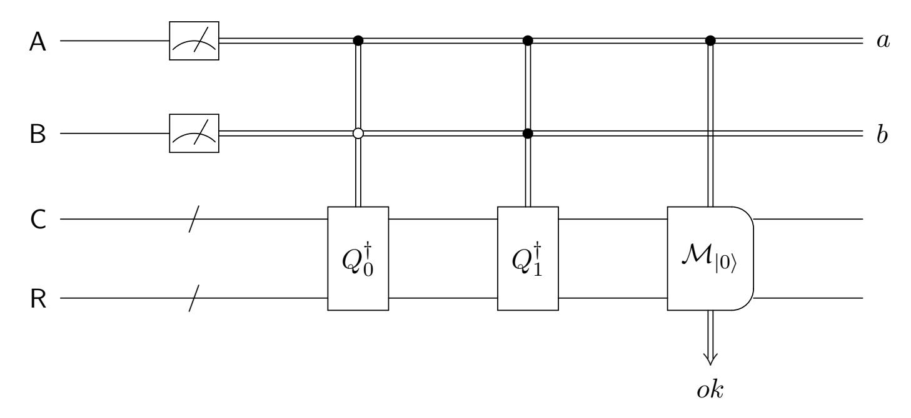

Figure 1: The quantum circuit  $V_{com}$  that represents opening a quantum bit commitment by the honest receiver. The classical bit a indicates whether this quantum bit commitment is to open, and the classical bit b indicates the bit value to reveal. It outputs a single classical bit ok, which is equal to 1 if the quantum bit commitment is opened successfully or not opened.

The construction of the quantum circuit  $V_{com}$  basically follows the reveal stage of the quantum bit commitment scheme. Specifically, within the  $V_{com}$  the single qubit A indicates whether the quantum bit commitment (stored in the commitment register C) is to open, and the qubit B indicates what value (0 or 1) is to reveal. The measurement outcomes of the qubits A and B are denoted by a and b, respectively. The subcircuit  $\mathcal{M}_{|0\rangle}$  realizes a controlled (by the bit a) binary measurement  $\{|0\rangle\langle 0|, |1\rangle\langle 1|\}$ . Intuitively,

- When a=1, the quantum bit commitment is to open. In this case, the quantum circuit  $Q_b^{\dagger}$  will be performed before checking whether the quantum register pair (C, R) returns to the state  $|0\rangle$ . If yes, then output the bit ok=1; otherwise, output ok=0.
- When a=0, the quantum bit commitment is not to open. In this case, simply output ok=1.

It is not hard to see that removing the two measurements of the qubits A and B within the quantum circuit  $V_{com}$  will not affect  $\Pr[ok = 1]$ . We call the resulting quantum circuit obtained from the  $V_{com}$  by removing these two measurements the  $V_{com}^{sup}$  (the superscript "sup" indicates that we do not collapse the potential superpositions in the registers A and B), as illustrated in Figure 2. Thus, the quantum circuit  $V_{com}^{sup}$  realizes a binary measurement which outputs a single bit ok, such that the projector corresponding to the outcome ok = 1 is given by (abusing the notation, we also denote it by the  $V_{com}^{sup}$ )

$$V_{com}^{sup} = (|0\rangle\langle 0|)^{A} \otimes \mathbb{1}^{BCR} + (|1\rangle\langle 1|)^{A} \otimes \left( (|0\rangle\langle 0|)^{B} \otimes \left( Q_{0} |0\rangle\langle 0| Q_{0}^{\dagger} \right)^{CR} + (|1\rangle\langle 1|)^{B} \otimes \left( Q_{1} |0\rangle\langle 0| Q_{1}^{\dagger} \right)^{CR} \right). \tag{2}$$

In the subsequent security analyses, we prefer to use  $V_{com}^{sup}$  (than  $V_{com}$ ) because it perturbs less, which is conceptually simpler and turns out to be more convenient in some situation. Even in cases

{14}------------------------------------------------

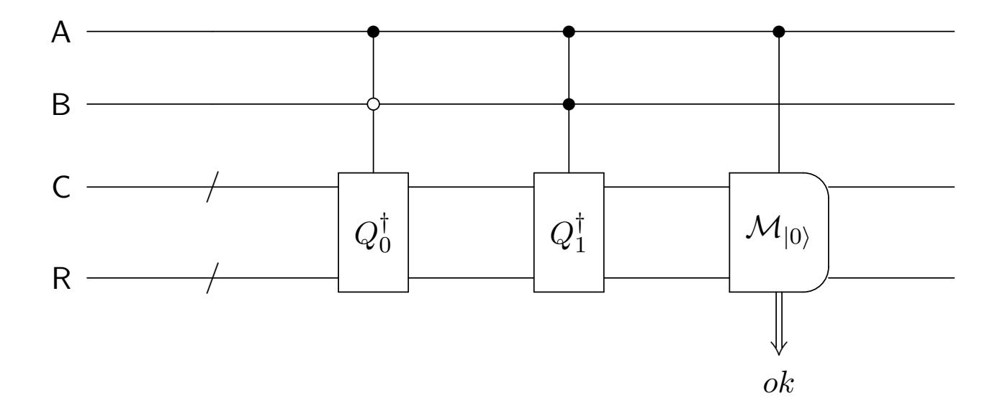

Figure 2: The quantum circuit  $V_{com}^{sup}$  that represents opening a quantum bit commitment by the honest receiver without measuring the opening information. The qubit A indicates whether this quantum bit commitment is to open, and the qubit B indicates the bit value to reveal. It outputs a single classical bit ok, which is equal to 1 if the quantum bit commitment is opened successfully or not opened.

where we need to measure the registers A and B to obtain the classical opening information, we still stick to  $V_{com}^{sup}$ , while deferring the measurements of the qubits A and B at the moment immediate after  $V_{com}^{sup}$  is performed.

## 3.2 Formalizing a typical verification involving opening quantum bit commitments

To model a verification (within a larger two-party protocol) in which m bits are committed in parallel using a canonical quantum bit commitment scheme  $(Q_0, Q_1)$ , we introduce a quantum system  $(C^{\otimes m}, R^{\otimes m}, D)$ . Specifically, each copy of the register pair (C, R) will be used for committing a bit. The opening register D is intended to store the cheating sender's classical message, which in particular contains the opening information indicating which bit commitments will be opened as what values. Composing m copies of the quantum circuit  $V_{com}^{sup}$  in parallel, a typical verification involving opening quantum bit commitments is illustrated in Figure 3 and explained subsequently.

First, the receiver will perform two checks as explained below, outputting acc=1 if and only if both checks pass:

- 1. The *predicate* check  $V_{pred}$ : check whether the classical message stored in the opening register D satisfies the predicate that is typically determined by the outer two-party protocol. It will output a single classical bit  $ok_{pred}$  indicating whether this check passes.
- 2. The *commitment* check  $V_{com}^{sup\otimes m}$ : check whether all quantum bit commitments are opened successfully in the way as specified by the classical message stored in the opening register D. The classical output bit of the *i*-th copy of the quantum circuit  $V_{com}^{sup}$  is denoted by  $ok_i$ .

Second, the "control" under the opening register D for each copy of the quantum circuit  $V_{com}^{sup}$  needs more explanation. Recall that each copy of the  $V_{com}^{sup}$  is controlled by two qubits (Figure 2), indicating whether the corresponding quantum bit commitment will be opened and what value is to reveal, respectively. Typically, in applications such opening information is either fixed a priori or can be computed (if not given explicitly) from the sender's classical message stored in the opening register D. In Figure 3, for simplification we actually have dropped a translation procedure which

{15}------------------------------------------------

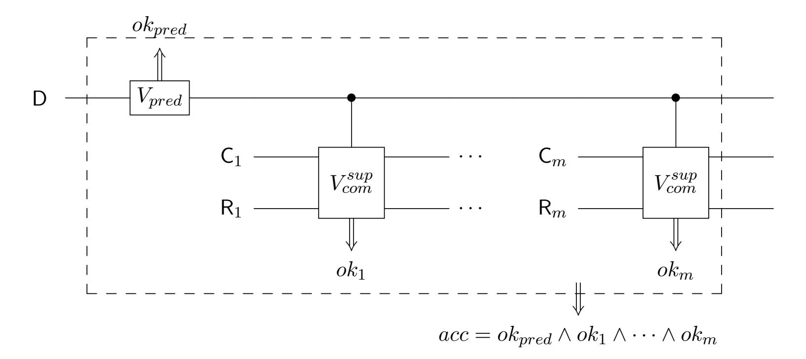

Figure 3: A typical verification involving opening quantum bit commitments, where arrows " $\uparrow$ " and " $\downarrow$ " indicate *classical* outputs. The classical bit  $ok_{pred}$  indicates whether the predicate check passes; each classical bit  $ok_i (1 \le i \le m)$  is equal to 1 if the *i*-th quantum bit commitment is opened successfully or not opened.

first copies the content of the opening register D (w.r.t. the computational basis) somewhere in the verifier's workspace and then computes all control bits from it that will be fed to each copy of the  $V_{com}^{sup}$ . (Instead, we draw a direct control under the register D for each copy of the  $V_{com}^{sup}$ .) Generally speaking, the sender's classical message contains additional information that will be used for the predicate check other than the opening information.

Third, to "perturb less", we can simulate all internal measurements within the verification other than the one outputting the bit  $acc = ok_{pred} \wedge ok_1 \wedge \cdots \wedge ok_m$  by unitaries (in the standard way). In particular, the purification of the quantum circuit  $V_{com}^{sup}$ , denoted by  $U_{com}^{sup}$ , is depicted in Figure 4. According to the expression (2), the expression of  $U_{com}^{sup}$  is given by

$$U_{com}^{sup} = (|0\rangle\langle 0|)^{A} \otimes \mathbb{1}^{BCR} \otimes X^{O} + (|1\rangle\langle 1|)^{A} \otimes \left(\mathbb{1}^{B} \otimes U_{\mathcal{M}_{|0\rangle}}^{CRO}\right) \left(\left((|0\rangle\langle 0|)^{B} \otimes Q_{0}^{\dagger} + (|1\rangle\langle 1|)^{B} \otimes Q_{1}^{\dagger}\right) \otimes \mathbb{1}^{O}\right), \tag{3}$$

where X denotes the Pauli-X (i.e. bit-flipping) operator, and the unitary transformation

$$U_{\mathcal{M}_{|0\rangle}}^{CRO} = (|0\rangle\langle 0|)^{CR} \otimes X^{O} + (\mathbb{1} - |0\rangle\langle 0|)^{CR} \otimes \mathbb{1}^{O}$$

simulates the binary measurement  $\mathcal{M}_{|0\rangle}$ . After the purification, the quantum circuit depicted in Figure 3 becomes the circuit depicted in Figure 5, which realizes a binary projective measurement. It is easy to see that this quantum circuit outputs acc = 1 with the same probability as that of the quantum circuit depicted in Figure 3 when they are performed on same quantum state.

Fourth, we prefer to let the (honest) receiver not measure the sender's classical message (stored in the opening register D) within the verification; this will not affect the receiver's acceptance probability. The purpose of doing this is to perturb the quantum state as slightly as possible. Even if such a measurement is required by the outer two-party protocol, we can defer it until after the verification (r.f. Figure 7).

### 4 Technical lemmas

In this section, we state all technical lemmas we need and informally explain their meanings and usages, while deferring most of their proofs to Appendix B.

{16}------------------------------------------------

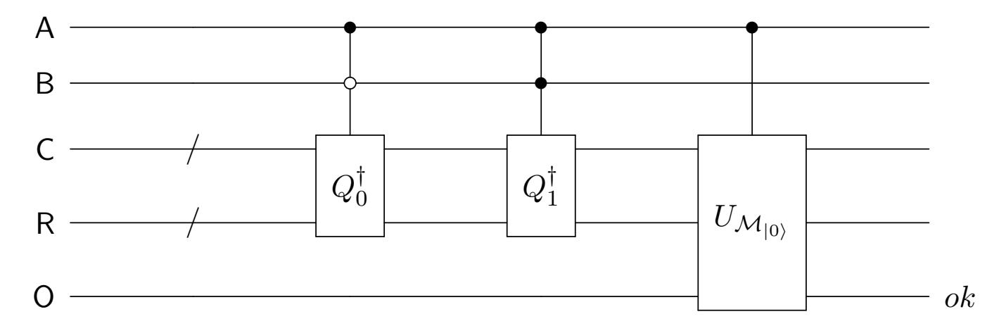

Figure 4: The quantum circuit  $U_{com}^{sup}$  is a unitary simulation of the quantum circuit  $V_{com}^{sup}$ , whose output qubit O is *not* measured.

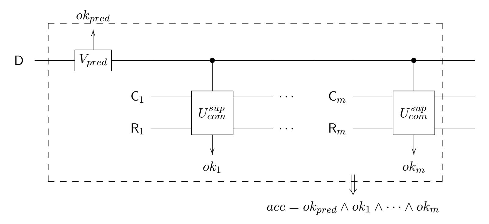

Figure 5: A typical verification involving opening quantum bit commitments with a single classical output bit acc. Now the  $ok_{pred}$  stands for a single qubit (represented by an arrow " $\uparrow$ " rather than " $\uparrow$ ", in contrast to the  $ok_{pred}$  in Figure 3) indicating whether the predicate check passes; similarly, each  $ok_i$  ( $1 \le i \le m$ ) stands for a single qubit indicating whether the i-th quantum bit commitment is opened successfully or not opened. Neither  $ok_{pred}$  nor  $ok_i$ 's are measured.

## 4.1 Two simple quantum information-theoretic lemmas on (projective) measurements

Consider the scenario in which two projective measurements are performed on two disjoint subsystems simultaneously. Informally, we say that the first measurement determines the second if the outcome of first measurement determines that of the second. In this case, removing the second measurement will not affect anything. In the special case in which these two measurements determine each other, then we say that they are equivalent. In this special case, removing either measurement will not affect anything. This simple trick of manipulating measurements are formally stated in the lemma as below without proof.

**Lemma 2** Suppose that quantum registers X and Y are two disjoint subsystems of a larger system. If a projective measurement  $\mathcal{M}_X$  performing on the register X determines another projective measurement  $\mathcal{M}_Y$  performing on the register Y, then removing the measurement  $\mathcal{M}_Y$  will not affect the post-measurement state of the whole system. In the special case in which the two measurements  $\mathcal{M}_X$  and  $\mathcal{M}_Y$  are equivalent, removing either the measurement  $\mathcal{M}_X$  or the measurement  $\mathcal{M}_Y$  will not affect the post-measurement state of the system.

{17}------------------------------------------------

Another lemma as below was once proved in [YWLQ15]. For self-containment, its proof is deferred to Appendix B.1.

**Lemma 3** Let  $\mathcal{X}, \mathcal{Y}$  be two Hilbert spaces. Unit vectors  $|\varphi_0\rangle, |\varphi_1\rangle \in \mathcal{X} \otimes \mathcal{Y}$ . Let  $\rho_0$  and  $\rho_1$  be the reduced states of  $|\varphi_0\rangle$  and  $|\varphi_1\rangle$  in the Hilbert space  $\mathcal{X}$ , respectively; their fidelity  $F(\rho_0, \rho_1) = \epsilon \geq 0$ . Then there exists a projective measurement  $\Pi = \{\Pi_0, \Pi_1\}$  on the Hilbert space  $\mathcal{X}$  such that

1. 
$$\|(\Pi_0^X \otimes \mathbb{1}^Y) |\varphi_0\rangle\|^2 = \operatorname{Tr}(\Pi_0 \rho_0) \ge 1 - \epsilon, \|(\Pi_1^X \otimes \mathbb{1}^Y) |\varphi_1\rangle\|^2 = \operatorname{Tr}(\Pi_1 \rho_1) \ge 1 - \epsilon.$$

2. 
$$\||\varphi_0\rangle - (\Pi_0^X \otimes \mathbb{1}^Y) |\varphi_0\rangle\| \le \sqrt{2\epsilon}, \ \||\varphi_1\rangle - (\Pi_1^X \otimes \mathbb{1}^Y) |\varphi_1\rangle\| \le \sqrt{2\epsilon}.$$

In particular, when  $F(\rho_0, \rho_1) = 0$ , i.e.  $\rho_0 = \rho_1$ , we have  $Tr(\Pi_0^X \rho_0^X) = 1$ ,  $Tr(\Pi_1^X \rho_1^X) = 1$ ,  $|\varphi_0\rangle = (\Pi_0^X \otimes \mathbb{1}^Y) |\varphi_0\rangle$ , and  $|\varphi_1\rangle = (\Pi_1^X \otimes \mathbb{1}^Y) |\varphi_1\rangle$ .

### 4.2 (Imaginary) commitment measurement

We apply Lemma 3 to the quantum states induced by the statistically  $\epsilon$ -binding quantum bit commitment scheme  $(Q_0, Q_1)$ , obtaining the following corollary that will be intensively used in the sequel.

Corollary 4 Suppose that a canonical quantum bit commitment scheme  $(Q_0, Q_1)$  is  $\epsilon$ -binding. Then there exists a projective measurement  $\Pi = \{\Pi_0, \Pi_1\}$  on the commitment register C such that

$$\begin{aligned} & \left\| (\Pi_0^C \otimes \mathbb{1}^R) Q_0 |0\rangle \right\| \ge \sqrt{1 - \epsilon}, & \left\| (\Pi_1^C \otimes \mathbb{1}^R) Q_0 |0\rangle \right\| \le \sqrt{\epsilon}; \\ & \left\| (\Pi_0^C \otimes \mathbb{1}^R) Q_1 |0\rangle \right\| \le \sqrt{\epsilon}, & \left\| (\Pi_1^C \otimes \mathbb{1}^R) Q_1 |0\rangle \right\| \ge \sqrt{1 - \epsilon}. \end{aligned}$$
(4)

In the special case in which  $\epsilon \equiv 0$ , i.e. the scheme is perfectly binding, we have

$$(\Pi_0^C \otimes \mathbb{1}^R) Q_0 |0\rangle = Q_0 |0\rangle, \quad (\Pi_1^C \otimes \mathbb{1}^R) Q_0 |0\rangle = 0; (\Pi_0^C \otimes \mathbb{1}^R) Q_1 |0\rangle = 0, \quad (\Pi_1^C \otimes \mathbb{1}^R) Q_1 |0\rangle = Q_1 |0\rangle.$$

$$(5)$$

PROOF: Replace the  $|\varphi_0\rangle$ ,  $|\varphi_1\rangle$ ,  $\rho_0$ ,  $\rho_1$ ,  $\mathcal{X}$ ,  $\mathcal{Y}$  and  $\epsilon$  in Lemma 3 with the  $Q_0|0\rangle$ ,  $Q_1|0\rangle$ ,  $\rho_0$ ,  $\rho_1$ ,  $\mathcal{C}$ ,  $\mathcal{R}$  and  $\epsilon$  that are fixed in Definition 1, respectively.

This corollary allows us to introduce what we called "imaginary commitment measurement" as follows.

**Definition 5 (Imaginary commitment measurement)** Suppose that a canonical quantum bit commitment scheme  $(Q_0, Q_1)$  is perfectly binding. Then the projective measurement  $\Pi = \{\Pi_0, \Pi_1\}$  whose existence is guaranteed by Corollary 4 will be referred to as the *imaginary commitment measurement*, or just the *commitment measurement* for short, throughout this paper.

We remark that we call the measurement defined above "imaginary" for the reason that it is typically not efficiently realizable; otherwise, the scheme  $(Q_0, Q_1)$  would not be (computationally) hiding. This imaginary measurement will be introduced just for the purpose of security analysis in our applications.

The lemma below basically states that nothing will change if we introduce a commitment measurement of the commitment register C prior to opening a quantum bit commitment.

{18}------------------------------------------------

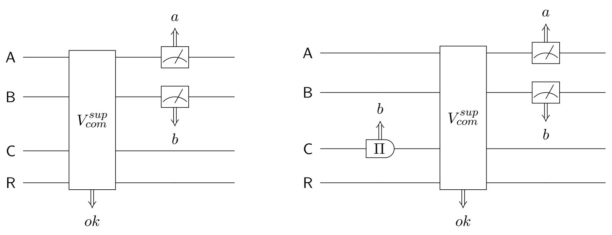

- (a) Open a quantum bit commitment
- (b) Open a *collapsed* quantum bit commitment

Figure 6: Introduce a commitment measurement before opening a quantum bit commitment

**Lemma 6** Suppose that a canonical quantum bit commitment scheme  $(Q_0, Q_1)$  is perfectly binding. The procedure of opening a quantum bit commitment with a posterior measurement of the opening information is depicted in Figure 6a, where the quantum circuit  $V_{com}^{sup}$  (which represents opening a quantum bit commitment without measuring the opening information) is as depicted in Figure 2. By introducing a pre-opening commitment measurement, we obtain the quantum circuit as depicted in Figure 6b. Then we have:

- 1. Perform the quantum circuit depicted in Figure 6b on an arbitrary system. Conditioned on ok = 1 and a = 1 (i.e. the quantum bit commitment is opened successfully), the revealed value should be the same as the outcome of the (pre-verification) commitment measurement.
- 2. If we perform the two quantum circuits depicted in Figure 6a respective Figure 6b on the same system, then
  - (a) Pr[ok = 1 : Figure 6a] = Pr[ok = 1 : Figure 6b]. That is, introducing the commitment measurement will not change the probability of the event that either the quantum bit commitment is opened successfully or not opened.
  - (b) Conditioned on ok = 1 and a = 1, the two corresponding final states of the system will be the same. That is, introducing commitment measurement will not affect the post-opening state of the system conditioned on a successful opening.

Proof: Deferred to Appendix B.2.

A typical verification involving opening quantum bit commitments with a posterior measurement of the opening register is depicted in Figure 7. Compared with the verification depicted in Figure 5, it has an extra post-verification measurement of the opening register D. As an immediate corollary of the lemma above, now we consider introducing a commitment measurement of the commitment register C prior to each copy of the  $U_{com}^{sup}$  (the unitary simulation of the  $V_{com}^{sup}$ ) within the verification depicted in Figure 7.

Corollary 7 Suppose that a canonical quantum bit commitment scheme  $(Q_0, Q_1)$  is perfectly binding. A typical verification involving opening quantum bit commitments with a posterior measurement of the opening register is depicted in Figure 7. For the i-th  $(1 \le i \le m)$  copy of the  $U_{com}^{sup}$ , let

{19}------------------------------------------------

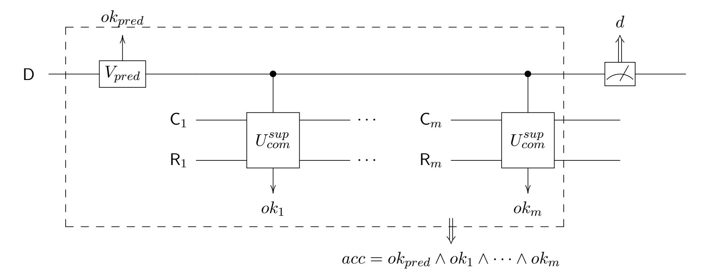

Figure 7: A typical verification involving opening quantum bit commitments (in the dashed box), with a posterior measurement of the opening register

 $a_i$  and  $b_i$  denote the bits (which can be computed from the opening information d; recall the second remark in Subsection 3.2) indicating whether the i-th quantum bit commitment is to open and what value is to reveal, respectively. By introducing a commitment measurement on the commitment register C prior to each copy the  $U_{com}^{sup}$ , we obtain the quantum circuit depicted in Figure 8. Then we have:

- 1. Perform the quantum circuit depicted in Figure 8 on an arbitrary quantum system. Conditioned on acc = 1 and  $a_i = 1$ , the revealed value  $b_i$  should be the same as the outcome of the corresponding commitment measurement.
- 2. If we perform the two quantum circuits depicted in Figure 7 respective Figure 8 on the same system, then
  - (a) Pr[acc = 1 : Figure 7] = Pr[acc = 1 : Figure 8]. That is, introducing commitment measurements will not change the success probability of the verification.
  - (b) Conditioned on acc = 1 and  $a_1 = a_2 = \cdots = a_m = 1$ , the two corresponding final states of the system will be the same. That is, introducing commitment measurements will not affect the post-verification state of the system conditioned on that the verification succeeds and all quantum bit commitments are opened.

Proof: Deferred to Appendix B.2.

**Remark**. Recall the third remark in Subsection 3.2, where we point out that a translation procedure which computes the opening information is dropped. Since this opening information is either fixed or only depends on the prover's classical message stored in the opening register D, measuring the register D in Figure 7 and Figure 8 will implicitly measure the control qubits A and B for each copy of the  $U_{com}^{sup}$  (Lemma 2). This is crucial when we try to prove the corollary above using Lemma 6.

#### 4.3 Perturbation

The goal of this subsection is to develop a generic perturbation technique to realize Step 2 of our analysis framework, i.e. extending the quantum security based on the perfect binding property to

{20}------------------------------------------------

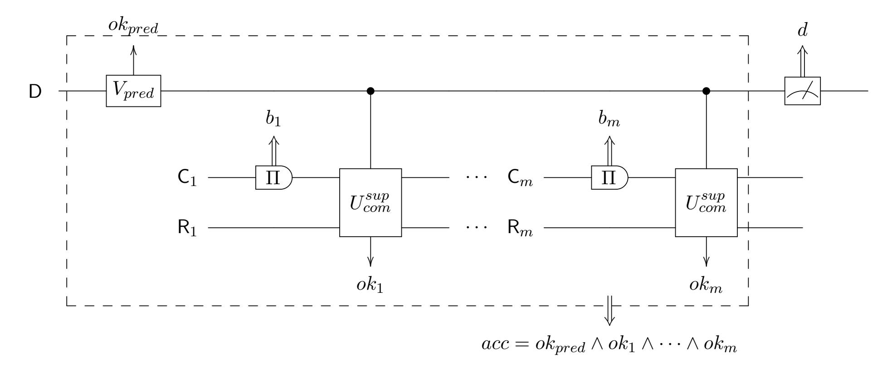

Figure 8: A typical verification involving opening quantum bit commitments with pre-verification commitment measurements (in the dashed box), as well as a posterior measurement of the opening register

the statistical binding property of canonical quantum bit commitments. For this purpose, we prove a lemma as below.

**Lemma 8** Suppose that a canonical quantum bit commitment scheme  $(Q_0, Q_1)$  is statistically  $\epsilon$ -binding. Then there exists a perfectly-binding scheme  $(\tilde{Q}_0, \tilde{Q}_1)$  which approximates the scheme  $(Q_0, Q_1)$  in the following sense. Consider an arbitrary quantum security game in which there are in total m (counted with repetitions7) quantum bit commitments opened. Let  $\rho$  and  $\tilde{\rho}$  be the output quantum states of the games when schemes  $(Q_0, Q_1)$  and  $(\tilde{Q}_0, \tilde{Q}_1)$  are used in opening quantum bit commitments, respectively. Then  $TD(\rho, \tilde{\rho}) \leq 10m\sqrt{\epsilon}$ .

Proof: Deferred to Appendix B.3.

The following corollary of the lemma above gives a useful fact for applications in this paper.

Corollary 9 Consider an arbitrary quantum security game in which there are in total m (counted with repetitions) quantum bit commitments are opened and which outputs just a single classical bit. Let  $p_0$  and  $p_{\epsilon}$  denote the probabilities of this classical bit being one when a perfectly-binding and a statistically  $\epsilon$ -binding quantum bit commitment scheme is used, respectively. Then  $|p_{\epsilon} - p_0| \leq 10m\sqrt{\epsilon}$ .

Proof: Deferred to Appendix B.3.

In the rest of this subsection, we give a construction of the approximation scheme  $(\tilde{Q}_0, \tilde{Q}_1)$  (called *perturbed scheme* hereafter) guaranteed in Lemma 8 and explain Step 2 of our analysis framework more formally.

The construction of the perturbed scheme  $(\tilde{Q}_0, \tilde{Q}_1)$ . For each bit  $b \in \{0, 1\}$ , consider the two-dimensional subspace spanned by the vector  $Q_b | 0 \rangle$  and the vector  $(\Pi_b^C \otimes \mathbb{1}^R)Q_b | 0 \rangle$  after renormalization, which we denote by  $\widetilde{Q_b} | 0 \rangle$ . Recall that  $\{\Pi_0, \Pi_1\}$  denotes the *imaginary* commitment

&lt;sup>7We note that a quantum bit commitment may be opened several times in a sequence of verifications, e.g. referring to Section 7.

{21}------------------------------------------------

measurement (Definition 5). There exists a unitary operator  $R_b$  which acts on this subspace and sends the vector  $Q_b |0\rangle$  to the vector  $Q_b |0\rangle$ . (It acts as the identity on the orthogonal subspace.) Indeed, the unitary  $R_b$  is just the *rotation* around the origin by the angle  $\theta_b$  ( $0 < \theta_b < \pi/2$ ) where  $\cos \theta_b = \|(\Pi_b^C \otimes \mathbb{1}^R)Q_b |0\rangle\|$ . From Corollary 4, it follows that

$$\cos \theta_b \ge \sqrt{1 - \epsilon}.\tag{6}$$

We introduce the unitary operator

$$\tilde{Q}_b \stackrel{def}{=} R_b Q_b. \tag{7}$$

By definition,

$$\widetilde{Q}_b |0\rangle = \widetilde{Q_b |0\rangle} = \frac{(\Pi_b^C \otimes \mathbb{1}^R) Q_b |0\rangle}{\|(\Pi_b^C \otimes \mathbb{1}^R) Q_b |0\rangle\|}.$$

One can easily check that if we view the quantum circuit pair  $(\tilde{Q}_0, \tilde{Q}_1)$  as a quantum bit commitment scheme, then it is *perfectly binding* in the following sense:

$$(\Pi_0^C \otimes \mathbb{1}^R) \tilde{Q}_0 |0\rangle = \tilde{Q}_0 |0\rangle, \quad (\Pi_1^C \otimes \mathbb{1}^R) \tilde{Q}_0 |0\rangle = 0; (\Pi_0^C \otimes \mathbb{1}^R) \tilde{Q}_1 |0\rangle = 0, \quad (\Pi_1^C \otimes \mathbb{1}^R) \tilde{Q}_1 |0\rangle = \tilde{Q}_1 |0\rangle,$$
(8)

which are similar to equations in (5).

**Remark**. Note that the perturbed scheme  $(\tilde{Q}_0, \tilde{Q}_1)$  cannot be a realistic quantum bit commitment scheme for two reasons:

- 1. Both quantum circuits  $\tilde{Q}_0$  and  $\tilde{Q}_1$  are not efficiently realizable.
- 2. It may not satisfy the *hiding* property any more.

In spite of this, we can still view  $(\tilde{Q}_0, \tilde{Q}_1)$  as representing a quantum bit commitment scheme in security analysis where only its binding property is relevant.

The quantum circuit  $\tilde{V}^{sup}_{com}$  (depicted in Figure 9) that represents opening a quantum bit commitment using the scheme  $(\tilde{Q}_0, \tilde{Q}_1)$  can be easily adapted from the  $V^{sup}_{com}$  (Figure 2).

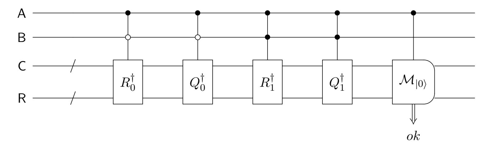

Figure 9: The quantum circuit  $\tilde{V}_{com}^{sup}$  that is an approximation of  $V_{com}^{sup}$ 

Step 2 of our analysis framework. Step 2 is to extend the security based on the quantum perfect binding property to the quantum statistical binding property of canonical quantum bit commitments. The basic idea for such an extension is as follows: according to equations in (8), the quantum security based on the quantum perfect binding property extends to case in which the perturbed scheme  $(\tilde{Q}_0, \tilde{Q}_1)$  is used. We are then left to show that the perturbation incurred by replacing the scheme  $(\tilde{Q}_0, \tilde{Q}_1)$  with the scheme  $(Q_0, Q_1)$  in the corresponding security game is statistically negligible. This is exactly what Lemma 8 states.

{22}------------------------------------------------

#### 4.4 A quantum rewinding lemma

It is well known that quantum rewinding is only possible in some special cases [vdG97, Wat09, Unr12, YWLQ15]. The quantum rewinding lemma given below (Lemma 10) improves the one appeared in [YWLQ15] by providing a better lower bound. Its proof is almost the same as that in [YWLQ15], except that in one step of the argument the Pythagorean theorem rather than the triangle inequality is used.

**Lemma 10 (A weak quantum rewinding)** Let  $\mathcal{X}$  and  $\mathcal{Y}$  be two Hilbert spaces. Unit vector  $|\psi\rangle \in \mathcal{X} \otimes \mathcal{Y}$ . Orthogonal projectors  $\Gamma_1, \ldots, \Gamma_k$  perform on the space  $\mathcal{X} \otimes \mathcal{Y}$ , and unitary transformations  $U_1, \ldots, U_k$  perform on the space  $\mathcal{Y}$ . If  $1/k \cdot \sum_{i=1}^k \left\| \Gamma_i(U_i \otimes \mathbb{1}^X) |\psi\rangle \right\|^2 \geq 1 - \eta$ , where  $0 \leq \eta \leq 1$ , then

$$\left\| (U_k^{\dagger} \otimes \mathbb{1}^X) \Gamma_k (U_k \otimes \mathbb{1}^X) \cdots (U_1^{\dagger} \otimes \mathbb{1}^X) \Gamma_1 (U_1 \otimes \mathbb{1}^X) |\psi\rangle \right\| \ge 1 - \sqrt{k\eta}.$$
 (9)

Proof: Deferred to Appendix B.4.

The lemma above (and the corresponding quantum rewinding) looks very similar to the one used in [Unr12]. Actually, both of them are variants of the quantum union bound [Aar16, Aar06] or the gentle measurement lemma [Win99]. Their main difference lies in that ours is designed for the analysis of the quantum security against the prover (who plays the role of the sender of commitments) of GMW-type zero-knowledge protocols [Blu86, GMW91], as opposed to general sigma protocols [Unr12]. In particular, when both of them are applied to Blum's zero-knowledge protocol [Blu86], ours will give a better lower bound.

In more detail, in Lemma 10 the Hilbert space  $\mathcal{X}$  will correspond to the space induced by the commitment registers, which are expected to hold the (possibly cheating) sender's quantum commitments. The unitary transformation  $U_i$  ( $1 \le i \le k$ ) will correspond to the sender's operation to meet the receiver's challenge indexed by i. Note that since commitment registers are at the receiver's hands,  $U_i$ 's (which performs on the space  $\mathcal{Y}$ ) will not touch the space  $\mathcal{X}$ . The projector  $\Gamma_i$  ( $1 \le i \le k$ ) can be viewed as induced by the receiver's acceptance condition of the verification corresponding to the challenge i. In this view, Lemma 10 states that if the sender can convince the receiver to accept with high probability w.r.t. a random challenge chosen from the set  $\{1, 2, \ldots, k\}$ , then it can convince the receiver to accept a consecutive sequence of verifications corresponding to challenges  $1, 2, \ldots, k$  with high probability8.

### 5 Application 1: quantum zero-knowledge proof

The zero-knowledge proof for a language is an interactive proof such that the prover can convince the verifier the membership of the input in the language without leaking anything else. In particular, regarding an **NP** language, its zero-knowledge proof should not leak the witness to the verifier. Readers are referred to standard cryptography or complexity textbooks, e.g. [AB09, Gol01], for a formal treatment of zero-knowledge proofs.

Blum's zero-knowledge protocol [Blu86] for the **NP**-complete language Hamiltonian Cycle roughly proceeds as follows. Let G be the input graph with n vertices, where n will also be used as the *security parameter* subsequently. The prover first chooses a random permutation  $\pi \in S_n$  and commits

&lt;sup>8Actually, the sequence of indices from the set  $\{1, 2, ..., k\}$  does not matter; the lemma holds for an arbitrary sequence.

{23}------------------------------------------------

to each entry of the adjacency matrix of the graph  $\pi(G)$  using a bit commitment scheme. Then the verifier comes up with a random challenge bit  $ch \in \{0,1\}$ . Finally, depending on the verifier's challenge, the prover either opens all  $n^2$  bit commitments as  $\pi(G)$  when ch = 0, or opens the bit commitments to the n entries that correspond to the location of a Hamiltonian cycle of  $\pi(G)$  as all 1's when ch = 1.

In this section, we plug a canonical perfectly/statistically-binding quantum bit commitment scheme in Blum's protocol, and establish its *soundness* against any quantum computationally unbounded cheating prover. Formally, we prove the following lemma and corollary:

**Lemma 11** Suppose that the quantum bit commitment scheme  $\{(Q_0(n), Q_1(n))\}_n$  is perfectly binding. Then Blum's zero-knowledge protocol for the language Hamiltonian Cycle with this scheme plugged in is sound against any quantum computationally unbounded prover with the soundness error 1/2.

Corollary 12 Suppose that the quantum bit commitment scheme  $\{(Q_0(n),Q_1(n))\}_n$  is statistically binding with a negligible binding error  $\epsilon$ . Then Blum's zero-knowledge protocol for the language Hamiltonian Cycle with this scheme plugged in is sound against any quantum computationally unbounded prover with the soundness error  $1/2 + O(n^2\sqrt{\epsilon})$ .

Since the quantum computational zero-knowledge of Blum's protocol can be proved by adapting proofs in [Wat09, Unr12] trivially, combined with Corollary 12, we arrive at Theorem 1.

**Remark.** Our soundness analysis for Blum's protocol extends to any other GMW-type zero-knowledge protocols, in particular the GMW zero-knowledge protocol for the language Graph 3-Coloring [GMW91].

In the remainder of this section, we first prove Lemma 11. Then combing it with Corollary 9, we prove Corollary 12.

**Proof of Lemma 11**: For soundness, we need to prove that if the input graph G does not have a Hamiltonian cycle, then the verifier will accept with probability at most 1/2. An execution of the protocol w.r.t. an arbitrary challenge  $ch \in \{0,1\}$  is illustrated in Figure 10, where

- Each copy of the registers (C, R) is used by the quantum bit commitment scheme  $(Q_0, Q_1)$  for committing a bit.
- The opening register D is used to store the *classical* responses w.r.t. the challenge ch = 0 or 1. We highlight that this classical response will determine which bit commitments are to open as what value.
- The register S is the prover's working space.
- The  $P^*$  is the prover's operation for preparing the (quantum) commitments.
- The  $P_{ch}^*$  is the prover's operation for preparing the response w.r.t. the challenge  $ch \in \{0,1\}$ .
- The verification  $V_{zk}^{ch}$  can be specialized from the general verification involving opening quantum bit commitments depicted in Figure 5 in the following way:
  - Plug in  $m = n^2$ .

{24}------------------------------------------------

– When ch=0, the predicate check  $V_{pred}$  verifies that a permutation  $\pi$  is stored in the register D. The commitment check verifies that all (in total  $n^2$ ) quantum bit commitments are revealed as the graph  $\pi(G)$ . Or put it formally, the expression of the projector  $V_{zk}^0$  is given by

$$V_{zk}^{0} = \sum_{\pi \in S_n} (|\pi\rangle \langle \pi|)^D \otimes \left( Q_{\pi(G)} |0\rangle \langle 0| Q_{\pi(G)}^{\dagger} \right)^{C^{\otimes n^2} R^{\otimes n^2}}.$$

- When ch = 1, the predicate check  $V_{pred}$  verifies that (the description of) an n-cycle is stored in the register D. The commitment check verifies that the n quantum bit commitments to the entries of the adjacency matrix that correspond to this n-cycle are all revealed as 1's. Or put it formally, the expression of the projector  $V_{zk}^1$  is given by

$$V_{zk}^{1} = \sum_{hc} (|hc\rangle \langle hc|)^{D} \otimes \left(Q_{1}^{\otimes n} |0\rangle \langle 0| (Q_{1}^{\dagger})^{\otimes n}\right)^{C^{\otimes n} R^{\otimes n} [hc]},$$

where the hc sums over all possible positions of the n-cycle and the  $C^{\otimes n}R^{\otimes n}[hc]$  denotes the corresponding register pair (C, R)'s on which the commitment check will be performed.

Now our goal is to show that  $\Pr[acc=1] \leq 1/2$ .  $acc=ok_{pred} \wedge ok_1 \wedge \cdots \wedge ok_{n^2}$ 

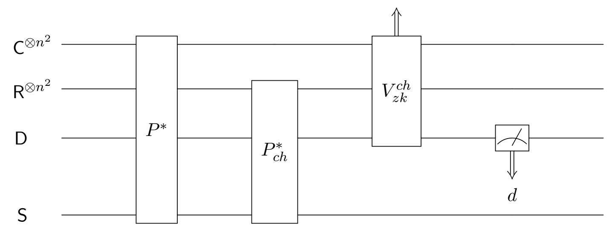

Figure 10: An execution of Blum's zero-knowledge protocol w.r.t. the challenge  $ch \in \{0,1\}$ 

We are going to define a sequence of games to argue the soundness. Each game will output a classical bit acc. And for any two consecutive games i and i+1, we are to show that  $\Pr[acc=1: \mathsf{Game}\ i] = \Pr[acc=1: \mathsf{Game}\ i+1]$ . If we can prove that the probability of the event acc=1 happening is at most 1/2 for the last game, then it will conclude the proof.

Specifically, for a fixed challenge  $ch \in \{0,1\}$ , we define a sequence of games as follows, where the description of each game will only contain the changes w.r.t. the proceeding game.

- Game 0. An execution of the protocol as depicted in Figure 10.
- Game 1. Perform the commitment measurement  $\Pi$  (Definition 5) on the commitment register C prior to each copy of the quantum circuit  $V_{com}^{sup}$  within the quantum circuit  $V_{zk}^{ch}$ , as depicted in Figure 8 for the general case. By the item 2(a) of Corollary 7, we have  $\Pr[acc=1:$  Game 1] =  $\Pr[acc=1:$  Game 0].

{25}------------------------------------------------

• Game 2. Move all commitment measurements to the positions posterior to the  $P^*$ , as illustrated in Figure 11. We have  $\Pr[acc = 1 : \mathsf{Game 2}] = \Pr[acc = 1 : \mathsf{Game 1}]$ , because all commitment register C's are *not* touched by any party between the two moments before and after the movement.

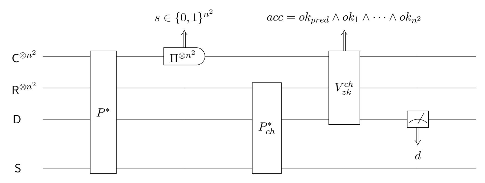

Figure 11: An execution of Blum's zero-knowledge protocol w.r.t. the challenge  $ch \in \{0,1\}$  such that all quantum bit commitments are collapsed by commitment measurements

Since the argument above holds for  $any \ ch \in \{0,1\}$ , it follows that  $\Pr_{ch \in_R\{0,1\}}[acc=1:$  Game  $0] = \Pr_{ch \in_R\{0,1\}}[acc=1:$  Game 2]. We are then sufficient to show that  $\Pr_{ch \in_R\{0,1\}}[acc=1:$  Game  $2] \le 1/2$ . Before doing this, we first note that in Game 2 all quantum bit commitments will be collapsed by the commitment measurements  $\Pi^{\otimes n^2}$ ; let  $s \in \{0,1\}^{n^2}$  be the outcome. We have two comments on this classical string s:

- 1. Regardless of whether the subsequent verification succeeds or not, we can obtain such a string  $s \in \{0,1\}^{n^2}$  from the commitment measurements.
- 2. Though this classical string s is unknown to the (honest) verifier, it nevertheless will enable us to argue the soundness (as below) in a similar way as in the classical setting.

We are ready to bound the  $\Pr_{ch\in_R\{0,1\}}[acc=1: \mathsf{Game}\ 2]$ . We focus on the case in which the verifier accepts, i.e. the verification  $V^{ch}_{zk}$  outputs acc=1. Since the scheme  $(Q_0,Q_1)$  is perfectly binding, a key observation is that if the i-th $(1 \le i \le n^2)$  quantum bit commitment is indeed opened, then by the item 1 of Corollary 7 it can only be opened as  $s_i$ . The remaining part of the soundness analysis is just a reproduction of the classical one. Namely, we claim that whatever a string  $s \in \{0,1\}^{n^2}$  that the commitment measurements  $\Pi^{\otimes n^2}$  outputs, the verifier will reject either in the case that ch=0 or ch=1 with certainty. This will concludes that  $\Pr_{ch\in_R\{0,1\}}[acc=1: \mathsf{Game}\ 2] \le 1/2$ .

We are left to prove the claim, whose argument is classical. For contradiction, suppose that the verifier will accept with nonzero probability w.r.t. both challenges 0 and 1. From that the verifier will accept w.r.t. ch = 0 with nonzero probability, it follows that the string s should encode a graph that is isomorphic to the input graph G. Moreover, from that the verifier will accept w.r.t. ch = 1 with nonzero probability, it follows that the string s should encode a graph that has a Hamiltonian cycle. Combining the two facts obtained from ch = 0 respective ch = 1 implies that the input graph G contains a Hamiltonian cycle. A contradiction.

This concludes the proof of the lemma.

{26}------------------------------------------------

To lift the soundness to the case in which the quantum bit commitment scheme plugged in is statistically binding, we simply apply Corollary 9.

**Proof of Corollary 12**: We consider the (quantum) security game w.r.t. an arbitrary challenge  $ch \in \{0,1\}$  induced by performing the quantum circuit depicted in Figure 10 to an arbitrary quantum system, i.e. the Game 0 defined in the proof of Lemma 11. We know that whether the ch is 0 or 1, there are at most  $n^2$  quantum bit commitments will be opened. Now we apply Corollary9, with m,  $p_0$  and  $p_1$  replaced by  $n^2$  and  $\Pr[acc = 1]$  corresponding to perfectly-binding and statistically  $\epsilon$ -binding quantum bit commitment schemes plugged in, respectively. It then follows that  $p_{\epsilon} \leq p_0 + 10n^2\sqrt{\epsilon} \leq 1/2 + 10n^2\sqrt{\epsilon}$ , where  $p_0 \leq 1/2$  is by Lemma 11. This finishes the proof the corollary.

### 6 Application 2: quantum oblivious transfer

Oblivious transfer is an important primitive in cryptography. Informally, via a 1-out-of-2 oblivious transfer Bob can obtain one out of two bits from Alice such that: (1) Bob does not know the other bit; (2) Alice does not know which bit is leaked to Bob. Interestingly, while classical constructions of oblivious transfer rely on stronger complexity assumptions than one-way functions [GKM+00, Gol04], quantum oblivious transfer can be based on quantum-secure classical bit commitment that is perfectly/statistically unique binding (which is implied by one-way function/permutation) [BBCS91, Cré94, CLS01, BF10].

In this section, we consider the same quantum oblivious transfer protocol but using canonical perfectly or statistically binding quantum bit commitments instead. We want to lift the security of the quantum oblivious transfer protocol based on that of quantum-secure classical perfect unique-binding commitments to our setting. While such a lift is relatively easy for the security against Alice (just a straightforward adaptation from the one in, say [Lég00]), it is not obvious for the security against Bob that will be based on the binding property of bit commitments. This is because quantum binding is generally weaker than unique-binding (as discussed before). The remainder of this section will be devoted to applying our analysis framework for such a lift of Bob's security that is based on perfect unique-binding to that is based on the quantum perfect or statistical binding property of canonical quantum bit commitments.

For our approach, in contrast to what we did in the preceding section, here for simplicity we will not do a security analysis from the scratch and reproduce an analysis that is almost the same as the existing one [Yao95, BF10] (which itself is already very complicated). Rather, we manage to reduce the security based on the quantum perfect or statistical binding property of canonical quantum bit commitments to that based on the perfect unique-binding. For this purpose, we even do not need to write out the formal definition of the security against Bob here, as long as we know that it only depends on Bob's output10. Then all we need to do is to show that if there were a Bob  $B^*$  who can break the security by outputting some quantum state when canonical perfectly or statistically binding quantum bit commitment is used, then there would exist another Bob  $B^{**}$  who can break the security by outputting the same state when commitments used are perfectly unique binding.

Compared with the soundness analysis in the preceding section, besides the success probability of the verification, the security analysis in this section needs to additionally take into account of

&lt;sup>9Instead of the full simulation security, here we just restrict to consider the security when the oblivious transfer protocol runs stand alone.

&lt;sup>10This is indeed the case considered in [Yao95], which is sufficient when the protocol is run stand alone.

{27}------------------------------------------------

#### Security parameter: m

### Preparation phase:

- For i = 1, 2, . . . , m, Alice chooses xi ∈R {0, 1} and θi ∈R {+, ×}, sending |xii θi to Bob.
- Upon receiving each qubit |xii θi , Bob chooses ˆθi ∈R {+, ×} and measure the qubit in the basis ˆθi ; let ˆxi ∈ {0, 1} be the outcome. Then Bob commits to both ˆθi and ˆxi .

### Verification phase:

- Alice sends a random test subset T ⊂ {1, 2, . . . , m} of size pm, where 0 < p < 1.
- For all i ∈ T, Bob opens the i-th and the (m + i)-th bit commitments, i.e. bit commitments to ˆθi and ˆxi , respectively.
- Alice checks that all openings succeed and xi = ˆxi whenever θi = ˆθi , for all i ∈ T. If yes, then Alice accepts and proceeds to the next (post-processing) phase; otherwise, she rejects and aborts immediately.

Figure 12: The preparation and verification phases of the quantum oblivious transfer protocol

the post-verification state conditioned on a successful verification. This is where the item 2(b) of Corollary [7](#page-18-1) comes in to help us.

### 6.1 A recap of the quantum oblivious transfer protocol with some formalization

The well-known quantum oblivious transfer protocol (following [\[DFL](#page-39-10)+09]) consists of three phases: the preparation phase, the verification phase, and the post-processing phase. The first two phases are quantum, whereas the last one is classical. For our purpose and for the sake of self-containment, we describe the first two phases in Figure [12.](#page-27-1) (The last phase is dropped because it is irrelevant to the security analysis here.)

Suppose that in the protocol above Bob uses a canonical perfectly/statistically-binding quantum bit commitment scheme (Q0, Q1) for his commitments. Then an execution of the protocol w.r.t. Alice's test set T is depicted in Figure [13,](#page-28-2) which is explained as below:

- The 2m copies of the quantum register pair (C, R) are used for committing ˆθi 's and ˆxi 's, 1 ≤ i ≤ m, as described in the preparation phase of the protocol.
- The boxes containing (A ↔ B∗ )prep respective (A ↔ B∗ )post denote the quantum circuits realizing the joint computations of Alice and Bob in the preparation respective post-processing phases.
- The opening register D is used to store the classical message from Bob to Alice indicating the bit values to reveal of the quantum bit commitments with indices in the test set T.
- The register S is the residual system of Bob's.
- For each test set T ⊂ {1, 2, . . . , m}, the box containing B∗ T denotes the quantum circuit realizing Bob's corresponding operation in the verification phase.

{28}------------------------------------------------

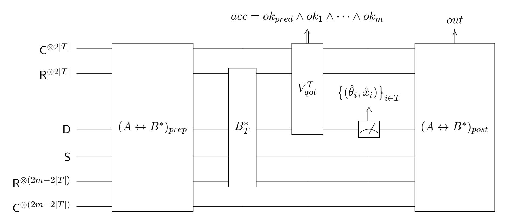

Figure 13: An execution of the quantum oblivious transfer protocol w.r.t. an arbitrary test set T

- The wire out denotes Bob's final output.
- The verification procedure V T qot is specialized from the general verification procedure depicted in Figure [5](#page-16-2) in the following way:
  - 1. The predicate check verifies that the register D stores a set ( ˆθi , xˆi) i∈T such that for each i ∈ T, if ˆθi = θi , then ˆxi = xi .
  - 2. The commitment check verifies that for each i ∈ T, the i-th and the (m + i)-th bit commitments are successfully opened as ˆθi and ˆxi , respectively.

### 6.2 The security against Bob

We first prove the security against Bob when the canonical quantum bit commitment scheme plugged in is perfectly binding.

Lemma 13 Suppose that a canonical quantum bit commitment scheme (Q0, Q1) is perfectly binding. Then the quantum oblivious transfer protocol with this scheme plugged in is secure against any quantum computationally unbounded Bob.

Proof: The proof proceeds in two steps as follows:

- 1. Define a sequence of games such that Bob's output in the last game is identical to that of the first game.
- 2. Convert the Bob who can break the security of the last game into a Bob who will break the same security in the case when a quantum-secure classical perfect unique-binding bit commitment scheme is used.

This will conclude the lemma because the security against Bob when a quantum-secure classical perfect unique-binding bit commitment scheme is used in the quantum oblivious transfer protocol has already been established [\[Yao95,](#page-41-7) [DFL](#page-39-10)+09].

For the first step, the description of each game w.r.t. a fixed test set T is as follows, which will only contain changes w.r.t. the proceeding game.

{29}------------------------------------------------

- Game 0. An execution of the protocol as depicted in Figure 13.
- Game 1. Introduce (in the same way as depicted in Figure 8 for the general case) the commitment measurement  $\Pi$  prior to each copy of the  $U_{com}^{sup}$  within the  $V_{qot}^T$  with indices in the test set T.

We are going to apply Corollary 7 to reduce the security of this game to that of Game 0. We highlight that here since only quantum bit commitments with indices in the test set T are to open, only those corresponding quantum register pairs (C, R) (in total 2|T|) are to be taken into account of. (The remaining pairs are treated as the residual system of the larger system.) Specifically, by the item 2(a) of Corollary 7, introducing commitment measurements will not affect Alice's acceptance probability. We thus have  $\Pr[acc = 1 : \text{Game 1}] = \Pr[acc = 1 : \text{Game 0}]$ . Further, by the item 2(b) of Corollary 7, conditioned on the verification  $V_{qot}^T$  succeeding, we know that the quantum state at the moment prior to the post-processing phase in this game is identical to that of Game 0. Combining these two facts, Bob's output in this game is identical to that of Game 0.

- Game 2. Perform the commitment measurement  $\Pi$  on each copy of the register C with indices outside the test set T at the moment before the verification  $V_{qot}^T$  is performed. Since subsequent to the preparation phase, quantum bit commitments outside the set T are at Alice's hands and will never be used, performing commitment measurements on them will not affect Bob's security. It follows that Bob's output in this game is identical to that of Game 1.
- Game 3. Move all commitment measurements to the end of the preparation phase. Since there are no other operations on the commitment registers  $C^{\otimes 2m}$  between the two moments before and after the movement, nothing will change. It follows that if Bob's output in this game is identical to that of Game 2.

Since the argument above holds for any test set T, it follows that averaging over a random test set T, Bob's output in Game 3 is identical to that of Game 0.

For the second step, we are to convert a Bob  $B^*$  who breaks the security of Game 3 into a Bob  $B^{**}$  who breaks the security in the case when a quantum-secure classical perfect unique-binding bit commitment scheme is used. Note that in Game 3, by the item 1 of Corollary 7, Bob  $B^*$  is "bound" to a string  $s \in \{0,1\}^{2m}$  output by the commitment measurements  $\Pi^{\otimes 2m}$ , in a similar sense to the case when a quantum-secure classical perfect unique-binding bit commitment scheme is used. This inspires us to construct the Bob  $B^{**}$  given access to the Bob  $B^*$  as follows:  $B^{**}$  internally emulates  $B^*$ , except that

- In the preparation phase,  $B^{**}$  does not send quantum bit commitments to Alice; instead, he internally emulates this step.
- At the end of the preparation phase,  $B^{**}$  internally performs the commitment measurements  $\Pi^{\otimes 2m}$ ; let  $s \in \{0,1\}^{2m}$  be the outcome11. Then  $B^{**}$  honestly commits to the 2m-bit string s using the quantum-secure classical perfect unique-binding bit commitment scheme.
- In the verification phase,  $B^{**}$  internally emulates  $B^{*}$ 's opening of quantum bit commitments. For each i  $(1 \le i \le 2m)$ , there are three cases:

The can see from here that the construction is not efficient, because the commitment measurement  $\Pi$  is not efficiently realizable.

{30}------------------------------------------------

- 1. i 6∈ T, i.e. the i-th quantum bit commitment is not to open. B∗∗ will do nothing.
- 2. i ∈ T and the i-th quantum bit commitment is opened successfully. B∗∗ will send the correct decommitment of the i-th classical bit commitment to Alice externally.
- 3. i ∈ T but the i-th quantum bit commitment fails to open. B∗∗ will send a dummy message as the decommitment of the i-th classical bit commitment to Alice externally.

Denote the interaction between honest Alice and Bob B∗ in Game 3 by A ↔ B∗ , and the interaction between honest Alice and Bob B∗∗ when a quantum-secure classical perfect uniquebinding bit commitment scheme is used by A ↔ B∗∗. Now let us compare these two interactions. Note that by the construction of B∗∗, Alice's acceptance probability of the verification in the verification phase is the same for the two interactions. Since in the case that the verification fails the security against B∗∗ is trivial, we suffice to show that conditioned on the verification succeeding, B∗∗'s output is identical to that of B∗ .

For both interactions A ↔ B∗ and A ↔ B∗∗, we restrict our attention to the case in which Alice's verification (in the verification phase) succeeds, and consider the moment before the postprocessing phase. For the former interaction, the state of the whole system at this moment can be written as

$$\sum_{\substack{s \in \{0,1\}^m \\ T \subset \{1,2,\dots,m\}}} p_{s,T} |s\rangle \langle s| \otimes |T\rangle \langle T| \otimes \rho_{s,T}, \tag{10}$$

where 0 ≤ ps,T ≤ 1 satisfying P s,T ps,T = 1, and the density operator ρs,T denotes the state of the whole system other than those storing s respective T. For the latter interaction, by the construction of B∗∗, it is not hard to see that the state of the whole system at this moment can be written as

$$\sum_{\substack{s \in \{0,1\}^m \\ T \subset \{1,2,\dots,m\}}} p_{s,T} |s\rangle \langle s| \otimes |T\rangle \langle T| \otimes \rho_{s,T} \otimes \xi_{s,T}, \tag{11}$$

where the density operator ξs,T denotes the state of the system used for the classical commitments (to the string s) and the corresponding decommitments (w.r.t. to the test set T). A subtlety we would like to point out here, is that the systems holding the state ρs,T within the expressions [\(10\)](#page-30-1) respective [\(11\)](#page-30-2) are divided differently between Alice and Bob: all quantum bit commitments and corresponding decommitments w.r.t. to the test set T are in Alice's hands for the state [\(10\)](#page-30-1) but Bob's hands for the state [\(11\)](#page-30-2).

Now we can conclude that B∗∗'s output is identical to that of B∗ by combing the following two observations: subsequent to the verification phase,

- 1. in the interaction A ↔ B∗∗ the system holding the state ξs,T will not be touched by either Alice or B∗∗. Moreover, the residual state obtained by discarding this system from the state [\(11\)](#page-30-2) exactly gives the state [\(10\)](#page-30-1).
- 2. both the operations of honest Alice and B∗∗ in the interaction A ↔ B∗∗ are identical to those of honest Alice and B∗ in the interaction A ↔ B∗ , respectively. Moreover, these operations do not touch the quantum bit commitments and corresponding decommitments w.r.t. the test set T, regardless of the corresponding system is at whose hands.

This completes the proof of the lemma.

Applying Lemma [8,](#page-20-2) we can further lift the security against Bob to the case in which a canonical statistically-binding quantum bit commitment scheme (Q0, Q1) is used in the quantum oblivious transfer protocol.

{31}------------------------------------------------

Corollary 14 Plug a canonical statistically-binding quantum bit commitment scheme  $(Q_0, Q_1)$  in the quantum oblivious transfer protocol. Then the resulting protocol is secure against any computationally unbounded Bob.

PROOF SKETCH: Consider an execution of the protocol conditioned on an arbitrary test set  $T \subset \{1, 2, ..., m\}$  is chosen. Applying Lemma 8, we can know that the state of the whole system at the end of the verification phase when the schemes  $(Q_0, Q_1)$  respective  $(\tilde{Q}_0, \tilde{Q}_1)$  are used are statistically close. This implies that averaging over a random test set T, the corresponding two quantum states are statistically close12, too. Hence, the security in the case where the perturbed scheme  $(\tilde{Q}_0, \tilde{Q}_1)$  is used, which follows from Lemma 13 by noting that the scheme  $(\tilde{Q}_0, \tilde{Q}_1)$  is perfectly binding, can be lifted to the case where the scheme  $(Q_0, Q_1)$  is used.

### 7 Application 3: quantum proof-of-knowledge

In this section, we plug a canonical perfectly/statistically-binding quantum bit commitment scheme  $(Q_0, Q_1)$  in a variant of Blum's zero-knowledge protocol for the **NP**-complete language Hamiltonian Cycle [Unr12], showing that it gives rise to a quantum *proof-of-knowledge*, a *stronger* security than the soundness against any quantum computationally unbounded prover.

Very roughly, the quantum proof-of-knowledge requires that if a (possibly cheating) prover  $P^*$  can convince the verifier to accept with a probability that is higher than a quantity known as the  $knowledge\ error$ , then there exists a polynomial-time  $extractor\ K^{P^*}$  (a quantum algorithm with black-box access to  $P^*$ ) who can output a witness of the input. The oracle  $P^*$  can be an arbitrary unitary transformation, whose inverse can also be accessed by the extractor K. We remark that it is enough to just keep this informal definition of quantum proof-of-knowledge in one's mind for understanding the security analysis in this section. A formal definition can be adapted from the one in the post-quantum setting [Unr12] straightforwardly.

In contrast to the analyses of two previous applications, the one here takes an *opposite* direction: we try to *remove* (rather than introduce) measurements as possible as we can, so that the weak quantum rewinding lemma can be applied (Lemma 10). We also remark that like the soundness analysis in Section 5, our security analysis of the quantum proof-of-knowledge here can also be adapted to any other GMW-type zero-knowledge protocols (after a similar modification following [Unr12, Unr16b]), in particular the GMW zero-knowledge protocol for the **NP**-complete language Graph 3-Coloring.

In the remainder of this section, we first describe how to modify Blum's protocol and construct the canonical knowledge extractor following [Unr12], and then prove that thus constructed knowledge extractor indeed works.

### 7.1 The actual protocol and the canonical knowledge extractor

Following [Unr12], we modify Blum's protocol by letting the prover in addition *commit to the* response w.r.t. the challenge 0, i.e. the chosen permutation  $\pi$ , in his first message; other parts of the protocol will be modified correspondingly. The actual protocol is described in Figure 14.

A cheating prover  $P^*$  can be represented by three unitary quantum operations  $(U, U_0, U_1)$ , corresponding to the operations of  $P^*$  before sending his first message (i.e. commitments), sending

&lt;sup>12Their distance can be bounded via the fidelity, which is jointly concave.

{32}------------------------------------------------

Common input: a directed graph G with n vertices.

Prover's private input: A Hamiltonian cycle hc of the graph G.

#### Protocol:

P1 The prover first chooses a random permutation π ∈ Sn and commits to (the adjacency matrix of) the graph π(G) and (the permutation matrix corresponding to) the permutation π.

V2 The verifier responds with a uniformly random challenge bit ch ∈ {0, 1}.

P3 If ch = 0, then the prover sends the permutation π, together with the decommitments for all bit commitments, to the verifier. If ch = 1, then the prover sends the location of the n-cycle π(hc), together with the decommitments only for the commitments to (in total n) entries (of the adjacency matrix of the graph π(G)) corresponding to the edges of the n-cycle π(hc), to the verifier.

Verification If ch = 0, then the verifier accepts if and only if all bit commitments are opened as (π(G), π) successfully. If ch = 1, then the verifier accepts if and only if the n bit commitments are opened as all 1's that correspond to an n-cycle.

Figure 14: A variant of Blum's protocol that achieves quantum proof-of-knowledge

the responses w.r.t. the challenge 0 and 1, respectively. Informally, we construct the knowledge extractor KP ∗ as below:

- 1. Perform the operation U on the initial system to obtain the (quantum) commitments.
- 2. Perform the operation U0 to obtain the response w.r.t. the challenge 0.
- 3. Check whether the (honest) verifier will accept w.r.t. the challenge 0: if "yes", then measure the response to obtain a permutation π; otherwise, output "⊥" and halt.
- 4. Rewind P ∗ by performing the operation U † 0 , the inverse of the unitary U0.
- 5. Perform the operation U1 to obtain the response w.r.t. the challenge 1.
- 6. Check whether the (honest) verifier will accept w.r.t. the challenge 1: if "yes", then measure the response to obtain an n-cycle π(hc); otherwise, output "⊥" and halt.
- 7. Compute a Hamiltonian cycle from the two responses obtained from steps 3 respective 6 and check[13](#page-32-1) if it is indeed a Hamiltonian cycle of the input graph G: if "yes", then output it; otherwise, output "⊥" and halt.

The knowledge extractor KP ∗ is formally illustrated in Figure [15](#page-33-1) (without the last classical step), with its explanations as below.

For the quantum registers used by the KP ∗ :

• There are in total 2n 2 copies of the quantum register pairs (C, R), where the upper n 2 copies of the register pair (C, R) are used for committing (the adjacency matrix of) the permuted

13When the binding error of the quantum bit commitment scheme plugged in is non-zero, it is possible that this check will fail.

{33}------------------------------------------------

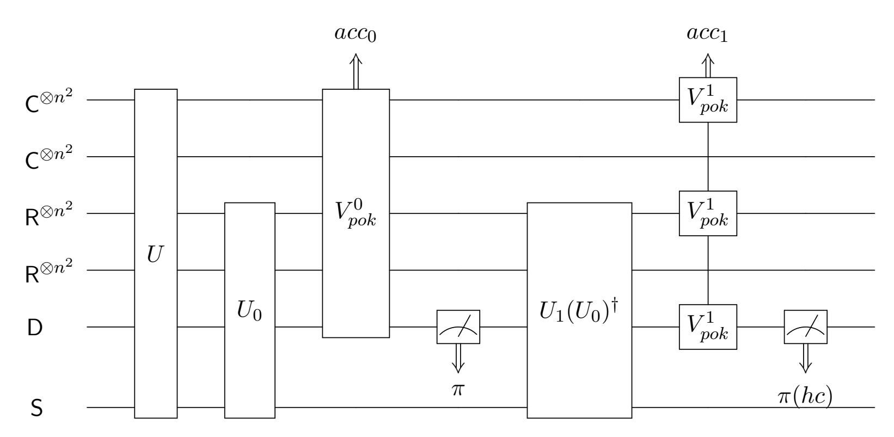

Figure 15: The canonical knowledge extractor  $K^{P^*}$  without the last (classical) step for a variant of Blum's protocol

input graph, while the lower  $n^2$  copies of the register pair (C, R) are used for committing the permutation.

- The opening register D is used to store the classical response w.r.t. the challenge 0 or 1.
- The register S is  $P^*$ 's workspace.

There are two verifications within the  $K^{P^*}$ . The verification  $V_{pok}^0$  is specialized from the general verification depicted in Figure 5 as follows:

- Plug in  $m = 2n^2$ .
- The predicate check verifies that the opening register D contains a permutation  $\pi$ , while the commitment check verifies that all (in total  $2n^2$ ) quantum bit commitments are opened as  $(\pi(G), \pi)$  successfully.
- The classical bit  $acc_0$  indicates whether the verifier is to accept or not w.r.t. the challenge 0.

The verification  $V_{pok}^1$  (split into three boxes as depicted in Figure 15) is specialized from the general verification depicted in Figure 5 as follows:

- Plug in  $m = 2n^2$ .
- The predicate check verifies that (the position of) an *n*-cycle is stored in the opening register D. The commitment check verifies that the *n* quantum bit commitments to the entries corresponding to this cycle are all opened as 1's.
- The classical bit  $acc_1$  indicates whether the verifier is to accept or not w.r.t. the challenge 1.

#### 7.2 The analysis of quantum proof-of-knowledge

In the special case in which the quantum bit commitment scheme plugged in is perfectly binding, we show that the knowledge extractor  $K^{P^*}$  constructed above indeed works by two steps:

{34}------------------------------------------------

- 1. We show that conditioned on both verifications  $(V_{pok}^0)$  and  $V_{pok}^1$ , as illustrated in Figure 15) accepting, the knowledge extractor  $K^{P^*}$  will output a Hamiltonian cycle with certainty.
- 2. We prove a lower bound of the probability that both verifications accept.

The security w.r.t. the perfectly-binding quantum bit commitment can be lifted to the case of statistically-binding quantum bit commitment by applying Lemma 8.

We first prove a lemma as below that will conclude the step 1.

**Lemma 15** Suppose that a canonical quantum bit commitment scheme  $(Q_0, Q_1)$  is perfectly binding. If both the events  $acc_0 = 1$  and  $acc_1 = 1$  happen during an execution of the knowledge extractor (as illustrated in Figure 15), then it will output a Hamiltonian cycle of the input graph G with certainty.

PROOF: The key observation is that by the virtue of (quantum) perfect binding, the honest commitment to a bit  $b \in \{0,1\}$  has no chance of being opened as 1-b. This guarantees that the n-cycle obtained from measuring the response posterior to the  $V_{pok}^1$  can be "embedded" into the graph  $\pi(G)$  for some permutation  $\pi$  that is obtained from measuring the response posterior to the  $V_{pok}^0$ . In more detail, if the event  $acc_0 = 1$  happens, then after the measurement of the response posterior to the  $V_{pok}^0$ , the state of the  $2n^2$  copies of the commitment register C will collapse to the honest commitment to (the adjacency matrix of) the graph  $\pi(G)$ . By perfect binding, only those bit commitments to 1-entries of the adjacency matrix (corresponding to edges of the graph  $\pi(G)$ ) can later be opened as 1 successfully. Henceforth, the event  $acc_1 = 1$  happening later (conditioned on  $acc_0 = 1$ ) implies that the edges of the n-cycle obtained from the measurement of the response posterior to the  $V_{pok}^1$  should also be the edges of the graph  $\pi(G)$ . As such, the knowledge extractor can output a Hamiltonian cycle by applying the permutation  $\pi^{-1}$  to this n-cycle.

**Remark.** We stress that the argument in the proof above no longer holds when the binding error is non-zero (i.e. the quantum bit commitment scheme used is only statistically binding). This is because in that case, the honest commitments to some 0-entries of the adjacency matrix that correspond to non-edges of the graph  $\pi(G)$  might be (with some positive probability) opened as 1's that correspond to edges of the n-cycle.

Next, we prove a lower bound of the probability  $\Pr[acc_0 = 1 \land acc_1 = 1]$  in the following lemma, which will conclude the step 2 of the analysis.

**Lemma 16** Suppose that a canonical quantum bit commitment scheme  $(Q_0, Q_1)$  is perfectly binding. If a prover  $P^*$  can convince the verifier to accept with probability  $1/2 + \delta$  in an execution of the protocol described in Figure 14, where  $\delta > 0$ , then  $Pr[acc_0 = 1 \land acc_1 = 1] \ge \delta^2$  for an execution of the knowledge extractor as illustrated in Figure 15.

PROOF: To simplify the notation, we introduce an random indicator variable acc such that acc = 1 if and only if both events  $acc_0 = 1$  and  $acc_1 = 1$  happen. We will define a sequence of games for the analysis. Let Game 0 denote an execution of the knowledge extractor  $K^{P^*}$  (without the last classical step), as illustrated in Figure 15; our goal is to lowerbound Pr[acc = 1 : Game 0]. We will introduce new games to gradually remove the two intermediate measurements of the opening register D, in such a way that for any two consecutive games i and i + 1, Pr[acc = 1 : Game i] = <math>Pr[acc = 1 : Game i + 1]. If we can do this, then we are sufficient to lowerbound Pr[acc = 1] for the last game, where there are no intermediate measurements other than that of the  $acc_0$  and  $acc_1$ .

{35}------------------------------------------------

With respect to this game, we can apply the weak quantum rewinding lemma (Lemma 10), which will yield a desired lower bound.

Specifically, we define a sequence games as follows such that the description of each game will only contain the changes w.r.t. the proceeding game:

- Game 0. An execution of the knowledge extractor  $K^{P^*}$  (without the last classical step), as illustrated in Figure 15.
- Game 1. Remove the second measurement of the register D, as illustrated in Figure 16. Clearly, removing this post-verification measurement will not affect  $\Pr[acc=1]$ . We thus have  $\Pr[acc=1: \mathsf{Game}\ 1] = \Pr[acc=1: \mathsf{Game}\ 0]$ .

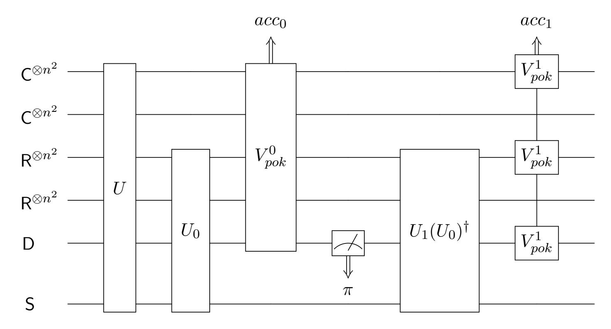

Figure 16: Game 1 for the proof of Lemma 16

• Game 2. At the moment posterior to the verification  $V_{pok}^0$ , instead of measuring the opening register D, now we perform the commitment measurement  $\Pi$  on each of the lower  $n^2$  copies of the commitment register C. This game is illustrated in Figure 18.

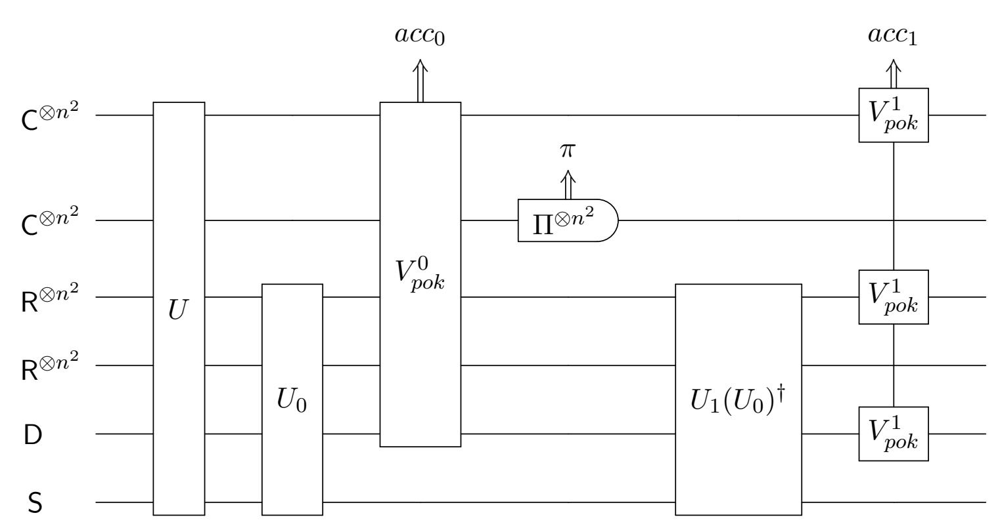

Figure 17: Game 2 for the proof of Lemma 16

{36}------------------------------------------------

Conditioned on  $acc_0 = 1$ , due to the (quantum) perfect binding of the scheme  $(Q_0, Q_1)$ , the measurement of the opening register D and the commitment measurements  $\Pi^{\otimes n^2}$  performing on the lower  $n^2$  copies of the commitment register C are equivalent. Then Lemma 2 ensures us that this replacement of measurements will not change anything; in particular,  $\Pr[acc_1 = 1|acc_0 = 0 : \text{Game 2}] = \Pr[acc_1 = 1|acc_0 = 0 : \text{Game 1}]$ . Hence,  $\Pr[acc = 1 : \text{Game 2}] = \Pr[acc = 1 : \text{Game 2}]$ .

• Game 3. Remove the commitment measurement  $\Pi^{\otimes n^2}$  on the lower  $n^2$  copies of the commitment register C. This game is illustrated in Figure 18.

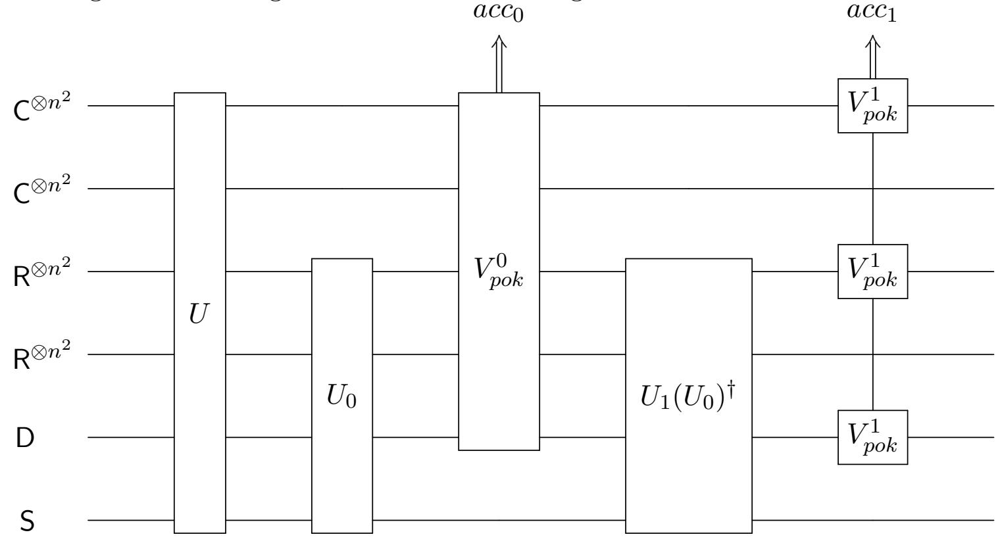

Figure 18: Game 3 for the proof of Lemma 16

Since this measurement comes after the first verification  $V_{pok}^0$ , and is not touched by the second verification  $V_{pok}^1$ , removing it will not affect  $\Pr[acc=1]$ . We thus have  $\Pr[acc=1:$  Game 3] =  $\Pr[acc_1=1:$  Game 2].

We are left to prove  $\Pr[acc = 1 : \mathsf{Game 3}] \geq \delta^2$ . To this end, we apply the weak quantum rewinding lemma (Lemma 10). In more detail, we do the following replacements:

- Plug in k = 2,  $\eta = 1/2 \delta$ .
- Identify the space  $\mathcal{X}$  in the lemma with the space induced by the  $2n^2$  copies of the commitment register  $\mathsf{C}$ , and the space  $\mathcal{Y}$  with the space induced by the residual system.
- Replace  $U_1$  and  $U_2$  in the lemma with  $U_0$  and  $U_1$  here (i.e. the prover  $P^*$ 's operations w.r.t. the challenge 0 and 1, respectively).
- Replace  $\Gamma_1$  and  $\Gamma_2$  in the lemma with  $V_{pok}^0$  and  $V_{pok}^1$  here (which represent two verifications w.r.t. the challenge 0 and 1, respectively).
- Identify the unit vector  $|\psi\rangle$  in the lemma with the state of the whole system at the moment immediately after the operation U is applied in Game 3.

Then from the hypothesis that the prover  $P^*$  can convince the verifier to accept with probability  $1/2 + \delta$ , i.e.

$$\frac{1}{2} \left( \left\| V_{pok}^{0} U_{0} \left| \psi \right\rangle \right\|^{2} + \left\| V_{pok}^{1} U_{1} \left| \psi \right\rangle \right\|^{2} \right) = 1/2 + \delta,$$

{37}------------------------------------------------

applying the weak quantum rewinding lemma, we have

$$\left\| U_1^{\dagger} V_{pok}^1 U_1 \cdot U_0^{\dagger} V_{pok}^0 U_0 |\psi\rangle \right\| \ge 1 - \sqrt{2\left(\frac{1}{2} - \delta\right)} \ge \delta. \tag{12}$$

Note that the probability

$$\Pr[acc=1: \mathsf{Game} \; \mathsf{3}] = \left\|V_{pok}^1 U_1 \cdot U_0^\dagger V_{pok}^0 U_0 \left|\psi\right>\right\|^2,$$

which happens to be equal to the square of l.h.s. of the inequality (12) (within which the leftmost unitary transformation  $U_1^{\dagger}$  does not affect the vector norm of the whole expression). It follows that  $\Pr[acc=1:\mathsf{Game}\ 3]\geq \delta^2$ . This concludes the proof of the lemma.

The following corollary is immediate from Lemma 15 and Lemma 16.

Corollary 17 Suppose that a canonical quantum bit commitment scheme  $(Q_0, Q_1)$  is perfectly binding and plug it in the modified Blum's protocol as described in Figure 14. The resulting protocol gives rises to a quantum proof-of-knowledge with knowledge error 1/2.

PROOF: Suppose that a prover  $P^*$  can convince the verifier to accept with probability  $1/2 + \delta$ , where  $\delta > 0$ . Combing Lemma 15 and Lemma 16, the knowledge extractor  $K^{P^*}$  will output a Hamiltonian cycle of the input graph with probability at least  $\delta^2$ . Hence, the resulting protocol gives rise to a quantum proof-of-knowledge with knowledge error 1/2.

Last, we can lift the corollary above to the case of statistically-binding quantum bit commitment scheme, i.e. the step 3 of the analysis.

Corollary 18 Suppose that a canonical quantum bit commitment scheme  $(Q_0, Q_1)$  is statistically binding and plug it in the modified Blum's protocol as described in Figure 14. The resulting protocol is quantum proof-of-knowledge with the knowledge error 1/2.

PROOF: Suppose that the binding error of the scheme  $(Q_0, Q_1)$  is  $\epsilon$ . Let  $(\tilde{Q}_0, \tilde{Q}_1)$  be the perturbed scheme as guaranteed by Lemma 8. Assume that a prover  $P^*$  can convince the verifier to accept with probability  $1/2 + \delta$ , where  $\delta > 0$ . Since there are at most  $2n^2$  quantum bit commitments opened in an execution of the modified Blum's protocol, by Corollary 9, if the (honest) verifier uses the scheme  $(\tilde{Q}_0, \tilde{Q}_1)$  rather than  $(Q_0, Q_1)$  in the verification, then he/she will accept with probability at least  $1/2 + \delta - 20n^2\sqrt{\epsilon}$ .

Now that the scheme  $(\tilde{Q}_0, \tilde{Q}_1)$  is perfectly binding, if we use the scheme  $(\tilde{Q}_0, \tilde{Q}_1)$  rather than  $(Q_0, Q_1)$  in the knowledge extractor  $K^{P^*}$  (as illustrated in Figure 15), then it will succeed (i.e. output a Hamiltonian cycle of the input graph) with probability at least  $(\delta - 20n^2\sqrt{\epsilon})^2$  (combing Lemma 15 and Lemma 16).

We finally lowerbound the success probability of the knowledge extractor  $K^{P^*}$  in which the scheme  $(Q_0,Q_1)$  is used. Since the there are at most  $2n^2+n$  quantum bit commitments opened in an execution of the knowledge extractor  $K^{P^*}$  (within the  $V_{pok}^0$  and  $V_{pok}^1$ ), applying Corollary 9 again, the knowledge extractor  $K^{P^*}$  will succeed with probability at least  $(\delta - 20n^2\sqrt{\epsilon})^2 - (20n^2 + 10)\sqrt{\epsilon}$ , which is  $\delta^2 - O(n^2\sqrt{\epsilon})$ . This finishes the proof of the corollary.

The completeness and quantum (computational) zero-knowledge of Blum's protocol with a canonical perfectly/statistically-binding quantum bit commitment scheme plugged in extend straightforwardly to the variant described in Figure 15. Combined with Corollary 17 and Corollary 17, we arrive at Theorem 3.

{38}------------------------------------------------

### 8 Conclusion and future work

In this work, we propose a general analysis framework for basing quantum security on the perfect/statistical binding property of canonical quantum bit commitments. We also devise several techniques/tricks to support this framework. For applications, we plug canonical perfectly/statisticallybinding quantum bit commitments in three well-known constructions and establish their (quantum) security. Our results demonstrate that though the general quantum binding may appear relatively weak, it still provides strong enough security so that quantum bit commitments could be useful in quantum cryptography.

### References

- [Aar06] Scott Aaronson. Qma/qpoly ⊆ pspace/poly: De-merlinizing quantum protocols. In CCC, pages 261–273, 2006. [23](#page-22-4)
- [Aar16] Scott Aaronson. The complexity of quantum states and transformations: From quantum money to black holes. arXiv:1607.05256, 2016. [23](#page-22-4)
- [AB09] Sanjeev Arora and Boaz Barak. Computational Complexity: A Modern Approach. Cambridge University Press, 2009. [23](#page-22-4)
- [AC02] Mark Adcock and Richard Cleve. A quantum Goldreich-Levin theorem with cryptographic applications. In STACS, pages 323–334. Springer, 2002. [3](#page-2-3)
- [AQY21] Prabhanjan Ananth, Luowen Qian, and Henry Yuen. Cryptography from pseudorandom quantum states. Cryptology ePrint Archive, Report 2021/1663, 2021. [https:](https://ia.cr/2021/1663) [//ia.cr/2021/1663](https://ia.cr/2021/1663). [6,](#page-5-1) [10](#page-9-3)
- [AQY22] Prabhanjan Ananth, Luowen Qian, and Henry Yuen. Private communication, 2022. [3](#page-2-3)
- [ARU14] Andris Ambainis, Ansis Rosmanis, and Dominique Unruh. Quantum attacks on classical proof systems: The hardness of quantum rewinding. In FOCS, pages 474–483, 2014. [4](#page-3-2)
- [BB21] Nir Bitansky and Zvika Brakerski. Classical binding for quantum commitments. In Kobbi Nissim and Brent Waters, editors, TCC, volume 13042 of Lecture Notes in Computer Science, pages 273–298. Springer, 2021. [10](#page-9-3)
- [BBCS91] Charles H. Bennett, Gilles Brassard, Claude Cr´epeau, and Marie-H´el`ene Skubiszewska. Practical quantum oblivious transfer. In CRYPTO, pages 351–366, 1991. [6,](#page-5-1) [7,](#page-6-1) [27](#page-26-3)
- [BCKM21] James Bartusek, Andrea Coladangelo, Dakshita Khurana, and Fermi Ma. One-way functions imply secure computation in a quantum world. In Tal Malkin and Chris Peikert, editors, CRYPTO, volume 12825 of Lecture Notes in Computer Science, pages 467–496. Springer, 2021. [10](#page-9-3)
- [BF10] Niek J. Bouman and Serge Fehr. Sampling in a quantum population, and applications. In CRYPTO, pages 724–741, 2010. [7,](#page-6-1) [9,](#page-8-1) [27](#page-26-3)
- [Blu86] Manuel Blum. How to prove a theorem so no one else can claim it. In Proceedings of the International Congress of Mathematicians, volume 1, page 2, 1986. [4,](#page-3-2) [7,](#page-6-1) [23,](#page-22-4) [43](#page-42-0)

{39}------------------------------------------------

- [CDMS04] Claude Cr´epeau, Paul Dumais, Dominic Mayers, and Louis Salvail. Computational collapse of quantum state with application to oblivious transfer. In TCC, pages 374– 393, 2004. [3,](#page-2-3) [4,](#page-3-2) [5,](#page-4-2) [43](#page-42-0)
- [CK11] Andr´e Chailloux and Iordanis Kerenidis. Optimal bounds for quantum bit commitment. In FOCS, pages 354–362, 2011. [3](#page-2-3)
- [CKR11] Andr´e Chailloux, Iordanis Kerenidis, and Bill Rosgen. Quantum commitments from complexity assumptions. In ICALP (1), pages 73–85, 2011. [3,](#page-2-3) [9](#page-8-1)
- [CLS01] Claude Cr´epeau, Fr´ed´eric L´egar´e, and Louis Salvail. How to convert the flavor of a quantum bit commitment. In EUROCRYPT, pages 60–77, 2001. [7,](#page-6-1) [8,](#page-7-1) [27](#page-26-3)
- [Cr´e94] Claude Cr´epeau. Quantum oblivious transfer. Journal of Modern Optics, 41(12):2445– 2454, 1994. [6,](#page-5-1) [7,](#page-6-1) [27](#page-26-3)
- [DFL+09] Ivan Damg˚ard, Serge Fehr, Carolin Lunemann, Louis Salvail, and Christian Schaffner. Improving the security of quantum protocols via commit-and-open. In CRYPTO, pages 408–427, 2009. [6,](#page-5-1) [28,](#page-27-2) [29](#page-28-3)
- [DFS04] Ivan Damg˚ard, Serge Fehr, and Louis Salvail. Zero-knowledge proofs and string commitments withstanding quantum attacks. In CRYPTO, pages 254–272, 2004. [4,](#page-3-2) [5](#page-4-2)
- [DMS00] Paul Dumais, Dominic Mayers, and Louis Salvail. Perfectly concealing quantum bit commitment from any quantum one-way permutation. In EUROCRYPT, pages 300– 315, 2000. [1,](#page-0-0) [3,](#page-2-3) [4](#page-3-2)
- [FUYZ20] Junbin Fang, Dominique Unruh, Jun Yan, and Dehua Zhou. How to base security on the perfect/statistical binding property of quantum bit commitment? Cryptology ePrint Archive, Report 2020/621, 2020. <https://ia.cr/2020/621>. [10](#page-9-3)
- [GKM+00] Yael Gertner, Sampath Kannan, Tal Malkin, Omer Reingold, and Mahesh Viswanathan. The relationship between public key encryption and oblivious transfer. In FOCS, pages 325–335, 2000. [27](#page-26-3)
- [GMW91] Oded Goldreich, Silvio Micali, and Avi Wigderson. Proofs that yield nothing but their validity or all languages in NP have zero-knowledge proof systems. J. ACM, 38(3):691– 729, 1991. [6,](#page-5-1) [23,](#page-22-4) [24](#page-23-2)
- [Gol01] Oded Goldreich. Foundations of Cryptography, Basic Tools, volume I. Cambridge University Press, 2001. [3,](#page-2-3) [23](#page-22-4)
- [Gol04] Oded Goldreich. Foundations of Cryptography, Basic Applications, volume II. Cambridge University Press, 2004. [27](#page-26-3)
- [HHRS07] Iftach Haitner, Jonathan J. Hoch, Omer Reingold, and Gil Segev. Finding collisions in interactive protocols - a tight lower bound on the round complexity of statisticallyhiding commitments. In FOCS, pages 669–679, 2007. [3](#page-2-3)
- [KO09] Takeshi Koshiba and Takanori Odaira. Statistically-hiding quantum bit commitment from approximable-preimage-size quantum one-way function. In TQC, pages 33–46, 2009. [3](#page-2-3)

{40}------------------------------------------------

- [KO11] Takeshi Koshiba and Takanori Odaira. Non-interactive statistically-hiding quantum bit commitment from any quantum one-way function. arXiv:1102.3441, 2011. [3](#page-2-3)
- [Kob03] Hirotada Kobayashi. Non-interactive quantum perfect and statistical zero-knowledge. In ISAAC, pages 178–188, 2003. [3](#page-2-3)
- [Kre21] William Kretschmer. Quantum pseudorandomness and classical complexity. In Min-Hsiu Hsieh, editor, TQC, volume 197 of LIPIcs, pages 2:1–2:20. Schloss Dagstuhl - Leibniz-Zentrum f¨ur Informatik, 2021. [10](#page-9-3)
- [LC98] Hoi-Kwong Lo and Hoi Fung Chau. Why quantum bit commitment and ideal quantum coin tossing are impossible. Physica D: Nonlinear Phenomena, 120(1):177–187, 1998. [3](#page-2-3)
- [L´eg00] Fr´ed´eric L´egar´e. Converting the flavor of a quantum bit commitment. PhD thesis, McGill University, 2000. [27](#page-26-3)
- [May97] Dominic Mayers. Unconditionally secure quantum bit commitment is impossible. Physical Review Letters, 78(17):3414–3417, 1997. [3](#page-2-3)
- [MP12] Mohammad Mahmoody and Rafael Pass. The curious case of non-interactive commitments - on the power of black-box vs. non-black-box use of primitives. In CRYPTO 2012, pages 701–718, 2012. [3](#page-2-3)
- [MS94] Dominic Mayers and Louis Salvail. Quantum oblivious transfer is secure against all individual measurements. In Physics and Computation, 1994. PhysComp'94, Proceedings., Workshop on, pages 69–77. IEEE, 1994. [7](#page-6-1)
- [MY21] Tomoyuki Morimae and Takashi Yamakawa. Quantum commitments and signatures without one-way functions. 2021. <https://ia.cr/2021/1691>. [10](#page-9-3)
- [Nao91] Moni Naor. Bit commitment using pseudorandomness. J. Cryptology, 4(2):151–158, 1991. [6,](#page-5-1) [7,](#page-6-1) [10](#page-9-3)
- [NC00] Michael A. Nielsen and Isaac L. Chuang. Quantum computation and Quantum Informatioin. Cambridge University Press, 2000. [12](#page-11-2)
- [Reg06] Oded Regev. Witness-preserving amplification of QMA, 2006. Lecture notes of course Quantum Computation. [8](#page-7-1)
- [RW05] Bill Rosgen and John Watrous. On the hardness of distinguishing mixed-state quantum computations. In CCC, pages 344–354. IEEE Computer Society, 2005. [3](#page-2-3)
- [Unr12] Dominique Unruh. Quantum proofs of knowledge. In EUROCRYPT, pages 135–152, 2012. [3,](#page-2-3) [4,](#page-3-2) [7,](#page-6-1) [8,](#page-7-1) [9,](#page-8-1) [10,](#page-9-3) [23,](#page-22-4) [24,](#page-23-2) [32](#page-31-3)
- [Unr16a] Dominique Unruh. Collapse-binding quantum commitments without random oracles. In ASIACRYPT, pages 166–195, 2016. [3,](#page-2-3) [4,](#page-3-2) [5](#page-4-2)
- [Unr16b] Dominique Unruh. Computationally binding quantum commitments. In EURO-CRYPT, pages 497–527, 2016. [3,](#page-2-3) [4,](#page-3-2) [5,](#page-4-2) [8,](#page-7-1) [32](#page-31-3)

{41}------------------------------------------------

- [vdG97] Jeroen van de Graaf. Towards a formal definition of security for quantum protocols. PhD thesis, Universit´e de Montr´eal, 1997. [4,](#page-3-2) [23](#page-22-4)
- [Wat02] John Watrous. Limits on the power of quantum statistical zero-knowledge. In FOCS, pages 459–468, 2002. [3](#page-2-3)
- [Wat09] John Watrous. Zero-knowledge against quantum attacks. SIAM J. Comput., 39(1):25– 58, 2009. Preliminary version appears in STOC 2006. [4,](#page-3-2) [9,](#page-8-1) [23,](#page-22-4) [24](#page-23-2)
- [Wat18] John Watrous. Theory of Quantum Information. Cambridge University Press, 2018. [12](#page-11-2)
- [Win99] Andreas J. Winter. Coding theorem and strong converse for quantum channels. IEEE Trans. Inf. Theory, 45(7):2481–2485, 1999. [23](#page-22-4)
- [Yan12] Jun Yan. Complete problem for perfect zero-knowledge quantum proof. In SOFSEM, pages 419–430, 2012. [3](#page-2-3)
- [Yan20] Jun Yan. General properties of quantum bit commitments. Cryptology ePrint Archive, Report 2020/1488, 2020. <https://ia.cr/2020/1488>. [6,](#page-5-1) [7,](#page-6-1) [10](#page-9-3)
- [Yan21] Jun Yan. Quantum computationally predicate-binding commitments with application in quantum zero-knowledge arguments for NP. In ASIACRYPT, volume 13090 of Lecture Notes in Computer Science, pages 575–605. Springer, 2021. [10](#page-9-3)
- [Yao95] Andrew Chi-Chih Yao. Security of quantum protocols against coherent measurements. In STOC, pages 67–75, 1995. [7,](#page-6-1) [9,](#page-8-1) [27,](#page-26-3) [29](#page-28-3)
- [YWLQ15] Jun Yan, Jian Weng, Dongdai Lin, and Yujuan Quan. Quantum bit commitment with application in quantum zero-knowledge proof (extended abstract). In ISAAC, pages 555–565, 2015. [1,](#page-0-0) [3,](#page-2-3) [4,](#page-3-2) [5,](#page-4-2) [6,](#page-5-1) [9,](#page-8-1) [10,](#page-9-3) [12,](#page-11-2) [13,](#page-12-1) [18,](#page-17-6) [23,](#page-22-4) [44](#page-43-2)

### A The cheating sender's attack of quantum bit commitments

In this section, we take a closer look at the cheating sender's most general behavior, so as to understand its possible superposition attack.

For simplicity, we treat both the classical and quantum messages in a uniform way; that is, any classical message can be viewed as a quantum message that will be sent through the quantum channel, and the honest receiver will measure it (in the computational basis) immediately upon receiving it. For each party's computation we can assume without loss of generality that it consists of two kinds of operations, unitary transformation and projective measurement.

The cheating sender's possible superposition attack. We consider a typical commit-andopen process in applications, and examine the cheating sender's most general behavior when a canonical quantum bit commitment scheme is used. To better understand the discussion in the below, we consider it will be helpful to keep in one's mind Blum's zero-knowledge protocol for the language Hamiltonian Cycle.

Suppose that the sender is to commit an m-bit string in an arbitrary application; then he/she will commit it bitwisely. We assume that a canonical quantum bit commitment scheme represented by the quantum circuit pair (Q0, Q1) is used (Definition [1\)](#page-11-1). There will be two stages, a commit stage followed by a reveal stage.

{42}------------------------------------------------

In the commit stage, the cheating sender's attack can be modeled by first either preparing an arbitrary quantum state in or performing an arbitrary unitary transformation on the whole system in its hands. Then the commitment register C ⊗m, which is expected to hold m quantum bit commitments, will be sent to the receiver. Among others, a particularly interesting attack by the sender is to commit "honestly" to a superposition of a bunch of (even exponentially many) different m-bit strings. Or put it formally, the sender may prepare a quantum state in its system of the form

$$\sum_{s \in \{0,1\}^m} \alpha_s |s\rangle^D \otimes (Q_s |0\rangle)^{C^{\otimes m} R^{\otimes m}}, \tag{13}$$

where the coefficients αs's are arbitrary such that P s∈{0,1}m |αs| 2 = 1. (Recall that the Qs denotes the quantum circuit to commit the string s (Subsection [2.1\)](#page-11-0).)

In the reveal stage later, things will become complicated. The sender's attack can be modeled by an arbitrary unitary transformation on the whole system in its hands, which in particular includes the decommitment register R ⊗m and the opening register D, but not the commitment register C ⊗m (which is in the receiver's hands). In a simplest case, which is also the case studied before where the parallel composition of quantum bit commitments is treated as a stand-alone object [\[CDMS04\]](#page-39-1), the opening register D is expected to store the string value (an m-bit string) to reveal, and will be sent together with all decommitment register R's to the receiver. For example, if the sender attacked in the commit stage by preparing the quantum state as described in the equation [\(13\)](#page-42-1), then in the reveal stage he/she may do nothing but just sending the quantum registers R ⊗m and D to the receiver; upon receiving them, the receiver will check and accept with certainty. Observe that this is already a superposition attack on the revealed value of quantum bit commitments; different strings may be revealed when the receiver measures the opening register D.

The fact is, the cheating sender can attack in a more complicated way when quantum bit commitments are used within a larger protocol. Recall that in some two-party protocol, e.g. Blum's zero-knowledge protocol for the language Hamiltonian Cycle [\[Blu86\]](#page-38-4), not all bit commitments are necessary to open; sometimes, it is the cheating sender him/herself who sends a message to instruct the receiver which bit commitments are to open. Since this message itself could be in a superposition, the cheating sender may mount a corresponding superposition attack on positions of quantum bit commitments to open. However, one difficulty of mounting such a superposition attack seems that if only a subset of the quantum bit commitments are to open, then which decommitment register R's are to send? Note that this subset only becomes determined after the receiver measures it; but before that moment, all quantum bit commitments have a chance to be opened! However, the sender cannot send all m decommitment register R's to the receiver (according to the larger two-party protocol)!

Suppose that the cardinality of the subset which indicates which quantum bit commitments are to open is at most l(≤ m). To address the difficulty above to mount a superposition attack of the positions of quantum bit commitments to open, the sender can introduce l copies of the register Rˆ which has the same dimension as the decommitment register R and is initialized in the state |0i. In the reveal stage before sending decommitment registers, the sender first swaps the content of the decommitment register R's corresponding to quantum bit commitments that will not be opened with that of the register Rˆ's, under the control of the description of the subset (stored in the opening register D). Then all decommitment register R's together with the opening register D will be sent to the receiver. In this way, for those quantum bit commitments that are to open, the corresponding decommitment register R's hold the desired decommitments, whereas for those are not to open, the corresponding decommitment register R's are just junk (i.e. in the state |0i).

Seeing from the discussion above, by the most general attack a cheating sender is able to entangle

{43}------------------------------------------------

the opening register D, the commitment registers  $C^{\otimes m}$ , as well as the decommitment registers  $R^{\otimes m}$  in such a complicated way that the information about which quantum bit commitments are to open as what value could be in an arbitrary superposition, whereas the receiver will accept with certainty in the reveal stage.

A simplification for analyzing the security against the cheating sender. In the discussion above, the cheating sender may introduce additional register  $\hat{R}$ 's so as to mount a superposition attack on the positions of quantum bit commitments to open. Interestingly, it turns out that for the purpose of the security analysis, these additional registers  $\hat{R}$  are really not needed. This is because regarding the security against the cheating sender, the receiver is *honest*, and the sender can just send *all* decommitment register R's to the receiver, who then performs the verification on quantum registers  $(D, C^{\otimes m}, R^{\otimes m})$ . After that, we let the receiver send back the *unused* decommitment register R's to the sender. In this way, we can get rid of the additional register  $\hat{R}$ 's for the security analysis 14.

### B Omitted proofs in Section 4

#### B.1 Omitted proofs in Subsection 4.1

**Lemma 19 (A restatement of Lemma 3)** Let  $\mathcal{X}, \mathcal{Y}$  be two Hilbert spaces. Unit vectors  $|\varphi_0\rangle, |\varphi_1\rangle \in \mathcal{X} \otimes \mathcal{Y}$ . Let  $\rho_0$  and  $\rho_1$  be the reduced states of  $|\varphi_0\rangle$  and  $|\varphi_1\rangle$  in the Hilbert space  $\mathcal{X}$ , respectively; their fidelity  $F(\rho_0, \rho_1) = \epsilon \geq 0$ . Then there exists a projective measurement  $\Pi = \{\Pi_0, \Pi_1\}$  on the Hilbert space  $\mathcal{X}$  such that

1. 
$$\|(\Pi_0^X \otimes \mathbb{1}^Y) |\varphi_0\rangle\|^2 = \operatorname{Tr}(\Pi_0 \rho_0) \ge 1 - \epsilon, \|(\Pi_1^X \otimes \mathbb{1}^Y) |\varphi_1\rangle\|^2 = \operatorname{Tr}(\Pi_1 \rho_1) \ge 1 - \epsilon.$$

2. 
$$\||\varphi_0\rangle - (\Pi_0^X \otimes \mathbb{1}^Y) |\varphi_0\rangle\| \le \sqrt{2\epsilon}, \ \||\varphi_1\rangle - (\Pi_1^X \otimes \mathbb{1}^Y) |\varphi_1\rangle\| \le \sqrt{2\epsilon}.$$

In particular, when  $F(\rho_0, \rho_1) = 0$ , i.e.  $\rho_0 = \rho_1$ , we have  $Tr(\Pi_0^X \rho_0^X) = 1$ ,  $Tr(\Pi_1^X \rho_1^X) = 1$ ,  $|\varphi_0\rangle = (\Pi_0^X \otimes \mathbb{1}^Y) |\varphi_0\rangle$ , and  $|\varphi_1\rangle = (\Pi_1^X \otimes \mathbb{1}^Y) |\varphi_1\rangle$ .

PROOF: The projective measurement  $\{\Pi_0, \Pi_1\}$  is constructed as below. Since  $\rho_0 - \rho_1$  is Hermitian, consider its spectral decomposition

$$\rho_0 - \rho_1 = \sum_j \lambda_j x_j x_j^{\dagger},$$

where the  $\lambda_j \in \mathbb{R}$  is an eigenvalue (counted with multiplicity) and the  $x_j$  is the corresponding eigenvector. Define orthogonal projectors

$$\Pi_0 = \sum_{i:\lambda_i > 0} x_j x_j^{\dagger}, \quad \Pi_1 = \mathbb{1} - \Pi_0 = \sum_{i:\lambda_i < 0} x_j x_j^{\dagger}.$$

From the assumption that  $F(\rho_0, \rho_1) = \epsilon$ , by Fuchs-van de Graaf inequalities, we have  $\|\rho_0 - \rho_1\|_1 = 2 \cdot TD(\rho_0, \rho_1) \ge 2(1 - \epsilon)$ ; that is,  $\sum_j |\lambda_j| \ge 2(1 - \epsilon)$ . Together with  $Tr(\rho_0 - \rho_1) = 0$ , it follows that

$$\sum_{j:\lambda_i>0} \lambda_j \ge 1-\epsilon, \quad \sum_{j:\lambda_i<0} (-\lambda_j) \ge 1-\epsilon.$$

Thus,  $\text{Tr}(\Pi_0(\rho_0 - \rho_1)) \ge 1 - \epsilon$  and  $\text{Tr}(\Pi_1(\rho_1 - \rho_0)) \ge 1 - \epsilon$ . From that both  $\rho_0$  and  $\rho_1$  are positive semidefinite, we have  $\text{Tr}(\Pi_0\rho_0) \ge 1 - \epsilon$  and  $\text{Tr}(\Pi_1\rho_1) \ge 1 - \epsilon$ . This proves the item 1.

&lt;sup>14We remark that this simplification is already implicitly used without explanation in [YWLQ15].

{44}------------------------------------------------

For the item 2, since the unit vector  $|\varphi_0\rangle$  is a purification of the state  $\rho_0$ , we have

$$\left| \left\langle \varphi_0 \right| \left( \Pi_0^X \otimes \mathbb{1}^Y \right) \left| \varphi_0 \right\rangle \right| = \operatorname{Tr}(\left( \Pi_0^X \otimes \mathbb{1}^Y \right) \left| \varphi_0 \right\rangle \left\langle \varphi_0 \right|) = \operatorname{Tr}(\Pi_0 \rho_0) \ge 1 - \epsilon.$$

It follows that

$$\left\| |\varphi_0\rangle - (\Pi_0^X \otimes \mathbb{1}^Y) |\varphi_0\rangle \right\| = \sqrt{1 - \left| \langle \varphi_0| (\Pi_0^X \otimes \mathbb{1}^Y) |\varphi_0\rangle \right|^2} \le \sqrt{1 - (1 - \epsilon)^2} \le \sqrt{2\epsilon}.$$

We can similarly prove that  $\||\varphi_1\rangle - (\Pi_1^X \otimes \mathbb{1}^Y) |\varphi_1\rangle\| \leq \sqrt{2\epsilon}$ . This finishes the proof of the item 2.

### B.2 Omitted proofs in Subsection 4.2

Lemma 20 (A restatement of Lemma 6) Suppose that a canonical quantum bit commitment scheme  $(Q_0, Q_1)$  is perfectly binding. The procedure of opening a quantum bit commitment with a posterior measurement of the opening information is depicted in Figure 6a, where the quantum circuit  $V_{com}^{sup}$  (which represents opening a quantum bit commitment without measuring the opening information) is as depicted in Figure 2. By introducing a pre-opening commitment measurement, we obtain the quantum circuit as depicted in Figure 6b. Then we have:

- 1. Perform the quantum circuit depicted in Figure 6b on an arbitrary system. Conditioned on ok = 1 and a = 1 (i.e. the quantum bit commitment is opened successfully), the revealed value should be the same as the outcome of the (pre-verification) commitment measurement.
- 2. If we perform the two quantum circuits depicted in Figure 6a respective Figure 6b on the same system, then
  - (a) Pr[ok = 1 : Figure 6a] = Pr[ok = 1 : Figure 6b]. That is, introducing the commitment measurement will not change the probability of the event that either the quantum bit commitment is opened successfully or not opened.
  - (b) Conditioned on ok = 1 and a = 1, the two corresponding final states of the system will be the same. That is, introducing commitment measurement will not affect the post-opening state of the system conditioned on a successful opening.

PROOF: We first prove the item 1. Plugging in the expression of the  $V_{com}^{sup}$  (expression (2)), we have

$$V_{com}^{sup}\Pi_{0}^{C} = (|0\rangle\langle 0|)^{A} \otimes \Pi_{0}^{C} + (|1\rangle\langle 1|)^{A} \otimes \left((|0\rangle\langle 0|)^{B} \otimes (Q_{0}|0\rangle\langle 0|Q_{0}^{\dagger})^{CR}\Pi_{0}^{C} + (|1\rangle\langle 1|)^{B} \otimes (Q_{1}|0\rangle\langle 0|Q_{1}^{\dagger})^{CR}\Pi_{0}^{C}\right)$$

$$= (|0\rangle\langle 0|)^{A} \otimes \Pi_{0}^{C} + (|1\rangle\langle 1|)^{A} \otimes (|0\rangle\langle 0|)^{B} \otimes (Q_{0}|0\rangle\langle 0|Q_{0}^{\dagger})^{CR}, \qquad (14)$$

where in the second equality we use equations in (5). We can similarly show that

$$V_{com}^{sup}\Pi_1^C = (|0\rangle\langle 0|)^A \otimes \Pi_1^C + (|1\rangle\langle 1|)^A \otimes (|1\rangle\langle 1|)^B \otimes (Q_1|0\rangle\langle 0|Q_1^{\dagger})^{CR}. \tag{15}$$

Now consider the scenario when the quantum circuit depicted in Figure 6b is performed on an arbitrary system. Without loss of generality, assume that the outcome of the commitment measurement is 0; the case for the outcome 1 can be established symmetrically. Conditioned on

{45}------------------------------------------------

acc = 1, the state of the system at the moment immediately after the circuit  $V_{com}^{sup}$  is performed should collapse to the subspace induced by the projector (14). Next, measurements of qubits A and B are performed. Seeing from the projector (14), whenever a = 1 is obtained, b = 0, which is equal to the outcome of the commitment measurement. This finishes the proof of the item 1.

We next prove the item 2(a). Let  $|\psi\rangle$  be the initial quantum state of the whole system. Then

$$\Pr[ok = 1 : \text{Figure } 6b] = \left\| V_{com}^{sup} \Pi_0^C |\psi\rangle \right\|^2 + \left\| V_{com}^{sup} \Pi_1^C |\psi\rangle \right\|^2.$$

Plugging in expressions (14) and (15) and applying Pythagorean theorem in various places, the r.h.s. of the equation above

$$\begin{aligned} & \left\| V_{com}^{sup} \Pi_{0}^{C} \left| \psi \right\rangle \right\|^{2} + \left\| V_{com}^{sup} \Pi_{1}^{C} \left| \psi \right\rangle \right\|^{2} \\ &= \left\| \left( \left| 0 \right\rangle \left\langle 0 \right| \otimes \Pi_{0} \right) \left| \psi \right\rangle \right\|^{2} + \left\| \left( \left| 1 \right\rangle \left\langle 1 \right| \otimes \left| 0 \right\rangle \left\langle 0 \right| \otimes Q_{0} \left| 0 \right\rangle \left\langle 0 \right| Q_{0}^{\dagger} \right) \left| \psi \right\rangle \right\|^{2} \\ &+ \left\| \left( \left| 0 \right\rangle \left\langle 0 \right| \otimes \Pi_{1} \right) \left| \psi \right\rangle \right\|^{2} + \left\| \left( \left| 1 \right\rangle \left\langle 1 \right| \otimes \left| 1 \right\rangle \left\langle 1 \right| \otimes Q_{1} \left| 0 \right\rangle \left\langle 0 \right| Q_{1}^{\dagger} \right) \left| \psi \right\rangle \right\|^{2} \\ &= \left\| \left( \left| 0 \right\rangle \left\langle 0 \right| \right) \left| \psi \right\rangle \right\|^{2} + \left\| \left( \left| 1 \right\rangle \left\langle 1 \right| \right) \otimes \left( \left| 0 \right\rangle \left\langle 0 \right| \otimes Q_{0} \left| 0 \right\rangle \left\langle 0 \right| Q_{0}^{\dagger} + \left| 1 \right\rangle \left\langle 1 \right| \otimes Q_{1} \left| 0 \right\rangle \left\langle 0 \right| Q_{1}^{\dagger} \right) \left| \psi \right\rangle \right\|^{2} \\ &= \left\| \left( \left| 0 \right\rangle \left\langle 0 \right| \right)^{A} \otimes \mathbb{1}^{BCR} + \left( \left| 1 \right\rangle \left\langle 1 \right| \right)^{A} \otimes \left( \left( \left| 0 \right\rangle \left\langle 0 \right| \right)^{B} \otimes \left( Q_{0} \left| 0 \right\rangle \left\langle 0 \right| Q_{0}^{\dagger} \right)^{CR} + \left( \left| 1 \right\rangle \left\langle 1 \right| \right)^{B} \otimes \left( Q_{1} \left| 0 \right\rangle \left\langle 0 \right| Q_{1}^{\dagger} \right)^{CR} \right) \left| \psi \right\rangle \right\|^{2} \\ &= \left\| V_{com}^{sup} \left| \psi \right\rangle \right\|^{2} = \Pr[ok = 1 : \text{Figure } 6a], \end{aligned}$$

where in the second "=" we additionally use the fact that  $\Pi_0 + \Pi_1 = 1$ . This finishes the proof of item 2(a).

Lastly, we prove the item 2(b). Let  $|\psi\rangle$  be the initial quantum state of the whole system. We consider the scenario in which both acc=1 and a=1, and a bit  $b\in\{0,1\}$  is revealed. Then the system on which the quantum circuit depicted in Figure 6a is performed will collapse to the (unnormalized) state  $(|1\rangle\langle 1|)^A\otimes(|b\rangle\langle b|)^B)V_{com}^{sup}|\psi\rangle$ , with probability the square of its norm. Similarly, the system on which the quantum circuit depicted in Figure 6b is performed will collapse to the (unnormalized) state  $(\Pi_b(|1\rangle\langle 1|)^A\otimes(|b\rangle\langle b|)^B)V_{com}^{sup}|\psi\rangle$ , with probability the square of its norm. We thus suffice to show that

$$\Pi_b^C((|1\rangle\langle 1|)^A \otimes (|b\rangle\langle b|)^B)V_{com}^{sup} = (|1\rangle\langle 1|)^A \otimes (|b\rangle\langle b|)^B)V_{com}^{sup}.$$
 (16)

Indeed, plugging in the expression (2),

$$(|1\rangle\langle 1|)^A \otimes (|b\rangle\langle b|)^B) V_{com}^{sup} = |1\rangle\langle 1|\otimes|b\rangle\langle b|\otimes Q_b|0\rangle\langle 0|Q_b^{\dagger}.$$
(17)

Thus,

$$\Pi_{b}^{C}(\ket{1}\bra{1})^{A}\otimes(\ket{b}\bra{b})^{B})V_{com}^{sup}=\ket{1}\bra{1}\otimes\ket{b}\bra{b}\otimes(\Pi_{b}^{C}Q_{b}\ket{0}\bra{0}Q_{b}^{\dagger})=\ket{1}\bra{1}\otimes\ket{b}\bra{b}\otimes Q_{b}\ket{0}\bra{0}Q_{b}^{\dagger},$$

where in the second "=" we use equations in (5). Combined with the equation (17), this proves the equation (16), and in turn the item 2(b).

Corollary 21 (A restatement of Corollary 7) Suppose that a canonical quantum bit commitment scheme  $(Q_0, Q_1)$  is perfectly binding. A typical verification involving opening quantum bit commitments with a posterior measurement of the opening register is depicted in Figure 7. For

{46}------------------------------------------------

the i-th  $(1 \le i \le m)$  copy of the  $U_{com}^{sup}$ , let  $a_i$  and  $b_i$  denote the bits (which can be computed from the opening information d; recall the second remark in Subsection 3.2) indicating whether the i-th quantum bit commitment is to open and what value is to reveal, respectively. By introducing a commitment measurement on the commitment register C prior to each copy the  $U_{com}^{sup}$ , we obtain the quantum circuit depicted in Figure 8. Then we have:

- 1. Perform the quantum circuit depicted in Figure 8 on an arbitrary quantum system. Conditioned on acc = 1 and  $a_i = 1$ , the revealed value  $b_i$  should be the same as the outcome of the corresponding commitment measurement.
- 2. If we perform the two quantum circuits depicted in Figure 7 respective Figure 8 on the same system, then
  - (a) Pr[acc = 1 : Figure 7] = Pr[acc = 1 : Figure 8]. That is, introducing commitment measurements will not change the success probability of the verification.
  - (b) Conditioned on acc = 1 and  $a_1 = a_2 = \cdots = a_m = 1$ , the two corresponding final states of the system will be the same. That is, introducing commitment measurements will not affect the post-verification state of the system conditioned on that the verification succeeds and all quantum bit commitments are opened.

PROOF: We introduce measurements of qubits  $ok_{pred}$  and all  $ok_i$ 's  $(1 \le i \le m)$  to both quantum circuits depicted in Figure 7 and Figure 8; moreover, since now each qubit  $ok_i$  is measured, we can simplify each copy of the  $U_{com}^{sup}$  to  $V_{com}^{sup}$ . (Recall the third remark in Subsection 3.2.) The resulting quantum circuits are depicted in Figure 19 and Figure 20, respectively. When the quantum circuits depicted in Figure 7 or Figure 8 are performed on an arbitrary system, since the event acc = 1 implies that  $ok_{pred} = 1$  and  $ok_1 = ok_2 = \cdots = ok_m = 1$ , Lemma 2 ensures that introducing measurements as above will affect nothing conditioned on the event acc = 1 happening. Moreover, since the opening register D is measured, combining the third remark in Subsection 3.2 and Lemma 2, we can assume without loss of generality that the control qubits A and B for each copy of the  $V_{com}^{sup}$  within the quantum circuits depicted in Figure 19 and Figure 20 are measured at moment immediately after the corresponding  $V_{com}^{sup}$  is performed. We thus suffice to prove that both items of the corollary hold with respect to the quantum circuits depicted in Figure 19 and Figure 20, instead of the ones depicted in Figure 7 and Figure 8, respectively. The benefit of introducing additional measurements is so that we can prove the corollary using a simple hybrid argument together with Lemma 6. Detail follows.

For the item 1 with respect to the quantum circuit depicted Figure 20, we can view each copy of the  $V_{com}^{sup}$ , together with the corresponding commitment measurement prior to it and the measurements of its control bits A and B posterior to it, are performed one by one sequentially. For the *i*-th such performance, applying the item 1 of Lemma 6 will yield that conditioned on  $ok_i = 1$  and  $a_i = 1$ , the revealed value  $b_i$  should be the same as the outcome of the corresponding commitment measurement. Combined with the observation that acc = 1 implies  $ok_i = 1$  for all *i*'s where  $1 \le i \le m$ , this proves the item 1.

For the item 2 with respect to the quantum circuits depicted in Figure 19 respective Figure 20, we use a simple hybrid argument. Specifically, we define the Hybrid 0 as the quantum circuit depicted in Figure 19; the Hybrid i ( $1 \le i \le m$ ) is obtained from the Hybrid i-1 by additionally performing the commitment measurement  $\Pi$  prior to the i-th copy of the  $V_{com}^{sup}$ . It is easy to see that the Hybrid m is just the quantum circuit depicted in Figure 8. It then suffice to prove that the item 2 of the corollary hold with respect to Hybrid i and Hybrid i+1 for each i ( $1 \le i \le m$ ).

{47}------------------------------------------------

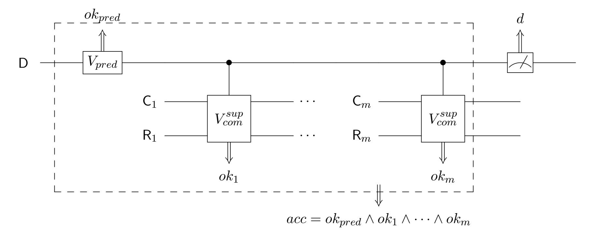

Figure 19: The quantum circuit obtained from the one depicted in Figure 7 by introducing more measurements

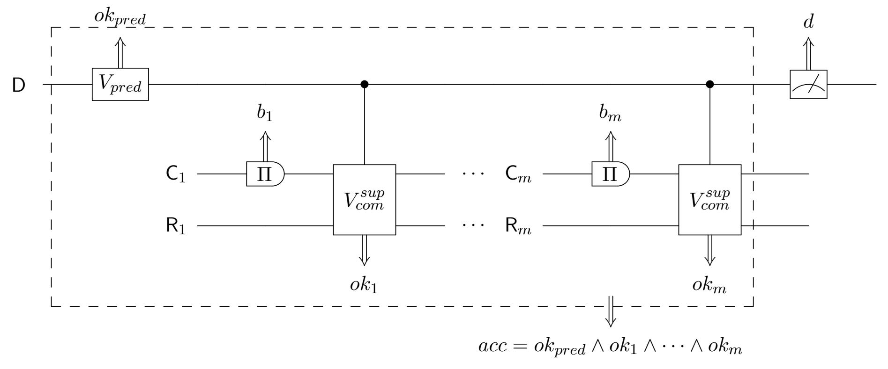

Figure 20: The quantum circuit obtained from the one depicted in Figure 8 by introducing more measurements

Now let us fix an arbitrary i such that  $0 \le i \le m-1$ . The Hybrid i can be viewed as proceeding in two steps:

- 1. Perform the quantum circuit corresponding to the Hybrid i, with the (i+1)-th copy of the  $V_{com}^{sup}$  as well as the measurements of its corresponding control bits A and B removed.
- 2. Perform the measurements removed in the first step.

Compared with the Hybrid i, the Hybrid i+1 only differs in the second step, where an additional commitment measurement  $\Pi$  is performed prior to the (i+1)-th copy of the  $V_{com}^{sup}$ . Now we consider the state of the quantum system at the end of the step 1 conditioned on  $ok_{pred} = 1$  and each  $ok_j = 1$  except for j = i+1. Then we plug the (i+1)-th copy of quantum registers (A, B, C, R) in Lemma 6, and apply the item 2(a) of Lemma 6 to finish the proof of the item 1 (i.e. the probabilities of the event acc = 1 happening are the same if we perform the Hybrid i respective the Hybrid i+1 on the same system); if we further condition on  $ok_{i+1} = 1$  and  $a_{i+1} = 1$ , then simply applying the

{48}------------------------------------------------

item 2(b) of Lemma 6 will finish the proof of the item 2(b) (i.e. the final states are the same if we perform the Hybrid i respective the Hybrid i + 1 on the same system).

#### B.3 Omitted proofs in Subsection 4.3

Lemma 22 (A restatement of Lemma 8) Suppose that a canonical quantum bit commitment scheme  $(Q_0, Q_1)$  is statistically  $\epsilon$ -binding. Then there exists a perfectly-binding scheme  $(\tilde{Q}_0, \tilde{Q}_1)$  which approximates the scheme  $(Q_0, Q_1)$  in the following sense. Consider an arbitrary quantum security game in which there are in total m (counted with repetitions) quantum bit commitments opened. Let  $\rho$  and  $\tilde{\rho}$  be the output quantum states of the games when schemes  $(Q_0, Q_1)$  and  $(\tilde{Q}_0, \tilde{Q}_1)$  are used in opening quantum bit commitments, respectively. Then  $TD(\rho, \tilde{\rho}) \leq 10m\sqrt{\epsilon}$ .

PROOF: To bound the perturbation incurred by replacing the scheme  $(Q_0, Q_1)$  with the scheme  $(\tilde{Q}_0, \tilde{Q}_1)$  in the security game, we proceed in two steps:

- 1. Purify all (non-unitary) operations (if any) in the security game in the standard way;
- 2. Show that the operator norm of the difference between the unitary transformations induced by the original purified game respective the perturbed one is statistically negligible.

For the step 1, by the quantum computational model we have chosen, the only possible non-unitary operations appeared in any security game are projective measurements, which can be purified in a standard way. In particular, similar to the  $U_{com}^{sup}$  (illustrated in Figure 4) that is a unitary simulation of the  $V_{com}^{sup}$  (illustrated in Figure 2), we let the  $\tilde{U}_{com}^{sup}$  be a unitary simulation of the  $\tilde{V}_{com}^{sup}$  (illustrated in Figure 2). Correspondingly, the expression of the  $\tilde{U}_{com}^{sup}$  can be obtained by adapting the one for  $U_{com}^{sup}$  (the equation (3)), which is given by

$$\tilde{U}_{com}^{sup} = (|0\rangle\langle 0|)^{A} \otimes \mathbb{1}^{BCR} \otimes X^{O} 
+ (|1\rangle\langle 1|)^{A} \otimes (\mathbb{1}^{B} \otimes U_{\mathcal{M}_{|0\rangle}}^{CRO}) ((|0\rangle\langle 0|)^{B} \otimes (Q_{0}^{\dagger}R_{0}^{\dagger})^{CR} + (|1\rangle\langle 1|)^{B} \otimes (Q_{1}^{\dagger}R_{1}^{\dagger})^{CR}) \otimes \mathbb{1}^{O}).$$
(18)

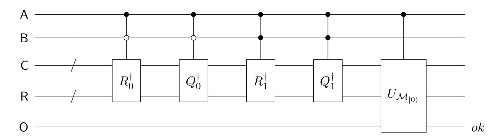

Figure 21: Quantum circuit  $\tilde{U}_{com}^{sup}$  that is a unitary simulation of  $\tilde{V}_{com}^{sup}$ .

For the step 2, the (purified) quantum circuit corresponding the security game is only perturbed at places where the quantum circuit  $U_{com}^{sup}$  occurs. Since  $\tilde{V}_{com}^{sup}$  is an approximation of  $V_{com}^{sup}$ , it is not hard to see that  $\tilde{U}_{com}^{sup}$  is also an approximation of  $U_{com}^{sup}$ , as formally stated in the following claim.

Claim 23 
$$\left\| U_{com}^{sup} - \tilde{U}_{com}^{sup} \right\| \le 4\sqrt{\epsilon}.$$

{49}------------------------------------------------

PROOF: Plugging in equations (3) and (18),

$$\begin{aligned} \left\| U_{com}^{sup} - \tilde{U}_{com}^{sup} \right\| &= \left\| (|0\rangle \langle 0|)^B \otimes Q_0^{\dagger} (\mathbb{1} - R_0^{\dagger}) + (|1\rangle \langle 1|)^B \otimes Q_1^{\dagger} (\mathbb{1} - R_1^{\dagger}) \right\| \\ &\leq \left\| \mathbb{1} - R_0^{\dagger} \right\| + \left\| \mathbb{1} - R_1^{\dagger} \right\|. \end{aligned}$$

Since the eigenvalues of the rotation by an angle  $\theta$  are given by  $\cos \theta \pm i \sin \theta$ , it follows that the eigenvalues of  $\mathbb{1} - R_b^{\dagger}$  are  $1 - \cos \theta_b \pm i \sin \theta_b$ , where  $b \in \{0, 1\}$ . Therefore,

$$\left\| \mathbb{1} - R_b^{\dagger} \right\| = \sqrt{(1 - \cos \theta_b)^2 + \sin^2 \theta_b} = \sqrt{2 - 2\cos \theta_b} \le \sqrt{2 - 2\sqrt{1 - \epsilon}} \le 2\sqrt{\epsilon},$$

where in the first " $\leq$ " we use the inequality (6). The claim then follows immediately.

In a purified security game in which at most m quantum bit commitments are opened, the quantum circuit  $U_{com}^{sup}$  is performed at most m times. Let PG and  $\widetilde{PG}$  denote the quantum circuits corresponding to the purified security game and the perturbed one, respectively. Combing Claim 23 and the triangle inequality of the operator norm, we know that  $\|PG - \widetilde{PG}\| \leq 4m\sqrt{\epsilon}$ .

Let  $|\psi\rangle$  and  $|\tilde{\psi}\rangle$  be the final states of the *whole* system corresponding to the purified security game and the perturbed one, respectively. From the inequality  $\left\|PG - \widetilde{PG}\right\| \leq 4m\sqrt{\epsilon}$ , we know that  $\left\||\psi\rangle - |\tilde{\psi}\rangle\right\| \leq 4m\sqrt{\epsilon}$ , hence  $\left|\langle\psi|\tilde{\psi}\rangle\right| \geq 1 - 8m^2\epsilon$ . We thus have

$$\mathrm{TD}(\rho, \tilde{\rho}) \leq \mathrm{TD}(|\psi\rangle, |\tilde{\psi}\rangle) = 2\sqrt{1 - \left|\langle\psi|\tilde{\psi}\rangle\right|^2} \leq 10m\sqrt{\epsilon}.$$

This finishes the proof of the lemma.

Corollary 24 (A restatement of Corollary 9) Consider an arbitrary quantum security game in which there are in total m (counted with repetitions) quantum bit commitments are opened and which outputs just one classical bit. Let  $p_0$  and  $p_{\epsilon}$  denote the probabilities of this classical bit being one when a perfectly-binding and a statistically  $\epsilon$ -binding quantum bit commitment scheme is used, respectively. Then  $|p_{\epsilon} - p_0| \leq 10m\sqrt{\epsilon}$ .

PROOF: Denote the statistically  $\epsilon$ -binding quantum bit commitment scheme by  $(Q_0, Q_1)$  and its approximation as guaranteed in Lemma 8 by  $(\tilde{Q}_0, \tilde{Q}_1)$ . Note that the scheme  $(\tilde{Q}_0, \tilde{Q}_1)$  is perfectly binding. Since the quantum security game outputs just a classical bit, it can be represented by a mixed quantum state; denote this state by  $\rho_{\epsilon}$  and  $\rho_0$  when the schemes  $(Q_0, Q_1)$  and  $(\tilde{Q}_0, \tilde{Q}_1)$  are used, respectively. Then

$$|p_{\epsilon} - p_0| = \text{TD}(\rho_{\epsilon}, \rho_0) \le 10m\sqrt{\epsilon}.$$

#### B.4 Omitted proofs in Subsection 4.4

**Lemma 25 (A restatement of Lemma 10)** Let  $\mathcal{X}$  and  $\mathcal{Y}$  be two Hilbert spaces. Unit vector  $|\psi\rangle \in \mathcal{X} \otimes \mathcal{Y}$ . Orthogonal projectors  $\Gamma_1, \ldots, \Gamma_k$  perform on the space  $\mathcal{X} \otimes \mathcal{Y}$ , and unitary transformations  $U_1, \ldots, U_k$  perform on the space  $\mathcal{Y}$ . If  $1/k \cdot \sum_{i=1}^k \left\| \Gamma_i(U_i \otimes \mathbb{1}^X) |\psi\rangle \right\|^2 \geq 1 - \eta$ , where  $0 \leq \eta \leq 1$ , then

$$\left\| (U_k^{\dagger} \otimes \mathbb{1}^X) \Gamma_k (U_k \otimes \mathbb{1}^X) \cdots (U_1^{\dagger} \otimes \mathbb{1}^X) \Gamma_1 (U_1 \otimes \mathbb{1}^X) \left| \psi \right\rangle \right\| \geq 1 - \sqrt{k\eta}.$$

{50}------------------------------------------------

PROOF: From the assumption that  $1/k \cdot \sum_{i=1}^{k} \|\Gamma_i U_i |\psi\rangle\|^2 \ge 1 - \eta$ , we have

$$\eta \geq 1 - \frac{1}{k} \sum_{i=1}^{k} \|\Gamma_{i} U_{i} |\psi\rangle\|^{2} = \frac{1}{k} \sum_{i=1}^{k} \left(1 - \|\Gamma_{i} U_{i} |\psi\rangle\|^{2}\right) 
= \frac{1}{k} \sum_{i=1}^{k} \|\Gamma_{i} U_{i} |\psi\rangle - U_{i} |\psi\rangle\|^{2} 
= \frac{1}{k} \sum_{i=1}^{k} \|U_{i}^{\dagger} \Gamma_{i} U_{i} |\psi\rangle - |\psi\rangle\|^{2},$$

where the second "=" is by noting that  $1 - \|\Gamma_i U_i \|\psi\rangle\|^2$  is equal to the square of the projection of  $U_i \|\psi\rangle$  on the subspace  $\mathbb{1} - \Gamma_i$ . Rearranging terms, we get

$$\sum_{i=1}^{k} \left\| U_i^{\dagger} \Gamma_i U_i |\psi\rangle - |\psi\rangle \right\|^2 \le k\eta. \tag{19}$$

We claim that

$$\left\| |\psi\rangle - (U_k^{\dagger} \Gamma_k U_k) \cdots (U_1^{\dagger} \Gamma_1 U_1) |\psi\rangle \right\|^2 \le \sum_{i=1}^k \left\| U_i^{\dagger} \Gamma_i U_i |\psi\rangle - |\psi\rangle \right\|^2. \tag{20}$$

If this is true, then combining inequalities (19) and (20), we have

$$\||\psi\rangle - (U_1^{\dagger}\Gamma_1 U_1) \cdots (U_k^{\dagger}\Gamma_k U_k)|\psi\rangle\| \le \sqrt{k\eta}.$$

Applying the triangle inequality to the left hand side of the inequality above and rearranging terms, we arrive at

$$\left\| (U_1^{\dagger} \Gamma_1 U_1) \cdots (U_k^{\dagger} \Gamma_k U_k) |\psi\rangle \right\| \ge 1 - \sqrt{k\eta},$$

as desired.

We are left to prove the inequality (20), which will be done by induction on the k.

- 1.  $\underline{k=1}$ . The "=" of the inequality (20) holds trivially.
- 2. Suppose that the inequality (20) holds for k-1. We prove that it also holds for the k.

$$\begin{aligned} & \left\| |\psi\rangle - (U_{k}^{\dagger}\Gamma_{k}U_{k}) \cdots (U_{1}^{\dagger}\Gamma_{1}U_{1}) |\psi\rangle \right\|^{2} \\ &= \left\| |\psi\rangle - (U_{k}^{\dagger}\Gamma_{k}U_{k}) |\psi\rangle \right\|^{2} + \left\| (U_{k}^{\dagger}\Gamma_{k}U_{k}) |\psi\rangle - (U_{k}^{\dagger}\Gamma_{k}U_{k}) \cdots (U_{1}^{\dagger}\Gamma_{1}U_{1}) |\psi\rangle \right\|^{2} \\ &\leq \left\| |\psi\rangle - (U_{k}^{\dagger}\Gamma_{k}U_{k}) |\psi\rangle \right\|^{2} + \left\| |\psi\rangle - (U_{k-1}^{\dagger}\Gamma_{k-1}U_{k-1}) \cdots (U_{1}^{*}\Gamma_{1}U_{1}) |\psi\rangle \right\|^{2} \\ &\leq \left\| |\psi\rangle - (U_{k}^{\dagger}\Gamma_{k}U_{k}) |\psi\rangle \right\|^{2} + \sum_{i=1}^{k-1} \left\| U_{i}^{\dagger}\Gamma_{i}U_{i} |\psi\rangle - |\psi\rangle \right\|^{2} \\ &= \sum_{i=1}^{k} \left\| U_{i}^{\dagger}\Gamma_{i}U_{i} |\psi\rangle - |\psi\rangle \right\|^{2}. \end{aligned}$$

where the first "=" follows from Pythagorean theorem by observing that subspaces  $U_k^{\dagger}\Gamma_k U_k$  and  $\mathbb{1} - U_k^{\dagger}\Gamma_k U_k$  are orthogonal; in the second " $\leq$ ", we use the induction hypothesis. This finishes the proof of the inequality (20), and thus that of the lemma.