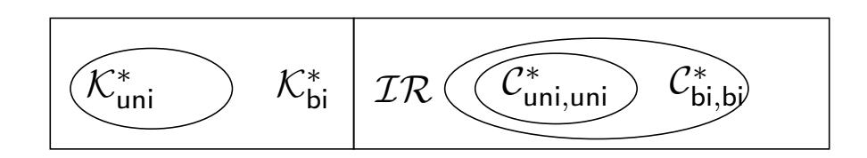

{0}------------------------------------------------

# The Direction of Updatable Encryption does not Matter Much

# Yao Jiang

Norwegian University of Science and Technology, NTNU, Norway. yao.jiang@ntnu.no

June 20, 2021

#### Abstract

Updatable encryption schemes allow for key rotation on ciphertexts. A client outsourcing storage of encrypted data to a cloud server can change its encryption key. The cloud server can update the stored ciphertexts to the new key using only a token provided by the client.

This paper solves two open problems in updatable encryption, that of uni-directional vs. bidirectional updates, and post-quantum security.

The main result in this paper is to analyze the security notions based on uni- and bi-directional updates. Surprisingly, we prove that uni- and bi-directional variants of each security notion are equivalent.

The second result in this paper is to provide a new and efficient updatable encryption scheme based on the Decisional Learning with Error assumption. This gives us post-quantum security. Our scheme is bi-directional, but because of our main result, this is sufficient.

<sup>†</sup> c IACR 2020: An extended abstract of this paper appears in the proceedings of Asiacrypt 2020, with DOI: [10.1007/978-3-030-64840-4\\_18.](https://doi.org/10.1007/978-3-030-64840-4_18) This is the full and updated version. A summary of the changes made in the update is given in Section [1.5.](#page-5-0)

{1}------------------------------------------------

# Contents

| 1 |     | Introduction                                                                               | 3  |
|---|-----|--------------------------------------------------------------------------------------------|----|
|   | 1.1 | Related Work<br>                                                                           | 4  |
|   | 1.2 | Our Contributions                                                                          | 5  |
|   | 1.3 | Open Problems<br>                                                                          | 5  |
|   | 1.4 | Organization                                                                               | 6  |
|   | 1.5 | Changes w.r.t. the Asiacrypt2020 Version.<br>                                              | 6  |
| 2 |     | Preliminaries                                                                              | 6  |
|   | 2.1 | Notations<br>                                                                              | 6  |
|   | 2.2 | Security Notions for Encryption Schemes<br>                                                | 6  |
|   | 2.3 | Updatable Encryption                                                                       | 7  |
|   | 2.4 | Existing Security Notions for Updatable Encryption                                         | 7  |
|   | 2.5 | Notations of the Leakage Sets<br>                                                          | 10 |
|   | 2.6 | Epoch Leakage Sets of Keys, Tokens and Ciphertexts<br>                                     | 11 |
|   | 2.7 | Trivial Win Conditions<br>                                                                 | 12 |
|   |     | 2.7.1<br>Checking Trivial Win Conditions at the End of a Game                              | 12 |
|   |     | 2.7.2<br>Checking Trivial Win Conditions while Running a Game                              | 13 |
|   |     | Six Variants of Security Notions                                                           | 15 |
| 3 | 3.1 | Properties of Leakage Sets and Trivial Win Conditions<br>                                  | 15 |
|   |     | 3.1.1<br>Properties of Key Updates<br>                                                     | 15 |
|   |     | 3.1.2<br>Trivial Win Equivalences<br>                                                      | 17 |
|   | 3.2 | Relations among Security Notions<br>                                                       | 20 |
|   |     | 3.2.1<br>Relations between the Uni- and Bi-Directional Update Variants of Security Notions | 21 |
|   |     | 3.2.2<br>Relations between the No-Directional and the Directional Variants of Security     |    |
|   |     | Notions<br>                                                                                | 22 |
| 4 |     | LWE-based PKE Scheme                                                                       | 25 |
|   | 4.1 | PKE Construction                                                                           | 25 |
|   | 4.2 | Correctness and Security<br>                                                               | 26 |
| 5 |     | LWE-based Updatable Encryption Scheme                                                      | 28 |
|   | 5.1 | UE Construction<br>                                                                        | 28 |
|   | 5.2 | Construction Challenges in LWE-based UE Schemes<br>                                        | 28 |
|   | 5.3 | Correctness<br>                                                                            | 29 |
|   | 5.4 | Challenges of the Security Proof in LWE-based UE Schemes                                   | 30 |
|   | 5.5 | Security<br>                                                                               | 30 |
|   |     | 5.5.1<br>Technical Simulations in the Proof                                                | 31 |
|   |     | LWEUE<br>is randIND-UE-CPA<br>5.5.2<br>                                                    | 31 |
| A |     | Lattice Background                                                                         | 39 |
|   | A.1 | Hardness Assumptions – Learning With Errors<br>                                            | 39 |
|   | A.2 | Leftover Hash Lemma<br>                                                                    | 41 |

{2}------------------------------------------------

# <span id="page-2-0"></span>1 Introduction

Consider the following scenario: a client wishes to outsource data to a cloud storage provider with a cryptoperiod (client key lifetime). The cryptoperiod is decided by the client or the cloud storage provider or both. If the key lifetime is expired, the old key is no longer available for either encryption or decryption, a new key must be used in the new cryptoperiod. However, the client might still want to keep the data in the cloud storage in the new cryptoperiod and needs to update the data. The above requirement implies a need to update ciphertext from the old key to the new key. During this process, it is also reasonable to expect that no information of plaintexts are leaked while updating. Another benefit to consider in such a scenario is that it can be used to protect the data and reduce the risk of key compromise over time.

*Key rotation* is the process of generating a new key and altering ciphertexts from the old key to the new key without changing the underlying massage.

Key rotation can be done by downloading the old ciphertext, decrypting with the old key, reencrypting with a new key and reuploading the new ciphertext. However, this is expensive. *Updatable encryption* (UE) [\[BLMR13,](#page-37-0) [EPRS17,](#page-37-1) [LT18,](#page-38-2) [KLR19,](#page-38-3) [BDGJ20,](#page-37-2) [BEKS20\]](#page-37-3) provides a better solution for key rotation. A client generates an *update token* and send it to the cloud server, the cloud server can use this update token to update the ciphertexts from the old key to the new key. In recent years there has been considerable interest in understanding UE, including defining the security notions for UE and constructing UE schemes (we make a detailed comparison of related work in Section [1.1\)](#page-3-0).

Consider the following two variants of UE schemes: *ciphertext-dependent* schemes and *ciphertextindependent* schemes. If the generation of update token depends on the ciphertext to be updated then the UE scheme is ciphertext-dependent. In ciphertext-dependent schemes, the updating process of a ciphertext requires a specific token which forces the client to download the old ciphertext before this token can be generated. Therefore, ciphertext-dependent schemes are less practical. If the token is independent of the old ciphertext then the UE scheme is ciphertext-independent. Hence, a single token can be used to update all ciphertexts a client owns. As ciphertext-independent schemes are considerably more efficient than ciphertext-dependent schemes, in terms of bandwidth, most recent works [\[BLMR15,](#page-37-4) [LT18,](#page-38-2) [KLR19,](#page-38-3) [BDGJ20\]](#page-37-2) focus on ciphertext-independent schemes. In this paper, we will focus on such schemes.

Consider the following four variants of update setting for ciphertext-independent UE schemes: *unidirectional ciphertext* updates, *bi-directional ciphertext* updates, *uni-directional key* updates and *bidirectional key* updates. If the update token can only move ciphertexts from the old key to the new key then ciphertext updates in such UE schemes are uni-directional. If the update token can additionally downgrade ciphertexts from the new key to the old key then ciphertext updates in such UE schemes are bi-directional. On the other hand, the update token can potentially be used to derive keys from other keys. In the uni-directional key update setting, the update token can only infer the new key from the old key. While in the bi-directional key update setting, the update token can both upgrade and downgrade keys. Prior works [\[BLMR15,](#page-37-4) [LT18,](#page-38-2) [KLR19,](#page-38-3) [BDGJ20\]](#page-37-2) focus on UE schemes with bi-directional updates, and no security notion was introduced in uni-directional update setting. We close this gap. Intuitively, UE schemes with uni-directional updates are desirable, such schemes leak less ciphertext/key information to an adversary compared to schemes with bi-directional updates. In this paper, we analyze the relationship between security notions with uni- and bi-directional updates. We show that the (confidentiality and integrity) security of UE schemes are not influenced by uni- or bi-directional updates.

*No-directional key* updates is another key update setting to consider, where the update token cannot be used to derive keys. A UE scheme with optimal leakage, discussed in [\[LT18\]](#page-38-2), is a scheme where no token inference (no token can be inferred via keys), keys cannot be updated via a token, and ciphertext updates are only uni-directional. We do not consider no token inference, instead in this work an update token can be computed via two consecutive epoch keys. We show that the no-directional key update variant of a confidentiality notion is strictly stronger than the uni- and bi-directional update variant of the same confidentiality notion.

{3}------------------------------------------------

While the study of security notions appears promising, existing ciphertext-independent UE schemes are either vulnerable to quantum computers or only achieve weak security. The schemes of Lehmann and Tackmann [\[LT18\]](#page-38-2), Klooß et al. [\[KLR19\]](#page-38-3) and Boyd et al. [\[BDGJ20\]](#page-37-2) base their security on the DDH problem, and thus are only secure in the classical setting. Boneh et al. [\[BLMR13\]](#page-37-0) constructed key homomorphic PRFs, based on the learning with errors (LWE) problem, and it can be used to construct UE schemes. However, all of these schemes of Boneh et al. [\[BLMR13\]](#page-37-0) cannot achieve IND-UPD security (introduced in [\[LT18\]](#page-38-2)).

In this work, we construct a post-quantum secure UE scheme and the security of our construction is based on hard lattice problems. In particular, our scheme provides the randIND-UE-CPA security (introduced in [\[BDGJ20\]](#page-37-2), stronger than IND-UPD and IND-ENC security).

Efficiency. All of the previous known ciphertext-independent UE schemes with security proofs (RISE, E&M, NYUE (NYUAE), SHINE) have computation cost that are comparable to PKE schemes that rely on the DDH problem, while our scheme has a computation cost that is comparable to PKE schemes that rely on lattice problems.

# <span id="page-3-0"></span>1.1 Related Work

Security Notions. Boneh et al. [\[BLMR13\]](#page-37-0) introduced a security definition for UE, however, this notion is less adaptive than the later works [\[LT18,](#page-38-2) [KLR19,](#page-38-3) [BDGJ20\]](#page-37-2) which allows the adversary to adaptively corrupt epoch keys and update tokens at any point in the game.

In the ciphertext-dependent setting, Everspaugh et al. [\[EPRS17\]](#page-37-1) provided two security notions, a weak form of ciphertext integrity and re-encryption indistinguishability, that strengthen the security notion in [\[BLMR13\]](#page-37-0). Recently, Boneh et al. [\[BEKS20\]](#page-37-3) introduced new definitions for updatable encryption in the ciphertext-dependent setting to further strengthen the confidentiality property and the integrity definition in [\[EPRS17\]](#page-37-1). Boneh et al. [\[BEKS20\]](#page-37-3) stated that for authenticated updatable encryption schemes it is necessary to expect that ciphertexts will not reveal how many times they have been updated, which was a desired property independently presented in [\[BDGJ20\]](#page-37-2).

Lehmann and Tackmann [\[LT18\]](#page-38-2) introduced two notions to achieve CPA security for ciphertextindependent UE schemes. Their IND-ENC notion requires that ciphertexts output by the encryption algorithm are indistinguishable from each other. Their IND-UPD notion ensures ciphertexts output by the update algorithm are indistinguishable from each other.

Klooß et al. [\[KLR19\]](#page-38-3) attempted to provide stronger security notions for ciphertext-independent UE than LT18, specifically, CCA security and integrity protection.

Boyd et al. [\[BDGJ20\]](#page-37-2) provided a new notion IND-UE which states that a ciphertext output by the encryption algorithm is indistinguishable from a ciphertext output by the update algorithm. They showed that the new notion is strictly stronger than any combinations of prior notions, both under CPA and CCA. They also tweaked the CTXT and CCA notions in [\[KLR19\]](#page-38-3) and showed the following generic composition result: CPA + CTXT =⇒ CCA.

Constructing Ciphertext-Independent Updatable Encryption Schemes. The UE scheme BLMR in [\[BLMR13\]](#page-37-0) is an application of key homomorphic PRFs, however, the encrypted nonce in the ciphertext can be decrypted by an update token which makes it impossible for BLMR to achieve IND-UPD security.

In the classical setting, RISE in [\[LT18\]](#page-38-2) is built from (public-key) ElGamal encryption, which only uses the public key in the update token. The security of RISE is based on the DDH assumption. Klooß et al. [\[KLR19\]](#page-38-3) provided two generic constructions, based on encrypt-and-MAC (E&M) and the Naor-Yung paradigm (NYUE and NYUAE). The security of E&M is based on the DDH assumption, and the security of NYUE and NYUAE are based on the SXDH assumption. Boyd et al. [\[BDGJ20\]](#page-37-2) constructed three permutation-based UE schemes, SHINE, which achieves strong security notions based on DDH.

{4}------------------------------------------------

Post-Quantum Secure Schemes. In the past decade, much work has been done on constructing lattice-based post-quantum secure PKE schemes, specifically the NIST Post-Quantum Standardization Project, round 2, submissions: CRYSTALS-KYBER [\[ABD](#page-37-5)+b], FrodoKEM [\[ABD](#page-36-0)+a], LAC [\[LLJ](#page-38-4)+], NewHope [\[ADPS16\]](#page-37-6), NTRU [\[CDH](#page-37-7)+, [BCLvV17\]](#page-37-8), Round5 [\[OZS](#page-38-5)+], SABER [\[DKRV18\]](#page-37-9) and Three Bears [\[Ham\]](#page-38-6). A natural question is if we can turn a PKE scheme into a UE scheme, where the security of the UE follows from the PKE. We provide a specific UE scheme that is built form an LWE-based PKE scheme, and prove the security. The LWE-based scheme we use is in some sense very similar to RISE (which is based on ElGamal), however, as with most lattice-based constructions, there are significant technical problems in turning it into a UE scheme (see Section [5.2\)](#page-27-2). Our LWE-based UE construction suggests that there is a limit to how generic any efficient construction can be, a generic construction that abstracts both our construction and RISE remains to be done.

# <span id="page-4-0"></span>1.2 Our Contributions

Our first contribution is defining six variants of security notions (a combination of three versions of key updates and two versions of ciphertext updates) for updatable encryption and analyzing the relations among these six variants of the same notion.

Our main result is that we demonstrate that our security notions with uni- and bi-directional updates are equivalent. When we analyze the security, we can treat UE schemes with uni-directional updates as with bi-directional updates, the security will not be influenced by the update direction. This means that UE schemes with uni-directional updates will not provide more security than UE schemes with bidirectional updates. This is a surprising result.[1](#page-4-2) This result implies that the search for uni-directional updatable encryption scheme seems less important.

Furthermore, we show that confidentiality notions with no-directional key updates are strictly stronger than uni- and bi- directional update variants of the corresponding notions. Finding UE schemes with nodirectional key updates would be good, but it is much more challenge than finding UE schemes with uni-directional key updates (which is already believed to be difficult). We leave this as an open problem.

Our second major contribution is constructing an efficient post-quantum secure UE scheme. We analyze how to construct LWE-based updatable encryption schemes and provide one construction. Our construction follows the re-randomization idea of RISE, using public key in the update token to update ciphertexts. We build a suitable post-quantum secure PKE scheme to construct our UE scheme so that the encryption and update algorithms can use a public key as input instead of the secret key. We also show the difficulties of turning a PKE scheme into a UE scheme.

We show that our LWE-based UE scheme is randIND-UE-CPA secure under the DLWE assumption. In the randomized update setting, we show the difference between previous work (RISE, NYUE, NYUAE) and our scheme, and state that the method used in proving the security of LWE-based updatable encryption scheme is different from the previous approach.

## <span id="page-4-1"></span>1.3 Open Problems

Ideally we want UE schemes with no-directional key updates, no such UE schemes have been constructed so far. Whether such UE schemes exist and how to construct such UE schemes are still open problems.

<span id="page-4-2"></span><sup>1</sup> It is possible to construct a scenario where this result will not be true. Let's assume there exists a UE scheme with a leakage function that helps the adversary win the security game. This leakage function could, for example, give the adversary information about plaintexts when it knows enough keys. In this scenario, a UE scheme with uni-directional updates has better security than a UE scheme with bi-directional updates. Because the scheme with uni-directional updates has less key leakage and the leakage function provides less data to the adversary. However, this and similar constructions cannot capture the security we wish to have for UE schemes. In terms of the security expectation of key rotation, the keys used in the past should not reveal any data.

For constructions that do follow the security model and update mechanism for UE schemes, we have this surprising result.

{5}------------------------------------------------

Furthermore, not that many efficient UE schemes with strong security exist so far. It remains an open challenge to construct UE schemes with chosen ciphertext<sup>2</sup> post-quantum security.

# <span id="page-5-1"></span>1.4 Organization

We provide the background of updatable encryption in Section 2. In Section 3 we define the six variants of security notions for UE schemes and prove the relations among the six variants of security notions.

In Section 4 we construct an LWE-based PKE scheme LWEPKE and prove that it is secure, this PKE scheme will be used to construct a UE scheme. We then construct an LWE-based UE scheme LWEUE in Section 5, and include the restrictions we encountered when constructing a secure UE scheme from a PKE scheme.

# <span id="page-5-0"></span>1.5 Changes w.r.t. the Asiacrypt2020 Version.

In this updated version we correct two misconceptions present in our original paper. First, one of the trivial win conditions for integrity notions (see page 14) is insufficient when we consider no-directional key update variant of integrity notions. Trivial forgeries by keys (the trivial win condition named in the old version) should be extended to trivial forgeries by keys and tokens (the trivial win condition named in this updated version). Second, the relation between the no-directional and the directional variants of integrity notion (see Section 3.2.2) is influenced by the above mistake.

## <span id="page-5-2"></span>2 Preliminaries

In this section we describe the notation used in this paper and present the necessary background material of updatable encryption. In Appendix A, we provide the background of hard lattice problems.

#### <span id="page-5-3"></span>2.1 Notations

Let  $\lambda$  be the security parameter throughout the paper. Let negl denote as a negligible function. The notation  $X \stackrel{s}{\approx} Y$  ( $X \stackrel{c}{\approx} Y$ , resp.) means X is statistically indistinguishable (computationally indistinguishable, resp.) from Y. Let  $\mathcal{U}(S)$  denote the uniform distribution over set S.

### <span id="page-5-4"></span>2.2 Security Notions for Encryption Schemes

We describe the real or random variant of indistinguishability under chosen-plaintext attack (IND\$-CPA) for public key encryption (PKE) and symmetric key encryption (SKE). Note that IND\$-CPA implies IND-CPA.

<span id="page-5-6"></span>**Definition 1.** [The IND\$-CPA notion for PKE] Let PKE = (PKE.KG, PKE.Enc, PKE.Dec) be a public key encryption scheme. The IND\$-CPA advantage of any adversary  $\mathcal A$  against PKE is

$$\mathbf{Adv}_{\mathsf{PKE},\ \mathcal{A}}^{\mathsf{IND\$-CPA}}(1^{\lambda}) = \left| \Pr[\mathbf{Exp}_{\mathsf{PKE},\ \mathcal{A}}^{\mathsf{IND\$-CPA-1}} = 1] - \Pr[\mathbf{Exp}_{\mathsf{PKE},\ \mathcal{A}}^{\mathsf{IND\$-CPA-0}} = 1] \right|,$$

where the experiment  $\mathbf{Exp}_{\mathsf{PKE},\ \mathcal{A}}^{\mathsf{IND\$-CPA-b}}$  is given in Figure 1.

**Definition 2.** [The IND\$-CPA notion for SKE] Let SKE = (SKE.KG, SKE.Enc, SKE.Dec) be a symmetric key encryption scheme. The IND\$-CPA advantage of any adversary  $\mathcal A$  against SKE is

$$\mathbf{Adv}_{\mathsf{SKE},\ \mathcal{A}}^{\mathsf{IND\$-CPA}}(1^{\lambda}) = \left| \Pr[\mathbf{Exp}_{\mathsf{SKE},\ \mathcal{A}}^{\mathsf{IND\$-CPA-1}} = 1] - \Pr[\mathbf{Exp}_{\mathsf{SKE},\ \mathcal{A}}^{\mathsf{IND\$-CPA-0}} = 1] \right|,$$

where the experiment  $\mathbf{Exp}_{\mathsf{SKE}}^{\mathsf{IND\$-CPA-b}}$  is given in Figure 2.

<span id="page-5-5"></span><sup>&</sup>lt;sup>2</sup>It is ideal to achieve detIND-UE-CCA security for UE schemes with deterministic updates and to achieve INT-PTXT and randIND-UE-CCA security for UE schemes with randomized updates.

{6}------------------------------------------------

```
ExpIND$-CPA-b
    PKE, A
                :
 (s, p) ← PKE.KG
 (m,state) ← A(p)
 if b = 0 then
   c ← PKE.Enc(p, m)
 else
   c
     $←− CS
 b
   0 ← A(state, c)
 return b
          0
                                                   ExpIND$-CPA-b
                                                        SKE, A
                                                                   :
                                                     s ← SKE.KG
                                                     (m,state) ← A(1λ
                                                                        )
                                                     if b = 0 then
                                                       c ← SKE.Enc(s, m)
                                                     else
                                                       c
                                                        $←− CS
                                                     b
                                                      0 ← A(state, c)
                                                     return b
                                                             0
```

Figure 1: The experiment ExpIND\$-CPA-<sup>b</sup> PKE, A for a PKE scheme PKE.

<span id="page-6-3"></span>Figure 2: The experiment ExpIND\$-CPA-<sup>b</sup> SKE, A for a SKE scheme SKE.

Definition 3. [Correctness of a PKE] Let PKE = (PKE.KG, PKE.Enc, PKE.Dec) be a public key encryption scheme. We say PKE has *(*1−*)-correctness* if: for any message m, any key (s, p) ← PKE.KG

$$\mathbf{Pr}[\mathsf{PKE}.\mathsf{Dec}(\mathbf{s},\mathsf{PKE}.\mathsf{Enc}(\mathbf{p},\mathbf{m})) = \mathbf{m}] \ge 1 - \epsilon.$$

# <span id="page-6-0"></span>2.3 Updatable Encryption

Updatable encryption (UE) scheme is parameterized by a tuple of algorithms {UE.KG,UE.TG,UE.Enc, UE.Dec,UE.Upd} that operate in epochs, the epoch starts at 0. The key generation algorithm UE.KG outputs an epoch key ke. The token generation algorithm UE.TG takes as input two epoch keys k<sup>e</sup> and ke+1 and outputs an update token ∆e+1, the update token can be used to move ciphertexts from epoch e to e+ 1. The encryption algorithm UE.Enc takes as input an epoch key k<sup>e</sup> and a message m and outputs a ciphertext ce. The decryption algorithm UE.Dec takes as input an epoch key k<sup>e</sup> and a ciphertext c<sup>e</sup> and outputs a message m<sup>0</sup> . The update algorithm UE.Upd takes as input an update token ∆e+1 and a ciphertext c<sup>e</sup> from epoch e and outputs an updated ciphertext ce+1.

We stress that an update token can be computed via two consecutive epoch keys by token generation algorithm in this paper.

In the updatable encryption setting, the total number of epoch will be a comparatively small integer in practice, we consider the total number of epoch to be bounded in this paper. In particular, we denote l as an upper bound on the last epoch.

Definition 4 (Correctness of an UE). Let UE = {UE.KG,UE.TG,UE.Enc, UE.Dec,UE.Upd} be an updatable encryption scheme. We say UE has *(*1 − *)-correctness* if: for any message m and any epochs e<sup>1</sup> ≤ e<sup>2</sup> ≤ l, we have

$$\begin{aligned} \mathbf{Pr}[\mathsf{UE}.\mathsf{Dec}(\mathbf{k}_{\mathsf{e}_2},\mathbf{c}_{\mathsf{e}_2}) &= \mathbf{m}] \geq 1 - \epsilon, \\ \mathsf{where} \ \mathbf{k}_{\mathsf{e}_1},...,\mathbf{k}_{\mathsf{e}_2} &\stackrel{\$}{\leftarrow} \mathsf{UE}.\mathsf{KG}(1^\lambda), \, \mathbf{c}_{\mathsf{e}_1} &\stackrel{\$}{\leftarrow} \mathsf{UE}.\mathsf{Enc}(\mathbf{k}_{\mathsf{e}_1},\mathbf{m}), \, \mathsf{and} \\ \Delta_j &\leftarrow \mathsf{UE}.\mathsf{TG}(\mathbf{k}_{j-1},\mathbf{k}_j), \mathbf{c}_j \leftarrow \mathsf{UE}.\mathsf{Upd}(\Delta_j,\mathbf{c}_{j-1}), \, \, \mathsf{for} \, j \in \{\mathsf{e}_1+1,...,\mathsf{e}_2\}. \end{aligned}$$

# <span id="page-6-1"></span>2.4 Existing Security Notions for Updatable Encryption

Klooß et al. [\[KLR19\]](#page-38-3) and Boyd et al. [\[BDGJ20\]](#page-37-2) defined the confidentiality and the integrity notions for updatable encryption schemes using experiments that are running between an adversary and a challenger. In each experiment, the adversary may send a number of oracle queries. The main differences between an experiment running the confidentiality game and one running the integrity game are the challenge and win condition. In the confidentiality game, the adversary tries to distinguish a fresh encryption from an updated ciphertext. In the integrity game, the adversary attempts to provide a valid forgery. At the end of an experiment the challenger evaluates whether or not the adversary wins, if a trivial win condition was triggered the adversary will always lose.

{7}------------------------------------------------

We follow the notation of security notions from Boyd et al. [BDGJ20]. An overview of the oracles the adversary has access to in each security game is given in Fig. 3. A generic description of all confidentiality experiments and integrity experiments described in this paper is detailed in Fig. 4 and Fig. 5, resp.. Our oracle algorithms, see Fig. 6, are stated differently than in [BDGJ20] and [KLR19], however, conceptually they are the same. The oracles we use in our security games are as follows, encrypt  $\mathcal{O}$ . Enc, decrypt  $\mathcal{O}$ . Dec, move to the next epoch  $\mathcal{O}$ . Next, update ciphertext  $\mathcal{O}$ . Upd, corrupt key or token  $\mathcal{O}$ . Corr, ask for the challenge ciphertext  $\mathcal{O}$ . Chall, get an updated version of the challenge ciphertext  $\mathcal{O}$ . Upd $\tilde{\mathsf{C}}$ , or test if a ciphertext is a valid forgery  $\mathcal{O}$ . Try. The detailed discussion of trivial win conditions are discussed in Section 2.7.

<span id="page-7-0"></span>

| Notions        | $\mathcal{O}$ .Enc | $\mathcal{O}.Dec$ | $\mathcal{O}.Next$ | $\mathcal{O}.Upd$ | $\mathcal{O}.Corr$ | $\mathcal{O}.Chall$ | $\mathcal{O}.Upd\tilde{C}$ | $\mathcal{O}.Try$ |
|----------------|--------------------|-------------------|--------------------|-------------------|--------------------|---------------------|----------------------------|-------------------|
| detIND-UE-CPA  | <b>√</b>           | ×                 | <b>√</b>           | <b>√</b>          | <b>√</b>           | <b>√</b>            | <b>√</b>                   | ×                 |
| randIND-UE-CPA | ✓                  | ×                 | $\checkmark$       | $\checkmark$      | $\checkmark$       | $\checkmark$        | $\checkmark$               | ×                 |
| detIND-UE-CCA  | $\checkmark$       | $\checkmark$      | $\checkmark$       | $\checkmark$      | $\checkmark$       | $\checkmark$        | $\checkmark$               | ×                 |
| randIND-UE-CCA | $\checkmark$       | $\checkmark$      | $\checkmark$       | $\checkmark$      | $\checkmark$       | $\checkmark$        | $\checkmark$               | ×                 |
| INT-CTXT       | $\checkmark$       | ×                 | $\checkmark$       | $\checkmark$      | $\checkmark$       | ×                   | ×                          | $\checkmark$      |
| INT-PTXT       | <b>√</b>           | ×                 | $\checkmark$       | $\checkmark$      | $\checkmark$       | ×                   | ×                          | $\checkmark$      |

Figure 3: Oracles given to the adversary in different security games for updatable encryption schemes.  $\times$  indicates the adversary does not have access to the corresponding oracle,  $\checkmark$  indicates the adversary has access to the corresponding oracle.

```
\begin{split} & \frac{\mathbf{Exp}_{\mathsf{UE},\ \mathcal{A}}^{\mathsf{xxIND-UE-atk-b}}:}{\mathbf{do\ Setup}; \, \mathsf{phase}} \leftarrow 0 \\ & \mathbf{b}' \leftarrow \mathcal{A}^{oracles}(1^{\lambda}) \\ & \quad \text{if } \left( (\mathcal{K}^* \cap \mathcal{C}^* \neq \emptyset) \,\, \mathbf{or} \,\, (\mathsf{xx}\!=\!\mathsf{det} \,\, \mathbf{and} \right) \\ & \quad \left( \tilde{\mathsf{e}} \!\in\! \mathcal{T}^* \,\, \mathbf{or} \,\, \mathcal{O}. \mathsf{Upd}(\bar{\mathbf{c}}) \,\, \mathsf{is} \,\, \mathsf{queried}) \right) \,\, \mathbf{then} \\ & \quad \mathsf{twf} \leftarrow 1 \\ & \quad \mathsf{if} \,\, \mathsf{twf} = 1 \,\, \mathbf{then} \\ & \quad \mathsf{b}' \leftarrow \{0,1\} \\ & \quad \mathbf{return} \,\, \mathsf{b}' \end{split} \qquad \qquad \qquad \qquad \qquad \qquad \qquad \qquad \qquad \qquad \qquad \qquad \qquad \qquad \qquad \qquad \qquad \qquad
```

Figure 4: Generic description of the confidentiality experiment  $\mathbf{Exp}_{\mathsf{UE},\ \mathcal{A}}^{\mathsf{xxIND-UE-atk-b}}$  for updatable encryption scheme UE and adversary  $\mathcal{A}$ , for  $\mathsf{xx} \in \{\mathsf{det}, \mathsf{rand}\}$  and atk  $\in \{\mathsf{CPA}, \mathsf{CCA}\}$ . The flag phase tracks whether or not  $\mathcal{A}$  has queried the  $\mathcal{O}.\mathsf{Chall}$  oracle,  $\tilde{\mathsf{e}}$  denotes the epoch in which the  $\mathcal{O}.\mathsf{Chall}$  oracle happens, and twf tracks if the trivial win conditions are triggered. Fig. 3 shows the oracles the adversary have access to in a specific security game. How to compute the leakage sets  $\mathcal{K}^*, \mathcal{T}^*, \mathcal{C}^*$  are discussed in Section 2.6.

<span id="page-7-2"></span>Figure 5: Generic description of the integrity experiment  $\mathbf{Exp}_{\mathsf{UE},\ \mathcal{A}}^{\mathsf{INT-atk}}$  for updatable encryption scheme UE and adversary  $\mathcal{A}$ , for atk  $\in \{\mathsf{CTXT},\mathsf{PTXT}\}$ . The flag win tracks whether or not the adversary provided a valid forgery and twf tracks if the trivial win conditions are triggered. Fig. 3 shows the oracles the adversary have access to in a specific security game.

<span id="page-7-3"></span>For the confidentiality game we have the following additional definitions that we will frequently use. While the security game is running, the adversary may query  $\mathcal{O}$ . Enc or  $\mathcal{O}$ . Upd oracles or corrupt tokens to know some (updated) versions of ciphertexts, we call them *non-challenge ciphertexts*. In addition, the adversary may query  $\mathcal{O}$ . Chall or  $\mathcal{O}$ . Upd $\tilde{\mathsf{C}}$  oracles or corrupt tokens to infer some (updated) versions of the challenge ciphertext, we call them *challenge-equal ciphertexts*.

{8}------------------------------------------------

```
\mathcal{O}.\mathsf{Corr}(\mathsf{inp},\hat{e}):
\mathbf{Setup}(1^{\lambda})
                                                                                                                                                                                          if \hat{e} > e then
      \mathbf{k}_0 \stackrel{\$}{\leftarrow} \mathsf{UE}.\mathsf{KG}(1^{\lambda})
                                                                                                                                                                                                 return \perp
       \Delta_0 \leftarrow \perp; e, c, twf \leftarrow 0
                                                                                                                                                                                          if inp = key then
      \mathcal{L}, \tilde{\mathcal{L}}, \mathcal{C}, \mathcal{K}, \mathcal{T} \leftarrow \emptyset
                                                                                                                                                                                                \mathcal{K} \leftarrow \mathcal{K} \cup \{\hat{\mathsf{e}}\}\
                                                                                                                                                                                                 return k<sub>ê</sub>
\mathcal{O}.\mathsf{Enc}(\mathbf{m}) :
                                                                                                                                                                                          if inp = token then
      c \leftarrow c + 1
                                                                                                                                                                                                 \mathcal{T} \leftarrow \mathcal{T} \cup \{\hat{\mathsf{e}}\}\
      \mathbf{c} \overset{\$}{\leftarrow} \mathsf{UE}.\mathsf{Enc}(\mathbf{k}_\mathsf{e},\mathbf{m})
                                                                                                                                                                                                 return \Delta_{\hat{\mathbf{e}}}
      \mathcal{L}\!\leftarrow\!\mathcal{L}\!\cup\!\{(c,\mathbf{c},e;\mathbf{m})\}
       return c
                                                                                                                                                                                    \mathcal{O}.\mathsf{Chall}(\bar{\mathbf{m}},\bar{\mathbf{c}}):
                                                                                                                                                                                          if phase = 1 then
\mathcal{O}.\mathsf{Dec}(\mathbf{c}):
                                                                                                                                                                                                 return \perp
      \overline{\mathbf{m'}\ \mathbf{or}\ \bot} \leftarrow \mathsf{UE}.\mathsf{Dec}(\mathbf{k}_\mathsf{e},\mathbf{c})
                                                                                                                                                                                          \mathsf{phase} \leftarrow 1; \tilde{\mathsf{e}} \leftarrow \mathsf{e}
      if (xx = det and (c, e) \in \tilde{\mathcal{L}}^*) or
                                                                                                                                                                                          if (\cdot, \bar{\mathbf{c}}, \tilde{\mathbf{e}} - 1; \bar{\mathbf{m}}_1) \notin \mathcal{L} then
                                                                                                                                                                                                 return \perp
            (xx = rand \ and \ (m', e) \in \tilde{\mathcal{Q}}^*) then
                                                                                                                                                                                           if b = 0 then
            \mathsf{twf} \leftarrow 1
                                                                                                                                                                                                 \tilde{\mathbf{c}}_{\tilde{\mathsf{e}}} \leftarrow \mathsf{UE}.\mathsf{Enc}(\mathbf{k}_{\tilde{\mathsf{e}}}, \bar{\mathbf{m}})
      return m' or \perp
                                                                                                                                                                                           else
                                                                                                                                                                                                \tilde{\mathbf{c}}_{\tilde{\mathsf{e}}} \leftarrow \mathsf{UE}.\mathsf{Upd}(\Delta_{\tilde{\mathsf{e}}}, \bar{\mathbf{c}})
\frac{\mathcal{O}.\mathsf{Next}():}{\mathsf{e} \leftarrow \mathsf{e} + 1}
                                                                                                                                                                                          \mathcal{C} \leftarrow \mathcal{C} \cup \{\tilde{e}\}
                                                                                                                                                                                          \tilde{\mathcal{L}} \leftarrow \tilde{\mathcal{L}} \cup \{(\tilde{\mathbf{c}}_{\tilde{\mathsf{e}}}, \tilde{\mathsf{e}})\}
      \mathbf{k_e} \overset{\$}{\leftarrow} \mathsf{UE}.\mathsf{KG}(1^n)
                                                                                                                                                                                          return \tilde{\mathbf{c}}_{\tilde{\mathbf{e}}}
      \Delta_{\mathsf{e}} \leftarrow \mathsf{UE}.\mathsf{TG}(\mathbf{k}_{\mathsf{e}\text{-}1},\mathbf{k}_{\mathsf{e}})
      if phase = 1 then
                                                                                                                                                                                    \mathcal{O}.\mathsf{UpdC} :
            \tilde{\mathbf{c}}_{\mathsf{e}} \leftarrow \mathsf{UE}.\mathsf{Upd}(\Delta_{\mathsf{e}}, \tilde{\mathbf{c}}_{\mathsf{e}-1})
                                                                                                                                                                                          if phase \neq 1 then
                                                                                                                                                                                                 return \perp
\mathcal{O}.\mathsf{Upd}(\mathbf{c}_{\mathsf{e}-1}):
                                                                                                                                                                                          \mathcal{C} \leftarrow \mathcal{C} \cup \{e\}
      \overline{\mathbf{if}\ (j,\mathbf{c}_{\mathsf{e}-1},\mathsf{e}-1;\mathbf{m})} \notin \mathcal{L} \ \mathbf{then}
                                                                                                                                                                                           \tilde{\mathcal{L}} \leftarrow \tilde{\mathcal{L}} \cup \{(\tilde{\mathbf{c}}_{\mathsf{e}}, \mathsf{e})\}
            return \perp
                                                                                                                                                                                          return \tilde{\mathbf{c}}_{\mathsf{e}}
      \mathbf{c}_{\mathsf{e}} \leftarrow \mathsf{UE}.\mathsf{Upd}(\Delta_{\mathsf{e}}, \mathbf{c}_{\mathsf{e}-1})
      \mathcal{L} \leftarrow \mathcal{L} \cup \{(j, \mathbf{c}_{\mathsf{e}}, \mathsf{e}; \mathbf{m})\}
                                                                                                                                                                                     \mathcal{O}.\mathsf{Try}(\tilde{\mathbf{c}}):
       return c<sub>e</sub>
                                                                                                                                                                                          \overline{\mathbf{m'} \ \mathbf{or} \perp} \leftarrow \mathsf{UE}.\mathsf{Dec}(\mathbf{k}_\mathsf{e}, \tilde{\mathbf{c}})
                                                                                                                                                                                       \begin{aligned} & \text{if } \left( \mathsf{e} \in \hat{\mathcal{K}^*} \text{ or } (\mathsf{atk} = \mathsf{CTXT} \text{ and } (\tilde{\mathbf{c}}, \mathsf{e}) \in \mathcal{L}^*) \text{ or } \\ & (\mathsf{atk} = \mathsf{PTXT} \text{ and } (\mathbf{m}', \mathsf{e}) \in \mathcal{Q}^*) \right) \text{ then} \\ & \mathsf{twf} \leftarrow 1 \\ & \text{if } \mathbf{m}' \neq \bot \text{ then} \\ & \mathsf{win} \leftarrow 1 \end{aligned}
```

Figure 6: Oracles in security games for updatable encryption. How to compute the leakage sets  $\mathcal{K}^*, \mathcal{T}^*, \mathcal{C}^*, \tilde{\mathcal{L}}^*, \tilde{\mathcal{Q}}^*, \hat{\mathcal{K}}^*, \mathcal{L}^*, \mathcal{Q}^*$  are discussed in Section 2.6 and Section 2.7.

{9}------------------------------------------------

**Definition 5.** Let UE = {UE.KG, UE.TG, UE.Enc, UE.Dec, UE.Upd} be an updatable encryption scheme. Then the notion advantage, for notion  $\in$  {detIND-UE-CPA, randIND-UE-CPA, detIND-UE-CCA, randIND-UE-CCA}, of an adversary  $\mathcal{A}$  against UE is defined as

$$\mathbf{Adv}_{\mathsf{UE},\ \mathcal{A}}^{\mathsf{notion}}(1^{\lambda}) = \left|\mathbf{Pr}[\mathbf{Exp}_{\mathsf{UE},\ \mathcal{A}}^{\mathsf{notion-1}} = 1] - \mathbf{Pr}[\mathbf{Exp}_{\mathsf{UE},\ \mathcal{A}}^{\mathsf{notion-0}} = 1]\right|,$$

where the experiment  $\mathbf{Exp}_{\mathsf{UE},\ \mathcal{A}}^{\mathsf{notion-b}}$  is given in Fig. 4 and Fig. 6.

**Definition 6.** Let UE = {UE.KG, UE.TG, UE.Enc, UE.Dec, UE.Upd} be an updatable encryption scheme. Then the notion advantage, for notion  $\in$  {INT-CTXT, INT-PTXT}, of an adversary  $\mathcal{A}$  against UE is defined as

$$\mathbf{Adv}_{\mathsf{UE},\ \mathcal{A}}^{\mathsf{notion}}(1^{\lambda}) = \mathbf{Pr}[\mathbf{Exp}_{\mathsf{UE},\ \mathcal{A}}^{\mathsf{notion}} = 1],$$

where the experiment  $\mathbf{Exp}_{\mathsf{UE},\ \mathcal{A}}^{\mathsf{notion}}$  is given in Fig. 5 and Fig. 6.

# <span id="page-9-0"></span>2.5 Notations of the Leakage Sets

In this section, we describe the definition of leakage sets given by [LT18] and [KLR19], these sets will later be used to check whether the leaked information will allow the adversary trivially win the security game. We analyze some properties of leakage sets and trivial win conditions in Section 3.1.

**Epoch Leakage Sets.** We use the following sets that track epochs in which the adversary corrupted a key or a token, or learned a version of challenge-ciphertext.

- $\mathcal{K}$ : Set of epochs in which the adversary corrupted the epoch key (from  $\mathcal{O}$ .Corr).
- $\mathcal{T}$ : Set of epochs in which the adversary corrupted the update token (from  $\mathcal{O}$ .Corr).
- C: Set of epochs in which the adversary learned a challenge-equal ciphertext (from O.Chall or O.Upd $\tilde{C}$ ).

We use  $\mathcal{K}^*$ ,  $(\hat{\mathcal{K}}^*)$ ,  $\mathcal{T}^*$  and  $\mathcal{C}^*$  as the extended sets of  $\mathcal{K}$ ,  $\mathcal{T}$  and  $\mathcal{C}$  in which the adversary has learned or inferred information via its known tokens. We show how to compute  $\mathcal{K}^*$ ,  $\mathcal{T}^*$  and  $\mathcal{C}^*$  in Section 2.6. We show how to compute  $\hat{\mathcal{K}}^*$  in Equation (6).

**Information Leakage Sets.** We use the following sets to track ciphertexts and their updates that can be known to the adversary.

- $\mathcal{L}$ : Set of non-challenge ciphertexts (c, c, e; m), where query identifier c is a counter incremented with each new  $\mathcal{O}$ . Enc query. The adversary learned these ciphertexts from  $\mathcal{O}$ . Enc or  $\mathcal{O}$ . Upd.
- $\tilde{\mathcal{L}}$ : Set of challenge-equal ciphertexts ( $\tilde{\mathbf{c}}_e$ , e). The adversary learned these ciphertexts from  $\mathcal{O}$ . Chall or  $\mathcal{O}$ . Upd $\tilde{\mathsf{C}}$ .

In the deterministic update setting, we use  $\mathcal{L}^*$  and  $\tilde{\mathcal{L}}^*$  as the extended (ciphertext) sets of  $\mathcal{L}$  and  $\tilde{\mathcal{L}}$  in which the adversary has learned or inferred ciphertexts via its known tokens. In particular, we only use partial information of  $\mathcal{L}^*$ : the ciphertext and the epoch. Hence, we only track the set  $\mathcal{L}^* = \{(\mathbf{c}, \mathbf{e})\}$ .

In the randomized update setting, we use  $Q^*$  and  $\tilde{Q}^*$  as the extended (plaintext) sets of  $\mathcal{L}$  and  $\tilde{\mathcal{L}}$ , that contain messages that the adversary can provide a ciphertext of - i.e. a forgery. Similarly, only partial information is needed: the plaintext and the epoch. Hence, we track sets  $Q^*$  and  $\tilde{Q}^*$  as follows.

•  $Q^*$ : Set of plaintexts (m, e). The adversary learned or was able to create a ciphertext in epoch e with the underlying message m.

{10}------------------------------------------------

•  $\tilde{\mathcal{Q}}^*$ : Set of challenge plaintexts  $\{(\bar{\mathbf{m}}, \mathbf{e}), (\bar{\mathbf{m}}_1, \mathbf{e})\}$ , where  $(\bar{\mathbf{m}}, \bar{\mathbf{c}})$  is the input of challenge query  $\mathcal{O}$ . Chall and  $\bar{\mathbf{m}}_1$  is the underlying message of  $\bar{\mathbf{c}}$ . The adversary learned or was able to create a challenge-equal ciphertext in epoch  $\bar{\mathbf{e}}$  with the underlying message  $\bar{\mathbf{m}}$  or  $\bar{\mathbf{m}}_1$ .

<span id="page-10-1"></span>Remark 2.1. Based on the definition of these sets, we observe that

$$\text{a. } (\tilde{\mathbf{c}}_{\mathsf{e}},\mathsf{e}) \in \tilde{\mathcal{L}} \iff \mathsf{e} \in \mathcal{C},$$

$$\text{b. } (\tilde{\mathbf{c}}_{\mathsf{e}},\mathsf{e}) \in \tilde{\mathcal{L}}^* \iff \mathsf{e} \in \mathcal{C}^* \iff (\bar{\mathbf{m}},\mathsf{e}), (\bar{\mathbf{m}}_1,\mathsf{e}) \in \tilde{\mathcal{Q}}^*.$$

We will use this remark to discuss how to compute  $\mathcal{L}^*$ ,  $\tilde{\mathcal{L}}^*$ ,  $\mathcal{Q}^*$  and  $\tilde{\mathcal{Q}}^*$  in Section 2.7.

# <span id="page-10-0"></span>2.6 Epoch Leakage Sets of Keys, Tokens and Ciphertexts

We follow the bookkeeping techniques and base our notations of the work of Lehmann and Tackmann [LT18], where we further analyze the epoch leakage sets. Specifically, we add a no-directional key update setting. Suppose a security game ends at epoch l, then, for any sets  $\mathcal{K}, \mathcal{T}, \mathcal{C} \subseteq \{0, ..., l\}$ , the following algorithms show how to compute the extended sets  $\mathcal{K}^*, \mathcal{T}^*$  and  $\mathcal{C}^*$  in different update settings.

**Key Leakage.** The adversary learned all keys in epochs in  $\mathcal{K}$ . In the no-directional key update setting, the adversary does not have more information about keys except for this set. In the uni-directional key update setting, if the adversary knows a key  $\mathbf{k}_e$  and an update token  $\Delta_{e+1}$  then it can infer the next key  $\mathbf{k}_{e+1}$ . In the bi-directional key update setting, the adversary can additionally downgrade a key by a known token. In the kk-directional key update setting, for  $kk \in \{no, uni, bi\}$ , denote the set  $\mathcal{K}_{kk}^*$  as the extended set of corrupted key epochs. We compute these sets as follows.

No-directional key updates:  $\mathcal{K}_{no}^* = \mathcal{K}$ .

Uni-directional key updates:

<span id="page-10-2"></span>
$$\mathcal{K}_{\mathsf{uni}}^* \leftarrow \{ \mathsf{e} \in \{0, ..., l\} | \mathsf{CorrK}(\mathsf{e}) = \mathsf{true} \}$$
$$\mathsf{true} \leftarrow \mathsf{CorrK}(\mathsf{e}) \iff (\mathsf{e} \in \mathcal{K}) \vee (\mathsf{CorrK}(\mathsf{e}\text{-}1) \wedge \mathsf{e} \in \mathcal{T}). \tag{1}$$

Bi-directional key updates:

$$\mathcal{K}_{\mathsf{bi}}^* \leftarrow \{\mathsf{e} \in \{0, ..., l\} | \mathsf{CorrK}(\mathsf{e}) = \mathsf{true} \}$$

$$\mathsf{true} \leftarrow \mathsf{CorrK}(\mathsf{e}) \iff$$

$$(\mathsf{e} \in \mathcal{K}) \vee (\mathsf{CorrK}(\mathsf{e}\text{-}1) \wedge \mathsf{e} \in \mathcal{T}) \vee (\mathsf{CorrK}(\mathsf{e}\text{+}1) \wedge \mathsf{e}\text{+}1 \in \mathcal{T}). \tag{2}$$

**Token Leakage.** A token is known to the adversary is either a corrupted token or a token inferred from two consecutive epoch keys, so the extended set of corrupted token epochs is computed by information in set  $\mathcal{T}$  and set  $\mathcal{K}^*_{kk}$ . The set  $\mathcal{K}^*_{kk}$  is computed as above depending on the key updates is no- or uni- or bi-directional. Hence, we denote  $\mathcal{T}^*_{kk}$  as the extended set of corrupted token epochs.

<span id="page-10-4"></span><span id="page-10-3"></span>
$$\mathcal{T}_{\mathsf{kk}}^* \leftarrow \{ \mathsf{e} \in \{0, ..., l\} | (\mathsf{e} \in \mathcal{T}) \lor (\mathsf{e} \in \mathcal{K}_{\mathsf{kk}}^* \land \mathsf{e}\text{-}1 \in \mathcal{K}_{\mathsf{kk}}^*) \}. \tag{3}$$

Challenge-Equal Ciphertext Leakage. The adversary learned all challenge-equal ciphertexts in epochs in  $\mathcal{C}$ . Additionally, the adversary can infer challenge-equal ciphertexts via tokens. In the uni-directional ciphertext update setting, the adversary can upgrade ciphertexts. In the bi-directional ciphertext update setting, the adversary can additionally downgrade ciphertexts.

We compute the extended set of challenge-equal epochs using the information contained in  $\mathcal{C}$  and  $\mathcal{T}^*_{kk}$ . The set  $\mathcal{T}^*_{kk}$  is computed as above depending on the key updates is no- or uni- or bi-directional. In the cc-directional ciphertext update setting, for  $cc \in \{uni, bi\}$ , denote the set  $\mathcal{C}^*_{kk,cc}$  as the extended set of challenge-equal epochs. We compute these sets as follows.

{11}------------------------------------------------

Uni-directional ciphertext updates:

<span id="page-11-4"></span><span id="page-11-3"></span>
$$\mathcal{C}^*_{\mathsf{kk},\mathsf{uni}} \leftarrow \{\mathsf{e} \in \{0,...,l\} | \mathsf{ChallEq}(\mathsf{e}) = \mathsf{true} \}$$
$$\mathsf{true} \leftarrow \mathsf{ChallEq}(\mathsf{e}) \iff (\mathsf{e} \in \mathcal{C}) \vee (\mathsf{ChallEq}(\mathsf{e}\text{-}1) \wedge \mathsf{e} \in \mathcal{T}^*_{\mathsf{kk}}). \tag{4}$$

Bi-directional ciphertext updates:

$$\begin{split} \mathcal{C}^*_{\mathsf{kk},\mathsf{bi}} &\leftarrow \{\mathsf{e} \in \{0,...,l\} | \mathsf{ChallEq}(\mathsf{e}) = \mathsf{true} \} \\ \mathsf{true} &\leftarrow \mathsf{ChallEq}(\mathsf{e}) \iff \\ (\mathsf{e} \in \mathcal{C}) \lor (\mathsf{ChallEq}(\mathsf{e}\text{-}1) \land \mathsf{e} \in \mathcal{T}^*_{\mathsf{kk}}) \lor (\mathsf{ChallEq}(\mathsf{e}\text{+}1) \land \mathsf{e}\text{+}1 \in \mathcal{T}^*_{\mathsf{kk}}). \end{split} \tag{5}$$

### <span id="page-11-0"></span>2.7 Trivial Win Conditions

The main benefit of using ciphertext-independent updatable encryption scheme is that it offers an efficient way for key rotation, where a single token can be used to update all ciphertexts. However, this property provides the adversary more power, the tokens can be used to gain more information, and gives the adversary more chances to win the security games. We again follow the trivial win analysis in [LT18, KLR19, BDGJ20] and exclude these trivial win conditions in the security games for UE. An overview of the trivial win conditions the challenger will check in each security game is given in Fig. 7.

<span id="page-11-2"></span>

|                |              | $\begin{array}{cccccccccccccccccccccccccccccccccccc$ |              |              |              |              |                                              |
|----------------|--------------|------------------------------------------------------|--------------|--------------|--------------|--------------|----------------------------------------------|
| Notions        |              | 0.                                                   | , ·          | <b>,</b>     |              | · ·          | <u>,                                    </u> |
| detIND-UE-CPA  | ✓            | ✓                                                    | X            | ×            | ×            | ×            | ×                                            |
| randIND-UE-CPA | $\checkmark$ | ×                                                    | X            | ×            | ×            | ×            | ×                                            |
| detIND-UE-CCA  | $\checkmark$ | $\checkmark$                                         | $\checkmark$ | ×            | ×            | ×            | ×                                            |
| randIND-UE-CCA | $\checkmark$ | ×                                                    | ×            | $\checkmark$ | ×            | ×            | ×                                            |
| INT-CTXT       | X            | ×                                                    | ×            | ×            | $\checkmark$ | $\checkmark$ | ×                                            |
| INT-PTXT       | ×            | ×                                                    | ×            | ×            | $\checkmark$ | ×            | $\checkmark$                                 |

Figure 7: Trivial win conditions considered in different security games for updatable encryption schemes.  $\times$  indicates the security notion does not consider the corresponding trivial win condition,  $\checkmark$  indicates the security notion considers the corresponding trivial win condition.

#### <span id="page-11-1"></span>2.7.1 Checking Trivial Win Conditions at the End of a Game

**Trivial Wins via Keys and Ciphertexts.** The following is used for analyzing all confidentiality games. If there exists an epoch  $e \in \mathcal{K}^* \cap \mathcal{C}^*$  in which the adversary knows the epoch key  $k_e$  and a valid update of the challenge ciphertext  $\tilde{\mathbf{c}}_e$ , then the adversary can use this epoch key to decrypt the challenge-equal ciphertext and know the underlying challenge plaintext to win the confidentiality game. The trivial win condition " $\mathcal{K}^* \cap \mathcal{C}^* \neq \emptyset$ " is checked in the end of a confidentiality game.

**Trivial Wins via Direct Updates.** The following is used for analyzing all confidentiality games with deterministic updates. If the adversary knows the update token  $\Delta_{\tilde{\mathbf{e}}}$  in the challenge epoch  $\tilde{\mathbf{e}}$  or the adversary queried an update oracle on the challenge input ciphertext  $\mathcal{O}.\mathsf{Upd}(\bar{\mathbf{c}})$  in epoch  $\tilde{\mathbf{e}}$ , then it knows the updated ciphertext of  $\bar{\mathbf{c}}$  in epoch  $\tilde{\mathbf{e}}$  and it can compare the updated ciphertext with the challenge ciphertext to win the confidentiality game. The trivial win condition " $\tilde{\mathbf{e}} \in \mathcal{T}^*$  or  $\mathcal{O}.\mathsf{Upd}(\bar{\mathbf{c}})$  is queried" is checked in the end of a confidentiality game.

{12}------------------------------------------------

#### <span id="page-12-0"></span>2.7.2 Checking Trivial Win Conditions while Running a Game

The following overview of trivial win conditions are checked by an oracle. The sets  $\tilde{\mathcal{L}}^*$ ,  $\tilde{\mathcal{Q}}^*$ ,  $\mathcal{K}^*$ ,  $\mathcal{L}^*$  and  $\mathcal{Q}^*$  are defined in Section 2.5.

- " $(\mathbf{c}, \mathbf{e}) \in \tilde{\mathcal{L}}$ " are checked by  $\mathcal{O}$ . Dec oracles in the detIND-UE-CCA game,
- " $(\mathbf{m}', \mathbf{e}) \in \tilde{\mathcal{Q}}$ " are checked by  $\mathcal{O}$ . Dec oracles in the randIND-UE-CCA game,
- "e  $\in \hat{\mathcal{K}}$ " are checked by  $\mathcal{O}$ . Try oracles in the INT-CTXT game or the INT-PTXT game,
- $\bullet$  "(c, e)  $\in \mathcal{L}^*$  " are checked by  $\mathcal{O}.\mathsf{Try}$  oracles in the INT-CTXT game
- " $(\mathbf{m}', e) \in \mathcal{Q}^*$ " are checked by  $\mathcal{O}$ . Try oracles in the INT-PTXT game.

**General Idea.** At the moment when the adversary queries a decryption query  $\mathcal{O}$ . Dec or a try query  $\mathcal{O}$ . Try, the challenger computes the knowledge the adversary <u>currently</u> has, which is used to check if the adversary can trivially win a security game. More precisely, the challenger uses information in the sets  $\mathcal{L}, \tilde{\mathcal{L}}, \mathcal{C}, \mathcal{K}, \mathcal{T}$  to compute the leakage sets  $\tilde{\mathcal{L}}^*, \tilde{\mathcal{Q}}^*, \hat{\mathcal{K}}^*, \mathcal{L}^*$  and  $\mathcal{Q}^*$ . Note that the sets  $\mathcal{L}, \tilde{\mathcal{L}}, \mathcal{C}, \mathcal{K}, \mathcal{T}$  contains information the adversary learns at such a moment.

Trivial Wins via Decryptions in the Deterministic Update Setting. The following is used for analyzing the detIND-UE-CCA security notion. In the deterministic update setting, if the adversary knows a challenge-equal ciphertext  $(\tilde{\mathbf{c}}_{e_0}, e_0) \in \tilde{\mathcal{L}}$  and tokens from epoch  $e_0 + 1$  to epoch  $e_0$ , then the adversary can compute the updated challenge-equal ciphertext  $\tilde{\mathbf{c}}_e$  and send it to the decryption oracle to get the underlying message. Eventually, the adversary compares the received message with the challenge plaintexts to trivially win the security game.

We use the set  $\tilde{\mathcal{L}}^*$  to check this trivial win condition, recall that  $\tilde{\mathcal{L}}^*$  includes all challenge-equal ciphertexts the adversary has learned or inferred. Suppose the adversary queries a decryption oracle  $\mathcal{O}.\mathsf{Dec}(\mathbf{c})$  in epoch e, if  $(\mathbf{c}, \mathbf{e}) \in \tilde{\mathcal{L}}^*$  then the response of the decryption oracle leads to a trivial win to the adversary, hence, the challenger will set the trivial win flag to be 1.

By Remark 2.1, we have  $(\tilde{\mathbf{c}}_e, e) \in \tilde{\mathcal{L}}^* \iff e \in \mathcal{C}^*$ , using this method we can easily compute the set  $\tilde{\mathcal{L}}^*$ . In Fig. 8 we show how the set  $\tilde{\mathcal{L}}^*$  is computed, where the set  $\mathcal{C}^*$  is computed by the algorithms discussed in Section 2.6.

<span id="page-12-1"></span>
$$\begin{array}{ll} \text{for } i \in \{0, ..., \mathrm{e}\} \text{ do} \\ \text{if } i \in \mathcal{C}^*_{\mathsf{kk},\mathsf{cc}} \text{ then} \\ \tilde{\mathcal{L}}^*_{\mathsf{kk},\mathsf{cc}} \leftarrow \tilde{\mathcal{L}}^*_{\mathsf{kk},\mathsf{cc}} \cup \{(\tilde{\mathbf{c}}_i, i)\} \end{array} \qquad \begin{array}{ll} \text{for } i \in \{0, ..., \mathrm{e}\} \text{ do} \\ \text{if } i \in \mathcal{C}^*_{\mathsf{kk},\mathsf{cc}} \text{ then} \\ \tilde{\mathcal{Q}}^*_{\mathsf{kk},\mathsf{cc}} \leftarrow \tilde{\mathcal{Q}}^*_{\mathsf{kk},\mathsf{cc}} \cup \{(\bar{\mathbf{m}}, i)\} \cup \{(\bar{\mathbf{m}}_1, i)\} \end{array}$$

Figure 8: Algorithm for computing the set  $\tilde{\mathcal{L}}_{kk,cc}^*$ , where  $kk \in \{no, uni, bi\}$  and  $cc \in \{uni, bi\}$ .

<span id="page-12-2"></span>Figure 9: Algorithm for computing the set  $\tilde{\mathcal{Q}}_{kk,cc}^*$ , where  $kk \in \{no, uni, bi\}$  and  $cc \in \{uni, bi\}$ .

Trivial Wins via Decryptions in the Randomized Update Setting. The following is used for analyzing the randIND-UE-CCA security notion. In the randomized update setting, if the adversary knows a challenge-equal ciphertext  $(\tilde{\mathbf{c}}_{e_0}, e_0) \in \tilde{\mathcal{L}}$  and tokens from epoch  $e_0 + 1$  to epoch  $e_0$ , then the adversary can create arbitrary number of ciphertexts by updating  $\tilde{\mathbf{c}}_{e_0}$  from epoch  $e_0$  to epoch  $e_0$ . Let  $\mathbf{c}_e$  denote a ciphertext generated in such a way. Notice that the ciphertext  $\mathbf{c}_e$  has the same underlying message as the challenge-equal ciphertext  $\tilde{\mathbf{c}}_{e_0}$ . The adversary can send the computed ciphertext  $\mathbf{c}_e$  to the decryption oracle to get the underlying message and trivially win the security game.

We use the set  $\tilde{\mathcal{Q}}^*$  to check this trivial win condition, recall that  $\tilde{\mathcal{Q}}^*$  includes information about challenge plaintexts that the adversary has learned or can create challenge-equal ciphertexts of. Suppose the adversary queries a decryption oracle  $\mathcal{O}.\mathsf{Dec}(\mathbf{c})$  in epoch e, if  $\mathsf{UE}.\mathsf{Dec}(\mathbf{k}_\mathsf{e},\mathbf{c}) = \mathbf{m}'$  and  $(\mathbf{m}',\mathsf{e}) \in \tilde{\mathcal{Q}}^*$ 

{13}------------------------------------------------

then the response of the decryption oracle leads to a trivial win to the adversary, hence, the challenger will set the trivial win flag to be 1.

By Remark 2.1, we have  $(\mathbf{m}',e) \in \tilde{\mathcal{Q}}^* \iff e \in \mathcal{C}^*$ , using this method we can easily compute the set  $\tilde{\mathcal{Q}}^*$ . Suppose the challenge input is  $(\bar{\mathbf{m}},\bar{\mathbf{c}})$  and the underlying message of  $\bar{\mathbf{c}}$  is  $\bar{\mathbf{m}}_1$ . In Fig. 9 we show how the set  $\tilde{\mathcal{Q}}^*$  is computed.

<span id="page-13-4"></span>**Remark 2.2.** Our definition of this trivial win restriction is more generous than that of [KLR19], they disallow the decryption of any ciphertext that decrypts to either of the two challenge plaintexts. We allow the decryption of a ciphertext that decrypts to a challenge plaintext as long as the adversary cannot learn (from  $\mathcal{O}$ .Chall or  $\mathcal{O}$ .Upd $\tilde{C}$ ) or infer (from tokens) a valid ciphertext of challenge plaintext in that epoch.

<span id="page-13-0"></span>**Trivial Forgeries by Keys and Tokens.** The following is used for analyzing all integrity games. If the adversary corrupts an epoch key at some previous epoch, say  $\hat{e}$ , and corrupts tokens  $\Delta_{\hat{e}+1},...,\Delta_{e}$ . Then the adversary can create arbitrary number of valid forgeries by creating ciphertexts in epoch  $\hat{e}$  and updating these ciphertexts from epoch  $\hat{e}$  to epoch e.

Note that even key  $\mathbf{k}_e$  is not known to the adversary in the no-directional update settings, the adversary can create forgeries in epoch e.

We use the set  $\hat{\mathcal{K}}^*$  to check this trivial win condition, and show how the set is computed in Equation (6). Suppose the adversary queries a try oracle  $\mathcal{O}.\mathsf{Try}(\mathbf{c})$  in epoch e, if  $e \in \hat{\mathcal{K}}^*$  then the challenger will set the trivial win flag to be 1.

$$\hat{\mathcal{K}}^* \leftarrow \{i \in \{0, ..., e\} | \mathsf{ForgK}(i) = \mathsf{true} \}$$
$$\mathsf{true} \leftarrow \mathsf{ForgK}(i) \iff (i \in \mathcal{K}) \vee (\mathsf{ForgK}(i-1) \wedge i \in \mathcal{T}). \tag{6}$$

**Trivial Ciphertext Forgeries by Tokens.** The following is used for analyzing the INT-CTXT security notion. From [KLR19] we know that only UE schemes with deterministic updates can possibly achieve INT-CTXT security. In the deterministic update setting, if the adversary knows a ciphertext  $(c, \mathbf{c}, e_0; \mathbf{m}) \in \mathcal{L}$  and tokens from epoch  $e_0 + 1$  to epoch  $e_0$ , then the adversary can create a valid updated ciphertext by updating  $\mathbf{c}$  from epoch  $e_0$  to epoch  $e_0$ .

We use the set  $\mathcal{L}^*$  to check this trivial win condition, recall that  $\mathcal{L}^*$  includes all ciphertexts that can be known or inferred to the adversary. Suppose the adversary queries a try oracle  $\mathcal{O}.\mathsf{Try}(\mathbf{c})$  in epoch e, if  $(\mathbf{c},e)\in\mathcal{L}^*$  then the challenger will set the trivial win flag to be 1. In Fig. 10 we show how the set  $\mathcal{L}^*$  is computed.

<span id="page-13-2"></span>
$$\begin{aligned} &\textbf{for } i \in \{0,..., \mathbf{e}\} \, \textbf{do} \\ &\textbf{for } (\cdot, \mathbf{c}, i; \cdot) \in \mathcal{L} \, \textbf{do} \\ &\mathcal{L}^*_{\mathsf{kk},\mathsf{cc}} \leftarrow \mathcal{L}^*_{\mathsf{kk},\mathsf{cc}} \cup \{(\mathbf{c}, i)\} \\ &\textbf{if } i \in \mathcal{T}^*_{\mathsf{kk}} \, \textbf{then} \\ &\textbf{for } (\mathbf{c}_{i-1}, i-1) \in \mathcal{L}^*_{\mathsf{kk},\mathsf{cc}} \, \textbf{do} \\ &\mathbf{c}_i \leftarrow \mathsf{UE}.\mathsf{Upd}(\Delta_i, \mathbf{c}_{i-1}) \\ &\mathcal{L}^*_{\mathsf{kk},\mathsf{cc}} \leftarrow \mathcal{L}^*_{\mathsf{kk},\mathsf{cc}} \cup \{(\mathbf{c}_i, i)\} \\ &\textbf{if } \mathsf{cc} = \mathsf{bi} \, \textbf{then} \\ &\textbf{for } (\mathbf{c}_i, i) \in \mathcal{L}^*_{\mathsf{kk},\mathsf{cc}} \, \textbf{do} \\ &\mathbf{c}_{i-1} \leftarrow \mathsf{UE}.\mathsf{Upd}^{-1}(\Delta_i, \mathbf{c}_i) \\ &\mathcal{L}^*_{\mathsf{kk},\mathsf{cc}} \leftarrow \mathcal{L}^*_{\mathsf{kk},\mathsf{cc}} \cup \{(\mathbf{c}_{i-1}, i-1)\} \end{aligned}$$

Figure 10: Algorithm for computing the set  $\mathcal{L}_{kk,cc}^*$ , where  $kk \in \{no, uni, bi\}$  and  $cc \in \{uni, bi\}$ .

<span id="page-13-3"></span><span id="page-13-1"></span>
$$\begin{aligned} & \textbf{for } i \in \{0, \dots, e\} \, \textbf{do} \\ & \textbf{for } (\cdot, \cdot, i; \mathbf{m}) \in \mathcal{L} \, \textbf{do} \\ & \mathcal{Q}^*_{\mathsf{kk},\mathsf{cc}} \leftarrow \mathcal{Q}^*_{\mathsf{kk},\mathsf{cc}} \cup \{(\mathbf{m}, i)\} \\ & \textbf{if } i \in \mathcal{T}^*_{\mathsf{kk}} \, \textbf{then} \\ & \textbf{for } (\mathbf{m}, i - 1) \in \mathcal{Q}^*_{\mathsf{kk},\mathsf{cc}} \, \textbf{do} \\ & \mathcal{Q}^*_{\mathsf{kk},\mathsf{cc}} \leftarrow \mathcal{Q}^*_{\mathsf{kk},\mathsf{cc}} \cup \{(\mathbf{m}, i)\} \\ & \textbf{if } \mathsf{cc} = \mathsf{bi} \, \textbf{then} \\ & \textbf{for } (\mathbf{m}, i) \in \mathcal{Q}^*_{\mathsf{kk},\mathsf{cc}} \, \textbf{do} \\ & \mathcal{Q}^*_{\mathsf{kk},\mathsf{cc}} \leftarrow \mathcal{Q}^*_{\mathsf{kk},\mathsf{cc}} \cup \{(\mathbf{m}, i - 1)\} \end{aligned}$$

Figure 11: Algorithm for computing the set  $\mathcal{Q}_{kk,cc}^*$ , where  $kk \in \{no,uni,bi\}$  and  $cc \in \{uni,bi\}$ .

{14}------------------------------------------------

**Trivial Plaintext Forgeries by Tokens.** The following is used for analyzing the INT-PTXT security notion. In the randomized update setting, if the adversary knows a ciphertext  $(c, c, e_0; m) \in \mathcal{L}$  and tokens from epoch  $e_0 + 1$  to epoch  $e_0$ , then the adversary can create arbitrary number of valid forgeries of message m by updating c from epoch  $e_0$  to epoch  $e_0$ .

We use the set  $\mathcal{Q}^*$  to check this trivial win condition, recall that  $\mathcal{Q}^*$  includes information about plaintexts that the adversary has learned or can create ciphertexts of. Suppose the adversary queries a try oracle  $\mathcal{O}.\mathsf{Try}(\mathbf{c})$  in epoch e, if  $\mathsf{UE}.\mathsf{Dec}(\mathbf{k}_e,\mathbf{c})=\mathbf{m}'$  and  $(\mathbf{m}',e)\in\mathcal{Q}^*$  then the challenger will set the trivial win flag to be 1. In Fig. 11 we show how the set  $\mathcal{Q}^*$  is computed.

# <span id="page-14-0"></span>3 Six Variants of Security Notions

In this section we first define six variants of security notions for updatable encryption schemes. In the end of this section, we compare the relationship among all these variants of each security notion.

For  $kk \in \{no, uni, bi\}$  and  $cc \in \{uni, bi\}$ , we define (kk, cc)- variants of security notions, where kk refers to UE schemes with kk-directional key updates and cc to cc-directional ciphertext updates.

**Definition 7** (The (kk, cc)- variant of confidentiality notions). Let  $UE = \{UE.KG, UE.TG, UE.Enc, UE.Dec, UE.Upd\}$  be an updatable encryption scheme. Then the (kk, cc)-notion advantage, for kk  $\in \{no, uni, bi\}$ , cc  $\in \{uni, bi\}$  and notion  $\in \{detIND-UE-CPA, randIND-UE-CPA, detIND-UE-CCA, randIND-UE-CCA\}$ , of an adversary  $\mathcal{A}$  against UE is defined as

$$\mathbf{Adv}_{\mathsf{UE},\;\mathcal{A}}^{(\mathsf{kk},\mathsf{cc})\text{-notion}}(1^{\lambda}) = \Big|\mathbf{Pr}[\mathbf{Exp}_{\mathsf{UE},\;\mathcal{A}}^{(\mathsf{kk},\mathsf{cc})\text{-notion}-1} = 1] - \mathbf{Pr}[\mathbf{Exp}_{\mathsf{UE},\;\mathcal{A}}^{(\mathsf{kk},\mathsf{cc})\text{-notion}-0} = 1]\Big|,$$

where the experiment  $\mathbf{Exp}_{\mathsf{UE},\ \mathcal{A}}^{(\mathsf{kk},\mathsf{cc})\mathsf{-notion}\mathsf{-b}}$  is the same as the experiment  $\mathbf{Exp}_{\mathsf{UE},\ \mathcal{A}}^{\mathsf{notion}\mathsf{-b}}$  (see Fig. 4 and Fig. 6) except for all leakage sets are both in the kk-directional key update setting and cc-directional ciphertext update setting.

**Remark 3.1.** Recall that we compute all leakage sets with kk-directional key updates and cc-directional ciphertext updates in Section 2.6 and Section 2.7.

**Remark 3.2.** The security notion RCCA, which we denote as randIND-UE-CCA, is from [KLR19]. In our definition of this notion is stronger - the adversary has fewer trivial win restrictions - we discuss this difference in Remark 2.2.

**Definition 8** (The (kk, cc)- variant of integrity notions). Let  $UE = \{UE.KG, UE.TG, UE.Enc, UE.Dec, UE.Upd\}$  be an updatable encryption scheme. Then the (kk, cc)-notion advantage, for kk  $\in \{no, uni, bi\}$ , cc  $\in \{uni, bi\}$  and notion  $\in \{INT-CTXT, INT-PTXT\}$ , of an adversary  $\mathcal{A}$  against UE is defined as

$$\mathbf{Adv}_{\mathsf{UE},\;\mathcal{A}}^{(\mathsf{kk},\mathsf{cc})\text{-notion}}(1^{\lambda}) = \mathbf{Pr}[\mathbf{Exp}_{\mathsf{UE},\;\mathcal{A}}^{(\mathsf{kk},\mathsf{cc})\text{-notion}} = 1],$$

where the experiment  $\mathbf{Exp}_{\mathsf{UE},\ \mathcal{A}}^{(\mathsf{kk},\mathsf{cc})\text{-notion}}$  is the same as the experiment  $\mathbf{Exp}_{\mathsf{UE},\ \mathcal{A}}^{\mathsf{notion}}$  (see Fig. 5 and Fig. 6) except for all leakage sets are both in the kk-directional key update setting and cc-directional ciphertext update setting.

### <span id="page-14-1"></span>3.1 Properties of Leakage Sets and Trivial Win Conditions

In this section, we prove some essential properties of key leakage, which will be used to analyze the trivial win conditions. We will use these trivial win properties to prove the relations among six variants of the same security notion in Section 3.2.

#### <span id="page-14-2"></span>3.1.1 Properties of Key Updates

In this section, we look at some properties of sets  $\mathcal{K}, \mathcal{T}, \mathcal{K}^*$  and  $\mathcal{T}^*$  in terms of uni- and bi-directional key updates.

{15}------------------------------------------------

**Firewall and Insulated Region.** We first describe the definition of firewall and insulated region, which will be widely used in this paper. Firewall technique (see [LT18, KLR19, BDGJ20]) is used for doing cryptographic seperation. We follow the firewall definition in [BDGJ20] and use firewall set  $\mathcal{FW}$  (defined in [BDGJ20]) to track each insulated region and its firewalls.

<span id="page-15-0"></span>**Definition 9.** An *insulated region* with *firewalls* fwl and fwr is a consecutive sequence of epochs (fwl, ..., fwr) for which:

- no key in the sequence of epochs (fwl, ..., fwr) is corrupted, i.e.  $\{fwl, ..., fwr\} \cap \mathcal{K} = \emptyset$ ;
- the tokens  $\Delta_{\mathsf{fwl}}$  and  $\Delta_{\mathsf{fwr}+1}$  are not corrupted (if they exist), i.e.fwl, fwr  $+1 \notin \mathcal{T}$ ;
- all tokens  $(\Delta_{\mathsf{fwl}+1}, \dots, \Delta_{\mathsf{fwr}})$  are corrupted, i.e. $\{\mathsf{fwl}+1, \dots, \mathsf{fwr}\} \subseteq \mathcal{T}$ .

**Remark 3.3.** Based on Definition 9, we notice that all firewalls or all insulated regions (in other words, set  $\mathcal{FW}$ ) are uniquely determined by  $\mathcal{K}$  and  $\mathcal{T}$ . In particular, we denote the union of all insulated regions as set  $\mathcal{IR}$ , i.e.  $\mathcal{IR} = \bigcup_{(\mathsf{fwl},\mathsf{fwr}) \in \mathcal{FW}} \{\mathsf{fwl}, ..., \mathsf{fwr}\}$ .

Then we look at the structure of the set  $\mathcal{IR}$ . Lemma 3.1 states that  $\mathcal{IR}$  is the complementary set of  $\mathcal{K}_{bi}^*$ . Furthermore, Lemma 3.3 shows that the complementary set of  $\mathcal{IR}$  is the union of two types of epoch sets (see Definition 10 and Definition 11).

<span id="page-15-1"></span>**Lemma 3.1.** For any sets 
$$K, T \subseteq \{0, ..., l\}$$
, we have  $K_{bi}^* = \{0, ..., l\} \setminus IR$ .

*Proof.* Note that  $\Delta_0$  and  $\Delta_{l+1}$  do not exist, however, 0 and l can possibly be firewalls. For convenience, we just assume  $\Delta_0$  and  $\Delta_{l+1}$  exist and the adversary is not allowed to corrupt these two tokens. Thus the set of epochs in which the adversary never corrupted the update token is:  $\{0, ..., l+1\} \setminus \mathcal{T} = \{\bar{\mathsf{e}}_0 := 0, \bar{\mathsf{e}}_1, ..., \bar{\mathsf{e}}_t, \bar{\mathsf{e}}_{t+1} := l+1\}$ , where  $t \geq 0$ .

In the bi-directional key update setting, if the adversary has corrupted a key in an epoch e, where  $e \in \{\bar{e}_{i-1},...,\bar{e}_i-1\}$ , then the adversary can infer all keys from epoch  $\bar{e}_{i-1}$  to epoch  $\bar{e}_i-1$ , that is  $\{\bar{e}_{i-1},...,\bar{e}_i-1\}\subseteq\mathcal{K}_{bi}^*$ , because all tokens from epoch  $\bar{e}_{i-1}+1$  to epoch  $\bar{e}_i-1$  are corrupted. Otherwise, when no key in the sequence of epochs  $\{\bar{e}_{i-1},...,\bar{e}_i-1\}$  is corrupted, then  $\{\bar{e}_{i-1},...,\bar{e}_i-1\}$  is an insulated region or a subset of  $\mathcal{K}_{bi}^*$ .

| Epoch              |   | $\{0\}$ | } | 1            |              | 2            |              | 3            |   | $\{4$ |              | 5} |   | 6            |              | 7 |              | 8            |   |
|--------------------|---|---------|---|--------------|--------------|--------------|--------------|--------------|---|-------|--------------|----|---|--------------|--------------|---|--------------|--------------|---|
| $\mathcal{K}$      |   | ×       |   |              |              |              |              |              |   |       |              |    |   |              |              |   |              |              |   |
| ${\mathcal T}$     | × |         | X |              | $\checkmark$ |              | $\checkmark$ |              | X |       | $\checkmark$ |    | × |              | X            |   | $\checkmark$ |              | × |
| $\mathcal{K}^*_bi$ |   | X       |   | $\checkmark$ |              | $\checkmark$ |              | $\checkmark$ |   | X     |              | X  |   | $\checkmark$ |              |   | <b>√</b>     | $\checkmark$ |   |
| $\mathcal{T}^*_bi$ | × |         | X |              | $\checkmark$ |              | $\checkmark$ |              | × |       | $\checkmark$ |    | × |              | $\checkmark$ |   | $\checkmark$ |              | × |

Figure 12: An example of Lemma 3.1, where  $\mathcal{K} = \{2,6,7\}$  and  $\mathcal{T} = \{2,3,5,8\}$ . So  $\{0,...,l+1\} \setminus \mathcal{T} = \{0,1,4,6,7,9\}$ , insulated regions are  $\{0\}$  and  $\{4,5\}$ .  $\mathcal{IR} = \{0,4,5\}$  and  $\mathcal{K}^*_{bi} = \{1,2,3,6,7,8\}$ . × indicates the keys/tokens are not revealed to the adversary,  $\checkmark$  indicates the keys/tokens are revealed to the adversary.

We define two types of epoch sets in Definition 10 and Definition 11, which will later be used to analyze the structure of  $\mathcal{IR}$ . An overview of the corruption model of these two epoch sets are shown in Fig. 13.

<span id="page-15-2"></span>**Definition 10.** A set of *type1* epochs is a consecutive sequence of epochs  $(e_{start}, \ldots, e_{end})$  for which:

• no key in the sequence of epochs  $\{e_{\mathsf{start}}, \dots, e_{\mathsf{end}} - 1\}$  is corrupted, i.e.  $\{e_{\mathsf{start}}, \dots, e_{\mathsf{end}} - 1\} \cap \mathcal{K} = \emptyset$ ;

{16}------------------------------------------------

- the key in epoch  $e_{end}$  is corrupted, i.e.  $e_{end} \in \mathcal{K}$ ;
- all tokens  $\{\Delta_{\mathsf{e}_{\mathsf{start}}+1}, \dots, \Delta_{\mathsf{e}_{\mathsf{end}}}\}$  are corrupted, i.e.  $\{\mathsf{e}_{\mathsf{start}}+1, \dots, \mathsf{e}_{\mathsf{end}}\} \subseteq \mathcal{T}$ .

<span id="page-16-2"></span>**Definition 11.** A set of *type2* epochs is a consecutive sequence of epochs  $(e_{start}, \ldots, e_{end})$  for which:

- $\{e_{\mathsf{start}}, \dots, e_{\mathsf{end}}\} \subseteq \mathcal{K}^*_{\mathsf{uni}};$
- $\bullet \ \{e_{\mathsf{start}}+1,\ldots,e_{\mathsf{end}}\} \subseteq \mathcal{T}^*_{\mathsf{uni}}.$

<span id="page-16-3"></span>
$$\begin{array}{c|ccccccccccccccccccccccccccccccccccc$$

Figure 13: Type 1 set of epochs (left), type 2 set of epochs (right).  $\times$  indicates the keys/tokens are not revealed to the adversary,  $\checkmark$  indicates the keys/tokens are revealed to the adversary.

The following Lemma explains that if a key is revealed in the bi-directional key update setting but not in the uni-directional key update setting then the revealed key epoch can stretch to a type 1 epoch set. We use this property to prove Lemma 3.3.

<span id="page-16-4"></span>**Lemma 3.2.** If  $e \in \mathcal{K}_{bi}^* \setminus \mathcal{K}_{uni}^*$ , then there exists an epoch (say  $e_u$ ) after e such that  $e_u \in \mathcal{K}$ ,  $\{e, \ldots, e_u - 1\} \cap \mathcal{K} = \emptyset$  and  $\{e + 1, \ldots, e_u\} \subseteq \mathcal{T}$ .

*Proof.* As the assumption and Equations (1, 2), we have  $e \in \mathcal{K}_{bi}^*$  is inferred from the next epoch key  $\mathbf{k}_{e+1}$  via token  $\Delta_{e+1}$ . That is  $e+1 \in \mathcal{K}_{bi}^*$  and  $e+1 \in \mathcal{T}$ . If  $e+1 \notin \mathcal{K}_{uni}^*$ , then  $e+2 \in \mathcal{K}_{bi}^*$  and  $e+2 \in \mathcal{T}$ . Iteratively, we know that there exists an epoch after e, say  $e_u$ , such that  $\{e, \ldots, e_u-1\} \cap \mathcal{K}_{uni}^* = \emptyset$ ,  $e_u \in \mathcal{K}_{uni}^*$  and  $e+1, \ldots, e_u \in \mathcal{T}$ . Hence,  $\{e, \ldots, e_u-1\} \cap \mathcal{K} \subseteq \{e, \ldots, e_u-1\} \cap \mathcal{K}_{uni}^* = \emptyset$ . In particular, we know that  $e_u \in \mathcal{K}$  since  $e_u - 1 \notin \mathcal{K}_{uni}^*$ .

<span id="page-16-1"></span>**Lemma 3.3.** For any sets  $\mathcal{K}, \mathcal{T} \subseteq \{0, ..., l\}$ , we have  $\{0, ..., l\} \setminus \mathcal{IR} = (\cup_{\mathsf{type}\ 1} \{\mathsf{e}_{\mathsf{start}}, ..., \mathsf{e}_{\mathsf{end}}\}) \cup (\cup_{\mathsf{type}\ 2} \{\mathsf{e}_{\mathsf{start}}, ..., \mathsf{e}_{\mathsf{end}}\})$ , where the two types of epoch sets are defined in Definition 10 and Definition 11.

*Proof.* Suppose  $e \in \{0, ..., l\} \setminus \mathcal{IR}$ , by Lemma 3.1, we have  $e \in \mathcal{K}_{bi}^*$ . If  $e \notin \mathcal{K}_{uni}^*$ , we can apply Lemma 3.2 and have a set of type 1 epochs, assume  $\{e, ..., e_u\}$ . For all  $e \in \mathcal{K}_{bi}^* \setminus \mathcal{K}_{uni}^*$ , we can find a set of type 1 epochs. Hence, the rest epochs are in the type 2 epoch sets.

**Remark 3.4.** As a conclusion of Lemma 3.1 and Lemma 3.3, we have the sequence of all epochs are a union of three types of epoch sets, that are insulated regions, type 1 epochs and type 2 epochs.  $\{0,...,l\} = (\bigcup_{(\mathsf{fwl},\mathsf{fwr}) \in \mathcal{FW}} \{\mathsf{fwl},...,\mathsf{fwr}\}) \cup (\bigcup_{\mathsf{type}\ 1} \{\mathsf{e}_{\mathsf{start}},...,\mathsf{e}_{\mathsf{end}}\}) \cup (\bigcup_{\mathsf{type}\ 2} \{\mathsf{e}_{\mathsf{start}},...,\mathsf{e}_{\mathsf{end}}\}).$ 

#### <span id="page-16-0"></span>3.1.2 Trivial Win Equivalences

In this section we prove seven equivalences of the trivial win conditions. As a result, we have that in any security game if the trivial win conditions in the bi-directional update setting are triggered then the same trivial win conditions in the uni-directional update setting would be triggered. We will use these trivial win equivalences to prove the relation between uni- and bi-directional variants of security notions in Theorem 3.1. Additionally, we use these trivial win equivalences to prove the relation between the no-directional and the directional variants of integrity notions in Theorem 3.3.

<span id="page-16-5"></span>The following two lemmas show that UE schemes with uni-directional updates has less leakage than UE schemes with bi-directional updates.

{17}------------------------------------------------

**Lemma 3.4.** For any sets  $\mathcal{K}, \mathcal{T}, \mathcal{C}$  and any  $kk \in \{uni, bi\}$ , we have  $\mathcal{C}^*_{kk,uni} \subseteq \mathcal{C}^*_{kk,bi}$ ,  $\tilde{\mathcal{L}}^*_{kk,uni} \subseteq \tilde{\mathcal{L}}^*_{kk,bi}$ ,  $\tilde{\mathcal{Q}}^*_{kk,uni} \subseteq \tilde{\mathcal{Q}}^*_{kk,bi}$ , and  $\mathcal{Q}^*_{kk,uni} \subseteq \mathcal{Q}^*_{kk,bi}$ .

*Proof.* For any fixed kk-directional key updates, uni-directional ciphertext updates has less leakage than bi-directional ciphertext updates. More precisely, for any  $\mathcal{K}, \mathcal{T}, \mathcal{C}$  and a fixed kk, we compute  $\mathcal{K}_{kk}^*$ ,  $\mathcal{T}_{kk}^*$ ,  $\mathcal{C}_{kk,uni}^*$  and  $\mathcal{C}_{kk,bi}^*$  using Equations (1, 2, 3, 4, 5). Then we have  $\mathcal{C}_{kk,uni}^* \subseteq \mathcal{C}_{kk,bi}^*$ . Furthermore, we use algorithms discussed in Section 2.7.2 to compute ciphertext/message leakage sets  $\tilde{\mathcal{L}}^*$ ,  $\tilde{\mathcal{Q}}^*$ ,  $\mathcal{L}^*$ ,  $\mathcal{Q}^*$ . Similarly we get  $\tilde{\mathcal{L}}_{kk,uni}^* \subseteq \tilde{\mathcal{L}}_{kk,bi}^*$ ,  $\tilde{\mathcal{Q}}_{kk,uni}^* \subseteq \tilde{\mathcal{Q}}_{kk,bi}^*$ ,  $\mathcal{L}_{kk,uni}^* \subseteq \mathcal{L}_{kk,bi}^*$ , and  $\mathcal{Q}_{kk,uni}^* \subseteq \mathcal{Q}_{kk,bi}^*$ .

<span id="page-17-2"></span>**Lemma 3.5.** For any sets  $\mathcal{K}, \mathcal{T}, \mathcal{C}$  and any  $cc \in \{uni, bi\}$ , we have  $\mathcal{K}^*_{uni} \subseteq \mathcal{K}^*_{bi}$ ,  $\mathcal{T}^*_{uni} \subseteq \mathcal{T}^*_{bi}$ ,  $\mathcal{C}^*_{uni,cc} \subseteq \mathcal{C}^*_{bi,cc}$ ,  $\tilde{\mathcal{L}}^*_{uni,cc} \subseteq \tilde{\mathcal{L}}^*_{bi,cc}$ ,  $\tilde{\mathcal{L}}^*_{uni,cc} \subseteq \tilde{\mathcal{L}}^*_{bi,cc}$  and  $\mathcal{Q}^*_{uni,cc} \subseteq \mathcal{Q}^*_{bi,cc}$ .

*Proof.* The proof is similar to the proof of Lemma 3.4. For any fixed cc-directional ciphertext updates, uni-directional key updates has less leakage than bi-directional key updates. More precisely, for any  $\mathcal{K}, \mathcal{T}, \mathcal{C}$  and a fixed cc, we compute  $\mathcal{K}^*_{uni}, \mathcal{K}^*_{bi}, \mathcal{T}^*_{uni}, \mathcal{T}^*_{bi}, \mathcal{C}^*_{uni,cc}$  and  $\mathcal{C}^*_{bi,cc}$  using Equations (1, 2, 3, 4, 5). Then we have  $\mathcal{K}^*_{uni} \subseteq \mathcal{K}^*_{bi}, \mathcal{T}^*_{uni} \subseteq \mathcal{T}^*_{bi}$ , and therefore  $\mathcal{C}^*_{uni,cc} \subseteq \mathcal{C}^*_{bi,cc}$ . Furthermore, we use algorithms discussed in Section 2.7.2 to compute ciphertext/message leakage sets  $\tilde{\mathcal{L}}^*, \tilde{\mathcal{Q}}^*, \mathcal{L}^*, \mathcal{Q}^*$ . Similarly we get  $\tilde{\mathcal{L}}^*_{uni,cc} \subseteq \tilde{\mathcal{L}}^*_{bi,cc}, \tilde{\mathcal{Q}}^*_{uni,cc} \subseteq \tilde{\mathcal{Q}}^*_{bi,cc}, \mathcal{L}^*_{uni,cc} \subseteq \mathcal{L}^*_{bi,cc}$  and  $\mathcal{Q}^*_{uni,cc} \subseteq \mathcal{Q}^*_{bi,cc}$ .

# Equivalence for Trivial Win Condition " $\mathcal{K}^* \cap \mathcal{C}^* \neq \emptyset$ ".

<span id="page-17-0"></span>**Lemma 3.6.** For any sets  $\mathcal{K}, \mathcal{T}, \mathcal{C} \subseteq \{0, ..., l\}$ , we have  $\mathcal{K}^*_{\mathsf{uni}} \cap \mathcal{C}^*_{\mathsf{uni},\mathsf{uni}} \neq \emptyset \iff \mathcal{K}^*_{\mathsf{bi}} \cap \mathcal{C}^*_{\mathsf{bi},\mathsf{bi}} \neq \emptyset$ .

*Proof.* For any  $\mathcal{K}, \mathcal{T}, \mathcal{C}$ , we compute  $\mathcal{K}^*_{uni}, \mathcal{C}^*_{uni,uni}, \mathcal{K}^*_{bi}$  and  $\mathcal{C}^*_{bi,bi}$  using Equations (1, 2, 4, 5). Note that  $\mathcal{K}^*_{uni} \subseteq \mathcal{K}^*_{bi}$  and  $\mathcal{C}^*_{uni,uni} \subseteq \mathcal{C}^*_{bi,bi}$ , so  $\mathcal{K}^*_{uni} \cap \mathcal{C}^*_{uni,uni} \subseteq \mathcal{K}^*_{bi} \cap \mathcal{C}^*_{bi,bi}$ . It suffices to prove

$$\mathcal{K}^*_{\mathsf{bi}} \cap \mathcal{C}^*_{\mathsf{bi},\mathsf{bi}} \neq \emptyset \Rightarrow \mathcal{K}^*_{\mathsf{uni}} \cap \mathcal{C}^*_{\mathsf{uni},\mathsf{uni}} \neq \emptyset.$$

Suppose  $\mathcal{K}^*_{\text{bi}} \cap \mathcal{C}^*_{\text{bi},\text{bi}} \neq \emptyset$ . We know that firewalls provide cryptographic separation, which make sure insulated regions are isolated from other insulated regions and the complementary set of all insulated regions. If the adversary never asks for any challenge-equal ciphertext in an epoch in the set  $\{0,...,l\} \setminus \mathcal{IR}$ , then the adversary cannot infer any challenge-equal ciphertext in this set even in the bi-directional update setting. That is,  $\mathcal{C}^*_{\text{bi,bi}} \cap (\{0,...,l\} \setminus \mathcal{IR}) = \emptyset$ . However,  $\{0,...,l\} \setminus \mathcal{IR} \stackrel{\text{Lemma } 3.1}{=} \mathcal{K}^*_{\text{bi}}$ , then  $\mathcal{K}^*_{\text{bi}} \cap \mathcal{C}^*_{\text{bi,bi}} = \emptyset$ , which contradicts with the assumption. Therefore, there exists an epoch  $e' \in \{0,...,l\} \setminus \mathcal{IR}$  such that the adversary has asked for a challenge-equal ciphertext in this epoch, that is  $e' \in \mathcal{C}$ .

By Lemma 3.3, we know that e' is located in an epoch set which is either type 1 or type 2. Suppose  $e' \in \{e_{\mathsf{start}}, ..., e_{\mathsf{end}}\}$ , we know that the epoch key  $\mathbf{k}_{\mathsf{e}_{\mathsf{end}}}$  is known to the adversary even in the unidirectional key update setting, i.e.  $e_{\mathsf{end}} \in \mathcal{K}^*_{\mathsf{uni}}$ . Furthermore, all tokens  $\Delta_{e'+1}, ..., \Delta_{\mathsf{e}_{\mathsf{end}}}$  are known to the adversary even in the uni-directional key update setting. Hence, the adversary can update the challenge-equal ciphertext  $\tilde{\mathbf{c}}_{e'}$  from epoch e' to epoch  $e_{\mathsf{end}}$  to know  $\tilde{\mathbf{c}}_{\mathsf{e}_{\mathsf{end}}}$ . Which means  $e_{\mathsf{end}} \in \mathcal{K}^*_{\mathsf{uni}} \cap \mathcal{C}^*_{\mathsf{uni},\mathsf{uni}}$ , we have  $\mathcal{K}^*_{\mathsf{uni}} \cap \mathcal{C}^*_{\mathsf{uni},\mathsf{uni}} \neq \emptyset$ .

As a corollary of Lemma 3.4 to 3.6, we have the following equivalence. We only provide Corollary 3.1 with a fully detailed proof, since we will use similar proof techniques for Corollary 3.2 to 3.3.

<span id="page-17-1"></span>**Corollary 3.1.** For any sets  $\mathcal{K}, \mathcal{T}, \mathcal{C} \subseteq \{0, ..., l\}$ , we have  $\mathcal{K}^*_{\mathsf{uni}} \cap \mathcal{C}^*_{\mathsf{uni},\mathsf{uni}} \neq \emptyset \iff \mathcal{K}^*_{\mathsf{uni}} \cap \mathcal{C}^*_{\mathsf{uni},\mathsf{bi}} \neq \emptyset \iff \mathcal{K}^*_{\mathsf{bi}} \cap \mathcal{C}^*_{\mathsf{bi},\mathsf{uni}} \neq \emptyset \iff \mathcal{K}^*_{\mathsf{bi}} \cap \mathcal{C}^*_{\mathsf{bi},\mathsf{bi}} \neq \emptyset.$ 

*Proof.* By Lemma 3.4, we have  $C^*_{uni,uni} \subseteq C^*_{uni,bi}$ . By Lemma 3.5, we have  $C^*_{uni,bi} \subseteq C^*_{bi,bi}$ . Hence,  $\mathcal{K}^*_{uni} \cap \mathcal{C}^*_{uni,uni} \subseteq \mathcal{K}^*_{uni} \cap \mathcal{C}^*_{uni,bi} \subseteq \mathcal{K}^*_{bi} \cap \mathcal{C}^*_{bi,bi}$ . By Lemma 3.6, we have  $\mathcal{K}^*_{uni} \cap \mathcal{C}^*_{uni,uni} \neq \emptyset \iff \mathcal{K}^*_{bi} \cap \mathcal{C}^*_{bi,bi} \neq \emptyset \iff \mathcal{K}^*_{uni} \cap \mathcal{C}^*_{uni,bi} \neq \emptyset$ .

<span id="page-17-3"></span>Similarly, we have  $\mathcal{K}^*_{uni} \cap \mathcal{C}^*_{uni,uni} \subseteq \mathcal{K}^*_{bi} \cap \mathcal{C}^*_{bi,uni} \subseteq \mathcal{K}^*_{bi} \cap \mathcal{C}^*_{bi,uni} \subseteq \mathcal{K}^*_{bi} \cap \mathcal{C}^*_{bi,bi}$  and therefore  $\mathcal{K}^*_{uni} \cap \mathcal{C}^*_{uni,uni} \neq \emptyset \iff \mathcal{K}^*_{bi} \cap \mathcal{C}^*_{bi,bi} \neq \emptyset$ .

{18}------------------------------------------------

**Remark 3.5.** If the trivial win condition " $\mathcal{K}^* \cap \mathcal{C}^* \neq \emptyset$ " is never triggered in the uni- or bi-directional update setting, then by Corollary 3.1 we have  $\mathcal{K}^*_{\mathsf{bi}} \cap \mathcal{C}^*_{\mathsf{bi},\mathsf{bi}} = \emptyset$ . By Lemma 3.1, we have  $\{0,...,l\} \setminus \mathcal{K}^*_{\mathsf{bi}} = \mathcal{I}\mathcal{R}$ . Therefore,  $\mathcal{C}^*_{\mathsf{uni},\mathsf{uni}} \subseteq \mathcal{C}^*_{\mathsf{bi},\mathsf{bi}} \subseteq \{0,...,l\} \setminus \mathcal{K}^*_{\mathsf{bi}} = \mathcal{I}\mathcal{R}$ . The relationship among the sets  $\mathcal{C}^*_{\mathsf{uni},\mathsf{uni}}, \mathcal{C}^*_{\mathsf{bi},\mathsf{bi}}, \mathcal{I}\mathcal{R}, \mathcal{K}^*_{\mathsf{uni}}, \mathcal{K}^*_{\mathsf{bi}}$  is shown in Fig. 14.

<span id="page-18-1"></span>

Figure 14: The relationship among the sets  $\mathcal{C}^*_{\mathsf{uni},\mathsf{uni}}, \mathcal{C}^*_{\mathsf{bi},\mathsf{bi}}, \mathcal{IR}, \mathcal{K}^*_{\mathsf{uni}}, \mathcal{K}^*_{\mathsf{bi}}$  if the trivial win condition " $\mathcal{K}^*_{\mathsf{kk}} \cap \mathcal{C}^*_{\mathsf{kk},\mathsf{cc}} \neq \emptyset$ " is never triggered for any  $\mathsf{kk}, \mathsf{cc} \in \{\mathsf{uni}, \mathsf{bi}\}$ .

<span id="page-18-4"></span>**Equivalence for Trivial Win Condition** " $\tilde{e} \in \mathcal{T}^*$  or  $\mathcal{O}.\mathsf{Upd}(\bar{\mathbf{c}})$  is queried". The event " $\mathcal{O}.\mathsf{Upd}(\bar{\mathbf{c}})$  is queried" is independent of the key and ciphertext updates, so this trivial win condition is either triggered or not triggered in all variants of a security notion. The following Lemma shows that if the challenge token is known to the adversary in the bi-directional key update setting, then it is also known to the adversary in the uni-directional key update setting.

<span id="page-18-3"></span>**Lemma 3.7.** For any 
$$\mathcal{K}, \mathcal{T}, \mathcal{C}$$
. Suppose  $\mathcal{K}^*_{kk} \cap \mathcal{C}^*_{kk,cc} = \emptyset$ , where  $kk, cc \in \{uni, bi\}$ , then  $\tilde{e} \in \mathcal{T}^*_{no} \iff \tilde{e} \in \mathcal{T}^*_{uni} \iff \tilde{e} \in \mathcal{T}^*_{bi}$ 

*Proof.* We know that the challenge epoch  $\tilde{e} \in \mathcal{C}$ , so  $\tilde{e} \notin \mathcal{K}_{kk}^*$  for any kk-key updates, where kk  $\in$  {uni, bi}. Since the adversary does not know the key  $\mathbf{k}_{\tilde{e}}$ , which is needed to infer the update token  $\Delta_{\tilde{e}}$ , so token  $\Delta_{\tilde{e}}$  cannot be inferred by the adversary. Therefore,  $\tilde{e} \in \mathcal{T}_{kk}^*$  if and only if  $\tilde{e} \in \mathcal{T}$ . Hence  $\tilde{e} \in \mathcal{T} \iff \tilde{e} \in \mathcal{T}_{no}^* \iff \tilde{e} \in \mathcal{T}_{bi}^*$ .

From now on until the end of this section, we assume the adversary queries a decryption oracle  $\mathcal{O}.\mathsf{Dec}(\mathbf{c})$  or a try oracle  $\mathcal{O}.\mathsf{Try}(\mathbf{c})$  in <u>epoch e</u>. We consider trivial win conditions which are checked in these oracles.

# Equivalence for Trivial Win Condition " $(\mathbf{c},\mathsf{e})\in \tilde{\mathcal{L}}^*$ ".

<span id="page-18-2"></span>**Lemma 3.8.** For any sets  $\mathcal{K}, \mathcal{T}, \mathcal{C} \subseteq \{0, ..., e\}$ . Suppose  $\mathcal{K}^*_{\mathsf{bi}} \cap \mathcal{C}^*_{\mathsf{bi}, \mathsf{bi}} = \emptyset$ , then  $(\mathbf{c}, e) \in \tilde{\mathcal{L}}^*_{\mathsf{uni}, \mathsf{uni}} \iff (\mathbf{c}, e) \in \tilde{\mathcal{L}}^*_{\mathsf{bi}, \mathsf{bi}}$ .

*Proof.* By Remark 3.5 we have  $\mathcal{C}^*_{uni,uni} \subseteq \mathcal{C}^*_{bi,bi} \subseteq \mathcal{IR}$ . By Remark 2.1 we have  $(\tilde{\mathbf{c}}_e, e) \in \tilde{\mathcal{L}}^* \iff e \in \mathcal{C}^*$ . Therefore, if  $(\mathbf{c}, e) \in \tilde{\mathcal{L}}^*_{uni,uni}$  we have  $e \in \mathcal{C}^*_{uni,uni} \subseteq \mathcal{C}^*_{bi,bi}$  and  $(\mathbf{c}, e) \in \tilde{\mathcal{L}}^*_{bi,bi}$ .

If  $(\mathbf{c}, \mathbf{e}) \in \tilde{\mathcal{L}}^*_{bi,bi}$ , then  $\mathbf{e} \in \mathcal{C}^*_{bi,bi} \subseteq \mathcal{IR}$ . Suppose  $\{\mathsf{fwl}, ..., \mathsf{e}\}$  is the last insulated region. If the adversary never asks for any challenge-equal ciphertext in this region, then  $\{\mathsf{fwl}, ..., \mathsf{e}\} \cap \mathcal{C}^*_{bi,bi} = \emptyset$ , which contradicts with  $\mathbf{e} \in \mathcal{C}^*_{bi,bi} \cap \{\mathsf{fwl}, ..., \mathsf{e}\}$ . Hence,  $\{\mathsf{fwl}, ..., \mathsf{e}\} \cap \mathcal{C} \neq \emptyset$ , and we can assume  $\mathbf{e}' \in \{\mathsf{fwl}, ..., \mathsf{e}\} \cap \mathcal{C}$ . By the definition of insulated region we have  $\{\mathsf{fwl}+1, ..., \mathsf{e}\} \subseteq \mathcal{T}$ , and the adversary can update the challenge-equal ciphertext  $\tilde{\mathbf{c}}_{\mathbf{e}'}$  from epoch  $\mathbf{e}'$  to epoch  $\mathbf{e}$  to know  $\tilde{\mathbf{c}}_{\mathbf{e}}$ , i.e.  $\mathbf{e} \in \mathcal{C}^*_{\mathsf{uni,uni}}$ . Therefore,  $(\mathbf{c}, \mathsf{e}) \in \tilde{\mathcal{L}}^*_{\mathsf{uni,uni}}$  as well.

As a corollary of Lemma 3.4, Lemma 3.5 and Lemma 3.8, we have the following result. The proof is similar to the proof of Corollary 3.1.

<span id="page-18-0"></span> $\begin{array}{ll} \textbf{Corollary 3.2.} \ \ \text{For any sets} \ \mathcal{K}, \mathcal{T}, \mathcal{C} \subseteq \{0,...,e\}. \ \ \text{Suppose} \ \mathcal{K}^*_{bi} \cap \mathcal{C}^*_{bi,bi} = \emptyset, \ \text{then} \ (\mathbf{c},e) \in \tilde{\mathcal{L}}^*_{uni,uni} \\ (\mathbf{c},e) \in \tilde{\mathcal{L}}^*_{uni,bi} \ \Longleftrightarrow \ (\mathbf{c},e) \in \tilde{\mathcal{L}}^*_{bi,uni} \ \Longleftrightarrow \ (\mathbf{c},e) \in \tilde{\mathcal{L}}^*_{bi,bi}. \end{array}$ 

{19}------------------------------------------------

Equivalence for Trivial Win Condition "  $(\mathbf{m}',\mathsf{e})\in \tilde{\mathcal{Q}}^*$ ".

<span id="page-19-2"></span>**Lemma 3.9.** For any sets  $\mathcal{K}, \mathcal{T}, \mathcal{C} \subseteq \{0, ..., e\}$ . Suppose  $\mathcal{K}^*_{\mathsf{bi}} \cap \mathcal{C}^*_{\mathsf{bi}, \mathsf{bi}} = \emptyset$ , then  $(\mathbf{m}', e) \in \tilde{\mathcal{Q}}^*_{\mathsf{uni}, \mathsf{uni}} \iff (\mathbf{m}', e) \in \tilde{\mathcal{Q}}^*_{\mathsf{bi}, \mathsf{bi}}$ .

*Proof.* The proof is similar to the proof of Lemma 3.8. We use the property that  $(\mathbf{m}', \mathbf{e}) \in \tilde{\mathcal{Q}}^* \iff \mathbf{e} \in \mathcal{C}^*$ .

As a corollary of Lemma 3.4, Lemma 3.5 and Lemma 3.9, we have the following result. The proof is similar to the proof of Corollary 3.1.

<span id="page-19-1"></span>**Corollary 3.3.** For any sets  $\mathcal{K}, \mathcal{T}, \mathcal{C} \subseteq \{0, ..., e\}$ . Suppose  $\mathcal{K}^*_{bi} \cap \mathcal{C}^*_{bi,bi} = \emptyset$ , then  $(\mathbf{m}', e) \in \tilde{\mathcal{Q}}^*_{uni,uni} \iff (\mathbf{m}', e) \in \tilde{\mathcal{Q}}^*_{bi,uni} \iff (\mathbf{m}', e) \in \tilde{\mathcal{Q}}^*_{bi,bi}$ .

# Equivalence for Trivial Win Condition " $e \in \hat{\mathcal{K}}^*$ ".

<span id="page-19-4"></span>**Lemma 3.10.** The trivial win condition " $e \in \hat{\mathcal{K}}$ " is either triggered or not triggered in all six variants of an integrity notion.

*Proof.* By Equation (6), set  $\hat{\mathcal{K}}^*$  is independent from the key updates, so we have the desired result.  $\square$ 

# Equivalence for Trivial Win Condition " $(\mathbf{c}, \mathbf{e}) \in \mathcal{L}^*$ ".

<span id="page-19-3"></span>**Lemma 3.11.** For any sets  $\mathcal{K}, \mathcal{T}, \mathcal{C} \subseteq \{0, ..., e\}$ . Suppose  $e \notin \hat{\mathcal{K}}^*$ , then  $(\mathbf{c}, e) \in \mathcal{L}^*_{\mathsf{kk},\mathsf{cc}} \iff (\mathbf{c}, e) \in \mathcal{L}^*_{\mathsf{kk}',\mathsf{cc}'}$  for any  $\mathsf{kk}, \mathsf{kk}' \in \{\mathsf{no}, \mathsf{uni}, \mathsf{bi}\}, \mathsf{cc}, \mathsf{cc}' \in \{\mathsf{uni}, \mathsf{bi}\}.$ 

*Proof.* If  $e \notin \mathcal{T}$ , the adversary cannot update ciphertexts from previous epoch to epoch e. Then we have the desired result.

Suppose  $e \in \mathcal{T}$ . Since  $e \notin \hat{\mathcal{K}}^*$ , by Equation (6), there exists an epoch  $e_1(< e)$  such that tokens  $\Delta_{e_1+1},...,\Delta_e$  are corrupted  $(e_1+1,...,e\in\mathcal{T})$ , but token  $\Delta_{e_1}$  and keys  $k_{e_1},...,k_e$  are unknown to the adversary  $(e_1 \notin \mathcal{T} \text{ and } e_1,...,e\notin\mathcal{K})$ . If the adversary never asks for any ciphertext in epochs  $\{e_1,...,e\}$ , then there is no ciphertext in epoch e located in the set  $\mathcal{L}^*_{kk,cc}$  for any (kk,cc) (because token  $\Delta_{e_1}$  is unknown to the adversary, it is impossible to update ciphertexts from an epoch earlier than epoch e1 to epoch e1. For all ciphertexts the adversary learns in an epoch e2 with e3, the adversary can update them to epoch e3 using tokens. Hence, we have e4, e5, e5, e6, e7, e8, the adversary kk, kk' e8, e8, e9, e9, e9, e9, e9, e9, the adversary can update them to epoch e9, e9, e9, e9, e9, the adversary kk, kk' e8, e9, e9, e9, e9, e9, e9, e9, e9, e9, e9, the adversary can update them to epoch e9, e9, e9, e9, e9, e9, e9, e9, e9, e9, e9, e9, e9, e9, e9, e9, e9, e9, e9, e9, e9, e9, e9, e9, e9, e9, e9, e9, e9, e9, e9, e9, e9, e9, e9, e9, e9, e9, e9, e9, e9, e9, e9, e9, e9, e9, e9, e9, e9, e9, e9, e9, e9, e9, e9, e9, e9, e9, e9, e9, e9, e9, e9, e9, e9, e9, e9, e9, e9, e9, e9, e9, e9, e9, e9, e9, e9, e9, e9, e9, e9, e9, e9, e9, e9, e9, e9, e9, e9, e9, e9, e9, e9, e9, e9, e9, e9, e9, e9, e9, e9, e9, e9, e9, e9, e9, e9, e9, e9, e9, e9, e9, e9, e9, e9, e9, e9, e9, e9, e9, e9, e9, e9, e9, e9, e9, e9, e9, e9, e9, e9, e9, e9, e9, e9, e9, e9, e9, e9, e9, e9, e9, e9, e9, e9, e9, e9, e9, e9, e9, e9, e9, e9, e9, e9, e9, e9, e9, e9, e9, e9, e9, e9, e9, e9, e9, e9, e9

### Equivalence for Trivial Win Condition " $(\mathbf{m}', \mathbf{e}) \in \mathcal{Q}^*$ ".

<span id="page-19-5"></span>**Lemma 3.12.** For any sets  $\mathcal{K}, \mathcal{T}, \mathcal{C} \subseteq \{0, ..., e\}$ . Suppose  $e \notin \hat{\mathcal{K}}^*$ , then  $(\mathbf{m}', e) \in \mathcal{Q}^*_{\mathsf{kk},\mathsf{cc}} \iff (\mathbf{m}', e) \in \mathcal{Q}^*_{\mathsf{kk}',\mathsf{cc}'}$  for any  $\mathsf{kk}, \mathsf{kk}' \in \{\mathsf{no}, \mathsf{uni}, \mathsf{bi}\}, \mathsf{cc}, \mathsf{cc}' \in \{\mathsf{uni}, \mathsf{bi}\}.$ 

*Proof.* The proof is similar to the proof of Lemma 3.11.

#### <span id="page-19-0"></span>3.2 Relations among Security Notions

In Fig. 15, Fig. 16 and Fig. 17, we show the relationship among six variants of the same security notion for UE schemes.

Fig. 15 demonstrates that the uni- and bi-directional update variants of the same security notion are equivalent, which means that the security notions (confidentiality and integrity) in the uni-directional update setting are not strictly stronger than the corresponding security notions in the bi-directional update setting. Hence, the security of a UE scheme is not influenced if the update setting is uni- or bi-directional. In terms of confidentiality and integrity, when we analyze the security of a UE scheme we can analyze the security based on the UE scheme with bi-directional updates.

{20}------------------------------------------------

The six variants of confidentiality notions have the relationship shown in Fig. 16, where we present that the (no, uni)- variant of any confidentiality notion is strictly stronger than the other five variants of the corresponding confidentiality notion.

Fig. 17 shows that the six variants of integrity notions are equivalent.

It is ideal to construct an efficient UE scheme with no-directional key updates and uni-directional ciphertext updates. However, whether such a scheme exists is an open problem.

<span id="page-20-1"></span>
$$(\mathsf{bi},\mathsf{bi})\text{-notion} \xleftarrow{Thm.\ 3.1} (\mathsf{bi},\mathsf{uni})\text{-notion} \xleftarrow{Thm.\ 3.1} (\mathsf{uni},\mathsf{bi})\text{-notion} \xleftarrow{Thm.\ 3.1} (\mathsf{uni},\mathsf{uni})\text{-notion}$$

Figure 15: Relations among the uni- and bi-directional update variants of the same security notion, where notion  $\in$  {detIND-UE-CPA, randIND-UE-CPA, detIND-UE-CCA, randIND-UE-CCA, INT-CTXT, INT-PTXT}.

<span id="page-20-2"></span>
$$(no, uni)-notion \xrightarrow[]{Lem. 3.14} (no, bi)-notion \xrightarrow[]{Lem. 3.13} (kk, cc)-notion$$

$$\xrightarrow{Thm. 3.3} (hk, cc)-notion$$

Figure 16: Relations among the six variants of the same confidentiality notion, where  $kk, cc \in \{uni, bi\}$  and notion  $\in \{detIND-UE-CPA, randIND-UE-CPA, detIND-UE-CCA, randIND-UE-CCA\}$ .

$$(no, cc)$$
-notion  $\leftarrow$   $\xrightarrow{\text{Thm. 3.4}}$   $(kk, cc)$ -notion

<span id="page-20-3"></span>Figure 17: Relations among the six variants of the same integrity notion, where  $kk, cc \in \{uni, bi\}$  and notion  $\in \{INT-CTXT, INT-PTXT\}$ .

Remark 3.6 (Informal intuition of these relations). Consider the following confidentiality game, where we have an adversary against some variant of the confidentiality game for a UE scheme. The adversary corrupts a key  $\mathbf{k}_1$  and a token  $\Delta_2$ , and asks for a challenge ciphertext in epoch 2. For both uni- and bidirectional key update settings, the adversary can move the key  $\mathbf{k}_1$  to epoch 2 and decrypt the challenge ciphertext to trivially win the confidentiality game. If the UE scheme has no-directional key updates and bi-directional ciphertext updates, the adversary can move the challenge ciphertext back to epoch 1 and decrypt it to trivially win the confidentiality game. However, if the UE scheme has no-directional key updates and uni-directional ciphertext updates, the adversary cannot trivially win the confidentiality game in this action.

Similarly, we consider the following integrity game, where we have an adversary against some variant of the integrity game for a UE scheme. The adversary corrupts a key  $\mathbf{k}_1$  and a token  $\Delta_2$ , and queries a try oracle in epoch 2. For any key update settings, the adversary can create ciphertexts in epoch 1 and use token  $\Delta_2$  to update ciphertexts from epoch 1 to epoch 2, these updated ciphertexts are valid forgeries in epoch 2. Hence, the adversary can trivially win the integrity game.

**Remark 3.7.** We can define six variants of the IND-ENC and the IND-UPD notions<sup>3</sup> and can extend the result in Fig. 15 and Fig. 16 for notion  $\in \{IND-ENC, IND-UPD\}$ .

#### <span id="page-20-0"></span>3.2.1 Relations between the Uni- and Bi-Directional Update Variants of Security Notions

We will only provide Theorem 3.1 with a fully detailed proof, since we will use similar proof techniques for Lemmas 3.13, 3.14 and Theorems 3.2, 3.4.

<span id="page-20-4"></span><sup>&</sup>lt;sup>3</sup>Note that IND-ENC and IND-UPD are introduced in [LT18]

{21}------------------------------------------------

The following Theorem shows that for any kk, cc, kk',  $cc' \in \{uni, bi\}$ , (kk', cc')-notion implies (kk, cc)-notion. Consequently, all four uni- and bi-directional update variants of the same notion are equivalent.

<span id="page-21-1"></span>**Theorem 3.1.** Let UE = {UE.KG, UE.TG, UE.Enc, UE.Dec, UE.Upd} be an updatable encryption scheme and notion  $\in$  {detIND-UE-CPA, randIND-UE-CPA, detIND-UE-CCA, randIND-UE-CCA, INT-CTXT, INT-PTXT}. For any kk, cc, kk', cc'  $\in$  {uni, bi} and any (kk, cc)-notion adversary  $\mathcal{A}$  against UE, there exists a (kk', cc')-notion adversary  $\mathcal{B}_{3.1}$  against UE such that

$$\mathbf{Adv}_{\mathsf{UE},\ \mathcal{A}}^{(\mathsf{kk},\mathsf{cc})\text{-notion}}(1^{\lambda}) = \mathbf{Adv}_{\mathsf{UE},\ \mathcal{B}_{3.1}}^{(\mathsf{kk}',\mathsf{cc}')\text{-notion}}(1^{\lambda}).$$

*Proof.* We construct a reduction  $\mathcal{B}_{3.1}$  running the (kk', cc')-notion experiment which will simulate the responses of queries made by the (kk, cc)-notion adversary  $\mathcal{A}$ . The reduction will send all queries received from  $\mathcal{A}$  to its (kk', cc')-notion challenger, and forwarding the responses to  $\mathcal{A}$ . Eventually, the reduction receives a guess from  $\mathcal{A}$  and forwards it to its own challenger. In the end, the (kk', cc')-notion challenger evaluates whether or not the reduction wins, if a trivial win condition was triggered the reduction is considered as losing the game. This final win evaluation will be passed to the adversary  $\mathcal{A}$ .

By the analysis of trivial win equivalences in Section 3.1.2 (Corollary 3.1 to 3.3, Lemma 3.7 and Lemma 3.10 to 3.12), we have that if  $\mathcal{A}$  does not trigger the trivial win conditions in the (kk, cc)-notion game, then the reduction will not trigger the trivial win conditions in the (kk', cc')-notion game either. Similarly, if  $\mathcal{A}$  does trigger the trivial win conditions in the (kk, cc)-notion game, then the reduction will also trigger the trivial win conditions in the (kk', cc')-notion game. Hence, the reduction perfectly simulates the (kk, cc)-notion game to adversary  $\mathcal{A}$ . And we have  $\mathbf{Adv}_{\mathsf{UE}, \mathcal{B}_{3.1}}^{(kk', cc')$ -notion  $(1^{\lambda}) = \mathbf{Adv}_{\mathsf{UE}, \mathcal{A}}^{(kk, cc)$ -notion  $(1^{\lambda})$ .

**Remark 3.8.** For any security notion notion  $\in \{ \text{detIND-UE-CPA}, \text{randIND-UE-CPA}, \text{detIND-UE-CCA}, \text{randIND-UE-CCA}, \text{INT-CTXT}, \text{INT-PTXT} \}$ , all four uni- and bi-directional update variants of the same notion are equivalent. We will use the (bi, bi)-notion variant to prove notion security for a specific UE scheme. For simplicity, we will denote the notion (bi, bi)-notion as notion.

#### <span id="page-21-0"></span>3.2.2 Relations between the No-Directional and the Directional Variants of Security Notions

**General Relations.** We prove (no, bi)-notion implies (bi, bi)-notion in Lemma 3.13, combining this result with Theorem 3.1 we have that (no, bi)-notion implies any (kk, cc)-notion, where  $kk, cc \in \{uni, bi\}$ .

<span id="page-21-2"></span>**Lemma 3.13.** Let UE = {UE.KG, UE.TG, UE.Enc, UE.Dec, UE.Upd} be an updatable encryption scheme and notion  $\in$  {detIND-UE-CPA, randIND-UE-CPA, detIND-UE-CCA, randIND-UE-CCA, INT-CTXT, INT-PTXT}. For any (bi, bi)-notion adversary  $\mathcal{A}$  against UE, there exists an (no, bi)-notion adversary  $\mathcal{B}_{3.13}$  against UE such that

$$\mathbf{Adv}_{\mathsf{UE},\ \mathcal{A}}^{(\mathsf{bi},\mathsf{bi})\text{-notion}}(1^{\lambda}) \leq \mathbf{Adv}_{\mathsf{UE},\ \mathcal{B}_{3,13}}^{(\mathsf{no},\mathsf{bi})\text{-notion}}(1^{\lambda}).$$

*Proof.* The proof is similar to the proof of Theorem 3.1, we construct a reduction  $\mathcal{B}_{3.13}$  running the (no, bi)-notion experiment which will simulate the responses of queries made by the (bi, bi)-notion adversary  $\mathcal{A}$ . Consider the leakage sets. For bi-directional ciphertext updates, no-directional key updates has less leakage than bi-directional key updates.

If  $\mathcal{A}$  does not trigger the trivial win conditions in the (bi, bi)-notion game, then the reduction will not trigger the trivial win conditions in the (no, bi)-notion game either. Hence the reduction has as least  $\mathbf{Adv}_{\mathsf{UE},\,\mathcal{A}}^{(\mathsf{bi},\mathsf{bi})\text{-notion}}(1^{\lambda})$  advantage to win its (no, bi)-notion game.

<span id="page-21-3"></span>The following lemma shows that (no, uni)-notion implies (no, bi)-notion.

{22}------------------------------------------------

**Lemma 3.14.** Let UE = {UE.KG, UE.TG, UE.Enc, UE.Dec, UE.Upd} be an updatable encryption scheme and notion  $\in$  {detIND-UE-CPA, randIND-UE-CPA, detIND-UE-CCA, randIND-UE-CCA, INT-CTXT, INT-PTXT}. For any (no, bi)-notion adversary  $\mathcal{A}$  against UE, there exists an (no, uni)-notion adversary  $\mathcal{B}_{3.14}$  against UE such that

$$\mathbf{Adv}_{\mathsf{UE},\ \mathcal{A}}^{(\mathsf{no},\mathsf{bi})\text{-notion}}(1^{\lambda}) \leq \mathbf{Adv}_{\mathsf{UE},\ \mathcal{B}_{3.14}}^{(\mathsf{no},\mathsf{uni})\text{-notion}}(1^{\lambda}).$$

*Proof.* The proof is similar to the proof of Theorem 3.1, we construct a reduction  $\mathcal{B}_{3.14}$  running the (no, uni)-notion experiment which will simulate the responses of queries made by the (no, bi)-notion adversary  $\mathcal{A}$ . Consider the leakage sets. For no-directional key updates, uni-directional ciphertext updates has less leakage than bi-directional ciphertext updates.

If  $\mathcal{A}$  does not trigger the trivial win conditions in the (no, bi)-notion game, then the reduction will not trigger the trivial win conditions in the (no, uni)-notion game either. Hence the reduction has as least  $\mathbf{Adv}_{\mathsf{UE},\ \mathcal{A}}^{(\mathsf{no},\mathsf{bi})\mathsf{-notion}}(1^\lambda)$  advantage to win its (no, uni)-notion game.

**Relations among Confidentiality Notions.** Before we start to prove any relation in this section, we consider the equivalences for the following trivial win conditions " $\mathcal{K}^* \cap \mathcal{C}^* \neq \emptyset$ ", " $\tilde{\mathbf{e}} \in \mathcal{T}^*$  or  $\mathcal{O}.\mathsf{Upd}(\bar{\mathbf{c}})$  is queried" (already discussed on page 19), " $(\mathbf{c}, \mathbf{e}) \in \tilde{\mathcal{L}}^*$ " and " $(\mathbf{m}', \mathbf{e}) \in \tilde{\mathcal{Q}}^*$ ". These results will be used to prove Theorem 3.2.

<span id="page-22-0"></span>**Lemma 3.15.** For any sets  $\mathcal{K}, \mathcal{T}, \mathcal{C} \subseteq \{0, ..., l\}$ , we have  $\mathcal{K}_{no}^* \cap \mathcal{C}_{no, bi}^* \neq \emptyset \iff \mathcal{K}_{uni}^* \cap \mathcal{C}_{uni, bi}^* \neq \emptyset$ .

*Proof.* Similar to the proof of Lemma 3.6, it suffices to prove

$$\mathcal{K}^*_{\mathsf{uni}} \cap \mathcal{C}^*_{\mathsf{uni,bi}} \neq \emptyset \Rightarrow \mathcal{K}^*_{\mathsf{no}} \cap \mathcal{C}^*_{\mathsf{no,bi}} \neq \emptyset.$$

Suppose  $\mathcal{K}^*_{uni} \cap \mathcal{C}^*_{uni,bi} \neq \emptyset$ , as the analysis of Lemma 3.6, there exists an epoch  $e' \in \{0,...,l\} \setminus \mathcal{IR}$  such that the adversary has asked for a challenge-equal ciphertext in this epoch, that is  $e' \in \mathcal{C}$ . By Lemma 3.3, we know that e' is located in an epoch set which is either type 1 or type 2. Suppose  $e' \in \{e_{start}, ..., e_{end}\}$  is the biggest such set around epoch e'.

If e' is located in a type 1 epoch set, then  $k_{\mathsf{e}_{\mathsf{end}}}$  and  $\Delta_{\mathsf{e}'+1},...,\Delta_{\mathsf{e}_{\mathsf{end}}}$  are corrupted. Hence, the adversary can update the challenge-equal ciphertext  $\tilde{\mathbf{c}}_{\mathsf{e}'}$  from epoch e' to epoch  $\mathsf{e}_{\mathsf{end}}$  to know  $\tilde{\mathbf{c}}_{\mathsf{e}_{\mathsf{end}}}$ . Which means  $\mathsf{e}_{\mathsf{end}} \in \mathcal{K}^*_{\mathsf{no}} \cap \mathcal{C}^*_{\mathsf{no},\mathsf{bi}}$ .

If e' is located in a type 2 epoch set, we claim that any epoch  $e \in \{e_{start}, ..., e_{end}\}$  is either in  $\mathcal K$  or  $\mathcal T$  or both, because revealed epoch keys in the uni-directional update setting is either a corrupted key or a key inferred from prior epoch via a corrupted update token. Furthermore, we claim that  $e_{start} \in \mathcal K$ . Otherwise, we have  $e_{start} \in \mathcal T$  and  $e_{start} - 1 \in \mathcal K^*_{uni}$  (in this situation,  $\mathbf k_{e_{start}}$  is inferred from  $\mathbf k_{e_{start}-1}$ ) and find a bigger type 2 set, which is contradict with the assumption that  $\{e_{start}, ..., e_{end}\}$  is the biggest type 2 set around epoch e'. Then we discuss the joint set  $\mathcal K^*_{no} \cap \mathcal C^*_{no,bi}$ . If  $e' \in \mathcal K$ , then we have  $e' \in \mathcal K^*_{no} \cap \mathcal C^*_{no,bi}$ . If  $e' \notin \mathcal K$ , then  $e' \in \mathcal T$ . Iteratively, we can find an epoch  $e_s < e'$  such that  $e_s \in \mathcal K$  and  $e_s + 1, ..., e' \in \mathcal T$ . Hence, the adversary can reversely update the challenge-equal ciphertext  $\tilde{\mathbf c}_{e'}$  from epoch e' to epoch  $e_s$  to know  $\tilde{\mathbf c}_{e_s}$ . Then we have  $e_s \in \mathcal K^*_{no} \cap \mathcal C^*_{no,bi}$ .

The proof of the following lemma is similar to the proof of Lemma 3.8.

<span id="page-22-1"></span>**Lemma 3.16.** For any sets  $\mathcal{K}, \mathcal{T}, \mathcal{C} \subseteq \{0, ..., e\}$ . Suppose  $\mathcal{K}^*_{bi} \cap \mathcal{C}^*_{bi,bi} = \emptyset$ , then  $(\mathbf{c}, e) \in \tilde{\mathcal{L}}^*_{uni,bi} \iff (\mathbf{c}, e) \in \tilde{\mathcal{L}}^*_{no,bi}$ .

The proof of the following lemma is similar to the proof of Lemma 3.9.

<span id="page-22-2"></span>**Lemma 3.17.** For any sets  $\mathcal{K}, \mathcal{T}, \mathcal{C} \subseteq \{0, ..., e\}$ . Suppose  $\mathcal{K}^*_{\mathsf{bi}} \cap \mathcal{C}^*_{\mathsf{bi}, \mathsf{bi}} = \emptyset$ , then  $(\mathbf{m}', e) \in \tilde{\mathcal{Q}}^*_{\mathsf{uni}, \mathsf{bi}} \iff (\mathbf{m}', e) \in \tilde{\mathcal{Q}}^*_{\mathsf{no}, \mathsf{bi}}$ .

{23}------------------------------------------------

The following theorem shows that the (uni, bi)- variant of confidentiality notions implies the (no, bi)-variant of the corresponding confidentiality notions. Combining this result with Theorem 3.1 we have that any (kk, cc)- variant of confidentiality notions implies the (no, bi)- variant of the corresponding confidentiality notions, where kk,  $cc \in \{uni, bi\}$ .

<span id="page-23-1"></span>**Theorem 3.2.** Let UE = {UE.KG, UE.TG, UE.Enc, UE.Dec, UE.Upd} be an updatable encryption scheme and notion  $\in$  {randIND-UE-CPA, detIND-UE-CCA, randIND-UE-CCA}. For any (no, bi)-notion adversary  $\mathcal{A}$  against UE, there exists a (uni, bi)-notion adversary  $\mathcal{B}_{3.2}$  against UE such that

$$\mathbf{Adv}_{\mathsf{UE},\ \mathcal{A}}^{(\mathsf{no},\mathsf{bi})\text{-notion}}(1^{\lambda}) = \mathbf{Adv}_{\mathsf{UE},\ \mathcal{B}_{3,2}}^{(\mathsf{uni},\mathsf{bi})\text{-notion}}(1^{\lambda}).$$

*Proof.* The proof is similar to the proof of Theorem 3.1, we construct a reduction  $\mathcal{B}_{3,2}$  running the (uni, bi)-notion experiment which will simulate the responses of queries made by the (no, bi)-notion adversary  $\mathcal{A}$ .

By the analysis of trivial win equivalences (Lemmas 3.15, 3.7, 3.16 and 3.17), we have that the trivial win results are the same in both the (no, bi)-notion game and the (uni, bi)-notion game. Hence, the reduction perfectly simulates the (no, bi)-notion game to adversary  $\mathcal{A}$ . And we have  $\mathbf{Adv}_{\mathsf{UE},\ \mathcal{A}}^{(\mathsf{no},\mathsf{bi})\mathsf{-notion}}(1^\lambda) = \mathbf{Adv}_{\mathsf{UE},\ \mathcal{B}_{3.2}}^{(\mathsf{uni},\mathsf{bi})\mathsf{-notion}}(1^\lambda)$ .

The following Theorem states that the (no, bi)- variant of confidentiality notions do not imply the (no, uni)- variant of the corresponding confidentiality notions.

<span id="page-23-0"></span>**Theorem 3.3.** Let UE = {UE.KG, UE.TG, UE.Enc, UE.Dec, UE.Upd} be an updatable encryption scheme. Let  $\alpha_{\text{notion}}$  be the (no, bi)-notion advantage of an adversary  $\mathcal{A}$  against UE, where notion  $\in$  {detIND-UE-CPA, randIND-UE-CPA, detIND-UE-CCA, randIND-UE-CCA}. Then there exists a modified scheme UE<sub>1</sub><sup>new</sup>, detailed in Fig. 18, such that the (no, bi)-notion advantage of  $\mathcal{A}$  against UE<sub>1</sub><sup>new</sup> is  $\alpha_{\text{notion}} + l\mathbf{Adv}_{\text{SKE}}^{\text{IND}\$\text{-CPA}}$ , and there exists an (no, uni)-notion adversary  $\mathcal{B}_{3.3}$  against UE<sub>1</sub><sup>new</sup> that wins with probability 1.

**Proof technique of Theorem 3.3.** For a confidentiality notion notion, we use a (no, bi)-notion secure UE scheme UE to construct a new UE scheme  $UE_1^{new}$ , which is still (no, bi)-notion secure but not (no, uni)-notion secure. As a result, (no, uni)-notion is strictly stronger than (no, bi)-notion.

<span id="page-23-2"></span>
$$\begin{array}{ll} \underline{\mathsf{UE}_{1}^{\mathsf{new}}.\mathsf{KG}(1^{\lambda}):} \\ \mathbf{k} \overset{\$}{\leftarrow} \mathsf{UE}.\mathsf{KG}(1^{\lambda}) \\ \mathbf{return} \ \mathbf{k} \\ \\ \\ \underline{\mathsf{UE}_{1}^{\mathsf{new}}.\mathsf{TG}(\mathbf{k}_{\mathsf{e}},\mathbf{c}_{\mathsf{e}+1}):} \\ \underline{\mathsf{UE}_{1}^{\mathsf{new}}.\mathsf{TG}(\mathbf{k}_{\mathsf{e}},\mathbf{k}_{\mathsf{e}+1}):} \\ \underline{\mathsf{DE}_{1}^{\mathsf{new}}.\mathsf{TG}(\mathbf{k}_{\mathsf{e}},\mathbf{k}_{\mathsf{e}+1}):} \\ \underline{\mathsf{S}k_{\mathsf{e}+1}} \overset{\$}{\leftarrow} \mathsf{SKE}.\mathsf{KG} \\ \mathbf{return} \ (\Delta_{\mathsf{e}+1}^{1},sk_{\mathsf{e}+1}) \\ \\ \underline{\mathsf{UE}_{1}^{\mathsf{new}}.\mathsf{Enc}(\mathbf{k}_{\mathsf{e}},\mathbf{m}):} \\ \underline{\mathsf{UE}_{1}^{\mathsf{new}}.\mathsf{Enc}(\mathbf{k}_{\mathsf{e}},\mathbf{m}):} \\ \underline{\mathsf{UE}_{1}^{\mathsf{new}}.\mathsf{Enc}(\mathbf{k}_{\mathsf{e}},\mathbf{m}):} \\ \underline{\mathsf{C}_{\mathsf{e}}^{1} \overset{\$}{\leftarrow} \mathsf{UE}.\mathsf{Enc}(\mathbf{k}_{\mathsf{e}},\mathbf{m}):} \\ \underline{\mathsf{C}_{\mathsf{e}}^{1} \overset{\$}{\leftarrow} \mathsf{UE}.\mathsf{Enc}(\mathbf{k}_{\mathsf{e}},\mathbf{m}):} \\ \underline{\mathsf{C}_{\mathsf{e}}^{1} \overset{\$}{\leftarrow} \mathsf{UE}.\mathsf{Enc}(\mathbf{k}_{\mathsf{e}},\mathbf{m}):} \\ \underline{\mathsf{C}_{\mathsf{e}}^{1} \overset{\$}{\leftarrow} \mathsf{UE}.\mathsf{Enc}(\mathbf{k}_{\mathsf{e}},\mathbf{m}):} \\ \underline{\mathsf{C}_{\mathsf{e}}^{1} \overset{\$}{\leftarrow} \mathsf{UE}.\mathsf{Enc}(\mathbf{k}_{\mathsf{e}},\mathbf{m}):} \\ \underline{\mathsf{C}_{\mathsf{e}}^{1} \overset{\$}{\leftarrow} \mathsf{UE}.\mathsf{Enc}(\mathbf{k}_{\mathsf{e}},\mathbf{m}):} \\ \underline{\mathsf{C}_{\mathsf{e}}^{1} \overset{\$}{\leftarrow} \mathsf{UE}.\mathsf{Enc}(\mathbf{k}_{\mathsf{e}},\mathbf{m}):} \\ \underline{\mathsf{C}_{\mathsf{e}}^{1} \overset{\$}{\leftarrow} \mathsf{UE}.\mathsf{Enc}(\mathbf{k}_{\mathsf{e}},\mathbf{m}):} \\ \underline{\mathsf{C}_{\mathsf{e}}^{1} \overset{\$}{\leftarrow} \mathsf{UE}.\mathsf{Enc}(\mathbf{k}_{\mathsf{e}},\mathbf{m}):} \\ \underline{\mathsf{C}_{\mathsf{e}}^{1} \overset{\$}{\leftarrow} \mathsf{UE}.\mathsf{Enc}(\mathbf{k}_{\mathsf{e}},\mathbf{m}):} \\ \underline{\mathsf{C}_{\mathsf{e}}^{1} \overset{\$}{\leftarrow} \mathsf{UE}.\mathsf{Enc}(\mathbf{k}_{\mathsf{e}},\mathbf{m}):} \\ \underline{\mathsf{C}_{\mathsf{e}}^{1} \overset{\$}{\leftarrow} \mathsf{UE}.\mathsf{Enc}(\mathbf{k}_{\mathsf{e}},\mathbf{m}):} \\ \underline{\mathsf{C}_{\mathsf{e}}^{1} \overset{\$}{\leftarrow} \mathsf{UE}.\mathsf{Enc}(\mathbf{k}_{\mathsf{e}},\mathbf{m}):} \\ \underline{\mathsf{C}_{\mathsf{e}}^{1} \overset{\$}{\leftarrow} \mathsf{UE}.\mathsf{Enc}(\mathbf{k}_{\mathsf{e}},\mathbf{m}):} \\ \underline{\mathsf{C}_{\mathsf{e}}^{1} \overset{\$}{\leftarrow} \mathsf{UE}.\mathsf{Enc}(\mathbf{k}_{\mathsf{e}},\mathbf{m}):} \\ \underline{\mathsf{C}_{\mathsf{e}}^{1} \overset{\$}{\leftarrow} \mathsf{UE}.\mathsf{Enc}(\mathbf{k}_{\mathsf{e}},\mathbf{m}):} \\ \underline{\mathsf{C}_{\mathsf{e}}^{1} \overset{\$}{\leftarrow} \mathsf{UE}.\mathsf{Enc}(\mathbf{k}_{\mathsf{e}},\mathbf{m}):} \\ \underline{\mathsf{C}_{\mathsf{e}}^{1} \overset{\$}{\leftarrow} \mathsf{UE}.\mathsf{Enc}(\mathbf{k}_{\mathsf{e}},\mathbf{m}):} \\ \underline{\mathsf{C}_{\mathsf{e}}^{1} \overset{\$}{\leftarrow} \mathsf{UE}.\mathsf{Enc}(\mathbf{k}_{\mathsf{e}},\mathbf{m}):} \\ \underline{\mathsf{C}_{\mathsf{e}}^{1} \overset{\$}{\leftarrow} \mathsf{UE}.\mathsf{Enc}(\mathbf{k}_{\mathsf{e}},\mathbf{m}):} \\ \underline{\mathsf{C}_{\mathsf{e}}^{1} \overset{\$}{\leftarrow} \mathsf{UE}.\mathsf{Enc}(\mathbf{k}_{\mathsf{e}},\mathbf{m}):} \\ \underline{\mathsf{C}_{\mathsf{e}}^{1} \overset{\$}{\leftarrow} \mathsf{UE}.\mathsf{Enc}(\mathbf{k}_{\mathsf{e}},\mathbf{m}):} \\ \underline{\mathsf{C}_{\mathsf{e}}^{1} \overset{\$}{\leftarrow} \mathsf{UE}.\mathsf{Enc}(\mathbf{k}_{\mathsf{e}},\mathbf{m}):} \\ \underline{\mathsf{C}_{\mathsf{e}}^{1} \overset{\$}{\leftarrow} \mathsf{UE}.\mathsf{Enc}(\mathbf{k}_{\mathsf{e}},\mathbf{m}):} \\ \underline{\mathsf{C}_{\mathsf{e}}^{1} \overset{\$}{\leftarrow} \mathsf{UE}.\mathsf{Enc}(\mathbf{k}_{\mathsf{e}},\mathbf{m}):} \\ \underline{\mathsf{C}_{$$

Figure 18: Updatable encryption scheme  $\mathsf{UE}_1^\mathsf{new}$  for proof of Theorem 3.3, built from IND\$-CPA-secure SKE SKE and updatable encryption scheme UE.

{24}------------------------------------------------

*Proof.* UE<sub>1</sub><sup>new</sup> is not (no, uni)-notion secure. If a challenge-equal ciphertext  $\tilde{\mathbf{c}}_{\text{e}+1}$  and the corresponding epoch update token  $(\Delta_{\text{e}+1}^1, sk_{\text{e}+1})$  are corrupted then the adversary can compute the prior challenge-equal ciphertext  $\tilde{\mathbf{c}}_{\text{e}}^1$  by using  $sk_{\text{e}+1}$  to decrypt  $\tilde{\mathbf{c}}_{\text{e}+1}^2$ . Then the adversary can corrupt a key  $\mathbf{k}_{\text{e}}$  to win the (no, uni)-notion game without trigger the trivial win conditions.

 $UE_1^{\text{new}}$  is (no, bi)-notion secure. All algorithms for  $UE_1^{\text{new}}$  are the same as for UE, except for the encryption algorithm  $UE_1^{\text{new}}$ . Enc and the update algorithm  $UE_1^{\text{new}}$ . Upd, where we use a SKE scheme SKE to make the  $UE_1^{\text{new}}$  scheme has bi-directional ciphertext updates. This does not affect an adversary's ability to win the (no, bi)-notion game. The additional advantage term  $l\mathbf{Adv}_{\text{SKE}}^{\text{IND}\$\text{-CPA}}$  is because if the adversary knows a challenge-equal ciphertext, but not a token, then the second challenge-equal ciphertext term will not leak the prior challenge-equal ciphertext.

**Relations among Integrity Notions.** The following Theorem states that for any kk,  $kk' \in \{no, uni, bi\}$  and cc,  $cc' \in \{uni, bi\}$ , (kk', cc')-notion implies (kk, cc)-notion. Consequently, all six variants of the same integrity notion are equivalent.

<span id="page-24-2"></span>**Theorem 3.4.** Let UE = {UE.KG, UE.TG, UE.Enc, UE.Dec, UE.Upd} be an updatable encryption scheme. For any (kk, cc)-notion adversary  $\mathcal{A}$  against UE, where notion  $\in$  {INT-CTXT, INT-PTXT}, there exists an (kk', cc')-notion adversary  $\mathcal{B}_{3.4}$  against UE such that

$$\mathbf{Adv}_{\mathsf{UE},\ \mathcal{A}}^{(\mathsf{kk},\mathsf{cc})\text{-notion}}(1^{\lambda}) = \mathbf{Adv}_{\mathsf{UE},\ \mathcal{B}_{3.4}}^{(\mathsf{kk}',\mathsf{cc}')\text{-notion}}(1^{\lambda}).$$

*Proof.* The proof is similar to the proof of Theorem 3.1, we construct a reduction  $\mathcal{B}_{3.4}$  running the (kk', cc')-notion experiment which will simulate the responses of queries made by the (kk, cc)-notion adversary  $\mathcal{A}$ . Suppose  $\mathcal{A}$  queries a  $\mathcal{O}$ . Try oracle in epoch e.

By the analysis of trivial win equivalences in Section 3.1.2 (Lemma 3.10 to 3.12), we have that if  $\mathcal{A}$  does not trigger the trivial win conditions in the (kk, cc)-notion game, then the reduction will not trigger the trivial win conditions in the (kk', cc')-notion game either. Similarly, if  $\mathcal{A}$  does trigger the trivial win conditions in the (kk, cc)-notion game, then the reduction will also trigger the trivial win conditions in the (kk', cc')-notion game. Hence, the reduction perfectly simulates the (kk, cc)-notion game to adversary  $\mathcal{A}$ . And we have  $\mathbf{Adv}_{\mathsf{UE},\ \mathcal{A}}^{(\mathsf{kk},\mathsf{cc})-\mathsf{notion}}(1^{\lambda}) = \mathbf{Adv}_{\mathsf{UE},\ \mathcal{B}_{3.4}}^{(\mathsf{kk'},\mathsf{cc'})-\mathsf{notion}}(1^{\lambda})$ .

## <span id="page-24-0"></span>4 LWE-based PKE Scheme

In this section, we look at an LWE-based PKE scheme LWEPKE, which is detailed in Fig. 19. We prove that LWEPKE is IND\$-CPA-secure, if the underlying LWE problem is hard. We will later use this PKE scheme to construct an updatable encryption scheme in Section 5.

#### <span id="page-24-1"></span>4.1 PKE Construction

In the setup phase, the scheme LWEPKE randomly chooses a matrix  $\mathbf{A} \leftarrow \mathbb{Z}_q^{m \times n}$ . The key generation algorithm samples a secret  $\mathbf{s}$  from the uniform distribution  $\mathcal{U}(\mathbb{Z}_q^n)$  and computes  $\mathbf{p} = \mathbf{A} \cdot \mathbf{s} + \mathbf{e}$ , where the error  $\mathbf{e}$  is chosen from the discrete Gaussian distribution  $D_{\mathbb{Z},\alpha}^m$ . The matrix  $\mathbf{A}$  and the vector  $\mathbf{p}$  form the public key. Encryption takes a bit string  $\mathbf{m} \in \{0,1\}^{1 \times t}$  as input, and outputs a ciphertext  $(\mathbf{A}^\intercal \cdot \mathbf{R}, \mathbf{p}^\intercal \cdot \mathbf{R} + \mathbf{e}' + \frac{q}{2}\mathbf{m} \mod q)$ . Decryption is performed by computing  $\mathbf{d} = \mathbf{c}_2 - \mathbf{s}^\intercal \cdot \mathbf{C}_1$ . For each entry  $d_i$  of  $\mathbf{d}$ , the decryption algorithm outputs 0 if  $d_i$  is close to  $0 \mod q$ , and outputs 1 if  $d_i$  is close to  $\frac{q}{2} \mod q$ .

{25}------------------------------------------------

```
LWEPKE.Setup(1^{\lambda}):
                                                                                                                                                 LWEPKE.Dec(\mathbf{s}, \mathbf{c}):
                                                                                                                                                     parse \mathbf{c} = (\mathbf{C}_1, \mathbf{c}_2)
     \mathbf{A} \stackrel{\$}{\leftarrow} \mathbb{Z}_q^{m \times n}
                                                                                                                                                     \mathbf{d} \leftarrow \mathbf{c}_2 - \mathbf{s}^\intercal \cdot \mathbf{C}_1
                                                                                                                                                     parse \mathbf{d} = (d_1, ..., d_t)
\frac{\mathsf{LWEPKE}.\mathsf{KG}(1^{\lambda}):}{\mathbf{s} \leftarrow \mathcal{U}(\mathbb{Z}_q^n)}
                                                                                                                                                     for i \in \{1, 2, ..., t\} do if d_i \in (\frac{3q}{8}, \frac{5q}{8}) then
     \mathbf{e} \leftarrow D^m_{\mathbb{Z},\alpha}
                                                                                                                                                             m_i' \leftarrow 1
     \mathbf{p} \leftarrow \mathbf{A} \cdot \mathbf{s} + \mathbf{e} \mod q
                                                                                                                                                          else if d_i \in (-\frac{q}{8}, \frac{q}{8}) then
     return (s, p)
                                                                                                                                                               m_i' \leftarrow 0
                                                                                                                                                           else
\mathsf{LWEPKE}.\mathsf{Enc}(\mathbf{p},\mathbf{m}):
                                                                                                                                                                return \perp
    \mathbf{R} \leftarrow \mathcal{D}_r^t \\ \mathbf{e}' \leftarrow D_{\mathbb{Z},\beta}^{1 \times t}
                                                                                                                                                     \mathbf{m}' \leftarrow (m_1', ..., m_t')
                                                                                                                                                      return m'
     \mathbf{C}_1 \leftarrow \bar{\mathbf{A}}^{"} \cdot \mathbf{R}
     \mathbf{c}_2 \leftarrow \mathbf{p}^\intercal \cdot \mathbf{R} + \mathbf{e}' + \frac{q}{2}\mathbf{m} \mod q
     return (\mathbf{C}_1, \mathbf{c}_2)
```

Figure 19: The algorithms of the LWE-based LWEPKE scheme. The randomness distribution  $\mathcal{D}_r$  is defined over  $\mathbb{Z}_q^m$ .  $D_{\mathbb{Z},\alpha},D_{\mathbb{Z},\beta}$  are discrete Gaussian distributions. The message  $\mathbf{m}$  lies in  $\{0,1\}^{1\times t}$ .

<span id="page-25-2"></span>**Parameter Setting.** The parameter setting of the scheme LWEPKE is as follows:

- $n = \lambda$  is the security parameter,
- $q = q(n) \ge 2$  be a prime,
- m = poly(n) and t = poly(n) be two integers,
- $\mathcal{D}_r$  be a distribution over  $\mathbb{Z}_q^m$  with min-entropy k such that  $n \leq (k-2\log(1/\epsilon)-O(1))/\log(q)$  for negligible  $\epsilon > 0$ , the infinite norm of the vector outputted by this distribution is at most  $B = \mathsf{poly}(n)$  with overwhelming probability,
- $\alpha, \beta > 0$  be two numbers such that  $\beta \leq \frac{q}{8}$  and  $\alpha B/\beta = \text{negl}(n)$ .
- $D_{\mathbb{Z},\alpha}$  and  $D_{\mathbb{Z},\beta}$  be two discrete Gaussian distributions.

**Remark 4.1.** We specify that all operations in this paper are done in field  $\mathbb{Z}_q$ , and stop writing  $\mod q$  for the rest of this paper.

### <span id="page-25-0"></span>4.2 Correctness and Security

**Correctness.** We claim that LWEPKE.Dec decrypts correctly with overwhelming probability. The decryption algorithm computes  $\mathbf{d} = \mathbf{c}_2 - \mathbf{s}^{\intercal} \cdot \mathbf{C}_1 = \mathbf{e}^{\intercal} \cdot \mathbf{R} + \mathbf{e}' + \frac{q}{2}\mathbf{m}$ , and outputs  $\mathbf{m}$  if  $\mathbf{e}^{\intercal} \cdot \mathbf{R} + \mathbf{e}'$  has distance at most  $\frac{q}{8}$  from  $\mathbf{0} \mod q$ .

Let  $\mathbf{R} = [\mathbf{r}_1, ..., \mathbf{r}_t]$ . By Lemma A.1, we have that each entry of  $\mathbf{e}$  have size at most  $\alpha$  with overwhelming probability. As each entry of  $\mathbf{R}$  has size at most B, then each entry of  $\mathbf{e}^{\mathsf{T}} \cdot \mathbf{R}$  has size at most  $\alpha \cdot B$  with overwhelming probability. That is, for all  $1 \leq j \leq t$ ,  $|\mathbf{e}^{\mathsf{T}} \cdot \mathbf{r}_j| \leq \alpha \cdot B$ . Hence,  $|\mathbf{e}^{\mathsf{T}} \cdot \mathbf{r}_j|/\beta \leq \alpha \cdot B/\beta = \mathsf{negl}(n)$  is negligible, and by Lemma A.2 we have that  $D_{\mathbb{Z},\beta}$  and  $D_{\mathbb{Z},\beta} + \mathbf{e}^{\mathsf{T}} \cdot \mathbf{r}_j$  are statistically close. Therefore,  $D_{\mathbb{Z},\beta}^{1 \times t}$  is statistically close to  $D_{\mathbb{Z},\beta}^{1 \times t} + \mathbf{e}^{\mathsf{T}} \cdot \mathbf{R}$ , so  $\mathbf{e}^{\mathsf{T}} \cdot \mathbf{R} + \mathbf{e}' \stackrel{s}{\approx} \mathbf{e}'$ . By Lemma A.1, we have that each entry of  $\mathbf{e}'$  has size at most  $\beta$  with overwhelming probability. Since  $\beta \leq \frac{q}{8}$ , we have the desired result.

{26}------------------------------------------------

**Security.** We now show that LWEPKE is IND\$-CPA-secure under the assumption that the DLWE $_{n,q,\alpha}$  problem is hard.

<span id="page-26-0"></span>**Theorem 4.1.** Let LWEPKE be the public key encryption described in Fig. 19, using the parameter setting described in Section 4.1. Then for any adversary IND\$-CPA  $\mathcal{A}$  against LWEPKE, there exists an adversary  $\mathcal{B}$  against DLWE $_{n,q,\alpha}$  such that

$$\mathbf{Adv}^{\mathsf{IND\$-CPA}}_{\mathsf{LWEPKE},\ \mathcal{A}}(1^{\lambda}) \leq t\epsilon + \mathbf{Adv}^{\mathsf{DLWE}}_{n,q,\alpha}(\mathcal{B}) + \mathsf{negl}(n).$$

*Proof.* The proof of theorem 4.1 consists of a sequence of games. Denote  $E_i$  be the event that the adversary's guess  $\mathbf{b}' = 1$  in game i.

#### Game 0

The first game is the experiment  $\mathbf{Exp}_{\mathsf{LWEPKE}}^{\mathsf{IND\$-CPA-0}}$ , given in Fig. 1. Then we have

$$\mathbf{Pr}[E_0] = \mathbf{Pr}[\mathbf{Exp}_{\mathsf{LWEPKE}}^{\mathsf{IND\$-CPA-0}} = 1].$$

#### Game 1

We consider a modified game, which is the same as Game 0 except for the second component of the challenge ciphertext ( $\mathbf{c}_2$ ) is generated as  $\mathbf{s}^{\intercal} \cdot \mathbf{C}_1 + \mathbf{e}' + \frac{q}{2}\mathbf{m}$  instead of  $\mathbf{p}^{\intercal} \cdot \mathbf{R} + \mathbf{e}' + \frac{q}{2}\mathbf{m}$ .

In game 0,  $\mathbf{c}_2 - \frac{q}{2}\mathbf{m} = \mathbf{p}^{\mathsf{T}} \cdot \mathbf{R} + \mathbf{e}' = (\mathbf{A} \cdot \mathbf{s} + \mathbf{e})^{\mathsf{T}} \cdot \mathbf{R} + \mathbf{e}' = \mathbf{s}^{\mathsf{T}} \cdot \mathbf{A}^{\mathsf{T}} \cdot \mathbf{R} + \mathbf{e}^{\mathsf{T}} \cdot \mathbf{R} + \mathbf{e}' = \mathbf{s}^{\mathsf{T}} \cdot \mathbf{R} + \mathbf{e}' + \mathbf{e}^{\mathsf{T}} \cdot \mathbf{R} + \mathbf{e}' + \mathbf{e}' + \mathbf{e}' + \mathbf{e}' + \mathbf{e}' + \mathbf{e}' + \mathbf{e}' + \mathbf{e}' + \mathbf{e}' + \mathbf{e}' + \mathbf{e}' + \mathbf{e}' + \mathbf{e}' + \mathbf{e}' + \mathbf{e}' + \mathbf{e}' + \mathbf{e}' + \mathbf{e}' + \mathbf{e}' + \mathbf{e}' + \mathbf{e}' + \mathbf{e}' + \mathbf{e}' + \mathbf{e}' + \mathbf{e}' + \mathbf{e}' + \mathbf{e}' + \mathbf{e}' + \mathbf{e}' + \mathbf{e}' + \mathbf{e}' + \mathbf{e}' + \mathbf{e}' + \mathbf{e}' + \mathbf{e}' + \mathbf{e}' + \mathbf{e}' + \mathbf{e}' + \mathbf{e}' + \mathbf{e}' + \mathbf{e}' + \mathbf{e}' + \mathbf{e}' + \mathbf{e}' + \mathbf{e}' + \mathbf{e}' + \mathbf{e}' + \mathbf{e}' + \mathbf{e}' + \mathbf{e}' + \mathbf{e}' + \mathbf{e}' + \mathbf{e}' + \mathbf{e}' + \mathbf{e}' + \mathbf{e}' + \mathbf{e}' + \mathbf{e}' + \mathbf{e}' + \mathbf{e}' + \mathbf{e}' + \mathbf{e}' + \mathbf{e}' + \mathbf{e}' + \mathbf{e}' + \mathbf{e}' + \mathbf{e}' + \mathbf{e}' + \mathbf{e}' + \mathbf{e}' + \mathbf{e}' + \mathbf{e}' + \mathbf{e}' + \mathbf{e}' + \mathbf{e}' + \mathbf{e}' + \mathbf{e}' + \mathbf{e}' + \mathbf{e}' + \mathbf{e}' + \mathbf{e}' + \mathbf{e}' + \mathbf{e}' + \mathbf{e}' + \mathbf{e}' + \mathbf{e}' + \mathbf{e}' + \mathbf{e}' + \mathbf{e}' + \mathbf{e}' + \mathbf{e}' + \mathbf{e}' + \mathbf{e}' + \mathbf{e}' + \mathbf{e}' + \mathbf{e}' + \mathbf{e}' + \mathbf{e}' + \mathbf{e}' + \mathbf{e}' + \mathbf{e}' + \mathbf{e}' + \mathbf{e}' + \mathbf{e}' + \mathbf{e}' + \mathbf{e}' + \mathbf{e}' + \mathbf{e}' + \mathbf{e}' + \mathbf{e}' + \mathbf{e}' + \mathbf{e}' + \mathbf{e}' + \mathbf{e}' + \mathbf{e}' + \mathbf{e}' + \mathbf{e}' + \mathbf{e}' + \mathbf{e}' + \mathbf{e}' + \mathbf{e}' + \mathbf{e}' + \mathbf{e}' + \mathbf{e}' + \mathbf{e}' + \mathbf{e}' + \mathbf{e}' + \mathbf{e}' + \mathbf{e}' + \mathbf{e}' + \mathbf{e}' + \mathbf{e}' + \mathbf{e}' + \mathbf{e}' + \mathbf{e}' + \mathbf{e}' + \mathbf{e}' + \mathbf{e}' + \mathbf{e}' + \mathbf{e}' + \mathbf{e}' + \mathbf{e}' + \mathbf{e}' + \mathbf{e}' + \mathbf{e}' + \mathbf{e}' + \mathbf{e}' + \mathbf{e}' + \mathbf{e}' + \mathbf{e}' + \mathbf{e}' + \mathbf{e}' + \mathbf{e}' + \mathbf{e}' + \mathbf{e}' + \mathbf{e}' + \mathbf{e}' + \mathbf{e}' + \mathbf{e}' + \mathbf{e}' + \mathbf{e}' + \mathbf{e}' + \mathbf{e}' + \mathbf{e}' + \mathbf{e}' + \mathbf{e}' + \mathbf{e}' + \mathbf{e}' + \mathbf{e}' + \mathbf{e}' + \mathbf{e}' + \mathbf{e}' + \mathbf{e}' + \mathbf{e}' + \mathbf{e}' + \mathbf{e}' + \mathbf{e}' + \mathbf{e}' + \mathbf{e}' + \mathbf{e}' + \mathbf{e}' + \mathbf{e}' + \mathbf{e}' + \mathbf{e}' + \mathbf{e}' + \mathbf{e}' + \mathbf{e}' + \mathbf{e}' + \mathbf{e}' + \mathbf{e}' + \mathbf{e}' + \mathbf{e}' + \mathbf{e}' + \mathbf{e}' + \mathbf{e}' + \mathbf{e}' + \mathbf{e}' + \mathbf{e}' + \mathbf{e}' + \mathbf{e}' + \mathbf{e}' + \mathbf{e}' + \mathbf{e}' + \mathbf{e}' + \mathbf{e}' + \mathbf{e}' + \mathbf{e}' + \mathbf{e}' + \mathbf{e}' + \mathbf{e}' + \mathbf{e}' + \mathbf{e}' + \mathbf{e}' + \mathbf{e}' + \mathbf{e}' + \mathbf{e}' + \mathbf{e}' + \mathbf{e}' + \mathbf{e}' + \mathbf{e}' + \mathbf{e}' + \mathbf{e}' + \mathbf{e}' + \mathbf{e}' + \mathbf{e}' + \mathbf{e}' + \mathbf{e}' + \mathbf{e}$ 

$$|\mathbf{Pr}[E_0] - \mathbf{Pr}[E_1]| \le \mathsf{negl}(n).$$

#### Game 2

We consider a modified game that is the same as Game 1, except that the first component of the challenge ciphertext  $(\mathbf{C}_1)$  is sampled from the uniform distribution over  $\mathbb{Z}_q^{n \times t}$ .

From the leftover hash lemma (Lemma. A.6) we know that the joint distribution of  $(\mathbf{A}, \mathbf{A}^{\intercal} \cdot \mathbf{R})$  is  $t\epsilon$ -close to the uniform distribution over  $\mathbb{Z}_q^{m \times n} \times \mathbb{Z}_q^{n \times t}$ , since the min-entropy of  $\mathbf{r}_i$  is at least  $n \log(q) + 2 \log(1/\epsilon) + O(1)$ . That is,  $(\mathbf{A}, \mathbf{C}_1) \stackrel{c}{\approx} (\mathbf{A}, \mathbf{U}_1)$ , for a uniformly random matrix  $\mathbf{U}_1$ , and we have

$$|\mathbf{Pr}[E_1] - \mathbf{Pr}[E_2]| \le t\epsilon.$$

#### Game 3

We consider a modified game that is the same as Game 2, except that the second component of the ciphertext  $(\mathbf{c}_2)$  is sampled from the uniform distribution over  $\mathbb{Z}_q^{1\times t}$ .

Since the DLWE<sub> $n,q,\alpha$ </sub> problem is hard, the DLWE<sub> $n,q,\beta$ </sub> problem is also hard by Lemma A.4. Therefore, the joint distribution of  $(\mathbf{C}_1, \mathbf{s}^\intercal \cdot \mathbf{C}_1 + \mathbf{e}')$  is computationally indistinguishable from the uniform distribution over  $\mathbb{Z}_q^{n \times t} \times \mathbb{Z}_q^{1 \times t}$ , under the DLWE<sub> $n,q,\beta$ </sub> problem is hard. That is,  $(\mathbf{C}_1, \mathbf{s}^\intercal \cdot \mathbf{C}_1 + \mathbf{e}') \stackrel{c}{\approx} (\mathbf{C}_1, \mathbf{u}_2)$ , for a uniformly random vector  $\mathbf{u}_2$ , and we have

$$|\mathbf{Pr}[E_2] - \mathbf{Pr}[E_3]| \leq \mathbf{Adv}_{n,q,\alpha}^{\mathsf{DLWE}}(\mathcal{B}) + \mathsf{negl}(n).$$

We know that  $\mathbf{Pr}[E_3] = \mathbf{Pr}[\mathbf{Exp}_{\mathsf{LWEPKE},\ \mathcal{A}}^{\mathsf{IND\$-CPA-1}} = 1]$ . By Definition 1, we have  $\mathbf{Adv}_{\mathsf{LWEPKE},\ \mathcal{A}}^{\mathsf{IND\$-CPA}}(1^{\lambda}) = |\Pr[E_3] - \Pr[E_0]|$ , which concludes the proof.

{27}------------------------------------------------

# <span id="page-27-0"></span>5 LWE-based Updatable Encryption Scheme

We construct an LWE-based updatable encryption scheme LWEUE and prove that it is randIND-UE-CPA secure if the underlying LWE problem is hard.

#### <span id="page-27-1"></span>**5.1** UE Construction

We now introduce our updatable encryption scheme LWEUE, which is parameterized by an LWE-based PKE scheme LWEPKE (see Fig. 19). LWEUE uses algorithms from LWEPKE to do key generation, encryption and decryption. To generate a new key from an old key in the next algorithm, our UE scheme uses the homomorphic property of the LWE pairs. In particular, suppose the old key is  $(\mathbf{s}_e, \mathbf{p}_e)$ , LWEUE.KG samples a new pair of LWE pairs  $(\Delta_{e+1}^{\mathbf{s}}, \Delta_{e+1}^{\mathbf{p}})$  and sets  $(\mathbf{s}_e + \Delta_{e+1}^{\mathbf{s}}, \mathbf{p}_e + \Delta_{e+1}^{\mathbf{p}})$  as the new epoch key, where  $(\Delta_{e+1}^{\mathbf{s}}, \mathbf{p}_e + \Delta_{e+1}^{\mathbf{p}})$  is the update token. To update ciphertexts, LWEUE uses the re-randomization idea that was similar to the idea from RISE in the work by Lehmann and Tackmann [LT18]. As the ciphertext can be re-randomized by the update token, the update algorithm uses the update token to update ciphertext from an old one to a new one. More precisely, the scheme LWEUE is described in Fig. 20.

```
LWEUE.Enc(\mathbf{k}_e, \mathbf{m}):
\mathsf{Setup}(1^{\lambda}):
                                                                                                                                                                                                                  parse \mathbf{k}_{\mathsf{e}} = (\mathbf{s}_{\mathsf{e}}, \mathbf{p}_{\mathsf{e}})
       \overline{\mathbf{A}} \leftarrow \mathsf{LWEPKE}.\mathsf{Setup}(1^{\lambda})
                                                                                                                                                                                                                  \mathbf{c}_{\mathsf{e}} \leftarrow \mathsf{LWEPKE}.\mathsf{Enc}(\mathbf{p}_{\mathsf{e}}, \mathbf{m})
LWEUE.KG(1^{\lambda}):
                                                                                                                                                                                                                   return c_e
       \dot{\text{if e}} = 0 \dot{\text{then}}
                                                                                                                                                                                                            LWEUE.Dec(\mathbf{k}_{\mathsf{e}}, \mathbf{c}_{\mathsf{e}}):
              (\mathbf{s}_0, \mathbf{p}_0) \leftarrow \mathsf{LWEPKE}.\mathsf{KG}(1^{\lambda})
                                                                                                                                                                                                                   parse \mathbf{k}_{\mathsf{e}} = (\mathbf{s}_{\mathsf{e}}, \mathbf{p}_{\mathsf{e}})
       else
                                                                                                                                                                                                                  \mathbf{m'} \leftarrow \mathsf{LWEPKE}.\mathsf{Dec}(\mathbf{s}_\mathsf{e}, \mathbf{c}_\mathsf{e})
              parse \mathbf{k}_{\mathsf{e}-1} = (\mathbf{s}_{\mathsf{e}-1}, \mathbf{p}_{\mathsf{e}-1})
                                                                                                                                                                                                                   return m'
              (\Delta_{\mathsf{e}}^{\mathsf{s}}, \Delta_{\mathsf{e}}^{\mathsf{p}}) \leftarrow \mathsf{LWEPKE}.\mathsf{KG}(1^{\lambda})
             \mathbf{s}_{\mathsf{e}} \leftarrow \mathbf{s}_{\mathsf{e}-1} + \Delta_{\mathsf{e}}^{\mathbf{s}}
                                                                                                                                                                                                            \mathsf{LWEUE}.\mathsf{Upd}(\Delta_{\mathsf{e}+1},\mathbf{c}_{\mathsf{e}}):
             \mathbf{p}_{\mathsf{e}} \leftarrow \mathbf{p}_{\mathsf{e}-1} + \Delta_{\mathsf{e}}^{\mathbf{p}}
                                                                                                                                                                                                                 \begin{array}{c} \text{parse } \Delta_{\text{e}+1} = (\Delta_{\text{e}+1}^{s}, \mathbf{p}_{\text{e}+1}) \\ \text{parse } \mathbf{c}_{\text{e}} = (\mathbf{C}_{\text{e}}^{1}, \mathbf{c}_{\text{e}}^{2}) \end{array}
             \mathbf{k}_{\mathsf{e}} \leftarrow (\mathbf{s}_{\mathsf{e}}, \mathbf{p}_{\mathsf{e}})
       return k<sub>e</sub>
                                                                                                                                                                                                                   (\mathbf{C}^1, \mathbf{c}^2) \overset{\$}{\leftarrow} \mathsf{LWEPKE}.\mathsf{Enc}(\mathbf{p}_{\mathsf{e}+1}, \mathbf{0})
                                                                                                                                                                                                                 \mathbf{C}_{\mathsf{e}+1}^1 \leftarrow \mathbf{C}_{\mathsf{e}}^1 + \mathbf{C}^1
\mathbf{c}_{\mathsf{e}+1}^2 \leftarrow \mathbf{c}_{\mathsf{e}}^2 + (\Delta_{\mathsf{e}+1}^{\mathbf{s}})^\intercal \cdot \mathbf{C}_{\mathsf{e}}^1 + \mathbf{c}^2
\mathbf{c}_{\mathsf{e}+1} \leftarrow (\mathbf{C}_{\mathsf{e}+1}^1, \mathbf{c}_{\mathsf{e}+1}^2)
\frac{\text{LWEUE.TG}(\mathbf{k}_{\text{e}}, \mathbf{k}_{\text{e}+1}):}{\text{parse } \mathbf{k}_{\text{e}} = (\mathbf{s}_{\text{e}}, \mathbf{p}_{\text{e}})}
       parse \mathbf{k}_{\mathsf{e}+1} = (\mathbf{s}_{\mathsf{e}+1}, \mathbf{p}_{\mathsf{e}+1})
       \Delta_{\text{e}+1}^{\mathbf{s}} \leftarrow \mathbf{s}_{\text{e}+1} - \mathbf{s}_{\text{e}}
                                                                                                                                                                                                                   return c_{e+1}
       \Delta_{\text{e}+1} \leftarrow \left(\Delta_{\text{e}+1}^{\mathbf{s}}, \mathbf{p}_{\text{e}+1}\right)
       return \Delta_{e+1}
```

Figure 20: The algorithms of LWE-based updatable encryption scheme LWEUE, which is parameterized by an LWE-based PKE scheme LWEPKE.

<span id="page-27-4"></span>**Parameter Setting.** We use the parameter setting of the scheme LWEPKE, described in Section 4.1. Additionally, we require  $\beta \leq \frac{q}{8\sqrt{l}}$ , where  $l = \mathsf{poly}(n)$  is an upper bound on the last epoch.

### <span id="page-27-2"></span>**5.2** Construction Challenges in LWE-based UE Schemes

In this section, we discuss leakage from tokens due to bad UE construction and show how to solve this leakage problems.

{28}------------------------------------------------

Secret Key Distribution. We first state that a binary secret does not work in the UE scheme, as an update token might reveal the secret information. Suppose an entry of the update token  $\Delta_{e+1}^{s} (= s_{e+1} - s_{e})$  is -1 (1, resp.), then we can conclude the corresponding entry of the previous secret  $s_{e}$  is 1 (0, resp.) and the corresponding entry of the new secret  $s_{e+1}$  is 0 (1, resp.).

We choose that secret keys and update tokens are sampled from the uniform distribution over  $\mathbb{Z}_q^n$ , which ensures that any corrupted token will not reveal any information about the relevant secret keys.

**Epoch Key Generation.** Intuitively, it is natural to consider generating the epoch keys by sampling a secret  $\mathbf{s}_i \leftarrow \mathcal{U}(\mathbb{Z}_q^n)$  and setting the public key to be  $\mathbf{p}_i = \mathbf{A} \cdot \mathbf{s}_i + \mathbf{e}_i$ , where  $\mathbf{e}_i \leftarrow D_{\mathbb{Z},\alpha}^m$ . Then the update token is set as  $\Delta_i = (\mathbf{s}_i - \mathbf{s}_{i-1}, \mathbf{p}_i)$ .

In a confidentiality game for such UE schemes, suppose the adversary knows two consecutive tokens  $\Delta_{i-1}$  and  $\Delta_i$ . Using these tokens the adversary can compute  $\mathbf{p}_i - \mathbf{p}_{i-1} - \mathbf{A} \cdot \Delta_i^{\mathbf{s}} = \mathbf{e}_i - \mathbf{e}_{i-1}$ , and knows  $\mathbf{e}_i - \mathbf{e}_{i-1}$ . Which means if the adversary knows a set of consecutive tokens  $\Delta_i, \Delta_{i+1}, \ldots, \Delta_{i+j}$  then it will also knows  $\{\mathbf{e}_{i+1} - \mathbf{e}_i, \mathbf{e}_{i+2} - \mathbf{e}_i, \ldots, \mathbf{e}_{i+j} - \mathbf{e}_i\}$ , the values in this set are sampled from a discrete Gaussian distribution centered at  $\mathbf{e}_i$ . Through evaluating these errors the adversary can possibly find the error value  $\mathbf{e}_i$  and therefore knows the secret value  $\mathbf{s}_i$ . Furthermore, the adversary is allowed to ask for a challenge-equal ciphertext in epoch i, which will not trigger the trivial win condition, and can therefore break this confidentiality game. The above attack shows that this epoch key generation approach is not safe, it might leak the secret epoch key information.

We choose to generate a fresh pair  $(\Delta_{e+1}^s, \Delta_{e+1}^p)$  to compute the new epoch key and the update token, which makes sure the update token  $\Delta_{e+1} = (\Delta_{e+1}^s, \mathbf{p}_{e+1})$  is independent from the previous epoch key. Additionally, this pair is computationally indistinguishable from a uniformly random pair as long as the underlying LWE problem is hard.

#### <span id="page-28-0"></span>5.3 Correctness

Errors in updated ciphertexts increase when they are updated. Since the total number of epoch is bounded with a comparatively small integer l, the UE scheme supports a limited number of ciphertext updates. As a result, errors in updated ciphertexts will not grow too big and the decryption will be correct with overwhelming probability for some parameter setting.

Following the correctness analysis of the underlying PKE scheme, encrypted ciphertexts decrypt to the correct message with overwhelming probability. So, we only need to consider if updated ciphertexts will decrypt to the correct message.

First, assume a ciphertext is encrypted in epoch e and that it will be updated from epoch e to epoch e + 1. For any  $\mathbf{m} \in \mathcal{M}$ , suppose  $\mathbf{p}_{\mathsf{e}} = \mathbf{A} \cdot \mathbf{s}_{\mathsf{e}} + \sum_{i=0}^{\mathsf{e}} \mathbf{e}_i$ ,  $\mathbf{p}_{\mathsf{e}+1} = \mathbf{A} \cdot \mathbf{s}_{\mathsf{e}+1} + \sum_{i=0}^{\mathsf{e}+1} \mathbf{e}_i$ ,  $(\mathbf{C}_{\mathsf{e}}^1, \mathbf{c}_{\mathsf{e}}^2) = (\mathbf{A}^{\mathsf{T}} \cdot \mathbf{R}_{\mathsf{e}}, \mathbf{p}_{\mathsf{e}}^{\mathsf{T}} \cdot \mathbf{R}_{\mathsf{e}} + \mathbf{e}_{\mathsf{e}}' + \frac{q}{2}\mathbf{m})$  and  $(\mathbf{C}^1, \mathbf{c}^2) = (\mathbf{A}^{\mathsf{T}} \cdot \mathbf{R}_{\mathsf{e}+1}, \mathbf{p}_{\mathsf{e}+1}^{\mathsf{T}} \cdot \mathbf{R}_{\mathsf{e}+1} + \mathbf{e}_{\mathsf{e}+1}')$ . Then

<span id="page-28-3"></span><span id="page-28-2"></span><span id="page-28-1"></span>
$$\mathbf{C}_{\mathsf{e}+1}^{1} = \mathbf{C}_{\mathsf{e}}^{1} + \mathbf{C}^{1}$$

$$= \mathbf{A}^{\mathsf{T}} \cdot \mathbf{R}_{\mathsf{e}} + \mathbf{A}^{\mathsf{T}} \cdot \mathbf{R}_{\mathsf{e}+1}$$

$$= \mathbf{A}^{\mathsf{T}} \cdot (\mathbf{R}_{\mathsf{e}} + \mathbf{R}_{\mathsf{e}+1}),$$
(7)

and

$$\mathbf{c}_{\mathsf{e}+1}^{2} = \mathbf{c}_{\mathsf{e}}^{2} + (\Delta_{\mathsf{e}+1}^{\mathsf{s}})^{\mathsf{T}} \cdot \mathbf{C}_{\mathsf{e}}^{1} + \mathbf{c}^{2}$$

$$= \mathbf{p}_{\mathsf{e}}^{\mathsf{T}} \cdot \mathbf{R}_{\mathsf{e}} + \mathbf{e}_{\mathsf{e}}^{\prime} + \frac{q}{2} \mathbf{m} + (\mathbf{s}_{\mathsf{e}+1} - \mathbf{s}_{\mathsf{e}})^{\mathsf{T}} \cdot (\mathbf{A}^{\mathsf{T}} \cdot \mathbf{R}_{\mathsf{e}}) + \mathbf{p}_{\mathsf{e}+1}^{\mathsf{T}} \cdot \mathbf{R}_{\mathsf{e}+1} + \mathbf{e}_{\mathsf{e}+1}^{\prime}$$

$$= \mathbf{p}_{\mathsf{e}}^{\mathsf{T}} \cdot \mathbf{R}_{\mathsf{e}} + \mathbf{p}_{\mathsf{e}+1}^{\mathsf{T}} \cdot \mathbf{R}_{\mathsf{e}+1} + (\mathbf{s}_{\mathsf{e}+1} - \mathbf{s}_{\mathsf{e}})^{\mathsf{T}} \cdot \mathbf{A}^{\mathsf{T}} \cdot \mathbf{R}_{\mathsf{e}} + \mathbf{e}_{\mathsf{e}}^{\prime} + \mathbf{e}_{\mathsf{e}+1}^{\prime} + \frac{q}{2} \mathbf{m}$$

$$= \mathbf{p}_{\mathsf{e}+1}^{\mathsf{T}} \cdot (\mathbf{R}_{\mathsf{e}+1} + \mathbf{R}_{\mathsf{e}}) - \mathbf{e}_{\mathsf{e}+1}^{\mathsf{T}} \cdot \mathbf{R}_{\mathsf{e}} + \mathbf{e}_{\mathsf{e}}^{\prime} + \mathbf{e}_{\mathsf{e}+1}^{\prime} + \frac{q}{2} \mathbf{m}$$

$$\stackrel{s}{\approx} \mathbf{p}_{\mathsf{e}+1}^{\mathsf{T}} \cdot (\mathbf{R}_{\mathsf{e}+1} + \mathbf{R}_{\mathsf{e}}) + (\mathbf{e}_{\mathsf{e}}^{\prime} + \mathbf{e}_{\mathsf{e}+1}^{\prime}) + \frac{q}{2} \mathbf{m}$$

$$= (\mathbf{p}_{\mathsf{e}+1}^{\mathsf{T}} \cdot \mathbf{R}_{\mathsf{e}} + \mathbf{e}_{\mathsf{e}}^{\prime}) + \mathbf{c}^{2} + \frac{q}{2} \mathbf{m}.$$

$$(8)$$

{29}------------------------------------------------

Note that by Lemma A.1 and Lemma A.2, Equation (8) holds. Notice that the updated ciphertext is of the same shape as the encrypted ciphertext with the new randomness  $(\mathbf{R}_e + \mathbf{R}_{e+1})$  and new error  $(\mathbf{e}'_e + \mathbf{e}'_{e+1})$ . Which means when we update a ciphertext multiple times the updated ciphertext will keep the same shape as well, only with a bigger randomness and bigger error.

Iteratively, we consider ciphertext  $\mathbf{c}_{\mathsf{e}'}$  to be an updated ciphertext updated from epoch e to epoch e', where  $0 \le \mathsf{e}' - \mathsf{e} < l$ . Assume  $\mathbf{c}_{\mathsf{e}}$  is the original encryption. For  $0 \le i \le \mathsf{e}' - \mathsf{e}$ , let the re-randomization performed in epoch  $\mathsf{e} + i$  outputs  $(\mathbf{A}^\intercal \cdot \mathbf{R}_{\mathsf{e}+i}, \mathbf{p}_{\mathsf{e}+1}^\intercal \cdot \mathbf{R}_{\mathsf{e}+i} + \mathbf{e}'_{\mathsf{e}+i})$ . Then

<span id="page-29-2"></span>
$$\mathbf{C}_{\mathsf{e}'}^1 = \mathbf{A}^\intercal \cdot \sum_{i=0}^{\mathsf{e}'-\mathsf{e}} \mathbf{R}_{\mathsf{e}+i},$$

and

$$\mathbf{c}_{\mathsf{e}'}^{2} = \mathbf{p}_{\mathsf{e}'}^{\mathsf{T}} \cdot \sum_{i=0}^{\mathsf{e}'-\mathsf{e}} \mathbf{R}_{\mathsf{e}+i} + \sum_{i=0}^{\mathsf{e}'-\mathsf{e}} \mathbf{e}'_{\mathsf{e}+i} + \frac{q}{2} \mathbf{m} - (\sum_{i=1}^{\mathsf{e}'-\mathsf{e}} \mathbf{e}_{\mathsf{e}+i}^{\mathsf{T}} \cdot (\sum_{j=0}^{i-1} \mathbf{R}_{\mathsf{e}+j}))$$

$$\stackrel{s}{\approx} \mathbf{p}_{\mathsf{e}'}^{\mathsf{T}} \cdot \sum_{i=0}^{\mathsf{e}'-\mathsf{e}} \mathbf{R}_{\mathsf{e}+i} + \sum_{i=0}^{\mathsf{e}'-\mathsf{e}} \mathbf{e}'_{\mathsf{e}+i} + \frac{q}{2} \mathbf{m}. \tag{10}$$

By Lemma A.1 and Lemma A.2, Equation (10) holds. Then we have  $\mathbf{c}_{\mathsf{e}'}^2 - \mathbf{s}_{\mathsf{e}'}^\mathsf{T} \cdot \mathbf{C}_{\mathsf{e}'}^1 \stackrel{s}{\approx} \sum_{i=0}^{\mathsf{e}'} \mathbf{e}_i^\mathsf{T} \cdot \sum_{i=0}^{\mathsf{e}'-\mathsf{e}} \mathbf{e}'_{\mathsf{e}+i} + \frac{q}{2} \mathbf{m} \stackrel{s}{\approx} \sum_{i=0}^{\mathsf{e}'-\mathsf{e}} \mathbf{e}'_{\mathsf{e}+i} + \frac{q}{2} \mathbf{m}$ . By Lemma A.3, each entry of  $\sum_{i=0}^{\mathsf{e}'-\mathsf{e}} \mathbf{e}'_{\mathsf{e}+i}$  is of the size at most  $\sqrt{\mathsf{e}'-\mathsf{e}} \cdot \beta$  with overwhelming probability, which has distance at most  $\frac{q}{8}$  from  $0 \mod q$  because  $\beta \leq \frac{q}{8\sqrt{l}}$  and  $\mathbf{e}'-\mathsf{e} < l$ . In summary, LWEUE.Dec decrypts correctly with overwhelming probability.

### <span id="page-29-0"></span>5.4 Challenges of the Security Proof in LWE-based UE Schemes

In this section we highlight the difficulties when proving that LWEUE is a secure UE scheme, specifically, our UE scheme has a randomized update algorithm. Lehmann and Tackmann [LT18] and Klooß et al. [KLR19] both described a method, similar to each other, to prove that updatable encryption schemes with randomized update algorithms are secure. Their technique can be seen when they prove that RISE and NYUE (NYUAE) are secure, resp. However, this method can not be directly used to prove that LWEUE is secure. The method introduced requires that UE schemes have perfect re-encryption, which means the distribution of updated ciphertexts has the same distribution as fresh encryptions. In their proof, they replace updated ciphertexts by fresh encryptions of the underlying messages. However, in the LWEUE scheme, we cannot simply replace updated ciphertexts by a fresh encryption because the randomness terms and the error terms grow while updating and an updated ciphertext does not have the same distribution as a fresh encryption.

### <span id="page-29-1"></span>5.5 Security

If LWEPKE is IND\$-CPA-secure then the output of the encryption algorithm is computationally indistinguishable from a pair of uniformly random elements. Hence, the fresh encryption in the LWEUE scheme is computationally indistinguishable from a pair of uniformly random elements as well. Furthermore, the update algorithm LWEUE.Upd runs the encryption algorithm of LWEPKE to re-randomize the old ciphertext to a new ciphertext, therefore, the updated ciphertext is also computationally indistinguishable from a pair of uniformly random elements. So, a fresh encryption is computationally indistinguishable from an updated ciphertext and LWEUE is randIND-UE-CPA secure (see Definition 5). This provides the underlying intuition for the security proof.

{30}------------------------------------------------

#### <span id="page-30-0"></span>**5.5.1** Technical Simulations in the Proof

Simulate Public Keys. Suppose  $\mathbf{p}_0 = \mathbf{A} \cdot \mathbf{s}_0 + \mathbf{e}_0$  and  $(\Delta_i^{\mathbf{s}}, \Delta_i^{\mathbf{p}}) = (\Delta_i^{\mathbf{s}}, \mathbf{A} \cdot \Delta_i^{\mathbf{s}} + \mathbf{e}_i)$  for i > 0, where  $\mathbf{s}_0, \Delta_i^{\mathbf{s}} \leftarrow \mathcal{U}(\mathbb{Z}_q^n)$  and  $\mathbf{e}_i \leftarrow D_{\mathbb{Z},\alpha}^m$ . Then

<span id="page-30-3"></span><span id="page-30-2"></span>
$$\mathbf{p}_{e} = \mathbf{p}_{e-1} + \mathbf{A} \cdot \Delta_{e}^{s} + \mathbf{e}_{e}$$

$$= \mathbf{p}_{j} + \mathbf{A} \cdot \left(\sum_{i=j+1}^{e} \Delta_{i}^{s}\right) + \sum_{i=j+1}^{e} \mathbf{e}_{i}$$

$$= \mathbf{A} \cdot \left(\mathbf{s}_{0} + \sum_{i=1}^{e} \Delta_{i}^{s}\right) + \sum_{i=0}^{e} \mathbf{e}_{i}$$

$$= \mathbf{A} \cdot \mathbf{s}_{e} + \sum_{i=0}^{e} \mathbf{e}_{i}.$$
(11)

Equation (11) shows that any public key can be simulated by any other public key and tokens. Equation (12) shows that any public key can be simulated by the corresponding secret key.

**Simulate Updated Ciphertexts.** Then we consider how to simulate updated ciphertexts by only using public keys. We will have a bookkeeping in set  $\mathcal{L}$  to track the randomness  $\mathbf{R}$  and the big error  $\mathbf{e}'$ . Specifically, we record  $\mathcal{L}$  as  $\mathcal{L} \leftarrow \mathcal{L} \cup \{(\mathbf{c}, \mathbf{c}_e, e; \mathbf{R}_e, \mathbf{e}'_e, \mathbf{m})\}$ .

To simulate an updated ciphertext from epoch e to epoch e + 1, suppose  $(c, c_e, e; \mathbf{R}_e, \mathbf{e'}_e, \mathbf{m}) \in \mathcal{L}$ , and the new public key is  $\mathbf{p}_{e+1}$ . We use the new public key to perform the re-randomization, to produce  $(\mathbf{C}^1, \mathbf{c}^2)$ . Suppose  $(\mathbf{C}^1, \mathbf{c}^2) = (\mathbf{A}^\intercal \cdot \mathbf{R}, \mathbf{p}_{e+1}^\intercal \cdot \mathbf{R} + \mathbf{e'})$ , then we use Equations (7) and (9) to simulate the updated ciphertext  $\mathbf{c}_{e+1} = (\mathbf{C}_{e+1}^1, \mathbf{c}_{e+1}^2)$ , where  $\mathbf{C}_{e+1}^1 = \mathbf{C}_e^1 + \mathbf{C}^1$  and  $\mathbf{c}_{e+1}^2 = (\mathbf{p}_{e+1}^\intercal \cdot \mathbf{R}_e + \mathbf{e'}_e + \mathbf{e'}_e + \mathbf{e'}_e)$ . After simulation, the set  $\mathcal{L}$  will store the updated ciphertext with the updated randomness  $\mathbf{R}_e + \mathbf{R}$  and the updated error  $\mathbf{e'}_e + \mathbf{e'}$ , i.e.  $\mathcal{L} \leftarrow \mathcal{L} \cup \{(c, c_{e+1}, e+1; \mathbf{R}_e + \mathbf{R}, \mathbf{e'}_e + \mathbf{e'}, \mathbf{m})\}$ . We use the re-randomization algorithm reR described in Fig. 21 to simulate updated ciphertexts.

<span id="page-30-4"></span>
$$\begin{split} &\frac{\text{reR}(\mathbf{p}_{\text{e}+1}, \mathbf{c}_{\text{e}} = (\mathbf{C}_{\text{e}}^{1}, \mathbf{c}_{\text{e}}^{2}); \mathbf{R}_{\text{e}}, \mathbf{e'}_{\text{e}}, \mathbf{m}):}{\mathbf{R} \leftarrow \mathcal{D}_{r}^{t}} \\ &\mathbf{e'} \leftarrow \mathcal{D}_{\mathbb{Z},\beta}^{1 \times t} \\ &\mathbf{C}^{1} \leftarrow \mathbf{A}^{\intercal} \cdot \mathbf{R} \\ &\mathbf{c}^{2} \leftarrow \mathbf{p}_{\text{e}+1}^{\intercal} \cdot \mathbf{R} + \mathbf{e'} \\ &\mathbf{C}_{\text{e}+1}^{1} \leftarrow \mathbf{C}_{\text{e}}^{1} + \mathbf{C}^{1} \\ &\mathbf{c}_{\text{e}+1}^{2} \leftarrow (\mathbf{p}_{\text{e}+1}^{\intercal} \cdot \mathbf{R}_{\text{e}} + \mathbf{e'}_{\text{e}} + \frac{q}{2}\mathbf{m}) + \mathbf{c}^{2} \\ &\mathbf{R}_{\text{e}+1} \leftarrow \mathbf{R}_{\text{e}} + \mathbf{R} \\ &\mathbf{e'}_{\text{e}+1} \leftarrow \mathbf{e'}_{\text{e}} + \mathbf{e'} \\ &\mathbf{return} \; (\mathbf{c}_{\text{e}+1}; \mathbf{R}_{\text{e}+1}, \mathbf{e'}_{\text{e}+1}) \end{split}$$

Figure 21: Algorithm reR, used to simulate updated ciphertexts.

#### <span id="page-30-1"></span>**5.5.2** LWEUE is randIND-UE-CPA

**Theorem 5.1** (LWEUE is randIND-UE-CPA). Let LWEUE be the updatable encryption scheme described in Fig. 20, using parameter setting described in Section 5.1. For any randIND-UE-CPA adversary  $\mathcal{A}$  against LWEUE, there exists an adversary  $\mathcal{B}_{5.1}$  against DLWE $_{n,q,\alpha}$  such that

$$\mathbf{Adv}^{\mathsf{randIND-UE-CPA}}_{\mathsf{LWEUE},\ \mathcal{A}}(1^{\lambda}) \leq 2(l+1)^3 \cdot \big(t\epsilon + 3\mathbf{Adv}^{\mathsf{DLWE}}_{n,q,\alpha}(\mathcal{B}_{5.1}) + \mathsf{negl}(n)\big).$$

{31}------------------------------------------------

**Overview of the Security Proof.** We now explain how we bound the advantage of any adversary playing the randIND-UE-CPA game for LWEUE by the DLWE advantage.

To prove the security, we play a hybrid game over epochs, where the reduction constructs one hybrid for each epoch. In hybrid i, to the left of epoch i the game returns real challenge-equal ciphertexts, to the right of epoch i the game returns random ciphertexts. This means we have one hybrid for each epoch, moving real-to-random across the epoch space.

In each hybrid, we play an intermediate sequence of games. In the first game, we apply the firewall technique to set up a modified hybrid game. This modification ensures that the reduction (we will construct this reduction later) can simulate the modified hybrid game because it can provide valid keys and tokens to the adversary and easily check the trivial win conditions. In the second game, we change how the update algorithm runs by only using the public key without the update token (see the technique in Section 5.5.1), which helps the reduction to simulate updated ciphertexts. It is impossible to simulate updated ciphertext across firewalls, if the token is needed when updating, as the reduction does not know tokens in both firewalls. Our scheme makes it possible to generate updated ciphertexts using only the public key. In the third game, we change how public keys are generated, which makes sure that the reduction can simulate valid public keys. Eventually, we construct a reduction playing the IND\$-CPA (the IND\$-CPA advantage is upper bounded by the DLWE advantage) game by simulating the third game to an adversary. The IND\$-CPA game moves the real challenge-equal ciphertext in epoch i to a random ciphertext, which means the fresh encryption is computationally indistinguishable from the updated ciphertext.

*Proof.* In this proof, we use three steps to reach our desired goal. In the first step, we use a sequence of hybrid games  $H_i$  to bound the randIND-UE-CPA advantage. In the second step, we bound the advantage of each hybrid game to the advantage of a modified hybrid game  $G_i$ . In the third step, we bound the advantage of the modified hybrid game  $G_i$  to the DLWE advantage, using an intermediate sequence of games.

**Step 1.** For  $b \in \{0, 1\}$ , we construct a sequence of hybrid games  $H_0^b, ..., H_{l+1}^b$ . In game  $H_i^b$ , if the adversary asks for a challenge-equal ciphertext by the  $\mathcal{O}$ . Chall query or a  $\mathcal{O}$ . Upd $\tilde{\mathsf{C}}$  query, with challenge input  $(\bar{\mathbf{m}}, \bar{\mathbf{c}})$ , in epoch j:

- if j < i, then return a real challenge-equal ciphertext, which is (updated from) the encryption of  $\bar{\mathbf{m}}$  if b = 0 or an updated ciphertext of  $\bar{\mathbf{c}}$  if b = 1,
- if  $j \ge i$ , return a random ciphertext.

Thus  $H_{l+1}^{\rm b}$ , i=l+1, is  $\mathbf{Exp}_{\mathsf{LWEUE},\mathcal{A}}^{\mathsf{randIND-UE-CPA-b}}$ , i.e. all challenge responses are real challenge-equal ciphertexts. Notice that  $H_0^0 = H_0^1$ , i=0, because all challenge responses are random ciphertexts. We have

$$\begin{split} \mathbf{Adv}_{\mathsf{LWEUE},\,\mathcal{A}}^{\mathsf{randIND-UE-CPA}}(1^{\lambda}) = & \left| \mathbf{Pr}[H^{1}_{l+1} = 1] - \mathbf{Pr}[H^{0}_{l+1} = 1] \right| \\ \leq & \sum_{i=1}^{l+1} \left| \mathbf{Pr}[H^{1}_{i} = 1] - \mathbf{Pr}[H^{1}_{i-1} = 1] \right| \\ & + \sum_{i=1}^{l+1} \left| \mathbf{Pr}[H^{0}_{i} = 1] - \mathbf{Pr}[H^{0}_{i-1} = 1] \right|. \end{split}$$

**Step 2.** In Hybrid i, for  $b \in \{0,1\}$ , let  $\mathcal{A}'_i$  be an adversary trying to distinguish game  $H_i^b$  from game  $H_{i-1}^b$ . For all queries concerning epochs other than i the responses will be equal in either game, so we assume that  $\mathcal{A}'_i$  asks for a challenge-equal ciphertext in epoch i, therefore there exist two epochs<sup>4</sup>

<span id="page-31-0"></span><sup>&</sup>lt;sup>4</sup>This observation was introduced in the work of Lehmann and Tackmann [LT18], Klooß et al. [KLR19] provided an extended description of this *key insulation* technique, and Boyd et al. [BDGJ20] formally defined it as *firewall technique*.

{32}------------------------------------------------

(denote fwl, fwr) around the epoch i such that no key in the sequence of epochs (fwl, ..., fwr) and no token in epochs fwl and fwr +1 are corrupted.

Furthermore,  $H_j^{\rm b}=H_0^{\rm b}$ , for all  $j<\tilde{\rm e}$ , since the adversary never asks for a challenge-equal ciphertext before the challenge epoch  $(\tilde{\rm e})$ . So we assume  $i\geq\tilde{\rm e}$ .

Define a new game  $\mathcal{G}_i^{\mathrm{b}}$  that is the same as game  $H_i^{\mathrm{b}}$ , except for the game randomly picks two numbers fwl, fwr  $\stackrel{\$}{\leftarrow} \{0,...,l\}$ . If the adversary corrupts a key in the sequence of epochs (fwl, ..., fwr) or a token in epochs fwl and fwr + 1, the game aborts. This loss is upper bounded by  $(l+1)^2$ . Then we have

$$|\mathbf{Pr}[H_i^{\mathrm{b}} = 1] - \mathbf{Pr}[H_{i-1}^{\mathrm{b}} = 1]| \le (l+1)^2 |\mathbf{Pr}[\mathcal{G}_i^{\mathrm{b}} = 1] - \mathbf{Pr}[\mathcal{G}_{i-1}^{\mathrm{b}} = 1]|.$$

**Step 3.** In this step, we will prove that  $|\mathbf{Pr}[\mathcal{G}_i^{\mathrm{b}} = 1] - \mathbf{Pr}[\mathcal{G}_{i-1}^{\mathrm{b}} = 1]|$  is upper bounded by the DLWE advantage.

<span id="page-32-0"></span>Claim 5.1.1. For any  $b \in \{0, 1\}$ , there exists an adversary  $\mathcal{B}_{5.1}$  against DLWE<sub> $n,q,\alpha$ </sub> such that

$$|\mathbf{Pr}[\mathcal{G}_i^{\mathrm{b}}=1] - \mathbf{Pr}[\mathcal{G}_{i-1}^{\mathrm{b}}=1]| \leq t\epsilon + 3\mathbf{Adv}_{n,q,\alpha}^{\mathsf{DLWE}}(\mathcal{B}_{5.1}) + \mathsf{negl}(n).$$

**Proof of Claim 5.1.1.** Assume  $A_i$  is an adversary trying to distinguish  $G_i^b$  from  $G_{i-1}^b$ , and  $A_i$  asks for a challenge-equal ciphertext in epoch i ( $i \ge \tilde{e}$ ). The proof of Claim 5.1.1 consists of the following sequence of games.

#### Game 0

The game flips a coin  $d \leftarrow \{0,1\}$ , if d=0 it plays game  $\mathcal{G}_{i-1}^{\mathrm{b}}$  (responses a real challenge-equal ciphertext in epoch i) to  $\mathcal{A}_i$ , if d=1 it plays game  $\mathcal{G}_i^{\mathrm{b}}$  (responses a random ciphertext in epoch i) to  $\mathcal{A}_i$ . Denote  $E_i$  be the event that the adversary succeeds in guessing d in game i.

Then we have

$$\Pr[E_0] = |\Pr[\mathcal{G}_i^{b} = 1] - \Pr[\mathcal{G}_{i-1}^{b} = 1]|.$$

#### Game 1

We consider a modified game that is the same as Game 0, except for the updated ciphertext is generated by using only public key without the secret token. More precisely, the game running the update algorithm as follows.

```
\begin{split} & \frac{\mathcal{O}.\mathsf{Upd}(\mathbf{c}_{e-1}):}{\text{if } (\cdot, \mathbf{c}_{e-1}, e - 1; \mathbf{R}_{e-1}, \mathbf{e'}_{e-1}, \mathbf{m}) \not\in \mathcal{L} \text{ then}}{\text{return } \bot} \\ & (\mathbf{c}_e; \mathbf{R}_e, \mathbf{e'}_e) \!\leftarrow\! \mathsf{reR}(\mathbf{p}_e, \mathbf{c}_{e-1}; \mathbf{R}_{e-1}, \mathbf{e'}_{e-1}, \mathbf{m}) \\ & \mathcal{L} \leftarrow \mathcal{L} \cup \{(\cdot, \mathbf{c}_e, e; \mathbf{R}_e, \mathbf{e'}_e, \mathbf{m})\} \\ & \text{return } \mathbf{c}_e \end{split}
```

The re-randomization algorithm reR is described in Fig. 21. By the analysis in Section 5.5.1, we have

$$|\mathbf{Pr}[E_1] - \mathbf{Pr}[E_0]| \le \mathsf{negl}(n).$$

#### Game 2

We consider a modified game that is the same as Game 1, except for the public key in epoch fwl is generated with one additional error and the public key in epoch fwr +1 is generated with one error less. In particular, let  $\Delta^{\mathbf{s}}_{\mathsf{fwl}}$ ,  $\Delta^{\mathbf{s}}_{\mathsf{fwr}+1} \leftarrow \mathcal{U}(\mathbb{Z}_q^n)$  and  $\mathbf{e}_{\mathsf{fwl}}$ ,  $\mathbf{e} \leftarrow D^m_{\mathbb{Z},\alpha}$ , these public keys are generated as follows.

$$\mathbf{p}_{\mathsf{fwl}} = \mathbf{p}_{\mathsf{fwl}-1} + \mathbf{A} \cdot \Delta_{\mathsf{fwl}}^{\mathbf{s}} + \mathbf{e}_{\mathsf{fwl}} + \mathbf{e},$$

{33}------------------------------------------------

$$\mathbf{p}_{\mathsf{fwr}+1} = \mathbf{p}_{\mathsf{fwr}} + \mathbf{A} \cdot \Delta^{\mathbf{s}}_{\mathsf{fwr}+1} - \mathbf{e}.$$

We claim that, in Game 2, all public key distributions except for  $\mathbf{p}_{\mathsf{fwl}}$  are equal to the corresponding real public key distributions. Furthermore, the public key  $\mathbf{p}_{\mathsf{fwl}}$  produced in Game 2 is computationally indistinguishable from the real public key  $\mathbf{p}_{\mathsf{fwl}}$ .

Any public key that is in an epoch smaller than fwl, or greater than fwr+1, are generated by algorithm LWEUE.KG in both games. So we only consider public keys from epoch fwl to epoch fwr+1. In Game 2, the public keys from epoch fwl to epoch fwr+1 are computed as follows.

$$\mathbf{p}_{\mathsf{fwl}} = \mathbf{p}_{\mathsf{fwl}-1} + \mathbf{A} \cdot \Delta_{\mathsf{fwl}}^{\mathbf{s}} + \mathbf{e}_{\mathsf{fwl}} + \mathbf{e}, \tag{13}$$

<span id="page-33-5"></span><span id="page-33-0"></span>...

$$\mathbf{p}_i = \mathbf{p}_{i-1} + \mathbf{A} \cdot \Delta_i^{\mathbf{s}} + \mathbf{e}_i, \tag{14}$$

<span id="page-33-2"></span><span id="page-33-1"></span>• • •

$$\mathbf{p}_{\mathsf{fwr}} = \mathbf{p}_{\mathsf{fwr}-1} + \mathbf{A} \cdot \Delta_{\mathsf{fwr}}^{\mathbf{s}} + \mathbf{e}_{\mathsf{fwr}},\tag{15}$$

$$\mathbf{p}_{\mathsf{fwr}+1} = \mathbf{p}_{\mathsf{fwr}} + \mathbf{A} \cdot \Delta_{\mathsf{fwr}+1}^{\mathbf{s}} - \mathbf{e}. \tag{16}$$

Based on Equation (14), (15), and (16), we know that public keys  $\mathbf{p}_{\mathsf{fwl}+1}, ..., \mathbf{p}_{\mathsf{fwr}}, \mathbf{p}_{\mathsf{fwr}+1}$  are generated as real public keys by running algorithm LWEUE.KG. Furthermore, note that  $\mathbf{A} \cdot \Delta_{\mathsf{fwl}}^{\mathsf{s}} + \mathbf{e}_{\mathsf{fwl}}$  is computationally indistinguishable from a uniform random element in  $\mathbb{Z}_q^m$ . Therefore, the public value  $\mathbf{p}_{\mathsf{fwl}}$  in both games are computationally indistinguishable from a uniform random element in  $\mathbb{Z}_q^m$ , under the DLWE $_{n,q,\alpha}$  problem. Then we have

$$|\mathbf{Pr}[E_2] - \mathbf{Pr}[E_1]| \leq 2 \cdot \mathbf{Adv}_{n,q,\alpha}^{\mathsf{DLWE}}.$$

Now we are almost finished, all we need to prove now is that  $\Pr[E_2] \leq \mathbf{Adv}_{\mathsf{LWEPKE},\ \tilde{\mathcal{B}}_{5.1}}^{\mathsf{IND\$-CPA}}(1^{\lambda}) + \mathsf{negl}(n)$ , which we claim is true in Claim 5.1.2. Finally, by Theorem 4.1, we get  $\Pr[E_2] \leq t\epsilon + \mathbf{Adv}_{n,q,\alpha}^{\mathsf{DLWE}} + \mathsf{negl}(n)$ , which concludes the proof of Claim 5.1.1.

<span id="page-33-3"></span>Claim 5.1.2. 
$$\Pr[E_2] \leq \mathbf{Adv}^{\mathsf{IND\$-CPA}}_{\mathsf{LWEPKE},\ \tilde{\mathcal{B}}_{5,1}}(1^{\lambda}) + \mathsf{negl}(n).$$

**Proof of Claim 5.1.2.** Before we start constructing a reduction to simulate Game 2 we need the following equations, describing the public key in an epoch j:

• For fwl  $< j \le$  fwr, we have

<span id="page-33-4"></span>
$$\mathbf{p}_{j} = \mathbf{p}_{j-1} + \mathbf{A} \cdot \Delta_{j}^{\mathbf{s}} + \mathbf{e}_{j}$$

$$= \mathbf{p}_{\mathsf{fwl}} + \mathbf{A} \cdot \left(\sum_{k=\mathsf{fwl}+1}^{j} \Delta_{k}^{\mathbf{s}}\right) + \sum_{k=\mathsf{fwl}+1}^{j} \mathbf{e}_{k}$$

$$= \left(\mathbf{p}_{\mathsf{fwl}-1} + \mathbf{A} \cdot \Delta_{\mathsf{fwl}}^{\mathbf{s}} + \mathbf{e}_{\mathsf{fwl}} + \mathbf{e}\right) + \mathbf{A} \cdot \left(\sum_{k=\mathsf{fwl}+1}^{j} \Delta_{k}^{\mathbf{s}}\right) + \sum_{k=\mathsf{fwl}+1}^{j} \mathbf{e}_{k}$$

$$= \mathbf{e} + \mathbf{A} \cdot \left(\mathbf{s}_{0} + \sum_{k=1}^{j} \Delta_{k}^{\mathbf{s}}\right) + \sum_{k=0}^{j} \mathbf{e}_{k}$$

$$= \left(\mathbf{A} \cdot \mathbf{s}_{j} + \mathbf{e}\right) + \sum_{k=0}^{j} \mathbf{e}_{k},$$
(17)

Equation (17) also holds for j = fwl, it follows from Equation (12) and (13). This equation will be used to simulate the public key in epoch i.

{34}------------------------------------------------

• For  $i < j \le$  fwr, we have

<span id="page-34-4"></span>
$$\mathbf{p}_j = \mathbf{p}_i + \left(\mathbf{A} \cdot \left(\sum_{k=i+1}^j \Delta_k^{\mathbf{s}}\right) + \sum_{k=i+1}^j \mathbf{e}_k\right). \tag{18}$$

• Similarly, for fwl  $\leq j < i$ , we have

<span id="page-34-3"></span>
$$\mathbf{p}_{j} = \mathbf{p}_{i} - \left(\mathbf{A} \cdot \left(\sum_{k=j+1}^{i} \Delta_{k}^{\mathbf{s}}\right) + \sum_{k=j+1}^{i} \mathbf{e}_{k}\right). \tag{19}$$

• For j = fwr + 1, we have

<span id="page-34-1"></span>
$$\mathbf{p}_{\mathsf{fwr}+1} = \mathbf{p}_{\mathsf{fwr}} + \mathbf{A} \cdot \Delta_{\mathsf{fwr}+1}^{\mathsf{s}} - \mathbf{e}$$

$$= (\mathbf{A} \cdot \mathbf{s}_{\mathsf{fwr}} + \mathbf{e} + \sum_{k=0}^{\mathsf{fwr}} \mathbf{e}_{k}) + \mathbf{A} \cdot \Delta_{\mathsf{fwr}+1}^{\mathsf{s}} - \mathbf{e}$$

$$= \mathbf{A} \cdot \mathbf{s}_{\mathsf{fwr}+1} + \sum_{j=0}^{\mathsf{fwr}} \mathbf{e}_{j}.$$
(20)

We construct a reduction  $\tilde{\mathcal{B}}_{5.1}$ , detailed in Fig. 22, that is playing the IND\$-CPA game and will simulate the responses of queries made by adversary  $\mathcal{A}_i$  in game 2. Initially, the reduction guesses two numbers fwl, fwr. If  $\mathcal{A}_i$  corrupts  $\mathbf{k}_{\text{fwl}}, \ldots, \mathbf{k}_{\text{fwr}}, \Delta_{\text{fwl}}$ , or  $\Delta_{\text{fwr}+1}$  the reduction aborts the game.

A summary of the technical simulations are as follows.

- In the setup phrase,
  - $\tilde{\mathcal{B}}_{5.1}$  samples errors and tokens as follows.
    - \* For  $j \in \{0, ..., \text{fwr}\} \cup \{\text{fwr} + 2, ..., n\}$ ,  $\tilde{\mathcal{B}}_{5.1}$  samples each error as  $\mathbf{e}_j \leftarrow D^m_{\mathbb{Z}, \alpha}$ ,
    - \* For  $j \in \{\text{fwl} + 1, ..., \text{fwr}\}$ ,  $\tilde{\mathcal{B}}_{5.1}$  samples each token as  $\Delta_j^{\mathbf{s}} \leftarrow \mathcal{U}(\mathbb{Z}_q^n)$ .
  - $\tilde{\mathcal{B}}_{5.1}$  generates all keys and tokens, except for  $\mathbf{k}_{\text{fwl}},...,\mathbf{k}_{\text{fwr}},\Delta_{\text{fwl}},\Delta_{\text{fwr}+1}$ , as follows.
    - \*  $\tilde{\mathcal{B}}_{5.1}$  generates the initial key by running the key generation algorithm. In particular,  $\mathbf{k}_0 \leftarrow \mathsf{LWEUE}.\mathsf{KG}(1^\lambda)$  is computed as: randomly sample a secret key  $\mathbf{s}_0 \leftarrow \mathcal{U}(\mathbb{Z}_q^n)$ , set  $\mathbf{k}_0 \leftarrow (\mathbf{s}_0, \mathbf{A} \cdot \mathbf{s}_0 + \mathbf{e}_0)$ .
    - \* For  $j \in \{1, ..., \text{fwl} 1\} \cup \{\text{fwr} + 2, ..., n\}$ ,  $\tilde{\mathcal{B}}_{5.1}$  generates the epoch key and update token by running the key generation algorithm and the token generation algorithm. In particular,  $\mathbf{k}_j \leftarrow \text{LWEUE.KG}(1^{\lambda})$  and  $\Delta_j \leftarrow \text{LWEUE.TG}(\mathbf{k}_{j-1}, \mathbf{k}_j)$  are computed as: randomly sample a secret key  $\mathbf{s}_j \leftarrow \mathcal{U}(\mathbb{Z}_q^n)$ , set token  $\Delta_j^{\mathbf{s}} \leftarrow \mathbf{s}_j \mathbf{s}_{j-1}$  and public key  $\mathbf{p}_j \leftarrow \mathbf{A} \cdot \mathbf{s}_j + \sum_{k=0}^j \mathbf{e}_k^{\phantom{k}5}$ .
    - \*  $\tilde{\mathcal{B}}_{5.1}$  generates  $\mathbf{k}_{\mathsf{fwr}+1}$  by using Equation (20): randomly sample a secret key  $\mathbf{s}_{\mathsf{fwr}+1} \leftarrow \mathcal{U}(\mathbb{Z}_q^n)$ , set public key  $\mathbf{p}_{\mathsf{fwr}+1} \leftarrow \mathbf{A} \cdot \mathbf{s}_{\mathsf{fwr}+1} + \sum_{k=0}^{\mathsf{fwr}} \mathbf{e}_k$ .
  - $\tilde{\mathcal{B}}_{5.1}$  generates public keys  $\mathbf{p}_{\mathsf{fwl}},...,\mathbf{p}_{\mathsf{fwr}}$  as follows.
    - \*  $\tilde{\mathcal{B}}_{5.1}$  generates  $\mathbf{p}_i$  by using Equation (17): embed the public key  $\mathbf{p}$  received from its IND\$-CPA challenger to  $\mathbf{p}_i$ , set  $\mathbf{p}_i \leftarrow \mathbf{p} + \sum_{k=0}^i \mathbf{e}_k^6$ .
    - \* For fwl  $\leq j < i$ ,  $\mathbf{p}_j$  is generated by using Equations (17,19): set public key  $\mathbf{p}_j \leftarrow \mathbf{p} \mathbf{A} \cdot \sum_{k=j+1}^{i} \Delta_j^{\mathbf{s}} + \sum_{k=0}^{j} \mathbf{e}_k$ .

<span id="page-34-0"></span><sup>&</sup>lt;sup>5</sup>If j > fwr + 1, skip  $\mathbf{e}_{\text{fwr}+1}$  in the computation. This computation is based on Equations (12,20)

<span id="page-34-2"></span><sup>&</sup>lt;sup>6</sup>set  $\mathbf{A} \cdot \mathbf{s}_i + \mathbf{e} \leftarrow \mathbf{p}$ 

{35}------------------------------------------------

```
\mathcal{O}.Corr(inp, \hat{\mathbf{e}}):
For b \in \{0, 1\}, \mathcal{B}_{5.1} plays IND$-CPA game
                                                                                                                                                                 if \hat{e} > e then
 by running A_i:
                                                                                                                                                                      return \perp
     receive (\mathbf{A}, \mathbf{p})
                                                                                                                                                                if inp = key then
     do Setup
     \mathbf{b}' \leftarrow \mathcal{A}_i^{oracles}(1^{\lambda})
                                                                                                                                                                      if \hat{e} \in \{fwl, ..., fwr\} then
     if ABORT occurred or \mathcal{C}^* \cap \mathcal{K}^* \neq \emptyset
                                                                                                                                                                           ABORT
        or i \notin \{\text{fwl}, ..., \text{fwr}\}\ or i < \tilde{\text{e}} then
                                                                                                                                                                      else
                                                                                                                                                                           \mathcal{K} \leftarrow \mathcal{K} \cup \{\hat{e}\}
          b' \stackrel{\$}{\leftarrow} \{0,1\}
                                                                                                                                                                           return k<sub>ê</sub>
           return b'
                                                                                                                                                                if inp = token then
     if b' = b then
                                                                                                                                                                      if \hat{e} \in \{\text{fwl}, \text{fwr+1}\} then
           return 0
                                                                                                                                                                            ABORT
     else
                                                                                                                                                                      else
           return 1
                                                                                                                                                                           \mathcal{T} \leftarrow \mathcal{T} \cup \{\hat{e}\}
                                                                                                                                                                           return \Delta_{\hat{\mathsf{e}}}
\mathbf{Setup}(1^{\lambda})
     \overline{\Delta_0 \leftarrow \perp}; e \leftarrow 0; phase, twf \leftarrow 0;
                                                                                                                                                            \mathcal{O}.\mathsf{Chall}(\bar{\mathbf{m}}_0,\bar{\mathbf{c}}):
     \mathcal{L}, \tilde{\mathcal{L}}, \mathcal{C}, \mathcal{K}, \mathcal{T} \leftarrow \emptyset
                                                                                                                                                                 if phase = 1 then
     fwl, fwr \stackrel{\$}{\leftarrow} \{0, ..., l\}
                                                                                                                                                                      return \perp
     for j \in \{0, ..., n\}^{\dagger \dagger} do
                                                                                                                                                                 phase \leftarrow 1; \tilde{e} \leftarrow e
         \mathbf{e}_j \leftarrow D_{\mathbb{Z},\alpha}^m
                                                                                                                                                                if (\cdot, \bar{\mathbf{c}} = (\bar{\mathbf{C}}^1, \bar{\mathbf{c}}^2), \tilde{\mathbf{e}} - 1; \mathbf{R}_{\tilde{\mathbf{e}} - 1}, \mathbf{e'}_{\tilde{\mathbf{e}} - 1}, \bar{\mathbf{m}}_1) \not\in \mathcal{L} then
     for j \in \{\text{fwl+1}, ..., \text{fwr}\}\ \mathbf{do}
                                                                                                                                                                      return \perp
          \Delta_i^{\mathbf{s}} \leftarrow \mathcal{U}(\mathbb{Z}_q^n)
                                                                                                                                                                 Send \bar{\mathbf{m}}_{b} to the IND$-CPA challenger, get (\mathbf{X}, \mathbf{y})
     for j \in \{0, ..., \text{fwl-}1\} \cup \{\text{fwr+}1, ..., n\} do
                                                                                                                                                                 if \tilde{e} = i then
         \mathbf{s}_j \leftarrow \mathcal{U}(\mathbb{Z}_a^n);
                                                                                                                                                                      if b = 0 then
         \Delta_{j}^{\mathbf{s}} \leftarrow \mathbf{s}_{j} \cdot \mathbf{s}_{j-1}^{\dagger};
                                                                                                                                                                           \tilde{\mathbf{c}}_{\tilde{\mathsf{e}}} \leftarrow (\mathbf{X}, \mathbf{y})
         \mathbf{p}_j \leftarrow \mathbf{A} \cdot \mathbf{s}_j+ \sum_{k=0}^j \mathbf{e}_k^{\dagger\dagger}
                                                                                                                                                                      else
                                                                                                                                                                           \tilde{\mathbf{c}}_{\tilde{\mathsf{e}}} \leftarrow (\mathbf{X} \textbf{+} \bar{\mathbf{C}}^1, \mathbf{y} \textbf{+} \mathbf{p}_{\tilde{\mathsf{e}}}^\intercal \cdot \mathbf{R}_{\tilde{\mathsf{e}} \textbf{-} 1} \textbf{+} \mathbf{e'}_{\tilde{\mathsf{e}} \textbf{-} 1})
     \mathbf{p}_i \leftarrow \mathbf{p} + \sum_{k=0}^i \mathbf{e}_k
     for j \in \{\text{fwl}, ..., i\text{-}1\} do
                                                                                                                                                                 else
          \mathbf{p}_j \leftarrow \mathbf{p} - \mathbf{A} \cdot \sum_{k=j+1}^i \Delta_k^{\mathbf{s}} + \sum_{k=0}^j \mathbf{e}_k
                                                                                                                                                                      if b = 0 then
                                                                                                                                                                           \tilde{\mathbf{c}}_{\tilde{\mathsf{e}}} \leftarrow \mathsf{LWEUE}.\mathsf{Enc}(\mathbf{p}_{\tilde{\mathsf{e}}}, \bar{\mathbf{m}}_0)
     for j \in \{i+1, ..., \text{fwr}\}\ do
          \mathbf{p}_{j} \leftarrow \mathbf{p} + \mathbf{A} \cdot \sum_{k=i+1}^{j} \Delta_{k}^{\mathbf{s}} + \sum_{k=0}^{j} \mathbf{e}_{k}
                                                                                                                                                                      else
                                                                                                                                                                           (\tilde{\mathbf{c}}_{\tilde{\mathbf{e}}}; \mathbf{R}_{\tilde{\mathbf{e}}}, \mathbf{e}'_{\tilde{\mathbf{e}}}) \leftarrow \mathsf{reR}(\mathbf{p}_{\tilde{\mathbf{e}}}, \bar{\mathbf{c}}; \mathbf{R}_{\tilde{\mathbf{e}}-1}, \mathbf{e}'_{\tilde{\mathbf{e}}-1}, \bar{\mathbf{m}}_1)
                                                                                                                                                                for j \in \{\tilde{e}+1, ..., i-1\} do
\mathcal{O}.\mathsf{Enc}(\mathbf{m}):
                                                                                                                                                                      (\tilde{\mathbf{c}}_j; \mathbf{R}_j, \mathbf{e'}_j) \leftarrow \mathsf{reR}(\mathbf{p}_j, \tilde{\mathbf{c}}_{j-1}; \mathbf{R}_{j-1}, \mathbf{e'}_{j-1}, \bar{\mathbf{m}}_{\mathrm{b}})
     c \leftarrow c+1
                                                                                                                                                                \tilde{\mathbf{c}}_i \leftarrow (\mathbf{X} + \tilde{\mathbf{C}}_{i-1}^1, \mathbf{y} + \mathbf{p}_i^\intercal \cdot \mathbf{R}_{i-1} + \mathbf{e'}_{i-1})
     \mathbf{c_e} \leftarrow \mathsf{LWEUE}.\mathsf{Enc}(\mathbf{p_e}, \mathbf{m})
                                                                                                                                                                for j \in \{i+1, ..., n\} do
     \mathcal{L} \leftarrow \mathcal{L} \cup \{(c, c_e, e; R_e, e'_e, m)\}
                                                                                                                                                                      \tilde{\mathbf{c}}_i \stackrel{\$}{\leftarrow} \mathcal{CS}
     return c<sub>e</sub>
                                                                                                                                                                \mathcal{C} \xleftarrow{\cdot} \mathcal{C} \cup \{\tilde{e}\}
\mathcal{O}.\mathsf{Next} :
                                                                                                                                                                 \tilde{\mathcal{L}} \leftarrow \tilde{\mathcal{L}} \cup \{(\tilde{\mathbf{c}}_{\tilde{\mathsf{e}}}, \tilde{\mathsf{e}})\}
     e \leftarrow e+1
                                                                                                                                                                 return \tilde{c}_{\tilde{e}}
\mathcal{O}.\mathsf{Upd}(\mathbf{c}_{\mathsf{e}\text{-}1}) :
                                                                                                                                                           O.UpdC:
    \overline{\text{if }(\cdot,\mathbf{c}_{\mathsf{e}\text{-}1},\mathsf{e}\text{-}1};\mathbf{R}_{\mathsf{e}\text{-}1},\mathbf{e'}_{\mathsf{e}\text{-}1},\mathbf{m}) \not\in \mathcal{L} \text{ then }
                                                                                                                                                                if phase \neq 1 then
           return \perp
                                                                                                                                                                      return \perp
     (\mathbf{c}_{\mathsf{e}}; \mathbf{R}_{\mathsf{e}}, \mathbf{e'}_{\mathsf{e}}) \!\leftarrow\! \mathsf{reR}(\mathbf{p}_{\mathsf{e}}, \mathbf{c}_{\mathsf{e}\text{-}1}; \mathbf{R}_{\mathsf{e}\text{-}1}, \mathbf{e'}_{\mathsf{e}\text{-}1}, \mathbf{m})
                                                                                                                                                                \begin{split} \mathcal{C} \leftarrow \mathcal{C} \cup \{e\} \\ \tilde{\mathcal{L}} \leftarrow \tilde{\mathcal{L}} \cup \{(\tilde{\mathbf{c}}_e, e)\} \end{split}
     \mathcal{L} \leftarrow \mathcal{L} \cup \{(\cdot, \mathbf{c}_{\mathsf{e}}, \mathsf{e}; \mathbf{R}_{\mathsf{e}}, \mathbf{e'}_{\mathsf{e}}, \mathbf{m})\}
     return c<sub>e</sub>
                                                                                                                                                                 return c̃e
```

Figure 22: Reduction  $\tilde{\mathcal{B}}_{5.1}$  for proof of Claim 5.1.2. † indicates  $\Delta_0$  and  $\Delta_{\mathsf{fwr}+1}$  are skipped in the computation. †† indicates  $\mathbf{e}_{\mathsf{fwr}+1}$  is skipped in the computation.

{36}------------------------------------------------

- \* For  $i < j \le$  fwr,  $\mathbf{p}_j$  is generated by using Equations (17,18): set public key  $\mathbf{p}_j \leftarrow \mathbf{p} + \mathbf{A} \cdot \sum_{k=i+1}^{j} \Delta_j^{\mathbf{s}} + \sum_{k=0}^{j} \mathbf{e}_k$ .
- To simulate non-challenge ciphertexts:  $\tilde{\mathcal{B}}_{5.1}$  uses public keys to simulate encrypted ciphertexts and updated ciphertexts. In particular,  $\tilde{\mathcal{B}}_{5.1}$  runs the re-randomization algorithm reR to simulate updated ciphertexts.
- To simulate challenge-equal ciphertexts in an epoch that is:
  - to the left of epoch  $i: \tilde{\mathcal{B}}_{5.1}$  uses public keys to simulate encryption and updating. When  $\tilde{\mathcal{B}}_{5.1}$  runs update algorithm, it performs re-randomization using algorithm reR, which is described in Fig. 21.
  - epoch i:  $\tilde{\mathcal{B}}_{5.1}$  embeds the challenge ciphertext  $(\mathbf{X},\mathbf{y})$  received from its IND\$-CPA challenger to the challenge-equal ciphertext in epoch i. Using  $(\mathbf{X},\mathbf{y})$  as the re-randomization component or the random encryption component. More precisely, suppose  $\tilde{\mathcal{B}}_{5.1}$  receives a challenge query  $\mathcal{O}$ .Chall with input  $(\bar{\mathbf{m}}_0,\bar{\mathbf{c}})$  in challenge epoch  $\tilde{\mathbf{e}}$ , where the underlying message of  $\bar{\mathbf{c}}$  is  $\bar{\mathbf{m}}_1$ .  $\tilde{\mathcal{B}}_{5.1}$  sends  $\bar{\mathbf{m}}_b$  to its IND\$-CPA challenger and obtains  $(\mathbf{X},\mathbf{y})$ . Hence,  $(\mathbf{X},\mathbf{y})$  is either an output of LWEPKE.Enc $(\mathbf{p},\bar{\mathbf{m}}_b)^7$  or a random ciphertext. For b=1. In the former case, based on Equations (7,9), we know that  $(\tilde{\mathbf{C}}_i^1,\tilde{\mathbf{c}}_i^2)=(\tilde{\mathbf{C}}_{i-1}^1+\mathbf{X},(\mathbf{p}_i^{\mathsf{T}}\cdot\mathbf{R}_{i-1}+\mathbf{e'}_{i-1})+\mathbf{y})$  is a valid simulation of the challenge-equal ciphertext in epoch i. In the latter case,  $(\tilde{\mathbf{C}}_i^1,\tilde{\mathbf{c}}_i^2)=(\tilde{\mathbf{C}}_{i-1}^1+\mathbf{X},(\mathbf{p}_i^{\mathsf{T}}\cdot\mathbf{R}_{i-1}+\mathbf{e'}_{i-1})+\mathbf{y})$  is a random ciphertext. For b=0. The analysis is similar to the discussion when b=1.
  - to the right of epoch i:  $\tilde{\mathcal{B}}_{5.1}$  samples a random ciphertext.

Eventually,  $\tilde{\mathcal{B}}_{5.1}$  receives the output bit from  $\mathcal{A}_i$ . If  $\mathcal{A}_i$  guesses that it receives a real challenge-equal ciphertext in epoch i, then  $\tilde{\mathcal{B}}_{5.1}$  guesses that it has seen the real encryption (returns 0 to its IND\$-CPA challenger). Otherwise,  $\tilde{\mathcal{B}}_{5.1}$  guess it has seen a random ciphertext (returns 1 to its IND\$-CPA challenger).

Note that  $\tilde{\mathcal{B}}_{5.1}$  perfectly simulates the responses of queries made by adversary  $\mathcal{A}_i$  in game 2 except for a negligible probability. Then we have that  $\mathbf{Pr}[E_2] \leq \mathbf{Adv}^{\mathsf{IND\$-CPA}}_{\mathsf{LWEPKE},\ \tilde{\mathcal{B}}_{5.1}}(1^{\lambda}) + \mathsf{negl}(n)$ .

Remark 5.1. Klooß et al. [KLR19] introduced a generic construction of transforming CPA-secure UE schemes to UE schemes with PTXT and RCCA security. The main idea is to use the extended Naor-Yung (NY) CCA-transform [NY90] (for public-key schemes). The NY approach is to encrypt a message under two (public) keys of a CPA-secure encryption scheme. The extended NY approach additionally includes a proof that shows the owner knows a valid signature that contains the NY ciphertext pair and the underlying message. A potential future work would be to incorporate LWEUE to their construction to create a UE scheme that achieves PTXT and RCCA security.

**Acknowledgements.** We would like to thank Gareth T. Davies, Herman Galteland and Kristian Gjøsteen for fruitful discussions, and the anonymous reviewers for a number of valuable suggestions.

# References

<span id="page-36-0"></span>[ABD<sup>+</sup>a] Erdem Alkim, Joppe W. Bos, Léo Ducas, Karen Easterbrook, Brian LaMacchia, Patrick Longa, Ilya Mironov, Valeria Nikolaenko, Chris Peikert, Ananth Raghunathan, and Douglas Stebila. FrodoKEM: Learning With Errors Key Encapsulation. https://frodokem.org/files/FrodoKEM-specification-20190330.pdf. Submission to the NIST Post-Quantum Standardization project, round 2.

<span id="page-36-1"></span> $<sup>^{7}\</sup>mathbf{y}$  is statistically close to the second component of LWEPKE.Enc $(\mathbf{p}_i, \bar{\mathbf{m}}_b)$  in this case.

{37}------------------------------------------------

- <span id="page-37-5"></span>[ABD+b] Roberto Avanzi, Joppe Bos, Léo Ducas, Eike Kiltz, Tancrède Lepoint, Vadim Lyubashevsky, John M. Schanck, Peter Schwabe, Gregor Seiler, and Damien Stehlé. CRYSTALS-Kyber (version 2.0). [https://pq-crystals.org/kyber/data/](https://pq-crystals.org/kyber/data/kyber-specification-round2.pdf) [kyber-specification-round2.pdf](https://pq-crystals.org/kyber/data/kyber-specification-round2.pdf). Submission to the NIST Post-Quantum Standardization project, round 2.
- <span id="page-37-6"></span>[ADPS16] Erdem Alkim, Léo Ducas, Thomas Pöppelmann, and Peter Schwabe. Post-quantum Key Exchange - A New Hope. In *USENIX Security Symposium*, pages 327–343. USENIX Association, 2016.
- <span id="page-37-8"></span>[BCLvV17] Daniel J. Bernstein, Chitchanok Chuengsatiansup, Tanja Lange, and Christine van Vredendaal. NTRU Prime: Reducing attack surface at low cost. In *SAC*, volume 10719 of *Lecture Notes in Computer Science*, pages 235–260. Springer, 2017.
- <span id="page-37-2"></span>[BDGJ20] Colin Boyd, Gareth T. Davies, Kristian Gjøsteen, and Yao Jiang. Fast and secure updatable encryption. In Daniele Micciancio and Thomas Ristenpart, editors, *Advances in Cryptology - CRYPTO 2020 - 40th Annual International Cryptology Conference, CRYPTO 2020, Santa Barbara, CA, USA, August 17-21, 2020, Proceedings, Part I*, volume 12170 of *Lecture Notes in Computer Science*, pages 464–493. Springer, 2020.
- <span id="page-37-3"></span>[BEKS20] Dan Boneh, Saba Eskandarian, Sam Kim, and Maurice Shih. Improving Speed and Security in Updatable Encryption Schemes. *IACR Cryptology ePrint Archive*, 2020:222, 2020.
- <span id="page-37-0"></span>[BLMR13] Dan Boneh, Kevin Lewi, Hart William Montgomery, and Ananth Raghunathan. Key homomorphic prfs and their applications. In Ran Canetti and Juan A. Garay, editors, *Advances in Cryptology - CRYPTO 2013 - 33rd Annual Cryptology Conference, Santa Barbara, CA, USA, August 18-22, 2013. Proceedings, Part I*, volume 8042 of *Lecture Notes in Computer Science*, pages 410–428. Springer, 2013.
- <span id="page-37-4"></span>[BLMR15] Dan Boneh, Kevin Lewi, Hart William Montgomery, and Ananth Raghunathan. Key homomorphic PRFs and their applications. *IACR Cryptology ePrint Archive*, 2015:220, 2015.
- <span id="page-37-10"></span>[BV11] Zvika Brakerski and Vinod Vaikuntanathan. Fully Homomorphic Encryption from Ring-LWE and Security for Key Dependent Messages. In Phillip Rogaway, editor, *Advances in Cryptology - CRYPTO 2011 - 31st Annual Cryptology Conference, Santa Barbara, CA, USA, August 14-18, 2011. Proceedings*, volume 6841 of *Lecture Notes in Computer Science*, pages 505–524. Springer, 2011.
- <span id="page-37-7"></span>[CDH+] Cong Chen, Oussama Danba, Jeffrey Hoffstein, Andreas Hülsing, Joost Rijneveld, John M. Schanck, Peter Schwabe, William Whyte, and Zhenfei Zhang. NTRU. [https://ntru.](https://ntru.org/f/ntru-20190330.pdf) [org/f/ntru-20190330.pdf](https://ntru.org/f/ntru-20190330.pdf). Submission to the NIST Post-Quantum Standardization project, round 2.
- <span id="page-37-9"></span>[DKRV18] Jan-Pieter D'Anvers, Angshuman Karmakar, Sujoy Sinha Roy, and Frederik Vercauteren. Saber: Module-lwr based key exchange, cpa-secure encryption and cca-secure KEM. In Antoine Joux, Abderrahmane Nitaj, and Tajjeeddine Rachidi, editors, *Progress in Cryptology - AFRICACRYPT 2018 - 10th International Conference on Cryptology in Africa, Marrakesh, Morocco, May 7-9, 2018, Proceedings*, volume 10831 of *Lecture Notes in Computer Science*, pages 282–305. Springer, 2018.
- <span id="page-37-1"></span>[EPRS17] Adam Everspaugh, Kenneth G. Paterson, Thomas Ristenpart, and Samuel Scott. Key rotation for authenticated encryption. In *Proceedings of CRYPTO 2017 III*, volume 10403 of *LNCS*, pages 98–129. Springer, 2017.
- <span id="page-37-11"></span>[Gen09] Craig Gentry. *A Fully Homomorphic Encryption Scheme*. PhD thesis, Stanford, CA, USA, 2009. AAI3382729.

{38}------------------------------------------------

- <span id="page-38-10"></span>[GKPV10] Shafi Goldwasser, Yael Tauman Kalai, Chris Peikert, and Vinod Vaikuntanathan. Robustness of the learning with errors assumption. In Andrew Chi-Chih Yao, editor, *Innovations in Computer Science - ICS 2010, Tsinghua University, Beijing, China, January 5-7, 2010. Proceedings*, pages 230–240. Tsinghua University Press, 2010.
- <span id="page-38-6"></span>[Ham] Mike Hamburg. Three Bears. [https://sourceforge.net/projects/](https://sourceforge.net/projects/threebears/) [threebears/](https://sourceforge.net/projects/threebears/). Submission to the NIST Post-Quantum Standardization project, round 2.
- <span id="page-38-3"></span>[KLR19] Michael Klooß, Anja Lehmann, and Andy Rupp. (R)CCA secure updatable encryption with integrity protection. In *Proceedings of EUROCRYPT 2019 I*, volume 11476 of *LNCS*, pages 68–99. Springer, 2019.
- <span id="page-38-4"></span>[LLJ+] Xianhui Lu, Yamin Liu, Dingding Jia, Haiyang Xue, Jingnan He, Zhenfei Zhang, Zhe Liu, Hao Yang, Bao Li, and Kunpeng Wang. LAC Lattice-based Cryptosystems. Submission to the NIST Post-Quantum Standardization project, round 2.
- <span id="page-38-2"></span>[LT18] Anja Lehmann and Björn Tackmann. Updatable encryption with post-compromise security. In Jesper Buus Nielsen and Vincent Rijmen, editors, *Advances in Cryptology - EU-ROCRYPT 2018 - 37th Annual International Conference on the Theory and Applications of Cryptographic Techniques, Tel Aviv, Israel, April 29 - May 3, 2018 Proceedings, Part III*, volume 10822 of *Lecture Notes in Computer Science*, pages 685–716. Springer, 2018.
- <span id="page-38-7"></span>[NY90] Moni Naor and Moti Yung. Public-key cryptosystems provably secure against chosen ciphertext attacks. In Harriet Ortiz, editor, *Proceedings of the 22nd Annual ACM Symposium on Theory of Computing, May 13-17, 1990, Baltimore, Maryland, USA*, pages 427–437. ACM, 1990.
- <span id="page-38-5"></span>[OZS+] Garcia-Morchon Oscar, Zhang Zhenfei, Bhattacharya Sauvik, Rietman Ronald, Tolhuizen Ludo, Torre-Arce Jose-Luis, Baan Hayo, Saarinen Markku-Juhani O., Fluhrer Scott, Laarhoven Thijs, Player Rachel, Cheon Jung, Hee, and Son Yongha. Round5. [https:](https://round5.org) [//round5.org](https://round5.org). Submission to the NIST Post-Quantum Standardization project, round 2.
- <span id="page-38-9"></span>[PVW08] Chris Peikert, Vinod Vaikuntanathan, and Brent Waters. A framework for efficient and composable oblivious transfer. In David A. Wagner, editor, *Advances in Cryptology - CRYPTO 2008, 28th Annual International Cryptology Conference, Santa Barbara, CA, USA, August 17-21, 2008. Proceedings*, volume 5157 of *Lecture Notes in Computer Science*, pages 554–571. Springer, 2008.
- <span id="page-38-8"></span>[Reg05] Oded Regev. On lattices, learning with errors, random linear codes, and cryptography. In Harold N. Gabow and Ronald Fagin, editors, *Proceedings of the 37th Annual ACM Symposium on Theory of Computing, Baltimore, MD, USA, May 22-24, 2005*, pages 84– 93. ACM, 2005.
- [SD19] Vipin Singh Sehrawat and Yvo Desmedt. Bi-homomorphic lattice-based prfs and unidirectional updatable encryption. In *Cryptology and Network Security - 18th International Conference, CANS 2019, Fuzhou, China, October 25-27, 2019, Proceedings*, pages 3–23, 2019.

# <span id="page-38-0"></span>A Lattice Background

# <span id="page-38-1"></span>A.1 Hardness Assumptions – Learning With Errors

Regev [\[Reg05\]](#page-38-8) introduced the learning with error (LWE) problem, where is as follows. For a secret element s and an error distribution X , the problem is to distinguish m pairs (a<sup>i</sup> , a<sup>i</sup> · s + ei) from 

{39}------------------------------------------------

uniformly random pairs, where  $\mathbf{a}_i$  are uniformly random elements and the  $e_i$ s are sampled from the error distribution  $\mathcal{X}$ .

**Definition 12.** [Learning With Errors] Let  $n, q = q(n) \geq 2, m = \text{poly}(n)$  be positive integers,  $\mathcal{X} = \mathcal{X}(n)$  be an error distribution over  $\mathbb{Z}$ . The *decision learning with errors problem*  $\mathsf{DLWE}_{n,q,\mathcal{X}}$  is to distinguish between the following pairs of distributions:  $\{\mathbf{A}, \mathbf{A} \cdot \mathbf{s} + \mathbf{e} \mod q\}$  and  $\{\mathbf{A}, \mathbf{u}\}$ , where  $\mathbf{A} \stackrel{\$}{\leftarrow} \mathbb{Z}_q^{m \times n}, \mathbf{s} \stackrel{\$}{\leftarrow} \mathbb{Z}_q^n, \mathbf{e} \leftarrow \mathcal{X}^m$  and  $\mathbf{u} \stackrel{\$}{\leftarrow} \mathbb{Z}_q^m$ . The advantage of an adversary  $\mathcal{A}$  against  $\mathsf{DLWE}_{n,q,\mathcal{X}}$  is defined as

$$\mathbf{Adv}_{n,q,\mathcal{X}}^{\mathsf{DLWE}}(\mathcal{A}) = \left| \mathbf{Pr} [\mathbf{s} \overset{\$}{\leftarrow} \mathbb{Z}_q^n, \mathbf{A} \overset{\$}{\leftarrow} \mathbb{Z}_q^{m \times n}, \mathbf{e} \leftarrow \mathcal{X}^m : \mathcal{A}(\mathbf{A}, \mathbf{A} \cdot \mathbf{s} + \mathbf{e} \mod q) = 1] \right| - \mathbf{Pr} [\mathbf{A} \overset{\$}{\leftarrow} \mathbb{Z}_q^{m \times n}, \mathbf{u} \overset{\$}{\leftarrow} \mathbb{Z}_q^m : \mathcal{A}(\mathbf{A}, \mathbf{u}) = 1] \right|.$$

We say that the  $\mathsf{DLWE}_{n,q,\mathcal{X}}$  problem is hard if  $\mathbf{Adv}^{\mathsf{DLWE}}_{n,q,\mathcal{X}}(\mathcal{A})$  is negligible for any PPT adversary  $\mathcal{A}$ .

Regev [Reg05] showed that, for some parameter setting, LWE problem is as hard as some hard lattice problem, namely the worst-case SIVP and GapSVP, under a quantum reduction.

Another variant of the LWE problem is described in the work of Peikert et al. [PVW08], where secret key s is not a vector but a randomly chosen matrix. Specifically,  $\mathbf{A} \stackrel{\$}{\leftarrow} \mathbb{Z}_q^{m \times n}$ ,  $\mathbf{S} \stackrel{\$}{\leftarrow} \mathbb{Z}_q^{n \times l}$  and  $\mathbf{E} \leftarrow \mathcal{X}^{m \times l}$ , the problem is to distinguish  $\{\mathbf{A}, \mathbf{A} \cdot \mathbf{S} + \mathbf{E}\}$  from  $\{\mathbf{A}, \mathbf{U}\}$ , where  $\mathbf{U} \stackrel{\$}{\leftarrow} \mathbb{Z}_q^{m \times l}$ . We denote this problem as  $\mathsf{DLWE}_{n,l,q,\mathcal{X}}$ . Peikert et al. [PVW08, Lemma 7.3] proved that  $\mathsf{DLWE}_{n,l,q,\mathcal{X}}$  is hard if  $\mathsf{DLWE}_{n,q,\mathcal{X}}$  is hard.

**Gaussian Distribution.** Let  $D_{\mathbb{Z}^n,\alpha}$  denote the n-dimensional discrete Gaussian distribution with standard deviation  $\alpha$ . We let  $\mathsf{DLWE}_{n,q,\alpha}$  denote the LWE problem  $\mathsf{DLWE}_{n,q,D_{\mathbb{Z}^n,\alpha}}$  using a (discrete) Gaussian distribution as the error distribution.

The following three lemmas regarding discrete Gaussian distribution we will frequently use in this paper. The first lemma states that the discrete Gaussian distribution is spherical. The second lemma shows the discrete Gaussian distribution is statistical close to its (short distance) translated discrete Gaussian distribution. The third lemma describes the sum of two discrete Gaussian distributions is statistical close to another discrete Gaussian distribution.

<span id="page-39-0"></span>**Lemma A.1.** [Brakerski and Vaikuntanathan [BV11]] Let  $n \in \mathbb{N}$ . For any real number  $\alpha = \omega(\sqrt{\log n})$ , we have  $\Pr[\|\mathbf{x}\| > \alpha \cdot \sqrt{n} \mid \mathbf{x} \leftarrow D_{\mathbb{Z}^n, \alpha}] \leq 2^{-n+1}$ .

<span id="page-39-1"></span>**Lemma A.2.** [Brakerski and Vaikuntanathan [BV11]] Let  $n \in \mathbb{N}$ . For any real number  $\alpha = \omega(\sqrt{\log n})$ , any  $\mathbf{c} \in \mathbb{Z}^n$ , then the statistical distance between  $D_{\mathbb{Z}^n,\alpha}$  and  $D_{\mathbb{Z}^n,\alpha,\mathbf{c}}$  is at most  $\|\mathbf{c}\|/\alpha$ .

<span id="page-39-3"></span>**Lemma A.3.** [Gentry [Gen09]] Let  $n \in \mathbb{N}$ . For any real number  $\alpha, \beta > 0$  satisfies  $(\alpha\beta)/\sqrt{\alpha^2 + \beta^2} = \omega(\sqrt{\log n})$ , then  $D_{\mathbb{Z}^n,\alpha} + D_{\mathbb{Z}^n,\beta}$  (and  $D_{\mathbb{Z}^n,\alpha} - D_{\mathbb{Z}^n,\beta}$ ) is statistical to  $D_{\mathbb{Z}^n,\sqrt{\alpha^2+\beta^2}}$ .

Next we show a lemma that states that if an LWE problem with small standard deviation is hard, then the corresponding LWE with a big standard deviation is hard.

<span id="page-39-2"></span>**Lemma A.4.** Let  $n \in \mathbb{N}$ . For any real number  $\alpha, \beta > 0$  satisfies  $\alpha/\beta = \mathsf{negl}(n)$  then for any adversary  $\mathcal{A}$  against  $\mathsf{DLWE}_{n,q,\beta}$ , there exists an adversary  $\mathcal{B}$  against  $\mathsf{DLWE}_{n,q,\alpha}$  such that

$$\mathbf{Adv}^{\mathsf{DLWE}}_{n,q,\beta}(\mathcal{A}) \leq \mathbf{Adv}^{\mathsf{DLWE}}_{n,q,\alpha}(\mathcal{B}) + \mathsf{negl}(n).$$

*Proof.* We construct a reduction  $\mathcal{B}$  plays  $\mathsf{DLWE}_{n,q,\alpha}$  game by running adversary  $\mathcal{A}$ . When the reduction receives a  $\mathsf{DLWE}_{n,q,\alpha}$  pair  $(\mathbf{A},\mathbf{p})$ , it samples a big error  $\mathbf{e}' \leftarrow D^m_{\mathbb{Z},\beta}$  and sends  $(\mathbf{A},\mathbf{p}+\mathbf{e}' \mod q)$  to  $\mathcal{A}$ . If  $(\mathbf{A},\mathbf{p})$  is a real  $\mathsf{DLWE}_{n,q,\alpha}$  sample, by Lemma A.2, we have  $(\mathbf{A},\mathbf{p}+\mathbf{e}' \mod q)$  is statistical close to a real  $\mathsf{DLWE}_{n,q,\beta}$  sample. If  $(\mathbf{A},\mathbf{p})$  is a random  $\mathsf{DLWE}_{n,q,\alpha}$  sample, then  $(\mathbf{A},\mathbf{p}+\mathbf{e}' \mod q)$  is a random  $\mathsf{DLWE}_{n,q,\beta}$  sample as well. So the reduction  $\mathcal{B}$  perfectly simulate  $\mathsf{DLWE}_{n,q,\beta}$  game to  $\mathcal{A}$  except for a negligible probability.

{40}------------------------------------------------

## <span id="page-40-0"></span>A.2 Leftover Hash Lemma

We use a variant of Leftover Hash Lemma, showed by Goldwasser et al. [GKPV10]. We use this lemma to prove our LWE-based PKE scheme is IND\$-CPA-secure in Section 4.

**Lemma A.5.** [Leftover Hash Lemma] Let  $\mathcal{D}$  be a distribution over  $\mathbb{Z}_q^n$  with min-entropy k. For any  $\epsilon > 0$  and  $l \leq (k - 2\log(1/\epsilon) - O(1))/\log(q)$ , the joint distribution of  $(\mathbf{C}, \mathbf{Cs})$  is  $\epsilon$ -close to the uniform distribution over  $\mathbb{Z}_q^{l \times n} \times \mathbb{Z}_q^l$ , where  $\mathbf{C} \leftarrow \mathbb{Z}_q^{l \times n}$  and  $\mathbf{s} \leftarrow \mathcal{D}$ .

We prove that when we reuse C to generate t samples, the above result is still hold.

<span id="page-40-1"></span>**Lemma A.6.** [Matrix Variant of Leftover Hash Lemma] Let  $\mathcal{D}$  be a distribution over  $\mathbb{Z}_q^n$  with minentropy k. For any  $\epsilon > 0$  and  $l \leq (k - 2\log(1/\epsilon) - O(1))/\log(q)$ , the joint distribution of  $(\mathbf{C}, \mathbf{C} \cdot \mathbf{S})$  is  $t\epsilon$ -close to the uniform distribution over  $\mathbb{Z}_q^{l \times n} \times \mathbb{Z}_q^{l \times t}$ , where  $\mathbf{C} \stackrel{\$}{\leftarrow} \mathbb{Z}_q^{l \times n}$  and  $\mathbf{S} \leftarrow \mathcal{D}^t$ .

*Proof.* The proof method is the same as the proof of Lemma 7.3 stated by Peikert et al. [PVW08]. Consider hybrid distributions  $H_0, H_1, ..., H_t$  for the pair  $(\mathbf{C}, \mathbf{B})$ : in  $H_i$  the entire matrix  $\mathbf{C}$  and the first i columns of  $\mathbf{B}$  are all uniformly random. Then  $H_0$  is the joint distribution of  $(\mathbf{C}, \mathbf{C} \cdot \mathbf{S})$ ,  $H_t$  is the uniform distribution over  $\mathbb{Z}_q^{l \times n} \times \mathbb{Z}_q^{l \times t}$ .

Hence,

$$\begin{aligned} & \left| \mathbf{Pr}[(\mathbf{C}, \mathbf{B}) \leftarrow H_0 : \mathcal{A}(\mathbf{C}, \mathbf{B}) = 1] - \mathbf{Pr}[(\mathbf{C}, \mathbf{B}) \leftarrow H_t : \mathcal{A}(\mathbf{C}, \mathbf{B}) = 1] \right| \\ & \leq \sum_{1 \leq i \leq t} \left| \mathbf{Pr}[(\mathbf{C}, \mathbf{B}) \leftarrow H_{i-1} : \mathcal{A}(\mathbf{C}, \mathbf{B}) = 1] - \mathbf{Pr}[(\mathbf{C}, \mathbf{B}) \leftarrow H_i : \mathcal{A}(\mathbf{C}, \mathbf{B}) = 1] \right|. \end{aligned}$$

We construct a reduction  $\mathcal{B}$  trying to simulate distribution  $H_{i-1}$  or  $H_i$  by contacting with an oracle  $\mathcal{O}$ . The oracle  $\mathcal{O}$  returns a sample either from the distribution of  $(\mathbf{C}, \mathbf{C} \cdot \mathbf{s})$  or the uniform distribution over  $\mathbb{Z}_q^{l \times n} \times \mathbb{Z}_q^l$ , where  $\mathbf{s}$  is chosen from  $\mathcal{D}$ .  $\mathcal{B}$  simulates a distribution in the following way:

- 1.  $\mathcal{B}$  queries oracle  $\mathcal{O}$  to obtain a sample  $(\mathbf{C}, \mathbf{p})$ , sets  $\mathbf{p}_i \leftarrow \mathbf{p}$ .
- 2. For j > i,  $\mathcal{B}$  samples  $\mathbf{s}_j \leftarrow \mathcal{D}$  and computes  $\mathbf{p}_j \leftarrow \mathbf{C} \cdot \mathbf{s}_j$ .
- 3. For j < i,  $\mathcal{B}$  samples  $\mathbf{p}_j \stackrel{\$}{\leftarrow} \mathbb{Z}_a^l$ .
- 4.  $\mathcal{B}$  sets  $\mathbf{p}_j$  as the j-th column of  $\mathbf{B}$ .
- 5.  $\mathcal{B}$  outputs  $(\mathbf{C}, \mathbf{B})$ .

Note that  $\mathcal{B}$  can perfectly simulate the distribution  $H_{i-1}$  if it receives a sample from the distribution of  $(\mathbf{C}, \mathbf{C} \cdot \mathbf{s})$ , that is  $\mathbf{Pr}[(\mathbf{C}, \mathbf{B}) \leftarrow H_{i-1} : \mathcal{A}(\mathbf{C}, \mathbf{B}) = 1] = \mathbf{Pr}[(\mathbf{C}, \mathbf{C} \cdot \mathbf{s}) \leftarrow \mathcal{O} : \mathcal{B}(\mathbf{C}, \mathbf{C} \cdot \mathbf{s}) = 1]$ . Otherwise,  $\mathcal{B}$  can perfectly simulate the distribution  $H_i$ , that is  $\mathbf{Pr}[(\mathbf{C}, \mathbf{B}) \leftarrow H_i : \mathcal{A}(\mathbf{C}, \mathbf{B}) = 1] = \mathbf{Pr}[(\mathbf{C}, \mathbf{u}) \leftarrow \mathcal{O} : \mathcal{B}(\mathbf{C}, \mathbf{u}) = 1]$ .