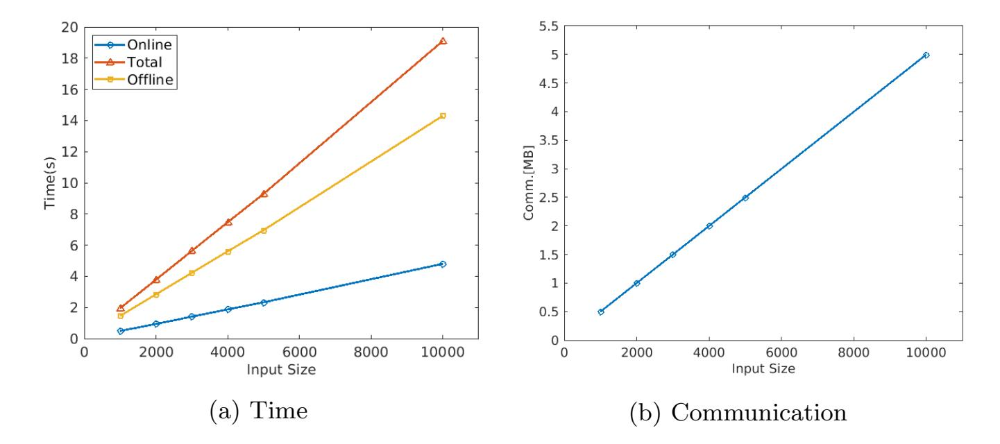
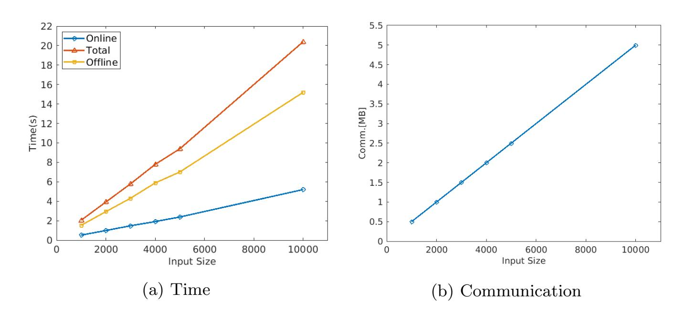

{0}------------------------------------------------

# PSI-Stats: Private Set Intersection Protocols Supporting Secure Statistical Functions

Jason H. M. Ying1,<sup>2</sup> , Shuwei Cao2,<sup>3</sup> , Geong Sen Poh2,<sup>3</sup> , Jia Xu2,<sup>3</sup> , and Hoon Wei Lim2,<sup>3</sup>

> Seagate Technology, Singapore NUS-Singtel Cyber Security R&D Laboratory, Singapore Trustwave, Singapore jasonhweiming.ying@seagate.com

Abstract. Private Set Intersection (PSI) enables two parties, each holding a private set to securely compute their intersection without revealing other information. This paper considers settings of secure statistical computations over PSI, where both parties hold sets containing identifiers with one of the parties having an additional positive integer value associated with each of the identifiers in her set. The main objective is to securely compute some desired statistics of the associated values for which its corresponding identifiers occur in the intersection of the two sets. This is achieved without revealing the identifiers of the set intersection. In this paper, we present protocols which enable the secure computations of statistical functions over PSI, which we collectively termed PSI-Stats. Implementations of our constructions are also carried out based on simulated datasets as well as on actual datasets in the business use cases that we defined, in order to demonstrate practicality of our solution. PSI-Stats incurs 5× less monetary cost compared to the current state-of-the-art circuit-based PSI approach due to Pinkas et al. (EUROCRYPT'19). Our solution is more tailored towards business applications where monetary cost is the primary consideration.

Keywords: Private set intersection · Homomorphic encryption · Statistical functions

### 1 Introduction

Private set intersection (PSI) enables two parties to learn the intersection of their sets without exposing other elements (identifiers or items) that are not within this intersection. This has wide-ranging applications in data sharing, private contact discovery, private proximity testing [37], privacy-preserving ride-sharing [28], botnet detection [36] and human genomes testing [12]. We highlight a number of notable work that have been achieved in this domain in Section 6.

The main problem statement of our work can be simply described as follows. Sender A and receiver B hold sets of identifiers with receiver B additionally

This work was done at NUS-Singtel Cyber Security R&D Laboratory.

{1}------------------------------------------------

holds positive integer values associated with each of the identifiers. Denote the sets held by A, B to be X and Y respectively. The objective is for B to learn the desired statistical output function of some collection (dependent on X) of the associated values, while preserving certain private information about their respective sets. More formally, B seeks to learn the value FD(X, Y ), where D is the decisional rule and F is the desired statistical function computed over D. To preserve privacy, A does not learn Y and D(X, Y ) while B does not learn X, D(X, Y ) and |D(X, Y )|. In our context, D is the private set intersection (PSI) of the identifiers contained in X and Y . These settings arise in numerous business and practical applications.

#### 1.1 Our Contributions

We present PSI-Stats to address this main problem statement. PSI-Stats is a collection of protocols to support the secure computations of statistical functions over PSI. These include a myriad of frequently applied standard statistical functions such as various generalized means, standard deviation, variance, etc. The proposed protocols achieve the privacy requirements outlined in the problem statement. The main contributions are summarized here.

- PSI-Stats can be enabled to securely compute multiple related statistical functions within a single executed protocol with minimal additional communication and computational overhead, while maintaining the privacy guarantees as defined in the main problem statement. Our techniques are also applicable to non-symmetric functions such as weighted arithmetic mean.
- It is undesirable in many instances for receiver B to know both the intersection cardinality and the output functionality as the combination of these can reveal some information about the intersection set. To address this issue, one key contribution of our work is to restrict any such inference information to the absolute possible bare minimum. This is achieved by hiding the intersection cardinality from receiver B and thus only the desired output functionality (and nothing more) is revealed to him.
- We carried out extensive experiments of our protocols to determine their practicality and feasibility. Our test input sizes range from small to large. The experimental results demonstrate that PSI-Stats is practical and scales well for large input sizes. We also conducted experimental comparisons of our protocols with the current state-of-the-art circuit-based PSI protocol due to Pinkas et al. [42]. Our protocols incur 5× less monetary cost and 5.2× less communication overhead.

In an interactive protocol, there are three factors in the overall measurement of efficiency: the first relates to the communication overhead, the second relates to the computational cost and the third relates to the number of communication rounds (or round complexity). The work in this paper does not claim to outperform circuit-based PSI protocols across all the three factors above. As an example, the current state-of-the-art for circuit-based PSI protocols is the 

{2}------------------------------------------------

very recent work of Pinkas et al. [42] which we reckon to potentially attain the lowest computational cost (after the necessary circuit modifications in order to accommodate outputs of statistical functions).

A goal of our work aims to present protocols with minimal communication overhead based upon well-established, time-tested hardness assumptions while concurrently ensuring that running times remain practical. To that end, the PSI-Stats protocols in this paper incur the lowest communication overhead over all circuit-based types (inclusive of the most recent state-of-the-art [42]) by several factors. In that regard, PSI-Stats is especially relevant in settings where communication cost comes at a premium or instances where bandwidth is limited.

Circuit-based PSI approaches can generally be instantiated by either Yao's garbled circuit protocol [51] or the GMW protocol [27]. While Yao's protocol provides a constant round complexity, the GMW protocol is typically the overall preferred option as it has several advantages over the former. A comprehensive comparison between Yao's protocol and the GMW protocol can be found in [48]. However for circuit-based PSI under the GMW family, the round complexity is dependent on the circuit depth which increases with increasing set sizes and/or increasing bit-length of items. This can potentially be a bottleneck in high latency networks. By contrast, the PSI-Stats protocols operate with a low constant round complexity of 3, independent of the input set sizes and the bit-length of items.

To the best of our knowledge, alternative approaches to solve the main problem statement beyond circuit-based methods are either less efficient in our context or employ the usage of computationally intensive homomorphic encryption schemes, such as [14, 16]. We resolve the problem without resorting to the machinery of such expensive approaches. It should be noted that our protocols reveal the intersection size to sender A. However, this does not enable sender A to apply any inference attack based on the associated values held by receiver B as they all safeguarded by homomorphic encryptions in our protocols. On the other hand, such attacks are relevant if this intersection cardinality is revealed to receiver B as discussed. Hence, it is crucial that this information is hidden from receiver B which our protocols attain.

### 2 Preliminaries

The security model in this paper operates in the semi-honest setting. In this model, adversaries can attempt to obtain information from the execution of the protocol but they are unable to perform any deviations from the intended protocol steps. The semi-honest model is typically suited in scenarios where execution of the software is ensured through software attestation or business restrictions, without any assumption that an external untrusted party is unable to obtain the transcript of the protocol upon completion. Indeed, the majority of the research in related domains also focus on solutions in the semi-honest model. Hereinafter, we shall simply refer to mean as being arithmetic mean while references to other generalized means will be stated explicitly.

{3}------------------------------------------------

In this paper, we say an integer x is l-bit (length) if  $x \in \mathbb{Z} \cap [2^{l-1}, 2^l - 1]$  and x is at most l-bit (length) if  $x \in \mathbb{Z} \cap [0, 2^l - 1]$ . The standard ceiling function is given by  $\lceil . \rceil$ , where  $\lceil x \rceil$  represents the smallest integer greater than or equal to x. The nearest integer function is denoted by  $\lfloor . \rceil$ , log refers to the natural logarithm, e is the standard mathematical constant (i.e. the base of the natural logarithm) and lcm is a shorthand for the lowest common multiple. The second Chebyshev function  $\psi(x) = \sum_{p^k \leq x} \log p$  computes the sum over all prime

powers not exceeding x. All proofs in this paper are provided in the Appendix. The participants' setting and notations in the description of our protocols in this paper is identical. We provide it here to serve as a convenient common reference.

```
Notations a_i, b_i: identifiers. A \text{ holds } X = \{a_1, a_2, \dots, a_m\}. B \text{ holds } Y = \{(b_1, t_1), (b_2, t_2), \dots, (b_n, t_n)\}, t_i \in \mathbb{Z}^+. Y' = \{b_1, b_2, \dots, b_n\}. E(.): Paillier encryption of a 3072-bit modulus. h(.): SHA-256 hash function. G: a multiplicative group of integers of large prime order.
```

### 3 Private Set Intersection-Mean

This section describes a protocol to correctly output only the intersection mean (i.e. without disclosing intersection-sum nor intersection cardinality to B). There are numerous flexible applications for the intersection mean functionality apart from the secure computation over numerical values. For instance, records in a dataset can be encoded as 0 or 1 to represent entries of a binary attribute such as "gender". The arithmetic mean of these encoded values can thus directly provide the percentages of "females" and "males" which belong in the intersection of the two datasets. We provide concrete recommendations for the appropriate sizes of the various parameter values for use in our protocols which we also show to provide strong security guarantees satisfying statistical indistinguishability.

#### PROTOCOL 1 (Private Set Intersection-Mean)

**Input:** A inputs set X; B inputs set Y.

**Output:** A outputs  $|X \cap Y'|$ , B outputs intersection mean.

- 1. **Setup:** A and B jointly agree on E, a hash function h and a group G of large prime order. B generates a public-private key pair of E, announces the public key and keeps the private key to herself.
- 2. A's encryption phase: A
- (a) selects a random private exponent  $k_1 \in G$ ;
- (b) computes  $h(a_i)^{k_1}$ .

{4}------------------------------------------------

A sends  $h(a_i)^{k_1}$  to B.

- 3. B's encryption phase: B
- (a) selects a random private exponent  $k_2 \in G$ ;
- (b) computes  $h(a_i)^{k_1k_2}$ ;
- (c) computes  $\{h(b_j)^{k_2}, E(t_j)\}$ .

B returns  $h(a_i)^{k_1k_2}$  in shuffled order to A. B sends  $\{(h(b_j)^{k_2}, E(t_j))\}$  to A.

- 4. Matching & homomorphic computations: A
- (a) computes  $\{h(b_j)^{k_2k_1}, E(t_j)\};$
- (b) computes the set I of intersection indices where

$$I = \{j : h(a_i)^{k_1 k_2} = h(b_j)^{k_2 k_1} \text{ for some } i\};$$

- (c) samples a uniformly random 1024-bit value of r.
- (d) selects uniformly random integer values of  $r_1, r_2$ , where  $0 \le r_1 \le 2^{128} 1$ ,  $2^{511} \le r_2 \le 2^{512} 1$  with  $r_1$  satisfying

$$r_1 \equiv r \bmod k$$

where k = |I|.

(e) additive homomorphically computes

$$E\left(r_2 + \frac{r - r_1}{k} \sum_{i \in I} t_i\right).$$

A sends r and  $E\left(r_2 + \frac{r-r_1}{k}\sum_{i\in I}t_i\right)$  to B.

5. B's decryption phase: B performs decryptions of the ciphertext received from A and computes (division over real numbers)

$$\frac{1}{|I|} \sum_{i \in I} t_i \approx \frac{1}{r} \left( r_2 + \frac{r - r_1}{k} \sum_{i \in I} t_i \right).$$

**Theorem 1.** Protocol 1 correctly outputs the intersection mean (and which can also be made arbitrarily close to the exact value).

#### 3.1 On the chosen sizes of r, $r_1$ , $r_2$

The larger the value of r, the closer the approximation of output  $\mathcal{M}'$  is to the exact mean value  $\mathcal{M}$ . Moreover, this approximation can be made arbitrary close for arbitrary large values of r (along with corresponding large parameter sizes of E). In practice, a sufficiently large value of r already provides a very tight approximation. The size choices of  $r_1$ ,  $r_2$  are 128 bits and 511 bits respectively to prevent exhaustive search attacks. After the sizes of  $r_1$ ,  $r_2$  are set, the size of  $r_2$ 

{5}------------------------------------------------

can be chosen to sufficiently overwhelm  $r_1, r_2$ . In our case, we set r to be of size 1024-bit which is sufficient for  $\mathcal{M}'$  to  $\mathcal{M}$  to be extremely close. In particular,

$$|\mathcal{M} - \mathcal{M}'| < 2^{-512}\mathcal{M} \tag{1}$$

which suffices for all practical intent.

#### 3.2 Flexibility of Protocol

It should be noted that the exact mean value in fact reveals additional information about the sum or cardinality. For instance, if the mean is an integer  $\mathcal{M}$  then it follows that the sum is divisible by  $\mathcal{M}$ . More generally, if the mean is a rational number  $\frac{a}{b}$  with  $\gcd(a,b)=1$ , then the sum is divisible by a and the cardinality is divisible by b. As discussed in the preliminary section, we do not consider such implicit information which can be deduced from the output functionality. Nevertheless, Protocol 1 has the added benefit of flexibility which enables the adjustment of varying degrees of approximation tightness if one wishes to circumvent the above issues. This can be achieved by adjusting the size of a randomly sampled r. The approximation weakens with decreasing sizes of r. More generally, for a random sample r of x-bit,  $x \geq 515$ , the difference yields

$$|\mathcal{M} - \mathcal{M}'| < 2^{512 - x} \mathcal{M}. \tag{2}$$

#### 3.3 Security Analysis

The security arising from the communication in Step 2 and Step 3 follows from the validity of the Decisional Diffie-Hellman assumption as well as the hardness of the Decisional Composite Redisuosity Problem. Hence, the remaining security and privacy aspects to consider occur in Step 4 where B receives r and

$$E\left(r_2 + \frac{r-r_1}{k}\sum_{i\in I}t_i\right)$$
. Since r is sampled uniformly at random from a collec-

tion of 1024-bit integers, B is unable to distinguish r from a random uniformly selected 1024-bit integer. As before, denote  $\mathcal{M}$  to be the exact value of the intersection mean. Thus, B obtains  $r_2 + \frac{r-r_1}{k} \sum_{i \in I} t_i = r_2 + (r-r_1)\mathcal{M}$ . Moreover,

only r and  $\mathcal{M}^5$  are known to B and thus can only effectively compute  $r_2 - r_1 \mathcal{M}$  which we show in the following is statistically indistinguishable from a uniformly sampled 512-bit integer. This serves the purpose of hiding the cardinality and intersection sum. We begin with a standard security definition.

Technically only  $\mathcal{M}'$ , which is a close approximation to  $\mathcal{M}$  can be computed by B. In essence, this distinction is largely irrelevant in this specific context as we evaluate a stronger security setting than required where B has the knowledge of both  $\mathcal{M}$  and  $\mathcal{M}'$ .

{6}------------------------------------------------

Definition 1. Let X and Y be two distributions over {0, 1} <sup>n</sup>. The statistical distance of X and Y, denoted by ∆(X, Y ) is defined to be

$$\Delta(X,Y) = \max_{U \subseteq \{0,1\}^n} |Pr[X \in U] - Pr[Y \in U]|$$

$$= \frac{1}{2} \sum_{v \in Supp(X) \cup Supp(Y)} |Pr[X = v] - Pr[Y = v]|.$$
 (3)

X is ϵ statistically indistinguishable from Y if ∆(X, Y ) ≤ ϵ.

In particular, we show that r<sup>2</sup> − r1M is statistically indistinguishable from uniformly distributed 512-bit integers, when M is a fixed positive integer. It can be assumed here that the intersection mean M is at most 80-bit in all practical settings. Denote random variables R<sup>1</sup> = unif[0, c] and R<sup>2</sup> = unif[a, b] to be the discrete uniform distributions over Z ∩ [0, c] and Z ∩ [a, b] respectively such that cM ≪ a ≪ b. We first establish the following.

### Theorem 2.

$$\Delta(R_2 - R_1 \mathcal{M}, R_2) = \frac{c\mathcal{M}}{2(b-a+1)}.$$
(4)

In Protocol 1, a = 2<sup>511</sup> , b = 2<sup>512</sup> − 1, c = 2<sup>128</sup> − 1 and M is assumed to be at most 80-bit. Hence in Protocol 1,

$$\Delta(R_2 - R_1 \mathcal{M}, R_2) \le 2^{-300}. (5)$$

This shows that r<sup>2</sup> −r1M is 2<sup>−</sup><sup>300</sup> statistically indistinguishable from uniformly distributed 512-bit integers when M is a positive integer. Here, we simply apply 80-bit as a concrete upper bound of M in all practical use cases. It can in fact be way larger than 80-bit subject to the corresponding constraints of (5). In cases where M = a b is a non-integer positive rational number such that a ≪ r2, a similar argument can be applied to show that r2b − r1a is statistically indistinguishable from uniformly distributed 512-bit integers which are multiplied by a factor of b.

#### 3.4 Geometric mean

Our method can be adapted to output the intersection geometric mean functionality without revealing the intersection size to B. One application arises in the computation of the Atkinson index [11] of income inequality which is a function of both the geometric mean and arithmetic mean. Another such instance of the geometric mean can arise in Econometrics as specified by the generalized Cobb-Douglas production function [22], where its inputs can represent working hours of labourers and each exponent is the reciprocal of the number of inputs.

The geometric mean of a data set {t1, t2, . . . , tk} is given by Y k i=1 ti !1 k . A natural line of approach is to replace additive homomorphic encryption with a 

{7}------------------------------------------------

multiplicative homomorphic encryption (e.g. RSA [46]) in view of the multiplicative structure of the output. This works perfectly fine if the intersection size is exposed to B. However, in the security model where the intersection size is kept secret from B, there is no known efficient public-key based protocol utilizing multiplicative homomorphic encryption which can achieve this with reasonable accuracy. We present a method to attain this desired functionality using ideas based on our earlier approach for arithmetic mean.

Without being overly verbose, we do not detail the fully fledged protocol but instead highlight the crucial steps. Suppose  $t_i \in [1, t+1]$ . We first seek an injective function  $f_c: t_i \to \lfloor c \log t_i \rfloor$  for some positive integer constant c. Here  $\lfloor . \rfloor$  denotes the nearest integer function in accordance with the most recent IEEE Standard for floating-point arithmetic [4]. The value of c is chosen by B, the party who holds the list of associated values. We show that  $f_c$  can be constructed by taking  $c \geq t+1$ .

#### **Theorem 3.** $f_c$ is injective $\forall c \geq t+1$ .

The injectivity condition is stipulated to ensure that no two distinct values of  $t_i$ 's correspond to the same image under  $f_c$ . The protocol for the intersection geometric mean proceeds by replacing  $t_i$  with  $\lfloor c \log t_i \rceil$  given in Protocol 1. One other difference lies in the final decryption step performed by B. More specifically in the final step, B obtains the intersection geometric mean by computing

$$e^{\frac{1}{cr}\left(r_2 + \frac{r - r_1}{k} \sum_{i \in I} \lfloor c \log t_i \rceil\right)} \approx e^{\frac{1}{c|I|} \sum_{i \in I} \lfloor c \log t_i \rceil} \approx e^{\frac{1}{|I|} \sum_{i \in I} \log t_i} = \left(\prod_{i \in I} t_i\right)^{\frac{1}{|I|}}.$$
(6)

In general, larger values of c provide a greater precision. In practice, such large values of c can always be chosen since the modulus of the Paillier encryption is much larger than  $\max\{\log t_i\}$ . The proofs of correctness and security mirror that of the intersection mean.

#### 3.5 Extensions to Variance & Standard Deviation

Our techniques presented in this section can be further extended to compute various other statistical functions of the associated values in the intersection. The general overall idea is for B to receive the values of nth-order moment about the origin in order to compute the nth central moment (without knowledge of the intersection size). Let R be a random variable. In our context, R can be considered to be the discrete uniform distribution over the associated values in the intersection. The nth-order moment about the origin  $\mu'_n$  is defined to be  $\mu'_n = \mathbb{E}[R^n]$ . The nth central moment  $\mu_n$  is defined to be  $\mu_n = \mathbb{E}[(R - \mathbb{E}[R])^n]$ . For example, the mean in this case is  $\mu'_1 = \mathbb{E}[R]$ . Variance and standard deviation provide a measure of the amount of dispersion of a list of values. A low standard deviation indicates that the values tend to be clustered around its mean, while a high standard deviation indicates that the values are dispersed over a

{8}------------------------------------------------

wider range of values. In step 3 of the protocol, B sends both  $E(t_j)$  and  $E(t_j^2)$  to A. This enables A to return values of  $\mathbb{E}[R]$  and  $\mathbb{E}[R^2]$  to B. The variance can then be simply computed by  $Var(R) = \mathbb{E}[R^2] - (\mathbb{E}[R])^2$  and standard deviation  $\sigma = \sqrt{Var(R)}$ . At the end of this protocol, B outputs the mean and standard deviation (or variance). At the same time, B's knowledge of  $\mathbb{E}[R^2]$  during this process does not reveal any additional information since that quantity can be derived from any generic protocol which outputs the mean and standard deviation (or variance). The protocols for the skewness and kurtosis output functionalities can be similarly constructed.

### 4 Intersection-Sum with Approximate Composition

Trivially, the intersection sum output S reveals that there are less than l elements (or identifiers) in the intersection with associated values greater than  $\frac{S}{l}$ . In many scenarios, B wishes to know more about the composition of the sum. In particular, given the intersection sum, B wishes to have an estimate of the number of elements in the intersection with associated value of at most  $\hat{t}$  (i.e. its approximate sum composition). This information cannot be captured merely by the knowledge of intersection sum. To that end, we present two protocols, labelled as type 1 and 2 which enable the output of intersection sum along with its approximate sum composition.

#### PROTOCOL 2 (Sum Composition type 1)

**Input:** A inputs set X; B inputs set Y.

**Output:** A outputs  $|X \cap Y'|$ , B outputs  $\sum_{i \in I} t_i$  and an upper bound for  $\sum_{i \in I} \frac{1}{t_i}$ , where I is the set of indices of  $b_i \in X \cap Y'$ .

- 1. **Setup:** Identical to Protocol 1.
- 2. A's encryption phase: Identical to Protocol 1.
- 3. B's encryption phase: B
- (a) selects a random private exponent  $k_2 \in G$ ;
- (b) computes  $h(a_i)^{k_1k_2}$ ;
- (c) computes  $\{h(b_j)^{k_2}, E(t_j)\}$ .

B returns  $h(a_i)^{k_1k_2}$  in shuffled order to A. B sends  $\{h(b_{\sigma(j)})^{k_2}, E(t_{\sigma(j)})\}_{j=1}^n$  to A, where  $\sigma$  is a permutation of j such that  $t_{\sigma(j)} \geq t_{\sigma(j+1)}$ . B sends M to A where

$$M \ge \max \left\{ \frac{t_{\sigma(j)}}{t_{\sigma(j+1)}} \right\}.$$

- 4. Matching & homomorphic computations: A
- (a) computes  $\{(h(b_i)^{k_2k_1}, E(t_i))\};$

{9}------------------------------------------------

(b) computes the set I of intersection indices where

$$I = \{j : h(a_i)^{k_1 k_2} = h(b_i)^{k_2 k_1} \text{ for some } i\};$$

- (c) additive homomorphically computes  $E\left(\sum_{i\in I} t_i\right)$ ;
- (d) samples uniformly random r,  $r_1$ ,  $r_2$  from a sufficiently large set of positive integers such that  $r \gg r_1, r_2$  and  $\frac{r_1}{r_2} \geq k$ , where k = |I|; (e) computes  $r_1 + rk(M^k - 1)$  and additive homomorphically computes

$$E\left(r_2 + r(M-1)\sum_{i=1}^k M^{i-1}t_i'\right),$$

where  $\{t_i'\}_{i=1}^k$  is a permutation of  $\{t_i\}_{i\in I}$  s.t.  $t_{i+1}' \leq t_i'$ .

A sends 
$$E\left(\sum_{i \in I} t_i\right)$$
,  $E\left(r_2 + r(M-1)\sum_{i=1}^k M^{i-1}t_i'\right)$  and  $r_1 + rk(M^k - 1)$  to  $B$ .

5. B's decryption phase: B performs decryptions of the ciphertexts received from A to obtain  $\sum_{i \in I} t_i$  and an upper bound for  $\sum_{i \in I} \frac{1}{t_i}$  given by

$$\sum_{i \in I} \frac{1}{t_i} \le \frac{r_1 + rk(M^k - 1)}{r_2 + r(M - 1) \sum_{i=1}^k M^{i-1} t_i'}.$$

**Theorem 4.** Protocol 2 outputs  $\sum_{i=1}^{n} t_i$  and an upper bound for  $\sum_{i=1}^{n} \frac{1}{t_i}$ .

#### Applicability of Sum Composition 4.1

Let the sum composition measure T be denoted to be

$$T = \frac{r_1 + rk(M^k - 1)}{r_2 + r(M - 1)\sum_{i=1}^k M^{i-1}t_i'}.$$
 (7)

**Theorem 5.** There are less than l elements in the intersection with associated integer values of at most  $\hat{t}$  where  $\hat{t} \in \mathbb{Z}^+$  satisfying  $\hat{t} < \frac{l}{T}$ .

For instance when l=1, it can be established that there are no small associated integer values under  $\frac{1}{T}$  contained in the set intersection. In other words, every element in the intersection has an associated value of at least  $\frac{1}{T}$ . It should be noted that the applicability of this measure of sum composition is dependent

{10}------------------------------------------------

on the distribution of the associated values held by B. Generally, this output functionality is more useful when the spread of associated values is sufficiently large. In practice, B who holds the associated values can decide whether to initiate these two protocols based on his dataset. Type 1 enables the transmission of an approximate sum composition without any substantial increase in communication over the intersection-sum. However, that requires B to reveal an upper bound of M to A. We describe a type 2 protocol where communication cost is not an overriding consideration without disclosing an upper bound of M to A. Type 2 also results in a tighter output approximation compared to type 1. A key ingredient involves an injective mapping of the set of reciprocals of positive integers to the set of positive integers which preserves addition. Denote  $f_c$  to be such an injective map such that  $f_c: t_i \to \left[\frac{c}{t_i}\right]$  for a suitable large constant c.

### PROTOCOL 3 (Sum Composition type 2)

**Input:** A inputs set X; B inputs set Y.

**Output:** A outputs  $|X \cap Y'|$ , B outputs  $\sum_{i \in I} t_i$  and an upper bound for  $\sum_{i \in I} \frac{1}{t_i}$ , where I is the set of indices of  $b_i \in X \cap Y'$ .

- 1. **Setup:** Identical to Protocol 1.
- 2. A's encryption phase: Identical to Protocol 1.
- 3. B's encryption phase: B
- (a) selects a random private exponent  $k_2 \in G$ ;
- (b) computes  $h(a_i)^{k_1k_2}$ ;

(c) computes  $\{h(b_j)^{k_2}, E(t_j), E(f_c(t_j))\}$ . B returns  $h(a_i)^{k_1k_2}$  in shuffled order to A. B sends  $\{h(b_j)^{k_2}, E(t_j), E(f_c(t_j))\}$ to A.

- 4. Matching & homomorphic computations: A
- (a) computes  $\{h(b_j)^{k_2k_1}, E(t_j), E(f_c(t_j))\};$
- (b) computes the set I of intersection indices where

$$I = \{j : h(a_i)^{k_1 k_2} = h(b_j)^{k_2 k_1} \text{ for some } i\};$$

(c) additive homomorphically computes

$$E\left(\sum_{i\in I} t_i\right)$$
 and  $E\left(\sum_{i\in I} f_c(t_i)\right)$ .

A sends 
$$E\left(\sum_{i\in I} t_i\right)$$
 and  $E\left(\sum_{i\in I} f_c(t_i)\right)$  to  $B$ .

{11}------------------------------------------------

5. B's decryption phase: B performs decryptions of the ciphertexts received from A to obtain  $\sum_{i \in I} t_i$  and an upper bound for  $\sum_{i \in I} \frac{1}{t_i}$  given by

$$\sum_{i \in I} \frac{1}{t_i} \le \frac{1}{c} \sum_{i \in I} f_c(t_i).$$

**Theorem 6.** Protocol 3 outputs  $\sum_{i \in I} t_i$  and an upper bound for  $\sum_{i \in I} \frac{1}{t_i}$ .

#### 4.2 On the selection of c

Suppose the values of  $t_i$ 's are bounded by x bits. We show that taking c to be of size 2x + 1 bits admits  $f_c$  to be injective. Indeed, let  $t_i$ ,  $t_j$  be two distinct associated values. Without loss of generality, assume  $t_i < t_j$ , Then

$$\left| \frac{c}{t_i} - \frac{c}{t_j} \right| = c \left( \frac{t_j - t_i}{t_i t_j} \right) \ge 1 \tag{8}$$

since c is of size 2x + 1 bits. It follows that

$$\left| \frac{c}{t_i} - \frac{c}{t_j} \right| \ge 1 \Rightarrow \left\lceil \frac{c}{t_i} \right\rceil \ne \left\lceil \frac{c}{t_j} \right\rceil \tag{9}$$

which proves injectivity.

#### 4.3 Comparisons between Type 1 & Type 2

Table 1: Recommended RSA key length from NIST

| security level $(\kappa)$ | 80   | 112  | 128  | 192  | 256   |  |
|---------------------------|------|------|------|------|-------|--|
| RSA key length            | 1024 | 2048 | 3072 | 7680 | 15360 |  |

The NIST report [13] details the recommended RSA key length (in bits) to achieve a  $\kappa$ -bit security as given in Table 1. In the case of E being the Paillier encryption, a 2048-bit length modulus corresponds to a 112-bit security level. This translates to a ciphertext of length 4096-bit for Paillier encryption. Thus, this increase in communication overhead is approximately in the region of 4096n bits. On the other hand for large intersection sizes, type 2 is more practical and has a lower computational cost.

{12}------------------------------------------------

Table 2: Performance of Private Intersection-arithmetic mean protocol.

|                                 | Time(s) |      |      |        |        | Comm.[MB] Actual Value Output (rounded down) |
|---------------------------------|---------|------|------|--------|--------|----------------------------------------------|
| Input Size Offline Online Total |         |      |      |        |        |                                              |
| 1000                            | 1.46    | 0.49 | 1.95 | 0.4997 | 51.31  | 51                                           |
| 2000                            | 2.84    | 0.94 | 3.78 | 0.9994 | 48.91  | 48                                           |
| 3000                            | 4.22    | 1.41 | 5.63 | 1.4991 | 51.76  | 51                                           |
| 4000                            | 5.6     | 1.87 | 7.47 | 1.9988 | 44.525 | 44                                           |
| 5000                            | 6.96    | 2.33 | 9.29 | 2.4985 | 48.835 | 48                                           |
| 10000                           | 14.3    | 4.8  | 19.1 | 4.9976 | 51.64  | 51                                           |
| 50000                           | 69.3    | 23.4 | 92.7 | 24.988 | 48.45  | 48                                           |
| 100000                          | 142     | 48   | 190  | 49.976 | 50.83  | 50                                           |

### 5 Implementation & Performance

We implemented PSI-Stats in C++. The benchmark machine is desktop workstation running on a single-thread with an Intel Core i7-7700 CPU @ 3.60GHz and 28GB RAM. The bandwidth is 4867 Mbps with round-trip time of 0.02 ms. The respective input sizes m, n are equal and the comparisons are based on the running time (in seconds) as well as communication cost (in MB). All experiments apart from the UCI and Kaggle datasets are run at full intersection sizes (i.e. intersection size = m = n). We set the value of c = 10<sup>9</sup> for the geometric mean protocol. In running Protocol 1, we also provide the readers with the results of the actual generalized means alongside the outputs that it obtained from the execution of the protocol. The output generalized means values given in the tables are all rounded down to the nearest whole number.



Fig. 1: Performance on Arithmetic Mean

{13}------------------------------------------------

Table 3: Performance of Private Intersection-geometric mean protocol.

|                                 | Time(s) |      |      |        |        |                                              |
|---------------------------------|---------|------|------|--------|--------|----------------------------------------------|
| Input Size Offline Online Total |         |      |      |        |        | Comm.[MB] Actual Value Output (rounded down) |
| 1000                            | 1.53    | 0.52 | 2.05 | 0.4997 | 37.84  | 37                                           |
| 2000                            | 2.93    | 0.99 | 3.92 | 0.9994 | 38.07  | 38                                           |
| 3000                            | 4.31    | 1.48 | 5.79 | 1.4991 | 36.71  | 36                                           |
| 4000                            | 5.88    | 1.91 | 7.79 | 1.9988 | 36.58  | 36                                           |
| 5000                            | 7.01    | 2.38 | 9.39 | 2.4985 | 42.288 | 42                                           |
| 10000                           | 15.2    | 5.2  | 20.4 | 4.9976 | 44.28  | 44                                           |
| 50000                           | 70      | 24.2 | 94.2 | 24.988 | 43.04  | 43                                           |
| 100000                          | 151     | 52   | 203  | 49.976 | 37.13  | 37                                           |

We apply similar parameters as with the experiments conducted in [30]. The elements/identifiers in the generated datasets are 128-bit strings, with associated values being at most 32 bits long (the specific testing range is set between 1 to 100). The sum of the associated values is also bounded by 32 bits. The input set sizes range from 1000 to 100000. An elliptic curve with 256-bit group elements constitute the group G. The hash function SHA-256 is utilized for h. The Paillier encryption involves the product of two 768 bit primes which yields a plaintext space of 1536 bits and ciphertext of length 3072 bits.

In addition, we have segmented the total time into disjoint durations of the offline and online phases. The offline phase refers to the pre-computation process where the parties can perform offline computations of their respective individual dataset even before the initial round of communication commences. The online phase begins from the initial round of communication to the end of the protocol. In practice, the online phase duration generally provides a more relevant indicator of practical performance as opposed to the total time taken. The results are presented in Tables 2, 3 and illustrated in Figures 1 and 2, which highlight that both the running time and communication cost in our protocols are linear with respect to the input size.

Table 4: Performance of PSI-Stats on a UCI repository dataset.

|                                 |       | Time(s) |       |        |         | Comm.[MB] Actual Mean Output (rounded down) |
|---------------------------------|-------|---------|-------|--------|---------|---------------------------------------------|
| Input Size Offline Online Total |       |         |       |        |         |                                             |
| 45211                           | 63.17 | 20.78   | 83.95 | 22.591 | 1422.65 | 1422                                        |

We also select a couple of actual datasets to conduct our experiments. The dataset [35] taken from the UCI ML repository [20] relates to marketing campaigns of a Portuguese banking institution. This dataset consists of a pair of sets:

{14}------------------------------------------------



Fig. 2: Performance on Geometric Mean

Table 5: Performance of PSI-Stats on a Kaggle dataset.

|                                 |      | Time(s) |      | Comm.[MB] Actual Mean Output (rounded down) |         |      |
|---------------------------------|------|---------|------|---------------------------------------------|---------|------|
| Input Size Offline Online Total |      |         |      |                                             |         |      |
| 30000                           | 45.6 | 15.6    | 61.2 | 14.992                                      | 1422.65 | 1422 |

one of which is a proper subset of the other. We extract the attribute of interest corresponding to the yearly bank balance of bank's clients. A holds the smaller set of size 4521 while B holds the larger set of size 45211. To simulate a practical setting, each input (representing a client) is assigned a kojin bang¯o which is a unique 12-digit ID number issued to residents in Japan for taxation purpose. Other identifiers such as the Social Security Number issued in the United States can also be similarly assigned. The set size of A is then increased to 45211 to match that of B by generating a distinct kojin bang¯o for each new client. Consequently, the set size is 45211 for both parties and the intersection corresponds to the original smaller set of size 4521. Related figures in the computation of mean yearly balance of common clients between these two parties via PSI-Stats are presented in Table 7. The second dataset involves spending from a mall taken from Kaggle [5] which has an input size of 30000. We use the column labelled "payment 2" as the set of corresponding associated values. The performance of PSI-Stats of selected functionalities on the Kaggle dataset is recorded in Table 5.

#### 5.1 Comparisons with circuit-based PSI protocols

The main direct competitor to PSI-Stats is a general-purpose circuit-based PSI. One advantage of PSI-Stats compared to existing circuit based approaches is that it incurs the lowest communication overhead. This is particular crucial in low bandwidth settings or where communication cost is at a premium. In this regard,

{15}------------------------------------------------

Table 6: Comparisons of monetary cost (in cents)

|         |        | Pinkas et al. [42]                                                     |        |      | PSI-Stats |        |  |
|---------|--------|------------------------------------------------------------------------|--------|------|-----------|--------|--|
|         |        | Input Size Time(s) Comm.[MB] Cost(cents) Time(s) Comm.[MB] Cost(cents) |        |      |           |        |  |
| 5000    | 0.649  | 13.6                                                                   | 0.1063 | 9.29 | 2.5       | 0.0208 |  |
| 10000   | 1.042  | 26.3                                                                   | 0.2056 | 19.1 | 5.0       | 0.0417 |  |
| 20000   | 2.077  | 52.9                                                                   | 0.4136 | 37.7 | 10.0      | 0.0833 |  |
| 30000   | 3.105  | 79.2                                                                   | 0.6192 | 56.3 | 15.0      | 0.1249 |  |
| 20<br>2 | 107.96 | 2702                                                                   | 21.12  | 1902 | 524       | 4.36   |  |

we demonstrate the comparisons in two aspects. The first evaluation is based on the monetary cost to run the protocols on an external cloud server which is dependent on the computation and the communication cost. This provides a fair universal comparison of protocols with varying computation and communication cost. Such a mode of comparison was first introduced in [40] and also applied in [15]. For this purpose, our reference cloud server is the Amazon Web Service (AWS) with the reference price model<sup>6</sup> of (0.005USD/hr, 0.08USD/GB). The second evaluation is based on the run times of protocols when conducted at a bandwidth setting of 1 Mbps with a round-trip time of 0.02 ms.

Table 7: Comparisons of run time at network bandwidth setting of 1 Mbps.

|         | Pinkas et al. [42] |                                                           | PSI-Stats |       |      |  |
|---------|--------------------|-----------------------------------------------------------|-----------|-------|------|--|
|         |                    | Input Size Time(s) Comm.[MB] Input Size Time(s) Comm.[MB] |           |       |      |  |
| 5000    | 113.48             | 13.6                                                      | 5000      | 29.1  | 2.5  |  |
| 10000   | 222.60             | 26.3                                                      | 10000     | 58.3  | 5.0  |  |
| 20000   | 444.01             | 52.9                                                      | 20000     | 119.1 | 10.0 |  |
| 30000   | 666.23             | 79.2                                                      | 30000     | 174.8 | 15.0 |  |
| 300,000 | 6529               | 776                                                       | 20<br>2   | 6113  | 524  |  |

The current most efficient state-of-the-art circuit-based PSI protocol is the recent work of Pinkas et al. [42]. While there are two main approaches for the generic secure two-party computation of Boolean circuits, the GMW approach is the better performing over Yao's garbled circuit on the balance of both communication and computational cost. Since one of our evaluations is based upon monetary cost, we shall use the GMW approach of [42] to serve as a benchmark in the comparisons of PSI-Stats with circuit-based PSI approaches. We run the "no stash" protocol of [42] along with the arithmetic mean protocol of PSI-Stats. The results are reflected in Tables 6 & 7. It should be emphasized

<sup>6</sup> https://aws.amazon.com/ec2/spot/pricing https://aws.amazon.com/cloudfront/pricing/

{16}------------------------------------------------

that the "no stash" protocol outputs the set intersection (without payload) as compared to the arithmetic mean of the set intersection given in the running times of PSI-Stats. Substantial modifications have to be incorporated to the "no stash" protocol to support secure post-processing of the output of the set intersection (e.g. statistical functions) which incur additional communication and computational overheads. Nevertheless, the results of [42] in Tables 6 & 7 serve well as a lower bound reference for the output functionality of arithmetic mean. Moreover, to optimize the efficiency when running the protocol of [42], we compute in Matlab the minimal number of mega-bins B required such that each mega-bin contains at most max<sup>b</sup> ≤ 1024 elements with probability under 2−<sup>40</sup> for various set sizes n. The probability that there exists a bin with at least max<sup>b</sup> elements given in [42] is bounded above by

$$B\sum_{i=max_b}^{3n} B^{-i} {3n \choose i} \left(1 - \frac{1}{B}\right)^{3n-i}.$$

Our computed minimum values of B are 19, 38, 75, 113 for n = 5000, 10000, 20000, 30000 respectively.

From the experimental results, PSI-Stats has a lower communication overhead by an average factor of 5.2× and incurs 5× less monetary cost compared to [42] as evidenced by Table 6. The results of Table 7 also demonstrates a much lower run time in a network bandwidth setting of 1 Mbps. Moreover, when the round-trip time is increased from 0.02 ms to 100 ms, the run time of [42] increases by 3.2s and 3.84s for set sizes of 2<sup>12</sup> and 2<sup>16</sup> respectively. In contrast, the run time increase for PSI-Stats is merely 0.3s. Since the complexities of PSI-Stats scale linearly with respect to computation and communication, the comparison of monetary cost ratio is expected to be maintained at 5× for larger datasets.

## 6 Related work

#### 6.1 Existing PSI Protocols

An early PSI protocol is based upon the Diffie Hellman paradigm [34] which is also applicable in elliptic curve cryptography. A similar idea can be traced back to [49]. A method based on oblivious polynomial evaluation was introduced in [24, 25]. An approach via blind RSA was presented in [18]. All the above methods are based on public-key cryptography.

Oblivious transfer (OT) extension was first introduced in [31]. The main objective of an OT extension is to enable the computation a large number of OT based off a smaller number along with symmetric cryptographic operations to achieve better running times. This technique engendered numerous OT-based PSI protocols. The notion of garbled bloom filter based on OT extension was coined in [21] and utilized to perform PSI. The main idea is to allow one of the parties to learn the bit-wise AND of two Bloom filters via OT. This outcome results in a valid Bloom filter for the set intersection. That was subsequently 

{17}------------------------------------------------

optimized to some extent in [44]. There are a number of other notable OT-based schemes presented in [26, 33, 38, 41, 44, 45]. The particular work of [33] is based on an OT extension protocol found in [32].

Recently, threshold PSI protocols have been proposed [52, 53]. The earlier work [52] leaks the intersection size, while the subsequent work [53] has no such leakage. Instead of revealing computation results of associated values, they suppress the output if the intersection set does not satisfy the agreed policy.

Generic multi-party protocols such as garbled circuits can also be used to compute PSI. The first such protocol involving garbled circuit appeared in [29] which was later improved in [44]. Other notable circuit-based PSI protocols are presented in [23, 41–43]. The protocol of [17] can incorporate several approaches of 2PC beyond garbled circuits. Circuit-based approaches can typically serve for generic computation purposes. On the other hand, they result in larger communication overheads as compared to other custom-based PSI protocols.

The most related existing work in relation to this paper is that of Ion et al. [30] which considers the single special case where F is the sum. It should be noted that any natural attempts to convert the computation of sum to arithmetic mean by sending the set intersection size to the receiving party B violates the privacy requirements of the problem statement since the additional knowledge of cardinality can induce an inference attack. In contrast, our work here provides solutions to a large class of statistical functions F without this drawback. By doing so our protocols provide more flexible and comprehensive utilities.

### 7 Conclusion

We present PSI-Stats which supports the secure computations of various statistical functions in a privacy-preserving manner. The benefit of PSI-Stats having a substantially lower monetary cost and communication cost compared to circuit based PSI approaches is desirable in many business applications. This is also relevant in environments of low network bandwidths. We have noted from our experiments that the run time of all of our protocols is dominated by the time taken to perform encryption of each associated value. As such, PSI-Stats is highly parallelizable and the performance can be further enhanced when multithreading is enabled. In addition, PSI-Stats can easily be extended to enable statistical outputs only if the size of the intersection set exceeds a pre-defined threshold value. In instances where the intersection set of the identifiers between the two parties is null or under a specified threshold size, party A can call for an early abort of the protocol. This feature has also appeared in [52] where a secret key cannot be recovered if the size is not reached, thereby prompting an abort.

### Acknowledgements

We thank Sherman Chow and the anonymous reviewers for their helpful comments, as well as the authors of [42] for initially providing us with the codes of 

{18}------------------------------------------------

their implementation. This work was supported by the NUS-NCS Joint Laboratory for Cyber Security, Singapore.

### References

- 1. Anonos, https://www.anonos.com/
- 2. Baffle, https://baffle.io/
- 3. Data Republic, https://www.datarepublic.com/
- 4. IEEE 754-2019 IEEE Standard for Floating-Point Arithmetic, standards.ieee. org
- 5. Kaggle, https://www.kaggle.com/uciml/default-of-credit-card-clients-dataset
- 6. Privitar, https://www.privitar.com/
- 7. Sepior, https://sepior.com/
- 8. Sharemind, https://sharemind.cyber.ee/
- 9. Unbound Tech, https://www.unboundtech.com/
- 10. R. Agrawal, A. Evfimievski and R. Srikant. Information sharing across private databases. In Proceedings of the 2003 ACM SIGMOD international conference on Management of data, pages 86-97, 2003.
- 11. A.B. Atkinson. On the measurement of inequality. Journal of economic theory, 2(3):244-263, 1970.
- 12. P. Baldi, R. Baronio, E. D. Cristofaro, P. Gasti, and G. Tsudik. Countering GAT-TACA: Efficient and secure testing of fully-sequenced human genomes. In ACM Conference on Computer and Communications Security, pages 691-702, 2011.
- 13. E. Barker. Recommendation for key management part 1: General (revision 4). NIST special publication, 800(57):1-147, 2016.
- 14. D. Boneh, E.-J.Goh, and K. Nissim. Evaluating 2-DNF formulas on ciphertexts. In Theory of cryptography conference, pages 325-341, 2005.
- 15. M. Chase and P. Miao. Private set intersection in the internet setting from lightweight oblivious prf. In Annual International Cryptology Conference (CRYPTO'20), pages 34-63, 2020.
- 16. J. H. Cheon, A. Kim, M. Kim, and Y. Song. Homomorphic encryption for arithmetic of approximate numbers. In ASIACRYPT'17, pages 409-437, 2017.
- 17. M. Ciampi and C. Orlandi. Combining private set-intersection with secure twoparty computation. In International Conference on Security and Cryptography for Networks, pages 464-482, 2018.
- 18. E. D. Cristofaro and G. Tsudik. Practical private set intersection protocols with linear complexity. In Financial Cryptography and Data Security (FC'10), vol. 6052, pages 143-159, 2010.
- 19. I. Damg˚ard and M. Jurik. A generalisation, a simplification and some applications of Paillier's probabilistic public-key system. In International workshop on public key cryptography, pages 119-136, 2001.
- 20. D. Dheeru and E. Karra Taniskidou. UCI machine learning repository, 2017.
- 21. C. Dong, L. Chen, and Z. Wen. When private set intersection meets big data: An efficient and scalable protocol. In Proceedings of the 2013 ACM SIGSAC Conference on Computer and Communications Security (CCS'13), pages 789-800, 2013.
- 22. S. N. Durlauf and L. Blume, L. The new Palgrave dictionary of economics (Vol. 6), 2008
- 23. B. H. Falk, D. Noble, and R. Ostrovsky. Private set intersection with linear communication from general assumptions. In Proceedings of the 18th ACM Workshop on Privacy in the Electronic Society, pages 14-25, 2019.

{19}------------------------------------------------

- 24. M. J. Freedman, C. Hazay, K. Nissim, and B. Pinkas. Efficient set intersection with simulation-based security. J. Cryptology, 29(1):115-155, 2016.
- 25. M. J. Freedman, K. Nissim, and B. Pinkas. Efficient private matching and set intersection. In Advances in Cryptology–EUROCRYPT'04, vol. 3027, pages 1-19, 2004.
- 26. G. Garimella, P. Mohassel, M. Rosulek, S. Sadeghian, and J. Singh. Private Set Operations from Oblivious Switching. In IACR International Conference on Public-Key Cryptography, pages 591-617, 2021.
- 27. O. Goldreich, S. Micali, and A. Wigderson. How to play any mental game. In Proceedings of the nineteenth annual ACM symposium on Theory of computing, pages 218-229, 1987.
- 28. P. Hallgren, C. Orlandi, and A. Sabelfeld. PrivatePool: privacy-preserving ridesharing. In 2017 IEEE 30th Computer Security Foundations Symposium (CSF), pages 276-291, 2017
- 29. Y. Huang, D. Evans, and J. Katz. Private set intersection: Are garbled circuits better than custom protocols? In Network and Distributed System Security (NDSS'12), 2012.
- 30. M. Ion, B. Kreuter, A.E. Nergiz, S. Patel, S. Saxena, K. Seth, M. Raykova, D. Shanahan, and M. Yung. On Deploying Secure Computing: Private Intersection-Sum-with-Cardinality. In IEEE European Symposium on Security and Privacy (EuroS&P'20), pages 370-389, 2020.
- 31. Y. Ishai, J. Kilian, K. Nissim, and E. Petrank. Extending oblivious transfers efficiently. In Advances in Cryptology–CRYPTO'03, vol. 2729, pages 145-161, 2003.
- 32. V. Kolesnikov and R. Kumaresan. Improved OT extension for transferring short secrets. In Advances in Cryptology–CRYPTO'13 (2), vol. 8043, pages 54-70, 2013.
- 33. V. Kolesnikov, R. Kumaresan, M. Rosulek, and N. Trieu. Efficient batched oblivious PRF with applications to private set intersection. In Proceedings of the 2016 ACM SIGSAC Conference on Computer and Communications Security (CCS'16), pages 818-829, 2016.
- 34. C. Meadows. A more efficient cryptographic matchmaking protocol for use in the absence of a continuously available third party. In Symposium on Security and Privacy (S&P'86), pages 134-137, 1986.
- 35. S. Moro, R. Laureano, and P. Cortez. Using Data Mining for Bank Direct Marketing: An Application of the CRISP-DM Methodology. In Proceedings of the European Simulation and Modelling Conference - ESM'2011, pages 117-121, 2011.
- 36. S. Nagaraja, P. Mittal, C. Hong, M. Caesar, and N. Borisov. BotGrep: Finding P2P bots with structured graph analysis. In USENIX Security Symposium, pages 95-110, 2010.
- 37. A. Narayanan, N. Thiagarajan, M. Lakhani, M. Hamburg, and D. Boneh. Location privacy via private proximity testing. In NDSS, vol 11, 2011.
- 38. M. Orr`u, E. Orsini, and P. Scholl. Actively secure 1-out-of-N OT extension with applications to private set intersection. In Topics in Cryptology–CT-RSA'17, vol. 10159, pages 381-396, 2017.
- 39. P. Paillier. Public-key cryptosystems based on composite degree residuosity classes. In Advances in Cryptology–EUROCRYPT'99, pages 223-238, 1999.
- 40. B. Pinkas, M. Rosulek, N. Trieu, and A. Yanai. Spot-light: Lightweight private set intersection from sparse OT extension. In Annual International Cryptology Conference (CRYPTO'19), pages 401-431, 2019.
- 41. B. Pinkas, T. Schneider, G. Segev, and M. Zohner. Phasing: Private set intersection using permutation-based hashing. In 24th USENIX Security Symposium (USENIX Security 15), pages 515-530, 2015.

{20}------------------------------------------------

- 42. B. Pinkas, T. Schneider, O. Tkachenko, and A. Yanai. Efficient circuit-based PSI with linear communication. In Annual International Conference on the Theory and Applications of Cryptographic Techniques (EUROCRYPT'19), pages 122-153, 2019.
- 43. B. Pinkas, T. Schneider, C. Weinert, and U. Weider. Efficient circuit-based psi via cuckoo hashing. In Annual International Conference on the Theory and Applications of Cryptographic Techniques (EUROCRYPT'18), pages 125-157, 2018.
- 44. B. Pinkas, T. Schneider, and M. Zohner. Faster private set intersection based on OT extension. In USENIX Security Symposium, vol. 14, pages 797-812, 2014.
- 45. B. Pinkas, T. Schneider, and M. Zohner. Scalable private set intersection based on OT extension. ACM Transactions on Privacy and Security (TOPS), 21(2):1-35, 2018.
- 46. R. L. Rivest, A. Shamir, and L. Adleman. A method for obtaining digital signatures and public-key cryptosystems. Communications of the ACM, 21(2):120-126, 1978.
- 47. J. B. Rosser and L. Schoenfeld. Approximate formulas for some functions of prime numbers. Illinois Journal of Mathematics, 6(1):64-94, 1962.
- 48. T. Schneider and M. Zohner. GMW vs. Yao? Efficient secure two-party computation with low depth circuits. In International Conference on Financial Cryptography and Data Security, pages 275-292, 2013.
- 49. A. Shamir. On the power of commutativity in cryptography. In International Colloquium on Automata, Languages and Programming (ICALP'80), vol 85, pages 582- 595, 1980.
- 50. B. Willemsen. Hype Cycle for Privacy. Gartner, 2019.
- 51. A.C.C Yao. How to generate and exchange secrets. In 27th Annual Symposium on Foundations of Computer Science (sfcs 1986), pages 162-167, 1986.
- 52. Y. Zhao and S. S. M. Chow. Are you The One to Share? Secret Transfer with Access Structure. Proc. Priv. Enhancing Technol., 2017(1):149-169, 2017.
- 53. Y. Zhao and S. S. M. Chow. Can you find the one for me? In Proceedings of the Workshop on Privacy in the Electronic Society, pages 54-65, 2018.

### A Statistical Functions & Assumptions

The main goals of this paper are to perform secure computations of various statistical functions over private set intersection. The statistical functions that we consider in this paper are those that are commonly applied on databases such as arithmetic mean, geometric mean, harmonic mean, standard deviation, etc.

We refer to implicit information as the information for which the party who knows the intersection sum (along with her private set of identifiers and associated values) can deduce certain aspects of the intersection content. For example, if the output sum is an odd integer and there is only one associated odd value in the set, then this information implicitly reveals that the identifier corresponding to the odd associated value has to be in the intersection. The output sum also reveals that no identifier with associated value greater than the output sum can be in the intersection. Indeed, any generic black box construction which reveals the output sum incurs this implicit information loss. In view of this, the security assumptions in this work (as with [30]) do not take into account such implicit information loss or inference attack from the output functionality. Nevertheless, the security and privacy considerations are taken into account for all communications prior to the final output functionality. The security of all the protocols 

{21}------------------------------------------------

described in this paper is based upon the validity of the Decisional Diffie-Hellman assumption and the semantic security of the Paillier encryption scheme which assumes the hardness of the Decisional Composite Residuosity problem.

We elide the event where the intersection of the identifiers is a null set since the statistical output is irrelevant in such an instance. In such a setting, party A can simply call for an early abort of the protocol during the matching phase.

### B Use Cases

Our motivation lies in that different organisations are increasingly geared toward sharing data among them in order to derive new insights and create new business opportunities from the shared data. Here, we present two use cases that can benefit from learning more than just the sum of the intersected set. For example, to find min, max or threshold of values from the set. Certainly, a simple approach to obtain the above result is to use existing state-of-the-art PSI protocol to find the set intersection and then B computes the statistical functions on the values associated to the identifiers in the intersection. Here, the main goal is to also hide the identifiers in the set intersection from being known to both parties. Hiding the elements in the set intersection can be useful to alleviate privacy concerns from the participating parties especially when an organisation would like to prevent the other party from learning some of their existing customers based on the set intersection. We first look at an extension of the use case of the Private Intersection-Sum protocol [30] between a merchant and an advertising entities. By learning the min, max, or the percentage of small spending (or large spending) after users viewed an advertisement, the merchant may use this statistical information for targeted advertisement to advertise products within the range of spending of the users. Alternatively, the merchant may devise new reward scheme to encourage users to broaden their spending habits.

A second use case is data sharing between a mall and a credit card company with similar intent as the above use case. The proposed solution enables the credit card company to match its customer to the mall's customer, without revealing the underlying individuals (not even the matched customers). This prevents the credit card company (or the mall) from learning more information such as which customers are also the customers of the mall (or credit card company), which can be a privacy concern to both participating parties. The credit card company then reveals the min (or max) spending, or percentage of high spending to the mall.The mall may market these insights to existing tenants or attract new relevant tenants.

A third use case arises in the sharing of sensitive data between a hospital and insurance agency. In such a setting, the hospital holds personal identifier information (PII) and the insurance agency having a list of potential clients (obtained through survey or marketing means) containing PII together with auxiliary information such as age, employment status among others. PSI-Stats enables the insurance agency to determine the average age, age range percentile of clients hospitalized as well as a percentage of hospitalized clients in certain 

{22}------------------------------------------------

high risk professions to better formulate insurance policies. Moreover, our work ensures the statistical aggregation of such data in a privacy-preserving manner without exposing the identity of any individual.

### C Commercial Solutions

Secure multiparty computing (MPC), while has been known to academia for a few decades, is now starting to become commercially viable. With the increasing demands of privacy protection in businesses, security and risk management leaders have placed emphasis on not only data at rest and in transit, but also data in use (e.g. while it is being processed by an application). It has recently been reported by Gartner [50] that MPC-based technology has emerged in the market to help businesses ensure data security and privacy in a more effective and efficient manner. Gartner has seen a number of vendors, such as Unbound Tech [9], Sharemind [8], Sepio [7], and Baffle [2], that leverage MPC to provide clients with data and cloud security. These solutions typically focus on supporting standard SQL queries over encrypted data or threshold-based key management. Moreover, there exist private data linkage solutions, such as Anonos [1], Data Republic [3] (which make use of conventional hash-based de-identification techniques), and Privitar [6] (which is based on more modern PSI techniques).

Despite the commercial potential of MPC solutions, there are still privacy concerns in data sharing applications particularly in terms of how much information can be inferred by consumers of shared data. All the above-mentioned commercial solutions do not protect the privacy of elements within the intersection of two or more datasets. The elements in the intersection, when combined with auxiliary information, may lead to revelation of information that can be used to re-identify specific individuals. In our work, we focus on a PSI-based solution that addresses such privacy concerns.

### D Definitions & Building Blocks

#### The Decisional Diffie-Hellman assumption

Definition 2. Let G be an abelian group of prime order p and g a generator of G . The Decisional Diffie-Hellman assumption states that for random a, b, c ∈ Z ∩ [1, p], the distributions (g, g<sup>a</sup> , g<sup>b</sup> , gab) and (g, g<sup>a</sup> , g<sup>b</sup> , g<sup>c</sup> ) are computationally indistinguishable.

### The Decisional Composite Residuosity Problem

Definition 3. The decisional composite residuosity problem is hard if for all polynomial-sized circuits C = {Ck} there exists a negligible function negl such that

$$|Pr(\mathcal{C}_k(N,x) = 1|x = y^N(N+1)^r \mod N^2)$$
$$-Pr(\mathcal{C}_k(N,x) = 1|x = y^N \mod N^2)| \le negl(k)$$

where N is a random RSA composite of length k-bit, r is selected randomly in Z<sup>N</sup> and probabilities are taken over choices of r, y and N.

{23}------------------------------------------------

Partial Homomorphic Encryption. Informally, a probabilistic public key encryption E is additively homomorphic if E(m<sup>1</sup> + m2) can be efficiently computable given E(m1) and E(m2) for messages m1, m<sup>2</sup> without knowledge of the private key.

A crucial building block of our protocols is a semantically secure additively homomorphic encryption scheme. Any such general encryption scheme satisfying these properties is applicable in our protocols. In our implementations, we choose the Paillier [39] encryption scheme described below for this purpose.

Paillier Encryption Scheme. Let the public key N be a RSA composite; the private key be ϕ(N) where ϕ denotes the Euler's totient function and m ∈ Z<sup>N</sup> be a valid message. The encryption is given by

$$E(m,r) = r^{N}(N+1)^{m} \bmod N^{2}$$
(10)

where r ∈ Z ∗ <sup>N</sup> is chosen at random. Given a ciphertext c ∈ Z ∗ <sup>N</sup><sup>2</sup> , its decryption is given by

$$D(c) = \frac{\phi(N)^{-1}}{N} \left[ \left( c^{\phi(N)} \bmod N^2 \right) - 1 \right] \bmod N.$$
 (11)

The Paillier encryption scheme is known to be semantically secure, assuming the hardness of the decisional composite residuosity problem.

### E Batching Optimization

We outline a batching mechanism which can be adapted in our intersection-mean protocols to further optimize the efficiency. The PSI-Stats implementations conducted in the experiments detailed in Section 5 do not incorporate this mode since our protocols already achieve favourable results when compared with the state-of-the-art circuit based approaches with respect to communication cost and monetary cost. Nevertheless, this discussion can be of interest to security practitioners. The starting point is the utilization of the Damg˚ard-Jurik [19] generalization of the Paillier encryption. The Damg˚ard-Jurik generalization enables an expansion of the plaintext space by a positive integer exponent e. This plaintext space of a generalized Paillier encryption can be divided into 2s − 1 partitions P<sup>i</sup> each of length l<sup>i</sup> bits, 1 ≤ i ≤ 2s − 1 such that Pi+1 contains the more significant bits as compared to P<sup>i</sup> . The encryption is performed whereby an associated value is placed into each P<sup>i</sup> , 1 ≤ i ≤ s. In this way, a single encryption contains a batch of s associated values. This is repeated until all associated values are encrypted which are then transmitted to the sender. Upon identifying the matching elements and the encrypted P<sup>i</sup> locations of their corresponding associated values, the sender applies homomorphic multiplication on all relevant ciphertexts by appropriate powers of 2 such that these matching associated values are all in Ps. Denote these resulting ciphertexts to be c<sup>j</sup> . The sender then proceeds with the operations as defined in Steps 4(c)-(e) of Protocol 1 where t<sup>i</sup> is replaced with c<sup>j</sup> . The sender then applies a homomorphic addition of a random 

{24}------------------------------------------------

mask such that each value in  $P_i$  is masked by  $l_1$  bits with the exception of i=s before sending this resulting encryption and r to the receiver. The receiver performs a decryption and extracts the value contained in  $P_s$  which is then divided by r to obtain the mean. In practice, suppose N is the product of two 768 bit primes with exponent e=3 and that the sum of all associated values is bounded above by 32 bits with 72 bits of masking in  $P_i$ ,  $i \neq s$ . The plaintext space is thus 4608 bits which can be divided into 2s-1 partitions such that  $l_i=1056$  for i=s-1,s,2s-1 and  $l_i=72$  otherwise. In this case, the value of s=12 which enables the batching of 12 associated values into a single encryption.

### F Semi-honest Security Model

We provide a formal description of the semi-honest security model and the corresponding simulation based security proof of *PSI-Stats*. The simulation based proof of security for our arithmetic mean output functionality is given in Theorem 7. Our proof is similar to that provided by [10, 30]. The result for other generalized means can be similarly derived from Theorem 7.

**Semi-honest security.** Let  $\text{view}_A^{\Pi}(X,Y)$  and  $\text{view}_B^{\Pi}(X,Y)$  be the view of A and B in the protocol  $\Pi$ , respectively. The protocol  $\Pi$  is secure in the semi-honest model if there exists probabilistic polynomial time (PPT) simulators  $\text{SIM}_A$  and  $\text{SIM}_B$  such that for all security parameters  $\lambda$  and all inputs X,Y, where |X| = m, |Y| = n,

$$\mathrm{view}_A^\Pi(X,Y) \approx \mathrm{SIM}_A(1^\lambda,X,n,\mathrm{output});$$
 
$$\mathrm{view}_B^\Pi(X,Y) \approx \mathrm{SIM}_B(1^\lambda,Y,m,\mathrm{output}).$$

**Theorem 7.** There exist PPT simulators  $SIM_A$  and  $SIM_B$  such that for all security parameters  $\lambda$ ,

$$\text{view}_{A}^{\Pi}(\{a_{i}\}_{i=1}^{m}, \{(b_{i}, t_{i})\}_{i=1}^{n}) \approx \text{SIM}_{A}(1^{\lambda}, \{a_{i}\}_{i=1}^{m}, n, k);$$
 
$$\text{view}_{B}^{\Pi}(\{a_{i}\}_{i=1}^{m}, \{(b_{i}, t_{i})\}_{i=1}^{n}) \approx \text{SIM}_{B}(1^{\lambda}, \{(b_{i}, t_{i})\}_{i=1}^{n}, m, \mathcal{M}')$$

where  $\Pi$  is as described in Protocol 1 with  $\mathcal{M}'$  denoting the receiver's output.

*Proof.* The simulator for A is constructed in the following steps.

- 1. Generate a key  $k_1 \in G$  and public, private key pairs for the Paillier encryption scheme.
- 2. Honestly generate and send  $\{h(a_i)^{k_1}\}_{i=1}^m$  as message of A in the first communication round.
- 3. Generate a dummy set  $D = \{g_i\}_{i=1}^m$ , where each  $g_i$  is randomly selected from G. Send  $\{g_i^{k_1}\}_{i=1}^m$  as message of B in Step 3 of Protocol 1.
- 4. Generate a dummy set  $D' = \{h_j\}_{j=1}^n$  for B by setting  $h_j = g_j$  for  $j \in [k]$ , and each  $h_j$  for  $j \in \{k, \ldots, n\}$  is randomly selected from G.

{25}------------------------------------------------

- 5. Send  $\{(h_j, E(0))\}_{j=1}^n$  in shuffled order as the message of B in Step 3 of Protocol 1, such that each E(0) is freshly generated.
- 6. Honestly generate the message of A in Step 4 of Protocol 1 using the dummy messages of B from the previous step.
  - 7. Output the view of A in this simulated execution.

By applying a multi-step hybrid argument,

$$\operatorname{view}_{A}^{\Pi}(\{a_{i}\}_{i=1}^{m},\{(b_{i},t_{i})\}_{i=1}^{n}) \approx \operatorname{SIM}_{A}(1^{\lambda},\{a_{i}\}_{i=1}^{m},n,k).$$

Define SIM<sub>B</sub> to perform the Setup step honestly as well honestly performing the operations corresponding to B. SIM<sub>B</sub> simulates the messages sent by A in the following manner. SIM<sub>B</sub> sends m random chosen elements of G instead of  $\{h(a_i)^{k_1}\}_{i=1}^m$  in Step 2 of Protocol 1. In Step 4 of Protocol 1, SIM<sub>B</sub> sends r and a fresh Paillier encryption of  $\lfloor r\mathcal{M}' \rfloor$  where r is a randomly chosen 1024-bit value. By a hybrid argument,

$$\text{view}_B^{\Pi}(\{a_i\}_{i=1}^m, \{(b_i, t_i)\}_{i=1}^n) \approx \text{SIM}_B(1^{\lambda}, \{(b_i, t_i)\}_{i=1}^n, m, \mathcal{M}')$$

### G Harmonic mean

The harmonic mean output functionality can be achieved using a combination of techniques highlighted in Protocol 1 and Protocol 3. The harmonic mean of a

of techniques highlighted in Protocol 1 and Protocol 3. The harmonic mean of a data set 
$$\{t_1, \ldots, t_k\}$$
 is given by  $k\left(\sum_{i=1}^k \frac{1}{t_i}\right)^{-1}$ . The initial steps of this protocol

follows that of Protocol 1 such that all instances of  $t_i$  are replaced with  $\left\lfloor \frac{c}{t_i} \right\rfloor$ . In the final step, B obtains the harmonic mean by computing

$$\frac{k}{\left(\sum_{i=1}^{k} \frac{1}{t_i}\right)} \approx \frac{cr}{r_2 + \frac{r - r_1}{k} \sum_{i \in I} \lfloor \frac{c}{t_i} \rceil}.$$
 (12)

The proofs of correctness and security follows from the corresponding proofs associated with Protocol 1. As with the geometric mean, larger values of c result in higher precision.

In datasets where  $t = \max\{t_i\}$  is relatively small, the function  $f_c$  can be simplified to  $f_c(t_i) = \frac{c}{t_i}$  where c = lcm(1, 2, ..., t). Clearly,  $f_c$  remains injective and its image is a subset of the positive integers. The only constraint is a practical one and that is to ensure that the size of c for this simplified function has to be well within the modulus of the Paillier encryption. Define the second Chebyshev function  $\psi(t)$  to be the sum over all prime powers not exceeding t i.e.  $\psi(t) = \sum_{p^k < t} \log p$ . Thus c can be expressed as  $c = e^{\psi(t)}$ . Applying Theorem 12 of

[47], we obtain an upper bound  $c < e^{1.03883t}$ . It can be deduced that c is within

{26}------------------------------------------------

the limits of a typical Paillier encryption modulus for relatively small values of t. As an example for t = 100,

$$c < e^{103.883} < 2^{150} (13)$$

which is much smaller than the modulus of a Paillier encryption of size well over a thousand bits (e.g. the implementations of [30] as well as ours apply a modulus of 1536 bits). Our computations estimate that t = 1000 can be supported for the above given parameters. In settings where the values of t are large, one can simply take  $f_c(t_i) = \left| \frac{c}{t_i} \right|$  for a sufficiently large c as outlined earlier.

### H Proofs

**Theorem 1.** Protocol 1 correctly outputs the intersection mean (and which can also be made arbitrarily close to the exact value).

*Proof.* We first note that A knows the value of |I| = k in Step 4 of the protocol. We need to show that

$$\frac{1}{|I|} \sum_{i \in I} t_i \approx \frac{1}{r} \left( r_2 + \frac{r - r_1}{k} \sum_{i \in I} t_i \right). \tag{14}$$

For brevity of notation, let  $r' = \frac{r-r_1}{k}$ , where  $r' \gg r_1, r_2$ . Thus, r can be expressed as  $r = kr' + r_1$ . It follows that

$$\frac{1}{r} \left( r_2 + \frac{r - r_1}{k} \sum_{i \in I} t_i \right) = \frac{\frac{r_2}{r'} + \sum_{i \in I} t_i}{\frac{r_1}{r'} + k} \approx \frac{1}{|I|} \sum_{i \in I} t_i$$
 (15)

since  $\frac{r_1}{r'}, \frac{r_2}{r'} \approx 0$ .

It remains to show that the above approximation is in fact close. Denote the exact mean value to be  $\mathcal{M}$  and the output to be  $\mathcal{M}'$ . To achieve this, we formalize the notion of closeness by showing that the absolute difference between  $\mathcal{M}$  and  $\mathcal{M}'$  is within the value of  $\mathcal{M}$  multiplied by a factor dependent on r which can be made arbitrary close to 0. More formally,  $\mathcal{M}$  and  $\mathcal{M}'$  are close if and only if

$$|\mathcal{M} - \mathcal{M}'| < \frac{\mathcal{M}}{f(r)} \tag{16}$$

where f(r) is a monotonically increasing function of r such that  $\lim_{r\to\infty}\frac{1}{f(r)}=0$ .

This implies that  $\mathcal{M}'$  can be made arbitrary close to  $\mathcal{M}$  for corresponding appropriate choices on the size of r. Applying a series of computations, we arrive at

$$|\mathcal{M} - \mathcal{M}'| = \left| \frac{r_2 k - r_1 \sum_{i \in I} t_i}{k(r'k + r_1)} \right| < \frac{\max(r_1, r_2) \sum_{i \in I} t_i}{rk} < \frac{2^{512} \sum_{i \in I} t_i}{rk} = \frac{\mathcal{M}}{f(r)} \quad (17)$$

{27}------------------------------------------------

where  $f(r) = \frac{r}{2^{512}}$ . It is clear that f(r) is a monotonically increasing function and that  $\lim_{r\to\infty} \frac{1}{f(r)} = 0$  which proves that  $\mathcal{M}'$  is close to  $\mathcal{M}$ .

#### Theorem 2.

$$\Delta(R_2 - R_1 \mathcal{M}, R_2) = \frac{c\mathcal{M}}{2(b-a+1)}.$$
(18)

*Proof.* Denote  $X = R_2 - R_1 \mathcal{M}$ . Upon a series of careful computations within supp(X), we obtain the following.

$$P(X=i) = \begin{cases} \frac{c-j}{(c+1)(b-a+1)} \begin{cases} \forall i \in [a-(j+1)\mathcal{M}, a-j\mathcal{M}-1], \\ \forall j \in [0, c-1] \end{cases} \\ \frac{1}{b-a+1} \quad \forall i \in [a, b-c\mathcal{M}] \\ \frac{c-j}{(c+1)(b-a+1)} \begin{cases} \forall i \in [b-(c-j)\mathcal{M}+1, b-(c-j-1)\mathcal{M}], \\ \forall j \in [0, c-1] \end{cases}$$

Moreover, since  $R_2 = \text{unif}[a, b]$ ,

$$P(R_2 = i) = \frac{1}{b - a + 1} \quad \forall i \in [a, b].$$
 (19)

The statistical distance of X and  $R_2$  can now be computed via

$$\Delta(X, R_2) = \frac{1}{2} \sum_{v \in \text{Supp}(X) \cup \text{Supp}(R_2)} |Pr[X = v] - Pr[R_2 = v]|$$

$$= \frac{1}{2} \sum_{j=0}^{c-1} \frac{\mathcal{M}(c-j)}{(c+1)(b-a+1)} + \frac{1}{2} \sum_{j=0}^{c-1} \frac{\mathcal{M}}{b-a+1} - \frac{\mathcal{M}(c-j)}{(c+1)(b-a+1)}$$
$$= \frac{c\mathcal{M}}{2(b-a+1)}.$$

Theorem 3.  $f_c$  is injective  $\forall c \geq t+1$ .

*Proof.* We first establish that

$$\log\left(1+\frac{1}{t}\right) > \frac{1}{t+1}.\tag{20}$$

The above can easily be shown by applying a change of variable  $t = \frac{1-x}{x}$  and deducing that  $e^x < \frac{1}{1-x}$  with a comparison of their respective Taylor series. It follows that for all  $c \ge t+1$  and for all  $t_i \ne t_j$ ,

$$|c \log t_i - c \log t_j| \ge c \log(t+1) - c \log t \ge (t+1) \log\left(1 + \frac{1}{t}\right) > 1$$
 (21)

$$\implies |\lfloor c \log t_i \rceil - |\lfloor c \log t_j \rceil| > 1 \implies \lfloor c \log t_i \rceil \neq \lfloor c \log t_j \rceil$$

which asserts that  $f_c$  is injective.

{28}------------------------------------------------

**Theorem 4.** Protocol 2 outputs  $\sum_{i \in I} t_i$  and an upper bound for  $\sum_{i \in I} \frac{1}{t_i}$ .

*Proof.* It is clear from the final step of the protocol that  $\sum_{i \in I} t_i$  is an output. Therefore, it remains to show that

$$\sum_{i \in I} \frac{1}{t_i} \le \frac{r_1 + rk(M^k - 1)}{r_2 + r(M - 1) \sum_{i=1}^k M^{i-1} t_i'}.$$
 (22)

Since  $\{t_i'\}_{i=1}^k$  is the permutation of  $\{t_i\}_{i\in I}$ ,

$$\sum_{i \in I} \frac{1}{t_i} = \sum_{i=1}^k \frac{1}{t_i'}.$$
 (23)

Note that  $\frac{1}{t'_i} \leq \frac{1}{t'_{i+1}}$  and  $t'_i \leq Mt'_{i+1}$ . The latter inequality implies that

$$t_1' \le Mt_2' \le M^2 t_3' \le \dots \le M^{k-1} t_k'. \tag{24}$$

Hence by Chebyshev's sum inequality,

$$k\left[\sum_{i=1}^{k} M^{i-1} t_i'\left(\frac{1}{t_i'}\right)\right] \ge \left(\sum_{i=1}^{k} M^{i-1} t_i'\right) \left(\sum_{i=1}^{k} \frac{1}{t_i'}\right). \tag{25}$$

After a number of simplifications, it follows that

$$\sum_{i=1}^{k} \frac{1}{t_i'} \le \frac{k(M^k - 1)}{(M - 1)\sum_{i=1}^{k} M^{i-1} t_i'}.$$
(26)

Since  $\frac{r_1}{r_2} \ge k$  from the choices of  $r_1, r_2$ ,

$$\frac{r_1}{r_2} \ge k \ge \frac{k(M^k - 1)}{(M - 1)\sum_{i=1}^k M^{i-1}t_i'},\tag{27}$$

which yields

$$\frac{r_1}{r_2} \ge \frac{k(M^k - 1)}{(M - 1)\sum_{i=1}^k M^{i-1}t_i'}$$

$$\iff \frac{k(M^k - 1)}{(M - 1)\sum_{i=1}^k M^{i-1}t_i'} \le \frac{r_1 + rk(M^k - 1)}{r_2 + r(M - 1)\sum_{i=1}^k M^{i-1}t_i'}$$

and the result of (22) follows from (23) and (26).

{29}------------------------------------------------

Theorem 5. There are less than l elements in the intersection with associated integer values of at most tˆ where tˆ∈ Z <sup>+</sup> satisfying t <ˆ <sup>l</sup> T .

Proof. The proof is straightforward. Suppose for a contradiction that there are at least l elements in the intersection with associated integer values of at most tˆ. Then we have the following chain of inequalities:

$$T < \frac{l}{\hat{t}} \le \sum_{i \in I} \frac{1}{t_i} \le T,\tag{28}$$

a contradiction. ✷

Theorem 6. Protocol 3 outputs X i∈I t<sup>i</sup> and an upper bound for X i∈I 1 ti .

Proof. As before, the protocol correctly executes X i∈I t<sup>i</sup> as an output. Moreover,

$$\frac{1}{t_i} = \frac{1}{c} \left( \frac{c}{t_i} \right) \leq \frac{1}{c} \left[ \frac{c}{t_i} \right]$$
. The result follows by summing over all *i*'s in *I*.