{0}------------------------------------------------

## Game theoretical framework for analyzing Blockchains Robustness

P. Zappalà \* M. Belotti † M. Potop-Butucaru † S. Secci§

May 27, 2020

#### Abstract

Blockchains systems evolve in complex environments that mix classical patterns of faults (e.g crash faults, transient faults, Byzantine faults, churn) with selfish, rational or irrational behaviors typical to economical systems. In this paper we propose a game theoretical framework in order to formally characterize the robustness of blockchains systems in terms of resilience to rational deviations and immunity to Byzantine behaviors. Our framework includes necessary and sufficient conditions for checking the immunity and resilience of games and a new technique for composing games that preserves the robustness of individual games. We prove the practical interest of our formal framework by characterizing the robustness of three different protocols popular in blockchain systems: a HTLC-based payment scheme (a.k.a. Lightning Network), a side-chain protocol and a cross-chain swap protocol.

## 1 Introduction

Distributed Ledger Technologies (DLTs) allow sharing a ledger of transactions among multiple users forming a peer-to-peer (P2P) network. DLTs characterized by a block architecture are called "Blockchains"; transactions are stored in blocks that are chained to each other by means of cryptographic tools such as hash functions. Blockchains enable its users to transfer cryptoassets in a decentralized manner. Blockchain systems are the composition of various protocolar building blocks.

Beyond the traditional blockchain protocols that exist today [7, 12, 17, 20, 21, 34, 42], the literature proposes other protocols that respectively define and regulate interactions outside the blockchain (layer-2 protocols [22]) and between different blockchains (cross-chain protocols [15]). Each of these protocols establishes the instructions that a user must follow in order to interact with or through a blockchain.

In a Blockchain system players can be classified in three different categories accordingly to [5]: (i) players who follow the prescribed protocol are called *altruistic*, (ii) those who act in order to maximise their own benefit are said to be *rational* and, (iii) players who may rationally deviate from the prescribed protocol are defined as *rational Byzantine*. The latest category can be redefined, according to [27], to include any possible arbitrary protocol deviation (including irrational).

According to [5] protocols can be classified in: Byzantine Altruistic Rational Tolerant (BART) protocols that guarantee the safety and liveness properties in the presence of rational deviations and Incentive-Compatible Byzantine Fault Tolerant (IC-BFT) that incentivize rational agents to follow the prescribed protocol, also in presence of Byzantine players.

Game theory is the branch of mathematics used to model the decision-making process in presence of multiple rational agents, called players. It helps in designing IC-BFT protocols guaranteeing

\*Paolo Zappalà is with Cedric, Cnam, 75003 Paris, France (e-mail: paolo.zappala@lecnam.net). This work has been done while the author was affiliated with LIP6, CNRS UMR 7606, Sorbonne University.

&lt;sup>†Marianna Belotti is with Cedric, Cnam, 75003 Paris, France, and also with Département de la Transformation Numérique, Caisse des Dépôts, 75013 Paris, France (e-mail: marianna.belotti@caissedesdepots.fr).

&lt;sup>‡Maria Potop-Butucaru is with Lip6, CNRS UMR 7606, Sorbonne University, 75005 Paris, France (e-mail: maria.potop-butucaru@lip6.fr).

§Stefano Secci is with Cedric, Cnam, 75003 Paris, France (e-mail: stefano.secci@cnam.fr).

{1}------------------------------------------------

that rational players follow the prescribed protocol's instructions. This is possible whenever the strategy profile "following the protocol" is a Nash equilibrium since it is adopted (if it exists) by rational players [31]. The concept of Nash equilibrium, where no player has interest in individually deviating, is not representative of situations where players can form coalitions and deviate as groups. As P2P systems, blockchains foresee the possibility for users to form coalition and to cooperatively deviate from a prescribed protocol.

The current literature on game theoretical models applied to the blockchain environment focuses on a specific class of blockchain users, miners, considered as rational decision makers aiming at maximizing their rewards. There exists a wide plethora of IC-BFT protocols (surveyed in [30]) for Proof-of-Work blockchains (e.g., Bitcoin) where deviating miners suffer losses of computational power. In all these works the solution concept used to express their rationality is the Nash equilibrium. Alternative game theoretical frameworks to model miners' behaviour have been recently proposed. In [6] the authors model the Byzantine-consensus based blockchains as a committee coordination game. They analyze equilibrium interactions between Byzantine and rational committee members and derive conditions under which consensus properties are satisfied or not in equilibrium. A Nash equilibrium variant for asynchronous environments (i.e., ex post Nash equilibrium) is introduced in [4] to consider scheduling adversaries. Authors in [11, 14, 19, 26, 40] adopt different utility functions for miners that consider costs and relative rewards. The non-deterministic setting of blockchain systems is taken into account in [37] where authors introduce the concept of ρ-coalition-safe and -Nash equilibrium, generalized in [27] with Equilibria with Virtual Payoffs.

Concerning layer-2 and cross-chain protocols, game theoretical analysis are carried out by [8, 9, 13]. More precisely, in [8, 9] design IC-BFT off-chain channels. In [10] authors examine various network structures and determine for each one of them the constraints under which they constitute a Nash equilibrium. Authors in [13] propose a game theoretical framework based on Nash equilibria to evaluate the stability of the existing cross-chain swap protocols.

Our contribution. This paper presents a game theoretical framework to analyze the robustness of blockchains systems, in terms of resilience to rational deviations and immunity to Byzantine behaviors; it is the first one, as of our knowledge, with respect to the current state of the art. The closest work to ours was proposed in [3] where the authors introduce the concept of mechanism (a pair game-prescribed strategy). In order to characterize the robustness of a distributed system they introduce the notions of k-resiliency and t-immunity. In a k-resilient equilibrium there is no coalition of k players having an incentive to simultaneously change strategy to get a better outcome. On the other hand, the concept of t-immunity evaluates the risk of a set of t players to have a Byzantine behavior. The property of t-immunity is often impossible to be satisfied by practical systems [2]. We introduce therefore the concept of t-weak-immunity. A mechanism is t-weak-immune if any altruistic player receives no worse payoff than the initial state, no matter how any set of t players deviate from the prescribed protocol. We further extend the framework in [3] by proving the necessary and sufficient conditions for a mechanism to be optimal resilient and t-weak-immunity. Moreover, we define a new operator for mechanism composition and prove that the composition preserves the robustness properties of the individual games. Using our framework we studied (k, t)-robustness and (k, t)-weak-robustness (i.e., optimal k-resilience and tweak-immunity) of Lightning Network protocol [39], the side-chain protocol [38] and the very first implementation of a cross-chain swap protocol proposed in [35] and formalized in [24]. Our analysis spotted the weakness of Lightning Network protocol [39] to Byzantine behaviour and therefore we correct and further analyze a modified version of this protocol. Our results are reported in Table 1.

The paper is structured as follows. Section 2 is devoted to the definition of mechanisms, (k, t) weak-robustness, necessary and sufficient conditions for optimal resilience and weak immunity and composition of mechanisms. Section 3 applies the methodology developed in Section 2 to prove the robustness of three different protocols popular in blockchain systems. Section 4 concludes the paper.

{2}------------------------------------------------

Table 1: Immunity and resilience properties for Lightning Network [39], the modified version with a different closing module, a side-chain protocol [38] and a cross-chain swap protocol [24, 35].

| Protocol                   | Optimal Resilience | Weak Immunity | Immunity |
|----------------------------|--------------------|---------------|----------|
| Lightning Network [39]     | Yes                | No            | No       |
| Opening module             | Yes                | Yes           | No       |
| Closing module             | Yes                | No            | No       |
| Updating module            | Yes                | Yes           | No       |
| HTLC module                | Yes                | Yes           | No       |
| Routing module             | Yes                | Yes           | No       |
| Modified Lightning Network | Yes                | Yes           | No       |
| Side-chain (Platypus [38]) | Yes                | Yes           | No       |
| Cross-chain Swap [24, 35]  | Yes                | Yes           | No       |

# 2 Games theoretical framework for proving protocols robustness

## 2.1 Mechanisms and Robustness

In a distributed protocol, players can either decide to follow the prescribed protocol or not. In case they do not, they deviate from the protocol by choosing, for instance, a Byzantine behavior. We would like to model these situations and understand whether the players are incentivized to be altruistic i.e., to follow the prescribed protocol. In [3] authors introduce a game theoretical framework based on the concept of mechanism and its properties. In the following we recall and extend the framework defined in [3]. Due to space limitation detailed definitions including basics in game theory are provided in the Appendix A.

We consider games in normal form  $\Gamma = \langle N, \mathscr{S}, u \rangle$  in which the set of players N corresponds to the players involved in the protocol,  $\mathscr{S} = \mathscr{S}_1 \times \mathscr{S}_2 \times \cdots \times \mathscr{S}_n$  where  $\mathscr{S}_i$  is the set of strategies (all possible behaviors) of player i and  $u : \mathscr{S} \to \mathbb{R}^n$  is the utility function of the players.

Let us suppose that every player picks a strategy  $\sigma_i \in \mathscr{S}_i$ ; then it is possible to compute the utility for a player i:  $u_i(\sigma_1, \sigma_2, \ldots, \sigma_n)$ , which is the i-th component of function u. The goal of the players is to maximize their utility by choosing their strategy. Usually there is no strategy that allows every player to maximize their utility, therefore we have to consider joint strategies  $\sigma = (\sigma_1, \sigma_2, \ldots, \sigma_i, \ldots, \sigma_n) \in \mathscr{S}$ . A solution concept  $\sigma \in \mathscr{S}$  is a joint strategy such that the outcome  $u(\sigma)$  pleases every player so that they have no incentive in changing their strategy  $\sigma_i$ . The most known solution concept is the Nash equilibrium, where no player has an incentive to unilaterally change strategy. For the sake of simplicity we assign utility  $u_i(\sigma) = 0$  for every  $\sigma \in \mathscr{S}$  when the player i is indifferent between the outcome of the joint strategy  $\sigma$  and the outcome of the initial state. Analogously we assign utility  $u_i(\sigma) > 0$  when the outcome of the joint strategy  $\sigma$  corresponds to the final state provided by the protocol and  $u_i(\sigma) \leq 0$  when the outcome of  $\sigma$  is worse than the initial state. The value of the utility corresponds to the marginal utility with respect to the initial state.

A mechanism [3] is a pair  $(\Gamma, \sigma)$  in which  $\Gamma = \langle N, \mathscr{S}, u \rangle$  is a game in normal form and  $\sigma = (\sigma_1, \sigma_2, \dots, \sigma_i, \dots, \sigma_n) \in \mathscr{S}$  is a joint strategy. Every player i is advised to play strategy  $\sigma_i \in \mathscr{S}_i$  i.e., the recommended strategy  $\sigma$  is the prescribed protocol. The game  $\Gamma$  shows all the possible strategies available to the players and it is defined by the prescribed protocol and all possible deviations.

A mechanism  $(\Gamma, \sigma)$  is practical if  $\sigma$  is a Nash equilibrium of the game  $\Gamma$  after the iterated deletion of weakly dominated strategies. Players have a very low incentive to play weakly dominated strategies because they always have available a different strategy that provides no lower outcome in any scenario.

Evaluating the robustness to deviations of a distributed protocol corresponds to identifying the properties of the mechanism  $(\Gamma, \sigma)$ . Players can decide to deviate for two different reasons. On one hand, they can cooperate in order to find a joint strategy that provides a better outcome than the one given by the protocol. On the other hand, some players can behave maliciously for no

{3}------------------------------------------------

specific reason and bring the others to unpleasant scenarios. In order to define the robustness of a system to the above mentioned deviations, in [3] the authors introduce a generalization of Nash equilibrium, the k-resilient equilibrium, and the property of t-immunity. In a k-resilient equilibrium there is no coalition of k players having an incentive to simultaneously change strategy to get a better outcome. (Γ, σ) is k-resilient mechanism if σ is a k-resilient equilibrium for Γ. The concept of k-resilience denotes the tendency of a set of k players to cooperate to move to an equilibrium that differs from the one prescribed. On the other hand, the concept of t-immunity guarantees not inferior utility if at most t players defect and play a different strategy that can damage the others (i.e., Byzantine behavior). A mechanism is (k, t)-robust [3] if it is k-resilient and t-immune.

The property of t-immunity [3] is too strong and difficult to be satisfied in practice since it requires that the protocol provides the best outcome no matter which strategy a set of t players chooses. Therefore, Brenguier [16] generalizes it by defining (t, r)-immunity, i.e., players receive at least u(σ) − r no matter what a Byzantine coalition of size up to t does.

In the following we introduce t-weak-immunity related to a threshold, that we fix equal to zero. Since zero is the utility provided to players in their initial state, the property of t-weak-immunity guarantees at least the value of the initial state to every player.

Definition 1 (t-weak-immunity). A joint strategy σ = (σ1, σ2, . . . , σi , . . . , σn) ∈ S is t-weakimmune if for all T ⊆ N : |T| ≤ t, all τT ∈ ST and all i ∈ N \ T, we have ui(σ−T , τT ) ≥ 0. A mechanism (Γ, σ) is t-weak-immune if σ is t-weak-immune in the game Γ.

A player that joins a mechanism that is t-weak-immune knows that she does not suffer any loss (i.e., outcome with negative utility) if there are at most t deviating players in the game. A mechanism is weak immune if it is t-weak-immune for all t.

## 2.2 Necessary and sufficient conditions for optimal resilience and weak immunity

In the following we study the necessary and sufficient conditions for mechanisms to be optimal resilient and weak immune.

According to [3] if every strict subset of players has no incentive to change their strategy we say that the joint strategy is strongly resilient. (Γ, σ) is a strongly resilient mechanism if σ is strongly resilient. A mechanism (Γ, σ) is optimal resilient if it is practical and strongly resilient. The concepts of k-resiliency and practicality are strictly connected with the properties of Nash equilibria, which have been fully studied (see for example [1, 18, 25, 28]). Therefore, connecting these two notions, through necessary and sufficient conditions, allow us to directly exploit the properties of Nash equilibria, such as strength [1] and stability [25, 28] (see Appendix A).

Proposition 1 (strong resilience). If σ = (σ1, σ2, . . . , σi , . . . , σn) is a strong equilibrium of Γ, then the mechanism (Γ, σ) is strongly resilient.

Proof. A strong equilibrium is a Nash equilibrium and fulfills the property ui(σC , σ−C ) ≥ ui(τC , σ−C ) for all C ⊆ N, included C = N. Therefore this is true also for all C 6= N.

This property allows us to identify strongly resilient equilibria by simply looking at Pareto efficient outcomes, that characterize strong Nash equilibria. Strong Nash equilibria are easy to be identified, but they are very rare; indeed, they do not always exist [1]. Therefore, we take into account stable Nash equilibria, i.e. those Nash equilibria that are more likely to be played. According to definition provided in [25], stable equilibria fulfill different properties, among which they survive the iterated deletion of weakly dominated strategies. The concept of stable equilibria, which is well studied in literature [25, 28] extends the concept of practical mechanism.

Proposition 2 (practicality). If σ = (σ1, σ2, . . . , σi , . . . , σn) is a stable equilibrium of Γ, then the mechanism (Γ, σ) is practical.

Proof. Stable equilibria survive after the iterated deletion of weakly dominated strategies therefore, the mechanism is practical.

In [25] the authors proves that there always exists at least one stable Nash equilibrium, that leads us to the following corollary.

{4}------------------------------------------------

Corollary 1. For any game  $\Gamma$  there is always at least one  $\sigma = (\sigma_1, \sigma_2, \dots, \sigma_i, \dots, \sigma_n) \in \mathscr{S}$  such that the mechanism  $(\Gamma, \sigma)$  is practical.

Indeed, since for every game  $\Gamma = \langle N, \mathscr{S}, u \rangle$  there always exists a stable equilibrium  $\sigma \in \mathscr{S}$ , from Proposition 2 we have that  $(\Gamma, \sigma)$  is practical.

In the sequel we verify if protocols can be modeled with mechanisms with strong and stable Nash equilibria. In case they do, the mechanisms are both strongly resilient and practical, thus optimal resilient. If a protocol does not provide a mechanism with a strong equilibrium, it is necessary to compute k such that k-resiliency is fulfilled. On the other hand given a generic game  $\Gamma$  it is always possible to easily identify which are the practical mechanism, which always exists.

The following proposition provides a necessary and sufficient condition to determine if a mechanism is weak immune.

**Proposition 3** (weak immunity). A joint strategy  $\sigma = (\sigma_1, \sigma_2, \dots, \sigma_i, \dots, \sigma_n) \in \mathscr{S}$  is weak immune if and only if for all  $i \in N$  in the game  $\Gamma_i = \langle N', \mathscr{S}', u' \rangle$  with  $N' = \{i, j\}$ ,  $\mathscr{S}'_i = \mathscr{S}_i$ ,  $\mathscr{S}'_j = \mathscr{S}_1 \times \mathscr{S}_2 \times \dots \times \mathscr{S}_{i-1} \times \mathscr{S}_{i+1} \times \dots \times \mathscr{S}_n$ ,  $u'_i = u_i$  and  $u'_j = -u_i$  the best response  $\tau'_j \in S'_j$  to  $u'_i$  gives outcome  $u'_i(\sigma_i, \tau'_i) \geq 0$ .

Proof. Let us prove the if part. Since  $\tau'_j$  is a best response to  $\sigma_i$ , by definition  $u'_j(\sigma_i, \tau'_j) \geq u'_j(\sigma_i, \tau')$  for all  $\tau' \in \mathscr{S}_j$ . Therefore  $u'_i(\sigma_i, \tau'_j) \leq u'_i(\sigma_i, \tau')$  and so for all  $\tau' \in \mathscr{S}_j$  we have that  $u'_i(\sigma_i, \tau') \geq 0$ . By construction for every  $\tau_{-i} \in \mathscr{S}_{-i}$  there is one and only one  $\tau' \in \mathscr{S}'_j$  so that  $u_i(\sigma_i, \tau_{-i}) = u'_i(\sigma_i, \tau_j)$ . Hence we have that  $u_i(\sigma_i, \tau_{-i}) \geq 0$  for all  $\tau_{-i} \in \mathscr{S}_{-i}$ . The proof for the only if part is analogous, since we can find a one-to-one correspondence among strategies in  $\mathscr{S}$  and  $\mathscr{S}'$ .

The principle is to fix one player  $i \in N$  at a time and consider all the other players as a unique adversarial player j that sets her strategy in order to reduce the utility of player i. The game  $\Gamma_i$  in which player i faces an adversarial player j belongs to a specific class of games, called two-player zero-sum games [41], whose Nash equilibria are always in the form (v, -v) with  $v \in \mathbb{R}$ . The term v is called value of the game and corresponds to the minimum value that player i is able to achieve. Proposition 3 states that a joint strategy is weak immune if and only if the best response (i.e., the strategy producing the most favorable outcome) for the adversarial player j assigns to player i a positive outcome  $v \geq 0$ . This condition allows us to check the weak immunity property by looking at only N outcomes from N games, which is more efficient than considering all the possible outcomes of the game  $\Gamma$ . We see in Section 3.3 how this condition allows us to verify the weak immunity of a mechanism.

### 2.3 Composition of Games and Mechanisms

Blockchains systems are complex protocols designed in a modular way. In order to study the robustness of such complex protocols we analyze the robustness of the individual modules and infer the properties of the system by composition.

We introduce therefore the notion of *composition of games*. Given two different games A and B, the game  $A \odot B$  corresponds to players picking a strategy from each game and receiving as utility the sum of the utilities of the two games. The games are intended to be played separately and independently.

**Definition 2.** Given  $A = \langle N, \mathscr{S}_A, u_A \rangle$  and  $B = \langle N, \mathscr{S}_B, u_B \rangle$  two games in normal form with the same set of players N, two different sets of strategies  $\mathscr{S}_A = \{\mathscr{S}_{Ai} : i \in N\}$  and  $\mathscr{S}_B = \{\mathscr{S}_{Bi} : i \in N\}$  and two different utility functions:  $u_A : \mathscr{S}_A \to \mathbb{R}^N$  and  $u_B : \mathscr{S}_B \to \mathbb{R}^N$  then, it is possible to define a new game  $C = A \odot B$ , called composition of A and B, which is characterized as follows.  $C = \langle N, \mathscr{S}_C, u_C \rangle$ , where:

- $\bullet$  N is the set of the players,
- $\mathscr{S}_C := \{(s_{Ai}, s_{Bi}), s_{Ai} \in \mathscr{S}_{Ai}, s_{Bi} \in \mathscr{S}_{Bi}, \forall i \in \mathbb{N}\}$  is the set of strategies,
- $u_C(\{(\sigma_{Ai}, \sigma_{Bi})\}) := u_A(\{\sigma_{Ai}\}) + u_B(\{\sigma_{Bi}\})$  is the utility function.

{5}------------------------------------------------

In the context of non-cooperative games linear transformations of utility functions  $(u_i' = a \cdot u_i + b \text{ with } a \in \mathbb{R}^+ \text{ and } b \in R)$  are considered invariant transformations since they preserve the main properties of the game [23]. Therefore, defining the utility function of the composition of games as the sum of the utility functions is equivalent to defining it for any linear combination. It is possible to extend the definition of composition of games to pairs of games in which different sets of players are involved. Indeed, for instance if a player i is involved in game A but not in game B, it is possible to extend game  $B = \langle N, \mathcal{S}_B, u_B \rangle$  to  $B = \langle N', \mathcal{S}_B', u_B' \rangle$  in which player i is added  $(N' = N \cup \{i\})$  and she is assigned a "null" strategy  $(\mathcal{S}_B' = \mathcal{S}_B \times \{\sigma_\emptyset\})$  not influencing the utilities of the outcomes. Formally, for all  $s \in \mathcal{S}_B$  and for all  $j \in N' \setminus \{i\}$ ,  $u_j'(s, \sigma_\emptyset) = u_j(s)$ , while for  $i \in N'$  we have that  $u_i(s, \sigma_\emptyset) = 0$ . Intuitively it is possible to extend the definition of composition of games to more than two games. In Section 3.5 we use the notation  $A \odot B \odot C$  to represent either game  $A \odot (B \odot C)$  or  $(A \odot B) \odot C$ . We do not prove the associative property of this operator, but it is intuitive that the two games are the same, except for a different strategy labelling.

The following propositions allow us to model the building blocks of complex protocols, study the properties of the subsequent mechanisms and finally, through the composition of mechanisms, deduce the properties of the composed protocol.

**Proposition 4.** Let  $A = \langle N, \mathscr{S}_A, u_A \rangle$  and  $B = \langle N, \mathscr{S}_B, u_B \rangle$  be two games in normal form representation. Then,  $\{(\sigma_{Ai}, \sigma_{Bi})\}$  is a Nash equilibrium for  $A \odot B$  if and only if  $\{\sigma_{Ai}\}$  and  $\{\sigma_{Bi}\}$  are Nash equilibria respectively for A and B.

*Proof.* Let us prove the *if* part. If  $\{\sigma_{Ai}\}$  and  $\{\sigma_{Bi}\}$  are Nash equilibria for A and B, then  $\forall j$  and for any other pair of strategies for player j,  $\sigma'_{Aj}$  and  $\sigma'_{Bj}$  we have that:

$$u_A(\{\sigma_{Aj}, \sigma_{A-j}\}) \ge u_A(\{\sigma'_{Aj}, \sigma_{A-j}\}) \text{ and } u_B(\{\sigma_{Bj}, \sigma_{B-j}\}) \ge u_B(\{\sigma'_{Bj}, \sigma_{B-j}\})$$

where  $-j := \{i \in N : i \neq j\}$ . Hence, for any other  $\{(\sigma'_{Aj}, \sigma'_{Bj}), (\sigma_{A-j}, \sigma_{B-j})\}$  it is possible to deduce that:

$$u_{A \odot B}(\{(\sigma_{Ai}, \sigma_{Bi})\}) := u_{A}(\{\sigma_{Ai}\}) + u_{B}(\{\sigma_{Bi}\}) \ge$$

$$\ge u_{A}(\{\sigma'_{Aj}, \sigma_{A-j}\}) + u_{B}(\{\sigma'_{Bj}, \sigma_{B-j}\}) =: u_{A \odot B}(\{(\sigma'_{Aj}, \sigma'_{Bj}), (\sigma_{A-j}, \sigma_{B-j})\})$$

that is,  $\{(\sigma_{Ai}, \sigma_{Bi})\}$  is a Nash equilibrium for  $A \odot B$ .

Let us prove the *only if* part by contradiction, i.e.,  $\exists \{(\sigma_{Ai}, \sigma_{Bi})\}$  that is a Nash equilibrium for  $A \odot B$  but at least one among  $\{\sigma_{Ai}\}$  and  $\{\sigma_{Bi}\}$  is not a Nash equilibrium for A or B. Let us suppose that  $\{\sigma_{Ai}\}$  is not a Nash equilibrium for A:  $\exists j, \exists \sigma'_A : u_A(\{\sigma_{Aj}, \sigma_{A-j}\}) < u_A(\{\sigma'_{Aj}, \sigma_{A-j}\})$  then,

$$u_{A \odot B}(\{(\sigma_{Ai}, \sigma_{Bi})\}) := u_A(\{\sigma_{Ai}\}) + u_B(\{\sigma_{Bi}\}) <$$

$$< u_A(\{\sigma'_{Aj}, \sigma_{A-j}\}) + u_B(\{\sigma_{Bj}, \sigma_{B-j}\}) =: u_{A \odot B}(\{(\sigma'_{Aj}, \sigma_{Bj}), (\sigma_{A-j}, \sigma_{B-j})\})$$

which contradicts the hypothesis that  $\{(\sigma_{Ai}, \sigma_{Bi})\}$  is a Nash equilibrium for  $A \odot B$ .

The Nash equilibria can be identified by selecting equilibria within the single games. It is not possible to create other Nash equilibria nor to lose them in the process of composition of the games.

**Proposition 5.** Let  $A = \langle N, \mathscr{S}_A, u_A \rangle$  and  $B = \langle N, \mathscr{S}_B, u_B \rangle$  be two games,  $(A, \sigma_A)$  and  $(B, \sigma_B)$  two practical mechanisms. Then,  $(A \odot B, \{\sigma_{Ai}, \sigma_{Bi}\})$  is a practical mechanism.

Proof. Thanks to Proposition 4 we have that  $\{\sigma_{Ai}, \sigma_{Bi}\}$  is a Nash equilibrium for  $A \odot B$ . It is sufficient to prove that it survives the iterated deletion of weakly dominated strategy. Indeed, every strategy in the form  $(\tau_{Ai}^*, \tau_{Bi})$  or  $(\tau_{Ai}, \tau_{Bi}^*)$ , where  $\tau_A^*$  is weakly dominated in A and  $\tau_B^*$  is weakly dominated in B for some player i, is weakly dominated by another Nash equilibrium in  $A \odot B$  for the very same player i. The joint strategy  $\{\sigma_{Ai}, \sigma_{Bi}\}$  survives the iterated deletion of these weakly dominated strategies. It is now sufficient to prove that there is no other weakly dominated strategy. By contradiction we assume that there is a player i such that there exists  $(\bar{\sigma}_{Ai}, \bar{\sigma}_{Bi}) \in \mathscr{S}_{A \odot B}$  that weakly dominates  $(\sigma_{Ai}, \sigma_{Bi})$ . Therefore, considering the utility u for the player i, for every  $(\tau_{A,-i}, \tau_{B,-i}) \in \mathscr{S}_{A \odot B,-i}$  we have that:

$$u_{A \odot B}(\{(\bar{\sigma}_{Ai}, \bar{\sigma}_{Bi}), (\tau_{A,-i}, \tau_{B,-i})\}) \ge u_{A \odot B}(\{(\sigma_{Ai}, \sigma_{Bi}), (\tau_{A,-i}, \tau_{B,-i})\}).$$

{6}------------------------------------------------

Since  $\sigma_{Ai}$  is not dominated by  $\bar{\sigma}_{Ai}$  in the game A, there exists  $\bar{\tau}_{A,-i} \in \mathscr{S}_{A,-i}$  such that  $u_A(\bar{\sigma}_{Ai},\bar{\tau}_{A,-i}) < u_A(\sigma_{Ai},\bar{\tau}_{A,-i})$ .

Analogously there exists  $\bar{\tau}_{B,-i} \in \mathscr{S}_{B,-i}$  such that  $u_B(\bar{\sigma}_{Bi}, \bar{\tau}_{B,-i}) < u_B(\sigma_{Bi}, \bar{\tau}_{B,-i})$ . Therefore we have that:

$$u_{A \odot B}(\{(\bar{\sigma}_{Ai}, \bar{\sigma}_{Bi}), (\bar{\tau}_{A,-i}, \bar{\tau}_{B,-i})\}) < u_{A \odot B}(\{(\sigma_{Ai}, \sigma_{Bi}), (\bar{\tau}_{A,-i}, \bar{\tau}_{B,-i})\}),$$

Ш

which contradicts the assumption.

Proposition 5 formalizes the intuition that if two mechanisms are practical then, playing both selected joint strategies is still a practical mechanism. Following propositions prove the resilience and immunity of the games composition.

**Proposition 6.** Let  $A = \langle N, \mathscr{S}_A, u_A \rangle$  and  $B = \langle N, \mathscr{S}_B, u_B \rangle$  be two games,  $(A, \sigma_A)$  and  $(B, \sigma_B)$  two mechanisms respectively k-resilient and k'-resilient. Then,  $(A \odot B, \{\sigma_{Ai}, \sigma_{Bi}\})$  is a  $\min(k, k')$ -resilient mechanism.

*Proof.* We know that for all  $C \subseteq N$  with  $1 \leq |C| \leq k$ , all  $\tau_{A,C} \in \mathscr{S}_{A,C}$  and all  $i \in C$ , we have  $u_{Ai}(\sigma_{A,C},\sigma_{A,-C}) \geq u_i(\tau_{A,C},\sigma_{A,-C})$ . Analogously, for all  $C' \subseteq N$  with  $1 \leq |C'| \leq k'$ , all  $\tau_{B,C'} \in \mathscr{S}_{B,C'}$  and all  $i \in C'$ , we have  $u_{Bi}(\sigma_{B,C'},\sigma_{B,-C'}) \geq u_i(\tau_{B,C'},\sigma_{B,-C'})$ . Hence, we have that for all  $S \subseteq N$  with  $1 \leq |S| \leq \min(k,k')$ , all  $(\tau_{A,S},\tau_{B,S}) \in \mathscr{S}_{A,S} \times \mathscr{S}_{B,S}$  and all  $i \in S$ :

$$u_{Ai}(\sigma_{A,S},\sigma_{A,-S}) + u_{Bi}(\sigma_{B,S},\sigma_{B,-S}) \ge u_i(\tau_{A,S},\sigma_{A,-S}) + u_i(\tau_{B,S},\sigma_{B,-S}).$$

We recall that  $\mathscr{S}_{A \odot B,S} = \mathscr{S}_{A,S} \times \mathscr{S}_{B,S}$ , thus for all  $S \subseteq N$  with  $1 \leq |S| \leq \min(k,k')$ , all  $(\tau_{A,S},\tau_{B,S}) \in \mathscr{S}_{A \odot B,S}$  and all  $i \in S$ :

$$u_{A \odot B,i}(\{\sigma_{A,S},\sigma_{B,S}\},\{\sigma_{A,-S},\sigma_{B,-S}\}) \ge u_{A \odot B,i}(\{\tau_{A,S},\tau_{B,S}\},\{\sigma_{A,-S},\sigma_{B,-S}\}).$$

If a mechanism is k-resilient, then the protocol is followed if there are at most k rational players. If there is more than one mechanism, the threshold on the maximum number of rational players allowed is the minimum among the rational player numbers k, k' in the individual mechanisms.

**Proposition 7.** Let  $A = \langle N, \mathscr{S}_A, u_A \rangle$  and  $B = \langle N, \mathscr{S}_B, u_B \rangle$  be two games,  $(A, \sigma_A)$  and  $(B, \sigma_B)$  two mechanisms respectively t-weak-immune and t'-weak-immune. Then,  $(A \odot B, \{\sigma_{Ai}, \sigma_{Bi}\})$  is a  $\min(t, t')$ -weak-immune mechanism.

*Proof.* In game A, for all  $T \subseteq N$  with  $|T| \leq t$ , all  $\tau_{A,T} \in \mathscr{S}_{A,T}$  and all  $i \in N \setminus T$ , we have  $u_{Ai}(\sigma_{A,-T},\tau_{A,T}) \geq 0$ . In game B, for all  $T \subseteq N$  with  $|T| \leq t'$ , all  $\tau_{B,T} \in \mathscr{S}_{B,T}$  and all  $i \in N \setminus T$ , we have  $u_{Bi}(\sigma_{B,-T},\tau_{B,T}) \geq 0$ . Therefore we have that for all  $T \subseteq N$  with  $1 \leq |T| \leq \min(t,t')$ , all  $(\tau_{A,T},\tau_{B,T}) \in \mathscr{S}_{A,T} \times \mathscr{S}_{B,T}$  and all  $i \in N \setminus T$ :

$$u_{A \odot B,i}(\{\sigma_{A,T},\sigma_{B,T}\},\{\tau_{A,-T},\tau_{B,-T}\}) = u_{Ai}(\sigma_{A,T},\tau_{A,-T}) + u_{Bi}(\sigma_{B,S},\tau_{B,-S}) \ge 0$$

If a player combines two mechanisms which are weak immune for respectively at most t and t' Byzantine players, then it means that she is considering a mechanism which can provide non-negative outcomes if there are at most a number of Byzantine users equal to  $\min(t,t)'$ .

## 3 Applications

In this section we prove the effectiveness of our framework by analyzing the robustness of different protocols from blockchains systems. In Section 3.1 we introduce the reader to the Lightning Network [39] (layer-2 protocol on top of Bitcoin). In Section 3.6 we analyze the side-chain Platypus [38]. In Section 3.7 we analyze a Cross-chain Swap protocol [35], which allows two users to exchange cryptoassets living in two different blockchains.

{7}------------------------------------------------

## 3.1 Lightning Network

In the Bitcoin blockchain transactions are collected in blocks, validated and published on the distributed ledger [32]. Bitcoin faces a problem of scalability, in terms of speed, volume and value of the transactions (cf. Appendix B.1). In order to overcome these issues authors in [39] introduce a layer-2 class of protocols called Lightning Network. The latter allows users to create bidirectional payment channels to handle unlimited transactions in a private manner i.e., off-chain without involving the Bitcoin blockchain. Two users A and B open a channel by publishing on the Bitcoin blockchain two transactions towards a fund F. The amounts of the transactions form the initial balance of the channel. In Section 3.2 we analyze the protocolar module to open a channel. The fund F can send or receive cryptoassets via blockchain transactions only if both users sign them. Once the channel is opened, users can exchange by simply privately updating the balance of the channel. The protocol to update the balance is discussed in Section 3.4. A further construction, called Hashed Timelock Contract (HTLC), allows users to create transactions within the channel that can be triggered at will. The structure of the protocol is similar to the one used to update the balance (cf. Appendix in Section B.5). When the users decide to close the channel, two transactions are published on the Bitcoin blockchain: one from F to A and another to F to B. The value of the transactions corresponds to the ones of the latest balance. The protocol to close the channel is presented in Section 3.3. Lightning Network allows transactions also between users who have not opened a common channel (i.e., routed payment). Indeed, two users can perform a transaction through a path of open channels, using other users as intermediate nodes. This protocol is analyzed in Section 3.5.

## 3.2 Opening module

In order to open a channel, the users perform a transaction T x towards F signed by both of them and they create two different commitments (C1a and C1b) that let them close the channel unilaterally (cf. Fig. 8). The protocol specifies in which order the commitments T x, C1a and C1b have to be signed. We formalize the protocol with a game in extensive form Γ op (cf. Definition 3), represented by its game tree (cf. Fig. 9). At every node of the tree (i.e., decision step) the player involved in the protocol has two actions available: either following it by signing the commitment required or not following it. The initial state corresponds to having no channel opened, while the final state corresponds to having the channel opened. We assign null utility to the initial state and positive utility (by convention fixed to 1) to the final state. If at any step the players do not follow the protocol, they get back to the initial state, with outcome (0, 0). If they do follow at every step, they are able to open the channel, with outcome (1, 1). We denote by σ op = ({C1bA· , T xA·}({C1a·B, T xAB}) the joint strategy that corresponds to following the protocol at every node. The choice of this model is explained in Appendix B.2.

Definition 3. The opening game Γ op is a game in extensive form, with two players N = {A, B} and 4 nodes, labeled by a number (1 is the vertex):

- 1. A has two actions available: C1b·· provides outcome (0, 0); C1bA· leads to node 2.
- 2. B has two actions available: C1a·· provides outcome (0, 0); C1a·B leads to node 3.
- 3. A has two actions available: T x·· provides outcome (0, 0); T xA· leads to node 4.
- 4. B has two actions available: T xA· provides outcome (0, 0); T xAB provides outcome (1, 1).

The protocol is thus represented by the mechanism (Γop, σop), whose properties we analyze in the sequel. Missing proofs and details on the game tree are provided in Appendix B.2.

Theorem 1. The mechanism (Γop, σop) is not immune.

Theorem 2. The mechanism (Γop, σop) is optimal resilient and weak immune.

Proof. The only Pareto efficient outcome is (1, 1), which is provided only by the joint strategy σ op . Therefore, σ op is a strong Nash equilibrium. For Proposition 1 we have that since σ op is a strong equilibrium, then the mechanism is strongly resilient.

{8}------------------------------------------------

Both  $\sigma_A^{op}$  and  $\sigma_B^{op}$  are dominant strategies respectively for A and B, because they always get a better outcome, no matter what the other player does. Therefore  $\sigma^{op}$  survives after the iterated deletion of weakly dominated strategies: the mechanism is practical. The players never receive negative payoff therefore, if they play  $\sigma_A^{op}$  and  $\sigma_B^{op}$  they always get a non-negative payoff. This corresponds to the Definition 1 of weak immunity.

## 3.3 Classical and alternative closing modules

As described in Section 3.2 both users A and B can unilaterally close the channel by publishing respectively commitment C1a and C1b. If a user decides to unilaterally close the channel, she receives her part of the fund after that  $\Delta$  blocks are validated on the Bitcoin blockchain, while the other user receives it immediately. The protocol recommends to close the channel by creating a new transaction, namely ES, that let the players receive their cryptoasset immediately. We model the situation with the following game in normal form.

**Definition 4.** The closing game  $\Gamma^{cl} = \langle N, \mathcal{S}, u \rangle$  of the channel  $(x_A, x_B)$  with  $x_A, x_B > 0$  is a game in normal form, with two players  $N = \{A, B\}$  who have available three different pure strategies each:  $\mathcal{S}_A = \{C1a_{AB}, N, ES\}$  and  $\mathcal{S}_B = \{C1b_{AB}, N, ES\}$ . The value of the utility can be found in the following payoff table.

|   |            |                                        | В        |          |
|---|------------|----------------------------------------|----------|----------|
|   |            | $C1b_{AB}$                             | N        | ES       |
|   | $C1a_{AB}$ | $\left(\frac{1}{2},\frac{1}{2}\right)$ | (0,1)    | (0,1)    |
| A | N          | (1,0)                                  | (-1, -1) | (-1, -1) |
|   | ES         | (1,0)                                  | (-1, -1) | (1,1)    |

First, we assume that the channel  $(x_A, x_B)$  is funded by both players i.e.,  $x_A, x_B > 0$ . If one of the two players has no asset involved in the channel, we have to model the situation with a degenerate game (cf. Appendix B.3), in which she can play any possible strategy. We recommend users to never unilaterally fund the channel.

The players have three different strategies: publishing their commitment, seeking a deal to create a new transaction ES or just doing nothing N. We assign null utility to players who receive their asset after  $\Delta$  blocks, positive utility (normalized to 1) if they receive it immediately, negative utility if they cannot redeem their cryptoassets. The full explanation of the payoff table is provided in Appendix B.3. The protocol recommends the joint strategy  $\sigma^{cl} = (ES, ES)$  i.e., both players seek a deal. In the following we analyze the properties of the mechanism  $(\Gamma^{cl}, \sigma^{cl})$  (missing proofs are reported in the Appendix B.3).

**Theorem 3.** Under the assumption  $x_A > 0a$  or  $x_B > 0$ , the mechanism  $(\Gamma^{cl}, \sigma^{cl})$  is optimal resilient, but not weak immune.

Since the mechanism is not weak immune, it is not immune either. We thus provide an alternative protocol that can satisfy the property of weak immunity.

**Theorem 4.** Under the assumption  $x_A > 0$  or  $x_B > 0$ , the only weak immune mechanism is  $(\Gamma^{cl}, \sigma^*)$  with  $\sigma^* = (C1a_{AB}, C2a_{AB})$ .

*Proof.* In order to identify weak immune mechanisms we apply Proposition 7. We consider player A and the game  $\Gamma_A^{cl}$  in which B is the adversarial player whose utility is the opposite of player A's. The payoff matrix of the game  $\Gamma_A^{cl}$  is the following.

$$\begin{array}{c|ccccccccccccccccccccccccccccccccccc$$

The only Nash equilibria of the game in pure strategies is  $(C1a_{AB}, N)$ , which provides outcome (0,0). Since this is a zero-sum game, all the Nash equilibria provide the same outcome (v,v) where v=0 is the value of the game. Since the value of the game is non-negative, player A has always a strategy to get at least 0. This strategy is  $C1a_{AB}$ , which thus is the only one that player A can

{9}------------------------------------------------

choose in a weak immune mechanism.

Analogously we can define the game  $\Gamma_B^{cl}$  in which A is the adversarial player, which lets us prove that  $C1b_{AB}$  is the only weak immune strategy for player B. Therefore,  $(C1a_{AB}, C1b_{AB})$  is the only joint strategy that provides a weak immune mechanism.

## 3.4 Updating module

Performing a transaction within a channel consists in updating its balance. Technically, the previous commitments (C1a and C1b) with balance  $(x_A, x_B)$  are replaced by two new commitments (C2a and C2b) with different balance  $(x'_A, x'_B)$ . In order to prevent players from publishing old commitments, they sign two Breach Remedy Transactions (BR1a and BR1b), that can invalidate C1a and C2b. Indeed, if any party publishes an outdated commitment the other one can retrieve all the cryptoassets in the fund. If, for instance, A publishes the outdated commitment C1a, she can retrieve her fund  $x_A$  unless B publishes BR1a before  $\Delta$  blocks are validated. The protocol to update the balance (cf. Fig. 10) requires the players to sign the commitments in a specific order.

We formalize the protocol with a game in extensive form  $\Gamma^{up}$  (cf. Definition 5), represented by the tree in Fig. 11. The initial state corresponds to the previous balance (with thus null utility), the final state to the updated balance (with utility equal to 1). One may question that with the updated balance one of the two party is receiving a smaller cryptoasset however, this does not consist in receiving a lower utility since updating the balance guarantees the exchange of a different cryptoasset which is more valuable than the one stored in the channel. We assign a negative value to the states in which players lose their cryptoassets or part of them.

**Definition 5.** The *updating game*  $\Gamma^{up}$  is a game in extensive form, with two players  $N = \{A, B\}$  and 5 nodes, labeled by a number (1 is the vertex):

- 1. A plays. C2b.. provides outcome (0,0);  $C2b_A$ . leads to node 2.
- 2. B plays. C2a.. provides outcome (0,0);  $C2b_{AB}$  provides outcome (1,1); C2a. $_B$  leads to node 3.
- 3. A plays. BR1a.. provides outcome (0,0);  $C2a_{AB}$  provides outcome (1,1);  $BR1a_A$ . leads to node 4.
- 4. B plays.  $BR1b_{B}$  provides outcome (1,1);  $BR1b_{B}$  leads to node 5.
- 5. A plays.  $C1a_{AB}$  provides outcome (-1,1);  $C2a_{AB}$  provides outcome (1,1).

The protocol recommends to sign all the commitments and it is thus represented by the joint strategy  $\sigma^{up} = (\{C2b_A, BR1a_A, C2a_{AB}\}, \{C2a_{B}, BR1b_{B}\})$ . We analyze the mechanism  $(\Gamma^{up}, \sigma^{up})$  under the assumption that it is always possible to publish a transaction within  $\Delta$  blocks, otherwise it is not possible to validate the breach remedy transactions in time. The mechanism is not immune, indeed if any user refuses to sign a commitment the players return to the original balance that provides lower payoff than the final balance. However, the mechanism satisfies the properties of optimal resilience and weak immunity (missing proofs are reported in Appendix B.3).

**Theorem 5.** Under the assumption that it is possible to publish a transaction within  $\Delta$  blocks, the mechanism  $(\Gamma^{up}, \sigma^{up})$  is optimal resilient and weak immune, but it is not immune.

## 3.5 Routing module

Lightning Network provides a protocol, called  $Hashtime\ Locked\ Contract\ (HTLC)$ , that allows to create transactions that can be triggered at will. The protocol for the HTLC (cf. Fig. 13) works as follows. User A creates a pair (H,R), where H is public and R is its private key (cf. Appendix B.5 for technical details). She shares with user B a commitment together with the string H. Once this commitment is published on the Bitcoin blockchain, user B can receive the transaction only if she can provide the private key R within  $\Delta$  blocks. It is easy to check that R is the private key of H, but it is almost impossible to retrieve R, given H. In this way, user A can trigger the transaction whenever she wants by disclosing R to user B. The modelisation of the protocol for

{10}------------------------------------------------

HTLC is discussed in Appendix B.5. The protocol is represented by the mechanism  $(\Gamma^{htlc}, \sigma^{htlc})$ , that has the very same structure of the updating module (cf. Section 3.4) and thus satisfies optimal resilience and weak immunity, but not immunity.

The HTLC is implicated in the protocol that allows users to perform transactions also if they do not share a common channel. Indeed, it is sufficient that among the two users there is a path of channels i.e., a sequence of users who two-by-two share a channel. For instance, let us suppose that users A and C have both opened a separate channel with a third user B. In the routed payment user B is the intermediate node. The protocol for routed payment works as follows (cf. Appendix B.6 for technical details). User C creates a pair of strings (H, R) and then discloses H to user A. User A creates an HTLC with user B locked with the public key H. Then, user B creates an HTLC with user C locked with H. Finally, user C discloses R with user B and triggers the transaction, and so does user B with user A. In this way, user C receives the payment, user A sends it and user B gains from a channel with A what she loses from the channel with C. In practice, the value of the two transactions do not coincide, so that the difference consists in the fee to be provided to user B.

We formalize the protocol with a game in extensive form  $\Gamma^{rout}$ , whose tree is displayed in Fig. 14. The joint strategy recommended by the protocol is denoted by  $\sigma^{rout} = (\{H_A^{AB}\}, \{H_B^{BC}, Y\}, \{Y, Y\})$ .

**Definition 6.** The routing game  $\Gamma^{rout}$  is a game in extensive form, with three players  $N = \{A, B, C\}$  and 5 nodes, labeled by a number (1 is the vertex):

- 1. C has two actions available: either N, not sending H to A, which provides outcome (0,0,0), or Y, sending H to A, which leads to node 2.
- 2. A has two actions available: either  $H_{\cdot}^{AB}$ , which provides outcome (0,0,0), or  $H_{A}^{AB}$ , which leads to node 3.
- 3. B has two actions available: either  $H_{\cdot}^{BC}$ , which provides outcome (0,0,0), or  $H_{B}^{BC}$ , which leads to node 4.
- 4. C has two actions available: either N, not disclosing R to B, which provides outcome (0,0,0), or Y, disclosing R to B, which leads to node 5.
- 5. B has two actions available: either N, not disclosing R to A, which provides outcome (1, -1, 1) or Y, disclosing R to A, which provides outcome (1, 1, 1).

The following theorem states that HTLC mechanism is not immune but is weak immune and optimal resilient (proofs are reported in Appendix B.6).

**Theorem 6.** Under the assumption that in both HTLCs the transactions can be triggered, the mechanism  $(\Gamma^{rout}, \sigma^{rout})$  is optimal resilient and weak immune but it is not immune.

The HTLCs introduced in the protocol work independently from the routing protocol. We can model them with two different mechanisms:  $(\Gamma^{AB}, \sigma^{AB})$  for  $H^{AB}$  and  $(\Gamma^{BC}, \sigma^{BC})$  for  $H^{BC}$ . The HTLCs belong to two different channels, so they are independent one from another. The assumption from the routing protocol is that in both HTLCs the transactions can be triggered, but this is true only if every transaction can be published within  $\Delta$  blocks (cf. Appendix B.5). Under this assumption, the routed payment is represented by three independent protocols  $(\Gamma^{rout}, \sigma^{rout})$ ,  $(\Gamma^{AB}, \sigma^{AB})$ , and  $(\Gamma^{BC}, \sigma^{BC})$ . Therefore we analyze the properties of its mechanism by defining the composition of the three games  $(\Gamma^{rout} \odot \Gamma^{AB} \odot \Gamma^{BC}, \{\sigma^{rout}_i, \sigma^{AB}_i, \sigma^{BC}_i\})$ .

**Theorem 7.** Under the assumption that every transaction can be published within  $\Delta$  blocks, the mechanism  $(\Gamma^{rout} \odot \Gamma^{AB} \odot \Gamma^{BC}, \{\sigma_i^{rout}, \sigma_i^{AB}, \sigma_i^{BC}\})$  is optimal resilient and weak immune.

*Proof.* The operator composition (cf. Definition 2) is invariant with respect the properties of the mechanisms. Thanks to Theorems 6 and 16 we have that  $(\Gamma^{rout}, \sigma^{rout})$ ,  $(\Gamma^{AB}, \sigma^{AB})$  and  $(\Gamma^{BC}, \sigma^{BC})$  are practical. Therefore, with Proposition 5 we have that their composition  $(\Gamma^{rout} \odot \Gamma^{AB} \odot \Gamma^{BC}, \{\sigma_i^{rout}, \sigma_i^{AB}, \sigma_i^{BC}\})$  is practical.

Analogously, thanks to Theorems 6 and 16 we have that every single mechanism is k-resilient for all k and t-weak-immune for all t. Propositions 6 and 7 allow us to say that the composition  $(\Gamma^{rout} \odot \Gamma^{AB} \odot \Gamma^{BC}, \{\sigma_i^{rout}, \sigma_i^{AB}, \sigma_i^{BC}\})$  is k-resilient for all k and t-weak-immune for all t i.e., it is strongly resilient and weak immune.

{11}------------------------------------------------

#### 3.6 Side-chain

A different solution to overcome the scalability and privacy problems of blockchains is offered by Platypus [38], a protocol that allows a group of users to create a childchain (sidechain) that can handle off chain transactions without the need of synchrony among peers. In this section we consider the protocol to create a Platypus chain, described in Fig. 16. The protocol let the childchain validators broadcast transactions to the peers until the number of validators that have confirmed the transactions overcome a defined threshold.

It is possible to model this protocol with a game in extensive form  $\Gamma^{cr}$ , in which players are split into two categories: normal users and the validators. Users' utility is positive if their transactions are successfully published and it is negative if a different wrong transaction is validated instead of hers.

**Definition 7.** The *creation game* is a game  $\Gamma^{cr}$  in extensive form, where  $N = U \cup V$  is the set of players, with  $|N| = m_v$ . Every phase corresponds to a node of the tree, at which players play at the same time.

- Phase 1; only the player  $p_0$  is involved. The player  $p_0$  has two actions: either complete it Y or not N. If she does not, the outcome is 0 for all players.
- Phase 2; every player within normal users play at the same time. Everyone dispose of the same two actions: broadcasting their message Y or not N. If the message is not broadcast for player i, her utility is always 0.
- Phase 3; the validators can choose within a set of actions  $a_u$  with  $u \subseteq U$  i.e., they can validate all the messages for the users within the set u. The cardinality of the set of their actions is equal to  $2^{|U|}$ . The utility for the validators corresponds to the number of valid transactions which are broadcast.
- Phase 4; the validators can choose within a set of actions in the form  $(b_t, s_{t'})$ , where t and t' are any subset of transactions broadcast in Phase 3. The action b consists in broadcasting the transactions belonging to the set t until  $\lfloor 2m_v/3 \rfloor + 1$  validators receive it, while s means to send the transactions in t'.

We define the mechanism  $(\Gamma^{cr}, \sigma^{cr})$ , where  $\sigma^{cr} \in \mathscr{S}$  is the strategy of following the protocol i.e., for normal users u the strategy is  $\sigma_u^{cr} = Y$ , while for validators v the strategy is  $\sigma_v^{cr} = (a_{u^*}, b_{t^*}, s_{t^*})$ , where  $u^*$  is the set of users who send a message and  $t^*$  is the set of transactions broadcast in Phase 3. We thus analyze the properties of the mechanism (detailed proofs are provided in Appendix B.7).

**Theorem 8.** The mechanism  $(\Gamma^{cr}, \sigma^{cr})$  is optimal resilient and  $\lfloor \frac{m_v}{3} \rfloor$ -weak-immune, but it is not t-immune for any t.

In [38] it is proved that no wrong transaction can be validated if there are at most  $\lfloor \frac{m_v}{3} \rfloor$  corrupted players. This property cannot be expressed with the concept of immunity, which is too strong; to capture this information we exploit the definition of t-weak-immunity (cf. Definition 1). Within our model, the upper bound on the number of corrupted players means that no negative payoff is given to the players under the hypothesis that there are at most  $\lfloor \frac{m_v}{3} \rfloor$  Byzantine nodes i.e., that the mechanism is  $\lfloor \frac{m_v}{3} \rfloor$ -weak-immune.

#### 3.7 Cross-chain swap

In this section we analyze the protocol introduced in [35], that allows two users to swap assets belonging to two different blockchains, which do not communicate with each other. In [24] the authors introduce a theoretical framework proving that the protocol is correct for those players who are altruistic, no matter what the others do. In the following we prove that the Cross-chain Swap protocol [35] satisfies the (k, t)-weak-robustness.

In this protocol users publish two different transactions on two different blockchains (e.g., Altcoin and Bitcoin) that can be triggered with the disclosure of a single private key x (cf. Appendix B.8 for technical details). The transactions have to be published within two different time intervals,  $\Delta_1$  and  $\Delta_2$ , depending on the corresponding blockchain. In [24] the relationship between

{12}------------------------------------------------

∆1 and ∆2 is provided for a generic cross-chain swap protocol. In the 2-players context of [35], the condition proved in [24] results in ∆1 ≥ 2∆2. Both works assume that the transactions can be published within the time interval [0, min(∆1, ∆2)] = [0, ∆2].

Since the two blokchains are independent we model the protocol with two different mechanisms (G1, σ1) and (G2, σ2) (cf. Definitions 8 and 9), that represent the actions that the players perform in each blockchain. More details about the choice of the payoffs are provided in Appendix B.8.

Definition 8. The Bitcoin game is an extensive form game G1 with 2 players N = {A, B} and 5 nodes (1 is the vertex):

- 1. A can either (Y ) create TX1 and TX2, that leads to node 2 or (N) not do it, with outcome (0, 0).
- 2. B can either (Y ) sign TX2, that leads to node 3, or (N) refuse to do it, with outcome (0, 0).
- 3. A can either (N) do nothing, with thus outcome (0, 0), or (Y ) publish TX1 on the Bitcoin blockchain, that leads to node 4.
- 4. Both A and B have available two actions: either (Y ) publish TX2 before that x is revealed or (N) not do it. If any of the two users does so, the outcome is (0, 0). Otherwise, A reveals x and (N, N) leads to node 5.
- 5. B can either (Y ) publish x on the Bitcoin blockhain or (N) not do it. If she does, the outcome is (1, 1). If she does not, the outcome is (1, −1).

The joint strategy that corresponds to following the protocol is σ1 = ({Y, Y, N}, {Y, N, Y }).

Definition 9. The Altcoin game is an extensive form game G2 with 2 players N = {A, B} and 5 nodes (1 is the vertex):

- 1. B can either (Y ) create TX3 and TX4, or (N) do nothing. The action Y leads to node 2, while the action N leads to the outcome (0, 0).
- 2. A can either (Y ) sign TX4, that leads to node 3, or (N) refuse to do it, with outcome (0, 0).
- 3. B can either (N) do nothing, with thus outcome (0, 0), or (Y ) publish TX3 on the Altcoin blockchain, that leads to node 4.
- 4. Both A and B have available two actions: either (Y ) publish TX4 before that x is revealed or (N) not do it. If any of the two does so, the outcome is (0, 0). Otherwise, A reveals x and (N, N) leads to node 5.
- 5. A can either (Y ) publish x on the Altcoin blockhain or (N) not doing it. If she does, the outcome is (1, 0). If she does not, the outcome is (0, 0).

The joint strategy that corresponds to following the protocol is σ2 = ({Y, N, Y }, {Y, Y, N}). Since the two blockchains are independent, we consider the composition of the two games (G1 G2, {σ1i , σ2i}) that represents the full protocol and analyze its properties (detailed proofs are reported in Appendix B.8).

Theorem 9. Under the assumption that any transaction can be published within a time interval [0, ∆2], the mechanism (G1  G2, {σ1i , σ2i}) is optimal resilient and weak immune, but it is not immune.

The mechanism is not immune, indeed it is sufficient that one player does not create or publish a transaction to stop the protocol. Under the assumption that any transaction can be published within a time interval [0, ∆2] the mechanism is optimal resilient and weak immune.

{13}------------------------------------------------

## 4 Conclusions

We propose the first generic game theoretical framework that models the robustness of blockchains protocols in terms of resilience to coalitions of rational players and immunity to Byzantine behaviors. We identify the necessary and sufficient conditions for a protocol to be robust and develop a methodology to prove it. Furthermore, we characterize the robustness of complex protocols via the composition of simpler robust building blocks.

The effectiveness of our framework is demonstrated by its capability to capture the robustness of various blockchain protocols (e.g. layer-2, side-chains, cross-chain protocols). As future work we intend to extend our study to the whole blockchains environment including proof-\* and consensusbased protocols.

## References

- [1] Coalition-proof nash equilibria i. concepts. Journal of Economic Theory, 42(1):1 12, 1987.
- [2] Ittai Abraham, Lorenzo Alvisi, and Joseph Halpern. Distributed computing meets game theory: Combining insights from two fields. SIGACT News, 42:69–76, 06 2011.
- [3] Ittai Abraham, Danny Dolev, Rica Gonen, and Joe Halpern. Distributed computing meets game theory: Robust mechanisms for rational secret sharing and multiparty computation. New York, NY, USA, 2006. Association for Computing Machinery.
- [4] Ittai Abraham, Danny Dolev, and Joseph Y. Halpern. Distributed protocols for leader election: A game-theoretic perspective. 7(1), 2019.
- [5] Amitanand S. Aiyer, Lorenzo Alvisi, Allen Clement, Michael Dahlin, Jean-Philippe Martin, and Carl Porth. Bar fault tolerance for cooperative services. In SOSP '05, 2005.
- [6] Yackolley Amoussou-Guenou, Bruno Biais, Maria Potop-Butucaru, and Sara Tucci Piergiovanni. Rationals vs byzantines in consensus-based blockchains. to appear AAMAS 2020, abs/1902.07895, 2019. URL: http://arxiv.org/abs/1902.07895, http://arxiv.org/abs/1902.07895 arXiv:1902.07895.
- [7] Elli Andoulaki, Matthias Jarkeand, and Jean-Jacques Quisquater. Introduction to the special theme: Blockchain engineering. ERCIM NEWS, (110):6,7, 2017.
- [8] Georgia Avarikioti, Eleftherios Kokoris Kogias, and Roger Wattenhofer. Brick: Asynchronous state channels. arXiv preprint arXiv:1905.11360, 2019.
- [9] Georgia Avarikioti, Felix Laufenberg, Jakub Sliwinski, Yuyi Wang, and Roger Wattenhofer. Towards secure and efficient payment channels. ArXiv, abs/1811.12740, 2018.
- [10] Georgia Avarikioti, Rolf Scheuner, and Roger Wattenhofer. Payment networks as creation games. In Cristina Pérez-Solà, Guillermo Navarro-Arribas, Alex Biryukov, and Joaquín García-Alfaro, editors, Data Privacy Management, Cryptocurrencies and Blockchain Technology - ESORICS 2019 International Workshops, DPM 2019 and CBT 2019, Luxembourg, September 26-27, 2019, Proceedings, volume 11737 of Lecture Notes in Computer Science, pages 195–210. Springer, 2019.
- [11] Christian Badertscher, Juan Garay, Ueli Maurer, Daniel Tschudi, and Vassilis Zikas. But why does it work? a rational protocol design treatment of bitcoin. In Annual international conference on the theory and applications of cryptographic techniques, pages 34–65. Springer, 2018.
- [12] Marianna Belotti, Nikola Božić, Guy Pujolle, and Stefano Secci. A vademecum on blockchain technologies: When, which, and how. IEEE Communications Surveys & Tutorials, 21(4):3796– 3838, 2019.

{14}------------------------------------------------

- [13] Marianna Belotti, Stefano Moretti, Maria Potop-Butucaru, and Stefano Secci. Game theoretical analysis of Atomic Cross-Chain Swaps. In 40th IEEE International Conference on Distributed Computing Systems (ICDCS), Singapore, Singapore, December 2020. URL: https://hal.archives-ouvertes.fr/hal-02414356.
- [14] Iddo Bentov, Pavel Hubácek, Tal Moran, and Asaf Nadler. Tortoise and hares consensus: the meshcash framework for incentive-compatible, scalable cryptocurrencies. IACR Cryptology ePrint Archive, 2017:300, 2017.
- [15] Michael Borkowski, Daniel McDonald, Christoph Ritzer, and Stefan Schulte. Towards atomic cross-chain token transfers: State of the art and open questions within tast. Distributed Systems Group TU Wien (Technische Universit at Wien), Report, 2018.
- [16] Romain Brenguier. Robust equilibria in mean-payoff games. In Bart Jacobs and Christof Löding, editors, Foundations of Software Science and Computation Structures, pages 217– 233, Berlin, Heidelberg, 2016. Springer Berlin Heidelberg.
- [17] Christian Cachin and Marko Vukolić. Blockchain consensus protocols in the wild. arXiv preprint arXiv:1707.01873, 2017.
- [18] Altannar Chinchuluun, Panos Pardalos, Athanasios Migdalas, and Leonidas Pitsoulis. Pareto Optimality, Game Theory And Equilibria, volume 17. 01 2008.
- [19] Ittay Eyal and Emin Gün Sirer. Majority is not enough: Bitcoin mining is vulnerable. In International conference on financial cryptography and data security, pages 436–454. Springer, 2014.
- [20] Juan Garay and Aggelos Kiayias. Sok: A consensus taxonomy in the blockchain era. In CryptographersâĂŹ Track at the RSA Conference, pages 284–318. Springer, 2020.
- [21] Vincent Gramoli. From blockchain consensus back to byzantine consensus. Future Generation Computer Systems, 2017.
- [22] Lewis Gudgeon, Pedro Moreno-Sanchez, Stefanie Roos, Patrick McCorry, and Arthur Gervais. Sok: Off the chain transactions. IACR Cryptology ePrint Archive, 2019:360, 2019.
- [23] Peter Hammond. Utility Invariance in Non-Cooperative Games, volume 38, pages 31–50. 06 2006.
- [24] Maurice Herlihy. Atomic cross-chain swaps. In Proceedings of the 2018 ACM symposium on principles of distributed computing, pages 245–254, 2018.
- [25] John Hillas. On the definition of the strategic stability of equilibria. Econometrica, 58(6):1365– 1390, 1990. URL: http://www.jstor.org/stable/2938320.
- [26] Aggelos Kiayias, Elias Koutsoupias, Maria Kyropoulou, and Yiannis Tselekounis. Blockchain mining games. In Proceedings of the 2016 ACM Conference on Economics and Computation, pages 365–382, 2016.
- [27] Aggelos Kiayias and Aikaterini-Panagiota Stouka. Coalition-safe equilibria with virtual payoffs. arXiv preprint arXiv:2001.00047, 2019.
- [28] Elon Kohlberg and Jean-Francois Mertens. On the strategic stability of equilibria. Econometrica: Journal of the Econometric Society, pages 1003–1037, 1986.
- [29] Harold William Kuhn and Albert William Tucker. Contributions to the Theory of Games, volume 2. Princeton University Press, 1953.
- [30] Z. Liu, N. C. Luong, W. Wang, D. Niyato, P. Wang, Y. Liang, and D. I. Kim. A survey on blockchain: A game theoretical perspective. IEEE Access, 7:47615–47643, 2019.
- [31] George J Mailath. Do people play nash equilibrium? lessons from evolutionary game theory. Journal of Economic Literature, 36(3):1347–1374, 1998.

{15}------------------------------------------------

- [32] Satoshi Nakamoto. A peer-to-peer electronic cash system. 2008.
- [33] John F. Nash. Equilibrium points in n-person games. 36(1):48–49, 1950.
- [34] Christopher Natoli, Jiangshan Yu, Vincent Gramoli, and Paulo Esteves-Verissimo. Deconstructing blockchains: A comprehensive survey on consensus, membership and structure. arXiv preprint arXiv:1908.08316, 2019.
- [35] Tier Nolan. Re: Alt chains and atomic transfers. accessed on January 10, 2020. https: //bitcointalk.org/index.php?topic=193281.msg2224949#msg2224949.
- [36] Martin J Osborne and Ariel Rubinstein. A course in game theory. MIT press, 1994.
- [37] Rafael Pass and Elaine Shi. Fruitchains: A fair blockchain. In Proceedings of the ACM Symposium on Principles of Distributed Computing, pages 315–324, 2017.
- [38] Alejandro Ranchal Pedrosa and Vincent Gramoli. Platypus: Offchain protocol without synchrony. In Aris Gkoulalas-Divanis, Mirco Marchetti, and Dimiter R. Avresky, editors, 18th IEEE International Symposium on Network Computing and Applications, NCA 2019, Cambridge, MA, USA, September 26-28, 2019, pages 1–8. IEEE, 2019.
- [39] Joseph Poon and Thaddeus Dryja. The bitcoin lightning network: Scalable off-chain instant payments, 2016.
- [40] Itay Tsabary and Ittay Eyal. The gap game. In Proceedings of the 2018 ACM SIGSAC conference on Computer and Communications Security, pages 713–728, 2018.
- [41] John Von Neumann, Oskar Morgenstern, and Harold William Kuhn. Theory of games and economic behavior (commemorative edition). Princeton university press, 2007.
- [42] Zibin Zheng, Shaoan Xie, Hong-Ning Dai, Xiangping Chen, and Huaimin Wang. Blockchain challenges and opportunities: A survey. International Journal of Web and Grid Services, 14(4):352–375, 2018.

{16}------------------------------------------------

## A Appendix: Games, mechanisms and robustness

### A.1 Preliminaries on games

Throughout the text we consider processes in which multiple decision-makers are involved. We introduce game theoretical concepts in order to study the optimal decision-making process. The basic idea of a game is to capture a set of players which act in sequence. Its graphic representation is called game tree. Formally, the theoretical concept which models this situation is the extensive form game [29].

Definition 10 (extensive form game). An extensive form game with perfect information is a tuple Γ = hN, T, P,(Ah)h∈V ,(ui)i∈N i, where:

- N is the set of players.
- T = (V, E) is a directed rooted tree.
- Z ⊂ V is the set of terminal nodes.
- P : V \ Z → N is a function assigning to each non-end node a player in N. The function P identifies at which nodes a player acts.
- Ah = {(xh, xi) ∈ E} for each node h ∈ V \ Z is the set of edges going from node h to some other nodes and represents the set of actions at node h of the tree T.
- Ωi = {si : V \ Z → A1 × A2 × . . . Ah × · · · × AH, h : P(h) = i} is the set of pure strategies of player i. Every pure strategy of player i is a function that assigns an action a ∈ Ah to every node h ∈ V \ Z in which player i is involved (formally, h : P(h) = i).
- Si = {σi : Ωi → [0, 1], P s∈Ωi σi(s) = 1} is the set of mixed strategies of player i. A mixed strategy is a probabily distribution over the set of pure strategies of player i.
- ui : Z → R is the utility function for player i ∈ N.

Fig. 1 represents a game in extensive form Γ with players N = {A, B} and non-terminal nodes V \ Z = {a, b, c}. The structure and the notation of a game in extensive form is not practical for the purpose of the analysis. Every game in extensive form can be rewritten in a more compact way, called normal form representation [29], as shown in Fig. 2.

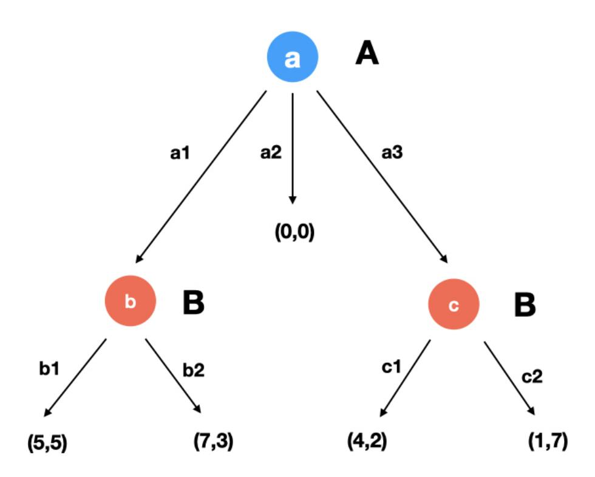

Figure 1: Game Γ in extensive form.

{17}------------------------------------------------

**Definition 11** (game in a normal form). A game in a normal form representation is identified by a tuple  $\Gamma = \langle N, \mathscr{S}, u \rangle$ , where N is a finite set of n players,  $\mathscr{S} = \mathscr{S}_1 \times \mathscr{S}_2 \times \cdots \times \mathscr{S}_n$  where  $\mathscr{S}_i$  is the set of strategies of player i and  $u : \mathscr{S} \to \mathbb{R}^n$  is the utility function of the players.

Every player i has available a set of strategies  $\mathscr{S}_i$ . Let us suppose that every player picks a strategy  $\sigma_i \in \mathscr{S}_i$ ; then it is possible to compute the utility for a player i:  $u_i(\sigma_1, \sigma_2, \ldots, \sigma_n)$ , which is the i-th component of the function u. Since they are rational agents, the goal of the players is to maximize their utility by choosing their strategy. Usually there is no strategy that allows every player to maximize their utility, therefore we have to consider joint strategies  $\sigma = (\sigma_1, \sigma_2, \ldots, \sigma_i, \ldots, \sigma_n) \in \mathscr{S}$ . Each player i chooses a strategy  $\sigma_i$  and the outcome  $u(\sigma)$  pleases every player, so that they do not want to change their strategy. We introduce some solution concepts of a game, that consists of sets of joint strategies.

|    | (b1,c1) | (b1,c2) | (b2,c1) | (b2,c2) |
|----|---------|---------|---------|---------|
| a1 | 5,5     | 5,5     | 7,3     | 7,3     |
| a2 | 0,0     | 0,0     | 0,0     | 0,0     |
| аЗ | 4,2     | 1,7     | 4,2     | 1,7     |

Figure 2: Game  $\Gamma$  in normal form.

**Definition 12** (joint strategy). A joint strategy  $\sigma = (\sigma_1, \sigma_2, \dots, \sigma_i, \dots, \sigma_n) \in \mathscr{S}$  is a Nash equilibrium if:

$$u_i(\sigma_1, \sigma_2, \dots, \sigma_i, \dots, \sigma_n) \ge u_i(\sigma_1, \sigma_2, \dots, \tau_i, \dots, \sigma_n)$$

for every player i and for every  $\tau_i \in S_i$ .

The definition of Nash equilibrium is based on the concept of best response, i.e., the strategy  $\sigma_i$  that maximizes the utility of a player i, given the strategies of the other players  $\sigma_{-i}$ . In a Nash equilibrium no player has an incentive to unilaterally change its strategy since utilities do not increase. Nash [33] proves that every game in normal form admits at least one Nash equilibrium. Nash equilibria are reasonable solution concepts since they represent a scenario in which nobody is tempted to unilaterally change her own strategy. However, the set of Nash equilibria is not always a singleton, it might happen indeed that there is more than one equilibrium. Here below some properties of Nash equilibria are introduced.

**Definition 13** (strong Nash equilibrium [1]). A Nash equilibrium  $\sigma = (\sigma_1, \sigma_2, \dots, \sigma_i, \dots, \sigma_n)$   $\in \mathscr{S}$  is said to be strong if and only if for all  $C \subseteq N$ , all  $\tau_C \in \mathscr{S}_C$ ,  $\exists i \in C$  such that  $u_i(\sigma_C, \sigma_{-C}) \ge u_i(\sigma_C, \tau_{-C})$ .

In [1] the authors prove that the outcome of every strong Nash equilibrium is Pareto efficient i.e., no player can improve her outcome without reducing the outcome of another players. Strong Nash equilibria are easy to be identified, but they do not always exist.

**Definition 14** (stable Nash equilibrium [25]). A Nash equilibrium  $\sigma = (\sigma_1, \sigma_2, \dots, \sigma_i, \dots, \sigma_n)$   $\in \mathscr{S}$  is said to be stable if it belongs to the set S which is minimal with respect to the following

{18}------------------------------------------------

property: for every  $\epsilon > 0$  there exists  $\delta > 0$  such that any upper-hemicontinuous compact convex valued correspondence pointwise within Hausdorff distance  $\delta$  of the best response correspondence of  $\Gamma$  has a fixed point within  $\epsilon$  of S.

The concept of stable equilibria was introduced in [28] in order to exclude less meaningful Nash equilibria i.e., those equilibria that are less resilient against small changes. After [28], several other definitions of stability were introduced. We cite the definition provided in [25], which fulfills some useful properties. One of these states that there always exists a stable Nash equilibrium. Moreover, stable Nash equilibria survive after the iterated deletion of weakly dominated strategies, i.e., those strategies  $\sigma_i \in \mathscr{S}_i$  that perform as well as or worse than another strategy  $\sigma'_i \in \mathscr{S}_i$  no matter which strategy the other players choose (formally, we have that  $u_i(\sigma_i, \tau_{-i}) \leq u_i(\sigma'_i, \tau_{-i})$  for all  $\tau_{-i} \in \mathscr{S}_{-i}$ ). In the process of iterated deletion [36] weakly dominated strategies are excluded from the set of strategies available to players and the set of Nash equilibria is recomputed.

### A.2 Mechanisms and Robustness

In a distributed protocol, agents who run it can either decide to follow the prescribed protocol or not. In case they do not, they deviate from the prescribed protocol by choosing a byzantine behaviour. We would like to model these situations and understand whether the players are incentivized to follow the given advice. In [3] the authors introduce a game theoretical framework based on the concept of mechanism and its properties. In the following we recall and extend the framework of [3].

A game is a tuple  $\Gamma = \langle N, \mathscr{S}, u \rangle$  in which the set of players N corresponds to the agents involved in a protocol. We map all the possible behaviours of the players and define them as their strategies  $\mathscr{S}$ . Following the protocol corresponds to one and only strategy  $\sigma_i \in \mathscr{S}_i$  for every player i. For the sake of simplicity we assign utility  $u_i(s) = 0$  for every  $s \in \mathscr{S}$  when the player i is indifferent between the outcome of the joint strategy s and the outcome of the initial state. Analogously we assign utility  $u_i(s) > 0$  when the outcome of the joint strategy s corresponds to the final state provided by the protocol and  $u_i(s) \leq 0$  when the outcome of s is worse than the initial state. The value of the utility corresponds to the marginal utility with respect to the initial state.

Given the joint strategy  $\sigma = (\sigma_1, \sigma_2, \dots, \sigma_i, \dots, \sigma_n) \in \mathscr{S}$  that corresponds to every player i following the protocol by playing strategy  $\sigma_i$  we define the mechanism  $(\Gamma, \sigma)$ .

**Definition 15** (mechanism [3]). A mechanism is a pair  $(\Gamma, \sigma)$  in which  $\Gamma = \langle N, \mathscr{S}, u \rangle$  is a game and  $\sigma = (\sigma_1, \sigma_2, \dots, \sigma_i, \dots, \sigma_n) \in \mathscr{S}$  is a joint strategy.

Every player is advised to play strategy  $\sigma_i \in \mathcal{S}_i$ . The game  $\Gamma$  shows all the possible strategies available to the players.

Players have a very low incentive to play weakly dominated strategies (cf. Definition 14) since they always have available a different strategy that provides no lower outcome in any scenario. A practical mechanism, formally defined below, ensures that these strategies are not included.

**Definition 16** (practical mechanism [3]). A mechanism  $(\Gamma, \sigma)$  is practical if  $\sigma$  is a Nash equilibrium of the game  $\Gamma$  after the iterated deletion of weakly dominated strategies.

Evaluating the resilience of a distributed protocol to Byzantine behaviors corresponds to identifying the properties of the mechanism  $(\Gamma, \sigma)$ . Users can decide to choose a Byzantine behaviour for two different reasons. On one hand they can cooperate in order to find a joint strategy that provides a better outcome than the one given by the protocol. A mechanism which is optimal resilient, i.e., practical (cf. Definition 16) and strongly resilient (cf. Definition 17), discourages these behaviours. On the other hand some agents can behave maliciously for any reason and bring other players to unpleasant scenarios. In [3] a mechanism is t-immune to this behavior if it provides not inferior utility in the case when at most t players play a strategy different from the one prescribed by the mechanism. This condition has been already identified as beeing too strong in practice therefore we introduce the property of t-weak-immunity (cf. Definition 1), which means that a player i who chooses the prescribed strategy  $\sigma_i \in \mathscr{S}_i$  is never lead to a worse state than the initial one, under the hypothesis that at most t players are byzantine.

In [3] the authors introduce a geleralization of Nash equilibrium, k-resilient equilibrium defined formally below. The definition is a generalization of the concept of Nash equilibrium, which can

{19}------------------------------------------------

be considered as a 1-resilient equilibrium. Indeed, in a Nash equilibrium no coalition formed by a single player has an incentive to change strategy. In a k-resilient equilibrium there is no coalition of k players that have an incentive to simultaneously change strategy to get a better outcome. Given a coalition of rational players C ⊆ N of size up to k : 1 ≤ k < |N|, the joint strategy σ ∈ S and any other of their joint strategies τC ∈ SC we can define k-resiliency as follows.

Definition 17 (k-resilient equilibrium [3]). A joint strategy σ = (σ1, σ2, . . . , σi , . . . , σn) ∈ S is a k-resilient equilibrium if for all C ⊆ N with 1 ≤ |C| ≤ k, all τC ∈ SC and all i ∈ C, we have ui(σC , σ−C ) ≥ ui(τC , σ−C ).

We say that a mechanism (Γ, σ) is k-resilient if σ is a k-resilient equilibrium for Γ.

If every strict subset of the players has no incentive to change strategy we say that the joint strategy is strongly resilient (formally, if it is k-resilient for all k ≤ n−1). We say that a mechanism (Γ, σ) is strongly resilient if σ is strongly resilient.

A mechanism (Γ, σ) is optimal resilient if it is practical and strongly resilient.

One of the basic assumption of game theory is that agents are rational. However, in real applications it might happen that agents behave irrationally. There are different reasons for this. Agents might have some limits that do not let them identify and choose rational behaviours. We always work under the assumptions that everything works, but there might be some technical failures that make some actions inaccessible to players. Lastly, the game might be not independent from other games. For instance, some agents might be subject to bribes which entice them to play an irrational strategy. Therefore it is interesting to study strategies that are immune at this type of behaviors. A joint strategy is t-immune if it provides not inferior utility in the case when at most t players play a strategy different from the one prescribed by the mechanism.

Definition 18 (t-immunity [3]). A joint strategy σ = (σ1, σ2, . . . , σi , . . . , σn) ∈ S is t-immune if for all T ⊆ N with |T| ≤ t, all τT ∈ ST and all i ∈ N \ T, we have ui(σ−T , τT ) ≥ ui(σ). A mechanism (Γ, σ) is t-immune if σ is t-immune in the game Γ.

The concept of k-resilience denotes the tendency of a set of k players to cooperate to move to a equilibrium different from the one prescribed. On the other hand, the concept of t-immunity evaluates the risk of a set of t players to defect and play a different strategy that can damage the other players. The two concepts are complementary In [3] the authors introduced the notion of (k, t)-robust mechanism. A mechanism is (k, t)-robust if it is k-resilient and t-immune.

The property of t-immunity (cf. Definition 18) is too strong and difficult to be verified in practice because it requires that the protocol provided the best outcome no matter which strategy a set of t players choose. In [16] the author generalizes it with the definition of (t, r)-immunity, i.e., that players receive at least u(σ)−r no matter what the other players do. For our purposes we need a more specific definition, that is valid for all players and that is related to a threshold, that we fix equal to zero. Since zero is the utility provided to players in their initial state, the property of immunity corresponds to guaranteeing at least the value of the initial state to every player. Given a coalition of Byzantine players T ⊆ N of size up to t : 1 ≤ t < |N|, their joint strategy τT ∈ ST and the set of strategies σ−T of altruistic players i ∈ N \ T we can define t-weak-immunity as follows.

Definition 19 (t-weak-immunity). A joint strategy σ = (σ1, σ2, . . . , σi , . . . , σn) ∈ S is t-weakimmune if for all T ⊆ N with |T| ≤ t, all τT ∈ ST and all i ∈ N \ T, we have ui(σ−T , τT ) ≥ 0. A mechanism (Γ, σ) is t-weak-immune if σ is t-weak-immune in the game Γ.

A player that joins a mechanism that is t-weak-immune knows that she does not suffer any loss (i.e., outcome with negative utility) if there are at most t Byzantine players in the game. Under the assumption that a protocol provides positive outcomes, a t-immune strategy is always t-weak-immune. As the denomination might suggest, this new property is weaker. Formally, it is possible to consider it as one of its generalizations. Indeed, if we consider the equivalent game Γ 0 = hN, S , u0 i with u 0 = u−u(σ), the definition of t-immunity and t-weak-immunity are identical. We define as weak immune a joint strategy that is t-weak-immune for every t.

In sections 2.2 we provide necessary and sufficient conditions to prove that a mechanism satisfies the property of optimal resilience and t-weak-immunity.

{20}------------------------------------------------

Finally, we have to take into account that players run complex protocols composed of a set modules. We introduce in Section 2.3 the operator composition of games (cf. Definition 2), i.e., the game that corresponds to different run at the same time by the same players. We prove that the properties above introduced are invariant with respect to this operator, i.e., if two protocols are independent one from another they preserve their properties when played at the same time.

## B Applications

## B.1 Lightning Network

In the blockchain systems transactions are collected in blocks, validated and published on the distributed ledger. The most known of them, Bitcoin, is based on a Proof-of-Work system that validates blocks of transactions and chains them one to another [32]. Bitcoin faces a problem of scalability, in terms of speed, volume and value of the transactions. A transaction is confirmed only once the block to which it belongs is part of a chain with at least D blocks in front of it (under the convention set by the Bitcoin protocol D = 6). On average a new block is validated every T minutes (within Bitcoin, T = 10), thus it takes around T · D = 60 minutes for a transaction to be confirmed, a value that cannot be reduced. Moreover, the number of transactions in a block is limited. Bitcoin cannot bear a sudden upsurge in volume of transactions. Since not all the requests for transactions can be included in a block, some of them are prioritised. The criterion used to order the transactions is the value of the fee that a user pays to the mining pool who validates the block. Therefore performing a lot of transactions on the network can be expensive, since a lot of fees have to be paid.

In order to overcome this issue a layer-2 class of protocols called Lightning Network is introduced [39]. Lightning Network allows users to create bidirectional payment channels to handle unlimited transactions privately, i.e., without involving the Bitcoin blockchain. Two users A and B open a channel by publishing on the Bitcoin blockchain two transactions towards a fund F. The amounts of the transactions form the initial balance. In Section 3.2 we analyze the protocol to open a channel.

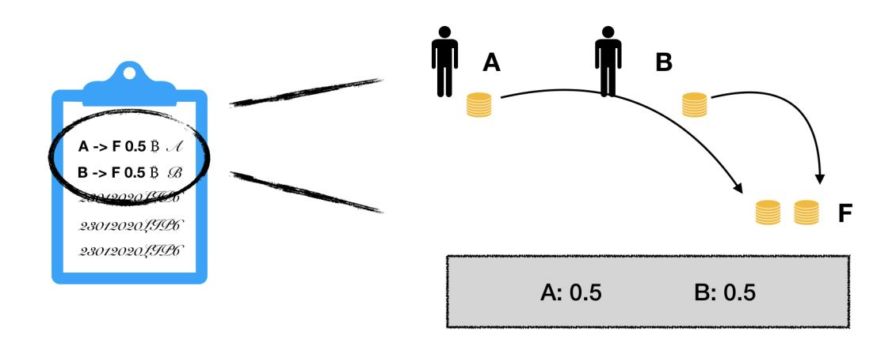

Figure 3: A and B open a channel.

Once the channel is open, they can perform transactions by simply privately updating its balance. The protocol to update the balance is discussed in Section 3.4.

As soon as A and B are no more interested in exchanging bitcoins they decide to close the channel. Two transactions are published on the Bitcoin blockchain: one from F to A and another to F to B. The value of the transactions corresponds to the ones of the latest balance. The protocol to close the channel is presented in Section 3.3. Lightning Network allows transactions also between users who have not opened a common channel (routed payment). Indeed, two users can perform a transaction through a path of open channels, using other users as intermediate nodes. The protocol is analyzed in Section 3.5. In Section B.5 a further construction is introduced, called Hashed Timelock Contract (HTLC), which stands at the basis of the protocol. In the public Bitcoin blockchain every transaction is signed by the sender. In the Lightning Network every operation is identified by a commitment C which must be signed by two users, let us say A and B. In the following sections we use the following notations: C·· when the commitment is signed by

{21}------------------------------------------------

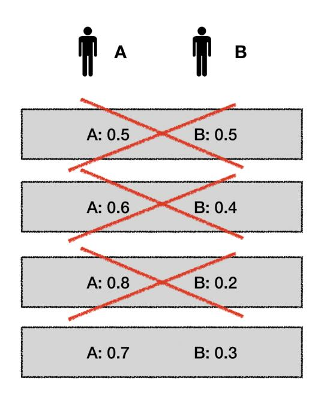

Figure 4: A and B privately update the balance of the channel.

nobody; CA· when the commitment is signed only by user A; C·B when the commitment is signed only by user B; CAB when the commitment is signed by both users, this is the only case in which the commitment C is valid.

In practice, the channel consists of a user, let us say F. Every transaction from and to F must be signed by both users A and B.

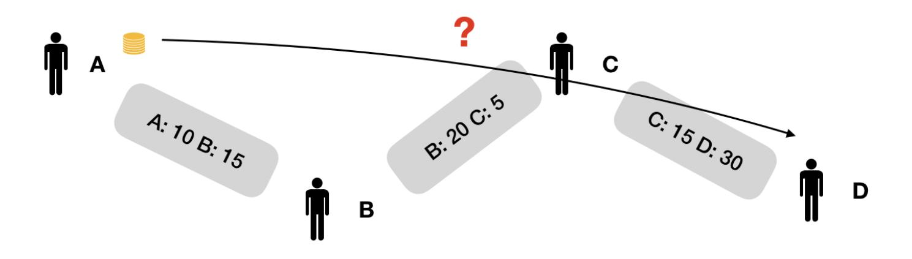

Figure 5: A path of channels between users A and D.

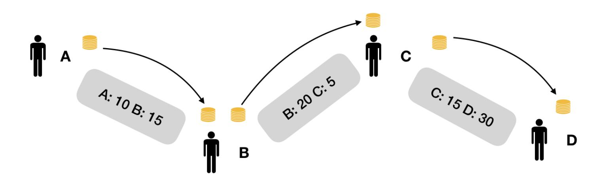

Figure 6: A sends 5 B to D through nodes B and C.

{22}------------------------------------------------

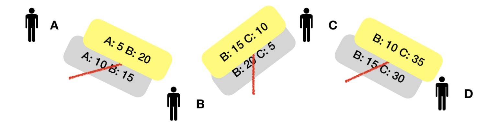

Figure 7: All the balances are updated.

## B.2 Opening module

Informally, the protocol asks the users to fund the channel F with two different transactions, respectively valued xA and xB, and to create two different commitments that allow them to publish a transaction that makes them close the channel unilaterally. Formally, the protocol involves the following steps (cf. Fig. 8):

- 1. A creates a transaction C1b that allows F to send xA to A and to send xB to B. B is able to spend xB only after that ∆ blocks are validated (in [39] ∆ = 1000). A signs C1b and sends it to B.
- 2. B creates a transaction C1a that allows F to send xA to A and to send xB to B. A is able to spend xA only after that ∆ blocks are validated. B signs C1a and sends it to B.
- 3. A creates a transaction Tx that makes A send xA to F and B send xB to F. A signs Tx and sends it to B.
- 4. B signs Tx and publishes it on the Bitcoin blockchain.

If a user decides to close the channel unilaterally, she receives her part of funds after a certain interval of time, while the other user receives it immediately.

We formalise the protocol with the following game in extensive form (cf. Fig. 9). The initial state corresponds to having no channel opened, while the final state corresponds to having the channel opened. We assign null utility to the initial state and positive utility (normalised to 1) to the final state.

Definition 20. The opening game Γ op is a game in extensive form, with two players N = {A, B} and 4 nodes, labeled by a number (1 is the vertex):

- 1. A has two actions available: C1b··, which provides outcome (0, 0); C1bA· , which leads to node 2.
- 2. B has two actions available: C1a··, which provides outcome (0, 0); C1a·B, which leads to node 3.
- 3. A has two actions available: T x··, which provides outcome (0, 0); T xA· , which leads to node 4.
- 4. B has two actions available: T xA· , which provides outcome (0, 0); T xAB, which provides outcome (1, 1).

At every node the player involved in the protocol have two actions available: either follow it or not follow it. If at any step they do not follow it, they get back to the initial state, with outcome (0, 0). If they do at every step, they are able to open the channel, with outcome (0, 0). The joint strategy recommended by the protocol is σ op = ({C1bA· , T xA·},({C1a·B, T xAB}), in which the actions are played respectively at nodes ({1, 3}, {2, 4}).

{23}------------------------------------------------

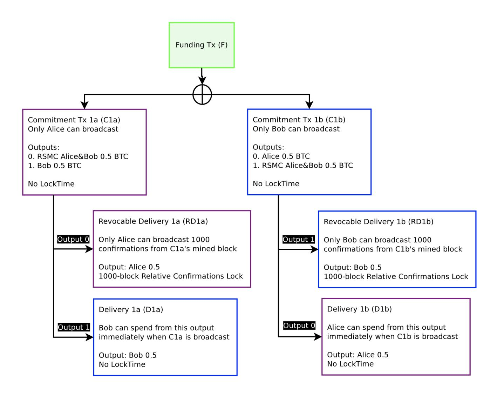

Figure 8: Scheme of the commitments for the opening of a channel [39].

**Theorem 10.** The mechanism  $(\Gamma^{op}, \sigma^{op})$  is not immune.

Proof. Since we are in a two-player setting, a mechanism is immune (cf. Definiton 18) if it is 1-immune, i.e. if both players receive no lower payoff than  $u(\sigma^{op}) = (1,1)$ , no matter what the other player chooses. A counterexample is B deviating from  $\sigma_B^{op} = \{C1a_{\cdot B}, Tx_{AB}\}$  to  $\tau_B = \{C1a_{\cdot B}, Tx_{AB}\}$ , i.e. B refusing to signing C1a at step 2. For player A the outcome of  $u_A(\sigma_A^{op}, \tau_B) = 0 < 1 = u(\sigma^{op})$ .

**Theorem 11.** The mechanism  $(\Gamma^{op}, \sigma^{op})$  is optimal resilient and weak immune.

*Proof.* The only Pareto efficient outcome is (1,1), which is provided only by the joint strategy  $\sigma^{op}$ . Therefore  $\sigma^{op}$  is a strong Nash equilibrium. For Proposition 1 we have that since  $\sigma^{op}$  is a strong equilibrium, then the mechanism is strongly resilient.

Both  $\sigma_A^{op}$  and  $\sigma_B^{op}$  are dominant strategies respectively for A and B, because they always get a better outcome, no matter what the other player does. Therefore  $\sigma^{op}$  survives after the iterated deletion of weakly dominated strategies: the mechanism is practical.

The players never receive negative payoff, therefore if they play  $\sigma_A^{op}$  and  $\sigma_B^{op}$  they always get a non-negative payoff. This corresponds to the Definition 1 of weak immunity.

{24}------------------------------------------------

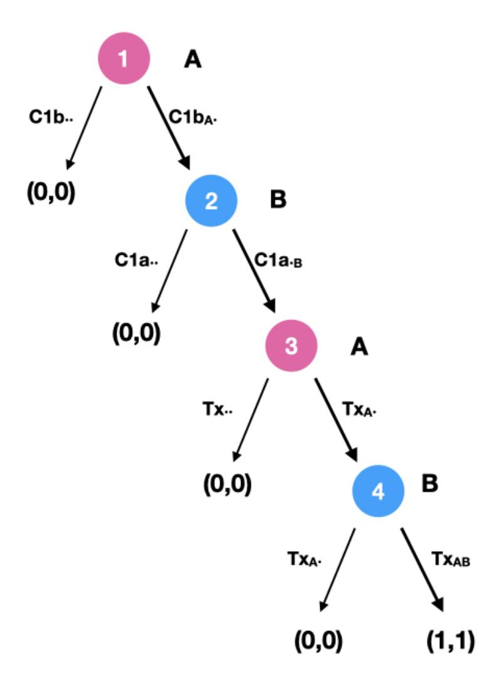

Figure 9: The game tree of  $\Gamma^{op}$ 

### B.3 Closing module

Let us consider the context in which both players have opened a channel and they have intention to close it. As described in Section 3.2, A and B have both a copy of a transaction that allows them to close the channel unilaterally. Indeed, A and B own respectively two commitments  $C1a_{.B}$  and  $C1b_{A}$ . signed by the other part. If they add their signature, respectively  $C1a_{AB}$  and  $C1b_{AB}$ , they can unilaterally publish a transaction that returns the values stuck in the fund  $x_{A}$  and  $x_{B}$  back to their owners. The user that closes the channel unilaterally receives her part of the fund after  $\Delta$  blocks, while the other user receives it immediately. Since users prefer to receive their asset immediately, the protocol recommends to create a new transaction, namely ES, that makes F send  $x_{A}$  and  $x_{B}$  respectively to A and B immediately. We model the situation with the following game in normal form (cf. Definition 11).

**Definition 21.** The closing game  $\Gamma^{cl} = \langle N, \mathcal{S}, u \rangle$  of the channel  $(x_A, x_B)$  with  $x_A, x_B > 0$  is a game in normal form, with two players  $N = \{A, B\}$  who have available three different pure strategies each:  $\mathcal{S}_A = \{C1a_{AB}, N, ES\}$  and  $\mathcal{S}_B = \{C1b_{AB}, N, ES\}$ . The value of the utility can be found in the following payoff table.

|   |            |                                        | В        |          |
|---|------------|----------------------------------------|----------|----------|
|   |            | $C1b_{AB}$                             | N        | ES       |
|   | $C1a_{AB}$ | $\left(\frac{1}{2},\frac{1}{2}\right)$ | (0,1)    | (0,1)    |
| A | N          | $(1, \bar{0})$                         | (-1, -1) | (-1, -1) |
|   | ES         | (1,0)                                  | (-1, -1) | (1,1)    |

Player A can either unilaterally close the channel by signing and publishing  $C1a_{AB}$  on the Bitcoin blockchain, seek a deal with B in order to publish ES or simply do nothing N. Analogously player B can unilaterally publish  $C1b_{AB}$  or choose any of the other two strategies.

The protocol recommends the joint strategy  $\sigma^{cl} = (ES, ES)$ , i.e. that they both seek a deal. The players receive null payoffs if they get their asset within  $\Delta$  blocks, because they return to the

{25}------------------------------------------------

initial state. For instance, this is case for player A if the joint strategy chosen by the players is  $(C1a_{AB}, ES)$ , i.e. if B seeks a deal but A unilaterally closes the channel. The players receive a positive outcome (normalised to 1) if they receive their asset immediately, as for instance if they reach a deal (ES, ES). The players receive a negative outcome (normalised to -1) if their asset is stuck in the channel, such as in the case in which A seeks a deal but B does nothing (N, ES). In case both users decide to unilaterally close the channel  $(C1a_{AB}, C2a_{AB})$ , only one between C1a and C1b can be published. They have the same chance  $(\frac{1}{2})$  for their transaction to published, leading to any of the state (0,1) and (1,0) with equivalent probability.

**Theorem 12.** Under the assumption  $x_A > 0$  or  $x_B > 0$ , the mechanism  $(\Gamma^{cl}, \sigma^{cl})$  is optimal resilient, but not weak immune.

*Proof.* The outcome  $u(\sigma^{cl}) = (1,1)$  cannot be increased by any other joint strategy, therefore it is Pareto efficient, therefore the joint strategy  $\sigma^{cl}$  is a strong equilibrium. Thanks to Proposition 1 we know that every strong equilibrium provides a strongly resilient joint strategy.

For both player the strategy N is weakly dominated by the strategy ES. Indeed, no matter what the other player does, the ES always provides the same or even a better utility than N. If we exclude both strategies N the players have available only two strategies:  $\{C1a_{AB}, ES\}$  and  $\{C1b_{AB}, ES\}$ . Once again, ES dominates the other strategy by providing a better outcome. The only strategy that survives the iterated deletion of weakly dominated strategies for both players is ES. Therefore the only stable Nash equilibrium is  $\sigma^{cl} = (ES, ES)$ . Thanks to Proposition 2 we can say that a stable equilibrium provides a practical mechanism.

To prove that the mechanism is not weak immune it is enough to show a counterexample. Indeed, if A chooses ES as required by the protocol and B chooses the Byzantine strategy N, player A receives a negative outcome  $u_A(\sigma_A^{cl}, N) = u_A(ES, N) = -1$ .

As a corollary, if the mechanism is not weak immune, it is not immune either. We provide an alternative protocol that can satisfy this property.

**Theorem 13.** Under the assumption  $x_A > 0$  or  $x_B > 0$ , the only weak immune mechanism is  $(\Gamma^{cl}, \sigma^*)$  with  $\sigma^* = (C1a_{AB}, C2a_{AB})$ .

*Proof.* In order to identify weak immune mechanisms we apply Proposition 7. We consider player A and the game  $\Gamma_A^{cl}$  in which B is the adversarial player, whose utility is the opposite of player A's. The payoff matrix of the game  $\Gamma_A^{cl}$  is the following:

|   |            |                                          | В      |         |
|---|------------|------------------------------------------|--------|---------|
|   |            | $C1b_{AB}$                               | N      | ES      |
|   | $C1a_{AB}$ | $\left(\frac{1}{2}, -\frac{1}{2}\right)$ | (0,0)  | (0,0)   |
| A | N          | (1,-1)                                   | (-1,1) | (-1,1)  |
|   | ES         | (1,-1)                                   | (-1,1) | (1, -1) |

The Nash equilibria of the game are in the form  $(C1a_{AB}, \{0, p, 1-p\})$  with  $0 \le p \le \frac{1}{2}$ , which provide outcome (0,0). Since the value of the game v=0 is non-negative, the strategy  $C1a_{AB}$  is the only weak immune strategy for player A.

Analogously we can define the game  $\Gamma_B^{cl}$  in which A is the adversarial player, which lets us prove that  $C1b_{AB}$  is the only weak immune strategy for player B. Therefore  $(C1a_{AB}, C1b_{AB})$  is the only joint strategy that provides a weak immune mechanism.

If we drop the assumption that both players fund the channel, we have to consider a different modelisation. For instance, if B does not fund the channel we have that  $x_B = 0$ . No matter what her strategy chooses, she gets nothing. We fix the utility of any outcome to 1 because it corresponds to the outcome of closing the channel. The payoff matrix of the game is the following:

|   |            |                    | В      |        |
|---|------------|--------------------|--------|--------|
|   |            | $C1b_{AB}$         | N      | ES     |
|   | $C1a_{AB}$ | $(\frac{1}{2}, 1)$ | (0,1)  | (0,1)  |
| A | N          | (1,1)              | (-1,1) | (-1,1) |
|   | ES         | (1,1)              | (-1,1) | (1,1)  |

{26}------------------------------------------------

This is a case of degenerate game, in which player B can theoretically choose any possible strategy, even doing nothing N. In this case, player A is forced to follow the weak immune mechanism ( $\Gamma^{cl}, \sigma^*$ ). As a result, we believe that Lightning Network should include this alternative protocol at least for the case in which the channel is unilaterally funded.

## B.4 Updating module

Performing a transaction within a channel consists in updating its balance. Technically, the previous commitments (C1a and C1b) with balance  $(x_A, x_B)$  are replaced by two new commitments (C2a and C2b) with different balance  $(x_A', x_B')$ . In order to prevent players from publishing old commitments, the players sign two Breach Remedy Transactions (BR1a and BR1b), that can invalidate C1a and C2b. Specifically, if user A publishes the outdated commitment C1a user B receives  $x_B$  immediately, while the remaining  $x_A$  are stuck in the fund for  $\Delta$  blocks. The commitment BR1a, if published by B, lets her retrieve also the remaining  $x_A$ . Briefly speaking, if any part publishes an outdated commitment the other part can retrieve all the assets in the fund. In practice the players have an incentive to delete outdated commitments to limit the risk of an unintentional leak, that could provoke their publication and thus the loss of all the assets stored in the channel. The protocol involves the following steps:

- 1. A creates a transaction C2b that allows F to send  $x'_A$  to A and to send  $x'_B$  to B. B is able to spend  $x'_B$  only after that  $\Delta$  blocks are validated. A signs C2b and sends it to B.
- 2. B creates a transaction C2a that allows F to send  $x'_A$  to A and to send  $x'_B$  to B. A is able to spend  $x'_A$  only after that  $\Delta$  blocks are validated. B signs C2a and sends it to B.
- 3. A creates a transaction BR1a that lets B retrieve  $x_A$  in case A publishes C1a and B publishes BR1a within the following  $\Delta$  blocks. Then A sends BR1a to B.
- 4. B creates a transaction BR1b that lets A retrieve  $x_B$  in case B publishes C1b and A publishes BR1b within the following  $\Delta$  blocks. Then B sends BR1b to A.

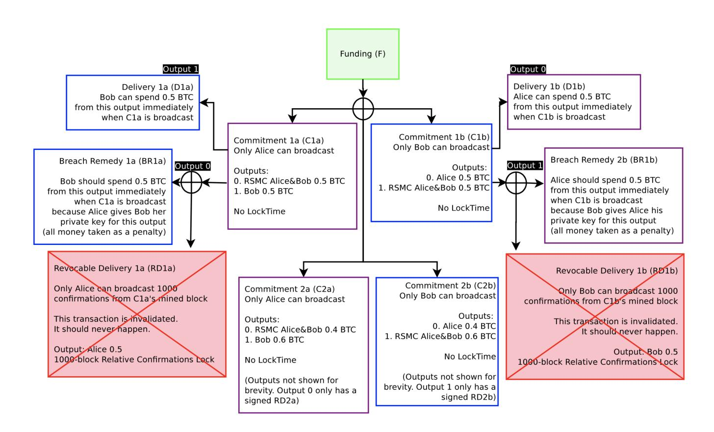

Figure 10: Scheme of the commitments to update the balance of the channel [39].

We formalise the protocol with a game in extensive form (cf. Fig. 11). The initial state corresponds to the previous balance (with thus null utility), the final state to the updated balance (with utility equal to 1). One may question that with the updated balance one of the two party is receiving a smaller asset, but this does not consist in receiving a lower utility, because updating the balance guarantees the exchange of a different asset which is more valuable than the asset stored in the channel. We assign a negative value to the states in which players lose their assets or part of them.

{27}------------------------------------------------

**Definition 22.** The *updating game*  $\Gamma^{up}$  is a game in extensive form, with two players  $N = \{A, B\}$  and 5 nodes, labeled by a number (1 is the vertex):

- 1. A has two actions available: C2b..., which provides outcome (0,0);  $C2b_{A.}$ , which leads to node 2.
- 2. B has three actions available: C2a..., which provides outcome (0,0);  $C2b_{AB}$ , which provides outcome (1,1);  $C2a._B$ , which leads to node 3.
- 3. A has three actions available: BR1a..., which provides outcome (0,0);  $C2a_{AB}$ , which provides outcome (1,1);  $BR1a_{A.}$ , which leads to node 4.
- 4. B has two actions available:  $BR1b_{.B}$ , which provides outcome (1,1);  $BR1b_{..}$ , which leads to node 5.
- 5. A has two actions available:  $C1a_{AB}$ , which provides outcome (-1,1);  $C2a_{AB}$ , which provides outcome (1,1).

The protocol recommends to sign both new commitments and the breach remedy transactions, i.e. it corresponds to the joint strategy  $\sigma^{up} = (\{C2b_A, BR1a_A, C2a_{AB}\}, \{C2a_{B}, BR1b_{B}\})$ , in which the actions are played respectively at nodes  $(\{1,3,5\},\{2,4\})$ . At nodes 2 and 3 respectively B and A can enforce the new commitments by publishing them on the Bitcoin blockchain and thus closing the channel. At node 4 B can refuse to provide the breach remedy transaction to A, who at node 5 can then publish the new commitment enforcing the closure of the channel. If at node 5 A publishes the old commitment C1a, B can retrieve all the funds by publishing the breach remedy transaction BR1a.

We now analyze the properties of the mechanism, considering as hypothesis that it is possible to publish a transaction within  $\Delta$  blocks, otherwise it is not possible to publish the breach remedy transactions in time.

**Theorem 14.** Under the assumption that it is possible to publish a transaction within  $\Delta$  blocks, the mechanism  $(\Gamma^{up}, \sigma^{up})$  is not immune.

*Proof.* Since we are considering a game with only two players, a mechanism is immune if it is 1-immune. A mechanism is 1-immune (cf. Definition 18) if any player receives the same outcome by playing the recommended strategy, no matter which strategy the other player chooses. This is not the case of the mechanism  $(\Gamma^{up}, \sigma^{up})$ , indeed if player A chooses  $\sigma_A^{up}$  and player B chooses  $\{C2a.., BR1b.B\} \neq \sigma_B^{up}$  the payoff for player A is  $u_A(\sigma_A^{up}, \{C2a.., BR1b.B\}) = 0 < 1 = u_A(\sigma_A^{up}, \sigma_B^{up})$ .

The property of immunity is too strong in this case, therefore we consider other weaker properties.

**Theorem 15.** Under the assumption that it is possible to publish a transaction within  $\Delta$  blocks, the mechanism  $(\Gamma^{up}, \sigma^{up})$  is optimal resilient and weak immune.

Proof. The outcome for the joint strategy  $\sigma^{up}$  is (1,1), which cannot be increased by any other joint strategy. Therefore, the outcome is Pareto efficient and  $\sigma^{up}$  is a strong equilibrium. Thanks to Proposition 1 we can say that a strong equilibrium provides a strongly resilient mechanism. In order to prove that the mechanism is resilient, we have to exclude weakly dominated strategies. Since it is cumbersome to list all the strategies, we proceed by excluding all the actions that are included in a weakly dominated strategy. At node 1 A receives always a better outcome by picking action  $C2b_A$ , rather than  $C2b_{...}$ , thus  $C2b_{...}$  is never included in a practical mechanism. At node 2 B never plays the action  $C2a_{...}$ , at node 3 A never plays  $BR1a_{...}$  and at node 5 A never plays  $C1a_{AB}$ . The remaining joint strategies, included  $\sigma^{up}$ , provide outcome (1,1). Since they all survive the iterated deletion of weakly dominated strategies, they are all practical mechanisms. Thanks to Corollary 1 we know that there always exists at least one practical mechanism. However, the reader should keep in mind that this might not be unique.

In order to prove that the mechanism is weak immune we apply Proposition 3. We consider one player i at a time and we make the other player j adversarial, by fixing her outcome as the opposite

{28}------------------------------------------------

of player i (cf. Fig. 12). Then we prove that the best response of player j to player i never leads her to a negative outcome. We take i = A and we consider the game  $\Gamma_A^{up}$  in which player j = B has utility opposite to player i. The best response of player j to the strategy  $\sigma_A^{up}$  picked by player i is the strategy  $\{C2a, BR1b..\}$ , i.e. at node 2 to avoid to reach a deal by not signing C2a. The payoff for player A is  $u_A(\sigma_A^{up}, \{C2a, BR1b..\}) = 0$ , which is non-negative. Analogously we consider the game  $\Gamma_B^{up}$  in which i = B is the picked player and j = A is the adversarial player, with utility opposite to player i. The best response for j to strategy  $\sigma_B^{up}$  is  $\{C2b.., BR1a.., x\}$  with x any possible action at node 5, which provides a non-negative payoff  $u_B(\{C2b.., BR1a.., x\}, \sigma_B^{up}) = 0$ . Since both adversarial games provide non-negative payoff, thanks to Proposition 3 we get that the mechanism is weak immune.

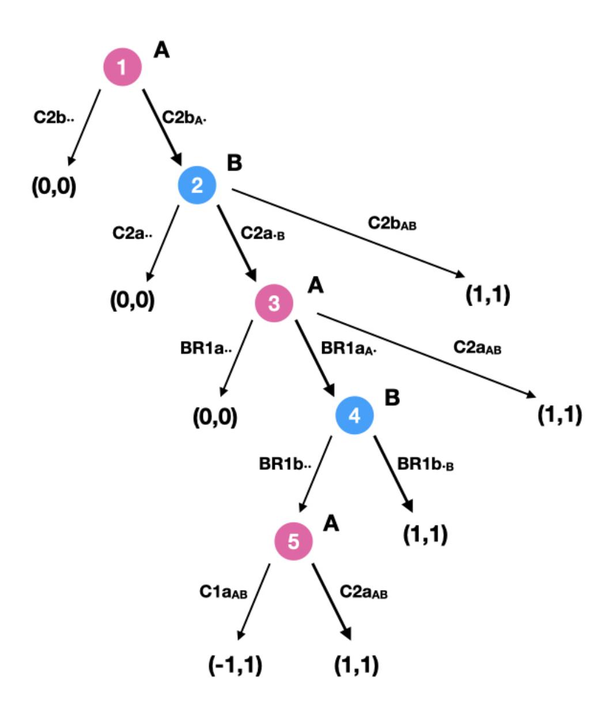

Figure 11: The game tree of  $\Gamma^{up}$ 

{29}------------------------------------------------

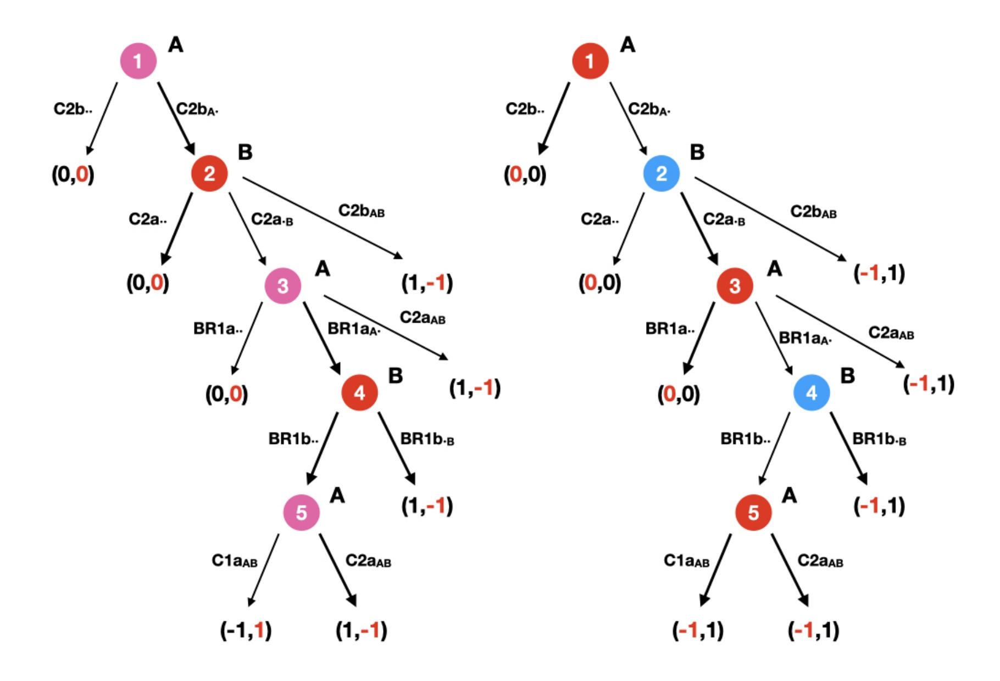

Figure 12: The game trees of  $\Gamma_A^{up}$  and  $\Gamma_B^{up}$ 

## **B.5** Hashed Timelock Contract module

A bidirectional payment channel only allows transactions inside a channel. In order to perform transactions through a network of channels Lightning Network introduces an additional construction, called Hashed Timelock Contract (HTLC). The HTLC allows to create transactions that can be triggered at will. The HTLC makes use of the hash function, a deterministic caotic function that maps any input x to a fixed-length string y = hash(x). It is not possible to retrieve x given y in a faster way than trying with a bruce-force method to randomly guess x. Hence if x is chosen among strings of considerable length, it is almost impossible to identify x given by y = hash(x) in a reasonable time. Let us suppose that users A and B open a channel with balance  $(x_A, x_B)$  and A wants to send a payment through HTLC to B so that the new balance would be  $(x'_A, x'_B)$ , with  $x_A < x'_A$ . A creates a random data R and then computes H = hash(R). Then she sends an update of the contract to B, with a specific characteristic: if B publishes it, she can retrieve the difference  $x'_B - x_B$  only if she proves to know x such that H = hash(x) within  $\Delta$  blocks (in [39]  $\Delta = 1000$ ). A can trigger the contract by providing R to B. If she does not do it, B cannot find x = R and thus has no incentive to publish the contract. The HTLC protocol works as follows:

- 1. A creates a commitment C2b that allows F to send  $x'_A$  to A,  $x_B$  to B after  $\Delta$  blocks and  $x'_B x_B$  to B if she publishes x such that H = hash(x) to the Bitcoin blockchain within  $\Delta$  blocks. A signs it and sends it to B.
- 2. Analogously, B creates a set of commitment C2a that allows F to send  $x'_B$  to B,  $x_A$  to A after  $\Delta$  blocks and  $x'_B x_B$  to B if she publishes x such that H = hash(x) to the Bitcoin blockchain within  $\Delta$  blocks. B signs it and sends it to A.
- 3. A creates a transaction BR1a that lets B retrieve  $x_A$  in case A publishes C1a and B publishes BR1a within the following  $\Delta$  blocks. Then A sends BR1a to B.

{30}------------------------------------------------

4. B creates a transaction BR1b that lets A retrieve xB in case B publishes C1b and A publishes BR1b within the following ∆ blocks. Then B sends BR1b to A.

The protocol for the HTLC corresponds to the protocol for updating a channel, with the only difference that the new commitments C2a and C2b provide a different output. Under the assumption that a transaction (or just the key R) can be published within ∆ blocks, we can define a game Γ htlc with the very same structure as Γ up (cf. Definition 5 and Fig. 11). Following the protocol corresponds to the joint strategy σ htlc. Hence we can introduce the following theorem.

Theorem 16. Under the assumption that it is possible to publish a transaction within ∆ blocks, the mechanism (Γhtlc, σhtlc) is optimal resilient and weak immune, but not immune.

Proof. Since the mechanisms (Γhtlc, σhtlc) and (Γup, σup) follow the very same structure, we can apply Theorem 5.

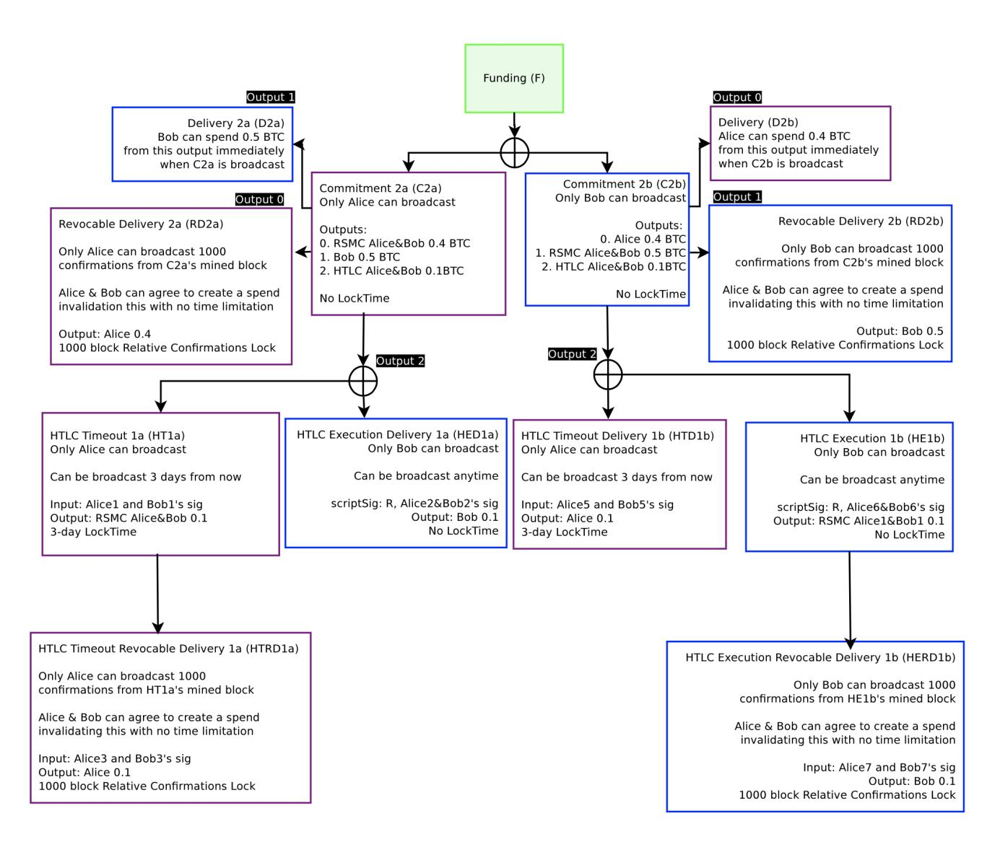

Figure 13: Scheme of the commitments of the HTLC [39].

{31}------------------------------------------------

## B.6 Routing module

Lightning Network allows payments also between two users, namely A and C, who do not share a channel. The requirement for a routed payment is to find a path of channels between the two users, i.e. a sequence of users who two-by-two share a channel. Let us consider the case of a single intermediate node, namely B: users A and B have an opened channel with balance (xA, xB), while B and C have opened a different channel with balance (yB, yC ). Let us suppose that A wishes to send δ to C. Informally, A sends δ + to B and B sends δ to C, where ≥ 0 is the fee given to the intermediate node B. Since the channel are opened the two payments consists in updating the balance of the two channels: (xA, xB) → (xA − δ − , xB + δ + ) and (yB, yC ) → (yB − δ, yC + δ). The protocol for routed payments lets the receiver C trigger both payments at the same moment:

- 1. C creates a random data R and hashes it: H = hash(R). Then, she sends H to A.
- 2. A creates a HTLC, namely HAB of value δ + locked with H and sends it to B.
- 3. B creates a HTLC, namely HBC of value δ locked with H and sends it to C.
- 4. C discloses R to B, hence validating HBC .
- 5. B discloses R to A, thus validating HAB.

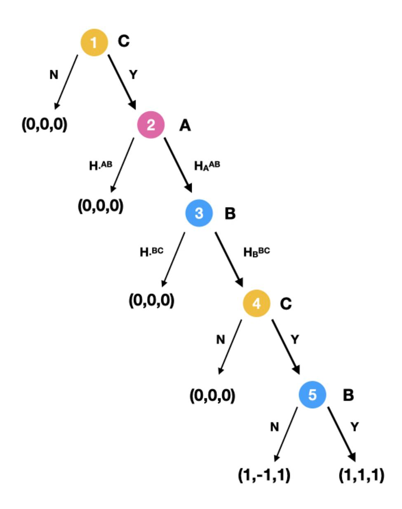

Figure 14: The game tree of Γ rout

We formalise the protocol with a game in extensive form (cf. Fig. 14). The initial state consists in the initial balance and it is assigned null utility. The final state corresponds for A and C to fulfill the payment, for B to receive the fee . The final state has positive payoff, normalised to 1. Any state that consists in a loss of assets is assigned negative payoff.

Definition 23. The routing game Γ rout is a game in extensive form, with three players N = {A, B, C} and 5 nodes, labeled by a number (1 is the vertex):

{32}------------------------------------------------

- 1. C has two actions available: either N, not sending H to A, which provides outcome (0,0,0), or Y, sending H to A, which leads to node 2.
- 2. A has two actions available: either  $H_{\cdot}^{AB}$ , which provides outcome (0,0,0), or  $H_{A}^{AB}$ , which leads to node 3.
- 3. B has two actions available: either  $H_{\cdot}^{BC}$ , which provides outcome (0,0,0), or  $H_{B}^{BC}$ , which leads to node 4.
- 4. C has two actions available: either N, not disclosing R to B, which provides outcome (0,0,0), or Y, disclosing R to B, which leads to node 5.
- 5. B has two actions available: either N, not disclosing R to A, which provides outcome (1, -1, 1) or Y, disclosing R to A, which provides outcome (1, 1, 1).

At node 1 C creates the lock H and its key R. At node 2 and 3 the two HTLCs are created. At node 4 C triggers the payment in the channel that she shares with B. At node 5 B triggers the payment in the channel that she shares with A. If at step 5 B does not trigger the payment, A and C reach the final state, because C has received the payment, also if A has not paid for it. The recommended joint strategy is  $\sigma^{rout} = (\{H_A^{AB}\}, \{H_B^{BC}, Y\}, \{Y, Y\})$ , respectively played at nodes  $(\{2\}, \{3, 5\}, \{1, 4\})$ . The payoff are as shown only under the assumption that in both HTLCs the transactions can be triggered. We analyze the protocol under this assumption.

**Theorem 17.** Under the assumption that in both HTLCs the transactions can be triggered,  $(\Gamma^{rout}, \sigma^{rout})$  is not immune.

Proof. Since the game  $\Gamma^{rout}$  has three players, the mechanism is immune if it is 1-immune and 2-immune. To prove that the mechanism is not immune, it is enough to prove that it is not 1-immune. A mechanism is 1-immune (cf. Definition 18) if any player who chooses the recommended strategy receives the same outcome, no matter what any Byzantine player can choose. This property is not fulfilled. Indeed, if A picks the strategy  $H_{\cdot}^{AB}$ , the outcome for C is lower:  $u_{C}(H_{\cdot}^{AB}, \sigma_{B}^{rout}, \sigma_{C}^{rout}) = 0 < 1 = u_{C}(\sigma_{A}^{rout}, \sigma_{B}^{rout}, \sigma_{C}^{rout}) = u_{C}(\sigma_{A}^{rout}, \sigma_{B}^{rout}, \sigma_{C}^{rout})$ .

The property of immunity is too strong for this protocol, therefore we consider the other properties.

**Theorem 18.** Under the assumption that in both HTLCs the transactions can be triggered,  $(\Gamma^{rout}, \sigma^{rout})$  is optimal resilient and weak immune.

*Proof.* The outcome  $u(\sigma^{rout}) = (1,1,1)$  is Pareto efficient, indeed there is no other strategy that can improve any of the payoffs. Thus  $\sigma^{rout}$  is a strong equilibrium and thanks to Proposition 1 we have that a strong equilibrium provides a strongly resilient mechanism.

In order to prove that the mechanism is practical, we proceed by excluding the actions that belongs to weakly dominated strategies. At node 5 B never plays N because she would receive -1 rather than 1. Therefore at node 4 C never chooses N because she would receive 0 rather than 1. Analogously at nodes 3, 2 and 1 players do not choose alternative actions, because they would receive 0 rather than 1. The joint strategy  $\sigma^{rout}$  is the only one that survives the iterated deletion of weakly dominated strategies, hence the mechanism is practical.

In order to prove that the mechanism is weak immune we apply Proposition 3. We consider one player i at a time and we introduce an adversarial player j that plays at any node which is not played by i (cf. Fig. 15). We define the game  $\Gamma_i^{rout}$  which has the same structure, two players i and j and utility function for j opposite to the one of player i. In games  $\Gamma_A^{rout}$  and  $\Gamma_C^{rout}$  respectively A and C never receive negative payoffs. In game  $\Gamma_B^{rout}$  player B never receives negative payoff if she player  $\sigma_B^{rout}$ . For Proposition 3, since all the adversarial games  $\Gamma_i^{rout}$  do not provide negative payoff if the players follow the recommended strategy  $\sigma_i^{rout}$ , the mechanism is weak immune.  $\square$ 

Once R is disclosed in one of the two channel, Lightning Network provides a protocol in order to solve the HTLC (see Section B.5). Every HTLC can be modeled with a mechanism:  $(\Gamma^{AB}, \sigma^{AB})$  for  $H^{AB}$  and  $(\Gamma^{BC}, \sigma^{BC})$  for  $H^{BC}$ . The two channels are independent one from another, thus we can consider the composition of the two games (cf. Definition 2) and define the mechanism

{33}------------------------------------------------

(ΓAB  Γ BC , {σ AB i , σBC i }). The protocol for routed payments is independent from the protocol for HTLC, because it is external with respect to the channel, while the HTLCs work within the channel. However, the routed payments are carried out only if in both HTLCs the transactions can be triggered, i.e. if every transaction can be published within ∆ blocks (cf. Section B.5). Therefore we consider this assumption and define the general game Γ routΓ AB Γ BC to represent the general class of protocols that allows routed payments to be performed. We analyze the properties of the mechanism (Γrout  Γ AB  Γ BC , {σ rout i , σAB i , σBC i }).

Theorem 19. Under the assumption that every transaction can be published within ∆ blocks, the mechanism (Γrout  Γ AB  Γ BC , {σ rout i , σAB i , σBC i }) is optimal resilient and weak immune.

Proof. The operator composition is invariant with respect the properties of the mechanisms. Thanks to Theorems 6 and 16 we have that (Γrout, σrout), (ΓAB, σAB) and Γ BC , σBC are practical. Therefore, with Proposition 5 we have that their composition (ΓroutΓ ABΓ BC , {σ rout i , σAB i , σBC i }) is practical.

Analogously, thanks to Theorems 6 and 16 we have that every single mechanism is k-resilient for all k and t-weak-immune for all t. Propositions 6 and 7 let us say that the composition (Γrout  Γ AB  Γ BC , {σ rout i , σAB i , σBC i }) is k-resilient for all k and t-weak-immune for all t, i.e. it is strongly resilient and weak immune.

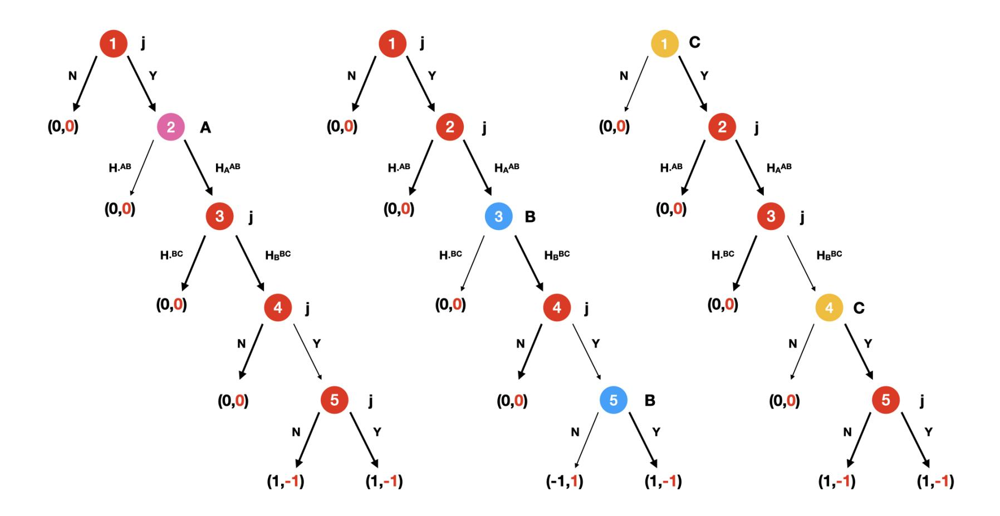

Figure 15: The game trees of Γ rout A , Γ rout B and Γ rout C

{34}------------------------------------------------

#### B.7 Side-chain

A different solution to overcome the scalability and privacy problems of blockchains is offered by Platypus [38], a protocol that allows a group of users to create a childchain that can handle offchain transactions without the need of synchrony among peers. In this section we consider the protocol to create a Platypus chain, described in Fig. 16. Briefly speaking, the protocols lets the chain validators broadcast to the other peers the transactions until the number of validators that have confirmed the transactions overcome a defined threshold. We model the situation with a game in extensive form. The processes are represented by the players of the game, that can be split in two categories: validators V and normal users U. The total number of users  $|V| = |U \cup V|$  is denoted by  $m_v$ . Normal users have utility 1 if their transaction is successfully published, 0 if they get back to the initial state, -1 if they lose anything in the process. The validators have utility n, with n the number of valid transactions which are broadcast. The protocol is divided into phases. Every phase consists of players acting at the same time, indeed we work under the assumption that the broadcast of any of the players involved is subsequent to the action of every other player. If this condition is not fulfilled, it would be necessary to consider different phases instead of one, with the same structure.

**Definition 24.** The *creation game* is a game  $\Gamma^{cr}$  in extensive form, where  $N = U \cup V$  is the set of players. Every phase corresponds to a node of the tree, at which processes play at the same time.

- Phase 1; only the process  $p_0$  is involved. The process  $p_0$  has two actions: either complete it Y or not N. If she does not, the outcome is 0 for all players.
- Phase 2; every process within normal users play at the same time. Everyone dispose of the same two actions: broadcasting their message Y or not N. If the message is not broadcast for player i, her utility is always 0.
- Phase 3; the validators can choose within a set of actions  $a_u$  with  $u \subseteq U$ , i.e., they can validate all the messages for the users within the set u. The cardinality of the set of their actions is equal to  $2^{|U|}$ . The utility for the validators corresponds to the number of valid transactions which are broadcast.
- Phase 4; the validators can choose within a set of actions in the form  $(b_t, s_{t'})$ , where t and t' are any subset of transactions broadcast in Phase 3. The action b consists in broadcasting the transactions belonging to the set t until  $\lfloor 2m_v/3 \rfloor + 1$  validators receive it, while s means to send the transactions in t'.

We define the mechanism  $(\Gamma^{cr}, \sigma^{cr})$ , where  $\sigma^{cr} \in \mathscr{S}$  is the strategy of following the protocol, i.e. for normal users u the strategy is  $\sigma_u^{cr} = Y$ , while for validators v the strategy is  $\sigma_v^{cr} = (a_{u^*}, b_{t^*}, s_{t^*})$ , where  $u^*$  is the set of users who send a message and  $t^*$  is the set of transactions broadcast in Phase 3.

**Theorem 20.** The mechanism  $(\Gamma^{cr}, \sigma^{cr})$  is not t-immune for any t.

*Proof.* It is enough to prove that the mechanism is not 1-immune. A mechanism is 1-immune if every player does not reduce her utility if only one other player is choosing a Byzantine behaviour (cf. Definition 18). This property is not fulfilled, indeed if in Phase 1 the process  $p_0$  chooses N rather than  $\sigma_{p_0}^{cr} = Y$ , the utility for every player is 0, which is lower than the utility provided by  $\sigma^{cr}$ .

**Theorem 21.** The mechanism  $(\Gamma^{cr}, \sigma^{cr})$  is optimal resilient and  $\lfloor \frac{m_v}{3} \rfloor$ -weak-immune.

*Proof.*  $\sigma^{cr}$  is a strong Nash equilibrium. Indeed, under the joint strategy  $\sigma^{cr}$  the validators consider all the processes (u=t=U), thus their utility reach its maximum |U|. The other users have only two strategies, where broadcasting their message is the only strategy played at the equilibrium. Therefore we have a Pareto efficient outcome. Following Proposition 6 we know that the mechanism is strongly resilient.

For normal users the strategy Y dominates N (the utility is 1 which is larger than 0), while for validators  $(a_U, b_U, s_U)$  dominates every other strategy: indeed, any other strategy would provide

{35}------------------------------------------------

Figure 16: Algorithm to create a chain in Platypus [38].

a payoff lower than |U|. Therefore the joint strategy σ cr is the only one with weakly dominating strategies, thus thanks to Proposition 5 we get that the mechanism is practical.

In order to prove weak immunity, we apply Proposition 7. We need to prove that every player never gets negative utility when following the protocol, when all the other players become adversarial. The validators have never negative utility, thus it is enough to prove that neither the other users do. In the worst case scenario for user u ∈ U a wrong process is validated. To do so, another user u 0 ∈ U should be publish it and the validators should approve it. Under the assumption that there at most b mv 3 c corrupted processes, in [38] it is proved that this is not possible. The proof follows from the intuition that the Byzantine validators own less than a third of the network they cannot validate two different transactions including one which can damage the user u. Therefore users never get negative utility if there are at most b mv 3 c Byzantine players. This corresponds to the definition of b mv 3 c-weak-immunity (cf. Definition 1).

{36}------------------------------------------------

## B.8 Cross-chain swap

In this section we analyze the protocol introduced in [35], that allows two users to swap assets that belongs to two different blockchains, which do not communicate with each other. In [24] a theoretical model is set to prove that the protocol is correct for those players who are altruistic, no matter what the other players do. We rephrase the proof within our model, providing a result in terms of (k, t)-weak-robustness. In the example proposed by [35] user A trades bitcoins for altcoins with user B. Bitcoins and altcoins belong to two different blockchains. The protocol stands on the property of the hash function, introduced in Section B.5. The hash function allows to map a string x to y = hash(x) such that given y it is almost impossible to retrieve x. Briefly speaking, A creates a random string x, computes y = hash(x), creates a transaction on the Bitcoin blockchain that sends an amount of bitcoins to B under the condition that B identifies z such that y = hash(z). Then, B creates a transactions on the Altcoin blockchain that sends an amount of altcoins to A under the condition that A provides z such that y = hash(z). A discloses x, thus validating both transactions.

Specifically, A creates two transactions on the Bitcoin blockchain: TX1, that lets B receive an amount of bitcoins if she provides x, and TX2, that gives back the amount to A if B does not provide x within ∆1 hours (in [35] ∆1 = 48). B creates two transactions on the Altcoin blockchain: TX3, that lets A receive an amount of altcoins if she provides x, and TX4, that gives back the amount to B if A does not provide x within ∆2 hours (in [35] ∆2 = 24). The theoretical bounds for ∆1 and ∆2 are provided in [24]. In a context with two players, the condition is that ∆1 ≥ 2∆2. From now on we consider the assumption that ∆1 and ∆2 fulfill the properties set in [24], and specifically we have that min(∆1, ∆2) = ∆2.

Since the two blokchains are independent we model the protocol with two different games. We set to 0 the utility of the initial state, 1 the utility of every state in which the player receive what is asked, −1 the utility of every state in which the player gives some coins without receiving any. The Bitcoin blockchain is represented by game G1, while the Altcoin blockchain by G2 (cf. Fig. 17). We work under the assumption that a transaction can be published within min(∆1, ∆2) = ∆2 hours.

Definition 25. The Bitcoin game is an extensive form game G1 with 2 players N = {A, B} and 5 nodes (1 is the vertex):

- 1. A can either Y , pick a random string x, create TX1 and TX2, then send TX2 to B, or doing none of them N. The action Y leads to node 2, while the action N leads to the outcome (0, 0).
- 2. B can either Y , sign TX2, that leads to node 3, or N refusing to do it, with outcome (0, 0).
- 3. A can either do nothing N, with thus outcome (0, 0), or Y publish TX1 on the Bitcoin blockchain, that leads to node 4.
- 4. Both A and B have available two actions: either Y publish TX2 before that x is revealed or N not. If any of the two does so, the outcome is (0, 0). Otherwise, A reveals x and (N, N) leads to node 5.
- 5. B can either Y publish x on the Bitcoin blockhain or N not doing it. If she does, the outcome is (1, 1). If she does not, the outcome is (1, −1).

The joint strategy that corresponds to following the protocol is σ1 = ({Y, Y, N}, {Y, N, Y }), respectively played at nodes ({1, 3, 4}, {2, 4, 5}). Until x is revealed, the transactions cannot be triggered, therefore they provide null payoff. When x is revealed on the other chain, A has received the altcoins (thus with payoff equal to 1). If at step 5 B reveals x, she triggers the contract and receives the bitcoins (payoff equal to 1). Otherwise she has lost her asset in altcoins (negative payoff −1).

Definition 26. The Altcoin game is an extensive form game G2 with 2 players N = {A, B} and 5 nodes (1 is the vertex):

1. B can either Y , create TX3 and TX4 and send the latter to A, or doing nothing N. The action Y leads to node 2, while the action N leads to the outcome (0, 0).

{37}------------------------------------------------

- 2. A can either Y, sign TX4, that leads to node 3, or N refusing to do it, with outcome (0,0).
- 3. B can either do nothing N, with thus outcome (0,0), or publish TX3 on the Altcoin blockchain (Y), that leads to node 4.
- 4. Both A and B have available two actions: either publish TX4 (Y) before that x is revealed or not (N). If any of the two does so, the outcome is (0,0). Otherwise, A reveals x and (N,N) leads to node 5.
- 5. A can either publish x on the Altcoin blockhain (Y) or not doing it (N). If she does, the outcome is (1,0). If she does not, the outcome is (0,0).

The joint strategy that corresponds to following the protocol is  $\sigma_2 = (\{Y, N, Y\}, \{Y, Y, N\})$ , respectively played at nodes  $(\{2, 4, 5\}, \{1, 3, 4\})$ . Until x is revealed, the transactions cannot be triggered, therefore they provide null payoff. When x is revealed, A receives the altcoins (thus with payoff equal to 1). B does not know if he receives the asset, hence her payoff is 0.

Since the two blockchains are independent, we consider the composition of the two games that represents them and analyze its properties.

**Theorem 22.** Under the assumption that any transaction can be published within a time interval  $[0, \Delta_2]$ , the mechanism  $(\mathcal{G}_1 \odot \mathcal{G}_2, \{\sigma_{1i}, \sigma_{2i}\})$  is not immune.

*Proof.* The joint strategy  $\{\sigma_{1i}, \sigma_{2i}\}$  provides outcome

$$u_{\mathscr{G}_1 \odot \mathscr{G}_2}(\{\sigma_{1i}, \sigma_{2i}\}) = u_{\mathscr{G}_1}(\sigma_1) + u_{\mathscr{G}_2}(\sigma_2) = (1, 1) + (1, 0) = (2, 1)$$

If B considers a strategy  $\sigma_B^*$  that lets her play action N at node 2 of the Bitcoin game and action N at node 1 of the Altcoin game, the outcome is

$$u_{\mathcal{G}_1 \odot \mathcal{G}_2}(\{\sigma_{1A}, \sigma_{2A}\}, u_B^*) = u_{\mathcal{G}_1}(\sigma_{1A}, \sigma_{1B}^*) + u_{\mathcal{G}_2}(\sigma_{2A}, \sigma_{2B}^*) = (0, 0) + (0, 0) = (0, 0)$$

thus reducing the payoff for player A. In a two-player game a mechanism is immune if it is 1-immune (cf. Definition 18), but in this case A receives a loss if B performs a specific Byzantin behaviour.

**Theorem 23.** Under the assumption that any transaction can be published within an interval of time  $\Delta_2$ , the mechanism  $(\mathcal{G}_1 \odot \mathcal{G}_2, \{\sigma_{1i}, \sigma_{2i}\})$  is optimal resilient and weak immune.

*Proof.* It is enough to prove that the two mechanisms  $(\mathcal{G}_1, \sigma_1)$  e  $(\mathcal{G}_2, \sigma_2)$  satisfy the properties and then exploit the properties of the operator composition of games.

In game  $\mathcal{G}_1$  the joint strategy  $\sigma_1$  is the only one with outcome (1,1), which is maximal. Thus the outcome is Pareto efficient and the equilibrium is strong. Thanks to Proposition 1 we have that  $(\mathcal{G}_1, \sigma_1)$  is strongly resilient.

Every strategy different from  $\sigma_1$  is weakly dominated, indeed they bring to either outcome -1 or 0, which is lower than  $u_1(\sigma_1) = (1,1)$ . Thus  $\sigma_1$  is a stable Nash equilibrium and for Proposition 2 we have that the mechanism  $(\mathcal{G}_1, \sigma_1)$  is practical.

In order to prove weak immunity we apply Proposition 3. When following respectively strategies  $\sigma_{1A}$  and  $\sigma_{1B}$  both A and B never get negative utility. Therefore the mechanism  $(\mathcal{G}_1, \sigma_1)$  is also weak immune.

In game  $\mathscr{G}_2$  the joint strategy  $\sigma_2$  produces a Pareto efficient outcome (1,0), thus for Proposition 1 we have that the mechanism  $(\mathscr{G}_2, \sigma_2)$  is strongly resilient.

The strategies within  $\sigma_2$  are never weakly dominated, because none of the others can provide a better outcome. Hence the mechanism is practical.

Every outcome is non-negative, therefore the mechanism is weak immune.

Since both mechanisms are optimal resilient and weak immune, we can apply Propositions 5, 6 and 7, that ensure the invariance of the properties once the operator composition is applied. The mechanism  $(\mathcal{G}_1 \odot \mathcal{G}_2, \{\sigma_{1i}, \sigma_{2i}\})$  is thus optimal resilient and weak immune.

{38}------------------------------------------------

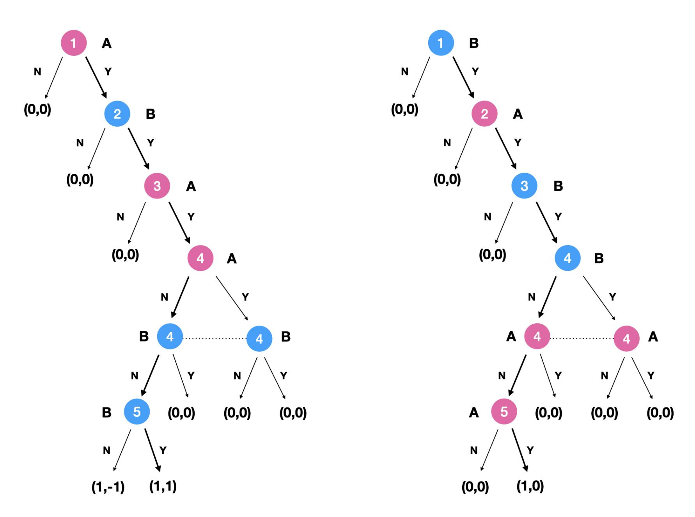

Figure 17: The game trees of G1 and G2.