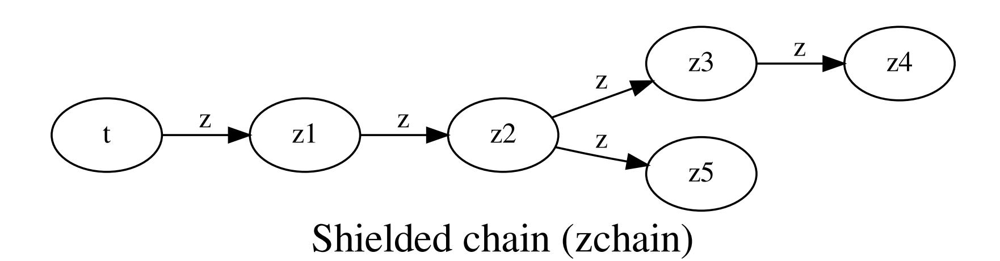
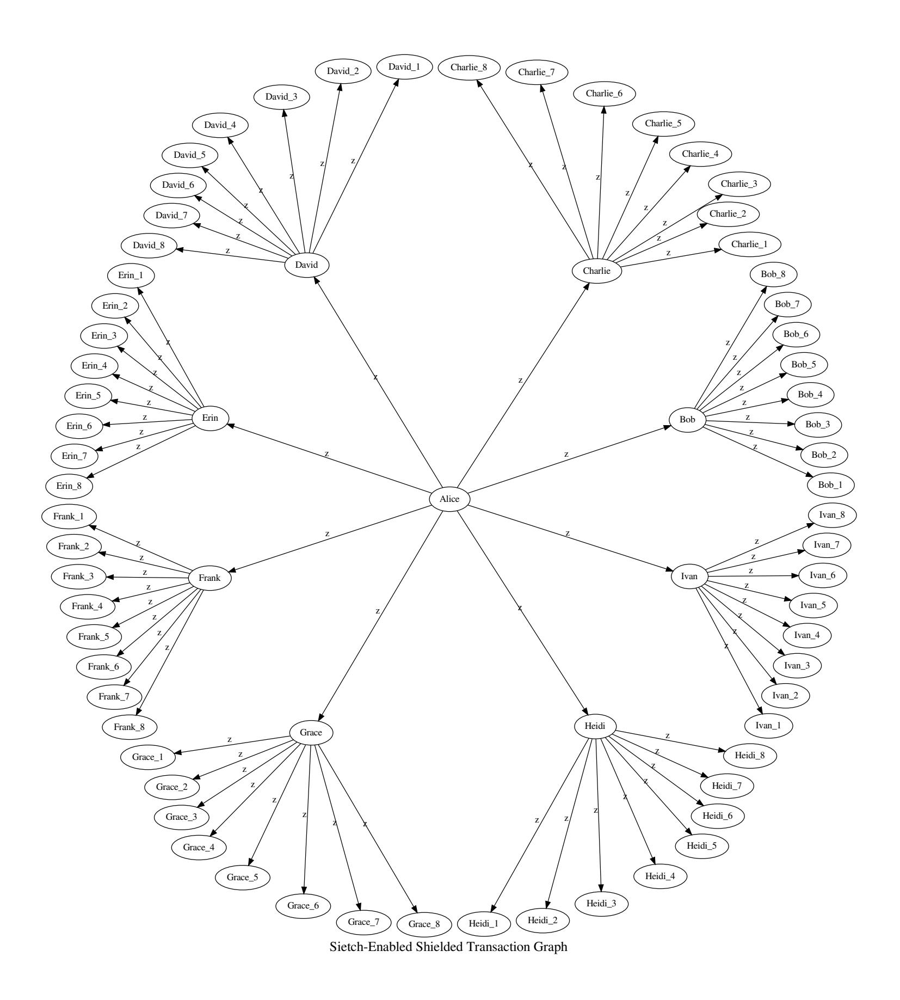
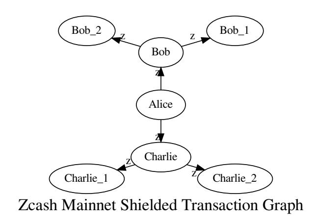

{0}------------------------------------------------

# Attacking Zcash Protocol For Fun And Prot Whitepaper Version 0.5

# Duke Leto + The Hush Developers†

May 24, 2020

#### **Abstract.**

This paper will outline, for the rst time, exactly how the **ITM Attack** (a linkability attack against shielded transactions) works against Zcash Protocol and how **Hush** is the rst cryptocoin with a defensive mitigation against it, called "**Sietch** ". Sietch is already running live in production and undergoing rounds of improvement from expert feedback. This is not an academic paper about pipedreams. It describes production code and networks.

We begin with a literature review of all known metadata attack methods that can be used against Zcash Protocol blockchains. This includes their estimated attack costs and threat model. This paper then describes the "ITM Attack" which is a specific instance of a new class of metadata attacks against blockchains which the author describes as **Metaverse Metadata Attacks** .

The paper then explains Sietch in detail, which was a response to these new attacks. We hope this new knowledge and theory helps cryptocoins increase their defenses against very well-funded adversaries including nation states and chain analysis companies.

A few other new privacy issues and metadata attacks against Zcash Protocol coins will also be enumerated for the rst time publicly. The ideas in this paper apply to all cryptocoins which utilize transaction graphs, which is to say just about all known coins. Specifically, the Metaverse Metadata class of attacks is applicable to all **Bitcoin** source code forks (including Dash, Verge, Zerocoin and their forks), **CryptoNote** Protocol coins (Monero and friends) and **MimbleWimble** Protocol (Grin, Beam, etc) coins but these will not be addressed here other than a high-level description of how to apply these methods to those chains.

In privacy zdust we trust.

If dust can attack us, dust can protect us.

– Sietch Mottos

**Keywords:** anonymity, zcash protocol, cryptographic protocols, zk-SNARKs, metadata leakage, deanonymization, electronic commerce and payment, nancial privacy, zero knowledge mathematics, linkability, transaction graphs, shielded transactions, blockchain analysis .

**Contents 1**

**[1 Introduction](#page-2-0) 3**

† myhush.org, https://keybase.io/dukeleto, F162 19F4 C23F 9111 2E9C 734A 8DFC BF8E 5A4D 8019

{1}------------------------------------------------

| 2  |      | Metadata Analysis of Zcash Protocol Blockchains: Basics   | 3  |  |  |  |  |  |
|----|------|-----------------------------------------------------------|----|--|--|--|--|--|
|    | 2.1  | Concepts and De€nitions                                | 3  |  |  |  |  |  |
|    | 2.2  | Types Of Shielded Transactions                            | 3  |  |  |  |  |  |
|    | 2.3  | Differences between KMD + HUSH + ZEC                   | 4  |  |  |  |  |  |
| 3  |      | Metadata Analysis of Zcash Protocol Blockchains: Advanced | 5  |  |  |  |  |  |
|    | 3.1  | Active vs Passive Attacks/Analysis                     | 5  |  |  |  |  |  |
|    | 3.2  | Timing Analysis                                        | 5  |  |  |  |  |  |
|    | 3.3  | Value Analysis                                         | 5  |  |  |  |  |  |
|    | 3.4  | Fee Analysis                                              | 6  |  |  |  |  |  |
|    | 3.5  | Dust Attacks                                           | 6  |  |  |  |  |  |
|    | 3.6  | Input/Output Arity Analysis                               | 6  |  |  |  |  |  |
|    | 3.7  | Exchanges and Mining Pools                             | 7  |  |  |  |  |  |
|    | 3.8  | What does the explorer not show?                          | 7  |  |  |  |  |  |
| 4  |      | ITM Attack: z2z Transaction Linkability                   |    |  |  |  |  |  |
|    | 4.1  | ITM Attack: Assumptions                                | 8  |  |  |  |  |  |
|    | 4.2  | ITM Attack: Defeating zk-SNARKs                           | 8  |  |  |  |  |  |
|    | 4.3  | ITM Attack: Infrastructure                                | 8  |  |  |  |  |  |
|    | 4.4  | ITM Attack: Consensus Oracle                           | 9  |  |  |  |  |  |
| 5  |      | Metaverse Metadata Attacks                                | 10 |  |  |  |  |  |
| 6  |      | Sietch: Theory 10                                      |    |  |  |  |  |  |
|    | 6.1  | Sietch: Basics                                            | 10 |  |  |  |  |  |
|    | 6.2  | Sietch: Non-Determinism                                   | 10 |  |  |  |  |  |
| 7  |      | Sietch: Code In Production                                | 11 |  |  |  |  |  |
| 8  |      | Implementation Details                                    | 13 |  |  |  |  |  |
| 9  |      | Thoughts On Device Seizure                                | 13 |  |  |  |  |  |
|    |      | 10 Advice To Zcash Protocol Coins                         | 14 |  |  |  |  |  |
|    |      |                                                           |    |  |  |  |  |  |
|    | 10.1 | Sapling Consolidation                                  | 14 |  |  |  |  |  |
| 11 |      | Future Considerations                                     | 14 |  |  |  |  |  |
|    | 11.1 | Shielded Coinbase ZIP-213                                 | 14 |  |  |  |  |  |
|    |      | 12 Special Thanks                                         | 15 |  |  |  |  |  |
|    |      | 13 Acknowledgements                                       | 15 |  |  |  |  |  |

{2}------------------------------------------------

# **1 Introduction**

Sietch increases the privacy of [\[Zcash\]](#page-15-0) Protocol by making metadata-leakage much harder to perform and adding **non-determinsim**, i.e. [\[Hush\]](#page-14-0) does not act in the same way given the same inputs.

Coupled with Hush transitioning to enforced privacy in late 2020, we believe this provides the highest level of privacy to users in the Zcash world and directly competes with the excellent privacy features of [\[Monero\]](#page-15-0) and other [\[CryptoNote\]](#page-14-0) Protocol coins.

# **2 Metadata Analysis of Zcash Protocol Blockchains: Basics**

#### **2.1 Concepts and Definitions**

This paper will be concerned with **transaction graphs**, which we dene in the traditional mathematical sense, of a set of nodes with a set of vertices connecting nodes. In cryptocoins these always happen to be directed graphs, since there are always funds which are unspent becoming spent, i.e. a direction associated with each transaction. This direction can be mathematically defined using the timestamp of the transaction. Inputs are unspent at the time of the transaction and become spent after the transaction. Outputs do not exist before the transaction and are unspent after the transaction.

There is a great deal of mathematical history devoted to the study of **graph theory** that has not been applied to blockchain analysis, mostly because there was no blockchains to analyze just a few years ago and there was no nancial prot in studying the data. That has obviously drastically changed.

Recently we have seen improved blockchain analysis software that employs "semantically enriched" transaction graphs with search engines and advanced clustering algorithms to make user-friendly diagrams about complex money ows thrue many addresses [\[OBitcoinWhereArtThou\]](#page-15-0).

This paper will be primarily concered with **shielded transaction graphs** which are **directed acyclic graphs (DAGs)** where a node represents a **transaction** with a unique id called **txid**. The incoming vertices are inputs being spent and the outgoing vertices are new outputs being created. A fully *shielded*transaction does not reveal the address of Alice, nor Bob, nor the amount transacted but it does leak a large amount of metadata at the protocol level, which is not rendered by block explorers nor well understood by the industry.

A *shielded*transaction has at least one *shielded*address, referred to as a *zaddr* .

We here concern ourselves only with **Zcash Protocol** which allows us to specify a coherent language and symbols to describe the new **ITM Attack** *zaddr* linkability attack and mitigations against it. All techniques here could technically also be used against transparent blockchains, but since they leak all the useful metadata already, it would serve no purpose. These new attacks can be thought of as "squeezing" new metadata leakage from zaddrs out of places that nobody thought to look.

For those coins which only have a transaction graph at the network p2p level but not stored on their blockchain (such as MimbleWimble coins), it does raise the bar and attack cost. Since nation-states and are not cost-sensitive and obviously have a vested interest to de-anonymize all blockchains, MW coins are not immune to these new attacks being applied. A transaction graph still exists and so the core concepts here can be applied.

### **2.2 Types Of Shielded Transactions**

There are many types of shielded transactions, mirroring the complexity of transparent transactions in [\[Bitcoin\]](#page-14-0) Protocol. Here we introduce a convention for describing transactions and list commononly seen transactions:

- A fully shielded transaction *T* with change *z* → *z, z*
- A fully shielded transaction *T* with no change *z* → *z*

{3}------------------------------------------------

- • A shielded transaction *T* with transparent change *z* → *z, t*
- A deshielding transaction *T* with change *z* → *t, z*
- A deshielding transaction *T* with no change *z* → *t*
- A shielding transaction *T* with no change *t* → *z*
- A shielding transaction *T* with transparent receiver and no change *t* → *z, t*
- A shielding transaction *T* with transparent receiver and change *t* → *z, t, t*
- A shielding transaction *T* with shielded change (autoshield) *t* → *z, z*

The above summarizes the most common transactions. Now say we want to describe a transaction which sends to 5 *zaddrs* and 3 transparent addresses with no change: *z* → *z, z, z, z, z, t, t, t* . To describe very large transactions subscripts can be used : *z* → *z*52*, t*39.

More complex transactions such as *t, t, t* → *z* are possible, which is a shielding transaction most likely created by z shieldcoinbase. Raw transactions are free to be as complex as allowed and some may be classied as shielding and de-shielding at the same time, such as *t, z* → *t, z* which is allowed by consensus rules but no RPC method currently creates such a transaction in any Zcash Protocol coin known to the authors. Even so, raw transactions could create them and if/when they show up they will stand out greatly as very unique transactions.

An individual transaction *T* is a sub-graph of the full transaction graph *T* ⊂ T with vertex count of one.

### **2.3 Differences between KMD + HUSH + ZEC**

We remind people that the Komodo project was the very rst Zcash Protocol genesis block to be mined. The Komodo community took Zcash source code and mined their own genesis block rst, on September 13th 2016 [\[KMDGenesis\]](#page-15-0) before the Zcash Genesis block on October 28th 2016 [\[ZcashGenesis\]](#page-15-0). The rst Hush mainnet was launched just after on November 17th 2016 [\[HushGenesis\]](#page-14-0) and was a source code fork of Zcash 1.0.8, not Komodo source code.

There is something called the **Shielding Rule** in Zcash that ended up being one of the largest mistakes made by the project, which contributes to it's lack of privacy. Originally KMD and ZEC mainnet were very similar in that they both optionally allowed zaddrs. The main difference is that jl777 was already developing his own privacy additions on top of Zcash Protocol, and he rightly saw that forcing people to shield funds immediately will just cause them to do it poorly.

On ZEC mainnet, newlymined coinbase funds must be sent to a zaddr rst, before they can be sent to a transparent address. This seems like a good idea at rst, it "increases the anonymity set" by forcing everybody to go into the shielded pool. But all that glitters is not gold.

The practical effect of the Zcash **Shielding Rule** is to infect the shielded pool with metadata leakage, specifically value and timing metadata, making it almost useless. On average, funds on ZEC mainnet only spend 1.4 hops in the shielded pool, which is to say, almost all funds only spend 1 hop, to satisfy the rule, and then immediately come out. Very often the exact same amount is going in and coming out in the next block or two, completely defeating the purpose of zaddrs.

KMD does not have the **Shielding Rule**, nor does the current HUSH mainnet, which means newly mined coinbase can be sent to a taddr immediately, without forcing people to infect the shielded pool with metadata leakage by using it improperly. The original HUSH mainnet was based on ZEC source code and used their shielding rule, but when Hush launched it's second mainnet in April 2019, it was based on KMD source code and hence removed the **Shielding Rule**.

This means that the history of HUSH and ZEC look different from a blockchain analyst point of view. On ZEC mainnet, all funds which are currently in a transparent address have passed through the shielded pool at least once, usually in a very metadata-leaky way.

{4}------------------------------------------------

When Hush disables transparent outputs later this year, the only option will be for funds in transparent addresses to be sent to zaddrs and then never leave the shielded pool. Zcash continues to ignore zaddr adoption and will allow their users to have optional (i.e. very little) privacy into the indenite future.

## **3 Metadata Analysis of Zcash Protocol Blockchains: Advanced**

#### **3.1 Active vs Passive Attacks/Analysis**

In addition to purely analyzing public information available to every full node, there is an **active mode** possible in any analysis. That is, to inject data (funds) and see how the blockchain reacts, to "follow the money" as it were. Some organizations must provide *zaddrs* to their customers or know the *zaddrs* of their customers, such as exchanges, mining pools and wallet providers. Also, many individuals choose to publicly post zaddrs and txid's which tie their social media and real life identities to unique blockchain identifiers. Many users accidentally paste this information, not realizing that Github issues and forum posts are mined for this OSINT data, but other deantly choose to post it, such as zecpages.com . Our opinion is that they mean well, and are helping adoption in some way, but they are making the job of de-anonymization much too easy. Many of these users will post screenshots including their zaddr and transaction id or explorer link. This allows linking a zaddr to a ShieldedInput or ShieldedOutput, which should never normally be possible, and makes the job of the analyst that much easier. It allows software to potentially say "This twitter user owns this zaddr and sent funds in this txid which eventually ended up in a zaddr owned by another twitter user" and other similar inferences.

As an example of active mode against an exchange that supports *zaddrs* , the attacker can create an account and get a deposit *zaddr* at the exchange. All forms of dust attacks are now available to the attacker.

Similarly for mining pools which support paying out to *zaddr* , an attacker can join the pool and mine enough to get a single payout. They will now know one of the zaddrs and the exact amount being paid out in that transaction. Mining pools are a wealth of information to de-anonymize *zaddrs* and must be very careful to not leak useful metadata.

We would like to mention [\[LuckPool\]](#page-15-0) as an example of Best Practices by a mining pool that supports *zaddrs* , they do not list any *zaddr* publicly, do not allow searching by *zaddr* and do not show which *zaddrs* are being paid out. The Hush community also reached out to all Pirate mining pools long ago and they emoved public metadata about *zaddr* miners when their were told the privacy implications. All mining pools which can pay out to *zaddrs* should follow these guidelines. All public data about *zaddrs* can be fed into ITM and **Metaverse Metadata** attacks.

#### **3.2 Timing Analysis**

This analysis uses the heuristic that transactions that are close together are likely to be related, or transactions that form a similar temporal pattern are related. For instance, if you make a transaction at exactly the same time every day, or two transactions, spaced 1 hour apart once per week. In transparent blockchains, the value is always available and timing/value analysis is very powerful. In Zcash Protocol, we only have the timing, and only sometimes the value. Fully shielded *z* → *z* have no value info, while *z* → *t* and *t* → *z* have only partial value information.

There are also recent advanced timing analysis attacks such as [\[PING-REJECT\]](#page-15-0) which can use network-based timing analysis to link together a user's IP address to their *zaddr* .

### **3.3 Value Analysis**

Value Analysis and Timing Analysis are essentially the same in Bitcoin Protocol but bifurcate into complimentary methods when we add *zaddrs* to the analysis. In a *t* → *z* transaction, we have "perfect metadata leakage" in the sense that we know the exact amount of funds going into that shielded output. These are somewhat rare but do happen, in the case of spending an output which exactly equals the amount being sent plus fee. There is also the case of *t, t, ..., t* → *z* transaction, which are created by z shieldcoinbase RPC. This turns transparent

{5}------------------------------------------------

coinbase outputs to a single shielded output and leaks the total amount of value transferred to that single shielded output. The more common *t* → *z, z* transaction introduces uncertainty but it still provides useful metadata. If the transparent input was 10 HUSH than we know that the sum of values in all shielded outputs must be 10 HUSH and that any one individual output cannot be larger than 10 HUSH. This gives us a maximum value (upper bound) for the value in a shielded output and is very useful to blockchain analyst.

Now we consider the de-shielding *z* → *t* which can also be considered to be "perfect metadata leakage" in the sense that we denitely know that an exact amount was in a *zaddr* which owned that Shielded output and now is in a transparent address. The more common *z* → *t, z* with a change address adds uncertainty and we do not know the exact amount going to the shielded change address nor the total amount of value being spent by that *zaddr* .

There are advanced forms of Value Analysis such as **Danaan-Gift Attacks**, also known as malicious value ngerprinting [\[BiryukovFeher\]](#page-14-0). The basic idea is you can send very specific amounts of funds to a *zaddr* such as 0.72345618 and see if a *z* → *t* transaction happens which has all or most of these particular values, perhaps modi ed by a default transaction fee. This attack does not have a high probabilty of working in any one circumstance, but it's like effective to "do on repeat", as nothing stops the attacker from trying again and again.

**Hush** will sidestep most value analysis by disabling transparent outputs in late November of 2020 and become a "privacy by default" blockchain at block 340,000 [\[HushHalving\]](#page-15-0).

#### **3.4 Fee Analysis**

This analysis is not very clever nor effective but it's simple to analyze the fee of every transaction, no matter whether it is shielded or not, and look for patterns such as non-standard fee use, using lower fees than normal for transaction size and those that pay large fees. Sometimes it is automated software which creates this fee metadata, by standing out from the crowd of most implementations. Other times it is individual users choosing a custom fee in their wallet, trying to save money. This analysis is essentially free and does not involve *zaddrs* at all. Fee analysis software from Bitcoin can be directly used on Zcash Protocol chains with little to no change.

#### **3.5 Dust Attacks**

Dust is a term used colloquially and also a very specific term that comes from Bitcoin source code internals. We do not need a strict definition and we use it to mean any very small (potentially zero) amount that does not meaningfully cost much to the attacker. Dust attacks can be in the form of **Denial-of-Service** or **Metadata Leakage** and we focus on the latter. The "active mode" of the ITM attack is a form of Dust Attack, where we send funds to a known *zaddr* to see what happens to them.

These attacks can be combined with **Danaan-Gift Attacks** as well [\[BiryukovFeherVitto\]](#page-14-0).

### **3.6 Input/Output Arity Analysis**

For better or worse, Sapling *zaddr* transactions have a publicly visible number of inputs and outputs. This is perhaps the only feature loss from the previous Sprout *zaddr* implementation, which used JoinSplits that obscured the exact number of inputs and outputs. The number of inputs you use in your shielded transaction and the number of shielded outputs tells a story.

One simplified example of an active "Input Arity Attack" is as follows: The attacker Alice discovers or nds out the zaddr of Bob and knows it currently has no funds since it is a newly created address. She now sends 69 (or some other very unique number) dust outputs in a single transaction, paying the transaction fee. When Bob spends those funds, Alice can look for a transaction containing 69 inputs and then identify that txid contains the *zaddr* she sent to and link together her original inputs to the outputs of that transaction.

As for output arity analysis, if you have a very unique number of outputs in your transaction on the network, that is bad for your own privacy. If nobody on the network makes transactions with 42 shielded outputs every Tuesday at 1pm, except you, all your transactions can be analyzed from the perspective of being a single owner, instead of potentially different owners.

{6}------------------------------------------------

**Sietch** greatly hinders both input and output analysis because most transactions on the network will have 8 outputs, which means for all the transactions that send to between 1 and 7 receivers, all look the same. On Zcash mainnet, all of these are trivally able to be isolated and studied by their output arity. **Hush** mixes together all of these very common output arity transactions into "one bucket". People sending to 9 or more *zaddr* outputs are not protected by this and normal output arity histograms can be used to study transactions which have many outputs.

#### **3.7 Exchanges and Mining Pools**

These entities leak massive amounts of metadata in their normal operations and must expend large amounts of effort to reduce the leakage for their own benet as well as the blockchains they rely on.

#### **3.8 What does the explorer not show?**

A surprisinglylarge amount! About a dozen ormore unique id's can be discovered about every shielded transaction and all of these identifiers have the potential to leak small bits of metadata and be correlated to each other.

The new RPC z viewtransaction can be used to see all the raw data which powers the zero knowledge proofs of zaddrs.

# **4 ITM Attack: z2z Transaction Linkability**

The **ITM Attack** specifically "attacks" a transaction *T* : *z* → *z, z*, i.e. a fully-shielded Zcash Protocol transaction which has the highest level of privacy. First we describe the definition of the attack success, if any of the following datums can be ascertained:

- The value in the *zaddr* sending funds.
- The value any of the *zaddrs* receiving funds.
- The value of any ShieldedInputs spent in the transaction.
- A range of possible values being sent to any *zaddr* , such as between 0.42 and 1.7 (with error estimate)
- A range of possible values stored in the sending *zaddr* .

If any of the above metadata can be "leaked", the attack is a success. We note that this attack is completely passive in it's core, but can be greatly improved by adding active components "to taste". This is why metadata leakage attacks such as this can be thought of a method of analysis or an outright attack.

The **ITM Attack** takes transaction id's and *zaddrs* as input, or other OSINT which is readily available on Github, Twitter, Discord, Slack, public forms, mailing lists, IRC and many other locations. With these public resources, the **ITM Attack** can bridge the gap from theoretically interesting attack to actually de-anonymizing a *zaddr* to it's corresponding social media accounts, email addresses, IP addresses, location data and more.

This attack is not for weekend warriors or individuals with small budgets and is not cost-effective for attacking a single *zaddr* . It's best suited for the largest players in The Great Game, i.e NSA, GCHQ and friends. It's highly likely they already utilize analysis and attacks described in this paper.

Only the most well-funded private blockchain analysis companies will be able to afford the infrastructure for this attack, but once the data is "mined" it is a commodity that can be bought and sold to those with less resources.

The ITM Attack is an additional "layer" of analysis that can be overlaid on top of all other types of analysis, and in that way it has the potential to "nish" a lot of "partial de-anonymizations", i.e. places where blockchain analysis provides some data, but not enough to fully de-anon. When added to timing analysis, amount analysis and fee analysis, it can identify that certain *zaddrs* being involved in many transactions and their approximate input and output values. This data is not available any other way and exact values are not very important.

{7}------------------------------------------------

If a blockchain analyst can ascertain a transaction involves at least 1M USD in value versus a few pennies of value, that directs the course of analysis and investigation. Perfect de-anonymization is not needed and in practice does not matter. Software enabled with data from ITM analysis will be able to identify transaction outputs as having certain ranges of values and potentially their associated zaddrs from OSINT data.

#### **4.1 ITM Attack: Assumptions**

Fully working example code is left as an exercise to the interested blockchain analysis company. We shall describe the attack in enough detail for experts to verify our claims and for developers to implement attacks and or defenses, in the spirit of radical transparency.

We assume an attacker has at least 100,000 USD in funds to dedicate to the operation of studying one particular Zcash blockchain. Most of this cost is in the purchase of a GPU/FPGA farm to crunch data. Blockchains with more history and larger shielded pools will be more costly to study.

We note that this attack is not nancially feasible as a one-off, it's a methodology to study an entire blockchain which can then be indexed and search for potentially valuabledata. Blockchain anlaysis companies and the IC are strategically positioned to use this information with the least cost, since they already have massive infrastructure to support this new dataset.

### **4.2 ITM Attack: Defeating** *zk-SNARKs*

We can think of this attack as a "defeat" of zero-knowledge mathematics only in practice, not in theory. Many qualications are needed. We in no way "broke" the mathematics of *zk-SNARKs*, we are taking advantage of how *zk-SNARKs*are being used in higher level protocols, i.e. the Zcash Transaction Format Protocol and it's associated consensus rules.

So *zk-SNARKs*are sound and we have not actually leaked **knowledge** directly from a **zero-knowledge proof**, that is mathematically impossible. We have leaked knowledge from how these proofs are used in the larger system called Zcash Protocol, itself an extension of Bitcoin Protocol which notoriously leaks metadata.

#### **4.3 ITM Attack: Infrastructure**

This attack requires storing a lot of intermediate data in addition to the raw blockchain data on disk. Data storage costs are likely the number two expense after computing power. It is possible renting compute power can lower computing expenses but will not lower data storage costs. If one is analyzing a blockchain of *B* bytes then a reasonable estimate is that 100 ∗ *B* bytes of intermediate storage will be needed to analyze the data and then a highly compressed version of the nal useful data can likely be stored in *B* ÷ 100 bytes or less. That is, the nal datasize will be much smaller than the input data but our intermediate will likely be two orders of magnitude larger.

Assume we have a simulated blockchain at block *N*, held in stasis and the analyst has their own mining hashrate to "push" the chain forward by it's own defined consensus rules. This can be accomplished by blocking all outside nodes and only connecting to the local hashrate.

We also assume the analyst can easily "spin up" a blockchain at a certain block height and try a new change to extract new data. This is trivially possible with virtual machine images, docker containers and/or Git, and is left as an exercise to the motivated blockchain analyst.

There may be much more performant ways to launch an **ITM Attack** but currently the method known is quite expensive. It's only viable for a company or organization that wants to de-anonymize the entire blockchain, but that is indeed who we want to protect against.

{8}------------------------------------------------

#### **4.4 ITM Attack: Consensus Oracle**

We now analyze a specific *T* : *z* → *z, z* at a specific block height *H* which denes a specific **shielded pool** containing unspent shielded outputs and their associated metadata, such as **Merkle Tree** data.

Very specifically, the simulation will use the **SaplingMerkleTree** internal Zcash Protocol datastructure defined in src/zcash/IncrementalMerkleTree.hpp . The ITM Attack focuses on this data structure but others can and should be explored as metadata oracles, such as the **SaplingWitness** data.

At any given block height *H* a shielded "note" or **zUTXO** is either spent or unspent.

Just like transparent **UTXOs**, a **zUTXO** can be created from the *mempool* (set of unconrmed transactions), i.e. the output of a transaction in this block can be spent by another transaction, such as a *t* → *z* spending a UTXO from the mempool and creating a zUTXO. The ITM Attack does rely on the fact of a zutxo being spent from the mempool or not.

Known Sapling commitments/anchors are "swapped" into the SaplingMerkleTree one at a time, in an attempt to identify if they are being spent. If the new solution tree is invalid, then the data that was added caused it to become an invalid tree for a particular reason and that particular reason is conveniently given when consensus-level errors are emitted in Bitcoin and Zcash Protocols. These errors have their own error codes and provide a wealth of information leakage to the aspiring analyst. By trying various known bits of data and analyzing the exact consensus error codes emitted, information is leaked.

Here we depict the canononical situation which the **ITM Attack** works upon, what we call a **zchain** :

First we note that removing zutxo/notes from the SaplingMerkleTree does not invalidate the transactions and spending a transaction output depends on the zutxos being valid and present.

A simpler **zchain** of only *t* → *z* or *t* → *z* → *z* does not have enough structure to leak metadata. We need a structure where we can remove an "inner zutxo" that other things depend on.

The **ITM Attack** marks *z*3 as invalid via HaveShieldedRequirements() or GetSaplingAnchorAt() returning false when actually the conditions are valid. When *z*4 transaction is attempted, it will fail since the zk-snark proof will reveal a depedency on *z*2. ITM calls this a "reverse proof". There is also the possibility of a "forward proof" when z4 allows the z2 to be spent but z3 fails. In that instance, we can say *t* → *z*1 → *z*2 → *z*3 with high probability.

These **zchains** are the main objects of attack and study in an **ITM Attack** , where it is an iterative process. Where chains of size *N* are studied and sometimes a linkage can be determined, but often it cannot. When **ITM Attack** does nd a valid reverse proof, it can attempt to extend it's knowledge by trying subchains, to get more metadata. It is a form of metadata mining. Each time a new block is mined, new funds can become spent and the process can be repeated.

To summarize, the **ITM Attack** requires a zutxo be spent to attempt to trace it's linkability to other previous ztuxos. An unspent zutxo cannot be analyzed. Additionally, *t* → *z* and *z* → *t* do not currently seem vulnerable. Only *z* → *z* 

{9}------------------------------------------------

transactions can be analyzed, and only the "inside" of the zchain can leak metadata, the very newest unspent zutxos do not give up metadata.

## **5 Metaverse Metadata Attacks**

The ITM Attack is a special case of what we name **Metaverse Metadata Attacks**, applied to Zcash Protocol shielded transaction graphs.

The term **Metaverse** is appropriate because alternate possible blockchain histories can be simulated to see what consensus rules would have produced. By meticulously changing one piece of data at a time, the analyst can use the consensus rules at that moment in blockchain history as an **oracle**. In this sense, **Metaverse** attacks can be classied as **consensus oracle attacks**, similar to **compression oracle** attacks and **padding oracle** attacks such as [\[BREACH\]](#page-14-0), [\[CRIME\]](#page-14-0) and [\[HEIST\]](#page-14-0) against SSL/TLS.

While the above attacks are **side-channel attacks** using the timing response of requests, Metaverse Metadata Attacks are side-channels that study public chain data and consensus-level errors in simulations.

As far as the authors know this is a new technique that has not been publicly described. Blockchain consensus rules can be simulated in a vacuum and the scientic method of changing one variable at a time can be used to extract metadata from privacy coin public data. There is untold amounts of metadata which can be "mined" from public blockchain data married to OSINT datasources.

## **6 Sietch: Theory**

### **6.1 Sietch: Basics**

The ITM Attack relies on the fact that the most common shielded transaction on most currently existing Zcash Protocol blockchains have only 2 outputs *T* : *z* → *z, z* and the basic fact that if some metadata can be leaked about one output, if it's **spent** or **unspent** or it's range of possible values, it provides a lot of metadata on the other output as well.

If there were 3 outputs, then there would be uncertainty involved, instead of a more direct algebraic relation such as "if one output had amount=5 then the other output had an amount of *total* − 5". When 3 *zaddr* outputs are involved, knowing the value of one *zaddr* output does not provide as much information on the value of any other particular *zaddr* .

This principle obviously increases, as the number of outputs increases, the leakage of the amount of any one *zaddr* input becomes exceedingly less valuable and expensive metadata to utilize.

By design, Sietch is opt-out and by default all users use it without knowing it, which has worked well. Sietch makes every individual shielded transaction more complex which creates a harder-to-analyze transaction graph, helping even users which have custom software that does not use Sietch.

The effect of almost all Hush users using Sietch all the time without knowing it, is a "herd immunity" against deanonymization. The price is waiting a few extra seconds for each transaction and the Hush community feels it is quite well worth it.

Even if some outputs of a transaction are completely de-anonymized, there are so many other outputs that exact values being transferred cannot be ascertained. This mimics the case where an infected person cannot easily infect another person with a virus because the people near them are already in recovery or immune.

#### **6.2 Sietch: Non-Determinism**

In addition to a minimum number of *zaddr* outputs, Sietch introduces **non-determinism** into Zcash Protocol. Zcash inherited determinism from Bitcoin, where it is a good idea. In privacy coins, it turns out that determinism 

{10}------------------------------------------------

can reduce privacy in some situations and it is not actually a requirement for the cryptocoin to function.

Sietch employs 3 kinds of non-determinism:

- 1 The order of automatically added *zaddr* outputs is random
- 2 The exact number of automatically added outputs is random
- 3 The *zaddrs* which are sent to are random

Hush developers feel that non-determinism is a powerful mitigation against **Metaverse Attacks** because when attempting to simulate the blockchain and look for oracles or leak useful bits of metadata, the outcome of a "test" is no longer deterministic and therefore some attacks will become impractical or impossible.

## **7 Sietch: Code In Production**

Sietch uses a default rule of a minimum of 7 *zaddr* outputs in a transaction. Because the average shielded transaction does not spend the input values exactly and there is a change output, in practice the average Hush transaction has 8 *zaddr* outputs.

This is currently not a consensus rule and only enforced at RPC layer. There are currently various implementations of Sietch in our full node and lite wallets.

Whenever a transaction is made with less than 7 *zaddr* outputs, the RPC layer automatically adds them, which means all software which uses the RPC layer is protected with absolutely no code changes. Software which uses raw transactions must take care of this themselves.

This has the practical effect of hiding the number of recipients to the average transactions on the Hush network. When you see a *z* → *z, z, z* transaction on ZEC mainnet, you can be almost sure it is one *zaddr* sending to 2 other *zaddrs* and a change output. It could also be sending to three outputs with no change, with drastically less probability. This type of transaction is "upgraded" to *z* → *z*7 at a minimum and so you don't know how many recipients are being sent to, except if it is a large number. In practice, this obscures most transactions on the network and it is mostly mining pool payouts which routinely use many *zaddr* outputs or other automated software.

Some transactions look like *t* → *t, t, z, t* which is a transparent address sending to two other transparent addresses, one shielded address and a change output. When Sietch is enabled, this transaction is "upgraded" to *t* → *t, t, z, t, z*6 to satisfy the minumum of 7 *zaddr* output rule. Originally the exact amount of value being transferred to the *zaddr* would be known, because all other values in the transaction are transparent and appear on the public blockchain. But in the "upgraded" transaction we can only ascertain that some amount *A* was sent and spread out across 7 outputs, some of which may be of zero value.

In general, Sietch transactions make the job of de-anonymizing a chain much harder at the individual transaction level, which then builds up into a very strong and complex shielded transaction graph. The average ZEC mainnet shielded transaction has two outputs and so it's shielded transaction graph looks like a binary tree, while the Hush blockchain with Sietch looks like a tree that splits into 8 parts at each node. Trying to follow the ow of funds becomes combinatorially impractical and expensive for even the largest players.

Here we compare what a Zcash (ZEC) mainnet shielded transaction graph looks like, compared to the shielded transaction graph we would see with **Sietch** on the HUSH mainnet. These two graphics show two **hops** where we dene one hop as *z* → *z* and two hops as *z* → *z* → *z* and so on. After a few hops, it's easy to see that the shielded transaction graph of a **Sietch** -enabled blockchain explodes into a "star" of potential avenues for funds to ow in. A traditional Zcash Protocol chain is a binary tree and that means that if at any point you can take control of that *zaddr* output, you knowmetadata about a large sub-graph of the transaction graph, such as seizing an unprotected wallet.dat le from a mobile phone, laptop or desktop computer. With **Sietch** , if one of Alice's friends has their phone seized, there are still 7 of 8 places where funds could have gone, which may have been 1-7 actual outputs or some number of outputs automatically added by **Sietch** . There is no way to know exactly **how many** people received funds except that at most 8 did and we do not know if all funds went to one *zaddr* output and the rest were zero or some combination of funds in multiple *zaddrs* .

{11}------------------------------------------------

An attacker is forced to study a much more complex dataset with **Sietch** and that is our goal. It makes each Hush transaction a little fortress in it's own right, and then when we connect many of these, the entire shielded transaction graph is very resistant to de-anonymization at any given place. On average, it is strong in every area of this large set of nodes and edges.

After 10 hops Sietch will spread zaddr funds into potentially  $8^{10} = 1073741824$  shielded outputs on average while the "plain" Zcash Protocol gives a transaction graph of size  $2^{10} = 1024$  on average.

{12}------------------------------------------------

# **8 Implementation Details**

We currently have four implementations of Sietch, two running in production, one which was deprecated and another still in testing. Initial feedback by privacy coin developers pointed out some issues in our initial implementations, bringing up threat models we did not initially think about.

Originally all Sietch implementations had a xed list of zaddrs embedded in source code, and these were randomly added as outputs to *zaddr* transactions. This is not ideal, because if the private keys of those Sietch addresses are compromised, it would be possible to include that data into chain analysis software and potentially remove the privacy benefits of Sietch. We note that the worst case is to revert to pre-Sietch privacy.

In repsonse to this, a Hush developer implemented randomized Sietch *zaddrs* at run-time, which are never stored in source code, or on disk. A random seed phrase is generated and then a random *zaddr* is generated from that seedphrase, and then the private key and seed phrase are immediately deleted from memory. Since every user now generates Sietch *zaddrs* in-memory and they are thrown away, it is essentially impossible to de-anonymize people in bulk. It requires reading memory from individual nodes to recover those private keys or seedphrases. Currently SilentDragonLite uses this method, while the **hushd** full node still uses a xed set of 200 randomly chosen *zaddrs* [\[SietchRPC\]](#page-15-0), [\[SietchHeader\]](#page-15-0).

We have an implementation that allows **hushd** to randomly generate Sietch addresses at run-time which is still in testing, as it makes low-level changes to how *zaddrs* are stored in **wallet.dat** .

We also note that all Sietch outputs are valid and spendable, they are not "fake" and they are not invalid outputs which are unspendable, because we belive those could be detected and leak metadata.

## **9 Thoughts On Device Seizure**

Say Alice sent Bob and Charlie funds in a fully shielded transaction with shielded change: *z* → *z, z, z* .

Now let us say that Alice and Charlie have their devices seized, wallet.dat's "liberated" and uploaded into chain analysis software that understands Zcash Protocol and ITM-Style Attacks. Bob is now in a posistion where his *zaddr* is known by the analyst/attacker, the exact amount sent to him in a certain txid and potentially other metadata in a memo eld. All of this data is valuable input which makes the ITM attack better at it's job, and can often help "complete" partial de-anonymization which was unable to fully "resolve" the data.

Even without any new attacks, device seizure and uploading wallet.dat contents into blockchain analysis software poses an enormous threat to privacy coins and so they should design systems that assume this will happen and to isolate and comparmentalize the damage possible. Sietch provides one such way to provide a safety and privacy buffer against real-life scenarios.

{13}------------------------------------------------

## **10 Advice To Zcash Protocol Coins**

Low numbers of *zaddr* outputs are bad for privacy, especially 1 or 2. Enforcing at least **4** likely makes the ITM attack impractical since there are so many potential ways to swap in and out the remaining inputs. Hush chose **7** as a security buffer and because the slowdown associated with 7 outputs amounts to about 5 seconds on modern hardware, when spending a small number of inputs. This seemed like a reasonable amount of time for users to make a transaction, given that the original Sprout *zaddrs* took over a minute to make the simplest of transactions.

Allowing users to spend huge numbers of inputs at once makes their transactions stand out. GUI wallets and education need to improve to reduce loss of privacy.

Do not advocate that users post *zaddrs* and the txid's and explorer links they are involved in! Educate them to keep this metadata to private messages, DMs and other non-public places. The fewer people that know your *zaddr* , the better!

### **10.1 Sapling Consolidation**

Sapling Consolidation is recommended and provides protection against metadata attacks as well as **Denial-of-Service** attacks in addition to it's primary function of reducing the size of wallet.dat les and hence making them much faster to use. **Hush** has added **Sietch** to our Sapling Consolidation implementation and also made it leak less metadata by reducing how many inputs it will ever spend at once, which is 8 to match the average number of outputs in **Sietch** . This means that when this feature is turned on, and a node receives a dust attack of many small inputs, the node will magically clean up after the attack in the background with best practices for every transaction. These transactions are guaranteed to leave the size of our **anonymity set** the same or increase it by 1 (if there is no change output). The original implementation will spend up to 45 inputs at once and always sent to 1 output with fee=0, which trivially stands out on the network. On the **Hush** network, these consolidation transactions look exactly like a very common *z* → *z* with between 1 to 8 inputs and 7 or 8 outputs, blending into a large crowd of transactions which have the same properties.

### **11 Future Considerations**

This section considers various new technologies coming down the pipeline and how they interact with existing and new metadata analysis techniques.

### **11.1 Shielded Coinbase ZIP-213**

Shielded coinbase is interesting but leaks a grave amount of metadata tied to the zaddress of the miner, which can feed into this analysis. We recommend Pirate, Arrow and other coins implementing enforced *zaddr* usage avoid implementing the new [\[ZIP-213\]](#page-15-0) "Shielded Coinbase". The Hush community does not agree the the nal conclusion of ZIP-213 that it is ok to make the miner *zaddr* output public and that only users concerned with "post-quantum" privacy need to worry about metadata leakage. It gives no recourse to these users, and so in that sense Sietch can be seen an a valid defense against quantum computers. Further research is required to see what kind of speed up quantum computers can have on graph theory algorithms that make up the bulk of an attack.

Shielded Coinbase will drastiscally reduce privacy of *zaddr* miners, because they will re-use the same *zaddr* for every block and it leaks the *zaddr* being mined to. The "normal" behavior of mining to a taddr rst then sending to a *zaddr* isolates metadata leakage to the taddr. The *zaddr* of a miner is never disclosed publicly. ZIP-213 says miners should make a new address for every block but that simply will not happen because it's optional and also makes wallet.dat les very large, slower, more annoying to backup, and most importantly, the downtime it would take to stop zcashd and restart with a new zaddr directly translates into lost money for a miner. All privacy coin research points to the fact that most users only do what is mandatory, they do not go out of there way to do extra work to get privacy. Miners are no exception.

{14}------------------------------------------------

By using Timing and Value Analysis with Shielded Coinbase, an analyst can get a much better estimate on the minimum value a *zaddr* likely has and how much funds pass thru it per time interval, as well as txid's to correlate to the *zaddr* . These can all be used as inputs to the ITM Attack, as well. Additionally, *zaddr* miners open themselves up to dust attacks because their *zaddr* is publicly known on the public blockchain, forever.

ZIP-213 is a fascinating academic exercise which could be implemented with better privacy properties but less auditability, i.e. knowing exactly how much new funds are being mined in each block. Taking into account the ITM Attack in particular and Metaverse Metadata attacks in general, ZIP-213 will not increase the privacy of a blockchain but decrease it by infecting the shielded pool with too much metadata leakage. For these many reasons, Hush and Komodo world are ignoring ZIP-213, and indeed, ignoring the entire Heartwood Network Upgrade, as it has no privacy features.

In summary, Shielded Coinbase was implemented by Electric Coin Company with little practical regard to increasing privacy on their blockchain, though it is an interesting technical peice of work. Since increased *zaddr* usage does not translate into more prots, it does not seem likely that they will ever have meaningful privacy on Zcash mainnet. Only Zcash Protocol blockchains which enforce *zaddr* usage have a chance at meaningful privacy.

# **12 Special Thanks**

Special thanks to jl777, zawy, ITM, denioD and Biz for their feedback and all the people in the Hush community involved in pushing the bleeding edge of privacy tech forward.

# **13 Acknowledgements**

This is an independently funded work of research with no third party funding sources. No funding from Electric Coin Company, Zcash Foundation or any other for-prot or non-prot entity was received.

## **14 References**

| [BiryukovFeher] |  |  |  | Daniel Feher Alex Biryukov. Deanonymization of Hidden Transactions in Zcash. URL: |
|-----------------|--|--|--|-----------------------------------------------------------------------------------|
|                 |  |  |  |                                                                                   |

<https://cryptolux.org/images/d/d9/Zcash.pdf> (visited on 2020-05-08) (↑ p[6\)](#page-5-0).

[BiryukovFeherVitto] Giuseppe Vitto Alex Biryukov Daniel Feher. *Privacy Aspects and Subliminal Channels*

*in Zcash*. URL: [https://orbilu.uni.lu/bitstream/10993/41278/1/Post\\_sapling\\_](https://orbilu.uni.lu/bitstream/10993/41278/1/Post_sapling_ZC_paper.pdf)

[ZC\\_paper.pdf](https://orbilu.uni.lu/bitstream/10993/41278/1/Post_sapling_ZC_paper.pdf) (visited on 2020-05-08) (↑ p[6\)](#page-5-0).

[Bitcoin] Satoshi Nakamoto. *Bitcoin: A Peer-to-Peer Electronic Cash System*. May 8, 2020. URL:

<https://bitcoin.org/bitcoin.pdf> (visited on 2020-05-08) (↑ [p3\)](#page-2-0).

[BREACH] Wikipedia. URL: <https://en.wikipedia.org/wiki/BREACH> (visited on 2020-05-08)

(↑ [p10\)](#page-9-0).

[CRIME] Wikipedia. URL: <https://en.wikipedia.org/wiki/CRIME> (visited on 2020-05-08)

(↑ [p10\)](#page-9-0).

[CryptoNote] N. van Saberhagen. *CryptoNote*. URL: [https : / / cryptonote . org / whitepaper . pdf](https://cryptonote.org/whitepaper.pdf)

(visited on 2020-05-08) (↑ [p3\)](#page-2-0).

[HEIST] Tom Van Goethem M. Vanhoef. URL: [https://tom.vg/papers/heist\\_blackhat2016.](https://tom.vg/papers/heist_blackhat2016.pdf)

[pdf](https://tom.vg/papers/heist_blackhat2016.pdf) (visited on 2020-05-08) (↑ [p10\)](#page-9-0).

[Hush] The Hush Developers. *Hush*. URL: <https://myhush.org> (visited on 2020-05-08) (↑ [p3\)](#page-2-0).

[HushGenesis] Hush. *Old Hush Block Explorer*. URL: [https://hushold.explorer.dexstats.info/](https://hushold.explorer.dexstats.info/block/0003a67bc26fe564b75daf11186d360652eb435a35ba3d9d3e7e5d5f8e62dc17)

[block/0003a67bc26fe564b75daf11186d360652eb435a35ba3d9d3e7e5d5f8e62dc17](https://hushold.explorer.dexstats.info/block/0003a67bc26fe564b75daf11186d360652eb435a35ba3d9d3e7e5d5f8e62dc17) (vis-

ited on 2020-05-24) (↑ [p4\)](#page-3-0).

{15}------------------------------------------------

[HushHalving] Hush Developers. *Hush Halving Countdown*. URL: [https : / / myhush . org / halving](https://myhush.org/halving)

(visited on 2020-05-24) (↑ [p6\)](#page-5-0).

[KMDGenesis] Komodo.*Komodo Block Explorer*. URL: <https://www.kmdexplorer.io/block/0a47c1323f393650f7221c217d19d149d002d35444f47fde61be2dd90fbde8e6>

(visited on 2020-05-24) (↑ p[4\)](#page-3-0).

[LuckPool] hellcatz. *LuckPool*. URL: <https://luckpool.net/hush/> (visited on 2020-05-08) (↑ [p5\)](#page-4-0).

[Monero] Monero Developers. *Monero - Secure, Private, Untraceable*. URL: [https://getmonero.](https://getmonero.org)

[org](https://getmonero.org) (visited on 2020-05-08) (↑ [p3\)](#page-2-0).

[OBitcoinWhereArtThou] Erwin Filtz Bernhard Haslhofer Roman Karl. *O Bitcoin Where Art Thou? Insight into*

*Large-ScaleTransaction Graphs*. SEMANTICS 2016: Posters and Demos Track September 13-14, 2016, Leipzig, Germany. URL: <http://ceur-ws.org/Vol-1695/paper20.pdf>

(visited on 2020-05-08) (↑ [p3\)](#page-2-0).

[PING-REJECT] K. Paterson F. Tramer D. Boneh. ` *PING and REJECT:The Impact of Side-Channels on*

*Zcash Privacy*. URL: <https://crypto.stanford.edu/timings/pingreject.pdf> (visited

on 2020-05-09) (↑ p[5\)](#page-4-0).

[SietchHeader] The Hush Developers. *hushd src/sietch.h*. URL: [https://github.com/MyHush/hush3/](https://github.com/MyHush/hush3/blob/c271fb8cbde9b7e575a3759598750f1c79e374d7/src/sietch.h)

[blob/c271fb8cbde9b7e575a3759598750f1c79e374d7/src/sietch.h](https://github.com/MyHush/hush3/blob/c271fb8cbde9b7e575a3759598750f1c79e374d7/src/sietch.h) (visited on 2020-

05-08) (↑ [p13\)](#page-12-0).

[SietchRPC] The Hush Developers. *hushd src/wallet/rpcwallet.cpp*. URL: [https : / / github . com /](https://github.com/MyHush/hush3/blob/c271fb8cbde9b7e575a3759598750f1c79e374d7/src/wallet/rpcwallet.cpp#L4727)

[MyHush / hush3 / blob / c271fb8cbde9b7e575a3759598750f1c79e374d7 / src / wallet /](https://github.com/MyHush/hush3/blob/c271fb8cbde9b7e575a3759598750f1c79e374d7/src/wallet/rpcwallet.cpp#L4727)

[rpcwallet.cpp#L4727](https://github.com/MyHush/hush3/blob/c271fb8cbde9b7e575a3759598750f1c79e374d7/src/wallet/rpcwallet.cpp#L4727) (visited on 2020-05-08) (↑ [p13\)](#page-12-0).

[Zcash] Daira Hopwood. *Zcash Protocol Specication*. URL: [https : / / github . com / zcash /](https://github.com/zcash/zips/blob/master/protocol/protocol.pdf)

[zips/blob/master/protocol/protocol.pdf](https://github.com/zcash/zips/blob/master/protocol/protocol.pdf) (visited on 2020-05-08) (↑ [p3\)](#page-2-0).

[ZcashGenesis] Zcash. *Zcash Block Explorer*. URL: <https://blockchair.com/zcash/block/0> (visited

on 2020-05-24) (↑ [p4\)](#page-3-0).

[ZIP-213] Jack Grigg. *Shielded Coinbase*. URL: [https : / / zips . z . cash / zip - 0213](https://zips.z.cash/zip-0213) (visited on

2020-05-09) (↑ [p14\)](#page-13-0).

**Speak And Transact Freely - myhush.org**