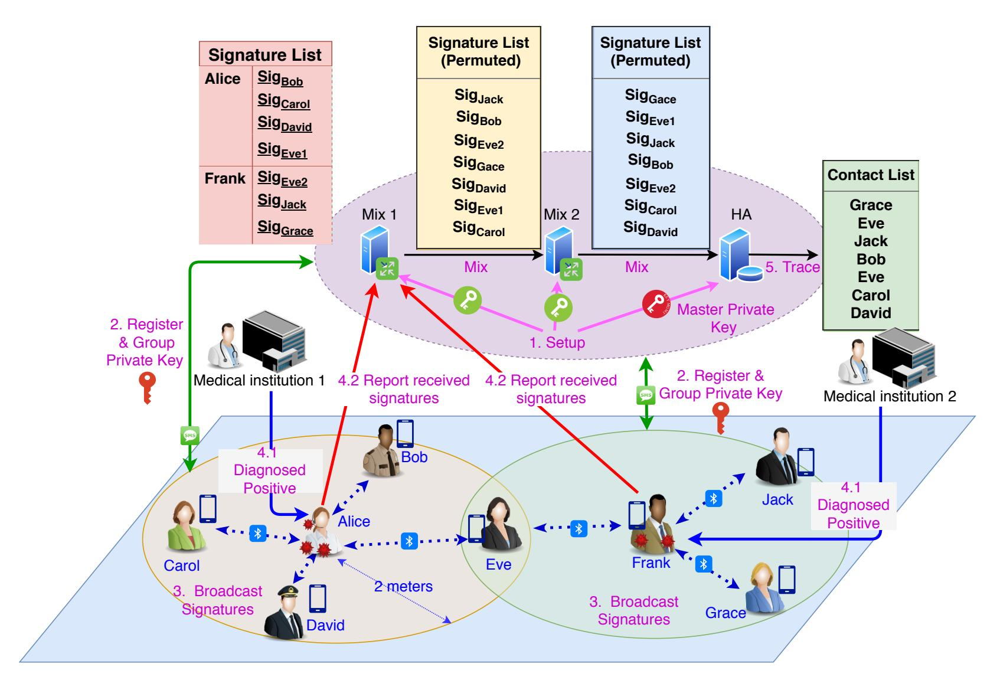

{0}------------------------------------------------

1

# ContactChaser: A Simple yet Effective Contact Tracing Scheme with Strong Privacy

Zhiguo Wan, Xiaotong Liu *School of Computer Science and Technology Shandong University*, Qingdao, Shandong {wanzhiguo@, liuxt@mail.}sdu.edu.cn

*Abstract*—The COVID-19 pandemic is a severe threat to both lives and economics throughout the world. Advanced information technology can play an important role to win this war against this invisible enemy. The most effective way to fight COVID-19 is quarantining infected people and identifying their contacts. Recently, quite a few Bluetooth-based contact tracing proposals have been proposed to identify who has come into contact with infected people. The success of a contact tracing system depends on multiple factors, including security and privacy features, simplicity and user-friendliness etc. More importantly, it should help the health authority to effectively enforce contact tracing, so as to control spreading of the vital virus as soon as possible. However, current proposals are either susceptible to security and privacy attacks, or expensive in computation and/or communication costs.

In this paper, we propose ContactChaser, a simple but effective contact tracing scheme based on group signature, to achieve strong security and privacy protection for users. ContactChaser only requires a health authority to issue group private keys to users for only once, without frequently updating keys with the authority. It helps the authority to find out the close contacts of infected people, but just leaks the minimum information necessary for contact tracing to the health authority. Specially, the contact relationship is protect against the authority, which only knows the close contacts of infected people. ContactChaser is able to prevent most attacks, especially relay and replay attacks, so that it can effectively avoid false alerts and reduce unreported contacts. We give a detailed analysis of ContactChaser's security and privacy properties as well as its performance. It is expected ContactChaser can contribute to the design and development of contact tracing schemes.

*Index Terms*—Contact tracing, COVID-19, Group Signature, Bluetooth, Threshold Secret Sharing

# I. INTRODUCTION

No one can imagine the COVID-19 pandemic could have such a devastating impact on our society and economics at the beginning of 2020. As pointed out by the Secretary-General of United Nations, the damage of COVID-19 has exceeded any crisis since World War II. Until now, the number of infected people worldwide is still rising without obvious deceleration. The highly infectious COVID-19 not only takes people's lives, but also prevents our daily lives from going back to normal. It is critical to utilize any countermeasure to keep COVID-19 under control at the fastest speed to minimize its damage.

Contact tracing using Bluetooth on smart phones turns out to be a plausible way to monitor spreading of COVID-19. By using the short-range wireless communication technology Bluetooth, one can use his/her smart phone to record with whom he/she has come into contact. All this information can be collected automatically with smart phones, and from this information the public health authority or users can easily identify close contacts of infected people. Then the authority and users can take actions to quarantine infected people and their close contacts, which has been proved to be the most effective way to fight contagious diseases. Since this approach needs to collect sensitive contact information of every involved individuals, a discreet strategy should be taken to avoid endangering people's privacy, including identity privacy, location privacy and contact lists.

Since the outbreak of COVID-19, a number of schemes on Bluetooth-based contact tracing have been proposed [1]–[21]. A key challenge in designing such a scheme is how to achieve strong privacy and accurate contact tracing simultaneously. To this end, the decentralized approach and the centralized approach have been adopted in different schemes. Security analyses [22], [23] have shown that both approaches have their pros and cons. Decentralized schemes store the contact lists on each user's smart phone, without disclosing this information to any centralized authority. Although this way seems to better protect user privacy against a centralized authority, but it may expose privacy of infected individuals as analyzed in [24]. Moreover, the decentralized approach only inform users about their at-risk status, without providing critical information to help the health authority in carrying out contact tracing and quarantining close contacts. On the contrary, the centralized solutions enable the health authority to trace close contacts, but they fail to provide satisfactory privacy protection in contact tracing. This leads to criticism against centralized schemes on invasive information collection.

Because of the highly lethal and contagious nature of COVID-19, an effective contact tracing scheme should provide a way for the health authority to identify close contacts. Meanwhile, such a contact tracing scheme must provide adequate privacy protection for all participants. In addition, a desirable contact tracing scheme should be simple and easyto-use for users, without incurring too much troubles for users. For instance, frequent interaction should be avoided between the authority and participants. These requirements pose a challenge to researchers in the field of security and privacy.

In this paper we propose a simple yet effective scheme, named ContactChaser, to achieve both strong privacy and effective contact tracing. The key technique used in ContactChaser is group signature, which preserves user identity 

{1}------------------------------------------------

privacy against others except a dedicated authority. In ContactChaser, a public health authority plays the role of the group manager, and it generates group private keys for users upon their registration requests. Each user only needs to register with the authority *once*, and then they are free of generating ephemeral identities or keys frequently. Each user uses his/her group private key, which is bound to his identity (the phone number), to generate and broadcast signatures using Bluetooth. Upon receiving a group signature on one's smart phone, each user verifies it with the group public key and records it on the phone. Once a user is diagnosed infected with COVID-19, he/she should submit all received group signatures to the public health authority. The authority, as the group manager, can open the group signatures to identity all contacts of the infected user.

To prevent the contact list disclosed to the health authority, ContactChaser also incorporate a mixing mechanism to mix contacts of multiple infected people. By doing this, the authority cannot identify linkage between the infected individual and his/her contacts. In order to make ContactChaser simpler and easier to use, we utilize the short message service (SMS) of telecommunication networks to transmit the group private key. The function of this approach is two-fold, i.e. secure transmission of private keys and identity authentication through phone numbers.

The contributions can be summarized as follows:

- We design ContactChaser, a contact tracing scheme that uses group signature and the mixing mechanism to realize secure and privacy-preserving contact tracing. Notable features of ContactChaser include:
  - Minimum information collection: Only minimum information required for contact tracing is collected by the health authority, i.e. the health authority only knows the infected individuals and mixed close contacts;
  - Distributed trust: Trust is distributed over multiple independent entities to reduce privacy concern, instead of trusting on a single health authority;
  - Highly simple and readily implementable: Registration once and for all, no need for a public server to publish seeds/keys or other information, no need to maintain a huge number of ephemeral identifiers or keys;
  - Attack resilience: It can effectively thwart most security and privacy-oriented attacks, including relay/replay attacks, identification, tracking and social graph disclosure attacks.
- We further compose a threshold group signature for ContactChaser to enhance privacy protection as well as remove the single point of failure issue. The group master key is shared among multiple health authorities instead of a single one. This enhancement can make the scheme more robust against attacks and system faults.
- We analyze ContactChaser against known security and privacy attacks in existent solutions. We also analyze the performance of our scheme and show its applicability on current smart phones.

The rest of the paper is organized as follows. We first review current proposals from both industry and academia, and discuss the differences between ContactChaser and them. Then we provide preliminaries on group signature and verifiable secret sharing. Next, we present ContactChaser in detail in Section V, and describe an enhancement based on threshold group signature in Section VI. After that we analyze ContactChaser's security and performance in Section VII. Finally we provide concluding remarks in Section VIII.

# II. RELATED WORK

All contact tracing solutions can be classified into 3 categories: centralized, hybrid and decentralized solutions. In Table I, we analyze most recently proposed contact tracing solutions, and group them according to their structures.

The first group contains all centralized solutions, including TraceTogether deployed in Singapore, and two solutions promoted by PEPP-PT. The main advantage of the centralized strategy is coordinated monitoring and quarantining of patients and close contacts, which may be more effective in containing the COVID-19 disease.

An intruding problem with centralized solutions is the center (the health authority) gains too much personal privacy. Fortunately, this issue can be addressed by means of anonymous communication or mixing messages.

However, the vulnerability of centralized solutions against relay and replay attacks is not easy to resolve, and it can lead to too many false positives. If this vulnerability is not properly addressed, it can deteriorate shortage of medical resources. In addition, all three centralized solutions need to frequently push pseudonyms to *all* users. This is to prevent tracking people based on pseudonyms, but the communication cost may be too much for countries with a large population.

The second group are hybrid solutions that achieve strong privacy through advanced cryptographic techniques, e.g. homomorphic encryption and private set intersection. The main concern for these schemes is their scalability, since they are quite computationally expensive. According to the numeric results from [5], the 1-Server setting requires 35 seconds to process 1 client request, while the 2-Server setting requires 1.6 seconds to process 1 request. Because *everyone* needs to go through the protocol to check for his/her status, the total computation cost is huge for countries like U.S., India and China.

The last group contains all decentralized solutions, which contribute the most part for contact tracing. Decentralized solutions have no centralized authority, so no privacy is leaked to any authority. Meanwhile, users update their pseudonyms by themselves, instead of receiving updates from any server. Also the computation is cheap for each user to check his/her status.

However, as analyzed by Vaudenay [22], [24], Tang [25] and Gvili [23], decentralized solutions are also not perfect from many perspectives. First, they usually need a public bulletin (e.g. blockchain) to publish seeds, keys or pseudonyms of infected individuals, and this leads to potential privacy exposure of infected people to *everyone*. Some solutions use

{2}------------------------------------------------

| Solutions         | Crypt. Tech.        | Broadcast            | Upload/Publish        | Trace            | Key/Seed Gen. |
|-------------------|---------------------|----------------------|-----------------------|------------------|---------------|
| TraceTogether [1] | Pseudonym           | Pseudonym            | Pseudonyms            | Center           | Center        |
| ROBERT [2]        | Pseudonym           | Pseudonym            | Pseudonyms            | Center           | Center        |
| NTK [3]           | Pseudonym           | Pseudonym(EBID)      | Pseudonyms            | Center           | Center        |
| EPIC [4]          | Hom. Enc.           | -                    | Encrypted data        | All Users+Center | User          |
| Epione [5]        | Priv. set intersec. | Pseudonym(Token)     | Seed                  | All Users+Center | User          |
| Apple-Google      | Pseudonym           | Pseudonym            | Ephemeral keys        | All users        | User          |
| ConTra Corona [6] | Twin IDs            | Pseudonym            | Pseudonym             | All users        | User+Center   |
| BostonU [7]       | Pseudonym           | Pseudonym(Token)     | Tokens                | All users        | User          |
| PACT(UW) [8]      | Pseudonym           | Pseudonym            | Seed, period          | All users        | User          |
| DP-3T [9]         | Chained keys        | Pseudonym            | Seed                  | All users        | User          |
| DelayedAuth [10]  | Delayed Auth.       | Pseudonym+tag        | Pseudonym, keys       | All users        | User          |
| Hashomer [11]     | Pseudonym           | Pseudonym(EphID)     | Ephemeral keys        | All users        | User          |
| PACT(MIT) [12]    | Pseudonym           | Pseudonym(chirp)     | Seed, period          | All users        | User          |
| TCN [13]–[15]     | Chained keys        | Pseudonym(TCN)       | Ephemeral key         | All users        | User          |
| CONTAIN [16]      | Pseudonym           | Pseudonym            | Pseudonym             | All users        | User          |
| Pronto-C2 [17]    | DH Key Ex.          | Address              | Ephemeral DH key      | All users        | User          |
| HumboldtU [18]    | MPC                 | -                    | Locations             | All users        | -             |
| CAUDHT [19]       | DHT+Blind Sig.      | Public key           | Enc(Pseudonym)        | All users        | User          |
| Monash [20]       | ZKP+Group Sig.      | Signature            | Public key, signature | All users        | User+Center   |
| KULeuven [21]     | DH Key Ex.          | Ephemeral public key | Hash                  | All users+Center | User          |

TABLE I
A COMPARISON OF EXISTENT CONTACT TRACING SOLUTIONS

Diffie-Hellman key exchange or public key encryption to protect privacy of infected people, but they are still vulnerable to identification of diagnosed people as indicated in [24].

Secondly, most decentralized solutions suffer from relay or replay attacks which is difficult to counter. The Delayed Authentication mechanism [10] may be applied to prevent such attacks after infected people publishing ephemeral keys, but it also brings the new problem on undeniable evidence [24].

Also, from the perspective of infection control, decentralized solutions cannot prevent unreported contacts. This may cause substantial consequences, so it should be avoided as much as possible.

#### III. PRELIMINARIES

In this section we present preliminaries on bilinear maps and a group signature scheme by Boneh et al. [26], which is the building block of ContactChaser.

#### A. Bilinear Maps and Security Assumptions

Let  $\mathbb{G}_1, \mathbb{G}_2, \mathbb{G}_T$  are three multiplicative cyclic groups of order p, where p is a big prime. Let  $g_1, g_2$  be the generators of  $\mathbb{G}_1$  and  $\mathbb{G}_2$  respectively. The bilinear map  $\hat{e}: \mathbb{G}_1 \times \mathbb{G}_2 \to \mathbb{G}_T$  used in this paper is efficiently computable, and has the following properties:

- Bilinear: for all  $u \in \mathbb{G}_1$ ,  $v \in \mathbb{G}_2$  and  $a, b \in \mathbb{Z}$ , we have  $\hat{e}(u^a, v^b) = \hat{e}(u, v)^{ab}$ ;
- Non-degenerate:  $\hat{e}(g_1, g_2) \neq 1_{\mathbb{G}_T}$ .

Specifically, elliptic curve groups are used in the paper as required by the group signature scheme.

Two problems are defined as follows:

**Definition** (q-SDH Problem) Given a (q+2)-tuple  $(g_1, g_2, g_2^{\gamma}, g_2^{\gamma^2}, ..., g_2^{\gamma^q})$ , output a pair  $(g_1^{1/(\gamma+x)}, x)$  where  $x \in \mathbb{Z}_p^*$ .

**Definition** (Decision Linear Problem) Given  $(u, v, h, u^a, v^b, h^c) \in \mathbb{G}_1^6$  where u, v, h are generators of  $\mathbb{G}_1$  and  $a, b, c \in \mathbb{Z}_p^*$ , output 1 if a + b = c and 0 otherwise.

Both problems are believed to be hard in cyclic groups, which is the basis of the group signature scheme used in ContactChaser.

#### B. Short Group Signature

A group signature involves a group manager and multiple group members. A group member can sign a message on behalf of the group without disclosing his identity except the group manager. To this end, each group member obtains a group private key from the group manager, which can be used to generate group signatures. The group manager, which holds a group master key, can open the group signature to identify the signing group member.

Although ContactChaser can use any group signature scheme, we choose the group signature scheme by Boneh et al. [26] for its short signature size and well-studied security. The security of this group signature scheme relies on the hardness of two problems: the *q*-Strong Diffie-Hellman problem and the Decision Linear Problem.

A modified version of the group signature scheme of Boneh et al. is a tuple consisting 5 polynomial-time algorithms (**KeyGen**, **Join**, **Sign**, **Verify**, **Open**).

- $\mathbf{KeyGen}(1^{\lambda}) \to (\mathsf{mpk}, \mathsf{msk})$ . On input a security parameter  $1^{\lambda}$  in the unary format, the group manager executes this algorithm to generate the master private key for the group as  $\mathsf{msk}$ , the group master public key as  $\mathsf{mpk}$ .
- $\mathbf{Join}(\mathsf{msk},\mathsf{ID}_u) \to usk_u$ . The group manager executes this algorithm with the master private key  $\mathsf{msk}$  to generate the user's private key as  $usk_u$  for user  $\mathsf{ID}_u$ . The group manager stores the tuple  $(\mathsf{ID}_u, usk_u)$  to the private key list containing all users' private keys and their corresponding identities.
- Sign(mpk,  $usk_u, m$ )  $\to \sigma$ . A user runs this algorithm to generate a signature  $\sigma$  over a message m with his/her private key  $usk_u$  and the master public key mpk.

{3}------------------------------------------------

- Verify(mpk, m, σ) → True/False. This algorithm is executed by anyone to verify a group signature σ over a message m with the master public key mpk.
- Open(msk, m, σ) → usku. The group manager executes this algorithm to recover the user's private key usku used to produce the signature σ corresponding to the message m. By looking up the private key list, the group manager identifies the identity ID of the user.

For the 170-bit p and 171-bit elements of G1, the size of the signature σ is only 192 bytes in total, and its security is roughly the same as 1024-bit RSA signature. By precomputing some numbers, the computation cost includes 8 exponentiations (or multi-exponentiations) for the signer; they are 6 multi-exponentiations and 1 pairing computation for the verifier [26]. Thus, this group signature is efficient on even smart phones.

# IV. THE CONTACT TRACING FRAMEWORK

In this section we describe the system framework for contact tracing, as well as the threat model and assumptions.

## *A. System framework*

The proposed system framework involves 4 types of participants, namely the mobile users, medical institutions, mixes and the public health authority.

- Mobile users: Each mobile user carries a mobile phone with a Bluetooth communication module, which can broadcast and receive messages in its close vicinity. The mobile phone has installed a specialized App that processes messages for contact tracing. Mobile users are honest-but-curious, and may also be reluctant to report to the authority as close contacts.
- Medical institutions: A medical institution is responsible for virus infection diagnosis and supervising the infected people to upload their contact lists collected in a specific period (e.g. within the past 14 days) to the trusted mixes (finally to the public health authority). The medical institutions are assumed to be honest-but-curious, under the control of the health authority.
- Mixes: One or more mixes receive contact lists (group signatures of contacts) from infected individuals, permute them randomly, and then forward the result to the next mix or the public health authority. The mixes are assumed to be independent and will not collude with each other or the health authority.
- Public health authority: The public health authority serves as the group manager in the group signature scheme. It is responsible for issuing group private keys for each user and identifying the contacts uploaded by infected people. We assume the public health authority is honest but curious. The authority will follow the protocol honestly in key management and processing messages, but it will also be interested in deducing the contact list of an infected patient.

Note that it is the authority to identify the contacts of infected people, just like other centralized solutions. But the authority knows just the contacts of all infected patients, without knowing the social graph of anyone.

#### *B. Threat model*

We formulate the following threat model to accommodate as many threats as possible, so as to make our scheme resilient against most attacks.

We assume the adversary is able to control a small fraction of mobile phones distributed among a broad geographic area, e.g. by compromising these mobile phones or Apps of honest mobile users. The adversary is able to coordinate these devices within a broad area to launch attacks to subvert the system. We assume all phones controlled by the adversary are connected with a high-speed network. Hence the adversary can launch active and passive attacks, including eavesdropping, injecting, modifying messages in small scale. Specifically, the adversary can launch the following attacks:

- Eavesdropping. The adversary can collect data sent by honest users with all mobile phones under his control.
- Injection. The adversary can inject messages targeting at selected users with mobile phones under his control.
- Relay attack. The adversary may relay messages received by other phones under his control to target phones.
- Replay attack. The adversary may also replay messages received before to target phones. These messages can be collected a large number messages using all controlled phones.

The adversary tries to undermine the effectiveness of the system and deduce sensitive privacy of honest mobile users. More specifically, the adversary intends to achieve the following goals:

- False report. The adversary attempts to make the health authority falsely believe a person is a close contact of some infected person;
- Tracking. The adversary tries to track a person according to public information and information acquired with mobile phones under his control.
- Identification. The adversary tries to identify someone, either diagnosed as an infected patient or identified as a close contact.
- Social graph disclosure. The adversary tries to obtain the social graph of an infected patient or one of his/her close contacts.

We do not discuss tracking and de-anonymization attacks based on side-channel information as they are of independent interest. It is assumed that appropriate countermeasures have been taken to prevent attacks based on traffic analysis, radio signal strength and MAC address etc.

#### *C. Design Goals*

Given the severe spreading situation of COVID-19 currently, an effective contact tracing scheme must effectively prevent various attacks, and protect privacy of all participants from both the adversary and the authority. Therefore, we list the goals of the proposed scheme as follows:

• Privacy protection: Privacy of both infected persons and close contacts should be well protected from being disclosed to the public and even the authority. Moreover, the contact list of an infected individual should not be disclosed to the authority.

{4}------------------------------------------------

- Misreporting prevention: It should effectively prevent false report or unreported contacts, so as to reduce false positives and negatives (in terms of close contacts).
- Simplicity and user-friendliness: To facilitate extensive usage of the contact tracing scheme, it must be simple and user-friendly for users as much as possible. Especially, the proposed scheme should avoid interaction among mobile users, while solely relying on connectionless broadcasting.
- Security: It should secure against passive or active attacks, including impersonation attacks, relay and replay attacks and even small-scale coordinated attacks.

# V. THE CONSTRUCTION OF CONTACTCHASER

In this section, we first give an overview and explain the design principles underlying ContactChaser. After that we describe ContactChaser in detail.

## *A. Overview*

ContactChaser is a centralized contact tracing scheme that relies on a health authority to trace the close contacts. Different from existent centralized schemes like ROBERT [2] or NTK [3], ContactChaser does not use any ephemeral identifiers or pseudonyms, but use a group signature scheme. So ContactChaser needs not to frequently send ephemeral identifiers to users at all.

Each user registers with the public health authority to obtain a group private key, and the authority plays the role of group manager to issue group private keys and trace users. Each user uses his/her private key to generate unlinkable group signatures constantly. Users broadcast group signatures in their vicinity, and also receive others' signatures. If a user is diagnosed positive by a medical institution, he/she will need to upload all the signatures received during the last period (e.g. 14 days) to the health authority. The authority identifies close contacts of infected individuals from group signatures, and take necessary actions to prevent further spreading of the virus.

In order to prevent the authority from knowing the exact contact list of an infected patient, we use one or more mixes to permute group signatures from multiple infected patients.

This group signature used in ContactChaser has two-fold functions: first, it can be recognized by the authority to identify the signer, but looks random for other users like ephemeral identifiers in existent schemes; secondly, it authenticates itself to nearby users as a signature scheme, hereby preventing relay/replay attacks.

False reporting is prevented by verifying group signatures against current time and location information. An honest user will reject group signatures on incorrect time and location, so the malicious adversary cannot inject invalid group signatures to a potential infected individual. Meanwhile, an honest infected user will upload all received valid group signature to the authority, so the authority can identify all close contacts of this user. Note only *the hash* of the time and location information is given to the health authority for contact tracing, so the health authority does not have time or location information to identify or track people.

#### *B. The Protocol*

The ContactChaser protocol, using the group signature scheme Π described in Sec. III, is composed of 5 phases: *Setup, Register, Broadcast, Report, Trace*. We omit the mixing phase for conciseness, whose objective is to randomly permute group signatures. We give a detailed description of each phase, followed by the complete algorithmic description.

- Setup. The health authority HA, acting as the group manager, invokes KeyGen of the group signature scheme Π to obtain the group master private key msk and the group master public key mpk. The authority keeps the master private key msk and publishes the master public key mpk. Each medical institution M generates a public/private key pair (pkM, skM), and registers its public key with HA in a secure way.
- Register. A user U identified by his/her phone number Numu first installs the App that implements the userend part of the protocol. Then the user sends a request containing his/her phone number Numu to the authority using the installed App. Upon receipt of the request, the authority generates a group private key usku and records a tuple (Numu, usku) to its private database. Then the authority sends the private key usku to the phone number Num via short message service.
- Broadcast. User identified by Numu uses usku to generate signatures σu on current time and location periodically, say every 10 minutes. Then he/she broadcasts this signature and the corresponding time/location information (σu,timeu, locu) using the Bluetooth beacon within a specific range, e.g. 2 meters.
  - Another user V, identified by Numv, is within the radio range of U and hence receives (σu,timeu, locu). V checks that timeu and locu are within reasonable range, and verifies σu against timeu and locu. If all checks are successful, V stores (σu,timeu, locu) in his/her local database; otherwise V rejects the signature.
- Report. If user V is diagnosed as infected by COVID-19 at a medical institution M, M will generate a signature σM = Sign(skM, Numv,timeexp) using skM, where timeexp is the deadline before which the user must upload his/her contact list. User V will then upload (σM, Numv,timeexp, Σ) to HA, where Σ is the set of group signatures (with the corresponding hash of the time and location information) V received with his/her phone during the last period (e.g. 14 days).
- Trace. For each tuple (σM, Numv,timeexp, Σ) received from a mobile phone, HA checks that timeexp has not expired and verifies σM is valid with respect to Numv,timeexp. Then HA executes Open of the group signature scheme Π to identify all contacts in Σ. Finally, HA informs these contacts and take necessary actions to quarantine them.

The detailed protocol is presented in Fig. 2.

{5}------------------------------------------------

Fig. 1. The system architecture and workflow of ContactChaser. Mix 1 and Mix 2 are two mixes for permuting group signatures, and HA is the health authority. Users register with HA to obtain a group private key, which can generate group signatures. Note that group signatures hide identities of signers, and only HA can open the identities. Each user broadcasts group signatures using Bluetooth beacons, and also receives others' signatures. If any user is diagnosed positive for COVID-19, he/she will need to upload his/her received signatures to mixes, who permute and forward signatures to HA. HA extracts identities of signers from group signatures, but does not know relation between the infected and close contacts.

# VI. PRIVACY ENHANCEMENT WITH THRESHOLD GROUP SIGNATURE

In this section we describe how to further enhance privacy protection for users against the health authority, through sharing the group master private key.

#### A. Threshold Secret Sharing

Pedersen's verifiable secret sharing (VSS) scheme [27], [28] enables n parties to share a random secret k such that at least t parties can recover the secret k. As a result of Pedersen's VSS, the i-th party obtains a share  $k_i$  while the secret k is unknown to any party. Moreover, every one can verify information received in the Pedersen's VSS scheme, and hence it improves robustness against malicious parties.

We also need to use the Reciprocal Protocol by Gennaro et al. [29] and the Multiplication Protocol by Gennaro et al. [30]. The Reciprocal protocol enables n parties to compute the shares of 1/k given the shares of k, without leaking information on k or 1/k; the Multiplication Protocol enables n parties to compute the shares of  $k_1 \cdot k_2$  given the shares of  $k_1$  and  $k_2$ , without leaking  $k_1$  or  $k_2$ .

In ContactChaser, we employ Pedersen's VSS, the Reciprocal Protocol and the Multiplication Protocol to distribute the group master key in the above group signature scheme. In the following, we denotes Pedersen's VSS scheme by *Pedersen-VSS*.

#### B. Threshold group signature

From the group signature by Boneh et al. [26], we compose a threshold group signature scheme using Pedersen-VSS, the Reciprocal Protocol and the Multiplication Protocol.

The threshold group signature scheme is also composed of 5 algorithms, and we only describe **KeyGen**, **Join** and **Open** algorithms. The other two algorithms (**Sign** and **Verify**) are the same as before.

- KeyGen(1 $^{\lambda}$ ). n authorities agree on the threshold t, choose a prime number p of size  $2^{\lambda}$ . Then they determine two cyclic groups  $\mathbb{G}_1$  and  $\mathbb{G}_2$ , both of order p, and select  $g_1 \in \mathbb{G}_1$ ,  $g_2 \in \mathbb{G}_2$ . They run (t,n)-Pedersen-VSS to share  $\xi_1 \in \mathbb{Z}_p^*$  and  $\delta \in \mathbb{Z}_p^*$ . Next they choose  $v \in \mathbb{G}_1$ , and use their share to compute  $u = v^{\delta}$  and  $h = u^{\xi_1}$ . Then they run the Multiplication Protocol to share  $\xi_2 = \xi_1 \cdot \delta$ . They run Pedersen-VSS again to share  $\gamma \in \mathbb{Z}_p^*$  and compute  $w = g_2^{\gamma}$ .
  - The group master pubic key is mpk =  $(g_1, g_2, h, w, v, w)$ , and the group master private key share held by authority i is msk $_i = ([\xi_1]_i, [\xi_2]_i, [\gamma]_i)$ , which is a share of the real private key  $(\xi_1, \xi_2, \gamma)$ .
- Join(mski, IDu). The user IDu sends a join request to all authorities. These authorities run Pedersen-VSS to share a random number  $x_u \in \mathbb{Z}_p^*$ . They run the Reciprocal Protocol to share  $1/(\gamma + x_u)$  and  $A_u = g_1^{1/(\gamma + x_u)}$ . The shares of  $x_u$  and  $A_u$  are sent to the registering user, and then the user can recover  $x_u$  and  $A_u$  with t shares. The health authority stores (IDu,  $A_u$ ) in its private database

{6}------------------------------------------------

#### Setup

This algorithm run by the health authority HA sets up the group master private/public key pair and the key pair for each medical institution M from a given set S.

- input:
  - Public parameters 1 λ
  - A set of public keys of medical institutions {pkM}M∈S
- output:
  - Group master private/public key pair (msk, mpk)
  - An empty database DB
- 1) HA invokes Π.KeyGen(1λ ) to obtain a (mpk, msk), where Π is a group signature scheme as introduced in Sec. III;
- 2) For each public key pkM ∈ {pkM}M∈S, HA records it in its local database if it is verified in a secure way.
- 3) Create an empty database DB (to store tuples of form (Num, usk)).

#### Register

This algorithm run by the health authority HA registers user IDu with phone number Numu.

- input:
  - User U's phone number Numu
  - HA's private database DB
- output:
  - U's group private key usku
- 1) The health authority checks the phone number Numu against its private database DB;
- 2) If a pair (Numu, usku) is found in DB: send usku to the phone number Numu via SMS;
- 3) Otherwise, HA runs Π.Join(msk, Numu) to obtain usku: send usku using SMS to the phone number Numu; append (Numu, usku) to DB.

#### Broadcast

This algorithm run by user U broadcasts/receives group signatures and related information in his/her vicinity periodically (e.g. every 10 minutes).

*For sender:*

- input:
  - Group private key usku
- output:
  - Broadcast message m
- 1) User U obtains current time timeu and location locu;
- 2) U runs σu = Π.Sign(usku, ∗) where ∗ = (timeu, locu);
- 3) U broadcasts message m = (σu,timeu, locu) in the vicinity. *For recipient:*
- input:
  - Broadcast message m from U
- output:

- Updated local database dbv
- 1) User V receives a broadcast message m, and parses it as (σu,timeu, locu);
- 2) V verifies timeu and locu w.r.t current time and location;
- 3) V verifies σu against (timeu, locu);
- 4) If both verifications succeed, V appends m to his/her database dbv.

#### Report

This algorithm run by a medical institution M and an infected individual V to report the contact list to the health authority. *For medical institution* M*:*

- input:
  - Phone number Numv of infected V
- output:
  - A signature σM
  - The expiration time timeexp
- 1) M determines an appropriate expiration time timeexp w.r.t. current time;
- 2) M computes a signature σM = Sign(skM, Numv,timeexp);
- 3) M gives σM to the infected user V.

*For infected individual* V*:*

- input:
  - Local database dbv
  - A signature σM by M
  - The expiration time timeexp
- output:
  - A tuple (σM, Numv,timeexp, Σ) containing all received group signatures by V
- 1) User V fetches all items from dbv within a specified period, e.g. 14 days;
- 2) V composes a list Σ from the above items, each in the form of (σu, Hash(timeu, locu));
- 3) V sends (σM, Numv,timeexp, Σ) to the mix.

#### Trace

This algorithm run by the health authority opens the identities of group signature generators using the group master private key.

- input:
  - Group master private key msk
  - A set of permuted group signatures Σ from the mix
- output:
  - The set of identities of close contacts
- 1) For each item (σu, h) ∈ Σ, HA invokes Π.Open(mpk, msk, h, σu) to obtain the private key usku of the signer;
- 2) For each usku, HA looks up the database DB to find phone numbers of close contacts, and then inform them via SMS or phone calls.

Fig. 2. The ContactChaser protocol without the mix phase. DB is the private key database of the health authority containing all users' private keys and contact numbers; dbv is user V's local database containing group signatures received with his/her mobile phone.

DB.

• Open(mski , σ). The signature σ is parsed as (T1, T2, T3), the first 3 elements of the signature in [26]. We ignore the remaining parts of the signature as they are not required in this algorithm.

Authority i computes T 0 3 ← T3/(T [ξ1]i·Li 1 · T [ξ2]i·Li 2 ), where Li is the Lagrange coefficient to recover the shared secret. Then authority i sends σ 0 = (T1, T2, T0 3 ) to the next authority.

The final authority is able to compute A = T3/(T ξ1 1 ·T ξ2 2 ).

It is easy to validate correctness of the above threshold group signature. For anonymity and traceability, we have the following theorems:

Theorem VI.1 (Full-anonymity). *Assume the Decision Linear problem is hard in* G1*, the above threshold group signature achieves full anonymity.*

{7}------------------------------------------------

Theorem VI.2 (Full-traceability). *Assume the* q*-SDH problem is hard on* (G1, G2)*, the above threshold group signature achieves full traceability.*

The above theorems follow from the full anonymity and traceability of the group signature scheme [26].

Additionally, we have the following theorem on robustness of the threshold group signature scheme:

Theorem VI.3 (Robustness). *Assume* n ≥ 3t + 1 *where* n *is the number of involved parties and* t *is the threshold, the above threshold group signature is robust in the presence of up to* t *corrupted parties.*

This is straightforward due to the robustness of the underlying verifiable secret sharing scheme, as proved in [29].

# *C. Application of Threshold Group Signature to ContactChaser*

We can replace the group signature with the above threshold group signature in ContactChaser, such that the privacy protection and robustness can be significantly improved.

Concretely, the Setup, Register and Trace phases will use the updated algorithms, i.e. KeyGen, Join and Open. The other two phases need not to change.

Thus, no single authority knows the group master private key, but it is shared among multiple entities. The Trace phase cannot be accomplished by the health authority alone, but needs collaboration of multiple authorities. Therefore, an independent organization can be introduced to serve as one of the authorities, so as to reduce trust on the health authority. An additional benefit of applying threshold group signature is robustness against corruption or system faults.

# VII. ANALYSIS AND DISCUSSION

In this section we analyze privacy, security and complexity of the proposed scheme and discuss some practical issues in deploying ContactChaser.

# *A. Privacy and Security*

User privacy. First of all, the registration phase does not leak any privacy about the user except his/her phone number exposed to the health authority. In the broadcast phase, only group signatures with current time and location information are disclosed to nearby mobile users. Due to the full-anonymity property of the group signature scheme, user privacy is well protected from the adversary.

In the report phase, the group signatures received by an infected user are sent to the authority. These signatures do not contain any sensitive information like locations, but just a hash value computed from time and location information. Thus, the authority cannot know where the infected individual has visited in the last period.

Furthermore, the contacts received by the health authority have been permuted randomly by the mix(es), so the contact relationship is protected from the health authority. The health authority is not able to infer the social graph of an infected individual accurately.

Compared with decentralized solutions, ContactChaser does not publish anything on a secure public bulletin board, hence avoids disclosing privacy of infected individuals. Compared with existent centralized solutions, ContactChaser avoids leaking the contact relationship to the authority, greatly improving the privacy protection for users.

Privacy attacks. Most privacy-oriented attacks are not applicable against ContactChaser. We briefly analyze several attacks aiming to deduce private information of infected individuals, close contacts or other mobile users.

*Identification.* In ContactChaser, only the health authority can identify close contacts from their group signatures. Except group signatures, the adversary has no other knowledge about the mobile users. Close contacts cannot identify the infected patients they had come into contact either.

In addition, as per the specification of ContactChaser, only infected individuals will provide their received group signatures to the authority. Hence, non-contact individuals will not be influenced at all.

*Tracking.* Due to the full-anonymity of the group signature scheme, the adversary cannot link any two group signatures generated by the same user. If appropriate countermeasures are taken against side-channel attacks, the adversary cannot track a mobile user in ContactChaser.

On the other hand, although the health authority can open group signatures to identify their signers, its group master private key can be distributed to multiple entities to reduce the abuse risk.

*Social graph disclosure.* As mentioned above, ContactChaser can prevent the health authority from knowing the contact relationship of an infected individual given that the mixes do not collude with the authority.

Relay/Replay attacks. ContactChaser can effectively prevent relay and replay attacks by signature verification. Recall that the broadcast messages in ContactChaser contain current time and location information, so the recipient can assert if this information is valid with respect to his/her own time and location currently. This can effectively rule out relayed/replayed messages with incorrect time and location. This shows the advantage of using group signatures in broadcast messages.

False report prevention. We consider a powerful adversary that has control over a small fraction of mobile phones in the system. In the first case, neither the adversary nor the mobile users whose phones are controlled by the adversary are diagnosed positive, so he cannot inject false reports to the authority directly. If by any chance the adversary identifies a potential COVID-19 patient to be confirmed soon, he can inject as many group signatures as possible to this patient. However, this will fail because the honest patient will verify *time* and *location* information along with the group signatures to rule out invalid messages.

In the second case, the adversary himself is diagnosed positive, and uploads a large number of groups signatures to the mix. The mix will then detect anomaly in the number of group signatures uploaded by the adversary, and hence asks the adversary to provide more evidence. If the adversary cannot convince the mix, then the mix rejects all group signatures from the adversary.

{8}------------------------------------------------

As per the specification of ContactChaser, it is the authority that identifies close contacts, not the close contacts themselves. As long as the infected individual does not delete the group signatures received with his/her phone, the unreported cases can be avoided.

# *B. Complexity analysis*

The main computation cost of ContactChaser comes from group signature generation and verification using mobile phones. As discussed earlier, the computation cost for the signer includes 8 exponentiations, and for the verifier it includes 6 multi-exponentiations and 1 pairing. According to the implementation in [20], the computation time involving 2 pairings is about 100ms on an Android phone equipped with Qualcomm Snapdragon 855 (Kryo 485 CPU, 1x2.84GHz & 3x2.42GHz & 4x1.8GHz). So the group signature generation/verification in ContactChaser, involving only 8 exponentiations, is expected to cost about 100ms too. Suppose one group signature is generated every 10 minutes, this computation cost is acceptable.

The group signature is 192 bytes in total, and the time (minute precision) and location information (in the form of (longitude, latitude) or cell identity of base stations) take another 16 bytes. Then the total message size is 208 bytes, and it can be broadcasted with one single Bluetooth beacon for Bluetooth 5, which can broadcast messages of size 255 bytes.

For legacy mobile phones that do not support Bluetooth 5, the Bluetooth beacon can only carry 31 bytes of payload (i.e. Bluetooth 4.2 and before). In this case, ContactChaser requires 7 beacons to transmit the complete message. In comparison, most solutions only need to broadcast an ephemeral identifier, which can be carried in a single beacon packet. We discuss how to improve transmission efficiency by network coding.

### *C. Practical considerations*

Private key database. In the Open phase, the authority needs to search the identity of a close contact according to his/her group private key in a private key database DB. This private key database DB stores all group private keys and corresponding identities, and it is usually huge in size. In order to speed up the search efficiency, it is more efficient to use a distributed hash table to store private keys and phone numbers of users.

TEE for mixing. The mixing function can be implemented with TEE such as Intel's SGX. Infected individuals can encrypted their groups signatures with TEE's public key and send the result to the TEE-based mix. The TEE-based mix can decrypt it with its private key inside the enclave. After random permutation, the TEE-based mix sends the permuted group signature list to the health authority. Note countermeasures should be taken to prevent traffic analysis in this process.

Higher transmission efficiency with network coding. Network coding is a communication technology to increase network throughput, reduce transmission delay and increase network fault tolerance against transmission errors. For mobile devices supporting Bluetooth 4.2 or lower versions, each group signature can be divided and encoded with the network coding technique, such that a recipient can recover the complete group signature with any enough number of broadcast packets.

Anonymous channel. The phone numbers used in ContactChaser can be replaced with anonymously reachable addresses like email addresses, so as to enhance privacy protection for mobile users. Meanwhile, communication between infected individuals/close contacts and the authority/mix can utilize anonymous channels as suggested by existent solutions. For example, Tor can be used to communicate with the authority.

DoS attacks. A malicious adversary may flood a large amount of messages to a victim's phone, which will deplete its energy in verifying all received group signatures. In this case, the victim's phone can ask the adversary to provide a proof-ofwork similar to the proof-of-work mechanism in Blockchain. Only after verifying the proof-of-work will the victim phone start to verify group signatures. This mechanism will also effectively prevent Sybil attacks.

Side-channel information. To prevent tracking attacks, discreet considerations must be taken in the implementation to prevent leakage of side-channel information. For Bluetooth beacon broadcast, it should change the MAC address frequently, so that the MAC address cannot be used to track people [22], [23].

However, it is extremely difficult to prevent leakage of some side-channel information, e.g. device identification through wireless fingerprinting. Nevertheless, mobile users in ContactChaser only broadcasts messages in their vicinity, and this makes tracking difficult for the adversary.

### VIII. CONCLUSION

In this paper we have presented ContactChaser, a simple but effective contact tracing scheme to fight the contagious COVID-19. ContactChaser considers both privacy protection and effective contact tracing for the best interest of the whole society. To this end, ContactChaser adopts the group signature and the secret sharing technique. It not only achieves stronger privacy protection than existent solutions, but also effectively prevents most security attacks.

ContactChaser is also very simple and friendly to users. Except a one-time registration, user involvements are not required in the contact tracing process. Moreover, ContactChaser only uses connectionless broadcast for contact tracing, without any interaction.

We have given detailed description of ContactChaser and provided in-depth analysis on its security, privacy and complexity. According to our initial analysis, ContactChaser would be efficient on current smart phones.

#### REFERENCES

- [1] TraceTogether. https://www.tracetogether.gov.sg/, Accessed: 2020-05- 19.
- [2] PRIVATICS team, Fraunhofer AISEC, "ROBERT: ROBust and privacy-presERving proximity Tracing." https://github.com/ ROBERT-proximity-tracing/, 2020.

{9}------------------------------------------------

- [3] Pan-European Privacy-Preserving Proximity Tracing, "Data protection and information security architecture - illustrated on german implementation." https://github.com/ pepp-pt/pepp-pt-documentation/blob/master/10-data-protection/ PEPP-PT-data-protection-information-security-architecture-Germany. pdf, Accessed: 2020-05-19.
- [4] T. Altuwaiyan, M. Hadian, and X. Liang, "Epic: Efficient privacypreserving contact tracing for infection detection," in *2018 IEEE International Conference on Communications (ICC)*, pp. 1–6, IEEE, 2018.
- [5] N. Trieu, K. Shehata, P. Saxena, R. Shokri, and D. Song, "Epione: Lightweight contact tracing with strong privacy." arXiv preprint arXiv:2004.13293, 2020. https://arxiv.org/abs/2004.13293.
- [6] W. Beskorovajnov, F. Dorre, G. Hartung, A. Koch, J. M ¨ uller-Quade, ¨ and T. Strufe, "Contra corona: Contact tracing against the coronavirus by bridging the centralized–decentralized divide for stronger privacy." Cryptology ePrint Archive, Report 2020/505, 2020. http://eprint.iacr. org/2020/505.
- [7] R. Canetti, A. Trachtenberg, and M. Varia, "Anonymous collocation discovery: Harnessing privacy to tame the coronavirus." arXiv preprint arXiv:2003.13670, 2020. https://arxiv.org/abs/2003.13670.
- [8] J. Chan, S. Gollakota, E. Horvitz, J. Jaeger, S. Kakade, T. Kohno, J. Langford, J. Larson, S. Singanamalla, J. Sunshine, *et al.*, "Pact: Privacy sensitive protocols and mechanisms for mobile contact tracing." arXiv preprint arXiv:2004.03544, 2020. https://arxiv.org/abs/2004. 03544.
- [9] C. Troncoso, M. Payer, J.-P. Hubaux, M. Salathe, J. Larus, ´ E. Bugnion, W. Lueks, T. Stadler, A. Pyrgelis, D. Antonioli, *et al.*, "Decentralized privacy-preserving proximity tracing." Github DP-3T documents, 2020. https://github.com/DP-3T/documents/blob/master/ DP3T20%White%20Paper.pdf.
- [10] K. Pietrzak, "Delayed authentication: Preventing replay and relay attacks in private contact tracing." Cryptology ePrint Archive, Report 2020/418, 2020. https://eprint.iacr.org/2020/418.
- [11] B. Pinkas and E. Ronen, "A Proposal for a Privacy-Preserving Bluetooth Based Contact Tracing Scheme for Hamagen." https://github.com/eyalr0/ HashomerCryptoRef, 2020.
- [12] R. L. Rivest, J. Callas, R. Canetti, K. Esvelt, D. K. Gillmor, Y. T. Kalai, A. Lysyanskaya, A. Norige, R. Raskar, A. Shamir, E. Shen, I. Soibelman, M. Specter, V. Teague, A. Trachtenberg, M. Varia, M. Viera, D. Weitzner, J. Wilkinson, and M. Zissman, "PACT: Private Automated Contact Tracing." https://pact.mit.edu/, 2020.
- [13] TCN Coalition. https://github.com/TCNCoalition/TCN, Accessed: 2020- 05-19.
- [14] CoEpi: Community epidemiology in action. https://www.coepi.org/, Accessed: 2020-05-19.
- [15] Covid Watch. https://www.covid-watch.org/, Accessed: 2020-05-19.
- [16] A. Hekmati, G. Ramachandran, and B. Krishnamachari, "Contain: Privacy-oriented contact tracing protocols for epidemics." arXiv preprint arXiv:2004.05251, 2020. https://arxiv.org/abs/2004.05251.
- [17] G. Avitabile, V. Botta, V. Iovino, and I. Visconti, "Towards Defeating Mass Surveillance and SARS-CoV-2: The Pronto-C2 Fully Decentralized Automatic Contact Tracing System." Cryptology ePrint Archive, Report 2020/493, 2020. http://eprint.iacr.org/2020/493.
- [18] L. Reichert, S. Brack, and B. Scheuermann, "Privacy-preserving contact tracing of covid-19 patients." Cryptology ePrint Archive, Report 2020/375, 2020. http://eprint.iacr.org/2020/375.
- [19] S. Brack, L. Reichert, and B. Scheuermann, "Decentralized contact tracing using a dht and blind signatures." Cryptology ePrint Archive, Report 2020/398, 2020. http://eprint.iacr.org/2020/398.
- [20] J. K. Liu, M. H. Au, T. H. Yuen, C. Zuo, J. Wang, A. Sakzad, X. Luo, and L. Li, "Privacy-Preserving COVID-19 Contact Tracing App: A Zero-Knowledge Proof Approach." Cryptology ePrint Archive, Report 2020/528, 2020. http://eprint.iacr.org/2020/528.
- [21] G. Garofalo, T. V. hamme, D. Preuveneers, W. Joosen, A. Abidin, and M. A. Mustafa, "Striking the Balance: Effective yet Privacy Friendly Contact Tracing." Cryptology ePrint Archive, Report 2020/559, 2020. http://eprint.iacr.org/2020/559.
- [22] S. Vaudenay, "Analysis of DP3T." Cryptology ePrint Archive, Report 2020/399, 2020. https://eprint.iacr.org/2020/399.
- [23] Y. Gvili, "Security analysis of the covid-19 contact tracing specifications by apple inc. and google inc.." Cryptology ePrint Archive, Report 2020/428, 2020. https://eprint.iacr.org/2020/428.
- [24] S. Vaudenay, "Centralized or decentralized? the contact tracing dilemma." Cryptology ePrint Archive, Report 2020/531, 2020. https: //eprint.iacr.org/2020/531.

- [25] Q. Tang, "Privacy-preserving contact tracing: current solutions and open questions." Cryptology ePrint Archive, Report 2020/426, 2020. https: //eprint.iacr.org/2020/426.
- [26] D. Boneh, X. Boyen, and H. Shacham, "Short group signatures," in *Proc. Crypto'04*, pp. 41–55, 2004.
- [27] T. Pedersen, "Non-interactive and information theoretic secure verifiable secret sharing," in *Proc. Crypto'91, LNCS 576*, pp. 129–140, 1991.
- [28] T. Pedersen, "A threshold cryptosystem without a trusted party," in *Proc. Eurocrypt'91, LNCS 547*, pp. 522–526, 1991.
- [29] R. Gennaro, S. Jarecki, H. Krawczyk, and T. Rabin, "Robust threshold dss signatures," in *Proc. Eurocrypt'96, LNCS 1070*, pp. 354–371, 1996.
- [30] R. Gennaro, M. O. Rabin, and T. Rabin, "Simplified VSS and Fast-track Multiparty Computations with Applications to Threshold Cryptography," in *Proc. PODC'98*, pp. 101–111, 1998.