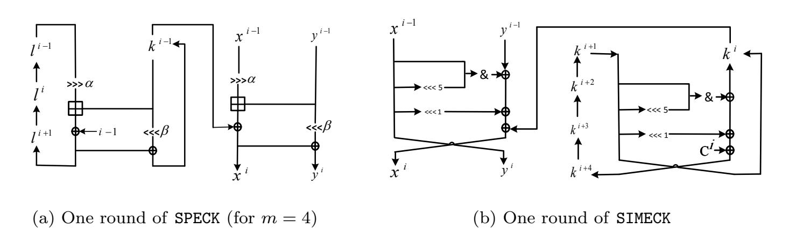
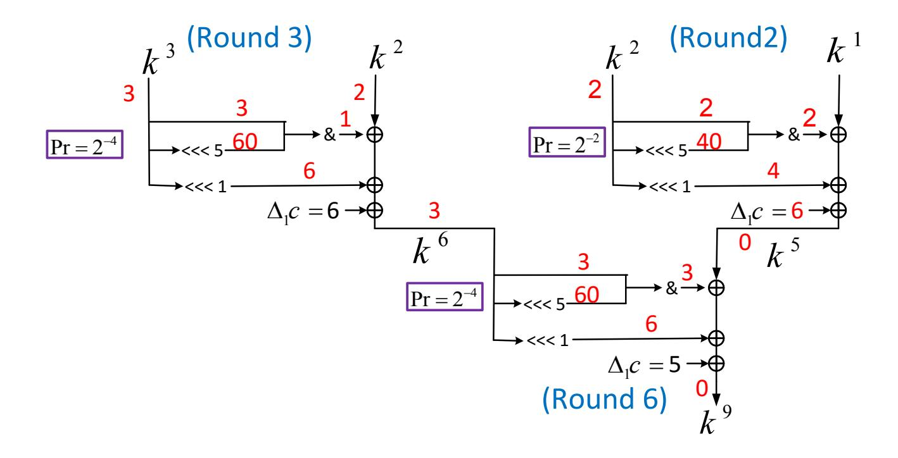
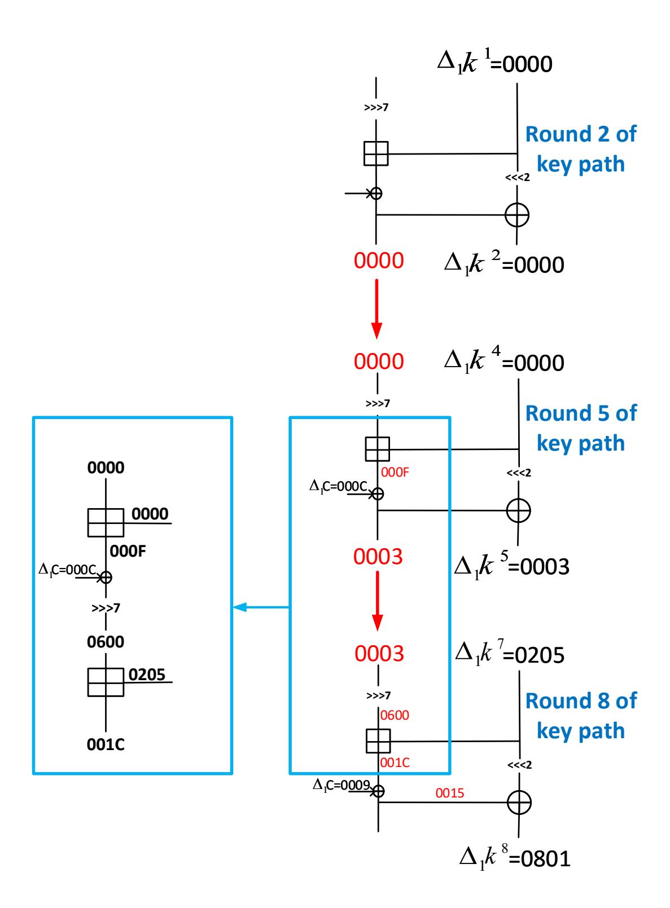
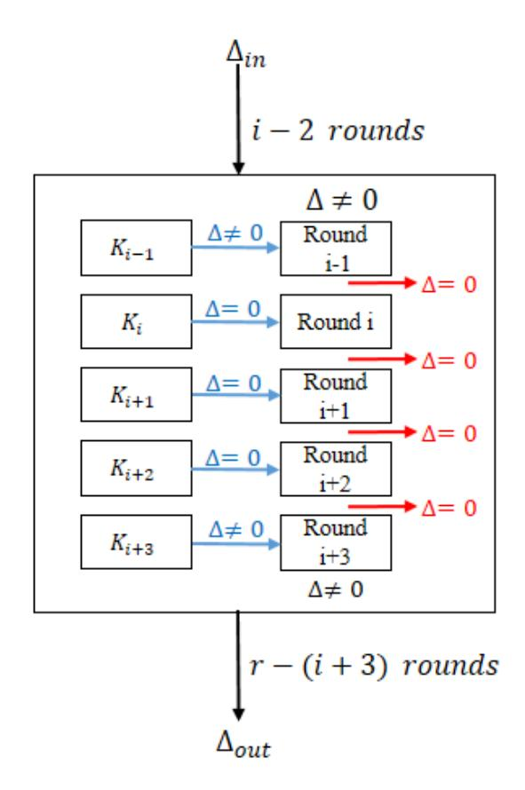
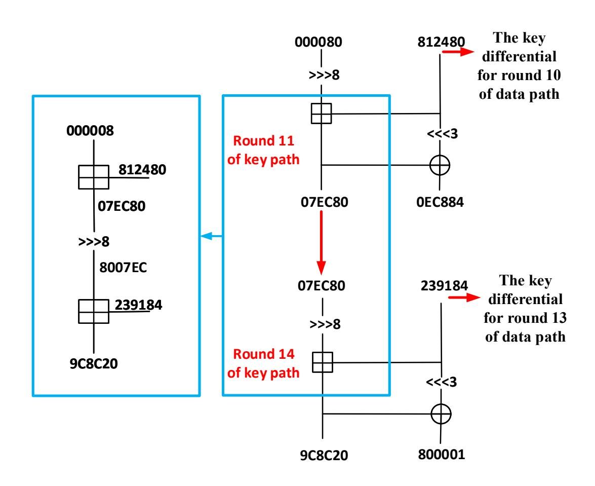

{0}------------------------------------------------

# **Proposing an MILP-based Method for the Experimental Verification of Difference Trails**

## **Application to SPECK, SIMECK**

Sadegh Sadeghi1 , Vincent Rijmen2 and Nasour Bagheri3

1 Department of Mathematics, Faculty of Mathematical Sciences and Computer, Kharazmi University, Tehran, Iran, [s.sadeghi.khu@gmail.com](mailto:s.sadeghi.khu@gmail.com),

2 Department of ESAT/COSIC, KU Leuven and imec, Leuven, Belgium, [vincent.rijmen@kuleuven.be](mailto:vincent.rijmen@kuleuven.be),

**Abstract.** Search for the right pairs of inputs in difference-based distinguishers is an important task for the experimental verification of the distinguishers in symmetric-key ciphers. In this paper, we develop an MILP-based approach to verify the possibility of difference-based distinguishers and extract the right pairs. We apply the proposed method to some presented difference-based trails (Related-Key Differentials (RKD), Rotational-XOR (RX)) of block ciphers SIMECK, and SPECK. As a result, we show that some of the reported RX-trails of SIMECK and SPECK are incompatible, i.e. there are no right pairs that follow the expected propagation of the differences for the trail. Also, for compatible trails, the proposed approach can efficiently speed up the search process of finding the exact value of a weak-key from the target weakkey space. For example, in one of the reported 14-round RX trails of SPECK, the probability of a key pair to be a weak-key is 2 −94*.*91 when the whole key space is 2 96; our method can find a key pair for it in a comparatively short time. It is worth noting that it was impossible to find this key pair using a traditional search. As another result, we apply the proposed method to SPECK block cipher, to construct longer related-key differential trails of SPECK which we could reach 15, 16, 17, and 19 rounds for SPECK32/64, SPECK48/96, SPECK64/128, and SPECK128/256, respectively. It should be compared with the best previous results which are 12, 15, 15, and 20 rounds, respectively, that both attacks work for a certain weak key class. It should be also considered as an improvement over the reported result of rotational XOR cryptanalysis on SPECK.

**Keywords:** Experimental verification · Differential-based distinguishers · Weak keys · Related-key · MILP · SPECK · SIMECK

## **1 Introduction**

Mixed Integer Linear Programming (MILP) was introduced in [\[49,](#page-21-0) [38\]](#page-20-0) to evaluate the security of a block cipher against differential and linear cryptanalysis. Mouha *et al.* [\[38\]](#page-20-0) used MILP method to minimize the number of active S-boxes in a differential or linear trail. Later, Sun *et al.* in [\[47,](#page-20-1) [46\]](#page-20-2) extended Mouha *et al.*'s work from byte-oriented ciphers to bit-oriented ciphers. Recently, MILP has been widely used for the cryptanalysis of block ciphers so that [\[17,](#page-18-0) [13,](#page-18-1) [42,](#page-20-3) [40,](#page-20-4) [39,](#page-20-5) [53\]](#page-21-1) can be mentioned as some examples among others. Other automatic tools for the cryptanalysis of block ciphers are constraint programming see [\[19,](#page-19-0) [45,](#page-20-6) [18\]](#page-18-2), SAT/SMT/CryptoSMT see [\[12,](#page-18-3) [35,](#page-20-7) [29,](#page-19-1) [21\]](#page-19-2).

3 Electrical Engineering Department, Shahid Rajaee Teacher Training University (SRTTU), Tehran, Iran, [Nbagheri@sru.ac.ir](mailto:Nbagheri@sru.ac.ir)

{1}------------------------------------------------

ARX-based ciphers are designed using only modular Addition, Rotation, and XOR. In particular, the only source of non-linearity in an ARX scheme is the modular addition. Algorithms built in this fashion are usually faster and smaller than S-Box-based algorithms in software, and have some inherent security against side-channel attacks as modular addition leaks less information than table look-ups. However, modular addition is not very attractive in designing hardware optimized algorithms due to its latency and "large" input and output size. Some examples of ARX ciphers are: the block ciphers SPECK [\[5\]](#page-18-4), HIGHT [\[23\]](#page-19-3), LEA [\[22\]](#page-19-4), the stream cipher SALSA20 [\[6\]](#page-18-5), and the SHA-3 finalists SKEIN [\[16\]](#page-18-6) and BLAKE [\[4\]](#page-18-7). SPECK is a family of lightweight block ciphers that uses an ARX structure that was publicly released by the National Security Agency (NSA) in 2013 [\[5\]](#page-18-4). SPECK has been optimized for performance in software implementations. SPECK is evaluated by many cryptanalysis techniques [\[11,](#page-18-8) [2,](#page-17-0) [10,](#page-18-9) [14,](#page-18-10) [43,](#page-20-8) [17,](#page-18-0) [52,](#page-21-2) [34,](#page-20-9) [24\]](#page-19-5).

The probability of difference trails (in differential [\[8\]](#page-18-11) or rotational XOR [\[3\]](#page-17-1) cryptanalysis) is usually built by multiplying the probabilities of each non-linear operation, but this approach can lead to very misleading results in some ciphers. For example, in some ARX-based ciphers, the independence assumption does not hold since it is possible for an output of modular addition to be directly given as input to another modular addition. Therefore, in such cases, the probabilities of modular additions cannot be computed as the product of probabilities of the individual modular additions. It is important to note that in the case of ARX ciphers such differences were already described for some attacks. For example, Knudsen *et al.* in [\[28\]](#page-19-6), treated this issue for the differential attack on RC2 block cipher. As another example, the authors of [\[26\]](#page-19-7), investigated this issue for the rotational cryptanalysis on ARX structures. Several recent works have found trails that were incompatible when analyzing ARX hash functions [\[48,](#page-20-10) [37,](#page-20-11) [9,](#page-18-12) [31,](#page-19-8) [41,](#page-20-12) [30\]](#page-19-9) and many others. Also, Elsheikh *et al.* in [\[15\]](#page-18-13) recently studied this issue and proposed an MILP model to describe the differential propagation through the modular addition considering the dependency between the consecutive modular additions and utilized their approach to automate the search process for the differential trails for Bel-T cipher.

Recently, Liu *et al.* presented an MILP model for the automatic verification of differential characteristics in permutation-based primitives [\[33\]](#page-19-10). Their main idea is modeling the difference transitions and value transitions simultaneously for permutation-based primitives and then connecting the value transitions and difference transitions for nonlinear operations used in primitives. They successfully applied their approach to reduced Gimli hash function [\[7\]](#page-18-14). To this end, in a part of their work, they described how they connected the value and difference transitions of AND and OR operations (the only nonlinear operations used in Gimli). However, they did not explain how one can connect the value and difference transitions simultaneously for the other non-linear operations. Hence, our work has some advantages over [\[33\]](#page-19-10). In fact, our approach in this paper can be applied easily to any cipher structure with usual non-linear operations such as AND, OR, Addition modulo 2 *n*, S-boxes layers, and others. Also, as will be explained later, our approach can be efficiently used to verify the differential, related-key differential, and rotational XOR trails of ciphers.

In this paper, for the first time, to the best of our knowledge, we present an MILP-based approach to experimentally verify whether a difference-based distinguisher includes any right pair. As for the applications, we apply our approach to the obtained difference trails of SIMECK and SPECK family of block ciphers. Also, the designers of SPECK family claim that SPECK is designed to have resistance against related-key attacks. Part of this paper, focuses on the automatic related-key differential cryptanalysis of a reduced SPECK block cipher to find distinguishers covering more rounds than those found previously. Moreover, the SPECK family of block ciphers is standardized by ISO in the RFID area of Sc31. Hence, analysis from various aspects is important.

{2}------------------------------------------------

## **1.1 Our Contribution**

Our contribution in this paper is as follows:

- To the best of our knowledge, for the first time we applied the MILP approach to identify incompatible difference trails of block ciphers. Moreover, we applied the MILP approach to efficiently speed up the search process of finding the exact value of a weak key from the target weak key space. As the applications, we apply our approach to verify the presented Rotational XOR (RX) trails of SPECK and SIMECK family of block ciphers based on papers [\[34\]](#page-20-9) and [\[36\]](#page-20-13), respectively.
- We find some weak-keys for 15 and 20-round RX-trails of SIMECK32/64, according to the tables 4 and 6 of [\[36\]](#page-20-13). Also, our approach return this fact that the RX-trails for 27 and 35 rounds of SIMECK48/96, and SIMECK64/128, based on tables 7 and 8, respectively in [\[36\]](#page-20-13), are incompatible.
- Our approach can find the weak keys for 12, 13, and 15-round RX-trail of SPECK48/96 based on tables 3 and 4 in [\[34\]](#page-20-9). Moreover, our approach shows that RX-trails for 11 and 12 rounds of SPECK32/64, and 14 rounds of SPECK48/96, according to tables 2 and 4 in [\[34\]](#page-20-9), are incompatible trails.
- In addition, we explain how we can search compatible difference trails in block ciphers and apply it to search related-key differential trails of some variants of SPECK family. As a result, we present a search strategy for the searching of related-key differential trails of SPECK family. We also present several distinguishers for the reduced version of SPECK32/64, SPECK48/96, SPECK64/128, and SPECK128/256, in related key mode. We consider our result for related-key differential as an improvement over Liu *et al.*'s work [\[34\]](#page-20-9), but from differential view. For SPECK32/64, the longest distinguisher proposed in this paper covers 15 rounds of the cipher while the best previous related work, i.e., rotational-XOR difference trail, covers only 12-round [\[34\]](#page-20-9) (of course we show that this 12 rounds is an invalid trail). In total, for this version of SPECK, we present distinguishers for 10 to 15 rounds which work for a certain weak key class. It is worth noting that the proposed distinguishers for 13 to 15 rounds are the new distinguishers for these rounds of SPECK32/64. For SPECK48/96, our longest distinguishers cover 16 rounds, while the best previous related work covers 15 rounds [\[34\]](#page-20-9) and both work for a certain weak key class. We present the distinguishers for 13 to 17 rounds of SPECK64/128 so that the distinguishers for 16 and 17 rounds are the new distinguishers for these rounds of SPECK64/128, for a certain weak key class. Also, we present the distinguishers for 16 and 19 rounds of SPECK128/256.
- Moreover, for every obtained related-key differentials of SPECK family, we use our MILP-based approach to test whether the key differential trails are valid. For each one, we report a weak key to verify it. Based on our experimental verification, our results are consistent with the theoretical predictions.

In this paper, the computations are performed on PC (Intel Core (TM)i-5, CPU 3.50 GHz, 8 Gig RAM, Windows 10 x64) and also on a server (36 Core, Intel(R) Xeon(R) CPU E5-2695, 2.10GHz) with the optimizer Gurobi [\[20\]](#page-19-11).

### **1.2 Outline**

The remainder of this paper is organized as follows. Section [2](#page-3-0) provides the required preliminaries, including a brief description of SPECK and SIMECK block ciphers and as well as Rotational XOR cryptanalysis. In Section [3,](#page-4-0) our MILP-based method in searching for the right pairs of difference-based trails is presented. In Section [4,](#page-6-0) some applications of

{3}------------------------------------------------

our approach are given. We explain how we can search compatible difference trails in block ciphers and apply it to search related-key differential trails of some variants of SPECK family. Finally, the paper is concluded in Section 6.

## 2 Preliminaries

#### 2.1 Notations

In this paper, we denote an *n*-bit vector by  $x = (x_{n-1}, \dots, x_1, x_0)$ , where  $x_0$  is the least significant bit. Also, the logical operation XOR, left circular rotation, right circular rotation, the concatenation of x and y, the modular addition of bit string x and y, and the bit-wise AND are referred to as  $\oplus$ ,  $\ll$ ,  $\gg$ , x||y,  $x \boxplus y$ , and &, respectively. Also, all input/output differentials (or values) are hexadecimal form and we omit the 0x symbol.

## 2.2 A brief description of SPECK

SPECK is a family of lightweight block ciphers designed by NSA in 2013 [5]. Generally, SPECKb/mn will denote SPECK with b=2n bit block size  $(n \in \{16,24,32,48,64\})$  and mn bits key size  $(m \in \{2,3,4\})$ . The round function  $F: \mathbb{F}_2^n \times \mathbb{F}_2^{2n} \to \mathbb{F}_2^{2n}$  of SPECK takes as input a n bit sub-key  $k^{i-1}$  and a cipher state consisting of two n bit words  $(x^{i-1}, y^{i-1})$  and produces the next round state  $(x^i, y^i)$  as follows:

$$x_i := \left( (x^{i-1} \gg \alpha) \boxplus y^{i-1} \right) \oplus k^{i-1}, \ y^i := \left( y^{i-1} \ll \beta \right) \oplus x^i$$

The value of rotation constant  $\alpha$  and  $\beta$  are specified as:  $\alpha=7, \beta=2$  for SPECK32/64 and  $\alpha=8, \beta=3$  for all other variants. The SPECK key schedules algorithm uses the same round function to generate the round keys. Let  $K=(l^{m-2},\cdots,l^0,k^0)$  be a master key for SPECK2n/mn where  $l^i,k^0\in\mathbb{F}_{2^n}$ . The round keys  $k^{i+1}$  is generated as  $k^i=((l^{i-1}\gg\alpha)\boxplus k^i)\oplus c\oplus (k^{i-1}\ll\beta)$  for  $l^{i+m-2}=((l^{i-1}\gg\alpha)\boxplus k^{i-1})\oplus c$ , with c=i-1 the round number starting from 1.

A single round of SPECK with m=4 is depicted in Figure 1a.

Figure 1: Illustration of the SPECK and SIMECK ciphers

In this paper, we consider those members of SPECK family for which the parameter of m is 4, i.e., SPECK32/64, SPECK48/96, SPECK64/128, and SPECK128/256 that respectively include 22, 23, 27, and 34 rounds, to produce a ciphertext from a plaintext.

#### 2.3 A short description of SIMECK

SIMECK is a family of block ciphers that was proposed at CHES 2015 [51]. For n = 16, 24, and 32, SIMECKb/k has a block size of b = 2n and a key size of k = 2b. It is a classical Feistel

{4}------------------------------------------------

network shown in Figure 1b where the function F is defined as  $F(x^{i-1}) = x^{i-1} \& (x^{i-1} \ll 5)$ . In the key schedule of SIMECK, the round keys  $K^i$   $(i = 0, \dots, r)$  are generated from a given master key  $(K^3, K^2, K^1, K^0)$  with the help of the feedback shift registers as follows:

$$K^{i+4} = K^i \oplus f_{c^i}(K^{i+1}) \oplus c^i, \quad i = 0, 1, \dots, r-4,$$
 (1)

where r for SIMECK32/64, SIMECK48/96, and SIMECK64/128 is 32, 36, and 44, respectively. Also,  $c^i \in \{1_{n-2}01, 1_{n-2}00\}$  is predefined constants  $(1_{n-2}$  is a sequence of n-2 bit 1) and  $f_c^i$  is the SIMECK round function with  $c^i$  acting as the round key.

## 2.4 Rotational XOR(RX) cryptanalysis

Rotational cryptanalysis is a generic attack targeting ARX structures [25, 27]. RX-cryptanalysis is a recent technique as a related-key chosen plaintext attack to ARX structures proposed by Ashur and Liu in 2016 [3]. This attack was applied to the block cipher SPECK [34], SIMECK [36] and the hash function SipHash [50]. An RX-pair is defined as a rotational pair with rotational offset  $\gamma$  under translation a as  $(x, (x \ll \gamma) \oplus a)$ .

**Definition 1. (RX-difference [3])** The RX-difference of x and  $x' = (x \ll \gamma) \oplus a$  with rotational offset  $\gamma$ , and translation a is denoted by

$$\Delta_{\gamma}(x, x') = (x \ll \gamma) \oplus x'.$$

Furthermore, we will argue that RX difference of a pair (x,x') is  $\Delta_{\gamma}(x,x')$  if  $(x \ll \gamma) \oplus x' = \Delta_{\gamma}(x,x')$ . It is clear that the rotation of an RX pair is an RX pair, the XOR of two RX pairs is also an RX pair, and that the XOR with a constant c with RX-pair  $(x,(x \ll \gamma) \oplus a)$  is the RX-pair  $(x \oplus c,(x \ll \gamma) \oplus a \oplus c)$  with the corresponding RX-difference  $\Delta_{\gamma}c = c \oplus (c \ll \gamma)$ . For modular addition, in ([3], theorem 1) the authors showed how one can calculate the transition probability of RX pair through modular addition. In addition, the authors of [36] extended the idea of RX-cryptanalysis to AND-RX ciphers with applications to SIMON and SIMECK. We assume that  $\gamma = 1$  throughout this paper.

# 3 MILP-based method to identify incompatible difference trails

In this section, we explore a simple approach based on the MILP method to verify whether the difference trails are compatible. Also, it must be noted that our method in this section can be very useful in most cases to find weak keys in related key scenarios.

### 3.1 Our approach

To experimentally verify whether an RX or differential distinguisher includes any right pair, a common way is to use a simple method of guessing the keys and check the differences of the states. However, it is often infeasible becaues of the size of the cipher space and the probability of the distinguisher. In this section, we model an MILP-based method to detremine whether there exist right pairs for the difference trails. To this end, suppose f is a function with variables  $x_1, x_2, \dots x_{n_v}$ . In our approach, we built some linear inequalities to ensure that the following conditions are exactly established and added them to the MILP model.

$$f(x_1, x_2, \dots, x_{n_v}) = y, \quad f(x_1', x_2', \dots, x_{n_v}') = y',$$

$$\Delta(x_1, x_1') = X_1, \quad \Delta(x_2, x_2') = X_2, \dots, \Delta(x_{n_v}, x_{n_v}') = X_{n_v},$$

$$\Delta(y, y') = Y,$$

{5}------------------------------------------------

where the difference ∆(*a, b*) is defined as *a* ⊕ *b* and ∆1(*a, b*) in case of differential and RX trails, respectively. In this paper, the function *f* is considered as the encryption function or key expansion function of a block cipher. It is obvious that for a given difference trail of a cipher, if its MILP model, as shown above is infeasible then the trail will be an incompatible trail; otherwise, the model returns the right pairs.

Each cipher is designed by combining several operations. The most important operations used in cryptographic algorithms are AND, modular addition, rotation, XOR operations. In the following section, we show that there is a set of linear inequalities which can exactly describe all valid values of these operators in the MILP model.

#### **3.1.1 Modeling the XOR operation**

For every XOR operation, with bit-level input values *x*1*, x*2, and bit-level output value *y*, the constraints are as follows[1](#page-5-0) :

$$\begin{cases} x_1 + x_2 + y \le 2, & x_1 + x_2 - y \ge 0, \\ x_1 + y - x_2 \ge 0, & x_2 + y - x_1 \ge 0. \end{cases}$$
 (2)

#### **3.1.2 Modeling the modular addition**

In the following section, we present the basic definition of modular addition that will be used to model the modular addition.

**Definition 2. (Addition modulo** 2 *n* **[\[32\]](#page-19-14))** The carry, carry(*x, y*) := *c* ∈ {0*,* 1} *n, x, y* ∈ {0*,* 1} *n,* of addition *x* + *y* is defined recursively as follows. First, *c*0 := 0. Second, *ci*+1 := (*xi*∧*yi*)⊕(*xi*∧*ci*)⊕(*yi*∧*ci*)*,* for every *i* ≥ 0. Equivalently, *ci*+1 = 1 ⇔ *xi*+*yi*+*ci* ≥ 2*.*

**Property 1.** ([32]) If 
$$(x,y) \in \{0,1\}^n \times \{0,1\}^n$$
, then  $x + y = x \oplus y \oplus carry(x,y)$ .

Based on Definition [2](#page-5-1) and Property [1,](#page-5-2) to model the addition modulo (*z* = *x* + *y*) in the MILP model, we must consider the linear inequalities whose solution set is exactly satisfied in the following conditions.

1. 
$$c_0 = 0$$
.  
2.  $c_{i+1} = 1 \Leftrightarrow x_i + y_i + c_i \geq 2$ , for  $i = 0, \dots, n-2$ .  
3.  $z_i = x_i \oplus y_i \oplus c_i$ , for  $i = 0, \dots, n-1$ .

Therefore, it is enough to describe these conditions of [\(3\)](#page-5-3) as linear inequalities. The first condition is obvious. To model the second condition, we can consider the vector (*xi , yi , ci , ci*+1) as follows.

$$(x_i, y_i, c_i, c_{i+1}) \in \left\{ \begin{array}{ccc} (0, 0, 0, 0) & (0, 0, 1, 0) & (0, 1, 0, 0) & (0, 1, 1, 1) \\ (1, 0, 0, 0) & (1, 0, 1, 1) & (1, 1, 0, 1) & (1, 1, 1, 1) \end{array} \right\}.$$

Therefore, we consider the equations which prohibit the invalid (*xi , yi , ci , ci*+1). Hence, for *i* = 0*,* · · · *, n* − 2, we have

$$\begin{cases} x_i + y_i - c_{i+1} \ge 0, & x_i + c_i - c_{i+1} \ge 0, & y_i + c_i - c_{i+1} \ge 0, \\ y_i + c_i - c_{i+1} \le 1, & x_i + c_i - c_{i+1} \le 1, & x_i + y_i - c_{i+1} \le 1, \end{cases}$$

To model the third condition, we can consider the following equations.

$$x_i + y_i + z_i + c_i - 2d_i = 0$$
,  $d_i = 0$  or 1 or 2,  $i = 0, \dots, n-1$ .

Therefore, with these inequalities, we can model the exact values of addition modulo operation to the MILP.

1XOR operation is a linear operations and can be modeled similar to the differential behavior of XOR based on [\[1\]](#page-17-3).

{6}------------------------------------------------

#### 3.1.3 Modeling the AND operation

For every AND operation with bit-level input values  $x_1, x_2$ , and bit-level output value y, the constraints are as follows:

$$x_1 - y \ge 0$$
,  $x_2 - y \ge 0$ ,  $x_1 + x_2 - y \le 1$ .

## 4 Applications

In this section, we apply our method to verify RX trails for SPECK and SIMECK presented in [34] and [36], respectively.

## 4.1 Verifying the previous reported RX trails on SIMECK

The authors of [36] analyzed the propagation of RX-differences through AND-RX rounds and developed a formula for their expected probability. Also, they formulated an SMT model for searching RX-trails in SIMON and SIMECK. They found RX-distinguishers up to 20, 27, and 35 rounds with respective probabilities of  $2^{-26}$ ,  $2^{-42}$ , and  $2^{-54}$  for SIMECK32/64, SIMECK48/94, and SIMECK64/128, for a weak-key class of size  $2^{30}$ ,  $2^{44}$  and  $2^{56}$  respectively. In most cases, these are the longest published distinguishers for the respective variants of SIMECK. The authours of [36] only presented the details of a 15 and 20-round RX trail in SIMECK32/64, a 27-round RX trail in SIMECK48/96, and a 35-round RX trail in SIMECK64/128 (see [36], tables 4, 6, 7, and 8, respectively). Here we inted to find the right key pairs that satisfy the required RX-difference of the sub-keys in tables mentioned in [36].

The SIMECK key schedule algorithm is designed by combining AND, bit rotation, and XOR operations. Hence, we can model the SIMECK key schedule with the method described in section 3 and then fix the RX-difference in sub-keys based on the mentioned RX trails. Our model returned the following result:

• For 15 and 20-round RX trails of SIMECK32/64 ([36], tables 4, 6), our method found some weak keys (see Table 1).

Table 1: Some master key values to satisfy the RX-differences in 15 and 20-round of SIMECK32/64 based on tables 4 and 6 in [36].

| $\frac{(\Delta_1 k^3, \Delta_1 k^2, \Delta_1 k^1, \Delta_1 k^0)}{(\Delta_0 k^3, \Delta_1 k^2, \Delta_1 k^1, \Delta_1 k^0)} = (0001, 0004, 0008, 0014)$ |                                                                                                                                          |                                                                                                                                          |  |  |  |
|--------------------------------------------------------------------------------------------------------------------------------------------------------|------------------------------------------------------------------------------------------------------------------------------------------|------------------------------------------------------------------------------------------------------------------------------------------|--|--|--|
| (—111                                                                                                                                                  | $(k^3, k^2, k^1, k^0)$                                                                                                                   | $(k^{'3}, k^{'2}, k^{'1}, k^{'0})$                                                                                                       |  |  |  |
| 15-round                                                                                                                                               | (0166, DB05, 5662, C5B3) (82EF, D0A1, 454C, 1625) (B1C3, BB1F, 1443, D4E2) (B26B, 9338, 1504, F7BC) (916B, D43C, 1C04, E4BC) | (02CD, B60F, ACCC, 8B73) (05DE, A147, 8A90, 2C5E) (6386, 763B, 288E, A9D1) (64D6, 2675, 2A00, EF6D) (22D6, A87D, 3800, C96D) |  |  |  |
|                                                                                                                                                        |                                                                                                                                          | :                                                                                                                                        |  |  |  |
| $\Delta_1 k^3$                                                                                                                                         | $(\Delta_1 k^2, \Delta_1 k^1, \Delta_1 k^0) = (000)$                                                                                     | 02,0001,0000,0004)                                                                                                                       |  |  |  |
|                                                                                                                                                        | (5D08, 1D23, FAB7, B1BC)                                                                                                                 | (BA12, 3A47, F56F, 637D)                                                                                                                 |  |  |  |
|                                                                                                                                                        | (5D0C, 1D2B, FBA7, 918E)                                                                                                                 | (BA1A, 3A57, F74F, 2319)                                                                                                                 |  |  |  |
| 20-round                                                                                                                                               | (7D08, 7D23, 1AB7, 31A9)                                                                                                                 | (FA12, FA47, 356E, 6356)                                                                                                                 |  |  |  |
| 20-10una                                                                                                                                               | (6D08, 5D23, 7AB7, A1AD)                                                                                                                 | (DA12, BA47, F56E, 435F)                                                                                                                 |  |  |  |
|                                                                                                                                                        | (4D08, 3D23, 9AB7, 21B8)                                                                                                                 | (9A12, 7A47, 356F, 4374)                                                                                                                 |  |  |  |
|                                                                                                                                                        | i i                                                                                                                                      | <u>:</u>                                                                                                                                 |  |  |  |

• The RX trails in [36] for 27 and 35 rounds of SIMECK48/96 and SIMECK64/128, respectively, are incompatible.

{7}------------------------------------------------

In the following lemma, we prove the incompatibility of RX trail related to 27 rounds of SPECK48/96 in [36].

**Lemma 1.** There are no right pair to satisfy the RX-difference of the sub-keys of 27 rounds of SIMECK48/96 based on the table 7 in [36].

*Proof.* To find a contradiction in the RX-difference of sub-keys in this table 7 of [36], we only consider the rounds 2, 3, and 6 of the trail. These rounds are shown in Figure 2 in details. The red numbers show the RX-differences. As can be seen in Figure 2, the AND

Figure 2: Part of the 27-round RXD-trail of sub-keys for SIMECK48/96 based on table 7 in [36]

operations in rounds 2, 3, and 6 satisfy the conditions of Lemma 1 in [36] and so they hold with probabilities of  $2^{-2}$ ,  $2^{-4}$ , and  $2^{-4}$ , respectively. Assuming independency, the RX-difference probability of these three rounds should hold with a probability of  $2^{-32}$ ; however, we show that it is an incompatibility RX trail. To this end, let  $f(x) = x\&(x \ll 5)$  be the F-function of key schedule of SIMECK. Also, assume that  $\Delta_1\alpha$  and  $\Delta_1\beta$  respectively are RX-differences of the input and output of f(x), such that the probability  $\Delta_1\alpha$  to  $\Delta_1\beta$  is non-zero. If we consider the input pairs of f(x) as  $(x, (x \ll 1) \oplus \Delta_1\alpha)$ , then there is the following relation between  $\Delta_1\alpha$ ,  $\Delta_1\beta$ , and x:

$$(f(x) \ll 1) \oplus f(x \ll 1 \oplus \Delta_1 \alpha) = \Delta_1 \beta.$$

By considering x as  $x=(x_0,x_1,\cdots,x_{23})$ , the j-th bit of  $\Delta_1\beta$  (i.e.,  $\Delta_1\beta_j$ ) is determined as follows.

$$(x_{j+1} \& x_{j+6}) \oplus ((x_{j+6} \oplus \Delta_1 \alpha_{j+5}) \& (x_{j+1} \oplus \Delta_1 \alpha_{j+1}) = \Delta_1 \beta_j. \tag{4}$$

Now, in the second round by considering the sub-key  $k^2$  as the input of f(x) and for j = 17, we have

$$(k_{18}^2 \& k_{23}^2) \oplus ((k_{23}^2 \oplus \Delta_1 \alpha_{22}) \& (k_{18}^2 \oplus \Delta_1 \alpha_{18}) = \Delta_1 \beta_{17},$$

since in the second round  $\Delta_1 \alpha = \Delta_1 \beta = 000002$ , we have

$$(k_{18}^2 \& k_{23}^2) \oplus ((k_{23}^2 \oplus 1) \& k_{18}^2) = 0,$$

and this gives  $\mathbf{k_{18}^2} = \mathbf{0}$ . Now, in the third round by considering the sub-key  $k^3$  as the input of f(x), for j = 17, and due to the  $\Delta_1 \alpha = 000003$  and  $\Delta_1 \beta = 000001$  we have

$$(k_{18}^3 \& k_{23}^3) \oplus ((k_{23}^3 \oplus 1) \& (k_{18}^3) = 0,$$

{8}------------------------------------------------

so we have  $k_{18}^3 = 0$ . Also, for j = 18,

$$(k_{19}^3 \& k_0^3) \oplus ((k_0^3 \oplus 1) \& (k_{19}^3) = 0$$

so this concludes

$$\mathbf{k_{19}^3} = \mathbf{0}.$$
 (5)

In the sixth round,  $k^6$  will be the input of f(x) and also  $\Delta_1 \alpha = \Delta_1 \beta = 000003$ , therefore, by considering j = 17 in (4), we have

$$(k_{18}^6 \& k_{23}^6) \oplus ((k_{23}^6 \oplus 1) \& (k_{18}^6) = 0,$$

so we have  $\mathbf{k_{18}^6} = \mathbf{0}$ . On the other hand according to the third round, we have

$$k_{18}^6 = ((k_{23}^3 \& k_{18}^3) \oplus k_{19}^3 \oplus k_{18}^2 \oplus c_{18}).$$

For the third round the constant  $c = \mathtt{fffffd}$  and so  $c_{18} = 1$ . As was shown above, we have  $k_{18}^2 = k_{18}^3 = k_{18}^6 = 0$  so the equation above concludes  $\mathbf{k_{19}^3} = \mathbf{1}$ . Hence, by considering the equation 5, we reach a contradiction.

## 4.2 Verifying the previous reported RX trails on SPECK

In [34], the authors formulated a SAT/SMT model for RX cryptanalysis in the ARX primitives and applied it to the block cipher family SPECK. They obtained longer distinguishers than the ones previously published for the block cipher family SPECK working for a certain weak-key class. They presented several distinguishers for SPECK32/64, SPECK48/96, SPECK64/128, SPECK96/144, and SPECK128/256. Note that the authors only presented the details of several trails and for other trails they only reported the probabilities. Hence, in this section, we just verified the trails that are presented in detail in [34]. We modeled the SPECK key schedule with the method described in Section 3 to verify the trails in [34]. Our MILP model returned the following result.

- Our model found the weak-keys for 12, 13, and 15-round RX-difference of SPECK48/96 with respective probabilities of  $2^{-26.75}$ ,  $2^{-31.98}$ , and  $2^{-43.81}$ , for a weak-key class of size  $2^{43.51}$ ,  $2^{24.51}$ , and  $2^{1.09}$ , respectively (for more details of these trails refer to tables 3 and 4 in [34]). Note that the authors failed to find such weak-keys. Also, based on the authors' claim, for experimental verification of trails they injected key differences artificially and only tested the probability of the RX characteristics over the cipher part. The resultant weak-key for these RX trails are listed in Table 2. Note that, [34] did not report the RX-differences for the master keys  $(\Delta_1 l^2, \Delta_1 l^1, \Delta_1 l^0)$ . Therefore, in our MLP model we did not fix the Rx-differences of these master keys and let the MILP model choose any appropriate differences.
- Our model did not find any weak-keys for the following RX trails:
  - $\circ$  RX trails for 11 and 12 rounds of SPECK32/64 with respective probabilities of  $2^{-22.15}$  and  $2^{-25.57}$ , for a weak-key class of size  $2^{18.68}$  and  $2^{4.92}$ , respectively (for more details of these trails refer to table 2 in [34]).
  - $\circ$  RX trails for 14 rounds of SPECK48/96 with respective probabilities of  $2^{-37.40}$ , for a weak-key class of size  $2^{0.34}$  (for more details of this trail refer to table 4 in [34]).

In the following lemma, we prove the incompatibility of RX trail related to 11 rounds of SPECK32/64 in [34]. In fact, the reason for this incompatibility is that the independence assumption in the key schedule algorithm of SPECK does not hold since an output of modular addition is given as input to another modular addition. A schematic view of this fact is depicted in Figure 3.

{9}------------------------------------------------

| Table 2: Some master key values to satisfy the RX-differences in 12, 13, a | and 15-round of |
|----------------------------------------------------------------------------|-----------------|
| SPECK48/96 based on tables 3 and 4 in [34].                                |                 |

|                                                            | 12-round                         |  |  |  |
|------------------------------------------------------------|----------------------------------|--|--|--|
|                                                            | (003E00, 104F00, 0E0900, 000008) |  |  |  |
|                                                            | (CC2F12, OBBC98, EB5E6F, 375180) |  |  |  |
|                                                            | (986025, 073630, D8B5DF, 6EA308) |  |  |  |
|                                                            | 13-round                         |  |  |  |
| $(\Delta_1 l^2, \Delta_1 l^1, \Delta_1 l^0, \Delta_1 k^0)$ | (003F00, F1C000, 060900, 000008) |  |  |  |
| $(l^2, l^1, l^0, k^0) \\ (l^{'2}, l^{'1}, l^{'0}, k^{'0})$ | (8FCFF8, 4070DA, 7DA7EF, CA1913) |  |  |  |
| $(l^{'2}, l^{'1}, l^{'0}, k^{'0})$                         | (1FA0F1, 7121B4, FD46DE, 94322F) |  |  |  |
|                                                            | 15-round                         |  |  |  |
|                                                            | (001F00, 744000, 021800, 000008) |  |  |  |
|                                                            | (62C8CC, 253EA3, 14D708, 8D41E7) |  |  |  |
|                                                            | (C58E98, 3E3D46, 2BB610, 1A83C7) |  |  |  |

**Lemma 2.** There are no right pairs to satisfy the RX-difference of the sub-keys of 11 rounds of SPECK32/64 based on the table 2 in [34].

*Proof.* Let x and y be the inputs and z is the output of an addition modulo with the carry c, then based on Inequalities (3), the bit values of x, y, z, and c belong to the following set.

$$(x_j, y_j, z_j, c_j, c_{j+1}) \in \left\{ \begin{array}{l} (0, 0, 0, 0, 0), (0, 0, 1, 1, 0), (0, 1, 1, 0, 0), (0, 1, 0, 1, 1) \\ (1, 0, 1, 0, 0), (1, 0, 0, 1, 1), (1, 1, 0, 0, 1), (1, 1, 1, 1, 1) \end{array} \right\}$$
 (6)

We denote the two n-bit vectors representing RX-differences at the input of modular addition in the round i where i=5,8, as  $\Delta_1 x^i = (\Delta_1 x^i_{n-1}, \cdots, \Delta_1 x^i_1, \Delta_1 x^i_0)$  and  $\Delta_1 y^i = (\Delta_1 y^i_{n-1}, \cdots, \Delta_1 y^i_1, \Delta_1 y^i_0)$  and the n-bit vectors representing Rx-difference for output of modular addition as  $\Delta_1 z^i = (\Delta_1 z^i_{n-1}, \cdots, \Delta_2 z^i_1, \Delta_1 z^i_0)$  and the n-bit vectors representing Rx-difference for carry as  $\Delta_1 c^i = (\Delta_1 c^i_{n-1}, \cdots, \Delta_1 c^i_1, \Delta_1 c^i_0)$ . It should be noted that based on the third condition of Inequality (3), the Rx-difference of carry bit  $c^i$  can be obtained as  $\Delta_1 c^i = \Delta_1 x^i \oplus \Delta_1 y^i \oplus \Delta_1 z^i$ . Therefore, the input/output Rx-differences and the carry RX-difference of modular additions for the 5-th and 8-th rounds based on Figure 3 can be written as binary notation as follows.

$$\begin{array}{lll} \Delta_1 x^5 = 0000000000000000, & \Delta_1 x^8 = 0000011000000000, \\ \Delta_1 y^5 = 000000000000000, & \Delta_1 y^8 = 0000001000000101, \\ \Delta_1 z^5 = 0000000000001111, & \Delta_1 z^8 = 0000000000011100, \\ \Delta_1 c^5 = 0000000000001111, & \Delta_1 c^{14} = 0000010000011001. \end{array}$$

By considering the modular addition operation for the 11-th round, we have  $(\Delta_1 x_0^5, \Delta_1 y_0^5, \Delta_1 z_0^5, \Delta_1 c_0^5, \Delta_1 c_1^5) = (0, 0, 1, 1, 1)$ . It should be noted that the pair values that can have Rx-difference (0, 0, 1, 1, 1) must be selected from the set (6). Therefore, according to the set (6), the following pairs have the differential (0, 0, 1, 1, 1).

$$\left\{(x_0^5,y_0^5,z_0^5,c_0^5,c_1^5)\right\} \in \left\{\left\{\begin{array}{c} (0,1,1,0,0) \\ (0,1,0,1,1) \end{array}\right\}, \left\{\begin{array}{c} (1,0,1,0,0) \\ (1,0,0,1,1) \end{array}\right\}\right\}.$$

So, for each pair we get the condition

$$z_0^5 = \overline{c}_1^5, \tag{7}$$

where  $\bar{c}$  is the bit-wise NOT of c. Now, in a similar way and by considering the Rx-difference  $(\Delta_1 x_1^5, \Delta_1 y_1^5, \Delta_1 z_1^5, \Delta_1 c_1^5, \Delta_1 c_2^5) = (0, 0, 1, 1, 1)$ , for each possible pair we have

$$z_1^5 = \overline{c}_1^5, \tag{8}$$

{10}------------------------------------------------

Figure 3: Part of the 11-round RXD-trail of sub-keys for SPECK32/64 based on Table 2 in [34].

By considering the Equations (7) and (8), we have

$$z_0^5 = z_1^5. (9)$$

Now, in the modular addition operation for the 8-th round, we have

$$(\Delta_1 x_9^8, \Delta_1 y_9^8, \Delta_1 z_9^8, \Delta_1 c_9^8, \Delta_1 c_{10}^8) = (1, 1, 0, 0, 1).$$

Thus, from (6) the following pairs will lead to the Rx-difference (1, 1, 0, 0, 1).

$$(x_9^8, y_9^8, z_9^8, c_9^8, c_{10}^8) \in \left\{ \left\{ \begin{array}{c} (0, 0, 1, 1, 0) \\ (1, 1, 1, 1, 1) \end{array} \right\}, \left\{ \begin{array}{c} (0, 0, 0, 0, 0) \\ (1, 1, 0, 0, 1) \end{array} \right\} \right\}.$$

Hence, for these pairs we can get the condition

$$x_9^8 = c_{10}^8. (10)$$

{11}------------------------------------------------

Now, by considering the Rx-difference  $(\Delta_1 x_{10}^8, \Delta_1 y_{10}^8, \Delta_1 z_{10}^8, \Delta_1 c_{10}^8, \Delta_1 c_{11}^8) = (1, 0, 0, 1, 0)$  for the 10-th bit, the following pairs will lead to this differential.

$$(x_{10}^8,y_{10}^8,z_{10}^8,c_{10}^8,c_{11}^8) \in \left\{ \left\{ \begin{array}{c} (0,0,1,1,0) \\ (1,0,1,0,0) \end{array} \right\}, \left\{ \begin{array}{c} (0,1,0,1,1) \\ (1,1,0,0,1) \end{array} \right\} \right\}.$$

Therefore, we have the condition

$$x_{10}^8 = \overline{c}_{10}^8. (11)$$

By combining the Equations (10) and (11), we have

$$x_9^8 = \overline{x}_{10}^8. (12)$$

Since  $x^8 = (z^5 \oplus 0004) \gg 7$ ) (see Figure 3), we have  $z_0^5 = x_9^8$  and  $z_1^5 = x_{10}^8$ . Hence, by considering the equations (9) and (12), we reach a contradiction.

# 5 Searching compatible difference trails in block ciphers

The two following steps can help us to search the compatible differential trails in the block ciphers.

- 1 Build an MILP-based model for Searching a (related-key) differential trail or a SMT-based model for a RX trail (targeting ARX/AND structures) to obtain a satisfactory difference trail2.
- 2 Check if there exists a right pair of messages/keys based on the method mentioned in Section 3.

It is worth noting that if there exist no right pairs, the difference trail found above is an incompatible difference trail3.

## 5.1 Application on SPECK family of block ciphers

In the following section, we search the compatible related-key differential trails of SPECK family of block ciphers.

#### 5.1.1 Searching the Related-key differential trails of SPECK family of block ciphers

In this section, first, thanks to the MILP method, we present several distinguishers for the reduced version of SPECK32/64, SPECK48/96, SPECK64/128, and SPECK128/256, in related key mode. Then, we apply the method described in Section 3 to find the incompatible trails. Our result in this section should be considered as an improvement over Liu *et al.*'s work [34], but from differential view. Both works analyze SPECK-family in weak-key models but Liu *et al.* presented RX trails while we intend to present differential trails. However, as can be seen in the following section, we obtain significantly better results, in terms of weak-key(s), class-size, or the number of rounds of the distinguishers.

&lt;sup>2The papers [47, 46, 34, 36] can help to model the difference behavior of the ciphers based on MILP and SMT methods. Even though, this step can perform with other automated solvers.

&lt;sup>3In this case, we can check the alternative solutions in step 1. For example, by using "PoolSearchMode" function in the optimizer Gurobi solver [20].

{12}------------------------------------------------

#### 5.1.2 Attack models

Let  $Q_D$  be the encryption datapath and  $Q_K$  be the key expansion datapath of SPECK block cipher and  $Pr(Q_D)$  and  $Pr(Q_K)$  show probability over the data path and the key expansion path, respectively. In this paper, inspired by the rotational-XOR analysis [34], we also consider 3 models of weak key attacks. In these models, an adversary can obtain data encrypted under two different keys with a known relation, for plaintexts that are chosen by the adversary. Attack models considered in this paper are as follows where b = 2n, and mn denote the length of the block size and the length of the key, respectively.

- 1. Finding a good Related-Key Differential trail of the cipher such that  $\Pr(Q_D) \times \Pr(Q_K) > 2^{-b}$ .
- 2. Finding a good Related-Key Differential trail of the cipher with probability  $\Pr(Q_D) > 2^{-b}$  such that  $\Pr(Q_D) \times \Pr(Q_K) > 2^{-mn}$ . This case of attacks is in a weak-key class and the results are marked with  $\dagger$  in the results tables.
- 3. Finding a good Related-Key Differential trail of the cipher with probability  $\Pr(Q_D) > 2^{-b}$  over the data part, and the key schedule part with probability  $\Pr(Q_K) > 2^{-mn}$  (i.e., ensuring that at least one weak-key exists). This case of attack can only be used in the open-key model, i.e., in addition to being in the weak-key class and knowing the differential of the two related-keys; the adversary also knows the key values. These results are marked with ‡ in the results tables.

#### 5.1.3 MILP-based differential trail search for SPECK family block cipher

In order to model the differential behavior of SPECK block cipher with the linear constraints expression in the MILP, it is sufficient to express XOR, bit-wise rotation, and addition modulo. Both XOR and bit rotation are linear operations and can be modeled similar to the ones in section 3.

#### MILP model for modular addition

**Definition 3.** (The differential of addition modulo  $2^n$  [32]) We define the differential of addition modulo  $2^n$  as a triplet of two input and one output differences, denoted as  $(\alpha, \beta \mapsto \gamma)$ , where  $(\alpha, \beta, \gamma) \in \{0, 1\}^n$ . The differential probability of addition  $(DP^+)$  is defined as follows:

$$DP^{+}(\alpha, \beta \mapsto \gamma) := 2^{-2n} \cdot \# \{x, y : (x + y) \oplus ((x \oplus \alpha) + (y \oplus \beta)) = \gamma \}.$$

In order to characterize the feasible differential trails for the modular addition and their corresponding probabilities, Lipmaa and Moriai in [32] proposed two theorems as follows.

**Theorem 1.** The necessary and sufficient condition for the differential  $(\alpha, \beta \to \gamma)$  to have a probability > 0 is the following two conditions.

1. 
$$\alpha_0 \oplus \beta_0 \oplus \gamma_0 = 0$$
,

2. if 
$$\alpha_{i-1} = \beta_{i-1} = \gamma_{i-1}$$
, then  $\alpha_{i-1} = \beta_{i-1} = \gamma_{i-1} = \alpha_i \oplus \beta_i \oplus \gamma_i$ ,  $i = 1, \dots, n-1$ .

**Theorem 2.** When the differential  $(\alpha, \beta \to \gamma)$  has a probability > 0, the probability is

$$2 \sum_{i=0}^{n-2} \sim eq(\alpha_i, \beta_i, \gamma_i)$$

where

$$eq(\alpha_i, \beta_i, \gamma_i) = eq_i = \begin{cases} 1 & \alpha_i = \beta_i = \gamma_i \\ 0 & o.w \end{cases}$$
 (13)

{13}------------------------------------------------

Figure 4: Our strategy for searching the differential trails of SPECK.

Based on these theorems, Fu *et al.* proposed an MILP modeling method for addition modulo operation in [\[17\]](#page-18-0). The first feasibility condition *α*0 ⊕ *β*0 ⊕ *γ*0 = 0*,* in theorem [1](#page-12-0) can be represented in MILP model as Inequalities [\(2\)](#page-5-4). To describe the second conditions of theorem [1](#page-12-0) and also the definition of *eqi* in the MILP model, Fu *et al.* considered the vectors (*αi*−1*, βi*−1*, γi*−1*, αi , βi , γi ,* ∼ *eqi*−1) (for *i* = 1*,* · · · *, n*−1) such that it is satisfied in the conditions. For example, the differential patterns (0*,* 0*,* 0*,* 1*,* 0*,* 1*,* 0) and (1*,* 0*,* 0*,* 0*,* 0*,* 1*,* 1) are possible patterns and the differential pattern (0*,* 0*,* 0*,* 1*,* 0*,* 0*,* 0) is an impossible pattern as *αi*−1 = *βi*−1 = *γi*−1 6= *αi* ⊕ *βi* ⊕ *γi .* Hence, 56 vectors were generated in each bit in total. Fu *et al.* used the "*inequality generator()*" function in the *sage. geometry. polyhedron* class of SAGE [\[44\]](#page-20-14) and the greedy algorithm in [\[46\]](#page-20-2) to get 13 linear inequalities satisfying all these 56 possible transitions. Then, given theorem [2,](#page-12-1) it is sufficient to set the objective function as sum of ∼ *eqi*−1's for *i* = 1*,* · · · *, n* − 1.

Hence, for *n*-bit words of the addition modulo, the total number of the constraints contains 13(*n* − 1) + 4 linear inequalities.

#### **5.1.4 Searching for differential trails of SPECK**

In this paper, we use the MILP model for Related-Key Differential (*RKD*) cryptanalysis of reduced SPECK block cipher. Hence, first, we explain our strategy for searching the *RKD* trails and then present the searching result of SPECK.

#### **Our searching strategy**

We will give the details on how to search for the differential trails for SPECK. Based on the structure of the key schedule of SPECK, the maximum number of the consecutive rounds of sub-keys that can have zero differential is 3 rounds. Based on the observation from our identified differential trail for the small number of rounds, we found that the differential probability is better when these 3 consecutive rounds of sub-keys lead to four consecutive rounds with zero input differential in the encryption datapath of SPECK. The details of this strategy are shown in Figure [4.](#page-13-0) In this figure, we do not have any differentials in the input of *i*-th round to (*i* + 3)-th round, such that *i* can be 2 to *r* − 3 for *r*-round of SPECK.

The only non-linear operation in the SPECK round function is the modular addition, and

{14}------------------------------------------------

the only key-dependent operation is the sub-key addition. Given that the sub-key addition happens after the modular addition, i.e., the cipher operation is completely predictable until this first sub-key addition, we can ignore the modular addition in the first round of the distinguishers.

#### 5.1.5 Search results

In this section, we apply the technique described above in order to find a good differential trail of the reduced-round variants of SPECK.

#### Differential Trails of SPECK32/64

Table 3 shows the RKD trail covering up to 15 rounds found by our model. To the best of our knowledge, the best published distinguisher trail so far has covered 12 rounds of SPECK32/64 with a probability of  $2^{-25.57}$  for a weak-key class of size  $2^{4.92}$  [34]. Based on Table 3, our 13-round trail has a much better probability of  $2^{-23.85}$  for a weak-key class of size  $2^{41}$ . Tables 9 to 14 in the Appendix A.1, show the differential trails covering 10 to 15 rounds found by our program.

Table 3: The comparison of our Related-Key Differentials (RKD) with Rotational Xor (RX) result of [34] for SPECK32/64.

| `     |        |              | <u> </u>                    |                          |        | Total of [of] for of Londay of it |  |  |  |  |  |
|-------|--------|--------------|-----------------------------|--------------------------|--------|-----------------------------------|--|--|--|--|--|
|       | Rounds | Data Prob.   |                             | Data Key Prob.           |        |                                   |  |  |  |  |  |
| Ver.  |        | trail        | differential                | (Key class size)         | Method | Ref.                              |  |  |  |  |  |
|       |        | uan          | (# trails) (Rey class size) | (Ney class size)         |        |                                   |  |  |  |  |  |
|       | 10 †   | $2^{-19.15}$ | -                           | $2^{-35.9} (2^{28.10})$  |        |                                   |  |  |  |  |  |
|       | 11 ‡   | $2^{-22.15}$ | -                           | $2^{-45.32} (2^{18.68})$ | RX     | [34]                              |  |  |  |  |  |
|       | 12 ‡   | $2^{-25.57}$ | -                           | $2^{-59.08} (2^{4.92})$  |        |                                   |  |  |  |  |  |
|       | 10     | $2^{-13}$    | $2^{-12.95}(3)$             | $2^{-7} (2^{57})$        |        |                                   |  |  |  |  |  |
| 32/64 | 11     | $2^{-17}$    | $2^{-16.85}(15)$            | $2^{-14} (2^{50})$       | RKD    | Our                               |  |  |  |  |  |
|       | 12 †   | $2^{-24}$    | $2^{-23.79}(90)$            | $2^{-13} (2^{51})$       |        |                                   |  |  |  |  |  |
|       | 13 †   | $2^{-24}$    | $2^{-23.85}(27)$            | $2^{-23} (2^{41})$       |        |                                   |  |  |  |  |  |
|       | 14†    | $2^{-30}$    | $2^{-29.17} (\ge 180)^*$    | $2^{-29} (2^{35})$       |        |                                   |  |  |  |  |  |
|       | 15‡    | $2^{-32}$    | $2^{-31.73} (\ge 100)$      | $2^{-62} (2^2)$          |        |                                   |  |  |  |  |  |

\*: The  $(\geq a)$  means we can have more than a trails for this differential but at least a trails are enough to have the mentioned differential. For example, for 14 rounds, the program finds 2181 trails, while only 180 trails affect the increase of the probability of differential and other trails do not have more effect on the probability of differential.

It has been pointed out the authors of [34] wrote that "We extended our search to 13-round trails and found that none exists, suggesting that a 12-round RX-trail is the longest possible one." So, our result shows that the related-key differential is more powerful against SPECK32/64, compared to the rotational-XOR.

#### Differential Trails of SPECK48/96

We found RKD trails covering up to 16 rounds for SPECK48/96. Table 4 shows the summary of searching result and also a comparison of our results with [34] for SPECK48/96. The trails for 11 to 16 rounds are shown in Table 15 to 20 in the Appendix A.2.

#### Differential Trails of SPECK64/128

For SPECK64/128, we successfully extended a distinguisher up to 17 rounds with a probability of  $2^{-60.81}$  for a weak-key class of size  $2^{78}$ . Our results for 13 to 17 rounds of

{15}------------------------------------------------

| Ver.  | Rounds                                               | trail                                                                                                 | Data Prob. differential (] trails)                                                                                             | Data Key Prob. (Key class size)                                                                                                                                                                  | Method | Ref. |
|-------|------------------------------------------------------|-------------------------------------------------------------------------------------------------------|--------------------------------------------------------------------------------------------------------------------------------------|-----------------------------------------------------------------------------------------------------------------------------------------------------------------------------------------------------|--------|------|
| 48/96 | 11 † 11 ‡ 12 † 12 † 13 ‡ 14 ‡ 15 ‡ | −24.15 2 −23.15 2 −26.57 2 −26.57 2 −31.98 2 −37.40 2 −43.81 2 | - - - - - - -                                                                                                      | −70.32 (2 25.68) 2 −81.07 (2 14.93) 2 −68.5 27.5 2 (2 ) −52.49 (2 43.51) 2 −71.49 (2 24.51) 2 −95.66 (2 0.34) 2 −94.91 (2 1.09) 2 | RX     | [34] |
|       | 11 12 13 † 14 † 15† 16‡               | −17 2 −21 2 −33 2 −43 2 −46 2 −47 2                                  | −16.95(3) 2 −20.90(20) 2 −32.69(≥ 2 50) −42.38(≥ 2 200) −45.63(≥ 2 100) −46.61(≥ 2 100) | −13 (2 83) 2 −23 (2 73) 2 −18 (2 78) 2 −25 (2 71) 2 −43 (2 53) 2 −94 (2 2 2 )                                                                 | RKD    | Our  |

Table 4: The comparison of our Related-Key Differentials (RKD) with Rotational Xor (RX) result of [\[34\]](#page-20-9) for SPECK48/96.

SPECK64/128 are shown in Table [5.](#page-15-1) Tables [21](#page-29-1) to [25](#page-31-0) in the Appendix [A.3,](#page-21-8) show the *RKD* trail for these 13 to 17 rounds of SPECK64/128.

| Table 5: The comparison of our Related-Key Differentials (RKD) with Rotational Xor |  |
|------------------------------------------------------------------------------------|--|
| (RX) result of [34] for SPECK64/128.                                               |  |

|        |        | Data Prob.  |                        |                                    |        |      |
|--------|--------|-------------|------------------------|------------------------------------|--------|------|
| Ver.   | Rounds | trail       | differential           | Data Key Prob. (Key class size) | Method | Ref. |
|        |        |             | (] trails)             |                                    |        |      |
|        | 13 ‡   | −37.98 2 | -                      | −106.08(2 21.92) 2           | RX     | [34] |
| 64/128 | 13     | −36 2    | −35.67(≥ 2 150)) | −18 (2 110) 2                |        |      |
|        | 14 †   | −37 2    | −36.81(≥ 2 50))  | −51 (2 77) 2                 |        |      |
|        | 15 †   | −45 2    | −44.81(≥ 2 30)   | −60 (2 68) 2                 | RKD    | Our  |
|        | 16 †   | −60 2    | −58.81(≥ 2 200)  | −43 (2 85) 2                 |        |      |
|        | 17 †   | −62 2    | −60.81(≥ 2 200)  | −50 (2 78) 2                 |        |      |

#### **Differential Trails of SPECK128/256**

We present the distinguishers for 16 and 19 rounds of SPECK128/256 as shown in Table [6.](#page-16-0) Also, Tables [26](#page-32-0) and [27](#page-32-1) in the Appendix [A.4,](#page-22-0) show the *RKD* trail for these 16 and 19 rounds of SPECK128/256.

#### **5.1.6 Experimental verification**

Here, we intend to examine the extent to which our estimate for probabilities is close, and therefore, we first try to identify a weak key and then encrypt 2 32 (for case of SPECK32/64) plaintexts, and measure the probability such that the differential feature is met.

We modeled the SPECK key schedule with the method described in section [3](#page-4-0) and fixed the key input differentials based on Tables [9](#page-21-5) to [14](#page-26-0) for rounds 10 to 15 of SPECK32/64, respectively. The time of solving the model to find the first weak key is shown in the third column of Table [7.](#page-16-1) Also in this table, the number of pairs that is satisfied in the encryption datapath are listed in the fifth column. This table shows that the results matched the theoretical predictions. For all versions of SPECK mentioned above, we tested whether the

{16}------------------------------------------------

| (1tx) result of [94] for brick120/200. |         |       |              |                          |                          |        |      |
|----------------------------------------|---------|-------|--------------|--------------------------|--------------------------|--------|------|
|                                        |         |       | Data Prob.   |                          | Data Key Prob.           | Method | Ref. |
| Ver.                                   | Rounds  | trail | differential | (Key class size)         |                          |        |      |
|                                        |         |       |              | (# trails)               | (Ney class size)         |        |      |
|                                        |         | 13    | $2^{-31.98}$ | -                        | $2^{-73.49}(2^{182.51})$ | RX     | [34] |
|                                        | 128/256 | 16    | $2^{-76}$    | $2^{-75.19} (\ge 100)$   | $2^{-45} (2^{211})$      | DIVD   | 0    |
|                                        |         | 19†   | $2^{-111}$   | $2^{-109.75} (\geq 250)$ | $2^{-79}(2^{177})$       | RKD    | Our  |

Table 6: The comparison of our Related-Key Differentials (RKD) with Rotational Xor (RX) result of [34] for SPECK128/256.

key differential trail is followed. For each version, we reported a weak key (see Tables 9 to 27 in Appendix A)

Table 7: The number of pairs for rounds 10 to 15 of SPECK32/64 with a weak key. In this table, we show the values of two input keys as:  $K = (l_2, l_1, l_0, k_0), K' = (l_2', l_1', l_0', k_0')$  and the differential of them as  $\Delta K = (\Delta l_2, \Delta l_1, \Delta l_0, \Delta k_0)$ .

| Rounds | Tested weak key                                                                                                                                                                                                     | Time                  | # right pairs expected | # right pairs obtained |
|--------|---------------------------------------------------------------------------------------------------------------------------------------------------------------------------------------------------------------------|-----------------------|---------------------------|---------------------------|
| 10     | $K = (\texttt{10CD}, \texttt{31BF}, \texttt{A172}, \texttt{E11F}) \ K^{'} = (\texttt{38CD}, \texttt{33BF}, \texttt{A1F2}, \texttt{E11E}) \ \Delta K = (\texttt{2800}, \texttt{0200}, \texttt{0080}, \texttt{0001})$ | $\leq 1 \text{ Sec.}$ | $2^{19.05}$               | $524729 \simeq 2^{19}$    |
| 11     | $K = (8\text{D}43, 1\text{D}53, \text{ED}28, \text{C}242)$ $K^{'} = (8\text{F}43, 1\text{D}3, \text{ED}59, 8842)$ $\Delta K = (0200, 0080, 0071, 4\text{A}00)$                                                      | $\leq 1 \text{ Sec.}$ | $2^{15.15}$               | $32922 \simeq 2^{15}$     |
| 12     | K = (89C6, B836, O0B4, B223) $K^{'} = (8946, \text{B}867, \text{O0BC}, \text{A}023)$ $\Delta K = (0080, 0051, 0008, 1200)$                                                                                    | $\leq 1$ Sec.         | $2^{8.21}$                | $287 \simeq 2^{8.16}$     |
| 13     | $K = (0502, \text{DB48}, \text{E36E}, \text{75EC}) \ K^{'} = (4502, \text{C3C8}, \text{E76E}, \text{75E5}) \ \Delta K = (4000, 1880, 0400, 0009)$                                                                   | 141 Sec.              | $2^{8.15}$                | $246 \simeq 2^{7.95}$     |
| 14     | K = (96D6, C06E, 877E, 8860) $K^{'} = (8256, \text{C}4\text{AE}, 8656, 9862)$ $\Delta K = (8256, \text{C}4\text{AE}, 8656, 9862)$                                                                             | 75 Sec.               | $2^{2.83}$                | $8 = 2^3$                 |
| 15     | K = (7A1F, D850, C89F, B35A) $K^{'} = (3\text{A1F}, \text{CDD0}, \text{CC9F}, \text{B353})$ $\Delta K = (4000, 1580, 0400, 0009)$                                                                             | 2420 Sec.             | $2^{0.27}$                | $3 \simeq 2^{1.58}$       |

#### 5.1.7 Incompatible trails

It must be noted that the method mentioned in Section 3 can be very useful in most cases to find a weak key. For example, our MILP model to find the related-key trails can find a 14-round related-key trail with the input differential (1805, 1281), the output differential (DA52, 25AD), and the key input differential (0201, 4080, 1891, 4A25) with the data probability of  $2^{-26}$  and key probability of  $2^{-63}$  (key class size of  $2^1$ ). In this case, our model, after 150 seconds shows that there are no keys which can satisfy the differentials of round keys. Note that without using our MILP method, we had to run the SPECK key schedule algorithm for  $2^{64}$  times to know it. As a few other examples, in Table 8, we listed some of the differential trails for which there are not any key values to reach the differentials of round-keys. In fact, the independency assumption between the two continuous modular addition of the key schedule algorithm of SPECK is not enough to ensure the validity of the some of the differential trails. As an example, in the following lemma, we show that the modular additions used in the key schedule algorithm of SPECK are not independent. To show this, we consider one of the differential trails shown in

{17}------------------------------------------------

| Table 8: The list of some of the related-key differential trails of SPECK for which there are |
|-----------------------------------------------------------------------------------------------|
| not any key values to satisfy the differential of key rounds.                                 |

| Ver.    | # rounds | Pr(QK)   | Pr(QD)    | Ref.     |
|---------|----------|----------|-----------|----------|
| 32/64   | 14       | −36 2 | −27 2  | Table 28 |
| 48/96   | 16       | −69 2 | −47 2  | Table 29 |
| 64/128  | 16       | −41 2 | −57 2  | Table 30 |
| 128/256 | 21       | −94 2 | −122 2 | Table 31 |

Table [8](#page-17-4) and show that the cause of the invalidity of that trail is the dependence of the modular additions.

**Lemma 3.** *There are no right pair to satisfy the RK-difference of the sub-keys of 16 rounds of SPECK48/96 as shown in Table [29.](#page-33-1)*

*Proof.* The proof is almost the same with proof of Lemma [2](#page-9-4) and its details are presented in Appendix [C.](#page-22-1)

## **6 Conclusion**

In this study, thanks to the MILP method, we presented an efficient method to verify difference trails and also search for the right pairs. We applied our approach to the presented RX trails of SIMECK and SPECK family of block ciphers. In addition, in this paper, thanks to the MILP method, we presented related-key differential distinguishers on different variants of the SPECK block cipher and obtained longer distinguishers compared to the ones previously published. For each member of the SPECK family of block ciphers, we presented several distinguishers. The longest distinguishers for SPECK32/64, SPECK48/96, SPECK64/128, and SPECK128/256, cover 15, 16, 17, and 19 rounds, respectively, which are working on a certain weak key class. In addition, we showed that the transitional probability over two consecutive modular addition operations in the key schedule structure of SPECK is not independent and our approach in this paper could find this case of the trails. Note that, in our analysis to find a good distinguisher for SPECK family, we noticed that most of the obtained trails are incompatible (especially in case of SPECK128/256). Thus, considering a direct approach to find a valid differential trail may help improve the results (e.g., inspired by [\[15,](#page-18-13) [33\]](#page-19-10)). As future works, we consider the search for longer distinguishers on all versions of SPECK. Also, as another work, considering our search to find a weak-key in this paper may help find a collision in hash functions at a reasonable time. Besides, the results of this paper could be used to verify many differential trails which have been already considered as theoretical trails and we were not sure whether there could be any pair of inputs following that trail (as we did this for recent results on SPECK and SIMECK, in this article).

## **References**

- [1] A. Abdelkhalek, Y. Sasaki, Y. Todo, M. Tolba, and A. M. Youssef. Milp modeling for (large) s-boxes to optimize probability of differential characteristics. *IACR Transactions on Symmetric Cryptology*, 2017(4):99–129, 2017.
- [2] F. Abed, E. List, S. Lucks, and J. Wenzel. Differential cryptanalysis of round-reduced Simon and Speck. In *International Workshop on Fast Software Encryption*, pages 525–545. Springer, 2014.
- [3] T. Ashur and Y. Liu. Rotational cryptanalysis in the presence of constants. *IACR Transactions on Symmetric Cryptology*, pages 57–70, 2016.

{18}------------------------------------------------

- [4] J.-P. Aumasson, L. Henzen, W. Meier, and R. C.-W. Phan. Sha-3 proposal blake. *Submission to NIST*, 92, 2008.
- [5] R. Beaulieu, S. Treatman-Clark, D. Shors, B. Weeks, J. Smith, and L. Wingers. The SIMON and SPECK lightweight block ciphers. In *2015 52nd ACM/EDAC/IEEE Design Automation Conference (DAC)*, pages 1–6. IEEE, 2015.
- [6] D. J. Bernstein. The Salsa20 family of stream ciphers. In *New stream cipher designs*, pages 84–97. Springer, 2008.
- [7] D. J. Bernstein, S. Kölbl, S. Lucks, P. M. C. Massolino, F. Mendel, K. Nawaz, T. Schneider, P. Schwabe, F.-X. Standaert, Y. Todo, et al. Gimli: a cross-platform permutation. In *International Conference on Cryptographic Hardware and Embedded Systems*, pages 299–320. Springer, 2017.
- [8] E. Biham and A. Shamir. Differential cryptanalysis of des-like cryptosystems. *Journal of CRYPTOLOGY*, 4(1):3–72, 1991.
- [9] A. Biryukov, M. Lamberger, F. Mendel, and I. Nikolić. Second-order differential collisions for reduced sha-256. In *International Conference on the Theory and Application of Cryptology and Information Security*, pages 270–287. Springer, 2011.
- [10] A. Biryukov, A. Roy, and V. Velichkov. Differential analysis of block ciphers SIMON and SPECK. In *International Workshop on Fast Software Encryption*, pages 546–570. Springer, 2014.
- [11] A. Biryukov and V. Velichkov. Automatic search for differential trails in ARX ciphers. In *Cryptographers' Track at the RSA Conference*, pages 227–250. Springer, 2014.
- [12] N. T. Courtois and G. V. Bard. Algebraic cryptanalysis of the data encryption standard. In *IMA International Conference on Cryptography and Coding*, pages 152–169. Springer, 2007.
- [13] T. Cui, K. Jia, K. Fu, S. Chen, and M. Wang. New Automatic Search Tool for Impossible Differentials and Zero-Correlation Linear Approximations. *IACR Cryptology ePrint Archive*, 2016:689, 2016.
- [14] I. Dinur. Improved differential cryptanalysis of round-reduced speck. In *International Workshop on Selected Areas in Cryptography*, pages 147–164. Springer, 2014.
- [15] M. ElSheikh, A. Abdelkhalek, and A. M. Youssef. On MILP-Based Automatic Search for Differential Trails Through Modular Additions with Application to Bel-T. In *Progress in Cryptology-AFRICACRYPT 2019 - 11th International Conference on Cryptology in Africa, Rabat, Morocco, July 9-11, 2019, Proceedings*, pages 273–296, 2019.
- [16] N. Ferguson, S. Lucks, B. Schneier, D. Whiting, M. Bellare, T. Kohno, J. Callas, and J. Walker. The Skein hash function family. *Submission to NIST (round 3)*, 7(7.5):3, 2010.
- [17] K. Fu, M. Wang, Y. Guo, S. Sun, and L. Hu. MILP-based automatic search algorithms for differential and linear trails for speck. In *International Conference on Fast Software Encryption*, pages 268–288. Springer, 2016.
- [18] D. Gérault, P. Lafourcade, M. Minier, and C. Solnon. Computing aes related-key differential characteristics with constraint programming. *Artificial Intelligence*, page 103183, 2019.

{19}------------------------------------------------

- [19] D. Gerault, M. Minier, and C. Solnon. Constraint programming models for chosen key differential cryptanalysis. In *International Conference on Principles and Practice of Constraint Programming*, pages 584–601. Springer, 2016.
- [20] L. Gurobi Optimization. Gurobi optimizer reference manual, 2019.
- [21] H. Hadipour, S. Sadeghi, M. M. Niknam, L. Song, and N. Bagheri. Comprehensive security analysis of craft. *IACR Transactions on Symmetric Cryptology*, pages 290–317, 2019.
- [22] D. Hong, J.-K. Lee, D.-C. Kim, D. Kwon, K. H. Ryu, and D.-G. Lee. LEA: A 128-bit block cipher for fast encryption on common processors. In *International Workshop on Information Security Applications*, pages 3–27. Springer, 2013.
- [23] D. Hong, J. Sung, S. Hong, J. Lim, S. Lee, B.-S. Koo, C. Lee, D. Chang, J. Lee, K. Jeong, et al. HIGHT: A new block cipher suitable for low-resource device. In *International Workshop on Cryptographic Hardware and Embedded Systems*, pages 46–59. Springer, 2006.
- [24] M. Huang and L. Wang. Automatic tool for searching for differential characteristics in arx ciphers and applications. In *International Conference on Cryptology in India*, pages 115–138. Springer, 2019.
- [25] D. Khovratovich and I. Nikolić. Rotational cryptanalysis of ARX. In *International Workshop on Fast Software Encryption*, pages 333–346. Springer, 2010.
- [26] D. Khovratovich, I. Nikolić, J. Pieprzyk, P. Sokołowski, and R. Steinfeld. Rotational cryptanalysis of ARX revisited. In *International Workshop on Fast Software Encryption*, pages 519–536. Springer, 2015.
- [27] D. Khovratovich, I. Nikolić, J. Pieprzyk, P. Sokołowski, and R. Steinfeld. Rotational cryptanalysis of ARX revisited. In *International Workshop on Fast Software Encryption*, pages 519–536. Springer, 2015.
- [28] L. R. Knudsen, V. Rijmen, R. L. Rivest, and M. J. Robshaw. On the design and security of RC2. In *International Workshop on Fast Software Encryption*, pages 206–221. Springer, 1998.
- [29] S. Kölbl. Cryptosmt: An easy to use tool for cryptanalysis of symmetric primitives (2015).
- [30] G. Leurent. Analysis of differential attacks in arx constructions. In *International Conference on the Theory and Application of Cryptology and Information Security*, pages 226–243. Springer, 2012.
- [31] G. Leurent and A. Roy. Boomerang attacks on hash function using auxiliary differentials. In *Cryptographers' Track at the RSA Conference*, pages 215–230. Springer, 2012.
- [32] H. Lipmaa and S. Moriai. Efficient algorithms for computing differential properties of addition. In *International Workshop on Fast Software Encryption*, pages 336–350. Springer, 2001.
- [33] F. Liu, T. Isobe, and W. Meier. Automatic verification of differential characteristics: Application to reduced gimli. IACR-CRYPTO-2020, 2020. [https://eprint.iacr.](https://eprint.iacr.org/2020/591) [org/2020/591](https://eprint.iacr.org/2020/591).

{20}------------------------------------------------

- [34] Y. Liu, G. De Witte, A. Ranea, and T. Ashur. Rotational-XOR cryptanalysis of reduced-round SPECK. *IACR Transactions on Symmetric Cryptology*, pages 24–36, 2017.
- [35] Y. Liu, Q. Wang, and V. Rijmen. Automatic search of linear trails in arx with applications to speck and chaskey. In *International Conference on Applied Cryptography and Network Security*, pages 485–499. Springer, 2016.
- [36] Y. L. T. A. B. S. Lu, Jinyu and C. Li. Rotational-xor cryptanalysis of simon-like block ciphers. In *Information Security and Privacy-2020th Australasian Conference, ACISP 2020.* Springer, 2020.
- [37] F. Mendel, T. Nad, and M. Schläffer. Finding sha-2 characteristics: searching through a minefield of contradictions. In *International Conference on the Theory and Application of Cryptology and Information Security*, pages 288–307. Springer, 2011.
- [38] N. Mouha, Q. Wang, D. Gu, and B. Preneel. Differential and linear cryptanalysis using mixed-integer linear programming. In *International Conference on Information Security and Cryptology*, pages 57–76. Springer, 2011.
- [39] S. Sadeghi and N. Bagheri. Security analysis of SIMECK block cipher against relatedkey impossible differential. *Information Processing Letters*, 147:14–21, 2019.
- [40] S. Sadeghi, T. Mohammadi, and N. Bagheri. Cryptanalysis of Reduced round SKINNY Block Cipher. *IACR Trans. Symmetric Cryptol.*, 2018(3):124–162, 2018.
- [41] Y. Sasaki. Boomerang distinguishers on md4-family: First practical results on full 5-pass haval. In *International Workshop on Selected Areas in Cryptography*, pages 1–18. Springer, 2011.
- [42] Y. Sasaki and Y. Todo. New impossible differential search tool from design and cryptanalysis aspects. In *Annual International Conference on the Theory and Applications of Cryptographic Techniques*, pages 185–215. Springer, 2017.
- [43] L. Song, Z. Huang, and Q. Yang. Automatic differential analysis of ARX block ciphers with application to SPECK and LEA. In *Australasian Conference on Information Security and Privacy*, pages 379–394. Springer, 2016.
- [44] W. Stein et al. Sage: Open source mathematical software. *7 December 2009*, 2008.
- [45] S. Sun, D. Gerault, P. Lafourcade, Q. Yang, Y. Todo, K. Qiao, and L. Hu. Analysis of aes, skinny, and others with constraint programming. *IACR transactions on symmetric cryptology*, pages 281–306, 2017.
- [46] S. Sun, L. Hu, M. Wang, P. Wang, K. Qiao, X. Ma, D. Shi, L. Song, and K. Fu. Towards finding the best characteristics of some bit-oriented block ciphers and automatic enumeration of (related-key) differential and linear characteristics with predefined properties. *Cryptology ePrint Archive, Report*, 747:2014, 2014.
- [47] S. Sun, L. Hu, P. Wang, K. Qiao, X. Ma, and L. Song. Automatic security evaluation and (related-key) differential characteristic search: application to SIMON, PRESENT, LBlock, DES (L) and other bit-oriented block ciphers. In *International Conference on the Theory and Application of Cryptology and Information Security*, pages 158–178. Springer, 2014.
- [48] G. Wang, N. Keller, and O. Dunkelman. The delicate issues of addition with respect to xor differences. In *International Workshop on Selected Areas in Cryptography*, pages 212–231. Springer, 2007.

{21}------------------------------------------------

- [49] S. Wu and M. Wang. Security evaluation against differential cryptanalysis for block cipher structures. *IACR Cryptology ePrint Archive*, 2011:551, 2011.
- [50] W. Xin, Y. Liu, B. Sun, and C. Li. Improved cryptanalysis on siphash. In *International Conference on Cryptology and Network Security*, pages 61–79. Springer, 2019.
- [51] G. Yang, B. Zhu, V. Suder, M. D. Aagaard, and G. Gong. The simeck family of lightweight block ciphers. In *International Workshop on Cryptographic Hardware and Embedded Systems*, pages 307–329. Springer, 2015.
- [52] Y. Yao, B. Zhang, and W. Wu. Automatic search for linear trails of the SPECK family. In *International Conference on Information Security*, pages 158–176. Springer, 2015.
- [53] C. Zhou, W. Zhang, T. Ding, and Z. Xiang. Improving the milp-based security evaluation algorithm against differential/linear cryptanalysis using a divide-andconquer approach. *IACR Transactions on Symmetric Cryptology*, pages 438–469, 2019.

# **A RK-Differential trails of SPECK variants**

## **A.1 RK-Differential trails of SPECK32/64**

Tables [9](#page-21-5) to [14.](#page-26-0)

Table 9: 10-round related-key differential trail in SPECK32/64 with (∆*l*2*,* ∆*l*1*,* ∆*l*0*,* ∆*k*0) = (2800*,* 0200*,* 0080*,* 0001).

| Round | Differential                | log2 Pr | Differential                | log2 Pr |  |
|-------|-----------------------------|------------|-----------------------------|------------|--|
|       | in Key                      |            | in Data                     |            |  |
| 0     | 0001                        |            | 0204  0005                  |            |  |
| 1     | 0004                        | -1         | 0205  0200                  |            |  |
| 2     | 0010                        | -1         | 0800  0000                  | -3         |  |
| 3     | 0000                        | -2         | 0000  0000                  | -1         |  |
| 4     | 0000                        | 0          | 0000  0000                  | 0          |  |
| 5     | 0000                        | 0          | 0000  0000                  | 0          |  |
| 6     | 8000                        | 0          | 0000  0000                  | 0          |  |
| 7     | 8002                        | 0          | 8000  8000                  | 0          |  |
| 8     | 8008                        | -1         | 0102  0100                  | -1         |  |
| 9     | 812A                        | -2         | 850A  810A                  | -3         |  |
| 10    |                             |            | 152A  1100                  | -5         |  |
|       |   log2 Pr(QK) : | -7         |   log2 Pr(QD) : | -13        |  |

A pair of weak keys:

*K* = (10CD*,* 31BF*,* A172*,* E11F)

*K* 0 = (38CD*,* 33BF*,* A1F2*,* E11E)

## **A.2 RK-Differential trails of SPECK48/96**

Tables [15](#page-26-1) to [20.](#page-29-0)

## **A.3 RK-Differential trails of SPECK64/128**

Tables [21](#page-29-1) to [25.](#page-31-0)

{22}------------------------------------------------

| D 1   | Differential                    | 1 . D        | Differential                    | 1 . D        |
|-------|---------------------------------|--------------|---------------------------------|--------------|
| Round | in Key                          | $\log_2 \Pr$ | in Data                         | $\log_2 \Pr$ |
| 0     | 4A00                            |              | 4B21  C121                      |              |
| 1     | 8000                            | -4           | 0121  C000                      |              |
| 2     | 0004                            | -1           | 0203  0200                      | -3           |
| 3     | 0010                            | -1           | 0800  0000                      | -4           |
| 4     | 0000                            | -2           | 0000  0000                      | -1           |
| 5     | 0000                            | 0            | 0000  0000                      | 0            |
| 6     | 0000                            | 0            | 0000  0000                      | 0            |
| 7     | 8000                            | 0            | 0000  0000                      | 0            |
| 8     | 8002                            | 0            | 8000  8000                      | 0            |
| 9     | 8008                            | -1           | 0102  0100                      | -1           |
| 10    | 812A                            | -2           | 850A  810A                      | -3           |
| 11    |                                 |              | 152A  1100                      | -5           |
|       | $\log_2\left(\Pr(Q_K)\right)$ : | -11          | $\log_2\left(\Pr(Q_D)\right)$ : | -17          |

Table 10: 11-round related-key differential trail in SPECK32/64 with  $(\Delta l_2, \Delta l_1, \Delta l_0, \Delta k_0) = (0200, 0080, 0071, 4A00)$ .

 $K = (\mathtt{8D43},\mathtt{1D53},\mathtt{ED28},\mathtt{C242})$ 

 $K^{'} = (8F43, 1DD3, ED59, 8842)$ 

### A.4 RK-Differential trails of SPECK128/256

Tables 26 to 27.

# B Some of incompability RK-differential trails of SPECK variants

Tables 28 to 31.

# C Manual verification of one of the incompatible RKD trails

**Lemma 4.** There are no right pair to satisfy the RK-difference of the sub-keys of 16 rounds of SPECK48/96 as shown in Table 29.

*Proof.* To find a contradiction in the key expansion datapath of the key differences of the trails in Table 29, we fixed the input differential of sub-keys in all 16 rounds. Our MILP model gives us an infeasible solution. This means that there are not any key values to satisfy the differential of round keys for 16 rounds of SPECK48/96 based on Table 29. After that, we tried to find the key values for fewer rounds by removing some last rounds. When we removed the fourteenth round, the MILP model found two key values whose differential was the differential of the key rounds for 14 rounds of SPECK48/96. So, the fourteenth round of key expansion datapath can be effective in finding a contradiction. Note that the left input differential of round 14 is the same as the left output differential of round 11 (see Figure 5).

We denote the two *n*-bit vectors representing differentials at the input of modular addition in the round *i* where i=11,14, as  $\Delta x^i=(\Delta x^i_{n-1},\cdots,\Delta x^i_1,\Delta x^i_0)$  and  $\Delta y^i=(\Delta y^i_{n-1},\cdots,\Delta y^i_1,\Delta y^i_0)$  and the *n*-bit output differential as  $\Delta z^i=(\Delta z^i_{n-1},\cdots,\Delta z^i_1,\Delta z^i_0)$  and the *n*-bit vectors representing carry differential as  $\Delta c^i=(\Delta c^i_{n-1},\cdots,\Delta c^i_1,\Delta c^i_0)$ . It should be noted that based on the third condition of Inequality (3), the differential of carry bit  $c^i$  can be obtained as  $\Delta c^i=\Delta x^i\oplus\Delta y^i\oplus\Delta z^i$ .

{23}------------------------------------------------

| Table 11: 12-round related-key differential trail in SPECK32/64 with (∆l2, ∆l1, ∆l0, ∆k0) = |  |  |
|---------------------------------------------------------------------------------------------|--|--|
| (0080, 0051, 0008, 1200).                                                                   |  |  |

| Round | Differential                | log2 Pr | Differential                |            |
|-------|-----------------------------|------------|-----------------------------|------------|
|       | in Key                      |            | in Data                     | log2 Pr |
| 0     | 1200                        |            | 16E4  144C                  |            |
| 1     | 4A00                        | -2         | 04E4  10A8                  |            |
| 2     | 0008                        | -4         | 02A1  4001                  | -7         |
| 3     | 0004                        | -1         | 0205  0200                  | -4         |
| 4     | 0010                        | -1         | 0800  0000                  | -3         |
| 5     | 0000                        | -2         | 0000  0000                  | -1         |
| 6     | 0000                        | 0          | 0000  0000                  | 0          |
| 7     | 0000                        | 0          | 0000  0000                  | 0          |
| 8     | 8000                        | 0          | 0000  0000                  | 0          |
| 9     | 8002                        | 0          | 8000  8000                  | 0          |
| 10    | 8008                        | -1         | 0102  0100                  | -1         |
| 11    | 812A                        | -2         | 850A  810A                  | -3         |
| 12    |                             |            | 152A  1100                  | -5         |
|       |   log2 Pr(QK) : | -13        |   log2 Pr(QD) : | -24        |

*K* = (89C6*,* B836*,* 00B4*,* B223)

*K* 0 = (8946*,* B867*,* 00BC*,* A023)

Figure 5: Part of the 16-round impossible trail of SPECK48/96 based on Table [29.](#page-33-1)

Therefore, the input/output differentials and the carry differentials of modular additions for the 11-th and 14-th rounds based on Figure [5,](#page-23-0) can be written as binary notation as follows.

∆*x* = 100000000000000000000000*,* ∆*x* = 100000000000011111101100*,* ∆*y* = 100000010010010010000000*,* ∆*y* = 001000111001000110000100*,* ∆*z* = 000001111110110010000000*,* ∆*z* = 100111001000110000100000*,* ∆*c* = 000001101100100000000000*,* ∆*c* = 001111110001101001001000*.*

As can be seen in Figure [5,](#page-23-0) the modular addition operations in rounds 11 and 14 satisfy

{24}------------------------------------------------

| Round | Differential                    | $\log_2 \Pr$    | Differential                    | $\log_2\Pr$ |
|-------|---------------------------------|-----------------|---------------------------------|-------------|
|       | in Key                          | $\log_2 \Gamma$ | in Data                         |             |
| 0     | 0009                            |                 | 560B  020A                      |             |
| 1     | 0025                            | -2              | 5602  5408                      |             |
| 2     | 0800                            | -4              | 5081  00A0                      | -7          |
| 3     | 0200                            | -1              | 0281  0001                      | -4          |
| 4     | 0800                            | -1              | 0004  0000                      | -3          |
| 5     | 0000                            | -2              | 0000  0000                      | -1          |
| 6     | 0000                            | 0               | 0000  0000                      | 0           |
| 7     | 0000                            | 0               | 0000  0000                      | 0           |
| 8     | 0040                            | -1              | 0000  0000                      | 0           |
| 9     | 01C0                            | -2              | 0040  0040                      | 0           |
| 10    | 0140                            | -5              | 8100  8000                      | -2          |
| 11    | 8440                            | -2              | 8042  8040                      | -2          |
| 12    | 1543                            | -3              | 8100  8002                      | -3          |
| 13    |                                 |                 | 9443  9449                      | -2          |
|       | $\log_2\left(\Pr(Q_K)\right)$ : | -23             | $\log_2\left(\Pr(Q_D)\right)$ : | -24         |

Table 12: 13-round related-key differential trail in SPECK32/64 with  $(\Delta l_2, \Delta l_1, \Delta l_0, \Delta k_0) = (4000, 1880, 0400, 0009)$ .

K = (0502, DB48, E36E, 75EC)

 $K^{'} = (4502, C3C8, E76E, 75E5)$ 

the conditions of Theorem 1 and they hold with probabilities of  $2^{-9}$  and  $2^{-17}$ , respectively. Assuming independency, the differential probability of these two rounds should hold with probability of  $2^{-26}$ ; however, we show that it is an incompatibility differential. To this end, by considering the modular addition operation for the 11-th round, we have  $(\Delta x_{13}^{11}, \Delta y_{13}^{11}, \Delta z_{13}^{11}, \Delta c_{13}^{11}, \Delta c_{14}^{11}) = (0, 1, 1, 0, 1)$ . It should be noted that the values that can have this differential must be selected from the set (6). According to the set (6), the following pairs have the differential  $(\Delta x_{13}^{11}, \Delta y_{13}^{11}, \Delta z_{13}^{11}, \Delta c_{14}^{11}) = (0, 1, 1, 0, 1)$ .

$$\left\{(x_{13}^{11},y_{13}^{11},z_{13}^{11},c_{13}^{11},c_{14}^{11})\right\} \in \left\{\left\{\begin{array}{c} (0,0,1,1,0) \\ (0,1,0,1,1) \end{array}\right\}, \left\{\begin{array}{c} (1,0,1,0,0) \\ (1,1,0,0,1) \end{array}\right\}\right\}.$$

So, for each pair we get the condition

$$z_{13}^{11} = \overline{c}_{14}^{11}, \tag{14}$$

where  $\overline{c}$  is the bit-wise NOT of c. Now, by considering the differential  $(\Delta x_{14}^{11}, \Delta y_{14}^{11}, \Delta z_{14}^{11}, \Delta c_{14}^{11}, \Delta c_{14}^{11}, \Delta c_{15}^{11}) = (0, 0, 1, 1, 1)$ , for the 14-th bit, the following pairs can reach to this differential.

$$(x_{14}^{11},y_{14}^{11},z_{14}^{11},c_{14}^{11},c_{15}^{11}) \in \left\{ \left\{ \begin{array}{c} (0,1,1,0,0) \\ (0,1,0,1,1) \end{array} \right\}, \left\{ \begin{array}{c} (1,0,1,0,0) \\ (1,0,0,1,1) \end{array} \right\} \right\}.$$

So, these pairs conclude the condition

$$z_{14}^{11} = \overline{c}_{14}^{11}. (15)$$

By combining the equations (14) and (8), we have

$$z_{13}^{11} = z_{14}^{11}. (16)$$

Now, in the modular addition operation for 14-th round, we have  $(\Delta x_5^{14}, \Delta y_5^{14}, \Delta z_5^{14}, \Delta c_5^{14}, \Delta c_6^{14}) = (1, 0, 1, 0, 1)$ . Thus, the following pairs will lead to the differential (1, 0, 1, 0, 1).

$$(x_5^{14}, y_5^{14}, z_5^{14}, c_5^{14}, c_6^{14}) \in \left\{ \left\{ \begin{array}{c} (0, 0, 1, 1, 0) \\ (1, 0, 0, 1, 1) \end{array} \right\}, \left\{ \begin{array}{c} (0, 1, 1, 0, 0) \\ (1, 1, 0, 0, 1) \end{array} \right\} \right\}.$$

{25}------------------------------------------------

| Table 13: 14-round related-key differential trail in SPECK32/64 with (∆l2, ∆l1, ∆l0, ∆k0) = |  |  |  |
|---------------------------------------------------------------------------------------------|--|--|--|
| (1480, 04C0, 0128, 1002).                                                                   |  |  |  |

| Round | Differential                | log2 Pr | Differential                | log2 Pr |
|-------|-----------------------------|------------|-----------------------------|------------|
|       | in Key                      |            | in Data                     |            |
| 0     | 1002                        |            | 1418  A418                  |            |
| 1     | 8008                        | -3         | 041A  A002                  |            |
| 2     | 0023                        | -2         | 5402  D408                  | -6         |
| 3     | 0080                        | -5         | 5083  00A0                  | -6         |
| 4     | 0200                        | -2         | 0281  0001                  | -5         |
| 5     | 0800                        | -1         | 0004  0000                  | -3         |
| 6     | 0000                        | -3         | 0000  0000                  | -1         |
| 7     | 0000                        | 0          | 0000  0000                  | 0          |
| 8     | 0000                        | 0          | 0000  0000                  | 0          |
| 9     | 0040                        | -1         | 0000  0000                  | 0          |
| 10    | 01C0                        | -2         | 0040  0040                  | 0          |
| 11    | 0140                        | -5         | 8100  8000                  | -2         |
| 12    | 8440                        | -2         | 8042  8040                  | -2         |
| 13    | 1543                        | -3         | 8100  8002                  | -3         |
| 14    |                             |            | 9443  9449                  | -2         |
|       |   log2 Pr(QK) : | -29        |   log2 Pr(QD) : | -30        |

*K* = (96D6*,* C06E*,* 877E*,* 8860)

*K* 0 = (8256*,* C4AE*,* 8656*,* 9862)

Hence, for these pairs, we can get the condition

$$x_5^{14} = c_6^{14}. (17)$$

Now, by considering the differential (∆*x* 14 6 *,* ∆*y* 14 6 *,* ∆*z* 14 6 *,* ∆*c* 14 6 *,* ∆*c* 14 7 ) = (1*,* 0*,* 0*,* 1*,* 0) for the 6-th bit, the following pairs will lead to this differential.

$$(x_6^{14}, y_6^{14}, z_6^{14}, c_6^{14}, c_7^{14}) \in \left\{ \left\{ \begin{array}{c} (0, 0, 1, 1, 0) \\ (1, 0, 1, 0, 0) \end{array} \right\}, \left\{ \begin{array}{c} (0, 1, 0, 1, 1) \\ (1, 1, 0, 0, 1) \end{array} \right\} \right\}.$$

Therefore, we have the condition

$$x_6^{14} = \bar{c}_6^{14}. (18)$$

By combining the equations [\(17\)](#page-25-0) and [\(18\)](#page-25-1), we have

$$x_5^{14} = \overline{x}_6^{14}. (19)$$

Since *x* 14 = (*z* 11 ≫ 8) (see Figure [5\)](#page-23-0), we have *z* 11 13 = *x* 14 5 and *z* 11 14 = *x* 14 6 . Hence, by considering the equations [\(16\)](#page-24-1) and [\(19\)](#page-25-2), we reach a contradiction.

{26}------------------------------------------------

Table 14: 15-round related-key differential trail in SPECK32/64 with (∆*l*2*,* ∆*l*1*,* ∆*l*0*,* ∆*k*0) = (4000*,* 1580*,* 0400*,* 0009).

|       | Differential                |            | Differential                |            |
|-------|-----------------------------|------------|-----------------------------|------------|
| Round | in Key                      | log2 Pr | in Data                     | log2 Pr |
| 0     | 0009                        |            |                             |            |
| 1     | 0023                        | -4         | 543E  D408                  |            |
| 2     | 0080                        | -5         | 5083  00A0                  | -6         |
| 3     | 0200                        | -1         | 0281  0001                  | -5         |
| 4     | 0800                        | -3         | 0004  0000                  | -3         |
| 5     | 0000                        | -3         | 0000  0000                  | -1         |
| 6     | 0000                        | 0          | 0000  0000                  | 0          |
| 7     | 0000                        | 0          | 0000  0000                  | 0          |
| 8     | 0040                        | -1         | 0000  0000                  | 0          |
| 9     | 01C0                        | -2         | 0040  0040                  | 0          |
| 10    | 0140                        | -5         | 8100  8000                  | -2         |
| 11    | 8440                        | -2         | 8042  8040                  | -2         |
| 12    | 6AFD                        | -15        | 8100  8002                  | -3         |
| 13    | C01E                        | -12        | EBFD  EBF7                  | -2         |
| 14    | 4753                        | -9         | 2FC0  801F                  | -5         |
| 15    |                             |            | 476D  4713                  | -3         |
|       |   log2 Pr(QK) : | -62        |   log2 Pr(QD) : | -32        |

*K* = (7A1F*,* D850*,* C89F*,* B35A)

*K* 0 = (3A1F*,* CDD0*,* CC9F*,* B353)

Table 15: 11-round related-key differential trail in SPECK48/96 with (∆*l*2*,* ∆*l*1*,* ∆*l*0*,* ∆*k*0) = (020000*,* 004000*,* 000882*,* 120008).

| Round | Differential                |            | Differential                | log2 Pr |
|-------|-----------------------------|------------|-----------------------------|------------|
|       | in Key                      | log2 Pr | in Data                     |            |
| 0     | 120008                      |            | 12504A  405040              |            |
| 1     | 000040                      | -3         | 005042  400002              |            |
| 2     | 000200                      | -1         | 020012  020000              | -5         |
| 3     | 001000                      | -1         | 100000  000000              | -3         |
| 4     | 000000                      | -2         | 000000  000000              | -1         |
| 5     | 000000                      | 0          | 000000  000000              | 0          |
| 6     | 000000                      | 0          | 000000  000000              | 0          |
| 7     | 000080                      | -1         | 000000  000000              | 0          |
| 8     | 000480                      | -1         | 000080  000080              | 0          |
| 9     | 002080                      | -2         | 800400  800000              | -1         |
| 10    | 812480                      | -2         | 80A084  80A080              | -2         |
| 11    |                             |            | VV8504A0  8000A4            | -5         |
|       |   Pr(QK) log2 : | -13        |   Pr(QD) log2 : | -17        |

A pair of weak keys:

*K* = (426E81*,* 01E2A0*,* 23AD82*,* 401C62)

*K* 0 = (406E81*,* 01A2A0*,* 23A500*,* 521C6A)

{27}------------------------------------------------

Table 16: 12-round related-key differential trail in SPECK48/96 with (∆*l*2*,* ∆*l*1*,* ∆*l*0*,* ∆*k*0) = (020000*,* 004000*,* 000882*,* 120008).

|       | Differential                |            | Differential                |            |
|-------|-----------------------------|------------|-----------------------------|------------|
| Round | in Key                      | log2 Pr | in Data                     | log2 Pr |
| 0     | 120008                      |            | 12504A  405040              |            |
| 1     | 000040                      | -3         | 005042  400002              |            |
| 2     | 000200                      | -1         | 020012  020000              | -5         |
| 3     | 001000                      | -1         | 100000  000000              | -3         |
| 4     | 000000                      | -2         | 000000  000000              | -1         |
| 5     | 000000                      | 0          | 000000  000000              | 0          |
| 6     | 000000                      | 0          | 000000  000000              | 0          |
| 7     | 000080                      | -1         | 000000  000000              | 0          |
| 8     | 000780                      | -3         | 000080  000080              | 0          |
| 9     | 000080                      | -7         | 800400  800000              | -3         |
| 10    | 800480                      | -1         | 808084  808080              | -2         |
| 11    | 002085                      | -4         | 840480  800084              | -3         |
| 12    |                             |            | 00A405  00A021              | -4         |
|       |   log2 Pr(QK) : | -23        |   log2 Pr(QD) : | -21        |

*K* = (3BC6A8*,* 4B6ED8*,* EBC297*,* C8A20E)

*K* 0 = (39C6A8*,* 4B2ED8*,* EBCA15*,* DAA206)

Table 17: 13-round related-key differential trail in SPECK48/96 with (∆*l*2*,* ∆*l*1*,* ∆*l*0*,* ∆*k*0) = (000200*,* 0000C0*,* 820008*,* 081200).

| Round | Differential                | log2 Pr | Differential                | log2 Pr |
|-------|-----------------------------|------------|-----------------------------|------------|
|       | in Key                      |            | in Data                     |            |
| 0     | 081200                      |            | 4A12D0  4040D0              |            |
| 1     | 400000                      | -4         | 4200D0  024000              |            |
| 2     | 000002                      | -1         | 120200  000200              | -5         |
| 3     | 000010                      | -1         | 001000  000000              | -3         |
| 4     | 000000                      | -2         | 000000  000000              | -1         |
| 5     | 000000                      | 0          | 000000  000000              | 0          |
| 6     | 000000                      | 0          | 000000  000000              | 0          |
| 7     | 800000                      | 0          | 000000  000000              | 0          |
| 8     | 800004                      | 0          | 800000  008000              | 0          |
| 9     | 800020                      | -1         | 008004  008000              | -1         |
| 10    | 808124                      | -2         | 8480A0  8080A0              | -3         |
| 11    | 840800                      | -4         | A08504  A48000              | -5         |
| 12    | A0C804                      | -3         | 242885  002880              | -7         |
| 13    |                             |            | 25CCAC  2488AC              | -8         |
|       |   log2 Pr(QK) : | -18        |   log2 Pr(QD) : | -33        |

A pair of weak keys:

*K* = (34AF36*,* 1AA373*,* C48D92*,* 2B0794)

*K* 0 = (34AD36*,* 1AA3B3*,* 468D9A*,* 231594)

{28}------------------------------------------------

Table 18: 14-round related-key differential trail in SPECK48/96 with (∆*l*2*,* ∆*l*1*,* ∆*l*0*,* ∆*k*0) = (020000*,* 004010*,* 248801*,* 102088).

|       | Differential                |            | Differential                |            |
|-------|-----------------------------|------------|-----------------------------|------------|
| Round | in Key                      | log2 Pr | in Data                     | log2 Pr |
| 0     | 102088                      |            | 10625A  5042C2              |            |
| 1     | 900040                      | -6         | 0042D2  500010              |            |
| 2     | 000204                      | -2         | 120012  920090              | -6         |
| 3     | 001024                      | -2         | 841449  141010              | -8         |
| 4     | 008000                      | -4         | A08400  000480              | -9         |
| 5     | 040000                      | -1         | 002404  000004              | -5         |
| 6     | 200000                      | -1         | 000020  000000              | -3         |
| 7     | 000000                      | -2         | 000000  000000              | -1         |
| 8     | 000000                      | 0          | 000000  000000              | 0          |
| 9     | 000000                      | 0          | 000000  000000              | 0          |
| 10    | 010000                      | -1         | 000000  000000              | 0          |
| 11    | 090000                      | -1         | 010000  010000              | 0          |
| 12    | 410000                      | -2         | 080100  000100              | -2         |
| 13    | 490102                      | -3         | 410901  410101              | -3         |
| 14    |                             |            | 09410A  014900              | -6         |
|       |   log2 Pr(QK) : | -25        |   log2 Pr(QD) : | -43        |

*K* = (A45E80*,* E09F24*,* F047C1*,* 4608BA)

*K* 0 = (A65E80*,* E0DF34*,* D4CFC0*,* 562832)

Table 19: 15-round related-key differential trail in SPECK48/96 with (∆*l*2*,* ∆*l*1*,* ∆*l*0*,* ∆*k*0) = (000010*,* 000002*,* 441000*,* 004090).

|       | Differential                |            | Differential                |            |
|-------|-----------------------------|------------|-----------------------------|------------|
| Round | in Key                      | log2 Pr | in Data                     | log2 Pr |
| 0     | 004090                      |            | 825092  820202              |            |
| 1     | 020000                      | -4         | 821002  001200              |            |
| 2     | 100000                      | -1         | 009010  000010              | -5         |
| 3     | 800000                      | -1         | 000080  000000              | -3         |
| 4     | 000000                      | -1         | 000000  000000              | 0          |
| 5     | 000000                      | 0          | 000000  000000              | 0          |
| 6     | 000000                      | 0          | 000000  000000              | 0          |
| 7     | 040000                      | -1         | 000000  000000              | 0          |
| 8     | 1C0000                      | -4         | 040000  040000              | 0          |
| 9     | 040000                      | -5         | 200400  000400              | -5         |
| 10    | 240400                      | -2         | 042404  040404              | -3         |
| 11    | 042001                      | -6         | 240420  042400              | -4         |
| 12    | 240409                      | -7         | 202005  010005              | -5         |
| 13    | 042044                      | -6         | 20242C  282404              | -6         |
| 14    | 250664                      | -5         | 002464  410445              | -7         |
| 15    |                             |            | C00245  C8206F              | -8         |
|       |   log2 Pr(QK) : | -43        |   log2 Pr(QD) : | -46        |

A pair of weak keys:

*K* = (0C8E5B*,* 240ABD*,* 8BFBE8*,* 73CFA3)

*K* 0 = (0C8E4B*,* 240ABF*,* CFEBE8*,* 738F33)

{29}------------------------------------------------

Table 20: 16-round related-key differential trail in SPECK48/96 with (∆*l*2*,* ∆*l*1*,* ∆*l*0*,* ∆*k*0) = (000010*,* 000020*,* 00441000*,* 004090).

| Round | Differential                |            | Differential                |            |
|-------|-----------------------------|------------|-----------------------------|------------|
|       | in Key                      | log2 Pr | in Data                     | log2 Pr |
| 0     | 004090                      |            | 825092  820202              |            |
| 1     | 020000                      | -4         | 821002  001200              |            |
| 2     | 100000                      | -1         | 009010  000010              | -5         |
| 3     | 800000                      | -1         | 000080  000000              | -3         |
| 4     | 000000                      | -1         | 000000  000000              | 0          |
| 5     | 000000                      | 0          | 000000  000000              | 0          |
| 6     | 000000                      | 0          | 000000  000000              | 0          |
| 7     | 040000                      | -1         | 000000  000000              | 0          |
| 8     | 1C0000                      | -4         | 040000  040000              | 0          |
| 9     | 040000                      | -5         | 200400  000400              | -5         |
| 10    | 240400                      | -2         | 042404  040404              | -3         |
| 11    | 042001                      | -6         | 240420  042400              | -4         |
| 12    | 1A1C77                      | -19        | 202005  010005              | -5         |
| 13    | DA03C7                      | -15        | 183C54  103C7C              | -8         |
| 14    | FFFEC1                      | -21        | FE1FFF  7FFC1F              | -8         |
| 15    | 83C4D4                      | -14        | 8000FF  7FE004              | -3         |
| 16    |                             |            | FC24D0  0324F3              | -3         |
|       |   log2 Pr(QK) : | -94        |   log2 Pr(QD) : | -47        |

*K* = (E768B7*,* 64197F*,* A32B17*,* E346B7)

*K* 0 = (E768A7*,* 64197D*,* E73B17*,* E30627)

Table 21: 13-round related-key differential trail in SPECK64/128 with (∆*l*2*,* ∆*l*1*,* ∆*l*0*,* ∆*k*0) = (00000200*,* 00000040*,* 00820008*,* 08001200).

| Round | Differential                | log2 Pr | Differential                | log2 Pr |
|-------|-----------------------------|------------|-----------------------------|------------|
|       | in Key                      |            | in Data                     |            |
| 0     | 08001200                    |            | 18421240  10404040          |            |
| 1     | 40000000                    | -4         | 10420040  00024000          |            |
| 2     | 00000002                    | -1         | 00120200  00000200          | -5         |
| 3     | 00000010                    | -1         | 00001000  00000000          | -3         |
| 4     | 00000000                    | -2         | 00000000  00000000          | -1         |
| 5     | 00000000                    | 0          | 00000000  00000000          | 0          |
| 6     | 00000000                    | 0          | 00000000  00000000          | 0          |
| 7     | 80000000                    | 0          | 00000000  00000000          | 0          |
| 8     | 80000004                    | 0          | 80000000  80000000          | 0          |
| 9     | 80000020                    | -1         | 00800004  00800000          | -1         |
| 10    | 80800124                    | -2         | 84808020  80808020          | -3         |
| 11    | 84000800                    | -4         | 20840184  24800080          | -6         |
| 12    | A0804804                    | -3         | 24A08481  00A08080          | -9         |
| 13    |                             |            | 20046800  25006C00          | -8         |
|       |   log2 Pr(QK) : | -18        |   log2 Pr(QD) : | -36        |

A pair of weak keys:

*K* = (10477738*,* AA9DC904*,* 8E451208*,* 7556C2C3)

*K* 0 = (10477538*,* AA9DC944*,* 8EC71200*,* 7D56D0C3)

{30}------------------------------------------------

Table 22: 14-round related-key differential trail in SPECK64/128 with (∆*l*2*,* ∆*l*1*,* ∆*l*0*,* ∆*k*0) = (00000002*,* 40000000*,* 08008200*,* 00080012).

| Round | Differential                | log2 Pr | Differential                | log2 Pr |
|-------|-----------------------------|------------|-----------------------------|------------|
|       | in Key                      |            | in Data                     |            |
| 0     | 00080012                    |            | 40184212  40104040          |            |
| 1     | 00400000                    | -4         | 40104200  00000240          |            |
| 2     | 02000000                    | -1         | 00001202  00000002          | -5         |
| 3     | 10000000                    | -1         | 00000010  00000000          | -3         |
| 4     | 00000000                    | -1         | 00000000  00000000          | -1         |
| 5     | 00000000                    | 0          | 00000000  00000000          | 0          |
| 6     | 00000000                    | 0          | 00000000  00000000          | 0          |
| 7     | 00800000                    | -1         | 00000000  00000000          | 0          |
| 8     | 07800000                    | -3         | 00800000  00800000          | 0          |
| 9     | 00800000                    | -7         | 04008000  00008000          | -4         |
| 10    | 03808000                    | -5         | 00848080  00808080          | -3         |
| 11    | 00840000                    | -9         | 84008400  80048000          | -7         |
| 12    | 05A08000                    | -7         | 80048084  80208080          | -5         |
| 13    | 10A50080                    | -12        | 01000400  00040004          | -6         |
| 14    |                             |            | 10A00080  108000A0          | -3         |
|       |   log2 Pr(QK) : | -51        |   log2 Pr(QD) : | -37        |

*K* = (BE466B7E*,* F02B57A6*,* 6F474116*,* 3E245A23)

*K* 0 = (BE466B7C*,* B02B57A6*,* 6747C316*,* 3E2C5A31)

Table 23: 15-round related-key differential trail in SPECK64/128 with (∆*l*2*,* ∆*l*1*,* ∆*l*0*,* ∆*k*0) = (00000002*,* 40000000*,* 08008200*,* 00080012).

| Round | Differential                | log2 Pr | Differential                | log2 Pr |
|-------|-----------------------------|------------|-----------------------------|------------|
|       | in Key                      |            | in Data                     |            |
| 0     | 00080012                    |            | 40184212  40104040          |            |
| 1     | 00400000                    | -4         | 40104200  00000240          |            |
| 2     | 02000000                    | -1         | 00001202  00000002          | -5         |
| 3     | 10000000                    | -1         | 00000010  00000000          | -3         |
| 4     | 00000000                    | -1         | 00000000  00000000          | -1         |
| 5     | 00000000                    | 0          | 00000000  00000000          | 0          |
| 6     | 00000000                    | 0          | 00000000  00000000          | 0          |
| 7     | 00800000                    | -1         | 00000000  00000000          | 0          |
| 8     | 07800000                    | -3         | 00800000  00800000          | 0          |
| 9     | 00800000                    | -7         | 04008000  00008000          | -4         |
| 10    | 038080000                   | -5         | 00848080  00808080          | -3         |
| 11    | 00840000                    | -9         | 84008400  80048000          | -7         |
| 12    | 05A08000                    | -7         | 80048084  80208080          | -5         |
| 13    | 10A50080                    | -12        | 01000400  00040004          | -6         |
| 14    | 95908480                    | -9         | 10A00080  108000A0          | -3         |
| 15    |                             |            | 04002420  800002120         | -8         |
|       |   log2 Pr(QK) : | -60        |   log2 Pr(QD) : | -45        |

A pair of weak keys:

*K* = (BE466B7E*,* F02B57A6*,* 6F474116*,* 3E245A23)

*K* 0 = (BE466B7C*,* B02B57A6*,* 6747C316*,* 3E2C5A31)

{31}------------------------------------------------

Table 24: 16-round related-key differential trail in SPECK64/128 with (∆*l*2*,* ∆*l*1*,* ∆*l*0*,* ∆*k*0) = (00000200*,* 00000040*,* 00820008*,* 08001200).

| Round | Differential                | log2 Pr | Differential                |            |
|-------|-----------------------------|------------|-----------------------------|------------|
|       | in Key                      |            | in Data                     | log2 Pr |
| 0     | 08001200                    |            | 18421240  10404040          |            |
| 1     | 40000000                    | -4         | 10420040  00024000          |            |
| 2     | 00000002                    | -1         | 00120200  00000200          | -5         |
| 3     | 00000010                    | -1         | 00001000  00000000          | -3         |
| 4     | 00000000                    | -2         | 00000000  00000000          | -1         |
| 5     | 00000000                    | 0          | 00000000  00000000          | 0          |
| 6     | 00000000                    | 0          | 00000000  00000000          | 0          |
| 7     | 80000000                    | 0          | 00000000  00000000          | 0          |
| 8     | 80000004                    | 0          | 80000000  80000000          | 0          |
| 9     | 80000020                    | -1         | 00800004  00800000          | -1         |
| 10    | 80800124                    | -2         | 84808020  80808020          | -3         |
| 11    | 84000800                    | -4         | 20840184  24800080          | -6         |
| 12    | A0804804                    | -3         | 24A08C81  00A08880          | -8         |
| 13    | 84020821                    | -6         | 21046000  24002400          | -10        |
| 14    | 8092592C                    | -8         | A0232801  80220800          | -8         |
| 15    | 84808078                    | -11        | 01104004  00000000          | -11        |
| 16    |                             |            | 80819038  80819038          | -4         |
|       |   log2 Pr(QK) : | -43        |   log2 Pr(QD) : | -60        |

*K* = (7009EF82*,* 01B2A171*,* C4E14153*,* 2A5CEE20)

*K* 0 = (7009ED82*,* 01B2A131*,* C463415B*,* 225CFC20)

Table 25: 17-round related-key differential trail in SPECK64/128 with (∆*l*2*,* ∆*l*1*,* ∆*l*0*,* ∆*k*0) = (00000200*,* 00000040*,* 00820008*,* 08001200).

| Round | Differential                | log2 Pr | Differential                | Pr   |  |
|-------|-----------------------------|------------|-----------------------------|------|--|
|       | in Key                      |            | in Data                     | log2 |  |
| 0     | 08001200                    |            | 18421240  10404040          |      |  |
| 1     | 40000000                    | -4         | 10420040  00024000          |      |  |
| 2     | 00000002                    | -1         | 00120200  00000200          | -5   |  |
| 3     | 00000010                    | -1         | 00001000  00000000          | -3   |  |
| 4     | 00000000                    | -2         | 00000000  00000000          | -1   |  |
| 5     | 00000000                    | 0          | 00000000  00000000          | 0    |  |
| 6     | 00000000                    | 0          | 00000000  00000000          | 0    |  |
| 7     | 80000000                    | 0          | 00000000  00000000          | 0    |  |
| 8     | 80000004                    | 0          | 80000000  80000000          | 0    |  |
| 9     | 80000020                    | -1         | 00800004  00800000          | -1   |  |
| 10    | 80800124                    | -2         | 84808020  80808020          | -3   |  |
| 11    | 84000800                    | -4         | 20840184  24800080          | -6   |  |
| 12    | A0804804                    | -3         | 24A08C81  00A08880          | -8   |  |
| 13    | 84020821                    | -6         | 21046000  24002400          | -10  |  |
| 14    | 8092592C                    | -8         | A0232801  80220800          | -8   |  |
| 15    | 84811040                    | -12        | 01104004  000000000         | -11  |  |
| 16    | A409920C                    | -6         | 80800000  80800000          | -4   |  |
| 17    |                             |            | 2409120C  20091208          | -2   |  |
|       |   log2 Pr(QK) : | -50        |   log2 Pr(QD) : | -62  |  |

In this case, after limiting the time for two weeks of running the MILP model, we could not find a weak key, while based on our test for each of the two consecutive rounds there are not any independed modular addition.

{32}------------------------------------------------

Table 26: 16-round related-key differential trail in SPECK128/256 with (∆*l*2*,*∆*l*1*,*∆*l*0*,*∆*k*0) = (0200000000000000*,* 0040000000000010*,* 0008000001248000*,* 1000080000002080).

| Round | Differential                | log2 Pr | Differential                       | log2 Pr |
|-------|-----------------------------|------------|------------------------------------|------------|
|       | in Key                      |            | in Data                            |            |
| 0     | 1000080000002080            |            | 50402c02c0442012  40002426c0944082 |            |
| 1     | 9000400000000000            | -6         | 40402402C0440092  0040000400D04010 |            |
| 2     | 0002000000000004            | -2         | 0200002002100410  0000000004920490 | -13        |
| 3     | 0010000000000024            | -2         | 0200002002100410  0000000004920490 | -14        |
| 4     | 0080000000000000            | -4         | 8000000000208400  000000000000480  | -10        |
| 5     | 0400000000000000            | -1         | 0000000000002404  0000000000000004 | -5         |
| 6     | 2000000000000000            | -1         | 0000000000000020  0000000000000000 | -3         |
| 7     | 0000000000000000            | -2         | 0000000000000000  0000000000000000 | -1         |
| 8     | 0000000000000000            | 0          | 0000000000000000  0000000000000000 | 0          |
| 9     | 0000000000000000            | 0          | 0000000000000000  0000000000000000 | 0          |
| 10    | 0100000000000000            | -1         | 0000000000000000  0000000000000000 | 0          |
| 11    | 0F00000000000000            | -3         | 0100000000000000  0100000000000000 | 0          |
| 12    | 0100000000000000            | -7         | 0801000000000000  0001000000000000 | -4         |
| 13    | 0901000000000000            | -2         | 0109010000000000  0000000000000000 | -3         |
| 14    | 4108000000000000            | -5         | 0801080100000000  0009000100000000 | -5         |
| 15    | C947000000000002            | -9         | 4109010901000000  4141010101000000 | -6         |
| 16    |                             |            | 0841080008010002  0249000800010000 | -12        |
|       |   log2 Pr(QK) : | -45        |   log2 Pr(QD) :        | -76        |

A pair of weak keys:

Table 27: 19-round related-key differential trail in SPECK128/256 with (∆*l*2*,* ∆*l*1*,* ∆*l*0*,* ∆*k*0) = (0200000000000000*,* 0040000000000010*,* 0008000001248000*,* 1000080000002080).

| Round | Differential                | Pr   | Differential                       | log2 Pr |
|-------|-----------------------------|------|------------------------------------|------------|
|       | in Key                      | log2 | in Data                            |            |
| 0     | 1000080000002080            |      | 50402C02C0442012  40002406C0944082 |            |
| 1     | 9000400000000000            | -6   | 40402402C0440092  0040000400D04010 |            |
| 2     | 0002000000000004            | -2   | 0200002002100410  0000000004920490 | -13        |
| 3     | 0010000000000024            | -2   | 0200002002100410  0000000004920490 | -14        |
| 4     | 0080000000000000            | -4   | 8000000000208400  000000000000480  | -10        |
| 5     | 0400000000000000            | -1   | 0000000000002404  0000000000000004 | -5         |
| 6     | 2000000000000000            | -1   | 0000000000000020  0000000000000000 | -3         |
| 7     | 0000000000000000            | -2   | 0000000000000000  0000000000000000 | -1         |
| 8     | 0000000000000000            | 0    | 0000000000000000  0000000000000000 | 0          |
| 9     | 0000000000000000            | 0    | 0000000000000000  0000000000000000 | 0          |
| 10    | 0100000000000000            | -1   | 0000000000000000  0000000000000000 | 0          |
| 11    | 0F00000000000000            | -3   | 0100000000000000  0100000000000000 | 0          |
| 12    | 0100000000000000            | -7   | 0801000000000000  0001000000000000 | -4         |
| 13    | 0901000000000000            | -2   | 0109010000000000  0000000000000000 | -3         |
| 14    | 4108000000000000            | -5   | 0801080100000000  0009000100000000 | -5         |
| 15    | C947000000000002            | -9   | 4109010901000000  4141010101000000 | -6         |
| 16    | 03F8010000000010            | -11  | 0841080008010002  0249000800010000 | -12        |
| 17    | 0001090000000090            | -13  | 0249400000090110  1001404000010110 | -14        |
| 18    | 0148400000000410            | -10  | 0002000000010881  8008020000090001 | -12        |
| 19    |                             |      | 0040400000090509  0000500000410505 | -9         |
|       |   log2 Pr(QK) : | -79  |   log2 Pr(QD) :        | -111       |

A pair of weak keys:

*K* = (535876A8F21D9DE0*,* 3CCC449DCEECCBFE*,* A0BAEDD3FAF2F38F*,* 6032F128F67FD07E)

*K* 0 = (515876A8F21D9DE0*,* 3C8C449DCEECCBEE*,* A0B2EDD3FBD6738F*,* 7032F928F67FF0FE)

*K* = (A86999C9C3C38FDA*,* 800A91FA534F6705*,* 843997FC7C0B7F01*,* CE6525B90E522DB6)

*K* 0 = (AA6999C9C3C38FDA*,* 804A91FA534F6715*,* 843197FC7D2FFF01*,* DE652DB90E520D36)

{33}------------------------------------------------

Table 28: An incompatible trail for 14 rounds of SPECK32/64 with (∆*l*2*,* ∆*l*1*,* ∆*l*0*,* ∆*k*0) = (0001*,* 4000*,* 0880*,* 0025).

| Round | Differential                | log2 Pr | Differential                | Pr   |
|-------|-----------------------------|------------|-----------------------------|------|
|       | in Key                      |            | in Data                     | log2 |
| 0     | 0025                        |            | 50A4  5021                  |      |
| 1     | 0080                        | -4         | 5081  00A0                  |      |
| 2     | 0200                        | -1         | 0281  0001                  | -4   |
| 3     | 0800                        | -1         | 0004  0000                  | -3   |
| 4     | 0000                        | -2         | 0000  0000                  | -1   |
| 5     | 0000                        | 0          | 0000  0000                  | 0    |
| 6     | 0000                        | 0          | 0000  0000                  | 0    |
| 7     | 0040                        | -1         | 0000  0000                  | 0    |
| 8     | 0140                        | -1         | 0040  0040                  | 0    |
| 9     | 0240                        | -4         | 8100  8000                  | -1   |
| 10    | 87C0                        | -5         | 8142  8140                  | -3   |
| 11    | 0042                        | -7         | 8002  8500                  | -5   |
| 12    | 8140                        | -4         | 8042  9440                  | -2   |
| 13    | 0557                        | -6         | 9000  C102                  | -4   |
| 14    |                             |            | C575  C17E                  | -4   |
|       |   log2 Pr(QK) : | -36        |   log2 Pr(QD) : | -27  |

Table 29: An incompatible trail for 16 rounds of SPECK48/96 with (∆*l*2*,* ∆*l*1*,* ∆*l*0*,* ∆*k*0) = (020000*,* 004000*,* 000882*,* 120008).

| Round | Differential                | log2 Pr | Differential                |            |
|-------|-----------------------------|------------|-----------------------------|------------|
|       | in Key                      |            | in Data                     | log2 Pr |
| 0     | 120008                      |            | 12504A  405040              |            |
| 1     | 000040                      | −3         | 005040  400002              |            |
| 2     | 000200                      | −1         | 020012  020000              | −5         |
| 3     | 001000                      | −1         | 100000  000000              | −3         |
| 4     | 000000                      | −2         | 000000  000000              | −1         |
| 5     | 000000                      | 0          | 000000  000000              | 0          |
| 6     | 000000                      | 0          | 000000  000000              | 0          |
| 7     | 000080                      | −1         | 000000  000000              | 0          |
| 8     | 000480                      | −1         | 000080  000080              | 0          |
| 9     | 002080                      | −2         | 800400  800000              | −1         |
| 10    | 812480                      | −2         | 80A084  80A080              | −2         |
| 11    | 0EC884                      | −9         | 84C4A0  81C0A4              | −6         |
| 12    | 840CA0                      | −11        | 2E03A4  200680              | −11        |
| 13    | 239184                      | −11        | 002421  001020              | −9         |
| 14    | 800001                      | −17        | 008180  000080              | −6         |
| 15    | 00F245                      | −8         | 000000  000400              | −2         |
| 16    |                             |            | 00F645  00D645              | −1         |
|       |   log2 Pr(QK) : | −69        |   log2 Pr(QD) : | −47        |

{34}------------------------------------------------

Table 30: An incompatible trail for 16 rounds of SPECK64/128 with (∆*l*2*,* ∆*l*1*,* ∆*l*0*,* ∆*k*0)=(00208002*,* 40000000*,* 08000200*,* 00080012).

| Round | Differential                | log2 Pr | Differential                | log2 Pr |  |
|-------|-----------------------------|------------|-----------------------------|------------|--|
|       | in Key                      |            | in Data                     |            |  |
| 0     | 00080012                    |            | 82888292  90C09080          |            |  |
| 1     | 00400080                    | -3         | 82808280  12401200          |            |  |
| 2     | 02000480                    | -2         | 92829202  00820202          | -10        |  |
| 3     | 10000000                    | -4         | 04108010  00009000          | -11        |  |
| 4     | 80000000                    | -1         | 00048080  00000800          | -5         |  |
| 5     | 00000004                    | 0          | 00000400  00000000          | -2         |  |
| 6     | 00000000                    | -2         | 00000000  00000000          | -1         |  |
| 7     | 00000000                    | 0          | 00000000  00000000          | 0          |  |
| 8     | 00000000                    | 0          | 00000000  00000000          | 0          |  |
| 9     | 20000000                    | -1         | 00000000  00000000          | 0          |  |
| 10    | E0000001                    | -2         | 20000000  20000000          | 0          |  |
| 11    | 20000000                    | -6         | 00200001  00200000          | -3         |  |
| 12    | 20200001                    | -2         | 21202000  20202000          | -3         |  |
| 13    | 21000008                    | -5         | 00210021  01200020          | -5         |  |
| 14    | 20200049                    | -7         | 01202128  08202028          | -6         |  |
| 15    | 21002200                    | -6         | 00010040  41000100          | -8         |  |
| 16    |                             |            | A0002200  A8002A02          | -3         |  |
|       |   log2 Pr(QK) : | -41        |   log2 Pr(QD) : | -57        |  |

Table 31: An incompatible trail for 21 rounds of SPECK128/256 with (∆*l*2*,* ∆*l*1*,* ∆*l*0*,* ∆*k*0)= (00500040000005A4*,* 0008000800000034*,* 4001400100010400*,* 0240014001000024).

| Round | Differential in Key      | log2 Pr | Differential in Data            | log2 Pr |
|-------|-----------------------------|------------|------------------------------------|------------|
| 0     | 0240014001000024            |            | 1248414801001224  100A000800001202 |            |
| 1     | 1000080008000000            | -9         | 1008400800001200k0002400000000002  |            |
| 2     | A400500040000000            | -6         | 1012404000000010  1000404000000000 | -8         |
| 3     | 2002000200000000            | -8         | 8410020000000000  0412000000000000 | -8         |
| 4     | 001C001000000000            | -6         | 2C90100000000000  0C00100000000000 | -8         |
| 5     | 0000008000000000            | -7         | 0400800000000000  6400000000000000 | -9         |
| 6     | 0700040000000000            | -4         | E404000000000000  C404000000000003 | -5         |
| 7     | 0000200000000000            | -8         | C06000000000001F  E040000000000001 | -14        |
| 8     | 0001000000000000            | -3         | 030000000000000F  0100000000000000 | -15        |
| 9     | 0008000000000000            | -3         | 0800000000000000  0000000000000000 | -6         |
| 10    | 0000000000000000            | -4         | 0000000000000000  0000000000000000 | -1         |
| 11    | 0000000000000000            | 0          | 0000000000000000  0000000000000000 | 0          |
| 12    | 0000000000000000            | 0          | 0000000000000000  0000000000000000 | 0          |
| 13    | 0000400000000000            | -1         | 0000000000000000  0000000000000000 | 0          |
| 14    | 0003C00000000000            | -3         | 0000400000000000  0000400000000000 | 0          |
| 15    | 0000400000000000            | -7         | 0002004000000000  0000004000000000 | -4         |
| 16    | 0002404000000000            | -2         | 0000424040000000  0000404040000000 | -3         |
| 17    | 0010420000000000            | -5         | 0002004200400000  0000024000400000 | -5         |
| 18    | 0092404000000000            | -7         | 0010424042404000  0010504040404000 | -6         |
| 19    | 0400420040000000            | -6         | 0082004200020040  0000824002000040 | -10        |
| 20    | 2402504240000000            | -5         | 4400424000000240  4404504010000040 | -8         |
| 21    |                             |            | 2042004010000042  0060824090000240 | -12        |
|       |   log2 Pr(QK) : | -94        |   log2 Pr(QD) :        | -122       |