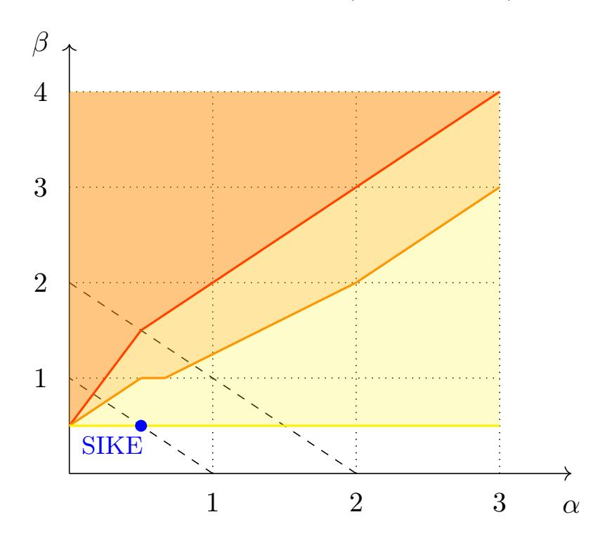
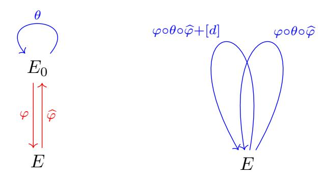
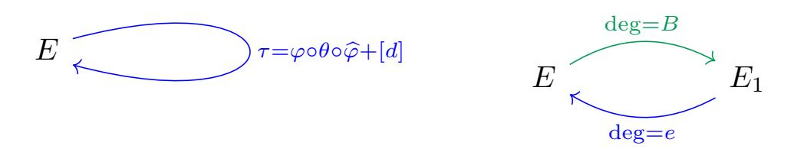
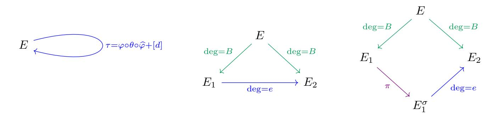
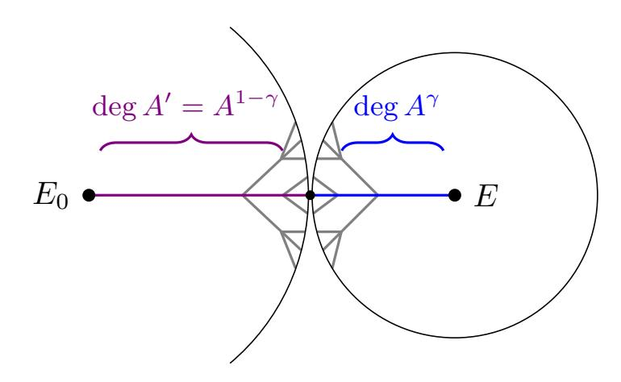

{0}------------------------------------------------

# <span id="page-0-0"></span>Improved torsion-point attacks on SIDH variants

Victoria de Quehen<sup>1</sup> , Péter Kutas<sup>2</sup> , Chris Leonardi<sup>1</sup> , Chloe Martindale<sup>3</sup> , Lorenz Panny<sup>4</sup> , Christophe Petit2,<sup>5</sup> , and Katherine E. Stange<sup>6</sup>

> 1 ISARA Corporation, Waterloo, Canada vicdequehen@gmail.com chris.leonardi@isara.com

- <sup>2</sup> School of Computer Science, University of Birmingham, UK P.Kutas@bham.ac.uk
- <sup>3</sup> Department of Computer Science, University of Bristol, UK chloe.martindale@bristol.ac.uk
- 4 Institute of Information Science, Academia Sinica, Taipei, Taiwan
  - lorenz@yx7.cc <sup>5</sup> Laboratoire d'Informatique,

Université libre de Bruxelles, Belgium christophe.f.petit@gmail.com

<sup>6</sup> Department of Mathematics, University of Colorado Boulder, Colorado, USA kstange@math.colorado.edu

Abstract. SIDH is a post-quantum key exchange algorithm based on the presumed difficulty of finding isogenies between supersingular elliptic curves. However, SIDH and related cryptosystems also reveal additional information: the restriction of a secret isogeny to a subgroup of the curve (torsion-point information). Petit [\[30\]](#page-31-0) was the first to demonstrate that torsion-point information could noticeably lower the difficulty of finding secret isogenies. In particular, Petit showed that "overstretched" parameterizations of SIDH could be broken in polynomial time. However, this did not impact the security of any cryptosystems proposed in the literature. The contribution of this paper is twofold: First, we strengthen the techniques of [\[30\]](#page-31-0) by exploiting additional information coming from a dual and a Frobenius isogeny. This extends the impact of torsion-point attacks considerably. In particular, our techniques yield a classical attack that completely breaks the n-party group key exchange of [\[2\]](#page-30-0), first introduced as GSIDH in [\[16\]](#page-30-1), for 6 parties or more, and a quantum attack for 3 parties or more that improves on the best known asymptotic complexity. We also provide a Magma implementation of our attack for 6 parties. We give the full range of parameters for which our attacks apply. Second, we construct SIDH variants designed to be weak against our attacks; this includes backdoor choices of starting curve, as well as backdoor choices of base-field prime. We stress that our results do not degrade the security of, or reveal any weakness in, the NIST submission SIKE [\[19\]](#page-31-1).

# 1 Introduction

With the advent of quantum computers, commonly deployed cryptosystems based on the integerfactorization or discrete-logarithm problems will need to be replaced by new post-quantum

<sup>∗</sup> Author list in alphabetical order; see [https://www.ams.org/profession/leaders/culture/](https://www.ams.org/profession/leaders/culture/CultureStatement04.pdf) [CultureStatement04.pdf](https://www.ams.org/profession/leaders/culture/CultureStatement04.pdf). Lorenz Panny was a PhD student at Technische Universiteit Eindhoven while this research was conducted. Péter Kutas and Christophe Petit's work was supported by EPSRC grant EP/S01361X/1. Katherine E. Stange was supported by NSF-CAREER CNS-1652238. This work was supported in part by the Commission of the European Communities through the Horizon 2020 program under project number 643161 (ECRYPT-NET) and in part by NWO project 651.002.004 (CHIST-ERA USEIT). Date of this document: 2021-07-13.

{1}------------------------------------------------

cryptosystems that rely on different assumptions. Isogeny-based cryptography is a relatively new field within post-quantum cryptography. An *isogeny* is a non-zero rational map between elliptic curves that also preserves the group structure, and isogeny-based cryptography is based on the conjectured hardness of finding isogenies between elliptic curves over finite fields.

Isogeny-based cryptography stands out amongst post-quantum primitives due to the fact that isogeny-based key-exchange achieves the smallest key sizes of all candidates. Isogeny-based schemes also appear to be fairly flexible; for example, a relatively efficient post-quantum non-interactive key agreement protocol called CSIDH [8] is built on isogeny assumptions.

The Supersingular Isogeny Diffie–Hellman protocol, or SIDH, was the first practical isogeny-based key-exchange protocol, proposed in 2011 by Jao and De Feo [21]. The security of SIDH relies on the hardness of solving (a special case of) the following problem:<sup>1</sup>

<span id="page-1-0"></span>**Problem 1 (Supersingular Isogeny with Torsion (SSI-T)).** For a prime p and smooth coprime integers A and B, given two supersingular elliptic curves  $E_0/\mathbb{F}_{p^2}$  and  $E/\mathbb{F}_{p^2}$  connected by an unknown degree-A isogeny  $\varphi \colon E_0 \to E$ , and given the restriction of  $\varphi$  to the B-torsion of  $E_0$ , recover an<sup>2</sup> isogeny  $\varphi$  matching these constraints.

SSI-T is a generalization of the "Computational Supersingular Isogeny problem", or CSSI for short, defined in [21]. Although the CSSI problem that appears in the literature also includes torsion information, we use the name SSI-T to stress the importance of the additional torsion information. Additionally, we consider more flexibility in the parameters than CSSI to challenge the implicit assumption that even with torsion information the hardness of the protocol always scales with the degree of the isogenies and the characteristic p of the field.

The best known way to break SIDH by treating it as a pure isogeny problem is a claw-finding approach on the isogeny graph having classical complexity  $O(\sqrt{A} \cdot \text{polylog}(p))$  and no known quantum speedups viable in reality [22]. However, it is clear that SSI-T provides the attacker with more information than the "pure" supersingular isogeny problem, where the goal is to find an isogeny between two given supersingular elliptic curves without any further hints or restrictions.

The first indication that additional torsion-point information could be exploited to attack a supersingular isogeny-based cryptosystem was an active key-reuse attack against SIDH published in 2016 [17] by Galbraith, Petit, Shani, and Ti. In [17] the attacker sends key-exchange messages with manipulated torsion points and detects whether the key exchange succeeds. This allows recovery of the secret key within  $O(\log A)$  queries. To mitigate this attack, [17] proposes using the Fujisaki–Okamoto transform, which generically renders a CPA-secure public-key encryption scheme CCA-secure, and therefore thwarts those so-called reaction attacks. The resulting scheme Supersingular Isogeny Key Encapsulation, or SIKE [19] for short, is the only isogeny-based submission to NIST's standardization project for post-quantum cryptography [28], and is currently a Round 3 "Alternate Candidate".

However, SSI-T can be easier than finding isogenies in general. Indeed, a line of work [30, 7] revealed a separation between the hardness of the supersingular isogeny problem and SSI-T for some parameterizations. This is potentially concerning because several similar schemes have been proposed that are based on the more general SSI-T, and in particular, not clearly based on the CSSI problem as stated in [21] due to CSSI's restrictions on A and B [11, 33, 16, 2, 5, 13]. For

<sup>&</sup>lt;sup>1</sup> See Section 2.2 for how the objects discussed are represented computationally.

These constraints do not necessarily uniquely determine  $\varphi$ , but any efficiently computable isogeny from  $E_0$  to E is usually enough to recover the SIDH secret [17, 36]. Moreover,  $\varphi$  is unique whenever  $B^2 > 4A$  [27, § 4].

<sup>&</sup>lt;sup>3</sup> Note that the naïve meet-in-the-middle approach has prohibitively large memory requirements. Collision finding à la van Oorschot-Wiener thus performs better in practice, although its time complexity is worse in theory [1].

{2}------------------------------------------------

example, for the security of the GSIDH *n*-party group key agreement [16, 2], SSI-T must hold for  $B \approx A^{n-1}$ .

A particular choice made in SIKE is to fix the "starting curve"  $E_0$  to be a curve defined over  $\mathbb{F}_p$  that has small-degree non-scalar endomorphisms; these are very rare properties within the set of all supersingular curves defined over  $\mathbb{F}_{p^2}$ . On its own, such a choice of starting curve does not seem to have any negative security implications for SIKE. However, in addition to their active attack, [17] shows that given an explicit description of both curves' endomorphism rings, it is (under reasonable heuristic assumptions) possible to recover the secret isogeny in SIKE. The argument in [17] does not use torsion-point information, but only applies if the curves are sufficiently close; recently [36] showed that if torsion-point information is provided the two curves do not need to be close.

The approach for solving SSI-T introduced by Petit in 2017 [30] exploits both torsion-point information and knowledge of the endomorphism ring of the special starting curve. This attack is efficient for certain parameters, for which the "pure" supersingular isogeny problem still appears to be hard. It uses the knowledge of the secret isogeny restricted to a large torsion subgroup to recover the isogeny itself, giving a passive heuristic polynomial-time attack on non-standard variants of SIDH satisfying  $B > A^4 > p^4$ . However, in practice, for all the SIDH-style schemes proposed in the literature so far, both A and B are taken to be divisors of  $p^2 - 1$ , allowing torsion points to be defined over small field extensions, which makes the resulting scheme more efficient. One of the contributions of this work is extending torsion-point attacks to have a stronger impact on parameterizations where A and B are divisors of  $p \pm 1$  or  $p^2 - 1$ .

### 1.1 Our contributions

We improve upon and extend Petit's 2017 torsion-point attacks [30] in several ways. Our technical results have the following cryptographic implications:

- We give an attack on *n*-party group key agreement [16, 2], see Section 7.1 and in particular Table 1. This attack applies to the GSIDH protocol of [16], not to the SIBD procotol of [16]. Our attack yields, under Heuristic 2:
  - A polynomial-time break for  $n \geq 6$ .
  - An improved classical attack for  $n \geq 5$ .
  - An improved quantum attack for  $n \geq 3$  (compared to the asymptotic complexity for quantum claw-finding computed in [22]).

We provide a Magma [6] implementation of our attack on 6-party group key agreement, see https://github.com/torsion-attacks-SIDH/6party.

- We give an attack on B-SIDH [11] that, under Heuristic 1, is asymptotically better than quantum claw-finding (with respect to [22]), although it does not weaken the security claims of [11] (see Section 7.2).
- We show that setting up a B-SIDH group key agreement in the natural way would yield a polynomial-time attack for 4 or more parties (see Section 7.3).
- More generally, we solve Problem SSI-T (under plausible explicit heuristics) in:
  - 1. Polynomial time when
    - $-j(E_0) = 1728$ , B > pA, p > A, A has (at most)  $O(\log \log p)$  distinct prime factors, and B is at most polynomial in A (Proposition 9 and Corollary 7).
    - $-j(E_0) = 1728$ ,  $B > \sqrt{p}A^2$ , p > A, A has (at most)  $O(\log \log p)$  distinct prime factors, and B is at most polynomial in A (Proposition 11 and Corollary 8).

{3}------------------------------------------------

- E<sup>0</sup> is a specially constructed "backdoor curve", B > A<sup>2</sup> , and A has (at most) O(log log p) distinct prime factors (Theorem [15](#page-17-0) and Algorithm [3\)](#page-18-0).
- j(E0) = 1728 and p is a specially constructed backdoor prime (Sections [5.3](#page-21-0) and [5.4\)](#page-21-1).
- 2. Superpolynomial time but asymptotically more efficient than meet-in-the-middle on a classical computer when
  - <sup>j</sup>(E0) = 1728, B > max <sup>n</sup>√pA<sup>3</sup> <sup>4</sup> , A, po , A has (at most) O(log log p) distinct prime factors, and B is at most polynomial in A (Corollary [26\)](#page-25-0).
  - <sup>j</sup>(E0) = 1728, B > <sup>√</sup>pA, <sup>A</sup> has (at most) <sup>O</sup>(log log <sup>p</sup>) distinct prime factors, and <sup>B</sup> is at most polynomial in A (Corollary [28\)](#page-25-1).
  - E<sup>0</sup> is a specially constructed "backdoor curve" and A has (at most) O(log log p) distinct prime factors (Proposition [31\)](#page-26-1).
- 3. Superpolynomial time but asymptotically more efficient than quantum claw-finding (with respect to [\[22\]](#page-31-3)) when <sup>j</sup>(E0) = 1728, B > <sup>√</sup>p, <sup>A</sup> has (at most) <sup>O</sup>(log log <sup>p</sup>) distinct prime factors, and B is at most polynomial in A (Corollary [28\)](#page-25-1).



Figure 1. Performance of our attacks for j(E0) = 1728. Here A ≈ p α and B ≈ p β . Parameters above the red, orange and yellow curves are parameters admitting a polynomial-time attack, an improvement over the best classical attacks, and an improvement over the best quantum attacks respectively. Parameters below the upper dashed line are those allowing AB | (p <sup>2</sup> − 1) as in [\[11\]](#page-30-5). Parameters below the lower dashed line are those allowing AB | (p − 1) as in [\[20,](#page-31-8) [19\]](#page-31-1). The blue dot corresponds to SIKE parameters.

These cryptographic implications are consequences of the following new mathematical results:

- In Section [3,](#page-7-0) we formalize the hardness assumption and reduction implicit in [\[30\]](#page-31-0). We call this hardness assumption the Shifted Lollipop Endomorphism (SLE) Problem.
- In Section [4,](#page-11-0) we give two improved reductions to SLE (leading to our dual isogeny attack and Frobenius isogeny attack ).
- In Section [5,](#page-17-1) we:
  - Introduce "backdoor" curves, which, when used as E0, allows us to solve [SSI-T](#page-1-0) in polynomial time if B > A<sup>2</sup> .
  - Give a method to construct backdoor curves and study their frequency.
  - Introduce "backdoor" primes, which, when used for p, allows us to solve [SSI-T](#page-1-0) in polynomial time.

{4}------------------------------------------------

• In Section [6,](#page-22-0) we show how to extend both the dual isogeny attack and the Frobenius isogeny attack to allow for superpolynomial attacks.

We emphasize that none of our attacks apply to the NIST candidate SIKE: for each attack described in this paper, at least one aspect of SIKE needs to be changed (e.g., the balance of the degrees of the secret isogenies, the starting curve, or the base-field prime).

## <span id="page-4-2"></span>1.2 Comparison to earlier work

In [\[2\]](#page-30-0), the authors estimated that the attack from [\[30\]](#page-31-0) would render their scheme insecure for 400 parties or more. In contrast, we give a complete break when there are at least 6 parties.

The cryptanalysis done by Bottinelli et al. [\[7\]](#page-30-4) also gave a reduction in the same vein as Petit's 2017 paper [\[30\]](#page-31-0). Our work overlaps with theirs (only) in Corollary [8,](#page-13-2) and the only similarity in techniques is in the use of "triangular decomposition" [\[7,](#page-30-4) § 5.1], see the middle diagram in Figure [4.](#page-10-0) Although their improvement is akin to the one given by our dual isogeny attack, they require additional (shifted lollipop) endomorphisms; unfortunately, we have not found a way to combine the two methods. Moreover, our results go beyond [\[7\]](#page-30-4) in several ways: we additionally introduce the Frobenius isogeny attack (in particular giving rise to our attack on group key agreement). We consider multiple trade-offs for both the dual and the Frobenius isogeny attacks by allowing for superpolynomial attacks, as well as considering other starting curves and base-field primes.

## 1.3 Outline

In Section [2](#page-4-0) we go over various preliminaries, including reviewing SIDH. In Section [3](#page-7-0) we define the relevant hard isogeny problems and give a technical preview; we also outline the idea behind our attacks and how they give rise to reductions of the [SSI-T](#page-1-0) Problem. In Section [4](#page-11-0) we prove our reductions and give two new algorithms to solve [SSI-T](#page-1-0) in polynomial time for certain parameter sets. In Section [5](#page-17-1) we introduce backdoor curves E<sup>0</sup> and backdoor primes p for which we can solve [SSI-T](#page-1-0) in polynomial time for certain parameter sets. In Section [6](#page-22-0) we extend the attacks of Sections [4](#page-11-0) and [5](#page-17-1) to superpolynomial attacks. In Section [7](#page-26-2) we give the impact of our attacks on cryptographic protocols in the literature. In Section [8](#page-29-0) we pose an open question on constructing new reductions.

Acknowledgements. Thanks to Daniel J. Bernstein for his insight into estimating sizes of solutions to Equation [3,](#page-13-3) to John Voight for answering a question of ours concerning Subsection [5.2,](#page-19-0) and to Boris Fouotsa for identifying errors in Proposition [34](#page-27-0) and its proof. We would also like to thank Filip Pawlega and the anonymous reviewers for their careful reading and helpful feedback.

# <span id="page-4-0"></span>2 Preliminaries

### <span id="page-4-1"></span>2.1 The Supersingular Isogeny Diffie–Hellman protocol family

We give a somewhat generalized high-level description of SIDH [\[21\]](#page-31-2). Recall that E[N] denotes the N-torsion subgroup of an elliptic curve E and [m] denotes scalar multiplication by m. The public parameters of the system are two smooth coprime numbers A and B, a prime p of the form p = ABf − 1, where f is a small cofactor, and a supersingular elliptic curve E<sup>0</sup> defined over Fp<sup>2</sup> together with points PA, QA, PB, Q<sup>B</sup> ∈ E<sup>0</sup> such that E0[A] = hPA, QAi and E0[B] = hPB, QBi. The protocol then proceeds as follows:

{5}------------------------------------------------

- 1. Alice chooses a random cyclic subgroup of  $E_0[A]$  as  $G_A = \langle P_A + [x_A]Q_A \rangle$  and Bob chooses a random cyclic subgroup of  $E_0[B]$  as  $G_B = \langle P_B + [x_B]Q_B \rangle$ .
- 2. Alice computes the isogeny  $\varphi_A: E_0 \to E_0/\langle G_A \rangle =: E_A$  and Bob computes the isogeny  $\varphi_B: E_0 \to E_0/\langle G_B \rangle =: E_B$ .
- 3. Alice sends the curve  $E_A$  and the two points  $\varphi_A(P_B)$ ,  $\varphi_A(Q_B)$  to Bob. Similarly, Bob sends  $(E_B, \varphi_B(P_A), \varphi_B(Q_A))$  to Alice.
- 4. Alice and Bob use the given torsion points to obtain the shared secret curve  $E_0/\langle G_A, G_B \rangle$ . To do so, Alice computes  $\varphi_B(G_A) = \varphi_B(P_A) + [x_A]\varphi_B(Q_A)$  and uses the fact that  $E_0/\langle G_A, G_B \rangle \cong E_B/\langle \varphi_B(G_A) \rangle$ . Bob proceeds analogously.

The SIKE proposal [19] suggests various choices of (p, A, B) depending on the targeted security level: All parameter sets use powers of two and three for A and B, respectively, with  $A \approx B$  and f = 1. For example, the smallest parameter set suggested in [19] uses  $p = 2^{216} \cdot 3^{137} - 1$ . Other constructions belonging to the SIDH "family tree" of protocols use different types of parameters [16, 11, 2, 33].

We may assume knowledge of  $\operatorname{End}(E_0)$ : The only known way to construct supersingular elliptic curves is by reduction of elliptic curves with CM by a small discriminant (which implies small-degree endomorphisms: see [26, 9]), or by isogeny walks starting from such curves (where knowledge of the path reveals the endomorphism ring, thus requiring trusted setup). A common choice when  $p \equiv 3 \pmod{4}$  is  $j(E_0) = 1728$  or a small-degree isogeny neighbour of that curve [19]. Various variants of SIDH exist in the literature. We will call a variant an SIDH-like protocol if its security can be broken by solving SSI-T for some values of A and B.

In [2] the authors propose the following n-party key agreement, first introduced as GSIDH in [16].<sup>4</sup> The idea is to use primes of the form  $p = f \prod_{i=1}^n \ell_i^{e_i} - 1$  where  $\ell_i$  is the i-th prime number, the i-th party's secret isogeny has degree  $\ell_i^{e_i}$ , the i-th participant provides the images of a basis of the  $\prod_{j=1}^n \ell_j^{e_j}/\ell_i^{e_i}$  torsion, and f is a small cofactor. They choose the starting curve to be of j-invariant 1728 and choose the  $e_i$  in such a way that all the  $\ell_i^{e_i}$  are of roughly the same size. This is an example of an SIDH-like protocol; for this protocol to be secure it is required that SSI-T be hard when  $A = \ell_1^{e_1}$  and  $B = f \prod_{i=2}^n \ell_i^{e_i}$ . However, we prove in Theorem 33 that SSI-T can be solved in polynomial time for 6 or more parties; also see Table 1 for the complexity of our attack for any number of parties.

Another example of a SIDH-like scheme is B-SIDH [11]. In B-SIDH, the prime has the property that  $p^2-1$  is smooth (as opposed to just p-1 being smooth) and  $A \approx B \approx p$ . It would seem that choosing parameters this way one has to work over  $\mathbb{F}_{p^4}$  but in fact the scheme simultaneously works with the curve and its quadratic twist (i.e., a curve which is not isomorphic to the original curve over  $\mathbb{F}_{p^2}$  but has the same j-invariant) and avoids the use of extension fields. The main advantage of B-SIDH is that the base-field primes used can be considerably smaller than the primes used in SIDH. We discuss the impact of our attacks of B-SIDH in Subsection 7.2; although we give an improvement on the quantum attack of [22] the parameter choices in [11] are not affected as they were chosen with a significant quantum security margin.

The general concept of using primes of this form extends beyond the actual B-SIDH scheme. As a final example of an SIDH-like scheme, consider the natural idea of using B-SIDH in a group key agreement context. The reason that this construction is a natural choice is that a large number of parties implies a large base-field prime, which is an issue both in terms of efficiency and key size. Using a B-SIDH prime could in theory enable the use of primes of half the size. However, as we show in Corollary 35, such a scheme is especially susceptible to our attacks and is broken in polynomial time for 4 or more parties.

<sup>&</sup>lt;sup>4</sup> [16] also proposes a different group key agreement, SIBD, to which our attack does not apply.

{6}------------------------------------------------

### 2.2 Notation

Throughout this paper, we work with the field  $\mathbb{F}_{p^2}$  for a prime p. In our analysis we often want to omit factors polynomial in  $\log p$ ; as such, from this point on we will abbreviate  $O(g \cdot \operatorname{polylog}(p))$  by  $O^*(g)$ . Similarly, a number is called *smooth*, without further qualification, if all of its prime factors are  $O^*(1)$ . Polynomial time without explicitly mentioning the variables means "polynomial in the representation size of the input" — usually the logarithms of integers. An algorithm is called efficient if its runs in polynomial time.

We let  $\mathcal{B}_{p,\infty}$  denote the quaternion algebra ramified at p and  $\infty$ , for which we use a fixed  $\mathbb{Q}$ -basis  $\langle 1, \mathbf{i}, \mathbf{j}, \mathbf{ij} \rangle$  such that  $\mathbf{j}^2 = -p$  and  $\mathbf{i}$  is a nonzero endomorphism of minimal norm satisfying  $\mathbf{ij} = -\mathbf{ji}$ . Quaternions are treated symbolically throughout; they are simply formal linear combinations of  $1, \mathbf{i}, \mathbf{j}, \mathbf{ij}$ .

For any positive integer N we write  $\operatorname{sqfr}(N)$  for the squarefree part of N.

<span id="page-6-0"></span>Representation of elliptic-curve points and isogenies. We will generally require that the objects we are working with have "compact" representation (that is, size polylog(p) bits), and that maps can be evaluated at points of representation size polylog(p) in time polylog(p).

In the interest of generality, we will not force a specific choice of representation, but for concreteness, the following data formats are examples of suitable instantiations:

- For an elliptic curve E defined over an extension of  $\mathbb{F}_p$  and an integer N, a point in E[N] may be stored as a tuple consisting of one point in  $E[q_i^{e_i}]$  for each prime power  $q_i^{e_i}$  in the factorization of N, each represented naïvely as coordinates. This "CRT-style" representation has size  $\operatorname{polylog}(p)$  when N is powersmooth and  $\operatorname{polynomial}$  in p. (In some cases, storing points in E[N] naïvely may be more efficient, for instance in the beneficial situation that  $E[N] \subseteq E(\mathbb{F}_{p^k})$  for some small extension degree k.)
- A smooth-degree isogeny may be represented as a sequence (often of length one) of isogenies, each of which is represented by an (often singleton) set of generators of its kernel subgroup.
- Endomorphisms of a curve  $E_0$  with known endomorphism ring spanned by a set of efficiently evaluatable endomorphisms may be stored as a formal  $\mathbb{Z}$ -linear combination of such "nice" endomorphisms. Evaluation is done by first evaluating each basis endomorphism separately, then taking the appropriate linear combination of the resulting points.

In some of our algorithms, we will deal with the restriction of an isogeny to some N-torsion subgroup, where N is smooth. This object is motivated by the auxiliary points  $\varphi_A(P_B)$ ,  $\varphi_A(Q_B)$  given in the SIDH protocol (Section 2.1), and it can be represented in the same way: The restriction of an isogeny  $\varphi \colon E \to E'$  to the N-torsion subgroup E[N] is stored as a tuple of points  $(P, Q, \varphi(P), \varphi(Q)) \in E^2 \times E'^2$ , where  $\{P, Q\}$  forms a basis of E[N]. Then, to evaluate  $\varphi$  on any other N-torsion point  $R \in E[N]$ , we first decompose R over the basis  $\{P, Q\}$ , yielding a linear combination R = [i]P + [j]Q. (This two-dimensional discrete-logarithm computation is feasible in polynomial time as N was assumed to be smooth.) Then, we may simply recover  $\varphi(R)$  as  $[i]\varphi(P) + [j]\varphi(Q)$ , exploiting the fact that  $\varphi$  is a group homomorphism.

### <span id="page-6-1"></span>2.3 Quantum computation cost assumptions

In the context of NIST's post-quantum cryptography standardization process [28], there is a significant ongoing effort to estimate the quantum cost of fundamental cryptanalysis tasks in practice. In particular, while it seems well-accepted that Grover's algorithm provides a square-root

<sup>&</sup>lt;sup>5</sup> Each occurrence of polylog(p) is shorthand for a concrete, fixed polynomial in log p. (The notation is not meant to imply that all instances of polylog(p) be the same.)

{7}------------------------------------------------

quantum speedup, the complexity of the claimed cube-root claw-finding algorithm of Tani [\[37\]](#page-31-10) has been disputed by Jaques and Schanck [\[22\]](#page-31-3), and the topic is still subject to ongoing research [\[23\]](#page-31-11).

Several attacks we present in this paper use claw-finding algorithms as a subroutine, and the state-of-the-art algorithms against which we compare them are also claw-finding algorithms. We stress, however, that the insight provided by our attacks is independent of the choice of the quantum computation model. For concreteness we chose the RAM model studied in detail by Jaques and Schanck in [\[22\]](#page-31-3), in which it is argued that quantum computers do not seem to offer a significant speedup over classical computers for the task of claw-finding. Adapting our various calculations to other existing and future quantum computing cost models, in particular with respect to claw-finding, is certainly possible.

# <span id="page-7-0"></span>3 Overview

Standard attacks on SIDH follow two general approaches: they either solve the supersingular isogeny problem directly, or they reduce finding an isogeny to computing endomorphism rings. However, SIDH is based on [SSI-T](#page-1-0) introduced above, where an adversary is also given the restriction of the secret isogeny to the B-torsion of the starting curve E0. Exploiting this B-torsion information led to a new line of attack as first illustrated in [\[30\]](#page-31-0).

In Subsection [3.1](#page-7-1) we discuss the [Supersingular Isogeny Problem](#page-7-2) and [SSI-T.](#page-1-0) Petit's work was the first to show an apparent separation between the hardness of [SSI-T](#page-1-0) and the hardness of the [Supersingular Isogeny Problem](#page-7-2) in certain settings. In this work we introduce a new isogeny problem, the Shifted Lollipop Endomorphism Problem (SLE). This problem was implicit in Petit's work [\[30\]](#page-31-0), which contained a purely algebraic reduction from [SSI-T](#page-1-0) to this new hard problem. We improve upon the work of [\[30\]](#page-31-0) by giving two significantly stronger reductions. In Subsection [3.2](#page-8-0) we sketch the main idea behind the reduction obtained by Petit. In Subsection [3.3](#page-9-0) we present a technical overview which covers the ideas behind our two improved reduction variants.

In Section [4](#page-11-0) we will present and analyze our two reductions, and give algorithms to solve SLE for certain parameter sets. As we will see, the combination of our reductions and our algorithms to solve particular parameter sets of SLE give rise to two families of improvements on the torsionpoint attacks of [\[30\]](#page-31-0) on SIDH-like protocols; these attacks will additionally exploit the dual of the secret isogeny and the Frobenius isogeny.

## <span id="page-7-1"></span>3.1 Hard isogeny problems

We first review the most basic hardness assumption in isogeny-based cryptography:

<span id="page-7-2"></span>Problem 2 (Supersingular Isogeny). Given a prime p, a smooth integer A, and two supersingular elliptic curves E0/Fp<sup>2</sup> and E/Fp<sup>2</sup> guaranteed to be A-isogenous, find an isogeny ϕ: E<sup>0</sup> → E of degree A.

In SIDH, we denote Alice's secret isogeny ϕ<sup>A</sup> : E<sup>0</sup> → EA, but in general we will denote some unknown isogeny by ϕ : E<sup>0</sup> → E.

Recall that Alice's public key contains not only the curve E but also the points ϕ(P), ϕ(Q) for a fixed basis {P, Q} of E0[B]. Since B is smooth, knowing ϕ(P) and ϕ(Q) allows us to efficiently compute the restriction of ϕ to the torsion subgroup E0[B] [\[32\]](#page-31-12). Hence, it is more accurate to say that the security of SIDH is based on [SSI-T,](#page-1-0) which includes this additional torsion information.

One additional fact that is often overlooked is that the hardness of SIDH is not based on a random instance of [SSI-T,](#page-1-0) because the starting curve is fixed and has a well-known endomorphism ring with small degree endomorphisms. It is known that given an explicit description of both 

{8}------------------------------------------------

endomorphism rings  $\operatorname{End}(E)$  and  $\operatorname{End}(E_0)$ , it is (under reasonable heuristic assumptions) possible to recover the secret isogeny [17, 36]. However, it is not clear if knowing only one of  $\operatorname{End}(E)$  and  $\operatorname{End}(E_0)$  makes the isogeny problem easier.

Petit was the first to observe that knowing  $\operatorname{End}(E_0)$  could be useful to show an apparent separation between the hardness of the Supersingular Isogeny Problem and the hardness of SSI-T. In particular, in [30] Petit gave a reduction from SSI-T to the following problem, which we will call the Shifted Lollipop Endomorphism (SLE) Problem, where N = B.

<span id="page-8-1"></span>**Problem 3 (Shifted Lollipop Endomorphism (SLE**<sub>N, $\lambda$ </sub>)). Let p be a prime, A and B be smooth coprime integers, and a supersingular elliptic curve  $E_0/\mathbb{F}_{p^2}$ . Given a positive integer N, find the restriction of a trace-zero endomorphism  $\theta \in \text{End}(E_0)$  to  $E_0[B]$ , an integer d coprime to B, and a smooth integer  $0 < e < \lambda$  such that

$$A^2 \deg \theta + d^2 = Ne. \tag{1}$$

When  $\lambda$  is left unspecified we let  $SLE_N$  denote  $SLE_{N,O^*(1)}$ .

Notice that  $SLE_N$  only depends on the parameters  $(p, A, B, E_0)$ . It does not depend on an unknown isogeny (it depends on A, which in practice will be the degree of the unknown isogeny). Thus solving  $SLE_N$  can be completed in a precomputation phase and applied to any unknown isogeny in a fixed SIDH protocol. In [30], Petit was able to show solutions to  $SLE_N$  where N = B in certain cases, where  $End(E_0)$  was known and has small-degree, non-scalar endomorphisms.

The goal of this work is to further investigate for which parameters there exists a separation between SSI-T and the Supersingular Isogeny Problem. Intuitively,  $SLE_N$  should become easier to solve as N increases, however, this is not true in general and it is unclear how to find efficient reductions to  $SLE_N$  for most values of N. To this end, we will give two reductions: one reduction from SSI-T to  $SLE_{N,\lambda}$  where  $N=B^2$ , and the other where  $N=B^2p$ . Both reductions run in  $O^*(\lambda^{\frac{1}{2}})$ , assuming A has only  $O(\log \log p)$  distinct prime factors, see Theorems 3 and 5. We then investigate their impact on supersingular isogeny-based protocols.

## <span id="page-8-0"></span>3.2 Petit's torsion-point attack

We begin this subsection by sketching Petit's reduction from SSI-T to SLE<sub>N</sub> where N=B. Suppose we are given an instance of SSI-T, that is,  $(p,A,B,E_0,E,\varphi|_{E[B]})$ , where the goal is to recover the unknown isogeny  $\varphi$ . We call an endomorphism on E that has the form  $\varphi \circ \theta \circ \widehat{\varphi}$  for some endomorphism  $\theta$  on  $E_0$  a **lollipop endomorphism**, and an endomorphism of the form  $\varphi \circ \theta \circ \widehat{\varphi} + [d]$  for  $d \in \mathbb{Z}$  a **shifted lollipop endomorphism**; see Figure 2 (this is the motivation for the name of Problem SLE). We will now discuss how to find a shifted lollipop endomorphism, as we will show in Lemma 4 how to use the resulting shifted lollipop endomorphism to recover the secret isogeny.

The main idea of Petit's original attack is that if  $(\theta, d, e)$  forms a solution to  $SLE_B$ , then  $\tau = \varphi \circ \theta \circ \widehat{\varphi} + [d]$  is a shifted lollipop endomorphism of degree Be where e is smooth. Since  $\deg \tau = Be$ , it follows that  $\tau$  also decomposes as  $\tau = \eta \circ \varphi$  for two isogenies  $\varphi : E \to E_1$  and  $\eta : E_1 \to E$  of degrees B and e; see Figure 3.

The restriction of  $\varphi$  to  $E_0[B]$  given in Alice's public key can be used to construct the B-isogeny in the decomposition (the green arrow in Figure 3), see [30] for details. This can be done efficiently if  $\theta$  is in a representation that can be efficiently evaluated on  $E_0[B]$ . As e is smooth, the e-isogeny in the decomposition (the blue arrow) can be found via brute-force in time  $O^*(e^{\frac{1}{2}})$ . This gives us  $\tau$ . Subtracting [d] from  $\tau$  gives  $\varphi \circ \theta \circ \widehat{\varphi}$ .

{9}------------------------------------------------



Figure 2. Lollipop and Shifted Lollipop endomorphisms. The name "lollipop" endomorphism was inspired by the diagram on the left.

<span id="page-9-2"></span><span id="page-9-1"></span>

**Figure 3.** A decomposition of  $\tau$  in Petit's original attack

Suppose the lollipop endomorphism  $\rho = \varphi \circ \theta \circ \widehat{\varphi}$  is cyclic. Then  $\ker(\rho) \cap E_1[A] = \ker \widehat{\varphi}$ . (The kernel of  $\rho$  can be calculated as A is smooth.) Once we have found  $\widehat{\varphi}$ , it is easy to find the unknown isogeny  $\varphi$ . If  $\rho$  is not cyclic, then one can still recover  $\varphi$  if A has  $O(\log \log p)$  distinct prime factors by using a technical approach developed in [30, Section 4.3], for further details see Lemma 4. Thus we have a reduction from SSI-T to SLE<sub>N</sub> where N = B, which is formalized in the following theorem.

**Theorem 1.** Suppose we are given an instance of SSI-T where A has  $O(\log \log p)$  distinct prime factors. Assume we are given the restriction of a trace-zero endomorphism  $\theta \in \operatorname{End}(E_0)$  to  $E_0[B]$ , an integer d coprime to B, and a smooth integer e such that

$$\deg(\varphi \circ \theta \circ \widehat{\varphi} + [d]) = Be.$$

Then we can compute  $\varphi$  in time  $O^*(\sqrt{e}) = O(\sqrt{e} \cdot \text{polylog}(p))$ .

## <span id="page-9-0"></span>3.3 Technical preview

Although the attack of [30] was the first to establish an apparent separation between the hardness of SSI-T and the hardness of supersingular isogeny problem, it did not affect the security of any cryptosystems that appear in the literature. In this paper, we give two attacks improving upon [30] by additionally exploiting the dual and the Frobenius conjugate of the secret isogeny respectively.

The first attack, which we call the **dual isogeny attack**, corresponds to reducing SSI-T to SLE<sub>N</sub> where  $N = B^2$ .<sup>6</sup> The second attack, which we call the **Frobenius isogeny attack**, corresponds to reducing SSI-T to SLE<sub>N</sub> where  $N = B^2p$ . The run-time of each attack depends on the parametrization of the cryptosystem, and one may perform better than the other for some choices of parameters. We show the details in Theorem 3 and Theorem 5. We begin by sketching the main ideas behind the reductions.

In the dual isogeny attack, finding a solution  $(\theta, d, e)$  to  $SLE_N$  with  $N = B^2$  corresponds to finding a shifted lollipop endomorphism  $\tau = \varphi \circ \theta \circ \widehat{\varphi} + [d]$  on E of degree  $B^2e$ , with e smooth.

<sup>&</sup>lt;sup>6</sup> See also [7] for a different reduction to  $SLE_{B^2}$ , cf. Subsection 1.2.

{10}------------------------------------------------

Assume  $\tau$  is cyclic (only for simplicity in this overview; the general case is Theorem 3). Then since  $\deg \tau = B^2 e$ , it follows that  $\tau$  also decomposes as  $\tau = \varphi' \circ \eta \circ \varphi$  for three isogenies  $\varphi, \eta$  and  $\varphi'$  of degrees B, e and B, respectively: see the middle diagram in Figure 4.

In the Frobenius isogeny attack, finding a solution  $(\theta, d, e)$  to  $SLE_N$  with  $N = B^2p$  corresponds to finding a shifted lollipop endomorphism  $\tau = \varphi \circ \theta \circ \widehat{\varphi} + [d]$  that has degree  $B^2pe$ , with e smooth. Assume  $\tau$  is cyclic (only for simplicity in this overview; the general case is Theorem 5). Since  $\deg \tau = B^2pe$ , it follows that  $\tau$  also decomposes as  $\tau = \varphi' \circ \eta \circ \pi \circ \varphi$  for four isogenies  $\varphi, \pi, \eta$  and  $\varphi'$  of degrees B, p, e and B, respectively, where the isogeny of degree p is the Frobenius map  $(x, y) \to (x^p, y^p)$ : see the right-hand diagram in Figure 4.



**Figure 4.** A decomposition of  $\tau$  in our two new attacks. Note: we take the dual of one isogeny in the middle and right-hand diagrams to reverse its arrow.

<span id="page-10-0"></span>In both attacks we find  $\tau$  by calculating each isogeny in the decomposition of  $\tau$ . In particular, we will use the restriction of  $\varphi$  to  $E_0[B]$  given by Alice's public key to construct the two B-isogenies in the decomposition (the green arrows in Figure 4). Again this can be done efficiently if  $\theta$  is in a representation that can be efficiently evaluated on  $E_0[B]$ . As e is smooth we can calculate the e-isogeny in the decomposition (the blue arrow) via brute-force in time  $O^*(e^{\frac{1}{2}})$ . As we can always construct the Frobenius map  $\pi$  (the purple arrow), this gives us  $\tau$ . The rest of the proof proceeds as with Petit's original attack assuming A has  $O(\log \log p)$  distinct prime factors, see Lemma 4 for details.

Remark 2. These methods are an improvement over Petit's original attack, which only utilized a shifted lollipop endomorphism  $\tau$  of degree Be. There  $\tau$  could only be decomposed into two isogenies of degree B and e as in Figure 3. Intuitively, Petit's original attack was less effective as a smaller proportion of  $\tau$  could be calculated directly, and hence a much larger (potentially exponential) proportion of the endomorphism needed to be brute forced. It is not clear how to find a better decomposition with more computable isogenies than those given in Figure 4 using the fixed parameters and public keys given in SIDH protocols. Furthermore, we give reductions both to  $SLE_{B^2}$  and  $SLE_{B^2p}$ , as increasing the degree of  $\tau$  does not necessarily make a shifted lollipop endomorphism  $\tau$  easier to find.

Once an appropriate  $(\theta, d, e)$  is found for a particular setting (that is, a particular choice of  $p, A, B, E_0$ ), then the reduction outlines an algorithm that can be run to find any unknown isogeny  $\varphi: E_0 \to E$ . In other words, there is first a precomputation needed to solve  $\operatorname{SLE}_N$  and find a particular  $(\theta, d, e)$ . Using this  $(\theta, d, e)$ , the above reduction gives a key-dependent algorithm to find a particular unknown isogeny  $\varphi: E_0 \to E$ .

We now outline how to solve  $SLE_N$  when  $N = B^2p$  for a particular choice of  $E_0$ , see Algorithm 2 for details. A similar technique works when  $N = B^2$ , see Algorithm 1. In most supersingular isogeny-based protocols, the endomorphism ring of  $E_0$  is known. A common choice

{11}------------------------------------------------

of starting curve, in SIKE for example<sup>7</sup>, is where  $E_0$  has j-invariant 1728. We show that in the Frobenius isogeny attack finding a shifted lollipop endomorphism of degree  $B^2pe$  reduces to finding a solution of

$$A^{2}(a^{2} + b^{2}) + pc^{2} = B^{2}e. (2)$$

To proceed choose c and e such that  $pc^2 = B^2e$  modulo  $A^2$ . The remaining equation  $a^2 + b^2 = \frac{Be - pc^2}{A^2}$  can be solved by Cornacchia's algorithm a large percentage of time; else the procedure is restarted with a new choice of e or c.

This method of solving  $SLE_N$  can be used to attack the *n*-party group key agreement [2]. We analyze this attack in Section 7.1, and show that it can be expected, heuristically, to run in polynomial time for  $n \geq 6$ . The results are summarized in Table 1, and an implementation of this attack for n = 6 can be found at https://github.com/torsion-attacks-SIDH/6party.

While we use the Frobenius isogeny attack to highlight vulnerabilities in the isogeny-based group key agreement, we use the ideas from the dual isogeny attack to investigate situations, namely different starting curves and base fields, which would result in insecure schemes.

# <span id="page-11-0"></span>4 Improved torsion-point attacks

In this section, we generalize and improve upon the torsion-point attacks from Petit's 2017 paper [30]; in our notation, Petit's attack can be viewed as a reduction of SSI-T to  $SLE_{B,\lambda}$  together with  $O^*(1)$ -time algorithm to solve  $SLE_{B,\lambda}$  for certain parameter sets. In Subsection 4.1, we introduce two new reductions from SSI-T to  $SLE_{N,\lambda}$ , where  $N=B^2$  and  $N=B^2p$ , respectively. The runtime of both reductions is  $O^*(\lambda^{\frac{1}{2}})$ . The reductions exploit two new techniques: a dual isogeny and the Frobenius isogeny.

In Subsection 4.2 we give an algorithm to solve  $SLE_N$  for  $N=B^2$  and  $N=B^2p$ , for specific starting curve<sup>8</sup>  $E_0$  under explicit, plausible heuristics (Heuristic 1 and 2, respectively). For certain parameters these algorithms solve  $SLE_{N,\lambda}$  for  $N=B^2$  for  $\lambda=O^*(1)$  in polynomial time and  $SLE_N$  for  $N=B^2p$  for  $\lambda=O(\log p)$  in polynomial time. For these parameters, this solves SSI-T in time  $O^*(1)$ .

### <span id="page-11-3"></span>4.1 Improved torsion-point attacks

The main ingredient in Petit's [30] attack can be viewed as a reduction of SSI-T to SLE<sub>B</sub>. In this section we introduce our first extension of this attack: the *dual isogeny attack*, which works by exploiting the dual isogeny of the (shifted lollipop) endomorphism  $\tau$  on E. We begin by giving the reduction for the dual isogeny attack.

<span id="page-11-1"></span>**Theorem 3.** Suppose we are given an instance of SSI-T where A has  $O(\log \log p)$  distinct prime factors. Assume we are given the restriction of a trace-zero endomorphism  $\theta \in \operatorname{End}(E_0)$  to  $E_0[B]$ , an integer d coprime to B, and a smooth integer e such that

$$\deg(\varphi \circ \theta \circ \widehat{\varphi} + [d]) = B^2 e.$$

Then we can compute  $\varphi$  in time  $O^*(\sqrt{e}) = O(\sqrt{e} \cdot \text{polylog}(p))$ .

We first state a technical lemma which mostly follows from [30, Section 4.3].

<span id="page-11-2"></span><sup>&</sup>lt;sup>7</sup> Note that the newest version of SIKE [19] changed the starting curve to a 2-isogenous neighbour of j = 1728, but this does not affect the asymptotic complexity of any attack.

<sup>&</sup>lt;sup>8</sup> More generally, these attacks apply for any "special" starting curve in the sense of [25].

{12}------------------------------------------------

**Lemma 4.** Let A be a smooth integer with  $O(\log \log p)$  distinct prime factors, and let  $E_0/\mathbb{F}_{p^2}$  and  $E/\mathbb{F}_{p^2}$  be two supersingular elliptic curves connected by an unknown degree-A isogeny  $\varphi$ . Suppose we are given the restriction of some  $\tau \in \operatorname{End}(E)$  to E[A], where  $\tau$  is of the form  $\tau = \varphi \circ \theta \circ \widehat{\varphi} + [d]$  such that if  $E[m] \subseteq \ker \tau$  then  $m \mid 2$ . Then we can compute  $\ker \varphi$  in time  $O^*(1)$ .

*Proof.* See Appendix A.1.

Proof (of Theorem 3). Suppose we have d, e and the restriction of  $\theta$  to E[B] satisfying the conditions above. We wish to find an explicit description of  $\tau = \varphi \circ \theta \circ \widehat{\varphi} + [d]$ . Let m be the largest integer dividing B such that  $E[m] \subseteq \ker \tau$ . Since the degree of  $\tau$  is  $B^2e$ , there exists a decomposition of the form  $\tau = \psi' \circ \eta \circ \psi \circ [m]$ , where  $\psi$  and  $\psi'$  are isogenies of degree B/m,  $\psi$  is cyclic, and  $\eta$  is an isogeny of degree e.

We proceed by deriving the maps in this decomposition. Since  $\tau$  factors through [m], this implies m divides  $\operatorname{tr}(\tau)=2d$ . As we chose d coprime to B, this shows  $m\in\{1,2\}$ .

To compute  $\psi$  and  $\psi'$ , we start by finding the restriction of  $\tau$  to the B-torsion. This can be computed from what we are given: the restrictions of  $\theta$ , [d],  $\varphi$ , hence  $\widehat{\varphi}$ , to the B-torsion of the relevant elliptic curves. This also allows us to compute m explicitly, as the largest integer dividing B such that  $E[m] \subseteq \ker \tau \cap E[B]$ .

Let  $\tau' = \psi' \circ \eta \circ \psi$ . The isogeny  $\psi$  can now be computed from the restriction of  $\tau$  to E[B] via

$$\ker \psi = \ker \tau' \cap ([m] \cdot E[B]) = (\ker \tau \cap E[B]) / E[m].$$

From the cyclicity of  $\psi$ , we can also deduce that  $\ker \widehat{\psi}' = \tau(E[B])$ , which gives  $\psi'$  explicitly.

Finally, we recover the isogeny  $\eta$  by a generic meet-in-the-middle algorithm, which runs in time  $O^*(\sqrt{e})$  since e is smooth. Note that if  $e = O^*(1)$ , then the entire algorithm runs in time polylog(p). In this way we have found  $\tau$  explicitly, and by Lemma 4 can compute  $\varphi$ .

Next we give the reduction for the *Frobenius isogeny attack*, which works by exploiting the Frobenius isogeny on E to improve, or at least alter, the dual attack.

<span id="page-12-0"></span>**Theorem 5.** Suppose we are given an instance of SSI-T where A has at most  $O(\log \log p)$  distinct prime factors. Assume we are given the restriction of a trace-zero endomorphism  $\theta \in \operatorname{End}(E_0)$  to  $E_0[B]$ , an integer d coprime to B, and a smooth integer e such that

$$\deg(\varphi \circ \theta \circ \widehat{\varphi} + [d]) = B^2 pe.$$

Then we can compute  $\varphi$  in time  $O^*(\sqrt{e}) = O(\sqrt{e} \cdot \text{polylog}(p))$ .

*Proof.* Let  $\tau = \varphi \circ \theta \circ \widehat{\varphi} + [d]$ . As in the proof of Theorem 3, we can decompose  $\tau$  as  $\psi' \circ \eta \circ \psi \circ [m]$ , where  $\eta$  has degree pe, and compute  $\psi$  and  $\psi'$  efficiently.

We are left to recovering  $\eta$ . Instead of using a generic meet-in-the-middle algorithm, we observe that  $\eta$  has inseparable degree p (since we are in the supersingular case). Thus,  $\eta = \eta' \circ \pi$ , where  $\pi$  is the p-power Frobenius isogeny, and  $\eta'$  is of degree e. We use the meet-in-the-middle algorithm on  $\eta'$  and recover the specified runtime.

Remark 6. It is a natural question why we stick to the p-power Frobenius and why the attack doesn't give a better condition for a higher-power Frobenius isogeny. The reason is that for supersingular elliptic curves defined over  $\mathbb{F}_{p^2}$ , the  $p^2$ -power Frobenius isogeny is just a scalar multiplication followed by an isomorphism (since every supersingular j-invariant lies in  $\mathbb{F}_{p^2}$ ), and hence would already be covered by the method of Theorem 3.

More generally, see Section 8 for a more abstract viewpoint that subsumes both of the reductions given above (but has not led to the discovery of other useful variants thus far).

The complexity of both attacks relies on whether one can find a suitable endomorphism  $\theta$  with e as small as possible. In the next subsection we will establish criteria when we can find a suitable  $\theta$  when the starting curve has j-invariant 1728.

{13}------------------------------------------------

### <span id="page-13-4"></span>4.2 Solving norm equations

In Subsection 4.1 we showed two reductions (Theorem 3 and Theorem 5) from SSI-T to  $SLE_N$  where  $N = B^2$  and  $N = B^2p$ . To complete the description of our attacks, we discuss how to solve  $SLE_N$  in these two cases; that is, we want to find solutions  $(\theta, d, e)$  to

$$\deg(\varphi \circ \theta \circ \widehat{\varphi} + [d]) = A^2 \deg \theta + d^2 = Ne,$$

where  $N = B^2$  or  $N = B^2 p$ .

The degree of any endomorphism of  $E_0$  is represented by a quadratic form that depends on  $E_0$ . To simply our exposition we choose  $E_0/\mathbb{F}_p$ :  $y^2 = x^3 + x$  (having j = 1728), where p is congruent to 3 (mod 4). In this case the endomorphism ring  $\operatorname{End}(E_0)$  has a particularly simple norm form. To complete the dual isogeny attack, it suffices to find a solution to the norm Equation (3):

<span id="page-13-1"></span>Corollary 7. Let  $p \equiv 3 \pmod{4}$  and  $j(E_0) = 1728$ . Consider coprime smooth integers A, B such that A has (at most)  $O(\log \log p)$  distinct prime factors and suppose that we are given an integer solution (a, b, c, d, e), with e smooth, to the equation

<span id="page-13-3"></span>
$$A^{2}(pa^{2} + pb^{2} + c^{2}) + d^{2} = B^{2}e.$$
(3)

Then we can solve SSI-T with the above parameters in time  $O^*(\sqrt{e})$ .

*Proof.* Let  $\iota \in \operatorname{End}(E_0)$  be such that  $\iota^2 = [-1]$  and let  $\pi$  be the Frobenius endomorphism of  $E_0$ . Let  $\varphi$  be as in Theorem 3. The endomorphism  $\theta = a\iota\pi + b\pi + c\iota$  and the given choice of d satisfies the requirements of Theorem 3.

To complete the Frobenius isogeny attack, we find a solution to the norm equation (8):

<span id="page-13-2"></span>**Corollary 8.** Let  $p \equiv 3 \pmod{4}$  and  $j(E_0) = 1728$ . Consider coprime smooth integers A, B such that A has (at most)  $O(\log \log p)$  distinct prime factors and suppose that we are given an integer solution (a, b, c, e), with e smooth, to the equation

<span id="page-13-5"></span>
$$A^{2}(a^{2} + b^{2}) + pc^{2} = B^{2}e. (4)$$

Then we can solve SSI-T with the above parameters in time  $O^*(\sqrt{e})$ .

*Proof.* With  $\iota$  and  $\pi$  as in the proof of Corollary 7, and  $\varphi$  as in Theorem 5, the endomorphism  $\theta = a\iota\pi + b\pi$ , together with the choice d = c satisfies the requirements of Theorem 5 (to see this, multiply (4) through by p).

Now we present two algorithms for solving each norm equation (3) and (4). The algorithms are similar in nature but they work on different parameter sets. See Algorithms 1 and 2.

## 4.3 Runtime and justification for Algorithms 1 and 2

The remainder of this section is devoted to providing justification that the algorithms succeed in polynomial time.

<span id="page-13-0"></span>**Heuristic 1.** Let p, A, B be SIDH parameters. Note that for each e, the equation

<span id="page-13-6"></span>
$$eB^2 = d^2 + c^2 A^2 \pmod{A^2 p},$$
 (5)

may or may not have a solution (c,d). We assert two heuristics:

{14}------------------------------------------------

```
Algorithm 1: Solving norm equation 3.
    Input: SIDH parameters p, A, B.
    Output: A solution (a, b, c, d, e) to (3).
 1 Set e := 2.
 2 If e is a quadratic non-residue mod A^2 then
 3 | Set e := e + 1 and go to Step 2.
 4 Compute d such that d^2 \equiv eB^2 \pmod{A^2}.
 5 If eB^2 - d^2 is a quadratic non-residue mod p then 6 \mid Set e := e + 1 and go to Step 2.
 7 Compute c as the smallest positive integer such that c^2A^2 \equiv eB^2 - d^2 \pmod{p}.
 8 If eB^2 > d^2 + c^2A^2 then
        If \frac{eB^2 - d^2 - c^2 A^2}{A^2 p} is prime then

If \frac{eB^2 - d^2 - c^2 A^2}{A^2 p} \equiv 1 \pmod{4} then

Find a, b \in \mathbb{Z} such that a^2 + b^2 = \frac{eB^2 - d^2 - c^2 A^2}{A^2 p}.

Return (a, b, c, d, e).
 9
10
11
12
        Set e := e + 1 and go to Step 2.
13
14 else
        Return Failure.
15
```

### <span id="page-14-3"></span><span id="page-14-0"></span>**Algorithm 2:** Solving norm equation 4. **Input:** SIDH parameters p, A, B. **Output:** A solution (a, b, c, e) to (4). 1 Set e := 1. **2 While** $\frac{eB^2}{p}$ is a quadratic non-residue mod $A^2$ do Set e := e + 1. 3 4 Compute c such that $eB^2 \equiv pc^2 \pmod{A^2}$ . 5 If $eB^2 > pc^2$ then If $\frac{eB^2 - pc^2}{A^2}$ is prime then 6 7 8 9 Set e := e + 1 and go to Step 2. **10** 11 else

<span id="page-14-8"></span><span id="page-14-7"></span>Return Failure.

12

{15}------------------------------------------------

- <span id="page-15-2"></span>1. Amongst invertible residues e modulo  $A^2p$ , which are quadratic residues modulo  $A^2$ , the probability of the existence of a solution is approximately 1/2.
- <span id="page-15-3"></span>2. Amongst those e for which there is a solution, and for which the resulting integer

<span id="page-15-1"></span>
$$\frac{B^2e - d^2 - c^2A^2}{A^2p} \tag{6}$$

is positive, the probability that (6) is a prime congruent to 1 modulo 4 is expected to be approximately the same as the probability that a random integer of the same size is prime congruent to 1 modulo 4.

Justification. By the Chinese remainder theorem, solving (5) amounts to solving  $eB^2 \equiv d^2 \pmod{A^2}$  and  $eB^2 \equiv d^2 + c^2A^2 \pmod{p}$ . If e is a quadratic residue modulo  $A^2$ , then the first of these equations has a solution d. Using this d, the second equation has either no solutions or two, with equal probability. This justifies the first item.

For the second item, this is a restriction of the assertion that the values of the quadratic function  $B^2e-d^2-c^2A^2$ , in terms of variables e, c and d, behave, in terms of their factorizations, as if they were random integers. In particular, the conditional probability that the value has the form  $A^2pq$  for a prime  $q \equiv 1 \pmod{4}$ , given that it is divisible by  $A^2p$ , is as for random integers.

<span id="page-15-0"></span>**Proposition 9.** Let  $\epsilon > 0$ . Under Heuristic 1, if B > pA and p > A, but B is at most polynomial in A, then Algorithm 1 returns a solution (a, b, c, d, e) with  $e = O(\log^{2+\epsilon}(p))$  in polynomial time.

*Proof.* Checking that a number is a quadratic residue modulo p can be accomplished by a square-and-multiply algorithm. Checking that a certain number is prime can also be accomplished in polynomial-time. Representing a prime as a sum of two squares can be carried out by Cornacchia's algorithm. Suppose one iterates e a total of X times.

For the algorithm to succeed, we must succeed in three key steps in reasonable time: first, that e such that e is a quadratic residue modulo  $A^2$  (Step 2) and second, that  $eB^2 - d^2$  is a quaratic residue modulo p (Step 5), and third, that  $\frac{eB^2 - d^2 - c^2A^2}{A^2p}$  is a prime congruent to 1 modulo 4 (Step 9–10). Suppose we check values of e up to size X.

For Step 2, it suffices to find e an integer square, which happens  $1/\sqrt{X}$  of the time. When this is satisfied, the resulting d can be taken so  $d < A^2$ . For Step 5, under Heuristic 1 Part 1, the probability that a corresponding c exists is 1/2. Such a c can be taken with c < p. Under the given assumption that B > pA and p > A, then

$$eB^2 \ge 2B^2 > 2p^2A^2 > p^2A^2 + A^4 > c^2A^2 + d^2$$
.

So the quantity in Heuristic 1 Part 2 is positive. We can bound it by  $eB^2/pA^2$ . Since B is at worst polynomial in A, the quantity  $B^2/pA^2$  is at worst polynomial in p, say  $p^k$ . Hence, for Step 9–10, one expects at a proportion  $1/\log(p^kX)$  of successes to find a prime congruent to 1 modulo 4. Such a prime is a sum of two squares, and the algorithm succeeds.

Finally, we set  $X = \log^{2+\epsilon}(p)$  to optimize the result. If one iterates e at most  $\log^{2+\epsilon}(p)$  times, one expects to succeed at Step 2 at least  $\log^{1+\epsilon}(p)$  times, to succeed at Step 5 half of those times, and to succeed at Steps 9 and 10 at least  $1/\log(p^k\log^{2+\epsilon}(p))$  of those times. This gives a total probability of success, at any one iteration, of  $1/4k\log^{2+\epsilon}(p)$ . Hence we expect to succeed with polynomial probability.

<span id="page-15-4"></span>For the analysis of Algorithm 2, the following technical lemma is helpful.

{16}------------------------------------------------

**Lemma 10.** Let M be an integer. Let r be an invertible residue modulo M. Then the pattern of e such that re is a quadratic residue repeats modulo  $N = 4 \operatorname{sqfr}(M)$ , four times the squarefree part of M. Among residues modulo  $4 \operatorname{sqfr}(M)$ , a proportion of  $1/2^{\ell}$  of them are solutions, where  $\ell$  is the number of distinct primes dividing M.

*Proof.* Suppose M has prime factorization  $M = \prod_i l_i^{e_i}$ . A residue x modulo M is a quadratic residue if and only if it is a quadratic residue modulo  $l_i^{e_i}$  for every i. For odd  $l_i$ , a residue modulo  $l_i^{e_i}$  is a quadratic residue if and only if it is a quadratic residue modulo  $l_i$ , by Hensel's lemma. And a residue modulo  $2^e$ ,  $e \geq 3$ , is a quadratic residue if and only if it is a quadratic residue modulo 8. By the Chinese remainder theorem, re is a quadratic residue modulo M if and only if re is a quadratic residue modulo  $4 \operatorname{sqfr}(M)$ .

<span id="page-16-0"></span>**Heuristic 2.** Let p, A, B be SIDH parameters. Let  $\ell$  be the number of distinct prime divisors of A. Note that for each e, the equation

$$eB^2 = pc^2 \pmod{A^2} \tag{7}$$

may or may not have solutions c. We assert two heuristics:

- 1. As e varies, the probability that it has solutions is  $1/2^{\ell}$ .
- 2. Amongst those e for which there is a solution, and for which the resulting integer

<span id="page-16-2"></span>
$$\frac{B^2e - pc^2}{A^2} \tag{8}$$

is positive, the probability that (8) is a prime congruent to 1 modulo 4 is expected to be approximately the same as the probability that a random integer of the same size is prime congruent to 1 modulo 4.

Justification. Consider the first item. Modulo each prime dividing  $A^2$ , the quadratic residues vs. non-residues are expected to be distributed "randomly", resulting in a random distribution modulo  $4 \operatorname{sqfr}(A)$ , by Lemma 10.

For the second item, this is a restriction of the assertion that the values of the quadratic function  $B^2e - pc^2$ , in terms of variables e and c, behave, in terms of their factorizations, as if they were random integers. In particular, the conditional probability that the value has the form  $A^2q$  for a prime  $q \equiv 1 \pmod{4}$ , given that it is divisible by  $A^2$ , is as for random integers.

<span id="page-16-1"></span>**Proposition 11.** Under Heuristic 2, if  $B > \sqrt{p}A^2$ , A has  $O(\log \log p)$  distinct prime factors, B is at most polynomial in A, and p > A, then Algorithm 2 returns a solution (a, b, c, e) with  $e = O(\log p)$  in polynomial time.

*Proof.* Checking that a number is a quadratic residue can be accomplished by a square-and-multiply algorithm. Checking that a certain number is prime can also be accomplished in polynomial-time. Representing a prime as a sum of two squares can be carried out by Cornacchia's algorithm.

For the algorithm to succeed, we must succeed in two key steps in reasonable time: first, that e such that  $eB^2/p$  is a quadratic residue (Step 2) and second, that  $\frac{eB^2-pc^2}{A^2}$  is a prime congruent to 1 modulo 4 (Step 6–7). Suppose we check values of e up to size X.

By Heuristic 2 Part 1, we expect to succeed at Step 2 with probability  $1/2^{\ell}$ , where  $\ell$  is the number of distinct prime divisors of A.

 $<sup>\</sup>overline{\phantom{a}^{9}}$  In the proof, it suffices to take  $p^{k} > A$  for any k.

{17}------------------------------------------------

When this is satisfied, the resulting c can be taken so c < A<sup>2</sup> . Under the given assumption that B > <sup>√</sup>pA, then

$$eB^2 \ge B^2 > pA^4 > pc^2.$$

So the quantity in Heuristic [2](#page-16-0) Part [2](#page-15-3) is positive. We can bound it above by eB2/A<sup>2</sup> , and using the assumption that B is at most polynomial in A, we bound this by < pkX for some k. So we expect to succeed in Step [6–](#page-14-7)[7](#page-14-8) with probability 1/2 log(p <sup>k</sup>X). The resulting prime is a sum of two squares, and the algorithm succeeds. Thus, taking X = O(log p) suffices for the statement.

Remark 12. In practice, in Algorithm [2](#page-14-0) it may be more efficient to increment c by multiples of A<sup>2</sup> in place of incrementing e. This however makes the inequalities satisfied by A, B, and p slightly less tight so for the sake of cleaner results we opted for incrementing only e.

Remark 13. If parameters <sup>A</sup> and <sup>B</sup> are slightly more unbalanced (i.e., B > rA<sup>2</sup>√<sup>p</sup> for some r > 100), then instead of increasing e it is better to fix e and increase c by A<sup>2</sup> in each step.

# <span id="page-17-1"></span>5 Backdoor instances

In this section we give a method to specifically create instantiations of the SIDH framework for which we can solve [SSI-T](#page-1-0) more efficiently. So far all of our results were only considering cases where the starting curve E<sup>0</sup> has j-invariant 1728. In Section [5.1](#page-17-2) we explore the question: For given A, B can we construct starting curves for which we can solve [SSI-T](#page-1-0) with a better balance? We will call such curves backdoor curves (see Definition [14\)](#page-17-3), and quantify the number of backdoor curves in Section [5.2.](#page-19-0) In Sections [5.3](#page-21-0) and [5.4,](#page-21-1) we also consider backdoored choices of (p, A, B), for which we can solve [SSI-T](#page-1-0) more efficiently even when starting from the curve with j-invariant 1728.

## <span id="page-17-2"></span>5.1 Backdoor curves

This section introduces the concept of backdoor curves and how to find such curves. Roughly speaking, these are specially crafted curves which, if used as starting curves for the SIDH protocol, are susceptible to our dual isogeny attack by the party which chose the curve, under only moderately unbalanced parameters A, B; in particular, the imbalance is independent of p. In fact, when we allow for non-polynomial time attacks we get an asymptotic improvement over meet-in-the-middle for balanced SIDH parameters (but starting from a backdoor curve). These curves could potentially be utilized as a backdoor, for example by suggesting the use of such a curve as a standardized starting curve. We note that it does not seem obvious how backdoored curves, such as those generated by Algorithm [3,](#page-18-0) can be detected by other parties: The existence of an endomorphism of large degree which satisfies Equation [3](#page-13-3) does not seem to be detectable without trying to recover such an endomorphism, which is hard using all currently known algorithms. The notion of backdoor curves is dependent on the parameters A, B, which motivates the following definition:

<span id="page-17-3"></span>Definition 14. Let A, B be coprime positive integers. An (A, B)-backdoor curve is a tuple (E0, θ, d, e), where E<sup>0</sup> is a supersingular elliptic curve defined over some Fp<sup>2</sup> , an endomorphism θ ∈ End(E0) in an efficient representation, and two integers d, e such that Algorithm [5](#page-24-0) solves [SSI-T](#page-1-0) for that particular E<sup>0</sup> in time polynomial in log p when given (θ, d, e).

<span id="page-17-0"></span>The main result of this section is Algorithm [3](#page-18-0) which computes (A, B)-backdoor curves in heuristic polynomial time, assuming we have a factoring oracle (see Theorem [15\)](#page-17-0).

{18}------------------------------------------------

### **Algorithm 3:** Generating (A, B)-backdoor curves.

```
Input: A prime p \equiv 3 \pmod{4} and smooth coprime integers A, B with B > A^2.
    Output: An (A, B)-backdoor curve (E_0, \theta, d, e) with E_0/\mathbb{F}_{p^2}.
 1 Set e := 1.
 2 While true do
        Find an integer d such that d^2 \equiv B^2 e \pmod{A^2}.
 3
        If d is coprime to B then
 4
            If \frac{B^2e-d^2}{A^2} is square modulo p then

Find rational a,b,c such that pa^2+pb^2+c^2=\frac{B^2e-d^2}{A^2}.

break
 \mathbf{5}
 6
 7
        Set e to the next square.
 8
 9 Set \vartheta = a\mathbf{i}\mathbf{j} + b\mathbf{j} + c\mathbf{i} \in B_{p,\infty}.
10 Compute a maximal order \mathcal{O} \subseteq \mathcal{B}_{p,\infty} containing \theta.
11 Compute an elliptic curve E_0 whose endomorphism ring is isomorphic to \mathcal{O}.
12 Construct an efficient representation of the endomorphism \theta of E_0 corresponding to \vartheta.
13 Return (E_0, \theta, d, e).
```

<span id="page-18-5"></span><span id="page-18-4"></span><span id="page-18-3"></span>**Theorem 15.** Given an oracle for factoring, if A has (at most)  $O(\log \log p)$  distinct prime factors, then Algorithm 3 can heuristically be expected to succeed in polynomial time.

Remark 16. The imbalance  $B > A^2$  is naturally satisfied for a group key agreement in the style of [2] with three or more participants; we can break (in polynomial time) such a variant when starting at an (A, B)-backdoor curve.

<span id="page-18-2"></span>Before proving Theorem 15 we need the following easy lemma:

**Lemma 17.** Let p be a prime congruent to 3 modulo 4. Let D be a positive integer. Then the quadratic form  $Q(x_1, x_2, x_3, x_4) = px_1^2 + px_2^2 + x_3^2 - Dx_4^2$  has a nontrivial integer root if and only if D is a quadratic residue modulo p.

Proof. The proof is essentially a special case of [35, Proposition 10], but we give a brief sketch of the proof here. If D is a quadratic residue modulo p, then  $px_1^2 + px_2^2 + x_3^2 - Dx_4^2$  has a solution in  $\mathbb{Q}_p$  by setting  $x_1 = x_2 = 0$  and  $x_4 = 1$  and applying Hensel's lemma to the equation  $x_3^2 = D$ . The quadratic form Q also has local solutions everywhere else (the 2-adic case involves looking at the equation modulo 8 and applying a 2-adic version of Hensel's lemma). If on the other hand D is not a quadratic residue modulo p, then one has to choose  $x_3$  and  $x_4$  to be divisible by p. Dividing the equation  $Q(x_1, x_2, x_3, x_4) = 0$  by p and reducing modulo p yields  $x_1^2 + x_2^2 \equiv 0 \pmod{p}$ . This does not have a solution as  $p \equiv 3 \pmod{4}$ . Finally, one can show that this implies that Q does not have a root in  $\mathbb{Q}_p$ .

Proof (of Theorem 15). The main idea is to apply Theorem 3 in the following way: using Algorithm 3, we find integers D, d, and e, with e polynomially small and D a quadratic residue mod p, such that  $A^2D + d^2 = B^2e$ , and an element  $\theta \in \mathcal{B}_{p,\infty}$  of trace zero and such that  $\theta^2 = -D$ . We then construct a maximal order  $\mathcal{O} \subseteq \mathcal{B}_{p,\infty}$  containing  $\theta$  and an elliptic curve  $E_0$  with  $\operatorname{End}(E_0) \cong \mathcal{O}$ .

Most steps of Algorithm 3 obviously run in polynomial time, although some need further explanation. We expect  $d^2 \approx A^4$  since we solved for d modulo  $B^2$ , and we expect e to be small

{19}------------------------------------------------

since heuristically we find a quadratic residue after a small number of tries. Then the right-hand side in step 6 should be positive since  $B > A^2$ , so by Lemma 17, step 6 returns a solution using Simon's algorithm [35], assuming an oracle for factoring  $\frac{B^2e-d^2}{A^2}$ . For step 10, we can apply either of the polynomial-time algorithms [18, 38] for finding maximal orders containing a fixed order in a quaternion algebra, which again assume a factoring oracle. Steps 11 and 12 can be accomplished using the heuristically polynomial-time algorithm from [31, 15] which returns both the curve  $E_0$  and (see [15, §5.3, Algorithm 5]) an efficient representation of  $\theta$ .

Remark 18. The algorithm uses factorization twice (once in solving the quadratic form and once in factoring the discriminant of the starting order). In Appendix C we discuss how one can ensure in practice that the numbers to be factored have an easy factorization.

Remark 19. Denis Simon's algorithm [35] is available on his webpage. <sup>10</sup> Furthermore, it is implemented in MAGMA [6] and PARI/GP [3]. The main contribution of Simon's paper is a polynomial-time algorithm for finding nontrivial zeroes of (not necessarily diagonal) quadratic forms which does not rely on an effective version of Dirichlet's theorem. In our case, however, we only need a heuristic polynomial-time algorithm for finding a nontrivial zero (x, y, z, u) of a form  $px^2 + py^2 + z^2 - Du^2$ . We sketch an easy way to do this: Suppose that D is squarefree, and pick a prime  $q \equiv 1 \pmod{4}$  such that -pq is a quadratic residue modulo every prime divisor of D. It is then easy to see that the quadratic equations  $px^2 + py^2 = pq$  and  $Du^2 - z^2 = pq$  both admit a nontrivial rational solution which can be found using [12].

There are two natural questions that arise when looking at Theorem 15:

- Why are we using the dual attack and not the Frobenius attack?
- Why do we get a substantially better balance than we had before?

The answer to the first question is that we get a better result in terms of balance. In the Frobenius version we essentially get the same bound for backdoor curves as for the curve with j-invariant 1728. The answer to the second question is that by not restricting ourselves to one starting curve we only have the condition that  $pa^2 + pb^2 + c^2$  is an integer and a, b, c can be rational numbers.

Remark 20. Backdoor curves also have a constructive application: An improvement on the recent paper [13] using Petit's attack to build a one-way function "SÉTA". In this scheme, the secret key is a secret isogeny to a curve  $E_s$  that starts from the elliptic curve with j-invariant 1728 and the message is the end point of a secret isogeny from  $E_s$  to some curve  $E_m$ , together with the image of some torsion points. The reason for using j-invariant 1728 is in order to apply Petit's attack constructively. One could instead use a backdoor curve; this provides more flexibility to the scheme as one does not need to disclose the starting curve and the corresponding norm equation is easier to solve.

### <span id="page-19-0"></span>5.2 Counting backdoor curves

Having shown how to construct backdoor curves and how to exploit them, a natural question to ask is how many of these curves we can find using the methods of the previous section. Recall that the methods above search for an element  $\vartheta \in \mathcal{B}_{p,\infty}$  with reduced norm D. Theorem 21 below suggests they can be expected to produce exponentially (in  $\log D$ ) many different maximal orders, and using Lemma 22 we can prove this rigorously for the (indeed interesting) case of (A, B)-backdoor curves with  $AB \approx p$  and  $A^2 < B < A^3$  (cf. Theorem 15).

<sup>10</sup> https://simond.users.lmno.cnrs.fr/

{20}------------------------------------------------

We first recall some notation from [29]. The set  $\rho(\mathcal{E}\!\ell(\mathcal{O}))$  consists of the reductions modulo p of all elliptic curves over  $\overline{\mathbb{Q}}$  with complex multiplication by  $\mathcal{O}$ . Each curve  $E = \mathcal{E} \mod p$  in this set comes with an optimal embedding  $\iota \colon \mathcal{O} \hookrightarrow \operatorname{End}(E)$ , referred to as an "orientation" of E, and conversely, [29, Prop. 3.3] shows that—up to conjugation—each oriented curve  $(E,\iota)$  defined over  $\overline{\mathbb{F}}_p$  is obtained by the reduction modulo p of a characteristic-zero curve; in other words, either  $(E,\iota)$  or  $(E^{(p)},\iota^{(p)})$  lies in  $\rho(\mathcal{E}\!\ell(\mathcal{O}))$ . The following theorem was to our knowledge first explicitly stated and used constructively in [10] to build the "OSIDH" cryptosystem. The proof was omitted, but later published by Onuki [29], whose formulation we reproduce here:

<span id="page-20-0"></span>**Theorem 21.** Let K be an imaginary quadratic field such that p does not split in K, and  $\mathcal{O}$  an order in K such that p does not divide the conductor of  $\mathcal{O}$ . Then the ideal class group  $\operatorname{cl}(\mathcal{O})$  acts freely and transitively on  $\rho(\mathcal{E}\ell\ell(\mathcal{O}))$ .

Thus, it follows from well-known results about imaginary quadratic class numbers [34] that asymptotically, there are  $h(-D) \in \Omega(D^{\frac{1}{2}-\varepsilon})$  many backdoor elliptic curves counted with multiplicities given by the number of embeddings of  $\mathcal{O}$ . However, it is not generally clear that this corresponds to many distinct curves (or maximal orders). As an (extreme) indication of what could go wrong, consider the following: there seems to be no obvious reason why in some cases the entire orbit of the group action of Theorem 21 should not consist only of one elliptic curve with lots of independent copies of  $\mathcal{O}$  in its endomorphism ring.

We can however at least prove that this does not always happen. In fact, in the case that D is small enough relative to p, one can show that there cannot be more than one embedding of  $\mathcal{O}$  into any maximal order in  $B_{p,\infty}$ , implying that the h(-D) oriented supersingular elliptic curves indeed must constitute  $h(-D) \approx \sqrt{D}$  distinct quaternion maximal orders:

<span id="page-20-1"></span>**Lemma 22.** Let  $\mathcal{O}$  be a maximal order in  $\mathcal{B}_{p,\infty}$ . If  $D \equiv 3, 0 \pmod{4}$  is a positive integer smaller than p, then there exists at most one copy of the imaginary quadratic order of discriminant -D inside  $\mathcal{O}$ .

*Proof.* This follows readily from Theorem 2' of [24].

This lemma together with Theorem 15 shows that there are  $\Theta(h(-D))$  many (A, B)-backdoor maximal orders under the restrictions that  $B > A^2$  and D < p. Consider the case (of interest) in which  $AB \approx p$ : Following the same line of reasoning as in the proof of Theorem 15 we have that  $B^2/A^2 - A^2 \approx D$ , which if  $D implies that <math>B \lesssim A^3$ . Hence, as advertised above, Lemma 22 suffices to prove that there are  $\Theta(h(-D))$  many (A, B)-backdoor maximal orders under the restriction that  $AB \approx p$  and roughly  $A^2 < B < A^3$ . For larger choices of B, it is no longer true that there is only one embedding of  $\mathcal{O}$  into a quaternion maximal order: indeed, at some point h(-D) will exceed the number  $\Theta(p)$  of available maximal orders, hence there must be repetitions. While it seems hard to imagine cases where the orbit of  $\operatorname{cl}(\mathbb{Z}[\theta])$  covers only a negligible number of curves (recall that  $\theta$  was our endomorphism of reduced norm D), we do not currently know how (and under which conditions) to rule out this possibility.

Remark 23. Having obtained any one maximal order  $\mathfrak{O}$  that contains  $\theta$ , it is efficient to compute more such orders (either randomly or exhaustively): For any ideal  $\mathfrak{a}$  in  $\mathbb{Z}[\theta]$ , another maximal order with an optimal embedding of  $\mathbb{Z}[\theta]$  is the right order of the left ideal  $\mathcal{I} = \mathfrak{O}\mathfrak{a}$ . (One way to see this:  $\mathfrak{a}$  defines a horizontal isogeny with respect to the subring  $\mathcal{O}$ ; multiplying by the full endomorphism ring does not change the represented kernel subgroup; the codomain of an isogeny described by a quaternion left ideal has endomorphism ring isomorphic to the right order of that ideal. Note that this is similar to a technique used by [9] in the context  $\mathcal{O} \subseteq \mathbb{Q}(\pi)$ .)

<sup>&</sup>lt;sup>11</sup> In [10] the theorem was referred to as a classical result, considered to be folklore.

{21}------------------------------------------------

#### <span id="page-21-0"></span>5.3 Backdoored p for given A and B with starting vertex j = 1728

Another way of constructing backdoor instances of an SIDH-style key exchange is to keep the starting vertex as j = 1728 (or close to it), keep A and B smooth or powersmooth (but not necessarily only powers of 2 and 3 as in SIKE), and construct the base-field prime p to turn j = 1728 into an (A, B)-backdoor curve. In this section, let  $E_0$  denote the curve  $E_0$ :  $y^2 = x^3 + x$ .

An easy way of constructing such a p is to perform steps 1 and 3 of Algorithm 3, and then let  $D := \frac{B^2 e - d^2}{A^2}$ . Then we can solve

$$D = p(a^2 + b^2) + c^2$$

in variables  $a, b, c, p \in \mathbb{Z}$ , p prime, as follows. Factor  $D - c^2$  for small c until the result is of the form pm where p is a large prime congruent to 3 modulo 4 and m is a number representable as a sum of squares.<sup>12</sup>

Then, with  $\theta = a\iota\pi + b\pi + c\iota$  the tuple  $(E_0, \theta, d, e)$  is (A, B)-backdoor. (Note that, in this construction, we cannot expect to satisfy a relationship such as p = ABf - 1 with small  $f \in \mathbb{Z}$ .)

As an (unbalanced) example, let us choose  $A = 2^{\overline{2}16}$  and  $B = 3^{300}$  and set e = 1. Then we can use  $d = B \mod A^2$ . Let  $D = \frac{B^2 - d^2}{A^2}$ , for which we will now produce two primes: First, pick c = 53, then  $D - c^2$  is a prime number (i.e., a = 1, b = 0). Second, pick c = 355, then  $D - c^2$  is 5 times a prime number (i.e., a = 2, b = 1). Both of these primes are congruent to 3 modulo 4.

For a powersmooth example, let A be the product of every other prime from 3 up through 317, and let B be the product of all remaining odd primes  $\leq 479$ . With e=4, we can again use  $d=B \mod A^2$  and compute D as above. Then  $D-153^2$  is prime and congruent to 3 modulo 4 (i.e., a=1, b=0).

## <span id="page-21-1"></span>5.4 Backdoored p for given $A \approx B$ with starting vertex j = 1728

For  $A \approx B$ , finding (A, B)-backdoor curves seems difficult. However, in this section we show that certain choices of (power)smooth parameters A and B allow us to find f such that j = 1728 can be made insecure over any  $\mathbb{F}_{p^2}$  with p = ABf - 1.

One approach to this is to find Pythagorean triples  $A^2 + d^2 = B^2$  where A and B are coprime and (power)smooth; then  $E_0: y^2 = x^3 + x$  is a backdoor curve with  $\theta = \iota$ , the d value from the Pythagorean triple, and e = 1. With this construction, we can then use  $any \ p \equiv 3 \pmod{4}$ , in particular one of the form p = ABf - 1.

Note that given the isogeny degrees A, B, it is easy for anyone to detect if this method has been used by simply checking whether  $B^2 - A^2$  is a square; hence, an SIDH key exchange using such degrees is simply weak and not just backdoored.<sup>13</sup>

**Problem 4.** Find Pythagorean triples  $B^2 = A^2 + d^2$  such that A and B are coprime and smooth (or powersmooth).

Pythagorean triples can be parameterized in terms of Gaussian integers. To be precise, primitive integral Pythagorean triples  $a^2 = b^2 + c^2$  are in bijection with Gaussian integers z = m + ni with gcd(m,n) = 1 via the correspondence  $(a,b,c) = (N(z), Re(z^2), Im(z^2))$ . The condition that m and n are coprime is satisfied if we take z to be a product of split Gaussian primes, i.e.,  $z = \prod_i w_i$  where  $N(w) \equiv 1 \pmod{4}$  is prime, taking care to avoid simultaneously including a prime and its conjugate. Thus the following method applies provided that B is taken to be an integer divisible only by primes congruent to 1 modulo 4, and B > A.

Some choices of A and B result in  $D \equiv 2 \pmod{4}$  which is an obstruction to this method.

<sup>&</sup>lt;sup>13</sup> We resist the temptation of referring to such instantiations as "door" instead of "backdoor".

{22}------------------------------------------------

In order to guarantee that B = N(z) is powersmooth, one may take many small  $w_i$ . In order to guarantee that B is smooth, it is convenient to take  $z = w^k$  for a single small Gaussian prime w, and a large composite power k.

It so happens that the sequence of polynomials  $Re(z^k)$  in variables n and m (recall z = n + mi) factors generically into relatively small factors for composite k, so that, when  $B^2 = A^2 + d^2$ , we can expect that A is frequently smooth or powersmooth. In practice, running a simple search using this method, one very readily obtains example insecure parameters:

```
B = 5^{105}
A = 2^2 \cdot 11 \cdot 19 \cdot 29 \cdot 41 \cdot 59 \cdot 61 \cdot 139 \cdot 241 \cdot 281 \cdot 419 \cdot 421 \cdot 839 \cdot 2381 \cdot 17921
\cdot 21001 \cdot 39761 \cdot 74761 \cdot 448139 \cdot 526679 \cdot 771961 \cdot 238197121
d = 3^2 \cdot 13 \cdot 79 \cdot 83 \cdot 239 \cdot 307 \cdot 2801 \cdot 3119 \cdot 3361 \cdot 3529 \cdot 28559 \cdot 36791 \cdot 53759
\cdot 908321 \cdot 3575762705759 \cdot 23030958433523039
```

For this example, if we take p = 105AB - 1, we obtain a prime which is 3 modulo 4. Note that here  $B \approx 2^{244}$  and  $A \approx 2^{238}$ . Many other primes can easily be obtained (replacing 105 with 214, 222, etc).

Remark 24. When choosing parameter sets to run B-SIDH [11], if the user is very unlucky, they could hit an instance of such a weak prime. With this in mind, it would be prudent to check that a given combination of A, B, and p does not fall into this category before implementing such a B-SIDH instance.

# <span id="page-22-0"></span>6 Non-polynomial-time attacks

So far we focused on polynomial-time algorithms both for the starting curve  $E_0$  with j-invariant 1728 and for backdoor curves, which required the integer e occurring in the attack to be polynomial in  $\log p$ . However, the attack still works when e is bigger, with decent scaling behaviour. Hence, we may (and will in this section) consider algorithms which are exponential-time, yet improve on the state of the art. The best known classical and quantum attacks for retrieving an isogeny of degree A take time  $O^*(A^{\frac{1}{2}})$ ; recall that we discussed quantum claw-finding in Subsection 2.3. We will adapt both the dual and the Frobenius isogeny attacks of Section 4 to allow for some brute-force in order to attack balanced parameters. We will also adapt the definition of backdoor curves to include curves for which there exists an exponential dual isogeny attack that improves on the state of the art, thus increasing the pool of backdoor curves.

# <span id="page-22-1"></span>6.1 Non-polynomial time dual isogeny attack for $E_0: y^2 = x^3 + x$

Recall from Section 4 that the dual isogeny attack consists of a "precomputation" phase and a "key-dependent" phase. The precomputation phase (Algorithm 1) was to find a solution to Equation (3)—notably, this depends only on the parameters (p, A, B) and not on the concrete public key under attack. The "key-dependent" phase utilized said solution to recover the secret isogeny via Theorem 3 for a specific public key. Our modifications to the dual isogeny attack come in three independent guises, and the resulting algorithm is shown in Algorithm 6:

## • Precomputation phase:

- **Larger** d: When computing a solution to Equation (3), we fix e and then try up to  $A^{\delta}$  values for d until the equation has solutions. This allows us to further relax the constraints between A, B, and p, at the price of an exhaustive search of classical cost  $O^*(A^{\delta})$  or quantum cost  $O^*(A^{\frac{\delta}{2}})$  using Grover's algorithm.

{23}------------------------------------------------

### • Key-dependent phase:

- **Larger** e: We search for a solution to Equation (3) where e is any smooth number  $\leq A^{\epsilon}$  with  $\epsilon \in [0,1]$ , whereas in [30] the integer e was required to be polynomial in  $\log p$ . This relaxes the constraints on A and B, at a cost of a  $O^*(e^{\frac{1}{2}}) = O^*(A^{\frac{\epsilon}{2}})$  computation, both classically and quantumly, via a meet-in-the-middle or claw-finding algorithm (to retrieve the endomorphism  $\eta$  defined in the proof of Theorem 3).
- **Smaller A:** We first naïvely guess part of the secret isogeny and then apply the dual isogeny attack only on the remaining part for each guess; see Figure 5. More precisely, we iterate through isogenies of degree  $A^{\gamma} \mid A$ , with  $\gamma \in [0,1]$ , and for each possible guess we apply the dual isogeny attack to SSI-T with  $A' := A^{1-\gamma}$  in place of A. The Diophantine equation to solve thus turns into

<span id="page-23-1"></span>
$$A^{\prime 2}(pa^2 + pb^2 + c^2) + d^2 = B^2e.$$
(9)

The cost of using A' in place of A is the cost of iterating over the isogenies of degree  $A^{\gamma}$  multiplied by the cost T of running the dual isogeny attack (possibly adapted as above to allow for larger e). This is an exhaustive search of cost  $O^*(A^{\gamma} \cdot T) = O^*(A^{\gamma + \frac{\epsilon}{2}})$  classically or  $O^*(A^{\frac{\gamma}{2}} \cdot T) = O^*(A^{\frac{\gamma+\epsilon}{2}})$  quantumly using Grover's algorithm.<sup>14</sup>



**Figure 5.** Brute-force guessing the degree  $A^{\gamma}$  part of Alice's isogeny  $\varphi$  from Alice's curve E and the dual isogeny attack to find the remaining degree A' part of  $\varphi$  from  $E_0$ .

<span id="page-23-2"></span><span id="page-23-0"></span>**Proposition 25.** Define  $\alpha$  and  $\beta$  by setting  $A = p^{\alpha}$  and  $B = p^{\beta}$  and fix  $0 < \alpha \leq \beta$ . Under Heuristic 1, if

$$2\beta + \alpha\epsilon \geq \max\{4\alpha + 2\alpha\delta - 4\alpha\gamma, 2 + 2\alpha - 2\alpha\delta - 2\alpha\gamma\},$$

A has (at most)  $O(\log \log p)$  distinct prime factors, and B is at most polynomial in A, then Algorithm 6 solves SSI-T in time  $O^*(A^{\Gamma})$  on a classical computer and time  $O^*(A^{\Gamma/2})$  on a quantum computer, where

$$\Gamma := \max \left\{ \frac{1 + 3\alpha - 2\beta}{3\alpha}, \frac{2\alpha - \beta}{2\alpha}, \frac{1 + \alpha - \beta}{2\alpha} \right\}.$$

For the reader who is wondering exactly how to apply Grover's algorithm in this context: Let  $\langle P_A, Q_A \rangle = E_0[A^{\gamma}]$ . The input for Grover's algorithm here is an integer  $n < A^{\gamma}$  and all of the input of Algorithm 5. Attempt Steps 2 and 3 for  $\varphi_g$  such that  $\ker(\varphi_g) = \langle P_A + nQ_A \rangle$ ; the output will be success or failure. Every subroutine of Steps 2 and 3 can be broken down into basic elliptic curve arithmetic for which there are known quantum algorithms of similar complexity to their classical counterparts.

{24}------------------------------------------------

```
Algorithm 4: Solving the norm equation; precomputation.
```

```
Input: • SIDH parameters p, A = p^{\alpha}, B = p^{\beta}.
             • Attack parameters \delta, \gamma, \epsilon \in [0, 1], with A^{\gamma} \mid A.
  Output: A solution (a, b, c, d, e) to (9) with A' = A^{1-\gamma} and e \leq A^{\epsilon} smooth.
1 Pick a smooth number e \leq A^{\epsilon} which is a square modulo A'^2.
2 Compute d_0 such that d_0^2 \equiv eB^2 \pmod{A'^2}.
3 For d' = 1, 2, ..., \lfloor A^{\delta} \rfloor such that d_0 + A'^2 d' < \sqrt{e}B do
       Let d = d_0 + A'^2 d'.
4
       Find the smallest positive integer c such that c^2A'^2 = eB^2 - d^2 \pmod{p},
5
        or continue if no such c exists.
      If eB^2 > d^2 + c^2 A'^2 then
6
           Try finding (a, b) such that a^2 + b^2 = \frac{eB^2 - d^2 - c^2A'^2}{A'^2p}.
7
            If a solution is found, return (a, b, c, d, e).
```

### Algorithm 5: Recovering the secret isogeny; key-dependent phase.

```
Input: • All the inputs of Algorithm 4.
```

• An instance of SSI-T with those parameters, namely a curve E and points  $P, Q \in E[B]$  where there exists a degree-A isogeny  $\varphi : E_0 \to E$  such that P, Q are the images by  $\varphi$  of a canonical basis of  $E_0[B]$ .

•  $\theta \in \text{End}(E_0)$  and  $d, e \in \mathbb{Z}$  such that  $\deg(A'\theta + d) = B^2e$  with  $e \leq A^{\epsilon}$  smooth.

**Output:** An isogeny  $\varphi$  matching the constraints given by the input.

```
1 For \varphi_g: E \to E' an A^{\gamma}-isogeny do
```

```
Compute P' = [A^{-\gamma} \mod B] \varphi_g(P) and Q' = [A^{-\gamma} \mod B] \varphi_g(Q).

Use Theorem 3 to compute \varphi' : E_0 \to E' of degree A' = A^{1-\gamma}, assuming that P' and Q' are the images by \varphi' of the canonical basis of E_0[B], or conclude that no such isogeny exists.

If \varphi' is found then

Return \varphi = \widehat{\varphi_g} \circ \varphi'.
```

### **Algorithm 6:** Solving SSI-T.

<span id="page-24-1"></span>1 Invoke Algorithm 4, yielding  $a, b, c, d, e \in \mathbb{Z}$ , and then Algorithm 5 with  $\theta = a\iota\pi + b\pi + c\iota$ .

{25}------------------------------------------------

*Proof.* See Appendix A.2.

<span id="page-25-0"></span>**Corollary 26.** Suppose that B is at most polynomial in A and that A has (at most)  $O(\log \log p)$  distinct prime factors. When run on a classical computer, Algorithm 6 is asymptotically more efficient than meet-in-the-middle — disregarding memory concerns, so more efficient than  $O^*(A^{\frac{1}{2}})$  — whenever

 $B > \max\left\{\sqrt{p}A^{\frac{3}{4}}, A, p\right\}.$ 

When run on a quantum computer, Algorithm 6 is asymptotically more efficient than quantum claw-funding — according to the model in [22], so more efficient than  $O^*(A^{\frac{1}{2}})$  — whenever

$$B > \max \{ \sqrt{p}, A^{-1}p \}$$
.

# <span id="page-25-4"></span>6.2 Non-polynomial time Frobenius isogeny attack for $E_0: y^2 = x^3 + x$

Recall the Frobenius isogeny attack from Section 4. In a similar way to the previous section, we allow for some brute-force to improve the balance of our parameters. More precisely, we consider again:

<span id="page-25-3"></span>• Smaller A: Iterate through isogenies of degree  $A^{\gamma}|A$ ; in the precomputation we solve instead

$$A^{2}(a^{2} + b^{2}) + pc^{2} = B^{2}e, (10)$$

where  $A' = A^{1-\gamma}$ .

Algorithm 7 describes how to adapt the Frobenius isogeny attack of Section 4 in this way.

## Algorithm 7: Solving SSI-T.

- <span id="page-25-2"></span>1 (Precomputation) Invoke Algorithm 2 with inputs p, A', B, yielding  $a, b, c, e \in \mathbb{Z}$ .
- 2 (Key-dependent) Run Algorithm 5 except that  $\theta = a\iota\pi + b\pi \in \operatorname{End}(E_0)$  instead satisfies the equation  $\deg(A'\theta + c) = B^2ep$  and we use Theorem 5 in place of Theorem 3.

<span id="page-25-5"></span>**Proposition 27.** Define  $\alpha$  and  $\beta$  by  $A = p^{\alpha}$  and  $B = p^{\beta}$ , fix  $B \geq A$  and B at most polynomial in A, and suppose that  $A' = A^{1-\gamma}$  has (at most)  $O(\log \log p)$  distinct prime factors. Under Heuristic 2, Algorithm 7 has complexity  $O^*(A^{\gamma}) = O^*\left(A^{\frac{1+4\alpha-2\beta}{4\alpha}}\right)$  classically and  $O^*\left(A^{\frac{\gamma}{2}}\right) = O^*\left(A^{\frac{1+4\alpha-2\beta}{8\alpha}}\right)$  quantumly. Moreover, the precomputation step runs in time  $O^*(1)$ .

*Proof.* See Appendix A.3.

<span id="page-25-1"></span>Corollary 28. Suppose that B is at most polynomial in A and that A has (at most)  $O(\log \log p)$  distinct prime factors. When run on a classical computer, Algorithm 7 is asymptotically more efficient than meet-in-the-middle — disregarding memory concerns, so more efficient than  $O^*(A^{\frac{1}{2}})$  — whenever  $B > \sqrt{p}A$ . When run on a quantum computer, Algorithm 7 is asymptotically more efficient than quantum claw-funding — according to the model in [22], so more efficient than  $O^*(A^{\frac{1}{2}})$  — whenever  $B > \sqrt{p}$ .

Remark 29. It may seem natural to also allow for larger e as in the dual isogeny attack. However, this limits how small A' can be, and the gain from reducing A' is strictly better than the gain from increasing e. Intuitively this is because A' appears in Equation 10 as a square, which doubles the gain compared to gain from increasing e.

{26}------------------------------------------------

#### <span id="page-26-4"></span>6.3 Non-polynomial time dual isogeny attack for backdoor curves

Recall the definition of an (A, B)-backdoor curve  $(E_0, \theta, d, e)$  from Definition 14; we now extend this to define backdoor curves that give rise to a torsion-point attack of complexity  $O^*(A^{\mathscr{C}})$ . In this section we explain how to modify Algorithm 3 to compute these more general backdoor curves, and apply Algorithm 6 with such a backdoored starting curve  $E_0$  by replacing the precomputation step with the modified Algorithm 3.

**Definition 30.** Let A, B be coprime positive integers and  $0 \le \mathscr{C} \le 1/2$ . An  $(A, B, \mathscr{C})$ -backdoor curve is a tuple  $(E_0, \theta, d, e)$  of a supersingular elliptic curve  $E_0$  over some  $\mathbb{F}_{p^2}$ , an endomorphism  $\theta \in \operatorname{End}(E_0)$  in an efficient representation, and two integers d, e, such that Algorithm 5 solves SSI-T for that particular  $E_0$  in time  $O^*(A^{\mathscr{C}})$  when given  $(\theta, d, e)$ . An (A, B, 0)-backdoor curve is then an (A, B)-backdoor curve in the sense of Definition 14.

To construct  $(A, B, \mathcal{C})$ -backdoor curves, we modify Algorithm 3 as follows:

- Use  $A' = A^{1-\gamma}$  instead of A, namely we will guess part of the isogeny with degree  $A^{\gamma} \mid A$ .
- Instead of starting from e = 1, choose  $A^{\epsilon'}$  random values of  $A'^4B^{-2} < e \le A^{\epsilon}$  (note e is not necessarily an integer square) until there exists d such that  $d^2 = B^2e \mod (A')^2$ ,

<span id="page-26-5"></span>
$$B^2 e - d^2 > 0 (11)$$

and  $B^2e - d^2$  is a square modulo p. Once these values of d and e are found, continue like in Algorithm 3, Step 6.

<span id="page-26-1"></span>**Proposition 31.** Heuristically, if A has (at most)  $O(\log \log p)$  distinct prime factors:

- Let  $\mathscr{C} \in [0,0.4]$ . For A, B such that  $B > A^{2-\frac{5}{2}\cdot\mathscr{C}}$ , Algorithm 3 modified as above constructs a  $(A,B,\mathscr{C})$ -backdoor curve in time  $O^*(A^{\mathscr{C}})$  on a classical computer, assuming an oracle for factoring.
- Let  $\mathscr{C} \in [0, 0.25]$ . For every A, B such that  $B > A^{2-4\mathscr{C}}$ , Algorithm 3 constructs a  $(A, B, \mathscr{C})$ -backdoor curve in polynomial time on a quantum computer.

*Proof.* See Appendix A.4.

Corollary 32. When  $A \approx B$  (e.g. as in SIKE [20]), the modified Algorithm 3 computes a  $(A, B, \frac{2}{5})$ -insecure curve in time  $O^*(A^{\frac{2}{5}})$  on a classical computer and computes a  $(A, B, \frac{1}{4})$ -insecure curve in polynomial time on a quantum computer. In particular, when  $A \approx B \approx \sqrt{p}$ , there exist backdoor curves  $E_0$  for which we can solve SSI-T on a classical computer in time  $O^*(p^{\frac{1}{5}})$  and for which we can solve SSI-T on a quantum computer in time  $O^*(p^{\frac{1}{8}})$ .

## <span id="page-26-2"></span>7 Impact on unbalanced SIDH, group key agreement, and B-SIDH

We summarize how the results of Sections 4, 6.1, and 6.2 impact unbalanced SIDH with  $p \approx AB$ , the GSIDH multiparty group key agreement [16, 2], and B-SIDH [11].

## <span id="page-26-0"></span>7.1 Frobenius isogeny attack on group key agreement and unbalanced SIDH

<span id="page-26-3"></span>Let us consider unbalanced SIDH with  $p \approx AB$ . More precisely, we study instances of SSI-T with  $p = AB \cdot f - 1$ , where f is a small cofactor and where A has (at most)  $O(\log \log p)$  distinct prime factors. Then by Proposition 11 and Theorem 5, under Heuristic 2, the Frobenius isogeny attack of Section 4 gives a polynomial-time attack on SSI-T when  $B > \sqrt{p}A^2$ . Since in this section we restrict to the case  $p \approx AB$ , this inequality simplifies to  $B \geq A^5$ . In particular, this gives us one of our main results:

{27}------------------------------------------------

**Theorem 33.** Under Heuristic 2, the Frobenius isogeny attack presented in Section 4 breaks the GSIDH n-party group key agreement protocol presented in [16, 2] in time polynomial in  $\log p$  for all  $n \geq 6$ .

Proof. Recall from Subsection 2.1 that the cryptanalytic challenge underlying the n-party group key agreement as presented in [16, 2] can be modelled as an instance of SSI-T with  $A = \ell_1^{e_1}$ ,  $B = \ell_2^{e_2} \cdots \ell_n^{e_n}$ , and  $p = AB \cdot f - 1$ , where  $\ell_1, \ldots, \ell_n$  are primes such that for all i, j we have  $\ell_i^{e_i} \approx \ell_j^{e_j}$  and f is a small cofactor chosen such that p is prime. Thus the security of the n-party group key agreement is similar to that of unbalanced SIDH with the same p, A, B. Suppose  $n \geq 6$ . Since A is a prime power (hence has  $1 = O(\log \log p)$  prime divisors) and  $B \geq A^5$ , the Frobenius isogeny attack on the group key agreement is polynomial-time when there are 6 or more parties.

We have implemented this attack in Magma [6] for 6 parties, see the code at https://github.com/torsion-attacks-SIDH/6party. The code is written to attack the power-of-3 torsion subgroup, when p+1 is powers of the first 6 primes, and uses cryptographically large parameters.

We know the Frobenius isogeny attack is polynomial on unbalanced SIDH when  $B \geq A^5$  (and the *n*-party group key agreement when  $n \geq 6$ ); it remains to investigate the non-polynomial analogue. To this end, consider the attack presented in Subsection 6.2. As above, suppose given an instance of SSI-T with  $p = AB \cdot f - 1$ , where f is a small cofactor, such that A has (at most)  $O(\log \log p)$  distinct prime factors, and now additionally suppose that  $B \approx A^{1+\epsilon}$ , where  $0 < \epsilon < 4$ . To apply this attack to n-party group key agreement with n = 2, 3, 4, 5, just set  $\epsilon = n - 2$ .

Proposition 34 demonstrates an improvement on the asymptotic complexity for quantum claw-finding as analyzed in [22] for any level of imbalance (i.e., for any  $\epsilon > 0$ ). However, note that the only quantum subroutine used in our Frobenius isogeny attack is Grover's algorithm, so our complexity computation is independent of the choice of quantum computation model used for claw-finding. As such, using a more nuanced model working with concrete complexities, such as the one presented in [23], will make our quantum attack start to "improve on the state of the art" at different levels of imbalance. As our work currently only presents asymptotic complexities, we are leaving an analysis of this for future work.

<span id="page-27-0"></span>**Proposition 34.** Let A, B be coprime smooth numbers where  $B > A^{1+\epsilon}$ , and let p be a prime congruent to 3 (mod 4). Furthermore, suppose that p = ABf - 1 for some small cofactor f, and that the number of distinct prime factors of A is (at most)  $O(\log \log p)$ . Let  $E_0/\mathbb{F}_p$  be the supersingular elliptic curve with j-invariant 1728. Algorithm 7 solves SSI-T with these parameters in time  $O^*\left(A^{1-\frac{\epsilon}{4}}\right)$  when run on a classical computer and time  $O^*\left(A^{\frac{1}{2}-\frac{\epsilon}{8}}\right)$  when run on a quantum computer.

*Proof.* Let  $\alpha = \frac{1}{2+\epsilon}$  and  $\beta = \frac{1+\epsilon}{2+\epsilon}$ . Proposition 27 proves that Algorithm 7 runs classically in time

$$O^*\left(A^{\frac{1+4\alpha-2\beta}{4\alpha}}\right) = O^*\left(A^{\frac{(2+\epsilon)+4-2(1+\epsilon)}{4}}\right) = O^*\left(A^{1-\frac{\epsilon}{4}}\right).$$

Similarly, Proposition 27 proves that Algorithm 7 runs quantumly in time

$$O^*\left(A^{\frac{1+4\alpha-2\beta}{8\alpha}}\right) = O^*\left(A^{\frac{(2+\epsilon)+4-2(1+\epsilon)}{8}}\right) = O^*\left(A^{\frac{1}{2}-\frac{\epsilon}{8}}\right).$$

As stated above, akin to the polynomial-time attack, substituting  $n = \epsilon + 2$  in Proposition 34 gives us the complexity of the non-polynomial Frobenius isogeny attack on n-party group key agreement for n = 2, 3, 4, 5 parties, see Table 1.

<sup>&</sup>lt;sup>16</sup> As justified above, we take [22] for the "state-of-the-art" numbers for quantum claw-finding here rather than [23].

{28}------------------------------------------------

<span id="page-28-0"></span>**Table 1.** Asymptotic complexities of our Frobenius isogeny attack on n-party key agreement and comparison with the state of the art, i.e., meet-in-the-middle and claw-finding. Numbers given are the logarithm to base A of the complexity, ignoring factors polynomial in  $\log p$ .

| # parties | This work (classical) | This work (quantum) | MitM (classical) | [22] (quantum) |
|-----------|-----------------------|---------------------|------------------|----------------|
| 2         | 1                     | 1/2                 |                  |                |
| 3         | 3/4                   | 3/8                 |                  |                |
| 4         | 1/2                   | 1/4                 | 1/2              | 1/2            |
| 5         | 1/4                   | 1/8                 |                  |                |
| $\geq 6$  | 0                     | 0                   |                  |                |

## <span id="page-28-1"></span>7.2 Dual isogeny attack applied to B-SIDH

A recent proposal called *B-SIDH* [11] consists of instantiating SIDH with parameters where AB is a divisor of  $p^2-1$ . By Proposition 25, under Heuristic 1, when  $A \approx B \approx p$  (that is,  $\alpha \approx \beta \approx 1$ ), Algorithm 6 yields a quantum attack on these parameters of complexity  $O^*(A^{\frac{1}{3}}) = O^*(p^{\frac{1}{3}})$ . This compares to other attack complexities in the literature as follows:

- Tani's quantum claw-finding algorithm [37] was claimed to have complexity  $O^*(p^{\frac{1}{3}})$ , but [22] argues that the complexity is actually no lower than  $O^*(p^{\frac{2}{3}})$  when the cost of data-structure operations is properly accounted for.
- A quantum algorithm due to Biasse, Jao, and Sankar [4] finds *some* isogeny between the start and end curve in time  $O^*(p^{\frac{1}{4}})$ . While there is a heuristic argument for "standard" SIDH/SIKE that any isogeny suffices to find the correct isogeny [17], this argument relies on the fact that the isogeny sought in SIKE has relatively small degree compared to p, which is was not believed to be true for B-SIDH. The B-SIDH paper [11] conservatively views [4] as the best quantum attack. Since the publication of B-SIDH, it has been shown [36] that [4] does in fact apply, so this is currently the best known quantum attack against B-SIDH.
- The cost of known classical attacks is no lower than  $O^*(A^{\frac{1}{2}})$ , which is achieved by meet-in-the-middle techniques (using exponential memory) and potentially memoryless by Delfs and Galbraith [14] when  $A \approx p$  assuming a sufficiently efficient method to produce the isogeny from some isogeny.

Thus, assuming Heuristic 1 holds, Algorithm 6 is asymptotically better than quantum clawfinding but is not the best known quantum attack against B-SIDH at the moment.

Note that for  $1/2 < \alpha \approx \beta < 1$ , the (quantum) attack cost in terms of p may be lower than  $O^*(p^{\frac{1}{3}})$ , but it does not get smaller than  $O^*(p^{\frac{1}{4}})$  and hence does not improve on [4] for  $\alpha \approx \beta$ .

### <span id="page-28-2"></span>7.3 Impact on B-SIDH group key exchange

As an example of how care should be taken when constructing new SIDH-style schemes, we also include a scheme that does not exist in the literature: group key agreement instantiated with B-SIDH parameters. This is a natural scheme to consider: The size of the base-field prime used in group key agreement grows with the number of parties, and optimally chosen B-SIDH parameters (with respect to efficiency) halves the bit-length of the base-field prime. Corollary 35 shows that such an instantiation is insecure for 4 or more parties:

<span id="page-28-3"></span>**Corollary 35.** Let A, B be coprime smooth numbers and let p be a prime congruent to  $3 \pmod{4}$ . Furthermore, suppose that  $p^2 - 1 = ABf$  for some small cofactor f and that  $B > A^3$ . Let  $E_0$  be

{29}------------------------------------------------

the supersingular elliptic curve with j-invariant 1728. Then, assuming Heuristic 1, SSI-T can be solved in polynomial time.

*Proof.* The result follows from Proposition 9.

Finally, in Corollary 36 we give the complexity of our dual isogeny attack on an instantiation of B-SIDH 3-party group key agreement with minimal base-field prime:

<span id="page-29-1"></span>Corollary 36. Let A, B be coprime smooth numbers and let p be a prime congruent to  $3 \pmod 4$ . Furthermore, suppose that  $p^2 - 1 = ABf$  for some small cofactor f and that  $B > A^2$ . Let  $E_0$  be the supersingular elliptic curve with j-invariant 1728. Then, assuming Heuristic 1, Algorithm 6 solves SSI-T in time  $O^*(A^{\frac{1}{4}}) = O^*(p^{\frac{1}{6}})$  when run on a classical computer and time  $O^*(A^{\frac{1}{8}}) = O^*(p^{\frac{1}{12}})$  when run on a quantum computer.

*Proof.* This follows from plugging  $\alpha = 2/3$  and  $\beta = 4/3$  into Proposition 25.

# <span id="page-29-0"></span>8 Open Question

The two attack variants given in Theorems 3 and 5 may seem somewhat ad hoc at first. In this Section, we describe a common abstraction for both variants and discuss potential generalizations.

The core idea is to relax the choice of  $\tau$  as an endomorphism of E, instead allowing  $\tau$  to be an isogeny from E to another curve E':

<span id="page-29-2"></span>**Theorem 37.** Suppose given an instance of SSI-T where A has  $O(\log \log p)$  distinct prime factors. Let  $\omega \colon E \to E'$  be a known isogeny to some curve E'. Furthermore, assume we are given the restriction to  $E_0[B]$  of an isogeny  $\psi \colon E_0 \to E'$ , and an integer  $d \in \mathbb{Z}$  such that the isogeny  $\tau = \psi \widehat{\varphi} + d\omega \in \operatorname{Hom}(E, E')$  has degree  $B^2e$ , where e is smooth. Then, we can compute a matching isogeny  $\varphi$  in time  $O^*(\sqrt{e})$ .

*Proof.* The proof is completely analogous to Theorems 3 and 5.

The specific instantiations obtained as special cases earlier can be recovered as follows:

- For Theorem 3, we simply use E' = E, the map  $\omega$  is the identity morphism on E, and the isogeny  $\psi$  is an element of the set  $M' = \varphi M \subseteq \text{Hom}(E_0, E)$ , where  $M \leq \text{End}(E_0)$  is the subgroup of trace-zero endomorphisms of  $E_0$ .
- For Theorem 5, we use the Galois conjugate  $E' = E^{\sigma}$  of E, the map  $\omega \colon E \to E^{\sigma}$  is the p-power Frobenius isogeny, and the isogeny  $\psi$  is an element of the set  $M' = \varphi^{\sigma}M \subseteq \operatorname{Hom}(E_0, E^{\sigma})$ , where  $M \leq \operatorname{End}(E_0)$  is the subgroup orthogonal to Frobenius  $\pi \in \operatorname{End}(E_0)$ .

In both cases, the choice of M' and  $\omega$  is such that the resulting degree form for the subgroup  $M' + \omega \mathbb{Z}$  of  $\text{Hom}(E_0, E')$  has a sufficiently nice shape to be solved efficiently using techniques such as those shown in Subsection 4.2.

It is unclear whether there are any other choices of M' and  $\omega$  which lead to an efficiently solvable norm equation and potentially improved attacks. However, so far we have not found any other ways to exploit this viewpoint beyond using  $\varphi$  itself or its Galois conjugate. Finding other useful generalizations is an interesting open problem.

<sup>&</sup>lt;sup>17</sup> The way Theorem 5 is presented differs from Theorem 37 here; this is merely a change in notation.

{30}------------------------------------------------

# References

- <span id="page-30-8"></span>[1] Gora Adj, Daniel Cervantes-Vázquez, Jesús-Javier Chi-Domínguez, Alfred Menezes, and Francisco Rodríguez-Henríquez. On the cost of computing isogenies between supersingular elliptic curves. In Selected Areas in Cryptography (SAC 2018), volume 11349 of Lecture Notes in Computer Science, pages 322–343. Springer, 2018. <https://ia.cr/2018/313>.
- <span id="page-30-0"></span>[2] Reza Azarderakhsh, Amir Jalali, David Jao, and Vladimir Soukharev. Practical supersingular isogeny group key agreement, 2019. IACR Cryptology ePrint Archive 2019/330, [https://ia.cr/](https://ia.cr/2019/330) [2019/330](https://ia.cr/2019/330).
- <span id="page-30-13"></span>[3] Christian Batut, Karim Belabas, Dominique Bernardi, Henri Cohen, and Michel Olivier. User's Guide to PARI-GP. Université de Bordeaux I. <https://pari.math.u-bordeaux.fr/>.
- <span id="page-30-16"></span>[4] Jean-François Biasse, David Jao, and Anirudh Sankar. A quantum algorithm for computing isogenies between supersingular elliptic curves. In INDOCRYPT, volume 8885 of Lecture Notes in Computer Science, pages 428–442. Springer, 2014.
- <span id="page-30-6"></span>[5] Dan Boneh, Dmitry Kogan, and Katharine Woo. Oblivious pseudorandom functions from isogenies. In ASIACRYPT (2), volume 12492 of Lecture Notes in Computer Science, pages 520–550. Springer, 2020. <https://ia.cr/2020/1532>.
- <span id="page-30-9"></span>[6] Wieb Bosma, John Cannon, and Catherine Playoust. The Magma algebra system I: The user language. Journal of Symbolic Computation, 24(3-4):235–265, 1997. [https://magma.maths.usyd.](https://magma.maths.usyd.edu.au/) [edu.au/](https://magma.maths.usyd.edu.au/).
- <span id="page-30-4"></span>[7] Paul Bottinelli, Victoria de Quehen, Chris Leonardi, Anton Mosunov, Filip Pawlega, and Milap Sheth. The dark SIDH of isogenies, 2019. IACR Cryptology ePrint Archive 2019/1333, [https:](https://ia.cr/2019/1333) [//ia.cr/2019/1333](https://ia.cr/2019/1333).
- <span id="page-30-2"></span>[8] Wouter Castryck, Tanja Lange, Chloe Martindale, Lorenz Panny, and Joost Renes. CSIDH: An efficient post-quantum commutative group action. In ASIACRYPT (3), volume 11274 of Lecture Notes in Computer Science, pages 395–427. Springer, 2018. <https://ia.cr/2018/383>.
- <span id="page-30-10"></span>[9] Wouter Castryck, Lorenz Panny, and Frederik Vercauteren. Rational isogenies from irrational endomorphisms. In EUROCRYPT (2), volume 12106 of Lecture Notes in Computer Science, pages 523–548. Springer, 2020. <https://ia.cr/2019/1202>.
- <span id="page-30-15"></span>[10] Leonardo Colò and David Kohel. Orienting supersingular isogeny graphs. Journal of Mathematical Cryptology, 14(1):414–437, 2020. <https://ia.cr/2020/985>.
- <span id="page-30-5"></span>[11] Craig Costello. B-SIDH: Supersingular Isogeny Diffie–Hellman using twisted torsion. In ASIA-CRYPT (2), volume 12492 of Lecture Notes in Computer Science, pages 440–463. Springer, 2020. <https://ia.cr/2019/1145>.
- <span id="page-30-14"></span>[12] John Cremona and David Rusin. Efficient solution of rational conics. Mathematics of Computation, 72(243):1417–1441, 2003.
- <span id="page-30-7"></span>[13] Cyprien Delpech de Saint Guilhem, Péter Kutas, Christophe Petit, and Javier Silva. SÉTA: Supersingular encryption from torsion attacks, 2019. IACR Cryptology ePrint Archive 2019/1291, <https://ia.cr/2019/1291>.
- <span id="page-30-17"></span>[14] Christina Delfs and Steven D. Galbraith. Computing isogenies between supersingular elliptic curves over Fp. Designs, Codes and Cryptography, 78(2):425–440, 2016. [https://arxiv.org/abs/1310.](https://arxiv.org/abs/1310.7789) [7789](https://arxiv.org/abs/1310.7789).
- <span id="page-30-12"></span>[15] Kirsten Eisenträger, Sean Hallgren, Kristin E. Lauter, Travis Morrison, and Christophe Petit. Supersingular isogeny graphs and endomorphism rings: Reductions and solutions. In EURO-CRYPT (3), volume 10822 of Lecture Notes in Computer Science, pages 329–368. Springer, 2018. <https://ia.cr/2018/371>.
- <span id="page-30-1"></span>[16] Satoshi Furukawa, Noboru Kunihiro, and Katsuyuki Takashima. Multi-party key exchange protocols from supersingular isogenies. In ISITA, pages 208–212. IEEE, 2018.
- <span id="page-30-3"></span>[17] Steven D. Galbraith, Christophe Petit, Barak Shani, and Yan Bo Ti. On the security of supersingular isogeny cryptosystems. In ASIACRYPT (1), volume 10031 of Lecture Notes in Computer Science, pages 63–91, 2016. <https://ia.cr/2016/859>.
- <span id="page-30-11"></span>[18] Gábor Ivanyos and Lajos Rónyai. Finding maximal orders in semisimple algebras over Q. Computational Complexity, 3(3):245–261, 1993.

{31}------------------------------------------------

- <span id="page-31-1"></span>[19] David Jao, Reza Azarderakhsh, Matthew Campagna, Craig Costello, Luca De Feo, Basil Hess, Aaron Hutchinson, Amir Jalali, Koray Karabina, Brian Koziel, Brian LaMacchia, Patrick Longa, Michael Naehrig, Geovandro Pereira, Joost Renes, Vladimir Soukharev, and David Urbanik. Supersingular isogeny key encapsulation. Updated version of [\[20\]](#page-31-8) for round 3 of [\[28\]](#page-31-4), 2020.
- <span id="page-31-8"></span>[20] David Jao, Reza Azarderakhsh, Matthew Campagna, Craig Costello, Luca De Feo, Basil Hess, Amir Jalali, Brian Koziel, Brian LaMacchia, Patrick Longa, Michael Naehrig, Joost Renes, Vladimir Soukharev, and David Urbanik. Supersingular isogeny key encapsulation. Submission to [\[28\]](#page-31-4), 2017. <https://sike.org>.
- <span id="page-31-2"></span>[21] David Jao and Luca De Feo. Towards quantum-resistant cryptosystems from supersingular elliptic curve isogenies. In PQCrypto, volume 7071 of Lecture Notes in Computer Science, pages 19–34. Springer, 2011. <https://ia.cr/2011/506>.
- <span id="page-31-3"></span>[22] Samuel Jaques and John M. Schanck. Quantum cryptanalysis in the RAM model: Claw-finding attacks on SIKE. In CRYPTO (1), volume 11692 of Lecture Notes in Computer Science, pages 32–61. Springer, 2019. <https://ia.cr/2019/103>.
- <span id="page-31-11"></span>[23] Samuel Jaques and André Schrottenloher. Low-gate quantum golden collision finding. In Selected Areas in Cryptography (SAC 2020). Springer, 2020. <https://ia.cr/2020/424>.
- <span id="page-31-19"></span>[24] Masanobu Kaneko. Supersingular j-invariants as singular moduli mod p. Osaka Journal of Mathematics, 26(4):849–855, 1 1989.
- <span id="page-31-13"></span>[25] David Kohel, Kristin Lauter, Christophe Petit, and Jean-Pierre Tignol. On the quaternion `-isogeny path problem. LMS Journal of Computation and Mathematics, 17A:418–432, 2014. [https://ia.](https://ia.cr/2014/505) [cr/2014/505](https://ia.cr/2014/505).
- <span id="page-31-9"></span>[26] Jonathan Love and Dan Boneh. Supersingular curves with small non-integer endomorphisms. In Steven Galbraith, editor, ANTS XIV: Proceedings of the fourteenth algorithmic number theory symposium, 2020. <https://arxiv.org/abs/1910.03180>.
- <span id="page-31-7"></span>[27] Chloe Martindale and Lorenz Panny. How to not break SIDH. In CFAIL 2019, 2019. [https:](https://ia.cr/2019/558) [//ia.cr/2019/558](https://ia.cr/2019/558).
- <span id="page-31-4"></span>[28] National Institute of Standards and Technology. Post-quantum cryptography standardization, December 2016. [https://csrc.nist.gov/Projects/Post-Quantum-Cryptography/](https://csrc.nist.gov/Projects/Post-Quantum-Cryptography/Post-Quantum-Cryptography-Standardization) [Post-Quantum-Cryptography-Standardization](https://csrc.nist.gov/Projects/Post-Quantum-Cryptography/Post-Quantum-Cryptography-Standardization).
- <span id="page-31-17"></span>[29] Hiroshi Onuki. On oriented supersingular elliptic curves. Finite Fields and Their Applications, 69:101777, 2021. <https://arxiv.org/abs/2002.09894>.
- <span id="page-31-0"></span>[30] Christophe Petit. Faster algorithms for isogeny problems using torsion point images. In ASIA-CRYPT (2), volume 10625 of Lecture Notes in Computer Science, pages 330–353. Springer, 2017. <https://ia.cr/2017/571>.
- <span id="page-31-16"></span>[31] Christophe Petit and Kristin E. Lauter. Hard and easy problems for supersingular isogeny graphs, 2017. IACR Cryptology ePrint Archive 2017/962, <https://ia.cr/2017/962>.
- <span id="page-31-12"></span>[32] Stephen Pohlig and Martin Hellman. An improved algorithm for computing logarithms over GF(p) and its cryptographic significance (corresp.). IEEE Transactions on information Theory, 24(1):106– 110, 1978.
- <span id="page-31-5"></span>[33] Rajeev Anand Sahu, Agnese Gini, and Ankan Pal. Supersingular isogeny-based designated verifier blind signature, 2019. IACR Cryptology ePrint Archive 2019/1498, <https://ia.cr/2019/1498>.
- <span id="page-31-18"></span>[34] Carl Ludwig Siegel. Über die Classenzahl quadratischer Zahlkörper. Acta Arithmetica, pages 83–86, 1935.
- <span id="page-31-14"></span>[35] Denis Simon. Quadratic equations in dimensions 4, 5 and more. Preprint, 2005. [https://simond.](https://simond.users.lmno.cnrs.fr/maths/Dim4.pdf) [users.lmno.cnrs.fr/maths/Dim4.pdf](https://simond.users.lmno.cnrs.fr/maths/Dim4.pdf).
- <span id="page-31-6"></span>[36] Boris Fouotsa Tako, Péter Kutas, and Simon-Philipp Merz. On the isogeny problem with torsion point information. IACR Cryptology ePrint Archive 2021/153, <https://ia.cr/2021/153>.
- <span id="page-31-10"></span>[37] Seiichiro Tani. An improved claw finding algorithm using quantum walk. In MFCS, volume 4708 of Lecture Notes in Computer Science, pages 536–547. Springer, 2007. [https://arxiv.org/abs/](https://arxiv.org/abs/0708.2584) [0708.2584](https://arxiv.org/abs/0708.2584).
- <span id="page-31-15"></span>[38] John Voight. Identifying the matrix ring: algorithms for quaternion algebras and quadratic forms. In Quadratic and higher degree forms, pages 255–298. Springer, 2013.

{32}------------------------------------------------

# A Proofs

In this section we will cover the proofs not contained in the main body of the paper.

## <span id="page-32-0"></span>A.1 Proof of Lemma 4

Proof (of Lemma 4). Subtracting [d] from  $\tau$  gives  $\rho = \varphi \circ \theta \circ \widehat{\varphi}$ . Once we know the lollipop endomorphism  $\rho$ , then one can do the following. First one computes the intersection  $\ker \rho \cap E_1[A]$  which can be accomplished efficiently as A is smooth. If this intersection is cyclic, then  $\ker \rho \cap E_1[A] = \ker(\widehat{\varphi})$ .

If not, then one can do the following. Let M be the largest integer such that  $E_1[M] \subset (\ker \rho \cap E_1[A])$ . Then one can decompose the secret isogeny  $\varphi$  as  $\widehat{\varphi_{A/M}} \circ \varphi_M$  where the  $\varphi_M$  has degree M and  $\varphi_{A/M}$  has degree A/M. In [30, Subsection 4.3] the following is shown:

- <span id="page-32-2"></span>1.  $\ker(\varphi_{A/M}) = M(\ker(\rho) \cap E_1[A])$
- 2.  $\theta(\ker(\varphi_M)) = \ker(\varphi_M)$
- 3. The number of subgroups of  $E_0[M]$  fixed by  $\theta$  is at most  $2^k$ , where k is the number of distinct prime factors of M.

Fact 1 shows us how to compute  $\varphi_{A/M}$ . Finally,  $\varphi_M$  can be computed by an exhaustive search (going through all the subgroups of  $E_0[M]$  which are fixed by  $\theta$ ). This last search is efficient by the condition that A has  $O(\log \log p)$  distinct prime factors.

Remark 38. In practice M has usually  $O(\log \log p)$  prime factors even without the extra condition on the degree of  $\theta - [1]$ .

### <span id="page-32-1"></span>A.2 Proof of Proposition 25

<span id="page-32-4"></span>Lemma 39. Under Heuristic 1, if

<span id="page-32-3"></span>
$$2\beta + \alpha\epsilon \ge \max\left\{4\alpha + 2\alpha\delta - 4\alpha\gamma, \ 2 + 2\alpha - 2\alpha\delta - 2\alpha\gamma\right\},\tag{12}$$

then Algorithm 4 returns a solution (a,b,c,d,e) to Equation (9) with  $A' = A^{1-\gamma}$  and  $e \leq A^{\epsilon}$  smooth in time  $O^*(A^{\delta})$  when run on a classical computer and in time  $O^*(A^{\frac{\delta}{2}})$  when run on a quantum computer.

Proof. To find an appropriate e in Step 4, find an integer square  $e_0$  of size  $\approx \log p$ , of which there are approximately  $1/\sqrt{\log p}$ , and take e to be an even power of  $e_0$  of size approximately  $A^{\epsilon}$ , modulo  $A'^2$ . Then Step 4 takes time  $O^*(1)$ , and  $d_0$  exists, is  $\leq A'^2$ , and can be computed in time  $O^*(1)$  as before. By Heuristic 1 Part 1, for every choice of d' as we iterate there exists a c < p in Step 4 with probability 1/2, hence the smallest c found, the one output by Algorithm 4, will have size  $\approx A^{-\delta}p$ . Also, we have  $d' \leq A^{\delta}$  so  $d^2 \leq A'^4A^{2\delta}$ . Now (12) ensures that  $eB^2 > d^2 + c^2A'^2$ , so the quantity in Heuristic 1 Part 2 (with A' in place of A) is positive; hence, since B is at most polynomial in A, under Heuristic 1, Step 6 succeeds after  $O^*(1)$  iterations. Hence Algorithm 4 terminates in time  $O^*(A^{\delta})$  classically or time  $O^*(A^{\frac{\delta}{2}})$  quantumly using Grover's algorithm.

Proof (of Proposition 25). Write f=1 for classical algorithms and  $f=\frac{1}{2}$  for quantum algorithms; hence, the complexity of Algorithm 6 as discussed in Subsection 6.1 equals  $\mathscr{C}=\max\{f\delta,f\gamma+\frac{1}{2}\epsilon\}$ . Call a tuple  $(\delta,\gamma,\epsilon)\in[0;1]^3$  "admissible" if it satisfies the bounds

$$(4+2\delta-4\gamma-\epsilon)\alpha \le 2\beta$$
 and  $(2-2\delta-2\gamma-\epsilon)\alpha \le 2\beta-2$  (\*)

{33}------------------------------------------------

from Lemma 39. Suppose given an admissible tuple  $(\delta, \gamma, \epsilon)$  with cost  $\mathscr{C} \leq 1/2$ . First, notice that setting  $\gamma' := \max\{\delta, \gamma + \frac{1}{2f}\epsilon\}$ , the tuple  $(\delta, \gamma', 0)$  is still admissible with the same  $\mathscr{C}$ . (Since  $\mathscr{C} \leq 1/2$ , we have  $\gamma' \leq \frac{1}{2f} \leq 1$ .) Thus, it suffices to consider admissible tuples  $(\delta, \gamma', 0)$  with  $0 \leq \delta \leq \gamma' \leq 1$  when optimizing. The bounds (\*) simplify to

$$1 + \alpha - \beta - \alpha \gamma' \leq \alpha \delta \leq \beta - 2\alpha + 2\alpha \gamma', \tag{*'}$$

which (leaving out the middle term  $\alpha\delta$  and simplifying) implies

$$\gamma' \geq \frac{1 + 3\alpha - 2\beta}{3\alpha}.\tag{*_1}$$

This establishes a lower bound on  $\gamma'$ , but it is not yet clear which of these values are actually possible: For a given  $\gamma'$ , we additionally require a  $\delta \in [0; \gamma']$  that satisfies the bounds (\*'). Hence, the upper bound  $\beta - 2\alpha + 2\alpha\gamma'$  on  $\alpha\delta$  in (\*') must be non-negative, which simplifies to

$$\gamma' \geq \frac{2\alpha - \beta}{2\alpha} \,. \tag{*2}$$

Similarly, the lower bound  $1 + \alpha - \beta - \alpha \gamma'$  on  $\alpha \delta$  in (\*') must not be greater than  $\alpha \gamma'$ , yielding

$$\gamma' \geq \frac{1+\alpha-\beta}{2\alpha} \,. \tag{*_3}$$

Recalling that  $\mathscr{C} = f\gamma'$ , this shows the claim.

## <span id="page-33-0"></span>A.3 Proof of Proposition 27

Proof (of Proposition 27). In the precomputation step of Algorithm 2, we use  $A' = A^{1-\gamma} = p^{\alpha-\alpha\gamma}$  as an input in place of A. By Proposition 11, under Heuristic 2, if  $B > \sqrt{p}A'^2$  but is at most polynomial in A and A' has  $O(\log \log p)$  distinct prime factors, then this step returns (a, b, c, e) with  $e = O(\log p)$  in polynomial time. Note that if  $\gamma > (1 + 4\alpha - 2\beta)/4\alpha$  then

$$B = p^{\beta} > p^{\frac{1+4\alpha-4\alpha\gamma}{2}} = \sqrt{p}A^{\prime 2},$$

that is, for  $\gamma > (1 + 4\alpha - 2\beta)/4\alpha$ , the precomputation step runs in polynomial time. The online step runs in time  $O^*(A^{\gamma})$  on a classical computer and time  $O^*(A^{\frac{\gamma}{2}})$  on a quantum computer using Grover's algorithm, so the result now follows by choosing  $\gamma$  optimally for any given  $\alpha$  and  $\beta$ .  $\square$ 

### <span id="page-33-1"></span>A.4 Proof of Proposition 31

*Proof* (of Proposition 31). With the modifications described in Subsection 6.3, the attacker invokes Algorithm 5 to compute the secret isogeny, using the data  $(\theta, d, e)$  from Algorithm 3.

We analyze the complexity of running the modified Algorithm 3 followed by Algorithm 5. The two quadratic residuosity conditions are heuristically satisfied one in four times, so we ignore them in this analysis. The cost of Algorithm 3 modified in this way becomes  $O^*(A^{\epsilon'})$  for a classical adversary and  $O^*(A^{\epsilon'})$  for a quantum adversary.

Note also that by construction we have  $e \leq A^{\epsilon}$ , so the cost of running Algorithm 5 will be  $O^*(A^{\gamma+\frac{\epsilon}{2}})$  for a classical adversary and  $O^*(A^{\frac{\gamma+\epsilon}{2}})$  for a quantum adversary, following the same reasoning as in the complexity analysis of Algorithm 6.

{34}------------------------------------------------

We now look at the conditions for existence of a solution in Algorithm 3. Note that d is a priori bounded by  $(A')^2 = A^{2(1-\gamma)}$ . However, after trying  $A^{\epsilon}$  values for e we may hope to find some d bounded by  $A^{2(1-\gamma)-\epsilon}$ . To satisfy (11) we need

$$2\beta > \alpha(4 - 4\gamma - 2\epsilon' - \epsilon),$$

and by construction we also need  $\epsilon' \leq \epsilon$ .

For a classical adversary, setting  $\epsilon = \epsilon' = 2\gamma = \mathscr{C}$  gives the result. For a quantum adversary, setting  $\epsilon = \epsilon' = 0$  and  $\gamma = 2 \cdot \mathscr{C}$  gives the result.

Remark 40. We found these choices for  $\epsilon, \epsilon', \gamma$  by solving the following optimization problems for  $\alpha = \beta = \frac{1}{2}$ , so at least in that case (which corresponds to SIKE) we expect there to be no better choice with respect to overall complexity: For the best classical attack when  $\alpha = \beta = \frac{1}{2}$  we solved the following linear optimization problem:

$$\min_{\substack{4\gamma+2\epsilon'+\epsilon\geq 2,\\\epsilon>\epsilon'}} \max_{\epsilon} \left\{\epsilon', \gamma+\frac{\epsilon}{2}\right\}.$$

For the best quantum attack when  $\alpha = \beta = \frac{1}{2}$  we solved the following linear optimization problem:

$$\min_{\substack{4\gamma+2\epsilon'+\epsilon\geq 2\\\epsilon>\epsilon'}}\max\left\{\frac{\epsilon'}{2},\frac{\gamma+\epsilon}{2}\right\}.$$

# B Additional examples of backdoored primes

In the examples in Subsection 5.3, we let  $A = 2^{216}$ ,  $B = 3^{300}$ , e = 1. We let d equal  $B \mod A^2$ , and  $D = \frac{B-d^2}{A^2}$ , hence

 $D = 16896420333246701930066245846797285820453043046692612\dots$ 

 $\dots 34160275705261296847619733634147787139416180071370253\dots$ 

 $\dots 151875694583397987452872630971686172791991823800180.$ 

We first choose c = 53, then  $D - c^2$  is a prime number (i.e., a = 1, b = 0),

 $p = 16896420333246701930066245846797285820453043046692612\dots$ 

 $\dots 34160275705261296847619733634147787139416180071370253\dots$ 

 $\dots 151875694583397987452872630971686172791991823797371.$ 

When c = 355, then  $D - c^2$  is 5 times a prime number, namely,

p = 33792840666493403860132491693594571640906086093385224...

 $\dots 68320551410522593695239467268295574278832360142740506\dots$ 

 $\dots 30375138916679597490574526194337234558398364734831.$ 

Both of these primes are congruent to 3 modulo 4.

We also give additional examples of Pythagorean triples as described in Subsection 5.4. In particular, let

$$B = 17^{60},$$

$$A = 2^5 \cdot 3^2 \cdot 5^2 \cdot 7 \cdot 11 \cdot 13 \cdot 19 \cdot 23 \cdot 41 \cdot 47 \cdot 59 \cdot 61 \cdot 101 \cdot 181 \cdot 191 \cdot 199 \cdot 239 \cdot 421$$

$$\cdot 541 \cdot 659 \cdot 769 \cdot 2281 \cdot 16319 \cdot 30119 \cdot 285599 \cdot 391679 \cdot 1039081 \cdot 1109159$$

{35}------------------------------------------------

For this,  $177AB - 1 \equiv 3 \pmod{4}$  is prime. Finally, a powersmooth example is given by

```
B = 5^{8} \cdot 13^{4} \cdot 17^{4} \cdot 29^{4} \cdot 37^{4} \cdot 41^{4} \cdot 53^{4} \cdot 61^{4} \cdot 73^{4} \cdot 89^{4} \cdot 97^{4},
A = 2^{4} \cdot 3 \cdot 7 \cdot 11 \cdot 23 \cdot 31 \cdot 127 \cdot 199 \cdot 811 \cdot 2903 \cdot 155383 \cdot 842041 \cdot 933199 \cdot 1900147
\cdot 8333489 \cdot 21629743 \cdot 30583723 \cdot 69375497
```

For this,  $19AB - 1 \equiv 3 \pmod{4}$  is prime.

# <span id="page-35-0"></span>C Computing concrete backdoor instances

In this section we report on computations regarding Algorithm 3 for some concrete parameters. We chose parameters  $A=2^{216},\ B=3^{300},\ p=AB\cdot 277-1.$  It is easy to see that we can choose e=1 and d equal to B modulo  $A^2$ . Now we need to factor  $\frac{B^2-d^2}{A^2}$ . The way we chose d makes it easy as  $\frac{B^2-d^2}{A^2}=\frac{B-d}{A^2}(B+d)$ . This is something which applies in other cases as well, and to make sure that factorization is easy one can try choices of d until factoring B+d is feasible (e.g., B+d is a prime number). For completeness, the factorization of  $\frac{B^2-d^2}{A^2}$  is

```
2^2 \cdot 5 \cdot 23 \cdot 359 \cdot 2089 \cdot 39733 \cdot 44059 \cdot 74353 \cdot \\ 37628724343042581190433455539389264355404578964704347 \dots \\ 59039416676945740598806299461624575502089058332472952 \dots \\ 9427908921244148421914499463.
```

Once the factorization is known, we apply Simon's algorithm, implemented in Pari/GP [3] as qfsolve(), to compute a rational solution to the equation  $pa^2 + pb^2 + c^2 = \frac{B^2 - d^2}{A^2}$ . A rational solution is given by

```
a = 32319123496536786843254458765608553095663568521872334 \dots \\ 297530315749275438736572/z \\ b = 37902893736016880777193854875253045553175457573067191 \dots \\ 2406340378400674751175560/z \\ c = 85437128777417136022423941321585505761757160615798739 \dots \\ 72406075696054195168847143870020389324092617191284723 \dots \\ 80905798835064955553407208320599901478282089806543945 \dots \\ 266931422175906643935346/z, \\ \text{where} \\ z = 87978348577011335417453239649099382225650021375809220 \dots \\ 4820354441211407993264179570949123846469170675585119.
```

Once  $\theta$  is computed one has to compute an order  $\mathcal{O}_0$  which contains  $\theta$ . This can be accomplished in various ways. One way is to find a  $\theta'$  such that  $\theta\theta' + \theta'\theta = 0$  and  $\theta'^2$  is an integer multiple of the identity. This amounts to finding the kernel of the linear map  $\eta \mapsto \theta \eta + \eta \theta$ , which is a 2-dimensional vector space over  $\mathbb{Q}$  (i.e., one chooses an element in this kernel and then multiplies it with a suitable integer). It is preferable to construct  $\mathcal{O}_0$  in this way so that the discriminant of the order is the square of the reduced norm of  $\theta\theta'$ . In particular, if we choose a  $\theta'$  whose norm is easy to factor, then the discriminant is also easy to factor. One has a lot of

{36}------------------------------------------------

flexibility in choosing θ <sup>0</sup> and lattice reduction techniques help finding one which is sufficiently small and has an easy factorization. Note that the norm of θ <sup>0</sup> will always be divisible by p since the discriminant of every order is a multiple of p (and the norm of θ is coprime to p). Finally, one can compute a maximal order containing O<sup>0</sup> using MAGMA's [\[6\]](#page-30-9) MaximalOrder() function.