{0}------------------------------------------------

# DABANGG: A Case for Noise Resilient Flush Based Cache Attacks

Abstract—Flush based cache attacks like Flush+Reload and Flush+Flush are highly precise and effective. Most of the flush based attacks provide high accuracy in controlled and isolated environments where attacker and victim share OS pages. However, we observe that these attacks are prone to low accuracy on a noisy multi-core system with co-running applications. Two root causes for the varying accuracy of flush based attacks are: (i) the dynamic nature of core frequencies that fluctuate depending on the system load, and (ii) the relative placement of victim and attacker threads in the processor, like same or different physical cores. These dynamic factors critically affect the execution latency of key instructions like clflush and mov, rendering the pre-attack calibration step ineffective.

We propose DABANGG, a set of novel refinements to make flush attacks resilient to system noise by making them aware of frequency and thread placement. First, we introduce preattack calibration primitives that are aware of instruction latency variation. Second, we use low-cost attack-time optimizations like fine-grained busy waiting and periodic feedback about the latency thresholds to improve the effectiveness of the attack. Finally, we provide victim-specific parameters that significantly improve the attack accuracy. We evaluate DABANGG-enabled Flush+Reload and Flush+Flush attacks against the standard attacks in sidechannel and covert-channel experiments with varying levels of I/O, compute, and memory-heavy system noise. For all the scenarios, DABANGG+Flush+Reload and DABANGG+Flush+Flush outperforms the standard attacks in stealth and accuracy.

Index Terms—Side-Channel Attacks, Dynamic Voltage & Frequency Scaling, Side-Channel Detectors

#### I. INTRODUCTION

On-chip caches on modern processors provide the perfect platform to mount side-channel and covert-channel attacks as attackers exploit the timing difference between a cache hit and a cache miss. A miss in the Last-level Cache (LLC) fetches data from DRAM, providing a measurable difference in latency compared to a hit in the LLC. Some of the common cache attacks are flush based attacks like Flush+Reload [1] and Flush+Flush [2] and eviction based attacks [3], [4], [5]. Compared to eviction based attacks, flush based attacks provide better precision and accuracy as flush based attacks require OS page sharing between the attacker and the victim, and the attacker can precisely flush (with the clflush instruction) and reload (or flush again, in case of Flush+Flush attack) a particular cache line. Like any other timing based attack, flush based cache attacks rely on accurate calibration of cache latency threshold. The threshold differentiates a cache hit from a cache miss. As clflush invalidates the cache line from the entire cache hierarchy, the threshold needs to precisely differentiate between an LLC hit from a miss.

**The problem:** A subtle problem with flush based attacks is

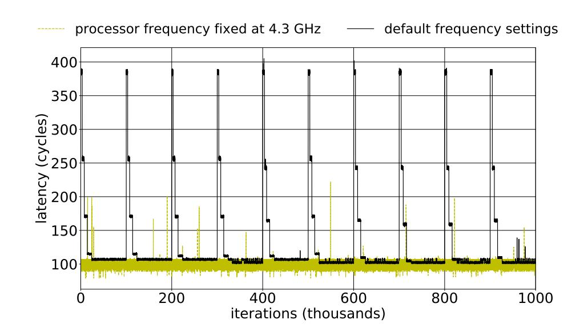

Fig. 1. Variation in reload cache hit latency with sleep() system call invoked every 100 thousandth iteration.

its low effectiveness in the presence of I/O, compute, and memory-heavy system noise. To understand the effect of these system noises on the effectiveness of flush based attacks, we perform simple side-channel and covert channel attacks that use clflush. In a covert channel attack, Flush+Reload and Flush+Flush attacks suffer from maximum error rates of 45% and 53%, respectively. In contrast, Flush+Reload and Flush+Flush provide high accuracy in controlled environments where only the attacker and the victim run concurrently. One of the primary reasons for this trend is that with the system noise, existing latency calibration mechanisms fail to provide a precise cache access time threshold. Prior works [6], [7] try to improve noise-resilience of Flush+Reload attacks tackle noise in covert-channel attacks only, which cannot be translated to side-channel attacks. In this paper, we propose a generic approach to handle the system noise.

The root cause: To understand the problem, we perform the Flush+Reload attack in a highly controlled environment (with no noise from co-running threads). We perform the following steps: (i) *Flush* a cache line, (ii) *Wait* for the victim's access by yielding the processor (sleeping), and (iii) *Reload* the same cache line that is flushed in step (i). We perform these three steps for thousands of attack iterations, where one iteration involves the above mentioned three steps. Figure 1 shows the variation in execution latency of a reload cache hit with the movl instruction. For the rest of the paper, we refer to movl as the reload instruction. We use the rdtsc instruction to measure the execution time of instructions. At every 100 thousandth iteration, we use sleep() function to sleep for 1 second, which results in the black curve. Note that in a real attack, an attacker will not sleep for one second. Next,

{1}------------------------------------------------

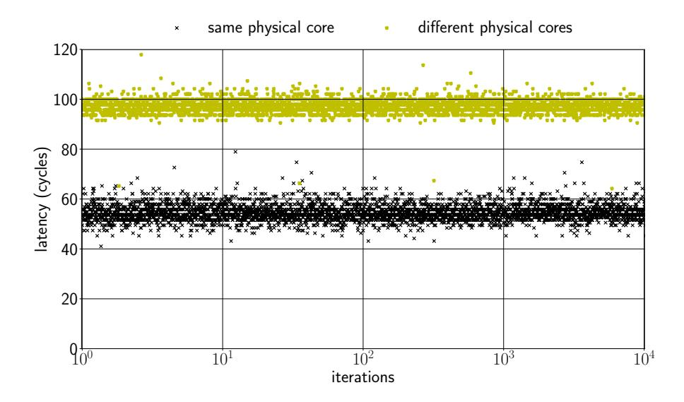

Fig. 2. Variation in reload cache hit latency with relative placement of attacker and victim processes. All cores run at the (fixed) base frequency.

we fix the processor frequency at 4.3 GHz and repeat the same experiment. The latency remains constant at around 100 cycles.

It is clear from Figure 1 that the reload latency increases drastically just after the sleep() system call. The increase in latency is due to a change in processor frequency, which is triggered by the underlying dynamic voltage and frequency scaling (DVFS) [8] controller. If an attacker sets a latency threshold to distinguish a cache hit from a miss anywhere between 100 to 400 cycles, this results in false positives and reduces the effectiveness of flush based attacks. This frequency-oblivious latency threshold leads to low accuracy in flush based cache attacks.

Even if we fix the frequency of all the cores, the latency of reload cache hit is still dependent on where the victim and attacker threads are located in the processor (refer Figure 2). The reload hit latency when the two threads run on the same (multi-threaded) physical core is different from when they run on different physical cores. Didier and Maurice [9], for instance, show that incorporating CPU interconnect topology plays an important role in calibrating clflush threshold. In this paper, we study the effect of frequency on latency variation that impacts accuracy of attacks even on a single core CPU.

Thus, in a noisy system with various co-running applications, the DVFS controller throttles up and down the processor frequency according to system load. However, instructions such as rdtsc that measure the timing are unaffected by the change in the processor frequencies (DVFS controller). Consequently, when the processor runs at a lower frequency, rdtsc generates higher latency numbers even in case of a cache hit. This is further complicated by the relative placement of victim and attacker threads on the processor.

Our goal is to improve the effectiveness of flush based attacks in presence of extreme system noise and make it resilient to the effect of frequency and thread placement changes.

**Our approach:** We propose refinements that ensure the cache access latency threshold remains consistent and resilient to system noise by improving the latency calibration technique and the attacker's waiting strategy. We name our refinements

as DABANGG <sup>1</sup>. Overall, our key contributions are as follows:

- We analyze the major shortcomings of existing flush based attacks and argue for noise resilient flush attacks (Section III).
- We propose DABANGG refinements that makes the flush attacks resilient to system noise (Section IV).
- We evaluate the standard and refined attacks in the presence of different levels of compute, memory, and I/O system noise (Section V).

**Current status:** Upon public disclosure of DABANGG attack, Intel coordinated with us and has permitted us to move forward with the submission without an embargo.

In the following sections, we discuss current flush based attacks, defenses, and optimizations (Section II), analyze the shortcomings of current attacks (Section III), describe our refinements (Section IV), present experimental results (Section V), discuss countermeasures (Section VI), and finally present our conclusions (Section VII).

#### II. BACKGROUND

#### A. Dynamic Voltage & Frequency Scaling

Frequency and voltage are the two important run-time parameters managed through DVFS. Hardware and software components work cooperatively to realize this scheme.

**Hardware support:** A majority of modern processors are capable of operating in various clock frequency and voltage combinations referred to as the Operating Performance Points (OPPs) or Performance states (P-states) [10]. Conventionally, frequency is actively manipulated by the software component. Therefore, performance scaling is sometimes referred to as frequency scaling. The P-states can be managed through kernel-level software. They can also be managed directly through a hardware-level subsystem, termed Hardwaremanaged P-states (HWP). Intel uses the Enhanced SpeedStep technology [11], and AMD uses Cool'n'Quiet and PowerNow! [12] technologies for HWP. In this case, the processor selects P-states based on its assessment of system load, although the driver can provide hints to the hardware. The nature of these hints depends on the scaling algorithm (power governor). Another technology of interest is Intel's Turbo Boost [13] (analogously, AMD's Turbo Core [14]) technology, which allows to temporarily boost the processor's frequency to values above the base frequency.

Depending on the processor model, Intel processor provides core-level granularity of frequency-scaling termed as the Per-Core P-State (PCPS), which independently optimizes frequency for each physical core [15].

**Software support:** The CPUFreq subsystem in Linux coordinates frequency scaling in software and is accessible by a write-privileged user via the /sys/devices/system/cpu/ policy interface. Fine-tuning of this interface is possible through the sysfs

<sup>1</sup>DABANGG is a Hindi word that means "fearless". We envision DAB-NAGG refinements will make a flush based attacker fearless of the system noise.

{2}------------------------------------------------

interface objects. Modern Intel processors come with pstate drivers providing fine granularity of frequency scaling. It works at a logical CPU level, that is, a system with eight physical cores with hyper-threading enabled (two logical cores per one physical core) has 16 CPUFreq policy objects, although the physical frequency domain is at the physical core level (in case of PCPS) or at the socket level.

# *B. Timekeeping mechanism*

Most of the x86\_64 based processors use the IA32\_TIME\_STAMP\_COUNTER Model-Specific Register (MSR) to provide a timekeeping mechanism. Different processor families increment the counter differently. There are two modes of incrementing TSC: (i) to increment at the same rate as the processor clock and (ii) to increment at a rate independent of the processor clock. Modern Intel processors use the latter mode [16]. *The constant TSC behavior is invariant of processor core frequency changes.*

# *C. Flush-Based Cache Attacks*

Flush based attacks such as Flush+Reload and Flush+Flush use clflush instruction that invalidates cache block(s) from all levels of cache hierarchy and the corresponding data is written back to memory [16]. In a cross-core attack, the attacker core flushes (using clflush instruction) cache line address(es) from all levels of caches including remote cores' caches and the shared LLC. Later, the attacker core reloads (Flush+Reload) or flushes (Flush+Flush) the same line address(es).

The three phases: Flush+Reload and Flush+Flush work in three phases: (i) flush phase, where the attacker core flushes (using clflush instruction) the cache line address(es) of interest. (ii) Wait phase, where the attacker waits for the victim to access the flushed address, as it is not present in the entire cache hierarchy. If the victim accesses the flushed address, then it loads the address into the shared LLC. (iii) Reload (Flush in case of Flush+Flush) phase, where the attacker reloads (or flushes) the cache line address and measures the latency. If the victim accesses the cache line between phase I and III, then in case of Flush+Reload attack, the attacker core gets an LLC hit (LLC access latency), else an LLC miss (DRAM access latency). In case of Flush+Flush attack, the attacker core gets a clflush hit latency if the victim accesses the cache line between phase I and III, else a clflush miss latency. Since no memory accesses are performed in the case of Flush+Flush attack, it is harder to detect using performance counters which record cache references and misses, compared to Flush+Reload attack [2]. This makes the Flush+Flush attack stealthy.

Latency threshold and wait time: Flush based attacks exploit the difference in execution latency of clflush and reload instructions depending on whether they get a cache hit or a miss for the monitored address(es). The attacker waits in between phase I and phase III to provide adequate time for the victim to access the cache. Waiting time plays an important role in the overall effectiveness of flush based attacks. Usually, the three phases are executed step-by-step in an infinite loop, which we refer to as the *attack loop*. The attacker program may be synchronous or asynchronous with respect to the spy program.

# *D. Cache Attack Toolkits*

Mounting accurate flush-based cache attacks usually requires precise calibration and considerable setup time. Existing toolkits like Mastik [17] and Cache Template Attacks [4] provide implementations of cache attacks, including flushbased attacks. They provide generic techniques to identify memory addresses of interest, perform calibration, and mount attacks without the need to delve into low-level details of their implementation. In particular, Mastik attempts to resolve the issue of varying latency of instruction execution by utilizing a compute-intensive loop instead of sleeping in the wait period of the attack.

While such techniques and toolkits reduce the barrier of entry to mount flush-based cache attacks, they do not eliminate the concern of this paper, that of inconsistent accuracy in presence of system noise. We note that DABANGG enhances the underlying *attack loop* and can be seamlessly integrated with attack toolkits.

# *E. Existing Flush-Based Cache Attack Refinements*

It is known that cache-based side channels and covert channels are susceptible to system noise and therefore are prone to low accuracy. Maurice *et al.* [7] characterize noise mathematically and implement run-time error-correction techniques to design a noise-resistant Prime+Probe based cache covert channel. Error-correction is a powerful technique, but it is generally not applicable in a side-channel scenario as the victim does not follow the data-transfer protocol required to correct errors on-the-fly. Didier and Maurice [9] take the CPU interconnect topology into account while calibrating Flush+Flush attack, but they don't explain or calibrate for latency variation on single-core machines. Bangerter *et al.* [18] tackle OS scheduling issues using a coordinated Denialof-Service (DoS) attack by launching hundreds of threads to single-step the victim. However, such a scheme severely impacts the stealth of the attack due to the cache activity of the helper threads that can be tracked back to the attacker. Noise is usually filtered out during post-processing [19], [18] but it implies requiring more traces (that is, more attack loop iterations) which in-turn impacts stealth of the attack.

A few alternatives to rdtsc time-stamp counter exist. Schwarz *et al.* implement a lightweight timestep-counter thread that has a 15% higher resolution than rdtsc. However, given accurate threshold, as the resolution of rdtsc is adequate for distinguishing a cache hit from a miss, the counterthread is effectively an overhead for non-SGX scenarios. Even with a counter-thread based method, the latency measured is still variable due to DVFS and OS scheduling issues. Bulck *et al.* utilize the APIC timer to single-step the victim. As it requires kernel-level privileges, it is outside the scope of this 

{3}------------------------------------------------

paper. The sleep mechanism in standard Flush+Flush attack [1] has been effectively replaced by a compute-intensive loop to maintain the core at a high frequency, reducing the noiseinduced latency variance to an extent. As we showcase in Section III, however, none of these techniques are sufficient in isolation.

# *F. Mitigation and Detection Techniques*

Mitigation: Ever since cache-based side-channels were showcased for the case of AES by Osvik *et al.* [5], several classes of mitigation techniques have been proposed, like partitioning mappings to the cache to avoid monitoring of victim cache lines by the attacker [20] [21] [22] [23] and limiting the granularity or privilege of instructions crucial to flush-based cache attacks, like rdtsc and clflush [24] [25] [26].

Limiting resolution of instructions, requiring privileged access to these instructions, and partitioning the cache does work, but is rarely employed due to impact on performance and utility. Moreover, many software-based mitigations suffer from worse performance impact than hardware-based mitigations [21], making them unattractive for all but the most securitycritical use-cases. Security-conscious vendors with vulnerable hardware either opt for performance impeding software-based mitigations or lightweight detection mechanism.

Detection: A large number of detection techniques [27] [28] [29] rely on identifying anomalous cache behavior by utilizing performance measuring hardware counters, like Intel's PMC [16] [30]. Detection routine at run-time in such techniques is a two-step process. In the first step, the detector records performance counter readings for all processes. The detector then analyzes representative parameters like number of cache references, cache misses, miss-rate, etc. to identify suspicious behavior. This analysis can be done by a heuristics-based approach [27] or by a learning-based approach [31] [28] [32], where trained model infers a particular program as malicious, or otherwise. Note that most detection mechanisms also fundamentally use thresholds are are vulnerable to extreme system noise. Developing noise-resilient cache attack detectors is a promising future direction of research.

# III. ANALYSIS

# *A. Variable Execution Latency*

The flush based attacks rely on the execution timing difference between a cache hit and a miss. The attacker expects instruction latency to vary based on the microarchitectural state (that is, cache hit or cache miss), and this is the premise for flush-based attacks. However, the latency variation for the same microarchitectural state (for example, a reload instruction that hits in cache) is not accounted for in the standard flush-based attack loops. We plot the variable cache hit and miss latency for clflush instruction as a function of attack loop iterations in Figure 3(a), and for reload instruction in Figure 3(b).

Root Causes: The variation in latency of instruction execution with same micorarchitectural state is due to two rootcauses: (i) the Dynamic Voltage & Frequency Scaling (DVFS) and (ii) OS scheduling behavior.

*1) Dynamic Voltage & Frequency Scaling:* DVFS changes the frequency of the processor, while the timekeeping mechanism in modern x86\_64 based machines is invariant of these frequency changes. Thus, the time-stamp counter increments like a wall-clock and the DVFS-induced latency variation is visible in its readings. Modern processors use different frequency domains for the cores and the LLC and memory controllers that, as per Intel terminology, form part of the Uncore [33]. The Uncore's frequency and power are managed separately and in general do not change frequency when a core frequency transition occurs.

*2) OS Scheduling Behavior:* The OS can schedule processes on any logical CPU as per its scheduling policy behavior. Usually, at lower noise-levels (L-L-L, L-L-H, L-H-L, H-L-L), the OS tries to schedule distinct processes on distinct physical cores to maximize availability of resources like private caches for each process. Thus, the attacker and victim processes are present on distinct cores, sharing only the LLC. However, at high noise-levels (H-H-H, H-H-L, H-L-H, L-H-H), as such scheduling is not always possible, the attacker and victim processes may be scheduled on the same physical core. The latency of an LLC cache reference depends on the mapping of attacker and victim processes to cores. This latency difference is more pronounced if the LLC is banked, which is common for processors with large number of cores, including the Xeon processor in our experimental setup. The same argument extends to NUMA nodes wherein the latency difference is even more significant [9].

We now analyze the effect of (i) and (ii) together and its impact on instruction latency by focusing on clflush. Figure 4 shows the variation in clflush latency at different relative frequencies, marked by their configurations on the horizontal axis. In all the configurations, the attacker runs on core #0 and experiences a clflush hit in all configurations except configuration 1. Configurations 4, 5, and 6 correspond to a multi-threaded victim process which runs on multiple cores concurrently. For configurations 4 to 6, the victim accesses the cache line on all mentioned cores before a clflush hit by attacker. Thus, the line is present in private caches of all those cores. At 1.2 GHz (red curve), if an attacker and the victim reside on the same physical core (configuration 2), the latency is considerably lower than when victim is also present on other cores (configuration 3 to 6). Depending on the system noise level, any of red, green, or black curves can represent the latency variation at various configurations.

Takeaway: The latency of instruction execution with a given microarchitectural state depends on frequency as well as mapping of victim and attacker processes to logical and physical cores.

{4}------------------------------------------------

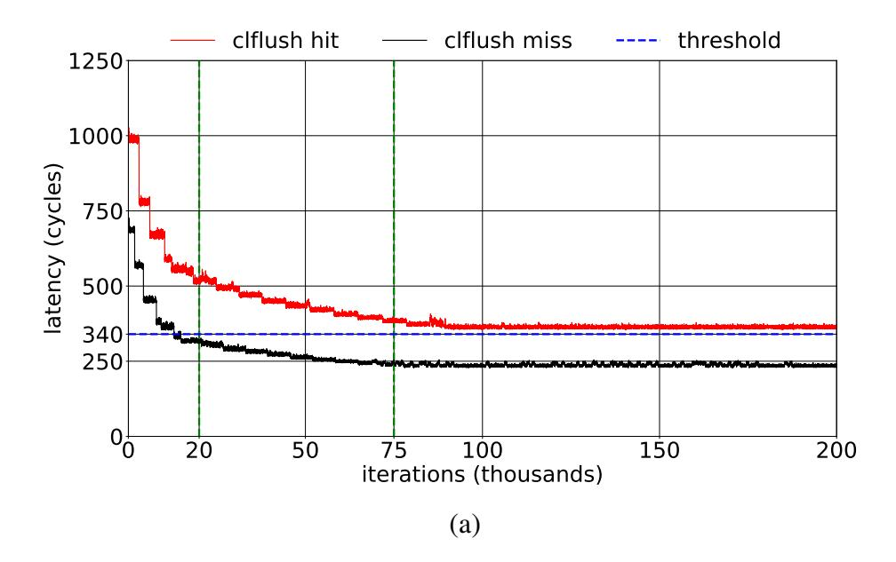

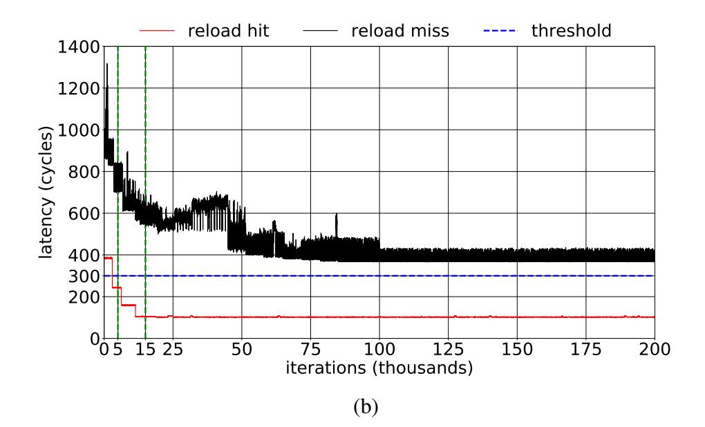

Fig. 3. (a) and (b) show the variation of clflush and reload latency, respectively, with default power scaling settings.

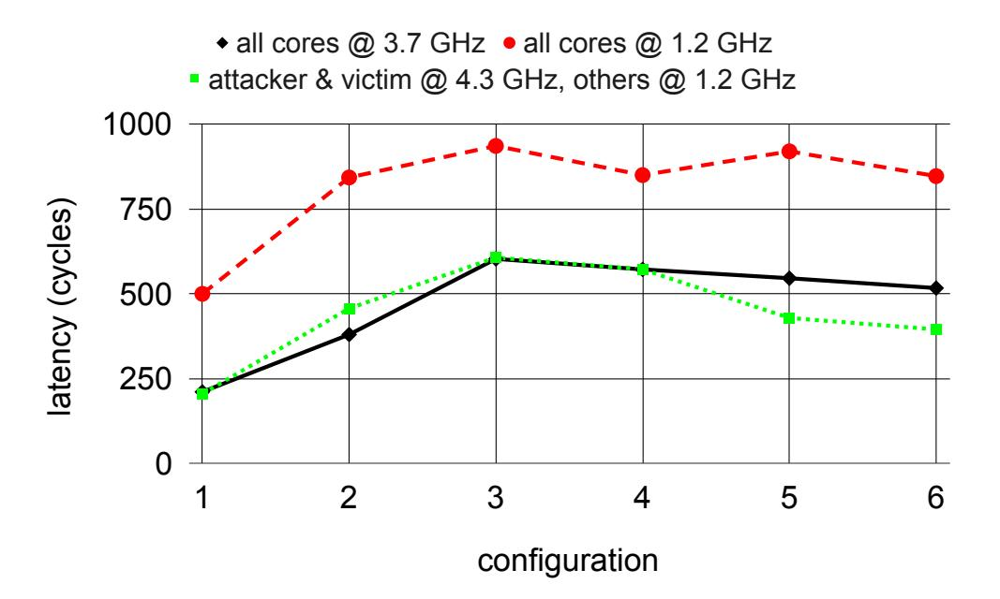

Fig. 4. Variation of clflush latency with different configurations and frequencies. The attacker runs on core-0 ( $C_0$ ). In configuration 1, there are no victim accesses. In configurations 2 to 6, victim runs on  $\{C_0\}$ ,  $\{C_1\}$ ,  $\{C_0, C_1\}$ ,  $\{C_1, C_2, C_3\}$ , and  $\{C_0, C_1, C_2, C_3\}$  respectively.

#### B. clflush and reload Instructions

We now compare the accuracy of F+F and F+R attacks by analyzing the behavior for clflush and reload instructions.

clflush: Figure 3(a) shows the latency of clflush instruction (at L-L-L noise level) as a function of attack-loop iterations. The instruction latency decreases as the attacker code iterates through the attack loop and stabilizes after 75,000 iterations, taking up 335 million cycles (one iteration is about 4,500 cycles). The latency difference between a clflush hit and a miss at the stabilized latency is 15 cycles. Figure 4 showcases the different latencies for clflush cache hit at different frequency configurations. The attacker and victim cores run at high frequencies while other cores run at lower frequencies. The clflush hit latency varies widely with frequency and the difference between a hit and a miss is, on average, 17% of the hit latency.

reload: Figure 3(b) shows the variation of reload latency over attack-loop iterations. The reload cache hit latency stabilizes to 100 cycles within 15,000 iterations. The latency

difference at the stabilized latency is 80 cycles. On average, the difference between a hit and a miss is, on average, 83% of the miss latency. The variation of reload miss latency with processor frequency is such that the highest miss latency is less than the lowest hit latency.

**Takeaway:** Flush+Reload attack is resilient to frequency changes as the reload hit and miss latency differs by almost an order of magnitude. A single threshold suffices to differentiate a hit from a miss irrespective of frequency. Flush+Flush attack is vulnerable to latency variation as the hit and miss latencies don't differ significantly.

#### C. Waiting phase of the Attack

The Linux scheduler is called proactively by the attacker using sched\_yield() function call in standard attacks. Cooperatively yielding hints the power governor to assess the frequency and potentially change it, and allows the OS scheduler to context switch the attacker process to another core. It is pragmatic to replace the sched\_yield() based cooperative approach with a more aggressive compute-intensive approach. We run compute intensive operations in a busy-wait type loop, which steps up the processor frequency. It allows the execution latency of instructions to stabilize quickly. It also provides control over the waiting times in the attack loop.

Therefore, we use a compute-heavy loop for wait\_gap iterations in each waiting phase of the attack loop. Here, the variable wait\_gap can be dynamically changed to provide precise control over the waiting period. If an address is accessed multiple times by the victim in a gap period, there is no way to ascertain one access from the other. On the other hand, if the attacker flushes the addresses in rapid succession, a true cache-hit may be missed due to overlap with phase-I of the attack. A suitable waiting period is therefore, empirically derived. Existing literature [6] suggests that a waiting period of 5,000 to 10,000 cycles is sufficient to detect individual cache accesses in many important flush based attacks. We can apply this analysis to the phase-II of synchronous attacks. In the case of asynchronous attacks, we don't need to wait a lot between probes. In that case, however, to eliminate the frequency-induced variation in latency, we run the compute-

{5}------------------------------------------------

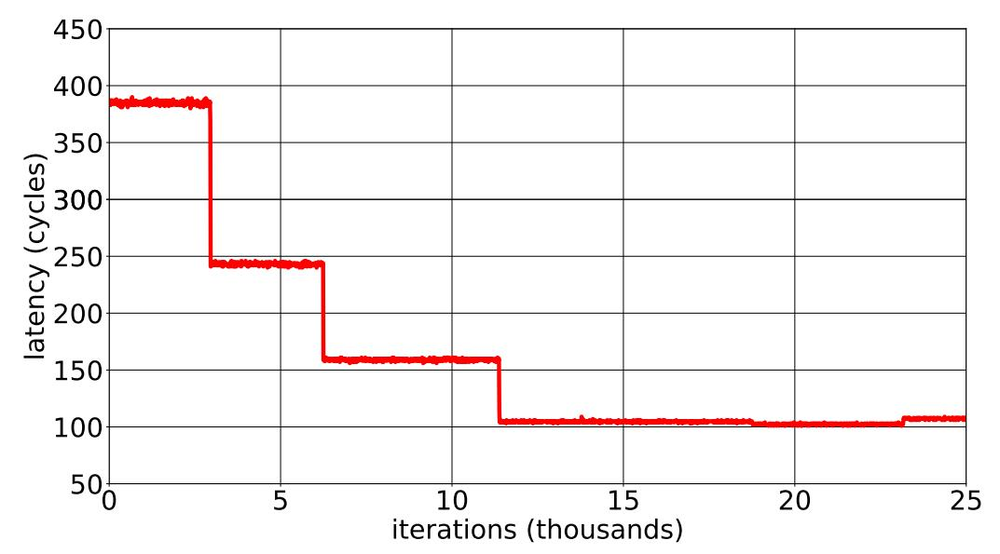

Fig. 5. Variation of reload hit latency with attack iterations.

intensive loop for a few million cycles to stabilize the core at high frequency. We call the Compute\_Heavy\_Code() function once before going into the attack loop with a large wait\_gap ( $\approx 10^5$ ).

#### IV. DABANGG ATTACK REFINEMENTS

Taking into account the insights uncovered in previous sections, we outline three refinements over baseline flush attacks. We call these the DABANGG refinements. They make the attacker frequency-aware and victim-aware and consequently noise-resilient.

**Refinement #1**: We calibrate comprehensively to capture the frequency and core placement-based latency variation to obtain multiple thresholds.

**Refinement #2**: We periodically verify the victim's memory access pattern and whether the current threshold is correct in the attack through a feedback loop.

**Refinement #3**: We use compute-intensive loop to provide fine grained control over waiting period in the attack loop.

The following sub-sections detail the implementation of DABANGG refinements.

### A. Calibration

In this pre-attack step, the calibration program determines attacker-specific parameters. The attacker must profile the victim application to identify the target memory address(es) according to the attack scenario and threat model. Table I provides the details of all the parameters that DABANGG attack loop uses. We refer Table I throughout this section for different parameters of interest.

The calibration program automatically derives attacker-specific parameters from the latency vs iterations behavior. We use Figure 5 (a fine-grained version of Figure 3(b)) to briefly explain the method to compute these parameters. The reload hit latency represents a stepped distribution. Multiple pairs of  $\langle TL, TH \rangle$  are stored as tuples in T\_array. T\_array captures the frequency distribution in the attack loop. From Figure 5, four distinct steps are visible. The width of each

step (that is, step\_width) is 4000 attack loop iterations. For iter\_num  $\in [0,4000]$ , we use TL = 375 and TH = 400. Therefore, T\_array[0] = < 375,400 >. Similarly, we add three more tuples to T\_array. These parameters are independent of victim applications. regular\_gap parameter depends on the type of attack mounted (asynchronous or synchronous). regular\_gap = 200 provides a waiting period of 5,000 to 10,000 cycles (refer to Section III-C for details).

#### B. Victim Profiling

In the initial phase of the attack, the attacker program automatically derives victim-specific parameters by observing the memory access pattern for target address of the victim. We briefly explain the method that we use to compute these parameters.

If the victim application accesses the critical memory address once in one million cycles on average, and an attack-loop iteration takes 10,000 cycles at low processor frequency, then  $acc\_interval = \frac{1,000,000}{10,000} = 100$ . A burst-mode access sequence occurs when the target address is inside a loop and gets accessed several times within a few regular\_gap based attack loop iterations. Consider that the victim accesses the address 40 times within 20,000 cycles, for example. If we wait using the regular\_gap, which takes 10,000 cycles at low frequency, we can only ascertain 2 cache hits. We utilize the burst-mode parameters to capture the burst-access pattern at finer granularity.

burst\_seq  $\leq$  40 (since we have 40 accesses by victim in burst-mode) and waiting period when a burst is detected should be  $\leq \frac{20,000}{40} = 500$  cycles. This implies a burst\_gap  $\approx 10$ , which increases attack granularity. In practice, to reduce false negatives, we tolerate some missed cache-hits to determine the sequence, burst\_seq =  $\frac{40}{x}$  and burst\_wait = x where x is relatively small number compared to 40. For example, burst\_seq = 20 for burst\_wait = 2.

#### C. Attack Loop

Algorithm 1 explains the DABANGG attack loop. Line 1 initializes the runtime variables of interest, refer Table I for details. Line 3 increments the iteration number. Line 4 updates  $\langle TL, TH \rangle$  through a simple indexing mechanism. iter\_num divided by step\_width linearly indexes T\_array to provide a single pair of thresholds per step. Line 5 starts the attack and flushes the shared memory address. Lines 6 to 12 represent the waiting phase of the attack. Approximately once every 400 iterations (0.25% of all iterations), the attack loop verifies the current value of  $\langle TL, TH \rangle$ . The Verify-Threshold() function, given in Algorithm 2, checks if the current tuple of thresholds,  $\langle TL, TH \rangle$ accurately detect a cache hit at the current frequency. Lines 2 and 3 of Algorithm 2 measure the accurate access latency for target memory address. If  $\Delta \in [TL, TH]$ , the function returns without making any changes. However, if  $\Delta \notin [TL, TH]$ (Line 4), then the tuple is updated. This is done by looking up

<sup>&</sup>lt;sup>2</sup>Measure\_Reload\_Latency(addr) is defined similar to code given in [1].

{6}------------------------------------------------

TABLE I
SPECIFICATIONS OF PARAMETERS AND RUNTIME VARIABLES USED BY DABANGG ATTACK LOOP (REFER ALGORITHM 1).

| Parameters        | Name            | Description                                                                                           |  |  |  |  |
|-------------------|-----------------|-------------------------------------------------------------------------------------------------------|--|--|--|--|
| Attacker-Specific | T_array         | An array with each entry stores a tuple of lower and upper latency thresholds <tl,th>.</tl,th>        |  |  |  |  |
|                   | regular_gap     | Regular waiting period of attacker in Phase II.                                                       |  |  |  |  |
|                   | step_width      | Average width of a step in terms of number of attack loop iterations in latency vs #iterations plot.  |  |  |  |  |
| Victim-Specific   | acc_interval    | Average number of attack loop iterations between two victim accesses without considering              |  |  |  |  |
| victini-specific  | acc_interval    | burst-mode accesses in between.                                                                       |  |  |  |  |
|                   | burst_seq       | In case of burst-mode access sequence by victim, number of victim accesses to target memory           |  |  |  |  |
|                   | burst_scq       | address in a single burst.                                                                            |  |  |  |  |
|                   | burst_wait      | Waiting time gap in terms of attack loop iterations before discarding an incomplete burst-mode        |  |  |  |  |
|                   | burst_wart      | access sequence as a false positive.                                                                  |  |  |  |  |
|                   | burst_gap       | Reduced waiting time gap to monitor burst-mode access sequence.                                       |  |  |  |  |
| Runtime Variables | iter_num        | A counter that counts the number of attack loop iterations.                                           |  |  |  |  |
| in Algorithm 1    | _               | •                                                                                                     |  |  |  |  |
|                   | <tl,th></tl,th> | Pair of lower (TL) and upper (TH) latency threshold to detect cache hit.                              |  |  |  |  |
|                   | reload_latency  | Execution latency of reload instruction in processor cycles.                                          |  |  |  |  |
|                   |                 | Number of attack loop iterations since last true cache hit. A true cache hit is recorded by attacker  |  |  |  |  |
|                   | last_hit        | when victim access interval (acc_interval) and victim burst-mode access sequence (burst_seq)          |  |  |  |  |
|                   |                 | criteria are satisfied, in addition to reload_latency ∈ [TL,TH].                                      |  |  |  |  |
|                   | potential_hit   | Number of attack loop iterations since last potential cache hit. A potential hit may be either a      |  |  |  |  |
|                   | potential_int   | false positive or a part of burst-mode access sequence by victim application.                         |  |  |  |  |
|                   | seq_id          | Sequence identifier, stores the number of potential cache hits which, if it forms a burst-mode access |  |  |  |  |
|                   | 50 <b>q_</b> 10 | sequence, implies a true cache hit.                                                                   |  |  |  |  |

# **ALGORITHM 1: DABANGG+FLUSH+RELOAD**

```
1 Initialization: last_hit, potential_hit, iter_num, seq_id = 0
2 while true do
       iter_num += 1
3
      <TL,TH> = T_array[ \frac{iter\_num}{step\_width} ] // update <TL,TH> clflush(addr) // PHASE-I: Flush
4
5
       // PHASE-II: Wait
       if (!rand()%400) then // branch taken 0.25% of
6
        time
            Verify_Threshold(iter_num, addr) // Algorithm 2
7
           sched_yield() // cooperatively yield the CPU
8
       else if (seq\_id > 0) then// burst sequence detected
9
           Compute_Heavy_Code(burst_gap)
10
       else
11
           Compute_Heavy_Code(regular_gap)
12
       // PHASE-III: Reload
       reload_latency = Measure_Reload_Latency(addr)<sup>2</sup>
13
       if (reload\_latency \in [TL, TH]) and (last\_hit > acc\_interval)
14
        and (seq_id > burst_seq)) then // true hit
           last_hit, seq_id = 0 // reset variables
15
16
           print "low reload latency, it is a cache hit!"
       else if (reload\_latency \in [TL, TH]) then// potential hit
17
           potential hit = last hit
18
           seq_id += 1 // increment sequence identifier
19
       else
20
           last_hit += 1 // +1 iteration since last hit
21
           print "high reload latency, it is a cache miss!"
22
           if ((last_hit - potential_hit) > burst_wait) then
23
                seq_id = 0 // discard seq as false
24
                 positive
```

T\_array such that  $\Delta \in [TL_{new}, TH_{new}]$  and T\_array[i] =  $< TL_{new}, TH_{new} >$  (Line 5). Lines 6 and 7 update the tuple and iter\_num, respectively. Verification and feedback enables threshold to dynamically adapt to frequency changes which differ from Figure 5 in extremely noisy environments.

After verifying thresholds, the control flow returns to Algorithm 1, Line 8. sched\_yield() function yields the pro-

# **ALGORITHM 2:** Verify\_Threshold

```
1 Input: iter_num, addr
2 reload(addr)
3 Δ = Measure_Reload_Latency(addr)
4 if (Δ ∉[TL,TH]) then
```

cessor cooperatively (once in a while based on the condition in Line 6) to prevent detection of an attack loop based on continuous usage of computationally heavy code. Most of the time, however, the attacker runs a compute-heavy code (Lines 10 and 12) and wait\_gap is appropriately chosen. Line 9 checks if an active burst sequence is present (that is, seq\_id 0), and uses burst\_gap to reduce the waiting period of the attack loop.

In the third phase of the attack. Line 14 performs the reload and calculates its execution latency. Line 15 checks for a true cache hit. Here, in addition to reload\_latency  $\in$  [TL,TH], last\_hit i acc\_interval, checks if access interval since the last true cache hit is adequate and seq\_id burst\_seq checks if the burst sequence pattern is identified. In this case, the variables are reset in Line 16 and a true cache hit is registered in Line 17. Line 18 deals with a potential cache-hit, wherein Line 20 increments the sequence identifier and potential\_hit variable is updated.

Line 22 increments the last\_hit variable if reload\_latency  $\notin$  [TL,TH]. Line 23 records a cachemiss for the current iteration of the loop. However, instead of resetting the sequence identifier (that is, seq\_id) right away, awaiting window of burst\_wait attack loop iterations exists (in Line 24). The waiting window allows us to account

{7}------------------------------------------------

#### TABLE II SYSTEM CONFIGURATION FOR OUR EXPERIMENTS.

| Ubuntu 18.04.1 LTS, 8 Hyper-Threaded Intel Xeon W-2145 Skylake cores       |  |  |  |  |
|----------------------------------------------------------------------------|--|--|--|--|
| Base (minimum) frequency: 3.7 (1.2) GHz and Turbo Frequency: Up to 4.5 GHz |  |  |  |  |
| L1-D and L1-I: 32KB, 8 way, L2: 1 MB, 16-way                               |  |  |  |  |
| Shared L3: 11MB, 11-way, DRAM: 16 GB                                       |  |  |  |  |

TABLE III PARAMETERS FOR KEYLOGGING ATTACK.

| Parameter    | D+F+F | D+F+R |  |
|--------------|-------|-------|--|
| acc interval | 1000  | 1000  |  |
| burst seq    | 15    | 20    |  |
| burst wait   | 3     | 2     |  |
| burst gap    | 40    | 30    |  |
| regular gap  | 100   | 50    |  |

for cache-hits missed by the attack loop. A cache-hit missed by the attacker occurs due to overlapping in phase I (Flush phase) of the attack loop with access to monitored cache line by the victim, wherein the attack loop flushes the line right after the victim accesses it. Line 25 resets seq\_id to zero if the waiting window is exceeded. This concludes an attack loop iteration, and the control switches back to Line 3 of the attack. Flush+Flush attack can similarly be extended to DABANGG+Flush+Flush. *Note that in all the refinements, we do not use or demand privileged operations*.

In the following section, we evaluate the DABANGG refined attacks in many real-world scenarios and compare the TPR, FPR, Accuracy, and F<sup>1</sup> Score with standard Flush+Flush and Flush+Reload attacks.

# V. EXPERIMENTS

We give an overview of our experimental setup, review the attacks and threat models, and present results.

# *A. Experimental Setup*

Table II shows our system configuration. Though we use an Intel machine, we perform our experiments and find our proposal is equally effective on AMD based x86\_64 machines (AMD A6-9220 RADEON R4) and macOS X (Version: 10.15.4). We use the stress tool [34] to generate computeintensive and IO-intensive noise, and SPEC 2017 mcf [35] benchmark to generate memory-intensive noise. mcf is a famous benchmark used in the computer architecture community for memory systems research with an LLC misses per kilo instructions (MPKI) of over 100. We generate noise as a combination of Compute-Memory-IO (C-M-I) intensive noise, where each component can have a low (L) or high (H) noiselevel, thereby generating 8 combinations spanning L-L-L to H-H-H.

At the high noise level (H-H-H), eight CPU-intensive, eight IO-intensive and eight memory-intensive threads are running concurrently, pushing the core runtime-usage to 100% on all cores (observed using htop). High level of computeintensive noise results in high core frequencies on which the relevant code executes. In contrast, a high level of IO-intensive noise result in lower core frequencies, because IO-intensive applications sleep and wake up on interrupts. Power governors take clues from application behavior to tune the frequency domains accordingly.

For all experiments, we use the same attacker-specific parameters as computed in Section IV-A and we state the victim-specific parameters of each attack scenario.

# *B. Side-channel Attack based on Keylogging*

The objective of this attack is to infer a character sequence processed by the victim program. We use an array of 1024 characters. The distribution of characters is uniform and random. The victim program takes as input a character from a set of accepted characters, and for each character, calls a unique function that runs a loop a few thousand times. The victim program processes multiple characters every second, with a waiting period between two characters to emulate the human typing speed.

Threat model: As all the flush based attacks demand page sharing between the victim and the attacker, the attacker maps the victim program's binary (using mmap() function) and disassembles the victim program's binary through gdb tool to find out the addresses of interest. The attacker then monitors the characters and infers if the specified characters are processed by the victim.

We derive victim-specific parameters specified in Table III which are calculated as per the pre-attack steps (section IV-A). The power-scaling settings are set to default state. We utilize the Levenshtein distance (Lev) algorithm [36] to compare the accuracy of various attacks at all the system noise levels. The Lev algorithm compares the actual input sequence with the sequence observed by the attacker and computes accuracy based on the number of *insertion*, *substitution* and *deletion* operations.

Results: As shown in Table IV, DABANGG-refined attacks produce accurate results. The refined attacks are also more noise-tolerant than the standard attacks, especially the Flush+Flush attack, which suffers from yielding the CPU too often and highly variable clflush latency. DABANGG attacks produce more than 90% accuracy irrespective of the noise level. The relative increase in attack accuracy with an increase in compute-intensive noise, especially compared to IO-intensive noise, exemplifies the effect of frequency.

# *C. AES Key Extraction in OpenSSL*

We exploit the T-Table based implementation of AES in OpenSSL [37], which is still in use commercially, notably in the FIPS mode of OpenSSL 1.0.2 [38]. We build the library version 1.1.0f from source and enable T-Tables through configuration options.

Threat model: We mount an asynchronous, *known ciphertext* attack, where the victim finishes execution before the attacker evaluates the memory addresses. The average execution time of AES\_Encrypt is 750 cycles, too small for attacker synchronization on a busy system. We monitor the first memory address of T (10) i , i ∈ [0, 3]. We only need to

{8}------------------------------------------------

TABLE IV ACCURACY OF VARIOUS FLUSH BASED ATTACKS ON MULTIPLE CHARACTER KEY-LOGGING.

| Attack | L-L-L | L-L-H | L-H-L | L-H-H | H-L-L | H-L-H | H-H-L | Н-Н-Н |
|--------|-------|-------|-------|-------|-------|-------|-------|-------|
| F+F    | 37.2% | 21.1% | 31.4% | 16.7% | 36.4% | 27.2% | 19.7% | 34.6% |
| D+F+F  | 94.5% | 92%   | 94.1% | 92.2% | 95.4% | 94.6% | 93.2% | 96.7% |
| F+R    | 84.2% | 69.3% | 74.9% | 82.5% | 85.1% | 75.4% | 71.6% | 78.2% |
| D+F+R  | 99.6% | 91.2% | 97.2% | 96.5% | 98.5% | 97.2% | 99.2% | 98.1% |

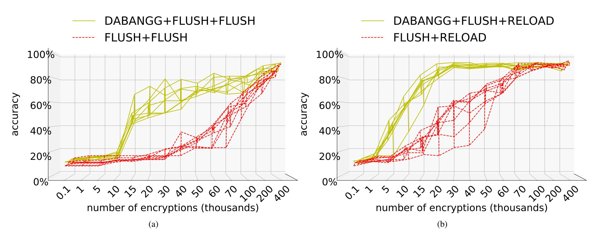

Fig. 6. Accuracy comparison of Flush+Reload, Flush+Flush, DABANGG+Flush+Reload, and DABANGG+Flush+Flush attacks. (a) and (b) show the accuracy with different number of encryptions and vertical spread of curves of a particular attack gives the range of accuracy at the given number of encryptions.

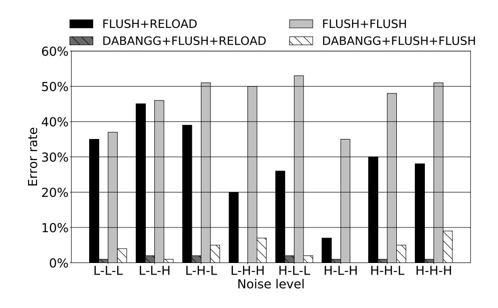

Fig. 7. Error rates of different attacks in covert channel scenario at various noise levels.

DABANGG+FLUSH+RELOAD

DABANGG+FLUSH+FLUSH

DABANGG+FLUSH+FLUSH

DABANGG+FLUSH+FLUSH

DABANGG+FLUSH+FLUSH

DABANGG+FLUSH+FLUSH

DABANGG+FLUSH+FLUSH

DABANGG+FLUSH+FLUSH

DABANGG+FLUSH+FLUSH

DABANGG+FLUSH+FLUSH

DABANGG+FLUSH+FLUSH

DABANGG+FLUSH+FLUSH

DABANGG+FLUSH+FLUSH

DABANGG+FLUSH+FLUSH

DABANGG+FLUSH+FLUSH

DABANGG+FLUSH+FLUSH

DABANGG+FLUSH+FLUSH

DABANGG+FLUSH+FLUSH

DABANGG+FLUSH+FLUSH

DABANGG+FLUSH+FLUSH

DABANGG+FLUSH+FLUSH

DABANGG+FLUSH+FLUSH

DABANGG+FLUSH+FLUSH

DABANGG+FLUSH+FLUSH

DABANGG+FLUSH+FLUSH

DABANGG+FLUSH+FLUSH

DABANGG+FLUSH+FLUSH

DABANGG+FLUSH+FLUSH

DABANGG+FLUSH+FLUSH

DABANGG+FLUSH+FLUSH

DABANGG+FLUSH+FLUSH

DABANGG+FLUSH+FLUSH

DABANGG+FLUSH+FLUSH

DABANGG+FLUSH+FLUSH

DABANGG+FLUSH+FLUSH

DABANGG+FLUSH+FLUSH

DABANGG+FLUSH+FLUSH

DABANGG+FLUSH

DABANGG+FLUSH

DABANGG+FLUSH

DABANGG+FLUSH

DABANGG+FLUSH

DABANGG+FLUSH

DABANGG+FLUSH

DABANGG+FLUSH

DABANGG+FLUSH

DABANGG+FLUSH

DABANGG+FLUSH

DABANGG+FLUSH

DABANGG+FLUSH

DABANGG+FLUSH

DABANGG+FLUSH

DABANGG+FLUSH

DABANGG+FLUSH

DABANGG+FLUSH

DABANGG+FLUSH

DABANGG+FLUSH

DABANGG+FLUSH

DABANGG+FLUSH

DABANGG+FLUSH

DABANGG+FLUSH

DABANGG+FLUSH

DABANGG+FLUSH

DABANGG+FLUSH

DABANGG+FLUSH

DABANGG+FLUSH

DABANGG+FLUSH

DABANGG+FLUSH

DABANGG+FLUSH

DABANGG+FLUSH

DABANGG+FLUSH

DABANGG+FLUSH

DABANGG+FLUSH

DABANGG+FLUSH

DABANGG+FLUSH

DABANGG+FLUSH

DABANGG+FLUSH

DABANGG+FLUSH

DABANGG+FLUSH

DABANGG+FLUSH

DABANGG+FLUSH

DABANGG+FLUSH

DABANGG+FLUSH

DABANGG+FLUSH

DABANGG+FLUSH

DABANGG+FLUSH

DABANGG+FLUSH

DABANGG+FLUSH

DABANGG+FLUSH

DABANGG+FLUSH

DABANGG+FLUSH

DABANGG+FLUSH

DABANGG+FLUSH

DABANGG+FLUSH

DABANGG+FLUSH

DABANGG+FLUSH

DABANGG+FLUSH

DABANGG+FLUSH

DABANGG+FLUSH

DABANGG+FLUSH

DABANGG+FLUSH

DABANGG+FLUSH

DABANGG+FLUSH

DABANGG+FLUSH

DABANGG+FLUSH

DABANGG+FLUSH

DABANGG+FLUSH

DABANGG+FLUSH

DABANGG+FLUSH

DABANGG+FLUSH

DABANGG+FLUSH

DABANGG+FLUSH

DABANGG+FLUSH

DABANGG+FLUSH

DABANGG+FLUSH

DABANGG+FLUSH

DABANGG+FLUSH

DABANGG+FLUSH

DABANGG+FLUSH

DABANGG+FLUSH

DABANGG+FLUSH

DABANGG+

FLUSH+RELOAD

·· • FLUSH+FLUSH

Fig. 8. Bandwidth of different attacks in covert channel scenario at various noise levels.

# TABLE V PARAMETERS FOR AES ATTACK.

| Parameters                              | D+F+F | D+F+R |
|-----------------------------------------|-------|-------|
| acc_interval, burst_seq, and burst_wait | 0     | 0     |
| burst_gap and regular_gap               | 400   | 400   |

flush one cache line before every encryption, without requiring the plaintext. This provides us with the reload-frequency of the ciphertext (c) bytes,  $(c_0, ..., c_{15})$ . We then determine the correct secret key (k) bytes. The algorithm for ciphertext determination and consequent key determination is outlined by G. Irazoqui *et al* [39].

The parameters specific to this attack are specified in Table

V. We do not need to monitor any burst-mode sequences since this is an asynchronous attack. We aim to minimize the number of AES\_Encrypt function calls, that perform the 10 AES rounds. We again use the Levenshtein distance to determine accuracy over 1000 attack runs. We vary the number of AES\_Encrypt function calls, each on randomly generated plaintext and the same secret key, from  $10^2$  to  $4\times10^5$  function calls for the attacks.

**Results:** Figures 6(a) and 6(b) show the benefits of DA-BANGG refinements. The F+R attack has an average accuracy of  $\geq$ 90% at the 100,000 encryptions while D+F+R reaches the same accuracy within 20,000 encryptions, a 5× improvement.

{9}------------------------------------------------

TABLE VI PARAMETERS FOR COVERT CHANNEL ATTACK.

|       | Parameter acc interval burst seq |   | burst wait | burst gap | regular gap |
|-------|----------------------------------|---|------------|-----------|-------------|
| D+F+F | 10                               | 2 | 1          | 5         | 20          |
| D+F+R | 10                               | 2 | 1          | 5         | 20          |

The dynamic thresholds help distinguish between a reload hit and miss when the frequency isn't stable. The lower number of encryptions required primarily increases the stealth of F+R attack. If software countermeasures are implemented to flag concentrated calls to AES\_Encrypt within a short period, D+F+R is much more likely to evade detection.

Figure 6(a) illustrates the much quicker rise in accuracy as a function of the number of encryptions by integrating refinement #3 to the standard Flush+Flush attack. While the number of AES\_Encrypt function calls is higher than F+R attack for both variants of F+F attack, the D+F+F attack achieves 90% accuracy in 200,000 encryptions, twice as quick than the 400,000 encryptions required for Flush+Flush. D+F+F attack also produces a accuracy of more than 50% at the 15,000 encryption mark, far lower than 100,000+ encryptions required by the F+F attack. Again, we see a stealthier attack that is more likely to evade detection.

# *D. Covert Channel Attack*

We cooperatively leak data using a sender-receiver model in the victim machine through a covert channel based on flushbased cache attacks.

Threat model: The sender core sends a bit-stream through a socket, which is monitored by the receiver using a flush-based covert channel. The presence of the cache line corresponding to the memory address of the socket is interpreted as a set bit by the receiver, otherwise is interpreted as a reset bit.

Note that the socket does not establish any direct connection between the programs, and is used by the sender to send the bit-stream. The size of the bit-stream is fixed at 1000 bytes for our experiment. Table VI shows the parameters of interest.

Results: Figure 7 illustrates the error rate of these attacks at various noise levels. We also plot the bandwidth of different attacks in Figure 8. The bandwidth increases as the average core frequency (that is, compute or memory-intensive noise level) increases. We obtain a peak bandwidth of 217 KBps using the DABANGG+Flush+Reload attack, with an overall error-rate of 0.01%. While bandwidth increases as noise levels increase, a consistent low error rate is crucial for the practical feasibility of the covert channel, which is provided by the DABANGG refinements. The bandwidth increases at higher noise levels (that is, L-H-H, H-L-H, H-H-L, and H-H-H levels) because all core of our PCPS-enabled processor run at high frequency at these noise levels (refer to Section V-A for details). This allows the programs to send and receive more bits per second.

Appendices: We provide utilities of various DABANGG enhancements in Section A. Section B describes the benefits of DABANGG refinements in RSA private-key extraction attack, transient execution attack, and cross-VM AES attack.

# VI. COUNTERMEASURES

As DABANGG refined flush attacks are fundamentally flush based attacks, all the mitigation and detection techniques discussed in Flush+Reload [1] and Flush+Flush [2] that are applicable to flush based attacks [27], [30], [40], are also applicable to DABANGG refined attacks. From the Operating System's view, the only significant difference in DABANGGenabled attacks compared to standard attacks is the increased CPU utilization of the attacker thread since we don't yield the CPU often. Many workloads have high CPU utilization, but the OS can potentially use other indicators (such as performance counters used to detect Flush+Reload attack) to pinpoint the attacker thread with more confidence.

# VII. CONCLUSION

In this paper, we analyze the dependence of the accuracy of flush based attacks on execution latency of threshold-defining instructions. We showcase that dynamic core frequencies due to Dynamic Voltage and Frequency Scaling (DVFS) result in varying clflush and reload instruction latencies. We also reveal the change in latency due to the relative positioning of attacker and victim programs on CPU cores. To make flush based attacks resilient to system noise, we propose a set of three refinements, termed DABANGG, over standard flush based attacks. We outline techniques to perform latency-variation-aware and victim-aware calibration. We use the set thresholds to enable busy waiting and periodic feedback at attack runtime. We test DABANGG-enabled attacks in side-channel based keylogging, AES secret key extraction, and covert channel scenarios, and showed the effectiveness across different system noise levels.

# AVAILABILITY

A Github repository with the source code is available at https://github.com/DABANGG-Attack/Source-Code.

# REFERENCES

- [1] Y. Yarom and K. Falkner, "Flush+ reload: a high resolution, low noise, l3 cache side-channel attack," in *23rd* {*USENIX*} *Security Symposium (*{*USENIX*} *Security 14)*, 2014, pp. 719–732.
- [2] D. Gruss, C. Maurice, K. Wagner, and S. Mangard, "Flush+ flush: a fast and stealthy cache attack," in *International Conference on Detection of Intrusions and Malware, and Vulnerability Assessment*. Springer, 2016, pp. 279–299.
- [3] N. Lawson, "Side-channel attacks on cryptographic software," *IEEE Security & Privacy*, vol. 7, no. 6, pp. 65–68, 2009.
- [4] D. Gruss, R. Spreitzer, and S. Mangard, "Cache template attacks: Automating attacks on inclusive last-level caches," in *24th* {*USENIX*} *Security Symposium (*{*USENIX*} *Security 15)*, 2015, pp. 897–912.
- [5] D. A. Osvik, A. Shamir, and E. Tromer, "Cache attacks and countermeasures: the case of aes," in *Cryptographers' track at the RSA conference*. Springer, 2006, pp. 1–20.
- [6] T. Allan, B. B. Brumley, K. E. Falkner, J. van de Pol, and Y. Yarom, "Amplifying side channels through performance degradation," in *Proceedings of the 32nd Annual Conference on Computer Security Applications, ACSAC 2016, Los Angeles, CA, USA, December 5-9, 2016*, S. Schwab, W. K. Robertson, and D. Balzarotti, Eds. ACM, 2016, pp. 422–435. [Online]. Available: http://dl.acm.org/citation.cfm?id=2991084

{10}------------------------------------------------

- [7] C. Maurice, M. Weber, M. Schwarz, L. Giner, D. Gruss, C. A. Boano, S. Mangard, and K. Romer, "Hello from ¨ the other side: SSH over robust cache covert channels in the cloud," in *24th Annual Network and Distributed System Security Symposium, NDSS 2017, San Diego, California, USA, February 26 - March 1, 2017*, 2017. [Online]. Available: https://www.ndss-symposium.org/ndss2017/ndss-2017-programme/ hello-other-side-ssh-over-robust-cache-covert-channels-cloud/
- [8] M. Weiser, B. Welch, A. Demers, and S. Shenker, "Scheduling for reduced cpu energy," in *Proceedings of the 1st USENIX Conference on Operating Systems Design and Implementation*, ser. OSDI '94. Berkeley, CA, USA: USENIX Association, 1994. [Online]. Available: http://dl.acm.org/citation.cfm?id=1267638.1267640
- [9] G. Didier and C. Maurice, "Calibration Done Right: Noiseless Flush+Flush Attacks," in *DIMVA 2021 - The 18th Conference on Detection of Intrusions and Malware Vulnerability Assessment*, Lisboa / Virtual, Portugal, Jul. 2021. [Online]. Available: https://hal.inria.fr/hal-03267431
- [10] Rafael J. Wysocki, "Cpu performance scaling the linux kernel," 2017, https://www.kernel.org/doc/html/v4.15/admin-guide/pm/cpufreq.html.
- [11] "Frequently asked questions about enhanced intel speedstep technology for intel processors," 2019, https://www.intel.in/content/www/in/en/ support/articles/000007073/processors.html.
- [12] "Amd powernow! technology- informational white paper," 2000, https: //www.amd.com/system/files/TechDocs/24404a.pdf.
- [13] Intel Corporation, *Intel® 64 and IA-32 Architectures Optimization Reference Manual*, April 2018, no. 248966-018.
- [14] "Amd turbo core technology," 2020, https://www.amd.com/en/ technologies/turbo-core.
- [15] D. Hackenberg, R. Schone, T. Ilsche, D. Molka, J. Schuchart, and ¨ R. Geyer, "An energy efficiency feature survey of the intel haswell processor," in *Proceedings of the 2015 IEEE International Parallel and Distributed Processing Symposium Workshop*, ser. IPDPSW '15. Washington, DC, USA: IEEE Computer Society, 2015, pp. 896–904. [Online]. Available: https://doi.org/10.1109/IPDPSW.2015.70
- [16] Intel Corporation, *Intel® 64 and IA-32 Architectures Software Developer's Manual*, March 2018, no. 253669-033US.
- [17] Y. Yarom, "Mastik: A micro-architectural side-channel toolkit."
- [18] D. Gullasch, E. Bangerter, and S. Krenn, "Cache games bringing access-based cache attacks on aes to practice," in *2011 IEEE Symposium on Security and Privacy*, 2011, pp. 490–505.
- [19] M. Schwarz, S. Weiser, D. Gruss, C. Maurice, and S. Mangard, "Malware guard extension: Using sgx to conceal cache attacks," in *Detection of Intrusions and Malware, and Vulnerability Assessment*, M. Polychronakis and M. Meier, Eds. Cham: Springer International Publishing, 2017, pp. 3–24.
- [20] L. Domnitser, A. Jaleel, J. Loew, N. Abu-Ghazaleh, and D. Ponomarev, "Non-monopolizable caches: Low-complexity mitigation of cache side channel attacks," *ACM Trans. Archit. Code Optim.*, vol. 8, no. 4, Jan. 2012. [Online]. Available: https://doi.org/10.1145/2086696.2086714
- [21] F. Liu, Q. Ge, Y. Yarom, F. Mckeen, C. Rozas, G. Heiser, and R. B. Lee, "Catalyst: Defeating last-level cache side channel attacks in cloud computing," in *2016 IEEE International Symposium on High Performance Computer Architecture (HPCA)*, 2016, pp. 406–418.
- [22] Y. Zhang and M. K. Reiter, "Duppel: Retrofitting commodity ¨ operating systems to mitigate cache side channels in the cloud," in *Proceedings of the 2013 ACM SIGSAC Conference on Computer amp; Communications Security*, ser. CCS '13. New York, NY, USA: Association for Computing Machinery, 2013, p. 827–838. [Online]. Available: https://doi.org/10.1145/2508859.2516741
- [23] G. Saileshwar, S. Kariyappa, and M. Qureshi, "Bespoke cache enclaves: Fine-grained and scalable isolation from cache side-channels via flexible set-partitioning," in *2021 International Symposium on Secure and Private Execution Environment Design (SEED)*, 2021, pp. 37–49.
- [24] B. C. Vattikonda, S. Das, and H. Shacham, "Eliminating fine grained timers in xen," in *Proceedings of the 3rd ACM Workshop on Cloud Computing Security Workshop*, ser. CCSW '11. New York, NY, USA: Association for Computing Machinery, 2011, p. 41–46. [Online]. Available: https://doi.org/10.1145/2046660.2046671
- [25] Y. Yarom, Q. Ge, F. Liu, R. B. Lee, and G. Heiser, "Mapping the intel last-level cache," Cryptology ePrint Archive, Report 2015/905, 2015, https://eprint.iacr.org/2015/905.
- [26] Z. Wang and R. B. Lee, "New cache designs for thwarting software cache-based side channel attacks," *SIGARCH Comput. Archit.*

- *News*, vol. 35, no. 2, p. 494–505, Jun. 2007. [Online]. Available: https://doi.org/10.1145/1273440.1250723
- [27] M. Payer, "Hexpads: A platform to detect "stealth" attacks," in *Engineering Secure Software and Systems - 8th International Symposium, ESSoS 2016, London, UK, April 6- 8, 2016. Proceedings*, 2016, pp. 138–154. [Online]. Available: https://doi.org/10.1007/978-3-319-30806-7\ 9
- [28] M. Mushtaq, J. Bricq, M. K. Bhatti, A. Akram, V. Lapotre, G. Gogniat, and P. Benoit, "Whisper: A tool for run-time detection of side-channel attacks," *IEEE Access*, vol. 8, pp. 83 871–83 900, 2020.
- [29] T. Zhang, Y. Zhang, and R. Lee, "Cloudradar: A real-time side-channel attack detection system in clouds," vol. 9854, 09 2016, pp. 118–140.
- [30] M. Chiappetta, E. Savas, and C. Yilmaz, "Real time detection of cache-based side-channel attacks using hardware performance counters," *IACR Cryptology ePrint Archive*, vol. 2015, p. 1034, 2015. [Online]. Available: https://eprint.iacr.org/2015/1034
- [31] S. Briongos, G. Irazoqui, P. Malagon, and T. Eisenbarth, "Cacheshield: ´ Detecting cache attacks through self-observation," in *Proceedings of the Eighth ACM Conference on Data and Application Security and Privacy*, ser. CODASPY '18. New York, NY, USA: Association for Computing Machinery, 2018, p. 224–235. [Online]. Available: https://doi.org/10.1145/3176258.3176320
- [32] M. Mushtaq, A. Akram, M. K. Bhatti, M. Chaudhry, V. Lapotre, and G. Gogniat, "Nights-watch: A cache-based side-channel intrusion detector using hardware performance counters," in *Proceedings of the 7th International Workshop on Hardware and Architectural Support for Security and Privacy*, ser. HASP '18. New York, NY, USA: Association for Computing Machinery, 2018. [Online]. Available: https://doi.org/10.1145/3214292.3214293
- [33] D. L. Hill, D. Bachand, S. Bilgin, R. Greiner, P. Hammarlund, T. Huff, S. Kulick, and R. Safranek, "The uncore: A modular approach to feeding the high-performance cores." *Intel Technology Journal*, vol. 14, no. 3, 2010.
- [34] "Stress tool," https://linux.die.net/man/1/stress.
- [35] D. A. Lobel, "Spec 2017 benchmark description," 2019, https://www. ¨ spec.org/cpu2017/Docs/benchmarks/505.mcf r.html.
- [36] V. I. Levenshtein, "Binary codes capable of correcting deletions, insertions, and reversals," in *Soviet physics doklady. Vol. 10. No. 8*, 1966, pp. 707–710.
- [37] "Openssl," http://www.openssl.org.
- [38] S. Cohney, A. Kwong, S. Paz, D. Genkin, N. Heninger, E. Ronen, and Y. Yarom, "Pseudorandom black swans: Cache attacks on ctr drbg," in *2020 IEEE Symposium on Security and Privacy (SP)*, 2020, pp. 1241– 1258.
- [39] G. Irazoqui, M. S. Inci, T. Eisenbarth, and B. Sunar, "Wait a minute! A fast, Cross-VM attack on AES," in *International Workshop on Recent Advances in Intrusion Detection*. Springer, 2014, pp. 299–319.
- [40] Y. Zhang, A. Juels, A. Oprea, and M. K. Reiter, "Homealone: Coresidency detection in the cloud via side-channel analysis," in *2011 IEEE Symposium on Security and Privacy*, 2011, pp. 313–328.
- [41] "Gnupg," https://gnupg.org/.
- [42] M. Campagna and A. Sethi, "Key recovery method for crt implementation of rsa." *IACR Cryptology ePrint Archive*, vol. 2004, p. 147, 01 2004.
- [43] P. Kocher, J. Horn, A. Fogh, D. Genkin, D. Gruss, W. Haas, M. Hamburg, M. Lipp, S. Mangard, T. Prescher *et al.*, "Spectre attacks: Exploiting speculative execution," in *2019 IEEE Symposium on Security and Privacy (SP)*. IEEE, 2019, pp. 1–19.
- [44] H. Ragab, A. Milburn, K. Razavi, H. Bos, and C. Giuffrida, "CrossTalk: Speculative Data Leaks Across Cores Are Real," in *S&P*, May 2021, intel Bounty Reward. [Online]. Available: Paper=https://download.vusec.net/papers/crosstalk sp21.pdfWeb=https: //www.vusec.net/projects/crosstalkCode=https://github.com/vusec/ridl

# APPENDIX A SENSITIVITY STUDY

Utility of compute-intensive loop: Figure 9(a) shows the advantage of compute-intensive loops over cooperativeyielding loops. The DABANGG+Flush+Flush attack utilizing sched\_yield() suffers from excessively yielding the CPU which reduces the accuracy considerably. Note that the attacks

{11}------------------------------------------------

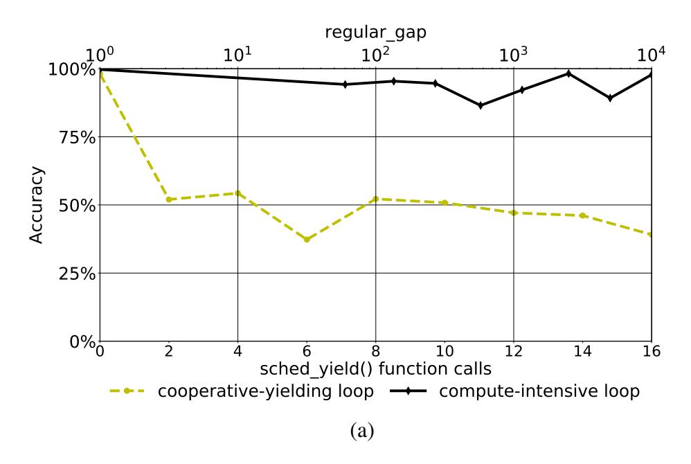

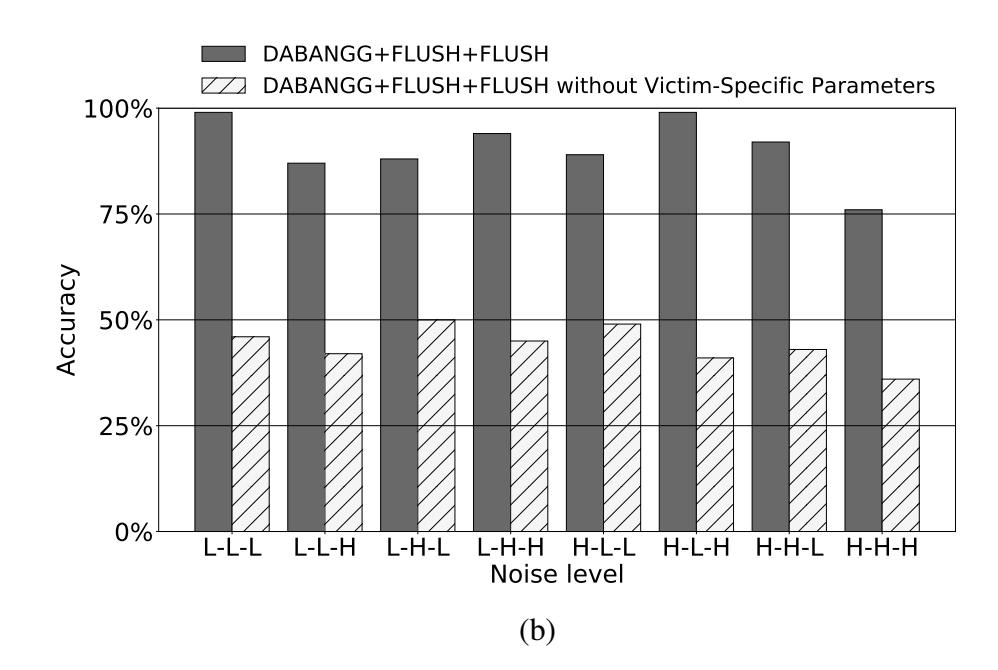

Fig. 9. Utility of (a) Compute-intensive code and (b) Victim-specific parameters on DABANGG+Flush+Flush attack.

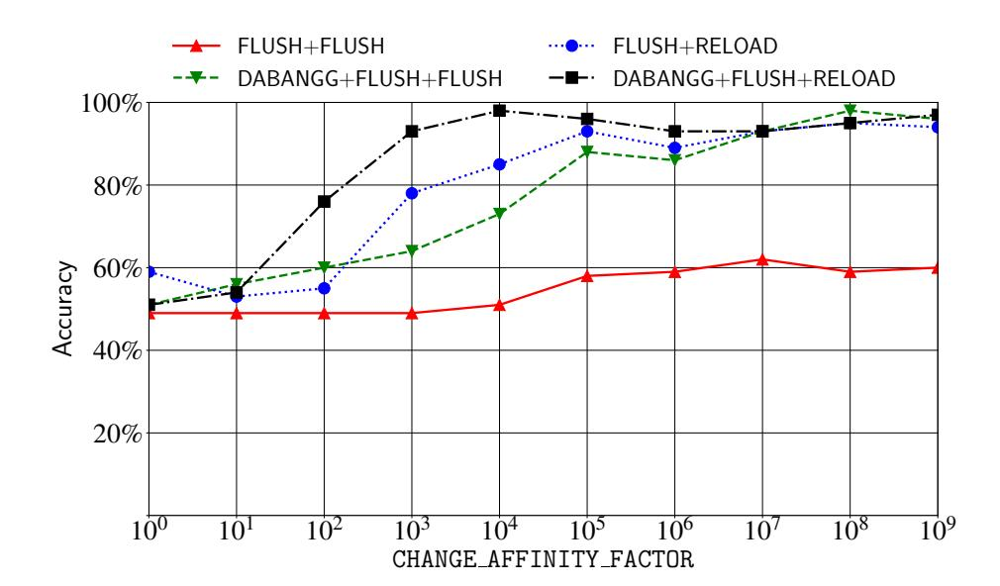

Fig. 10. Effect of thread migration based on CHANGE\_AFFINITY\_FACTOR.

corresponding to zero sched\_yield() function calls and regular\_gap = 0 are equivalent.

Utility of victim-specific parameters: Figure 9(b) illustrates the importance of victim-specific parameters along with the compute-intensive loop. There are two issues with standard attacks: (i) a single cache hit in a victim where burst-mode access is present does not signify a true hit; it may be a false positive, and (ii) if we keep count of burst-mode accesses, a nearly correct sequence may be discarded by the attack loop due to a missed cache-hit. This reduces the accuracy of the attack. DABANGG refined attacks resolve these problems by (i) identifying burst-mode sequence (seq\_id variable) and correlating it with victim-specific expected sequence (burst\_seq parameter) and memory access interval (acc\_interval parameter), and (ii) allowing missed cache-hits in the attack by keeping a waiting window of burst\_wait iterations.

Effect of thread migration: Figure 10 corresponds to a thread migration analysis. An attack resilient to frequent core switches is desirable, as the latency changes based on the relative positioning of the victim and attacker programs on the processor cores. We artificially migrate the attacker core randomly, essentially de-scheduling the process from the current core and scheduling it on the intended core. We run a single character lookup experi-

ment with all four attacks. DABANGG+Flush+Flush attack, whose accuracy is more dependent on processor frequency, is more affected by random core migrations compared to DABANGG+Flush+Reload attack. The number of attack loop iterations that are allowed to elapse before changing the core affinity is marked by the CHANGE\_AFFINITY\_FACTOR, which we vary and record the corresponding attack accuracy. The Linux scheduler may change the program core within a few 10s of milliseconds, which corresponds to CHANGE\_AFFINITY\_FACTOR of around  $10^4$ . However, we test for CHANGE\_AFFINITY\_FACTOR ranging from  $10^0$  ( $\approx 10$  microseconds) to  $10^9$  ( $\approx 6$  hours). We also experiment with hardware prefetchers ON/OFF at L1 and L2 levels, and we find it has a negligible effect on the DABANGG refinements.

The DABANGG refined attacks provide higher accuracy at each CHANGE\_AFFINITY\_FACTOR. The general trend obtained signifies that the accuracy increases with larger CHANGE\_AFFINITY\_FACTOR, which translates to more time available to stabilize the core frequency.

# APPENDIX B MORE FLUSH-BASED ATTACKS

#### A. RSA Private Key Extraction in GnuPG

The RSA implementation in GnuPG [41] library uses an asymmetric public and private key model. We attack the vulnerable Square-and-Multiply Exponentiation (SME) algorithm in RSA. RSA generates a public key using an exponent e (=65537, chosen by GnuPG) and a product, n, of two large primes, say p and q. The private key consists of the p, q and a private exponent d, given by  $d = e^{-1}(mod(p-1)(q-1))$ . The encryption function E for plaintext p is  $E(p) = p^e \mod n$  and the decryption function D for ciphertext e is  $D(e) = e^d \mod n$ .

**Threat Model:** We mount a synchronous attack to extract the private key by recovering the private exponent, d, during decryption<sup>3</sup>. The SME algorithm computes  $c^d \mod(n)$  by scanning the bits of d. It then uses a sequence of Square (S), Multiply (M), and Module Reduce (R) operations. A

{12}------------------------------------------------

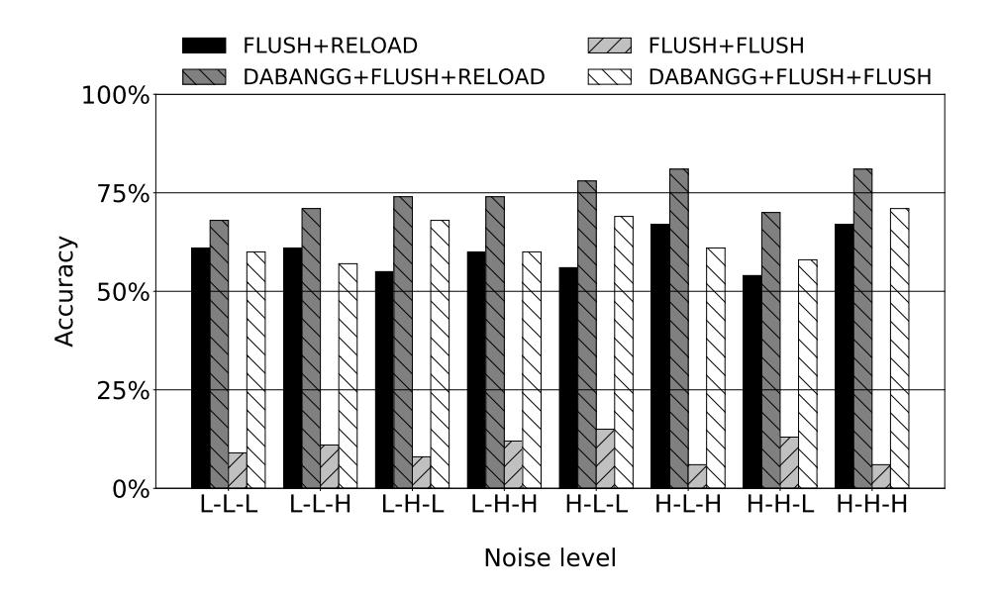

Fig. 11. Accuracy of different attacks on RSA private key extraction in GnuPG at various noise levels.

sequence of Square-Reduce-Multiple-Reduce (S-R-M-R) denotes a set bit (1) and occurrence of Square-Reduce-Square (S-R-S) denotes a clear bit (0) of the private exponent d. The details of the threat model are same as [1]. We monitor the memory addresses in mpih\_sqr\_n(), mul\_n(), and mpihelp\_divrem() functions that respectively carry out S, M, and R operations. Thus, we monitor 3 memory addresses in this attack. We then compare the extracted bits against the actual bit sequence. We make use of the Levenshtein distance to determine the accuracy of the attacks.

Results: Figure 11 illustrates the more than 6× accuracy improvement in D+F+F attack over the F+F attack which has an average accuracy of 10%. Practically, DABANGG optimizations make the F+F attack possible as the private key extraction isn't feasible with 10% average accuracy. F+R also maintains accuracy of over 60% throughout the tests. D+F+R attack performs 5% better on average compared to F+R. Flush+Flush attack improves significantly due to feedback mechanism of Algorithm 2 and refinement #1, which captures the clflush latency variation to allow accurate cache hit/ miss determination. The major gain for Flush+Reload attack is through refinement #3 which allows better control over the waiting period of the attack loop.

# *B. Transient Execution Attack*

Spectre [43] is a transient-execution attack that relies on the microarchitectural covert-channels and exploits speculative execution. In Spectre attack, the cache is usually profiled using the Flush+Reload attack. Flush+Flush attack is rarely employed to mount the Spectre attack in particular and transient execution attacks in general due to its low accuracy. We, therefore, focus on the Flush+Flush attack in this experiment. While we omit the details of performing Flush+Reload attack for brevity, the Flush+Reload attack produces an average error rate of 7.4% (ranging from 13% to 2%), and the DA-BANGG+Flush+Reload attack pushes it to an average errorrate of 1.9% (ranging from 3% to 1%).

<sup>3</sup>The CRT-RSA optimization allows us to only extract d<sup>p</sup> = d mod(p−1) and d<sup>q</sup> = d mod(q − 1). However, d<sup>p</sup> and d<sup>q</sup> are sufficient to factor n and break the encryption [42].

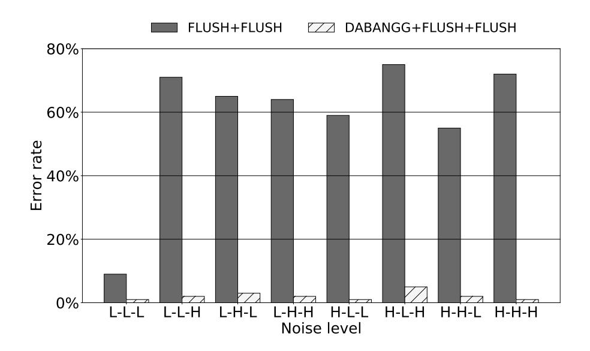

Fig. 12. Error rates of Flush+Flush and DABANGG+Flush+Flush attacks for Spectre attack at various noise levels.

Threat model: We mount an asynchronous attack. The data segment of the program stores a 160 bytes long secretcharacter array. We maintain an attacker array in the data segment. We manipulate the index of attacker array to bring the secret array's data speculatively to the cache. We access an out-of-bounds index of the attacker array, once in five legal accesses. We also flush all elements of the attacker array, and the variable containing its size, to increase the transient execution window. We infer secret array's data by profiling the cache for hits after each instance of speculative execution using Flush+Flush attack. If a data element in the secret array is already present in the cache, it registers a clflush instruction hit when we speculatively access the location using attacker array, indicating the presence of secret data at the element's address. The base code is optimized to provide the most likely outcome for each secret character. The parameters for this experiment are same as AES attack (Table V).

We conduct 1000 runs of each experiment, the result of which is the inferred secret array of characters. We then use Levenshtein distance to determine the accuracy of the attack by comparing it against the real secret character array. The profiling phase is done using both the standard Flush+Flush attack and the DABANGG+Flush+Flush attack. The principle refinement for this attack is refinement #3. It steps up the processor frequency.

Results: Figure 12 shows the error rates of the attack at various noise levels. The DABANGG refinements significantly improve the error rate by stabilizing the core at high frequency and eliminating the false positives. As a result, at very high noise levels (HHH), the error-rate drops significantly from 72% in the standard Flush+Flush attack to 1% in DABANGG+Flush+Flush attack. Relatively high accuracy is achieved using Flush+Flush attack at noise levels, which ramp up the processor frequency. Error rate suffers at noise levels that do not let the processor frequency stabilize, like I/O intensive noise. DABANGG+Flush+Flush eliminates the difference in processor frequency using compute-intensive code segment, thereby producing a uniformly low error rate of less than 10%.

{13}------------------------------------------------

# *C. Cross Virtual Machine (VM) attacks*

VM environment introduces some challenges that are not related to system noise. For example, memory de-duplication needs to be enabled to carry out cross-VM flush-based attacks. Nonetheless, to check the effectiveness of DABANGG optimizations (with memory de-duplication enabled), we mount a cross-VM AES attack using a TCP-based server-client model outlined in [39]. We use Windows 10 (v. 1903) as host OS and 2 VirtualBox (v. 6.1) VMs running Ubuntu 18.04 as guests. The parameters for this attack are listed in Table V.

Results: On average, D+F+R attack requires 31% less encryptions than F+R attack, which requires 10<sup>6</sup> encryptions, to achieve ≥ 90% accuracy. Despite our best efforts, F+F and D+F+F attacks stagnate at 27% and 51% accuracy, respectively, after 10<sup>7</sup> encryptions. To the best of our knowledge, cross-VM Flush+Flush attack hasn't been successfully mounted yet and exploring Flush+Flush attack on a cross-VM setup is a promising future direction. The effectiveness of DABANGG enhancements remain equally effective with cross-VM covert channel. An attack on GnuPG library is possible using a technique demonstrated in [1] or by using the client-server model similar to our cross-VM AES attack. A cross-core Spectre attack was recently demonstrated in [44]. Demonstrating practical cross-VM transient execution attacks remains an attractive research area in the security community.