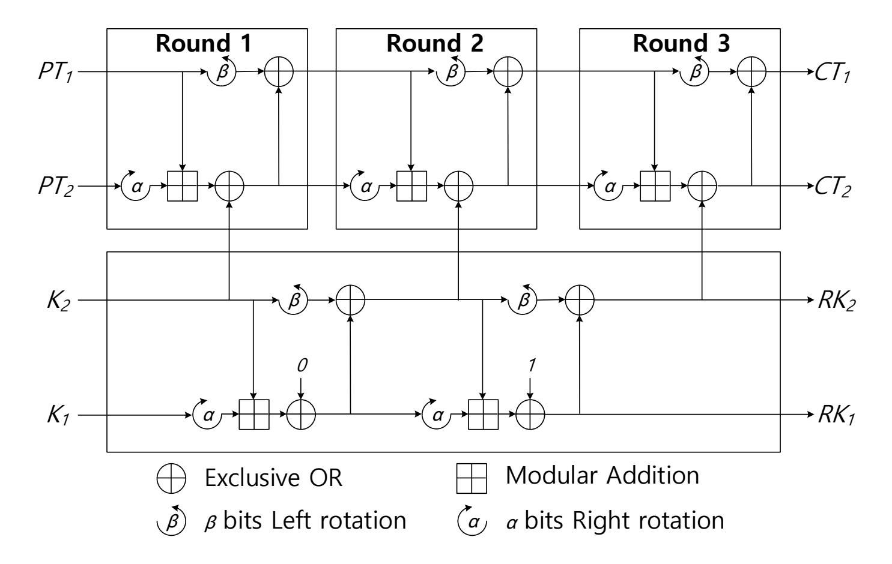
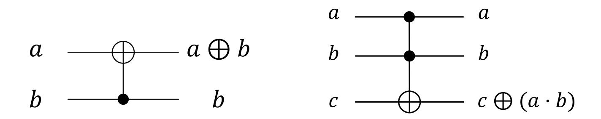
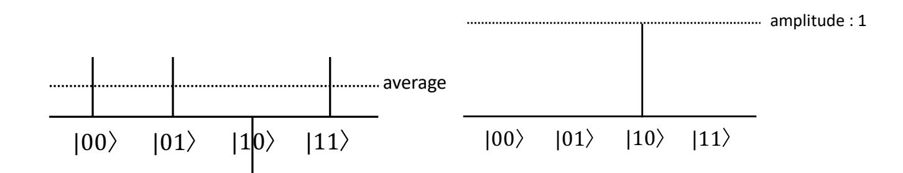
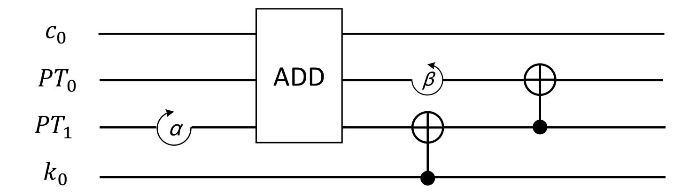
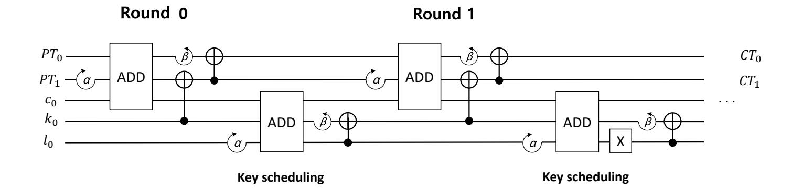

{0}------------------------------------------------

# Grover on SPECK: Quantum Resource Estimates

Kyung Bae Jang, Seung Joo Choi, Hyeok Dong Kwon, Hwa Jeong Seo

Division of IT Convergence Engineering Hansung University Seoul South Korea; {starj1023, bookingstore3, korlethean, hwajeong84}@gmail.com

Abstract. Grover search algorithm reduces the security level of symmetric key cryptography with n-bit secret key to O(2n/<sup>2</sup> ). In order to evaluate the Grover search algorithm, the target block cipher should be implemented in quantum circuits. Recently, many research works evaluated required quantum resources of AES block ciphers by optimizing the expensive substitute layer. However, only few works devoted to ARXbased lightweight block ciphers, which are active research area. In this paper, we present optimized implementations of SPECK 32/64 and SPECK 64/128 block ciphers for quantum computers. To the best of our knowledge, this is the first implementation of SPECK in quantum circuits. Primitive operations, including addition, rotation, and exclusive-or, for SPECK block cipher are finely optimized to achieve the optimal quantum circuit, in terms of qubits, Toffoli gate, CNOT gate, and X gate. The proposed method can be applied to other ARX-based lightweight block ciphers, such as LEA, HIGHT and CHAM block ciphers.

Keywords: Quantum Computers · Quantum Gates · Grover's Algorithm · SPECK · Lightweight Block Cipher

# 1 Introduction

As the Internet of Things (IoT) technology gets developed, a number of wearable and smart devices are gradually spreading through people's life [1]. Between these IoT devices, abundant data, from simple sensor data to even sensitive personal data are being exchanged and processed. In order to protect these sensitive data, the exchange process of the data must be secured. To achieve the security, cryptographic algorithms must be applied to the data. However, applying the cryptographic algorithm requires resources, including computational power and memory. Most of the IoT devices do not have enough resources in order to apply cryptographic algorithm of conventional computer since most of them are equipped with low computational power and small memory size.

In order to resolve this hard condition, lightweight cryptography has been actively studied [2]. Unlike classical cryptography, a lightweight cryptography is designed for low-end devices. Most lightweight cryptography focuses on using resources efficiently to operate in the resource-constrained environment. However, as a cryptography it is still important to maintain security even from the 

{1}------------------------------------------------

potential attacks using not only conventional computers, but also the upcoming quantum computers.

The advent of quantum computers and quantum algorithms has dramatically changed the cryptography community. The most well known public key cryptography, RSA and Elliptic Curve Cryptography (ECC), are based on the difficulties of factorization and discrete algebra problem [3]. However, the Shor's algorithm is capable of solving arithmetic problems easily, making RSA and ECC vulnerable [4].

In the field of symmetric key, the impact of quantum computers is not as critical as the case from the public key. The Grover search algorithm can be used to find the <sup>n</sup>-bit secret key at the speed of <sup>√</sup> n, which is the most effective quantum attack method for block ciphers [5]. Applying the Grover search algorithm to block ciphers is the most efficient way to measure the security of block ciphers against attacks from quantum computers. For this reason, not only the Grover's algorithm but also the cryptography to be analyzed must be implemented with a quantum circuit. Since the development of quantum computer is rudimentary stage, finding the optimal quantum resource for target algorithm is one of the most important issue.

In order to estimate the quantum resources, a number of block cipher implementations have been conducted [6–9]. Grassl et al. estimated the quantum resource required for AES block cipher to apply the Grover search algorithm [6]. Afterward, Langenberg et al. and Jaques et al. found more optimal substitute layer design in quantum circuit than Grassl et al [7, 8]. Recently, Anand et al. implemented the SIMON block cipher in quantum gates [9]. The SIMON is developed by National Security Agency (NSA) to support hardware environment [10]. In this paper, we estimate the quantum resources for software-oriented NSA block cipher, namely SPECK [10]. Unlike SIMON block cipher, SPECK has the addition module, which is inefficient for hardware design. In order to optimize the addition module, the state-of-art implementation technique is utilized. Furthermore, all circuit is designed in reversible to reduce the number of qubits. The implementation result estimated the practical quantum attacks on lightweight cryptography.

# 1.1 Research Contributions

- First SPECK block cipher implementation on quantum gates To the best of our knowledge, this is the first implementation of SPECK block cipher in quantum circuits. Required quantum resources for Grover search algorithm on SPECK block cipher is firstly presented.
- Optimized primitive operations for SPECK block cipher in reversible circuits Optimizing the number of qubits is one of the most important requirements when implementing a quantum circuit. In order to reduce the number of qubits, qubits are re-used by utilizing the reversible circuit structure. Furthermore, the cryptography primitive operations, such as exclusive-or and modular addition operations, are also finely optimized with the state-of-art method.

{2}------------------------------------------------

– In-depth analysis of quantum resource estimation for lightweight block ciphers The proposed SPECK implementation is analyzed in terms of qubits, Toffoli gate, CNOT gate, and X gate to show the detailed quantum resource estimation. The result is also compared with the other lightweight block cipher approaches (i.e. SIMON block cipher).

#### 1.2 Organization of the paper

The organization of the paper is as follows. Section 2 presents the background of SPECK block cipher, quantum gates, Grover search algorithm, and previous implementations of block ciphers in quantum circuits. In Section 3, the proposed SPECK implementation is presented. In Section 4, we evaluate the proposed design in terms of qubits, Toffoli gate, CNOT gate, and X gate. Finally, Section 5 concludes the paper.

# 2 Related Work

#### 2.1 Lightweight Block Cipher: SPECK

In 2013, NSA developed lightweight block ciphers including SPECK and SI-MON for the low-end devices [10]. SPECK has been optimized for performance in software implementations, while SIMON has been optimized for hardware implementations. Since the implementation of SIMON is covered in [9], this paper focused on the SPECK block cipher.

Being one of the ARX structured cipher, processing SPECK only consists of addition, rotation, and bit-wise exclusive operations. Because of it's simplicity, the SPECK shows good performance on most of the platforms. SPECK also provides various security parameters which are shown in Table 1.

| Block size (bits) | Key size (bits) | Word size (bits) | Keywords | Rounds     |
|-------------------|-----------------|------------------|----------|------------|
| 32                | 64              | 16               | 4        | 22         |
| 48                | 72, 96          | 24               | 3, 4     | 22, 23     |
| 64                | 96, 128         | 32               | 3, 4     | 26, 27     |
| 96                | 96, 144         | 48               | 2, 3     | 28, 29     |
| 128               | 128, 192, 256   | 64               | 2, 3, 4  | 32, 33, 34 |

Table 1. Parameters of SPECK block cipher.

$$R_k(x,y) = ((S^{-\alpha}x + y) \oplus k, S^{+\beta}y \oplus (S^{-\alpha}x + y) \oplus k)$$
(1)

During round function of SPECK with the block size of 2n, a 2n-bit ciphertext word is generated using an n-bit round key for a 2n-bit (x, y) input word.

S <sup>+</sup> denotes for left rotation and S <sup>−</sup> for right rotation. α and β are 7 and 2 when the size of the block is 32-bit, respectively. For the rest of the block size,

{3}------------------------------------------------

α and β are 8 and 3, respectively. A key schedule gets processed in order to generate a key k, which will be used in each round.

m denotes the number of words of a key, and m = key size / word size. At this time, the initial key words are K = {k0, l0, . . . , lm−2}, and the following key schedule is performed, and the new key value K = {k0, k1, . . . , k<sup>T</sup> <sup>−</sup>1} is used as the round key.

$$l_{i+m-1} = (k_i + S^{-\alpha}l_i) \oplus i, k_{i+1} = S^{+\beta}k_i \oplus l_{i+m-1}$$
(2)

Key schedule and encryption of SPECK in case of m = 2 are shown in the Figure 1.



Fig. 1. Overview of SPECK block cipher: key schedule and encryption.

#### 2.2 Quantum Gates

Quantum computers have several gates that can emulate the classical gates. Two most representative gates are CNOT and Toffoli gates. The CNOT gate performs a NOT gate operation on the second qubit when the first input qubit of the two input qubits is set as one. This gate performs the same role as the addition operation on the binary field. The circuit configuration is shown on the left side of Figure 2. The Toffoli gate takes three qubits as input. When the first and second qubits are set to one, the gate performs a NOT gate operation on the last qubit. This serves as an AND operation on the binary field. The circuit configuration for Toffoli gate is shown on the right side of Figure 2.

{4}------------------------------------------------



Fig. 2. Circuit configuration of the (left) CNOT and (right) Toffoli gate.

A lot of works have been done on the addition operation in quantum computers [11–14]. Among them, Cuccaro et al. suggested the riple-carry addition circuit to achieve the most optimal design by using only one ancillary qubit [11]. For n-bit addition operation, 2n+2 qubits, 2n Toffoli gates, and 4n CNOT gates are used.

# 2.3 Grover Search Algorithm

The Grover search algorithm is a quantum algorithm that finds specific data for n unsorted data. The classic method requires O(2n) searches in brute force attack. However, this can be found within O(2n/<sup>2</sup> ) times with Grover search algorithm. Grover search algorithm consists of an oracle function and a diffusion operator, as shown in the Figure 3.

#### |0 |0 Oracle |1 H H H H H X X H X X H H H H Diffusion operator

Fig. 3. Circuit of Grover search algorithm

The oracle function f(x) returns 1 if input x is the solution to the search. Otherwise, it returns 0. When f(x) = 1, the sign of the state x is flipped. It then proceeds to the diffusion operator step, which increases the amplitude of the solution. The searching step is as follows: First, the average amplitude is calculated for all data. Second, the difference between the amplitude and the average amplitude of each data is calculated. If the answer to find in the 2-bit input is 10, the status after these two steps is as shown in the Figure. 4.

{5}------------------------------------------------



Fig. 4. Result of the (left) oracle and (right) diffusion operator.

After performing the oracle function, the amplitude of the solution has a different sign from other amplitudes. The difference from the average amplitude increases and the difference between the non-answer amplitudes decreases. Grover search algorithm increases the amplitude probability of the solution by repeating the oracle function and diffusion operators.

# 2.4 Previous Block Cipher Implementations on Quantum Computers

Advanced Encryption Standard (AES) is the international block cipher standard [15] and the block cipher is widely used in practice, such as database encryption and network security. For this reason, a number of works focused on quantum resource estimation for the AES block cipher.

Grassl et al. has presented first quantum circuits to implement an exhaustive key search for the AES and analyzed the quantum resources required to carry out such attack [6]. All three variants of AES (key size 128, 192, and 256 bit) are implemented for the Grover's quantum algorithm with optimal operations for each layer.

Langenberg et al. presented new quantum circuits for all three AES key lengths. For AES-128, the number of Toffoli gates can be reduced by more than 88% compared to Grassl et al.'s estimates [6], while simultaneously reducing the number of qubits [16].

Previous works of AES have derived the full gate cost by analyzing quantum circuits for the cipher, but focused on minimizing the number of qubits. In [8], they have studied the cost of quantum key search attacks under a depth restriction and introduced techniques that reduce the oracle depth, even if it requires more qubits. As part of this work, they released Q# implementations of the full Grover oracle for AES-128, AES-192, AES-256, including unit tests and code to reproduce their quantum resource estimates.

In [9], the reversible implementation of SIMON block cipher was presented. This block cipher is hardware-oriented suggested by NSA. They have successfully implemented the Grover oracle and Grover diffusion for key search. They have estimated the resources in terms of NOT, CNOT and Toffoli gates, which are required to carry out the quantum attack on the block cipher.

{6}------------------------------------------------

However, software-oriented block cipher, SPECK, was not investigated yet. In this paper, we firstly implement the SPECK block cipher in quantum circuits in order to apply a Grover algorithm.

## 3 Proposed Method

In this section, we describe the proposed SPECK block cipher in the quantum circuit to apply the Grover search algorithm. The round function R in Equation 1 consists of addition, rotation, and XOR operations. In the quantum circuit, the rotation operation can be designed without using any gates by changing the order of qubits. In the case of XOR operation, it can be simply performed with CNOT gate. However, the addition operation requires more complicated circuits than the previous two cases. The proposed implemented exploited the Cuccaro et al.'s ripple-carry addition circuit to implement SPECK block cipher in the quantum circuit [11].

The block cipher is largely divided into two steps, including key scheduling and encryption. In order to reduce the required qubit, on-the-fly approach is utilized.

#### 3.1 Encryption

The round function of SPECK block cipher in Equation 1 used for encryption. In Algorithm 1, the round function consists of 5 steps. In Step 1, the rotation operation is performed on plaintext. Afterward, the addition operation between two plaintexts is performed in Step 2. In Step 3, add-round-key is performed with the CNOT gate. In Step 4, the rotation operation is performed on plaintext. Lastly, the XOR operation between two plaintexts is performed and the result is returned. The quantum circuit for Algorithm 1 is given in Figure 5.

#### **Algorithm 1** Round function of SPECK block cipher in quantum gate.

```
Input: PT = \{PT_0, PT_1\}, Round key k_i, Round i

Output: PT = \{PT_0, PT_1\}

1: PT_1 \leftarrow PT_1 \gg \alpha

2: PT_1 \leftarrow \text{ADD}(PT_0, PT_1)

3: PT_1 \leftarrow \text{CNOT}(k_i, PT_1)

4: PT_0 \leftarrow PT_0 \ll \beta

5: PT_0 \leftarrow \text{CNOT}(PT_1, PT_0)

6: return PT
```

First, the rotation operation performed. In quantum circuit, this does not require a circuit cost. Given  $a = \{a_0, a_1, a_2, a_3\}$  and  $b = \{b_0, b_1, b_2, b_3\}$ , the operations  $a \gg 1$  is performed. The CNOT operation is performed on the elements of b and the elements of a changed in order by rotation. Since  $a \gg 1$  operation

{7}------------------------------------------------



Fig. 5. One-round function circuit for SPECK.

is {a1, a2, a3, a0}, it is completed by performing CNOT(a1, b0), CNOT(a2, b1), CNOT(a3, b2), and CNOT(a0, b3). In this way, there is no cost for the rotation operation, and the XOR operation can be performed simply with a CNOT gate.

After the rotation operation, the addition operation is used. We used the method of Cuccaro et. al's ripple carry addition [11]. In order to use the ripplecarry addition circuit, not only the qubits of the calculation target P T0, P T1, but also 2 additional qubits for carry calculation are required. Since the addition of SPECK block cipher is the modular addition, the value of highest carry qubit can be ignored. Therefore, the addition operation can be performed only with the initial carry qubit of c0. Since this c<sup>0</sup> qubit is initialized to 0 after addition operation, it can be used for addition of key scheduling.

The key value used in the first round is k<sup>0</sup> in the initial key words K = {k0, l0, . . . , lm−2}. However, in all rounds except the first, the key value generated by key scheduling of K is used. At this time, all key scheduling operations are not required, but by performing key scheduling of each round in parallel during encryption, the initial key words K are continuously replaced. The details of this will be discussed in the next chapter.

## 3.2 Key Scheduling

As seen in Section 2.1, key words K = {k0, l0, . . . , lm−2} are extended to key K = {k0, k1, . . . , k<sup>T</sup> <sup>−</sup>1} through key scheduling. It is defined in Equation 1. We update the qubits value of k<sup>0</sup> used in the first round and use it as the next round key. In this way, k<sup>0</sup> is used as a round key from start to finish. Qubits assigned to the initial keywords K, which is a factor in key scheduling for updating the round key k0, is reused to the end. By recycling the qubits in this way, the encryption can be completed with only the initial key words qubits. The process of performing all rounds while key scheduling is shown in Algorithm 2.

As above, instead of generating all round key K, key scheduling is performed only once and then the round function is performed immediately with the updated k0. Therefore, the role of the round key k<sup>i</sup> is performed by the qubit k<sup>0</sup> assigned to the initial key words. In this way, without using the qubits for the new key value,the use of the qubit was minimized by changing the qubits of the

{8}------------------------------------------------

## Algorithm 2 Key scheduling with round function.

```
Input: K = {k0, l0, . . . , lm−2}, P T = {P T0, P T1}
Output: CT = {CT0, CT1}
1: for i = 1 to T − 1 do
2: l(i−1)%(m−1) ← l(i−1)%(m−1) ≫ α
3: l(i−1)%(m−1) ← ADD(k0, l(i−1)%(m−1))
4: l(i−1)%(m−1) ← CNOT((i − 1), l(i−1)%(m−1))
5: k0 ← k0 ≪ β
6: k0 ← CNOT(l(i−1)%(m−1), k0)
7: Round function(P T1, P T0, k0, i)
8: end for
9: CT0 ← P T0
10: CT1 ← P T1
11: return CT0, CT1
```

key value used in the previous round. As mentioned earlier, the carry qubit c<sup>0</sup> for add of round function and add of key scheduling is used together. The final operation process of encryption is shown in the Figure 6, and the case for m = 2 is given as an example. In each round including encryption and key-scheduling, 4 rotation, 3 XOR and 2 addition operations are performed. Since the circuit is reversible, the qubit is recycled several times.

In the round function, the round key is used for the XOR operation like the 4-th line of the Algorithm 1, but when looking at the 4-th line of the key scheduling Algorithm 2, the round i value is used for the XOR operation. This can be replaced by performing an X gate on the object to XOR the i value. For example, XOR of i = 2 is equivalent to passing the second qubit of the operation object through the X gate.



Fig. 6. All-round circuit including key-scheduling and encryption for SPECK block cipher

{9}------------------------------------------------

#### 4 Evaluation

The implementation is evaluated with the quantum computer emulator. In particular, IBM ProjectQ framework is utilized<sup>1</sup> [17]. IBM ProjectQ provides the quantum computer compiler and quantum resource estimator. Quantum resources are estimated in terms of qubit, Toffoli gate, CNOT gate, and X gate. The proposed implementation focused on the optimal number of qubit and Toffoli gate.

In Table 2, the comparison result between SPECK and SIMON block cipher is given. In terms of qubit, the SPECK block cipher requires one more qubit than that of SIMON block cipher, because the addition operation requires carry handling with one qubit. SPECK block cipher require more number of Toffoli and CNOT gates than SIMON block cipher, while the number of X gate is lesser than SIMON. The reason is the SIMON consists of AND and XOR operations but the SPECK block cipher requires ADD and XOR operations. The addition operation requires more resources than AND operations. SIMON is designed for hardware while SPECK is designed for software. For this reason, SIMON also shows quantum hardware-friendly block cipher. This is an interesting feature that the complexity of quantum computer design is similar to classical hardware design. With this aspect, we can easily estimate the quantum resource by using previous results of classical hardware design.

SPECK 32/64 SIMON 32/64 [9] Quantum resources |SPECK 64/128| SIMON 64/128 [9] 97 96 193 192 Qubit Toffoli gate 1,290 512 3,286 1,408 CNOT gate 3,706 2,816 9,238 7,396 X gate 42 448 57 1,216

Table 2. Comparison of quantum resources for SPECK and SIMON.

#### 5 Conclusion

In this paper, we presented the first SPECK block cipher implementation on quantum computers. Optimal reversible gates and addition operations are designed to achieve the optimal quantum design in terms of qubits and quantum gates. The result shows that the hardware-friendly block cipher (i.e. SIMON) also shows the better performance than software-friendly block cipher (i.e. SPECK).

Future work is the implementation of other block ciphers to evaluate the quantum resources for Grover search algorithm. One of the most promising candidate is NIST's lightweight cryptography competition<sup>2</sup>. Since many new block cipher was suggested in this competition, quantum resource estimation on these

https://github.com/ProjectQ-Framework/ProjectQ

<sup>&</sup>lt;sup>2</sup> https://csrc.nist.gov/projects/lightweight-cryptography

{10}------------------------------------------------

block ciphers is interesting. Another candidate is the result of FELICS competition<sup>3</sup> [18]. The competition evaluated a number of lightweight block ciphers on low-end microcontrollers. It would be interesting to compare the performance comparison on low-end microcontrollers and quantum computers, whether there is relation between them or not.

# References

- 1. L. Atzori, A. Iera, and G. Morabito, "The Internet of Things: A survey," Computer networks, vol. 54, no. 15, pp. 2787–2805, 2010.
- 2. A. Biryukov and L. P. Perrin, "State of the art in lightweight symmetric cryptography," 2017.
- 3. D. Hankerson, A. J. Menezes, and S. Vanstone, Guide to elliptic curve cryptography. Springer Science & Business Media, 2006.
- 4. P. W. Shor, "Algorithms for quantum computation: discrete logarithms and factoring," in Proceedings 35th annual symposium on foundations of computer science, pp. 124–134, Ieee, 1994.
- 5. L. K. Grover, "A fast quantum mechanical algorithm for database search," in Proceedings of the twenty-eighth annual ACM symposium on Theory of computing, pp. 212–219, 1996.
- 6. M. Grassl, B. Langenberg, M. Roetteler, and R. Steinwandt, "Applying Grover's algorithm to AES: quantum resource estimates," in Post-Quantum Cryptography, pp. 29–43, Springer, 2016.
- 7. B. Langenberg, H. Pham, and R. Steinwandt, "Reducing the cost of implementing AES as a quantum circuit," tech. rep., Cryptology ePrint Archive, Report 2019/854, 2019.
- 8. S. Jaques, M. Naehrig, M. Roetteler, and F. Virdia, "Implementing Grover oracles for quantum key search on AES and LowMC," in Annual International Conference on the Theory and Applications of Cryptographic Techniques, pp. 280–310, Springer, 2020.
- 9. R. Anand, A. Maitra, and S. Mukhopadhyay, "Grover on SIMON," 04 2020.
- 10. R. Beaulieu, D. Shors, J. Smith, S. Treatman-Clark, B. Weeks, and L. Wingers, "The SIMON and SPECK families of lightweight block ciphers.," IACR Cryptology ePrint Archive, vol. 2013, no. 1, pp. 404–449, 2013.
- 11. S. A. Cuccaro, T. G. Draper, S. A. Kutin, and D. P. Moulton, "A new quantum ripple-carry addition circuit," arXiv preprint quant-ph/0410184, 2004.
- 12. T. G. Draper, "Addition on a quantum computer," arXiv preprint quantph/0008033, 2000.
- 13. T. G. Draper, S. A. Kutin, E. M. Rains, and K. M. Svore, "A logarithmic-depth quantum carry-lookahead adder," arXiv preprint quant-ph/0406142, 2004.
- 14. V. Vedral, A. Barenco, and A. Ekert, "Quantum networks for elementary arithmetic operations," Physical Review A, vol. 54, no. 1, p. 147, 1996.
- 15. J. Daemen and V. Rijmen, "AES proposal: Rijndael," 1999.
- 16. B. Langenberg, H. Pham, and R. Steinwandt, "Reducing the cost of implementing the advanced encryption standard as a quantum circuit," IEEE Transactions on Quantum Engineering, vol. 1, pp. 1–12, 2020.

<sup>3</sup> https://www.cryptolux.org/index.php/FELICS

{11}------------------------------------------------

- 17. D. S. Steiger, T. H¨aner, and M. Troyer, "ProjectQ: an open source software framework for quantum computing," Quantum, vol. 2, p. 49, 2018.
- 18. D. Dinu, A. Biryukov, J. Großsch¨adl, D. Khovratovich, Y. Le Corre, and L. Perrin, "FELICS–fair evaluation of lightweight cryptographic systems," in NIST Workshop on Lightweight Cryptography, vol. 128, 2015.