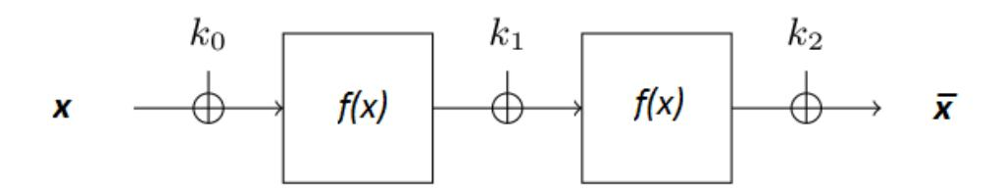

{0}------------------------------------------------

# Correlation distribution analysis of a two-round key-alternating block cipher ?

Liliya Kraleva1 , Vincent Rijmen1 , and Nikolai L. Manev2

1 imec-COSIC, KU Leuven, Leuven, Belgium liliya.kraleva,vincent.rijmen@esat.kuleuven.be 2 Bulgarian Academy of Sciences, Sofia, Bulgaria nlmanev@math.bas.bg

Abstract. In this paper we study two-round key-alternating block ciphers with round function f(x) = x (2t+1)2s , where t, s are positive integers. An algorithm to compute the distribution weight with respect to input and output masks is described. In the case t = 1 the correlation distributions in dependence on input and output masks are completely determined for arbitrary pairs of masks. We investigate with more details the case f(x) = x 3 and fully derive and classify the distributions, proving that there are only 5 possible values for the correlation for any pair of masks.

Keywords: correlation distribution, linear cryptanalysis, key-alternating ciphers, cube function

# 1 Introduction

Linear cryptanalysis is one of the most powerful attacks on symmetric-key block ciphers. It investigates the correlation between chosen bits of the input and the output in order to make conclusions about some bits of the key. Nowadays ciphers are designed to be resistant against linear cryptanalysis by analyzing some statistical properties of the cipher.

The study presented herein is inspired by a paper by Mohamed Ahmed Abdelraheem, Martin Agren, Peter Beelen and Gregor Leander [1]. In the paper the authors give an example of two-round key-alternating block cipher (see Figure 1) with correlation distribution for masks (1, 1) that is behaving differently from what is expected. It takes only five different values whereas previously it was assumed that the distribution would be normal [7]. The cryptanalysis of tworound key-alternating block ciphers is interesting because it is the basic step of the cryptanalysis of any multi-round block cipher.

In this paper we consider the same cipher but with a round function of more general form and we determine the correlation distribution in dependence of the key for arbitrary input and output masks (σ, ω), where σ, ω ∈ F n 2 , n odd.

? This work is published at Tatra Mountains Mathematical Publications 73(1), 2019

{1}------------------------------------------------

Our methods are based on finite-field theory, see e.g. [12, 14, 11, 3] and some general results on correlation analysis and linear cryptanalysis [5, 8, 13].

In the next section we give the necessary notions and notations. In Section 3 we prove several general facts about correlation distribution and introduce the notion distribution weight. In Section 4 we give some theoretical results and describe how to compute the distribution weight for round function of the form  $f(x) = x^{(2^t+1)2^s}$ . How to compute the correlation distribution in the case t=1 is described in Section 5. Computational results are presented in Section 6. For the sake of reader's convenience the proofs of the theorems in Section 2 are given in Appendix A.

### 2 Preliminaries

Fig. 1. Two round key-alternating cipher.

Let  $f: \mathbb{F}_2^n \to \mathbb{F}_2^n$  be a bijection and  $\langle \mathbf{u}, \mathbf{v} \rangle \stackrel{def}{=} \mathbf{u} \mathbf{v}^{\tau} = u_1 v_1 + \dots + u_n v_n$  be the inner product of  $\mathbf{u}$  and  $\mathbf{v}$ . Note that  $\langle \mathbf{u}, \mathbf{v} \rangle \in \mathbb{F}_2$ , thus, takes values 0 or 1.

**Definition 1.** The correlation of the linear approximation  $(\mathbf{u}, \mathbf{v})$  of f is referred to be the difference

$$c_f(\mathbf{u}, \mathbf{v}) \stackrel{def}{=} \frac{1}{2^{n-1}} |\{\mathbf{x} \in \mathbb{F}_2^n \mid \langle \mathbf{u}, \mathbf{x} \rangle + \langle \mathbf{v}, f(\mathbf{x}) \rangle = 0\}| - 1$$

The vectors  ${\bf u}$  and  ${\bf v}$  are commonly called *input and output masks* of the approximation.

Let  $f, g : \mathbb{F}_2^n \to \mathbb{F}_2^n$  be bijections and let  $f_k : \mathbb{F}_2^n \to \mathbb{F}_2^n$  be defined by  $f_k(\mathbf{x}) = f(\mathbf{x}) + \mathbf{k}$ ,  $\mathbf{k} \in \mathbb{F}_2^n$ . Let us denote by  $F_k$  the composition  $F_k(\mathbf{x}) = g \circ f_k(\mathbf{x}) = g(f(\mathbf{x}) + \mathbf{k})$ .

Theorem 2.

$$c_{f_k}(\mathbf{u}, \mathbf{v}) = (-1)^{\langle \mathbf{v}, \mathbf{k} \rangle} c_f(\mathbf{u}, \mathbf{v})$$

Theorem 3.

$$c_{F_k}(\mathbf{u}, \mathbf{v}) = \sum_{\mathbf{w} \in \mathbb{F}_2^n} c_{f_k}(\mathbf{u}, \mathbf{w}) c_g(\mathbf{w}, \mathbf{v}) = \sum_{\mathbf{w} \in \mathbb{F}_2^n} (-1)^{\langle \mathbf{w}, \mathbf{k} \rangle} c_f(\mathbf{u}, \mathbf{w}) c_g(\mathbf{w}, \mathbf{v}).$$

{2}------------------------------------------------

**Remark**. Theorem 3 can be found in [5] formulated and proved in the terms of correlation matrices. A different proof in manner that follows the style of this paper is given in [10]. The proofs of Theorem 2, Theorem 3, and Theorem 4 are also given in Appendix A.

### Theorem 4.

$$\sum_{\mathbf{k} \in \mathbb{F}_2^n} c_{F_k}^2(\mathbf{u}, \mathbf{v}) = 2^n \sum_{\mathbf{w} \in \mathbb{F}_2^n} c_f^2(\mathbf{u}, \mathbf{w}) c_g^2(\mathbf{w}, \mathbf{v})$$

Theorems 2.1–2.3 concern the composition of two functions. They can be generalized to composition of several functions:

$$f = f_r \circ \cdots f_2 \circ f_1, \qquad f_i : \mathbb{F}_2^n \to \mathbb{F}_2^n.$$

**Definition 5.** A linear trail of length r is an ordered set of intermediate masks

$$\theta = (\theta_0 = u, \theta_1, \dots \theta_r = w.)$$

A linear hull is the set of all trails starting with the same input mask and ending with the same output mask.

In this paper we deal only with trails of length two and refer the reader to [6, Chapter 7] for more information about the general case.

Another measure which is used for evaluating how well the round function f is approximated by  $(\mathbf{u}, \mathbf{v})$  is the following

**Definition 6. Fourier transformation (or Walsh transform)** of f in regard to  $(\mathbf{u}, \mathbf{v})$  is a function  $\hat{f} : \mathbb{F}_2^n \times \mathbb{F}_2^n \to \mathbb{Z}$  defined by

$$\hat{f}(\mathbf{u}, \mathbf{v}) = \sum_{\mathbf{x} \in F_2^n} (-1)^{\langle \mathbf{u}, \mathbf{x} \rangle + \langle \mathbf{v}, f(\mathbf{x}) \rangle} \in [-2^n, 2^n].$$

The Fourier transformation of f gives some advantages when algebraic methods are involved. It is connected with correlation by the following equality.

### Proposition 1.

$$c_f(\mathbf{u}, \mathbf{v}) = \frac{1}{2^n} \hat{f}(\mathbf{u}, \mathbf{v}).$$

Hence, whenever we say correlation distribution in this paper, we understand the distribution of  $\hat{f}(\mathbf{u}, \mathbf{v})$  in dependence of the masks.

By fixing a basis of  $\mathbb{F}_{2^n}$  over  $\mathbb{F}_2$  we define a bijection between  $\mathbb{F}_{2^n}$  and  $\mathbb{F}_2^n$  and can identify f with a permutation polynomial over  $\mathbb{F}_{2^n}$ . When this basis is self-dual we have  $\langle \mathbf{u}, \mathbf{v} \rangle = \text{Tr}(uv)$ . Such a basis exists for any finite field with characteristic 2, see [14, 5.1.18]. We can obtain some advantages in computer computation if the basis is also normal. Self-dual normal basis exists in  $\mathbb{F}_{2^n}$  if  $n \not\equiv 0 \pmod{4}$ , see [14, 5.2.23] and [11].

{3}------------------------------------------------

In this paper during our considerations we assume that the chosen basis is **self-dual** and **normal**, namely,  $\alpha, \alpha^2, \ldots, \alpha^{2^{n-1}}$  with  $\text{Tr}(\alpha^{2^i}\alpha^{2^j}) = 0$ , where  $\alpha$  is a primitive element of  $\mathbb{F}_{2^n}$ . The fact that the basis is normal has no effect on the theoretical results but is useful for computations.

In the studied key-alternating cipher the nonlinear function f is the polynomial  $f(x) = x^a$  with  $a = 3.2^s$ , s integer, although we will prove some properties in the more general case  $a = (2^t + 1).2^s$ , s, t positive integers. In order to assure that f is a permutation polynomial we **assume that** n **is odd**.

Since the keys  $\mathbf{k}_0$  and  $\mathbf{k}_2$  do not change the distribution, for simplicity we do not consider them and denote  $\mathbf{k}_1 = \mathbf{k}$ . Let  $x \in \mathbb{F}_{2^n}$  correspond to the input n-tuple  $\mathbf{x}$ . Then the output  $\bar{\mathbf{x}}$  of the studied block cipher corresponds to

$$F_k(x) = f(f(x) + k) = (x^a + k)^a$$

Let  $\chi: \mathbb{F}_{2^n} \to \{\pm 1\}$  be the additive character of  $\mathbb{F}_{2^n}$  defined by

$$\chi(x) \stackrel{\text{def}}{=} (-1)^{\text{Tr}(x)}$$

Obviously we have  $\chi(x+y) = \chi(x)\chi(y)$  and  $\chi(x^2) = \chi(x)$ ,  $x, y \in \mathbb{F}_{2^n}$ . Recall also the following well known property

### Proposition 2.

$$\sum_{x \in \mathbb{F}_{2^n}} \chi(x) = 0.$$

Now we can write that

$$\hat{F}_k(\sigma,\omega) = \sum_{x \in \mathbb{F}_{2^n}} (-1)^{\operatorname{Tr}(\sigma x + \omega F_k(x))} = \sum_{x \in \mathbb{F}_{2^n}} \chi(\sigma x + \omega F_k(x))$$

### 3 Several general results

Our goal is to determine the distribution of  $\hat{F}_k(\sigma,\omega)$  (instead of  $c_F(\sigma,\omega)$ ) depending on the pair of masks  $(\sigma,\omega)$  and the key k. To achieve this goal we evaluate  $\hat{F}_k^2(\sigma,\omega)$ .

**Lemma 1.** For any  $\sigma$  and  $\omega$  of  $\mathbb{F}_{2^n}$ , and  $f: \mathbb{F}_{2^n} \to \mathbb{F}_{2^n}$ 

$$\hat{f}^2(\sigma,\omega) = \sum_{x \in \mathbb{F}_{2^n}} \left[ \chi(\sigma x + \omega f(x)) \sum_{y \in \mathbb{F}_{2^n}} \chi(\omega h(x,y)) \right],$$

where h(x, y) = f(x + y) - f(x) - f(y).

Proof.

$$\hat{f}^{2}(\sigma,\omega) = \left(\sum_{y \in \mathbb{F}_{2^{n}}} \chi(\sigma y + \omega f(y))\right) \left(\sum_{z \in \mathbb{F}_{2^{n}}} \chi(\sigma z + \omega f(z))\right)$$

$$= \sum_{y \in \mathbb{F}_{2^{n}}} \sum_{z \in \mathbb{F}_{2^{n}}} \chi(\sigma y + \omega f(y)) \chi(\sigma z + \omega f(z))$$

$$= \sum_{y \in \mathbb{F}_{2^{n}}} \sum_{z \in \mathbb{F}_{2^{n}}} \chi(\sigma y + \omega f(y) + \sigma z + \omega f(z))$$

{4}------------------------------------------------

Substituting z = x + y we obtained

$$\hat{f}^{2}(\sigma,\omega) = \sum_{x \in \mathbb{F}_{2^{n}}} \sum_{y \in \mathbb{F}_{2^{n}}} \chi(\sigma y + \omega f(y) + \sigma(x+y) + \omega f(x+y))$$

$$= \sum_{x \in \mathbb{F}_{2^{n}}} \sum_{y \in \mathbb{F}_{2^{n}}} \chi(\sigma x + \omega f(y) + \omega f(x+y))$$

$$= \sum_{x \in \mathbb{F}_{2^{n}}} \sum_{y \in \mathbb{F}_{2^{n}}} \chi(\sigma x + \omega f(x) + \omega h(x,y))$$

$$= \sum_{x \in \mathbb{F}_{2^{n}}} \sum_{y \in \mathbb{F}_{2^{n}}} \chi(\sigma x + \omega f(x)) \chi(\omega h(x,y)),$$

where 
$$h(x, y) = f(x + y) - f(x) - f(y)$$
.

Let us consider the set H(x) = {h(x, y) | y ∈ F2n } ⊆ F2n . For many polynomials f(x) the set H(x) = F2n and thus ωH(x) = F2n for any ω 6= 0. Then, according to Proposition 2 we have

$$\sum_{y \in \mathbb{F}_{2^n}} \chi(\omega h(x, y)) = 0.$$

Hence ˆf 2 (σ, ω) (as we will see below) is a sum of a relatively small number of addends and can be evaluated.

Lemma 2. Let f : F2n → F2n and g(x) = f(x) 2 t . For any σ and ω of F2n

$$\hat{g}^2(\sigma,\omega) = \hat{f}^2(\sigma,\mu),$$

where µ = ω 2 n−t .

Proof. According to Lemma 1

$$\hat{g}^2(\sigma,\omega) = \sum_{x \in \mathbb{F}_{2^n}} \Big[ \chi(\sigma x + \omega g(x)) \sum_{y \in \mathbb{F}_{2^n}} \chi(\omega H(x,y)) \Big],$$

where H(x, y) = g(x + y) + g(x) + g(y) = (f(x + y) + f(x) + f(y))2 t = h(x, y) 2 t .

> ) i

$$\hat{g}^{2}(\sigma,\omega) = \sum_{x \in \mathbb{F}_{2^{n}}} \left[ \chi(\sigma x) \chi(\mu^{2^{t}} f(x)^{2^{t}}) \sum_{y \in \mathbb{F}_{2^{n}}} \chi(\mu^{2^{t}} h(x,y)^{2^{t}}) \right]$$

$$= \sum_{x \in \mathbb{F}_{2^{n}}} \left[ \chi(\sigma x) \chi(\mu f(x)) \sum_{y \in \mathbb{F}_{2^{n}}} \chi(\mu h(x,y)) \right]$$

$$= \sum_{x \in \mathbb{F}_{2^{n}}} \left[ \chi(\sigma x + \mu f(x)) \sum_{y \in \mathbb{F}_{2^{n}}} \chi(\mu h(x,y)) \right]$$

$$= \hat{f}^{2}(\sigma,\mu),$$

where ω = µ 2 t .

As a corollary we obtain the following

{5}------------------------------------------------

**Lemma 3.** Let  $f(x) = x^a$  and  $g(x) = x^{a2^t}$ . Then for any  $\sigma \in \mathbb{F}_{2^n}$ 

$$\hat{G}_k^2(\sigma, 1) = \hat{F}_\tau^2(\sigma, 1),$$

where  $\tau = k^{2^{n-t}}$ .

*Proof.* 
$$G_k = (x^{a2^t} + k)^{a2^t} = (x^a + \tau)^{a2^{2t}} = ((x^a + \tau)^a)^{2^{2t}} = F_{\tau}^{2^{2t}}(x).$$
 Now Lemma 2 gives the statement.

Lemma 3 can be formulated for an arbitrary  $\omega$ , not only for  $\omega = 1$ , but it is not necessary due to the statement given below.

Let  $f: \mathbb{F}_{2^n} \to \mathbb{F}_{2^n}$  be a permutation polynomial with the property:

Property 1. For any  $\lambda \in \mathbb{F}_{2^n}$  there exist  $\eta = \eta(\lambda) \in \mathbb{F}_{2^n}$  such that  $\lambda f(x) = f(\eta x)$  for any x.

Let  $f, g : \mathbb{F}_{2^n} \to \mathbb{F}_{2^n}$  be permutation polynomials with the above property. Then for any  $\sigma, \omega \in \mathbb{F}_{2^n}$  there exist  $\lambda(\omega), \eta(\omega) \in \mathbb{F}_{2^n}$  such that

$$\sigma x + \omega g(f(x) + k) = \sigma x + g(\lambda f(x) + \lambda k) = \sigma x + g(f(\eta x) + k_{\omega})$$
$$= \sigma \eta^{-1} y + g(f(y) + k_{\omega}), \tag{1}$$

where  $k_{\omega} = \lambda k$ .

Therefore we can formulate the following lemma:

**Lemma 4.** For suitable  $\eta$  and  $k_{\omega}$  of  $\mathbb{F}_{2^n}$ 

$$\hat{F}_k(\sigma,\omega) = \hat{F}_{k_\omega}(\sigma\eta^{-1},1)$$

*Proof.* Let us first note that any permutation polynomial of the form  $f(x) = x^a$  satisfies the Property 1 since there exists a unique  $\eta$  such that  $\lambda = \eta^a$ . Then repeating (1) we get

$$\sigma x + \omega F_k(x) = \sigma x + \omega f(f(x) + k) = \sigma \eta^{-1} y + f(f(y) + k_\omega) = \sigma \eta^{-1} y + F_{k_\omega}(y)$$

Hence

$$\sum_{x \in \mathbb{F}_{2^n}} \chi(\sigma x + \omega F_k(x)) = \sum_{y \in \mathbb{F}_{2^n}} \chi(\sigma \eta^{-1} y + F_{k_\omega}(y)).$$

The aforesaid shows that  $\omega$  has influence on the correspondence between distributions and pairs  $(\sigma, k)$  but not on the structure of the set of distributions. If a given distribution corresponds to  $(\sigma, \omega, k)$ , it corresponds to  $(\sigma \eta^{-1}, 1, k_{\omega})$ , too. That is, the set of distributions (in regard to  $(\sigma, k)$ ) is one and the same for all  $\omega$ . Therefore the case  $\omega = 1$  assures enough generality for our study. From now on we assume  $\omega = 1$  and we will follow the ideas presented in [1] in order to evaluate the correlation distribution depending on the triple  $(\sigma, 1, k)$ .

### Lemma 5.

$$\hat{F}_k(\sigma^2, 1) = \hat{F}_{k^{1/2}}(\sigma, 1)$$
 and  $\hat{F}_{k^2}(\sigma, 1) = \hat{F}_k(\sigma^{1/2}, 1)$ 

{6}------------------------------------------------

*Proof.* Since  $F_k(y^2) = (y^{2a} + k)^a = (y^a + k^{1/2})^{2a} = F_{k^{1/2}}(y)^2$  we have

$$\hat{F}_k(\sigma^2, 1) = \sum_{x \in \mathbb{F}_{2^n}} \chi(\sigma^2 x + F_k(x)) = \sum_{y \in \mathbb{F}_{2^n}} \chi(\sigma^2 y^2 + F_k(y^2))$$

$$= \sum_{y \in \mathbb{F}_{2^n}} \chi((\sigma y + F_{k^{1/2}}(y))^2) = \sum_{y \in \mathbb{F}_{2^n}} \chi(\sigma y + F_{k^{1/2}}(y)) = \hat{F}_{k^{1/2}}(\sigma, 1)$$

The proof of the second equality is similar.

In the case  $a = (2^t + 1)2^s$  the following fact holds.

**Lemma 6.** If  $f(x) = x^{(2^t+1)2^s}$  then for any  $k \in \mathbb{F}_{2^n}$  we have

$$\hat{F}_{k+1}(\sigma,1) = -\hat{F}_k(\sigma,1)$$

*Proof.* According to Lemma 3 with  $a = 2^t + 1$  it is sufficiently to give a proof only when  $f(x) = x^{(2^t+1)}$ . Since

$$F_{k+1}(x) = (x^{2^t+1} + k + 1)^{(2^t+1)} = [(x^{(2^t+1)} + k)^{2^t} + 1](x^{2^t+1} + k + 1)$$
$$= F_k(x) + (x^{2^t+1} + k)^{2^t} + (x^{2^t+1} + k) + 1$$

and 
$$\chi((x^{2^t+1}+k)^{2^t}) = \chi((x^{2^t+1}+k))$$
 we get

$$\chi(\sigma x + F_{k+1}(x)) = \chi(\sigma x + F_k(x))\chi((x^{2^t+1} + k))^2\chi(1) = -\chi(\sigma x + F_k(x))$$

Therefore

$$\hat{F}_{k+1}(\sigma, 1) = \sum_{x \in \mathbb{F}_{2^n}} \chi(\sigma x + F_{k+1}(x)) = -\sum_{x \in \mathbb{F}_{2^n}} \chi(\sigma x + F_k(x)) = -\hat{F}_k(\sigma, 1).$$

The previous lemma shows that for a given  $\sigma$  the values of  $\hat{F}_k(\sigma, 1)$  separate in pairs of opposite numbers. Hence the set of correlations values has the form

$$\{D_0 = 0, \pm D_1(\sigma), \pm D_2(\sigma), \dots, \pm D_s(\sigma)\}.$$
 (2)

Let  $A_0, A_1, \ldots, A_s$  denote the numbers of keys for which  $\hat{F}_k^2(\sigma, 1) = D_i^2$ , respectively. Obviously  $A_i$  are even numbers and the following corollary holds.

### Corollary 1.

$$\sum_{i=0}^{s} A_{i} D_{i}^{2}(\sigma) = W_{\sigma} = \sum_{k \in \mathbb{F}_{2^{n}}} \hat{F}_{k}^{2}(\sigma, 1).$$

Herein we call  $W_{\sigma}$  the distribution weight in respect to  $\sigma$ .

{7}------------------------------------------------

# 4 The number of nonzero trails and the distribution weight in the case $f(x) = x^{2^t+1}$ , t < n

Let  $f: \mathbb{F}_{2^n} \to \mathbb{F}_{2^n}$  be a permutation polynomial and let us approximate it linearly with masks  $\sigma$  and  $\pi$ . Let  $g: \mathbb{F}_{2^n} \to \mathbb{F}_{2^n}$  be another permutation polynomial and let us linearly approximate it with masks  $\pi$  and  $\omega$ .

**Proposition 3.** For any  $\sigma, \omega \in \mathbb{F}_{2^n}$  the equality

$$\sum_{k \in \mathbb{F}_{2^n}} \hat{F}_k^2(\sigma, \omega) = \frac{1}{2^n} \sum_{\pi \in \mathbb{F}_{2^n}} \hat{f}^2(\sigma, \pi) \hat{g}^2(\pi, \omega)$$
 (3)

holds.

*Proof.* According to Theorem 4 we have

$$\sum_{\mathbf{k} \in \mathbb{F}_2^n} c_{F_k}^2(\mathbf{u}, \mathbf{v}) = 2^n \sum_{\mathbf{w} \in \mathbb{F}_2^n} c_f^2(\mathbf{u}, \mathbf{w}) c_g^2(\mathbf{w}, \mathbf{v})$$

Taking in account Proposition 1 we obtain

$$\frac{1}{2^{2n}} \sum_{k \in \mathbb{F}_{2^n}} \hat{F}_k^2(\sigma, \omega) = \frac{2^n}{2^{4n}} \sum_{\pi \in \mathbb{F}_{2^n}} \hat{f}^2(\sigma, \pi) \hat{g}^2(\pi, \omega)$$

Multiplying by  $2^{2n}$  we obtain the statement.

The Proposition shows that we have to evaluate the number of intermediate masks  $\pi$  for which the product  $\hat{f}^2(\sigma,\pi)\hat{g}^2(\pi,\omega)\neq 0$ .

According to Lemma 1 we have

$$\hat{f}^2(\sigma,\pi) = \sum_{x \in \mathbb{F}_{2^n}} \left[ \chi(\sigma x + \pi f(x)) \sum_{y \in \mathbb{F}_{2^n}} \chi(\pi h(x,y)) \right],$$

where f(x+y) = f(x) + f(y) + h(x,y). If  $f(x) = x^{2^t+1}$  then  $(x+y)^{2^t+1} = (x^{2^t}+y^{2^t})(x+y)$ , thus  $h(x,y) = x^{2^t}y + xy^{2^t}$ . Hence

$$\chi(\pi h(x,y)) = \chi(\pi x^{2^t}y) + \chi(\pi x y^{2^t}) = \chi(\pi^{2^t} x^{2^{2^t}} y^{2^t}) + \chi(\pi x y^{2^t})$$
$$= \chi((\pi^{2^t} x^{2^{2^t}} + \pi x) y^{2^t})$$

Therefore

$$\hat{f}^{2}(\sigma,\pi) = \sum_{x \in \mathbb{F}_{2^{n}}} \left[ \chi(\sigma x + \pi x^{2^{t}+1}) \sum_{y \in \mathbb{F}_{2^{n}}} \chi((\pi^{2^{t}} x^{2^{2^{t}}} + \pi x) y^{2^{t}}) \right]$$

{8}------------------------------------------------

If  $P_{\pi}(x) = \pi^{2^t} x^{2^{2t}} + \pi x \neq 0$  then  $(\pi^{2^t} x^{2^{2t}} + \pi x) y^{2^t}$  runs through all elements of  $\mathbb{F}_{2^n}$ , thus

$$\sum_{y \in \mathbb{F}_{2^n}} \chi((\pi^{2^t} x^{2^{2^t}} + \pi x) y^{2^t}) = \begin{cases} 2^n, & \text{if } \pi^{2^t} x^{2^{2^t}} + \pi x = 0\\ 0, & \text{otherwise} \end{cases}$$

Therefore

$$\hat{f}^2(\sigma, \pi) = 2^n \sum_{P_\pi(x)=0} \chi(\sigma x + \pi x^{2^t+1}).$$

Similarly

$$\hat{g}^2(\pi, 1) = 2^n \sum_{P_1(x)=0} \chi(\pi x + x^{2^t+1}).$$

The equation  $P_{\pi}(x) = \pi^{2^t} x^{2^{2^t}} + \pi x = 0$  has  $2^d$  solutions see [4, Theorem 3.1], where d = (t, n) for n odd. Indeed the set of roots coincides with the set  $x_0 \mathbb{F}_{2^d}$ , where  $x_0$  is an arbitrary root and  $\mathbb{F}_{2^d} = \mathbb{F}_{2^t} \cap \mathbb{F}_{2^n}$ . One possible value is  $x_0 = \pi^{-1/(2^t+1)}$ . Note also that

$$\mathbb{F}_{2^d} = \{0, 1, \alpha^q, \alpha^{2q}, \dots, \alpha^{(2^d - 2)q}\},\$$

where  $\alpha$  is a primitive element of  $\mathbb{F}_{2^n}$  and  $q = (2^n - 1)/(2^d - 1)$ .

Since for any  $x = x_0 y \in \mathbb{F}_{2^d}$  we have

$$\sigma x_0 y + \pi (x_0 y)^{2^t + 1} = \sigma \pi^{-\frac{1}{2^t + 1}} y + \pi \pi^{-1} y^{2^t + 1} = \sigma \pi^{-\frac{1}{2^t + 1}} y + y^2 \quad \text{(note } d|t)$$

and then

$$\chi(\sigma x + \pi x^{2^t + 1}) = \chi(\sigma \pi^{-\frac{1}{2^t + 1}} y + y^2) = \chi((\sigma \pi^{-\frac{1}{2^t + 1}} + 1)y).$$

Therefore

$$\hat{f}^{2}(\sigma,\pi) = 2^{n} \sum_{y \in \mathbb{F}_{2^{d}}} \chi((\sigma \pi^{-\frac{1}{2^{t}+1}} + 1)y), \tag{4}$$

$$\hat{g}^{2}(\pi,1) = 2^{n} \sum_{y \in \mathbb{F}_{2^{d}}} \chi((\pi+1)y).$$

### 4.1 The case d=1.

For odd  $n \le 19$  the value of d differs from 1 only for n = 9, t = 3, 6; n = 15, t = 3, 6, 9, 12; and n = 15, t = 5, 10.

For the rest values d = 1 and thus

$$\hat{f}^{2}(\sigma,\pi) = 2^{n} (1 + \chi(\sigma\pi^{-\frac{1}{2^{t}+1}} + 1)) = 2^{n} (1 - (-1)^{\text{Tr}(\sigma\pi^{-\frac{1}{2^{t}+1}})}),$$

$$\hat{g}^{2}(\pi,1) = 2^{n} (1 + \chi(\pi+1)) = 2^{n} (1 - (-1)^{\text{Tr}(\pi+1)}).$$
(5)

{9}------------------------------------------------

Therefore

$$\hat{f}^{2}(\sigma,\pi) = \begin{cases} 2^{n+1}, & \text{if } \operatorname{Tr}(\sigma\pi^{-\frac{1}{2^{t}+1}}) = 1\\ 0, & \text{otherwise} \end{cases}$$

$$\hat{g}^{2}(\pi,1) = \begin{cases} 2^{n+1}, & \text{if } \operatorname{Tr}(\pi) = 1\\ 0, & \text{otherwise} \end{cases}$$
(6)

The product  $\hat{f}^2(\sigma,\pi)\hat{g}^2(\pi,1)\neq 0$  if and only if  $\pi$  belongs to the set

$$M_{\sigma} = \{ \pi \mid \text{Tr}(\pi) = \text{Tr}(\sigma \pi^{-\frac{1}{2^t+1}}) = 1 \}.$$

Then according to Proposition 3

$$W_{\sigma} = \sum_{k \in \mathbb{F}_{2^n}} \hat{F}_k^2(\sigma, 1) = \frac{1}{2^n} \sum_{\pi \in M_{\sigma}} 2^{n+1} 2^{n+1}$$

Therefore

$$W_{\sigma} = 2^{n+2}|M_{\sigma}|\tag{7}$$

Let us consider the product  $(1-(-1)^{\text{Tr}(\pi)})(1-(-1)^{\text{Tr}(\sigma\pi^{-\frac{1}{2^t+1}})})$ . It equals 2.2=4 for  $\pi\in M_\sigma$  and zero otherwise. Hence

$$S = \sum_{\pi \in \mathbb{F}_{2^n}} (1 - (-1)^{\operatorname{Tr}(\pi)}) (1 - (-1)^{\operatorname{Tr}(\sigma \pi^{-\frac{1}{2^t + 1}})}) = 4|M_{\sigma}|.$$

On the other side

$$S = 2^{n} - \sum_{\pi \in \mathbb{F}_{2^{n}}} (-1)^{\operatorname{Tr}(\pi)} - \sum_{\pi \in \mathbb{F}_{2^{n}}} (-1)^{\operatorname{Tr}(\sigma \pi^{-\frac{1}{2^{t}+1}})}$$

$$+ \sum_{\pi \in \mathbb{F}_{2^{n}}} (-1)^{\operatorname{Tr}(\pi)} (-1)^{\operatorname{Tr}(\sigma \pi^{-\frac{1}{2^{t}+1}})} = 2^{n} + \sum_{\pi \in \mathbb{F}_{2^{n}}} (-1)^{\operatorname{Tr}(\sigma \pi^{-\frac{1}{2^{t}+1}} + \pi)}$$

$$= \sum_{\pi \in \mathbb{F}_{2^{n}}} [1 + (-1)^{\operatorname{Tr}(\sigma \pi^{-\frac{1}{2^{t}+1}} + \pi)}] = 2|\{\pi \mid \operatorname{Tr}(\sigma \pi^{-\frac{1}{2^{t}+1}} + \pi) = 0\}|$$

Therefore substituting  $\tau = \pi^{\frac{1}{2^t+1}}$  we obtain

### Theorem 7.

$$W_{\sigma} = 2^{n+2} |M_{\sigma}| = 2^{n+1} |\{\tau \mid \text{Tr}(\sigma \tau^{-1} + \tau^{2^t + 1}) = 0\}|$$
 (8)

In [1] a formula for  $|M_{\sigma}|$  when  $\sigma = 1$ , thus for  $W_1$ , is given, namely

**Theorem 8 ([1]).** For  $\sigma = 1$  and t = 1 we have  $W_1 = 2^n(2^n + 1 - S_n)$ , where  $S_n$  is power-sum of roots of  $x^4 + x^3 + 2x + 4$  in  $\mathbb{C}$ .

{10}------------------------------------------------

Unfortunately, the approach based on algebraic curves over  $\mathbb{F}_2$  which is used to find the above formula does not work in the case  $\sigma \neq 1$ . But for a given  $\mathbb{F}_{2^n}$  it is not difficult (for reasonable size of n) to compute the number of  $\tau$  with  $\text{Tr}(\sigma\tau^{-1} + \tau^{2^t+1}) = 0$ . It can be done even only by shifting and permuting the elements of binary vectors.

### 4.2 The case d > 1.

For any  $x \in \mathbb{F}_{2^n}$  the set  $\{\operatorname{Tr}(x\mathbb{F}_{2^d})\}$  is a binary vector of length  $2^d$  and a zero in the first position. Hence the elements of the set  $\{\operatorname{Tr}(\mathbb{F}_{2^n}.\mathbb{F}_{2^d}^*)\}$  form a binary linear space of vectors of length  $2^d-1$ . Indeed it consists of all codewords of the  $[2^d-1, d, 2^{d-1}]$  simplex code (see [9]) where each codeword is repeated  $2^{n-d}$  times.

Let T denote the set of x, for which  $\text{Tr}(x\mathbb{F}_{2^d})$  is the zero vector. Hence  $\sum_{y\in\mathbb{F}_{2^d}}(-1)^{\text{Tr}(xy)}$  equals  $2^d$  if  $x\in T$  and equals zero otherwise. Obviously  $|T|=2^{n-d}$ . Therefore

$$\hat{f}^{2}(\sigma,\pi) = \begin{cases} 2^{n+d}, & \text{if } \sigma\pi^{-\frac{1}{2^{t}+1}} + 1 \in T \\ 0, & \text{otherwise} \end{cases}$$

$$\hat{g}^{2}(\pi,1) = \begin{cases} 2^{n+d}, & \text{if } \pi + 1 \in T \\ 0, & \text{otherwise} \end{cases}$$
(9)

In this case

$$M_{\sigma} = \{ \pi \mid \pi \in (1+T) \text{ and } \sigma \pi^{-\frac{1}{2^t+1}} \in (1+T) \}.$$

Therefore

$$M_{\sigma} = (1+T) \cap (1+T)^{-(2^t+1)} \sigma^{(2^t+1)}.$$

Let the symbol  $\alpha^{C_i}$  denote the set of all powers whose exponents form the cyclotomic coset  $C_i$  of i for 2 modulo  $2^n - 1$ . For example,  $\alpha^{C_1} = \{\alpha, \alpha^2, \dots, \alpha^{2^{n-1}}\}$ .

It is easy to see that T, 1+T and  $(1+T)^{-(2^t+1)}$  are unions of subsets  $\alpha^{C_i} \subset \mathbb{F}_{2^n}$ . Unfortunately  $(1+T)^{-(2^t+1)}\sigma^{(2^t+1)}$  is not such an union. Nevertheless after determining the set T as a set of powers of the primitive element of  $\mathbb{F}_{2^n}$  we can compute  $W_{\sigma}$  working only with integers modulo  $2^n - 1$ , that is, we can avoid the computations in  $\mathbb{F}_{2^n}$ .

**Example**. Consider the case  $n=9,\ t=3,$  which are the smallest possible parameters. In this case

$$T = \{0\} \cup \alpha^{C_3} \cup \alpha^{C_{19}} \cup \alpha^{C_{23}} \cup \alpha^{C_{79}} \cup \alpha^{C_{85}} \cup \alpha^{C_{111}} \cup \alpha^{C_{119}}$$

$$1 + T = \{1\} \cup \alpha^{C_{39}} \cup \alpha^{C_{45}} \cup \alpha^{C_{47}} \cup \alpha^{C_{51}} \cup \alpha^{C_{91}} \cup \alpha^{C_{171}} \cup \alpha^{C_{223}}$$

$$(1 + T)^{-(2^t + 1)} = \{1\} \cup \alpha^{C_5} \cup \alpha^{C_{11}} \cup \alpha^{C_{13}} \cup \alpha^{C_{37}} \cup \alpha^{C_{53}} \cup \alpha^{C_{91}} \cup \alpha^{C_{127}}$$

{11}------------------------------------------------

Then (1+T)∩(1+T) −(2t+1) = {1}∪α C91 , thus, for σ = 1 we have W1 = 215 .10. For σ ∈ α C1 one can find that Wσ = 215 .8, and so on.

According to Lemma 3 and Lemma 4 the results obtained in this section hold for f(x) = x (2t+1)2s , too.

#### 5 Correlation distribution in the case f(x) = x 3.2 s

In this section we determine the possible values for Fˆ k(σ, ω) depending on the triple (σ, ω, k). According to Lemma 3 and Lemma 4 we can assume without loss of generality that f(x) = x 3 and ω = 1.

Lemma 7. If f(x) = x 3 then

$$\hat{F}_k^2(\sigma, 1) = 2^n \sum_{x: L_k(x) = 0} \chi(\sigma x + F_k(x) + k^3), \tag{10}$$

where

$$L_k(x) = x^{64} + (k^{16} + k^4)x^{16} + (k^8 + k^2)x^4 + x.$$
(11)

Proof. Fk(x) = (x 3 + k) 3 , thus H(x, y, k) = k 3 + H1(x, y, k), where

$$H_1(x,y,k) = xy^8 + kx^2y^4 + (k^2x + kx^4)y^2 + (x^8 + k^2x^2)y.$$

We apply Lemma 1 and since χ(H(x, y, k) = χ(k 3 )χ(H1(x, y, k)) we have

$$\hat{F_k}^2(\sigma, 1) = \sum_{x \in \mathbb{F}_{2^n}} \left[ \chi(\sigma x + F_k(x) + k^3) \sum_{y \in \mathbb{F}_{2^n}} \chi(H_1(x, y, k)) \right].$$

But using the properties of χ(.) we can write that

$$\chi(H_1(x,y,k)) = \chi(x y^8 + k^2 x^4 y^8 + (k^2 x + k x^4)^4 y^8 + (x^8 + k^2 x^2)^8 y^8)$$

$$= \chi([x + k^2 x^4 + (k^8 x^4 + k^4 x^{16}) + (x^{64} + k^{16} x^{16})] y^8)$$

$$= \chi(L_k(x) y^8).$$

Hence

$$\hat{F_k}^2(\sigma, 1) = \sum_{x \in \mathbb{F}_{2^n}} \left[ \chi(\sigma x + F_k(x) + k^3) \sum_{y \in \mathbb{F}_{2^n}} \chi(L_k(x)y^8) \right].$$

If Lk(x) 6= 0 then z = Lk(x)y 8 runs through all elements of F2n and thus

$$\sum_{y \in \mathbb{F}_{2^n}} \chi(L_k(x)y^8) = \sum_{z \in \mathbb{F}_{2^n}} \chi(z) = 0.$$

If Lk(x) = 0 then

$$\sum_{y \in \mathbb{F}_{2^n}} \chi(L_k(x)y^8) = \sum_{y \in \mathbb{F}_{2^n}} \chi(0) = 2^n$$

{12}------------------------------------------------

This proves the lemma.

The polynomial  $L_k(x)$  is a linearized polynomial and  $L_k(x) = x \ell(x^3)$ , where

$$\ell(y) = y^{21} + (k^{16} + k^4)y^5 + (k^8 + k^2)y + 1. \tag{12}$$

It coincides with the polynomial P(x) studied in [1] and we can use the results given there.

**Lemma 8** ([1]). The possible number of roots of  $L_k(x)$  in  $\mathbb{F}_{2^n}$  is 2 or 8.

**Theorem 9.** 
$$\hat{F}_k(\sigma, 1) = \{0, \pm 2^{\frac{n+1}{2}}, \pm 2^{\frac{n+3}{2}}\}$$

Proof. According to (10)

$$\hat{F}_k^2(\sigma, 1) = 2^n \sum_{x: L_k(x)=0} \chi(\sigma x + F_k(x) + k^3),$$

Denote  $T(x) = \text{Tr}(\sigma x + F_k(x) + k^3)$ . Then  $\chi(\sigma x + F_k(x) + k^3) = (-1)^{T(x)}$ . Note also that T(0) = 0.

Let L denote the set of roots of  $L_k(x)$  in  $\mathbb{F}_{2^n}$ . According to the properties of linearized polynomials L is a linear subspace of  $\mathbb{F}_{2^n}$  over  $\mathbb{F}_2$ .

In the case |L| = 2, i.e.,  $L = \{0, x_0\}$ , we have

$$\sum \chi(\sigma x + F_k(x) + k^3) = 1 + (-1)^{T(x_0)} = \{0 \text{ or } 2\}.$$

Hence

$$\hat{F_k}^2(\sigma,1) = \{0 \text{ or } 2^{n+1}\}.$$

Let |L| = 8. Since L is a linear subspace over  $\mathbb{F}_2$ , there are three elements  $x_1, x_2, x_3$  of L which form a basis, that is

$$L = \{x = ax_1 + bx_2 + cx_3 \mid a, b, c \in \mathbb{F}_2\}.$$

Then  $T(x) = aT(x_1) + bT(x_2) + cT(x_3) = aT_1 + bT_2 + cT_3$  and we have

$$\sum_{x \in L} \chi(\sigma x + F_k(x) + k^3) = \sum_{(a,b,c)} (-1)^{aT_1} (-1)^{bT_2} (-1)^{cT_3}.$$

Depending on how many  $T_i$  are zeros and how many ones, the following cases are possible (up to permutation of a, b, c):

$$\sum_{x \in L} \chi(\sigma x + F_k(x) + k^3) = \begin{cases} \sum_{x \in L} 1^a 1^b 1^c \\ \sum_{x \in L} 1^a 1^b (-1)^c \\ \sum_{x \in L} 1^a (-1)^b (-1)^c \\ \sum_{x \in L} 1^a (-1)^b (-1)^c \end{cases}$$

In any case with the exception of the first one, the numbers of 1s and (-1)s are equal, thus the sum is zero. In the first case the sum is equal to 8. Therefore,

$$\hat{F}_k^2(\sigma, 1) = \{0 \text{ or } 2^{n+3}\}$$

{13}------------------------------------------------

and the proof of the theorem is completed.

The proof of Lemma 8 shows how to find  $x_1, x_2, x_3$ . The cubes  $x_1^3, x_2^3, x_3^3$  are the three roots of  $p_1(y) = y^3 + k^2y + 1$ , if  $Tr(k^3) = 1$  and the roots of  $p_2(y) = y^3 + (k^2 + 1)y + 1$  if  $Tr(k^3) = 0$ , where  $p_1(y)p_2(y)$  divides  $\ell(y)$ .

As a corollary of previous theorem and (7) we have

$$A_1(\sigma)2^{n+1} + A_2(\sigma)2^{n+3} = 2^{n+2}|M_{\sigma}|.$$

Hence we can formulate

### Theorem 10.

$$A_1(\sigma) + 4A_2(\sigma) = |\{\tau \in \mathbb{F}_{2^n} \mid \text{Tr}(\tau^3 + \sigma\tau^{-1}) = 0\}|$$

Our main goal is to find the numbers  $A_1$  and  $A_2$  for any  $\sigma$ . After computing the right side of the above equality it is sufficiently to find only  $A_1$  or  $A_2$ . Below we describe a method for computing  $A_2(\sigma)$ .

### Theorem 11.

$$A_{2}(\sigma) = 2 \left| \left\{ k \in \mathbb{F}_{2^{n}} \middle| \begin{array}{l} p_{1}(y) \text{ has 3 roots } x_{1}^{3}, x_{2}^{3}, x_{3}^{3} : \\ \operatorname{Tr}(\sigma x_{1}) = \operatorname{Tr}(\sigma x_{2}) = \operatorname{Tr}(\sigma x_{3}) = 1 \end{array} \right\} \right|.$$

*Proof.* Let  $x_1, x_2, x_3$  be such that the cubes  $x_1^3, x_2^3, x_3^3$  are the three roots of  $p_1(y) = y^3 + k^2y + 1$ , if  $\text{Tr}(k^3) = 1$  and the three roots of  $p_2(y) = y^3 + (k+1)^2y + 1$  if  $\text{Tr}(k^3) = 0$ . It is ease to prove that  $x_1, x_2, x_3$  are linearly independent, thus they form a basis of L when |L| = 8. The number  $A_2(\sigma)$  is equal to the number of keys with  $\hat{F_k}^2(\sigma, 1) = 2^{n+3}$ . According to (10)

$$\hat{F_k}^2(\sigma, 1) = 2^n \sum_{x \in L} (-1)^{\text{Tr}(\sigma x + F_k(x) + k^3)} = 2^{n+3}$$

if and only if  $\text{Tr}(\sigma x_i) = \text{Tr}(F_k(x_i) + k^3)$  for i = 1, 2, 3. But it can be proved that  $\text{Tr}(F_k(x_i) + k^3) = 1$ . Therefore

$$\hat{F_k}^2(\sigma, 1) = 2^{n+3}$$
 iff  $\operatorname{Tr}(\sigma x_1) = \operatorname{Tr}(\sigma x_2) = \operatorname{Tr}(\sigma x_3) = 1$ .

Since  $p_1(y) \Rightarrow p_2(y)$  by replacing k with k+1 and vice versa we can conclude that required number of sets  $\{x_1, x_2, x_3\}$  is two times the number of ones obtained by  $p_1(y)$ .

Note: If  $x_1^3, x_2^3, x_3^3$  are the three roots of  $p_1(y)$  for a given k they are the roots of  $p_2(y)$  but for k := k + 1. Also  $\text{Tr}((k+1)^3) = \text{Tr}(k^3 + 1) = 1 + \text{Tr}(k^3)$ .

### Algorithm description

$$y \in \mathbb{F}_{2^n}^*: p_1(y) = 0 \Leftrightarrow k^2 = y^2 + y^{-1} \Leftrightarrow k = y + y^{2^{n-1}}.$$

While y runs trough  $\mathbb{F}_{2^n}^*$  we obtain all k for which  $p_1(y)$  has a root. The values of k that appear three times correspond to the case three roots. Also,  $p_1(y;k) = y^3 + k^2y + 1 = 0$  if and only if  $p_1(y^2;k^2) = 0$ . Hence if  $y_0 = \alpha^i$  is a root of

{14}------------------------------------------------

Table 1. Polynomials generating self-dual normal basis

| generating polynomial                                                     |
|---------------------------------------------------------------------------|
| $x^3 + x^2 + 1$                                                           |
| $x^5 + x^4 + x^2 + x + 1$                                                 |
| $x^7 + x^6 + x^4 + x + 1$                                                 |
| $x^9 + x^8 + x^6 + x^3 + x^2 + x + 1$                                     |
| $x^{11} + x^{10} + x^8 + x^7 + x^6 + x^5 + 1$                             |
| $x^{13} + x^{12} + x^{10} + x^7 + x^4 + x^3 + 1$                          |
| $x^{15} + x^{14} + x^{12} + x^9 + x^7 + x^5 + 1$                          |
| $\left[x^{17} + x^{16} + x^{14} + x^9 + x^6 + x^5 + x^4 + x^3 + 1\right]$ |
|                                                                           |

 $p_1(y; \alpha^j)$  then  $p_1(\alpha^{C_i}, \alpha^{C_j}) = 0$ , where  $C_i, C_j$  are cyclotomic cosets and  $\alpha$  is a primitive element of  $\mathbb{F}_{2^n}$ .

Therefore the set of k for which  $p_1(y;k)$  has 3 roots is a union of  $\alpha^{C_j}$  and we have to check only for representatives if  $\text{Tr}(\sigma x_i) = 1$ .

## 6 Computations

In our computations we use self-dual normal basis  $\alpha, \alpha^2, \dots, \alpha^{2^{n-1}}$ , where  $\alpha$  is a primitive element of  $\mathbb{F}_{2^n}$ . The list of used generation polynomials (i.e, the irreducible polynomials of  $\alpha$ ) for odd n is given in Table 1.

Let us consider the set of nonzero input masks as powers of the primitive element  $\alpha \in \mathbb{F}_{2^n}$ , that is,  $\sigma : \alpha^0, \alpha, \alpha^2, \dots, \alpha^{2^n-2}$ . Lemma 5 shows that the elements of each set  $\alpha^{C_i}$  leads to one and the same distribution. Hence we can compute distribution only for the leaders of the cyclotomic cosets. The same is true for keys k, too.

We have determined the correlation distributions for odd  $n \leq 17$  but the tables are too large to be given in a paper. We present here only the results for n=5 and n=7. (Tables 2 and 3)

**Table 2.** Correlation distribution for n = 5.

| σ                                        | # σ | $-2^{\frac{n+3}{2}}$ | $-2^{\frac{n+1}{2}}$ | 0  | $2^{\frac{n+1}{2}}$ | $2^{\frac{n+3}{2}}$ |
|------------------------------------------|-----|----------------------|----------------------|----|---------------------|---------------------|
| $\sigma = \alpha^{C_0}; \alpha^{C_7}$    | 6   | 0                    | 6                    | 20 | 6                   | 0                   |
| $\sigma = \alpha^{C_1}; \alpha^{C_3}$    | 10  | 1                    | 4                    | 22 | 4                   | 1                   |
| $\sigma = \alpha^{C_5}; \alpha^{C_{11}}$ | 10  | 1                    | 6                    | 18 | 6                   | 1                   |
| $\sigma = \alpha^{C_{15}}$               | 5   | 0                    | 8                    | 16 | 8                   | 0                   |

{15}------------------------------------------------

Table 3. Correlation distribution for n = 7.

| σ                                                  | # σ −2 | n+3 2 | n+1 −2 2 | 0 2 | n+1 2 | n+3 2 2 |
|----------------------------------------------------|--------|----------|----------------|-----|----------|---------------|
| C0 α                                            | 1      | 0        | 22             | 84  | 22       | 0             |
| C1 C5 C9 C11 α ; α ; α ; α    | 28     | 3        | 20             | 82  | 20       | 3             |
| C3 α                                            | 7      | 1        | 24             | 78  | 24       | 1             |
| C7 α                                            | 7      | 1        | 26             | 74  | 26       | 1             |
| C13 ; C19 ; C21 ; C63 α α α α | 28     | 3        | 22             | 78  | 22       | 3             |
| C15 α                                           | 7      | 2        | 24             | 76  | 24       | 2             |
| C23 α                                           | 7      | 2        | 20             | 84  | 20       | 2             |
| C27 α                                           | 7      | 4        | 22             | 76  | 22       | 4             |
| C29 α                                           | 7      | 5        | 16             | 86  | 16       | 5             |
| C31 ; C43 α α                             | 14     | 2        | 22             | 80  | 22       | 2             |
| C47 α                                           | 7      | 3        | 18             | 86  | 18       | 3             |
| C55 α                                           | 7      | 2        | 28             | 68  | 28       | 2             |

### 7 Conclusion

In this paper we study two-round key-alternating block ciphers with nonlinear function f(x) = x a and prove several facts about their correlation distribution. In the case a = 2s (2t + 1) we derive a formula for their distribution weights. The correlation distribution is obtained completely only for t = 1, but we hope that the used approach will enable the general case to be also solved. As a future work this analysis can be applied to a recently proposed lightweight block cipher MiMC [2] which uses x 3 as a round function.

Acknowledgements. This research was supported by the Research Council KU Leuven, grant C16/18/004 and C16/15/058, the National Science Fund of Bulgaria, grant DFNI-I02/8, FWO-BAS grant VS.077.18 and SB PhD fellowship at FWO.

### References

1. Mohamed Ahmed Abdelraheem, Martin ˚Agren, Peter Beelen, and Gregor Leander. On the distribution of linear biases: Three instructive examples. In CRYPTO, volume 7417 of Lecture Notes in Computer Science, pages 50–67. Springer, 2012.

{16}------------------------------------------------

- 2. Martin R. Albrecht, Lorenzo Grassi, Christian Rechberger, Arnab Roy, and Tyge Tiessen. Mimc: Efficient encryption and cryptographic hashing with minimal multiplicative complexity. In ASIACRYPT (1), volume 10031 of Lecture Notes in Computer Science, pages 191–219, 2016.
- 3. François Arnault, Erik Jarl Pickett, and Stéphane Vinatier. Construction of self-dual normal bases and their complexity. Finite Fields and Their Applications, 18(2):458–472, 2012.
- 4. Robert S. Coulter. On the evaluation of a class of weil sums in characteristic 2. New Zealand J. Math, 28:171–184, 1999.
- 5. Joan Daemen, René Govaerts, and Joos Vandewalle. Correlation matrices. In FSE, volume 1008 of Lecture Notes in Computer Science, pages 275–285. Springer, 1994.
- 6. Joan Daemen and Vincent Rijmen. The Design of Rijndael: AES The Advanced Encryption Standard. Information Security and Cryptography. Springer, 2002.
- 7. Joan Daemen and Vincent Rijmen. Probability distributions of correlation and differentials in block ciphers. *J. Mathematical Cryptology*, 1(3):221–242, 2007.
- 8. Joan Daemen and Vincent Rijmen. Correlation analysis in  $gf(2^n)$ . Cryptology and Information security series, 7(3):115–131, 2011.
- 9. W. C. Huffman, Richard A. Brualdi, and Vera S. Pless. *Handbook of Coding Theory*. Elsevier Science Inc., USA, 1998.
- 10. Liliya Kraleva. Key-dependent correlation distribution for cube cipher. Master's thesis, Sofia University, Bulgaria, 2017.
- 11. Abraham Lempel and Marcelo J. Weinberger. Self-complementary normal bases in finite fields. SIAM J. Discret. Math., 1(2):193–198, 1988.
- 12. Rudolf Lidl and Harald Niederreiter. *Finite Fields*. Encyclopedia of Mathematics and its Applications. Cambridge University Press, 2 edition, 1996.
- 13. Mitsuru Matsui. Linear cryptanalysis method for DES cipher. In *EUROCRYPT*, volume 765 of *Lecture Notes in Computer Science*, pages 386–397. Springer, 1993.
- 14. Gary L. Mullen and Daniel Panario. *Handbook of Finite Fields*. Chapman Hall/CRC, 1st edition, 2013.

### A Proofs

We prove Theorems 2.1–2.3 in terms which correspond better to the style and terms of this paper.

### A.1 Proof of Theorem 2

$$c_{f_k}(\mathbf{u}, \mathbf{v}) = 2 \Pr(\langle \mathbf{u}, \mathbf{x} \rangle + \langle \mathbf{v}, f(\mathbf{x}) \rangle + \langle \mathbf{v}, \mathbf{k} \rangle = 0) - 1$$
  
=  $2 \Pr(\langle \mathbf{u}, \mathbf{x} \rangle + \langle \mathbf{v}, f(\mathbf{x}) \rangle = \langle \mathbf{v}, \mathbf{k} \rangle) - 1.$ 

Denote  $P = \Pr_{\mathbf{x} \in \mathbb{F}_2^n} (\langle \mathbf{u}, \mathbf{x} \rangle + \langle \mathbf{v}, f(\mathbf{x}) \rangle = 0)$ . Then

$$\Pr_{\mathbf{x} \in \mathbb{F}_2^n} (\langle \mathbf{u}, \mathbf{x} \rangle + \langle \mathbf{v}, f(\mathbf{x}) \rangle = \langle \mathbf{v}, \mathbf{k} \rangle) = \begin{cases} P, & \text{if } \langle \mathbf{v}, \mathbf{k} \rangle = 0 \\ 1 - P, & \text{if } \langle \mathbf{v}, \mathbf{k} \rangle = 1 \end{cases}$$

{17}------------------------------------------------

Hence

$$c_{f_k}(\mathbf{u}, \mathbf{v}) = \begin{cases} c_f(\mathbf{u}, \mathbf{v}), & \text{if } \langle \mathbf{v}, \mathbf{k} \rangle = 0 \\ -c_f(\mathbf{u}, \mathbf{v}), & \text{if } \langle \mathbf{v}, \mathbf{k} \rangle = 1 \end{cases}$$

### A.2 Proof of Theorem 3

Let

$$P_{F_k}(\mathbf{u}, \mathbf{v}) = \Pr_{\mathbf{x} \in \mathbb{F}_2^n} (\langle \mathbf{u}, \mathbf{x} \rangle + \langle \mathbf{v}, F_k(\mathbf{x}) \rangle = 0)$$

$$P_{f_k}(\mathbf{u}, \mathbf{v}) = \Pr_{\mathbf{x} \in \mathbb{F}_2^n} (\langle \mathbf{u}, \mathbf{x} \rangle + \langle \mathbf{v}, f_k(\mathbf{x}) \rangle = 0)$$

$$P_g(\mathbf{u}, \mathbf{v}) = \Pr_{\mathbf{x} \in \mathbb{F}_2^n} (\langle \mathbf{u}, \mathbf{x} \rangle + \langle \mathbf{v}, g(\mathbf{x}) \rangle = 0)$$

But  $f_k(x)$  is bijection, that is,  $\{f_k(x) \mid x \in \mathbb{F}_2^n\} = \mathbb{F}_2^n$ , thus, we can write

$$P_g(\mathbf{u}, \mathbf{v}) = \Pr_{\mathbf{x} \in \mathbb{F}_2^n} (\langle \mathbf{u}, f_k(\mathbf{x}) \rangle + \langle \mathbf{v}, g(f_k(\mathbf{x})) \rangle = 0)$$
$$= \Pr_{\mathbf{x} \in \mathbb{F}_2^n} (\langle \mathbf{u}, f_k(\mathbf{x}) \rangle + \langle \mathbf{v}, F_k(\mathbf{x}) \rangle = 0).$$

Since 
$$\langle \mathbf{u}, \mathbf{x} \rangle + \langle \mathbf{v}, F_k(\mathbf{x}) \rangle = 0$$
 if and only if 
$$\langle \mathbf{u}, \mathbf{x} \rangle + \langle \mathbf{w}, f_k(\mathbf{x}) \rangle = \langle \mathbf{w}, f_k(\mathbf{x}) \rangle + \langle \mathbf{v}, F_k(\mathbf{x}) \rangle$$

Let  $X_w$  and  $Y_w$  be the random binary variables  $\langle \mathbf{u}, \mathbf{x} \rangle + \langle \mathbf{w}, f_k(\mathbf{x}) \rangle = 0$  and  $\langle \mathbf{w}, f_k(\mathbf{x}) \rangle + \langle \mathbf{v}, F_k(\mathbf{x}) \rangle = 0$ , respectively. Then according to Piling-up lemma

$$\varepsilon_{X_w \oplus Y_w} = 2(P_{f_k}(\mathbf{u}, \mathbf{w}) - \frac{1}{2})(P_g(\mathbf{w}, \mathbf{v}) - \frac{1}{2})$$
$$= 2P_{f_k}(\mathbf{u}, \mathbf{w})P_g(\mathbf{w}, \mathbf{v}) - P_{f_k}(\mathbf{u}, \mathbf{w}) - P_g(\mathbf{w}, \mathbf{v}) + \frac{1}{2}.$$

Hence

$$P_{F_k}(\mathbf{u}, \mathbf{v}) - \frac{1}{2} = \sum_{\mathbf{w} \in \mathbb{F}_2^n} \varepsilon_{X_w \oplus Y_w}$$

$$= \sum_{\mathbf{w} \in \mathbb{F}_2^n} (2P_{f_k}(\mathbf{u}, \mathbf{w})P_g(\mathbf{w}, \mathbf{v}) - P_{f_k}(\mathbf{u}, \mathbf{w}) - P_g(\mathbf{w}, \mathbf{v}) + \frac{1}{2})$$

Therefore we have

$$c_{F_k}(\mathbf{u}, \mathbf{v}) = \sum_{\mathbf{w} \in \mathbb{F}_2^n} \left[ 4P_{f_k}(\mathbf{u}, \mathbf{w}) P_g(\mathbf{w}, \mathbf{v}) - 2P_{f_k}(\mathbf{u}, \mathbf{w}) - 2P_g(\mathbf{w}, \mathbf{v}) + 1 \right]$$

$$= \sum_{\mathbf{w} \in \mathbb{F}_2^n} \left( 2P_{f_k}(\mathbf{u}, \mathbf{w}) - 1 \right) \left( 2P_g(\mathbf{w}, \mathbf{v}) - 1 \right)$$

$$= \sum_{\mathbf{w} \in \mathbb{F}_2^n} c_{f_k}(\mathbf{u}, \mathbf{w}) c_g(\mathbf{w}, \mathbf{v})$$

{18}------------------------------------------------

On the other hand

$$\sum_{\mathbf{w} \in \mathbb{F}_2^n} c_{f_k}(\mathbf{u}, \mathbf{w}) c_g(\mathbf{w}, \mathbf{v}) = \sum_{\mathbf{w} \in \mathbb{F}_2^n} (2P_{f_k}(\mathbf{u}, \mathbf{w}) - 1) (2P_g(\mathbf{w}, \mathbf{v}) - 1)$$

$$= \sum_{\mathbf{w} \in \mathbb{F}_2^n} [4P_{f_k}(\mathbf{u}, \mathbf{w}) P_g(\mathbf{w}, \mathbf{v}) - 2P_{f_k}(\mathbf{u}, \mathbf{w}) - 2P_g(\mathbf{w}, \mathbf{v}) + 1]$$

Hence

$$c_{F_k}(\mathbf{u}, \mathbf{v}) = 2P_{F_k}(\mathbf{u}, \mathbf{v}) - 1$$

$$= \sum_{\mathbf{w} \in \mathbb{F}_2^n} (4P_{f_k}P_g - 2P_{f_k} - 2P_g + 2) - 1$$

$$= \sum_{\mathbf{w} \in \mathbb{F}_2^n} c_{f_k}(\mathbf{u}, \mathbf{w})c_g(\mathbf{w}, \mathbf{v})$$

### A.3 Proof of Theorem 4

According to the previous theorem

$$\begin{split} c_{F_k}^2(\mathbf{u}, \mathbf{v}) &= \left(\sum_{\mathbf{w} \in \mathbb{F}_2^n} (-1)^{\langle \mathbf{w}, \mathbf{k} \rangle} c_f(\mathbf{u}, \mathbf{w}) c_g(\mathbf{w}, \mathbf{v})\right) \times \\ &\times \left(\sum_{\mathbf{t} \in \mathbb{F}_2^n} (-1)^{\langle \mathbf{t}, \mathbf{k} \rangle} c_f(\mathbf{u}, \mathbf{t}) c_g(\mathbf{t}, \mathbf{v})\right) \\ &= \sum_{\mathbf{w} \in \mathbb{F}_2^n} \sum_{\mathbf{t} \in \mathbb{F}_2^n} (-1)^{\langle \mathbf{k}, \mathbf{w} + \mathbf{t} \rangle} c_f(\mathbf{u}, \mathbf{w}) c_g(\mathbf{w}, \mathbf{v}) c_f(\mathbf{u}, \mathbf{t}) c_g(\mathbf{t}, \mathbf{v}). \end{split}$$

Hence

$$\sum_{\mathbf{k} \in \mathbb{F}_2^n} c_{F_k}^2(\mathbf{u}, \mathbf{v}) = \sum_{\mathbf{w} \in \mathbb{F}_2^n} \sum_{\mathbf{t} \in \mathbb{F}_2^n} \left( \sum_{\mathbf{k} \in \mathbb{F}_2^n} (-1)^{\langle \mathbf{k}, \mathbf{w} + \mathbf{t} \rangle} \right) c_f(\mathbf{u}, \mathbf{w}) c_g(\mathbf{w}, \mathbf{v}) c_f(\mathbf{u}, \mathbf{t}) c_g(\mathbf{t}, \mathbf{v})$$

But

$$\sum_{\mathbf{k}\in\mathbb{F}_2^n} (-1)^{\langle \mathbf{k},\mathbf{w}+\mathbf{t}\rangle} = \begin{cases} 0, & \mathbf{w}+\mathbf{t}\neq 0\\ 2^n, & \mathbf{w}+\mathbf{t}=0 \end{cases}.$$

Therefore

$$\sum_{\mathbf{k} \in \mathbb{F}_2^n} c_{F_k}^2(\mathbf{u}, \mathbf{v}) = 2^n \sum_{\mathbf{w} \in \mathbb{F}_2^n} c_f(\mathbf{u}, \mathbf{w}) c_g(\mathbf{w}, \mathbf{v}) c_f(\mathbf{u}, \mathbf{w}) c_g(\mathbf{w}, \mathbf{v}).$$