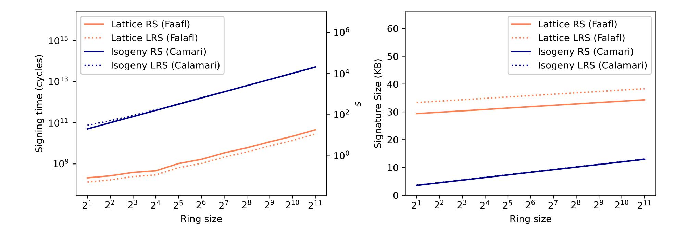
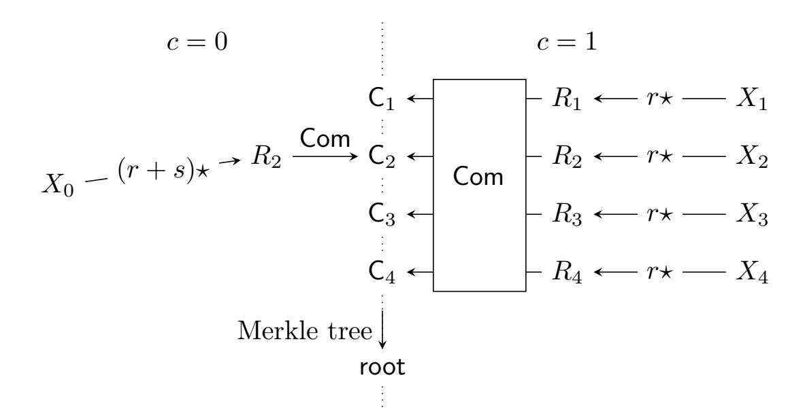
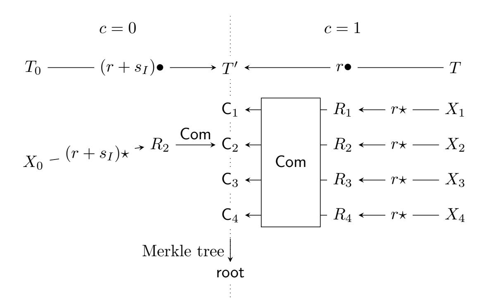

{0}------------------------------------------------

# Calamari and Falafl: Logarithmic (Linkable) Ring Signatures from Isogenies and Lattices

Ward Beullens<sup>1</sup> , Shuichi Katsumata<sup>2</sup> , Federico Pintore<sup>3</sup>

1 imec-COSIC, KU Leuven, Belgium ward.beullens@esat.kuleuven.be <sup>2</sup>National Institute of Advanced Industrial Science and Technology (AIST), Japan shuichi.katsumata@aist.go.jp <sup>3</sup>Mathematical Institute, University of Oxford, UK federico.pintore@maths.ox.ac.uk

29th May 2020

### Abstract

We construct efficient ring signatures from isogeny and lattice assumptions. Our ring signatures are based on a logarithmic OR proof for group actions. We then instantiate this group action by either the CSIDH group action or an MLWE-based group action to obtain our isogeny-based or lattice-based ring signature scheme respectively. Even though this OR proof has a binary challenge space and therefore needs to be repeated a linear number of times, the size of our ring signatures is small and scales better with the ring size N than previously known post-quantum ring signatures. We also construct linkable ring signatures that are almost as efficient as the non-linkable variant.

The signature size of our isogeny-based construction is an order of magnitude smaller than all previously known logarithmic post-quantum ring signatures, but is relatively slow (e.g. 5.5 KB signatures and 79 s signing time for rings with 8 members). In comparison, our lattice-based construction is much faster, but has larger signatures (e.g. 30 KB signatures and 90 ms signing time for the same ring size). For small ring sizes our lattice-based ring signatures are slightly larger than state-of-the-art schemes, but they are smaller for ring sizes larger than N ≈ 1024.

Keywords: Isogeny-based cryptography, Lattice-based cryptography, Linkable Ring Signature, Post-Quantum cryptography

# 1 Introduction

Ring signatures, introduced by Rivest, Shamir, and Tauman-Kalai [\[39\]](#page-34-0) allow a person to sign a message on behalf of a group of people (called a ring), without revealing which person in the ring signed the message. A ring signature is required to be unforgeable, meaning that one cannot produce a signature without having the secret key of at least one person in the ring and anonymous, meaning that it is impossible to learn which person produced the signature. The original motivation behind ring signatures is to allow a whistleblower to leak information without revealing his own identity while still adding credibility to the information by proving that it was leaked by one of the people in the ring. Linkable ring signatures are an extension where one can publicly verify whether two messages were signed by the same person or not. This has found applications in e-voting and privacy-friendly digital currencies. In the e-voting application, each person signs

This work was supported by CyberSecurity Research Flanders with reference number VR20192203 and the Research Council KU Leuven grants C14/18/067 and STG/17/019. Ward Beullens is funded by an FWO fellowship. Shuichi Katsumata was supported by JST CREST Grant Number JPMJCR19F6.

{1}------------------------------------------------

his vote on behalf of all the people eligible to vote. The linkable anonymity property protects the privacy of the voter, while still making it possible to verify that each person has only voted once. Since elections can have a very large number of participants it is therefore important to use a ring signature scheme that can efficiently support very large ring sizes.

The security of many cryptosystems, including ring signatures, relies on the hardness of factoring integers or computing discrete logarithms in finite cyclic groups. Unfortunately, these problems can be solved in quantum polynomial time [\[40\]](#page-34-1), and hence these schemes are no longer secure in the presence of adversaries with access to a sufficiently powerful quantum computer. To resolve this issue it is necessary to construct (linkable) ring signatures based on hard problems that resist attacks from quantum computers. Previous works have constructed such ring signature schemes - with the signature scheme scaling poly-logarithmically with the ring size - based on symmetric cryptographic primitives [\[27,](#page-33-0) [16\]](#page-33-1) and the hardness of lattice problems [\[20,](#page-33-2) [21,](#page-33-3) [6,](#page-32-0) [41,](#page-34-2) [32\]](#page-34-3).

## 1.1 Our contributions

In this paper, we construct concretely efficient logarithmic ring signatures and linkable ring signatures from isogeny-based and lattice-based hardness assumptions. This is to the best of our knowledge the first construction of (linkable) ring signatures from isogeny-assumptions. Our (linkable) ring signature schemes are realized by first constructing a (linkable) ring signature scheme based on a group action that satisfies certain cryptographic properties, and then instantiating this group action by either the CSIDH group action or a MLWE-based group action. To avoid multi-target attacks similar to those of Dinur and Nadler [\[17\]](#page-33-4) we made a detailed security proof with concrete expressions for the security loss in each step of the proof. This led us to include a unique salt value in each signature and to carefully separate the domain of various calls to the random oracles.

An advantage of our scheme is that the signature size scales very well with the ring size N, even compared to other logarithmic (linkable) ring signatures. In our scheme, the only dependence on N is due to the signatures containing a small number of paths (in the clear) in Merkle trees of depth log N. Therefore, the term in the signature size that depends on log N is independent of the CSIDH or Lattice parameters. Previous works relied on a hidden path in a Merkle tree and had to prove the consistency of a Merkle hash in zero-knowledge. Therefore, the multiplicative factor on log N was much larger than ours. The very mild dependence on log N can be observed in Figure [1,](#page-2-0) where we see that for our lattice-based ring signature scheme a signature for ring size N = 2048 is only 17% larger than a signature for ring size N = 2.

For efficiency and convenience we chose to implement our (linkable) ring signature scheme with parameter sets from pre-existing signature schemes: For our isogeny instantiation we consider the CSIDH-512 parameter set, used by CSI-FiSh, and for our lattice instantiation we use the Dilithium II parameter set. This allows us to reuse large portions of code from CSIDH, CSI-FiSh, and Dilithium implementations. The signature size and signing speed of our implementations are shown in Figure [1.](#page-2-0) We see that the signature size can be estimated as log N + 3.5 KB for the isogeny-based instantiation and 0.5 log N + 29 KB for the lattice-based instantiation. For ring size N = 8 our lattice-based instantiation is with a signing time of 90 ms, faster than our isogeny-based instantiation (79 s) by almost 3 orders of magnitude. Table [1](#page-2-1) lists the signature size of our ring signatures and those of some other post-quantum ring signatures. Not surprisingly, the signature size of our isogeny-based ring signature is very small compared to the other proposals; the signature size is an order of magnitude smaller than existing logarithmic post-quantum ring signature schemes. It is hard to make a meaningful comparison between our schemes and schemes which claim different security levels. We compute the signature size for a parameter set that achieves NIST security level II[1](#page-1-0) to allow for a fair comparison with the work of Esgin et al. [\[21\]](#page-33-3). We see that for small ring sizes our lattice-based signatures

<span id="page-1-0"></span><sup>1</sup>We used the Dilithium III parameters, 168-bit seeds and commitment randomness and a challenge space of size 2168, which suffices to achieve NIST level II for low MAXDEPTH.

{2}------------------------------------------------



<span id="page-2-0"></span>Figure 1: Signing time (left) and signature size (right) of our isogeny-based and lattice-based (linkable) ring signatures. The left and right scales in the figure of signing time correspond to the isogeny-based and lattice-based schemes, respectively. Signing time is measured on an Intel i5-8400H CPU core.

|               |            |           | N     |          |          | hardness   | Security |
|---------------|------------|-----------|-------|----------|----------|------------|----------|
|               | $2^1$      | $2^3$     | $2^6$ | $2^{12}$ | $2^{21}$ | assumption | Level    |
| Calamari      | 3.5        | 5.4       | 8.2   | 14       | 23       | CSIDH-512  | *        |
| Falafl        | 29         | 30        | 32    | 35       | 39       | MSIS, MLWE | NIST 1   |
| Falafl for 2  | 49         | 50        | 52    | 55       | 59       | MSIS, MLWE | NIST 2   |
| RAPTOR[33]    | $\sim 2.5$ | $\sim 10$ | 81    | 5161     | /        | NTRU       | 100 bits |
| EZSLL[20, 21] | 18         | 19        | 31    | 59       | 148      | MSIS, MLWE | NIST 2   |
| KKW[27]       | /          | /         | 250   | 456      | /        | LowMC      | NIST 5   |

<span id="page-2-1"></span>Table 1: Comparison of the signature size (KB) of some concretely efficient post-quantum ring signature schemes.

are larger than those of Esgin et al., but for ring sizes larger than  $N \approx 1024$  our signatures are the smallest. Since our isogeny scheme is compact and our lattice scheme is fast we call our schemes, respectively, the "Compact And Linkable Anonymous Message Authentication fRom Isogenies"-scheme (Calamari) and the "Fast Authentication with Linkable Anonymity From Lattices"-scheme (Falafl).

## 1.2 Technical overview

Our (linkable) ring signatures are based on the classical sigma protocol for the Graph Isomorphism Problem which is straightforwardly generalized for any group actions: Let  $\star : G \times \mathcal{X} \to \mathcal{X}$  be a group action and fix  $X_0 \in \mathcal{X}$ . To prove knowledge of a group element g such that  $g \star X_0 = X$ , the prover samples  $r \in G$  uniformly at random and sends  $R = r \star X$  as commitment. The verifier responds with a random challenge bit c. If the challenge bit is 0 the prover sends  $\operatorname{resp} = r + g$  and if the challenge bit is c = 1 he sends  $\operatorname{resp} = r$ . If c = 0 the verifier checks if  $\operatorname{resp} \star X_0 = R$  and otherwise he checks  $\operatorname{resp} \star X = R$ .

A key observation is that the verification algorithm is independent of X when the challenge bit is 0. This allows us to come up with the following OR proof for group actions: For some  $X_0, X_1, \dots, X_N \in \mathcal{X}$ , the prover wants to prove knowledge of g such that  $g \star X_0 = X_I$  for some  $I \in \{1, \dots, N\}$ . The prover starts by simulating a commitment for each  $X_i$  with  $i \in \{1, \dots, N\}$ , so that he can respond to the challenge c = 1

<sup>\* 128</sup> bits of classical security and 60 bits of quantum security [37].

{3}------------------------------------------------

and sends these commitments in a random order to the verifier. If the verifier sends c=1 we let the prover respond for all the commitments (and hence he does not leak I). If the verifier sends the challenge bit c=0 the prover can answer the I-th challenge, but not the other challenges, because he does not know group elements g such that  $g \star X_0 = X_i$  for  $i \neq I$ . Therefore, we let the prover respond only to  $R_I$ . This does not reveal I, because verification is independent of  $X_I$ .

More concretely, the prover sends N elements  $R_1 = r_1 \star X_1, \cdots, R_N = r_N \star X_N$  in a random order to the verifier, where the  $r_i$  are uniformly random group elements. Then, after the verifier sends a challenge bit c, the prover responds with  $\operatorname{resp} = r_I + g$  if the challenge bit c is 0, or responds with  $r_1, \cdots, r_N$  in case the challenge bit c is 1. The verifier checks whether  $\operatorname{resp} \star X_0 \in \{R_1, \cdots, R_N\}$  in case c = 0 and he checks whether  $\{r_1 \star X_1, \cdots, r_N \star X_N\} = \{R_1, \cdots, R_N\}$  in case c = 1. Here, note that the commitments are sent in a random order, so the response hides the index I in case c = 0.

Since the prover sends N elements  $R_1, \dots, R_N$  as commitment and N group elements  $r_1, \dots, r_N$  as response in case c=1 it looks like the proof size is linear in N, and that there is no improvement over the generic OR proof. However, since the  $r_i$  are chosen at random, they can be generated from a PRG instead, which reduces the communication cost to just sending a seed as the response in case c=1. Moreover, instead of sending all the  $R_i$  we can commit to them using a Merkle tree and only send the root as the commitment. To make verification possible, the prover then sends a path in the Merkle tree to the verifier as part of the response in case c=0. This makes the total proof size logarithmic in N, a clear improvement over generic OR proofs. For some group actions it is more efficient to compute N group actions  $r \star X_i$  with the same group element r, compared to computing N general group actions  $r_i \star X_i$  with distinct  $r_i$ . Therefore, in our protocol we set  $r_1 = \cdots = r_N = r$ . Since this would break the ZK property of the Sigma protocol, we fix this by replacing each  $R_i$  by a hiding commitment  $\mathsf{Com}(R_i,\mathsf{bits}_i)$ , and we let the prover include  $\mathsf{bits}_I$  in the response in case c=0.

To obtain ring signature schemes we apply the Fiat-Shamir transform to the OR proof and we instantiate the group action  $\star$  by either the CSIDH group action or the MLWE group action:

$$\star: R_q^{n+m} \times R_q^m: (\mathbf{s}, \mathbf{e}) \star \mathbf{t} \mapsto \mathbf{A} \star \mathbf{s} + \mathbf{e} + \mathbf{t}$$

where  $R_q = \mathbb{Z}_q[X]/(X^d + 1)$ . To get one-wayness we need to restric the domain to  $S_\eta^{n+m} \times R_q^m$ , where  $S_\eta$  is the set of elements of  $R_q$  with coefficients bounded in absolute value by  $\eta$ . Therefore we need to use the Fiat-Shamir with aborts technique to ensure that the signatures do not leak the secret key [34].

We expand our OR-proof to an OR-proof-with-tag, where given two group actions  $\star: G \times \mathcal{X} \to \mathcal{X}$  and  $\bullet: G \times \mathcal{T} \to \mathcal{T}$ , a list of elements  $X_0, X_1, \dots, X_N \in \mathcal{X}$  and  $T_0, T \in \mathcal{T}$  the prover proves knowledge of g such that  $g \star X_0 = X_I$  for some  $I \in \{1, \dots, N\}$  and  $g \bullet T_0 = T$ . This naturally leads to a linkable signature scheme. The signer includes the tag  $T = g \bullet T_0$  in the signature and then proves knowledge of g. Linking two signatures can be done by checking if the tags are equal (or close with respect to a well defined metric). We require a number of properties from  $\star$  and  $\bullet$  to make the linkable ring signature secure (see Theorem 4.2). For example, it should not be possible to learn  $g \star X_0$  given  $g \bullet T_0$ , because that would break the anonymity of the LRS. We give instantiations of  $\star$  and  $\bullet$  based on the CSIDH group action (where we put  $g \bullet X := (2g) \star X$ ) or based on the hardness of MLWE and MSIS.

Finally, we like to point out several optimization tricks that allow us to further lower the size of the signature. Since our base protocol has a binary challenge, we must apply parallel repetition to lower the soundness error to make it useable for (linkable) ring signatures. A naive way to accomplish this would be to run the OR-proof  $\lambda$ -times, where  $\lambda$  is the security parameter. However, by noticing that opening to c=1 (which requires communicating only a single seed value) is much cheaper than opening to c=0, we can do much better. Specifically, we choose integers M, K such that  $\binom{M}{K} \geq 2^{\lambda}$  and do  $M > \lambda$  executions of the protocol of which exactly K executions are chosen to have challenge bit 0. Setting  $K \ll \lambda$ , we get a noticeable gain in

{4}------------------------------------------------

the signature size. Moreover, since we now only need to open to seed values in most of the parallel runs, we use a *seed tree* to assist further lowering of the signature size. Informally, the seed tree generates a number of pseudorandom values and can later disclose an arbitrary subset of them, without revealing information on the remaining values. Further details on our optimization tricks are found in Section 3.4.

**Roadmap.** In Section 2 we provide some necessary preliminaries. In Section 3 we first define an *admissible group action*, then we construct a base OR-proof for group actions with binary challenge space, which we then extend to a main OR-proof with exponential challenge space. Finally we apply the Fiat-Shamir transform to this main OR-proof for an admissible group action to obtain a ring signature scheme. Section 4 follows a same structure, where we define an *admissible pair of group actions*, for which we define a full OR-proof-with-tag, which we convert into a linkable ring signature. In Section 5 we instantiate the group actions from isogeny and lattice-based assumptions. Finally, in Section 6 we discuss our parameter choices and implementation results.

## <span id="page-4-0"></span>2 Preliminaries

A note on random oracles. Throughout the paper, we instantiate several standard cryptographic primitives such as pseudorandom number generators (Expand) and commitment schemes by hash functions modeled as a random oracle  $\mathcal{O}$ . We always assume the input domain of the random oracle is appropriately separated when instantiating several cryptographic primitives by one random oracle. With abuse of notation, we may occasionally write for example  $\mathcal{O}(\mathsf{Expand}\|\cdot)$  instead of  $\mathsf{Expand}(\cdot)$  to make the usage of the random oracle explicit. Here, we identify  $\mathsf{Expand}$  with a unique string when inputting it to  $\mathcal{O}$ . Finally, we denote by  $\mathcal{A}^{\mathcal{O}}$  an algorithm  $\mathcal{A}$  that has black-box access to  $\mathcal{O}$ , and we may occasionally omit the superscript  $\mathcal{O}$  for simplicity when the meaning is clear.

## 2.1 (Relaxed) sigma protocols

A sigma protocol  $\Pi_{\Sigma}$  for a relation  $R \subseteq \{0,1\}^* \times \{0,1\}^*$  is a special type of public-coin three-move interactive protocol between a prover and a verifier. Below, we define a relaxed version of sigma protocol where the extractor of special-soundness only extracts a witness for a slightly wider relation  $\tilde{R}$  (i.e.,  $R \subseteq \tilde{R}$ ). As long as  $\tilde{R}$  is still a sufficiently hard relation, then this relaxed definition is still useful, e.g., [23, 14, 2, 7, 26]. We also define the sigma protocol in the random oracle model, where the prover and verifier have access to a random oracle.

<span id="page-4-1"></span>**Definition 2.1** ((Relaxed) sigma protocol). A sigma protocol  $\Pi_{\Sigma}$  for relations  $(R, \tilde{R})$  such that  $R \subseteq \tilde{R}$  consists of four oracle-calling PPT algorithms  $(P = (P_1, P_2), V = (V_1, V_2))$ , where  $V_2$  is deterministic and we assume  $P_1$  and  $P_2$  share states. Let ChSet denote the challenge space. Then,  $\Pi_{\Sigma}$  in the random oracle model has the following three-move flow:

- The prover on input  $(X, W) \in R$ , runs com  $\leftarrow P_1^{\mathcal{O}}(X, W)$  and sends a commitment com to the verifier.
- The verifier runs chall  $\leftarrow V_1^{\mathcal{O}}(\mathsf{com})$  to obtain a random challenge and sends chall to the prover.
- The prover, given chall, runs  $\operatorname{rsp} \leftarrow P_2^{\mathcal{O}}(\mathsf{X}, \mathsf{W}, \mathsf{chall})$  and returns a response  $\operatorname{rsp}$  to the verifier. Here, we allow  $P_2$  to abort with some probability. In such cases we assign  $\operatorname{rsp}$  with a special symbol  $\bot$  denoting abort.
- The verifier runs  $V_2^{\mathcal{O}}(\mathsf{X},\mathsf{com},\mathsf{chall},\mathsf{rsp})$  and outputs accept or reject.

Here,  $\mathcal{O}$  is modeled as a random oracle and we often drop  $\mathcal{O}$  from the superscript for simplicity when the meaning is clear. In addition, we assume X is always given as input to  $P_2$  and  $V_2$ , and omit them. The protocol transcript (com, chall, rsp) is said to be valid in case  $V_2$ (com, chall, rsp) outputs accept.

{5}------------------------------------------------

We require a sigma protocol  $\Pi_{\Sigma}$  in the random oracle model to satisfy the following three properties.

**Correctness with abort.** Conditioning on the prover not aborting, we require the sigma protocol to be correct. In particular, we require the following holds for all  $(X, W) \in R$ :

$$\Pr\left[\begin{array}{c} V_2^{\mathcal{O}}(\mathsf{com},\mathsf{chall},\mathsf{rsp}) = \mathsf{accept} & \mathsf{com} \leftarrow P_1^{\mathcal{O}}(\mathsf{X},\mathsf{W}), \\ \mathsf{chall} \leftarrow V_1^{\mathcal{O}}(\mathsf{com}), \\ \mathsf{rsp} \leftarrow P_2^{\mathcal{O}}(\mathsf{W},\mathsf{chall}) \text{ s.t. } \mathsf{rsp} \neq \bot. \end{array}\right] = 1,$$

where the probability is taken over the randomness used by (P, V) and by the random oracle. Namely, conditioned on the prover not aborting, the verifier always accepts. We note that the aborting probability  $\delta$  can be non-negligible.

**High min-entropy.** We require the commitment com output by  $P_1^{\mathcal{O}}$  to have high min-entropy for any statement-witness pairs. In particular, we say the sigma protocol has  $\alpha$  min-entropy if for any  $(X, W) \in R$ , we have

$$\Pr\left[\mathsf{com} = \mathsf{com'}\middle|\mathsf{com} \leftarrow P_1^{\mathcal{O}}(\mathsf{X},\mathsf{W}),\mathsf{com'} \leftarrow \mathcal{A}^{\mathcal{O}}(\mathsf{X},\mathsf{W})\right] \leq 2^{-\alpha}.$$

We say  $\Pi_{\Sigma}$  has high min-entropy if  $2^{-\alpha}$  is negligible.

(Non-abort) special zero-knowledge. In our definition of special zero-knowledge we allow the adversary, the prover and the simulator to make queries to a common random oracle  $\mathcal{O}$ . We say  $\Pi_{\Sigma}$  is non-abort special zero-knowledge, if there exists a PPT simulator  $\mathsf{Sim}^{\mathcal{O}}$  with access to a random oracle  $\mathcal{O}$  such that for any  $(\mathsf{X},\mathsf{W}) \in R$ ,  $\mathsf{chall} \in \mathsf{ChSet}$  and any computationally unbounded adversary  $\mathcal{A}$  that makes at most a polynomial number of queries to  $\mathcal{O}$ , we have

$$\left|\Pr[\mathcal{A}^{\mathcal{O}}(\widetilde{P}^{\mathcal{O}}(\mathsf{X},\mathsf{W},\mathsf{chall})) \to 1] - \Pr[\mathcal{A}^{\mathcal{O}}(\mathsf{Sim}^{\mathcal{O}}(\mathsf{X},\mathsf{chall})) \to 1]\right| = \mathsf{negl}(\lambda),$$

where  $\widetilde{P}$  is a non-aborting prover  $P = (P_1, P_2)$  run on (X, W) with challenge fixed as chall.

In words, Sim simulates to  $\mathcal{A}$  the view of an honest non-aborting executions of the sigma protocol without using the witness. The reason why we consider zero-knowledge in the presence of a random oracle and decide to not use the standard definition is to make the security proof concrete. Namely, since we prove zero-knowledge by combining several lemmas together, which themselves are proved in the random oracle model, it is convenient to also consider zero-knowledge in the random oracle model. Finally, note that although stronger definitions where Sim allows inputs such that  $X \notin L_R := \{X \mid \exists W : (X, W) \in R\}$  can be considered, the above suffices for our application as we are guaranteed that  $\mathcal{A}$  outputs  $X \in L_R$ .

(Relaxed) special soundness. We say  $\Pi_{\Sigma}$  has relaxed special soundness if there exists a PT extraction algorithm Extract such that, given a statement X and any two valid transcripts (com, chall, rsp) and (com, chall', rsp') such that chall  $\neq$  chall', outputs a witness W satisfying  $(X, W) \in \tilde{R}$ . Here, note that Extract is only required to recover a (weaker) witness in  $\tilde{R}$  rather than in R.

## 2.2 Ring signatures

In this subsection, we review the definition of ring signatures.

**Definition 2.2** (Ring signature scheme). A ring signature scheme  $\Pi_{RS}$  consists of four PPT algorithms (RS.Setup, RS.KeyGen, RS.Sign, RS.Verify) such that:

 $\mathsf{RS.Setup}(1^{\lambda}) \to \mathsf{pp}: \ On \ input \ a \ security \ parameter \ 1^{\lambda}, \ it \ returns \ public \ parameters \ \mathsf{pp} \ used \ by \ the \ scheme.$ 

 $\mathsf{RS.KeyGen}(\mathsf{pp}) \to (\mathsf{vk}, \mathsf{sk}): \ \textit{On input the public parameters } \mathsf{pp}, \ \textit{it outputs a pair of public and secret keys} \\ (\mathsf{vk}, \mathsf{sk}).$ 

 $RS.Sign(sk, M, R) \rightarrow \sigma$ : On input a secret key sk, a message M, and a list of public keys, i.e., a ring,  $R = \{vk_1, \ldots, vk_N\}$ , it outputs a signature  $\sigma$ .

{6}------------------------------------------------

RS.Verify(R, M,  $\sigma$ )  $\rightarrow$  1/0: On input a ring R = {vk<sub>1</sub>,...,vk<sub>N</sub>}, a message M, and a signature  $\sigma$ , it outputs either 1 (accept) or 0 (reject).

We require a ring signature scheme  $\Pi_{RS}$  to satisfy the following properties: correctness, full anonymity, and unforgeability. Informally, correctness means that verifying a correctly generated signature will always succeed. Anonymity means that it should not be possible to learn which secret key was used to produce a signature, even for an adversary that knows the secret keys for all the public keys in the ring. Finally unforgeability means that it should be impossible to forge a valid signature without knowing a secret key that corresponds to one of the public keys in the ring.

Correctness: For every security parameter  $\lambda \in \mathbb{N}$ ,  $N = \mathsf{poly}(\lambda)$ ,  $j \in [N]$ , and every message M the following holds:

$$\Pr\left[\begin{array}{c|c} \mathsf{RS.Verify}(\mathsf{R},\mathsf{M},\sigma) = 1 & \mathsf{pp} \leftarrow \mathsf{RS.Setup}(1^\lambda), \\ \mathsf{RS.Verify}(\mathsf{R},\mathsf{M},\sigma) = 1 & \mathsf{pp} \leftarrow \mathsf{RS.KeyGen}(\mathsf{pp}) \ \forall i \in [N], \\ \mathsf{R} := (\mathsf{vk}_1,\cdots,\mathsf{vk}_N), \\ \sigma \leftarrow \mathsf{RS.Sign}(\mathsf{sk}_j,\mathsf{M},\mathsf{R}). \end{array}\right] = 1.$$

**Anonymity:** A ring signature scheme  $\Pi_{RS}$  is anonymous (against full key exposure) if, for all  $\lambda \in \mathbb{N}$  and  $N = \mathsf{poly}(\lambda)$ , any PPT adversary  $\mathcal{A}$  has at most negligible advantage in the following game played against a challenger.

- (i) The challenger runs  $pp \leftarrow \mathsf{RS.Setup}(1^{\lambda})$  and generates key pairs  $(\mathsf{vk}_i, \mathsf{sk}_i) = \mathsf{RS.KeyGen}(\mathsf{pp}; \mathsf{rr}_i)$  for all  $i \in [N]$  using random coins  $\mathsf{rr}_i$ . It also samples a random bit  $b \leftarrow \{0, 1\}$ ;
- (ii) The challenger provides pp and  $\{rr_i\}_{i\in[N]}$  to  $\mathcal{A}$ ;
- (iii)  $\mathcal{A}$  outputs a challenge  $(\mathsf{R},\mathsf{M},i_0,i_1)$  to the challenger, where the ring  $\mathsf{R}$  must contain  $\mathsf{vk}_{i_0}$  and  $\mathsf{vk}_{i_1}$ . The challenger then runs  $\sigma^* \leftarrow \mathsf{RS}.\mathsf{Sign}(\mathsf{sk}_{i_b},\mathsf{M},\mathsf{R})$ , and provides  $\sigma^*$  to  $\mathcal{A}$ ;
- (iv)  $\mathcal{A}$  outputs a guess  $b^*$ . If  $b^* = b$ , we say the adversary  $\mathcal{A}$  wins.

The advantage of  $\mathcal{A}$  is defined as  $Adv_{RS}^{Anon}(\mathcal{A}) = |\Pr[\mathcal{A} \text{ wins}] - 1/2|$ .

**Unforgeability:** A ring signature scheme  $\Pi_{RS}$  is unforgeable (with respect to insider corruption) if, for all  $\lambda \in \mathbb{N}$  and  $N = \mathsf{poly}(\lambda)$ , any PPT adversary  $\mathcal{A}$  has at most negligible advantage in the following game played against a challenger.

- (i) The challenger runs  $pp \leftarrow \mathsf{RS.Setup}(1^{\lambda})$  and generates key pairs  $(\mathsf{vk}_i, \mathsf{sk}_i) = \mathsf{RS.KeyGen}(\mathsf{pp}; \mathsf{rr}_i)$  for all  $i \in [N]$  using random coins  $\mathsf{rr}_i$ . It sets  $\mathsf{VK} := \{\mathsf{vk}_i\}_{i \in [N]}$  and initializes two empty sets  $\mathsf{SL}$  and  $\mathsf{CL}$ .
- (ii) The challenger provides pp and VK to A;
- (iii) A can make signing and corruption queries an arbitrary polynomial number of times:
  - (sign, i, M, R): The challenger checks if  $vk_i \in R$  and if so it computes the signature  $\sigma \leftarrow RS.Sign(sk_i, M, R)$ . The challenger provides  $\sigma$  to  $\mathcal{A}$  and adds (i, M, R) to SL;
  - (corrupt, i): The challenger adds  $vk_i$  to CL and returns  $rr_i$  to A.
- (iv)  $\mathcal{A}$  outputs  $(\mathsf{R}^*,\mathsf{M}^*,\sigma^*)$ . If  $\mathsf{R}^*\subset\mathsf{VK}\backslash\mathsf{CL},\,(\cdot,\mathsf{M}^*,\mathsf{R}^*)\not\in\mathsf{SL},\,\mathrm{and}\,\,\mathsf{RS}.\mathsf{Verify}(\mathsf{R}^*,\mathsf{M}^*,\sigma^*)=1$ , then we say the adversary  $\mathcal{A}$  wins.

The advantage of  $\mathcal{A}$  is defined as  $\mathsf{Adv}^{\mathsf{Unf}}_{\mathsf{RS}}(\mathcal{A}) = \Pr[\mathcal{A} \ \mathrm{wins}].$ 

{7}------------------------------------------------

## 2.3 Linkable ring signatures

In this subsection, we review the definition of linkable ring signatures, a variant of ring signatures where anyone can efficiently check if two messages were signed with the same secret key.

<span id="page-7-0"></span>**Definition 2.3** (Linkable ring signature scheme). A linkable ring signature scheme  $\Pi_{LRS}$  consists of the four PPT algorithms of a Ring signature scheme and one additional PPT algorithm LRS.Link such that:

LRS.Link $(\sigma_0, \sigma_1) \to 1/0$ : On input two signatures  $\sigma_0$  and  $\sigma_1$ , it outputs either 1 or 0, where 1 indicates that the signatures are produced with the same secret key.

In addition to the correctness property, we require a linkable ring signature scheme  $\Pi_{LRS}$  to satisfy the following properties: linkability, linkable anonymity, and non-frameability. Informally, linkability means that if an adversary produces more than k messages with a set of k (potentially malformed) public keys, then the Link algorithm will output 1 on at least one pair of signatures. Linkable-anonymity means that an adversary cannot tell which secret key was used to produce signatures. Note that in contrast to the ring signature case, the adversary is not given all the secret keys. Otherwise he could use the linkability property to deanonymize the signer. Finally, the non-frameability property says it should be impossible for an adversary to produce a valid signature that links to a signature produced by an honest party.

**Correctness:** For every security parameter  $\lambda \in \mathbb{N}$ ,  $N = \mathsf{poly}(\lambda)$ ,  $j \in [N]$ , sets  $D_0, D_1 \subseteq [N]$  such that  $j \in D_0 \cap D_1$ , and every messages  $\mathsf{M}_0, \mathsf{M}_1$  the following holds:

$$\Pr\left[\begin{array}{c|c} \mathsf{LRS.Verify}(\mathsf{R}_b,\mathsf{M}_b,\sigma_b) = 1 \\ \forall b \in \{0,1\} \text{ and} \\ \mathsf{LRS.Link}(\sigma_0,\sigma_1) = 1 \end{array} \right| \begin{array}{c} \mathsf{pp} \leftarrow \mathsf{LRS.Setup}(1^\lambda), \\ (\mathsf{vk}_i,\mathsf{sk}_i) \leftarrow \mathsf{LRS.KeyGen}(\mathsf{pp}) \ \forall i \in [N], \\ \mathsf{R}_b := \{\mathsf{vk}_i\}_{i \in D_b}, \\ \sigma_b \leftarrow \mathsf{LRS.Sign}(\mathsf{sk}_j,\mathsf{M}_b,\mathsf{R}_b) \ \forall b \in \{0,1\}. \end{array} \right] = 1.$$

Compared to standard ring signatures, we additionally require signatures signed by the same secret key to link together. That is, there is a public procedure to check whether two signatures were generated by the same user.

**Linkability:** A linkable ring signature scheme  $\Pi_{LRS}$  is linkable if, for all  $\lambda \in \mathbb{N}$  and  $N = poly(\lambda)$ , any PPT adversary  $\mathcal{A}$  has at most negligible advantage in the following game played against a challenger.

- (i) The challenger runs  $pp \leftarrow LRS.Setup(1^{\lambda})$  and provides pp to  $\mathcal{A}$ ;
- (ii)  $\mathcal{A}$  outputs  $VK := \{ vk_i \}_{i \in [N]}$  and a set of tuples  $(\sigma_i, M_i, R_i)_{i \in [N+1]};$
- (iii) We say the adversary A wins if the following conditions hold:
  - For all  $i \in [N+1]$ , we have  $R_i \subseteq VK$ ;
  - For all  $i \in [N+1]$ , we have LRS. Verify $(R_i, M_i, \sigma_i) = 1$ ;
  - For all  $i, j \in [N+1]$  such that  $i \neq j$ , we have LRS.Link $(\sigma_i, \sigma_j) = 0$ .

The advantage of  $\mathcal{A}$  is defined as  $Adv_{LRS}^{Link}(\mathcal{A}) = Pr[\mathcal{A} \text{ wins}].$ 

Below, we follow the refined linkability anonymity definition of [3]. Informally, even if an adversary obtains multiple signatures from the same signer, it should still be infeasible to tell which exact user from a ring produced the signature.

**Linkable anonymity:** A linkable ring signature scheme  $\Pi_{LRS}$  is *linkable anonymous* if, for all  $\lambda \in \mathbb{N}$  and  $N = \mathsf{poly}(\lambda)$ , any PPT adversary  $\mathcal{A}$  has at most negligible advantage in the following game played against a challenger.

{8}------------------------------------------------

- (i) The challenger runs  $pp \leftarrow \mathsf{LRS.Setup}(1^\lambda)$  and generates key pairs  $(\mathsf{vk}_i, \mathsf{sk}_i) = \mathsf{LRS.KeyGen}(\mathsf{pp}; \mathsf{rr}_i)$  for all  $i \in [N]$  using random coins  $\mathsf{rr}_i$ . It also samples a random bit  $b \leftarrow \{0, 1\}$ ;
- (ii) The challenger provides pp and  $VK := \{vk_i\}_{i \in [N]}$  to A;
- (iii)  $\mathcal{A}$  outputs two challenge verification keys  $\mathsf{vk}_0^*, \mathsf{vk}_1^* \in \mathsf{VK}$  to the challenger. The secret keys corresponding to  $\mathsf{vk}_0^*, \mathsf{vk}_1^*$  are denoted by  $\mathsf{sk}_0^*, \mathsf{sk}_1^*$ , respectively;
- (iv) The challenger provides all  $rr_i$  of the corresponding  $vk_i \in VK \setminus \{vk_0^*, vk_1^*\}$ ;
- (v)  $\mathcal{A}$  queries for signatures on input a verification key  $vk \in \{vk_0^*, vk_1^*\}$ , a message M, and a ring R such that  $\{vk_0^*, vk_1^*\} \subseteq R$ :
  - If  $\mathsf{vk} = \mathsf{vk}_0^*$ , then the challenger returns  $\sigma \leftarrow \mathsf{LRS}.\mathsf{Sign}(\mathsf{sk}_b^*,\mathsf{M},\mathsf{R});$
  - If  $\mathsf{vk} = \mathsf{vk}_1^*$ , then the challenger returns  $\sigma \leftarrow \mathsf{LRS}.\mathsf{Sign}(\mathsf{sk}_{1-b}^*,\mathsf{M},\mathsf{R});$
- (vi)  $\mathcal{A}$  outputs a guess  $b^*$ . If  $b^* = b$ , we say the adversary  $\mathcal{A}$  wins.

The advantage of  $\mathcal{A}$  is defined as  $Adv_{LRS}^{Anon}(\mathcal{A}) = |\Pr[\mathcal{A} \text{ wins}] - 1/2|$ .

**Non-frameability:** A linkable ring signature scheme  $\Pi_{LRS}$  is non-frameable if, for all  $\lambda \in \mathbb{N}$  and  $N = \mathsf{poly}(\lambda)$ , any PPT adversary  $\mathcal{A}$  has at most negligible advantage in the following game played against a challenger.

- (i) The challenger runs  $pp \leftarrow \mathsf{LRS.Setup}(1^\lambda)$  and generates key pairs  $(\mathsf{vk}_i, \mathsf{sk}_i) = \mathsf{LRS.KeyGen}(pp; \mathsf{rr}_i)$  for all  $i \in [N]$  using random coins  $\mathsf{rr}_i$ . It sets  $\mathsf{VK} := \{\mathsf{vk}_i\}_{i \in [N]}$  and initializes two empty sets  $\mathsf{SL}$  and  $\mathsf{CL}$ .
- (ii) The challenger provides pp and VK to A;
- (iii) A can make signing and corruption queries an arbitrary polynomial number of times:
  - (sign, i, M, R): The challenger checks if  $vk_i \in R$  and if so it computes the signature  $\sigma \leftarrow LRS.Sign(sk_i, M, R)$ . The challenger provides  $\sigma$  to  $\mathcal{A}$  and adds (i, M, R) to SL;
  - (corrupt, i): The challenger adds  $vk_i$  to CL and returns  $rr_i$  to A.
- (iv)  $\mathcal{A}$  outputs  $(\mathsf{R}^*,\mathsf{M}^*,\sigma^*)$ . We say the adversary  $\mathcal{A}$  wins if the following conditions are satisfied:
  - LRS. Verify( $R^*, M^*, \sigma^*$ ) = 1 and  $(\cdot, M^*, R^*) \notin SL$ ;
  - LRS.Link $(\sigma^*, \sigma) = 1$  for some  $\sigma$  returned by the challenger on a signing query  $(i, M, R) \in SL$  where  $vk_i \in VK \setminus CL$ .

The advantage of  $\mathcal{A}$  is defined as  $\mathsf{Adv}_{\mathsf{LRS}}^{\mathsf{Frame}}(\mathcal{A}) = \Pr[\mathcal{A} \text{ wins}].$ 

**Remark 2.4** (Unforgeability). We can also require a linkable ring signature to be unforgeable as defined above for a ring signature. However, it can be shown that unforgeability is implied by linkability and non-frameability.

### <span id="page-8-0"></span>2.4 Isogenies and ideal class group actions

Let  $\mathbb{F}_p$  be a prime field, with  $p \geq 5$ . In the following E and E' denote elliptic curves defined over  $\mathbb{F}_p$ . An isogeny  $\varphi: E \to E'$  is a non-constant morphism mapping  $0_E$  to  $0_{E'}$ . Each coordinate of  $\varphi(x,y)$  is then the fraction of two polynomials in  $\overline{\mathbb{F}}_p[x,y]$ , where  $\overline{\mathbb{F}}_p$  denotes the algebraic closure of  $\mathbb{F}_p$ . If their coefficients lie in  $\mathbb{F}_p$ , then  $\varphi$  is said to be defined over  $\mathbb{F}_p$ . We restrict our attention to separable isogenies (which induce separable extensions of function fields) between supersingular elliptic curves, i.e. curves E defined over  $\mathbb{F}_p$  whose set of rational points  $E(\mathbb{F}_p)$  has cardinality p+1.

An isogeny  $\varphi: E \to E'$  is an isomorphism if its kernel is equal to  $\{0_E\}$ , and an endomorphism of E if E = E'. The set  $\operatorname{End}_p(E)$  of all endomorphisms of E that are defined over  $\mathbb{F}_p$  together with the zero

{9}------------------------------------------------

map form a commutative ring under pointwise addition and composition. End<sub>p</sub>(E) is isomorphic to an order  $\mathcal{O}$  of the quadratic field  $\mathbb{K} = \mathbb{Q}(\sqrt{-p})$  [12]. We recall that an order is a subring of  $\mathbb{K}$ , which is also a finitely-generated  $\mathbb{Z}$ -module containing a basis of  $\mathbb{K}$  as  $\mathbb{Q}$ -vector space. A fractional ideal  $\mathfrak{a}$  of  $\mathcal{O}$  is a finitely generated  $\mathcal{O}$ -submodule of  $\mathbb{K}$ . We say that  $\mathfrak{a}$  is invertible if there exists another fractional ideal  $\mathfrak{b}$  such that  $\mathfrak{ab} = \mathcal{O}$ , and that it is principal if  $\mathfrak{a} = \alpha \mathcal{O}$  for some  $\alpha \in \mathbb{K}$ . The invertible fractional ideals of  $\mathcal{O}$  form an abelian group whose quotient by the subgroup of principal fractional ideals is finite. This quotient group is called the *ideal class group* of  $\mathcal{O}$ , and denoted by  $\mathcal{C}\ell(\mathcal{O})$ .

The ideal class group  $\mathcal{C}\ell(\mathcal{O})$  acts freely and transitively on the set  $\mathcal{E}\ell\ell_p(\mathcal{O},\pi)$ , which contains all supersingular elliptic curves E over  $\mathbb{F}_p$  - modulo isomorphisms defined over  $\mathbb{F}_p$  - such that there exists an isomorphism between  $\mathcal{O}$  and  $\operatorname{End}_p(E)$  mapping  $\sqrt{-p} \in \mathcal{O}$  into the Frobenius endomorphism  $(x,y) \mapsto (x^p,y^p)$ . We denote this action by \*. Recently, it has been used to design several cryptographic primitives [12, 15, 9], whose security proofs rely on (variations of) the Group Action Inverse Problem (GAIP), defined as follows:

<span id="page-9-0"></span>**Definition 2.5** (Group Action Inverse Problem (GAIP)). Let  $[E_0]$  be a an element in  $\mathcal{E}\ell\ell_p(\mathcal{O},\pi)$ , where p is an odd prime. Given [E] sampled from the uniform distribution over  $\mathcal{E}\ell\ell_p(\mathcal{O},\pi)$ , the GAIP<sub>p</sub> problem consists in finding an element  $[\mathfrak{a}] \in \mathcal{C}\ell(\mathcal{O})$  such that  $[\mathfrak{a}] * [E_0] = [E]$ .

The best known classical algorithm to solve the GAIP problem has time complexity  $O(\sqrt{N})$ , where  $N = |\mathcal{C}\ell(\mathcal{O})|$ . The best known quantum algorithm, on the other hand, is Kuperberg's algorithm for the hidden shift problem [30, 29]. It has a subexponential complexity, for which the concrete security estimates are still an active area of research [8, 37, 10].

For the security of the isogeny-based instantiations of the (linkable) ring signature schemes presented in Section 4, we will rely on a newly-introduced hard problem, called the Squaring Decisional CSIDH Problem (sdCSIDH in short) defined as follows:

**Definition 2.6** (Squaring Decisional CSIDH (sdCSIDH) Problem). Let  $[E_0]$  be an element in  $\mathcal{E}\ell\ell_p(\mathcal{O},\pi)$ , where p is an odd prime. Given  $[\mathfrak{a}]$  sampled from the uniform distribution over  $\mathcal{C}\ell(\mathcal{O})$ , the sdCSIDH $_p$  problem consists in distinguishing the two distributions ( $[\mathfrak{a}] * [E_0], [\mathfrak{a}]^2 * [E_0]$ ) and ([E], [E']), where [E], [E'] are both sampled from the uniform distribution over  $\mathcal{E}\ell\ell_p(\mathcal{O},\pi)$ .

In analogy with the classical group-based scenario [5], we assume that the above problem is equivalent to the decisional CSIDH problem, which has been recently used in [19, 13].

### 2.5 Lattices

Let R and  $R_q$  denote the rings  $\mathbb{Z}[X]/(X^n+1)$  and  $\mathbb{Z}[X]/(q,X^n+1)$  for integers n and q, respectively. Norms over R are defined through the coefficient vectors of the polynomials, which lie over  $\mathbb{Z}^n$ . Norms over  $R_q$  are defined in the conventional way by uniquely representing coefficients of elements over  $R_q$  by elements in the range (-q/2, q/2] when q is even and [-(q-1)/2, (q-1)/2] when q is odd (see for example [18] for more detail).

The hard problems that we rely on are the *module short integer solution* (MSIS) problem and *module learning with errors* (MLWE) problem, first introduced in [31].

**Definition 2.7** (Module short integer solution). Let  $n, q, k, \ell, \gamma$  be integers. The advantage for the (Hermite normal form) module short integer solution problem  $\mathsf{MSIS}_{n,q,k,\ell,\gamma}$  for an algorithm  $\mathcal{A}$  is defined as

$$\mathsf{Adv}^{\mathsf{MSIS}}_{n,q,k,\ell,\gamma}(\mathcal{A}) = \Pr\left[0 < \|\mathbf{u}\|_{\infty} \leq \gamma \wedge [\mathbf{A} \mid \mathbf{I}] \cdot \mathbf{u} = \mathbf{0} \mid \mathbf{A} \leftarrow R_q^{k \times \ell}; \mathbf{u} \leftarrow \mathcal{A}(\mathbf{A})\right].$$

**Definition 2.8** (Module learning with errors). Let  $n, q, k, \ell$  be integers and D a probability distribution over  $R_q$ . The advantage for the decision module learning with errors problem  $\mathsf{dMLWE}_{n,q,k,\ell,D}$  for an algorithm  $\mathcal{A}$  is defined as

$$\mathsf{Adv}^{\mathsf{dMLWE}}_{n,q,k,\ell,D}(\mathcal{A}) = \left| \Pr[\mathcal{A}(\mathbf{A}, \mathbf{As} + \mathbf{e}) \to 1] - \Pr[\mathcal{A}(\mathbf{A}, \mathbf{v}) \to 1] \right|,$$

{10}------------------------------------------------

where  $\mathbf{A} \leftarrow R_q^{k \times \ell}$ ,  $\mathbf{s} \leftarrow D^{\ell}$ ,  $\mathbf{e} \leftarrow D^k$  and  $\mathbf{v} \leftarrow R_q^k$ .

The advantage for the search learning with errors problem  $\mathsf{sMLWE}_{n,q,k,\ell,D}$  is defined analogously to above as the probability that  $\mathcal{A}(\mathbf{A},\mathbf{v}:=\mathbf{A}\mathbf{s}+\mathbf{e})$  outputs  $(\tilde{\mathbf{s}},\tilde{\mathbf{e}})$  such that  $\mathbf{A}\tilde{\mathbf{s}}+\tilde{\mathbf{e}}=\mathbf{v}$  and  $(\tilde{\mathbf{s}},\tilde{\mathbf{e}})\in\mathsf{Supp}(D^\ell)\times\mathsf{Supp}(D^k)$ .

When it is clear from context, we omit the subscript n and q from above for simplicity. The MLWE assumptions are believed to hold even when D is the uniform distribution over ring elements with infinity norm at most B, say  $B \approx 5$ , for appropriate choices of  $n, q, k, \ell$  [1]. We write MLWE<sub> $k,\ell,B$ </sub> when we consider such distribution D. For example, the round-2 NIST candidate signature scheme Dilithium [18] uses such parameters. Looking ahead, we will choose our parameters for MSIS and MLWE in accordance with [18].

## 2.6 Index-hiding Merkle trees

Merkle trees [35] allow one to hash a list of elements  $A = (a_0, \dots, a_N)$  into one hash value (often called the root). At a later point, one can efficiently prove to a third party that an element  $a_i$  was included at a certain position in the list A. In the following, we consider a slight modification of the standard Merkle tree construction, such that one can prove that a single element  $a_i$  was included in the tree without revealing its position in the list.

Formally, the Merkle tree technique consists of three algorithms (MerkleTree, getMerklePath, ReconstructRoot) with access to a common hash function  $\mathcal{H}_{\mathsf{Coll}}: \{0,1\}^{\star} \to \{0,1\}^{2\lambda}$ .

- MerkleTree(A)  $\rightarrow$  (root, tree): On input a list of  $2^k$  elements  $A = (a_1, \dots, a_{2^k})$ , with  $k \in \mathbb{N}$ , it constructs a binary tree of height k with  $\{l_i = \mathcal{H}_{\mathsf{Coll}}(a_i)\}_{i \in [2^k]}$  as its leaf nodes, and where every internal node h with children  $h_{\mathsf{left}}$  and  $h_{\mathsf{right}}$  equals the hash digest of a concatenation of its two children. While it is standard to consider the concatenation  $h_{\mathsf{left}}||h_{\mathsf{right}}|$ , we consider a variation which consists in ordering the two children according to the lexicographical order (or any other total order on binary strings). We denote by  $(h_{\mathsf{left}}, h_{\mathsf{right}})_{\mathsf{lex}}$  this modified concatenation. The algorithm then outputs the root root of the Merkle tree, as well as a description of the entire tree tree.
- getMerklePath(tree, I)  $\rightarrow$  path: On input the description of a Merkle tree tree and an index  $i \in [2^k]$ , it outputs the list path, which contains the sibling of  $l_i$  (i.e. a node, different from  $l_i$ , that has the same parent as  $l_i$ ), as well as the sibling of any ancestor of  $l_i$ , ordered by decreasing height.
- ReconstructRoot $(a, path) \to root$ : On input an element a in the list of elements  $A = (a_1, \dots, a_{2^k})$  and  $path = (n_1, \dots, n_k)$ , it outputs a reconstructed root  $root' = h_k$ , which is calculated by putting  $h_0 = \mathcal{H}_{Coll}(a)$  and defining  $h_i$  for  $i \in [k]$  recursively as  $h_i = \mathcal{H}_{Coll}((h_{i-1}, n_i)_{lex})$ .

If the hash function  $\mathcal{H}_{\mathsf{Coll}}$  that is used in the Merkle tree is collision-resistant, then the following easy lemma implies that the Merkle tree construction is *binding*, i.e. that one cannot construct a path that "proves" that a value  $b \notin A = (a_1, \ldots, a_N)$  is part of the list A that was used to construct the Merkle tree without breaking the collision-resistance of the underlying hash function  $\mathcal{H}_{\mathsf{Coll}}$ .

<span id="page-10-0"></span>**Lemma 2.9** (Binding for Merkel tree). There is an efficient extractor algorithm that, given the description tree of a Merkle tree (having root root and constructed using the list of elements A) and (b, path) such that  $b \notin A$  and ReconstructRoot(b, path) = root, outputs a collision for the hash function  $\mathcal{H}_{Coll}$ .

The use of the lexicographical order to concatenate two children nodes in the Merkle tree construction implies that the output path of the getMerklePath algorithm information-theoretically hides the index  $i \in [N]$  given as input. Formally, we have the following.

<span id="page-10-1"></span>**Lemma 2.10** (Index Hiding for Merkel tree). Let  $N \in \mathbb{N}$  be a power of 2, D, D' be two arbitrary distributions over  $\{0,1\}^*$  and  $D_I$ , with  $I \in [N]$ , be the distribution defined as

$$D_I = \left[ \begin{array}{c} a_I \leftarrow D, \\ a_i \leftarrow D' \ \, \forall \ 1 \leq i \neq I \leq N, \\ (\mathsf{tree}, \mathsf{root}) \leftarrow \mathsf{MerkleTree}(A), \\ \mathsf{path} \leftarrow \mathsf{getMerklePath}(\mathsf{tree}, I) \end{array} \right]$$

{11}------------------------------------------------

where  $A = (a_1, \ldots, a_N)$ . Then we have  $D_I = D_J$  for all  $I, J \in [N]$ .

Proof. The distribution of  $a_I$  is independent of I, as it depends only on D. Analogously, each component  $n_i$  of path is either the hash of an element sampled from D' (when i=1) or the root of a subtree obtained from  $2^i$  independent samples from D' (when  $1 < i \le k$ ). Consequently, also the distribution of path is independent of I. Finally, since root can be computed running ReconstructRoot on inputs  $a_I$  and path, also its distribution is independent of I.

### <span id="page-11-1"></span>2.7 Seed tree

We formalize a primitive called a seed tree. The purpose of a seed tree is to first generate a number of pseudorandom values and later disclose an arbitrary subset of them, without revealing information on the remaining values. The seed tree is a complete binary tree<sup>2</sup> of  $\lambda$ -bit seed values such that the left (resp. right) child of a seed seed<sub>h</sub> is the left (resp. right) half of Expand(seed||h), where Expand is a pseudorandom generator (PRG). The unique identifier h of the parent seed is appended to separate the input domains of the different calls to the PRG. A sender can efficiently reveal the seed values associated with a subset of the set of leaves by revealing the appropriate set of internal seeds in the tree. We provide the full detail of the seed tree below. Let Expand:  $\{0,1\}^{\lambda+\lceil \log_2(M-1)\rceil} \to \{0,1\}^{2\lambda}$  be a PRG for any  $\lambda, M \in \mathbb{N}$ , instantiated by a random oracle  $\mathcal{O}$ . Then, a seed tree consists of the following four oracle-calling algorithms.

- SeedTree<sup> $\mathcal{O}$ </sup>(seed<sub>root</sub>, M)  $\to$  {leaf<sub>i</sub>}<sub>i∈[M]</sub>: On input a root seed seed<sub>root</sub>  $\in$  {0, 1}<sup> $\lambda$ </sup> and an integer  $M \in \mathbb{N}$ , it constructs a complete binary tree with M leaves by recursively expanding each seed to obtain its children seeds. Calls are of the form  $\mathcal{O}(\mathsf{Expand} || \mathsf{seed}_h || h)$ , where  $h \in [M-1]$  is a unique identifier for the position of seed in the binary tree.
- ReleaseSeeds<sup>O</sup>(seed<sub>root</sub>,  $\mathbf{c}$ )  $\rightarrow$  seeds<sub>internal</sub>: On input a root seed seed<sub>root</sub>  $\in \{0,1\}^{\lambda}$ , and a challenge  $\mathbf{c} \in \{0,1\}^{M}$ , it outputs the list of seeds seeds<sub>internal</sub> that covers all the leaves with index i such that  $c_i = 1$ . Here, we say that a set of nodes D covers a set of leaves S if the union of the leaves of the subtrees rooted at each node  $v \in D$  is exactly the set S.
- RecoverLeaves<sup>O</sup>(seeds<sub>internal</sub>,  $\mathbf{c}$ )  $\rightarrow$  {leaf<sub>i</sub>}<sub>i s.t. c<sub>i</sub>=1</sub>: On input a set seeds<sub>internal</sub> and a challenge  $\mathbf{c}$   $\in$  {0, 1}<sup>M</sup>, it computes and outputs all the leaves of subtrees rooted at seeds in seeds<sub>internal</sub>. By construction, this is exactly the set {leaf<sub>i</sub>}<sub>i s.t. c<sub>i</sub>=1</sub>.
- SimulateSeeds $^{\mathcal{O}}(\mathbf{c}) \to \mathsf{seeds}_{\mathsf{internal}}$ : On input a challenge  $\mathbf{c} \in \{0,1\}^M$ , it computes the set of nodes covering the leaves with index i such that  $c_i = 1$ . It then randomly samples a seed from  $\{0,1\}^{\lambda}$  for each of these nodes, and finally outputs the set of these seeds as  $\mathsf{seeds}_{\mathsf{internal}}$ .

By construction, the leaves  $\{\mathsf{leaf}_i\}_{i \text{ s.t. } c_i=1}$  output by  $\mathsf{SeedTree}(\mathsf{seed}_{\mathsf{root}}, M)$  are the same as those output by  $\mathsf{RecoverLeaves}(\mathsf{ReleaseSeeds}(\mathsf{seed}_{\mathsf{root}}, \mathbf{c}), \mathbf{c})$  for any  $\mathbf{c} \in \{0, 1\}^M$ . The last algorithm  $\mathsf{SimulateSeeds}$  can be used to argue that the seeds associated with all the leaves with index i such that  $c_i = 0$  are indistinguishable from uniformly random values for a recipient that is only given  $\mathsf{seeds}_{\mathsf{internal}}$  and  $\mathbf{c}$ .

<span id="page-11-2"></span>**Lemma 2.11.** Fix any  $M \in \mathbb{N}$  and any  $\mathbf{c} \in \{0,1\}^M$ . If we model Expand as a random oracle  $\mathcal{O}$ , then any (computationally unbounded) adversary  $A^{\mathcal{O}}$  that makes Q queries to the random oracle  $\mathcal{O}$  can distinguish the following two distributions  $D_1$  and  $D_2$  with distinguishing advantage bounded by  $\frac{Q}{2^{\lambda}}$ :

$$D_1: \left\{ \begin{aligned} & \operatorname{seed}_{\mathsf{root}} \leftarrow \{0,1\}^{\lambda} \\ & \{\operatorname{leaf}_i\}_{i \ s.t. \ c_i = 0} \middle| \begin{cases} \operatorname{leaf}_i\}_{i \in [M]} \leftarrow \operatorname{SeedTree}^{\mathcal{O}}(\operatorname{seed}_{\mathsf{root}}, M) \\ & \operatorname{seeds}_{\mathsf{internal}} \leftarrow \operatorname{ReleaseSeeds}^{\mathcal{O}}(\operatorname{seed}_{\mathsf{root}}, \mathbf{c}) \end{cases} \right\} \\ & D_2: \left\{ \operatorname{seeds}_{\mathsf{internal}}, \{\operatorname{leaf}_i\}_{i \ s.t. \ c_i = 0} \middle| \begin{cases} \forall i \ s.t. \ c_i = 0 : \operatorname{leaf}_i \leftarrow \{0,1\}^{\lambda} \\ \operatorname{seeds}_{\mathsf{internal}} \leftarrow \operatorname{SimulateSeeds}^{\mathcal{O}}(\mathbf{c}) \end{cases} \right\} \end{aligned} \right.$$

<span id="page-11-0"></span><sup>&</sup>lt;sup>2</sup> A *complete* binary tree is a binary tree in which every level, except possibly the last, is completely filled, and all nodes are as far left as possible.

{12}------------------------------------------------

Here, the distributions take into account the randomness used by the random oracle as well.

Proof. Let S be the set of nodes that are associated to the seeds  $\mathsf{seeds}_{\mathsf{internal}}$  or leaves  $\{\mathsf{leaf}_i\}_{i \text{ s.t. } c_i=0}$ , and define P to be the set  $\{\mathsf{parent}(h) | h \in S\}$ , where  $\mathsf{parent}(h)$  denotes the parent of node h. Here, we define the parent of the root node as an empty string. Moreover, for simplicity we assume that for any  $h \in P$ , its left child  $h_{\mathsf{left}}$  is always included in S w.l.o.g. Note that by construction we have  $S \cap P = \emptyset$  and  $h_{\mathsf{right}} \notin S$  for any  $h \in P$ .

Then, in the random oracle model,  $D_1$  and  $D_2$  are distributed identically from the view of  $\mathcal{A}^{\mathcal{O}}$ , as long as  $\mathcal{A}$  never queries to  $\mathcal{O}$  a seed seed<sub>h</sub> associated to a node  $h \in P$  such that seed<sub>heft</sub> is equal to the seed/leaf value associated to the node  $h_{\mathsf{left}} \in S$ , which we denote as  $\mathsf{seed}_{h_{\mathsf{left}}}^{\mathsf{true}} \in \mathsf{seeds}_{\mathsf{internal}} \cup \{\mathsf{leaf}_i\}_{i \text{ s.t. } c_i=0}$ . Here, recall  $\mathsf{seed}_{h_{\mathsf{left}}} \|\mathsf{seed}_{h_{\mathsf{right}}} = \mathcal{O}(\mathsf{Expand} \|\mathsf{seed}_h\| \mathsf{index}_h)$ . For each  $h \in P$ , let  $Q_h$  be the number of queries that  $\mathcal{A}$  makes to  $\mathcal{O}$  of the form  $\mathsf{Expand} \| \cdot \| \mathsf{index}_h$ . Then, because  $\mathsf{seed}_{h_{\mathsf{left}}}^{\mathsf{true}}$  is distributed uniformly random over  $\{0,1\}^{\lambda}$ , the probability that  $\mathcal{A}$  queries a seed  $\mathsf{seed}_h$  which leads to  $\mathsf{seed}_{h_{\mathsf{left}}}^{\mathsf{true}}$  is at most  $\frac{Q_h}{2^{\lambda}}$ . Summing over all  $h \in P$ , we get the probability that  $\mathcal{A}$  queries  $\mathcal{O}$  on such  $\mathsf{seed}_h$  is bounded by

$$\sum_{h \in P} \frac{Q_h}{2^{\lambda}} \le \frac{Q}{2^{\lambda}}.$$

# <span id="page-12-0"></span>3 From group actions to ring signatures

In this section, our main result is showing an efficient OR sigma protocol for group actions. Unlike generic OR sigma protocols, whose proof size grows linearly in N, the proof size of our construction will only grow logarithmically in N. Moreover, the multiplicative overhead in  $\log N$  is much smaller (i.e., only the size of a single hash) compared to previous works. To obtain ring signatures, we apply the Fiat-Shamir transform (with aborts) to our OR sigma protocol.

## 3.1 Admissible group actions

<span id="page-12-1"></span>**Definition 3.1** (Admissible group action). Let G be an additive group,  $S_1, S_2$  two symmetric subsets of G,  $\mathcal{X}$  a finite set,  $\delta$  in [0,1] and  $D_{\mathcal{X}}$  be a distribution over a set of group actions  $\star : G \times \mathcal{X} \to \mathcal{X}$ . We say that  $\mathsf{AdmGA} = (G, \mathcal{X}, S_1, S_2, D_{\mathcal{X}})$  is a  $\delta$ -admissible group action with respect to  $X_0 \in \mathcal{X}$  if the following holds:

- <span id="page-12-2"></span>1. One can efficiently compute  $g \star X$  for all  $g \in S_1 \cup S_2$  and all  $X \in \mathcal{X}$ , sample uniformly from  $S_1$ ,  $S_2$  and  $D_{\mathcal{X}}$ , and represent elements of G and  $\mathcal{X}$  uniquely.
- <span id="page-12-3"></span>2. The intersection of the sets  $S_2+g$ , for  $g \in S_1$ , is sufficiently large. More formally, let  $S_3 = \bigcap_{g \in S_1} S_2+g$ , then

$$|S_3| = \delta |S_2|$$
.

Furthermore, it is efficient to check whether an element  $g \in G$  belongs to  $S_3$ .

<span id="page-12-4"></span>3. It is difficult to output  $g' \in S_2 + S_3$  such that  $g' \star X_0 = X$  with non-negligible probability, given  $X = g \star X_0$  for some g sampled uniformly from  $S_1$ . That is, for any efficient adversary A we have

$$\Pr \begin{bmatrix} g' \in S_2 + S_3, & \star \leftarrow D_{\mathcal{X}} \\ g' \star X_0 = X & g \leftarrow S_1 \\ X \leftarrow g \star X_0 \\ g' \leftarrow \mathcal{A}(\star, X) \end{bmatrix} \leq \mathsf{negl}(\lambda).$$

Hereafter, when the context is clear, we omit the description of the group action  $\star$  provided to the adversary and implicitly assume the probabilities are taken over the random choice of  $\star$ .

{13}------------------------------------------------



<span id="page-13-2"></span>Figure 2: The base sigma protocol  $\Pi_{\Sigma}^{\mathsf{RS-base}}$  to prove knowledge of  $(s_I, I)$  such that  $s \star X_0 = X_I$  (In the drawing N = 4 and I = 2). If the challenge bit is 0, then the left side of the picture is revealed, otherwise the right side of the picture is revealed.

# 3.2 From an admissible group action to base OR sigma protocol $\Pi_{\Sigma}^{\text{RS-base}}$ .

Before presenting the main OR sigma protocol used for our ring signature, we present an intermediate *base* OR sigma protocol with a binary challenge space. Looking ahead, our main OR sigma protocol will run the base OR sigma protocol several times to amplify the soundness.

Let  $\mathsf{AdmGA} = (G, \mathcal{X}, S_1, S_2, D_{\mathcal{X}})$  be an admissible group action with respect to  $X_0 \in \mathcal{X}$ , and suppose that  $X_1 = s_1 \star X_0, \cdots, X_N = s_N \star X_0$  are N public keys, where the corresponding secret keys  $s_1, \cdots, s_N$  are drawn uniformly from  $S_1$ . In this section, we give an efficient binary challenge OR sigma protocol  $\Pi_{\Sigma}^{\mathsf{RS-base}} = (P' = (P'_1, P'_2), V' = (V'_1, V'_2))$  proving knowledge of  $(s_I, I) \in S_1 \times [N]$ , such that  $s_I \star X_0 = X_I$ . We sketch the description of our base OR sigma protocol  $\Pi_{\Sigma}^{\mathsf{RS-base}}$ . First, the prover samples an element r

We sketch the description of our base OR sigma protocol  $\Pi_{\Sigma}^{\mathsf{RS-base}}$ . First, the prover samples an element r uniformly from  $S_2$ , and computes  $R_i = r \star X_i$  for all  $i \in [N]$ . The prover further samples random bit strings  $\{\mathsf{bits}_i\}_{i \in [N]}$  uniformly from  $\{0,1\}^{\lambda}$ , and commits to  $R_i$  with the random oracle as  $\mathsf{C}_i \leftarrow \mathcal{O}(\mathsf{Com} \| R_i \| \mathsf{bits}_i)$ . Then, the prover builds a Merkle tree with the  $(\mathsf{C}_1, \dots, \mathsf{C}_N)$  as its leaves.<sup>4</sup> Note that this procedure can be done deterministically, by generating randomness by a pseudorandom number generator (PRG) Expand from a short seed seed. The prover sends the root root of the Merkle tree to the verifier, who responds with a uniformly random bit c.

If the challenge bit is 0, then the prover computes  $z = r + s_I$ . If  $z \notin S_3$ , then the prover aborts (this happens with probability  $1 - \delta$ ). Otherwise the prover sends z, the path in the Merkle tree that connects  $C_I$  to the root of the tree and the opening bits  $\mathsf{bits}_I$  for the commitment  $C_I$ . The verifier then computes  $\widetilde{R} = z \star X_0$  and  $\widetilde{\mathsf{C}} := \mathsf{Com}(\widetilde{R}, \mathsf{bits}_I)$ , and uses the path to reconstruct the root root of the Merkle tree. It finally checks whether  $z \in S_3$  and root = root.

If the challenge bit is 1 then the prover reveals r to the verifier, as well as the opening bits  $\mathsf{bits}_i$  for all  $i \in [N]$ . This allows the verifier to recompute the Merkle tree and check if its root matches the value of root that he received earlier. Note that in this case, it suffices for the prover to just send seed, since r and the  $\mathsf{bits}_i$  are derived pseudorandomly from this seed.

A toy protocol is displayed in Figure 2 and the full protocol is displayed in Figure 3. In the full protocol, we assume the PRG Expand and the commitment scheme to be instantiated by a random oracle  $\mathcal{O}$ . We further assume w.l.o.g. that the output length of the random oracle is adjusted appropriately.

<span id="page-13-1"></span><span id="page-13-0"></span><sup>&</sup>lt;sup>3</sup> Note that, to be accurate, we prove knowledge of  $s_I \in S_2 + S_3$  since we consider "relaxed" special soundness.

<sup>&</sup>lt;sup>4</sup>For simplicity, we will assume that N is a power of 2. If this is not the case we add additional dummy commitments to ensure that the number of leaves of the Merkle tree is a power of 2.

{14}------------------------------------------------

```
round 1: P_1'^{\mathcal{O}}((X_1, \cdots, X_N), (s_I, I))
 1: seed \leftarrow \{0,1\}^{\lambda}
                                                                                             ▶ The only randomness used by the Prover
 2: (r, \mathsf{bits}_1, \cdots, \mathsf{bits}_N) \leftarrow \mathcal{O}(\mathsf{Expand}||\mathsf{seed})
                                                                                                         \triangleright Sample r \in S_2 and \mathsf{bits}_i \in \{0,1\}^{\lambda}
 3: for i from 1 to N do
           R_i \leftarrow r \star X_i
  4:
                                                                                                         \triangleright Create commitment C_i \in \{0,1\}^{2\lambda}
           \mathsf{C}_i \leftarrow \mathcal{O}(\mathsf{Com}||R_i||\mathsf{bits}_i)
  5:
 6: (root, tree) \leftarrow MerkleTree(C_1, \cdots, C_N)
 7: Prover sends com \leftarrow root to Verifier.
round 2: V_1'(com)
 1: c \leftarrow \{0, 1\}
 2: Verifier sends chall \leftarrow c to Prover.
round 3: P'_2((s_I, I), \mathsf{chall})
 1: c \leftarrow \mathsf{chall}
 2: if c = 0 then
           z \leftarrow r + s_I
  3:
           if z \notin S_3 then
  4:
            P aborts the protocol.
  5:
           path \leftarrow getMerklePath(tree, I)
  6:
           \mathsf{rsp} \leftarrow (z, \mathsf{path}, \mathsf{bits}_I)
  7:
 8: else
  9:
           rsp \leftarrow seed
10: Prover sends rsp to Verifier
Verification: V_2'^{\mathcal{O}}(\mathsf{com}, \mathsf{chall}, \mathsf{rsp})
 1: (\mathsf{root}, c) \leftarrow (\mathsf{com}, \mathsf{chall})
  2: if c = 0 then
           (z, \mathsf{path}, \mathsf{bits}) \leftarrow \mathsf{rsp}
  3:
           R \leftarrow z \star X_0
  4:
           \mathsf{C} \leftarrow \mathcal{O}(\mathsf{Com} \| R \| \mathsf{bits})
  5:
           \widetilde{root} \leftarrow ReconstructRoot(\widetilde{C}, path)
  6:
           Verifier outputs accept if z \in S_3 and root = root, and otherwise outputs reject
  7:
 8: else
           Verifier repeats the computation of round 1 with seed \leftarrow rsp
 9:
           Verifier outputs accept if the computation results in root, and otherwise outputs reject
10:
```

<span id="page-14-0"></span>Figure 3: Construction of the base OR sigma protocol  $\Pi_{\Sigma}^{\mathsf{RS-base}} = (P' = (P'_1, P'_2), V' = (V'_1, V'_2))$ , given an admissible group action  $\mathsf{AdmGA} = (G, \mathcal{X}, S_1, S_2, D_{\mathcal{X}})$  with respect to  $X_0 \in \mathcal{X}$  together with a random group action  $\star \leftarrow D_{\mathcal{X}}$ . Above, the PRG Expand and commitment scheme Com is modeled by a random oracle  $\mathcal{O}$ .

{15}------------------------------------------------

# <span id="page-15-3"></span>3.3 Security proof for the base OR sigma protocol $\Pi_{\Sigma}^{\sf RS-base}$

The following Theorems 3.2 and 3.3 provide the security of  $\Pi_{\Sigma}^{\mathsf{RS-base}}$ .

<span id="page-15-0"></span>**Theorem 3.2.** Let  $\mathcal{O}$  be a random oracle. Define the relation

$$R = \{((X_1, \dots, X_N), (s, I)) \mid s \in S_1, X_i \in \mathcal{X}, X_I = s \star X_0\}$$

and the relaxed relation

$$\tilde{R} = \left\{ ((X_1, \cdots, X_N), w) \middle| \begin{array}{c} X_i \in \mathcal{X} \ and \\ w = (s, I) : \quad s \in S_2 + S_3, X_I = s \star X_0 \ or \\ w = (x, x') : \quad x \neq x', \mathcal{H}_{\mathsf{Coll}}(x) = \mathcal{H}_{\mathsf{Coll}}(x') \ or \\ \mathcal{O}(\mathsf{Com}||x) = \mathcal{O}(\mathsf{Com}||x') \end{array} \right\}.$$

Then the OR sigma protocol  $\Pi_{\Sigma}^{\mathsf{RS-base}}$  of Figure 3 has correctness with probability of aborting  $(1-\delta)/2$  and relaxed special soundness for the relations  $(R, \tilde{R})$ .<sup>5</sup>

*Proof.* Correctness. If the protocol is executed honestly with input  $(s_I, I)$  such that  $s_I \star X_0 = X_I$  and if the prover does not abort, then the verifier accepts with probability 1. If c = 0, then

$$z \star X_0 = (r + s_I) \star X_0 = r \star X_I = R_I$$

Now, since  $C_I = \mathcal{O}(\mathsf{Com}||R_I||\mathsf{bits}_I)$ , the reconstructed root from the *I*-th leaf of the Merkle tree will match root and the verifier accepts. If c = 1, then the verifier just repeats the calculation done by the prover in the first round and will obtain the same root and accept.

It remains to prove that the prover aborts with probability  $(1 - \delta)/2$ . First of all, if c = 1, then the prover does not abort. If c = 0, then the prover aborts if  $z = r + s_I \notin S_3$ . Notice that r is chosen uniformly at random in  $S_2$  since we assume Expand is instantiated by the random oracle. Then, it follows that z is distributed uniformly at random in  $s_I + S_2$ . The probability that  $z \in S_3 \subset s_I + S_2$  is therefore

$$\frac{|S_3|}{|s_1 + S_2|} = \frac{|S_3|}{|S_2|} = \delta.$$

Relaxed special soundness. We describe an extractor that, given two accepting transcripts (root, 0,  $(z, \mathsf{path}, \mathsf{bits})$ ) and (root, 1, seed) outputs either of the following: an  $s \in S_2 + S_3$  such that  $s \star X_0 = X_I$  for some  $I \in [N]$ ; a collision in  $\mathcal{H}_{\mathsf{Coll}}$ ; or a collision in  $\mathcal{O}$ . The extractor first expands the seed seed to obtain  $r \in S_2$  and  $\mathsf{bits}_i$  for all  $i \in [N]$ . It then computes (root', tree)  $\leftarrow$  MerkleTree( $\mathsf{C}_1, \cdots, \mathsf{C}_N$ ), where  $\mathsf{C}_i = \mathcal{O}(\mathsf{Com} || r \star X_i || \mathsf{bits})$ . Notice that, since (root, 1, seed<sub>i</sub>) is a valid transcript, we have root' = root. Also (root, 0,  $(z, \mathsf{path}, \mathsf{bits})$ ) is a valid transcript, hence we have ReconstructRoot( $\mathsf{C}, \mathsf{path}$ ) = root where  $\mathsf{C} = \mathcal{O}(\mathsf{Com} || \mathsf{R} := z \star X_0 || \mathsf{bits}, \mathsf{salt})$ . The extractor then checks if  $\mathsf{C} \neq \mathsf{C}_i$  for all  $i \in [N]$ . If so, by using the Merkle tree extractor of Lemma 2.9 with input (tree,  $\mathsf{C}, \mathsf{path}$ ), it can find a collision for  $\mathcal{H}_{\mathsf{Coll}}$ . The extractor then outputs the collision as the witness w. Otherwise, if  $\mathsf{C} = \mathsf{C}_I$  for some  $I \in [N]$ , the extractor further checks if  $(\mathsf{R}, \mathsf{lbits}) \neq (r \star X_I || \mathsf{bits}_I)$ . If so, the extractor outputs the pair (appended with the string  $\mathsf{Com}$ ) as witness w, as it is a collision for  $\mathcal{O}$ . Otherwise, the extractor outputs  $w = (-r + z) \in S_2 + S_3$  that satisfies  $(-r + z) \star X_0 = X_I$ .

<span id="page-15-1"></span>**Theorem 3.3.** The OR sigma protocol  $\Pi_{\Sigma}^{\mathsf{RS-base}}$  of Figure 3 is non-abort honest-verifier zero-knowledge. More concretely, there exists a simulator  $\mathsf{Sim}$  as in definition 2.1 such that for any  $(\mathsf{X}, \mathsf{W}) \in R$ ,  $\mathsf{chall} \in \mathsf{ChSet}$  and any (computationally unbounded) adversary  $\mathcal{A}$  that makes Q queries to the random oracle  $\mathcal{O}$ , we have

$$\left|\Pr[\mathcal{A}^{\mathcal{O}}(\widetilde{P}^{\mathcal{O}}(\mathsf{X},\mathsf{W},\mathsf{chall})) \to 1] - \Pr[\mathcal{A}^{\mathcal{O}}(\mathsf{Sim}^{\mathcal{O}}(\mathsf{X},\mathsf{chall})) \to 1]\right| \leq \frac{2Q}{2^{\lambda}}$$

<span id="page-15-2"></span><sup>&</sup>lt;sup>5</sup> We note that the notion of collision in  $\mathcal{O}$  may seem non-standard at this point since the truth table of  $\mathcal{O}$  is typically filled in one at a time when queried so it is not clear who is querying the  $\mathcal{O}$  right now. However, we see that this non-standard notion suffices for our (linkable) ring signature application w.l.o.g.

{16}------------------------------------------------

*Proof.* The simulator Sim is defined as follows:

- If chall = 1, the simulator runs  $P'^{\mathcal{O}}(X, \perp, \text{chall})$  and output the result.
- If chall = 0, the simulator picks  $z \in S_3$  and bits  $\in \{0,1\}^{\lambda}$  uniformly at random. Then it queries the random oracle  $C_1 \leftarrow \mathcal{O}(\mathsf{Com}||z \star X_0||\mathsf{bits})$ . It picks N-1 dummy commitments  $C_2, \dots, C_N \in \{0,1\}^{2\lambda}$  uniformly at random. It creates an index-hiding Merkle tree (tree, root)  $\leftarrow$  MerkleTree( $C_1, \dots, C_N$ ) and extracts a Merkle path path  $\leftarrow$  getMerklePath(tree, 1). Finally the simulator outputs (root, 0, resp =  $(z, \mathsf{path}, \mathsf{bits})$ ).

Since the prover does not use the witness when  $\mathsf{chall} = 1$ , it is clear that the simulator simulates transcripts with  $\mathsf{chall} = 1$  perfectly. It remains to prove that for any adversary  $\mathcal{A}$  that makes Q queries to  $\mathcal{O}$  and any  $(\mathsf{X}, \mathsf{W}) \in R$  we have

$$\left|\Pr[\mathcal{A}^{\mathcal{O}}(\widetilde{P}^{\mathcal{O}}(\mathsf{X},\mathsf{W},0)) \to 1] - \Pr[\mathcal{A}^{\mathcal{O}}(\mathsf{Sim}^{\mathcal{O}}(\mathsf{X},0)) \to 1]\right| \leq \frac{2Q}{2^{\lambda}} \,.$$

We do by introducing of a sequence of simulators  $\mathsf{Sim}_1 = P', \dots, \mathsf{Sim}_5 = \mathsf{Sim}$ . We fix an adversary and  $(\mathsf{X}, \mathsf{W}) \in R$  and we define for each i the event  $E_i$  that  $\mathcal{A}^{\mathcal{O}}(\mathsf{Sim}_i(X, 0)) = 1$ .

- Sim<sub>2</sub>: The second simulator is equal to the honest prover P', except that instead of obtaining r, bits<sub>1</sub>,  $\cdots$ , bits<sub>N</sub> by querying  $\mathcal{O}$  on input Expand||seed, the simulator picks r, bits<sub>1</sub>,  $\cdots$ , bits<sub>N</sub> uniformly at random. This does not change the view of  $\mathcal{A}$ , unless the adversary queried  $\mathcal{O}$  on input Expand||seed. Since seed has  $\lambda$  bits of min-entropy and since it is information-theoretically hidden from  $\mathcal{A}$ , the probability that this happens is bounded by  $Q/2^{\lambda}$ . Therefore we have  $|\Pr[E_1] \Pr[E_2]| \leq \frac{Q}{2^{\lambda}}$ .
- Sim<sub>3</sub>: The third simulator is equal to Sim<sub>2</sub> except that the commitments  $C_i$  for  $i \neq I$  are chosen uniformly at random, instead of obtained by querying  $\mathcal{O}(\mathsf{Com}||R_i||\mathsf{bits}_i)$ . This does not change the view of  $\mathcal{A}$ , unless the adversary queried  $\mathcal{O}$  on input  $\mathsf{Com}||R_i||\mathsf{bits}_i$  for an  $i \in \{1, \dots, N\}$ , with  $i \neq I$ . Without loss of generality we can assume that all the  $X_i$  in the statement are distinct. Otherwise, if  $X_i = X_j$  for  $i \neq j$  then  $X_j$  can be dropped from X without altering the meaning of the statement. Let  $Q_{R_i}$  be the number of queries to  $\mathcal{O}$  of the form  $\mathsf{Com}||R_i||$ . Then because  $\mathsf{bits}_i$  has  $\lambda$  bits of min-entropy and because it is information-theoretically hidden from  $\mathcal{A}$  the probability that  $\mathcal{A}$  queries  $\mathcal{O}$  on input  $\mathsf{Com}||R_i||\mathsf{bits}_i$  is at most  $\frac{Q_{R_i}}{2^{\lambda}}$ . Summing over all  $i \in [N]$  we get that the probability that  $\mathcal{A}$  queries  $\mathcal{O}$  on one of the bad inputs is bounded by

$$\sum_{i=1}^{N} \frac{Q_{R_i}}{2^{\lambda}} \le \frac{Q}{2^{\lambda}} .$$

Note that the inequality  $\sum_{i=1}^{N} Q_{R_i} \leq Q$  holds because all the  $R_i$  are distinct, so that each query can count towards at most one of the  $Q_{R_i}$ . Therefore we have  $|\Pr[E_2] - \Pr[E_3]| \leq \frac{Q}{2^{\lambda}}$ .

- Sim<sub>4</sub>: The fourth simulator is equal to Sim<sub>3</sub> except that instead of computing  $R_I$  as  $r \star X_I$  conditioning on  $z = r + s \in S_3$ , the simulator just picks  $z \in S_3$  uniformly at random and puts  $R_I = z \star X_0$ . Recall we only consider non-aborting transcripts. Therefore, this does not change the output distribution of the simulator, so  $|\Pr[E_3] \Pr[E_4]| = 0$ .
- $\operatorname{Sim}_5(=\operatorname{Sim})$ : The final simulator only differs from  $\operatorname{Sim}_4$  because it uses I=1 instead of the value of I that was given in the witness. Lemma 2.10 says that the distribution of root and path remains the same, regardless of the value of I that is used, so we have  $|\Pr[E_4] \Pr[E_5]| = 0$ .

Combining all the steps together we get  $|\Pr[E_1] - \Pr[E_5]| \leq \frac{2Q}{2^{\lambda}}$ .

{17}------------------------------------------------

# <span id="page-17-0"></span>3.4 From base OR sigma protocol $\Pi_{\Sigma}^{\text{RS-base}}$ to main OR sigma protocol $\Pi_{\Sigma}^{\text{RS}}$

To have an OR sigma protocol where a prover cannot cheat with more than negligible probability, we have to enlarge the challenge space. In this section, we show how to obtain our main OR sigma protocol  $\Pi_{\Sigma}^{\mathsf{RS}}$  with a large challenge space from our base OR sigma protocol  $\Pi_{\Sigma}^{\mathsf{RS-base}}$  with a binary challenge space. Below, we incorporate three optimization techniques that lead to a much more efficient protocol compared to simply running  $\Pi_{\Sigma}^{\mathsf{RS-base}}$  in parallel  $\lambda$ -times.

### 3.4.1 Unbalanced challenge space $C_{M,K}$ .

Notice that in  $\Pi_{\Sigma}^{\text{RS-base}}$ , responding to a challenge with challenge bit c=0 is more costly than responding to the challenge bit c=1 (which requires communicating only a single seed value). Therefore rather than executing  $\lambda$  independent executions of  $\Pi_{\Sigma}^{\text{RS-base}}$ , it is better to choose integers M, K such that  $\binom{M}{K} \geq 2^{\lambda}$  and do  $M>\lambda$  executions of the protocol of which exactly K executions are chosen to have challenge bit 0. For example, when targeting 128 bits of security, we can do M=250 executions out of which K=30 correspond to the challenge c=0 and M-K=220 correspond to c=1. Assuming the cost of responding to the c=1 challenges is negligible, this reduces the response size by roughly a factor 2. Moreover, this optimization makes the response size constant and reduces the probability that the prover needs to abort and restart (which allows for better parameter choices). Below, denote  $C_{M,K}$  as the set of strings in  $\{0,1\}^M$  such that exactly K-bits are 0.

#### 3.4.2 Using seed tree.

Using the unbalanced challenge space, we now run our base OR sigma protocol  $\Pi_{\Sigma}^{\mathsf{RS-base}}$  in parallel M times, and in  $(M-K) \approx M$  of the runs, we simply output the random seed sampled by  $\Pi_{\Sigma}^{\mathsf{RS-base}}$ . Here, we use the seed tree (explained in Section 2.7) to optimize this step. In particular, instead of choosing independent seeds for each of the M instances of  $\Pi_{\Sigma}^{\mathsf{RS-base}}$ , we generate the M seeds using the seed tree. Instead of responding with (M-K) seeds, the prover outputs  $\mathsf{seeds}_{\mathsf{internal}} \leftarrow \mathsf{ReleaseSeeds}(\mathsf{seed}_{\mathsf{root}}, \mathbf{c})$ , where  $\mathbf{c}$  is the challenge sampled from  $C_{M,K}$ . The verifier can then use  $\mathsf{seeds}_{\mathsf{internal}}$  along with  $\mathbf{c}$  to recover the (M-K) seeds by running  $\mathsf{RecoverLeaves}$ . This reduces the response length.

#### 3.4.3 Adding salt.

As a final tweak to the standard parallel repetition of sigma protocols, the prover  $P_1$  of the main OR sigma protocol  $\Pi_{\Sigma}^{\mathsf{RS}}$  picks a  $2\lambda$  bit salt and runs the *i*-th  $(i \in [M])$  instance of  $\Pi_{\Sigma}^{\mathsf{RS}\text{-base}}$  with the random oracle  $\mathcal{O}_i(\cdot) := \mathcal{O}(\mathsf{salt}||i||\cdot)$ . The prover also salts the seed tree construction. This tweak allows us to prove a tighter security proof for the zero-knowledge property. In practice, this modification does not affect the efficiency of the protocol by much, but it avoids multi-target attacks such as those by Dinur and Nadler [17].

<span id="page-17-2"></span>The description of our main OR sigma protocol with all the above optimizations is depicted in Figure 4.

Remark 3.4 (Commitment recoverable). Notice that the underlying base OR sigma protocol  $\Pi_{\Sigma}^{\mathsf{RS-base}}$  is commitment recoverable. That is, given the statement X, the challenge chall and response rsp, there is an efficient deterministic algorithm RecoverCom(X, chall, rsp) that recovers the unique commitment com that leads the verifier to accept. This property allows the signer of a Fiat-Shamir type signature to include the challenge rather than the commitment, which shortens the signature size. Our main sigma protocol is "almost" commitment recoverable; one can recover the entire commitment except for the random salt. We use this property in Section 3.6.

# <span id="page-17-3"></span>3.5 Security proof for the main OR sigma protocol $\Pi_{\Sigma}^{\mathsf{RS}}$

<span id="page-17-1"></span>The following Theorems 3.5 and 3.6 provide the security of  $\Pi_{\Sigma}^{RS}$ .

{18}------------------------------------------------

```
round 1: P_1^{\mathcal{O}}((X_1, \cdots, X_N), (s_I, I))
 1: \operatorname{seed}_{\operatorname{root}} \leftarrow \{0,1\}^{\lambda}
2: \operatorname{salt} \leftarrow \{0,1\}^{2\lambda}
  3: \mathcal{O}'(\cdot) := \mathcal{O}(\mathsf{salt}||\cdot)
  4: (\mathsf{seed}_1, \cdots, \mathsf{seed}_M) \leftarrow \mathsf{SeedTree}^{\mathcal{O}'}(\mathsf{seed}_{\mathsf{root}}, M)
  5: for i from 1 to M do
              \mathcal{O}_i(\cdot) := \mathcal{O}(\mathsf{salt}||i||\cdot)

\mathsf{com}_i \leftarrow P_1'^{\mathcal{O}_i}((X_1, \cdots, X_N), (s_I, I); \mathsf{seed}_i)
  6:
                                                                                                                                                          \triangleright Run P_1' on randomness \mathsf{seed}_i
  7:
  8: Prover sends com \leftarrow (salt, com_1, \cdots, com_M) to Verifier.
round 2: V_1(com)
 1: \mathbf{c} \leftarrow C_{M,K}
  2: Verifier sends chall \leftarrow c to Prover.
round 3: P_2^{\mathcal{O}}((s_I, I), \mathsf{chall})
 1: \mathbf{c} = (c_1, \cdots, c_M) \leftarrow \mathsf{chall}
  2: for i s.t. c_i = 0 do
  3: \operatorname{rsp}_i \leftarrow P_2'((s_I, I), c_i; \operatorname{seed}_i)
                                                                                                                                                          \triangleright Run P_2' on randomness \mathsf{seed}_i
  4: \mathcal{O}'(\cdot) := \mathcal{O}(\mathsf{salt}||\cdot)
  5: \mathsf{seeds}_{\mathsf{internal}} \leftarrow \mathsf{ReleaseSeeds}^{\mathcal{O}'}(\mathsf{seed}_{\mathsf{root}}, \mathsf{salt}, \mathbf{c})
  6: Prover sends \mathsf{rsp} \leftarrow (\mathsf{seeds}_{\mathsf{internal}}, \{\mathsf{rsp}_i\}_{i \text{ s.t. } c_i = 0}) to Verifier
Verification: V_2^{\mathcal{O}}(\mathsf{com}, \mathsf{chall}, \mathsf{rsp})
  1: ((\mathsf{salt}, \mathsf{com}_1, \cdots, \mathsf{com}_M), \mathbf{c} = (c_1, \cdots, c_M)) \leftarrow (\mathsf{com}, \mathsf{chall})
  2: (seeds_{internal}, \{rsp_i\}_{i \text{ s.t. } c_i=0}) \leftarrow rsp
  3: \mathcal{O}'(\cdot) := \mathcal{O}(\mathsf{salt}||\cdot)
  4: \{\mathsf{resp}_i\}_{i \text{ s.t. } c_i=1} \leftarrow \mathsf{RecoverLeaves}^{\mathcal{O}'}(\mathsf{seeds}_{\mathsf{internal}}, \mathbf{c})
  5: for i from 1 to M do
               \mathcal{O}_i(\cdot) := \mathcal{O}(\mathsf{salt}||i||\cdot)
  6:
               Verifier outputs reject if V_2^{\prime \mathcal{O}_i}(\mathsf{com}_i, c_i, \mathsf{rsp}_i) outputs reject
  7:
  8: Verifier outputs accept
```

<span id="page-18-0"></span>Figure 4: Construction of the main OR sigma protocol  $\Pi_{\Sigma}^{\mathsf{RS}} = (P = (P_1, P_2), V = (V_1, V_2))$  based on the base OR sigma protocol  $\Pi_{\Sigma}^{\mathsf{RS-base}} = (P' = (P'_1, P'_2), V' = (V'_1, V'_2))$ . The challenge space is defined as  $C_{M,K} := \{\mathbf{c} \in \{0,1\}^M \mid \|\mathbf{c}\|_1 = M - K\}$ . The seed tree and  $\Pi_{\Sigma}^{\mathsf{RS-base}}$  have access to the random oracle  $\mathcal{O}$ .

{19}------------------------------------------------

**Theorem 3.5.** Define the relation R and the relaxed relation  $\tilde{R}$  as in Theorem 3.2, then the OR sigma protocol  $\Pi_{\Sigma}^{\mathsf{RS}}$  has correctness with probability of aborting  $1 - \delta^K$ , high min-entropy and relaxed special soundness for the relations  $(R, \tilde{R})$ .

Proof. Correctness. If none of the underlying runs of  $\Pi_{\Sigma}^{\mathsf{RS-base}}$  end in an abort, then due to the correctness of the SeedTree, the verifier will accept with probability 1. This can be checked by observing that in case  $c_i = 1$ ,  $P_2'((s_I, I), c_i; \mathsf{seed}_i)$  outputs  $\mathsf{seed}_i$  as  $\mathsf{rsp}_i$ . Recall  $\Pi_{\Sigma}^{\mathsf{RS-base}}$  aborts with probability  $1 - \delta$  when the challenge is 0 and does not abort when the challenge is 1. Therefore, since the challenge  $\mathbf{c} \in C_{M,K}$  has exactly K-bits of 0, the aborting probability is  $1 - \delta^K$ .

**High min-entropy.** Since a random salt of length  $2\lambda$  is included in com, it has at least  $2\lambda$  bits of minentropy.

Relaxed special soundness. This is a direct consequence of the relaxed special soundness of the underlying sigma protocol  $\Pi_{\Sigma}^{\mathsf{RS-base}}$ . Let  $(\mathsf{com}, \mathsf{chall} = \mathbf{c}, \mathsf{rsp})$  and  $(\mathsf{com}, \mathsf{chall}' = \mathbf{c}', \mathsf{rsp}')$  be the two accepting transcripts with the same first message such that  $\mathbf{c} \neq \mathbf{c}'$ . Let  $j \in [M]$  be the index such that  $c_j \neq c_j'$ , where  $c_j$  and  $c_j'$  are the j-the element of  $\mathbf{c}$  and  $\mathbf{c}'$ , respectively. Assume without loss of generality that  $(c_j, c_j') = (0, 1)$ . Let  $\mathsf{rsp} = (\mathsf{seeds}_{\mathsf{internal}}, \{\mathsf{rsp}_i\}_{i \in S})$ , where  $S = \{i \text{ s.t. } c_i = 0\}$ . Then,  $V_2'(\mathsf{com}_j, 0, \mathsf{rsp}_j) = \mathsf{accept}$ . Moreover, let  $\{\mathsf{seed}_i'\}_{i \text{ s.t. } c_i'=1} = \mathsf{RecoverLeaves}(\mathsf{seeds}_{\mathsf{internal}}, \mathbf{c}')$ . Then,  $V_2'(\mathsf{com}_j, 1, \mathsf{seed}_j') = \mathsf{accept}$ . Therefore, we can invoke the extractor of the underlying sigma protocol  $\Pi_{\Sigma}^{\mathsf{RS-base}}$  on  $(\mathsf{com}_j, 0, \mathsf{rsp}_j)$  and  $(\mathsf{com}_j, 1, \mathsf{seed}_j')$  to extract a witness for  $\tilde{R}$  as desired. Note that in case the witness returned by the base OR proof extractor is a collision  $w = (R||\mathsf{bits}, R'||\mathsf{bits}')$  for  $\mathcal{O}_i$ , we output a collision  $w' = (\mathsf{salt}||i||R||\mathsf{bits}, \mathsf{salt}||i||R'||\mathsf{bits}')$  for  $\mathcal{O}_i$ .

<span id="page-19-0"></span>**Theorem 3.6.** The OR sigma protocol  $\Pi_{\Sigma}^{\mathsf{RS}}$  is non-abort special zero-knowledge. More concretely, there exists a simulator Sim such that for any  $(\mathsf{X},\mathsf{W}) \in R$ ,  $\mathsf{chall} \in \mathsf{ChSet}$  and any (computationally unbounded) adversary  $\mathcal{A}$  that makes Q queries of the form  $\mathsf{salt}||\cdot$  to the random oracle  $\mathcal{O}$ , where  $\mathsf{salt}$  is the salt value included in the transcript returned by  $\widetilde{P}$  or  $\mathsf{Sim}$ , we have

$$\left|\Pr[\mathcal{A}^{\mathcal{O}}(\widetilde{P}^{\mathcal{O}}(\mathsf{X},\mathsf{W},\mathsf{chall})) \to 1] - \Pr[\mathcal{A}^{\mathcal{O}}(\mathsf{Sim}^{\mathcal{O}}(\mathsf{X},\mathsf{chall})) \to 1] \right| \leq \frac{3Q}{2^{\lambda}} \,.$$

*Proof.* We provide a zero-knowledge simulator Sim that works as follows:

 $\mathsf{Sim}(\mathsf{X},\mathsf{chall})$ : First,  $\mathsf{Sim}$  calls  $\mathsf{SimulateSeeds}(\mathbf{c})$  to get  $\mathsf{seeds}_{\mathsf{internal}}$ . Then he runs  $\mathsf{RecoverLeaves}(\mathsf{seeds}_{\mathsf{internal}},\mathbf{c})$  to get  $\{\mathsf{seed}_i\}_{i \text{ s.t. } c_i=1}$ . For each i such that  $c_i=1$  the simulator computes  $\mathsf{com}_i=\mathsf{root}_i$  from  $\mathsf{seed}_i$  exactly like an honest prover would. For the i such that  $c_i=0$ , the simulator runs  $\mathsf{Sim}'(\mathsf{X},0)$  to receive  $\mathsf{com}_i$  and  $\mathsf{resp}_i$ , where  $\mathsf{Sim}'$  is the simulator for the base protocol. Finally,  $\mathsf{Sim}$  outputs the transcript  $((\mathsf{salt},\mathsf{com}_1,\cdots,\mathsf{com}_1),\mathbf{c},(\mathsf{seeds}_{\mathsf{internal}},\{\mathsf{resp}_i\}_{i \text{ s.t. } c_i=0}))$ .

To prove that  $\mathsf{Sim}$  is indistinguishable from  $\widetilde{P}$  we define a sequence of simulators  $\mathsf{Sim}_1, \cdots \mathsf{Sim}_3$  that gradually changes from  $\mathsf{Sim}_1 = \widetilde{P}$  to  $\mathsf{Sim}_3 = \mathsf{Sim}$ . We fix an adversary and  $(\mathsf{X}, \mathsf{W}) \in R$  and we define for each i the event  $E_i$  that  $\mathcal{A}^{\mathcal{O}}(\mathsf{Sim}_i(X, \mathsf{chall})) = 1$ .

- Sim<sub>2</sub>: The second simulator is equal to  $\widetilde{P}$ , except that instead seeds<sub>internal</sub> and  $\{\mathsf{seed}_i\}_{i\in[M]}$  are determined differently. Instead of picking a root seed and using SeedTree(seed<sub>root</sub>, M) and ReleaseSeeds(seed<sub>root</sub>,  $\mathbf{c}$ ), the simulator runs SimulateSeeds( $\mathbf{c}$ ) and RecoverLeaves to determine seeds<sub>internal</sub> and  $\{\mathsf{seed}_i\}_{i\text{ s.t. }c_i=1}$ . The simulator chooses the remaining seeds  $\{\mathsf{seed}_i\}_{i\text{ s.t. }c_i=0}$  uniformly at random. Lemma 2.11 says that the distributions for  $\mathsf{seeds}_{\mathsf{internal}}$  and  $\{\mathsf{seed}_i\}_{i\in[M]}$  can be distinguished with a distinguishing advantage of at most  $\frac{Q}{2^{\lambda}}$ , which implies that  $|\Pr[E_1] \Pr[E_2]| \leq \frac{Q}{2^{\lambda}}$ .
- $\operatorname{Sim}_3(=\operatorname{Sim})$ : The only difference between  $\operatorname{Sim}_2$  and  $\operatorname{Sim}_3$  is that  $\operatorname{Sim}_3$  uses  $\operatorname{Sim}'$  to compute  $\operatorname{com}_i$  and  $\operatorname{resp}_i$  for i such that  $c_i=0$ , instead of running the honest prover protocol with a uniformly random  $\operatorname{seed}_i$ . The non-abort special zero-knowledge property of the base OR proof (Theorem 3.3) says that for each i such that  $c_i=0$  the output of  $\operatorname{Sim}'$  can be dinstinguished from the output of the honest prover protocol with advantage bounded by  $\frac{2Q_i}{2\lambda}$ , where  $Q_i$  is the number of queries that  $\mathcal{A}$  makes to

{20}------------------------------------------------

 $\mathcal{O}_i$ , (i.e. the number of queries that  $\mathcal{A}$  makes to  $\mathcal{O}$  of the form  $\mathcal{O}(\mathsf{salt}||i||\cdot)$ ). Therefore, a standard hybrid argument says that that

$$|\Pr[E_2] - \Pr[E_3]| \le \sum_{i \text{ s.t. } c_i = 0} \frac{2Q_i}{2^{\lambda}} \le \frac{2Q}{2^{\lambda}}.$$

Note that the inequality  $\sum_{i \text{ s.t.} c_i=0} Q_i \leq Q$  follows from the fact that each query of the form  $\text{salt}||\cdot|$  can contribute to at most one of the  $Q_i$ .

Putting the 2 steps together we get  $|\Pr[E_1] - \Pr[E_3]| \leq \frac{3Q}{2^{\lambda}}$ .

**Remark 3.7.** We notice that, for the application of (linkable) ring signatures, it suffices to be able to simulate non-aborting transcripts, because an aborting transcript will never be released by the signer.

# <span id="page-20-1"></span>3.6 From main OR sigma protocol $\Pi_{\Sigma}^{RS}$ to ring signature

We apply the Fiat-Shamir transform [22] to our main OR sigma protocol  $\Pi_{\Sigma}^{RS}$  to obtain a ring signature. This is illustrated in Figure 5, where we also rely on the (almost) commitment recoverable property of  $\Pi_{\Sigma}^{RS}$  (see Theorem 3.4). Here,  $\mathcal{H}_{FS}$  is a hash function, with range  $C_{M,K}$ , modeled as a random oracle. The correctness, anonymity, and unforgeability of the ring signature are a direct consequence of the correctness, high minentropy, non-abort special zero-knowledge, and (relaxed) special soundness property of the underlying OR sigma protocol  $\Pi_{\Sigma}^{RS}$ . Since we believe the proofs are folklore (see for example [24, Theorem 4] for some details), we only provide a brief sketch of them in Appendix A.1. Although slightly different, similar arguments can be found in the concrete proof for our linkable ring signature scheme in Section 4.4.

```
RS.KeyGen(pp)
                                                                                                         RS.Sign(sk, M, R)
                                                                                                          1: (\mathsf{vk}_1, \cdots \mathsf{vk}_N) \leftarrow \mathsf{R} \ \triangleright \ \text{Let } \mathsf{vk}_I \text{ be associated to } \mathsf{sk} = s_I.
1: s \leftarrow S_1
                                                                                                          2: \operatorname{com} = (\operatorname{salt}, (\operatorname{com}_i)_{i \in [M]}) \leftarrow P_1^{\mathcal{O}}(\mathsf{R}, (\operatorname{sk}, I))
 2: X \leftarrow s \star X_0
 3: return (\mathsf{vk} = X, \mathsf{sk} = s)
                                                                                                          3: chall \leftarrow \mathcal{H}_{FS}(M,R,com)
                                                                                                          4: \operatorname{rsp} \leftarrow P_2^{\mathcal{O}}((\operatorname{sk}, I), \operatorname{chall})
                                                                                                          5: return \sigma = (\text{salt}, \text{chall}, \text{rsp})
\frac{\mathsf{RS.Verify}(\mathsf{R},\mathsf{M},\sigma)}{1:\;(\mathsf{vk}_1,\cdots\mathsf{vk}_N)\leftarrow\mathsf{R}}
 2: (salt, chall, rsp) \leftarrow \sigma
 3: com \leftarrow RecoverCom(R, salt, chall, rsp)
 4: if accept = V_2^{\mathcal{O}}(com, chall, rsp) \wedge chall = \mathcal{H}_{FS}(M, R, com) then
               return \top
 5:
 6: else
 7:
               {\bf return} \perp
```

<span id="page-20-2"></span>Figure 5: Ring signature  $\Pi_{\mathsf{RS}}$  from our main OR sigma protocol  $\Pi^{\mathsf{RS}}_{\Sigma}$  with commitment revocability and access to a random oracle  $\mathcal{O}$ . The setup algorithm  $\mathsf{RS.Setup}(1^{\lambda})$  outputs a description of an admissible group action  $(G, \mathcal{X}, S_1, S_2, D_{\mathcal{X}})$  together with a random group action  $\star \leftarrow D_{\mathcal{X}}$  and a fixed  $X_0 \in \mathcal{X}$  as the public parameters  $\mathsf{pp}$ .

# <span id="page-20-0"></span>4 From a pair of group actions to Linkable ring signatures.

In this section we construct a linkable ring signature from a pair of group actions  $\star: G \times \mathcal{X} \to \mathcal{X}$  and  $\bullet: G \times \mathcal{T} \to \mathcal{T}$  that satisfy certain properties. The linkable ring signature is similar to the ring signature in Section 3; a secret key is a group element  $s \in S_1 \subset G$  and the corresponding public key is  $s \star X_0 \in \mathcal{X}$  for a fixed public  $X_0$ . To achieve linkability, in this section the signature contains a tag  $T \in \mathcal{T}$ , which is obtained

{21}------------------------------------------------

as  $T = s \bullet T_0$  for a fixed public  $T_0$ . The signature consists of the tag T, as well as a proof of knowledge of s such that simultaneously  $T = s \bullet T_0$  and  $s \star X_0$  is a member of the ring of public keys. To check if two signatures are "close". Looking ahead, the notion of closeness depends on the underlying algebraic structure used to instantiate the pair of group actions; in the isogeny setting, this amounts to checking whether the tags are equal and in the lattice setting, this amounts to checking whether the tags are close for the infinity norm.

We require a number of properties from the group actions to make the signature scheme secure. Informally, we need one property per security property of linkable ring signatures (see Section 2.3):

- **Linkability.** It is hard to find a secret key s and s' such that  $s' \star X_0 = s \star X_0$  but  $s' \bullet T_0 \not\approx s \bullet T_0$ . Otherwise, an adversary can use s and s' to sign two messages under the same public key that do not link together.
- Linkable anonymity. For a random secret key s, the distributions  $(s \star X_0, s \bullet T_0)$  and  $(X, T) \leftarrow \mathcal{X} \times \mathcal{T}$  are indistinguishable. Otherwise, an adversary could link the tag to one of the public keys and break anonymity.
- Non-Frameability. Given  $X = s \star X_0$  and  $T = s \bullet T_0$  it is hard to find s' such that  $s' \bullet T_0 \approx T$ . Otherwise, an adversary can register  $s' \star X_0$  as a public key and frame an honest party with public key  $s \star X_0$  for signing a message.
- (Unforgeability.) Given  $X = s \star X_0$  and  $T = s \bullet T_0$  it is hard to find s' such that  $s' \star X_0 = X$ . Otherwise the adversary can recover a secret key and sign arbitrary messages.

**Remark 4.1** (Unforgeability). The unforgeability property would require that, given  $X = s \star X_0$  and  $T = s \bullet T_0$ , it should be hard to find s' such that  $s' \star X_0 = X$  (otherwise the adversary can recover a secret key and sign arbitrary messages). However, it is not necessary to separately require that property, since an adversary that breaks the unforgeability property can be used to break either the non-frameability or the linkability property. This observation reflects the fact that unforgeability of linkable ring signatures is implied by linkablity and non-frameability.

### 4.1 Admissible pairs of group actions

<span id="page-21-0"></span>**Definition 4.2** (Admissible pair of group actions). Let G be an additive group,  $S_1, S_2$  two symmetric subsets of G,  $\mathcal{X}$  and  $\mathcal{T}$  two finite sets,  $\delta$  in [0,1], and  $D_{\mathcal{X}}$  and  $D_{\mathcal{T}}$  be distributions over a set of group actions  $\star: G \times \mathcal{X} \to \mathcal{X}$  and  $\bullet: G \times \mathcal{T} \to \mathcal{T}$ , respectively. Finally, let  $\mathsf{Link}_{\mathsf{GA}}: \mathcal{T} \times \mathcal{T} \to 1/0$  be an associated efficiently computable function. We say that  $\mathsf{AdmPGA} = (G, \mathcal{X}, \mathcal{T}, S_1, S_2, D_{\mathcal{X}}, D_{\mathcal{T}}, \mathsf{Link}_{\mathsf{GA}})$  is a  $\delta$ -admissible pair of group actions with respect to  $(X_0, T_0) \in \mathcal{X} \times \mathcal{T}$  if the following hold:

- <span id="page-21-3"></span>1. One can efficiently compute  $g \star X$ ,  $g \bullet T$  for any  $g \in S_1 \cup S_2$  and any  $(X, T) \in \mathcal{X} \times \mathcal{T}$ , sample uniformly from  $S_1$ ,  $S_2$ ,  $D_{\mathcal{X}}$  and  $D_{\mathcal{T}}$ , and represent elements of  $G, \mathcal{X}$  and  $\mathcal{T}$  uniquely.
- <span id="page-21-1"></span>2. We have that for any  $T \in \mathcal{T}$ ,  $Link_{GA}(T,T) = 1$ .
- <span id="page-21-4"></span>3. The intersection of the sets  $S_2 + g$ , for  $g \in S_1$ , is large. Let  $S_3 = \bigcap_{g \in S_1} S_2 + g$ , then  $|S_3| = \delta |S_2|$ .

Furthermore, it is efficient to check whether an element  $g \in G$  belongs to  $S_3$ .

<span id="page-21-2"></span>4. We have that  $(g \star X_0, g \bullet T_0)$  for g sampled uniformly from  $S_1$  is indistinguishable from (X, T) sampled uniformly from  $\mathcal{X} \times \mathcal{T}$ :

$$\{(\star, \bullet, g \star X_0, g \bullet T_0) \mid (\star, \bullet, g) \leftarrow D_{\mathcal{X}} \times D_{\mathcal{T}} \times S_1\}$$
  
 
$$\approx_c \{(\star, \bullet, X, T) \mid (\star, \bullet, X, T) \leftarrow D_{\mathcal{X}} \times D_{\mathcal{T}} \times \mathcal{X} \times \mathcal{T}\}$$

{22}------------------------------------------------

<span id="page-22-1"></span>5. It is difficult to output  $g, g' \in S_2 + S_3$  such that  $g \star X_0 = g' \star X$  and  $\mathsf{Link}_{\mathsf{GA}}(g' \bullet T_0, g \bullet T_0) = 0$ . That is, for any efficient adversary  $\mathcal{A}$ , the following is negligible:

$$\Pr\left[\begin{array}{c|c} g, g' \in S_2 + S_3 \\ g \star X_0 = g' \star X_0 \\ \mathsf{Link}_{\mathsf{GA}}(g \bullet T_0, g' \bullet T_0) = 0 \end{array} \middle| \begin{array}{c} (\star, \bullet) \leftarrow D_{\mathcal{X}} \times D_{\mathcal{T}} \\ (g, g') \leftarrow \mathcal{A}(\star, \bullet) \end{array} \right] \leq \mathsf{negl}(\lambda)$$

<span id="page-22-2"></span>6. It is difficult to output  $g' \in S_2 + S_3$  such that  $\mathsf{Link}_{\mathsf{GA}}(g' \bullet T_0, T) = 1$  with non-negligible probability, given  $X = g \star X_0$  and  $T = g \bullet T_0$  for some g sampled uniformly from  $S_1$ . That is, for any efficient adversary  $\mathcal{A}$  we have

$$\Pr \begin{bmatrix} g' \in S_2 + S_3 \\ \mathsf{Link}_{\mathsf{GA}}(g' \bullet T_0, T) = 1 \\ g' \leftarrow \mathcal{A}(\star, \bullet, g) \leftarrow D_{\mathcal{X}} \times D_{\mathcal{T}} \times S_1 \\ X \leftarrow g \star X_0 \\ T \leftarrow g \bullet T_0 \\ g' \leftarrow \mathcal{A}(\star, \bullet, X, T) \end{bmatrix} \leq \mathsf{negl}(\lambda)$$

Hereafter, when the context is clear, we omit the description of the group actions  $\star$  and  $\bullet$  provided to the adversary and implicitly assume the probabilities are taken over the random choice of the group actions.

# 4.2 From an admissible pair of group actions to base OR sigma protocol with tag

As in Section 3, we start by introducing an intermediate *base* OR sigma protocol with a tag that has a binary challenge space. The main OR sigma protocol with tag used for our linkable ring signature will run parallel executions of the base OR sigma protocol with tag to amplify the soundness.

Let  $\mathsf{AdmPGA} = (G, \mathcal{X}, \mathcal{T}, S_1, S_2, D_{\mathcal{X}}, D_{\mathcal{T}})$  be a pair of admissible group actions with respect to  $(X_0, T_0) \in \mathcal{X} \times \mathcal{T}$ , and suppose that  $X_1 = s_1 \star X_0, \cdots, X_N = s_N \star X_0$  are N public keys and  $T = s_I \bullet T_0$  a tag associated to the I-th user, where the corresponding secret keys  $s_1, \cdots, s_N$  are drawn uniformly from  $S_1$ . In this section, we introduce an efficient binary challenge OR sigma protocol with tag  $\Pi_{\Sigma}^{\mathsf{LRS-base}} = (P' = (P'_1, P'_2), V' = (V'_1, V'_2))$  proving knowledge of  $(s, I) \in S_1 \times \{1, \cdots, N\}$ , such that  $s_I \star X_0 = X_I$  and  $s \bullet T_0 = T$ .

We outline the base OR sigma protocol with tag  $\Pi_{\Sigma}^{\mathsf{LRS-base}}$ . First, the prover samples an element r uniformly from  $S_2$ , and computes  $R_i = r \star X_i$  for all  $i \in \{1, \dots, N\}$  and  $T' = r \bullet T_0$ . The prover further samples random bit strings  $\mathsf{bits}_i$  uniformly from  $\{0,1\}^{\lambda}$  for  $i \in [N]$  and commits  $R_i$  as  $\mathcal{O}(\mathsf{Com} \| R_i \| \mathsf{bits}_i)$  (or equivalently  $\mathsf{Com}(R_i, \mathsf{bits}_i)$ ). Then, the prover builds a Merkle tree with  $(\mathsf{C}_1, \dots, \mathsf{C}_N)$  as its leaves. The prover further hashes the root root of the Merkle tree and T' as  $h = \mathcal{H}_{\mathsf{Coll}}(T', \mathsf{root})$ . Here, we note the only reason for hashing  $(T', \mathsf{root})$  is to lower the communication complexity and has no impact on the security. Moreover, note that this whole procedure can be done deterministically, with randomness generated from a seed seed. Finally, the prover sends the hash value h to the verifier, who responds with a uniformly random bit c.

If the challenge bit is 0, then the prover computes  $z = r + s_I$ . If  $z \notin S_3$ , then the prover aborts (this happens with probability  $1 - \delta$ ). Otherwise, the prover sends z, the opening bits  $\mathsf{bits}_I$  for the commitment  $\mathsf{C}_I$  and the path in the Merkle tree that connects  $\mathsf{C}_I$  to the root of the tree. The verifier then computes  $\widetilde{R} = z \star X_0$ ,  $\widetilde{T} = z \bullet T_0$  and  $\widetilde{\mathsf{C}} = \mathsf{Com}(\widetilde{R}, \mathsf{bits}_I)$ , and uses the path to reconstruct the root root of the Merkle tree. It finally checks and accepts if and only if h is equal to  $\mathcal{H}_{\mathsf{Coll}}(\widetilde{T}, \mathsf{root})$ . If the challenge bit is 1 then the prover reveals r and the  $\mathsf{bits}_i$ , for all  $i \in [N]$ , to the verifier. This allows the verifier to recompute the Merkle tree and  $T' = r \bullet T$  and to check if the hash of T' and the root matches the value h received earlier. Note that in this case, it suffices for the prover to just send seed, since r and  $\mathsf{bits}_i$  are derived pseudorandomly from this

<span id="page-22-0"></span><sup>&</sup>lt;sup>6</sup> Note that to be accurate, we prove knowledge of  $s_I \in S_2 + S_3$  since we consider "relaxed" special soundness.

{23}------------------------------------------------



<span id="page-23-0"></span>Figure 6: The base OR sigma protocol with tag  $\Pi_{\Sigma}^{\mathsf{LRS-base}}$  to prove knowledge of  $(s_I, I)$  such that  $s_I \star X_0 = X_I$  and  $s_I \bullet T_0 = T$ . (In the drawing N = 4 and I = 2.) If the challenge bit is 0, then the left side of the picture is revealed, otherwise the right side of the picture is revealed.

seed. A toy version of the protocol is depicted in Figure 6, while the full protocol is displayed in Figure 7. In the full protocol, we assume the PRG Expand and the commitment scheme to be instantiated by a random oracle  $\mathcal{O}$ . We further assume w.l.o.g. that the output length of the random oracle is adjusted appropriately.

The following Theorems 4.3 and 4.4 provide the security of  $\Pi_{\Sigma}^{\mathsf{LRS-base}}$ . Their proofs are almost identical to those in Section 3.3 and we refer the details to Appendix A.2.

<span id="page-23-1"></span>**Theorem 4.3.** Let  $\mathcal{O}$  be a random oracle. Define the relation

$$R = \{((X_1, \dots, X_N, T), (s, I)) \mid s \in S_1, X_i \in \mathcal{X}, T \in \mathcal{T}, X_I = s \star X_0, T = s \bullet T_0\}$$

and the relaxed relation

$$\tilde{R} = \left\{ ((X_1, \cdots, X_N, T), w) \middle| \begin{array}{l} X_i \in \mathcal{X}, T \in \mathcal{T} \ and \ w \ such \ that : \\ w = (s, I) : \quad s \in S_2 + S_3, X_I = s \star X_0, T = s \bullet T_0 \\ or \\ w = (x, x') : \quad x \neq x', \mathcal{H}_{\mathsf{Coll}}(x) = \mathcal{H}_{\mathsf{Coll}}(x') \ or \\ \mathcal{O}(\mathsf{Com}||x) = \mathcal{O}(\mathsf{Com}||x') \end{array} \right\}.$$

Then the OR sigma protocol with tag  $\Pi_{\Sigma}^{\mathsf{LRS-base}}$  of Figure 7 has correctness with probability of aborting  $(1-\delta)/2$  and relaxed special soundness for the relations  $(R, \tilde{R})$ .

<span id="page-23-2"></span>**Theorem 4.4.** The OR sigma protocol  $\Pi_{\Sigma}^{\mathsf{LRS-base}}$  of Figure 7 is non-abort honest-verifier zero-knowledge. More concretely, there exists a simulator Sim as in definition 2.1 such that for any  $(\mathsf{X}, \mathsf{W}) \in R$ ,  $\mathsf{chall} \in \mathsf{ChSet}$  and any (computationally unbounded) adversary  $\mathcal{A}$  that makes Q queries to the random oracle  $\mathcal{O}$ , we have

$$\left|\Pr[\mathcal{A}^{\mathcal{O}}(\widetilde{P}^{\mathcal{O}}(\mathsf{X},\mathsf{W},\mathsf{chall})) \to 1] - \Pr[\mathcal{A}^{\mathcal{O}}(\mathsf{Sim}^{\mathcal{O}}(\mathsf{X},\mathsf{chall})) \to 1]\right| \leq \frac{2Q}{2^{\lambda}}$$

# 4.3 From base OR sigma protocol with tag $\Pi_{\Sigma}^{\text{LRS-base}}$ to main OR sigma protocol with tag $\Pi_{\Sigma}^{\text{LRS}}$

As in Section 3.4, we enlarge the challenge space of our base OR sigma protocol with a tag  $\Pi_{\Sigma}^{\mathsf{LRS-base}}$  to our main OR sigma protocol with a tag  $\Pi_{\Sigma}^{\mathsf{LRS}}$ . We include the same optimization techniques explained in

{24}------------------------------------------------

```
round 1: P_1'^{\mathcal{O}}((X_1, \cdots, X_N, T), (s_I, I))
 1: seed \leftarrow \{0,1\}^{\lambda}
                                                                                                    ▶ The only randomness used by the Prover
 2: \ (r, \mathsf{bits}_1, \cdots, \mathsf{bits}_N) \leftarrow \mathcal{O}(\mathsf{Expand} \| \mathsf{seed})
                                                                                                                \triangleright Sample r \in S_2 and \mathsf{bits}_i \in \{0,1\}^{\lambda}.
  3: T' \leftarrow r \bullet T
  4: for i from 1 to N do
            R_i \leftarrow r \star X_i
  5:
            \mathsf{C}_i \leftarrow \mathcal{O}(\mathsf{Com} \| R_i \| \mathsf{bits}_i)
                                                                                                               \triangleright Create commitment C_i \in \{0,1\}^{2\lambda}
  6:
 7: (root, tree) \leftarrow MerkleTree(C_1, \cdots, C_N)
 8: h \leftarrow \mathcal{H}_{\mathsf{Coll}}(T', \mathsf{root})
 9: Prover sends com \leftarrow h to Verifier.
round 2: V_1'(com)
 1: c \leftarrow \{0, 1\}
 2: Verifier sends chall \leftarrow c to Prover.
round 3: P'_{2}((s_{I}, I), \text{chall})
 1: c \leftarrow \mathsf{chall}
 2: if c = 0 then
            z \leftarrow r + s_I
 3:
           if z \notin S_3 then
  4:
                 P aborts the protocol.
  5:
            path \leftarrow getMerklePath(I, tree)
  6:
            \mathsf{rsp} \leftarrow (z, \mathsf{path}, \mathsf{bits}_I)
  7:
  8: else
            rsp \leftarrow seed
 9:
10: Prover sends rsp to Verifier
Verification: V_2^{\prime\mathcal{O}}(\mathsf{com},\mathsf{chall},\mathsf{rsp})
 1: (h, c) \leftarrow (\mathsf{com}, \mathsf{chall})
 2: if c = 0 then
            (z, \mathsf{path}, \mathsf{bits}) \leftarrow \mathsf{rsp}
  3:
            \widetilde{R} \leftarrow z \star X_0
  4:
            \widetilde{\mathsf{C}} = \mathcal{O}(\mathsf{Com} \| \widetilde{R} \| \mathsf{bits})
  5:
            \widetilde{T} \leftarrow z \bullet T_0
  6:
            \widetilde{root} \leftarrow ReconstructRoot(\widetilde{C}, path)
  7:
            Verifier outputs accept if z \in S_3 and \mathcal{H}_{\mathsf{Coll}}(\widetilde{T}, \widetilde{\mathsf{root}}) = h, and otherwise outputs reject.
  8:
 9: else
            Verifier repeats the computation of round 1 with rsp as seed.
10:
            Verifier outputs accept iff the computation results in h, and otherwise outputs reject.
11:
```

<span id="page-24-0"></span>Figure 7: Construction of the base OR sigma protocol with tag  $\Pi_{\Sigma}^{\mathsf{LRS-base}} = (P' = (P'_1, P'_2), V' = (V'_1, V'_2))$ , given an admissible pair of group actions  $\mathsf{AdmPGA} = (G, \mathcal{X}, \mathcal{T}, S_1, S_2, D_{\mathcal{X}}, D_{\mathcal{T}}, \mathsf{Link}_{\mathsf{GA}})$  with respect to  $(X_0, T_0) \in \mathcal{X} \times \mathcal{T}$ , together with random group actions  $(\star, \bullet) \leftarrow D_{\mathcal{X}} \times D_{\mathcal{T}}$ . Above, the PRG Expand and commitment scheme Com is modeled by a random oracle  $\mathcal{O}$ .

{25}------------------------------------------------

Section 3.4. Since the description of our main OR sigma protocol with tag is almost identical to the one depicted in Figure 4, we omit the details. The only notable difference between  $\Pi_{\Sigma}^{\text{RS}}$  from Figure 4 and  $\Pi_{\Sigma}^{\text{LRS}}$  is that in the later, the statement additionally includes a tag T and runs  $\Pi_{\Sigma}^{\text{LRS-base}}$  as a subroutine instead of  $\Pi_{\Sigma}^{\text{RS-base}}$ . Otherwise, the way we transform our base to our main OR sigma protocol is identical. We also note that it is easy to check that our  $\Pi_{\Sigma}^{\text{LRS-base}}$  also enjoys (almost) commitment revocability as explained in Theorem 3.4. We use this fact when constructing a linkable ring signature Section 4.4. The following Theorems 4.5 and 4.6 provide the security of  $\Pi_{\Sigma}^{\text{LRS}}$ . Their proofs are almost identical to those in Section 3.5 and we refer the details to Appendix A.3.

<span id="page-25-1"></span>**Theorem 4.5.** Define the relation R and the relaxed relation  $\tilde{R}$  as in Theorem 4.3, then the OR sigma protocol  $\Pi_{\Sigma}^{\mathsf{RS}}$  has correctness with probability of aborting  $1 - \delta^K$ , high min-entropy and relaxed special soundness for the relations  $(R, \tilde{R})$ .

<span id="page-25-2"></span>**Theorem 4.6.** The OR sigma protocol  $\Pi_{\Sigma}^{\mathsf{LRS}}$  is non-abort special zero-knowledge. More concretely, there exists a simulator Sim such that for any  $(\mathsf{X},\mathsf{W}) \in R$ ,  $\mathsf{chall} \in \mathsf{ChSet}$  and any (computationally unbounded) adversary  $\mathcal{A}$  that makes Q queries of the form  $\mathsf{salt}||\cdot$  to the random oracle  $\mathcal{O}$ , where  $\mathsf{salt}$  is the salt value included in the transcript returned by  $\widetilde{P}$  or  $\mathsf{Sim}$ , we have:

$$\left|\Pr[\mathcal{A}^{\mathcal{O}}(\widetilde{P}^{\mathcal{O}}(\mathsf{X},\mathsf{W},\mathsf{chall})) \to 1] - \Pr[\mathcal{A}^{\mathcal{O}}(\mathsf{Sim}^{\mathcal{O}}(\mathsf{X},\mathsf{chall})) \to 1] \right| \leq \frac{3Q}{2^{\lambda}} \,.$$

# <span id="page-25-0"></span>4.4 From main OR sigma protocol with tag $\Pi_{\Sigma}^{LRS}$ to linkable ring signatures

We apply the Fiat-Shamir transform [22] to our main OR sigma protocol  $\Pi_{\Sigma}^{\mathsf{LRS}}$  to obtain a ring signature. This is illustrated in Figure 8, where we also rely on the (almost) commitment recoverable property of  $\Pi_{\Sigma}^{\mathsf{LRS}}$  (see Theorem 3.4). Here,  $\mathcal{H}_{\mathsf{FS}}$  is a hash function, with range  $C_{M,K}$ , modeled as a random oracle. The correctness and security of  $\Pi_{\mathsf{LRS}}$  are provided in the following theorem, whose proof can be found in Appendix A.4.

```
\frac{\mathsf{LRS}.\mathsf{Link}(\sigma_0,\sigma_1)}{1:\ (T_b,\mathsf{com}_b,\mathsf{rsp}_b) \leftarrow \sigma_b\ \mathrm{for}\ b \in \{0,1\}
LRS.KeyGen(pp)
 1: s \leftarrow S_1
                                                                                                                                       2: if 1 \leftarrow \mathsf{Link}_{\mathsf{GA}}(T_0, T_1) then
  2: X := s \star X_0
  3: return (vk = X, sk = s)
                                                                                                                                                      return \top
                                                                                                                                       3:
                                                                                                                                       4: else
                                                                                                                                                      {\bf return}\ \boldsymbol{\perp}
                                                                                                                                       5:
\frac{\mathsf{LRS}.\mathsf{Sign}(\mathsf{sk},\mathsf{M},\mathsf{R})}{1:\;(\mathsf{vk}_1,\cdots\mathsf{vk}_N)\leftarrow\mathsf{R}} \quad \Rightarrow \quad \frac{\mathsf{LRS}.\mathsf{Verify}(\mathsf{R},\mathsf{M},\sigma)}{1:\;(\mathsf{vk}_1,\cdots\mathsf{vk}_N)\leftarrow\mathsf{R}}
        \mathsf{sk} = s_I.
                                                                                                                                        2: (\mathsf{salt}, T, \mathsf{chall}, \mathsf{rsp}) \leftarrow \sigma
                                                                                                                                        3: com \leftarrow RecoverCom((R, T), salt, chall, rsp)
 2: T := s_I \bullet T_0
 3: \operatorname{\mathsf{com}} = (\operatorname{\mathsf{salt}}, (\operatorname{\mathsf{com}}_i)_{i \in [M]}) \leftarrow P_1^{\mathcal{O}}((\mathsf{R}, T), (\operatorname{\mathsf{sk}}, I))
                                                                                                                                        4: if \operatorname{accept} = V_2^{\mathcal{O}}(\operatorname{com}, \operatorname{chall}, \operatorname{rsp}) \wedge \operatorname{chall}
                                                                                                                                                                                                                                                                           =
  4: \mathsf{chall} \leftarrow \mathcal{H}_{\mathsf{FS}}(\mathsf{M}, (\mathsf{R}, T), \mathsf{com})
                                                                                                                                               \mathcal{H}_{FS}(M,(R,T),com) then
  5: \operatorname{rsp} \leftarrow P_2^{\mathcal{O}}((\operatorname{sk}, I), \operatorname{chall})
                                                                                                                                                       return \top
                                                                                                                                        5:
  6: return \sigma = (\mathsf{salt}, T, \mathsf{chall}, \mathsf{rsp})
                                                                                                                                         6: else
                                                                                                                                                       return \perp
                                                                                                                                         7:
```

<span id="page-25-3"></span>Figure 8: Linkable ring signature  $\Pi_{LRS}$  from our main OR sigma protocol with a tag  $\Pi_{\Sigma}^{LRS}$  with commitment revocability and access to a random oracle  $\mathcal{O}$ . The setup algorithm LRS.Setup( $1^{\lambda}$ ) outputs a description of a pair of admissible group action  $(G, \mathcal{X}, S_1, S_2, D_{\mathcal{X}}, D_{\mathcal{T}})$  together with random group actions  $(\star, \bullet) \leftarrow D_{\mathcal{X}} \times D_{\mathcal{T}}$  and fixed  $(X_0, T_0) \in \mathcal{X} \times \mathcal{T}$  as the public parameters pp.

<span id="page-25-4"></span>**Theorem 4.7.** Assuming that AdmPGA is an admissible pair of group actions (Theorem 4.2) and  $\mathcal{H}_{Coll}$  is a collision-resistant hash function, then the linkable ring signature scheme  $\Pi_{LRS}$  in Figure 8 is correct, linkable, linkable anonymous and non-frameable in the random oracle model.

{26}------------------------------------------------

# <span id="page-26-0"></span>5 Post-quantum admissible (pair of) group actions from standard assumptions

For concrete instantiations of our generic framework for ring signatures (Section 3) and linkable ring signatures (Section 4), we consider three admissible (pairs of) group actions, based on isogenies between elliptic curves and lattices.

### 5.1 Isogeny-based instantiations

The isogeny-based instantiations we propose follow the CSIDH paradigm. From the three sets of CSIDH parameters that have been proposed so far - CSIDH-512, CSIDH-1024 and CSIDH-1792 ([12, 15]) - the structure of the corresponding ideal class group  $\mathcal{C}\ell(\mathcal{O})$  is only known for the first set[9]. We can instantiate our LRS with any CSIDH parameter set regardless of whether the class group is known or not, but the resulting LRS is much more efficient when the class group is known. We first discuss our instantiation when the structure of  $\mathcal{C}\ell(\mathcal{O})$  is known.

#### <span id="page-26-2"></span>5.1.1 Known class group

For simplicity, we assume that the ideal class group  $\mathcal{C}\ell(\mathcal{O})$  is cyclic with generator  $\mathfrak{g}$  of order N. Then, the group  $\mathbb{Z}_N$  acts freely and transitively on  $\mathcal{E}\ell\ell_p(\mathcal{O},\pi)$  via the group action  $\star$  defined as  $a\star X:=\mathfrak{g}^a\star X$  (see Section 2.4). In practice, the action of each  $a\in\mathbb{Z}_N$  can be computed efficiently, assuming k is sufficiently small so that the approximate closest vector problem can be solved efficiently in the relation lattice [9]. It can be verified (see Theorem 5.1) that this group action satisfies all the properties of an admissible group action. In this case we have  $S_1=S_2=S_3=G$ , so  $\delta=1$  and the signing algorithm will never need to abort. Moreover, if we define  $\star^2$ , to be the group action of  $\mathbb{Z}_N$  on  $\mathcal{E}\ell\ell_p(\mathcal{O},\pi)$  defined by  $a\star^2X:=(2a)\star X$ . Then  $(\star,\star^2)$  satisfies all the properties of an admissible pair of group actions, assuming the hardness of the GAIP $_p$  and sdCSIDH $_p$  problem (Theorem 5.1).

<span id="page-26-1"></span>**Theorem 5.1** (AdmGA and AdmPGA from CSIDH-512). Let p,  $D_{\mathcal{X}}$  and  $D_{\mathcal{T}}$  be as in the first subsection of Section 5.1.1, ad suppose that  $\mathsf{GAIP}_p$  and  $\mathsf{sdCSIDH}_p$  are hard. Then,  $\mathsf{AdmGA}_{\mathsf{GAIP}-512} = (G, \mathcal{X}, S_1, S_2, D_{\mathcal{X}})$  is a  $\delta$ -admissible group action with respect to  $X_0 \in \mathcal{X}$ , while  $\mathsf{AdmPGA}_{\mathsf{sdCSIDH}-512} = (G, \mathcal{X}, \mathcal{T}, S_1, S_2, D_{\mathcal{X}}, D_{\mathcal{T}}, \mathsf{Link}_{\mathsf{GA}})$  is a  $\delta$ -admissible pair of group actions with respect to  $(X_0, T_0) \in \mathcal{X} \times \mathcal{T}$ , where  $G, \mathcal{X}, \mathcal{T}, X_0, T_0, S_1, S_2, \mathsf{Link}_{\mathsf{GA}}$  and  $\delta$  are defined as follows:

- $G, S_1, S_2 := \mathbb{Z}_N$ ;
- $\mathcal{X}, \mathcal{T} := \mathcal{E}\ell\ell_p(\mathcal{O}, \pi);$
- $X_0 = T_0$ ;
- Link<sub>GA</sub>(T, T') = 1 if and only if T = T';
- $\bullet \ \delta = 1.$

*Proof.* The proof consists of checking that each property required to an admissible (pair of) group action(s) - Theorem 3.1 and Theorem 4.2 - hold. Some of the properties are common to both definitions, so we first prove those from Theorem 3.1 (labeling each item with "a") and then the extra conditions from Theorem 4.2 (labeled by "b").

**Item 1a:** For the efficiency of the computation of the actions  $\star$  and  $\bullet$ , we refer the reader to [9, Sec. 4]. All the other conditions can be easily verified.

**Item 2a:** For every g in  $S_1$ , we have  $S_2 + g = \mathbb{Z}_N$ . Hence  $S_3 = \mathbb{Z}_N$  and  $\delta = 1$ .

Item 3a: Since  $S_2 + S_3 = \mathbb{Z}_N$ , the adversary  $\mathcal{A}$  is requested to solve the  $\mathsf{GAIP}_p$  problem. Therefore,  $\mathcal{A}$ 's success probability is negligible by hypothesis.

{27}------------------------------------------------

**Item 2b:** The property is guaranteed by the definition of Link<sub>GA</sub>.

**Item 4b:** Since  $T_0 = X_0$ , the two distributions  $(a \star X_0, a \bullet T_0)$ , (X, T), where a is uniformly random in  $\mathbb{Z}_N$ , are indistinguishable thanks to the hardness of the  $\mathsf{sdCSIDH}_p$  problem.

**Item 5b:** If  $a, b \in \mathbb{Z}_N = S_2 + S_3$  are such that  $a \star X_0 = b \star X_0$ , then a = b since the action  $\star$  is free and transitive. Therefore  $a \bullet T_0 = v \bullet T_0$ , and the success probability of any adversary  $\mathcal{A}$  is zero.

**Item 6b:** Since  $a \bullet T_0 = a' \bullet T_0$  implies a = a', the adversary  $\mathcal{A}$  is requested to output a given the pair  $(a \star X_0, a \bullet T_0)$ . Let  $\epsilon$  be  $\mathcal{A}$ 's success probability. The adversary  $\mathcal{A}$  can be used to construct a distinguisher  $\mathcal{D}$  for the  $\mathsf{sdCSIDH}_p$  problem. In particular, given the challenge pair (X, T),  $\mathcal{D}$  calls  $\mathcal{A}$  on the same input (X, T). If  $\mathcal{A}$  outputs an integer  $b \in \mathbb{Z}_N$ , then  $\mathcal{D}$  outputs 1 if  $b \star X_0 = E$  and  $a \bullet X_0 = H$ , 0 otherwise. Therefore

$$|Pr[\mathcal{D}(a \star X_0, a \bullet X_0) = 1] - Pr[\mathcal{D}([E], [H]) = 1]| = |\epsilon - \epsilon/N|$$

where the last term is due to the fact that a random pair ([E], [H]), satisfies  $[E] = c \star X_0$ ,  $[H] = c \bullet X_0$  for some  $c \in \mathbb{Z}_N$  with probability 1/N. By the hardness assumption on  $\mathsf{sdCSIDH}_p$ ,  $\epsilon$  must be negligible.  $\square$ 

#### 5.1.2 Unknown class group.

When the structure of the ideal class group  $\mathcal{O}$  in not known, computing the action  $[\mathfrak{a}] * [E_0]$  of an arbitrary  $[\mathfrak{a}] \in \mathcal{C}\ell(\mathcal{O})$  on some  $[E_0] \in \mathcal{E}\ell\ell_p(\mathcal{O},\pi)$  has exponential complexity. However, the ideal class action \* can still be efficiently computed for a small set of class group elements [12]. In particular, considering p of the form  $4\ell_1\ell_2\cdots\ell_k-1$ , with  $\ell_1,\ldots,\ell_k$  small odd primes, a special fractional ideal  $\mathfrak{I}_{\ell_i}$  can be associated to each prime  $\ell_i$ . The action of these ideals (and their inverses) can be computed very efficiently, since they are determined by an isogeny whose kernel is the unique subgroup of  $E_0(\mathbb{F}_p)$  of order  $\ell_i$ . We can thus efficiently compute the action of elements in  $\mathcal{C}\ell(\mathcal{O})$  of the form  $\prod_{i=1}^k [\mathfrak{I}_{\ell_i}]^{e_i}$ , where the integral exponents  $e_i$  are chosen from some small interval [-B, B].

We denote by  $\star$  the group action of  $\mathbb{Z}^k$  on  $\mathcal{E}\ell\ell_p(\mathcal{O},\pi)$  defined by

$$((e_1,\ldots,e_k),X)\mapsto \prod_{i=1}^k [\mathfrak{I}_{\ell_i}]^{e_i}*X.$$

Then it can be verified that for the sets  $S_1 = [-B, B]^k$  and  $S_2 = [-M, M]^k$  the group action  $\star$  satisfies all the properties of an admissible group action with  $\delta = ((2(M-B)+1)/(2M+1))^k$ . We note that, for a fixed value of B, the bigger the value of M, the bigger  $\delta$ , and the smaller the aborting probability of the (linkable) ring signature scheme. However, a big M implies high computational costs for the action of elements in  $S_2$  and  $S_3$ . Consequently, in concrete instantiations the value of M must be tuned to balance the two effects. Moreover, if we define  $\star^2$  as before then  $(\star, \star^2)$  satisfies all the properties of an admissible pair of group actions, assuming the hardness of the GAIP<sub>p</sub> and sdCSIDH<sub>p</sub> problem (Theorem 5.1).

When the structure of  $\mathcal{C}\ell(\mathcal{O})$  in unknown, under heuristical arguments, it is assumed that the set  $\mathcal{C} = \{\prod_{i=1}^k [\mathfrak{I}_{\ell_i}]^{e_i} \mid |e_i| \leq B\}$  coincides with  $\mathcal{C}\ell(\mathcal{O})$  for a suitable choice of B, and that the uniform distribution over  $[-B,B]^k$  induces a distribution  $D_B$  that is close to the uniform distribution on  $\mathcal{C}\ell(\mathcal{O})$ . In this setting, Theorem 2.5 and Theorem 5.3 can be reformulated as detailed below, obtaining variants that are believed to be equivalent to the original problems.

**Definition 5.2** (Group Action Inverse Problem (GAIP)). Let  $[E_0]$  be a an element in  $\mathcal{E}\ell\ell_p(\mathcal{O},\pi)$ , where  $p = 4\ell_1\ell_2\cdots\ell_k-1$  is an odd prime. Given  $[\mathfrak{a}]\star[E_0]$ , where  $[\mathfrak{a}] = \prod_{i=1}^k [\mathfrak{I}_{\ell_i}]^{e_i}$  is sampled from the distribution  $D_B$ , the GAIP<sub>p,k,B</sub> problem consists in finding any vector  $(f_1,\ldots,f_k)\in\mathbb{Z}^k$  for which  $\prod_{i=1}^k [\mathfrak{I}_{\ell_i}]^{f_i}=[\mathfrak{a}]$  holds.

<span id="page-27-0"></span>**Definition 5.3** (Squaring Decisional CSIDH (sdCSIDH) Problem). Let  $[E_0]$  be an element in  $\mathcal{E}\ell\ell_p(\mathcal{O},\pi)$ , where  $p = 4\ell_1\ell_2\cdots\ell_k - 1$  is an odd prime. Given  $[\mathfrak{a}] \star [E_0]$ , where  $[\mathfrak{a}] = \prod_{i=1}^k [\mathfrak{I}_{\ell_i}]^{e_i}$  is sampled from the distribution  $D_B$ , the sdCSIDH<sub>p,k,B</sub> problem consists in distinguishing the two distributions  $([\mathfrak{a}] * [E_0], [\mathfrak{a}]^2 * [E_0])$  and ([E], [E']), where [E], [E'] are both sampled from the uniform distribution over  $\mathcal{E}\ell\ell_p(\mathcal{O}, \pi)$ .

{28}------------------------------------------------

**Theorem 5.4** (AdmGA and AdmPGA from CSIDH-1024, CSIDH-1792). Let  $p = 4\ell_1\ell_2 \cdots \ell_k - 1$  be a prime, with  $\ell_1, \ldots, \ell_k$  small odd primes. Assume that  $\mathsf{GAIP}_{p,k,B}$  and  $\mathsf{sdCSIDH}_{p,k,B}$  are hard. Then,  $\mathsf{AdmGA}_{\mathsf{GAIP}}^{k,B} = (G, \mathcal{X}, S_1, S_2, D_{\mathcal{X}})$  is a  $\delta$ -admissible group action with respect to  $X_0 \in \mathcal{X}$ , while  $\mathsf{AdmPGA}_{\mathsf{sdCSIDH}}^{k,B} = (G, \mathcal{X}, \mathcal{T}, S_1, S_2, D_{\mathcal{X}}, D_{\mathcal{T}}, \mathsf{Link}_{\mathsf{GA}})$  is a  $\delta$ -admissible pair of group actions with respect to  $(X_0, T_0) \in \mathcal{X} \times \mathcal{T}$ , where  $G, \mathcal{X}, \mathcal{T}, X_0, T_0, S_1, S_2, D_{\mathcal{X}}, D_{\mathcal{T}}, \mathsf{Link}_{\mathsf{GA}}$  and  $\delta$  are defined as follows:

- $G := \mathbb{Z}^k$ ;
- $\mathcal{X}, \mathcal{T} := \mathcal{E}\ell\ell_p(\mathcal{O}, \pi);$
- $X_0 = T_0$ ;
- $S_1 := [-B, B]^k$ ,  $S_2 := [-M, M]^k$  where  $B, M \in \mathbb{N}$  and  $M \gg B$ ;
- $D_{\mathcal{X}}$  is the constant distribution over  $\{\star\}$ , where  $\star$  is the group action of  $\mathbb{Z}^k$  over  $\mathcal{E}\ell\ell_p(\mathcal{O},\pi)$  defined by  $((e_1,\ldots,e_k),X)\mapsto \prod_{i=1}^k [\mathfrak{I}_{\ell_i}]^{e_i}*X;$
- $D_{\mathcal{T}}$  is the constant distribution over  $\{\bullet\}$ , where is the group action of  $\mathbb{Z}^k$  over  $\mathcal{E}\ell\ell_p(\mathcal{O},\pi)$  defined by  $((e_1,\ldots,e_k),X)\mapsto (2e_1,\ldots,2e_k)\star X;$
- Link<sub>GA</sub>(T, T') = 1 if and only if T = T';
- $\delta = \left(\frac{2(M-B)+1}{2M+1}\right)^k$ .

*Proof.* The proof of the theorem resembles that of Theorem 5.1, with the  $\mathsf{GAIP}_{p,k,B}$  and  $\mathsf{sdCSIDH}_{p,k,B}$  in place of  $\mathsf{GAIP}_p$  and  $\mathsf{sdCSIDH}_p$ , respectively. For completness, we only spend a few words about Item 5 and Item 6 of Theorem 4.2.

Item 5:  $(e_1, \ldots, e_k) \star X_0 = (f_1, \ldots, f_k) \star X_0$  implies  $(e_1, \ldots, e_k) \bullet X_0 = (f_1, \ldots, f_k) \bullet X_0$  since, being \* free and transitive, we have  $[\mathfrak{a}] = \prod_{i=1}^k [\mathfrak{I}_{\ell_i}]^{e_i} = \prod_{i=1}^k [\mathfrak{I}_{\ell_i}]^{f_i} = [\mathfrak{b}]$ , and hence  $[\mathfrak{a}]^2 = [\mathfrak{b}]^2$ . Therefore also in this scenario the succes probability of an adversary  $\mathcal{A}$  is zero.

**Item 6:** the reduction detailed in the proof of Theorem 5.1 applies also in this case, with the only difference that here the group order N is unknown. However, heuristic evidences support the approximation  $N \approx \sqrt{p}$ .

**Remark 5.5.** To avoid the sdCSIDH hardness assumption, we can formulate an admissible pair of group actions differently: If we can use  $\bullet = \star$  and a base point  $T_0$  for the tag space that is chosen uniformly at random. Instead of the sdCSIDH hardness assumption we then only require the standard CSIDH assumption. The drawback of this approach is that we require a trusted setup to choose  $T_0$ . Alternatively, we can look at this as a linkable group signature scheme where the group manager sets  $T_0 = t \star E_0$  and remembers t. The group manager can deanonymize any signature because  $(-t) \star T$  is the public key of the signer.

**Remark 5.6.** Recently, a variant of CSIDH, called CSURF, has been proposed [11]. This work considers the maximal order  $\mathcal{O}_{\mathbb{K}}$  and the corresponding set of supersingular elliptic curves  $\mathcal{E}\ell\ell_p(\mathcal{O}_{\mathbb{K}},\pi)$ . This group action can be used in our framework instead of the CSIDH group action.

# <span id="page-28-1"></span>5.2 Lattice-based instantiation

<span id="page-28-0"></span>We instantiate an admissible group action (AdmGA) and an admissible pair of group action (AdmPGA) based on lattices under the MSIS and MLWE assumptions. For AdmGA, we consider  $(G, \mathcal{X})$  to be the set  $(R_q^{\ell} \times R_q^{\ell}, R_q^k)$  and  $S_b := \{(\mathbf{s}, \mathbf{e}) \in G \mid ||\mathbf{s}||_{\infty}, ||\mathbf{e}||_{\infty} \leq B_b\}$  for  $b \in \{0, 1\}$ . Then, the group action  $\star_{\mathbf{A}}$ , uniquely defined by a matrix  $\mathbf{A} \in R_q^{k \times \ell}$ , is defined as  $(\mathbf{s}, \mathbf{e}) \star_{\mathbf{A}} \mathbf{w} := (\mathbf{A}\mathbf{s} + \mathbf{e}) + \mathbf{w}$ , for any  $\mathbf{w}$  in  $R_q^k$ .

{29}------------------------------------------------

**Theorem 5.7** (AdmGA from lattices). Let n be a power of 2 and  $q = 5 \mod 8$  and let  $k, \ell$  be integers. Let  $B_1, B_2$  be integers such that  $B_1 < B_2 < q$  and assume the  $\mathsf{MSIS}_{k,\ell,2B_2}$  and  $\mathsf{sMLWE}_{k,\ell,B_1}$  assumptions hold. Then,  $\mathsf{AdmGA}_{\mathsf{MLWE}} = (G, \mathcal{X}, S_1, S_2, D_{\mathcal{X}})$  is a  $\delta$ -admissible group action with respect to any  $X_0 \in \mathcal{X}$ , where  $(G, \mathcal{X}, S_1, S_2, D_{\mathcal{X}})$  are defined as follows:

- $(G, \mathcal{X}) := (R_q^{\ell} \times R_q^k, R_q^k),$
- For  $b \in \{0,1\}$ ,  $S_b := \{(\mathbf{s}, \mathbf{e}) \in G \mid ||\mathbf{s}||_{\infty}, ||\mathbf{e}||_{\infty} \leq B_b\}$ ,
- The group action  $\star_{\mathbf{A}} : G \times \mathcal{X} \to \mathcal{X}$ , uniquely defined by a matrix  $\mathbf{A} \in R_q^{k \times \ell}$ , is defined as  $(\mathbf{s}, \mathbf{e}) \star_{\mathbf{A}} \mathbf{w} := (\mathbf{A}\mathbf{s} + \mathbf{e}) + \mathbf{w}$ ,
- $D_{\mathcal{X}}$  is the uniform distribution over  $R_q^{k \times \ell}$ ,
- $\delta := \left(\frac{2(B_2 B_1) + 1}{2B_2 + 1}\right)^{n(k+\ell)}$ .

*Proof.* The proof consists of checking that each property of the admissible group actions in Theorem 3.1, Items 1 to 3 hold. Since Item 1 clearly holds, we prove the remaining items below.

Item 2: Define  $S_3$  as the set  $\{(\mathbf{s}, \mathbf{e}) \in R_q^{\ell} \times R_q^k \mid \|\mathbf{s}\|_{\infty}, \|\mathbf{e}\|_{\infty} \leq B_3\}$ , where  $B_3 = B_2 - B_1$ . Note that this is well-defined since  $B_2 > B_1$  by assumption. Here, each  $S_1$ ,  $S_2$  and  $S_3$  can be represented as a hypercube in the space  $\mathbb{Z}^{n(k+\ell)}$  by viewing  $R_q$  as  $\mathbb{Z}_q^n$  and using the fact that  $B_2 < q$ . Then, it is clear that  $S_3 = \bigcap_{(\mathbf{s}, \mathbf{e}) \in S_1} (\mathbf{s}, \mathbf{e}) + S_2$ . Moreover,  $|S_3|$  consists of  $(2B_3 + 1)^{n(k+\ell)}$  points. Hence, we obtain the  $\delta$  as in the statement as desired.

Item 3: Assume we have an adversary  $\mathcal{A}$  against Item 3 with advantage  $\epsilon$ . We then construct an adversary  $\mathcal{B}$  which breaks either the  $\mathsf{MSIS}_{k,\ell,2B_2}$  problem or the  $\mathsf{sMLWE}_{k,\ell,B_1}$  problem with advantage  $\epsilon$  and similar runtime as  $\mathcal{A}$ . We proceed with the proof by breaking  $\mathcal{A}$  in two cases when provided with input  $(\mathbf{A}, \mathbf{As} + \mathbf{e} + X_0)$ :  $\mathcal{A}$  outputs  $(\mathbf{s}, \mathbf{e})$  or  $\mathcal{A}$  outputs  $(\tilde{\mathbf{s}}, \tilde{\mathbf{e}})$  not equal to  $(\mathbf{s}, \mathbf{e})$  that lies in  $S_2 + S_3$ .

Assume the first case. Then, such an adversary immediately yields an adversary  $\mathcal{B}$  against the  $\mathsf{sMLWE}_{k,\ell,B_1}$  problem. Let us now assume the second case. We construct an adversary  $\mathcal{B}$  against  $\mathsf{MSIS}_{k,\ell,2\dot{B}_2}$  as follows: Given input  $\mathbf{A}$  as input,  $\mathcal{B}$  samples a random  $(\mathbf{s},\mathbf{e}) \leftarrow S_1$  and provides  $\mathcal{A}$  with  $(\mathbf{A},\mathbf{A}\mathbf{s}+\mathbf{e}+X_0)$ . When  $\mathcal{A}$  outputs  $(\tilde{\mathbf{s}},\tilde{\mathbf{e}}) \in S_2 + S_3$  such that it is not equal to  $(\mathbf{s},\mathbf{e})$ ,  $\mathcal{B}$  outputs  $(\mathbf{s}^*,\mathbf{e}^*) := (\mathbf{s}-\tilde{\mathbf{s}},\mathbf{e}-\tilde{\mathbf{e}})$  as its solution. Since  $\mathbf{A}\mathbf{s}^* + \mathbf{e}^* = \mathbf{0}$  due to the winning condition of  $\mathcal{A}$  and  $\|\mathbf{s}^*\|_{\infty}$ ,  $\|\mathbf{e}^*\|_{\infty} \leq B_1 + B_2 + B_3 = 2B_2$ , we have that  $\mathcal{B}$  breaks the  $\mathsf{MSIS}_{k,\ell,2B_2}$  problem as desired.

We can similarly instantiate AdmPGA. The only difference is that we have to take care of the tag. To this end, we define  $G = R_q^{\ell} \times R_q^{\ell} \times R_q^{\ell}$  and extend  $S_0, S_1$  accordingly to be subsets of G. Then, the group actions  $\star_{\mathbf{A}}, \bullet_{\mathbf{B}}$  are defined as  $(\mathbf{s}, \mathbf{e}, \tilde{\mathbf{e}}) \star_{\mathbf{A}} \mathbf{w} := (\mathbf{A}\mathbf{s} + \mathbf{e}) + \mathbf{w}$  and  $(\mathbf{s}, \mathbf{e}, \tilde{\mathbf{e}}) \star_{\mathbf{B}} \mathbf{w} := (\mathbf{B}\mathbf{s} + \tilde{\mathbf{e}}) + \mathbf{w}$ , for any  $\mathbf{w}$  in  $R_q^k$ . Finally, for two tags  $\mathbf{v}, \mathbf{v}'$ , we define  $\mathsf{Link}_{\mathsf{GA}}(\mathbf{v}, \mathbf{v}') = 1$  if and only if  $\|\mathbf{v} - \mathbf{v}'\|_{\infty} \leq 2 \cdot (2B_2 - B_1)$ .

<span id="page-29-0"></span>**Theorem 5.8** (AdmPGA from lattices). Let n be a power of 2 and  $q = 5 \mod 8$  and let  $k, \ell$  be integers. Let  $B_1, B_2$  be integers such that  $B_1 < B_2 < q$  and assume the  $\mathsf{MSIS}_{k,\ell,2\cdot(3B_2-B_1)}$  and  $\mathsf{dMLWE}_{2k,\ell,B_1}$  assumptions hold. Then,  $\mathsf{AdmPGA}_{\mathsf{MLWE}} = (G, \mathcal{X}, \mathcal{T}, S_1, S_2, D_{\mathcal{X}}, D_{\mathcal{T}}, \mathsf{Link}_{\mathsf{GA}})$  with respect to any  $(X_0, T_0) \in \mathcal{X} \times \mathcal{T}$  is a  $\delta$ -admissible group action, where  $(G, \mathcal{X}, \mathcal{T}, S_1, S_2, D_{\mathcal{X}}, D_{\mathcal{T}}, \mathsf{Link}_{\mathsf{GA}})$  are defined as follows:

- $(G, \mathcal{X}, \mathcal{T}) := (R_q^{\ell} \times R_q^k \times R_q^k, R_q^k, R_q^k),$
- For  $b \in \{0,1\}$ ,  $S_b := \{(\mathbf{s}, \mathbf{e}, \tilde{\mathbf{e}}) \in G \mid ||\mathbf{s}||_{\infty}, ||\mathbf{e}||_{\infty}, ||\tilde{\mathbf{e}}||_{\infty} \le B_b\}$ ,
- The group action  $\star_{\mathbf{A}} : G \times \mathcal{X} \to \mathcal{X}$ , uniquely defined by a matrix  $\mathbf{A} \in R_q^{k \times \ell}$ , is defined as  $(\mathbf{s}, \mathbf{e}, \tilde{\mathbf{e}}) \star_{\mathbf{A}} \mathbf{w} := (\mathbf{A}\mathbf{s} + \mathbf{e}) + \mathbf{w}$ ,
- The group action  $\bullet_{\mathbf{B}}: G \times \mathcal{T} \to \mathcal{T}$ , uniquely defined by a matrix  $\mathbf{B} \in R_q^{k \times \ell}$ , is defined as  $(\mathbf{s}, \mathbf{e}, \tilde{\mathbf{e}}) \bullet_{\mathbf{B}} \mathbf{w} := (\mathbf{B}\mathbf{s} + \tilde{\mathbf{e}}) + \mathbf{w}$ ,
- $D_{\mathcal{X}}$  and  $D_{\mathcal{T}}$  are the uniform distributions over  $R_q^{k \times \ell}$ ,

{30}------------------------------------------------

- For  $\mathbf{w}, \mathbf{w}' \in \mathcal{T}$ ,  $\mathsf{Link}_{\mathsf{GA}}(\mathbf{w}, \mathbf{w}') = 1$  if and only if  $\|\mathbf{w} \mathbf{w}'\|_{\infty} \leq 2 \cdot (2B_2 B_1)$ .
- $\delta := \left(\frac{2(B_2 B_1) + 1}{2B_2 + 1}\right)^{n(k+\ell)}$ .

*Proof.* The proof consists of checking that each property of the admissible pair of group actions in Theorem 4.2, Items 1 to 6 hold. First, it is clear that Items 1 and 2 hold. Also, Item 3 is exactly the same as what we showed in Theorem 5.7. Therefore, it remains to prove Items 4 to 6.

Item 4: This property is essentially the  $\mathsf{dMLWE}_{2k,\ell,B_1}$  assumption. Namely,  $(\star_{\mathbf{A}}, \bullet_{\mathbf{B}}, g \star_{\mathbf{B}} X_0, g \bullet_{\mathbf{B}} T_0)$  is equivalent to  $(\mathbf{A}, \mathbf{B}, \mathbf{v}_{\mathbf{A}} + X_0, \mathbf{v}_{\mathbf{B}} + T_0)$ , where  $(\mathbf{A}, \mathbf{B}, \mathbf{v}_{\mathbf{A}}, \mathbf{v}_{\mathbf{B}})$  is the  $\mathsf{dMLWE}_{2k,\ell,B_1}$  sample parsed in the appropriate way. Here, note that  $X_0, T_0 \in R_q^k$  can be arbitrary.

Item 5: Assume we have an adversary  $\mathcal{A}$  against Item 5 with advantage  $\epsilon$ . We construct an adversary  $\mathcal{B}$  that breaks the  $\mathsf{MSIS}_{k,\ell,2\cdot(2B_2-B_1)}$  problem with advantage  $\epsilon$  and similar runtime as  $\mathcal{A}$ .

The description of  $\mathcal{B}$  is as follows. Given  $\mathbf{A} \in R_q^{k \times \ell}$  as the challenge,  $\mathcal{B}$  samples  $\mathbf{B} \leftarrow R_q^{k \times \ell}$  and runs  $\mathcal{A}$  on input  $(\star_{\mathbf{A}}, \bullet_{\mathbf{B}})$ . When  $\mathcal{A}$  outputs  $(\mathbf{s}, \mathbf{e}, \tilde{\mathbf{e}})$  and  $(\mathbf{s}', \mathbf{e}', \tilde{\mathbf{e}}')$ ,  $\mathcal{B}$  outputs  $(\mathbf{s} - \mathbf{s}', \mathbf{e} - \mathbf{e}')$  to its challenger.

Let us analyze  $\mathcal{B}$ . First, since  $\mathcal{A}$  wins the game defined by Item 5, we have that the infinity norm of  $\mathbf{s}, \mathbf{s}', \mathbf{e}, \mathbf{e}', \tilde{\mathbf{e}}, \tilde{\mathbf{e}}'$  are bounded by  $2B_2 - B_1$ ,  $\mathbf{A}\mathbf{s} + \mathbf{e} = \mathbf{A}\mathbf{s}' + \mathbf{e}'$  and  $\mathsf{Link}_{\mathsf{GA}}(\mathbf{B}\mathbf{s} + \tilde{\mathbf{e}}, \mathbf{B}\mathbf{s}' + \tilde{\mathbf{e}}') = 0$ . Here, recall  $S_3$  was the set of elements with infinity norm smaller than  $B_2 - B_1$  (or equivalently  $B_2 + B_3$ ). The linking condition in particular implies  $\|\mathbf{B}(\mathbf{s} - \mathbf{s}') + \tilde{\mathbf{e}} - \tilde{\mathbf{e}}'\|_{\infty} > 2 \cdot (2B_2 - B_1)$ . Now, if  $\mathbf{s} = \mathbf{s}'$ , then this implies  $\|\tilde{\mathbf{e}} - \tilde{\mathbf{e}}'\|_{\infty} > 2 \cdot (2B_2 - B_1)$ . However, this cannot happen since  $\|\tilde{\mathbf{e}}\|_{\infty}, \|\tilde{\mathbf{e}}'\|_{\infty} \leq 2B_2 - B_1$ . Therefore,  $\mathbf{s} \neq \mathbf{s}'$ . Hence,  $\mathbf{A}(\mathbf{s} - \mathbf{s}') + (\mathbf{e} - \mathbf{e}') = \mathbf{0}$ , and  $(\mathbf{s} - \mathbf{s}', \mathbf{e} - \mathbf{e}')$  is a non-trivial solution to the MSIS problem satisfying  $\|\mathbf{s} - \mathbf{s}'\|_{\infty}, \|\mathbf{e} - \mathbf{e}'\|_{\infty} \leq 2 \cdot (2B_2 - B_1)$ .

Item 6: The proof is similar to above. Assume we have an adversary  $\mathcal{A}$  against Item 6 with advantage  $\epsilon$ . We then construct an adversary  $\mathcal{B}$  that breaks either the  $\mathsf{MSIS}_{k,\ell,2\cdot(3B_2-B_1)}$  problem or the  $\mathsf{dMLWE}_{2k,\ell,B_1}$  problem with advantage  $\epsilon$  and similar runtime as  $\mathcal{A}$ . We proceed with the proof by breaking  $\mathcal{A}$  in two cases. When  $\mathcal{A}$  is provided with input  $(\mathbf{A}, \mathbf{B}, \mathbf{A}\mathbf{s} + \mathbf{e}, \mathbf{B}\mathbf{s} + \tilde{\mathbf{e}})$ , where we assume  $X_0 = T_0 = \mathbf{0}$  w.l.o.g,  $\mathcal{A}$  outputs  $(\tilde{\mathbf{s}}', \mathbf{e}', \tilde{\mathbf{e}}')$  where either  $\mathbf{s}' = \mathbf{s}$  and  $\mathbf{s} \neq \mathbf{s}'$ .

Assume the first case. Then, such an adversary immediately yields an adversary  $\mathcal{B}$  against the  $\mathsf{sMLWE}_{2k,\ell,B_1}$  (which in particular is implied by  $\mathsf{dMLWE}_{2k,\ell,B_1}$ ) problem. In particular,  $\mathcal{B}$  simply outputs  $(\mathbf{s}, \mathbf{v} - \mathbf{A}\mathbf{s}, \mathbf{t} - \mathbf{B}\mathbf{s})$ . Let us now assume the second case. We construct an adversary against the  $\mathcal{B}$  against  $\mathsf{MSIS}_{k,\ell,2\cdot(3B_2-B_1)}$  as follows: Given  $\mathbf{B} \in R_q^{k \times \ell}$  as the challenge,  $\mathcal{B}$  samples  $\mathbf{A} \leftarrow R_q^{k \times \ell}$ . It also samples  $(\mathbf{s}, \mathbf{e}, \tilde{\mathbf{e}}) \leftarrow D_{B_1}^{\ell} \times D_{B_1}^{k} \times D_{B_1}^{k}$ , sets  $\mathbf{v} := \mathbf{A}\mathbf{s} + \mathbf{e}$ ,  $\mathbf{t} := \mathbf{B}\mathbf{s} + \tilde{\mathbf{e}}$  and runs  $\mathcal{A}$  on input  $(\mathbf{A}, \mathbf{B}, \mathbf{v}, \mathbf{t})$ . When  $\mathcal{A}$  outputs  $(\mathbf{s}', \mathbf{e}', \tilde{\mathbf{e}}')$ ,  $\mathcal{B}$  outputs  $(\mathbf{s} - \mathbf{s}', -\mathbf{B}(\mathbf{s} - \mathbf{s}'))$  to its challenger.

Let us analyze  $\mathcal{B}$ . First, since  $\mathcal{A}$  wins the game defined by Item 6, we have that the infinity norm of  $\mathbf{s}', \mathbf{e}', \tilde{\mathbf{e}}'$  are bounded by  $2B_2 - B_1$  and  $\mathsf{Link}_{\mathsf{GA}}(\mathbf{t}, \mathbf{B}\mathbf{s}' + \tilde{\mathbf{e}}') = 1$ . The later implies  $\|\mathbf{t} - (\mathbf{B}\mathbf{s}' + \tilde{\mathbf{e}}')\|_{\infty} = \|\mathbf{B}(\mathbf{s} - \mathbf{s}') + (\tilde{\mathbf{e}} - \tilde{\mathbf{e}}')\|_{\infty} \le 2 \cdot (2B_2 - B_1)$ . Therefore,  $\|\mathbf{B}(\mathbf{s} - \mathbf{s}')\|_{\infty} \le 2 \cdot (2B_2 - B_1) + (2B_2 - B_1) + B_1 = 2 \cdot (3B_2 - B_1)$ . Moreover, we have  $\|\mathbf{s} - \mathbf{s}'\|_{\infty} \le 2B_2$ . Hence, since  $\mathbf{s}' \ne \mathbf{s}$ ,  $\mathcal{B}$  outputs a valid solution to the  $\mathsf{MSIS}_{k,\ell,2\cdot(3B_2 - B_1)}$  problem.

Further optimization using Bai-Galbraith [4]. Although we can no longer capture it by our generic construction from admissible (pair of) group actions, we can apply the simple optimization technique of Bai-Galbraith [4] that uses the specific algebraic structure of lattices to our base OR sigma protocols in Figures 3 and 7. Effectively, we can lower the signature size of our lattice-based (linkable) ring signature scheme with no additional cost. The main observation is that for MLWE, proving knowledge of a short  $\mathbf{s} \in R_q^\ell$  indirectly proves knowledge of a short  $\mathbf{e} \in R_q^k$  since  $\mathbf{e}$  is uniquely defined as  $\mathbf{v} - \mathbf{A}\mathbf{s}$ . We incorporate this idea to our base OR sigma protocol by letting the prover only send a short vector  $\mathbf{z}$  in  $R_q^\ell$  rather than a short vector  $\mathbf{z}$  in  $R_q^k \times R_q^\ell$  (for ring signatures) or  $\mathbf{z}$  in  $R_q^k \times R_q^\ell$  (for linkable ring signatures) as the response. Since  $k \approx \ell$ , this allows us to shorten the response without any actual cost. We believe this optimization is standard by now as it is used by most of the recent proposals for efficient signature schemes. Therefore we refer to Appendix B for the full details. In terms of security, the only difference is that the extracted

{31}------------------------------------------------

witness from the base OR sigma protocol will be slightly different than before. Otherwise, all our proofs in Sections 3 and 4 are unmodified by this optimization.

# <span id="page-31-0"></span>6 Parameter selection and implementation results

We implemented the isogeny-based instantiation with known class group and the lattice-based instantiation of our (linkable) ring signature scheme. We reuse parameter sets from the pre-existing cryptosystems CSIDH-512/CSI-FiSh and Dilithium. This allows us to reuse large portions of code from the CSIDH/CSI-FiSh and Dilithium implementations. Moreover, this means we can rely on earlier work to estimate the concrete security of our parameter choices. We use 128-bit seeds and commitment randomness, and we use 256-bit salts, commitments, and hash values.

**Isogeny parameters.** We use the CSIDH-512 prime p, and define our first group action  $g \star X$  exactly as in CSI-FiSh. This parameter set was proposed to achieve NIST security level 1. State of the art analysis of this parameter set suggests that it provides 128 bits of classical security and about 60 bits of security against quantum adversaries [37]. We set M = 247 and K = 30 such that the challenge space consists of binary strings of length M = 247 with hamming weight M - K = 217, of which there exist  $\binom{247}{30} \approx 2^{128.1}$ .

Lattice parameters. We use the "medium" parameter set from the NIST PQC candidate Dilithium. More concretely we use the Ring  $R_q = \mathbb{Z}_q[X]/(X^{256}+1)$ , where q=8380417. The dimensions of the MLWE problem are (k,l)=(3,4) and the coefficients of the LWE secrets are sampled uniformly from [-6,6]. In our implementation we use the optimization by Bai and Galbraith [4]. We chop off d=20 bits of the commitment vector  $\mathbf{y}$ , such that the parameters of the MSIS problem match the parameters of the MSIS problem relevant for the security of the Dilithium scheme. Note that since we work with binary challenges, the probability that a single rejection sampling check fails is much lower. This effect is roughly canceled out by the fact that in our protocol we need a number of parallel checks to succeed all at the same time. For more details on the Bai-Galbraith optimized version of our (linkable) ring signature scheme we refer to Appendix B. The Dilithium "medium" parameters are believed to achieve NIST security level I. Since the lattice signatures are fast, we can afford to have a large number of iterations with a small number of c=0 challenges. This trades signing and verification speed for smaller signatures. Concretely, we set M=1749 and K=16.

### 6.1 Implementation.

For the isogeny-based instantiation we reused the non-constant-time implementation of the group action CSI-FiSh, which in turn relies on the implementation of the CSIDH group action by Castryck et al. [9, 12]. For the lattice-based instantiation we reused code of the Dilithium NIST submission for arithmetic and packing/unpacking operations. For both instantiations we use cSHAKE to instantiate the random oracles [28]. In the isogeny-based implementation, the performance bottleneck is the evaluation of the CSIDH group action, in the lattice-based implementation the bottleneck is not the lattice arithmetic, but rather the use of symmetric primitives (i.e. hashing, commitments and expanding seeds). This is especially true in the case of large ring sizes since the number of multiplications in  $R_q$  is independent of the ring size. We believe the lattice-based implementation can be sped up significantly by using more efficient symmetric primitives and/or by using vectorized implementations. The signature sizes and signing time of our implementation are displayed in Figure 1. Our implementation is publicly available on

https://github.com/WardBeullens/Calamari-and-Falafl .

{32}------------------------------------------------

# References

- <span id="page-32-11"></span>[1] Martin R. Albrecht, Benjamin R. Curtis, Amit Deo, Alex Davidson, Rachel Player, Eamonn W. Postlethwaite, Fernando Virdia, and Thomas Wunderer. Estimate all the LWE, NTRU schemes! In Dario Catalano and Roberto De Prisco, editors, SCN 18, volume 11035 of LNCS, pages 351–367. Springer, Heidelberg, September 2018.
- <span id="page-32-2"></span>[2] Gilad Asharov, Abhishek Jain, Adriana L´opez-Alt, Eran Tromer, Vinod Vaikuntanathan, and Daniel Wichs. Multiparty computation with low communication, computation and interaction via threshold FHE. In David Pointcheval and Thomas Johansson, editors, EUROCRYPT 2012, volume 7237 of LNCS, pages 483–501. Springer, Heidelberg, April 2012.
- <span id="page-32-4"></span>[3] Michael Backes, Nico D¨ottling, Lucjan Hanzlik, Kamil Kluczniak, and Jonas Schneider. Ring signatures: Logarithmic-size, no setup - from standard assumptions. In Ishai and Rijmen [\[25\]](#page-33-14), pages 281–311.
- <span id="page-32-13"></span>[4] Shi Bai and Steven D. Galbraith. An improved compression technique for signatures based on learning with errors. In Josh Benaloh, editor, CT-RSA 2014, volume 8366 of LNCS, pages 28–47. Springer, Heidelberg, February 2014.
- <span id="page-32-9"></span>[5] Feng Bao, Robert H. Deng, and Huafei Zhu. Variations of Diffie-Hellman problem. In Sihan Qing, Dieter Gollmann, and Jianying Zhou, editors, ICICS 03, volume 2836 of LNCS, pages 301–312. Springer, Heidelberg, October 2003.
- <span id="page-32-0"></span>[6] Carsten Baum, Huang Lin, and Sabine Oechsner. Towards practical lattice-based one-time linkable ring signatures. In David Naccache, Shouhuai Xu, Sihan Qing, Pierangela Samarati, Gregory Blanc, Rongxing Lu, Zonghua Zhang, and Ahmed Meddahi, editors, ICICS 18, volume 11149 of LNCS, pages 303–322. Springer, Heidelberg, October 2018.
- <span id="page-32-3"></span>[7] Fabrice Benhamouda, Jan Camenisch, Stephan Krenn, Vadim Lyubashevsky, and Gregory Neven. Better zero-knowledge proofs for lattice encryption and their application to group signatures. In Palash Sarkar and Tetsu Iwata, editors, ASIACRYPT 2014, Part I, volume 8873 of LNCS, pages 551–572. Springer, Heidelberg, December 2014.
- <span id="page-32-7"></span>[8] Daniel J. Bernstein, Tanja Lange, Chloe Martindale, and Lorenz Panny. Quantum circuits for the CSIDH: Optimizing quantum evaluation of isogenies. In Yuval Ishai and Vincent Rijmen, editors, EUROCRYPT 2019, Part II, volume 11477 of LNCS, pages 409–441. Springer, Heidelberg, May 2019.
- <span id="page-32-6"></span>[9] Ward Beullens, Thorsten Kleinjung, and Frederik Vercauteren. CSI-FiSh: Efficient isogeny based signatures through class group computations. In Steven D. Galbraith and Shiho Moriai, editors, ASIAC-RYPT 2019, Part I, volume 11921 of LNCS, pages 227–247. Springer, Heidelberg, December 2019.
- <span id="page-32-8"></span>[10] Xavier Bonnetain and Andr´e Schrottenloher. Quantum security analysis of CSIDH. In EUROCRYPT, pages 493–522, 2020.
- <span id="page-32-12"></span>[11] Wouter Castryck and Thomas Decru. Csidh on the surface. In PQCRYPTO 2020, pages 111–129, 2020.
- <span id="page-32-5"></span>[12] Wouter Castryck, Tanja Lange, Chloe Martindale, Lorenz Panny, and Joost Renes. CSIDH: An efficient post-quantum commutative group action. In Thomas Peyrin and Steven Galbraith, editors, ASIACRYPT 2018, Part III, volume 11274 of LNCS, pages 395–427. Springer, Heidelberg, December 2018.
- <span id="page-32-10"></span>[13] Daniele Cozzo and Nigel P Smart. Sashimi: Cutting up csi-fish secret keys to produce an actively secure distributed signing protocol. In PQCRYPTO 2020, pages 169–186, 2020.
- <span id="page-32-1"></span>[14] Ivan Damg˚ard and Eiichiro Fujisaki. A statistically-hiding integer commitment scheme based on groups with hidden order. In Yuliang Zheng, editor, ASIACRYPT 2002, volume 2501 of LNCS, pages 125–142. Springer, Heidelberg, December 2002.

{33}------------------------------------------------

- <span id="page-33-7"></span>[15] Luca De Feo and Steven D. Galbraith. SeaSign: Compact isogeny signatures from class group actions. In Ishai and Rijmen [\[25\]](#page-33-14), pages 759–789.
- <span id="page-33-1"></span>[16] David Derler, Sebastian Ramacher, and Daniel Slamanig. Post-quantum zero-knowledge proofs for accumulators with applications to ring signatures from symmetric-key primitives. In Tanja Lange and Rainer Steinwandt, editors, Post-Quantum Cryptography - 9th International Conference, PQCrypto 2018, pages 419–440. Springer, Heidelberg, 2018.
- <span id="page-33-4"></span>[17] Itai Dinur and Niv Nadler. Multi-target attacks on the Picnic signature scheme and related protocols. In Ishai and Rijmen [\[25\]](#page-33-14), pages 699–727.
- <span id="page-33-10"></span>[18] L´eo Ducas, Eike Kiltz, Tancr`ede Lepoint, Vadim Lyubashevsky, Peter Schwabe, Gregor Seiler, and Damien Stehl´e. CRYSTALS-Dilithium: A lattice-based digital signature scheme. IACR TCHES, 2018(1):238–268, 2018. <https://tches.iacr.org/index.php/TCHES/article/view/839>.
- <span id="page-33-9"></span>[19] Ali El Kaafarani, Shuichi Katsumata, and Federico Pintore. Lossy csi-fish: Efficient signature scheme with tight reduction to decisional csidh-512. In PKC 2020, pages 157–186, 2020.
- <span id="page-33-2"></span>[20] Muhammed F. Esgin, Ron Steinfeld, Joseph K. Liu, and Dongxi Liu. Lattice-based zero-knowledge proofs: New techniques for shorter and faster constructions and applications. In Alexandra Boldyreva and Daniele Micciancio, editors, CRYPTO 2019, Part I, volume 11692 of LNCS, pages 115–146. Springer, Heidelberg, August 2019.
- <span id="page-33-3"></span>[21] Muhammed F. Esgin, Raymond K. Zhao, Ron Steinfeld, Joseph K. Liu, and Dongxi Liu. MatRiCT: Efficient, scalable and post-quantum blockchain confidential transactions protocol. In Lorenzo Cavallaro, Johannes Kinder, XiaoFeng Wang, and Jonathan Katz, editors, ACM CCS 2019, pages 567–584. ACM Press, November 2019.
- <span id="page-33-11"></span>[22] Amos Fiat and Adi Shamir. How to prove yourself: Practical solutions to identification and signature problems. In Andrew M. Odlyzko, editor, CRYPTO'86, volume 263 of LNCS, pages 186–194. Springer, Heidelberg, August 1987.
- <span id="page-33-5"></span>[23] Eiichiro Fujisaki and Tatsuaki Okamoto. Statistical zero knowledge protocols to prove modular polynomial relations. In Burton S. Kaliski Jr., editor, CRYPTO'97, volume 1294 of LNCS, pages 16–30. Springer, Heidelberg, August 1997.
- <span id="page-33-12"></span>[24] Jens Groth and Markulf Kohlweiss. One-out-of-many proofs: Or how to leak a secret and spend a coin. In Elisabeth Oswald and Marc Fischlin, editors, EUROCRYPT 2015, Part II, volume 9057 of LNCS, pages 253–280. Springer, Heidelberg, April 2015.
- <span id="page-33-14"></span>[25] Yuval Ishai and Vincent Rijmen, editors. EUROCRYPT 2019, Part III, volume 11478 of LNCS. Springer, Heidelberg, May 2019.
- <span id="page-33-6"></span>[26] Ali El Kaafarani and Shuichi Katsumata. Attribute-based signatures for unbounded circuits in the ROM and efficient instantiations from lattices. In Michel Abdalla and Ricardo Dahab, editors, PKC 2018, Part II, volume 10770 of LNCS, pages 89–119. Springer, Heidelberg, March 2018.
- <span id="page-33-0"></span>[27] Jonathan Katz, Vladimir Kolesnikov, and Xiao Wang. Improved non-interactive zero knowledge with applications to post-quantum signatures. In David Lie, Mohammad Mannan, Michael Backes, and XiaoFeng Wang, editors, ACM CCS 2018, pages 525–537. ACM Press, October 2018.
- <span id="page-33-13"></span>[28] John Kelsey, Shu-jen Chang, and Ray Perlner. SHA-3 derived functions: cSHAKE, KMAC, TupleHash, and ParallelHash. Technical report, National Institute of Standards and Technology, 2016.
- <span id="page-33-8"></span>[29] Greg Kuperberg. Another subexponential-time quantum algorithm for the dihedral hidden subgroup problem. TQC, 22:20–34, 2005.

{34}------------------------------------------------

- <span id="page-34-7"></span>[30] Greg Kuperberg. A subexponential-time quantum algorithm for the dihedral hidden subgroup problem. SIAM J. Comput., 35(1):170–188, 2005.
- <span id="page-34-8"></span>[31] Adeline Langlois and Damien Stehl´e. Worst-case to average-case reductions for module lattices. Designs, Codes and Cryptography, 75(3):565–599, 2015.
- <span id="page-34-3"></span>[32] Benoˆıt Libert, San Ling, Khoa Nguyen, and Huaxiong Wang. Zero-knowledge arguments for latticebased accumulators: Logarithmic-size ring signatures and group signatures without trapdoors. In Marc Fischlin and Jean-S´ebastien Coron, editors, EUROCRYPT 2016, Part II, volume 9666 of LNCS, pages 1–31. Springer, Heidelberg, May 2016.
- <span id="page-34-4"></span>[33] Xingye Lu, Man Ho Au, and Zhenfei Zhang. Raptor: A practical lattice-based (linkable) ring signature. In Robert H. Deng, Val´erie Gauthier-Uma˜na, Mart´ın Ochoa, and Moti Yung, editors, ACNS 19, volume 11464 of LNCS, pages 110–130. Springer, Heidelberg, June 2019.
- <span id="page-34-6"></span>[34] Vadim Lyubashevsky. Fiat-Shamir with aborts: Applications to lattice and factoring-based signatures. In Mitsuru Matsui, editor, ASIACRYPT 2009, volume 5912 of LNCS, pages 598–616. Springer, Heidelberg, December 2009.
- <span id="page-34-9"></span>[35] Ralph C. Merkle. A digital signature based on a conventional encryption function. In Carl Pomerance, editor, CRYPTO'87, volume 293 of LNCS, pages 369–378. Springer, Heidelberg, August 1988.
- <span id="page-34-12"></span>[36] Silvio Micali and Leonid Reyzin. Improving the exact security of digital signature schemes. Journal of Cryptology, 15(1):1–18, January 2002.
- <span id="page-34-5"></span>[37] Chris Peikert. He gives C-sieves on the CSIDH. In EUROCRYPT, pages 463–492, 2020.
- <span id="page-34-11"></span>[38] David Pointcheval and Jacques Stern. Security arguments for digital signatures and blind signatures. Journal of Cryptology, 13(3):361–396, June 2000.
- <span id="page-34-0"></span>[39] Ronald L. Rivest, Adi Shamir, and Yael Tauman. How to leak a secret. In Colin Boyd, editor, ASIAC-RYPT 2001, volume 2248 of LNCS, pages 552–565. Springer, Heidelberg, December 2001.
- <span id="page-34-1"></span>[40] Peter W. Shor. Algorithms for quantum computation: Discrete logarithms and factoring. In 35th FOCS, pages 124–134. IEEE Computer Society Press, November 1994.
- <span id="page-34-2"></span>[41] Wilson Abel Alberto Torres, Ron Steinfeld, Amin Sakzad, Joseph K. Liu, Veronika Kuchta, Nandita Bhattacharjee, Man Ho Au, and Jacob Cheng. Post-quantum one-time linkable ring signature and application to ring confidential transactions in blockchain (lattice RingCT v1.0). In Willy Susilo and Guomin Yang, editors, ACISP 18, volume 10946 of LNCS, pages 558–576. Springer, Heidelberg, July 2018.

# A Security Proofs

## <span id="page-34-10"></span>A.1 Proof sketch for Fiat-Shamir ring signature

Proof sketch. We provide a proof sketch for the three properties of a ring signature.

Correctness follows from the correctness of the OR sigma protocol.

Anonymity follows immediately from non-abort special ZK. Namely, regardless of the bit b chosen, the challenger will use the non-abort special ZK simulator Sim to simulate a signature for every signature query made by the adversary. Here, it programs the random oracle HFS appropriately (which it can do due to the high min-entropy property) so that the input-output pairs are consistent. Since the proof (which is the signature for the ring signature) is generated independently from the secret keys sk<sup>i</sup><sup>0</sup> and sk<sup>i</sup><sup>1</sup> , anonymity follows. Here, note that the zero-knowledge property holds regardless of the witness being given to the 

{35}------------------------------------------------

adversary, and hence, we get full key exposure security by default. Moreover, we only require non-abort special ZK since aborted transcripts are never sent as part of a signature.

Unforgeability follows from non-abort special ZK, special soundness, and the rewinding argument [38]. Similar to the above, the challenger first modifies all the signatures to be signed by the ZK simulator Sim. Then, assume an adversary succeeds in outputting a forgery  $(R^*, M^*, \sigma^*)$  with this challenger. We assume w.l.o.g. that  $\sigma^*$  is a proof constructed based on the *i*-th query to the random oracle. Then, fixing on the randomness of the adversary up to the *i*-th random oracle query, if we rerun the adversary and use fresh randomness to answer the random oracle queries starting from the *i*-th query, then the adversary will succeed in outputting a forgery  $(R^*, M^*, \sigma^*)$  with non-negligible probability, where  $\sigma^*$  is again a proof constructed based on the *i*-th query to the random oracle. Since in both runs we use the same randomness for the adversary and we answer the random oracle in the same way until the *i*-th random oracle query, we have  $M^* = M^{'*}$ ,  $R^* = R^{'*}$ , and  $com^* = com^{'*}$ . In particular, we obtain two valid transcripts on the same commitment com. Therefore, special soundness allows us to extract a witness for the (relaxed) relation  $\tilde{R}$ . However, this cannot happen with non-negligible probability based on Theorem 3.1, Item 3 (one-wayness of admissible group actions) and Theorem 2.9 (binding of Merkle tree).

### <span id="page-35-0"></span>A.2 Proof of Theorems 4.3 and 4.4

## A.2.1 Correctness and relaxed special soundness (Theorem 4.3)

*Proof.* Correctness. If the protocol is executed honestly with input  $(s_I, I)$  such that  $s_I \star X_0 = X_I$  and  $s_I \bullet T_0 = T$ , and if the prover does not abort, then the verifier accepts with probability 1. If c = 0, then

$$z \star X_0 = (r + s_I) \star X_0 = r \star X_I = R_I \text{ and } z \bullet T_0 = (r + s_I) \bullet T_0 = r \bullet T_I = T'.$$

Now, since  $C_I = \mathcal{O}(\mathsf{Com} || R_I || \mathsf{bits}_I)$ , the reconstructed root of the Merkle tree from the *I*-th leaf will match root. Therefore, the hash of T' and root equals the hash h sent by the prover in the first round, and hence, the verifier accepts. If c = 1, then the verifier just repeats the calculation done by the prover in the first round and will obtain the same hash value h and accept.

It remains to prove that the prover aborts with probability  $(1-\delta)/2$ . First of all, if c=1, then the prover does not abort. If c=0, then the prover aborts if  $z=r+s_I \notin S_3$ . Since r is chosen uniformly at random in  $S_2$ , it follows that z is distributed uniformly at random in  $S_2+s_I$ . The probability that  $z \in S_3 \subset S_2+s_I$  is therefore

$$\frac{|S_3|}{|S_2 + s_I|} = \frac{|S_3|}{|S_2|} = \delta.$$

Relaxed special soundness. We describe an extractor that, given two accepting transcripts  $(h, 0, (z, \mathsf{path}, \mathsf{bits}))$  and  $(h, 1, \mathsf{seed})$  outputs either of the following: an  $s \in S_2 + S_3$  such that  $s \star X_0 = X_I$  and  $s \bullet T_0 = T$  for some  $I \in [N]$ ; a collision in  $\mathcal{H}_{\mathsf{Coll}}$ ; or a collision in  $\mathcal{O}$ . First, the extractor expands seed to obtain  $r \in S_2$  and  $\mathsf{bits}_i$  for all  $i \in [N]$ . It then computes  $T' = r \bullet T$  and (root, tree)  $\leftarrow$  MerkleTree( $\mathsf{C}_1, \dots, \mathsf{C}_N$ ) where  $\mathsf{C}_i = \mathcal{O}(\mathsf{Com} \| R_i \| \mathsf{bits}_i)$  and  $R_i = r \star X_i$ . Since  $(h, 1, \mathsf{seed})$  is a valid transcript, we have  $h = \mathcal{H}_{\mathsf{Coll}}(T', \mathsf{root})$ . Next, the extractor computes  $\widetilde{T} = z \bullet T_0$ ,  $\widetilde{R} = z \star X_0$  and  $\widetilde{\mathsf{C}} = \mathcal{O}(\mathsf{Com} \| \widetilde{R} \| \mathsf{bits})$ . Since  $(h, 0, (z, \mathsf{path}, \mathsf{bits}))$  is a valid transcript for c = 0, we have  $h = \mathcal{H}_{\mathsf{Coll}}(\widetilde{T}, \mathsf{root})$ , where  $\mathsf{root} = \mathsf{ReconstructRoot}(\widetilde{\mathsf{C}}, \mathsf{path})$ .

The extractor checks if  $(T', \mathsf{root}) \neq (\widetilde{T}, \widetilde{\mathsf{root}})$ . If so, the extractor outputs the pair as the witness w since it constitutes a collision in  $\mathcal{H}_{\mathsf{Coll}}$ . If  $(T', \mathsf{root}) = (\widetilde{T}, \widetilde{\mathsf{root}})$ , the extractor further checks if  $\widetilde{\mathsf{C}} \neq \mathsf{C}_i$  for all  $i \in [N]$ . If so, using the Merkle tree extractor of Lemma 2.9 with input (tree,  $\widetilde{\mathsf{C}}$ , path), it can find a collision for  $\mathcal{H}_{\mathsf{Coll}}$ . Then the extractor outputs the collision as the witness w. Otherwise, if  $\widetilde{\mathsf{C}} = \mathsf{C}_I$  for some  $I \in [N]$ , then the extractor further checks if  $(R_I, \mathsf{bits}_I) \neq (\widetilde{R}, \mathsf{bits})$ . If so, the extractor outputs the pair (appended with the string  $\mathsf{Com}$ ) as the witness w, as it forms a collision in  $\mathcal{O}$ . Otherwise, if  $R_I = \widetilde{R}$ , then the extractor outputs the witness  $w = -r + z \in S_2 + S_3$  that satisfies  $(-r + z) \star X_0 = X_I$  and  $(-r + z) \star T_0 = T$ , where we use the fact that  $\widetilde{T} = T'$ .

{36}------------------------------------------------

### A.2.2 Non-abort special zero-knowledge Theorem 4.4

Proof. The proof is almost identical to the proof of Theorem 3.3, where the only difference is that we have an additional tag T to consider. On closer inspection of the prior proof, the only thing we have to modify is the description of  $\mathsf{Sim}_4$  in case  $\mathsf{chall} = 0$ ; in addition to uniformly sampling  $z \leftarrow S_3$  and setting  $R_I = z \star X_0$ , we further set  $T' = z \star T_0$ . It is clear that the distribution of the output of the  $\mathsf{Sim}_4$  is exactly the same as in  $\mathsf{Sim}_3$ . Except for this slight modification, the proof is identical to the proof of Theorem 3.3. This concludes the proof.

### <span id="page-36-0"></span>A.3 Security proof of main OR-proof-with-tag

### A.3.1 Correctness and relaxed special soundness (Theorem 4.5)

Proof. The proof is identical to the proof of Theorem 3.5. This can be checked by noticing that the only difference in  $\Pi_{\Sigma}^{\mathsf{RS}}$  and  $\Pi_{\Sigma}^{\mathsf{LRS}}$  is that the statement additionally includes a tag T and runs  $\Pi_{\Sigma}^{\mathsf{LRS-base}}$  as a subroutine instead of  $\Pi_{\Sigma}^{\mathsf{RS-base}}$ . The latter addition does not affect the correctness, high min-entropy, and relaxed special soundness. Moreover, the relaxed special soundness of  $\Pi_{\Sigma}^{\mathsf{LRS}}$  is inherited from that of  $\Pi_{\Sigma}^{\mathsf{LRS-base}}$ , similarly to what we had in the proof of Theorem 3.5.

### A.3.2 Non-abort special zero-knowledge (Theorem 4.6)

*Proof.* The proof is identical to the proof of Theorem 3.6. This can be easily checked by noticing that the proof of Theorem 3.6 only cares about the overall structure of the transformation form our base to main OR sigma protocols. Therefore, we can simply rely on the seed tree and non-abort special zero knowledge of  $\Pi_{\Sigma}^{LRS-base}$  to obtain the same proof as before.

### <span id="page-36-1"></span>A.4 Proof of Theorem 4.7

*Proof.* Correctness. Owing to the correctness of the underlying OR sigma protocol, it is clear that any signature output by LRS.Sign verifies against LRS.Verify. Moreover, since two signatures constructed by the same secret key sk outputs the same tag T, LRS.Link correctly links the two signatures due to the correctness of Link<sub>GA</sub> (Theorem 4.2, Item 2).

**Linkability.** Assume there exists an efficient adversary  $\mathcal{A}$  against the linkability game with advantage  $\epsilon$  that makes at most Q random oracle queries (including those implicitly queried during the signing query). We show how to use  $\mathcal{A}$  to construct an adversary  $\mathcal{B}$  that breaks one of the following properties: Theorem 4.2, Item 5 of AdmPGA or the collision resistance of  $\mathcal{H}_{Coll}$ . The advantage of  $\mathcal{B}$  is a constant close to 1 and the runtime is  $O(tN^2Q/\epsilon)$  where t is the runtime of  $\mathcal{A}$ . By assumption, this implies  $\epsilon$  is negligible.

At a high level, when  $\mathcal{A}$  outputs a set of verification keys  $\mathsf{VK} := \{\mathsf{vk}_i\}_{i \in [N]}$  and a set of tuples  $(\sigma_i, \mathsf{M}_i, \mathsf{R}_i)_{i \in [N+1]}$  satisfying the winning condition, we would like to extract the witness that was used to generate the signatures  $(\sigma_i)_{i \in [N+1]}$ . We accomplish this by appropriately running  $\mathcal{A}$  on two specific choices of "good" randomness and extracting via the special soundness of the underlying OR sigma protocol. Since  $\sigma_i = (\mathsf{salt}_i, T_i, \mathsf{chall}_i, \mathsf{rsp}_i)$  is valid, we assume without loss of generality that  $(\mathsf{M}_i, (\mathsf{R}_i, T_i), \mathsf{com}_i)$  was queried to the random oracle at some point, where  $\mathsf{com}_i \leftarrow \mathsf{RecoverCom}((\mathsf{R}_i, T_i), \mathsf{salt}_i, \mathsf{chall}_i, \mathsf{rsp}_i)$  and  $\mathsf{chall}_i$  is its corresponding output. Otherwise,  $\mathcal{A}$  must have guessed  $\mathsf{chall}_i$  correctly, which can happen with at most probability  $2^{-\lambda}$ . Below, without loss of generality, we assume  $\sigma_i$  is simply given in the form  $(T_i, \mathsf{com}_i, \mathsf{rsp}_i)$ . Assume the only randomness used by  $\mathcal{B}$  (other than what is required for running  $\mathcal{A}$ ) is the randomness used to answer the random oracle queries that  $\mathcal{A}$  makes. Then, for  $k \in [Q]$ , denote  $\mathsf{rand}_{< k}$  (resp.  $\mathsf{rand}_{\ge k}$ ) as the randomness used by  $\mathcal{A}$  and  $\mathcal{B}$  up until (resp. after) the point that  $\mathcal{A}$  makes the k-th random oracle query. In particular,  $\mathsf{rand}_{< k}$  includes all the output to the random oracle query up until the k-th query. Moreover, denote  $\mathsf{rand}$  as the total randomness used by  $\mathcal{A}$  and  $\mathcal{B}$  (i.e.,  $\mathsf{rand} = \mathsf{rand}_{< k} \|\mathsf{rand}_{\ge k}$  for any  $k \in [Q]$ ). Note that once  $\mathsf{rand}$  is fixed, the output of  $\mathcal{A}$  is determined.

The description of  $\mathcal{B}$  follows:

{37}------------------------------------------------

- <span id="page-37-0"></span>1.  $\mathcal{B}$  runs  $\mathcal{A}$  on fresh randomness until  $\mathcal{A}$  succeeds in winning the linkability game. Let  $\mathsf{VK} := \{\mathsf{vk}_i\}_{i \in [N]}$  and  $(\sigma_i, \mathsf{M}_i, \mathsf{R}_i)_{i \in [N+1]}$  be the output of a winning  $\mathcal{A}$ . Also, let signature  $\sigma_i = (T_i, \mathsf{com}_i, \mathsf{rsp}_i)$  be based on the  $h_i$ -th  $(h_i \in [Q])$  random oracle query (which is promised to exist due to the above assumption) and let  $\mathsf{chall}_i$  be the output of the random oracle on input  $(\mathsf{M}_i, (\mathsf{R}_i, T_i), \mathsf{com}_i)$ . Finally,  $\mathcal{B}$  prepares a list  $L := \{(i, \mathsf{M}_i, \mathsf{R}_i, T_i, \mathsf{com}_i, \mathsf{chall}_i, \mathsf{rsp}_i)_{i \in [N+1]}\}$ .
- <span id="page-37-1"></span>2. For  $j \in [N+1]$ :  $\mathcal{B}$  reruns  $\mathcal{A}$  on the same randomness  $\mathsf{rand}_{< h_j}$  as in Item 1 together with fresh randomness  $\mathsf{rand}'_{\geq h_j}$  until  $\mathcal{A}$  succeeds in winning the linkability game. Let  $\mathsf{VK}' := \{\mathsf{vk}'_i\}_{i \in [N]}$  and  $(\sigma'_i = (T'_i, \mathsf{com}'_i, \mathsf{rsp}'_i), \mathsf{M}'_i, \mathsf{R}'_i)_{i \in [N+1]}$  be the output of  $\mathcal{A}$ . If  $\sigma'_j$  is not based on the  $h_j$ -th random oracle query, then it starts over from the beginning of Item 2. Otherwise,  $\mathcal{B}$  updates the list  $L \leftarrow L \cup \{(j, \mathsf{M}'_j, \mathsf{R}'_j, T'_j, \mathsf{com}'_j, \mathsf{chall}'_j, \mathsf{rsp}'_j)\}$ , where  $\mathsf{chall}'_j$  is the  $h_j$ -th output of the random oracle (for this run). We note that since the randomness  $\mathsf{rand}_{< h_j}$  is fixed for both runs,  $\mathcal{A}$  runs exactly the same as in Item 1 up till the point it makes the  $h_j$ -th random oracle query. Therefore, we are guaranteed to have  $(\mathsf{M}_j, (\mathsf{R}_j, T_j), \mathsf{com}_j) = (\mathsf{M}'_j, (\mathsf{R}'_j, T'_j), \mathsf{com}'_j)$ .
- <span id="page-37-2"></span>3. For  $j \in [N+1]$ :  $\mathcal{B}$  retrieves the two tuples  $(j, \mathsf{M}_j, \mathsf{R}_j, T_j, \mathsf{com}_j, \mathsf{chall}_j, \mathsf{rsp}_j)$  and  $(j, \mathsf{M}_j, \mathsf{R}_j, T_j, \mathsf{com}_j, \mathsf{chall}_j', \mathsf{rsp}_j')$  from the list L. If  $\mathsf{chall}_j = \mathsf{chall}_j'$ , then  $\mathcal{B}$  terminates and outputs  $\bot$ . Otherwise,  $\mathcal{B}$  runs the extraction algorithm of the underling OR sigma protocol on input the statement  $(\mathsf{R}_j, T_j)$  and two valid transcripts with the same commitment  $(\mathsf{com}_j, \mathsf{chall}_j', \mathsf{rsp}_j, \mathsf{rsp}_j')$ , and obtains a witness  $w_j$ .
- <span id="page-37-3"></span>4. Finally, if for some  $j, j' \in [N+1]$ ,  $w_j = (s_j, I)$  and  $w_{j'} = (s_{j'}, I) \in (S_2 + S_3) \times [N]$ , then  $\mathcal{B}$  outputs  $(s_j, s_{j'})$ . Else, if for some  $j \in [N+1]$ ,  $w_j$  forms a collision for the hash function  $\mathcal{H}_{\mathsf{Coll}}$ , then  $\mathcal{B}$  outputs  $w_j$ . Otherwise it outputs  $\perp$ .

Due to relaxed special soundness,  $\mathcal{B}$  is guaranteed to extract a witness  $w_j$  in the relaxed relation  $\tilde{R}$  (see Theorem 4.5) conditioning on that it terminates and does not output  $\bot$  in Item 3 above. Moreover, since we are in the random oracle model, finding two inputs mapping to the same output can happen with only negligible probability. This in particular implies that  $\mathcal{B}$  outputs some non- $\bot$  element in Item 4 above. Hence, we have that for each witness in  $(w_j)_{j\in[N+1]}$  is either of the following form:  $w_j=(s_j,I_j)\in(S_2+S_3)\times[N]$  such that  $X_I=s_I\star X_0$  and  $T=s_I\bullet T_0$ , or  $w_j$  constitutes a collision for the hash function  $\mathcal{H}_{\text{Coll}}$ . Since there are N+1 witnesses, if no collision is occurring, then there must exist some  $j,j'\in[N+1]$  such that  $w_j=(s_j,I)$  and  $w_{j'}=(s_{j'},I)$  for the same  $I\in[N]$ . In this case, this breaks property Item 5 of AdmPGA (since  $\text{Link}_{\mathsf{GA}}(s_j\bullet T_0,s_{j'}\bullet T_0)=0$  but  $s_j\star X_0=s_{j'}\star X_0$  from the winning condition oof  $\mathcal{A}$ ). Otherwise, there must exist  $j\in[N]$  such that  $w_j$  constitutes in a collision. Hence,  $\mathcal{B}$  breaks either Item 5 of AdmPGA or the collision resistance of  $\mathcal{H}_{\mathsf{Coll}}$ .

It remains to show that  $\mathcal{B}$  terminates in (expected) polynomial time and will output  $\neq \bot$  with overwhelming probability. First of all, by assumption on A, Item 1 terminates in expected polynomial time  $O(t/\epsilon)$ , where t is the runtime of  $\mathcal{A}$ . Next, in Item 3,  $\mathcal{B}$  aborts only if  $\mathsf{chall}_j = \mathsf{chall}_j'$  for some j. However, since for every run the challenge (i.e., the output of the random oracle) is sampled uniformly random, such an event happens with at most  $O(N/2^{\lambda})$  which is negligible. Also, since Item 4 clearly runs in polynomial time, it remains to check that Item 2 terminates as expected. To this end, we use a simple modification of the standard "heavy row lemma" (see [36, Lemma3] for example) to argue that for each  $j \in [N+1]$ , with probability at least (2N+1)/(2(N+1)), if rand was used in the first run, the probability of sampling another  $\operatorname{\mathsf{rand}}'_{\geq h_i}$  where randomness  $\operatorname{\mathsf{rand}}_{\leq h_i} \| \operatorname{\mathsf{rand}}'_{\geq h_i} \|$  leads to the event of  $\mathcal A$  winning the linkability game is at least  $\epsilon/2(N+1)Q$ . Let us denote such an event as  $\mathsf{E}_j$ . Then, we have by the union bound that with probability at least 1/2, for all  $j \in [N+1]$ , we will be able to sample  $\operatorname{rand}'_{\geq h_j}$  where randomness  $\operatorname{rand}_{\leq h_j} \|\operatorname{rand}'_{\geq h_j}\|_{\operatorname{rand}}$ to event  $\mathsf{E}_i$  with probability at least  $\epsilon/2(N+1)Q$ . Therefore, with probability at least 1/2, Item 2 will terminate in expected polynomial time  $O(tN^2Q/\epsilon)$ , where t is the runtime of  $\mathcal{A}$ , since for each  $j \in [N]$ ,  $\mathcal{B}$ runs  $\mathcal{A} O(NQ/\epsilon)$  times. Combining everything,  $\mathcal{B}$  terminates in expected polynomial time  $O(tN^2Q/\epsilon)$  with advantage negligibly close to 1. Finally, we note by setting a suitable upper bound on the number of time  $\mathcal{B}$  reruns  $\mathcal{A}$  in each item above, we can obtain a bounded polynomial-time algorithm  $\mathcal{B}$  with running time  $O(tN^2Q/\epsilon)$  with a constant advantage  $\approx 1$ .  

{38}------------------------------------------------

**Linkable anonymity.** Assume there exists an efficient adversary  $\mathcal{A}$  against the linkable anonymity game with advantage  $\epsilon$ . We show that any  $\mathcal{A}$  must have at most a negligible advantage by considering the following hybrid games. Below,  $\mathsf{E}_i$  denotes the event on which  $\mathcal{A}$  wins in  $\mathsf{Game}_i$ .

Game<sub>1</sub>: This is the original game. By assumption we have  $\epsilon = |\Pr[\mathsf{E}_1] - 1/2|$ .

Game<sub>2</sub>: In this game, we modify the way the challenger responds to the signature query made by  $\mathcal{A}$  by programming the random oracle. Namely, when  $\mathcal{A}$  submits  $(\mathsf{vk}, \mathsf{M}, \mathsf{R})$  such that  $\mathsf{vk} \in \{\mathsf{vk}_0^*, \mathsf{vk}_1^*\} \subseteq \mathsf{R}$  to the challenger, the challenger samples a random challenge  $\mathsf{chall} \leftarrow C_{M,K}$  and programs the random oracle  $\mathcal{H}_{\mathsf{FS}}(\mathsf{M}, (\mathsf{R}, T), \mathsf{com}) := \mathsf{chall}$ . If the input is already defined, then the challenger outputs a random bit on behalf of  $\mathcal{A}$  and aborts the game. Otherwise, it is the same as in  $\mathsf{Game}_1$ .

It is easy to see that since the OR sigma protocol has high min-entropy, this makes at most a negligible difference. Therefore,  $|\Pr[\mathsf{E}_1] - \Pr[\mathsf{E}_2]| = \mathsf{negl}(\lambda)$ .

Game<sub>3</sub>: In this game, we further modify the way the challenger responds to the signature query made by  $\mathcal{A}$  by using the zero-knowledge simulator Sim of the underlying OR sigma protocol. Namely, when  $\mathcal{A}$  submits  $(\mathsf{vk}, \mathsf{M}, \mathsf{R})$  such that  $\mathsf{vk} \in \{\mathsf{vk}_0^*, \mathsf{vk}_1^*\} \subseteq \mathsf{R}$  to the challenger, the challenger first retrieves the corresponding secret key  $\mathsf{sk}$  and creates a tag  $T = \mathsf{sk} \bullet T_0$ . It then samples a random challenge  $\mathsf{chall} \leftarrow C_{M,K}$  and runs  $(\mathsf{com}, \mathsf{chall}, \mathsf{rsp}) \leftarrow \mathsf{Sim}((\mathsf{R}, T), \mathsf{chall})$ . It programs the random oracle as before. Finally, the challenger returns  $\sigma = (\mathsf{salt}, T, \mathsf{chall}, \mathsf{rsp})$  as the signature.

Due to non-abort special zero-knowledge (Theorem 4.6) in the random oracle model, the above game is statistically indistinguishable from the previous game. Therefore,  $|\Pr[\mathsf{E}_2] - \Pr[\mathsf{E}_3]| = \mathsf{negl}(\lambda)$ .

Game<sub>4</sub>: In this game, the challenger first generates the N verification-signing key pars  $\{(\mathsf{vk}_i,\mathsf{sk}_i)\}_{i\in[N]}$ . It then samples  $i_0,i_1\leftarrow[N]$  and guesses that the two challenge verification key  $\{\mathsf{vk}_0^*,\mathsf{vk}_1^*\}$  submitted by the adversary will correspond to the  $i_0$ -th and  $i_1$ -th verification keys, respectively. It also generates the two tags  $T_0^*:=\mathsf{sk}_0^*\bullet T_0$  and  $T_1^*:=\mathsf{sk}_1^*\bullet T_0$  at the beginning of the game, where  $\mathsf{sk}_b^*$  corresponds to the secret key of the  $i_b$ -th verification key. When the adversary submits the two challenge verification key  $\{\mathsf{vk}_0^*,\mathsf{vk}_1^*\}$ , the challenger checks whether its guess was correct. If not, then the challenger outputs a random bit on behalf of  $\mathcal A$  and aborts the game. Otherwise, it simulates the game as in the previous game, where it uses the tag generated at the beginning of the game to respond to the signing queries. Note that the challenger no longer needs the secret key to respond to the singing queries.

The challenger guesses the two verification keys correctly with probability  $1/N^2$  and the timing on which the tags are generated is only a conceptual change. Therefore, we have  $|\Pr[\mathsf{E}_4] - 1/2| = \frac{1}{N^2} \cdot |\Pr[\mathsf{E}_3] - 1/2|$ .

Game<sub>5</sub>: In this game, the challenger first samples  $i_0, i_1 \leftarrow [N]$  and generates  $(\mathsf{vk}_i, \mathsf{sk}_i) \leftarrow \mathsf{LRS}.\mathsf{KeyGen}(\mathsf{pp}, \mathsf{rr}_i)$  for all  $i \in [N] \setminus \{i_0, i_1\}$ . It then samples  $(X_0^*, T_0^*)$  and  $(X_1^*, T_1^*)$  uniformly random from  $\mathcal{X} \times \mathcal{T}$ . Otherwise, the game is the same as the previous game.

Using Item 4 of the admissible pair of group actions twice, this game is computationally indistinguishable from the previous game. Therefore,  $|\Pr[\mathsf{E}_4] - \Pr[\mathsf{E}_5]| = \mathsf{negl}(\lambda)$ . Moreover, since the challenge verification keys and tags are independent of each other and the signing key is no longer used to sign messages, the bit b chosen by the challenger remains information-theoretically hidden from  $\mathcal{A}$ . Therefore,  $\Pr[\mathsf{E}_5] = 1/2$ .

Combining everything together, we conclude  $\epsilon = \text{negl}(\lambda)$ .

**Non-frameability.** Assume there exists an efficient adversary  $\mathcal{A}$  against the non-frameability game with advantage  $\epsilon$ . We show that any  $\mathcal{A}$  must have at most a negligible advantage by considering the following hybrid games. Below,  $\mathsf{E}_i$  denotes the event on which  $\mathcal{A}$  wins in  $\mathsf{Game}_i$ .

 $\mathsf{Game}_1$  to  $\mathsf{Game}_3$ : These games are modified analogously to the games defined in the proof of linkable anonymity (Theorem 4.7). Notably, by the end of  $\mathsf{Game}_3$ , the challenger answers to all the signing query made by  $\mathcal{A}$  by running the ZK simulator of the underlying OR sigma protocol and programming the random oracle appropriately.

Game<sub>4</sub>: In this game, the challenger generates the tags used within the signature at the beginning of the game. Namely, after generating the N verification-signing key pars  $\{(\mathsf{vk}_i, \mathsf{sk}_i)\}_{i \in [N]}$ , it also generates the tags  $T_i = \mathsf{sk}_i \bullet T_0$  for  $i \in [N]$  and stores them. The only difference between the previous game is that whenever

{39}------------------------------------------------

a signing query for index i is made, the challenger retrieves  $T_i$  instead of generating  $T_i$  on the fly. Since this is only a conceptual change, this does not alter the view of  $\mathcal{A}$ . Hence,  $\Pr[\mathsf{E}_3] = \Pr[\mathsf{E}_4]$ .

Below, define  $\epsilon' := \Pr[\mathsf{E}_4]$  and let Q be the number of random oracle queries  $\mathcal{A}$  makes in  $\mathsf{Game}_4$ . Similarly, to the proof for linkability (Theorem 4.7), we now show that we can construct an adversary  $\mathcal{B}$  that breaks one of the following properties by using  $\mathcal{A}$  as a black box: Theorem 4.2, Item 6 of  $\mathsf{AdmPGA}$  or the collision resistance of  $\mathcal{H}_{\mathsf{Coll}}$ . The advantage of  $\mathcal{B}$  is  $O(\epsilon'/N)$  and the runtime is  $O(tQ/\epsilon')$  where t is the runtime of  $\mathcal{A}$ . Then by assumption,  $\epsilon'$  and hence  $\epsilon$  must be negligible. Below, we focus on constructing an adversary  $\mathcal{B}$  against Item 6 of  $\mathsf{AdmPGA}$ . The case follows the same argument.

The description of  $\mathcal{B}$  is as follows: Given (X,T) as input,  $\mathcal{B}$  samples a random index  $j \leftarrow |N|$ , generates N-1 verification-signing key pars  $\{(\mathsf{vk}_i,\mathsf{sk}_i)\}_{i\in[N]\setminus j}$  and finally sets  $\mathsf{vk}_j:=X$  and  $T_j:=T$ .  $\mathcal{B}$  then simulates the view of A in  $Game_4$ , where we note that B can perfectly simulate  $Game_4$  since in  $Game_4$ , no secret keys are used anymore. At the end of the game,  $\mathcal{A}$  output a forgery  $(\mathsf{R}^*, \mathsf{M}^*, \sigma^* = (\mathsf{salt}^*, T^*, \mathsf{chall}^*, \mathsf{rsp}^*))$  against the non-frameability game which happens with probability  $\epsilon'$ . Due to the winning condition,  $\mathcal{B}$  must have simulated some signature  $\sigma = (\mathsf{salt'}^*, T', \mathsf{chall'}, \mathsf{rsp'})$  on a signing query  $(i, \mathsf{M}, \mathsf{R})$  where  $\mathsf{vk}_i \in \mathsf{VK} \setminus \mathsf{CL}$ . If  $i \neq j$ ,  $\mathcal{B}$  terminates and outputs  $\perp$ . Otherwise,  $\mathcal{B}$  tries to extract the witness from  $\sigma^*$  by rerunning  $\mathcal{A}$  on partially new randomness. Here, note that we have T' = T when i = j, and in particular,  $Link_{GA}(T^*, T) = 1$ . Since the argument on rewinding  $\mathcal{A}$  is almost identical to what we've shown in the proof for linkability (Theorem 4.7), we only provide a sketch here. Let  $h^*$  be the index of the random oracle query associated to  $\sigma^*$ . That is, the proof included as part of  $\sigma^*$  was generated with respect to the  $h^*$ -th output of the random oracle query. Using the same notations as before,  $\mathcal{B}$  fixes rand<sub> $h^*$ </sub>, samples a fresh rand<sub> $h^*$ </sub> and runs  $\mathcal{A}$  again. Due to the heavy row argument,  $\mathcal{A}$  succeeds again with probability  $\epsilon'/Q$ . Therefore,  $\mathcal{B}$  reruns  $\mathcal{A}$  on fresh randomness  $\operatorname{\mathsf{rand}}_{\geq h^*}$  for  $O(Q/\epsilon')$ -time till  $\mathcal{A}$  succeeds again. At this point,  $\mathcal{B}$  will have two transcripts which it can extract to obtain a witness w in the relaxed relation R (see Theorem 4.5). In case w does not constitute a collision in the hash function  $\mathcal{H}_{Coll}$  or random oracle (where the latter happens with only negligible probability even for a computationally unbounded adversary), then  $\mathcal{B}$  obtains w = (s, I) such that  $s \in S_2 + S_3$  and  $s \bullet T_0 = T$ . Therefore, s breaks Item 6 of AdmPGA as desired. It is clear that the same reduction (where  $\mathcal{B}$  does not need to guess i) works for breaking the collision in the hash function  $\mathcal{H}_{\mathsf{Coll}}$ . 

Remark A.1 (Randomness fed to the adversary). We point out a subtle difference between the proof in linkability and non-frameability. In the latter proof,  $\mathcal{B}$  does not rerun  $\mathcal{A}$  until it succeeds in the first run, and hence,  $\mathcal{B}$ 's advantage is upper bounded by  $\epsilon/N$ . The reason for this is that  $\mathcal{B}$  is given a fixed instance from the game defined by Item 6 of AdmPGA, and therefore, it cannot rerandomize the instance input to  $\mathcal{A}$  in the first run. We note that this is also true regarding the linkability game as well since the description of  $(\star, \bullet)$  is also fixed by the admissible group actions and  $\mathcal{B}$  cannot rerandomize them. However, we gloss over these issues for simplicity and by the fact that  $\mathcal{B}$  can rerandomize them in our concrete instantiation of them. Some concrete treatment on this can be found in [36].

# <span id="page-39-0"></span>B Details on the Bai-Galbraith-optimized (linkable) ring signature

In this section, we provide the full detail on the optimization of Bai-Galbraith [4] applied to our base OR sigma protocols in Figures 3 and 7. The generic transformation to their respective main OR sigma protocols and to (linkable) ring signatures are unmodified. We first prepare some notations below.

Notations. For  $a \in \mathbb{Z}$  and  $d \in \mathbb{N}$ , define  $[a]_{2^d}$  to be the unique integer in the set  $(-2^{d-1}, 2^{d-1}]$  such that  $a = [a]_{2^d} \mod 2^d$ . In words,  $[a]_{2^d}$  is essentially the d least significant bits of a. For  $a \in \mathbb{Z}_q$ , let  $a^+$  be the unique integer in the set [0, q-1] such that  $a^+ = a \mod q$  and define  $[a]_d$  as the integer  $(a^+ - [a^+]_{2^d})/2^d$ . Note that for any  $a \in \mathbb{Z}_q$ ,  $[a]_d$  is an integer in the set  $[0, \bar{q}]$ , where  $\bar{q} := \lceil ((q-1) - 2^{d-1})/2^d \rceil$ . Loosely speaking,  $[a]_d$  discards the d least significant bits of a. These operations extend naturally to vectors over  $\mathbb{Z}$  and  $\mathbb{Z}_q$ , and also to rings R and  $R_q$  by considering them component-wise.

{40}------------------------------------------------

Also, for any  $B \in \mathbb{N}$ , we define the set of elements in [0, q-1] that are close to the border defined below

$$\mathsf{Border}_{q,d,B} := [0,B) \ \bigcup \ \left( \bigcup_{i=0}^{\bar{q}-1} \left\{ i \cdot 2^d + 2^{d-1} + (-B,B] \right\} \right) \ \bigcup \ [q-1-B,q-1] \, .$$

In particular, for any  $a \in \mathbb{Z}_q$ , if  $a^+ \notin \mathsf{Border}_{q,d,B}$ , then  $\lfloor a \rceil_d = \lfloor a + e \rceil_d$  for any noise  $e \in [-B,B]$ . In the following, when the meaning is clear, we drop the subscript and simply write  $a \in \mathsf{Border}_{q,d,B}$ . With an overload of notations, we extend the definition of  $\mathsf{Border}_{q,d,B}$  to vectors and elements over the ring  $R_q$  in the natural way.

## B.1 Optimized lattice-based ring signature

The base OR sigma protocol for the ring signature with the Bai-Galbraith optimization is provided in Figure 9. The protocol is the same as our original protocol in Figure 3 except for the details explained in Section 5.2. Specifically, in the optimized version, the prover (roughly) discards the d least significant bits of  $\mathbf{Ar} + \mathbf{v}_i$  and only commits to  $\mathbf{R}_i = \lfloor \mathbf{Ar} + \mathbf{v}_i \rceil_d \in R^k$  for each  $i \in [N]$ . Here, we assume  $X_0 = \mathbf{0} \in R^k$  in Theorem 5.7. As explained before, the intuition behind this is that proving knowledge of  $\mathbf{s}_I$  such that  $\|\mathbf{v}_I - \mathbf{As}_I\|_{\infty} = \text{"small"}$  suffices to prove knowledge of  $(\mathbf{s}_I, \mathbf{e}_I)$  such that  $\mathbf{v}_I = \mathbf{As}_I + \mathbf{e}_I$ . Then, in the response phase, the prover generates the response vector  $\mathbf{z}$  only with respect to the secret  $\mathbf{s}_I$ . Recall, in the original scheme, the prover also generated  $\mathbf{z}' = \mathbf{r}' + \mathbf{e}_I \in R_q^{\ell}$ .

Unfortunately, since the d least significant bits were removed in the first message, the verifier may not be able to properly reconstruct  $\mathbf{R}_I$  as required in case the challenge is c = 0. Namely, we need

$$\begin{bmatrix} \mathbf{A}\mathbf{z} \end{bmatrix}_d = \begin{bmatrix} \mathbf{A}\mathbf{r} + \mathbf{A}\mathbf{s}_I \end{bmatrix}_d = \begin{bmatrix} \mathbf{A}\mathbf{r} + \mathbf{v}_I - \mathbf{e}_I \end{bmatrix}_d \stackrel{(1)}{=} \begin{bmatrix} \mathbf{A}\mathbf{r} + \mathbf{v}_I \end{bmatrix}_d = \mathbf{R}_I,$$

but the verification may fail since  $\stackrel{(1)}{=}$  does not hold in general. To compensate for this, the Bai-Galbraith optimization requires the prover to additionally check that  $\mathbf{Az} \in \mathsf{Border}_{q,d,B_1}$  to ensure that the above equality  $\stackrel{(1)}{=}$  holds. Here, we use the fact that  $\|\mathbf{e}_I\|_{\infty} \leq B_1$ . As done by Bai-Galbraith [4], and also by Dilithium [18], we can estimate the probability of this check not holding by assuming that  $\mathbf{Az}$  is distributed close to uniform over  $R_q^k$ . Namely, we see that the probability of the prover aborting is lower bounded by

$$\frac{1}{2} + \frac{1}{2} \cdot \left(\frac{2^d - 2B_1 - 1}{2^d}\right)^{nk} \cdot \left(\frac{2(B_2 - B_1) + 1}{2B_2 + 1}\right)^{n\ell}.$$

As for security, it is clear that high min-entropy and non-abort special zero-knowledge of our main OR sigma protocols will be unaffected even if we use the optimized base OR sigma protocol. Namely, zero-knowledge follows since conditioned on the prover not aborting, the simulator can sample  $\mathbf{z}$  from  $D_{B_2-B_1}^\ell$  and check  $\mathbf{A}\mathbf{z} \in \mathsf{Border}_{q,d,B_1}$ . If not, it resamples  $\mathbf{z}$  until it succeeds. Relaxed special soundness also holds but for a slightly different relaxed relation  $\tilde{R}$ . Namely, an honest prover will use  $(\mathbf{s},\mathbf{e}) \in [-B_1,B_1]^\ell \times [-B_1,B_1]^k$  such that  $\mathbf{v} = \mathbf{A}\mathbf{s} + \mathbf{e}$ , whileas, an extractor will only be able to extract a pair  $(\mathbf{s},\mathbf{e}) \in [-(2B_2-B_1),(2B_2-B_1)]^\ell \times [-2^d,2^d]^k$  from two valid transcripts with the same first message. The reason for this is because the extractor can only recover  $\mathbf{z} \in [-(B_2-B_1),(B_2-B_1)]^\ell$  and  $\mathbf{r} \in [-B_2,B_2]^\ell$  such that  $[\mathbf{A}\mathbf{r} + \mathbf{v}]_d = [\mathbf{A}\mathbf{z}]_d$ . For example, we can set  $d = [\log_2(B_2)]$  so that we are guaranteed to extract  $\mathbf{e} \in [-(B_2+1),(B_2+1)]^k$ .

Finally, the ring signature obtained through applying the Fiat-Shamir transformation to our base optimized OR sigma protocol will remain secure following the exact same proof as our original ring signature. The only difference is that for unforgeability, the reduction algorithm will extract a witness included in a slightly different relation than before as explained above. In our concrete parameter selection, we chose the parameters such that the underlying problem (i.e., MSIS) still remains hard even for such relaxed witnesses. The parameters are dictated by the MSIS parameters used by Dilithium [18].

{41}------------------------------------------------

```
round 1: P_1^{\prime\mathcal{O}}((\mathbf{v}_1\cdots,\mathbf{v}_N),(\mathbf{s}_I,I))
 1: seed \leftarrow \{0,1\}^{\lambda}
                                                                                                              \triangleright Sample r from D_{B_2}^{\ell} and bits<sub>i</sub> from \{0,1\}^{\lambda}
  2: \ (\mathbf{r},\mathsf{bits}_1,\cdots,\mathsf{bits}_N) \leftarrow \mathcal{O}(\mathsf{Expand} \| \mathsf{seed})
  3: for i from 1 to N do
             \mathbf{R}_i \leftarrow \left[ \mathbf{Ar} + \mathbf{v}_i \right]_d \in \mathbb{R}^k
  4:
             \mathsf{C}_i \leftarrow \mathcal{O}(\mathsf{Com} \| \mathbf{R}_i \| \mathsf{bits}_i)
  5:
  6: (root, tree) \leftarrow MerkleTree(C_1, \cdots, C_N)
  7: Prover sends com \leftarrow root to Verifier.
round 2: V_1'(com)
 1: c \leftarrow \{0, 1\}
  2: Verifier sends chall \leftarrow c to Prover.
round 3: P'_2((\mathbf{s}_I, I), \mathsf{chall})
 1: c \leftarrow \mathsf{chall}
  2: if c = 0 then
        \mathbf{z} \leftarrow \mathbf{r} + \mathbf{s}_I \in R_q^{\ell}
  3:
        if \|\mathbf{z}\|_{\infty} > B_2 - B_1 or \mathbf{Az} \in \mathsf{Border}_{q,d,B_1} then
  4:
                   P aborts the protocol
  5:
             path \leftarrow getMerklePath(I, tree)
  6:
             \mathsf{rsp} \leftarrow (\mathbf{z}, \mathsf{path}, \mathsf{bits}_I)
  7:
  8: else
  9:
             rsp \leftarrow seed
10: Prover sends rsp to Verifier
Verification: V_2^{\prime\mathcal{O}}(\mathsf{com},\mathsf{chall},\mathsf{rsp})
 1: (\mathsf{root}, c) \leftarrow (\mathsf{com}, \mathsf{chall})
  2: if c = 0 then
             (\mathbf{z},\mathsf{path},\mathsf{bits}) \leftarrow \mathsf{rsp}
  3:
             \widetilde{\mathbf{R}} \leftarrow \lfloor \mathbf{A}\mathbf{z} \rceil_d \in R^k
  4:
             \widetilde{\mathsf{C}} \leftarrow \mathcal{O}(\mathsf{Com} \| \widetilde{\mathbf{R}} \| \mathsf{bits})
  5:
             \widetilde{\mathsf{root}} \leftarrow \mathsf{ReconstructRoot}(\mathsf{C}, \mathsf{path})
  6:
             Verifier outputs accept if \|\mathbf{z}\|_{\infty} \leq B_2 - B_1, \mathbf{Az} \notin \mathsf{Border}_{q,d,B_1} and \widetilde{\mathsf{root}} = \mathsf{root}, and otherwise
  7:
       outputs reject
  8: else
              Verifier repeats the computation of round 1 with seed \leftarrow rsp
  9:
             Verifier outputs accept if the computation results in root, and otherwise outputs reject
10:
```

<span id="page-41-0"></span>Figure 9: Construction of the base OR sigma protocol  $(P'_1, V'_1, P'_2, V'_2)$  for ring signatures applying the optimization of Bai-Galbraith [4], given an admissible group action  $\mathsf{AdmGA}_{\mathsf{MLWE}}$  with respect to  $X_0 := \mathbf{0} \in R_q^k$  as defined in Theorem 5.7. Here,  $\mathbf{v}_I = \mathbf{A}\mathbf{s}_I + \mathbf{e}_I$  where  $(\mathbf{s}_I, \mathbf{e}_I) \in S_1$ . Above, the PRG Expand and commitment scheme Com is modeled by a random oracle  $\mathcal{O}$ .

{42}------------------------------------------------

## B.2 Optimized lattice-based linkable ring signature

The base OR sigma protocol for the linkable ring signature with the Bai-Galbraith optimization is provided in Figure [9.](#page-41-0) The protocol is the same as our original protocol in Figure [7](#page-24-0) except for the details explained in the previous section. The only difference from the previous section is that the prover further applies the optimization for the tag component t = Bs + e 0 . We omit the details as it is essentially the same as the previous section with an additional check regarding the tag. We note that the probability of the prover not aborting is now lower bounded by

$$\frac{1}{2} + \frac{1}{2} \cdot \left(\frac{2^d - 2B_1 - 1}{2^d}\right)^{2nk} \cdot \left(\frac{2(B_2 - B_1) + 1}{2B_2 + 1}\right)^{n\ell}$$

due to the extra abort that may be caused by the check Bz ∈ Borderq,d,B<sup>1</sup> .

{43}------------------------------------------------

```
round 1: P_1^{\prime\mathcal{O}}((\mathbf{v}_1,\cdots,\mathbf{v}_N,\mathbf{t}),(\mathbf{s}_I,I))
 1: seed \leftarrow \{0,1\}^{\lambda}
                                                                                                                   \rightharpoonup Sample r from D_{B_2}^{\ell} and bits<sub>i</sub> from \{0,1\}^{\lambda}.
  2: (\mathbf{r}, \mathsf{bits}_1, \cdots, \mathsf{bits}_N) \leftarrow \mathcal{O}(\mathsf{Expand} || \mathsf{seed})
  3: \mathbf{t}' \leftarrow [\mathbf{Br} + \mathbf{t}]_d \in R^k
  4: for i from 1 to N do
              \mathbf{R}_i \leftarrow \lfloor \mathbf{Ar} + \mathbf{v}_i \rceil_d \in R^k
  5:
              \mathsf{C}_i \leftarrow \mathcal{O}(\mathsf{Com} \| \mathbf{R}_i \| \mathsf{bits}_i)
  6:
  7: (root, tree) \leftarrow MerkleTree(C_1, \cdots, C_N)
  8: h \leftarrow \mathcal{H}_{\mathsf{Coll}}(\mathbf{t}',\mathsf{root})
  9: Prover sends com \leftarrow h to Verifier.
round 2: V_1'(com)
  1: c \leftarrow \{0, 1\}
  2: Verifier sends chall \leftarrow c to Prover.
round 3: P_2'((\mathbf{s}_I, I), \mathsf{chall})
  1: c \leftarrow \mathsf{chall}
  2: if c = 0 then
           \mathbf{z} \leftarrow \mathbf{s}_I + \mathbf{r} \in R_q^{\ell}
  3:
              if \|\mathbf{z}\|_{\infty} > B_2 - B_1 or \mathbf{Az} \in \mathsf{Border}_{q,d,B_1} or \mathbf{Bz} \in \mathsf{Border}_{q,d,B_1} then
  4:
                   P aborts the protocol
  5:
              path \leftarrow getMerklePath(I, tree)
   6:
              \mathsf{rsp} \leftarrow (\mathbf{z}, I, \mathsf{path}, \mathsf{bits}_I)
  7:
  8: else
               rsp \leftarrow seed
  9:
10: Prover sends rsp to Verifier
Verification: V_2^{\prime\mathcal{O}}(\mathsf{com},\mathsf{chall},\mathsf{rsp})
  1: (h,c) \leftarrow (\mathsf{com},\mathsf{chall})
  2: if c = 0 then
              (\mathbf{z},\mathsf{path},\mathsf{bits}) \leftarrow \mathsf{rsp}
  3:
              \mathbf{R} \leftarrow \lfloor \mathbf{A}\mathbf{z} \rceil_d \in R^k
  4:
         \widetilde{\mathsf{C}} \leftarrow \mathcal{O}(\mathsf{Com} \| \widetilde{\mathbf{R}} \| \mathsf{bits})
  5:
             \widetilde{\mathbf{t}} \leftarrow \lfloor \widetilde{\mathbf{Bz}} \rceil_d \in R^k
  6:
              \widetilde{\mathsf{root}} \leftarrow \mathsf{ReconstructRoot}(I, \widetilde{\mathsf{C}}, \mathsf{path})
  7:
              Verifier outputs accept if \|\mathbf{z}\|_{\infty} \leq B_2 - B_1, \mathbf{Az}, \mathbf{Bz} \notin \mathsf{Border}_{q,d,B_1} and \mathcal{H}_{\mathsf{Coll}}(\widetilde{\mathbf{t}}, \widetilde{\mathsf{root}}) = h, and
  8:
       otherwise outputs reject.
  9: else
               Verifier repeats the computation of round 1 with seed \leftarrow rsp.
10:
               Verifier outputs accept if the computation results in h, and otherwise outputs reject.
11:
```

Figure 10: Construction of the base OR sigma protocol  $(P'_1, V'_1, P'_2, V'_2)$  for linkable ring signatures applying the optimization of Bai-Galbraith [4], given an admissible pair of group action  $\mathsf{AdmPGA}_{\mathsf{MLWE}}$  with respect to  $X_0, T_0 := \mathbf{0} \in R_q^k$  as defined in Theorem 5.8. Here,  $\mathbf{v}_I = \mathbf{A}\mathbf{s}_I + \mathbf{e}_I$  and  $\mathbf{t} = \mathbf{B}\mathbf{s}_I + \mathbf{e}_I$  where  $(\mathbf{s}_I, \mathbf{e}_I) \in S_1$ . Above, the PRG Expand and commitment scheme Com is modeled by a random oracle  $\mathcal{O}$ .