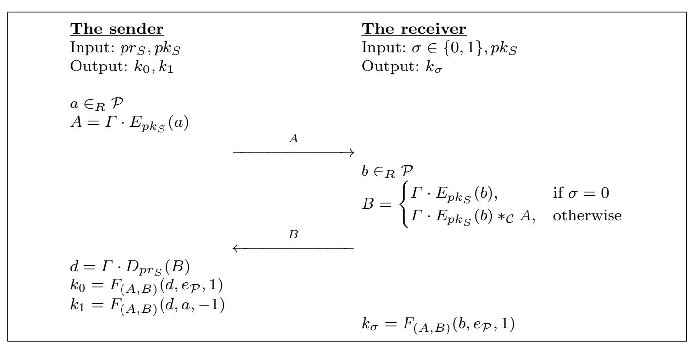
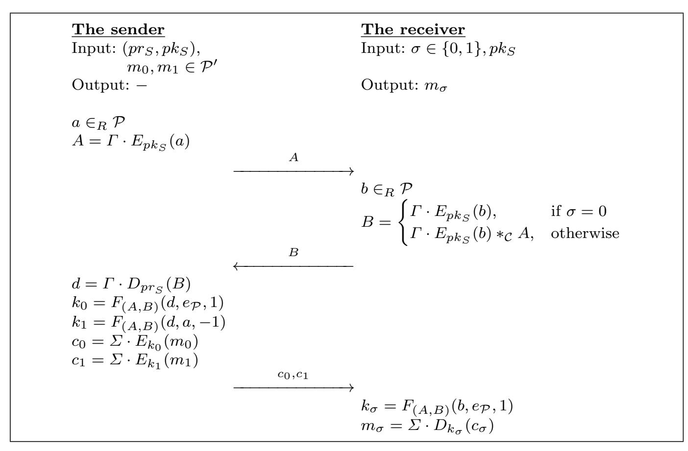
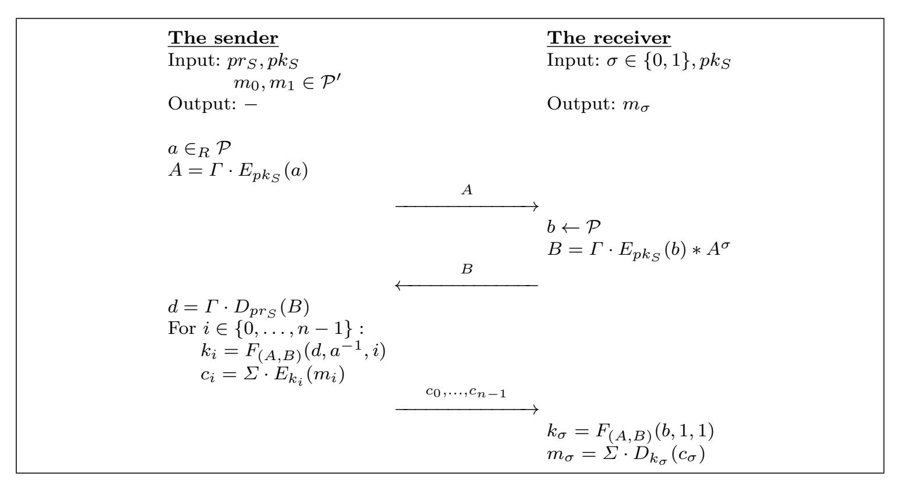

{0}------------------------------------------------

# Noname manuscript No.

(will be inserted by the editor)

# A simple generic construction to build oblivious transfer protocols from homomorphic encryption schemes

Saeid Esmaeilzade · Ziba Eslami · Nasrollah Pakniat

Received: date / Accepted: date

Abstract Oblivious transfer (OT) is a fundamental problem in cryptography where it is required that a sender transfers one of potentially many pieces of information to a receiver and at the same time remains oblivious as to which piece has been transferred. After its introduction back in 1981 by Rabin, some more useful variations of OT appeared in the literature such as  $OT_1^2$ ,  $OT_1^n$  and  $OT_k^n$ . In 2015, a very simple and efficient OT protocol was proposed by Chou and Orlandi. Later, Hauck and Loss proposed an improved protocol and proved it to be fully UC-secure under the CDH assumption. Our goal in this paper is to extend the results of Hauck and Loss and propose a simple generic construction to build  $OT_1^2$  and in general  $OT_1^n$ . The machinery we employ is homomorphic encryption. We instantiate our construction with some well known homomorphic encryption schemes such as RSA, Paillier and NTRU to obtain concrete OT protocols. We further provide the details of the proof of the UC-security of our generic construction.

**Keywords** Oblivious Transfer  $\cdot$  Multi-party computation  $\cdot$  Generic construction  $\cdot$  NTRU cryptosystem  $\cdot$  RSA cryptosystem  $\cdot$  Paillier cryptosystem

## Mathematics Subject Classification (2000) 94A60

S. Esmaeilzade

Department of Computer Science, Shahid Beheshti University, Tehran, Iran.

Z. Eslami

Department of Computer Science, Shahid Beheshti University, Tehran, Iran.

Tel.: +98-21-29903005 Fax: +98-21-22465214 E-mail: z\_eslami@sbu.ac.ir

N. Pakniat

Information Science Research Department, Assistant Professor, Iranian Research Institute for Information Science and Technology, Tehran, Iran.

{1}------------------------------------------------

#### 1 Introduction

The cryptographic notion of oblivious transfer (denoted throughout the paper by OT), put forward in 1981 by Rabin [23], has many applications including secure two-party and multiparty computation, private information retrieval, privacy preserving data mining, signing contract protocols, randomized coin flipping protocols, and certified email transfer protocols [1,4,7,8,12,13,15,17, 20,25,27]. 1-out-of-2 OT is the simplest flavour of OT [7]. In this setting, there is a sender with inputs  $m_0$  and  $m_1$ , and a receiver with input  $c \in \{0,1\}$ . At the end of the protocol, the receiver must get message  $m_c$  without finding anything about  $m_{1-c}$  while the sender's chance to learn c must be  $\frac{1}{2}$ . Brassard et al. [2] presented a more general OT scheme, which is also known as all-ornothing disclosure of secrets. In this extended notion, there exist n messages and the receiver chooses one message out of them.  $OT_k^n$  and generalized OTare more extended versions of  $OT_1^2$  while in the former, the receiver chooses a subset of size k from among n messages [5,9,10,16,18,19,21,29] and in the later, he can choose one of the many subsets of the messages determined by the sender [26]. In several applications (e.g. Yao's garbled circuits [28]), many separate invocations of  $OT_1^n$  are required. In such cases, a technique called OTextension is typically used [14]. OT-extension allows to extend a small number of base OT invocations (done using standard OT protocols discussed later in this paper) to a much larger number of OT invocations, such that the extra OT-s are then much cheaper to perform (using only symmetric operations as opposed to asymmetric operations). In terms of security, since OT is a basic cryptographic primitive and is mostly used as a building block in other more general primitives, the universal composable (UC) security model [3,11,22] is considered.

In 2015, Chou and Orlandi [3] proposed a simple OT protocol. This protocol is one of the simplest and most efficient proposed OT protocol in the literature. It is a simple twist of Diffie-Hellman (DH) key exchange protocol [6]. Hauck and Loss [11] showed that Chou and Orlandi's protocol is not fully UC secure and proposed an improved OT protocol that can be proven fully UC-secure under the CDH assumption. The aim of this paper is to extend the results of [3,11]. To this end, we propose a simple generic construction to build  $OT_1^2$  protocols and extend it to a generic construction for  $OT_1^n$ . The proposed generic construction for  $OT_1^2$  is based on the notion of asymmetric homomorphic encryption. We further instantiate our construction with some well known homomorphic encryption schemes such as RSA, Paillier and NTRU to obtain concrete OT protocols. It should be noted that the instantiations of the proposed construction using NTRU would result in a simple and efficient post-quantum OT protocol and fill the existing gap in the literature in this regard.

The rest of this paper is organized as follows:

In Section 2, a brief review of the related works is provided. In Section 3, we provide the preliminaries needed to understand the rest of the paper. In Section 4, we provide the definition and the security requirements of OT protocols. In

{2}------------------------------------------------

Section 5, we first provide the details of our proposed generic construction for  $OT_1^2$ . Then, we instantiate the proposed construction using some well known homomorphic encryption schemes including RSA, Paillier and NTRU. Finally, in this Section, we extend our proposed generic construction for  $OT_1^2$  to a generic construction for  $OT_1^n$ .

Security analysis of the proposed construction is provided in Section 6. Finally, concluding remarks are provided in Section 7.

#### 2 Related works

In this section, a brief review of the proposed oblivious transfer protocols in [3,11] is provided.

# 2.1 Chou and Orlandi's $OT_1^2$ protocol

Let  $m_0, m_1$  be two secret messages. Consider p as a large prime number and g as a generator of  $Z_p^*$ . Assume  $H(\cdot)$  is a secure cryptographic hash function and  $\Sigma = (KG, E, D)$  a symmetric encryption scheme where KG, E and D denote the key generation, encryption and decryption algorithms, respectively. Using these notations, the details of Chou and Orlandi's OT protocol are as follows:

- The sender S:
  - chooses a random value  $a \in_R Z_p$ , computes  $A = g^a \pmod{p}$  and sends A to the receiver R.
- On the input of his/her choice of the secret  $\sigma \in \{0,1\}$ , the receiver R:
  - chooses  $b \in_R Z_p$ , sets

$$B = \begin{cases} g^b \pmod{p}, & \text{if } \sigma = 0, \\ A \cdot g^b \pmod{p}, & \text{otherwise,} \end{cases}$$

and sends B to the sender S.

- The sender S:
  - computes  $k_0 = H(B^a \pmod{p})$  and  $k_1 = H((\frac{B}{A})^a \pmod{p})$ ,
  - computes  $c_t = \Sigma \cdot E_{k_t}(m_t)$  for  $t \in \{0,1\}$  as the encrypted messages, and sends $\{c_0, c_1\}$  to the receiver R.
- The receiver R:
  - computes  $k_{\sigma} = H(A^b \pmod{p})$  and  $m_{\sigma} = \Sigma \cdot D_{k_{\sigma}}(c_{\sigma})$ .

# 2.2 Hauck and Loss's $OT_1^2$ protocol

In [11], Hauck and Loss showed that Chou and Orlandi's protocol is not fully UC secure and proposed an improved OT protocol. Using the same notations as the previous section and considering G as a group with prime order p and generated by g and  $\mathcal{O}$  as a random oracle (i.e., a theoretical balck-box that

{3}------------------------------------------------

responds to new queries with a random response and to repeated queries, with its previous output), the details of this protocol are as follows:

- The sender S:
  - chooses a random value  $a \in_R Z_p$ , computes  $A = g^a$  and sends A to the receiver R.
- On the input of his/her choice of the secret  $\sigma \in \{0,1\}$ , the receiver R:
  - aborts if  $T = \mathcal{O}(A) \notin G$ ,
  - chooses  $b \in_R Z_p$ , sets

$$B = \begin{cases} g^b, & \text{if } \sigma = 0, \\ T \cdot g^b, & \text{otherwise,} \end{cases}$$

and sends B to the sender S.

- The sender S:
  - aborts if  $B \notin G$ ,
  - computes  $k_0 = H(B^a)$  and  $k_1 = H((\frac{B}{T})^a)$ ,
  - computes  $c_t = \Sigma \cdot E_{k_t}(m_t)$  for  $t \in \{0,1\}$  as the encrypted messages, and sends $\{c_0, c_1\}$  to the receiver R.
- The receiver R:
  - computes  $k_{\sigma} = H(A^b)$  and  $m_{\sigma} = \Sigma \cdot D_{k_{\sigma}}(c_{\sigma})$ .

## 3 Preliminaries

In this section, we provide formal definitions for the concepts needed throughout the paper, i.e., encryption scheme, homomorphic encryption, non-committing symmetric encryption and ciphertext integrity. The interested reader can find more on these material in [3,24].

**Encryption scheme**. An encryption scheme is a triple of probabilistic polynomial time (PPT) algorithms (KG, E, D) where,

- KG: on input of the security parameter  $\lambda$ , generates a pair of keys  $k, k' \in \mathcal{K}$  where  $\mathcal{K}$  denotes the key space.
- E: on input of the key k' and a message  $m \in \mathcal{P}$ , generates a ciphertext  $c \in \mathcal{C}$  where,  $\mathcal{P}$  and  $\mathcal{C}$  are the plaintext and ciphertext space, respectively.
- D: on input of the key k and a ciphertext c, outputs the message m if the ciphertext is valid and  $\bot$  otherwise.

We expect that for every  $m \in \mathcal{P}$  and the keys  $k, k' \in \mathcal{K}$  output by KG, the following condition holds:

$$D_k(E_{k'}(m)) = m.$$

The scheme would be called symmetric if k = k' or the computation of k from k' is feasible, and asymmetric otherwise.

**Homomorphic encryption**. Let  $*_{\mathcal{P}}$  and  $*_{\mathcal{C}}$  be some group operations such that  $(\mathcal{P}, *_{\mathcal{P}})$  and  $(\mathcal{C}, *_{\mathcal{C}})$  form two groups. Then, the encryption scheme  $\Gamma = (KG, E, D)$  would be called homomorphic if the following property is provided [24]:

{4}------------------------------------------------

- for all  $a, b \in \mathcal{P}$  and the keys  $k, k' \in \mathcal{K}$  output by  $KG: D_k(E_{k'}(a) *_{\mathcal{C}} E_{k'}(b)) = D_k(E_{k'}(a *_{\mathcal{P}} b)).$ 

**Non-Committing symmetric encryption**. A symmetric encryption scheme (KG, E, D) is called non-committing [3] if there exist PPT algorithms  $S_1, S_2$ , that are allowed to share a state, such that for PPT algorithm  $A, m \in \mathcal{P}$ ,  $k_0 \leftarrow \mathcal{K}, e_0 \leftarrow E_{k_0}(m), e_1 \leftarrow S_1(1^{\lambda}), k_1 \leftarrow S_2(e_1, m)$ , the following is negligible:

$$\|\Pr[b=b'|b'\leftarrow A(e_b,k_b)]-\frac{1}{2}\|.$$

In other words, the output of any boolean PPT distinguisher A on inputs  $(e_0, k_0)$  or  $(e_1, k_1)$  would be almost the same.

**Ciphertext integrity**. A symmetric or asymmetric encryption scheme (KG, E, D) provides ciphertext integrity if for any PPT attacker A,  $\Pr[D_k(e) \neq \bot | k \leftarrow \{0,1\}^{\lambda}, e \leftarrow A(1^{\lambda})]$  is negligible [3].

# 4 one-out-of-two Oblivious transfer protocol ${\cal O}T_1^2$

In this section, first we provide the definition of  $OT_1^2$  and then proceed by providing its security requirements.

# 4.1 $OT_1^2$ : Definition

Let  $m_0$  and  $m_1$  be two secrets from the secret space  $\mathcal{P}$ . An  $OT_1^2$  is a tuple of probabilistic polynomial time (PPT) algorithms (Setup, Choose, Key derivation, Secret recovery) described as follows:

**Setup:** Through this algorithm, the system parameters are generated and published.

**Choose:** Through this algorithm, the receiver chooses its choice of the secret  $b \in \{0, 1\}$ , hides it using a function  $\alpha(\cdot)$ , and sends  $\alpha(b)$  to the sender.

**Key derivation** Through this algorithm, the sender first uses  $\alpha(b)$  to generate two secret keys, uses each key to encrypt one of the secrets and sends the resulting ciphertexts (denoted by  $\beta(\alpha(b), m_0, m_1)$ ) to the receiver.

**Secret recovery:** Through this algorithm, the receiver generates the secret key corresponding to its choice of the secret, uses it to decrypt the corresponding ciphertext and obtains the chosen secret.

# $4.2 \ OT_1^2$ : Security model

Informally, an  $OT_1^2$  protocol is said to be secure if it meets the following security requirements:

- Receiver's privacy: The sender should not be able to distinguish the receiver's choice of the secret. In other words, he should not be able to distinguish whether b = 0 or b = 1 with non-negligible probability.

{5}------------------------------------------------

- **Sender's security**: Let  $b \in \{0,1\}$  be the receiver's choice of the secret in an execution of an  $OT_1^2$  protocol. Then, upon completion of the protocol, the receiver should be unable to obtain any information about the other secret. In other words, it should not be able to distinguish the other secret from any other random message from the same domain.

**Remark.** We also need the notion of a random  $OT_1^2$  protocol [3] which consists of the algorithms (Setup, Choose, Key derivation) exactly as in  $OT_1^2$ . However, there exists no secret message in this setting and at the end of its execution, the sender generates two secret keys and the receiver obtains one of them in such a way that the following conditions are fulfilled:

- The sender is not able to distinguish the receiver's choice of the key.
- The receiver is unable to obtain any information about the other key.

## 5 The proposed generic construction

In this section, we present a generic construction for building OT protocols. The construction begins by first considering random  $OT_1^2$ , then  $OT_1^2$  and finally  $OT_1^n$ . We then employ some well known homomorphic encryption schemes to instantiate the proposed construction. The proof of correctness of the proposed construction as well as its security are presented in Section 6. In the following, first, we provide a brief description of our idea and then go through the details of our proposal.

The proposed construction is an extension of Chou and Orlandi's idea equipped with the properties of homomorphic encryption. Here, encapsulation of the secret values exchanged between the sender and the receiver (denoted by a and b, respectively) is done using an encryption scheme with homomorphic properties. As a result, the two keys that the sender generates would be encryptions of one of b, ab or  $a^{-1}b$  (depending on receiver's choice of the secret). From the sender's viewpoint, these values are random and therefore, the sender is not able to distinguish the receiver's choice of the secret. Moreover, a is a random value and the receiver can not obtain more information about it other than its encryption which guarantees the receiver can only obtain his choice of the secret.

In order to describe our construction, we need a few notations throughout this section. Let  $\Gamma = (KG, E, D)$  and  $\Sigma = (KG, E, D)$  be a homomorphic asymmetric encryption scheme and a non-committing symmetric encryption scheme with ciphertext integrity property, respectively. Consider  $H_{(A,B)}$  as a cryptographic keyed hash-function which uses  $A, B \in \mathcal{C}$  to extract a  $\lambda$ -bit key. By using H, we define  $F : (\mathcal{C} \times \mathcal{C}) \times (\mathcal{P} \times \mathcal{P} \times \mathbb{N}) \to \{0,1\}^{\lambda}$  s.t  $F_{(A,B)}(b,a,p) = H_{(A,B)}(b*_{\mathcal{P}}a^p)$  as a cryptographic keyed hash-function which is used to extract a  $\lambda$ -bit key where, the first two inputs of F are used to seed the function.

{6}------------------------------------------------

**Fig. 1** The proposed generic construction for random  $OT_1^2$ .

# 5.1 The proposed generic construction for random $OT_1^2$

Suppose  $pk_S$  and  $pk_R$  are the sender S's public and private keys that have been correctly generated with a trusted setup. The details of the proposed generic construction for random  $OT_1^2$  (depicted in Fig. 1) are as follow:

- The sender S, on input the private and public key pairs  $(pr_S, pk_S) \leftarrow \Gamma \cdot KG$ , performs the following steps:
  - chooses a random value  $a \in \mathcal{P}$  and computes  $A = \Gamma \cdot E_{pk_S}(a)$ ,
  - sends A to the receiver R.
- The receiver R, on input his/her choice  $\sigma \in \{0,1\}$  and the public key of the sender  $pk_S$ , performs the following steps:
  - chooses  $b \in_R P$  and sets

$$B = \begin{cases} \Gamma \cdot E_{pk_S}(b), & \text{if } \sigma = 0, \\ \Gamma \cdot E_{pk_S}(b) *_{\mathcal{C}} A, & \text{otherwise.} \end{cases}$$

- sends B to the sender S.
- The sender S:
  - computes  $d = \Gamma \cdot D_{pr_S}(B)$ ,
  - computes  $k_0 = F_{(A,B)}(d, e_P, 1)$  and  $k_1 = F_{(A,B)}(d, a, -1)$ .
- The receiver R:
  - outputs  $k_{\sigma} = F_{(A,B)}(b, e_{\mathcal{P}}, 1)$ .

Note that  $e_{\mathcal{P}}$  is the identity element of  $\mathcal{P}$ .

# 5.2 The proposed generic construction for $OT_1^2$

In this section, we extend the proposed generic construction for random  $OT_1^2$  to a generic construction for  $OT_1^2$ . To do so, after obtaining the keys output

{7}------------------------------------------------

Fig. 2 The proposed generic construction for  $OT_1^2$ .

by executing random  $OT_1^2$ , the sender encrypts his/her messages using the generated keys, and the receiver decrypts the chosen message by using the obtained key. The details, depicted in Fig. 2), are as follows:

- the sender S, on input the secrets  $m_0, m_1 \in \mathcal{P}'$  and  $(pr_S, pk_S) \leftarrow \Gamma \cdot KG$ , performs the following steps:
  - chooses a random value  $a \in_R \mathcal{P}$  and computes  $A = \Gamma \cdot E_{pk_S}(a)$ ,
  - sends A to the receiver R.
- The receiver R, on input his/her choice  $\sigma \in \{0,1\}$  and the public key of the sender  $pk_S$ , performs the following steps:
  - chooses  $b \in_R \mathcal{P}$  and sets

$$B = \begin{cases} \Gamma \cdot E_{pk_S}(b), & \text{if } \sigma = 0, \\ \Gamma \cdot E_{pk_S}(b) *_{\mathcal{C}} A, & \text{otherwise,} \end{cases}$$

- sends B to the sender S.
- The sender S:
  - computes  $d = \Gamma \cdot D_{pr_S}(B)$ ,
  - computes  $k_0 = F_{(A,B)}(d, e_P, 1)$  and  $k_1 = F_{(A,B)}(d, a, -1)$ ,
  - computes  $c_t = \Sigma \cdot E_{k_t}(m_t)$  for  $t \in \{0, 1\}$  as the encrypted messages,
  - sends  $\beta(B, m_0, m_1) = \{c_0, c_1\}$  to the receiver R.
- The receiver R:
  - computes  $k_{\sigma} = F_{(A,B)}(b, e_{\mathcal{P}}, 1)$
  - computes  $m_{\sigma} = \Sigma \cdot D_{k_{\sigma}}(c_{\sigma})$ .

{8}------------------------------------------------

#### 5.3 Instantiations

In this section, we provide some instantiations of the proposed generic construction based on RSA, Paillier and NTRU which are well known to achieve homomorphic properties. In all the following instantiation,  $\Sigma = (KG, E, D)$  can be any non-committing CPA-secure symmetric encryption scheme with ciphertext integrity property.

#### 5.3.1 Based on RSA cryptosystem

The details of the instantiation of our proposed generic construction using RSA cryptosystem are as follows:

## - Inputs:

- The Sender **S** holds two secrets  $m_0, m_1 \in \mathcal{P}'$  and  $(pr_S, pk_S)$  where,  $pr_S = (y, N)$  and  $pk_S = (x, N)$  are the Sender's private and public keys corresponding to the RSA cryptosystem and  $\mathcal{P}'$  is the message space of  $\Sigma$ .
- The Receiver **R** holds his choice of the secret  $\sigma \in \{0, 1\}$  (and of course  $pk_S$ ).

## - Protocol:

- The sender **S**:
  - samples  $a \in_R \mathbb{Z}_N^*$  and computes  $A = a^x \pmod{N}$ ,
  - $\bullet$  sends A to  $\mathbf{R}$ .
- The receiver  $\mathbf{R}$ :
  - chooses  $b \in_R \mathbb{Z}_N^*$  and computes  $B = b^x * A^\sigma \pmod{N}$ ,
  - sends B to S.
- The sender **S** upon receiving B:
  - computes  $d = B^y \pmod{N}$ ,
  - computes  $k_0 = F_{(A,B)}(d,1,1) = H_{(A,B)}(d)$  and  $k_1 = F_{(A,B)}(d,a,-1) = H_{(A,B)}(d*a^{-1})$  where,  $a^{-1}$  is the inverse of a in  $\mathbb{Z}_N^*$ .
  - computes  $c_0 = \Sigma \cdot E_{k_0}(m_0)$  and  $c_1 = \Sigma \cdot E_{k_1}(m_1)$
  - sends  $C = \{c_0, c_1\}$  to **R**.
- The receiver  $\mathbf{R}$  upon receiving C:
  - computes  $k_{\sigma} = F_{(A,B)}(b,1,1) = H_{(A,B)}(b)$ ,
  - computes  $m_{\sigma} = \hat{\Sigma} \cdot \hat{D}_{k_{\sigma}}(c_{\sigma})$ .

**Remark.** Note that in order to securely realize the proposed construction using RSA cryptosystem, the values a and b chosen from  $\mathbb{Z}_N^*$ . Therefore, it should be possible for the participants to check if the received messages are chosen from  $\mathbb{Z}_N^*$  or not. In the RSA cryptosystem, this check can be done easily.

## 5.3.2 Based on Paillier cryptosystem

The details of the instantiation of our proposed generic construction using Paillier cryptosystem are as follows:

{9}------------------------------------------------

## - Inputs:

- The sender S holds two secrets  $m_0, m_1 \in \mathcal{P}'$  and  $(pr_S, pk_S)$  where,  $\mathcal{P}'$  is the message space of  $\Sigma$  and  $pr_S = (\lambda, \mu)$  and  $pk_S = (n, g)$  are the sender's private and public keys corresponding to the Paillier crypto system where, n = pq with p and q as two equal-length large primes,  $g \in_R \mathbb{Z}_{n^2}^*, \ \lambda = lcm((p-1)(q-1))$  (with lcm as the least common multiple) and  $\mu = \left(\frac{g^{\lambda} \pmod{n^2} - 1}{n}\right)^{-1} \pmod{n}$ .
- The Receiver **R** holds his choice of the secret  $\sigma \in \{0,1\}$  and  $pk_S$ .

#### - Protocol:

- **S**:
  - samples  $a, r_1 \in_R \mathbb{Z}_n^*$  and computes  $A = g^a r_1^n \pmod{n^2}$ ,
  - $\bullet$  sends A to  $\mathbf{R}$ .
- $-\mathbf{R}$ :
  - chooses  $b, r_2 \in_R \mathbb{Z}_N^*$  and computes  $B = g^b r_2^n A^{\sigma} \pmod{n^2}$ ,
  - $\bullet$  sends B to S.
- **S**:

  - computes  $d = \frac{B^{\lambda} \pmod{n^2} 1}{n} \mu \pmod{n}$ , computes  $k_0 = F_{(A,B)}(d,0,1) = H_{(A,B)}(d+1*0)$  and  $k_1 = F_{(A,B)}(d,a,-1) = 0$  $H_{(A,B)}(d+(-1)*a) = H_{(A,B)}(d-a),$
  - computes  $c_0 = \Sigma \cdot E_{k_0}(m_0)$  and  $c_1 = \Sigma \cdot E_{k_1}(m_1)$ ,
  - sends  $C = \{c_0, c_1\}$  to **R**.
- $-\mathbf{R}$ :
  - computes  $k_{\sigma} = F_{(A,B)}(b,0,1) = H_{(A,B)}(b)$ .
  - computes  $m_{\sigma} = \Sigma \cdot D_{k_{\sigma}}(c_{\sigma})$ .

**Remark.** Note that since the homomorphism property of the Paillier crypto to to system is with respect to addition operation, there is no need to restrict the message space of  $\Gamma$  in the instantiation based on the Paillier cryptosystem.

## 5.3.3 Based on NTRU cryptosystem

In order to describe the instantiation of the proposed generic construction based on NTRU cryptosystem first, we provide the following notations:

- (N, p, q, d): the public parameters of an NTRU cryptosystem where q >(6d + 1)p and gcd(N, q) = gcd(p, q) = 1,
- $R: Z[x]/(x^N-1),$
- $R_p$ :  $(Z/pZ)[x]/(x^N-1)$ ,
- $R_{q'}$ :  $(Z/q'Z)[x]/(x^N-1)$ ,
- $R_q$ :  $(Z/qZ)[x]/(x^N-1)$ ,
- $CL(\cdot)$ : a function that for each  $a(x) \in R_q$  outputs a unique polynomial  $a'(x) \in R$  (called center-lift of a(x)) satisfying

$$a'(x) \pmod{q} = a(x) \text{ and } \forall i \in [0, \dots, N-1] : -\frac{q}{2} < a'_i \le \frac{q}{2},$$

{10}------------------------------------------------

-  $\mathcal{T}(d_1, d_2)$ : the set of ternary polynomials defined by  $d_1$  and  $d_2$  as follows:

$$\mathcal{T}(d_1, d_2) = \left\{ a(x) \middle| \begin{array}{c} a(x) \text{ has } d_1 \text{ coefficients equal to 1,} \\ a(x) \text{ has } d_2 \text{ coefficients equal to -1,} \\ a(x) \text{ has all other coefficients equal to 0} \end{array} \right\}.$$

Using the above notations, the description of the instantiation of the proposed generic construction based on NTRU cryptosystem is as follows:

## - Inputs:

- The sender **S** holds two secrets  $m_0, m_1 \in R_p$  and  $(pr_S, pk_S)$  where  $pr_S = (f(x), F_p(x))$  and  $pk_S = (h(x))$  are the sender's private and public keys corresponding to the NTRU cryptosystem where,  $h(x) = [F_q(x) * g(x) \text{ in } R_q], F_q(x) = [f(x)^{-1} \text{ in } R_q], F_p(x) = [f(x)^{-1} \text{ in } R_p], f(x) \in_R \mathcal{T}(d+1,d)$  and  $g(x) \in_R \mathcal{T}(d,d)$ .
- The receiver **R** holds his choice of the secret  $\sigma \in \{0,1\}$  and  $pk_S$ .

#### - Protocol:

- **S**:
  - chooses  $a(x) \in_R R$  and  $r(x) \in_R \mathcal{T}(d,d)$  and computes  $A(x) = ph(x)r(x) + a(x) \pmod{q}$ ,
  - sends A(x) to  $\mathbf{R}$ .
- $-\mathbf{R}$ :
  - chooses  $b(x) \in_R R$  and  $r'(x) \in_R T(d, d)$  and sets  $B(x) = ph(x)r'(x) + b(x) + \sigma A(x)$ ,
  - sends B(x) to **S**.
- **S**:
  - computes  $\omega(x) = f(x) * B(x) \pmod{q}$ ,
  - computes  $d(x) = F_p(x) * CL(\omega(x)) \pmod{p}$ ,
  - computes  $k_0 = F(d(x), 0, 1)$  and  $k_1 = F(d(x), a(x), -1)$ ,
  - computes  $c_0 = \Sigma \cdot E_{k_0}(m_0)$  and  $c_1 = \Sigma \cdot E_{k_1}(m_1)$ ,
  - sends  $C = \{c_0, c_1\}$  to  $\hat{\bf R}$ .
- R:
  - computes  $k_{\sigma} = F_{(A,B)}(b,0,1)$ ,
  - computes  $m_{\sigma} = \hat{\Sigma} \cdot \hat{D}_{k_{\sigma}}(c_{\sigma})$ .

**Remark.** Here again we have the homomorphism property with respect to addition and therefore do not need to restrict the message space of  $\Gamma$ .

5.4 Extending the proposed generic construction from  $OT_1^2$  to  $OT_1^n$ 

Let  $\Gamma$ ,  $\Sigma$  and F be as described in previous sections. In this section, as depicted in Fig. 3, we extend the proposed generic construction for  $OT_1^2$  to a generic construction for  $OT_1^n$ .

{11}------------------------------------------------

Fig. 3 The proposed generic construction for OT n 1 .

## 6 Security Analysis

In this section, we start by proving the correctness of our constructions. We then show that the proposed constructions provide the receiver's privacy and the sender's security. Finally, we provide the details of the proof of the UCsecurity of our generic construction.

Theorem 1 Assume that the sender in the proposed construction is honest but curious (i.e., it will change neither the content nor the order of the secrets). Then, the receiver obtains his choice of the secret in an execution of an instance of the proposed generic construction.

Proof. Using the same notations as in Section 4, in the following, it is shown that choosing σ = 0 and σ = 1 would result in kσ = k0 and kσ = k1, respectively.

If σ = 0 then,

$$k_0 = F_{(A,B)}(d, e_{\mathcal{P}}, 1)$$

$$= H_{(A,B)}(d)$$

$$= H_{(A,B)}(\Gamma \cdot Dec_{pr_S}(B))$$

$$= H_{(A,B)}(\Gamma \cdot Dec_{pr_S}(\Gamma \cdot Enc_{pk_S}(b)))$$

$$= H_{(A,B)}(b)$$

$$= k_{\sigma}.$$

{12}------------------------------------------------

If  $\sigma = 1$  then,

$$k_{1} = F_{(A,B)}(d, a^{-1}, 1)$$

$$= H_{(A,B)}(d * a^{-1})$$

$$= H_{(A,B)}(\Gamma \cdot Dec_{pr_{S}}(B) * a^{-1})$$

$$= H_{(A,B)}(\Gamma \cdot Dec_{pr_{S}}(\Gamma \cdot Enc_{pk_{S}}(b) * A) * a^{-1})$$

$$= H_{(A,B)}((b * a) * a^{-1})$$

$$= H_{(A,B)}(b)$$

$$= k_{\sigma}$$

We now state a simple lemma which will be used in the security proof of the proposed construction.

**Lemma 1** Let  $\mathbb{G}$  be a finite group and m be an arbitrary member of it. Then, uniformly selecting  $k \in \mathbb{G}$  and setting k' := k.m gives the same distribution for k' as uniformly selecting  $k' \in \mathbb{G}$ . In other words, for any  $\hat{g} \in \mathbb{G}$  we have

$$Pr[k.m = \hat{g}] = \frac{1}{|\mathbb{G}|},$$

where, the probability is taken over uniform choices of  $k \in \mathbb{G}$ .

*Proof.* Let  $\hat{g}$  be an arbitrary element of  $\mathbb{G}$ . Then,

$$Pr[k.m = \hat{g}] = Pr[k = \hat{g}.m^{-1}].$$

Since k is uniform, the probability that k is equal to the fixed element  $\hat{g}.m^{-1}$  is exactly  $\frac{1}{|\mathbb{G}|}$ .

Now, through Theorems 2 and 3, we prove that the proposed generic construction provides the sender's security and the receiver's privacy, respectively.

**Theorem 2** In the proposed generic construction, no computationally unbounded S is able to guess  $\sigma$  with probability greater than  $\frac{1}{2}$ .

*Proof.* By setting k = a and considering k' = ab or k' = b, this theorem is a direct result of Lemma 1.

**Theorem 3** Under the CPA-security assumption of the homomorphic encryption scheme  $\Gamma$ , in the proposed generic construction for random  $OT_1^2$ , there exists no computationally bounded  $\mathcal{R}$  in the random oracle model who is able to output two keys  $k_{\sigma} = F_{(A,B)}(b,1,1)$  and  $k_{1-\sigma} = F_{(A,B)}(b,a,x)$  where,  $x \in \{-1,1\}$ .

*Proof.* Let  $\mathcal{C}$  be a challenger claiming that  $\Gamma$  is CPA-secure. Assume that there exists a PPT receiver  $(\mathcal{R})$  that is able to compute the keys  $k_0$  and  $k_1$  after the execution of an instance of our proposed generic construction for random  $OT_1^2$  obtained by using  $\Gamma$ . In the following, it is shown that using R, we can introduce an algorithm  $\mathcal{A}$  that is able to break the CPA-security of the underlying homomorphic encryption scheme  $\Gamma$ . To do so, consider the following game played between  $\mathcal{A}$ ,  $\mathcal{C}$  and  $\mathcal{R}$ :

{13}------------------------------------------------

- $\mathcal{C}$ :

   runs  $\Gamma \cdot KG$  and generates a pair of private and public keys  $(pr_{\mathcal{C}}, pk_{\mathcal{C}})$ .

    $\mathcal{A}$ :

   chooses random values  $m_0, m_1 \in \mathcal{P}$ ,

   sends  $m_0$  and  $m_1$  to  $\mathcal{C}$ .

    $\mathcal{C}$ :

   chooses a random value  $t \in \{0, 1\}$ ,

   sends  $c = \Gamma \cdot E_{pk_{\mathcal{C}}}(m_t)$  to  $\mathcal{A}$ .
- *A*:
  - starts the execution of the instance of the proposed generic construction with  $\mathcal{R}$  by putting A=c and simulating F as a random oracle,
  - obtains the two key values  $k'_0$  and  $k'_1$ . Note that this is possible because F is simulated as a random oracle and as a consequence,  $\mathcal{A}$  is able to see all the value inserted as input to F by the receiver and the corresponding outputs.
- Without loss of generality, assume that  $k_0 = F_{(A,B)}(b,1,1)$ ,  $k_1 = F_{(A,B)}(b,a,x)$  and consider  $k'_0 = (x_0, x_1, x_2)$  and  $k'_1 = (y_0, y_1, y_2)$  as the corresponding inputs to F. Now, if  $x_1 = y_1 = 1$ , then a = 1 otherwise, a is equal to one of them that is not equal to 1. After obtaining a, A compares a with  $m_0$  and  $m_1$  and sets
  - $-t'=0 \text{ if } a=m_0,$
  - $-t'=1 \text{ if } a=m_1.$
- $-\mathcal{A}$  output t'

In the above game, in any case, the attacker can correctly guess t'=t. Therefore, by assuming that the receiver can correctly output two keys of the sender, it is shown that  $\Gamma$  is not CPA-secure, which is in contradiction with our initial assumption. Therefore, no receiver with bounded computing power can achieve more than one key.

{14}------------------------------------------------

 $F_{OT}$  interacts with a sender S and a receiver R.

- The functionality receives the messages  $(M_0, M_1)$  from S, where  $M_0, M_1 \in \mathcal{P}$ .
- The functionality receives the choice value  $\sigma \in \{0,1\}$  from R.
- Upon receiving a  $\sigma$  from R, check if a tuple  $(M_0, M_1)$  was recorded. If yes, send  $M_{\sigma}$ to R, send a delayed output received to S and halt. Otherwise, send nothing to R, but continue running until receives the messages  $(M_0, M_1)$  and then send  $M_{\sigma}$  to R.

**Fig. 4** Ideal Functionality  $F_{OT}$  for the proposed construction.

#### 6.1 UC-security

To prove the US-security of the proposed generic construction, first we define the ideal functionality  $F_{OT}$  for the proposed construction in Fig 4:

**Theorem 4** Let  $\Gamma$  be a CPA-secure asymmetric homomorphic encryption scheme and  $\Sigma$  be a non-committing CPA-secure symmetric encryption scheme with ciphertext integrity property. Then, the proposed generic construction for oblivious transfer can securely realize  $F_{OT}$  in the random oracle model.

*Proof.* In the following, we show that the proposed generic construction securely implements the functionality against a corrupted sender and a corrupted receiver, in the random oracle model:

- Statistically corrupted sender: first we argue that our proposed construction securely implements the functionality against a corrupted sender in the random oracle model, by constructing a simulator for a corrupted  $S^*$  in the following way:
  - 1. The simulator answers random oracle queries F(.,.) (.,.,) at random,
  - 2. At some point,  $S^*$  outputs A,
  - 3. The simulator randomly chooses  $b \in_R \mathcal{P}$  and sends  $B = \Gamma \cdot E_{pk_S}(b)$  to  $S^*$ . Note that since b is chosen at random, the probability that  $S^*$  has queried any oracle  $F_{(A,B)}(.,.,.)$  before, is negligible,
  - 4. Any time  $S^*$  makes a query of the form  $F_{(A,B)}(q,x,p)$ , the simulator stores its random answers in  $k^{(q,x,p)}$ ,
  - 5. after outputting  $(e_0, e_1)$  by  $S^*$ , the simulator calculates  $\Sigma \cdot D_{k^{(a,x,p)}}(e_i)$ for all the saved keys and i = 0 or i = 1.

  - 6. The simulator sets  $M_i = e_i$  the first time  $\Sigma \cdot D_{k^{(m,x,p)}}(e_i) \neq \bot$ ,
    7. Suppose simulator find  $k^{(a_0,x_0,p_0)}$  and  $k^{(a_1,x_1,p_1)}$  for  $e_0$  and  $e_1$ . If two sets  $Y = \{(q_0, x_0, p_0), (q_1, x_1, p_1)\}$  and  $X = \{(b, 1, 1), (b, x_1, -1)\}$  are not equal the simulator will abort the simulation because the sender is cheating.
  - 8. The simulator inputs  $(M_0, M_1)$  to the ideal functionality  $F_{OT}$ . Note that, because of ciphertext integrity,  $\Sigma \cdot D$  is not  $\perp$  when the key and the ciphertext are correct.

{15}------------------------------------------------

We now argue that no distinguisher can tell a real-world view apart from a simulated view. This follows from Theorem 2 (the distribution of R does not depend on  $\sigma$ ), and that the output of the honest receiver can only be different if there exist  $x' \neq ba^x$  such that  $\Sigma \cdot D_{F_{(A,B)}(x',1,1)}(e_i) = m' \neq \bot$ , in this case the simulator will input  $M_i = m'$  to the ideal functionality which could cause the honest party in the ideal world to output a different value than it would in the real world (if  $i = \sigma$ ).

- Statically Corrupted Receiver: we now construct a simulator for a corrupted receiver:
  - 1. The simulator answers random oracle queries  $F_{(A,B)}(.,.,.)$  truly at random,
  - 2. At some point, the simulator samples a random  $a \leftarrow \mathcal{P}$  and outputs  $A = \Gamma \cdot E_{pk_S}(a)$  to  $R^*$ ,
  - 3. For each query of the form  $F_{(A,B')}(m,x,p)$ , the simulator sends  $k^{(m,x,p)} = H_{(A,B')}(m*x^p)$  to  $R^*$  and saves the triple  $(k^{(m,x,p)},B',(m,x,p))$ ,
  - 4. At some point, the simulator receives B from  $R^*$  and sets  $e_0 = \bot$ ,  $e_1 = \bot$ ,
  - 5. For all the saved triples, the simulator searches for (B' = B and x = a), if such a triple is found:
    - If d = m, it sets b = m and  $\sigma = 0$ ,
    - If  $d * a^{-1} = m$ , it sets b = m and  $\sigma = 1$ .

When the simulator finds b, for all saved triples if (B' = B and m = b and x = a):

If 
$$p = -1$$
, sets  $e_1 = S_1(1^{\lambda})$  and  $e_0 = \Sigma . E'_{F_{(A,b)}(d,1,1)}(M_0)$ ,  
If  $p = 1$ , sets  $e_0 = S_1(1^{\lambda})$  and  $e_1 = \Sigma . E'_{F_{(A,b)}(d,a,-1)}(M_1)$ .

- 6. If  $e_0 = \perp$  then, the simulator sets  $e_0 = S_1(1^{\lambda})$  and if  $e_1 = \perp$  then, it sets  $e_1 = S_1(1^{\lambda})$ ,
- 7. The simulator sends  $(e_0, e_1)$  to  $R^*$ ,
- 8. The simulator answers the queries made to the random oracle. If the query is  $F_{A,B}(m,1,1)$  then, it sets b=m and aborts if  $\sigma \neq \perp$ . If b=d then, it sets  $\sigma=0$  and if  $b=d*a^{-1}$ , it sets  $\sigma=1$ ,
- 9. The simulator sends  $\sigma$  to  $F_{OT}$ , gets  $M_{\sigma}$ , sets  $k' = F_{(A,B)}(b,1,1) = S_2(e_{\sigma}, m_{\sigma})$  and sends k' to  $R^*$ . If queries are of the form  $F_{(A,B)}(m,a,x)$  where  $x = \pm 1$ , then the simulator checks if m = d and sets  $k' = F_{(A,B)}(m,a,x) = S_2(e_1)$ . In case  $m = d * a^{-1}$ , the simulator sets  $k' = F_{(A,B)}(m,a,x) = S_2(e_0)$ .

Indistinguishability of the real world and the ideal world are immediately followed from non-committing property of the scheme  $\Sigma$ .

7 Conclusion

The OT protocol proposed by Chou and Orlandi in 2015 together with its improvement by Hauck and Loss are the basis of the present paper. We employ

{16}------------------------------------------------

the concept of CP A-secure homomorphic encryption to extend the results of those papers and come up with a simple generic construction to build OT protocols. Concrete constructions are presented using some homomorphic encryption schemes such as RSA, Paillier and NTRU and security proofs are provided for UC-security of our generic construction.

# References

- 1. Asharov, G., Lindell, Y., Schneider, T., Zohner, M.: More efficient oblivious transfer extensions. Journal of Cryptology 30(3), 805–858 (2017)
- 2. Brassard, G., Cr´epeau, C., Robert, J.M.: All-or-nothing disclosure of secrets. In: Conference on the Theory and Application of Cryptographic Techniques, pp. 234–238. Springer (1986)
- 3. Chou, T., Orlandi, C.: The simplest protocol for oblivious transfer. In: International Conference on Cryptology and Information Security in Latin America, pp. 40–58. Springer (2015)
- 4. Chou, Y., Tsai, I., Ko, C., Kuo, S., Chen, I.: Quantum oblivious transfer and fair digital transactions. In: 2006 12th Pacific Rim International Symposium on Dependable Computing (PRDC'06), pp. 121–128 (2006)
- 5. Chu, C.K., Tzeng, W.G.: Efficient k-out-of-n oblivious transfer schemes with adaptive and non-adaptive queries. In: International Workshop on Public Key Cryptography, pp. 172–183. Springer (2005)
- 6. Diffie, W., Hellman, M.: New directions in cryptography. IEEE transactions on Information Theory 22(6), 644–654 (1976)
- 7. Even, S., Goldreich, O., Lempel, A.: A randomized protocol for signing contracts. Communications of the ACM 28(6), 637–647 (1985)
- 8. Garg, S., Srinivasan, A.: Two-round multiparty secure computation from minimal assumptions. In: Annual International Conference on the Theory and Applications of Cryptographic Techniques, pp. 468–499. Springer (2018)
- 9. Guo, F., Mu, Y., Susilo, W.: Subset membership encryption and its applications to oblivious transfer. IEEE Transactions on Information Forensics and Security 9(7), 1098–1107 (2014)
- 10. Guo, F., Mu, Y., Susilo, W., Varadharajan, V.: Membership encryption and its applications. In: Australasian Conference on Information Security and Privacy, pp. 219–234. Springer (2013)
- 11. Hauck, E., Loss, J.: Efficient and universally composable protocols for oblivious transfer from the cdh assumption. IACR Cryptology ePrint Archive 2017, 1011 (2017)
- 12. Jannati, H., Bahrak, B.: An oblivious transfer protocol based on elgamal encryption for preserving location privacy. Wireless Personal Communications 97(2), 3113–3123 (2017)
- 13. Jiang, H., Xu, Q., Liu, C., Zheng, Z., Tang, Y., Wang, M.: Cut-and-choose bilateral oblivious transfer protocol based on ddh assumption. Journal of Ambient Intelligence and Humanized Computing pp. 1–11 (2018)
- 14. Keller, M., Orsini, E., Scholl, P.: Actively secure ot extension with optimal overhead. In: Annual Cryptology Conference, pp. 724–741. Springer (2015)
- 15. Keller, M., Orsini, E., Scholl, P.: Mascot: faster malicious arithmetic secure computation with oblivious transfer. In: Proceedings of the 2016 ACM SIGSAC Conference on Computer and Communications Security, pp. 830–842. ACM (2016)
- 16. Lai, J., Mu, Y., Guo, F., Chen, R., Ma, S.: Efficient k-out-of-n oblivious transfer scheme with the ideal communication cost. Theoretical Computer Science 714, 15–26 (2018)
- 17. Miyaji, A., Rahman, M.S.: Privacy-preserving set operations in the presence of rational parties. In: 2012 26th International Conference on Advanced Information Networking and Applications Workshops, pp. 869–874 (2012)
- 18. Mu, Y., Zhang, J., Varadharajan, V.: m out of n oblivious transfer. In: Australasian Conference on Information Security and Privacy, pp. 395–405. Springer (2002)

{17}------------------------------------------------

- 19. Naor, M., Pinkas, B.: Oblivious transfer with adaptive queries. In: Annual International Cryptology Conference, pp. 573–590. Springer (1999)
- 20. Nargis, I.: Efficient oblivious transfer from lossy threshold homomorphic encryption. In: International Conference on Cryptology in Africa, pp. 165–183. Springer (2017)
- 21. Pakniat, N., Eslami, Z., Miri, A.: A note on "selling multiple secrets to a single buyer". Information Sciences 279, 889 – 892 (2014)
- 22. Peikert, C., Vaikuntanathan, V., Waters, B.: A framework for efficient and composable oblivious transfer. In: Annual international cryptology conference, pp. 554–571. Springer (2008)
- 23. Rabin, M.O.: How to exchange secrets with oblivious transfer. Technical Memo TR-81, Aiken Computation Laboratory, Harvard University, 1981 (1981)
- 24. Sen, J.: Homomorphic encryption theory and application. In: Theor. and Pract. of Crypt. and Netw. Secur. Protoc. and Techn., pp. 1–32. Croatia: INTECH Publishers (2013)
- 25. Stanekov´a, L., Stanek, M.: Fast contract signing with batch oblivious transfer. In: J. Dittmann, S. Katzenbeisser, A. Uhl (eds.) Communications and Multimedia Security, pp. 1–10. Springer Berlin Heidelberg, Berlin, Heidelberg (2005)
- 26. Tassa, T.: Generalized oblivious transfer by secret sharing. Designs, Codes and Cryptography 58(1), 11–21 (2011)
- 27. Yang, Y.G., Sun, S.J., Pan, Q.X., Xu, P.: Reductions between private information retrieval and oblivious transfer at the quantum level. Optik 126(21), 3206–3209 (2015)
- 28. Yao, A.C.C.: Protocols for secure computations. In: 23rd Annual Symposium on Foundations of Computer Science, vol. 82, pp. 160–164 (1982)
- 29. Zhang, J., Wang, Y.: Two provably secure k-out-of-n oblivious transfer schemes. Applied mathematics and computation 169(2), 1211–1220 (2005)