{0}------------------------------------------------

# Ghostor: Toward a Secure Data-Sharing System from Decentralized Trust

\*Yuncong Hu, \*Sam Kumar, and Raluca Ada Popa *University of California, Berkeley*

## Abstract

Data-sharing systems are often used to store sensitive data. Both academia and industry have proposed numerous solutions to protect user privacy and data integrity from a compromised server. Practical state-of-the-art solutions, however, use weak threat models based on *centralized trust*—they assume that part of the server will remain uncompromised, or that the adversary will not perform active attacks. We propose Ghostor, a data-sharing system that, using only *decentralized trust*, (1) hides user identities from the server, and (2) allows users to detect server-side integrity violations. To achieve (1), Ghostor avoids keeping any per-user state at the server, requiring us to redesign the system to avoid common paradigms like per-user authentication and user-specific mailboxes. To achieve (2), Ghostor develops a technique called *verifiable anonymous history*. Ghostor leverages a blockchain *rarely*, publishing only a single hash to the blockchain *for the entire system* once every epoch. We measured that Ghostor incurs a 4–5x throughput overhead compared to an insecure baseline. Although significant, Ghostor's overhead may be worth it for security- and privacy-sensitive applications.

# 1 Introduction

Systems for remote data storage and sharing have seen widespread adoption over the past decade. Every major cloud provider offers it as a service (e.g., Amazon S3, Azure Blobs), and it is estimated that 39% of corporate data uploaded to the cloud is related to file sharing [\[52\]](#page-14-0). Given the relentless attacks on servers storing data [\[46\]](#page-14-1), a long-standing problem in academia [\[14,](#page-13-0) [31,](#page-14-2) [35,](#page-14-3) [42,](#page-14-4) [50,](#page-14-5) [56,](#page-15-0) [61,](#page-15-1) [65,](#page-15-2) [76,](#page-15-3) [88\]](#page-16-0) and industry [\[27,](#page-14-6) [47,](#page-14-7) [53,](#page-15-4) [78,](#page-15-5) [99\]](#page-16-1) has been to provide useful security guarantees even when the storage server, and some users, are compromised by an adversary.

To address this, early systems [\[35,](#page-14-3) [49\]](#page-14-8) have users encrypt and sign files. However, a sophisticated adversary can still:

- observe metadata about *users' identities* [\[24,](#page-14-9) [39,](#page-14-10) [48,](#page-14-11) [103\]](#page-16-2). Even if the files are encrypted, the adversary sees which users are sharing a file, which user is accessing a file at a given time, and the list of users in the system. Fig. [1](#page-0-0) shows an example where the attacker can conclude that Alice has cancer from such metadata. Further, this allows the attacker to learn the graph of user social relations [\[82,](#page-15-6) [90\]](#page-16-3).
- perform active attacks. Despite the signatures, an adversary can revert a file to an earlier state as in a *rollback attack*, or hide users' updates from each other as in a *fork attack*, without being detected. These are dangerous if, for example,

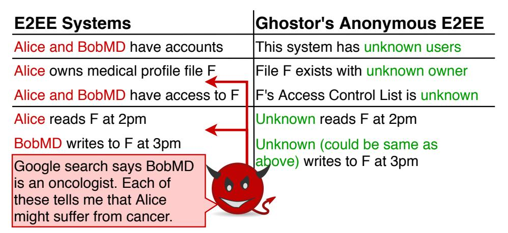

Figure 1: An example of what a server attacker sees in a typical end-to-end encrypted (E2EE) system versus Ghostor's Anonymous E2EE

the shared file is Alice's medical profile, and she does not learn that her doctor changed her treatment.

Research over the past 15 years has striven to mitigate these attacks by providing *anonymity*—hiding users' identities from the storage server—or *verifiable consistency*—enabling users to detect rollback and fork attacks. In achieving these stronger security guarantees, however, state-of-the-art systems employ weaker threat models that rely on centralized trust: a trust assumption on a *few specific machines*. For example, they rely on a trusted party [\[67](#page-15-7)[,91\]](#page-16-4), split the server into two components assuming one is honest [\[50,](#page-14-5) [55,](#page-15-8) [75\]](#page-15-9), or assume the adversary is honest-but-curious (not malicious) [\[7,](#page-13-1) [16,](#page-13-2) [66,](#page-15-10) [105\]](#page-16-5) meaning the attacker does not change the server's data or execution.

Attackers have notoriously performed highly targeted attacks, spreading malware with the ability to modify software, files, or source code [\[63,](#page-15-11) [107,](#page-16-6) [108\]](#page-16-7). In such attacks, a determined attacker can compromise any few *central servers*. Ideally, we would avoid *any trust* in the server or other clients, but unfortunately, that is impossible: Mazières and Shasha [\[70\]](#page-15-12) proved that, if one cannot assume that clients are reliably online [\[56\]](#page-15-0), clients cannot detect fork attacks without placing some trust in the server. Hence, this paper asks the question: Can we achieve strong privacy and integrity guarantees in a data-sharing system without relying on *centralized trust*?

To answer this question, we design and build Ghostor, an object store based on *decentralized trust* that achieves *anonymity* and *verifiable linearizability* (abbreviated VerLinear). At a high level, anonymity[1](#page-0-1) means that the protocol does not reveal directly to the server any user identity with any request, as previously defined in the secure storage literature [\[55,](#page-15-8) [66,](#page-15-10) [75,](#page-15-9) [105\]](#page-16-5). As shown in Fig. [1,](#page-0-0) the server does not

\*Sam Kumar and Yuncong Hu contributed equally to this work. They are listed in alphabetical order by last name.

1Outside of secure storage, *anonymity* is sometimes defined differently. In secure messaging, for example, an anonymous system is expected to hide the timing of accesses [\[98\]](#page-16-8) and which files/mailboxes are accessed, but not necessarily the system's membership [\[26\]](#page-14-12).

{1}------------------------------------------------

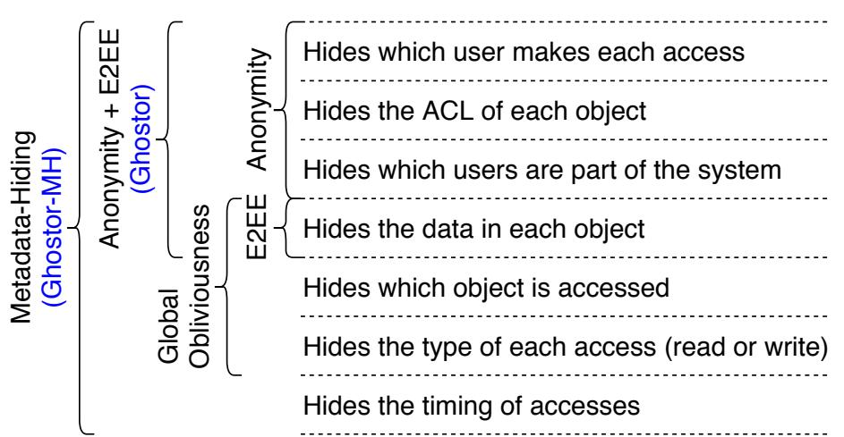

Figure 2: Information leakage in a data-sharing system and associated privacy properties

see which user owns which objects, which users have read or write permissions to a given object, or even who are the users of the system. The server essentially sees **ghost**s accessing the **stor**age, hence the name "**Ghostor**." VerLinear means clients can verify that each write is reflected in later reads, except for benign reordering of concurrent operations as formalized by linearizability [43]. To achieve these properties, we build Ghostor's integrity on top of a consistent storage primitive based on decentralized trust, like a blockchain [17,74,106] or verifiable ledger [30,45], while using it only *rarely*.

### 1.1 Hiding User Identities

Achieving anonymity in practical data-sharing systems like Ghostor is difficult because common system design paradigms, like user login, per-user mailboxes on the server, and client-side caching, let the server track users. As we explain in §4, even using user-specific keys to sign updates to data objects can reveal to the server which user performed the update, and requires knowledge of the ACL to check that the signer is an authorized user. We re-architect the system to avoid these paradigms (§4), using data-centric key distribution and encrypted key lists instead of server-side ACLs. Like prior systems [4, 33, 58], Ghostor uses cryptographic keys as capabilities, allowing the server and other users to verify that each access is performed by an authorized user. Ghostor also leverages this technique to achieve anonymity by having all users authorized to perform a particular operation on an object (e.g., all users with read access to an object) *share* the same capability for performing that operation on that object, and by distributing these capabilities to users without revealing ACLs to the server. We find this technique, *anonymously* distributed shared capabilities, interesting because anonymity is not typically a goal of public-key access control [4,33] or capability-based systems [64, 73, 85].

An additional challenge is to guard against resource abuse while preserving anonymity. This is typically done by enforcing per-user resource quotas (e.g., Google Drive requires users to pay for additional space), but this is incompatible with Ghostor's anonymity. One solution is for users to pay for each operation via an anonymous cryptocurrency (e.g., Zcash [106]), but this puts an expensive blockchain operation in the critical path. To avoid this, Ghostor leverages blind sig-

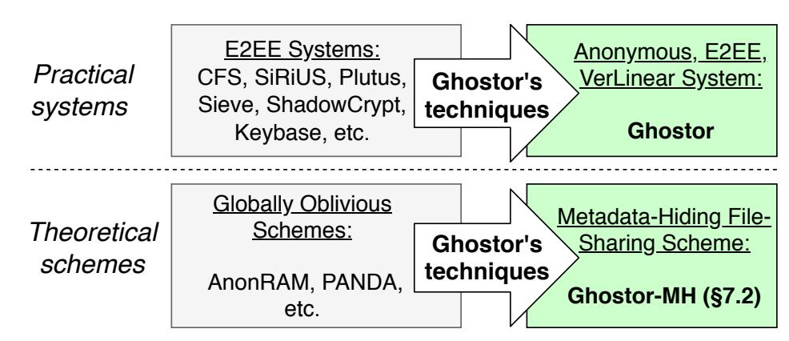

Figure 3: Ghostor's contributions. Ghostor's techniques can be applied to both oblivious and non-oblivious systems.

natures [18, 22, 23] to allow a user to pay the Ghostor server for service in bulk and in advance, while removing the linkage between payments and operations.

**Relationship to obliviousness.** Fig. 2 positions Ghostor's anonymity with respect to other privacy properties. Global obliviousness [7,67], which hides which *object* is accessed across all uncompromised objects and users in the system, is orthogonal to Ghostor's anonymity, which hides which *user* performs each access. Obliviousness and anonymity are also complementary: (1) In some cases, without obliviousness, users may be identified based on access patterns. (2) Without anonymity, knowing which user issued a request may reveal information about what data that request may access. Ghostor's techniques for anonymity are a *transformation* (Fig. 3):

- If applied to an E2EE system, we obtain **Ghostor**, an anonymous **E2EE** system.
- If applied to a globally oblivious scheme, we obtain **Ghostor-MH**, a data-sharing scheme that hides all metadata (except when initializing a group of objects or redeeming payments, as explained in §7.2).

Hiding metadata from a malicious adversary, as in Ghostor-MH, is a very strong guarantee—existing globally oblivious schemes inherently reveal user identities [67] or assume the adversary is honest-but-curious [7, 66]. However, globally oblivious data-sharing schemes, like Ghostor-MH, are theoretical schemes that are far from practical. Thus, Ghostor-MH is only a proof of concept demonstrating the power of Ghostor's techniques to lift a globally oblivious scheme all the way to virtually zero leakage for a malicious adversary.

### 1.2 Verifiable Consistency

To provide VerLinear, prior work has clients sign hashes [56] so the clients can verify that they see the same hash, or store hashes on a separate hash server [50], trusted not to collude with the storage server. Neither technique can be used in Ghostor: client signatures are at odds with anonymity, and the hash server is a trusted party, which Ghostor aims to avoid.

One way to adapt the prior designs to Ghostor's decentralized trust is to store hashes on a blockchain, which can be accomplished by running the hash server in a smart contract. Unfortunately, this design is **too slow to be practical**. The client posts a hash on the blockchain for every object write, which is expensive: blockchains incur high latency

{2}------------------------------------------------

| Goal                     | Technique                     |
|--------------------------|-------------------------------|
| Anonymous user access    | Anonymously distributed    |
| control                  | shared capabilities (§4)      |
| Anonymous server in   | Verifiable anonymous history  |
| tegrity verification     | (§5)                          |
| Concurrent operations | GETs, two-phase Optimized  |
| on a single object       | protocol for PUTs (§5.4)      |
| Anonymous resource    | Blind signatures and proof of |
| abuse prevention         | work (§6)                     |
| Hiding user IP addresses | Anon. network, e.g., Tor (§8) |

Table 1: Our goals and how Ghostor achieves each one

per transaction, have low transaction throughput, and require cryptocurrency payment for each transaction [\[17,](#page-13-3) [74,](#page-15-13) [106\]](#page-16-9).

To sidestep the limitations of a blockchain, we design Ghostor to only interact with the blockchain rarely and outside of the critical path. Ghostor divides time into intervals called *epochs*. At the end of each epoch, the Ghostor server publishes to the blockchain a small *checkpoint*, which summarizes the operations performed during that epoch for all objects and users in the system. Each user can then verify that the results of their accesses during the epoch are consistent with the checkpoint. The consistency properties of a blockchain ensure all clients see the same checkpoint, so the server is committed to a single history of operations and cannot perform a fork attack. Commit chains [\[54\]](#page-15-18) and monitoring schemes [\[15,](#page-13-6) [94\]](#page-16-10) are based on similar checkpoints, but Ghostor applies them to object storage while maintaining users' anonymity.

A significant obstacle is that a hash-chain-based history is not amenable to concurrent appends. Each entry in the history contains the hash of the previous entry, causing one operation to fail if a concurrent operation appends a new entry. Existing techniques for concurrent operations, such as SUNDR's VSLs [\[65\]](#page-15-2), reveal *per-user* version numbers that would undermine Ghostor's anonymity. Our insight in Ghostor is to have the *server*, not the client, populate the hash of the previous entry when appending a new entry. To make this safe despite a malicious adversary, we carefully design a conflict resolution strategy, involving multiple *linked* entries in the history for each write, that prevents attackers from manipulating data via replay or time-stretch attacks.

We call the resulting design a *verifiable anonymous history*.

## 1.3 Summary of Contributions

Our goals and techniques are summarized in Table [1.](#page-2-0) Overall, this paper's contributions are:

- We design an object store providing anonymity and verifiable linearizability based only on *decentralized trust*.
- We develop techniques to (1) share capabilities for anonymity and distribute them anonymously, (2) create and checkpoint a verifiable anonymous history, and (3) support concurrent operations on a single object with a hash-chain-based history.
- We combine these with existing building blocks to instanti-

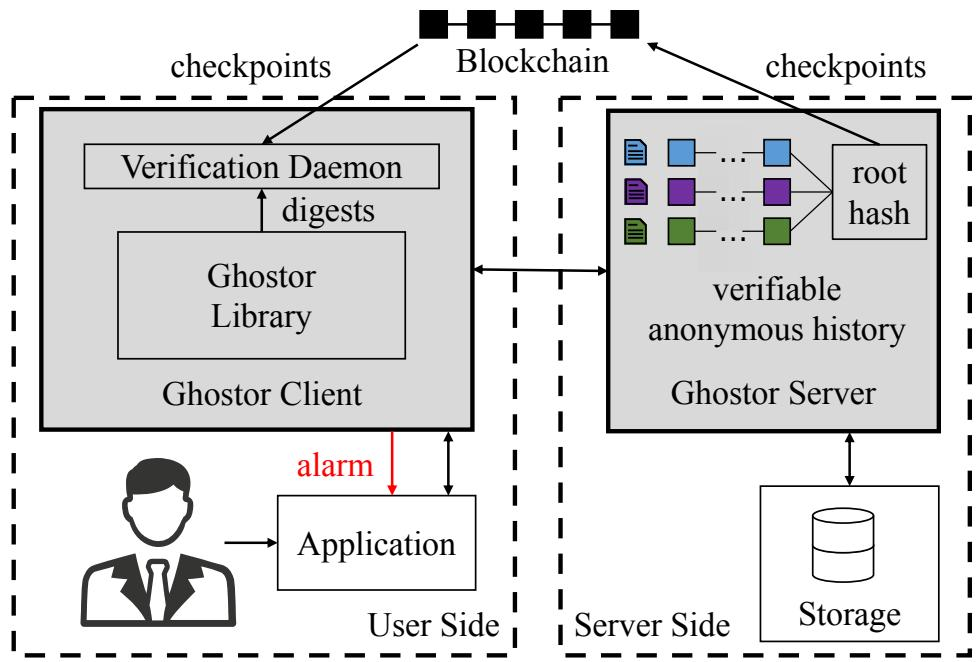

Figure 4: System overview of Ghostor. Shaded areas indicate components introduced by Ghostor.

ate Ghostor, an object store with anonymity and VerLinear.

• We also apply these to a globally oblivious scheme to instantiate Ghostor-MH, which hides nearly all metadata. We also implemented Ghostor and evaluated it on Amazon EC2. Overall, Ghostor brings a 4-5x throughput overhead on top of a simplistic and completely insecure baseline. There are two types of latency overhead. Completing an individual operation takes several seconds. Afterward, it may take several minutes for a checkpoint to be incorporated into the blockchain, to confirm that no active attack has occurred for a batch of operations. We explain how these latencies play out in the context of a particular application, EHR Sharing ([§7.1\)](#page-7-1).

## 2 System Overview

Ghostor is an object store, which stores unstructured data items ("objects") and allows shared access to them by multiple users. We instantiate Ghostor as an object store (as in Amazon S3 or Azure Blobs) because it is a basic primitive on top of which more complex systems can be built. Fig. [4](#page-2-1) illustrates Ghostor's architecture. Multiple users, with separate clients, have shared access to objects on the Ghostor server.

Server. The Ghostor storage server processes requests from clients. At the end of each epoch, the server generates a single small checkpoint and publishes it to the blockchain.

Client. The client software consists of a Ghostor library, linked into applications, and a verification daemon, which runs as a separate process. The Ghostor library receives requests from the application and interacts with the server to satisfy each request. Upon accessing an object, the library forwards a digest summarizing the operation to the verification daemon. At the end of each epoch, the daemon (1) fetches object histories from the server, (2) verifies that they are consistent with the server's checkpoint on the blockchain, and (3) checks that the digests collected during the epoch are consistent with the object histories, as explained in [§5.](#page-5-0)

The daemon stores the user's keypair. If a user loses her secret key, she loses access to all objects that she created or was granted access to. Similarly, an attacker who steals a user's

{3}------------------------------------------------

secret key can impersonate that user. To securely back up her key on multiple devices, a user can use standard techniques like secret sharing [\[83,](#page-15-19)[84,](#page-15-20)[100\]](#page-16-11). A user who accesses Ghostor from multiple devices uses the same key on all devices.

Application developers interact with Ghostor using the API below. Developers can work with usernames, ACLs, and object IDs, but Ghostor clients will not expose them to the Ghostor server. Below is a high-level description of each API call; a step-by-step technical description is in Appendix [A.](#page-16-12) ♦ create\_user(): Creates a Ghostor user by generating keys for a new user. This operation runs entirely in the Ghostor client—the server does not know this operation was invoked. ♦ user.pay(*sum*): Users pay the server through an anonymous cryptocurrency such as Zcash [\[106\]](#page-16-9), and obtain *tokens* from the server proportional to the amount paid. These tokens can later be *anonymously redeemed* and used as proof of payment when invoking the below API functions.

♦ user.create\_object(*id*): Creates an object with ID *id*, owned by user who invokes this. The client expends one token obtained from a previous call to pay. The *id* can be a meaningful name (e.g., a file path). It lives only within the client—the server receives some cryptographic identifier—so different clients can assign different *id*s to the same object.

♦ user.set\_acl(*id*, *acl*): The user who invokes this must be the owner of the object with ID *id*. This function sets a new ACL for that object. For simplicity, only the owner of an object can set its ACL, but Ghostor can be extended to permit other users as well. The client encodes *acl* into an object header that hides user identities, as in [§4.](#page-4-0) If new users are given access, they are notified via an out-of-band channel. Existing data-sharing systems also have this requirement; for example, Dropbox and Box send an email with an access URL to the user. In Ghostor, all keys are transferred in-band; the out-of-band channel is used only to *inform* the user that she has been given access. Ghostor does not require a specific out-of-band channel; for example, one could use Tor [\[29\]](#page-14-19) or secure messaging [\[96,](#page-16-13)[98\]](#page-16-8). ♦ user.get\_object(*id*), user.put\_object(*id*, *content*): The user can GET or PUT an object if permitted by its ACL.

# 3 Threat Model and Security Guarantees

Against a malicious attacker who has compromised the server, Ghostor provides:

- verifiable linearizability, as described in [§3.2,](#page-3-0) and
- a notion of user anonymity, described in [§3.3:](#page-3-1) briefly, it does not reveal user identities, but reveals object access patterns. Ghostor-MH additionally hides access patterns.

Ghostor does not protect against attacks to availability. Nevertheless, its anonymity makes it more difficult for the server to selectively deny service to (or fork views of) certain users. Users, and the Ghostor client instances running on their behalf, can be malicious and can collude with the server.

Formal definitions and proofs for these properties require a large amount of space, so we relegate them to Appendix [D](#page-18-0) and Appendix [E.](#page-26-0) Below, we include only *informal* definitions.

# 3.1 Assumptions

Ghostor is designed to derive its security from decentralized trust. Thus, our threat model assumes an adversary who can compromise any few machines, as described below.

Blockchain. Ghostor makes the standard assumption that the blockchain is immutable and consistent (all users see the same transaction history). This is based on the assumption that, in order to attack a blockchain, the adversary cannot simply compromise a few machines, but rather a significant fraction of the world's computing power. Ghostor's design is not tied to a specific blockchain. Our implementation uses Zcash [\[106\]](#page-16-9) because it supports both public and private transactions; we use Zcash's private transactions for Ghostor's anonymous payments. The privacy guarantees of Zcash can be implemented on top of other blockchains as well [\[11\]](#page-13-7).

Network. We assume clients communicate with the server in a way that does not reveal their network information. This can be done using mixnets [\[21\]](#page-13-8) or secure messaging [\[96,](#page-16-13)[98\]](#page-16-8) based on decentralized trust. Our implementation uses Tor [\[29\]](#page-14-19).

## 3.2 Verifiable Linearizability

If an attack is immediately detectable to a user—for example, if the server fails to honor payment or provides a malformed response (e.g., bad signature)—we consider it an attack on *availability*, which Ghostor does not prevent.

Clients should be able to detect active attacks, including fork and rollback attacks. Some reordering of concurrent operations, however, is benign. We use *linearizability* [\[43\]](#page-14-13) to define when reordering at the server is considered benign or malicious. *Informally*, linearizability requires that after a PUT completes, all later GETs return the value of either (1) that PUT, (2) a PUT that was concurrent with it, or (3) a PUT that comes after it. We provide a more formal definition in Appendix [E.](#page-26-0) Ghostor provides *verifiable linearizability* (abbreviated *VerLinear*). This means that if the server deviates from linearizability, clients can detect it at the end of the epoch. We discuss how to choose the epoch length in [§9.](#page-9-1) Ghostor does not provide consistency guarantees for malicious user, or for objects for which a malicious user has write access.

Guarantee 1 (Verifiable linearizability). *For any object F and any list E of consecutive epochs, suppose that, for each epoch in E, the set of honest users who ran the verification procedure includes all writers of F in that epoch (or is nonempty if F was not written). If the server did not linearizably execute the operations that verifying clients performed in the epochs that they verified, then at least one of the verifying clients will encounter an error in the verification procedure and can generate a proof that the server misbehaved.*

## 3.3 Anonymity

As explained in [§1.1,](#page-1-2) Ghostor's anonymity means that the server sees no user identities associated with any action. In particular, an adversary controlling the server cannot tell which

{4}------------------------------------------------

| Keypair or Key | Description                        |
|----------------|------------------------------------|
| (PVK, PSK)     | Signing keypair used to set ACL    |
| (RVK, RSK)     | Signing keypair used to get object |
| (WVK, WSK)     | Signing keypair used to put object |
| (OSK)          | Symmetric key for object contents  |

Table 2: Per-object keys in Ghostor. The server uses the global signing keypair (SVK,SSK) to sign digests for objects.

user accesses each object, which users are authorized to access each object, or which users are part of the system.

Ghostor. We informally define Ghostor's privacy via a *leakage function*: what the server learns when a user makes each API call ([§2\)](#page-2-2). For create\_object – put\_object, the server learns the object ID, the type of operation, and whether the user is authorized according to the object's ACL (past and present). The server also sees the time of the operation, and the size of the encrypted ACL and encrypted object, which can be hidden via padding at an extra cost. create\_user leaks no information to the server, and pay reveals the sum paid and when. The server learns no user identities, no object contents, and no ACLs. If the attacker has compromised some users, he learns the contents of objects those users can access, including prior versions encrypted under the same key. Collectively, the verification daemons leak the number of clients performing verification for each object. If all clients in an object's ACL are honest and running, this equals the ACL size. If the ACL is padded to a maximum size, the owner should run verification more times to hide the ACL size. Ghostor does *not* hide access patterns or timing (Fig. [2\)](#page-1-0). An adversary who uses this information cannot see the contents of files and ACLs because they are encrypted. But such an adversary could try to deduce correlations between which users issue different operations based on access patterns and timing, and in some cases, identify the user based on that information. This can be partially mitigated by carefully designing the application using Ghostor ([§4.5\)](#page-5-1). In contrast, Ghostor-MH does hide access patterns. In Appendix [D,](#page-18-0) we formally define Ghostor's privacy guarantee in the simulation paradigm of Secure MPC.

Ghostor-MH. We informally define Ghostor-MH's privacy via a leakage function, as above. create\_object reveals that a group of objects was created. set\_acl, get\_object, and put\_object reveal nothing if the object's ACL contains only honest users; otherwise, they reveal which object was accessed. create\_user and pay have the same leakage as described for Ghostor above. The leakage function also includes the total number of honest users in the system.

# 4 Hiding User Identities

System design paradigms used in typical data-sharing systems are incompatible with anonymity. We identify the incompatible system design patterns and show how Ghostor replaces them. Ultimately, we arrive at *anonymously distributed shared capabilities*, which allow Ghostor to enforce access control for anonymous users without server-visible ACLs.

## 4.1 No User Login or User-Specific Mailboxes

Data-sharing systems typically have some storage space on the server, called an *account file*, dedicated to a user's account. For example, Keybase [\[53\]](#page-15-4) has a user account and Mylar [\[76\]](#page-15-3) has a user mailbox where the user receives a key to a new file. Accesses to the account file, however, can be used to *link user operations*. As an example, suppose that when a user accesses an object, her client first retrieves the decryption key from a user-specific mailbox. This violates anonymity because the server can tell whether or not two accesses were made by the same user, based on whether the same mailbox was accessed first. Instead, Ghostor's anonymity requires that *any sequence of API calls ([§2\)](#page-2-2) with the same inputs, when performed by any honest user, results in the same server-side accesses*.

Ghostor does not have any user-specific storage as in existing systems. To allow in-band key exchange, Ghostor associates a *header* with each object. The object header functions like an object-specific mailbox, in that it is used to distribute the object's keys among users who have access to the object. Unlike a user-specific mailbox, it preserves anonymity because, for a given object, each user reads the *same* header before accessing it.

## 4.2 No Server-Visible ACLs

An honest server must be able to prevent unauthorized users from modifying objects, and users must be able to verify that objects returned by the server were produced by authorized writers. This is typically accomplished by having writers sign objects, and having the server check that the user who signed the object is on the object's ACL. However, this requires the ACL to be visible to the server, which violates anonymity.

We observe that by switching to a design based on *shared capabilities*, we can allow the server and other users to verify that writes are indeed made by authorized users, without requiring the server or other users to know the ACL of the object, or which users are authorized. Every Ghostor object has three associated signing keypairs (Table [2\)](#page-4-1). All users of the object (and the server) know the verifying keys PVK, RVK, and WVK because PVK is the name of the object, and RVK and WVK are in the object header; the associated signing keys PSK, RSK, and WSK are *capabilities* that grant access to set the ACL, get the object, and put the object, respectively. To distribute these capabilities to users in the object's ACL, the owner places a *key list* in the object header. The key list contains, for each user in the ACL, a list of capabilities encrypted under that user's public key. The owner randomly shuffles the key list and, optionally, pads it to a maximum size to hide each user's position. If a user has read/write access to an object, her entry in the key list contains WSK, RSK, and OSK; a user with only read access is given a dummy key instead of WSK. Crucially, different users with the same permission *share the same capability*, so the server cannot distinguish between users on the basis of which capability they use. When accessing an object, a user downloads the header and decrypts

{5}------------------------------------------------

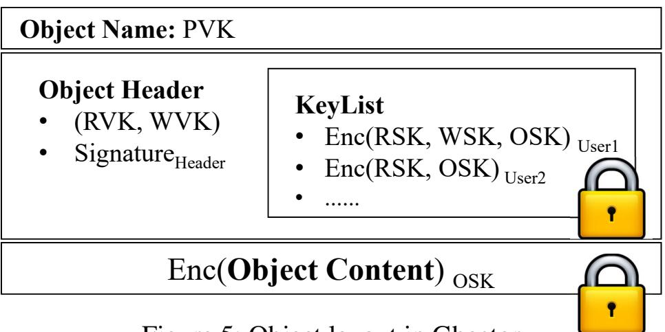

Figure 5: Object layout in Ghostor

her entry in the key list to obtain OSK (used to decrypt the object contents) and her capabilities for the object.

Users sign updates to the object with WSK, allowing the server and other users to verify that each update is made by a user with write access. PSK is stored locally by the owner and is used to sign the header. The owner can set the object's ACL by (1) freshly sampling (RVK,RSK), (WVK,WSK), and OSK, (2) re-encrypting the object with OSK and signing it with WSK, (3) creating a new object header with an updated key list, (4) signing the new header with PSK, and (5) uploading it to the server. (RVK,RSK) will be relevant in [§5.](#page-5-0)

Ghostor's object layout is summarized in Fig. [5.](#page-5-2)

## 4.3 No Server-Visible User Public Keys

Prior systems [\[65\]](#page-15-2) reveal the user's public key to the server when the client interacts with it. For example, SUNDR requires users to provide a signature along with each operation. First, the signature itself could leak the user's public key. Second, to check the legitimacy of writes, the server needs to know the user's public key to verify the signature. The server can use the public key as a *pseudonym* to track users.

The key list in [§4.2,](#page-4-2) however, potentially leaks users' public keys: each entry in the key list is a set of capabilities encrypted under a user's public key, but public-key encryption is only guaranteed to hide the message being encrypted, not the public key used to encrypt it. For example, an RSA ciphertext leaks which public key was used for encryption. Therefore, Ghostor uses *key-private* encryption [\[10\]](#page-13-9), which is guaranteed to hide both the message and the public key.

In summary, Ghostor has users *share* capabilities for anonymity, and then distributes the capabilities anonymously, without revealing ACLs to the server. We call the resulting technique *anonymously distributed shared capabilities*.

## 4.4 No Client-Side Caching

Assuming that an object's ACL changes rarely, it may seem natural for clients to locally cache an object's keypairs (RVK,RSK) and (WVK,WSK), to avoid downloading the header on future accesses to that object. Unfortunately, the mere fact that a client did not download the header before performing an operation tells the server that the *same user* recently accessed that object. As a result, Ghostor's anonymity prohibits user-specific caching. That said, *server-side* caching of commonly accessed objects is allowed.

| Field         | Description                            |
|---------------|----------------------------------------|
| Epoch         | epoch when operation was committed     |
| PVK, WVK, RVK | permission/writer/reader verifying key |
| Hashprev      | hash of previous digest in chain       |
| Hashkeylist   | hash of key list                       |
| Hashdata      | hash of object contents                |
| Sigclient     | client signature with RSK, WSK, or PSK |
| Sigserver     | server signature using SSK             |
| nonce         | random nonce chosen by client          |

Table 3: A digest for an operation in Ghostor

## 4.5 Careful Application Design

Ghostor does not hide access patterns or timing information from the server. A sophisticated adversary could, for example, deny or delay accesses to a particular object and see how access patterns shift, to try and deduce which user made which accesses. Therefore, one should carefully design the application using Ghostor to avoid leaking user identities in its access patterns. For example, just as Ghostor has no clientside caching or user-specific mailboxes, an application using Ghostor should avoid caching data locally to avoid requests to the server or using an object as a user-specific mailbox. Note that Ghostor-MH hides these access patterns.

# 5 Achieving Verifiable Consistency

Ghostor's *verifiable anonymous history* achieves the "verifiable equivalent" of a blockchain for critical-path operations, while using the underlying blockchain rarely. It consists of: (1) a hash chain of digests, (2) periodic checkpoints on a real blockchain, and (3) a verification procedure that does not require knowledge of user identities.

## 5.1 Hash Chain of Digests in Ghostor

We now achieve fork consistency for a single object in Ghostor using techniques inspired from SUNDR [\[65\]](#page-15-2), but modified because SUNDR is not anonymous. Each access to an object, whether a GET or a PUT, is summarized by a *digest* shown in Table [3.](#page-5-3) The object's history is stored as a chain of digests.

To access the object, a client first produces a digest summarizing that operation as in Table [3.](#page-5-3) This requires fetching the object header from the server, so that the client can obtain the secret key (RSK, WSK, or PSK) for the desired operation. Then the client fetches the latest digest for the object and computes Hashprev in the new digest. To GET the object, the client copies Hashdata from the latest digest; to PUT it, the client hashes the new contents to obtain Hashdata. If the client is changing permissions, then Hashkeylist is calculated from the new header; otherwise, it is copied from the latest digest.

Then the client signs the digest with the appropriate key and provides the signed digest to the server. The server signs the digest using SSK, appends it to a log, and returns the signed digest and the result of the operation. At the end of the epoch, the client downloads the digest chain for that object and epoch, and verifies that (1) it is a valid history for the object, and that (2) it contains the operations performed by 

{6}------------------------------------------------

that client. We specify protocol details in Appendix [A.](#page-16-12)

Ghostor's digests differ from SUNDR in two main ways. First, for anonymity, a client does not sign digests using the user's secret key, but instead uses RSK, WSK, or PSK, which can be verified without knowing the user's public key. When inspecting the digest, the server no longer learns which user performed the operation, only that the user has the required permission. Second, each digest is signed by the server. Thus, if the server violates linearizability, the client can assemble the offending digests into a *proof of misbehavior*.

# 5.2 Checkpoint and Verification

The construction so far is susceptible to fork attacks [\[65\]](#page-15-2), in which the server presents two users with different views over the same object. To detect fork attacks, Ghostor requires the server to produce a *checkpoint* at the end of each epoch, consisting of the hash of the object's latest digest and the epoch number, and publish the checkpoint to the blockchain. The *verification procedure* run by a client consists of fetching the checkpoint from the blockchain, checking it corresponds to the hash for the last digest in the list of digests obtained from the server, and running the verification in [§5.1.](#page-5-4) The blockchain guarantees that all users see the same checkpoint. This prevents the server from forking two users' views, as the latest digests for two different views cannot both match the published checkpoint. In this way, we bootstrap the blockchain's consistency guarantees to achieve verifiable consistency over an entire epoch of operations.

## 5.3 Multiple Objects per Checkpoint

So far, the server puts one checkpoint in the blockchain *per object*, which is undesirable when there are many objects. We address this as follows. The server computes the hash of the final digest of each object, builds a Merkle tree over those hashes, and publishes the root hash in the blockchain as a single checkpoint for all objects. To verify integrity at the end of an epoch, a Ghostor client fetches the digest chain from the server for objects that are either (1) accessed by the client during the epoch or (2) owned by the client's user. It verifies that all operations that it performed on those objects are included in the objects' digest chains. Then, it requests Merkle proofs from the server to check that the hash of the latest digest is included in the Merkle tree at the correct position based on the object's PVK. Finally, it verifies that the Merkle root hash matches the published checkpoint.

Although we maintain a separate digest chain for each object, the collective history of operations, across all objects, is also linearizable. This follows from the classical result that linearizability is a local property [\[43\]](#page-14-13). Thus, Ghostor provides *verifiable linearizability across all objects, while supporting full concurrency for operations on different objects*.

# 5.4 Concurrent Operations on a Single Object

As explained in [§5.1,](#page-5-4) the client must fetch the latest digest from the server to construct a digest for a new GET or PUT. If two clients attempt to GET or PUT an object concurrently, they may retrieve the same latest digest for that object, and therefore construct new digests that both have the same Hashprev. An honest server can only accept one of them; the other operation must be aborted. A naïve fix is for clients to acquire locks (or leases) on objects during network round trips, but this limits single-object throughput according to client round-trip times. How can we allow concurrent operations on a single object without holding server-side locks during round trips? We explain our techniques at a high level below; Appendix [A](#page-16-12) contains a full description of our protocol.

**GET**s. We optimize GETs so that clients need not fetch the latest digest, obviating the need to lock for a round trip. When a client submits a GET request to the server, the client need not include Hashprev, Hashdata, or Hashkeylist in the digest presented to the server. The client includes the remaining fields and a signature over only those fields. Then, the server chooses the hashes for the client and returns the resulting digest, signed by the server. Although the server can replay operations, this is harmless because GETs do not affect data. When the verification daemon verifies a GET, it checks the client signature without including Hashprev, Hashdata, or Hashkeylist. **PUT**s. The above technique does not apply to PUTs, because the server can roll back objects by replaying PUTs. Simply using a client-provided nonce to detect replayed PUTs is not sufficient, because the server can delay incorporating a PUT (which we call a *time-stretch* attack) to manipulate the final object contents. For PUTs, Ghostor uses a two-phase protocol. In the PREPARE phase, the client operates in the same way as GET, but signs the digest with WSK; the server fills in the hashes, signs the resulting digest, appends it to the object's digest chain, and returns it to the client. In the COMMIT phase, the client creates the final digest for the operation—omitting Hashprev and appending an additional field Hashprep, which is the hash of the server-signed digest obtained in the PRE-PARE phase—and uploads it to the server with the new object contents. The server fills in Hashprev based on the object's digest chain (which could have changed since the PREPARE phase), signs the resulting digest, appends it to the object's digest chain, and returns it to the client. The server can replay PREPARE requests, but it does not affect object contents. The server cannot generate a COMMIT digest for a replayed PREPARE request, because the client signed the COMMIT digest including the hash of the server-signed PREPARE digest, which includes Hashprev. The server can replay a COMMIT request for a particular PREPARE request, but this is harmless because of our conflict resolution strategy described below.

Resolving Conflicts. If two accesses are concurrent (i.e., neither commits before the other prepares), then linearizability does not require any particular ordering of those operations, only that all clients perceive the same ordering. If a GET is concurrent with a PUT (GET digest between the PREPARE and COMMIT digests for a PUT), Ghostor linearizes the GET as happening before the PUT. This allows the result of the GET to be served immediately, without waiting for the PUT to finish. 

{7}------------------------------------------------

For concurrent PUTs, it is unsafe for the linearization order to depend on the COMMIT digest, because the server could perform a time-stretch or replay attack on a COMMIT digest, to manipulate which PUT wins. Therefore, Ghostor chooses as the winning PUT the one whose PREPARE digest is latest. The server can still delay PREPARE digests, but the client can choose not to COMMIT if the delay is unacceptably large. To simplify the implementation of this conflict resolution procedure, we require that the PREPARE and COMMIT phases happen over the same session with the client, during which the server can keep in-memory state for the relevant object. This allows the server to match PREPARE and COMMIT digests without additional accesses to secondary storage.

Verification Complexity. To verify PUTs, the verification daemon must check that Hashdata only changes on COMMIT digests for winning writes. Thus, it must keep track of all PREPARE digests since the latest PREPARE digest whose corresponding COMMIT has been seen. We can bound this state by requiring that PUT requests do not cross an epoch boundary. ACL Updates. We envision that updates to the ACL will be rare, so our implementation does not allow set\_acl operations to proceed concurrently with GETs or PUTs. It may be possible to apply a two-phase technique, similar to our concurrent PUT protocol, to allow set\_acl operations to proceed concurrently with other operations. We leave exploring this to future work.

## 6 Mitigating Resource Abuse

To prevent resource abuse, commercial data-sharing systems, like Google Drive and Dropbox, enforce per-user resource quotas. Ghostor cannot do this, because Ghostor's anonymity prevents it from tracking users. Instead, Ghostor uses two techniques to prevent resource abuse without tracking users: anonymous payments and proof of work.

## 6.1 Anonymous Payments

A strawman approach is for users to use an anonymous cryptocurrency (e.g., Zcash [\[106\]](#page-16-9)) to pay for each expensive operation (e.g., operations that consume storage). Unfortunately, this requires a separate blockchain transaction for each operation, limiting the system's overall throughput.

Instead, Ghostor lets users pay for expensive operations *in bulk* via the pay API call ([§2\)](#page-2-2). The server responds with a set of *tokens* proportional to the amount paid via Zcash, which can later be redeemed *without using the blockchain* to perform operations. Done naïvely, this violates Ghostor's anonymity; the server can track users by their tokens (tokens issued for a single pay call belong to the same user).

To circumvent this issue, Ghostor uses *blind signatures* [\[18,](#page-13-5) [22,](#page-14-17)[23\]](#page-14-18). A Ghostor client generates a random token and *blinds* it. After verifying that the client has made a cryptocurrency payment, the server signs the blinded token. The blind signature protocol allows the client to *unblind* it while preserving the signature. To redeem the token, the client gives the unblinded signed token to the server, who can verify the server's signature to be sure it is valid. The server cannot link tokens

at the time of use to tokens at the time of issue because the tokens were blinded when the server originally signed them.

## 6.2 Proof of Work (PoW)

Another way to mitigate resource abuse is proof of work (PoW) [\[6\]](#page-13-10). Before each request from the client, the server sends a random challenge to the client, and the client must find a proof such that Hash(challenge,proof,request) < diff. diff controls the difficulty, which is chosen to offset the amplification factor in the server's work. Because of the guarantees of the hash function, the client must iterate through different proofs until it finds one that works. In contrast, the server efficiently checks the proof by computing one hash.

## 6.3 Anonymous Payments & PoW in Ghostor

Ghostor uses anonymous payments and PoW together to mitigate resource abuse. Our implementation requires anonymous payment only for create\_object, which requires the server to commit additional storage space for the new object. This is analogous to systems like Google Drive or Dropbox, which require payment to increase a user's storage limit but do not charge based on the count or frequency of object accesses. Implicit in this model are hard limits on object size and perobject access frequency, which Ghostor can enforce. Although our implementation requires payment only for create\_object, an alternate implementation may choose to require payment for every operation except pay. Ghostor requires PoW for all API calls. This includes pay and create\_object, to offset the cost of Zcash payments and verifying blind signatures.

## 7 Applying Ghostor to Applications

In this section, we discuss two applications of Ghostor that we implemented: EHR Sharing and Ghostor-MH.

## 7.1 Case Study: EHR Sharing

Our goal in this section is to show how a real application may interface with Ghostor's semantics (e.g., ownership, key management, error handling) and how Ghostor's security guarantees might benefit a real application. To make the discussion concrete, we explore a particular use case: multi-institutional sharing of electronic health records (EHRs). It has been of increasing interest to put patients in control of their data as they move between different healthcare providers [\[38,](#page-14-20) [44,](#page-14-21) [86\]](#page-16-14). As it is paramount to protect medical data in the face of attackers [\[28\]](#page-14-22), various proposals for multi-institutional EHR sharing use a blockchain for access control and integrity [\[5,](#page-13-11) [71\]](#page-15-21). Below, we explore how to design such a system using Ghostor to store EHRs in a central object store, using only decentralized trust. We also implemented the system for Open mHealth [\[3\]](#page-13-12).

Each patient owns one or more objects in the central Ghostor system representing their EHRs. Each patient's Ghostor client (on her laptop or phone) is reponsible for storing the PSKs for these objects. The PSKs could be stored in a wristband, as in [\[71\]](#page-15-21), in case of emergency situations for at-risk patients. When the patient seeks treatment from a healthcare provider, she can grant the healthcare provider access to the

{8}------------------------------------------------

objects containing the relevant information in Ghostor. Each healthcare provider's Ghostor client maintains a local *metadata database*, mapping patient identities (object IDs, [§2\)](#page-2-2) to PVKs. This mapping could be created when a patient checks in to the office for the first time (e.g., by sharing a QR code). Benefits. Existing proposals leverage a blockchain to achieve integrity guarantees [\[5,](#page-13-11) [71\]](#page-15-21) but use the blockchain more heavily than Ghostor: for example, they require a blockchain transaction to grant access to a healthcare provider, which results in poor performance and scalability. Additionally, Ghostor provides anonymity for sharing records.

Epoch Time. An important aspect of Ghostor's semantics is that one has to wait until the next epoch before one can verify that no fork has occurred. It is reasonable to fetch a patient's record at the time that they check in to a healthcare facility, but before they are called in for treatment. This allows the time to wait until the end of an epoch to overlap with the patient's waiting time. In the case of scheduled appointments, the record can be fetched in advance so that integrity can be verified by the time of the appointment. An epoch time of 15–30 minutes would probably be sufficient.

Error Handling. If a healthcare provider detects a fork when verifying an epoch, it informs other healthcare providers of the integrity violation out-of-band of the Ghostor system. Ghostor does not constrain what happens next. One approach, used in Certificate Transparency (CT), is to abandon the Ghostor server for which the integrity violation was detected. We envision that there would be a few Ghostor servers in the system, similar to logs in CT, so this would require affected users to migrate their data to a new server. Another approach is to handle the error in the same way that blockchain-based systems [\[5,](#page-13-11)[71\]](#page-15-21) handle cases where the hash on the blockchain does not match the hash of the data—treat it as an availability error. While neither solution is ideal, it is better than the status quo, in which a malicious adversary is free to perform fork or rollback attacks undetected, causing patients to receive incorrect treatments based on old or incorrect data, potentially resulting in serious physical injury.

## 7.2 A Metadata-Hiding Data-Sharing Scheme

Ghostor's anonymity techniques can be combined with a globally oblivious scheme, AnonRAM [\[7\]](#page-13-1), to obtain a *metadatahiding* object-sharing scheme, *Ghostor-MH*. Ghostor-MH is *not* a practical system, but only a theoretical scheme; our goal is to show that Ghostor's techniques are complementary to and compatible with those in globally oblivious schemes. We apply Ghostor's techniques in Ghostor-MH as follows. First, we apply Ghostor's principle of switching from a user-centric to a data-centric design. Whereas each ORAM instance in AnonRAM corresponds to a user, each ORAM instance in Ghostor-MH corresponds to an *object group*, a fixed-sized set of objects with a shared ACL. Second, we apply the design of Ghostor's object header in Ghostor-MH. This is accomplished by storing the ORAM secret state, encrypted, on the server. Finally, we use similar techniques to mitigate resource abuse

in Ghostor-MH as we do in Ghostor.

In [§7.2.2](#page-8-1) below, we provide a more in-depth explanation of Ghostor-MH. We first provide more details about AnonRAM in [§7.2.1.](#page-8-2) This is necessary because, as explained in [§7.2,](#page-8-0) we construct Ghostor-MH by applying Ghostor's techniques to AnonRAM [\[7\]](#page-13-1).

### 7.2.1 Overview of AnonRAM

ORAM [\[37\]](#page-14-23) is a technique to access objects on a remote server without revealing which objects are accessed. Many ORAM schemes, such as Path ORAM [\[92\]](#page-16-15), allow a *single user* to access data. Path ORAM [\[92\]](#page-16-15) works by having the client shuffle a small amount of server-side data with each access, such that the server cannot link requests to the same object. Clients store mutable *secret state*, including a stash and position map, used to find objects after shuffling.

AnonRAM extends single-user ORAM to support *multiple users*. Each AnonRAM user essentially has her own ORAM on the server. When a user accesses an object, she (1) performs the access as normal in her own ORAM, and (2) performs a *fake access* to all of the other users' ORAMs. To the server, the fake accesses are indistinguishable from genuine accesses, so the server does not learn to which ORAM the user's object belongs. This, together with each individual ORAM hiding which of its objects was accessed, results in global obliviousness across all objects in all ORAMs.

To support fake accesses, *re-randomizable* public-key encryption (e.g., El Gamal) is used to encrypt objects in each ORAM. To guard against malicious clients, the server requires a zero-knowledge proof with each real or fake access, to prove that *either* (1) the client knows the secret key for the ORAM, *or* (2) the new ciphertexts encrypt the same data as existing ciphertexts (i.e., they were re-randomized correctly).

A limitation of AnonRAM is that there is *no object sharing among users*; each user can access only the objects she owns. Furthermore, AnonRAM and similar schemes ([§10\)](#page-12-0) are *theoretical*—they consider oblivious storage from a cryptographic standpoint, but do not consider challenges like payment, user accounts, and resource abuse.

### 7.2.2 Ghostor-MH

Recall from [§7.2](#page-8-0) that we apply to AnonRAM Ghostor's principle of switching from a user-centric to a data-centric design. Each ORAM now corresponds to an *object group*, which is a fixed-size set of objects with a shared ACL. Each object group has one object header and one digest chain.

Ghostor-MH uses Path ORAM, which organizes serverside storage as a binary tree. To guard against a malicious adversary controlling the server, we build a Merkle tree over the binary tree, and compute Hashdata in each digest as the hash of the Merkle root and ORAM secret state. This allows each client to efficiently compute the new Hashdata after each ORAM access, without downloading the entire ORAM tree. The ORAM secret state is stored on the server, encrypted with OSK, so multiple clients can access an object group. This is

{9}------------------------------------------------

analogous to Ghostor's object header, which stores an object's keys encrypted on the server.

To access an object, a client (1) identifies the object group containing it, (2) downloads the object header and encrypted ORAM secret state, (3) obtains OSK from the object header, (4) decrypts the ORAM secret state, (5) uses it to perform the ORAM access, (6) encrypts and uploads the new ORAM secret state, (7) computes a new digest for the operation, (8) has the server sign it, and (9) sends it to the verification daemon. For all other object groups, the client performs a *fake access* that fetches data from the server and generates a digest, but only re-randomizes ciphertexts instead of performing a real access. This hides which object group contains the object. When writing an object, the client pads it to a maximum size (the ORAM block size) to hide the length of the object.

Below, we explain some more details about Ghostor-MH: Fake accesses. OSK is replaced with an El Gamal keypair. This allows ciphertexts in the ORAM tree and the ORAM secret state to be re-randomized. We no longer attach a client signature to each digest, but instead modify the zero-knowledge proof in AnonRAM to prove that *either* the client can produce a signature over the digest with WSK, *or* the ciphertexts were properly re-randomized.

Hiding timing. Similar to secure messaging systems [\[98\]](#page-16-8), Ghostor-MH operates in rounds (shorter than epochs) to hide timing. In each round, each client either accesses an object as described above, or performs a fake access on all ORAMs if there is no pending object access. Each client chooses a random time during the round to make its request to the server. Using tokens. In a globally oblivious system like Ghostor-MH, it is impossible to enforce the per-object quotas discussed in [§6.3.](#page-7-2) Thus, it is advisable to require users to expend tokens for *all* operations (except pay), not just create\_object. Our PoW mechanism applies to Ghostor-MH unchanged.

Object group creation. The server can distinguish payment (to obtain tokens) and object group creation from GET/PUT operations. The most secure solution is to have a setup phase to create all object groups and perform all payment in advance. Barring this, we propose adding a special round at the start of each epoch, used only for creation and payment; all object accesses during an epoch happen after this special round.

List of object groups. To make fake accesses, each client must know the full list of object groups. To ensure this, we can add an additional digest chain to keep track of all created object groups, checkpointed every epoch with the rest of the system.

Changing permissions. In our solution so far, the server can distinguish a set\_acl operation from object accesses. To fix this, we require the owner of each object group to perform exactly one set\_acl for that object group during each epoch; if he does not wish to change it, he sets it to the same value. Concurrency. When a client iterates over all ORAMs to make accesses (fake or real), the client locks each ORAM individually and releases it after the access. No "global lock" is held while a client makes fake accesses to all ORAMs.

# 8 Implementation

We implemented a prototype of Ghostor in Go. It consists of three parts, as in Fig. [4,](#page-2-1) server (≈ 2100 LOC), client library (≈ 1000 LOC), and verification daemon (≈ 1000 LOC), which all depend on a set of core Ghostor libraries (≈ 1400 LOC).

Our implementation uses Ceph RADOS [\[102\]](#page-16-16) for consistent, distributed object storage. We use SHA-256 for the cryptographic hash and the NaCl secretbox library (which uses XSalsa20 and Poly1305) for authenticated symmetric-key encryption. For *key-private* asymmetric encryption (to encrypt signing keys in the object header), we implemented the El Gamal cryptosystem, which is *key-private* [\[10\]](#page-13-9), on top of the Curve25519 elliptic curve. We use an existing blind signature implementation [\[1\]](#page-13-13) based on RSA with 2048-bit keys and 1536-bit hashes. We use Ed25519 for digital signatures.

As discussed in [§3,](#page-3-2) Ghostor uses external systems for anonymous communication and payment. In our implementation, clients use Tor [\[29\]](#page-14-19) to communicate with the server and Zcash 1.0.15 for anonymous payments. We build a Zcash test network, separate from the Zcash main network. Ghostor, however, could also be deployed on the Zcash main chain. Zcash is also used as the blockchain to post checkpoints. Our implementation runs as a *single* Ghostor server that stores its data in a scalable, fault-tolerant, distributed storage cluster. We discuss how to scale to *multiple* servers in Appendix [B.](#page-18-1)

We implemented a proof of concept of our theoretical scheme Ghostor-MH ([§7.2\)](#page-8-0), in ≈ 2100 additional LOC. As it is a theoretical scheme, our focus in evaluating Ghostor-MH is simply to understand the latency of operations. Ghostor-MH includes AnonRAM's functionality, which, to our knowledge, has not been previously implemented. We omit zeroknowledge proofs in our implementation, as they are similar to AnonRAM and are not Ghostor-MH's innovation.

## 9 Evaluation

We run experiments on Amazon EC2. Except in [§9.3](#page-11-0) and [§9.5,](#page-11-1) Ghostor's storage cluster consists of three i3en.xlarge servers. We configure Ceph to replicate each object (key-value pair) on two SSDs on different machines, for fault-tolerance.

## 9.1 Microbenchmarks

Basic Crypto Primitives. We measured the latency of crypto operations used in Ghostor's critical path. En/decryption of object contents varies linearly with the object size, and takes ≈ 2 ms for 1 MiB. Key-private en/decryption for object headers and signing/verification of digests takes less than 150 us.

Blind Signatures. We also measure the blind signature scheme used for object creation, which consists of four steps. (1) The client *generates* a blinded hash of a random number. (2) The server *signs* the blinded hash. (3) The client *unblinds* the signature, obtaining the server's signature over the original number. (4) The server *verifies* the signature and the number during object creation. Results are shown in Fig. [6.](#page-10-0)

{10}------------------------------------------------

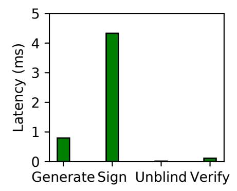

| A | 50% R, 50% W          |
|---|-----------------------|
| В | 95% R, 5% W           |
| С | 100% R                |
| D | 95% R, 5% Insert      |
| E | 95% R, 5% Range       |
| F | 50% R, 50% R-Modify-W |

Figure 7: YCSB workloads (R: read, W: write)

Figure 6: Blind signature

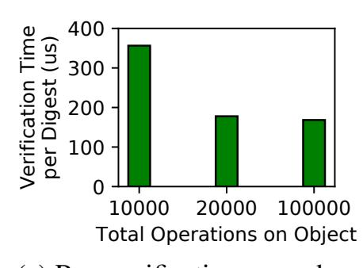

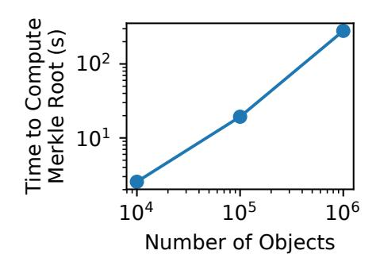

- (a) Run verification procedure
- (b) Compute Merkle root

Figure 8: Operations for verification

Verification Procedure. In Fig. 8, we measure the overhead of verification for digests in a single epoch. For client verification time, we perform an end-to-end test, measuring the total time to fetch digests and to verify them. The client has 1,000 signed digests for operations the client performed during the epoch that the client needs to check were included in the history of digests. We vary the total number of digests in the object's history for that epoch. The reported values in Fig. 8a are the total time to verify the object, divided by the total number of operations on the object, indicating the verification time *per digest*. The trend indicates a constant overhead when the total number of operations on the object is small, that is amortized when the number of operations is large.

Fig. 8b shows the server's overhead to compute the Merkle root. We inserted objects using YCSB (§9.2.2) during an epoch, and measured the time to compute the Merkle root at the end of that epoch. For 10,000 objects, this takes about 2.5 seconds; for 1,000,000 objects, it takes about 280 seconds. Reading the latest digest for each object (leaves of the Merkle tree) dominates the time to compute the Merkle root (2 seconds for 10,000 objects, 272 seconds for 1,000,000 objects). The reason is that our on-disk data structures are optimized for single-object operations, which are in the critical path. In particular, each object's digest chain is stored as a separate batched linked list, so reading the latest digests requires a separate read for each object.

### 9.2 Server-Side Overhead

This section measures to what extent anonymity and VerLinear affect Ghostor's performance. To ensure that the bottleneck was on the server, we set proof of work to minimum difficulty and do not use anonymous communication (§3), but we return to evaluating these in §9.3.

We measure the end-to-end performance of operations in Ghostor, both as a whole and for instantiations of Ghostor having only anonymity or VerLinear. We compare these to an insecure baseline as well as to competitive solutions for privacy and verifiable consistency, as we now describe.

- 1. Insecure system ("Insec"). This system uses the traditional ACL-based approach for serving objects. Each object access is preceded by a read to the object's ACL to verify that the user has permission to access the object. Similarly, creating an object requires a read to a per-user account file. It provides no security against a compromised server.
- 2. End-to-End Encrypted system ("E2EE"). This system encrypts objects placed on the server using end-to-end encryption similarly to SiRiUS [35]. Such systems have an encrypted KeyList similar to Ghostor's, but clients can cache their keys locally on most accesses unlike Ghostor.
- 3. Ghostor's anonymity system ("Anon"). This is Ghostor with VerLinear disabled. This fits a scenario where one wants to hide information from a passive server attacker. Unlike the E2EE system above, this system cannot cache keys locally—every operation incurs an additional round trip to fetch the KeyList from the server. In addition, every operation incurs yet another round trip at the beginning for the client to perform a proof of work. On the positive side, the server does not maintain any per-user ACL.
- 4. Fork Consistent system ("ForkC"). This system maintains Ghostor's digest chain (§5.1), but does not post checkpoints. Each operation appends to a per-object log of digests, using the techniques in §5.4. This system also performs an ACL check when creating an object.
- 5. Ghostor's VerLinear system ("VLinear"). This system corresponds to the VerLinear mechanism in §5 (including §5.2). This matches a use case where one wants integrity, but does not care about privacy. We do not include the verification procedure, already evaluated in §9.1.
- 6. Ghostor. This system achieves both anonymity and VerLinear, and therefore incurs the costs of both guarantees.

### 9.2.1 Object Accesses

In each setup, we measured the latency for create, GET, and PUT operations (Fig. 9a), throughput for GETs/PUTs to a single object (Fig. 10a), and the throughput for creating objects and for GETs/PUTs to multiple objects (Fig. 10b).

Fork consistency adds substantial overhead, because additional accesses to persistent storage are required for each operation, to maintain each object's log of digests. Ghostor, which both maintains a per-object log of digests and provides anonymity, incurs additional overhead because clients do not cache keys, requiring the server to fetch the header for each operation. In contrast, for Anon, the additional cost of reading the header is offset by the lack of ACL check. For 1 MiB objects, en/decryption adds a visible overhead to latency.

End-to-end encryption adds little overhead to throughput; this is because we are measuring throughput at the *server*, whereas encryption and decryption are performed by *clients*. The only factor affecting server performance is that the ciphertexts are 40 bytes larger than plaintexts.

{11}------------------------------------------------

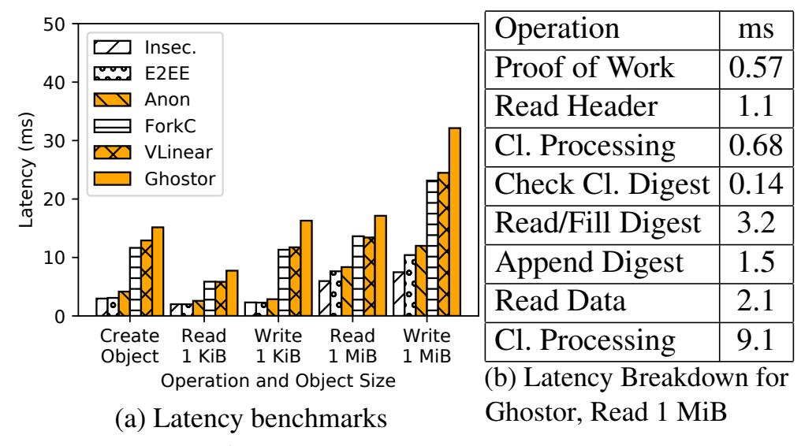

Figure 9: Latency measurements

Single-object throughput is lower for ForkC, VLinear, and Ghostor, because maintaining a digest chain requires requests to be serialized across multiple accesses to persistent storage. In contrast, Insec, E2EE, and Anon serve requests in parallel, relying on Ceph's internal concurrency control.

In the multi-object experiments, in which no two concurrent requests operate on the same object, this bottleneck disappears. For small objects, throughput drops in approximately an inverse pattern to the latency, as expected. For large objects, however, all systems perform commensurately. This is likely because reading/writing the object itself dominated the throughput usage for these experiments, without any concurrency overhead at the object level to differentiate the setups.

### 9.2.2 Yahoo! Cloud Serving Benchmark

In this section, we evaluate our system using the Yahoo! Cloud Serving Benchmark (YCSB). YCSB provides different workloads representative of various use cases, summarized in Table 7. We do not use Workload E because it involves range queries, which Ghostor does not support. As shown in Fig. 10c, anonymity incurs up to a 25% overhead for benchmarks containing insertions, owing to the additional accesses to storage required to store used object creation tokens. However, it shows essentially no overhead for GETs and PUTs. Fork consistency adds a 3–4x overhead compared to the Insec baseline. VerLinear adds essentially no overhead on top of fork consistency; this is to be expected, because the overhead of VerLinear is outside of the critical path (except for insertions, where the overhead is easily amortized). Ghostor, which provides both anonymity and VerLinear, must forgo client-side caching, and therefore incurs additional overhead, with a 4–5x throughput reduction overall compared to the Insec baseline.

### 9.3 End-to-End Latency

We analyze Ghostor's performance from the client's perspective, including PoW and anonymous communication (§3). In these experiments, we use three m4.10xlarge instances each with three gp2 SSDs for Ghostor's storage cluster.

### 9.3.1 Microbenchmarks

The latency experienced by a Ghostor client is the latency measured in Fig. 9, plus the additional overhead due to the proof of work mechanism and anonymous communication.

The difficulty of the proof of work problem is adjustable. For the purpose of evaluation, we set it to a realistic value to prevent denial of service. Fig. 9b indicates that it takes  $\approx 32$  ms for a Ghostor operation; therefore, we set the proof of work difficulty such that it takes the client, on average, 100 times longer to solve ( $\approx 3.2$  s). Fig. 11 shows the distribution of latency for the client to solve the proof of work problem. As expected, the distribution appears to be memoryless.

In our implementation, a client connects to a Ghostor server by establishing a circuit through the Tor [29] network. The performance of the connection, in terms of both latency and throughput, varies according to the circuit used. Fig. 11 shows the distribution of (1) circuit establishment time, (2) round-trip time, and (3) network bandwidth. We used a fresh Tor circuit for each measurement. Based on our measurements, a Tor circuit usually provides a round-trip time less than 1 second and bandwidth of at least 2 Mb/s.

#### 9.3.2 Macrobenchmarks

We now measure the end-to-end latency of each operation in Ghostor's client API (§2), including all overheads experienced by the client. As explained in §9.3.1, the overhead due to proof of work and Tor is quite variable; therefore, we repeat each experiment 1000 times, using a separate Tor circuit each time, and report the distribution of latencies for each operation in Fig. 13. Comparing Fig. 13 to Fig. 9, the client-side latency is dominated by the cost of PoW and Tor; Ghostor's core techniques in Fig. 9 have relatively small latency overhead. For the pay operation, we measure only the time to redeem a Zeash payment for a single token, not the time for proof of work or making the Zcash payment (see §9.4 for a discussion of this overhead). GET and PUT for large objects are the slowest, because Tor network bandwidth becomes a bottleneck. The create\_user operation (not shown in Fig. 13) is only 132 microseconds, because it generates an El Gamal keypair locally without any interaction with the server.

### 9.4 Zcash

In our implementation, we build our own Zcash test network to avoid the expense from Zcash's main network. Since our system leverages Zcash in a minimal way, the overhead of Zcash is not on the critical path of our protocol. According to the Zcash website [106] and block explorer [2], the block size limit is about 2 MiB, and block interval is about 2.5 minutes. In the past six months, the maximum block size has been less than 150 KiB and the average transaction fee has been much less than 0.001 ZEC (0.05 USD at the time of writing). Hence, even with shorter epochs (less time for misbehavior detection), the price of Ghostor's checkpoints is modest since there is a single checkpoint per epoch for the whole system.

### 9.5 Ghostor-MH

For completeness, we evaluate the *theoretical* Ghostor-MH scheme presented in §7.2 using the EC2 setup from §9.3, focusing only on the latency of accessing an object. We do not use Tor and we set the PoW difficulty to minimum. Latency is

{12}------------------------------------------------

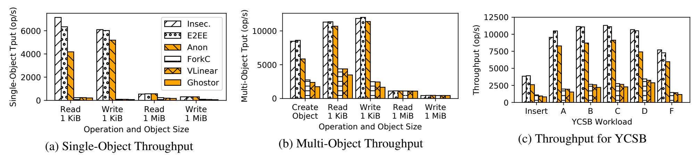

Figure 10: Benchmarks comparing throughput of the six setups described in §9.2

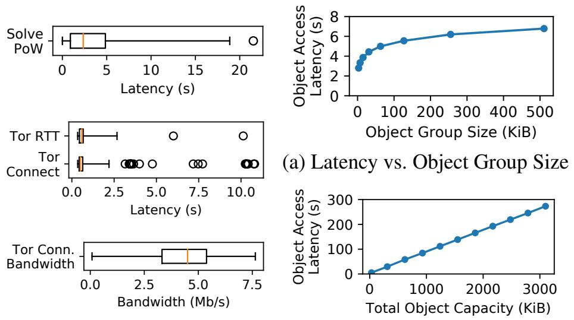

Figure 11: Microbenchmarks (b) Latency vs. No. Object Groups of PoW mechanism and Tor Figure 12: Ghostor-MH

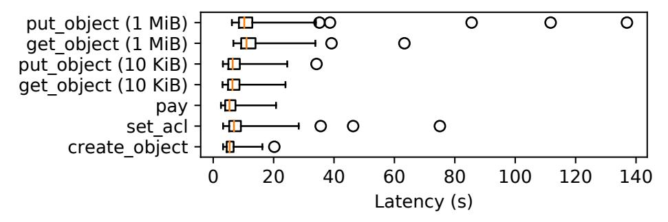

Figure 13: End-to-end latencies of client-side operations

dominated by en/decryption on the client, because object contents and ORAM state are encrypted with El Gamal encryption, which is much slower than symmetric-key encryption. Fig. 12a shows the object access latency for an object group, as we vary its size. It scales logarithmically, as expected from Path ORAM. An additional overhead of  $\approx 2$  s comes from re-encrypting ORAM client state (32 KiB, after padding and encryption) on each access. Fig. 12b shows the object access latency as we vary the number of object groups (each object group is 31 KiB). It scales linearly, because the client makes fake accesses to *all* other object groups to hide which one it truly accessed. Latency could potentially be improved by using multiple client CPU cores.

### 10 Related Work

**Systems Providing Consistency.** We have already compared extensively with SUNDR [65]. Venus [88] achieves eventual consistency; however, Venus requires some clients to be frequently online and is vulnerable to malicious clients. Caelus [56] has a similar requirement and does not resist collusion of malicious clients and the server. Verena [50] trusts

one of two servers. SPORC [31], which combines fork consistency with operational transformation, allows clients to recover from a fork attack, but does not resist faulty clients. Depot [68] can tolerate faulty clients, but achieves a weaker notion of consistency than VerLinear. Furthermore, its consistency techniques are at odds with anonymity. Ghostor and these systems use hash chains [40,69] as a key building block. **Systems Providing E2EE.** Many systems provide end-to-end encryption (E2EE), but leak significant user information as discussed in §3.3: academic systems such as Persona [8], DEPSKY [13], CFS [14], SiRiUS [35], Plutus [49], ShadowCrypt [42], M-Aegis [61], Mylar [76] and Sieve [100] or industrial systems such as Crypho [27], Tresorit [47], Keybase [53], PreVeil [77], Privly [78] and Virtru [99].

**Systems Using Trusted Hardware.** Some systems, such as Haven [9] and A-SKY [25], protect against a malicious server by using trusted hardware. Existing trusted hardware, like Intel SGX, however, suffer from side-channel attacks [97].

**Oblivious Systems.** A complementary line of work to Ghostor aims to hide access patterns: *which* object was accessed. Standard Oblivious RAM (ORAM) [37,87,101] works in the single-client setting. Multi-client ORAM [7,41,51,66,67,81,91] extends ORAM to support multiple clients. These works either rely on central trust [81,91] (either a fully trusted proxy or fully trusted clients) or provide limited functionality (not providing global object *sharing* [7], or revealing user identities [67]). GORAM [66] assumes the adversary controlling the server does not collude with clients. Furthermore, it only provides obliviousness within a single data owner's objects, not *global obliviousness* across all data owners.

AnonRAM [7] and PANDA [41] provide global obliviousness and hide user identity, but are slow. They do not provide for sharing objects or mitigate resource abuse. One can realize these features by applying Ghostor's techniques to these schemes, as we did in §7.2 to build Ghostor-MH. Unlike these schemes, Ghostor-MH is a *metadata-hiding object-sharing scheme* providing both global obliviousness and anonymity without trusted parties or non-collusion assumptions.

**Decentralized Storage.** Peer-to-peer storage systems, like OceanStore [57], Pastry [80], CAN [79], and IPFS [12], allow users to store objects on globally distributed, untrusted storage without any coordinating central trusted party. These systems are vulnerable to rollback/fork attacks on mutable

{13}------------------------------------------------

data by malicious storage nodes (unlike Ghostor's VerLinear). While some of them encrypt objects for privacy, they do not provide a mechanism to distribute secret keys while preserving anonymity, as Ghostor does. Recent blockchain-based decentralized storage systems, like Storj [\[93\]](#page-16-20), Swarm [\[95\]](#page-16-21), Filecoin [\[32\]](#page-14-28), and Sia [\[89\]](#page-16-22), have similar shortcomings.

Decentralized Trust. As discussed in [§1,](#page-0-2) blockchain systems [\[17,](#page-13-3) [20,](#page-13-19) [74,](#page-15-13) [104\]](#page-16-23) and verifiable ledgers [\[62,](#page-15-29) [72\]](#page-15-30) can serve as the source of decentralized trust in Ghostor.

Another line of work aims to provide efficient auditing mechanisms. EthIKS [\[15\]](#page-13-6) leverages smart contracts [\[17\]](#page-13-3) to monitor key transparency systems [\[72\]](#page-15-30). Catena [\[94\]](#page-16-10) builds log systems based on Bitcoin transactions, which enables efficient auditing by low-power clients. It may be possible to apply techniques from those works to optimize our verification procedure in [§5.2.](#page-6-1) However, none of them aim to build secure data-sharing systems like Ghostor.

Secure Messaging. Secure messaging systems [\[26,](#page-14-12) [96,](#page-16-13) [98\]](#page-16-8) hide network traffic patterns, but they do not support object storage/sharing as in our setting. Ghostor can complementarily use them for its anonymous communication network.

## 11 Conclusion

Ghostor is a data-sharing system that provides *anonymity* and *verifiable linearizability* in a strong threat model that assumes only *decentralized trust*.

## Acknowledgments

We thank the anonymous reviewers and our shepherd, Carmela Troncoso, for their invaluable feedback. We would also like to thank students from the RISELab Security Group and BETS Research Group for their feedback on early drafts, Eric Brewer for comments and feedback, and David Culler for advice and discussion.

This work has been supported by NSF CISE Expeditions Award CCF-1730628, as well as gifts from the Sloan Foundation, Bakar, Alibaba, Amazon Web Services, Ant Financial, Capital One, Ericsson, Facebook, Futurewei, Google, Intel, Microsoft, Nvidia, Scotiabank, Splunk, and VMware. This research is also supported in part by the National Science Foundation Graduate Research Fellowship Program under Grant No. DGE-1752814. Any opinions, findings, and conclusions or recommendations expressed in this material are those of the authors and do not necessarily reflect the views of the National Science Foundation.

## References

- [1] https://github.[com/cryptoballot/rsablind](https://github.com/cryptoballot/rsablind).
- [2] BitInfoCharts. [https://bitinfocharts](https://bitinfocharts.com/zcash/).com/ [zcash/](https://bitinfocharts.com/zcash/).
- [3] Open mHealth. http://www.[openmhealth](http://www.openmhealth.org/).org/. Sep. 19, 2019.
- [4] S. G. Akl and P. D. Taylor. Cryptographic solution to a problem of access control in a hierarchy. *TOCS*, 1983.

- [5] A. Azaria, A. Ekblaw, T. Vieira, and A. Lippman. Medrec: Using blockchain for medical data access and permission management. In *OBD*, 2016.
- [6] A. Back. Hashcash - a denial of service countermeasure. 2002.
- [7] M. Backes, A. Herzberg, A. Kate, and I. Pryvalov. Anonymous RAM. In *ESORICS*, 2016.
- [8] R. Baden, A. Bender, N. Spring, B. Bhattacharjee, and D. Starin. Persona: an online social network with userdefined privacy. In *CCR*, 2009.
- [9] A. Baumann, M. Peinado, and G. Hunt. Shielding applications from an untrusted cloud with haven. *TOCS*, 2015.
- [10] M. Bellare, A. Boldyreva, A. Desai, and D. Pointcheval. Key-privacy in public-key encryption. In *ASIACRYPT*, 2001.
- [11] E. Ben-Sasson, A. Chiesa, C. Garman, M. Green, I. Miers, E. Tromer, and M. Virza. Zerocash: Decentralized anonymous payments from Bitcoin. In *S&P*, 2014.
- [12] J. Benet. IPFS: Content addressed, versioned, P2P file system. *CoRR*, 2014.
- [13] A. Bessani, M. Correia, B. Quaresma, F. André, and P. Sousa. Depsky: dependable and secure storage in a cloud-of-clouds. *TOS*, 2013.
- [14] M. Blaze. A cryptographic file system for UNIX. In *CCS*, 1993.
- [15] J. Bonneau. EthIKS: Using Ethereum to audit a CONIKS key transparency log. In *FC*, 2016.
- [16] F. Buccafurri, G. Lax, S. Nicolazzo, and A. Nocera. Accountability-preserving anonymous delivery of cloud services. In *TrustBus*, 2015.
- [17] V. Buterin et al. Ethereum white paper. *GitHub repository*, 2013.
- [18] J. L. Camenisch, J. Piveteau, and M. A. Stadler. Blind signatures based on the discrete logarithm problem. In *EUROCRYPT*, 1994.
- [19] R. Canetti. Universally composable security: A new paradigm for cryptographic protocols. In *FOCS*, 2001.
- [20] M. Castro and B. Liskov. Practical Byzantine fault tolerance. In *OSDI*, 1999.
- [21] D. Chaum. Untraceable electronic mail, return addresses, and digital pseudonyms. *CACM*, 1981.

{14}------------------------------------------------

- [22] D. Chaum. Blind signatures for untraceable payments. In *EUROCRYPT*, 1983.
- [23] D. Chaum. Blind signature system. In *EUROCRYPT*, 1984.
- [24] S. Chen, R. Wang, X. Wang, and K. Zhang. Sidechannel leaks in web applications: A reality today, a challenge tomorrow. In *S&P*, 2010.
- [25] S. Contiu, S. Vaucher, R. Pires, M. Pasin, P. Felber, and L. Réveillère. Anonymous and confidential file sharing over untrusted clouds. *SRDS*, 2019.
- [26] H. Corrigan-Gibbs, D. Boneh, and D. Mazières. Riposte: An anonymous messaging system handling millions of users. In *S&P*, 2015.
- [27] Crypho. Enterprise communications with end-to-end encryption. [https://www](https://www.crypho.com/).crypho.com/.
- [28] J. Davis. The 10 biggest healthcare data breaches of 2019, so far. https://healthitsecurity.com/news/the-10 biggest-healthcare-data-breaches-of-2019-so-far. Sep. 12, 2019.
- [29] R. Dingledine, N. Mathewson, and P. Syverson. Tor: The second-generation onion router. Technical report, 2004.
- [30] A. Eijdenberg, B. Laurie, and A. Cutter. Verifiable data structures. [https:](https://github.com/google/trillian/blob/master/docs/VerifiableDataStructures.pdf) //github.[com/google/trillian/blob/master/](https://github.com/google/trillian/blob/master/docs/VerifiableDataStructures.pdf) [docs/VerifiableDataStructures](https://github.com/google/trillian/blob/master/docs/VerifiableDataStructures.pdf).pdf.
- [31] A. J. Feldman, W. P. Zeller, M. J. Freedman, and E. W. Felten. SPORC: Group collaboration using untrusted cloud resources. In *OSDI*, 2010.
- [32] Filecoin. [https://filecoin](https://filecoin.io).io. Apr. 16, 2019.
- [33] W. C. Garrison, A. Shull, S. Myers, and A. J. Lee. On the practicality of cryptographically enforcing dynamic access control policies in the cloud. In *S&P*, 2016.
- [34] S. Gilbert and N. Lynch. Brewer's conjecture and the feasibility of consistent, available, partition-tolerant web services. *SIGACT News*, 2002.
- [35] E. Goh, H. Shacham, N. Modadugu, and D. Boneh. SiRiUS: Securing remote untrusted storage. In *NDSS*, 2003.
- [36] O. Goldreich. *Foundations of Cryptography*, volume 1. 2007.
- [37] O. Goldreich and R. Ostrovsky. Software protection and simulation on oblivious RAMs. *JACM*, 1996.

- [38] W. Gordon, A. Chopra, and A. Landman. Patient-led data sharing — a new paradigm for electronic health data. https://catalyst.nejm.org/patient-led-health-dataparadigm/. Sep. 12, 2019.
- [39] P. Grubbs, R. McPherson, M. Naveed, T. Ristenpart, and V. Shmatikov. Breaking web applications built on top of encrypted data. In *CCS*, 2016.
- [40] S. Haber and W. S. Stornetta. How to time-stamp a digital document. In *EUROCRYPT*, 1990.
- [41] A. Hamlin, R. Ostrovsky, M. Weiss, and D. Wichs. Private anonymous data access. 2019.
- [42] W. He, D. Akhawe, S. Jain, E. Shi, and D. Song. Shadowcrypt: Encrypted web applications for everyone. In *CCS*, 2014.
- [43] M. P. Herlihy and J. M. Wing. Linearizability: A correctness condition for concurrent objects. *TOPLAS*, 1990.
- [44] D. Hoppe. Blockchain use cases: Electronic health records. [https://gammalaw](https://gammalaw.com/blockchain_use_cases_electronic_health_records/).com/blockchain\_ [use\\_cases\\_electronic\\_health\\_records/](https://gammalaw.com/blockchain_use_cases_electronic_health_records/). Sep. 12, 2019.
- [45] R. Hurst and G. Belvin. Security through transparency. [https://security](https://security.googleblog.com/2017/01/security-through-transparency.html).googleblog.com/2017/01/ [security-through-transparency](https://security.googleblog.com/2017/01/security-through-transparency.html).html.
- [46] Identity Theft Resource Center. At mid-year, U.S. data breaches increase at record pace. In *ITRC*, 2018.
- [47] Tresorit Inc. End-to-end encrypted cloud storage. [tresorit](tresorit.com).com.
- [48] M. S. Islam, M. Kuzu, and M. Kantarcioglu. Access pattern disclosure on searchable encryption: Ramification, attack and mitigation. In *NDSS*, 2012.
- [49] M. Kallahalla, E. Riedel, R. Swaminathan, Q. Wang, and K. Fu. Plutus: Scalable secure file sharing on untrusted storage. In *FAST*, 2003.
- [50] N. Karapanos, A. Filios, R. A. Popa, and S. Capkun. Verena: End-to-end integrity protection for web applications. In *S&P*, 2016.
- [51] N. P. Karvelas, A. Peter, and S. Katzenbeisser. Using oblivious RAM in genomic studies. In *Data Privacy Management, Cryptocurrencies and Blockchain Technology*. 2017.
- [52] B. Kepes. Some scary (for some) statistics around file sharing usage, 2015. [https:](https://www.computerworld.com/article/2991924/some-scary-for-some-statistics-around-file-sharing-usage.html) //www.computerworld.[com/article/2991924/](https://www.computerworld.com/article/2991924/some-scary-for-some-statistics-around-file-sharing-usage.html) [some-scary-for-some-statistics-around](https://www.computerworld.com/article/2991924/some-scary-for-some-statistics-around-file-sharing-usage.html)[file-sharing-usage](https://www.computerworld.com/article/2991924/some-scary-for-some-statistics-around-file-sharing-usage.html).html.

{15}------------------------------------------------

- [53] Keybase.io. [https://keybase](https://keybase.io/).io/.
- [54] R. Khalil, A. Zamyatin, G. Felley, P. Moreno-Sanchez, and A. Gervais. Commit-chains: Secure, scalable offchain payments, 2018. [https://eprint](https://eprint.iacr.org/2018/642).iacr.org/ [2018/642](https://eprint.iacr.org/2018/642).
- [55] S. M. Khan and K. W. Hamlen. AnonymousCloud: A data ownership privacy provider framework in cloud computing. In *TrustCom*, 2012.
- [56] B. H. Kim and D. Lie. Caelus: Verifying the consistency of cloud services with battery-powered devices. In *S&P*, 2015.
- [57] J. Kubiatowicz, D. Bindel, Y. Chen, S. Czerwinski, P. Eaton, D. Geels, R. Gummadi, S. Rhea, H. Weatherspoon, W. Weimer, C. Wells, and B. Zhao. OceanStore: An architecture for global-scale persistent storage. In *ASPLOS*, 2000.
- [58] S. Kumar, Y. Hu, M. P Andersen, R. A. Popa, and D. E. Culler. JEDI: Many-to-many end-to-end encryption and key delegation for IoT. In *USENIX Security*, 2019.
- [59] L. Lamport. The part-time parliament. *TOCS*, 1998.
- [60] L. Lamport et al. Paxos made simple. *ACM Sigact News*, 2001.
- [61] B. Lau, S. P. Chung, C. Song, Y. Jang, W. Lee, and A. Boldyreva. Mimesis Aegis: A mimicry privacy shield-a system's approach to data privacy on public cloud. In *USENIX Security*, 2014.
- [62] B. Laurie, A. Langley, and E. Kasper. Certificate transparency. Technical report, 2013.
- [63] R. Lemos. Home Depot estimates data on 56 million cards stolen by cybercriminals. [https:](https://arstechnica.com/information-technology/2014/09/home-depot-estimates-data-on-56-million-cards-stolen-by-cybercrimnals/) //arstechnica.[com/information-technology/](https://arstechnica.com/information-technology/2014/09/home-depot-estimates-data-on-56-million-cards-stolen-by-cybercrimnals/) [2014/09/home-depot-estimates-data-on-56](https://arstechnica.com/information-technology/2014/09/home-depot-estimates-data-on-56-million-cards-stolen-by-cybercrimnals/) [million-cards-stolen-by-cybercrimnals/](https://arstechnica.com/information-technology/2014/09/home-depot-estimates-data-on-56-million-cards-stolen-by-cybercrimnals/). Apr. 21, 2019.
- [64] H. M. Levy. *Capability-based computer systems*. 1984.
- [65] J. Li, M. Krohn, D. Mazières, and D. Shasha. Secure untrusted data repository (SUNDR). In *OSDI*, 2004.
- [66] M. Maffei, G. Malavolta, M. Reinert, and D. Schröder. Privacy and access control for outsourced personal records. In *S&P*, 2015.
- [67] M. Maffei, G. Malavolta, M. Reinert, and D. Schröder. Maliciously secure multi-client ORAM. In *ACNS*, 2017.

- [68] P. Mahajan, S. Setty, S. Lee, A. Clement, L. Alvisi, M. Dahlin, and M. Walfish. Depot: Cloud storage with minimal trust. *TOCS*, 2011.
- [69] P. Maniatis and M. Baker. Secure history preservation through timeline entanglement. In *USENIX Security*, 2002.
- [70] D. Mazières and D. Shasha. Building secure file systems out of Byzantine storage. In *PODC*, 2002.
- [71] Medicalchain - blockchain for electronic health records. [https://medicalchain](https://medicalchain.com).com. Sep. 12, 2019.
- [72] M. S. Melara, A. Blankstein, J. Bonneau, E. W. Felten, and M. J. Freedman. CONIKS: bringing key transparency to end users. In *USENIX Security*, 2015.
- [73] A. Mettler, D. A. Wagner, and T. Close. Joe-E: A security-oriented subset of java. In *NDSS*, 2010.
- [74] S. Nakamoto. Bitcoin: A peer-to-peer electronic cash system. 2008.
- [75] V. Pacheco and R. Puttini. SaaS anonymous cloud service consumption structure. In *ICDCS*, 2012.
- [76] R. A. Popa, E. Stark, J. Helfer, S. Valdez, N. Zeldovich, M. F. Kaashoek, and H. Balakrishnan. Building web applications on top of encrypted data using Mylar. In *NSDI*, 2014.
- [77] PreVeil Inc. PreVeil: End-to-end encryption for everyone. [preveil](preveil.com).com.
- [78] Privly Inc. Privly. [priv](priv.ly).ly.
- [79] S. Ratnasamy, P. Francis, M. Handley, R. Karp, and S. Shenker. A scalable content-addressable network. In *SIGCOMM*, 2001.
- [80] A. Rowstron and P. Druschel. Pastry: Scalable, decentralized object location, and routing for large-scale peer-to-peer systems. In *Middleware*, 2001.
- [81] C. Sahin, V. Zakhary, A. El Abbadi, H. Lin, and S. Tessaro. Taostore: Overcoming asynchronicity in oblivious data storage. In *S&P*, 2016.
- [82] T. Seals. 17% of workers fall for social engineering attacks, 2018.
- [83] Secret Double Octopus | passwordless high assurance authentication. [https://doubleoctopus](https://doubleoctopus.com).com. Apr. 21, 2019.
- [84] A. Shamir. How to share a secret. *CACM*, 1979.
- [85] J. S. Shapiro, J. M. Smith, and D. J. Farber. EROS: A fast capability system. In *SOSP*, 1999.

{16}------------------------------------------------

- [86] J. Sharp. Will healthcare see ethical patient data exchange? https://www.idigitalhealth.com/news/healthcareethical-patient-data-exchange-cms-rule. Sep. 12, 2019.
- [87] E. Shi, T. H. H. Chan, E. Stefanov, and M. Li. Oblivious RAM with *O*((log*N*) 3 ) worst-case cost. In *ASI-ACRYPT*, 2011.
- [88] A. Shraer, C. Cachin, A. Cidon, I. Keidar, Y. Michalevsky, and D. Shaket. Venus: Verification for untrusted cloud storage. In *CCSW*, 2010.
- [89] Sia. [https://sia](https://sia.tech).tech. Apr. 16, 2019.
- [90] M. Srivatsa and M. Hicks. Deanonymizing mobility traces: Using social network as a side-channel. In *CCS*, 2012.
- [91] E. Stefanov and E. Shi. Oblivistore: High performance oblivious cloud storage. In *S&P*, 2013.
- [92] E. Stefanov, M. van Dijk, E. Shi, C. Fletcher, L. Ren, X. Yu, and S. Devadas. Path ORAM: An extremely simple Oblivious RAM protocol. In *CCS*, 2013.
- [93] Decentralized cloud storage — Storj. [https://](https://storj.io) [storj](https://storj.io).io. Apr. 16, 2019.
- [94] A. Tomescu and S. Devadas. Catena: Efficient nonequivocation via Bitcoin. In *S&P*, 2017.
- [95] V. Tron, A. Fischer, and N. Johnson. Smash-proof: Auditable storage for Swarm secured by masked audit secret hash. Technical report, Ethersphere, 2016.
- [96] N. Tyagi, Y. Gilad, D. Leung, M. Zaharia, and N. Zeldovich. Stadium: A distributed metadata-private messaging system. In *SOSP*, 2017.
- [97] J. Van Bulck, M. Minkin, O. Weisse, D. Genkin, B. Kasikci, F. Piessens, M. Silberstein, T. F. Wenisch, Y. Yarom, and R. Strackx. Foreshadow: Extracting the keys to the Intel SGX kingdom with transient out-oforder execution. In *USENIX Security*, 2018.
- [98] J. Van Den Hooff, D. Lazar, M. Zaharia, and N. Zeldovich. Vuvuzela: Scalable private messaging resistant to traffic analysis. In *SOSP*, 2015.
- [99] Virtru Inc. Virtru: Email encryption and data protection solutions. www.[virtru](www.virtru.com).com.
- [100] F. Wang, J. Mickens, N. Zeldovich, and V. Vaikuntanathan. Sieve: Cryptographically enforced access control for user data in untrusted clouds. In *NSDI*, 2016.

- [101] X. Wang, H. Chan, and E. Shi. Circuit ORAM: On tightness of the Goldreich-Ostrovsky lower bound. In *CCS*, 2015.
- [102] S. A Weil, S. A. Brandt, E. L. Miller, D. D. E. Long, and C. Maltzahn. Ceph: A scalable, high-performance distributed file system. In *OSDI*, 2006.
- [103] WhatsApp. WhatsApp's privacy notice. www.whatsapp.[com/legal/?doc=privacy-policy](www.whatsapp.com/legal/?doc=privacy-policy), 2012.
- [104] M. Yin, D. Malkhi, M. Reiterand, G. G. Gueta, and I. Abraham. HotStuff: BFT consensus with linearity and responsiveness. In *PODC*, 2019.
- [105] S. Zarandioon, D. D. Yao, and V. Ganapathy. K2C: Cryptographic cloud storage with lazy revocation and anonymous access. In *International Conference on Security and Privacy in Communication Systems*, 2011.
- [106] Zcash. Zcash: All coins are created equal. [http:](http://z.cash/) //z.[cash/](http://z.cash/).
- [107] K. Zetter. 'Google' hackers had ability to alter source code. https://www.wired.com/2010/03/source-codehacks/. Apr. 21, 2019.
- [108] K. Zetter. An unprecedented look at Stuxnet, the world's first digital weapon. https://www.wired.[com/2014/11/countdown](https://www.wired.com/2014/11/countdown-to-zero-day-stuxnet/)[to-zero-day-stuxnet/](https://www.wired.com/2014/11/countdown-to-zero-day-stuxnet/). Apr. 21, 2019.

## A Full Protocol Description for Ghostor

Below, we describe the client-server protocol used by Ghostor.

# A.1 **GET** Protocol

- 1. Server sends a PoW challenge to the client ([§6\)](#page-7-0).
- 2. Client sends the server the PoW solution, PVK of the object that the user wishes to access, and the server returns the object header and current epoch.
- 3. The client assembles a digest for the GET operation, including the epoch number, PVK, RVK, WVK, and a random nonce, and signs it with RSK (obtained from the header). It sends the signed digest to the server.
- 4. Server reads the latest digest and checks that the client's candidate digest is consistent with it. If not (for example, if the header was changed in-between round trips), the server gives the client the object header, and the protocol returns to Step [3.](#page-16-24)
- 5. Server adds Hashprev, Hashheader, and Hashdata to the digest (according to the order in which it commits operations on the object). Then it signs it and adds it to the log of digests for that object.
- 6. Server returns the object contents and the digest, including the server's signature, to the client.

{17}------------------------------------------------

7. Client checks that the signed digest matches the object contents and digest that the client provided. If so, it returns the object contents to the user and sends the signed digest to the verification daemon.

# A.2 **PUT** Protocol

- 1. Server sends a PoW challenge to the client ([§6\)](#page-7-0).
- 2. Client sends the server the PoW solution and PVK of the object to PUT, and the server returns the object header, current epoch, and latest server-signed digest for that object.
- 3. The client assembles a PREPARE digest for the write operation, including the epoch number, PVK, RVK, WVK, and a random nonce, and signs it with WSK (obtained from the header). It sends the signed digest to the server.
- 4. Server reads the latest digest and checks that the client's candidate digest is consistent with it. If not, then the server gives the client the object header, and the protocol returns to Step [3.](#page-17-0)
- 5. Server adds Hashprev, Hashheader, and Hashdata to the digest (according to the order in which it commits operations on the object). Then it signs it and adds it to the log of digests for that object.
- 6. Server returns the signed digest to the client.
- 7. Client assembles a COMMIT digest for the write operation, including the same fields as the PREPARE digest, and also Hashprep and Hashdata according to the new data. Then it signs it and uploads it to the server, including the new object contents.
- 8. Server decides if this PUT "wins." It wins as long as no other PUT whose PREPARE digest is after this PUT's PRE-PARE digest has already committed. If this PUT wins, then the server performs the write, signs the digest, and adds it to the log of digests for that object. If not, it still signs the digest and adds it to the log, but it replaces Hashdata with the current hash of the data, including the value provided by the client as an "addendum" so that the verification daemon can still verify the client's signature. The server may also reject the COMMIT digest if the key list changed meanwhile due to a set\_acl operation.
- 9. Server returns the digest, including the server's signature, to the client.
- 10. Client checks that the signed digest matches the object contents and digest that the client provided. If so, it sends the signed digest to the verification daemon.

# A.3 Access Control

- 1. Server sends a PoW challenge to the client ([§6\)](#page-7-0).
- 2. Client sends the server the PoW solution and PVK of the object, and the server returns the object header, current epoch, and latest server-signed digest for that object.
- 3. Client samples fresh keys for the file (including RSK, WSK, and OSK, but not PSK), encrypts the object contents with OSK, and assembles a new header according to the new ACL, randomly shuffling the key list in the header and padding it to a maximum size if desired. The client assem-

- bles a digest for the operation, including all fields in Table [3,](#page-5-3) and signs it with PSK. It sends the signed digest to the server. The client also signs PVK with PSK and includes that signature in the request.
- 4. Server acquires a lock (lease) on the object for this client (unless it is already held for this client), reads the latest digest, and checks that the client's candidate digest is consistent with it. If not, then the server gives the client the object header, and the protocol returns to Step [3.](#page-17-1) When returning to Step [3,](#page-17-1) the server checks if the client's signature over PVK is correct. If so, the server holds the lock on the object during the round trip. If not, the server releases it.
- 5. Server updates the header and object contents, signs the digest, adds it to the log of digests for that object, and releases the lock.
- 6. Server returns the digest, including the server's signature, to the client.
- 7. Client checks that the signed digest matches the object contents and digest that the client provided. If so, it returns the object contents to the user and sends the signed digest to the verification daemon.

## A.4 Object Creation

- 1. Server sends a PoW challenge to the client ([§6\)](#page-7-0)
- 2. Client sends the server the PoW, PVK of the object that the user wishes to create, a token signed by the server for proof of payment ([§2\)](#page-2-2), the header for the new object, and the object's first digest (for which Hashprev is empty). This involves generating all the keys in Fig. [5\)](#page-5-2) for the new object.
- 3. Server verifies the signature on the token, and checks that it has not been used before.
- 4. Server "remembers" the hash of the token by storing it in permanent storage.
- 5. Server writes the object header. It signs the digest and creates a log for this object containing only that digest.
- 6. Server returns the digest, including the server's signature, to the client.
- 7. Client checks that the signed digest matches the object contents and digest that the client provided. If so, it returns the object contents to the user and sends the signed digest to the verification daemon.

# A.5 Verification Procedure

At the end of each epoch, the verification daemon downloads the digest chain and checkpoints to verify operations performed in the epoch.

- 1. Server sends a PoW challenge to the daemon ([§6\)](#page-7-0). (The server will request additional PoWs for long lists of digests as it streams them to the daemon in Step [3.](#page-18-2))
- 2. Daemon responds with PoW and requests the object's digest chain from the server for that epoch. It sends the server a signed digest for that object, so the server knows this is a legitimate request.

{18}------------------------------------------------

- 3. Server returns the digest chain for that object, along with a Merkle proof.
- 4. Daemon retrieves the Merkle root from the checkpoint in Zcash, and verifies the server's Merkle proof to check that the last digest in the digest chain is included in the Merkle tree at the correct position based on the object's PVK.
- 5. Daemon verifies that all digests corresponding to the user's operations are in the digest chain, and that the diges chain is valid.

To check that the digest chain is valid, the daemon checks:

- 1. Hashprev for each digest matches the previous digest. If this digest is the first digest in this epoch, the previous digest is the last digest in the previous epoch. The daemon knows this previous digest already since the daemon must have checked the previous epoch. If this is the first epoch, then Hashprev should be empty.
- 2. Hashprep in each COMMIT digests matches an earlier PRE-PARE digest in the same epoch, and each PREPARE digest matches with at most one COMMIT digest.
- 3. Hashdata only changes in winning COMMIT digests, which are signed with WSK.
- 4. WVK, RVK, and Hashkeylist only change in digests signed with PSK, and PVK never changes.
- 5. The epoch number in digests matches the epoch that the client requested, and never decreases from one digest to the next.
- 6. Sigclient is valid and signed using the correct signing key. For example, if this operation is read, Sigclient must be signed using RSK.

## A.6 Payment

First, the user pays the server using an anonymous cryptocurrency such as Zcash [\[106\]](#page-16-9), and obtains a proof of payment from Zcash. Then, the client obtains tokens from the server, as follows:

- 1. Server sends a PoW challenge to the client ([§6\)](#page-7-0).
- 2. Client sends the server the PoW, proof of payment, and *t* blinded tokens, where *t* corresponds to the amount paid.
- 3. Server checks that the proof of payment is valid and has not been used before.
- 4. Server "remembers" the proof of payment by storing it in persistent storage.
- 5. Server signs the blinded tokens, ensuring that *t* indeed corresponds to the amount paid, and sends the signed blinded tokens to the client.
- 6. Client unblinds the signed tokens and saves them for later use.

## B Extension: Scalability

Our implementation of Ghostor that we evaluated in [§9](#page-9-1) consists of a single Ghostor server, which stores data in a storage cluster that is internally replicated and fault-tolerant (Ceph RADOS). In this appendix, we discuss techniques to scale this setup by replicating the Ghostor server as well.

Given that we consider a malicious adversary, it may seem natural to use PBFT [\[20\]](#page-13-19). PBFT, however, is neither necessary nor sufficient in Ghostor's setting. It is not necessary because we already post checkpoints to a ledger based on decentralized trust ([§5.2\)](#page-6-1) to achieve verifiable integrity. It is not sufficient because we assume an adversary who can compromise any few machines across which we replicate Ghostor, which is incompatible with Byzantine Fault Tolerance.

The primary challenge to replicating the Ghostor server is *synchronization*: if multiple operations on the same object may be handled by different servers, the servers may concurrently mutate the on-disk data structure for that object. A simple solution is to use object-level locks provided by Ceph RADOS. This is probably sufficient for most uses. But, if server-side caching of objects in memory is implemented, caches in the Ghostor servers would have to be kept coherent.

Alternatively, one could partition the object space among the servers, so each object has a single server responsible for processing operations on it. A set of *load balancer* servers run Paxos [\[59,](#page-15-31) [60\]](#page-15-32) to arrive at a consensus on which servers are up and running, so that requests meant for one server can be re-routed to another if it goes down. Note that Paxos is outside of the critical path; it only reacts to failures, not to individual operations. Based on the consensus, the load balancers determine which server is responsible for each object. Because all objects are stored in the same storage pool, the objects themselves do not need to be moved when Ghostor servers are added or removed, only when storage servers are added or removed (which is handled by Ceph). Object-level locks in Ceph RADOS would still be useful to enforce that at most one server is operating on a Ghostor object at a time.

## C Extension: Files and Directories

Our design of Ghostor can be extended to support a hierarchy of directories and files. Each directory or file corresponds to a PVK and associated Ghostor object; the PVK has a similar role to an inode number in a traditional file system. The Ghostor object corresponding to a directory contains a mapping from name to PVK as a list of *directory entries*. Given the PVK of a root directory and a filepath, a client iteratively finds the PVK of each directory from left to right; in the end, it will have the PVK of the file, allowing it to access the Ghostor object corresponding to a file. The procedure is analogous to resolving a filepath to an inode number in a traditional file system. The Ghostor object corresponding to a file may either contain the file contents directly, or it may contain the PVKs of other objects containing the file data, like an inode in a traditional file system.

The "no user-side caching" principle [§4](#page-4-0) applies here, in the sense that clients may not cache the PVK of a file after resolving it once. A client must re-resolve a file's PVK on each access; caching the PVK and accessing the file without first accessing all parent directories would reveal that the same user has accessed the file before.

{19}------------------------------------------------

### **D** Ghostor's Privacy Guarantee

In this appendix, we use the simulation paradigm of Secure Multi-Party Computation (SMPC) [19] to define Ghostor's privacy guarantee. We begin in Appendix D.1 by providing an overview of our definition and proof sketch, along with an explanation of how our simulation-based definition matches the one in §3.3.

### **D.1** Overview

We formally define Ghostor's anonymity by specifying an *ideal world*. We provided a definition in §3.3, but we consider it to be informal because it does not clearly state what the adversary learns if some users are compromised/malicious. The ideal world is specified such that it is easy to reason about what information the adversary learns; what the adversary learns in the ideal world is our definition of what an anonymous object sharing system leaks to an adversary (i.e., what *anonymity* does not hide). In contrast, we refer to a setup running the actual Ghostor protocol as the *real world*. Below, we refer to the formalized Ghostor protocol as  $\pi_{Ghostor}^{Payment}$ ; as we explain in Appendix D.1.2, this includes some minor differences from Appendix A. The "Payment" in the notation indicates that we are working in the  $\mathcal{F}_{Payment}$ -hybrid model, which we also explain in Appendix D.1.2.

In the real world, clients interact directly with the server  $\mathcal{A}$ . We denote the server as  $\mathcal{A}$  because it is controlled by an adversary. The party P embodies the honest clients. When a client issues an API call, P interacts with  $\mathcal{A}$  according to Ghostor's protocol to perform the API call on behalf of the client.  $\mathcal{A}$  cannot directly inspect the clients' state or secret information, but it may attempt to infer it through the messages it receives from P as it interacts with P to serve each request.

In the ideal world, clients interact with an uncorruptible trusted party  $\mathcal{F}$  called an *ideal functionality*. On each API call issued by a client,  $\mathcal{F}$  provides another party,  $\mathcal{S}$ , with a well-defined subset of information in the API call. The subset of information that  $\mathcal{F}$  gives to  $\mathcal{S}$  defines what information Ghostor leaks to the adversary, and provides a clear definition of what anonymity means in our setting. After receiving this information from  $\mathcal{F}$ ,  $\mathcal{S}$  interacts with  $\mathcal{A}$  to perform the corresponding API call. Obviously, S cannot perform the operation exactly as the client specified because it does not know the entire API call, only the *subset* of the API call that  $\mathcal{F}$  gives it. The challenge is for S to *simulate* the operation such that what A sees is cryptographically indistinguishable from what if would see if the same API call were made in the real world. The existence of S that can properly simulate  $\pi_{Ghostor}^{Payment}$  toward  ${\cal A}$  would show that Ghostor reveals no more to  ${\cal A}$  than what  $\mathcal{F}$  gives  $\mathcal{S}$  on each API call.

We allow  $\mathcal{A}$  to adaptively choose the API calls issued by *honest* users, by instructing the client P which API calls to make in the real world and specifying these API calls to  $\mathcal{F}$  in the ideal world (e.g., instructing a particular user to GET a particular object). Once each API call is completed,  $\mathcal{A}$  receives the return value of the API call (e.g., the object

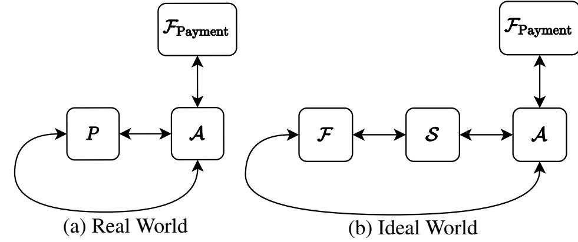

Figure 14: Overview of Real World and Ideal World

contents that are the result of a GET) from P in the real world and  $\mathcal{F}$  in the ideal world. To capture that Ghostor does not directly leak this information to the adversary, our ideal world has  $\mathcal{A}$  specify API calls directly to P in the real world and  $\mathcal{F}$  in the ideal world and receive the return values directly from P or  $\mathcal{F}$ , bypassing the simulator  $\mathcal{S}$  to make API calls and receive responses. Thus,  $\mathcal{A}$  is *external* to  $\mathcal{S}$ . Having  $\mathcal{A}$  adaptively choose what API calls honest users issue and see their return values strengthens our definition; it shows that our anonymity guarantees still hold if the adversary happens to observe the output of some clients' operations, through some side channel outside of the Ghostor system. Although  $\mathcal{A}$  chooses the API calls issued by honest users,  $\mathcal{A}$  cannot see the internal state of honest users. In particular,  $\mathcal{A}$  cannot access honest users' secret keys.

For malicious and compromised users,  $\mathcal{A}$  internally interacts with the server on their behalf, without interacting with P in the real world or  $\mathcal{F}$  in the ideal world. This is necessary because a compromised user may collude with the server  $\mathcal{A}$  and interact with storage in a way that is not captured by any API call.

Fig. 14 provides a high-level summary and comparison of the real world and ideal world.

### D.1.1 Map to Definition of Anonymity in §3.3

In §3.3, we explained Ghostor's privacy guarantee in terms of a leakage function. The leakage function in §3.3 is largely the same as the information that  $\mathcal{F}$  gives to  $\mathcal{S}$  on each API call (Appendix D.3.2). There are a few minor differences, which we now explain. Timing information is not included in Appendix D.3.2 because the model we use in our cryptographic formalization does not have a notion of time. That said, the order in which the requests are processed is given to  $\mathcal{S}$ ; it is implicit in the order in which  $\mathcal{F}$  sends messages to it. Finally, although not explicit in Appendix D.3.2, S can infer how many round trips are performed between the client and server in processing each operation. Because we do not model concurrent operations and there is no client-side caching of data (§4.4), the adversary can infer how many round trips are required from the client-server protocol (Appendix A), so this does not reveal any meaningful information.

Our definition of anonymity matches the everyday use of the word "anonymity" because S does not receive any userspecific information for operations issued by honest users 

{20}------------------------------------------------

on objects that no compromised user is authorized to access. Furthermore,  $\mathcal{S}$  does not see the membership of the system (public keys of users) or even know how many users exist in the system, apart from corrupt/malicious users.

### **D.1.2** Limitations of our Formalization

Although our cryptographic formalization is useful to prove Ghostor's anonymity, there are some aspects of Ghostor that it does not model. We use the notation  $\pi_{Ghostor}^{Payment}$  to describe our formalization of Ghostor's protocol from Appendix A, including these differences. First, we do not directly model the anonymous payment (e.g., Zcash) aspect of Ghostor. Instead, we assume the existence of an ideal functionality for Zcash,  $\mathcal{F}_{Payment}$ , that can be queried to validate payment (i.e., learn how much was paid and when). To denote that we are working in the  $\mathcal{F}_{Payment}$ -hybrid model, we denote the Ghostor protocol used in the real world as  $\pi_{Ghostor}^{Payment}$ . Second, we do not directly model network information (e.g., IP addresses) leaked to the server when clients connect, because this is hidden by the use of an anonymity network like Tor (§8). Third, whereas the Ghostor system allows operations to be processed concurrently (i.e., round trips of different operations may be interleaved), our formalization  $\pi_{Ghostor}^{Payment}$  assumes that the Ghostor server processes each operation one at a time (because P will only answer one request at a time). Fourth, we do not fully model Ghostor's integrity mechanisms, such as epochs, checkpoints, or the return value of obtain\_diges ts. This is because Ghostor's integrity guarantees can only be verified at the end of the epoch; A may commit arbitrary integrity violations during an epoch. Therefore, it is not meaningful to provide integrity guarantees for individual Ghostor operations. We analyze Ghostor's integrity in Appendix E.

Users may also be malicious (i.e., controlled by the adversary). In our formalization, the adversary may compromise users, but we restrict the adversary to doing so *statically*. This means that the adversary compromises users at the time of their creation. Specifically, the adversary may not create an honest user, have that honest user perform operations, and then later compromise that user.

### D.2 Real World

In the real world, the client P interacts directly with the server  $\mathcal{A}$  according to  $\pi^{\text{Payment}}_{\text{Ghostor}}$ .

To request P to perform an API call,  $\mathcal{A}$  sends an Initiate message to P. In the Initiate message,  $\mathcal{A}$  can request P to perform the following API calls:

- create\_user() → userID
- learn\_pk(userID)  $\rightarrow$  pk or  $\bot$
- create\_object(userID, ACL, contents, token)
  (objectID, digest) or ⊥
- set\_acl(userID, objectID, ACL, contents)  $\rightarrow$  digest or  $\bot$
- PUT(userID, objectID, contents)  $\rightarrow$  digest or  $\bot$
- GET(userID, objectID)  $\rightarrow$  (contents, digest) or  $\perp$
- obtain\_tokens(paymentID)  $\rightarrow$  {tokeni}i or  $\bot$
- obtain\_digests(objectID)  $\rightarrow$  data or  $\bot$

Here,  $\perp$  is a symbol representing failure. This occurs if P detects an issue and returns an error. For example, this happens if the server  $\mathcal{A}$  denies service (e.g., server provides malformed messages or object data that is not signed according to  $\pi_{\text{Ghostor}}^{\text{Payment}}$ ).

In the above API, ACL is represented as a list of tuples, where each tuple contains a user and a set of permission bits for that user. If padding is desired, additional tuples for the owner can be added. The user can be identified by either a userID or a pk; allowing the user to be represented by the pk allows  $\mathcal{A}$  to add malicious users it created internally (who do not have userIDs) to the ACL of an object.

The learn\_pk operation is not part of the Ghostor API (§2). We use it to model the *out-of-band* exchange of public keys in Ghostor. The server  $\mathcal{A}$  can use this operation to learn an honest user's public key, which it can then use to (internally) interact with a malicious user to add that honest user to an object's ACL.

In Ghostor, objects are identified by their PVK, so the objectID in Ghostor is the bits of the PVK. We use objectID so that our definition is not tied to PVKs, which are specific to Ghostor's design.

For payment, we model Zcash as an ideal functionality  $\mathcal{F}_{Payment}$ , which allows  $\mathcal{A}$  to make a payment and obtain a paymentID, or validate a paymentID and learn how much was paid and when.

The Initiate message contains an opcode, specifying which operation to perform, and the arguments to that operation. After receiving an Initiate message, P performs the operation. For a create\_user operation, P generates a keypair for a user and a uniformly random userID for that user, locally maintains the mapping from userID to keypair, and returns userID back to A. On a learn\_pk operation, P gives A public key pk for the provided userID. For all other operations, P interacts with A according to the protocol in Appendix A, and gives the final result of the API call (e.g., plaintext object contents in the case of GET) back to A.

### **D.3** Ideal World

We define an ideal functionality  $\mathcal{F}$  for an anonymous object sharing system in the simulation paradigm, which captures Ghostor's privacy guarantee. Our notation and setup are as follows.  $\mathcal{A}$  may send an Initiate message to  $\mathcal{F}$ , specifying an API call to be made on behalf of an honest user. To perform the operation,  $\mathcal{F}$  interacts with the simulator  $\mathcal{S}$ , which simulates  $\pi_{\text{Ghostor}}^{\text{Payment}}$  toward the server  $\mathcal{A}$  based on the subset of each API call that  $\mathcal{F}$  provides to Ghostor. At the end of the interaction,  $\mathcal{F}$  obtains a return value, which it gives to  $\mathcal{A}$ . As in the real world, there exists a party  $\mathcal{F}_{\text{Payment}}$  in the ideal world with which  $\mathcal{A}$  can interact.

### **D.3.1** State Maintained by $\mathcal{F}$

As  $\mathcal{F}$  sees all create\_user and learn\_pk operations and their return values, it maintains a list of all honest users  $\mathcal{A}$  is aware of and their public keys. We call this structure the *user* 

{21}------------------------------------------------

*table*. Based on the user table, F can tell whether a public key corresponds to an honest user; if it does not, it assumes the public key corresponds to a malicious user that A crafted internally.

Similarly, as F sees all create\_object and set\_acl operations and their return values, it maintains a list of all objects created by honest users and all ACLs that have been attempted to be set for each object. We call this structure the *permission table*. In the discussion below, we say that an object is *tainted* if either (1) it was not created by an honest user (i.e., if it was crafted by A), or (2) it was created by an honest user but a malicious user has been on the ACL of the object, either currently or in the past. Crucially, F identifies if an object is tainted or not based on its permission table.

In general, F does not provide plaintext data to S for objects that are not tainted, but must give plaintext data in return values given to A. When F receives plaintext object data *m* from A, it generates a fresh identifier called a contentID for that data. contentID can, for example, be a number chosen sequentially. The tuple (*m*, contentID) is stored by F, allowing F to later recover *m* from the contentID. We call the set of tuples of the form (*m*, contentID) the *content table*.

Finally, F maintains a mapping from tokens obtained by honest users to an identifier sampled uniformly at random. We call this mapping the *token table* and refer to a token's random identifier as its *anonym*. Each anonym is, by definition, unlinkable with the particular token it corresponds to.

### D.3.2 Description of F

When F receives an Initiate message from A, it performs some processing and then reveals to S the opcode (except for create\_user) and the following information:

- For create\_user(), F generates a uniformly random userID for the user and gives it to A. For this operation *only*, F gives nothing to S, not even the opcode. F updates its user table with the new userID.
- For learn\_pk(userID), F looks in its user table to check if userID corresponds to a user who was created with create\_user. If not, F returns ⊥. If so, F gives the message learn\_pk(userID) to S. S responds with a pk, which F gives to A.
- For create\_object(userID,ACL, contents,token), F scans the ACL of the new object and identifies non-honest users using its user table. Then, it generates ACL0 , a randomly shuffled list consisting of the records from ACL that correspond to non-honest users. It also computes *c*, the size (number of records) of the ACL. F looks up token in its token table to obtain *a*, the corresponding anonym. If the object is tainted (which occurs if ACL contains at least one malicious user), then F gives the message create\_object(ACL0 , *c*, contents,*a*) to S. Otherwise, F generates a fresh contentID and adds the entry (contents, contentID) to its content table, and then F gives the message create\_object(ACL0 , *c*, contentID, `,*a*) to S, where ` is the length of contents. S responds with the

- return value, and F checks if the operation was successful (if the return value is not ⊥). If so, F adds a new entry to its permission table with objectID, the creator userID, and the ACL of the object. Finally, F gives the return value to A.
- For set\_acl(userID,objectID,ACL, contents), F scans the ACL and identifies non-honest users using its user table. Then, it generates ACL0 , a randomly shuffled list consisting of the records from ACL that correspond to non-honest users. It also computes *c*, the size (number of records) of the ACL. If the object was created by an honest user, F computes a bit *b* indicating whether userID corresponds to a user authorized to perform a set\_acl operation on this object (which is only true if that user created the object); it can find this information by checking its permission table. If the object was not created by an honest user, then F gives the message set\_acl(userID,objectID,ACL0 , *c*, contents) to S. If the object was created by an honest user but is tainted, then F gives the message set\_acl(objectID,ACL0 , *c*, contents,*b*) to S. If the object was created by an honest user and is not tainted, then F generates a fresh contentID and adds the entry (contents, contentID) to its content table, and then F gives the message set\_acl(objectID,ACL0 , *c*, contentID, `,*b*) to S, where ` is the length of contents. S responds with the return value and F gives it to A. F adds ACL to its permission table as one of the ACLs for the object corresponding to objectID.
- For PUT(userID,objectID, contents), F checks if the object corresponding to objectID was created by an honest user by checking its permission table. If so, it computes a bit vector ~*p*, with one bit per current and prior ACL for the object, recording if it grants the user corresponding to userID permission to perform a PUT. If the object was not created by an honest user, then F gives the message PUT(userID,objectID, contents) to S. If the object was created by an honest user but is tainted, then F gives the message PUT(objectID, contents,~*p*) to S. If the object was created by an honest user but is not tainted, then F generates a fresh contentID and adds the entry (contents, contentID) to its content table, and then F gives the message PUT(objectID, contentID, `,~*p*) to S, where ` is the length of contents. S responds with the return value and F gives it to A.
- For GET(userID,objectID), F checks if the object corresponding to objectID was created by an honest user by checking its permission table. If so, it computes a bit vector ~*p*, with one bit per current and prior ACL for the object, recording if it grants the user corresponding to userID permission to perform a GET. If the object was not created by an honest user, then F gives the message GET(userID,objectID) to S. If the object was created by an honest user, then F gives the message GET(objectID,~*p*) to S. S responds with either ⊥ or with a two-element tuple

{22}------------------------------------------------

where the second element is the digest and the first element is either plaintext object contents or a contentID. If the return value contains a contentID, it is translated to plaintext using the content table, and the resulting return value is given to  $\mathcal{A}$ .

- For obtain\_tokens(paymentID),  $\mathcal{F}$  gives the message obtain\_tokens(paymentID) to  $\mathcal{S}$ .  $\mathcal{S}$  responds with the return value, and  $\mathcal{F}$  gives it to  $\mathcal{A}$ . If tokens are returned,  $\mathcal{F}$  adds entries to its token table for those tokens with fresh anonyms generated uniformly at random.
- For obtain\_digests(objectID),  $\mathcal{F}$  gives the message obtain\_digests(objectID) to  $\mathcal{S}$ .  $\mathcal{S}$  responds with the return value, and  $\mathcal{F}$  gives it to  $\mathcal{A}$ .

### **D.4** Security Definition

Now that we have defined the Real and Ideal Worlds, we are ready to precisely state what it means for Ghostor to be anonymous. We denote the security parameter as  $\kappa$  throughout this paper.

**Definition 1** (Anonymous Data-Sharing System). Let  $\pi$  be the protocol for a data-sharing system (i.e., it provides clients with the API given in Appendix D.2). For an adversary  $\mathcal{A}$  that outputs a single bit, let  $\text{REAL}_{\pi,\mathcal{A}}(1^{\kappa})$  be the random variable denoting  $\mathcal{A}$ 's output when interacting with the real world (Appendix D.2). For a simulator  $\mathcal{S}$  and an adversary  $\mathcal{A}$  that outputs a single bit, let  $\text{IDEAL}_{\mathcal{S},\mathcal{A}}(1^{\kappa})$  be the random variable denoting  $\mathcal{A}$ 's output when interacting with the ideal world (Appendix D.3).

We say that  $\pi$  is anonymous if there exists a non-uniform algorithm S probabilistic polynomial-time in  $\kappa$  such that, for every non-uniform algorithm A probabilistic polynomial-time in  $\kappa$  that outputs a single bit, the probability ensemble of  $\mathrm{REAL}_{\pi,\mathcal{A}}(1^{\kappa})$  over  $\kappa$  is computationally indistinguishable from the probability ensemble of  $\mathrm{IDEAL}_{\mathcal{S},\mathcal{A}}(1^{\kappa})$  over  $\kappa$ . That is,

$$\exists \mathcal{S} \ \forall \mathcal{A} \ \left\{ REAL_{\pi,\mathcal{A}}(1^{\kappa}) \right\}_{\kappa} \stackrel{c}{\equiv} \left\{ IDEAL_{\mathcal{S},\mathcal{A}}(1^{\kappa}) \right\}_{\kappa}$$

Based on this definition, we state the following security guarantee for Ghostor.

**Theorem 1** (Privacy in Ghostor). Suppose that in Ghostor, the data encryption scheme is semantically secure [36], the encryption scheme for key list entries in the object header is semantically secure [36] and key-private [10], payment tokens are blind [18, 22],  $\mathcal{F}_{Payment}$  is an ideal functionality for Zcash, and signatures are existentially unforgeable [36]. Then  $\pi_{Ghostor}^{Payment}$  is anonymous as defined in Definition 1.

### **D.5** Proof of Ghostor's Privacy

We prove Theorem 1 by constructing a simulator  $\mathcal{S}$  for Ghostor that, given the information provided by  $\mathcal{F}$  on each API call, interacts with  $\mathcal{A}$  in a way  $\mathcal{A}$  cannot distinguish the real world from the ideal world. For readability, we use the language " $\mathcal{A}$  cannot distinguish the real world from the ideal

world" throughout this section to mean the cryptographic equivalence stated in Definition 1 applied to  $\pi^{Payment}_{Ghostor}$ , namely  $\{\text{REAL}_{\pi^{Payment}_{Ghostor},\mathcal{A}}(1^{\kappa})\}_{\kappa} \stackrel{\mathcal{C}}{\equiv} \{\text{IDEAL}_{\mathcal{S},\mathcal{A}}(1^{\kappa})\}_{\kappa}.$ 

 $\mathcal{S}$  interacts with  $\mathcal{A}$  over multiple round trips just like a Ghostor client would.  $\mathcal{F}$  is designed not to give  $\mathcal{S}$  any user identities for untainted objects, yet  $\mathcal{S}$  needs to interact with  $\mathcal{A}$  as *some* user. The key idea is that  $\mathcal{S}$  creates a single *dummy* user keypair, and performs interaction with  $\mathcal{A}$  on behalf of honest users on untainted objects using that keypair. Ghostor is designed such that the server cannot distinguish this from a separate keypair being consistently used for each honest user, for untainted objects.

### **D.5.1** State Maintained by S

To process a learn\_pk API call, S generates a keypair (pk,sk) for a particular userID. S must remember the association between the user and the keypair, so it stores the association in a *keypair table*. This structure is similar to F's user table, but it has two major differences: (1) it includes the pair (pk,sk) for each user instead of just the public key pk, and (2) it only includes users for which a learn\_pk operation has been issued.

On certain API calls (e.g., PUT), S receives a contentID from F, but needs to give A a message that is indistinguishable from what it would receive from an actual client. Therefore, S generates a fake ciphertext  $f_{\ell}$ —an encryption of a "zero string" of the same length  $\ell$  as the plaintext message—and interacts with A using this fake ciphertext. When it does this, S locally stores a tuple of the form (contentID,  $f_{\ell}$ ) so that it can later associate that particular fake ciphertext  $f_{\ell}$  with the original content ID (e.g., when performing a GET operation on the object). We call the set of tuples of the form (contentID,  $f_{\ell}$ ) the *ciphertext table*.

To process a create\_object API call,  $\mathcal{S}$  receives the anonym a corresponding to the token that was used, but not the token itself. While tokens are indistinguishable as long as they are used only once,  $\mathcal{A}$  may reuse tokens, in which case  $\mathcal{S}$  will receive the same anonym more than once. To ensure that the same token is reused when interacting with  $\mathcal{A}$ , just as  $\mathcal{A}$  would perceive in the real world,  $\mathcal{S}$  maintains an anonym table mapping anonyms to tokens provided by  $\mathcal{A}$ . This mapping is different from  $\mathcal{F}$ 's token table; the same token may correspond to different anonyms in the two tables. Furthermore,  $\mathcal{S}$  maintains a free token pool consisting of tokens issued by  $\mathcal{A}$  that do not correspond to an entry in the anonym table.

Because  $\mathcal{S}$  processes create\_object and set\_acl operations, it knows the keys (Table 2) associated with each ACL written to each object created by an honest user.  $\mathcal{S}$  maintains a *header table* that maps each object header (consisting of fake and real ciphertexts) that  $\mathcal{S}$  sends to the server to the associated keys for interacting with that object.

Finally, S generates the *dummy keypair*  $(pk_0, sk_0)$  which is used as a stand-in for honest users that the adversary A

{23}------------------------------------------------

cannot identify.

### D.5.2 Description of S

We now explain how S interacts with A upon receiving information from S. In the itemization below, the parameters to each API call are the data that F gives to S, not the data that A gives to F. For all operations where S interacts with A, if the server A deviates from the protocol in a way that is immediately detectable by the client (e.g., a signature does not check) then S chooses ⊥ as the return value and gives it to F.

- For learn\_pk(userID), S checks if userID already has an entry in its keypair table. If so, it looks up the public key pk for userID and gives the return value pk to S. If not, it generates a new user keypair (pk,sk), adds the entry (userID,(pk,sk)) to its keypair table, and gives the return value pk to S.
- For create\_object(ACL0 , *c*, contents,*a*), S checks its anonym table to see if *a* already has an entry. If so, it retrieves the corresponding token. If not, it chooses a token uniformly at random from the free token pool, removes it from the pool, and adds the entry (*a*,token) to its anonym table. S samples fresh keys for the new object header *h*. To construct *h*'s key list, it (1) initializes the key list with entries based on the records in ACL0 , (2) pads *h*'s key list to a length of *c* by encrypting zero strings of the same length as a normal key list entry using the dummy public key pk0 , and (3) randomly shuffles the key list entries in *h*. After constructing *h*, it adds an entry to its header table containing *h* and the freshly sampled keys. Then, it interacts with A to perform a create\_object operation, following the real-world protocol with the following changes: (1) token is used for payment, and (2) *h* is used as the object header. The contents of the object are initialized to contents. S updates its header table by adding an entry with the object header and the object keypairs generated to perform this operation. If the operation completes successfully, S returns (PVK,digest) to F, where PVK is the permission verifying key that S generated in the course of interacting with A to create the object and digest is the digest returned by the server.
- For create\_object(ACL0 , *c*, contentID, `,*a*), S checks its anonym table to see if *a* already has an entry. If so, it retrieves the corresponding token. If not, it chooses a token uniformly at random from the free token pool, removes it from the pool, and adds the entry (*a*,token) to its anonym table. S samples fresh keys for the new object header *h*. To construct *h*'s key list, it (1) initializes the key list with entries based on the records in ACL0 , (2) pads *h*'s key list to a length of *c* by encrypting zero strings of the same length as a normal key list entry using the dummy public key pk0 , and (3) randomly shuffles the key list entries in *h*. After constructing *h*, it adds an entry to its header table containing *h* and the freshly sampled keys. S generates a zero string of length `, encrypts it with the freshly sampled OSK to obtain

- *f*` , and adds the entry (contentID, *f*`) to its ciphertext table. Then, it interacts with A to perform a create\_object operation, following the real-world protocol with the following changes: (1) token is used for payment, (2) *h* is used as the object header, and (3) *f*` is used as the ciphertext of the object contents. S updates its header table by adding an entry with the object header and the object keypairs generated to perform this operation. If the operation completes successfully, S returns (PVK,digest) to F, where PVK is the permission verifying key that S generated in the course of interacting with A to create the object and digest is the digest returned by the server.
- For set\_acl(userID,objectID,ACL0 , *c*, contents), S samples fresh keys for the new object header *h*. To construct *h*'s key list, it (1) initializes the key list with entries based on the records in ACL0 , (2) pads *h*'s key list to a length of *c* by encrypting zero strings of the same length as a normal key list entry using the dummy public key pk0 , and (3) randomly shuffles the key list entries in *h*. After constructing *h*, it adds an entry to its header table containing *h* and the freshly sampled keys. Then it looks up the keypair (pk,sk) corresponding to userID in its keypair table. If that userID is not found in the keypair table, then S interacts with A but aborts after downloading the object header from A, as would a normal Ghostor client upon failure to find a suitable entry in the object header. If userID was found in the keypair table, then S interacts with A to perform a set\_acl operation on the object corresponding to objectID, following the real-world protocol with the following changes: (1) *h* is used as the new object header, and (2) given the existing header *h* 0 provided by A, S first checks its header table to obtain the object keys (including PSK), and if that fails, tries to use the keypair (pk,sk) to obtain those keys from *h* 0 (or abort, as before, if no suitable entry in the object header is found). If the operation completes successfully, S obtains the return value digest from A and gives it to F.
- For set\_acl(objectID,ACL0 , *c*, contents,*b*), S samples fresh keys for the new object header *h*. To construct *h*'s key list, it (1) initializes the key list with entries based on the records in ACL0 , (2) pads *h*'s key list to a length of *c* by encrypting zero strings of the same length as a normal key list entry using the dummy public key pk0 , and (3) randomly shuffles the key list entries in *h*. After constructing *h*, it adds an entry to its header table containing *h* and the freshly sampled keys. If *b* indicates that the user is not authorized to perform this operation, then S interacts with A but aborts after downloading the object header from A, as would a normal Ghostor client upon failure to find a suitable entry in the object header. If *b* indicates that the user is authorized to perform this operation, then S interacts with A to perform a set\_acl operation on the object corresponding to objectID, following the real-world protocol with the following changes: (1) *h* is used as the new object header, and (2) after obtaining the previous header from A,

{24}------------------------------------------------

- S obtains PSK by looking up the header provided by A in the header table. If the operation completes successfully, S obtains the return value digest from A and gives it to F.
- For set\_acl(objectID,ACL0 , *c*, contentID, `,*b*), S samples fresh keys for the new object header *h*. To construct *h*'s key list, it (1) initializes the key list with entries based on the records in ACL0 , (2) pads *h*'s key list to a length of *c* by encrypting zero strings of the same length as a normal key list entry using the dummy public key pk0 , and (3) randomly shuffles the key list entries in *h*. After constructing *h*, it adds an entry to its header table containing *h* and the freshly sampled keys. S generates a zero string of length `, encrypts it with the freshly sampled OSK to obtain *f*` , and adds the entry (contentID, *f*`) to its ciphertext table. If *b* indicates that the user is not authorized to perform this operation, then S interacts with A but aborts after downloading the object header from A, as would a normal Ghostor client upon failure to find a suitable entry in the object header. If *b* indicates that the user is authorized to perform this operation, then S interacts with A to perform a set\_acl operation on the object corresponding to objectID, following the real-world protocol with the following changes: (1) *h* is used as the new object header, (2) after obtaining the previous header from A, S obtains PSK by looking up the header provided by A in the header table, and (3) *f*` is used as the ciphertext of the object contents. If the operation completes successfully, S obtains the return value digest from A and gives it to F.
- For PUT(userID,objectID, contents), S looks up the keypair (pk,sk) corresponding to userID in its keypair table. If that userID is not found in the keypair table, then S interacts with A but aborts after downloading the object header from A, as would a normal Ghostor client upon failure to find a suitable entry in the object header. If userID was found in the keypair table, then S interacts with A to perform a PUT operation on the object corresponding to objectID, following the real-world protocol with the following change: given the existing header *h* 0 provided by A, S first checks its header table to obtain the object keys (including WSK and OSK), and if that fails, tries to use the keypair (pk,sk) to obtain those keys from *h* 0 (or abort, as before, if no suitable entry in the object header is found). The object contents are set to contents. If the operation completes successfully, S obtains the return value digest from A and gives it to F.
- For PUT(objectID, contents,~*p*), S interacts with A to perform a PUT operation on the object corresponding to objectID, following the real-world protocol with the following change. After the existing object header is provided by A, S checks ~*p* to see if the user has permission to perform a PUT according to the existing header provided by A. If not, S aborts the operation, as would a normal Ghostor client upon failure to find a suitable entry in the object header. If so, S obtains the object keys, including WSK and

- OSK, by looking up the existing header provided by A in the header table and then completes the operation, setting the object contents to contents. If the operation completes successfully, S obtains the return value digest from A and gives it to F.
- For PUT(objectID, contentID, `,~*p*), S interacts with A to perform a PUT operation on the object corresponding to objectID, following the real-world protocol with the following change. After the existing object header is provided by A, S checks ~*p* to see if the user has permission to perform a PUT according to the existing header provided by A. If not, S aborts the operation, as would a normal Ghostor client upon failure to find a suitable entry in the object header. If so, S obtains the object keys, including WSK and OSK, by looking up the existing header provided by A in the header table. S generates a zero string of length `, encrypts it with the freshly sampled OSK to obtain *f*` , and adds the entry (contentID, *f*`) to its ciphertext table. Then S completes the operation, using *f*` as the new object content ciphertext. If the operation completes successfully, S obtains the return value digest from A and gives it to F.
- For GET(userID,objectID), S looks up the keypair (pk,sk) corresponding to userID in its keypair table. If that userID is not found in the keypair table, then S interacts with A but aborts after downloading the object header from A, as would a normal Ghostor client upon failure to find a suitable entry in the object header. If userID was found in the keypair table, then S interacts with A to perform a GET operation on the object corresponding to objectID, following the real-world protocol with the following change: given the existing header *h* 0 provided by A, S first checks its header table to obtain the object keys (including RSK and OSK), and if that fails, tries to use the keypair (pk,sk) to obtain those keys from *h* 0 (or abort, as before, if no suitable entry in the object header is found). If the operation completes successfully, S obtains the return value (contents,digest) from A and gives it to F.
- For GET(objectID,~*p*), S interacts with A to perform a GET operation on the object corresponding to objectID, following the real-world protocol with the following changes: (1) After the existing object header is provided by A, S checks ~*p* to see if the user has permission to perform a GET according to the existing header provided by A. If not, S aborts the operation, as would a normal Ghostor client upon failure to find a suitable entry in the object header. If so, S obtains the object keys, including RSK and OSK, by looking up the existing header provided by A in the header table. (2) Once S obtains the ciphertext *c* of the object contents and digest, S looks in its ciphertext table to obtain the corresponding contentID, and gives the return value (contentID,digest) to F. If S fails to find a matching entry in the ciphertext table (which happens if *c* is not a fake ciphertext), then S decrypts *c* using OSK to obtain *m*, and gives the return value (*m*,digest) to F.

{25}------------------------------------------------

- For obtain\_tokens(paymentID), S interacts with A to perform an obtain\_tokens operation, providing paymentID as input. S obtains the return value as a result of interacting with A. If it is not ⊥, then S adds the tokens to its free token pool. S gives the return value to F.
- For obtain\_digests(objectID), S interacts with A to perform an obtain\_digests operation, providing objectID as input. S obtains the return value as a result of interacting with A and gives it to F.

### D.5.3 Remarks

On GET and PUT operations, F reveals to S a bit vector ~*p* indicating whether the user is authorized according to each ACL, past and present, of the object. But S only uses one bit from this vector, namely the one corresponding to the header that the server uses in the protocol. We can close this gap by generalizing our formulation of the ideal world to allow F to participate in the individual round trips between S and A. Instead of providing S with ~*p* up front, F can wait until S receives a header from A, and then only reveal one bit to S indicating if the user is authorized according to the ACL corresponding to the particular header that S received. We decided not to do this in our formulation for the sake of simplicity.

Additionally, if contentIDs are allocated sequentially, based on the API calls that F has forwarded to S, then F can avoid giving the contentID to S. This is because S can also keep track of how many operations it has completed, and calculate the contentID based on this count to match the one that F would have given it. Again, we did not do this in our formulation for the sake of simplicity.

### D.5.4 Proof Sketch of Indistinguishability

Now, we complete the proof of Theorem [1](#page-22-1) by showing that, for the simulator S described above, no adversary A can distinguish the real world from the ideal world.

*Proof.* We will use a sequence of seven hybrid setups to show that no A can distinguish interacting with the ideal world from interacting with the real world. H0 is equivalent to the realworld setup, and H6 is equivalent to the ideal-world setup; below we show that, for all *i*, A cannot distinguish interacting with H*i* from interacting with H*i*+1 with non-negligible probability (i.e., the probability ensemble of A's output when interacting with H*i* is computationally indistinguishable from the probability ensemble of A's output when interacting with H*i*+1). In a true hybrid argument, only one operation can be modified at a time; our hybrids in the proof sketch below should be interpreted as key stages rather than individual hybrids.

Hybrid H0. This is exactly the real-world setup in Appendix [D.2.](#page-20-1)

Hybrid H1. This is the same as H0, except that we rename *P* to S. S is responsible for running the real-world protocol to interact with Ghostor based on the *full* information provided in the API calls. A interacts with FPayment as before.

The messages observed by A are exactly as before, so A cannot distinguish H0 from H1.

Hybrid H2. This is the same as H1, except that we now introduce the ideal functionality F. F, in this hybrid, just relays messages back and forth between the adversary A and the simulator S.

Again, the messages observed by A are distributed exactly as before, so A cannot distinguish H1 from H2.

Hybrid H3. This is the same as H2, except for the following differences: (1) S maintains the keypair table and header table, (2) F maintains the user table and permission table and gives *b* or ~*p* to S instead of userID for objects created by honest users, (3) create\_user and learn\_pk operations are processed as in the ideal world, and (4) S uses the dummy keypair (pk0 ,sk0) to interact on behalf of honest users with objects created by honest users.

Although S now relies on lookups in the header table based on headers provided by A to interact with objects created by honest users, the lookups are guaranteed to succeed because the object header is signed with PSK, which A does not have for objects created by honest users. Thus, if the adversary attempts to produce a novel header for which the lookup would fail, for an object created by an honest user, it would have to forge a signature, which it cannot do except with negligible probability due to the *existential unforgeability* of the signature scheme. Recall that, if A were to produce a header that is not properly signed, S would abort the operation, as would a real-world client, and return ⊥ to F.

From A's perspective, all messages it sees are identically distributed with H2, except that for objects created by honest users, entries in the object header corresponding to ACL entries corresponding to honest users are encrypted under the dummy key pk0 instead of honest users' keys. The *key-privacy* of the encryption scheme used for object header entries guarantees that A cannot distinguish H2 from H3.

Hybrid H4. This is the same as H3, except for the following differences: (1) F computes ACL0 and *c* and gives those to S instead of ACL, and (2) S, when creating the corresponding object header to use with the real-world protocol, pads the key list to size *c* using encryptions of zero under the dummy key pk0 . As before, S uses its header table to properly interact with the server on behalf of honest users.

The *semantic security* of the encryption scheme used for ACLs guarantees that A cannot distinguish H3 from H4.

Hybrid H5. This is the same as H4, except for the following differences: (1) F maintains its content table and replaces object contents for untainted objects with contentIDs and gives only contentID and ` to S for untainted objects and (2) S maintains its ciphertext table and uses fake ciphertexts when interacting with A for operations where F gives it only contentID and `.

Although S now relies on lookups in the ciphertext table based on ciphertexts provided by A to interact with untainted objects, the lookups are guaranteed to succeed because the ob

{26}------------------------------------------------

ject contents are signed with WSK, which A does not have for untainted objects. Thus, if the adversary attempts to produce a novel object content ciphertext for which the lookup would fail, for an untainted object, it would have to forge a signature, which it cannot do except with negligible probability due to the *existential unforgeability* of the signature scheme. Recall that, if A were to produce an object content ciphertext that is not properly signed, S would abort the operation, as would a real-world client, and return ⊥ to F.

Once again, *semantic security* of the encryption scheme used to encrypt object contents guarantees that A cannot distinguish H4 from H5.

Hybrid H6. This is the same as H5, except for the following differences: (1) S maintains its anonym table and free token pool and (2) F maintains its token table and only reveals the anonym to S when tokens are spent in API calls.

The *blindness* property of the blind signature scheme guarantees that A cannot distinguish H5 from H6.

## E Ghostor's Integrity Guarantee

In this appendix, we state the integrity guarantee provided by Ghostor.

## E.1 Linearizability

Before we formalize Ghostor's VerLinear guarantee, we define linearizability as a consistency property. Linearizability is well-studied in the systems literature [\[34,](#page-14-30)[43\]](#page-14-13), and providing a comprehensive survey of this literature and a fully general definition is out of scope for this paper. Here, we aim to define linearizability in the context of Ghostor, to help frame our contributions.

Definition 2 (Linearizability). *Let F be a set of objects stored on a Ghostor server, and let U be a set of users who issue read and write operations on those objects. The server's execution of those operations is* linearizable *if there exists a linear ordering L of those operations on F, such that the following two conditions hold.*

- *1. The result of each operation must be the same as if all operations were executed one after the other according to the linear ordering L.*
- *2. For every two operations A and B where B was dispatched after A returned, it must hold that B comes after A in the linear ordering L.*

In Ghostor, an object's digest chain implies a linear ordering *L* of GET and PUT operations, as follows.

Linear ordering *L* implied by a digest chain. The linear ordering *L* to which the server commits is based on the digest chain as follows. First, we assign a sequence number to write operations according to the order of their PREPARE digests in the digest chain. Next, we bind each operation to a digest in the digest chain as follows:

• Each read is bound to the digest representing that read.

• A write with sequence number *i* is bound to the first COM-MIT digest corresponding to a write whose sequence number is at least *i*. This is either the COMMIT digest for this write, or the COMMIT digest for a concurrent write that wins over this one based on the conflict resolution policy in [§5.4.](#page-6-0)

Assuming the digest chain is well-formed, each write will be bound to a COMMIT digest that is after its PREPARE digest and before or at its COMMIT digest. Finally, we generate the linear ordering as follows:

- If two operations are bound to different digests, then they appear in *L* in the same order as the digests appear in the digest chain.
- If two writes are bound to the same digest, then they are ordered in *L* according to their sequence numbers.

For example, suppose the digest chain contains (*R*1,*P*1,*R*2,*P*2,*R*3,*C*2,*R*4,*P*3,*R*5,*C*1,*R*6,*C*3,*R*7,*P*4,*R*8,*C*4,*R*9), where *R* denotes a read digest, *P* denotes a PRE-PARE digest, and *C* denotes a COMMIT digest. The corresponding linear ordering of operations is *L* = (*R*1,*R*2,*R*3,*W*1,*W*2,*R*4,*R*5,*R*6,*W*3,*R*7,*R*8,*W*4,*R*9), where *R* denotes a read operation and *W* denotes a write operation.

## E.2 Verifiable Linearizability

We begin by stating and proving Theorem [2](#page-26-1) below, which specifies the achieved guarantees when some users perform the verification procedure for an epoch. Then, we present the VerLinear property of Ghostor as Corollary [1,](#page-28-0) a special case of Theorem [2.](#page-26-1) We use this approach because Theorem [2,](#page-26-1) despite being a more general statement, has fewer edge cases than Corollary [1,](#page-28-0) and we feel its proof is easier to understand in isolation. The statement of Corollary [1](#page-28-0) maps directly to our informal definition of verifiable linearizability in [§3;](#page-3-2) the key differences are only that Corollary [1](#page-28-0) is explicit that security depends on collision resistance of Ghostor's hash function and existential unforgeability of Ghostor's signature scheme, introduces variables that are useful in the proof, and states the security guarantee as the contrapositive of Guarantee [1.](#page-3-3)

Theorem 2 (Epoch Verification Theorem). *Suppose the hash function H used by Ghostor is a collision-resistant hash function [\[36\]](#page-14-29) with security parameter* κ *and all users see the same list of checkpoints published to the blockchain. Let* B *be a non-uniform adversary that is probabilistic polynomial-time in* κ *performing an active attack on the server. Let E be a list of consecutive epochs. For each epoch e* ∈ *E, let Ue be a set of users for whom the verification procedure for a particular object F detected no problems during epoch e, and let Oe be the set of operations performed by those users on F. If Ue* 6= ∅ *(i.e., Ue is nonempty) for all e* ∈ *E, then there exists, with probability at least* 1 − *µ*(κ)*, where µ denotes a negligible function, a linear ordering L of operations in O* = S *e*∈*E Oe and possibly some other operations reflected in the digest chain, such that for the users in U and their operations O, the following two statements hold.*

{27}------------------------------------------------

- *1. The result of each successful operation is the same as if all operations were executed one after the other according to L.*
- *2. For every two operations A and B where B was dispatched after A returned, B comes after A in L.*

*Proof.* We will perform a reduction to show that if there exists an adversary B that can cause one of the two conditions to be violated, then there exists an adversary A that can violate the collision-resistance of *H* with non-negligible probability. For concreteness, suppose that B performs such an attack with non-negligible probability δ(κ) (so that the condition in the theorem holds with probability 1−δ(κ)). We will explain how A can succeed in finding a hash collision with non-negligible probability.

By the nature of the attack, B is able to violate the property in the theorem statement, while remaining undetected by users in *U*. Observe that B's attack must fall into at one of four cases.

- 1. There exists at least one object such that B does not commit to a valid digest chain for an epoch, for some honest user.
- 2. There exists at least one object such that B commits to a different digest chain for different honest users.
- 3. There exists an operation on an object *f* ∈ *F* whose result is different from the result that would be obtained by applying the operations one after the other in the linear ordering implied by *f*'s digest chain.
- 4. There exist operations *a* and *b* on the same object, where *a* was issued after *b* completed, but *a* precedes *b* in the linear ordering implied by the digest chain.

In particular, if B's attack does not fall into one of these cases, then the locality property proved in §3 of [\[43\]](#page-14-13) guarantees that B's behavior is consistent with the theorem statement (linearizability of operations in *L*). We will show that no matter which of the above four cases describes B's attack, A can find a hash collision.

Case 1. In this case, B returns an invalid/malformed linear ordering to a user when the user performs an obtain\_dig ests operation. The ordering could be invalid because the digest's signature is missing or malformed, or the digests do not form a well-formed chain. This also includes the case where a user's operation is missing from the digest chain. Because we require that *Ue* 6= ∅ for all *e* ∈ *E*, this will be detected with probability 1. Therefore, we do not consider this case.[2](#page-27-0)

Case 2. In this case, the adversary returns different histories to different users. Because the histories differ, they cannot be the same in all epochs; we consider an epoch *e* in which they differ. This allows us to confine our argument to a single epoch. In particular, there exist two obtain\_digests operations on the same object during epoch *e*, for which B returns different histories in a way that is not detectable.[3](#page-27-1) We define two subcases.

In the first subcase, the leaf of the Merkle tree, containing the hash of the final digest for the object in the epoch, is different for each call. However, given our consistency assumption for the blockchain, each user will see the same Merkle root. Furthermore, because the leaves of the Merkle tree are sorted and each intermediate node indicates the range of objects in each of its children, each node in the root-to-leaf path unambiguously specifies the hash of the next node in the path. Because the first element (root) is the same for the paths returned in each call to obtain\_digests, but the last element is different, there must be a hash collision somewhere along the path. A finds this collision.

In the second subcase, both calls to obtain\_digests see the same Merkle leaf and therefore the same hash of the final digest, but see different digest chains regardless. Observe that the last digest and first digest, for this epoch's digest chain, are fixed based on the checkpoint for this epoch and the checkpoint for the previous epoch, which the client can obtain from the server (to make the argument simpler, we consider the final digest of the previous epoch to also be the first digest of the current epoch). Furthermore, the user knows the hashes of these digests, from the checkpoints on the blockchain. Therefore, if first or last digests of the digest chains returned to both calls to obtain\_digests differ, then A can use them to find a hash collision (since their hashes must match the Merkle leaves). If these digests match, then the intermediate digests must differ. To find a collision in this case, A walks backwards along the digest chains, until they differ. A can use the digests on each chain, at the point that they differ, to obtain a hash collision.

Case 3. Observe that the result of any committed write is "Success." Therefore, we can restrict this case to *reads that return the wrong value*.

Suppose that a read operation in *Oe* (for some *e* ∈ *E*) returned a value that is not consistent with the linear ordering for the object. In order for the operation to be considered successful, the Hashdata value in the signed digest received by the client must match the hash of the returned object contents. Furthermore, the verification procedure guarantees that the Hashdata value in each digest corresponding to a read matches the Hashdata value in the latest write at that time—it does this by checking that Hashdata never changes as the result of a read, and that it only changes in the COMMIT digests of winning writes. It follows that the incorrect value returned by the read operation, and the correct value that should have been returned (which was written by the latest write), have the same

2For the purpose of this proof, it does not matter which party signs the digest, only that the signature is not missing or malformed. In the actual Ghostor system, only an authorized user can produce the signature due to the existential unforgeability of the signature scheme; this theorem does not rely on this fact, but Corollary [1](#page-28-0) does.

3 If for all *e* ∈ *E* where the histories differ, only a single call is made to obtain\_digests, then the server cannot commit to multiple histories, and therefore cannot attack the protocol in this way; therefore, we do not consider this case.

{28}------------------------------------------------

hash. A can present these two values as a hash collision.

Case 4. If an operation is missing from the digest chain entirely, this will be detected by the client that issued the operation. We now consider the case where the digests appear in the wrong order. Concretely, let op1 and op2 be two operations, where  $op_2$  is issued after  $op_1$  completed. If  $op_1$  is a PUT, then  $d_1$  is its COMMIT digest; otherwise, if op1 is a GET,  $d_1$  is the single digest for that GET. If op2 is a PUT, then  $d_2$  is its PREPARE digest; otherwise, if op2 is a GET,  $d_2$  is the single digest for that GET. Because op2 is issued after op1 completed, their digests should unambiguously appear in order in the digest chain:  $d_1$  appears before  $d_2$ . Now, suppose  $d_1$  appears sometime after  $d_2$ , so that the linear ordering is inconsistent with execution order. In this case, A waits until the users have run the verification procedure, and then rewinds  $\mathcal{B}$ 's state to a point after  $\mathcal{B}$  has committed op1, but before op2 has been issued. The client places a fresh nonce in  $d_2$  this time around, but otherwise execution is resumed as before. A waits until the user runs the verification procedure again, and it compares the digest chains produced by  $\mathcal{B}$ 's execution both times. Because all that changed is the client's nonce in  $d_2$ , and it is taken from the same uniform random distribution,  $\mathcal{B}$ 's probability of performing a successful attack is still non-negligible. So the probability that  $\mathcal{B}$  performed a successful attack in both distributions is non-negligible  $(\delta(\kappa)^2)$ . In this case,  $\mathcal{A}$ walks the digest chains backward starting at  $d_1$ ; the digest chains must differ at some point, because  $d_2$  precedes  $d_1$  in the first history,  $d_2$  has a different random nonce in the second history, and the digest for  $d_1$  is the same in both histories. This way, A can obtain a hash collision with non-negligible probability. 

Although the two conditions in Theorem 2 are the same as those in Definition 2, Theorem 2 does *not* guarantee linearizability of operations in O (operations performed by users in U). This is because the linear ordering L in Theorem 2 includes *additional* operations in the system beyond those in O, which could be digests that the server replayed or operations performed by users who did not run the verification procedure. This motivates us to state Corollary 1, which specifies under what conditions a set of users can be sure that their

operations were processed in a linearizable way. Because our definition is now in line with linearizability (Definition 2), we can leverage the locality property of linearizability [43] to state the corollary in terms of a single object.

**Corollary 1** (Verifiable Linearizability). Suppose the hash function H used by Ghostor is a collision-resistant hash function [36], all users see the same list of checkpoints published to the blockchain, and the signature scheme is existentially unforgeable [36]. For any adversary probabilistic polynomial-time in K, any object F, and any list E of consecutive epochs: suppose that for each epoch  $e \in E$ , the set  $U_e$  of users who ran the verification procedure on F during epoch e (1) is nonempty (i.e.,  $U_e \neq \emptyset$ ) and (2) contains all users who wrote the object F during epoch e (and possibly other users too). With probability at least  $1 - \mu(K)$ , where  $\mu$  denotes a negligible function, if no user detects a problem when running the verification procedure, then the server's execution of operations in  $O = \bigcup_{e \in E} O_e$  is linearizable, where  $O_e$  is the set of operations performed by users in  $U_e$  during epoch e.

*Proof.* By Theorem 2, we know that there exists a linear ordering L containing all operations in O plus some other operations on F (that are reflected in the digest chain) such that Properties #1 and #2 in the statement of Theorem 2 hold for operations in O, with respect to L. Because each  $U_e$  contains all users who wrote f during epoch e, and the signature scheme is existentially unforgeable, we know that all operations in L that are not in O must be reads. Let  $\ell$  denote the subset of L consisting only of operations in O. Observe that Properties #1 and #2 in the statement of Theorem 2 also hold for the operations in O with respect to  $\ell$ . This is because (1) the only operations in L but not  $\ell$  are reads, so the result of each operation in  $\ell$ , when operations are executed one after the other, is the same for both L and  $\ell$ , and (2)  $\ell$  preserves the relative ordering of operations in L (i.e., any two operations that appear in  $\ell$  appear in L in the same order.). Because  $\ell$ contains only operations in O and it satisfies Properties #1 and #2, it fulfills Definition 2. Therefore, the execution of operations in O is linearizable.