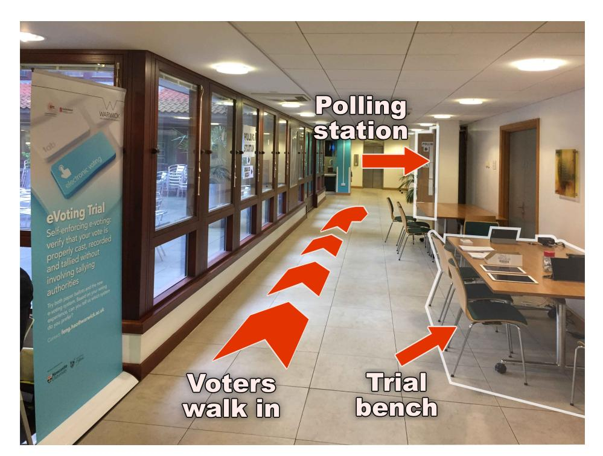
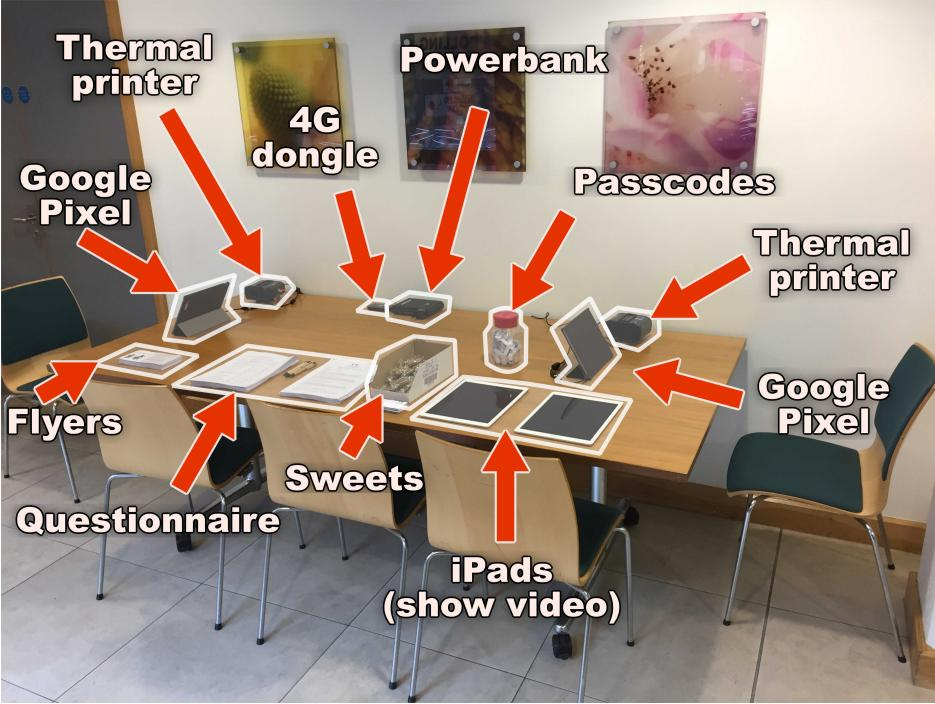
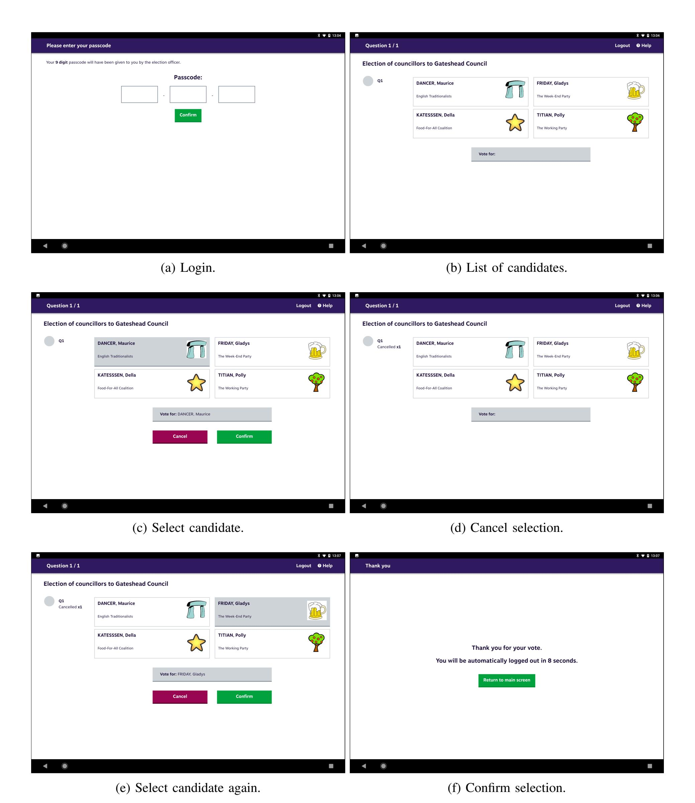
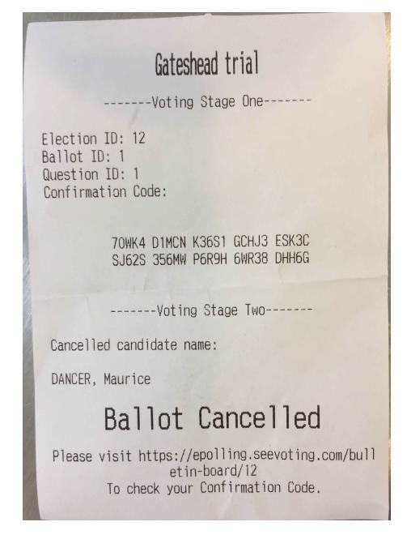
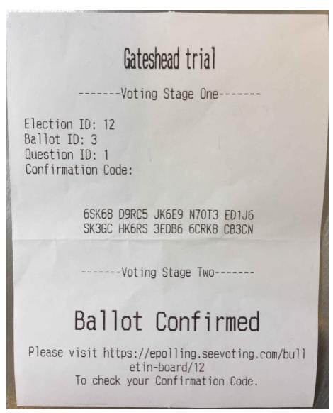
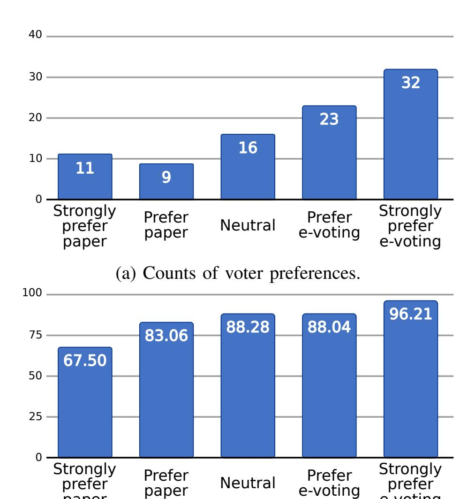

{0}------------------------------------------------

# End-to-end Verifiable E-voting Trial for Polling Station Voting

Feng Hao∗ , Shen Wang∗ , Samiran Bag∗ , Rob Procter∗ , Siamak Shahandashti† Maryam Mehrnezhad‡ , Ehsan Toreini‡ , Roberto Metere‡§, Lana Liu‡

> ∗*University of Warwick, UK* †*University of York, UK* ‡*Newcastle University, UK* §*The Alan Turing Institute, UK*

*Abstract*—On 2 May 2019, during United Kingdom local elections, an e-voting trial was conducted in Gateshead, using a touch-screen end-to-end verifiable e-voting system. This was the first test of its kind in the United Kingdom, and it presented a case study to envisage the future of e-voting.

*Index Terms*—E-voting, End-to-end verifiability, Direct Recording Electronic

### 1. Introduction

An electronic voting (e-voting) system uses electronic technologies to record, store and process ballots in a digital form. In general, there are two types of e-voting systems. One type is designed for local voting in a polling station, where a touch-screen machine, called Direct Recording Electronic (DRE), is typically used to record votes. The other type is designed for remote voting, where voters can cast their votes from anywhere via the Internet.

Today, e-voting has already been deployed in a number of countries. It is used in many states in America in various forms, e.g., based on optical scan or DRE. In India, a fully electronic voting system called Electronic Voting Machine has been used in all national elections since 2004. Brazil started its DRE-based elections in 2002. In 2007, Estonia allowed Internet voting for national elections for the first time. In 2019 during the Estonian parliamentary election, 44% of ballots were cast using Internet voting.

The e-voting systems as currently used in real-world elections in the above countries generally work like a trusted "black-box" that is critically dependent on the integrity of the internal software implementation. However, voters have no means to verify the internal software. For example, as demonstrated by Springall et al. [\[1\]](#page-8-0), if the server software in the Estonian Internet voting system had been compromised, the integrity of the whole election would have been lost without voters even knowing it. Publishing the source code can help promote trust, but it cannot resolve the fundamental problem as one cannot guarantee that the same software is used unmodified on the election day.

To address the trust problem on e-voting software, Rivest and Wack first proposed the notion of *software independence*: "a voting system is software-independent if an undetected change or error in its software cannot cause an undetectable change or error in an election outcome" [\[2\]](#page-9-0). The software-independence principle essentially requires that a voting system should guarantee security without depending on details of the internal software implementation, since voters have no means to access and verify the software.

There are various approaches to build a software-independent voting system [\[2\]](#page-9-0), among which the most promising one involves applying cryptography to make the voting system endto-end (E2E) verifiable. Being E2E verifiable encompasses the following aspects:

- *Cast-as-intended*: a voter can verify that a ballot is cast correctly for the intended candidate.
- *Recorded-as-cast*: a voter can verify that

{1}------------------------------------------------

- a cast ballot is recorded correctly in the system.
- *Tallied-as-recorded*: a public observer can verify that all the recorded ballots are tallied correctly.

A system that satisfies the above requirements is said to be E2E verifiable. Besides verifiability, an E2E voting system must also preserve voter privacy, ensuring that the ability to verify that their vote cannot be misused to reveal how they have voted to a third party, say a coercer. An overview of the E2E verifiable voting systems in a real-world setting can be found in [\[3\]](#page-9-1).

The potential of an E2E voting system for real-world elections has been demonstrated in a number of studies. In 2009, Helios, an E2E Internet voting system, was used to elect the university president of the Universite Catholique ´ de Louvain (UCL) in Belgium [\[4\]](#page-9-2). Scantegrity, a scanner-based E2E voting system [\[5\]](#page-9-3), was adopted in the municipal elections of Takoma Park, USA in 2009 and 2011. In 2014, Pretˆ a Voter (PaV), based on a hybrid method us- ` ing a touch-screen machine and a scanner, was adopted in the 2014 Victoria State election in Australia [\[6\]](#page-9-4).

Although progress has been made in E2E verifiable voting, large-scale deployments of this technology are still limited due to two main reasons. First, most of the E2E voting systems require a group of tallying authorities (TAs) who are supposedly trustworthy individuals with computing and cryptographic expertise to perform the complex decryption and tallying operations. Finding and managing such TAs has proved to be difficult [\[4\]](#page-9-2). Second, the E2E systems tested in polling stations, such as Scantegrity and PaV primarily use paper at the voting stage. Although they improve the system security by introducing E2E verifiability, the complex handling of paper ballots (e.g., using a special pen in Scantegrity and tearing the ballot into halves in PaV) is not any easier than the traditional paper ballots.

Recent research in this field has shown that it is possible to construct *fully electronic* E2E verifiable voting systems *without* involving any TA, using a new paradigm called "self-enforcing e-voting" (SEEV) [\[7\]](#page-9-5). The removal of TAs can significantly simplify election management and make the system much more practical than before. The first SEEV system, called DRE-i due to Hao et al. [\[7\]](#page-9-5), adopts a pre-computation strategy to encrypt ballots before the election in a structured way such that multiplying the ciphertexts after the election will cancel out random factors and hence allow everyone to verify the integrity of the tallying result without TAs. A prototype of DRE-i has been used for mobile phone-based classroom voting [\[8\]](#page-9-6). The second SEEV system, called DRE-ip due to Shahandashti and Hao [\[9\]](#page-9-7), adopts an alternative real-time computation strategy to encrypt ballots during voting, while keeping an aggregated form of the random factors in memory. When the election has finished, the system publishes the final aggregation of the random factors along with other audit data to allow the public to verify the tallying integrity without involving any TAs. By removing the need to store precomputed ballots, DRE-ip provides a stronger guarantee of vote privacy than DRE-i and is particularly suited for polling station voting. A touch-screen based implementation of DRE-ip for polling station voting was trialled in the campus of Newcastle University in May 2017 with positive feedback from voters.

Based on the initial success of the campus trial, the research team reached out to the Gateshead council in Newcastle, UK, with a proposal to trial the system with real voters in a realistic polling station environment. This proposal was supported by the electoral officials in the Gateshead council, and was subsequently approved by the council. It was agreed that an evoting trial would be held on 2 May, 2019 at the Gateshead Civic Center polling station as part of the UK local elections.

This trial differs from all previous e-voting pilots in the UK in that the trialled system is E2E verifiable rather than a "black-box". Outside the UK, this trial also represents the first time that a *fully-electronic* E2E verifiable voting system was tested in a polling station by real voters. It was hoped that the results of this trial would present a useful case study for researchers as well as election law and policy makers.

{2}------------------------------------------------

The rest of the paper is organized as follows. Section 2 explains the DRE-ip system that was used in the Gateshead trial. Section 3 gives details of the trial. Sections 4 and 5 discuss the voters' feedback and results. Finally, Section 6 concludes the paper with suggestions for future work.

#### 2. DRE-ip Voting Protocol

**High-level view.** At a high level, a self-enforcing e-voting (SEEV) system can be explained using the analogy of a picture. Imagine an election as a picture that is formed of millions of pixels. Every voter holds a key to one pixel. The voter's privacy is protected because each individual pixel does not reveal the value of their vote. However, when all pixels are pieced together, they collectively show a picture that is the election tally. Everyone will be able to compute/verify the tally without involving any TAs. However, only the tally, not an individual vote or any partial tally, can be learnt. If an attacker attempts to modify pixels or the tally, the tampering will be publicly noticeable since the mathematical relations between the pixels will fail to be verified. DRE-ip [9] is an instantiation of a SEEV system based on realtime computation (as opposed to DRE-i [7] that is based on pre-computation). The protocol is summarized below.

**Setup.** Let p and q be two large primes where q divides p-1. The protocol operates in the subgroup of  $Z_p^*$  of prime order q. In this subgroup,  $g_1$  and  $g_2$  are two random generators whose discrete logarithm relationship is unknown. In the implementation, this is realized by first choosing a non-identity element as  $g_1$  and then computing  $g_2$  based on using a one-way hash function with inclusion of election specific information in the input, such as the date, title and questions. For simplicity, the DRE-ip protocol is described here for a single candidate (Yes/No) election. It can be easily extended for supporting multiple candidates as shown in [9].

**Voting.** After authentication, a voter casts a vote on a DRE machine in two steps. First, they are

presented with a "Yes" or "No" option for the displayed candidate on the DRE screen. Once the voter makes a choice, the DRE prints the first part of the receipt, containing i,  $R_i = g_2^{r_i}$ ,  $Z_i = g_1^{r_i}g_1^{v_i}$  where i is a unique ballot index number,  $r_i$  is a random number chosen uniformly from [1,q-1], and  $v_i$  is either 1 or 0 (corresponding to "Yes" or "No" respectively). The ciphertext data also comes with a zero knowledge proof (ZKP) to prove that  $R_i$  and  $Z_i$  are well-formed [9].

In the second step, the voter has the option to either confirm or cancel the selection. In case of "confirm", the DRE updates the aggregated values t and s in memory as in Equation 1, deletes individual values  $r_i$  and  $v_i$ , and marks the ballot as confirmed on the receipt.

$$t = \sum v_i \text{ and } s = \sum r_i. \tag{1}$$

In case of "cancel", the DRE reveals  $r_i$  and  $v_i$  on the receipt, marks it a cancelled ballot and prompts the voter to choose again. The voter can check if the printed  $v_i$  matches their previous selection and can dispute it if it does not. The voter can cancel as many ballots as they wish but can only cast one confirmed ballot. Since voting is anonymous, the machine cannot guess if, after having printed the first part of the receipt, the voter is going to "confirm" or "cancel".

After voting, the voter leaves the voting booth with one receipt for the confirmed ballot and zero or more receipts for the cancelled ballots. All data on the receipts are digitally signed and are also available on a public election website. To ensure the vote is recorded, the voter just needs to check if the same receipt has been published on the election website.

**Tallying.** Once the election has finished, the DRE publishes the final values t and s on the election website, in addition to all the receipts. Anyone will be able to verify the tallying integrity by checking the published audit data, in particular, whether the two equalities in Equation 2 hold for the confirmed ballots:

$$\prod R_i = g_2^s \text{ and } \prod Z_i = g_1^s g_1^t. \tag{2}$$

{3}------------------------------------------------

## 3. E-voting Trial

Ethics. The trial was ethically approved by the Electoral Services of the Gateshead council and the Research Ethics Committee of the University of Warwick. Participation in this trial was entirely voluntary. To avoid any perception of likely bribery, no financial compensation was allowed to pay for the voter's time, not even free coffee or tea. However, sweets were permitted. So, two packs of sweets (about *£*2.5 for 200 pieces) were purchased and made available to all voters regardless whether they took part in the trial or not.

Since the security of DRE-ip has been peer reviewed in a published paper, the main aim of the trial was to evaluate the usability of the system and its public acceptance in comparison to traditional paper ballots. The initial plan was to conduct the trial as an exit poll, so the tallying results could have been compared with the official election results. However, during the ethics review, a concern was raised that since an e-voting device was never used in any exit poll before, some voters might confuse the trial with the real election. To address this concern, it was decided to use dummy candidate names for the trial. The voting question and the dummy candidate names were provided by the Council based on a sample paper ballot used in an election education program. During the briefing, voters were explicitly informed that the candidate names used in the trial were dummy ones.

Implementation. The DRE-ip system used in the trial was implemented using an elliptic curve (NIST P-256) rather than a finite field setting for better efficiency. This does not change the protocol specification. The system consisted of a server and multiple clients. Each DRE client comprised a touch-screen Tablet (Google Pixel C 10.2 inch) connected to a thermal printer (Epson TPM-P80). Two clients were installed in the trial venue, supporting voting in parallel. The clients were connected to a remote server where all the cryptographic operations were performed. The network connection was provided via a wireless dongle (Huawei 4G). Although the Gateshead Civic Centre provided free WiFi to all visitors on the election day, the 4G dongle was used for the assurance of more reliable Internet connectivity. All the electronic devices were offthe-shelf equipment and could work in batteryonly mode. Portable power banks were included in the setup in case the electrical power became unavailable in the venue. Therefore, other than requiring a physical space, the trial setup had minimum dependence on the IT infrastructure in the polling station. Figure [1](#page-3-1) shows the setup on the election day. Since it was a trial, the DRE clients were placed in an open space. In a real election, each should be put in a separate voting booth.

Figure 1: Trial setup at the polling station.

Election day. The trial was chosen to be held at Gateshead Civic Center, which was the busiest polling station in Gateshead. On 2 May, 2019, the Gateshead Civic Center polling station opened at 6:30 am for voting. Voters walked into the polling station (inside a hall as indicated 

{4}------------------------------------------------

in Figure 1) to vote as normal using paper ballots. Upon exiting the polling station, they were invited to take part in a voluntary trial using e-voting. Ninety-four voters (out of a total of about 200 voters who attended that polling station) participated in the trial.

After the voter consented to participate, they were first asked if they would like to watch a short 1-minute video demonstration on how to use the system. About one third of the participants chose to watch it, while the majority decided to vote straightaway.

To cast a vote, the voter first picked up a folded slip of paper with a random 9-digit passcode from a glass jar. This passcode would allow the voter to log in to the DRE to cast a vote while remaining anonymous. With the passcode, the voter chose one of the provided DRE clients and started their voting session. Figure [2](#page-5-0) shows a series of screenshots to illustrate the voting process. First, the voter logged in to the DRE using the 9-digit passcode. The screen then displayed a list of candidates. The voter touched the screen to select a candidate. Meanwhile the thermal printer printed the first part of the receipt. Based on [\[8\]](#page-9-6), only a truncated hash (50 characters in Crockford's base-32 encoding) was printed on the receipt, while the complete crypto data including the digital signature was published at the election website. Next, the voter needed to either "confirm" or "cancel" the selection. If "cancel" was chosen, the DRE client would return to the initial screen of the candidate selection and print the second part of the receipt for the just cancelled ballot (Figure [3a\)](#page-6-1). If "confirm" was chosen, the voting session would terminate and the DRE client would print the rest of the receipt for the just confirmed ballot (Figure [3b\)](#page-6-1). After the trial, voters were provided with an (optional) questionnaire to provide anonymous feedback. Results of the feedback will be presented in the next section.

The polling station closed at 10:00 pm to mark the official end of the election. Seconds later, the tallying results for the e-voting trial were published at the election website along with full audit data (which can be downloaded as an XML file). The audit data was subsequently checked by the research team and was found to be verified successfully. The same verification could be performed by anyone using the provided open-source software or any independently developed software. The system recorded 93 confirmed ballots and 11 cancelled ballots, with a total of 94 participating voters. The apparent absence of one confirmed ballot was because one voter logged in to the tablet but chose to exit and eventually not to vote (this voter came to the polling station to cast a protest vote and wanted to do the same on the e-voting system).

### 4. Participant Study Design

Questionnaire design. The main part of the questionnaire was designed to assess the usability of the voting process based on a common set of System Usability Scale (SUS) statements first developed by John Brooke [\[10\]](#page-9-8). Respondents indicate their agreement or disagreement with each statement using a five-point Likert scale, where 1 = "strongly disagree", 2 = "disagree", 3 = "neutral", 4 = "agree" and 5 = "strongly agree". Based on pilot testing prior to the trial, it was found that the first statement was potentially confusing. The original statement was "*I think that I would like to use this system frequently*", and it was changed to '*'I think that I would like to use this system in future elections*" to better fit the context of the trial. The rest of the statements were left unchanged.

The usability assessment was focused on the voting process instead of the verification process. This was for two main reasons. First, since the trial was conducted with real voters in a busy polling station, the time available for each participant to vote and to complete a survey was limited. Second, while voting is mandatory, verification is an optional operation. In practice, dedicated auditors may be employed to verify "cast as intended" by casting cancelled ballots at any time during the election day; voters may give receipts to a helper in the polling station to verify "recorded as cast" by checking if the same receipts are published at the election website; anyone with access to the election website is able to verify "tallied as recorded" by using the open-source software to check the published receipts and the tally. Hence, none of these veri-

{5}------------------------------------------------

Figure 2: DRE screenshots during voting.

{6}------------------------------------------------

- (a) Cancelled ballot. (b) Confirmed ballot.

Figure 3: Example of receipts in the proof-ofconcept implementation.

fication operations is mandatory for an ordinary voter. The assessment of the usability for the verification process will be done in future work.

In addition to the SUS questions, the questionnaire also collected demographic information about the participant and their background, including gender, age, education, experience of using computer/touch-screen devices, and whether or not they had watched the video demo before voting.

The last part of the questionnaire asked the participant "based on your experience of using paper ballots and e-voting, which system do you prefer"? Participants were asked to indicate their preference on a 5-point scale, namely, (1) strongly prefer paper, (2) prefer paper, (3) neutral, (4) prefer e-voting and (5) strongly prefer e-voting. Participants could optionally write free text to explain their choice.

## 5. Results

Demographics. Based on 93 returned questionnaires, the gender distributions among the participants were 39.8% "female", 53.7% "male", 1.1% "other" and 3.2% "prefer not to say". The age distributions were 1.1% "below 20", 8.8% "20-29", 27.5% "30-39", 24.2% "40-49", 23.1% "50-59", 13.2% "above 60" and 2.2% "prefer not to say". While 11.3% of the participants attended "secondary school", others vary among "college" (28.1%), "undergraduate degree" (22.5%), "postgraduate degree" (34.8%) and "Prefer not to say" (3.4%). Experience of using computer or touch-screen devices ranged from "never" (3.4%), "occasionally" (6.7%), to "sometimes" (4.5%), "often" (30.3%) and "extensively" (55.1%). Only 34.8% of the participants indicated they had watched the video demo prior to voting.

Completion of voting. All participants were able to complete voting without error. In general, a 9-digit passcode is all that was needed for a voter to carry out voting by themselves by following the on-screen instructions. Only one voter encountered difficulty in touch-screen voting and asked the research team for help. This voter pressed the tablet screen really hard like a push button, but the touch screen did not respond under hard pressing. The issue was resolved by advising the voter to touch the screen more gently. It turned out that this particular voter had no prior experience of using any touch-screen device.

SUS scores. Using the SUS computation method [\[10\]](#page-9-8), the mean SUS score was 87.9 (the standard deviation or STD was 13.8). By the commonly used criteria [\[11\]](#page-9-9), this score is considered "excellent" in usability. It is higher than the reported SUS score of 76 for Helios, 60 for PaV, 58 for Scangrity, and is comparable to 89 for STAR-vote [\[12\]](#page-9-10). It is worth noting that the user study in [\[12\]](#page-9-10) was conducted in a lab environment with 30 recruited volunteers (paid \$25 each), while the Gateshead trial involved 94 real voters in a real polling station with no payment for each participant.

Based on the analysis using the Spearman correlation method, the SUS score is found to be uncorrelated with the age, gender or education background. However, it is positively correlated with the voter's experience of using computer/touch-screen devices (Spearman correlation coefficient ρ = 0.28, and two-tailed p = 0.008). It is inversely correlated with the watching of the video demo prior to voting (ρ = −0.35, p = 0.001): those who chose to watch the video scored lower in SUS. This is counter-intuitive, but may be due to a selfselection effect: since watching the video was 

{7}------------------------------------------------

a voluntary choice, those who opted to watch it tended to be those who felt less comfortable with touch-screen e-voting. This is corroborated by the negative correlation between watching the video and the voter preference: those who chose to watch the video were more in favor of paper than e-voting (ρ = −0.235, p = 0.027).

Voting time. The voting time was recorded from the moment that the voter started entering the passcode to the finish of the voting session. It ranged from the minimum of 10 seconds to the maximum of 116 seconds with an average value of 33 seconds (STD = 17 seconds). This compares favorably with previous studies, which report mean voting time 450 seconds for Helios, 550 seconds for PaV, 620 seconds for Scantegrity and 272 seconds for STAR-Vote [\[12\]](#page-9-10). The substantially shorter voting time for DRE-ip is due to two factors: 1) the touch-screen interface was entirely electronic without involving any manual handling of paper ballots as in other systems; and 2) the "confirm/cancel" choice was smoothly integrated into the voting process as a natural voter-initiated auditing step. Indeed, after the voter entered the passcode, they typically took only 2 touches on the screen to cast a vote. More touches were needed only when the voter opted to cancel the vote and re-start from the initial screen. Overall, the response time for interacting with a touch screen is much quicker than filling in a physical paper ballot by hand.

Voter preference. Between the traditional paper ballots and the trialled DRE-ip system, there was a clear preference among voters for the latter, as summarized in Figure [4.](#page-7-0) The choice of preference was positively correlated with the SUS score (ρ = 0.59, p = 0.000), which suggests that usability is one key factor in deciding the voter preference.

Among those who preferred or strongly preferred e-voting (55 in total), 48 of them provided written comments. Three main reasons can be summarized from the provided comments. The dominant reason seems to be the ease of use: 30 voters (out of 48, or 63%) commented that they preferred e-voting as they found it "easier", "more convenient" and "simpler" than paper

(b) Correlation with SUS scores.

e-voting

e-voting

paper

Figure 4: Summary of voter preferences.

ballots. The next reason appears security: 21 voters (44%) mentioned that the ability to verify the vote made them feel "safer" and "more secure", as one voter commented: "I can double check my vote, it seems more secure/protected than hand counting paper ballots". Another voter commented: "Given a receipt at the end gives assurance that vote is counted". The third reason is the speed of voting: 20 voters (42%) commented that they preferred e-voting as they found it "quicker", and "faster". This is corroborated by the mean voting time of 33 seconds reported earlier. Besides these three, other reasons mentioned in the comments included the use of evoting being more "cost-effective" (4 voters) and more "environment-friendly" (1 voter).

Among those preferring or strongly preferring paper ballots (20), all of them provided written comments to explain their choice. Based on the comments, two main reasons can be identified. The first is down to the habituation: 10 voters (out of 20, or 50%) commented that they were a "traditionalist", "accustomed [to paper]" and "like the ritual of casting the paper vote". One voter commented: "[paper voting] has worked for hundreds of years. Why 

{8}------------------------------------------------

change it now just because we can?" The second reason concerns the security: 8 voters (40%) mentioned security as a reason they preferred paper ballots. One voter commented: "I think a computerized system could be easily hacked which could affect the outcome of the ballot". Another commented: "I would not be confident in the security of a system of this nature. It could be open to hacking or other manipulation". It is worth noting that "security" was one main reason for both liking and disliking the trialed e-voting system. Other reasons mentioned in the comments included the paper ballot being "simpler" (1 voter), "quicker" (1 voter) and that the use of e-voting might disenfranchise people who "have disabilities and/or dyslexia" or "do not use computers" (2 voters).

Among those choosing "neutral" (16), 13 provided further comments. The comments mentioned a range of reasons, such as simplicity, speed, security and tradition as covered above. One factor not covered before is that some voters chose "neutral" as they did not like coming to the polling station to vote, as one commented: "Not much time difference to actual voting [between paper and e-voting] - if I were able to do online and at home would be more beneficial."

Limitations and future work. The Gateshead trial was the first study to assess the feasibility of touch-screen based E2E verifiable e-voting for polling station voting. Although the user feedback shows a clear preference on the trialled e-voting system over paper ballots, several limitations of this study should be noted. First, the trial was confined to one polling station in a north-east region of the UK. Whether the result can be generalized to the whole voting population remains to be investigated. Second, the number of participants in the trial (94) was relatively small. Third, as the participation of the trial was entirely voluntary, there may be a selfselection bias on the survey result. Fourth, in the trial, only the usability of voting is evaluated, not the usability of verification. These limitations will need to be addressed in further studies, e.g., by conducting more trials in distributed regions. Finally, a trial to compare E2E verifiable Internet voting and postal voting under a remote voting setting has not been carried out before and will be worthwhile to conduct as a future work.

### 6. Conclusion

This paper summarises the results of the Gateshead e-voting trial, which was the first time that a fully electronic voting system with E2E verifiability was tested for polling station voting. Feedback from the participants in this trial indicates a clear preference of verifiable evoting over the traditional paper ballots. This is because many voters considered the former "safer", "more secure", "quicker" and "easier to use". This shows the promising potential of deploying E2E verifiable e-voting in future elections. However, this trial also shows that 20 out of the 91 participants (22%) still preferred or strongly preferred paper voting. This indicates that deployment of e-voting in any real-world election should be undertaken with caution and with a plan to support voters, especially those who may be unfamiliar with e-voting or may dislike it.

The Gateshead trial was conducted for a dummy election within the existing legal framework of the UK election law, which only allows paper ballots for statutory voting. The results of this trial hopefully present a useful case study for voting policy makers for the possible updating of the law, which was written at a time when paper ballots were the only possible means of voting, but has not been updated to account for many developments of digital technologies in the modern era.

Acknowledgements. The research on SEEV was funded by the ERC Starting Grant, No. 306994. The system prototype was developed under the support of the Innovate UK, Cyber Security Academic Start-up Programme. The trial was supported in part by the Royal Society grant, ICA\R1\180226. We thank Joanne Little and members in the Electoral Services team in the Gateshead council for supporting this trial. We thank Alice Scott of the University of Warwick for the news report and the team at Global Initiative in Oxford for contributing to the trial.

### References

[1] Drew Springall, Travis Finkenauer, Zakir Durumeric, Jason Kitcat, Harri Hursti, Margaret MacAlpine, and J Alex Halderman. Security analysis of the Estonian internet voting system. In *Proceedings of the 2014 ACM SIGSAC Conference*

{9}------------------------------------------------

- *on Computer and Communications Security*, pages 703–715, 2014.
- [2] Ronald Rivest and Madars Virza. Software independence revisited. *Real-World Electronic Voting: Design, Analysis and Deployment, CRC Press.*, 2016.
- [3] Feng Hao and Peter YA Ryan. *Real-World Electronic Voting: Design, Analysis and Deployment*. CRC Press, 2016.
- [4] Ben Adida, Olivier De Marneffe, Olivier Pereira, Jean-Jacques Quisquater, et al. Electing a university president using open-audit voting: Analysis of realworld use of Helios. *EVT/WOTE*, 9(10), 2009.
- [5] Richard Carback, David Chaum, Jeremy Clark, John Conway, Aleksander Essex, Paul S Herrnson, Travis Mayberry, Stefan Popoveniuc, Ronald L Rivest, Emily Shen, et al. Scantegrity II municipal election at Takoma Park: The first E2E binding governmental election with ballot privacy. *USENIX Security*, 2010.
- [6] Craig Burton, Chris Culnane, and Steve Schneider. Verifiable Electronic Voting in Practice: the use of vVote in the Victorian State Election. *IEEE Security and Privacy*, 2016.
- [7] Feng Hao, Matthew N Kreeger, Brian Randell, Dylan Clarke, Siamak F Shahandashti, and Peter Hyun-Jeen Lee. Every vote counts: Ensuring integrity in large-scale electronic voting. In *2014 Electronic Voting Technology Workshop/Workshop on Trustworthy Elections (EVT/WOTE 14)*, 2014.
- [8] Feng Hao, Dylan Clarke, Brian Randell, and Siamak F Shahandashti. Verifiable classroom voting in practice. *IEEE Security & Privacy*, 16(1):72–81, 2018.
- [9] Siamak F Shahandashti and Feng Hao. Dre-ip: a verifiable e-voting scheme without tallying authorities. In *European Symposium on Research in Computer Security*, pages 223–240. Springer, 2016.
- [10] John Brooke. SUS-A quick and dirty usability scale. *Usability evaluation in industry*, 189(194):4– 7, 1996.
- [11] Aaron Bangor, Philip T Kortum, and James T Miller. An empirical evaluation of the system usability scale. *Intl. Journal of Human–Computer Interaction*, 24(6):574–594, 2008.
- [12] Claudia Ziegler Acemyan, Philip Kortum, Michael D Byrne, and Dan S Wallach. Summative usability assessments of STAR-Vote: A cryptographically secure e2e voting system that has been empirically proven to be easy to use. *Human factors*, 2018.

Feng Hao is a Professor of Security Engineering in the University of Warwick, UK.

Contact him at [feng.hao@warwick.ac.uk.](mailto:feng.hao@warwick.ac.uk)

Shen Wang is a PhD student in Computer Science in the University of Warwick, UK.

Contact him at [Shin.Wang@warwick.ac.uk.](mailto:Shin.Wang@warwick.ac.uk)

Samiran Bag is a Senior Research Fellow in the University of Warwick, UK.

Contact him at [Samiran.Bag@warwick.ac.uk.](mailto:Samiran.Bag@warwick.ac.uk)

Rob Procter is Professor of Social Informatics in the University of Warwick, UK.

Contact him at [Rob.Procter@warwick.ac.uk.](mailto:Rob.Procter@warwick.ac.uk)

Siamak F. Shahandashti is a Lecturer (assistant professor) in Cyber Security in the University of York, UK. Contact him at [siamak.shahandashti@york.ac.uk.](mailto:siamak.shahandashti@york.ac.uk)

Maryam Mehrnezhad is a Research Fellow at Newcastle University, UK.

Contact her at [maryam.mehrnezhad@ncl.ac.uk.](mailto:maryam.mehrnezhad@ncl.ac.uk)

Ehsan Toreini is a Research Associate at Newcastle University, UK.

Contact him at [ehsan.toreini@ncl.ac.uk..](mailto:ehsan.toreini@ncl.ac.uk.)

Roberto Metere is a Research Associate at Newcastle University and The Alan Turing Institute, UK. Contact him at [roberto.metere@ncl.ac.uk.](mailto:roberto.metere@ncl.ac.uk)

Lana Y.J. Liu is a Senior Lecturer in Accounting and Finance at Newcastle University Business School, Newcastle University.

Contact her at [lana.liu@newcastle.ac.uk.](mailto:lana.liu@newcastle.ac.uk)