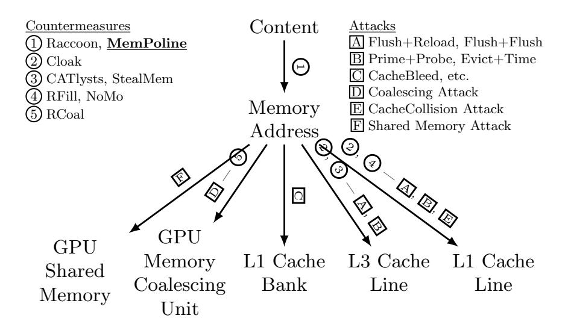
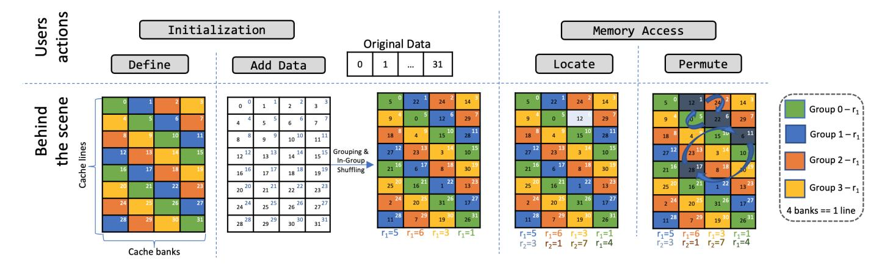
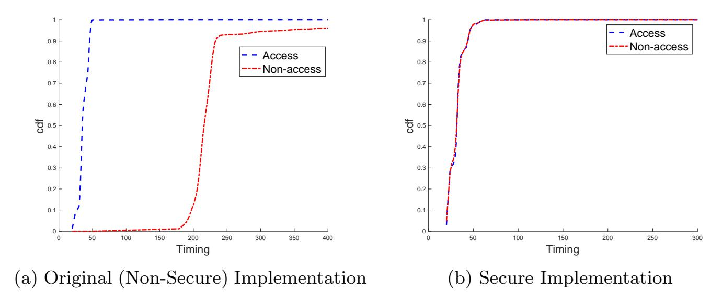
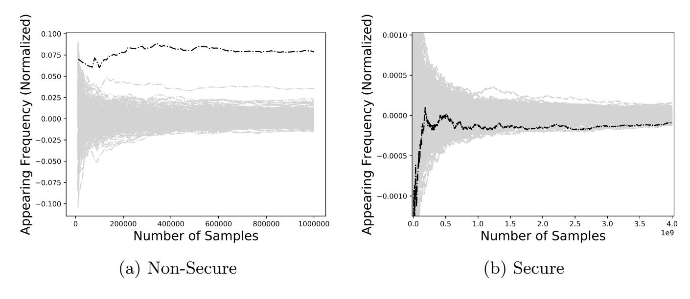

{0}------------------------------------------------

# MemPoline: Mitigating Memory-based Side-Channel Attacks through Memory Access Obfuscation

Zhen Hang Jiang<sup>1</sup> , Yunsi Fei<sup>1</sup> , Aidong Adam Ding<sup>2</sup> , and Thomas Wahl<sup>3</sup>

<sup>1</sup> Department of Electrical and Computer Engineering <sup>2</sup> Department of Mathematics <sup>3</sup> Khoury College of Computer Sciences jiang.zhenhang@gmail.com, yfei@ece.neu.edu, a.ding@northeastern.edu, wahl@ccs.neu.edu, Group home page: https://tescase.coe.neu.edu Northeastern University, Boston, 02115, USA

Abstract. Recent years have seen various side-channel timing attacks demonstrated on both CPUs and GPUs, in diverse settings such as desktops, clouds, and mobile systems. These attacks observe events on different shared resources on the memory hierarchy from timing information, and then infer secret-dependent memory access pattern to retrieve the secret through statistical analysis. We generalize these attacks as memory-based side-channel attacks.

In this paper, we propose a novel software countermeasure, MemPoline, against memory-based side-channel attacks. MemPoline hides the secretdependent memory access pattern by moving sensitive data around randomly within a memory space. Compared to the prior oblivious RAM technology, MemPoline employs parameter-directed permutations to achieve randomness, which are significantly more efficient and yet provide similar security. Our countermeasure only requires modifying the source code, and has great advantages of being general - algorithm-agnostic, portable - independent of the underlying architecture, and compatible - a userspace approach that works for any operating system or hypervisor. We run a thorough evaluation of our countermeasure. We apply it to both AES, a symmetric cipher, and RSA, an asymmetric cipher. Both empirical results and theoretical analysis show that our countermeasure resists a series of existing memory-based side-channel attacks on CPUs and GPUs.

Keywords: memory-based side-channel countermeasure, security, side-channel, timing, microarchitecture, cache

## 1 Introduction

Side-channel attacks have changed the notion of "security" for cryptographic algorithms despite their mathematically proven security. Memory-based side

{1}------------------------------------------------

channel attacks, which exploit the memory access footprint inferred from observable microarchitectural events, have become a serious cyber threat to not only cryptographic implementations but also general software bearing secrets. The same algorithm implemented on different architectures can be vulnerable to different side-channel attacks. For example, the T-table implementation of Advanced Encryption Standard (AES) is vulnerable to Flush+Reload cache timing attack [8] on Intel CPUs, and also vulnerable to GPU memory coalescing attack [12]. Protecting them against different memory-based side-channel attacks on different architectures is challenging and can be costly in hardware augmentation, thus calling for more general countermeasures that address the root cause of information leakage and can work across architectures against various attacks.

Hardware countermeasures that modify the cache architecture and policies can be efficient [4, 15, 20, 21, 28], but they are invasive and require hardware redesign, and often times only address a specific attack. Software countermeasures [1, 17, 24, 31] require no hardware modification and make changes at different levels of the software stack, e.g., the source code, binary code, compiler, or the operating system. They are favorable for existing computer systems with the potential to be general, portable, and compatible.

The software implementation of Oblivious RAM (ORAM) scheme shown in the prior work [25] has been demonstrated to be successful in mitigating cache side-channel attacks. The ORAM scheme [5, 26] was originally designed to hide a client's data access pattern in the remote storage from an untrusted server by repeatedly shuffling and encrypting data blocks. Raccoon [25] re-purposes ORAM to prevent memory access pattern from leaking through cache side-channel.

The Path-ORAM scheme [26] uses a small client-side private storage to store a position map for tracking real locations of the data-in-move, and assumes the server cannot monitor the access pattern in the position map. However, in side-channel attacks, all access patterns can be monitored, and indexing to a position map is considered insecure against memory-based side-channel attacks. Instead of indexing, Raccoon [25], which focuses on control flow obfuscation, uses ORAM for storing data and streams in the position map to look for the real data location, and therefore provides a strong security guarantee. However, since it relies on ORAM for storing data, its memory access runtime is O(N) given N data elements, and the ORAM related operations can incur more than 100x performance overhead.

We propose a software countermeasure, MemPoline, against memory-based side-channel attacks with much less performance degradation than the prior work [25, 26]. MemPoline adopts the ORAM idea of sensitive data shuffling, but implements a much more efficient permutation scheme to provide just-in-need security level to defend against memory-based side-channel attacks. Specifically, we use a parameter-directed permutation function to shuffle the memory space progressively. Only the parameter value (instead of a position map) needs to be kept private to track the real dynamic locations of data. Thus, in our scheme, the memory access runtime is O(1), significantly lower than O(log(N)) of Path-ORAM [26] and O(N) of Raccoon [25].

{2}------------------------------------------------

The contributions of this paper include:

- We propose a novel efficient and effective technique to randomize a protected memory space at run-time.
- Based on the technique, we propose a software countermeasure against memorybased side-channel attacks to obfuscate a program's memory access pattern.
- We apply our countermeasure to multiple ciphers on different platforms (CPUs and GPUs) and evaluate the resilience against many known memorybased side-channel attacks, both empirically and theoretically.

## 2 Background and Related Work

When the memory access footprint of an application is dependent on the secret (e.g., key), side-channel leakage of the footprint can be exploited to retrieve the secret. In this section, we give background on microarchitecture of the memory hierarchy. We discuss existing memory-based side-channel attacks and how they infer the memory access pattern from various side-channels exploiting different resources. We classify countermeasures into different categories. We describe two well-known cryptographic algorithms, AES and RSA, which will be our targets for applying the countermeasure.

### 2.1 Microarchitecture of the Memory Hierarchy

Cache, a critical on-chip fast memory storage, is deployed for performance, to reduce the speed gap between the fast computation engines such as CPU and GPU cores and the slow off-chip main memory. As caches store only a portion of memory content, a memory request can be served directly by the cache hierarchy in case of cache hits, otherwise by the off-chip memory (cache misses). The timing difference between a cache hit and miss forms a timing channel that can be exploited by the adversary to leak secret.

The typical structure of a cache is a 2-dimensional table, with multiple sets (rows) and each set consisting of multiple ways (columns). A cache line (a table cell) is the basic unit with a fixed size for data transfer between memory and cache. Each cache line corresponds to one memory block. When the CPU requests a data (with the memory address given), the cache is looked up for the corresponding memory block. The middle field of a memory address is used to locate the cache set (row) first, and the upper field of the memory address is used as a tag to compare with all the cache lines in the set to identify a cache hit or miss.

With highly parallel computing resources such as GPUs and multi-thread CPUs, modern computer architecture splits on-chip caches into multiple banks, allowing concurrent accesses to these banks so as to increase the data access bandwidth. For example, in modern Intel processors, the L1 cache becomes 3-D - it includes multiple banks and each cache line is distributed into multiple equalsized parts on different banks. On-chip shared memory of many GPUs is also 

{3}------------------------------------------------

4

banked. Such banked caches and shared memory are susceptible to a different cache-bank side-channel attack [13, 14, 30].

Another microarchitecture, memory coalescing unit (commonly found on various GPUs), can group concurrent global memory access requests (e.g., in a warp of 32 threads under the single-instruction-multiple-thread execution model on Nvidia Kepler) into distinct memory block transactions, so as to reduce the memory traffic and improve the performance. However, recent coalescing attack [12] has shown that it can also leak memory access pattern of a running application.

#### 2.2 Data Memory Access Footprint

Program data is stored in memory, and we use memory addresses to reference them. If the *content-to-memory* mapping is fixed, when a secret determines which data to use, by learning the memory access footprint through various side channels, the adversary can infer the secret.

Different microarchitectural resources on the memory hierarchy use a different portion/field of the memory address to index themselves, for example, different levels of caches (L1, L2, and LLC), and cache banks. When observing victim's access events on the different resources to infer memory access, the memory access footprint retrieved also has different levels of granularity.

Memory-based side-channel attacks that exploit sensitive data memory access footprint to retrieve the secret. For example, sensitive data includes the SBox tables of block ciphers such as AES, DES, and Blowfish, and the lookup table of multipliers in RSA. As many microarchitectural resources are shared, the adversary does not need root privilege to access them and can infer the victim memory access footprint by creating contention on the resources. In view of this attack fundamental, countermeasures are proposed to prevent the adversary from learning the memory access footprint. In Figure 1, we classify typical existing memory-based side-channel attacks and countermeasures according to the level of mapping they are leveraging and addressing, respectively.



Fig. 1: Overview of memory-based side-channel attacks and countermeasures

{4}------------------------------------------------

Attack. Memory-based side-channel attacks can be classified into access-driven and time-driven. For a time-driven attack, the adversary observes the total execution time of the victim under different inputs and uses statistical methods with a large number of samples to infer the secret. For an access-driven attack, the adversary intentionally creates contentions on certain shared resources with the victim to infer the memory access footprint of the victim. It consists of three steps: 1. preset - the adversary sets the shared resource to a certain state; 2. execution - the victim runs; 3. measurement - the adversary checks the state of the resource using timing information.

Figure 1 lists five microarchitectural resources, three of CPUs - L1 cache line, L3 cache line, and L1 cache bank, and two of GPUs - memory coalescing unit and shared memory, and various attacks utilizing these vulnerable resources. The GPU memory coalescing attack [12] and shared memory attack [13], Evict+Time [27], CacheCollision [2] are time-driven. All other attacks, including Flush+Reload [29], Flush+Flush [7], Prime+Probe [22, 27], CacheBleed [30], are access-driven. They differ in the way of presetting the shared resource, and how to use the timing information to infer victim's data access.

Countermeasure. Existing countermeasures are built on top of three principles to prevent information leakage: partitioning, pinning, and randomization. Partitioning techniques [4, 17, 24, 28, 31], including StealMem [17] and NoMo [4], split a resource among multiple software entities (processes), so that one process does not share the same microarchitectural resource with another, and therefore no side-channel can be formed. Pinning techniques [3, 6, 19, 28], including CATlysts [19] and Cloak [6], preload and lock one entity's security sensitive data in the resource prior to computations, so that any key-dependent memory access to the locked data will result in a constant access time. Randomization techniques, such as RFill [20], RCoal [15], and Raccoon [25], randomize the behavior of the memory subsystem resources so that the adversary cannot correlate the memory access footprint to content used in the computation. Hardware countermeasures [15, 20] randomize the mapping between the memory address and on-chip microarchitectural resources. For example, RFill [20] targets the L1 cache and RCoal [15] targets the memory coalescing unit and randomizes its grouping behavior. Our approach, MemPoline, is in the same category of software ORAM [25, 26], which randomizes the content to memory address mapping.

#### 2.3 Vulnerable Ciphers

**AES** is the standard encryption algorithm. We evaluate the 128-bit Electronic Code Book (ECB) mode T-table implementation of AES encryption commonly used in prior work [2, 12, 13, 27]. The encryption algorithm consists of nine rounds of SubByte, ShiftRow, MixColumn, and AddRoundKey operations, and one last round of three operations without the MixColumn one. In the T-table-based implementation, the last round function can be described by  $c_i = T_k[s_j] \oplus rk_i$ , where  $c_i$  is the  $i^{th}$  byte of the output ciphertext,  $rk_i$  is  $i^{th}$  byte of the last round key,  $s_j$  is the  $j^{th}$  byte of the last round input state (j is different from i due to the ShiftRow operation), and  $T_k$  is the corresponding T-table (publicly

{5}------------------------------------------------

known) for c<sup>i</sup> . Memory-based side-channel attacks can retrieve the last round key by inferring the victim's memory access pattern to the public-known T-tables, with s<sup>j</sup> inferred and c<sup>i</sup> known as the output.

RSA is an asymmetric cipher with two keys, one public and one private. The major computation operation is modular exponentiation, r = b <sup>e</sup>mod m. In decryption, the exponent e is the private key and is the target of side-channel attacks. For the sliding-window implementation of the RSA algorithm, the exponent is broken down into a series of zero and non-zero windows. The algorithm processes these windows one by one from the most significant one. For each exponent window, a squaring operation is performed first. If the window exponent is non-zero, another multiplication routine is executed with a pre-calculated multiplier selected using the value of the current window. For a window of n-bit, there are 2n−<sup>1</sup> pre-calculated multiplier values stored in a table for conditional multiplications (only odd numbers for non-zero windows). Tracking which multiplier in the sensitive multiplier table has been used leads to the recovery of the window exponent value.

## 3 Threat Model

Our threat model includes co-residence of the adversary and victim on one physical machine. We use this threat model for both attack implementations and evaluation of our countermeasure. However, we do not anticipate any issue for our countermeasure to work in a cloud environment. The adversarial goal is to recover the secret key of a cryptographic algorithm using memory-based sidechannel attacks.

The threat model assumes the adversary is a regular user without the root privilege, and the underlying operating system is not compromised. The adversary cannot read or modify the victim's memory, but the victim's binary code is publicly known (the common case for ciphers). The adversary can interact with the victim application. For example, the adversary can provide messages for the victim to encrypt/decrypt, receive the output, and also time the victim execution. In this work, we focus on protecting secret-dependent data memory access, and will consider protecting instruction memory access in future work. We also assume the granularity of information the adversary can observe is at cache line or bank level, and the adversary can statistically recover secret using at least 100 observations. Currently, the most efficient and accurate memorybased side-channel can monitor the memory access at the cache line granularity and need a few thousands observations to recover the AES key as shown in prior work [9].

## 4 Our Countermeasure - MemPoline

#### 4.1 Design Overview

The high-level idea of our countermeasure, MemPoline, is to progressively change the organization of sensitive data in memory from one state to another directed 

{6}------------------------------------------------

by an efficient parameter-based permutation function, so that it decorrelates the microarchitectural events the adversary observes and the actual data used by the program. Here the sensitive data refers to data whose access patterns should be protected, instead of data itself.

To obfuscate memory accesses, the data layout in memory should undergo randomization through permutation. However, the frequency of permuting and the implementation method have a significant impact on both the security and performance of the countermeasure. We implement permutation gradually through subsequent swappings instead of at once - only bouncing the data to be accessed around before the access (load or store). Once the layout of the data reaches a permuted state, we update the parameter and continue migrating the data layout to the next permuted state. This procedure allows us to slowly de-associate any memory address from actual data content. Thus, the countermeasure can provide the security level to defend memory-based side-channel attacks with a significant performance gain over the ORAM-based countermeasure. The insight for such efficient permutation is that the granularity of cache data that a memory-based side-channel attack can observe is limited and therefore can be leveraged to reduce the frequency of permuting to be just-in-need, lowering the performance degradation.

The countermeasure consists of two major actions at the user level: onetime initialization and subsequent swapping for each data access (between the accessed data and another data unit selected by the random parameter). During initialization, the original data is permuted and copied to a dynamically allocated memory (SMem). Such a permuted state is labeled by one parameter, a random number r, which is used for bookkeeping and tracking the real memory address for data access. For example, the data element pointed to by index i in the original data structure is now referred by a different index in the permuted state, j = fperm(i, r) in SMem, where r is a random value and fperm is an explicit permutation function. The memory access pattern in SMem can be obfuscated through changing the value of r.

The updating rate of r is critical for both side-channel security and performance. If the value of r were fixed, the memory access pattern would be fixed. This would only increase the attack complexity as the adversary needs to recover the combination of r and the key value instead of just the key value. The sidechannel information leakage may be the same. On the other hand, if the value of r were constantly updated every time one data element is accessed, the memory access pattern would be truly random. Such updating frequency could provide the same level of security guarantee as the ORAM [5, 26], while also inheriting excessive performance degradation.

Our countermeasure sets the frequency of changing the value of r to a level that balances the security and performance, and implements permutation through subsequent swappings rather than one-time action. This way, the security level for defending against memory-based side-channel attacks is attained with much better performance compared to ORAM.

{7}------------------------------------------------

Next, we define the data structures of SMem in view of the memory hierarchy structure and set up auxiliary data structures. Then we illustrate the two actions of our countermeasure.

### 4.2 Define the Data Structures

SMem is a continuous memory space allocated dynamically. We define the basic element of it for permutation as limb, with its size equal to that of a cache bank, which is commonly 4 bytes in modern processors. We now assume SMem is 4-byte addressable memory space.

Considering the cache mapping of SMem, we can view SMem as a twodimensional table, where rows are cache lines, columns are banks, and each cell is a limb. Note we do not need to consider ways (as in cache) because ways are not addressable. As the observation granularity of memory-based side-channel timing attacks is either cache line or cache bank, when we move a limb around, both the row index and column index should be changed to increase the entropy of memory access obfuscation. We divide limbs into multiple equal-sized groups, and permutations take place within each group independently. To prevent information leakage through monitoring cache lines or cache banks, groups should be uniformly distributed in rows and columns, i.e., considering each row (or column), there should be equal number of limbs from each group. Figure 2 shows an example SMem, where the number of groups is equal to the number of columns, groups are formed diagonally, and the number of limbs in a group equals to the number of rows. With this well-balanced grouping, when a limb moves around within its group directed by the parameter-based permutation function, it can appear in any cache line or cache bank, obfuscating the memory access and therefore mitigating information leakage. Note that in modern computer systems, the cache line size is the same throughout memory hierarchy: Last-Level-Cache (LLC), L2, L1, and even memory coalescing unit. Therefore, we can mitigate information leakage of different memory hierarchy level simultaneously.



Fig. 2: Data Structures of MemPoline and Actions

In SMem, for each group, the initialization sets it in a permuted state, described by r1. During program execution, as the permuted state gradually up

{8}------------------------------------------------

dates to r2, at any time, the group is in a mixed state as some limbs are in r<sup>1</sup> and others are in r2. Once the entire group reaches r<sup>2</sup> state, r<sup>1</sup> is obsolete and is updated with r2, and a new random number will be generated for r2. Along the temporary horizon, we define the progression from a starting permuted state r<sup>1</sup> to another permuted state r<sup>2</sup> as an epoch. For a limb originally indexed by i, the new location in SMem can be found by fperm(i, r1) if it is in r<sup>1</sup> state, otherwise, the new location is fperm(i, r2).

To keep track of which permuted state the limb, i, is located in, a bitmap is allocated during the initialization and keeps updating. When bitmap[fperm(i, r1)] is 1, the i is in the r<sup>1</sup> permuted state; otherwise, it is in the r<sup>2</sup> permuted state. Note that the bitmap does not need to be kept private since it is indexed using the permutation function.

#### 4.3 Initialization - Loading Original Sensitive Data

We load the original sensitive data to SMem for two reasons: compatibility and security. The original sensitive data in a vulnerable program may be statically or dynamically allocated. To make our countermeasure compatible to both situations, we load original data to a dynamically allocated region SMem. It will only incur overhead for statically allocated data.

The original sensitive data in memory is byte addressable. For program data access, the unit can be multi-byte, which should be aligned with the limb size (determined by the cache bank size). For example, for T-table based AES, the data unit size is four bytes, fitting in one limb; for SBox-based implementation, the unit is one byte, and three bytes are padded to make one limb. Therefore, each data unit occupies one or multiple continuous limbs.

To map a data unit indexed by i to a location in SMem, we need to figure out its coordinate in SMem, i.e., the row and column, and then the group ID can be derived correspondingly. Note that, different from previous ORAM approaches, our MemPoline does not rely on an auxiliary mapping table to determine a location for i as the mapping table is also side-channel vulnerable. Instead, we develop functions to associate i with a memory address through private random numbers. For simplicity, we assume each data unit occupies one limb in SMem, and we will extend the approach to general cases where a data unit occupies two or more limbs, e.g., the table of multipliers in the sliding window implementation of RSA.

We start by filling SMem row by row in the same manner as how a consecutive data structure is mapped to memory, as shown as the white table in Figure 2, where the data unit index i directly translates to the limb memory address. In each cell, the number in the middle is the original data index and the number at the top-right corner is the SMem address. When permuting, the content moves around in SMem. For the given example in Figure 2, the 32 limbs (eight rows and four columns) are divided into four diagonal groups. In each group, a specific random number, r1, is chosen to perform permutation. The permutation function is exclusive OR, satisfying i<sup>1</sup> ⊕ r<sup>1</sup> = j1. The content in address j<sup>1</sup> and i1will swap. For each group of eight limbs as shown in Figure 2, four swapping are 

{9}------------------------------------------------

performed directly by its corresponding initial r1. The entire SMem is now in the r<sup>1</sup> permuted state.

To handle the case when a data unit occupies multiple limbs, we treat the data unit i as a structure consisting of multiple limbs (assuming n is the number of limbs in one data unit). The loading and initial permutation operations are still performed at the granularity of limb, and one data access now translates to n limb accesses. After permutation, these limbs are scattered in SMem and are not necessarily consecutive. Upon data access, the individual limbs will be located and gathered to form the data unit requested by the program execution.

### 4.4 Epochs of Permuting

After initialization, the program execution is accompanied by epochs of permutations of SMem, distributed across data accesses. For each data access, given the index in the original data structure, we locate the limbs in SMem, and move data units in the permuted state of r<sup>1</sup> to r2. The procedure is described in Listing 1.1.

Listing 1.1: Locating data unit i in SMem

```
1 mp locate and swap(i):
2 j1 = r1 index(i)
3 j2 = r2 index(i)
4 // 3rd argument: false = fake swap, true = real swap
5 oblivious swap(j1, j2, bitmap[j1] == 1)
6 random perm(group index(i))
7 j2 = r2 index(i)
8 r e t u r n a d d r e s s a t j 2
```

Locating Data Element. The data unit indexed by i in the original data structure exists in SMem with two possible states, either in the r<sup>1</sup> permuted state at j<sup>1</sup> = i ⊕ r<sup>1</sup> or in the r<sup>2</sup> permuted state at j<sup>2</sup> = i ⊕ r2, depending on the value of bitmap[j1], where bitmap[j1] = 1 indicates i in the r<sup>1</sup> permuted state and bitmap[j1] = 0 indicates i in the r<sup>2</sup> permuted state.

Permuting. Once the data element is located, we perform an oblivious swap depending on which permuted state the element is in. If it is in state r<sup>1</sup> (bitmap[j1] is 1), we swap the data element with the content at j<sup>2</sup> in SMem. If bitmap[j1] is 0, we perform a fake swap procedure (memory access to both locations, without changing data content in them) to disguise the fact that i is in j2.

To guarantee that there is at least one data unit will be moved to r<sup>2</sup> permuted state per memory access, we perform an additional random pair of permutation by swapping j<sup>3</sup> and j<sup>4</sup> in the same group as shown in Figure 2. This procedure, random perm shown Listing 1.1, will also add noise to the memory access pattern.

{10}------------------------------------------------

As mentioned in Section 4.5, how frequent the paramter is being updated determines the security level. The number of additional random swaps per memory access can be used to adjust the parameter updating frequency. The higher number of additional random swaps the fewer number of memory accesses are needed to migrate all elements into r<sup>2</sup> permuted state. To determine the updating rate of the random parameter to balance the security and the performance for an implementation, developers need to consider the strength of the side-channel signal (e.g. how many samples attackers need to statistically differentiate two memory access locations) and the application memory access pattern (e.g. the distribution of the secure data accesses by the application). For example, if the attacker can statistically determine the accessed memory location using 100 samples, we need to update the paramter with less than 100 memory accesses. If the distribution is uniform, we do not need any additional random swap. However, if the distribution is not uniform, we would need to have at least one additional random swap to ensure the parameter is updated within every 100 memory accesses.

Parameter-Based Permutation Function. We use the xor function (⊕) as the parameter-based permutation function to move two data elements in the r<sup>1</sup> permuted state to the r<sup>2</sup> permuted state at a time while leaving other data elements untouched.

At the beginning of an epoch, all the data units are in permuted state r1. If an access requests for data unit i<sup>1</sup> comes up, we first identify the location of it in SMem is j<sup>1</sup> = i<sup>1</sup> ⊕ r1. As it is requested now, it is time for it to be updated to r<sup>2</sup> permuted state and relocated to j<sup>2</sup> = i<sup>1</sup> ⊕ r2. The data unit that stays in j<sup>2</sup> is still in r<sup>1</sup> state and its original index should satisfy i<sup>2</sup> ⊕ r<sup>1</sup> = j<sup>2</sup> = i<sup>1</sup> ⊕ r2. By swapping the content at j<sup>1</sup> and j<sup>2</sup> in SMem, both data units i<sup>1</sup> and i<sup>2</sup> are moved to r<sup>2</sup> permuted state and located at i1⊕r<sup>2</sup> and i2⊕r2, respectively. In the following, we prove why this swapping implements permuting without affecting other data units.

Given r1, r<sup>2</sup> as random numbers with the same in size (bit length), i1, i<sup>2</sup> as indices in the original data structure (d). i<sup>1</sup> and i<sup>2</sup> are located at j<sup>1</sup> = i<sup>1</sup> ⊕ r<sup>1</sup> and j<sup>2</sup> = i<sup>2</sup> ⊕ r<sup>1</sup> in SMem (D) respectively. That is

$$D[i_1 \oplus r_1] == d[i_1]$$
  
$$D[i_2 \oplus r_1] == d[i_2]$$

With the swap operation, we will move i<sup>1</sup> to j<sup>2</sup> = i1⊕r<sup>2</sup> and i<sup>2</sup> to j<sup>1</sup> = i1⊕r1. Therefore,

$$i_1 \oplus r_2 == i_2 \oplus r_1 \tag{1}$$

By xoring both sides of Equation 1 by (r<sup>1</sup> ⊕ r2), we have

$$i_1 \oplus r_2 \oplus (r_1 \oplus r_2) == i_2 \oplus r_1 \oplus (r_1 \oplus r_2) \tag{2}$$

$$i_1 \oplus r_1 == i_2 \oplus r_2 \tag{3}$$

{11}------------------------------------------------

After the swap operation,

$$D[i_1 \oplus r_1] == d[i_2]$$
  
 $D[i_2 \oplus r_1] == D[i_1 \oplus r_2] == d[i_1]$ 

By Equation 3, we have

$$D[i_1 \oplus r_1] == D[i_2 \oplus r_2] == d[i_2]$$

### 4.5 Security Analysis

In SMem, when a victim performs a load/store operation on a data element indexed by i, an adversary can observe the corresponding cache line (or bank), line<sup>j</sup> , being accessed. However, if the data element is remapped to a new random cache line linek, observing line<sup>k</sup> is statistically independent of observing line<sup>j</sup> . line<sup>k</sup> can be any one of cache lines with a uniform probability of 1/L, where L is the number of cache lines, guaranteed by our balanced grouping. Thus, the adversary cannot associate the observed cache line line<sup>k</sup> with the data element.

Since our countermeasure uses a parameter-based permutation function, the adversary can associate line<sup>k</sup> to the combination of the data element and the parameter value. Therefore, what matters the most is the frequency the paramter value is being changed. If we change the parameter value for every memory access, the security of SMem is as strong as Path-ORAM proposed in the prior work [26] for defending against memory-based side-channel attacks. All data elements are shuffled even though most of them are not used by this data access. This operation would take a O(N) runtime. However, given the limited granularity of side-channel information observed by the adversary, we can relax the security requirement to achieve a better performance while maintaining the ability to defend against memory-based side-channel attacks. For example, when one cache line contains multiple data elements, access to any of data elements in the cache line will let the adversary observe an access to the cache line, but the adversary cannot determine which data element. Thus, for memory-based sidechannel attacks, they require multiple observations to statistically identify the accessed data element. For example, Flush+Reload technique, the most accurate implementation needs more than a few thousands observations to statistically identify accessed 16 T-table elements in AES.

As long as we can change all data elements from one permuted state to the next one before they can be statistically identified, we are able to hide the access pattern from leaking through the side-channel. As shown in the empirical result, no data element is identifiable by all memory-based side-channel attacks that we evaluated when our countermeasure is applied.

#### 4.6 Operations Analysis

Table 1 gives an overview of all major operations happening in MemPoline. For the initialization step, a memory space will be allocated, and original data is

{12}------------------------------------------------

| Table 1: Operations in MemPoline |                      |                    |                       |  |  |  |  |
|----------------------------------|----------------------|--------------------|-----------------------|--|--|--|--|
| User Actions                     | Operations De-       | Calling Frequency  | Memory Access         |  |  |  |  |
|                                  | scription            |                    |                       |  |  |  |  |
| Initialization                   | 1. Allocate memory   | One Time           | n Writes              |  |  |  |  |
|                                  | 2. Move data to      | One rime           | n Reads + n Writes    |  |  |  |  |
|                                  | SMem with initial    |                    |                       |  |  |  |  |
|                                  | permutation          |                    |                       |  |  |  |  |
| Memory Read/Write                | 1. Locating element  | Per access         | 2 Reads               |  |  |  |  |
|                                  | 2. Permute           | Per access         | 3 Writes              |  |  |  |  |
|                                  | 3. Generate new ran- | Per (group size)/2 | (group size)/2 Writes |  |  |  |  |
|                                  | dom value            | accesses           |                       |  |  |  |  |

loaded to it. The data layout progressively migrates from one permuted state to the next one upon every memory access, and this step incurs the major overhead. For locating a limb, it would require extra two memory reads to the bitmap. For every permuting/swap operation, it requires extra three memory writes: 2 writes to update the data in *SMem* and one write to update the bitmap. For all limbs within the group to migrate to the new permuted state, it requires a number of writes that equals to the half of the group size to update the bitmap. The bitmap access complexity is O(1), and the data index i is protected, there is no information leakage when the bitmap is looked up.

#### Implementation - API 4.7

Application source code has to be changed to store data in *SMem*. MemPoline provides developers four simple APIs for initializing, loading, accessing (locating and swapping), and releasing *SMem*. First, developers define and allocate *SMem* using mp\_init. Second, developers copy sensitive data structure to be protected, such as the AES SBox and the RSA multiplier lookup table, to the allocated memory space using  $mp\_save$ . Developers can locate data elements and perform swapping by using  $mp\_locate\_and\_swap$ . Finally, developers can release the allocated memory space using  $mp\_free$ . In this work, we apply these APIs to AES and RSA to protect their respective sensitive data, and also evaluate the security and performance impact of our approach.

Source Code Transformation for AES. We add constructor and destructor to allocate and deallocate SMem using mp\_init and mp\_free respectively. Because T-tables are of static type, we need to copy its data to the SMem inside the constructor function call. Every T-table lookup operation is replaced by a  $mp\_locate\_and\_swap$  function call as shown in Listing 1.2, where Te0 is the original T-table, and STe0 is of type struct mp and contains all data in Te0. With the modified code, the assembly code size increases by 11.6%.

Listing 1.2: Transforming AES T-table lookup operation to secure one

{13}------------------------------------------------

```
1 Te0[(s0 >> 24)]
2 *mp locate and swap((s0 >> 24), STe0)
```

Source Code Transformation for RSA - Sliding Window Implementation. Unlike AES, the multiplier lookup table is dynamically created, so we do not need to add constructor and destructor. Instead, we replace the allocation and initialization with mp init, loading pre-computed multipliers with mp save, multipliers lookup operation with mp locate and swap, and deallocation with mp free as shown in Listing 1.3. With the modified code, the assembly code size only increases by 0.4%.

Listing 1.3: Transforming RSA to secure one

```
1 mpi ptr t b 2i3[SIZE B 2I3];
 2 pdata *b2i3s = mp init(sizeof(mpi limb t)*n limbs, n elems);
 3
 4 MPN COPY (b 2i3[i], rp, rsize);
 5 mp save(i, rp, sizeof(mpi limb t)*rsize, b2i3s);
 6
 7 base u = b 2i3[e0 - 1];
 8 base u = mp locate and swap(e0 - 1, b2i3s);
 9
10 mpi free limb space (b 2i3[i]);
11 mp free(b2i3s);
```

## 5 Evaluation

In this section, we will first perform a case study on AES with the countermeasure MemPoline applied. We evaluate the security of the countermeasure against a series of known memory-based side-channel timing attacks (Flush+Reload, Evict+Time, Cache Collision, L1 Cache Bank, Memory Coalescing Unit Attack, Shared Memory Attack). The attacks differ in the type (access-driven vs. timedriven), the observing granularity (cache line vs. cache bank), the platform (CPU vs. GPU), and also the distributions of timing observations. We then study applying the countermeasure to RSA, and evaluate its performance impact.

#### 5.1 Experimental Setup

As our countermeasure is general, against various attacks on different platforms, we conduct experiments on both CPUs and GPUs.

The CPU system is a workstation computer equipped with an Intel i7 Sandy Bridge CPU, with three levels of caches, L1, L2, and L3 with sizes of 64KB, 256KB, 8MB, respectively, and a DRAM of 16GB. Hyperthreading technology 

{14}------------------------------------------------

is enabled. We evaluate standard cipher implementations of two crypto-libraries, namely AES of OpenSSL 1.0.2n and RSA of GnuPG-1.4.18. These two libraries have been actively used in prior work [10, 11, 22, 29].

The GPU platform we chose is a server equipped with an Nvidia Kepler K40 GPU. We adopt the standard CUDA porting of OpenSSL AES implementation as the one used in [12, 16].

#### 5.2 Security Evaluation

We evaluate the security of our countermeasure by applying it to T-table based AES on both CPU and GPU platforms. Here, security refers to the side-channel resilience of MemPoline against various attacks, compared to the original unprotected ciphers. We anticipate our MemPoline addresses information leakage of different microarchitectural resources. Specifically, we have evaluated six memory-based side-channel attacks, targeting L1 cache line, L3 cache line, and L1 cache bank of CPUs, and memory coalescing and shared memory units on GPUs.

First, we use the Kolmogorov–Smirnov null-test [18] to quantify the sidechannel information leakage that can be observed using attack techniques, from the evaluator point of view - assuming the correct key is know. Second, we perform empirical security evaluation by launching all these attacks and analyzing with a large number of samples, from the attacker point of view - to retrieve the key and quantify the complexity of the attack.

Information Leakage Quantification. Memory-based side-channel attacks on AES monitor the access pattern to a portion (one cache line/bank) of Ttables during the last round. For the original implementation where the mapping of the T-table to memory address and cache is fixed, adversaries know what values the monitored cache line/bank contains. When adversaries detect an access by the victim to the monitored cache line/bank in the last round, the resulting ciphertext must have used the values, a set of s<sup>j</sup> , in the monitored cache line/bank. With the ciphertext bytes {c<sup>i</sup> |0 ≤ i ≤ 15} known to the adversary, there is information leakage about the last round key, {rk<sup>i</sup> |0 ≤ i ≤ 15}, with the relationship: rk<sup>i</sup> = c<sup>i</sup> ⊕ sbox[s<sup>j</sup> ].

Flush+Reload (F+R) is an access-driven attack, which consists of three steps. The state of the shared cache is first set by flushing one cache line from the cache. The victim, AES, then runs. At last the spy process reloads the flushed cache line and times it. A shorter reload time indicates AES has accessed the cache line. If there is information leakage in L3 cache line, the attack can correctly classify ciphertexts/samples as whether they have accessed the monitored cache line or not based on the observed reload timing. If these two timing distributions are distinguishable, the attack can observe the information leakage. We collect 100K samples and show the result in Figure 3, where the x-axis is the observed reload timing in CPU cycles, and the y-axis is the cumulative density function (CDF). For the original implementation shown in Figure 3(a), the access and non-access distributions are visually distinguishable. However, for the 

{15}------------------------------------------------

secure implementation with MemPoline applied, these two distributions are not distinguishable as shown in Figure 3(b), which means there is no information leakage observed by Flush+Reload attack when our countermeasure is applied.



Fig. 3: Information Leakage: Flush+Reload

This distinguishability between two distributions can be measured by the Kolmogorov–Smirnov (KS) null-test [18]. If the null hypothesis test result, pvalue, is less than a significance level (e.g., 0.05), the distributions are distinguishable. Using the stats package in Python, we compute the p-value for both non-secure and secure implementations against an F+R attack, which are 0 and 0.27, respectively, indicating there is no leakage of the secure implementation.

We analyze the rest of known memory-based side-channel timing attacks and also use the KS null test for them. The p-values for non-secure implementations are all close to zero (lower than the significance level) while the p-values for secure implementations are larger than the significance level. The result demonstrates that our countermeasure MemPoline successfully obfuscates memory accesses without information leakage.

Empirical Attacks. We perform attacks to recover the key. Given the result of leakage quantification in Section 5.2, we expect that we cannot recover the key from the secure implementations, while the original implementations are all vulnerable.

For all the attacks on the secure implementations, we cannot recover the key even with 2<sup>32</sup> samples (about 256GB data of timing and ciphertexts). Attack failure with these many samples demonstrate the implementations with the countermeasures on are secure. For the F+R attack on the original non-secure implementation, we can reliably recover the key using less than 10K samples, as shown in Figure 4(a), which uses the appearing frequency of the correct key value as the distinguisher. For comparison across attack trials that use different number of samples, we normalize the appearing frequency of each key value based on its mean value. Figure 4(b) shows that the attack does not work even 

{16}------------------------------------------------

with 4 billion samples on the secure implementation. This is the same situation for other attacks.



Fig. 4: Flush+Reload attack result

Application to other algorithms. We also evaluate a patched sliding-window implementation of RSA algorithm against F+R attack. For the purpose of security evaluation (rather than attack), we share the dynamically allocated memory used by the multipliers with the adversary and use F+R technique to monitor the usage of one multiplier (Multiplier 1).

We follow the similar victim model presented in the prior work [22, 30]. We repeatedly run the RSA decryption of a message encrypted with a 3,072 bit ElGamal public key. The attack records the reload time of the monitored multiplier and the actual multiplier (calculated from the algorithm) accessed by every multiplication operation. If the attack can observe any leakage, the attack should be able to differentiate samples that access the monitored multiplier (one distribution) from ones that do not (the other distribution) based on the observed reload time. We use the KS null-test [18] to verify the leakage. The p-values for the original implementation and the secure implementation are 0 and 0.77, respectively, indicating the two timing distributions are indistinguishable when the countermeasure is applied.

## 5.3 Performance Evaluation

Table 2: Summary of operations overhead for AES and RSA.

|                       | Algorithmic | Mem | Permuting | Generating | Random |
|-----------------------|-------------|-----|-----------|------------|--------|
|                       | Accesses    |     |           | Value      |        |
| RSA (1 Decryption)    | 6048        |     | 8754      | 265        |        |
| AES (100 Encryptions) | 4000        |     | 4000      | 456        |        |
| (per T-table)         |             |     |           |            |        |

Our countermeasure is at the software level and involves an initialization and run-time shuffling, incurring performance degradation. However, unlike other 

{17}------------------------------------------------

software-based countermeasures [17, 24, 31], which affect the performance systemwide, the impact of our approach is limited to the patched application. The computation overhead strongly depends on the memory access pattern of the program.

The source of runtime overhead is the mp locate and swap function call. This function contains two actions: Permuting limbs and Generating new random value. Table 2 gives a summary of how frequent these two actions are performed in AES and RSA. The calling frequency is determined by the number of algorithmic access requests to the sensitive data (T-table for AES and multipliers for RSA), which translates to additional execution time.

Function Runtime. We repeatedly run the mp locate and swap function call with a random input and the function takes 669 CPU cycles on average. Locating the limb action takes 22 CPU cycles, and generating a new random value action takes 78 CPU cycles. The permuting action consists of two operations: swap and random permute. The swap operation takes 22 cycles, and the random permute operation takes 567 cycles. Considering the Amdahl's law with other computation (without data access) and cache hits, the overall slowdown of the program can be much less significant.

AES Runtime. We also measure the runtime overhead for AES by encrypting one 16M file for 10,000 times. Note that we use a larger file size because AES is so much faster than RSA in encryption. The mean execution time for the original code is 0.132 seconds and for the patched code is 1.584 seconds. This is a 12x performance slowdown.

RSA Runtime. RSA algorithm consists of fewer memory accesses but heavy logical computation. We run the RSA decryption of one 1K file for 10,000 times. The mean execution time for the original code is 0.0190 seconds and for the patched code is 0.0197 seconds, which is only a 4% performance degradation. The sliding-window implementation of the RSA algorithm has an insignificant number of accesses to the protected memory in comparison to other computations.

In AES, memory accesses to the sensitive data are a major portion. Any additional operation depending on such inherent memory accesses will introduce a significant amount of penalty, especially when the T-table implementation of AES is very efficient.

Comparison to other work. Our performance is significantly better than any other ORAM-based countermeasures. In [23], the countermeasure, used a hardware implementation of ORAM, imposes 14.7x performance overhead. Raccoon [25] is a software-level countermeasure that adopts the software implementation of ORAM for storing the data. In some of its benchmark, it experiences more than 100x overhead just due to the impact of ORAM operations. For example, Histogram program shows 144x slowdown when it runs on 1K input data elements. We apply our countermeasure to the same Histogram program and observe only 1.4% slowdown.

{18}------------------------------------------------

## 6 Conclusion

Any application with secret-dependent memory accesses can be vulnerable to memory-based side-channel attacks. Using ORAM scheme can completely hide the memory access footprint as shown in the software ORAM-based countermeasure [25]. However, there can be more than 100x performance overhead due to ORAM related operations. Our countermeasure pursues just-in-need security for defending against memory-based side-channel attacks with a significantly better performance than other ORAM-based countermeasures. Our softwarebased countermeasure progressively shuffles data within a memory region and randomizes the secret-dependent data memory access footprint. We apply the countermeasure to AES and RSA algorithms on both CPUs and GPUs. Both empirical and theoretical results show no information leakage when the countermeasure is enabled under all known memory-based side-channel attacks. We see a 12x performance slowdown in AES and 4% performance slowdown in RSA.

For future work, we plan to expand our countermeasure to hide key-dependent instruction memory access footprint and general secret-bearing programs.

{19}------------------------------------------------

## Bibliography

- [1] Biham, E.: A fast new des implementation in software. In: Int. Wksp. on Fast Software Encryption. pp. 260–272 (1997)
- [2] Bonneau, J., Mironov, I.: Cache-collision timing attacks against aes. In: CHES. pp. 201–215 (2006)
- [3] Chen, S., Liu, F., Mi, Z., Zhang, Y., Lee, R.B., Chen, H., Wang, X.: Leveraging hardware transactional memory for cache side-channel defenses. In: Asian CCS. pp. 601–608 (2018)
- [4] Domnitser, L., Jaleel, A., Loew, J., Abu-Ghazaleh, N., Ponomarev, D.: Nonmonopolizable caches: Low-complexity mitigation of cache side channel attacks. ACM TACO 8(4), 35 (2012)
- [5] Goldreich, O., Ostrovsky, R.: Software protection and simulation on oblivious rams. J. ACM 43(3), 431–473 (1996)
- [6] Gruss, D., Lettner, J., Schuster, F., Ohrimenko, O., Haller, I., Costa, M.: Strong and efficient cache side-channel protection using hardware transactional memory. In: USENIX Security Symp. (2017)
- [7] Gruss, D., Maurice, C., Wagner, K., Mangard, S.: Flush+ flush: a fast and stealthy cache attack. In: Int. Conf. on Detection of Intrusions and Malware, and Vulnerability Assessment. pp. 279–299 (2016)
- [8] G¨ulmezo˘glu, B., Inci, M.S., Irazoqui, G., Eisenbarth, T., Sunar, B.: A faster and more realistic flush+ reload attack on aes. In: Int. Wksp. on Constructive Side-Channel Analysis Secure Design. pp. 111–126 (2015)
- [9] G¨ulmezo˘glu, B., ˙Inci, M.S., Irazoqui, G., Eisenbarth, T., Sunar, B.: A faster and more realistic flush+reload attack on aes. In: Constructive Side-Channel Analysis Secure Design. pp. 111–126 (2015)
- [10] Irazoqui, G., Eisenbarth, T., Sunar, B.: S \$ a: A shared cache attack that works across cores and defies vm sandboxing–and its application to aes. In: S&P, IEEE Symp. pp. 591–604 (2015)
- [11] Irazoqui, G., Inci, M.S., Eisenbarth, T., Sunar, B.: Wait a minute! a fast, cross-vm attack on aes. In: Int. Wksp. on Recent Advances in Intrusion Detection. pp. 299–319 (2014)
- [12] Jiang, Z.H., Fei, Y., Kaeli, D.: A complete key recovery timing attack on a gpu. In: HPCA, IEEE Symp. (2016)
- [13] Jiang, Z.H., Fei, Y., Kaeli, D.R.: A novel side-channel timing attack on gpus. In: GLVLSI, ACM Symp. pp. 167–172 (2017)
- [14] Jiang, Z.H., Fei, Y.: A novel cache bank timing attack. In: Proc. ICCAD. pp. 139–146 (2017)
- [15] Kadam, G., Zhang, D., Jog, A.: Rcoal: mitigating gpu timing attack via subwarp-based randomized coalescing techniques. In: HPCA, IEEE Symp. pp. 156–167 (2018)
- [16] Karimi, E., Jiang, Z.H., Fei, Y., Kaeli, D.: A timing side-channel attack on a mobile gpu. In: ICCD, IEEE Conf. pp. 67–74 (2018)

{20}------------------------------------------------

- [17] Kim, T., Peinado, M., Mainar-Ruiz, G.: Stealthmem: System-level protection against cache-based side channel attacks in the cloud. In: USENIX Security Symp. pp. 189–204 (2012)
- [18] Kolmogorov, A.: Sulla determinazione empirica di una lgge di distribuzione. Inst. Ital. Attuari, Giorn. 4, 83–91 (1933)
- [19] Liu, F., Ge, Q., Yarom, Y., Mckeen, F., Rozas, C., Heiser, G., Lee, R.B.: Catalyst: Defeating last-level cache side channel attacks in cloud computing. In: HPCA, IEEE Symp. pp. 406–418 (2016)
- [20] Liu, F., Lee, R.B.: Random fill cache architecture. In: MICRO, IEEE/ACM Int. Symp. pp. 203–215 (2014)
- [21] Liu, F., Wu, H., Mai, K., Lee, R.B.: Newcache: Secure cache architecture thwarting cache side-channel attacks. IEEE Micro 36(5), 8–16 (2016)
- [22] Liu, F., Yarom, Y., Ge, Q., Heiser, G., Lee, R.B.: Last-level cache sidechannel attacks are practical. In: S&P, IEEE Symp. (2015)
- [23] Maas, M., Love, E., Stefanov, E., Tiwari, M., Shi, E., Asanovic, K., Kubiatowicz, J., Song, D.: Phantom: Practical oblivious computation in a secure processor. In: CCS, ACM Conf. pp. 311–324 (2013)
- [24] Raj, H., Nathuji, R., Singh, A., England, P.: Resource management for isolation enhanced cloud services. In: Proc. of the ACM wksp on Cloud computing security. pp. 77–84 (2009)
- [25] Rane, A., Lin, C., Tiwari, M.: Raccoon: Closing digital side-channels through obfuscated execution. In: USENIX Security Symp. pp. 431–446 (2015)
- [26] Stefanov, E., Van Dijk, M., Shi, E., Fletcher, C., Ren, L., Yu, X., Devadas, S.: Path oram: an extremely simple oblivious ram protocol. In: CCS, ACM Conf. pp. 299–310 (2013)
- [27] Tromer, E., Osvik, D.A., Shamir, A.: Efficient cache attacks on aes, and countermeasures. J. of Cryptology 23(1), 37–71 (2010)
- [28] Wang, Z., Lee, R.B.: New cache designs for thwarting software cache-based side channel attacks. ACM SIGARCH Computer Architecture News 35(2), 494–505 (2007)
- [29] Yarom, Y., Falkner, K.: Flush+ reload: a high resolution, low noise, l3 cache side-channel attack. In: USENIX Security Symp. pp. 719–732 (2014)
- [30] Yarom, Y., Genkin, D., Heninger, N.: Cachebleed: A timing attack on OpenSSL constant time RSA. In: Crypt. Hardware & Embedded Systems (Aug 2016)
- [31] Zhou, Z., Reiter, M.K., Zhang, Y.: A software approach to defeating side channels in last-level caches. In: CCS, ACM Conf. pp. 871–882 (2016)