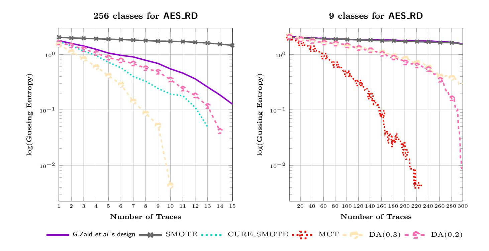
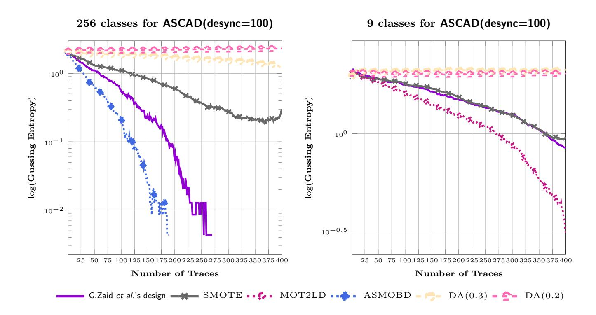
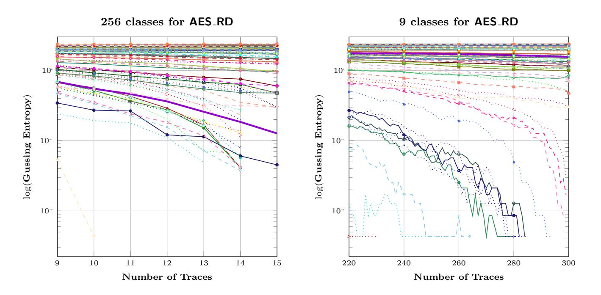
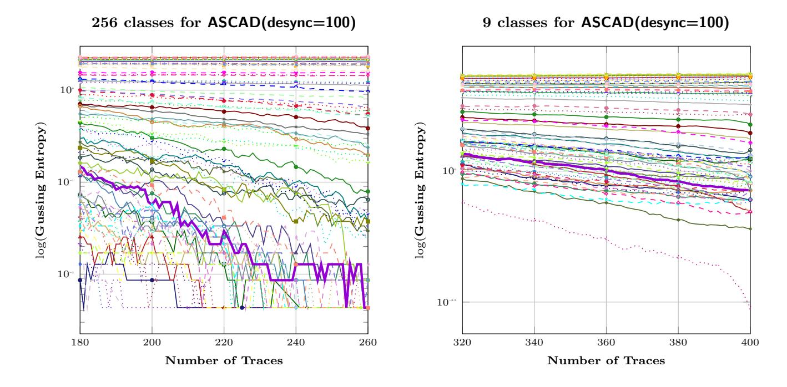
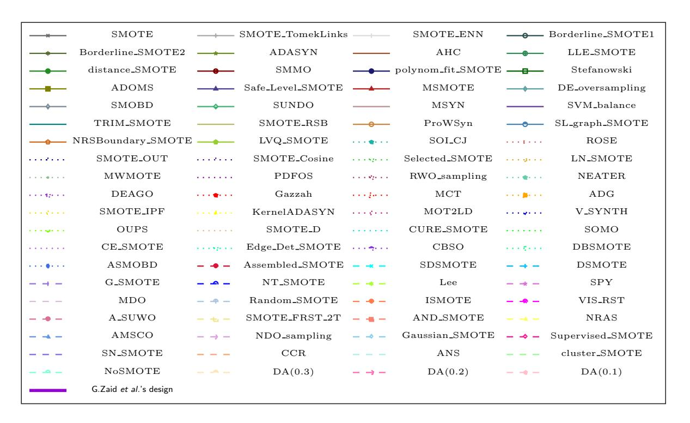

{0}------------------------------------------------

# Push For More: On Comparison of Data Augmentation and SMOTE With Optimised Deep Learning Architecture For Side-Channel

Yoo-Seung Won, Dirmanto Jap, and Shivam Bhasin

Physical Analysis and Cryptographic Engineering, Temasek Laboratories at Nanyang Technological University, Singapore {yooseung.won,djap,sbhasin}@ntu.edu.sg

Abstract. Side-channel analysis has seen rapid adoption of deep learning techniques over the past years. While many paper focus on designing efficient architectures, some works have proposed techniques to boost the efficiency of existing architectures. These include methods like data augmentation, oversampling, regularization etc. In this paper, we compare data augmentation and oversampling (particularly SMOTE and its variants) on public traces of two side-channel protected AES. The techniques are compared in both balanced and imbalanced classes setting, and we show that adopting SMOTE variants can boost the attack efficiency in general. Further, we report a successful key recovery on AS-CAD(desync=100) with 180 traces, a 50% improvement over current state of the art.

Keywords: Oversampling technique · Side-channel analysis · Deep learning.

# 1 Introduction

The security of cryptograhic algorithm has been widely investigated. One of the possible vulnerabilities is due to the physical leakage from the implementation of the cryptographic algorithm itself, which is commonly referred to as sidechannel analysis (SCA) [9]. Recently, many deep learning (DL) techniques have been introduced to SCA after the renaissance of machine learning to improve the performance of the attack. It can be naturally applied for profiled SCA, such as template attack [5] since DL frameworks can be divided to two fold; training and testing, similar to the framework of profiled SCA.

Related Works. The basic application of neural networks such as Multi-Layer Perceptron (MLP), Convolutional Neural Network (CNN), Recurrent Neural Network (RNN), Autoencoder were investigated by H. Maghrebi et al. [15] to enhance profiled SCA. More improvements have been proposed in later works. By applying the data augmentation (DA) techniques, E. Cagli et al. [4] demonstrated that it can overcome the jitter and noise countermeasures. In the same manner, by adding the artificial noise to original traces, with application of VGG 

{1}------------------------------------------------

architecture and blurring technique, J. Kim et al. [10] proposed the general architecture for open datasets of SCA and improvement of the attack performance. G. Zaid et al. [7] recently suggested the efficient methodology on how to construct the neural network structure for open dataset of SCA and reported most efficient attacks in the current state of the art.

One of the recent work showed that, by adjusting the imbalanced data on Hamming weight (HW) model, the distribution of the HW classes can be balanced [16] and since the biased data is solved by oversampling technique from data analysis, it can outperform the previous works, in particular Synthetic minority oversampling technique (SMOTE). However, there are some restriction in [16] owing to the fact that they only handled two oversampling techniques and considered HW assumption. In other words, there are still open problems on how to expand the oversampling techniques for improving the performance in the SCA context.

Our Contributions. In this paper, we conduct in-depth investigation for oversampling techniques to enhance SCA. The main contributions of this work are as follows. We conduct a comparative study of previously proposed DA [4] and SMOTE [16] (and its variant) in context of SCA. The performance of DA and various SMOTE variants are compared in both balanced (256 classes) and imbalanced (9 classes) setting. Experimental validation is performed on two public databases with side-channel countermeasure (AES RD and ASCAD). Finally, with optimised architectures as proposed in [7] and further adoption of SMOTE variants, we break ASCAD(desync=100) dataset in as low as 180 traces, which is a 50% improvements over the state of the art [7].

Paper Organization. This paper is organised as follows. Section 2 provides brief background on profiled SCA and security metric for adequately measuring the improvement. Afterwards, we explain the relationship between the oversampling technique and DA, and how imbalanced/balanced models for oversampling technique can affect SCA evaluation in Section 3. In Section 4, we highlight the experimental results for our suggestions and compared with the previous works. Finally, we provide the conclusion and further works in Section 5.

# 2 Preliminaries

### 2.1 Profiled Side-Channel Analysis

Profiled SCA [5] assumes a strong adversary with access to a clone of the target device. Adversary can query the clone device with known plaintext and key pairs while recording side-channel signature. These side-channel signature along with plaintext, key pair help to characterize a model for device leakage. Further, on the target device where key is unknown, the adversary queries a known plaintext to capture side-channel signature, which when queried with the characterized model can reveal the secret key. Ideally more than one query to target device might be needed to confidently recover the key due to presence of measurement noise and countermeasures.

{2}------------------------------------------------

In the following, we target side-channel protected software implementation of AES. The target operation is S-Box look up, which for a given plaintext t and secret key k ∗ , can be written as:

$$y(t, k^*) = \text{Model}(\text{Sbox}[t \oplus k^*]) \tag{1}$$

where Sbox[·] indicates S-box operation and Model(·) means the assumption for leakage model of side-channel information. We consider Hamming weight (HW) [1] and Identity as models, leading to 9 and 256 classes for y respectively. Classical profiled attacks use Gaussian templates [5], which are built for all values of y(t, k∗ ).

2.1.1 Deep Learning based Profiled Side-Channel Analysis Novel profiled SCA have seen the adoption of deep neural networks (DNN [4, 15]). The most commonly used algorithms are MLP and CNN. The use of DNN in sidechannel evaluation has shown several advantages over classical templates. For example, they can overcome traditional SCA countermeasure, such as jitter [4] and masking [15], and they are also naturally incorporating feature selection. Owing to these advantages, a line of research has focused on improving the performance of SCA by techniques like DA [4], training set class balancing [16], noise regularization, [10], finding optimised network architectures [7, 10] etc.

### 2.2 Security Metric

In order to quantify the effectiveness of profiled SCA with a security metric, the guessing entropy (GE) [12] is generally employed. Intuitively, the GE indicates the average number of key candidates needed for successful evaluation after the SCA has been performed. For measuring the GE, we repeat 100 times on randomly chosen test set in this paper. Additionally, N tGE [7] which implies the minimum number of traces when the GE reaches 1 is also utilized to compare the improvement.

# 3 Oversampling versus Data Augmentation

In this section, we briefly discuss the oversampling and data augmentation techniques used in this paper.

### 3.1 Oversampling Techniques

Oversampling and undersampling are common data analysis techniques used to adjust the class distribution of a data set (i.e. the ratio between samples in different classes). Oversampling is deployed more often than undersampling due to scarcity of training data in a general context. Oversampling and undersampling are contrasted and roughly equivalent techniques. Oversampling is done through applying transformation to existing data instances to generate new data instances, in order to adjust the class imbalance.

{3}------------------------------------------------

### 3.1.1 Synthetic Minority Oversampling Technique

One of the main solution to adjust the balance for biased data is the synthetic minority oversampling technique (SMOTE) [3]. The core idea is that the artificial instance for minority instances is generated using k-nearest neighbors of sample. In the minority instance, k-nearest samples are selected from sample X. Afterward, the SMOTE algorithm selects n samples randomly and save them as Xi . Lastly, the new sample X0 is generated based on the below equation.

$$X' = X + rand \times (X_i - X), \ i = 1, 2, ..., n$$
 (2)

where rand follows a random number uniformly distributed in the range (0, 1). By obtaining minority instances using SMOTE, the class imbalance is reduced thus allowing machine learning and deep learning algorithms to learn better. Naturally, it has been applied and shown working for SCA [16]. Picek et al. [16] study a very common case of SCA literature, i.e. the HW model. HW model is naturally biased. Considering one byte, the ratio of majority and minority class population for HW model is 70:1. In such cases, SMOTE balances the dataset improving the effectiveness of the DL based attack algorithm. In [16], authors study SMOTE and SMOTE-ENN, where SMOTE was shown to work better on the tested datasets. Recently, the candidates for SMOTE has increased quite a lot [8].

### 3.2 Data Augmentation

Data augmentation (DA [13]) is well-known in the field of DL and applied to overcome the overfitting issue while training phase. By applying artificial transformation to training data, the overfitting factor can be reduced and learning can be improved. In context of SCA, DA was applied as a solution to break jitter based countermeasures. Jitter causes horizontal shifts in side-channel trace resulting in misalignment which in turn reduces the attack efficiency. In [4], Cagli et al. used the translational invariance property of CNN to counter jitter based misalignment. Further, authors show that DA by applying small, random shift to existing traces can avoid overfitting, resulting in a better training of CNN. As S. Picek et al. [16] mentioned beforehand, this scheme can be considered as one of oversampling techniques.

While [4] use dedicated code to apply shifts to datasets and thus implement DA, we utilize the ImageDataGenerator1 class in the Keras DL library to provide DA. Moreover, width shift range is only regarded as the variable for argument of ImageDataGenerator, due to the unidimensionality for side channel leakage.

1 Refer to the Keras API description in https://www.tensorflow.org/api\_docs/ python/tf/keras/preprocessing/image/ImageDataGenerator

{4}------------------------------------------------

# 3.3 Case Study: Balanced (256) classes versus Imbalanced (9) classes

Hamming weight (and distance) models are some of the most popular leakage models in side-channel literature, which are practically validated on range of devices including microcontroller, FPGA, GPU, ASIC etc. However, as stated earlier, this model follows a Binomial distribution and is highly imbalanced. It was shown in [16], how imbalanced model can negatively affect SCA evaluations [16]. As a result, most of DL based SCA consider the identity model. When considering a byte as in AES, HW and identity model result in 9 and 256 classes respectively.

While the main objective of SMOTE is minority class oversampling and DA is to reduce overfitting. Thus SMOTE is ideal for imbalanced setting (9 classes), however, balanced dataset should not have a negative impact. On the other hand, DA does not consider class imbalance as a parameter. This can help overcoming overfitting, however, augmentation preserve original distribution and does not improve any imbalance. Thus, DA is expected to work better in balanced dataset (256 classes). Note that, with limited size dataset even 256 classes might have minor imbalances and SMOTE may improve the imbalance.

In the following, we study the performance of different SMOTE variants and DA under 9 and 256 classes setting. The study is performed on two publicly available datasets of side-channel protected AES implementation.

# 4 Experimental Validation

In this section, we describe the experimental setting and target datasets. Further, experimental results on AES RD and ASCAD datasets are reported in 256 and 9 classes setting.

### 4.1 Target Datasets & Network

We use two popular datasets, AES RD2 and ASCAD3 containing side-channel measurements of protected AES implementations running on a 8-bit AVR microcontroller. The AES RD contains traces for the software implementation AES with random delay countermeasure as described by J.-S. Coron et al. [6]. R. Benadjila et al. [2] introduced the open dataset ASCAD with traces corresponding to first order masking protected AES with artificially introduced random jitter. In particular we use the worst case setting with jitter up to 100 sample points (ASCAD(desync=100)).

The main motivation of this work is to investigate the effect of oversampling techniques on best known attacks so for. The work of G. Zaid et al. [7] recently published at CHES 2020, presents the best performing attacks and corresponding network choices to achieve those result. The following experiments takes the

2 https://github.com/ikizhvatov/randomdelays-traces

3 https://github.com/ANSSI-FR/ASCAD

{5}------------------------------------------------

result of G. Zaid et al. [7] as a benchmarking case to compare the affect of oversampling and DA techniques.

For the following experiments, the number of training traces used are 5, 000 and 45, 000 for AES RD and ASCAD respectively. Moreover, 5, 000 traces are used as validation set for all results and the number of epochs used are set as 20 (AES RD) and 50 (ASCAD).

Furthermore, we investigate the effect of 256 and 9 classes for the open dataset. In the 256 classes, we accept the underlying network which is suggested by [7]. On the other hand, for the 9 classes, the only modification is the number of output layers. As all oversampling techniques in Appendix A and DA can be regarded as pre-processing scheme, the modification to neural network parameters is not required as we can use the networks proposed in [7] (except for output layer modification in case of 9 classes). For parameter setting of SMOTE variants, we employ the default setting because there are many SMOTE and setting value for each techniques. According to previous claim in [16], we do not provide the MCC, kappa, and G-mean results, since these values are not critical information in the context of SCA. Moreover, we only represent the best result in overall sampling techniques to definitely compare with the previous results. All results can be referred to Appendix A and B.

### 4.2 Result for AES RD

As shown in Figure 1, some variant SMOTE [8] and DA scheme [4] are outperforming the previous work [7], proposed in CHES 2020. DA(0.3)4 which has the shift ratio 0.3 is best result in 256 classes. The attack needs only 11 traces to recover the correct key, although it is not enough to find the correct key in original scheme [7] where 15 traces are needed. CURE-SMOTE and Gaussian-based SMOTE also outperform original scheme by a small margin. The main purpose of data augmentation and SMOTE schemes is to concentrate on noise removal. As mentioned earlier, this effect works well to AES RD countermeasure. Unlike [7], the number of profiling traces is reduced to 5, 000 for our experiments and thus our reported N tGE is more than what was reported in the original scheme. However, lower training set size allows us to evaluate the impact of data augmentation and oversampling.

In case of HW model (9 classes), we can observe that the performance of the method proposed by [7], is degrading. As such, several SMOTE techniques are now outperforming it because the difference between majority and minority is more distinguishable than 256 classes. In this case, more traces will be also required in general (> 20× the traces required for 256 classes), since in HW model, the adversary cannot directly infer the actual value of sensitive intermediate variables.

As shown in Table 1 for 256 and 9 classes, CURE-SMOTE and Gaussianbased SMOTE are useful oversampling techniques against AES RD. Depending

4 DA(x) indicates that x×100% of the whole points is randomly shifted while training phase, which was suggested in [4]

{6}------------------------------------------------

Fig. 1: Result for the best variant SMOTEs and DA against AES RD

on the oversampling technique, the amount of traces added in the training set is variable. More precisely, the training dataset size is increased to 5, 013(5, 125) from 5, 000 for 256 classes (9 cases) in most of the oversampling techniques, which does not critically impact the learning time.

### 4.3 Result for ASCAD(desync=100)

In Figure 2, the results are plotted for ASCAD dataset. In this case, the benchmarking attack of [7] performs better than the DA schemes. However, several SMOTE variants are performing better. As shown in Table 1, ASMOBD and SDSMOTE are especially ranked in top 10 results for all classes of ASCAD dataset. In the case of 256 classes, ASMOBD can recover the key in under 200 traces while the original scheme needs over 256 traces.

The size of training dataset is increased from 45000 traces by 10 and 400 traces when applying the oversampling techniques to 256 and 9 classes, respectively. When employing the HW model (9 classes), some oversampling techniques such as MOT2LD and Borderline SMOTE2 have low GE, compared to original scheme.

### 4.4 Analysis and Discussion

We tested 85 variants of SMOTE and 3 variants of DA under 4 experiments. We have reported the best results in Table 1 for each datasets. In all the 4 cases, we were able to report results better than best benchmarking results. However, it was not possible to identify one single oversampling method which would work best in all the cases. This is not surprising and in accordance with No Free Lunch theorems [18]. In general, we can make the following observations from the previously performed experiments.

{7}------------------------------------------------

Fig. 2: Result for the best variant SMOTEs and DA against ASCAD(desync=100)

| No. | AES_RD (256 classes) |                | AES_RD (9 classes)    |                 | ASCAD (25          | 6 classes) | ASCAD (9 classes)     |                 |  |
|-----|----------------------|----------------|-----------------------|-----------------|--------------------|------------|-----------------------|-----------------|--|
|     | Scheme               | $Nt_{GE}$ > 15 | Scheme                | $Nt_{GE}$ > 300 | Scheme             | $Nt_{GE}$  | Scheme                | $Nt_{GE}$ > 400 |  |
| -   | Original             | > 15 (1.34)    | Original              | > 300 (36)      | Original           | 267        | Original              | (7)             |  |
| 1   | DA(0.3)              | 11             | MCT                   | 228             | ASMOBD             | 190        | MOT2LD                | > 400 (2)    |  |
| 2   | CURE_ SMOTE       | 14             | CURE_ SMOTE        | 243             | MDO                | 193        | Borderline _SMOTE2    | > 400 (4)    |  |
| 3   | Gaussian _SMOTE   | 15             | Gaussian _SMOTE    | 265             | DEAGO              | 212        | MSMOTE                | > 400 (5)    |  |
| 4   | DA(0.2)              | 15             | SMOTE _OUT         | 276             | MSMOTE             | 224        | Supervised _SMOTE     | > 400 (5)    |  |
| 5   | distance _SMOTE   | 15             | LLE_ SMOTE         | 281             | SMOTE_ Cosine   | 234        | LLE_ SMOTE         | > 400 (6)    |  |
| 6   | NoSMOTE              | 15             | polynom_fit _SMOTE | 283             | SMOBD              | 242        | polynom_fit _SMOTE | > 400 (6)    |  |
| 7   | SOI_CJ               | 15             | Borderline SMOTE1  | 285             | SDSMOTE            | 242        | ASMOBD                | > 400 (6)       |  |
| 8   | SOMO                 | 15             | V_SYNTH               | 285             | Stefanowski        | 245        | SDSMOTE               | > 400 (6)       |  |
| 9   | SMOTE _OUT        | 15             | SMOTE _Cosine      | 286             | SMOTE_ RSB      | 248        | SPY                   | > 400 (6)    |  |
| 10  | MCT                  | 15             | ASMOBD                | 295             | SL_graph _SMOTE | 249        | cluster _SMOTE     | > 400 (6)    |  |

Table 1: Top 10 results for AES\_RD and ASCAD(desync=100) datasets against variant SMOTEs and DA techniques, (\*): GE when the maximum number of traces is used

- In general, SMOTE variants led to attack improvements in all the cases as compared to DA which only outperforms in one case. DA also shows negative impact in case of ASCAD, where the attack is worse than baseline benchmarking attack of G. Zaid *et al.*
- Dataset imbalance is a difficult problem for deep learning as already stated in [16] which results in better performance of SMOTE variants when used in 256 classes as compared to 9 class setting. The discrepancy is better highlighted in ASCAD dataset, as there are > 20 variants which recovers the secret for 256 classes (though there are also a lot of methods which perform

{8}------------------------------------------------

- significantly worse) and only around 2 or 3 which have the correct key in top 5 rank candidates.
- Secondly, certain methods work better for a given dataset. For example, on AES RD, CURE-SMOTE and Gaussian-based SMOTE are in top 3 in terms of performance for both 256 and 9 classes. For ASCAD, ASMOBD, polynom fit SMOTE and SDSMOTE are in top 10. However, there are no consistents techniques which work for all the dataset and the scenarios.
- Some SMOTE variants has a negative impact on training datasets represented to Appendix A. For example, in case of SMOTE-ENN, the training dataset is shrunk from 5000 to 38. Not to surprise, the technique performs much worse than benchmark case of CHES 2020, leave alone any improvement. SMOTE-ENN also reported training set shrinking in other 3 experiments as well. Similar observations were seen in other experiments too but not necessarily for all experiments. We hypothesize that oversampling considers some traces as noise and filters them out, resulting in shrinking of datasets. Note that SMOTE-ENN was also shown to perform worse in [16].

# 5 Conclusion and Further works

In this paper, we investigate the effect of various SMOTE variants and previously proposed data augmentation against previously best known results. We outperform previous results with a decent margin. While DA improves the result in one case, different variants of SMOTE resulted in a general improvement across experiments. However, it was not possible to identify a single favorable SMOTE variant, it varied by experiments. We also reported that some oversampling techniques result in training set shrinking and thus lead to poor performance. Note that we tested various SMOTE variants in their default settings and there are other parameters to play with. Thus, a deeper investigations might help identify few candidates better suited for SCA application. Moreover, testing oversampling with more datasets could lead to better insights.

Acknowledgements. We gratefully acknowledge the support of NVIDIA Corporation with the donation of the Titan Xp GPU used for this research.

# A Variants of Oversampling Techniques (SMOTE Variants)

Two approaches were already introduced in [16] (SMOTE and SMOTE-ENN). However, there are currently 85 variant of SMOTEs referring to [8]. To the best of our knowledge, the investigation for effectiveness of these schemes has not been properly conducted in terms of SCA.

The variant SMOTEs in Table 2 have developed to overcome the bias for imbalanced data for DL context. As mentioned previously, only SMOTE and SMOTE-ENN are utilized in [16]. Although the performance of SMOTE in [16] 

{9}------------------------------------------------

is better, many variant SMOTEs have not been utilized. Moreover, they mentioned that the role of SMOTE and SMOTE-ENN is to only increase the number of minority instance. However, in general, the oversampling techniques can be further used as compared to previous suggestion. Naturally, these techniques can be used beyond HW/HD model, because the data might be biased in practice. As such, variant SMOTEs provide benefit as preprocessing tool, which help smoothing the distribution of the data.

| Scheme            | #Training      | Scheme            | #Training                      | Scheme                         | #Training      | Scheme           | #Training      | Scheme           | #Training     |
|-------------------|----------------|-------------------|--------------------------------|--------------------------------|----------------|------------------|----------------|------------------|---------------|
|                   | 2787           |                   | 5013                           |                                | 5013           |                  | 5013           |                  | -             |
| SMOTE_TomekLinks  | 3342           | MSYN              | 5126                           | PWO compling                   | 5126           | Edmo Dot SMOTE   | 5126           | CASMOTE          | -             |
| SMO1E_10mekLinks  | 26568          | MSYN              | - 1                            | RWO_sampling                   | 45010          | Edge_Det_SMOTE   | 45010          | GASMOTE          | -             |
|                   | 31897          |                   | -                              |                                | 46257          |                  | 46257          |                  | -             |
|                   | 38             |                   | 5013                           | NEATER                         | 9985           | i                | 5013           |                  | 5000          |
| SMOTE_ENN         | 1142           | SVM_balance       | 5126                           |                                | 10072          | CBSO             | 5126           | A_SUWO           | 5000          |
|                   | 204            |                   | 45010                          |                                | -              |                  | 45010          | 11200 110        | 1001          |
|                   | 9569           |                   | 46257                          |                                | -              |                  | 46257          |                  | 30133         |
|                   | 5013           |                   | 5000                           |                                | 5013           | E-SMOTE          | -              | SMOTE_FRST_2T    | 55            |
| Borderline_SMOTE1 | 5000 45010  | TRIM_SMOTE        | 5000 45010                  | DEAGO                          | 5126 45010  |                  | -              |                  | 330 322    |
|                   | 46257          |                   | 46257                          |                                | 46257          |                  | -              |                  | 50            |
|                   | 5013           |                   | 5017                           |                                | 28             |                  | 5000           |                  | 5000          |
|                   | 5000           |                   | 5145                           |                                | 228            |                  | 5000           | AND_SMOTE        | 5000          |
| Borderline_SMOTE2 | 45010          | SMOTE_RSB         | 45020                          | Gazzah                         | 238            | DBSMOTE          | 45010          |                  | 45010         |
|                   | 46257          |                   | 47514                          |                                | 1939           |                  | 46257          |                  | 50            |
|                   | 9972           |                   | 5013                           | 126 5010 MCT                | 5013           | ASMOBD           | 5013           | NRAS             | 5000          |
| ADASYN            | 9946           | ProWSyn           | 5126                           |                                | 5126           |                  | 5126           |                  | 5000          |
| ADASTN            | 89698          | 1 TOWBY II        | 45010                          |                                | 45010          |                  | 45000          |                  | 45000         |
|                   | 89698          |                   | 46257                          |                                | 46257          |                  | 45000          |                  | 45000         |
|                   | 54             |                   | 5013                           |                                | 41             | Assembled_SMOTE  | 5013           | AMSCO            | 72            |
| AHC               | 206 462     | SL_graph_SMOTE    |                                | 5000 45010 46257         | 180 323     |                  | 5126 45010  |                  | 684 326    |
|                   | 1709           |                   |                                |                                | 3567           |                  | 46257          |                  | 2713          |
|                   | 5013           |                   | 5000                           |                                | 27             |                  | 5013           | +                | 2715          |
|                   | 5126           |                   | 5126                           |                                | 289            |                  | 5126           | SSO              |               |
| LLE_SMOTE         | 45010          | NRSBoundary_SMOTE | - 0120                         | SMOTE_IPF                      | 170            | SDSMOTE          | 45010          |                  | _             |
|                   | 46257          | i                 | -                              |                                | 2688           |                  | 46257          |                  | -             |
|                   | 5013           |                   | 5013                           |                                | 5000           | DSMOTE           | 54             | NDO_sampling     | 5013          |
| distance_SMOTE    | 5126           | LVQ_SMOTE         | 5126                           | KernelADASYN                   | 5000           |                  | 306            |                  | 5126          |
| distance_SMO1E    | 45010          | EVQ25MOTE         | 45010                          | Troine Troine                  | 45010          |                  | 322            |                  | 45010         |
|                   | 46257          |                   | 46257                          |                                | 46257          |                  | 2816           |                  | 46257         |
|                   | 5000           | SOI_CJ            | 5000                           |                                | 5000           | G-SMOTE          | 5013           | DSRBF            | -             |
| SMMO              | 5126           |                   | 5000                           | MOT2LD                         | 5000           |                  | 5126           |                  | -             |
|                   | 45010 46257 |                   | 45000 45000                 |                                | 44870 46115 |                  | 45010 46257 |                  | -             |
|                   | 5013           |                   | 5013                           | 013 126 V-SYNTH             | 5013           | NT-SMOTE         | 5013           | Gaussian_SMOTE   | 5013          |
|                   | 5135           |                   | 5126                           |                                | 5126           |                  | 5126           |                  | 5126          |
| polynom_fit_SMOTE | 45151          | ROSE              | 45010                          |                                | 45010          |                  | 45010          |                  | 45010         |
|                   | 46208          |                   | 46257                          |                                | 46257          |                  | 46257          |                  | 46257         |
|                   | 4973           |                   | 5013                           | 5126 45010 46257 OUPS | 5014           |                  | 5013           | kmeans_SMOTE     | -             |
| Stefanowski       | 4857           | SMOTE_OUT         |                                |                                | 5129           |                  | 5126           |                  | -             |
| Steranowski       | 44845          | 5.00 T 2.00 T     |                                |                                | 45010          |                  | 45010          |                  | -             |
|                   | 43722          |                   |                                |                                | 46263          |                  | 46257          |                  | -             |
|                   | 5013 5126   |                   | 5013 5126 45010 46257 | SMOTE_D                        | 5009 5127   | SPY              | 5013 5000   | Supervised_SMOTE | 5013          |
| ADOMS             | 45010          | SMOTE_Cosine      |                                |                                | 45014          |                  | 45000          |                  | 5126 45010 |
|                   | 46257          |                   |                                |                                | 46245          |                  | 45000          |                  | 46257         |
|                   | 5001           |                   | 5013                           |                                | -              |                  | -              | +                | 5013          |
|                   | 5006           | a 1 . 1 avo==     | 5126                           | anomp pac                      | _              | GMOTE DOOD:      | -              | av avomn         | 5126          |
| Safe_Level_SMOTE  | 45001          | Selected_SMOTE    | 45010                          | SMOTE_PSO                      | -              | SMOTE_PSOBAT     | -              | SN_SMOTE         | 45010         |
|                   | 45036          | <u> </u>          | 46257                          | 46257                          |                |                  | -              |                  | 46257         |
|                   | 5000           |                   | 5000                           |                                | 5013           | MDO Random_SMOTE | 5000           |                  | 5014          |
| MSMOTE            | 5000           | LN_SMOTE          | 5126                           |                                | 5126           |                  | 5000           | CCR ANS       | 5135          |
|                   | 45010          |                   | 45000                          |                                | 45010          |                  | 45000          |                  | 45000         |
|                   | 4257           |                   |                                |                                | 46257          |                  | 45000          |                  | 46208         |
|                   | 5013 5065   |                   |                                |                                | 5000           |                  | 5013           |                  | 5014          |
| DE_oversampling   | 45010          | MWMOTE            |                                |                                | 5000 45000  |                  | 5126 45010  |                  | 5126 45000 |
|                   | 46257          |                   | 46257                          |                                | 45000          |                  | 46257          |                  | 46257         |
|                   | 5013           |                   | 5013                           |                                |                | - ISMOTE         | 41             | cluster_SMOTE    | 5014          |
| 0110              | 5126           | DD=00             | 5126                           | 1001/15 **                     |                |                  | 180            |                  | 5126          |
| SMOBD             | 45010          | PDFOS             | 45010                          | ISOMAP-Hybrid                  | -              |                  | 312            |                  | 45010         |
|                   | 46257          |                   | 46257                          |                                |                |                  | 1559           |                  | 46257         |
|                   | 2501           |                   | -                              | CE-SMOTE                       | 5013           | VIS_RST          | 5013           | NoSMOTE          | 5000          |
| SUNDO             | 2515           | IPADE_ID          | -                              |                                | 5126 45010  |                  | 5126           |                  | 5000          |
| ~~~~              | 22502 22548 |                   | -                              | - CE-DWOTE                     |                |                  | 45010          |                  | 45000         |
|                   |                |                   | 1                              |                                | 46257          |                  | 46257          |                  | 45000         |

Table 2: API function list for variant SMOTEs in [8]. Table reports the number of training set for AES\_RD(256 classes), AES\_RD(9 classes), ASCAD(256 classes), and ASCAD(9 classes), respectively after applying each oversampling techniques. '-' indicates that we do not perform its oversampling techniques due to the time limit.

Moreover, as mentioned earlier, these techniques are worth investigated in the context of SCA, because there are several advantages offered by SMOTE variants, such as the change of majority and noise removal. Among 85 variant SMOTEs, we have conducted preliminary investigation on their effectiveness and only reported those who are quite successful for SCA.

{10}------------------------------------------------

# B Results for all oversampling techniques against AES RD and ASCAD(desync=100)

The legend of Figures 3 and 4 is referred to Figure 5.

Fig. 3: Result for variant SMOTEs and DA against AES RD

Fig. 4: Result for variant SMOTEs and DA against ASCAD(desync=100)

{11}------------------------------------------------

Fig. 5: The legend of Figures 3 and 4

# References

- 1. E. Brier, C. Clavier, and F. Olivir. Correlation Power Analysis with a Leakage Model. In M. Joye and JJ. Quisquater (eds), Cryptographic Hardware and Embedded Systems CHES 2004, LNCS, vol. 3156, pp. 16-29. Springer, Heidelberg (2004)
- 2. R. Benadjila, E. Prouff, R. Strullu, E. Cagli, and C. Dumans. *Deep learning for side-channel analysis and introduction to ASCAD database*. Journal of Cryptographic Engineering. (2019)
- 3. N. V. Chawla, K. W. Bowyer, L. O. Hall, and W. P. Kegelmeyer. Smote: Synthetic minority over-sampling technique. J. Artif. Int. Res., 16(1), pp. 321-357. (2002)
- 4. E. Cagli, C. Dumans, and E. Prouff. Convolutional Neural Networks with Data Augmentation Against Jitter-Based Countermeasures. In W. Fischer and N. Homma (eds), Cryptographic Hardware and Embedded Systems CHES 2017, LNCS, vol. 10529, pp. 45-68. Springer, Heidelberg (2017)
- 5. S. Chari, J. R. Raio, and P. Rohatgi. *Template Attacks*. In Kaliski B.S., Koç .K., Paar C. (eds), Cryptographic Hardware and Embedded Systems CHES 2002, LNCS, vol. 2523, pp. 13-28. Springer, Heidelberg (2002)
- 6. J.-S. Coron and I. Kizhvatov. An Efficient Method for Random Delay Generation in Embedded Software. In C. Clavier and K. Gaj (eds), Cryptographic Hardware and Embedded Systems CHES 2009, LNCS, vol. 5747, pp. 156-170. Springer, Heidelberg (2009)
- 7. G. Zaid, L. Bossuet, A. Habrard, and A. Venelli. *Methodology for Efficient CNN Architectures in Profiling Attacks*. IACR Transactions on Cryptographic Hardware and Embedded Systems, 2020(1).
- 8. G. Kovács. smote\_variants Documentation Release 0.1.0. https://readthedocs.org/projects/smote-variants/downloads/pdf/latest/, Feb 03, 2020
- 9. P. C. Kocher, J. Jaffe, and B. Jun. *Differential power analysis*. In M. J. Wiener (ed), Advances in Cryptology CRYPTO '99, 19th Annual International Cryptology Conference, LNCS, vol. 1666, pp. 388-397. Springer, Heidelberg (1999)

{12}------------------------------------------------

- 10. J. Kim, S. Picek, A. Heuser, S. Bhasin, and A. Hanjalic. Make Some Noise Unleashing the Power of Convolutional Neural Netoworks for Pofiled Side-channel Analysis. IACR Transactions on Cryptographic Hardware and Embedded Systems, 2019(3), pp. 148-179. (2019)
- 11. H. Lee, J. Kim, and S. Kim. Gaussian-Based SMOTE Algorithm for Solving Skewe Class Distributions. Int. J. Fuzzy Log. Intell. Syst. 2017;17(4), pp. 229-237. (2017)
- 12. F. -X. Standaert, T. G. Malkin, and M. Yung. A Unified Framework for the Analysis of Side-Channel Key Recovery Attacks, EUROCRYPT 2009, LNCS 5479, pp. 443- 461. (2009)
- 13. P. Y. Simard, D. Steinkraus, and J. C. Platt. Best Practices for Convolutional Neural Networks Applied to Visual Document Analysis. Seventh Int. Conf. on Document Analysis and Recognition - Volumne 2. (2003)
- 14. L. Ma and S. Fan. CURE-SMOTE algorithm and hybrid algorithm for feature selection and parameter optimization based on random forests. BMC Bioinformatics, 2017(169), 2017.
- 15. H. Maghrebi, T. Portigliatti, and E. Prouff. Breaking cryptographic implementations using deep learning techniques. In C. Carlet, M. A. Hassan, an V. Saraswat (eds), Security, Privacy, and Applied Cryptography Engineering - SPACE 2016, LNCS, vol. 10076, pp. 3-26, Springer, Heidelberg (2016)
- 16. S. Picek, A. Heuser, A. Jovic, S. Bhasin, and F. Regazzoni. The Curse of Class Imbalance and Conflicting Metrics with Machine Learning for Side-channel Evaluations. IACR Transactions on Cryptographic Hardwareand Embedded Systems, 2019(1), pp. 209-237. (2019)
- 17. S. Wang, Z. Li, W. Chao, and Q. Cao. Applying adaptive over-sampling technique based on data density and cost-sensitive SVM to imbalanced learning. The 2012 International Joint Conference on Neural Networks (IJCNN), pp. 1-8. (2012)
- 18. D. H. Wolpert. The lack of a prior distinctions between learning algorithms. Neural Computation, vol. 8, pp. 1341-1390. (1996)