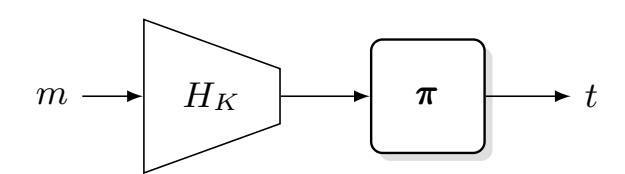
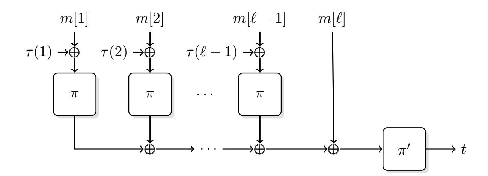

{0}------------------------------------------------

# **On Length Independent Security Bounds for the PMAC Family**

Bishwajit Chakraborty, Soumya Chattopadhyay, Ashwin Jha and Mridul Nandi

Indian Statistical Institute, Kolkata, India [{bishu.math.ynwa,s.c.2357,ashwin.jha1991,mridul.nandi}@gmail.com](mailto:bishu.math.ynwa@gmail.com, s.c.2357@gmail.com, ashwin.jha1991@gmail.com, mridul.nandi@gmail.com)

**Abstract.** At FSE 2017, Gaži et al. demonstrated a pseudorandom function (PRF) distinguisher (Gaži et al., ToSC 2016(2)) on PMAC with Ω(*`q*2 */*2 *n* ) advantage, where *q*, *`*, and *n*, denote the number of queries, maximum permissible query length (in terms of *n*-bit blocks), and block size of the underlying block cipher. This, in combination with the upper bounds of *O*(*`q*2 */*2 *n* ) (Minematsu and Matsushima, FSE 2007) and *O*(*qσ/*2 *n* ) (Nandi and Mandal, J. Mathematical Cryptology 2008(2)), resolved the long-standing problem of exact security of PMAC. Gaži et al. also showed that the dependency on *`* can be dropped (i.e. *O*(*q* 2 */*2 *n* ) bound up to *`* ≤ 2 *n/*2 ) for a simplified version of PMAC, called sPMAC, by replacing the Gray code-based masking in PMAC with any 4-wise independent universal hash-based masking. Recently, Naito proposed another variant of PMAC with two powering-up maskings (Naito, ToSC 2019(2)) that achieves *`*-free bound of *O*(*q* 2 */*2 *n* ), provided *`* ≤ 2 *n/*2 . In this work, we first identify a flaw in the analysis of Naito's PMAC variant that invalidates the security proof. Apparently, the flaw is not easy to fix under the existing proof setup. We then formulate an equivalent problem which must be solved in order to achieve *`*-free security bounds for this variant. Second, we show that sPMAC achieves *O*(*q* 2 */*2 *n* ) bound for a weaker notion of universality as compared to the earlier condition of 4-wise independence.

**Keywords:** PMAC · PMAC1 · PMAC\_Plus · PRF · universal hash · tight security

# **1 Introduction**

Message Authentication Codes or MACs are symmetric-key primitives that ensure data integrity and authenticity. PMAC, by Black and Rogaway [\[BR02\]](#page-15-0), is an example of parallelizable block cipher-based MAC. A slightly simplified version[1](#page-0-0) of PMAC based on an *n*-bit block cipher *EK* is defined as follows:

$$\mathsf{PMAC}_K(m) := E_K \left( E_K(m_1 \oplus \gamma_1 \cdot \Delta) \oplus \cdots \oplus E_K(m_{\ell-1} \oplus \gamma_{\ell-1} \cdot \Delta) \oplus m_{\ell} \right),$$

where (*m*1*, . . . , m`*) is *n*-bit (also referred as block) parsing of the input message *m*, and ∆ = *EK*(0*n*) is the masking key. PMAC and its close variant PMAC1 [\[Rog04\]](#page-16-0) have the ability to significantly outperform sequential block cipher based-MACs, like the CBC-MAC family [\[EMST76,](#page-15-1) [BKR94,](#page-15-2) [BdBB](#page-15-3)+95, [BR00\]](#page-15-4), by virtue of their parallelizable nature.

Existing Analysis of PMAC: In the following discussion, *q*, *`* and *σ*, respectively, denote the number of queries, maximum permissible message length in blocks, and total number of blocks in all queries, i.e, *σ* ≤ *`q*. It is a well-known observation [\[GGM84,](#page-15-5) [BGM04\]](#page-15-6) that a good PRF is necessarily a good deterministic[2](#page-0-1) MAC. Consequently, most of the

1 Ignoring the padding rule.

2This observation is not true, in general, for nonce-based or probabilistic MACs.

{1}------------------------------------------------

research on the security of PMAC have explored its pseudorandomness properties. The first result along this line came in the introductory paper by Black and Rogaway [BR02] who showed an upper bound of  $O(\sigma^2/2^n)$  on the PRF advantage. A different bound of the form  $O(\ell q^2/2^n)$  was shown by Minematsu and Matsushima [MM07]. This bound is better than the original bound whenever message lengths do not vary much from  $\ell$ . However, this bound can be worse when very few messages are of length  $\ell$  and rest of the messages are of length much smaller than  $\ell$ . Nandi and Mandal [NM08] showed an improved bound about  $O(q\sigma/2^n)$ . This is indeed an improved bound for all choices of parameters.

Luykx et al. [LPSY16] studied the problem from lower bound perspective. Specifically, they constructed a pair of messages such that the PMAC outputs corresponding to the two messages collide with probability roughly  $\ell/2^n$ , leading to a distinguishing attack with advantage  $\ell/2^n$  for q=2 queries. However, they did not show how this can be extended to get collision probability about  $\ell q^2/2^n$  for  $q\geq 2$  messages. Later Gaži et al. [GPR16] constructed an adversary which makes q queries, each of length exactly  $\ell$  blocks, so that the collision probability of PMAC outputs is about  $\ell q^2/2^n$ . Thus, the bounds  $\ell q^2/2^n$  and  $q\sigma/2^n$  are essentially tight. However, it is worth noting that the attack does not work for PMAC1 [Rog04] where the Gray code sequence is replaced with the sequence  $\alpha, \alpha^2, \alpha^3, \ldots$  for some fixed primitive element  $\alpha$  of the Galois field GF( $2^n$ ). So, the exact security of PMAC1 is still an open problem.

PRFs with Length Independent Security: In applications where we process large messages or where most of the messages are of lengths much smaller than  $\ell$ , a bound of the form  $O(q^2/2^n)$  (length-independent) is much desired, as compared to say a bound of  $O(\ell q^2/2^n)$ . For instance, AES128 [NIS01] based PMAC needs rekeying after roughly  $2^{22}$  messages when message length can be as large as  $2^{50}$  bytes and more than  $2^{-32}$  advantage is not tolerated. Whereas, any construction with  $q^2/2^n$  or similar bound can be safely used without rekeying for up to  $2^{48}$  messages in a similar setup. As a result, this line of research has seen a lot of interest over the years.

EMAC [BKR94, BdBB+95], ECBC and FCBC [BR00] are shown to have  $O(q^2/2^n)$  PRF advantage provided  $\ell \leq 2^{n/4}$  [JN16a, JN16b]. However, these constructions are sequential in nature. Luykx et al. [LPTY16] proposed a parallel construction, called LightMAC, that achieves  $\ell$ -free security. However, inspired by Bernstein's protected counter sums [Ber99], LightMAC uses a counter-based encoding which limits the efficiency. For example, to allow a message length of  $2^{n/2}$  blocks, LightMAC requires two calls of block ciphers to process one block of message, i.e., it is a rate3 1/2 construction. Dutta et al. [DJN17] proposed some optimal strategies to encode counter and message in input blocks. Although this increases the rate for smaller messages, still the rate is low as compared to PMAC or PMAC1.

With respect to PMAC-like designs, Gaži et al. [GPR16] proved  $O(q^2/2^n)$  bound for a simplified variant of PMAC, called sPMAC, albeit with comparatively expansive masking methods. For example, the masking function should be a 4-wise independent function. Most efficient algebraic instantiations of such a function require at least four keys and several field multiplications. Very recently, Naito [Nai19] proposed a variant of PMAC1, which uses two powering-up maskings (instead of one used in PMAC1). He showed  $O(q^2/2^n)$  advantage provided  $\ell < 2^{n/2}$ .

The constructions following Double-block Hash-then-Sum paradigm [DDNP18], including PMAC\_Plus [Yas11] and LightMAC\_Plus [Nai17], achieve beyond the birthday bound (BBB) security [KLL20] and hence can achieve  $\ell$ -free bound for a wide range of  $\ell$ . However, these constructions require almost twice the memory (due to the BBB security requirement) used in other PMAC variants. So, in this paper we only focus on PMAC-like designs that follow the Hash-then-PRP paradigm [Sho04].

&lt;sup>3Roughly speaking, rate is the ratio of message length in blocks to the number of block cipher calls required to process the message.

{2}------------------------------------------------

### **1.1 Our Contributions**

Our contributions are twofold:

- 1. Revisiting Naito's variant of PMAC1: As of now, Naito's PMAC1 variant [\[Nai19\]](#page-16-8) is the only known rate-1 PMAC-like construction that achieves *`*-free security bound (for *` <* 2 *n/*2 ). We show that *the security analysis of this construction is incorrect* (see section [4\)](#page-8-0). Further, we state an equivalent problem which must be solved to prove the *`*-free security of this construction. However, we are not able to solve that equivalent problem. So the exact security of Naito's variant is still an open problem.
- 2. Relaxing the Security Precondition for sPMAC: In [\[GPR16\]](#page-15-7), sPMAC is shown to have *`*-free security bound up to *` <* 2 *n/*2 when the underlying masking function is 4-wise independent hash. We *relax the* 4*-wise independence condition to* 2*-wise almost XOR universality* (see section [5\)](#page-10-0).

# **2 Preliminaries**

Basic Notations: For any positive integer *n*, we write [*n*] := {1*, . . . , n*}. We write *x q* to denote a *q*-tuple (*x*1*, . . . , xq*).

Notations on Blocks: Throughout the paper *n* denotes the security parameter as well as the bit size of the underlying permutation. We call the set B := {0*,* 1} *n* block set and elements of the set *blocks*. For any binary string *m* ∈ {0*,* 1} ∗ , we denote the number of bits of *m* as |*m*| and we write *lm* := d|*m*|*/n*e. [4](#page-2-0) We use "k" to denote concatenation operations on bit strings. For a message *m* ∈ {0*,* 1} *nl*, we write *m* = *m*[1]k · · · k*m*[*l*] with *m*[*i*] ∈ {0*,* 1} *n* for all *i* ∈ [*l*].

Notations on Block Functions and Permutations: We call a function block function if the range of the function is the block set. The set of all block functions defined over a set D is denoted as FuncD. The set of all permutations over the block set (also called block permutation) is denoted as Perm.

A keyed block function *F* with key space K and domain D is a block function over K × D. We also view it as an indexed family of functions, where K is the index set, i.e., for each *K* ∈ K, we associate a function *FK*(·) := *F*(*K,* ·).

Multiset: Informally, a multiset X is a variant of set in which we allow elements to repeat. One can equivalently define a multiset X by a set {(*x, m*) : *x* ∈ X*, x* appears *m* times in X}. We write X*o* to denote the set of all elements *x* which appears odd times in X. Note that, X*o* by definition is a set which can be empty. We say X is **evenly repeated** if X*o* = ∅.

**Example 1.** Let X := {*a, b, a, b, b, c*} be a multiset. We represent it by the following set {(*a,* 2)*,*(*b,* 3)*,*(*c,* 1)}. Note that X*o* = {*b, c*}. Similarly, for a multiset Y := {*a, b, a, b, b, b, c, c*}, Y*o* = ∅ and hence Y is evenly repeated.

Given a block function *π*, we use shorthand notation *π* ⊕(X) := L *x*∈X *π*(*x*). With this notation, it is easy to see that (the empty sum represents 0 *n*)

$$\pi^{\oplus}(\mathcal{X}) = \pi^{\oplus}(\mathcal{X}^o) \text{ for every multiset } \mathcal{X},$$
 (1)

and hence *π* ⊕(X) = 0*n* whenever X is evenly repeated multiset.

Binary Field: In this paper, we view the block set B as the Galois field GF(2*n*). We fix a primitive polynomial *p*(*x*) := *p*0 ⊕ *p*1*x* ⊕ · · · ⊕ *pnx n* where *pi* ∈ {0*,* 1}. Note that

4When *m* is a set we also write |*m*| to denote the size of the set *m*. So the notation |*m*| should be clear from the context.

{3}------------------------------------------------

 $p_0 = p_n = 1$  (as it is a primitive polynomial). The field multiplication "·" between two field elements is defined through the primitive polynomial. We abuse the notation 2 to denote a primitive element of the underlying field  $GF(2^n)$ .

#### 2.1 Hash Functions

In the following, let H be a keyed block function with keyspace  $\mathcal{K}$  and domain  $\mathcal{D}$ .

Collision Probability: For distinct  $m, m' \in \mathcal{D}$ , we define collision probability as

$$\mathsf{coll}_H(m, m') := \mathsf{Pr}(H(K, m) = H(K, m') : K \leftarrow_{\$} \mathscr{K}).$$

When  $\mathcal{D} \subseteq \{0,1\}^*$ , the collision probability can depend on the size of the inputs. We write

$$\operatorname{coll}_{H}(\ell) = \max_{\substack{m \neq m' \\ |m|, |m'| \leq \ell}} \operatorname{coll}_{H}(m, m').$$

We generalize the above definition for more than two inputs. For q distinct inputs  $m_1, \ldots, m_q \in \mathcal{D}$ , we write

$$\operatorname{coll}_{H}(m^{q}) := \Pr(\exists i < j, H(K, m_{i}) = H(K, m_{j}) : K \leftarrow_{\$} \mathscr{K}), \text{ and } \operatorname{coll}_{H}(q, \ell, \sigma) := \max_{\substack{m^{q}: |m_{i}| \leq \ell \\ \sum_{i=1}^{q} |m_{i}| \leq \sigma}} \operatorname{coll}_{H}(m^{q}).$$

By using the union bound,  $\operatorname{coll}_H(q, \ell, \sigma) \leq \binom{q}{2} \operatorname{coll}_H(\ell)$ .

**Definition 1** (Universal hash function). The keyed block function H is called an  $\epsilon$ -universal hash if for all distinct  $m, m' \in \mathcal{D}$ ,  $\mathsf{coll}_H(m, m') \leq \epsilon$ .

**Definition 2** (XOR universal hash function). The keyed block function H is called an  $\epsilon$ -almost XOR universal hash if for all distinct  $m, m' \in \mathcal{D}$  and  $\delta \in \mathfrak{B}$ ,

$$\Pr(H(K, m) \oplus H(K, m') = \delta : K \leftarrow_{\$} \mathcal{K}) < \epsilon.$$

**Definition 3** (k-wise independent hash function). The keyed block function H is called a k-wise independent if for all distinct  $m_1, \ldots, m_k \in \mathcal{D}$  and for all  $y_1, \ldots, y_k \in \mathfrak{B}$ ,

$$\Pr(H(K, m_1) = y_1, \dots, H(K, m_k) = y_k : K \leftarrow_{\$} \mathcal{K}) = \frac{1}{2^{kn}}.$$

The following observations are easy to establish.

- 1. A random function is k-wise independent for any k.
- 2. A 2-wise independent hash function is  $2^{-n}$ -AXU.

#### 2.2 Pseudorandom Functions and the Hash-then-RP Paradigm

We write  $X \leftarrow_{\$} \mathcal{X}$  to represent that X is a uniform random variable taking values from a finite nonempty set  $\mathcal{X}$ .

Throughout,  $\rho_{\mathcal{D}} \leftarrow_{\$} \mathsf{Func}_{\mathcal{D}}$  denotes a random function, and  $\pi \leftarrow_{\$} \mathsf{Perm}$  denotes a random permutation. We simply write the random function as  $\rho$ , when  $\mathcal{D}$  is understood from the context.

**Definition 4** (Pseudorandom function). Let F be a keyed block function over a finite set  $\mathscr{D}$  with a finite key space  $\mathscr{K}$ . The PRF-advantage of any oracle adversary  $\mathscr{A}$  against F is defined as

$$\mathbf{Adv}_F^{\mathrm{prf}}(\mathscr{A}) := \left| \mathsf{Pr}(\mathscr{A}^{F_K} = 1 : K \leftarrow_{\$} \mathscr{K}) - \mathsf{Pr}(\mathscr{A}^{\mathbf{\rho}_{\mathscr{D}}} = 1) \right|.$$

{4}------------------------------------------------

The  $maximum\ PRF$ -advantage of F is defined as

$$\mathbf{Adv}_F^{\mathrm{prf}}(q,\ell,\sigma) = \max_{\mathscr{A}} \mathbf{Adv}_F^{\mathrm{prf}}(\mathscr{A}),$$

where the maximum is taken over all adversaries  $\mathscr{A}$  making at most q queries, each of length at most  $\ell$ , and the total length of all queries at most  $\sigma$ , i.e.,  $\sigma \leq \ell q$ .

Figure 2.1: The Hash-then-RP paradigm.

HASH-THEN-RP CONSTRUCTION: Let  $H: \mathcal{K} \times \mathcal{D} \to \mathfrak{B}$  be a keyed hash and  $\pi$  be an n-bit random permutation. The composition  $\pi \circ H_K$  is called the Hash-then-RP construction, where  $K \leftarrow_{\$} \mathcal{K}$ . When  $\pi$  is replaced with  $\rho$ , the resulting composition is called the Hash-then-RF. These constructions have been studied in [CW79, Sho96]. Many PRF constructions can be viewed as instances of Hash-then-RP/RF. For example, EMAC [BKR94, BdBB+95], ECBC, FCBC [BR00], LightMAC [LPTY16] and protected counter sum [Ber99]. Proposition 1 gives the PRF advantage for Hash-then-RP construction.

**Proposition 1.** Let H be a keyed block function with keyspace  $\mathcal{K}$  and domain  $\mathcal{D}$ . Then, we have

$$\mathbf{Adv}^{\mathrm{prf}}_{\boldsymbol{\pi} \circ H}(q, \ell, \sigma) \leq \mathrm{coll}_{H}(q, \ell, \sigma) + \frac{q(q-1)}{2^{n+1}}.$$

So, if H is an  $\epsilon$ -universal hash function, then

$$\mathbf{Adv}^{\mathrm{prf}}_{\boldsymbol{\pi} \circ H}(q, \ell, \sigma) \leq \frac{q(q-1)}{2} \left(\epsilon + \frac{1}{2^n}\right).$$

We skip a formal proof here as Proposition 1 is a well-known result. The readers are referred to [GPR16, JN18] for a formal proof.

# 3 Revisiting Simplified PMAC

DESCRIPTION OF sPMAC: Gaži et al. [GPR16] proposed a generalized version of PMAC, called sPMAC, to capture the underlying masking function for a wide class of PMAC variants.

**Definition 5** (sPHash). For any permutation  $\pi \in \mathsf{Perm}$  and a block-valued function  $\tau \in \mathsf{Func}_{\mathbb{N}}$  (referred as masking function), we define the *simplified PMAC hash* or sPHash over the message space  $\mathfrak{B}^+$  as follows:

for all 
$$m := (m[1], \dots, m[l]) \in \mathfrak{B}^l$$
,

$$\mathsf{sPHash}_{\pi,\tau}(m) := m[l] \oplus \bigoplus_{i=1}^{l-1} \pi(x_{\tau}(m,i)), \text{ where } x_{\tau}(m,a) := m[a] \oplus \tau(a). \tag{2}$$

Clearly, sPHash is just an identity function for a single block message.

Now, given two permutations  $\pi, \pi' \in \mathsf{Perm}$  and a masking function  $\tau \in \mathsf{Func}_{\mathbb{N}}$ , the simplified PMAC or sPMAC construction (illustrated in Figure 3.1) is defined as follows: for all  $m \in \mathfrak{B}^+$ ,

$$\mathsf{sPMAC}_{\pi',\pi,\tau}(m) := \pi' \left( \mathsf{sPHash}_{\pi,\tau}(m) \right).$$

{5}------------------------------------------------

**Figure 3.1:** The simplified PMAC construction.

We call *K* := (*π* 0 *, π, τ* ) the key of sPMAC. A concrete variant of PMAC is determined whenever we fix a sampling mechanism of the key *K*.

sPMAC over arbitrary-length messages: For *m* ∈ {0*,* 1} ∗ , we define

$$\overline{m} := m[1], \dots, m[l] \stackrel{n}{\leftarrow} m$$

to be the function that partitions *m* into *l* = d|*m*|*/n*e blocks of size *n* bits, where the last block is appended with 0s, if necessary. sPMAC can be easily extended for any arbitrary-length message *m* ∈ {0*,* 1} ∗ , as sPMAC(*m*) := sPMAC(*m*). As the padding rule is injective, there is no loss of generality in ignoring the padding and assuming all message sizes are multiple of *n*.

PMAC variants from sPMAC: Now, we describe some variants of PMAC as instantiations of sPMAC by defining the sampling mechanism of the key *K* = (*π, π*0 *, τ* ).

- 1. PMAC: We get the original PMAC [\[BR02\]](#page-15-0) construction by setting *π* ←\$ Perm, *π* 0 = *π*, and *τ* (*i*) = *γi* · *π*(0), where *γi* is the *i*th element of the Gray code sequence [\[Gra53,](#page-15-12) [Rog04\]](#page-16-0).
- 2. PMAC1: We get PMAC1 [\[Rog04\]](#page-16-0) by setting *π* ←\$ Perm, *π* 0 = *π*, and *τ* (*i*) = 2*i* · *π*(0), where 2 is a fixed primitive element of the Galois field GF(2*n*).
- 3. Gaži et al.'s variants: In [\[GPR16\]](#page-15-7), Gaži et al. discussed two variants of PMAC. In both the cases, *π, π*0 ←\$ Perm and *τ* is sampled independent of *π, π*0 . The two choices of *τ* are the following:
  - (a) *τ* is a uniform random function.
  - (b) *τ* is a 4-wise independent hash function.
- 4. Naito's variant of PMAC1: Naito proposed another variant of PMAC by setting *π, π*0 ←\$ Perm, and *τ* (*i*) = 2*i* · *L*1 ⊕ 2 3*i* · *L*2 where *L*1*, L*2 ←\$ B. In rest of the paper, we call this construction NPMAC.

Upper Bound on the PRF Advantage of sPMAC: Any instance of sPMAC can be viewed as an instance of Hash-then-RP, as long as *π* and *π* 0 are sampled independently. Thus, the result of Hash-then-RP is not applicable for PMAC and PMAC1 as *π* 0 = *π*.

In this paper, we consider only those instances of sPMAC that follow the Hash-then-RP paradigm where *π, π*0 *, τ* are all sampled independently. Moreover, *π* and *π* 0 are random permutations and hence any PMAC variant (and its underlying hash) are completely determined once we fix a distribution for the masking function *τ* , say *τ* . We write sPHash*τ*

{6}------------------------------------------------

to represent  $\mathsf{sPHash}_{\boldsymbol{\pi},\tau}$  and we write  $\mathsf{sPMAC}_{\tau}(m) := \boldsymbol{\pi}'(\mathsf{sPMAC}_{\tau}(m))$ . We can restate Proposition 1 in context of PMAC variants as follows.

$$\mathbf{Adv}_{\mathsf{sPMAC}_{\tau}}^{\mathsf{prf}}(q,\ell,\sigma) \le \mathsf{coll}_{\mathsf{sPHash}_{\tau}}(q,\ell,\sigma) + \frac{q(q-1)}{2^{n+1}} \tag{3}$$

$$\leq \frac{q(q-1)}{2} \cdot \operatorname{coll}_{\mathsf{sPHash}_{\tau}}(\ell) + \frac{q(q-1)}{2^{n+1}} \tag{4}$$

Lower Bound on the PRF Advantage of sPMAC: Fix q distinct messages  $m_1, \ldots, m_q$  such that

$$\operatorname{coll}_{\operatorname{sPHash}_{\tau}}(q,\ell,\sigma) = \operatorname{coll}_{\operatorname{sPHash}_{\tau}}(m_1,\ldots,m_q).$$

In other words, the message tuple maximizes the collision probability. Now, we define a (non-adaptive) PRF distinguisher  $\mathcal{A}$  for sPMAC that exploits collisions in sPMAC outputs.

- 1.  $\mathscr{A}$  makes 2q queries, namely  $m_1, 0^n || m_1, \ldots, m_q, 0^n || m_q$  to its oracle  $\mathscr{O}$  (which is either  $\mathsf{sPMAC}_{\tau}$ , i.e. the real oracle, or a random function,  $\rho$ , i.e. the ideal oracle).
- 2.  $\mathscr{A}$  returns 1, if for some  $i \neq j$ ,  $\mathscr{O}(m_i) = \mathscr{O}(m_j)$  as well as  $\mathscr{O}(0^n || m_i) = \mathscr{O}(0^n || m_j)$ , and 0 otherwise.

Note that, in case of real oracle, collision for  $m_i$  and  $m_j$  implies collision for  $0^n || m_i$  and  $0^n || m_j$  too. So,  $\Pr(\mathscr{A}^{\mathsf{sPMAC}_{\tau}} = 1) = \mathsf{coll}_{\mathsf{sPHash}_{\tau}}(m_1, \ldots, m_q)$ , whereas,  $\Pr(\mathscr{A}^{\boldsymbol{\rho}} = 1) \leq \frac{q(q-1)}{2^{2n+1}}$ . So,

$$\mathbf{Adv}_{\mathsf{sPMAC}_{\tau}}^{\mathsf{prf}}(\mathscr{A}) \ge \mathsf{coll}_{\mathsf{sPHash}_{\tau}}(m_1, \dots, m_q) - \frac{q(q-1)}{2^{2n+1}}.$$

$$= \mathsf{coll}_{\mathsf{sPHash}_{\tau}}(q, \ell, \sigma) - \frac{q(q-1)}{2^{2n+1}}.$$
(5)

It is clear from Eq. (3) and (5) that  $\operatorname{coll}_{\mathsf{sPHash}_{\tau}}(q,\ell,\sigma)$  is a very close estimate for  $\operatorname{Adv}_{\mathsf{sPMAC}_{\tau}}^{\mathrm{prf}}$ , i.e., we have

$$\operatorname{coll}_{\mathsf{sPHash}_{\tau}}(q,\ell,\sigma) - \frac{q(q-1)}{2^{2n+1}} \le \mathbf{Adv}_{\mathsf{sPMAC}_{\tau}}^{\mathrm{prf}}(\mathscr{A}) \le \operatorname{coll}_{\mathsf{sPHash}_{\tau}}(q,\ell,\sigma) + \frac{q(q-1)}{2^{n+1}}. \tag{6}$$

In other words,  $\left|\mathbf{Adv}^{\mathrm{prf}}_{\mathsf{sPMAC}_{\pmb{\tau}}}(\mathscr{A}) - \mathsf{coll}_{\mathsf{sPHash}_{\pmb{\tau}}}(q,\ell,\sigma)\right| \leq \frac{q(q-1)}{2^{n+1}}.$ 

#### 3.1 Collision Analysis of sPMAC [GPR16]

Throughout the rest of this section, we fix two distinct messages  $m := (m[1], \ldots, m[l]), m' := (m'[1], \ldots, m'[l'])$  with number of blocks  $l := l_m$  and  $l' := l_{m'}$  respectively. We also assume  $l \le l'$ . Let  $m_{\text{chop}} := (m[1], \ldots, m[l-1])$  denote the message m after removing the last block. Similarly, we write  $m'_{\text{chop}}$  for the message m'. Let

$$\mathscr{V} := \{ (M, a) \mid M \in \{m, m'\}; 1 \le a \le l_M - 1 \}$$

be called index set. For any masking function  $\tau$ , recall the definition of  $x_{\tau}$  (also referred as input function) from Eq. (2).  $x_{\tau}$  can be viewed as a block function defined over  $\mathcal{V}$ . For a masking function  $\tau$ , we write the multiset corresponding to all inputs for the chopped message  $m_{\text{chop}}$  as

$$\mathcal{X}_{\tau}(m_{\text{chop}}) := \{x_{\tau}(m,1), x_{\tau}(m,2), \dots, x_{\tau}(m,l-1)\}.$$

We similarly define  $\mathcal{X}_{\tau}(m'_{\text{chop}})$  for the message m' and  $\mathcal{X}_{\tau}(m_{\text{chop}}, m'_{\text{chop}}) := \mathcal{X}_{\tau}(m_{\text{chop}}) \cup \mathcal{X}_{\tau}(m'_{\text{chop}})$ . Note that  $\mathcal{X}_{\tau}(m_{\text{chop}}, m'_{\text{chop}})$  actually depends on  $m_{\text{chop}}$  and  $m'_{\text{chop}}$ .

{7}------------------------------------------------

**Definition 6** (cross-canceling masking function). A masking function  $\tau$  is called cross-canceling with respect to  $m_{\text{chop}}$  and  $m'_{\text{chop}}$  if  $\mathcal{X}_{\tau}(m_{\text{chop}}, m'_{\text{chop}})$  is evenly repeated. Let

$$\theta_{\tau}(m_{\text{chop}}, m'_{\text{chop}}) := \mathsf{Pr}_{\tau}(\tau \text{ is cross-canceling with respect to } (m_{\text{chop}}, m'_{\text{chop}})),$$

and  $\theta_{\tau}(\ell) := \max \theta_{\tau}(m_{\text{chop}}, m'_{\text{chop}})$ , where the maximum is taken over all distinct  $m_{\text{chop}}, m'_{\text{chop}}$  with  $l, l' < \ell$ .  $\theta_{\tau}(\ell)$  is referred as the cross-cancellation probability of  $\tau$ .

**Lemma 1** ([GPR16]). For any random masking  $\tau$ , we have

$$\mathsf{coll}_{\mathit{sPHash}_{\bm{\tau}}}(\ell) \leq \theta_{\bm{\tau}}(\ell) + \frac{1}{2^n - 2\ell}.$$

A proof of this lemma is available in [GPR16, Lemma 2]. Similar result is also proved in [LPSY16, Proposition 1], albeit under a slightly different notational setup.

EXTENSION OF CROSS-CANCELLATION PROBABILITY OVER q Messages. In [GPR16], the idea of cross-cancellation is defined for two messages. Here, we extend the idea to more than two messages. Let

$$\theta_{\tau}(m^q) := \mathsf{Pr}_{\tau}(\exists i \neq j, \tau \text{ is cross-canceling with respect to } m_i \text{ and } m_j),$$

and  $\theta_{\tau}(q, \ell, \sigma) := \max \theta_{\tau}(m^q)$ , where the maximum is taken over all q distinct messages each with at most  $\ell - 1$  blocks, having at most  $\sigma - q$  blocks altogether.

**Lemma 2.** For any random masking  $\tau$ , we have

$$\theta_{\tau}(q,\ell,\sigma) \leq \operatorname{coll}_{sPHash_{\tau}}(q,\ell,\sigma) \leq \theta_{\tau}(q,\ell,\sigma) + \frac{q(q-1)}{2(2^n-2\ell)}.$$

Proof. Suppose,  $m_1, \ldots, m_q$  are q messages for which  $\theta_{\tau}(m^q) = \theta_{\tau}(q, \ell, \sigma)$ . Let  $\mathcal{T}$  denote the set of all realizable masking functions. Let  $\mathcal{T}_{i,j} \subseteq \mathcal{T}$  denote the set of all cross-canceling masking functions with respect to  $(m_i, m_j)$ . Then,  $\theta_{\tau}(m^q) := \Pr(\tau \in \cup_{i < j} \mathcal{T}_{i,j})$ . Let  $m'_i = m_i \| 0^n$  for  $1 \le i \le q$ . Now, for any  $\tau \in \mathcal{T}_{i,j}$ ,  $\mathsf{sPHash}_{\tau}(m'_i) = \mathsf{sPHash}_{\tau}(m'_j)$  holds (also denoted as  $\mathsf{coll}_{i,j}$ ). So,

$$\theta_{\tau}(q,\ell,\sigma) \leq \Pr(\cup_{i < j} \tau \in \mathcal{T}_{i,j}) \leq \Pr(\cup_{i,j} \operatorname{coll}_{i,j}) \leq \operatorname{coll}_{\operatorname{sPHash}_{\tau}}(q,\ell,\sigma).$$

Now, we show the upper bound. We fix q distinct messages  $m_1, \ldots, m_q$  such that  $\mathsf{coll}_{\mathsf{sPHash}_{\boldsymbol{\tau}}}(m^q) = \mathsf{coll}_{\mathsf{sPHash}_{\boldsymbol{\tau}}}(q, \ell, \sigma)$ . Let  $\mu := \mathsf{Pr}(\boldsymbol{\tau} \text{ is cross-canceling with respect to } m^q)$ .

$$\begin{aligned} \operatorname{coll}_{\mathsf{sPHash}_{\pmb{\tau}}}(m^q) & \leq \mu + \sum_{\pmb{\tau} \in \mathcal{T} \setminus \cup_{i,j} \mathcal{T}_{i,j}} \Pr(\exists i < j, \pmb{\pi}^{\oplus}(\mathcal{X}^o_{\tau}(m_i, m_j)) = m_i[l_i] \oplus m_j[l_j] \ \land \ \pmb{\tau} = \tau) \\ & = \mu + \sum_{\pmb{\tau} \in \mathcal{T} \setminus \cup_{i,j} \mathcal{T}_{i,j}} \Pr(\exists i < j, \pmb{\pi}^{\oplus}(\mathcal{X}^o_{\tau}(m_i, m_j)) = m_i[l_i] \oplus m_j[l_j]) \times \Pr(\pmb{\tau} = \tau) \\ & \leq \Pr(\pmb{\tau} \text{ is cross-canceling with respect to } m^q) + \frac{q(q-1)}{2(2^n-2\ell)}, \end{aligned}$$

where the last inequality is obtained by conditioning on the output of  $\pi$  on all elements in  $\mathcal{X}_{\tau}^{o}(m_i, m_j)$  except one.

Corollary 1. For any random masking function  $\tau$ , we have

$$\begin{split} \theta_{\pmb{\tau}}(q,\ell,\sigma) - \frac{q^2}{2^{2n+1}} & \leq \mathbf{Adv}^{\mathrm{prf}}_{\mathit{sPMAC}_{\pmb{\tau}}}(q,\ell,\sigma) \leq \theta_{\pmb{\tau}}(q,\ell,\sigma) + \frac{q(q-1)}{2(2^n-2\ell)} + \frac{q(q-1)}{2^{n+1}} \\ & \leq \frac{q(q-1)}{2} \cdot \theta_{\pmb{\tau}}(\ell) + \frac{q(q-1)}{2(2^n-2\ell)} + \frac{q(q-1)}{2^{n+1}}. \end{split}$$

{8}------------------------------------------------

Corollary 1 follows from Eq. (3) and Lemma 2 in combination with the observation that  $\theta_{\tau}(q,\ell,\sigma) \leq {q \choose 2}\theta_{\tau}(\ell)$ .

To achieve  $O(q^2/2^n)$  bound, it is sufficient to show  $\theta_{\tau}(\ell) \leq c/2^n$  for some constant c (should be independent of  $\ell$ ). Sometimes, it is possible to show this for a range of values of  $\ell$  instead of all values of  $\ell$ . Sometimes, it might be difficult to obtain  $\ell$ -free bound for  $\theta_{\tau}(\ell)$ . However, it might be possible to show  $\ell$ -free bound for the  $\theta_{\tau}(q,\ell,\sigma)$  by considering all q messages together. In this case, first part of the above corollary could be used to obtain an  $\ell$ -free security bound. When  $\ell \leq 2^{n-2}$ , Corollary 1 is simplified to

$$\mathbf{Adv}_{\mathsf{sPMAC}_{\tau}}^{\mathsf{prf}} \le \frac{q^2}{2} \cdot \left( \theta_{\tau}(\ell) + \frac{3}{2^n} \right). \tag{7}$$

Some Examples of Cross-Cancellation Probability: We list some known results on the cross-cancellation probability of some masking functions.

- 1. In [GPR16], Gaži et al. show the following bounds on cross-cancellation probability:
  - (a) If  $\tau$  is a uniform random function, then  $\theta_{\tau}(\ell) \leq 2^{1-n}$ .
  - (b) If  $\tau$  is a 4-wise independent hash function, then  $\theta_{\tau}(\ell) \leq 2^{2-n}$ .
- 2. For the masking function  $\tau(i) = 2^i \cdot L_i \oplus 2^{3i} \cdot L_2$ , Naito proved the following result [Nai19, Section 4.2: Bounding  $p_{\text{coll}}^2$ ] whenever  $L_1, L_2 \leftarrow_{\$} \mathfrak{B}$ :

$$\theta_{\tau}(\ell) \le 2^{2-n}$$
, while  $\ell \le 2^{n/2}$ . (8)

## 4 An Observation on Naito's PMAC Variant

In this section, we revisit a claim of [Nai19] regarding the cross cancellation probability of two powering-up maskings.

### 4.1 A Flaw and Its Effect on the Proof of NPMAC [Nai19]

As mentioned in section 3, Naito proved Eq. (8) with respect to the cross cancellation probability of two powering-up maskings. The proof relies on five cases [Nai19, Section 4.2: Type-1 to Type-5]. The most crucial and general of these cases is Type-5. Naito made the following claim with respect to this case.

CLAIM IN [Nai19, Type-5 case in Section 4.2]: The following system of equations, denoted  $(\mathcal{E})$ , in  $L_1$  and  $L_2$  such that  $\{i_1, i_2\} \neq \{i_3, i_4\}$ ,

$$(2^{i_1} \oplus 2^{i_2})L_1 \oplus (2^{3i_1} \oplus 2^{3i_2})L_2 = c_1$$
$$(2^{i_3} \oplus 2^{i_4})L_1 \oplus (2^{3i_3} \oplus 2^{3i_4})L_2 = c_2$$

has rank two (i.e. the equations are always linearly independent).

The author argues as follows: If the equations are not linearly independent then  $2^{i_1} \oplus 2^{i_2} = 2^{i_3} \oplus 2^{i_4}$  and  $2^{3i_1} \oplus 2^{3i_2} = 2^{3i_3} \oplus 2^{3i_4}$ . From this, by using simple calculation, one can obtain  $i_1 = i_2 = i_3 = i_4$ . This leads to a contradiction of the assumption that  $\{i_1, i_2\} \neq \{i_3, i_4\}$ , and hence the linear dependence assumption is false. The author thus concludes that the system ( $\mathscr{E}$ ) will always have rank 2. In other words, for fixed  $i_1, i_2, i_3, i_4$ , the pair  $(L_1, L_2)$  has a unique solution.

{9}------------------------------------------------

FLAW IN THE ARGUMENT: Unfortunately, linear dependency and consistency of the two equations over  $GF(2^n)$  can be equivalently written as

$$2^{i_1} \oplus 2^{i_2} = c \cdot (2^{i_3} \oplus 2^{i_4}) \tag{9}$$

$$2^{3i_1} \oplus 2^{3i_2} = c \cdot (2^{3i_3} \oplus 2^{3i_4}) \tag{10}$$

where  $c_2 = c \cdot c_1$ . Clearly, whenever  $c \neq 1$ , the claim on  $(\mathscr{E})$  is not correct. In [Nai19], the author only considers the c = 1 case. Next, we show a concrete counterexample for this.

COUNTEREXAMPLE FOR THE RANK CLAIM: First, we can rewrite Eq. (9) and (10) as

$$(2^{i_1} \oplus 2^{i_2}) \cdot (2^{3i_3} \oplus 2^{3i_4}) = (2^{i_3} \oplus 2^{i_4}) \cdot (2^{3i_1} \oplus 2^{3i_2})$$
(11)

We show a counterexample for n = 16. Similar examples can be constructed for other values of n as well. Consider the field  $GF(2^{16})$  generated by x = 2 satisfying the minimal polynomial  $x^{16} + x^5 + x^3 + x + 1$ . Using simple algebra one can show that  $i_1 = 1$ ,  $i_2 = 24$ ,  $i_3 = 14$  and  $i_4 = 18$  satisfies Eq. (11). Plugging in the same values in Eq. (10), one can get

$$c=2^{12}\oplus 2^9\oplus 2^8\oplus 2^7\oplus 2^6\oplus 2^5\oplus 2^2\oplus 2\oplus 1.$$

This proves that the system  $(\mathscr{E})$  can be of rank 1 as well. And, the number of such  $i_1, i_2, i_3, i_4$  is at least 1. Whereas, Naito incorrectly argues that the number of such quadruples is 0.

EFFECT ON THE CURRENT PROOF: The system  $(\mathscr{E})$  is fixed once we fix the quadruple  $(i_1, i_2, i_3, i_4)$ . In [Nai19], the number of  $i_1, i_2, i_3, i_4$  indices corresponding to the system  $(\mathscr{E})$  is bounded by  $O(\ell^2)$  which can be further bounded by  $O(2^n)$  (since  $\ell \leq 2^{n/2}$ ). This bound is fine as long as the rank of system  $(\mathscr{E})$  is 2, as this will mean that we get an overall cross-cancellation probability bound of  $O(2^{-n})$ . However, given the evidence that  $(\mathscr{E})$  can have rank 1, a bound of  $O(\ell^2)$  is not desirable, as it will result in an overall cross-cancellation probability bound of  $O(\ell^2/2^n)$  which is worse than  $O(\ell/2^n)$  bound for the existing PMAC.

#### 4.2 Further Discussion on the Security of NPMAC

From previous discussions, it is clear that the question of  $\ell$ -free security for NPMAC is far from resolved. Going by the existing proof strategy [Nai19], we get  $\theta_{\tau}(\ell) = O(\ell^2/2^n)$  bound. Looking ahead momentarily, Proposition 2 shows that we can achieve  $O(\ell/2^n)$  for any  $O(2^{-n})$ -AXU masking function. This result also applies to NPMAC as the two powering-up maskings is obviously a  $O(2^{-n})$ -AXU. But, this is as far as we could reach. In what follows, we discuss some bottlenecks in resolving this question one way or another.

Let us denote the number of quadruples satisfying Eq. (11) by N. Our counterexample in the previous subsection shows that  $N = \Omega(1)$  and due to Proposition 2 we can give a trivial upper bound of  $N = O(\ell)$ . Now, to prove or disprove the  $\ell$ -free security claim we need an exact estimate of N.

We could neither construct a counterexample where  $N = \Omega(\ell)$ , nor show that N = O(1). This indeed looks like a hard problem requiring an involved analysis of the properties of  $GF(2^n)$ . Interestingly, a similar hardness remains for PMAC1 as well [LPSY16, GPR16] that involves a study of the additive subgroups (and their cosets) of  $GF(2^n)$ .

Note that, ( $\mathscr{E}$ ) is a simplified version of the actual system of equation that we have to analyze. In the actual system,  $c_1$  and  $c_2$  are not arbitrary. In fact, for some  $M_1, M_2, M_3, M_4 \in \{m, m'\}$ ,

$$c_1 = M_1[i_1] \oplus M_2[i_2], \ c_2 = M_3[i_3] \oplus M_4[i_4], \text{ and thus, } c = \frac{M_3[i_3] \oplus M_4[i_4]}{M_1[i_1] \oplus M_2[i_2]}.$$

{10}------------------------------------------------

Clearly the simplification, though sufficient to discuss the flaw, could possibly degrade the bound as we count some inconsistent systems of equations as well. We say that a quadruple (*i*1*, i*2*, i*3*, i*4) is *valid* if the resulting system of equation (E) is consistent. At the moment, we do not see any approach to exploit the exact nature of *c* to get a better estimate for the number of valid quadruples satisfying Eq. [\(11\)](#page-9-2).

In summary, to prove or disprove the *`*-free security of NPMAC, we have to bound: *The number, N, of valid quadruples* (*i*1*, i*2*, i*3*, i*4) *that satisfy*

$$(2^{i_1} \oplus 2^{i_2}) \cdot (2^{3i_3} \oplus 2^{3i_4}) = (2^{i_3} \oplus 2^{i_4}) \cdot (2^{3i_1} \oplus 2^{3i_2}).$$

We leave it as an open problem to find an exact estimate for *N*, which in turn gives tight security bound for NPMAC. In fact, even a sub-optimal bound better than Ω(1) (in case of lower bound) or *O*(*`*) (in case of upper bound), say in the order of a slowly growing function of *`*, could be a great improvement.

# **5 Relaxing the Security Precondition for sPMAC**

Gaži et al. [\[GPR16\]](#page-15-7) showed that a 4-wise independent masking function is sufficient to achieve *`*-free security bound up to *`* ≤ 2 *n/*2 . In this section, we relax the 4-wise independence condition to a weaker notion. Our relaxed notion of universality is inspired by the flaw discovered in section [4.](#page-8-0)

### **5.1 2-wise Almost XOR Universal Hash Function**

We extend the definition of AXU hash functions to jointly consider two pairs of messages and their hash output differences.

**Definition 7** (2-wise AXU)**.** A hash function *H* is called 2-wise AXU (or 2AXU) if for any distinct {*m*1*, m*2}*,* {*m*3*, m*4} and *δ*1*, δ*2 ∈ B, we have

$$\Pr(H(K, m_1) \oplus H(K, m_2) = \delta_1 : K \leftarrow_{\$} \mathscr{K}) \leq \epsilon,$$

$$\Pr(H(K, m_1) \oplus H(K, m_2) = \delta_1, H(K, m_3) \oplus H(K, m_4) = \delta_2 : K \leftarrow_{\$} \mathscr{K}) \leq \epsilon^2.$$

Clearly, any -2AXU hash function is also an -AXU hash function. We usually expect = *O*(1*/*2 *n*) and hence the joint probability for the two linear equations is *O*(1*/*2 2*n*).

Mennink defined a very close variant, called AXU3, in [\[Men18\]](#page-16-15). In that definition *m*3 = *m*1 (and hence *m*2 6= *m*4). He also gave an example of AXU3 (and its higher order variants) using finite field arithmetic.

2AXU is Strictly Weaker than 4-wise Independence: It is easy to see that a 4-wise independent hash function is 2 −*n*-2AXU. However, every 2AXU hash function need not be 4-wise independent. Consider the following example due to Naito [\[Nai\]](#page-16-16). Similar example can also be found in [\[Men18\]](#page-16-15) as an example of AXU4 (see [\[Men18\]](#page-16-15)) hash function.

**Example 2.** Let *L*1*, L*2*, L*3 ←\$ B. For a fixed primitive element 2 of GF(2*n*) and any *i*, let us define

$$\boldsymbol{\tau}(i) := 2^i \cdot L_1 \oplus 2^{2i} \cdot L_2 \oplus 2^{3i} \cdot L_3.$$

It can be easily shown that *τ* is *O*(2−*n*)-2AXU. However, for any distinct *i*1*, i*2*, i*3*, i*4 and *y*1*, y*2*, y*3*, y*4 we cannot get probability 1*/*2 4*n* for the following event:

$$2^{i_j} \cdot L_1 \oplus 2^{2i_j} \cdot L_2 \oplus 2^{3i_j} \cdot L_3 = y_j, \forall j \in \{1, 2, 3, 4\}.$$

In other words, the above masking function is not 4-wise independent.

*Remark* 1*.* We note that the two powering-up maskings used in [\[Nai19\]](#page-16-8) is not 2 −*n*-2AXU hash.

{11}------------------------------------------------

# **5.2 PRF Security of sPMAC**

From Corollary [1,](#page-7-0) we know that the PRF advantage of sPMAC is bounded by the crosscancellation probability of the underlying masking function. We have closely revisited all the existing proof strategies for upper bounding the cross-cancellation probability and have found a unified way to present all these proofs. This approach also helps in understanding the requirements from the masking function for achieving length-independent PRF advantage. We state two results unifying the proofs of existing and some new constructions. The proofs of these results is postponed to section [6.](#page-11-1)

**Proposition 2.** *Suppose τ is -AXU. Then, θτ* (*`*) ≤ 2*`. Hence, by using Corollary [1,](#page-7-0) we have*

$$\mathbf{Adv}_{\mathsf{sPMAC}_{\tau}}^{\mathrm{prf}}(q,\ell,\sigma) \le q^2 \ell \epsilon + \frac{q^2}{2(2^n - 2\ell)} + \frac{q^2}{2^{n+1}}.$$

Proposition [2](#page-11-0) gives the security bound for PMAC and PMAC1 when the outer permutation is replaced by an independent random permutation and the masking key is sampled independently. A dedicated analysis is required when we consider outer permutation same as the inner one and the masking key is derived from the permutation, like the original PMAC and PMAC1.

The bound in Proposition [2](#page-11-0) is not *`*-free as it has *q* 2 *`* term (which came due to cross-cancellation probability). In the following result, we show how we can improve this term if we apply a stronger masking function. Gaži et al. [\[GPR16\]](#page-15-7) proved a similar result for 4-wise independent masking function. However, we can easily extend their result to the weaker notion of 2AXU masking function.

**Theorem 1.** *Suppose τ is -2AXU. Then, θτ* (*`*) ≤ max{2*,* 4*`* 2 2}*. Hence, by using Corollary [1,](#page-7-0) we have*

$$\mathbf{Adv}^{\mathrm{prf}}_{sPMAC_{\tau}}(q,\ell,\sigma) \le \max\{q^2\epsilon, 2q^2\ell^2\epsilon^2\} + \frac{q^2}{2(2^n - 2\ell)} + \frac{q^2}{2^{n+1}}.$$

*So, when* = 1*/*2 *n and `* ≤ 2 *n*−1 2 *then*

$$\mathbf{Adv}^{\mathrm{prf}}_{\mathsf{sPMAC}_{\tau}}(q,\ell,\sigma) \leq \frac{5q^2}{2^{n+1}}.$$

Note that, Theorem [1](#page-11-2) also works (up to *`* ≤ 2 *n/*2 ) for a uniform random masking function and 4-wise independent masking function as these are also 1*/*2 *n*-2AXU hash functions. However, in case of uniform random function, a more precise analysis (as shown in [\[GPR16\]](#page-15-7)) gives *θρ*(*`*) ≤ 2*/*2 *n* for all values of *`*.

*Remark* 2*.* Our result is a bit stronger than the result proved in [\[GPR16\]](#page-15-7) as every 2AXU hash function need not be 4-wise independent hash function.

# **6 Security Proofs**

Before we delve into the proofs of Proposition [2](#page-11-0) and Theorem [1,](#page-11-2) we describe a graph-based description of input collisions that would help us to have some visual presentation of cross-canceling masking function.

### **6.1 Input Collision Graph and Covering Bound Lemma**

Graph Notations: For a set *V* , let [*V* ] 2 denote the set of all doubleton subsets of *V* . So, size of the set [*V* ] 2 is |*V* | 2 := |*V* |(|*V* | − 1)*/*2. A graph *G* is a pair (*V, E*) where *E* ⊆ [*V* ] 2 . 

{12}------------------------------------------------

We call V and E the vertex and edge set of the graph, respectively. We also denote V(G) and E(G) to denote the vertex set and edge set of the graph G, respectively. An edge is an element  $\{u,v\} \in E$  and we also say that u is adjacent to v. Given a graph G = (V,E) and a subset  $V' \subseteq V$ , the subgraph restricted at V', denoted as G(V'), has vertex set V' and the edge set  $[V']^2 \cap E$ . A path from u to v of length t is a sequence of distinct elements  $(w_0 := u, w_1, \ldots, w_t := v)$  such that  $w_{i-1}$  is adjacent to  $w_i$  for all  $i \in [t]$ . A component C (or connected component) is a subset of V such that for every  $u, v \in C$  either u = v or there is a path from u to v. A component C of a graph G is called clique if all pairs of the components are adjacent. We call a graph G evenly partitioned if all components of G have even sizes.

INPUT COLLISION GRAPH: Recall the index set  $\mathscr{V} := \{(M, a) \mid M \in \{m, m'\}; 1 \leq a \leq l_M - 1\}$  for two distinct messages m and m' of length  $l = l_m$  and  $l' = l_{m'}$ , respectively, such that  $l \leq l'$ . To each masking function  $\tau$ , we associate a collision graph  $G_{\tau}$  with the vertex set  $\mathscr{V}$  such that  $(M_1, a_1)$  is adjacent to  $(M_2, a_2)$  if  $x_{\tau}(M_1, a_1) = x_{\tau}(M_2, a_2)$ . So an input collision graph is always disjoint union of cliques.

A graph G' over  $\mathscr{V}$  is called  $\tau$ -realizable if there is a realizable masking function  $\tau$  such that  $G_{\tau} = G'$ . Let  $\mathscr{G}$  be the set of all such realizable graphs. Among all realizable graphs, we are interested in some special graphs, namely evenly partitioned graph. Let  $\mathscr{G}_{\text{even}}$  be the set of all realizable graphs which are evenly partitioned. The following observation is straightforward from the definition of cross-canceling masking function.

Claim 1. A masking function  $\tau$  is cross-canceling if and only if the induced input collision graph  $G_{\tau}$  is evenly partitioned.

Due to Corollary 1, it is now sufficient to bound the probability to realize any evenly partitioned graph (equivalent to realizing a cross-canceling masking function). Now, we identify a subset of vertices for which restricted subgraph over that subset is evenly partitioned whenever the graph is evenly partitioned. Let

$$\mathcal{V}^{=} := \{ (M, a) : a \le l, l', \quad m[a] = m'[a] \}.$$

So,  $(m,a) \in \mathcal{V}^{=}$  if and only if  $(m',a) \in \mathcal{V}^{=}$ . For any such (m,a), we obviously have  $x_{\tau}(m,a) = x_{\tau}(m',a)$  for all masking functions  $\tau$  (not necessarily cross-canceling masking function). Hence, for any realizable input collision graph  $G_{\tau}$ ,  $\{(m,a),(m',a)\}$  is an edge of the graph and we call those edges vertical (all other edges will be non-vertical). On the other hand, if  $(m,a) \notin \mathcal{V}^{=}$  then (m,a) and (m',a) are not adjacent whenever these are defined. Let  $\mathcal{V}^{\neq} := \mathcal{V} \setminus \mathcal{V}^{=}$  and

$$I^{\neq} := \{a : \text{ either } (m, a) \in \mathcal{V}^{\neq} \text{ or } (m', a) \in \mathcal{V}^{\neq} \}.$$

We can rewrite the set  $I^{\neq}$  as union of the interval [l+1,l'] (can be the empty set) and  $\{a: a \leq l, l' \text{ and } m[a] \neq m'[a]\}$ . As  $m \neq m'$ , we have  $\mathscr{V}^{\neq} \neq \emptyset$ . Given any graph G we denote  $G^{\neq} := G(\mathscr{V}^{\neq})$ , the subgraph restricted on the set of vertices  $\mathscr{V}^{\neq}$ .

Now any connected component of  $G_{\tau}$  consists of a connected component of  $G_{\tau}^{\neq}$  with some additional pairs of vertices from  $\mathscr{V}^{=}$ . Hence, we have the following result.

Claim 2. For all masking functions  $\boldsymbol{\tau}$ ,  $G_{\boldsymbol{\tau}}$  is evenly partitioned if and only if  $G_{\boldsymbol{\tau}}^{\neq}$  is evenly partitioned.

Now, we explain a method by which we can obtain an upper bound on the cross-canceling probability  $\theta_{\tau}(\ell)$  or  $\theta_{\tau}(q,\ell,\sigma)$ . Let  $\mathscr{G}_{\text{even}}^{\neq}$  be the collection of all evenly partitioned realizable graphs over the vertex set  $\mathscr{V}^{\neq}$ . Due to above claim, this is same as the collection of all restricted subgraphs with vertex set  $\mathscr{V}^{\neq}$  of all evenly partitioned realizable graphs.

{13}------------------------------------------------

**Definition 8** (covering collection of edges). Let  $\mathscr{I}$  be some index set such that for every  $i \in \mathscr{I}$  we have an edge set  $E_i \subseteq [\mathscr{V}^{\neq}]^2$ . The collection  $\mathscr{E} := \{E_i : i \in \mathscr{I}\}$  is said to cover evenly partitioned graphs if for all  $G \in \mathscr{G}_{\text{even}}^{\neq}$ , there exists  $i := i_G \in \mathscr{I}$  such that  $E_i \subseteq E(G)$ .

For any edge  $e := \{(M_1, a_1), (M_2, a_2)\} \in [\mathcal{V}]^2$ , we say that event  $e(\tau)$  holds if

$$\tau(a_1) \oplus \tau(a_2) = c_e := M_1[a_1] \oplus M_2[a_2].$$

We extend the above definition to an edge set E as follows: An event  $E(\tau)$  holds if for all edges  $e \in E$ ,  $e(\tau)$  holds. All these events are defined based on the randomness of  $\tau$  only and we simply write Pr(e) or Pr(E) to denote the probability that the corresponding event holds under the randomness of  $\tau$ .

**Lemma 3** (Covering Bound Lemma). Suppose  $\{E_i : i \in \mathcal{I}\}\$  covers evenly partitioned graphs, then we have

$$\Pr_{\boldsymbol{\tau}}(\boldsymbol{\tau} \text{ is cross-canceling with respect to } (m, m')) \leq \sum_{i \in \mathcal{I}} \Pr(E_i)$$

Proof. Let  $\mathcal{T}^*$  denote the set of all cross-canceling masking functions with respect to (m, m'). For every  $E_i$ , let  $\mathcal{T}_i$  denote the set of all masking function  $\tau$  such that  $E_i \subseteq E(G_{\tau}^{\neq})$ . Now, we claim that  $\mathcal{T}^* \subseteq \cup_i \mathcal{T}_i$ . For any  $\tau \in \mathcal{T}^*$ ,  $G_{\tau}$  is an evenly partitioned graph and hence (using Claim 2) for some  $i, E_i \subseteq E(G_{\tau}^{\neq}) \subseteq E(G_{\tau})$ . Thus,  $\tau \in \mathcal{T}_i$ . So the claim holds. The result follows from union bound.

### 6.2 Proof of Proposition 2

Let i be the smallest element in  $I^{\neq}$ . We use shorthand notation  $e_i(v)$  and  $e'_i(v)$  to denote edges  $\{(m,i),v\}$  and  $\{(m',i),v\}$ , respectively, whenever these are defined. Let  $\mathscr{V}_i^{\neq} := \mathscr{V}^{\neq} \setminus \{(m,i),(m',i)\}$ .

As (m', i) has an edge for any evenly partitioned graph  $G \in \mathcal{G}^{\neq}$ , there must exist (M, j) with j > i and  $M \in \{m, m'\}$  such that (m', i) is adjacent to (M, j). So, we define the following collection of edge sets of size one.

$$\mathscr{E}_i := \{ E_v := e'_i(v) : v \in \mathscr{V}_1^{\neq} \}.$$

From the above discussion, it is clear that this covers all evenly partitioned graphs. Now, using the fact that  $\boldsymbol{\tau}$  is an  $\epsilon$ -AXU, we have  $\Pr(E_{(M,j)}) = \Pr(\boldsymbol{\tau}(i) \oplus \boldsymbol{\tau}(j) = m'[i] \oplus M[j]) \leq \epsilon$  (since  $j \neq i$ ). So, using the covering bound lemma (Lemma 3) we have

$$\Pr_{\boldsymbol{\tau}}(\boldsymbol{\tau} \text{ is cross-canceling with respect to } (m, m')) \leq \sum_{v \in \mathcal{V}_i^{\neq}} \Pr(E_v)$$
  
  $\leq (l + l')\epsilon.$ 

As  $l, l' \leq \ell$ , we have  $\theta(\ell) \leq 2\ell\epsilon$ . This completes the proof.

#### 6.3 Proof of Theorem 1

Here, we first assume that  $|I^{\neq}| > 2$ , and we denote the first, second and third smallest elements of  $I^{\neq}$  as  $i_1$ ,  $i_2$  and  $i_3$ , respectively. For  $1 \leq j \leq 3$ ,  $\mathscr{V}_j^{\neq} := \mathscr{V}^{\neq} \setminus \{(m, i_j), (m', i_j)\}$ , and we use shorthand notation  $e_j(v)$  and  $e'_j(v)$  to denote edges  $\{(m, i_j), v\}$  and  $\{(m', i_j), v\}$ , respectively, whenever these are edges over  $\mathscr{V}$  (they may not be edge as some of the vertices may not be present in  $\mathscr{V}$ ).

{14}------------------------------------------------

In the previous proof for AXU masking function, edge sets are singleton and hence the probability for any such edge set can be at best  $O(1/2^n)$  (as we deal with a single equation). Now, we are considering doubleton edge sets, hoping that probability to realize any edge set is about  $O(1/2^{2n})$  (as we assume stronger masking function), to achieve better security. Consider the following collections of doubleton edge sets:

1. 
$$\mathscr{E}_1 := \{ \{ e'_1(M, i_2), e'_3(v) \} : v \in \mathscr{V}_3^{\neq}, M \in \{m, m'\} \},$$

2. 
$$\mathscr{E}_2 := \{ \{ e'_1(M_1, j_1), e'_2(M_2, j_2) \} : (M_1, j_1) \in \mathscr{V}_1^{\neq} \cap \mathscr{V}_2^{\neq}, (M_2, j_2) \in \mathscr{V}_2^{\neq} \}.$$

We claim that the collection  $\mathscr{E} := \mathscr{E}_1 \cup \mathscr{E}_2$  is a covering collection of edges. Fix any evenly partitioned graph G over  $\mathscr{V}^{\neq}$ . The vertex  $(m', i_1)$  should be adjacent to some other vertex.

CASE 1: Suppose,  $(m', i_1)$  is adjacent to  $(M, i_2)$  then the vertex  $(m', i_3)$  should be adjacent to (M, j) for some  $j \neq i_3$ . So, we can use an appropriate edge set from  $\mathscr{E}_1$ .

CASE 2: Suppose,  $(m', i_1)$  is adjacent to (M, j) for some  $M \in \{m, m'\}$  and  $j \geq i_3$ . Then,  $(m', i_2)$  should be adjacent to (M, j) for some  $j \neq i_2$ . So, we can use an appropriate collection from  $\mathscr{E}_2$ .

Thus,  $\mathscr{E}$  is indeed a covering collection of edges. Now, we fix any edge set  $E := \{e'_1(M_1, i_2), e'_3(M_2, j)\} \in \mathscr{E}_1$  where  $j \neq i_3$ . Then, for  $c_1 = m'[i_1] \oplus M_1[i_2]$  and  $c_2 = m'[i_3] \oplus M_2[j]$ , we have

$$\Pr(E) = \Pr(\boldsymbol{\tau}(i_1) \oplus \boldsymbol{\tau}(i_2) = c_1, \boldsymbol{\tau}(i_3) \oplus \boldsymbol{\tau}(i) = c_2) < \epsilon^2,$$

where the inequality follows from the definition of  $\epsilon$ -2AXU. Similarly, for any edge set  $E \in \mathcal{E}_2$ , one can show that  $\Pr(E) \leq \epsilon^2$ . Note that  $|\mathcal{E}_1| \leq 2(l+l')$  and  $|\mathcal{E}_2| \leq (l+l'-1)^2$ . So,  $|\mathcal{E}| \leq (l+l')^2 \leq 4\ell^2$ . By using the covering bound lemma (Lemma 3), we have

$$\Pr_{\tau}(\tau \text{ is cross-canceling with respect to } (m, m')) \leq \sum_{E \in \mathscr{E}_2} \Pr(E) \leq 4\ell^2 \epsilon^2.$$

Now, the only remaining case is  $|I^{\neq}| = 2$  ( $|I^{\neq}|$  cannot be 1 as this would contradict the existence of evenly partitioned graph). In this case, we have only two possibilities of evenly partitioned graphs, each occurring with at most  $\epsilon$  probability (using  $\epsilon$ -2AXU). So, we have

$$\Pr_{\tau}(\tau \text{ is cross-canceling with respect to } (m, m')) \leq 2\epsilon.$$

The result follows by combining the two cases for  $|I^{\neq}|$ .

# 7 Conclusion and Future Works

In this paper, we revisited some difficulties in designing a PMAC variant that has length-independent security bound  $O(q^2/2^n)$  up to  $\ell < 2^{n/2}$ . Particularly, we took a closer look at a recent PMAC variant by Naito [Nai19] that claims to have length-independent security bound. We showed that the security proof of this construction has a non-trivial gap which is not easy to fix. Indeed, we pose it as an open problem to prove or disprove the  $\ell$ -free security bound of  $O(q^2/2^n)$  for Naito's construction. Apparently, this problem could be as hard as a similar problem posed in context of PMAC1 [Rog04]. On a positive note, we show that 2AXU (see section 5) masking function is sufficient to achieve length-independent security up to  $\ell < 2^{n/2}$ . This is a relaxation from the 4-wise independence condition used in [GPR16].

{15}------------------------------------------------

# **Acknowledgements**

We have communicated our findings with Yusuke Naito and he acknowledged them. We would like to thank him for giving his valuable time to go through our findings and sharing his feedback.

# **References**

- [BdBB+95] A. Berendschot, B. den Boer, J. Boly, A. Bosselaers, J. Brandt, D. Chaum, I. Damgård, M. Dichtl, W. Fumy, M. van der Ham, C. Jansen, P. Landrock, B. Preneel, G. Roelofsen, P. de Rooij, and J Vandewalle. Final Report of RACE Integrity Primitives. *Lecture Notes in Computer Science, Springer-Verlag, 1995*, 1007, 1995.
- [Ber99] Daniel J. Bernstein. How to stretch random functions: The security of protected counter sums. *J. Cryptology*, 12(3):185–192, 1999.
- [BGM04] Mihir Bellare, Oded Goldreich, and Anton Mityagin. The power of verification queries in message authentication and authenticated encryption. *IACR Cryptology ePrint Archive*, 2004:309, 2004.
- [BKR94] Mihir Bellare, Joe Kilian, and Phillip Rogaway. The security of cipher block chaining. In *Advances in Cryptology – CRYPTO '94, Proceedings*, pages 341–358, 1994.
- [BR00] John Black and Phillip Rogaway. CBC macs for arbitrary-length messages: The three-key constructions. In *Advances in Cryptology - CRYPTO '00, Proceedings*, pages 197–215, 2000.
- [BR02] John Black and Phillip Rogaway. A Block-Cipher Mode of Operation for Parallelizable Message Authentication. In *Advances in Cryptology - EUROCRYPT 2002, Proceedings*, pages 384–397, 2002.
- [CW79] Larry Carter and Mark N. Wegman. Universal classes of hash functions. *J. Comput. Syst. Sci.*, 18(2):143–154, 1979.
- [DDNP18] Nilanjan Datta, Avijit Dutta, Mridul Nandi, and Goutam Paul. Double-block hash-then-sum: A paradigm for constructing bbb secure prf. *IACR Trans. Symmetric Cryptol.*, 2018(3):36–92, 2018.
- [DJN17] Avijit Dutta, Ashwin Jha, and Mridul Nandi. A new look at counters: Don't run like marathon in a hundred meter race. *IEEE Trans. Computers*, 66(11):1851–1864, 2017.
- [EMST76] William F. Ehrsam, Carl H. W. Meyer, John L. Smith, and Walter L. Tuchman. Message Verification and Transmission Error Detection by Block Chaining. Patent 4074066, USPTO, 1976.
- [GGM84] Oded Goldreich, Shafi Goldwasser, and Silvio Micali. How to construct random functions (extended abstract). In *25th Annual Symposium on Foundations of Computer Science - FOCS '84, Proceedings*, pages 464–479, 1984.
- [GPR16] Peter Gazi, Krzysztof Pietrzak, and Michal Rybár. The exact security of PMAC. *IACR Trans. Symmetric Cryptol.*, 2016(2):145–161, 2016.
- [Gra53] Frank Gray. Pulse code communication. Patent 2632058, USPTO, 1953.

{16}------------------------------------------------

- [JN16a] Ashwin Jha and Mridul Nandi. Revisiting structure graphs: Applications to CBC-MAC and EMAC. *J. Mathematical Cryptology*, 10(3-4):157–180, 2016.
- [JN16b] Ashwin Jha and Mridul Nandi. Revisiting structure graphs: Applications to CBC-MAC and EMAC. *IACR Cryptology ePrint Archive*, 2016:161, 2016.
- [JN18] Ashwin Jha and Mridul Nandi. Applications of h-technique: Revisiting symmetric key security analysis. *IACR Cryptology ePrint Archive*, 2018:1130, 2018.
- [KLL20] Seongkwang Kim, ByeongHak Lee, and Jooyoung Lee. Tight security bounds for double-block hash-then-sum macs. In *Advances in Cryptology - EURO-CRYPT 2020, Proceedings, Part I*, pages 435–465, 2020.
- [LPSY16] Atul Luykx, Bart Preneel, Alan Szepieniec, and Kan Yasuda. On the influence of message length in pmac's security bounds. In *Advances in Cryptology - EUROCRYPT 2016, Proceedings, Part I*, pages 596–621, 2016.
- [LPTY16] Atul Luykx, Bart Preneel, Elmar Tischhauser, and Kan Yasuda. A MAC mode for lightweight block ciphers. In *Fast Software Encryption - 23rd International Conference, FSE 2016, Revised Selected Papers*, volume 9783, pages 43–59, 2016.
- [Men18] Bart Mennink. Towards tight security of cascaded LRW2. In *Theory of Cryptography - TCC '18. Proceedings, Part II*, pages 192–222, 2018.
- [MM07] Kazuhiko Minematsu and Toshiyasu Matsushima. New Bounds for PMAC, TMAC, and XCBC. In *Fast Software Encryption – FSE '07, Revised Selected Papers*, pages 434–451, 2007.
- [Nai] Yusuke Naito. Personal communication.
- [Nai17] Yusuke Naito. Blockcipher-based macs: Beyond the birthday bound without message length. In *Advances in Cryptology - ASIACRYPT 2017, Part III*, pages 446–470, 2017.
- [Nai19] Yusuke Naito. The exact security of PMAC with two powering-up masks. *IACR Trans. Symmetric Cryptol.*, 2019(2):125–145, 2019.
- [NIS01] NIST. Announcing the ADVANCED ENCRYPTION STANDARD (AES). FIPS 197, National Institute of Standards and Technology, U. S. Department of Commerce, 2001.
- [NM08] Mridul Nandi and Avradip Mandal. Improved security analysis of PMAC. *J. Mathematical Cryptol.*, 2(2):149–162, 2008.
- [Rog04] Phillip Rogaway. Efficient instantiations of tweakable blockciphers and refinements to modes OCB and PMAC. In *Advances in Cryptology - ASIACRYPT '04, Proceedings*, pages 16–31, 2004.
- [Sho96] Victor Shoup. On fast and provably secure message authentication based on universal hashing. In *Advances in Cryptology - CRYPTO '96. Proceedings*, pages 313–328, 1996.
- [Sho04] Victor Shoup. Sequences of games: a tool for taming complexity in security proofs. *IACR Cryptology ePrint Archive*, 2004:332, 2004.
- [Yas11] Kan Yasuda. A New Variant of PMAC: Beyond the Birthday Bound. In *Advances in Cryptology - CRYPTO 2011, Proceedings*, pages 596–609, 2011.