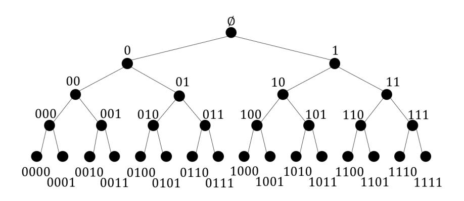
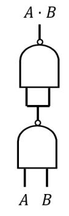
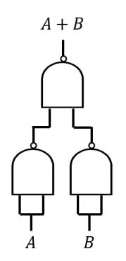
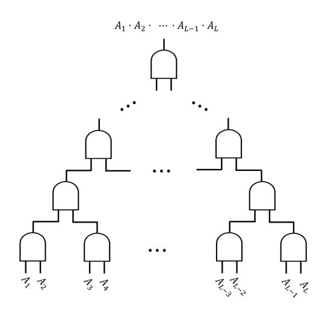
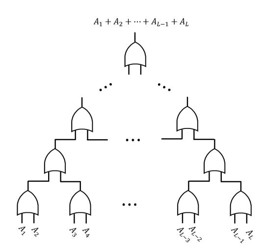
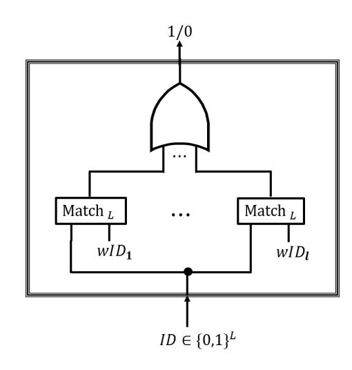
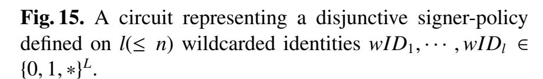
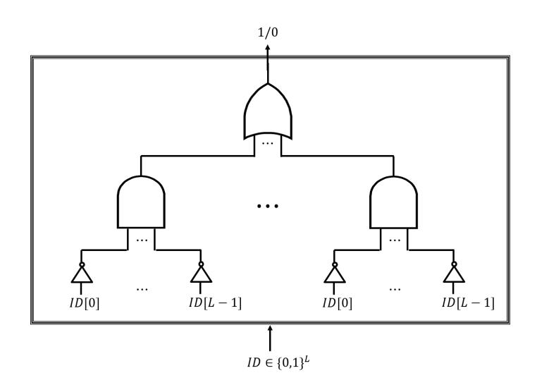

{0}------------------------------------------------

# **Time-Specific Signatures**

Masahito Ishizaka and Shinsaku Kiyomoto

KDDI Research, Inc. {ma-ishizaka, kiyomoto}@kddi-research.jp

**Abstract.** In Time-Specific Signatures (TSS) parameterized by an integer  $T \in \mathbb{N}$ , a signer with a secret-key associated with a numerical value  $t \in [0, T-1]$  can anonymously, i.e., without revealing t, sign a message under a numerical range [L, R] such that  $0 \le L \le t \le R \le T-1$ . An application of TSS is anonymous questionnaire, where each user associated with a numerical value such as age, date, salary, geographical position (represented by longitude and latitude) and etc., can anonymously fill in a questionnaire in an efficient manner.

In this paper, we propose two *polylogarithmically* efficient TSS constructions based on asymmetric pairing with groups of prime order, which achieve different characteristics in efficiency. In the first one based on a forward-secure signatures scheme concretely obtained from a hierarchical identity-based signatures scheme proposed by Chutterjee and Sarker (IJACT'13), size of the master public-key, size of a secret-key and size of a signature are asymptotically  $O(\log T)$ , and size of the master secret-key is O(1). In the second one based on a wildcarded identity-based ring signatures scheme obtained as an instantiation of an attribute-based signatures scheme proposed by Sakai, Attrapadung and Hanaoka (PKC'16), the sizes are  $O(\log T)$ ,  $O(\log^2 T)$  and  $O(\log T)$ , respectively.

**Keywords:** Time-specific signatures, Forward-secure signatures, Wildcarded identity-based ring signatures, Asymmetric pairing with groups of prime order, Co-computational Diffie-Hellman assumption, Symmetric external Diffie-Hellman assumption.

# 1 Introduction

*Time-Specific Encryption* [19]. In a Time-Specific Encryption (TSE) system with total time periods  $T \in \mathbb{T}$ , each secret-key is associated with a time period  $t \in [0, T-1]$  and a plaintext is encrypted under a time interval [L, R] such that  $0 \le L \le R \le T-1$ . A user who has a secret-key for t can correctly decrypt any ciphertext under [L, R] if  $t \in [L, R]$ . Paterson&Quaglia [19] showed that a TSE scheme can be generically constructed from an identity-based encryption (IBE) [22] scheme or a broadcast encryption (BE) scheme [12]. Kasamatsu et al. [15,16] proposed a (direct) construction based on Boneh-Boyen-Goh hierarchical identity-based encryption (HIBE) scheme [8]. Ishizaka&Kiyomoto [14] proposed a generic construction from wildcarded identity-based encryption (WIBE) [2,6,1] w/o hierarchical key-delegatability.

TSE is less functional compared to functional encryption [9], (ciphertext-policy) attribute-based encryption [20,5] and etc. Because of that, we require a TSE scheme to be highly efficient. Specifically, in previous works [19,15,16,14], *polylogarithmic* efficiency is required. For instance, by instantiating the IBE-based generic TSE construction by Waters IBE scheme [23], they obtain a TSE scheme, whose size of the master public-key |mpk|, that of a secret-key  $|sk_t|$  for a time period t and that of a ciphertext  $|c_{[L,R]}|$  under a time interval [L,R] are asymptotically  $O(\log T)$ . [15,16] proposed a direct construction with  $(|mpk|, |sk_t|, |c_{[L,R]}|) = (O(\log T), O(\log^2 T), O(1))$ . By instantiating the WIBE-based generic construction [14] by their original WIBE scheme based on Waters IBE scheme [23], they obtained a TSE scheme with  $(|mpk|, |sk_t|, |c_{[L,R]}|) = (O(\log T), O(1), O(\log^2 T))$ .

*Time-Specific Signatures*. In [19], the authors left as an open problem an approach to realize Time-Specific Signatures (TSS), which are the digital signature analogue of TSE. In TSS system, a signer with a secret-key associated with a numerical value  $t \in [0, T-1]$  can correctly sign a message under a numerical range [L, R]

{1}------------------------------------------------

s.t.  $0 \le L \le R \le T - 1$ . As existing attribute-based signatures (ABS) schemes [18,21,7], we require TSS to be existentially unforgeable (under a definition like the one used in [18,21]) and perfectly private (under a definition like the one used in [7]).

One typical application example of TSS is anonymous questionnaire. For instance, a company might need opinions from consumers in an age group which are useful to invent a product whose main target is the age group. In a situation where a city plans a development at a location represented by longitude and latitude, the city might need to efficiently collect opinions from citizens living near the developed point<sup>1</sup>.

Our Contributions. In this paper, we propose two polylogarithmically efficient TSS schemes, which have different characteristics in efficiency.

There has existed a folklore to obtain a time-specific cryptosystem from a forward-secure cryptosystem, which has actually contributed to realize TSE [15,16]. We attempt applying it to TSS. Let us introduce backward-secure signatures (BSS). In the forward-secure signatures (FSS) [3,4], there exists a polynomial time algorithm to evolve a secret-key for a time period  $t \in [0, T-1]$  into a secret-key for a future time period t' > t. On the other hand, in the BSS, we can evolve a secret-key for t into one for a past time period t' < t. It is possible to obtain a TSS scheme from FSS and BSS schemes since if we give a secret-key for a time period t composed of secret-keys of the FSS and BSS schemes for the time period t to a signer, the signer can generate a signature under a range [L, R] s.t.  $L \le t \le R$  by firstly generating a signature under the time period R from the FSS secret-key for t, secondly generating a signature under L from the BSS secret-key for t and finally combining the signatures in a proper manner. It has not been rigorously proven that this approach properly works in a general manner. We show that the approach actually works to the concrete FSS scheme obtained by applying the tree-based Canetti-Helevi-Katz transformation [10] to a HIBS scheme proposed by Chutterjee&Sarker [11]. As a result, we obtain a TSS scheme with a well-balanced efficiency. Specifically, its size of the master public-key, that of the master secret-key, that of a secret-key for a numerical value t and that of a signature under a numerical range [L, R] are  $(2 \log T + N + 3)(|g| + |\tilde{g}|), |g|, O(\log T)|g|$  and  $(2 \log T + 2)|g|$ , respectively, where  $N \in \mathbb{N}$  denotes bit length of a (signed-)message, and |g| (resp.  $|\tilde{g}|$ ) denotes bit length of an element in a bilinear group  $\mathbb{G}$  (resp.  $\tilde{\mathbb{G}}$ ) of prime order for an asymmetric pairing  $e: \mathbb{G} \times \tilde{\mathbb{G}} \to \mathbb{G}_T$ .

[14] showed that there exists a generic approach to construct a TSE scheme with time periods T from a WIBE scheme whose length of a (wildcarded) identity is  $\log T$  such that each secret-key for a time period  $t \in [0, T-1]$  consists of only one secret-key for identity  $t \in \{0, 1\}^{\log T}$ . Thus, we can obtain a TSE scheme with constant size secret-keys from a WIBE scheme with constant size secret-keys. We show that such an approach also works for TSS. We introduce wildcarded identity-based *ring* signatures (WIBRS)<sup>2</sup> scheme and show that a concrete scheme with constant size secret-keys is obtained as an instantiation of an ABS scheme (whose signer-policy is represented as a circuit) proposed by Sakai, Attrapadung and Hanaoka [21]. As a result, we obtain a TSS scheme such that size of the master public-key, that of the master secret-key, that of a secret-key for t and that of a signature under [L, R] are  $O(\log T)[\tilde{g}]$ ,  $O(\log T)[g]$ ,  $O(1)(|g| + |\tilde{g}|)$  and  $O(\log^2 T)(|g| + |\tilde{g}|)$ , respectively. A drawback is that size of a signature can be large. Precisely, we prove that the size is loosely upper-bounded by  $(80 \log^2 T - 54 \log T - 34)(|g| + |\tilde{g}|)$ .

*Paper Organization*. Sect. 2 is a section for preliminaries, where we explain some special notations used in this paper, and provide definitions of asymmetric bilinear pairing with prime order and some hardness assumptions. In Sect. 3, we provide syntax and security definitions of TSS. In Sect. 4 and Sect. 5, we propose the FSS-based TSS scheme and the WIBRS-based TSS scheme, respectively. Sect. 6 is the concluding section.

<span id="page-1-0"></span><sup>&</sup>lt;sup>1</sup> Precisely, this is an application of *two-dimensional* TSS. It is unknown whether one-dimensional TSS implies two-dimensional TSS. Two(or multi)-dimensional TSS has still been left as an open problem.

<span id="page-1-1"></span><sup>&</sup>lt;sup>2</sup> In WIBRS, a signer (with an identity) chooses multiple wildcarded identities, (at least) one of which is satisfied by the identity of the signer.

{2}------------------------------------------------

# <span id="page-2-0"></span>2 Preliminaries

*Notations*. For an integer  $\lambda \in \mathbb{N}$ ,  $1^{\lambda}$  denotes a security parameter.  $\mathbb{PPT}_{\lambda}$  denotes a set of all probabilistic algorithms whose running time is polynomial in  $\lambda$ . We say that a function  $f: \mathbb{N} \to \mathbb{R}$  is negligible if for every  $c \in \mathbb{N}$ , there exists  $x_0 \in \mathbb{N}$  such that for every  $x \geq x_0$ ,  $f(x) \leq x^{-c}$ .  $\mathbb{NGL}_{\lambda}$  denotes a set of all functions negligible in  $\lambda$ . Given a bit string  $x \in \{0, 1\}^L$ , for every  $i \in [0, L-1]$ , let  $x[i] \in \{0, 1\}$  denote its i-th bit. For a wildcarded identity  $wID \in \{0, 1, *\}^L$ ,  $|wID|_* \in [0, L]$  denotes number of wildcard symbol \* in wID, formally  $\sum_{i \in [0, L-1]} s.t. wID[i]=* 1$ .

Asymmetric Bilinear Groups of Prime Order.  $\mathcal{G}_{BG}$  generates bilinear groups of prime order. Let  $\lambda \in \mathbb{N}$ . Specifically, it takes  $1^{\lambda}$  and randomly generates  $(p, \mathbb{G}, \mathbb{G}_T, e, g, \tilde{g})$ . First, p is a prime with bit length  $\lambda$ . Second,  $(\mathbb{G}, \mathbb{G}, \mathbb{G}_T)$  are multiplicative groups of order p. Third,  $(g, \tilde{g})$  are generators of  $\mathbb{G}$  and  $\mathbb{G}$ , respectively. Fourth,  $e: \mathbb{G} \times \mathbb{G} \to \mathbb{G}_T$  is an asymmetric function which is computable in polynomial time and satisfies the following conditions: (1) Bilinearity: For every  $a, b \in \mathbb{Z}_p$ ,  $e(g^a, \tilde{g}^b) = e(g, \tilde{g})^{ab}$ , and (2) Non-degeneracy:  $e(g, \tilde{g}) \neq 1_{\mathbb{G}_T}$ , where  $1_{\mathbb{G}_T}$  denotes the unit element of  $\mathbb{G}_T$ .

# 2.1 Hardness Assumptions

**Definition 1.** Co-Computational Diffie-Hellman (Co-CDH) assumption holds if  $\forall \lambda \in \mathbb{N}$ ,  $\forall A \in \mathbb{PPT}_{\lambda}$ ,  $\exists \epsilon \in \mathbb{NGL}_{\lambda}$  s.t.  $Adv_{A,\lambda}^{\text{Co-CDH}}(\lambda) := \Pr[g^{\alpha\beta} \leftarrow A(p, \mathbb{G}, \tilde{\mathbb{G}}, g, \tilde{g}, g^{\alpha}, g^{\beta}, \tilde{g}^{\beta})] < \epsilon$ , where  $(p, \mathbb{G}, \tilde{\mathbb{G}}, g, \tilde{g}) \leftarrow \mathcal{G}(1^{\lambda})$  and  $\alpha, \beta \stackrel{\text{U}}{\leftarrow} \mathbb{Z}_p$ .

**Definition 2.** Computational Diffie-Hellman (CDH) assumption on  $\mathbb{G}$  holds if  $\forall \lambda \in \mathbb{N}$ ,  $\forall A \in \mathbb{PPT}_{\lambda}$ ,  $\exists \epsilon \in \mathbb{NGL}_{\lambda}$  s.t.  $Adv_{A,\lambda}^{CDH}(\lambda) := \Pr[g^{\alpha\beta} \leftarrow A(p, \mathbb{G}, \tilde{\mathbb{G}}, g, \tilde{g}, g^{\alpha}, g^{\beta})] < \epsilon$ , where  $(p, \mathbb{G}, \tilde{\mathbb{G}}, g, \tilde{g}) \leftarrow \mathcal{G}(1^{\lambda})$  and  $\alpha, \beta \overset{\mathsf{U}}{\leftarrow} \mathbb{Z}_p$ .

**Definition 3.** Computational Diffie-Hellman (CDH) assumption on  $\tilde{\mathbb{G}}$  holds if  $\forall \lambda \in \mathbb{N}$ ,  $\forall A \in \mathbb{PPT}_{\lambda}$ ,  $\exists \epsilon \in \mathbb{NGL}_{\lambda}$  s.t.  $Adv_{A,\lambda}^{CDH}(\lambda) := \Pr[\tilde{g}^{\alpha\beta} \leftarrow A(p, \mathbb{G}, \tilde{\mathbb{G}}, g, \tilde{g}, \tilde{g}^{\alpha}, \tilde{g}^{\beta})] < \epsilon$ , where  $(p, \mathbb{G}, \tilde{\mathbb{G}}, g, \tilde{g}) \leftarrow \mathcal{G}(1^{\lambda})$  and  $\alpha, \beta \overset{\mathsf{U}}{\leftarrow} \mathbb{Z}_p$ .

**Definition 4.** Symmetric External (Computational) Diffie-Hellman (SXDH) assumption holds if the CDH assumption on  $\mathbb{G}$  and the CDH assumption on  $\mathbb{G}$  hold.

# <span id="page-2-1"></span>**3** Time-Specific Signatures (TSS)

*Syntax.* Time-specific signatures (TSS) consists of 4 polynomial time algorithms {Setup, KGen, Sig, Ver}, where Ver is deterministic and the others are probabilistic.

- Let  $1^{\lambda}$ , where  $\lambda \in \mathbb{N}$ , denote a security parameter. Let  $T \in \mathbb{N}$  denote total number of numerical values, which means that [0, T-1] is equivalent to the space of numerical values. Setup algorithm Setup takes  $(1^{\lambda}, T)$  as input then outputs a master public-key mpk and a master secret-key msk. Concisely, we write  $(mpk, msk) \leftarrow \text{Setup}(1^{\lambda}, T)$ . Note that all the other three algorithms implicitly take mpk as input.
- Key-generation algorithm KGen takes msk and a numerical value  $t \in [0, T-1]$ , then outputs a secret-key  $sk_t$  for the time period. Concisely, we write  $sk_t \leftarrow \text{KGen}(msk, t)$ .
- Signing algorithm Sig takes a secret-key  $sk_t$  for a numerical value  $t \in [0, T-1]$ , a message  $m \in \{0, 1\}^*$ , and a numerical range [L, R] s.t.  $0 \le L \le R \le T-1$ , then outputs a signature  $\sigma$ . Concisely, we write  $\sigma \leftarrow \text{Sig}(sk_t, m, [L, R])$ .
- Verifying algorithm Ver takes a signature  $\sigma$ , a message  $m \in \{0, 1\}^*$ , and a numerical range [L, R] s.t.  $0 \le L \le R \le T 1$ , then outputs a bit 1/0. Concisely, we write  $1/0 \leftarrow \text{Ver}(\sigma, m, [L, R])$ .

We require every TSS scheme to be correct. A TSS scheme  $\Sigma_{TSS} = \{\text{Setup}, \text{KGen}, \text{Sig}, \text{Ver}\}$  is correct, if for every  $\lambda \in \mathbb{N}$ , every  $T \in \mathbb{N}$ , every  $(mpk, msk) \leftarrow \text{Setup}(1^{\lambda}, T)$ , every  $t \in [0, T - 1]$ , every  $sk_t \leftarrow \text{KGen}(msk, t)$ , every  $m \in \{0, 1\}^*$ , every  $L \in [0, T - 1]$  and every  $R \in [0, T - 1]$  s.t.  $L \leq t \leq R$ , and every  $\sigma \leftarrow \text{Sig}(sk_t, m, [L, R])$ , it holds  $1 \leftarrow \text{Ver}(\sigma, m, [L, R])$ .

{3}------------------------------------------------

Existential Unforgeability [18,21]. For a TSS scheme  $\Sigma_{TSS}$  and a probabilistic algorithm A, we consider an experiment for (adaptive) existential unforgeability in Fig. 1.

```
\begin{aligned} & \textbf{\textit{Expt}}_{\Sigma_{\text{TSS}},\mathsf{A}}^{\text{EUF-CMA}}(1^{\lambda},T):\\ & (\textit{mpk},\textit{msk}) \leftarrow \text{Setup}(1^{\lambda},T)\\ & (\sigma^*,\textit{m}^*,[L^*,R^*]) \leftarrow \mathsf{A}^{\Re{\text{eveal}},\Im{\text{sign}}}(\textit{mpk}), \text{ where}\\ & - \Re{\text{eveal}}(t_{\iota} \in [0,T-1]), \text{ where } \iota \in [1,q_r]: \textbf{Return } \textit{sk}_{\iota} \leftarrow \text{KGen}(\textit{msk},t_{\iota}).\\ & - \Im{\text{ign}}(t_{\theta} \in [0,T-1], \textit{m}_{\theta} \in \{0,1\}^*, \textit{L}_{\theta} \in [0,T-1], \textit{R}_{\theta} \in [0,T-1]), \text{ where } \theta \in [1,q_s]:\\ & \textit{sk}_{\theta} \leftarrow \text{KGen}(\textit{msk},t_{\theta}). \textbf{Return } \sigma_{\theta} \leftarrow \text{Sig}(\textit{sk}_{\theta},\textit{m}_{\theta},[L_{\theta},R_{\theta}]).\\ & \textbf{Return } 1 \text{ if } 1 \leftarrow \text{Ver}(\sigma^*,\textit{m}^*,[L^*,R^*]) \bigwedge_{\iota \in [1,q_r]} t_{\iota} \notin [L^*,R^*]\\ & \bigwedge_{\theta \in [1,q_s]} (\textit{m}_{\theta},\textit{L}_{\theta},\textit{R}_{\theta}) \neq (\textit{m}^*,\textit{L}^*,R^*).\\ & \textbf{Return } 0 \text{ otherwise}. \end{aligned}
```

<span id="page-3-1"></span>**Fig. 1.** Experiment for (adaptive) existential unforgeability of a TSS scheme  $\Sigma_{TSS}$ 

**Definition 5.** A TSS scheme  $\Sigma_{TSS}$  is (adaptively) existentially unforgeable, if  $\forall \lambda \in \mathbb{N}$ ,  $\forall T \in \mathbb{N}$ ,  $\forall A \in \mathbb{PPT}_{\lambda}$ ,  $\exists \epsilon \in \mathbb{NGL}_{\lambda}$ ,  $Adv_{\Sigma_{TSS},A,T}^{EUF-CMA}(\lambda) := \Pr[1 \leftarrow \textit{Expt}_{\Sigma_{TSS},A}^{EUF-CMA}(1^{\lambda},T)] < \epsilon$ .

Perfect (Signer) Privacy [7]. For a TSS scheme  $\Sigma_{TSS}$  and a probabilistic algorithm A, we consider experiments for perfect privacy in Fig. 2.

```
Expt_{\Sigma_{TSS},A,0}^{PP}(1^{\lambda},T):
                                                                                     Expt_{\Sigma_{TSS},A,1}^{PP}(1^{\lambda},T):
    (mpk, msk) \leftarrow \text{Setup}(1^{\lambda}, T)
                                                                                          (mpk, msk') \leftarrow \text{Setup}'(1^{\lambda}, T)
    Return b \leftarrow A^{\Re \text{eveal}, \cong \text{ign}}(mpk, msk), where
                                                                                          Return b \leftarrow A^{\Re \text{eveal}, \cong \text{ign}}(mpk, msk), where
                                                                                             - \Re \operatorname{eveal}(t_{\iota}), where \iota \in [1, q_r]:
       - \Re \operatorname{eveal}(t_{\iota}), where \iota \in [1, q_r]:
             Return sk_{\iota} \leftarrow \text{KGen}(msk, t_{\iota}).
                                                                                                   Return sk_{\iota} \leftarrow \text{KGen}'(msk', t_{\iota}).
       - \mathfrak{Sign}(\iota \in [1, q_r], m, L, R):
                                                                                             - \mathfrak{Sign}(\iota \in [1, q_r], m, L, R):
             Return \perp if t_{\iota} \notin [L, R].
                                                                                                   Return \perp if t_{\iota} \notin [L, R].
                                                                                                   Return \sigma \leftarrow \text{Sig}'(msk', m, L, R).
             Return \sigma \leftarrow \text{Sig}(sk_{\iota}, m, L, R).
```

<span id="page-3-2"></span>**Fig. 2.** Experiments for perfect privacy of a TSS scheme  $\Sigma_{TSS}$ 

**Definition 6.** A TSS scheme  $\Sigma_{TSS}$  is perfectly (signer) private, if for every  $\lambda \in \mathbb{N}$ , every  $T \in \mathbb{N}$  and every probabilistic algorithm A, there exist probabilistic polynomial time algorithms {Setup', KGen', Sig'} such that  $Adv_{\Sigma_{TSS},A,T}^{PP}(\lambda) := |\Pr[1 \leftarrow \textit{Expt}_{\Sigma_{TSS},A,0}^{PP}(1^{\lambda},T)] - \Pr[1 \leftarrow \textit{Expt}_{\Sigma_{TSS},A,1}^{PP}(1^{\lambda},T)]| = 0.$ 

# <span id="page-3-0"></span>4 TSS Based on Forward-Secure Signatures

In this section, we propose a TSS scheme with well-balanced efficiency based on forward-secure signatures. It is easy for us to suggest an intuitive idea to obtain a TSS scheme from a forward-secure signatures (FSS) scheme. As we might have already known, in a FSS system, there exists a one-way algorithm which transforms a secret-key for a time period t into a secret-key for a future time period t' > t. As a related primitive, let us consider *backward*-secure signatures (BSS), where there exists a one-way algorithm which transforms a secret-key for a time period t into one for a past time period t' < t. A secret-key for a numerical value  $t \in [0, T-1]$  consists of  $(sk_F, sk_B)$ , where  $sk_F$  (resp.  $sk_B$ ) is a secret-key for the time period t generated under the pair of keys  $(mpk_F, msk_F)$  (resp.  $(mpk_B, msk_B)$ ) of the FSS (resp. BSS) scheme. A secret-key

{4}------------------------------------------------

 $sk_t = (sk_F, sk_B)$  generates a signature under a numerical range [L, R] s.t.  $0 \le L \le t \le R \le T - 1$  by firstly generating a signature under time period  $R \ge t$  by using the secret-key  $sk_F$ , secondly generating a signature under  $L \le t$  by using  $sk_B$ , then finally combining the signatures in an adequate way.

As far as we know, there has not existed a generic approach to obtain a TSS scheme from FSS and BSS schemes<sup>3</sup> whose security is guaranteed by a rigorous proof. In this section, we show that the approach actually works on the concrete FSS scheme obtained by applying the Canetti-Halevi-Katz transformation [10] to a hierarchical identity-based signatures (HIBS) scheme in [11].

### <span id="page-4-2"></span>4.1 Construction

We consider the second HIBS scheme proposed in [11]. It adopts an asymmetric bilinear pairing  $e: \mathbb{G} \times \tilde{\mathbb{G}} \to \mathbb{G}_T$ , where order of the groups is a prime p. Let g (resp.  $\tilde{g}$ ) denote a generator of  $\mathbb{G}$  (resp.  $\tilde{\mathbb{G}}$ ). Let h-1 (for  $h \in \mathbb{N}$ ) denote the maximum hierarchical length of an identity. Let  $H: \{0,1\}^* \to \{0,1\}^N$  (with  $N \in \mathbb{N}$ ) denote a collision-resistant hash function. At the setup phase, h+N+2 integers  $\alpha,\alpha_0,\cdots,\alpha_h,\beta_0,\cdots,\beta_{N-1} \overset{\mathsf{U}}{\leftarrow} \mathbb{Z}_p$  are randomly chosen. The master public-key is set as  $(g,\tilde{g},g_1,g_2,\{u_i,\tilde{u}_i\mid i\in[0,h]\},\{v_i,\tilde{v}_i\mid i\in[0,N-1]\})$ , where  $g_1\overset{\mathsf{U}}{\leftarrow} \mathbb{G}$ ,  $g_2:=\tilde{g}^\alpha$ ,  $u_i:=g^{\alpha_i}$ ,  $\tilde{u}_i:=\tilde{g}^{\alpha_i}$ ,  $v_i:=g^{\beta_i}$  and  $\tilde{v}_i:=\tilde{g}^{\beta_i}$ . The master secret-key is set as  $g_1^\alpha$ . A secret-key for an identity  $ID_0\|\cdots\|ID_i$  with hierarchical length  $i\in[0,h-1]$ , where  $ID_0,\cdots,ID_i\in\{0,1\}^*$ , is set as  $(g_1^\alpha\prod_{j\in[0,i]}(u_j\prod_{k\in[0,N-1]}v_k^{d_i[k]})^{r_j},g^{r_0},\cdots,g^{r_i})$ , where  $r_j\overset{\mathsf{U}}{\leftarrow} \mathbb{Z}_p$  and  $d_j[0]\|\cdots\|d_j[N-1]\leftarrow H(0\|ID_j)$ . Obviously, we can transform a secret-key for an identity into a secret-key for any descendant identity of the identity. By the secret-key, a signature on a message m is generated as  $(g_1^\alpha\prod_{j\in[0,i+1]}(u_j\prod_{k\in[0,N-1]}v_k^{d_i[k]})^{r_j},g^{r_0},\cdots,g^{r_i})$ , where  $r_{i+1}\overset{\mathsf{U}}{\leftarrow} \mathbb{Z}_p$  and  $d_{i+1}[0]\|\cdots\|d_{i+1}[N-1]\leftarrow H(1\|m)$ .

Let us apply the CHK transformation [10] to the HIBS scheme with the maximum hierarchical length  $h = \log T \in \mathbb{N}$  to obtain a FSS scheme with total time periods  $T \in \mathbb{N}$ . We consider a (complete) binary tree with depth  $\log T \in \mathbb{N}$  like the one in Fig. 3. The master secret-key and the master public-key are described as  $g_1^{\alpha}$  and  $(g, \tilde{g}, g_1, g_2, \{u_i, \tilde{u}_i \mid i \in [0, \log T]\}, \{v_i, \tilde{v}_i \mid i \in [0, N-1]\})$ , respectively. A secret-key for a time period  $t \in [0, T-1]$  is described as  $(sk_{t[0]||\cdots||t[\log T-1]}, \{sk_{t[0]||\cdots||t[i-1]||1} \mid i \in [0, \log T-1] \text{ s.t. } t[i] = 0\})$ , where  $sk_x$  (with  $x \in \{0, 1\}^{\leq \log T}$ ) is a randomly-generated secret-key for an identity x by using the secret-key generation algorithm of the HIBS scheme. By the secret-key for t, a signature for a time period  $t' \geq t$  on a message t is generated as a signature for an identity  $t'[0]||\cdots||t'[\log T-1]|$  on t by using the signing algorithm of the HIBS scheme. Note that  $t \leq t'$  implies that a secret-key for t certainly includes a secret-key for an ancestral identity of the identity t', thus, the signature generation always succeeds.



<span id="page-4-1"></span>Fig. 3. A complete binary tree with depth 4

Based on the approach to obtain a TSS scheme from FSS and BSS schemes explained earlier, we construct a TSS scheme  $\Pi_{TSS}$  as shown in Fig. 4.

<span id="page-4-0"></span><sup>&</sup>lt;sup>3</sup> Or, only a FSS scheme, since a BSS scheme is obtained from a FSS scheme.

{5}------------------------------------------------

The master secret-key and the master public-key for the FSS scheme part is normally generated. Thus, they are  $g_1^{\alpha}$  and  $(g, \tilde{g}, g_1, g_2, \{u_i, \tilde{u}_i \mid i \in [0, \log T]\}, \{v_i, \tilde{v}_i \mid i \in [0, N-1]\})$ , respectively. The variables prepared for the BSS scheme part are  $\{w_i, \tilde{w}_i \mid i \in [0, \log T - 1]\}$  (whose roles are analogous to those of  $\{u_i, \tilde{u}_i \mid i \in [0, \log T - 1]\}$  for the FSS scheme part), and the other variables are shared by both parts.

A secret-key  $sk_t$  for a numerical value  $t \in [0, T-1]$  consists of the FSS part  $sk_r$  and the BSS part  $sk_l$ , and they are expressed as  $(sk_{t[0]||\cdots||t[\log T-1]}, \{sk_{t[0]||\cdots||t[i-1]||1} \mid i \in [0, \log T-1] \text{ s.t. } t[i] = 0\})$  and  $(sk_{t'[0]||\cdots||t'[\log T-1]}, \{sk_{t'[0]||\cdots||t'[i-1]||1} \mid i \in [0, \log T-1] \text{ s.t. } t'[i] = 0\})$ , respectively, where t' := T-1-t. Each element in  $sk_r$  and each element in  $sk_l$  are generated from the pseudo master secret-key  $g_1^{\alpha}g^{\delta}$  and  $g^{-\delta}$ , respectively, where  $\delta \in \mathbb{Z}_p$  is a randomly chosen integer.  $sk_{t[0]||\cdots||t[\log T-1]}$  (resp.  $sk_{t'[0]||\cdots||t'[\log T-1]})$ ) which includes  $\log T$  random variables is normally generated by choosing  $\log T$  fresh random variables then using them and the pseudo master secret-key  $g_1^{\alpha}g^{\delta}$  (resp.  $g^{-\delta}$ ). On the other hand, each element  $sk_{t[0]||\cdots||t[i-1]||1}$  for  $i \in [0, \log T-1] \text{ s.t. } t[i] = 0$  which includes i+1 random variables is generated by choosing only one fresh random variable (for depth i) then using the variable, already chosen i-1 random variables (for depth  $0, \cdots, i-1$ ) in  $sk_{t[0]||\cdots||t[\log T-1]}$  and the pseudo master secret-key. Likewise, each element in  $sk_l$  is generated. The reason why we have introduced such a technique is to reduce size of a secret-key from  $O(\log^2 T)|g|$  to  $O(\log T)|g|$ .

A secret-key  $sk_t$  for  $t \in [0, T-1]$  signs a message m under a range [L, R] s.t.  $t \in [L, R]$  as follows. Let L' := T-1-L. Note that  $t \in [L, R]$  implies  $t \le R \land t' \le L'$ , which implies  $\exists i_r, i_l \in [0, \log T]$  s.t.  $\land_{i \in [0, i_r-1]}[t[i] = R[i]] \land [i_r \ne \log T \implies t[i_r] = 0 \land R[i_r] = 1] \land_{i \in [0, i_{l-1}]}[t'[i] = L'[i]] \land [i_l \ne \log T \implies t'[i_l] = 0 \land L'[i_l] = 1]$ . The key-generation algorithm guarantees that secret-key for the identity  $R[0] \land L'[i_l] = 1$ . The key-generation algorithm guarantees that secret-key derives a secret-key for the identity  $R[0] \land L'[i_l] = 1$ . The key-generation algorithm guarantees that secret-key derives a secret-key for the identity  $R[0] \land L'[i_l] = 1$ . The key-generation algorithm guarantees that secret-key derives a secret-key for the identity  $R[0] \land L'[i_l] = 1$ . The key-generation algorithm guarantees that secret-key derives a secret-key for the identity  $R[0] \land L'[i_l] = 1$ . The key-generation algorithm guarantees that secret-key derives a secret-key for the identity  $R[0] \land L'[i_l] = 1$ . The key-generation algorithm guarantees that secret-key derives a secret-key for the identity  $R[0] \land L'[i_l] = 1$ . The key-generation algorithm guarantees that secret-key for the identity  $R[0] \land L'[i_l] = 1$ . The key-generation algorithm guarantees that secret-key for the identity  $R[0] \land L'[i_l] = 1$ . The key-generation algorithm guarantees that secret-key for the identity  $R[0] \land L'[i_l] = 1$ . The key-generation algorithm guarantees that secret-key for the identity  $R[0] \land L'[i_l] \land L'[i_l] \land L'[i_l] \land L'[i_l] \land L'[i_l] \land L'[i_l] \land L'[i_l] \land L'[i_l] \land L'[i_l] \land L'[i_l] \land L'[i_l] \land L'[i_l] \land L'[i_l] \land L'[i_l] \land L'[i_l] \land L'[i_l] \land L'[i_l] \land L'[i_l] \land L'[i_l] \land L'[i_l] \land L'[i_l] \land L'[i_l] \land L'[i_l] \land L'[i_l] \land L'[i_l] \land L'[i_l] \land L'[i_l] \land L'[i_l] \land L'[i_l] \land L'[i_l] \land L'[i_l] \land L'[i_l] \land L'[i_l] \land L'[i_l] \land L'[i_l] \land L'[i_l] \land L'[i_l] \land L'[i_l] \land L'[i_l] \land L'[i_l] \land L'[i_l] \land L'[i_l] \land L'[i_l] \land L'[i_l] \land L'[i_l] \land L'[i_l] \land L'[i_l] \land L'[i_l] \land L'[i_l] \land L'[i_l] \land L'[i_l] \land L$ 

#### 4.2 Unforgeability

Existential unforgeability of the TSS scheme  $\Pi_{TSS}$  in Fig. 4 is guaranteed by the following theorem.

**Theorem 1.** Our first TSS scheme  $\Pi_{TSS}$  is existentially unforgeable (under Def. 5) under the co-CDH assumption.

PROOF. Let  $A \in \mathbb{PPT}_{\lambda}$  denote a PPT algorithm which behaves as an adversary in existential unforgeability experiment for our TSS scheme  $\Pi_{TSS}$ . Let  $t_A \in \mathbb{N}$  denote running time of A (which is polynomial in  $\lambda$ ). We prove that there exists another PPT algorithm  $B \in \mathbb{PPT}_{\lambda}$  which uses A as a black-box and breaks the co-CDH assumption with

<span id="page-5-1"></span>
$$Adv_{\mathsf{B}}^{\mathsf{co-CDH}}(\lambda) \ge \frac{1}{2\left\{2\left(\log T \cdot q_r + q_s\right)(N+1\right)\right\}^{2\log T+1}} \cdot Adv_{\Pi_{\mathsf{TSS}},\mathsf{A},N,T}^{\mathsf{EUF-CMA}}(\lambda). \tag{1}$$

B behaves as follows.

B is given  $(g, \tilde{g}, g^{\beta}, g^{\alpha}, \tilde{g}^{\alpha})$  as an instance of the co-CDH assumption. B sets  $g_1 := g^{\beta}$  and  $g_2 := \tilde{g}^{\alpha}$ . B chooses an integer n s.t. n(N+1) < p. B chooses

<span id="page-5-0"></span>
$$\left\{k_{i}, s_{i} \overset{\mathsf{U}}{\leftarrow} [0, N], x_{i}, z_{i} \overset{\mathsf{U}}{\leftarrow} \mathbb{Z}_{n}, x_{i}', z_{i}' \overset{\mathsf{U}}{\leftarrow} \mathbb{Z}_{p} \mid i \in [0, \log T - 1]\right\},$$

$$k_{\log T} \overset{\mathsf{U}}{\leftarrow} [0, N], x_{\log T} \overset{\mathsf{U}}{\leftarrow} \mathbb{Z}_{n}, x_{\log T}' \overset{\mathsf{U}}{\leftarrow} \mathbb{Z}_{p}, \text{ and}$$

$$\left\{y_{i} \overset{\mathsf{U}}{\leftarrow} \mathbb{Z}_{n}, y_{i}' \overset{\mathsf{U}}{\leftarrow} \mathbb{Z}_{p} \mid i \in [0, N - 1]\right\}.$$

{6}------------------------------------------------

```
TSS.Setup (1^{\lambda}, N, T):
       (p, \mathbb{G}, \tilde{\mathbb{G}}, \mathbb{G}_T, e, g, \tilde{g}) \leftarrow \mathcal{G}_{BG}(1^{\lambda}). \ \alpha \stackrel{\mathsf{U}}{\leftarrow} \mathbb{Z}_p, \ g_2 \coloneqq \tilde{g}^{\alpha}. \ g_1 \stackrel{\mathsf{U}}{\leftarrow} \mathbb{G}.
       For every i \in [0, \log T - 1], x_i, z_i \stackrel{U}{\leftarrow} \mathbb{Z}_p, u_i \coloneqq g^{x_i}, \tilde{u}_i \coloneqq \tilde{g}^{x_i}, w_i \coloneqq g^{z_i}, \tilde{w}_i \coloneqq \tilde{g}^{z_i}.
       x_{\log T} \stackrel{\mathrm{U}}{\leftarrow} \mathbb{Z}_p, u_{\log T} \coloneqq g^{x_{\log T}}, \tilde{u}_{\log T} \coloneqq \tilde{g}^{x_{\log T}}
       For every i \in [0, N-1], y_i \stackrel{U}{\leftarrow} \mathbb{Z}_p, v_i := g^{y_i}, \tilde{v}_i := \tilde{g}^{y_i}.
       mpk := \left(p, \mathbb{G}, \tilde{\mathbb{G}}, \mathbb{G}_T, e, g, \tilde{g}, g_1, g_2, \{u_i, \tilde{u}_i, w_i, \tilde{w}_i \mid i \in [0, \log T - 1]\}, u_{\log T}, \tilde{u}_{\log T}, \{v_i, \tilde{v}_i \mid i \in [0, N - 1]\}\right).
        msk := g_1^{\alpha}. Return (mpk, msk).
 TSS.KGen (msk, t \in [0, T-1]):
       \delta \stackrel{\mathsf{U}}{\leftarrow} \mathbb{Z}_p. \ \tilde{t} \coloneqq T - 1 - t. \ \mathbb{J}_r \coloneqq \{i \in [0, \log T - 1] \ \text{s.t.} \ t[i] = 0\}. \ \mathbb{J}_l \coloneqq \{i \in [0, \log T - 1] \ \text{s.t.} \ \tilde{t}[i] = 0\}.
       For every i \in [0, \log T - 1], do: r_i \stackrel{\text{U}}{\leftarrow} \mathbb{Z}_p. If t[i] = 0, r_i' \stackrel{\text{U}}{\leftarrow} \mathbb{Z}_p.
       sk_{r} := \left(g_{1}^{\alpha}g^{\delta} \prod_{i \in [0,\log T-1]} \left(u_{i}v_{0}^{t[i]}\right)^{r_{i}}, g^{r_{0}}, \cdots, g^{r_{\log T-1}}, \left\{g_{1}^{\alpha}g^{\delta} \prod_{i \in [0,j-1]} \left(u_{i}v_{0}^{t[i]}\right)^{r_{i}} \left(u_{j}v_{0}\right)^{r'_{j}}, g^{r'_{j}} \mid j \in \mathbb{J}_{r}\right\}\right).
       For every i \in [0, \log T - 1], do: s_i \stackrel{\text{U}}{\leftarrow} \mathbb{Z}_p. If \tilde{t}[i] = 0, s_i' \stackrel{\text{U}}{\leftarrow} \mathbb{Z}_p.
       sk_{l} := \left(g^{-\delta} \prod_{i \in [0,\log T-1]} \left(w_{i} v_{0}^{\tilde{t}[i]}\right)^{s_{i}}, g^{s_{0}}, \cdots, g^{s_{\log T-1}}, \left\{g^{-\delta} \prod_{i \in [0,j-1]} \left(w_{i} v_{0}^{\tilde{t}[i]}\right)^{s_{i}} \left(w_{j} v_{0}\right)^{s'_{j}}, g^{s'_{j}} \mid j \in \mathbb{J}_{l}\right\}\right).
        Return sk_t := (sk_l, sk_r)
TSS.Sig(sk_t, m \in \{0, 1\}^N, L \in [0, T - 1], R \in [0, T - 1]):
       Parse sk_t as (sk_l, sk_r). \tilde{t} := T - 1 - t. \tilde{L} := T - 1 - L.
       Parse sk_r as (D_{\log T}, d_0, \dots, d_{\log T-1}, \{D_j, d'_i \mid j \in [0, \log T - 1] \text{ s.t. } t[j] = 0\}).
       Parse sk_l as (E_{\log T}, e_0, \dots, e_{\log T-1}, \{E_j, e_j' \mid j \in [0, \log T - 1] \text{ s.t. } \tilde{t}[j] = 0\}).
       t \in [L, R] \implies \exists i_r \in [0, \log T] \text{ s.t. } \bigwedge_{i \in [0, i_r - 1]} [t[i] = R[i]] \bigwedge [i_r \neq \log T \implies t[i_r] = 0 \bigwedge R[i_r] = 1]                                   
       For every i \in [0, i_r], \tilde{r}_i \stackrel{\text{U}}{\leftarrow} \mathbb{Z}_p. For every i \in [i_r + 1, \log T - 1], r_i^* \stackrel{\text{U}}{\leftarrow} \mathbb{Z}_p.
       For every i \in [0, i_l], \tilde{s}_i \stackrel{\text{U}}{\leftarrow} \mathbb{Z}_p. For every i \in [i_l + 1, \log T - 1], s_i^* \stackrel{\text{U}}{\leftarrow} \mathbb{Z}_p. r_{\log T} \stackrel{\text{U}}{\leftarrow} \mathbb{Z}_p.
        Return \sigma :=
          \left(D_{i_r}\prod_{i\in[0,i_r]}\left(u_iv_0^{R[i]}\right)^{\tilde{r}_i}\prod_{i\in[i_r+1,\log T-1]}\left(u_iv_0^{R[i]}\right)^{r_i^*}E_{i_l}\prod_{i\in[0,i_l]}\left(w_iv_0^{\tilde{L}[i]}\right)^{\tilde{s}_i}\prod_{i\in[i_l+1,\log T-1]}\left(w_iv_0^{\tilde{L}[i]}\right)^{s_i^*}\left(u_{\log T}\prod_{j\in[0,N-1]}v_j^{m[j]}\right)^{r\log T},
            \{d_i g^{\tilde{r}_i} \mid i \in [0, i_r - 1]\}, d'_{i_r} g^{\tilde{r}_{i_r}}, \{g^{r^*_i} \mid i \in [i_r + 1, \log T - 1]\},
Parse \sigma as (U, V_0, \dots, V_{\log T-1}, V'_0, \dots, V'_{\log T-1}, V_{\log T}). \tilde{L} := T - 1 - L.
        Return 1 if (U, \tilde{g}) = e(g_1, g_2) \cdot \prod_{i \in [0, \log T - 1]} e(V_i, \tilde{u}_i \tilde{v}_0^{\tilde{R}[i]}) e(V_i', \tilde{w}_i \tilde{v}_0^{\tilde{L}[i]}) \cdot e(V_{\log T}, \tilde{u}_{\log T} \prod_{j \in [0, N - 1]} \tilde{v}_i^{m[j]}).
        Return 0, otherwise.
```

<span id="page-6-0"></span>**Fig. 4.** Our TSS scheme  $\Pi_{TSS}$ , where  $N, T \in \mathbb{N}$ .

{7}------------------------------------------------

B sets

$$\begin{aligned}
&\left\{u_{i} \coloneqq (g^{\alpha})^{p-nk_{i}+x_{i}} \cdot g^{x'_{i}}, \tilde{u}_{i} \coloneqq (\tilde{g}^{\alpha})^{p-nk_{i}+x_{i}} \cdot \tilde{g}^{x'_{i}} \mid i \in [0, \log T]\right\}, \\
&\left\{w_{i} \coloneqq (g^{\alpha})^{p-ns_{i}+z_{i}} \cdot g^{z'_{i}}, \tilde{w}_{i} \coloneqq (\tilde{g}^{\alpha})^{p-ns_{i}+z_{i}} \cdot \tilde{g}^{z'_{i}} \mid i \in [0, \log T - 1]\right\}, \text{ and} \\
&\left\{v_{i} \coloneqq (g^{\alpha})^{y_{i}} \cdot g^{y'_{i}}, \tilde{v}_{i} \coloneqq (\tilde{g}^{\alpha})^{y_{i}} \cdot \tilde{g}^{y'_{i}} \mid i \in [0, N - 1]\right\}.
\end{aligned}$$

B gives  $mpk := (p, \mathbb{G}, \tilde{\mathbb{G}}, \mathbb{G}_T, e, g, \tilde{g}, g_1, g_2, \{u_i, \tilde{u}_i, w_i, \tilde{w}_i \mid i \in [0, \log T - 1]\}, u_{\log T}, \tilde{u}_{\log T}, \{v_i, \tilde{v}_i \mid i \in [0, N - 1]\})$  to A. Before defining how B behaves when A issues a query to Reveal or Sign, we define some functions as follows.

For a bit  $b \in \{0, 1\}$  and an integer  $i \in [0, \log T]$ ,

$$\mathbf{F}_{i}(b) \coloneqq p - nk_{i} + x_{i} + y_{0}b, \quad \mathbf{J}_{i}(b) \coloneqq x'_{i} + y'_{0}b,$$

$$\mathbf{L}_{i}(b) \coloneqq x_{i} + y_{0}b \mod n, \text{ and } \mathbf{K}_{i}(b) \coloneqq \begin{cases} 0 & \text{if } \mathbf{L}_{i}(b) = 0, \\ 1 & \text{otherwise.} \end{cases}$$

For a bit  $b \in \{0, 1\}$  and an integer  $i \in [0, \log T - 1]$ ,

$$\mathbf{H}_{i}(b) \coloneqq p - ns_{i} + z_{i} + y_{0}b, \quad \mathbf{Q}_{i}(b) \coloneqq z'_{i} + y'_{0}b,$$

$$\mathbf{R}_{i}(b) \coloneqq z_{i} + y_{0}b \mod n, \text{ and } \mathbf{U}_{i}(b) \coloneqq \begin{cases} 0 & \text{if } \mathbf{R}_{i}(b) = 0, \\ 1 & \text{otherwise.} \end{cases}$$

For  $m \in \{0, 1\}^N$ ,

$$\mathbf{F}_{\log T}(m) \coloneqq p - nk_{\log T} + x_{\log T} + \sum_{i \in [0, N-1]} y_i m[i], \quad \mathbf{J}_{\log T}(m) \coloneqq x'_{\log T} + \sum_{i \in [0, N-1]} y'_i m[i],$$

$$\mathbf{L}_{\log T}(m) \coloneqq x_{\log T} + \sum_{i \in [0, N-1]} y_i m[i] \mod n, \quad \text{and} \quad \mathbf{K}_{\log T}(m) \coloneqq \begin{cases} 0 & \text{if } \mathbf{L}_{\log T}(m) = 0, \\ 1 & \text{otherwise.} \end{cases}$$

When A issues  $t_{\iota} \in [0, T-1]$ , where  $\iota \in [1, q_r]$ , as a query to Reveal, B takes different actions in the following three cases:

(R1) 
$$\bigvee_{i \in [0, \log T - 1] \text{ s.t. } t_{i}[i] = 1} \left[ \mathbf{K}_{i}(1) = 1 \bigwedge \left[ i \neq 0 \right] \right] + \bigwedge_{j \in [0, i - 1] \text{ s.t. } t_{i}[j] = 0} \mathbf{K}_{j}(1) = 1 \right],$$
(R2) 
$$\bigvee_{i \in [0, \log T - 1] \text{ s.t. } \tilde{t}_{i}[i] = 1} \left[ \mathbf{U}_{i}(1) = 1 \bigwedge \left[ i \neq 0 \right] \right] + \bigwedge_{j \in [0, i - 1] \text{ s.t. } \tilde{t}_{i}[j] = 0} \mathbf{U}_{j}(1) = 1 \right],$$
(R3) Otherwise,

where  $\tilde{t}_t := T - 1 - t_t$ . Specifically, B behaves as follows in each case.

(R1) Let  $k \in [0, \log T - 1]$  denote the integer i which satisfies the condition which appeared in the definition of the case R1. Note that it is implied that

$$t_{\iota}[k] = 1 \bigwedge \mathbf{F}_{k}(1) \neq 0 \bigwedge \left[ k \neq 0 \implies \bigwedge_{j \in [0, k-1] \text{ s.t. } t_{\iota}[j] = 0} \mathbf{F}_{j}(1) \neq 0 \right].$$

Let  $\delta \stackrel{\text{U}}{\leftarrow} \mathbb{Z}_p$ . For  $i \in [0, k]$ , let  $r_i \stackrel{\text{U}}{\leftarrow} \mathbb{Z}_p$ . B computes

$$d_k \coloneqq g_1^{-1/\mathbf{F}_k(1)} g^{r_k}$$

{8}------------------------------------------------

for 
$$i \in [0, k-1]$$
,  $d_i := g^{r_i}$ ,  
 $\Delta_k := g_1^{-\mathbf{J}_k(1)/\mathbf{F}_k(1)} (g^{\alpha})^{r_k \mathbf{F}_k(1)} g^{r_k \mathbf{J}_k(1)}$ ,  
for  $i \in [0, k-1]$ ,  $\Delta_i := (u_i v_0^{t_i[i]})^{r_i}$ .

For every  $i \in [k+1, \log T-1]$ ,  $r_i \stackrel{\text{U}}{\leftarrow} \mathbb{Z}_p$  and  $d_i \coloneqq g^{r_i}$ . Let  $D_{\log T} \coloneqq g^{\delta} \cdot \prod_{i \in [0,k]} \Delta_i \cdot \prod_{i \in [k+1, \log T-1]} (u_i v_0)^{r_i}$ . Note that  $(D_{\log T}, d_0, \cdots, d_{\log T-1})$  correctly distribute since

$$d_{k} = g^{r_{k}-\beta/\mathbf{F}_{k}(1)} =: g^{\tilde{r}_{k}}, \text{ where } \tilde{r}_{k} := r_{k} - \beta/\mathbf{F}_{k}(1),$$

$$\Delta_{k} = g_{1}^{\alpha} g_{1}^{-\alpha \mathbf{F}_{k}(1)/\mathbf{F}_{k}(1)} g_{1}^{-\mathbf{J}_{k}(1)/\mathbf{F}_{k}(1)} g^{r_{k}(\alpha \mathbf{F}_{k}(1)+\mathbf{J}_{k}(1))}$$

$$= g_{1}^{\alpha} g^{-\frac{\beta}{\mathbf{F}_{k}(1)}} (\alpha \mathbf{F}_{k}(1)+\mathbf{J}_{k}(1)) g^{r_{k}(\alpha \mathbf{F}_{k}(1)+\mathbf{J}_{k}(1))}$$

$$= g_{1}^{\alpha} g^{(r_{k}-\frac{\beta}{\mathbf{F}_{k}(1)})(\alpha \mathbf{F}_{k}(1)+\mathbf{J}_{k}(1))}$$

$$= g_{1}^{\alpha} g^{\tilde{r}_{k}(\alpha \mathbf{F}_{k}(1)+\mathbf{J}_{k}(1))}$$

$$= g_{1}^{\alpha} g^{\tilde{r}_{k}(\alpha(p-nk_{k}+x_{k}+y_{0})+x'_{k}+y'_{0})}$$

$$= g_{1}^{\alpha} ((g^{\alpha})^{p-nk_{k}+x_{k}} g^{x'_{k}}(g^{\alpha})^{y_{0}} g^{y'_{0}})^{\tilde{r}_{k}}$$

$$= g_{1}^{\alpha} (u_{k}v_{0})^{\tilde{r}_{k}}.$$

For every  $i \in [k+1, \log T-1]$  s.t.  $t_i[i] = 0$ , B chooses  $r_i' \stackrel{\mathsf{U}}{\leftarrow} \mathbb{Z}_p$  and computes  $d_i' \coloneqq g^{r_i'}$  and  $D_i' \coloneqq g^{\delta} \prod_{j \in [0,k]} \Delta_j \prod_{j \in [k+1,i-1]} (u_j v_0^{t_i[j]})^{r_j} (u_i v_0)^{r_i'}$ .

If  $k \neq 0 \land \exists i \in [0, k-1]$  s.t.  $t_i[i] = 0$  is logically true, then for every  $j \in [0, k-1]$  s.t.  $t_i[j] = 0$ , B behaves as follows. We remind us that  $\mathbf{F}_j(1) \neq 0$ . B computes

$$d'_{j} \coloneqq g_{1}^{-1/\mathbf{F}_{j}(1)} g^{r'_{j}},$$

$$D_{j} \coloneqq g_{1}^{-\mathbf{J}_{j}(1)/\mathbf{F}_{j}(1)} (g^{\alpha})^{r'_{j}\mathbf{F}_{j}(1)} g^{r'_{j}\mathbf{J}_{j}(1)} g^{\delta} \prod_{i \in [0, j-1]} \left( u_{i} v_{0}^{t_{i}[i]} \right)^{r_{i}}.$$

Note that for every  $i \in [0, j-1]$ ,  $r_i \in \mathbb{Z}_p$  has already been chosen and known by B.  $d'_j$  and  $D_j$  correctly distribute since

$$\begin{split} d'_{j} &\coloneqq g_{1}^{-1/\mathbf{F}_{j}(1)} g^{r'_{j}} = : g^{\tilde{r}'_{j}}, \text{ where } \tilde{r}'_{j} \coloneqq r'_{j} - \beta/\mathbf{F}_{j}(1), \\ D'_{j} &= g_{1}^{\alpha} g_{1}^{-\alpha \mathbf{F}_{j}(1)/\mathbf{F}_{j}(1)} g_{1}^{-\mathbf{J}_{j}(1)/\mathbf{F}_{j}(1)} g^{r'_{j}(\alpha \mathbf{F}_{j}(1)+\mathbf{J}_{j}(1))} g^{\delta} \prod_{i \in [0,j-1]} \left( u_{i} v_{0}^{t_{i}[i]} \right)^{r_{i}} \\ &= g_{1}^{\alpha} g^{-\frac{\beta}{\mathbf{F}_{j}(1)}(\alpha \mathbf{F}_{j}(1)+\mathbf{J}_{j}(1))} g^{r'_{j}(\alpha \mathbf{F}_{j}(1)+\mathbf{J}_{j}(1))} g^{\delta} \prod_{i \in [0,j-1]} \left( u_{i} v_{0}^{t_{i}[i]} \right)^{r_{i}} \\ &= g_{1}^{\alpha} g^{\tilde{r}'_{j}(\alpha \mathbf{F}_{j}(1)+\mathbf{J}_{j}(1))} g^{\delta} \prod_{i \in [0,j-1]} \left( u_{i} v_{0}^{t_{i}[i]} \right)^{r_{i}} \\ &= g_{1}^{\alpha} g^{\tilde{r}'_{j}(\alpha (p-nk_{j}+x_{j}+y_{0})+x'_{j}+y'_{0})} g^{\delta} \prod_{i \in [0,j-1]} \left( u_{i} v_{0}^{t_{i}[i]} \right)^{r_{i}} \\ &= g_{1}^{\alpha} g^{\tilde{r}'_{j}(\alpha (p-nk_{j}+x_{j}+y_{0})+x'_{j}+y'_{0})} g^{\delta} \prod_{i \in [0,j-1]} \left( u_{i} v_{0}^{t_{i}[i]} \right)^{r_{i}} \\ &= g_{1}^{\alpha} g^{\delta} \prod_{i \in [0,j-1]} \left( u_{i} v_{0}^{t_{i}[i]} \right)^{r_{i}} \left( u_{j} v_{0} \right)^{\tilde{r}'_{j}} g^{\delta} \prod_{i \in [0,j-1]} \left( u_{i} v_{0}^{t_{i}[i]} \right)^{r_{i}} \\ &= g_{1}^{\alpha} g^{\delta} \prod_{i \in [0,j-1]} \left( u_{i} v_{0}^{t_{i}[i]} \right)^{r_{i}} \left( u_{j} v_{0} \right)^{\tilde{r}'_{j}}. \end{split}$$

B sets  $sk_r$  to  $(D_{\log T}, d_0, \dots, d_{\log T-1}, \{D_i, d_i' \mid i \in [0, \log T - 1] \text{ s.t. } t_t[i] = 0\})$ .

{9}------------------------------------------------

Next, B generates  $sk_l$  as follows. For every  $i \in [0, \log T - 1]$ ,  $s_i \stackrel{U}{\leftarrow} \mathbb{Z}_p$ . For every  $i \in [0, \log T - 1]$  s.t.  $\tilde{t}_{\iota}[i] = 0, s'_{i} \stackrel{\mathrm{U}}{\leftarrow} \mathbb{Z}_{p}$ .  $sk_{l}$  is set as  $(E_{\log T}, e_{0}, \cdots, e_{\log T-1}, \{E_{i}, e'_{i} \mid i \in [0, \log T - 1] \text{ s.t. } \tilde{t}_{\iota}[i] = 0\})$ , where

$$E_{\log T} \coloneqq g^{-\delta} \prod_{i \in [0, \log T - 1]} (w_i v_0^{\tilde{t}_i[i]})^{s_i},$$
 for  $i \in [0, \log T - 1]$ ,  $e_i \coloneqq g^{s_i},$  for  $i \in [0, \log T - 1]$  s.t.  $\tilde{t}_i[i] = 0$ ,  $E_i \coloneqq g^{-\delta} \prod_{j \in [0, i - 1]} (w_j v_0^{\tilde{t}_i[j]})^{s_j} (w_i v_0)^{s_i'},$  for  $i \in [0, \log T - 1]$  s.t.  $\tilde{t}_i[i] = 0$ ,  $e_i' \coloneqq g^{s_i'}.$ 

Finally, B returns  $sk_t := (sk_l, sk_r)$  to A.

(R2) B's behaviour in this case is analogous to the one in the case (R1).

Let  $k \in [0, \log T - 1]$  denote the integer i which satisfies the condition in the definition of the case R2. Note that it is implied that

$$\tilde{t}_{\iota}[k] = 1 \bigwedge \mathbf{H}_{k}(1) \neq 0 \bigwedge \left[ k \neq 0 \implies \bigwedge_{j \in [0, k-1] \text{ s.t. } \tilde{t}_{\iota}[j] = 0} \mathbf{H}_{j}(1) \neq 0 \right].$$

Let  $\delta \stackrel{\text{U}}{\leftarrow} \mathbb{Z}_p$ . For  $i \in [0, k]$ , let  $s_i \stackrel{\text{U}}{\leftarrow} \mathbb{Z}_p$ . B computes

$$e_{k} := g_{1}^{-1/\mathbf{H}_{k}(1)} g^{s_{k}},$$
for  $i \in [0, k-1], e_{i} := g^{s_{i}},$ 

$$\Delta_{k} := g_{1}^{-\mathbf{Q}_{k}(1)/\mathbf{H}_{k}(1)} (g^{\alpha})^{s_{k}} \mathbf{H}_{k}(1) g^{s_{k}} \mathbf{Q}_{k}(1),$$
for  $i \in [0, k-1], \Delta_{i} := (u_{i} v_{0}^{\tilde{t}_{i}[i]})^{s_{i}}.$ 

For every  $i \in [k+1, \log T-1]$ ,  $s_i \stackrel{\mathrm{U}}{\leftarrow} \mathbb{Z}_p$  and  $e_i \coloneqq g^{s_i}$ . Let  $E_{\log T} \coloneqq g^{\delta} \prod_{i \in [0,k]} \Delta_i \prod_{i \in [k+1, \log T-1]} (w_i v_0)^{s_i}$ . Note that  $(E_{\log T}, e_0, \cdots, e_{\log T-1})$  correctly distribute since

$$e_{k} = g^{s_{k}-\beta/\mathbf{H}_{k}(1)} =: g^{\tilde{s}_{k}}, \text{ where } \tilde{s}_{k} := s_{k} - \beta/\mathbf{H}_{k}(1),$$

$$\Delta_{k} = g^{\alpha}_{1} g^{-\alpha \mathbf{H}_{k}(1)/\mathbf{H}_{k}(1)} g^{-\mathbf{Q}_{k}(1)/\mathbf{H}_{k}(1)} g^{s_{k}(\alpha \mathbf{H}_{k}(1)+\mathbf{Q}_{k}(1))}$$

$$= g^{\alpha}_{1} g^{-\frac{\beta}{\mathbf{H}_{k}(1)}} (\alpha \mathbf{H}_{k}(1)+\mathbf{Q}_{k}(1)) g^{s_{k}(\alpha \mathbf{H}_{k}(1)+\mathbf{Q}_{k}(1))}$$

$$= g^{\alpha}_{1} g^{(s_{k}-\frac{\beta}{\mathbf{H}_{k}(1)})(\alpha \mathbf{H}_{k}(1)+\mathbf{Q}_{k}(1))}$$

$$= g^{\alpha}_{1} g^{\tilde{s}_{k}(\alpha \mathbf{H}_{k}(1)+\mathbf{Q}_{k}(1))}$$

$$= g^{\alpha}_{1} g^{\tilde{s}_{k}(\alpha(p-ns_{k}+z_{k}+y_{0})+z'_{k}+y'_{0})}$$

$$= g^{\alpha}_{1} ((g^{\alpha})^{p-ns_{k}+z_{k}} g^{z'_{k}}(g^{\alpha})^{y_{0}} g^{y'_{0}})^{\tilde{s}_{k}}$$

$$= g^{\alpha}_{1} (w_{k} v_{0})^{\tilde{s}_{k}}.$$

For every  $i \in [k+1, \log T-1]$  s.t.  $\tilde{t}_i[i] = 0$ , B chooses  $s_i' \stackrel{\cup}{\leftarrow} \mathbb{Z}_p$  and computes  $e_i' := g^{s_i'}$  and  $E_i :=$  $g^{\delta} \prod_{j \in [0,k]} \Delta_j \prod_{j \in [k+1,i-1]} (w_j v_0^{\tilde{t}_{\iota}[j]})^{s_j} (w_i v_0)^{s'_i}.$  If  $k \neq 0 \land \exists i \in [0,k-1]$  s.t.  $\tilde{t}_{\iota}[i] = 0$  is logically true, then for every  $j \in [0,k-1]$  s.t.  $\tilde{t}_{\iota}[j] = 0$ , B behaves

as follows. We remind us that  $U_i(1) = 1$ . B computes

$$\begin{split} e_j' &\coloneqq g_1^{-1/\mathbf{H}_j(1)} g^{s_j'}, \\ E_j &\coloneqq g_1^{-\mathbf{Q}_j(1)/\mathbf{H}_j(1)} (g^\alpha)^{s_j' \mathbf{H}_j(1)} g^{s_j' \mathbf{Q}_j(1)} g^\delta \prod_{i \in [0, j-1]} \left( w_i v_0^{\tilde{t}_i[i]} \right)^{s_i}. \end{split}$$

{10}------------------------------------------------

Note that for every  $i \in [0, j-1]$ ,  $s_i \in \mathbb{Z}_p$  has already been chosen and known by B.  $e'_j$  and  $E_j$  correctly distribute since

$$\begin{split} e'_j &\coloneqq g_1^{-1/\mathbf{H}_j(1)} g^{s'_j} =: g^{\tilde{s}'_j}, \text{ where } \tilde{s}'_j \coloneqq s'_j - \beta/\mathbf{H}_j(1), \\ E_j &= g_1^{\alpha} g_1^{-\alpha \mathbf{H}_j(1)/\mathbf{H}_j(1)} g_1^{-\mathbf{Q}_j(1)/\mathbf{H}_j(1)} g^{s'_j(\alpha \mathbf{H}_j(1) + \mathbf{Q}_j(1))} g^{\delta} \prod_{i \in [0, j - 1]} \left( w_i v_0^{\tilde{t}_i[i]} \right)^{s_i} \\ &= g_1^{\alpha} g^{-\frac{\beta}{\mathbf{H}_j(1)}(\alpha \mathbf{H}_j(1) + \mathbf{Q}_j(1))} g^{s'_j(\alpha \mathbf{H}_j(1) + \mathbf{Q}_j(1))} g^{\delta} \prod_{i \in [0, j - 1]} \left( w_i v_0^{\tilde{t}_i[i]} \right)^{s_i} \\ &= g_1^{\alpha} g^{(s'_j - \frac{\beta}{\mathbf{H}_j(1)})(\alpha \mathbf{H}_j(1) + \mathbf{Q}_j(1))} g^{\delta} \prod_{i \in [0, j - 1]} \left( w_i v_0^{\tilde{t}_i[i]} \right)^{s_i} \\ &= g_1^{\alpha} g^{\tilde{s}'_j(\alpha \mathbf{H}_j(1) + \mathbf{Q}_j(1))} g^{\delta} \prod_{i \in [0, j - 1]} \left( w_i v_0^{\tilde{t}_i[i]} \right)^{s_i} \\ &= g_1^{\alpha} g^{\tilde{s}'_j(\alpha (p - ns_j + z_j + y_0) + z'_j + y'_0)} g^{\delta} \prod_{i \in [0, j - 1]} \left( w_i v_0^{\tilde{t}_i[i]} \right)^{s_i} \\ &= g_1^{\alpha} g^{\delta} \prod_{i \in [0, j - 1]} \left( w_i v_0^{\tilde{t}_i[i]} \right)^{s_i} \left( w_j v_0^{\tilde{s}'_j} \right)^{s_j} g^{\delta} \prod_{i \in [0, j - 1]} \left( w_i v_0^{\tilde{t}_i[i]} \right)^{s_i} \\ &= g_1^{\alpha} g^{\delta} \prod_{i \in [0, j - 1]} \left( w_i v_0^{\tilde{t}_i[i]} \right)^{s_i} \left( w_j v_0 \right)^{\tilde{s}'_j} g^{\delta} \prod_{i \in [0, j - 1]} \left( w_i v_0^{\tilde{t}_i[i]} \right)^{s_i} \end{split}$$

B sets  $sk_l$  to  $(E_{\log T}, e_0, \dots, e_{\log T-1}, \{E_i, e_i' \mid i \in [0, \log T - 1] \text{ s.t. } \tilde{t}_t[i] = 0\}).$ 

Next, B generates  $sk_r$  as follows. For every  $i \in [0, \log T - 1]$ ,  $r_i \stackrel{U}{\leftarrow} \mathbb{Z}_p$ . For every  $i \in [0, \log T - 1]$  s.t.  $t_{\iota}[i] = 0$ ,  $r'_i \stackrel{U}{\leftarrow} \mathbb{Z}_p$ .  $sk_r$  is set as  $(D_{\log T}, d_0, \cdots, d_{\log T - 1}, \{D_i, d'_i \mid i \in [0, \log T - 1] \text{ s.t. } t_{\iota}[i] = 0\})$ , where

$$D_{\log T} := g^{-\delta} \prod_{i \in [0, \log T - 1]} (u_i v_0^{t_i[i]})^{r_i},$$
for  $i \in [0, \log T - 1], d_i := g^{r_i},$ 
for  $i \in [0, \log T - 1]$  s.t.  $t_i[i] = 0, D_i := g^{-\delta} \prod_{j \in [0, i - 1]} (u_j v_0^{t_i[j]})^{r_j} (u_i v_0)^{r'_i},$ 
for  $i \in [0, \log T - 1]$  s.t.  $t_i[i] = 0, d'_i := g^{r'_i}.$ 

Finally, B returns  $sk_t := (sk_l, sk_r)$  to A.

(R3) B aborts the simulation.

When A issues  $(t_{\theta}, L_{\theta}, R_{\theta}, m_{\theta})$ , where  $\theta \in [1, q_s]$ , as a query to  $\mathfrak{S}ign$ , B takes different actions in the following four cases: (S1)  $\bigvee_{i \in [0, \log T - 1]} \mathbf{K}_i(R_{\theta}[i]) = 1$ , (S2)  $\bigvee_{i \in [0, \log T - 1]} \mathbf{U}_i(\tilde{L}_{\theta}[i]) = 1$ , (S3)  $\mathbf{K}_{\log T}(m_{\theta}) = 1$  and (S4) Otherwise, where  $\tilde{L}_{\theta} \coloneqq T - 1 - L_{\theta}$ .

(S1) Let  $i_{\theta}$  denote the integer  $i \in [0, \log T - 1]$  satisfying  $\mathbf{K}_i(R_{\theta}[i]) = 1$ . Note that  $\mathbf{K}_{i_{\theta}}(R_{\theta}[i_{\theta}]) = 1$  implies that  $\mathbf{F}_{i_{\theta}}(R_{\theta}[i_{\theta}]) \neq 0$ .

For every  $i \in [0, \log T - 1]$ ,  $r_i, s_i \stackrel{\text{U}}{\leftarrow} \mathbb{Z}_p$ .  $r_{\log T} \stackrel{\text{U}}{\leftarrow} \mathbb{Z}_p$ . B computes

$$U := g_1^{-\mathbf{J}_{i_{\theta}}(R_{\theta}[i_{\theta}])/\mathbf{F}_{i_{\theta}}(R_{\theta}[i_{\theta}])} (g^{\alpha})^{r_{i_{\theta}}} \mathbf{F}_{i_{\theta}}(R_{\theta}[i_{\theta}])} g^{r_{i_{\theta}}} \mathbf{J}_{i_{\theta}}(R_{\theta}[i_{\theta}])$$

$$\cdot \prod_{i \in [0, \log T - 1] \setminus \{i_{\theta}\}} \left( u_i v_0^{R_{\theta}[i]} \right)^{r_i} \prod_{i \in [0, \log T - 1]} \left( w_i v_0^{\tilde{L}_{\theta}[i]} \right)^{s_i} \left( u_{\log T} \prod_{i \in [0, N - 1]} v_i^{m_{\theta}[i]} \right)^{r_{\log T}},$$

for  $i \in [\log T - 1] \setminus \{i_{\theta}\}, V_i := g^{r_i},$   $V := e^{-1/\mathbf{F}_{i_{\theta}}(R_{\theta}[i_{\theta}])}$ 

{11}------------------------------------------------

for 
$$i \in [\log T - 1]$$
,  $V'_i := g^{s_i}$ ,  
 $V_{\log T} := g^{r_{\log T}}$ .

B sets  $\sigma_{\theta} := (U, V_0, \dots, V_{\log T - 1}, V'_0, \dots, V'_{\log T - 1}, V_{\log T})$  and returns it to A. We can verify that it correctly distributes as we did in the case R1.

(S2) This is analogous to the case S1. Let  $i_{\theta}$  denote the integer  $i \in [0, \log T - 1]$  satisfying  $\mathbf{U}_{i}(\tilde{L}_{\theta}[i]) = 1$ . Note that  $\mathbf{U}_{i_{\theta}}(\tilde{L}_{\theta}[i_{\theta}]) = 1$  implies that  $\mathbf{H}_{i_{\theta}}(\tilde{L}_{\theta}[i_{\theta}]) \neq 0$ .

For every  $i \in [0, \log T - 1]$ ,  $r_i, s_i \xleftarrow{U} \mathbb{Z}_p$ .  $r_{\log T} \xleftarrow{U} \mathbb{Z}_p$ . B computes

$$U := g_1^{-\mathbf{Q}_{i_{\theta}}(\tilde{L}_{\theta}[i_{\theta}])/\mathbf{H}_{i_{\theta}}(\tilde{L}_{\theta}[i_{\theta}])} (g^{\alpha})^{s_{i_{\theta}}\mathbf{H}_{i_{\theta}}(\tilde{L}_{\theta}[i_{\theta}])} g^{s_{i_{\theta}}\mathbf{Q}_{i_{\theta}}(\tilde{L}_{\theta}[i_{\theta}])}$$

$$\cdot \prod_{i \in [0,\log T-1] \setminus \{i_{\theta}\}} \left(w_i v_0^{\tilde{L}_{\theta}[i]}\right)^{s_i} \prod_{i \in [0,\log T-1]} \left(u_i v_0^{R_{\theta}[i]}\right)^{r_i} \left(u_{\log T} \prod_{i \in [0,N-1]} v_i^{m_{\theta}[i]}\right)^{r_{\log T}},$$

for  $i \in [\log T - 1] \setminus \{i_{\theta}\}, V_i' := g^{s_i}$ ,

$$V'_{i_{\theta}}\coloneqq g_1^{-1/\mathbf{H}_{i_{\theta}}(\tilde{L}_{\theta}[i_{\theta}])}g^{s_{i_{\theta}}},$$

for  $i \in [\log T - 1], V_i := g^{r_i}$ ,

$$V_{\log T} \coloneqq g^{r_{\log T}}.$$

B sets  $\sigma_{\theta} := (U, V_0, \dots, V_{\log T - 1}, V'_0, \dots, V'_{\log T - 1}, V_{\log T})$  and returns it to A. We can verify that it correctly distributes as we did in the case R2.

(S3) Note that  $\mathbf{K}_{\log T}(m_{\theta}) = 1$  implies  $\mathbf{F}_{\log T}(m_{\theta}) \neq 0$ .

Let  $r_{\log T} \stackrel{\text{U}}{\leftarrow} \mathbb{Z}_p$ . B computes

$$d_{\log T} := g_1^{-1/\mathbf{F}_{\log T}(m_{\theta})} g^{r_{\log T}},$$

$$\Delta_{\log T} := g_1^{-\mathbf{J}_{\log T}(m_{\theta})/\mathbf{F}_{\log T}(m_{\theta})} (g^{\alpha})^{r_{\log T} \mathbf{F}_{\log T}(m_{\theta})} g^{r_{\log T} \mathbf{J}_{\log T}(m_{\theta})}.$$

For every  $i \in [0, \log T - 1]$ ,  $r_i, s_i \stackrel{U}{\leftarrow} \mathbb{Z}_p$ . B computes

$$U := \Delta_{\log T} \cdot \prod_{i \in [0, \log T - 1]} \left( u_i v_0^{R_{\theta}[i]} \right)^{r_i} \prod_{i \in [0, \log T - 1]} \left( w_i v_0^{\tilde{L}_{\theta}[i]} \right)^{s_i},$$

for 
$$i \in [\log T - 1], V_i := g^{r_i}$$
,

for 
$$i \in [\log T - 1], V_i' := g^{s_i}$$
,

$$V_{\log T} \coloneqq d_{\log T}$$
.

B sets  $\sigma_{\theta} := (U, V_0, \dots, V_{\log T - 1}, V'_0, \dots, V'_{\log T - 1}, V_{\log T})$  and returns it to A. It correctly distributes since

$$d_{\log T} = g^{r_{\log T} - \beta/\mathbf{F}_{\log T}(m_{\theta})} = g^{\tilde{r}_{\log T}}, \text{ where } \tilde{r}_{\log T} := r_{\log T} - \beta/\mathbf{F}_{\log T}(m_{\theta}),$$

$$\Delta_{\log T} = g_{1}^{\alpha} g_{1}^{-\alpha \frac{\mathbf{F}_{\log T}(m_{\theta})}{\mathbf{F}_{\log T}(m_{\theta})}} g_{1}^{-\frac{\mathbf{J}_{\log T}(m_{\theta})}{\mathbf{F}_{\log T}(m_{\theta})}} g^{r_{\log T}(\alpha \mathbf{F}_{\log T}(m_{\theta}) + \mathbf{J}_{\log T}(m_{\theta}))}$$

$$= g_{1}^{\alpha} g^{-\frac{\beta}{\mathbf{F}_{\log T}(m_{\theta})}} (\alpha \mathbf{F}_{\log T}(m_{\theta}) + \mathbf{J}_{\log T}(m_{\theta})) g^{r_{\log T}(\alpha \mathbf{F}_{\log T}(m_{\theta}) + \mathbf{J}_{\log T}(m_{\theta}))}$$

$$= g_{1}^{\alpha} g^{(r_{\log T} - \frac{\beta}{\mathbf{F}_{\log T}(m_{\theta})})(\alpha \mathbf{F}_{\log T}(m_{\theta}) + \mathbf{J}_{\log T}(m_{\theta}))}$$

$$= g_{1}^{\alpha} g^{\tilde{r}_{\log T}(\alpha \mathbf{F}_{\log T}(m_{\theta}) + \mathbf{J}_{\log T}(m_{\theta}))}$$

$$= g_{1}^{\alpha} g^{\tilde{r}_{\log T}(\alpha \mathbf{F}_{\log T}(m_{\theta}) + \mathbf{J}_{\log T}(m_{\theta}))}$$

$$= g_{1}^{\alpha} g^{\tilde{r}_{\log T}(\alpha (p - nk_{\log T} + x_{\log T} + \sum_{i \in [0, N-1]} y_{i} m_{\theta}[i]) + x'_{\log T} + \sum_{i \in [0, N-1]} y'_{i} m_{\theta}[i])}$$

$$= g_{1}^{\alpha} \left( g^{\alpha} \right)^{p - nk_{\log T} + x_{\log T}} g^{x'_{\log T}} \prod_{i \in [0, N-1]} (g^{\alpha})^{y_{i} m_{\theta}[i]} g^{y'_{i} m_{\theta}[i]} \right)^{\tilde{r}_{\log T}}$$

{12}------------------------------------------------

$$=g_1^{\alpha}\left(u_{\log T}\prod_{i\in[0,N-1]}v_i^{m_{\theta}[i]}\right)^{\tilde{r}_{\log T}}.$$

(S4) B aborts the simulation.

When A finally outputs a forged signature  $\sigma^*$  for  $(m^*, L^*, R^*)$ , B takes different actions in the following two cases: (F1)  $\bigwedge_{i \in [0,\log T-1]} \mathbf{F}_i(R^*[i]) = 0 \bigwedge_{i \in [0,\log T-1]} \mathbf{H}_i(\tilde{L}^*[i]) = 0 \bigwedge \mathbf{F}_{\log T}(m^*) = 0$  and (F2) Otherwise, where  $\tilde{L}^* \coloneqq T - 1 - L^*$ .

(F1) If  $\sigma^*$  is a correct signature, it is described as

$$\begin{pmatrix} g_1^{\alpha} & \prod_{i \in [0, \log T - 1]} \left( u_i v_0^{R^*[i]} \right)^{r_i} & \prod_{i \in [0, \log T - 1]} \left( w_i v_0^{\tilde{L}^*[i]} \right)^{s_i} \left( u_{\log T} & \prod_{i \in [0, N - 1]} v_i^{m^*[i]} \right)^{r_{\log T}}, \\
g^{r_0}, \dots, g^{r_{\log T - 1}}, g^{s_0}, \dots, g^{s_{\log T - 1}}, g^{r_{\log T}} \right),$$

where  $r_0, \dots, r_{\log T-1}, s_0, \dots, s_{\log T-1}, r_{\log T} \in \mathbb{Z}_p$ . Let  $\sigma^*$  be denoted by  $(U, V_0, \dots, V_{\log T-1}, V_0', \dots, V_{\log T-1}, V_{\log T})$ .

Note that the condition in the case F1 implies that

$$\bigwedge_{i \in [0,\log T - 1]} u_i v_0^{R^*[i]} = g^{\alpha \mathbf{F}_i(R^*[i]) + \mathbf{J}_i(R^*[i])} = g^{\mathbf{J}_i(R^*[i])},$$

$$\bigwedge_{i \in [0,\log T - 1]} w_i v_0^{\tilde{L}^*[i]} = g^{\alpha \mathbf{H}_i(\tilde{L}^*[i]) + \mathbf{Q}_i(\tilde{L}^*[i])} = g^{\mathbf{Q}_i(\tilde{L}^*[i])}, \text{ and }$$

$$\nu_{\log T} \prod_{i \in [0,N-1]} v_i^{m^*[i]} = g^{\alpha \mathbf{F}_{\log T}(m^*) + \mathbf{J}_{\log T}(m^*)} = g^{\mathbf{J}_{\log T}(m^*)}.$$

B outputs U/W, where  $W := V_{\log T}^{\mathbf{J}_{\log T}(m^*)} \prod_{i \in [0,\log T-1]} V_i^{\mathbf{J}_i(R^*[i])} V_i'^{\mathbf{Q}_i(\tilde{L}^*[i])}$ , as an answer for the co-CDH problem. If  $\sigma^*$  is a correct signature, the answer is the correct one, i.e.,  $g_1^{\alpha} = g^{\alpha\beta}$ .

(F2) B aborts the simulation.

B behaves as above. Let **Abort** denote the event where B aborts. Let ¬**Abort** denote the event where B does not abort. We obtain

$$Adv_{B}^{\text{co-CDH}}(\lambda) = \Pr\left[\mathsf{B} \text{ correctly answers } g^{\alpha\beta} \bigwedge \mathsf{Abort}\right] + \Pr\left[\mathsf{B} \text{ correctly answers } g^{\alpha\beta} \bigwedge \neg \mathsf{Abort}\right]$$

$$\geq \Pr\left[\mathsf{B} \text{ correctly answers } g^{\alpha\beta} \bigwedge \neg \mathsf{Abort}\right]$$

$$= \Pr\left[\mathsf{B} \text{ correctly answers } g^{\alpha\beta} \mid \neg \mathsf{Abort}\right] \Pr\left[\neg \mathsf{Abort}\right]$$

$$= \Pr\left[1 \leftarrow \textit{Expt}_{H_{\mathsf{TSS}},\mathsf{A}}^{\mathsf{EUF-CMA}}(1^{\lambda}, N, T)\right] \Pr\left[\neg \mathsf{Abort}\right]$$

$$= \mathsf{Adv}_{H_{\mathsf{TSS}},\mathsf{A},N,T}^{\mathsf{EUF-CMA}}(\lambda) \cdot \Pr\left[\neg \mathsf{Abort}\right]. \tag{3}$$

(2) is obtained since, in the case where B does not abort the simulation, B perfectly simulates the existential unforgeability experiment for A, and B correctly answers if (and only if) A behaves to make the experiment output 1.

Finally, we analyse  $Pr[\neg Abort]$ . Let **H** denote the event where B has not aborted the simulation until A outputs the forged signature. Let  $\neg H$  denote the event where the event **H** does not occur. Obviously, it holds  $Pr[\neg Abort] = Pr[H] Pr[F \mid H] = Pr[F] Pr[H \mid F]$ .

Let  $\mathbf{R}_{\iota}$  denote the event where, on the  $\iota$ -th query to Reveal, B aborts. Likewise, let  $\mathbf{S}_{\theta}$  denote the event where, on the  $\theta$ -th query to Sign, B aborts. We obtain

<span id="page-12-0"></span>
$$Pr[\neg Abort] = Pr[H \mid F] Pr[F]$$

{13}------------------------------------------------

$$= (1 - \Pr[\neg \mathbf{H} \mid \mathbf{F}]) \Pr[\mathbf{F}]$$

$$= \left(1 - \Pr\left[\bigvee_{t \in [1, q_r]} \neg \mathbf{R}_t \bigvee_{\theta \in [1, q_s]} \neg \mathbf{S}_{\theta} \middle| \mathbf{F}\right]\right) \Pr[\mathbf{F}]$$

$$\geq \left(1 - \sum_{t \in [1, q_r]} \Pr[\neg \mathbf{R}_t \mid \mathbf{F}] - \sum_{\theta \in [1, q_s]} \Pr[\neg \mathbf{S}_{\theta} \mid \mathbf{F}]\right) \Pr[\mathbf{F}]$$

$$\geq \left\{1 - \frac{1}{n} (\log T \cdot q_r + q_s)\right\} \frac{1}{\{n(N+1)\}^{2 \log T + 1}} (\because \text{ Lemmata 1, 2, 3})$$

$$= \frac{1}{2} \frac{1}{\{2(\log T \cdot q_r + q_s)(N+1)\}^{2 \log T + 1}} (\because n := 2(\log T \cdot q_r + q_s))$$
(4)

<span id="page-13-0"></span>By (3) and (4), we obtain (1).

**Lemma 1.** For every  $\iota \in [1, q_r]$ ,  $\Pr[\neg \mathbf{R}_{\iota} \mid \mathbf{F}] \leq (\log T)/n$ .

<span id="page-13-1"></span>**Lemma 2.** For every  $\theta \in [1, q_s]$ ,  $\Pr[\neg S_\theta \mid F] \leq 1/n$ .

<span id="page-13-2"></span>**Lemma 3.**  $\Pr[\mathbf{F}] \ge 1/\{n(N+1)\}^{2\log T+1}$ .

PROOF OF LEMMA 1. For every  $t \in [1, q_r]$ , A must query  $t_t$  s.t.  $t_t \notin [L^*, R^*]$ , which implies that at least one of the following two condtions holds: (I)  $t_t > R^*$  and (II)  $t_t < L^*$ .

In the case where the condition (I) holds, we obtain

<span id="page-13-3"></span>
$$\Pr[\neg \mathbf{R}_{t} \mid \mathbf{F}] \leq \Pr\left[ \bigwedge_{i \in [0, \log T - 1] \text{ s.t. } t_{t}[i] = 1} \left[ \mathbf{K}_{i}(1) = 0 \bigvee \left[ i \neq 0 \right] \right] \bigvee_{j \in [0, i - 1] \text{ s.t. } t_{t}[j] = 0} \mathbf{K}_{j}(1) = 0 \right] \middle| \mathbf{F} \right] \\
\leq \Pr\left[ \mathbf{K}_{i_{t}}(1) = 0 \bigvee \left[ i_{t} \neq 0 \right] \bigvee_{j \in [0, i_{t} - 1] \text{ s.t. } t_{t}[j] = 0} \mathbf{K}_{j}(1) = 0 \middle| \mathbf{F} \right] \\
= \begin{cases}
\Pr\left[ \mathbf{K}_{0}(1) = 0 \mid \mathbf{F} \right] & \text{(if } i_{t} = 0), \\
\Pr\left[ \mathbf{K}_{i_{t}}(1) = 0 \bigvee_{j \in [0, i_{t} - 1] \text{ s.t. } t_{t}[j] = 0} \mathbf{K}_{j}(1) = 0 \middle| \mathbf{F} \right] & \text{(otherwise)}.
\end{cases}$$

For (5),  $i_t$  denotes the smallest integer  $i \in [0, \log T - 1]$  s.t.  $t_t[i] = 1 \land R^*[i] = 0$ . Note that  $t_t > R^*$  implies that such an integer i must exist. If  $i_t = 0$ , we obtain

<span id="page-13-4"></span>
$$\Pr\left[\mathbf{K}_{0}(1) = 0 \mid \mathbf{F}\right] = \Pr\left[\mathbf{L}_{0}(1) = 0 \mid \mathbf{F}\right]$$

$$= \Pr\left[\mathbf{L}_{0}(1) = 0 \middle| \bigwedge_{i \in [0, \log T - 1]} \mathbf{L}_{i}(R^{*}[i]) = \mathbf{R}_{i}(\tilde{L}^{*}[i]) = 0 \middle| \mathbf{L}_{\log T}(m^{*}) = 0\right]$$
(where  $\tilde{L}^{*} := T - 1 - L^{*}$ )
$$= 1/n.$$
(6)

(6) is obtained from the previous equation since the conditional event is implied by **F**. If  $i_t \in [1, \log T - 1]$ , we obtain

<span id="page-13-5"></span>
$$\Pr\left[\mathbf{K}_{i_{\iota}}(1) = 0 \bigvee_{j \in [0, i_{\iota} - 1] \text{ s.t. } t_{\iota}[j] = 0} \mathbf{K}_{j}(1) = 0 \middle| \mathbf{F} \right] \\
\leq \Pr\left[\mathbf{K}_{i_{\iota}}(1) = 0 \middle| \mathbf{F} \right] + \sum_{j \in [0, i_{\iota} - 1] \text{ s.t. } t_{\iota}[j] = 0} \Pr\left[\mathbf{K}_{j}(1) = 0 \middle| \mathbf{F} \right]$$

{14}------------------------------------------------

$$= \Pr\left[\mathbf{L}_{i_{t}}(1) = 0 \middle| \bigwedge_{i \in [0, \log T - 1]} \mathbf{L}_{i}(R^{*}[i]) = \mathbf{R}_{i}(\tilde{L}^{*}[i]) = 0 \middle| \mathbf{L}_{\log T}(m^{*}) = 0 \right]$$

$$+ \sum_{j \in [0, i_{t} - 1] \text{ s.t. } t_{t}[j] = 0} \Pr\left[\mathbf{L}_{j}(1) = 0 \middle| \bigwedge_{i \in [0, \log T - 1]} \mathbf{L}_{i}(R^{*}[i]) = \mathbf{R}_{i}(\tilde{L}^{*}[i]) = 0 \middle| \mathbf{L}_{\log T}(m^{*}) = 0 \right]$$

$$\leq \frac{1}{n} + \frac{\log T - 1}{n} = \frac{\log T}{n}.$$

Hence, we obtain  $\Pr[\neg \mathbf{R}_{\iota} \mid \mathbf{F}] \leq \log T/n$ .

In the case (II), in the same manner as (I), we obtain  $\Pr[\neg \mathbf{R}_{\iota} \mid \mathbf{F}] \leq \log T/n$ .

PROOF OF LEMMA 2. For every  $\theta \in [1, q_s]$ , A must query  $L_{\theta}$ ,  $R_{\theta}$  and  $m_{\theta}$  s.t.  $(L_{\theta}, R_{\theta}, m_{\theta}) \neq (L^*, R^*, m^*)$ , which implies that at least one of the following three conditions holds: (I)  $R_{\theta} \neq R^*$ , (II)  $L_{\theta} \neq L^*$  and (III)  $m_{\theta} \neq m^*$ . In the case where the condition (I) holds, we obtain

$$\Pr[\neg \mathbf{S}_{\theta} \mid \mathbf{F}] \leq \Pr[\bigwedge_{i \in [0, \log T - 1]} \mathbf{K}_{i}(R_{\theta}[i]) = 0 \mid \mathbf{F}] = \Pr[\bigwedge_{i \in [0, \log T - 1]} \mathbf{L}_{i}(R_{\theta}[i]) = 0 \mid \mathbf{F}]$$

$$\leq \Pr[\mathbf{L}_{i_{\theta}}(R_{\theta}[i_{\theta}]) = 0 \mid \mathbf{F}] \quad \text{(where } i_{\theta} \in [0, \log T - 1] \text{ s.t. } R_{\theta}[i_{\theta}] \neq R^{*}[i_{\theta}])$$

$$= \Pr\left[\mathbf{L}_{i_{\theta}}(R_{\theta}[i_{\theta}]) = 0 \middle| \bigwedge_{i \in [0, \log T - 1]} \mathbf{L}_{i}(R^{*}[i]) = \mathbf{R}_{i}(\tilde{L}^{*}[i]) = 0 \middle| \mathbf{L}_{\log T}(m^{*}) = 0 \right]$$

$$\text{(where } \tilde{L}^{*} \coloneqq T - 1 - L^{*}) \qquad (8)$$

$$= 1/n.$$

For (7), we used a fact that  $R_{\theta} \neq R^*$  implies that at least one integer  $i_{\theta} \in [0, \log T - 1]$  s.t.  $R_{\theta}[i_{\theta}] \neq R^*[i_{\theta}]$  exists. (8) is obtained from the previous equation since the conditional event is implied by **F**.

In the case (II), in the same manner as (I), we obtain  $\Pr[\neg \mathbf{S}_{\theta} \mid \mathbf{F}] \leq 1/n$ .

In the case (III), we obtain

<span id="page-14-0"></span>
$$\Pr[\neg \mathbf{S}_{\theta} \mid \mathbf{F}] \leq \Pr[\mathbf{K}_{\log T}(m_{\theta}) = 0 \mid \mathbf{F}] = \Pr[\mathbf{L}_{\log T}(m_{\theta}) = 0 \mid \mathbf{F}]$$

$$= \Pr\left[\mathbf{L}_{\log T}(m_{\theta}) = 0 \middle| \bigwedge_{i \in [0, \log T - 1]} \mathbf{L}_{i}(R^{*}[i]) = \mathbf{R}_{i}(\tilde{L}^{*}[i]) = 0 \middle| \mathbf{L}_{\log T}(m^{*}) = 0\right]$$

$$= 1/n.$$

Proof of Lemma 3. We obtain

$$\begin{aligned} & \Pr[\mathbf{F}] \\ &= \Pr\left[ \bigwedge_{i \in [0, \log T - 1]} \left[ x_i + R^*[i] \cdot y_0 \right] \bigwedge_{i \in [0, \log T - 1]} \left[ z_i + L^*[i] \cdot y_0 \right] \bigwedge \left[ x_{\log T} + \sum_{j \in [0, N - 1]} m^*[j] \cdot y_j \right] \right] \\ &= \Pr\left[ \bigwedge_{i \in [0, \log T - 1]} \bigvee_{k \in [0, N]} \left[ x_i + R^*[i] \cdot y_0 = n \cdot k \right] \bigwedge_{i \in [0, \log T - 1]} \sum_{s \in [0, N]} \left[ z_i + L^*[i] \cdot y_0 = n \cdot s \right] \right. \\ & \left. \bigwedge_{k \in [0, N]} \left[ x_{\log T} + \sum_{j \in [0, N - 1]} m^*[j] \cdot y_j = n \cdot k_{\log T} \bigwedge_{k \log T} k_{\log T} = k \right] \right] \end{aligned}$$

{15}------------------------------------------------

$$\begin{split} &= \Pr\left[ \bigwedge_{i \in [0,\log T]} \bigvee_{k \in [0,N]} \left[ \mathbf{X}_{i,k} \bigwedge \tilde{\mathbf{X}}_{i,k} \right]_{i \in [0,\log T-1]} \sup_{s \in [0,N]} \left[ \mathbf{Y}_{i,s} \bigwedge \tilde{\mathbf{Y}}_{i,s} \right] \right] \\ &\left( \text{where } \mathbf{X}_{i,k} := \left[ x_i + R^*[i] \cdot y_0 = n \cdot k \right], \tilde{\mathbf{X}}_{i,k} := \left[ k = k_i \right], \mathbf{Y}_{i,s} := \left[ z_i + L^*[i] \cdot y_0 = n \cdot s \right], \\ &\tilde{\mathbf{Y}}_{i,s} := \left[ s = s_i \right], \mathbf{X}_{\log T,k} := \left[ x_{\log T} + \sum_{j \in [0,N-1]} m^*[j] \cdot y_j = n \cdot k \right], \tilde{\mathbf{X}}_{\log T,k} := \left[ k = k_{\log T} \right] \right) \\ &= \Pr\left[ \bigvee_{(k_0,\cdots,k_{\log T},s_0,\cdots,s_{\log T-1}) \in [0,N]^{2\log T+1}} \Pr\left[ \bigwedge_{i \in [0,\log T]} \left[ \mathbf{X}_{i,k_i} \bigwedge \tilde{\mathbf{X}}_{i,k_i} \right] \bigwedge_{i \in [0,\log T-1]} \left[ \mathbf{Y}_{i,s_i} \bigwedge \tilde{\mathbf{Y}}_{i,s_i} \right] \right] \right] \\ &= \sum_{(k_0,\cdots,k_{\log T},s_0,\cdots,s_{\log T-1}) \in [0,N]^{2\log T+1}} \Pr\left[ \bigwedge_{i \in [0,\log T]} \mathbf{X}_{i,k_i} \bigwedge \tilde{\mathbf{X}}_{i,k_i} \right] \cdot \Pr\left[ \bigwedge_{i \in [0,\log T-1]} \tilde{\mathbf{X}}_{i,k_i} \bigwedge \tilde{\mathbf{Y}}_{i,s_i} \right] \\ &= \sum_{(k_0,\cdots,k_{\log T},s_0,\cdots,s_{\log T-1}) \in [0,N]^{2\log T+1}} \Pr\left[ \bigwedge_{i \in [0,\log T]} \mathbf{X}_{i,k_i} \bigwedge \tilde{\mathbf{X}}_{i,k_i} \bigwedge Pr \left[ \bigwedge_{i \in [0,\log T]} \tilde{\mathbf{X}}_{i,k_i} \bigwedge \tilde{\mathbf{Y}}_{i,s_i} \right] \right] \\ &= \frac{1}{(N+1)^{2\log T+1}} \Pr\left[ \bigwedge_{(k_0,\cdots,k_{\log T},s_0,\cdots,s_{\log T-1}) \in [0,N]^{2\log T+1}} \Pr\left[ \bigwedge_{i \in [0,\log T]} \mathbf{X}_{i,k_i} \bigwedge \sum_{i \in [0,\log T]} \mathbf{Y}_{i,s_i} \right] \right] \\ &= \frac{1}{(N+1)^{2\log T+1}} \Pr\left[ \bigwedge_{i \in [0,\log T]} \sum_{k \in [0,N]} \mathbf{X}_{i,k} \bigwedge \bigvee_{i \in [0,\log T-1]} \mathbf{X}_{i,k_i} \bigwedge \bigvee_{i \in [0,\log T-1]} \mathbf{Y}_{i,s_i} \right] \\ &= \frac{1}{(N+1)^{2\log T+1}} \Pr\left[ \bigwedge_{i \in [0,\log T]} \sum_{k \in [0,N]} \mathbf{X}_{i,k_i} \bigwedge \bigvee_{i \in [0,\log T-1]} \mathbf{R}_{i}(L^*[i]) = 0 \bigwedge_{k \in [0,\log T]} \mathbf{L}_{i,k_i} (12) \\ &= \frac{1}{(N+1)^{2\log T+1}} \Pr\left[ \bigwedge_{i \in [0,\log T-1]} \sum_{k \in [0,N]} \mathbf{X}_{i,k_i} \bigwedge \bigvee_{i \in [0,\log T-1]} \mathbf{R}_{i}(L^*[i]) = 0 \bigwedge_{k \in [0,\log T]} \mathbf{L}_{i,k_i} (14) \right] \\ &= \frac{1}{(N+1)^{2\log T+1}} \Pr\left[ \bigwedge_{i \in [0,\log T-1]} \sum_{k \in [0,\log T-1]} \mathbf{R}_{i}(L^*[i]) = 0 \bigwedge_{k \in [0,\log T]} \mathbf{L}_{i,k_i} (14) \right] \\ &= \frac{1}{(N+1)^{2\log T+1}} \Pr\left[ \bigwedge_{i \in [0,\log T-1]} \mathbf{L}_{i}(R^*[i]) = 0 \bigwedge_{i \in [0,\log T-1]} \mathbf{R}_{i}(L^*[i]) = 0 \bigwedge_{k \in [0,\log T]} \mathbf{L}_{i}(14) \right]$$

(10) is obtained because for every  $(k_0, \cdots, k_{\log T}, s_0, \cdots, s_{\log T-1}) \in [0, N]^{2\log T+1}$  and every  $(k'_0, \cdots, k'_{\log T}, s'_0, \cdots, s'_{\log T-1}) \in [0, N]^{2\log T+1}$  such that  $(k'_0, \cdots, k'_{\log T}, s'_0, \cdots, s'_{\log T-1}) \neq (k_0, \cdots, k_{\log T}, s_0, \cdots, s_{\log T-1})$ , the event  $\bigwedge_{i \in [0, \log T]} [\mathbf{X}_{i, k_i} \bigwedge \tilde{\mathbf{X}}_{i, k_i}] \bigwedge_{i \in [0, \log T-1]} [\mathbf{Y}_{i, s_i} \bigwedge \tilde{\mathbf{Y}}_{i, s_i}]$  is exclusive with the one  $\bigwedge_{i \in [0, \log T]} [\mathbf{X}_{i, k'_i} \bigwedge \tilde{\mathbf{X}}_{i, k'_i}] \bigwedge_{i \in [0, \log T-1]} [\mathbf{Y}_{i, s'_i} \bigwedge \tilde{\mathbf{Y}}_{i, s'_i}]$ . (11) is because the the event  $\bigwedge_{i \in [0, \log T]} \mathbf{X}_{i, k_i} \bigwedge_{i \in [0, \log T-1]} \mathbf{Y}_{i, s_i}$  is independent with the one  $\bigwedge_{i \in [0, \log T]} \tilde{\mathbf{X}}_{i, k_i} \bigwedge_{i \in [0, \log T-1]} \tilde{\mathbf{Y}}_{i, s_i}$ . (13) is because for every  $(k_0, \cdots, k_{\log T}, s_0, \cdots, s_{\log T-1}) \in [0, N]^{2\log T+1}$  and every  $(k'_0, \cdots, k'_{\log T}, s'_0, \cdots, s'_{\log T-1}) \in [0, N]^{2\log T+1}$  and every  $(k'_0, \cdots, k'_{\log T}, s'_0, \cdots, s'_{\log T-1}) \in [0, N]^{2\log T+1}$  such that  $(k'_0, \cdots, k'_{\log T}, s'_0, \cdots, s'_{\log T-1}) \neq (k_0, \cdots, k_{\log T}, s_0, \cdots, s_{\log T-1})$ , the event  $\bigwedge_{i \in [0, \log T]} \mathbf{X}_{i, k_i} \bigwedge_{i \in [0, \log T-1]} \mathbf{Y}_{i, s_i}$  is exclusive with the one  $\bigwedge_{i \in [0, \log T]} \mathbf{X}_{i, k'_i} \bigwedge_{i \in [0, \log T-1]} \mathbf{Y}_{i, s'_i}$ .

# **4.3** Perfect Privacy

Perfect privacy of the TSS scheme  $\Pi_{TSS}$  in Fig. 4 is guaranteed by the following theorem.

**Theorem 2.** Our TSS scheme  $\Pi_{TSS}$  is perfectly private under Def. 6.

PROOF. We define the three algorithms (Setup', KGen', Sig') which are used in  $Expt_{\Pi_{TSS},A,1}^{PP}$  as shown in Fig. 5. The first two algorithms run in the same manner as the original setup and key-generation algorithms of

{16}------------------------------------------------

```
\begin{split} &\operatorname{Setup'}\left(1^{\lambda},N,T\right):\\ &(mpk,msk') \leftarrow \operatorname{TSS.Setup}(1^{\lambda},N,T) \text{ which are parsed as } (p,\mathbb{G}_{1},\mathbb{G}_{2},\mathbb{G}_{T},e,g,\tilde{g},g_{1},g_{2},\\ &\{u_{i},\tilde{u}_{i},w_{i},\tilde{w}_{i}\mid i\in[0,\log T-1]\}\,,u_{\log T},\tilde{u}_{\log T},\{v_{i},\tilde{v}_{i}\mid i\in[0,N-1]\}\big) \text{ and } g_{1}^{\alpha}, \text{ respectively.} \\ &\operatorname{\textbf{Return}}\left(mpk,msk'\right).\\ &\operatorname{\textbf{KGen'}}\left(msk,t\in[0,T-1]\right):\\ &\operatorname{\textbf{Return}}sk_{t}\leftarrow\operatorname{TSS.KGen}(msk',t) \text{ which is parsed as } (sk_{l,t},sk_{r,t}).\\ &\operatorname{\textbf{Sig'}}\left(msk',m\in\{0,1\}^{N},L,R\in[0,T-1]\right):\\ &\tilde{L}:=T-1-L. \text{ For every } i\in[0,\log T-1],\,r_{i},s_{i}\stackrel{\cup}{\leftarrow}\mathbb{Z}_{p}.\,r_{\log T}\stackrel{\cup}{\leftarrow}\mathbb{Z}_{p}.\\ &\operatorname{\textbf{Return}}\sigma:=\left(g_{1}^{\alpha}\prod_{i\in[0,\log T-1]}\left(u_{i}v_{0}^{R[i]}\right)^{r_{i}}\prod_{i\in[0,\log T-1]}\left(w_{i}v_{0}^{\tilde{L}[i]}\right)^{s_{i}}\left(u_{\log T}\prod_{j\in[0,N-1]}v_{j}^{m[j]}\right)^{r_{\log T}},\\ &\{g^{r_{i}}\mid i\in[0,\log T-1]\},\{g^{s_{i}}\mid i\in[0,\log T-1]\},g^{r_{\log T}}\right). \end{split}
```

<span id="page-16-1"></span>Fig. 5. Algorithms (Setup', KGen', Sig') used to prove the perfect privacy of our TSS scheme

 $\Pi_{TSS}$ . The signing algorithm Sig' directly generates a signature on m under [L, R] from the master secret-key.

```
From A's point of view, the two experiments \boldsymbol{Expt}_{\Pi_{TSS},A,0}^{PP} and \boldsymbol{Expt}_{\Pi_{TSS},A,1}^{PP} identically distribute. Hence, |\Pr[1 \leftarrow \boldsymbol{Expt}_{\Sigma_{TSS},A,0}^{PP}(1^{\lambda},T)] - \Pr[1 \leftarrow \boldsymbol{Expt}_{\Sigma_{TSS},A,1}^{PP}(1^{\lambda},T)]| = 0.
```

### 4.4 Efficiency Analysis

The master public-key includes  $2 \log T + N + 3$  elements from  $\mathbb{G}$  and the same number of elements from  $\mathbb{G}^4$ . Thus, its size is  $|mpk| = (2 \log T + N + 3)(|g| + |\tilde{g}|)$ . Size of the master secret-key is |msk| = |g|. Size of a signature under any range [L, R] is  $|\sigma_{[L,R]}| = (2 \log T + 2)|g|$ . For size  $|sk_t|$  of a secret-key  $sk_t$  for a numerical value t, let us independently analyse the first part  $sk_r$  and the second part  $sk_l$  of  $sk_t$ . The maximum size of  $sk_r$  is  $((\log T + 1) + 2 \log T)|g| = (3 \log T + 1)|g|$  when t = 0. The maximum size of  $sk_l$  is also  $(3 \log T + 1)|g|$  when t = T - 1. Thus,  $|sk_t|$  is at most  $(6 \log T + 2)|g|$ . Thus, asymptotically,  $|sk_t| = O(\log T)|g|$ . Table 1 in Sect. 6 compares our two TSS schemes in terms of efficiency and assumption for security.

# <span id="page-16-0"></span>5 TSS Based on Wildcarded Identity-Based Ring Signatures

In this section, we propose another TSS scheme with constant-size secret-keys based on wildcarded identity-based ring signatures (WIBRS).

*IBE-based TSE* [19]. In [19], the authors generically constructed a time-specific encryption (TSE) scheme from an identity-based encryption (IBE) [22] scheme. For the TSS scheme, a (complete) binary tree with T leaf nodes is introduced, e.g., the one in Fig. 3 in Subsect. 4.1. Each leaf node corresponds to each time period  $t \in [0, T - 1]$ . Let anc(t) denote a set consists of ancestor nodes of t and the node t itself. Let  $sk_{ID=str}$  denote a (randomly-generated) secret-key for a bit string  $str \in \{0, 1\}^*$  (as an identity) of the underlying IBE scheme. The secret-key for a time period  $t \in [0, T - 1]$  is  $sk_t = \{sk_{ID=str} \mid str \in anc(t)\}$ .

When we encrypt a message m under a range [L,R], where  $0 \le L \le R \le T-1$ , a set of nodes (or identities)  $\mathbb{T}_{[L,R]}$  which *covers* the range is (deterministically) chosen. For a node  $str \in \{0,1\}^{\le \log T}$ , let dec(str) denote a set of leaf nodes any one of which is descendant of the node str. The set of nodes  $\mathbb{T}_{[L,R]}$  is chosen to satisfy that  $[\bigcup_{str \in \mathbb{T}_{[L,R]}} dec(str) = [L,R]] \bigwedge_{str,str' \in \mathbb{T}_{[L,R]}} s.t. \ str \neq str' [dec(str) \cap dec(str') = \emptyset] \bigwedge [The \ cardinality |\mathbb{T}_{[L,R]}| \ is \ the \ minimum].$  Formally, the process where we choose  $\mathbb{T}_{[L,R]}$  is described in Fig. 6. Then, a ciphertext for m under the range [L,R] is set as a set of ciphertexts  $\{ct_{ID=str} \mid str \in \mathbb{T}_{[L,R]}\}$ , where  $ct_{ID=str}$  denotes a (randomly-generated) ciphertext for the message m under str (as an identity) of the underlying IBE scheme. A secret-key  $sk_t$  for a

<span id="page-16-2"></span><sup>&</sup>lt;sup>4</sup> We have ignored information about the pairing (i.e., p,  $\mathbb{G}$ ,  $\mathbb{G}$  and e) included in mpk.

{17}------------------------------------------------

time period  $t \in [0, T-1]$  can correctly decrypt a ciphertext  $ct_{[L,R]}$  under a range [L,R] s.t.  $t \in [L,R]$  since  $t \in [L,R]$  implies that there must exist only one node  $str \in \{0,1\}^{\leq \log T}$  which is included in both anc(t) and  $\mathbb{T}_{[L,R]}$ , i.e.,  $anc(t) \bigcup \mathbb{T}_{[L,R]} = \{str\}$ .

```
Cover<sub>log T</sub>(L, R), where 0 \le L \le R \le 2^{\log T} - 1:

l := L, r := R, \mathbb{T}_{[L,R]} := \emptyset. While l < r, do:

If l = 0 \mod 2, l := \operatorname{Parent}(l). Else, \mathbb{T}_{[L,R]} := \mathbb{T}_{[L,R]} \bigcup \{l\} and l := \operatorname{Parent}(l) + 1.

If r = 0 \mod 2, \mathbb{T}_{[L,R]} := \mathbb{T}_{[L,R]} \bigcup \{r\} and r := \operatorname{Parent}(r) - 1. Else, r := \operatorname{Parent}(r).

If l = r, \mathbb{T}_{[L,R]} := \mathbb{T}_{[L,R]} \bigcup \{l\}.

Return \mathbb{T}_{[L,R]}.
```

<span id="page-17-0"></span>**Fig. 6.** An algorithm  $Cover_{log T}$ , which appeared as *Algorithm 1* in [19], where Parent takes a node and returns its parental node.

WIBE-based TSE [14]. One disadvantage of the IBE-based TSE construction is that size of secret-keys is linearly dependent on  $\log T$ , thus cannot be constant. The authors in [14] showed that by using wild-carded identity-based encryption (WIBE) [2,6,1] (w/o hierarchical key-delegatability) instead of the IBE in the IBE-based TSE construction, we can obtain a TSE scheme with contant-size secret-keys. In the WIBE-based TSE construction, each node  $str \in \{0,1\}^{\leq \log T}$  in the binary tree with depth  $\log T$  (like the one in Fig. 3) is added  $\log T - |str|$  wildcarded symbols  $*^{\log T - |str|}$  from right, which means that it is changed into  $str||*^{\log T - |str|}| \in \{0,1,*^{\log T}\}$ . The set of identities  $\mathbb{T}_{[L,R]}$  is wildcarded, which means that it is changed into  $\mathbb{T}_{[L,R]}^* := \{str||*^{\log T - |str|}| | str \in \mathbb{T}_{[L,R]}^*$ . A secret-key for  $t \in \{0,1\}^{\log T}$  can correctly decrypt a ciphertext under [L,R] since  $t \in [L,R]$  implies that there must exist only one wildcarded identity  $wID \in \{0,1,*\}^{\log T}$  in  $\mathbb{T}_{[L,R]}^*$  which is satisfied by t. Each secret-key for  $t \in [0,T-1]$  consists of a single secret-key for  $t \in \{0,1\}^{\log T}$  of the underlying WIBE scheme, which implies that if the WIBE scheme is with constant-size secret-keys, the obtained TSS scheme is also with constant-size secret-keys.

*Our Approach.* Analogously, we consider WIBS-based TSS construction. From the *standard* WIBS <sup>5</sup> scheme, we cannot (or at least need to invent a sophisticated methodology to) obtain an expected result. We introduce wildcarded identity-based *ring* signatures (WIBRS). Its syntax and security definition are described in Subsect. 5.1. It is parameterized by an integer  $n \in \mathbb{N}$  and makes each signer choose  $l \le n$  number of wildcarded identities  $wID_1, \dots, wID_l \in \{0, 1, *\}^L$  such that the signer's identity  $ID \in \{0, 1\}^L$  satisfies at least one wIDs among the l wIDs. We show that a TSS scheme can be generically constructed by a WIBRS scheme with  $L = \log T$  and  $n = 2 \log T - 2$  in Subsect. 5.2. We instantiate an attribute-based signatures (ABS) scheme [21] to obtain a WIBRS scheme with constant-size secret-keys in Subsect. 5.3. We rigorously evaluate the efficiency of the TSS scheme instantiated by the WIBRS scheme in Subsect. 5.4.

*Remark.* In [14], another sophisticated generic TSE construction from WIBE was also proposed. It achieves smaller size of ciphertexts than the simple WIBE-based TSE construction explained above. Precisely, for every range [L, R], size of a ciphertext under the range of the sophisticated WIBE-based TSE is smaller than or (at least) equivalent to that of the simple WIBE-based TSE. Especially, for *some* ranges, the former can be (almost) the half of the latter. The sophisticated WIBE-based TSE adopts a refined way to binarize a time period  $t \in [0, T-1]$ , and that effectively works to shorten each ciphertext. We can analogously consider a sophisticated WIBRS-based TSS construction, which can shorten size of each signature. In this paper, however, we basically only consider the simple WIBRS-based TSS construction because of its simplicity.

<span id="page-17-1"></span><sup>&</sup>lt;sup>5</sup> The digital signature analogue of the WIBE.

{18}------------------------------------------------

#### <span id="page-18-0"></span>5.1 Wildcarded Identity-Based Ring Signatures (WIBRS)

*Syntax.* Wildcarded Identity-Based Ring Signatures (WIBRS) consist of 4 polynomial time algorithms {Setup, KGen, Sig, Ver}, where Ver is deterministic and the others are probabilistic.

- Let  $1^{\lambda}$ , where  $\lambda \in \mathbb{N}$ , denote a security parameter. Let  $L \in \mathbb{N}$  denote bit length of a (wildcarded) identity. Let  $n \in \mathbb{N}$  denote the maximum cardinality of a *ring* of wildcarded identities. Setup algorithm Setup takes  $(1^{\lambda}, L, n)$  as input, then outputs a master public-key mpk and a master secret-key msk. Concisely, we write  $(mpk, msk) \leftarrow \text{Setup}(1^{\lambda}, L, n)$ . Note that all the other three algorithms implicitly take mpk as input.
- Key-generation algorithm KGen takes msk and an identity  $ID \in \{0, 1\}^L$ , then outputs a secret-key sk for the identity. Concisely, we write  $sk \leftarrow KGen(msk, ID)$ .
- Signing algorithm Sig takes a secret-key sk for an identity  $ID \in \{0,1\}^L$ , a message  $m \in \{0,1\}^*$ , and wildcarded identities  $(wID_1, \cdots, wID_l)$  s.t.  $l \le n \bigwedge_{i \in [1,l]} wID_i \in \{0,1,*\}^L$ , then outputs a signature  $\sigma$ . Concisely, we write  $\sigma \leftarrow \text{Sig}(sk, m, wID_1, \cdots, wID_l)$ .
- Verifying algorithm Ver takes a signature  $\sigma$ , a message  $m \in \{0, 1\}^*$ , and wildcarded identities  $(wID_1, \dots, wID_l)$ , then outputs a bit 1/0. Concisely, we write  $1/0 \leftarrow \text{Ver}(\sigma, m, wID_1, \dots, wID_l)$ .

Additionally, we introduce a deterministic polynomial-time algorithm which verifies whether an ID satisfies a wildcarded ID. The algorithm  $Match_L$  is defined as shown in Fig. 7.

```
Match<sub>L</sub>(ID \in \{0, 1\}^L, wID \in \{0, 1, *\}^L):

Return 1 if \forall i \in [0, L-1] s.t. wID[i] \in \{0, 1\}, ID[i] = wID[i]. Return 0, otherwise.
```

<span id="page-18-1"></span>**Fig. 7.** A formal definition of Match<sub>L</sub>, where  $L \in \mathbb{N}$ 

We require every WIBRS scheme to be correct. A WIBRS scheme  $\Sigma_{\text{WIBRS}} = \{\text{Setup}, \text{KGen}, \text{Sig}, \text{Ver}\}\$  is correct, if for every  $\lambda \in \mathbb{N}$ , every  $L \in \mathbb{N}$ , every  $n \in \mathbb{N}$ , every  $(mpk, msk) \leftarrow \text{Setup}(1^{\lambda}, L, n)$ , every  $ID \in \{0, 1\}^{L}$ , every  $sk \leftarrow \text{KGen}(msk, ID)$ , every  $m \in \{0, 1\}^{*}$ , every  $l \in \mathbb{N}$  s.t.  $l \leq n$ , every  $(wID_{1}, \cdots, wID_{l})$  s.t.  $\bigwedge_{i \in [1,l]} wID_{i} \in \{0, 1, *\}^{L} \bigwedge \bigvee_{j \in [1,l]} 1 \leftarrow \text{Match}_{L}(ID, wID_{j})$  and every  $\sigma \leftarrow \text{Sig}(sk, m, wID_{1}, \cdots, wID_{l})$ , it holds  $1/0 \leftarrow \text{Ver}(\sigma, m, wID_{1}, \cdots, wID_{l})$ .

Existential Unforgeability. For a WIBRS scheme  $\Sigma_{\text{WIBRS}}$  and a probabilistic algorithm A, we consider an experiment for (adaptive) existential unforgeability in Fig. 8.

```
\begin{split} \textbf{\textit{Expt}}_{\Sigma_{\text{WIBRS}},A}^{\text{EUF-CMA}}(1^{\lambda},L,n): \\ & (\textit{mpk},\textit{msk}) \leftarrow \text{Setup}(1^{\lambda},L,n) \\ & (\sigma^*,\textit{m}^*,\textit{wID}_1^*,\cdots,\textit{wID}_{l^*}^*) \leftarrow \mathsf{A}^{\Re\text{eveal},\Xi\text{ign}}(\textit{mpk}), \text{ where} \\ & - \Re\text{eveal}(\textit{ID}_{l} \in \{0,1\}^L), \text{ where } \iota \in [1,q_r] \text{: } \textbf{Return } \textit{sk}_{\iota} \leftarrow \texttt{KGen}(\textit{msk},\textit{ID}_{\iota}). \\ & - \Xi\text{ign}(\textit{ID}_{\theta} \in \{0,1\}^L,\textit{m}_{\theta} \in \{0,1\}^*,\textit{wID}_{1,\theta} \in \{0,1,*\}^L,\cdots,\textit{wID}_{l_{\theta},\theta} \in \{0,1,*\}^L), \\ & \qquad \qquad \qquad \qquad \qquad \qquad \qquad \qquad \qquad \qquad \qquad \qquad \qquad \qquad \qquad \qquad \qquad \qquad
```

<span id="page-18-2"></span>Fig. 8. Experiment for (adaptive) existential unforgeability of an WIBRS scheme  $\Sigma_{\text{WIBRS}}$ 

<span id="page-18-3"></span>**Definition 7.** A WIBRS scheme  $\Sigma_{\text{WIBRS}}$  is (adaptively) existentially unforgeable, if  $\forall \lambda \in \mathbb{N}$ ,  $\forall L \in \mathbb{N}$ ,  $\forall n \in \mathbb{N}$ ,  $\forall A \in \mathbb{PPT}_{\lambda}$ ,  $\exists \epsilon \in \mathbb{NGL}_{\lambda}$ ,  $Adv_{\Sigma_{\text{WIBRS}},A,L,n}^{EUF-CMA}(\lambda) := \Pr[1 \leftarrow \textit{Expt}_{\Sigma_{\text{WIBRS}},A}^{EUF-CMA}(1^{\lambda},L,n)] < \epsilon$ .

{19}------------------------------------------------

*Pefect Privacy.* For a WIBRS scheme  $\Sigma_{WIBRS}$  and a probabilistic algorithm A, we consider experiments for perfect privacy in Fig. 9.

```
Expt_{\Sigma_{\text{WIBRS}},A,1}^{PP}(1^{\lambda},L,n):
Expt_{\Sigma_{\text{WIBRS}},A,0}^{PP}(1^{\lambda},L,n):
    (mpk, msk) \leftarrow \mathsf{Setup}(1^{\lambda}, L, n)
                                                                                                      (mpk, msk') \leftarrow \text{Setup}'(1^{\lambda}, L, n)
   Return b \leftarrow A^{\Re \text{eveal}, \cong \text{ign}}(mpk, msk), where
                                                                                                      Return b \leftarrow A^{\Re \text{eveal}', \Im \text{ign}'}(mpk, msk), where
      - \Re \operatorname{eveal}(ID_{\iota}), where \iota \in [1, q_r]:
                                                                                                         - \Re \operatorname{eveal}'(ID_{\iota}), where \iota \in [1, q_r]:
            Return sk_{\iota} \leftarrow \mathsf{KGen}(msk, ID_{\iota}).
                                                                                                               Return sk_{\iota} \leftarrow \text{KGen}'(msk, ID_{\iota}).
                                                                                                        - \mathfrak{Sign}'(\iota \in [1, q_r], m, wID_1, \cdots, wID_l):
      - \mathfrak{Sign}(\iota \in [1, q_r], m, wID_1, \cdots, wID_l):
            Return \perp if \bigwedge_{i \in [1,l]} 0 \leftarrow \text{Match}_L(ID_\iota, wID_i).
                                                                                                               Return \perp if \bigwedge_{i \in [1,l]} 0 \leftarrow \text{Match}_L(ID_\iota, wID_i).
            Return \sigma \leftarrow \text{Sig}(sk_{\iota}, m, wID_1, \cdots, wID_l).
                                                                                                               Return \sigma \leftarrow \text{Sig}'(msk', m, wID_1, \cdots, wID_l).
```

<span id="page-19-2"></span>**Fig. 9.** Experiments for perfect privacy of an *n*-WIBRS scheme  $\Sigma_{\text{WIBRS}}$ 

<span id="page-19-5"></span>**Definition 8.** A WIBRS scheme  $\Sigma_{\text{WIBRS}}$  is perfectly (signer) private, if for every  $\lambda \in \mathbb{N}$ , every  $L \in \mathbb{N}$ , every  $n \in \mathbb{N}$  and every probabilistic algorithm A, there exist probabilistic polynomial time algorithms  $\{\text{Setup'}, \text{KGen'}, \text{Sig'}\}\$ such that  $\text{Adv}_{\Sigma_{\text{WIBRS}}, \text{A}, L, n}^{\text{PP}}(\lambda) \coloneqq |\Pr[1 \leftarrow \textit{Expt}_{\Sigma_{\text{WIBRS}}, \text{A}, 0}^{\text{PP}}(1^{\lambda}, L, n)] - \Pr[1 \leftarrow \textit{Expt}_{\Sigma_{\text{WIBRS}}, \text{A}, 1}^{\text{PP}}(1^{\lambda}, L, n)]| = 0.$ 

# <span id="page-19-0"></span>5.2 A TSS Scheme from WIBRS Scheme with $L = \log T$ and $n = 2 \log T - 2$

A TSS scheme is generically constructed from a WIBRS scheme parameterized by  $L = \log T$  and  $n = 2 \log T - 2$  as described in Fig. 10. Theorem 3 guarantees that security of the TSS scheme is reduced to that of the underlying WIBRS scheme. We omit a proof for the theorem since it is almost obvious.

```
 \begin{array}{|c|c|c|c|} \hline \textbf{Setup}(1^{\lambda}, T) : \\ \hline \textbf{Return} \ (mpk, msk) \leftarrow \textbf{Setup}'(1^{\lambda}, 1^{\log T}, 1^{2\log T - 2}). \\ \hline \textbf{Sig}(sk_t, m, L, R), \ \text{where} \ 0 \leq L \leq R \leq T - 1 : \\ \hline \mathbb{T}_{[L,R]} \leftarrow \textbf{Cover}_{\log T}(L, R). \\ \hline \mathbb{T}_{[L,R]}^* \coloneqq \{ID||*^{\log T - |ID|} \mid ID \in \mathbb{T}_{[L,R]}\}. \\ \hline \textbf{Note that} \ t \in [L,R] \implies \exists wID \in \mathbb{T}_{[L,R]}^* \\ \hline \textbf{s.t.} \ 1 \leftarrow \textbf{Match}_{\log T}(t, wID). \\ \hline \textbf{Return} \ \sigma_{[L,R]} \leftarrow \textbf{Sig}'(sk, m, \mathbb{T}_{[L,R]}^*). \\ \hline \hline \end{array}
```

<span id="page-19-3"></span>**Fig. 10.** A generic TSS construction from a WIBRS scheme  $\Sigma_{\text{WIBRS}} = \{\text{Setup'}, \text{KGen'}, \text{Sig'}, \text{Ver'}\}\$ with  $L = \log T$  and  $n = 2\log T - 2$ .

<span id="page-19-4"></span>**Theorem 3.** If the underlying WIBRS scheme is existentially unforgeable (resp. perfectly private) under Def. 7 (resp. Def. 8), then the generic TSS construction from the WIBRS scheme is existentially unforgeable (resp. perfectly private) under Def. 5 (resp. Def. 6).

#### <span id="page-19-1"></span>5.3 A WIBRS Scheme as an Instantiation of ABS Scheme [21]

ABS with a Signer-Policy Represented as a Circuit. In [21], an ABS scheme, where signer-policy is described as a circuit  $\phi: \{0, 1\}^L \to \{0, 1\}$ , is proposed. Each secret-key is associated with an attribute  $x \in \{0, 1\}^L$ . A signer with a secret-key for x, who chooses a circuit  $\phi$  as the signer-policy, can correctly sign a message if the

{20}------------------------------------------------

attribute satisfies the circuit, i.e.,  $\phi(x) = 1$ . It is supposed that each circuit is constructed by only NAND gates with fan-in 2. Their ABS scheme is built by a structure-preserving signatures (SPS) scheme [17], a non-interactive witness-indistinguishable (NIWI) proof system [13] and a collision-resistant hash function. A secret-key for an attribute  $x \in \{0,1\}^L$  is a signature  $\theta_x$  of the SPS scheme on a message  $(g^0, g^{x[0]}, \cdots, g^{x[L-1]})$ , where g is a generator of  $\mathbb{G}$  of an asymmetric pairing  $e: \mathbb{G} \times \tilde{\mathbb{G}} \to \mathbb{G}_T$  with prime order. A signer with  $x \in \{0,1\}^L$  signs a message m under a circuit  $\phi$  by proving on NIWI proof system that x satisfies  $\phi$  and  $\theta_x$  is a correct signature on  $(g^0, g^{x[0]}, \cdots, g^{x[L-1]})$ , where the message m is inserted into the circuit  $\phi$  in an adequate way.

Describing an AND or OR Gate with Fan-in (Larger than or Equal to) 2 by Using Only NAND Gates with Fan-in 2. It has been commonly known that an AND (resp. OR) gate with fan-in 2 can be constructed by two (resp. three) NAND gates with fan-in 2 as shown in Fig. 11 (resp. 12).



**Fig. 11.** An AND gate with fan-in 2 from two NAND gates with fan-in 2



**Fig. 12.** An OR gate with fan-in 2 from three NAND gates with fan-in 2

<span id="page-20-0"></span>

<span id="page-20-2"></span>**Fig. 13.** An AND gate with fan-in L from L-1 AND gates with fan-in 2 (in case where  $\log L \in \mathbb{N}$ )

<span id="page-20-1"></span>

<span id="page-20-3"></span>**Fig. 14.** An OR gate with fan-in L from L-1 OR gates with fan-in 2 (in case where  $\log L \in \mathbb{N}$ )

Since an AND (resp. OR) gate with fan-in  $L \in \mathbb{N}$  s.t.  $\log L \in \mathbb{N}$  can be constructed by L-1 AND (resp. OR) gates with fan-in 2 as shown in Fig. 13 (resp. Fig. 14)  $^6$ , it can be constructed by 2(L-1) (resp. 3(L-1)) NAND gates with fan-in 2.

<span id="page-20-4"></span><sup>&</sup>lt;sup>6</sup> Although the figures (Figs. 13, 14) describe a case where the integer  $L \in \mathbb{N}$  is 2 to the power of an integer, i.e.,  $\exists l \in \mathbb{N}$  s.t.  $2^l = L$ , we can easily prove that for  $L \in \mathbb{N}$  s.t.  $\nexists l \in \mathbb{N}$  s.t.  $2^l = L$ , an AND (resp. OR) gate with fan-in L can be constructed by L - 1 AND (resp. OR) gates with fan-in 2.

{21}------------------------------------------------



<span id="page-21-0"></span>



<span id="page-21-2"></span>**Fig. 16.** A circuit representing a disjunctive signer-policy defined on n (non-)wildcarded identities  $wID_1, \dots, wID_n$  s.t.  $\bigwedge_{i=1}^{l} wID_i = 0^L$ .

Describing a Disjunctive Signer-Policy Defined on  $l \le n$  Wildcarded Identities as a Circuit. A circuit representing a disjunctive signer-policy defined on  $l \le n$  wildcarded identities  $wID_1, \dots, wID_l \in \{0, 1, *\}^L$  is described as shown in Fig. 15.

Analysing Efficiency of the WIBRS Scheme. The master public-key mpk includes a common reference string crs of non-interactive witness indistinguishable proof system [13], a verification key vk of structure-preserving signature scheme [17] and a hash key hk of a collision-resistant hash function. vk includes L+7 elements in  $\mathbb{G}$ , and crs and hk are independent of L. Thus,  $|mpk| = O(L)|\tilde{g}|$ . The master secret-key msk is the signing key of the signature scheme [17] itself. It includes 2L+8 elements in  $\mathbb{G}$ , which means that |msk| = O(L)|g|. A secret-key for an identity  $ID \in \{0,1\}^L$  is a signature of the signature scheme [17]. The signature is generated by considering the ID as a message. Thus,  $|sk_{ID}| = 6|g| + 2|\tilde{g}|$ , which means that it is asymptotically  $O(1)(|g|+|\tilde{g}|)$ .

Lastly, size of a signature for a disjunctive policy on (less than or equal to) n number of wildcarded identities  $(wID_1, \dots, wID_l)$  (where  $l \le n$ ) is asymptotically  $|\sigma| = O(nL)(|g| + |\tilde{g}|)$ . The reason is explained below. According to [21], size of a signature for a circuit is determined by total number of input wires  $N_{\rm in}$  of the circuit and that of NAND-gates  $N_{\rm ga}$  in the circuit. Precisely, it is described as  $|\sigma| = (6N_{\rm in} + 10N_{\rm ga} + 16)(|g| + |\tilde{g}|)$ . For the WIBRS scheme, it is (almost) obvious that both  $N_{\rm in}$  and  $N_{\rm ga}$  are maximized when the signer-policy is a disjunctive policy defined on n number of wildcarded identities  $wID_1, \dots, wID_n$ , every one of which is  $0^L$ . The signer-policy is described as a circuit shown in Fig. 16. The circuit takes L input wires. Thus,  $N_{\rm in} = L$ . The circuit includes nL NOT gates, n AND gates with fan-in L, and one OR gate with fan-in n. Based on the explanation given in the second last paragraph, we derive a fact that the circuit includes 3nL + n - 3 NAND gates. Thus,  $N_{\rm ga} = 3nL + n - 3$ . We conclude that size of a signature is loosely upper-bounded by  $(6N_{\rm in} + 10N_{\rm ga} + 16)(|g| + |\tilde{g}|) = (40nL + 6L + 10n - 14)(|g| + |\tilde{g}|)$ . Asymptotically, it is O(nL).

Security of the WIBRS Scheme. Its security is reduced to the security of the original ABS scheme [21]. Thus, we obtain the following theorem.

**Theorem 4.** If the ABS scheme [21] is existentially unforgeable (resp. perfectly private) under Def. 9 (resp. Def. 10 8), then the WIBRS scheme as an instantiation of the ABS scheme is existentially unforgeable (resp. perfectly private) under Def. 7 (resp. Def. 8).

<span id="page-21-1"></span><sup>&</sup>lt;sup>7</sup> In other words, for every possible signer-policy (or ring of wildcarded identities),  $N_{in}$  and  $N_{ga}$  are smaller than or equal to the *largest*  $N_{in}$  and  $N_{ga}$ , respectively.

<span id="page-21-3"></span><sup>&</sup>lt;sup>8</sup> Although the definition of perfect privacy used in [21] is different from Def. 10, it has been shown by Blömer et al. [7] that the ABS scheme [21] is perfectly private under Def. 10

{22}------------------------------------------------

#### <span id="page-22-10"></span>5.4 Analyzing Efficiency of the TSS Scheme

Our TSS scheme is obtained from the WIBRS scheme in the last subsection parameterized by  $L = \log T$  and  $n = 2 \log T - 2$ . The reason why  $n = 2 \log T - 2$  is that among every range [L, R], where  $0 \le L \le R \le T - 1$ , the maximum number of wildcarded identities for the range is  $|\mathbb{T}_{[L,R]}| = 2 \log T - 2$  when [L, R] = [1, T - 2].

(Space-)Efficiency of the TSS scheme is rigolously analyzed as follows. mpk, msk and a secret-key  $sk_t$  for a time period  $t \in [0, T-1]$  are unchanged from the WIBRS scheme. Thus,  $|mpk| = O(\log T)|\tilde{g}|$ ,  $|msk| = O(\log T)|g|$  and  $|sk_t| = 6|g| + 2|\tilde{g}| = O(1)(|g| + |\tilde{g}|)$ .

In the last subsection, we explained that a loose upper bound for the size of a signature of the WIBRS scheme is  $(40nL + 6L + 10n - 14)(|g| + |\tilde{g}|)$ . By substituting  $\log T$  and  $2\log T - 2$  for L and n, respectively, we obtain  $(80\log^2 T - 54\log T - 34)(|g| + |\tilde{g}|)$  as a loose upper bound for the size of a signature of the TSS scheme. Asymptotically, it is  $O(\log^2 T)(|g| + |\tilde{g}|)$ .

# <span id="page-22-8"></span>6 Conclusion

In this paper, we proposed two TSS schemes, each one of which is polylogarithmically efficient, based on an asymmetric bilinear pairing with prime order, and secure, i.e., adaptively existentially unforgeable and perfectly private, under standard assumption. Their characteristics are summarized in Table 1. The first one achieves a well-balanced efficiency. The second one has secret-keys of constant size, but has signatures of large size.

TSS Scheme Assumption |mpk| $|sk_t|$ |msk| $|\sigma_{[L,R]}|$ FSS-based TSS  $(2 \log T + N + 3)(|g| + |\tilde{g}|)||g|$  $O(\log T)|g|$  $(2\log T + 2)|g|$ co-CDH (in Sect. 4) WIBS-based TSS  $O(\log T)|\tilde{g}|$  $|O(\log T)|g||O(1)(|g| + |\tilde{g}|)|O(\log^2 T)(|g| + |\tilde{g}|)|SXDH$ (in Sect. 5)

<span id="page-22-9"></span>Table 1. Comparison of Our TSS Schemes

|mpk| (resp. |msk|,  $|sk_t|$ ,  $|\sigma_{[L,R]}|$ ) denotes bit length of the master public-key (resp. bit length of the master secret-key, bit length of a secret-key for a time period t, bit length of a signature for a range [L,R]). For FSS-based TSS scheme,  $N \in \mathbb{N}$  denotes bit length of an message. |g| (resp.  $|\tilde{g}|$ ) denotes bit length of an element in bilinear group  $\mathbb{G}$  (resp.  $\tilde{\mathbb{G}}$ ).

#### References

- <span id="page-22-3"></span>1. M. Abdalla, J. Birkett, D. Catalano, A.W Dent, J. Malone-Lee, G. Neven, J.C.N. Schuldt, and N.P. Smart. Wildcarded identity-based encryption. *Journal of Cryptology*, 24(1):42–82, 2011.
- <span id="page-22-1"></span>2. M. Abdalla, D. Catalano, A.W. Dent, J. Malone-Lee, G. Neven, and N.P. Smart. Identity-based encryption gone wild. In *ICALP 2006*, volume 4052 of LNCS, pages 300–311. Springer, 2006.
- <span id="page-22-6"></span>3. R. Anderson. Two remarks on public key cryptology. http://www.cl.cam.ac.uk/users/rja14, 1997.
- <span id="page-22-7"></span>4. M. Bellare and S.K. Miner. A forward-secure digital signature scheme. In *CRYPTO 1999*, volume 1666 of LNCS, pages 431–448. Springer, 1999.
- <span id="page-22-4"></span>5. J. Bethencourt, A. Sahai, and B. Waters. Ciphertext-policy attribute-based encryption. In 2007 IEEE symposium on security and privacy (SP'07), pages 321–334. IEEE, 2007.
- <span id="page-22-2"></span>6. J. Birkett, A.W. Dent, G. Neven, and J.C.N. Schuldt. Efficient chosen-ciphertext secure identity-based encryption with wildcards. In *ACISP* 2007, volume 4586 of LNCS, pages 274–292. Springer, 2007.
- <span id="page-22-5"></span>7. J. Blömer, F. Eidens, and J. Juhnke. Enhanced security of attribute-based signatures. In *CANS 2018*, volume 11124 of LNCS, pages 235–255. Springer, 2018.
- <span id="page-22-0"></span>8. D. Boneh, X. Boyen, and E.-J. Goh. Hierarchical identity based encryption with constant size ciphertext. In *EURO-CRYPT 2005*, volume 3494 of LNCS, pages 440–456. Springer, 2005.

{23}------------------------------------------------

- <span id="page-23-6"></span>9. D. Boneh, A. Sahai, and B. Waters. Functional encryption: Definitions and challenges. In *TCC 2011*, volume 6597 of LNCS, pages 253–273. Springer, 2011.
- <span id="page-23-11"></span>10. R. Canetti, S. Halevi, and J. Katz. A forward-secure public-key encryption scheme. In *EUROCRYPT 2003*, volume 2656 of LNCS, pages 255–271. Springer, 2003.
- <span id="page-23-12"></span>11. S. Chatterjee and P. Sarkar. Practical hybrid (hierarchical) identity-based encryption schemes based on the decisional bilinear diffie-hellman assumption. *International Journal of Applied Cryptography (IJACT)*, 3(1):47–83, 2013.
- <span id="page-23-2"></span>12. A. Fiat and M. Naor. Broadcast encryption. In *CRYPTO 1993*, volume 773 of LNCS, pages 480–491. Springer, 1993.
- <span id="page-23-14"></span>13. J. Groth and A. Sahai. Efficient non-interactive proof systems for bilinear groups. In *EUROCRYPT 2008*, volume 4965 of LNCS, pages 415–432. Springer, 2008.
- <span id="page-23-5"></span>14. M. Ishizaka and S. Kiyomoto. Time-specific encryption with constant size secret-keys secure under standard assumption. Cryptology ePrint Archive: Report 2020/595, 2020.
- <span id="page-23-3"></span>15. K. Kasamatsu, T. Matsuda, K. Emura, N. Attrapadung, G. Hanaoka, and H. Imai. Time-specific encryption from forward-secure encryption. In *SCN* 2012.
- <span id="page-23-4"></span>16. K. Kasamatsu, T. Matsuda, K. Emura, N. Attrapadung, G. Hanaoka, and H. Imai. Time-specific encryption from forward-secure encryption: generic and direct constructions. *International Journal of Information Security*, 15(5):549–571, 2016.
- <span id="page-23-13"></span>17. E. Kiltz, J. Pan, and H. Wee. Structure-preserving signatures from standard assumptions, revisited. In *CRYPTO* 2015, volume 9216 of LNCS, pages 275–295. Springer, 2015.
- <span id="page-23-9"></span>18. H.K. Maji, M. Prabhakaran, and M. Rosulek. Attribute-based signatures. In *CT-RSA 2011*, volume 6558 of LNCS, pages 376–392. Springer, 2011.
- <span id="page-23-0"></span>19. K. G. Paterson and E. A. Quaglia. Time-specific encryption. In *SCN 2010*, volume 6280 of LNCS, pages 1–16. Springer, 2010.
- <span id="page-23-7"></span>20. A. Sahai and B. Waters. Fuzzy identity-based encryption. In *EUROCRYPT 2005*, volume 3494 of LNCS, pages 457–473. Springer, 2005.
- <span id="page-23-10"></span>21. Y. Sakai, N. Attrapadung, and G. Hanaoka. Attribute-based signatures for circuits from bilinear map. In *PKC 2016*, volume 9612 of LNCS, pages 283–300. Springer, 2016.
- <span id="page-23-1"></span>22. A. Shamir. Identity-based cryptosystems and signature schemes. In *CRYPTO 1984*, volume 196 of LNCS, pages 47–53. Springer, 1984.
- <span id="page-23-8"></span>23. B. Waters. Efficient identity-based encryption without random oracles. In *EUROCRYPT 2005*, volume 3494 of LNCS, pages 114–127. Springer, 2005.

# A Attribute-Based Signatures (ABS) for Circuits

*Syntax.* Attribute-based signatures (ABS) for circuits [21] consists of 4 polynomial time algorithms {Setup, KGen, Sig, Ver}, where Ver is deterministic and the others are probabilistic.

- Let  $1^{\lambda}$ , where  $\lambda \in \mathbb{N}$ , denote a security parameter. Let  $L \in \mathbb{N}$  denote length of an attribute. Setup algorithm Setup takes  $(1^{\lambda}, L)$  as input then outputs a master public-key mpk and a master secret-key msk. We write the procedure as  $(mpk, msk) \leftarrow \text{Setup}(1^{\lambda}, L)$ . Note that all the other three algorithms implicitly take mpk as input.
- Key-generation algorithm KGen takes msk and an attribute  $x \in \{0, 1\}^L$ , then outputs a secret-key  $sk_x$  for the attribute. We write it as  $sk_x \leftarrow \text{KGen}(msk, x)$ .
- Signing algorithm Sig takes a secret-key  $sk_x$  for an attribute  $x \in \{0, 1\}^L$ , a message  $m \in \{0, 1\}^*$ , and a signer-policy  $\phi : \{0, 1\}^L \to \{0, 1\}$  s.t.  $1 \leftarrow \phi(x)$ , then outputs a signature  $\sigma$ . We write it as  $\sigma \leftarrow \text{Sig}(sk_x, m, \phi)$ .
- Verifying algorithm Ver takes a signature  $\sigma$ , a message  $m \in \{0, 1\}^*$ , and a signer-policy  $\phi$ , then outputs a bit 1/0. We write it as  $1/0 \leftarrow \text{Ver}(\sigma, m, \phi)$ .

We require every ABS scheme to be correct. An ABS scheme  $\Sigma_{ABS} = \{\text{Setup}, \text{KGen}, \text{Sig}, \text{Ver}\}\$ is correct, if for every  $\lambda \in \mathbb{N}$ , every  $L \in \mathbb{N}$ , every  $(mpk, msk) \leftarrow \text{Setup}(1^{\lambda}, L)$ , every  $x \in \{0, 1\}^{L}$ , every  $sk_x \leftarrow \text{KGen}(msk, x)$ , every  $m \in \{0, 1\}^*$ , every allowed  $\phi$  s.t.  $1 \leftarrow \phi(x)$ , and every  $\sigma \leftarrow \text{Sig}(sk_x, m, \phi)$ , it holds  $1/0 \leftarrow \text{Ver}(\sigma, m, \phi)$ .

{24}------------------------------------------------

```
\begin{aligned} & \textbf{\textit{Expt}}_{\Sigma_{\text{ABS}}, \text{A}}^{\text{EUF-CMA}}(1^{\lambda}, L): \\ & (\textit{mpk}, \textit{msk}) \leftarrow \text{Setup}(1^{\lambda}, L) \\ & (\sigma^*, \textit{m}^*, \phi^*) \leftarrow \text{A}^{\Re{\text{eveal}}, \Im{\text{ign}}}(\textit{mpk}), \text{ where} \\ & - \Re{\text{eveal}}(x_{\iota} \in \{0, 1\}^{L}), \text{ where } \iota \in [1, q_r]: \textbf{Return } \textit{sk}_{\iota} \leftarrow \text{KGen}(\textit{msk}, x_{\iota}). \\ & - \Im{\text{ign}}(x_{\theta} \in \{0, 1\}^{L}, m_{\theta} \in \{0, 1\}^{*}, \phi_{\theta}), \text{ where } \theta \in [1, q_s]: \\ & \quad \textit{sk}_{\theta} \leftarrow \text{KGen}(\textit{msk}, x_{\theta}). \textbf{ Return } \sigma_{\theta} \leftarrow \text{Sig}(\textit{sk}_{\theta}, m_{\theta}, \phi_{\theta}). \\ & \quad \textbf{Return } 1 \text{ if } 1 \leftarrow \text{Ver}(\sigma^*, \textit{m}^*, \phi^*) \bigwedge_{\iota \in [1, q_r]} 0 \leftarrow \phi^*(x_{\iota}) \bigwedge_{\theta \in [1, q_s]} (m_{\theta}, \phi_{\theta}) \neq (m^*, \phi^*). \\ & \quad \textbf{Return } 0 \text{ otherwise.} \end{aligned}
```

<span id="page-24-2"></span>**Fig. 17.** Experiment for (adaptive) existential unforgeability of an ABS scheme  $\Sigma_{ABS}$ 

Existential Unforgeability. For an ABS scheme  $\Sigma_{ABS}$  and a probabilistic algorithm A, we consider an experiment for (adaptive) existential unforgeability in Fig. 17.

```
Definition 9. An ABS scheme \Sigma_{ABS} is (adaptively) existentially unforgeable [18,21], if \forall \lambda \in \mathbb{N}, L \in \mathbb{N}, \forall \mathsf{A} \in \mathbb{PPT}_{\lambda}, \exists \epsilon \in \mathbb{NGL}_{\lambda}, \mathsf{Adv}^{\mathtt{EUF-CMA}}_{\Sigma_{ABS},\mathsf{A},L}(\lambda) \coloneqq \Pr[1 \leftarrow \textit{Expt}^{\mathtt{EUF-CMA}}_{\Sigma_{ABS},\mathsf{A}}(1^{\lambda},L)] < \epsilon.
```

*Pefect Privacy*. For an ABS scheme  $\Sigma_{ABS}$  and a probabilistic algorithm A, we consider experiments for perfect privacy in Fig. 18.

```
Expt_{\Sigma_{ABS},A,0}^{PP}(1^{\lambda},L):
                                                                                    Expt_{\Sigma_{TSS},A,1}^{PP}(1^{\lambda},L):
    (mpk, msk) \leftarrow \text{Setup}(1^{\lambda}, L)
                                                                                         (mpk, msk') \leftarrow \text{Setup}'(1^{\lambda}, L)
    Return b \leftarrow A^{\Re \text{eveal}, \cong \text{ign}}(mpk, msk), where
                                                                                         Return b \leftarrow A^{\Re \text{eveal}, \cong \text{ign}}(mpk, msk), where
       - \Re \operatorname{eveal}(x_{\iota}), where \iota \in [1, q_r]:
                                                                                            - \Re \operatorname{eveal}(x_{\iota}), where \iota \in [1, q_r]:
             Return sk_t \leftarrow KGen(msk, x_t).
                                                                                                  Return sk_i \leftarrow \text{KGen}'(msk, x_i).
       - \mathfrak{Sign}(\iota \in [1, q_r], m, \phi):
                                                                                            - \mathfrak{Sign}(\iota \in [1, q_r], m, \phi):
            Return \perp if 0 \leftarrow \phi(x_i).
                                                                                                  Return \perp if 0 \leftarrow \phi(x_i).
            Return \sigma \leftarrow \text{Sig}(sk_{\iota}, m, \phi).
                                                                                                  Return \sigma \leftarrow \operatorname{Sig}'(msk', m, \phi).
```

<span id="page-24-3"></span>**Fig. 18.** Experiments for perfect privacy of an ABS scheme  $\Sigma_{\rm ABS}$ 

<span id="page-24-1"></span>**Definition 10.** An ABS scheme  $\Sigma_{ABS}$  is perfectly (signer) private [7], if for every  $\lambda \in \mathbb{N}$ , every  $L \in \mathbb{N}$  and every probabilistic algorithm A, there exist probabilistic polynomial time algorithms {Setup', KGen', Sig'} such that  $Adv_{\Sigma_{ABS},A,L}^{PP}(\lambda) := |\Pr[1 \leftarrow Expt_{\Sigma_{ABS},A,0}^{PP}(1^{\lambda},L)] - \Pr[1 \leftarrow Expt_{\Sigma_{ABS},A,1}^{PP}(1^{\lambda},L)]| = 0$ .