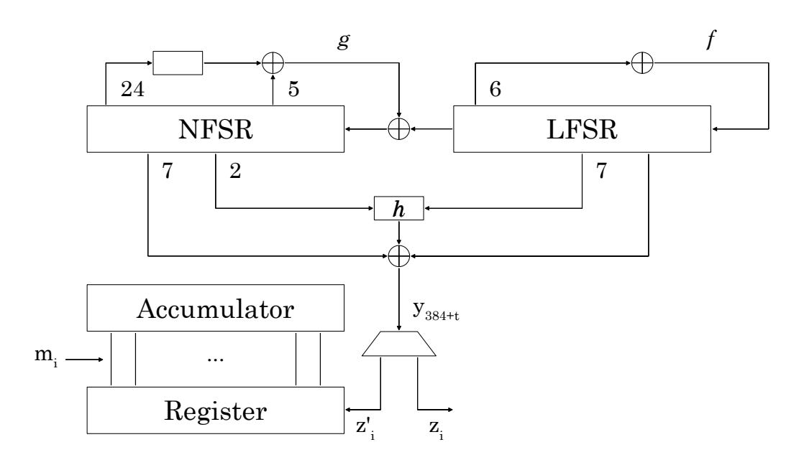
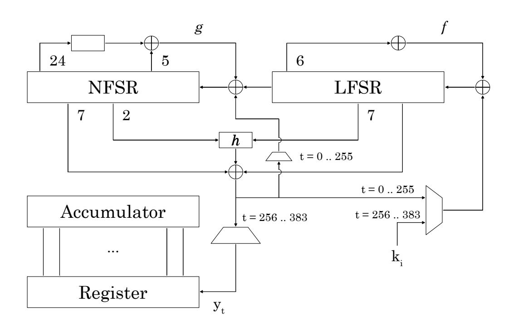

{0}------------------------------------------------

# **Software Evaluation of Grain-128AEAD for Embedded Platforms**

Alexander Maximov<sup>1</sup> and Martin Hell<sup>2</sup>

<sup>1</sup> Ericsson AB, Lund, Sweden, [alexander.maximov@ericsson.com](mailto:alexander.maximov@ericsson.com) <sup>2</sup> Lund University, Lund, Sweden, [martin.hell@eit.lth.se](mailto:martin.hell@eit.lth.se)

**Abstract.** Grain-128AEAD is a stream cipher supporting authenticated encryption with associated data, and it is currently in round 2 of the NIST lightweight crypto standardization process. In this paper we present and benchmark software implementations of the cipher, targeting constrained processors. The processors chosen are the 8-bit (AVR) and 16-bit (MSP) processors used in the FELICS-AEAD framework. Both high speed and small code size implementations are targeted, giving us in total 4 different implementations. Using the FELICS framework for benchmarking, we conclude that Grain-128AEAD is competitive to other algorithms currently included in the FELICS framework. Our detailed discussion regarding particular implementation tricks and choices can hopefully be of use for the community when considering optimizations for other ciphers.

**Keywords:** Grain-128AEAD · stream cipher · software implementation · NIST · optimizations

# **1 Introduction**

The stream cipher Grain-128AEAD is currently a round 2 candidate of the NIST lightweight crypto standardization process. Its specification is closely based on Grain-128a, introduced in 2011, which has, already for several years, been analyzed in the literature. To benefit from the maturity of the Grain family, the design of Grain-128AEAD is very closely based on Grain-128a, with as small changes as possible. This allows us to argue for the security of the cipher based on previous results on Grain-128a.

Grain-128a is in turn based on Grain v1 and Grain-128, which have both been extensively analyzed, providing much insight into the security of the design approach. All Grain stream ciphers also allow the throughput to be increased by adding additional copies of the Boolean functions involved.

Grain-128AEAD can be very suitable in Internet of things (IoT) and embedded systems. Strong advantages of Grain-128AEAD and its precedent versions can be seen in its industrial relevance.

The design of Grain-128AEAD has previously been given in [\[HJM](#page-15-0)<sup>+</sup>19a] and [\[HJM](#page-15-1)<sup>+</sup>19b], while details related to hardware implementations are given in [\[SHSK19\]](#page-16-0).

In this paper, we give details of software implementations targeting constrained processors, namely the 8-bit and 16-bit processors used in the FELICS-AEAD framework [\[CdSGB19\]](#page-15-2). This, together with the hardware implementation results in [\[SHSK19\]](#page-16-0), provides an understanding of how Grain-128AEAD performs on constrained devices, both in software and in hardware.

In [\[BMA](#page-15-3)<sup>+</sup>18], it was shown that lightweight stream ciphers are typically more suitable than lightweight block ciphers for energy optimization when encrypting longer messages, in particular when the speed can be increased at the expense of moderate extra hardware. 

{1}------------------------------------------------

Thus, in these cases, Grain-128AEAD can provide authenticated encryption with low energy consumption. Our implementations targeting embedded processors show that also short messages can be handled efficiently by Grain-128AEAD.

# 2 Algorithm specification

The full specification of the algorithm can be found in [HJM<sup>+</sup>19b]. Here, we only give a very brief overview of the overall design in order to introduce some of the challenges we are facing when implementing the cipher on constrained embedded processors.

Grain-128AEAD consists of two main building blocks. The first is a pre-output generator, which is constructed using a Linear Feedback Shift Register (LFSR), a Non-linear Feedback Shift Register (NFSR) and a pre-output function, while the second is an authenticator generator consisting of a shift register and an accumulator.

### 2.1 Building blocks and functions

<span id="page-1-0"></span>The pre-output generator generates a stream of pseudo-random bits, which are used for encryption and the authentication tag. It is depicted in Fig. 1. The content of the 128-bit



Figure 1: An overview of the building blocks in Grain-128AEAD.

LFSR is denoted  $S_t = [s_0^t, s_1^t, \dots, s_{127}^t]$  and the content of the 128-bit NFSR is similarly denoted  $B_t = [b_0^t, b_1^t, \dots, b_{127}^t]$ . These two shift registers represent the 256-bit state of the pre-output generator.

The update function of the LFSR is given by

$$s_{127}^{t+1} = s_0^t + s_7^t + s_{38}^t + s_{70}^t + s_{81}^t + s_{96}^t = \mathcal{L}(S_t),$$

and update function for the NFSR is given by

$$b_{127}^{t+1} = s_0^t + b_0^t + b_{26}^t + b_{56}^t + b_{91}^t + b_{96}^t + b_3^t b_{67}^t + b_{11}^t b_{13}^t + b_{17}^t b_{18}^t + b_{27}^t b_{59}^t + b_{40}^t b_{48}^t + b_{61}^t b_{65}^t + b_{68}^t b_{84}^t + b_{22}^t b_{24}^t b_{25}^t + b_{70}^t b_{78}^t b_{82}^t + b_{88}^t b_{92}^t b_{93}^t b_{95}^t = s_0^t + \mathcal{F}(B_t).$$

Nine state variables are taken as input to a Boolean function h(x),

$$h(x) = x_0x_1 + x_2x_3 + x_4x_5 + x_6x_7 + x_0x_4x_8$$

where the variables  $x_0, \ldots, x_8$  correspond to, respectively, the state variables  $b_{12}^t$ ,  $s_8^t$ ,  $s_{13}^t$ ,  $s_{20}^t$ ,  $b_{95}^t$ ,  $s_{42}^t$ ,  $s_{60}^t$ ,  $s_{79}^t$  and  $s_{94}^t$ .

{2}------------------------------------------------

The output of the pre-output generator, is then given by the pre-output function

$$y_t = h(x) + s_{93}^t + \sum_{j \in A} b_j^t,$$

where  $\mathcal{A} = \{2, 15, 36, 45, 64, 73, 89\}.$ 

The authenticator generator consists of a shift register, storing the most recent 64 odd bits from the pre-output, and an accumulator. Both are of size 64 bits. We denote the content of the accumulator at instance i as  $A_i = [a_0^i, a_1^i, \ldots, a_{63}^i]$ . Similarly, the content of the shift register is denoted  $R_i = [r_0^i, r_1^i, \ldots, r_{63}^i]$ .

#### 2.2 Key and nonce initialization

Denote the key bits as  $k_i$ ,  $0 \le i \le 127$  and the nonce (IV) bits as  $IV_i$ ,  $0 \le i \le 95$ . Then the state is initialized as follows. The 128 NFSR bits are loaded with the bits of the key  $b_i^0 = k_i$ ,  $0 \le i \le 127$  and the first 96 LFSR elements are loaded with the nonce bits,  $s_i^0 = IV_i$ ,  $0 \le i \le 95$ . The last 32 bits of the LFSR are filled with 31 ones and a zero,  $s_i^0 = 1,96 \le i \le 126$ ,  $s_{127}^0 = 0$ . Then, the cipher is clocked 256 times, feeding back the pre-output function and XORing it with the input to both the LFSR and the NFSR, i.e.,

$$s_{127}^{t+1} = \mathcal{L}(S_t) + y_t, \quad 0 \le t \le 255,$$
  
 $b_{127}^{t+1} = s_0^t + \mathcal{F}(B_t) + y_t, \quad 0 \le t \le 255.$ 

Once the pre-output generator has been initialized, the authenticator generator is initialized by loading the register and the accumulator with the pre-output keystream as

$$a_j^0 = y_{256+j}$$
 and  $r_j^0 = y_{320+j}$ ,  $0 \le j \le 63$ .

When the register and the accumulator are initialized, the key is simultaneously shifted into the LFSR,

$$s_{127}^{t+1} = \mathcal{L}(S_t) + k_{t-256}, \quad 256 \le t \le 383,$$

while the NFSR is updated as

$$b_{127}^{t+1} = s_0^t + \mathcal{F}(B_t), \quad 256 \le t \le 383.$$

Thus, when the cipher has been fully initialized the LFSR and the NFSR states are given by  $S_{384}$  and  $B_{384}$ , respectively, and the register and accumulator are given by  $R_0$  and  $A_0$ , respectively. The initialization procedure is summarized in Fig 2.

#### 2.3 Operating mode

For a message  $\mathbf{m}$  of length L, denoted  $m_0, m_1, \ldots, m_{L-1}$ , set  $m_L = 1$  as padding in order to ensure that  $\mathbf{m}$  and  $\mathbf{m} \parallel 0$  have different tags.

After initializing the pre-output generator, the pre-output is used to generate keystream bits  $z_i$  for encryption and authentication bits  $z'_i$  to update the register in the accumulator generator. The keystream is generated as

$$z_i = y_{384+2i},$$

i.e., every even bit (counting from 0) from the pre-output generator is taken as a keystream bit. The authentication bits are generated as

$$z_i' = y_{384+2i+1},$$

{3}------------------------------------------------

<span id="page-3-0"></span>

Figure 2: An overview of the initialization of Grain-128AEAD. Note that, in hardware, the accumulator initialization is realized by first loading 64 pre-output bits into the register, followed by moving them to the accumulator.

i.e., every odd bit from the pre-output generator is taken as an authentication bit. The message is encrypted as

$$c_i = m_i \oplus z_i, \quad 0 \le i < L.$$

The accumulator is updated as

$$a_j^{i+1} = a_j^i + m_i r_j^i, \qquad 0 \le j \le 63, \quad 0 \le i \le L,$$

and the shift register is updated as

$$r_{63}^{i+1} = z_i'$$
 and  $r_j^{i+1} = r_{j+1}^i$ ,  $0 \le j \le 62$ .

#### **2.3.1 Using the NIST API**

For the specific case of the NIST software API, the input (ad, ad length, message, message length) is mapped to a string *m*<sup>0</sup> as

$$m' = \text{Encode}(\text{ad length})||\text{ad}||\text{m}||0\text{x}80,$$

where Encode() = *y* denotes the message length encoded in the DER format as used by, e.g., X.509. If the first byte in *y* starts with a 0, the remaining 7 bits contain an encoding of the number of bytes in the associated data (up to 127 bytes). If the first byte in *y* starts with a 1, the remaining 7 bits are, instead, an encoding of the number of forthcoming bytes that are used to describe the length (in bytes) of the associated data. In *y*, this first byte is then followed by the bytes giving the length.

# **3 Software implementations on constrained processors**

In this section, we discuss software implementations targeting two constrained processors. The provided discussion and implementation details serve mainly two purposes. First, some of our optimizations might be useful also for other algorithms, and second, by giving the details of the rationale behind the optimizations, others might more easily be able to further optimize the code. Re-use of specific optimizations and transparency of implementations allows more fair comparisons between algorithms. A fair comparison obviously also require

{4}------------------------------------------------

comparable results in terms of the processors used as implementation targets. Here, we have decided to use the FELICS-AEAD framework for the benchmarking [\[CdSGB19\]](#page-15-2). The framework defines three different processors, targeting resource constrained devices. We have made optimized implementations for the two smallest of these processors, namely the AVR ATmega 128 and the MSP430F1611. The two processors are very different in several aspects. A brief comparison is given in Table [1.](#page-4-0)

|  |  | Table 1: Some details and comparison of AVR and MSP targets |  |  |  |
|--|--|-------------------------------------------------------------|--|--|--|
|  |  |                                                             |  |  |  |

<span id="page-4-0"></span>

|              | AVR target [Atm06]            | MSP target [Ins11,Ins06]      |
|--------------|-------------------------------|-------------------------------|
|              | CPU Characteristics           |                               |
| Platform     | 8-bit RISC (Harvard)          | 16-bit RISC (Von Neumann)     |
| Version      | AVR ATmega 128 @ 16MHz        | MSP430F1611 @ 8MHz            |
| Flash / SRAM | 128 KB / 4 KB                 | 48 KB / 10 KB                 |
| Registers    | 8-bit R0-R31 where R26-R31    | 16-bit R0-R15 where R0-R3     |
|              | are for three 16-bit pointers | are reserved for Control Regs |

It can be noted that both processors are little-endian machines, which will be used in the implementations. The main properties, as suggested by FELICS-AEAD, are the code size, the RAM consumption, and the execution time. We have implemented Grain-128AEAD in four different versions: **AVR-Small** – small code size for AVR; **AVR-Fast** – fast execution time for AVR; **MSP-Small** – small code size for MSP; **MSP-Fast** – fast execution time for MSP. [1](#page-4-1)

### **3.1 Implementation details**

Neither the AVR, nor the MSP, is suitable for bit-shifts. They can only perform a 1-bit shift to the left or to the right, with or without carry propagation, or a swap of a half-word (2x4-bit swap in AVR and 2x8 bit swap in MSP). This means that in the implementation of Grain we must take care to reduce the number of bit-shifts needed as much as possible.

The two processors differ in several critical aspects and a programmer must take the specific properties and limitations into account. In the MSP, we can only use 11 16-bit registers for Grain logic, while 1 register is reserved for storing the pointer to the state data. This requires a more careful treatment than in the AVR case, where we can use 26 8-bit registers for logic (or, 13 2x8-bit registers), and the Z-registers (R30-R31) for storing the pointer to the Grain state. In the MSP, we should reduce the usage of instructions with immediate constants, and also limit memory read/write as much as possible. In addition, the usage of the stack should be reduced as far as possible, since the RAM↔registers transfer time is rather expensive (latency 3-4). An overview of the latency and code size in the MSP can be found in Table [2.](#page-4-2) In the AVR, this problem is not present as most of the instructions have latency 1 and for RAM↔registers transfers it is only 2.

<span id="page-4-2"></span>Table 2: Code size and the number of cycles for MSP430F1611, based on input arguments.

| src→dst   | #cycles | code size | Example          |
|-----------|---------|-----------|------------------|
| reg→reg   | 1       | 2         | MOV R4, R5       |
| reg→mem   | 4       | 4         | AND R4, 6(R5)    |
| mem→reg   | 3       | 4         | XOR 6(R5), R4    |
| mem→mem   | 6       | 6         | ADD 6(R5), 3(R4) |
| const→reg | 2       | 4         | MOV #10, R5      |
| const→mem | 5       | 6         | XOR #10, 3(R5)   |

<span id="page-4-1"></span><sup>1</sup>All four implementations, and also some alternative variants, can be found in the FELICS virtual machine accessible at https://www.cryptolux.org/index.php/FELICS

{5}------------------------------------------------

Several implementation optimizations have been considered. Here, we provide an overall description of our implementation approach, together with code samples to highlight some particular implementation choices.

#### **3.1.1 Data structures and main sub-routines**

For the 8-bit AVR implementation, the state of Grain is defined as

```
1 t y p e d e f s t r u c t G r ainS t a te_ s t
2 { uin t8_ t l f s r [ 1 6 ] , n f s r [ 1 6 ] , A[ 8 ] , R[ 8 ] , z1 ;
3 } G r ain S t a te ;
```

and for the 16-bit variant, it is

```
1 t y p e d e f s t r u c t G r ainS t a te_ s t
2 { uin t16_ t l f s r [ 8 ] , n f s r [ 8 ] , A[ 4 ] , R[ 4 ] , z1 ;
3 } G r ain S t a te ;
```

In both cases, the order of data in the structure GrainState\_st is highly important, as will be seen later. The members of the structure correspond to the state of LFSR, NFSR, Accumulator, and Register in the design description of Grain-128AEAD. 1 (or 2) byte of extra information (.z1) is added to the structure GrainState\_st for efficiency reasons. This contains the odd bits from the keystream and will be used when authenticating each message byte.

In the implementation of both the 8- and 16-bit variants, we utilize four sub-routines.

```
1 ui n t 8 /16_t grain_update ( G r ainS t a t e ∗ g ) ;
2 v oid grain_auth ( G r ai nS t a te ∗ g , uin t8_ t msg ) ;
3 uin t8_ t g r ai n_ g e t z ( G r ain S t a t e ∗ g ) ;
4 v oid g r ain_encdec ( uin t8_ t ∗ s t a t e , uin t8_ t ∗message ,
5 uin t32_ t message_length , uin t8_ t mask ) ;
```

The sub-routines implement the following tasks.

- grain\_update() performs LFSR and NFSR updates, computes and returns the *y* value. For the AVR platform this is an 8-bit value and for the MSP it is 16 bits.
- grain\_getz() calls the function grain\_update() 1 (MSP) or 2 (AVR) times and splits the returned 16 bits into two bytes, *z*<sup>0</sup> and *z*1, containing even and odd bits. Then 8 odd bits are stored in the state of Grain in .z1, and is used later in the authentication, while the 8 even bits serve as a keystream byte, which is returned to the caller.
- grain\_auth() receives a single byte of a message, and updates the "Accumulator" .A and the "Register" .R given the message byte msg and the 8 (odd) bits saved in the Grain state as .z1.
- grain−encdec() is a combined function for both encryption and decryption, since the only difference is the order of the authentication and the XORing of the input message with the keystream.

### **3.1.2 Implementing the FELICS API**

The Grain-128AEAD implementation in the FELICS-AEAD framework must follow a certain pre-defined API, which has six functions, ProcessPlaintext(), ProcessCiphertext(), Finalize (), TagGeneration(), Initialize (), and ProcessAssociatedData().

In this section, we discuss the implementation of the functions for this API. Using the above-mentioned sub-routines, we get a very simple implementation of the first four API functions.

{6}------------------------------------------------

```
1
2 v oid P r o c e s s Pl ai n t e x t ( uin t8_ t ∗ s t a t e , uin t8_ t ∗message , uin t32_ t
        message_length )
3 { g r ain_encdec ( s t a t e , message , message_length , 0 x f f ) ; }
4
5 v oid P r o c e s s Ci p h e r t e x t ( uin t8_ t ∗ s t a t e , uin t8_ t ∗message , uin t32_ t
        message_length )
6 { g r ain_encdec ( s t a t e , message , message_length , 0 x00 ) ; }
7
8 v oid F i n a l i z e ( uin t8_ t ∗ s t a t e , uin t8_ t ∗key )
9 { /∗ Do n o thin g ∗/ }
10
11 v oid TagGeneration ( uin t8_ t ∗ s t a t e , uin t8_ t ∗ t a g )
12 { G r ain S t a te ∗ g = ( G r ainS t a t e ∗) s t a t e ;
13 uin t8_ t i ;
14 f o r ( i =0; i <4; ++i )
15 ( ( uin t16_ t ∗) t a g ) [ i ] = g−>A[ i ] ^ g−>R[ i ] ;
16 }
```

Note that the 32-bit length of the message (uint32\_t message\_length) is not suitable for 8 and 16 bit platforms. Instead of introducing a 32-bit counter, we use the message\_length variable directly and decrement it while incrementing the data pointer (uint8\_t ∗ message). This is done in the sub-routines grain\_encdec() and ProcessAssociatedData(), described later.

The API function Initialize () is quite straight-forward. It only differs between 8- and 16-bit implementations in the size of the returned *y* from the sub-routine grain\_update(). For the 16-bit version it is given as follows.

```
1 v oid I n i t i a l i z e ( uin t8_ t ∗ s t a t e , c o n s t uin t8_ t ∗key , c o n s t uin t8_ t ∗nonce )
2 {
3 G r ain S t a te ∗ g = ( G r ainS t a t e ∗) s t a t e ;
4 uin t8_ t i ;
5
6 memcpy ( g−>n f s r , key , 1 6 ) ;
7 memcpy ( g−>l f s r , nonce , 1 2 ) ;
8 g−>l f s r [ 6 ] = 0 x f f f f ;
9 g−>l f s r [ 7 ] = 0 x 7 f f f ;
10
11 f o r ( i =0; i <16; ++i )
12 { uin t16_ t y = grain_update ( g ) ;
13 g−>l f s r [ 7 ] ^= y ;
14 g−>n f s r [ 7 ] ^= y ;
15 }
16
17 f o r ( i =0; i <8; ++i )
18 { g−>A[ i ] = grain_update ( g ) ;
19 g−>l f s r [ 7 ] ^= ( ( c o n s t uin t16_ t ∗) key ) [ i ] ;
20 }
21 }
```

Here we take advantage of the order of .A[] and .R[] in the structure GrainState\_st. On line 18 above, for i>=4 it will actually update g−>R[i−4] with no extra expense in code size and time.

The remaining function from the FELICS-AEAD API is ProcessAssociatedData(). The main complication there is the DER encoding of the message length, and since the length in the API is a 32-bit integer, this also has to be taken into consideration. The smallest and most efficient DER encoding is a byte-oriented solution, and here we utilize the fact that AVR and MSP are little-endian machines. The 16-bit implementation then looks as follows.

```
1 v oid P r o c e s sA s s o ci a t e dD a t a ( uin t8_ t ∗ s t a t e , uin t8_ t ∗ a s s o ci a t e dD a t a , uin t32_ t
          a s s o ci a t e d_ d a t a_l e n g t h )
2 {
3 G r ain S t a te ∗ g = ( G r ainS t a t e ∗) s t a t e ;
4 uin t8_ t de r [ 5 ] , k , de r_len ;
```

{7}------------------------------------------------

```
5 ∗( uin t32_ t ∗) ( de r + 1 ) = a s s o ci a t e d_ d a t a_l e n g t h ;
6
7 de r [ 0 ] = 0 x80 ;
8 f o r ( de r_len =4; ! de r [ de r_len ] ; −−de r_len ) ;
9
10 /∗ Alt1 : i f ( ! ( ( de r [ 1 ] & 0x80 ) | ( der_len >>1) ) ) ∗/
11 /∗ Alt2 : i f ( ! ( ( der_len >>1) | ( de r [1] > >7) ) ) ∗/
12 /∗ Alt3 : i f ( ! ( ( de r_len & 0 x f e ) | ( de r [ 1 ] & 0x80 ) ) ) ∗/
13 i f ( ( der_len <=1) && ( de r [ 1] < 1 2 8 ) )
14 { de r [ 0 ] = de r [ 1 ] ;
15 de r_len = 0 ;
16 }
17 e l s e
18 de r [ 0 ] |= de r_len ;
19
20 f o r ( k=0; k <= de r_len ; k++)
21 { g r ai n_ g e t z ( g ) ;
22 grain_auth ( g , de r [ k ] ) ;
23 }
24
25 w hil e ( a s s oci a ted_d a t a_len g th −−)
26 { g r ai n_ g e t z ( g ) ;
27 grain_auth ( g , ∗( a s s o ci a t e dD a t a ) ) ;
28 a s s o ci a t e dD a t a++;
29 }
30 }
```

It can be noted that the implementations for both 8- and 16-bit targets are byte oriented in terms of how we process the message and the authentication data. This removes the need for handling odd lengths. Moreover, for the 16-bit case, having 16-bit keystream chunks is not justified since in that case we would have to update the LFSR/NFSR with 32 clocks at a time. Thus, for both the AVR and MSP architectures, the approach to handle the message byte-wise seems most efficient.

#### **3.1.3 Sub-routine grain\_encdec()**

The implementation of the combined encryption/decryption is very straight-forward, and does not contain any particular processor oriented optimizations. Recall that the mask is set to 0xff for encryption, meaning that the message before XORing with the keystream is sent to the authentication sub-routine. For decryption, the mask is instead 0x00, resulting in a decrypted message on line 6, before the plaintext is used for authentication.

```
1 v oid g r ain_encdec ( uin t8_ t ∗ s t a t e , uin t8_ t ∗message ,
2 uin t32_ t message_length , uin t8_ t mask )
3 { G r ain S t a te ∗ g = ( G r ainS t a t e ∗) s t a t e ;
4 w hil e ( message_length −−)
5 { uin t8_ t z0 = g r ai n_ g e t z ( g ) ;
6 ∗message ^= z0 & ~mask ;
7 grain_auth ( g , ∗message ) ;
8 ∗message ^= z0 & mask ;
9 message++;
10 }
11 }
```

#### **3.1.4 Sub-routine grain\_getz()**

As noted, for the 8-bit AVR target, the function grain\_getz() must call grain\_update() two times in order to receive 16 bits of *y*. In the 16-bit implementation the call to grain\_update() is only performed once since grain\_update() then returns 16 bits of *y*.

The next step is to deinterleave the received 16 bits into two bytes, *z*<sup>0</sup> and *z*1, containing even and odd bits, respectively.

{8}------------------------------------------------

Deinterleaving may be done in several ways. For the 8-bit case, we can first deinterleave the 8 bits in each of the 2 bytes of *y* independently, then mix the results to further get the full split in *z*0*, z*1.

```
1 // AVR c om pil e r w i l l c o n v e r t t h i s i n t o a s i n g l e i n s t r u c t i o n ' swap '
2 s t a t i c i n l i n e uin t8_ t SWAP( uin t8_ t x )
3 { r e t u r n ( x>>4) | ( x<<4) ; }
4
5 s t a t i c uin t8_ t d e i n t e r l e a v e ( uin t8_ t x )
6 { uin t8_ t tmp ;
7 tmp = ( x ^ ( x >> 1 ) ) & 0 x22 ; x ^= tmp ^ ( tmp << 1 ) ;
8 tmp = ( x ^ ( x >> 2 ) ) & 0 x0c ; x ^= tmp ^ ( tmp << 2 ) ;
9 r e t u r n x ;
10 }
11
12 uin t8_ t g r ai n_ g e t z ( G r ai nS t a te ∗ g )
13 { uin t8_ t r 0 = d e i n t e r l e a v e ( grain_update ( g ) ) ;
14 uin t8_ t r 1 = SWAP( d e i n t e r l e a v e ( grain_update ( g ) ) ) ;
15 uin t8_ t t = ( r 0 ^ r 1 ) & 0 x f 0 ;
16 g−>z1 = SWAP( r 1 ^ t ) ;
17 r e t u r n r 0 ^ t ;
18 }
```

This approach gives a small code. However, it is not very fast since it requires several bit shifts. A faster approach is to use a lookup table, 256 bytes, which deinterleaves a single byte, where even bits are collected as low 4 bits of the result and odd bits are placed as high 4 bits of the resulting byte. This helps to speed up the execution but requires larger code size.

For the 16-bit MSP case we implemented the deinterleaving directly on the 16-bit response *y*, as follows.

```
1 uin t8_ t g r ai n_ g e t z ( G r ai nS t a te ∗ g )
2 { uin t16_ t tmp , x = grain_update ( g ) ;
3 tmp = ( x ^ ( x>>1) ) & 0 x2222 ; x ^= tmp ^ ( tmp<<1) ;
4 tmp = ( x ^ ( x>>2) ) & 0 x0c0c ; x ^= tmp ^ ( tmp<<2) ;
5 tmp = ( x ^ ( x>>4) ) & 0 x 0 0 f 0 ; x ^= tmp ^ ( tmp<<4) ;
6 g−>z1 = x >> 8 ;
7 r e t u r n ( uin t8_ t ) x ;
8 }
```

For the fast case on the MSP target we also implemented this function in inline assembly, so that we could ignore the carry flag cleanups, optimizing this function even further.

#### **3.1.5 Sub-routine grain\_auth()**

Authenticating one message byte in Grain-128AEAD will require a loop of in total 64 steps. For the AVR processor, reading from and writing to RAM is not very expensive, so an efficient implementation can be achieved as follows.

```
1 v oid grain_auth ( G r ain S t a te ∗ g , uin t8_ t msg )
2 { uin t8_ t i ;
3 f o r ( i =0; i <8; ++i )
4 { uin t8_ t j , mask = −(msg & 1 ) ;
5 msg >>=1;
6 f o r ( j =0; j <8; ++j )
7 { g−>A[ j ] ^= g−>R[ j ] & mask ;
8 g−>R[ j ] = ( uin t8_ t ) ( ( ∗ ( uin t16_ t ∗) ( g−>R + j ) )>>1) ;
9 }
10 g−>z1 >>= 1 ;
11 }
12 }
```

Note that we here also take advantage of the fact that .z1 is located in the data structure right after .R[], so that we avoid buffer overflow.

{9}------------------------------------------------

A similar implementation on the 16-bit MSP target is not efficient due to the comparatively slow instructions for reading from and writing to the memory. Here, it is more efficient to load the state of .A[] and .R[] into registers, operate on the registers, and then store them back at the very end of the procedure. In addition, inline assembly can be used in shifting .R[] by 1, since there we can effectively use the instruction rrc that gets in and pushes out the carry value. Thus, the shifting of ← *R* ← *z*<sup>1</sup> is only 5 instructions. The overall optimization for the 16-bit platform can be implemented as follows.

```
1 v oid grain_auth ( G r ain S t a te ∗ g , uin t8_ t msg )
2 {
3 uin t16_ t r 0 = g−>R[ 0 ] , r 1 = g−>R[ 1 ] , r 2 = g−>R[ 2 ] , r 3 = g−>R[ 3 ] , z=g−>z1 ;
4 uin t16_ t a0 = g−>A[ 0 ] , a1 = g−>A[ 1 ] , a2 = g−>A[ 2 ] , a3 = g−>A[ 3 ] , i ;
5
6 f o r ( i =0; i <8; ++i )
7 { uin t16_ t j , mask = −(uin t16_ t ) (msg & 1 ) ;
8 msg >>= 1 ;
9 __asm__ __volatile__ (
10 "mov %3, %10 \ t \n"
11 " and %9, %10 \ t \n"
12 " xor %10, %8 \ t \n"
13 "mov %2, %10 \ t \n"
14 " and %9, %10 \ t \n"
15 " xor %10, %7 \ t \n"
16 "mov %1, %10 \ t \n"
17 " and %9, %10 \ t \n"
18 " xor %10, %6 \ t \n"
19 "mov %0, %10 \ t \n"
20 " and %9, %10 \ t \n"
21 " xor %10, %5 \ t \n"
22 " r r c %4 \ t \n"
23 " r r c %3 \ t \n"
24 " r r c %2 \ t \n"
25 " r r c %1 \ t \n"
26 " r r c %0 \ t \n"
27 : "+r " ( r 0 ) , "+r " ( r 1 ) , "+r " ( r 2 ) , "+r " ( r 3 ) , "+r " ( z ) , "+r " ( a0 ) , "+r " ( a1 ) , "+r
       " ( a2 ) , "+r " ( a3 ) , "+r " (mask ) , "=r " ( j ) : ) ;
28 }
29
30 g−>R[ 0 ] = r 0 ; g−>R[ 1 ] = r 1 ; g−>R[ 2 ] = r 2 ; g−>R[ 3 ] = r 3 ;
31 g−>A[ 0 ] = a0 ; g−>A[ 1 ] = a1 ; g−>A[ 2 ] = a2 ; g−>A[ 3 ] = a3 ;
32 }
```

Note that in both approaches above we do mask = −(uint16\_t)(msg & 1) which effectively generates the mask 0x0000 or 0 xffff in just 4 instructions (e.g., mov, and, inv, inc), based on the bit of the message. This approach is branchless and executes in constant time independently on the message. This helps protecting against message dependent sidechannel timing attacks on the authentication part of the implementation.

#### **3.1.6 Sub-routine grain\_update()**

The update sub-routine function is the main core of the Grain-128AEAD algorithm. The function clocks the two registers 8 or 16 times respectively for the AVR and MSP targets, and returns 8 or 16 bits of *y*. This is the main function to consider for speed and area optimizations, and where most effort should be done. As will also be shown, we can additionally gain a significant code size reduction by carefully analyzing the function. This section will discuss several optimization approaches for this function and the different options that were considered.

Let a "word" be an 8-bit integer for the AVR, and a 16-bit integer for the MSP. Further, a "double-word" is a 16-bit integer for the AVR, and a 32-bit integer for the MSP. Let us define an LFSR/NFSR "double-word" at a *byte offset* i as follows:

```
1 #d e f i n e LF( i ) ( ∗ ( ui n t 1 6 /32_t ∗) ( ( uin t8_ t ∗) g−>l f s r + i ) )
```

{10}------------------------------------------------

```
2 #d e f i n e NF( i ) ( ∗ ( ui n t 1 6 /32_t ∗) ( ( uin t8_ t ∗) g−>n f s r + i ) )
```

where we use the type conversion to uint16\_t for the 8-bit AVR and uint32\_t for the MSP. In the function, the main goal is to compute a new value for the LFSR, NFSR, and the value of *y*. These will be referred to as uint8/uint16\_t ln, nn, y, respectively. Now, ln, nn, y can be expressed in terms of the LF, NF macros. For the 16-bit case this can be done as follows.

```
1 uin t16_ t grain_update ( G r ainS t a t e ∗ g )
2 {
3 uin t16_ t ln , nn , y ;
4
5 l n = LF ( 0 ) ^ LF ( 1 2 ) ^ (LF ( 0 )>>7) ^ (LF ( 4 )>>6) ^ (LF ( 8 )>>6) ^ (LF ( 1 0 )>>1) ;
6
7 y = (LF ( 1 )>>5) & (LF ( 2 )>>4) ;
8 y ^= (LF ( 7 )>>4) & (LF ( 9 )>>7) ;
9 y ^= (NF( 1 1 )>>7) & (LF ( 5 )>>2) ^ (NF( 1 1 )>>1) ;
10 y ^= (NF( 1 )>>4) & (NF( 1 1 )>>7) & (LF ( 1 1 )>>6) ;
11 y ^= (NF( 1 )>>4) & LF ( 1 ) ;
12 y ^= (LF ( 1 1 )>>5) ^ (NF( 0 )>>2) ^ (NF( 1 )>>7) ^ (NF( 4 )>>4) ;
13 y ^= (NF( 5 )>>5) ^ NF( 8 ) ^ (NF( 9 )>>1) ;
14
15 nn = LF ( 0 ) ^ NF( 0 ) ^ NF( 7 ) ^ NF( 1 2 ) ^ (NF( 5 ) & NF( 6 ) ) ;
16 nn ^= NF( 1 1 ) & (NF( 1 1 )>>4) & (NF( 1 1 )>>5) & (NF( 1 1 )>>7) ^ (NF( 1 1 )>>3) ;
17 nn ^= (NF( 0 )>>3) & (NF( 8 )>>3) ;
18 nn ^= (NF( 1 )>>3) & (NF( 1 )>>5) ;
19 nn ^= (NF( 2 )>>1) & (NF( 2 )>>2) ;
20 nn ^= (NF( 3 )>>3) & (NF( 7 )>>3) ;
21 nn ^= (NF( 3 )>>2) ;
22 nn ^= (NF( 7 )>>5) & (NF( 8 )>>1) ;
23 nn ^= (NF( 8 )>>4) & (NF( 1 0 )>>4) ;
24 nn ^= (NF( 2 )>>6) & NF( 3 ) & (NF( 3 )>>1) ;
25 nn ^= (NF( 8 )>>6) & (NF( 9 )>>6) & (NF( 1 0 )>>2) ;
26
27 memcpy ( g−>l f s r , g−>l f s r + 1 , 3 0 ) ;
28 g−>l f s r [ 7 ] = l n ;
29 g−>n f s r [ 7 ] = nn ;
30 r e t u r n y ;
31 }
```

While this is in general a rather efficient way of updating bit-oriented shift registers, a problem with the above code is that it needs many shifts of double-words. A single shift by 1 to the right (left) takes at least 2 instructions, i.e., just a single term NF(11)>>7 would normally take 14 instructions, excluding the time of loading the double-word NF(11).

Another problem is that every call to the macros LF, NF would mean loading the 2 words from RAM into 2 registers. This may be acceptable for the AVR case, but in the MSP it becomes quite expensive.

So, our speed optimization goal is to

- reduce the number of shifts required, and
- reduce the number of register to/from RAM transfers.

The latter part becomes particularly challenging on the MSP target as there we only have 11 registers at our disposal.

For reducing the number of shifts, one approach could be to switch the order of operations. As an example,

```
1 nn ^= ( (NF( 0 )>>3) & (NF( 8 )>>3) ) ^ ( (NF( 3 )>>3) & (NF( 7 )>>3) ) ;
 requires 4 "double-word" shifts, taking 2(^)+2(&)+4*6(>>3)=28 instructions. Instead,
1 nn ^= (NF( 0 ) & NF( 8 ) ) ^ (N( 3 ) & NF( 7 ) ) >>3;
```

{11}------------------------------------------------

would require only 13 instructions. Another approach is that shifts can be nested. For example

```
1 nn ^= ( (NF( 1 )>>3) & (NF( 1 )>>5) ) ^ ( (NF( 2 )>>1) & (NF( 2 )>>2) ) ^ ( (NF( 3 )>>3)
      & (NF( 7 )>>3) ) ^ (NF( 3 )>>2) ;
```

requires 45 instructions, while the nested expression needs only 25 instructions:

```
1 nn ^= ( ( ( ( (NF( 1 )>>2) & NF( 1 ) ) ^ (NF( 3 ) & NF( 7 ) ) )>>1) ^ NF( 3 ) )>>1) ^ ( (NF
       ( 2 )>>1) & NF( 2 ) ) )>>1;
```

These ideas can be applied to the AVR by utilizing 21 registers, but they do not work nicely for the MSP, where we only have 11 registers. Loading of the LFSR state already occupies 7 16-bit registers, and thus we only have 4 remaining registers for operations and to keep intermediate values during the evaluation of ln, nn, y.

A better approach for the MSP is to load the LFSR state into 7 registers – the last 16 bits are not used in the update function and thus we have 4 extra registers to work with. Then we are shifting these 7 registers by 1 bit in parallel. If some expression contains an NF(x)>>1, LF(x)>>1, we pick that value from the shifted state almost directly, and use it in the expression. If there is an & operator, then we have to save the value somewhere and AND it with the next operand as soon as the state will be shifted by the right amount. Then we repeat shifting the 7 state registers by 1 yet another 7 times until all arguments in the functions are met.

However, since registers in MSP are 16-bit long, there are two possible situations that need to be handled somewhat differently. Assume we are shifting the state to the right; if the needed argument in NF/LF(x) has even x, then the value is achieved directly from the register R(x/2). However, if x is odd, then the value is spanned over two 16-bit registers (R(x/2+1)|R(x/2))>>8, which need to be extracted.

The following assembly code is used for such an extraction, where B|A is the 32-bit value in two 16-bit registers A and B, and where we need to extract the middle 16 bits into the register R. This can be either a third register or the register B. The both fastest and smallest code use only 4 instructions on the MSP target.

```
1 #d e f i n e g e t 8 (B, A, R) \
2 "mov . b " B " , " R " \n\ t " \
3 " xor . b " A " , " R " \n\ t " \
4 " xor " A " , " R " \n\ t " \
5 " swpb " R " \n\ t "
```

The above ideas provide an efficient implementation of the update function, but it is not necessarily very small. If code size is crucial and speed is of much less importance, we here outline an approach for minimizing the code size, but at the expence of speed.

By the above, it is clear that the update function is implemented as a sequence of AND and XOR operations, where the arguments are basically the bit-offsets from the beginning of the GrainState\_st structure. Each invocation of NF(i)/LF(i) is a number of assembly instructions, where each instruction is 2 bytes long. Based on this observation the following approach can be taken to dramaticaly reduce the code size:

- 1. Encode the sequence of the functions' evaluation steps in a shorter form, say as a vector of bytes. Each byte points to the bit-offset of the argument in some well-defined order of the evaluation of an expression.
- 2. Encode the sequence of operations. Here we introduce result as being the result of an expression evaluation, and product being the intermediate AND-product of the input arguments. The sequence of the evaluation is thus binary, where '1' means that the argument has to be ANDed to the product, and '0' means that the product must be XORed to the total result . The values are initialized as result=0, product=−1, and when the product is XORed to the result , it is then initialized again as product=−1.

{12}------------------------------------------------

3. Write a mini-RISC CPU that can process the given program with the provided arguments.

This approach effectively substitutes the code for each &/^ LF/NF(i)>>j operation by just 1 byte of the encoded command with one argument to the mini-RISC CPU implemented within the Grain code itself. As an exampe, for the 16-bit case, that implementation is done as follows.

```
1 s t a t i c c o n s t uin t8_ t program16 [ 5 4 ] =
2 { // program f o r LFSR update
3 0x60 , 0x51 , 0x46 , 0x26 , 0x07 , 0x00 ,
4 // program f o r NFSR update
5 /∗0x00 , ∗/ 0x80 , 0x9a , 0xb8 , 0xdb , 0 xe0 , 0xd8 , 0xdc , 0xdd , 0 xd f , 0x96 , 0x98
        , 0x99 , 0 xc6 , 0 xce , 0xd2 , 0x83 , 0 xc3 , 0x8b , 0x8d , 0x91 , 0x92 , 0x9b , 0xbb
        , 0xa8 , 0xb0 , 0xbd , 0 xc1 , 0 xc4 , 0xd4 ,
6 // program f o r y
7 0 x8c , 0x08 , 0x0d , 0x14 , 0 xd f , 0x2a , 0 x3c , 0 x4 f , 0 x8c , 0 xd f , 0 x5e , 0x5d , 0
        x82 , 0 x8 f , 0xa4 , 0xad , 0 xc0 , 0 xc9 , 0xd9
8 } ;
9
10 // Mini−RISC CPU
11 s t a t i c uin t16_ t execute_program ( c o n s t uin t16_ t ∗ data , uin t16_ t command ,
        uin t16_ t pc , uin t16_ t pc_end )
12 { uin t16_ t r e s u l t = 0 x0000 , p r oduc t = 0 x f f f f ;
13 f o r ( ; pc < pc_end ; ++pc , command>>=1)
14 { uin t16_ t o f f s e t = program16 [ pc]>>4;
15 uin t16_ t s h i f t = program16 [ pc ] & 1 5;
16 p r oduc t &= ( uin t16_ t ) ( ∗ ( ( uin t32_ t ∗) ( data + o f f s e t ) ) >> s h i f t ) ;
17 i f (command & 1 ) c o n ti n u e ;
18 r e s u l t ^= p r oduc t ;
19 p r oduc t = 0 x f f f f ;
20 }
21 r e t u r n r e s u l t ;
22 }
23
24 uin t16_ t grain_update ( G r ainS t a t e ∗ g )
25 uin t16_ t nn , y , i ;
26 nn = execute_program ( g−>l f s r , 0 x6dc0 , 5 , 2 1 ) ;
27 nn ^= execute_program ( g−>l f s r , 0 x1555 , 2 1 , 3 5 ) ;
28 y = execute_program ( g−>l f s r , 0 x0355 , 3 5 , 5 4 ) ;
29 g−>n f s r [ 0 ] = execute_program ( g−>l f s r , 0 x0000 , 0 , 6 ) ;
30
31 memcpy ( g−>l f s r , g−>l f s r + 1 , 3 0 ) ;
32 g−>n f s r [ 7 ] = nn ;
33 r e t u r n y ;
34 }
```

The "program" for nn has 30 instructions, and we have to call the mini-RISC CPU twice. We also utilize the fact that after 16 shifts of the command 0x0355 it will produce only zeroes, thus normally the processing will XOR all the arguments to the result . Therefore, the computation of y can be done with only a single call to the processor while there are (54-35)=19 commands being executed.

### **3.2 Benchmarking results**

The FELICS-AEAD framework defines several scenarios. One set of scenarios targets the use case given by IEEE 802.15.4, which has a standard packet size of 127 bytes, including at most 25 byte header. Assuming a 16 byte authentication tag, this allows for 86 bytes of plaintext. The other set of scenarios is based on IPv6 with a MTU of 1280 bytes. This includes a fixed 40 byte header. Thus, there is a 1224 byte plaintext (since 16 bytes are used for the MAC). Here, we focus on the scenarios with authenticated encryption.

{13}------------------------------------------------

- Scenario 1c. Authenticated encryption of 86 bytes of payload and 25 bytes of header (associated data);
- Scenario 2c. Authenticated encryption of 1224 bytes of payload and 40 bytes header (associated data).

At the time of writing, very few ciphers are implemented in the FELICS-AEAD framework. These are ACORN, AES-GCM, ASCON, Ketje-Jr, and NORX. Of these, ASCON, is also in round 2 of the NIST LWC standardization process. Each cipher comes with a few different implementations and, in addition, different compiler options are used. The best performing implementation/option for each scenario is used in the comparison. In particular, the comparison with AES-GCM is of interest since a LWC cipher is expected to perform better than AES in the constrained environments.

The simulation results given in Table [3](#page-14-0) are divided into 4 targets, namely minimizing code size and minimizing total time for AVR and MSP, respectively. For each target, we also provide alternative (Alt.) choices that are next best for this target (code size or total time). The idea is to show that a small price in the primary metric can lead to a significantly better performance in other metrics. For example, in "AVR-Small" we can see that (Alt.) NORX has a very small increase in code size but a much better performance in terms of the total time.

**RAM usage.** Most of the ciphers have a relatively small and stable usage of RAM for the state and stack, except Ketje-Jr whose stack usage heavily depends on the message length (about 1350 bytes for scenario 2c). On the smaller end, Grain and ACORN have state and stack RAM usage of about 100 bytes, where Grain uses the least RAM resources among all of the presented ciphers (83-94 bytes, in different scenarios/targets).

**AVR/MSP-Small.** Grain outperforms all the presented algorithms regarding the code size in all 4 target groups. On AVR, Grain has the smallest code size of 1100 bytes, with the next smallest being ACORN with 1868 bytes. On MSP, Grain has the smallest code size of 926 bytes. The next smallest, again being ACORN, is 1744 bytes.

**AVR-Fast.** When targeting fast code for AVR, Grain is faster than most of the compared ciphers, except NORX and ASCON. Alt. Grain is 3.8 times faster than AES-GCM, while still being the smallest of all ciphers in code size. NORX demonstrates x2 speed of Grain but then the code size is x2-3 times larger than Grain. ASCON has x4.6 times faster speed but the code size is x11-14 times larger than Grain's (24590 vs 2372/1734 bytes). Alt.ASCON with a decent code size (but still larger than Grain) has a speed performance 28% slower than Grain.

**MSP-Fast.** When targeting fast code for MSP, Grain still has the smallest code size and performs ∼x12.2 times faster than AES-GCM. ASCON is faster, but its code size is again enormously large (46174 vs 1436 bytes). Alt.ASCON with a decent code size becomes ∼x2.4 times slower than Grain. NORX seems to have 2x faster speed than Grain but the code size is 3-4 times larger, again.

**Balanced choice.** The code size and the total time of a chosen cipher heavily depend on the platform, implementation, and the compiler's optimization options. Minimizing both code size and total time require a balanced metric for that. Here, we compute the product of the code size and the total time and pick the cipher variant with the smallest such metric. These "balanced" variants are given in Table [4.](#page-15-5) The initialization requirement for stream ciphers typically makes them less favorable for very short messages. Still, we have chosen Scenario 1c for this metric in order to show that Grain outperforms the compared ciphers and their implementations even in this scenario. For ASCON, the best balanced choice has a very large code size (24590 bytes), so we also provide the next best metric with smaller code size. On both targets, AVR and MSP, Grain has the smallest metric of the balance between the code size and the total time. Moreover, Grain has the smallest code size, and the total time is a lot faster than AES-GCM (about x5.6 and x12,

{14}------------------------------------------------

Table 3: Simulation results on FELICS-AEAD

<span id="page-14-0"></span>

| Name                             | Ver                              | CO  | RAM   | Code  | RAM   | Total time  | RAM   | Total time  |  |
|----------------------------------|----------------------------------|-----|-------|-------|-------|-------------|-------|-------------|--|
|                                  |                                  |     | state | size  | stack | (cycles)    | stack | (cycles)    |  |
|                                  | AVR-Small (minimizing code size) |     |       |       |       | Scenario 1c |       | Scenario 2c |  |
| ACORN                            | v2                               | -Os | 37    | 1868  | 64    | 692884      | 64    | 2947063     |  |
| AES-GCM                          | v1                               | -O2 | 228   | 2336  | 96    | 1463142     | 96    | 14700113    |  |
| ASCON                            | v3                               | -O1 | 40    | 3724  | 122   | 362589      | 124   | 3849045     |  |
| Grain                            | v1                               | -Os | 49    | 1100  | 34    | 1647100     | 34    | 19026431    |  |
| (Alt.) Grain                     | v3                               | -O1 | 50    | 1306  | 38    | 1505809     | 38    | 17407445    |  |
| Ketje-Jr                         | v2                               | -O2 | 25    | 3022  | 197   | 3149313     | 1335  | 29903034    |  |
| NORX                             | v4                               | -Os | 64    | 5024  | 202   | 178095      | 202   | 1192691     |  |
| (Alt.) NORX                      | v3                               | -O2 | 64    | 5126  | 203   | 123769      | 203   | 814237      |  |
| AVR-Fast (minimizing total time) |                                  |     |       |       |       | Scenario 1c |       | Scenario 2c |  |
| ACORN                            | v1                               | -Os | 37    | 3024  | 81    | 396798      | 81    | 1614759     |  |
| (Alt.) ACORN                     | v2                               | -O2 | 37    | 1916  | 66    | 661208      | 66    | 2811932     |  |
| AES-GCM                          | v2                               | -O3 | 228   | 6578  | 111   | 975184      | 111   | 9812008     |  |
| (Alt.) AES-GCM                   | v1                               | -O3 | 228   | 5944  | 111   | 985390      | 111   | 9919910     |  |
| ASCON                            | v2                               | -O3 | 40    | 24590 | 63    | 53272       | 63    | 598098      |  |
| (Alt.) ASCON                     | v2                               | -O2 | 40    | 24086 | 63    | 54931       | 63    | 596774      |  |
| (Alt.) ASCON                     | v3                               | -O1 | 40    | 3724  | 122   | 362589      | 124   | 3849045     |  |
| Grain                            | v2                               | -O3 | 49    | 2372  | 38    | 255936      | 38    | 3000359     |  |
| (Alt.) Grain                     | v2                               | -O2 | 49    | 1734  | 38    | 263101      | 38    | 3090000     |  |
| Ketje-Jr                         | v2                               | -O3 | 25    | 5156  | 190   | 311949      | 1328  | 3007966     |  |
| (Alt.) Ketje-Jr                  | v1                               | -O3 | 25    | 4562  | 189   | 409286      | 1327  | 3948612     |  |
| NORX                             | v3                               | -O2 | 64    | 5126  | 203   | 123769      | 203   | 814237      |  |
| MSP-Small (minimizing code size) |                                  |     |       |       |       | Scenario 1c |       | Scenario 2c |  |
| ACORN                            | v2                               | -Os | 37    | 1744  | 74    | 892381      | 74    | 3781122     |  |
| (Alt.) ACORN                     | v2                               | -O1 | 37    | 1750  | 64    | 676228      | 64    | 2863923     |  |
| AES-GCM                          | v1                               | -Os | 228   | 1874  | 116   | 2331871     | 116   | 23407855    |  |
| ASCON                            | v3                               | -Os | 40    | 5572  | 336   | 417711      | 338   | 4420289     |  |
| (Alt.) ASCON                     | v1                               | -Os | 40    | 5578  | 336   | 603756      | 330   | 6866631     |  |
| Grain                            | v3                               | -Os | 50    | 926   | 42    | 1612326     | 42    | 18515129    |  |
| (Alt.) Grain                     | v4                               | -Os | 50    | 1358  | 44    | 184104      | 44    | 2193116     |  |
| Ketje-Jr                         | v2                               | -Os | 25    | 2574  | 212   | 6753573     | 1350  | 64134071    |  |
| (Alt.) Ketje-Jr                  | v2                               | -O2 | 25    | 2602  | 206   | 6135738     | 1344  | 58219121    |  |
| NORX                             | v4                               | -Os | 64    | 4214  | 214   | 100988      | 214   | 687123      |  |
| (Alt.) NORX                      | v3                               | -O2 | 64    | 4308  | 218   | 71368       | 218   | 480123      |  |
| MSP-Fast (minimizing total time) |                                  |     |       |       |       | Scenario 1c |       | Scenario 2c |  |
| ACORN                            | v1                               | -O3 | 37    | 6454  | 76    | 435022      | 76    | 1749651     |  |
| (Alt.) ACORN                     | v1                               | -O2 | 37    | 3136  | 92    | 525851      | 92    | 2182308     |  |
| AES-GCM                          | v1                               | -O2 | 228   | 2020  | 126   | 2126367     | 126   | 21372940    |  |
| ASCON                            | v2                               | -Os | 40    | 46174 | 68    | 117690      | 68    | 1265628     |  |
| (Alt.) ASCON                     | v3                               | -O1 | 40    | 5688  | 332   | 415098      | 334   | 4391449     |  |
| Grain                            | v4                               | -O1 | 50    | 1436  | 40    | 174338      | 40    | 2071091     |  |
| Ketje-Jr                         | v2                               | -O3 | 25    | 6248  | 196   | 335624      | 1334  | 3242592     |  |
| (Alt.) Ketje-Jr                  | v2                               | -O2 | 25    | 2602  | 206   | 6135738     | 1344  | 58219121    |  |
| NORX                             | v3                               | -O3 | 64    | 8112  | 208   | 69360       | 208   | 449837      |  |
| (Alt.) NORX                      | v3                               | -O2 | 64    | 4308  | 218   | 71368       | 218   | 480123      |  |

respectively). Of the compared designs, the closest to Grain in respect to this metric is NORX, which has about a 2x faster speed but about 3x larger code.

{15}------------------------------------------------

| Name                        | Ver                         | CO  | RAM   | Code  | RAM   | Total time | Code size    |  |  |  |  |
|-----------------------------|-----------------------------|-----|-------|-------|-------|------------|--------------|--|--|--|--|
|                             |                             |     | state | size  | stack | (cycles)   | × Total time |  |  |  |  |
|                             | AVR balanced choice (Sc.1c) |     |       |       |       |            |              |  |  |  |  |
| ACORN                       | v1                          | -Os | 37    | 3024  | 81    | 396798     | 30.16<br>2   |  |  |  |  |
| AES-GCM                     | v2                          | -O2 | 228   | 2338  | 96    | 1460677    | 31.67<br>2   |  |  |  |  |
| ASCON                       | v2                          | -O3 | 40    | 24590 | 63    | 53272      | 30.29<br>2   |  |  |  |  |
| (Alt.) ASCON                | v3                          | -O1 | 40    | 3724  | 122   | 362589     | 30.33<br>2   |  |  |  |  |
| Grain                       | v2                          | -O2 | 49    | 1734  | 38    | 263101     | 28.77<br>2   |  |  |  |  |
| Ketje-Jr                    | v2                          | -O3 | 25    | 5156  | 190   | 311949     | 30.58<br>2   |  |  |  |  |
| NORX                        | v3                          | -Os | 64    | 5028  | 201   | 124062     | 29.22<br>2   |  |  |  |  |
| MSP balanced choice (Sc.1c) |                             |     |       |       |       |            |              |  |  |  |  |
| ACORN                       | v2                          | -O1 | 37    | 1750  | 64    | 676228     | 30.14<br>2   |  |  |  |  |
| AES-GCM                     | v2                          | -O1 | 228   | 1952  | 126   | 2174330    | 31.98<br>2   |  |  |  |  |
| ASCON                       | v3                          | -Os | 40    | 5572  | 336   | 417711     | 31.12<br>2   |  |  |  |  |
| Grain                       | v4                          | -Os | 50    | 1358  | 44    | 184104     | 27.90<br>2   |  |  |  |  |
| Ketje-Jr                    | v2                          | -O3 | 25    | 6248  | 196   | 335624     | 30.97<br>2   |  |  |  |  |
| NORX                        | v3                          | -Os | 64    | 4216  | 212   | 71419      | 28.17<br>2   |  |  |  |  |

<span id="page-15-5"></span>Table 4: Balanced choice of algorithms. The smallest Code-size × min total time is used.

# **4 Conclusions**

We have presented a software implementation of the Grain-128AEAD stream cipher for embedded processors. The two processors that were targeted are the two smallest defined in the FELICS-AEAD framework, namely the AVR ATmega 128 and the MSP430F1611. Since these two processors have very different characteristics, the optimizations require different approaches. Moreover, we have shown that the code size can be made extremely small by implementing a mini-RISC CPU for the clocking of the registers and the computation of the pre-output keystream. The benchmarking results show that Grain-128AEAD is competitive when implemented for embedded platforms.

# **References**

- <span id="page-15-4"></span>[Atm06] Atmel. 8-bit Atmel Microcontroller with 128KBytes In-System Programmable Flash ATmega128 ATmega128L, 2006. [http://ww1.microchip.](http://ww1.microchip.com/downloads/en/DeviceDoc/doc2467.pdf) [com/downloads/en/DeviceDoc/doc2467.pdf](http://ww1.microchip.com/downloads/en/DeviceDoc/doc2467.pdf).
- <span id="page-15-3"></span>[BMA<sup>+</sup>18] Subhadeep Banik, Vasily Mikhalev, Frederik Armknecht, Takanori Isobe, Willi Meier, Andrey Bogdanov, Yuhei Watanabe, and Francesco Regazzoni. Towards low energy stream ciphers. *IACR Transactions on Symmetric Cryptology*, 2018(2):1–19, Jun. 2018.
- <span id="page-15-2"></span>[CdSGB19] Luan Cardoso dos Santos, Johann Großschädl, and Alex Biryukov. FELICS-AEAD: Benchmarking of lightweight authenticated encryption algorithms, 2019. Lightweight Cryptography Workshop.
- <span id="page-15-0"></span>[HJM<sup>+</sup>19a] Martin Hell, Thomas Johansson, Willi Meier, Jonathan Sönnerup, and Hirotaka Yoshida. An AEAD variant of the Grain stream cipher. In Claude Carlet, Sylvain Guilley, Abderrahmane Nitaj, and El Mamoun Souidi, editors, *Codes, Cryptology and Information Security*, pages 55–71. Springer International Publishing, 2019.
- <span id="page-15-1"></span>[HJM<sup>+</sup>19b] Martin Hell, Thomas Johansson, Willi Meier, Jonathan Sönnerup, and Hirotaka Yoshida. Grain-128AEAD - a lightweight AEAD stream cipher,

{16}------------------------------------------------

- 2019. [https://csrc.nist.gov/Projects/lightweight-cryptography/](https://csrc.nist.gov/Projects/lightweight-cryptography/round-2-candidates) [round-2-candidates](https://csrc.nist.gov/Projects/lightweight-cryptography/round-2-candidates).
- <span id="page-16-2"></span>[Ins06] Texas Instruments. MSP430x1xx Family User's Guide, 2006. [http://www.](http://www.ti.com/lit/ug/slau049f/slau049f.pdf) [ti.com/lit/ug/slau049f/slau049f.pdf](http://www.ti.com/lit/ug/slau049f/slau049f.pdf).
- <span id="page-16-1"></span>[Ins11] Texas Instruments. MSP430F15x, MSP430F16x, MSP430F161x Mixed Signal Microcontroller, 2011. [http://www.ti.com/lit/ds/symlink/msp430f1611.](http://www.ti.com/lit/ds/symlink/msp430f1611.pdf) [pdf](http://www.ti.com/lit/ds/symlink/msp430f1611.pdf).
- <span id="page-16-0"></span>[SHSK19] Jonathan Sönnerup, Martin Hell, Mattias Sönnerup, and Ripudaman Khattar. Efficient hardware implementations of Grain-128AEAD. In *Progress in Cryptology – INDOCRYPT 2019*. Springer International Publishing, 2019. Accepted.