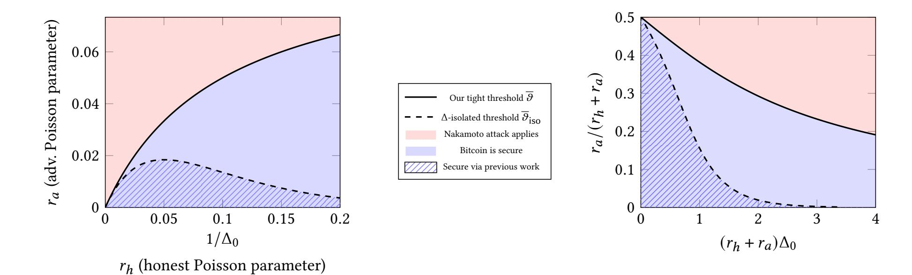
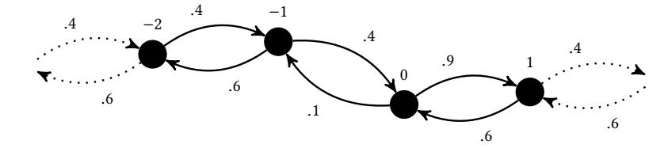

{0}------------------------------------------------

# Tight Consistency Bounds for Bitcoin

Peter Gaži IOHK peter.gazi@iohk.io

Aggelos Kiayias University of Edinburgh IOHK aggelos.kiayias@ed.ac.uk

Alexander Russell University of Conecticut IOHK acr@uconn.edu

November 11, 2020

# ABSTRACT

We establish the optimal security threshold for the Bitcoin protocol in terms of adversarial hashing power, honest hashing power, and network delays. Specifically, we prove that the protocol is secure if

$$r_a < \frac{1}{\Delta_0 + 1/r_h},$$

where ℎ is the expected number of honest proof-of-work successes in unit time, is the expected number of adversarial successes, and no message is delayed by more than Δ0 time units. In this regime, the protocol guarantees consistency and liveness with exponentially decaying failure probabilities. Outside this region, the simple private chain attack prevents consensus.

Our analysis immediately applies to any Nakamoto-style proofof-work protocol; we also present the adaptations needed to apply it in the proof-of-stake setting, establishing a similar threshold there.

# KEYWORDS

Bitcoin, proof of work

# 1 INTRODUCTION

The Bitcoin protocol, proposed in 2008 by Satoshi Nakamoto [\[14\]](#page-18-0), has received abundant attention from both the applied and theoretical communities. The protocol's survival in the permissionless setting—where parties may freely join and depart—and the promise of digital currencies that can thrive in such a hostile environment have led to widespread experimentation and numerous implementation projects. Likewise, the algorithmic core has proven to be a successful framework for designing and analyzing consensus algorithms.

Despite over a decade of study, the fundamental guarantees of the protocol are not well understood. Roughly, the essential ledger properties—consistency and liveness—are determined by three interacting features: the hashing power of the adversary, the hashing power of the honest parties, and networking delays. A long-standing ambition has been to establish the precise relationship between these parameters that guarantees the Bitcoin ledger properties.

We establish this relationship, proving that Bitcoin is secure if

$$r_a < \frac{1}{\Delta_0 + 1/r_h},\tag{1}$$

where is the expected number of adversarial proof-of-work successes in unit time, ℎ is the expected number of honest successes, and no message is delayed by more than Δ0 time units. Here, adversarial and honest proof-of-work successes are modeled as independent Poisson processes, with parameters ℎ and . In this parameter region, consistency accrues exponentially quickly in the sense that blocks appearing at depth in a longest chain can only be later abandoned with probability exp(−Ω()). Liveness obeys similar exponential guarantees. The result is tight: if exceeds the threshold [\(1\)](#page-0-0), the simple private-chain attack prevents consensus. The threshold is indicated by the solid black curves in Figure [1.](#page-2-0)

Our results in more detail. Analytically, we work with the standard discrete approximation to the Poisson distribution to simplify bookkeeping. Specifically, we treat time as divided into small slots of length and let = · denote the probability of an adversarial hashing success in a single slot; ℎ = ·ℎ is likewise defined for the honest parties. This distribution limits to the Poisson distribution as → 0 and a variety of classical results provide explicit upper bounds for the distance between these distributions [\[3\]](#page-17-0). As slot length is considered in the limit to zero, we may safely assume that no more than one success occurs per slot. This is discussed formally in Remark [1](#page-3-0) below.

We reflect network delays with a single parameter Δ = ⌈Δ0/⌉: while any message sent by honest parties will be delivered, the adversary may delay its arrival by up to Δ slots. Delivery takes place "at the beginning" of the slot, which is to say that the minimum value Δ = 1 corresponds to the case where messages transmitted in slot are available for other parties' full consideration in slot + 1. In this discretized setting, we prove that Bitcoin is secure if

$$p_a < \frac{1}{\Delta - 1 + 1/p_h}. (2)$$

As mentioned above, if exceeds the bound there is an attack that prevents any Bitcoin block from settling and succeeds with probability tending to 1. This natural attack—originally described in the Bitcoin whitepaper—calls for the adversary to mine on a private chain with the intention to double spend if the private chain catches up to honestly held chains. The attack naturally generalizes to the setting with delays by calling for maximum possible delay of all honest messages. A notable, and perhaps unexpected, conclusion of our work is that the viability of this straightforward attack precisely captures the security regime of Bitcoin; in particular, when the adversarial hashing power exceeds the optimal security threshold this very attack prevents the protocol from reaching consensus and thus represents the best one can do to subvert consistency.

Finally, we point out that—while we discuss Bitcoin for concreteness—our results are obtained in a model sufficiently general to immediately cover any Nakamoto-style proof-of-work protocol.

{1}------------------------------------------------

Additionally, a straightforward adaptation of our techniques establishes similar results for Nakamoto-style proof-of-stake protocols; see Section 5 for a detailed discussion of this case.

Related work. Analyzing the security of Bitcoin has a long history. The first rigorous results, due to Garay et al. [9], were obtained in the lock-step synchronous model. Pass et al. [15] gave a new treatment that established results in the  $\Delta$ -synchronous model, subsequently adopted by Garay et al. [8]. Kiffer et al. [13] tightened the consistency bound of [15] by associating security with the behavior of a Markov chain. Ren [16] then simplified and condensed these results, adopting the continuous-time Poisson model.

This line of research culminated in identifying the " $\Delta$ -isolated bound," establishing security if

$$p_a < p_h (1 - p_h)^{2\Delta - 1}.$$

As  $\lim_{s\to 0} (1-sr_h)^{2\Delta_0/s-1} = \exp(-2r_h\Delta_0)$ , this corresponds to the Poisson model bound

$$r_a < r_h \exp(-2r_h \Delta_0)$$
.

Roughly, the  $\Delta$ -isolated bound can only leverage an honest hashing success when it is surrounded by a  $\Delta$  time region with no competing honest successes. This  $\Delta$ -isolated bound is compared side-by-side with the optimal bound in Figure 1. It is clear from the left figure that while the slopes of the two bounds (as functions of  $r_h$ ) coincide at zero, the " $\Delta$ -isolation" criterion penalizes larger values of  $r_h$ .

It is most natural to study blockchain algorithms in the regime where  $(r_h + r_a)\Delta_0 \approx 1$ , as this intuitively maximizes block throughput; the graphs of Figure 1 illustrate this region. Bitcoin itself operates in a region where  $(r_h + r_a)\Delta_0$  is significantly less than 1—that is, the roughly 10-minute interblock period targeted by Bitcoin is significantly longer than typical network delays; however, the recent generation of proof-of-work protocols, including Ethereum [2], explicitly optimize throughput by choosing  $r_a + r_h$  approximately equal to  $1/\Delta_0$ .

Finally, independent work of Dembo et al. [6] obtains the same optimal security threshold—for both the proof-of-work and proofof-stake settings—using different techniques. Structurally, their approach belongs to the family of analytic work which relies on identification of explicit "synchronization points" during an execution, analogous to the concepts of strong pivots in [4] and Catalan slots in [11]. Our approach, in contrast, belongs to the family of analytic work which relies on margin, an explicit combinatorial metric determining how the length of the longest chain held by the honest players compares with the lengths of those chains held by adversarial players under optimal (adversarial) play. Margin was originally developed to analyze proof-of-stake systems in [1, 5, 12]; as established in [11], these two approaches can be directly relatedat least in the proof-of-stake setting—which perhaps explains the satisfying conclusion that the optimal security thresholds can be articulated using both of these languages.

A technical survey of the proof. To motivate the optimal threshold itself, consider the baseline blockchain height achieved by the honest parties if the adversary contributes no blocks and subjects every honest message to the maximum delay  $\Delta$ . With honest hashing victories given by a sequence of i.i.d. indicator random variables  $w_1, w_2, \ldots$  corresponding to the time slots, the height  $h_i$  achieved

at slot *i* satisfies

$$h_{i} = \begin{cases} h_{i-\Delta} + 1, & \text{if } w_{i} = 1, \text{ and} \\ h_{i-1}, & \text{if } w_{i} = 0. \end{cases}$$
 (3)

It is an easy exercise to show that the expected value of  $h_n$  is  $n/\alpha + O(1)$  where  $\alpha = (\Delta - 1) + 1/p_h$  (as above,  $p_h$  is the probability of an honest hashing success). It is then clear that if  $p_a$  exceeds  $1/\alpha$ —which is exactly the optimal threshold of (2) above—an adversary can dominate Bitcoin with the private-chain attack: in particular, the adversary may pick any undesirable block in the system, begin building a private chain prior to that block, and eventually overtake the honest chain which grows at a rate of  $1/\alpha$ .

As for demonstrating security below this threshold, we develop a set of new techniques for reasoning about the longest chain rule in the  $\Delta$ -synchronous setting. We begin by borrowing the notion of a "fork," the bookkeeping tool originating in [12] and adapted to  $\Delta$ -delays in [5]; this is a graph-theoretic convention for maintaining the structure of all chains that have been constructed during an execution of a blockchain protocol. With this language for expressing chains we consider the notion of "margin" from [1] (where it was called "relative margin"). In the context of a history of hashing successes—which indicates the prior slots in time during which honest and adversarial hashing victories occurred—the notion of margin provides a precise metric for "how many blocks ahead" of the honest chains an adversarial chain could possibly be. More specifically, margin makes precise the intuition that the analysis of Bitcoin is a contest between the adversary and the honest players to construct the longest chain. (In fact, one has to specify a particular point in time before which the adversary's chain must diverge to make sense of this notion, but we ignore such details in this summary.) Previous work analyzed the behavior of margin in the synchronous setting, first showing that it satisfies a relatively simple recurrence relation, and then analyzing the long term behavior of the process that emerges by applying this to i.i.d. random variables, as above. Existing analyses break down in the  $\Delta$ -synchronous case—to sidestep this difficulty, one can use a pessimistic "Δ-synchronous to synchronous reduction mapping," [5] but this route leads to precisely the  $\Delta$ -isolated bound described above.

Our principal technical contribution is an analysis of margin in the  $\Delta$ -synchronous setting. We mention a few of the technical challenges that arise; the full details are in Section 3. As margin is intended to capture the "current advantage" of the adversary, one would like to show that each adversarial success increases margin by one. Honest successes are more complicated for several reasons. Guided by the discussion of  $h_{\Delta}$  above, one would like to prove that any honest success which gives rise to a height increase according to the rule (3) indeed decreases the margin. Unfortunately, this natural intuition is not uniformly borne out: there are certain circumstances—occurring when the "race is close" and margin is close to zero—where the appearance of an honest victory actually works in the adversary's favor. However, we show that this natural intuition can indeed be established when margin is bounded away from zero. Our results rely on several fork transformations that yield a semi-normal form for forks; among these is a "compression transformation" which guarantees that, among all honest blocks of a particular depth, there is at least one that is "tight" in the sense that it is placed at the minimum depth history would allow. In

{2}------------------------------------------------

Figure 1: (Left) The region of pairs  $(r_a, r_h)$  for which Bitcoin is secure with  $\Delta_0 = 10$ . (Right) Tolerable adversarial proportion of hashing power  $r_a/(r_h+r_a)$  as a function of the message delay  $\Delta_0$  expressed as a multiple of the block-creation rate  $1/(r_h+r_a)$ . In both figures, the optimal threshold established in this paper  $\overline{\vartheta} = 1/(\Delta_0 + 1/r_h)$  is shown in solid black; the region beneath this line—filled in light blue—is the region in which Bitcoin is secure. The best prior bound  $\overline{\vartheta}_{\rm iso} = r_h \exp(-2\Delta_0 r_h)$  is shown in dashed black; its corresponding region of security is shown with blue hatching.

the critical zone around zero, we show looser bounds that rely on  $\Delta$ -isolated successes.

These considerations result in a set of recurrence relations that bound margin; we then analyze the resulting stochastic process obtained by the appropriate i.i.d. distribution of hashing successes in Section 4. This yields a random walk with three regions, which we analyze separately: when margin is bounded away from zero, it is stochastically dominated by a negatively biased random walk; the bias is determined by the gap between  $p_a$  and the optimal threshold. As we will see, this behavior exactly agrees with the intuition above. When in a particular region near zero, it follows a positively biased random walk, but one which descends with constant probability. Fortunately, the critical zone around zero has only constant thickness, so the global random walk still has the desired features: in particular, after k steps the probability it will ever again rise to zero (or any other constant value) is  $\exp(-\Omega(k))$ . This establishes consistency.

*Remarks and future directions.* We work with a very strong adversary, one who is apprised of all future adversarial and honest mining successes and their exact times. It is an interesting fact that the security of the protocol is independent of such adversarial future knowledge. In particular, such an adversary never has to contend with regret for building on the wrong chain. On the other hand, we analyze the "static setting":  $p_a$  and  $p_h$  are constant. It is reasonable to expect that the analysis can be extended to a setting where these are variable (but always satisfy, say  $p_a < (1 - \delta)p_h$ ), but we do not explore these issues. Our results focus on the "cryptographic" setting where mining power is split between honest parties following the protocol and adversarial parties deviating arbitrarily; hence we do not capture rational attacks by honest parties, such as "selfish mining" [7]—of course the effect of such attacks can be reflected in our model if the selfish miners are treated as adversarial. Finally, for rates  $r_a$  and  $r_h$  that satisfy  $r_a < 1/(\Delta_0 + 1/r_h)$ , our analysis establishes consistency and liveness with exponential error bounds;

note that the constants in these error functions depend (necessarily) on the gap between  $r_a$  and  $1/(\Delta_0 + 1/r_h)$ .

Organization of the paper. Section 2 defines the technical tools of our analysis—characteristic strings, forks, and margin—and reduces the original question of Bitcoin consistency to margin. Section 3 then shows how margin can be bounded for a fixed history of mining successes via a recurrence relation. Finally, Section 4 analyzes the random walk that is induced by this recurrence when we move to the stochastic process given by appropriately Poisson-distributed success histories.

### 2 PRELIMINARIES

Throughout the paper,  $\mathbb{N} = \{0, 1, 2, \ldots\}$  denotes the set of natural numbers (including zero). For  $n \in \mathbb{N}$ , [n] denotes the set  $\{1, \ldots, n\}$  (hence  $[0] = \emptyset$ ). For a word  $w = w_1 \ldots w_n \in \Sigma^n$  we denote by  $w_{i:j}$  its subword  $w_i w_{i+1} \ldots w_j$ , and  $\#_a(w)$  denotes the number of occurrences of the symbol  $a \in \Sigma$  in w; similarly  $\#_{a,b}(w) \triangleq \#_a(w) + \#_b(w)$ . We denote by  $\|$  the concatenation of languages.

# 2.1 Our Model and the Bitcoin Protocol

We begin with an informal, abstract description of the Bitcoin protocol that suffices to describe our model. We delay formal definitions of consistency and liveness to later in this section.

The Bitcoin protocol is carried out by a family of parties of two types: *honest* parties follow the letter of law, carrying out the specified protocol, while *adversarial* parties may diverge arbitrarily from the specifications. All parties actively engage in searching for "proofs-of-work" (PoWs), which afford them the right to contribute to the ledger. For the purposes of analysis we treat time as divided into small slots and use a *characteristic string* to indicate whether a proof-of-work was discovered in a particular time slot, and whether the successful party was honest or adversarial. In particular, the characteristic string  $w = w_1 w_2 \ldots \in \{0, h, a\}^*$  associated with an

{3}------------------------------------------------

execution of the protocol is defined so that

$$w_t = \begin{cases} 0 & \text{if no PoW was discovered in slot } t, \\ h & \text{if an honest party discovered a PoW in slot } t, \\ a & \text{if an adversarial party discovered a PoW in slot } t. \end{cases}$$
 (4)

It is occasionally convenient to treat infinite characteristic strings in  $\{0, h, a\}^{\mathbb{N}}$  for which we use the same conventions. We study a probability distribution  $\mathcal{B}(p_a, p_h)$  of characteristic strings that reflects different rates of adversarial and honest success.

**Definition 1.** Let  $p_a, p_h > 0$  satisfy  $p_a + p_h \le 1$ . Let  $\mathcal{B}(p_a, p_h)$  denote the distribution on characteristic strings  $w_1 w_2 \ldots \in \{a, h, 0\}^{\mathbb{N}}$  given by independent selection of each  $w_t$  so that

$$w_t = \begin{cases} \text{a} & \text{with probability } p_a, \\ \text{h} & \text{with probability } p_h, \\ 0 & \text{with probability } 1 - p_a - p_h. \end{cases}$$

**Remark 1** (The discrete approximation to the Poisson process). The most natural mathematical model for the distribution of proofof-work successes is a Poisson process, which reflects both the memoryless aspect of the proof-of-work challenge and the fact that it takes place in (effectively) continuous time. We work in the standard discrete approximation to the Poisson process since it simplifies the accounting in Section 3; however, the proof could as well have been presented in the Poisson setting. To clarify the relationship between these models, consider the Poisson process with parameter  $\lambda$  occurring on  $[0,L) \subset \mathbb{R}$ . Dividing the interval into L/s subintervals of length s, let  $X_t$  be the indicator random variable for the event that at least one success appears in the *t*-th subinterval. Then E  $[X_t] = 1 - \exp(-\lambda s) \approx \lambda s$  and the probability that two Poisson successes appear in any of the subintervals is  $L/s \cdot [1 - \exp(-\lambda s)(1 + \lambda s)] = O(L\lambda^2 s)$  by the union bound, which limits to zero linearly in s. It follows that, except with probability  $O(L\lambda^2 s)$ , the results of the independent random variables  $X_t$  are sufficient to determine the position of every success in [0, L) with accuracy  $\pm s/2$  and to determine their relative order exactly. Selecting a sufficiently small s then suffices to bound the probability of all the events of interest for our analysis. This also explains the assumption that no more than one proof-of-work success can arise in a particular time slot—this does not change the limiting model. A final remark: scaling the discrete  $\Delta$ -synchronous models of Pass et al. [15] and Garay et al. [8]—which do reflect multiple hashing successes—likewise leads to this very same Poisson model (for the same reason). Ren [16] adopts precisely the Poisson model.

The Bitcoin protocol calls for parties to exchange *blockchains*, each of which is an ordered sequence of blocks beginning with a distinguished "genesis block," known to all parties. Each proof-of-work success confers on that party the right to add exactly one block to an existing blockchain. (In fact, the party must identify the previous chain on which she wishes to build ahead of time, but this will not affect our analysis.) Honest parties follow the *longest-chain rule* which dictates that they always choose to add to the longest blockchain they have yet observed and broadcast the result to all other parties. The basic dynamics of the system, with a particular characteristic string *w* and an adversary, can be described as follows.

Let  $C_t$  denote the collection of all blockchains created by time t and let  $H(C_t)$  denote the subset of all chains in  $C_t$  whose last block was created by an honest party. Set  $C_0 = \{G\}$ , where G denotes the unique chain consisting solely of the genesis block. The genesis block is "honest"; thus  $H(C_0) = C_0$ . It is convenient to adopt the convention that  $C_{-t} = H(C_{-t}) = \{G\}$  for any negative integer -t < 0. Then the protocol execution proceeds as follows. For each timestep  $t = 1, \ldots$ :

- If  $w_t = 0$ , define  $C_t = C_{t-1}$  and  $H(C_t) = H(C_{t-1})$ .
- If  $w_t = a$ , the adversary may select a single blockchain C from  $C_{t-1}$  and add a block to create a new chain C'. Then  $C_t = C_{t-1} \cup \{C'\}$  and  $H(C_t) = H(C_{t-1})$ .
- If  $w_t = h$ , the adversary may select any collection of chains  $\mathcal{V}$  for which  $H(C_{t-\Delta}) \subseteq \mathcal{V} \subseteq C_{t-1}$ . This is the "view" of the honest player, who applies the longest chain rule to  $\mathcal{V}$ , selects the longest chain  $L \in \mathcal{V}$  where ties are broken by the adversary, and adds a new block to create a new chain L'. Then  $C_t = C_{t-1} \cup \{L'\}$  and  $H(C_t) = H(C_{t-1}) \cup \{L'\}$ .

In each time step t we also maintain the set of  $\Delta$ -dominant chains  $\mathcal{D}_t \subseteq C_t$ , determined entirely by  $C_t$  and  $H(C_{t-\Delta})$ : namely,  $\mathcal{D}_t$  is the set of all chains in  $C_t$  that are at least as long as the longest chain in  $H(C_{t-\Delta})$ . The intuition behind the definition of  $\Delta$ -dominant chains is that, in a time slot t, it is in principle possible for the adversary to manipulate an honest party into adopting any  $\Delta$ -dominant chain, as the adversary is only obligated to deliver those chains in  $H(C_{t-\Delta})$  and the chains in  $\mathcal{D}_t$  are at least as long as those in  $H(C_{t-\Delta})$ .

This description implicitly places several constraints on the adversary; most notably, the only means of producing new chains is to append a block (associated with a proof-of-work success) to an existing chain. In practice, these constraints are guaranteed with cryptographic hash functions. Note that the  $\Delta$ -synchrony assumption is reflected in the rule for the case  $w_t = h$ : the adversary is obligated to deliver all chains produced by honest players that are  $\Delta$  slots old. Finally, we permit the adversary to have full view of the characteristic string during this process. Of course, in practice a Bitcoin adversary must make decisions "on line." As mentioned above, our proof shows that this extra power does not change the security threshold of Bitcoin.

While expressed as a game between the adversary and the honest players, considering that the adversary selects both the view  $\mathcal{V}$  of each honest player and is empowered to break ties, the structure of the resulting sequence of chains (that is, the directed acyclic graph naturally formed by the blocks) is determined entirely by the adversary and the characteristic string.

In this context, we are interested in preserving two properties, consistency and liveness, originally formulated in [9]. To formulate the properties we set down two definitions related to chain prefixes: For a chain  $C \in C_t$  and a natural number k, we define  $C|_k \in C_{t-k}$  to be the chain obtained by removing from C all blocks originating from slots  $\{t-k+1,\ldots,t\}$ . When  $k \geq t$ , we define  $C|_k = G$ . We then define  $C' \leq C$  iff  $C' = C|_k$  for some  $k \geq 0$ ; in this case we say that C' is a *prefix* of C.

• Consistency; with parameter k. For any slots  $t_1 \leq t_2$ , any chains  $C^1 \in \mathcal{D}_{t_1}$  and  $C^2 \in \mathcal{D}_{t_2}$  satisfy  $C^1|_k \leq C^2$ .

{4}------------------------------------------------

• Liveness; with parameter u. For any two slots  $t_1, t_2 > 0$  with  $t_1+u \le t_2$ , and any chain  $C \in \mathcal{D}_{t_2}$ , there is a time  $t' \in \{t_1, \ldots, t_1+u\}$  and a chain  $C' \in H(C_{t'}) \setminus H(C_{t'-1})$  such that  $C' \le C$ .

Intuitively, consistency mandates that any blockchain possibly held by an honest party at time  $t_2$  extends a blockchain that was held by an honest party at any previous time  $t_1$ , except perhaps for a k-slot suffix which could have been abandoned. Liveness, on the other hand, mandates that the blockchain held by an honest party incorporates at least one fresh honest block over any period of u slots.

Note that the above definitions are tailored for the discrete setting, they can be trivially translated to the Poisson setting by considering continuous time in place of slots.

# 2.2 Characteristic Strings and Forks

We let  $\Sigma = \{0, h, a\}$  and consider characteristic strings  $w = w_1 \dots w_L$  drawn from the set  $\Sigma^L$ . Recall that the *i*-th symbol  $w_i$  of w intuitively indicates if a proof-of-work success occurred in the *i*-th slot of an L-slot execution of the Bitcoin protocol as described in (4).

The following notion of a *fork* will be our core analytical tool for reasoning about the security properties of the protocol.

**Definition 2** (PoW  $\Delta$ -fork). Let  $\Delta$  be a positive integer and  $L \in \mathbb{N}$ . A *PoW*  $\Delta$ -fork for the string  $w = w_1 \dots w_L \in \Sigma^L$  is a directed, rooted tree F = (V, E) with a labeling function

$$lb: V \to \{0\} \cup \{i \in [L] : w_i \neq 0\}$$

satisfying the axioms (A1)–(A4) below. Edges are directed "away from" the root so that there is a unique directed path from the root to any vertex. The value lb(v) is referred to as the *label* of v. A non-root vertex v is called *honest* when  $w_{lb(v)} = h$ ; otherwise it is *adversarial*.

- (A1) The root  $r \in V$  has label lb(r) = 0 and is considered honest.
- (A2) The sequence of labels  $lb(\cdot)$  along any directed path is increasing.
- (A3) If  $w_i = h$  then there is exactly one vertex with the label i, if  $w_i = a$  then there is at most one vertex with the label i.
- (A4) For any pair of honest vertices v, w for which  $\mathsf{lb}(v) + \Delta \le \mathsf{lb}(w)$  we have  $\mathsf{len}(v) < \mathsf{len}(w)$ , where  $\mathsf{len}(\cdot)$  denotes the depth of the vertex.

A  $\Delta$ -fork abstracts a protocol execution with a simple but sufficiently descriptive discrete structure. Its vertices and edges stand for blocks and their connecting hash links (in reverse direction), respectively. The root represents the genesis block, and for each vertex v, lb(v) and len(v) denote the slot in which the corresponding block was created and the block's depth, respectively.

It is easy to see the correspondence between the above axioms and the constraints imposed in the protocol execution. In particular, (A1) corresponds to the trusted nature of the genesis block; (A2) reflects that the blocks' ordering in a chain must be consistent with slot order; (A3) reflects that honest players produce exactly one block per PoW success, while the adversary might forgo a block-creation opportunity; finally (A4) reflects the fact that given sufficient time, as needed for block propagation in the network, an honest party will take into account the blocks produced by previous honest parties.

**Definition 3** (Fork notation). We write  $F \vdash_{\Delta} w$  to indicate that F is a  $\Delta$ -fork for the string w. If  $F' \vdash_{\Delta} w'$  for a prefix w' of w, we say that F' is a *subfork* of F if F contains F' as a consistently-labeled subgraph. A fork  $F \vdash_{\Delta} w$  is *closed* if all its leaves are honest. By convention, the trivial fork, consisting solely of a root vertex, is closed. The *closure* of a fork F, denoted  $\overline{F} \vdash_{\Delta} w$ , is the maximal closed subfork of F.

An individual blockchain constructed during the protocol execution is represented by the notion of a *tine*, defined next. Consequently, in later informal discussions we often identify a blockchain with its respective tine if no confusion can arise.

**Definition 4** (Tines). A path in a fork *F* originating at the root is called a *tine* (note that tines do not necessarily terminate at a leaf). As there is a one-to-one correspondence between directed paths from the root and vertices of a fork, we routinely overload notation so that it applies to both tines and vertices.

Specifically, we let len(T) denote the length of the tine T, equal to the number of edges on the path (see axiom (A4)). In the unusual cases where we wish to emphasize the fork from which v is drawn, we write  $len_F(v)$ . We further overload this notation by letting len(F) denote the length of the longest tine in a fork F. Likewise, we let  $lb(\cdot)$  apply to tines by defining  $lb(T) \triangleq lb(v)$ , where v is the terminal vertex on the tine T. For a vertex v in a fork F, we denote by F(v) the tine in F terminating in v. We say that a tine is longest if the last vertex of the tine is honest; otherwise it is longest adversarial.

**Definition 5** (Branches). For an integer  $\ell \geq 1$  and for two times T, T' of a fork F, we write  $T \sim_{\ell} T'$  if the two times share a vertex with a label greater or equal to  $\ell$ . The set of all times  $T' \in F$  such that  $T \sim_{\ell} T'$  is called the *branch* of T in F and denoted  $B_F(T; \ell)$ ; when  $\ell$  can be inferred from context, we write  $B_F(T)$ .

Intuitively,  $T \sim_{\ell} T'$  guarantees that the respective blockchains agree on the state of the ledger up to time  $\ell$ . Looking ahead, the adversary can only make two honest parties disagree on the state of the ledger up to time  $\ell$  if she makes them hold two chains corresponding to tines for which  $T \nsim_{\ell} T'$ .

**Definition 6** (Fork trimming; dominance). Given a string  $w = w_1 \dots w_n$  and a positive integer k, we let  $w_{\lceil k} = w_1 \dots w_{n-k+1}$  denote the string obtained by removing the last k-1 symbols. For a fork  $F \vdash_{\Delta} w_1 \dots w_n$  we let  $F_{\lceil k} \vdash_{\Delta} w_{\lceil k}$  denote the fork obtained by retaining only those vertices labeled from the set  $\{0, \dots, n-k+1\}$ . In the degenerate case k > n we define  $w_{\lceil k}$  to be the empty string and  $F_{\lceil k}$  to be the trivial fork containing only the root. For convenience, we sometimes prefer to emphasize the *remaining* length of the string (resp. fork), and denote by  $w_{m\rceil}$  and  $F_{m\rceil}$  the m-symbol prefix of w and the corresponding fork, formally  $w_{m\rceil} \triangleq w_{\lceil n-m+1}$  and  $F_{m\rceil} \triangleq F_{\lceil n-m+1}$ .

For an integer  $\delta > 0$ , a tine T in F is called  $\delta$ -dominant if

$$\operatorname{len}(T) \ge \operatorname{len}(\overline{F_{\lceil \delta}})$$

and simply call it *dominant* in the case  $\delta = 1$  (i.e., when len(T)  $\geq$  len( $\overline{F}$ )).

Observe that honest tines appearing in  $F_{\lceil \Delta}$  are those that are necessarily visible to honest players at a timeslot just beyond the

{5}------------------------------------------------

last one described by the characteristic string. Correspondingly, in the special case  $\delta = \Delta$ , the notion of a  $\Delta$ -dominant tine corresponds to  $\Delta$ -dominant chains as defined in the experiment described in Section 2.1. More broadly, here and below we will always only be interested in two possible values of the parameter  $\delta$ : either  $\delta = \Delta$  or  $\delta = 1$ ; and whenever we suppress  $\delta$  in the notation, it indicates the case  $\delta = 1$ .

# 2.3 Advantage and Margin

Now we define our central quantity of interest called *margin*.

**Definition 7** (Advantage, margin). For a  $\Delta$ -fork  $F \vdash_{\Delta} w$  and  $\delta > 0$ , we define the  $\delta$ -advantage of a tine  $T \in F$  as

$$\alpha^{\delta}(T) = \operatorname{len}(T) - \operatorname{len}(\overline{F_{\lceil \delta}})$$
.

In cases where we wish to explicitly identify the fork F in the notation, we write  $\alpha_F^{\delta}(\cdot)$ . Observe that  $\alpha_F^{\delta}(T) \geq 0$  if and only if T is  $\delta$ -dominant in F. For  $\ell \geq 1$ , we define the  $\delta$ -margin of a fork F as

$$\beta_{\ell}^{\delta}(F) = \max_{\substack{T_h \not\sim_{\ell} T_a \\ T_h \text{ is } \delta\text{-dominant}}} \alpha_F^{\delta}(T_a),$$

this maximum extended over all pairs of tines  $(T_h, T_a)$  where  $T_h$  is  $\delta$ -dominant and  $T_h \not\sim_\ell T_a$ . We call the pair  $(T_h, T_a)$  the  $\delta$ -witness tines for F if the above conditions are satisfied; i.e.,  $T_h$  is  $\delta$ -dominant,  $T_h \not\sim_\ell T_a$ , and  $\beta_\ell^\delta(F) = \alpha_F^\delta(T_a)$ . Note that there might exist multiple such pairs in F, but under the condition  $\ell \geq 1$  there will always exist at least one such pair, as the trivial tine  $T_0$  containing only the root vertex satisfies  $T_0 \not\sim_\ell T$  for any T and  $\ell \geq 1$ . For this reason, we will always consider  $\beta_\ell^\delta$  only for  $\ell \geq 1$ .

We overload the notation and define the  $\delta$ -margin of a characteristic string w as

$$\beta_{\ell}^{\delta}(w) = \max_{F \vdash_{\Lambda} w} \beta_{\ell}^{\delta}(F) .$$

We call a fork  $F \vdash_{\Delta} w$  a  $\delta$ -witness fork for w if  $\beta_{\ell}^{\delta}(w) = \beta_{\ell}^{\delta}(F)$ ; again multiple  $\delta$ -witness forks may exist for a string w.

We often write  $\alpha_F$  and  $\beta_\ell$  as shorthands for  $\alpha_F^1$  and  $\beta_\ell^1$ , respectively; for brevity we also refer to 1-witness tines and 1-witness forks as witness tines and witness forks, respectively.

**Remark 2.** Intuitively,  $\alpha_F^{\Delta}(T)$  captures the length advantage (or deficit) of the tine T against the longest honest tine created at least  $\Delta$  slots before the upcoming slot, and hence now known to all honest parties. Consequently,  $\beta_{\ell}^{\Delta}(F)$  records the maximal advantage of any tine  $T_a$  in F that potentially disagrees with some  $\Delta$ -dominant tine  $T_h$  about the chain state up to slot  $\ell$ . A negative  $\beta_{\ell}^{\Delta}(F)$  hence indicates that the adversary cannot make an honest party holding  $T_h$  switch to any  $T_a$  that would potentially cause a revision of its ledger state up to slot  $\ell$ ; this connection between margin and consistency is made formal in Section 2.4.

**Remark 3.** The bulk of our analysis focuses on the quantity  $\beta_{\ell}(w)$ . This quantity, without the special considerations on tine dominance, appears to be somewhat more tractable than  $\beta_{\ell}^{\Delta}(w)$ . However, the direct relationship between settlement failures and margin sketched above is most easily expressed using  $\beta_{\ell}^{\Delta}(w)$ . The two notions have a simple relationship which justifies the choice to study  $\beta_{\ell}(w)$ : if  $w, x \in \Sigma^*$  and  $|x| \geq \Delta$ , then  $\beta_{\ell}^{\Delta}(wx) \leq \beta_{\ell}(wy)$ , where  $y \in \Sigma^*$  is the

string obtained by replacing every h in x with the symbol a. (See Lemma 18.)

**Remark 4.** In the special case  $|w| < \ell$ , we can observe that any fork  $F \vdash_{\Delta} w$  and any times  $T, T' \in F$  satisfy  $T \not\sim_{\ell} T'$  (in particular,  $T \not\sim_{\ell} T$ ). Hence, in this case the quantity  $\beta_{\ell}^{\delta}(w)$  simplifies to

$$\beta_{\ell}^{\delta}(w) = \max_{F \vdash_{\Delta} w} \beta_{\ell}^{\delta}(F) = \max_{\substack{F \vdash_{\Delta} w \\ T \in F}} \alpha_{F}^{\delta}(T) = \max_{\substack{F \vdash_{\Delta} w \\ T \in F}} \mathsf{len}_{F}(T) - \mathsf{len}(\overline{F_{\lceil \delta}})$$

and so in this case we always have  $\beta_{\ell}^{\delta}(w) \geq 0$ .

It is easy to see that if a fork  $F \vdash_{\Delta} w$  has  $\beta_{\ell}^{\delta}(F) < 0$  then all tines of length at least len $(\overline{F_{\lceil \delta}})$  belong to the same branch. This justifies the following definition.

**Definition 8** (Main branch). Let  $w \in \Sigma^n$ ,  $\ell \geq 1$ , and  $F \vdash_{\Delta} w$  such that  $\beta_{\ell}^{\delta}(F) < 0$ . The unique branch of F that contains all times of length at least len $(\overline{F_{\lceil \delta}})$  (and possibly other times) is called the  $\delta$ -main branch of F and denoted  $M_{\delta}(F)$ ; we again omit  $\delta$  in the notation to indicate that  $\delta = 1$ .

# 2.4 Margin and Consistency

We now formalize the intuitive connection between margin and consistency outlined in Remark 2.

Consider an execution of the Bitcoin protocol over a lifetime of L slots, let  $w = w_1 \dots w_L$  be the corresponding characteristic string. Let  $F \vdash_{\Delta} w$  be the fork consisting of vertices corresponding to all blocks created during the execution, connected via the natural "child-block" relation and labeled by their creation slot. For brevity, for each  $t \in [L]$  let  $F_t$ ,  $w_t$  be the shorthands for  $F_{t\uparrow}$ ,  $w_{t\uparrow}$ , respectively.

Lemma 1. Consider the Bitcoin execution described above. If for every  $\ell \in [L-k]$  and every  $t \in \{\ell + k, ..., L\}$  we have  $\beta_{\ell}^{\Delta}(w_t) < 0$  then k-consistency was maintained during that execution.

PROOF. Let  $1 \le t_1 \le t_2 \le L$  be slots and let  $C_i \in \mathcal{D}_{t_i}$  be the  $\Delta$ -dominant chains from the definition of the consistency property. If  $t_1 \le k$  then there is nothing to prove, hence assume  $t_1 > k$  and consider  $\ell := t_1 - k$ .

Fix any  $t \in \{t_1, \ldots, L\}$ . Since  $\beta_\ell^\Delta(F_t) \leq \beta_\ell^\Delta(w_t)$  is negative by assumption, there is a  $\Delta$ -main branch  $\mathsf{M}_\Delta(F_t)$  in  $F_t$ , and tines in this branch share a vertex in or after slot  $\ell$ , hence the corresponding blockchains "agree" on their view of the content of the blockchain up to slot  $\ell$ . Moreover, any  $T \notin \mathsf{M}_\Delta(F_t)$  has  $\alpha_{F_t}^\Delta(T) < 0$  and therefore  $\mathsf{len}(T) < \mathsf{len}(\overline{(F_t)_{\lceil \Delta}})$ , hence T is not  $\Delta$ -dominant in  $F_t$ . Therefore, for each fixed  $t \in \{t_1, \ldots, L\}$ , all  $\Delta$ -dominant blockchains  $\mathcal{D}_t$  in slot t agree up to slot  $\ell$ .

It remains to show that for  $t \in \{t_1, \ldots, L-1\}$ , tines in  $M_{\Delta}(F_t)$  share their prefix up to slot  $\ell$  with tines in  $M_{\Delta}(F_{t+1})$ . If  $\operatorname{len}(\overline{(F_t)_{\lceil \Delta}}) = \operatorname{len}(\overline{(F_{t+1})_{\lceil \Delta}})$  then this is clear as  $M_{\Delta}(F_t) \subseteq M_{\Delta}(F_{t+1})$  and as argued above, all tines in  $M_{\Delta}(F_{t+1})$  agree up to  $\ell$ . On the other hand, if  $\operatorname{len}(\overline{(F_t)_{\lceil \Delta}}) < \operatorname{len}(\overline{(F_{t+1})_{\lceil \Delta}})$  then no extension of a tine  $T \in F_t, T \notin M_{\Delta}(F_t)$  can belong to  $M_{\Delta}(F_{t+1})$ , as we had  $\operatorname{len}(T) < \operatorname{len}(\overline{(F_t)_{\lceil \Delta}})$ , and T could be extended by at most one vertex in  $F_{t+1}$ , hence the extended tine is still shorter than  $\operatorname{len}(\overline{(F_{t+1})_{\lceil \Delta}})$ . Therefore, by an induction argument, all chains in  $\mathcal{D}_{t_1} \cup \mathcal{D}_{t_2}$  agree on their prefix up to  $\ell$  and so this is also true for  $C_1$  and  $C_2$ , establishing consistency.  $\square$ 

{6}------------------------------------------------

### 3 THE MARGIN RECURRENCE

Recall the meaning of the margin quantity  $\beta_{\ell}$  as discussed in Section 1 and formalized in Section 2.3: Given some history of mining successes captured as a characteristic string  $w \in \Sigma^*$ ,  $\beta_{\ell}(w)$  determines the potential length advantage (or deficit) of the best tine an adversary could potentially use to make an honest party revise its view of the history up to slot  $\ell$ .

Given Lemma 1, our goal in this section is to establish upper bounds on  $\beta_{\ell}(w)$  for characteristic strings  $w \in \Sigma^*$ . Our bounds are expressed inductively, having the form  $\beta_{\ell}(wx) \leq \beta_{\ell}(w) + f(x)$  where  $w, x \in \Sigma^*$ , for some appropriate function f of the suffix x. Intuitively, we would like  $\beta_{\ell}(w)$  to satisfy the *ideal recurrence*: for  $w, x \in \Sigma^*$  and  $|x| \geq \Delta - 1$ ,

$$\beta_{\ell}(wxh) \le \beta_{\ell}(w) + \#_{\mathbf{a}}(x) - 1. \tag{5}$$

Here  $\beta_{\ell}(\cdot)$  increases by 1 for each 'a'-symbol and decreases with certainty by 1—intuitively this accounts for the last 'h'-symbol which is at least  $\Delta$  slots ahead of any of the slots associated with w.

Roughly, we show that when  $\beta_{\ell}(w)$  is "suitably large" or "suitably small," this ideal recurrence holds. The region around zero is more problematic; in this case we only show that  $\beta_{\ell}$  cannot move too quickly, and that there are certain suffixes (like  $0^{\Delta-1}$ h) which indeed force  $\beta_{\ell}(\cdot)$  to decrease. Because this difficult region will have only constant width, we will see that it does not adversely affect the final probabilistic results.

The step decomposition. The decomposition of w appearing in the ideal recurrence (5) above plays a special role in the analysis. We lay down some notation to reflect this.

**Definition 9** (The step decomposition). Let  $w = w_1 w_2 ... \in \{a, h, 0\}^{\mathbb{N}}$ . For such a string, we consider the decomposition  $w = \sigma_1 \sigma_2 ...$  where each

$$\sigma_i \in \Sigma_{\mathcal{S}} \triangleq \{a, h, 0\}^{\Delta - 1} \| \{a, 0\}^* \| \{h\}.$$

We reserve the word *symbol* to refer to elements of  $\Sigma$ , and the word *step* to refer to elements of  $\Sigma_{\mathcal{S}}$ . We write  $\mathcal{S}(w) \triangleq \sigma_1 \sigma_2 \dots$  to indicate the resulting sequence of elements of  $\Sigma_{\mathcal{S}}$ . Throughout, we let  $|\gamma|$  denote the number of symbols in the step  $\gamma \in \Sigma_{\mathcal{S}}$ .

We remark that this decomposition is unique and has the following direct interpretation: (1) write w = xhw' where x is the shortest prefix of length at least  $\Delta - 1$  that is followed by the symbol h. (2) emit the symbol  $\sigma = xh$ ; (3) repeat the process on w'. The sequence of symbols produced by this process corresponds to the  $\sigma_i$  above.

**Organization.** We start by introducing some key technical tools below in Section 3.1. As a warm-up, in Section 3.2 we establish a variant of the ideal recurrence (5) in the considerably simpler setting "before the slot  $\ell$ ," i.e., for w such that  $|w| < \ell$ . Then we turn to the more interesting case of general |w|, considering three separate regions: the "critical" region where  $\beta_{\ell}(w)$  is close to zero (Section 3.3); the "cold" region where it is sufficiently below zero (Sections 3.4); and the "hot" region where it is sufficiently above zero (Section 3.5). As mentioned above, we show that the ideal recurrence (5) holds in the hot and cold regions.

# 3.1 Compressed Forks and the Restructuring Lemma

In our arguments we make use of special honest vertices called *tight* that are, informally speaking, at the minimal depth that the preceding part of the fork allows without violating the axiom (A4). Here we define these vertices formally and summarize several useful properties they have: in particular, in Lemma 4 we show how a fork that has a tight vertex at each possible depth (we call such forks *compressed*) allows for a complex restructuring operation that leads to a lower-bound on the margin of the underlying characteristic string.

**Definition 10.** Let  $F \vdash_{\Delta} w \in \Sigma^n$ . An honest vertex v of F is called *tight* if  $len(v) = len(\overline{F_{lb}(v) - \Delta \rceil}) + 1$ . The fork F is said to be *compressed* if, for every depth  $0 \le d \le len(\overline{F})$ , there is a tight honest vertex v of depth d.

LEMMA 2. Let  $F \vdash_{\Delta} w \in \Sigma^n$ . Let v be a tight vertex and let v' be an honest vertex with  $\mathsf{lb}(v) \leq \mathsf{lb}(v')$ ; then  $\mathsf{len}(v) \leq \mathsf{len}(v')$ .

PROOF OF LEMMA 2. As  $lb(v) \leq lb(v')$  and v is tight,

$$\operatorname{len}(v) = \operatorname{len}(\overline{F_{\operatorname{lb}(v) - \Delta \rceil}}) + 1 \le \operatorname{len}(\overline{F_{\operatorname{lb}(v') - \Delta \rceil}}) + 1 \le \operatorname{len}(v')$$
.  $\square$ 

Note the contrapositive of Lemma 2: if len(v') < len(v) then lb(v') < lb(v).

Lemma 3. Let  $w \in \Sigma^*$ , there exists a compressed witness fork  $F \vdash_{\Lambda} w$  for w.

PROOF. Let  $F \vdash_{\Delta} w$  be a witness fork for w. We describe a transformation, which we naturally call "compression," that converts F into a compressed fork  $F^c \vdash_{\Delta} w$  for which  $\beta_{\ell}(F^c) = \beta_{\ell}(F)$ . If F is compressed, the transformation makes no change. Otherwise, the transformation is given as a sequence of "compression steps," each of which reduces the total depth of the fork and locally improves tightness violations.

In particular, if F is not compressed, there is a smallest depth  $d \leq \text{len}(\overline{F})$  for which there is no tight honest vertex of depth d. Let F' denote the labeled rooted tree obtained from F by carrying out the following alterations:

- If d = 1, for every vertex v of depth d = 1, replace any edge (v, u) by an edge (r, u) where r is the root.
- If d > 1, raise every vertex v of depth d one level in the tree by replacing the unique edge of the form (u, v) with the edge (p, v), where p is the parent of u.

The labels of all vertices in F' remain the same as those of the corresponding vertices in F. As indicated above, we refer to the procedure carrying  $F \mapsto F'$  as a compression step.

We verify that  $F' \vdash_{\Delta} w$ : Axiom (A1) is trivially satisfied. Axiom (A2) holds for F' as all directed edges added to F' respect the label ordering. Axiom (A3) holds as all labels are preserved. Finally, we consider axiom (A4). Note the effect that the process has on the depth of honest vertices in the general case d > 1: The depths of all honest vertices with (initial) depth less than d are preserved, while the depths of all honest vertices with depths at least d are decreased by exactly one. Thus the only possible violations of axiom (A4) could occur among those honest vertices at depth exactly d; however, as all such vertices are non-tight by assumption, reducing

{7}------------------------------------------------

their depth by one guarantees axiom (A4). Finally, observe that if d = 1, all vertices of depth d are adversarial, as any honest vertex of depth 1 is tight by definition, hence the above reasoning applies as well despite a different alteration rule.

In light of the comments above, we note that len(F') = len(F) - 1 and  $len(\overline{F'}) = len(\overline{F}) - 1$ . It follows that a finite number of compression steps results in a compressed fork,  $F^c$ , as desired.

In general, we show below that  $\beta_{\ell}(F') \geq \beta_{\ell}(F)$ ; thus, if  $\beta_{\ell}(F) = \beta_{\ell}(w)$  then  $\beta_{\ell}(F') = \beta_{\ell}(w)$  and F' is likewise an optimal fork. Consider a tine T of F; we may naturally associate this with the tine T' of F' that terminates with the same vertex. If  $\alpha_F(T) \geq 0$  it follows from the discussion above that  $\alpha_{F'}(T') = \alpha_F(T)$ , as len(T') = len(T) - 1 and  $\text{len}(\overline{F}') = \text{len}(\overline{F}) - 1$ . If  $\alpha_F(T) < 0$  it follows that  $\alpha_F(T) \leq \alpha_{F'}(T') \leq \alpha_F(T) + 1$ , depending on whether the alterations involve any vertices of the T. It follows immediately that  $\beta_{\ell}(F') \geq \beta_{\ell}(F)$ . Specifically, let  $(T_h, T_a)$  be two witness tines for F so that  $\alpha_F(T_h) \geq 0$ ,  $\alpha_F(T_a) = \beta_{\ell}(F)$ , and  $T_h \not\sim_{\ell} T_a$ . Let  $T_a'$  and  $T_h'$  be the two tines corresponding to  $T_a$  and  $T_h$  in T', respectively; clearly  $T_h' \not\sim_{\ell} T_a'$  and note that this does not depend on  $\ell$ . Then  $\alpha_{F'}(T_h') = \alpha_F(T_h)$  and  $\alpha_{F'}(T_a') \geq \alpha_F(T_a)$ ; therefore  $T_h'$  is dominant in T' and we have  $\beta_{\ell}(F') \geq \beta_{\ell}(F)$ , as desired.

LEMMA 4 (RESTRUCTURING LEMMA). Let  $w \in \Sigma^*$  be a characteristic string and  $F \vdash_{\Delta} w$  be a compressed fork for w, let  $T_1 \not\sim_{\ell} T_2$  be arbitrary tines in F. For  $i \in \{1, 2\}$ , let  $v_i$  be an honest vertex on  $T_i$  and let  $A_i$  denote the set of all adversarial vertices on  $T_i$  deeper than  $v_i$ . If  $\mathsf{lb}(v_1) \leq \mathsf{lb}(v_2)$  then

$$\beta_{\ell}(w) \geq \alpha_F(v_1) + |A_1 \cup A_2|.$$

PROOF. On a high level, we restructure the fork F to obtain a valid fork  $\widetilde{F} \vdash_{\Delta} w$  that satisfies  $\beta_{\ell}(\widetilde{F}) \geq \alpha_F(v_1) + |A_1 \cup A_2|$ , establishing the claim. This restructuring consists of two main modifications: (i) use (at least) all adversarial vertices in  $A_1 \cup A_2$  to build a tine  $\widetilde{T}_a$  on top of  $v_1$  with len $(\widetilde{T}_a)$  at least len $(v_1) + |A_1 \cup A_2|$ ; and (ii) use tight vertices of depths len $(v_2) + 1$ , len $(v_2) + 2, \ldots$ , len $(\overline{F})$  to build an honest tine  $\widetilde{T}_h$  on top of  $v_2$  that achieves len $(\widetilde{T}_h) = \text{len}(\overline{F})$ . A simple additional modification is needed to ensure that the honest descendants of  $v_1$  and  $v_2$  do not violate the validity of the resulting fork  $\widetilde{F}$ . The heart of the argument is then to verify that  $\widetilde{F}$  is indeed a valid fork for w.

Towards a formal description of the restructuring operation, we identify sets of vertices in F that will be modified in the same way. Let g denote the last common vertex of G and G and let G denote the deeper one of the vertices G and G is G and refer to the individual vertices in G as G is compressed, it contains a tight honest vertex for each depth in G in G in G in G is compressed, it contains a tight honest vertices G in G in G in G in G in G in G in G in G in G in G in G in G in G in G in G in G in G in G in G in G in G in G in G in G in G in G in G in G in G in G in G in G in G in G in G in G in G in G in G in G in G in G in G in G in G in G in G in G in G in G in G in G in G in G in G in G in G in G in G in G in G in G in G in G in G in G in G in G in G in G in G in G in G in G in G in G in G in G in G in G in G in G in G in G in G in G in G in G in G in G in G in G in G in G in G in G in G in G in G in G in G in G in G in G in G in G in G in G in G in G in G in G in G in G in G in G in G in G in G in G in G in G in G in G in G in G in G in G in G in G in G in G in G in G in G in G in G in G in G in G in G in G in G in G in G in G in G in G in G in G in G in G in G in G in G in G in G in G in G in G in G in G in G in G in G in G in G in G in G in G in G in G in G in G in G in G in G in G in G in G in G in G in G in G in G in G in G in G in G in G in G in G in G in G in G in G in G in G in G in G in G in G in G in G in G in G in G in G in G in G in G in G in G in G in G in G in G in G in G in G in G in G in G in G in G in G in G

(possibly indirect) descendants of either  $v_1$  or  $v_2$ , (c) are not (possible indirect) predecessors of either z or  $v_2$ , and (d) are not in H. We again index the vertices in D in an increasing order of labels.

We first modify *F* as follows:

**Set** *A*: The unique edge of the form  $(u, a_1)$  is replaced with the edge  $(z, a_1)$  and for each  $i \in \{2, ..., |A|\}$ , the unique edge of the form  $(u, a_i)$  is replaced with the edge  $(a_{i-1}, a_i)$ .

**Set** H: The unique edge of the form  $(u, h_1)$  is replaced with the edge  $(v_2, h_1)$  and for each  $i \in \{2, ..., g\}$ , the unique edge of the form  $(u, h_i)$  is replaced with the edge  $(h_{i-1}, h_i)$ .

We denote the resulting labeled tree  $F_0$ , note that  $F_0$  is not necessarily a valid fork. To reestablish validity, we proceed with the following sequence of modifications:

**Set** D: For each  $i \in \{1, ..., |D|\}$  the unique edge of the form  $(u, d_i)$  in  $F_{i-1}$  is replaced by  $(\widetilde{u}_i, d_i)$ , where  $\widetilde{u}_i$  is the vertex in  $F_{i-1}$  with maximum depth out of all honest vertices with label at most  $\mathsf{lb}(d_i) - \Delta$ ; note that this in particular excludes  $d_j$  for j > i. Formally,

$$\widetilde{u}_{i} \triangleq \underset{u \in F_{i-1}; \ w_{|b(u)} = h}{\operatorname{arg max}} \operatorname{len}_{F_{i-1}}(u) , \qquad (6)$$

$$\underset{|b(u) \leq |b(d_{i}) - \Delta}{\operatorname{len}_{F_{i-1}}(u)} ,$$

where ties in max can be broken arbitrarily. The labeled tree resulting from the i-th iteration is called  $F_i$ .

Finally, we let  $\widetilde{F} \triangleq F_{|D|}$ .

We now show that  $\widetilde{F}$  is a valid fork for w. The axioms (A1) and (A3) are clearly maintained by the above modifications and hence inherited from F. Axiom (A2) is satisfied in  $\widetilde{F}$  as each newly added edge (u,v) has  $\mathsf{lb}(u) < \mathsf{lb}(v)$ . For new edges  $\{(\cdot,d_i): d_i \in D\}$  this directly follows from (6), for new edges  $\{(\cdot,a_i): a_i \in A\}$  this is a consequence of the definition of  $A'_i$  and the ordering within A. Finally, in H we have by construction

$$\operatorname{len}(v_2) < \operatorname{len}(h_1) < \cdots < \operatorname{len}(h_q) = \operatorname{len}(\overline{F}),$$

 $v_2$  is honest, and each  $h_i$  is tight (and hence honest). Applying Lemma 2 to each  $h_i$  implies that

$$\mathsf{lb}(v_2) < \mathsf{lb}(h_1) < \cdots < \mathsf{lb}(h_q)$$

as required.

To verify axiom (A4), note that when moving from F to  $\widetilde{F}$ , the depths of all honest vertices outside of D remained unchanged. The depth of a vertex  $d_i \in D$  might have changed, but it has not increased; this can be shown by simple induction on i: by induction hypothesis, also the depths of all honest vertices with labels up to  $\mathsf{Ib}(d_i) - \Delta$  have not increased from F to  $\widetilde{F}$ , and hence

$$\begin{split} \operatorname{len}_F(d_i) & \geq \max_{\substack{u \in F, \ \mathsf{W}_{\mathsf{lb}(u)} = \mathsf{h} \\ | \mathsf{lb}(u) \leq \mathsf{lb}(d_i) - \Delta}} \operatorname{len}_F(u) + 1 \\ & \geq \max_{\substack{u \in \widetilde{F}, \ \mathsf{W}_{\mathsf{lb}(u)} = \mathsf{h} \\ | \mathsf{lb}(u) \leq \mathsf{lb}(d_i) - \Delta}} \operatorname{len}_{\widetilde{F}}(u) + 1 = \operatorname{len}_{\widetilde{F}}(d_i) \ , \end{split}$$

where the first inequality follows from axiom (A4) in F and the last equality is a consequence of (6). Given the above, the only possible violation of axiom (A4) in  $\widetilde{F}$  could occur for a pair (v, w) with  $w = d_i \in D$ , but this is exactly prevented by the rule (6). This concludes the argument that  $\widetilde{F} \vdash_{\Delta} w$ .

To finish the proof, denote by  $\widetilde{T}_a$  and  $\widetilde{T}_h$  the tines in  $\widetilde{F}$  terminating in  $a_{|A|}$  and  $h_{|H|}$ , respectively. Given  $T_1 \not\sim_{\ell} T_2$  we have  $\mathsf{lb}(y) < \ell$ ,

&lt;sup>1We recommend the reader to first consider the simplest situation where len(y) < len( $v_i$ ) for both  $i \in \{1, 2\}$  and hence  $z = v_1$  and  $A'_i = A_i$ .

{8}------------------------------------------------

and note that the last common vertex of  $\widetilde{T}_a$  and  $\widetilde{T}_h$  has label at most lb(y), hence we have  $\widetilde{T}_a \nsim_{\ell} \widetilde{T}_h$ . Furthermore, len( $\widetilde{T}_h$ ) = len( $\overline{\widetilde{F}}$ ) by construction. Hence we have

$$\beta_{\ell}(w) \ge \beta_{\ell}(\widetilde{F}) \ge \alpha_{\widetilde{F}}(\widetilde{T}_a) = \alpha_F(z) + |A|$$
.

Finally,  $\alpha_F(z) + |A| \ge \alpha_F(v_1) + |A_1 \cup A_2|$ : if  $z = v_1$  then each  $A_i = A_i'$  and hence  $A = A_1 \cup A_2$ ; otherwise z = y and  $\alpha_F(z) \ge \alpha_F(v_1) + |(A_1 \cup A_2) \setminus A|$ . This concludes the proof.

# 3.2 Warm-up: Margin Prior To $\ell$

We start by describing the behavior of  $\beta_{\ell}(w)$  for  $|w| < \ell$ . Note that this significantly simplifies the notion as discussed in Remark 4, in particular  $|w| < \ell$  implies  $\beta_{\ell}(w) \ge 0$ . We use this simpler case to illustrate the approach taken also in our later proofs.

LEMMA 5. Let  $\ell \ge 1$ ,  $w \in \{0, h, a\}^{<\ell}$  and  $x \in \{0, h, a\}^{\ge \Delta - 1}$ . Then

$$\beta_{\ell}(wxh) \leq \begin{cases} \beta_{\ell}(w) + \#_{a}(x) - 1 & \text{if } \beta_{\ell}(w) \geq 1, \\ \#_{a}(x) & \text{if } \beta_{\ell}(w) = 0. \end{cases}$$

PROOF. The proof proceeds by case analysis. First consider the case  $\beta_\ell(w) \geq 1$ . If  $\beta_\ell(wxh) \leq \#_a(x)$  then the lemma follows immediately, hence assume  $\beta_\ell(wxh) > \#_a(x)$ . Let  $F' \vdash_\Delta wxh$  be a witness fork for  $w' \triangleq wxh$  and let  $(T'_h, T'_a)$  be a witness pair in F'. Let  $F \triangleq F'_{|w|} \vdash_\Delta w$  and define  $T \triangleq (T'_a)_{|w|}$  as the restriction of  $T'_a$  to vertices with labels at most |w|; we have  $T \in F$ . By definition of  $T'_a$ , at least  $\beta_\ell(wxh)$  deepest vertices of  $T'_a$  are adversarial. By the assumption  $\beta_\ell(wxh) > \#_a(x)$ , more than  $\#_a(x)$  deepest vertices of  $T'_a$  are hence adversarial. However,  $T'_a \setminus T$  only contains vertices with labels beyond |w|, and the whole F' contains at most  $\#_a(x)$  adversarial vertices with such labels, hence  $T'_a \setminus T$  must consist solely of adversarial vertices and we get  $|m|_{a} = m(T) \leq \#_a(x)$ .

Consider any honest tine  $T_H$  of maximum length in F, we have  $\mathsf{lb}(T_H) \leq |w|$ . Now let  $T'_H$  be the unique honest tine in F' that satisfies  $\mathsf{lb}(T'_H) = |w'|$  as it terminates with the unique honest vertex corresponding to the trailing h-symbol of wxh according to axiom (A3) of Definition 2. As  $|xh| \geq \Delta$ , axiom (A4) gives us  $\mathsf{len}(T_H) < \mathsf{len}(T'_H)$  and hence

$$\operatorname{len}(\overline{F}) < \operatorname{len}(\overline{F'})$$
 . (7)

As  $|w| < \ell$ , we have  $T \not\sim_{\ell} T$  and the pair (T, T) can serve as a witness pair in F. We can hence conclude

$$\beta_{\ell}(w) \ge \beta_{\ell}(F) \ge \alpha_{F}(T) = \operatorname{len}(T) - \operatorname{len}(\overline{F})$$

$$\ge \left[\operatorname{len}(T'_{a}) - \#_{a}(x)\right] - \left[\operatorname{len}(\overline{F'}) - 1\right]$$

$$= \beta_{\ell}(wxh) - \#_{a}(x) + 1,$$
(8)

as desired, finishing the proof for  $\beta_{\ell}(w) \geq 1$ .

In the case  $\beta_{\ell}(w) = 0$ , the situation  $\beta_{\ell}(wxh) > \#_a(x)$  cannot occur, as the same reasoning as above would give us  $0 = \beta_{\ell}(w) \ge \beta_{\ell}(wxh) - \#_a(x) + 1 \ge 1$ , a contradiction. Hence in this case we must have  $\beta_{\ell}(wxh) \le \#_a(x)$  as desired.

**Remark 5.** Notice the structure of the argument in the first part of the proof of Lemma 5. To prove an upper-bound on  $\beta_{\ell}(wxh)$ , we consider the optimal fork  $F' \vdash wxh$  witnessing  $\beta_{\ell}(wxh)$  and the witness tines  $(T'_h, T'_a)$  in F'; we then use these witnesses to construct a related fork  $F \vdash w$  that achieves sufficient  $\beta_{\ell}(F)$ , which of course lower-bounds  $\beta_{\ell}(w)$ . This translates to an upper-bound

on  $\beta_{\ell}(wxh)$  in terms of  $\beta_{\ell}(w)$  as desired, cf. (8), observing that  $|x| \ge \Delta - 1$  guarantees  $\text{len}(\overline{F'}) > \text{len}(\overline{F})$ .

The same high-level approach is also used in the proofs of the subsequent Lemmas 7, 8 and 10; the challenging part is typically to construct F and the right tines in F such that they provably witness sufficient  $\beta_{\ell}(F)$ .

# 3.3 The Critical Region

In the "critical region" (near zero) we will rely on rather loose information about the behavior of  $\beta_{\ell}$ . The first bound (Lemma 6) establishes that  $|\beta_{\ell}(wx) - \beta_{\ell}(w)| \leq \#_{h,a}(x)$ —each symbol of x can change  $\beta_{\ell}()$  by at most one. The second bound for the critical region (Lemma 7) shows that for  $|w| \geq \ell$ ,  $\beta_{\ell}(w0^t h) < \beta_{\ell}(w)$  when  $t \geq \Delta - 1$ . Note that for  $|w| < \ell$  a similar statement (with a singular exception of  $\beta_{\ell}(w) = 0$ ) follows from Lemma 5.

LEMMA 6 ( $\beta_{\ell}$  IS 1-LIPSCHITZ). Let  $w \in \{0, h, a\}^*$  be a characteristic string. Then  $\beta_{\ell}(w0) = \beta_{\ell}(w)$  and for  $x \in \{h, a\}$  we have

$$\left|\beta_{\ell}(wx) - \beta_{\ell}(w)\right| \leq 1.$$

PROOF. The lower bound  $\beta(wx) \ge \beta(w) - 1$  is straightforward; in fact one can establish higher precision bounds

$$\beta_{\ell}(w0) = \beta_{\ell}(w),$$

$$\beta_{\ell}(wa) \ge \beta_{\ell}(w) + 1$$
and
$$\beta_{\ell}(wh) \ge \beta_{\ell}(w) - 1.$$

These follow by considering an optimal fork  $F \vdash_{\Delta} w$  with witness tines  $(T_h, T_a)$ : if x = a, an adversarial vertex can be added to the end of  $T_a$ ; if x = b, this honest vertex can be added to the end of  $T_h$ . The resulting forks clearly achieve the statistics above.

We turn our attention to the upper bound  $\beta_{\ell}(wx) \leq \beta_{\ell}(w) + 1$ . Let  $F' \vdash_{\Delta} wx$  be a compressed optimal fork with witness tines  $(T'_h, T'_a)$ . Let  $F \vdash_{\Delta} w$  denote the fork that results by removing the vertex v associated with the symbol x. If v does not appear on either of the witness tines, the same tines establish that  $\beta_{\ell}(F) \geq \beta_{\ell}(F')$  and we conclude that  $\beta_{\ell}(w) \geq \beta_{\ell}(wx)$ , as desired. If v appeared on  $T'_a$  (and possibly also on  $T'_h$  if  $T'_h = T'_a$ ), we let  $(T_h, T_a)$  denote the restrictions of  $(T'_h, T'_a)$  to F and note that the witness tines  $(T_h, T_a)$  establish that

$$\beta_{\ell}(w) \ge \beta_{\ell}(F) \ge \alpha_F(T_a) \ge \alpha_{F'}(T_a') - 1 = \beta_{\ell}(wx) - 1,$$

as desired. It remains to consider the case that v appears on  $T'_h$  and not on  $T'_a$ . As above, let  $T_h$  denote the tine in F resulting from removing v from  $T'_h$ , and observe that F is compressed. If  $\alpha_{F'}(T'_a) = \beta_\ell(wx) \geq 0$ , we invoke Lemma 4. Let  $v_h$  and  $v'_a$  denote the deepest honest vertices on  $T_h$  and  $T'_a$  respectively; let  $A_h$  (resp.  $A'_a$ ) be the set of adversarial vertices on  $T_h$  (resp.  $T'_a$ ) deeper than  $v_h$  (resp.  $v'_a$ ). If  $\mathsf{lb}(v_h) \leq \mathsf{lb}(v'_a)$  then Lemma 4 gives us

$$\beta_{\ell}(w) \ge \alpha_F(v_h) + |A'_a \cup A_h| \ge (\alpha_F(v_h) + |A_h|) + |A'_a \setminus A_h|$$
  
 
$$\ge -1 + |A'_a \setminus A_h| \ge \beta_{\ell}(wx) - 1$$

as desired. On the other hand, if  $\mathsf{lb}(v_a') \leq \mathsf{lb}(v_h)$  we similarly have

$$\beta_{\ell}(w) \ge \alpha_F(v_a') + |A_a' \cup A_h| \ge \alpha_F(v_a') + |A_a'| \ge \alpha_{F'}(T_a')$$
$$= \beta_{\ell}(wx) .$$

Finally, we consider the case that  $\alpha_{F'}(T'_a) = \beta_{\ell}(wx) < 0$ . Letting  $T_H$  denote a maximum length honest tine in F we consider two cases:

{9}------------------------------------------------

if  $T_H \not\sim T_a'$ , these two tines witness  $\beta_\ell(w) \ge \alpha_F(T_a') \ge \alpha_{F'}(T_a') = \beta_\ell(wx)$ , as desired. Otherwise,  $T_H \not\sim T_h$  and these two tines witness  $\beta_\ell(w) \ge \alpha_F(T_h) \ge \alpha_{F'}(T_h') - 1 \ge \beta_\ell(wx) - 1$ , as desired.

LEMMA 7. Let  $\ell \geq 1$  and  $w \in \{0, h, a\}^{\geq \ell}$  be a characteristic string. Then

$$\beta_{\ell}(w0^{\Delta-1}h) \leq \beta_{\ell}(w) - 1$$
.

PROOF. We follow the approach outlined in Remark 5. Let  $F' \vdash_{\Delta} w0^{\Delta-1} h$  be a witness fork for  $w0^{\Delta-1} h$  and let  $T'_a$  and  $T'_h$  denote a pair of witness tines in F' so that  $\alpha(T'_h) \geq 0$  and  $\alpha(T'_a) = \beta_\ell(w0^{\Delta-1} h)$ . Let v denote the vertex in F' corresponding to the final h symbol and let  $F \vdash_{\Delta} w$  denote the fork obtained by removing the vertex v. Note that len $(\overline{F}) < \text{len}(\overline{F'})$  by the same argument as (7) in Lemma 5.

Note that as  $|w| \ge \ell$  and  $T'_h \not\sim_\ell T'_a$ , v cannot appear on both these tines. If v appears on  $T'_a$ , let  $T_a$  denote the tine in F resulting from removal of v. As  $T'_a$  terminated with an honest vertex and, by definition,  $\beta_\ell(w0^{\Delta-1}h) = \alpha_{F'}(T'_a)$ , we conclude that  $\beta_\ell(w0^{\Delta-1}h) = 0$ . In this special case, then, we wish to show that  $\beta_\ell(w) \ge 1$ . Observe that  $T_a$  is dominant in F, as  $\text{len}(T_a) = \text{len}(\overline{F'}) - 1 = \text{len}(\overline{F})$ . On the other hand,  $\alpha_F(T'_h) = \alpha_{F'}(T'_h) + 1$  so the two tines (now playing reverse roles) witness  $\beta_\ell(w) \ge 1$ , as desired. Otherwise, v does not appear on  $T'_a$ . In this case, we let  $T_h$  denote the tine corresponding to  $T'_h$  in F: specifically, if v does not appear in  $T'_h$  then define  $T_h = T'_h$ ; otherwise, define  $T_h$  to be the result of removing v from  $T'_h$ . In either case, however,  $T_h$  is dominant in F (as  $\text{len}(\overline{F}) = \text{len}(\overline{F'}) - 1$ ). Thus the tines  $T'_a$  and  $T_h$  (in F) witness  $\beta_\ell(w) \ge \beta_\ell(w0^{\Delta-1}h) + 1$ , as desired.

#### 3.4 The Cold Region

We now study the setting when  $\beta_{\ell}$  is sufficiently small. Specifically, consider a string of steps  $\sigma = \sigma_1 \dots \sigma_n \in \Sigma_S^n$ , where each  $\sigma_i \in \Sigma_S$ . We identify the set

Cold = 
$$\{\sigma = \sigma_1 \dots \sigma_n \in \Sigma_{\mathcal{S}}^+:$$
  
$$\beta_{\ell}(\sigma_1 \dots \sigma_{n-1}) + \#_{h,a}(\sigma_n) + \#_h(\sigma_{n-1}) < 0\}$$

where naturally  $\#_h(\sigma_0) = 0$ . We show that in the region defined by Cold,  $\beta_\ell$  satisfies the ideal recurrence (5).

Note that the following lemma does not require any relationship between |w| and  $\ell$ , the value  $\ell$  can be an arbitrary positive constant. Nonetheless, the lemma is only useful to control margin after slot  $\ell$ , as we know from Lemma 5 that before that slot, margin cannot be negative.

LEMMA 8. Let  $\ell \ge 1$ ; let  $w \in \{0, h, a\}^*$ ,  $x \in \{0, h, a\}^{\ge \Delta - 1}$ , and let  $z \in \{0, h, a\}^{\le \Delta}$  be the Δ-long suffix of w (if  $|w| < \Delta$  then z = w). If  $\beta_{\ell}(w) < -\#_{h,a}(x) - \#_h(z)$  then

$$\beta_{\ell}(wxh) \leq \beta_{\ell}(w) + \#_{a}(x) - 1.$$

In particular, for any  $\sigma \in \Sigma_{\mathcal{S}}^*$  and any step  $\gamma \in \Sigma_{\mathcal{S}}$ , if  $\sigma \gamma \in Cold$  then  $\beta_{\ell}(\sigma \gamma) \leq \beta_{\ell}(\sigma) + \#_{a}(\gamma) - 1$ .

PROOF. Our high-level approach exactly follows Remark 5, where the fork  $F \vdash w$  and its tines evidencing sufficient  $\beta_{\ell}(w)$  are constructed simply as the restrictions of a *compressed* witness fork  $F' \vdash wx$ h and its witness tines  $(T'_h, T'_a)$  to w; a detailed argument follows.

Let  $w' \triangleq wxh$  and let F' be a compressed witness  $\Delta$ -fork  $F' \vdash_{\Delta} w'$ ; let  $(T'_h, T'_a)$  be a pair of witness tines in F' such that len $(T'_h) = \text{len}(\overline{F'})$ . Furthermore, let  $F \triangleq F'_{|w|} \vdash_{\Delta} w$  and define  $T_h \triangleq (T'_h)_{|w|}$  and  $T_a \triangleq (T'_a)_{|w|}$ , i.e.,  $T_h$  and  $T_a$  are the restrictions of  $T'_h$  and  $T'_a$  to vertices with labels at most |w|; we have  $T_h, T_a \in F$  by definition of F. The inequality len $(\overline{F}) < \text{len}(\overline{F'})$  can be established exactly as (7) in Lemma 5.

By our assumption of negative  $\beta_{\ell}(w)$ , there is a well-defined main branch M(F). We first establish that, intuitively speaking, any tines in F outside of M(F) are, after w, extended by adversarial vertices only.

CLAIM 9. Consider any tine  $T \in F$  such that  $T \notin M(F)$  and any  $T' \in F'$  that extends T in F' so that  $T = T'_{|w|}$ . Then the set of vertices  $T' \setminus T$  contains no honest vertices.

To see this, observe that any honest vertex in F' with label greater than |w| must have depth at least  $\operatorname{len}(\overline{F_{\lceil \Delta}}) + 1$  by axiom (A4), hence all vertices in  $T' \setminus T$  with depth at most  $\operatorname{len}(\overline{F_{\lceil \Delta}})$  must be adversarial. Furthermore,  $\operatorname{len}(\overline{F}) - \operatorname{len}(\overline{F_{\lceil \Delta}}) \leq \#_h(z) + \#_h(x)$ : this is because F' is compressed and contains an honest vertex for each depth  $d \in \{\operatorname{len}(\overline{F_{\lceil \Delta}}) + 1, \ldots, \operatorname{len}(\overline{F})\}$ ; but at most  $\#_h(z)$  of these honest vertices can have labels from [|w|] (by definition of  $\overline{F_{\lceil \Delta}}$ ), similarly at most  $\#_h(x)$  of these honest vertices can have labels greater than |w| (by Axiom (A4)). This gives us  $\operatorname{len}(T) + \#_a(x) < \operatorname{len}(\overline{F_{\lceil \Delta}})$ , as we have  $\alpha_F(T) \leq \beta_\ell(w) < -\#_{h,a}(x) - \#_h(z)$  by our assumption on  $\beta_\ell(w)$ , and hence  $\operatorname{len}(T') < \operatorname{len}(\overline{F_{\lceil \Delta}})$ . This already implies that there are no honest vertices in  $T' \setminus T$  and establishes Claim 9.

We now argue that  $T_h \in M(F)$ . Towards contradiction, assume that  $T_h \notin M(F)$ . Then Claim 9 applies to  $T_h$  and  $T'_h \setminus T_h$  contains no honest vertices, hence

$$\operatorname{len}(T_h') \le \operatorname{len}(T_h) + \#_a(x) . \tag{9}$$

However, by assumption  $\operatorname{len}(T_h) - \operatorname{len}(\overline{F}) = \alpha_F(T_h) \leq \beta_\ell(w) < -\#_a(x)$  and hence  $\operatorname{len}(T_h) < \operatorname{len}(\overline{F}) - \#_a(x)$ , and using equations (9) and (7) gives us  $\operatorname{len}(T_h') < \operatorname{len}(\overline{F}) < \operatorname{len}(\overline{F'})$ , a contradiction with the definition of  $T_h'$ . Therefore,  $T_h \in \operatorname{M}(F)$ .

Since  $T'_h \nsim_\ell T'_a$ , it also follows that  $T_h \nsim_\ell T_a$ , and at most one of these tines belongs to M(F), hence we have  $T_a \notin M(F)$ . By Claim 9,  $T'_a \setminus T_a$  contains no honest vertices. Hence we have

$$\operatorname{len}(T_a') \le \operatorname{len}(T_a) + \#_a(x) \tag{10}$$

and we can combine equations (7) and (10) to get

$$\beta_{\ell}(w) \ge \alpha_{F}(T_{a}) = \operatorname{len}(T_{a}) - \operatorname{len}(\overline{F})$$

$$\ge \operatorname{len}(T'_{a}) - \#_{a}(x) - \operatorname{len}(\overline{F'}) + 1 = \alpha_{F'}(T'_{a}) - \#_{a}(x) + 1$$

$$= \beta_{\ell}(w') - \#_{a}(x) + 1,$$

finishing the proof of Lemma 8.

# 3.5 The Hot Region

We shift attention to the setting when  $\beta_{\ell}$  is sufficiently large. Specifically, consider a string of steps  $\sigma = \sigma_1 \dots \sigma_n \in \Sigma_{\mathcal{S}}^n$  where each  $\sigma_i \in \Sigma_{\mathcal{S}}$  and  $n \geq \#_h(\sigma_n) + 3$ . We write  $\sigma = \widetilde{\sigma}\tau\sigma_n$ , where  $\tau$  consists of  $\#_h(\sigma_n) + 2$  steps, and identify the set

Hot = 
$$\{ \sigma = \widetilde{\sigma} \tau \sigma_n \mid \beta_\ell(\widetilde{\sigma} \tau) \ge \#_a(\tau) + 2 \}$$
.

{10}------------------------------------------------

We show that in the region defined by Hot,  $\beta_{\ell}$  satisfies the ideal recurrence (5).

We first need to formally define the minimal honest height  $h_{\Delta}(\cdot)$ .

**Definition 11.** Let  $x \in \{0,1\}^*$  and recall that  $x_{\lceil \Delta}$  denotes the string obtained by removing the last  $\Delta - 1$  symbols from x, with the understanding that the result is  $\epsilon$  if  $|x| < \Delta$ . We define  $h_{\Delta}(x)$  inductively so that  $h_{\Delta}(\epsilon) = 0$ ,  $h_{\Delta}(x0) = h_{\Delta}(x)$ , and  $h_{\Delta}(x1) = h_{\Delta}(x_{\lceil \Delta}) + 1$ . We often overload  $h_{\Delta}$  to apply to strings from  $\{0, h, a\}^*$ , in that case only the honest symbols h are counted as 1s, while symbols 0 and a are treated as 0s.

Now we can state the result describing  $\beta_{\ell}$  in the Hot region.

LEMMA 10. Let  $\ell \geq 1$ , let  $x \in \{0, h, a\}^{\Delta-1} \| \{0, a\}^*$ , and let  $w \in \{0, h, a\}^*$  with  $h_{\Delta}(w) > \#_h(x) + 3$ . Let z be the shortest suffix of the string w with the property that  $h_{\Delta}(z) \geq \#_h(x) + 3$ . If  $\beta_{\ell}(w) > \#_a(z) + 2$  then we have

$$\beta_{\ell}(wxh) \leq \beta_{\ell}(w) + \#_{a}(x) - 1$$
.

In particular, for any  $\sigma \in \Sigma_{\mathcal{S}}^*$  and any step  $\gamma \in \Sigma_{\mathcal{S}}$ , if  $\sigma \gamma \in Hot$  then  $\beta_{\ell}(\sigma \gamma) \leq \beta_{\ell}(\sigma) + \#_{a}(\gamma) - 1$ .

PROOF. The high-level approach again follows Remark 5; this time the argument is more involved than in the Cold case and requires the use of our restructuring lemma (Lemma 4). More concretely, starting with a compressed witness fork  $F' \vdash wxh$  and its witness tines  $(T'_h, T'_a)$ , we look at their restrictions  $(T_h, T_a)$  to w and identify the last honest vertices on these tines, denoted  $v_h$  and  $v_a$ , respectively. We show that  $\mathsf{lb}(v_h) < \mathsf{lb}(v_a)$  would contradict the optimality of the original fork F', while  $\mathsf{lb}(v_h) \ge \mathsf{lb}(v_a)$  allows us to invoke Lemma 4 to obtain the desired lower bound on  $\beta_\ell(w)$ .

Let  $F' \vdash wxh$  be an optimal compressed fork for  $w' \triangleq wxh$  and  $F \vdash w$  the restriction to w; if T' is a tine in F', we let T denote the associated tine for F. Let  $T'_h$  and  $T'_a$  be a pair of witness tines for F'. Observe that  $\operatorname{len}(\overline{F}) < \operatorname{len}(\overline{F'})$  can again be established exactly as (7) in Lemma 5.

We first prove a lower bound on  $\beta_{\ell}(w')$ . Towards that, consider a witness fork  $G \vdash_{\Delta} w$  for w, and let  $(U_h, U_a)$  be witness tines for G such that  $len(U_h) = len(G)$ . For  $s \in \{h, a\}$ , let  $I_s \triangleq$  $\{i \in \{|w|+1,\ldots,|wx|\}: w'_i = s\}$ . Construct a labeled rooted tree G' from G by (i) adding  $\#_h(x)$  honest vertices labelled by indices from  $I_h$ , all of them as direct descendants of the terminal vertex of  $U_h$ ; (ii) adding a single honest vertex with label |w'| as a direct descendant of any of the above-added honest vertices; and finally (iii) extending the tine  $U_a$  by a path consisting of  $\#_a(x)$  adversarial vertices labelled by the increasing sequence of indices from  $I_a$ . Let  $U_h'$  denote the tine terminating in the vertex labelled |w'| and let  $U_a'$ be this newly-constructed tine extending  $U_a$  in G'. Observe that G'is a valid  $\Delta$ -fork for w': the axioms (A1)–(A3) are trivially satisfied, and the axiom (A4) also holds as all newly added honest vertices only share depth with honest vertices labelled closer than  $\Delta$  to their own label. Clearly len $(U_h') = \text{len}(\overline{G'})$  and moreover,  $U_h \not\sim_{\ell} U_a$ implies  $U'_h \nsim_{\ell} U'_a$ ; hence we have

$$\beta_{\ell}(w') \ge \text{len}(U'_a) - \text{len}(U'_h)$$

$$= (\text{len}(U_a) + \#_a(x)) - (\text{len}(U_h) + 2)$$

$$= \beta_{\ell}(w) + \#_a(x) - 2 > \#_a(zx) , \qquad (11)$$

where the last inequality follows by our assumption on  $\beta_{\ell}(w)$ .

We now establish that also in this setting there are no honest vertices on  $T'_a$  with a label greater than |w|, in other words, there are no honest vertices in  $T'_a \setminus T_a$ . Towards a contradiction, assume that there is an honest vertex in  $T'_a \setminus T_a$  and let  $v'_a$  be the honest vertex on  $T'_a$  with maximum label (and hence also maximum depth). Since  $|b(v'_a)| > |w|$ , all vertices u on  $T'_a$  with  $|en(u)| > |en(v'_a)$  also have  $|b(u)| > |b(v'_a)| > |w|$ , and by maximality of  $v'_a$  all these vertices are adversarial, hence there are at most  $\#_a(x)$  such vertices by axiom (A3). However, we also have  $|en(v'_a)| \leq |en(\overline{F'})|$  as  $v'_a$  is honest. Put together, we have  $\beta_\ell(w')| = |en(T'_a)| - |en(\overline{F'})| \leq |en(T'_a)| - |en(v'_a)| \leq \#_a(x)$ . This contradicts (11), concluding the proof that there are no honest vertices on  $T'_a \setminus T_a$ . Hence we have  $|en(T'_a)| - |en(T_a)| \leq \#_a(x)$ .

Let  $v_a$  be the last honest vertex on  $T_a$  (we now know that it is also the last honest vertex on  $T_a$ ). Likewise, let  $v_h$  be the last honest vertex on  $T_h$ . We consider two cases depending on  $lb(v_a)$  and  $lb(v_h)$ .

The case  $lb(v_h) < lb(v_a)$ . For a tine T and a portion y of the characteristic string, we let  $\#_h(y;T)$  denote the number of honest vertices in T labeled with symbols from y; we similarly overload also the notation  $\#_a$  and  $\#_{h,a}$ .

We first establish that

$$len(v_a) < len(T_h) + \#_a(xh; T_h').$$
 (12)

Note, first of all, that  $\operatorname{len}(T_h) \geq \operatorname{len}(\overline{F'}) - \#_{h,a}(xh; T'_h)$ . Now consider  $\operatorname{len}(v_a)$ . Observe that  $v_a$  cannot be labeled from the string z: if it were, then  $\beta_\ell(F') \leq \#_a(zx)$  which contradicts (11). Hence  $v_a$  is labeled prior to z and it follows that  $\operatorname{len}(\overline{F'}) \geq \operatorname{len}(v_a) + [h_\Delta(z) - 1] \geq \operatorname{len}(v_a) + \#_h(x; T'_h) + 2$  by definition of z. Hence

$$\begin{split} & \operatorname{len}(T_h) \geq \operatorname{len}(\overline{F'}) - \#_{\mathsf{h},\mathsf{a}}(x\mathsf{h};T'_h) \\ & \geq \left(\operatorname{len}(v_a) + \#_{\mathsf{h}}(x;T'_h) + 2\right) - \#_{\mathsf{h},\mathsf{a}}(x\mathsf{h};T'_h) \\ & > \operatorname{len}(v_a) - \#_{\mathsf{a}}(x\mathsf{h};T'_h) \;, \end{split}$$

proving (12).

Now we invoke Lemma 4 with tines  $T_h'$ ,  $T_a'$  and vertices  $v_h$ ,  $v_a$  in F'. By assumption  $\mathsf{lb}(v_h) < \mathsf{lb}(v_a)$  and hence we obtain  $\beta_\ell(w') \ge \alpha_{F'}(v_h) + |A_h \cup A_a|$ , where  $A_h$  (resp.  $A_a$ ) is the set of adversarial vertices in  $T_h'$  after  $v_h$  (resp. in  $T_a'$  after  $v_a$ ). Note that  $\mathsf{lb}(v_h) < \mathsf{lb}(v_a)$  implies  $v_h \ne v_a$  and together with the definition of  $v_h$ ,  $v_a$  this means that  $A_h \cap A_a = \emptyset$  and  $|A_h \cup A_a| = |A_h| + |A_a|$ .

Recall that  $T_h$  (resp.  $T_a$ ) contains only adversarial vertices after  $v_h$  (resp.,  $v_a$ ) by definition of  $v_h$  (resp.  $v_a$ ). Moreover,  $T'_a \setminus T_a$  also only contains adversarial vertices. Hence we get

$$\beta_{\ell}(w') \ge \alpha_{F'}(v_h) + (\operatorname{len}(T_h) - \operatorname{len}(v_h))$$

$$+ (\operatorname{len}(T'_a) - \operatorname{len}(v_a)) + \#_a(xh; T'_h)$$

$$\ge \alpha_{F'}(T_h) + (\operatorname{len}(T'_a) - \operatorname{len}(v_a)) + \#_a(xh; T'_h)$$

$$> \alpha_{F'}(v_a) + (\operatorname{len}(T'_a) - \operatorname{len}(v_a)) \ge \alpha_{F'}(T'_a),$$

where the third inequality follows from (12). This contradicts the optimality of F' and  $T'_a$ , and shows that this case cannot occur.

{11}------------------------------------------------

The case  $\mathsf{lb}(v_h) \ge \mathsf{lb}(v_a)$ . Let  $T_H$  denote a maximal length honest tine in F. If  $T_H \not\sim_\ell T_a$ , these two tines witness

$$\beta_{\ell}(w) \ge \alpha_F(T_a) \ge (\operatorname{len}(T'_a) - \#_a(x)) - \operatorname{len}(\overline{F})$$

$$\ge (\operatorname{len}(T'_a) - \#_a(x)) - (\operatorname{len}(\overline{F'}) - 1)$$

$$= \beta_{\ell}(wxh) - \#_a(x) + 1$$

as desired. Otherwise, we assume that  $T_H \sim_{\ell} T_a$  and hence  $T_H \not\sim_{\ell} T_h$ .

In this case, we begin by compressing the fork F: Let  $c(F) \vdash_{\Delta} w$  denote the compression of F. If v is a vertex of F it appears in c(F); in order for context to be clear we let c(v) denote the vertex v as it appears in c(F). If T is a tine of F, we let c(T) denote the associated tine in the compression (that is, the tine that terminates with the vertex that terminates T). As  $\alpha_F(T_a) \geq 0$ , recall that  $\alpha_{c(F)}(c(T_a)) = \alpha_F(T_a)$ . Note that the last honest vertex on  $c(T_a)$  may not be  $c(v_a)$  (due to a compression step); let  $w_a$  be the vertex for which  $c(w_a)$  is the last honest vertex on  $c(T_a)$ . As  $\mathsf{lb}(w_a) \leq \mathsf{lb}(v_a)$ , we still have the inequality  $\mathsf{lb}(w_a) \leq \mathsf{lb}(v_h)$  (and hence, of course,  $\mathsf{lb}(c(w_a)) < \mathsf{lb}(c(v_h))$ ).

We again invoke Lemma 4, this time for times  $c(T_a)$ ,  $c(T_h)$  and vertices  $c(w_a)$ ,  $c(v_h)$  in c(F). Since  $lb(c(w_a)) < lb(c(v_h))$ , we obtain the following, where A is the set of adversarial vertices on  $c(T_a)$  after  $c(w_a)$  in c(F):

$$\beta_{\ell}(w) \ge \alpha_{c(F)}(c(w_{a})) + |A| = \alpha_{c(F)}(c(T_{a})) = \alpha_{F}(T_{a})$$

$$= \operatorname{len}_{F}(T_{a}) - \operatorname{len}(\overline{F})$$

$$\ge \left(\operatorname{len}_{F'}(T'_{a}) - \#_{a}(x)\right) - \left(\operatorname{len}(\overline{F'}) - 1\right)$$

$$= \alpha_{F'}(T'_{a}) - \#_{a}(x) + 1 = \beta_{\ell}(w') - \#_{a}(x) + 1.$$

This concludes the proof for the second case.

# 4 ANALYSIS OF THE STOCHASTIC PROCESS

Finally, in this section we apply the margin bounds developed above to establish the optimal security threshold for Bitcoin. The remaining technical issue is to analyze the margin recurrences when characteristic strings are drawn according to the symbol distribution  $\mathcal{B}(p_a,p_h)$  of Definition 1. While the analysis itself requires some detailed treatment of the boundaries between the various regions described in Section 3, the intuition and high-level structure of the proof are easy to describe.

Recall from the introduction the critical security threshold.

**Definition 12.** For  $p_h > 0$  and  $\Delta \in \mathbb{N}$ , we define the discrete critical threshold

$$\vartheta(p_h,\Delta) := \frac{1}{(\Delta-1)+1/p_h}.$$

For  $r_h > 0$  and  $\Delta_0 > 0$ , we likewise define the Poisson critical threshold

$$\overline{\vartheta}(r_h, \Delta_0) := \frac{1}{\Delta_0 + 1/r_h}$$
.

While  $\vartheta$  is a function of  $p_h$  and  $\Delta$ , we simply write  $\vartheta$  when these parameters can be inferred from context;  $\overline{\vartheta}$  is treated similarly.

To relate the security threshold  $\overline{\vartheta}$  in the Poisson setting to discrete threshold  $\vartheta$ , recall that the discrete approximation is given by taking  $p_h = sr_h$ ,  $p_a = sr_a$  and  $\Delta = \lceil \Delta_0/s \rceil$  for a (small "slot

length") parameter s. If  $r_a$ ,  $r_h$ , and  $\Delta_0$  satisfy  $r_a < \overline{\vartheta}$ , which is to say  $1/r_a > \Delta_0 + 1/r_h$  then, by scaling this inequality by 1/s, we find that

$$\frac{1}{p_a} = \frac{1}{sr_a} > \frac{\Delta_0}{s} + \frac{1}{sr_h} > (\lceil \Delta_0/s \rceil - 1) + \frac{1}{p_h} = \Delta - 1 + \frac{1}{p_h}.$$

This proves the following.

FACT 11. For all s > 0,  $s\overline{\vartheta}(r_h, \Delta_0) \leq \vartheta(sr_h, \lceil \Delta_0/s \rceil)$ ; hence, if  $r_a < \overline{\vartheta}(r_h, \Delta_0)$  then  $s \cdot r_a < \vartheta(s \cdot r_h, \lceil \Delta_0/s \rceil)$ .

Thus, any  $r_a$ ,  $r_h$ , and  $\Delta_0$  satisfying the Poisson threshold yield discrete approximations (for any s > 0) that likewise satisfy the discrete threshold.

Note that  $\vartheta$  satisfies the equality  $1/\vartheta=(\Delta-1)+1/p_h$ , which gives an immediate and intuitive interpretation: note that if  $w_i=x$  for a symbol  $x\in\Sigma$  that occurs with probability p then 1/p is the expected waiting time before the next occurrence of x. Thus the threshold corresponds to the setting where the average waiting time for "a" symbols is larger, by an additive factor of  $\Delta-1$ , than the average waiting time for "h" symbols.

The step distribution; revisiting the ideal recurrence. Consistent with the treatment in the previous section, we group symbols of the characteristic string together into *steps*. In preparation for stating the final results and discussing the proofs, we set down a few properties of the distribution arising on steps.

**Definition 13.** When w has the distribution  $\mathcal{B}(p_a, p_h)$  of Definition 1, the steps  $\sigma_i$  arising from w are independent and identically distributed random variables, taking values in  $\{a, h, 0\}^*$ . We denote this distribution  $\mathcal{S}(p_a, p_h; \Delta)$ .

Observe that when  $\gamma$  is drawn from  $S(p_a, p_h; \Delta)$ , its length follows a translated geometric distribution: for each  $k \geq 0$ ,

$$\Pr[|y| = \Delta + k] = p_h (1 - p_h)^k . \tag{13}$$

This immediately yields the following tail bound.

FACT 12. Let  $\gamma$  be drawn according to  $S(p_a, p_h; \Delta)$ . Then

$$\Pr[\#_{\mathbf{a}}(\gamma) \ge k] \le \Pr[|\gamma| \ge k] = \exp(-\Omega(k)).$$

The estimates of Lemma 5, Lemma 8, and Lemma 10 show that, with particular exceptions,  $\beta$  adheres to the ideal recurrence on steps:

$$\beta(\sigma \gamma) \mapsto \beta(\sigma) + \#_{a}(\gamma) - 1$$
.

The claim below confirms that when  $p_a < \vartheta$ , this transition has negative bias (for  $\gamma$  drawn from  $S(p_a, p_h; \Delta)$ ), its straightforward proof appears in Appendix A.

CLAIM 13. Let  $p_a < \vartheta(p_h, \Delta)$  and let  $\gamma$  have the distribution  $S(p_a, p_h; \Delta)$ . Then  $E[\#_a(\gamma) - 1] < p_a/\vartheta - 1 < 0$ . We remark, additionally, that if  $p_a = sr_a$ ,  $p_h = sr_h$ , and  $\Delta = \lceil \Delta_0/s \rceil$ , then  $p_a/\vartheta < r_a/\overline{\vartheta}$ .

A high-level view of the stochastic process and the final probabilistic analysis. In light of the discussion above, the random walk described by  $\beta_{\ell}(\sigma_1 \ldots)$  initially observes a negative bias with a barrier at zero (arising from the rules of Lemma 5); once the length of the string exceeds  $\ell$ , the walk is more complicated: it is negatively biased except for an "unruly" region around zero. A simple classical

{12}------------------------------------------------

example of such a walk on the integers  $\mathbb Z$  is pictured below, having negative bias at all sites but for a "hurdle" at zero:

Despite the hurdle—which moves the particle back to 1 with probability 90%—this walk indeed diverges to  $-\infty$ , and does so at a "linear rate," which is to say that the value at time T is  $-\Omega(T)$  except with probability  $\exp(-\Omega(T))$ . This is exactly the sort of statement we establish for  $\beta_{\ell}()$ . One explanation for this phenomenon is that any time the particle is lucky enough to jump the hurdle at zero, with constant probability it will never revisit zero, descending to  $-\infty$  as described. Furthermore, the negative bias above zero ensures that the particle has recurring opportunities to jump the hurdle. Note that the hidden constants in the asymptotic notation depend on the constants in the walk.

In the following (Sections 4.1–4.3) we work towards establishing the rigorous estimate for the behavior of the full walk formulated as Theorem 14 below. We then apply this main technical result in Section 4.4 to control Bitcoin consistency failures.

THEOREM 14. Let  $p_a$ ,  $p_h$  and  $\Delta$  satisfy  $p_a < \vartheta(p_h, \Delta)$ . Fix  $m \ge 0$ . Let  $\sigma = \sigma_1, \ldots$  denote a sequence of steps, each identically distributed according to  $S(p_a, p_h; \Delta)$ . Let  $\ell$  denote the random variable  $|\sigma_1 \ldots \sigma_m|$ , i.e., the length of  $\sigma_1 \ldots \sigma_m$  in symbols. Then for any  $T \ge 0$  and M > 0,

$$\Pr[\exists t \ge m + T, \beta_{\ell}(\sigma_1 \dots \sigma_t) \ge -M] = \exp(-\Omega(T) + O(M)),$$

where the constants hidden by the asymptotic notation are universal aside from dependence on  $|p_a/\vartheta - 1|$ .

Similarly, we use the following Lemma 15, analyzing the notion of  $h_{\Delta}(\cdot)$  from Definition 11, to argue Bitcoin's liveness. Its straightforward induction proof appears in Appendix A; the large deviation bound (15) follows immediately from the classical McDiarmid inequality.

LEMMA 15. Let  $p \in (0,1)$  and  $\Delta \in \{1,2,\ldots\}$ . Let  $X_1,\ldots,X_n$  be independent Bernoulli random variables, each taking the value 1 with probability p. Let  $\alpha = \Delta + (1-p)/p$  and  $X = (X_1,\ldots,X_n)$ ; then

$$\left| n/\alpha - \mathsf{E}\left[ h_{\Delta}(X) \right] \right| \le 1. \tag{14}$$

Furthermore,

$$\Pr[|h_{\Delta}(X) - n/\alpha| \ge \lambda \sqrt{n} + 1] \le 2 \exp(-2\lambda^2). \tag{15}$$

# 4.1 The Stationary Distribution Prior to $\ell$

We consider the distribution of  $\beta_{\ell}(w)$  where  $|w| \leq \ell$ . Focusing on the step decomposition  $w = \sigma_1 \dots$  and the recurrence relation established in Lemma 5, we observe that for any  $\sigma = \sigma_1 \dots \sigma_k \in \Sigma_{\mathcal{S}}^k$  for which  $|\sigma| \leq \ell$ ,  $\beta_{\ell}(\sigma) \leq B(\sigma)$ , where  $B(\cdot)$  is given by the upper bounds of Lemma 5. That is,  $B(\epsilon) = 0$ , and

$$B(\sigma \gamma) = \begin{cases} B(\sigma) + \#_{\mathbf{a}}(\gamma) - 1 & \text{if } B(\sigma) > 0 \\ \#_{\mathbf{a}}(\gamma) & \text{if } B(\sigma) = 0, \end{cases}$$

where  $\sigma \in \Sigma_{\mathcal{S}}^*$  and  $\gamma$  is a single step,  $\gamma \in \Sigma_{\mathcal{S}}$ . In light of Claim 13, when the symbols are drawn from  $\mathcal{S}(p_a, p_h; \Delta)$  the quantity  $\mathcal{B}()$ 

follows a negatively biased random walk on  $\mathbb{N}$  with a barrier at zero; in this setting where the upper tails of the walk are sub-geometric (that is, there is an upper bound on the one-step tails of the form  $Ca^{-k}$  for some a > 1), it follows immediately that the random variables  $B(\sigma)$  converge to a stationary distribution.

To articulate the result formally, we recall the notion of stochastic dominance. For two random variables X and Y taking values in  $\mathbb{R}$ , we say that Y stochastically dominates X, written X < Y, if for all  $\lambda \in \mathbb{R}$ ,  $\Pr[X \ge \lambda] \le \Pr[Y \ge \lambda]$ . Note that if X < Y we can transfer tail bounds on Y to tail bounds on X: if  $\Pr[Y \ge \lambda] \le f(\lambda)$  then  $\Pr[X \ge \lambda] \le f(\lambda)$ . The discussion above implies that for any random variable  $\sigma$ ,  $\beta_{\ell}(\sigma) < B(\sigma)$  (so long as  $|\sigma| \le \ell$ ).

LEMMA 16. Let  $X_1, X_2, \ldots$  be a sequence of i.i.d. random variables taking values in  $\mathbb{N}$  for which (i.)  $\mathbb{E}[X_i] < 1$  and (ii.) there are constants a > 1 and A > 0 so that  $\Pr[X_i = k] \leq A \cdot a^{-k}$ . Let  $W_t$  denote the random walk on  $\mathbb{N}$  given by the rule  $W_0 = 0$ ,

$$W_{t} = \begin{cases} W_{t-1} + X_{t} - 1 & if W_{t-1} > 0, \ and \\ W_{t-1} + X_{t} & if W_{t-1} = 0. \end{cases}$$

Then there is a random variable S, taking values in  $\mathbb{N}$ , for which  $W_t < S$  for all t and, moreover, there are constants  $a_* > 1$  and  $A_* > 0$  so that  $\Pr[S = k] \le A_* \cdot a_*^{-k}$ .

The proof appears in Appendix A. Applying Lemma 16 to the random variables  $X_i = \#_a(\sigma_i)$  (with the  $\sigma_i$  drawn as above), yields the following bound on  $\beta_{\ell}(\cdot)$ .

COROLLARY 17. Let  $\sigma = \sigma_1 \dots, \sigma_m \in \Sigma_S^m$  be independently generated according to  $S(p_a, p_h; \Delta)$ . Let  $\ell = \ell(\sigma)$  denote the random variable  $|\sigma|$ . Then  $\Pr[\beta_{\ell}(\sigma) \geq k] \leq \exp(-\Omega(k))$ .

### 4.2 The Descent to $-\infty$ After $\ell$

This section proves Theorem 14. In general, the proof proceeds by considering several coupled stochastic processes:

$$\mathcal{B}(p_{a}, p_{h}) : \underbrace{w_{1} \dots w_{t_{1}}}_{w_{1} + 1 \dots w_{t_{2}}} \dots$$

$$S = S(w) : \sigma_{1} \qquad \sigma_{2} \qquad \dots$$

$$\mathcal{M} \qquad : m_{1} = \beta_{\ell}(\sigma_{1}) \quad m_{2} = \beta_{\ell}(\sigma_{1}\sigma_{2}) \quad \dots$$

$$\mathcal{P} \qquad : \quad \pi_{1} = \pi(\sigma_{1}) \quad \pi_{2} = \pi(\sigma_{1}\sigma_{2}) \quad \dots$$

$$I \qquad : \quad i_{1} = \iota(\sigma_{1}) \quad i_{2} = \iota(\sigma_{1}\sigma_{2}) \quad \dots$$

$$I^{D} \qquad : \quad i_{1}^{D} = \iota^{D}(\sigma_{1}) \quad i_{2}^{D} = \iota^{D}(\sigma_{1}\sigma_{2}) \quad \dots$$

The random variables  $w_i$  of  $\mathcal{B} = \mathcal{B}(p_a, p_h)$  are described in Definition 1. The process  $\mathcal{S}$  is given by the rule  $\sigma(w)$  described in Definition 9 above. The "margin process"  $\mathcal{M}$  is determined by application of  $\beta(\cdot)$  to  $\mathcal{S}$ . This is the principal process of interest, and the subject of Theorem 14.

The final processes, which are introduced solely for the purposes of analysis, are I, the *ideal process*, which carries out the ideal recurrence, and  $\mathcal{P}$ , the *pessimistic process*, which only relies on the generally applicable results from Lemma 6 and Lemma 7. We study, additionally, a "deformation" of the ideal process denoted  $I^D$ . These are defined by the following recurrences.

**Definition 14** (The ideal process; the pessimistic process). Fix  $\Delta > 0$ . Define  $\iota, \pi : \Sigma_{\mathcal{S}}^* \to \mathbb{Z}$  by the rule  $\iota(\epsilon) = \pi(\epsilon) = 0$ , for the empty string  $\epsilon$ , and, for  $\sigma \in \Sigma_{\mathcal{S}}^*$  and a single step  $\gamma \in \Sigma_{\mathcal{S}}$ ,

$$\iota(\sigma\gamma) = \iota(\sigma) + \#_{\mathbf{a}}(\gamma) - 1,$$

{13}------------------------------------------------

and

$$\pi(\sigma \gamma) = \begin{cases} \pi(\sigma) - 1 & \text{if } \gamma = 0^t \text{h with } t \ge \Delta - 1, \\ \pi(\sigma) + \#_{a,h}(\gamma) & \text{otherwise.} \end{cases}$$

In general, we apply these functions to suffixes of a sequence  $\sigma \in \Sigma_S^*$ . To reflect this usage, we generalize these functions to prescribed *basepoints* for convenience. Specifically, we define

$$\iota(\sigma;\tau) = \beta_{\ell}(\sigma) + \iota(\tau)$$
 and  $\pi(\sigma;\tau) = \beta_{\ell}(\sigma) + \pi(\tau)$ ,

for  $\sigma, \tau \in \Sigma^*$ . (Note that  $\ell$  and  $\Delta$  are implicit in this notation, but they can be inferred from context.)

Note that  $\iota$  and  $\pi$  are motivated by the margin bounds of Section 3. In particular, in light of Lemma 6 and Lemma 7,

$$\beta_{\ell}(\sigma\tau) \leq \pi(\sigma;\tau)$$

for any  $|\sigma| \ge \ell$ . (In fact, for  $\pi$  this is true even without the length restriction on  $\sigma$ .) We note here an important relationship with  $\beta_{\ell}^{\Delta}()$ , which will be relevant for the proof of Theorem 14.

LEMMA 18. Let  $w \in \Sigma^*$  and  $x \in \Sigma^*$  satisfy  $|x| \ge \Delta$ . Let y denote the string obtained from x by replacing all h with a. Then

$$\beta_{\ell}^{\Delta}(wx) \leq \beta_{\ell}(wy) \leq \beta_{\ell}(w) + \#_{h,a}(x)$$
.

Similarly, let  $w \in \Sigma^*$  and write  $w = \sigma_1 \dots \sigma_m w'$ , where each  $\sigma_i \in \Sigma_S$  and  $w' \in \Sigma^*$  so that the expression  $\sigma_1 \dots \sigma_m w'$  denotes a partial rendering of w into steps followed by an arbitrary suffix. Then

$$\beta_{\ell}^{\Delta}(w) \leq \beta_{\ell}(\sigma_1 \dots \sigma_{m-1}) + \#_{\mathsf{h.a}}(\sigma_m w').$$

PROOF. Let  $F \vdash_{\Delta} wx$  where, as in the statement of the lemma,  $|x| \geq \Delta$ . Then, F may be viewed as a fork of wy, as any vertex of F associated with an honest symbol of x can be associated with an adversarial symbol. We let  $F' \vdash_{\Delta} wy$  denote this fork F viewed as a fork of wy; note that while F and F' have identical structure, there may be honest vertices of F that are adversarial in F'. Note, also, that  $\text{len}(\overline{F}) = \text{len}(\overline{F_{\lceil \Delta}})$ . Thus a pair of  $\Delta$ -witness tines F are a pair of witness tines in F'; this proves the statement.

Likewise, roughly speaking, if  $\sigma \tau'$  satisfies the Hot or Cold conditions for each prefix  $\tau'$  of  $\tau$ , then

$$\beta_{\ell}(\sigma\tau) \leq \iota(\sigma;\tau)$$
.

Finally, to manage some technical issues in the proof, we introduce a related process with a less ready interpretation.

**Definition 15** (The deformed ideal process; D-typicality). For each  $D \geq 4$ , define the function  $\iota^D : \Sigma_{\mathcal{S}}^* \to \mathbb{Z}$  by the following rules. In general, for a string  $\sigma \in \Sigma_{\mathcal{S}}^*$ , we write  $\sigma = \sigma_{\text{base}}\sigma_{\text{tail}}$ , with the convention that  $\sigma_{\text{tail}}$  consists of the last D steps of  $\sigma$ ; if  $\sigma$  consists of fewer than D steps, we define  $\sigma_{\text{tail}} = \sigma$  and  $\sigma_{\text{base}} = \epsilon$ . Then for  $\sigma \in \Sigma_{\mathcal{S}}^*$  and a single step  $\gamma \in \Sigma_{\mathcal{S}}$ , we say that  $\sigma \gamma$  is D-typical if

$$\#_{h,a}(\gamma) \le D - 2$$
, and  $\#_{h,a}(v) \le D$  for each step  $v$  in  $\sigma_{tail}$ .

Note that typicality is determined only by the last D steps of  $\sigma$  and the step  $\gamma$ . Then we define  $\iota^D(\epsilon) = 0$ , and in general

$$\iota^D(\sigma\gamma) = \begin{cases} \iota^D(\sigma) + \#_{\mathbf{a}}(\gamma) - 1 & \text{if } \sigma\gamma \text{ is } D\text{-typical,} \\ \iota^D(\sigma) + \#_{\mathbf{h},\mathbf{a}}(\gamma) & \text{otherwise.} \end{cases}$$

We similarly define a notion with a basepoint:

$$\iota^{D}(\sigma;\tau) = \beta_{\ell}(\sigma) + \left[\iota^{D}(\sigma\tau) - \iota^{D}(\sigma)\right],$$

for  $\sigma, \tau \in \Sigma^*$ .

Observe that  $\iota^{\infty}() = \iota()$ , which explains the name. D-typicality is a convenient "local" criterion for membership in Hot or Cold (as it depends only on the most recent D+1 steps); in particular, the details of the definition are meant to appropriately correspond to the definitions of Hot and Cold as described by the claim below.

Claim 19. Let  $\sigma \gamma \in \Sigma_{\mathcal{S}}^* \times \Sigma_{\mathcal{S}}$  be D-typical. Then

$$\beta_{\ell}(\sigma) > D^2 \Longrightarrow \sigma \gamma \in Hot,$$
  
 $\beta_{\ell}(\sigma) < -D^2 \Longrightarrow \sigma \gamma \in Cold.$ 

As a result, if  $\sigma \gamma$  is D-typical and  $|\beta_{\ell}(\sigma)| > D^2$  then  $\iota^D(\sigma; \gamma) = \iota(\sigma; \gamma) = \beta_{\ell}(\sigma \gamma)$ . More generally, if  $|\beta(\sigma)| > D^2$  then  $\beta_{\ell}(\sigma \gamma) \leq \iota^D(\sigma; \gamma)$ .

PROOF. This follows immediately from Lemma 8, Lemma 10, and Lemma 6.  $\hfill\Box$ 

We first develop a standard tail bound for the random variables that arise naturally in the ideal process  $\iota$  (that is, the  $\#_a(\sigma_i)$  – 1). Recall that for a real-valued random variable X, the *moment-generating function*  $m_X$  is defined by the rule  $z \mapsto \mathsf{E}\left[e^{zX}\right]$ . The proofs of the following five lemmas appear in Appendix A.

LEMMA 20. Let a > 1 and C > 0. Let A be a random variable on  $\{-1, 0, 1, \ldots\}$  satisfying E[A] < 0 and  $Pr[A = k] \le Ca^{-k}$ . Then

$$m_A(\lambda) \le 1 + \mathbb{E}[A] \lambda/2$$
 (16)

for sufficiently small  $\lambda$ .

LEMMA 21. Let a > 1, C > 0, and  $\gamma > 0$ . Consider a sequence of i.i.d. integer-valued random variables  $Z_1, Z_2, \ldots$  satisfying  $E[Z_i] = -\gamma < 0$  and  $Pr[Z_i = k] \le Ca^{-k}$ . Let  $S_n = \sum_{i=1}^n Z_i$ . Then there is a constant  $\alpha > 0$  so that

$$\forall \Lambda \ge -\gamma n/2, \quad \Pr[S_n \ge \Lambda] \le e^{-\alpha(\Lambda + \gamma n/2)}.$$
 (17)

It follows that for any N > 0,

$$\Pr[\exists n \ge N, S_n \ge -\gamma n/4] = e^{-\Theta(N)}. \tag{18}$$

LEMMA 22 (GAMBLER'S RUIN). Let a > 1 and C > 0. Let  $Z_1, \ldots$  be a sequence of i.i.d. random variables taking values in  $\{-1, 0, 1, \ldots\}$  satisfying  $E[Z_i] < 0$  and  $Pr[Z_i = k] \le Ca^{-k}$ . Let  $S_n = \sum_{i=1}^n Z_i$ . Then

- (1) for any D > 0,  $\Pr[\exists t > 0, S_t \ge D] = \exp(-\Theta(D))$ , and
- (2)  $\Pr[\forall t > 0, S_t < 0] > 0.$

LEMMA 23. Let  $H_1, H_2, ...$  be a sequence of i.i.d. random variables taking values in  $\mathbb{N}$  for which  $\Pr[H_1 = k] = \exp(-\Omega(k))$ . Likewise, let G be a random variable taking values in  $\mathbb{N}$ , independent from the  $H_i$ , for which  $\Pr[G = k] \leq \exp(-\Omega(k))$ . Then

- (1)  $\Pr[G + H_1 \ge k] = \exp(-\Omega(k))$ , and
- (2)  $\Pr[H_1 + \dots + H_G \ge k] = \exp(-\Omega(k)).$

The constants hidden by these instances of asymptotic notation may be different.

{14}------------------------------------------------

LEMMA 24. Let  $X_1, X_2, ...$  be a sequence of independent geometrically distributed random variables, so that each  $X_i$  has the distribution  $\Pr[X_i = k] = p(1-p)^k$  for a parameter  $p \in (0,1]$ . Then  $\operatorname{E}[X_i] = (1-p)/p$  and, for any  $\lambda \geq 1$ ,

$$\Pr\left[\sum_{i=1}^n X_i > \lambda n/p\right] \le e^{-n(1-\lambda)}.$$

Let  $Y_1, Y_2, ...$  be a sequence of independent exponentially distributed random variables, so that each  $Y_i$  has the probability density function  $pe^{-px}$   $(x \ge 0)$ . Then  $E[Y_i] = 1/p$  and, for any  $\lambda \ge 2$ ,

$$\Pr\left[\sum_{i=1}^{n} Y_i > \lambda n/p\right] \le e^{-n\frac{1}{4(p+1)}(\lambda-1)}.$$

#### 4.3 The Proof of Theorem 14

Finally we put the pieces together to prove Theorem 14.

Proof of Theorem 14. Denote by

bias = 
$$E[\iota(\gamma)] = E[\#_a(\gamma) - 1] < 0$$

the (negative) bias of the "ideal walk" (with  $\gamma$  being sampled from  $S(p_a, p_h; \Delta)$ ). We organize the proof around three "zones," corresponding roughly to the Hot, Cold and critical cases studied in Section 3.

Specifically, we select a "typicality limit"  $D \ge 4$  and define the following subsets of the integers:

$$R^{-} = \{ z \in \mathbb{Z} \mid z < -D^{2} \},$$
 $R^{0} = \{ z \in \mathbb{Z} \mid -D^{2} \le z \le D^{2} \},$  and
 $R^{+} = \{ z \in \mathbb{Z} \mid D^{2} < z \}.$ 

To determine the limit D defining these regions, consider independent selection of  $C \geq 4$  steps  $\gamma_1 \dots \gamma_C$  and a final step  $\gamma'$  (each independently according to  $\mathcal{S}(p_a,p_h;\Delta)$ ). Then examine the random variable

$$P_C = \iota^C(\gamma_1 \dots \gamma_C \gamma') - \iota^C(\gamma_1 \dots \gamma_C)$$

$$= \begin{cases} \#_{\mathbf{a}}(\gamma') - 1 & \text{if } \gamma_1 \dots \gamma_C \gamma' \text{ is } C\text{-typical,} \\ \#_{\mathbf{a},\mathbf{h}}(\gamma') & \text{otherwise.} \end{cases}$$

As  $C \to \infty$ , note that  $\Pr[\#_{h,a}(\gamma_i) > C] = \exp(-\Omega(C))$  and hence

$$\Pr[\max(\#_{h,a}(\gamma_1), ..., \#_{h,a}(\gamma_C), \#_{h,a}(\gamma')) \ge C] = C \exp(-\Omega(C)).$$

It follows that  $\lim_{C\to\infty} \Pr[\gamma_1\cdots\gamma_C\gamma']$  is C-typical] = 1 and hence that  $\lim_{C\to\infty} \mathsf{E}[P_C] \to \mathsf{bias}$ . Define D to be the smallest value of C for which  $\mathsf{E}[P_C] < \mathsf{bias}/2$ . We explain the relevance of this rule for selecting D below.

Throughout the proof, we often write the sequence  $\sigma_1 \sigma_2 \dots$  as  $\sigma_1 \dots \sigma_s \tau_1 \dots$  (so that  $\tau_i = \sigma_{s+i}$ ) with the implicit understanding that  $s \ge m$ . With this convention, the initial steps always determine the "pre- $\ell$ " dynamics  $\beta_{\ell}(\sigma_1 \dots \sigma_m)$ , whose statistics are controlled by Corollary 17.

We associate with every prefix of steps  $\sigma_1 \dots \sigma_m \tau_1 \dots \tau_t$  a *state* in the set  $\{R^-, R^0, R^+\}$ , depending on which of these contains the integer  $\beta_{\ell}(\sigma \tau)$ . We now consider the transitions between these states.

Dynamics in the region  $\mathbb{R}^+$ . Consider entry to  $R^+$  at "time" s (i.e., after s steps), and let  $\sigma = \sigma_1 \dots \sigma_s$ . We examine the random walk  $\beta_\ell(\sigma), \beta_\ell(\sigma \tau_1), \dots$  by comparing it to  $\iota^D(\sigma; \epsilon), \iota^D(\sigma; \tau_1), \dots$  Returning to the definition of  $\iota^D(\sigma; \tau)$ , observe that while  $\sigma \tau_1 \dots \tau_t \in R^+$ ,  $\beta_\ell(\sigma \tau_1 \dots \tau_t) > D^2$  and, by the results of Section 3.5 and Claim 19,

$$\beta_{\ell}(\sigma \tau_1 \dots \tau_t) \leq \iota^D(\sigma; \tau_1 \dots \tau_t).$$

We wish to show that this  $\iota^D(\sigma; \tau_1 ...)$  walk will descend to  $D^2$  (so that  $\beta_\ell(\sigma\tau)$  returns to  $R^0$ ) with certainty and, moreover, that the descent will occur quickly: that is, the probability that the descent will take k steps is  $\exp(-\Omega(k))$ .

A typical entry into  $R^+$  arrives with an initial value  $Z_{\text{init}}$  for which  $\Pr[Z_{\text{init}} = k] = \exp(-\Omega(k))$ . This can either occur at time m, when the distribution of  $\beta_{\ell}(\sigma_1 \dots \sigma_m)$  is given by Corollary 17, or as a result of a transition from  $R_0$  (or  $R^-$ ) in which case the value is bounded above by  $D + \#_a(\gamma)$  for the last step prior to the transition to  $R^+$ , in which case the height is bounded by Fact 12.

Fixing  $\sigma$ , we consider the random variables

$$W_t = \iota^D(\sigma; \tau_1 \dots \tau_t) - \iota^D(\sigma; \tau_1 \dots \tau_{t-1}).$$

By the definition of D,  $E[W_t] < -\text{bias}/2$  for any t > D (so long as the walk remains in  $R^+$ ); for  $t \le D$ , the exact behavior of  $W_t$  may depend on  $\sigma$  but in any case  $W_t \le \#_{a,h}(\tau_t)$ . To account for this, we define

$$Z_{\text{warm}} = \sum_{t=1}^{D} W_t$$
 and  $Z_t = W_{t+D}$  (for  $t \ge 1$ ).

In light of Fact 12 and Lemma 23,  $\Pr[Z_{\text{warm}} \ge k] = \exp(-\Omega(k))$  as it is a sum of a constant number of variables with exponential tails. We wish to show that

$$\Pr\left[Z_{\mathsf{init}} + Z_{\mathsf{warm}} + \sum_{t=1}^{k} Z_t \ge D^2\right] = \exp(-\Omega(k)),$$

and hence that  $\beta()$  returns to  $R_0$  quickly.

Although the random variables  $Z_i$  satisfy the conditions of Lemma 20, we cannot directly apply Lemma 21 to this sequence of random variables as they are not independent. However,  $Z_{t_1}$  and  $Z_{t_2}$  are independent if  $|t_1 - t_2| > D$  since the conditioning arising from  $\iota^D()$  only involves the previous D steps. Thus we may partition the k random variables into D subsets indexed by arithmetic progressions with multiple D; each subset then contains random variables that are never closer than D from each other. The tail bounds of Lemma 21 apply to each subset. By the union bound, it then follows that there is a constant C > 0 so that  $\Pr[Z_1 + \cdots + Z_k > -Ck] = \exp(-\Omega(k))$ . Combining this with the bounds on  $Z_{\text{init}}$  and  $Z_{\text{warm}}$ , we conclude that the probability that the walk remains in  $R^+$  for k steps is  $\exp(-\Omega(k))$ , as desired.

Dynamics in the region  $\mathbb{R}^0$ . Consider entry to  $R^0$  at time  $s \geq m$  and let  $\sigma = \sigma_1 \dots \sigma_s$ . We examine the random walk  $\beta_\ell(\sigma)$ ,  $\beta_\ell(\sigma; \tau_1)$ , ... by comparing it to  $\pi(\sigma; \epsilon)$ ,  $\pi(\sigma; \tau_1)$ , .... Considering that the "width" of the region,  $2D^2 + 1$ , is a fixed constant the next distinct observed state will be  $R^-$  with nonzero constant probability; at worst, this is the probability of observing a sequence of back-to-back  $0^{\Delta-1}$ h steps that carry  $\pi()$ , and hence  $\beta()$ , into  $R^-$  (Lemma 7). Moreover, considering that each non-overlapping block of  $2D^2 + 1$  steps independently escapes from  $R^0$  to  $R^-$  with positive constant

{15}------------------------------------------------

probability, it follows that the probability that the walk remains in  $\mathbb{R}^0$  for more than k steps is  $\exp(-\Omega(k))$ .

Dynamics in the region  $\mathbb{R}^-$ . The analysis is nearly identical to the case for  $R^+$ , though in this setting we must specially handle the event that the walk never returns to  $R^0$  (or  $R^+$ ). Consider entry to  $R^-$  at a time  $s \geq m$  and let  $\sigma = \sigma_1 \dots \sigma_s$ . We examine the random walk  $\beta_\ell(\sigma)$ ,  $\beta_\ell(\sigma \tau_1)$ , ... by comparing it to  $\iota^D(\sigma; \epsilon)$ ,  $\iota^D(\sigma; \tau_1)$ , .... As in the analysis of the  $R^+$  case, we condition on an arbitrary history  $\sigma$  and note that so long as  $\beta_\ell(\sigma \tau_1 \dots \tau_t)$  remains in  $R^-$ 

$$\beta_{\ell}(\sigma \tau_1 \dots \tau_t) \leq \iota^D(\sigma; \tau_1 \dots \tau_t);$$

again this follows from Claim 19. This yields the random variables

$$W_t = \iota^D(\sigma; \tau_1 \dots \tau_t) - \iota^D(\sigma; \tau_1 \dots \tau_{t-1}).$$

As in the case of  $R^+$ , it is convenient to decompose the steps of the walk into an initial "warm" region consisting of at least D steps—which may suffer from some conditioning from  $\sigma$ —and the remaining steps. By the definition of D,  $E[W_t] < -bias/2$  for any t > D (so long as the walk remains in  $R^-$ ); for  $t \le D$ , the exact behavior of  $W_t$  may depend on  $\sigma$  but in any case  $W_t \le \#_{a,h}(\tau_t)$ . To account for this, we will select a constant  $C_{\text{warm}} > D$  and define

$$Z_{\text{warm}} = \sum_{t=1}^{C_{\text{warm}}} W_t$$
 and  $Z_t = W_{t+C_{\text{warm}}}$  (for  $t \ge 1$ ).

As pointed out above, the random variables  $Z_t$  are independent of  $\sigma$ . We set the exact value of  $C_{\text{warm}}$  in the argument below.

First we establish that with constant probability, this walk never returns to  $R^0$  (or  $R^+$ ). Adopting the approach from the  $R^+$  case above, we partition the sequence of random variables  $Z_t$  into D families of i.i.d. random variables; specifically, let  $Z_i^{(s)} = Z_{Di+s}$  (for  $s \in \{1, \ldots, D\}$ ). Then for each fixed s the sequence  $Z_i^{(s)}$  are independent random variables that satisfy the assumptions of Lemma 21 and hence Lemma 22. In particular, there is a constant C > 0 so that

$$\Pr\left[\exists t > 0, \sum_{i=0}^{t} Z_i^{(s)} \ge C\right] < \frac{1}{2D}$$

for each fixed s. Hence

$$\Pr\left[\exists t > 0, \sum_{i=0}^{t} Z_i \ge C \cdot D\right] \le \Pr\left[\exists s \exists t > 0, \sum_{i=0}^{t} Z_i^{(s)} \ge C\right]$$

$$< 1/2.$$
(19)

We now assign  $C_{\text{warm}} = C \cdot D$ . To complete the argument, note that with constant probability the first  $C_{\text{warm}}$  of the random variables  $W_t$ —precisely those comprising  $Z_{\text{warm}}$ —all take the value -1 as this is guaranteed by the possibility that each of these steps is  $0^{\Delta-1}$ h. The variables  $Z_i^{(1)}$  may depend on this conditioning, as D-typicality depends on the prior D steps; however, the conditioning assigns the "warm" random variables values that contain no adversarial symbols: this can only increase the probability that a particular  $Z_s^{(1)}$  is D-typical and hence reduce its expected value. We conclude that the  $Z_i^{(s)}$  satisfy equation (19), even under conditioning. It follows that with constant probability  $\sum_i^t W_i$  never rises above  $-D^2$  and hence that  $\beta()$  never departs  $R^-$ .

Conditioned on the event that  $\beta_{\ell}()$  never departs  $R^-$ , the value  $\beta_{\ell}(\sigma \tau_1 \dots \tau_D)$  is bounded above by  $-D^2$ ; hence also  $\beta_{\ell}(\sigma \tau_1 \dots \tau_t)$ 

is bounded above by  $-D^2 + \sum_{i=1}^{i=t-D} Z_i$ . Again applying Lemma 21 to this sum (after decomposing it into  $\sum_i Z_i^{(s)}$  as above), we find that, for any M, T > 0,

$$\Pr[\exists t \geq T, \beta(\sigma \tau_1 \dots \tau_t) \geq -M \mid \beta_{\ell}(\sigma \tau_1 \dots) \text{ never escapes } R^-]$$
  
  $\leq \exp(-\Omega(T) + O(M)).$ 

Finally, we wish to show that if  $\beta()$  returns to  $R^0$  (or  $R^+$ ), it does so quickly. This proceeds exactly as in the case of  $R^+$ : in light of Lemma 21, for a constant E>0, the probability that any one of the sums  $\sum_{i=1}^t Z_i^{(s)}$  exceeds -Et is  $\exp(-\Omega(t))$  and hence that  $\beta()$  departs  $R^-$  quickly, if it does so at all.

Finally, consider the transitions among the states  $R^-$ ,  $R^0$ , and  $R^+$ . Any arrival into the state  $R^-$  results in the desired permanent descent beyond -M with constant probability. Otherwise, the waiting time to leave any of the states after entry has a worst-case exponential tail: specifically, there are constants  $A_{\text{trans}} > 0$  and  $a_{\text{trans}} > 1$  so that for any of the three states the probability that the waiting time between arrival and departure in that state exceeds *k* is no more than  $A_{\text{trans}}a_{\text{trans}}^{-k}$ . Furthermore, from either  $R^0$  or  $R^+$ , the probability of transitioning to  $R^-$  in the next two state transitions is a nonzero constant. It follows that T, the number of transitions that occur before observing the permanent descent, has an exponential tail. As the convolution of T waiting time distributions has an exponential tail by Lemma 23, it follows that the walk permanently descends past -M with certainty and, moreover, the number of steps before this event takes place has an exponential tail. 

## 4.4 The Bitcoin Security Threshold

We begin with the discrete version of the main theorem.

Theorem 25. If  $p_a < \vartheta(p_h, \Delta)$  then a Bitcoin execution over a lifetime of L slots achieves k-consistency and u-liveness except with error probabilities  $(L/\Delta) \cdot \exp(-\Omega(k))$  and  $(L/\Delta) \cdot \exp(-\Omega(u))$ , respectively. If  $p_a > \vartheta(p_h, \Delta)$ , then the private chain attack is successful (with probability tending to 1 exponentially quickly), and Bitcoin is insecure.

PROOF. The main claim is the positive statement for consistency. Consider an L-slot execution of the protocol and let  $\sigma_1, \sigma_2, \ldots$  be the resulting sequence of steps as per Definition 9; for convenience, we treat this as an infinite sequence, while only being interested in its prefix covering the first L slots. Observe, however, that this prefix involves no more than  $L/\Delta$  steps (as each step covers at least  $\Delta$  symbols). First, recall that by Fact 12 and a union bound, we have

$$\Pr\left[\exists i \in [L] : |\sigma_i| \ge z\right] \le (L/\Delta) \cdot \exp(-\Omega(z)) \ . \tag{20}$$

Moreover, given (13), for  $T \triangleq (p_h/4\Delta) \cdot k$  and for any  $m \in [L/\Delta]$  we have  $|\sigma_m \sigma_{m+1} \dots \sigma_{m+T-1}| \leq k$  except with error probability  $\exp(-\Omega(k))$ . (This follows from classical tail bounds for sums of geometric variables; see Lemma 24.)

We invoke Theorem 14 for each  $m \in [L/\Delta]$ , using T as above and  $M \triangleq ck$  for a suitable constant c > 0 depending on the constants hidden in the asymptotic notation of Theorem 14, so that the error term remains  $\exp(-\Omega(k))$  in each invocation. Applying

{16}------------------------------------------------

union bound over all m, this gives us

$$\Pr\left[\exists m \in [L], \exists \widetilde{t} \geq m + T : \beta_{\ell}(\sigma_1 \dots \sigma_{\widetilde{t}}) \geq -ck\right]$$
$$= (L/\Delta) \cdot \exp(-\Omega(k)).$$

This means that for any two slots  $\ell$ , t that are step boundaries separated by at least T steps, and hence also if they are separated by at least k slots, we have  $\beta_{\ell}(F_t) < -ck$  except with error  $\exp(-\Omega(k))$ .

We extend this to arbitrary slots  $\ell$ , t that are not necessarily step boundaries. Thanks to the Lipschitz property of  $\beta_{\ell}$  (Lemma 6), we know that in any slot t' belonging to the step following immediately after the slot t,  $\beta_{\ell}(F_{t'})$  may differ from  $\beta_{\ell}(F_t)$  by at most t'-t, which can be upper-bounded by a sufficiently small multiple of k using (20), with error  $\exp(-\Omega(k))$ . By a similar argument, for any slot  $\ell'$  from the step immediately before the slot  $\ell$ ,  $\beta_{\ell'}(F_t)$  may differ from  $\beta_{\ell}(F_t)$  by at most  $\ell-\ell'$ , which can be similarly bounded using (20). To conclude, by a proper choice of c', we have that for any  $\ell \in [L-k]$  and  $t \in \{\ell+k,\ldots,L\}$ ,  $\beta_{\ell}(F_t) < -c'k$  except with probability  $(L/\Delta) \cdot \exp(-\Omega(k))$ .

Finally, we transition from  $\beta_{\ell}$  to  $\beta_{\ell}^{\Delta}$ : for any  $w = \sigma_1 \dots \sigma_r w'$  where w' is an incomplete step,  $\beta_{\ell}^{\Delta}(w) - \beta_{\ell}(w)$  can be written as

$$[\beta_{\ell}^{\Delta}(w) - \beta_{\ell}(\sigma_1 \dots \sigma_{r-1})] + [\beta_{\ell}(\sigma_1 \dots \sigma_{r-1}) - \beta_{\ell}(w)]$$

which is no more than  $2\#_{h,a}(\sigma_r w')$  by Lemma 6. (See also Lemma 18 for a detailed discussion of the relationship between  $\beta$  and  $\beta^\Delta$ .) The resulting quantity can be again bounded using (20). We conclude that for any  $\ell \in [L-k]$  and  $t \in \{\ell+k,\ldots,L\}$ ,  $\beta_\ell^\Delta(F_t) < 0$  except with an overall error probability  $(L/\Delta) \cdot \exp(-\Omega(k))$ , and invoke Lemma 1 to establish consistency.

For the positive result on liveness, the argument follows exactly the same path as in previous work (e.g., [15, 16]), with the single exception that the honest chain growth is lower-bounded by  $h_{\Delta}(\cdot)$  (and Lemma 15) rather than the number of so-called "left-isolated slots" or "non-tailgaters."

Finally, the negative result is straightforward: If we have  $p_a > \vartheta(p_h, \Delta)$  then the expected growth rate of a private chain dominates that of an honest chain with maximally delayed blocks (with strong tail bounds), and so the private-chain attack succeeds with overwhelming probability.  $\Box$ 

The statement in the Poisson setting follows immediately.

Corollary 26. If  $r_a < \overline{\vartheta}(r_h, \Delta_0)$  then a Bitcoin execution over a lifetime of L, where (1) honest and adversarial PoW successes are modeled by Poisson processes with parameters  $r_h$  and  $r_a$ , respectively, and (2) honest messages are delayed by no more than  $\Delta_0$  time, achieves k-consistency and u-liveness except with error probabilities  $L \cdot \exp(-\Omega(k))$  and  $L \cdot \exp(-\Omega(u))$ , respectively. If  $r_a > \overline{\vartheta}(r_h, \Delta_0)$ , then the private chain attack is successful (with probability tending to 1 exponentially quickly), and Bitcoin is insecure.

PROOF. This follows directly from the proof of Theorem 25. (Note that  $\Delta_0$  is a constant and hence does not appear in the error bounds above, in contrast to Theorem 25.)

In particular, fix a parameter s>0—the length in time of a discrete slot—and define  $p_a=sr_a$ ,  $p_h=sr_h$ , and  $\Delta=\lceil\Delta_0/s\rceil$ . In the limit, as  $s\to 0$ , this yields the Poisson model. As noted in Fact 11, it follows that for any s,  $p_a<\vartheta(p_h,\Delta)$ , and the proof of Theorem 25 applies. A critical feature of the proof is that the

conclusions are independent of s. In particular, the error rates and constants selected in the proof are independent of s—indeed, the dynamics of walk are given by the bias, which is bounded for any s by  $-(1-p_a/\vartheta) < -(1-r_a/\vartheta)$ .

We remark that in the Poisson setting, we naturally wish to parameterize consistency and liveness in terms of absolute time (rather than an integer number of discrete slots, which would scale with 1/s). Note that the time  $t_{\text{step}}$  associated with a single step drawn from  $S(p_a, p_h; \Delta)$  converges (as  $s \to 0$ ) to the shifted exponential distribution  $\Delta_0 + X$ , where X is exponentially distributed with parameter  $p_h$  (so that the density function of X is given by  $p_h \exp(-xp_h)$ ). Applying standard tail bounds for such variables (see Lemma 24), we find that in time t one must observe  $\Omega(t/\Delta_0)$  of these "Poisson steps" except with probability  $\exp(-\Omega(t/\Delta_0))$ . Thus the error bounds of Theorem 25 scale in  $t/\Delta_0$ , as desired.  $\square$ 

# 5 TIGHT SECURITY THRESHOLD FOR PROOF-OF-STAKE BLOCKCHAINS

Our results apply, with small adaptations, also to Nakamoto-style protocols in the proof-of-stake (PoS) setting where they likewise yield a tight threshold. The PoS setting has a few notable differences which must be appropriately reflected in the proof.

*Protocol modeling.* PoS blockchain security can be analyzed in an abstract framework analogous to that described in Section 2 for PoW blockchains. The fact of the matter is that PoS blockchains rely on fundamentally more sophisticated protocols because they are faced with the challenge of generating randomness for leader election and appropriately managing stake distribution snapshots. Despite this, typical PoS protocol security proofs proceed by showing that randomness generation can be carried out with high fidelity and, hence, that the protocol can be analyzed in an idealized setting where slot leadership is determined by an i.i.d. distribution. (The possibility of adaptive corruption can lead to a distortion of this i.i.d. condition, but this can be generically managed by stochastic dominance arguments [1].) This yields the comparatively simple setting described below, which can be directly applied to the security proofs of such protocols as Snow White [4] and Ouroboros Praos [5].

Multiple slot leaders; the PoS characteristic string alphabet. In the PoS setting, one adopts a discrete time model to reflect the round-based nature of the protocol itself. This means that events involving multiple leaders per slot must be handled explicitly by the analysis. Specifically, the fundamental parameters of the protocol naturally determine three probabilities:

- $p_A$  the probability of at least one adversarial leader,
- $p_H$  the probability of at least one honest leader,
- $p_h$  the probability of exactly one honest leader.

These probabilities determine a distribution on a richer alphabet of characteristic string symbols. That is, we now consider the alphabet  $\Sigma_{\text{PoS}} = \{0, \mathsf{h}, \mathsf{H}\} \times \{0, \mathsf{A}\}$  and place the distribution on  $w = (x, y) \in \Sigma_{\text{PoS}}$  which independently assigns values to  $x \in \{0, \mathsf{h}, \mathsf{H}\}$  and  $y \in \{0, \mathsf{A}\}$  so that:

- x = H with probability  $p_H p_h$ ; x = h with probability  $p_h$ .
- y = A with probability  $p_A$ .

{17}------------------------------------------------

The interpretation of the symbol w = (x, y) mirrors the definitions of the probabilities above. The x symbol corresponds to honest participation in the slot in question: 0 indicates no honest leaders, h indicates exactly one honest leader, and H indicates a nonzero number of honest leaders. (For analytic purposes, it is convenient to permit x = H to be a valid assignment even if the slot has a unique leader.) Likewise, y = 0 indicates that there are no adversarial leaders and y = A if there is at least one. As adversarial slot leaders can issue as many blocks as they please in a PoS slot, there is no need to distinguish the case of a unique adversarial leader. Observe that  $p_H$  is the probability of any honest slot leader in a particular slot (and that, in general,  $p_h \le p_H$ ).

The security threshold in the PoS case is analogous to the PoW case:

$$p_A < \frac{1}{\Delta - 1/p_H}$$

under the added assumption that  $p_h$  is nonzero. Note that no particular relationship is assumed between  $p_h$  and  $p_H$ ; it suffices for  $p_h$  to be bounded above zero. This additional constraint (on  $p_h$ ) is necessary in general circumstances where the adversary may break ties in the longest-chain rule: even without any adversarial blocks, if all honest leaders are paired with at least one simultaneous leader a simple attack can force honest maintenance of two forking chains of equal depths. It is an interesting fact that with the stronger assumption of *deterministic tie breaking*, the positivity demand on  $p_h$  can be removed (see [11] for a detailed discussion and the full analysis of the synchronous case), and indeed this would also suffice in our setting. (We return to this point below.)

The analysis: PoS  $\Delta$ -forks and PoS margin. The definition of PoS fork is analogous; we only give a brief overview as our treatment directly follows the definitions of PoS  $\Delta$ -forks, (relative) margin, and settlement in [1, 5, 11]. The notion of a PoS  $\Delta$ -fork is adapted to the richer PoS characteristic strings in the natural way: the only alteration is axiom (A3), which is updated so that for a symbol  $w_i = (x_i, y_i)$ , we have

- if  $x_i = 0$  there are no honest vertices associated with slot i; if  $x_i = h$  there is exactly one; if  $x_i = H$  there may be an arbitrary positive number; and
- if  $y_i = 0$  there are no adversarial vertices associated with slot i; if  $y_i = A$  there may be an arbitrary number.

Observe that in case  $x_i = H$ , we place no particular constraints on the (positive) number of honest vertices that label the slot; as we effectively permit the adversary to "choose" the fork for a given characteristic string, this gives the adversary the power to determine the number of honest leaders if the characteristic string permits the possibility that there is more than one. As it happens, giving the adversary this extra latitude slightly simplifies the analysis without changing the (optimal) final results.

The most substantial change involves the elementary metric for measuring the ability of an adversary to produce settlement violations for a characteristic string. In the PoW setting this is exactly captured by the notion of margin; we reuse the name *margin* in this setting, since no confusion can arise. For a fork  $F \vdash_{\Delta} w$ , we define the  $\delta$ -margin as

$$\mu_{\ell}^{\delta}(F) \triangleq \max_{T_1 \nsim_{\ell} T_2} \left( \min \{ \alpha_F^{\delta}(T_1), \alpha_F^{\delta}(T_2) \} \right),$$

this maximum extended over all pairs of tines satisfying the criterion. As usual, we again overload the notation by defining

$$\mu_{\ell}^{\delta}(w) \triangleq \max_{F \vdash_{\Delta} w} \mu_{\ell}^{\delta}(F).$$

As in the PoW case, we will be considering the two variants  $\delta = \Delta$  and  $\delta = 1$ , which are again closely related. The variant with  $\delta = \Delta$  is directly relevant for settlement violations; on the other hand, the bulk of the analysis focuses on the simpler variant  $\mu_{\ell}^1(w)$ , which we simply denote  $\mu_{\ell}(w)$ .

It is convenient to define the *reach*  $\rho$  as the simpler quantity  $\rho(F) = \max_T \alpha_F(T)$  and, likewise,  $\rho(w) = \max_{F \vdash_\Delta w} \rho(F)$ . Margin plays a role directly analogous to the PoW setting: that is, a settlement violation can occur in slot  $\ell$  at time  $\ell + t$  exactly if  $\mu_\ell^\Delta(w) \ge 0$ , where w is the characteristic string through time  $\ell + t$ . While  $\mu$  is a structurally distinct quantity from  $\beta$ , it can be analyzed using exactly the machinery we have already developed. Specifically,

- When  $\mu_{\ell}(w) < 0$ ,  $\mu_{\ell}(w) = \beta_{\ell}(w)$  and thus adheres precisely to the recurrence for the Cold region, described in Section 3.4.
- When  $\mu_{\ell}(w) \geq 0$ , its exact behavior is unimportant because  $\mu_{\ell}(w) \leq \rho(w)$  and  $\mu_{\ell}()$  cannot descend below zero until  $\rho(w)$  returns to zero. In particular, once  $\mu_{\ell}()$  rises to zero, the quantity of interest becomes  $\rho(w)$ .  $\rho()$  simply follows directly the recurrence and dynamics for  $\beta_{\ell}()$  in the pre- $\ell$  regime, described in Section 3.2. As in the analysis of Ouroboros Praos [1], this somewhat complicates the analysis of the resulting random walk because  $\rho()$  will typically be nonzero when  $\mu_{\ell}()$  climbs to zero, so the resulting return time of  $\rho()$  to zero depends on its initial height. One can develop a highly precise accounting for this initial height, but for our purposes it suffices to simply bound it with the length of the previous excursion of  $\mu_{\ell}()$  below zero (which is already controlled by the analysis).
- The final point of interest is the critical region around zero. Here the same argument works, though one must adopt a stronger notion of "magic" sequence to guarantee descending across 0. In particular, one identifies the sequence of (Δ 1)-isolated occurrences of *uniquely* honest slots (with no adversarial presence) to guarantee descent. It is an interesting fact that this is the only place in the analysis that requires unique honest leaders. Of course, this changes the constant probability associated with descent compared to the PoW case.

# **ACKNOWLEDGMENTS**

This material is based upon work supported by the National Science Foundation under Grant No. 1717432.

# **REFERENCES**

- [1] Erica Blum, Aggelos Kiayias, Cristopher Moore, Saad Quader, and Alexander Russell. 2020. The Combinatorics of the Longest-Chain Rule: Linear Consistency for Proof-of-Stake Blockchains. In *31st SODA*, Shuchi Chawla (Ed.). ACM-SIAM, 1135–1154. https://doi.org/10.1137/1.9781611975994.69
- [2] Vitalik Buterin. 2013. A Next-Generation Smart Contract and Decentralized Application Platform. https://github.com/ethereum/wiki/White-Paper.
- [3] L. Le Cam. 1965. On the distribution of sums of independent random variables. In *Bernoulli, Bayes, Laplace: Anniversary Volume.* Springer-Verlag.
- [4] Phil Daian, Rafael Pass, and Elaine Shi. 2019. Snow White: Robustly Reconfigurable Consensus and Applications to Provably Secure Proof of Stake. In *FC 2019 (LNCS, Vol. 11598)*, Ian Goldberg and Tyler Moore (Eds.). Springer, Heidelberg, 23–41. https://doi.org/10.1007/978-3-030-32101-7\_2
- [5] Bernardo David, Peter Gazi, Aggelos Kiayias, and Alexander Russell. 2018. Ouroboros Praos: An Adaptively-Secure, Semi-synchronous Proof-of-Stake

{18}------------------------------------------------

Blockchain. In *EUROCRYPT 2018, Part II (LNCS, Vol. 10821)*, Jesper Buus Nielsen and Vincent Rijmen (Eds.). Springer, Heidelberg, 66–98. https://doi.org/10.1007/978-3-319-78375-8\_3

- [6] Amir Dembo, Sreeram Kannan, Ertem Nusret Tas, David Tse, Pramod Viswanath, Xuechao Wang, and Ofer Zeitouni. 2020. Everything is a Race and Nakamoto Always Wins. https://arxiv.org/abs/2005.10484. arXiv:2005.10484 [cs.CR]
- [7] Ittay Eyal and Emin Gün Sirer. 2014. Majority Is Not Enough: Bitcoin Mining Is Vulnerable. In *FC 2014 (LNCS, Vol. 8437)*, Nicolas Christin and Reihaneh Safavi-Naini (Eds.). Springer, Heidelberg, 436–454. https://doi.org/10.1007/978-3-662-45472-5\_28
- [8] Juan Garay, Aggelos Kiayias, and Nikos Leonardos. 2017. The Bitcoin Backbone Protocol: Analysis and Applications. Cryptology ePrint Archive, Report 2014/765, revision Feb 2017. https://eprint.iacr.org/2014/765.
- [9] Juan A. Garay, Aggelos Kiayias, and Nikos Leonardos. 2015. The Bitcoin Backbone Protocol: Analysis and Applications. In EUROCRYPT 2015, Part II (LNCS, Vol. 9057), Elisabeth Oswald and Marc Fischlin (Eds.). Springer, Heidelberg, 281–310. https://doi.org/10.1007/978-3-662-46803-6\_10
- [10] Yaonan Jin, Yingkai Li, Yining Wang, and Yuan Zhou. 2019. On Asymptotically Tight Tail Bounds for Sums of Geometric and Exponential Random Variables. arXiv:1902.02852 [math.ST]
- [11] Aggelos Kiayias, Saad Quader, and Alexander Russell. 2020. Consistency in Proof-of-Stake Blockchains with Concurrent Honest Slot Leaders. *IACR Cryptology ePrint Archive* 2020 (2020), 41. https://eprint.iacr.org/2020/041
- [12] Aggelos Kiayias, Alexander Russell, Bernardo David, and Roman Oliynykov. 2017. Ouroboros: A Provably Secure Proof-of-Stake Blockchain Protocol. In CRYPTO 2017, Part I (LNCS, Vol. 10401), Jonathan Katz and Hovav Shacham (Eds.). Springer, Heidelberg, 357–388. https://doi.org/10.1007/978-3-319-63688-7\_12
- [13] Lucianna Kiffer, Rajmohan Rajaraman, and abhi shelat. 2018. A Better Method to Analyze Blockchain Consistency. In *ACM CCS 2018*, David Lie, Mohammad Mannan, Michael Backes, and XiaoFeng Wang (Eds.). ACM Press, 729–744. https://doi.org/10.1145/3243734.3243814
- [14] Satoshi Nakamoto. 2008. Bitcoin: A Peer-to-Peer Electronic Cash System. (2008).
- [15] Rafael Pass, Lior Seeman, and abhi shelat. 2017. Analysis of the Blockchain Protocol in Asynchronous Networks. In *EUROCRYPT 2017, Part II (LNCS, Vol. 10211)*, Jean-Sébastien Coron and Jesper Buus Nielsen (Eds.). Springer, Heidelberg, 643–673. https://doi.org/10.1007/978-3-319-56614-6\_22
- [16] Ling Ren. 2019. Analysis of Nakamoto Consensus. Cryptology ePrint Archive, Report 2019/943. https://eprint.iacr.org/2019/943.

# **A OMITTED PROOFS**

# A.1 Proof of Claim 13

Proof. We have

$$E [\#_{a}(\gamma)] = \sum_{\ell=\Delta}^{\infty} \Pr[|\gamma| = \ell] \cdot E [\#_{a}(\gamma) \mid |\gamma| = \ell]$$

$$= \sum_{\ell=\Delta}^{\infty} \Pr[|\gamma| = \ell] \cdot (\ell - 1) p_{a}$$

$$\leq p_{a} \sum_{\ell=\Delta}^{\infty} \Pr[|\gamma| = \ell] \cdot \ell = p_{a} E [|\gamma|]$$

$$= p_{a} ((\Delta - 1) + E [G_{p_{a}}])$$

$$= p_{a} ((\Delta - 1) + 1/p_{h}) = p_{a}/\vartheta < 1,$$

where  $G_p$  denotes a geometrically distributed random variable with distribution  $\Pr[G_p = t] = (1 - p)^{t-1} p$  (for  $t \ge 1$ ).

# A.2 Proof of Lemma 15

Recall the notion of  $h_{\Delta}(\cdot)$  from Definition 11. We record the Mc-Diarmid inequality, which immediately implies a large deviation bound on  $h_{\Delta}$ .

Theorem 27 (McDiarmid's inequality). Let  $X = X_1, ..., X_n$  be a sequence of independent random variables taking values in  $\{0, 1\}$ . Let  $f: \{0, 1\}^n \to \mathbb{R}$  have the property that for any  $x = (x_1, ..., x_n) \in \{0, 1\}^n$  and  $y = (y_1, ..., y_n) \in \{0, 1\}^n$  that differ only in a single

coordinate |f(x) - f(y)| < C. Then

$$\Pr_{X} \left[ |f(X) - \mathsf{E} \left[ f(Y) \right] | \ge \lambda \sqrt{n} \right] \le 2 \exp(-2\lambda^2/C),$$

where Y has the same distribution as X.

PROOF OF LEMMA 15. Fix  $p \in [0, 1]$  and define

$$h_n = \mathbb{E}\left[h_{\Lambda}(X_1,\ldots,X_n)\right]$$

where, as in the statement of the lemma, the  $X_i$  are independent Bernoulli random variables with  $E[X_i] = p$ . To match the definition of  $h_{\Delta}$ , we define  $h_0 = 0$ . Expanding the expectation around the outcome of the last random variable  $X_n$ , we find that

$$h_n = (1 - p)h_{n-1} + p(1 + h_{n-\Delta})$$
 for all  $n > \Delta$ . (21)

Likewise, we find that  $h_n = (1 - p)h_{n-1} + p$  for all  $0 < n \le \Delta$ . In this regime (where  $n \le \Delta$ ) we can directly solve for  $h_n$ :

$$h_n = 1 - (1 - p)^n \qquad \text{for } 0 < n \le \Delta.$$

Define  $f(n) = n/\alpha$ . A calculation confirms that  $f(\cdot)$  satisfies the recurrence relation (21) for all  $n \in \mathbb{Z}$ :

$$f(n) = (1-p) \cdot f(n-1) + p[1 + f(n-\Delta)].$$

To complete the proof, we proceed by induction. For any  $0 \le n \le \Delta$ , both  $h_n$  and f(n) lie in the interval [0, 1] which establishes (14). Assuming (14) for all k < n (where  $n > \Delta$ ), we observe that

$$f(n) - h_n = (1 - p)[f(n - 1) - h_{n-1}] + p[f(n - \Delta) - h_{n-\Lambda}]$$

as both f and h satisfy (21). Thus

$$|f(n) - h_n| \le (1-p)|f(n-1) - h_{n-1}| + p|f(n-\Delta) - h_{n-\Delta}|$$
  
  $\le (1-p) + p = 1,$ 

as desired.

Finally, note that

$$|h_{\Delta}(x_1,\ldots,x_n)-h_{\Delta}(y_1,\ldots,y_n)|\leq 1$$

if  $(x_1, \ldots, x_n)$  and  $(y_1, \ldots, y_n)$  differ in only one coordinate. The large deviation bound follows directly, then, from the McDiarmid inequality (Theorem 27).

# A.3 Proof of Lemma 16

PROOF. Let  $g_k = \Pr[X_i = k]$  and let  $G(x) = \sum_{k \geq 0} g_k x^k$  denote the corresponding ordinary generating function associated with the random variables  $X_i$ . By assumption, for sufficiently small a > 1,  $g_k \leq A \cdot a^{-k}$ ; it follows that G(x) is well-defined and differentiable around 1. As E[X] < 1, expanding the derivative we find that  $G'(1) = E[X_i] < 1$ ; in particular, for sufficiently small b > 1, G(b) < b. Thus, we may adopt an  $a_* = \min(a, b)$  satisfying both of these inequalities. Let

$$B = Aa_*/(a_* - G(a_*)).$$

{19}------------------------------------------------

Then we show by induction that (for all t and k)  $Pr[W_t = k] \le$  $Ba_*^{-k}$ . The base case t=0 is immediate.

$$\begin{split} \Pr[W_t = k] &= \Pr[W_{t-1} = 0] \cdot g_k + \sum_{j=0}^k g_j \Pr[W_{t-1} = k - j + 1] \\ &\leq A a_*^{-k} + \sum_{j=0}^\infty g_j \Pr[W_{t-1} = k - j + 1] \\ &\leq A a_*^{-k} + \sum_{j=0}^\infty g_j B a_*^{-k+j-1} = A a_*^{-k} + B a_*^{-k-1} \sum_{j=0}^\infty g_j a_*^j \\ &= A a_*^{-k} + B a_*^{-k-1} G(a_*) = a_*^{-k} (A + B G(a_*)/a_*) = B a_*^{-k} \,, \end{split}$$

#### **Proof of Lemma 20 A.4**

as desired.

PROOF. Let  $\alpha = 1/a < 1$ . Assume that  $\lambda < 1/e$  is small enough to satisfy the following additional inequalities:

$$\lambda \ln^2(\lambda^{-1}) \le \frac{|\mathsf{E}[A]|}{4 \cdot 3^2} (1 - \sqrt{\alpha})^2 \le^* \frac{|\mathsf{E}[A]|}{4 \cdot 6^2} \ln^2(1/\alpha), \text{ and}$$
(22)

$$\lambda \le 1/C. \tag{23}$$

The inequality  $\leq^*$  above follows directly from the fact that  $1 - \sqrt{\alpha} < 1$  $(1/2) \ln(1/\alpha)$  for all  $\alpha \in (0,1)$ . Decompose  $m_A(\lambda)$  into two sums:

$$m_{A}(\lambda) = \sum_{-1 \le k < S} e^{\lambda k} \Pr[A = k] + \sum_{S \le k} e^{\lambda k} \Pr[A = k],$$

$$(\dagger) \qquad (\ddagger)$$

where  $S = 2 \cdot \ln(\lambda^2/C)/\ln(\alpha)$  is a threshold chosen to balance error terms determined below. We record the fact that under constraint (23) we have the simpler upper bound

$$S \le 6 \ln(\lambda) / \ln(\alpha) \,. \tag{24}$$

Consider the sum (†). We first record two estimates applied in the bound. Observe that

$$\lambda S^2 \le \lambda \left( \frac{6 \ln(\lambda^{-1})}{\ln(\alpha^{-1})} \right)^2 \le \lambda \ln^2(\lambda^{-1}) \left( \frac{6}{\ln(\alpha^{-1})} \right)^2 \le \frac{|\mathsf{E}[A]|}{4} \quad (25)$$

and hence  $\lambda S \leq \lambda S^2 < 1/2$ . We additionally remark that for  $|\delta| < 1$ ,  $|\exp(\delta) - (1+\delta)| \le \delta^2/[2(1-|\delta|)]$ . Then we find that

$$\sum_{-R \le k < S} e^{\lambda k} \Pr[A = k] \le \sum_{-R \le k < S} \left( 1 + \lambda k + \frac{\lambda^2 k^2}{1 - |\lambda k|} \right) \Pr[A = k]$$

$$\le 1 + \lambda \operatorname{E} [A] + \frac{\lambda^2 S^2}{2(1 - \lambda S)} \le 1 + \lambda \operatorname{E} [A] + \lambda^2 S^2. \quad (26)$$

$$\le 1 + \lambda \operatorname{E} [A] + \frac{\lambda}{4} |\operatorname{E} [A]|, \quad (27)$$

where the second inequality on line (26) follows because  $\lambda S \leq 1/2$ , as noted above, and line (27) follows from (25).

As for the sum (‡), in light of constraint 22 we find that

$$\sum_{S \le k} e^{\lambda k} \Pr[A = k] \le \sum_{S \le k} e^{\lambda k} C \alpha^k = \frac{C(\alpha e^{\lambda})^S}{1 - \alpha e^{\lambda}}$$

$$\le \frac{C\sqrt{\alpha}^S}{1 - \sqrt{\alpha}} \le \frac{\lambda^2}{1 - \sqrt{\alpha}} \le \lambda \frac{|\mathsf{E}[A]|}{4}.$$
(28)

where we used the fact that  $\lambda < \ln(1/\sqrt{\alpha})$  and hence  $\alpha e^{\lambda} < \sqrt{\alpha}$  in the first inequality of the last line. Thus

$$m_A(\lambda) \le 1 + \lambda \mathbb{E}[A] + 2\frac{|\mathbb{E}[A]|}{4} \le 1 + \lambda \frac{\mathbb{E}[A]}{2},$$
 as desired.

#### **Proof of Lemma 21 A.5**

PROOF. Applying Lemma 20 to the random variables  $Z_i$ , there is a constant  $\lambda^*$  for which  $m_{Z_i}(\lambda^*) \leq 1 - \lambda^* \gamma/2 \leq \exp(-\lambda^* \gamma/2)$ . As the  $Z_i$  are independent,

$$m_{S_n}(\lambda^*) = \mathbb{E}\left[e^{\lambda^* \sum_i^n Z_i}\right] = \prod_i^n \mathbb{E}\left[e^{\lambda^* Z_i}\right] \le \exp(-n\lambda^* \gamma/2).$$

Thus

$$\Pr[S_n \ge T] = \Pr[e^{\lambda^* S_n} \ge e^{\lambda^* T}] \le \frac{\mathbb{E}\left[e^{\lambda^* S_n}\right]}{e^{\lambda^* T}}$$
$$\le e^{-n\lambda^* \gamma/2} e^{-\lambda^* T} = \exp(-\lambda^* (T + n\gamma/2)). \quad \Box$$

#### **Proof of Lemma 22 A.6**

PROOF OF LEMMA 22. For a constant D,

$$\Pr[\exists n > 0, S_n \ge D] \le \sum_{n=1}^{\infty} \Pr[S_n \ge D] \le \sum_{n=1}^{\infty} e^{-\alpha [D + \gamma n/2]}$$
$$= e^{-\alpha D} \sum_{n=1}^{\infty} e^{-\gamma n/2} = \frac{e^{-\alpha D}}{e^{\gamma/2} - 1}, \tag{29}$$

where  $\alpha$  is the constant promised by Lemma 21. Let  $D^*$  be a constant for which (29) is less than 1. Then, with non-zero probability  $Z_1 =$  $Z_2 = \ldots = Z_{D^*} = -1$ , so that  $S_n = -D^*$  and no future  $S_n$  is zero.  $\square$ 

#### **Proof of Lemma 23 A.7**

PROOF. Let  $G(X) = \sum_k a_k X^k$  and  $H(X) = \sum_k b_k X^k$  be the ordinary generating functions for the random variables G and  $H_i$ , respectively. By assumption there are constants a > 1 and A > 0for which  $a_k = \Pr[G = k] \le Aa^{-k}$  and constants b > 1 and B > 0for which  $b_k = \Pr[H_i = k] \le Bb^{-k}$ . Thus G(X) converges inside [0, a); likewise H(X) converges inside [0, b).

Recall that  $G(X) \times H(X) = \sum c_n X^n$  is the generating function for  $G+H_1$ . As  $G(X)\cdot H(X)$  converges in  $[0, \min(a, b))$  (and,  $\min(a, b) > 0$ 1),  $\Pr[G + H_1 = k] = c_k = \exp(-\Omega(k))$ . The tail bound in the statement of the theorem follows immediately.

Recall that G(H(X)) is the generating function associated with the convolution of G copies of H (the random variable  $\sum_{i=1}^{G} H_i$ ). As H converges in a neighborhood around 1 and  $\lim_{z\to 1^+} H(z) = 1$ , there is a value  $z^* > 1$  for which  $H(z^*)$  converges to a value less than a (which is > 1). Then  $G(H(z^*))$  converges; writing  $G(H(Z)) = \sum_k c_k X^k$ , we conclude that  $c_k < \exp(-\Omega(k))$ . The tail bound in the statement of the theorem follows immediately. 

# A.8 Proof of Lemma 24

This is a result of [10, Thm. 1].

(27)