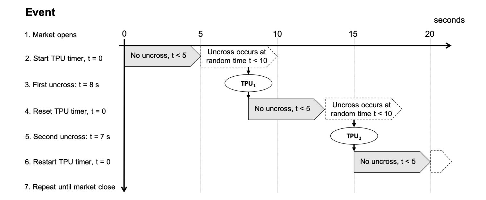
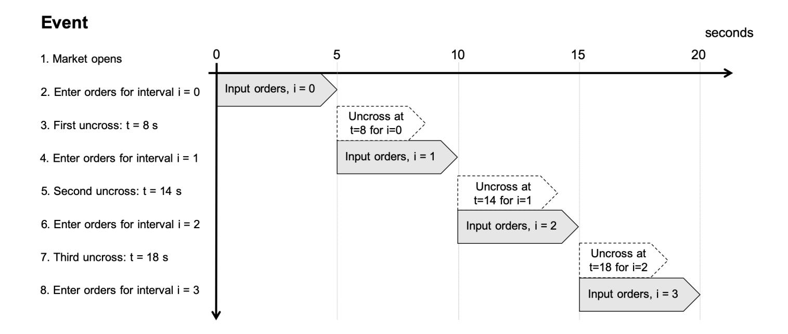
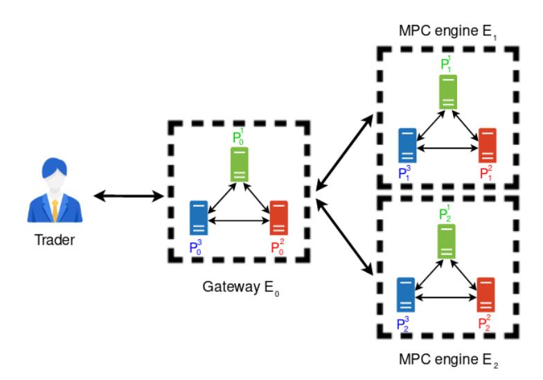
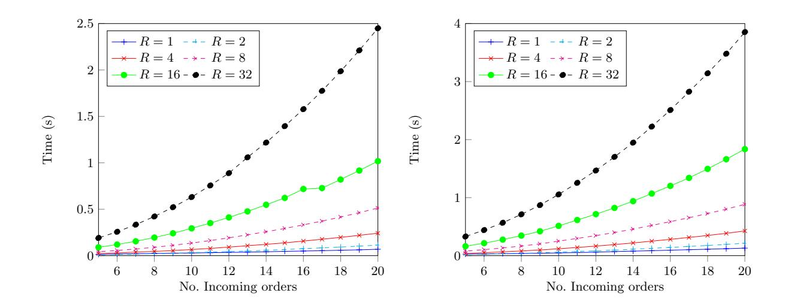
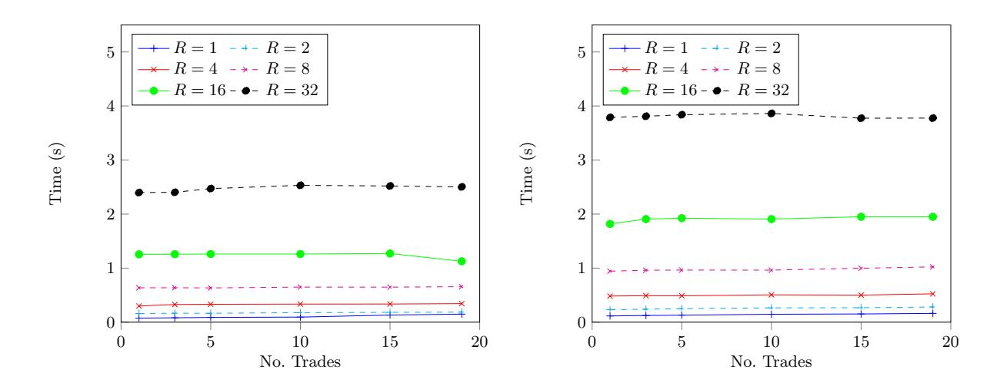
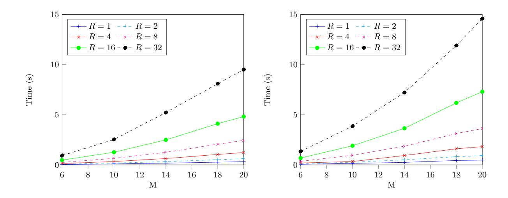
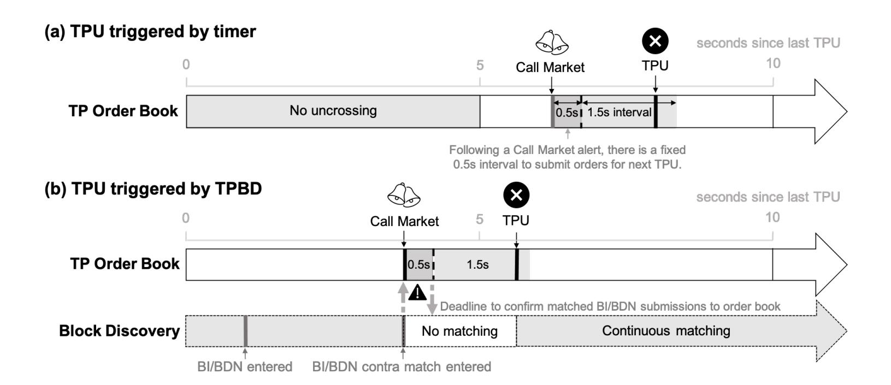

{0}------------------------------------------------

# Multi-Party Computation Mechanism for Anonymous Equity Block Trading: A Secure Implementation of Turquoise Plato Uncross

John Cartlidge<sup>1</sup> , Nigel P. Smart1,<sup>2</sup> , and Younes Talibi Alaoui<sup>2</sup>

> <sup>1</sup> University of Bristol, Bristol, UK. <sup>2</sup> KU Leuven, Leuven, Belgium.

john.cartlidge@bristol.ac.uk, nigel.smart@kuleuven.be, younes.talibialaoui@kuleuven.be

Abstract. Dark pools are financial trading venues where orders are entered and matched in secret so that no order information is leaked. By preventing information leakage, dark pools offer the opportunity for large volume block traders to avoid the costly effects of market impact. However, dark pool operators have been known to abuse their privileged access to order information. To address this issue, we introduce a provably secure multi-party computation mechanism that prevents an operator from accessing and misusing order information. Specifically, we implement a secure emulation of Turquoise Plato Uncross, Europe's largest dark pool trading mechanism, and demonstrate that it can handle real world trading throughput, with guaranteed information integrity.

## 1 Introduction

Most major financial exchanges now operate a continuous double auction mechanism using a public limit order book (PLOB). Limit orders that do not immediately execute will rest in the PLOB, advertising willingness to trade at a given price. However, when large volume block orders are visible in the PLOB, market price can be adversely affected (i.e., a large order to buy, or sell, will precipitate a respective increase, or decrease, in market price), as traders adjust to the new information contained in the order. To avoid this costly market impact, block traders attempt to hide their trading intention. One approach is to route orders to an alternative dark pool trading venue, which are designed to keep all pre-trade order information hidden. As long as no information leaks from a dark pool, block traders are able to wait for execution without exposing themselves to market impact. Unfortunately, however, many dark pool operators have been prosecuted for abusing their privileged access to "hidden" order information for their own nefarious gain. This illegal practice comes at a direct cost to dark pool customers and reduces market trust in dark pool provision.

We address the issue of trust in dark pool provision by introducing provably secure dark pool matching protocols that ensure a dark pool provider cannot access order information within the system. The solution we propose uses multi-party computation (MPC) to instantiate the dark pool operator as a set of n organisations (where n = 2 or n = 3) that jointly match orders in a secure manner. As long as parties do not collude, order information remains cryptographically secure. Previously [7], the authors have demonstrated that 2-party and 3-party MPC can be used to instantiate common financial market mechanisms, including: (i) a simple periodic volume match, with no price formation; (ii) a periodic auction, with clearing price formation, and (iii) a continuous double auction, with price formation. In a simple simulated market containing only one financial instrument (e.g., one commodity, or one equity), results unsurprisingly demonstrated that price formation mechanisms (ii) and (iii), where trade price is calculated from limit orders in the book, run much slower than volume only matching (i), where trade price is taken from some reference value, such as current mid-price on the primary exchange. Promisingly, while reported maximum CDA throughput of 10-50 executions per second (depending on order book depth) is too slow for most real world continuous financial markets, simple periodic volume matching was shown to be capable of clearing 800 trades per second on standard commodity hardware, suggesting that MPC is capable of real-world application if an appropriate auction mechanism is used [7].

{1}------------------------------------------------

In this paper, we present the first demonstration that MPC protocols can securely replicate a real-world dark pool, by implementing a modified approximation of the London Stock Exchange Group's Turquoise Plato Uncross (TPU). We select Turquoise Plato because: (i) it is Europe's largest dark pool, trading more than AC1 billion each day across a universe of more than 4000 instruments [23], so is a significant challenge to replicate; (ii) TPU is a periodic auction mechanism with no price formation [25], so is an ideal candidate for MPC implementation; and (iii) members of the not-for-profit Plato Partnership include a number of major sell side institutions who could potentially act (on a rotating basis) as organisations in a real world MPC implementation of the dark pool mechanism.<sup>3</sup>

The MPC protocols guarantee information and mechanism integrity by enabling traders to securely send orders to the organisations (the parties in the MPC) hosting the dark pool engine in such a way that no information is leaked about these orders, and if a trader or host organisation attempts to cheat, this cheating will be detected. Using publicly available TPU trading data to validate performance, we report that the MPC protocols are capable of executing real world throughput. This result offers dark pool providers the significant opportunity to utilise MPC to market their trading platforms as provably secure from information leakage and mechanism misuse.

To address the challenge of securely implementing TPU using MPC, we present novel contributions to overcome two major challenges. First, with a universe of thousands of instruments traded, running one MPC engine per instrument (i.e., using a dedicated engine per symbol traded) is impractical from an organisational stand point, while using one MPC engine for all instruments is impractical from an MPC stand point (due to the high computation costs of uncrossing thousands of order books in parallel on the same engine). Therefore, we efficiently distribute workload across multiple engines in a way that leaks no order information, including information about the specific instrument that is being traded (i.e., from observing an encrypted order in the system it is impossible to know the direction, the volume, and the stock identity). To meet this strong requirement, in our MPC emulation we are forced to slightly modify the operation of the real TPU mechanism. However, we argue that since the specific design of each dark pool mechanism is a commercial decision, these modifications do not materially change the conclusion that MPC is ready for industrial use. Second, since the dark pool is emulated by a set of organisations that perform the MPC protocol on inputs from other parties (i.e., traders), inputs must remain hidden from the organisations during computation. This specific use case differs from what we usually find in the literature, where inputs come from the same parties performing the MPC computation.

The paper is organised as follows. In Section 2, we detail the motivation for securing the integrity of dark pools, we review related work applying MPC to secure auction mechanisms, and we present detailed requirements for the MPC emulation of TPU. In Section 3, we describe modifications required to emulate TPU and outline the MPC architecture and cryptographic framework used. In Section 4, we formally define the MPC protocols for emulating TPU, and present run time analysis in Section 5. Section 6 discusses the implications of assumptions and simplifications required for the MPC emulation, before describing the practical benefits of MPC's distributed trust model. Finally, Section 7 concludes that MPC is ready for commercial exploitation.

## 2 Background

## 2.1 Dark Liquidity

Successful trading in the financial markets requires balancing the conflicting objectives of finding a counterparty with whom to trade, while not disclosing one's trading intention. The majority of exchange venues simplify the process of finding a counterparty by maintaining a public limit order book (PLOB), which displays all orders currently available in the market and thereby provides a snapshot of the market's current demand and supply. However, in these "lit" exchange venues, as soon as a trader submits a new order, information about the trader's intention to trade (the desire to buy or sell some quantity at a particular

<sup>3</sup> Plato Partnership members include, amongst others, Barclays, BofA Securities, Citi, Credit Suisse, Goldman Sachs, JP Morgan, Morgan Stanley, and UBS. See: https://platopartnership.com/.

{2}------------------------------------------------

price) is immediately disclosed. This can be a problem if the order size (or volume) is relatively large, as other traders in the market are likely to react to this information by moving the price in the adverse direction. For example, a large volume sell order signals to the market that there is an excess supply, and traders will quickly reduce their own order prices in anticipation of a subsequent fall in price. This reaction to the discovery of a large order is known as price impact, or market impact, and the costs to a trader can be severe, far outweighing commission fees and other trading charges. It has been estimated that market impact increases approximately with the square root of volume [15], although accurate calculations of market impact from empirical trading data are notoriously difficult and there is no consensus on the exact functional relationship between volume and impact (for a review of price impact, see [6]; for a technical discussion, see [5, Chapters 11 and 12]). Nevertheless, it is universally accepted that openly exposing one's intention to trade, particularly when trading in large volume, is extremely costly and best avoided.

Traditionally, to avoid market impact when attempting large trades, traders would pay a trusted broker to find a counterparty within their network of contacts. As long as a broker network keeps all order information secret (as long as there is no information leakage), then a trade can occur with little or no market impact, since the wider market is unaware of trading intention until after the trade executes. However, there is a strong financial incentive for brokers to misuse the privileged information of their clients' confidential orders. By selling a client's order information to a third party, or by using the information directly to front run a client's trade, brokers can profit at the direct expense of their client. Although often difficult to prove, such (illegal) activity is not uncommon. In 2005, twenty specialists on the New York Stock Exchange (NYSE) were charged with committing thousands of illicit front running trades between 1999 and 2003, causing millions of dollars of customer losses [52].

Front running describes acting in advance on confidential trading information for one's own gain. For example, let us assume broker, B, is instructed by client, C, to buy 20,000 shares in XYZ, and the current PLOB is displaying the following offers to sell: 5, 000@\$49; 15, 000@\$50. If acting honestly, B will execute C's order by purchasing 5, 000 shares at \$49 and 15, 000 shares at \$50, for a total cost to C of \$995, 000. However, since B knows that C's buy order will move the market (i.e., the large buy order will have a positive price impact), B decides to misuse C's intention to trade by front running the purchase. To this end, on their own account, B buys 5, 000 shares at \$49 and simultaneously posts an offer to sell 5, 000@\$50. The order book for XYZ now displays sell offers: 20, 000@\$50, allowing B to execute C's request to purchase 20, 000 shares at \$50, for a total cost of \$1 million to the client. Broker B has immediately sold their shares (to the client, and at the direct expense of the client) for a risk-free profit of \$5, 000. This practice is illegal but can be extremely difficult to detect, particularly if B uses a third party (with no obvious connection to B or C) to front run the trade.

To circumvent these malicious and predatory practices of human brokers, the first dark pool crossing networks emerged in the 1980s [7]. These alternative electronic trading exchanges automatically match orders in secret. Unlike the visible orders entered into the PLOB of a lit exchange, orders entering a dark pool remain invisible, and details of trades are only published after execution. As trading intention remains secret, even large orders can execute in a dark pool with little or no market impact. The attraction of dark pools is clear, and the demand from traders is strong. Over the last decade, largely driven by regulation changes (RegNMS, USA, 2005; MiFID, EU, 2007) and the rise of high-frequency trading (HFT), the number of dark pool venues and the volume they trade has ballooned. In the US, around 40 dark pool venues now operate with approximately 15-18% market share of equities trading (a quadrupling since 2005); while in the EU, the volume traded on the fifteen major dark pools accounts for over 8% of total value traded in equities (a rise from less than 1% in 2009) [33].

However, where there is trust, there is the possibility of abuse. Although dark pools offer trading in secrecy away from prying eyes, the operators of dark pools are trusted to maintain data integrity and not misuse the confidential information inside. For many operators, temptation has proven too great. As detailed in Table 1, between October 2011 and November 2018, US dark pool operators paid more than \$217 million in penalty settlements to the Securities and Exchange Commission (SEC) for illegal practices, including: (a) directly misusing customers' information for front running (Pipeline, 2011 [39]; LavaFlow, 2014 [41]; ITG POSIT, 2015 [43]); (b) selling customers' confidential information to third parties (eBX, 2012 [40]; Liquidnet, 2014

{3}------------------------------------------------

Table 1. SEC Penalty Settlements for US Dark Pool Operators (2011-2019).

| Company<br>and<br>Settlement                                     | Illegal Activity                                                                                                                                                                                                                                                                                                                                                                                                                                                        |
|------------------------------------------------------------------|-------------------------------------------------------------------------------------------------------------------------------------------------------------------------------------------------------------------------------------------------------------------------------------------------------------------------------------------------------------------------------------------------------------------------------------------------------------------------|
| ITG (POSIT)<br>Nov 2018, \$12m [50]                              | Information misuse: ITG disclosed confidential trading information on dark pool, POSIT, by offering<br>reports on the prior day's trading activity to HFT firms.<br>Mechanism misuse: ITG secretly split POSIT into two separate non-interacting dark pools.                                                                                                                                                                                                            |
| Citigroup<br>(Citi<br>Match)<br>Sep 2018, \$12m [49]             | Mechanism misuse: Nearly half of Citi Match orders were secretly routed to other venues, with trade<br>confirmation messages edited to indicate these orders executed on Citi Match.<br>Mechanism misuse/misleading customers: Citigroup misled users with assurances that HFT were<br>not allowed to trade in Citi Match dark pool, when two of Citi Match's most active users reasonably<br>qualified as HFT and executed more than \$9bn of orders through the pool. |
| Merrill Lynch (In<br>stinct X)<br>Jun 2018, \$42m [51]           | Mechanism misuse: Merrill Lynch (a broker-dealer) secretly routed customer orders to external venues,<br>with trade confirmation messages edited to indicate these orders had executed in-house: a process they<br>called masking. In total, \$141bn of transactions masked.                                                                                                                                                                                            |
| Deutsche Bank (Su<br>perX+)<br>Dec 2016, \$18.52m<br>[48]        | Mechanism misuse: Coding error in the Dark Pool Ranking Model of dark pool order router, SuperX+,<br>caused two dark pools to receive inflated rankings and consequently millions of orders that should have<br>been routed elsewhere. (SuperX+ is a dark router, not a dark pool.)                                                                                                                                                                                     |
| Barclays<br>Capital<br>(LX)<br>Jan 2016, \$35m [45]              | Mechanism misuse: Barclays failed to police its dark pool, LX, from predatory trading and lied when<br>stating LX only used direct data feeds from exchanges (to deter latency arbitrage), after inquiries were<br>generated by the publication of Michael Lewis's book, Flash Boys.                                                                                                                                                                                    |
| Credit<br>Suisse<br>(Crossfinder)<br>Jan 2016, \$54m [46,<br>47] | Information misuse: Credit Suisse transmitted confidential order information in Crossfinder to internal<br>system Crosslink, which alerted HFT firms to the existence of Crossfinder orders.<br>Mechanism misuse: 117 million illegal sub-penny orders were executed in Crossfinder dark pool.                                                                                                                                                                          |
| ITG (POSIT)<br>Aug<br>2015,<br>\$20.3m<br>[43]                   | Information misuse: ITG's secret trading desk, Project Omega, accessed live feeds of order information<br>on dark pool, POSIT, and used it to implement HFT strategies, including one that traded against POSIT<br>subscribers.                                                                                                                                                                                                                                         |
| UBS (ATS)<br>Jan<br>2015,<br>\$14.4m<br>[44]                     | Mechanism misuse: UBS offered secret PrimaryPegPlus orders to HFT firms, which enabled HFT to<br>jump ahead of other participants in the dark pool by placing illegal sub-penny orders.                                                                                                                                                                                                                                                                                 |
| LavaFlow (ECN)<br>Jul 2014, \$5m [41]                            | Information misuse: LavaFlow allowed an affiliate to access and use confidential trading information in<br>their dark pool, through a smart order routing service, ColorBook, which had access to the non-displayed<br>orders of LavaFlow ECN.                                                                                                                                                                                                                          |
| Liquidnet<br>(Liquid<br>net)<br>Jun 2014, \$2m [42]              | Information misuse: Liquidnet sought to find additional sources of liquidity for its dark pool by offering<br>Liquidnet subscribers' intentions to buy or sell securities to firms looking to execute large equity capital<br>markets transactions.                                                                                                                                                                                                                     |
| eBX (LeveL)<br>Oct 2012, \$0.8m [40]                             | Information misuse: eBX allowed a third party Order Routing Business (ORB) to access confidential<br>trading information in their dark pool, LeveL. The ORB used unexecuted order information on LeveL to<br>route orders for its own benefit.                                                                                                                                                                                                                          |
| Pipeline (Pipeline)<br>Oct 2011, \$1m [39]                       | Information misuse: The majority of shares traded in the dark pool were executed by a wholly owned<br>subsidiary, which used the side and price of Pipeline subscribers' orders to front-run them by trading on<br>the same side in other venues before filling them on Pipeline.                                                                                                                                                                                       |

[42]; Credit Suisse, 2016 [46]; ITG POSIT, 2018 [50]); and (c) selling preferential access to customers' orders to predatory traders (UBS, 2015 [44]; Credit Suisse, 2016 [47]; Barclays Capital, 2016 [45]; Deutsche Bank, 2016 [48]; Merrill Lynch, 2018 [51]; Citigroup, 2018 [49]). We can consider cases (a) and (b) as information misuse (misusing customers' confidential information for the dark pool providers' own gains), and case (c) as mechanism misuse (misusing the dark pool trading algorithm in a way that is detrimental to customers, such that customers would be unlikely to use the dark pool if they were aware of how it was being operated in practice).

## 2.2 Secure Auctions: Related Work

Given the significant financial and regulatory incentives for finding a commercially viable solution to counter the problems of mechanism and information misuse in financial markets (and, more generally, in online auction venues for e-commerce), it is perhaps little surprise that there is now more than two decades of re

{4}------------------------------------------------

search dedicated to securing auction integrity through cryptographic protocols. This research can be roughly categorised into two themes [31]:

Secrecy-preserving correctness: an auction operator can prove outputs (i.e., trades) are correct given the rules of the market and inputs (i.e., orders), without revealing any information about those inputs. The operator publishes an encrypted audit trail that enables observers to validate the correctness of the auction mechanism. These protocols combat mechanism misuse. However, information misuse is possible. Strong secrecy: an auction operator is unable to release any additional information about inputs (i.e., orders) other than that implied by the outputs (i.e., trades). As the operator has no access to internal information (i.e., orders), these protocols guarantee no information misuse. Strong secrecy, as the

name suggests, provides greater security than secrecy-preserving correctness, but poses a much greater

Secrecy-preserving correctness: ensuring mechanism integrity The majority of work on secrecypreserving correctness follows the Evaluator-Prover (EP) framework [31], where: (i) traders secretly submit encrypted input order values x1, . . . , x<sup>n</sup> to the EP (the auction operator); (ii) the EP executes the auction by computing a function y = f(x1, ..., xn), before outputting value y, and engaging in a proof of the correctness of the result; finally (iii) the proof of correctness is made publicly available for anybody to verify. To ensure secrecy-preservation, proofs must not reveal anything about the input (i.e., the orders) except for the information implied by the output value (i.e., the trade). To achieve this, proof protocols use Paillier's homomorphic encryption for zero-knowledge proofs [29], which allows computation on ciphertexts and generates an encrypted result which, when decrypted, matches the result of the operations as if they had been performed on the plaintext.

In 2007, Thorpe and Parkes introduced an EP model for a continuous double auction (CDA) mechanism with limit order and market order types [36]. Before posting order O(p, q, d), the trader encrypts order price, p, quantity, q, and direction, d (bid/buy or ask/sell), using the market operator's public key.<sup>4</sup> The encrypted order, E(p, q, d), is then sent to the exchange, whereby the market operator privately decrypts E to obtain O. Order O is entered into a limit order book (LOB) and matching is performed in the clear on the plaintext O. Post-execution, trades are published in encrypted form, such that observers can validate the correctness of the market operation by proof checking that encrypted inputs (orders) match the expected encrypted output (trades) given the published CDA auction mechanism. An empirical evaluation of the proposed protocol running on low-end contemporary commodity hardware suggested an implementation of the system would have operational costs of approximately 5 cents (US) to place and verify an order. Later extensions by Thorpe, Parkes, and their colleagues included a combinatorial auction mechanism (trading baskets of stocks) [37] and the ability to enter more sophisticated conditional rule-based order types [38]. The EP model has also been applied to simpler sealed-bid auctions, with calculation times reported at: approximately 1 minute per order (using homomorphic encryption for proofs) [30]; 500 milliseconds per order (using a random representation protocol for proofs, which is faster than homomorphic encryption but has the drawback of allowing the proof to be performed only once) [35]; and 0.02 milliseconds per order (using an improved random representation protocol, in which the proof can be performed any number of times) [34]. However, in all cases the underlying encryption protocol remained unchanged: traders are required to post orders encrypted using the operator's public key, and the operator matches orders in the clear. Therefore, while the post-trade audit trail is secure, the real-time market information is not; thus enabling the possibility of information leakage, or front-running traders' order flow.

To increase information security of the EP model, several extensions have been proposed. For sealed bid auctions, a delayed private key revelation service (DPKRS) is used to ensure that the operator cannot decrypt incoming orders (and therefore cannot access order information) before the time of auction close [30].<sup>5</sup> After

computational challenge to achieve.

<sup>4</sup> For market order types, value p is not needed.

<sup>5</sup> The EP model does not enable operators to perform computation on encrypted inputs (i.e., orders). Therefore, DPKRS is unsuitable for continuous double auctions as computation occurs immediately upon order entry. There is no before and after time for key revelation in an asynchronous, continuous market.

{5}------------------------------------------------

close, keys are revealed to the operator via the automated DPKRS, and the auction is performed on plaintext orders, as usual. This approach guarantees pre-trade information privacy in a one-shot auction, useful for a unique high-valued item such as a work of art, but when there are a series of repeated auctions with returning participants (a characteristic of financial markets), information leakage is still possible; as Hal Varian (Chief Economist at Google since 2002) explains, "Even if current information can be safeguarded, records of past behaviour can be extremely valuable, since historical data can be used to estimate willingness to pay" [53]. To further address information leakage in the EP model (and to approach strong secrecy guarantees), in 2015, Parkes et al. proposed that operators could host auction software on Trusted Computing infrastructure; essentially a secure "computer in a cage" installed in a physically secure location, with digitally signed software, a secure processor, and with ongoing and publicly observable automated monitoring [31]. However, this approach essentially pushes the issue of trust from the operator to a third party (the Trusted Computing infrastructure), rather than provably guaranteeing strong secrecy, and the authors themselves describe a possible security attack vector and note that Trusted Computing infrastructure is still in its infancy. For these reasons, we conclude that the EP model does not provide a credible opportunity for strong secrecy in financial markets; a necessity for guaranteeing no information leakage in dark pool trading venues.

Strong secrecy: ensuring information integrity The problem of avoiding information leakage in financial markets has motivated several studies investigating the potential of multi-party computation (MPC) to achieve auction protocols with strong secrecy. MPC approaches enable n > 1 parties to jointly compute a function over their inputs (i.e., orders) while keeping those inputs private (i.e., orders remain in encrypted form, such that no individual party is able to access the plaintext without colluding with other parties). Using MPC to operate a trading venue requires computation to be distributed across n parties and guarantees secrecy as long as at most t parties are corrupt. We refer to t as the threshold trust or fault tolerance of the system.

Early work on MPC for secure auctions focused on simple sealed-bid auctions, commonly used online. In 1998, an MPC protocol was proposed with fault tolerance t < n/3, therefore ensuring that with n = 4 parties no single party can cheat or violate privacy [16]. Shortly afterwards, a novel two-party protocol was proposed (t = 1), making use of garbled circuits to significantly reduce the required rounds of communication between parties [27]; followed by a two-party scheme without garbled circuits [20], shown to be an order of magnitude faster than [27], but offering a lower level of confidentiality. However, despite progress, none of this work was implemented as a practical application.

Bogetoft and colleagues proposed MPC protocols for one-shot double auctions, with fault tolerance t < n/2. These protocols were the first to demonstrate practical success (protocol design [4]; application [3]; commercialisation [32]). The double auction has two periods: (i) open period, where limit orders are submitted in encrypted form; and (ii) close period, where trades are executed at the market clearing price, calculated to minimise excess demand and supply.<sup>6</sup> In the first real-world application [3], a system was developed for Danish farmers to trade contracts for sugar beet production on a nation-wide market. The role of the auctioneer is played by n = 3 parties (t = 1): (i) Danisco, the only sugar beets processor on the Danish market; (ii) DKS, the sugar beet growers' association; and (iii) SIMAP, the research project team. During the open period, 1229 farmers submitted orders. Auction computation was performed on 14 Jan 2008, and approximately 25,000 tons of production rights changed ownership. Timings for the live auction computation were not presented, but on contemporary commodity hardware, tests showed computations for 1000 traders took around 30 minutes; and for 3000 traders around 75 minutes. The protocols have since been commercialised through a private company, Partisia [32], which continues to offer a double auction mechanism with single clearing price using MPC. The one-shot double auction mechanism is particularly suited to a one-off high stake auction with sealed bids and long auction durations. According to Partisia's website, their platform has been tailored for the Norwegian Spectrum Auction to trade spectrum rights for

<sup>6</sup> Clearing price minimises excess demand and supply. At price p, if aggregate demand ΣD<sup>p</sup> is greater than aggregate supply ΣS<sup>p</sup> then excess demand ED<sup>p</sup> = ΣD<sup>p</sup> − ΣS<sup>p</sup> > 0 and excess supply ES<sup>p</sup> = 0. If ΣD<sup>p</sup> − ΣS<sup>p</sup> < 0 then we have excess supply ES<sup>p</sup> = ΣS<sup>p</sup> − ΣD<sup>p</sup> > 0 and ED<sup>p</sup> = 0.

{6}------------------------------------------------

a total of NOK 877.983.276 (approximately USD \$100 million) over the course of 7 days and 83 bidding rounds in December 2015.<sup>7</sup>

Protocols for double auctions are further developed by Jutla, to enable repeated (periodic) auctions [18]. In Jutla's proposal, the market protocol is a secure n = 5 party computation, run by four brokers and one regulating authority (e.g., the SEC), which can audit saved computations and validate if they were performed according to the protocol. During each auction period, traders can enter limit and market orders. At the end of each auction round, the market is cleared (at a single price) and price and volume information is revealed. Uncleared orders remain in the market for the following auction period. Jutla argues that current (2015) MPC technology is capable of running repeated periodic double auctions for financial markets, using a 30 minutes opening auction, followed by a succession of 15 minute auctions, with 5 minute gaps in-between for processing and information digestion.<sup>8</sup> However, Jutla's protocol is not implemented or empirically tested in this work, and to date the work has not been published.<sup>9</sup>

MPC has also been used by Massacci et al. (2018) to implement a secure futures market using distributed ledger technology, with traders hiding behind a Tor network to communicate anonymously [26]. Designed to replicate the functionality of the Chicago Mercantile Exchange (CME), the system uses a CDA mechanism for order matching. However, unlike previous approaches, discussed above, the focus of this work is on enabling anonymity of who is executing a trade, rather than securing what and how much is being traded; with MPC only used for a small subset of the operations to enable this privacy. Whilst addressing part of the security problem, the methodology still requires a trusted third party with access to secret inputs of all participating traders, and therefore does not ensure information integrity. A proof of concept implementation is demonstrated, containing a population of 10 traders and an order book with five levels. Results show that individual operations (e.g., post order, cancel order, etc.) can be performed in around 24s.<sup>10</sup> In subsequent work, the same research team later introduced Witness-Key-Agreements for maintaining order privacy in an blockchain-based OTC distributed dark pool, where parties securely agree on a secret key [28]. This approach demonstrated much quicker execution (combined challenge and response) times of around 20 seconds.

In 2019, we (the current authors) introduced 2-party and 3-party MPC protocols for three auction mechanisms most commonly used in financial markets: (i) continuous double auction (CDA); (ii) periodic double auction (with clearing price calculated to maximise volume traded); and (iii) periodic volume match (a simple auction protocol with size priority and no price formation, where volume is cleared at a price determined by some reference value, such as the current mid-price on the London Stock Exchange) [7]. Empirical evaluation of a simple market containing a single traded instrument demonstrated that the CDA protocol can process between 10 and 50 orders per second (depending on the size of the order book); the periodic double auction protocol can process around 500 orders per second (with the majority of time spent sorting orders by price as they are entered); and finally, the simple periodic volume match protocol can process around 800 orders per second, a throughput that may be viable for some real-world dark pools. These results are promising, suggesting that MPC may finally be ready for real-world application in financial markets.

In summary, with such significant (albeit illicit) financial rewards on offer, information and mechanism misuse by dark pool operators is likely to continue until the opportunity for misuse is removed. However, the only way to guarantee that there is no information misuse is to ensure that nobody, not even the dark pool operator, can gain access to the data inside the system. One mechanism to achieve this data privacy is to apply a multi-party computation (MPC) technique to the underlying dark pool algorithm, such that internal order data is held in secret-shared form, and is processed by a set of servers. If a given ratio (depending on the precise MPC system) of the servers remains honest then the internal algorithm variables do not leak, and privacy is thus preserved. All orders can be entered using a protocol to convert an external user's order into a secret shared form. MPC can then be used to perform computation (order matching) on the secret shared data, such that no order information is ever in the clear. This provides a dual guarantee that the

<sup>7</sup> For details, see: https://partisia.com/spectrum-auctions/

<sup>8</sup> These timings follow the open-auction period (30 minutes) of specialists on the New York Stock Exchange (NYSE).

<sup>9</sup> Personal communication with the author, Oct 2018.

<sup>10</sup> For comparison, CME Globex report an average median latency for order entry of 200 microseconds during 2017 [10, p.2].

{7}------------------------------------------------



Fig. 1. Turquoise Plato Uncross. Uncrossing occurs at random intervals with period t drawn from a uniform distribution with minimum 5 seconds and maximum 10 seconds, i.e., t = T ∼ U(5, 10). Here, the first uncrossing TPU<sup>1</sup> occurs after 8 seconds. The second uncrossing TPU<sup>2</sup> occurs 7 seconds later. This process repeats until close.

dark pool is provably secure from both information misuse and mechanism misuse. In the following sections, we introduce an MPC implementation of Turquoise Plato Uncross (TPU), the trading mechanism of one of Europe's largest dark pools, to demonstrate the potential for MPC to ensure dark pool integrity in financial markets.

### 2.3 LSEG's Turquoise Plato Uncross

Turquoise Plato is a dark pool trading service offered by the London Stock Exchange Group. <sup>11</sup> Designed for larger and less time sensitive orders, Turquoise Plato contains a non-displayed order book with size/time priority. Orders can be entered at any time, but rather than continuous matching, the order book is only uncrossed periodically at random intervals using the Turquoise Plato Uncross (TPU) mechanism, which executes trades at a reference price equal to the midpoint of the best bid and offer on the primary exchange. Turquoise Plato offers a variety of passive order types, including Good For Auction (GFA), which automatically expire after the next TPU uncrossing (whether filled or not), and Good Till Time/Date (GTT/D), which persist in the order book for repeated TPU cycles until the designated expiry time (usually end of day) is reached. Orders may be cancelled, and can sometimes be amended.

Turquoise Plato also offers the Turquoise Plato Block Discovery (TPBD) service, which provides a liquidity discovery mechanism for matching undisclosed large block indications. When TPBD discovers a match, contraparties are notified and then required to immediately (within 0.5 seconds) post a confirmed order (GFA, or GTT/D) to the Turquoise Plato order book. These orders are then uncrossed, along with the rest of the order book, during the next TPU. Since TPBD is a discovery mechanism for generating order flow, in this paper we focus our attention on TPU, which is the main execution logic of Turquoise Plato. However, as TPU uncrossings can be triggered either by a randomised timer, or by a TPBD match (see [25, p.31]), we return to discuss the implications of TPBD in Section 6.1. Here, we consider TPU uncrossings triggered by randomised timer only and ignore the interaction of TPBD.

TPU executes orders using an uncrossing mechanism that is performed at random intervals throughout the day, with minimum period of 5 seconds and maximum period of 10 seconds between each uncross. We present this visually in Figure 1, where time from market opening is shown on the x-axis, and events are listed from top to bottom on the y-axis. At the start of the day, the market opens (top) and the TPU timer

<sup>11</sup> For full operational details, refer to the Turquoise Trading Services Description [25] and Turquoise Plato Block Discovery Trading Service Description [24].

{8}------------------------------------------------

Table 2. LSEG monthly trading reports for Turquoise Plato. Reproduced from [23, 22].

| Month    |    | Trading Days Total Number of Trades (Avg Daily) Value Traded (Avg Daily) Value Traded (Month) Mean Trade Size |                   |                    |            |
|----------|----|---------------------------------------------------------------------------------------------------------------|-------------------|--------------------|------------|
| Feb 2017 | 20 | 66, 307                                                                                                       | AC 651 million    | AC 13, 029 million | AC 9, 818  |
| Feb 2020 | 20 | 71, 416                                                                                                       | AC 1, 237 million | AC 24, 733 million | AC 17, 321 |

is initialised at t = 0. While t < 5 (represented by the grey box), we are guaranteed that no uncross will take place as this is shorter than the minimum interval of 5 seconds. Then, for the next 5 seconds, i.e., while 5 ≤ t ≤ 10, there is a window, during which uncrossing can occur at any time (represented by the white box with dashed borders). In the example shown, the timer is randomly stopped at t = 8 and the first uncross TPU<sup>1</sup> occurs 8 seconds after opening (shown as a white ellipse). The timer is reset to t = 0, and the process repeats. First, there is a guaranteed period of 5 seconds with no uncross (grey bar), followed by a 5 second window when uncross will occur (white bar). This time, the timer is stopped randomly at t = 7 and the second uncross TPU<sup>2</sup> occurs t = 8 + 7 = 15 seconds after market opening. This process repeats throughout the day until market close.

Each order entered into TPU (requests to buy or sell a particular quantity of an instrument) contains an instrument (i.e., the particular stock to trade) a direction (buy or sell), a size (the quantity to buy/sell) and a minimum execution size (MES), which is the quantity below which the order will not execute. For each of U instruments traded within TPU, orders entered during the order insertion phase will rest in an order book for that instrument. Orders in the book are prioritised by size and then time of order entry (if two orders have the same size, the first order entered into the system will take priority, i.e., it will be positioned higher in the order book). An example is shown in Figure 2. In Figure 2(a), we see that six orders are entered during the order insertion phase; three bids (orders to buy) and three asks (orders to sell). These orders are prioritised by size, such that in Figure 2(b), we see that the largest bid (id = 5) with size 100, 000 and the largest ask (id = 6) with size 50, 000 are at the top. The first sell order entered (id = 1) has the smallest size and so is placed at the bottom of the order book. This is the state of the order book at the end of the order insertion phase, immediately before the uncrossing phase. During the uncrossing phase, Figure 2(c), orders execute subject to MES thresholds, such that a buy order of MES b (resp. a sell order of MES c) can only be matched with sell orders of volume w s.t b ≤ w (resp. buy orders of volume v s.t c ≤ v). We see that two trades execute: a trade of size 50, 000 (buyer id = 5 and seller id = 6); and a trade of size 1, 000 (buyer id = 4 and seller id = 2). The transaction price for these trades is set as the instantaneous mid-price on the primary reference exchange (for example, the London Stock Exchange, for shares listed in the UK). In Figure 2(d), we see the order book immediately after uncrossing, with fully filled orders removed. In cases where an order is partially filled and the remaining volume becomes smaller than the MES, then the order is also removed as it can no longer be matched. Persistent orders (GTT/D) that are fully or partially unexecuted remain in the order book, and new orders are inserted into the order book as they arrive.

### 2.4 Turquoise Plato: Trading Data and Statistics

In this section, we aim to elaborate the trading dynamics of Turquoise Plato, so that we are in a position to validate our later MPC implementation against real-world commercial demands. Trading data for Turquoise Plato, and dark pools in general, is commercially sensitive and accurate high-resolution data is therefore difficult to obtain. However, all trading venues report aggregated data, and from this we are able to estimate some trading statistics.

The European Central Bank (ECB) reported in 2017 that the share of European equity trading conducted on dark pools has expanded rapidly in recent years, growing from less than 1% in 2009 to over 8% in 2016 [33, p.5]. In June 2016, Turquoise Dark traded 1.37% of total equity volume traded in Europe [33, p.25], equivalent to approximately 17% of all volume traded in 15 dark pools active in Europe at the end of 2016 [33, p.22]. This makes Turquoies Plato one of the largest (by trade volume) and most successful dark pool trading venues in Europe.

{9}------------------------------------------------

| ID | Direction | Size    | MES    |
|----|-----------|---------|--------|
| #1 | Sell      | 100     | 50     |
| #2 | Sell      | 1,000   | 1,000  |
| #3 | Buy       | 10,000  | 5,000  |
| #4 | Buy       | 1,000   | 100    |
| #5 | Buy       | 100,000 | 50,000 |
| #6 | Sell      | 50,000  | 10,000 |

|    | Bids   |         |        | Offers |    |
|----|--------|---------|--------|--------|----|
| ID | MES    | Size    | Size   | MES    | ID |
| #5 | 50,000 | 100,000 | 50,000 | 10,000 | #6 |
| #3 | 5,000  | 10,000  | 1,000  | 1,000  | #2 |
| #4 | 100    | 1,000   | 100    | 50     | #1 |

|   | (h) | Order | hook | hefore | uncross |
|---|-----|-------|------|--------|---------|
| 1 | וטו | Order | DOOK | perore | uncross |

| TradeID | BuyerID | SellerID | Size   |
|---------|---------|----------|--------|
| #T1     | #5      | #6       | 50,000 |
| #T2     | #4      | #2       | 1,000  |

|    | Bids   |        | (    | Offers |    |
|----|--------|--------|------|--------|----|
| ID | MES    | Size   | Size | MES    | ID |
| #5 | 50,000 | 50,000 | 100  | 50     | #1 |
| #3 | 5,000  | 10,000 |      |        |    |

Fig. 2. Example Turquoise Plato Uncross: (a) six orders are entered during the insertion phase, with order ID incremented each time; (b) orders enter the order book, sorted by size priority such that the largest buy order (ID=5) and the largest sell order (ID=6) are positioned at the top; (c) during the uncrossing phase, two trades are executed. A trade of size 50,000 between buyer ID=5 and seller ID=6, and a trade of size 1,000 between buyer ID=4 and seller ID=2; (d) after uncrossing, three persistent orders remain in the order book and a new insertion phase begins.

Table 2 summarises Turquoise Plato trading data from LSEG's monthly trading reports. We see that over the last three years, the total number of trades per day has only increased by 7.7%. However, the total value traded each day has increased by 90%, which has produced an almost doubling in mean trade size over three years. Yet, it is pertinent to note that the mean trade size on Turquoise Plato is a misleading statistic, as it is heavily skewed by a relatively small number of very large in scale trades, which are particularly encouraged by the Turquoise Plato Block Discovery (TPBD) service. In February 2017, TPBD traded an average daily value of AC 199 million, with average trade size of AC 768, 783, suggesting an average daily number of trades of only 154.8 [11, p.12]. LSEG report that the record trade size on Turquoise Plato is AC 17.33 million, executed on 28 June 2018.<sup>12</sup> Further details of large in scale trades are reported in the 2018 Parliamentary Review [2] for trading on 16 Mar 2018 in Spanish company, Santander. On that day, Santander's top ten trades by value all executed on Turquoise Plato, with a combined share of trading (SoT) of 6.4%; i.e., just 10 trades on Turquoise Plato accounted for more than 6% of the total value of all Santander trading, across all trading venues, executed that day.

More detailed statistics for Turquoise Plato trading are shown in Table 3 for February 2017. Comparing with Table 2 for the same month, we can see that these figures are consistent with LSEG trading reports, but also offer further insight into the skewed nature of trading towards a relatively small number of stocks. While in March 2020, LSEG report that Turquoise Plato enables clients to trade a broad universe of U = 4, 500 instruments (i.e., stocks and other tradable assets) across 19 major European and emerging markets (note: this number was likely lower in Feb 2017, with estimations from public reports giving U ≈ 3, 000), we see that only 1, 927 instruments traded during the month of Feb 2017, and on average only 1, 258 instruments traded each day. Therefore, the majority of instruments available to trade on Turquoise Plato have zero executions on any given trading day. Table 3 presents the effective number of instruments traded, E, over a

<sup>12</sup> For updated 2020 trading statistics and new trading records, see: https://platopartnership.com/platopartnership-2020-year-in-review/.

{10}------------------------------------------------

Table 3. Turquoise Plato data for Feb. 2017, reproduced from LiquidMetrix: Guide to European Dark Pools [21].

| Turquoise Plato (Feb 2017)                 |           | Month Avg. Daily |
|--------------------------------------------|-----------|------------------|
| Total Number of Trades                     | 1 326 140 | 66 307           |
| Total Value Traded (EUR millions)          | 13 037    | 652              |
| Number of Unique Instruments Traded (N)    | 1927      | 1258             |
| Effective Number of Instruments Traded (E) | 91        | 55               |
| Mean Trade Size (EUR)                      | 9831      |                  |
| Median Trade Size (EUR)                    | 4114      |                  |

given period. This is calculated as the reciprocal of the Hirfindahl index, H:

$$H = \sum_{i=1}^{N} s_i^2 \tag{1}$$

where s<sup>i</sup> is the proportion of trading in each instrument, i. Note that, if trading is uniform across all instruments, i.e., ∀i : s<sup>i</sup> = 1/N, then H = 1/N and E = 1/H = N. However, when the proportion of trading is skewed heavily towards a small number of instruments, then E N. From Table 3, we see that E = 90.7 1, 927 = N for the month of February and E = 54.8 1, 258 = N for average daily trading. Therefore, it is clear that trading is heavily focused in a small number of instruments. Each day, the majority of instruments on Turquoise Plato trade rarely, or not at all.

## 2.5 TPU Implementation Requirements

Here, we capture the requirements for an MPC implementation of TPU, in order to assess whether the technology can be applied commercially. We use real-world TPU trading data, presented in Section 2.4, to ensure that the MPC system can handle similar order throughput and trading activity. Assumptions and simplifications are described, below.

Assumption 1: all uncrossings are triggered by TPU timer As shown in Section 2.4, in 2017, Turquoise Plato executed fewer than 155 TPBD trades each day [11, p.12]. While this number is likely to have risen as the market has matured, the nature of block discovery means that the likelihood of a match in any given instrument during a 5 or 10 second interval is vanishingly small. Therefore, we assume that TPU is always triggered by the timer. (We address the implications of this assumption in Section 6.1.)

Assumption 2: maximum computation time is 5 seconds Turquoise Plato trades for 8.5 hours per day, between 08:00-16:30. Since TPU occurs at random every 5 to 10 seconds, each day there are a minimum of 3, 060 uncrossings (every 10 seconds) and maximum of 6, 120 uncrossings (every 5 seconds) per instrument. To ensure that the system is capable of real-world throughput, we consider the worst case scenario, such that TPU occurs every 5 seconds exactly. Therefore, we assume there are 6, 120 auctions per day per instrument, and the MPC system has a maximum of 5 seconds to handle order entry, order book insertion, and order book uncrossing. (We address the implications of this assumption in Section 6.1.)

Assumption 3: orders cannot be cancelled While Turquoise Plato allows order cancellation, we simplify our implementation by assuming that no orders are cancelled. (We address the implications of this assumption in Section 6.2.)

Assumption 4: uniform intra-day trading volume From Table 3, we see that in Februrary 2017, TPU executed an average of 66, 307 trades per day. The intra-day trading volume on Turquoise Plato (not shown) has two peaks, the first at open (08:00) and the second shortly before close (15:00), with average volume traded during these peak hours roughly twice the size of volume traded during off-peak hours [21]. We simplify to 

{11}------------------------------------------------

assume uniform intra-day trading volume, with an average of  $66307/6120 \approx 10$  trades per auction interval, across all instruments. As discussed previously, Table 3 also shows that most trading occurs in a very small number of instruments, with the majority of instruments trading very rarely, or not at all. (Implications addressed in Section 6.3.)

Assumption 5: all orders eventually execute Since Turquoise Plato is designed for larger, less time-sensitive orders, we assume that all orders, given long enough, will eventually execute. As TPU matches on volume alone (with trade price taken using mid-price of the primary exchange as reference value), an order will execute as soon as a counterparty enters an order for the opposite direction with volume greater than MES. Therefore, we estimate the average number of new orders entered into TPU to be twice the number of trades, i.e., approximately 20 orders per interval, across all instruments. (Implications addressed in Section 6.3.)

Assumption 6: all orders are persistent We assume orders are persistent and do not automatically expire after TPU. To ensure no information leakage, the MPC implementation requires that after each uncrossing, all uncompleted orders are wiped from the order book and must be re-entered into the system to take part in the next uncross (see Section 3.1). In the (extremely unlikely) worst case scenario, we have a situation where every instrument has multiple orders on one side of the order book only (e.g., all orders are bids, or all orders are asks), such that none are able to execute, and all have to be re-entered in the next interval. In Table 3 we see that the average number of unique instruments trading each day is 1,258, and the number of instruments trading each month is 1,927. Therefore, we consider a situation where 2,000 instruments each have one order in the order book as a worst case scenario for the system to handle. (Implications addressed in Section 6.3.)

Requirements summary We assume that any MPC implementation of TPU that can be applied commercially must be capable of offering trading in a universe of U = 4,500 instruments, and within 5 seconds be able to handle 2,000 orders entered and an average of 10 trades per uncross, without leaking any information. In the following section, we introduce an MPC implementation to meet these requirements.

## 3 Preliminaries

#### 3.1 Auction Modifications

To enable the required throughput to be achieved via an MPC system we need to make a minor modification to the way Turquoise Plato works. Instead of the operation given in Figure 1, we adopt the methodology given in Figure 3. In particular we divide the day into five second time intervals. In time interval i orders are entered, then in time interval i + 1 the uncrossing occurs for the orders entered in time interval i, and new orders for time interval i + 1 are entered. An important difference, to maintain security of our solution, is that the order book is flushed on every uncrossing. Thus, unfilled and partially filled orders at interval i need to be re-entered into the system at interval i + 1.

#### 3.2 Architecture

The setup we will consider is that of n organisations  $Org = \{O_1, \ldots, O_n\}$ , which wish to run the dark-pool in a distributed manner via MPC. The n organisations do this by creating L + 1 entities  $\{E_0, \ldots, E_L\}$  each of which is instantiated as an MPC 'engine'. The engine  $E_i$  consists of  $\{P_i^1, \ldots, P_i^n\}$ , where party/server  $P_i^j$  is run by organisation  $O_j$ . We will refer to the parties/servers  $\{P_i^1, \ldots, P_i^n\}$  constituting  $E_i$  as  $\mathcal{P}_i$ . All entities  $P_0^j$  and  $P_i^j$  for  $i \neq 0$  are connected by pairwise secure channels, meaning secret shared values held by  $P_0^j$  can be passed securely to  $P_i^j$ .

The engine  $E_0$  is a special gateway engine, whilst engines  $E_1, \ldots, E_L$  deal with the actual auction, so we refer to these L engines as auction engines. The reason for requiring multiple engines to deal with the auction is to enable a high enough throughput to be reached when the market is dealing with a large number of

{12}------------------------------------------------



Fig. 3. Modified Turquoise Plato Uncross. Orders are entered in five second intervals and the next set of orders are entered while the uncrossing occurs. Note, the order book is cleared on every uncrossing, with unfilled and partially filled orders re-entered in the following interval.



Fig. 4. Example setup for L = 2 auction engines (E<sup>1</sup> and E2) and n = 3 organisations (the parties, P 1 , P 2 , and P 3 ), who instantiate the MPC dark pool. A trader submits an order for instrument i to Gateway engine E<sup>0</sup> in secret shared form. The order is then routed to the auction engine running TPU for instrument i.

instruments. We do this by distributing the instruments between the different engines, however we need to do so in a way that avoids linkage between orders across different time intervals. To obscure this linkage, we repeatedly randomise instruments assigned to each auction engine, which gives rise to some complications (see sub-protocols Πprep and Πinp, below).

A trader T from the set of potential traders Tr places an order into the auction through secure channels with P0. Figure 4 depicts the setup for the case where L = 2 auction engines, and n = 3 organisations. The instruments (i.e., the specific stocks) are pulled from a given fixed set S = {1, . . . , U}. In any one time interval we will divide the set S up into disjoint subsets S = S<sup>1</sup> ∪ . . . ∪ S<sup>L</sup> and assign the set of instruments S<sup>i</sup> to engine E<sup>i</sup> . We let R denote the size of S<sup>i</sup> , where we assume for ease of exposition that |S<sup>i</sup> | = R for all i. This division is carried out by the gateway engine E<sup>0</sup> in such a way that a qualified set of the organisations do not learn which instrument is assigned to which engine. This is vital to stop organisations learning information about unfilled orders; and by changing the allocation in each time interval we also stop correlations being obtained by the organisations. However, in one time interval the assignment of an order to an engine will leak some information (which we explicitly model in Section 3.4).

{13}------------------------------------------------

#### 3.3 Protocol overview:

Here, we present a high level overview of the protocol that organisations and traders need to execute (detailed implementation is presented in Section 4). There are four distinct operations that must be completed in a given time interval:

- Before the insertion phase:
  - 1. Assign the instruments to the engines; we call this sub-protocol  $\Pi_{prep}$  (pre-process).
- During the insertion phase:
  - 2. Take as input an order from a trader and get the gateway engine  $E_0$  to forward it to the correct order book engine  $E_i$ ; we call this sub-protocol  $\Pi_{inp}$  (input).
  - 3. Each  $E_i$  now needs to insert each incoming order into its order book; we call this sub-protocol  $\Pi_{ins}$  (insert).
- During the uncrossing phase:
  - 4. Finally, each engine  $E_i$  needs to implement the uncrossing phase; we call this sub-protocol  $\Pi_{unc}$  (uncross).

The sub-protocols  $\Pi_{\text{ins}}$  and  $\Pi_{\text{unc}}$  are essentially reproduced from [7], so for now we concentrate on the sub-protocols  $\Pi_{\text{prep}}$  and  $\Pi_{\text{inp}}$ . The protocol  $\Pi_{\text{prep}}$  is pre-processing, and thus we assume this is done before the specific time interval, for example over night. For all incoming orders in a specific time interval the set of steps in  $\Pi_{\text{inp}}$  need to be executed for all incoming orders in the five second time window. During the uncrossing phase we need  $\Pi_{\text{ins}}$  and  $\Pi_{\text{unc}}$  also to be completed within the permitted five second interval. However, this is an overestimate as  $\Pi_{\text{ins}}$  can be run in parallel with  $\Pi_{\text{inp}}$ , especially as  $\Pi_{\text{inp}}$  puts the main computational strain on engine  $\mathsf{E}_0$ , whilst  $\Pi_{\text{ins}}$  is purely an operation on  $\mathsf{E}_i$  for a given  $i \geq 1$ .

The sub-protocol  $\Pi_{\text{prep}}$  obliviously computes an assignment from the set of instruments to the set of engines. For ease of notation we write this assignment as  $\phi: S \longrightarrow \{1, \ldots, L\}$ , where an instrument  $r \in S_i$  if and only if  $\phi(r) = i$ . We emphasise that this mapping  $\phi$  is not known to any of the organisations, thus  $\mathcal{P}_0$  will be oblivious to the sets  $S_1, \ldots, S_L$ . Hence, organisations will not know which engine is dealing with which instruments in this given time interval, however the organisations will learn which orders get assigned to which set (but not the orders' specific instrument). In practice,  $\mathcal{P}_0$  will engage in a sub-protocol, at the end of which they will obtain the sets  $S_i$  as secret shared indices in  $S = \{1, \ldots, U\}$ .

The sub-protocol  $\Pi_{\text{inp}}$  needs to take an ord for instrument r from a trader T and then secret share it to the auction engine  $\mathsf{E}_{\phi(r)}$ . However, this needs to be done without  $\mathcal{P}_0$  learning the instrument r in this particular order, or the mapping  $\phi(r)$ . One way to address this, is to simply send ord to every engine, and thanks to the equality test implicit with  $\Pi_{\text{ins}}$ , the order ord will be inserted in exactly one engine (the correct one). However, this will clearly degrade the performance of our solution as each engine will have to deal with every order. An alternative approach consists of revealing to  $\mathsf{E}_0$  the instruments that every set  $S_i$  contains. However, from this information, parties in  $\mathsf{E}_0$  can determine the corresponding engine without having to open the instrument of ord. We consider this an unacceptable leak of information, since we can determine sets of instruments among which trades will occur, i.e., instruments of  $S_i$  if the gateway is sending orders to  $\mathsf{E}_i$ . Therefore, to implement  $\Pi_{\mathsf{prep}}$  and  $\Pi_{\mathsf{inp}}$  we need to be more involved. Our solution consists of having  $\mathcal{P}_0$  obliviously construct a vector of encryptions of the  $\phi(j)$ , given by  $\mathbf{c} \leftarrow (\mathsf{Enc}_{\mathsf{Pk}}(\phi(1)), \ldots, \mathsf{Enc}_{\mathsf{Pk}}(\phi(U)))$ , with a homomorphic encryption scheme that supports distributed decryption and re-randomisation of ciphertexts. In our instantiation, we do this using Paillier encryption [29]. This vector  $\mathbf{c}$  is the output of our sub-protocol  $\Pi_{\mathsf{prep}}$  and is constructed without leaking anything about the sets  $S_i$ .

For the  $\Pi_{\text{ins}}$  sub-protocol, vector  $\mathbf{c}$  is sent by  $\mathcal{P}_0$  to the trader  $\mathsf{T}$ .  $\mathsf{T}$  selects the r-th component of this vector  $\mathbf{c}_r$  and then re-randomises it to obtain  $\mathbf{c}_r'$  before sending it back to  $\mathcal{P}_0$ . Finally,  $\mathcal{P}_0$  will perform a distributed decryption on  $\mathbf{c}_r'$  to find  $\phi(r)$ . Note that trader re-randomisation is necessary to avoid correlating orders for the same instrument.

{14}------------------------------------------------

For an order ord that enters to the auction within time interval t, the adversary can:

- 1. Determine whether ord is a buy or a sell order.
- 2. If ord is a sell order (resp. a buy order), the adversary can determine whether ord satisfies the matching requirement with every order ord' from the buy list (resp. the sell list).
- 3. If ord is matched with ord', the adversary will end up knowing the name, MES, instrument and the matched volume of both orders after the orders enterred in time interval t are uncrossed. However, the adversary is not allowed to learn which orders were partially matched and which orders were completely matched.
- 4. Determine a bound (upper and/or lower bound) on the volume of ord.
- 5. In time interval t the instruments are divided into R = U/L subsets, which are unknown to the adversary. However, the adversary can learn to which subset each order is associated.

Any other information that leaks about ord will be considered as an unexceptable leakage of information.

Figure 5. Leakage model.

#### 3.4 Leakage Model

Here, we define which events are to be considered information leakage (and thus break the security of our protocol) and which events are not. The best case scenario is to consider that any information leaked about an order that is not yet filled is a leakage of information. However, while this is theoretically possible, it will result in a protocol that is not efficient, while our goal is to come up with a protocol that is practical to implement for the real-world TPU. To this end, we formally define how we modeled the leakage of information in Figure 5. The security evaluation of our work follows this model, such that our protocol is deemed secure as long as no leakage of information occurs, aside from what we permit in Figure 5.

Informally, the leakage when L=1 is what one would expect for such an auction; one can determine which orders are buy and sell orders and one knows at the end which orders have been filled, with all other data remaining hidden. This is captured by Figure 5, items 1–4. When  $L \ge 1$  there is the additional leakage of information captured in item 5; this additional leakage comes from our distribution of the orders into R = U/L buckets corresponding to each engine. Note, in the extreme case of L = U, i.e., when R = 1 and we have one engine per instrument, the adversary will learn which instrument corresponds to which order. Therefore, larger L leaks more information, but fewer computational resources are needed to run the auction, whereas smaller L leaks less information, but we risk not completing the auction within the allocated time. Thus, we obtain a form of R = U/L-anonymity on the instruments associated to an order. We will aim to find a suitable value for L to implement the TPU protocols.

#### 3.5 Cryptographic Background

We assume that the parties in  $\mathcal{P}_i$ , for  $i=0,\ldots,L$ , are probabilistic polynomial time Turing machines. We will refer to sampling uniformly at random an element r from a set X by  $r \leftarrow X$ . We also denote a variable assignment using  $a \leftarrow b$ , i.e., assigning the value of variable b to the variable a. If  $\mathcal{D}$  is a probability distribution over a set X, we denote sampling from X with respect to the distribution  $\mathcal{D}$  using  $a \leftarrow \mathcal{D}$ . We denote the component-wise multiplication of two vectors by  $\mathbf{v}^1 \odot \mathbf{v}^2$ , i.e.,  $\mathbf{v}^3 \leftarrow \mathbf{v}^1 \odot \mathbf{v}^2$ , where  $\mathbf{v}^3_i = \mathbf{v}^1_i \cdot \mathbf{v}^2_i$ . Finally,  $b^a$  will denote a vector of size a where each element is equal to b.

**Paillier Scheme** Our solution for sending orders to the corresponding engines is inspired from the Helen system [54]; where they needed to convert data back and forth between secret shared form and encrypted form using a partially homomorphic with distributed decryption procedure. Such a scheme can be instantiated

It is not identical to R-anonymity as, whilst it is known that an order is for an instrument in a set of R possible instruments, no party knows which R instruments are in the set.

{15}------------------------------------------------

using Paillier encryption [29]. In the Helen protocol, to verify that parties behaved honestly during these conversions, the parties run the MAC check protocol on encrypted data, by using the homomorphic property of Paillier encryption and by performing a distributed decryption on the result of the MAC check protocol to evaluate correctness. In this work, we also need to convert data from secret shared form to encrypted form, and for this purpose we also use the Paillier scheme. However, our approach to detect cheating differs considerably and we avoid running the MAC check protocol on encrypted data by taking advantage of the nature of the computations we are performing. We formally define the Paillier scheme, along with the properties it satisfies, next.

*Encryption Scheme* A probabilistic public key encryption scheme is a set of algorithms (KeyGen, Enc, Dec), such that:

- KeyGen(1 $^{\lambda}$ ) generates a public key and a private key (Pk, Sk), with respect to some security parameter  $\lambda$ .
- $\mathsf{Enc}_{\mathsf{Pk}}(m,r)$  outputs a ciphertext c encrypting the message m with randomness r, under the key  $\mathsf{Pk}$ .
- $Dec_{Sk}(c)$  outputs the decryption of the ciphertext c under the key Sk.

For correctness, we require that the decryption algorithm satisfies the following:

•  $Dec_{Sk}(Enc_{Pk}(m,r)) = m$  for any randomness r.

Throughout the paper, we may also refer to the encryption of a message m under the key  $\mathsf{Pk}$  by  $\mathsf{Enc}_{\mathsf{Pk}}(m)$ , i.e., dropping the randomness from the notation. We will also abuse notation by referring to a vector that contains encryptions under  $\mathsf{Pk}$  of the components of a vector  $\mathbf{v}$  by  $\mathsf{Enc}_{\mathsf{Pk}}(\mathbf{v})$ , and to a matrix that contains encryptions under  $\mathsf{Pk}$  of the entries of a matrix M by  $\mathsf{Enc}_{\mathsf{Pk}}(M)$ . The scheme is considered secure (in the IND-CPA sense) if no adversary can distinguish whether a given ciphertext c is the encryption of message  $m_0$  or message  $m_1$ .

Partial Homomorphic Encryption A partially homomorphic encryption scheme is an encryption scheme as defined above, with an extra requirement:

• For an operation  $\oplus$  that defines a group over the plaintext space  $(G, \oplus)$  and an operation  $\otimes$  that defines a group over the ciphertext space  $(G', \otimes)$ ,  $\mathsf{Dec}_{\mathsf{Sk}}(\mathsf{Enc}_{\mathsf{Pk}}(m_1, r_1) \otimes \mathsf{Enc}_{\mathsf{Pk}}(m_2, r_2)) = m_1 \oplus m_2$ , for any two messages  $m_1$  and  $m_2$  and any randomnesses  $r_1$  and  $r_2$ .

This essentially means that we can perform computation on the ciphertexts without having to decrypt them. It also means that we can re-randomise ciphertexts. For instance, for the case where  $\oplus$  consists of addition and  $\otimes$  consists of multiplication, we can re-randomise a ciphertext c by multiplying it by  $\mathsf{Enc}_{\mathsf{Pk}}(0_G, r)$  for some r drawn at random, where  $0_G$  is the identity element of  $(G, \oplus)$ .

Encryption Scheme with Distributed Decryption For a set of parties  $\{P^1, \ldots, P^n\}$ , an access structure  $\mathcal{A}$  is a (monotonically increasing) subset of  $2^{\{P^1, \ldots, P^n\}} \setminus \{\emptyset\}$ , i.e.,  $\mathcal{A}$  is a collection of non empty sets  $\mathcal{C}_j$  of  $\{P^1, \ldots, P^n\}$ . The sets  $\mathcal{C}_j = \{P^{1j}, \ldots, P^{|\mathcal{C}_j|j}\}$  for j in  $1, \ldots, |\mathcal{A}|$  are called the authorised sets. A public encryption scheme is said to have distributed decryption over parties  $P^1, \ldots, P^n$ , with respect to an access structure  $\mathcal{A}$ , if we can provide two protocols:

- $\Pi_{\mathsf{KeyGen}}$ : a protocol that securely implements the KeyGen algorithm, i.e., it outputs a public key Pk and for every authorised set  $\mathcal{C}^j$  it outputs to every  $\mathsf{P}^{ij}$  a share  $\mathsf{Sk}^{ij}$  of the private key Sk.
- $\Pi_{\mathsf{Dec}}$ : a protocol that securely implements the  $\mathsf{Dec}_{\mathsf{Sk}}$  algorithm for every authorised set  $\mathcal{C}_j$ . It takes ciphertext c as a public input and the shares of the secret key of one of the authorised sets  $\mathcal{C}^j$  as a private input, i.e.,  $\mathsf{Sk}_{ij}$  of the parties  $\mathsf{P}^{ij}$ , then it outputs  $m = \mathsf{Dec}_{\mathsf{Sk}}(c)$  to the parties in  $\mathcal{C}^j$ .

The security requirement is that a ciphertext should remain semantically secure, i.e., it reveals no information to any subset of  $\{P^1, \ldots, P^n\}$  that is not contained in the access structure  $\mathcal{A}$ . For instance, for the case where  $\mathcal{A}$  contains only one authorised set, namely all parties in  $\{P^1, \ldots, P^n\}$ , then we require all parties to implement the decryption algorithm.

{16}------------------------------------------------

The Paillier Scheme Paillier is an encryption scheme that is both partially homomorphic and has distributed decryption. We will consider the Damgård-Jurik variant [13], as it offers flexibility regarding the size of the plaintext space. To show how Damgård-Jurik works, we will explain it through the simplified version given in [13]; note that if we take e = 1 then we obtain Paillier's original scheme.

- KeyGen: Take N as the product of two prime numbers  $q_1$  and  $q_2$ . Set  $Pk \leftarrow N$  and  $Sk \leftarrow lcm((q_1 1), (q_2 1))$ .
- Enc: For a message m in  $\mathbb{Z}_{N^e}$ , where e>0 is an integer, take randomness  $r\leftarrow\mathbb{Z}_{N^{e+1}}^*$  and compute  $\operatorname{Enc}_{\mathsf{Pk}}(m,r)\leftarrow (1+N)^m\cdot r^{N^e}$ .
- Dec: For a ciphertext c in  $\mathbb{Z}_{N^{e+1}}^*$ , compute d such that  $d=1 \mod N^e$  and  $d=0 \mod \mathsf{Sk}$ . Then, compute  $c^d \mod N^{e+1}$  to obtain  $(1+N)^m \mod N^{e+1}$ . Finally, extract the discrete logarithm of this value to obtain m, which is feasible for this case.

The security rests on the DCR assumption, which itself is believed to be as hard as finding the factorisation of N. Thus, one selects N of around 2048 bits to obtain a suitable security. Distributed versions of this scheme are available against active adversaries, for both honest and dishonest majority (see [13], [17]). In addition it is easy to see that this scheme is partially homomorphic, i.e.:

$$\mathsf{Enc}_{\mathsf{Pk}}(m_1, r_1) \cdot \mathsf{Enc}_{\mathsf{Pk}}(m_2, r_2) = (1 + N)^{m_1 + m_2} \cdot (r_1 \cdot r_2)^{N^e} = \mathsf{Enc}_{\mathsf{Pk}}(m_1 + m_2, r_1 \cdot r_2).$$

This property is extremely useful. For instance, for an encrypted matrix  $C \leftarrow \mathsf{Enc}_{\mathsf{Pk}}(M)$  in  $\mathcal{M}_{\{R,R\}}$  and a vector  $\mathbf{v}$  of length R, we can compute  $\mathbf{c} \leftarrow \mathsf{Enc}_{\mathsf{Pk}}(M \cdot \mathbf{v}^{(t)})$  by simply computing  $\mathbf{c}_i \leftarrow \Pi_{j=1}^{j=R} C_{i,j}^{\mathbf{v}_j}$ . Also, from vectors of ciphertexts  $\mathbf{c}^1, \dots, \mathbf{c}^R$ , where  $\mathbf{c}^i = \mathsf{Enc}_{\mathsf{Pk}}(\mathbf{v}^i)$ , we can compute  $\mathsf{Enc}_{\mathsf{Pk}}(\sum_i \mathbf{v}^i)$  by computing  $\mathbf{c}^1 \odot \dots \odot \mathbf{c}^R$ . However, note that if we consider the plaintext elements as integers of a given size, then we need to ensure that the homomorphic operations we apply do not produce wrap-around, i.e., we do not produce values that exceed  $N^e$  in absolute value. Therefore, the result of a homomorphic operation is only meaningful in the application if the modulus  $N^e$  is chosen to avoid such wrap-around.

Multi-Party Computation We consider Secret Sharing based Multi-Party Computation (MPC) protocols with abort against active adversaries. This means that inputs of the parties remain private throughout the execution of the protocol and when a set of adversaries deviate from the protocol, honest parties will catch this with overwhelming probability and then abort from the protocol. This should be compared to passively secure protocols, which offer a much weaker guarantee that security is only preserved if all parties follow the precise protocol steps correctly. The base MPC functionality is presented in Figure 6.

The SCALE-MAMBA framework As in [7], we use the SCALE-MAMBA system [1] to run our experiments. SCALE implements multiple MPC protocols realizing  $\mathcal{F}^{\mathcal{P}}[\mathsf{MPC}]$ . In the secret sharing based protocols, computation takes place in a prime field  $\mathbb{F}_p$ . A value  $x \in \mathbb{F}_p$  that is secret shared among the parties in  $\mathcal{P}$  is denoted as  $\langle x \rangle$ . SCALE works in the pre-processing model, which means that there are two phases within SCALE, an offline and an online phase:

- In the offline phase, independent input data are produced. These include: random values  $\langle r \rangle$  such that  $r \leftarrow \mathbb{F}_p$ ; Beaver triples, which are random multiplication triples of the form  $\{\langle a \rangle, \langle b \rangle, \langle c \rangle\}$  such that  $a \leftarrow \mathbb{F}_p$ ,  $b \leftarrow \mathbb{F}_p$  and  $c = a \cdot b$ ; and random bits  $\langle b \rangle$  such that  $b \leftarrow \{0,1\}$ . These data will be further consumed in the online phase when a multiplication of secret shared values is required.
- In the *online* phase, computation takes place on inputs to the parties. In SCALE, addition is a local operation, while multiplication requires communication between parties, which consumes Beaver triples generated during the offline phase.

The nature of the MPC protocol is such that a value x held in secret shared form  $\langle x \rangle$  is authenticated, i.e., any attempt by a party to change value x will be detected with overwhelming probability. If the probability that a party cheats without being caught is equal to  $\frac{1}{p}$  then p is chosen to be extremely large (we discuss

{17}------------------------------------------------

## Protocol $\mathcal{F}^{\mathcal{P}}[\mathsf{MPC}]$

The functionality runs with  $\mathcal{P} = \{\mathsf{P}^1, \dots, \mathsf{P}^n\}$  and an ideal adversary  $\mathcal{A}$ , that statically corrupts a set A of parties. Given a set I of valid identifiers, all values are stored in the form (varid, x), where  $varid \in I$ .

**Initialize:** On input (init, p) from all parties, the functionality stores (domain, p),

**Input:** On input  $(input, P^i, varid, x)$  from  $P^i$  and  $(input, P^i, varid, ?)$  from all other parties, with varid a fresh identifier, the functionality stores (varid, x).

**Add:** On command  $(add, varid_1, varid_2, varid_3)$  from all parties (if  $varid_1, varid_2$  are present in memory and  $varid_3$  is not), the functionality retrieves  $(varid_1, x), (varid_2, y)$  and stores  $(varid_3, x + y)$ .

**Multiply:** On input  $(multiply, varid_1, varid_2, varid_3)$  from all parties (if  $varid_1, varid_2$  are present in memory and  $varid_3$  is not), the functionality retrieves  $(varid_1, x), (varid_2, y)$  and stores  $(varid_3, x \cdot y)$ .

**Output:** On input (output, varid, i) from all honest parties (if varid is present in memory), the functionality retrieves (varid, y) and outputs it to the environment. The functionality waits for an input from the environment. If this input is Deliver then y is output to all players if i = 0, or y is output to player i if  $i \neq 0$ . If the adversarial input is not equal to Deliver then  $\emptyset$  is output to all players.

Figure 6. Operations for Secure Function Evaluation.

the selection of p later in this section). The way authentication is achieved depends on the underlying secret sharing scheme. In this work, we consider two schemes: Shamir Secret Sharing based MPC, following the methodology of [19]; and the SPDZ protocol of [14] and its follow-up papers. These two protocols differ in terms of the access structures they support. Next, we briefly outline both approaches and explain why the probability of cheating without being caught corresponds to  $\frac{1}{p}$ .

Shamir Secret Sharing Based MPC In Shamir Secret Sharing based MPC, each entity holds a share  $x_i \in \mathbb{F}_p$  of a secret x, where we have that x is the constant term of a polynomial  $f_x(X)$  of degree t such that  $x_i = f(i) \pmod{p}$ , i.e.  $x = f_x(0)$ . We write  $\langle x \rangle$  to denote a sharing of x in this way. Clearly, if t+1 parties come together they can recover the polynomial  $f_x(X)$  via interpolation, and then recover x from  $f_x(0)$ . It is also clear that parties can compute arbitrary linear functions of their shares without interaction. To produce the multiplication triples in the offline phase, we require t < n/2, so the parties generate two random sharings  $\langle a \rangle$  and  $\langle b \rangle$  and then each party produces the product of their local shares. The parties then re-share the results and compute a specific linear function of the resulting n sharings. On its own, this only provides passive security, but the basic protocol can be made actively secure-with-abort with very little additional overhead (e.g., see [19]).

SPDZ Based MPC Shamir Secret Sharing requires t < n/2. When  $n/2 \le t < n$  we require SPDZ. Here, each party  $\mathsf{P}^i$  holds a share  $\alpha_i \in \mathbb{F}_p$  of a global Message Authentication Code (MAC) key. The MAC key is defined as  $\alpha = \sum_i \alpha_i$ . Value  $x \in \mathbb{F}_p$  is then secret shared among the organisations as the tuple  $\{x_i, \gamma_i\}_{i \in [n]}$  such that  $x = \sum_i x_i$  and  $\sum \gamma_i = \alpha \cdot x$ . We call  $\alpha \cdot x$  the MAC value on x. We use the notation  $\gamma_i[x]$  (resp.  $\gamma[x]$ ) to refer to a MAC share  $\gamma_i$  of  $\gamma$  (resp. the MAC  $\gamma$ ), which specifies at the same time the value x on which  $\gamma$  is a MAC. We again write  $\langle x \rangle$  for this sharing so as to unify notation and allow us to treat both situations at the same time. Linear computation on shared values is again straightforward to perform. In particular, given two secret shared values x and y and three field constants  $a, b, c \in \mathbb{F}_p$  we can compute the sharing of  $z = a \cdot x + b \cdot y + c$  locally by each player:

$$z_{1} \leftarrow a \cdot x_{i} + b \cdot y_{i} + c \qquad \text{for } i = 1$$

$$z_{i} \leftarrow a \cdot x_{i} + b \cdot y_{i} \qquad \text{for } i \neq 1$$

$$\gamma_{i}[z] \leftarrow a \cdot \gamma_{i}[x] + b \cdot \gamma_{i}[y] + \alpha_{i} \cdot c \qquad \text{for all } i.$$

When we discuss "shares" in context of MPC, we are referring to a share of secret  $\langle x \rangle$ ; we are not referring to a financial share (an equity) that can be traded.

{18}------------------------------------------------

The production of the multiplication triples is now much more involved and makes use of a Homomorphic Encryption scheme (for more details about SPDZ, refer to [14]).

Comparison of Shamir and SPDZ For Shamir Secret Sharing based MPC, we assume that there is a honest majority, i.e., among the n parties participating in the protocol, at least a threshold of  $\lceil \frac{n+1}{2} \rceil$  parties are honest. If this is not ensured, the security of the protocol collapses and there are no longer any security guarantees. In comparison, SPDZ works with a Full Threshold setting, i.e., we tolerate up to n-1 parties to be malicious. This means that all the claimed security guarantees will hold, as long as there is at least one honest party.

The two families perform authentication of the shared values in different ways. For Shamir Secret Sharing based MPC, we have an honest majority which provides a direct method to provide authentication on the underlying secret shared values; essentially using the error-detecting properties of the underlying Reed-Solomon encoding. In fact, detecting cheating for an opened value is done by simply checking the consistency of the shares. Roughly speaking, if the shares were correctly computed, recombining them will yield the secret, otherwise, no value from  $\mathbb{F}_p$  can be the combination of those shares. Thus, a malicious party can guess a value that was not opened only with probability  $\frac{1}{n}$ .

For SPDZ, given that it does not assume a honest majority, detecting cheating is not as straightforward as for Shamir Sharing. To obtain the same form of authentication, the SPDZ protocol introduced MACs into the secret sharing. That is, each opened value goes through the MAC check protocol. The soundness of this protocol comes from the fact that it is hard to forge a MAC. This means that an opened value y can only have a valid MAC if there was no cheating while computing it. The probability of cheating without being caught corresponds to guessing the MAC key  $\alpha$ . Since  $\alpha$  is drawn at random from  $\mathbb{F}_p$ , this probability is equal to  $\frac{1}{p}$ .

Arithmetic using SCALE-MAMBA and the size of p Addition, multiplication, and comparison of secret shared values  $\langle x \rangle$  and  $\langle y \rangle$  will be denoted by  $\langle z \rangle \leftarrow \langle x \rangle + \langle y \rangle$ ,  $\langle z \rangle \leftarrow \langle x \rangle \cdot \langle y \rangle$ ,  $\langle z \rangle \leftarrow \langle x \rangle > \langle y \rangle$ , i.e., form a sharing  $\langle z \rangle$  of the result of the operation on the sharings  $\langle x \rangle$  and  $\langle y \rangle$ . We use Open  $\langle x \rangle$  to denote revealing a value to parties. We also abuse notation by using  $\langle \mathbf{v} \rangle$  to refer to a vector that contains the secret sharing of the components of a vector  $\mathbf{v}$ ; and  $\langle M \rangle$  to refer to a matrix that contains the secret sharing of the entries of a matrix M. Although computation in our MPC engines takes place over a prime field  $\mathbb{F}_p$ , we actually need to perform computation over integers to emulate matching orders, i.e, to execute  $\Pi_{\text{ins}}$  and  $\Pi_{\text{unc}}$ . In particular, we need to compute and compare on k-bit integers. We will encode an integer in  $[-2^{k-1}, \ldots, 2^{k-1}]$  as its standard representative modulo p. Then, we need to ensure that no wrap-around takes place, i.e., the range  $[-2^{k-1}, \ldots, 2^{k-1}]$  is big enough to catch all the computation. This task is easy for us, since we are performing a number of conditional summations and so the maximum size of all values can be known ahead of time.

To perform a comparison operation, such as  $\langle b \rangle \leftarrow \langle x \rangle < \langle y \rangle$ , SCALE follows the methods of [8, 9, 12], where the comparison operator is implemented using only additions, multiplications, and output to all. Importantly, this method is required to take a shared value  $\langle x \rangle$  for x in  $[-2^{k-1}, \ldots, 2^{k-1}]$  and mask it by a value  $\langle r \rangle$  by computing  $\langle x + r \rangle \leftarrow \langle x \rangle + \langle r \rangle$ , then opening  $\langle z \rangle \leftarrow \langle x + r \rangle$  so that the parties obtain x + r. However, this would be problematic if r is not big enough, as it reveals information about x. In fact, if r is chosen from the interval  $[-2^{\sec(k-1)}, \ldots, 2^{\sec(k-1)}]$ , the statistical distance of z from the uniform distribution is  $2^{\sec}$ , i.e., r is chosen from an interval that is  $2^{\sec}$  times larger than the range of x. Parameter  $\sec$  is called the statistical security parameter for arithmetic. To run experiments, we select  $\sec = 40$  and k = 64. Then, to ensure valid arithmetic and an acceptable soundness, we need to select p such that p such that p such that p such that p such that p such that p such that p such that p such that p such that p such that p such that p such that p such that p such that p such that p such that p such that p such that p such that p such that p such that p such that p such that p such that p such that p such that p such that p such that p such that p such that p such that p such that p such that p such that p such that p such that p such that p such that p such that p such that p such that p such that p such that p such that p such that p such that p such that p such that p such that p such that p such that p such that p such that p such that p such that p such that p such that p such that p such that p such that p such that p such that p such that p such that p such that p such that p such that p such that p such that p such that p such that p such that p such that p su

## 4 Emulating the dark pool operator

We now treat each of the sub-protocols realising the phases in turn:

{19}------------------------------------------------

**Table 4.** Costs of operations in SCALE, with parameters  $\sec = 40$ , k = 64, and  $\log_2 p = 128$ .

| Operation     | Open | $\langle a \rangle \cdot \langle b \rangle$ |     |     |
|---------------|------|---------------------------------------------|-----|-----|
| Triples       | 0    | 1                                           | 120 | 63  |
| Bits          | 0    | 0                                           | 105 | 104 |
| Rnds of Comm. | 1    | 1                                           | 7   | 7   |

For a set of instruments  $\{1,..,U\}$ , parties  $\mathcal{P}_0$  of  $\mathsf{E}_0$  execute the following:

- (1) To generate a secret shared random permutation matrix  $\langle M \rangle$ .  $\mathcal{P}_0$  execute the following:
  - (I) For i = 1, ..., n:
    - (A)  $\mathsf{P}_0^i$  generates a permutation matrix  $M^i$  of size  $U \times U$  and secret shares it in  $\mathsf{E}_0$  to obtain  $\langle M^i \rangle$ .
  - (II)  $\mathcal{P}_0$  compute  $\langle M \rangle \leftarrow \Pi_1^n \langle M^i \rangle$
  - (III)  $\mathcal{P}_0$  compute the sum of each row and column of  $\langle M \rangle$  and open them. If any of these values is different than 1, the organisations abort.
  - (IV)  $\mathcal{P}_0$  also computes  $\langle M_{j,k} \rangle \cdot (1 \langle M_{j,k} \rangle)$  for  $j \in \{1, \dots, U\}$  and  $k \in \{1, \dots, U\}$ . If any of these values is different than 0, the organisations abort.
- (2) To obliviously assign instruments to engines,  $\mathcal{P}_0$  execute the following:
  - (I)  $\mathcal{P}_0$  compute  $\langle \mathbf{v} \rangle \leftarrow \langle M \rangle \cdot (1, 2, \dots, U)^t$
  - (II) For i = 0, ..., L 1:
    - (A)  $S_{i+1} \leftarrow \{\langle v_{1+R\cdot i}\rangle, \dots, \langle v_{R+R\cdot i}\rangle\}$
    - (B) The set  $S_{i+1}$  is sent to parties in the engine  $E_{i+1}$ .
- (3) Each party  $\mathsf{P}_0^i$  encrypts its share  $M_i$  of  $\langle M \rangle$  under  $\mathsf{Pk}$ , and publish it. Organisations then reconstruct  $C \leftarrow \mathsf{Enc}_{\mathsf{Pk}}(\sum_i M_i)$ .
- (4) To check if C corresponds to  $\langle M \rangle$ ,  $\mathcal{P}_0$  execute the following:
  - (I) For i = 1, ..., n:
    - (A)  $\mathsf{P}_0^i$  generates a random vector  $\mathbf{t}^i \in \mathbb{F}_p^U$ .
    - (B)  $\mathsf{P}_0^i$  inputs  $\mathsf{t}^i$  in  $\mathsf{E}_0$  to obtain  $\langle \mathsf{t}^i \rangle$ .
    - (C)  $\mathsf{P}_0^i$  computes  $\mathbf{c}^i \leftarrow \mathsf{Enc}_{\mathsf{Pk}}(M \cdot (\mathbf{t}^i)^t)$  (from C and  $\mathbf{t}^i$ , as in 3.5) and publishes  $\mathbf{c}^i$ .
  - (II)  $\mathcal{P}_0$  compute  $\langle \mathbf{t} \rangle \leftarrow \sum_i \langle \mathbf{t}^i \rangle$
  - (III)  $\mathcal{P}_0$  compute  $\langle \mathbf{t}' \rangle \leftarrow \overline{\langle M \rangle} \cdot \langle \mathbf{t} \rangle^t$
  - (IV)  $\mathcal{P}_0$  compute  $\mathbf{c}' \leftarrow \mathsf{Enc}_{\mathsf{Pk}}(M \cdot \mathbf{t}^t)$  (from  $\mathbf{c}^i$  as in 3.5).
  - (V)  $\mathcal{P}_0$  open  $\langle \mathbf{t}' \rangle$ , then perform a distributed decryption on  $\mathbf{c}'$  to obtain  $\mathbf{m}'$ . If  $\mathbf{t}' \neq \mathbf{m}' \mod p$ , organizations abort.
- (5)  $\mathcal{P}_0$  compute  $\mathbf{c} \leftarrow C^{(t)} \cdot \mathsf{Enc}_{\mathsf{Pk}}(\mathbf{v})$ , where  $\mathbf{v}$  is a vector of size U that is equal to  $(\underline{1}^R, \dots, \underline{L}^R)$ .

**Figure 7.** The  $\Pi_{prep}$  sub-protocol used for allocating R instruments to L engines.

#### 4.1 Allocating instruments to an engine: the $\Pi_{prep}$ sub-protocol

From now on, we will assume that the players in  $\mathcal{P}_0$  hold a Paillier key pair (Pk, Sk), where Sk is distributed among the organisations. We also assume that the players have access to a protocol  $\Pi_{\mathsf{Dec}}$  to decrypt, which is actively secure for the specified access structure  $\mathcal{A}$ , equivalent to the access structure for the underlying MPC protocol (i.e., threshold (t,n) for Shamir and full-threshold for SPDZ). Finally, we assume the Paillier key (N,e) is chosen so that  $N^e > n \cdot p$ , where n is the number of parties and p is the underlying modulus of the MPC system. A formal description of the  $\Pi_{\mathsf{prep}}$  sub-protocol is presented in Figure 7. The main idea to build  $\Pi_{\mathsf{prep}}$  consists of obliviously generating a permutation  $\pi$  in order to construct the map  $\phi: S \longrightarrow \{1, \ldots, L\}$ , which will be used to assign the instruments to the engines. Namely,  $\phi$  will be constructed as follows:

$$\pi(1+R\cdot i) = \ldots = \pi(R+R\cdot i) = \phi^{-1}(i+1) \text{ for } i=0,\ldots,L-1.$$

In order to achieve this, the parties generate an  $U \times U$  secret shared permutation matrix M of a random permutation  $\pi$ , by having each party contributing to the construction of M, then producing the same

{20}------------------------------------------------

permutation in encrypted form under the Paillier key (Pk, Sk). The secret shared form will be used to produce the sets  $S_1, \ldots, S_L$ . That is,  $S_{i+1} = \{\pi(1 + R \cdot i), \ldots, \pi(R + R \cdot i)\}$ , for  $i = 0, \ldots, L - 1$ , and the encrypted form to produce the vector  $\mathbf{c}$ . Recall that we want  $\mathbf{c} \leftarrow (\mathsf{Enc}_{\mathsf{Pk}}(\phi(1)), \ldots, \mathsf{Enc}_{\mathsf{Pk}}(\phi(U)))$ . Therefore, in Figure 7 step 1,  $\mathcal{P}_0$  produces  $\langle M \rangle$ , then in step 2 assigns instruments to  $S_i$  and sends them to  $\mathsf{E}_i$ . Parties reproduce M in encrypted form C, by having each party encrypt their share of the matrix M and broadcast it to the other parties. Finally, in step 5,  $\mathcal{P}_0$  obtain the vector  $\mathbf{c}$  from the transpose of C. As  $\Pi_{\mathsf{prep}}$  does not deal with any orders, it is clear that no information about orders can leak at this stage. However, we need to prove that, while executing  $\Pi_{\mathsf{prep}}$ , the matrix M provided by the parties corresponds to a permutation matrix; and the map  $\phi$  used to compute the vector  $\mathbf{c}$  is indeed the same as the one used to produce the sets  $S_i$ . These two requirements are crucial for the remaining sub-protocols. If the checks in steps 1.III and 1.IV go through, a sufficient and necessary condition about M being a permutation matrix is then satisfied. Therefore, proving that  $\Pi_{\mathsf{prep}}$  is secure reduces to proving that the check in step 4 guarantees that the same map  $\phi$  was used. To prove this, we require the following trivial Lemma:

**Lemma 1.** For the random variables X, Y, and Z, where X follows the uniform distribution over  $\mathbb{F}_p$ , Y follows some distribution  $\mathcal{D}_1$  over  $\mathbb{F}_p$ , and Z follows some distribution  $\mathcal{D}_2$  over  $\mathbb{F}_p \setminus \{0\}$ , we have:

- The variable  $H \leftarrow (X + Y)$  follows the uniform distribution over  $\mathbb{F}_p$ .
- The variable  $G \leftarrow (X \cdot Z)$  follows the uniform distribution over  $\mathbb{F}_p$ .

**Theorem 1.** If  $N^e > n \cdot p$ , the check in Figure 7 step 4. V is correct and sound, i.e, if  $\langle M \rangle$  and C correspond to the same permutation and organisations were honest during the execution of this sub-protocol, then we will have  $\mathbf{t}' = \mathbf{m}' \mod p$ ; and if  $\langle M \rangle$  and C do not correspond to the same matrix, we will have  $\mathbf{t}' \neq \mathbf{m}' \mod p$  except with negligible probability.

Proof. Correctness: Here, we aim to prove that although computation in the secret shared domain is modulo p and computation in the plaintext domain of Paillier is with a different modulo  $(N^e \gg p)$ , if parties are honest, then in Figure 7 step 4.V, we will have  $\mathbf{t}' = \mathbf{m}' \mod p$ . If parties are honest, they will provide the same matrix M in secret shared form  $\langle \mathbf{t}^i \rangle$  and encryptions  $\mathbf{c}^i$  of  $M \cdot (\mathbf{t}^i)^t$ . Note that  $\mathbf{c}^i$  contains the same elements in  $\mathbf{t}^i$  shuffled with respect to the permutation matrix M. Having the components of  $\mathbf{c}^i$  smaller than p, the ciphertext  $\mathbf{c}'$  which encrypts the sum of the plaintexts of  $\mathbf{c}^i$  will contain elements that are smaller than  $p \cdot n$ . Therefore, the plaintext of  $\mathbf{c}'$  mod p is equal to the secret shared vector  $M \cdot (\mathbf{t})^t$  as there was no wrap-around mod  $N^e$  in the plaintext domain, given that  $N^e > n \cdot p$ .

*Proof.* Soundness: Let us assume that an adversary controlling a set of parties lie about their orders. This can be modelled as having  $\langle M \rangle$  and  $\mathbf{t}$  in secret shared domain and  $C = \mathsf{Enc}_{\mathsf{Pk}}(M+A)$  and  $\mathbf{c}'' = \mathsf{Enc}_{\mathsf{Pk}}(\mathbf{t}+\mathbf{a})$ , where  $A \neq 0$ . If the check in Figure 7 step 4.V goes through, this means that:

$$(M+A) \cdot (\mathbf{t} + \mathbf{a})^t = M \cdot \mathbf{t}^t$$
$$M \cdot \mathbf{a}^t + A \cdot \mathbf{t}^t + A \cdot \mathbf{a}^t = 0$$
$$A \cdot \mathbf{t}^t = -M \cdot \mathbf{a}^t - A \cdot \mathbf{a}^t$$

where A and a are chosen by the adversary, M is a uniformly random permutation matrix, and  $\mathbf{t}$  is uniformly random from  $\mathbb{F}_p$ . Given that  $A \neq 0$ , there will be at least one entry  $A_{i,j}$  in A, such that  $A_{i,j} \neq 0$ . Let us consider the  $i^{th}$  component of the resulting vectors of the left and right sides of this equation. From Lemma 1, the  $i^{th}$  component in  $A \cdot \mathbf{t}^t$  is uniformly random, as it is the sum of variables following some distribution over  $\mathbb{F}_p$ , plus a variable, which is the product of  $A_{i,j}$  that follows some distribution and the  $i^{th}$  component of  $\mathbf{t}$ , which is uniformly random. Thus, the adversary needs to satisfy an equation where the left side (the  $i^{th}$  component in  $A \cdot \mathbf{t}^t$ ) is a uniformly random value and the right side consists of a sum of variables that follows some distribution  $\mathcal{D}$ . The probability  $\mathbf{Pr}$  that the adversary can produce values to satisfy this equation is:

$$\Pr = \frac{1}{p} \cdot \Pr(0 \leftarrow \mathcal{D}) + \ldots + \frac{1}{p} \cdot \Pr(p - 1 \leftarrow \mathcal{D}) = \frac{1}{p}$$

Therefore, the adversary can succeed with at most the (negligible) probability  $\frac{1}{p}$ .

{21}------------------------------------------------

## 4.2 Inputting orders into the system: the $\Pi_{inp}$ sub-protocol

Figure 8 presents the  $\Pi_{\mathsf{inp}}$  sub-protocol. Trader T inputs an order  $\langle \mathsf{ord} \rangle = (\langle \mathsf{name}_0 \rangle, \langle r \rangle, \langle b_0 \rangle, \langle v_0 \rangle)$  as follows:  $\mathcal{P}_0$  sends vector **c** to T; the trader then re-randomises the  $r^{th}$  component of this vector to obtain c and sends it back to  $\mathcal{P}_0$  along with  $\langle \mathsf{ord} \rangle$ . Parties in  $\mathsf{E}_0$  then perform a distributed decryption on c to obtain  $\phi(r)$  and re-share  $\langle \text{ord} \rangle$  among engine  $\mathsf{E}_{\phi(r)}$ . However, remember that we must provide a way for traders to securely input their orders into the system. The trivial way to do this consists of drawing a random  $\langle r \rangle$ from  $E_0$  and then opening it to T by having parties in  $E_0$  send their shares of r to T. Then, if T wishes to input m, the trader computes d = m + r and sends it back to parties in  $E_0$ . Parties in  $E_0$  then compute  $\langle m \rangle = d - \langle r \rangle$ . This reveals nothing about m as d is a random value. However, nothing can stop parties in  $\mathsf{E}_0$  from sending the wrong shares of r to T. This is due to the fact that r did not go through any procedure to check its correctness, unlike what happens when we open an authenticated value to the parties. The fix for this depends on the underlying MPC protocols we are considering. For the case of Shamir, simply having parties in  $E_0$  send their shares of  $\langle r \rangle$  will be sufficient, as T will detect cheating thanks to the error detecting property of Shamir (see Figure 8, procedure Send[Shamir]-Sub). For SPDZ, the fix is more complex. The MAC check protocol makes use of the fact that  $\langle r \rangle$  is opened to all parties within an MPC engine (there is also a variant that checks the correctness of a value opened to only one party). However, in our case, we cannot execute this protocol on  $\langle r \rangle$  as we intentionally do not open the value to any party within the engine, and we cannot reveal the MAC key  $\alpha$  for the trader to perform the MAC check protocol. To solve this, we introduce Figure 8 sub-procedure Send|SPDZ|-Sub, which guarantees that:

- The MAC  $\alpha$  of SPDZ is not compromised; and
- If the check in step 4 goes through, the trader is convinced that parties in  $E_0$  sent the correct shares.

This is due to the fact that r is a random value and  $\alpha'$  reveals nothing about  $\alpha$ , as it is the product of  $\alpha$  with another random value. The protocol ensures that all parties in  $\mathsf{E}_0$  sent the correct shares by sending trader  $\mathsf{T}$  all the necessary material to let  $\mathsf{T}$  run the MAC check protocol on r, where r is MAC'd with the MAC key  $\alpha' = \alpha \cdot s$ .

**Theorem 2.** The sub-procedure Send[SPDZ]-Sub (Figure 8) is correct and sound; i.e, an honest trader accepts the check in step 4 if the shares  $r_i$  sent to him correspond to  $\langle r \rangle$ , otherwise he rejects except with a negligible probability.

*Proof.* Correctness: If parties are honest while executing Send[SPDZ]-Sub, i.e., the shares  $\{r_i, \alpha'_i, \gamma_i[\gamma']\}$  correspond to  $\{r, \alpha', \gamma'\}$ , we have  $\alpha' \cdot r = \alpha \cdot s \cdot r$  and  $\gamma' = \alpha \cdot s \cdot r$ . This means that the shares of  $\langle r \rangle$  sent to T are correct.

*Proof.* Soundness: Let us assume that an adversary controlling a set of parties lie about their shares, i.e., the shares they sent along with the shares of honest parties sum to  $\{r'', \alpha'', \gamma''\}$ , where  $r'' \leftarrow r + \epsilon_1$ ,  $\alpha'' \leftarrow \alpha' + \epsilon_2$ ,  $\gamma'' \leftarrow \gamma' + \epsilon_3$ ; and  $\epsilon_1 \neq 0$ , where  $\epsilon_1, \epsilon_2$ , and  $\epsilon_3$  are known to the adversary. If the check in step 4 goes through, this means that:

$$\alpha'' \cdot r'' = \gamma''$$

$$(\alpha' + \epsilon_2) \cdot (r + \epsilon_1) = (\gamma' + \epsilon_3)$$

$$(\alpha \cdot s + \epsilon_2) \cdot (r + \epsilon_1) = (\alpha \cdot s \cdot r + \epsilon_3)$$

$$(\alpha \cdot s) \cdot (r + \epsilon_1) = (\alpha \cdot s \cdot r + \epsilon_3) - \epsilon_2 \cdot (r + \epsilon_1)$$

$$\alpha \cdot s = \epsilon_3 \cdot \epsilon_1^{-1} - \epsilon_2 - \epsilon_2 \cdot r \cdot \epsilon_1^{-1}$$

which is an equation of the form  $r_1 = f(\epsilon_1, \epsilon_2, \epsilon_3, r_2)$ , where  $r_1, r_2$  are uniformly independent random numbers from  $\mathbb{F}_p$  and  $\epsilon_1, \epsilon_2, \epsilon_3$  are chosen by the adversary. Then, the right hand side follows some distribution  $\mathcal{D}$  and the probability  $\mathsf{Pr}$  that the adversary can produce values to satisfy this equation is:

$$\Pr = \frac{1}{p} \cdot \Pr(0 \leftarrow \mathcal{D}) + \ldots + \frac{1}{p} \cdot \Pr(p - 1 \leftarrow \mathcal{D}) = \frac{1}{p}$$

Therefore, the adversary can succeed with only the (negligible) probability  $\frac{1}{p}$ .

{22}------------------------------------------------

#### Send[Shamir]-Sub:

Parties in  $E_0$  and T execute the following sub-procedure, so that T inputs a value m into E:

- (1) Trader T asks for randomness.
- (2) Parties in  $E_0$  draw a random value  $\langle r \rangle$ .
- (3) For i = 1, ..., n:
  - (I)  $P_0^i$  sends his shares  $r_i$  of r to T.
- (4) T checks consistency of the shares  $r_i$ .
- (5) If the check goes through (i.e. T claims  $\mathcal{P}_0$  did not cheat):
  - (I) T reconstructs r and sends back  $d \leftarrow r + m$ .
  - (II) Parties in  $\mathsf{E}_0$  compute  $\langle m \rangle = d \langle r \rangle$
- (6) Else (i.e. T claims  $\mathcal{P}_0$  are cheating):
  - (I) T sends back to every party in  $E_0$  the signed shares he received from every every party.
  - (II) Parties in  $E_0$  check the consistency of those shares.
  - (III) If this check goes through, this trader is excluded from the auction (i.e. T is lying and in fact  $\mathcal{P}_0$  did not cheat).
  - (IV) Else, the organizations abort (i.e. some parties within  $\mathcal{P}_0$  are cheating).

#### Send[SPDZ]-Sub:

Parties in  $E_0$  and T execute the following sub-procedure, so that T inputs a value m into E:

- (1) Trader T asks for randomness.
- (2) Parties in  $E_0$  draw two random values  $\langle r \rangle$  and  $\langle s \rangle$  and compute  $\langle \alpha' \rangle \leftarrow \langle s \rangle \cdot \langle \alpha \rangle$ , and  $\langle \gamma' \rangle \leftarrow \langle \alpha' \rangle \cdot \langle r \rangle$ , where  $\alpha$  is the MAC key of E.
- (3) For i = 1, ..., n:
  - (I)  $\mathsf{P}_0^i$  sends his shares  $\{r_i, \alpha_i', \gamma_i[\gamma']\}$  of  $\{r, \alpha', \gamma'\}$  to  $\mathsf{T}$ .
- (4) T recombines  $r, \alpha', \gamma'$  and checks whether  $\alpha' \cdot r = \gamma'$ .
- (5) If the check goes through (i.e. T claims  $\mathcal{P}_0$  did not cheat):
  - (I) T sends back  $d \leftarrow r + m$ .
  - (II) Parties in  $\mathsf{E}_0$  compute  $\langle m \rangle = d \langle r \rangle$
- (6) Else (i.e. T claims  $\mathcal{P}_0$  are cheating):
  - (I) T sends back to every party in  $E_0$  the signed shares he received from every other party.
  - (II) Parties in  $\mathsf{E}_0$  check whether  $\alpha' \cdot r' = \gamma'$ .
  - (III) If this check goes through, this trader is excluded from the auction (i.e. T is lying and in fact  $\mathcal{P}_0$  did not cheat).
  - (IV) Else, the organizations abort (i.e. some parties within  $\mathcal{P}_0$  are cheating).

#### The sub-protocol $\Pi_{\mathsf{inp}}$ :

For each order ord with instrument r to be input into the auction by trader T from Tr.

- (1)  $\mathcal{P}_0$  send T the vector **c** computed in  $\Pi_{\mathsf{prep}}$
- (2) Trader T chooses the  $r^{th}$  component in  $\mathbf{c}$ . Then re-randomizes it to obtain c. Note if the trader cheats in this phase the worst that can happen is that his order is ignored.
- (3) T sends c, and inputs  $\langle \mathsf{ord} \rangle$  in  $\mathsf{E}_0$ , using one of the sub-procedures above depending on the setting considered.
- (4)  $\mathcal{P}_0$  perform distributed decryption on c to obtain  $\phi(r)$ , i.e. the index of the engine to which  $\langle \mathsf{ord} \rangle$  will be sent.
- (5)  $\mathcal{P}_0$  re-share  $\langle \mathsf{ord} \rangle$  in  $\mathsf{E}_{\phi(r)}$ .

Figure 8. The  $\Pi_{inp}$  sub-protocol used for inputting orders to the gateway engine  $E_0$ .

Using the sub-procedures Send[Shamir]-Sub and Send[SPDZ]-Sub, each order ord is sent to  $\mathcal{P}_0$  without being revealed. Also, using the vector  $\mathbf{c}$ , the engine  $\mathsf{E}_i$  to which ord is sent is determined without revealing the corresponding instrument. Finally, the implementation of  $\Pi_{\mathsf{prep}}$  ensures that  $\mathcal{P}_0$  are oblivious to the instruments that  $\mathsf{E}_i$  deals with. Thus, the fact that ord was sent to  $\mathsf{E}_i$  does not reveal the corresponding instrument.

{23}------------------------------------------------

```
Given a new buy order (\langle \mathsf{name}_0^b \rangle, \langle r \rangle, \langle b_0 \rangle, \langle v_0 \rangle), input in engine \mathsf{E}_l. this algorithm inserts the new order into the sorted list (with respect to the volume) L_r^b of existing buy orders for instrument r. To do this, we insert first a dummy element at the end of the buy list for all instruments of the form (\langle 0 \rangle, \langle \mathsf{MAX} \rangle, \langle 0 \rangle) (except for instruments that are already of size M), i.e. a buy order of MES MAX, and volume 0. (1) \ \text{For } \langle i \rangle \in S_l (I) \langle d \rangle \leftarrow (\langle r \rangle = \langle i \rangle). (II) If \mathsf{size}(L_t^b) < M then (A) Add (\langle 0 \rangle, \langle \mathsf{MAX} \rangle, \langle 0 \rangle) to the end of the list. (III) \langle f_0 \rangle \leftarrow (\langle v_0 \rangle < \langle v_1 \rangle). (IV) For j = 1, \ldots, \mathsf{size}(L_t^b) do (A) \langle e \rangle \leftarrow \langle v_0 \rangle \leq \langle v_j \rangle. (B) \langle f_j \rangle \leftarrow \langle d \rangle \cdot \langle \langle (e \rangle - 1) + 1. (C) \langle f_j' \rangle \leftarrow \langle (1 - \langle f_j \rangle) \cdot \langle f_{j-1} \rangle. (D) \langle f_j'' \rangle \leftarrow \langle (1 - \langle f_j \rangle) \cdot \langle (1 - \langle f_j' \rangle) \cdot \langle \mathsf{name}_b^b \rangle + \langle f_j'' \rangle \cdot \langle \mathsf{name}_b^b \rangle + \langle f_j'' \rangle \cdot \langle \mathsf{name}_b^b \rangle + \langle f_j'' \rangle \cdot \langle \mathsf{name}_b^b \rangle + \langle f_j'' \rangle \cdot \langle \mathsf{name}_b^b \rangle + \langle f_j'' \rangle \cdot \langle \mathsf{name}_b^b \rangle + \langle f_j'' \rangle \cdot \langle \mathsf{name}_b^b \rangle + \langle f_j'' \rangle \cdot \langle \mathsf{name}_b^b \rangle + \langle f_j'' \rangle \cdot \langle \mathsf{name}_b^b \rangle + \langle f_j'' \rangle \cdot \langle \mathsf{name}_b^b \rangle + \langle f_j'' \rangle \cdot \langle \mathsf{name}_b^b \rangle + \langle f_j'' \rangle \cdot \langle \mathsf{name}_b^b \rangle + \langle f_j'' \rangle \cdot \langle \mathsf{name}_b^b \rangle + \langle f_j'' \rangle \cdot \langle \mathsf{name}_b^b \rangle + \langle f_j'' \rangle \cdot \langle \mathsf{name}_b^b \rangle + \langle f_j'' \rangle \cdot \langle \mathsf{name}_b^b \rangle + \langle f_j'' \rangle \cdot \langle \mathsf{name}_b^b \rangle + \langle f_j'' \rangle \cdot \langle \mathsf{name}_b^b \rangle + \langle f_j'' \rangle \cdot \langle \mathsf{name}_b^b \rangle + \langle f_j'' \rangle \cdot \langle \mathsf{name}_b^b \rangle + \langle f_j'' \rangle \cdot \langle \mathsf{name}_b^b \rangle + \langle f_j'' \rangle \cdot \langle \mathsf{name}_b^b \rangle + \langle f_j'' \rangle \cdot \langle \mathsf{name}_b^b \rangle + \langle f_j'' \rangle \cdot \langle \mathsf{name}_b^b \rangle + \langle f_j'' \rangle \cdot \langle \mathsf{name}_b^b \rangle + \langle f_j'' \rangle \cdot \langle \mathsf{name}_b^b \rangle + \langle f_j'' \rangle \cdot \langle \mathsf{name}_b^b \rangle + \langle f_j'' \rangle \cdot \langle \mathsf{name}_b^b \rangle + \langle f_j'' \rangle \cdot \langle \mathsf{name}_b^b \rangle + \langle f_j'' \rangle \cdot \langle \mathsf{name}_b^b \rangle + \langle f_j'' \rangle \cdot \langle \mathsf{name}_b^b \rangle + \langle f_j'' \rangle \cdot \langle \mathsf{name}_b^b \rangle + \langle f_j'' \rangle \cdot \langle \mathsf{name}_b^b \rangle + \langle f_j'' \rangle \cdot \langle \mathsf{name}_b^b \rangle + \langle f_j'' \rangle \cdot \langle \mathsf{name}_b^b \rangle + \langle f_j'' \rangle \cdot \langle \mathsf{name}_b^b \rangle + \langle f_j'' \rangle \cdot \langle \mathsf{name}_b^b \rangle + \langle f_j'' \rangle \cdot \langle \mathsf{name}_b^b \rangle + \langle f_j'' \rangle \cdot \langle \mathsf{name}_b^b \rangle + \langle f_j'' \rangle \cdot \langle \mathsf
```

Figure 9. The  $\Pi_{ins}$  sub-protocol for inserting a new buy order into the buy list (sell order insertion is identical).

Otherwise, any other leakage falls within the scope of what an adversary is allowed to know (detailed in Figure 5 events 1 and 5).

## 4.3 Inserting orders into the order book: the $\Pi_{\mathsf{ins}}$ sub-protocol

Here, we describe the  $\Pi_{\text{ins}}$  sub-protocol that is executed by every engine  $\mathsf{E}_k$  for every order ord received. The basic protocol was presented and analysed in [7]. The only difference in this paper is that instead of having one instrument per engine we have R instruments per engine. We assume that at any point during the auction, the buy list (resp. the sell list) of each instrument can contain at most M orders (resp. N orders). We also assume that no volume can reach a maximum bound MAX. A buy order (resp. a sell order) for instrument r submitted to the auction will be of the form  $(\langle \mathsf{name}_0^b \rangle, \langle r^b \rangle, \langle b_0 \rangle, \langle v_0 \rangle)$  (resp.  $(\langle \mathsf{name}_0^s \rangle, \langle r^s \rangle, \langle c_0 \rangle, \langle w_0 \rangle)$ ).

To hide how many orders were submitted per instrument, while at the same time keeping instrument lists separated, each order entered into the system is filtered in a secure manner using an equality check on the corresponding instrument. In the insertion phase, we insert  $(\langle \mathsf{name}_0^b \rangle, \langle b_0 \rangle, \langle v_0 \rangle)$  of instrument r into the list  $L_r^b = [(\langle \mathsf{name}_j^b \rangle, \langle b_j \rangle, \langle v_j \rangle)]_{j=1}^{\mathsf{size}(L_r^b)}$ : the list of buy orders submitted during this round for instrument r. Similarly, we insert  $(\langle \mathsf{name}_0^s \rangle, \langle c_0 \rangle, \langle w_0 \rangle)$  into the list  $L_r^s = [(\langle \mathsf{name}_k^s \rangle, \langle c_k \rangle, \langle w_k \rangle)]_{k=1}^{\mathsf{size}(L_r^s)}$ : the list of sell orders submitted during this round for instrument r. Figure 9 presents a formal description for inserting a new buy order (an identical algorithm is used to insert a sell order). Note that, for every new order entered into the auction, we add a dummy order  $(\langle 0 \rangle, \langle \mathsf{MAX} \rangle, \langle 0 \rangle)$  to every list (unless the list has already reached maximum size), then we obliviously replace a dummy order by the new order in its corresponding list. This hides how many orders are submitted for each instrument. This sub-protocol leaks no information as no secret shared values are opened (for a formal analysis, see [7]).

## 4.4 Order book uncrossing: the $\Pi_{\mathsf{unc}}$ sub-protocol

In the uncrossing phase, parties in every engine in  $\{E_1, \ldots, E_L\}$  execute the  $\Pi_{unc}$  sub-protocol presented in Figure 10 for each corresponding instrument. Again, this protocol was presented and analysed in [7] for the

{24}------------------------------------------------

```
Given L_r^b = [(\langle \mathsf{name}_j^b \rangle, \langle b_j \rangle, \langle v_j \rangle)]_{j=1}^{\mathsf{size}(L_r^b)} and L_r^s = [(\langle \mathsf{name}_k^s \rangle, \langle c_k \rangle, \langle w_k \rangle)]_{k=1}^{\mathsf{size}(L_r^s)} of every instrument r in engine
\mathsf{E}_l, we process them to open any matched orders.
(1) For every instrument r in engine E_l.
          (I) For j = 1, \ldots, \operatorname{size}(L_r^b)
                  (A) For k = 1, \ldots, \operatorname{size}(L_r^s)
                              (i) \langle f \rangle \leftarrow (\langle v_j \rangle \geq \langle c_k \rangle) \cdot (\langle w_k \rangle \geq \langle b_j \rangle).
                            (ii) Open \langle f \rangle.
                           (iii) If f = 1 then
                                  (a) \langle t \rangle \leftarrow \langle v_j \rangle \geq \langle w_k \rangle.
                                  (b) \langle u \rangle \leftarrow \langle v_j \rangle + \langle t \rangle \cdot (\langle w_k \rangle - \langle v_j \rangle).
                                   (c) Print Trade and open (\langle \mathsf{name}_i^b \rangle, \langle \mathsf{name}_k^s \rangle, \langle u \rangle).
                                  (d) \langle v_i \rangle \leftarrow \langle v_i \rangle - u.
                                  (e) \langle w_k \rangle \leftarrow \langle w_k \rangle - u.
                                                                                                                                                                                                            // updating volumes
                                  (f) \langle g \rangle \leftarrow (\langle b_j \rangle > \langle v_j \rangle).
                                  (g) \langle b_j \rangle \leftarrow \langle b_j \rangle + \langle g \rangle \cdot (\mathsf{MAX} - \langle b_j \rangle).
                                  (h) \langle g \rangle \leftarrow (\langle c_k \rangle > \langle w_k \rangle).
                                   (i) \langle c_k \rangle \leftarrow \langle c_k \rangle + \langle g \rangle \cdot (\text{MAX} - \langle c_k \rangle). // if volume is smaller than MES, we set MES to be MAX
        (II) L_r^b \leftarrow \emptyset, L_r^s \leftarrow \emptyset.
                                                                                                                                                                                // delete all orders from the lists
```

**Figure 10.** The  $\Pi_{unc}$  sub-protocol used for uncrossing the order book.

case of R=1. The extension to generalise to any value of R is immediate. Note that, if a buy and sell order are matched, one of them will be completely filled and the other may be only partially filled. In our implementation, we do not remove completely filled orders during the auction. Instead, we replace them in an oblivious manner with dummy orders of the form  $(\langle 0 \rangle, \langle \mathsf{MAX} \rangle, \langle 0 \rangle)$ , thus ensuring that we do not leak which order is only partially matched. Similarly, if for some order the remaining volume becomes smaller than MES, we obliviously replace this order by a dummy order. This prevents leaking orders that were partially filled and still have remaining volume greater than MES.

For a formal security analysis of  $\Pi_{\text{unc}}$  we refer the reader to [7]. Here, we briefly consider uncrossing sub-protocol leakage with respect to the leakage model presented in Figure 5. In Figure 10 step 1.I.A.iii, if f = 0, then the adversary only obtains the information that a buy order and a sell order do not match. This is allowed by Figure 5 event 2. Alternatively, if f = 1, one order will be completely filled and the other order will be partially filled. The name, MES, instrument, and the filled volume of both orders will be opened at the end of this period, which is captured by Figure 5 event 3. Finally, all unfilled and partially filled orders will be discarded. This allows the adversary to bound the volumes of these orders from opened orders and is captured by Figure 5 event 4.

## 5 Runtimes for Turquoise Plato Uncross

Here, we determine whether the MPC protocols can handle the real world requirements detailed in Section 2.5. For the given number of instruments and expected throughput, we test whether we are able to consistently evaluate the protocols within five second time intervals. Recall that orders entered in time interval t are uncrossed during time interval t+1; and during interval t+1, orders are simultaneously entered for uncrossing during time interval t+2. As remarked earlier, we assume that all non-completed trades are wiped at the end of each time interval. We then attempt to determine the principle parameter R, which is the number of instruments assigned to each engine.

We conducted experiments on n identical machines with i7-7700K CPUs and 32 GB of RAM, each running Ubuntu. Machines were connected by a 10 GBit switch, with ping time 0.47 milliseconds between each. We considered two settings for the number of organisations: n = 2, where we use the SPDZ-based

{25}------------------------------------------------



**Fig. 11.** Run times for  $\Pi_{\text{ins}}$  insertion for buy (or sell) orders for two parties (left) and three parties (right)

MPC protocol; and n=3 where we use the Shamir-based MPC protocol. We examine each of the phases in turn. We start by noting that  $\Pi_{prep}$  is a pre-processing protocol and so can happen offline, ideally during the night before each trading day opens.

#### 5.1 Input Protocol Runtime

The  $\Pi_{\text{inp}}$  input protocol is executed by the gateway engine  $\mathsf{E}_0$  and the main cost is the computation of a single Paillier distributed decryption per order. For both of our access structures, the Paillier decryption took  $\mathsf{dd} = 0.118$  seconds, using values of N = 2048 bits and e = 1. Decryption time  $\mathsf{dd}$  is presented as the execution time per order on a single core of each machine in the gateway engine  $\mathsf{E}_0$ . As discussed earlier, due to the need to clear the order book at the end of every time interval, we expect that traders will input at most 2000 orders in every five second period. Assuming, in a real installation, that gateway  $\mathsf{E}_0$  is implemented using machines with 64-cores, then processing the Paillier decryptions should take around  $2000 \cdot 0.118/64 = 3.687$  seconds per machine. However, this ideal latency might scale back due to network bottlenecks within gateway engine  $\mathsf{E}_0$ , although this can be easily remedied by having multiple versions of  $\mathsf{E}_0$ . Thus, in practice we do not foresee a problem in executing  $\Pi_{\mathsf{inp}}$  in a real-world scenario.

## 5.2 Insert Protocol Runtime

The  $\Pi_{\text{ins}}$  insertion protocol is run by each engine  $\mathsf{E}_i$ , where i>0, and can be run in parallel with input protocol  $\Pi_{\text{inp}}$ . Each engine processes (obliviously) R different instruments. Engines receive an incoming order and insert it into the buy or sell list for the relevant instrument, without knowing which instrument that is. Figure 11 presents the *online* time required to insert incoming orders into the buy order book, for various values of R. Note that the time needed to insert a new order increases as the number of already processed orders increases (i.e., the larger the current order book, the longer the insertion protocol takes to execute).

Assuming a uniform distribution, we expect  $66307/6120 \approx 10$  trades to execute every five seconds (see requirements Section 2.5). In the worst case scenario, these 10 trades all execute on the same engine  $E_i$ , which we name the 'hot' engine. Thus,  $E_i$  must process at least 10 buy orders and 10 sell orders that will execute (during the subsequent uncrossing); and we expect that the 2000 other orders entered during the time interval will not execute. On average, 2000/L of these orders will be routed to the hot engine  $E_i$  and since they will not execute, we can assume that they all arrive on the buy side, which will give us the worst case performance shown in Figure 11. Thus, we assume that the hot engine  $E_i$  has M = 10 + 2000/L buy

The offline time for MPC protocols can be much longer, but since these calculations are offline, they can be performed ahead of time (e.g., during the previous night, when market is closed). For the SPDZ protocol for two parties, the offline time is a factor 150-350 times slower than the online time; whereas for the three party Shamir based protocol, it is only a factor of 3-8 times slower. This cost of the offline phase could impact the choice of n=2 or n=3 in practice. The offline phase is more expensive when n=2, but the online phase is faster when n=2. This disparity is why we give both implementations in this paper.

{26}------------------------------------------------



Fig. 12. Run times for  $\Pi_{unc}$  uncrossing for two parties (left) and three parties (right) when M=N=10,

orders and N=10 sell orders to insert. For example, when R=16 we find that  $L=U/R=4500/16\approx 281$ , which gives us M=17 buy orders and N=10 sell orders on the 'hot' engine. From Figure 11 (left), we see that when n=2, this translates to a run time of 0.8109 seconds to insert M=17 buy orders and 0.2915 seconds to insert N=10 sell orders, giving a total run time of 0.8109+0.2915=1.1 seconds to evaluate the protocol  $\Pi_{\text{ins}}$ . When n=3 (Figure 11; right), total insertion time is 1.4229+0.5115=1.9 seconds. Using a smaller value of R results in a faster insertion, but at a cost of more information leakage (see Section 3.4). However, using a larger value of R, such as R=32, results in run times that do not fulfil the requirement to guarantee that all phases complete in under five seconds.

### 5.3 Uncross Protocol Runtime

The  $\Pi_{\mathsf{unc}}$  uncrossing protocol occurs in time period t+1 for orders placed in time period t. However, we want to quickly feed back results to enable traders to place new orders in time period t+1, for orders that do not execute in period t. If we let T(M,N) denote the time to perform the uncrossing for M buy and N sell orders, then we see that:

$$T(M, N) \le T(V, V) \text{ when } V = (M + N)/2.$$
 (2)

The reason for this is that the algorithm for uncross essentially works as follows: (i) for all  $i \in \{1, ..., N\}$  and all  $j \in \{1, ..., M\}$  compute and open a value; (ii) if the value is one (i.e., if a trade has executed), then do some operations which do not depend on M or N. Thus, for a fixed number of trades, the most expensive case is when  $M \cdot N$  is maximal, which implies the above equation (2).

Thus, we first investigate how T(M,N) behaves when M=N and we vary the number of completed orders v. For the case of M=N=10, we obtain the graphs in Figure 12. The run time itself (theoretically) depends on the number of trades that are actually completed. The number of trades is bounded by M+N-1 (when  $M,N\neq 0$ ), as each trade implies at least one order is completely filled. However, as Figure 12 shows, run times are largely unaffected by the number of trades. This is because Figure 10 step 1.I.A.i must be executed  $N\cdot M$  times; while step 1.I.A.iii is only executed when a trade occurs. Since the most expensive step is the comparison, and since we have a 'base' number of  $2\cdot N\cdot M$  comparisons that must always happen, plus an extra 3 comparisons per order executed, then the run time is approximately  $2\cdot N\cdot M+3\cdot v$ . In our experiment we set N=M=10 and  $v\leq 20$ , so in Figure 12 we see that the number of trades makes little difference to the overall runtime (some small variation is due to empirical errors). In Figure 13, we see the growth of T(M,N) when M=N for a fixed number of 10 trades. When R=16, we see that the 'hot' engine requires  $T(17,10)\leq T(14,14)\approx 2.5$  seconds to complete the uncrossing phase in the 2-party case (left); and  $T(17,10)\leq T(14,14)\approx 3.6$  seconds for the 3-party case (right).

## 5.4 Runtimes Summary

Having selected R = 16 to obtain a reasonable level of leakage within a given time to perform the uncrossing, we can now determine the resources needed to implement TPU in this way. Recall from earlier that Turquoise

{27}------------------------------------------------



Fig. 13.  $\Pi_{\text{unc}}$  run times for two parties (left) and three parties (right) with respect to M = N, for 10 trades.

Plato offers U=4500 different instruments, so we require L=U/R=281 MPC engines. Adding one engine for the gateway, we require 282 engines in total. Thus, to implement the complete dark pool, each organisation will need to provide 282 machines. This figure could be considerably improved if more powerful machines were used to implement the engines  $\mathsf{E}_1,\ldots,\mathsf{E}_L$ . However, as with all MPC systems, pushing more CPU power into the application may not give the expected performance benefit, as one also needs to worry about bandwidth constraints. Thus, it would be necessary to improve the throughput of the underlying network connecting the machines within each engine.

## 6 Discussion

We have demonstrated that the MPC implementation of TPU can meet the real world requirements detailed in Section 2.5, when R=16. However, we made several simplifying assumptions when formalising these requirements. Here, we begin by addressing the implications of relaxing the six assumptions detailed in Section 2.5. We then discuss the practical implications of using MPC technology in real dark pools, and the increased security that is derived.

## 6.1 TPU Interval Timings

In Section 2.5, we assumed that (1) TPU is only ever triggered by the timer, and therefore, (2) maximum computation time is 5 seconds. However, the real Turquoise Plato trading system is more complicated than the simplified version we have presented in this paper. In particular, we have extracted away the interaction between Turquoise Plato Block Discovery (TPBD) and TPU. As described in the Turquoise Trading Services Description (v.3.36.2) [25, p.31], <sup>16</sup> TPU is triggered by either the randomised timer, or by a Block Indication (BI) or Block Discovery Notification (BDN) match on TPBD, whichever happens sooner. A schematic is presented in Figure 14. At the top, we see a TPU timer trigger. For the first 5 seconds after the previous TPU the order book will not be uncrossed (however, orders can be entered throughout this time). Then, the next TPU will occur at a random point between 5 and 10 seconds after the previous TPU. Between 0.5 seconds and 2 seconds before TPU, a Call Market alert is sent on the data stream to notify that a TPU will soon occur. Members then have a final 500 milliseconds to enter an order (the Order Submission Interval), if they wish to take part in the TPU. Note that all the persistent orders currently resting in the Turquoise Plato Order Book (TPOB) will automatically be entered into TPU, so this Order Submission Interval is only relevant for member's late arriving orders. We expect these orders to be relatively rare, as most orders in the system will be persistent Good Till Time or Good Till Date orders, which rest in the order book between TPU events and arrive throughout the day (i.e., before the Order Submission Interval).

Download the latest Trading Service Descriptions for Turquoise and Turquoise Plato Block Discovery from LSEG's Turquoise Document Library. Available online: https://www.lseg.com/markets-products-and-services/our-markets/turquoise/information-centre/document-library.

{28}------------------------------------------------



Fig. 14. TPU trigger events: (a) Timer trigger – the order book will not uncross for 5 seconds following the previous TPU. During seconds 5-10, TPU will occur at random. A Call Market alert notifies members that TPU will happen within the next 2 seconds. The first 0.5 seconds is a fixed interval for new orders to be submitted to the order book for uncrossing. No more orders can then be placed until uncross occurs at random during the next 1.5s interval; (b) Block Discovery trigger – a BI or BDN contraparty match is discovered on TPBD. A Call Market alert is immediately sent and matched TPBD contraparties must send confirmed submissions to the order book within 0.5 seconds, ready to take part in the next TPU. TPBD halts matching between a Call Market alert and TPU.

Prior to May 2017, TPBD implemented a periodic mechanism, such that each time a Call Market was triggered by the TPU timer, TPBD would attempt to match BIs/BDNs between TPBD members, and between BIs/BDNs and liquidity in the TPOB. When a match is identified, matched members then have a short 500 milliseconds window (the Order Submission Interval, previously called the Confirmation Interval) to convert BIs/BDNs into a confirmed order submitted to the TPOB. If a confirmed order is not submitted, the trader will receive a punishment to their reputation, therefore reducing their chance of matching on TPBD in the future. When TPBD was periodic, the Turquoise Plato system only ran as shown in Figure 14, top. However, since May 2017, TPBD has implemented continuous matching of BIs/BDNs. Now, as soon as a match is discovered on TPBD, a Call Market is triggered. This process is shown in Figure 14, bottom. Therefore, it is now possible for a TPU to be triggered within 5 seconds of a previous TPU uncross. Yet, the instantaneous likelihood of this TPBD trigger event occurring for a given instrument during any given 5 second period is extremely low. For instance, in February 2017, TPBD initiated an average of only 154.8 trades across all instruments per day [11, p.12]]. Therefore, given thousands of instruments, each having thousands of uncrossings per day, the proportion of TPU events triggered by TPBD is less than one in a million. This should not be a surprise, however, since TPBD-initiated trades are likely to be extremely large in scale, and so by definition are expected to be uncommon.

While the number of TPU events triggered by TPBD is likely to be minimal, and the number of orders entered during the 0.5s Order Submission Interval is also likely to be small (compared to all orders in the book), below, we consider the effects of these restrictions.

Relaxing the assumption of 5 seconds computation time We previously considered a maximum of 5 seconds for order input and demonstrated that one gateway engine with 64 cores is sufficient, as it can process 2000 order submissions in 3.687 seconds (see Section 5.1). However, if in the worst case scenario we have only 0.5s for the order insertion phase, we will need 8 gateway engines of 64 cores to implement the gateway. This configuration can input 2000 orders in 3.687/8 = 0.46 seconds.

To assess the runtime performance of insertion (Section 5.2) and uncrossing (Section 5.3), we assumed as a worst case scenario that all orders are for the same instrument, and so are inserted and uncrossed by

{29}------------------------------------------------

Table 5. Time in seconds for the worst case performance of the "hot" engine for the 2-party case.

| R  | L    | M  | Ins(M) | Ins(10) | Ins = Ins(M) + Ins(10) | Unc (upper bound) | tot(Ins+Unc) |
|----|------|----|--------|---------|------------------------|-------------------|--------------|
| 2  | 2250 | 11 | 0.038  | 0.032   | 0.07                   | 0.213             | 0.283        |
| 4  | 1125 | 12 | 0.092  | 0.066   | 0.158                  | 0.409             | 0.567        |
| 8  | 562  | 14 | 0.258  | 0.136   | 0.394                  | 0.951             | 1.345        |
| 16 | 281  | 17 | 0.810  | 0.291   | 1.1                    | 2.5               | 3.6          |

Table 6. Time in seconds for the worst case performance of the "hot" engine for the 3-party case.

| R  | L    | M  | Ins(M) | Ins(10) | Ins = Ins(M) + Ins(10) | Unc (upper bound) | tot(Ins+Unc) |
|----|------|----|--------|---------|------------------------|-------------------|--------------|
| 2  | 2250 | 11 | 0.072  | 0.06    | 0.132                  | 0.324             | 0.456        |
| 4  | 1125 | 12 | 0.165  | 0.119   | 0.284                  | 0.485             | 0.769        |
| 8  | 562  | 14 | 0.458  | 0.251   | 0.709                  | 1.409             | 2.118        |
| 16 | 281  | 17 | 1.422  | 0.511   | 1.9                    | 3.6               | 5.5          |

one individual engine, which we named the "hot" engine. The most appropriate value for R (the number of instruments per engine) depends on the time available for computation. Tables 5 and 6 present runtimes for insertion (Ins), uncrossing (Unc) and total (Ins+Unc) for the 2-party and 3-party cases, respectively. We see, for example, that in the 2-party case (Table 5), when R = 4, the total runtime for insertion and uncrossing is just over half a second. As R is reduced, more auction engines, L, are required to instantiate TPU. Since L = U/R, then if R = 4 we require 4500/4 = 1125 auction engines for uncrossing, in addition to the 8 engines required for the gateway. Therefore, a total of 1133 machines could implement the complete 2-party MPC dark pool with total insertion and uncrossing runtime of 0.567 seconds; quick enough to cover the unlikely case of a TPBD trigger, followed by the insertion of all 2000 orders after the Call Market alert. While 1133 is a large number of machines, it is not unrealistic, particularly when we consider that code optimisation and high performance hardware would significantly reduce the number of machines required for a real world implementation. We estimate that professional engineering of hard-coded protocols using a native language (rather than the general SCALE-MAMBA framework that we use) may give a 5-10 fold increase in performance.

## 6.2 Order Cancellations

To simplify the problem, in Section 2.5, we assumed that orders cannot be cancelled (Assumption 3). However, in the real world, the majority of Turquoise Plato orders can be cancelled from the order book. As described below, we are able to adapt the MPC protocols to enable order cancellation before uncrossing begins.

Protocol Amendment: Insert Order Each time a trader submits an order ord, the gateway engine E<sup>0</sup> generates a random number in secret shared form, hrandi, which acts as a unique order ID. The gateway then opens hrandi to the trader, so that only the trader (and not the gateway) knows the unique value rand. The order ID is now appended to the order, such that orders have the form: ord = [hnamei,hri,hbi,hvi,hrandi]. We then adapt the Πins sub-protocol for inserting a new order into the book, such that in Figure 9 section (IV) we append a new line (H), as follows:

$$\langle \operatorname{rand}_{j}' \rangle \leftarrow \langle f_{j} \rangle \cdot \langle \operatorname{rand}_{j} \rangle + \langle f_{j}' \rangle \cdot \langle \operatorname{rand}_{0} \rangle + \langle f_{j}'' \rangle \cdot \langle \operatorname{rand}_{j-1} \rangle$$
 (3)

Protocol Amendment: Cancel Order To cancel an order we have two choices, either: (i) a trader sends cancel = [rand] on clear data to the gateway E0, which then forwards rand to all engines E1, . . . , EL. Before uncrossing, the engines will open hrand<sup>j</sup> i for all orders and the order for which rand<sup>j</sup> = rand will be removed; or, more efficiently, (ii) the gateway will store the tuple {c, E} of every order, where c is the value calculated by the trader in the Πinp sub-protocol for inputting an order (Figure 8, Πinp step (2)) and E is the engine 

{30}------------------------------------------------

to which this order was sent. Then, to cancel an order, a trader sends: cancel = [rand, c]. Using lookup tuple {c, E}, the gateway then forwards rand only to engine E, which removes orders where rand<sup>j</sup> = rand.

Summary of Costs To implement order cancellation as described above, the additional computational costs are summarised as:

- Gateway E<sup>0</sup> generating a secret shared value for every order and opening it to the trader during order input.
- Gateway E<sup>0</sup> storing tuple {c, E} for every order entered.
- Additional computation required in the insertion phase (Figure 9 (IV), new line (H), as shown in equation (3), above).
- Opening hrand<sup>j</sup> i for all orders at the beginning of the uncrossing phase in the engines that receive a notification of cancellation.

While these costs are non-negligible, they will not significantly alter the runtimes we have presented. That is, the MPC framework remains viable with order cancellation implemented.

## 6.3 Order Flow

In Section 2.5, we also made three assumptions regarding order flow. In Assumption 4, we assumed a uniform intra-day trading volume. However, we know that during peak hours there is roughly twice the trading volume as non-peak hours [21]. This means that our order flow underestimates peak-hour order flow. In Assumption 5, we also assumed that all orders eventually execute and therefore we estimate that the total number of orders entered is twice the total number of trades. This, again, is an underestimation of order flow. However, in Assumption 6, we assume that all orders are persistent (e.g., Good for Day or Good Till Time) and remain in the order book after TPU. This overestimates the number of orders that must be re-entered each period, as many orders in the real system will be of type Good For Auction, which immediately expire after each TPU event. Therefore, Assumption 6 somewhat negates the effects of Assumptions 4 and 5. More significantly, however, when we evaluate maximum computation times (Section 5), we consider a theoretical upper bounds of a worst case scenario where all order flow is to one "hot" engine. This deliberately unrealistic upper bound is much greater than the expected intra-day fluctuations of order flow caused by relaxing Assumptions 4 and 5. Therefore, these assumptions do not significantly alter the results presented.

### 6.4 Implications of MPC

Distributed trust For an MPC implementation, the key benefit is that rather than trusting a single market operator, trust now derives from the assumption that a majority of the MPC server owners are not corrupt. Thus, we distribute trust amongst parties and remove the possibility for a single party to act against the others. This means that we do not require each MPC party to individually be any more honest than if they were acting alone as a single market operator. Indeed, the original owner/operator (e.g., the LSEG, in the case of Turquoise Plato) can continue as an MPC party, but in order to cheat they would now have to collude with other parties, openly discussing their intention to cheat ahead of time and hoping that the other parties will partake in this collusion and will not immediately notify the regulator of the other party's intention to cheat. As an analogy, imagine living with a known burglar as your neighbour. In the one party setting, when you go on vacation you rely on trusting that the burglar will choose to not burgle your home while you are away. In an MPC setting, however, the burglar would first have to contact all your other neighbours and convince the majority to conspire to burgle your house together, while hoping that none of the neighbours contacted will alert the police to the burglar's intention. This scenario is possible, but significantly less likely than the burglar acting alone.

{31}------------------------------------------------

Security with abort In the MPC dark pool, if one party acts dishonestly then the system will abort. By having security with abort, we incentivise members to behave honestly. If someone acts maliciously the entire dark pool system is torn down, which is an attack if one is considering an adversary wishing to mount a denial-of-service attack. However, given the participants in the market have an economic incentive to keep the market running, there is (for security-with-abort) a large economic incentive to avoid executing an attack which results in a complete abort.

## 7 Conclusion

Dark pool trading venues are designed to counter the adverse effects of market impact by keeping pre-trade order information hidden. However, the value of the hidden orders has tempted many dark pool operators to illegally abuse their privileged access to this information for their own gains. Indeed, between 2011–2018, dark pool operators paid more than \$217 million in penalty settlements to the Securities and Exchange Commission for misusing order information and/or misusing the reported dark pool trading mechanism.

We have presented a novel solution for securing dark pool mechanisms such that nobody, not even the operator, can access hidden order information prior to trade. The solution we propose makes use of Multi-Party Computation (MPC), such that the dark pool is operated by n parties and the order information is provably secure as long as the parties do not collude. Previously, MPC has been used to implement some common trading mechanisms (for trading one instrument, such as one commodity, or one stock) to determine performance of continuous and periodic matching, and also mechanisms with and without price formation [7]. Here, for the first time, we have implemented a full MPC dark pool system capable of securely trading a universe of thousands of instruments. The MPC dark pool is a close emulation of Turquoise Plato, Europe's largest dark pool venue, and uses the periodic Turquoise Plato Uncross (TPU) mechanism for matching. To test the system, we have demonstrated that it is capable of trading a universe of 4500 instruments with order throughput equivalent to that observed in the real Turquoise Plato dark pool.

We tested a 3-party MPC system using Shamir Secret Sharing, which guarantees security as long as there is an honest majority (i.e., two out of the three parties must remain honest); and a 2-party system using SPDZ with full threshold security, such that we can tolerate one malicious party (i.e., one of the two parties must remain honest). The 2-party system is shown to have quicker runtimes, but both systems are capable of handling real world order flow. This is a significant result, and we conclude that MPC is now ready for commercial application in financial trading.

In order to emulate TPU using MPC, we were forced to make some modifications to the trading mechanism, so we have not produced an exact replica of TPU. However, we argue that this is incidental. The main contribution of this work is to demonstrate that MPC can secure a dark pool mechanism that is realistic and can handle order throughput similar to that observed in a large trading venue. The exact details of the trading mechanism is a secondary issue. In practice, the specific mechanism used by a dark pool is a commercial decision and can adapt over time. We have shown that MPC can emulate a periodic referencepricing mechanism with complexity similar to TPU and can process order throughput equivalent to a large trading venue, using compute resources that are manageable for a commercial enterprise. While continuous mechanisms in venues proliferated by high frequency traders is currently out of reach, this is not a problem for many dark pool services, which are designed for preserving pre-trade order secrecy for a relatively small number of large-in-size non-time-sensitive block trading members. We state with confidence that providing secure trading mechanisms for these customers is well within the capacity of MPC.

Finally, the use of MPC raises an obvious question: who acts as the n parties operating the dark pool? In the example of Turquoise Plato, one could imagine that the London Stock Exchange Group acts as a permanent party and the other n − 1 parties are drawn, on a rotating basis, from members of the not-forprofit Plato Partnership, which includes a number of major sell side institutions. Similarly, for other dark pools, such as Liquidnet, n−1 parties could be drawn from the large buy side members. The costs of running and managing the operation can remain with the permanent party; then the role of the n − 1 supporting parties is primarily to ensure honesty. Alternative frameworks could see the emergence of third party vendors that exist to act as a party in the MPC. These could be purely commercial enterprises, or they could be 

{32}------------------------------------------------

a public-private body. Some benefits would also arise from splitting dark pool provision between n parties within the same commercial group, as one rogue actor would need to collude with other actors across the group. However, history tells us that this arrangement is more susceptible to dishonesty.

## Acknowledgements

This work has been supported in part by ERC Advanced Grant ERC-2015-AdG-IMPaCT, by the Defense Advanced Research Projects Agency (DARPA) and Space and Naval Warfare Systems Center, Pacific (SSC Pacific) under contract No. N66001-15-C-4070 and FA8750-19-C-0502, by the Office of the Director of National Intelligence (ODNI), Intelligence Advanced Research Projects Activity (IARPA) via Contract No. 2019-1902070006, by the FWO under an Odysseus project GOH9718N, and by CyberSecurity Research Flanders with reference number VR20192203.

Any opinions, findings and conclusions or recommendations expressed in this material are those of the author(s) and do not necessarily reflect the views of any of the funders. The U.S. Government is authorised to reproduce and distribute reprints for governmental purposes notwithstanding any copyright annotation therein.

## References

- 1. Aly, A., Keller, M., Orsini, E., Rotaru, D., Scholl, P., Smart, N.P., Wood, T.: SCALE and MAMBA documentation (2018), https://homes.esat.kuleuven.be/~nsmart/SCALE/Documentation.pdf
- 2. Barnes, R.: Turquoise trading. The Parliamentary Review (Finance): Highlighting Best Practice, pp. 18–20 (2018), https://www.theparliamentaryreview.co.uk/organisations/turquoise-trading
- 3. Bogetoft, P., Christensen, D.L., Damg˚ard, I., Geisler, M., Jakobsen, T., Krøigaard, M., Nielsen, J.D., Nielsen, J.B., Nielsen, K., Pagter, J., Schwartzbach, M.I., Toft, T.: Secure multiparty computation goes live. In: Dingledine, R., Golle, P. (eds.) FC 2009: 13th International Conference on Financial Cryptography and Data Security. Lecture Notes in Computer Science, vol. 5628, pp. 325–343. Springer, Heidelberg, Germany, Accra Beach, Barbados (Feb 23–26, 2009)
- 4. Bogetoft, P., Damg˚ard, I., Jakobsen, T., Nielsen, K., Pagter, J., Toft, T.: A practical implementation of secure auctions based on multiparty integer computation. In: Di Crescenzo, G., Rubin, A. (eds.) FC 2006: 10th International Conference on Financial Cryptography and Data Security. Lecture Notes in Computer Science, vol. 4107, pp. 142–147. Springer, Heidelberg, Germany, Anguilla, British West Indies (Feb 27 – Mar 2, 2006)
- 5. Bouchaud, J.P., Bonart, J., Donier, J., Gould, M.: Trades, Quotes and Prices: Financial Markets Under the Microscope. Cambridge University Press, Cambridge, UK (2018), https://doi.org/10.1017/9781316659335
- 6. Bouchaud, J.P., Farmer, J.D., Lillo., F.: How markets slowly digest changes in supply and demand. In: Hens, T., Schenk-Hoppe, K. (eds.) Handbook of Financial Markets: Dynamics and Evolution, pp. 57–160. Elsevier: Academic Press, Amsterdam, NL (2009), https://doi.org/10.1016/B978-012374258-2.50006-3
- 7. Cartlidge, J., Smart, N.P., Talibi Alaoui, Y.: MPC joins the dark side. In: Galbraith, S.D., Russello, G., Susilo, W., Gollmann, D., Kirda, E., Liang, Z. (eds.) ASIACCS 19: 14th ACM Symposium on Information, Computer and Communications Security. pp. 148–159. ACM Press, Auckland, New Zealand (Jul 9–12, 2019)
- 8. Catrina, O., de Hoogh, S.: Improved primitives for secure multiparty integer computation. In: Garay, J.A., Prisco, R.D. (eds.) SCN 10: 7th International Conference on Security in Communication Networks. Lecture Notes in Computer Science, vol. 6280, pp. 182–199. Springer, Heidelberg, Germany, Amalfi, Italy (Sep 13–15, 2010)
- 9. Catrina, O., Saxena, A.: Secure computation with fixed-point numbers. In: Sion, R. (ed.) FC 2010: 14th International Conference on Financial Cryptography and Data Security. Lecture Notes in Computer Science, vol. 6052, pp. 35–50. Springer, Heidelberg, Germany, Tenerife, Canary Islands, Spain (Jan 25–28, 2010)
- 10. CME Globex: Marketing brochure. https://www.cmegroup.com/globex/files/globexbrochure.pdf (2018)
- 11. Comerton-Forde, C.: Shedding light on dark trading in Europe. Keynote Speech: CEPR-Imperial-Plato Inaugural Market Innovator (MI3) Conference (Jun 2017), https://cepr.org/sites/default/files/Comerton-Forde%2C% 20Carole%20paper.pdf
- 12. Damg˚ard, I., Fitzi, M., Kiltz, E., Nielsen, J.B., Toft, T.: Unconditionally secure constant-rounds multi-party computation for equality, comparison, bits and exponentiation. In: Halevi, S., Rabin, T. (eds.) TCC 2006: 3rd Theory of Cryptography Conference. Lecture Notes in Computer Science, vol. 3876, pp. 285–304. Springer, Heidelberg, Germany, New York, NY, USA (Mar 4–7, 2006)

{33}------------------------------------------------

- 13. Damg˚ard, I., Jurik, M.: A generalisation, a simplification and some applications of Paillier's probabilistic publickey system. In: Kim, K. (ed.) PKC 2001: 4th International Workshop on Theory and Practice in Public Key Cryptography. Lecture Notes in Computer Science, vol. 1992, pp. 119–136. Springer, Heidelberg, Germany, Cheju Island, South Korea (Feb 13–15, 2001)
- 14. Damg˚ard, I., Pastro, V., Smart, N.P., Zakarias, S.: Multiparty computation from somewhat homomorphic encryption. In: Safavi-Naini, R., Canetti, R. (eds.) Advances in Cryptology – CRYPTO 2012. Lecture Notes in Computer Science, vol. 7417, pp. 643–662. Springer, Heidelberg, Germany, Santa Barbara, CA, USA (Aug 19–23, 2012)
- 15. Farmer, J.D., Gerig, A., Lillo, F., Waelbroeck, H.: How efficiency shapes market impact. Quantitative Finance 13(11), 1743–1758 (2013), https://doi.org/10.1080/14697688.2013.848464
- 16. Harkavy, M., Tygar, J.D., Kikuchi, H.: Electronic auctions with private bids. In: 3rd USENIX Workshop on Electronic Commerce. pp. 61–73 (1998)
- 17. Hazay, C., Mikkelsen, G.L., Rabin, T., Toft, T.: Efficient RSA key generation and threshold Paillier in the twoparty setting. In: Dunkelman, O. (ed.) Topics in Cryptology – CT-RSA 2012. Lecture Notes in Computer Science, vol. 7178, pp. 313–331. Springer, Heidelberg, Germany, San Francisco, CA, USA (Feb 27 – Mar 2, 2012)
- 18. Jutla, C.S.: Upending stock market structure using secure multi-party computation. Cryptology ePrint Archive, Report 2015/550 (2015), http://eprint.iacr.org/2015/550
- 19. Keller, M., Rotaru, D., Smart, N.P., Wood, T.: Reducing communication channels in MPC. In: Catalano, D., De Prisco, R. (eds.) SCN 18: 11th International Conference on Security in Communication Networks. Lecture Notes in Computer Science, vol. 11035, pp. 181–199. Springer, Heidelberg, Germany, Amalfi, Italy (Sep 5–7, 2018)
- 20. Lipmaa, H., Asokan, N., Niemi, V.: Secure Vickrey auctions without threshold trust. In: Blaze, M. (ed.) FC 2002: 6th International Conference on Financial Cryptography. Lecture Notes in Computer Science, vol. 2357, pp. 87–101. Springer, Heidelberg, Germany, Southampton, Bermuda (Mar 11–14, 2003)
- 21. LiquidMetrix: Guide to European Dark Pools February 2017. Intelligent Financial Systems Limited. https: //www.liquidmetrix.com (Feb 2017)
- 22. London Stock Exchange Group: LSEG Electronic Order Book Trading, Monthly Market Report, Feb. Online: https://www.londonstockexchange.com/statistics/monthly-market-report/feb-17.pdf (Feb 2017)
- 23. London Stock Exchange Group: LSEG Electronic Order Book Trading, Monthly Market Report, Feb. (Feb 2020), https://www.londonstockexchange.com/statistics/monthly-market-report/lseg-monthly-marketreport-february-2020.pdf
- 24. London Stock Exchange Group: Turquoise plato block discovery: Trading service description (v2.27.2) (Sep 2020), https://www.lseg.com/sites/default/files/content/documents/Turquoise%20Plato%20Block% 20Discovery%20Trading%20Service%20Description%20v2.27.2%20FINAL.pdf
- 25. London Stock Exchange Group: Turquoise Trading Services Description (v3.36.2) (Sep 2020), https://www.lseg.com/sites/default/files/content/documents/Turquoise%20Trading%20Services% 20Description%203.36.2%20FINAL.pdf
- 26. Massacci, F., Ngo, C.N., Nie, J., Venturi, D., Williams, J.: FuturesMEX: Secure, distributed futures market exchange. In: IEEE Symposium on Security and Privacy (SP). pp. 335–353. IEEE Computer Society, San Francisco, CA (May 2018), https://doi.org/10.1109/SP.2018.00028
- 27. Naor, M., Pinkas, B., Sumner, R.: Privacy preserving auctions and mechanism design. In: EC '99: Proceedings of the 1st ACM conference on Electronic Commerce. pp. 129–139 (Nov 1999), https://doi.org/10.1145/336992. 337028
- 28. Ngo, C.N., Massacci, F., Kerschbaum, F., Williams, J.: Practical witness-key-agreement for blockchain-based dark pools financial trading. In: Financial Cryptography and Data Security (FC21). p. 10 (Mar 2021)
- 29. Paillier, P.: Public-key cryptosystems based on composite degree residuosity classes. In: Stern, J. (ed.) Advances in Cryptology – EUROCRYPT'99. Lecture Notes in Computer Science, vol. 1592, pp. 223–238. Springer, Heidelberg, Germany, Prague, Czech Republic (May 2–6, 1999)
- 30. Parkes, D.C., Rabin, M.O., Shieber, S.M., Thorpe, C.: Practical secrecy-preserving, verifiably correct and trustworthy auctions. Electronic Commerce Research and Applications 7(3), 294–312 (2008)
- 31. Parkes, D.C., Thorpe, C., Li, W.: Achieving trust without disclosure: Dark pools and a role for secrecy-preserving verification. In: Third Conference on Auctions, Market Mechanisms and Their Applications (AMMA'15). pp. 38– 48. Chicago, IL (Aug 2015), http://nrs.harvard.edu/urn-3:HUL.InstRepos:32785051
- 32. Partisia: Secure order matching. Webpage (2018), https://partisia.com/order-matching
- 33. Petrescu, M., Wedow, M.: Dark pools in European equity markets: emergence, competition and implications. European Central Bank: Occasional Paper Series, No. 193 (Jul 2017), https://www.ecb.europa.eu/pub/pdf/ scpops/ecb.op193.en.pdf

{34}------------------------------------------------

- 34. Rabin, M.O., Mansour, Y., Muthukrishnan, S., Yung, M.: Strictly-black-box zero-knowledge and efficient validation of financial transactions. In: Czumaj, A., Mehlhorn, K., Pitts, A.M., Wattenhofer, R. (eds.) ICALP 2012: 39th International Colloquium on Automata, Languages and Programming, Part I. Lecture Notes in Computer Science, vol. 7391, pp. 738–749. Springer, Heidelberg, Germany, Warwick, UK (Jul 9–13, 2012)
- 35. Rabin, M.O., Servedio, R.A., Thorpe, C.: Highly efficient secrecy-preserving proofs of correctness of computations and applications. In: 22nd Annual IEEE Symposium on Logic in Computer Science (LICS 2007). pp. 63–76. Wroclaw, Poland (Jul 2007), https://doi.org/10.1109/LICS.2007.24
- 36. Thorpe, C., Parkes, D.C.: Cryptographic securities exchanges. In: Dietrich, S., Dhamija, R. (eds.) FC 2007: 11th International Conference on Financial Cryptography and Data Security. Lecture Notes in Computer Science, vol. 4886, pp. 163–178. Springer, Heidelberg, Germany, Scarborough, Trinidad and Tobago (Feb 12–16, 2007)
- 37. Thorpe, C., Parkes, D.C.: Cryptographic combinatorial securities exchanges. In: Dingledine, R., Golle, P. (eds.) FC 2009: 13th International Conference on Financial Cryptography and Data Security. Lecture Notes in Computer Science, vol. 5628, pp. 285–304. Springer, Heidelberg, Germany, Accra Beach, Barbados (Feb 23–26, 2009)
- 38. Thorpe, C., Willis, S.R.: Cryptographic rule-based trading (short paper). In: Keromytis, A.D. (ed.) FC 2012: 16th International Conference on Financial Cryptography and Data Security. Lecture Notes in Computer Science, vol. 7397, pp. 65–72. Springer, Heidelberg, Germany, Kralendijk, Bonaire (Feb 27 – Mar 2, 2012)
- 39. United States of America before the Securities and Exchange Commission: In the Matter of Pipeline Trading Systems LLC, et al., Securities Exchange Act of 1934 Release No. 65609. https://www.sec.gov/litigation/ admin/2011/33-9271.pdf (24 Oct 2011)
- 40. United States of America before the Securities and Exchange Commission: In the Matter of eBX, LLC Securities Exchange Act of 1934 Release No. 67979. https://www.sec.gov/litigation/admin/2012/34-67969.pdf (3 Oct 2012)
- 41. United States of America before the Securities and Exchange Commission: In the Matter of LavaFlow, Inc. Securities Exchange Act of 1934 Release No. 72673. https://www.sec.gov/litigation/admin/2014/34-72673. pdf (25 Jul 2014)
- 42. United States of America before the Securities and Exchange Commission: In the Matter of Liquidnet, Inc., Securities Exchange Act of 1934 Release No. 72339. https://www.sec.gov/litigation/admin/2014/33-9596. pdf (6 Jun 2014)
- 43. United States of America before the Securities and Exchange Commission: In the Matter of ITG Inc. and Alternet Securities, Inc., Securities Exchange Act of 1934 Release No. 75672. https://www.sec.gov/litigation/admin/ 2015/33-9887.pdf (12 Aug 2015)
- 44. United States of America before the Securities and Exchange Commission: In the Matter of UBS Securities LLC, Securities Exchange Act of 1934 Release No. 74060. https://www.sec.gov/litigation/admin/2015/33- 9697.pdf (15 Jan 2015)
- 45. United States of America before the Securities and Exchange Commission: In the Matter of Barclays Capital Inc., Securities Exchange Act of 1934 Release No. 77001. https://www.sec.gov/litigation/admin/2016/33- 10010.pdf (31 Jan 2016)
- 46. United States of America before the Securities and Exchange Commission: In the Matter of Credit Suisse Securities (USA) LLC, Securities Exchange Act of 1934 Release No. 77002. https://www.sec.gov/litigation/admin/ 2016/33-10013.pdf (31 Jan 2016)
- 47. United States of America before the Securities and Exchange Commission: In the Matter of Credit Suisse Securities (USA) LLC, Securities Exchange Act of 1934 Release No. 77003. https://www.sec.gov/litigation/admin/ 2016/33-10014.pdf (31 Jan 2016)
- 48. United States of America before the Securities and Exchange Commission: In the matter of Deutsche Bank Securities Inc. Securities Exchange Act of 1934 Release No. 79576. https://www.sec.gov/litigation/admin/ 2016/33-10272.pdf (16 Dec 2016)
- 49. United States of America before the Securities and Exchange Commission: In the Matter of Citigroup Global Markets, Inc. and Citi Order Routing and Execution, LLC Securities Exchange Act of 1934 Release No. 84124. https://www.sec.gov/litigation/admin/2018/33-10545.pdf (14 Sep 2018)
- 50. United States of America before the Securities and Exchange Commission: In the Matter of ITG Inc. and Alternet Securities, Inc., Securities Exchange Act of 1934 Release No. 84548. https://www.sec.gov/litigation/admin/ 2018/33-10572.pdf (7 Nov 2018)
- 51. United States of America before the Securities and Exchange Commission: In the Matter of Merrill Lynch, Pierce, Fenner & Smith Incorporated Securities Exchange Act of 1934 Release No. 83462. https://www.sec. gov/litigation/admin/2018/33-10507.pdf (19 Jun 2018)
- 52. United States Securities and Exchange Commission: SEC institutes enforcement action against 20 former New York Stock Exchange specialists alleging pervasive course of fraudulent trading. Press Release, https://www. sec.gov/news/press/2005-54.htm (12 April 2005)

{35}------------------------------------------------

- 53. Varian, H.R.: Economic mechanism design for computerized agents. In: 1st USENIX Workshop on Electronic Commerce. p. 9 (Jul 1995)
- 54. Zheng, W., Popa, R.A., Gonzalez, J.E., Stoica, I.: Helen: Maliciously secure coopetitive learning for linear models. In: IEEE Symposium on Security and Privacy (SP). pp. 724–738 (2019), https://doi.org/10.1109/SP.2019. 00045