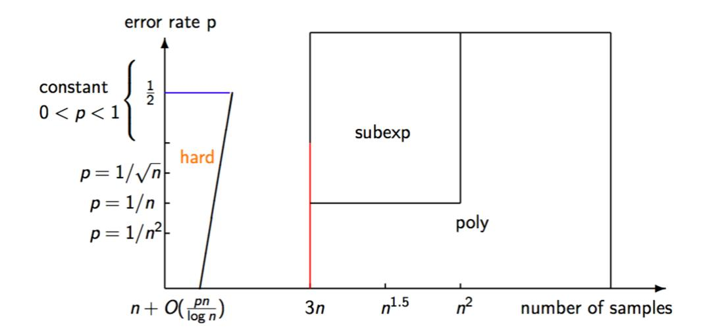

{0}------------------------------------------------

# Revisiting the Hardness of Binary Error LWE

Chao Sun1 , Mehdi Tibouchi1,2 , and Masayuki Abe1,2

1 Kyoto University, Kyoto, Japan sun.chao.46s@st.kyoto-u.ac.jp 2 NTT Secure Platform Laboratories, Tokyo, Japan {mehdi.tibouchi.br,masayuki.abe.cp}@hco.ntt.co.jp

Abstract. Binary error LWE is the particular case of the learning with errors (LWE) problem in which errors are chosen in {0, 1}. It has various cryptographic applications, and in particular, has been used to construct efficient encryption schemes for use in constrained devices. Arora and Ge showed that the problem can be solved in polynomial time given a number of samples quadratic in the dimension n. On the other hand, the problem is known to be as hard as standard LWE given only slightly more than n samples.

In this paper, we first examine more generally how the hardness of the problem varies with the number of available samples. Under standard heuristics on the Arora–Ge polynomial system, we show that, for any > 0, binary error LWE can be solved in polynomial time n O(1/) given ·n 2 samples. Similarly, it can be solved in subexponential time 2O˜(n 1−α) given n 1+α samples, for 0 < α < 1.

As a second contribution, we also generalize the binary error LWE to problem the case of a non-uniform error probability, and analyze the hardness of the non-uniform binary error LWE with respect to the error rate and the number of available samples. We show that, for any error rate 0 < p < 1, non-uniform binary error LWE is also as hard as worstcase lattice problems provided that the number of samples is suitably restricted. This is a generalization of Micciancio and Peikert's hardness proof for uniform binary error LWE. Furthermore, we also discuss attacks on the problem when the number of available samples is linear but significantly larger than n, and show that for sufficiently low error rates, subexponential or even polynomial time attacks are possible.

Keywords: Binary Error LWE · Algebraic Attacks · Macaulay Matrix · Sample Complexity · Complexity Tradeoffs · Lossy Function Family.

## 1 Introduction

Most of the public-key cryptography deployed today, such as the RSA cryptosystem [\[15\]](#page-19-0) and Diffie–Hellman key exchange [\[6\]](#page-19-1), relies on the conjectured hardness of integer factoring or the discrete logarithm problem, both of which are known to be broken by sufficiently large quantum computers [\[16\]](#page-19-2). As the advent of such quantum computers becomes increasingly plausible, it is important to prepare 

{1}------------------------------------------------

the transition towards postquantum cryptography, based on problems that are believed to be hard even against quantum adversaries.

One such problem particularly worthy of attention is the learning with errors problem (LWE), introduced by Regev in 2005 [\[14\]](#page-19-3). LWE and its variants are at the core of lattice-based cryptography, which offers attractive constructions for a wide range of cryptographic primitives in the postquantum setting from encryption and signatures all the way to fully homomorphic encryption, combining good efficiency with strong security guarantees. From a security perspective, the nice feature of LWE is that, while it is in essence an average-case problem (and hence easy to generate instances for), it is nevertheless as hard as worst-case lattice problems, for suitable parameter choices.

In terms of efficiency, standard LWE itself has relatively large keys, but a number of variants have been proposed with excellent performance in an asymptotic sense or for concrete security levels. These include structured versions of LWE, like Ring-LWE [\[10\]](#page-19-4), and instantiations in more aggressive ranges of parameters than those for which Regev's worst-case to average-case reduction holds.

An important example is binary error LWE, where the error term is sampled from {0, 1} (instead of a wider discrete Gaussian distribution). Binary error LWE is a particularly simple problem with various interesting cryptographic applications, such as Buchmann et al.'s efficient lattice-based encryption scheme for IoT and lightweight devices [\[5\]](#page-19-5) (based on the ring version of binary error LWE, with the additional constraint that the secret is binary as well). However, the problem is not hard given arbitrarily many samples: in fact, an algebraic attack due to Arora and Ge [\[3\]](#page-19-6) solves uniform Binary-Error LWE in polynomial time given around n 2/2 samples. The same approach can also be combined by Gr¨obner basis techniques to reduce the number of required samples [\[2\]](#page-19-7). On the other hand, Micciancio and Peikert [\[13\]](#page-19-8) showed that the uniform binary error LWE problem reduces to standard LWE (and thus is believed to be exponentially hard) when the number of samples is restricted to n + O(n/ log n). Thus, the hardness of binary error LWE crucially depends on the number of samples released to the adversary.

## 1.1 Our Results

In this paper, we show that a simple extension of the Arora-Ge attack (based on similar ideas as the Gr¨obner basis approach, but simpler and at least as fast) provides a smooth time-sample trade-off for binary error LWE: the attack can tackle any number of samples, with increasing complexity as the number of samples decreases. In particular, for binary error LWE with ·n 2 samples ( > 0 constant), we obtain an attack in polynomial time n O(1/) , assuming standard heuristics on the polynomial system arising from the Arora-Ge approach (namely, that it is semi-regular, a technical condition that is in particular known to be satisfied with overwhelming probability by random polynomial systems). Similarly, for n 1+α samples (0 < α < 1), we obtain an attack in subexponential time 2O˜(n 1−α) (again assuming semi-regularity). The precise complexity for any concrete num

{2}------------------------------------------------

ber of samples is also easy to compute, which makes it possible to precisely set parameters for cryptographic schemes based on binary error LWE.

In public-key encryption schemes, however, the number of samples given out to the adversary (as part of the public key) is typically of the form c · n for some constant c > 1. Therefore, it is neither captured by the Micciancio–Peikert security proof, nor within reach of our subexponential algebraic attack. In order to understand what additional results can be obtained with algebraic means in that range of parameters, we also generalize the binary error LWE to the nonuniform case, in which the error is chosen from {0, 1} and the error is 1 with some probability p not necessarily equal to 1/2.

We analyze this problem from two perspectives. On the one hand, we show that for any error rate p ≤ 1/2, non-uniform binary error LWE is as hard as worst-case lattice problems given n + O(pn/ log n) samples. This is a direct generalization of the hardness proof given by Micciancio and Peikert to the nonuniform case. On the other hand, we show that when the error rate is p = 1/nα (α > 0), there is a subexponential attack using only O(n) samples (which is even polynomial time if α ≥ 1).

In order to show a clear view of our result, the hardness result for binary error LWE is depicted in Figure 1. When the number of available samples is quadratic in dimension n, Arora-Ge algorithm gives a polynomial time attack. When the number of available samples is n 1+α(0 < α < 1), we show a subexponential algebraic attack. Besides, on the one hand, the blue line corresponds to the Micciancio-Peikert hardness proof, where we generalize to the whole trapezoid. On the other hand, the red line corresponds to our attack against non-uniform binary error LWE.

## 1.2 Techniques

Macaulay matrices. The basic Arora–Ge attack can be described as follows. Each binary error LWE sample provides a quadratic equation in the coefficients

Fig. 1. Hardness Result for Binary Error LWE

{3}------------------------------------------------

 $s_1, \ldots, s_n$  of the secret key:

$$f(s_1, \dots, s_n) = 0, \tag{1}$$

obtained by observing that the corresponding error value is equal to either 0 or 1, and hence one of the two linear equations corresponding to these error values holds, so their product vanishes. Arora and Ge form a polynomial system with these equations and *linearize* it, replacing each of the monomials of degree  $\leq 2$  appearing in the system by a new variable, and solving that linear system. This is of course only possible if the number of equations is sufficiently large: one needs at least as many equations as there are monomials of degree  $\leq 2$  in  $s_1, \ldots, s_n$ , namely  $\binom{n+2}{2} \approx n^2/2$ .

To go beyond that bound, one can try and increase the degree of the system. Instead of deducing a single equation (1) from the binary LWE sample, one can derive  $\binom{n+d}{d}$  equations by multiplying by all possible monomials of degree up to d, for some degree bound d to be chosen later:

$$\begin{cases} f(s_1, \dots, s_n) = 0 \\ s_1 f(s_1, \dots, s_n) = 0 \\ \vdots \\ s_1 s_2 f(s_1, \dots, s_n) = 0 \\ \vdots \\ s_n^d f(s_1, \dots, s_n) = 0 \end{cases}$$

When linearizing, we get more variables since the degree of the system is larger and there are thus more monomials, but we also get many more equations, and on balance, the minimal number of samples to start with in order for the resulting system to be solvable decreases (although a naive bound obtained by comparing the number of equations and the number of variables is insufficient, since the equations are no longer necessarily linearly independent with high probability).

The matrix of that linear system is called the *Macaulay matrix* of degree d. The basic idea of the extended attack is basically to start with the Arora–Ge polynomial system, and find the minimal d such that the Macaulay matrix becomes full-rank. This is difficult to estimate in full generality, but assuming that the Arora–Ge system is semi-regular, this can be done using techniques from complex analysis.

**From uniform to non-uniform.** For the hardness proof for non-uniform binary error LWE, we follow the outline of Micciancio and Peikert's proof, but have to adapt the various parts of the proof that rely on the input distribution being uniform. For instance, their proof of uninvertibility uses the following lemma:

**Lemma 1.** Let  $\mathcal{L}$  be a family of functions on the common domain X, and let  $\chi = \mathcal{U}(X)$  be the uniform input distribution over X. Then  $(\mathcal{L}, \mathcal{X})$  is  $\epsilon$ -uninvertible statistically, for  $\epsilon = \mathbb{E}_{f \leftarrow \mathcal{L}}[|f(X)|]/|X|$ .

{4}------------------------------------------------

In the proof for this lemma, the uniform property of the input distribution serves as a key factor to bound the success probability of the adversary. Suppose that f is a function and the domain, range of f is denoted as X, Y respectively. If  $y \in Y$  has several preimages, since the input distribution is uniform, the adversary can not do better than randomly guessing one preimage, even with unbounded computation power. However, this is not the case for a non-uniform input distribution. Suppose that the domain of f is  $\{0,1,2,3\}$  with probability  $\{1/2, 1/6, 1/6, 1/6\}$  respectively and f(0) = 0, f(1) = 0, f(2) = 0, f(3) = 1. If the adversary is given y = 0, instead of randomly guessing, the adversary can get some advantage by guessing the preimage with the highest conditional probability, so the adversary can always output 0. If guessing randomly, the adversary only has 1/3 probability of correctness, but if always guessing 0, the success probability becomes (1/2)/(1/2+1/6+1/6) = 3/5. Therefore, we need to prove new lemmas for non-uniform error distributions.

Our algorithm to attack non-uniform binary error LWE. Our algorithm comes from a simple idea: Suppose that we have n samples from non-uniform binary error LWE with error rate p = 1/n, the probability that n samples are all error free is  $(1 - 1/n)^n$ . Since

$$\lim_{n \to \infty} (1 - 1/n)^n = 1/e$$

the probability is asymptotically a constant. Intuitively, we can have the following simple algorithm:

- Step 1: Get n samples from the LWE oracle.
- Step 2: By assuming that the n samples are error free, solve the linear system.
- Step 3: If this fails, go back to step 1.

Since the success probability is a constant asymptotically, this algorithm is supposed to end in polynomial time. However, this algorithm has some slight issues. The first issue is that the n samples may not guarantee that LWE is well defined. The second issue is that this algorithm runs in *expected* polynomial time and uses O(n) samples on average, but these are not absolute bounds. To obtain a satisfactory algorithm, we need to modify the approach somewhat, and rely on careful tail bounds to analyze the resulting attacks.

## 2 Preliminaries

#### 2.1 Learning with Errors

**Definition 1 (LWE).** The (search) LWE problem, defined with respect to a dimension n, a modulus q and an error distribution  $\chi$  over  $\mathbb{Z}_q$ , asks to recover a secret vector  $\mathbf{s} \in \mathbb{Z}_q^n$  given polynomially many samples of the form

$$(\mathbf{a}, \langle \mathbf{a}, \mathbf{s} \rangle + e \bmod q) \in \mathbb{Z}_q^n \times \mathbb{Z}_q$$
 (2)

where **a** is uniformly random in  $\mathbb{Z}_q^n$ , and e is sampled according to  $\chi$ . One can optionally specify the number of available samples as an additional parameter.

{5}------------------------------------------------

#### 2.2 Arora-Ge algorithm

Arora and Ge proposed an algebraic approach to the LWE problem, which essentially amounts to expressing LWE as a system of polynomial equations, and then solving that system by unique linearization techniques. More precisely, solving an instance  $(\mathbf{A}, \mathbf{b})$  of the binary error LWE problem amounts to finding a vector  $\mathbf{s} \in \mathbb{Z}_q^n$  (which is uniquely determined) such that for  $i = 1, \ldots, m$ , we have:

$$b_i - \langle \mathbf{a}_i, \mathbf{s} \rangle \in \{0, 1\},$$

where the vectors  $\mathbf{a}_i$  are the rows of  $\mathbf{A}$ , and the scalars  $b_i$  the coefficients of  $\mathbf{b}$ . The idea of Arora and Ge is to rewrite that condition as:

$$(b_i - \langle \mathbf{a}_i, \mathbf{s} \rangle) \cdot (b_i - \langle \mathbf{a}_i, \mathbf{s} \rangle - 1) = 0,$$

which is a quadratic equation in the coefficients  $s_1, \ldots, s_n$  of **s**.

In general, solving a multivariate quadratic system is hard. However, it becomes easy when many equations are available. Arora and Ge propose to solve this system using a simple linearization technique: replace all the monomials appearing in the system by a new variable.

There are  $\binom{n+2}{2} = (n+2)(n+1)/2$  monomials of degree at most 2. Therefore, if the number of samples m is at least (n+2)(n+1)/2, linearizing the quadratic system should yield a full rank linear system with high probability, and the secret  $\mathbf{s}$  can be recovered by solving this linear system. This takes time  $O\left(\binom{n+2}{2}^{\omega}\right) = O(n^{2\omega})$ , and therefore shows that Binary-Error LWE can be solved in polynomial time given  $m \approx n^2/2$  samples.

#### 2.3 Function Family

A function family is a probability distribution  $\mathcal{F}$  over a set of functions  $\mathcal{F} \subset (X \to Y)$  with common domain X and range Y. Let  $\mathcal{X}$  be a probability distribution over the domain X of a function family  $\mathcal{F}$ . We recall the following standard security notions:

One Wayness:  $(\mathcal{F}, \mathcal{X})$  is  $(t, \epsilon)$ -one-way if for all probabilistic algorithms  $\mathcal{A}$  running in time at most t,

$$\Pr\left[f \leftarrow \mathcal{F}, x \leftarrow \mathcal{X} : \mathcal{A}(f, f(x)) \in f^{-1}(f(x))\right] \le \epsilon$$

**Uninvertibility:**  $(\mathcal{F}, \mathcal{X})$  is  $(t, \epsilon)$ -uninvertible if for all probabilistic algorithms  $\mathcal{A}$  running in time at most t,

$$\Pr[f \leftarrow \mathcal{F}, x \leftarrow \mathcal{X} : \mathcal{A}(f, f(x)) = x] \le \epsilon$$

**Second Preimage Resistance:**  $(\mathcal{F}, \mathcal{X})$  is  $(t, \epsilon)$ -second preimage resistant if for all probabilistic algorithms  $\mathcal{A}$  running in time at most t,

$$\Pr\left[f \leftarrow \mathcal{F}, x \leftarrow \mathcal{X}, x' \leftarrow \mathcal{A}(f, x) : f(x) = f(x') \land x \neq x'\right] \leq \epsilon$$

{6}------------------------------------------------

**Pseudorandomness:**  $(\mathcal{F}, \mathcal{X})$  is  $(t, \epsilon)$ -pseudorandom if the distributions  $\{f \leftarrow \mathcal{F}, x \leftarrow \mathcal{X} : (f, f(x))\}$  and  $\{f \leftarrow \mathcal{F}, y \leftarrow \mathcal{U}(Y) : (f, y)\}$  are  $(t, \epsilon)$ -indistinguishable, where  $\mathcal{U}(Y)$  denotes the uniform distribution over Y.

#### 2.4 Lossy Function Families

Lossy function family is a concept introduced by Micciancio and Peikert, which is a general framework to prove the one-wayness of some functions.

**Definition 2** (Lossy Function Families [13]). Let  $(\mathcal{L}, \mathcal{F})$  be two probability distributions (with possibly different supports) over the same set of (efficiently computable) functions  $\mathcal{F} \subset X \to Y$ , and let  $\mathcal{X}$  be an efficiently sampleable distribution over the domain X. We say that  $(\mathcal{L}, \mathcal{F}, \mathcal{X})$  is a lossy function family if the following properties are satisfied:

- the distributions  $\mathcal{L}$  and  $\mathcal{F}$  are indistinguishable.
- $(\mathcal{L}, \mathcal{X})$  is uninvertible.
- $(\mathcal{F}, \mathcal{X})$  is second preimage resistant.

The following two lemmas are some properties of lossy function family.

**Lemma 2** ([13]). Let  $\mathcal{F}$  be a family of functions computable in time t'. If  $(\mathcal{F}, \mathcal{X})$  is both  $(t, \epsilon)$ -uninvertible and  $(t + t', \epsilon')$ -second preimage resistant, then it is also  $(t, \epsilon + \epsilon')$ -one-way.

**Lemma 3** ([13]). Let  $\mathcal{F}$  and  $\mathcal{F}'$  be any two indistinguishable, efficiently computable function families, and let  $\mathcal{X}$  be an efficiently sampleable input distribution. Then if  $(\mathcal{F}, \mathcal{X})$  is uninvertible(respectively, second-preimage resistant), then  $(\mathcal{F}', \mathcal{X})$  is also uninvertible(resp., second preimage resistant). In particular, if  $(\mathcal{L}, \mathcal{F}, \mathcal{X})$  is a lossy function family, then  $(\mathcal{L}, \mathcal{X})$  and  $(\mathcal{F}, \mathcal{X})$  are both one-way.

### 2.5 SIS and LWE Function Family

The Short Integer Solution function family SIS(m, n, q, X) is the set of all functions  $f_A$  indexed by  $\mathbf{A} \in \mathbb{Z}_q^{n \times m}$  with domain  $X \subseteq \mathbb{Z}^m$  and range  $Y = \mathbb{Z}_q^n$  defined as  $f_{\mathbf{A}}(\mathbf{x}) = \mathbf{A}\mathbf{x} \mod q$ . The Learning With Errors function family LWE(m, n, q, X) is the set of all functions  $g_A$  indexed by  $\mathbf{A} \in \mathbb{Z}_q^{n \times m}$  with domain  $\mathbb{Z}_q^n \times X$  and range  $Y = \mathbb{Z}_q^m$ , defined as  $g_{\mathbf{A}}(\mathbf{s}, \mathbf{x}) = \mathbf{A}^T \mathbf{s} + \mathbf{x} \mod q$ . The following theorems are needed in our proof.

**Theorem 1** ([11, 12]). For any  $n, m \ge n + \omega(\log n)$ , q, and distribution  $\mathcal{X}$  over  $\mathbb{Z}^m$ , the LWE(m, n, q) function family is one-way (resp. pseudorandom, or uninvertible) with respect to input distribution  $U(\mathbb{Z}_q^n) \times \mathcal{X}$  if and only if the SIS(m, m - n, q) function family is one-way (resp. pseudorandom, or uninvertible) with respect to the input distribution  $\mathcal{X}$ .

{7}------------------------------------------------

**Theorem 2 ([13]).** For any positive  $m, n, \delta, q$  such that  $\omega(\log n) \leq m - n \leq n^{O(1)}$  and  $2\sqrt{n} < \delta < q < n^{O(1)}$ , if q has no divisors in the range  $((\delta/\omega_n)^{1+n/k}, \delta \cdot \omega_n)$ , then the SIS(m, m-n, q) function family is pseudorandom with respect to input distribution  $D^m_{\mathbb{Z},\delta}$ , under the assumption that no (quantum) algorithm can efficiently sample (up to negligible statistical errors)  $D_{\wedge,\sqrt{2n}q/\delta}$ . In particular, assuming the worst-case (quantum) hardness of  $SIVP_{n\omega_n q/\delta}$  on n-dimensional lattices, the SIS(m, m-n, q) function family is pseudorandom with respect to input distribution  $D^m_{\mathbb{Z},\delta}$ .

## 3 Sample-Time Trade-off for Binary Error LWE

In this section, we use the Macaulay matrix approach to get a sample-time trade-off for the binary error LWE.

### 3.1 Hilbert's Nullstellensatz for Arora–Ge

Slightly informally, Hilbert's Nullstellensatz essentially states that the ideal generated by a family of polynomials  $f_1, \ldots, f_m \in \mathbb{Z}_q[x_1, \ldots, x_n]$  coincides with the ideal of polynomials that vanish on the set  $V(f_1, \ldots, f_m)$  of solutions of the polynomial system:

$$f_1(x_1,\ldots,x_n) = \cdots = f_m(x_1,\ldots,x_n) = 0$$

Now consider the application of Hilbert's Nullstellensatz to the polynomial system arising from Arora and Ge's approach to Binary-Error LWE. That system is of the form:

$$\begin{cases} f_1(x_1, \dots, x_n) = 0 \\ \vdots \\ f_m(x_1, \dots, x_n) = 0 \end{cases}$$

where  $f_1, \ldots, f_m \in \mathbb{Z}_q[x_1, \ldots, x_n]$  are known quadratic polynomials. By the uniqueness of LWE solution, the set  $V(f_1, \ldots, f_m)$  of solutions of that system is reduced to a single point:

$$V(f_1, \ldots, f_m) = \{(s_1, \ldots, s_n)\} = \{\mathbf{s}\},\$$

namely, the unique solution of the Binary-Error LWE problem. It follows that the ideal  $I = (f_1, \ldots, f_m) \subset \mathbb{Z}_q[x_1, \ldots, x_n]$  generated by the polynomials  $f_i$  coincides with the ideal of polynomial functions vanishing on  $\{s\}$ , which is just  $(x_1 - s_1, \ldots, x_n - s_n)$ .

As a consequence, for  $j=1,\cdots,n$ , there exists polynomials  $g_{1j},\cdots,g_{mj}\in Z_q[x_1\cdots x_n]$  such that:

$$g_{1j} \cdot f_1 + \dots + g_{mj} \cdot f_m = x_j - s_j.$$

{8}------------------------------------------------

### 3.2 The Macaulay matrix

Now consider the Arora-Ge approach of linearizing the polynomial system, except that we do not apply it to the quadratic system directly, but instead to an equivalent, expanded polynomial system. This expanded system is obtained by multiplying each equation  $f_i = 0$  by all possible monomials of degree up to d, for some fixed  $d \geq 0$ . The d-th Macaulay linear system is then the linear system obtained by taking this expanded polynomial system and linearizing it, i.e., replacing each monomial appearing in the system by a new variable. Since the maximum degree is d + 2, the resulting linear system consists of  $m\binom{n+d}{d}$  equations in  $\binom{n+d+2}{d+2}$  unknowns. The matrix of the system is called Macaulay matrix.

Consider then the polynomials  $g_{ij}$  introduced above and let d be the maximum of their total degrees. Clearly, the polynomial  $g_{1j} \cdot f_1 + \cdots + g_{mj} \cdot f_m$  is a linear combination of the polynomials appearing in the expanded system. But by definition, this polynomial is equal to  $x_j - s_j$ . Therefore, any solution of the d-th Macaulay linear system must assign the variable associated to  $x_j$  to  $s_j$ , the j-th coefficient of the actual solution s.

### 3.3 Semi-regularity

We can completely determine the cost of the approach above provided that we can determine the minimal value D sufficient to recover  $\mathbf{s}$ , starting from a given number m of samples. This value D is called the degree of regularity of the system.

In general, the degree of regularity is difficult to compute, but has a tractable expression for a certain subclass of polynomial systems called semi-regular polynomial systems. It is believed that random polynomial systems are semi-regular with overwhelming probability,3 and therefore assuming semi-regularity is a standard heuristic assumption.

We omit the formal definition of a semi-regular system here. For our purpose, it suffices to explain how the degree of regularity of a semi-regular system can be computed. Consider a polynomial system of m equations in n unknowns with m>n, defined by polynomials  $f_1,\cdots,f_m$  of total degree  $d_1,\cdots,d_m$  respectively, and introduce

$$H(z) = \frac{\prod_{i=1}^{m} (1 - z^{d_i})}{(1 - z)^{n+1}}$$

Note that this function H is a polynomial  $1 + H_1z + H_2z^2 + \cdots$  with integer coefficients since 1 - z divides  $1 - z^{d_i}$  for all i, and  $m \ge n + 1$ . If the polynomial system is semi-regular, then its degree of regularity D is the smallest j such that the coefficient  $H_j$  of degree j of H satisfies  $H_j \le 0$ .

More precisely, it is known that among of systems of m equations of prescribed degrees in n unknowns, non-semi-regular systems form a Zariski closed subset. It is believed that this subset has relatively large codimension, so that only a negligible fractions of possible systems fail to be semi-regular. This is related to a conjecture of Fröberg [9]. See e.g. [1, §1] for an extended discussion.

{9}------------------------------------------------

#### 3.4 Application to Binary Error LWE

The Arora-Ge polynomial system arising from binary error LWE is a polynomial system as above with  $d_1 = \cdots = d_m = 2$ . Therefore, we can sum up the results of this section as the following theorem.

**Theorem 3.** Under the standard heuristic assumption that the Arora-Ge polynomial system is semi-regular, one can solve Binary Error LWE in time  $O(\binom{n+D}{D}^w)$ , where D is the smallest j such that the coefficient of degree j of the following polynomial

$$H(z) = \frac{(1-z^2)^m}{(1-z)^{n+1}}$$

is non-positive.

One can apply this result for concrete instances of the binary error LWE problems. For instance, the first two parameter sets proposed for the scheme of Buchmann et al. [5] correspond to the case when n=256 and m=2n=512. One can easily check that the first non-positive coefficient of  $(1-z^2)^{512}/(1-z)^{257}$  is the coefficient of degree 30. Therefore, this algebraic attack reduces to solving a polynomial system in  $\binom{256+30}{30} \approx 2^{135}$  unknowns.

The attack can in fact be improved due to the fact that the secret in that scheme is also binary, which provides n more quadratic equations of the form  $s_i(s_i-1)=0$ , for a total of 768. The first non-positive coefficient of  $(1-z^2)^{768}/(1-z)^{257}$  is the coefficient of degree 20, reducing the number of unknowns to  $\binom{256+20}{20} \approx 2^{100}$ . The resulting attack is better than the naive attack by guessing the error vector, but is worse than what can be achieved by lattice reduction techniques against the same parameters.

To estimate the complexity of the attack in more general cases, we simply need to find asymptotic estimates for the degree of the first non-positive coefficient of the polynomial H.

Remark 1. One can ask how this approach compares to simply applying Gröbner basis computation algorithm to the Arora–Ge polynomial system. The answer is that the two approaches are essentially equivalent (and in fact, some Gröbner basis algorithms such as Matrix-F4 for a suitable monomial ordering can be expressed in terms of Macaulay matrix [8]), but knowing the degree D in advance avoids the difficulties related to the iterative nature of Gröbner basis algorithms, and hence saves some polynomial factors in terms of asymptotic complexity. It also makes it clear that the problem reduces to solving a relatively sparse linear system (since the rows of the Macaulay matrix have only  $O(n^2)$  nonzero coefficients among  $O(n^D)$ ), which can yield to various algorithmic optimizations.

Nevertheless, our results can be regarded as closely related to the Gröbner-based analysis presented in [1]. The main difference is that we are interested in a wider range of asymptotic regimes in order to obtain a full, smooth time-sample trade-off.

{10}------------------------------------------------

### 3.5 Sample-Time Trade-off

As discussed above, estimating the asymptotic complexity of our algebraic attack reduces to computing the degree of regularity D of the Arora-Ge polynomial system, which is equivalent to finding the degree of the smallest non-positive coefficient of  $H_z = \frac{(1-z^2)^m}{(1-z)^{n+1}}$ .

We consider two distinct asymptotic regimes:  $m \sim \epsilon \cdot n^2$  for  $\epsilon > 0$  and  $m \sim n^{1+\alpha}$  for some  $\alpha \in (0,1)$ . The analysis in the first case can be done combinatorially in a way that is essentially fully explicit, and shows that the attack is polynomial time for any  $\epsilon > 0$ . The second case is more similar to previous cases considered in the literature, and can be dealt with using techniques from complex analysis as demonstrated by Bardet et al. [4]; the attack in that case is subexponential.

Attack With Quadratically Many Samples Consider first the case  $m \sim \epsilon \cdot n^2$  for some  $\epsilon > 0$ . We claim that the attack is then polynomial: this means in particular that the degree of regularity is constant. In other words, there exists a fixed d depending on  $\epsilon$  such that for all large enough n, the d-th coefficient  $h_d$  of the Hilbert polynomial:

$$H_{m,n}(z) = \frac{(1-z^2)^m}{(1-z)^{n+1}} = (1-z)^{m-n-1}(1+z)^m = \sum_{d>0} h_d z^d$$
 (3)

is non positive. To find this d, we can write down  $h_d$  explicitly, and try to estimate its sign for  $n \to +\infty$ . After some combinatorial computations (left to the full version of this paper), we find that the sign of  $h_d$  is related to the sequence  $(P_d)_{d\geq 0}$  of polynomials with rational coefficients uniquely defined as follows:

$$P_0 = P_1 = 1$$
  $P'_k = -P_{k-2}$  (for all  $k \ge 2$ )  $P_k(0) = \frac{1}{k!}$ .

The relationship between those polynomials and the problem at hand is as follows.

**Lemma 4.** Suppose  $m \sim \epsilon \cdot n^2$  for some  $\epsilon > 0$ , and fix  $d \geq 0$ . Then we have, for  $n \to +\infty$ :

$$h_d = P_d(\epsilon) \cdot n^d + O(n^{d-1}).$$

In particular, the sign of  $h_d$  for sufficiently large n is the same as the sign of  $P_d(\epsilon)$  as long as  $P_d(\epsilon) \neq 0$ .

Furthermore, the polynomials  $P_k$  can be expressed in terms of the well-known Hermite polynomials, and hence their roots are well-understood.

**Lemma 5.** Let  $H_k(x) = (-1)^k e^{x^2} \frac{d^k}{dx^k} e^{-x^k}$  be the k-th Hermite polynomial. Then we have:

$$P_k(x^2) = \frac{x^k}{k!} H_k\left(\frac{1}{2x}\right)$$

{11}------------------------------------------------

for all k ≥ 0. In particular, for k ≥ 2, the roots of Pk are all real, positive, and simple. Denote by xk > 0 the smallest root of Pk. The sequence (xk)k≥2 decreases towards 0, and we have xk ∼k→+∞ 1/(8k).

Combining the lemmas above, we obtain:

Theorem 4. Suppose m ∼ · n 2 ( a positive constant), and let (xk)k≥1 be the decreasing sequence defined in Lemma [5,](#page-10-0) with the convention that x1 = +∞. Then the degree of regularity dreg of a semi-regular system of m quadratic equations in n variables satisfies that dreg ≤ d as soon as > xd. In particular, dreg is always bounded, and if /∈ {x2, x3, . . . }, it is exactly equal to the unique d such that xd < < xd−1. Furthermore, as approaches 0, it behaves as dreg ∼ 1/(8). The time complexity O n+dreg dreg ω of the attack on binary error LWE is always polynomial in this setting.

Attack With Subquadratically Many Samples We now turn to the case when m ∼ n 1+α for some α ∈ (0, 1). As mentioned earlier, the attack in this case is subexponential.

Theorem 5. For m = n 1+α + o(n) (α a constant in (0, 1)) quadratic equations in n variables, the degree of regularity dreg of a semi-regular system behaves asymptotically as dreg ∼ 1 8 n 1−α. The time complexity O n+dreg dreg ω of the attack on binary error LWE is then subexponential.

The proof essentially follows [\[1,](#page-19-12) Appendix A.1].

Proof. Denote again by hd the d-th coefficient of the Hilbert series.

$$H_{m,n}(z) = \frac{(1-z^2)^m}{(1-z)^{n+1}} = \sum_{d=0}^{\infty} h_d z^d$$
 (4)

Since our goal is to determine the first index d such that hd is non-positive, we try to estimate the behavior of hd asymptotically as d increases. To do so, we write hd as an integral using Cauchy's integral formula:

$$h_d = \frac{1}{2i\pi} \oint H_{m,n}(z) \frac{dz}{z^{d+1}}$$

where the integration path encloses the origin and no other singularity of Hm,n(z). Since we are looking for the smallest value d such that hd crosses from positive to negative, this amounts to solving for real d > 0 such that the integral vanishes. To do so, we estimate the integral using Laplace's method. Write:

$$h_d = \frac{1}{2i\pi} \oint e^{nf(z)} dz$$

for some function f. By identification, we have:

$$e^{nf(z)} = \frac{(1-z)^{m-n-1}(1+z)^m}{z^{d+1}},$$

{12}------------------------------------------------

which gives:

$$nf(z) = (m-n-1)\log(1-z) + m\log(1+z) - (d+1)\log z.$$

Laplace's method shows that the behavior is determined by the point z0 where f vanishes (or the points in the case of multiple roots). Since we have:

$$nf'(z) = \frac{n-m+1}{1-z} + \frac{m}{1+z} - \frac{d+1}{z},$$

z0 is a root of the quadratic equation:

$$(n-2m+d+2)z^{2} + (n+1)z - (d+1) = 0.$$

If the discriminant ∆ of this equation is not zero, it means that there are two distinct saddle points. The contribution of these two saddle points to the integral are conjugate values whose sum does not vanish. Hence the two saddle points must be identical, which means that ∆ = 0. Now:

$$\Delta = 4(d+1)^2 + 4(n-2m+1)(d+1) + (n+1)^2 = 0.$$

Solving this equation, we get

$$d + 1 = m - \frac{n+1}{2} - \sqrt{m(m-n)}.$$

Substituting m = n 1+α, it follows that:

$$\begin{aligned} d+1 &= n^{1+\alpha} - \frac{n+1}{2} - n^{1+\alpha} \sqrt{1 - \frac{1}{n^{\alpha}}} \\ &= n^{1+\alpha} - \frac{n+1}{2} - n^{1+\alpha} \left[ 1 - \frac{1}{2n^{\alpha}} - \frac{1}{8n^{2\alpha}} + o(n^{-2\alpha}) \right] \\ &= n^{1+\alpha} - \frac{n+1}{2} - n^{1+\alpha} + \frac{n}{2} + \frac{1}{8}n^{1-\alpha} + o(n^{1-\alpha}) \\ &= \left( \frac{1}{8} + o(1) \right) n^{1-\alpha} \end{aligned}$$

as required. One easily checks that the same estimate still holds for m = n 1+α + o(n), i.e., m = 1 + t n 1+α for some t = o(n −α).

## 4 Hardness of LWE with Non-uniform Binary Error

In this section we analyze the hardness of non-uniform binary error LWE.

## 4.1 Hardness of Non-uniform Binary Error LWE with Limited Samples

First, we show that non-uniform binary error LWE is as hard as worst-case lattice problems when the number of available samples is restricted. We follow 

{13}------------------------------------------------

the outline of Micciancio-Peikert proof[13] (for some other similar work, see [7]), by constructing a lossy function family with respect to the non-uniform input distribution  $\chi$ . As previously stated, we overcome the difficulty of transforming from uniform to non-uniform, hence adapting the various parts of proof that relies on the distribution being uniform. In order to prove  $(\mathcal{L}, \mathcal{F}, \mathcal{X})$  is a lossy function family, we will prove:

- $-\mathcal{L}$  is uninvertible with respect to  $\mathcal{X}$ .
- $-\mathcal{F}$  is second preimage resistant with respect to  $\mathcal{X}$ .
- $-(\mathcal{L},\mathcal{F})$  are indistinguishable.

where  $\mathcal{F} = SIS(m, m-n, q)$  and  $\mathcal{L} = SIS(l, m-n, q) \circ \mathcal{I}(m, l, \mathcal{Y})$ , where  $\circ$  means the composition of two functions and  $\mathcal{I}(m, l, \mathcal{Y})$  is defined in Definition 3.

### Statistical Uninvertibility.

**Lemma 6.** Let m be a positive integer,  $\mathcal{L}$  be a family of functions on the common domain  $X = \{0,1\}^m$ , we define a non-uniform distribution  $\chi$  over  $\{0,1\}^m$  such that each coefficient  $x_i (i = 1, \dots, m)$  is 1 with probability  $p(0 , and set <math>p' = \max(p, 1 - p)$ . Then  $\mathcal{L}$  is  $\epsilon$ -uninvertible statistically w.r.t  $\chi$  for  $\epsilon = \mathbb{E}_{f \leftarrow \mathcal{L}}(p')^m \cdot |f(X)|$ , where |f(X)| means the number of elements in the range and  $\mathbb{E}$  means taking the expectation over the choice of f.

*Proof.* Fix any  $f \leftarrow \mathcal{L}$  and choose a input x from the distribution  $\chi$ . Denote y = f(x). The best attack that the adversary can achieve is to choose the element with the highest conditional probability.

 $\Pr[\text{adversary can invert}] = \sum_{x} \Pr[x] \cdot \Pr[\text{adversary can invert given } f(x)]$ 

 $= \sum_{x} \Pr[x] \cdot \Pr[x \text{ is the preimage with highest conditional probability in } f^{-1}(f(x))]$ 

$$= \sum_{y \in f(X)} \frac{\max_{x \in f^{-1}(y)} \Pr(x)}{\sum_{x \in f^{-1}(y)} \Pr(x)} \cdot \sum_{x \in f^{-1}(y)} \Pr(x) = \sum_{y \in f(X)} \max_{x \in f^{-1}(y)} \Pr(x)$$

All the possible probability for sampling x from  $\chi$  is  $p^k \cdot (1-p)^{m-k}$   $(k=0,1,2\cdots m)$ , we know that the maximum probability is  $(\max(p,1-p))^m$ . Then let  $p'=\max(p,1-p)$ , the result follows.

In order to establish a connection with standard LWE, the following definition is needed.

**Definition 3 ([13]).** For any probability distribution  $\mathcal{Y}$  over  $\mathbb{Z}^l$  and integer  $m \geq l$ , let  $\mathcal{I}(m,l,\mathcal{Y})$  be the probability distribution over linear functions  $[I \mid Y]$ :  $\mathbb{Z}^m \to \mathbb{Z}^l$  where I is  $l \times l$  identity matrix, and  $Y \in \mathbb{Z}^{l \times (m-l)}$  is obtained choosing each column of Y independently at random from  $\mathcal{Y}$ .

The following lemma shows that, for the Gaussian distribution, the function family  $\mathcal{I}(m, l, \mathcal{Y})$  is statistically uninvertible.

{14}------------------------------------------------

**Lemma 7.** Let m be a positive integer,  $\chi$  be a not necessarily uniform distribution over  $\{0,1\}^m$  such that each coefficient  $x_i$   $(i=1,\cdots,m)$  is 1 with probability p  $(0 , <math>\mathcal{Y} = D^l_{\mathbb{Z},\delta}$  be the discrete Gaussian distribution with parameter  $\delta > 0$ , p' = max(p, 1-p). Then  $\mathcal{I}(m, l, \mathcal{Y})$  is  $\epsilon$ -uninvertible with respect to the non-uniform distribution  $\chi$ , for  $\epsilon = O(\delta m/\sqrt{l})^l \cdot (p')^m + 2^{-\Omega(m)}$ .

Proof. In order to use Lemma 6, we only need to bound the size of the range f(X). Recall that  $f = [I \mid Y]$  where  $Y \leftarrow D_{\mathbb{Z},\delta}^{l \times (m-l)}$ . Since the entries of  $Y \in \mathbb{R}^{l \times (m-l)}$  are independent mena-zero subgaussians with parameter  $\delta$ , by a standard bound from the theory of random matrices, the largest singular value  $s_1(Y) = \max_{0 \neq \mathbf{x} \in \mathbb{R}^m} ||Yx||/||\mathbf{x}||$  of Y is at most  $\delta \cdot O(\sqrt{l} + \sqrt{m-l}) = \delta \cdot O(\sqrt{m})$ , except with probability  $2^{-\Omega(m)}$ . We now bound the  $l_2$  norm of all vectors in the image f(X). Let  $\mathbf{u} = (\mathbf{u_1}, \mathbf{u_2}) \in X$ , with  $u_1 \in \mathbb{Z}^l$  and  $\mathbf{u}_2 \in \mathbb{Z}^{m-l}$ . Then

$$||f(\mathbf{u})|| \le ||\mathbf{u}_1 + Y\mathbf{u}_2|| \le ||\mathbf{u}_1|| + ||Y\mathbf{u}_2|| \le (\sqrt{l} + s_1(Y)\sqrt{m-l})$$
  
  $\le (\sqrt{l} + \delta \cdot O(\sqrt{m})\sqrt{m-l}) = O(\delta m)$ 

The number of integer points in the l-dimensional zero-centered ball of radius  $R = O(\delta m)$  can be bounded by a simple volume argument, as  $|f(X)| \le (R + \sqrt{l}/2)^n V_l = O(\delta m/\sqrt{l})^l$ , where  $V_l = \pi^{l/2}/(l/2)!$  is the volume of the l-dimensional unit ball. From Lemma 6, and considering the event that  $s_1(Y)$  is not bounded as above, we get that  $\mathcal{I}(m, l, \mathcal{Y})$  is  $\epsilon$ -uninvertible for  $\epsilon = O(\delta m/\sqrt{l})^l \cdot (p')^m + 2^{-\Omega(m)}$ .

#### Second Preimage Resistance.

**Lemma 8.** Let  $\chi$  be a not necessarily uniform distribution over  $\{0,1\}^m$  such that each coefficient  $x_i$  ( $i=1,\dots,m$ ) is 1 with probability p (0 ). For any positive integers <math>m,k, any prime q, the function family SIS(m,k,q) is (statistically)  $\epsilon$ -second preimage resistant with respect to the non-uniform distribution  $\chi$  for  $\epsilon = 2^m/q^k$ .

Proof. Let  $\mathbf{x} \leftarrow \chi$  and  $A \leftarrow \mathrm{SIS}(\mathbf{m}, \mathbf{k}, \mathbf{q})$  be chosen at random. We want to evaluate the probability that there exists an  $\mathbf{x}' \in \{0,1\}^m \setminus \{\mathbf{x}\}$  such that  $A\mathbf{x} = A\mathbf{x}'(\bmod{q})$ , or equivalently,  $A(\mathbf{x} - \mathbf{x}') = \mathbf{0}(\bmod{q})$ . Fix two distinct vectors  $\mathbf{x}, \mathbf{x}' \in \{0,1\}^m$  and let  $\mathbf{z} = \mathbf{x} - \mathbf{x}'$ . Then considering taking the random choice of A, since all coordinates of  $\mathbf{z}$  are in the range  $z_i \in \{-1,0,1\}$  and at least one of them is nonzero, the vectors  $A\mathbf{z}(\bmod{q})$  is distributed uniformly at random in  $(\mathbb{Z}_q)^k$ , the probability of  $A\mathbf{z} = \mathbf{0} \pmod{q}$  is  $1/q^k$ . Therefore, by using union bound(over  $\mathbf{x}' \in X \setminus \{\mathbf{x}\}$ ) for any  $\mathbf{x}$ , the probability that there is a second preimage  $\mathbf{x}'$  is at most  $(2^m - 1)/q^k < 2^m/q^k$ .

#### Indistinguishability of $\mathcal{L}$ and $\mathcal{F}$ .

**Lemma 9.** Let  $\mathcal{F} = SIS(m, m-n, q)$  and  $\mathcal{L} = SIS(l, m-n, q) \circ \mathcal{I}(m, l, \mathcal{Y})$ , where  $\mathcal{I}(m, l, \mathcal{Y})$  is defined in Definition 3. If SIS(l, m-n, q) is pseudorandom with respect to the distribution  $\mathcal{Y}$ , then  $\mathcal{L}$  and  $\mathcal{F}$  are indistinguishable.

{15}------------------------------------------------

*Proof.* Choose a random input  $\mathbf{x} \in \mathbb{Z}^m$ . According to the definition of  $\mathcal{F}$  and  $\mathcal{L}$ 

$$\mathcal{L}: \mathbf{x} \to A[I|Y]\mathbf{x} \bmod q$$
$$\mathcal{F}: \mathbf{x} \to [A'_1, A'_2]\mathbf{x} \bmod q$$

With the property of block matrix multiplication, A can be divided into two blocks:  $A_1$  is a  $l \times l$  matrix,  $A_2$  is a  $(m - n - l) \times l$  matrix, so we have

$$\mathcal{L}: \mathbf{x} \to [A_1, A_2 Y] \mathbf{x} \bmod q$$
  
 $\mathcal{F}: \mathbf{x} \to [A'_1, A'_2] \mathbf{x} \bmod q$ 

Since  $A_1$  and  $A'_1$  are uniformly random chosen,  $A_1$ **x** and  $A'_1$ **x** are indistinguishable. Recall that SIS(l, m-n, q) is pseudorandom with respect to the distribution  $\mathcal{Y}$ , thus  $A_2Y$  is indistinguishable from  $A'_2$ . Then we can conclude that  $\mathcal{L}$  and  $\mathcal{F}$  are indistinguishable.

#### One-wayness.

**Theorem 6.** Let m, n, k (0 <  $k \le n \le m$ ) be some positive integer, q be a prime modulus and let  $\chi$  be a not necessarily uniform distribution over  $\{0,1\}^m$  such that each coefficient  $x_i$  ( $i=1,\dots,m$ ) is 1 with probability p (0 < p < 1), p'=max(p,1-p), and  $\mathcal Y$  be the discrete Gaussian distribution  $\mathcal Y=D^l_{\mathbb Z,\delta}$  over  $\mathbb Z^l$ , where l=m-n+k. If SIS(l,m-n,q) is pseudorandom with respect to the discrete Gaussian distribution  $\mathcal Y=D^l_{\mathbb Z,\delta}$ , then SIS(m,m-n,q) is  $(2\epsilon+2^{-\Omega(m)})$ -one-way with respect to the input distribution  $\chi$  if

$$(C'\delta m/\sqrt{l})^l/\epsilon \le 1/(p')^m$$
 and  $2^m \le \epsilon \cdot (q)^{m-n}$ 

where C' is universal constant in big O notation in Lemma 7.

Proof. We will prove that  $(\mathcal{L}, \mathcal{F}, \mathcal{X})$  is a lossy function family, where  $\mathcal{F} = \mathrm{SIS}(m, m-n, q)$  and  $\mathcal{L} = \mathrm{SIS}(l, m-n, q) \circ \mathcal{I}(m, l, \mathcal{Y})$ . It follows from Lemma 8 that  $\mathcal{F}$  is second-preimage resistant with respect to  $\chi$ . The indistinguishability of  $\mathcal{L}$  and  $\mathcal{F}$  follows from Lemma 9. By lemma 7, we have the uninvertibility of  $\mathcal{I}(m, l, \mathcal{Y})$ , since  $\mathcal{L} = \mathrm{SIS}(l, m-n, q) \circ \mathcal{I}(m, l, \mathcal{Y})$ , the uninvertibility of  $\mathcal{L}$  follows. With the three properties of lossy function family, we conclude that  $(\mathcal{L}, \mathcal{F}, \mathcal{X})$  is a lossy function family. Then from the property of lossy function family with Lemma 3, this theorem is proved.

Instantiation for the LWE parameter. After getting the hardness result for SIS function, the one-wayness of LWE function can be established.

**Theorem 7 (LWE Parameter).** Let  $0 < k \le n \le m$ , 0 , <math>p' = max(p, 1-p), l = m-n+k,  $1/p' \ge (Cm)^{l/m}$  for a large enough universal constant C, and q be a prime such that  $max(3\sqrt{k}, 8^{m/(m-n)}) \le q \le k^{O(1)}$ . Let  $\chi$  be a non-uniform distribution over  $\{0,1\}^m$  such that each coefficient  $x_i(i = 1, \dots, m)$  is 1 with probability p, the LWE(m, n, q) function family is one-way

{16}------------------------------------------------

with respect to the distribution  $U_{\mathbb{Z}_q^n} \times \chi$ . In particular, these conditions can be satisfied by setting  $k = n/(c_2 \log_{1/p'} n)$ ,  $m = n(1+1/(c_1 \log_{1/p'} n))$ , where  $c_1 > 1$  is any constant, and  $c_2$  such that  $1/c_1 + 1/c_2 < 1$ .

*Proof.* In order to prove the one-wayness of LWE(m, n, q)(SIS and LWE are equivalent according to theorem 1) using theorem 6, we need to satisfy the two requirements:

$$(C'\delta m/\sqrt{l})^l/\epsilon \le 1/(p')^m$$
 and  $2^m \le \epsilon \cdot (q)^{m-n}$ 

Set  $\delta = 3\sqrt{k}$ , and with  $l \ge k$ , the first requirement can be simplified to  $\frac{(3C'm)^l}{(1/p')^m} < \epsilon$ . Since we have  $1/p' \ge (Cm)^{l/m}$ , so  $(1/p')^m \ge (Cm)^l$ . Let C = 4C', we get that  $\frac{(3C'm)^l}{(1/p)^m} \le (3/4)^{-l} \le (3/4)^{-k}$  is exponentially small in k, so the first inequality is satisfied. Since  $q > 8^{m/(m-n)}$ , the second inequality is also satisfied.

Besides, we also need to prove the pseudorandomness of  $\mathrm{SIS}(l,m-n,q)$  with respect to discrete Gaussian distribution  $\mathcal{Y}=D^l_{\mathbb{Z},\delta}$ , which can be based on the hardness of SIVP on k-dimensional lattice using Theorem 2. After properly renaming the variables, and using  $\delta=3\sqrt{k}$ , the requirement becomes  $\omega(\log k) \leq m-n \leq k^{O(1)}, 3\sqrt{k} < q < k^{O(1)}$ . The corresponding assumption is the worst-case hardness of SIVP $_{\gamma}$  on k-dimensional lattices, for  $\gamma=\tilde{O}(\sqrt{k}q)$ .

For the particular instantiation, let  $m = n(1 + 1/(c_1 \log_{\frac{1}{p'}} n))(c_1 > 1)$ ,  $k = n/(c_2 \log_{\frac{1}{p'}} n)(c_2 \text{ is a positive constant such that } 1/c_1 + 1/c_2 < 1)$ . The requirement  $1/p' \ge (Cm)^{l/m}$  is equivalent to  $m \ge l \log_{1/p'} Cm$ . Since we can do a symptotic analysis:

$$l = m - n + k = (1/c_1 + 1/c_2)n/\log_{1/n'} n$$

and

$$\log_{1/n'} Cm = \log_{1/n'} Cn(1 + 1/\log_{1/n'} n) \approx \log_{1/n'} n + \log_{1/n'} C$$

So we have

$$l \log_{1/p'} Cm \approx (1/c_1 + 1/c_2)n(1 + \log_{1/p'} C/\log_{1/p'} n)$$

When  $(1/c_1 + 1/c_2) < 1$ ,  $m \ge l \log_{1/p'} Cm$  asymptotically(we only need to consider the dominant term). This concludes the proof.

## 4.2 Attacks Against Non-uniform Binary Error LWE

Now we consider the case where the number of available samples is not so strongly restricted and the error rate is a function of n such that  $p = 1/n^{\alpha} (\alpha > 0)$ . We show an attack against LWE with non-uniform binary error given O(n) samples. The idea behind our attack is quite simple:

- Step 1: Get n samples from the LWE oracle.

{17}------------------------------------------------

- Step 2: By assuming the n samples are all error free, solve the linear equation system.
- Step 3: If failed, go back to step1.

For instance, when the error rate p = 1/n, the probability that all samples are error free is:

$$\lim_{n \to \infty} (1 - 1/n)^n = 1/e$$

This means that our algorithm is expected to stop after polynomial times of trials. However, the number of total samples used is not bounded. Therefore, we slightly modified the algorithm as follows:

- Step 1: Get 3n samples from the LWE oracle.
- Step 2: Choose 2n samples randomly from the 3n samples got in step1.
- Step 3: By assuming the 2n samples are all error free, solve the linear equation system.
- Step 4: If failed, go back to step2.

We analyze the following two cases respectively:

- p = 1/nα for any constant α ≥ 1.
- p = 1/nα for any constant 0 < α < 1.

and have the following results:

Theorem 8. By applying the above algorithm, for any positive constant α ≥ 1, non-uniform binary error LWE with error rate p = 1/nα can be attacked in polynomial time with O(n) samples, and for any positive constant 0 < α < 1, non-uniform binary error LWE with error rate p = 1/nα can be attacked in subexponential time with O(n) samples.

Proof. Suppose that there are m errors within the 3n samples. The probability that 2n samples are all error free is

$$\Pr\left(\text{success}\right) = \frac{\binom{3n-m}{2n}}{\binom{3n}{2n}} = \frac{(3n-m)!}{(n-m)!(2n)!} \cdot \frac{(2n)!(n!)}{(3n)!} = \frac{(3n-m)!}{(n-m)!} \cdot \frac{(n!)}{(3n)!}$$
$$= \frac{n \cdot \cdot \cdot (n-m+1)}{3n \cdot \cdot \cdot (3n-m+1)} \ge \left(\frac{n-m}{3n}\right)^m \ge \left(\frac{1}{3} - o(1)\right)^m$$

provided that m = o(n). With tail bound for binomial distribution,

$$\Pr(m \ge k) \le \exp(-nD(\frac{k}{n}||p)) \text{ if } p < \frac{k}{n} < 1$$

where D(a||p) is the relative entropy between an a-coin and a p-coin(0 < a < 1 and 0 < p < 1).

$$D(a||p) = a \log \frac{a}{p} + (1-a) \log \frac{1-a}{1-p}$$

We consider the cases α ≥ 1 and 0 < α < 1 separately.

{18}------------------------------------------------

Case 1: α ≥ 1 For this case, we set k = log n.

$$D(\frac{k}{n}||p) = D(\frac{\log n}{n}||\frac{1}{n^{\alpha}}) = \frac{\log n}{n} \cdot \log(n^{\alpha - 1}\log n) + (1 - \frac{\log n}{n})\log\frac{1 - \frac{\log n}{n}}{1 - \frac{1}{n^{\alpha}}}$$
$$= (\alpha - 1)\frac{(\log n)^{2}}{n} + \frac{\log n}{n}\log\log n + O\left(\frac{\log n}{n}\right).$$

Since (α−1) (log n) 2 n is the dominant term (or 1 n log n·log log n if α = 1), we have that

$$\Pr(m \ge \log n) \le \exp(-nD(\frac{k}{n}||p))$$

is negligible. Thus, with overwhelming probability on the choice of the initial 3n samples, there are m ≤ log n erroneous samples. Thus, the probability that the 2n samples chosen in Step 2 are all error-free is bounded as:

$$\Pr(\text{success}) \ge (1/3 - o(1))^{\log n} = 1/\text{poly}(n)$$

and hence the secret key is recovered with overwhelming probability after polynomially many iterations of Steps 2–3 as required.

Note that it can never happen in that case that the algorithm returns an incorrect secret key: indeed, the linear system solved in Step 3 consists of 3n equations in n unknowns, 3n − m > 2n of which are error-free. Thus, it must either be rank-deficient (in which case it is not solvable) or contain at least n linearly independent equations with the correct solution, and thus if it is solvable, the correct secret key is the only possible solution.

Case 2: 0 < α < 1 For this case, we set k = n 1−α log n

$$\begin{split} D(\frac{k}{n}||p) &= D(\frac{n^{1-\alpha}\log n}{n}||\frac{1}{n^{\alpha}}) = D(\frac{\log n}{n^{\alpha}}||\frac{1}{n^{\alpha}}) \\ &= \frac{\log n}{n^{\alpha}}\log\log n + (1 - \frac{\log n}{n^{\alpha}})\log\frac{1 - \frac{\log n}{n^{\alpha}}}{1 - \frac{1}{n^{\alpha}}} = \frac{\log n}{n^{\alpha}}\log\log n + O\left(\frac{\log n}{n^{\alpha}}\right). \end{split}$$

The dominant term is log n nα log log n, so

$$\Pr(m \ge n^{1-\alpha} \log n) \le \exp(-nD(\frac{k}{n}||p))$$
  
$$\le \exp(-n^{1-\alpha} \log n \log \log n)$$

This probability is again negligible. Thus, as before, with overwhelming probability on the choice of the initial 3n samples, there are m ≤ n 1−α log n erroneous samples. As a result, the success probability at Steps 2–3 satisfies:

$$\Pr(\text{success}) \ge (1/3 - o(1))^{n^{1-\alpha} \log n} = 1/\text{subexp}(n)$$

This means that after repeating Steps 2–3 subexponentially times, we can recover the secret key with overwhelming probability.

{19}------------------------------------------------

## References

- 1. Albrecht, M.R., Cid, C., Faug`ere, J., Fitzpatrick, R., Perret, L.: Algebraic algorithms for LWE problems. ACM Commun. Comput. Algebra 49(2), 62 (2015)
- 2. Albrecht, M.R., Player, R., Scott, S.: On the concrete hardness of learning with errors. Journal of Mathematical Cryptology 9(3), 169–203 (2015)
- 3. Arora, S., Ge, R.: New algorithms for learning in presence of errors. In: International Colloquium on Automata, Languages, and Programming. pp. 403–415. Springer (2011)
- 4. Bardet, M., Faugere, J.C., Salvy, B., Yang, B.Y.: Asymptotic behaviour of the index of regularity of quadratic semi-regular polynomial systems. In: The Effective Methods in Algebraic Geometry Conference (MEGA'05)(P. Gianni, ed.). pp. 1–14. Citeseer (2005)
- 5. Buchmann, J., G¨opfert, F., G¨uneysu, T., Oder, T., P¨oppelmann, T.: Highperformance and lightweight lattice-based public-key encryption. In: Proceedings of the 2nd ACM International Workshop on IoT Privacy, Trust, and Security. pp. 2–9. ACM (2016)
- 6. Diffie, W., Hellman, M.: New directions in cryptography. IEEE transactions on Information Theory 22(6), 644–654 (1976)
- 7. D¨ottling, N., M¨uller-Quade, J.: Lossy codes and a new variant of the learningwith-errors problem. In: Annual International Conference on the Theory and Applications of Cryptographic Techniques. pp. 18–34. Springer (2013)
- 8. Faugere, J.C.: A new efficient algorithm for computing gr¨obner bases (f4). Journal of pure and applied algebra 139(1-3), 61–88 (1999)
- 9. Fr¨oberg, R.: An inequality for Hilbert series of graded algebras. Mathematica Scandinavia 56, 117–144 (1985)
- 10. Lyubashevsky, V., Peikert, C., Regev, O.: On ideal lattices and learning with errors over rings. In: Annual International Conference on the Theory and Applications of Cryptographic Techniques. pp. 1–23. Springer (2010)
- 11. Micciancio, D.: Duality in lattice cryptography. In: Public key cryptography. p. 2 (2010)
- 12. Micciancio, D., Mol, P.: Pseudorandom knapsacks and the sample complexity of lwe search-to-decision reductions. In: Annual Cryptology Conference. pp. 465–484. Springer (2011)
- 13. Micciancio, D., Peikert, C.: Hardness of sis and lwe with small parameters. In: Advances in Cryptology–CRYPTO 2013, pp. 21–39. Springer (2013)
- 14. Regev, O.: The learning with errors problem. Invited survey in CCC 7 (2010)
- 15. Rivest, R.L., Shamir, A., Adleman, L.: A method for obtaining digital signatures and public-key cryptosystems. Communications of the ACM 21(2), 120–126 (1978)
- 16. Shor, P.W.: Polynomial-time algorithms for prime factorization and discrete logarithms on a quantum computer. SIAM review 41(2), 303–332 (1999)