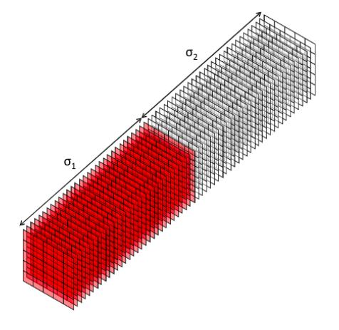
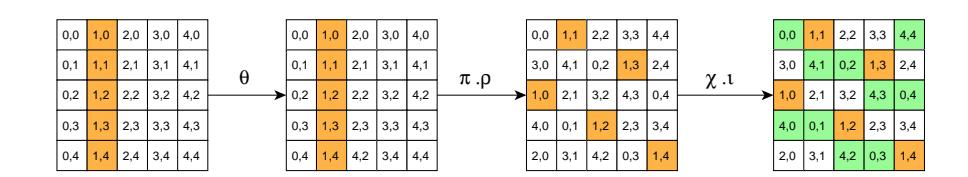
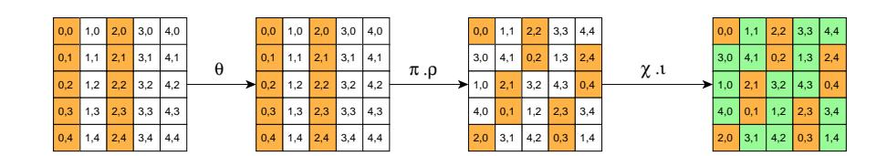
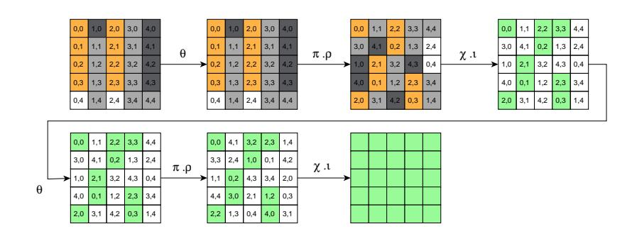
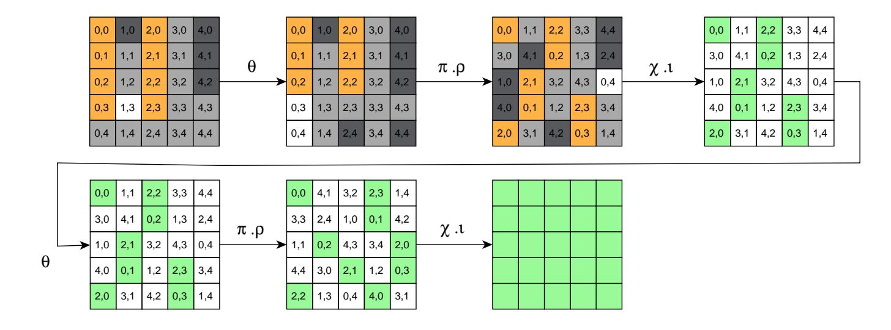
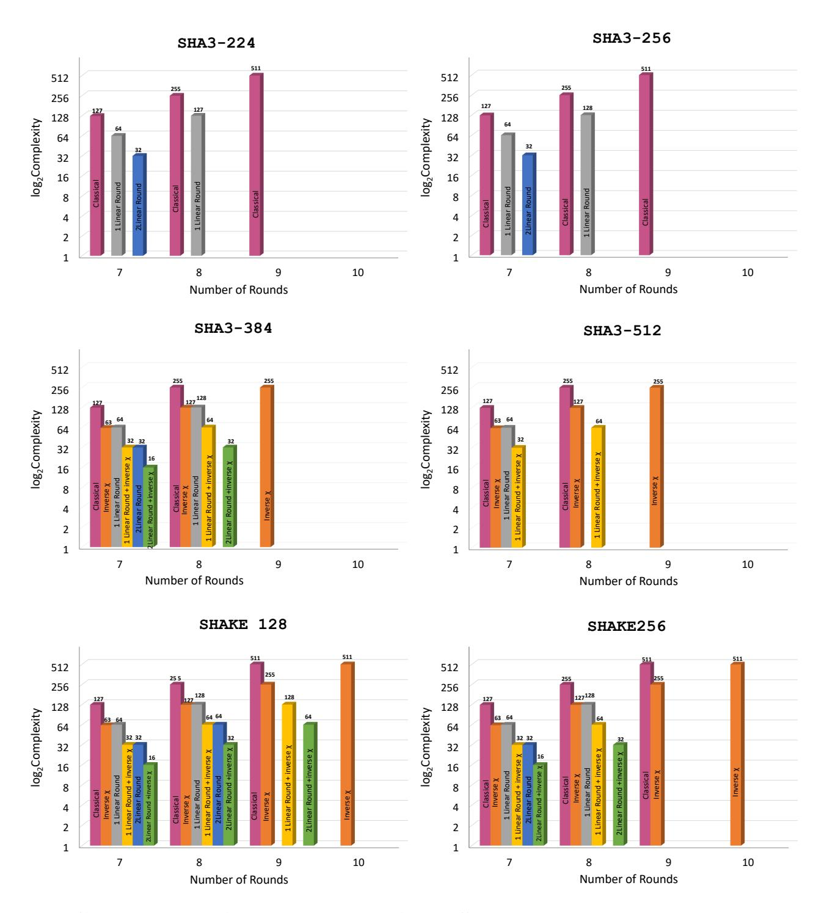

{0}------------------------------------------------

# New Results on the SymSum Distinguisher on Round-Reduced SHA3

Sahiba Suryawanshi, Dhiman Saha, Satyam Sachan

de.ci.phe.red Lab Department of Electical Engineering and Computer Science Indian Institute of Technology Bhilai, India (sahibas,dhiman,satyams)@iitbhilai.ac.in

Abstract. In ToSC 2017 Saha et al. demonstrated an interesting property of SHA3 based on higher-order vectorial derivatives which led to self-symmetry based distinguishers referred to as SymSum and bettered the complexity w.r.t the well-studied ZeroSum distinguisher by a factor of 4. This work attempts to take a fresh look at this distinguisher in the light of the linearization technique developed by Guo et al. in Asiacrypt 2016. It is observed that the efficiency of SymSum against ZeroSum drops from 4 to 2 for any number of rounds linearized. This is supported by theoretical proofs. SymSum augmented with linearization can penetrate up to two more rounds as against the classical version. In addition to that, one more round is extended by inversion technique on the final hash values. The combined approach leads to distinguishers up to 9 rounds of SHA3 variants with a complexity of only 2<sup>64</sup> which is better than the equivalent ZeroSum distinguisher by the factor of 2. To the best of our knowledge this is the best distinguisher available on this many rounds of SHA3.

Keywords: SHA3· Keccak· Distinguisher · SymSum· ZeroSum· Higher-order Derivatives

#### 1 Introduction

The hash function Keccak [\[3\]](#page-18-0) which went on to be adopted as the SHA3 [\[18\]](#page-19-0) standard is one of the most extensively studied hash algorithms. While finding pre-images and collisions constitute the primary analysis strategies of a hash function, the paradigm of devising distinguishers give insight into the nonrandomness of the construction. Further, it has been evidenced by numerous results in contemporary literature where distinguishers have been exploited to mount collision and pre-image attacks thereby amplifying their scope and impact. In case of SHA3, one of most investigated distinguisher is the ZeroSum distinguisher which is based on the fundamental result of higher-order derivatives that the (d+1)th derivative of a d−degree function leads to a zero function. This translates to obtaining a zero XOR-Sum for 2<sup>d</sup>+1 computations of a vectorial function. The main research is in the direction of tight-bounding the value of d which automatically leads to reduction in complexity of computing the ZeroSum. Most 

{1}------------------------------------------------

of the results have been reported on the internal permutation Keccak-f and/or Keccak-p. In 2009, Aumasson and Meier [1] introduced ZeroSum distinguisher on Keccak-f which penetrated up to 16 rounds by leveraging on the insideout strategy. In 2011, Plasencia et al. [15] introduce 4 round distinguisher for Hash function rather than internal permutation function, and also give a 2 round pre-image attack and 3 round near-collision attack on SHA3-224 and SHA3-256 variants. The same year, Boura et al. |4| improvise ZeroSum distinguisher. They present ZeroSum distinguisher and high order differential derivative for the full Keccak-p permutation. In 2012, Duan et al. [6] state an advanced ZeroSum distinguisher full round Keccak-f with  $2^{1579}$  complexity. The same year, Duc etal. [7] present the Unaligned Rebound Attack for 8 round distinguisher with lesser complexity. In 2013, Morawiecki et al. [14] present rotational cryptanalysis. It allows a preimage attack on 4-round Keccak with complexity  $2^{506}$ . It also states distinguisher on 5 rounds Keccak-f[1600] permutation with  $2^{15}$  complexity. In 2014 Das et al. analyze differential propagation properties of Keccak furthermore uses for 6 round Distinguisher with  $2^{52}$  complexity. In 2015, Jean et al. [10] produce internal differential boomerang distinguisher. They generate boomerang pairs and analyze the differential property. Their distinguisher depends on round constant. So, according to where permutation starts, their query complexity varies. For Keccak-f permutation, when it starts at 0 round, with complexity  $2^5$ , they distinguish up to 6 rounds, and with  $2^{13}$  complexity to 7 rounds. Similarly, when permutation begins with 3rd round with complexity  $2^{10.3}$ , they distinguish up to 7 rounds, and with  $2^{18.3}$  complexity to 8 rounds. Same year, Dinur et al.[5] proposed a Cube attack like a cryptanalysis technique that includes algebraic and structural analysis, which contains key recovery and MAC forgery, practical up to 6 rounds and theoretical to 9 rounds of Keccak. In 2016, Guo et al. [8] introduce the linearization technique called Linear Structure. It permits linearization up to 3 rounds of Keccak. It extends the ZeroSum distinguisher of Keccak-p permutation up to 15 rounds and pre-image attack up to 4 rounds.

It is evidenced from the above discussion that most of the results have been reported on Keccak-p that few on the hash function SHA3. Moreover, only a few of the distinguishers on Keccak-p can be extended on to any SHA3 variant itself. However, in 2017, Saha  $et\ al.\ [17]$  introduced a new distinguisher called SymSum which examines a symmetric property of the output-sum of SHA3 when evaluated on symmetric inputs. These distinguishers penetrate up to 9 rounds and theoretically achieve a 4-fold improvement over ZeroSum in terms of complexity. The prime observation was the position of the nonlinear operation  $\chi$  in the sequence of sub-operations in the Keccak-p round function. Same year, Huang  $et\ al.\ [9]$  improvise a Cube attack named Conditional Cube attack, impose some conditions on specific bits and use Mixed Integer Linear Programming (MILP) to construct conditional cubes with complexity  $2^{33}$ , 7 round cube distinguisher builds on SHA3-224. The same year, Qiao  $et\ al.\ [16]$  introduce a pre-image attack up to 5 rounds, by linearize all S-box at first round and form a 3 round differential trail for SHAKE128 and SHA3-224. They put some conditions so that it

{2}------------------------------------------------

satisfies for linearization and differential trail. Same year, Li et al. [\[12\]](#page-19-6) proposed a cross-linear structure for a pre-image attack. They constructed a cross-linear structure for Keccak [400] and found a pre-image. The complexity of their attack is 2<sup>150</sup> for 3 round SHA3-256. In 2019, Li et al. [\[13\]](#page-19-7) proposed a pre-image attack referred to as the Allocating Approach on 4 round SHA3-256.

In this work, we investigate the SymSum property introduced by Saha et al. further and try to augment with observations by Guo et al. in their work on linear structures. In particular, we achieve a one/two-round advantage by combining SymSum with linear structures. However, the structures we use slightly differ from the ones reported in [\[8\]](#page-18-6) since we do not have any requirement of keeping χ −1 to be linear. This is attributed to the fact that we are mounting the attack on the hash-function and hence cannot leverage the inside-out technique. Consequently, we can relax the constraints that were imposed for the same. Further, we show a simple trick to gain one more round by just inverting[1](#page-2-0) the last round χ before computing the output-sum. Using all these techniques, we are able to mount SymSum distinguishers on up to 9-rounds of SHA3 variants with a complexity of only 264. We show that SymSum loses its 4-fold advantage over ZeroSum when augmented with linear structures and also furnish a proof for the same. The present SymSum distinguishers still have a 2-fold advantage making them the best available distinguishers on SHA3 which are independent of the number (≥ 1) of rounds linearized. We validate most of claims by providing experimental evidence for some of the practically verifiable distinguishers. Our results are summarized in Table [1.](#page-2-1)

Table 1: Summary of the results reported

<span id="page-2-1"></span>

| SHA3-variant | #Rounds | ZeroSum  | SymSum   | Remarks             |
|--------------|---------|----------|----------|---------------------|
| SHA3-224     | 8       | 65<br>2  | 64<br>2  | 2R Linear           |
| SHA3-256     | 7       | 33<br>2  | 32<br>2  | 2R Linear           |
| SHA3-384     | 8       | 33<br>2  | 32<br>2  | −1<br>2R Linear + χ |
| SHA3-512     | 8       | 65<br>2  | 64<br>2  | −1<br>1R Linear + χ |
|              | 9       | 65<br>2  | 64<br>2  | −1<br>2R Linear + χ |
| SHAKE128     | 10      | 513<br>2 | 511<br>2 | −1<br>χ             |
|              | 8       | 33<br>2  | 32<br>2  | −1<br>2R Linear + χ |
| SHAKE256     | 9       | 257<br>2 | 255<br>2 | −1<br>χ             |
|              | 10      | 513<br>2 | 511<br>2 | −1<br>χ             |

Organization Rest of the paper is organized as follows. Section [2](#page-3-0) gives a brief description of the SHA3 and SymSum distinguisher and linear structures of Keccak-p. Section [3](#page-6-0) provides proof of how the efficiency of SymSum reduces when we apply linearization. The new distinguishers introduced in this work are illustrated in Section [4.](#page-10-0) The experiments on round-reduced SHA3 to validate the

<span id="page-2-0"></span><sup>1</sup> This applies to SHA3 variants where at least one entire plane is available from the hash value

{3}------------------------------------------------

claims are reported in Section 5. A discussion on all the devised distinguishers is furnished in Section 5. Finally, concluding remarks are given in Section 6.

#### <span id="page-3-0"></span>2 Preliminaries

In this section, we give a brief description of the SymSum distinguisher and the idea of linear structure in Keccak-p.

#### 2.1 The Keccak Hash Function

The Keccak structure follows Sponge |2| construction that applies fixed-length permutation on variable-length input and maps to variable-length output. It gives  $\mathbb{F}_2^n$  length element output from  $\mathbb{F}_2^m$  length input element where n and m are of any length. The permutation applied on finite-state b = r + c bits, where r is rate and c is capacity. Here the finite state b of Sponge construction is the width of Keccak-f permutation. The Sponge construction has 2 phases: the absorption and squeezing phases. Firstly the input message M padded according to the padding rule that makes input message after padding M' multiple of r and breaks M' into  $m_1, m_2, \dots m_k$  each of size r. Initially, state b set to all 0'swhich is initialization vector (IV) and input of f is the XORed value of the first input message block  $m_1$  of size r and r bits of IV then the output of f is XORed with next input message  $m_2$  and input to f this will happen until all the message blocks get processed this is absorption phase. The required output digest collects on the squeezing phase. Suppose Z is the required digest. If Z < r then, it takes first Z bits of the output of absorbing phase, otherwise, if Z > r then, it needs to input to f and get more bits repeatedly until it gets Z bits output digest. Finally, the output digest Z is the output of the Sponge function.

Keccak-p Permutation: There are 7 Keccak-f permutations which are denoted by Keccak- $f[b,n_r]$ , here  $n_r$  is the number of rounds and b is the width of Keccak-f permutation.  $n_r$  depends on b and calculated as  $n_r = 12 + 2l$ , here  $l = \log_2(\frac{b}{25})$  where  $b \in \{25, 50, 100, 200, 400, 800, 1600\}$ . Keccak-f permutations states can denote as  $5 \times 5 \times w$  where  $w = \frac{b}{25}$  such that  $w \in \{1, 2, 4, 8, 16, 32, 64\}$ . Here we use Keccak-f [1600] that require 24 rounds. Each round has 5 mapping  $R = \iota \circ \chi \circ \pi \circ \rho \circ \theta$ 

 $\theta$ :  $\theta$  mapping is a linear operation that provides diffusion. In the  $\theta$  mapping A[x,y,z] XORed with parities of neighbouring 2 columns in the following manner:

$$A[x, y, z] = A[x, y, z] \oplus P[(x - 1) \mod 5, *, z] \oplus P[(x + 1) \mod 5, *, (\mod 64)]$$

Here P[x, \*, z] is parity of a column that can be calculated as:

$$P[x,*,z] = \bigoplus_{j=0}^{4} A[x,j,z]$$

 $\rho$ :  $\rho$  mapping is another linear operation that rotates each lane by some predefined values. Here first column and last row represent y axis and x axis values respectively.

$$A[x, y, z] = A[x, y, z_{\ll t}] \text{ for } x, y = 0, ...4$$

{4}------------------------------------------------

Here  $\ll$  is a bitwise rotation

 $\pi$ :  $\pi$  mapping is another Linear operation which permutes on slices by interchanging lanes as:

$$A[y, (2x+3y) \mod 5, z] = A[x, y, z] \text{ for } x, y = 0, ...4, z = 0, ...63$$

 $\chi$ :  $\chi$  is the only Non-linear operation that operates on rows independently as:

$$A[x,y,z] = A[x,y,z] \oplus (\sim A[x+1,y,z]) \wedge A[x+2,y,z]$$
  $\iota$ : A unique RC add to lane  $A[0,0]$  depend on round number. 
$$A[0,0,*] = A[0,0,*] \oplus RC$$

#### 2.2 SymSum Distinguishers on SHA3

In 2017, Saha et al. introduced an interesting algebraic property related to SPN round functions where the non-linear transformation preceded the round-constant addition. This was used to devise a new class of distinguishers referred to as SymSum. The basic result was that the round-constants could not influence the highest degree monomials which determined the upper-bound on the degree of a vectorial function. This helped them devise a round-constant independent function by computing a special type of derivative called the m-fold vectorial derivative. They further showed that the order of this derivative can be a factor of 4 less than the ZeroSum distinguisher which actually computes the m-fold simple derivatives. To verify this property, they used self-symmetric input states as inputs and the hypothesis was that the output sum across all hash values would also preserve the self-symmetry. Self-symmetry of Keccak can be defined as the first 32 slices are identical to the last 32 slices of the Keccak state as shown in

<span id="page-4-0"></span>Fig. 1. Here  $\sigma_1$  and  $\sigma_2$  are identical.



Fig. 1: Self-Symmetric State of Keccak [11]

For brevity, the main results are mentioned below, where TYPE-II as defined in [17] are monomials that are dependent on round-constants:

<span id="page-4-1"></span>**Lemma 1** [17] For SPN round function  $\mathcal{G}$ , if the ordering of components is in such a way that the non-linear function precedes from round constant addition

{5}------------------------------------------------

then  $\mathcal{G}$  can express as:  $\mathcal{G} = \mathcal{F} + C \times \mathcal{H}$  where  $d^{\circ}\mathcal{G} = d^{\circ}\mathcal{F}$  and  $d^{\circ}\mathcal{G} > d^{\circ}\mathcal{H}$  where  $\mathcal{G}, \mathcal{F}, \mathcal{H} : \mathbb{F}_{2}^{n} \to \mathbb{F}_{2}^{n}$  and C is a constant

**Theorem 1.** [17] The upper-bound on the degree of TYPE-II monomials is given by the following expression:  $d^{\circ}\mathcal{F}_{s'}^q \leq d^{\circ}\mathcal{F}^q - d^{\circ}\mathcal{N}$ 

<span id="page-5-1"></span>**Lemma 2** [17] The  $(d^{\circ}\mathcal{F} - d^{\circ}\mathcal{N} + 1)$ -fold vectorial derivative of  $\mathcal{F}^q$ , is a function that is independent of round constant

Here  $d^{\circ}\mathcal{F}$ ,  $d^{\circ}\mathcal{N}$  are the upper bounds on the degrees of function  $\mathcal{G}$  and non-linear function  $\mathcal{N}$  respectively and  $\mathcal{F}^q$  is function after q rounds. Using the above mentioned lemmas the authors furnished a proof that SymSum distinguisher is better than ZeroSum distinguisher for SHA3 by a factor of 4.

#### 2.3 Linear Structures

The idea of linearization as introduced by Guo et~al. is basically a lane-wise restriction on the input space so as to handle the linear  $\theta$  and non-linear  $\chi$  operations of the Keccak-p round function. The authors demonstrate linearization of the Keccak-p permutation up to 3 rounds: 1 round backward and 2 rounds forward. It extends the ZeroSum distinguisher and also leads to new pre-image attacks. To understand the technique, one needs to look at the Boolean expression of the  $\chi$  function. The primary observation is that if two consecutive variables never come together in a row then, then all output co-ordinate functions of  $\chi$  become linear. The operation  $\theta$  which relies on the column parity of spatially adjacent columns can be handled so that it does does not diffuse the state by keeping the column parity constants across calls to Keccak-p. The idea is captured in Fig. 2. As evident from the figure, to handle the effect of  $\theta$  on the variables, the following condition is imposed where  $\alpha$  is any constant:

$$A[1,0] \oplus A[1,1] \oplus A[1,2] \oplus A[1,3] \oplus A[1,4] = \alpha$$

<span id="page-5-0"></span>This can be equivalently written as  $A[1,4] = \bigoplus_{j=0}^{3} A[1,j] \oplus \alpha$ . This results, in 1 round linearization of Keccak with degree of input up to 256.



Fig. 2: Keccak state configuration for 1-round linearization with degrees of freedom 256 [8]. Here white cells are constants, orange cells are variable with degree 1, and green cells have degree at most 1.

To increase the degree of freedom, it is possible to take variables at different columns as shown in Fig. 3 as  $A[i,4] = \bigoplus_{j=0}^3 A[i,j] \oplus \alpha_i$  where i=0,2, j=0,1,2,3.

{6}------------------------------------------------

<span id="page-6-1"></span>

Fig. 3: Keccak state configuration for linearization with degree of freedom 512 [8]

For 2-round linearization, the input state should be taken as shown in the Fig.4, here light gray cells and dark grey has value 0 and 1 respectively. To handle  $\theta$  at 1 round variables need to satisfy the following condition.

$$A[1,0]\oplus A[1,1]\oplus A[1,2]\oplus A[1,3]=A[1,4]\oplus \mathtt{Oxf}\ldots\mathtt{f}$$
 
$$A[2,0]\oplus A[2,1]\oplus A[2,2]\oplus A[2,3]=\mathtt{Oxf}\ldots\mathtt{f}$$

<span id="page-6-2"></span>

Fig. 4: State configuration to handle  $\chi$  at  $2^{nd}$  round [8] At second-round  $\theta$ ,  $\rho$ ,  $\pi$  permute variables, so to handle 2 round  $\theta$  variables have to satisfy the following conditions.

$$A[2,0]_{\ll 62} = A[0,0] \oplus A[2,2]_{\ll 43}$$

$$A[2,1]_{\ll 6} = S[0,1]_{\ll 36} \oplus A[2,3]_{\ll 15}$$

$$A[2,2]_{\ll 43} = A[0,2]_{\ll 3}$$

$$A[2,3]_{\ll 15} = A[0,3]_{\ll 41} \oplus A[2,0]_{\ll 62}$$

### <span id="page-6-0"></span>3 Investigating Effect of Linear Structures on SymSum

<span id="page-6-3"></span>Our first study constitutes analyzing the effect of using linear structures in conjunction with the SymSum property. We extend the ZeroSum distinguisher and SymSum distinguisher by applying linearization technique up to 2 rounds. However, we argue that because of linearization, the difference in complexities for obtaining SymSum and ZeroSum decreases from the factor of 4 to 2. We next try to furnish theoretical arguments to support this claim. Thus, we first need to look at a more general result that compares the behaviour of a SPN round function (as observed in [17]) with and without linearization. For the SPN round function without applying linear structures, the behaviour is described by lemma 1. The following lemma captures the same while incorporating the effect of linearization.

{7}------------------------------------------------

**Lemma 3** For any SPN round function  $\mathcal{G}$  iterated for  $n_r$  rounds, if  $l_r (\leq n_r)$  rounds are linearized, the degrees of the linearized version ( $\mathbb{G}$ ) and unlinearized versions ( $\mathbb{G}'$ ) are related by the degree ( $\lambda$ ) of the non-linear component function by the following relation:

$$d^{\circ}\mathbb{G} \leq \lambda^{l_r} \times d^{\circ}\mathbb{G}' \text{ where } \begin{cases} \mathbb{G} = \mathcal{G}^{n_r} \\ \mathbb{G}' = \mathcal{G}^{n_r - l_r} \circ \mathcal{G}'^{l_r} \\ \mathcal{G}' \leftarrow \text{Linearized version of } \mathcal{G} \end{cases}$$

Here  $d^{\circ}\mathbb{G}$ ,  $d^{\circ}\mathbb{G}'$  are the upper bounds on the degrees of  $\mathbb{G}$ ,  $\mathbb{G}'$  respectively.

*Proof.* Let us write down the degree of the unlinearized version  $\mathbb{G}$ . Since the degree grows exponentially (before asymptotically converging on the highest possible degree which is determined by the number of independent input variables) in the degree of the non-linear component, we can write the following expression:

<span id="page-7-0"></span>
$$\mathbb{G} = \mathcal{G} \circ \mathcal{G} \circ \mathcal{G} \circ \cdots n_r \text{ times}$$

$$\implies d^{\circ} \mathbb{G} \leq (d^{\circ} \mathcal{G})^{n_r}$$

$$= \lambda^{n_r} \tag{1}$$

Now let us write the expression for the linearized version:

<span id="page-7-1"></span>
$$\mathbb{G}' = \{ \mathcal{G} \circ \mathcal{G} \circ \mathcal{G} \circ \cdots (n_r - l_r) \text{ times} \} \circ \{ \mathcal{G}' \circ \mathcal{G}' \circ \mathcal{G}' \circ \cdots l_r \text{ times} \} 
\implies d^{\circ} \mathbb{G}' \leq (d^{\circ} \mathcal{G})^{n_r - l_r} \times (d^{\circ} \mathcal{G}')^{l_r} 
= \lambda^{n_r - l_r} \left[ \because d^{\circ} \mathcal{G'}^{l_r} = 1 \right]$$
(2)

From Equation 1 and Equation 2 it follows that:  $d^{\circ}\mathbb{G} \leq \lambda^{l_r} \times d^{\circ}\mathbb{G}'$ 

With the above proof in place, we revisit lemma 1 in the light of linearization. We argue that lemma 1 still holds for the linearized version  $\mathbb{G}'$  of  $\mathbb{G}$ . This implies that the degree of  $\mathbb{G}'$  will be determined by monomials which are independent of round constants (TYPE-I) from monomials that involve round constants (TYPE-II). We use the same terminology as stated in [17] and redo the proof of lemma 1.

#### Lemma 4 Lemma 1 holds under linearization.

*Proof.* Let us consider the SPN round function  $(\mathcal{G})$  as stated above with the restriction that the non-linear operation precedes the round-constant addition (as required by lemma 1). So, let  $\mathcal{G} = \mathcal{C} \circ \mathcal{N} \circ \mathcal{L}$  where  $\mathcal{C}$  represents the round constant addition,  $\mathcal{N}$  is non-linear component, and  $\mathcal{L}$  is the linear component. So for  $n_r$  rounds,  $\mathbb{G}$  can be written as:

<span id="page-7-2"></span>
$$\mathbb{G} = (\mathcal{C}_{n_r} \circ \mathcal{N} \circ \mathcal{L}) \circ (\mathcal{C}_{n_r - 1} \circ \mathcal{N} \circ \mathcal{L}) \circ \cdots \circ (\mathcal{C}_1 \circ \mathcal{N} \circ \mathcal{L}) 
= \left[ (\mathcal{C}_{n_r} \circ \mathcal{N} \circ \mathcal{L}) \circ \cdots \circ (\mathcal{C}_2 \circ \mathcal{N} \circ \mathcal{L}) \circ \mathcal{C}_1 \right] \circ (\mathcal{N} \circ \mathcal{L})$$
(3)

{8}------------------------------------------------

However, if *linear structures* are applied for  $l_r$  rounds then  $\mathbb{G}'$  can be expressed as:

<span id="page-8-0"></span>
$$\begin{split} \mathbb{G}' &= (\mathcal{C}_{n_r} \circ \mathcal{N} \circ \mathcal{L}) \circ (\mathcal{C}_{n_r-1} \circ \mathcal{N} \circ \mathcal{L}) \circ \cdots \circ (\mathcal{C}_{n_r-l_r} \circ \mathcal{N}_{n_r-l_r} \circ \mathcal{L}_{n_r-l_r}) \\ &\circ (\mathcal{C}_{l_r} \circ \mathcal{L}^{'} \circ \mathcal{L}) \circ \cdots \circ (\mathcal{C}_1 \circ \mathcal{L}^{'} \circ \mathcal{L}) \\ &= \left[ (\mathcal{C}_{n_r} \circ \mathcal{N} \circ \mathcal{L}_q) \circ \cdots \circ (\mathcal{C}_{n_r-l_r} \circ \mathcal{N} \circ \mathcal{L}) \circ (\mathcal{C}_{l_r} \circ \mathcal{L}^{'} \circ \mathcal{L}) \circ \cdots \circ \mathcal{C}_1 \right] \circ (\mathcal{L}^{'} \circ \mathcal{A}) \end{split}$$

Here  $\mathcal{L}'$  is a linearized version of  $\mathcal{N}$  thus  $d^{\circ}\mathcal{L}'$  will be reduced by  $(\lambda - 1)$ . Due to Equation (3) and (4), it can be observed that after 1 round, the round constant  $\mathcal{C}_1$  has no effect of  $\mathcal{N}$  (or  $\mathcal{L}'$  in case of linearization). Now, using the strategy described in [17] to segregate monomials which are independent of round constants (TYPE-I) from monomials that involve round constants (TYPE-II) we can visualize any co-ordinate function of  $\mathbb{G}'$  as  $\mathcal{F}^{n_r}$ :

$$\mathcal{F}^{n_r} = \mathcal{F}^{n_r}_{c'} \oplus \mathcal{F}^{n_r}_{c} \text{ where } \begin{cases} \text{TYPE-I} \in \mathcal{F}^{n_r}_{c'} \ \text{TYPE-II} \in \mathcal{F}^{n_r}_{c} \end{cases}$$

(a) To Prove:  $d^{\circ}\mathcal{F}_{c'}^{m} > d^{\circ}\mathcal{F}_{c}^{m}$  (Proof by induction)

Base case: Let  $n_r = 1$  which implies  $\mathbb{G} = \mathcal{G}^1 = \mathcal{C}_1 \circ \mathcal{N} \circ \mathcal{L}$ , However, we have to take into account the linearization. So let  $l_r = 1$ . Therefore  $\mathbb{G}' = {\mathcal{G}'}^1 = \mathcal{C}_1 \circ \mathcal{L}' \circ \mathcal{L}$ . Hence the degree of TYPE-I and TYPE-II monomials are:

<span id="page-8-1"></span>
$$d^{\circ}\mathcal{F}_{c'} = d^{\circ}(\mathcal{L}^{'} \circ \mathcal{L}) = \lambda - (\lambda - 1) = 1$$
$$d^{\circ}\mathcal{F}_{c} = 0 \big[ :: \mathcal{C}_{1} \text{ is independent of } \mathcal{L}^{'} \big]$$

Thus  $d^{\circ}\mathcal{F}_{c'} > d^{\circ}\mathcal{F}_c$  Hence lemma hold for base condition i.e., at  $n_r = 1$ 

Inductive hypothesis: Let us assume the lemma hold for  $n_r = m$  i.e.,  $d^{\circ}\mathcal{F}_{c'}^m > d^{\circ}\mathcal{F}_{c}^m$ 

Inductive step: Let  $n_r = m + 1$ .  $\mathcal{F}^{m+1} = \mathcal{C}^{m+1} \circ \mathcal{N} \circ \mathcal{L} \circ \mathcal{F}^m$ 

$$d^{\circ}\mathcal{F}_{c}^{m+1} \leq d^{\circ}(\mathcal{N} \circ \mathcal{L}) \times d^{\circ}\mathcal{F}_{c}^{m}$$

$$< d^{\circ}(\mathcal{N} \circ \mathcal{L}) \times d^{\circ}\mathcal{F}_{c'}^{m} \left[ :: d^{\circ}\mathcal{F}_{c'}^{m} > d^{\circ}\mathcal{F}_{c}^{m} \right]$$

$$\leq d^{\circ}\mathcal{F}_{c'}^{m+1}$$

<span id="page-8-2"></span>Hence, by induction, the lemma holds  $\forall n_r \in \mathbb{N}$ .

Our next claim is that the difference in the degrees of TYPE-I and TYPE-II monomials as stated by Saha *et al.* in [17] no longer holds as we linearize the SPN. For any value of  $l_r \geq 1$ , the following theorem holds instead. One can note that unlike [17], the following result is independent of the degree of the non-linear component.

{9}------------------------------------------------

**Theorem 2.** With at least one round linearized, the upper-bound on the degree of TYPE-II monomials in terms of TYPE-I monomials is given by:

$$d^{\circ}\mathcal{F}_{c}^{n_{r}} \leq d^{\circ}\mathcal{F}_{c'}^{n_{r}} - 1$$

*Proof.* We start by segregating the TYPE-II monomials further. The new subtype is referred to as TYPE-III and represents a TYPE-II monomial which is independent of any variables and constitutes only constants terms as stated below:

$$\prod C_i$$
 where  $C_i$  is any constant term

Suppose our function is in the linear form up to  $l_r$  rounds  $(l_r \ge 1)$  then using notations used above:

$${\mathcal{G}'}^{l_r} = (\mathcal{C}_{l_r} \circ \mathcal{L}^{'} \circ \mathcal{L}) \circ (\mathcal{C}_{l_r-1} \circ \mathcal{L}^{'} \circ \mathcal{L}) \circ \cdots \circ (\mathcal{C}_2 \circ \mathcal{L}^{'} \circ \mathcal{L}) \circ (\mathcal{C}_1 \circ \mathcal{L}^{'} \circ \mathcal{L})$$

Since there is no non-linear function, the degree of TYPE-I and TYPE-II monomials never change. Also for TYPE-II monomials, only TYPE-III monomials occur. Thus the degree of TYPE-I monomials and TYPE-II monomials should 1 and 0 (because of TYPE-III), respectively i.e.,  $d^{\circ}\mathcal{F}_{c}^{l_{r}}=0$  and  $d^{\circ}\mathcal{F}_{c'}^{l_{r}}=1$ . Now, we prove by induction.

Base case: Let  $n_r = l_r + 1$ , i.e.  $\mathbb{G}' = \mathcal{G} \circ \mathcal{G}'^{l_r}$  implying a single non-linear function and  $d^{\circ} \mathcal{N} = \lambda$ ,.

Now, TYPE-I monomials will reach the highest degree after the current round when  $\lambda$  TYPE-I monomials mix together under  $\mathcal N$  in the current round. This final degree of TYPE-I is expressed as:

$$d^{\circ} \mathcal{F}_{c'}^{l_r+1} = \sum_{i=1}^{\lambda} \left[ d^{\circ} \mathcal{F}_{c'}^{l_r} \right]_i$$

$$= 1 + 1 \cdots \lambda \text{ times } \left[ \because d^{\circ} \mathcal{F}_{c'}^{l_r} = 1 \right]$$

$$= \lambda$$
(5)

Next, TYPE-II monomials reach the highest degree when  $(\lambda - 1)$  TYPE-I monomials from  $(\lambda - 1)$  co-ordinate functions mix with one TYPE-II monomial. Thus for TYPE-II monomials we have

<span id="page-9-0"></span>
$$d^{\circ} \mathcal{F}_{c}^{l_{r}+1} = \sum_{i=1}^{\lambda-1} \left[ d^{\circ} \mathcal{F}_{c'}^{l_{r}} \right]_{i} + d^{\circ} \mathcal{F}_{c}^{l_{r}}$$

$$= \sum_{i=1}^{\lambda-1} 1 + 0 \ \left[ \because d^{\circ} \mathcal{F}_{c}^{l_{r}} = 0 \ (\text{TYPE-III}) \right] \quad d^{\circ} \mathcal{F}_{c'}^{l_{r}} = 1$$

$$= \lambda - 1$$

$$(6)$$

Hence, by Equation (5) and (6) theorem holds for base case.

{10}------------------------------------------------

Inductive hypothesis: Let us assume the theorem holds for  $n_r = m$  rounds i.e.,

$$d^{\circ}\mathcal{F}_{c}^{m} \leq d^{\circ}\mathcal{F}_{c'}^{m} - 1$$

Inductive step: Let  $n_r = m + 1$  then by lemma 3 we have  $d^{\circ}\mathcal{F}_{c'}^m \leq \lambda^{m-l_r}$  and  $d^{\circ}\mathcal{F}_{c}^m \leq \lambda^{m-l_r} - 1$ . Then by arguments similar to the base-case, we have degree of TYPE-I monomials as:

<span id="page-10-1"></span>
$$d^{\circ} \mathcal{F}_{c'}^{m+1} = \sum_{i=1}^{\lambda} \left[ d^{\circ} \mathcal{F}_{c'}^{m} \right]_{i}$$

$$\leq \sum_{i=1}^{\lambda} \lambda^{m-l_{r}} = \lambda^{m-l_{r}+1}$$

$$(7)$$

Similarly for TYPE-II monomials

$$d^{\circ} \mathcal{F}_{c}^{m+1} = \sum_{i=1}^{\lambda-1} \left[ d^{\circ} \mathcal{F}_{c'}^{m} \right]_{i} + d^{\circ} \mathcal{F}_{c}^{m}$$

$$\leq \sum_{i=1}^{\lambda-1} \lambda^{m-l_{r}} + \lambda^{m-l_{r}} - 1$$

$$= (\lambda - 1)\lambda^{m-l_{r}} + \lambda^{m-l_{r}} - 1 = \lambda^{m-l_{r}+1} - 1$$

$$\leq d^{\circ} \mathcal{F}_{c'}^{m+1} - 1 \text{ [By Equation (7)]}$$
(8)

Thus by principle of induction Theorem 2 holds  $\forall n_r \in \mathbb{N}$ .

We now have the following corollary which forms the base of all distinguishers reported in this work. As one might realize this constitutes a deviation from the result reported in [17] as stated in lemma 2.

<span id="page-10-2"></span>Corollary 1. With  $l_r$  linearized rounds  $\left(\frac{d^{\circ}\mathbb{G}}{\lambda^{l_r}}\right)$  -fold vectorial derivative of  $\mathbb{G}$  is a function which is independent of round constants.

The corollary easily follows from lemma 3 and Theorem 2. Since linearized version  $\mathcal{G}'$  of  $\mathcal{G}$  has degree  $\left(\frac{d^{\circ}\mathbb{G}}{\lambda^{l_r}}\right)$  and the maximum degree of TYPE-II monomials in  $\mathcal{G}'$  is  $\left(\frac{d^{\circ}\mathbb{G}}{\lambda^{l_r}}-1\right)$ , so the  $\left(\frac{d^{\circ}\mathbb{G}}{\lambda^{l_r}}\right)$ -fold vectorial derivative of  $\mathcal{G}$  will result in a round-constant independent function. Consequently, such a function would preserve the SymSum property as introduced in [17]. In the next section, we show how the above results are used to mount highly efficient and practical SymSum distinguishers on SHA3 variants.

### <span id="page-10-0"></span>4 Augmenting the SymSum Distinguisher

The SymSum property can be extended at varied number of rounds based on the augmentation strategies like prepending linear structures and appending the hash-inversion trick wherever applicable. This is captured by Fig. 5. In the subsequent sub-sections we explore these strategies that help us to reach highest number of rounds for some SHA3 variants.

{11}------------------------------------------------

<span id="page-11-0"></span>

| Linear | Linear | Number of non-linear core-rounds | ]            |
|--------|--------|----------------------------------|--------------|
| Linear | Linear | Number of non-linear core-rounds | Hash Inverse |
|        | Linear | Number of non-linear core-rounds | Hash Inverse |
|        | Linear | Number of non-linear core-rounds |              |
|        |        | Number of non-linear core-rounds | Hash Inverse |

Fig. 5: Various extension strategies to verify the SymSum property by augmenting 1-round, 2-round linear structures and the hash-inversion trick

# 4.1 Extending SymSum using 1-round Linearization and $\chi^{-1}$ trick

To gain an advantage of 2 rounds for the SymSum distinguisher, we linearize the first round and perform  $\chi^{-1} \circ \iota^{-1}$  on the output digest when applicable. The input set should satisfy the following conditions so that it linearizes 1 round and also satisfies the condition for SymSum distinguisher which constitutes giving self-symmetric inputs:

- 1. The input set is a set of inputs such that the first 32 slices of the state are the same as the last 32 slices
- 2. For linearization, input state has the restriction that  $\forall A[i,j]$  where  $i=0,2,\ j=0,1,2,3,$

$$A[i,3] = \bigoplus_{j=0}^{2} A[i,j] \oplus \alpha_i$$
 for any constant  $\alpha$ 

<span id="page-11-1"></span>

| 0,0 | 1,0 | 2,0 | 3,0 | 4,0 |
|-----|-----|-----|-----|-----|
| 0,1 | 1,1 | 2,1 | 3,1 | 4,1 |
| 0,2 | 1,2 | 2,2 | 3,2 | 4,2 |
| 0,3 | 1,3 | 2,3 | 3,3 | 4,3 |
| 0,4 | 1,4 | 2,4 | 3,4 | 4,4 |

| 0,0 | 1,0 | 2,0 | 3,0 | 4,0 |
|-----|-----|-----|-----|-----|
| 0,1 | 1,1 | 2,1 | 3,1 | 4,1 |
| 0,2 | 1,2 | 2,2 | 3,2 | 4,2 |
| 0,3 | 1,3 | 2,3 | 3,3 | 4,3 |
| 0,4 | 1,4 | 2,4 | 3,4 | 4,4 |

- (a) KECCAK state for 1-round linearization of SHAKE128 and SHA3-224
- <span id="page-11-2"></span>(b) Input state for 1-round linearization of SHAKE128

Fig. 6: Different slice configurations for SHA3

The  $\chi^{-1}$  trick applies only to those variants of SHA3 which give at least one plane of Keccak state in the output hash value. Therefore, it is not applicable to SHA3-224 and SHA3-256 because they give 224 and 256 bits of hash value respectively which is less that 320 bits required for a full plane. The degree of

{12}------------------------------------------------

freedom of this state will be 192 if we take the input state equivalent to the state shown in Fig. 6a. Therefore, after 1-round linearization and applying  $\chi^{-1}$  strategy, SymSum on SHAKE128 can distinguish up to 9 rounds. For the other variants of SHA3, the input state is different because of the difference in size of capacity part. For instance, after computing the output sum for 4 rounds on SHA3, we get SymSum for  $2^4$  invocations. For the classical SymSum distinguisher, it is obtained at  $2^{15}$  and  $2^{14}$ . Therefore, the extended SymSum distinguisher has an advantage of 2 rounds, although the effectiveness reduces by the factor of 2.

#### 4.2 Extension of SymSum distinguisher up to 3 rounds:

We now show the use of 2-round linear structures in conjunction with inverting the hash for the last round. For 2 round linearization we use the linear structure, for which we need to handle the  $\theta$ ,  $\rho$ ,  $\pi$ ,  $\chi$  mappings of Keccak. To handle the first round  $\chi$  we take variables in 2 alternative columns so that no two variables come adjacent in  $\chi$  operation, thus maintaining the linearity after the first round. We restrict other columns to 0 and/or 1, as shown in the Fig. 7 so that before  $\chi$  in the second round no two adjacent lanes become variable. Additionally, because of the columns that have variables, constant values may change because of  $\theta$ . To handle  $\theta$  the following conditions need to be imposed:

<span id="page-12-1"></span>
$$A[0,0] \oplus A[0,1] \oplus A[0,2] \oplus A[0,3] = A[0,4] \oplus 0xff \dots f$$
  
 $A[2,0] \oplus A[2,1] \oplus A[2,2] \oplus A[2,3] = 0xff \dots f$ 

<span id="page-12-0"></span>

Fig. 7: Keccak state for 2-round linearization with degree of freedom 64 [8]

Now, to linearize the second round we need to handle  $\theta$  of second round. But for this the positions of the variables after first round  $\chi$  need to be closely handles as would change due to  $\rho$  and  $\pi$  in the first round. Therefore to make two rounds linear the variables should satisfy the conditions as below:

$$A[2,0]_{\ll 62} = A[0,0] \oplus A[2,2]_{\ll 43}$$

{13}------------------------------------------------

$$A[2,1]_{\ll 6} = S[0,1]_{\ll 36} \oplus A[2,3]_{\ll 15}$$
  
 $A[2,2]_{\ll 43} = A[0,2]_{\ll 3}$   
 $A[2,3]_{\ll 15} = A[0,3]_{\ll 41} \oplus A[2,0]_{\ll 62}$ 

It has been shown in [\[8\]](#page-18-6) that the above system of equations has 128 degrees of freedom. However, for the SymSum property, we have the additional restriction of self-symmetric inputs which lead to revisiting the system of equations as below. The main idea is to rewrite the equations considering half of the state and then extend the solutions to the other half thereby always keeping the over-all solution self-symmetric.

$$A[0,0,k] \oplus A[0,1,k] \oplus A[0,2,k] \oplus A[0,3,k] = A[0,4,k] \oplus 0xff \dots f$$
  

$$A[2,0,k] \oplus A[2,1,k] \oplus A[2,2,k] \oplus A[2,3,k] = 0xff \dots f$$
(9)

Here k ∈ {0, 1, . . . , 31}. Similarly, to make the second round linear the relations are rephrased w.r.t a 32-lane state as follows:

$$A[2,0,k]_{\ll 30} = A[0,0,k] \oplus A[2,2,k]_{\ll 11}$$

$$A[2,1,k]_{\ll 6} = S[0,1,k]_{\ll 4} \oplus A[2,3,k]_{\ll 15}$$

$$A[2,2,k]_{\ll 11} = A[0,2,k]_{\ll 3}$$

$$A[2,3,k]_{\ll 15} = A[0,3,k]_{\ll 9} \oplus A[2,0,k]_{\ll 30}$$
(10)

From the above equations, we get the first 32 slices that are as per our requirement, therefore, we take a copy of this state and make them the last 32 slices. By doing this the degree of freedom will be 64 because we have 8 × 32 variables and 6×32 equations. Accordingly, the degree of freedom is 8×32−6×32. Hence for SHAKE128, we get the SymSum for 9 rounds with complexity 2<sup>64</sup> .

#### <span id="page-13-0"></span>5 Experimental Validation

In this section, we present experimental validation of some of the claims furnished above. In particular, we choose SHAKE128 as it has the smallest capacity part allowing for more control over the input. However, the attacks can easily be extended onto other SHA3 variants with proper adjustments. In the following we demonstrate an attack on 6-rounds of SHAKE128 using the 1-round linearization and hash-inverse strategy. Due to 2-round extension, the degree of 6-rounds reduces to 2<sup>6</sup>−<sup>2</sup> = 16 and by Corollary [1,](#page-10-2) the 16th order vectorial derivative will exhibit SymSum property.

Fig. [6b](#page-11-2) shows input state for SHAKE128. Here orange, white, light gray lanes are variable, constant and 0's (that is also capacity part of SHAKE128) respectively. Here, we have taken first and third column as variables which satisfies the conditions as per Equation [\(9\)](#page-12-1). The input base message for our experiment is shown below:

Table [2](#page-14-1) shows the full Keccak State, where \*\*\*\* is the variable nibble that generates individual messages by altering their values. To maintain the Self-Symmetry \*\*\*\* and \*\*\*\* should be the equivalent. To make one round linear

{14}------------------------------------------------

```
8bd9162e 8bd9162e 1245c1c7 1245c1c7 0a3f3940 0a3f3940 eb6e955a eb6e955a 61d62226 61d62226
64cf1036 64cf1036 36da615c 36da615c 3d3b488a 3d3b488a e86d0018 e86d0018 1b16874d 1b16874d
64cf1036 64cf1036 44bbe571 44bbe571 0d0b9c27 0d0b9c27 72f3c98c 72f3c98c 53598e96 53598e96
ebc29253 ebc29253 75f22314 75f22314 92d8c5f9 92d8c5f9 372772f3 372772f3 3839af6d 3839af6d
b185e09f b185e0
```

each message generated by changing \*\*\*\* should satisfy the condition described above thus the value of † † †† and † † †† will modify accordingly.

### Table 2: Representing Keccak State

```
****9162e ****9162e 1245c1c7 1245c1c7 0a3f3940 0a3f3940 eb6e955a eb6e955a 61d62226 61d62226
64cf1036 64cf1036 36da615c 36da615c 3d3b488a 3d3b488a e86d0018 e86d0018 1b16874d 1b16874d
64cf1036 64cf1036 44bbe571 44bbe571 0d0b9c27 0d0b9c27 72f3c98c 72f3c98c 53598e96 53598e96
† † ††9253 † † ††9253 75f22314 75f22314 92d8c5f9 92d8c5f9 372772f3 372772f3 3839af6d 3839af6d
b185e09f b185e09f 00000000 00000000 00000000 00000000 00000000 00000000 00000000 00000000
```

By changing \*\*\*\* values of the input base message, 2<sup>16</sup> individual messages were produced and inputted to 6-round SHAKE128 with output hash-size of 320. For each of the hash-values, apply χ <sup>−</sup><sup>1</sup> ◦ ι <sup>−</sup><sup>1</sup> and compute the output-sum. We witnessed ZeroSum with complexity 217. and SymSum with 2<sup>16</sup> that confirms the expected outcome predicted by theoretical arguments.

#### <span id="page-14-0"></span>6 Discussion

In this work, we have extended the classical SymSum distinguisher up to 3 rounds by applying linear structures and the χ −1 trick. Together, we have an advantage of 3 rounds on almost all previously reported derivative based distinguishers.

One of the most important observations was the shift in the highest degree reachable by TYPE-II monomials which are fundamental to achieving a roundconstant independent function thereby being the basis of the SymSum distinguisher. As dictated by Theorem [2,](#page-8-2) irrespective of the number (≥ 1) of rounds linearized SymSum loses its 4 factor advantage over ZeroSum. However, that is a little price to pay against the increase in the number of rounds penetrated. A comparison among the various approaches that extend the SymSum distinguisher is furnished in Fig. [8.](#page-15-0) The comparisons are provided for 7, 8, 9 and 10 rounds for each variant of SHA3. As one can observe for SHA3-224 and SHA3-256, the best distinguisher in terms if #Rounds is still the classical SymSum. This is due to the fact that χ −1 is not applicable for SHA3-224 and SHA3-256 as the output hash value length is < 320 bits which is minimum requirement for applying χ <sup>−</sup><sup>1</sup> on the hash-digest. Another observation is that for SHA3-384/512 and SHAKE128/256, the maximum rounds are reached using χ −1 technique over classical SymSum. This is attributed to the degrees of freedom that is available when we just augment classical SymSum with χ −1 technique. On the other hand, linear structures lead to drastic reduction in degrees of freedom. Also, it can be

{15}------------------------------------------------

<span id="page-15-0"></span>

Fig. 8: Comparison of SHA3 variants for different approaches as applying  $\chi^{-1}$ , 1-round linearization, 1-round linearization +  $\chi^{-1}$ , 2-round linearization and 2-round linearization +  $\chi^{-1}$  with classical SymSum distinguisher

noted that SymSum always enjoys a degree 2 advantage as predicted by the results discussed earlier. However, for the same number of round ZeroSum always has a better degree of freedom for well-understood reason of not having to conform to the self-symmetry constraint.

The maximum degree of freedom for different variants and approaches is depicted in Table 3. The table also shows the corresponding slice/state configuration for achieving that degree of freedom. Moreover, the constraints to be applied on the slice variables to fulfill the condition for 1-round linearization is also exhibited in the table. Similar data is furnished in Table 4 for 2-round linearization. It is worth mentioning that for SHA3-512 2-round linearization is

{16}------------------------------------------------

<span id="page-16-0"></span>Table 3: Slice configuration, conditions and maximum degree of freedom for 1 round linearization of SHA3 variants. Orange, white and gray represent variable, constant and 0. Here we give one of the possible slice configurations and corresponding conditions and maximum degree of freedom.

| Variant  | Slice Configuration | Restrictions on variables                                                                        | Degree of<br>Freedom |
|----------|---------------------|--------------------------------------------------------------------------------------------------|----------------------|
| SHAKE128 |                     | X3<br>A[0, 4] = α1 ⊕<br>A[0, i]<br>i=0<br>X2<br>A[j, 3] = α2 ⊕<br>A[j, i]<br>(j ∈ {2, 3})<br>i=0 | 224<br>2             |
| SHAKE256 |                     | X2<br>A[0, 3] = α1 ⊕<br>A[0, i]<br>i=0<br>X1<br>A[j, 2] = α2 ⊕<br>A[j, i]<br>(j ∈ {2, 3})<br>i=0 | 160<br>2             |
| SHA3-224 |                     | X2<br>A[0, 3] = α1 ⊕<br>A[0, i]<br>i=0<br>X2<br>A[2, 3] = α2 ⊕<br>A[2, i]<br>i=0                 | 192<br>2             |
| SHA3-256 |                     | X2<br>A[0, 3] = α1 ⊕<br>A[0, i]<br>i=0<br>X1<br>A[j, 2] = α2 ⊕<br>A[j, i]<br>(j ∈ {2, 3})<br>i=0 | 160<br>2             |
| SHA3-384 |                     | X1<br>A[0, 2] = α1 ⊕<br>A[0, i]<br>i=0<br>X1<br>A[2, 2] = α2 ⊕<br>A[2, i]<br>i=0                 | 128<br>2             |
| SHA3-512 |                     | A[0, 1] = α1 ⊕ A[0, 0]<br>A[j, 1] = α2 ⊕ A[j, 0]<br>(j ∈ {2, 3})                                 | 64<br>2              |

{17}------------------------------------------------

<span id="page-17-0"></span>Table 4: Slice configuration, conditions and degree of freedom for 2-round linearization of SHA3 variants. Orange, white, light gray and dark gray represent variable, constant, 0 and 1 respectively. Here we give one of the possible slice configurations and corresponding conditions and maximum degree of freedom. Note that this strategy is not applicable for SHA3 512

| Variant  | Slice Configuration                                                                                             | Restrictions on variables                                                                                                                                                                                                                    | Degree of<br>Freedom |
|----------|-----------------------------------------------------------------------------------------------------------------|----------------------------------------------------------------------------------------------------------------------------------------------------------------------------------------------------------------------------------------------|----------------------|
| SHAKE128 | 0,0 1,0 2,0 3,0 4,0<br>0,1 1,1 2,1 3,1 4,1<br>0,2 1,2 2,2 3,2 4,2<br>0,3 1,3 2,3 3,3 4,3<br>0,4 1,4 2,4 3,4 4,4 | A[0, 0] ⊕ A[0, 1] ⊕ A[0, 2] ⊕ A[0, 3] = 0xfff<br>A[2, 0] ⊕ A[2, 1] ⊕ A[2, 2] ⊕ A[2, 3] = 0xfff<br>A[2, 0]≪30 = A[0, 0] ⊕ A[2, 2]≪11<br>A[2, 1]≪6 = A[0, 1]≪4 ⊕ A[2, 3]≪15<br>A[2, 2]≪11 = A[0, 2]≪3<br>A[2, 3]≪15 = A[0, 3]≪9 ⊕ A[2, 0]≪30   | 64<br>2              |
| SHAKE256 | 0,0 1,0 2,0 3,0 4,0<br>0,1 1,1 2,1 3,1 4,1<br>0,2 1,2 2,2 3,2 4,2<br>0,3 1,3 2,3 3,3 4,3<br>0,4 1,4 2,4 3,4 4,4 | A[i, 0] ⊕ A[i, 1] ⊕ A[i, 2] = 0,<br>i = 0, 2<br>A[2, 0]≪30 = A[0, 0] ⊕ A[2, 2]≪11<br>A[2, 1]≪6 = A[0, 1]≪4<br>A[2, 2]≪11 = A[0, 2]≪3                                                                                                         | 32<br>2              |
| SHA3-224 | 0,0 1,0 2,0 3,0 4,0<br>0,1 1,1 2,1 3,1 4,1<br>0,2 1,2 2,2 3,2 4,2<br>0,3 1,3 2,3 3,3 4,3<br>0,4 1,4 2,4 3,4 4,4 | A[0, 0] ⊕ A[0, 1] ⊕ A[0, 2] ⊕ A[0, 3] = A[0, 4] ⊕ 0<br>A[2, 0] ⊕ A[2, 1] ⊕ A[2, 2] ⊕ A[2, 3] = 0<br>A[2, 0]≪30 = A[0, 0] ⊕ A[2, 2]≪11<br>A[2, 1]≪6 = A[0, 1]≪4 ⊕ A[2, 3]≪15<br>A[2, 2]≪11 = A[0, 2]≪3<br>A[2, 3]≪15 = A[0, 3]≪9 ⊕ A[2, 0]≪30 | 64<br>2              |
| SHA3-256 | 0,0 1,0 2,0 3,0 4,0<br>0,1 1,1 2,1 3,1 4,1<br>0,2 1,2 2,2 3,2 4,2<br>0,3 1,3 2,3 3,3 4,3<br>0,4 1,4 2,4 3,4 4,4 | A[i, 0] ⊕ A[i, 1] ⊕ A[i, 2] = 0,<br>i = 0, 2<br>A[2, 0]≪30 = A[0, 0] ⊕ A[2, 2]≪11<br>A[2, 1]≪6 = A[0, 1]≪4<br>A[2, 2]≪11 = A[0, 2]≪3                                                                                                         | 32<br>2              |
| SHA3-384 | 0,0 1,0 2,0 3,0 4,0<br>0,1 1,1 2,1 3,1 4,1<br>0,2 1,2 2,2 3,2 4,2<br>0,3 1,3 2,3 3,3 4,3<br>0,4 1,4 2,4 3,4 4,4 | A[i, 0] ⊕ A[i, 1] ⊕ A[i, 2] = 0,<br>i = 0, 2<br>A[2, 0]≪30 = A[0, 0] ⊕ A[2, 2]≪11<br>A[2, 1]≪6 = A[0, 1]≪4<br>A[2, 2]≪11 = A[0, 2]≪3                                                                                                         | 32<br>2              |

{18}------------------------------------------------

not applicable as the rate part is substantially lower leaving very less room to formulate the necessary constraints. It is easy to appreciate that the results reported here are better than ZeroSum and classical SymSum. Interestingly, even the simple χ −1 trick helps classical SymSum to breach the 10-round barrier (as stated in [\[17\]](#page-19-4)) which is now possible to be distinguished with 2<sup>511</sup> calls to SHA3.

# <span id="page-18-8"></span>7 Conclusion

This work aims to combine two very interesting results on SHA3 namely the SymSum property and the idea of linear structures to devise the best distinguishers on the SHA3 standard in terms of complexity and number of rounds penetrated. The main contribution lies in studying the effect of linearization on the core SymSum property. The results show that due to the effect of linear structures the factor of four advantage that SymSum enjoys over ZeroSum is reduced to two. Theoretical arguments are provided to explain this reduction. A simple χ inversion trick is also devised on applicable variants to penetrate one round further. With the combined power of all strategies, this work reaches up to 9 rounds of certain SHA3 variants with a practically feasible complexity of 2<sup>64</sup> .

# References

- <span id="page-18-1"></span>1. Aumasson, J.P., Meier, W.: Zero-sum distinguishers for reduced keccak-f and for the core functions of luffa and hamsi. rump session of Cryptographic Hardware and Embedded Systems-CHES 2009, 67 (2009)
- <span id="page-18-9"></span>2. Bertoni, G., Daemen, J., Peeters, M., Assche, G.V.: Sponge functions. Ecrypt Hash Workshop 2007 (May 2007)
- <span id="page-18-0"></span>3. Bertoni, G., Daemen, J., Peeters, M., Assche, G.V.: The Keccak SHA-3 submission. Submission to NIST (Round 3) (2011), [http://keccak.noekeon.org/](http://keccak.noekeon.org/Keccak-submission-3.pdf) [Keccak-submission-3.pdf](http://keccak.noekeon.org/Keccak-submission-3.pdf)
- <span id="page-18-2"></span>4. Boura, C., Canteaut, A., Canni`ere, C.D.: Higher-order differential properties of keccak and Luffa. In: FSE. Lecture Notes in Computer Science, vol. 6733, pp. 252–269. Springer (2011)
- <span id="page-18-5"></span>5. Dinur, I., Morawiecki, P., Pieprzyk, J., Srebrny, M., Straus, M.: Cube attacks and cube-attack-like cryptanalysis on the round-reduced keccak sponge function. In: EUROCRYPT (1). Lecture Notes in Computer Science, vol. 9056, pp. 733–761. Springer (2015)
- <span id="page-18-3"></span>6. Duan, M., Lai, X.: Improved zero-sum distinguisher for full round keccak-f permutation. IACR Cryptology ePrint Archive 2011, 23 (2011)
- <span id="page-18-4"></span>7. Duc, A., Guo, J., Peyrin, T., Wei, L.: Unaligned rebound attack: Application to keccak. In: FSE. Lecture Notes in Computer Science, vol. 7549, pp. 402–421. Springer (2012)
- <span id="page-18-6"></span>8. Guo, J., Liu, M., Song, L.: Linear structures: Applications to cryptanalysis of round-reduced keccak. In: ASIACRYPT (1). Lecture Notes in Computer Science, vol. 10031, pp. 249–274 (2016)
- <span id="page-18-7"></span>9. Huang, S., Wang, X., Xu, G., Wang, M., Zhao, J.: Conditional cube attack on reduced-round keccak sponge function. In: EUROCRYPT (2). Lecture Notes in Computer Science, vol. 10211, pp. 259–288 (2017)

{19}------------------------------------------------

- <span id="page-19-3"></span>10. Jean, J., Nikolic, I.: Internal differential boomerangs: Practical analysis of the round-reduced keccak-f permutation. In: FSE. Lecture Notes in Computer Science, vol. 9054, pp. 537–556. Springer (2015)
- <span id="page-19-8"></span>11. Kuila, S., Saha, D., Pal, M., Chowdhury, D.R.: Practical distinguishers against 6-round keccak-f exploiting self-symmetry. In: Progress in Cryptology - AFRICACRYPT 2014 - 7th International Conference on Cryptology in Africa, Marrakesh, Morocco, May 28-30, 2014. Proceedings. pp. 88–108 (2014)
- <span id="page-19-6"></span>12. Li, T., Sun, Y., Liao, M., Wang, D.: Preimage attacks on the round-reduced keccak with cross-linear structures. IACR Trans. Symmetric Cryptol. 2017(4), 39–57 (2017)
- <span id="page-19-7"></span>13. Liu, T., Sun, Y.: Preimage attacks on round-reduced keccak-224/256 via an allocating approach. IACR Cryptology ePrint Archive 2019, 248 (2019)
- <span id="page-19-2"></span>14. Morawiecki, P., Pieprzyk, J., Srebrny, M.: Rotational cryptanalysis of roundreduced keccak. In: FSE. Lecture Notes in Computer Science, vol. 8424, pp. 241– 262. Springer (2013)
- <span id="page-19-1"></span>15. Naya-Plasencia, M., R¨ock, A., Meier, W.: Practical analysis of reduced-round keccak. In: INDOCRYPT. Lecture Notes in Computer Science, vol. 7107, pp. 236–254. Springer (2011)
- <span id="page-19-5"></span>16. Qiao, K., Song, L., Liu, M., Guo, J.: New collision attacks on round-reduced keccak. IACR Cryptology ePrint Archive 2017, 128 (2017)
- <span id="page-19-4"></span>17. Saha, D., Kuila, S., Chowdhury, D.R.: Symsum: Symmetric-sum distinguishers against round reduced SHA3. IACR Trans. Symmetric Cryptol. 2017(1), 240–258 (2017)
- <span id="page-19-0"></span>18. of Standards, N.I., Technology.: SHA-3 : Cryptographic hash algorithm competition, http://csrc.nist.gov/groups/ST/hash/sha-3/index.html.