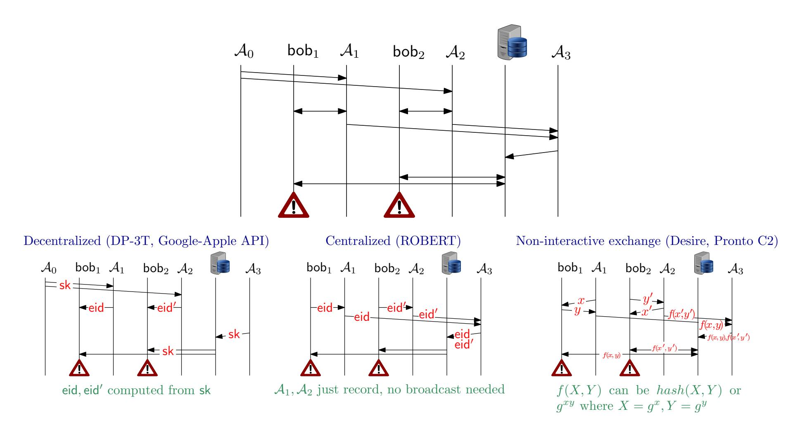
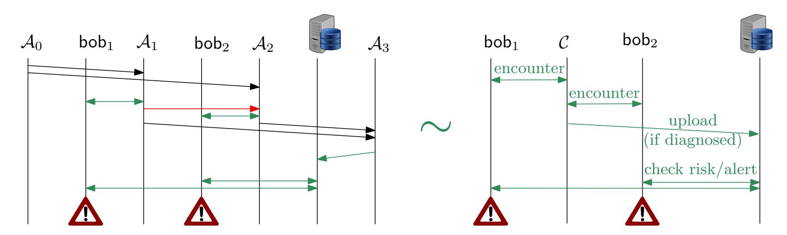
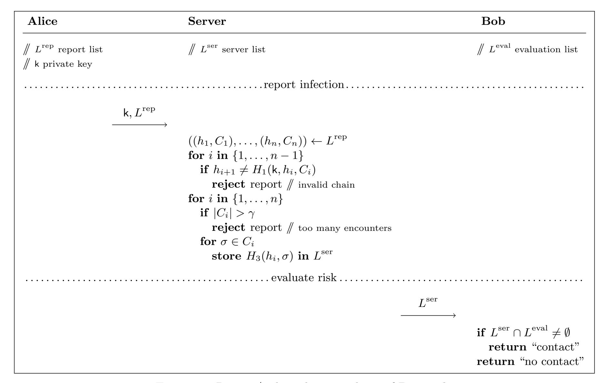
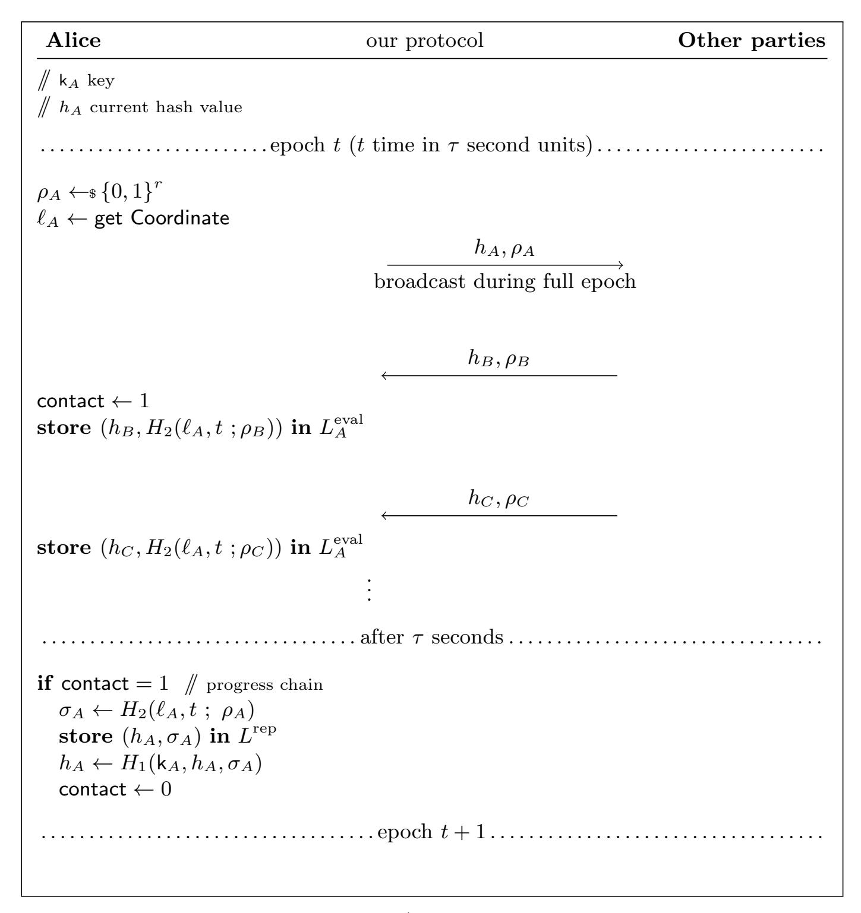
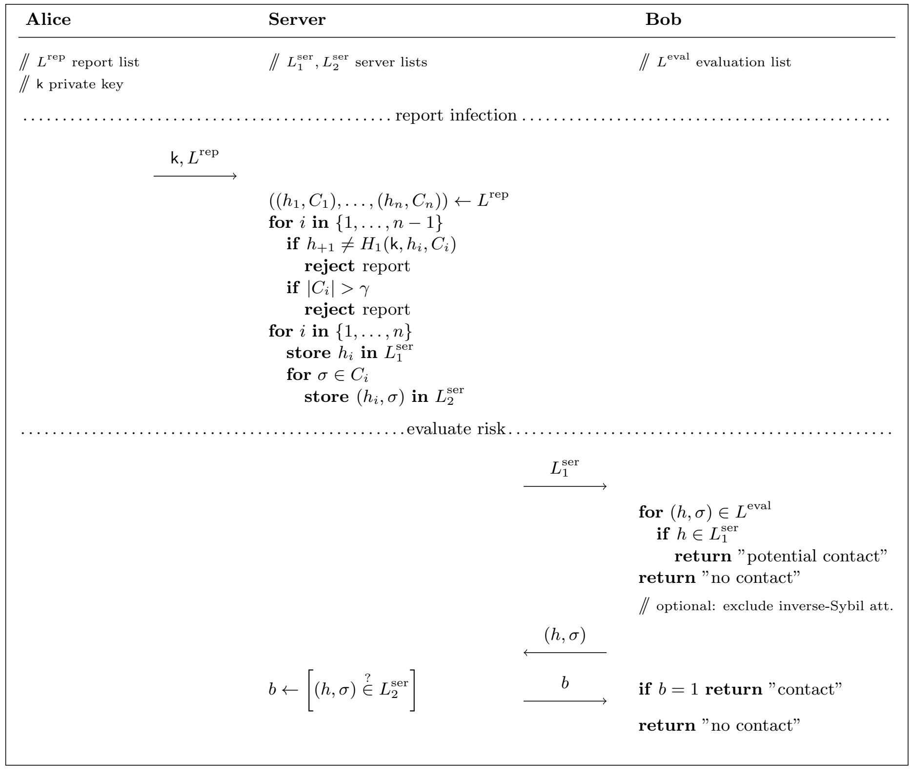

{0}------------------------------------------------

# Inverse-Sybil Attacks in Automated Contact Tracing

Benedikt Auerbach<sup>∗</sup> , Suvradip Chakraborty<sup>∗</sup> , Karen Klein<sup>∗</sup> , Guillermo Pascual-Perez† , Krzysztof Pietrzak<sup>∗</sup> , Michael Walter<sup>∗</sup> , and Michelle Yeo†

IST Austria, Klosterneuburg, Austria {bauerbac, schakrab, kklein, gpascual, pietrzak, mwalter, myeo}@ist.ac.at

March 12, 2021

#### Abstract

Automated contract tracing aims at supporting manual contact tracing during pandemics by alerting users of encounters with infected people. There are currently many proposals for protocols (like the "decentralized" DP-3T and PACT or the "centralized" ROBERT and DESIRE) to be run on mobile phones, where the basic idea is to regularly broadcast (using low energy Bluetooth) some values, and at the same time store (a function of) incoming messages broadcasted by users in their proximity. In the existing proposals one can trigger false positives on a massive scale by an "inverse-Sybil" attack, where a large number of devices (malicious users or hacked phones) pretend to be the same user, such that later, just a single person needs to be diagnosed (and allowed to upload) to trigger an alert for all users who were in proximity to any of this large group of devices.

We propose the first protocols that do not succumb to such attacks assuming the devices involved in the attack do not constantly communicate, which we observe is a necessary assumption. The high level idea of the protocols is to derive the values to be broadcasted by a hash chain, so that two (or more) devices who want to launch an inverse-Sybil attack will not be able to connect their respective chains and thus only one of them will be able to upload. Our protocols also achieve security against replay, belated replay, and one of them even against relay attacks.

<sup>∗</sup>Funded by the European Research Council (ERC) under the European Unions Horizon 2020 research and innovation programme (682815 - TOCNeT)

<sup>†</sup>Funded by the European Union's Horizon 2020 research and innovation programme under the Marie SkodowskaCurie Grant Agreement No.665385.

{1}------------------------------------------------

## Contents

| 1 |     | Introduction                                                    | 3      |  |  |
|---|-----|-----------------------------------------------------------------|--------|--|--|
|   | 1.1 | Automated Contact Tracing                                       | 3      |  |  |
|   | 1.2 | False Positives<br>                                             | 3      |  |  |
|   |     | 1.2.1<br>Replay Attacks                                         | 3      |  |  |
|   |     | 1.2.2<br>Relay Attacks                                          | 4      |  |  |
|   |     | 1.2.3<br>Inverse-Sybil Attacks                                  | 4      |  |  |
|   |     | 1.2.4<br>Modeling Inverse-Sybil Attacks                         | 5      |  |  |
|   |     | 1.2.5<br>On the Assumption that Devices Can't Communicate<br>   | 6      |  |  |
|   |     | 1.2.6<br>Using Hash Chains to Prevent Inverse-Sybil Attacks<br> | 6      |  |  |
|   |     | 1.2.7<br>The Privacy Cost of Hash Chains                        | 7      |  |  |
| 2 |     | Protocol 1: Decentralized, Non-Interactive Exchange             |        |  |  |
|   | 2.1 | Toy Protocol<br>                                                | 7<br>7 |  |  |
|   |     | 2.1.1<br>Security                                               | 8      |  |  |
|   |     | 2.1.2<br>Correctness<br>                                        | 9      |  |  |
|   |     | 2.1.3<br>Privacy<br>                                            | 9      |  |  |
|   | 2.2 | Description of Protocol 1<br>                                   | 9      |  |  |
|   |     | 2.2.1<br>Efficiency<br>                                         | 11     |  |  |
|   |     | 2.2.2<br>Epochs<br>                                             | 11     |  |  |
|   |     | 2.2.3<br>Correctness<br>                                        | 12     |  |  |
|   |     | 2.2.4<br>Privacy<br>                                            | 12     |  |  |
|   |     | 2.2.5<br>Security                                               | 12     |  |  |
| 3 |     | Security of Protocol 1                                          | 12     |  |  |
|   | 3.1 | Security Game<br>                                               | 13     |  |  |
|   | 3.2 | Security of Protocol 1<br>                                      | 14     |  |  |
| 4 |     | Protocol 2: Decentralized, Using Location for Chaining          | 15     |  |  |
|   | 4.1 | Protocol Description<br>                                        | 15     |  |  |
|   | 4.2 | Correctness, Privacy and Epochs<br>                             | 16     |  |  |
|   |     | 4.2.1<br>Correctness<br>                                        | 16     |  |  |
|   |     | 4.2.2<br>Epochs<br>                                             | 17     |  |  |
|   |     | 4.2.3<br>Privacy<br>                                            | 17     |  |  |
| 5 |     | Security of Protocol 2                                          |        |  |  |
|   | 5.1 | Security Against Replay and Relay Attacks<br>                   | 18     |  |  |
|   | 5.2 | Security Against Inverse-Sybil Attacks                          | 18     |  |  |
|   |     | 5.2.1<br>A Weaker Security Model<br>                            | 18     |  |  |
|   |     | 5.2.2<br>Security Proof<br>                                     | 18     |  |  |
| A |     | Protocol 1 With Efficient Risk-evaluation                       | 21     |  |  |

{2}------------------------------------------------

## <span id="page-2-0"></span>1 Introduction

## <span id="page-2-1"></span>1.1 Automated Contact Tracing

One central element in managing the current Covid-19 pandemic is contact tracing, which aims at identifying individuals who were in contact with diagnosed people so they can be warned and further spread can be prevented. While contact tracing is done mostly manually, there are many projects which develop automated contact tracing tools leveraging the fact that many people carry mobile phones around most of the time.

While some early tracing apps used GPS coordinates, most ongoing efforts bet on low energy Bluetooth to identify proximity of devices. Some of the larger projects include east [\[2,](#page-19-0) [9\]](#page-19-1) and west coast PACT [\[11\]](#page-19-2), Covid Watch [\[1\]](#page-18-0), DP-3T [\[16\]](#page-19-3), Robert [\[5\]](#page-19-4), its successor Desire [\[10\]](#page-19-5) and Pepp-PT [\[3\]](#page-19-6). Google and Apple [\[4\]](#page-19-7) released an API for Android and iOS phones which solves some issues earlier apps had (in particular, using Bluetooth in the background and synchronising Bluetooth MAC rotations with other key rotations). As this API is fairly specific its use is limited to basically the DP-3T protocol.

In typical contact-tracing schemes users broadcast messages to, and process messages received from other users in close proximity. If a user is diagnosed she prepares a report message and sends it to the backend server. The server uses the message to generate data which allows other users in combination with their current internal state to evaluate whether they were in contact with an infected person.

Coming up with a practical protocol is challenging. The protocol should be simple and efficient enough to be implemented in short time and using just low energy Bluetooth. As the usage of an app should be voluntarily, the app should provide strong privacy and security guarantees to not disincentivize people from using it.

## <span id="page-2-2"></span>1.2 False Positives

One important security aspect is preventing false positives, that is, having a user's device trigger an alert even though she was not in proximity with a diagnosed user. Triggering false positives cannot be completely prevented, a dedicated adversary will always be able to e.g. "borrow" the phone of a person who shows symptoms and bring it into proximity of users he wants to get alerted. What is more worrying are attacks which either are much easier to launch or that can easily be scaled. If such large scale attacks should happen they will likely undermine trust and thus deployment of the app. There are individuals and even some authoritarian states that actively try to undermine efforts to contain the epidemic, at this point mostly by disinformation,[1](#page-2-4) but potential low-cost large-scale attacks on tracing apps would also make a worthy target.

Even more worrying, such attacks might not only affect the reputation and thus deployment of the app, but also external events like elections; Launching false alerts on a large scale could keep a particular electorate from voting.[2](#page-2-5)

#### <span id="page-2-3"></span>1.2.1 Replay Attacks

One type of such attack are replay attacks, where an adversary simply records the message broadcasted by the device of a user Alice, and can later replay this broadcast (potentially after altering it) to some user Bob, such that Bob will be alerted should Alice report sick. Such an attack is clearly much easier to launch and scale than "borrowing" the device of Alice. One way to prevent replay attacks without compromising privacy but somewhat losing in efficiency and simplicity is by interaction [\[17\]](#page-19-8) or at least non-interactive message exchange [\[10,](#page-19-5) [7\]](#page-19-9). The Google-Apple API [\[4\]](#page-19-7) implicitly stores and authenticates the epoch of each encounter (basically, the time rounded to 15 minutes) to achieve some security against replay attacks, thus giving up a lot in privacy to prevent replaying messages that are older than 15 minutes. This still leaves a lot of room for replays, in particular if combined with relaying messages as discussed next. A way to prevent replay attacks by authenticating the time of the exchange without ever storing this sensitive data, termed "delayed

<span id="page-2-5"></span><span id="page-2-4"></span><sup>1</sup> <https://www.aies.at/download/2020/AIES-Fokus-2020-03.pdf>

<sup>2</sup>[https://www.forbes.com/sites/michaeldelcastillo/2020/08/27/google-and-apple-downplay-possible-election](https://www.forbes.com/sites/michaeldelcastillo/2020/08/27/google-and-apple-downplay-possible-election-threat-identified-in-their-covid-19-tracing-software)[threat-identified-in-their-covid-19-tracing-software](https://www.forbes.com/sites/michaeldelcastillo/2020/08/27/google-and-apple-downplay-possible-election-threat-identified-in-their-covid-19-tracing-software)

{3}------------------------------------------------

authentication", was suggested in [\[15\]](#page-19-10). Iovino et al. [\[14\]](#page-19-11) show that the Google-Apple API also succumbs to so called belated replay attacks. That is, adversaries that are able to control the targeted device's internal clock can trigger false positives by replaying report messages already published by the server.

#### <span id="page-3-0"></span>1.2.2 Relay Attacks

Even if replay attacks are not possible (e.g. because one uses message exchange [\[17,](#page-19-8) [10,](#page-19-5) [7\]](#page-19-9) or a message can only trigger an alert if replayed right away [\[15\]](#page-19-10)) existing schemes can still succumb to relay attacks, where the messages received by one device are sent to some other device far away, to be replayed there. This attack is more difficult to launch than a replay attack, but also more difficult to protect against. The only proposals we are aware of which aim at preventing them [\[17,](#page-19-8) [13,](#page-19-12) [15\]](#page-19-10) require some kind of location dependent value like coarse GPS coordinates or cell tower IDs.

#### <span id="page-3-1"></span>1.2.3 Inverse-Sybil Attacks

While replay and relay attacks on tracing apps have already received some attention, "inverse-Sybil" attacks seem at least as devastating but have attained little attention so far. In such attacks, many different devices pretend to be just one user, so that later it's sufficient that a single person is diagnosed and can upload its values in order to alert all users who were in proximity to any of the many devices. The devices involved in such an attack could belong to malicious covidiots, or to honest users whose phones got hacked. In this work we propose two protocols that do not succumb to inverse-Sybil attacks. Below we first shortly discuss how such attacks affect the various types of tracing protocols suggested, the discussion borrows from Vaudenay [\[18\]](#page-19-13), where this attack is called a "terrorist attack". The attacks are illustrated in Figure [1.](#page-4-1)

Decentralized. In so called decentralized schemes like DP-3T [\[16\]](#page-19-3), devices regularly broadcast ephemeral IDs derived from some initial key K, and also store IDs broadcasted by other devices in their proximity. If diagnosed, the devices upload their keys K to a backend server. The devices daily download keys of infected users from the server and check if they have locally stored any of the IDs corresponding to those keys. If yes, the devices raise an alert.[3](#page-3-2)

It's particularly easy to launch an inverse-Sybil attack against decentralized schemes, one just needs to initialize the attacking devices with the same initial key K.

Centralized. Centralized schemes like Robert [\[5\]](#page-19-4) and CleverParrot [\[8\]](#page-19-14) are similar, but here an infected user uploads the received (not the broadcasted) IDs to the server, who then informs the senders of those broadcasts about their risk. To launch an inverse-Sybil attack against such schemes the attacking devices don't need to be initialized with the same key, in fact, they don't need to broadcast anything at all. Before uploading to the server, the attacker simply collects the messages received from any devices he gets his hands on, and uploads all of them.

As in centralized schemes the server learns the number of encounters, he can set an upper bound on the number of encounters a single diagnosed user can upload, which makes an inverse-Sybil attack much less scalable.

Non-interactive exchange. Schemes including Desire [\[10\]](#page-19-5) and Pronto-C2 [\[7\]](#page-19-9) require the devices to exchange messages (say X and Y ) at an encounter, and from these then compute a shared token S = f(X, Y ).[4](#page-3-3)

<span id="page-3-2"></span><sup>3</sup>This oversimplifies things, in reality a risk score is computed based on the number, duration, signal strength etc., of the encounters, which then may or may not raise an alert. How the risk is computed is of course crucial, but not important for this work.

<span id="page-3-3"></span><sup>4</sup> In Desire it's called a "private encounter token" (PET), and is uploaded to the server for a risk assessment (so it's a more centralized scheme), while in Pronto-C2 only diagnosed users upload the tokens, which are then downloaded by all other devices to make the assessment on their phones (so a more decentralized scheme).

{4}------------------------------------------------

In Desire and Pronto-C2 the token is derived by a non-interactive key exchange (NIKE), concretely, a Diffie-Hellman exchange  $X = g^x, Y = g^y, S = g^{xy}$ . The goal is to prevent a user who passively records the exchange to learn S.

Our first protocol also uses an exchange, but for a different goal, and for us it's sufficient to just use hashing S = H(X, Y) to derive the token.

The inverse-Sybil attack as described above also can be launched against schemes that use a non-interactive exchange, but now the attack devices need to be active (i.e., broadcast, not just record) during the attack also for centralized schemes like Desire.

<span id="page-4-1"></span>

Figure 1: (top) Illustration of a successful inverse-Sybil attack: both bobs trigger an alert even though they interacted with different devices  $A_1, A_2$ . (bottom) The attacks on the various protocol types outlined in §1.2.3.

While recently formal models of integrity properties of contact tracing schemes have been proposed, they either do not consider inverse-Sybil attacks [12], or only do so in the limited sense of imposing upper bounds on the number of alerts a single report message to the server can trigger [8].

#### <span id="page-4-0"></span>1.2.4 Modeling Inverse-Sybil Attacks

We first discuss a simple security notion for inverse-Sybil attacks that considers an adversary which consists of four parts  $(A_0, A_1, A_2, A_3)$  where

- $\mathcal{A}_0$  chooses initial states for  $\mathcal{A}_1, \mathcal{A}_2$ .
- $A_1$  and  $A_2$  interact with honest devices bob<sub>1</sub> and bob<sub>2</sub>.
- $A_1$  and  $A_2$  pass their state to  $A_3$ .
- $A_3$  is then allowed to upload some combined state to the backend server (like a diagnosed user).

{5}------------------------------------------------

• The adversary wins the game if both, bob<sup>1</sup> and bob2, raise an alert after interacting with the backend server.

The notions we achieve for our actual protocols are a bit weaker, in particular, in Protocol 1 the adversary can combine a small number of received random beacons from two devices (basically the encounters in the first epoch) and in our Protocol 2 we need to assume that the locations of the devices in the future are not already known when the attack starts.

### <span id="page-5-0"></span>1.2.5 On the Assumption that Devices Can't Communicate

Let us stress that in the security game above we do not allow A<sup>1</sup> and A<sup>2</sup> to communicate. The reason is that a successful inverse-Sybil attack seems unavoidable (while preserving privacy) if such communication was allowed: A<sup>1</sup> can simply send its entire state to A<sup>2</sup> after interacting with bob1, who then interacts with bob2. The final state of A<sup>2</sup> has the distribution of a single device C first interacting with bob<sup>1</sup> then with bob2, and if this was the case we want both bobs to trigger an alert, this is illustrated in Figure [2.](#page-5-2) Thus, without giving up on privacy (by e.g. storing location data and checking movement patterns), presumably the best we can hope for is a protocol which prevents an inverse-Sybil attack assuming the devices involved in the attack do not communicate. Such an assumption might be justified if one considers the case where

<span id="page-5-2"></span>

Figure 2: If the attacking devices A1, A<sup>2</sup> could communicate during the attack (arrow in red), they can emulate the transcript (shown in green) of a single honest device C interacting with bob1, bob<sup>2</sup> and the server. As such a C can make both bobs trigger an alert by running the honest protocol, the adversary can always win the game.

the attack is launched by hacked devices, as such communication might be hard or at least easily detectable.

If we can't exclude communication, we note that the security of our schemes degrades gracefully with the frequency in which such communication is possible. Basically, in our first protocol, at every point in time at most one of the devices will be able to have interactions with other devices which later will trigger an alert, and moving this "token" from one device to another requires communication between the two devices. In our second protocol the token can only be passed once per epoch, but on the downside, several devices can be active at the same time as long as they are at the same location dependent coordinate.

Only under very strong additional assumptions, in particular if the devices run trusted hardware, inverse-Sybil attacks can be prevented in various ways, even if the devices can communicate.

## <span id="page-5-1"></span>1.2.6 Using Hash Chains to Prevent Inverse-Sybil Attacks

Below we outline the two proposed protocols which do not succumb to inverse-Sybil attacks. The basic idea is to force the devices to derive their broadcasted values from a hash chain. If diagnosed, a user will upload the chain to the server, who will then verify it's indeed a proper hash chain.

The main problem with this idea is that one needs to force the chains of different attacking devices to diverge, so later, when the adversary can upload a chain, only users who interacted with the device 

{6}------------------------------------------------

creating that particular chain will raise an alert. To enforce diverting chains, we will make the devices infuse unpredictable values to their chains. We propose two ways of doing this, both protocols are decentralized (i.e., the risk assessment is done on the devices), but it's straightforward to change them to centralized variants.

Protocol 1 (§ 2, decentralized, non-interactive exchange) The basic idea of our first proposal is to let devices exchange some randomness at an encounter, together with the heads of their hash chains. The received randomness must then be used to progress the hash chain. Should a user be diagnosed and her hash-chain is uploaded, the other device can verify that the randomness it chose was used to progress that chain from the head it received. A toy version of this protocol is illustrated in Figure 3 (the encounter) and 4 (report and alert).

Protocol 2 (§ 4, decentralized, location based coordinate) Our second protocol is similar to simple protocols like the unlinkable DP-3T, but the broadcasted values are derived via a hash-chain (not sampled at random). We also need the device to measure some location dependent coordinate with every epoch which is then infused to the hash chain at the end of the epoch. Apart from the need of a location dependent coordinate, the scheme is basically as efficient as the unlinkable variant of DP-3T. In particular, no message exchanges are necessary and the upload by a diagnosed user is linear in the number of epochs, but independent of the number of encounters. This comes at the cost of weaker security against inverse-Sybil attacks compared to Protocol 1, since we need the location coordinate to be unpredictable for the protocol to be secure, cf. Figure 10.

#### <span id="page-6-0"></span>1.2.7 The Privacy Cost of Hash Chains

In our protocols diagnosed users must upload the hash chain to the backend server, that then checks if the uploaded values indeed form a hash chain. This immediately raises serious privacy concerns, but we'll argue that the privacy cost of our protocols is fairly minor; apart from the fact that the server can learn an ordering of the uploaded values (which then would give some extra information should the server collude with other users), the protocols provide the same privacy guarantees as their underlying protocols without the chaining (which do not provide security against inverse-Sybil attacks).

## <span id="page-6-1"></span>2 Protocol 1: Decentralized, Non-Interactive Exchange

In this section we describe our first contact tracing protocol using hash chains which does not succumb to inverse-Sybil attacks. To illustrate the main idea behind the protocol, in Section 2.1 we'll consider a toy version of the protocol which assumes a (unrealistic) restricted communication model. We will then describe and motivate the changes to the protocol required to make it private and correct in a general communication model.

### <span id="page-6-2"></span>2.1 Toy Protocol

The description of our toy protocol is given below, its broadcast/receive phase is additionally depicted in Figure 3, and its report/evaluate phase in Figure 4. To analyze it, we'll make the (unrealistic) assumptions that all parties proceed in the protocol in a synchronized manner, i.e., messages between two parties are broadcast and received at the same time, and consider a setting where users meet in pairs: a broadcasted message from user A is received by at most one other user B, and in this case also A receives the message from B.

• (setup) Users sample a genesis hash value  $h_1$  and set the current head of the hash chain to  $h \leftarrow h_1$ . Then they initialize empty lists  $L^{\text{rep}}$  and  $L^{\text{eval}}$  which are used to store information to be reported to the backend server in case of infection or used to evaluate whether contact with an infected person occurred, respectively.

{7}------------------------------------------------

<span id="page-7-1"></span>

| Alice                                                                                                   |                            | Bob                                                              |
|---------------------------------------------------------------------------------------------------------|----------------------------|------------------------------------------------------------------|
| $/\!\!/ h_A$ current hash value $\rho_A \leftarrow \$ \{0,1\}^r$                                        |                            | $/\!\!/ h_B$ current hash value $\rho_B \leftarrow \$ \{0,1\}^r$ |
|                                                                                                         | $h_A,\rho_A$               |                                                                  |
|                                                                                                         | $\leftarrow$ $h_B, \rho_B$ |                                                                  |
| store $(h_A, \rho_B)$ in $L_A^{\mathrm{rep}}$                                                           |                            | $\textbf{store}(h_B,\rho_A)\textbf{in}L_B^{\rm rep}$             |
| $  \begin{array}{c} \mathbf{store} \; (h_B,\rho_A) \; \mathbf{in} \; L_A^{\mathrm{eval}} \end{array}  $ |                            | $\textbf{store}(h_A,\rho_B)\textbf{in}L_B^{\rm eval}$            |
| $h_A \leftarrow H(h_A, \rho_B)$                                                                         |                            | $h_B \leftarrow H(h_B, \rho_A)$                                  |

Figure 3: Broadcast/receive phase of the toy protocol.

<span id="page-7-2"></span>

| Alice                               | Server                                                                                                                                                                                                                                 | Bob                                                                                                     |
|-------------------------------------|----------------------------------------------------------------------------------------------------------------------------------------------------------------------------------------------------------------------------------------|---------------------------------------------------------------------------------------------------------|
| $/\!\!/ L^{\text{rep}}$ report list | $/\!\!/ L^{\rm ser}$ server list                                                                                                                                                                                                       | $/\!\!/ L^{\mathrm{eval}}$ evaluation list                                                              |
|                                     | report infection                                                                                                                                                                                                                       |                                                                                                         |
|                                     | $L^{\rm rep}$                                                                                                                                                                                                                          |                                                                                                         |
|                                     | $((h_1, \rho_1), \dots, (h_n, \rho_n)) \leftarrow L^{\mathrm{rep}}$ for $i$ in $\{1, \dots, n-1\}$ \nif $h_{i+1} \neq H(h_i, \rho_i)$ reject report $L^{\mathrm{ser}} \leftarrow L^{\mathrm{ser}} \cup L^{\mathrm{rep}}$ evaluate risk |                                                                                                         |
|                                     |                                                                                                                                                                                                                                        | $L^{\rm ser}$                                                                                           |
|                                     |                                                                                                                                                                                                                                        | $\overrightarrow{  } \qquad \qquad \mathbf{if}  L^{\mathrm{ser}} \cap L^{\mathrm{eval}} \neq \emptyset$ |
|                                     |                                                                                                                                                                                                                                        | return "contact" return "no contact"                                                                    |

Figure 4: Report/risk-evaluation phase of the toy protocol.

- (broadcast) In regular intervals each user samples a random string  $\rho \leftarrow_{\$} \{0,1\}^r$  and broadcasts the message  $(h,\rho)$  where h is the current head of the hash chain.
- (receive broadcast message) When Alice with current hash value  $h_A$  receives a message  $(h_B, \rho_B)$  from Bob she proceeds as follows. She appends the pair  $(h_A, \rho_B)$  to  $L^{\text{rep}}$  and stores  $(h_B, \rho_A)$  in  $L^{\text{eval}}$ . Then she computes the new head of the hash chain as  $h_A \leftarrow H(h_A, \rho_B)$ .
- (report message to backend server) When diagnosed users upload the list  $L^{\text{rep}} = ((h_1, \rho_1), \dots, (h_n, \rho_n))$  to the server. The server verifies that the uploaded values indeed form a hash chain, i.e., that  $h_{i+1} = H(h_i, \rho_i)$  for all  $i \in \{1, \dots, n-1\}$ . If the uploaded values pass this check the server includes all elements of  $L^{\text{rep}}$  to the list  $L^{\text{ser}}$ .
- (evaluate infection risk) After downloading  $L^{\text{ser}}$  from the server users check whether  $L^{\text{ser}}$  contains any of the hash-randomness pairs stored in  $L^{\text{eval}}$ . If this is the case they assume that they were in contact with an infected party.

#### <span id="page-7-0"></span>2.1.1 Security

The toy protocol does not succumb to inverse-Sibyl attacks. In Section 3 we provide a formal security model for inverse-Sybil attacks and give a security proof for the full protocol described in Section 2.2.

{8}------------------------------------------------

#### <span id="page-8-0"></span>2.1.2 Correctness

Assume that Alice and Bob met and simultaneously exchanged messages  $(h_A, \rho_A)$  and  $(h_B, \rho_B)$ . Then the pair  $(h_A, \rho_B)$  is stored by Alice in  $L^{\text{rep}}$  and by Bob in  $L^{\text{eval}}$ . If Alice later is diagnosed and uploads  $L^{\text{rep}}$ , Bob will learn that he was in contact with an infected person.

This toy protocol cannot handle simultaneous encounters of more than two parties. For example, assume both, Bob and Charlie, received Alice's message  $(h_A, \rho_A)$  at the same time. Even if Alice records messages from both users, it's not clear how to process them. We could let Alice process both sequentially, say first Bob's message as  $h'_A \leftarrow H(h_A, \rho_B)$ , and then Charlie's  $h''_A \leftarrow H(h'_A, \rho_C)$ . Then later, should Alice be diagnosed and upload  $(h_A, \rho_B), (h'_A, \rho_C)$ , Charlie who stored  $(h_A, \rho_C)$  will get a false negative and not recognize the encounter.

Our full protocol overcomes this issue by advancing in epochs. The randomness broadcast by other parties is collected in a pool that at the end of the current epoch is used to extend the hash chain by one link.

#### <span id="page-8-1"></span>2.1.3 Privacy

The toy protocol is a minimal solution to prevent inverse-Sybil attacks but has several weaknesses regarding privacy. Below, we discuss some privacy issues of the toy protocol, and how they are addressed in Protocol 1

- (i) Problem (Reconstruction of chains): After learning the list  $L^{\rm ser}$  from the server, a user Bob is able to reconstruct the hash chains contained in this list even if the tuples in  $L^{\rm ser}$  are randomly permuted: check for each pair  $(h,\rho), (h',\rho') \in L^{\rm ser}$  if  $h' = H(h,\rho)$  to identify all chain links. If a reconstructed chain can be linked to a user, this reveals how many encounters this user had. Moreover a user can determine the position in this chain where it had encounters with this person. Solution (Keyed hash function): We use a keyed hash function so Bob can't evaluate the hash function. Let us stress that this will not improve privacy against a malicious server because the server is given the hashing key as it must verify the uploaded values indeed form a chain. Leakage of the ordering of encounters to the server is the price we pay in privacy for preventing inverse-Sybil attacks.
- (ii) Problem (Correlated uploads): Parallel encounters are not just a problem for correctness as we discussed above, but also privacy. If both Bob and Charlie met Alice at the same time, both will receive the same message  $(h_A, \rho_A)$ . Bob will then store  $(h_B, \rho_A)$  and Charlie  $(h_C, \rho_A)$  in their  $L^{\text{rep}}$  list. This is bad for privacy, for example if both, Bob and Charlie, later are diagnosed and upload their  $L^{\text{rep}}$  lists, (at least) the server will see that they both uploaded the same  $\rho_A$ , and thus they must have been in proximity.

  Solution (Unique chaining values): The chaining value ( $\sigma_A$  in Figure 5 below) in Protocol 1 is not just the received randomness as in the toy protocol, but a hash of the received randomness and the heads of the hash chains of both parties. This ensures that all the  $L^{\text{rep}}$  lists (containing the chains users will upload if diagnosed) simply look like random and independent hash chains.

#### <span id="page-8-2"></span>2.2 Description of Protocol 1

We now describe our actual hash-chain based protocol. Unlike the toy protocol it proceeds in epochs. Users broadcast the same message during the full duration of an epoch and pool incoming messages in a set that is used to update the hash chain at the beginning of the next epoch. The protocol makes use of three hash functions  $H_1$ ,  $H_2$ , and  $H_3$ . It is additionally parametrized by an integer  $\gamma$  that serves as an upper limit on the number of contacts that can be processed per epoch. Its formal description is given below. Its broadcast/receive phase is additionally depicted in Figure 5, and its report/evaluate phase in Figure 6.

• (setup) Alice samples a key  $k_A$  and a genesis hash value  $h_1$ . She sets the current head of the hash chain to  $h \leftarrow h_1$ . Then she initializes empty lists  $L^{\text{rep}}$  and  $L^{\text{eval}}$  which are used to store information to be reported to the backend server in case of infection or used to evaluate whether contact with an infected person occurred, respectively.

{9}------------------------------------------------

<span id="page-9-0"></span>

Figure 5: Broadcast/receive phase of Protocol 1

- (broadcast) At the beginning of every epoch Alice samples a random string  $\rho_A \leftarrow_{\$} \{0,1\}^r$  and sets C to the empty set. She broadcasts the message  $(h_A, \rho_A)$  consisting of the current head of the hash chain and this randomness during the full duration of the epoch.
- (receive broadcast message) Let  $h_A$  denote her current head of the hash chain. Whenever she receives a broadcast message  $(h_B, \rho_B)$  from Bob she proceeds as follows. She computes  $\sigma_A \leftarrow H_2(h_A, h_B, \rho_B)$  and adds  $\sigma_A$  to the set C. Then she computes the value  $\sigma'_A \leftarrow H_3(h_B, h_A, \rho_A)$  and stores it in  $L^{\text{eval}}$ .
- (end of epoch) When the epoch ends (we discuss below when that should happen), Alice appends the tuple  $(h_A, C)$  to  $L^{\text{rep}}$  and updates the hash chain using C as  $h_A \leftarrow H_1(k_A, h_A, C)$ , but for efficiency reasons only if she received at least one broadcast, i.e.,  $C \neq \emptyset$ .
- (report message to backend server) If diagnosed, Alice is allowed to upload her key  $k_A$  and the list  $L^{\text{rep}} = ((h_1, C_1), \dots, (h_n, C_n))$  to the server. The server verifies that the uploaded values indeed form a hash chain, i.e., that  $h_{i+1} = H(k_A, h_i, C_i)$  for all  $i \in \{1, \dots, n-1\}$ . If the uploaded values pass this check the server updates its list  $L^{\text{ser}}$  as follows. For every set  $C_i$  it adds the hash value  $H_3(h_i, \sigma)$  to  $L^{\text{ser}}$  for all  $\sigma \in C_i$ .

{10}------------------------------------------------

<span id="page-10-2"></span>

Figure 6: Report/risk-evaluation phase of Protocol 1

• (evaluate infection risk) After downloading L ser from the server a user Bob will check whether L ser contains any of the pairs stored in L eval (of the last two weeks say, older entries are deleted). If this is the case he assumes that he was in proximity to another infected user.

## <span id="page-10-0"></span>2.2.1 Efficiency

In Protocol 1 the amount of data a diagnosed user has to upload, and more importantly, every other user needs to download, is linear in the number of encounters a diagnosed user had. In Appendix [A](#page-20-0) we describe a variant of Protocol 1 where the up and downloads are independent of the number of encounters, but which has weaker privacy properties.

### <span id="page-10-1"></span>2.2.2 Epochs

As the hash chain only progresses if the device received at least one message during an epoch, we can choose fairly short epochs, say τ = 60 seconds, without letting the chain grow by too much, but it shouldn't be too short so that we have a successful encounter (i.e., one message in each direction) of close devices within each sufficiently overlapping epochs with good probability. Choosing a small τ also gives better security against replay attacks, which are only possible within an epoch. Another advantage of a smaller τ is that it makes tracing devices using passive recording more difficult as the broadcasts in consecutive epochs cannot be linked (except retroactively by the server after a user reports). We also bound the maximum number of contacts per epoch to some γ. We do this as otherwise an inverse-Sybil attack is possible by simply never letting the attacking devices progress the hash chain. With this bound we can guarantee that in a valid chain all but at most γ of the encounters must have been received by the same device.

{11}------------------------------------------------

#### <span id="page-11-0"></span>2.2.3 Correctness

Consider two parties A and B who meet, and where B receives  $(h_A, \rho_A)$  from A, and A receives  $(h_B, \rho_B)$  from B. Then (by construction) B stores  $H_3(h_A, \sigma) \in L^{\text{eval}}$  where  $\sigma = H_2(h_A, h_B, \rho_B)$ , while A stores  $(h_A, C) \in L^{\text{rep}}$  where  $\sigma \in C$ . Should A be diagnosed and upload  $L^{\text{rep}}$ , B will get a  $L^{\text{ser}}$  which contains  $H_3(h_A, \sigma)$ , and thus B will raise a contact alert as this value is in its  $L^{\text{eval}}$  list.

#### <span id="page-11-1"></span>2.2.4 Privacy

We briefly discuss the privacy of users in various cases (user diagnosed or not, server privacy breached or not).

**Non-diagnosed user.** As discussed in  $\S 2.1$ , as we use a keyed hash function a device just broadcasts (pseudo)random and unlinkable values. Thus, as long as the user isn't diagnosed and agrees to upload its  $L^{\text{rep}}$  list, the device gets hacked or is seized, there's no serious privacy risk.

**Diagnosed user.** We now discuss what happens to a diagnosed user who agrees to upload its  $L^{\text{rep}}$  list.

- Server view: As the chaining values are just randomized hashes, from the server's perspective the lists  $L^{\text{rep}}$  uploaded by diagnosed users just look like random and independent hash chains. In particular, the server will not see which chains belong to users who had a contact. What the chains do leak, is the number of epochs with non-zero encounters, and the number of encounters in each epoch.
- Other users' view: A user who gets the  $L^{\rm ser}$  list from the server only learns the size of this list, and combined with its locally stored data this only leaks what it should: the size of the intersection of this list with his  $L^{\rm eval}$  list, which is the number of exchanges with devices of later diagnosed users.
- Joint view of Server and other users: If the view of the server and the data on the device X is combined, one can additionally deduce where in an uploaded chain an encounter with X happened.

The above discussion assumes an honest but curious adversary,<sup>5</sup> once we consider active attacks, tracking devices, etc., privacy becomes a much more complex issue. Discussions on schemes similar to ours are in [18, 7, 10]. We will not go into this discussion and rather focus on the main goal of our schemes, namely robustness against false positives.

#### <span id="page-11-2"></span>2.2.5 Security

As triggering an alert requires that the hash chain includes a value broadcasted by the alerted device, Protocol 1 does not succumb to replay attacks and belated replay attacks. In the next section we show that, most importantly, it also is secure against inverse-Sybil attacks.

## <span id="page-11-3"></span>3 Security of Protocol 1

We now discuss the security of Protocol 1 against inverse-Sybil attacks. As a first observation, note that two rogue devices could broadcast the same value  $(h, \rho)$  in the first epoch, and later combine their respective lists  $(h, C_1), (h, C_2)$  for this epoch into a report list  $L^{\text{rep}} = ((h, C = C_1 \cup C_2))$  and upload it. As it consists of a single link,  $L^{\text{rep}}$  will pass the server's verification of the hash chain. Thus, assuming that  $C_1$  and  $C_2$  jointly do not contain more than  $\gamma$  elements, all users who interacted with one of the devices will raise an alert.

Below we will show that this restricted attack is basically the only possible inverse-Sybil attack against Protocol 1. In more detail, consider an attack where the adversary initiates a large number of devices

<span id="page-11-4"></span><sup>&</sup>lt;sup>5</sup>And some precautions we didn't explicitly mention, like the necessity to permute the  $L^{\text{ser}}$  list and let the devices store the  $L^{\text{eval}}$  list in a history independent datastructure.

{12}------------------------------------------------

```
IS_{\gamma}^{\mathcal{A}=(\mathcal{A}_0,\mathcal{A}_1,\ldots,\mathcal{A}_k,\mathcal{A}_{k+1})}
                                                                                                             \mathsf{bob}_i \; \mathsf{setup}()
(\tau_1,\ldots,\tau_k) \leftarrow \mathcal{A}_0
                                                                                                             b_i \leftarrow b_i + 1
for i \in \{1, ..., k\} do
                                                                                                             \mathsf{bob}_{i,b_i} \leftarrow \mathsf{s}\,\mathsf{setup}
    b_i \leftarrow 0
                                                                                                             return 1
    \tau_i' \leftarrow \mathcal{A}_i^{\mathsf{bob}_i \text{ oracles}}(\tau_i)
L^{\mathrm{rep}} \leftarrow \mathcal{A}_{k+1}(\tau'_1, \dots, \tau'_k)
                                                                                                            \mathsf{bob}_i \; \mathsf{receive}(j, m)
send L^{\text{rep}} to backend server
                                                                                                            if b_i < j
server processes L^{\text{rep}}, computes L^{\text{ser}}
                                                                                                                \operatorname{return} \perp
 for i \in \{1, \dots, k\} do
                                                                                                            run \mathsf{bob}_{i,j} receive procedure
    a_i \leftarrow 0
                                                                                                            return 1
    for j \in \{1, ..., b_i\} do
        \mathsf{bob}_{i,j} evaluates risk w.r.t. L^{\mathsf{ser}}
                                                                                                            \mathsf{bob}_i \; \mathsf{broadcast}(j)
        if \mathsf{bob}_{i,j} evaluates to "contact"
                                                                                                            if b_i < j
             a_i \leftarrow a_i + 1
                                                                                                                return \perp
if a_{i_1} > 0 and a_{i_2} > 0 for some i_1 \neq i_2 and \sum_i a_i > \gamma
                                                                                                           m \leftarrow \text{run bob}_{i,j} broadcast procedure
                                                                                                            return m
    return 1
else
    return 0
```

Figure 7: Inverse-Sybil security game

(that cannot communicate during the attack), and later combines their states into a hash chain  $L^{\text{rep}} = (h_1, C_1), (h_2, C_2), \dots, (h_n, C_n)$  to upload. Assume this upload later alerts users  $\mathsf{bob}_1, \mathsf{bob}_2, \dots, \mathsf{bob}_t$  because they had an encounter with one of the devices. Then, as we show below, with overwhelming probability one of two cases holds:

- 1. There was no inverse-Sybil attack, that is, all alerted bob's encountered the same device.
- 2. All the encounters of the bobs that trigger an alert are recorded in the same  $C_i$  and all other  $C_j$ ,  $j \neq i$  contain only values that cannot trigger an alert.

While the 2nd point means an inverse-Sybil attack is possible, it must be restricted to an upload which in total can only contain  $\gamma$  values that will actually raise an alert.

#### <span id="page-12-0"></span>3.1 Security Game

We now give a formal description of the inverse-Sybil security game  $\mathrm{IS}_{\gamma}^{\mathcal{A}}$  against which Protocol 1 is secure. The game is given in Figure 7. It is parameterized by an integer  $\gamma$  and defined with respect to adversary  $\mathcal{A} = (\mathcal{A}_0, \mathcal{A}_1, \dots, \mathcal{A}_k, \mathcal{A}_{k+1})$ , k being the number of independently acting devices used in the attack. Adversary  $\mathcal{A}_0$  sets up states to be used by these devices. More precisely,  $\mathcal{A}_0$  for  $i \in \{1, \dots, k\}$  generates initial states  $\tau_i$ . Then  $\mathcal{A}_i$  is run on input  $\tau_i$ . Each  $\mathcal{A}_i$  has access to three oracles. The jth call to oracle bob<sub>i</sub> setup sets up a user bob<sub>i,j</sub>. Oracle bob<sub>i</sub> receive on input of index j and message m results in bob<sub>i,j</sub> receiving and processing m. Finally, bob<sub>i</sub> broadcast on input of index j runs bob<sub>i,j</sub>'s broadcast procedure and returns the corresponding message.

At the end of the game  $A_1, \ldots, A_k$  output states, on input of which  $A_{k+1}$  generates a single report message  $L^{\text{rep}}$  which in turn is processed by the backend server. Then all  $\mathsf{bob}_{i,j}$  evaluate their risks status with respect to the resulting  $L^{\text{ser}}$ . The attack is considered to have been successful if (a) at least two bobs that interacted with different  $A_i$  raise an alert and (b) the overall number of alerts raised exceeds  $\gamma$ .

{13}------------------------------------------------

### <span id="page-13-0"></span>3.2 Security of Protocol 1

We obtain the following.

**Theorem 1.** If  $H_1, H_2, H_3$  are modeled as random oracles with range  $\{0, 1\}^w$ , any adversary  $\mathcal{A}$  making at most a total of q queries to  $H_1, H_2, H_3$  and having at most t interactions with the bobs in total, can win the  $\mathrm{IS}_{\gamma}^{\mathcal{A}}$  game against Protocol 1 with probability at most  $\frac{t^2+tq}{2^r} + \frac{2q^2+2qt+tq(q+t)}{2^w}$ , where r is the length of the random values  $\rho$  broadcast during the protocol execution.

*Proof.* Let  $\mathcal{A} = (\mathcal{A}_0, \dots, \mathcal{A}_{k+1})$  be an adversary that wins the  $\mathrm{IS}_{\gamma}^{\mathcal{A}}$  game. Note that in order to win, the adversary must have initiated  $\mathsf{bob}_{i,j}$  for at least  $\gamma + 1$  different values (i,j) and made them raise an alert. Thus, for these (i,j) the report list  $L^{\mathrm{rep}} = ((h_1, C_1), \dots, (h_n, C_n))$  uploaded by  $\mathcal{A}_{k+1}$  must contain  $C_{\ell_{i,j}}$  and  $\sigma_{\ell_{i,j}} \in C_{\ell_{i,j}}$  such that  $H_3(h_{\ell_{i,j}}, \sigma_{\ell_{i,j}}) \in L^{\mathrm{eval}}_{\mathsf{bob}_{i,j}}$ .

We will show that with overwhelming probability all values stored in the evaluation lists  $L_{\mathsf{bob}_{i,j}}^{\mathsf{eval}}$  are pairwise distinct. To this end, recall that the lists  $L_{\mathsf{bob}_{i,j}}^{\mathsf{eval}}$  contain hash values of the form  $H_3(h_A, H_2(h_A, h_B, \rho_B))$ , where  $\rho_B$  is sampled uniformly at random from  $\{0, 1\}^r$ . With probability at least  $1 - t^2/2^r$  all  $\rho_B$  are distinct. Thus with probability at least  $(1 - t^2/2^r)(1 - q^2/2^w)$  all values  $H_2(h_A, h_B, \rho_B)$ , are distinct and in turn with probability at least

$$(1 - t^2/2^r)(1 - q^2/2^w)^2 \ge 1 - t^2/2^r - 2q^2/2^w$$

all values in  $\{L_{\mathsf{bob}_{i,j}}^{\mathrm{eval}}\}_{i,j}$  are distinct.

In turn, as the server when processing  $L^{\text{rep}}$  verifies that all  $C_{\ell}$  satisfy  $|C_{\ell}| \leq \gamma$ , there must exist  $\ell_1 < \ell_2$  such that  $C_{\ell_1}$  and  $C_{\ell_2}$  contain values resulting in an alert of some  $\mathsf{bob}_{i,j}$ . Further,  $\mathcal{A}$  winning the inverse-Sybil game implies that the i values of at least two bobs raising an alert differ. So there exist  $i_1 \neq i_2, j_1, j_2$  and  $\sigma_{\ell_1} \in C_{\ell_1}, \sigma_{\ell_2} \in C_{\ell_2}$  such that

$$H_3(h_{\ell_1}, \sigma_{\ell_1}) \in L^{\text{eval}}_{\mathsf{bob}_{i_1, j_1}}$$
 and  $H_3(h_{\ell_2}, \sigma_{\ell_2}) \in L^{\text{eval}}_{\mathsf{bob}_{i_2, j_2}}$ .

Note that  $H_3(h_{\ell_1}, \sigma_{\ell_1})$  depends on randomness  $\rho_{\ell_1}$  that was generated by  $\mathsf{bob}_{i_1, j_1}$  and hence is not known to adversary  $\mathcal{A}_{i_2}$  who had to send the value  $h_{\ell_2}$  to  $\mathsf{bob}_{i_2, j_2}$  via oracle  $\mathsf{bob}_{i_2}$  broadcast $(j_2)$ . Since the server verifies that  $L^{\mathrm{rep}}$  forms indeed a hash chain under  $H_1$ , in order to win  $\mathcal{A}_{k+1}$  needs to find inputs to a hash chain under  $H_1$  from some  $(\mathsf{k}, h_{\ell_1}, C_{\ell_1})$  to  $h_{\ell_2}$ , where  $C_{\ell_1}$  contains a value generated independently from  $h_{\ell_2}$ . If  $H_1, H_2$  and  $H_3$  are random oracles, this is infeasible with polynomially many oracle calls, as we show next.

For  $i \in \{0, ..., k+1\}$  let  $Q_i$  denote the queries of  $A_i$  to random oracles  $H_1, H_2, H_3$  and  $q_i = |Q_i|$ . For  $i \in \{1, ..., k\}$  let  $T_i$  be the values  $h'_{A_i}$  sent by  $A_i$  as part of a query  $\mathsf{bob}_i$  receive $(j, (h'_{A_i}, \rho'_{A_i}))$  for some j, and let  $t_i = |T_i|$ . Finally, we define  $I_j = \{0, ..., k\} \setminus \{j\}$  and

$$\overline{Q}_j = \bigcup_{i \in I_j} Q_i \ ,$$

i.e.  $\overline{Q}_j$  contains all queries made by  $\mathcal{A}$  except the ones by  $\mathcal{A}_j$  and  $\mathcal{A}_{k+1}$ . We next argue that with overwhelming probability there is no query  $(\mathsf{k},h_{\ell_1},C_{\ell_1})$  to  $H_1$  in  $\overline{Q}_{i_1}$ . Recall that  $C_{\ell_1}$  contains a value  $\sigma_{\ell_1}$  such that  $H_3(h_{\ell_1},\sigma_{\ell_1})=\sigma_B$  for some  $\sigma_B=H_3(h_A,H_2(h_A,h_B,\rho_B))\in L^{\mathrm{eval}}_{\mathrm{bob}_{i_1,j_1}}$ , where  $\rho_B$  is sampled uniformly at random by  $\mathrm{bob}_{i_1,j_1}$ . Since  $\mathrm{bob}_{i_1,j_1}$  only interacts with  $\mathcal{A}_{i_1}$ , with probability at least  $1-q/2^r$  there is no query  $(h_A,h_B,\rho_B)$  to oracle  $H_2$  in  $\overline{Q}_{i_1}$ . Conditioned on no such query being made, since  $H_2$  is modeled as a random oracle, with probability at least  $1-q/2^w$  the set  $\overline{Q}_{i_1}$  contains no query of the form  $(h_A,H_2(h_A,h_B,\rho_B))$  to  $H_3$ . Finally, as  $H_3$  is modeled as a random oracle, in this case  $\sigma_B$  looks uniformly random to all  $\mathcal{A}_i$  with  $i \in I_{i_1}$ . Note that  $\overline{Q}_{i_1}$  containing the query  $(\mathsf{k},h_{\ell_1},C_{\ell_1})$  to  $H_1$  implies that the adversary found a preimage of  $\sigma_B$  under  $H_3$ . Thus, the probability of this event is bounded by  $q/2^w$ . Summing up, the probability that  $(\mathsf{k},h_{\ell_1},C_{\ell_1})$  is queried to  $H_1$  in  $\overline{Q}_{i_1}$  is at most  $q/2^r+2q/2^w$ .

Assuming that no such query is made, since  $H_1$  is modeled as a random oracle, the link  $h_{i_1+1}$  of the hash chain looks uniformly random to all adversaries  $A_i$  with  $i \in I_{i_1}$  and in particular is independent from  $h_{\ell_2} \in T_{i_2}$ . So, to construct a hash chain from  $h_{\ell_1+1}$  to  $h_{\ell_2}$  it is necessary that some query in  $Q_{i_1} \cup Q_{k+1} \setminus \overline{Q}_{i_1}$ 

{14}------------------------------------------------

for  $H_1$  collides with one in  $T_{i_2}$  or any of the queries in  $\overline{Q}_{i_1}$ . The probability of this event is at most  $q(q+t)/2^w$ . Finally, we get another multiplicative factor of t by taking the union bound over all possible  $\sigma_{\ell_2}$  resulting in an upper bound of

$$\frac{t^2}{2^r} + 2\frac{q^2}{2^w} + t \cdot \left(\frac{q}{2^r} + \frac{2q}{2^w} + \frac{q(q+t)}{2^w}\right)$$

on  $\mathcal{A}$ 's probability to win game  $\mathrm{IS}_{\gamma}^{\mathcal{A}}$ .

## <span id="page-14-0"></span>4 Protocol 2: Decentralized, Using Location for Chaining

In this section we describe our second protocol, which requires that the devices have access to some location based coordinate. This coordinate is infused into the hash-chain so chains of different devices (at different coordinates) will diverge, and thus prevent an inverse-Sybil attack. Possible coordinates are coarse grained GPS location, cell tower IDs or information from IP addresses.

The protocol progresses in epochs (say of  $\tau = 60$  seconds), where at the beginning of an epoch the device samples randomness  $\rho$  and its coordinate  $\ell$ . It then broadcasts  $\rho$  together with the head h of its hash chain. If during an epoch at least one message was received, the hash chain is extended by hashing the current head with a commitment of the location  $\ell$  using randomness  $\rho$ .

## <span id="page-14-1"></span>4.1 Protocol Description

The protocol makes use of collision resistant hash functions  $H_1$  to progress the chain, and a hash function  $H_2$  which is basically used as a commitment scheme (and we use notation  $H_2(m; \rho)$  to denote it's used as commitment for message m using randomness  $\rho$ ), but we need  $H_2$  to be hiding even if the same randomness is used for many messages. For this it's sufficient that  $H_2$  is collision resistant (for binding), and for a random  $\rho$ ,  $H_2(\cdot; \rho)$  is a PRF with key  $\rho$ .

A formal description of Protocol 2 is given below. The broadcast/receive phase is additionally depicted in Figure 8, and its report/evaluate phase in Figure 9.

- (setup) Users sample a key k and a genesis hash value  $h_1$ , and set the current head of the hash chain to  $h \leftarrow h_1$ . Then they initialize empty lists  $L^{\text{rep}}$  and  $L^{\text{eval}}$  which are used to store information to be reported to the backend server in case of infection or used to evaluate whether contact with an infected person occurred, respectively.
- (epoch starts) An epoch starts every  $\tau$  seconds, and the epoch number t is the number of epochs since some globally fixed timepoint (say Jan. 1st 2020, 12am CEST). At the beginning of every epoch the device samples a random string  $\rho \leftarrow_{\$} \{0,1\}^r$  and retrieves its current coordinate  $\ell \leftarrow$  get Coordinate.
- (broadcast) During the epoch the device regularly broadcasts the head h of its current chain together with  $\rho$ .
- (receive broadcast message) Whenever the device receives a message  $(h_B, \rho_B)$  it computes a commitment to the current coordinate and time (i.e., epoch number t) using the received randomness  $\sigma_B \leftarrow H_2(\ell, t; \rho_B)$ , and stores the tuple  $(h_B, \sigma_B)$  in  $L^{\text{eval}}$ .
- (epoch ends) If at the end of the epoch there was at least one message received during this epoch (contact= 1), the device computes a commitment  $\sigma \leftarrow H_2(\ell, t; \rho)$  to its coordinate and time using randomness  $\rho$ , it appends this  $\sigma$  and the head h of the chain to the list  $L^{\text{rep}}$  (of values to be reported in case of being diagnosed), and progresses its hash chain as  $h \leftarrow H_1(\mathsf{k}, h, \sigma)$ .
- (report message to backend server) If diagnosed users upload their key k as well as the list  $L^{\text{rep}} = ((h_1, \sigma_1), \ldots, (h_n, \sigma_n))$  to the server. The server verifies that the uploaded values indeed form a hash chain, i.e., that  $h_{i+1} = H_1(\mathsf{k}, h_i, \sigma_i)$  for all  $i \in \{1, \ldots, n-1\}$ . If the uploaded values pass this check the server updates its list  $L^{\text{ser}}$  by adding  $L^{\text{rep}}$  to it.

{15}------------------------------------------------

<span id="page-15-2"></span>

Figure 8: Broadcast/receive phase of Protocol 2

• (evaluate risk) After downloading  $L^{\text{ser}}$  from the server users check whether  $L^{\text{ser}}$  contains any of the pairs stored in  $L^{\text{eval}}$ . If this is the case they assume that they were in contact with an infected party. As the user learns the size of the intersection, a more sophisticated risk evaluation is also possible.

## <span id="page-15-0"></span>4.2 Correctness, Privacy and Epochs

#### <span id="page-15-1"></span>4.2.1 Correctness

Consider two devices A and B who measured locations  $\ell_A$  and  $\ell_B$  and are in epochs  $t_A$  and  $t_B$ , and where A receives  $(h_B, \rho_B)$  from B and thus stores  $(h_B, \sigma = H_2(\ell_A, t_A; \rho_B))$  in  $L_A^{\text{eval}}$ . Assume B receives at least one message during this epoch, then it will store  $(h_B, \sigma' = H_2(\ell_B, t_B; \rho_B))$  in its  $L_B^{\text{rep}}$  list.

If later B is diagnosed it uploads its  $L_B^{\text{rep}}$  list to the server. At its next risk evaluation A will receive  $L^{\text{ser}}$  (which now contains  $L_B^{\text{rep}}$ ) from the server. It will report a contact if  $L^{\text{ser}} \cap L_A^{\text{eval}} \neq \emptyset$  which holds if  $\sigma' = \sigma$  or equivalently

$$(h_B, H_2(\ell_B, t_B; \rho_B) = (h_B, H_2(\ell_A, t_A; \rho_B))$$

which is implied by  $(\ell_A, t_A) = (\ell_B, t_B)$ . Summing up, in the setting above A will correctly report a contact if

{16}------------------------------------------------

<span id="page-16-2"></span>

| Alice                                       | Server                                                                                                                                     | Bob                                                                           |
|---------------------------------------------|--------------------------------------------------------------------------------------------------------------------------------------------|-------------------------------------------------------------------------------|
| rep report list<br>// L<br>// k private key | ser server list<br>// L                                                                                                                    | eval evaluation list<br>// L                                                  |
|                                             | report infection                                                                                                                           |                                                                               |
|                                             | k, Lrep                                                                                                                                    |                                                                               |
|                                             | rep<br>((h1, σ1), ,(hn, σn)) ← L<br>for i in {1, , n − 1}<br>if hi+1<br>6= H1(k, hi, σi)<br>reject report<br>rep in<br>ser<br>store L<br>L |                                                                               |
|                                             | evaluate risk                                                                                                                              |                                                                               |
|                                             |                                                                                                                                            | ser<br>L                                                                      |
|                                             |                                                                                                                                            | ser ∩<br>eval 6=<br>if L<br>L<br>∅<br>return "contact"<br>return "no contact" |

Figure 9: Report/risk-evaluation phase of Protocol 2

- 1. A and B are synchronised, i.e., in the same epoch t<sup>A</sup> = tB.
- 2. B received at least one message during epoch tB.
- 3. A and B were at the same locations (i.e., `<sup>A</sup> = `B) at the beginning of the epoch.

Condition 2. should be satisfied in most cases simply because the fact that A received a message from B means B should also have received a message from A. This condition only exists because we let the devices progress their chains only in epochs where encounters happened.[6](#page-16-3)

#### <span id="page-16-0"></span>4.2.2 Epochs

As epochs are synchronized, even if the coordinates of the devices change frequently because the devices are moving, two devices will still have the same coordinate as long as they were at the same coordinate at the beginning of an epoch, think of two passengers in a moving train. But we can have a mismatch (and thus false negative) if two devices meet that were at different coordinates at the beginning of an epoch, e.g., two people meet at a train station, where at the beginning of the epoch, one person was in the moving train, while the other was waiting at the platform. To address this problem one should keep the epochs sufficiently short, in particular, much shorter than the exposure time that would raise an alert.

#### <span id="page-16-1"></span>4.2.3 Privacy

Our Protocol 2 is similar to the unlinkable variant of DP-3T, and thus has similar privacy properties. In particular, the only thing non-diagnosed users broadcast are pseudorandom and unlinkable beacons. But there are two privacy issues that arise in our protocol which DP-3T does not have. The first is because we use chaining, the second because we use coordinates:

<span id="page-16-3"></span><sup>6</sup>The reason for only progressing if there was an encounter is that this way the chain is shorter (thus there's less to up and download), the chain reveals less information (i.e., even the server can't tell where the empty epochs were) and tracing using passive recording devices becomes more difficult.

{17}------------------------------------------------

- 1. (Server can link) Even though the beacons broadcasted by a diagnosed user are not linkable by other users (assuming the server permutes the  $L^{\text{ser}}$  list before other users can download it), the server itself can link the beacons (it gets them in order and also the hash key to verify this). So similar to Protocol 1 compared to DP-3T we put more trust in the server concerning this privacy aspect.
- 2. (Digital evidence) When discussing privacy, one mostly focuses on what information can be learned about a user. But there's a difference between learning something, and being able to convince others that this information is legit. While in decentralized protocols like DP-3T a malicious device can easily learn when and where an encounter with a later diagnosed user happened by simply storing the recorded beacons together with the time and location, it's not clear how the device would produce convincing evidence linking the uploaded beacon with this time and location.

In a protocol that uses time and location, like our Protocol 2, one can produce such evidence by basically time-stamping the entire transcript of an encounter (e.g. by posting a hash of it on a blockchain), and later, when a user is diagnosed and its encounter tokens become public, use this time-stamped data as evidence of the encounter. This problem already arises when one uses time to prevent replay attacks, and location to prevent relay attacks as discussed in [15] for details.

## <span id="page-17-0"></span>5 Security of Protocol 2

### <span id="page-17-1"></span>5.1 Security Against Replay and Relay Attacks

The protocol is secure against replay, belated replay, and relay attacks in the following sense: Assume Alice is at location  $\ell_A$  and epoch  $t_A$ , broadcasts  $(h_A, \rho_A)$  and thus stores  $(h_A, \sigma_A = H_2(\ell_A, t_A; \rho_A)) \in L^{\text{rep}}$ . Now, assume an adversary replays the message with potentially changed randomness  $(h_A, \rho_A')$  to user Bob who is at a different location and/or epoch  $(\ell_B, t_B) \neq (\ell_A, t_A)$  than Alice was. Bob then stores  $(h_A, \sigma_B = H_2(\ell_B, t_B; \rho_A')) \in L^{\text{eval}}$ . Should Alice later upload her  $L^{\text{rep}}$  list, then the replayed message will trigger a contact warning for Bob if  $\sigma_A = \sigma_B$ , i.e.,

$$H_2(\ell_A, t_A; \rho_A) = H_2(\ell_B, t_B; \rho_A'),$$

and this condition is necessary as long as  $L^{\text{eval}}$  does not contain a pair  $(h'_A, \sigma'_A)$  with  $h'_A = h_A$  and  $\sigma'_A \neq \sigma_A$ . Since the latter happens only with negligible probability, this implies that Bob must break the binding property of the commitment scheme.

### <span id="page-17-2"></span>5.2 Security Against Inverse-Sybil Attacks

#### <span id="page-17-3"></span>5.2.1 A Weaker Security Model

Protocol 2 achieves weaker security against inverse-Sybil attacks since there is less interaction: the randomness chosen by the users in Protocol 1 is replaced by location to defend somewhat against inverse-Sybil attacks. Accordingly, we need to weaken the model in order to prove security. In particular, we cannot let the adversary have control of the locations, otherwise it can trivially carry out an attack. So we assume that the locations of the encounters with the bobs follow some unpredictable distributions  $\mathcal{P}_i$ . The formal security game weak- $\mathrm{IS}_{\mathcal{P}_1,\mathcal{P}_2}^{\mathcal{A}}$  can be found in Figure 10. We believe that whenever the location coordinates are not chosen too coarse, this still implies a meaningful security guarantee.

#### <span id="page-17-4"></span>5.2.2 Security Proof

For Protocol 2 we obtain the following theorem.

**Theorem 2.** If  $H_1$  is modeled as a random oracle,  $H_2$  is  $\epsilon$ -collision-resistant, and  $\mathcal{P}_1, \mathcal{P}_2$  are independent and have min-entropy at least k, then any adversary  $\mathcal{A}$  making at most q queries to  $H_1: \{0,1\}^* \to \{0,1\}^w$  and having at most t interactions with the bobs can win the weak- $\mathrm{IS}_{\mathcal{P}_1,\mathcal{P}_2}^{\mathcal{A}}$  game against Protocol 2 with probability at most  $\frac{q+1}{2^k} + \frac{2q^2}{2^w} + \epsilon$ .

{18}------------------------------------------------

```
weak-IS_{\mathcal{P}_1,\mathcal{P}_2}^{\mathcal{A}=(\mathcal{A}_0,\mathcal{A}_1,\mathcal{A}_2,\mathcal{A}_3)}
                                                                                 \mathsf{bob}_i \; \mathsf{receive}(h_A, \rho_A)
\tau_1, \tau_2 \leftarrow \mathcal{A}_0
                                                                                 \ell \leftarrow _{\$} \mathcal{P}_{i}
for i \in \{1, 2\} do
                                                                                 run \mathsf{bob}_i receive procedure with coordinate \ell
                                                                                 return \ell
    \mathsf{bob}_i \leftarrow \mathsf{s} \, \mathsf{setup}
    \tau_i' \leftarrow \mathcal{A}_i^{\mathsf{bob}_i \text{ oracles}}(\tau_i)
                                                                                \mathsf{bob}_i \ \mathrm{broadcast}
L^{\text{rep}} \leftarrow \mathcal{A}_3(\tau_1', \tau_2')
send L^{\text{rep}} to backend server
                                                                               \ell \leftarrow \mathcal{P}_i
server processes L^{\text{rep}}, computes L^{\text{ser}}
                                                                               run \mathsf{bob}_i broadcast procedure with coordinate \ell
 for i \in \{1, 2\} do
                                                                               return the result and \ell
    \mathsf{bob}_i evaluates risk w.r.t. L^{\mathsf{ser}}
if both bobs evaluate to "contact"
    return 1
\mathbf{else}
    return 0
```

Figure 10: Weak inverse-Sybil security game

Proof. Let  $\mathcal{A} = (\mathcal{A}_0, \mathcal{A}_1, \mathcal{A}_2, \mathcal{A}_3)$  be an adversary that wins the weak-IS $_{\mathcal{P}_1, \mathcal{P}_2}^{\mathcal{A}}$  game with non-negligible advantage. We assume that the first samples from  $\mathcal{P}_1$  and  $\mathcal{P}_2$  are different, which happens with probability at least  $1 - 2^{-k}$ . Furthermore, since both bobs evaluate to "contact", we must have that for both of them  $L^{\text{ser}} \cap L^{\text{eval}} \neq \emptyset$ , i.e.  $L^{\text{ser}}$  contains pairs  $(h_{A_1}, \sigma_{A_1})$  and  $(h_{A_2}, \sigma_{A_2})$  such that during the game bob<sub>j</sub> received  $h_{A_j}$  and  $\rho_{A_j}$  at epoch  $t_j$  and coordinate  $\ell_j$  and it holds  $\sigma_{A_j} = H_2(\ell_j, t_j; \rho_{A_j})$ , where  $j \in \{1, 2\}$ . Then, since the server verifies the hash chain, we must have that  $\tau_3$  consists of a key k and a list L of pairs  $(h_i, \sigma_i)$  such that  $h_{i+1} = H_1(\mathsf{k}, h_i, \sigma_i)$  and  $(h_{A_1}, \sigma_{A_1}), (h_{A_2}, \sigma_{A_2}) \in L$ .

We consider two cases: First, assume case 1)  $(h_{A_1}, \sigma_{A_1}) = (h_{A_2}, \sigma_{A_2})$ . Since  $h_{A_1} = h_{A_2}$ , either exactly the same sequence of coordinates were infused into the hash chain to obtain  $h_{A_1}$  and  $h_{A_2}$ , or  $\mathcal{A}$  found a collision for  $H_1$  or  $H_2$ . Furthermore, since  $\sigma_{A_1} = \sigma_{A_2}$  either the coordinates where the adversaries  $\mathcal{A}_i$  meet the respective bob<sub>i</sub> coincide as well, or  $\mathcal{A}$  found a collision for  $H_2$ . Thus, either the location histories of  $\mathcal{A}_1$  and  $\mathcal{A}_2$  coincide, which happens with probability at most  $2^{-k}$ , or  $\mathcal{A}$  found a collision for  $H_1$  or  $H_2$ , which happens with probability at most  $\epsilon + q^2/2^w$ .

Now, let's assume case 2)  $(h_{A_1}, \sigma_{A_1}) \neq (h_{A_2}, \sigma_{A_2})$ . We assume that  $\mathcal{A}$  does not find a collision for  $H_2$ , since this case would already be covered by the upper bound for case 1. W.l.o.g. assume that  $(h_{A_1}, \sigma_{A_1})$  appears before  $(h_{A_2}, \sigma_{A_2})$  in L. Note that  $\mathcal{A}_2$  outputs  $h_{A_2}$  without knowing  $(h_{A_1}, \sigma_{A_1})$  and  $\mathcal{P}_1$  has entropy k. So  $\mathcal{A}_3$  needs to find inputs to a hash chain from  $(h_{A_1}, \sigma_{A_1})$  that collides with  $h_{A_2}$ . Similar to the proof of Protocol 1, let  $Q_i$  be the queries of  $\mathcal{A}_i$  to  $H_1$  and  $q_i = |Q_i|$ . Furthermore, let  $h = H_1(\mathsf{k}, h_{A_1}, \sigma_{A_1})$ . Since  $(h_{A_1}, \sigma_{A_1})$  is not known to  $\mathcal{A}_2$ , we have  $(\mathsf{k}, h_{A_1}, \sigma_{A_1}) \notin Q_0 \cup Q_2$  except with probability  $(q_0 + q_2)/2^k$ . So except with this probability h looks uniformly random to  $\mathcal{A}_0$  and  $\mathcal{A}_2$ , because  $H_1$  is modeled as a RO. Accordingly, h is independent of any of the queries in  $Q_0 \cup Q_2$ . So constructing a hash chain between h and any of the values in  $Q_0 \cup Q_2$  requires that the value of  $H_1$  under some query in  $Q_1 \cup Q_3$  collides with (the first entry of) any of the queries in  $Q_0 \cup Q_2$ . The probability of this event is less than  $(q_1 + q_3) \cdot \frac{q_0 + q_2}{2^w}$ . Thus, in case 2) the probability of  $\tau_3$  causing an alert for bob<sub>1</sub> and bob<sub>2</sub> is at most  $\frac{q_0 + q_2}{2^k} + \frac{(q_1 + q_3)(q_0 + q_2)}{2^w}$ . By setting  $q = \sum_i q_i$  and combining the two cases, we get an upper bound of  $\frac{q+1}{2^k} + \frac{2q^2}{2^w} + \epsilon$ .

## References

<span id="page-18-0"></span>[1] Covid watch. https://www.covidwatch.org/ (2020)

{19}------------------------------------------------

- <span id="page-19-0"></span>[2] Pact: Private automated contact tracing. <https://pact.mit.edu/> (2020)
- <span id="page-19-6"></span>[3] Pepp-pt: Pan-european privacy-preserving proximity tracing. <https://github.com/pepp-pt> (2020)
- <span id="page-19-7"></span>[4] Privacy-preserving contact tracing. <https://www.apple.com/covid19/contacttracing> (2020)
- <span id="page-19-4"></span>[5] Robert: Robust and privacypreserving proximity tracing. [https://github.com/ROBERT-proximity](https://github.com/ROBERT-proximity-tracing)[tracing](https://github.com/ROBERT-proximity-tracing) (2020)
- [6] Auerbach, B., Chakraborty, S., Klein, K., Pascual-Perez, G., Pietrzak, K., Walter, M., Yeo, M.: Inversesybil attacks in automated contact tracing. Cryptology ePrint Archive, Report 2020/670 (2020), [https:](https://eprint.iacr.org/2020/670) [//eprint.iacr.org/2020/670](https://eprint.iacr.org/2020/670)
- <span id="page-19-9"></span>[7] Avitabile, G., Botta, V., Iovino, V., Visconti, I.: Towards defeating mass surveillance and sars-cov-2: The pronto-c2 fully decentralized automatic contact tracing system. Cryptology ePrint Archive, Report 2020/493 (2020), <https://eprint.iacr.org/2020/493>
- <span id="page-19-14"></span>[8] Canetti, R., Kalai, Y.T., Lysyanskaya, A., Rivest, R.L., Shamir, A., Shen, E., Trachtenberg, A., Varia, M., Weitzner, D.J.: Privacy-preserving automated exposure notification. Cryptology ePrint Archive, Report 2020/863 (2020), <https://eprint.iacr.org/2020/863>
- <span id="page-19-1"></span>[9] Canetti, R., Trachtenberg, A., Varia, M.: Anonymous collocation discovery: Taming the coronavirus while preserving privacy. CoRR abs/2003.13670 (2020), <https://arxiv.org/abs/2003.13670>
- <span id="page-19-5"></span>[10] Castelluccia, C., Bielova, N., Boutet, A., Cunche, M., Lauradoux, C., M´etayer, D.L., Roca, V.: DE-SIRE: A third way for a european exposure notification system leveraging the best of centralized and decentralized systems. CoRR abs/2008.01621 (2020), <https://arxiv.org/abs/2008.01621>
- <span id="page-19-2"></span>[11] Chan, J., Gollakota, S., Horvitz, E., Jaeger, J., Kakade, S.M., Kohno, T., Langford, J., Larson, J., Singanamalla, S., Sunshine, J.E., Tessaro, S.: PACT: privacy sensitive protocols and mechanisms for mobile contact tracing. CoRR abs/2004.03544 (2020), <https://arxiv.org/abs/2004.03544>
- <span id="page-19-15"></span>[12] Danz, N., Derwisch, O., Lehmann, A., Puenter, W., Stolle, M., Ziemann, J.: Security and privacy of decentralized cryptographic contact tracing. Cryptology ePrint Archive, Report 2020/1309 (2020), <https://eprint.iacr.org/2020/1309>
- <span id="page-19-12"></span>[13] Gvili, Y.: Security analysis of the covid-19 contact tracing specifications by apple inc. and google inc. Cryptology ePrint Archive, Report 2020/428 (2020), <https://eprint.iacr.org/2020/428>
- <span id="page-19-11"></span>[14] Iovino, V., Vaudenay, S., Vuagnoux, M.: On the effectiveness of time travel to inject covid-19 alerts. Cryptology ePrint Archive, Report 2020/1393 (2020), <https://eprint.iacr.org/2020/1393>
- <span id="page-19-10"></span>[15] Pietrzak, K.: Delayed authentication: Preventing replay and relay attacks in private contact tracing. In: Bhargavan, K., Oswald, E., Prabhakaran, M. (eds.) INDOCRYPT 2020. LNCS, vol. 12578, pp. 3–15. Springer, Heidelberg (Dec 2020)
- <span id="page-19-3"></span>[16] Troncoso, C., Payer, M., Hubaux, J.P., Salath, M., Larus, J., Bugnion, E., Lueks, W., Stadler, T., Pyrgelis, A., Antonioli, D., Barman, L., Chatel, S., Paterson, K., Capkun, S., Basin, D., Jackson, D., Preneel, B., Smart, N., Singelee, D., Abidin, A., Guerses, S., Veale, M., Cremers, C., Binns, R., Wiegand, T.: Dp3t: Decentralized privacy-preserving proximity tracing (2020), <https://github.com/DP-3T>
- <span id="page-19-8"></span>[17] Vaudenay, S.: Analysis of dp3t. Cryptology ePrint Archive, Report 2020/399 (2020), [https://eprint.](https://eprint.iacr.org/2020/399) [iacr.org/2020/399](https://eprint.iacr.org/2020/399)
- <span id="page-19-13"></span>[18] Vaudenay, S.: Centralized or decentralized? the contact tracing dilemma. Cryptology ePrint Archive, Report 2020/531 (2020), <https://eprint.iacr.org/2020/531>

{20}------------------------------------------------

<span id="page-20-1"></span>

Figure 11: Alternative report/risk-evaluation phase for Protocol 1 which is more efficient at the cost of weaker privacy.

## <span id="page-20-0"></span>A Protocol 1 With Efficient Risk-evaluation

Users evaluating their risk status in Protocol 1 have to download a list  $L^{\rm ser}$  of size linear in the number of contacts of all infected users. We now describe a variant of the protocol with download size depending only on the number of epochs with non-zero encounters but otherwise independent of the number of encounters. The variant makes use of the fact that, unless an inverse-Sybil attack occurred, already storing one element of the hash chain of an infected user is enough to indicate that contact with this user occurred. The variant's broadcast/receive phase is as in Figure 5, except that we don't apply  $H_3$  (think of  $H_3$  as the identity function), so the incoming tuples  $(h, \sigma)$  are stored in the clear. The report/risk-evaluation of this variant is shown in Figure 11.

Regarding reports of infections the server now prepares two lists  $L_1^{\text{ser}}$  and  $L_2^{\text{ser}}$ . The former contains all elements  $h_i$  of valid hash chains, the latter all tuples of the form  $(h_i, \sigma)$  with sigma ranging over all elements of the randomness pool  $C_i$  corresponding to  $h_i$ . Users evaluate their risk status in two steps. After downloading  $L_1^{\text{ser}}$  from the server they first check whether any of the elements of  $L_1^{\text{ser}}$  is contained in a tuple stored in  $L^{\text{eval}}$ . In this case they either were in contact with a diagnosed person or potentially an inverse-

{21}------------------------------------------------

Sybil attack is going on. In an optional second step users can exclude the latter possibility. To this end they send the tuple (h, σ) that triggered the alert to the server which in turn verifies whether it is contained in L ser 2 . If this is not the case the user has fallen victim to an inverse-Sybil attack.

Regarding this variant's efficiency, note that the head of a user's hash chain is updated only once per epoch. Thus, L ser 1 's size corresponds to the number of infected users times the number of epochs.

We stress that the modified protocol introduces additional privacy issues. Assuming no inverse-Sybil attack occurs users which did not have contact with infected individuals will never execute the second phase of the risk evaluation protocol. Thus to prevent the server from learning this information it would be necessary to make the download of L ser <sup>1</sup> and the second phase of the risk evaluation unlinkable and protect the users' identity in the second phase of the protocol. A second concern is that the server, as it is given access to (h, σ), even learns with whom and at which position in the chain the contact occurred. To prevent this one could implement the second part of the risk evaluation with a private-set-intersection protocol.