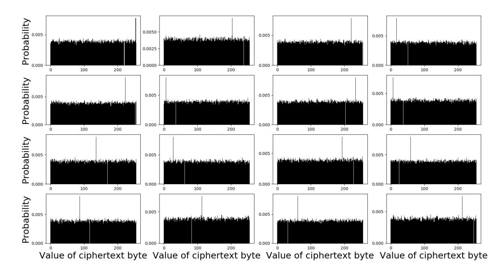
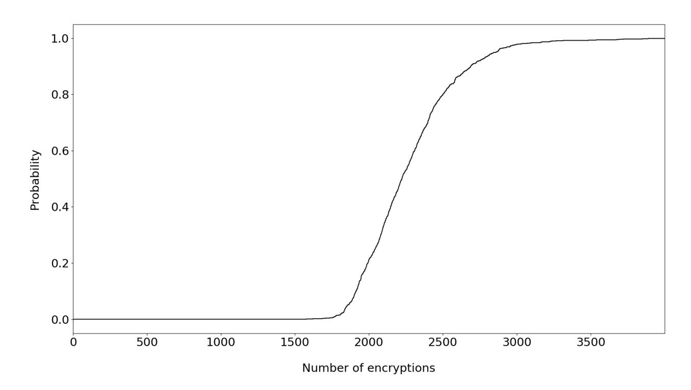
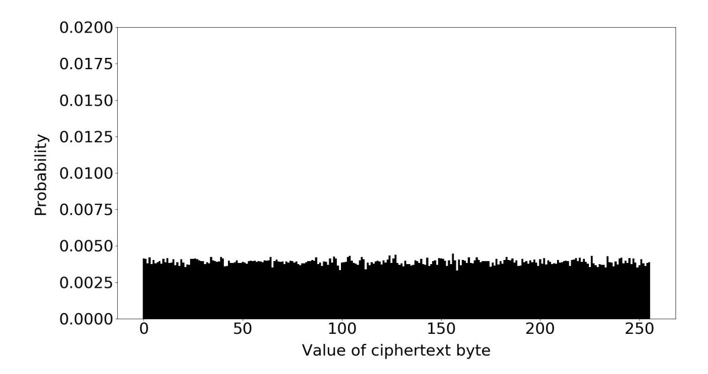
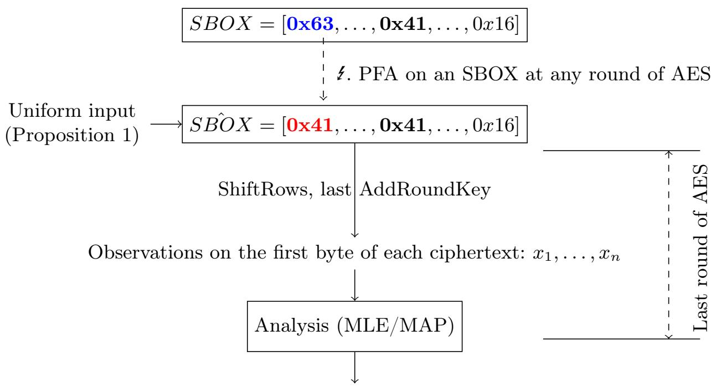
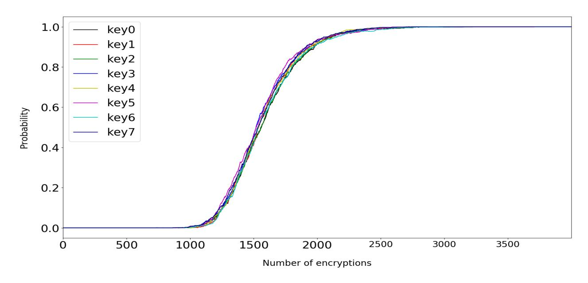
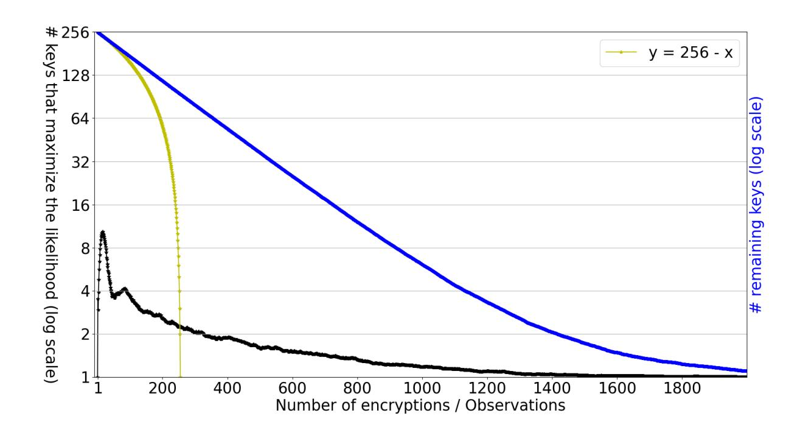
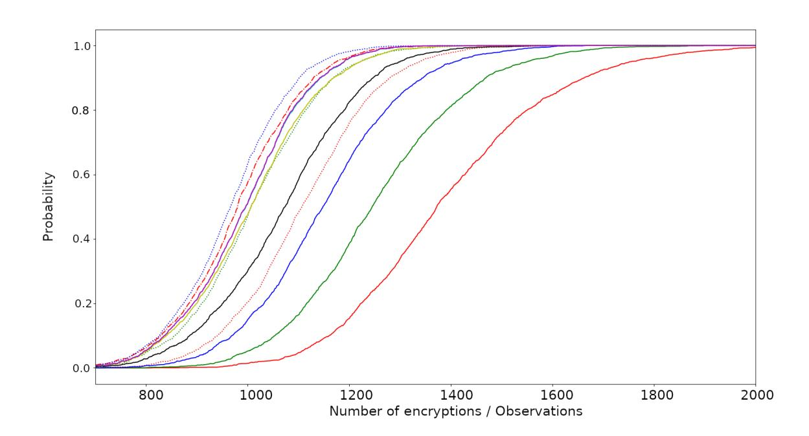
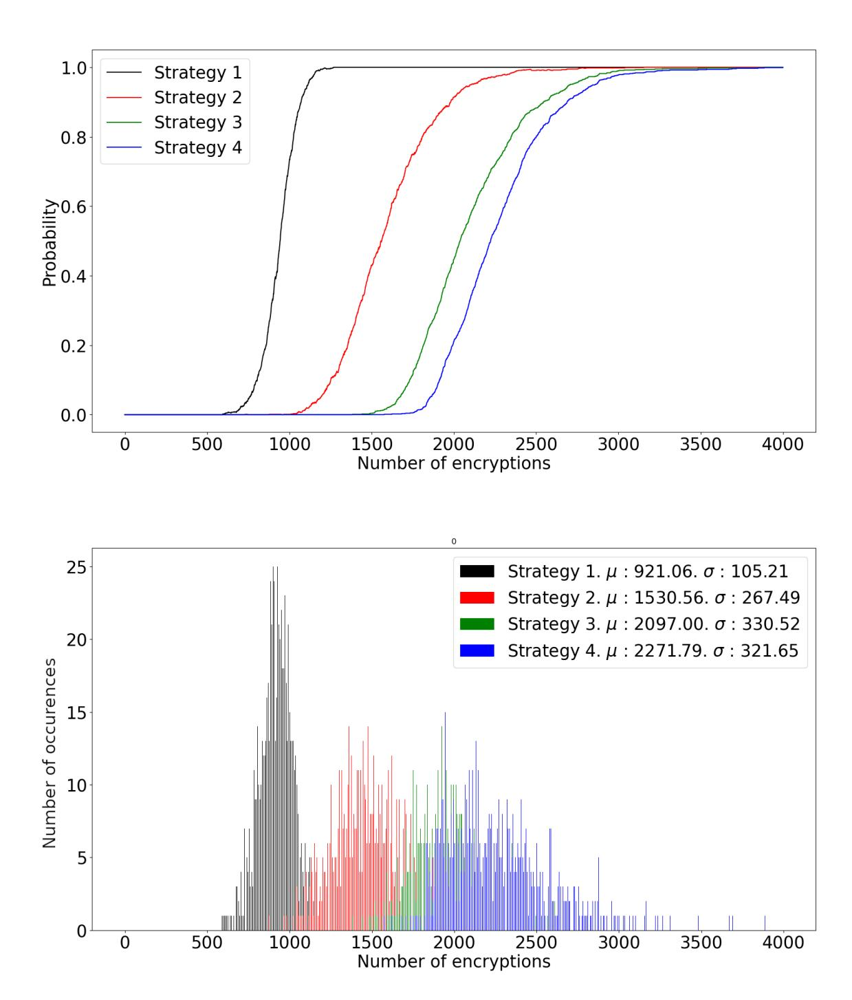
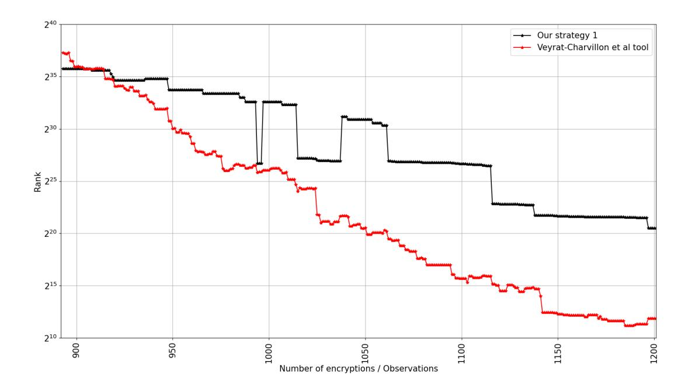

{0}------------------------------------------------

# Persistent Fault Analysis With Few Encryptions

Sébastien Carré1,<sup>2</sup> , Sylvain Guilley1,2,<sup>3</sup> , and Olivier Rioul<sup>2</sup>

<sup>1</sup> Secure-IC S.A.S., Think Ahead Business Line, Paris, France <sup>2</sup> LTCI, Télécom Paris, Institut Polytechnique de Paris, France

Abstract. Persistent fault analysis (PFA) consists in guessing block cipher secret keys by biasing their substitution box. This paper improves the original attack of Zhang et al. on AES-128 presented at CHES 2018. By a thorough analysis, the exact probability distribution of the ciphertext (under a uniformly distributed plaintext) is derived, and the maximum likelihood key recovery estimator is computed exactly. Its expression is turned into an attack algorithm, which is shown to be twice more efficient in terms of number of required encryptions than the original attack of Zhang et al. This algorithm is also optimized from a computational complexity standpoint. In addition, our optimal attack is naturally amenable to key enumeration, which expedites full 16 bytes key extraction. Various tradeoffs between data and computational complexities are investigated.

Keywords: Persistent Fault Analysis, Substitution Box, Maximum Likelihood Distinguisher, Key Enumeration.

### 1 Introduction

Cryptographic algorithms are generally "mathematically secure". As an example, the current best mathematical attack on AES cryptosystem is the biclique attack [\[4\]](#page-20-0) that has a complexity of 2 254.4 for AES-256. However, the implementation of a cryptographic algorithm can leak information that can greatly reduce the complexity of attacks. For example, any implementation for which the encryption time or the power consumption depends on the secret key gives the attacker some sensitive information about that key. Attacks exploiting physical leakages are known as side-channel attacks.

Another class of attacks, known as fault attacks [\[1,](#page-19-0)[5,](#page-20-1)[7,](#page-20-2)[12\]](#page-20-3), deliberately creates errors in the cryptographic algorithm to help the attacker find the secret key. There are many types of fault attacks. Differential fault attacks [\[3,](#page-19-1) [8,](#page-20-4)[16,](#page-20-5) [18,](#page-21-0)[21\]](#page-21-1) compare a faulted ciphertext with a correct one. Statistical fault attacks [\[10\]](#page-20-6) perform multiple faulted encryptions to get sensitive information through statistical tools. Persistent fault attacks [\[6,](#page-20-7)[20,](#page-21-2)[23\]](#page-21-3) consist in making a fault that remains persistent during the whole encryption and across several consecutive encryptions. Persistent fault injection can be performed in various ways: laser injection [\[19\]](#page-21-4), which requires a local access and which is possibly expensive; RowHammer attack [\[2,](#page-19-2)[9,](#page-20-8)[11,](#page-20-9)[14,](#page-20-10)[17\]](#page-21-5)

<sup>3</sup> DIENS, École normale supérieure, CNRS, PSL University, Paris, France

{1}------------------------------------------------

or PlunderVolt [\[13\]](#page-20-11) which can be triggered remotely and which do not require any expensive laboratory equipment. Combining fault attacks with side-channel attacks subsequently gives an attacker the ability to break a cryptosystem in a very efficient way.

#### <span id="page-1-1"></span>1.1 Zhang et al.'s Attack

The attack of Zhang et al. [\[23\]](#page-21-3) focuses on injecting a fault in the SBOX of AES that is used to perform the SubBytes operation. Such a fault eliminates an element y<sup>−</sup> of the SBOX and creates a new one y<sup>+</sup> 6= y<sup>−</sup> instead. As a consequence, the element y<sup>+</sup> appears twice in the SBOX after the fault injection. This results in a bias on the output of the SubBytes operation: Assuming a uniformly distributed input, the value y<sup>−</sup> cannot be observed at all as the output, while the value y<sup>+</sup> is observed with a higher probability of 2/256; other values are observed with an unchanged probability of 1/256. The resulting output probability distribution D is then

<span id="page-1-2"></span>
$$D: \mathbb{P}(y) = \begin{cases} 0 & \text{if } y = y_{-}, \\ 2/256 & \text{if } y = y_{+}, \\ 1/256 & \text{otherwise.} \end{cases}$$
 (1)

The attack of Zhang et al. [\[23\]](#page-21-3) requires enough encryptions to obtain an empirical distribution where only one element per byte is not observed, as shown in figure [1.](#page-1-0) From such never observed byte value x−, the key byte can be obtained as k = x<sup>−</sup> ⊕ y−.

Because each AES round gives a 16-byte output and consumes a 16-byte key, there are 16 possible biased distributions for an AES output, which only differ by the key byte value. In figure [1,](#page-1-0) each subplot represents one byte distribution among the 16 bytes of an AES ciphertext.



<span id="page-1-0"></span>Fig. 1. Empirical distributions for each byte of the ciphertext. The bias depends on the last round key value.

{2}------------------------------------------------

Thus, for the attack of Zhang et al. to work, the number of required encryptions should be such that all values are observed but one. This is an instance of the coupon collector problem. Figure [2](#page-2-0) shows the success rate of the reproduced Zhang et al. [\[23\]](#page-21-3) attack to recover a full 128 bits AES key. Their attack typically requires more than 2500 encryptions to obtain the AES master key with probability ≥ 80%.



<span id="page-2-0"></span>Fig. 2. Success rate of the Zhang et al. attack over 1000 retries to recover the complete AES key. With such a strategy, the attacker needs at least 2500 encryptions to obtain the AES master key with probability ≥ 80%.

#### 1.2 Contributions

The Zhang et al. [\[23\]](#page-21-3) attack assumes a uniform distribution at the input of the last round SBOX. Since the faulted SBOX is used in each AES round, it is not obvious that this uniformity assumption actually holds. In this paper, we assume that the fault location and the fault value are known by the attacker. We first give a formal proof of uniformity at the input of the last round SBOX, thanks to a property of the MixColumns operation. Then, under this assumption, the maximum likelihood estimator for n encryptions is determined and an efficient attack algorithm is derived from this estimator. The maximum likelihood principle aims at maximizing the probability of obtaining the correct key.

The attack of Zhang et al. only exploits the only element x<sup>−</sup> that is never observed, but does not exploit the fact that another element is more likely to be observed than the others. When relatively few encrypted messages are collected, there may be more than one element not observed. Therefore, there are as many key candidates as unobserved elements, which are equally likely. To prevent these limitations, we leverage the maximum likelihood principle to optimize the attack.

{3}------------------------------------------------

The proposed attack improves the state-of-the-art performance by reducing the required number of encryptions. Less encryptions can still give the correct key without having to use a full instance of the coupon collector problem. Specifically, about 1000 encryptions are required to get a success rate of 80% with our strategy compared to about 2500 encryptions for the attack of Zhang et al. Besides, we detail a computationally efficient version of the attack algorithm.

Reducing the number of encryptions is important in a product evaluation context that uses, for instance, the Common Criteria (ISO/IEC 15408) since it influences the quotation. Indeed, in Common Criteria parlance, the quotation is a score which results from a combination of different factors, including time for trace collection and time for analysis.

More important, our result allows to calibrate one countermeasure against a persistent fault analysis: We derive a lower bound on the number of encryptions to successfully extract the correct key and the designer can simply refresh the key more frequently than this bound to avoid such attack. The number of encryptions can further be reduced thanks to a key enumeration algorithm. Our analysis is very amenable to such enumeration since it provides likelihoods to each subkey.

This paper also improves the proposed attack using various techniques such as key byte enumeration and key combination, exploring multiple strategies for each technique.

The attack presented in this paper is optimal for full key recovery since it is optimal at byte level in term of number of traces and also computationally optimal at the combination level of all bytes.

#### 1.3 Outline

This paper is organized as follows. Section [2](#page-3-0) mathematically shows that, even if the SubBytes operation gives a biased distribution due to a persistent fault, this bias is eventually cancelled by the MixColumns operation. Section [3](#page-6-0) improves Zhang et al. attack: An algorithm to find the most probable key for each last round key is developed in subsection [3.1.](#page-6-1) Then, multiple combination strategies are discussed in subsections [3.2](#page-12-0) and [3.3](#page-12-1) in order to find the complete last round key and eventually the master key. Subsection [3.4](#page-14-0) compares the success rate of our approaches compared to the one of Zhang et al. Section [4](#page-17-0) concludes and gives some perspectives.

### <span id="page-3-0"></span>2 Bias Cancelling Effect of MixColumns

The attack of Zhang et al. is possible provided the distribution of the last round SubBytes operation is uniformly distributed. This assumption is not obvious since the output of SBOX in each AES round is not uniformly distributed due to the persistent fault which biases the SBOX. Proposition [1](#page-4-0) shows that, in the context of this paper, the MixColumns operation returns a uniform distribution even for a biased input (output of corrupted SubBytes). Therefore, as AES consists in alternations between SubBytes and MixColumns (and other functions such as 

{4}------------------------------------------------

ShiftRows and AddRoundKey which do not change the distributions), provided the plaintext is uniformly distributed, so is the output of each MixColumns at every round.

<span id="page-4-1"></span>Lemma 1 (Convolutional Identity). For any u ∈ **F**256, we have

<span id="page-4-2"></span>
$$\sum_{b \in \mathbb{F}_{256}} D(b)D(u-b) = \frac{1}{256} \Big( 1 + D(u+y_+) - D(u+y_-) \Big). \tag{2}$$

where y<sup>−</sup> and y<sup>+</sup> were defined in Subsection [1.1.](#page-1-1)

Proof. Observe that [\(1\)](#page-1-2) writes D(b) = <sup>1</sup> <sup>256</sup> (1 + **1**{y+}(b) − **1**{y−}(b)). Therefore

$$256 \sum_{b \in \mathbb{F}_{256}} D(b)D(u-b) = \sum_{b \in \mathbb{F}_{256}} (1 + \mathbb{1}_{\{y_+\}}(b) - \mathbb{1}_{\{y_-\}}(b))D(u-b)$$
$$= \sum_{b \in \mathbb{F}_{256}} D(u-b) + D(u+y_+) - D(u+y_-)$$
$$= 1 + D(u+y_+) - D(u+y_-) \quad \Box$$

<span id="page-4-3"></span>Lemma 2 (Uniformity of the AES State Bytes). If the plaintext is uniformly distributed, then any intermediate variable in the AES algorithm is also uniformly distributed.

Proof. AES being a Substitution-Permutation Network (SPN), each operation is bijective on the states. Therefore, uniformity property is maintained from the plaintext down to any intermediate state. ut

Corollary 1 (Uniformity Implies Independence). Provided the AES plaintext is uniformly distributed, all bits or bytes at any stage of the algorithm are mutually independent.

Therefore, under the hypothesis of plaintext uniformity, the input bytes of the MixColumns operation are independent.

<span id="page-4-0"></span>Proposition 1 (Bias Cancelling Effect of MixColumns). Let y−, y<sup>+</sup> ∈ **F**<sup>256</sup> and distribution D be defined by equation [\(1\)](#page-1-2). Let B0, B1, B2, B<sup>3</sup> ∈ **F**<sup>256</sup> be four bytes representing an AES state column before a MixColumns operation, independent and identically distributed according to distribution D. Then each byte Z0, Z1, Z2, Z<sup>3</sup> ∈ **F**<sup>256</sup> representing an AES state column after a MixColumns operation is uniformly distributed.

Proof. For any z ∈ **F**256, given the assumed independence of B0, B1, B2, B3:

$$\begin{split} &\mathbb{P}(Z_0=z) = \mathbb{P}(02B_0 + 03B_1 + B_2 + B_3 = z) \\ &= \sum_{b_0,b_1,b_2 \in \mathbb{F}_{256}} \mathbb{P}(02b_0 + 03b_1 + b_2 + B_3 = z | B_0 = b_0, B_1 = b_1, B_2 = b_2) D(b_0) D(b_1) D(b_2) \\ &= \sum_{b_0 \in \mathbb{F}_{256}} D(b_0) \sum_{b_1 \in \mathbb{F}_{256}} D(b_1) \sum_{b_2 \in \mathbb{F}_{256}} D(b_2) \mathbb{P}(B_3 = z - 02b_0 - 03b_1 - b_2) \end{split}$$

{5}------------------------------------------------

$$= \sum_{b_0 \in \mathbb{F}_{256}} D(b_0) \sum_{b_1 \in \mathbb{F}_{256}} D(b_1) \sum_{b_2 \in \mathbb{F}_{256}} D(b_2) D(z - 02b_0 - 03b_1 - b_2). \tag{3}$$

where the + (XOR) sign denotes addition (same as subtraction) in  $\mathbb{F}_{256}$ . Using Lemma 1, Eq. (3) is simplified by collapsing the sums using Eq. (2). Each sum (lefthand-side of Eq. (2)) generates three terms (righthand-side of Eq. (2)), and the first constant term further simplifies by noting that  $\sum_{b \in \mathbb{F}_{256}} D(u - b) = 1$ .

<span id="page-5-0"></span>After three recursive applications of Equation (2), Equation (3) becomes:

$$\mathbb{P}(Z_0=z) = \frac{1}{256} + \frac{1}{256^3} \begin{bmatrix} D(z + 02y_+ + 03y_+ + y_+) - D(z + 02y_- + 03y_+ + y_+) \\ - D(z + 02y_+ + 03y_- + y_+) - D(z + 02y_+ + 03y_+ + y_-) \\ + D(z + 02y_- + 03y_- + y_+) + D(z + 02y_- + 03y_+ + y_-) \\ + D(z + 02y_+ + 03y_- + y_-) - D(z + 02y_- + 03y_- + y_-) \end{bmatrix}$$

where we observe that the terms in D pairwise cancel, as per:

$$\begin{array}{ll} D(z+02y_{+}+03y_{+}+y_{+}) = & D(z+0) & = D(z+02y_{-}+03y_{-}+y_{-}), \\ D(z+02y_{-}+03y_{+}+y_{+}) = D(z+02(y_{+}+y_{-})) = D(z+02y_{+}+03y_{-}+y_{-}), \\ D(z+02y_{+}+03y_{-}+y_{+}) = D(z+03(y_{+}+y_{-})) = D(z+02y_{-}+03y_{+}+y_{-}), \\ D(z+02y_{-}+03y_{-}+y_{+}) = & D(z+y_{+}+y_{-}) & = D(z+02y_{+}+03y_{+}+y_{-}). \end{array}$$

Hence  $\mathbb{P}(Z_0 = z) = 1/256$ , the uniform distribution.

The independence hypothesis in Proposition 1 assumes the rounds prior to the last round are executing the genuine AES, so that lemma 2 applies, and yields the independence between any tuple of bytes in an AES intermediate state.

This proposition considerably simplifies the modeling of the problem, and allows us to derive exact results in the sequel. Additionally, the obtained uniformity at the output of the MixColumns operation, despite SubBytes is not uniform (after persistent fault), makes it possible to prove that, provided the plaintext is uniformly distributed, all configurations are explored, hence attack success rate does reach 100% asymptotically.



<span id="page-5-1"></span>Fig. 3. Empirical distribution of a byte of an AES state after a MixColumns operation that takes a small biased input given by distribution D of proposition 1.

{6}------------------------------------------------

This proposition also shows that only one MixColumns operation is required to cancel the bias. This is confirmed by taking many observations and building the empirical distribution from these observations as shown in figure [3](#page-5-1) where each element indeed appears to have the same probability to be observed. This means that one can consider the input of the last round as being uniformly distributed, no matter where the persistent fault occurred.

## <span id="page-6-0"></span>3 Improvement Using Maximum Likelihood

This section explains how the Zhang et al. attack can be improved. First of all, the most likely key value for each byte of the last round key is extracted. In this step, each key per byte of the last round key is ranked from the most to the least probable. Then, a combination strategy is used to guess each byte of the last round key in a complete 128-bit last round key. Eventually, the correct master AES key is extracted from that last round key. Note that the value of the last round key is not necessarily the correct one, typically when the key schedule uses the faulted SBOX. This situation can be considered marginal, since most of the time, the keys are scheduled once, then reused multiple times. Hence, if the permanent fault in the SBOX occurs after the key is scheduled, then the round keys are correct, and the master key can be recovered from the last round key. Otherwise, the key schedule can also be inverted, although with some uncertainty: when a key byte is equal to y+, then the two antecedents shall be considered when inversing the round of the key schedule. The number of possible master keys is in the order of <sup>2</sup> <sup>256</sup> × 16 × 10 (< 2), which is manageable to enumerate.

### <span id="page-6-1"></span>3.1 Optimal Distinguisher

In this section, n AES encryptions are used to find the most probable key. For pedagogical reasons, only the first byte of an AES ciphertext is considered in this section, but other bytes are treated in a similar way. For the same reason, only the first byte of the last round key is considered. In this section, the term key refers to one byte of the last round key of AES. Precisely, this section focuses on the extraction of the last round key. From these n encryptions, n bytes x1, . . . , xn, that can be viewed as elements of **F**256, are observed.

Maximum Likelihood Optimality. This section shows that the application of the MLE is optimal in the sense that it maximizes the attack success rate in a Bayesian context.

Figure [4](#page-7-0) summarizes the idea of the attack until the success to find one byte of the last round key. In this illustration, y<sup>−</sup> = 0x63 and y<sup>+</sup> = 0x41. This section first assumes that each possible key is equally probable before any observation, meaning that **P**(k) = 1/256 for each of the 256 possible keys k. Note that the fault also alters the round keys since the key scheduler uses SBOX. However, the biased output of an SBOX in the key scheduler is added to a uniform random variable in **F**<sup>256</sup> before to output a round key. This eventually gives uniformly

{7}------------------------------------------------



<span id="page-7-0"></span>Most probable key (Alg. 1) / Keys ranked (from most likely downwards)

**Fig. 4.** Fault model and attack principle for this paper (with  $y_- = 0x63$ ,  $y_+ = 0x41$ ).

distributed round keys. Thus, even with the fault, it makes sense to assume a uniform distributed key for each of the AES round before any observations. Then, these probabilities are updated after the observations. This is then a Bayesian context of statistical inference in which this paper is written.

Finding the most probable key k means finding the key that maximizes the conditional probability  $\mathbb{P}(k \mid x_1, \ldots, x_n)$  for observations  $x_1, \ldots, x_n$ . This is a well known problem in a Bayesian context known as Maximum a posteriori (MAP) estimator that is a generalisation of Maximum Likelihood Estimator (MLE). These estimators are defined in the definition 1.

<span id="page-7-1"></span>**Definition 1 (MAP and MLE).** Given a joint distribution of  $k, x_1, \ldots, x_n$  of such distribution, we define two estimators:

- Maximum A Posteriori (MAP) estimator  $\hat{k}_{MAP} = \arg \max_{k} \mathbb{P}(k \mid x_1, \dots, x_n)$ .
- Maximum Likelihood Estimator (MLE)  $\hat{k}_{MLE} = \arg \max_{k} \mathbb{P}(x_1, \dots, x_n \mid k).$

For uniformly distributed key hypotheses the estimators coincide:

<span id="page-7-2"></span>Lemma 3 (MAP=MLE for Uniform Distribution). In a Bayesian context,  $\hat{k}_{MAP} = \hat{k}_{MLE}$  for a uniform a priori distribution of k.

Lemma 3 is a classical result but we include its proof for completeness

*Proof.* MAP is defined as  $\hat{k}_{MAP} = \arg \max_{k} \mathbb{P}(k \mid x_1, \dots, x_n)$ . By Bayes' formula, this also writes

$$\hat{k}_{MAP} = \arg\max_{k} \frac{\mathbb{P}(x_1, \dots, x_n \mid k) \mathbb{P}(k)}{\mathbb{P}(x_1, \dots, x_n)} = \arg\max_{k} \mathbb{P}(x_1, \dots, x_n \mid k) \mathbb{P}(k)$$

{8}------------------------------------------------

since  $\mathbb{P}(x_1,\ldots,x_n)$  does not depend on k. Moreover, for a uniform a priori distribution,  $\mathbb{P}(k)$  is constant and, therefore,

<span id="page-8-0"></span>
$$\hat{k}_{MAP} = \arg\max_{k} \mathbb{P}(x_1, \dots, x_n \mid k) = \hat{k}_{MLE}. \qquad \Box$$

Since we assume that, before any observation, each possible key has the same probability, MLE is used to compute the MAP and find the most probable key. The choice of using MLE instead of directly computing MAP is motivated by the fact that, since observations are independent, computing  $\mathbb{P}(x_1,\ldots,x_n\mid k)$  is much easier that computing  $\mathbb{P}(k\mid x_1,\ldots,x_n)$ , since the former simplifies to a product  $\mathbb{P}(x_i\mid k)=D(x_i\oplus k)$  for all  $1\leq i\leq n$ . This distribution can be extended for multiple observations. Such distribution is given in the lemma 4.

Lemma 4 (Computation of the Likelihoods). Given  $k, y_-, y_+ \in \mathbb{F}_{256}, y_- \neq y_+,$ 

$$\mathbb{P}(x_1,\ldots,x_n\mid k) = \begin{cases} 0 & \text{if } \exists i,1\leq i\leq n\mid x_i\oplus k=y_-,\\ 2^{m_{k,2}-8n} & \text{otherwise} \end{cases}$$

where  $m_{k,2} = \#\{i \in \{1,\ldots,n\} \mid x_i \oplus k = y_+\}.$ 

*Proof.* Since the observations are conditionally independent given k, one has  $\mathbb{P}(x_1,\ldots,x_n\mid k)=\prod_{i=1}^n\mathbb{P}(x_i\mid k)=\prod_{i=1}^nD(x_i\oplus k)$ . This product is equal to zero if at least one  $D(x_i\oplus k)$  is equal to zero. For a given k, there is only one element  $x_i$  for which  $D(x_i\oplus k)=0$  since it can only happen when  $x_i\oplus k=y_-$  where  $y_-$  is the only element that is never observed at the output of the SBOX due to the fault. If no such term is equal to zero, then there are two options:

- if  $x_i \oplus k = y_+$ , then  $D(x_i \oplus k) = \frac{2}{256}$  since  $y_+$  appears twice at the output of the faulted SBOX;
- otherwise,  $x_i \oplus k \neq y_+$  and  $x_i \oplus k \neq y_-$ . Thus  $x_i \oplus k$  only appears exactly once in the faulted SBOX and  $D(x_i \oplus k) = \frac{1}{256}$ , which happens for 254 SBOX unique outputs.

Thus,  $\mathbb{P}(x_1,\ldots,x_n\mid k)$  is equal to

$$\prod_{i=1}^{n} \mathbb{P}(x_i \mid k) = \left(\prod_{i \mid x_i \oplus k = y_-} 0\right) \left(\prod_{i \mid x_i \oplus k = y_+} \frac{2}{256}\right) \left(\prod_{i \mid x_i \oplus k \notin \{y_-, y_+\}} \frac{1}{256}\right) \\
= (0)^{m_{k,0}} \left(\frac{1}{256}\right)^{m_{k,1}} \left(\frac{2}{256}\right)^{m_{k,2}} = \begin{cases} 0 & \text{if } \exists i \mid x_i \oplus k = y_-, \\ \left(\frac{1}{256}\right)^{m_{k,1}} \left(\frac{2}{256}\right)^{m_{k,2}} & \text{otherwise} \end{cases}$$

where we have noted  $m_{k,0} = \#\{i \mid x_i \oplus k = y_-\}$ ,  $m_{k,1} = \#\{i \mid x_i \oplus k \notin \{y_-, y_+\}$ , and  $m_{k,2} = \#\{i \mid x_i \oplus k = y_+\}$ . Note that  $m_{k,0} + m_{k,1} + m_{k,2} = n$ . Moreover, when  $\mathbb{P}(x_1, \ldots, x_n \mid k) \neq 0$ , one has  $m_{k,0} = 0$ , thus  $m_{k,1} = n - m_{k,2}$ . Therefore, when there is no  $i, 1 \leq i \leq n$ , such that  $x_i \oplus k = y_-$ , one has

$$\mathbb{P}(x_1, \dots, x_n \mid k) = \left(\frac{1}{256}\right)^{n - m_{k,2}} \left(\frac{2}{256}\right)^{m_{k,2}} = \frac{1}{256^n} 2^{m_{k,2}} = 2^{m_{k,2} - 8n}. \quad \Box$$

{9}------------------------------------------------

From Lemma [4,](#page-8-0) a two-step strategy is developed to find the correct key:

- 1. Eliminate keys that have the value x ⊕ y<sup>−</sup> for each observation x since the probability to observe such element is null;
- 2. Among the remaining keys, declare the most likely key to be the one that has the value x<sup>+</sup> ⊕ y+, for an observation x<sup>+</sup> that appears the most often among all the observations. Indeed, x<sup>+</sup> is the value that should appear the largest number of times, owing to lemma [4.](#page-8-0)

This strategy is optimal in the sense that it maximizes the likelihood. We now go one step further by applying the strategy without actually computing the probabilities. The computationally efficient strategy is exposed in our Proposition [2.](#page-9-0)

<span id="page-9-0"></span>Proposition 2 (Operational MLE Computation for PFA). Consider n observations of ciphertext bytes {x1, . . . , xn}, and known PFA characteristic values y−, y<sup>+</sup> ∈ **F**256, y<sup>−</sup> 6= y+. Define

$$\mathcal{A} = \{ x \oplus y_{-} \mid x \in \mathbb{F}_{256} - \{ x_{1}, \dots, x_{n} \} \}$$

$$\mathcal{B}_{j} = \{ i \in \{ 1, \dots, n \} \mid x_{i} = j \text{ and } x_{i} \oplus y_{+} \in \mathcal{A} \} \qquad (0 \leq j \leq 255)$$

We have ˆkMLE ∈ A, and ˆkMLE is the index of B<sup>j</sup> which is the largest set, i.e., ˆkMLE = arg max<sup>j</sup> (#{Bj}).

Proof. First, note that {x ∈ **F**<sup>256</sup> − {x1, . . . , xn}}} and {x ∈ {x1, . . . , xn}}} are complementary sets. This implies that A and {x ⊕ y<sup>−</sup> ∈ {x1, . . . , xn}}} are complementary. Since **P**(x<sup>j</sup> | k) = 0 for x<sup>j</sup> ⊕ k = y−, then value k 6= x<sup>j</sup> ⊕ y−. Thus, ˆkMLE ∈ A.

For the second point, we note that B<sup>m</sup> contains the element that is the most often observed for which the condition x<sup>m</sup> ⊕ y<sup>+</sup> ∈ A holds. In other word, x<sup>m</sup> is the most often observed value after removing elements x<sup>i</sup> such that x<sup>i</sup> ⊕ y<sup>−</sup> = k.

The proof then consists in showing that the maximum likelihood estimator is given by eliminating values k such that x<sup>i</sup> ⊕ k = y<sup>−</sup> and for which x<sup>i</sup> appears the most often. Let ˆk = arg max<sup>k</sup> **P**(x1, . . . , x<sup>n</sup> | k) be the maximum likelihood estimator. The values of k such as x<sup>i</sup> ⊕ k = y<sup>−</sup> for at least one observation give **P**(x1, . . . , xn; k) = 0. Such keys can then be eliminated from the maximization. Since m 7→ 2 <sup>m</sup>−8<sup>n</sup> is strictly increasing in variable m ∈ **N**, we have that arg max<sup>k</sup> 2 <sup>m</sup>k,2−8<sup>n</sup> = arg max<sup>k</sup> mk,2, i.e., the most likely key values are the values k that maximize mk,<sup>2</sup> (amongst k values which have not been ruled out). ut

Note that the set A contains all the possible keys. Thus, all impossible keys have been eliminated to get this set. This is the first remarkable point of our strategy. The elements contained in each class B<sup>j</sup> are chosen in such a way that they match with a possible key. For the correct key, one observation has to appear the most often compared to the others. This observation can then be found by taking the class B<sup>j</sup> that has the maximum number of elements. This is the second peculiarity of our strategy.

{10}------------------------------------------------

Based on Proposition [2,](#page-9-0) Algorithm [1](#page-10-0) consists in eliminating the impossible keys and selecting the most likely one through the most observed value. Note that line [5](#page-10-1) of this algorithm counts the number of times a key, related to an observation, can be observed and also takes care to only select possible keys by using the term A[x<sup>i</sup> ⊕ y−] that is equal 0 for the key k = x<sup>i</sup> ⊕ y−. At line [2,](#page-9-0) the algorithm discards a key candidate if the value k = x<sup>i</sup> ⊕ y<sup>−</sup> is not already in set A. Therefore, the set of impossible keys is increasing with respect to the inclusion. When all the 255 unique values of the ciphertexts x<sup>i</sup> have been seen, the set A has cardinality 255, and the algorithm returns the key (in a singleton). As a corollary, when the correct key is found, more ciphertexts do not alter the outcome of the attack. This behavior differs from that of side-channel attacks where the measurements are noisy (e.g., powerline attacks, etc.).

```
Algorithm 1: Algorithm to extract the most likely key
  input : The SBOX erased value y− ∈ {0, . . . , 255}, the SBOX duplicated value
          y+ 6= y−, and n observations (x1, . . . , xn) of ciphertext bytes.
  output : Most likely key
1 h[256] ← 0, . . . , 0 // Histogram storing the occurrence count of a
   possible key. Notice that h[j] = #{Bj} as per proposition 2
2 A[256] ← 1, . . . , 1 // Indicator of the set of possible keys. A[k] = 1
   if k is a possible key, otherwise A[k] = 0
3 for i ∈ {1, . . . , n} do // Iterating on the observations
4 A[xi ⊕ y−] ← 0 // Eliminate impossible key xi ⊕ y−. This builds
      the set A of proposition 2
5 h[xi ⊕ y+] ← A[xi ⊕ y+] × (h[xi ⊕ y+] + 1) // Among the remaining keys,
      count the ones that appear the most
6 return arg maxj h[j] // Returns a list in case of ex æquo keys
```

<span id="page-10-3"></span><span id="page-10-1"></span>

<span id="page-10-2"></span>Fig. 5. **P**(kˆ = k) for one byte of multiple last round key of AES, averaged over 1 000 tries.

{11}------------------------------------------------

In our case, k is an AES last round key and an observation is a byte resulting from an encryption. We evaluate the number of required encryptions for all of the 256 possible keys. Figure 5 gives the success rate. The maximum likelihood estimator is known to be consistent. Thus,  $\mathbb{P}(\hat{k}=k)=1$  for enough observations, where k is the correct key. For clarity, only 7 keys are represented in this figure. However, the 256 possible keys follow the same trend.



<span id="page-11-0"></span>**Fig. 6.** Remaining values of one byte of last round keys after eliminating impossible keys (blue) and remaining values of one byte of last round keys that maximize the likelihood (black), averaged over 1000 tries. The line y = 256 - x is represented as a reference, to illustrate the optimistic situation where one values of one byte of a last round key hypothesis is ruled out at each new encryption (never twice the same ciphertext byte).

Figure 6 shows how many key bytes remain, averaged over 1000 set of plaintexts, possible as a function of the number of encryptions by considering only the keys that are eliminated from the first figure or the keys that maximize the likelihood. Note that, some keys have the same likelihood and, thus, multiple key can maximize the likelihood. Note that the number of keys that maximizes the likelihood can locally increase but will eventually decrease down to 1. For less than 800 encryptions, the figure shows that more than 15 keys byte candidates are possible.

**A Note about Guessing Entropy** Another approach to find a key k such as  $\mathbb{P}(x_1,\ldots,x_n\mid k)$  is maximal from n observations is to use the guessing entropy defined as  $GE = \sum_{i=1}^{256} k\mathbb{P}(x_1,\ldots,x_n\mid k)$  where  $\{\mathbb{P}(x_1,\ldots,x_n\mid k)\}$  are sorted in decreasing order. Due to this sort, the guessing entropy is approximately equal

{12}------------------------------------------------

to 1 if  $\mathbb{P}(x_1,\ldots,x_n\mid k)$  is the biggest probability and other are small relatively to it. We thus estimate the number of observations required to get GE=1 and observe that the guessing entropy becomes equal to 1 between 1200 and 1400 observations meaning that we require between 1200 and 1400 observations to be able to get the AES master key. This mean that, between 1200 to 1400 encryptions are required to get the correct key.

#### <span id="page-12-0"></span>3.2 Key Byte Ranking

Algorithm 1 returns not one unique value of a byte of the last round key, but a set of values of a byte of the last round key (since there are possibly ties in the likelihood values). Full 128 bits key can be reconstructed using key ranking algorithms, such as [22]. Indeed, one byproduct of our attack is that, in addition to be optimal, it is based on MLE, hence can sort out key candidates based on probabilities. Therefore, key ranking algorithms apply in a straightforward manner. In most cases, this requires to modifying Algorithm 1 so that instead of returning the most probable value of a byte of the last round key (the arg  $\max_j h[j]$  at line 6), it returns the most probable value of a byte of the last round key sorted with decreasing probabilities.

### <span id="page-12-1"></span>3.3 Combination of Several Key Bytes to Reconstruct the Full Key

In case not enough observations are available, the key byte ranking (Sec. 3.2) can fail to rank the keys correctly. In order to get around this limitation, a combination algorithm is given in this section.

The complete last round key can be recovered by combining key byte candidates in an empirical algorithm consisting in 16 imbricated loops. The first loop (outer loop) iterates over the candidates of the first key byte. The second loop iterates over the candidates for the second key byte and so on. Noting  $N_i$  the number of candidates for the last round key byte i, the total number of candidates for the whole last round key is  $N = \prod_{i=1}^{16} N_i$ . This product can be very large and can induce a high time complexity of the attack. For instance, for 100 candidates per byte of the last round key, we have  $N = 100^{16}$  last round key candidates. More specifically, assuming the key byte rank algorithm gives the correct key byte as the first candidate for key bytes except the first one, then the attacker has to test between  $2 \times 100^{15}$  and  $100^{16}$  last round key candidates which is not practical.

One strategy to mitigate this issue is to only test a predefined maximum number of key byte candidates. This assumes that the key byte rank algorithm is efficient enough. For instance, assuming that the key byte rank algorithm always rank the correct key byte between the first and the third rank, the time complexity is then reduced from  $N=100^{16}$  to  $N=3^{16}$ . While this assumption is not always met, for each key byte candidate, the first key byte candidate is often the correct one and only very few key byte candidates are not correctly ranked. Thus we can consider only the first key byte candidate for most of the

{13}------------------------------------------------

bytes and only iterate over the few other bytes. Due to this observation, our strategy consists in building the last round key candidates through 16 stages.

The first stage consists in trying all possibilities for only one byte over the 16 bytes. This gives a maximum of  $16 \times 256 = 4096$  possibilities. At this stage, each of the 15 other key byte candidates is fixed to the first candidate. Those 15 bytes are called *small varying bytes*. If the full 128 bits key is not found, the second stage is used.

The second stage consists in trying all possibilities for two bytes among all combinations of two bytes among the 16 bytes. This gives a maximum number of testing key equal to  $16 \times 15 \times 256^2$ . At this stage, each of the 14 other key byte candidates is fixed to the first candidate. Those 14 bytes are called *small varying byte*. If the full 128 bits key is not found, the third stage is used.

All stages are built along the same scheme for at most  $\sum_{k=1}^{n=16} \frac{16!}{(16-k)!} 256^k$  keys to test. Even if this appears to be a huge number, in practice the correct key is found in the first stages. To reduce again the time complexity, we can limit the number of byte candidates to  $p_i$  for byte i instead of 256. The parameter  $p_i$  is chosen experimentally to optimize the time it takes to perform the attack can be performed in a relatively short time.

For each stage, the *small varying bytes* were fixed to the first candidates. A more general strategy consists in choosing the first n candidates instead of the first. In such case, the maximum number of tested key is  $\frac{16!}{(16-i)!}p_i^i\alpha_i^{16-i}$  per stage where  $\alpha_i$  is the value of the *small varying bytes*.

<span id="page-13-0"></span>**Table 1.** Time, expressed in second, required to perform the attack and get the 16-bytes AES-128 master key, as a function of the number of stages used (in rows) and the value of the *small varying byte* (in columns).

|   | 1                              | 2                           | 3                             |
|---|--------------------------------|-----------------------------|-------------------------------|
| 1 | $256\ /\ 0.005\ {\rm s}$       | $256 \ / \ 0.291 \ {\rm s}$ | $18 \ / \ 7.652 \ \mathrm{s}$ |
| 2 | $256\ /\ 0.067\ {\rm s}$       | $33 \ / \ 4.376 \ {\rm s}$  | -                             |
| 3 | $108 \ / \ 2.424 \ \mathrm{s}$ | $5~/~5.947~\mathrm{s}$      | -                             |
| 4 | $17 / 2.887 \mathrm{\ s}$      | -                           | -                             |
| 5 | $6\ /\ 2.975\ \mathrm{s}$      | _                           | _                             |
| 6 | $3 \ / \ 2.993 \ {\rm s}$      | -                           | -                             |
| 7 | $2\ /\ 3.022\ \mathrm{s}$      | -                           | -                             |

Table 1 gives the time required to perform the attack and get the AES master key, according to the number of stages and the number of small varying bytes. The rows describe the number of stages that is used to perform the attack. The stages are used in order. For example, for 3 stages, the stage 1, 2 and 3 are used one after the other. The columns describe the value of the small varying bytes. For a small varying byte equal to 1, we used  $p_1 = 256$ ,  $p_2 = 256$ ,  $p_3 = 108$ ,  $p_4 = 17$ ,  $p_5 = 6$ ,  $p_6 = 3$  and  $p_7 = 1$ . For a small varying byte equal to 2 we used

{14}------------------------------------------------

p<sup>1</sup> = 256, p<sup>2</sup> = 33, p<sup>3</sup> = 5 in the same idea to not test an excessive number of keys. For the same reason, the stage 4 to 7 is not used in this case. For a small varying byte count equal to 3, we use only one stage with p<sup>1</sup> = 18. Each cell of the table reminds p<sup>i</sup> before the time t<sup>i</sup> in the format pi/t<sup>i</sup> .

Figure [7](#page-14-1) gives a comparison of success rates, according to the number of stages and the value of the small varying byte in the same configuration given by table [1.](#page-13-0) Only two stages is quite efficient compared to the success rate illustrated in [2.](#page-2-0) The figure shows that the best curve in term of number of encryption is for small varying byte equal to 2 with only 3 stages with 1371 encryptions.



<span id="page-14-1"></span>Fig. 7. Our MLE attacks for the complete last round key of AES— Comparison of success rates, according to the number of used stages. The value of small varying bytes is taken equal to 1 (plain line), 2 (dotted line), and 3 (semi dotted line). One color by number of stage is used, respectively red, green, blue, black, yellow, cyan, purple for 1, 2, 3, 4, 5, 6, 7 stages. Note that the result of stages six and seven are almost identical.

#### <span id="page-14-0"></span>3.4 Efficiencies of Key Byte Rank and Combination Algorithms

In order to test the efficiency of the key byte rank and combination algorithms, we compare multiple strategies that are combinations of three tactics:

- 1. Using the key byte algorithm or not. If the key byte algorithm is not used, the key byte candidates are tested in the order of the non observed values.
- 2. Getting ciphertexts until the histograms are full, meaning that all possible values are observed, or not. If we do not require the histograms to be full, we limit the number of candidates and stages with the better strategy discussed before that consists in using only three stages.
- 3. Using the combination algorithm or not.

{15}------------------------------------------------

This leads to  $2^3 = 8$  possible strategies. However, there are  $2^2 = 4$  strategies, for which we get enough encryption to fill the empirical histograms, that yield the same results. Indeed, in such cases, there is only one key byte candidate and then testing all candidates is the same than testing only one candidate. Moreover, and for the same reason, using the key byte rank algorithm necessarily gives the same results whether used or not. This reduces 4 strategies to only 1 and thus only 5 strategies remain.

We also note that, if we do not use the key byte rank algorithm and if we do not ensure a full histogram, then the success rate does not depend whether we use the combination algorithm or not. This shows the importance of a key byte rank and it is also due to the fact that our combination algorithm relies on the results of this key byte rank.

Thus four strategies remain. They are listed hereafter:

- **Strategy 1.** Use the key byte ranking algorithm; Do not require to fill histograms; Use the combination algorithm.
- Strategy 2. Use the key byte ranking algorithm; Do not require to fill histograms; Do not use the combination algorithm.
- Strategy 3. Do not use the key byte ranking algorithm; Do not require to fill histograms.
- **Strategy 4.** Require to fill histograms. As far as we understand, this strategy is the one used by Zhang *et al.* [23].

Figure 8 (top) gives the success rates over 1000 tries of the four strategies. The last one, in blue, is the worst since it necessarily requires more encryptions to fill histograms. The best one, in black color, is the most efficient one and is also the one that uses the key byte rank algorithm and the combination algorithm. Not using the combination algorithm is less efficient as shown by the red curve, but is still better than the green curve that shows the strategy that does not use the key byte ranking algorithm. One can note that the combination algorithm greatly improves the efficiency.

Each curve of the top figure of 8 is obtained by computing an average over 1000 curves where each of the 1000 curves describes a success rate for a given plaintext. For each of those 1000 curves, the success rate becomes equal to one more or less rapidely. The repartition of when the success rate is equal to 1 over those 1000 curves are given by the bottom of the figure 8 that shows the distribution of minimum number of encryptions over 1000 tries. On this figure, mean  $\mu$  and standard deviation  $\sigma$  are also given. Less than 1000 encryptions are required with the first strategy whereas more than 2000 are required for the last one. Also the best dispersion is reached for the first strategy and the worst one is reached on strategy four where no ranking algorithm is used. Strategy 1 is thus relevant to go further than the theoretical number encryption induced by the Coupon Collector Problem and discussed by Zhang et al. [23].

#### 3.5 Comparison with the Tool of Veyrat-Charvillon et al. [22]

Our methodology to combine bytes can be compared to the C++ tool of Veyrat-Charvillon  $et\ al.$ , which implements the maximum likelihood algorithm to give

{16}------------------------------------------------



<span id="page-16-0"></span>Fig. 8. Our MLE attacks for the complete last round key of AES — Success rates of strategies 1 to 4 over 1000 tries (top). Distribution of minimum number of encryptions over 1000 tries (bottom). Less than 1000 encryptions are required with the first strategy whereas more than 2000 are required for the last one. The smallest dispersion is reached for the first strategy whereas the worst one is reached by strategy four where no ranking algorithm is used.

the rank of the full 16-byte key based on the distribution of each individual key byte. This tool is pessimistic, in that, in case of ties (recall black curve in Fig. [6\)](#page-11-0), it provides the largest rank. While the tool of Veyrat-Charvillon et al. is generally more efficient, our strategy focuses in reducing the time for small number of encryptions. For instance, getting the AES last round key with 893 encryptions requires about 20 minutes where the tool of Veyrat-Charvillon et al. takes about 3 hours.

{17}------------------------------------------------



<span id="page-17-1"></span>Fig. 9. Comparison between the combination algorithm described in in paper with the tool of Veyrat-Charvillon et al. for one trace (no average)

Figure [9](#page-17-1) shows the rank of the correct key estimated by the tool of Veyrat-Charvillon et al. and our method. For less than 903 encryptions our method gives the correct key at a lower rank compared to the tool of Veyrat-Charvillon et al.

## <span id="page-17-0"></span>4 Conclusion and Perspectives

#### 4.1 Conclusion

In this paper, we revisited the fault attack that makes a permanent fault in the AES SBOX and we improve it by using multiple techniques including estimation theory, rank and key combination algorithms. With enough observations, if one focuses on the most observed value x+, the most likely key will be k = x<sup>+</sup> ⊕ y+. Some observations can have exactly or approximately the same number of occurrences among the overall observations. In such case, since an observation x cannot be equal to k ⊕y−, one can eliminate some keys. The strategy developed in this paper, and derived from the maximum likelihood analysis, to find the correct key therefore consists in two steps:

- 1. eliminate keys that have the value x ⊕ y<sup>−</sup> for each observation x;
- 2. declare the most likely key among the remaining keys to be the one that has the value x<sup>+</sup> ⊕ y+, for an observation x+, that appears the most often.

The key byte rank algorithm uses maximum likelihood estimation and guessing entropy. Various techniques have been experimented to build combination algorithms such as using imbricated loops, truncating the number of key byte candidates or to a more specific strategy that uses so-called stages.

{18}------------------------------------------------

After recalling some basics about how AES encryption works and how AES round keys are derived from the master key, the paper shows how a single byte fault can affect the final ciphertext. This fault can be stepped on at any time of the encryption. The attacker can also permanently fault the SBOX before or after key scheduling. The fault is only assumed to be persistent for all encryptions. The paper first assumes that an attacker can encrypt any messages, that are not necessarily chosen, in order to get an ideal empirical distribution for each of the 16 bytes of the ciphertext. In the state-of-the-art, more than 2000 encryptions were required to get such ideal distribution for each byte of the last round key. The attack in this paper works because the MixColumns operation is performed on all of the AES rounds but the last one. From those distributions, the paper explains how an attacker can find the last round of AES by analysing only the ciphertexts. Since the fault can affect the key scheduler, this last round key can be wrong but the paper shows that an attacker can still get the correct master key from a wrong last round key, and then derives the correct round keys.

The attack was further improved by considering non ideal empirical distributions. This was done by using a key rank algorithm for multiple key candidates with a combination algorithm that combines each potential byte of the last round key to get a complete round key. On average, less than 922 encryptions to get the AES master key with a high probability was necessary. In order to check whether the correct key is found, one can decrypt a ciphertext and check whether the resulting plaintext does make sense.

#### 4.2 Perspectives

TBOX. In this paper, we focused on the faults on AES SBOX. Some implementations of AES use tables called TBOX to perform jointly the SubBytes and the MixColumns operations [\[15,](#page-20-12) Sec. 5.2.1, page 18]. Cryptographic libraries that implement AES with TBOX uses 4 tables of 256 elements. Each of those elements has 4 bytes size and those tables are used for all AES rounds except the last one since it does not require the MixColumns operation. For the last round, some implementations use a fifth table whereas others, like OpenSSL, mask 3 of the 4 bytes of the TBOX elements in order to only use the SubBytes operation out of the TBOX. In cryptographic libraries that use TBOX, two cases are possible to perform the attack described in this paper. These two cases are discussed here for future works.

In the first case, an attacker can try to target the SubBytes operation implemented by the TBOX. To reach this aim on implementations that uses 5 tables, an attacker can only target the fifth table that does not implement the MixColumns operation. For implementations that only use 4 tables, an attacker can only target 1/4 of the tables. Note that for implementations that only uses 4 tables, one fault per table has to be made in order to get the same effect with a single fault on an SBOX table. If one only targets one table it actually only targets one column of an AES state and thus, 4 bytes of a key.

In the second case, an attacker targets the MixColumns operation implemented by the TBOX. In such cases, we do not observe any bias for all of the bytes of the 

{19}------------------------------------------------

ciphertexts. However, we observe a bias on column of an AES states. The attack described in this document could then be adapted at column-level instead of byte-level. However, since a column represents  $2^{32}$  possible values instead of  $2^8$  for a byte, more encryptions are required. If we assume that the number of encryptions is proportional to the number of values, and since we need 1371 encryption for an analysis at a byte level, we then need  $1371 \times 2^{32}/2^8 = 23001563136$  encryptions. We could also need a more efficient key rank algorithm since we will have to test more keys.

Knowledge about the fault. This paper considers that the location of the fault in the SBOX and also the value of the fault are known. In other words, it is assumed that the values  $y_-$  and  $y_+$  are known by the attacker. Based on this assumption, if uniform byte values were submitted to each sbox, then the attack would converge in 255 plaintexts (because, at each newly observed byte c, the attacker knows that  $c \oplus y_-$  is not a valid key byte). This is depicted by the curve y=256-x in Fig. 6. This assumption was originally accepted in the case of a rowhammer attacker on a shared SBOX where the attacker can read the fault in memory. This assumption is invalid on some implementations, such as the AES-NI instruction set, where the SBOX is not exposed to the user (it can for instance be some firmware). Without the knowledge of  $y_-$  and  $y_+$ , one can still use a ranking algorithm to get the most likely value of  $y_+ \oplus y_-$ . Only 256 guess values are required to guess  $y_-$ , and  $y_+$  will directly follow from the most likely value of  $y_+ \oplus y_-$  when analyzing the ciphertext distribution.

#### 4.3 Note Added after Revision of the Accepted Paper

We became aware of the recent work "Persistent Fault Attack in Practice" [24]. This paper elaborates on the attack converge speed and attributes it to MLE. Our work does further in that we mathematically derive the attack from the MLE. Besides, we show the merit of exploiting the likelihood for each key candidate to enumerate them by decreasing probability, thereby further speeding up the attack. This results in "strategy 1", whereas [24] consists in the strategy we called "strategy 2".

#### References

- <span id="page-19-0"></span>1. Hagai Bar-El, Hamid Choukri, David Naccache, Michael Tunstall, and Claire Whelan. The Sorcerer's Apprentice Guide to Fault Attacks. *Proceedings of the IEEE*, 94(2):370 –382, February 2006.
- <span id="page-19-2"></span>2. Sarani Bhattacharya and Debdeep Mukhopadhyay. Curious case of rowhammer: Flipping secret exponent bits using timing analysis. In Benedikt Gierlichs and Axel Y. Poschmann, editors, *Cryptographic Hardware and Embedded Systems – CHES 2016*, pages 602–624, Berlin, Heidelberg, 2016. Springer Berlin Heidelberg.
- <span id="page-19-1"></span>3. Eli Biham and Adi Shamir. Differential fault analysis of secret key cryptosystems. In Burton S. Kaliski, editor, *Advances in Cryptology* — *CRYPTO '97*, pages 513–525, Berlin, Heidelberg, 1997. Springer Berlin Heidelberg.

{20}------------------------------------------------

- <span id="page-20-0"></span>4. Andrey Bogdanov, Dmitry Khovratovich, and Christian Rechberger. Biclique cryptanalysis of the full aes. In Dong Hoon Lee and Xiaoyun Wang, editors, Advances in Cryptology – ASIACRYPT 2011, pages 344–371, Berlin, Heidelberg, 2011. Springer Berlin Heidelberg.
- <span id="page-20-1"></span>5. Dan Boneh, Richard A. DeMillo, and Richard J. Lipton. On the importance of checking cryptographic protocols for faults. In Walter Fumy, editor, Advances in Cryptology — EUROCRYPT '97, pages 37–51, Berlin, Heidelberg, 1997. Springer Berlin Heidelberg.
- <span id="page-20-7"></span>6. Andrea Caforio and Subhadeep Banik. A Study of Persistent Fault Analysis. In Shivam Bhasin, Avi Mendelson, and Mridul Nandi, editors, Security, Privacy, and Applied Cryptography Engineering - 9th International Conference, SPACE 2019, Gandhinagar, India, December 3-7, 2019, Proceedings, volume 11947 of Lecture Notes in Computer Science, pages 13–33. Springer, 2019.
- <span id="page-20-2"></span>7. Sébastien Carré, Matthieu Desjardins, Adrien Facon, and Sylvain Guilley. OpenSSL Bellcore's Protection Helps Fault Attack. In Martin Novotný, Nikos Konofaos, and Amund Skavhaug, editors, 21st Euromicro Conference on Digital System Design, DSD 2018, Prague, Czech Republic, August 29-31, 2018, pages 500–507. IEEE Computer Society, 2018.
- <span id="page-20-4"></span>8. Pierre Dusart, Gilles Letourneux, and Olivier Vivolo. Differential Fault Analysis on A.E.S. In Jianying Zhou, Moti Yung, and Yongfei Han, editors, Applied Cryptography and Network Security, pages 293–306, Berlin, Heidelberg, 2003. Springer Berlin Heidelberg.
- <span id="page-20-8"></span>9. Daniel Gruss, Clémentine Maurice, and Stefan Mangard. Rowhammer.js: A remote software-induced fault attack in javascript. In Juan Caballero, Urko Zurutuza, and Ricardo J. Rodríguez, editors, Detection of Intrusions and Malware, and Vulnerability Assessment, DIMVA 2016, San Sebastián, Spain, July 7-8, 2016, Proceedings, volume 9721 of LNCS, pages 300–321. Springer, 2016.
- <span id="page-20-6"></span>10. Sunil Jain and Vishwani D. Agrawal. Statistical Fault Analysis. IEEE Design Test of Computers, 2(1):38–44, Feb 1985.
- <span id="page-20-9"></span>11. Yoongu Kim, Ross Daly, Jeremie Kim, Chris Fallin, Ji Hye Lee, Donghyuk Lee, Chris Wilkerson, Konrad Lai, and Onur Mutlu. Flipping bits in memory without accessing them: An experimental study of dram disturbance errors. SIGARCH Comput. Archit. News, 42(3):361–372, June 2014.
- <span id="page-20-3"></span>12. Yang Li, Kazuo Sakiyama, Shigeto Gomisawa, Toshinori Fukunaga, Junko Takahashi, and Kazuo Ohta. Fault sensitivity analysis. In Stefan Mangard and François-Xavier Standaert, editors, Cryptographic Hardware and Embedded Systems, CHES 2010, pages 320–334, Berlin, Heidelberg, 2010. Springer Berlin Heidelberg.
- <span id="page-20-11"></span>13. Kit Murdock, David Oswald, Flavio D. Garcia, Jo Van Bulck, Daniel Gruss, and Frank Piessens. Plundervolt: Software-based Fault Injection Attacks against Intel SGX. Tracked as CVE-2019-11157.
- <span id="page-20-10"></span>14. Onur Mutlu and Jeremie S. Kim. Rowhammer: A retrospective, 2019. arXiv:1904.09724 [cs.CR].
- <span id="page-20-12"></span>15. NIST. AES Proposal: Rijndael (now FIPS PUB 197), 9 April 2003. <http://csrc.nist.gov/archive/aes/rijndael/Rijndael-ammended.pdf> Website accessed on April 19, 2020.
- <span id="page-20-5"></span>16. Gilles Piret and Jean-Jacques Quisquater. A differential fault attack technique against spn structures, with application to the aes and khazad. In Colin D. Walter, Çetin K. Koç, and Christof Paar, editors, Cryptographic Hardware and Embedded Systems - CHES 2003, pages 77–88, Berlin, Heidelberg, 2003. Springer Berlin Heidelberg.

{21}------------------------------------------------

- <span id="page-21-5"></span>17. Kaveh Razavi, Ben Gras, Erik Bosman, Bart Preneel, Cristiano Giuffrida, and Herbert Bos. Flip feng shui: Hammering a needle in the software stack. In 25th USENIX Security Symposium (USENIX Security 16), pages 1–18, Austin, TX, August 2016. USENIX Association.
- <span id="page-21-0"></span>18. Matthieu Rivain. Differential Fault Analysis on DES Middle Rounds. In Christophe Clavier and Kris Gaj, editors, Cryptographic Hardware and Embedded Systems - CHES 2009, pages 457–469, Berlin, Heidelberg, 2009. Springer Berlin Heidelberg.
- <span id="page-21-4"></span>19. Cyril Roscian, Jean-Max Dutertre, and Assia Tria. Frontside laser fault injection on cryptosystems - Application to the AES' last round -. In 2013 IEEE International Symposium on Hardware-Oriented Security and Trust (HOST), pages 119–124, June 2013.
- <span id="page-21-2"></span>20. Jörn-Marc Schmidt, Michael Hutter, and Thomas Plos. Optical Fault Attacks on AES: A Threat in Violet. In 2009 Workshop on Fault Diagnosis and Tolerance in Cryptography (FDTC), pages 13–22, Sep. 2009.
- <span id="page-21-1"></span>21. Michael Tunstall, Debdeep Mukhopadhyay, and Subidh Ali. Differential fault analysis of the advanced encryption standard using a single fault. In Claudio A. Ardagna and Jianying Zhou, editors, Information Security Theory and Practice. Security and Privacy of Mobile Devices in Wireless Communication, pages 224–233, Berlin, Heidelberg, 2011. Springer Berlin Heidelberg.
- <span id="page-21-6"></span>22. Nicolas Veyrat-Charvillon, Benoît Gérard, and François-Xavier Standaert. Security evaluations beyond computing power. In Thomas Johansson and Phong Q. Nguyen, editors, Advances in Cryptology - EUROCRYPT 2013, Athens, Greece, May 26-30, 2013. Proceedings, volume 7881 of LNCS, pages 126–141. Springer, 2013.
- <span id="page-21-3"></span>23. Fan Zhang, Xiaoxuan Lou, Xinjie Zhao, Shivam Bhasin, Wei He, Ruyi Ding, Samiya Qureshi, and Kui Ren. Persistent fault analysis on block ciphers. IACR Transactions on Cryptographic Hardware and Embedded Systems, 2018(3):150–172, Aug. 2018.
- <span id="page-21-7"></span>24. Fan Zhang, Yiran Zhang, Huilong Jiang, Xiang Zhu, Shivam Bhasin, Xinjie Zhao, Zhe Liu, Dawu Gu, and Kui Ren. Persistent fault attack in practice. IACR Trans. Cryptogr. Hardw. Embed. Syst., 2020(2):172–195, 2020.