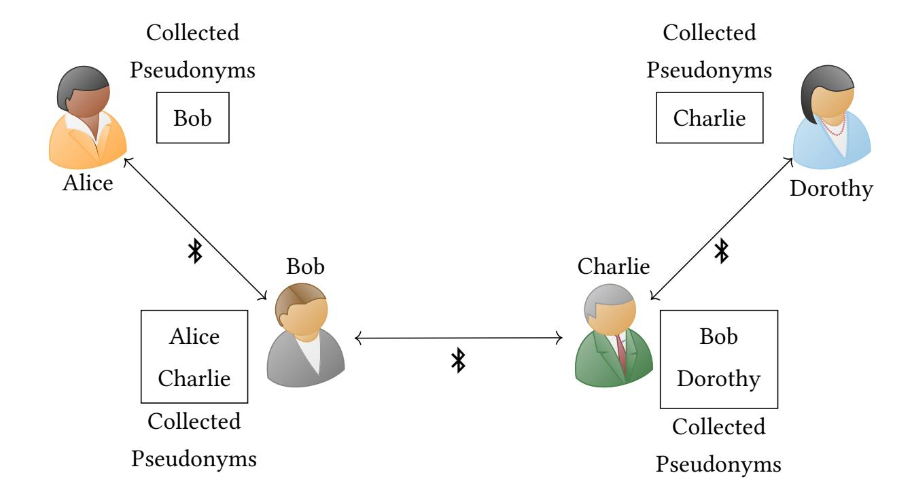
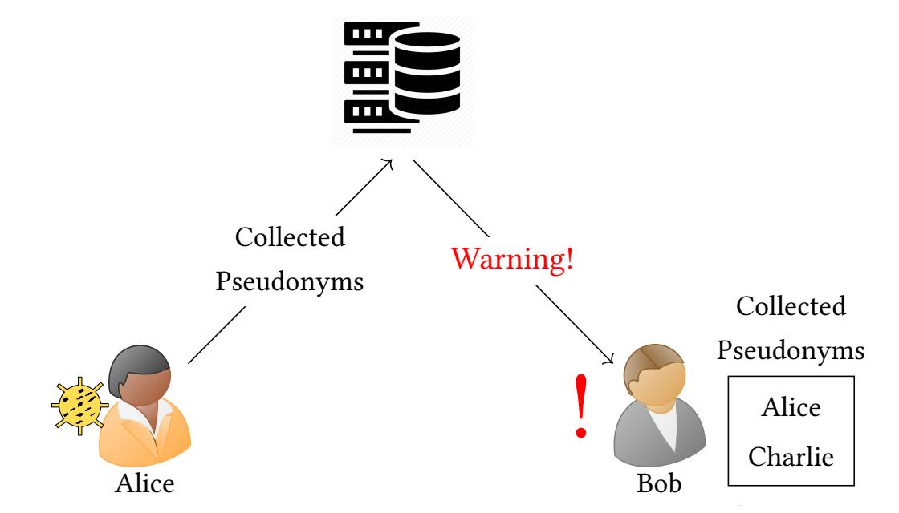
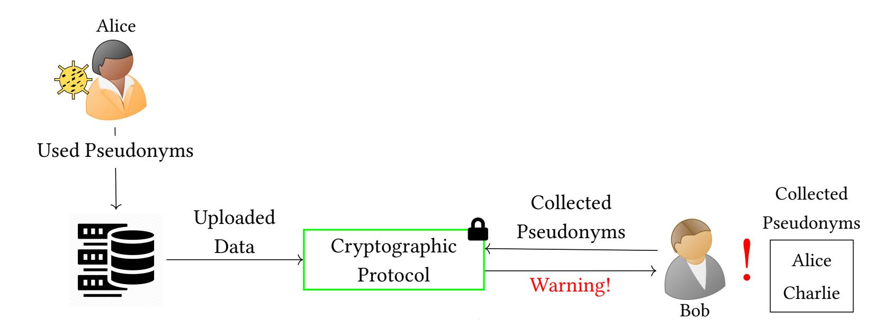
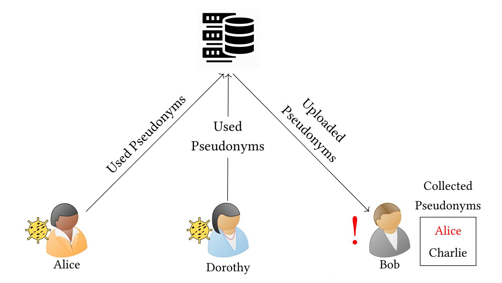
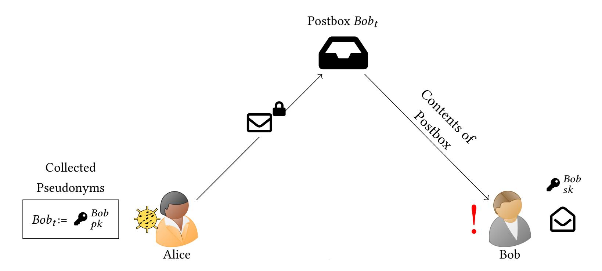

{0}------------------------------------------------

# A Survey of Automatic Contact Tracing Approaches Using Bluetooth Low Energy

LEONIE REICHERT and SAMUEL BRACK, Humboldt University of Berlin, Germany BJÖRN SCHEUERMANN, Humboldt University of Berlin, Germany and Alexander von Humboldt Institute for Internet and Society, Germany

To combat the ongoing Covid-19 pandemic, many new ways have been proposed on how to automate the process of finding infected people, also called contact tracing. A special focus was put on preserving the privacy of users. Bluetooth Low Energy (BLE) as base technology has the most promising properties, so this survey focuses on automated contact tracing techniques using BLE. We define multiple classes of methods and identify two major groups: systems that rely on a server for finding new infections and systems that distribute this process. Existing approaches are systematically classified regarding security and privacy criteria.

CCS Concepts: • Security and privacy → Privacy-preserving protocols; Mobile and wireless security; • Applied computing → Health informatics;

Additional Key Words and Phrases: Covid-19, contact tracing, privacy, survey

#### ACM Reference Format:

Leonie Reichert, Samuel Brack, and Björn Scheuermann. 2020. A Survey of Automatic Contact Tracing Approaches Using Bluetooth Low Energy. ACM Trans. Comput. Healthcare 1, 1, Article 1 (January 2020), [33](#page-32-0) pages. <https://doi.org/10.1145/3444847>

### 1 INTRODUCTION

Since the beginning of the year 2020, Covid-19 has turned into a global pandemic challenging both healthcare systems as well as democratic institutions [\[18,](#page-28-0) [31,](#page-29-0) [60,](#page-30-0) [119\]](#page-32-1). To mitigate its spreading, social and economic life was shut down in affected areas [\[118\]](#page-32-2). Tools often used in the past for containing diseases have proven to be not effective enough to deal with this quickly spreading, highly infectious and deadly virus [\[46,](#page-29-1) [112\]](#page-32-3). Therefore, new methods are developed to mitigate the pandemic such as to automate manual contact tracing done by health authorities (HAs) to speed up the process of discovering new infections. Early systems implemented by Singapore, South Korea or Israel either used more data than necessary to fulfill the task or revealed private information to the public [\[60,](#page-30-0) [113,](#page-32-4) [119\]](#page-32-1). There are also concerns about an increase of discrimination of socio-economic or ethnic groups through the adoption of automatic contact tracing (ACT) [\[72\]](#page-30-1). In many countries, nationwide adoption of ACT applications cannot be enforced by the state [\[2,](#page-28-1) [32,](#page-29-2) [43,](#page-29-3) [66\]](#page-30-2). To ensure great effectiveness it is therefore essential that citizens trust the ACT system enough to participate voluntarily. System designs that send detailed location or contact histories to a government-run central entity without any privacy protection might look more

Authors' addresses: Leonie Reichert, leonie.reichert@informatik.hu-berlin.de; Samuel Brack, samuel.brack@informatik.hu-berlin.de, Humboldt University of Berlin, Unter den Linden 6, Berlin, 10099, Germany; Björn Scheuermann, scheuermann@informatik.hu-berlin.de, Humboldt University of Berlin, Unter den Linden 6, Berlin, 10099, Germany, Alexander von Humboldt Institute for Internet and Society, Französische Straße 9, Berlin, 10117, Germany.

Permission to make digital or hard copies of all or part of this work for personal or classroom use is granted without fee provided that copies are not made or distributed for profit or commercial advantage and that copies bear this notice and the full citation on the first page. Copyrights for components of this work owned by others than the author(s) must be honored. Abstracting with credit is permitted. To copy otherwise, or republish, to post on servers or to redistribute to lists, requires prior specific permission and/or a fee. Request permissions from permissions@acm.org.

© 2020 Copyright held by the owner/author(s). Publication rights licensed to ACM. 2637-8051/2020/1-ART1 \$15.00

<https://doi.org/10.1145/3444847>

{1}------------------------------------------------

effective in the beginning. But societies will require transparent processes and data protection in exchange for their participation in the system.

Many privacy-preserving ACT systems have been proposed, but threats to privacy and security are manifold. To compare the different currently discussed approaches we first provide background knowledge, discuss base technologies, and introduce privacy definitions to assess and classify the various models.

The goal of this survey is to provide a general overview of different types of approaches for ACT with a focus on privacy. As the majority of real-world ACT applications are based on Bluetooth Low Energy, especially those with user privacy as a design goal, we will concentrate on approaches using this technology. Some notable examples for system designs that utilize other tracing methodologies are also included. We identify two larger groups and several subgroups of architectures for ACT. We discuss shortcomings of each subgroup and problems common to all contact tracing systems based on this technology. In the following section, contact tracing and attacker models are introduced, as well as definitions that are used throughout the paper. In Section [3,](#page-7-0) ACT systems are discussed where an essential part of of the process, the risk evaluation, is run by a central server. We present approaches where results are revealed to the server and ideas how server-based computation can be secured using cryptographic tools. Section [4](#page-12-0) turns towards approaches where risk assessment is done on clients, thereby decentralizing trust and computation. Here, central servers are mostly used for relaying messages. We classify broadcast, targeted broadcast and direct messaging ACT systems. Additional features for ACT systems and functional considerations are discussed in Section [5.](#page-17-0) Section [6](#page-21-0) deals with common security issues and threats against privacy. We conclude with a summary in Section [7.](#page-26-0)

#### 2 CONTACT TRACING

Before we can discuss new designs and approaches to ACT, it is first necessary to introduce contact tracing in general.

#### 2.1 Traditional Contact Tracing

Finding new cases by figuring out who had been in contact with a diagnosed patient has been used in the past for various diseases like HIV, SARS, or Ebola [\[42,](#page-29-4) [128\]](#page-32-5). Both in theory and in practice it has proven to be a useful tool for containing epidemics. Stochastic modeling was used in [\[42,](#page-29-4) [63,](#page-30-3) [128\]](#page-32-5) to evaluate the efficiency of contact tracing, showing that the rate at which new infections are discovered cannot be considerably lower than the rate at which the infection spreads [\[42\]](#page-29-4). A direct requirement for contact tracing following this finding is that possible contacts are notified as fast as possible so they do not infect others. Manual contact tracing is especially difficult for airborne diseases like SARS, MERS or Covid-19 [\[42\]](#page-29-4). This is due to the fact that random encounters are complicated to notify as the diagnosed person can then oftentimes not provide information about all relevant contacts.

#### 2.2 Automated Contact Tracing

To ensure that warnings are delivered quickly to people who are at risk and to be able to notify random encounters, it has become desirable to improve existing manual systems with modern technology in order to stop the Covid-19 pandemic [\[46\]](#page-29-1). In many countries smartphone apps are discussed for this purpose. These inform users of past close encounters with people that were later diagnosed as infected. This allows fast testing and quarantine.

2.2.1 Early Research. Early research into the direction of automated disease transmission tracking was done by the FluPhone project [\[48\]](#page-29-5). The goal was to better understand and predict the influenza epidemic and how people alter their behaviour in response. As part of the project a field trial was conducted [\[130\]](#page-32-6), in which participants downloaded an app onto their phone that checked for other devices in proximity using Bluetooth. For detecting phones close by, the FluPhone project built upon Haggle [\[110\]](#page-32-7), a design for ad-hoc networks using Bluetooth. 

{2}------------------------------------------------

Information about encounters of devices was sent to a central server using mobile data. GPS measurements were used to improve results. Participants reported symptoms using the app to determine if these indicated an influenza infection. The system also had the capability of marking devices as infected which could subsequently contaminate other users' devices they encountered based on probabilistic calculations.

Since then research in the field of ACT has been slow but steady [\[4,](#page-28-2) [47,](#page-29-6) [67,](#page-30-4) [76,](#page-30-5) [91,](#page-31-0) [99,](#page-31-1) [107,](#page-31-2) [108,](#page-32-8) [131,](#page-32-9) [132\]](#page-32-10). Besides the flu, other epidemics such as SARS, the swine flu, MERS, Ebola, H1N1 and Zika moved into focus. With the 2020 Covid-19 pandemic, many new approaches were proposed and implemented. The first country to roll out a full ACT application for Covid-19 was Singapore with TraceTogether [\[55\]](#page-30-6).

2.2.2 Adoption and Public Perception. For ACT to be successful, a wide spread adoption is needed. Simulations evaluating the effectiveness of ACT use adoption rates from 40% [\[93\]](#page-31-3) and 53% [\[75\]](#page-30-7) to 56% [\[62\]](#page-30-8) of the population. It has been suggested by some authors that these numbers should not be understood as hard limits, as apps do not become useless at lower adoption rates but rather less effective [\[94\]](#page-31-4). In another study Kretzschmar et. al. [\[74\]](#page-30-9) find that ACT is more effective than manual contact tracing, even if only 20% of the population use the tracing app. This effectiveness derives from the shorter delay of notifying contacts compared to the manual approach of interviewing a patient and then calling their previous contacts via telephone.

One factor impacting adoption is public perception. Systems perceived as surveillance are seen as less trustworthy and people are less inclined to install the corresponding ACT app on their devices [\[16\]](#page-28-3). Some states, such as China, have therefore made the use of the local ACT app a requirement for using public transit and participating in public life [\[29\]](#page-29-7). For most countries, this is not an option as such measures spark serious concerns regarding civil liberties and discriminate against people without a modern smartphone [\[2,](#page-28-1) [32,](#page-29-2) [66\]](#page-30-2).

- 2.2.3 Usability. Usability also has to be taken into account when talking about adoption rates of ACT systems. A study by Trang et al. [\[120\]](#page-32-11) shows that users who are educated about the benefits for themselves and for society are more likely to adopt it. Due to many apps being voluntary to use, the study finds that an intrinsic motivation for using ACT apps is an important factor for its penetration. Another usability requirement often formulated is that the ACT app should not drain too much power from the smartphone as people might uninstall it for this reason [\[54\]](#page-30-10). Also users should not be disturbed by the application and it should therefore be capable of running in the background without the need to open the app regularly [\[54\]](#page-30-10). A similar requirement is automatic processing of data without user interaction, as well as refraining from having users perform manual tasks that are error-prone and time-consuming such as entering a long number read out over telephone [\[41\]](#page-29-8). Usability requirements from the HAs side are that an ACT system should allow them to automate as many tasks as possible or delegate them towards medical staff conducting tests [\[41\]](#page-29-8). For this purpose redundant and various communication channels from the HA to the app users are necessary so that additional information can be spread effectively and quickly.
- 2.2.4 Relationship to Manual Contact Tracing. It has been discouraged to consider ACT as replacement for manual contact tracing [\[54,](#page-30-10) [101\]](#page-31-5). ACT systems might be faster, more scalable and once installed less costly. But the manual approach has been proven to be effective in past epidemics, is already in place and provides rich human-to-human interaction. Human contact tracers are also capable of detecting non-direct methods of transmission through questions. For this purpose, they require an infected user's location history to trace potential contacts. Some apps are specifically designed to support manual contact tracing processes [\[19,](#page-28-4) [54,](#page-30-10) [105,](#page-31-6) [107,](#page-31-2) [116\]](#page-32-12). ACT systems deployed to combat Covid-19 are generally used in combination with existing procedures.
- 2.2.5 Dual-Use. One hope connected to the deployment of ACT systems has often been that lockdowns will be shortened and life will return back to normal [\[10\]](#page-28-5). But what means are acceptable to achieve this goal? Some states use the pandemic to employ systems that might later prove to be capable of dual-use [\[60,](#page-30-0) [72,](#page-30-1) [113,](#page-32-4) [119\]](#page-32-1). In contrast, many new ideas how ACT systems can be designed without becoming part of the surveillance infrastructure have been proposed and rolled out. This survey discusses a variety of these ideas.

{3}------------------------------------------------

Fig. 1. During contact collection, each user stores the pseudonyms of all devices that are in proximity. These pseudonyms can be used to notify close contacts in case of a subsequently detected infection.

### 2.3 Sensors

An important part of ACT is determining which users got into close contact for at least a duration that makes disease transmission possible. Smartphones have been the main focus for ACT systems since they are widespread and provide a variety of sensors that can be used for co-location detection. In the following, smartphone sensors are presented and discussed which allow co-location detection or distance measurements between users.

- 2.3.1 Bluetooth. During the last years, Bluetooth has emerged as a useful technology for measuring the proximity between devices. First approaches to positioning and proximity detection using Bluetooth (especially indoors) were presented by [\[59,](#page-30-11) [73,](#page-30-12) [90,](#page-31-7) [106,](#page-31-8) [133\]](#page-32-13). These works use the receiver signal strength indicator (RSSI) to measure distance between receiver and transmitter and thereby derive relative or absolute location information. Raghavan et al. [\[100\]](#page-31-9) were able to show that Bluetooth version 2.0 can be used for localization with an error of less than 45cm. Liu et al. [\[81,](#page-31-10) [82\]](#page-31-11) demonstrated that Bluetooth is efficient for detecting face-to-face interactions by providing a model for estimating distance using RSSI readings. Bluetooth has the problem that it is an active protocol where a connection is established between the two parties before any payload can be exchanged. This potentially hinders an effective exchange of messages due to the added complexity of the connection establishment. Additionally, since devices advertise themselves, they signal to possible attackers where to find an activated interface. This can then be exploited using known vulnerabilities such as Bluefrag [\[117\]](#page-32-14).
- 2.3.2 Bluetooth Low Energy. Bluetooth specification 4.0 introduced Bluetooth Low Energy (BLE), an energyefficient, short-range variant of classic Bluetooth [\[34\]](#page-29-9). These two are not inter-operable. In 2020, both Bluetooth and BLE have a high adoption rate, as 100% of new smartphones support both standards [\[14\]](#page-28-6). Due to its battery saving properties, BLE was adapted for positioning and proximity detection [\[44,](#page-29-10) [45,](#page-29-11) [87,](#page-31-12) [104\]](#page-31-13) and is especially interesting for mobile use cases. Bertuletti et al. [\[11\]](#page-28-7) were able to reduce the error of BLE-based location measurements to less than 40 cm. Similarly to distance measurements for classic Bluetooth, the RSSI is hereby used to determine the distance between sender and receiver. Different models for signal propagation can be employed for this purpose, e. g., the exponential or the polynomial model.

{4}------------------------------------------------

To transmit data over BLE, a device sends broadcast packets during each of its advertisement intervals to the three available channels. Recipients use the scanning mode to listen for such advertisement packets [\[13\]](#page-28-8). During each scanning window, they record transmissions. Scanning can be conducted either actively or passively. The prior allows the scanning device to request additional data from the advertiser. In the passive mode, devices do not establish a connection between each other. Instead, scanning devices simply extract information from broadcast messages. The original use case of BLE broadcast messages are periodic sensor readings, but each BLE-capable device can be configured to advertise such short data packets as well. A device does not scan and advertise at the same time. The durations for both advertising and scanning windows are configured locally for the device. Timings of these scans have to be considered so that each device has reasonable chances to see all others and can also be seen [\[79\]](#page-30-13).

Combined with being more energy efficient, passive scanning makes BLE more suitable than Bluetooth for co-location detection and distance measurements. BLE was therefore widely adopted as technology to realize ACT. In BLE-based ACT, users continuously transmit pseudonyms via broadcast messages to everyone nearby (see Figure [1\)](#page-3-0). These messages can be received and recorded by other users. If a person is diagnosed, the pseudonyms they have seen in the past (as well as the distance to them) are used to identify their random encounters.

One shortcoming of BLE for proximity detection and contact tracing is the large variability of transmission power over different smartphone types. RSSI readings have to be calibrated to the respective devices [\[54\]](#page-30-10). Additionally, distance measurements can be noisy due to multi-path and shadowing effects. These are caused by signal reflection, walls and objects hindering the propagation of all wireless signals. The authors of DP-3T [\[122\]](#page-32-15) noted that such errors generally increase the measured distance and rarely decrease it. So instead of solving the problem of correct distance estimation, they focused on determining if the distance is larger than a certain threshold. For this purpose, they conducted experiments for various every-day settings [\[36\]](#page-29-12). With a precision of 80% and a recall of 52.5%, they were able to identify if the distance was larger than 2 m for all scenarios. Sattler et al. [\[109\]](#page-32-16) were able to correctly identify 100% of risky contacts with the duration of 15 min at 2 m distance, while accepting a false positive rate of 30%. Experiments conducted with soldiers of the German army have also shown that a mapping from RSSI to infection risk can be reasonable accurate [\[84\]](#page-31-14).

For usability reasons it is essential that an ACT application can run in the background. Apple's iOS restricts the usage of the corresponding interfaces for apps running in the background, thereby interfering with co-location detection [\[54\]](#page-30-10). This limitation on iOS concerns all types of sensors except those related with location tracking.

The simplicity of BLE beacons does not come without limitations. The payload in an advertisement packet is limited to 31 bytes [\[13\]](#page-28-8), which can be unsuitable for some cryptographic keys. This is relevant for ACT approaches relying on cryptographic key exchanges. In the energy-saving passive scanning mode, active approaches for exchanging data are unable to rely on the advantage of protocol confirmation messages. Approaches that rely on multiple packets being exchanged between users depend on usage of the active scanning mode and both devices being visible to each other for some time, a requirement that can be difficult in mobile or crowded scenarios.

Both, sending advertisement packets or scanning require electric power. Thus, a tradeoff has to be made between saving energy and being active on the BLE band to participate in ACT and interact with all other devices. Especially for mobile devices this tradeoff is an important part of the system design. Approaches that work with fewer interactions (i. e., passive scanning only) can save considerable amounts of energy compared to systems with active message exchanges.

Similarly to Bluetooth, BLE also has vulnerabilities that make it exploitable to attackers when turned on. These are for example SweynTooth [\[49\]](#page-29-13) and CVE-2019-2102 [\[1\]](#page-28-9).

2.3.3 GPS, Celltower Triangulation, Wifi and Magnetometer. Bluetooth and BLE are not the only technologies available for determining co-location. Methods like GPS [\[86,](#page-31-15) [103\]](#page-31-16), cell tower triangulation [\[119\]](#page-32-1), Wifi [\[4\]](#page-28-2), or correlating magnetometer readings [\[67,](#page-30-4) [91\]](#page-31-0) can also be used for ACT. But all of these technologies have

{5}------------------------------------------------

shortcomings which we will discuss in the following. GPS data is generally seen as very privacy sensitive, as it can reveal identifying information about a person like their home and work address. At the same time, its resolution is not fine grained enough to detect face-to-face interactions between people, especially in areas with tall buildings or inside [\[70\]](#page-30-14). Covid-19 is an airborne disease, so while being in the same room as an infected person without protection is dangerous, sitting on the other side of a wall is not. These kinds of false positive errors are difficult to mitigate when using GPS or cell tower triangulation. Both technologies are too imprecise to derive meaningful data about interactions of users.

Wifi, just like Bluetooth/BLE, has the advantage of being blocked by objects such as walls. While Wifi has been widely used for indoor positioning [\[78\]](#page-30-15), just like cell tower triangulation it requires infrastructure that might not be available everywhere, especially outdoors or in remote locations. It is therefore not suitable for ACT, which is required to function anywhere.

Correlating magnetometer readings of users is another passive method suitable for ACT. It requires little energy while working indoors and outdoors. When two magnetometer readings have a similar variance during the same time period this indicates that they were recorded at the same location. No information about the distance between the people recording these traces can be deduced. But proximity information is crucial for evaluating the likelihood of transmissions in an ACT setting [\[115\]](#page-32-17). There has been little research in the area of co-location detection using magnetometers so far and it is not as well investigated as BLE. So while this method works in the laboratory, reproducing the findings on large scale might be difficult, making this technology inadequate for ACT as timely deployment is vital.

The Fluphone project tested RFID tags [\[48\]](#page-29-5) to detect co-location. While this approach is interesting, tags need to be distributed to all users. This overhead is considerably larger than providing an app in various app stores and using common smartphone capabilities. Since the ID of RFID tags is static, this technology also allows the re-identification of users, making it easy to track their location. Table [1](#page-5-0) summarizes all mentioned sensor and their different properties with regards to co-locations detection.

As we have seen, BLE as is the most suitable base-technology for ACT. For this reason, most systems proposed and deployed are built on this approach to detect contacts between users. The main differences between various approaches to ACT lie in the way how risk assessment is conducted and which parties hold relevant data. In the remainder of this survey, we will therefore focus on works using BLE for co-location detection. Notable approaches, which use other sensors but can be realised using BLE, are also discussed.

| Sensor                     | Precision         | Distance measurement possible | Privacy(P)/ Security(S) Problems | Infrastructure required | Running in background (iOS, Android) | Notes                            |
|----------------------------|-------------------|-------------------------------------|----------------------------------------|----------------------------|--------------------------------------------|----------------------------------|
| Bluetooth                  | Good              | x                                   | S                                      |                            | No, yes                                    | Active communication             |
| BLE                        | Good              | x                                   | S                                      |                            | No, yes                                    | More efficient than Bluetooth |
| GPS                        | Not sufficient | x                                   | P                                      |                            | Yes, yes                                   |                                  |
| Celltower Triangulation | Not sufficient | x                                   |                                        | x                          | Yes, yes                                   |                                  |
| Wifi                       | Good              |                                     |                                        | x                          | No, yes                                    |                                  |
| Magnetometer               | Good              |                                     |                                        |                            | No, yes                                    |                                  |
| RFID                       | Good              | x                                   | P                                      | x                          | No, yes                                    |                                  |

Table 1. This table outlines the properties of different sensors available for ACT.

{6}------------------------------------------------

#### 2.4 Definitions

To ensure common understanding, we introduce the following definitions.

- (1) Automated Contact Tracing (ACT) system: An ACT system consists of an app that can be installed on the users' mobile devices and a backend, typically a server. To function properly it is generally assumed that the local HA operates the system.
- (2) User: Users of an ACT system are people who downloaded the app and have it activated.
- (3) Infected people: People are considered infected if their infection has been medically verified and reported. ACT systems can only consider infected people who have been using the respective system before they fell ill.
- (4) Encounter: When two users Alice and Bob are in proximity of one another, this is called an encounter.
- (5) Contact: If Alice is diagnosed as infected after an encounter with Bob, then Bob is called a contact of Alice.
- (6) At Risk: Users are considered at risk if they have had encounters with infected people. This does not necessarily mean that they are disease carriers.
- (7) Risk Scores: Risk scores are calculated depending of the exposure of a user at risk. If the score exceeds a certain threshold, the user is notified.
- (8) Pseudonym: BLE-based approaches advertise ephemeral or static IDs. Such IDs are called a pseudonym in this work.

### 2.5 Attacker Models and Types

When evaluating the security of a system, it is important to define the type of adversaries against which the system is secured. Attackers are generally distinguished into two types. Semi-honest, also called honest-but-curious, attackers follow the protocol but will try to learn as much information as possible. A malicious attacker has the additional capability to forge or replay traffic. The attacker can be computationally bounded or unbounded. It is also important to differentiate if an attack can only be conducted actively by communicating with the system or passively, and therefore with minimal interaction. Active attacks, such as trying out all possible inputs, are more resource intensive and easier to detect.

In ACT systems there exist several parties with different prior knowledge and capabilities:

- (1) Health authority (HA): This is the public institution tasked with containing the spread of the disease. It may have an interest in learning as much about users and infected people as possible, for instance their relations to each other or where they have been in the past. Another possible goal is the deanonymization of users at risk. Since infections with SARS-CoV-2, the virus causing Covid-19, have to be reported in many countries [\[17,](#page-28-10) [56\]](#page-30-16), it can be assumed that the HA possesses a considerable amount of information about infected users. In some legislations it is even a crime to not support the HA during contact tracing [\[56\]](#page-30-16). The HA does not have an interest in blocking contact tracing or stopping risk notifications to users.
- (2) Users: Users want to determine their health status. They might also have an interest in figuring out who is infected or who infected them. It is hereby important to distinguish who an attacker focuses on: random users, close social contacts who are regularly in presence of the attacker, or public figures which are easy to track down by a Curious Stalker or Paparazzi. The stalker can follow victims and observe if their habits change.
- (3) Infected users: Infected people participate in most systems through having been reported to the HA by their doctor. They have an interest to not reveal too much sensitive information about themselves to the public and the HA, because they fear public humiliation [\[111\]](#page-32-18) or other forms of social outcasting. But infected users can also be malicious, by trying to figure out who they have infected.

{7}------------------------------------------------

Fig. 2. Here the general idea of server-based ACT is visualized. Alice sends her collected pseudonyms to the server when diagnosed as infected. The server does a risk assessment for her contacts and warns Bob.

- (4) Eavesdroppers: Eavesdroppers are passive attackers that listen to communication of the protocol, both on the wireless network as well as the communication with a centralised backend. Users, network, and service operators can all take the role of an eavesdropper in a protocol.
- (5) Service operators: The ACT service and its infrastructure can be run by the HA or by a third party such as a contractor. Servers and cloud storage fall into this category. A service operator can try to learn general information about users and infected people as well as their health status by observing and manipulating data passing their system.
- (6) Network operators: Network operators can have similar goals as service operators, but are only capable of observing and manipulating data that is sent through the network.

### 3 SERVER-SIDE RISK ASSESSMENT

There are numerous ways how the infection risk of users in ACT systems can be calculated. From a structural perspective, risk scores can be either determined on the server or on the client. Both approaches come with different security risks and trust models. In this section, ACT systems using a central server for risk assessment are discussed. Since infectious diseases are subject to mandatory reports to the HA in many countries, it is a natural candidate to run central infrastructure for ACT. The systems discussed in this section mostly rely on the HA to collect data from infected individuals. The HA ensures that all collected data is legitimate. This is an important step, as false claims of infection could cause fear and chaos within affected communities.

## 3.1 Results Revealed to Server

One very straight forward approach to ACT is computing risk scores so that the HA learns as result of the computation who to quarantine. In the following, we will introduce several such approaches.

3.1.1 TraceTogether/BlueTrace. The first widely deployed ACT system has been developed for the government of Singapore [\[55\]](#page-30-6). The app is called TraceTogether, while the associated open source project has the name Bluetrace [\[54\]](#page-30-10). End devices of users run an application which uses ephemeral pseudonyms to advertise their presence over BLE. These pseudonyms are generated on the central server, so that the server always knows which pseudonyms belong to which user. After some time, a new pseudonym is broadcast to ensure that users cannot be tracked by a third party other than the HA. The app also continuously scans for nearby devices that 

{8}------------------------------------------------

advertise themselves. If another device is registered, the announced pseudonym of the other user is stored locally for a predefined period of time. Depending on the disease, the retention period can be different and is derived from epidemiological findings. In case of Covid-19, pseudonyms are stored for two to three weeks. As soon as a user Alice is diagnosed with the disease, she uploads her history of observed pseudonyms to a central server. The central server performs a lookup for all collected pseudonyms to re-identify users and calculates their individual risk scores (see Figure [2\)](#page-7-1). Risk scores can be influenced by factors like the duration of the encounter, the signal strength of the transmission indicating proximity or the number of infected users that reported a contact with the user at risk. If a certain risk threshold is exceeded, the server will notify the corresponding users that are at risk. Following this notification, affected users are requested to place themselves under medical care or into immediate quarantine. Approaches like Bluetrace have often been called centralized in the public discourse [\[126\]](#page-32-19). BlueTrace has been also adopted by the Canadian region of Alberta [\[3\]](#page-28-11) and Australia [\[127\]](#page-32-20).

3.1.2 PePP-PT. A very similar concept to BlueTrace can be found in the framework of PePP-PT [\[95\]](#page-31-17). PePP-PT is a European initiative also focusing on a server-based approach. Similar to BlueTrace, the central server is operated by a country's HA. Pseudonyms for BLE are generated by the server and sent to the user's device which announces them over its Bluetooth interface. These pseudonyms are encrypted values of the user's fixed ID. If an infected user Alice reports herself to her country's HA, she can transmit her list of collected pseudonyms from the last 14 days to the corresponding server. Each of Alice's collected pseudonyms can be decrypted by the server that issued it and the individual risk scores of users at risk can be calculated. Users at risk are then notified with push notifications.

Two implementations of PePP-PT exist; PePP-PT NTK [\[95\]](#page-31-17) and ROBERT [\[65\]](#page-30-17). They only differ in minor details. For instance, ROBERT uses 3DES as their symmetric encryption algorithm instead of AES. An app based on ROBERT has been released in France under the name of Stop Covid [\[64\]](#page-30-18).

- 3.1.3 Arogya Setu. The Indian government developed an app called Aarogya Setu [\[89\]](#page-31-18) to mitigate the spread of Covid-19. Essential parts of the app and infrastructure are not open-source and it is unclear how exactly a risk score is determined. An analysis of the app found that GPS and BLE are used [\[57\]](#page-30-19). Infection chains are recorded by sending and receiving fixed pseudonyms that are uploaded to the HA in case of an infection, as well as the location history of the last 30 days. This allows the HA to not only notify individuals about infection risks but also to detect events and conditions where multiple infections took place.
- 3.1.4 PHyCT. Another interesting BLE-based approach proposed by Jhanwar and Sarkar revolves around hybrid ACT [\[68\]](#page-30-20). The authors design a system that allows the HA to identify users at risk in co-operation with the corresponding infected individual. Before each BLE advertisement, the user creates two tuples using secretsharing and symmetric key encryption. First, the user's identity is encrypted. The corresponding time-dependent key is then split into two shares and . The first tuple, which we will call pseudonym, contains among other things the share . The pseudonym is sent over BLE to all to all other users close by, who will record it. The other tuple is uploaded to a central server. It is composed of the encrypted identity, the second share and a cryptographic hash of the first share (). Now when a user gets infected, they upload all their recorded pseudonyms from other users and their own. The own pseudonyms of the infected person are broadcast to all users, so that they can check their local history to determine if they have encountered this user. A compliant user at risk will report themselves to the HA. The HA can also extract for each pseudonym recorded by the infected user and hash it to find the corresponding entry. By combining both shares and , it can now decrypt the identity of the user at risk. This allows the HA to quickly take measures against users that are non-compliant.
- 3.1.5 Common Aspects and Attack Vectors. The described models for server-based ACT have similar advantages and disadvantages. These assessments also hold for PHyCT when ignoring the broadcast of pseudonyms, which is not necessary for ACT.

{9}------------------------------------------------

Using the approaches described in this section, the identities of people who should quarantine are revealed to the HA and restrictions can be enforced. No data is revealed to users other than the risk notification received by users at risk. Recipients can only guess that they might have been infected by someone from their history of encounters. But since proximity measurements are made independently both parties might record different distances and an encounter might have only been recorded by one side. So simply using the own history of encounters when trying to figure out who is the cause for a risk notification is not reliable for an attacker. This means this type of approach protects the identity of infected individuals well against other users.

Instead, the dangers of systems revealing risk assessment results to the server lie elsewhere. Information about the relations of users is leaked to the entity operating the servers, which is either the HA or a service operator. In case a user is reported as a contact by several infected patients, the server can directly derive that these people might know each other. It also learns about relations between uninfected users as the server can observe that some users always appear at the same time in collected data sets. Using additional information such as the time of an encounter or other prior knowledge, the specific details about the nature of users' relations can be revealed. While these individual relationships might seem insignificant, this attack vector allows the adversary to build a social graph for parts of the user base.

For systems like BlueTrace or PePP-PT where the HA always knows who uses which pseudonyms, a malicious HA could install Bluetooth sensors in popular areas like train stations and collect pseudonyms there. This allows the HA to learn the location history of any user who passes the capture device. Depending on how tightly knit the infrastructure of publicly located Bluetooth sensors is, the HA can follow every movement of users.

Another issue arises from the way how ephemeral pseudonyms are linked to static ones at the backend. For example in PePP-PT, ephemeral pseudonyms are created by encrypting a static identifier. The reference implementation of Bluetrace works similarly. If the encryption key is leaked, all identifiers issued with this key become linkable and recorded BLE traces can be deanoymized by any eavesdropper on the BLE band. It has been proposed to use rotating keys to reduce this threat [126]. An attacker observing the network does not learn who is at risk. But uploads to the server will reveal who is infected if no additional measures such as cover traffic or hiding the IP address are taken.

As explained in the introduction, it is essential that users trust the contact tracing system enough to participate voluntarily. Many people seem to be deterred by systems they find too intrusive or incapacitating [5], such as one where they are forced into quarantine instead of taking the decision themselves. There is also the fear that the described server-based approaches facilitate the creation of new surveillance infrastructure that could, for example, be used to target minorities [5, 18, 77]. These two aspects have greatly influenced the public discussion in some European countries causing governments to move away from approaches similar to what was described in this section [26].

#### 3.2 Homomorphic Encryption

There are approaches to ACT which allow risk assessment done on the server or in collaboration with the server while revealing the risk score only to the querying users themselves. These approaches leverage modern cryptographic tools such as homomorphic encryption. Homomorphic encryption (HE) [88] describes encryption schemes which allow computation on already encrypted data. A homomorphic function is defined as follows: Let  $f(x_1, x_2, ..., x_n)$  be a function with n inputs. A function h is a homomorphic encryption function of f if for an encryption function e(x) and the corresponding decryption function d(x) it holds that  $d(h(e(x_1), e(x_2), ..., e(x_n))) = f(x_1, x_2, ..., x_n)$ . In fully homomorphic schemes, encrypted data can be added or multiplied as often as necessary. The decrypted result will be meaningful and reflect the result of the operations conducted on the encrypted data. Some homomorphic encryption schemes are limited in the amount of operations

{10}------------------------------------------------

on an encrypted set of data and utilize a noise budget, where each operation draws from until the operations become unreliable when the budget runs empty.

- 3.2.1 EPIC. An approach to privacy-preserving ACT using HE is the EPIC framework [\[4\]](#page-28-2). Here, users do not actively send out BLE pseudonyms but passively fingerprint their surrounding by capturing both Bluetooth and WiFi beacons. Such location fingerprints captured by infected users are uploaded in cleartext to servers belonging to the HA. Uninfected users send requests to the server to determine how similar their own location fingerprints are to those measured by infected users for certain timestamps. The request contains the public key of the user, the timestamp and an (homomorphic) encryption of the location fingerprint at . The server will use the provided public key to encrypt location fingerprints with a close timestamp and then calculate a matching score. The scores cannot be decrypted by the server. It will send the result back to the requesting user who can decrypt it and derive their personal risk score. Users do not learn the location traces of individual infected users, but will learn at which locations they have been close to an infected person. They can also forge their upload to verify assumptions about the risk status of a person. Infected users can provide fake locations to drive businesses away from certain shops or shame targets. Service and network operators are not able to learn the locations, risk scores or health status of healthy users because data is encrypted with a secure key belonging to the user. To not reveal a pattern, users at risk do have to continue querying the server after being diagnosed.
- 3.2.2 HE-base TraceSecure. Another approach using HE was proposed by Bell et al. [\[8\]](#page-28-13). We call this approach "HE-based TraceSecure". The system relies on a pseudonyms exchange over BLE. It reveals to the server (which is run by the HA or a service operator) who has interacted with whom but keeps the health status secret from the server and non-colluding network operators. The authors see this leakage of interactions as a feature that can be used for building a social graph of pseudonyms. This graph is seen as a feature and can be used as part of a privacy-preserving evaluation of social distancing policies. Users of HE-based TraceSecure learn which pseudonym infected them.
- 3.2.3 Common Aspects and Attack Vectors. The approaches discussed in this section are cryptographically secure, meaning they leak no more information than intended by the protocol. Runtime and computational overhead on the sever remain problematic in designs relying on HE. Attack vectors based on data of infected individuals remain as challenges that need a solution before such an approach is feasible in a real-world setup.

Another problem for HE are DDoS attacks against the central server. Due to the necessary complex operations executed by the central server, an attacker could aim to exhaust the server's resources by sending randomly generated data.

#### 3.3 Secure Multiparty Computation

Another approach how to cryptographically secure private computation on the server against the server itself is secure multi-party computation (MPC) [\[114,](#page-32-21) Chapter 22]. The field of MPC deals with creating protocols for joint computation on private, distributed data. It studies mechanisms to allow a group of independent participants to collectively evaluate a function 1, . . . , = (1, . . . , ). Each participant holds a secret input, which remains hidden to other parties but is used for computation. The participants only learn their designated final result. Any function that is solvable in polynomial time can be represented as an MPC protocol [\[114,](#page-32-21) Chapter 22.2]. For ACT, generally only two parties are considered, a server and a client who wants to determine their risk status.

A useful application of MPC is private set intersection (PSI). Two participants each hold a set of elements and want to calculate their intersection without revealing elements not contained in the intersection. This type of protocol can easily be mapped to the problem of privacy-preserving ACT (see Figure [3\)](#page-11-0) .

{11}------------------------------------------------

Fig. 3. This figure illustrates how a simple private set intersection protocol for BLE-based ACT could work. This example does not leak the intersection to Bob.

3.3.1 Berke et al. The approach of Berke et al. [\[9\]](#page-28-14) uses Diffie-Hellman PSI for ACT. Instead of exchanging BLE pseudonyms, the authors use GPS traces. Coordinates are truncated and rounded so that they are represented by single dots on a three-dimensional grid (longitude, latitude, and time). Since distance is an important factor when transmitting the virus, for each truncated coordinate it is important to check whether the neighbouring grid points are part of the intersection. To execute Diffie-Hellman PSI on the set of grid points, both client and server first need to create an asymmetric key pair. Each side encrypts their set with their private key and sends it to the other party. The recipient then encrypts the already encrypted set with their key, so now each set is encrypted with both private keys. The server sends the set it encrypted last to the client, which then holds both sets. The client calculates the intersection of these encrypted sets. Due to the multiplicative property of asymmetric encryption, it is not important which key was used first. This protocol can be used to allow clients to learn the size of the intersection, but also which of their elements appear on the servers by letting the client query for elements individually. The server, and therefore the HA or a service operator, does not learn which data was provided by a user. Users does not learn where infected people have been. Network operators will not know who is at risk or diagnosed as long as infected user continue querying if they have been diagnosed. The client learns if they are at risk and since the intersection is leaked they will also know where the encounter occurred. Since GPS data is used, malicious users can forge input and for example provide the home address of a target. Infected users can provide wrong locations to make certain places look bad and scare customers of local businesses.

An approach by Reichert et al., also for GPS data, works similarly. Instead of using PSI, binary search on oblivious memory is used to determine if an element appears in the server's set of infected users' location data [\[103\]](#page-31-16). Risks and attack vectors are the same as for Berke et al.'s solution.

3.3.2 Demirag et al. The protocol of Demirag et al. [\[30\]](#page-29-15) uses Bluetooth/BLE to advertise a static pseudonym. The authors do not go into detail if their system relies on regular Bluetooth or BLE. The HA server holds all pseudonyms of people with verified infections. To figure out how many users they have met in the last weeks that were infected, a user performs PSI with the server following the protocol of De Cristofaro et al. [\[27\]](#page-29-16). This protocol only returns the size of the intersection. The system requires the central server to know relevant information about the infected individuals, here the pseudonyms they have used in the past. The server (i. e., the HA or a service operator) does not learn which pseudonyms the client used as input for the set intersection or if they are at risk. The client does not learn the pseudonyms of users that are infected, not even the ones they have been in

{12}------------------------------------------------

contact with. If infected users continue communicating with the system even after receiving a positive diagnose, a network operator can not tell if they are at risk or even infected.

- 3.3.3 Epione. Epione proposed by Trieu et al. [\[121\]](#page-32-22) also uses Bluetooth technology to exchange pseudonyms. For each encounter both parties create a new pseudonym. They use a Diffie-Hellman based PSI algorithm to determine the cardinality of the intersection. The algorithm is optimized for situations where the client's set is a lot smaller than the server's set. This approach also uses HE for some steps. In Epione, the HA and the central server are required to know the pseudonyms infected users have used in the past. The server, meaning the HA or a service operator, does not learn the past pseudonyms of other users or who is at risk. The client only learns how many risky encounters they have had but not the corresponding pseudonyms of infected users. An eavesdropper on the network will not be able to distinguish traffic from users at risk from normal traffic, but to eliminate the possibility of leaking data through patterns, diagnosed users have to continue using the system.
- 3.3.4 Common Aspects and Attack Vectors. Approaches using MPC have similar advantages and shortcomings as those discussed in Section [3.2](#page-9-0) using HA. The server will not learn about the data provided by the user. All MPC protocols can be secured against malicious attacks by accepting performance penalties [\[50\]](#page-29-17). But attacks which rely on uploading crafted data to the server are feasible.

Similar to HE, MPC protocols do have a significant computation and communication overhead. This results in long runtimes. DDoS attacks against resources of the MPC server are therefore very effective. MPC protocols often require many gigabytes of data to be communicated. This is hardly feasible on metered mobile data connections. Mobile energy consumption is also limited due to battery sizes. More important even, the general public acceptance of ACT relies on its usability on mobile device. There is research on PSI which attempts to take load off the end devices [\[71\]](#page-30-22).

### 4 CLIENT-SIDE RISK ASSESSMENT

A different type of ACT is based on the idea that the risk status of a user should be calculated locally on the client's device and not be revealed to the HA, service providers or network providers. Data passes these infrastructures, but no information about social interactions is revealed and either infected users and/or the users at risk remain private. This technique often requires more resources on end devices than e.g. Bluetrace [\[54\]](#page-30-10) or PePP-PT [\[65,](#page-30-17) [95\]](#page-31-17). Several models using client-side risk assessment are discussed in this section. We distinguish between systems using broadcasts, targeted broadcasts and direct messaging.

### 4.1 Broadcast Models

Broadcast models rely on distributing information about infected individuals to all users which do their risk assessment locally. A simplified illustration of the idea is displayed in Figure [4.](#page-13-0) This type of ACT is often also called decentralized.

4.1.1 DP-3T. An approach which presented several closely related designs for broadcast models is DP-3T [\[122\]](#page-32-15). The so-called low-cost design allows users to use an individual seed to derive a daily key. This daily key is then used to deterministically calculate rotating BLE pseudonyms. When a user becomes infected, the daily keys for the relevant time period are uploaded to a central server and distributed to all users. The application locally derives the corresponding pseudonyms of the infected user and checks in its history if there has been an encounter with any of these. A major problem with this approach is the fact that an infected user's pseudonyms become linkable over the two weeks before the infection. To mitigate such attacks by curious users or eavesdroppers, DP-3T developed a second approach called the unlinkable design. Here, for each time slot a new, completely independent pseudonym is generated. When a person becomes infected, the pseudonyms are uploaded to a server which stores them in a global Cuckoo hash table [\[123\]](#page-32-23). Users will download the hash table regularly and check if

{13}------------------------------------------------

Fig. 4. This figure visualizes the idea of a simple broadcast ACT model. When Alice is verified as infected, she will upload the pseudonyms she advertised in the past to a server. Bob will download a list from the server containing Alice's pseudonyms, but also those of other infected users such as Dorothy. Checking locally against the list, he recognizes one of Alice's pseudonyms.

any of their past encounters causes a hash collision. To ensure that the failure probability of the hashing process remains low, the server creates a new, empty table after some time [\[22\]](#page-28-15). When data is uploaded, the server (and thereby the HA or the service operator) does learn the past pseudonyms of an infected user but not with whom they interacted. When the name DP-3T is mentioned in the remainder of the survey, we refer to the unlinkable design unless indicated otherwise.

- 4.1.2 GAEN. Apple and Google, two companies together dominating the market for smartphone operating systems, formed an alliance to present a joint approach for ACT called "Google Apple Exposure Notification"(GAEN) [\[52\]](#page-29-18). They proposed and implemented a technical specification for an API similar to what has been presented as DP-3T low-cost design and other related schemes like CONTAIN [\[61\]](#page-30-23), East-Coast PACT by Rivest et al. [\[105\]](#page-31-6), and West-Coast PACT by Chan et al. [\[19\]](#page-28-4). Differences between these schemes and the GAEN framework are mostly on an implementation level. While the DP-3T low-cost design derives the daily key by hashing the key from the day before, GAEN combines the initial tracing key with the number of the day in a key derivation function. Another difference is how pseudonyms are created. The DP-3T low-cost design derives one value for a whole day by feeding the daily tracing key first into a pseudo-random function like HMAC-SHA256 and then using the result as the input for a stream cipher like AES. Then the output is split into chunks of 16 bytes and shuffled before usage. GAEN derives pseudonyms independently by feeding the daily tracing key and the number of the current time interval into a pseudo-random function. The result is 16 bytes long and is used immediately. Concerning realisation of ACT, the two companies insist on only providing an application for end devices but leave setting up server infrastructure to HAs interested in cooperating. GAEN is available for Android 6.0 and up, as well as iOS 13.6 or higher [\[24\]](#page-28-16).
- 4.1.3 Hashomer. Pinkas and Ronen proposed a similar broadcast system called Hashomer which relies on an elaborate key derivation mechanism [\[97\]](#page-31-20). While the keys advertised at different epochs of the same day are unlinkable, this scheme uses a daily key that can also be published by the central server to reduce the amount of

{14}------------------------------------------------

data to be downloaded daily by users. Daily keys from different days are also unlinkable. In Hashomer, the HA only learns past pseudonyms of infected users but not who they interacted with.

4.1.4 Common Aspects and Attack Vectors. Approaches using the broadcast model are able to hide from the HA the fact that someone has been in contact with a person who has tested positive. This can be an important feature to gain users' trust, as they are able to review warnings for plausibility and are free to decide for themselves when it is time to get medical attention. Since the risk status is calculated locally and all users receive the same data, service providers and network providers cannot guess a persons health status by eavesdropping. Broadcast models have the common weakness of revealing the pseudonym and approximate time when the encounter occurred to the user at risk. Overly curious users could try to abuse this information to deanoymize infected people. This also simplifies attacks where a security camera is combined with a Bluetooth sensor device. Here, the captured data allows the attacker to connect infected pseudonyms to faces.

Another issue are impersonation attacks. An infected user could upload different pseudonyms than the ones they used themselves to make it seem like someone else is actually infected. This class of attacks requires the attacker to gain access to recent pseudonyms of a victim, which can be obtained by sustaining physical proximity to the targeted victim. In some cases, it is required to get access to the keys that are used for pseudonym generation. This can only be done by breaking into the victim's phone. A successful untargeted impersonation attack would require the attacker to guess a valid pseudonym. This is very unlikely to happen due to the high entropy of randomly generated pseudonyms.

Since risk scoring is done locally in broadcast-based ACT, a network operator will not know who is at risk. But through uploads to the server, network and service operator can learn who is infected.

### 4.2 Targeted Broadcast

In this section we discuss approaches that use a broadcast system which allow the infected individual to pre-filter who of their past contact should be warned. Broadcast data in these approaches is not meaningful to anyone except the targeted user.

- 4.2.1 ConTra Corona. An example for the targeted broadcast approach is ConTra Corona [\[12\]](#page-28-17). For each epoch, users derive a secret and a public pseudonym from a newly generated seed. The public pseudonym is advertised over BLE, while the seed is uploaded to a so-called matching server. If a user is tested positive for Covid-19, they encrypt all relevant recorded pseudonyms with the public key of the matching server and have HA forward the data. The matching server decrypts the data and looks up the corresponding seed, marks it as infected and generates the corresponding secret pseudonym. Users can either query for their secret pseudonym or the matching server publishes them regularly. In ConTra Corona, users at risk will only learn during which time period of an encounter occured. The security of the system relies on the fact that the HA and the matching server do not collude.
- 4.2.2 Covid-Watch. Covid-Watch [\[25\]](#page-28-18) is a project supported by the University of Stanford. The approach is different than what was presented in by ConTra Corona but is also a form of targeted broadcast. Instead of advertising ephemeral pseudonyms, a new random number is generated per contact event. When a user is tested positive, they will not only upload their own numbers used in the past but also those they have recorded. These pairs of data are then broadcast to all other users who check locally if they have a corresponding encounter stored. When an infected user uploads their history of encounters, the server learns the unique pair of pseudonyms of both sides. If both sides of an encounter upload their history, the server, which is run by either the HA or a service operator, can deduce who interacted with whom and issue exposure notifications.

{15}------------------------------------------------

- 4.2.3 Pronto-C2. A system comparable in concept is Pronto-C2 [\[6\]](#page-28-19). Here, users derive a shared key from the ephemeral pseudonyms continuously advertised by users. This shared key is only identifiable to someone in possession of both pseudonyms. Since pseudonyms are rather long, they are uploaded to a bulletin board and only a link to the pseudonym is transmitted over BLE. If someone is infected, the shared key is published and distributed to all users. The authors did not consider the need for cover traffic, so while users do their risk scoring locally, this system leaks information. If no additional measures for hiding a user's IP address are taken, the storage server will learn who interacted with one-another by monitoring who reads which pseudonyms from the bulletin board. This means the HA, the service operator and network operators might learn the social graph. But, they will not learn who is at risk. Users of the system will know which shared key belongs to which encounter and thereby be able to deanonymize infected users using their memory. The authors propose to use a blockchain for the server to ensure that no already published data can be deleted.
- 4.2.4 Whisper. Similar to Pronto-C2 is the approach pursued by the Whisper Tracing Protocol [\[83\]](#page-31-21). Mobile devices scan for other compatible BLE devices and initiate a connection. For each connection, a session key is derived. These keys are published in case of an infection and a previous contact can query the central database. The matching system can be run both in a central and decentral manner, i. e., the matching can be done on the server or the end devices. This allows a trade-off between user privacy and the server being able to learn about the epidemiological spreading of the disease. Using decentral matching, the privacy risks of Whisper are the same as in Pronto-C2. Users will always learn which pseudonym infected them.
- 4.2.5 Common Aspects and Attack Vectors. In targeted broadcast systems, only the user at risk (and sometimes the corresponding infected person) is capable to identify that a broadcast was directed at them. By that, people who did not get close to an infected individual or for whom the duration was not long enough, will not receive a warning. This means for example that they can not learn that someone they have seen passing by is infected. So compared to simple broadcast approaches presented in Section [4.1,](#page-12-1) a pre-filtering of users that need to be warned can be conducted by the infected individual.

Many risks of targeted broadcast approaches are similar to those presented in Section [4.1.4.](#page-14-0) For all systems, it is possible to identify the infected user responsible for a warning if a user at risk uses their memory. In ConTra Corona, instead of a direct link to the infected individual, the epoch of the encounter is leaked. This gives the user at risk the possibility to greatly reduce the pool of people that could have possibly caused the warning.

Since the broadcast of systems presented in this section is targeted, the dedicated receiver will know that they are at risk, even if both sides of an encounter have measured different distances to one-another.

Some targeted broadcast systems like centralized Whisper, Pronto-C2 or ConTra Corona rely on a central party that is somewhat trusted. This is due to the fact that it can learn the underlying social graph or even parts of identities of infected users. In ConTra Corona, preventing collusion with the HA is discussed by decentralizing this central service to well-known independent entities. These services can perform computational work in order to save energy on the end users' devices.

Both ConTra Corona and Whisper present two options how users can be notified about their risk. The information can either be returned in response to a query by the user or broadcast to all users. The first option leaks secret pseudonyms to the HA and the service operator. This means they will learn who is at risk if no additional measures like hiding the IP addresses are taken. Another attack vector is query timing, which allows the HA to identify pseudonyms belong to the same user. It is also important to ensure that a positive and a negative answer will look the same to an eavesdropper on the network. The second option where users do the risk assessment locally does not have these privacy risks.

{16}------------------------------------------------

Fig. 5. An example of a direct messaging approach to ACT following Cho et al. [\[23\]](#page-28-20). Alice collected Bob's pseudonym which she uses to encrypt a message for Bob. This message is placed in the corresponding postbox where Bob can retrieve it. After its decryption he knows that he is at risk.

#### 4.3 Direct Messaging

Another way of doing ACT risk assessment on client devices are postbox systems which will be presented in the following. See Figure [5](#page-16-0) for a simplified graphical explanation.

4.3.1 Cho et al. An approach using a postbox system was first described by Cho et al. [\[23\]](#page-28-20). Here, users regularly create a new asymmetric key pair and use the public key as ephemeral BLE pseudonym. The private key is stored locally. When a person has contracted the disease, they use the collected pseudonyms of other users to notify them. To do so, they place a message encrypted with the other user's pseudonym into the corresponding postbox. Users regularly check postboxes belonging to their past advertised pseudonyms to see if a new message has arrived. The message will contain a warning but will not indicate who has sent it. This means the user at risk can not deanonymize infected users. To ensure that the server, and thereby the HA or a service operator, cannot link real identities with postboxes, the authors require requests to the server to be sent through a network of proxies. To mitigate deanonymisation by a network observer which observes traffic it is also necessary to introduce cover traffic. This means users not only send messages to others when they get infected but they also send messages stating that they are still healthy. The server therefore only sees one user placing messages in a postbox but can not decrypt this message and find out if the message is a warning or a decoy. One issue not discussed in this proposal is the aspect of authenticity. Users can try to cause panic by sending "I am infected" messages to many people without actually being at risk.

4.3.2 CAUDHT/Ovid. A system called CAUDHT, proposed by Brack et al. [\[15\]](#page-28-21), is based upon the approach described above and solves the authenticity problem. Here, blind signatures are used to ensure that only sick users are able to warn others. When a user Alice becomes infected, she fetches a blind signature [\[20\]](#page-28-22) ( ) for each of her past pseudonyms from the HA. This step has to be additionally secured using permission tokens issued by the local doctor when test results are positive. Each permission token can only be used for one blinded message to prevent linkage of signatures. To notify an an at-risk contact Bob, Alice places an encrypted message in the postbox corresponding to the pseudonym which she recorded. The message is encrypted using (which is also a public key) and contains the pseudonym , which Alice advertised at the time of 

{17}------------------------------------------------

the encounter, as well as ( ). Bob collects the message, decrypts it locally, and validates the signature inside by using the HA public key. For giving users access to their postboxes, a distributed hash table is used. Similarly to Cho et al., cover traffic can be created at random by any user. When a message is passed to the DHT, the network only sees a user placing a message in a postbox, but can not verify if the message contains a warning. Since the HA's only task is issuing blind signatures, it does not learn additional information about infected users or who is at risk.

CAUDHT was improved by the authors with Ovid [\[102\]](#page-31-22). Since the DHT is prone to Sybil or Eclipse attacks, it was removed. The server only accepts signed messages and combines postboxes into postbox channels. This provides deniability to the user and additional cover traffic. Additionally, the infected persons pseudonym was removed from the message format to provide more privacy.

4.3.3 TraceSecure. Another message-based ACT protocol inspired by Cho et al. is message-based TraceSecure [\[8\]](#page-28-13). This protocol relies on multiple non-colluding parties: the HA, the government and, for some cases, a messaging service. When joining the system, users have to (anonymously) send their seed used to derive ephemeral BLE pseudonyms to the government. In return the user is given a static ID which they can use to check with the messaging service if new messages have arrived. When a user is diagnosed as infected, they notify all past contacts individually by having the HA relay encrypted messages to the government. Each message contains an observed pseudonym. Since the government knows the seeds from which pseudonyms are generated, it can derive which static IDs need to be warned. It places corresponding messages in the messaging service so users can receive them. This system requires cover traffic on the path from the government to the user, so the messaging service and a network observer do not learn who is infected. Since the HA holds the seeds for all users, it can derive a user's current advertised pseudonym and use this information for tracking. But it does not know who received a warning and is at risk. The government learns the static ID of infected users and people they have been in contact with. The privacy of users relies on the server not being able to link this static IDs to real identities. Users in this system only learn that they are at risk but no additional information and can therefore not conduct meaningful attacks.

4.3.4 Common Aspects and Attack Vectors. Deducing health status from traffic patterns is a big problem for systems relying on postboxes, therefore cover traffic is required. But allowing arbitrary traffic makes mitigating spam difficult. Attackers can try to congest a specific postbox so that the corresponding user will not be able to receive valid messages for their pseudonyms.

#### 5 FUNCTIONALITY ASPECTS

Aside from determining a single users risk, there are various functionalities that an ACT system needs to provide. There are also features which enhance the capability of an ACT system by fulfilling additional needs of users or the HA. In the following, we will discuss functionality issues as well as additional features and how they were integrated by ACT systems. Table [2](#page-21-1) provides an overview for the topics discussed in this section.

#### 5.1 False Positives and False Negatives

An issue often mentioned when discussing the applicability of ACT are false positives and false negatives. A false positive in the case of ACT can belong to one of two categories. One option is that the situation for an encounter did not occur at all. In the other case, the ACT system detected an encounter even though the transmission of the disease is highly unlikely, e. g., when two users were separated by a wall. Reasons for such errors can be manifold. To minimize the number of false positives based on distance, one option is to lower transmission power or improve the model for distance estimation, e. g., by having the sender provide information about its current transmission power or by calibrating the sender [\[54\]](#page-30-10). To ensure that an encounter was actually relevant, it is 

{18}------------------------------------------------

important that only those with a significant time span are taken into account. For example, PePP-PT NTK [\[95\]](#page-31-17) has conducted field trials investigating different phone positions and distributions of people. DP-3T focuses on detecting if distance is more or less than 2m instead of measuring the real distance [\[38\]](#page-29-19).

In the case of false negatives, risky encounters might not be detected. This means users who are at risk are warned by the system. Here, the solution would be to increase transmission power while ensuring that other measures are in place to mitigate false positives. The balance between both types of errors is important [\[65\]](#page-30-17).

### 5.2 Pseudonym Rotation

How often pseudonyms are switched is one issue common to all BLE-based ACT systems. To mitigate tracking, pseudonym advertising epochs are generally kept short. But switching pseudonyms too frequently can become an issue when uploading data in case of an infection. ConTra Corona [\[12\]](#page-28-17) uses the longest duration with 45 min. This is due to their secret sharing scheme for pseudonyms that requires other users to have recorded at least 15 broadcasts. Tracesecure (both designs) discuss a value between 20-30 min. The authors of DP-3T [\[123\]](#page-32-23), BlueTrace [\[54\]](#page-30-10), Robert [\[65\]](#page-30-17), Epione [\[121\]](#page-32-22) and West-side PACT [\[19\]](#page-28-4) consider an epoch length of 15 minutes. The duration of 15 minutes is also the rotation period for device addresses in Bluetooth as of version v5.1. This means choosing a smaller value does not improve privacy but increases the amount of data to be communicated [\[65\]](#page-30-17). GAEN [\[51\]](#page-29-20), East-side PACT [\[105\]](#page-31-6) and PHyCT [\[68\]](#page-30-20) use a period of 10 minutes. As GAEN is proposed by Google and Apple, its developers did not have to consider existing values for device address rotation as they can simply change these. Hashomer [\[97\]](#page-31-20) uses a time frame of 5 minutes. A small value for the rotation period improves security, as it makes location tracking harder. At the same time, depending on the system design a small value can make it more difficult to recognize relevant encounters.

### 5.3 Authenticating Uploads

ACT systems require an interface to both the testing infrastructure and to the users to distribute meaningful risk notifications. Ensuring that a user is indeed infected while ensuring privacy is an important aspect. If there is no control over who is capable to upload data into the system, trolling and planting fake data becomes possible. This makes warnings issued by the ACT system unreliable. The simplest solution to this problem, taken for example by Epione [\[121\]](#page-32-22) and ConTra Corona [\[12\]](#page-28-17), has health care providers collecting data from infected individuals which is then uploaded to the server. This way the system can be sure that as long as the health care providers are trusted, the uploaded data is authentic. Most ACT approaches [\[6,](#page-28-19) [15,](#page-28-21) [52,](#page-29-18) [54,](#page-30-10) [65,](#page-30-17) [95,](#page-31-17) [105,](#page-31-6) [121,](#page-32-22) [123\]](#page-32-23) use token systems that allow infected users to upload their data to the server after having received confirmation from a doctor. GAEN relies on doctors to provide their diagnosed patients with a verification code to enable uploads [\[53\]](#page-30-24). The authors of DP-3T discuss multiple types of token systems for upload verification [\[41\]](#page-29-8). Tokens can either be handed out when the infection is verified or if an additional activation mechanism is used, at the time of testing. Another option mentioned by the authors is that users commit data when being tested which will be uploaded later. It they test positive, the HA authorises the upload. This mechanism ensures that the data is not tampered with after the infection is verified. This also stops users from giving their upload token to others.

Some approaches like CAUDHT/Ovid [\[15\]](#page-28-21) and Pronto-C2 [\[6\]](#page-28-19) use blind signatures to prove to users that a message was sent by infected individuals. This means the user can be certain about the authenticity of a warning. In this situation, a hacked malicious server (without access to the HA's private key) can only delete warnings but not insert new ones. For the HA to know who to issue blind signature for, again a token based access mechanism is used.

CONTAIN [\[61\]](#page-30-23) solves the issue of authenticating uploads by having infected users generate a new public key pair that will be signed by the HA to create an infection certificate. This certificate can be provided on upload to verify the infection. To ensure privacy, this mechanisms relies on non-collusion of HA and server.

{19}------------------------------------------------

### 5.4 Verifying Encounters

Imagine a black market where people offer money for faking encounters of a target person Tiffany with infected people. Someone who knows they are infected can alter the data they upload so it looks like they have had an encounter with Tiffany. The attack can be stopped by having Tiffany check if she has recorded a corresponding event. This is done by design by broadcast-based ACT systems where the advertised pseudonyms of infected individuals are published, so all the broadcast systems mentioned in this paper [\[19,](#page-28-4) [52,](#page-29-18) [61,](#page-30-23) [97,](#page-31-20) [105,](#page-31-6) [123\]](#page-32-23). CAUDHT [\[15\]](#page-28-21), Pronto-C2 [\[6\]](#page-28-19) and Whisper [\[83\]](#page-31-21) have similar sanity checks. Server-based approaches, like BlueTrace [\[54\]](#page-30-10), PePP-PT [\[65,](#page-30-17) [95\]](#page-31-17) or PHyCT [\[68\]](#page-30-20) do not defend against this attack since risk scoring is done by the server. Here, a malicious infected user can upload pseudonyms of the target Tiffany. The server will recognize the pseudonyms and send a notification to Tiffany. She will not be able to tell the difference between a misbehaving server, fake data inserted by other users and a real warning. The same goes for ConTra Corona [\[12\]](#page-28-17), except that the server only publishes the user's warning identity instead of sending a message.

Liu et al. [\[80\]](#page-31-23) propose their own solution to the problem of verifying if a close contact actually occurred. When users have an encounter of meaningful duration (e.g., 15 minutes) they initiate an active exchange over Bluetooth to swap identifiers and signatures. Later, zero-knowledge proofs are used to demonstrate to the HA that an encounter actually occurred. Many designs do not want to use active protocols as this can make it easier for an attacker to exploit the device (see Section [2.3\)](#page-3-1) [\[6\]](#page-28-19). This approach has therefore not been employed by any of the ACT systems discussed in the survey.

The authors of Epione [\[121\]](#page-32-22) use cryptographic hashes to tackle the problem of verifying encounters. Users compute a daily hash for their history of contacts which they upload to the server. To verify the hash, a zero knowledge proof has to be used. This mechanism ensures that an attacker can not forge queries or only use a subset of the data.

#### 5.5 Incomplete Reports

Users want to have control over what they report, so that no sensitive data is leaked. They can always turn off BLE when they do not want any data to be collected. Whether or not an infected user provides their data for ACT is mostly voluntary. Some, like East-Cost PACT [\[105\]](#page-31-6), Hashomer [\[97\]](#page-31-20) and Pronto-C2 [\[6\]](#page-28-19), additionally consider the option for users to only upload some data to the server. While being a privacy feature, this leaves room for extortion. An infected people could blackmail others by threatening them to include their data in their upload to the HA.

#### 5.6 Proving Risk

It has been suggested that users who have received a warning should have a right to be tested. This is especially of interest in places where testing capacities are sparse. For systems which employ server-side risk assessment and reveal the results to the server, such as BlueTrace [\[54\]](#page-30-10), PePP-PT [\[65,](#page-30-17) [95\]](#page-31-17) and PHyCT [\[68\]](#page-30-20), it is easy to determine who is eligible for a test. The servers provide some degree of validation.

For systems where the server is not informed about results from risk assessment, the process is more complicated. Even if a user receives a notification, they have to prove they are not simply forging encounters and notifications to get tested. For systems that rely on asymmetric key cryptography, the possession of a private key corresponding to an at-risk public key can be used as proof. This applies for CAUDHT/Ovid [\[15\]](#page-28-21), the proposal of Cho et al. [\[23\]](#page-28-20), Pronto-C2 [\[6\]](#page-28-19) and message-based TraceSecure [\[8\]](#page-28-13).

To prove exposure, Hashomer [\[97\]](#page-31-20), which falls in the group of broadcast approaches, derives one part of the advertised pseudonyms from a verification key. This key is later uploaded to the HA if the user becomes infected. Users that want to prove they are at risk can present the corresponding collected pseudonym. Using the verification key, the HA can figure out if the collected pseudonym belongs to an infected person. This approach 

{20}------------------------------------------------

opens up new ways for the HA to derive relations between users and does not prevent the transfer of known infected pseudonyms to other users.

The authors of ConTra Corona [\[12\]](#page-28-17) propose to incorporate a random value into all pseudonyms that can later be presented in a non-interactive zero-knowledge proof to the HA to verify ownership. To discourage people from giving away their proof, can include a timestamp and the user's real identity.

The authors of DP-3T [\[123\]](#page-32-23) mention that the use of cryptographic primitives makes it possible to include a feature for proving one's risk. But since their main focus lies on retaining interoperability with the GAEN API by Google and Apple, they only discuss mechanisms that rely on the integrity of the ACT application and are therefore easily circumvented by a tech-savvy user.

#### 5.7 Dealing with International Travel

To facilitate cooperation between different states, PePP-PT includes a system for federation between different HAs [\[65,](#page-30-17) [95\]](#page-31-17). A country code is added to the pseudonym when it is transmitted. BlueTrace also supports federation, in a similar manner [\[54\]](#page-30-10). DP-3T [\[37\]](#page-29-21) pays particular attention to the aspect of interoperability across borders, allowing users to enter regions they will travel to or have returned from. When diagnosed as infected, users upload their history. If they indicated a travel, the backend will communicate the pseudonyms of the user to the backend responsible for that specific region. The mechanism requires backends to trust one another to function properly. GAEN [\[98\]](#page-31-24) is capable of providing tracing internationally for all region specific apps that build on its API.

### 5.8 Performance Considerations

There are multiple aspects, apart from false positive/negative rates and key rotation, which are relevant when discussing the performance of ACT systems.

- 5.8.1 Runtime. Runtime on the mobile end devices varies greatly between different groups of contact tracing systems. Approaches that do not use any kind of complex cryptography can be expected to perform rather well. For this reason, many systems did not perform distinct runtime measurements. Regarding approaches using HE or MPC, we will only talk about Epione [\[121\]](#page-32-22) as it has the best performance of those discussed in this survey. The used setup were two servers (Intel(R) Xeon(R) E5-2699 v3 2.30GHz CPU and 256 GB RAM) and a cache. The authors did not use a smartphone as client device but a computer with the same specifications as the server. The evaluations are built on the assumption that the server receives 106 pseudonyms each day, which corresponds to 5000 new cases a day. Users get a new pseudonym every 15 min and query once per day. The authors were able to achieve a client-side runtime of 121 ms and a server-side runtime of 1635 ms. They required 37 MiB of network traffic per user. This indicates that cryptographic approaches are feasible but not scalable for nation-wide deployment.
- 5.8.2 Storage. Most ACT approaches require large server storage, either to do risk assessment or to hold data which will be transmitted to the users. As uploaded data becomes irrelevant after 14 days for the purpose of contact tracing, data retention periods can be short.

Regarding client-side storage, the authors of DP-3T [\[123\]](#page-32-23) come to the conclusion that their various approaches require between 4.8 MB to 6.9 MB of storage for received pseudonyms. This assumes that received data has to be stored for 14 days, that keys are 48 bytes long and an estimate of 140k different observations are made in that time. Users generally also have to store their own pseudonyms of the last 14 days, but depending on the scheme this is in the range of a few kB to MB.

5.8.3 Bandwidth. Performance issues of broadcast-based systems stem from the large amount of data that has to be downloaded daily. The authors of Hashomer [\[97\]](#page-31-20) calculated that 5.4 MBytes of data have to be downloaded 

{21}------------------------------------------------

by users daily if 1000 people are newly infected per day. To reduce this, they suggest instead of sending keys for each epoch, keys for each day can also be used. Their system supports both types. In the case of daily keys, the amount of data is reduced to 224 KBytes. The authors of DP-3T [\[123\]](#page-32-23) come to the conclusion that serving the daily download requests is easily manageable using a CDN. For 1000 new cases they are far below 1 MB of communicated data for all of their designs.

- 5.8.4 Cryptography. The authors of BlueTrace [\[54\]](#page-30-10) found out that creating pseudonyms on the device greatly increases the computational requirements. They therefore decided to compute them online and have users fetch new pseudonyms regularly. To deal with client side pseudonym generation, Hashomer [\[97\]](#page-31-20) uses symmetric key instead of public key cryptography. Expensive functions that require costly HMAC operations are run less often.
- 5.8.5 Battery. Running an application in the foreground can be very costly. As we have seen earlier in Section [2.3,](#page-3-1) to run BLE scanning in the background required special permissions and changes to the operating system. Otherwise the battery is drained or, in the case of iOS devices, scanning does not work at all. Google and Apple are the two main providers of operating systems for smartphones worldwide [\[85\]](#page-31-25). Since they have implemented their own background API following a broadcast-based design, any other application not using this API effectively drains the battery.

| Name                  | Authenticating                  | Verifying               | Incomplete | Proving                       | International |
|-----------------------|---------------------------------|-------------------------|------------|-------------------------------|---------------|
|                       | Uploads                         | Encounters              | Reports    | Risk                          | Travel        |
| BlueTrace/            | Tokens                          |                         |            | HA knows                      | Supported     |
| TraceTogether [54]    |                                 |                         |            |                               |               |
| PePP-PT [65, 95]      | Tokens                          |                         |            | HA knows                      | Supported     |
| PHyCT [68]            |                                 |                         |            | HA knows                      |               |
| Epione [121]          | Doctor collects data, tokens | Cryptographic hashes |            |                               |               |
| DP-3T [123]           | Tokens                          | Locally                 |            | Verifying integrity of app | Supported     |
| GAEN [52]             | Tokens                          | Locally                 |            |                               | Supported     |
| CONTAIN [61]          | Infection certificate           | Locally                 |            |                               |               |
| East-Coast PACT [19]  |                                 |                         | Allows     |                               |               |
| West-Coast PACT [105] | Tokens                          | Locally                 |            |                               |               |
| Covid-Watch [25]      |                                 |                         |            |                               |               |
| Hashomer [97]         |                                 | Locally                 | Allows     | Verification key              |               |
| Cho et al. [23]       |                                 |                         |            | Correct private key           |               |
| CAUDHT [15]           | Tokens, blind signature         | Locally                 |            | Correct private key           |               |
| Ovid [102]            | Tokens, blind signature         |                         |            | Correct private key           |               |
| Pronto-C2 [6]         | Tokens, blind signature         | Locally                 | Allows     | Correct private key           |               |
| TraceSecure [8]       |                                 |                         |            |                               |               |
| (message-based)       |                                 |                         |            | Correct private key           |               |
| ConTra Corona [12]    | Doctor collects data            |                         |            | Zero-knowledge proof       |               |
| Whisper [83]          |                                 | Locally                 |            |                               |               |

Table 2. This table summarizes additional functionalities of ACT systems.

# 6 PRIVACY AND SECURITY DISCUSSION

In this section, we discuss security and privacy aspects that can potentially arise in all BLE-based ACT systems. First, attacks and defense mechanisms concerning BLE-based proximity detection are discussed. Next, several

{22}------------------------------------------------

types of impersonation attacks are presented. Metadata can also leak information, therefore countermeasures are evaluated from both a design as well as an operational security perspective.

### 6.1 Attacks against BLE

Here, problems with and attacks against BLE are discussed in more detail.

- 6.1.1 Jamming. Companies or individuals wanting to stop contact tracing on their premises can block the exchange of pseudonyms by jamming the respective channels. This attack is easily mounted with additional equipment as shown by Xu et al. [\[129\]](#page-32-24) and can not be mitigated [\[40\]](#page-29-22).
- 6.1.2 Storage and Power Drainage Attacks. Another simple attack targets the exhaustion of battery power and storage of the end device by sending large amounts of BLE beacons [\[58\]](#page-30-25). This might make the ACT system unappealing to users, hindering widespread adoption [\[69,](#page-30-26) [124\]](#page-32-25). This attack is easy to mount as only devices capable for sending BLE messages are needed, as shown by Chen and Hu [\[21\]](#page-28-23). Uher et al. demonstrated that denial of sleep can be used to drain the battery of BLE receivers [\[124\]](#page-32-25). An additional antenna to increase the attackers reach can make this attack more effective. One solution used by BlueTrace [\[54\]](#page-30-10) for filtering incoming broadcasts and finding new devices is to use a black list. GAEN [\[52\]](#page-29-18) takes a sample of beacons at least every 5 minutes. The service responsible for handling received advertisements is specifically designed to be able to deal with large volumes of data. This is also relevant for when the user visits public spaces. GAEN also proposes using duplicate filters of the Bluetooth controller and hardware filters to deal with the problem. To circumvent the duplicate filter, an attacker would need to change their MAC address for every packet.
- 6.1.3 Linking Advertisements. When an end device advertises itself, a MAC address is also part of the transmission. This MAC address changes regularly. To ensure that linking of different pseudonyms of the same person is not feasible, it is important to change the MAC address at exactly the same time when the pseudonym is rolled over to its successor. This feature requires support by the operating system [\[54,](#page-30-10) [123\]](#page-32-23). It has since been implemented by Google and Apple [\[51\]](#page-29-20). The DP-3T consortium did experiments to verify that this attack vector is mitigated now [\[39\]](#page-29-23).

By measuring the time between the announcements of pseudonyms, it is possible for an attacker to find out which successive pseudonyms belong to the same person. A simple solution proposed by West-Coast PACT [\[19\]](#page-28-4) is to synchronize switching of pseudonyms between all users. Since this requires somewhat synchronized clocks in all end devices, it has instead been proposed to add jitter to the intervals between announcements [\[58\]](#page-30-25). This method is used by ConTra Corona [\[12\]](#page-28-17).

Another point when trying to mitigate linking attacks is to consider the RSSI data. These proximity measurements allow an attacker to determine if two successive pseudonyms originated from the same approximate location. Gvili [\[58\]](#page-30-25) proposes to have senders vary the signal strength in a way that makes it difficult to deduce the location of a user from only few samples. No ACT system discussed in this survey takes measures against this variant of linking attacks.

6.1.4 Passive BLE-band Eavesdroppers. A passive eavesdropper can collect pseudonyms over BLE and use these later to deanoymize users. An attacker needs enough financial resources to install the required infrastructure in highly frequented public places. Some infrastructure might already exist due to digital billboards being equipped with BLE sensors. This attack works especially well in systems where used pseudonyms of infected individuals are published to allow local risk scoring. Most systems labeled as broadcast-based [\[19,](#page-28-4) [52,](#page-29-18) [61,](#page-30-23) [97,](#page-31-20) [105,](#page-31-6) [123\]](#page-32-23) in this survey as well as PHyCT [\[68\]](#page-30-20) fall into this category. Baumgärtner et al. conducted experiments for GAEN and were able to derive for infected user a coarse location history [\[7\]](#page-28-24). One mitigation measure is beacon secret sharing as proposed by the authors of DP-3T [\[123\]](#page-32-23). Here, instead of advertising the pseudonyms, only fragmented 

{23}------------------------------------------------

shares of pseudonyms are broadcast. The other side needs to collect a certain number of shares to deduce the sender's actual pseudonym. It therefore becomes difficult for a publicly located BLE receivers to collect meaningful pseudonyms from people who are simply passing by. ConTra Corona [\[12\]](#page-28-17) improves this idea. The authors discovered that once the pseudonym that is shared changes, contacts with sufficient duration might not be recognized. They therefore make time slots of sequential pseudonyms overlap so that always two pseudonyms are advertised at the same time. Additional measures have to be taken so that the receiver knows which shares to combine to get a valid pseudonym.

Systems where communication is direct or that require the infected user to provide the pseudonyms of encounters are immune to this eavesdropping attack. Since a passive eavesdropper does not send out pseudonyms, they can not be contacted by the infected user. This is the case in the approaches of Cho et al. [\[23\]](#page-28-20), CAUDHT/Ovid [\[15\]](#page-28-21), Pronto-C2 [\[6\]](#page-28-19), Whisper [\[83\]](#page-31-21), ConTra Corona [\[12\]](#page-28-17) and TraceSecure [\[8\]](#page-28-13). The designs of BlueTrace [\[54\]](#page-30-10) and PePP-PT [\[65,](#page-30-17) [95\]](#page-31-17) are also resistant against this attack.

6.1.5 Active BLE-band Eavesdroppers. An attacker might not be satisfied with passively collecting pseudonyms and instead equip each of their BLE devices located in public spaces with the targeted contact tracing app. This way, a passing user will also collect a pseudonym originating from the attacker's BLE device. Since public places are usually crowded and most ACT systems change pseudonyms regularly, detection is unlikely. Even worse, if security cameras are equipped with ACT applications, exchanged pseudonyms can be linked to surveillance footage. This makes infected individuals easily deanoymizable at a later point in time using corresponding video recordings. This attack (with or without surveillance footage) is only slightly more complex to mount than the one presented in Section [6.1.4.](#page-22-0) ACT approaches where users do not learn which pseudonyms from their history of encounters belongs to an infected person, such BlueTrace [\[54\]](#page-30-10) PePP-PT [\[65,](#page-30-17) [95\]](#page-31-17), TraceSecure [\[8\]](#page-28-13), the approach of Cho et al. [\[23\]](#page-28-20), Ovid [\[102\]](#page-31-22) and ConTra Corona [\[12\]](#page-28-17), are safe against this attack. Generally, all approaches discussed in this survey which were labeled as broadcast systems are vulnerable to this attack, as well as some message-based approaches. Although having centralized aspects, PHyCT [\[68\]](#page-30-20) can also be subject to this attack. Secret sharing of beacons does help here for users who are at the location only for a short period of time. The number of shares is an important parameter to consider, as more shares means higher privacy, but also might harm utility.

### 6.2 Impersonation Attacks

Apart from attacking the physical BLE layer, an attacker can also try to gain sensitive information by impersonating others.

6.2.1 One Contact Attack. Assume an attacker wants to find out if a target person Tiffany will later be diagnosed as positive. They could create a new account just for an encounter with her. If they later receive a risk notification, the attacker knows that Tiffany triggered it. One way to mitigate this attack would be to make the creation of a new account difficult, for example by installing CAPTCHAs or tying participation in the system to a phone number. The first method is used for example by Robert [\[65\]](#page-30-17), the second one by BlueTrace [\[54\]](#page-30-10) and ConTra Corona [\[12\]](#page-28-17).

The authors of Robert [\[65\]](#page-30-17) discuss another solution which is simple to implement for server-based ACT approaches. They propose probabilistic notifications, where for a small percentage of requests the server receives from clients for risk scoring, it always replies with a warning. This increases the false positive rate but provides plausible deniability. Users of Robert are also allowed to ever only receive a single positive answer, afterwards the account will be deactivated. This makes it difficult for the attacker of launching multiple one contact attacks.

Another solution proposed by Gvili [\[58\]](#page-30-25) applicable to all types of ACT is to ensure that a user is always protected by -anonymity. If less than distinct BLE advertisements are detectable, end devices create cover 

{24}------------------------------------------------

traffic to make it look like more users are in the general area. An observer will not be able to determine which transmissions come from which users, especially if the signal strength is varied. To the knowledge of the authors this has not been adapted by any ACT system discussed in the survey.

The authors of DP-3T [\[35\]](#page-29-24) and ConTra Corona [\[12\]](#page-28-17) have proposed remote attestation as mechanism to increase operational security. Operating systems allow backend servers to verify the integrity of devices and applications that want to communicate with them by using Google SafetyNet or iOS DeviceCheck. These mechanisms allow the identification of altered apps, which are needed for the execution of a one contact attack if there are other users around.

Epione [\[121\]](#page-32-22) suggests rate limiting the the number of queries that can be sent by a user in ACT systems that rely on queries to the server. They also discuss uploading a daily cryptographic hash over the encounter history using a Merkle tree to ensure that not only a subset of encounters is used in a query.

6.2.2 Replay and Relay Attacks. One way for an attacker to make random people believe they are infected is by recording pseudonyms and replaying BLE messages. Messages can for example be collected at high risk areas like a testing center and be emitted at a different location frequented by a certain target or demographic. Using a dedicated antenna, the attacker can receive advertisements within 20-100m range [\[123\]](#page-32-23). To limit the impact of replay attacks most approaches [\[19,](#page-28-4) [65,](#page-30-17) [68,](#page-30-20) [97,](#page-31-20) [122\]](#page-32-15) encode the epoch of the encounter in the transmitted pseudonym. BlueTrace [\[54\]](#page-30-10) and PePP-PT [\[65,](#page-30-17) [95\]](#page-31-17) can check when an encounter was recorded and whether the recorded pseudonym was actually in use at that time. It has been argued that replaying a single pseudonym might not be sufficient to surpass the threshold duration and be counted as close contact. Broadcast systems allow users to check themselves if they recorded a corresponding encounter for this time slot. The unlinkable design of DP-3T also cryptographically links pseudonyms with their epoch [\[123\]](#page-32-23). Some approaches like CAUDHT [\[15\]](#page-28-21) and Pronto-C2 [\[6\]](#page-28-19), include the sender's pseudonym at the epoch of the encounter or a distinct shared key to allow the receiver to do a similar check. This requires (loosely) synchronized clocks, but even deviations of several minutes are acceptable.

The situation is different when the attacker relays the collected pseudonyms during the same epoch in which they were collected. A practical relay attack was conducted by Baumgärtner et al. for GAEN [\[7\]](#page-28-24). As mitigation, Vaudenay [\[125\]](#page-32-26) proposes to switch from passively exchanging pseudonyms through broadcasts to an active protocol. This is done by the Whisper protocol [\[83\]](#page-31-21). It has been warned that an active exchange of messages is less secure than one-way communication where users simply send advertisements and listen to other advertisements as it opens the door for new types of attacks against the end device [\[6\]](#page-28-19). Energy consumption also increases in such a scenario.

Some works [\[58,](#page-30-25) [96\]](#page-31-26) propose to use coarse (GPS) location data in the broadcast of the pseudonyms. This allows the receiver to figure out if the sender is actually close. A similar solution is also used by Hashomer [\[97\]](#page-31-20). They introduce a message authentication code to prove the authenticity of the geo-location encoded in the BLE message. The BLE message can also indicate that no location information is available by using a specific pseudonym. If the majority of users do send location information over BLE, relay attacks are mostly mitigated.

#### 6.3 Metadata

An important aspect of operational security is to check whether metadata can leak information that is intended to remain secret.

6.3.1 IP Address Leakage. Many ACT systems rely on the IP address not to be leaked when communicating with central infrastructure. Users of a system where risk assessment is done on the server might have an interest in not revealing their identity directly to the server. In broadcast-based systems users might not want to reveal the fact that they participate. Also, depending on the actual authentication mechanisms, users might want to 

{25}------------------------------------------------

ensure that uploaded data (like past pseudonyms) is not linkable to their identity. For this purpose anonymisation networks like Tor [\[33\]](#page-29-25) or mix networks [\[28\]](#page-29-26) can be used. This is employed by Cho et al. [\[23\]](#page-28-20), CAUDHT/Ovid [\[15\]](#page-28-21), Pronto-C2 [\[6\]](#page-28-19), ConTra Corona [\[12\]](#page-28-17) and CONTAIN [\[61\]](#page-30-23). If users use such a network when communicating with the server, it will not learn their real IP addresses (and thereby their identity) as they are hidden by a cascade of proxies. While Tor-like anonymisation infrastructure is vulnerable against timing attacks conducted by adversaries capable of monitoring large parts of the network [\[92\]](#page-31-27), mix networks do not have this drawback, but are slower at delivering messages.

Another option to mitigate IP Address leakage is used by message-based TraceSecure [\[8\]](#page-28-13). Here, a messaging service receives encrypted messages by the government and lets users download the ones that are designate for them. To ensure privacy, the message service is not allowed to collude with the government service placing the messages.

Epione [\[121\]](#page-32-22) takes a different approach to the problem. The assumption is that the health care provider (for example the facility where the user got tested) knows the infected user's identity. The infected user can therefore freely communicate with the health care provider and upload their encrypted data there. The health care provider will collect data from multiple infected users and shuffle before uploading everything to the server responsible for ACT. The health care provider works as anonymisation proxy and is therefore not allowed to collude with the ACT server.

6.3.2 Traffic Analysis. Anonymisation networks do not only hide IP addresses but also stop an attacker who observes the network from finding out who is infected or at risk. Cho et al. [\[23\]](#page-28-20), CAUDHT/Ovid [\[15\]](#page-28-21), Pronto-C2 [\[6\]](#page-28-19), ConTra Corona [\[12\]](#page-28-17) and CONTAIN [\[61\]](#page-30-23) use Tor or mix networks to avoid traffic analysis. But anonymisation networks are known to have performance and scaling issues [\[41\]](#page-29-8). The authors of PePP-PT NTK argue, that the current Tor network is not equipped to support the expected user basis of an ACT system [\[95\]](#page-31-17). Therefore, mechanisms are proposed which leak the users IP address, but still defend against network observers. To ensure a network observer does not learn if an upload contains real data which indicates that the sender is infected, DP-3T regularly uploads dummy data [\[35\]](#page-29-24). If a user is diagnosed and uploaded their real data, it is necessary that the app continues downloading keys and making fake requests. Message-based TraceSecure [\[8\]](#page-28-13), Cho et al. [\[23\]](#page-28-20) and CAUDHT/Ovid [\[15\]](#page-28-21) also use cover traffic to hide which messages are real. HE-based Tracesecure ensures that both, a warning and an empty message are transmitted and hides uploads of infected users in the daily uploads. Other cryptographic approaches such as Epic [\[4\]](#page-28-2), Reichert et al. [\[103\]](#page-31-16) and Demirag et al. [\[30\]](#page-29-15) do not leak data while processing daily user requests but do not specify how infected users provide their data. Not securing this path allows an network observer to identify infected individuals. Epione [\[121\]](#page-32-22) and Berke et al. [\[9\]](#page-28-14) safeguard the upload process and are therefore not subject to traffic analysis attacks.

6.3.3 Leakage through Upload Timing. Another type of metadata that might be used to derive information about users is timing. When uploading data that should not be linked by the server, it is necessary to also induce jitter. This is for example done in Robert [\[65\]](#page-30-17) to break the link between two uploads from the same infected user. The authors also consider mix networks and additional servers with secure hardware modules for this purpose. Additionally to jitter, mix networks and onion-routing, Pronto-C2 [\[6\]](#page-28-19) suggests that cover traffic is helpful to defend against this type of linking attacks. It becomes unclear for the attacker which data is real. This method can only be applied to systems where the server can not tell real data from decoys. CAUDHT/Ovid [\[15\]](#page-28-21) and the approach of Cho et al. [\[23\]](#page-28-20) also fall into this category. Epione [\[121\]](#page-32-22) solves this issue by having the health care provider collect data from multiple infected users and shuffles them before uploading. This stops the ACT server from knowing which data points belong to which user.

{26}------------------------------------------------

### 6.4 Hacking, Backdoors and Malware

ACT systems generally rely on apps being installed on the user's smartphone. Like in any kind of IT environment, both underlying hardware and software can be vulnerable. Therefore regular updates are mandatory to ensure privacy. To guarantee that no other installed applications can spy on the ACT app, it has been suggested that employing Trusted Platform Modules (TPM) would help [\[125\]](#page-32-26). Remote attestation mechanisms available in most smartphones are also useful to detect hacked devices [\[35\]](#page-29-24).

But hackers can also attack servers directly and use log files to identify infected users by the IP address of their upload. To prevent this kind of privacy leak, East-Coast PACT [\[105\]](#page-31-6) recommends not maintaining logs that might leak the identity of infected users. The authors also suggest that relying on anonymisation networks does hide information in log files which might be of interest for hackers. This approach is also used by CAUDHT/Ovid [\[15\]](#page-28-21), CONTAIN [\[61\]](#page-30-23), ConTra Corona [\[12\]](#page-28-17) and Pronto-C2 [\[6\]](#page-28-19). DP-3T relies on the fact that dummy traffic used to defend against network observers will also hide real uploads in log files [\[35\]](#page-29-24).

Users' trust is an important building block of ACT systems. It has often been argued that making code open source is a requirement to ensure that an ACT system is trustworthy [\[12,](#page-28-17) [23,](#page-28-20) [61\]](#page-30-23). Having code freely accessible allows independent security researchers to check that no backdoors have been implemented and that the app is not actually malware. Open source code is available for BlueTrace [\[54\]](#page-30-10), PePP-PT NTK [\[95\]](#page-31-17), Robert [\[65\]](#page-30-17), DP-3T [\[122\]](#page-32-15), Hashomer [\[97\]](#page-31-20) and Covid-Watch [\[25\]](#page-28-18). Additionally to having code freely available, independent audits are necessary to ensure that not some different code is used to run the backend servers or to build the application. The authors of PePP-PT NTK [\[95\]](#page-31-17) discuss the usage of trusted execution environment on the server side to verify to users that the source code running is the same as the one that is openly available.

#### 7 CONCLUSION

In this paper we classified automatic contact tracing systems based on where risk scoring occurs. Table [3](#page-27-0) provides a compact overview of all discussed approaches. For server-based risk scoring approaches we distinguished between approaches revealing the risk score to the server and systems that use cryptographic primitives such as MPC or HE to ensure the users' privacy. For ACT systems where risk scoring is done on the end devices we identified broadcast and targeted broadcasts models, as well as the direct messaging approach. For all groups we identified common attack vectors and discussed mitigations. It remains to be seen if automated contact tracing lives up to the expectations and how feasible the different types of systems are in real-world settings.

{27}------------------------------------------------

Table 3. Overview of contact tracing approaches. (1): Gives pseudonym of infected person and thereby time of encounter. (2): Gives time of encounter. (3): Cryptographic overhead on end devices. (4): Cryptographic and polling overhead on end devices. (5): Not specified how data from infected users is collected.

|             |               | Name                                       | Trust model for server | HA can track users | Results revealed to HA | Infected users can be de anonymized | Computation intensive | Defense against traffic analysis | Notes                                                    |
|-------------|---------------|--------------------------------------------|------------------------------|-----------------------------|------------------------------|----------------------------------------------|--------------------------|-------------------------------------------|----------------------------------------------------------|
|             | Central       | TraceTogether/ BlueTrace [54]           | Trusted                      | x                           | x                            |                                              |                          |                                           |                                                          |
|             |               | PePP-PT (NTK [95], Robert [65])      | Trusted                      | x                           | x                            |                                              |                          |                                           |                                                          |
|             |               | Aarogya Setu [89]                          | Trusted                      | x                           | x                            |                                              |                          |                                           | GPS+BLE                                                  |
|             |               | PHyCT [68]                                 | Semi-honest                  |                             | x                            | (1)                                          |                          |                                           |                                                          |
| Server-side |               | EPIC [4]                                   | Semi-honest                  |                             |                              |                                              | x                        | (5)                                       | HE, Passively collected Wifi and Bluetooth Data |
|             |               | HE-based TraceSecure [8]                | Semi-honest                  |                             |                              |                                              | x                        | Not applicable                            | HE                                                       |
|             |               | Berke et al. [9]                           | Semi-honest                  |                             |                              | (1)                                          | x                        | Not applicable                            | GPS, MPC (PSI)                                           |
|             | Cryptographic | Reichert et al. [103]                      | Semi-honest/ malicious    |                             |                              | (1)                                          | x                        | (5)                                       | GPS, MPC                                                 |
|             |               | Demirag et al. [30]                        | Semi-honest                  |                             |                              |                                              | x                        | (5)                                       | MPC (PSI-CA)                                             |
|             |               | Epione [121]                               | Semi-honest/ malicious    |                             |                              |                                              | x                        | Not applicable                            | HE+MPC (PSI-CA)                                          |
|             |               | DP-3T [122]                                | Semi-honest                  |                             |                              | (1)                                          | (3)                      | Cover traffic                             |                                                          |
|             |               | GAEN [52]                                  | Semi-honest                  |                             |                              | (1)                                          | (3)                      |                                           |                                                          |
|             |               | CONTAIN [61] East-Coast PACT            | Trusted                      |                             |                              | (1)                                          | Proto 1: (3)             | Tor                                       |                                                          |
|             | Broadcast     | (Rivest et al.) [105]                      | Semi-honest                  |                             |                              | (1)                                          | (3)                      |                                           |                                                          |
|             |               | West-Coast PACT (Chan et al.) [19]      | Semi-honest                  |                             |                              | (1)                                          | (3)                      |                                           |                                                          |
|             |               | Hashomer [97]                              | Semi-honest                  |                             |                              | (1)                                          | (3)                      |                                           |                                                          |
|             |               | ConTra Corona [12]                         | Trusted                      |                             | x                            | (2)                                          |                          | Tor                                       | Non-colluding parties                                 |
|             |               | Covid-Watch [25]                           | Semi-honest                  |                             |                              | (1)                                          | (3)                      |                                           |                                                          |
| Client-side | Targeted      | Pronto-C2 [6]                              | Semi-honest                  |                             |                              | (1)                                          |                          | Tor                                       | Blockchain or server                                  |
|             |               | Whisper (central) [83]                  | Trusted                      |                             | Partially                    | (1)                                          |                          |                                           | Active Protocol                                          |
|             |               | Whisper (decentral) [83]                | Semi-honest                  |                             |                              | (1)                                          |                          |                                           | Active Protocol                                          |
|             | Messaging     | Cho et al. [23]                            | Semi-honest                  |                             |                              | (2)                                          | (4)                      | Cover traffic and Tor                  |                                                          |
|             |               | CAUDHT [15]                                | Semi-honest                  |                             |                              | (1)                                          | (4)                      | Cover traffic and Tor                  | Uses DHT                                                 |
|             |               | Ovid [102]                                 | Semi-honest                  |                             |                              |                                              | (4)                      | Cover traffic and Tor                  |                                                          |
|             |               | TraceSecure (messaging approach) [8] | Semi-honest                  | x                           | Partially                    | (2)                                          |                          | Cover traffic                             | Non-colluding parties                                 |

{28}------------------------------------------------

#### REFERENCES

- [1] CVE Details. 2019. Vulnerability Details: CVE-2019-2102. [www.cvedetails.com/cve/CVE-2019-2102.](www.cvedetails.com/cve/CVE-2019-2102) Accessed: 02. December 2020.
- [2] Aargauer Zeitung. 2020. Kommission will keine Pflicht für Nutzung von Contact-Tracing-App. [www.aargauerzeitung.ch/schweiz/](www.aargauerzeitung.ch/schweiz/kommission-will-keine-pflicht-fuer-nutzung-von-contact-tracing-app-137710182) [kommission-will-keine-pflicht-fuer-nutzung-von-contact-tracing-app-137710182.](www.aargauerzeitung.ch/schweiz/kommission-will-keine-pflicht-fuer-nutzung-von-contact-tracing-app-137710182) Accessed: 02. December 2020.
- [3] Alberta Government Repository. 2020. ABTraceTogether iOS App. <github.com/abopengov/contact-tracing-iOS> Accessed: 02. December 2020.
- [4] Thamer Altuwaiyan, Mohammad Hadian, and Xiaohui Liang. 2018. EPIC: Efficient Privacy-Preserving Contact Tracing for Infection Detection. In ICC. IEEE, Kansas City, USA, 1–6.
- [5] Aradhana Aravindan and Sankalp Phartiyal. 2020. Bluetooth phone apps for tracking COVID-19 show modest early results. [www.reuters.com/article/us-health-coronavirus-apps/bluetooth-phone-apps-for-tracking-covid-19-show-modest-early-results](www.reuters.com/article/us-health-coronavirus-apps/bluetooth-phone-apps-for-tracking-covid-19-show-modest-early-results-idUSKCN2232A0)[idUSKCN2232A0.](www.reuters.com/article/us-health-coronavirus-apps/bluetooth-phone-apps-for-tracking-covid-19-show-modest-early-results-idUSKCN2232A0) Accessed: 02. December 2020.
- [6] Gennaro Avitabile, Vincenzo Botta, Vincenzo Iovino, and Ivan Visconti. 2020. Towards Defeating Mass Surveillance and SARS-CoV-2: The Pronto-C2 Fully Decentralized Automatic Contact Tracing System. Cryptology ePrint Archive, Report 2020/493.
- [7] Lars Baumgärtner, Alexandra Dmitrienko, Bernd Freisleben, Alexander Gruler, Jonas Höchst, Joshua Kühlberg, Mira Mezini, Markus Miettinen, Anel Muhamedagic, Thien Duc Nguyen, et al. 2020. Mind the GAP: Security & Privacy Risks of Contact Tracing Apps. arXiv preprint arXiv:2006.05914 (2020).
- [8] James Bell, David Butler, Chris Hicks, and Jon Crowcroft. 2020. TraceSecure: Towards Privacy Preserving Contact Tracing. CoRR abs/2004.04059 (2020). arXiv[:2004.04059](https://arxiv.org/abs/2004.04059) <arxiv.org/abs/2004.04059>
- [9] Alex Berke, Michiel A. Bakker, Praneeth Vepakomma, Ramesh Raskar, Kent Larson, and Alex 'Sandy' Pentland. 2020. Assessing Disease Exposure Risk With Location Histories And Protecting Privacy: A Cryptographic Approach In Response To A Global Pandemic. CoRR abs/2003.14412 (2020).
- [10] Berliner Zeitung. 2020. Raus aus dem Lockdown - Corona-Warn-App steht zum Download bereit, aber es gibt noch Forderungen. [www.berliner-zeitung.de/zukunft-technologie/corona-warn-app-starttermin-am-dienstag-steht-aber-es-gibt-noch-forderungen](www.berliner-zeitung.de/zukunft-technologie/corona-warn-app-starttermin-am-dienstag-steht-aber-es-gibt-noch-forderungen-li.87669)[li.87669](www.berliner-zeitung.de/zukunft-technologie/corona-warn-app-starttermin-am-dienstag-steht-aber-es-gibt-noch-forderungen-li.87669) Accessed: 02. December 2020.
- [11] Stefano Bertuletti, Andrea Cereatti, Ugo Della Croce, Michele Caldara, and Michael Galizzi. 2016. Indoor distance estimated from Bluetooth Low Energy signal strength: Comparison of regression models. In IEEE Sensors Applications Symposium. IEEE, Catania, Italy, 1–5. <https://doi.org/10.1109/SAS.2016.7479899>
- [12] Wasilij Beskorovajnov, Felix Dörre, Gunnar Hartung, Alexander Koch, Jörn Müller-Quade, and Thorsten Strufe. 2020. ConTra Corona: Contact Tracing against the Coronavirus by Bridging the Centralized–Decentralized Divide for Stronger Privacy. Cryptology ePrint Archive, Report 2020/505.
- [13] Bluetooth SIG. 2019. Bluetooth Core Specification. <www.bluetooth.com/specifications/bluetooth-core-specification> Accessed: 02. December 2020.
- [14] Bluetooth SIG, Inc. 2020. 2020 Bluetooth Market Update. <www.bluetooth.com/bluetooth-resources/2020-bmu/> Accessed: 02. December 2020.
- [15] Samuel Brack, Leonie Reichert, and Björn Scheuermann. 2020. Decentralized Contact Tracing Using a DHT and Blind Signatures. Cryptology ePrint Archive, Report 2020/398.
- [16] Fabian Buder et al. 2020. Adoption Rates for Contact Tracing App Configurations in Germany. [www.nim.org/en/research/research](www.nim.org/en/research/research-reports/adoption-rates-contact-tracing-app)[reports/adoption-rates-contact-tracing-app](www.nim.org/en/research/research-reports/adoption-rates-contact-tracing-app) Accessed: 02. December 2020.
- [17] Bundesministerium für Justiz und Verbraucherschutz. 2020. Verordnung über die Ausdehnung der Meldepflicht nach § 6 Absatz 1 Satz 1 Nummer 1 und § 7 Absatz 1 Satz 1 des Infektionsschutzgesetzes auf Infektionen mit dem erstmals im Dezember 2019 in Wuhan/Volksrepublik China aufgetretenen neuartigen Coronavirus ("2019-nCoV") § 1 Ausdehnung der Meldepflicht. [www.](www.bundesgesundheitsministerium.de/service/gesetze-und-verordnungen.html) [bundesgesundheitsministerium.de/service/gesetze-und-verordnungen.html.](www.bundesgesundheitsministerium.de/service/gesetze-und-verordnungen.html) Accessed: 02. December 2020.
- [18] Matt Burgess. 2020. Coronavirus contact tracing apps were meant to save us. They won't. [www.wired.co.uk/article/contact-tracing](www.wired.co.uk/article/contact-tracing-apps-coronavirus)[apps-coronavirus.](www.wired.co.uk/article/contact-tracing-apps-coronavirus) Accessed: 02. December 2020.
- [19] Justin Chan et al. 2020. PACT: Privacy Sensitive Protocols and Mechanisms for Mobile Contact Tracing. CoRR abs/2004.03544 (2020).
- [20] David Chaum. 1982. Blind Signatures for Untraceable Payments. In CRYPTO. Plenum Press, New York, 199–203.
- [21] Bo-Rong Chen and Yih-Chun Hu. 2020. BlindSignedID: Mitigating Denial-of-Service Attacks on Digital Contact Tracing. arXiv e-prints (2020), arXiv–2008.
- [22] Hao Chen, Kim Laine, and Peter Rindal. 2017. Fast Private Set Intersection from Homomorphic Encryption. In CCS. ACM, Dellas, Texas, USA, 1243–1255.
- [23] Hyunghoon Cho, Daphne Ippolito, and Yun William Yu. 2020. Contact Tracing Mobile Apps for COVID-19: Privacy Considerations and Related Trade-offs. CoRR abs/2003.11511 (2020).
- [24] Corona Warn App Project. 2020. Availability. <www.coronawarn.app/en/faq/#availability> Accessed: 02. December 2020.
- [25] Covid Watch. 2020. Covid Watch. <www.covid-watch.org> Accessed: 02. December 2020.

{29}------------------------------------------------

- [26] Cristina Criddle and Leo Kelion. 2020. Coronavirus contact-tracing: World split between two types of app. [www.bbc.com/news/](www.bbc.com/news/technology-52355028) [technology-52355028.](www.bbc.com/news/technology-52355028) Accessed: 02. December 2020.
- [27] Emiliano De Cristofaro, Paolo Gasti, and Gene Tsudik. 2012. Fast and Private Computation of Cardinality of Set Intersection and Union. In CANS, Vol. 7712. Springer, Darmstadt, Germany, 218–231.
- [28] George Danezis, Roger Dingledine, and Nick Mathewson. 2003. Mixminion: Design of a Type III Anonymous Remailer Protocol. In IEEE Security and Privacy. IEEE Computer Society, Berkeley, CA, USA, 2–15.
- [29] Helen Davidson. 2020. China's coronavirus health code apps raise concerns over privacy. The Guardian. [www.theguardian.com/](www.theguardian.com/world/2020/apr/01/chinas-coronavirus-health-code-apps-raise-concerns-over-privacy) [world/2020/apr/01/chinas-coronavirus-health-code-apps-raise-concerns-over-privacy](www.theguardian.com/world/2020/apr/01/chinas-coronavirus-health-code-apps-raise-concerns-over-privacy) Accessed: 02. December 2020.
- [30] Didem Demirag and Erman Ayday. 2020. Tracking and Controlling the Spread of a Virus in a Privacy-Preserving Way. CoRR abs/2003.13073 (2020).
- [31] Deutsche Welle. 2020. Coronavirus tracking apps: How are countries monitoring infections? [www.dw.com/en/coronavirus-tracking](www.dw.com/en/coronavirus-tracking-apps-how-are-countries-monitoring-infections/a-53254234)[apps-how-are-countries-monitoring-infections/a-53254234](www.dw.com/en/coronavirus-tracking-apps-how-are-countries-monitoring-infections/a-53254234) Accessed: 02. December 2020.
- [32] Deutschlandfunk. 2020. Bundesjustizministerin: Handy-Tracking geht "nur mit Freiwilligkeit". [www.deutschlandfunk.de/corona](www.deutschlandfunk.de/corona-pandemie-bundesjustizministerin-handy-tracking-geht.694.de.html?dram:article_id=473683)[pandemie-bundesjustizministerin-handy-tracking-geht.694.de.html?dram:article\\_id=473683.](www.deutschlandfunk.de/corona-pandemie-bundesjustizministerin-handy-tracking-geht.694.de.html?dram:article_id=473683) Accessed: 02. December 2020.
- [33] Roger Dingledine, Nick Mathewson, and Paul F. Syverson. 2004. Tor: The Second-Generation Onion Router. In USENIX. USENIX, San Diego, CA, USA, 303–320.
- [34] Brian Dolan. 2009. SIG Introduces Bluetooth Low Energy Wireless Technology, the Next Generation of Bluetooth Wireless Technology. [www.mobihealthnews.com/5828/sig-introduces-bluetooth-low-energy-wireless-technology-the-next-generation-of-bluetooth](www.mobihealthnews.com/5828/sig-introduces-bluetooth-low-energy-wireless-technology-the-next-generation-of-bluetooth-wireless-technology)[wireless-technology.](www.mobihealthnews.com/5828/sig-introduces-bluetooth-low-energy-wireless-technology-the-next-generation-of-bluetooth-wireless-technology) Accessed: 02. December 2020.
- [35] DP-3T. 2020. Best Practices Operational Security for Proximity Tracing. [github.com/DP-3T/documents/blob/master/DP3T-](github.com/DP-3T/documents/blob/master/DP3T - Best Practices for Operation Security in Proximity Tracing.pdf)[BestPracticesforOperationSecurityinProximityTracing.pdf](github.com/DP-3T/documents/blob/master/DP3T - Best Practices for Operation Security in Proximity Tracing.pdf) Accessed: 02. December 2020.
- [36] DP-3T. 2020. BLE measurements. <github.com/DP-3T/bt-measurements> Accessed: 02. December 2020.
- [37] DP-3T. 2020. Decentralized Proximity Tracing Interoperability Specification. [github.com/DP-3T/documents/raw/master/DP3T-](github.com/DP-3T/documents/raw/master/DP3T - Interoperability Decentralized Proximity Tracing Specification (Preview).pdf)[InteroperabilityDecentralizedProximityTracingSpecification\(Preview\).pdf](github.com/DP-3T/documents/raw/master/DP3T - Interoperability Decentralized Proximity Tracing Specification (Preview).pdf) Accessed: 02. December 2020.
- [38] DP-3T. 2020. DP-3T Exposure Score Calculation - Summary. [github.com/DP-3T/documents/raw/master/DP3T-](github.com/DP-3T/documents/raw/master/DP3T - Exposure Score Calculation.pdf)[ExposureScoreCalculation.pdf](github.com/DP-3T/documents/raw/master/DP3T - Exposure Score Calculation.pdf) Accessed: 02. December 2020.
- [39] DP-3T. 2020. Failure to rotate RPI and MAC addresses. <github.com/DP-3T/bt-measurements/blob/master/linkability.md> Accessed: 03. December 2020.
- [40] DP-3T. 2020. Privacy and Security Attacks on Digital Proximity Tracing Systems. [github.com/DP-3T/documents/Securityanalysis/](github.com/DP-3T/documents/Security analysis/Privacy and Security Attacks on Digital Proximity Tracing Systems.pdf) [PrivacyandSecurityAttacksonDigitalProximityTracingSystems.pdf](github.com/DP-3T/documents/Security analysis/Privacy and Security Attacks on Digital Proximity Tracing Systems.pdf) Accessed: 02. December 2020.
- [41] DP-3T. 2020. Secure Upload Authorisation for Digital Proximity Tracing. [github.com/DP-3T/documents/blob/master/DP3T-](github.com/DP-3T/documents/blob/master/DP3T - Upload Authorisation Analysis and Guidelines.pdf)[UploadAuthorisationAnalysisandGuidelines.pdf](github.com/DP-3T/documents/blob/master/DP3T - Upload Authorisation Analysis and Guidelines.pdf) Accessed: 02. December 2020.
- [42] Ken TD Eames and Matt J Keeling. 2003. Contact tracing and disease control. P ROY SOC B-BIOL SCI 270, 1533 (2003), 2565–2571.
- [43] Lilian Edwards, Michael Veale, Orla Lynskey, Carly Kind, and Rachel Coldicutt. 2020. The Coronavirus (Safeguards) Bill 2020: Proposed protections for digital interventions and in relation to immunity certificates. [www.osf.io/preprints/lawarxiv/yc6xu.](www.osf.io/preprints/lawarxiv/yc6xu) Accessed: 02. December 2020.
- [44] Ramsey Faragher and Robert Harle. 2014. An analysis of the accuracy of Bluetooth low energy for indoor positioning applications. In ION GNSS+, Vol. 812. The Institute of Navigation, Tampa, Florida, USA, 201–210.
- [45] Ramsey Faragher and Robert Harle. 2015. Location Fingerprinting With Bluetooth Low Energy Beacons. IEEE J. Sel. Areas Commun. 33, 11 (2015), 2418–2428.
- [46] Luca Ferretti et al. 2020. Quantifying SARS-CoV-2 transmission suggests epidemic control with digital contact tracing. Science 368, 6491 (2020).
- [47] Simon M Firestone, Robert M Christley, Michael P Ward, and Navneet K Dhand. 2012. Adding the spatial dimension to the social network analysis of an epidemic: Investigation of the 2007 outbreak of equine influenza in Australia. Preventive veterinary medicine 106, 2 (2012), 123–135.
- [48] FluPhone Study Team. 2011. FluPhone Project: Understanding Spread of Infectious Disease and Behavioural Responses. [www.cl.cam.](www.cl.cam.ac.uk/research/srg/netos/projects/archive/fluphone2/) [ac.uk/research/srg/netos/projects/archive/fluphone2/.](www.cl.cam.ac.uk/research/srg/netos/projects/archive/fluphone2/) Accessed: 02. December 2020.
- [49] Matheus E Garbelini, Chundong Wang, Sudipta Chattopadhyay, Sun Sumei, and Ernest Kurniawan. 2020. Sweyntooth: Unleashing mayhem over bluetooth low energy. In 2020 USENIX Annual Technical Conference. 911–925.
- [50] Oded Goldreich, Silvio Micali, and Avi Wigderson. 1987. How to Play any Mental Game or A Completeness Theorem for Protocols with Honest Majority. In STOC. ACM, New York, New York, USA, 218–229.
- [51] Google and Apple. 2020. Exposure Notification - Bluetooth Specification. [blog.google/documents/70/Exposure\\_Notification\\_-](blog.google/documents/70/Exposure_Notification_-_Bluetooth_Specification_v1.2.2.pdf) [\\_Bluetooth\\_Specification\\_v1.2.2.pdf](blog.google/documents/70/Exposure_Notification_-_Bluetooth_Specification_v1.2.2.pdf) Accessed: 02. December 2020.
- [52] Google and Apple. 2020. Privacy-Preserving Contact Tracing. <www.apple.com/covid19/contacttracing> Accessed: 02. December 2020.

{30}------------------------------------------------

- [53] Google Inc. 2020. Exposure Notifications verification server. <developers.google.com/android/exposure-notifications/verification-system> Accessed: 02. December 2020.
- [54] Government of Singapore. 2020. BlueTrace. <www.bluetrace.io> Accessed: 02. December 2020.
- [55] Government of Singapore. 2020. TraceTogether. <www.tracetogether.gov.sg> Accessed: 02. December 2020.
- [56] Government of Singapore - Ministry of Health. 2020. Two Charged Under Infectious Diseases Act for False Information and Obstruction of Contact Tracing. [www.moh.gov.sg/news-highlights/details/two-charged-under-infectious-diseases-act-for-false-information-and](www.moh.gov.sg/news-highlights/details/two-charged-under-infectious-diseases-act-for-false-information-and-obstruction-of-contact-tracing)[obstruction-of-contact-tracing](www.moh.gov.sg/news-highlights/details/two-charged-under-infectious-diseases-act-for-false-information-and-obstruction-of-contact-tracing) Accessed: 02. December 2020.
- [57] Rajan Gupta, Manan Bedi, Prashi Goyal, Srishti Wadhera, and Vaishnavi Verma. 2020. Analysis of COVID-19 Tracking Tool in India: Case Study of Aarogya Setu Mobile Application. Digital Government: Research and Practice 1, 4 (2020), 1–8.
- [58] Yaron Gvili. 2020. Security Analysis of the COVID-19 Contact Tracing Specifications by Apple Inc. and Google Inc. Cryptology ePrint Archive, Report 2020/428.
- [59] Josef Hallberg, Marcus Nilsson, and Kare Synnes. 2003. Positioning with bluetooth. In ICT, Vol. 2. IEEE, IEEE, Papeete, Tahiti, French Polynesia, 954–958.
- [60] Isobel A Hamilton. 2020. Compulsory selfies and contact-tracing: Authorities everywhere are using smartphones to track the coronavirus, and it's part of a massive increase in global surveillance. [www.businessinsider.com/countries-tracking-citizens-phones](www.businessinsider.com/countries-tracking-citizens-phones-coronavirus-2020-3?r=DE&IR=T)[coronavirus-2020-3?r=DE&IR=T.](www.businessinsider.com/countries-tracking-citizens-phones-coronavirus-2020-3?r=DE&IR=T) Accessed: 02. December 2020.
- [61] Arvin Hekmati, Gowri Sankar Ramachandran, and Bhaskar Krishnamachari. 2020. CONTAIN: Privacy-oriented Contact Tracing Protocols for Epidemics. CoRR abs/2004.05251 (2020).
- [62] Robert Hinch et al. 2020. Effective configurations of a digital contact tracing app: A report to NHSX. [github.com/BDI-pathogens/covid-](github.com/BDI-pathogens/covid-19_instant_tracing)[19\\_instant\\_tracing](github.com/BDI-pathogens/covid-19_instant_tracing) Accessed: 02. December 2020.
- [63] Ramon Huerta and Lev S Tsimring. 2002. Contact tracing and epidemics control in social networks. PHYS REV E 66, 5 (2002), 056115.
- [64] INRIA. 2020. The StopCovid project, a digital solution to contribute to the citizens' fight against the Covid19 epidemic. [www.inria.fr/](www.inria.fr/en/le_projet_stopcovid) [en/le\\_projet\\_stopcovid](www.inria.fr/en/le_projet_stopcovid) Accessed: 02. December 2020.
- [65] Institut national de recherche en informatique et en automatique (INRIA). 2020. ROBust and privacy-presERving proximity Tracing protocol. <www.github.com/ROBERT-proximity-tracing/documents> Accessed: 02. December 2020.
- [66] Andrea Jelinek. 2020. EDPB Letter concerning the European Commission's draft Guidance on apps supporting the fight against the COVID-19 pandemic. [edpb.europa.eu/our-work-tools/our-documents/letters/edpb-letter-concerning-european-commissions-draft](edpb.europa.eu/our-work-tools/our-documents/letters/edpb-letter-concerning-european-commissions-draft-guidance-apps_en)[guidance-apps\\_en](edpb.europa.eu/our-work-tools/our-documents/letters/edpb-letter-concerning-european-commissions-draft-guidance-apps_en) Accessed: 02. December 2020.
- [67] Seungyeon Jeong, Seungho Kuk, and Hyogon Kim. 2019. A Smartphone Magnetometer-Based Diagnostic Test for Automatic Contact Tracing in Infectious Disease Epidemics. IEEE Access 7 (2019), 20734–20747.
- [68] Mahabir Prasad Jhanwar and Sumanta Sarkar. 2020. PHyCT: Privacy preserving Hybrid Contact Tracing. Cryptology ePrint Archive, Report 2020/793.
- [69] Otso Jousimaa. 2020. Bluetooth beacon density maximum. <blog.ruuvi.com/bluetooth-beacon-density-maximum-92bcb947ee99> Accessed: 03. December 2020.
- [70] Malek Karaim, Mohamed Elsheikh, and Aboelmagd Noureldin. 2018. GNSS Error Sources. IntechOpen, London, UK, Chapter 2. <https://doi.org/10.5772/intechopen.75493>
- [71] Ágnes Kiss, Jian Liu, Thomas Schneider, N. Asokan, and Benny Pinkas. 2017. Private Set Intersection for Unequal Set Sizes with Mobile Applications. PoPETs 2017, 4 (2017), 177–197.
- [72] Michael Klenk and Hein Duijf. 2020. Ethics of Digital Contact Tracing and COVID-19: Who Is (Not) Free to Go? Ethics and Information Technology (2020).
- [73] Antti Kotanen, Marko Hännikäinen, Helena Leppäkoski, and Timo Hämäläinen. 2003. Experiments on Local Positioning with Bluetooth. In ITCC. IEEE Computer Society, Las Vegas, NV, USA, 297–303.
- [74] Mirjam E Kretzschmar, Ganna Rozhnova, Martin CJ Bootsma, Michiel van Boven, Janneke HHM van de Wijgert, and Marc JM Bonten. 2020. Impact of delays on effectiveness of contact tracing strategies for COVID-19: a modelling study. The Lancet Public Health 5, 8 (2020), e452–e459.
- [75] Adam J Kucharski et al. 2020. Effectiveness of isolation, testing, contact tracing and physical distancing on reducing transmission of SARS-CoV-2 in different settings. medRxiv (2020).
- [76] Seungho Kuk, Junha Kim, Yongtae Park, and Hyogon Kim. 2018. Empirical Determination of Efficient Sensing Frequencies for Magnetometer-Based Continuous Human Contact Monitoring. Sensors 18, 5 (2018), 1358. <https://doi.org/10.3390/s18051358>
- [77] James Larus et al. 2020. Joint Statement on Contact Tracing: Date 19th April 2020. [www.esat.kuleuven.be/cosic/sites/contact-tracing](www.esat.kuleuven.be/cosic/sites/contact-tracing-joint-statement/)[joint-statement/.](www.esat.kuleuven.be/cosic/sites/contact-tracing-joint-statement/) Accessed: 02. December 2020.
- [78] Hui Liu, Houshang Darabi, Pat P. Banerjee, and Jing Liu. 2007. Survey of Wireless Indoor Positioning Techniques and Systems. IEEE T SYST MAN CY C 37, 6 (2007), 1067–1080.
- [79] Jia Liu, Canfeng Chen, and Yan Ma. 2012. Modeling Neighbor Discovery in Bluetooth Low Energy Networks. IEEE Commun. Lett. 16, 9 (2012), 1439–1441. <https://doi.org/10.1109/LCOMM.2012.073112.120877>

{31}------------------------------------------------

- [80] Joseph K. Liu et al. 2020. Privacy-Preserving COVID-19 Contact Tracing App: A Zero-Knowledge Proof Approach. Cryptology ePrint Archive, Report 2020/528.
- [81] Shu Liu, Yingxin Jiang, and Aaron Striegel. 2013. Face-to-face proximity estimation using bluetooth on smartphones. IEEE T MOBILE COMPUT 13, 4 (2013), 811–823.
- [82] Shu Liu and Aaron Striegel. 2011. Accurate Extraction of Face-to-Face Proximity Using Smartphones and Bluetooth. In ICCCN. IEEE, Lahaina, Hawaii, USA, 1–5.
- [83] Lucien Loiseau et al. 2020. Whisper Tracing Version 3 - an open and privacy first protocol for contact tracing. <docsend.com/view/nis3dac> Accessed: 02. December 2020.
- [84] Jackie Ma, David Neumann, Felix Sattler, Ralf Schäfer, Patrick Wagner, and Thomas Wiegand. 2020. Proximity Tracing App: Report from the Measurement Campaing 2020-04-09. [github.com/pepp-pt/pepp-pt-documentation/blob/master/12-proximity-measurement/2020-](github.com/pepp-pt/pepp-pt-documentation/blob/master/12-proximity-measurement/2020-04-09-BW-report-epi-mod.pdf) [04-09-BW-report-epi-mod.pdf](github.com/pepp-pt/pepp-pt-documentation/blob/master/12-proximity-measurement/2020-04-09-BW-report-epi-mod.pdf) Accessed: 02. December 2020.
- [85] Macworld. 2019. iPhone vs Android market share. <www.macworld.co.uk/feature/iphone/iphone-vs-android-market-share-3691861/> Accessed: 02. December 2020.
- [86] Massachusetts Institute of Technology. 2020. Project: Safe Paths. <www.media.mit.edu/projects/safepaths/overview/> Accessed: 02. December 2020.
- [87] Alessandro Montanari. 2015. Multimodal Indoor Social Interaction Sensing and Real-time Feedback for Behavioural Intervention. In S3@MobiCom. ACM, Paris,France, 7–9.
- [88] Michael Naehrig, Kristin E. Lauter, and Vinod Vaikuntanathan. 2011. Can homomorphic encryption be practical?. In CCSW. ACM, Chicago, IL, USA, 113–124.
- [89] National Informatics Centre, Ministry of Electronics & Information Technology, Government of India. 2020. Aarogya Setu Mobile App. <www.mygov.in/aarogya-setu-app/> Accessed: 02. December 2020.
- [90] Futoshi Naya, Haruo Noma, Ren Ohmura, and Kiyoshi Kogure. 2005. Bluetooth-based Indoor Proximity Sensing for Nursing Context Awareness. In ISWC. IEEE Computer Society, Osaka, Japan, 212–213.
- [91] Khuong An Nguyen, Chris Watkins, and Zhiyuan Luo. 2017. Co-location epidemic tracking on London public transports using low power mobile magnetometer. In IPIN. IEEE, Sapporo, Japan, 1–8.
- [92] Rishab Nithyanand, Oleksii Starov, Phillipa Gill, Adva Zair, and Michael Schapira. 2016. Measuring and Mitigating AS-level Adversaries Against Tor. In NDSS. The Internet Society, San Diego, CA, USA.
- [93] Andrea Nuzzo, Can Ozan Tan, Ramesh Raskar, Daniel C. DeSimone, Suraj Kapa, and Rajiv Gupta. 2020. Universal Shelter-in-Place Versus Advanced Automated Contact Tracing and Targeted Isolation: A Case for 21st-Century Technologies for SARS-CoV-2 and Future Pandemics. Mayo Clinic Proceedings 95, 9 (2020), 1898 – 1905. <https://doi.org/doi.org/10.1016/j.mayocp.2020.06.027>
- [94] Patrick Howell O'Neill. 2020. No, coronavirus apps don't need 60% adoption to be effective. MIT Technology Review. [www.](www.technologyreview.com/2020/06/05/1002775/covid-apps-effective- at-less-than-60-percent-download/) [technologyreview.com/2020/06/05/1002775/covid-apps-effective-at-less-than-60-percent-download/](www.technologyreview.com/2020/06/05/1002775/covid-apps-effective- at-less-than-60-percent-download/) Accessed: 02. December 2020.
- [95] PePP-PT e.V. i.Gr. 2020. PePP-PT Documentation. <www.github.com/pepp-pt/pepp-pt-documentation> Accessed: 02. December 2020.
- [96] Krzysztof Pietrzak. 2020. Delayed Authentication: Preventing Replay and Relay Attacks in Private Contact Tracing. Cryptology ePrint Archive, Report 2020/418.
- [97] Benny Pinkas and Eyal Ronen. 2020. Hashomer Crypto Reference. [github.com/eyalr0/HashomerCryptoRef.](github.com/eyalr0/HashomerCryptoRef) Accessed: 02. December 2020.
- [98] Presse- und Informationsamt der Bundesregierung. 2020. Corona warn app - Frequently asked questions. [www.bundesregierung.de/breg](www.bundesregierung.de/breg-de/themen/corona-warn-app/corona-warn-app-englisch/corona-warn-app-faq-1758636)[de/themen/corona-warn-app/corona-warn-app-englisch/corona-warn-app-faq-1758636.](www.bundesregierung.de/breg-de/themen/corona-warn-app/corona-warn-app-englisch/corona-warn-app-faq-1758636) Accessed: 02. December 2020.
- [99] Mimonah Al Qathrady, Ahmed Helmy, and Khalid Almuzaini. 2016. Infection tracing in smart hospitals. In 2016 IEEE 12th International Conference on Wireless and Mobile Computing, Networking and Communications (WiMob). IEEE, New York, USA, 1–8.
- [100] Aswin N. Raghavan, Harini Ananthapadmanaban, Manimaran Sivasamy Sivamurugan, and Balaraman Ravindran. 2010. Accurate mobile robot localization in indoor environments using bluetooth. In ICRA. IEEE, Anchorage, Alaska, USA, 4391–4396.
- [101] Ramesh Raskar et al. 2020. Comparing manual contact tracing and digital contact advice. arXiv[:2008.07325](https://arxiv.org/abs/2008.07325) [cs.CY]
- [102] Leonie Reichert, Samuel Brack, and Björn Scheuermann. 2020. Ovid: Message-based Automatic Contact Tracing. Cryptology ePrint Archive, Report 2020/1462. [eprint.iacr.org/2020/1462.](eprint.iacr.org/2020/1462)
- [103] Leonie Reichert, Samuel Brack, and Björn Scheuermann. 2020. Privacy-Preserving Contact Tracing of COVID-19 Patients. Poster Session at the 41st IEEE Symposium on Security and Privacy.
- [104] Mohamed Er Rida, Fuqiang Liu, Yassine Jadi, Amgad Ali Abdullah Algawhari, and Ahmed Askourih. 2015. Indoor Location Position Based on Bluetooth Signal Strength. In ICISCE. IEEE, Shanghai, China, 769–773.
- [105] Ronald L. Rivest et al. 2020. PACT: Private Automated Contact Tracing. [pact.mit.edu/.](pact.mit.edu/) Accessed: 02. December 2020.
- [106] Miguel Rodriguez, Juan P Pece, and Carlos J Escudero. 2005. In-building location using bluetooth. In IWWAN. Springer, Nice, France.
- [107] Jilian A Sacks et al. 2015. Introduction of mobile health tools to support Ebola surveillance and contact tracing in Guinea. Global Health: Science and Practice 3, 4 (2015), 646–659.

{32}------------------------------------------------

- [108] Sanjay Sareen, Sandeep K. Sood, and Sunil Kumar Gupta. 2018. IoT-based cloud framework to control Ebola virus outbreak. J. Ambient Intell. Humaniz. Comput. 9, 3 (2018), 459–476. <https://doi.org/10.1007/s12652-016-0427-7>
- [109] F. Sattler et al. 2020. Risk estimation of SARS-CoV-2 transmission from bluetooth low energy measurements. npj Digit. Med. 16, 3 (2020), 129. <doi.org/10.1038/s41746-020-00340-0>
- [110] James Scott, Pan Hui, Jon Crowcroft, and Christophe Diot. 2006. Haggle: A Networking Architecture Designed Around Mobile Users. In WONS. IFIP, Les Ménuires, France.
- [111] Hyonhee Shin and Josh Smith. 2020. South Korea scrambles to contain nightclub coronavirus outbreak. [www.reuters.com/article/us](www.reuters.com/article/us-health-coronavirus-southkorea/south-korea-scrambles-to-contain-nightclub-coronavirus-outbreak-idUSKBN22N0DA)[health-coronavirus-southkorea/south-korea-scrambles-to-contain-nightclub-coronavirus-outbreak-idUSKBN22N0DA.](www.reuters.com/article/us-health-coronavirus-southkorea/south-korea-scrambles-to-contain-nightclub-coronavirus-outbreak-idUSKBN22N0DA) Accessed: 02. December 2020.
- [112] Selena Simmons-Duffin and Robert Stein. 2020. CDC Director: 'Very Aggressive' Contact Tracing Needed For U.S. To Return To Normal. [www.npr.org/sections/health-shots/2020/04/10/831200054.](www.npr.org/sections/health-shots/2020/04/10/831200054) Accessed: 02. December 2020.
- [113] Natasha Singer and Choe Sang-Hun. 2020. As Coronavirus Surveillance Escalates, Personal Privacy Plummets. [www.nytimes.com/](www.nytimes.com/2020/03/23/technology/coronavirus-surveillance-tracking-privacy.html) [2020/03/23/technology/coronavirus-surveillance-tracking-privacy.html.](www.nytimes.com/2020/03/23/technology/coronavirus-surveillance-tracking-privacy.html) Accessed: 02. December 2020.
- [114] Nigel P. Smart. 2016. Cryptography Made Simple. Springer, Switzerland.
- [115] Chanjuan Sun and Zhiqiang Zhai. 2020. The efficacy of social distance and ventilation effectiveness in preventing COVID-19 transmission. Sustainable Cities and Society 62 (2020), 102390. <https://doi.org/doi.org/10.1016/j.scs.2020.102390>
- [116] The Directorate of Health and The Department of Civil Protection and Emergency Management. 2020. Join the tracing team! Contagion tracing is a community affair. <www.covid.is/app/en> Accessed: 02. December 2020.
- [117] The MITRE Corporation. 2020. CVE-2020-0022. [cve.mitre.org/cgi-bin/cvename.cgi?name=CVE-2020-0022.](cve.mitre.org/cgi-bin/cvename.cgi?name=CVE-2020-0022) Accessed: 02. December 2020.
- [118] The New York Times. 2020. Lockdowns in France and U.K. Expected to Last Into Next Month. [www.nytimes.com/2020/04/13/world/](www.nytimes.com/2020/04/13/world/coronavirus-news-world-international-global.html) [coronavirus-news-world-international-global.html](www.nytimes.com/2020/04/13/world/coronavirus-news-world-international-global.html) Accessed: 02. December 2020.
- [119] The New York Times. 2020. To Track Coronavirus, Israel Moves to Tap Secret Trove of Cellphone Data. [www.nytimes.com/2020/03/](www.nytimes.com/2020/03/16/world/middleeast/israel-coronavirus-cellphone-tracking.html?referringSource=articleShare) [16/world/middleeast/israel-coronavirus-cellphone-tracking.html?referringSource=articleShare](www.nytimes.com/2020/03/16/world/middleeast/israel-coronavirus-cellphone-tracking.html?referringSource=articleShare) Accessed: 02. December 2020.
- [120] Simon Trang, Manuel Trenz, Welf H. Weiger, Monideepa Tarafdar, and Christy M.K. Cheung. 2020. One app to trace them all? Examining app specifications for mass acceptance of contact-tracing apps. European Journal of Information Systems 0, 0 (2020), 1–14. <https://doi.org/10.1080/0960085X.2020.1784046> arXiv[:doi.org/10.1080/0960085X.2020.1784046](https://arxiv.org/abs/doi.org/10.1080/0960085X.2020.1784046)
- [121] Ni Trieu, Kareem Shehata, Prateek Saxena, Reza Shokri, and Dawn Song. 2020. Epione: Lightweight Contact Tracing with Strong Privacy. CoRR abs/2004.13293 (2020).
- [122] Carmela Troncoso et al. 2020. Decentralized Privacy-Preserving Proximity Tracing. <www.github.com/DP-3T/documents> Accessed: 02. December 2020.
- [123] Carmela Troncoso et al. 2020. Decentralized Privacy-Preserving Proximity Tracing - Version: 25 May 2020. [www.github.com/DP-](www.github.com/DP-3T/documents/blob/master/DP3T%20White%20Paper.pdf)[3T/documents/blob/master/DP3T%20White%20Paper.pdf](www.github.com/DP-3T/documents/blob/master/DP3T%20White%20Paper.pdf) Accessed: 02. December 2020.
- [124] Jason Uher, Ryan G Mennecke, and Bassam S Farroha. 2016. Denial of Sleep attacks in Bluetooth Low Energy wireless sensor networks. In MILCOM 2016-2016 IEEE Military Communications Conference. IEEE, 1231–1236.
- [125] Serge Vaudenay. 2020. Analysis of DP3T. Cryptology ePrint Archive, Report 2020/399.
- [126] Serge Vaudenay. 2020. Centralized or Decentralized? The Contact Tracing Dilemma. Cryptology ePrint Archive, Report 2020/531.
- [127] Victorian Society for Computers & the Law Inc. 2020. Explainer: The COVIDSafe App. <www.vscl.org.au/explainer-the-covidsafe-app/> Accessed: 02. December 2020.
- [128] Glenn Webb, Cameron Browne, Xi Huo, Ousmane Seydi, Moussa Seydi, and Pierre Magal. 2015. A model of the 2014 Ebola epidemic in West Africa with contact tracing. PLoS currents 7 (2015).
- [129] Wenyuan Xu, Wade Trappe, Yanyong Zhang, and Timothy Wood. 2005. The feasibility of launching and detecting jamming attacks in wireless networks. In Proceedings of the 6th ACM international symposium on Mobile ad hoc networking and computing. 46–57.
- [130] Eiko Yoneki. 2011. FluPhone study: virtual disease spread using haggle. In CHANTS@MobiCom. ACM, Las Vegas, NA, USA, 65–66.
- [131] Kuan Zhang, Xiaohui Liang, Jianbing Ni, Kan Yang, and Xuemin Sherman Shen. 2018. Exploiting Social Network to Enhance Human-to-Human Infection Analysis without Privacy Leakage. IEEE Transactions on Dependable and Secure Computing 15, 4 (2018), 607–620.
- [132] Zhaoyang Zhang, Honggang Wang, Xiaodong Lin, Hua Fang, and Dong Xuan. 2013. Effective epidemic control and source tracing through mobile social sensing over WBANs. In 2013 Proceedings IEEE INFOCOM. IEEE, Turin, Italy, 300–304.
- [133] Sheng Zhou and John K. Pollard. 2006. Position measurement using Bluetooth. IEEE T CONSUM ELECTR 52, 2 (2006), 555–558.