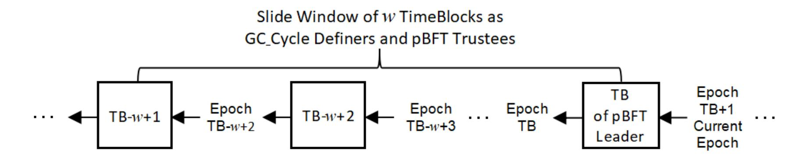
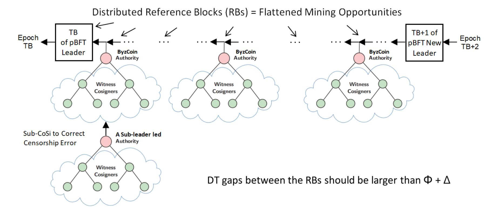

{0}------------------------------------------------

# LotMint: Blockchain Returning to Decentralization with Decentralized Clock

Wenbo MAO and Wenxiang WANG LotMint DAO Beijing, China lotmint.io

June 11, 2020

#### Abstract

We present LotMint, a permissionless blockchain, with a purposely low set bar for Proof-of-Work (PoW) difficulty. Our objective is for personal computers, cloud virtual machines or containers, even mobile devices, and hopefully future IoT devices, to become the main, widely distributed, collectively much securer, fairer, more reliable and economically sustainable mining workforce for blockchains. An immediate question arises: how to prevent the permissionless network from being flooded of block dissemination traffic by a massive number of profit enthusiastic miners? We propose a novel notion of Decentralized Clock/Time (DC/DT) as global and logical clock/time which can be agreed upon as a consensus. Our construction of DC/DT practically uses distributed private clocks of the participation nodes. With DC/DT, a node upon creating or hearing a block can know how luckily short or unluckily long time for the block to have been mined and/or traveled through the network. They can "time throttle" a potentially large number of unluckily mined/travelled blocks. The luckier blocks passing through the time throttle are treated as time-tie forks with a volume being "throttle diameter" adjustably controlled not to congest the network. With the number of time-tie forks being manageable, it is then easy to break-tie elect a winner, or even to orderly queue a plural number of winners for a "multi-core" utilization of resource. We provide succinct and evident analyses of necessary properties for the LotMint blockchain including: decentralization, energy saving, safety, liveness, robustness, fairness, anti-denialof-service, anti-sybil, anti-censorship, scaled-up transaction processing throughput and sped-up payment confirmation time.

Key Words and Phrases: Decentralized Clock/Time, Permissionless Byzantine Fault Tolerance Consortium, Consensus on Luck, Lucky BFT Protocol, Large Deviation Problem (LDP), Featuring LDP

{1}------------------------------------------------

# 1 Introduction

Satoshi Nakamoto masterminded Bitcoin [1] running on the internet to have achieved a global currency system. The currency system's transaction database (DB) is decentralized having no part endangering a single point of failure, and being autonomously maintained by permissionlessly participated nodes over a peer-to-peer (P2P) network. Bitcoin with these two remarkable properties has been running in good order for more than a decade. With Bitcoin's great success, Nakamoto made a refutation demonstration to the area of study of Byzantine Fault Tolerance (BFT), e.g., [2, 3], that over the internet it is robust to reach message consensus for distributed computing by a planet scale open membership BFT consortium. The BFT area of has long established a theoretical result named FLP Consensus Impossibility [4]. A simple version to state the FLP Consensus Impossibility can be as follows. It is impossible for a consortium of computing and communication nodes, even permissioned, to reach a quorum consensus of agreeing on a message by disseminating—or exchanging/discussing, as more usually used communication phrases by the BFT area of study—messages over an asynchronous network, e.g., the internet. The fundamental reason behind the impossibility is that the participation nodes contain malicious opponents who can, under the guise of network fault, delay the consortium from reaching a consensus, and the delay can even last indefinitely.

Nakamoto made an innovative and enabling reformulation to message dissemination in BFT protocols: allowing for dealing with only one message in a quite long time interval. To achieve so, Nakamoto set a high cost computational difficulty for nodes to solve a so-called "block mining" puzzle in order to qualify disseminating a message to the network. At such a high difficulty, for most of the time most nodes shall hear only one message in dissemination. In very small fractions of exemption, let the network split and compete, until one of the partitions strikes luck to lead message dissemination in the "most of the time" case. Bitcoin indeed answered the FLP Consensus Impossibility with an evident refutation, however at a heavy toll: tremendous waste of energy. What is worse, we shall discuss further.

Block mining in Bitcoin is to brute-force evaluate a cryptographic hash function, until finding a valid output with a publicly agreed (proof) and easily measurable amount of computation (work). This formulation of puzzle solving with a hard to produce and easy to validate evidence was originally proposed by Dwork and Naor in 1992 to combat email spam [5], and the term Proof-of-Work (PoW) was coined by Jakobsson and Juels in 1999 [6]. Nakamoto's application of PoW in Bitcoin includes a clever incentivization feature. A successfully mined block contains not only crypto coins, but also transactions which the customers want to enter DB as a fee-paying service. Incentive block mining encourages not only a micro-cosmic egoism behavior for active participation of mining, but also a macrocosmic altruism behavior for most of the unsuccessful miners to eagerly propagate blocks and transactions in dissemination by successful miners and customers. This collective altruism behavior is from the fact that only following the successfully mined block, and processing as many as possible transactions, can a miner maximize its economy gain. In our observation, 

{2}------------------------------------------------

prolific post-Bitcoin BFT works have not been paying due attention to the importance of incentivization mechanisms and the like profitable rule of the game to encourage good behavior out of nodes for their BFT games.

Profitable block mining would attract enthusiastic miners' work and inevitably generate a flood volume of block dissemination traffic to congest the network. Nakamoto envisaged this and calculatedly targeted a high difficulty for the PoW puzzle. Let us use "block arrival times" to describe a random time variable in the view of a node in the P2P network that either the node solves the PoW solution by brute-force hash function evaluation, i.e., the block is created by the node itself, or the node hears a block in dissemination over a propagation network. Nakamoto formulated block arrival times in "a single lane quiet message dissemination traffic for a long time and for most of the times" as follows. The combined hash power of all miners in the entire P2P network should make an average one block to arrive every 10 minutes.

The random time variable of block arrival times, in particular for blocks containing messages of large sizes, such as many megabytes as already being the status quo for Bitcoin [7], have large deviations which do not sensibly decrease by increasing the mining difficulty. "Large Deviation Theory" is a long established area of study, with which mathematicians see a need of tweaking limit theorems and laws of large numbers, and physicists see a need of improving energy efficiency, see, e.g., [8]. Nakamoto was able to succeed the innovative simplication to the formulation of BFT message dissemination, thanks to the fact that block arrival times have large deviations.

Looking deeper into bitcoin's block arrival times as LDPs, Nakamoto actually offered a one-size-fits-all sulotion to two problems in need of drastically different desired difficulties. The average ten-minute-one-block-arrival time is, on the one hand, way unnecessarily too quiet and low efficient for block dissemination traffic congestion control, and on the other hand, yet still insufficient for chain fork prevention. Indeed, despite the tremendous wastage of energy in block mining, Bitcoin still occasionally forks. Prevention of chain fork using very highly targeted mining difficulty has well-known bad consequences. Perhaps what happened to be the most unanticipated for Nakamoto would be miners' centralization.

Bitcoin miners have been for years in an arms race of employing ever increasingly larger and more powerful, some purposely designed, mining hardware, even aggregating, aka pooling, a mass number of such, competing to gain mining upper hand. A status quo of huge centralization for Bitcoin mining has resulted. Only can fewer and fewer, and each being more and more powerful, miners stay surviving the game. The highly centralized Bitcoin miners are factually demanding very strong trust over them, and thereby undermining security, reliability, fairness, service stability, and threatening the very sustainability, of Bitcoin. Moreover, with its infamously low transaction processing throughput and long conformation latency, Bitcoin is not suitable for global online commerce transactions applications. Even for its few exhibited successful applications, e.g., financial investment, Bitcoin has also taken the blame for tremendous wastage of electricity.

The average 10-minute long silence of no block to enter transactions means that Bitcoin

{3}------------------------------------------------

also has a very poor transaction processing capability. Some established large miners hope that enlarging block size can include more transactions and improve the transaction processing scalability. Some of the Bitcoin miners, e.g., a "Bitcoin Unlimited", aka Bitcoin Cash or BCH, even demand to place no limit to the block size, and went a hard-fork split from Bitcoin in August 2017 [9]. Ironically, only a little more than one year later in November 2018, the "Bitcoin Unlimited" chain encountered another hard-fork split to "Bitcoin-SV" (Satoshi Version), went back to the oldest version of Bitcoin (Ver 1.0) [10]. The block size issue has been with controversial disputes and heated power bid in the Bitcoin miners for years. In general, already established large miners prefer, and with more power to mine blocks of, larger block sizes. Unfortunately fairness suffers in this power bid, not only giving larger miners an advantage over smaller miners, but also having led to centralization, where the mining power tends to be concentrated under a single controller, breaking the basic premise and vision of Nakamoto that security, stability, and health growth of blockchain be based on miners' decentralization.

The current status quo of miners centralization for Bitcoin has unfortunately compromised Nakamoto's original premise of miners decentralization by permissionless participation.

### 1.1 Our Offer: A Decentralized Clock for P2P Computing

Information security as service provisioning has also been in a long evolution to becoming more and more centralized. Security duties are mainly deployed at the message origin and destination, and in many cases even heavy-duty loaded onto some centrally trusted third parties. Bitcoin pioneered a new and disruptive direction to securing information—at least for its specific information of a payment DB: P2P decentralization can secure information with a surprising strength. In Bitcoin, message transmission from Alice to Bob necessarily goes through a novel relay service which we shall name peer knowledge intermediary service. In general, there are a plural number of intermediary nodes in-between Alice and Bob, peer knowledge intermediary service can enhance a safety property for the security service.

A very basic, in our belief of pivotal importance, quality of peer knowledge is the current time on a global clock. For blockchains, a global time mustn't come from a centralized service, e.g., Network Time Protocol (NTP) [11] which is although pervasive, and even sufficiently precise, however unfortunately unreliable with no guarantee for liveness or trustworthiness. A global time for a blockchain must have a robustness property, i.e., it will never stop ticking in whatever form of system component failure. In Section 3 we shall formulate, in a practical construction, a novel notion of decentralized clock/time (DC/DT). Our construction uses peer nodes' private clocks. The qualification for a private clock to join DC/DT composition is very basic: having a stable ticking cycle. There is no need for the participation private clocks to be synchronized. This private clock qualification assumption is undoubtedly very reasonable, because it would be very hard to make a clock with nonstable cycles, mechanically or electronically. Interestingly, it shall become apparent that 

{4}------------------------------------------------

our DC/DT might probably be the first practical realization of a clock to have unstable cycles.

An intermediary peer node, upon hearing a block in dissemination, now its eager propagation action shall, in addition to verifying a required PoW computational bar as it should do in all existing PoW mechanism blockchains, also apply its DT peer knowledge to check if the miner was lucky enough to have created the block within a required short time, and if the block has been lucky enough to have travelled from the miner to the current location also within a required short time. A block will be dropped by a DT peer knowledgeable node upon deeming unluckiness. Thus, our novel notion of DT can "time throttle" the traffic volume of block dissemination. With an algorithm adjustable consensus not only on the PoW computational difficulty, but also on the "diameter" for the time throttle, we can, for the first time in PoW blockchains, have the traffic volume of block dissemination to be under a control not to flood congesting the P2P network. With adjustable algorithm controls, we shall of course prioritize to have the PoW computational bar much lowered, so that a vast number of personal computers, cloud virtual machines or even containers, can return to being the main mining workforce, and for the blockchain mining industry to return to decentralization.

Then what to do with chain forks? Blocks lucky enough to have passed through the time throttle are treated as time ties. Indeed, with the network being asynchronous with message delivering latency, or even out of order, it is well possible for an earlier broadcast block to be heard later than another later broadcast block. Vaguely regarding blocks which have passed through the time throttle as time-ties is thus a correct treatment. Fortunately, the number of time-tie blocks have been time-throttle controlled to be at a non-flooding level and is manageable. We can use well-known cryptographic techniques to break ties. Unlike all other PoW blockchains to date which use solely a PoW computational bar to be able to elect one single miner and thereby waste (electricity) of all rest of the competing miners, a crypto tie break can select a plural number of won miners, with an ordered sequence for them to be decided cryptographically or in other words digitally. We therefore can imagine that with DT for blockchains, P2P computers may evolve from the current analog-ish status quo to a digital fashion, even with "multi-core" feature.

Muscularly powerful PoW miners, e.g., those which are enjoying monopoly in Bitcoin mining, are of course also welcome to mine LotMint blocks. Though now they need to be lucky, not just muscular.

The remainder of our work presentation is organized as follows. In Section 2, we provide an intuitive explanation on the working principle for our blockchain. In Section 3, we define and construct a novel notion of Decentralized Time (DT) out of using the coarse definition timestamps of Bitcoin. In Section 4, we specify the LotMint blockchain protocol, and provide analysis of important security properties of blockchains. Finally, in Section 6, we conclude the current work.

{5}------------------------------------------------

# 2 Intuition: Consensus on Luck

In our view, Bitcoin's pioneer practice on maintaining "a single lane quiet message dissemination traffic for a long time and for most of the times", although having a very low efficiency, should be very useful for the BFT area of study to rethink of on what they really mean by message exchange, discussion, and even to be consensus agreed upon. The LotMint blockchain, which we believe to be a BFT consensus protocol, shall do so on reformulating its BFT consensus. To increase efficiency, we shall parallel message dissemination, and even encourage a sizeable but non-flooding volume of message dissemination traffic. What our BFT consensus shall agree upon is not on any describable syntactic or semantic sense of a message, but on a much vaguer idea that a node, upon hearing a message, can locally judge deeming whether or not the message is in-time lucky. Let us explain what we mean by an in-time lucky message.

A byproduct and also rather easy consensus for Bitcoin miners to reach is block timestamps which are recorded in Bitcoin blocks. In Section 3.1 we shall see that Bitcoin has specified block timestamp with very large room for error toleration. We must pay attention to the following very important quality of Bitcoin block timestamp: the consensus on agreeing the validity of block timestamps is an in-writing form of reliability and with global visibility by all nodes in the network, which have accepted the blocks containing the timestamps. The time progressing gap between two consecutive timestamps measures an average time length spent on mining plus propagating a related block. This gap is therefore indeed a "cycle" for a global and logical clock. Thus, P2P network does can have a global clock, although a quite imprecise one.

The LotMint blockchain shall make a good use of such an imprecise global clock. However, we shall not let such an imprecise clock have anything to involve in trying to make any syntactic or semantic sense out of a message agreement consensus, or an ordered sequence out of the time events of message dissemination (as having long been very unsuccessfully attempted by many BFT consensus efforts). The use of this imprecise global clock for LotMint is for figuring out a rather imprecise scenario which we describe as follows. Let a node locally judge and express that it hears a message "in-time". Upon such imprecise intime expressions reaching a BFT quorum, the in-time message qualifies, again imprecisely, a time-tie set membership. Fortunately, our imprecise timestamps defined imprecise global clock is good enough to make and express imprecise in-time judgments, which can effectively "throttle" the quantity of applicants for the time-tie membership. Then, algorithmic ways to order those time throttle passing non-populous time-tie members abound.

We shall see that this "consensus-on-luck" formulation will have two meanings for an in-time lucky message: (1) "computation-lucky" for the message to have been created in time, and (2) "communication-lucky" for the message to have found a quick route to reach recipients in time. Case (1) is for a miner to have PoW mined a block luckily, and Case (2) is for a luckily mined block to have been propagated through the P2P network luckily. In fact, the both luckiness are possible thanks to the fact that these random time variables belong 

{6}------------------------------------------------

to large deviation problems (LDPs) as we have identified in Section 1. Unlike Bitcoin's setting a very highly cost mining difficulty to avoid concurrent deviations, we shall choose to feature concurrent deviations for high efficiency.

Interestingly and thankfully, "hearing in-time messages by a BFT quorum", although not a very precise notion, is a meaningful consensus to be agreed upon over a network containing faults. At the birth of such a network, its architects had envisaged these faults and conceived for it to keep being added on ampler and ampler, and more and more redundant routes. To date and in future, this network has been and will be evolving to ever growing likelihood that a message on such a network may find luckier route(s) to reach its destination. It is the ever growing redundant for this network that can make a message to sometimes strike a time-tie luck, and even for the luck to be distributively and independently agreed by a quorum of such redundant nodes.

Perhaps, the BFT area of study might be added an optimistic and opportunistic nickname, such as "Lucky BFT", for modifying consensus protocols running on the imprecise and great network, i.e., the internet, we are using?

# 3 Decentralized Time

## 3.1 Bitcoin's Treatment of Time

Haber and Stornetta in 1991 [12] made an ingenious observation that repeated chaining a cryptographic hash function can model some basic properties of time very well: easy to forward compute, and difficult to revert or tamper with. They proposed to use their hash-chain data structure to provide a timestamping service. It was the adoption of the hash-chain data structure by Bitcoin that paid a long overdue recognition to the invention of Haber and Stornetta. However, Bitcoin's inclusion of timestamps in its chained blocks, named "block timestamps" [13], was not for a serious timekeeping use. Quoted below is Bitcoin's specification for its block timestamps:

(... timestamps') In addition to serving as a source of variation for the block hash, they also make it more difficult for an adversary to manipulate the block chain. A block timestamp is accepted as valid if it is greater than the median timestamp of previous 11 blocks, and less than the network-adjusted time + 2 hours. "Network-adjusted time" is the median of the timestamps returned by all nodes connected to you. As a result block timestamps are not exactly accurate, and they do not need to be. Block times are accurate only to within an hour or two.

From the above specification we can see that Bitcoin's use of timestamps has actually little to do with intending to reach a global time consensus. It is even possible that a block timestamp can be a lower (earlier) value than its predecessor. We can understandably 

{7}------------------------------------------------

consider a couple of reasons why Bitcoin's timestamps cannot make a meaningful time sense:

- Bitcoin miners can lie about timestamps, and miners' private clocks may not be synchronized. There seems not a practical way to implement, execute or maintain a due diligence standard for the permissionlessly participated miners to behave nicely. (Our work exactly is to formulate a practical method to achieve these.)
- Time ticking forward as state progress obeys unconditionally some natural laws. E.g., it cannot be reverted, and it cannot be overtaken. However, the state of the Bitcoin blockchain can be overtaken by a longer chain fork, and can even be reverted upon revelation of a secretly mined longer chain fork.

It is understandable to see that Bitcoin has not got a good way to use its block timestamps for a credible reference of time. Indeed as admitted in its specification, block timestamps are mainly about to add some noise to the hash function as desirable entropy. As of this writing, such a no-good use of blockchain timestamps has been a status quo situation for blockchains. None of the subsequently proposed PoW mechanism permissionless blockchains in attempt to improve Bitcoin, to the best of our knowledge, has really paid any attention to a meaningful use of timestamps.

However, even permitting a rather coarse error room for miners to record timestamps in their blocks, Bitcoin block timestamps still do inherently contain some property of time. For instance, the block timestamp values do monotonically increase in the time progress direction, and by and large they record time length spent on mining a block plus that on transmitting it throughout the network. What in our view, and to be used in our exploitation, of a very important quality of the collectively defined timestamps by a slide window of previous miners is: the timestamps recorded in the slide window of blocks form an in-writing consensus for reliable use by all peer nodes in the blockchain network.

We shall construct a consensus algorithmic method which takes in, as in-writing consensus, block timestamps as in Bitcoin specification, and output decentralized time (DT) to also be a global consensus. A global consensus time for a blockchain is very useful. Although the debut application of our novel notion of DT is a time throttle for controlling the volume of block dissemination traffic not to reach a flood level, it would not be an overstatement that the notion of DT may play a role in upgrading the "analogue-ish" computation status quo of blockchains toward a "digital-ish" beginning.

Let us describe a consensus algorithmic method for permissionlessly participated nodes in a P2P network to agree upon a global time as a basic and fundamental consensus.

## 3.2 Global Clock Cycle Mapping to/from Private Clock Cycles

The block timestamps specification of Bitcoin, although rather inaccurate, is good enough for permissionless blockchain nodes in a P2P network to reach a consensus, with in-writing 

{8}------------------------------------------------

reliability, on a time progress gap. Let TB denote what we name "time block" which is a newly accepted block with confirmation, i.e., TB is newly known by the P2P network nodes to have permanently appended to the blockchain. Let a parameter number w > 1 be the size of a slide window which has defined "the median timestamp of previous (w =) 11 blocks" as we have quoted as the Bitcoin timestamp specification in Section 3.1. This slide window contains w consecutively chained blocks leading to and including TB. The w timestamps which are respectively recorded in these w blocks, will define a global consensus on a time progress gap.

Let medianw(TB) denote the w-wide median of the w block timestamps. By adding a variable TB as input to the median, we not only mean that the median is computed using the block timestamps in the w blocks leading to and including TB, but also allow us to use the formulation as a random time variable for the event of hearing TB by a peer node in the P2P network.

The difference between two consecutive median block timestamps:

$$\mathrm{median}_{w}(\mathrm{TB}) - \mathrm{median}_{w}(\mathrm{TB} - \mathbf{1}) = \frac{\mathrm{timestamp}(\mathrm{TB}) - \mathrm{timestamp}(\mathrm{TB} - w + \mathbf{1})}{w} \tag{1}$$

represents the median time progress gap which has been spent on mining plus propagating throughout the P2P network an average of these w blocks. Although the difference in the right-hand side of Equation (1) only explicitly shows two timestamps of the respective two blocks at the two ends of the slide window, nevertheless in fact, all the w blocks, in-between and including TB and the TB − w + 1 block, have participated in influencing the consensus forming of the median time gap. Therefore, provided that TB has been with confirmation accepted (so have the preceding w − 1 blocks), this time progress gap is indeed collectively thought, and more importantly, explicitly expressed in writing and hence is reliably readable by all state up-to-date nodes in the blockchain.

Considering the extreme error forgiving specification of Bitcoin's block timestamps, there exists low probability cases for the median difference in Equation (1) to be negative. Let the consensus algorithm use a least integer i ≥ 0. We formalize a "global clock cycle" (GC Cycle) as follows:

$$\texttt{GC\_Cycle}(\texttt{TB}) = \frac{\texttt{timestamp}(\texttt{TB}) - \texttt{timestamp}(\texttt{TB} - w + 1 - i)}{w + i} \tag{2}$$

for the least non-negative integer i making GC Cycle(TB) > 0. Value GC Cycle(TB) is a consensus time progress gap and has an in-writing reliability to be visible to every peer node in the P2P network upon accepting and confirming TB. Let N be such a peer node that, upon hearing TB, also sample and record time on its own private clock. We can therefore likewise define PrivateCyclesN (TB) to be "private clock cycles " of N:

$$PrivateCycles_N(TB) = \frac{PrivateClock_N(TB) - PrivateClock_N(TB - w + 1 - i)}{w + i}$$
 (3)

{9}------------------------------------------------

where i is the same as that used in Equation (2). Since peer nodes do not synchronize their private clocks (indeed there is not a practical way to do so), each peer node N has, on a private 2D plane, a private line of the following slope:

$$\frac{\texttt{GC\_Cycle}(\texttt{TB})}{\texttt{PrivateCycles}_N(\texttt{TB})} \tag{4}$$

The x axis of the private 2D plane represents time progress on N's private clock, and the y axis represents time progress on the global and public consensus clock. We notice that since GC Cycle(TB) > 0, so must PrivateCyclesN (TB) > 0, and thus the private slope (4) and a private line function to be defined in a moment, of the node N, are mathematically meaningful.

Let Evt denote an event occurring after TB. Then a node N, upon hearing (including self generating) Evt, can use a private line function to check or express (the express case is for self generating) the occurring time of Evt as a future time which is progressed from TB. The following is the private line function of N for it to compute the occurring time of Evt in a global consensus time expression:

$$\delta_N(\texttt{TB}, \texttt{Evt}) = \frac{\texttt{GC\_Cycle}(\texttt{TB})}{\texttt{PrivateCycles}_N(\texttt{TB})}(\texttt{PrivateClock}_N(\texttt{Evt}) - \texttt{PrivateClock}_N(\texttt{TB})) \quad (5)$$

Example 1 Let us add our novel notion of DT to Bitcoin, with TB to have been appended to the chain with confirmation. Let GC Cycle(TB) ("seconds") be a global clock cycle to have been mandated by 11 previous won miners, ahead of, and including the miner of TB, using 11 coarsely provided in their respective blocks. Let a node A (respectively, B) have a faster (resp., slower) than usual private clock to have measured this global clock cycle matching PrivateCyclesA(TB) = 20 minutes (resp., PrivateCyclesB(TB) = 5000 milliseconds). Let A and B now hear a new block NewBlock after TB. The private clock of A (resp., B) measures PrivateClockA(NewBlock) − PrivateClockA(TB) ≈ 15 minutes (resp., PrivateClockB(NewBlock) − PrivateClockB(TB) ≈ 4000 milliseconds). Both nodes express the occurring time of NewBlock to be a time progress from TB, in global consensus expression, using their respective private extrapolation formula (5) as:

$$\delta_A({\rm TB, \ NewBlock}) \approx \frac{{\rm GC\_Cycle}({\rm TB})}{20} \times {\rm 15} = \frac{{\rm GC\_Cycle}({\rm TB})}{5000} \times {\rm 4000} \approx \delta_B({\rm TB, \ NewBlock}).$$

Therefore, both nodes should express the consensus time for NewBlock to be about T + 1.25 GC Cycle(TB) ("seconds"), where T is the consensus time when TB occurs.

The length of GC Cycle(TB) is an average time that some w + i miners have spent on mining and propagating a block in the blockchain. Taking an example for adding DT to Bitcoin, this time length varies with the state of the chain updating, and is at an average 10-"minute", or 600-"second" level. Here, and in Example 1, we have quoted the names for the unit of global consensus time to mean the fact that, although the length varies, such a unit is a real time progress gap and has been collectively mandated in writing by these previous w + i miners, and has been heard by the peer nodes which have accepted 

{10}------------------------------------------------

TB. The peer nodes can use their independent private clocks' cycles to count the length of a global clock cycle. The counting using a finer granular unit on private clocks would ease the use. Again, taking Bitcoin with DT for example, the peer nodes can use millisecond (or microsecond) as their private clock cycle unit, to count the "6 × 105 milliseconds" (or "6 × 108 microseconds") duration of GC Cycle(TB).

Since both formulas (2) and (3) compute time progress gaps being differences between two points on time, any reference information to the beginning or the end points on time, such as numbers to name year, month, date, hour, ..., have been subtracted away. Peer nodes can compute these time progress gaps without needing to synchronize their private clocks. A node can of course adjust time on its private clock, e.g., synchronize clock with its neighbors' or a time server's, and of course must also accordingly adjust its recorded PrivateClock values in order to consistently use the formula (3). Obviously, private clock time adjustment should be conducted manually. Some operating systems have automatic time adjustment/synchronization features. These automatic time changing features should be manually disabled, e.g., using "timedatectlset − ntp" command on Linux, or "HKEY LOCAL MACHINE" toolkit on Windows, in order to properly use our new DT technology.

If a node even wants to adjusted its private clock speed, i.e., the length of the private clock cycle unit, it can certainly do so too. After adjusting, the node should wait for after w + i new blocks having been accepted before it can compute new line slopes for its private mappings in-between the global clock cycle and its having-adjusted-speed private clock cycle, and start using a new private-to-global-time-conversion formula.

We can provide an intuitive explanation on why different private clock speeds, provided a speed is stable, can cause no problem on sensing/expressing global consensus time for an event objectively. Clearly, a faster/slower private clock corresponds to a smaller/larger private slope in formula (4) for the line formula (5). Then the private-to-global-conversion using the private line to extrapolate a near future time in the global consensus expression, the stable and hence unchanged faster/slow private clock will use the smaller/larger private slope to multiply to the unchanged faster/slower private clock measure to map back.

We should remind the reader a very important fact. The DT method does not require a participation node to have a high quality private clock. A participation clock only needs to be stable, and this is the only assumption for our DT technology. This assumption is undoubtedly very reasonable, since it would be very hard to make a clock with non-stable cycles, mechanically or electronically. (Using a random source might be an easiest way to make a non-stable clock; however having a reliable random source is itself a non-trivial problem.)

### 3.3 Recording Global Consensus Time as Input to a Block

Let a miner M reference a time block TB to mine a new block NewBlock to extend TB. In Section 3.2 we have described the method to express the creation time for NewBlock 

{11}------------------------------------------------

in global consensus time expression which is a multiple of GC Cycle(TB) being added to T which is the creation time for TB. Let us now see how NewBlock can record, as input, its creation time in global consensus time expression.

In the mining, M shall apply the private-to-global-time-conversion formula (5) to compute

$$\mathtt{Broadcast}_{M}(\mathtt{NewBlock}) = \mathtt{T} + \delta_{M}(\mathtt{TB}, \mathtt{NewBlock})$$
 (6)

The expression BroadcastM(NewBlock) is called "M self-claimed broadcast time". In each instance of evaluating the mining hash function, M shall input this global consensus time expression, together with other input values such as the referenced block TB, etc., to the hash function.

The amount of time spent on one instance of evaluating hash function, i.e., x → h(x), is negligible in comparison to an average amount of time spent on propagating a block over the P2P network; the latter time even includes time spent by a plural number of propagators to validate the block, where each validation involves a hash function evaluation, plus the plural number of hops of network delay. Therefore when applying formula (6) to compute BroadcastM(NewBlock), M shall use the current time on its private clock.

In most of the above-described mining trials, M would not be so lucky to be able to solve the PoW puzzle. Then M would have to repeat the above mining process many times; each time M has to use an up-to-date private clock time in order to compute an up-to-date BroadcastM(NewBlock) as a new self-claimed broadcast time value to input to the hash function. Upon striking luck to solve the PoW puzzle, M should of course immediately broadcast the new block without any delay, or else it would waste its luck.

To this end, we know that a newly mined block NewBlock contains as an input value BroadcastM(NewBlock). That is, a miner of a block can input to the block a global time expression to state how long the global time the miner has spent on PoW mining the block.

The formula (6) is derived from a special case of mining NewBlock by referencing a time block TB in which, as an input, the claimed broadcast time is T. In Section 4 we shall describe the LotMint blockchain protocol and see that the LotMint miners are provided with many mining opportunities in a wide and flattened time spectrum to mine new blocks by referencing a chain of reference blocks. Let RB1, RB2, ..., RBn be a chain of reference blocks which have been respectively mined by miners M1, M2, ..., Mn, with RB1 referencing TB, ..., and RBn referencing RBn−1. Suppose that miner M has accepted the latest reference block RBn and references it to mine NewBlock. Upon M mining success, the claimed broadcast time as an input value in the block NewBlock would be:

$$\mathtt{T} + \delta_{M_1}(\mathtt{TB},\ \mathtt{RB}_1) + \delta_{M_2}(\mathtt{RB}_1,\ \mathtt{RB}_2) + \dots + \delta_{M_n}(\mathtt{RB}_{n-1},\ \mathtt{RB}_n) + \delta_{M}(\mathtt{RB}_n,\ \mathtt{NewBlock}).$$

## 3.4 The Use of Decentralized Time

For a miner to win a right to DB writing, it needs not only succeed mining a block by solving a PoW puzzle, but also influence as many as possible nodes in the P2P network for 

{12}------------------------------------------------

them to accept and/or even eagerly propagate its block. Now let us describe how our novel notion of DT can let miners, big or small, have such an influencing power over other peer nodes for them to eagerly accept processing or propagating the miner's block.

Let Φ denote a consensus algorithm adjustable variable to represent a length of time and play the role of a time throttle diameter for a "computation-lucky" control. The following is a "time throttle passing through validation" formula which makes use of DT to enable a judgment if a block NewBlock which references extending an accepted reference block RB has been mined quickly enough by a miner M:

$$\delta_M(\mathtt{RB},\ \mathtt{Broadcast}_M(\mathtt{NewBlock})) < \Phi.$$
 (7)

Recall our description in Section 3.3, that BroadcastM(NewBlock) is an input value to the mining hash function. Thus, validating Inequality (7) is an additional rule for the PoW puzzle that the miner M must prove to satisfy.

Notice that PoW mining time as a random time variable has a large deviation, i.e., the hash evaluation PoW mining mechanism is a large deviation problem (LDP). As will become more and more apparent through our technology exposition, unlike Bitcoin's setting a very highly cost mining difficulty to avoid concurrent deviations, we shall choose to embrace and feature concurrent deviations for high efficiency.

At a first glance it seems that the miner M may dishonestly input to the hash function a false self-claimed broadcast time which M should set to be earlier than an actual computation-lucky, or even -unlucky, value. Below let us explain why honestly expressing BroadcastM(NewBlock) is the best strategy for M.

Let ∆ denote another consensus algorithm adjustable variable, also to represent a length of time and play the role of a time throttle diameter for a "communication-lucky" control. Similar to the case of using DT to judge computation-lucky for mining a block, we shall also use DT to enable a judgment if a block has been communication-lucky. The variable ∆ is designed for controlling the length of time allowed for a small size—typically less than 100 bytes—block from being broadcast to, and till having propagated throughout, the entire P2P network. Our experiments on the Bitcoin network have shown that ∆ is typically less than 5 seconds for more than 90 percent of the experiment samples of small sized blocks, to agree to the investigation result reported in [14].

Let RP denote a node in the P2P network which is, hopefully an eager receiver or propagator for newly mined blocks. Let HeardRP (NewBlock) denote a time event of RP hearing BM from the P2P network. Upon hearing BM containing as input an M self-claimed value BroadcastM(NewBlock), RP, in addition to validating that BM has solved the PoW puzzle as in all other PoW mechanism blockchains, should now of course also check whether or not the block is both computation- and communication-luckily valid. To do so, RP should apply its own private-to-global-time-conversion formula (5) to compute HeardRP (NewBlock) by using its own private clock and with respect to the hearing time of the reference block RB. The following is the validation formula for a receiver/propagator RP to validate whether 

{13}------------------------------------------------

or not a miner M has been both computation- and communication-lucky:

$$\mid \mathtt{Broadcast}_{M}(\mathtt{NewBlock}) - \mathtt{Heard}_{RP}(\mathtt{NewBlock}) \mid < \Delta.$$
 (8)

where BroadcastM(NewBlock) is an in-writing message in NewBlock provided by the miner M, which must be checked by RP to be computation-luckily valid, and HeardRP (NewBlock) is computed by RP. Notice that the validation of Inequality (8) is performed on the absolute value of the difference between the miner's self-claimed value BroadcastM(NewBlock), and RP's hearing time HeardRP (NewBlock). The best strategy for M is to self-claim its broadcast time honestly, since only in so doing can it influence most nodes near and far. Indeed, if M had claimed BroadcastM(NewBlock) to be ∆ too earlier/later, it was to risk the block to be dropped by nodes which are distant/close to it. Either cases mean that the miner lowers its influencing power for persuading as many as possible peer nodes to help it. In particular, if M falsely claims an earlier than actual broadcast time, perhaps trying to turn a computation-unlucky NewBlock into computation-lucky, then it is less likely to pass Inequality (8).

Propagating a block through the gossip protocol in the P2P network as a random time variable is again an LDP problem due to redundant diversity of routes in the P2P network. As in the case of our embracing computation-lucky LDP, we again embrace communicationlucky LDP and make use of it as a feature.

With miners' decentralization being the most important objective for our work, the LotMint blockchain shall target a rather easy PoW mining difficulty to welcome a desirable quantity of computation-lucky blocks. For a computation-lucky block, if it again is judged communication-lucky by as many as possible RPs, then the block increases the probability to be a time-tie fork to extend the reference block RB. In Section 4 when we describe the LotMint blockchain protocol, the reader shall realize that it is very important for a miner to be able to influence at least a quorum fractions of the peer nodes. This is because the kernel consensus algorithm of our protocol is a Byzantine Fault Tolerant (BFT) protocol, in which a quorum of the BFT trustees agreeing a block to be both computation- and communication-lucky qualifies the block to time-tie fork the reference block.

We shall also see in our protocol description that LotMint shall provide miners with a wide spectrum of time opportunities in the form of many reference blocks RBs for them to try luck. The wide spectrum of mining opportunities is designed to flatten the curve of block dissemination traffic. This way, the P2P network can be better utilized to increase miners' communication-lucky probability. Moreover, our protocol shall also have an incentivization design feature to make receivers or propagator nodes RPs eager to process or propagate computation- and communication-lucky blocks.

# 4 The LotMint Blockchain

In our introduction discussion we remarked very highly that Bitcoin sent an innovation shock wave to the Byzantine Fault Tolerance (BFT) area of study. Our high regard is not 

{14}------------------------------------------------

an overstatement. Indeed, after Bitcoin, prolific works to combine BFT and blockchain technologies have been appearing as both areas of study find sharing research topics of distributed computing and multi-party computation.

One of the BFT+blockchain combination works is ByzCoin [15]. In our view, Byz-Coin is uniquely innovative among the BFT+blockchain combination work in that its BFT consensus consortium is for open participation, i.e., like Bitcoin, ByzCoin is a permissionless BFT protocol. The BFT algorithm that ByzCoin applies is Practical Byzantine Fault Tolerance (pBFT) work of Castro and Liskov [3]. Like all other BFT technologies using close, i.e., permissioned, consensus consortium, pBFT was also not designed for scalability to an open membership consortium of trustees. ByzCoin builds pBFT atop a multi-party signature protocol named CoSi [16], which organizes a plural number of trustees in a tree structure and thus can aggregate hundreds or thousands of trustees' signatures as collective witnessing a message with low costs in communications and storage space. With Bitcoin-like open membership feature for pBFT trustees, and CoSi scalability for multi-party computation quality of security, ByzCoin make significant progresses from each of its ingredient technologies.

The ByzCoin authors conceded that their use of the Bitcoin PoW mining mechanism remained a major limitation, and called for finding a suitable replacement for an important further work. We agree to the ByzCoin authors' self-assessment on the Bitcoin PoW mining limitation. However regrettably, we have an additional critical conservation about ByzCoin's plain application of the Bitcoin PoW mining. It is more in the following sense. The virtue of multi-party computation as a much stronger security service that ByzCoin has endeavored by applying pBFT and CoSi, regrettably, played no role in a more important part of quorum consensus: the election of the BFT leader, and hence in turn the election of all consortium trustees. The consortium trustees election was simple and brutal might-is-right muscular say by a single won node.

The LotMint blockchain offers a block mining replacement as an answer to the further work call from ByzCoin to improve its block mining. Let w be an integer. The LotMint BFT trustees consortium is, like ByzCoin, composed of the w won miners who form a chain of w-width slide window. The latest won miner, or the creator of the latest leader block in the w-width slide window, is the leader of the BFT trustees consortium. This leader is elected by a BFT quorum agreement. In our view, this way of offering a block mining replacement for ByzCoin is not only to answer the further work call for a specific blockchain scheme, but also to make a more general and independent contribution to the area of study where BFT meets blockchain.

Figure 1 and Figure 2 illustrate respectively the LotMint blockchain's "inter-epoch" and "in-epoch" chain structures of the LotMint blockchain.

As in ByzCoin, the genesis beginning of LotMint shall bootstrap from a Bitcoin like mining, to establish a slide window of w trustees consortium. The block timestamps which are recorded in these w genesis blocks shall define GC Cycle(TB) for the global and logical clock of the blockchain. The time of bootstrapping the genesis beginning blocks needs great

{15}------------------------------------------------

Figure 1: The LotMint Blockchain

care, as this is the only time in the LotMint blockchain to possibly occur secret mining or chain forks. In the following protocol description we shall see that once a BFT trustees consortium is formed as the w recent won miners for the unique recent history of chained blocks, the unique trustees consortium will not allow any miner to secretly mine ahead of time, and will not fork block appending. Suppose that no occurrence of such attacks in the genesis beginning of the blockchain. Let TB be the BFT trustees leader of the first epoch of the LotMint blockchain.

Figure 2: An Epoch (TB + 1) of the LotMint Blockchain (the component figure "Witness Cosigners" is from [16] which is also the main BFT component for ByzCoin [15])

The LotMint blockchain has made a number of changes to ByzCoin. Below we describe the LotMint blockchain with changes from ByzCoin being explained, and important security properties analyzed in enumeration.

1. The first and the most important change is on the block mining mechanism. In Lot-Mint, block mining shall use the decentralized clock enabled time throttle mechanism that we have described in Section 4. Each new epoch begins with a mining competi

{16}------------------------------------------------

tion where the reference block RB that the miners follow is the latest won time block TB. The definition of TB shall be described in Item 9 of our enumeration description. A mining success output, which we shall follow ByzCoin's (and Bitcoin-NG's) naming of their "KeyBlocks", to name it a "KeyBlock Transaction", and denote it by KB TX. Notice that treating PoW mining blocks as transactions to disseminate in the network is novel in BFT+blockchain technologies. Thanks to our DT time-throttle control, the number of KB TXs in dissemination can be well controlled not to congest the network.

- 2. After elapsing of Φ + ∆ interval of time (see Section 3.4 for the meaning of Φ and ∆) from the GT written in the current reference block RB, the network shall become in the absence of KB TX. The current BFT leader shall propose a new ByzCoin CoSi tree to try to have all competing KB TXs to be BFT quorum approved to enter the blockchain. Upon reaching the BFT quorum consensus, the root of this new CoSi tree becomes the new reference block RB for to be referenced by a new round of mining competition.
- 3. If the current BFT leader is detected to be censoring some transactions, including some KB TXs, the BFT leader is said to have made a "censorship-error" omission. Upon detecting a censorship-error omission, other BFT trustees shall follow the current CoSi tree to have the censorship omitted TXs and/or KB TXs to be BFT quorum approved to enter the blockchain. This "censorship-error" correction is shown by the "A Sub-Leader Led Authority" sub-CoSi-tree in Figure 2. A punitive de-incentive scheme shall apply to the BFT leader who is BFT quorum agreed to have factually made a censorship-error by the very existence of a sub-CoSi-tree. In case of a number of trustees competing in censorship error correction, the deterministic de-forking method of ByzCoin (Figure 5 of [15]) can break forks.
- 4. If the current leader is detected to be proposing a CoSi to contain any message with a safety error, other than a censorship-error case, this leader is said to have conducted a "safety-error" attack. Upon trustees detecting a safety-error attack, a BFT change of leader event shall take place. This safety-error correction procedure is the same as that ByzCoin's change-of-leader event does.
- 5. The diameters for the time throttle, i.e., Φ and ∆ which are defined in Section 3.4, may be in consensus algorithm adjusted in real time. If the number of time-tie KB TXs forks is too small/big, then the consensus algorithm can adjust to enlarge/shrink the diameters. Also, an epoch shall complete upon reaching a pre-determined desirable and sufficient number of time-tie KB TXs forks.
- 6. Time-tie KB TXs are BFT approved by a quorum of trustees in the BFT consortium. In Section 2, we have intuitively attributed a BFT approval of KB TX to being "lucky". In Section 3.4, we further made the meaning of a lucky block specific in that it is both computation- and communication-lucky. It is now clear that a lucky block is possible because the random time variable of block arrival times have large deviations.

{17}------------------------------------------------

Our blockchain protocol choose to utilize these lucky events as a feature rather than to avoid them as problems. We further believe that, with our deliberately vague treatment on what to be BFT consensus agreed upon, the size of a "lucky-quorum" can also be a consensus algorithm adjustable variable, not necessary to be somewhat 2/3 fractions of the consortium size as in the case of pBFT. We believe that a simple majority can be a reasonable setting to achieve a quorum.

- 7. In ByzCoin, KeyBlock mining is in a separate chain, which, because a KeyBlock contains no transactions, seemingly to us is not very clear why other not-won miners shall have an eagerness to propagate a winner's KeyBlock. To increase the blockchain liveness as Bitcoin made a seminal contribution to BFT protocols, we shall use an incentivization rewarding scheme, e.g., that of Bitcoin-NG [17], to divide mining incentive of the current epoch to reward the next epoch mining winner(s). The incentive reward should also include the coin-base minted coins in those not-won KB TXs to encourage miners to eagerly propagate these blocks. This is very important not only for the blockchain's transaction quality of service viewed by the users, but also for liveness of the blockchain, as in the case of Bitcoin.
- 8. We have flattened the much eased PoW mining opportunities evenly distributed to the entire duration of an epoch. Each root of a CoSi tree is viewed by the miners a new reference block RB to reference mining new blocks. All lucky KB TXs which references any RB anywhere in an epoch are time-tie forks, even though they may have forked different RBs.
- 9. An epoch shall end upon reaching a pre-determined, and sufficient number of timetie KB TXs having entered BFT quorum approved CoSi trees. The final CoSi tree in the epoch should be a CoSi on the KB TX which is deterministically de-forked from all quorum approved time-tie KB TXs in the current epoch, using the deterministic de-forking method of ByzCoin (see Figure 5 of [15]). This CoSi tree defines the time block TB for the next epoch, and it should contain a Bitcoin like block timestamp, to function defining a new GC Cycle(TB) of the global and logic clock.
- 10. With the DT time-throttle method's embracing mining time-tie forks, the deterministic de-forking method of ByzCoin can select a plural number of BFT leaders with an ordered winning sequence. They can be thought of as "multi-core" CPUs for strengthening the BFT consortium as additional trustees, e.g., to replace safety-error attacking leader(s). This way of strengthening the BFT trustees consortium can improve fairness, safety, liveness and robustness qualities of the blockchain, in addition to energy conservation.
- 11. With much lowered cost for being a miner, a LotMint miner may like to widely distribute itself over the network in replicas with a plural number of public-key based mining addresses being publicized by its won KB TX. Then, such a distributed miner, upon finding under DoS attack due to having disclosed an IP address, may change to

{18}------------------------------------------------

a replica to continue working. The order of using replicas may follow the natural order of the respective public-key replicas. We notice that such a distributed miner is not a sybil since the plural number of public keys which are disseminated by a single won KB TX has only one logical identity with a single voting power. If a miner distributes many mining machines with different and not mutually disseminating identities, then this miner is actually and physically no difference from many distinct miners; they are true decentralization nodes for the P2P network, not a sybil, since these nodes honestly meet the anti-sybil computation-lucky requirement.

It is our belief that the transaction processing scalability and the confirmation time properties of the LotMint blockchain, are similar to those of ByzCoin.

# 5 Conclusion

The LotMint blockchain innovated a decentralized clock/time (DC/DT). Facing that block mining and propagation as random time variables are of large deviation problems (LDP), we choose to feature and embrace concurrent deviations of block arrival times, even in large numbers, rather than to avoid them. To feature so, we further formulated notions of computation-lucky and communication-lucky, for them to suit judgment by DC/DT to reach a novel formulation of BFT consensus. Although the presented debut application of DC/DT is for a time throttle to have permissionless mined block dissemination traffic under control, it is our belief that the notion of DC/DT would have more useful applications. The LotMint blockchain is also the first in the BFT+blockchain technologies with its open membership, i.e., permissionless, trustees being elected by a quorum consensus.

LotMint DAO (lotmint.io) is an open source project to implement a blockchain system and its applications such as P2P storage and Decentralized Identity (DID). Now the targeted main mining force of LotMint is a vast number of ordinary computers which can aggregate to a vast volume of P2P storage space, the usecase of P2P storage in our vision should be a decentralized service for P2P clients, where a Proof-of-Retrievability protocol, e.g., that of Juels and Kaliski [18], may be executed over the P2P CPUs, perhaps in a smart contract manner.

We warmly welcome autonomous participation in the project by world-wide colleagues who might find interest in this work. Further works include for example: thorough scrutiny of the proposed debut DT application; election of multiple winners to use them as multi-core CPUs in parallel BFT epochs to further scale-up processes; and hopefully more applications of DC/DT.

Muscularly powerful PoW miners, e.g., those which are enjoying monopoly in Bitcoin mining, are of course also welcome to mine LotMint blocks. Though now they need to be lucky, not just muscular.

{19}------------------------------------------------

Acknowledgments: We would like to thank Junfeng FAN for help with arranging internal review circulation of this work.

Contact Author: wenbo · mao ( at ) gmail · com

# References

- [1] Satoshi Nakamoto. Bitcoin: A peer-to-peer electronic cash system. Tech. rep. Manubot, 2019.
- [2] Leslie Lamport. "The Part-time Parliament". In: ACM Trans. Comput. Syst. 16 (1998), pp. 133–169.
- [3] M. Castro and B. Liskov. "Practical Byzantine Fault Tolerance". In: 3rd USENIX Symposium on Operating Systems Design and Implementation (OSDI). USENIX Association. 1999, pp. 173–186.
- [4] M. J. Fischer, N. A. Lynch, and M. S. Paterson. "Impossibility of distributed consensus with one faulty process". In: Journal of the ACM (JACM) 32.2 (1985), pp. 374–382.
- [5] Cynthia Dwork and Moni Naor. "Pricing via processing or combatting junk mail". In: Annual International Cryptology Conference. Springer. 1992, pp. 139–147.
- [6] M. Jakobsson and A. Juels. "Proofs of Work and Bread Pudding Protocols (Extended Abstract)". In: In: Preneel B. (eds) Secure Information Networks. IFIP - The International Federation for Information Processing, vol 23. Springer, Boston, MA. Springer. 1999, pp. 258–272.
- [7] https://bitcoin.org/en/bitcoin-core/.
- [8] https://en.wikipedia.org/wiki/Large\_deviations\_theory.
- [9] https://www.bitcoinunlimited.info/faq/what-is-bu.
- [10] https://en.bitcoin.it/wiki/Block\_size\_limit\_controversy.
- [11] https://en.wikipedia.org/wiki/Network\_Time\_Protocol.
- [12] Stuart Haber and W Scott Stornetta. "How to time-stamp a digital document". In: Conference on the Theory and Application of Cryptography. Springer. 1990, pp. 437– 455.
- [13] https://en.bitcoin.it/wiki/Block\_timestamp.
- [14] Christian Decker and Roger Wattenhofer. "Information propagation in the bitcoin network". In: IEEE P2P 2013 Proceedings. IEEE. 2013, pp. 1–10.
- [15] Eleftherios Kokoris-Kogias et al. "Enhancing Bitcoin Security and Performance with Strong Consistency via Collective Signing". In: 25th USENIX Security Symposium. USENIX Association. 2016, pp. 279–296.

{20}------------------------------------------------

- [16] E. Syta et al. "Keeping Authorities "Honest or Bust" with Decentralized Witness Cosigning". In: 37th IEEE Symposium on Security and Privacy. IEEE. 2016, pp. 526– 545.
- [17] I. Eyal et al. "Bitcoin-NG: A Scalable Blockchain Protocol". In: 13th USENIX Symposium on Networked Systems Design and Implementation (NSDI 16). USENIX Association. 2016, pp. 45–59.
- [18] A. Juels and B. Kaliski. "PORs: Proofs of retrievability for large files". In: In Proc. ACM CCS. ACM. 2007, pp. 584–597.