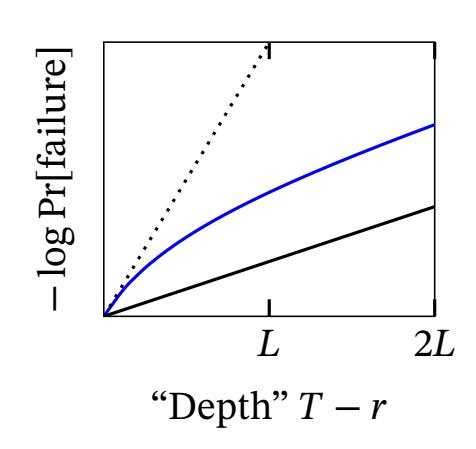
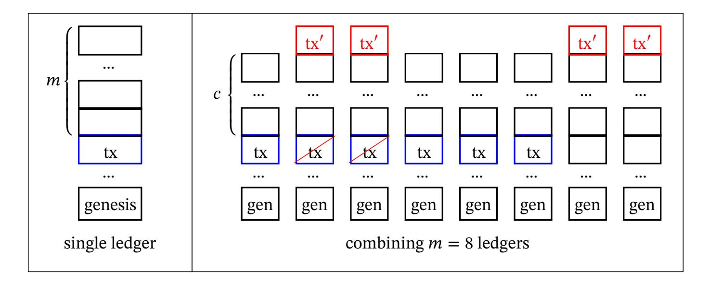

{0}------------------------------------------------

# **Ledger Combiners for Fast Settlement**

Matthias Fitzi1 , Peter Gaži1 , Aggelos Kiayias1,2 , and Alexander Russell1,3

> 1 IOHK Research 2 University of Edinburgh

3 University of Connecticut

firstname.lastname@iohk.io

**Abstract.** Blockchain protocols based on variations of the longest-chain rule—whether following the proofof-work paradigm or one of its alternatives—suer from a fundamental latency barrier. This arises from the need to collect a sucient number of blocks on top of a transaction-bearing block to guarantee the transaction's stability while limiting the rate at which blocks can be created in order to prevent security-threatening forks. Our main result is a black-box security-amplifying combiner based on parallel composition of 𝑚 blockchains that achieves Θ(𝑚)-fold security amplication for conict-free transactions or, equivalently, Θ(𝑚)-fold reduction in latency. Our construction breaks the latency barrier to achieve, for the rst time, a ledger based purely on Nakamoto longest-chain consensus guaranteeing worst-case constant-time settlement for conict-free transactions: settlement can be accelerated to a constant multiple of block propagation time with negligible error.

Operationally, our construction shows how to view any family of blockchains as a unied, virtual ledger without requiring any coordination among the chains or any new protocol metadata. Users of the system have the option to inject a transaction into a single constituent blockchain or—if they desire accelerated settlement—all of the constituent blockchains. Our presentation and proofs introduce a new formalism for reasoning about blockchains, the *dynamic ledger*, and articulate our constructions as transformations of dynamic ledgers that amplify security. We also illustrate the versatility of this formalism by presenting robust-combiner constructions for blockchains that can protect against complete adversarial control of a minority of a family of blockchains.

# **1 Introduction**

Since the appearance of Bitcoin [\[37\]](#page-26-0) in 2009, dozens of projects from both academia and industry have proposed protocols for maintaining decentralized, robust transaction ledgers in a permissionless setting. The prominent design paradigm in this space comes from the Bitcoin protocol itself, often referred to as "Nakamoto-style" ledger consensus. This approach adopts the *blockchain*—a linearly ordered sequence of blocks, each of which commits to the previous history and may contain new transactions—as the fundamental data structure for maintaining the ledger. The core consensus algorithm then calls for eligible protocol participants to create transaction-bearing blocks, append them to the longest chain they observe, and broadcast the result; this implicitly declares a "vote" for a unique ordered sequence of past transactions—the ledger. As a result, the immutability of a particular portion of the ledger is not immediate, but rather grows gradually with the number of blocks (representing votes) amassed on top of it in the blockchain. This paradigm has been featured in both theoretical proposals as well as deployed systems and can be instantiated with a wide variety of Sybil-resistant mechanisms such as proof of work (Bitcoin, Ethereum [\[8\]](#page-25-0) and a vast majority of deployed blockchains), proof of stake [\[29,](#page-26-1)[13](#page-26-2)[,14,](#page-26-3)[2,](#page-25-1)[28](#page-26-4)[,3\]](#page-25-2), proof of space [\[38,](#page-26-5)[11\]](#page-26-6), and others.

In terms of performance, one of the key measures of interest for any distributed ledger protocol is *latency*, also called *settlement time*. Roughly speaking, this is the time elapsed between the moment a signed transaction is injected into the protocol and the time it becomes universally recognized as immutable.

Nakamoto-style consensus protocols have attracted attention both for their simplicity and for various desirable security features they can provide [\[10](#page-25-3)[,40](#page-27-0)[,42\]](#page-27-1), such as security in the Byzantine setting with simple honest majority and resilience against uctuating participation [\[41](#page-27-2)[,2\]](#page-25-1). However, they face a fundamental barrier when it comes to latency. Informally, in order for a transaction to become accepted as stable, a sucient number of blocks (representing an agreement over a representative fraction of the parties, weighted according to the Sybil-resistant mechanism in place) must be collected on top of the block containing this transaction. However, these blocks can

{1}------------------------------------------------

only be created at a limited rate dictated by the delays induced by the underlying communication network: if blocks are routinely created by participants that have not yet received recent previous blocks, forks in the blockchain appear even without any adversarial interference. These forks then result in a division of the honest majority and represent a threat to the protocol's security. This relationship is now quite well understood; see [\[39\]](#page-26-7).

One way to address this disadvantage without giving up on the Nakamoto paradigm (and its advantages) is to carefully design overlay structures on top of the plain Nakamoto-style blockchain. Several such proposals exist, and can be roughly split into two categories. The rst group of proposals (e.g., [\[40,](#page-27-0)[42](#page-27-1)[,15\]](#page-26-8)) still produces a full ledger of all settled transactions, but relies on stronger assumptions for their latency improvement, such as a higher threshold of honest participants. The second category are so-called layer-2 designs implementing payment [\[45,](#page-27-3)[18\]](#page-26-9) or state [\[19,](#page-26-10)[17\]](#page-26-11) channels that only need limited interaction with the slow blockchain, however, they divert from the original goal of maintaining a distributed ledger of all executed transactions. Hence, the following fundamental question remains:

*What is the fastest achievable settlement time for Nakamoto-style consensus?*

This question has also been recently addressed by the elegant concurrent work on the Prism protocol [\[6\]](#page-25-4), albeit with somewhat dierent goals; we give a detailed comparison between our work and [\[6\]](#page-25-4) in Section [1.2,](#page-3-0) after rst introducing our contributions.

#### **1.1 Our Contributions**

We approach the challenge of designing low-latency ledgers by introducing a black-box technique for "combining" a family of existing ledgers into a new, virtual ledger that provides amplied security properties. Our technique results in a system with striking simplicity: The construction gives *a deterministic rule for interpreting an arbitrary family of* 𝑚 *constituent ledgers as a single virtual ledger*. Participants of the system maintain their current view of each constituent ledger and, via this interpretation, a view of the master combined ledger. Users simply inject their transactions into the constituent ledgers as usual. We show that when users inject transactions into a single constituent ledger they are provided with settlement guarantees (in the virtual ledger) roughly consistent with those oered by the constituent ledgers. On the other hand, when a conict-free transaction is injected into all of the constituent ledgers, it enjoys a 1∕Θ(𝑚) *multiplicative improvement in settlement time*. Of course, settlement time cannot be reduced beyond the time required for a block to be transmitted across the network; however, our results adapt smoothly to this limit; in particular, by taking 𝑚 to scale with the security parameter of the system, we obtain 𝑂(1) settlement time for conict-free transactions (except with negligible probability). We remark that in cryptocurrency ledgers, such as Bitcoin, transaction issuers always have the option to submit conict-free transactions so that the assumption is not a limitation. While the results do not require any specic coordination among the ledgers, they naturally require a measure of stochastic independence; we discuss this in detail below.

We present our results by formulating an abstract notion which we call a *dynamic ledger*. Our constructions transform a family of such dynamic ledgers into an associated dynamic ledger (as indicated above) in a way that amplies the security properties. Typical blockchain algorithms are direct instantiations of this abstraction: our techniques can thus be applied in wide generality to existing blockchains such as Bitcoin, Ethereum, Ouroboros, etc.

Such a transformation is a "combiner" in the classical cryptographic sense of the word: an operator for cryptographic primitives that acts in a black-box manner on a number of underlying implementations of a primitive with the objective of realizing a strengthened implementation of the same primitive. This folklore idea in cryptography rst received an explicit treatment by Herzberg [\[26\]](#page-26-12). One of the objectives for developing combiners especially prominent in the context of hash functions—was the concept of *robustness*. In particular, a robust combiner maintains the security of the combined implementation despite the security failure of any number (up to a threshold) of the underlying input implementations. Another objective for developing combiners is *amplication*: In an amplication combiner, the goal is to improve a certain security property of the combined implementation to a level that goes signicantly beyond the security oered by the underlying input implementations. The combiner discussed above is of the amplication variety; later in the paper, we also show how to achieve robustness in our setting.

{2}------------------------------------------------

With this summary behind us, we describe our contributions in more detail.

**A Model for Abstract Ledgers.** We provide a new mathematical abstraction of a distributed ledger that can be used to reect an arbitrary ledger protocol, but is particularly well-suited for describing Nakamoto-style blockchains with eventual-consensus behavior (regardless of their underlying Sybil-resistant election mechanism). Its main design goals are generality and simplicity, so as to allow for a clean study of generic constructions with such ledgers that is unencumbered by the execution details of the underlying protocols.

Roughly speaking, our abstraction—called a *dynamic ledger*—determines at every point in time (i) a set of transactions that are contained in the ledger; and (ii) a mapping that assigns to each transaction a real value called its *rank*. The rank plays several roles: it is used to order the transactions in the ledger, describe their stability, and maintain a loose connection to actual time; the most natural example of a rank is the timestamp of the transaction's block in Bitcoin. (In fact, a simple monotonicity transform is necessary; see Section [4.2.](#page-19-0))

A dynamic ledger satises three fundamental properties: *liveness*, *absolute persistence*, and *relative persistence*. The former two properties are direct analogues of the well-established notions of persistence and liveness introduced by previous formalizations of blockchain protocols; the notion of relative persistence is novel. In a nutshell, it is a weakening of absolute persistence that guarantees that the rank of a transaction cannot signicantly change in the future; in particular the relative order of the transaction with respect to suciently distant transactions is determined. This is particularly useful for reasoning about transaction settlement in the typical setting of interest: when transaction validity depends only on its ordering with respect to *conicting* transactions. Looking ahead, relative persistence is exactly the notion that allows us to achieve the full benets of our amplication combiner; it appears to be of independent interest as well, as it also arises naturally in our robust combiner.

**A combiner for consistency amplication and latency reduction; the combined rank function.** Our main technical contribution, discussed briey above, is an amplication combiner for latency reduction of abstract ledgers. This combiner builds a "combined ledger" (or virtual ledger) as a deterministic function of 𝑚 underlying dynamic ledgers. As mentioned above, participants insert their transaction into any number of the underlying ledgers, depending on the desired settlement-time guarantees.

The major challenge is the denition and analysis of the combiner rank function. Rank is an abstract notion of position in the ledger that is tethered to absolute time by the security guarantees: for example, in a ledger at time 𝑇 the probability that a transaction appearing at rank 𝑟 is later disrupted is a function of 𝑇 − 𝑟; the standard case, where the underlying ledgers provide "linear consistency," guarantees consistency error exp(−Ω(𝑇 − 𝑟)). Note that, in general, there is no guarantee that transactions will appear in all underlying ledgers so the combined rank function must somehow assign rank in a fashion that appropriately reects both deep transactions appearing in a single ledger and shallower transactions appearing in many ledgers. This state of aairs introduces two conicting goals: in order to achieve linear amplication we insist that when a transaction appears in all 𝑚 ledgers, our constructed ledger yields settlement error exp(−Ω(𝑚(𝑇 − 𝑟)))—note the factor of 𝑚 in the exponent; on the other hand, a transaction appearing in a single ledger will be assigned some nite rank and thus for large values of 𝑇 we cannot hope to beat exp(−Ω(𝑇 − 𝑟)), the consistency guarantee of a single ledger. To realize this, our construction (and combined rank function) is determined by a parameter 𝐿 which, intuitively, determines the transition between these two regimes. One should think of 𝐿 proportional to the security parameter of the system, so that 2 −Θ(𝐿) is an acceptable bound for undesirable events; thus, injecting a transaction into all the ledgers achieves this 2 −Θ(𝐿) security bound Θ(𝑚) times faster than transactions submitted to a single ledger.

It is a rather remarkable fact that the behavior we demand is provided by the exponential weighting functions that arise naturally in the theory of regret minimization (e.g., the multiplicative weights algorithm [\[1\]](#page-25-5)). The actual form of our combined rank function is

$$\exp(-\text{combinedRank}(\text{tx})/L) = \frac{1}{m} \sum_{i=1}^{m} \exp(-\text{rank}_i(\text{tx})/L).$$

The (log scale) consistency error achieved by this rank function, when coupled with underlying ledgers that oer linear consistency, is informally illustrated by the blue line in the gure below. The solid black line is the consistency error oered by the underlying ledgers; one can clearly see the region of rapid growth (prior to 𝐿) 

{3}------------------------------------------------

followed by the region where the slope stabilizes to that of the single ledger bounds, as it must. The dotted line has slope exactly 𝑚 times that of the "single ledger" line, corresponding intuitively to "perfect amplication."

We analyze two extreme scenarios and show that while insertion of a transaction into a single ledger leads to a settlement time comparable to the one provided by the underlying ledgers, inserting the transaction into all 𝑚 ledgers results in a speed-up by a linear factor Θ(𝑚). In the natural setting where there is a cost associated with including a transaction in each ledger, we emphasize that the construction yields a trade-o between transaction fee and settlement time: transactions appearing in more chains settle faster. The choice can be made on a per-transaction basis by its sender. Moreover, by considering a sucient number of parallel chains 𝑚, this allows us to achieve, for the rst time, *constant settlement time except with negligible error probability*. In practice, this provides settlement in time 𝑂(∆), where ∆ is the time required for block delivery.

Clearly, amplication-type results can only be obtained under some sort of independence assumption on the underlying ledgers. We characterize a generic (black-box) assumption, called *subindependence*, which is weaker than full independence of the ledgers and sucient for our results. We also show how subindependence can be naturally achieved by existing techniques in both proof-of-work and proof-of-stake settings; details appear in Section [4.1.](#page-18-0)

Our construction does not require any coordination between the underlying ledgers, it can be deployed on top of existing blockchains without direct cooperation from parties maintaining the ledgers, so long as these ledgers maintain their persistence and liveness guarantees, are suciently independent, and allow for inclusion of a suciently general class of transaction data.

Finally, we show how our construction can be applied to the most familiar setting of proof-of-work (PoW) blockchains. Specically, applying our combiner to 𝑚 = 𝜆 PoW blockchains yields a construction 𝖢 providing constant-time relative settlement except with probability negligible in 𝜆, articulated in Theorem [1](#page-3-1) below. For concreteness, we work in the synchronous (𝑝, 𝑞)*-at PoW model* that assumes the existence of 𝑛 parties, each of which is allowed to issue 𝑞 PoW queries per round that independently succeed with probability 𝑝 (see, e.g., [\[23\]](#page-26-13) for details).

**Theorem 1 (Informal).** *Let* 𝜖 > 0 *and let* 𝜆 *denote the security parameter. There exists a construction* 𝖢 *that, if executed in the synchronous* (𝑝, 𝑞)*-at PoW model with* 𝑛 *parties out of which at least a* (1∕2 + 𝜀)*-fraction is honest, achieves relative settlement in time* 𝑂(1) *except with an error probability negligible in* 𝜆*.*

Hidden in the asymptotic description above is the dependence of 𝑝, 𝑞, and 𝑛 on the security parameter 𝜆 which must in fact satisfy some natural conditions. We give a formal statement corresponding to Theorem [1,](#page-3-1) together with a precise description of the construction 𝖢, as Corollary [7](#page-20-0) in Section [4.3.](#page-20-1)

A simplied, didactical illustration of the settlement speed-up provided by our construction is given in Appendix [G.](#page-35-0)

**A Robust Ledger Combiner.** As our nal contribution, we describe a class of constructions of robust ledger combiners: a black-box construction on top of 𝑚 ledgers that maintains relative persistence and liveness guarantees even if the contents of a 𝛿-fraction of these ledgers (chosen adaptively) are arbitrarily corrupted, for 𝛿 up to 1∕2. The individual constructions in this class are parameterized by the choice of an estimator function that is a part of the combiner's rank function; we show that the concrete choice of this estimator represents a trade-o between 𝛿 and the *stability* of the combiner, a metric of how much the ranks of individual transactions in the combiner change as a result of a corruption respecting the 𝛿-threshold. This construction serves as an additional illustration of the generality of our ledger abstraction. Full details appear in Section [5.](#page-21-0)

## **1.2 Related Work**

The formal modeling of robust transaction ledgers and blockchain protocols goes back to the property-based analysis of Bitcoin due to Garay et al. [\[23\]](#page-26-13) and Pass et al. [\[39\]](#page-26-7). These works identied the central properties 

{4}------------------------------------------------

of common prex, chain growth, and chain quality and demonstrated how they imply the desired persistence and liveness of the resulting ledger. A composable analysis of a blockchain protocol (namely Bitcoin) in the UC framework [\[9\]](#page-25-6) along with the realized ledger functionality rst appeared in [\[4\]](#page-25-7) and, later, essentially the same functionality was shown to be realized by proof-of-stake protocols in [\[2,](#page-25-1)[3\]](#page-25-2).

The notion of combiners was formally proposed in [\[26\]](#page-26-12). Robust combiners for hash functions were further studied in [\[7](#page-25-8)[,44\]](#page-27-4) and also applied to other primitives such as oblivious transfer [\[25\]](#page-26-14). Amplication combiners were introduced by [\[20\]](#page-26-15) who also observed that classical results in security amplication, e.g., [\[48\]](#page-27-5), can be seen as such combiners. Indistinguishability amplication for random functions and permutations achieved by certain combiners from a class of so-called *neutralizing* constructions was studied both in the informationtheoretic [\[47,](#page-27-6)[33](#page-26-16)[,32,](#page-26-17)[34,](#page-26-18)[24\]](#page-26-19) and computational [\[31,](#page-26-20)[36](#page-26-21)[,43](#page-27-7)[,16,](#page-26-22)[35\]](#page-26-23) settings.

Various approaches are known to reduce settlement times of Nakamoto-style blockchains. One approach is to deviate from the single-chain structure, arranging blocks in a directed acyclic graph (DAG) as rst suggested by Lerner [\[30\]](#page-26-24). Sompolinsky et al. [\[46\]](#page-27-8) gave a DAG-based construction that substantially reduces settlement times at the expense of giving up on a total order on all transactions in the ledger. Another approach explores "hybrid" protocols where committee-based consensus reduces latency in the optimistic case [\[40](#page-27-0)[,42\]](#page-27-1).

In context of proof-of-stake, Algorand [\[10\]](#page-25-3) reduces settlement times over eventual-consensus proof-of-stake protocols by nalizing each block via a Byzantine Agreement subprotocol before moving to the next one. However, Algorand cannot tolerate uctuating participation or adversarial stake ratio up to 1/2. Moreover, its constant-time settlement guarantees are only provided *in expectation*, in contrast to our worst-case guarantees.

The closest work to ours is the concurrent work on Prism [\[6\]](#page-25-4). Its goals are dierent: it presents a concrete, PoW-based ledger protocol optimizing both throughput and latency compared to Bitcoin. Their approach to latency optimization is also based on the idea of parallel blockchains, though in a dierent form. Our approach has some notable advantages in comparison with Prism: (i) our construction is generic and can be deployed on top of existing ledgers with arbitrary Sybil-resistant mechanisms; (ii) we provide worst-case constant-time settlement except with a negligible error probability while Prism (similarly to Algorand) only provides *expected* constant-time settlement; (iii) we base our results on the generic subindependence assumption that is weaker than full independence, which is assumed in Prism (though it is not achieved by their PoW mechanism). On the other hand, Prism has an important feature which clearly sets it apart from our work: it explicitly models and optimizes throughput. In particular, Prism simultaneously achieves improved security and throughput, a tradeo that is not even considered in our modeling.

We devote Appendix [A](#page-27-9) to a more detailed comparison.

# **2 The Ledger Abstraction**

In this section we dene *abstract ledgers* which describe the functionality provided by distributed ledger protocols such as Bitcoin. Our goal here is to capture this behavior in an abstract, high-level manner, which allows us to express our composition results unencumbered by the details of the individual protocols.

#### **2.1 Ledgers and Dynamic Ledgers**

We start by dening an abstraction of an individual snapshot of the state of a ledger protocol, which we call a *ledger*. A ledger reects a collection of *transactions* which are given a linear order by way of a general function called *rank*. As a basis for intuition about the denitions and proofs below, we mention that, roughly speaking, Bitcoin realizes such a ledger where the rank function is given by the timestamp corresponding to the block containing the transaction; we give a more detailed discussion in Section [4.2.](#page-19-0)

Our ledger will operate over a *transaction space* which we dene rst.

**Denition 1 (Transaction space).** *A* transaction space *is a pair* (𝒯, ≺𝒯)*, where* 𝒯 *is a set of "transactions" and* ≺𝒯 *is a linear order on* 𝒯*. A* conict relation 𝐶 *on a transaction space* 𝒯 *is a symmetric binary relation on* 𝒯*; if* (tx1 , tx2 ) ∈ 𝐶 *for two transactions* tx1 , tx2 ∈ 𝒯*, we say that* tx1 conicts with tx2 *, we write* conflict(tx) ⊆ 𝒯 *for the set of transactions conicting with* tx*.*

{5}------------------------------------------------

The linear order  $\prec_{\mathcal{T}}$  on the ambient transaction space  $\mathcal{T}$  is largely incidental; it is only used in our setting to break ties among transactions with a common rank. Thus, in practice this linear order can be instantiated with a simple "syntactic" property—such as a lexicographic ordering—rather than an ordering that reflects any semantics about the transactions.

On the other hand, when a transaction space is equipped with a conflict relation this is intended to carry semantic value; in a conventional UTXO transaction model (such as that appearing in many deployed blockchains, see Appendix B) two transactions conflict if they share UTXO inputs. As we discuss below, a conflict structure permits a more flexible notion of settlement that is only required to provide strong guarantees for non-conflicting transactions.

**Definition 2 (Ledger).** A ledger **L** for a transaction space  $(\mathcal{T}, \prec_{\mathcal{T}})$  is a pair (T, rank) where:  $T \subseteq \mathcal{T}$  is a subset of transactions and rank :  $\mathcal{T} \to \mathbb{R}^+ \cup \{\infty\}$  is a function taking finite values precisely on the set T; that is,  $T = \{\text{tx} \in \mathcal{T} \mid \text{rank}(\text{tx}) \neq \infty\}$ . The value rank(tx) is referred to as the rank of the transaction tx. Notationally, if **L** is a ledger we routinely overload the symbol **L** to stand for its set of transactions (T in the definition above).

The linear order  $\prec_{\mathcal{T}}$  and the rank function  $\operatorname{rank}(\cdot)$  induce a linear order  $\prec_{\mathbf{L}}$  on the ledger by the rule

$$x \prec_{\mathbf{L}} y :\Leftrightarrow (\operatorname{rank}(x) < \operatorname{rank}(y) \lor (\operatorname{rank}(x) = \operatorname{rank}(y) \land x \prec_{\mathcal{T}} y))$$
.

(Thus the underlying total order  $\prec_{\mathcal{T}}$  is only used to "break ties.")

For a ledger  $\mathbf{L} = (T, \text{rank})$  and a threshold r, we let  $\mathbf{L}[r] \stackrel{\text{def}}{=} (T', \text{rank}')$  denote the ledger consisting of transactions  $T' \stackrel{\text{def}}{=} \{ \text{tx} \in T \mid \text{rank}(\text{tx}) \leq r \}$  with the inherited rank function: rank'(tx) = rank(tx) for all  $\text{tx} \in T'$  and equal to  $\infty$  otherwise. Similarly, for a transaction  $\text{tx} \in \mathbf{L}$ , let  $\mathbf{L}[\text{tx}]$  denote the ledger  $\{\text{tx}' \mid \text{tx}' \leq_{\mathbf{L}} \text{tx}\}$  with the inherited rank function.

The above notion of a ledger captures a static state; we extend it to describe evolution in time as follows.

**Definition 3 (Dynamic ledger).** Consider the sequence of time slots  $t \in \mathbb{N}$  and any sequence of sets of transactions  $A^{(0)}, A^{(1)}, ...$  (each a subset of a common transaction space  $\mathcal{T}$ ) denoting the transactions that arrive at each time slot. A dynamic ledger is a sequence of random variables  $\mathbf{D} \stackrel{\text{def}}{=} \mathbf{L}^{(0)}, \mathbf{L}^{(1)}, ...,$  that satisfy the following properties parameterized by security functions  $\mathbf{p}_R^+: (\mathbb{R}^+)^2 \to [0,1]$  and  $\mathbf{p}_R^-, \mathbf{p}_A, \mathbf{l}: \mathbb{R}^+ \to [0,1]$ :

**Liveness.** For every  $r \ge 0$ ,  $t_0 \ge 0$ , and  $t \ge t_0 + r$ ,

$$\Pr\left[L_{r,t_0,t}\right] \stackrel{\text{def}}{=} \Pr\left[A^{(t_0)} \nsubseteq \mathbf{L}^{(t)} \lceil t_0 + r \rceil\right] \leq \mathrm{l}(r).$$

**Absolute Persistence.** For each rank  $r \ge 0$ , time  $t_0 \ge 0$ , and  $t \ge t_0$ , we have

$$\mathbf{L}^{(t_0)} \lceil t_0 - r \rceil = \mathbf{L}^{(t)} \lceil t_0 - r \rceil$$

except with small failure probability. Specifically, for all  $r, t_0 \ge 0$ ,

$$\Pr\left[P_{r,t_0}\right] \stackrel{\text{def}}{=} \Pr\left[\exists t \geq t_0, \mathbf{L}^{(t_0)} \left\lceil t_0 - r \right\rceil \neq \mathbf{L}^{(t)} \left\lceil t_0 - r \right\rceil\right] \leq \mathbf{p}_A(r).$$

**Relative Persistence.** For each  $r^+$ ,  $r^- \ge 0$ , time  $t_0 \ge 0$ , and  $t \ge t_0$ , we have

$$\mathbf{L}^{(t_0)} \left[ t_0 - r^- - r^+ \right] \subseteq \mathbf{L}^{(t)} \left[ t_0 - r^- \right] \subseteq \mathbf{L}^{(t_0)}$$

except with small failure probability. Specifically, for each  $r^-$ ,  $r^+$ ,  $t_0 \ge 0$ :

$$\Pr\left[\exists t \geq t_0, \mathbf{L}^{(t_0)} \left[t_0 - r^- - r^+\right] \nsubseteq \mathbf{L}^{(t)} \left[t_0 - r^-\right]\right] \leq \mathbf{p}_R^+(r^-, r^+),$$

$$\Pr\left[\exists t \geq t_0, \mathbf{L}^{(t)} \left[t_0 - r^-\right] \nsubseteq \mathbf{L}^{(t_0)}\right] \leq \mathbf{p}_R^-(r^-).$$

As indicated, we let  $P_{r,t_0}$  and  $L_{r,t_0,t}$  denote the absolute-persistence failure event with parameters  $(r,t_0)$  and the liveness failure event with parameters  $(r,t_0,t)$ , respectively.

{6}------------------------------------------------

The above definition deserves a detailed discussion. A dynamic ledger is a sequence of ledgers—one for each time slot t—which reflects the current state of the ledger structure  $\mathbf{L}^{(t)}$  at that time. Throughout the paper, we will use the superscript notation  $\cdot^{(t)}$  to denote the time coordinate.

The *absolute persistence* and *liveness* properties capture the standard design features of distributed ledger protocols: absolute persistence mandates that at time  $t_0$ , the state of the ledger up to rank  $t_0 - r$  is fixed for all future times, except with error probability  $p_A(r)$ . Liveness, on the other hand, guarantees that any transaction appearing in  $A^{(t_0)}$  will be a part of a (later) ledger at time  $t \ge t_0 + r$  with a rank at most  $t_0 + r$ , except with error at most  $t_0$ . Note that the liveness guarantee only pertains to transactions tx appearing in the sets  $t_0$ , which may not necessarily "explain" all of the transactions in the ledger; in particular, we do not always insist that  $t_0$  is  $t_0$ . This extra flexibility permits us to simultaneously study differing liveness guarantees for various subclasses of transactions processed by a particular ledger (see Section 3.2).

The remaining property, *relative persistence*, is more complex: It is a weakening of absolute persistence by *not* requiring future stability for the prefix of the currently seen ledger  $\mathbf{L}^{(t_0)}$  up to rank  $t_0 - r^- - r^+$ ; it merely asks that no transaction tx *currently contained* in it will rise to a rank exceeding  $t_0 - r^-$ ; likewise, it insists that no transaction tx' currently absent in the ledger will ever achieve a rank below  $t_0 - r^-$ , potentially overtaking tx. This property bears a direct connection to the notion of transaction settlement as we discuss in Section 2.3. Looking ahead, we note that relative persistence provides sufficient guarantees for settling transactions that are only invalidated by "conflicting" transactions, and our combiner will achieve stronger relative-persistence than absolute-persistence guarantees, allowing for our latency-reduction results in Section 3.

Note that absolute persistence for some r clearly implies relative persistence with  $r^+ = 0$  and  $r^- = r$ . A natural parameterization that makes our notions meaningful is where each  $f \in \{p_A, p_R^-, l\}$  is monotonically decreasing and satisfies  $f(0) \ge 1$  (similarly,  $p_R^+$  should be monotonically decreasing in each coordinate and  $p_R^+(r^-, r^+) \ge 1$  whenever  $0 \in \{r^-, r^+\}$ ). Of course each of these functions represents a probability upper-bound, though we entertain values above 1 purely to simplify notation. A persistence or liveness function is *exponential* if it has the form  $f(x) = \exp(-\alpha x + \beta)$  for some  $\alpha > 0$  and  $\beta \ge 0$ ; ledgers with exponential security will be our main focus.

Finally, our intention is to use dynamic ledgers to model blockchain consensus protocols. In this case, the chain held by each (honest) party  $P \in \mathcal{P}$  is modeled as a dynamic ledger  $\mathbf{D}_P = \mathbf{L}_P^{(0)}, \mathbf{L}_P^{(1)}, ...$ , satisfying the properties of persistence and liveness from Definition 3. Of course, this by itself does not capture all the desired goals of blockchain protocols, as it does not reflect consensus properties across parties; we discuss how this can be reflected by our model in Appendix D.

#### 2.2 Composition of Dynamic Ledgers

In the following sections, we will be interested in combining several dynamic ledgers to form a new "virtual" ledger. This notion of combining makes no assumptions on the ledgers to be combined other than a common transaction space. Moreover, it requires no explicit coordination among the ledgers or maintenance of special metadata: in fact, the "subledgers" involved in the construction do not even need to "know" that they are being viewed as a part of a combined ledger. Concretely, a *virtual ledger construction* is a deterministic, stateless rule for interpreting a family of *m* individual ledgers as a single ledger. This is formally captured in the following definition.

**Definition 4 (Virtual Ledger Constructions).** A virtual ledger construction  $C[\cdot]$  is a mapping that takes a tuple of dynamic ledgers  $(\mathbf{D}_1, \dots, \mathbf{D}_m)$  over the same transaction space  $\mathcal{T}$  and returns a dynamic ledger  $C[\mathbf{D}_1, \dots, \mathbf{D}_m] = \mathbf{L}^{(0)}, \mathbf{L}^{(1)}, \dots$  over  $\mathcal{T}$  determined by three functions  $(\mathbf{a}_C, \mathbf{t}_C, \mathbf{r}_C)$  as described below. We write  $\mathbf{D}_i = \mathbf{L}_i^{(0)}, \mathbf{L}_i^{(1)}, \dots$  with arriving transaction sets denoted  $A_i^{(0)}, A_i^{(1)}, \dots$  and the rank function of each  $\mathbf{L}_i^{(t)}$  being  $\mathrm{rank}_i^{(t)}$ . Then

- (i) the arriving transaction sets are given by  $A^{(t)} = a_{\mathbb{C}}(A_1^{(t)}, \dots, A_m^{(t)});$
- (ii) the ledger contents are given by  $\mathbf{L}^{(t)} = \mathbf{t}_{\mathsf{C}}(\mathbf{L}_1^{(t)}, \dots, \mathbf{L}_m^{(t)})$ ; and
- (iii) the rank is given by  $\operatorname{rank}^{(t)}(\operatorname{tx}) = \operatorname{r}_{\mathsf{C}}(\operatorname{rank}_{1}^{(t)}(\operatorname{tx}), \dots, \operatorname{rank}_{m}^{(t)}(\operatorname{tx})).$

Since the above requirements are formulated independently for each t, it is well-defined to treat  $C[\cdot]$  as operating on ledgers rather than dynamic ledgers; we sometimes overload the notation in this sense.

{7}------------------------------------------------

Looking ahead, our amplification combiner will consider  $t_C(\mathbf{L}_1^{(t)}, \dots, \mathbf{L}_m^{(t)}) = \bigcup_i \mathbf{L}_i^{(t)}$  along with two related definitions of  $a_C$ :

 $a_{C}(A_{1}^{(t)}, \dots, A_{m}^{(t)}) = \bigcup_{i} A_{i}^{(t)} \text{ and } a_{C}(A_{1}^{(t)}, \dots, A_{m}^{(t)}) = \bigcap_{i} A_{i}^{(t)};$ 

see Section 3. The robust combiner will adopt a more sophisticated notion of  $t_C$ ; see Section 5. In each of these cases, the important structural properties of the construction are captured by the rank function  $r_C$ .

## 2.3 Transaction Validity and Settlement

In the discussion below, we assume a general notion of *transaction validity* that can be decided inductively: given a ledger  $\mathbf{L}$ , the validity of a transaction  $\mathrm{tx} \in \mathbf{L}$  is determined by the transactions in the state  $\mathbf{L}\lceil \mathrm{tx} \rceil$  of  $\mathbf{L}$  up to tx and their ordering. Intuitively, only valid transactions are then accounted for when interpreting the state of the ledger on the application level. The canonical example of such a validity predicate in the case of so-called UTXO transactions is formalized for completeness in Appendix B. Note that protocols such as Bitcoin allow only valid transactions to enter the ledger; as the Bitcoin ledger is represented by a simple chain it is possible to evaluate the validity predicate upon block creation for each included transaction. This may not be the case for more general ledgers, such as the result of applying one of our combiners or various DAG-based constructions.

While we focus our analysis on persistence and liveness as given in Definition 3, our broader goal is to study *settlement*. Intuitively, settlement is the delay necessary to ensure that a transaction included in some  $A^{(t)}$  enters the dynamic ledger and, furthermore, that its validity stabilizes for all future times.

**Definition 5 (Absolute settlement).** For a dynamic ledger  $\mathbf{D} \stackrel{\text{def}}{=} \mathbf{L}^{(0)}, \mathbf{L}^{(1)}, \dots$  we say that a transaction  $\mathsf{tx} \in A^{(\tau)} \cap \mathbf{L}^{(t)}$  (for  $\tau \leq t$ ) is (absolutely) settled at time t if for all  $\ell \geq t$  we have: (i)  $\mathbf{L}^{(t)} [\mathsf{tx}] \subseteq \mathbf{L}^{(\ell)}$ , (ii) the linear orders  $\prec_{\mathbf{L}^{(t)}}$  agree on  $\mathbf{L}^{(t)} [\mathsf{tx}]$ , and (iii) for any  $\mathsf{tx}' \in \mathbf{L}^{(\ell)}$  such that  $\mathsf{tx}' \prec_{\mathbf{L}^{(\ell)}} \mathsf{tx}$  we have  $\mathsf{tx}' \in \mathbf{L}^{(t)} [\mathsf{tx}]$ .

Note that for any absolutely settled transaction, its validity is determined and it is guaranteed to remain unchanged in the future.

It will be useful to also consider a weaker notion of *relative settlement* of a transaction: Intuitively, tx is *relatively settled* at time t if we have the guarantee that no (conflicting) transaction tx' that is not part of the ledger at time t can possibly eventually precede tx in the ledger ordering.

**Definition 6 (Relative settlement).** Let  $\mathcal{T}$  be a transaction space with a conflict relation. For a dynamic ledger  $\mathbf{D} \stackrel{\text{def}}{=} \mathbf{L}^{(0)}, \mathbf{L}^{(1)}, ..., \text{ over } \mathcal{T} \text{ we say that a transaction } \mathbf{tx} \in A^{(\tau)} \text{ is relatively settled at time } t \geq \tau \text{ if for any } \ell \geq t \text{ we have: } (i) \text{ tx} \in \mathbf{L}^{(\ell)}; (ii) \text{ for any transaction } \mathbf{tx}' \text{ such that } \mathbf{tx}' \prec_{\mathbf{L}^{(\ell)}} \mathbf{tx} \text{ and } \mathbf{tx}' \in \text{conflict}(\mathbf{tx}) \text{ we have } tx' \in \mathbf{L}^{(t)}.$ 

We define an analogous notion when  $\mathcal{T}$  is not equipped with a conflict relation, by replacing (ii) with the stronger condition that applies to all transactions: for any transaction tx' such that  $tx' \prec_{\mathbf{L}^{(\ell)}} tx$  we have  $tx' \in \mathbf{L}^{(t)}$ .

We illustrate the usefulness of relative settlement on the example of the well-known UTXO transactions, and defer a more formal and more general discussion to Appendix C. If a UTXO-transaction tx satisfies that: (i) all its inputs appear as outputs of a preceding valid, absolutely settled transaction, (ii) tx itself is relatively settled, and finally, (iii) no conflicting transaction (using the same inputs) is currently part of the ledger; then the validity of tx can be reliably decided and is guaranteed not to change in the future.

In a dynamic ledger with liveness, absolute and relative persistence described by l,  $p_A$  and  $(p_R^+, p_R^-)$  respectively, there is a clear direct relationship of both types of settlement to these properties. Namely, a transaction  $tx \in A^{(\tau)}$  is absolutely (resp. relatively) settled in time  $\tau + r_l + r_p$  (resp.  $\tau + r_l + r^+ + r^-$ ) except with error  $p_A(r_p) + l(r_l)$  (resp.  $l(r_l) + p_R^+(r^-, r^+) + p_R^-(r^-)$ ). We state and prove these simple results in Appendix C.

While the time  $\tau$  when the transaction tx entered the system is not necessarily observable by inspecting the ledger, settlement itself is an observable event: tx is absolutely (resp. relatively) settled at time T if it is seen as part of the ledger  $\mathbf{L}^{(T)}[T-r_p]$  (resp.  $\mathbf{L}^{(T)}[T-r^+-r^-]$ ), except for error probability  $\mathbf{p}_A(r_p)$  (resp.  $\mathbf{p}_R^+(r^-,r^+)+\mathbf{p}_R^-(r^-)$ ).

For ledgers that provide better guarantees for relative persistence than for absolute persistence, relative settlement can occur faster than absolute settlement; this motivates the study of relative persistence in the following sections.

{8}------------------------------------------------

## 3 The Security-Amplifying Combiner for Latency Reduction

We describe a general combiner which transforms m underlying ledgers to a virtual ledger in which transactions settle more quickly. As discussed previously, by logging a transaction in all of the underlying ledgers, users can be promised a  $\Theta(m)$  (multiplicative) reduction in settlement time; on the other hand, by logging a transaction in a single one of the underlying ledgers, the promised settlement time is roughly consistent with the underlying ledger settlement time.

## 3.1 The Subindependence Assumption

Given m dynamic ledgers  $\mathcal{D}=(\mathbf{D}_1,\ldots,\mathbf{D}_m)$ , informally, we say that the dynamic ledgers satisfy  $\varepsilon$ -subindependence if, for any collection of events  $F_1,\ldots,F_m$  capturing either persistence or liveness failures—with the understanding that  $F_i$  refers solely to properties of  $\mathbf{L}_i$ —we have  $\Pr\left[\bigwedge_i F_i\right] \leq \prod_i \Pr[F_i]$  conditioned on some event occurring with probability at least  $1-\varepsilon$ .

**Definition 7 (Subindependence).** Let  $\mathcal{D} = (\mathbf{D}_1, ..., \mathbf{D}_m)$  be a collection of m dynamic ledgers. Ledgers  $\mathcal{D}$  satisfy  $\varepsilon$ -persistence subindependence if for any subset  $I \subseteq \{1, ..., m\}$  and any collection of persistence failure events  $\{P_{r_i,t_i}^{(i)} \mid i \in I\}$ , where the event  $P_{\star}^{(i)}$  refers to  $\mathbf{D}_i$ , there is an event E with  $\Pr[E] \geq 1 - \varepsilon$  such that we have

$$\Pr\left[\bigwedge_{i} P_{r_{i},t_{i}}^{(i)} \middle| E\right] \leq \prod_{i} p_{A}^{(i)}(r_{i}).$$

*We similarly define*  $\varepsilon$ -liveness subindependence.

Throughout our proofs, we treat  $\varepsilon$  as negligible quantity and, for purposes of a clean exposition, do not include the additive error terms related to  $\varepsilon$  in our concluding error bounds. (See Section 4.1 for further discussion, including how to interpret the notion of "negligible" in this context.) Consistent with this treatment, we leave  $\varepsilon$  implicit in our notation, and simply say that the dynamic ledgers  $\mathcal D$  possess subindependence if they possess both persistence and liveness subindependence.

As we discuss in Section 4.1, in situations such as those that arise in blockchains one cannot hope for *exact independence* among persistence failure events for the simple reason that an adaptive adversary may decide—as a result of the success of her attacks on some subset of the ledgers—to cease attacking the others; this creates a (harmless) negative correlation between failure events. Intuitively, the subindependence conditions express the inability of an attacker to outperform the simple setting where she aggressively attacks each of the ledgers in isolation of the others. We discuss how subindependence can be naturally achieved in both PoW and PoS settings in Section 4.1.

#### 3.2 The Parallel Ledger Construction

We consider m dynamic ledgers  $\mathcal{D} \stackrel{\text{def}}{=} (\mathbf{D}_1, ..., \mathbf{D}_m)$  over the same transaction space  $\mathcal{T}$  and sequence of time slots  $t \in \{0, 1, ...\}$ , where each dynamic ledger  $\mathbf{D}_i = \mathbf{L}_i^{(0)}, \mathbf{L}_i^{(1)}, ...$  and its sequence of arriving transactions is denoted as  $A_i^{(0)}, A_i^{(1)}, ...$ 

**Definition 8 (Construction**  $P[\mathcal{D}]$ ). Our main construction  $P[\mathbf{D}_1, ..., \mathbf{D}_m]$  (which we also write  $P[\mathcal{D}]$  when convenient) is defined by

$$a_{C}(A_{1}^{(t)}, \dots, A_{m}^{(t)}) = \bigcup_{i} A_{i}^{(t)}, \qquad t_{C}(\mathbf{L}_{1}^{(t)}, \dots, \mathbf{L}_{m}^{(t)}) = \bigcup_{i} \mathbf{L}_{i}^{(t)},$$

and the rank function  $\overline{\operatorname{rank}}_L^{(t)}$  defined as follows: For a tuple  $\mathbf{r} = (r_1, \dots, r_m) \in (\mathbb{R} \cup \{\infty\})^m$  and a constant L, define

$$\overline{\operatorname{rank}}_{L}(\mathbf{r}) \stackrel{\text{def}}{=} -L \ln \left( \frac{1}{m} \sum_{r_{i} \leq \theta(\mathbf{r})} \exp(-r_{i}/L) \right), \tag{1}$$

{9}------------------------------------------------

where  $\theta(\mathbf{r}) = \min_i r_i + L \ln m$ , and  $\exp(-\infty/L)$  is defined to be 0. We overload the notation to apply to transactions, so that the resulting rank function can serve the purposes of a virtual ledger construction: Let tx be a transaction appearing with rank  $r_i$  in ledger  $\mathbf{L}_i^{(t)}$  for some fixed t; then define  $\overline{\operatorname{rank}}_L^{(t)}(\mathsf{tx}) = \overline{\operatorname{rank}}_L(\mathbf{r})$ .

The definition (1) can be rephrased into an alternate, and somewhat more intuitive, equation: if  $I_{\theta} \stackrel{\text{def}}{=} \{i \mid r_i \leq \theta(\mathbf{r})\}$  then

$$\frac{1}{m} \sum_{i \in I_{\theta}} \exp(-r_i/L) = \exp(-\overline{\operatorname{rank}}_L(\mathbf{r})/L). \tag{2}$$

In particular the notion is a simple average if rank is interpreted under an exponential functional:  $\exp(-\operatorname{rank}(\cdot)/L)$ . Note, additionally, that for any  $\mathbf{r} = (r_1, \dots, r_m)$ , we have

$$\min_{i \in [m]} r_i \le \overline{\operatorname{rank}}_L(\mathbf{r}) \le \left(\min_{i \in [m]} r_i\right) + L \ln m$$

and, furthermore, the inequality can be naturally interpreted if some or all of the  $r_i$  are  $\infty$ . The first inequality is tight when all  $r_i$  are equal.

A final remark about truncation by the threshold  $\theta(\mathbf{r})$ : While the "large-scale" features of the parallel ledger—including relative persistence and liveness—do not depend on truncation, absolute persistence depends on eventual stability of the rank function. The truncation operation guarantees this, ensuring that only a bounded portion of the ledger is relevant for determining the final rank of a transaction.

*Preemptive rank function.* When the dynamic ledgers  $\mathcal{D}$  are defined over a transaction space with a conflict relation, we consistently work with a slightly different notion of *preemptive rank* for the amplification construction above. Specifically, we say that a transaction tx is *dominant* in a ledger  $\mathbf{L}$  if it appears in the ledger and no earlier transaction conflicts with tx (that is  $t \in \mathbf{L}$  and  $t \in \mathbf{L}$  and  $t \in \mathbf{L}$  and  $t \in \mathbf{L}$  and  $t \in \mathbf{L}$  and  $t \in \mathbf{L}$  and define  $t \in \mathbf{L}$  if tx is dominant in  $t \in \mathbf{L}$  and  $t \in \mathbf{L}$  and  $t \in \mathbf{L}$  and  $t \in \mathbf{L}$  and  $t \in \mathbf{L}$  and  $t \in \mathbf{L}$  and  $t \in \mathbf{L}$  and define  $t \in \mathbf{L}$  if tx is dominant in  $t \in \mathbf{L}$  and  $t \in \mathbf{L}$  and  $t \in \mathbf{L}$  and  $t \in \mathbf{L}$  and  $t \in \mathbf{L}$  and  $t \in \mathbf{L}$  and  $t \in \mathbf{L}$  and  $t \in \mathbf{L}$  and  $t \in \mathbf{L}$  and  $t \in \mathbf{L}$  and  $t \in \mathbf{L}$  and  $t \in \mathbf{L}$  and  $t \in \mathbf{L}$  and  $t \in \mathbf{L}$  and  $t \in \mathbf{L}$  and  $t \in \mathbf{L}$  and  $t \in \mathbf{L}$  and  $t \in \mathbf{L}$  and  $t \in \mathbf{L}$  and  $t \in \mathbf{L}$  and  $t \in \mathbf{L}$  and  $t \in \mathbf{L}$  and  $t \in \mathbf{L}$  and  $t \in \mathbf{L}$  and  $t \in \mathbf{L}$  and  $t \in \mathbf{L}$  and  $t \in \mathbf{L}$  and  $t \in \mathbf{L}$  and  $t \in \mathbf{L}$  and  $t \in \mathbf{L}$  and  $t \in \mathbf{L}$  and  $t \in \mathbf{L}$  and  $t \in \mathbf{L}$  and  $t \in \mathbf{L}$  and  $t \in \mathbf{L}$  and  $t \in \mathbf{L}$  and  $t \in \mathbf{L}$  and  $t \in \mathbf{L}$  and  $t \in \mathbf{L}$  and  $t \in \mathbf{L}$  and  $t \in \mathbf{L}$  and  $t \in \mathbf{L}$  and  $t \in \mathbf{L}$  and  $t \in \mathbf{L}$  and  $t \in \mathbf{L}$  and  $t \in \mathbf{L}$  and  $t \in \mathbf{L}$  and  $t \in \mathbf{L}$  and  $t \in \mathbf{L}$  and  $t \in \mathbf{L}$  and  $t \in \mathbf{L}$  and  $t \in \mathbf{L}$  and  $t \in \mathbf{L}$  and  $t \in \mathbf{L}$  and  $t \in \mathbf{L}$  and  $t \in \mathbf{L}$  and  $t \in \mathbf{L}$  and  $t \in \mathbf{L}$  and  $t \in \mathbf{L}$  and  $t \in \mathbf{L}$  and  $t \in \mathbf{L}$  and  $t \in \mathbf{L}$  and  $t \in \mathbf{L}$  and  $t \in \mathbf{L}$  and  $t \in \mathbf{L}$  and  $t \in \mathbf{L}$  and  $t \in \mathbf{L}$  and  $t \in \mathbf{L}$  and  $t \in \mathbf{L}$  and  $t \in \mathbf{L}$  and  $t \in \mathbf{L}$  and  $t \in \mathbf{L}$  and  $t \in \mathbf{L}$  and  $t \in \mathbf{L}$  and  $t \in \mathbf{L}$  and  $t \in \mathbf{L}$  and  $t \in \mathbf{L}$  and  $t \in \mathbf{L}$  and  $t \in \mathbf{L}$  and  $t \in \mathbf{L}$  and  $t \in \mathbf{L}$  and  $t \in \mathbf{L}$  and  $t \in \mathbf{L}$  and  $t \in \mathbf{L}$  and  $t \in \mathbf{L}$  and  $t \in \mathbf{L}$  and  $t \in \mathbf{L}$  and  $t \in \mathbf{L}$  and  $t \in \mathbf{L}$  and  $t \in \mathbf{L}$  and  $t \in \mathbf{L}$  and  $t \in \mathbf{L}$ 

*Fast and slow submission.* We consider two ways of submitting tx to  $P[\mathcal{D}]$ :

**The "fast" mechanism:** A transaction tx is simultaneously submitted to all of the underlying dynamic ledgers  $\{\mathbf{D}_i\}_{i=1}^m$ , appearing in  $\bigcap_{i\in[m]}A_i^{(t)}$ .

**The "slow" mechanism:** A transaction tx is submitted to (at least) one of the dynamic ledgers  $\mathbf{D}_i$ , appearing in  $\bigcup_{i \in [m]} A_i^{(t)}$ .

An important feature of our protocol is that a single deployment supports both of these mechanisms and their use can be decided by transaction producers on a per-transaction basis. As we will see, these two mechanisms exhibit markedly different liveness guarantees: Participants desiring fast liveness and settlement1 can adopt the fast mechanism by submitting their transactions to all m of the ledgers; participants with less urgency can adopt the slow mechanism, simply submitting their transactions to a single ledger.

To formally capture this in a clean way, we will introduce a slight variant,  $P_F[\mathcal{D}]$ , which allows us to specifically study the improved liveness properties of transactions when they happen to be submitted for insertion into all of the constituent ledgers  $\mathbf{D}_i$  at the same time. Specifically,  $P_F[\mathcal{D}]$  has precisely the same definition as  $P[\mathcal{D}]$  with the exception that  $a_C(A_1^{(t)}, \dots, A_m^{(t)}) = \bigcap_i A_i^{(t)}$ . Thus, note that the two virtual ledgers  $P[\mathcal{D}]$  and  $P_F[\mathcal{D}]$  contain exactly the same elements with exactly the same ranks. They differ only in the sets of transactions (determined by  $a_C$ ) for which they provide liveness guarantees: "slow" liveness guarantees for  $\bigcup_i A_i^{(t)}$  correspond to bounds on  $P[\mathcal{D}]$  while "fast" liveness guarantees for transactions in  $\bigcap_i A_i^{(t)}$  correspond to liveness guarantees for  $P_F[\mathcal{D}]$ . This bookkeeping sleight of hand is merely a way to use a single abstraction to express both a general liveness guarantee, and an accelerated guarantee for transactions submitted to all ledgers  $\mathbf{D}_i$ .

&lt;sup>1 Recall the difference between *liveness* and *settlement* in our terminology, as described in Section 2.3 and Appendix C.

{10}------------------------------------------------

We remark that fast settlement guarantees are provided anytime a transaction has been submitted to all of the underlying ledgers: the proof does not require that they be submitted at exactly the same time. In terms of the definitions above, the proof would apply even if we defined  $\overline{A}_i^{(t)} \stackrel{\text{def}}{=} \bigcup_{s \leq t} A_i^{(s)}$ ,  $F^{(t)} \stackrel{\text{def}}{=} \bigcap_i \overline{A}_i^{(t)}$ , and  $A^{(t)}$  (the set for which fast settlement is guaranteed) to be  $F^{(t)} \setminus F^{(t-1)}$ . Thus a transaction would be guaranteed fast settlement as soon as it has been submitted to all relevant ledgers. We work with the simple formulation  $(\bigcap_i A_i^{(t)})$  merely as a matter of convenience.

#### 3.3 Main Result and Proof Outline

Our main result follows, formulated for exponentially secure ledgers as defined in Section 2.1.

**Theorem 2.** Let  $\mathcal{D} = (\mathbf{D}_1, ..., \mathbf{D}_m)$  be a family of m subindependent dynamic ledgers defined over a common transaction space  $\mathcal{T}$  with a conflict relation, each possessing exponential liveness  $l(r) = \exp(-\alpha_l r + \beta_l)$  and absolute persistence  $p(r) = \exp(-\alpha_p r + \beta_p)$ . Consider the combined dynamic ledgers  $P_F[\mathcal{D}]$  and  $P[\mathcal{D}]$  with the (preemptive) rank function  $\overline{\operatorname{rank}}_L^*$  for a parameter  $L \geq m$ . Then for  $P_F[\mathcal{D}]$ , there is a constant C > 1 so that if  $L \geq Cm \ln m$ , we have

 $\Pr\left[\exists \mathsf{tx} \in A^{(t_0)} \ \textit{not relatively settled at time } t_0 + 2r\right] \leq \exp(-r\Omega(m) + O(m)) + \exp\left(-\Omega(r) - \Omega(L\ln(m))\right) \ . \tag{3}$  At the same time, for  $\mathsf{P}[\mathcal{D}]$  we have

$$\Pr\left[\exists \mathsf{tx} \in A^{(t_0)} \ not \ absolutely \ settled \ at \ t_0 + 2r\right] \leq m \exp(-\Omega(r) + O(L \ln m)) \,.$$

The constants hidden in the  $\Omega()$  and O() notation depend on  $\alpha_p, \alpha_l, \beta_p, \beta_l$ , but they are independent of m, L, and r.

Note that in (3), the first term vanishes with the desired m-fold speedup, and dominates the total error as long as roughly rm < L. Beyond that, the second term is dominant and the error vanishes at the pace of a single constituent ledger. This is essential for enabling both slow and fast settlement, as discussed in Section 1.1. Note that as L can be chosen to scale with the security parameter so that  $\exp(-\Theta(L))$  is an acceptable error probability, the region rm < L is thus exactly where the settlement speedup is desired.

On a high level, the proof for  $P_F[\mathcal{D}]$  goes as follows. For a transaction  $tx \in A^{(t_0)}$ , we can expect that: (1) At time  $t_0 + 2r$ , tx appears in at least 4m/5 of the m ledgers with rank at most  $t_0 + r$ . (2) At most m/5 of these 4m/5 ledgers will exhibit an absolute persistence failure allowing a change of their state up to rank  $t_0 + r$  after time  $t_0 + 2r$ , affecting the rank of tx. Based on the above two events, at any time after  $t_0 + 2r$  there can be at most 2m/5 ledgers that do not contain tx with rank at most  $t_0 + r$ . Then: (3) For any competing transaction  $tx' \in conflict(tx)$  not present at time  $t_0 + 2r$ , these 2m/5 ledgers will never contribute enough to the rank of tx' to overtake tx in  $P_F[\mathcal{D}]$ . More precisely, each of the three above events is shown to fail with at most the error probability in the theorem statement.

The result for  $P[\mathcal{D}]$  is proven along the following lines. Assume a transaction tx inserted to (at least) one of the ledgers  $\mathbf{L}_i$  at time  $t_0$ . For any  $t \geq t_0 + r - L \ln m$ , we have  $\mathbf{tx} \in \mathbf{L}_i^{(t)}[t_0 + r - L \ln m]$  except for probability  $\mathbf{l}(r - L \ln m)$ , and, by the properties of the rank function, also  $\mathbf{tx} \in \mathbf{L}^{(t)}[t_0 + r]$ . Let  $T \geq t = t_0 + 2r$  and assume  $\mathbf{tx} \in \mathbf{L}^{(t)}[t_0 + r]$  as by the above liveness guarantee. As  $\mathbf{L}^{(T)}[t_0 + r]$  is fully determined by the ledgers  $\mathbf{L}_j^{(T)}[t_0 + r + L \ln m]$ , a persistence failure  $\mathbf{L}^{(T)}[t_0 + r] \neq \mathbf{L}^{(t)}[t_0 + r]$  implies a persistence failure of some  $\mathbf{L}_j^{(t)}[t_0 + r + L \ln m]$ , which has a probability at most m pA $(-r + L \ln m)$ .

The bound for  $P_F[\mathcal{D}]$  in particular gives us the following corollary.

**Corollary 1.** In the setting of Theorem 2, if the number of chains m scales with the security parameter then  $P_F[\mathcal{D}]$  achieves constant-time settlement except with an error probability negligible in the security parameter.

In the rest of this section, we establish the above results in full detail. In Section 3.4 we study the central part of our combiner—its rank function; and based on it, Section 3.5 obtains our persistence and liveness bounds in their most general form. Section 3.6 specializes them to the setting of interest with exponentially-secure underlying ledgers; and finally Section 3.7 concludes the derivation of Theorem 2 and Corollary 1.

{11}------------------------------------------------

## **3.4 Properties of** 𝗿𝗮𝗻𝗸

Before discussing the persistence and liveness guarantees of our construction, we derive some general properties of its rank function.

**Lemma 1.** *Let* 𝐫 = (𝑟1 , … , 𝑟𝑚) ∈ (ℝ ∪ {∞})𝑚 *and* 𝑇 ≥ min𝑖 𝑟𝑖 *. Let* 𝐼𝑇 = {𝑖 ∣ 𝑟𝑖 ≤ 𝑇} *and, for each* 𝑖 ∈ 𝐼𝑇*, dene* 𝑑𝑖 = 𝑇 − 𝑟𝑖 *. Writing* 𝐷 = 𝑇 − 𝗋𝖺𝗇𝗄𝐿 (𝐫)*,*

$$\sum_{i \in I_T} d_i \ge D + L \ln \left( m - \frac{m-1}{\exp(D/L)} \right).$$

*We note the following weaker but convenient bound: when* 𝐷 ≥ 0*,*

$$\sum_{i \in I_T} d_i \ge D + L \ln \left( \frac{mD + L}{D + L} \right).$$

*Proof.* Let 𝐼𝜃 = {𝑖 ∣ 𝑟𝑖 ≤ 𝜃(𝐫)}. Writing 𝑅 = −𝗋𝖺𝗇𝗄𝐿 (𝐫)∕𝐿, from equation [\(2\)](#page-9-1) we have

$$m \exp(T/L) \exp(R) = \exp(T/L) \sum_{i \in I_{\theta}} \exp(-r_{i}/L) = \sum_{i \in I_{\theta}} \exp((T - r_{i})/L) \le \sum_{i \in I_{\theta} \setminus I_{T}} 1 + \sum_{i \in I_{T} \cap I_{\theta}} \exp(d_{i}/L)$$

$$\stackrel{(*)}{\le} (|I_{\theta}| - 1) + \exp\left(\sum_{i \in I_{T}} d_{i}/L\right) \le (m - 1) + \exp\left(\sum_{i \in I_{T}} d_{i}/L\right)$$
(4)

where the inequality (∗) ≤ above follows from the fact that for any 𝑎𝑖 ≥ 0 we have

$$\sum_{i=1}^{\ell} \exp(a_i) \le (\ell - 1) + \exp\left(\sum_{i=1}^{\ell} a_i\right)$$

,

and 𝑑𝑖 ≥ 0 for all 𝑖 ∈ 𝐼𝑇. (This follows by expanding the power series of 𝑒 𝑥 and noting that ∑ 𝑎 𝑘 𝑖 ≤ ( ∑ 𝑎𝑖 ) 𝑘 for positive 𝑎𝑖 .) Inequality [\(4\)](#page-11-1) then yields

$$\sum_{i \in I_T} d_i/L \ge \ln(m \exp(T/L) \exp(R) - (m-1)) = (T/L + R) + \ln\left(m - \frac{m-1}{\exp(T/L + R)}\right)$$

and hence

$$\sum_{i \in I_T} d_i \ge (T - \overline{\operatorname{rank}}_L(\mathbf{r})) + L \ln \left( m - \frac{m-1}{\exp([T - \overline{\operatorname{rank}}_L(\mathbf{r})]/L)} \right),$$

completing the proof. The second lower bound indicated in the theorem follows from the fact that exp(1+𝑥) ≥ 1+𝑥 for 𝑥 ≥ 0. ⊓⊔

We note a corollary of this, which also reects the number of contributing terms in the sum dening 𝗋𝖺𝗇𝗄.

**Corollary 2.** *Let* 𝐫 = (𝑟1 , … , 𝑟𝑚) ∈ (ℝ ∪ {∞})𝑚 *and* 𝑇 ≥ min𝑖 𝑟𝑖 *. Let*

$$I_T = \{i \mid r_i \leq T\}, \qquad I_\theta = \{i \mid r_i \leq \theta(\mathbf{r})\}, \qquad m' = |I_\theta|,$$

*and, for each* 𝑖 ∈ 𝐼𝑇*, dene* 𝑑𝑖 = 𝑇 − 𝑟𝑖 *. Then*

$$\sum_{i \in I_T} d_i \ge \left[ T - \overline{\operatorname{rank}}_L(\mathbf{r}) \right] + L \ln \left( m - \frac{m' - 1}{\exp(\left[ T - \overline{\operatorname{rank}}_L(\mathbf{r}) \right] / L)} \right).$$

{12}------------------------------------------------

*Proof.* This follows from the proof of Lemma 1 by working with the version of Equation (4) that retains dependence on  $|I_{\theta}|$ .

For two rank tuples  $\mathbf{r} = (r_1, ..., r_m)$  and  $\mathbf{s} = (s_1, ..., s_m)$  in  $(\mathbb{R} \cup \{\infty\})^m$ , we define  $\mathbf{r} \vee \mathbf{s}$  to be the tuple  $(\min(r_1, s_1), ..., \min(r_m, s_m))$ .

**Lemma 2 (Rank addition).** Consider two rank tuples  $\mathbf{r} = (r_1, ..., r_m)$  and  $\mathbf{s} = (s_1, ..., s_m)$  in  $(\mathbb{R} \cup \{\infty\})^m$ . Then

$$\exp(-\overline{\operatorname{rank}}(\mathbf{r}\vee\mathbf{s})/L) \le \exp(-\overline{\operatorname{rank}}(\mathbf{r})/L) + \exp(-\overline{\operatorname{rank}}(\mathbf{s})/L); \tag{5}$$

and moreover, for any  $\alpha \in (0,1)$ ,

$$\overline{\operatorname{rank}}(\mathbf{r}) \ge \overline{\operatorname{rank}}(\mathbf{r} \vee \mathbf{s}) + \ln(1/\alpha)L \quad \Rightarrow \quad \overline{\operatorname{rank}}(\mathbf{s}) \le \overline{\operatorname{rank}}(\mathbf{r} \vee \mathbf{s}) + \ln(1/(1-\alpha))L. \tag{6}$$

*Proof.* The validity of equation (5) can be observed by simply expanding the rank function according to its definition. For the implication (6), note that if  $\overline{\text{rank}}(\mathbf{r}) \ge \overline{\text{rank}}(\mathbf{r} \vee \mathbf{s}) + \ln(1/\alpha)L$  then (5) gives us

$$\exp\left(-\overline{\mathrm{rank}}(\mathbf{r}\vee\mathbf{s})/L\right) \leq \alpha\cdot\exp\left(-\overline{\mathrm{rank}}(\mathbf{r}\vee\mathbf{s})/L\right) + \exp\left(-\overline{\mathrm{rank}}(\mathbf{s})/L\right)$$

and hence  $\exp\left(-\overline{\operatorname{rank}}(\mathbf{s})/L\right) \ge (1-\alpha) \cdot \exp\left(-\overline{\operatorname{rank}}(\mathbf{r} \vee \mathbf{s})/L\right)$ , implying  $\overline{\operatorname{rank}}(\mathbf{s}) \le \overline{\operatorname{rank}}(\mathbf{r} \vee \mathbf{s}) + \ln(1/(1-\alpha))L$  as desired.

## 3.5 Persistence and Liveness of the Parallel Ledgers

We begin with a lemma that establishes relative persistence guarantees under general circumstances: it requires only a super-additive persistence function and does not require that the transaction space have a conflict relation.

**Definition 9 (Super-additive functions).** Recall that a function  $f: \mathbb{R} \to \mathbb{R}$  is convex if, for any  $x_1, ..., x_n$  and  $\lambda_1, ..., \lambda_n$  for which  $\lambda_i \geq 0$  and  $\sum_i \lambda_i = 1$ , we have  $f(\sum_i \lambda_i x_i) \leq \sum_i \lambda_i f(x_i)$ . A persistence function p is super-additive if log p is convex. It follows that p satisfies the inequality

$$\prod_{i=1}^{m} p(r_i) \le p \left(\frac{1}{m} \sum_{i} r_i\right)^{m} . \tag{7}$$

Note that any exponential persistence function (as defined in Section 2.1) is super-additive.

**Lemma 3** (Relative persistence of  $P[\mathcal{D}]$ ). Consider  $P[\mathcal{D}]$ , the parallel composition of m subindependent ledgers, each with super-additive absolute persistence  $p_A(\cdot)$ . For any  $\delta > 0$  and time T, the probability that an adversary can inject a transaction tx that does not appear in any of the ledgers so as to achieve  $\overline{\text{rank}}_L(tx) \leq T - D$  is no more than

$$i(D; \delta, L) \stackrel{\text{def}}{=} \left(\frac{D + L \ln m}{\delta}\right)^m \cdot \mathrm{p}_A \left(\frac{1}{m} \left(D + L \ln \left(\frac{mD + L}{D + L}\right)\right) - \delta\right)^m \;.$$

Moreover, the ledger  $P[\mathcal{D}]$  satisfies the following relative persistence guarantees: for any  $t_0, r \geq 0$ ,

$$\Pr\left[\exists t \ge t_0, \mathbf{L}^{(t)} \left[t_0 - r\right] \nsubseteq \mathbf{L}^{(t_0)}\right] \le \overline{\mathbf{p}}_R^-(r; L) \stackrel{\text{def}}{=} i(r; \delta, L)$$

and, for the constant  $r^* = \ln(2)L$ ,

$$\Pr\left[\exists t \geq t_0, \mathbf{L}^{(t_0)} \left\lceil t_0 - (r + r^*) \right\rceil \not\subseteq \mathbf{L}^{(t)} \left\lceil t_0 - r \right\rceil\right] \leq \overline{p}_R^+(r, r^*; L) \stackrel{\text{def}}{=} i(r; \delta, L).$$

{13}------------------------------------------------

*Proof.* In light of Lemma 1, in order for a transaction tx to be injected into the m ledgers so as to achieve  $\overline{\text{rank}}_L(\text{tx}) \leq T - D$ , it must appear with a rank tuple  $(T - d_1, ..., T - d_m)$  for which

$$\sum_{i} d_{i} \geq D + L \ln \left( \frac{mD + L}{D + L} \right).$$

In preparation for applying a union bound, we identify a finite family of tuples  $\mathcal{R}$  so that for any tuple of positive reals  $\mathbf{x}=(x_1,\ldots,x_m)$  with  $\sum x_i\geq \Lambda$  there is a "bounding" tuple  $\mathbf{r}\in\mathcal{R}$  so that  $\mathbf{r}\leq \mathbf{x}$  and  $\sum_i r_i\approx \Lambda$ . (Here the  $\leq$  indicates that  $r_i\leq x_i$  for all i.) For two real numbers x and  $\delta>0$ , define  $\lfloor x\rfloor_{\delta}$  to be the largest integer multiple of  $\delta$  that is less than or equal to x; that is,  $\lfloor x\rfloor_{\delta}\stackrel{\text{def}}{=}\max\{k\in\delta\mathbb{Z}\mid k\leq x\}$ . Observe that for any tuple  $\mathbf{x}=(x_1,\ldots,x_m)$  for which  $\sum_i x_i\geq \Lambda$ , the tuple  $\lfloor \mathbf{x}\rfloor_{\delta}\stackrel{\text{def}}{=}(\lfloor x_1\rfloor_{\delta},\ldots,\lfloor x_m\rfloor_{\delta})$  contains only integer multiples of  $\delta$ , is coordinate-wise no larger than  $\mathbf{x}$ , and satisfies  $\Lambda-\delta m\leq \sum_i \lfloor x_i\rfloor_{\delta}\leq \Lambda$ . For  $\Lambda\geq 0$ , let  $\mathcal{R}(\Lambda,\delta)=\{\mathbf{r}=(r_1,\ldots,r_m)\mid r_i\in\delta\mathbb{Z}, r_i\geq 0, \Lambda-\delta m\leq \sum_i r_i\leq \Lambda\}$ . With this in place, it follows that if tx appears with ranks  $(T-d_1,\ldots,T-d_m)$  and  $T-\overline{\mathrm{rank}}_L(\mathrm{tx})\geq D$  then there is a tuple

$$\mathbf{r} \in \mathcal{R} \stackrel{\text{def}}{=} \mathcal{R} \left( D + L \ln \left[ \frac{mD + L}{D + L} \right], \delta \right)$$

for which  $\mathbf{r} \leq \mathbf{d}$  and hence  $(T - d_1, \dots, T - d_m) \leq (T - r_1, \dots, T - r_m)$ .

For a tuple  $\mathbf{r} = (r_1, \dots, r_m)$  consider the event, denoted  $E_{\mathbf{r}}$ , that the adversary can inject a transaction so that it appears with rank no more than  $T - r_i$  in ledger i. By subindependence and the convexity of  $\log p_A(\cdot)$ ,

$$\Pr[E_{\mathbf{r}}] \le \prod_{i=1}^{m} p_A(r_i) \le p_A \left(\frac{1}{m} \sum_{i=1}^{m} r_i\right)^m,$$

from inequality (7) above. Then we have

$$\Pr\left[\operatorname{tx\ injected\ so\ that\ }\overline{\operatorname{rank}}_L(\operatorname{tx}) \leq T - D\right] \leq |\mathcal{R}| \cdot \max_{\mathbf{r} \in \mathcal{R}} \Pr[E_{\mathbf{r}}].$$

To conclude the argument, invoking the upper bound  $|\mathcal{R}| \leq ((D + L \ln m)/\delta)^m$  we see that the probability  $\Pr[\operatorname{tx injected so that } \overline{\operatorname{rank}}_L(\operatorname{tx}) \leq T - D]$  is bounded above by

$$\left(\frac{D+L\ln m}{\delta}\right)^m\cdot \operatorname{p}_A\left(\frac{1}{m}\left(D+L\ln\left[\frac{mD+L}{D+L}\right]\right)-\delta\right)^m\;.$$

The bound on  $p_R^-(r)$  follows immediately.

As for  $p_R^+(r, \ln(2)L; L)$ , consider a transaction tx with rank  $T - (r + \ln(2)L)$ . In order for such a transaction to rise to rank T - r, some subset S of appearances of the transaction must be removed with sufficient rank to permit the resulting rank to rise to T - r. In light of Lemma 2, this removal must involve rewriting the underlying blockchains at ranks corresponding to rank at least  $T - (r + \ln(2)L) + \ln(2)L = T - r$ , as desired. (This corresponds to the setting  $\alpha = 1/2$  in Lemma 2).

We state a corollary of the previous result which pertains to the problem of injecting a transaction into a *particular* subset of the ledgers. This relies directly on Corollary 2, and will be a critical component of the  $\Theta(m)$ -amplification results below.

**Corollary 3 (Relative persistence of**  $P[\mathcal{D}]$  **with targeted insertion).** Consider  $P[\mathcal{D}]$ , the parallel composition of m subindependent ledgers, each with super-additive absolute persistence  $p_A(\cdot)$ . Let  $\mathcal{I}$  denote a subset of m' of the ledgers and let D satisfy  $\exp(D/L) > (m'-1)/(m-1)$ . Then for any  $\delta > 0$  and time T, the probability that an adversary can inject a transaction tx that does not appear in any of the ledgers so as to appear only in ledgers  $\mathcal{I}$  and achieve  $\overline{\mathsf{rank}}_L(tx) \leq T - D$  is no more than

$$i(D,m';\delta,L) \stackrel{\text{def}}{=} \left(\frac{D+L\ln m}{\delta}\right)^{m'} \cdot \mathrm{p}_A \left(\frac{1}{m'} \left(D+L\ln \left(m-\frac{m'-1}{\exp(D/L)}\right)\right) - \delta\right)^{m'} \; .$$

{14}------------------------------------------------

*Proof.* This follows directly from the proof of Lemma 3 by suitably adjusting the bound on  $|\mathcal{R}|$  to the restricted set of chains and applying the bound from Corollary 2.

We return to the general setting to formulate a bound on absolute persistence.

**Lemma 4** (Absolute persistence of  $P[\mathcal{D}]$ ). Consider  $P[\mathcal{D}]$ , the parallel composition of m subindependent ledgers, each with absolute persistence  $\overline{p}_A(r)$ . Then the parallel ledger  $P[\mathcal{D}]$  has absolute persistence  $\overline{p}_A(r) \leq m \, \overline{p}_A(r - L \ln m)$ .

*Proof.* As above, we let  $P[\mathbf{D}_1, ..., \mathbf{D}_m] = \mathbf{L}^{(0)}, \mathbf{L}^{(1)}, ....$  Consider a time  $t_0$  and  $r \ge L \ln m$ . We observe that for any time  $t \ge t_0$ ,  $\mathbf{L}^{(t)}[t_0 - r]$  is completely determined by the ledgers  $\mathbf{L}_i^{(t)}[t_0 - r + L \ln m]$ . To see this, consider a transaction tx in the general ledger  $\mathbf{L}^{(t)}$  of rank  $s \le t_0 - r$ . Letting  $s_i$  denote the rank of tx in the constituent ledgers  $\mathbf{L}_i^{(t)}$ , recall that  $\min_i s_i \le s \le t_0 - r$  and, furthermore, that  $s = \overline{\text{rank}}(tx)$  depends only on those  $s_i$  for which

$$s_i \le \theta(\mathbf{s}) = \min_i s_i + L \ln m \le s + L \ln m \le t_0 - r + L \ln m;$$

in particular  $\overline{\text{rank}}(\text{tx})$  is determined only by the ledgers  $\mathbf{L}_{i}^{(t)}[t_{0}-r+L\ln m]$ .

To conclude, a persistence failure in  $\mathbf{L}^{(t)}[t_0-r]$  implies a persistence failure in some  $\mathbf{L}_i^{(t)}[t_0-r+L\ln m]$  and thus  $\overline{\mathbf{p}}_A(r) \leq m\,\mathbf{p}_A(r-L\ln m)$ , as desired.

As the ledger  $P_F[\mathcal{D}]$  is identical to  $P[\mathcal{D}]$  aside from the definition of  $a_C$ , it possesses the persistence guarantees described in Lemma 3, Corollary 3, and Lemma 4.

*Liveness.* We now direct our attention to liveness. We separately consider two distinct ways of submitting a transaction to the parallel ledger, the "fast" and the "slow" mechanisms as defined in Section 3.2. Recall that formally, the "fast" case corresponds to the liveness function of the virtual ledger  $P_F[\mathcal{D}]$ , while the "slow" case corresponds to the liveness of the virtual ledger  $P[\mathcal{D}]$ . We study these liveness functions next.

**Definition 10 (Census).** Consider  $P[\mathbf{D}]$ , and let  $tx \in \mathcal{T}$  be a transaction. The (r,T)-census of tx, denoted by  $C_r^{(T)}(tx)$ , is the number of ledgers for which  $tx \in \mathbf{L}_i^{(T)}[r]$ . When T can be inferred from context, we shorten this to the r-census  $C_r(tx)$ .

**Lemma 5** (Liveness of  $P_F[\mathcal{D}]$ ). Consider  $P_F[\mathcal{D}]$ , the parallel composition of m subindependent ledgers, each with liveness  $l(\cdot)$ . Then, for any  $t_0$  and t for which  $t \geq t_0 + r$  and any  $\gamma \in [0, 1]$ ,

$$\Pr[\exists \mathsf{tx} \in \bigcap A_i^{(t_0)} \ with \ (t_0 + r, t) \text{-} census} \leq (1 - \gamma)m] \leq \binom{m}{\gamma m} \mathsf{l}(r)^{\gamma m} \ .$$

It follows that for any  $\gamma \in (0,1)$  the ledger  $P_F[\mathcal{D}]$  has liveness

$$\bar{\mathbf{l}}^{\mathsf{P}_F}(r) = {m \choose \gamma m} \mathbf{l} \left( r - L \ln \left( \frac{1}{1 - \gamma} \right) \right)^{m \gamma}.$$

*Proof.* Consider times  $t \geq t_0$  and a delay  $r \geq 0$ . For a parameter  $\gamma \in (0,1)$  we consider the (census) event that the transactions in  $\bigcap_i A_i^{(t_0)}$  appear in at least  $(1-\gamma)m$  of the ledgers  $\mathbf{L}_i^{(t)}[t_0+r]$ . Observe that in this case, any transaction  $\mathbf{tx} \in A^{t_0}$  has rank  $\overline{\mathrm{rank}}(\mathbf{tx}) \leq t_0 + r + L \ln(1/(1-\gamma))$  in the ledger  $\mathbf{L}^{(t)}$ . It follows that the probability that there exists a transaction in  $A^{(t_0)}$  that does not appear in  $\mathbf{L}^{(t)}[t_0+r+L\ln(1/(1-\gamma))]$  is no more than  $\binom{m}{\gamma m} \mathbf{l}(r)^{\gamma m}$ . Reparameterizing this (by setting  $r' = r + L \ln(1/\gamma)$ ) yields the statement of the lemma.

**Lemma 6** (Liveness of  $P[\mathcal{D}]$ ). Consider  $P[\mathcal{D}]$ , the parallel composition of m ledgers, each with liveness  $l(\cdot)$ . Then the parallel ledger  $P[\mathcal{D}]$  has liveness  $l(r) = l(r - L \ln m)$ .

*Proof.* Consider times  $t \ge t_0$  and a delay  $r \ge 0$ . Observe that if a transaction tx appears in any  $\mathbf{L}_i^{(t)}[t_0 + r]$  then it appears in  $\mathbf{L}^{(t)}[t_0 + r + L \ln m]$ . This yields the statement of the lemma.

{15}------------------------------------------------

#### 3.6 Ledgers with Exponential Security

To achieve guarantees with more immediate interpretability and prepare for our main amplification results, we consider the most interesting case for persistence and liveness functions:  $r \mapsto \exp(-\alpha r + \beta)$  for  $\alpha, \beta \ge 0$ . Note that such a function is superadditive according to Definition 9. The following statements follow directly from Corollary 3 with  $\delta = 1$ , and from Lemmas 4–6.

**Corollary 4 (Relative persistence with targeted insertion).** Consider  $P[\mathcal{D}]$  or  $P_F[\mathcal{D}]$ , the parallel composition of m ledgers, each with absolute persistence  $p_A(r) = \exp(-\alpha_p r + \beta_p)$ . Let  $\mathcal{I}$  denote a subset of m' of the ledgers and let D satisfy  $\exp(D/L) > (m'-1)/(m-1)$ . Then for any  $\delta > 0$  and time T, the probability that an adversary can inject a transaction tx that does not appear in any of the ledgers so as to appear only in ledgers  $\mathcal{I}$  and achieve  $\overline{\operatorname{rank}}_L(tx) \leq T - D$  is no more than

$$(D + L \ln m)^{m'} \cdot \exp\left(-\alpha_{\rm p} \left[D + L \ln\left(m - \frac{m' - 1}{\exp(D/L)}\right)\right] + (\alpha_{\rm p} + \beta_{\rm p})m'\right).$$

**Corollary 5 (Absolute persistence).** Consider  $P[\mathcal{D}]$  or  $P_F[\mathcal{D}]$ , the parallel composition of m ledgers, each with absolute persistence  $p_A(r) = \exp(-\alpha_p r + \beta_p)$ . Then the ledgers  $P[\mathcal{D}]$  and  $P_F[\mathcal{D}]$  both have absolute persistence  $\overline{p}_A(r) \leq m^{\alpha_p L + 1} \exp(-\alpha_p r + \beta_p)$ .

**Corollary 6 (Liveness).** Consider  $P[\mathcal{D}]$  and  $P_F[\mathcal{D}]$ , constructed with m ledgers  $\mathcal{D}$  that each possess liveness  $l(r) = \exp(-\alpha_l r + \beta_l)$ . Then, for any  $\gamma \in (0, 1)$  and times  $t_0$  and t for which  $t_0 + r \leq t$ ,

$$\Pr[\exists \mathsf{tx} \in A^{(t_0)} \ with \ (t_0 + r, t) - census \leq (1 - \gamma)m] \leq \binom{m}{\gamma m} \exp(-\gamma m(\alpha_{\mathsf{l}} r - \beta_{\mathsf{l}}))$$

and the liveness function  $\overline{l}^{P_F}(\cdot)$  of  $P_F[\mathcal{D}]$  satisfies

$$\bar{\mathbf{l}}^{\mathsf{P}_F}(r) = {m \choose \gamma m} \exp\left(-\alpha_{\mathsf{l}} \gamma m \left(r - L \ln\left(\frac{1}{1 - \gamma}\right)\right) + \beta_{\mathsf{l}} \gamma m\right).$$

The liveness function  $\vec{l}^{P}(\cdot)$  of  $P[\mathcal{D}]$  satisfies  $\vec{l}^{P}(r) = m^{\alpha L} \exp(-\alpha_{l}r + \beta_{l})$ .

**Theorem 3 (Restatement of Theorem 2 for**  $P[\mathcal{D}]$ ). Consider  $P[\mathcal{D}]$  for a family of m subindependent ledgers  $\mathcal{D} = (\mathbf{D}_1, ..., \mathbf{D}_m)$ , each possessing exponential liveness  $I(r) = \exp(-\alpha_1 r + \beta_1)$  and (absolute) persistence  $p(r) = \exp(-\alpha_p r + \beta_p)$ . We assume all ledgers are defined over a common transaction space  $\mathcal{T}$  with a conflict relation and the general ledger is defined over the (preemptive) rank function  $\overline{\operatorname{rank}}_L$  for a parameter  $L \geq m$ . Then

$$\Pr\left[\exists \mathsf{tx} \in A^{(t_0)} \ not \ absolutely \ settled \ at \ time \ t_0 + 2r\right] \leq m \exp(-\Omega(r) + O(L \ln m)) \,.$$

The constants hidden in the  $\Omega()$  and O() notation depend on  $\alpha_p, \alpha_l, \beta_p, \beta_l$ , but they are independent of m, L, and r.

*Proof.* Assume a transaction tx inserted to (at least) one of the ledgers  $\mathbf{L}_i$  at time  $t_0$ . By Corollary 6, at any point in time  $t \geq t_0 + r$ , we have that  $\mathsf{tx} \in \mathbf{L}^{(t)}[t_0 + r]$  except for probability  $\overline{\mathsf{l}}(r) \leq \exp(-\Omega(r) + O(L \ln m))$ . Let  $T \geq t = t_0 + 2r$ . By Corollary 5,  $\mathbf{L}^{(T)}[t_0 + r] = \mathbf{L}^{(t)}[t_0 + r]$  remains persistent except for error  $\overline{\mathsf{p}_A}(r) \leq m \exp(-\Omega(r) + O(L \ln m))$ . The stated bound now follows by union bound over the errors  $\overline{\mathsf{l}}(r)$  and  $\overline{\mathsf{p}_A}(r)$ .

# 3.7 Fast Settlement with Preemption: Achieving Linear Amplification and Constant Settlement Time

We show how to achieve  $\Theta(m)$  amplification for liveness and settlement time. This construction applies to transaction spaces with a conflict relation, and focuses on the setting of ledgers with exponential security, as discussed in the section above.

{16}------------------------------------------------

*The settlement function.* To contrast the constructions against the underlying ledgers, it is convenient to introduce a settlement function 𝑠(𝑟), which provides an error bound for the event that a transaction submitted at a time 𝑡0 has not (relatively) settled by time 𝑡0 + 𝑟. As discussed in Lemma [9,](#page-28-2) assuming that the underlying ledgers provide exponential liveness and persistence yields settlement

$$s(r) \le p_A(r/2) + l(r/2) = \exp(-\Theta(r))$$
 (settlement of underlying ledgers  $\mathbf{D}_i$ ).

Our goal is to demonstrate that the fast ledger 𝖯𝐹[𝒟] provides linear amplication, yielding settlement function 𝑠 of the form

$$\bar{s}_{\mathsf{P}_F}(r) \leq \exp(-\Theta(mr)) + \exp(-\tilde{\Theta}(r+L))$$
 (settlement of the fast ledger  $\mathsf{P}_F[\mathcal{D}]$ ).

(Here the Θ() ̃ notation neglects an additive term linear in 𝑚 but logarithmic in 𝐿 and 𝑟.) Note that this scales as exp(−Θ(𝑟𝑚)) so long as 𝑟𝑚 ≤ 𝐿.

As discussed earlier, participants are free to use the "slow" logging mechanism (that is, simply logging their transaction in a single of the underlying ledgers), in which case they will achieve

$$\overline{s}_{P}(r) \le \exp(-\Theta(r) + O(L \ln m))$$
 (settlement of the slow ledger  $P[\mathcal{D}]$ ).

Thus parameter 𝐿 determines the transition between fast and slow settlement. For 𝑟 ≈ 𝐿∕𝑚, one achieves fast settlement; for 𝑟 ≈ 𝐿 log 𝑚, the system provides settlement guarantees asymptotically consistent with those of the underlying ledgers themselves.

**Theorem 4 (Restatement of Theorem [2](#page-10-1) for** 𝖯𝐹[𝒟]**).** *Let* 𝒟 = (𝐃1 , … , 𝐃𝑚) *be a family of* 𝑚 *subindependent dynamic ledgers dened over a common transaction space* 𝒯 *with a conict relation, each possessing exponential liveness* l(𝑟) = exp(−𝛼l 𝑟 + 𝛽l ) *and absolute persistence* p(𝑟) = exp(−𝛼p 𝑟 + 𝛽p )*. Consider the combined dynamic ledger* 𝖯𝐹[𝒟] *with the (preemptive) rank function* 𝗋𝖺𝗇𝗄 ∗ 𝐿 *for a parameter* 𝐿 ≥ 𝑚*. We have*

$$\Pr\left[ \frac{\exists \operatorname{tx} \in A^{(t_0)} \ not \ relatively}{\operatorname{settled} \ at \ time \ t_0 + 2r} \right] \ \leq \ \exp(-r\Omega(m) + O(m)) \ + \ \exp(-\Omega(r) - \Omega(L\ln(m)) + O(m\ln(L+r)) \ ,$$

*thus there is a constant* 𝐶 > 1 *so that if* 𝐿 ≥ 𝐶𝑚 ln 𝑚 *this probability is*

$$\exp(-r\Omega(m) + O(m)) + \exp(-\Omega(r) - \Omega(L\ln(m)))$$
.

*The constants hidden in the* Ω() *and* 𝑂() *notation depend on* 𝛼p , 𝛼l , 𝛽p , 𝛽l *(and constants selected during the proof), but they are independent of* 𝑚*,* 𝐿*, and* 𝑟*.*

*Proof.* Consider the set of transactions 𝐴(𝑡0 ) . In light of Corollary [6,](#page-15-2) at time 𝑇 = 𝑡0 + 2𝑟 these transactions will appear in at least (1 − 𝛾)𝑚 of the ledgers with rank 𝑡0 + 𝑟 except with probability

$${m \choose \gamma m} \exp(-\alpha_l r + \beta_l)^{m\gamma} \le \exp(-\gamma m [\alpha_l r - \beta_l - \ln(e/\gamma)]).$$

Specically the (𝑡0 + 𝑟, 𝑟0 + 2𝑟)-census of these transactions is at least (1 − 𝛾)𝑚. Observe that so long as 𝑟 exceeds a constant determined by 𝛼, 𝛽, and 𝛾, this has the desired scaling.

We now consider the possibility that a transaction from 𝐴(𝑡0+2𝑟) (or later) that conicts with some transaction in 𝐴(𝑡0 ) can achieve rank less than those in 𝐴(𝑡0 ) . We observe that almost all of the (1 − 𝛾)𝑚 ledgers guaranteed above (that contain the transactions of 𝐴(𝑡0 ) at rank no more than 𝑡0 + 𝑟) are xed for all future times up to this rank. Specically, the probability that more than 𝛾𝑚 of these ledgers are not persistent through rank 𝑡0 + 𝑟 (in the view of future times 𝑇 ≥ 𝑡0 + 2𝑟) is no more than

$${m \choose \gamma m} \exp(-\alpha_{\rm p} r + \beta_{\rm p})^{\gamma m} \le \exp(-\gamma m [\alpha_{\rm p} r - \beta_{\rm p} - \ln(e/\gamma)]).$$

As above, for a constant 𝑟 that depends only on 𝛼p , 𝛽p , and 𝛾, we achieve the desired scaling. 

{17}------------------------------------------------

Observe that—except with this small error probability  $\exp(-\Omega(mr))$ —all transactions in  $A^{(t_0)}$  have  $\overline{\operatorname{rank}}_L^*$  no more than  $t_0 + r + \ln(1/(1-2\gamma))L$  at all future times.

In order for a transaction appearing after  $t_0 + 2r$  to compete with a transaction in  $A^{(t_0)}$ , then, it must achieve a  $\overline{\operatorname{rank}}_L^*$  of  $t_0 + r + \ln(1/(1-2\gamma))L$  using only  $2\gamma m$  of the ledgers. At time  $T = t_0 + 2r$ , we apply Corollary 4 with the setting of  $D = r - \ln(1/(1-2\gamma))L$ ; further assuming that  $\gamma < 1/4$ , this event can occur with probability no more than

$$(r + L \ln m)^{2\gamma m} \cdot \exp\left(-\alpha_{\rm p} \left[r - L \ln\left(\frac{1}{1 - 2\gamma}\right) + L \ln\left(m - \frac{2\gamma m}{1 - 2\gamma}\right)\right] + (\alpha_{\rm p} + \beta_{\rm p}) 2\gamma m\right).$$

As we assume  $m \le L$ , this is no more than

$$\begin{split} (r+L^2)^{2\gamma m} \exp\left(-\alpha_{\rm p} r - \alpha_{\rm p} L \left[\ln\left(m\frac{1-4\gamma}{1-2\gamma}\right) - 1\right] + (\alpha_{\rm p} + \beta_{\rm p}) 2\gamma m\right) \\ = \exp\left(-\alpha_{\rm p} r - \alpha_{\rm p} L \left[\ln(m) + O(1)\right] + O(m\ln(L+r)\right) \,. \end{split}$$

By choosing  $L = Cm \log m$  for large enough C, we obtain the form recorded in the statement of the theorem.  $\square$  *Remark 1.* By setting  $\gamma = 1/5$  in the proof above, we obtain a version that reflects the leading constants in the exponent. The three contributing terms are:

$$\exp(-(m/5)[\alpha_{l}r - (\beta_{l} + 3)])$$
 Failure of  $A^{(t_{0})}$  to achieve  $(t_{0} + r, t_{0} + 2r)$ -census  $\geq 4m/5$ ; 
$$\exp(-(m/5)[\alpha_{p}r - (\beta_{p} + 3)])$$
 Persistence failure exceeding  $m/5$  of these transactions at rank  $t_{0} + r$ ; 
$$\exp(-\alpha_{p}r - \alpha_{p}L[\ln(\frac{m}{3e})] + \frac{m}{5}(2\beta_{p} + 4\ln(r + L))$$
 Persistence failure of remaining rank by insertion into  $2m/5$  chains.

#### 3.7.1 Worst-Case Constant-Time Settlement

In the setting where we have the luxury to select m so that it scales with the security parameter of the system, the construction above provides *constant time* settlement. Specifically, examining the statement (and following remarks with explicit bounds) of Theorem 2 above, by merely taking r large enough to ensure that  $\alpha_1 r \geq \beta_1 + 4$  and  $\alpha_p r \geq \beta_p + 4$  the first two failure terms above both decay exponentially in m. Likewise, by suitably adjusting L so that

$$L \ge \frac{m + (m/5)(2\beta_p + 4\ln(r+L))}{\alpha_p \ln(m/3e)}$$

the third term also falls off exponentially in m. (This is always possible with  $L = O(m \log m)$ .) Thus this achieves settlement in constant time except with probability negligible in the security parameter, and establishes the following corollary stated earlier.

**Corollary 1 (restated).** *In the setting of Theorem 2, if the number of chains m scales with the security parameter then*  $P_F[\mathcal{D}]$  *achieves constant-time settlement except with an error probability negligible in the security parameter.* 

#### 3.7.2 The Coordinated Model

In Appendix E we explore the amplification problem in a stronger setting called the *coordinated model*. In this setting, mechanisms are in place to ensure that any transaction attempted to be included into any underlying ledger is immediately picked up and attempted to be included into all the remaining ledgers as well. This reflects a setting where the system provides a fully synchronized transaction submission mechanism, we defer the discussion of the feasibility of this model to Appendix E. Formally, this is reflected by assuming that  $A_i^{(t)} = A_j^{(t)}$  for all  $i, j \in [m]$  and  $\mathbf{L}_i^{(t)} \subseteq \bigcup_t A_t^{(t)}$ .

In the coordinated model, one can adopt a simpler rank function—directly corresponding to the lowest ranks

In the coordinated model, one can adopt a simpler rank function—directly corresponding to the lowest ranks that the transaction achieves in a linear fraction of the underlying ledgers—and achieve simpler results analogous to those we provide in the setting without coordination.

{18}------------------------------------------------

## 4 Implementation Considerations

## 4.1 Achieving Subindependence

**Proof of Stake.** Subindependence is easier to achieve in the proof-of-stake setting. In PoS, block creation rights are attributed to protocol participants via a stake-based lottery governed by randomness that is derived as a part of the protocol. Hence, a straightforward solution for obtaining (sub)independence in a setup with m PoS blockchains is to derive independent lottery randomness for selecting block creators for each of the chains (even in situations where these are sampled from the same stake distribution). This approach has been proposed before, e.g., in [22], and hence we omit the details.

**Proof of Work.** Blockchain subindependence in the proof-of-work setting can be achieved by generalizing the 2-for-1-PoW idea from [23] where two independent PoW-oracle queries are obtained from a single invocation of the random oracle. Similarly to [6], we propose a construction for an *m*-for-1-PoW to achieve *m* PoW-queries (one for each chain) by invocation of one single random oracle query—however, introducing some dependence between the *m* resulting queries. Still, the construction is sufficient to serve as a common PoW to maintain *m subindependent* ledgers.

The Construction. Given a hash function  $H:\{0,1\}^* \to \{0,1\}^\kappa$  modeled as a random oracle, we partition a hash output Y=H(X) into two bit-segments  $Y=(Y_1,Y_2)$  of size  $\kappa/2$  each. The first segment decides whether the query is successful (by the test  $Y_1 < T$  for some threshold T with  $p \stackrel{\text{def}}{=} T/2^{\kappa/2}$ ), the second segment assigns the invocation to a particular PoW instance  $i \in [m]$  (by computing  $i=1+(Y_2 \mod m)$ ). The single invocation H(X) is then defined to be successful for instance i if it is both successful and is assigned to instance i (i.e.,  $Y_1 < T$  and  $i=1+(Y_2 \mod m)$ ). Formally, we write  $\text{PoW}_p^m(X) \stackrel{\text{def}}{=} (S_1, \dots, S_m)$  where  $S_i \stackrel{\text{def}}{=} (Y_1 < T \land i=1+(Y_2 \mod m)) \in \{0,1\}$  for the bit vector of successes of the query X with respect to all instances. Note that the random variables  $S_i$  are fully determined by X and the internal randomness of the random oracle.

Analysis. We compare  $\operatorname{PoW}_p^m(X)$  to an "ideal" oracle  $\operatorname{IPoW}_{p'}^m(X)$  that for each new query X samples a fresh response  $\operatorname{IPoW}_{p'}^m(X) \stackrel{\text{def}}{=} (\tilde{S}_1, \dots, \tilde{S}_m)$  such that each binary random variable  $\tilde{S}_i$  takes value 1 with probability p' and all  $\tilde{S}_i$  are independent; repeated queries are answered consistently. Responses to new queries  $\operatorname{IPoW}_{p'}^m(X)$  hence also depend only on the input and the internal randomness of  $\operatorname{IPoW}_{p'}^m$ .

Let  $\delta(\cdot, \cdot)$  denote the standard notion of statistical distance (sometimes called the total variation distance) of random variables. Then we have the following simple observation.

**Lemma 7.** For any  $x \in \{0, 1\}^*$  and  $p \in (0, 1)$ , we have

$$\delta\left(\mathsf{PoW}_p^m(x), \mathsf{IPoW}_{p/m}^m(x)\right) \le p^2$$
.

*Proof.* Fix  $x \in \{0,1\}^*$  and denote by hw(s) the Hamming weight of a vector  $s = (s_1, ..., s_m) \in \{0,1\}^m$ . One can easily observe that s satisfies  $\Pr\left[\text{PoW}_p^m(x) = s\right] > \Pr\left[\text{IPoW}_{p/m}^m(x) = s\right]$  if and only if hw(s) = 1. Hence we have

$$\begin{split} \delta\left(\mathsf{PoW}_p^m(x),\mathsf{IPoW}_{p/m}^m(x)\right) &= \frac{1}{2}\sum_{s\in\{0,1\}^m}\left|\Pr\left[\mathsf{PoW}_p^m(x) = s\right] - \Pr\left[\mathsf{IPoW}_{p/m}^m(x) = s\right]\right| \\ &= \sum_{\substack{s\in\{0,1\}^m\\\mathsf{hw}(s) = 1}}\left(\Pr\left[\mathsf{PoW}_p^m(x) = s\right] - \Pr\left[\mathsf{IPoW}_{p/m}^m(x) = s\right]\right) \\ &\leq m\cdot\left[\frac{p}{m} - \frac{p}{m}\left(1 - \frac{p}{m}\right)^{m-1}\right] \leq p[1 - (1-p)] = p^2 \end{split}$$

as desired, where the last inequality follows by Bernoulli inequality.

{19}------------------------------------------------

The above lemma already justifies the use of  $PoW_p^m$  for achieving subindependence in practical scenarios. To observe this, note that the use of  $IPoW_{p/m}^m$  would lead to full independence of the individual PoW lotteries, and by Lemma 7 the real execution with  $PoW_p^m$  will only differ from this ideal behavior with probability at most  $Q \cdot p^2$ , where Q is the total number of PoW-queries. With current values of  $p \approx 10^{-22}$  in e.g., Bitcoin2, and the block creation time adjusting to 10 minutes, this difference would manifest on expectation in about  $10^{18}$  years. Note that any future increase of the total mining difficulty while maintaining the block creation time would only increase this period.

Nonetheless, in Appendix F we give a more detailed analysis of  $PoW_p^m$  that shows that, loosely speaking, m parallel executions of Bitcoin using  $PoW_p^m$  as their shared PoW oracle achieve  $\varepsilon$ -subindependence for  $\varepsilon$  negligible in the security parameter.

## 4.2 Realizing Rank via Timestamped Blockchains

An important consideration when deploying our virtual ledger construction over existing blockchains is how to realize the notion of rank. We note that typical Nakamoto-style PoS blockchains (e.g., the Ouroboros family, Snow White) assume a common notion of time among the participants and explicitly label blocks with slot numbers with a direct correspondence to absolute time. These slot numbers (or, preferably, a notion of common time associated with each slot number) directly afford a notion of rank that provides the desired persistence and liveness guarantees. To formalize this property, we introduce the notion of a timestamped blockchain.

**Definition 11.** *A* timestamped blockchain *is one satisfying the following conventions:* 

- Block timestamps. *Every block contains a declared timestamp*.
- Monotonicity. In order for a block to be considered valid, its timestamp can be no less than the timestamps of all prior blocks in the blockchain. (Thus valid blockchains consist of blocks in monotonically increasing order.)

Informally, we say that an algorithm is a timestamped blockchain algorithm if it calls for participants to broadcast timestamped blockchains and to "respect timestamps." More specifically, the algorithm satisfies the following:

- Faithful honest timestamping. Honest participants always post blocks with timestamps determined by their local clocks.
- Ignore future blocks. Honest participants ignore blocks that contain a timestamp which is greater than their local time by more than a fixed constant. (These blocks might be considered later when the local clock of the participant "catches up" with the timestamp.)

As mentioned above, typical Nakamoto-style PoS blockchains are timestamped by design. For PoW blockchains the situation varies case by case. Some blockchains, such as the long-term second largest project by market cap, Ethereum, are also timestamped: the monotonicity of timestamps in the blockchain is both mandated by the whitepaper [8] and enforced by existing implementations. Ignoring future blocks is not prescribed by up-to-date specification, but is nonetheless implemented. The largest deployed PoW blockchain, Bitcoin, also provides block timestamps, but these follow a more complex convention which guarantees that the timestamp associated with each block exceeds the *median* timestamp of the previous 11 blocks. Note, then, that one can assign a "logical timestamp" to block  $B_t$  equal to the maximum timestamp on the blocks  $\{B_i: i \leq t\}$ ; these logical timestamps are then monotonically non-decreasing. Ignoring future blocks is also a part of the Bitcoin protocol.

**The timestamping transformation.** For blockchains that do not provide timestamps satisfying the above notion natively, we briefly describe a straightforward transformation that modifies any longest-chain rule blockchain algorithm into a timestamped blockchain.

When applying the transformation, one includes a timestamp with each block as additional metadata and adapts appropriate alterations to the honest users' behavior: (i.) honest players maintain a buffer of "unprocessed" blocks into which they insert all arriving blocks from the network, (ii.) blocks from the unprocessed buffer are

2 https://btc.com/stats/diff

{20}------------------------------------------------

processed by the algorithm once the local clock equals or exceeds the block's timestamp, (iii.) the algorithm's native notion of block validity is strengthened so that it additionally demands the monotonicity assumption.

Of course, this transformation may affect the security or performance of the underlying blockchain, as it couples the blockchain dynamics—in particular, the validity rules—to an external notion of time which may not even be consistent from participant to participant. However, we note that with a modest  $\delta$ -synchrony assumption, the transformation can be applied to any blockchain that provides security under bounded network delays with no appreciable effect on the ledger properties (assuming that network delays exceed clock discrepancies). To be more precise, consider the following assumption:

**Assumption 1** ( $\delta$ -synchrony assumption) *The local clocks of all honest participants are within*  $\delta$  *of each other.* 

We remark that the venerable NTP protocol achieves  $\delta \leq 20 \text{ms}$  for typical hosts. (Specifically, 90% of hosts surveyed in 2005 by [12] achieve less than 10ms offset from a global clock; 99.5% achieve less than 100ms offset.)

To evaluate the effect of the transformation above on a typical PoW blockchain (e.g., Bitcoin), we directly compare the original blockchain algorithm in a setting with  $\max(\Delta, \delta)$  message delays against the transformed (timestamped) algorithm in the setting with  $\Delta$  message delays and  $\delta$ -synchrony. Specifically, we let  $B[\Delta]$  denote the setting of the original blockchain algorithm in an environment that guarantees  $\Delta$  message delays; we let  $TB[\Delta; \delta]$  denote the setting of the transformed (timestamped) algorithm in an environment that guarantees  $\Delta$  message delays and  $\delta$ -synchrony. Then we observe that any execution  $\mathcal{E}$  of  $TB[\Delta; \delta]$  gives rise directly to an execution  $\mathcal{E}'$  of  $B[\max(\Delta, \delta)]$ ; thus any attack that can be launched against  $TB[\Delta; \delta]$  can be launched against  $B[\max(\Delta, \delta)]$ , and  $TB[\Delta; \delta]$  is at least as secure.

Consider an execution  $\mathcal{E}$  of TB[ $\Delta$ ,  $\delta$ ]; we induce from  $\mathcal{E}$  an execution  $\mathcal{E}'$  of B[max( $\Delta$ ,  $\delta$ )] by the following transformation: (i.) all invalid blocks (according to the timestamped algorithm) are removed entirely from the execution, (ii.) otherwise, all features of the execution are retained except that blocks in B[max( $\Delta$ ,  $\delta$ )] are delivered to a participant at the (absolute) time that they are actually "processed" (i.e., moved out of the unprocessed queue) by the corresponding participant in TB[ $\Delta$ ,  $\delta$ ]. Note that the exceptions (i.) and (ii.) never affect the pool of (valid) blocks available to an honest party during chain selection; in particular, any block emitted by an honest party in the execution  $\mathcal{E}$  can be legally emitted by the corresponding party in  $\mathcal{E}'$ . It remains to ensure that (honest) block delivery is never delayed by more than max( $\Delta$ ,  $\delta$ ). If an honest block is placed in a participant's "unprocessed" queue more than  $\delta$  time after it was sent, it is immediately processed (as the two local clocks cannot differ by more than  $\delta$ ). Otherwise, the block is placed in the queue prior to the elapse of  $\delta$  time and will be processed as soon as the recipient's clock has "caught up;" in the worst case, this can result in processing  $\delta$  time after emission. The bound follows. Thus TB[ $\Delta$ ,  $\delta$ ] inherits any security properties of B[max( $\Delta$ ,  $\delta$ )].

**Timestamped blockchains as dynamic ledgers.** Timestamped blockchains can be interpreted as dynamic ledgers in the natural way: for a fixed party P and time t, the ledger  $\mathbf{L}^{(t)}$ —corresponding to the index t in the dynamic ledger—consists of all the transactions present in the blocks constituting the blockchain  $B_{P,t}$  held by P at time t that have a timestamp not greater than t. The rank of each transaction  $t \in \mathbf{L}^{(t)}$  is then defined to be the timestamp of the earliest block in  $B_{P,t}$  containing it. Observe that standard exponentially vanishing error bounds on the persistence and liveness of such blockchains then translate to exponential failure bounds for the respective properties of the dynamic ledger.

#### 4.3 A Proof-of-Work Instantiation

In this section we summarize the implications of our results for the proof-of-work setting by proving Corollary 7, which is a more detailed version of Theorem 1. Recall the definition of the (p, q)-flat PoW model from Theorem 1.

**Corollary 7.** Let  $\epsilon > 0$  and let  $\lambda$  denote the security parameter. Let  $\mathcal{D} = (\mathbf{D}_1, \dots, \mathbf{D}_m)$  be a family of  $m = \lambda$  dynamic ledgers induced from m PoW-based blockchains using  $\mathsf{PoW}_p^m$  as their joint PoW oracle, having a common transaction space with a conflict relation, and run by a combined population of  $n = \mathsf{poly}(\lambda)$  parties in the synchronous (p,q)-flat PoW model, out of which at least a  $(1/2 + \epsilon)$ -fraction is honest. Let the assumptions of Lemma 16 be satisfied, i.e.,  $q \geq \lambda^5$ ,  $pq \leq \lambda$ .

{21}------------------------------------------------

Consider the combined dynamic ledger  $P_F[\mathcal{D}]$  with the (preemptive) rank function  $\overline{\operatorname{rank}}_L^*$ . Then for  $P_F[\mathcal{D}]$ , there is a constant C>1 so that if  $L=Cm\ln m$ ,  $P_F[\mathcal{D}]$  achieves constant-time relative settlement except with an error probability negligible in the security parameter  $\lambda$ . (Observe that with such choice of L the system still provides meaningful single-chain settlement guarantees.)

*Proof (sketch)*. The statement is an instantiation of Corollary 1 (which is itself based on Theorem 2) to the case of  $m = \lambda$  POW-based ledgers using a joint PoWpm oracle. The required subindependence of this mining mechanism follows from Lemma 16.

# 5 Robust Combiners for Dynamic Ledgers

We now describe a class of constructions that act as robust combiners [26,25] for dynamic ledgers: they combine m dynamic ledgers in parallel in such a way that even if all except h of these dynamic ledgers cease to provide any persistence or liveness guarantees, the combined dynamic ledger still maintains good persistence and liveness.

Our robust combiner works in the coordinated model of Section 3.7.2. Note that while this is a stronger model than the model considered for our main result in Section 3, it reflects well a setting where several blockchains with different Sybil-resistance mechanisms are deployed in a coordinated manner, with the purpose of hedging against a security failure of some of these blockchains. This is exactly the setting in which a robust combiner would be applied.

#### 5.1 Robust Combiner Definition

First, we need to define the notion of a robust combiner for the case of dynamic ledgers.

**Definition 12 (Robust Combiner for Relative Settlement).** A virtual ledger construction  $C[\cdot]$  is a (black-box)  $(h, m, \bar{p}_R, \bar{1})$ -robust combiner for relative settlement if for any m dynamic ledgers  $\mathcal{D} \stackrel{\text{def}}{=} (\mathbf{D}_1, \dots, \mathbf{D}_m)$  such that each  $\mathbf{D}_i$  provides absolute persistence  $p_A(\cdot)$ , relative persistence  $p_R(\cdot)$  and liveness  $1(\cdot)$ , and for any m dynamic ledgers  $\hat{\mathcal{D}} \stackrel{\text{def}}{=} (\hat{\mathbf{D}}_1, \dots, \hat{\mathbf{D}}_m)$  such that

$$\Pr\left[\left|\left\{i : \mathbf{D}_i = \hat{\mathbf{D}}_i\right\}\right| \ge h\right] = 1$$

(where  $\mathbf{D}_i = \hat{\mathbf{D}}_i$  means that the random variables take on the same value), the composition  $C[\hat{\mathbf{D}}_1, \dots, \hat{\mathbf{D}}_m]$  is a dynamic ledger providing relative persistence  $\overline{\mathbf{p}}_R = (\overline{\mathbf{p}}_R^+(\cdot), \overline{\mathbf{p}}_R^-(\cdot))$  and liveness  $\overline{\mathbf{l}}(\cdot)$  (which may depend on  $\mathbf{p}_A(\cdot)$ ,  $\mathbf{p}_R(\cdot)$ ,  $\mathbf{l}(\cdot)$ ).

The above definition requires a detailed discussion. Informally, the situation that it captures is an execution of m blockchain protocols in the presence of an adversary that has two ways of influencing this execution: he can (i) arbitrarily participate in each of the m blockchain protocols as usually, and try to disrupt their persistence and liveness guarantees; and moreover (ii) during the execution, adaptively decide on "corrupting" at most m-h of the blockchains completely—these blockchains will provide an unreliable state completely controlled by the adversary.

To see how this intuition is captured formally in Definition 12, first recall that the dynamic ledgers  $\mathcal{D}$  are random variables (in fact, consisting of a sequence of ledger random variables), and so are the dynamic ledgers  $\hat{\mathcal{D}}$ . The idea behind the definition is that the dynamic ledgers  $\mathcal{D}$  represent the hypothetical evolution of the m running blockchain protocols with an adversary that only exercises its capability (i) above, without fully corrupting any ledgers according to (ii). The effects of this adversary are then contained in the bounds  $\mathbf{p}_A(\cdot)$ ,  $\mathbf{p}_R(\cdot)$ ,  $\mathbf{l}(\cdot)$  per our assumption on the ledgers  $\mathcal{D}$ . Now the additional "corruption" power of the adversary is reflected by switching from  $\mathcal{D}$  to  $\hat{\mathcal{D}}$ , here  $\hat{\mathcal{D}}$  represents the state of the m blockchains after the corruptions: observe that the m random variables  $\hat{\mathcal{D}}$  may arbitrarily depend on  $\mathcal{D}$ , with the only restriction that at least h of them remain equal to their counterparts in  $\mathcal{D}$ . There is no formal object corresponding to an adversary in the above definition, we merely informally call the blockchain with index i corrupted if the event  $\hat{\mathbf{D}}_i \neq \mathbf{D}_i$  occurs. We require that if the original dynamic ledgers  $\mathcal{D}$  without corruption provide some meaningful persistence and liveness guarantees, then so must the robust combiner  $\mathbf{C}[\hat{\mathcal{D}}]$  applied to the corrupted ledgers  $\hat{\mathcal{D}}$ .

{22}------------------------------------------------

Note that the definition is extremely strong, as it covers a fully adaptive behavior on the side of the ledger-corrupting adversary. To see this, note that the dynamic ledgers  $\hat{\mathcal{D}}$  may depend on  $\mathcal{D}$  as random variables, and hence the actual content of these ledgers, including the subset of ledgers that are corrupted, may depend adaptively on the values taken by  $\mathcal{D}$ , with the only restriction that in any case at least h ledgers must stay untouched.

In fact, the above definition is stronger than needed for practice, as it does not prevent the ledger  $\hat{\mathbf{L}}_i^{(t_1)}$  in some corrupted  $\hat{\mathbf{D}}_i \neq \mathbf{D}_i$  from depending on some  $\mathbf{L}_j^{(t_2)}$  in  $\mathbf{D}_j$  for  $t_1 < t_2$ , i.e., on a different ledger's state in the future. Nonetheless, we adopt this definition for its simplicity compared to a procedural description involving adversarial corruption decisions. Clearly this only makes our combiner's guarantees stronger.

Finally, note that under the strong corruption capability (ii) described above, it seems impossible to achieve a dynamic ledger providing meaningful absolute persistence guarantees, hence the definition focuses on the relative persistence and liveness of  $C[\hat{\mathcal{D}}]$ ; this can be seen as an independent application of the relative persistence notion we introduced.

#### 5.2 The Construction

We consider m dynamic ledgers  $\mathcal{D} \stackrel{\text{def}}{=} (\mathbf{D}_1, \dots, \mathbf{D}_m)$  over the same transaction space  $\mathcal{T}$  and sequence of time slots  $t \in \{0, 1, \dots\}$ , where each time slot t defines a tuple of ledgers  $(\mathbf{L}_1^{(t)}, \dots, \mathbf{L}_m^{(t)})$  appearing at position t in each  $\mathbf{D}_i$ . For a fixed time slot t, we denote by  $\operatorname{rank}_i^{(t)}(\cdot)$  the respective rank function of  $\mathbf{L}_i^{(t)}$ . We will be working in the coordinated model, hence assuming that  $A_i^{(t)} = A_i^{(t)}$  for all  $i, j \in [m]$  and  $\mathbf{L}_i^{(t)} \subseteq \bigcup_t A_t^{(t)}$ .

The combiner dynamic ledger  $C[\hat{\mathcal{D}}] = \overline{\mathbf{L}}^{(0)}, \overline{\mathbf{L}}^{(1)}, \overline{\mathbf{L}}^{(2)}, \dots$ , is defined over the same sequence of slots  $t \in \{0,1,\ldots\}$ . The combiner construction is parameterized by some estimator function est:  $(\mathbb{R}^+ \cup \{\infty\})^m \to \mathbb{R}^+ \cup \{\infty\}$  instantiated below, we also write  $C_{\text{est}}[\cdot]$  to highlight the choice of est explicitly. In each slot t, the combiner ledger  $\overline{\mathbf{L}}^{(t)}$  is determined by the individual ledgers  $\hat{\mathbf{L}}^{(t)}_1, \dots, \hat{\mathbf{L}}^{(t)}_m$  as

$$\overline{\mathbf{L}}^{(t)} \stackrel{\text{def}}{=} \left\{ \operatorname{tx} \in \mathcal{F} : \operatorname{est} \left( \hat{\operatorname{rank}}_{1}^{(t)}(\operatorname{tx}), \dots, \hat{\operatorname{rank}}_{m}^{(t)}(\operatorname{tx}) \right) < \infty \right\}$$
(8)

and the rank function  $\overline{\operatorname{rank}}^{(t)}(\cdot)$  of  $\overline{\mathbf{L}}^{(t)}$  is defined as applying est to the underlying ranks:

$$\overline{\operatorname{rank}}^{(t)}(\operatorname{tx}) \stackrel{\text{def}}{=} \operatorname{est}\left(\widehat{\operatorname{rank}}_{1}^{(t)}(\operatorname{tx}), \dots, \widehat{\operatorname{rank}}_{m}^{(t)}(\operatorname{tx})\right).$$

Observe that while the definition of  $\overline{\mathbf{L}}^{(t)}$  given in (8) formally depends on the underlying rank functions  $\hat{\mathbf{rank}}_i^{(t)}(\cdot)$ , this is only for convenience of presentation and is not necessary: for any fixed choice of est we make below, the presence of any transaction tx in  $\overline{\mathbf{L}}^{(t)}$  can be deduced solely from the presence of tx in the underlying ledgers  $\hat{\mathcal{D}}$ , without referring to its actual ranks  $\hat{\mathbf{rank}}_i^{(t)}(\mathbf{tx})$ . Hence our mapping  $\mathbf{C}[\cdot]$  is indeed a ledger construction as per Definition 4.

#### 5.3 Candidate Estimators

Let  $\mathbf{x} = (x_1, ..., x_m) \in (\mathbb{R}^+ \cup \{\infty\})^m$ . We will be considering two estimators est :  $(\mathbb{R}^+ \cup \{\infty\})^m \to \mathbb{R}^+ \cup \{\infty\}$ :

- the (lower) *median*, denoted as  $med(\mathbf{x})$ , and defined as  $med(\mathbf{x}) \stackrel{\text{def}}{=} x'_{\lfloor m/2 \rfloor}$ , where  $(x'_1, \dots, x'_m)$  is the non-decreasing permutation of  $\mathbf{x}$ ;
- the Hodges-Lehmann estimator [27], denoted as hl(x), and defined as

$$\mathsf{hl}(\mathbf{x}) \stackrel{\text{\tiny def}}{=} \mathsf{med}\left(\mathsf{mean}\left(\{x_i, x_j\}\right) \mid 1 \leq i \leq j \leq m\right)\,,$$

i.e., the median of the m(m+1)/2 means of all one- or two-element sets formed by the values in  $\mathbf{x}$ . For ease of notation, we define mean  $(x_i, x_j) = \infty$  whenever  $x_i = \infty$  or  $x_j = \infty$ .

{23}------------------------------------------------

For the analysis of  $C_{est}$ , we will be interested in two properties of the employed estimator est: its *breakdown* point and  $\delta$ -stability, as defined next.

**Definition 13 (Breakdown point,** δ-**stability).** For a fixed m, let  $c_{max}$  be the maximum  $c \in [m]$  such that for any  $\mathbf{x}, \mathbf{y} \in (\mathbb{R}^+ \cup \{\infty\})^m$  that differ in at most c out of the m positions, we have  $\min(\mathbf{x}) \leq \text{est}(\mathbf{y}) \leq \max(\mathbf{x})$ . Then we define the breakdown point of an estimator est :  $(\mathbb{R}^+ \cup \{\infty\})^m \to \mathbb{R}^+ \cup \{\infty\}$  as  $\mathsf{B}(\mathsf{est}) \stackrel{\text{def}}{=} c_{\mathsf{max}}/m$ . For any  $\delta \in [0, \mathsf{B}(\mathsf{est})]$ , we also define the  $\delta$ -stability of an estimator est :  $(\mathbb{R}^+ \cup \{\infty\})^m \to \mathbb{R}^+ \cup \{\infty\}$ , denoted  $\mathsf{S}_{\delta}(\mathsf{est})$ , as

$$S_{\delta}(est) \stackrel{\text{def}}{=} \sup_{\mathbf{x}, \mathbf{y} \in [0,1]^m} |est(\mathbf{x}) - est(\mathbf{y})|,$$

where (x, y) are taken over all pairs of m-tuples such that they differ in at most  $\delta m$  out of their m positions.

We now establish the breakdown point and  $\delta$ -stability of median and the Hodges-Lehmann estimator.

**Lemma 8** (**Properties of** med **and** hl). The estimators med and hl defined over m-tuples satisfy:

(i)  $B(\text{med}) \ge 1/2 - 1/m$ , and  $S_{\delta}(\text{med}) \le 1$ .

(ii) 
$$B(hl) \ge 1 - 1/\sqrt{2} - 1/m$$
, and  $S_{\delta}(hl) \le 1 - \frac{1}{2}\sqrt{\frac{1}{2} - 2\delta}$  for  $\delta \le 1/4$  and  $S_{\delta}(hl) \le 1$  otherwise.

*Proof (sketch)*. The properties of med are easy to observe: clearly as long as only a minority of the m input values in  $\mathbf{x}$  are changed to lie outside of the interval  $[\min(\mathbf{x}), \max(\mathbf{x})]$ , the resulting med value will remain within this interval, establishing both B(med) and the trivial bound on S(med) given in (i).

Moving to B(hl), note that changing c out of the m input values affects exactly  $\sum_{i=1}^{c} m + 1 - i$  of the  $\binom{m+1}{2}$  pairs entering the median computation. Therefore, exactly half of these pairs are affected for c such that

$$\sum_{i=1}^{m-c} i = \frac{1}{2} \sum_{i=1}^{m} i ,$$

which is the case for

$$c = m \cdot \left[1 - \frac{1}{2} \left(\sqrt{2 + \frac{2}{m} + \frac{1}{m^2}} - \frac{1}{m}\right)\right] \le m \cdot \left(1 - \frac{1}{\sqrt{2}}\right).$$

By the above observations on B(med), it is necessary that a strict minority of the pairs are affected, explaining the need for an additional subtractive term 1/m.

Finally, consider S(hl). Fix a tuple  $\mathbf{x} \in [0,1]^m$  and denote the set of corresponding mean pairs that enter the computation of hl( $\mathbf{x}$ ) as  $\mathbf{p} = \left(p_1, \dots, p_{\binom{m+1}{2}}\right)$ . For a parameter  $D \in (0,1)$  to be determined later, there must exist and interval of size D such that it contains at least Dm of the values in  $\mathbf{x}$ , denote the set of these  $\mathbf{x}$ -values V. Call a pair  $p_i = \text{mean}(x_j, x_k)$  V-affected if  $x_j \in V$  or  $x_k \in V$ , clearly at least a  $1 - (1 - D)^2$  fraction of values in  $\mathbf{p}$  are V-affected. On the other hand, observe that all V-affected values in  $\mathbf{p}$  lie within an interval of size (1 + D)/2.

Observe that if at most a  $\delta$ -fraction of the values in  $\mathbf{x}$  are different in  $\mathbf{y}$ , this affects at most a  $2\delta$ -fraction of the values in  $\mathbf{r}$ . Then, if a  $(1/2 + 2\delta)$ -fraction of the values in  $\mathbf{r}$  is within an interval of some size I, we can conclude that  $|\mathsf{hl}(\mathbf{x}) - \mathsf{hl}(\mathbf{y})| \leq I$  by the properties of the median. Therefore, choosing D so that

$$1 - (1 - D)^2 = \frac{1}{2} + 2\delta ,$$

we get  $D = 1 - \sqrt{\frac{1}{2} - 2\delta}$  and hence

$$I = \frac{1+D}{2} = 1 - \frac{1}{2}\sqrt{\frac{1}{2} - 2\delta} \;,$$

concluding the proof.

{24}------------------------------------------------

#### 5.4 Security Analysis

The following theorem quantifies the security of the robust combiner  $C_{est}[\cdot]$  for both estimators med and hl.

**Theorem 5.** For each estimator est  $\in \{\text{med}, \text{hl}\}\$ and any  $\delta \in [0, \text{B(est)}]$ , the construction  $C_{\text{est}}[\cdot]$  is a  $((1 - \delta) \cdot m, m, \overline{p}_R, \overline{l})$ -robust combiner for relative settlement in the coordinated model, with

$$\overline{p}_{R}^{+}(r^{-}, r^{+}) = m \cdot \left[ p_{A} \left( r^{-} + r^{+} \left( \frac{s-1}{s} \right) \right) + 1 \left( \frac{r^{+}}{s} \right) \right]$$

$$\overline{p}_{R}^{-}(r^{-}) = m \cdot \left[ p_{A}(r^{-}) + l(r^{-}) \right]$$

$$\overline{l}(r) = m \cdot l(r)$$

$$(9)$$

where  $s \stackrel{\text{def}}{=} S_{\delta}(est)$ ; or alternatively, relying only on relative persistence of the underlying ledgers, with

$$\overline{p}_{R}^{+}(r^{-}, r^{+}) = m \cdot \left[ p_{R}^{+}(r^{-}, r^{+}/2) + l(r^{+}/2) \right]$$

$$\overline{p}_{R}^{-}(r^{-}) = m \cdot \left[ p_{R}^{-}(r^{-}/2) + l(r^{-}/2) \right]$$

$$\overline{l}(r) = m \cdot l(r) .$$
(10)

Before proving the theorem, let us discuss the established bounds. Note that the choice of the estimator (between med and hl) represents a trade-off: Thanks to the higher breakdown point, med provides us with a lower necessary threshold h and hence our combiner can tolerate more corrupted ledgers (roughly up to m/2). On the other hand, hl exhibits better  $\delta$ -stability for small values of  $\delta \leq 1/4$ , and hence as long as the combiner is operated in a setting where less than m/4 underlying dynamic ledgers are fully corrupted, these corruptions lead to smaller changes in the transaction ranks of the combiner ledger, as evidenced by the bound on  $\overline{p}_R^+$  in Equation (9). We only use these two estimators for illustration, one could naturally use other estimators providing different points on this trade-off curve, although the necessary threshold h is clearly minimized by the use of med.

*Proof* (of Theorem 5). Let  $\mathcal{D} = (\mathbf{D}_1, \dots, \mathbf{D}_m)$  and  $\hat{\mathcal{D}} = (\hat{\mathbf{D}}_1, \dots, \hat{\mathbf{D}}_m)$  be as in Definition 12, we also adopt the notation from Section 5.2. Define  $\mathcal{A}$  to be the random variable containing all "corrupted indices", formally  $\mathcal{A} \stackrel{\text{def}}{=} \{i : \hat{\mathbf{D}}_i \neq \mathbf{D}_i\}$ , we know that we always have  $|\mathcal{A}| \leq m - h$ .

First, observe that for any transaction  $tx \notin A^{\infty} \stackrel{\text{def}}{=} \bigcup_{t=0}^{\infty} A^{(t)}$  and any time t we have  $\text{rank}_i^{(t)} = \infty$  for every  $i \in [m]$ , and hence by the assumption that  $|\mathcal{A}| \leq m \cdot B(\text{est})$  and the definition of  $B(\cdot)$  we have

$$\overline{\operatorname{rank}}^{(t)}(\operatorname{tx}) = \operatorname{est}\left(\hat{\operatorname{rank}}_1^{(t)}(\operatorname{tx}), \hat{\operatorname{rank}}_2^{(t)}(\operatorname{tx}), \dots, \hat{\operatorname{rank}}_m^{(t)}(\operatorname{tx})\right) = \infty$$

and consequently  $tx \notin \overline{\mathbf{L}}^{(t)}$ . On the other hand, for any transaction appearing at time  $t_a$  (i.e.,  $tx \in A^{(t_a)}$ ) and any time t we have  $\operatorname{rank}_i^{(t)} \geq t_a$  for each  $i \in [m]$  and this implies  $\overline{\operatorname{rank}}^{(t)}(tx) \geq t_a$  again by the definition of  $B(\cdot)$  and the size of  $\mathcal{A}$ .

We start by establishing the simpler bound on  $\overline{p}_R^+$  given in (10). Fix some  $t_0, r^+, r^-$  and consider any transaction  $tx \in \overline{L}^{(t_0)}[t_0 - r^+ - r^-]$ . By the above observations, we know that  $tx \in A^{(t_a)}$  for some  $t_a \le t_0 - r^+ - r^-$ . Therefore, by the liveness guarantees provided by the dynamic ledgers  $\mathcal{D}$  and a union bound, we get that for any  $i \in [m]$ ,  $tx \in L_i^{(t_0)}[t_0 - r^- - r^+/2]$  except with an error probability of  $m \cdot l(r^+/2)$ . Hence, by invoking relative persistence, we get that for any  $t \ge t_0$  and  $i \in [m]$ ,  $tx \in L_i^{(t)}[t_0 - r^-]$  except with an error probability of  $m \cdot p_R^+(r^-, r^+/2)$ . By definition of  $B(\cdot)$  and by  $|\mathcal{A}| \le m \cdot B(\text{est})$ , this again implies  $\overline{\text{rank}}^{(t)} \le t_0 - r^-$ , establishing the bound on  $\overline{p}_R^+$  from (10).

Now we prove the bound on  $\overline{p}_R^+$  in (9). Again, fix some  $t_0, r^+, r^-$  and  $tx \in \overline{L}^{(t_0)}[t_0 - r^+ - r^-]$ , we have  $tx \in A^{(t_a)}$  for some  $t_a \le t_0 - r^+ - r^-$ . Now, applying the liveness guarantees for  $r^+/s$ , we get that for all  $i \in [m]$ ,

{25}------------------------------------------------

 $\operatorname{tx} \in \mathbf{L}_i^{(t_0)} \left[ t_0 - r^- - r^+ ((s-1)/s) \right]$  except with a total error probability of  $m \cdot \mathbf{l}(r^+/s)$ . Invoking absolute persistence with parameter  $r^- + r^+ ((s-1)/s)$ , we observe that for any  $t \geq t_0$  and  $i \in [m]$  the value  $\operatorname{rank}_i^{(t)}(\operatorname{tx})$  will remain equal to  $\operatorname{rank}_i^{(t_0)}(\operatorname{tx})$  except with an additional error probability  $\operatorname{p}_A(r^- + r^+((s-1)/s))$ . Therefore, the value  $\operatorname{rank}^{(t)}(\operatorname{tx})$  will only differ from  $\operatorname{rank}^{(t_0)}(\operatorname{tx})$  due to "ledger corruptions", and by the stability of est, this will be by at most  $L \cdot s$ , where L is the size of the smallest interval that contains all the values  $\operatorname{rank}_i^{(t_0)}(\operatorname{tx})$ . Due to the liveness assumption invoked above, we have  $L \leq r^+/s$  and hence  $|\operatorname{rank}^{(t_0)}(\operatorname{tx}) - \operatorname{rank}^{(t)}(\operatorname{tx})| \leq r^+$  as desired.

Moving to the  $\overline{\mathbf{p}}_R^-$ -bound in (9), fix again some  $t_0, r^+, r^-$  and consider a transaction  $\mathbf{tx} \notin \overline{\mathbf{L}}^{(t_0)}$ . This implies that, as long as  $r^-$ -liveness is not violated in any of the underlying dynamic ledgers  $\mathcal{D}$  (a bad event that occurs with probability at most  $m \cdot \mathbf{l}(r^-)$ ), we must have  $\mathrm{rank}_i^{(t_0)}(\mathbf{tx}) > t_0 - r^-$  for all  $i \in [m]$ , as if it was not the case, we would necessarily have  $\mathbf{tx} \in A^{(t_a)}$  for  $t_a \leq t_0 - r^-$  and hence  $\mathrm{rank}_i^{(t_0)}(\mathbf{tx}) \leq t_0$  for all  $i \in [m]$  and consequently  $\mathrm{rank}_i^{(t_0)}(\mathbf{tx}) < \infty$ , a contradiction. We can therefore conclude that  $\mathrm{rank}_i^{(t_0)}(\mathbf{tx}) > t_0 - r^-$  for all  $i \in [m]$  except with a total error probability  $m \cdot \mathbf{l}(r^-)$ . Similarly, except with error  $m \cdot \mathbf{p}_A(r^-)$  we get by absolute persistence that for any  $t \geq t_0$  and any  $i \in [m]$  we have  $\mathbf{L}_i^{(t_0)}[t_0 - r^-] = \mathbf{L}_i^{(t)}[t_0 - r^-]$  and hence also  $\mathrm{rank}_i^{(t)}(\mathbf{tx}) > t_0 - r^-$ , as required for the second part of relative persistence of  $\mathrm{C}[\mathcal{D}]$ . For  $\mathrm{C}[\hat{\mathcal{D}}]$ , the bound again follows by  $|\mathcal{A}| \leq m \cdot \mathrm{B}(\mathrm{est})$  and the definition of  $\mathrm{B}(\cdot)$ .

The argument for the  $\overline{\mathbf{p}}_R^-$ -bound in (10) is similar, we first argue that for any transaction  $\mathbf{tx} \notin \overline{\mathbf{L}}^{(t_0)}$  we have  $\mathbf{tx} \notin \mathbf{L}_i^{(t_0-r^-/2)}$  for all  $i \in [m]$  except with a total error probability  $m \cdot \mathbf{l}(r^-/2)$ . If this was not the case for some  $i \in [m]$ , this would mean that  $\mathbf{tx} \in A^{(t_a)}$  for some  $t_a \leq t_0 - r^-/2$ , and hence the absence of  $\mathbf{tx}$  in  $\overline{\mathbf{L}}^{(t_0)}$  would be a violation of  $(r^-/2)$ -liveness in some of the dynamic ledgers in  $\mathcal{D}$ . Given that  $\mathbf{tx} \notin \mathbf{L}_i^{(t_0-r^-/2)}$  for all  $i \in [m]$ , we can apply the relative persistence of  $\mathbf{D}_i$  with  $t_0' \stackrel{\text{def}}{=} t_0 - r^-/2$  and  $(r^-)' \stackrel{\text{def}}{=} r^-/2$  to conclude that except with probability  $m \cdot \mathbf{p}_R^-(r^-/2)$ , we also have  $\mathbf{tx} \notin \mathbf{L}_i^{(t)}[t_0-r^-]$  for any  $t \geq t_0-r^-/2$ , as required for the second part of relative persistence of  $\mathbf{C}[\mathcal{D}]$ . For  $\mathbf{C}[\hat{\mathcal{D}}]$ , the bound again follows by  $|\mathcal{A}| \leq m \cdot \mathbf{B}(\text{est})$  and the definition of  $\mathbf{B}(\cdot)$ .

Finally, both liveness bounds follow trivially from the liveness of the underlying dynamic ledgers, and the assumption  $|\mathcal{A}| \leq m \cdot B(est)$ .

## References

- 1. S. Arora, E. Hazan, and S. Kale. The multiplicative weights update method: a meta-algorithm and applications. *Theory of Computing*, 8(6):121–164, 2012.
- 2. C. Badertscher, P. Gaži, A. Kiayias, A. Russell, and V. Zikas. Ouroboros genesis: Composable proof-of-stake blockchains with dynamic availability. In D. Lie, M. Mannan, M. Backes, and X. Wang, editors, *ACM CCS 2018*, pages 913–930. ACM Press, Oct. 2018.
- 3. C. Badertscher, P. Gaži, A. Kiayias, A. Russell, and V. Zikas. Ouroboros chronos: Permissionless clock synchronization via proof-of-stake. Cryptology ePrint Archive, Report 2019/838, 2019. https://eprint.iacr.org/2019/838.
- 4. C. Badertscher, U. Maurer, D. Tschudi, and V. Zikas. Bitcoin as a transaction ledger: A composable treatment. In J. Katz and H. Shacham, editors, *CRYPTO 2017*, *Part I*, volume 10401 of *LNCS*, pages 324–356. Springer, Heidelberg, Aug. 2017.
- 5. V. Bagaria, S. Kannan, D. Tse, G. C. Fanti, and P. Viswanath. Deconstructing the blockchain to approach physical limits, 2018. arXiv preprint 1810.08092.
- 6. V. K. Bagaria, S. Kannan, D. Tse, G. C. Fanti, and P. Viswanath. Prism: Deconstructing the blockchain to approach physical limits. In L. Cavallaro, J. Kinder, X. Wang, and J. Katz, editors, *ACM CCS 2019*, pages 585–602. ACM Press, Nov. 2019.
- 7. D. Boneh and X. Boyen. On the impossibility of efficiently combining collision resistant hash functions. In C. Dwork, editor, *CRYPTO 2006*, volume 4117 of *LNCS*, pages 570–583. Springer, Heidelberg, Aug. 2006.
- 8. V. Buterin. A next-generation smart contract and decentralized application platform. 2009. Online manuscript.
- 9. R. Canetti. Universally composable security: A new paradigm for cryptographic protocols. In *42nd FOCS*, pages 136–145. IEEE Computer Society Press, Oct. 2001.
- 10. J. Chen and S. Micali. Algorand: A secure and efficient distributed ledger. *Theoretical Computer Science*, 777:155–183, 2019.

{26}------------------------------------------------

- 11. B. Cohen and K. Pietrzak. The chia network blockchain, 2019. [Online manuscript.](https://www.chia.net/assets/ChiaGreenPaper.pdf)
- 12. P. M. Cristina D. Murta, Pedro R. Torres Jr. Characterizing quality of time and topology in a time synchronization network. In *Proceedings of the Global Telecommunications Conference (GLOBECOM)*. IEEE, 2006.
- 13. P. Daian, R. Pass, and E. Shi. Snow white: Robustly recongurable consensus and applications to provably secure proof of stake. In I. Goldberg and T. Moore, editors, *FC 2019*, volume 11598 of *LNCS*, pages 23–41. Springer, Heidelberg, Feb. 2019.
- 14. B. David, P. Gaži, A. Kiayias, and A. Russell. Ouroboros praos: An adaptively-secure, semi-synchronous proof-of-stake blockchain. In J. B. Nielsen and V. Rijmen, editors, *EUROCRYPT 2018, Part II*, volume 10821 of *LNCS*, pages 66–98. Springer, Heidelberg, Apr. / May 2018.
- 15. T. Dinsdale-Young, B. Magri, C. Matt, J. Nielsen, and D. Tschudi. Afgjort: A partially synchronous nality layer for blockchains. In *Security and Cryptography for Networks - 12th International Conference, SCN 2020, Amal, Italy, September 14-16, 2020*, volume 12238 of *Lecture Notes in Computer Science*. Springer, 2020.
- 16. Y. Dodis, R. Impagliazzo, R. Jaiswal, and V. Kabanets. Security amplication for interactive cryptographic primitives. In O. Reingold, editor, *TCC 2009*, volume 5444 of *LNCS*, pages 128–145. Springer, Heidelberg, Mar. 2009.
- 17. S. Dziembowski, L. Eckey, S. Faust, J. Hesse, and K. Hostáková. Multi-party virtual state channels. In Y. Ishai and V. Rijmen, editors, *EUROCRYPT 2019, Part I*, volume 11476 of *LNCS*, pages 625–656. Springer, Heidelberg, May 2019.
- 18. S. Dziembowski, L. Eckey, S. Faust, and D. Malinowski. Perun: Virtual payment hubs over cryptocurrencies. In *2019 IEEE Symposium on Security and Privacy (SP)*, pages 327–344, 2019.
- 19. S. Dziembowski, S. Faust, and K. Hostáková. General state channel networks. In D. Lie, M. Mannan, M. Backes, and X. Wang, editors, *ACM CCS 2018*, pages 949–966. ACM Press, Oct. 2018.
- 20. M. Fischlin and A. Lehmann. Security-amplifying combiners for collision-resistant hash functions. In A. Menezes, editor, *CRYPTO 2007*, volume 4622 of *LNCS*, pages 224–243. Springer, Heidelberg, Aug. 2007.
- 21. M. Fitzi, P. Gaži, A. Kiayias, and A. Russell. Parallel chains: Improving throughput and latency of blockchain protocols via parallel composition, 2018. [Cryptology ePrint Archive, Report 2018/1119.](https://eprint.iacr.org/2018/1119)
- 22. M. Fitzi, P. Gaži, A. Kiayias, and A. Russell. Proof-of-stake blockchain protocols with near-optimal throughput, 2020. [Cryptology ePrint Archive, Report 2020/037.](https://eprint.iacr.org/2020/037)
- 23. J. A. Garay, A. Kiayias, and N. Leonardos. The bitcoin backbone protocol: Analysis and applications. In E. Oswald and M. Fischlin, editors, *EUROCRYPT 2015, Part II*, volume 9057 of *LNCS*, pages 281–310. Springer, Heidelberg, Apr. 2015.
- 24. P. Gaži and U. Maurer. Free-start distinguishing: Combining two types of indistinguishability amplication. In K. Kurosawa, editor, *ICITS 09*, volume 5973 of *LNCS*, pages 28–44. Springer, Heidelberg, Dec. 2010.
- 25. D. Harnik, J. Kilian, M. Naor, O. Reingold, and A. Rosen. On robust combiners for oblivious transfer and other primitives. In R. Cramer, editor, *EUROCRYPT 2005*, volume 3494 of *LNCS*, pages 96–113. Springer, Heidelberg, May 2005.
- 26. A. Herzberg. On tolerant cryptographic constructions. In A. Menezes, editor, *CT-RSA 2005*, volume 3376 of *LNCS*, pages 172–190. Springer, Heidelberg, Feb. 2005.
- 27. J. L. Hodges and E. L. Lehmann. Estimates of location based on rank tests. *Ann. Math. Statist.*, 34(2):598–611, Jun 1963.
- 28. T. Kerber, A. Kiayias, M. Kohlweiss, and V. Zikas. Ouroboros crypsinous: Privacy-preserving proof-of-stake. In *2019 2019 IEEE Symposium on Security and Privacy (SP)*, pages 984–1001, Los Alamitos, CA, USA, may 2019. IEEE Computer Society.
- 29. A. Kiayias, A. Russell, B. David, and R. Oliynykov. Ouroboros: A provably secure proof-of-stake blockchain protocol. In J. Katz and H. Shacham, editors, *CRYPTO 2017, Part I*, volume 10401 of *LNCS*, pages 357–388. Springer, Heidelberg, Aug. 2017.
- 30. S. Lerner. Dagcoin draft, 2015. [Online manuscript.](https://bitslog.files.wordpress.com/2015/09/dagcoin-v41.pdf)
- 31. M. Luby and C. Racko. Pseudo-random permutation generators and cryptographic composition. In *18th ACM STOC*, pages 356–363. ACM Press, May 1986.
- 32. U. M. Maurer, Y. A. Oswald, K. Pietrzak, and J. Sjödin. Luby-Racko ciphers from weak round functions? In S. Vaudenay, editor, *EUROCRYPT 2006*, volume 4004 of *LNCS*, pages 391–408. Springer, Heidelberg, May / June 2006.
- 33. U. M. Maurer and K. Pietrzak. Composition of random systems: When two weak make one strong. In M. Naor, editor, *TCC 2004*, volume 2951 of *LNCS*, pages 410–427. Springer, Heidelberg, Feb. 2004.
- 34. U. M. Maurer, K. Pietrzak, and R. Renner. Indistinguishability amplication. In A. Menezes, editor, *CRYPTO 2007*, volume 4622 of *LNCS*, pages 130–149. Springer, Heidelberg, Aug. 2007.
- 35. U. M. Maurer and S. Tessaro. Computational indistinguishability amplication: Tight product theorems for system composition. In S. Halevi, editor, *CRYPTO 2009*, volume 5677 of *LNCS*, pages 355–373. Springer, Heidelberg, Aug. 2009.
- 36. S. Myers. Ecient amplication of the security of weak pseudo-random function generators. *Journal of Cryptology*, 16(1):1–24, Jan. 2003.
- 37. S. Nakamoto. Bitcoin: A peer-to-peer electronic cash system, 2008. [Online manuscript.](http://bitcoin.org/bitcoin.pdf)
- 38. S. Park, A. Kwon, G. Fuchbauer, P. Gazi, J. Alwen, and K. Pietrzak. Spacemint: A cryptocurrency based on proofs of space. In *Proceedings of the 22nd International Conference on Financial Cryptography and Data Security (FC). Springer*, 2018.
- 39. R. Pass, L. Seeman, and a. shelat. Analysis of the blockchain protocol in asynchronous networks. In J. Coron and J. B. Nielsen, editors, *EUROCRYPT 2017, Part II*, volume 10211 of *LNCS*, pages 643–673. Springer, Heidelberg, Apr. / May 2017.

{27}------------------------------------------------

- 40. R. Pass and E. Shi. Hybrid Consensus: Ecient Consensus in the Permissionless Model. In A. W. Richa, editor, *31st International Symposium on Distributed Computing (DISC 2017)*, volume 91 of *Leibniz International Proceedings in Informatics (LIPIcs)*, pages 39:1–39:16, Dagstuhl, Germany, 2017. Schloss Dagstuhl–Leibniz-Zentrum fuer Informatik.
- 41. R. Pass and E. Shi. The sleepy model of consensus. In T. Takagi and T. Peyrin, editors, *ASIACRYPT 2017, Part II*, volume 10625 of *LNCS*, pages 380–409. Springer, Heidelberg, Dec. 2017.
- 42. R. Pass and E. Shi. Thunderella: Blockchains with optimistic instant conrmation. In J. B. Nielsen and V. Rijmen, editors, *EUROCRYPT 2018, Part II*, volume 10821 of *LNCS*, pages 3–33. Springer, Heidelberg, Apr. / May 2018.
- 43. K. Pietrzak. Composition does not imply adaptive security. In V. Shoup, editor, *CRYPTO 2005*, volume 3621 of *LNCS*, pages 55–65. Springer, Heidelberg, Aug. 2005.
- 44. K. Pietrzak. Non-trivial black-box combiners for collision-resistant hash-functions don't exist. In M. Naor, editor, *EUROCRYPT 2007*, volume 4515 of *LNCS*, pages 23–33. Springer, Heidelberg, May 2007.
- 45. J. Poon and T. Dryja. The bitcoin lightning network: Scalable o-chain instant payments, 2016. [Online manuscript.](https://www.bitcoinlightning.com/wp-content/uploads/2018/03/lightning-network-paper.pdf)
- 46. Y. Sompolinsky, Y. Lewenberg, and A. Zohar. SPECTRE: A fast and scalable cryptocurrency protocol, 2016. [Cryptology](http://eprint.iacr.org/2016/1159) [ePrint Archive, Report 2016/1159.](http://eprint.iacr.org/2016/1159)
- 47. S. Vaudenay. Decorrelation: A theory for block cipher security. *Journal of Cryptology*, 16(4):249–286, Sept. 2003.
- 48. A. C.-C. Yao. Theory and applications of trapdoor functions (extended abstract). In *23rd FOCS*, pages 80–91. IEEE Computer Society Press, Nov. 1982.

# **A Comparison to Prism**

In this appendix we give a detailed comparison of our results to the Prism protocol [\[6\]](#page-25-4). Note that an earlier version of our work [\[21\]](#page-26-28) appeared on the IACR eprint archive concurrently to the rst version of Prism [\[5\]](#page-25-9) on arXiv (within about a month of each other). Prism was also published in the IACR eprint archive at roughly the same time but, in contrast to the arXiv version, this entry is not updated anymore.

As described in Section [1.2,](#page-3-0) the Prism paper and our work aim at somewhat dierent goals. Prism gives a concrete PoW-based ledger protocol and an analysis that accounts for both throughput and latency. One advantage of such a concrete construction is that it can permit protocol-specic optimizations (e.g., participant chains with specic protocol functions). In contrast, our work optimizes latency only, with the aim of giving a general result applicable in a wide variety of scenarios.

Our focus on generality motivates the language of abstract ledgers, which we view as an independent contribution. Owing to this modeling approach, our parallel ledger construction is fully blackbox: it applies to any tuple of ledgers (based on PoW, PoS, DAG, ... ) satisfying the generic subindependence assumption of Def. [7.](#page-8-3) The nal rank of a transaction is then solely determined by a function of the transaction's ranks in the individual ledgers. This allows for generic use and for a simpler security analysis. In contrast, [\[6\]](#page-25-4) uses a specic ancillary construction that extends a Nakamoto-style PoW blockchain (their proposer chain). On top of the proposer chain, parallel voter blockchains collect votes on the eective order of the proposer blocks—thus reordering the proposer chain. This two-level approach has two drawbacks: it gives weaker worst-case guarantees (see below); and security seems inherently dicult to analyze (cf. the proofs in the Appendix of [\[5\]](#page-25-9) that only consider the synchronous setting).

Next, our composition technique guarantees constant-time (in the network delay) settlement with negligible error given that the ledgers satisfy standard exponential security (Section [3.7.1\)](#page-17-1). The construction in [\[6\]](#page-25-4) is restricted to (exponentially secure) Nakamoto-style PoW blockchains (as formed by their proposer blocks), and constanttime settlement is only guaranteed in expectation while worst-case settlement time still grows with the security parameter. We remark that our construction bears the same advantage also when compared to the Algorand PoS protocol [\[10\]](#page-25-3).

Finally, our analysis highlights general conditions (subindependence) under which such parallel composition may be proven secure. As remarked earlier, some form of an independence assumption is necessary for amplication-type results. We demonstrate in Section [4.1](#page-18-0) how to achieve subindependence in both the PoW and PoS settings. The analysis of [\[5\]](#page-25-9) is based on the stronger assumption that the underlying ledgers are fully independent (cf. [\[5\]](#page-25-9), the assumption is implicit in, e.g., Appendix D, 2nd paragraph, and in the proof of Lemma E.1). However, one issue in the analysis there is that their PoW construction does not in fact oer independence: the parallel voter chains share the same PoW instance which can only be successful for one chain (cf. Appendix A, pseudocode, procedure PoWMining()). As a side note, it seems possible to us that this gap in their proof can be xed by transitioning their analysis to focus on subindependence using our proof methodology.

{28}------------------------------------------------

## **B The Space of UTXO Transactions**

In Section [2.1](#page-4-0) we gave a very general denition of a transaction space. While our results can be applied in signicantly more generality, we are primarily interested in capturing so-called UTXO-based ledgers, where each transaction consumes some of the currently available *unspent transaction outputs (UTXOs)* as its inputs, and produces new UTXOs as its outputs. We now formalize this special case. These "UTXO-transaction spaces" have a conict relation of a particularly well-structured form, described next.

**Denition 14 (Directed hypergraphs).** *For a set* 𝑉*, we say that a pair* (𝐻, 𝑇)*, where* 𝐻 *and* 𝑇 *are disjoint subsets of* 𝑉*, is a* directed hyperedge *over* 𝑉*. Note that a hyperedge* (𝐻, 𝑇) *is an ordered object; the subset* 𝐻 *is called the* head *of the edge; the subset* 𝑇 *is called the* tail*. We say that an edge is* degenerate *if either* 𝐻 = ∅ *or* 𝑇 = ∅*. A* directed hypergraph *is a pair* (𝑉, 𝐸)*, where* 𝑉 *is a nite set of vertices and* 𝐸 *is a set of directed hyperedges over* 𝑉*.*

**Denition 15 (UTXO-Transaction Space).** *A* UTXO-transaction space *is a tuple* (𝑉, 𝒯, 𝜎) *such that* (𝑉, 𝒯) *is a directed hypergraph,* 𝜎 ∈ 𝑉 *is a xed "genesis vertex" of* 𝑉*, and the only degenerate hyperedge in* 𝑉 *is* (∅, {𝜎})*.* [3](#page-28-3) *We refer to the edges* 𝒯 *as* transactions*.*

*The set* 𝒯 *of a UTXO transaction space* (𝑉, 𝒯, 𝜎)*, gives rise to a transaction space in the sense of Denition [1](#page-4-1) by adopting an arbitrary order relation* ≺𝗅𝖾𝗑*; it has the natural conict relation* 𝐶 *given by the rule*

$$((H_1, T_1), (H_2, T_2)) \in C \quad \Leftrightarrow \quad H_1 \cap H_2 \neq 0$$

*(which is to say that two transactions are* conicting *if their heads are not disjoint).*

We consider a canonical predicate deciding the validity of a UTXO-transaction included in a ledger, evaluated as follows.

**Denition 16 (UTXO-transaction validity).** *A transaction* tx = (𝐻, 𝑇) ∈ 𝐋 *is* valid in 𝐋 *if: (1) all vertices from* 𝐻 *appear in the tail of some preceding transaction that is valid; and (2) no valid* 𝑡𝑥′ ∈ conflict(tx) *precedes* tx *in* 𝐋*.*

Note that the validity of all transactions in a given ledger 𝐋 can always be decided inductively.

# **C Details on Transaction Settlement**

Recall the denitions of absolute and relative settlement from Section [2.3.](#page-7-0) Here we establish the simple direct relationship between each notion of settlement and the respective persistence property.

**Lemma 9.** *Consider a dynamic ledger* 𝐃 ≝ 𝐋 (0) , 𝐋 (1) , … *with* p𝐴 (⋅)*-absolute persistence and* l(⋅)*-liveness, and a transaction* tx ∈ 𝐴(𝜏) *. For any* 𝑟𝑙 , 𝑟𝑝 ≥ 0*,*

$$\Pr\left[\text{tx is not settled at time } T \geq \tau + (r_l + r_p)\right] \leq p_A(r_p) + l(r_l)$$
.

*Proof.* Consider Denition [3](#page-5-0) with respect to a transaction tx ∈ 𝐴(𝜏) . Applying liveness for 𝑟 = 𝑟𝑙 , 𝑡0 = 𝜏 and 𝑡 = 𝑇, and (absolute) persistence for 𝑟 = 𝑟𝑝 and 𝑡0 = 𝑇 yields the result. ⊓⊔

**Lemma 10.** *Consider a dynamic ledger* 𝐃 ≝ 𝐋 (0) , 𝐋 (1) , … *with relative persistence parameterized by* p + 𝑅 (⋅) *and* p − 𝑅 (⋅)*, and* l(⋅)*-liveness. For any transaction* tx ∈ 𝐴(𝜏) *and for any* 𝑟𝑙 , 𝑟+, 𝑟− ≥ 0*,*

$$\Pr\left[\begin{matrix} \text{tx not relatively settled at time} \\ T \geq \tau + r_l + r^+ + r^- \end{matrix}\right] \leq \mathsf{l}(r_l) + \mathsf{p}_R^+(r^-, r^+) + \mathsf{p}_R^-(r^-) \,.$$

*Note that the lemma applies to the general setting of transaction spaces without a conict relation.*

3 More generally, one could allow other degenerate hyperedges to model unusual transactions, such as the so-called *coinbase* transactions in Bitcoin. We forego this option for the sake of simplicity.

{29}------------------------------------------------

*Proof.* Consider Definition 3 with respect to a transaction  $tx \in A^{(\tau)}$ . Applying liveness for  $r = r_l$ ,  $t_0 = \tau$ , and t = T, and relative persistence for t = T, and t = T yields the result.

Finally, let us discuss the usefulness of relative settlement. As sketched in Section 2.3, this is particularly clear in the concrete case of UTXO transactions. If a UTXO-transaction tx = (H, T) satisfies that:

- (i) all vertices in H appear in the tail of a valid, absolutely settled transaction,
- (ii) tx itself is relatively settled, and finally,
- (iii) no transactions from conflict(tx) are currently part of the ledger;

then the validity of tx can be reliably decided and is guaranteed not to change in the future. For a different transaction space, conditions (i) and (iii) need to be replaced by their semantic analogues. For example, in an account-based cryptocurrency ledger, condition (i) could be replaced by requiring that the spending account of tx is sufficiently funded by absolutely settled transactions, and condition (iii) would require that no "competing" transaction spending from the same account is currently present in the ledger. Finally, in the most general case of a smart contracts-supporting ledger, condition (iii) would have to require that no reordering of the transactions that are currently present in the ledger (but not absolutely settled) could invalidate tx.

# **D** Modeling Consensus Protocols: From Local to Global Persistence

Our major setting of interest arises when dynamic ledgers are used to model blockchain consensus protocols. In this case, the chain held by each (honest) party  $P \in \mathcal{P}$  is modeled as a dynamic ledger  $\mathbf{D}_P = \mathbf{L}_P^{(0)}, \mathbf{L}_P^{(1)}, ...$ , satisfying the properties of persistence and liveness from Definition 3. However, this by itself cannot suffice to capture the desired goals of blockchain protocols, as it does not imply any consensus across parties, hence an additional assumption is needed.

If one is interested in a formal treatment of such global statements, there is a simple modification of our ledger definition that would allow to formulate such an assumption, at a cost of a slightly more cumbersome notation. Namely, Definition 3 could be adjusted to also require (along with the functions  $\mathbf{p}_A$ ,  $\mathbf{p}_R^+$ ,  $\mathbf{p}_R^-$  in item 2.) the existence of a single *ideal* ledger **I** that would capture the ledger to which the dynamic ledger **D** is converging. More concretely, the property of absolute persistence would change to asking that  $\mathbf{L}^{(t)}[t_0 - r] = \mathbf{I}[t_0 - r]$ , with the same quantification as in Def. 3. Relative persistence and liveness would stay unchanged. For completeness, we fully spell out this alternative definition of a dynamic ledger below.

**Definition 17 (Dynamic ledger converging to I).** Consider a sequence of time slots  $t \in \{0, 1, ...\}$  and any sequence of sets of transactions  $A^{(0)}, A^{(1)}, ...$  (each a subset of a common transaction space  $\mathcal{T}$ ) denoting the transactions that arrive at each time slot. A dynamic ledger is a sequence of random variables  $\mathbf{D} \stackrel{\text{def}}{=} \mathbf{L}^{(0)}, \mathbf{L}^{(1)}, ...,$  that satisfy the following properties parameterized by functions  $\mathbf{p}_R^+: (\mathbb{R}^+)^2 \to [0,1]$  and  $\mathbf{p}_R^-, \mathbf{p}_A, \mathbf{l}: \mathbb{R}^+ \to [0,1]$ :

**Liveness.** For every  $r \ge 0$ ,  $t_0 \ge 0$ , and  $t \ge t_0 + r$ ,

$$\Pr\left[A^{(t_0)} \nsubseteq \mathbf{L}^{(t)} \lceil t_0 + r \rceil\right] \le \mathbf{l}(r).$$

**Absolute Persistence.** There exists a ledger **I** such that for all  $r, t_0 \ge 0$ ,

$$\Pr\Big[\exists t \geq t_0, \mathbf{L}^{(t)} \lceil t_0 - r \rceil \neq \mathbf{I} \lceil t_0 - r \rceil\Big] \leq \mathsf{p}_A(r).$$

**Relative Persistence.** For each  $r^-$ ,  $r^+$ ,  $t_0 \ge 0$ :

$$\Pr\left[\exists t \geq t_0, \mathbf{L}^{(t_0)} \left[ t_0 - r^- - r^+ \right] \nsubseteq \mathbf{L}^{(t)} \left[ t_0 - r^- \right] \right] \leq \mathbf{p}_R^+(r^-, r^+),$$

$$\Pr\left[\exists t \geq t_0, \mathbf{L}^{(t)} \left[ t_0 - r^- \right] \nsubseteq \mathbf{L}^{(t_0)} \right] \leq \mathbf{p}_R^-(r^-).$$

Given the above modified definition, we now formulate an analogue of the absolute persistence property that is "global", as it spans the views of all participating honest parties and, informally speaking, requires that they converge to *the same* ideal ledger **I**.

{30}------------------------------------------------

**Definition 18 (Global Absolute Persistence).** Consider a set of dynamic ledgers  $\{\mathbf{D}_P\}_{P\in\mathcal{P}}$  (representing the views of a blockchain protocol by a set of honest parties  $\mathcal{P}$ ) such that each  $\mathbf{D}_P = \mathbf{L}_P^{(0)}, \mathbf{L}_P^{(1)}, \dots$  We say that  $\{\mathbf{D}_P\}_{P\in\mathcal{P}}$  satisfy  $p_{\mathsf{GAP}}(\cdot)$ -global absolute persistence if there is a ledger  $\mathbf{I}$  and a function  $p_{\mathsf{GAP}}: \mathbb{R}^+ \to [0,1]$  such that for all  $r, t_0 \geq 0$ ,

$$\Pr\left[\exists P \in \mathcal{P}, \ \exists t \geq t_0: \ \mathbf{L}_P^{(t)} \lceil t_0 - r \rceil \neq \mathbf{I} \lceil t_0 - r \rceil\right] \leq p_{\mathsf{GAP}}(r).$$

Note that this is exactly the property that secure blockchain protocols provide to us, and under this additional assumption, the "local" statements proven about the views of a single party (as we provide in this paper) can be lifted to their "global" counterparts as discussed next.

We call a construction  $C[\cdot]$   $pr(\cdot)$ -prefix-respecting if at any time  $t \ge t_0$ , the resulting dynamic ledger  $C[\mathbf{D}_1, \dots, \mathbf{D}_m]$  up to rank  $t_0 - r$  only depends on the current state of the underlying dynamic ledgers  $\mathbf{D}_1, \dots, \mathbf{D}_m$  up to rank  $t_0 - pr(r)$ . A formal definition follows.

**Definition 19 (Prefix-respecting constructions).** A construction  $C[\cdot]$  is called  $pr(\cdot)$ -prefix-respecting if for any two m-tuples of ledgers  $\mathcal{D} = (\mathbf{D}_1, \dots, \mathbf{D}_m)$  and  $\hat{\mathcal{D}} = (\hat{\mathbf{D}}_1, \dots, \hat{\mathbf{D}}_m)$  and for each  $t \geq t_0 \geq r \geq 0$ ,

$$\left(\forall i \in [m]: \mathbf{L}_i^{(t)} \lceil t_0 - \mathsf{pr}(r) \rceil = \hat{\mathbf{L}}_i^{(t)} \lceil t_0 - \mathsf{pr}(r) \rceil\right) \Rightarrow \left(\mathbf{L}^{(t)} \lceil t_0 - r \rceil = \hat{\mathbf{L}}^{(t)} \lceil t_0 - r \rceil\right) \ ,$$

where the ledgers  $\mathbf{L}^{(t)}$  and  $\hat{\mathbf{L}}^{(t)}$  are the t-th elements of the dynamic ledgers  $\mathsf{C}[\mathcal{D}]$  and  $\mathsf{C}[\hat{\mathcal{D}}]$ , respectively.

**Lemma 11 (Global absolute persistence for prefix-respecting constructions).** Consider any parallel execution of m blockchain protocols by a set of parties  $\mathcal{P}$  and let  $\mathbf{D}_{i,P}$  denote the dynamic ledger representing the local view of the i-th ledger by some party  $P \in \mathcal{P}$ . Let  $C[\cdot]$  be a  $pr(\cdot)$ -prefix-respecting construction. If for each  $i \in [m]$  the set of local views  $\{\mathbf{D}_{i,P}\}_{P \in \mathcal{P}}$  satisfies  $p_{GAP}(\cdot)$ -global absolute persistence then the set of local views  $\{\mathbf{D}_{P} \stackrel{\text{def}}{=} C[\mathbf{D}_{1,P}, ..., \mathbf{D}_{m,P}]\}_{P \in \mathcal{P}}$  satisfies  $m \cdot p_{GAP}(pr(\cdot))$ -global absolute persistence.

*Proof.* Define  $\mathbf{I} \stackrel{\text{def}}{=} \mathbf{C}[\mathbf{I}_1, \dots, \mathbf{I}_m]$ , where  $\mathbf{I}_i$  for  $i \in [m]$  is the ideal ledger guaranteed by the global absolute persistence of  $\{\mathbf{D}_{i,P}\}_{P \in \mathcal{P}}$ . Let  $\mathbf{L}_{P}^{(t)}$  and  $\mathbf{L}_{i,P}^{(t)}$  denote the t-th ledger in the dynamic ledgers  $\mathbf{D}_{P}$  and  $\mathbf{D}_{i,P}$ , respectively. Fix some  $t_0, r \geq 0$ , we have

$$\begin{split} \Pr\Big[\exists \mathsf{P} \in \mathcal{P}, \ \exists t \geq t_0: \ \mathbf{L}_\mathsf{P}^{(t)}\lceil t_0 - r \rceil \neq \mathbf{I}\lceil t_0 - r \rceil\Big] \leq \Pr\Big[\exists \mathsf{P} \in \mathcal{P}, \ \exists t \geq t_0, \ \exists i \in [m]: \ \mathbf{L}_{i,\mathsf{P}}^{(t)}\lceil t_0 - \mathsf{pr}(r) \rceil \neq \mathbf{I}_i\lceil t_0 - \mathsf{pr}(r) \rceil\Big] \\ \leq m \cdot \mathsf{p}_\mathsf{GAP}(\mathsf{pr}(r))\,, \end{split}$$

where the first inequality follows from the prefix-respecting property of  $C[\cdot]$ , the second one follows by union bound.

We observe that the constructions we propose in Sections 3 and 5 are prefix-respecting.

**Lemma 12.** The construction  $P[\cdot]$  of Definition 8 is  $pr(\cdot)$ -prefix-respecting for  $pr(r) \stackrel{\text{def}}{=} r - L \ln m$ . The construction  $C_{\text{med}}[\cdot]$  of Section 5.2 is  $pr(\cdot)$ -prefix-respecting for  $pr(r) \stackrel{\text{def}}{=} r$ .

*Proof.* The proof for  $P[\cdot]$  is analogous to the proof of Lemma 4. For  $C_{med}[\cdot]$ , observe that, by the properties of  $med(\cdot)$ , a transaction tx appears in a  $C_{med}$ -combination of m ledgers with a rank at most  $\tilde{t}$  if and only if it appears with a rank at most  $\tilde{t}$  in at least half of the underlying ledgers, and in that case its rank is fully determined by its rank in these ledgers.

These results allow us to better understand the settlement guarantees provided by the security-amplifying combiner we give in Section 3. In an execution of m parallel blockchain protocols, any party interacting with them as required by the construction  $P[\cdot]$  can benefit from the fast relative settlement guarantees, as proven in Section 3, with respect to its local view. Moreover, based on Lemmas 11 and 12, it is also guaranteed that all other parties' local views will eventually arrive at the same ledger as per the global absolute persistence property.

Note that in the case of  $C_{med}[\cdot]$ , we would be actually interested in "global" guarantees in a stronger setting with full-ledger corruptions. In that setting, no global absolute persistence (or even absolute persistence) can be possibly achieved; Section 5 shows how to obtain relative persistence. To lift these statements to the global setting, one could define *global relative persistence* along the lines of Def. 18, in the setting with full ledger corruptions, and revisit the above argument; we omit this treatment. Similarly, one could define and study a global version of liveness.

{31}------------------------------------------------

## **E** Linear Latency Amplification in the Coordinated Model

We consider the variant of composing m parallel ledgers with coordination (cf. Section 3.7.2), assuming the existence of a mechanism to ensure that any transaction attempted to be included in one of the underlying ledgers is immediately picked up and attempted to be including in all other underlying ledgers. This is reflected by assuming that  $A_i^{(t)} = A_j^{(t)}$  for all  $i, j \in [m]$  and  $\mathbf{L}_i^{(t)} \subseteq \bigcup_{s \le t} A_i^{(s)}$ .

Note that, now, in contrast to the general case in Section 3, all ledgers' mempools must be reconciled to enforce the complete logging of adversarial transactions as, otherwise, an adversary could include transactions to particular ledgers by bypassing some of the mempools. In practice, mempool reconciliation can be achieved by the rule that any transaction observed in an individual ledger is implicitly considered and communicated as part of the other ledgers' mempools. In the sequel, we make the assumption that the mempools are respectively reconciled, and that the liveness function additionally captures any delays caused by the underlying reconciliation process (which, in the above example, is possible with an additional liveness delay linear in the network delay).

The guarantee that every transaction will always be logged in all ledgers gives way for simpler rank functions than the one proposed in Definition 8, e.g., linear instead of exponential.

As an example we present a construction with a rank function that is based on Census as defined in Definition 10: the r-census of a transaction tx,  $C_r(tx)$ , is the number of ledgers for which  $tx \in \mathbf{L}_i[r]$ .

**Definition 20 (Construction**  $P_C[\mathcal{D}]$ ). We define  $P_C[\mathbf{D}_1, \dots, \mathbf{D}_m]$  (or  $P_C[\mathcal{D}]$ ) by

$$\mathsf{a}_{\mathsf{C}}(A_1^{(t)},\ldots,A_m^{(t)}) = A_1^{(t)} = \cdots = A_m^{(t)}, \qquad \mathsf{t}_{\mathsf{C}}(\mathbf{L}_1^{(t)},\ldots,\mathbf{L}_m^{(t)}) \subseteq \bigcup_i \mathbf{L}_i^{(t)},$$

and the rank function  $\overline{\operatorname{rank}}$  as follows: For a tuple  $\mathbf{r}=(r_1,\ldots,r_m)\in(\mathbb{R}^+\cup\{\infty\})^m$  and a constant  $\gamma\in(0,1)$ , define

$$\overline{\operatorname{rank}}_{\gamma}(\mathbf{r}) \stackrel{\text{def}}{=} \min_{i \in [m]} \left\{ r_i : \left| \left\{ j \in [m] : r_j \le r_i \right\} \right| \ge (1 - \gamma) m \right\},$$

if this minimum exists, and  $\overline{\operatorname{rank}}_{\gamma}(\mathbf{r}) \stackrel{\text{def}}{=} \infty$ , otherwise. We overload the notation to apply to transactions: Let  $\operatorname{tx}$  be a transaction appearing with rank  $r_i$  in ledger  $\mathbf{L}_i^{(t)}$  for some fixed t. Then we can express the rank function as the transaction's minimal rank  $r_i$  such that its r-census is at least  $(1-\gamma)m$ :

$$\overline{\operatorname{rank}}_{\gamma}(\operatorname{tx}) = \begin{cases} \infty & \text{if } \nexists r \in \mathbb{R}^{+} : C_{r}(\operatorname{tx}) \geq (1 - \gamma)m, \\ \min_{i} \{r_{i} : C_{r_{i}}(\operatorname{tx}) \geq (1 - \gamma)m\} \text{ otherwise}. \end{cases}$$

$$(11)$$

We now demonstrate liveness, absolute persistence, and relative persistence for the combined ledger with rank function  $\overline{\text{rank}}_{\gamma}$ .

**Lemma 13** (Liveness of  $P_C[\mathcal{D}]$ ). Consider the parallel composition of m subindependent ledgers in the coordinated model, each with liveness  $l(\cdot)$ . Then the combined ledger  $P_C[\mathcal{D}]$  has liveness

$$\bar{\mathbf{l}}(r) \leq {m \choose \gamma m} \mathbf{l}(r)^{\gamma m}$$
.

*Proof.* Consider times  $t \ge t_0$  and a delay  $r \ge 0$ . For a transaction not to appear in the combined ledger  $\mathbf{L}^{(t)}[t_0 + r]$ , it must appear in strictly less than  $(1 - \gamma)m$  of the ledgers  $\mathbf{L}^{(t)}_i[t_0 + r]$ . The probability that this happens is no more than stated.

**Lemma 14** (Absolute Persistence of  $P_C[\mathcal{D}]$ ). Consider the parallel composition of m subindependent ledgers in the coordinated model, each with absolute persistence  $p_A(\cdot)$ . Then the combined ledger  $P_C[\mathcal{D}]$  has absolute persistence

$$\overline{p}_A(r) \le m \, p_A(r)$$
.

{32}------------------------------------------------

*Proof.* Consider a time  $t_0$  and any r > 0. For any time  $t \ge t_0$ ,  $\mathbf{L}^{(t)}[t_0 - r]$  is completely determined by the ledgers  $\mathbf{L}_i^{(t)}[t_0 - r]$ . A persistence failure in  $\mathbf{L}^{(t)}[t_0 - r]$  thus implies a persistence failure in at least one of the ledgers  $\mathbf{L}_i^{(t)}[t_0 - r]$ , and the lemma follows by the union bound.

**Lemma 15** (Relative Persistence of  $P_C[\mathcal{D}]$ ). Consider the parallel composition of m subindependent ledgers in the coordinated model, each with absolute persistence  $p_A(\cdot)$  and liveness  $l(\cdot)$ . Then, for any choice of  $r^-$  and  $r^+$ , the combined ledger of  $P_C[\mathcal{D}]$  has relative persistence with respect to

$$\overline{p}_{R}^{+}(r^{-}, r^{+}) \le {m \choose \gamma m} \max(p_{A}(r^{+} + r^{-}), l(r^{+}))^{\gamma m/2}.$$
(12)

and

$$\overline{p}_{R}^{-}(r^{-}) \le {m \choose (1-\gamma)m} p_{A}(r^{-})^{(1-\gamma)m}.$$
(13)

*Proof.* Consider times  $t \ge t_0$  and any delay  $r = r^+ + r^- \ge 0$ , and, first consider the event (corresponding to  $\overline{p}_R^+(r^-, r^+)$ ) that

$$\mathbf{L}^{(t_0)}[t_0 - r^- - r^+] \not\subseteq \mathbf{L}^{(t)}[t_0 - r^-]. \tag{14}$$

Every transaction in  $\mathbf{L}^{(t)}[t_0-r^--r^+]$  implies that the same transaction exists in  $(1-\gamma)m$  ledgers  $\mathbf{L}_i^{(t)}[t_0-r^--r^+]$ . Considering liveness with respect to parameter  $r^+$ , we can conclude that the transaction exists in any other particular ledger  $\mathbf{L}_i^{(t)}[t_0-r^-]$ , except for error  $\mathbf{l}(r^+)$ .

Now, in order to cause Event (14), the adversary must achieve that a transaction  $tx \in \mathbf{L}^{(t_0)}[t_0 - r^- - r^+]$  is missing in more than  $\gamma m$  of the underlying ledgers  $\mathbf{L}_j^{(t)}[t_0 - r^-]$  by removing tx from some of the (at least)  $(1-\gamma)m$  ledgers where  $tx \in \mathbf{L}_i^{(t_0)}[t_0 - r^- - r^+]$  (by violating absolute persistence for  $r^+ + r^-$ ) or by preventing  $tx \in \mathbf{L}_i^{(t)}[t_0 - r^-]$  for some of the (at most)  $\gamma m$  remaining ledgers (by violating liveness for  $r^+$ ).

To be able to apply subindependence, we coarsly restrict our estimation to one of the cases: violation of persistence for  $r^+ + r^-$  or violation of liveness for  $r^+$  where one of them must apply for at least  $\gamma m/2$  of the ledgers, thus yielding Bound (12).

Now, consider the event (corresponding to  $\overline{p}_R^-(r^-)$ ) that

$$\mathbf{L}^{(t)}[t_0 - r^-] \nsubseteq \mathbf{L}^{(t_0)}. \tag{15}$$

To achieve this, the adversary must inject a transaction such that it appears in  $(1-\gamma)m$  of the ledgers  $\mathbf{L}_i^{(t)}[t_0-r^-]$  — establishing Bound (13).

#### E.1 Applied to Ledgers with Exponential Security

We consider the case from Section 3.6 of exponential persistence and liveness functions:

$$r \mapsto \exp(-\alpha r + \beta)$$

for  $\alpha, \beta \geq 0$ . We obtain the following corollaries to the above lemmas.

**Corollary 8 (Liveness).** In the coordinated model, consider the parallel composition  $P_C[\mathcal{D}]$  of m subindependent ledgers, each with exponential liveness  $l(r) = \exp(-\alpha_l r + \beta_l)$ . Then the combined ledger has liveness

$$\bar{l}(r) \leq \exp(-\alpha_1 r \gamma m + (\beta_1 \gamma + \ln(2))m)$$
.

**Corollary 9 (Absolute Persistence).** In the coordinated model, consider the parallel composition  $P_C[\mathcal{D}]$  of m subindependent ledgers, each with exponential absolute persistence  $p_A(r) = \exp(-\alpha_p r + \beta_p)$ . Then the combined ledger has absolute persistence

$$\overline{p}_A(r) \le m \exp(-\alpha_p r + \beta_p).$$

{33}------------------------------------------------

**Corollary 10 (Relative Persistence).** In the coordinated model, consider the parallel composition  $P_C[\mathcal{D}]$  of m subindependent ledgers,  $I(r) = \exp(-\alpha_l r + \beta_l)$  and  $P_A(r) = \exp(-\alpha_p r + \beta_p)$  For  $r \stackrel{\text{def}}{=} r^-$ , the combined ledger has relative persistence with respect to

$$\overline{p}_R^+(r,r) \le \exp(-\min(\alpha_1,\alpha_p)r\gamma m/2 + (\max(\beta_1,\beta_p)\gamma/2 + \ln(2))m).$$

and

$$\overline{p}_R^-(r) \le \exp(-\alpha_p r(1-\gamma)m + (\beta_p(1-\gamma) + \ln(2))m).$$

We can now adapt Theorem 2 to our setting.

**Theorem 6.** In the coordinated model, consider the combined ledger  $P_C[\mathcal{D}]$  for a family of subindependent ledgers  $\mathcal{D} = (\mathbf{D}_1, \dots, \mathbf{D}_m)$ , each possessing exponential liveness  $l(r) = \exp(-\alpha_l r + \beta_l)$  and (absolute) persistence  $p(r) = \exp(-\alpha_p r + \beta_p)$ . We assume all ledgers are defined over a common transaction space  $\mathcal{T}$ , and the combined ledger is defined over the (non-preemptive) rank function  $\overline{\operatorname{rank}}_{\gamma}$  of Eq. (11), for some  $\gamma \in (0,1)$ . Then, for every  $t_0$  and r

$$\Pr\left[\frac{\exists \mathsf{tx} \in A^{(t_0)} \text{ that is not relatively}}{\text{settled at time } t_0 + 3r}\right] \leq \exp(-r\Omega(m) + O(m)).$$

The constants hidden in the  $\Omega()$  and O() notation may depend on  $\alpha_p, \alpha_l, \beta_p, \beta_l, \gamma$  but they are independent of m and r.

*Proof.* Consider the set of transactions  $A^{(t_0)}$ . In light of Corollary 8 (liveness), at time  $T = t_0 + 3r$  these transactions will have rank at most  $t_0 + r$  except with probability  $\bar{l}(r)$ .

By Corollary 10 (relative persistence), the event that a transaction appears after time  $t_0 + 3r$  to compete with a transaction with rank at most  $t_0 + r$  is at most  $\overline{p}_R^+(r,r) + \overline{p}_R^-(r)$ . Thus, by the union bound, the overall probability that a transaction appears after time  $t_0 + 3r$  to compete with a transaction in  $A^{(t_0)}$  is at most

$$\bar{l}(r) + \bar{p}_R^+(r,r) + \bar{p}_R^-(r) \le 3 \max(\bar{l}(r), \bar{p}_R^+(r,r), \bar{p}_R^-(r)) = \exp(-r\Omega(m) + O(m)),$$

as desired.

#### F Analysis of the *m*-for-1 Proof of Work

We now consider a parallel execution of m instances of Bitcoin using  $PoW_p^m$  as their joint PoW oracle: a query to  $PoW_p^m$  entitles a party to create a block in chain  $i \in [m]$  if this query is successful with respect to instance i according to the definition in Section 4.1. We prove that this execution maintains  $\varepsilon$ -subindependence of the resulting m ledgers with  $\varepsilon$  being negligible in the security parameter.

**Lemma 16.** Consider the collection of m dynamic ledgers  $\mathcal{D}=(\mathbf{D}_1,\ldots,\mathbf{D}_m)$  produced by a parallel m-fold execution of Bitcoin using  $\operatorname{PoW}_p^m$  as the joint PoW oracle as described above, with n parties, each making q queries to  $\operatorname{PoW}_p^m$  per round. Let  $\lambda$  denote a security parameter and assume throughout that  $q \geq \lambda^5$ ,  $m \leq \lambda$ ,  $pq \leq \lambda$ , and the honest parties dominate the adversarial parties sufficiently to invoke existing analysis yielding exponential persistence and liveness bounds for an individual chain. Then the ledgers  $\mathcal{D}$  satisfy  $\varepsilon$ -subindependence with  $\varepsilon = \operatorname{poly}(\lambda) \cdot \exp(-\Omega(\lambda))$ .

*Proof.* Consider the model of Garay et al. [23] with n participants, each with a quota of q hashes per round; we let  $S_{P,r,t}^{(i)}$  denote the indicator random variable for the event that the t-th hash attempt of party P in round r was successful for instance i. For convenience, we decompose the random variables  $S_{P,r,t}^{(i)}$  to reflect the two independent hash success events given by our definition of  $PoW_p^m$ : let  $A_{P,r,t}$  indicate the event that the first region of the hash value yields a POW (i.e.,  $Y_1 < T$ ); and let  $D_{P,r,t}^{(i)}$  indicate the event that the second region of the hash value selects the i-th instance (i.e.,  $i = 1 + (Y_2 \mod m)$ ). Note that  $S_{P,r,t}^{(i)} = A_{P,r,t} \cdot D_{P,r,t}^{(i)}$  and furthermore that the two variables

{34}------------------------------------------------

are independent by the random oracle assumption. For convenience, let D denote the joint random variable covering all  $D_{P,r,t}^{(i)}$  for all (P,r,t,i).

On a high level, the proof will proceed as follows: We focus on so-called "good" executions where for all parties P, all rounds r, and all chains  $i \in [m]$ , the number of queries of P in r that end up "attributed" to chain i (irrespectively of whether the query is actually successful) is close to the expectation. First, we show that we get a good execution with overwhelming probability. Moreover, if the execution is good, then all the random variables determining the numbers of successes in any fixed chain are only slightly perturbed compared to a standalone execution of Bitcoin with PoW success probability p/m; this small perturbation implies that any failure event is still bounded by the exponential bound resulting from the standalone proof. Then we observe that conditioned on D taking a fixed value d, the random variables  $S_{P,r,t}^{(i)}$  are independent. Given the direct effect of these values on the persistence and liveness failure events, we can conclude that for each fixed value d taken by D such that the resulting execution is good, and for any failure event F such that  $F_i$  represents this failure in instance i, the probability  $\Pr\left[\bigwedge_i F_i \mid D = d\right]$  is upper-bounded by the product of the above-mentioned exponential bounds coming from the standalone case, and hence this is also true when conditioning only on a good execution.

In greater detail, let us call an execution good if for all participants P, all chains i, and all rounds r the quantity  $\sum_t D_{P,r,t}^{(i)}$  is within  $\sqrt{q\lambda}$  of its expected value q/m; otherwise it is called bad. Let G denote the event that the execution is good; note that the event G is fully determined by D, hence let G be the set of values G such that G implies a good execution. As the G are independent for fixed G, the probability of a large variation violating a good execution (for a fixed G, G, G) is no more than G0 by the Hoeffding bound. It follows via union bound that the probability of a bad execution is upper-bounded by G1 so G2 is the length of execution in rounds.

Recall that the analysis of Garay et al. essentially relies on the random variables X, Y, and Z, indicating a successful round, a uniquely successful round, and the number of adversarial successes, respectively. We now establish that, loosely speaking, the expectation of the random variables X, Y, and Z in each of the instances in a good execution are close to a standalone execution of the Bitcoin protocol with PoW success probability p/m. Concretely, let (A) denote such a standalone execution; and let (B) represent a good execution in our setting. We then claim that the expectation of the random variables X, Y, and Z are only perturbed by a multiplicative factor of (1 + o(1)) when moving from (A) to (B).

Starting with  $Z_{P,r}$ , the total number of successes in round r for a fixed party P and chain i, it has expectation qp/m in case (A) and expectation no more than  $(1+m\sqrt{\lambda/q})qp/m \le (1+1/\lambda)qp/m$  in case (B) (note that only an upper bound is necessary for these variables). Likewise,  $X_{P,r}$ , the indicator for the event that a success appears in round r for party P and chain i, has expectation  $1-(1-p/m)^q$  in case (A) and  $1-(1-p)^{q/m+c\sqrt{q\lambda}}$  in case (B), for a constant  $-1 \le c \le 1$ . Observe that

$$\frac{(1-p/m)^q}{(1-p)^{q/m+c\sqrt{q\lambda}}} = \left(\frac{(1-p/m)^m}{1-p}\right)^{q/m} \cdot \frac{1}{(1-p)^{c\sqrt{q\lambda}}} = \frac{(1-O(p^2))^{q/m}}{1-O(p\sqrt{q\lambda})} = \frac{1-O(p^2q/m)}{1-O(p\sqrt{q\lambda})} = \frac{1-O(1/\lambda)}{1-O(1/\lambda)}$$
$$= 1+o(1)$$

as  $p\sqrt{q\lambda} \le (pq)\sqrt{\lambda/q} \le \sqrt{\lambda^3/q} \le 1/\lambda$  (and hence  $p^2q/m \le 1/\lambda$ ). The expectation of the random variables  $Y_r$ , indicating whether there was a unique PoW success in round r, is controlled similarly: These random variables have expectation  $qn(p/m)(1-p/m)^{nq-1}$  in case (A) and expectation  $pn(q/m+c\sqrt{q\lambda})(1-p)^{q/m+c\sqrt{q\lambda}-1}$  in case (B).

Let us now fix some  $d \in \mathcal{G}$ . Note that conditioned on D = d, the random variables  $S_{P,r,t}^{(i)}$  are independent, as they are now fully determined by the outcomes of  $A_{P,r,t}$  that are independent for different (P,r,t), and each  $A_{P,r,t}$  now affects only a single  $S_{P,r,t}^{(i)}$  chosen depending on d. The crucial observation is that all the variables X, Y and Z discussed above are determined by  $\{S_{P,r,t}^{(i)}\}_{P,r,t,i}$  and hence are also independent for different i, conditioned on D = d. Therefore, based on our honest majority assumption, the remainder of the proof from [23] can be carried out independently for each of the instances, only with the minor adjustment to the used ratio of honest and adversarial hashing power, as captured by the above computations. For every  $d \in \mathcal{G}$ , we therefore obtain for persistence

{35}------------------------------------------------

Fig. 1. Simplified illustration of latency amplification.

 $\Pr\left[P_{r_i,t_i}^{(i)}\mid D=d\right] \leq \operatorname{p}_A(r_i)$  for each  $i\in[m]$  and for an exponential bound  $\operatorname{p}_A(r_i)$ . Hence by independence we also have  $\Pr\left[\bigwedge_i P_{r_i,t_i}^{(i)}\mid D=d\right] \leq \prod_i \operatorname{p}_A(r_i)$ , and this allows us to conclude that  $\Pr\left[\bigwedge_i P_{r_i,t_i}^{(i)}\mid G\right] \leq \prod_i \operatorname{p}_A(r_i)$ . The reasoning for liveness is identical.

Note that even though the above analysis exploits the inner workings of the Bitcoin security proof from [23], this is for convenience only and is in fact not necessary. One could reformulate the above proof as a black-box argument for any Bitcoin security proof satisfying a number of requirements corresponding to the properties we use in the proof. Namely, we would require that the proof takes the numbers of hash attempts for each slot from the honest and adversarial parties, and the PoW success rate; and given this, yields exponential bounds on liveness and persistence. We forego such general treatment for the sake of readability.

Also, we believe that the above argument can be extended to a setting with an adaptively changing number of parties and queries per party and round, with just an upper bound on these quantities. This can be achieved by sampling sufficiently many of the random variables S, D, A in advance, and then using only a subset of them to actually play a role in the protocol execution; some care needs to be taken when doing such an attribution. We omit the details of this treatment.

## **G** Latency Reduction Cartoon

In this section we present a simplified "toy" explanation of how and why our construction provides latency reduction. For this, we make the following simplyfing assumptions: the ledgers are fully independent, providing exponential security; and for the combined ledger, we assume that each transaction is always submitted to all m underlying ledgers. We furthermore pretend that a transaction is valid if it appears prior to any conflicting transaction in at least half of the ledgers. (We discuss this simple rule below in more detail.)

We compare the following two scenarios:

- 1. **One single ledger.** Consider a block of depth *m* that includes a transaction tx that does not conflict with any other transaction observed so far. See left box of Figure 1.
- 2. *m* **independent ledgers.** Assume that 3/4 of all chains contain a block of some constant depth at least *c* that contains the transaction tx; assume that no conflicting transaction has been observed so far in the system overall. See right box of Figure 1.

Given the linear relation between block depth and time, we observe that in case 1, tx remains stable except for an exponential error probability of roughly  $\exp(-\alpha m)$ , for some constant  $\alpha$ .

For case 2, consider any transaction tx' that now enters the system, and consider the probability that tx' will have a larger depth than tx in at least half of the ledgers. For this to happen, blocks containing tx of depth at least c

{36}------------------------------------------------

have to be removed from 𝑚∕4 chains, which, by exponential security and independence of the underlying ledgers, happens with a probability of roughly

$${3m/4 \choose m/4} \exp(-\alpha cm/4) \le \exp(m - \alpha cm/4)$$

which, for a suciently large constant 𝑐, is smaller than in case [1.](#page-35-2)

Thus, given a simplied combined rank function that guarantees precedence of tx overtx′ whenevertx precedes tx′ in a majority of the underlying ledgers, and choosing the number of 𝑚 linear in the security parameter, allows us to optimistically settle transactions in time linear in the network delay with overwhelming probability in the security parameter.

This toy example does not account for the fact that participants are free submit their transaction to any subset of the underlying ledgers; in fact, the system must operate properly even if a participant injects a transaction into a single ledger (in which case it must provide settlement behavior akin to a single blockchain). Such considerations actually rule out the "simple majority" convention used in this toy example and demand a more sophisticated combined rank function that trades o the number of chains in which a transaction appears against its depth.