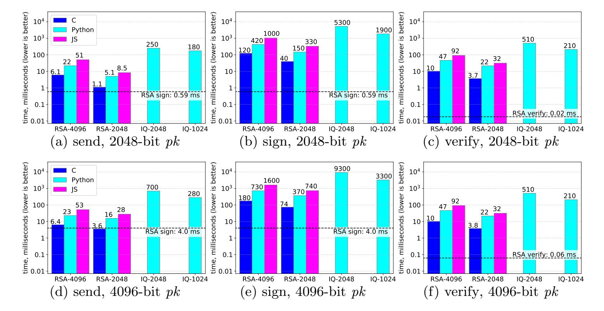

{0}------------------------------------------------

# An airdrop that preserves recipient privacy

Riad S. Wahby? Dan Boneh? Christopher Jeffrey◦ Joseph Poon† ?Stanford University ◦Purse.io †Unaffiliated

Abstract. A common approach to bootstrapping a new cryptocurrency is an airdrop, an arrangement in which existing users give away currency to entice new users to join. But current airdrops offer no recipient privacy: they leak which recipients have claimed the funds, and this information is easily linked to off-chain identities.

In this work, we address this issue by defining a private airdrop and describing concrete schemes for widely-used user credentials, such as those based on ECDSA and RSA. Our private airdrop for RSA builds upon a new zero-knowledge argument of knowledge of the factorization of a committed secret integer, which may be of independent interest. We also design a private genesis airdrop that efficiently sends private airdrops to millions of users at once. Finally, we implement and evaluate. Our fastest implementation takes 40–180 ms to generate and 3.7–10 ms to verify an RSA private airdrop signature. Signatures are 1.8–3.3 kiB depending on the security parameter.

Keywords: Cryptocurrency · Airdrop · User privacy · Zero-knowledge proof of knowledge of factorization of an RSA modulus

## <span id="page-0-0"></span>1 Introduction

Newly-created cryptocurrencies face a chicken-and-egg problem: users appear to prefer currencies that already have a thriving ecosystem [\[64\]](#page-31-0). For generalpurpose cryptocurrencies, this might entail a healthy transaction volume. For currencies supporting distributed applications, it could mean having a critical mass of clients already using the provided functionality. In both cases, the bottom line is: to attract users, you must already have some.

This problem is well known in practice. One response is an airdrop, an arrangement in which the existing users of a cryptocurrency give value in their currency to non-users, at no cost, to entice them to become users. Airdrops have become increasingly popular [\[2,](#page-29-0)[23,](#page-29-1)[25,](#page-30-0)[83\]](#page-32-0), with recent high-profile examples including Stellar [\[131\]](#page-34-0) and OmiseGO [\[111\]](#page-33-0).

As the name implies, an airdrop is designed to transfer value to passive recipients. To be most effective at recruiting new users, an airdrop should not require recipients to enroll ahead of time—or, in the best case, even to know about the airdrop in advance. This is effected by leveraging existing cryptographic infrastructure. Commonly, recipients claim their airdropped value on a new blockchain by reusing their identities from some other, well-established blockchain.

{1}------------------------------------------------

While airdrops to existing blockchains are convenient, using other cryptographic infrastructure may be more effective at recruiting desirable users. A very interesting example is GitHub, since it has tens of millions of users [\[70\]](#page-32-1), many of whom use SSH keys to access repositories and PGP keys to sign commits. GitHub publishes users' public keys [\[71,](#page-32-2)[72\]](#page-32-3), which allows cryptocurrencies to design airdrops intended for developers by allowing them to claim airdropped funds using keys from GitHub. The PGP web of trust [\[116\]](#page-33-1), Keybase [\[88\]](#page-32-4), Git-Lab [\[73\]](#page-32-5), and the X.509 PKI [\[46\]](#page-31-1) are interesting for similar reasons.

Yet, no matter the infrastructure they target, airdrops have a serious flaw: they offer no privacy to their recipients. This means that an observer can easily learn whether or not any given recipient has claimed her airdropped value. Even cryptocurrencies that provide anonymity mechanisms for on-chain transactions (e.g., [\[30](#page-30-1)[,16\]](#page-29-2); [§8\)](#page-25-0) do not prevent this leakage, because a recipient must first use her existing identity to claim the airdropped funds. And using cryptographic infrastructure like GitHub exacerbates this privacy leak since GitHub accounts, PGP keys, etc., are often tied to software projects and professional activities. All told, these issues act as a disincentive for privacy-conscious recipients to redeem their awards, which reduces the airdrop's effectiveness in recruiting new users.

Existing solutions fall short of addressing this issue. The simplest possible approach—sending each recipient a fresh secret key for claiming her funds carries an even stronger disincentive: it requires recipients to trust the sender. Both the sender and recipient know the secret key, so either can take the funds, but neither can prove who did. Meanwhile, a dishonest sender might garner free publicity with an airdrop, only to claw back the funds; or an incompetent one might accidentally disclose the secret keys. To avoid this trust requirement, a workable solution must allow only the recipient to withdraw the funds.

A more plausible approach is to have recipients claim airdrop funds by proving their identities in zero knowledge. Concretely, a recipient proves that she knows the secret key for some pre-existing public key (say, the RSA public key of her GitHub credential), and that no prior airdrop claim has used this public key. To preserve her privacy, she must do so without revealing which public key she is using. But proving knowledge of one secret key among a large list of RSA keys using general-purpose zero-knowledge proof systems [\[37,](#page-30-2)[137,](#page-34-1)[3](#page-29-3)[,39,](#page-30-3)[69,](#page-32-6)[31,](#page-30-4)[20,](#page-29-4)[114,](#page-33-2)[15\]](#page-29-5) is too expensive: infeasible computational cost, enormous proofs, and/or a setup phase whose incorrect execution allows proving false statements (see [§8\)](#page-25-0).

Meanwhile, infrastructures like GitHub are primarily based on RSA because it is, anecdotally, the most widely-supported key type for both SSH [\[130\]](#page-34-2) and PGP [\[77\]](#page-32-7). This means that taking advantage of these infrastructures effectively requires support for airdrops to RSA keys.

Our contributions. This work builds an efficient and practical private airdrop system using special-purpose zero-knowledge proofs designed for this task.

First, we define precisely the required functionality and security properties for a private airdrop scheme ([§2.1\)](#page-2-0). Second, we exhibit practical private airdrop schemes designed to work with ECDSA ([§3\)](#page-7-0) and RSA ([§4\)](#page-8-0) credentials. Our ECDSA scheme extends in a straightforward way to Schnorr [\[127\]](#page-34-3), EdDSA [\[21\]](#page-29-6), 

{2}------------------------------------------------

and similar credentials. To construct our RSA scheme, we devise a new succinct zero-knowledge proof of knowledge (ZKPK) of the factorization of a committed secret integer, which we prove secure in the generic group model for groups of unknown order [\[128,](#page-34-4)[50\]](#page-31-2). This new ZKPK may be of independent interest.

Third, we carefully describe how to use private airdrops to bootstrap a new cryptocurrency, a scheme we call a private genesis airdrop ([§5\)](#page-16-0). This scheme is designed to handle millions of recipients, each of whom has hundreds of keys of mixed types (some RSA, some ECDSA, etc.) and who may potentially have lost one or more of their keys. The scheme lets the airdrop's sender prove the total value of the airdrop, while enabling airdrop recipients to prove non-payment in case the sender was dishonest.

Fourth, we implement and evaluate our schemes ([§6\)](#page-21-0). Our evaluation focuses on the private airdrop scheme for RSA (which is more costly than the one for ECDSA) and the private genesis airdrop. Depending on the security parameter, our fastest implementation takes 40–180 ms for an airdrop recipient to generate an RSA-based private airdrop signature comprising 1.8–3.3 kiB. The signature takes miners 3.7–10 ms to verify. The scheme requires a trusted setup to generate one global RSA modulus with an unknown factorization. Eliminating trusted setup, by using class groups of unknown order, increases signing and verifying times by 9–13× in our reference implementation. Compared with a private airdrop to one recipient, a private genesis airdrop to one million users, each with one thousand public keys, increases signature size by less than 1.8× in the worst case. Our reference implementation is available as open source ([§6\)](#page-21-1).

## <span id="page-2-2"></span>2 Background and definitions

[`] denotes the set of integers {0, 1, . . . , ` − 1}. λ is a security parameter (e.g., λ = 128); we generally leave λ implicit. Primes(2λ) is the set of the smallest 2 2λ odd primes; this is roughly the primes up to 2λ + log(2λ) bits in length.

Detailed knowledge of blockchains and cryptocurrencies is not required to understand this work. For now, we regard a blockchain simply as an appendonly log of transactions. We give slightly more detail in Section [5;](#page-16-0) curious readers should consult the survey of Bonneau et al. [\[29\]](#page-30-5) for further information.

### <span id="page-2-0"></span>2.1 Private airdrop scheme

High-level description. In a private airdrop, a sender S creates a token and a secret for a recipient R whose public key is pk. The sender sends the secret to R[1](#page-2-1) and records the token in a blockchain transaction. To claim the airdrop, R uses the token, the secret, and her secret key sk (i.e., corresponding to pk) to sign a new transaction. Any verifier V (i.e., other blockchain stakeholders) can verify this signature using the token, and does not learn the recipient's pk.

<span id="page-2-1"></span><sup>1</sup> This is usually accomplished by encrypting the secret to the recipient's pk and publishing the resulting ciphertext, so no explicit private channel is necessary.

{3}------------------------------------------------

Syntax. Let SIG := (genSIG ,signSIG , verifySIG) be a signature scheme secure against existential forgery under a chosen message attack. The derived private airdrop scheme PAD with implicit security parameter λ is a tuple of four algorithms:

setup(1<sup>λ</sup> ) →<sup>R</sup> pp: Output pp, which is an implicit input to the other algorithms. send(pk) →<sup>R</sup> (c, s): Compute and output token c and secret s for public key pk, where (pk, sk) ←<sup>R</sup> genSIG(). Here c is a public airdrop token that can later be claimed by a recipient whose public key is pk. The element s is a secret that the recipient will use, along with sk, to claim the token c.

sign(sk,(c, s), msg) →<sup>R</sup> sig: Sign message msg ∈ {0, 1} ? under token-secret pair (c, s) using secret key sk, where (pk, sk) ←<sup>R</sup> genSIG() and (c, s) ←<sup>R</sup> send(pk). An airdrop recipient uses this algorithm to claim the airdrop token c.

verify(c, msg, sig) → {OK, ⊥}: OK if sig is valid for msg and token c, else ⊥. This algorithm is used to verify a claim for the token c.

PAD may also be validatable, in which case it has an additional algorithm:

validate(pk,(c, s)) → {OK, ⊥}: This algorithm outputs OK if token c with secret s granted to public key pk is valid, else it outputs ⊥.

For schemes that are not validatable, we let validate(·, ·) output OK for all inputs.

Functionality. We require that, for all messages msg ∈ {0, 1} ? ,

$$\Pr \left[ \begin{array}{ll} \operatorname{verify}(c, msg, sig) = \operatorname{OK} \wedge \operatorname{validate}(pk, (c, s)) = \operatorname{OK} \\ \operatorname{where} \quad \operatorname{pp} \xleftarrow{\mathbb{R}} \operatorname{setup}(1^{\lambda}) \quad (pk, sk) \xleftarrow{\mathbb{R}} \operatorname{gen}^{\operatorname{sig}}() \\ (c, s) \xleftarrow{\mathbb{R}} \operatorname{send}(pk) \quad sig \xleftarrow{\mathbb{R}} \operatorname{sign}(sk, (c, s), msg) \end{array} \right] \geq 1 - \operatorname{negl}(\lambda)$$

Security. PAD is secure if it is anonymous, unforgeable, and orthogonal to SIG. Anonymity means, informally, that c and sig reveal nothing about pk or sk, other than a well-defined leakage given by a function Λ. This ensures that claiming a token c does not reveal the claimant's identity, as required for privacy.

<span id="page-3-0"></span>Definition 1. PAD is Λ-anonymous if there is a leakage function Λ such that for all PPT adversaries A there exists a simulator Sim such that the following two distributions are statistically indistinguishable, letting pp ←<sup>R</sup> setup(1<sup>λ</sup> ):

$$D_{\mathrm{r}} = \left\{ \begin{array}{c} (pk, sk) \xleftarrow{\mathbb{R}} \operatorname{gen}^{\boldsymbol{s} \boldsymbol{\iota} \boldsymbol{G}}() \\ (c, s) \xleftarrow{\mathbb{R}} \operatorname{send}(pk) \\ (msg, \mathsf{st}) \xleftarrow{\mathbb{R}} \operatorname{den}(pk) \\ \operatorname{sig} \xleftarrow{\mathbb{R}} \operatorname{sign}(sk, (c, s), msg) \\ \operatorname{output} (pk, c, msg, sig, \mathsf{st}) \end{array} \right\} \; ; \; D_{\mathrm{s}} = \left\{ \begin{array}{c} (pk, sk) \xleftarrow{\mathbb{R}} \operatorname{gen}^{\boldsymbol{s} \boldsymbol{\iota} \boldsymbol{G}}() \\ \operatorname{H} \xleftarrow{\mathbb{R}} \Lambda(pk, sk) \\ (c, msg, sig, \mathsf{st}) \xleftarrow{\mathbb{R}} \operatorname{Sim}(\mathsf{H}) \\ \operatorname{output} (pk, c, msg, sig, \mathsf{st}) \end{array} \right\}$$

Remark 1. Sim sees only H (not pk), yet simulates (c, msg, sig,st). This means that this 4-tuple reveals nothing about the challenge pk except the leakage H = Λ(pk, sk). A does not learn s because in an airdrop only the sender and recipient do, and the goal is to keep other parties from learning the recipient's identity.

Remark 2. Sim appears to forge a valid signature (see Def. [2\)](#page-4-0), but this does not result in a real-world attack on our private airdrop schemes ([§3,](#page-7-0) [§4\)](#page-8-0). The reason for this is that we instantiate these schemes in the random oracle model [\[12\]](#page-29-7), and Sim is allowed to program the random oracle.

{4}------------------------------------------------

Remark 3. A slightly stronger definition of anonymity also includes sk in the output of both distributions. Anonymity under this definition implies, roughly speaking, that even knowledge of the key sk corresponding to a token c is not sufficient to connect sig to pk. The schemes in the following sections meet this stronger notion, but it does not appear necessary in practice.

Unforgeability means, roughly speaking, that without sk one cannot generate a valid PAD signature for any message, even given valid PAD signatures for other messages and valid signatures in the underlying SIG for arbitrary messages. Consider Forge, a game between adversary  $\mathcal{A}$  and challenger  $\mathcal{C}$ :

**Setup:**  $\mathcal{C}$  sets  $\mathsf{pp} \overset{\mathbb{R}}{\leftarrow} \mathsf{setup}(1^{\lambda}), (pk, sk) \overset{\mathbb{R}}{\leftarrow} \mathsf{gen}^{\mathsf{sig}}(), \mathsf{and} (c, s) \overset{\mathbb{R}}{\leftarrow} \mathsf{send}(pk), \mathsf{then}$  sends pk, (c, s) to  $\mathcal{A}$ .

Query:  $\mathcal{A}$  makes any number of queries of type Q1 and Q2, in any interleaving. Q1:  $\mathcal{A}$  sends  $msg_i^{\mathsf{sig}}$  to  $\mathcal{C}$ , who replies with  $sig_i^{\mathsf{sig}} \xleftarrow{\mathbb{R}} \mathrm{sign}^{\mathsf{sig}}(sk, msg_i^{\mathsf{sig}})$ .

Q2:  $\mathcal{A}$  sends  $msg_j$  to  $\mathcal{C}$ , who replies with  $sig_j \overset{\mathbb{R}}{\leftarrow} \operatorname{sign}(sk,(c,s),msg_j)$ .

**Forge:**  $\mathcal{A}$  outputs  $(\hat{m}, \hat{s})$ , winning if verify $(c, \hat{m}, \hat{s}) = \mathsf{OK} \land \bigwedge_{i} \hat{m} \neq msg_{j}$ .

<span id="page-4-0"></span>**Definition 2.** Let adversary  $\mathcal{A}$ 's advantage in Forge be  $\operatorname{Adv}_{\mathcal{A}}^{\mathsf{Forge}} = \Pr[\mathcal{A} \ wins].$  PAD is unforgeable if, for any  $PPT \ \mathcal{A}$ ,  $\operatorname{Adv}_{\mathcal{A}}^{\mathsf{Forge}} \leq \operatorname{negl}(\lambda)$ .

Orthogonality means, informally, that PAD signatures do not help to create a SIG forgery. In other words, the airdrop scheme does not weaken the user's credential (e.g., for authenticating to GitHub). Consider Ortho, a game between adversary  $\mathcal{A}$  and challenger  $\mathcal{C}$ :

**Setup:**  $\mathcal{C}$  sets  $pp \stackrel{\mathbb{R}}{\leftarrow} \operatorname{setup}(1^{\lambda})$  and  $(pk, sk) \stackrel{\mathbb{R}}{\leftarrow} \operatorname{gen}^{\operatorname{sig}}()$ , then sends pk to  $\mathcal{A}$ , who chooses (c, s) and sends them to  $\mathcal{C}$ . Finally,  $\mathcal{C}$  aborts if  $\operatorname{validate}(pk, (c, s)) = \bot$ .

**Query:**  $\mathcal{A}$  makes any number of queries of type Q1 and Q2, in any interleaving. Q1:  $\mathcal{A}$  sends  $msg_i$  to  $\mathcal{C}$ , who replies with  $sig_i \stackrel{\mathbb{R}}{\leftarrow} sign^{\mathsf{sig}}(sk, msg_i)$ .

Q2:  $\mathcal{A}$  sends  $msg_j^{PAD}$  to  $\mathcal{C}$ , who replies with  $sig_j^{PAD} \leftarrow sign(sk, (c, s), msg_j^{PAD})$ .

Forge:  $\mathcal{A}$  outputs  $(\hat{m}, \hat{s})$ , winning if verify<sup>SIG</sup> $(pk, \hat{m}, \hat{s}) = \mathsf{OK} \land \bigwedge_i \hat{m} \neq msg_i$ . The game wkOrtho is similar, but further requires  $\bigwedge_j \hat{m} \neq msg_j^{\mathsf{PAD}}$  for  $\mathcal{A}$  to win.

<span id="page-4-1"></span>**Definition 3.** Let adversary  $\mathcal{A}$ 's advantage in Ortho be  $\operatorname{Adv}^{\mathsf{Ortho}}_{\mathcal{A}} = \Pr\left[\mathcal{A} \text{ wins}\right]$ . PAD is **orthogonal** to SIG if, for any PPT adversary  $\mathcal{A}$ ,  $\operatorname{Adv}^{\mathsf{Ortho}}_{\mathcal{A}} \leq \operatorname{negl}(\lambda)$ . PAD is **weakly orthogonal** if Ortho is replaced with wkOrtho in this definition.

Remark 4. The PAD scheme of Section 4 gives orthogonality, while the scheme of Section 3 gives only weak orthogonality. In practice, weak orthogonality suffices as long as messages signed in the PAD scheme cannot be confused with messages signed in the SIG scheme; this appears to be true in our applications.

### <span id="page-4-2"></span>2.2 Zero-knowledge proofs in generic groups

In this section we briefly review the notion of a generic group of unknown order and zero-knowledge proof systems with respect to such groups, following [27].

{5}------------------------------------------------

Generic groups. We use the generic group model for groups of unknown order as defined by Damgård and Koprowski [50]. The group is parameterized by two integer public parameters A, B. The order of the group is sampled uniformly from [A, B]. The group  $\mathbb{G}$  is defined by a random injective function  $\sigma: \mathbb{Z}_{|\mathbb{G}|} \to \{0, 1\}^{\ell}$ , for some  $\ell$  where  $2^{\ell} \gg |\mathbb{G}|$ . The group elements are  $\sigma(0), \sigma(1), \ldots, \sigma(|\mathbb{G}|-1)$ . A generic group algorithm  $\mathcal{A}$  is a probabilistic algorithm. Let  $\mathcal{L}$  be a list that is initialized with the encodings given to  $\mathcal{A}$  as input. The algorithm can query two generic group oracles:

- $\mathcal{O}_1$  samples a random  $r \in \mathbb{Z}_{|\mathbb{G}|}$  and returns  $\sigma(r)$ , which is appended to the list of encodings  $\mathcal{L}$ .
- When  $\mathcal{L}$  has size q, the second oracle  $\mathcal{O}_2(i,j,\pm)$  takes two indices  $i,j \in \{1,\ldots,q\}$  and a sign bit, and returns  $\sigma(x_i \pm x_j)$ , which is appended to  $\mathcal{L}$ .

Note that unlike Shoup's generic group model [128], the algorithm is not given  $|\mathbb{G}|$ , the order of the group  $\mathbb{G}$ .

The representation extraction lemma. Let  $\mathcal{A}$  be an algorithm that outputs a generic group element  $u \in \mathbb{G}$ . The following lemma from [57] shows that there is an extractor that can extract from  $\mathcal{A}$  an integer representation of u relative to a supplied set of group generators. Moreover, this integer representation is unique.

<span id="page-5-0"></span>Lemma 1 (Unique representation extraction in generic groups). Let  $\mathbb{G}$  be a generic group of unknown order where |B-A| is super-polynomial in  $\lambda$ . Let  $\mathcal{A}_1, \mathcal{A}_2$  be two randomized algorithms that interact with group oracles for  $\mathbb{G}$  and make at most a polynomial in  $\lambda$  queries to these oracles. Suppose that each algorithm makes at most q type-1 queries and let  $g_1, \ldots, g_q \in \mathbb{G}$  be the returned random group elements. Each of  $\mathcal{A}_1$  and  $\mathcal{A}_2$  eventually outputs some  $u_i \in \mathbb{G}$ .

Then there is an extractor  $\mathcal{B}$  that emulates the generic group oracles for  $\mathcal{A}_i$   $i \in \{1,2\}$  such that when  $\mathcal{B}$  interacts with  $\mathcal{A}_i$  the following holds with overwhelming probability: if  $\mathcal{A}_i$  outputs  $u_i \in \mathbb{G}$  then the extractor  $\mathcal{B}_i$  outputs a representation  $\alpha_{i,1}, \ldots, \alpha_{i,q} \in \mathbb{Z}$  such that  $u_i = g_1^{\alpha_{i,1}} \cdots g_q^{\alpha_{i,q}}$ . Moreover, if  $u_1 = u_2$  then the two representations are the same, namely  $\alpha_{1,j} = \alpha_{2,j}$  for  $j = 1, \ldots, q$ .

Argument systems. An argument system for a relation  $\mathfrak{R} \subset \mathcal{X} \times \mathcal{W}$  is a triple of randomized polynomial time algorithms  $(Pgen, \mathcal{P}, \mathcal{V})$ , where Pgen takes an implicit security parameter  $\lambda$  and outputs a common reference string (crs) pp. If the setup algorithm uses only public randomness we say that the setup is transparent and that the crs is unstructured. The prover  $\mathcal{P}$  takes as input a statement  $x \in \mathcal{X}$ , a witness  $w \in \mathcal{W}$ , and the crs pp. The verifier  $\mathcal{V}$  takes as input pp and x and after interaction with  $\mathcal{P}$  outputs 0 or 1. We denote the transcript between the prover and verifier by  $\langle \mathcal{V}(\mathsf{pp}, x), \mathcal{P}(\mathsf{pp}, x, w) \rangle$  and write  $\langle \mathcal{V}(\mathsf{pp}, x), \mathcal{P}(\mathsf{pp}, x, w) \rangle = 1$  to indicate that the verifier accepted the transcript. If  $\mathcal{V}$  uses only public randomness we say that the protocol is public coin.

**Definition 4 (Completeness).** An argument system  $(Pgen, \mathcal{P}, \mathcal{V})$  for a relation  $\mathfrak{R}$  is **complete** if for all  $(x, w) \in \mathfrak{R}$ :

$$\Pr\left[\; \langle \mathcal{V}(\mathsf{pp},x), \mathcal{P}(\mathsf{pp},x,w) \rangle = 1 : \mathsf{pp} \xleftarrow{\mathtt{R}} Pgen(1^{\lambda}) \right] = 1.$$

{6}------------------------------------------------

We now define soundness and knowledge extraction for our protocols. The adversary is modeled as two algorithms  $\mathcal{A}_0$  and  $\mathcal{A}_1$ , where  $\mathcal{A}_0$  outputs the instance  $x \in \mathcal{X}$  after Pgen is run, and  $\mathcal{A}_1$  runs the interactive protocol with the verifier using a state output by  $\mathcal{A}_0$ . In slight deviation from the soundness definition used in statistically sound proof systems, we do not universally quantify over the instance x (i.e. we do not require security to hold for all input instances x). This is due to the fact that in the computationally-sound setting the instance itself may encode a trapdoor of the crs pp (e.g. the order of a group of unknown order), which can enable the adversary to fool a verifier. Requiring that an efficient adversary  $\mathcal{A}_0$  outputs the instance x prevents this. For soundness, no efficient adversary  $\mathcal{A}_1$  can make the verifier accept when no witness for x exists. For an argument of knowledge, there should be an extractor that can extract a valid witness whenever  $\mathcal{A}_1$  is convincing.

**Definition 5 (Arguments (of Knowledge)).** An argument system  $(Pgen, \mathcal{P}, \mathcal{V})$  is **sound** if for all PPT adversaries  $\mathcal{A} = (\mathcal{A}_0, \mathcal{A}_1)$ :

$$\Pr\left[ \begin{array}{ll} \langle \mathcal{V}(\mathsf{pp},x), \mathcal{A}_1(\mathsf{pp},x,\mathsf{state}) \rangle = 1 \land \nexists w \quad (x,w) \in \mathfrak{R} \\ where \ \mathsf{pp} \xleftarrow{\scriptscriptstyle \mathbb{R}} Pgen(1^\lambda), \ (x,\mathsf{state}) \xleftarrow{\scriptscriptstyle \mathbb{R}} \mathcal{A}_0(\mathsf{pp}) \end{array} \right] \leq \mathsf{negl}.$$

Additionally, the argument system is an **argument of knowledge** if for all PPT adversaries  $A_1$  there exists a PPT extractor Ext such that for all PPT adversaries  $A_0$ :

$$\Pr \begin{bmatrix} \langle \mathcal{V}(\mathsf{pp}, x), \mathcal{A}_1(\mathsf{pp}, x, \mathsf{state}) \rangle = 1 \land (x, w') \not \in \mathfrak{R} \\ where & \mathsf{pp} \xleftarrow{\mathbb{R}} Pgen(1^{\lambda}) \\ (x, \mathsf{state}) \xleftarrow{\mathbb{R}} \mathcal{A}_0(\mathsf{pp}) \\ w' \xleftarrow{\mathbb{R}} \mathsf{Ext}(\mathsf{pp}, x, \mathsf{state}) \end{bmatrix} \le \mathsf{negl}.$$

Any argument of knowledge is also sound. In some cases we may further restrict  $\mathcal{A}$  in the security analysis, in which case we would say the system is an argument of knowledge for a restricted class of adversaries. For example, in this work we construct argument systems for relations that depend on a group  $\mathbb{G}$  of unknown order. In the analysis we replace  $\mathbb{G}$  with a generic group and restrict  $\mathcal{A}$  to a generic group algorithm that interacts with the oracles for this group. We say that the protocol is an argument of knowledge in the generic group model.

**Definition 6 (Zero Knowledge).** We say an argument system  $(Pgen, \mathcal{P}, \mathcal{V})$  for  $\mathfrak{R}$  has **statistical zero-knowledge** if there exists a PPT simulator Sim such that for  $(x, w) \in \mathfrak{R}$  the following distribution are statistically indistinguishable:

$$D_{\mathrm{real}} = \left\{ \begin{array}{l} \langle \mathcal{P}(\mathsf{pp}, x, w), \mathcal{V}(\mathsf{pp}, x) \rangle \\ where \ \mathsf{pp} \xleftarrow{\mathbb{R}} Pgen(1^{\lambda}) \end{array} \right\} \ ; \ D_{\mathrm{sim}} = \left\{ \begin{array}{l} \mathsf{Sim}(\mathsf{pp}, x, \mathcal{V}(\mathsf{pp}, x)) \\ where \ \mathsf{pp} \xleftarrow{\mathbb{R}} Pgen(1^{\lambda}) \end{array} \right\}$$

**Definition 7 (Non interactive arguments).** A non-interactive argument system is an argument system where the interaction between  $\mathcal{P}$  and  $\mathcal{V}$  consists of only a single round. We write the prover  $\mathcal{P}$  as  $\mathcal{P}(pp, x, w) \to \pi$  and the verifier as  $\mathcal{V}(pp, x, \pi) \to \{0, 1\}$ .

{7}------------------------------------------------

The Fiat-Shamir heuristic [54] and its multi-round generalization [19] transform public coin arguments into non-interactive ones, in the random oracle model [12].

## <span id="page-7-0"></span>3 Warm-up: A private airdrop to ECDSA keys

Let  $\mathbb{H}$  with generator  $\hat{g}$  be a cyclic group of prime order  $\hat{q}$ . Let the ECDSA signature scheme in  $\mathbb{H}$  be the triple  $(\text{gen}_{\mathbb{H}}^{\mathsf{DSA}}() \xrightarrow{\mathbb{R}} (pk, sk), \text{sign}_{\mathbb{H}}^{\mathsf{DSA}}(sk, msg) \xrightarrow{\mathbb{R}} sig,$  verify<sub> $\mathbb{H}$ </sub>  $(pk, msg, sig) \to \{\mathsf{OK}, \bot\}$ );  $(pk, sk) = (\hat{g}^x, x)$  is an ECDSA key pair.

We now define PAD-DSA, a private airdrop scheme to ECDSA keys. Intuitively, the token c in this scheme is a fresh ECDSA public key derived from an existing key, such that only that key's owner can compute the corresponding secret. In particular, PAD-DSA leverages the fact that  $c = pk^s = \hat{g}^{x \cdot s} \in \mathbb{H}$  is an ECDSA public key whose corresponding secret key is  $sk \cdot s = x \cdot s \in \mathbb{Z}_{\hat{q}}$ . Further, if s is chosen at random,  $pk^s$  is independent of pk, so c reveals nothing about pk.

Thus, PAD-DSA is the validatable private airdrop scheme given by:

```
setup(1^{\lambda}) \rightarrow pp: Output \perp; this scheme uses no public parameters.

send(pk) \xrightarrow{\mathbb{R}} (c,s): Choose s \xleftarrow{\mathbb{R}} [\hat{q}] \setminus \{0\}, set c \leftarrow pk^s \in \mathbb{H}, and output (c,s).

sign(sk, (c,s), msg) \xrightarrow{\mathbb{R}} sig: Output sign^{\mathsf{DSA}}_{\mathbb{H}}(sk \cdot s \in \mathbb{Z}_{\hat{q}}, (c, msg)).

verify(c, msg, sig) \rightarrow \{\mathsf{OK}, \bot\}: Output verify^{\mathsf{DSA}}_{\mathbb{H}}(c, (c, msg), sig).

validate(pk, (c,s)) \rightarrow \{\mathsf{OK}, \bot\}: OK if s \in [\hat{q}] \setminus \{0\} \land c = pk^s \in \mathbb{H}, else \bot.
```

**Theorem 1.** PAD-DSA is anonymous (Def. 1), with no leakage.

Proof. Let  $\Lambda^{\mathsf{DSA}}(\cdot, \cdot) := \bot$ . For an adversary  $\mathcal{A}$ , the simulator  $\mathsf{Sim}_{\mathcal{A}}^{\mathsf{DSA}}(\cdot)$ , which ignores its input, works as follows: (1) compute  $(pk', sk') \overset{\mathbb{R}}{\leftarrow} \mathsf{gen}_{\mathbb{H}}^{\mathsf{DSA}}()$ , (2) run the adversary  $\mathcal{A}$  on input pk' to obtain  $(msg, \mathsf{st})$ , (3) compute  $sig \overset{\mathbb{R}}{\leftarrow} \mathsf{sign}_{\mathbb{H}}^{\mathsf{DSA}}(sk, msg)$ , and (4) output  $(pk', msg, sig, \mathsf{st})$ . (Notice that pk' plays the role of the token c.)

We now show that  $\operatorname{Sim}_{\mathcal{A}}^{\operatorname{DSA}}(\cdot)$  induces a distribution  $D_{\operatorname{sim}}$  that is statistically indistinguishable from  $D_{\operatorname{real}}$ . By inspection, pk has the same distribution in both views. In the real view, s is uniform in  $\{1,\ldots,\hat{q}-1\}$ , so  $(c=\hat{g}^{x\cdot s},x\cdot s)$  in the real view is a uniformly random ECDSA key. This is also true of (pk',sk') in simulation, so c, msg, and st are all statistically indistinguishable. Finally, sig is valid and identically distributed in both views by the definition of  $\operatorname{sign}_{\mathbb{H}}^{\operatorname{DSA}}$ .  $\square$ 

**Definition 8 (Idealized ECDSA [35,52]).** The triple  $(gen_{\mathbb{H}}^{DSA}, sign_{\mathbb{H}}^{DSA}, verify_{\mathbb{H}}^{DSA})$  is the **idealized ECDSA** algorithm if the two hash functions called as subroutines by  $sign_{\mathbb{H}}^{DSA}$  and  $verify_{\mathbb{H}}^{DSA}$  are modeled as random oracles.

<span id="page-7-1"></span>**Theorem 2.** PAD-DSA is unforgeable (Def. 2) when  $(\text{gen}_{\mathbb{H}}^{DSA}, \text{sign}_{\mathbb{H}}^{DSA}, \text{verify}_{\mathbb{H}}^{DSA})$  is modeled as the idealized ECDSA algorithm.

<span id="page-7-2"></span>**Theorem 3.** PAD-DSA is weakly orthogonal to ECDSA in  $\mathbb{H}$  (Def. 3) when  $(\text{gen}_{\mathbb{H}}^{\mathbf{DSA}}, \text{sign}_{\mathbb{H}}^{\mathbf{DSA}}, \text{verify}_{\mathbb{H}}^{\mathbf{DSA}})$  is modeled as the idealized ECDSA algorithm.

{8}------------------------------------------------

Dauterman et al. [52, Thm. 5, Appx. C] prove a statement equivalent to Theorem 2. PAD-DSA is, in effect, a signature under a related key; Theorem 3 captures the required security against related-key attacks. Morita et al. [105, Thm. 2] prove a statement equivalent to this theorem, and also suggest a tweak to DSA whose use would give full (rather than weak) orthogonality for PAD-DSA.

An alternative to the above scheme is to use  $c = pk \cdot \hat{g}^s = \hat{g}^{x+s}$ , with signing key  $x + s \in \mathbb{Z}_{\hat{q}}$ , similarly to hierarchical deterministic wallets [139]. PAD-DSA also extends naturally to Schnorr [127], EdDSA [21], and related schemes.

## <span id="page-8-0"></span>4 A private airdrop to RSA keys

Let  $\mathbb{G}$  be a group of unknown order (§2.2) with generators g, h having unknown discrete-log relation. Let  $\mathbb{H}$  be an auxiliary cyclic group of known prime order  $\hat{q}$  with generators  $\hat{g}$ ,  $\hat{h}$  having unknown discrete-log relation. Let  $n \in [N]$  be a secret integer where N is a public upper bound on n and  $N > |\mathbb{G}| \cdot 2^{\lambda}$ . Let  $c := g^n \cdot h^s \in \mathbb{G}$  be a Pedersen commitment to n with opening  $s \stackrel{\mathbb{R}}{\leftarrow} [N]$ .

In this section we construct a private airdrop to RSA keys. We proceed in two steps: we first construct an interactive zero-knowledge proof of knowledge (ZKPK) of the factorization of an RSA modulus  $n \in \mathbb{Z}$  given a public Pedersen commitment [115] to this n (see §4.1 and §4.2). We then make this protocol non-interactive via the Fiat-Shamir heuristic [54], yielding a private airdrop (§4.3).

One way to prove knowledge of the factorization of a committed n is for the prover to commit to integers p and q, and then prove that they are nontrivial factors of n. We instantiate this approach in Section 4.1, but verifying the proof is costly: it requires an exponentiation by a several thousand-bit exponent.

To address this, in Section 4.2 we describe a second ZKPK that reduces the verifier's work by roughly  $5 \times$  and gives  $\approx 13-49\%$  shorter proofs. The resulting protocol leaks a small amount of information about n: at most two bits, This can be reduced to just one leaked bit under a mild assumption (Cor. 1, §4.3).

<span id="page-8-3"></span>Remark 5. The protocols of this section are insecure if the group  $\mathbb{G}$  contains a non-identity element of known order. In the group  $\mathbb{Z}_m^{\times}$  the element -1 has order 2, and hence this group is unsuitable for our protocols. Instead, we work in the quotient group  $\mathbb{G} := \mathbb{Z}_m^{\times}/\{\pm 1\}$ , where elements are represented as integers in the interval [1, m/2] and the product of x and y is defined as  $x \cdot y = \min(z, m-z)$  where  $z = (x \cdot y \mod m)$ . In this group -1 is the same as 1, and presumably there are no other known elements of known order other than the identity. We discuss the group  $\mathbb{G}$  further in Section 7.

### <span id="page-8-1"></span>4.1 PoKF<sub>1</sub>: ZKPK of factorization of a committed integer

To prove knowledge of the factorization of n, the prover establishes the relation

<span id="page-8-2"></span>
$$\mathfrak{R}'_{g,h} := \left\{ \begin{pmatrix} c \in \mathbb{G}, & (n, p, q, s) \in [N] \times \mathbb{Z}^3 \end{pmatrix}, & \text{where} \\ c = g^n \cdot h^s, & p \cdot q = n, & p \notin \{\pm 1, \pm n\} \end{pmatrix}$$
 (1)

{9}------------------------------------------------

where c is the statement and (n, p, q, s) is the witness. At a high level, the proof works as follows: the prover  $\mathcal{P}$  sends the verifier  $\mathcal{V}$  two Pedersen commitments  $c_p$  and  $c_q$  to p and q, respectively, then proves that  $p \cdot q = n$  and  $p \notin \{\pm 1, \pm n\}$ . For this purpose, we combine folklore sigma protocols [127,41,110,49,8,96] with recent work extending such protocols to generic groups of unknown order [27].

To efficiently prove that  $p \notin \{\pm 1, \pm n\}$  we make use of the auxiliary group  $\mathbb{H}$ . Recall that  $\mathcal{V}$  has commitments to p and n, and could therefore prove that  $p \notin \{\pm 1, \pm n\}$  by proving that  $(p^2 - 1)(p^2 - n^2) \neq 0$  as integers. However, this requires a relatively large proof containing multiple elements of  $\mathbb{G}$ .

To sidestep this issue, we take a different approach: rather than execute the proof in  $\mathbb{G}$ , our P and V execute it in a much smaller group  $\mathbb{H}$  of known prime order (say, an elliptic curve group). For RSA moduli at practical security levels the order of  $\mathbb{H}$  is all but certainly coprime to p,  $p \pm 1$ , and  $p \pm n$ , so this suffices to convince V that  $p \notin \{\pm 1, \pm n\}$  in  $\mathbb{Z}$  for essentially any n.

The prover  $\mathcal{P}$  provides a commitment  $\hat{c}_{p^2} \in \mathbb{H}$  to  $p^2$ , from which  $\mathcal{V}$  can compute a commitment to  $p^2 - 1$  as  $\hat{c}_{p^2}/\hat{g} \in \mathbb{H}$ . To do the same for  $p^2 - n^2$  the verifier  $\mathcal{V}$  needs a commitment  $\hat{c}_{n^2} \in \mathbb{H}$  to  $n^2$ . Fortunately, in the airdrop context this is easy to arrange, by requiring the sender  $\mathcal{S}$  to compute the token as  $(c, \hat{c}_{n^2})$  with corresponding secret  $(s, s_2)$ . This gives the modified relation

<span id="page-9-0"></span>
$$\mathfrak{R}_{g,h,\hat{g},\hat{h}}^{"} := \begin{cases}
\left( (c,\hat{c}_{n^2}) \in \mathbb{G} \times \mathbb{H}, & (n,p,q,s,s_2) \in [N] \times \mathbb{Z}^3 \times [\hat{q}] \right), \\
\text{where} \quad c = g^n \cdot h^s, & \hat{c}_{n^2} = \hat{g}^{(n^2)} \cdot \hat{h}^{s_2}, \\
p \cdot q = n, & p \notin \{\pm 1, \pm n\} \mod \hat{q}
\end{cases}$$
(2)

for statement  $(c, \hat{c}_{n^2})$  and witness  $(n, p, q, s, s_2)$ . We now give an interactive ZKPK for the above relation. This protocol uses three sub-protocols,  $\mathsf{Prod}_{\mathbb{G}}$ ,  $\mathsf{Prod}_{\mathbb{H}}$ , and  $\mathsf{Square}$ , which we describe in Appendix B.

**Protocol PoKF<sub>1</sub>** for relation (2) between prover  $\mathcal{P}$  and verifier  $\mathcal{V}$  works as follows.  $\mathcal{V}$ 's input is  $(c, \hat{c}_{n^2}) \in \mathbb{G} \times \mathbb{H}$ , and  $\mathcal{P}$ 's input is  $(n, p, q, s, s_2) \in [N]^4 \times [\hat{q}]$ . (1)  $\mathcal{P}$  sends  $\mathcal{V}$  the following commitments:

- $c_p, c_q \in \mathbb{G}$  to p and q,
- $\hat{c}_p, \hat{c}_{p^2} \in \mathbb{H}$  to p and  $p^2$ , and
- $\hat{c}_{p1'}, \hat{c}_{pn'} \in \mathbb{H}$  to  $(p^2 1)^{-1} \mod \hat{q}$  and  $(p^2 n^2)^{-1} \mod \hat{q}$ .

 $\mathcal{V}$  then computes  $\hat{c}_{p1} = \hat{c}_{p^2} \cdot \hat{g}^{-1} \in \mathbb{H}$  and  $\hat{c}_{pn} = \hat{c}_{p^2} \cdot \hat{c}_{n^2}^{-1} \in \mathbb{H}$ , which are commitments to  $p^2 - 1 = (p-1)(p+1)$  and  $p^2 - n^2 = (p-n)(p+n)$ .

- (2)  $\mathcal{P}$  and  $\mathcal{V}$  execute  $\mathsf{Prod}_{\mathbb{G}}$  (Appx. B.2) on  $(c_q, c_p, c)$ , which convinces  $\mathcal{V}$  that  $p \cdot q = n$  and  $\mathcal{P}$  can open  $c_q$  and c.
- (3)  $\mathcal{P}$  and  $\mathcal{V}$  execute Square (Appx. B.3) on  $(c_p, \hat{c}_p, \hat{c}_{p^2})$ , which convinces  $\mathcal{V}$  that  $\hat{c}_p$  commits to p,  $\hat{c}_{p^2}$  commits to  $p^2$ , and  $\mathcal{P}$  can open all three commitments.
- (4)  $\mathcal{P}$  and  $\mathcal{V}$  execute two instances of  $\mathsf{Prod}_{\mathbb{H}}$  (Appx. B.1), one on  $(\hat{c}_{p1'}, \hat{c}_{p1}, \hat{g})$  and one on  $(\hat{c}_{pn'}, \hat{c}_{pn}, \hat{g})$ . (Note that  $\hat{g}$  is a commitment to 1 with opening 0.) This convinces  $\mathcal{V}$  that  $p^2 1$  and  $p^2 n^2$  are invertible mod  $\hat{q}$  (i.e., that they are nonzero) and that  $\mathcal{P}$  can open  $\hat{c}_{p1'}$ ,  $\hat{c}_{pn'}$ , and  $\hat{c}_{n^2}$ .

{10}------------------------------------------------

Soundness and zero knowledge of  $\mathsf{PoKF_1}$  follow from the properties of the sub-protocols (Appx. B). Verification cost is dominated by  $\mathsf{Square}$ , which entails an exponentiation in  $\mathbb{G}$  with an exponent of size  $\lambda + \log \hat{q} + \log N$  bits. Recall that N is an upper bound on n; typically  $N \approx 2^{4096}$  so that n can be a 4096-bit RSA modulus, so this exponentiation is very expensive. One could instead prove relation (1) directly via five invocations of  $\mathsf{Prod}_{\mathbb{G}}$  (one to establish that  $p \cdot q = n$  and four more to establish that  $p \notin \{\pm 1, \pm n\}$ ). Roughly speaking, this would trade a reduction in verification cost for a commensurate increase in communication cost. We discuss costs in more detail in Appendix B.4.

### <span id="page-10-0"></span>4.2 PoKF<sub>2</sub>: reducing costs by allowing (1-bit) leakage

As discussed above,  $PoKF_1$  suffers from high verification cost. In this section, we give a protocol that reduces both verification and communication cost compared to  $PoKF_1$ , but leaks one bit about n. As we discuss in Section 7, this leakage is acceptable in the private airdrop application.

To prove knowledge of factorization of n, the prover establishes the following relation for  $w \in [N]$  where  $w^2 \equiv t \pmod{n}$  and  $t \in \mathbb{Z}$  is prime,  $1 \leq t \leq \lambda$ . (Recall that computing square roots modulo n is equivalent to factoring n).

<span id="page-10-1"></span>
$$\mathfrak{R}_{g,h} := \left\{ \begin{aligned} & \left( (c,t) \in \mathbb{G} \times [\lambda], & (n,s,w,a) \in [N]^4 \right), & \text{where} \\ & c = g^n \cdot h^s \in \mathbb{G}, & w^2 = t + a \cdot n \in \mathbb{Z}, & 2 \le t < \lambda \text{ a prime} \end{aligned} \right\}$$
(3)

Here (c,t) is the statement and (n,s,w,a) is the witness. The integer relation  $w^2 = t + a \cdot n$  proves that  $w^2 \equiv t \pmod{n}$ , as required.

Remark 6. Common hardware security tokens for RSA keys (e.g., [141]) implement a signing oracle abstraction. This means that the device's owner has access to (at best) an  $e^{\text{th}}$  root in  $\mathbb{Z}_n$  for (n, e) = pk—and not to the factorization of n. Furthermore, these security tokens often fix e = 65537. In principle, it is possible to adapt our ZKPK to a relation analogous to (3) for  $w^*$  a  $65537^{\text{th}}$  root of t. This proof would be an order of magnitude longer, but would eliminate the leakage about n, and support security tokens. We leave to future work the problem of devising a concretely small ZKPK supporting these security tokens.

We now give an interactive ZKPK for Relation (3), building on the results of Boneh et al. [27]. This relation leaks that  $t \in \mathbb{Z}$  is a quadratic residue modulo the committed n. As discussed below (Cor. 1, §4.3), this leakage amounts to one bit under a standard cryptographic assumption.

**Protocol PoKF<sub>2</sub>** for relation (3) between prover  $\mathcal{P}$  and verifier  $\mathcal{V}$  works as follows.  $\mathcal{V}$ 's input is  $(c,t) \in \mathbb{G} \times [\lambda]$  with t prime, and  $\mathcal{P}$ 's input is  $(c,t,n,s,w,a) \in \mathbb{G} \times [N]^5$ . To start,  $\mathcal{P}$  chooses two random integers  $s_1, s_2 \stackrel{\mathbb{R}}{\leftarrow} [N]$  and computes  $c_1 \leftarrow g^w \cdot h^{s_1} \in \mathbb{G}$  and  $c_2 \leftarrow g^a \cdot h^{s_2} \in \mathbb{G}$ . Next, define a homomorphism  $\phi: \mathbb{Z}^8 \to \mathbb{G}^4 \times \mathbb{Z}$  parameterized by  $g, h, c, c_1, c_2$ :

<span id="page-10-2"></span>
$$\phi\begin{pmatrix} w, w2, s1, a, \\ na, s1w, sa, s2 \end{pmatrix} := \begin{pmatrix} g^w \cdot h^{s1}, & g^a \cdot h^{s2}, & g^{w2} \cdot h^{s1w}/c_1^w, \\ g^{na} \cdot h^{sa}/c^a, & w2 - na \end{pmatrix}$$
(4)

{11}------------------------------------------------

It is easy to see that  $\phi$  is a group homomorphism whose range is the group  $\mathbb{G}^4 \times \mathbb{Z}$ . We will write the group operation in this group multiplicatively. That is, if  $(a_i, b_i, c_i, d_i, e_i) \in \mathbb{G}^4 \times \mathbb{Z}$  for  $i \in \{1, 2\}$ , then

$$(a_1, b_1, c_1, d_1, e_1) \cdot (a_2, b_2, c_2, d_2, e_2) := (a_1 a_2, b_1 b_2, c_1 c_2, d_1 d_2, e_1 + e_2).$$

To prove knowledge of a witness for relation (3), it suffices for  $\mathcal{P}$  to prove that it knows a  $\phi$ -preimage of  $T := (c_1, c_2, 1, 1, t) \in \mathbb{G}^4 \times \mathbb{Z}$ . In other words, we need a ZKPK for a vector  $\mathbf{v}' = (w', w2', s1', a', na', s1w', sa', s2') \in \mathbb{Z}^8$  such that

$$\phi(\mathbf{v}') = T = (c_1, c_2, 1, 1, t) \in \mathbb{G}^4 \times \mathbb{Z}. \tag{5}$$

<span id="page-11-0"></span>This proves that  $c_1$  is a commitment to  $w' \in \mathbb{Z}$ ,  $c_2$  is a commitment to  $a' \in \mathbb{Z}$ ,  $w2' = (w')^2$ , and  $na' = a' \cdot n$  for some integer a'. The fifth term in (5) proves that  $(w')^2 - a' \cdot n = t \in \mathbb{Z}$ , as required.

We design a ZKPK for a  $\phi$ -preimage using a zero-knowledge protocol due to Boneh et al. [27, Appx. A]. Here, the verifier  $\mathcal{V}$  is given  $T \in \mathbb{G}^4 \times \mathbb{Z}$  and the prover  $\mathcal{P}$  is given T and  $\mathbf{v} \in \mathbb{Z}^8$  where  $\phi(\mathbf{v}) = T$ . The protocol works as follows:

- (1)  $\mathcal{P}$  sets  $\mathbf{r} := (r_w, r_{w2}, r_{s1}, r_a, r_{na}, r_{s1w}, r_{sa}, r_{s2}) \in \mathbb{Z}^8$  where  $r_w, r_{w2}, r_{na}, r_a \stackrel{\mathbb{R}}{\leftarrow} [2^{2\lambda + \log(2\lambda)} \cdot 2^{\lambda}]$  and  $r_{s1}, r_{s1w}, r_{sa}, r_{s2} \stackrel{\mathbb{R}}{\leftarrow} [N \cdot 2^{2\lambda + \log(2\lambda)}]$ .  $\mathcal{P}$  then computes  $\mathbf{R} \leftarrow \phi(\mathbf{r}) \in \mathbb{G}^4 \times \mathbb{Z}$  and sends  $(c_1, c_2, \mathbf{R})$  to  $\mathcal{V}$ .
- (2)  $\mathcal{V}$  chooses challenges  $ch \stackrel{\mathbb{R}}{\leftarrow} [2^{\lambda}]$  and  $\ell \stackrel{\mathbb{R}}{\leftarrow} \mathsf{Primes}(2\lambda),^2$  and sends them to  $\mathcal{P}$ .
- (3)  $\mathcal{P}$  computes  $\mathbf{z} \leftarrow (ch \cdot \mathbf{v} + \mathbf{r}) \in \mathbb{Z}^8$ ,  $\mathbf{z}_{\ell} \leftarrow (\mathbf{z} \bmod \ell) \in [\ell]^8$ ,  $\mathbf{z}_q \leftarrow \lfloor \mathbf{z}/\ell \rfloor \in \mathbb{Z}^8$ , and  $\mathbf{Z}_q \leftarrow \phi(\mathbf{z}_q)$ ; and sends  $(\mathbf{Z}_q, \mathbf{z}_{\ell}) \in (\mathbb{G}^4 \times \mathbb{Z}) \times [\ell]^8$  to  $\mathcal{V}$ .
- (4)  $\mathcal{V}$  accepts if  $\mathbf{Z}_q^{\ell} \cdot \phi(\mathbf{z}_{\ell}) = T^{ch} \cdot \mathbf{R}$  in  $\mathbb{G}^4 \times \mathbb{Z}$ .

Verification cost is dominated by evaluation of  $\mathbf{Z}_q^{\ell} \cdot \phi(\mathbf{z}_{\ell})$ , which entails four multi-exponentiations with exponents of size at most  $2\lambda + \log(2\lambda)$  bits (i.e., the bit length of  $\ell$ ; §2). For  $\lambda = 128$  and  $N \approx 2^{4096}$ , this is roughly  $5 \times$  less expensive than the cost of exponentiations in protocol PoKF<sub>1</sub> of the prior section. As we discuss in Appendix B.4, PoKF<sub>2</sub> also yields smaller proofs than PoKF<sub>1</sub>.

Remark 7. The commitment  $c_2$  to the integer a is necessary for soundness, and in particular to ensure that a is an integer. If  $c_2$  along with  $s_2$  and the second coordinate of  $\phi$  are eliminated then there is an attack where an adversarial prover can prove knowledge of  $(\sqrt{3} \mod n)$  using a = 1/n and w = 2.

<span id="page-11-2"></span>**Theorem 4.** Protocol PoKF<sub>2</sub> is a zero-knowledge protocol for  $\mathfrak{R}_{g,h}$  from (3).

<span id="page-11-4"></span>**Definition 9.** Algorithm  $\mathcal{G}$  is an **honest instance generator** for  $\mathfrak{R}_{g,h}$  (eq. (3)) if it chooses integers n, s, t, and outputs (c, t) where  $c := g^n \cdot h^s \in \mathbb{G}$  and  $t \in [\lambda]$ .

<span id="page-11-3"></span>**Theorem 5.** Protocol PoKF<sub>2</sub> is an argument of knowledge for the relation  $\mathfrak{R}_{g,h}$  in (3) for instances (c,t) generated by an honest instance generator  $\mathcal{G}$ , when the group  $\mathbb{G}$  is a modeled as a generic group of unknown order.

We prove Theorems 4 and 5 in Appendix C.

<span id="page-11-1"></span>In an interactive protocol,  $\ell \leftarrow \mathsf{Primes}(\lambda)$  would suffice for soundness. Applying the Fiat-Shamir heuristic causes a loss in security, thus requiring a larger  $\ell$  [26, §3.3].

{12}------------------------------------------------

#### <span id="page-12-0"></span>4.3 PAD-RSA: a private airdrop for RSA keys

We construct PAD-RSA by applying the Fiat-Shamir heuristic [54] to the interactive ZKPK PoKF<sub>2</sub> from Section 4.2. We give optimizations in Section 4.4.

Let  $(\operatorname{gen}^{\mathsf{RSA}}() \xrightarrow{\mathbb{R}} (pk, sk), \operatorname{sign}^{\mathsf{RSA}}(sk, msg) \xrightarrow{\mathbb{R}} sig, \operatorname{verify}^{\mathsf{RSA}}(pk, msg, sig) \to \{\mathsf{OK}, \bot\})$  be an RSA signature scheme, e.g., RSA-FDH [12]. Then PAD-RSA is given by:

**setup**( $1^{\lambda}$ )  $\xrightarrow{\mathbb{R}}$  **pp:** Select a group of unknown order  $\mathbb{G}$  generated by g and h, and  $N > |\mathbb{G}| \cdot 2^{\lambda}$  an upper bound on the size of RSA moduli that can be used with these parameters. Output  $pp = (\mathbb{G}, g, h, N, \lambda)$ . We discuss  $\mathbb{G}$  candidates below.

```
\mathbf{send}(pk) \xrightarrow{\mathbb{R}} (c,s) \text{: For } (n,e) = pk, \, s \xleftarrow{\mathbb{R}} [N], \, c \leftarrow g^n \cdot h^s \in \mathbb{G}, \, \text{output } (c,s). \mathbf{sign}(sk,(c,s),msg) \xrightarrow{\mathbb{R}} sig \text{: For } (n,p,q) = sk, \, \text{do:}
```

- (1) choose a random prime  $2 \le t < \lambda$  such that t is a quadratic residue in  $\mathbb{Z}_n$ ,
- (2) find integers (w, a) such that  $w^2 = t + an$  in  $\mathbb{Z}$  (i.e.  $w^2 \equiv t \mod n$ ),
- (3) choose a random  $s_1 \stackrel{\mathbb{R}}{\leftarrow} [N]$  and compute  $c_1 \leftarrow g^w \cdot h^{s_1} \in \mathbb{G}$ ,
- (4) choose a random  $s_2 \stackrel{\mathbb{R}}{\leftarrow} [N]$  and compute  $c_2 \leftarrow g^a \cdot h^{s_2} \in \mathbb{G}$ ,
- (5) compute  $\mathbf{v} \leftarrow (w, w^2, s_1, a, n \cdot a, s_1 \cdot w, s \cdot a, s_2),$
- (6) set  $\mathbf{r} := (r_w, r_{w2}, r_{s1}, r_a, r_{na}, r_{s1w}, r_{sa}, r_{s2}) \in \mathbb{Z}^8$  where  $r_w, r_{w2}, r_{na}, r_a \stackrel{\mathbb{R}}{\leftarrow} [2^{2\lambda + \log(2\lambda)} \cdot 2^{\lambda}]$  and  $r_{s1}, r_{s1w}, r_{sa}, r_{s2} \stackrel{\mathbb{R}}{\leftarrow} [N \cdot 2^{2\lambda + \log(2\lambda)}],$
- (7) compute  $\mathbf{R} \leftarrow \phi(\mathbf{r}) \in \mathbb{G}^4 \times \mathbb{Z}$ , where  $\phi$  is the homomorphism defined in (4),
- (8) compute  $(ch, \ell) \leftarrow \operatorname{Hash}(msg, \mathbb{G}, g, h, c, c_1, c_2, t, \mathbf{R})$ , where  $ch \in [2^{\lambda}]$  and  $\ell \in \operatorname{Primes}(2\lambda)$  (e.g., by treating the hash output as a PRG seed),
- (9) compute  $\mathbf{z} \leftarrow (ch \cdot \mathbf{v} + \mathbf{r}) \in \mathbb{Z}^8$ ,  $\mathbf{z}_{\ell} \leftarrow (\mathbf{z} \bmod \ell) \in [\ell]^8$ ,  $\mathbf{z}_q \leftarrow \lfloor \mathbf{z}/\ell \rfloor \in \mathbb{Z}^8$ ,  $\mathbf{Z}_q \leftarrow \phi(\mathbf{z}_q) \in \mathbb{G}^4 \times \mathbb{Z}$ ,
- (10) output the signature  $sig = (c_1, c_2, t, ch, \ell, \mathbf{Z}_q, \mathbf{z}_\ell)$ .

 $\mathbf{verify}(c, msg, sig) \to {\mathsf{OK}, \bot} : For (c_1, c_2, t, ch, \ell, \mathbf{Z}_q, \mathbf{z}_\ell) = sig,$ 

- (1) output  $\perp$  if  $t \notin [\lambda]$  or not prime,  $c1, c2 \notin \mathbb{G}$ ,  $\mathbf{Z}_q \notin \mathbb{G}^4 \times \mathbb{Z}$ , or  $\mathbf{z}_\ell \notin [\ell]^8$ .
- (2) with  $T := (c_1, c_2, 1, 1, t) \in \mathbb{G}^4 \times \mathbb{Z}$ , compute  $\mathbf{R}' \leftarrow \mathbf{Z}_q^{\ell} \cdot \phi(\mathbf{z}_{\ell}) / T^{ch} \in \mathbb{G}^4 \times \mathbb{Z}$ ,
- (3) compute  $(ch', \ell') \leftarrow \operatorname{Hash}(msg, \mathbb{G}, g, h, c, c_1, c_2, t, \mathbf{R}')$ , where  $ch' \in [2^{\lambda}]$  and  $\ell' \in \operatorname{Primes}(2\lambda)$ ,
- (4) output OK if ch' = ch and  $\ell' = \ell$ , else output  $\perp$ .

**validate** $(pk,(c,s)) \to \{\mathsf{OK},\bot\}$ : Output  $\mathsf{OK}$  if  $s \in [N] \land c = g^n \cdot h^s \in \mathbb{G}$ , else  $\bot$ .

As discussed in Remark 5, the security of PAD-RSA relies crucially on  $\mathbb{G}$  containing no elements of known order other than the identity.  $\mathbb{Z}_m^{\times}/\{\pm 1\}$  for m an RSA modulus with unknown factorization is a convenient choice, but it requires a trusted setup (to generate m without leaking its factorization). A candidate  $\mathbb{G}$  that does not require trusted setup is the class group of imaginary quadratic order [36]. One of our implementations (§6) supports these groups. We discuss further in Section 7.

Since the ZKPK of Section 4.2 is complete, PAD-RSA is a valid scheme. The following theorems establish the security properties of PAD-RSA. Corollary 1 and

{13}------------------------------------------------

Theorem 8 rely on the quadratic residuosity assumption (QRA), below; informally, for RSA modulus m with unknown factorization, distinguishing between a square modulo m and a non-square with Jacobi symbol +1 is infeasible.

### Definition 10 (Quadratic residuosity assumption (QRA) [24]).

Let  $m \stackrel{\mathbb{R}}{\leftarrow} \mathrm{mGen}(\rho)$  output a random RSA modulus with security parameter  $\rho$ , let  $\mathbb{QR}(m)$  denote the set of quadratic residues modulo m, and let  $\mathbb{Z}_m^*[+1]$  denote the elements of  $\mathbb{Z}_m^*$  with Jacobi symbol +1.

The following two distributions are computationally indistinguishable:

$$D_{QR} = \left\{ (a, m) : m \leftarrow \mathrm{mGen}(\rho), \\ a \stackrel{\mathbb{R}}{\leftarrow} \mathbb{QR}(m) \right\} ; D_{NQR} = \left\{ (a, m) : m \leftarrow \mathrm{mGen}(\rho), \\ a \stackrel{\mathbb{R}}{\leftarrow} \mathbb{Z}_m^*[+1] \setminus \mathbb{QR}(m) \right\}$$

**Theorem 6.** PAD-RSA is  $\Lambda^{RSA}$ -anonymous (Def. 1) in the ROM.  $\Lambda^{RSA}$  reveals two bits about (n, e) = (pk, sk), namely, a small prime quadratic residue mod n.

Proof. For (n, e) = pk, let  $\Lambda^{\mathsf{RSA}}(pk, sk)$  output a random prime quadratic residue modulo  $n, 2 \leq t < \lambda$ . For adversary  $\mathcal{A}$ , the simulator  $\mathsf{Sim}_{\mathcal{A}}^{\mathsf{RSA}}(t)$  works as follows: (1) sample c uniformly at random from  $\mathbb{G}$ , (2) run the adversary  $\mathcal{A}$  on input c to obtain  $(msg, \mathsf{st})$ , (3) generate a transcript  $(c_1, c_2, \mathbf{R}, \ell, ch, \mathbf{Z}_q, \mathbf{z}_\ell)$  for input (c, t) using the simulator of Theorem 4, (4) program the random oracle to output  $(ch, \ell)$  on input  $(msg, \mathbb{G}, g, h, c, c_1, c_2, t, \mathbf{R})$ , and (5) output  $(c, msg, (c_1, c_2, t, ch, \ell, \mathbf{Z}_q, \mathbf{z}_\ell), \mathsf{st})$ .

 $\operatorname{Sim}_{\mathcal{A}}^{\mathsf{RSA}}(t)$  induces a distribution  $D_{\mathrm{sim}}$  that is statistically indistinguishable from  $D_{\mathrm{real}}$ . By inspection, pk has the same distribution in both views. In the real view, c is a Pedersen commitment, so in both views c is a uniformly random element of  $\mathbb{G}$ . Since  $\mathcal{A}$  cannot distinguish the real c from the simulated one, msg and st are indistinguishable in the two views. Finally, t is a small random prime QR modulo n in both views, and the simulated sig is valid on msg for (c,t), and indistinguishable from the real sig by Theorem 4.

Since t is a QR modulo n = pq, the Jacobi symbols (t/n) = (t/p) = (t/q) = 1. Quadratic residuosity of a random integer modulo a prime is essentially a coin flip, so for random RSA modulus n' = p'q', the probability that t is a quadratic residue modulo both p' and q' is 1/4. This means that knowing t quarters the number of candidate RSA moduli n', i.e., it reveals two bits.

<span id="page-13-0"></span>Corollary 1. Under QRA,  $\Lambda^{RSA}(pk, sk)$  leaks one bit about pk with respect to any RSA modulus of unknown factorization, to any PPT observer.

*Proof.* Under QRA, an observer who does not know the factorization of n' = p'q' can check whether (t'/p') = (t'/q') for any t', but cannot feasibly determine whether t' is square. Revealing that t is square mod n thus halves the number of candidate RSA moduli n' of unknown factorization, i.e., it reveals one bit.

<span id="page-13-1"></span>To show unforgeability, we first restate the following lemma in terms of PAD-RSA:

Lemma 2 (Forking lemma [120,121,11]). Let  $A^*$  be a PPT algorithm given only PAD-RSA public data pk, (c,s) as input. Suppose  $A^*$  can produce a valid

{14}------------------------------------------------

signature  $sig = (c_1, c_2, t, ch, \ell, \mathbf{Z}_q, \mathbf{z}_\ell)$  on some message msg with non-negligible probability. Then  $\mathcal{A}^*$  can be re-run with the same random tape and a different random oracle to produce either of sig' or sig'' with non-negligible probability. Here,  $sig' = (c_1, c_2, t, ch', \ell, \mathbf{Z}_q', \mathbf{z}_\ell')$  and  $sig'' = (c_1, c_2, t, ch', \ell', \mathbf{Z}_q', \mathbf{z}_\ell')$  are both valid signatures, and  $ch \neq ch', \ell \neq \ell', \mathbf{Z}_q \neq \mathbf{Z}_q', \mathbf{z}_\ell \neq \mathbf{z}_\ell'$ .

**Theorem 7.** PAD-RSA is unforgeable in the random oracle model if computing  $\sqrt{t} \in \mathbb{Z}_n$  from RSA public key (n, e) = pk is hard,  $2 \le t < \lambda$  a prime.

*Proof.* We show how to use an adversary  $\mathcal{A}$  who wins Forge (§2.1) with non-negligible probability to compute a non-trivial square root modulo an RSA modulus n of unknown factorization. Since this is hard by assumption, no adversary wins Forge except with negligible probability, i.e., PAD-RSA is unforgeable.

We first construct an algorithm  $\mathcal{A}^*$  that uses  $\mathcal{A}$  as a subroutine to construct a PAD-RSA forgery using only pk and (c,s), which  $\mathcal{A}$  knows in Forge.

To respond to  $\mathcal{A}$ 's PAD-RSA signing queries (Q2),  $\mathcal{A}$  fixes a random prime  $2 \leq t < \lambda$  where (t/n) = +1, then uses the simulator from the proof of Theorem 4. If  $\mathcal{A}$  or the simulator fails,  $\mathcal{A}^*$  chooses a new t and restarts. Since t can take fewer than  $\lambda$  values, this negligibly affects success probability and runtime.

Following Bellare and Rogaway [12,13], we construct a simulator for RSA signing queries (Q1). We describe a simulator for RSA-FDH [12]; RSA-PSS [13] and others are similar. The simulator works as follows: when  $\mathcal{A}$  makes a call to the RSA-FDH random oracle with new input m,  $\mathcal{A}^*$  samples  $y \stackrel{\mathbb{R}}{\leftarrow} [n]$ , computes  $y' = y^e \mod n$ , records the tuple (m, y, y'), and returns y'. When  $\mathcal{A}$  makes a call to the RSA-FDH signing oracle on new message m,  $\mathcal{A}^*$  simulates the random oracle if necessary, then retrieves the corresponding tuple (m, y, y') and returns y. For inputs it has already seen,  $\mathcal{A}^*$  returns the previously-returned value. This simulation is indistinguishable by inspection.

Since  $\mathcal{A}^*$  simulates query responses indistinguishably, it can use  $\mathcal{A}$  to output a forgery with non-negligible probability. Lemma 2 thus lets us extract polynomially many accepting transcripts. Feeding these transcripts to the extractor of the proof of Theorem 5 produces (n, s, w, a), where  $w = \sqrt{t}$ .

Remark 8. Theorem 5 defines an extractor for honest instances (Def. 9). This does not affect the above proof because the instance in Forge is generated by  $\mathcal{C}$ . Concretely, we only need to defend against forgeries for honest instances, because  $\mathcal{R}$  can reject dishonestly-generated ones using validate(). Section 5.2 discusses a further mechanism that keeps the instance generator honest in practice.

<span id="page-14-0"></span>**Theorem 8.** PAD-RSA is orthogonal to RSA under QRA in the ROM.

*Proof.* We prove orthogonality by constructing a sequence of modifications to the Ortho game and, for each, bounding the probability that  $\mathcal{A}$  wins. Recall (§2.1) that  $\mathrm{Adv}_{\mathcal{A}}^{\mathsf{Ortho}} = \Pr\left[\mathcal{A} \text{ wins}\right]$ , and let (n,e) = pk. We assume WLOG that all adversaries make at least one query of type Q2 in Ortho.

For the game  $\mathsf{Ortho}_1$ ,  $\mathcal{C}$  responds to queries of type Q2 by simulating a signature, as follows: (1) choose a random prime residue modulo  $n, 2 \leq t < \lambda$ , (2) run

{15}------------------------------------------------

the simulator of Theorem 4 on (c,t) to obtain  $(c_1, c_2, \mathbf{R}, \ell, ch, \mathbf{Z}_q, \mathbf{z}_\ell)$ , (3) program the random oracle to output  $(ch,\ell)$  on input  $(msg^{\mathsf{PAD}}, \mathbb{G}, g, h, c, c_1, c_2, t, \mathbf{R})$ , and (4) return  $(c_1, c_2, t, ch, \ell, \mathbf{Z}_q, \mathbf{z}_\ell)$ . Since the simulated signature is statistically indistinguishable from the real signature,  $\mathcal{A}$ 's ability to distinguish between Ortho and Ortho<sub>1</sub> is negligible, i.e., there exists a negligible function  $\mathsf{negl}_1$  such that  $|\mathsf{Pr}[\mathcal{A} \text{ wins Ortho}] - \mathsf{Pr}[\mathcal{A} \text{ wins Ortho}_1]| \leq \mathsf{negl}_1(\lambda)$ .

For the game  $\operatorname{Ortho}_2$ ,  $\mathcal{C}$  responds to queries of type Q2 as in  $\operatorname{Ortho}_1$ , except that in the first step it chooses a random prime  $2 \leq t < \lambda$  where (t/n) = +1. If t is not a QR modulo n, by QRA  $\mathcal{A}$  has negligible probability of distinguishing between  $\operatorname{Ortho}_1$  and  $\operatorname{Ortho}_2$ . Thus, there exists a negligible function  $\operatorname{negl}_2$  such that  $|\operatorname{Pr}[\mathcal{A} \text{ wins } \operatorname{Ortho}_1] - \operatorname{Pr}[\mathcal{A} \text{ wins } \operatorname{Ortho}_2]| \leq \operatorname{negl}_2(\lambda)$ .

In  $\mathsf{Ortho}_2$ ,  $\mathcal{A}$  can perfectly simulate  $\mathcal{C}$ 's responses to queries of type Q2, which reduces  $\mathsf{Ortho}_2$  to the EUF-CMA game for RSA. Thus, if  $\mathcal{A}$  can win  $\mathsf{Ortho}_2$  with some probability, it can generate an RSA forgery with that same probability. In other words,  $\mathsf{Pr}\left[\mathcal{A} \text{ wins } \mathsf{Ortho}_2\right] = \mathsf{Pr}\left[\mathcal{A} \text{ forges RSA}\right]$ , which in turn implies that  $|\mathsf{Pr}\left[\mathcal{A} \text{ wins } \mathsf{Ortho}\right] - \mathsf{Pr}\left[\mathcal{A} \text{ forges } \mathsf{RSA}\right]| \leq \mathsf{negl}_1(\lambda) + \mathsf{negl}_2(\lambda)$ . Since forging an RSA signature is hard,  $\mathsf{Pr}\left[\mathcal{A} \text{ wins } \mathsf{Ortho}\right] \leq \mathsf{negl}(\lambda)$ , so  $\mathsf{PAD}\text{-RSA}$  is orthogonal to the underlying RSA signature scheme.

#### <span id="page-15-0"></span>4.4 PAD-RSA optimizations

We describe two optimizations that reduce verification time for PAD-RSA ( $\S4.3$ ), and one that reduces the size of the secret s.

In the first optimization, we leverage the fact that  $\ell$  is included in the signature to reduce primality testing cost. To start, when deriving ch and  $\ell$ , the signer records the index  $i_{\ell}$  into PRG(seed) at which she found the (purported) prime  $\ell$ . If  $i_{\ell} \geq 4\lambda$ , which happens rarely (less than 1% of the time), the signer chooses a new  $\mathbf{r}$ , re-computes  $\mathbf{R}$  and seed, and derives a new ch and  $\ell$ . Otherwise, the signer appends  $i_{\ell}$  to the signature.

Now, the verifier rejects if  $i_{\ell} \geq 4\lambda$ ; otherwise, he generates ch', seeks PRG(seed) to index  $i_{\ell}$  to generate  $\ell'$ , and accepts if ch' = ch,  $\ell' = \ell$ , and  $\ell$  is prime. This saves the verifier the cost of checking all prime candidates at indices less than  $i_{\ell}$ . The soundness loss is minimal: at worst, the signer can choose among the primes at indices  $i < 4\lambda$  of the PRG(seed). In expectation, this is just a few values, so the signer's ability to influence the challenge  $\ell$  is essentially unchanged.

The second small trick improves the verifier's exponentiation time when inversions in  $\mathbb{G}$  are expensive (e.g., in an RSA group). Notice that computing  $\mathbf{R}'$  in verify $(\cdot, \cdot, \cdot)$  requires inverting at least one element of  $\mathbb{G}$ ., meaning that the verifier can compute extra inversions nearly for free using Montgomery's trick [104]. So it should invert all elements of  $\mathbb{G}$  that are to be (multi-)exponentiated and then use signed-digit exponent recoding to speed up these operations [102,103].

<span id="page-15-1"></span><sup>&</sup>lt;sup>3</sup> By the  $j^{\text{th}}$  index into PRG(seed) we mean the  $j^{\text{th}}$  candidate prime. For example, to generate a candidate member of Primes( $2\lambda$ ), one would extract  $2\lambda + \log(2\lambda)$  bits from PRG(seed); so the  $j^{\text{th}}$  index starts at bit  $j \cdot (2\lambda + \log(2\lambda))$ .

<span id="page-15-2"></span><sup>&</sup>lt;sup>4</sup> In fact, the signer need not choose an entirely new  $\mathbf{r}$ —simply choosing a new  $r_{s1}$  (§4.2) is sufficient, and only entails recomputing one group element of  $\mathbf{R}$ .

{16}------------------------------------------------

To shrink the size of s in PAD-RSA ([§4.3\)](#page-12-0), and thus the size of msgTsig,<sup>R</sup> ([§5.1\)](#page-17-0), first fix some public hash function H<sup>N</sup> : {0, 1} <sup>2</sup><sup>λ</sup> → [N], which we model as a random oracle. The sender executes the following modified version of send(·): send(pk) → (c, s): For (n, e) = pk, sample s ←<sup>R</sup> {0, 1} 2λ , compute c ← g <sup>n</sup> · h <sup>H</sup><sup>N</sup> (s) ∈ G, and output (c, s).

This modification makes c computationally rather than perfectly hiding, but this does not interfere with the security argument.

## <span id="page-16-0"></span>5 Private genesis airdrops

Our motivating problem ([§1\)](#page-0-0) is attracting users to a blockchain while preserving their privacy. Specifically, we want private airdrops, to millions of recipients, that don't require registration or otherwise interacting with the sender.

Our goal of handling millions of recipients is inspired by the sizes of existing public key collections: the PGP web of trust (tens of thousands [\[116\]](#page-33-1)), Keybase (hundreds of thousands [\[88\]](#page-32-4)), GitHub (millions [\[71\]](#page-32-2)), and the X.509 PKI (tens of millions [\[91\]](#page-32-8)). Because these collections represent a mixture of different types of keys (e.g., GitHub supports at least RSA, EdDSA, and ECDSA keys), and because recipients may have lost some of their secrets, our goal is an airdrop that supports claims using any one of a recipient's keys.[5](#page-16-1) This leads us to the following design requirements for a private genesis airdrop:

- Small burden on the blockchain: the on-chain state required to verify claims should be concretely small and deeply sublinear in airdrop size.
- Small burden on verifiers: tracking which airdrops have been claimed should have costs on par with tracking other kinds of transactions, and verifying claims should be concretely fast and deeply sublinear in airdrop size.
- Per-recipient (rather than per-key) payments: recipients should not be able to claim twice with different keys, even keys of different types.
- Provable non-inflation: the sender must commit to the total airdrop amount, and cannot thereafter change it.
- Anonymity, unforgeability, and orthogonality ([§2.1\)](#page-2-0): claiming an airdrop should not reveal recipients' identities, and forgeries should be infeasible.
- Enforcement of sender honesty: recipients who were promised funds but did not receive them should be able to accuse the sender and furnish proof.

Blockchains, in brief. A blockchain is an append-only log of transactions. Each transaction is uniquely identified by a tx-id, and specifies that funds from one or more inputs should be paid to one or more outputs; the number of inputs and outputs in a transaction has some fixed upper bound. Outputs are tuples (value, condition) indicating the value to be transferred once a condition is fulfilled. Inputs are tuples (tx-id, tx-witness). A transaction is valid only if each

<span id="page-16-1"></span><sup>5</sup> A related but more difficult problem is that one or more of a recipient's keys may have been compromised. Our scheme is not designed to handle this problem.

{17}------------------------------------------------

tx-witness fulfills an output condition in the transaction identified by the corresponding tx-id and that output has not already been claimed.

A block is a group of transactions. Each block contains a cryptographic hash of the immediately preceding block. For a block to be valid, its predecessor and all of the transactions in the block must be valid. This definition is recursive; its base case is the genesis block, which specifies the blockchain's initial state.

To initiate a private airdrop to one recipient, a sender specifies a token in the output condition of a transaction. To claim this airdrop, the recipient creates a PAD signature for that token on a message containing (say) the tx-id, the destination for the payment, etc., then posts a new transaction with an input whose tx-witness comprises this message and PAD signature.

Unfortunately, airdropping to multiple recipients with multiple keys using this method requires a number of transactions proportional to the total number of recipients' keys, which does not meet our requirements, e.g., for efficiency or per-recipient payments. In Section [5.1](#page-17-0) we describe a design that meets all requirements other than enforcing sender honesty. Section [5.2](#page-19-0) extends the design to handle that requirement. We discuss this design further in Section [7.](#page-24-0)

## <span id="page-17-0"></span>5.1 Multi-key airdrops

Our starting point is a simple design which we progressively enhance until it meets the above requirements. To begin, we require that, when S publishes any message related to the airdrop, he signs it using his well-known signing key.

One key per recipient, same value for all recipients. To start, assume that each recipient has one key, that all keys are of the same type, and that the sender gives each recipient the same airdrop value. Then a straightforward solution is to encode in the output of a transaction or in the genesis block ([§2\)](#page-2-2) the root of the Merkle tree TAD wherein leaves are recipients' airdrop tokens in shuffled order; publish a list of all airdrop tokens off-chain; and send to each recipient her corresponding airdrop secret s (say, by encrypting it to her private key).

To claim an airdrop, a recipient uses the public list of tokens to materialize a path from her token to the root of TAD; generates a tx-witness including this path, a destination address, etc.; computes a PAD signature on this tx-witness for the token; and posts the tx-witness and signature. To verify, a verifier checks the token using the Merkle path; checks that no prior claim has already used this token; and checks the PAD signature for the tx-witness and token.

Per-recipient airdrop values and non-inflation. In the above scheme, the total number of recipients is given by the public list of tokens, and S fixes the value paid to all recipients; together this ensures non-inflation. In some cases, however, the sender may wish to issue per-recipient values, for example, to send more funds to higher-value recipients. To do so, S makes one small change: after computing each recipient's token, construct the tuple (token, value), compute the root of the Merkle tree T val AD whose leaves are these tuples, encode T val AD's 

{18}------------------------------------------------

root in the genesis block, and publish all of the tuples. Since all values are publicly known, this approach still guarantees non-inflation. Signing and verifying proceed analogously to the basic scheme.

Multiple keys per recipient. To support multiple keys of different types, sender  $\mathcal{S}$  first publishes a pledge comprising a list of tuples, each corresponding to a recipient and containing all of the public keys that recipient can use to claim her funds. Next,  $\mathcal{S}$  computes an airdrop key (defined below) corresponding to each recipient's tuple in the pledge.  $\mathcal{S}$  then encodes in the genesis block the root of the Merkle tree  $T_{\rm AD}^{\rm val}$  as described above, except with leaves the tuples (airdrop key, value) for each recipient. Finally,  $\mathcal{S}$  publishes all tuples.

An airdrop key is essentially a Merkle signature public key [100]. To generate this key for recipient  $\mathcal{R}$  with  $\#\kappa$  keys  $\{pk_i\}_{i\in [\#\kappa]}$  in the pledge,  $\mathcal{S}$  computes corresponding airdrop tokens  $\{c_i\}_{i\in [\#\kappa]}$ , then constructs a Merkle tree  $T_{\text{sig},\mathcal{R}}$  whose leaves are hashes of these tokens. The root of  $T_{\text{sig},\mathcal{R}}$  is  $\mathcal{R}$ 's airdrop key.  $\mathcal{S}$  sends  $\mathcal{R}$  her tokens and secrets (see "Details," below).

Claiming and verifying are analogous to the basic scheme.  $\mathcal{R}$ 's tx-witness now includes two Merkle paths, one for  $T_{\mathrm{AD}}^{\mathrm{val}}$  and one for  $T_{\mathrm{sig},\mathcal{R}}$ . In addition to checking the signature and Merkle paths, the verifier checks that no prior claim has used the *airdrop key*—rather than the token. This ensures that a claim using any one of a recipient's airdrop tokens invalidates *all* of that recipient's tokens.

With this approach, the recipient can produce a valid signature using any one of the secret keys corresponding to public keys that S used to produce the airdrop key—forgetting other keys is not a problem. Moreover, leaves of  $T_{\text{sig},\mathcal{R}}$  are not restricted to any particular signature scheme, meaning that airdrop tokens for different key types can be mixed. However, because PAD signatures are distinguishable by key type, a tx-witness reveals what type of key the recipient used; we discuss this leakage in Section 7.

A path through  $T_{\text{sig},\mathcal{R}}$  reveals how many keys recipient  $\mathcal{R}$  has, which is easily correlated against the pledge. We address this by padding all signature trees to a fixed size  $\#\kappa_{\text{max}}$  using random leaves; details are given immediately below.

Details. A few modifications make the scheme of Section 5.1 more practical.

- As mentioned above, S hides the number of keys a recipient has by padding the recipient's Merkle signature tree with random values. To do so, S samples  $seed_{\mathcal{R}}$  for recipient  $\mathcal{R}$ , then uses  $PRG(seed_{\mathcal{R}})$  both to generate padding leaves and to shuffle together the padding and non-padding leaves. This shuffle gives the leaf order for  $T_{sig,\mathcal{R}}$  (whose root is  $\mathcal{R}$ 's airdrop key).
- To allow recipient  $\mathcal{R}$  to materialize paths through  $T_{\text{sig},\mathcal{R}}$ ,  $\mathcal{S}$  creates a message  $msg_{T_{\text{sig},\mathcal{R}}}$  comprising  $seed_{\mathcal{R}}$ , hashes of  $\mathcal{R}$ 's airdrop tokens  $\{H(c_i)_{i\in[\#\kappa]}\}$ , and the corresponding airdrop secrets  $\{s_i\}_{i\in[\#\kappa]}$ .  $\mathcal{R}$  can reconstruct  $c_i$  from  $s_i$  and  $pk_i$  (§3, §4.3).  $\mathcal{S}$  samples  $k_{T_{\text{sig},\mathcal{R}}}$  and uses it to encrypt  $msg_{T_{\text{sig},\mathcal{R}}}$  to obtain  $ct_{T_{\text{sig},\mathcal{R}}}$ .  $\mathcal{S}$  publishes  $ct_{T_{\text{sig},\mathcal{R}}}$  in a well-known location.
- To send  $k_{T_{\text{sig}},\mathcal{R}}$  to  $\mathcal{R}$ ,  $\mathcal{S}$  creates a message  $msg_{pk}$  containing  $k_{T_{\text{sig}},\mathcal{R}}$ . For each of  $\mathcal{R}$ 's keys  $pk_i$ ,  $\mathcal{S}$  encrypts  $msg_{pk}$  to obtain ciphertext  $ct_{pk_i}$ , which  $\mathcal{S}$  publishes in a well-known location.

{19}------------------------------------------------

- To help  $\mathcal{R}$  quickly find  $ct_{T_{\text{sig},\mathcal{R}}}$ ,  $\mathcal{S}$  includes  $H(ct_{T_{\text{sig},\mathcal{R}}})$  in  $msg_{pk}$ . To associate each  $ct_{pk_i}$  with  $pk_i$ ,  $\mathcal{S}$  publishes the pairs  $(pk_i, ct_{pk_i})$ .
- To identify double spending, verifiers must remember all airdrop keys that have been claimed. A proposed method of tracking Bitcoin transactions [45] is an efficient solution: verifiers initialize a bit vector  $V_{\text{spent}}$  to all zeros, then set  $V_{\text{spent}}[i] = 1$  when the  $i^{\text{th}}$  leaf of  $T_{\text{AD}}^{\text{val}}$  has been claimed. (Notice that the index i is implicit in the path to the root of  $T_{\text{AD}}^{\text{val}}$  from the tx-witness.) This bookkeeping is not too costly: for one million recipients,  $V_{\text{spent}}$  occupies about 125 kiB, or about one-eighth the size of a Bitcoin block [94].

We give step-by-step sending, claiming, and verifying procedures in Appendix A.

Security. Unforgeability of tx-witnesses is immediate from unforgeability of the PAD. Also, a secure PAD is orthogonal to the underlying signature scheme, so tx-witnesses do not help to forge a signature under  $\mathcal{R}$ 's public key.

We now argue informally that an airdrop claim does not reveal anything about the recipient except the leakage  $\Lambda$  from the PAD signature. For the Merkle paths, every  $T_{\text{sig}}$  has the same number of leaves and all leaves are random values (either a PRG output or the hash of a token), so the Merkle paths reveal nothing other than the position of a leaf. All leaves are shuffled, so this reveals nothing about the recipient. The information that  $\mathcal{S}$  publishes off-chain reveals no information beyond what is contained in the pledge as long as  $\mathcal{S}$  uses semantically-secure encryption: each  $ct_{pk_i}$  corresponds to a public key in the pledge and has constant size; each  $ct_{T_{\text{sig}},\mathcal{R}_j}$  corresponds to a tuple in the pledge and has size given by the length of the tuple; and airdrop keys are random strings.

Finally, we note that per-recipient values are associated with *airdrop keys*, which we have just argued are unlinkable to recipients' off-chain identities. This means that even if each recipient receives a unique airdrop value, that fact does not in itself reveal additional information about the user.

#### <span id="page-19-0"></span>5.2 Keeping the sender honest

A dishonest sender S might falsely claim to have created a private genesis airdrop: S might publish garbage instead of the prescribed ciphertexts, preventing recipients from claiming funds, or S might swap recipients' keys for his own. We now show how recipients can convince verifiers that a sender is dishonest.

For this purpose, we require S to use committing encryption [68] to produce the ciphertexts  $ct_{pk_i}$  from  $msg_{pk}$  (§5.1, "Details"). Informally, a committing encryption scheme is one in which it is infeasible to produce two message-key pairs that encrypt to the same ciphertext. For concreteness, this section discusses RSA-OAEP [129], which is committing [68, §3]; other schemes are similar.

<span id="page-19-1"></span>Alternatively, note that S's pledge provides an implicit ordering of all the public keys in the airdrop. S can publish the corresponding ciphertexts using this ordering.

<span id="page-19-2"></span><sup>&</sup>lt;sup>7</sup> Here, we assume that S's pledge includes the correct recipient keys. After all, if S publicly pledged to airdrop to himself, he is hardly cheating if he does so!

{20}------------------------------------------------

If S did not send an airdrop to R under pk as pledged, then *some* step in R's claim process—decrypting one of the ciphertexts, constructing  $T_{\text{sig},R}$ , or matching it against a published airdrop key—will fail. In particular, one of the following must have happened:<sup>8</sup>

- (1)  $ct_{pk}$  is an invalid RSA-OAEP ciphertext (i.e.,  $msg_{pk}$  does not exist),
- (2)  $msg_{pk}$  exists, but it does not correspond to any  $ct_{T_{sig}}$ , or
- (3)  $msg_{pk}$  corresponds to  $ct_{T_{sig},\mathcal{R}}$ , but reconstructing  $T_{sig}$  using the decryption  $msg_{T_{sig},\mathcal{R}}$  and the tuple corresponding to  $\mathcal{R}$  in  $\mathcal{S}$ 's pledge (which is uniquely identified by pk) does not yield any of the airdrop keys that  $\mathcal{S}$  published in the leaves of  $T_{AD}^{val}$  (§5.1, "Multiple keys per recipient").

In case (2) or (3),  $\mathcal{R}$  accuses  $\mathcal{S}$  by revealing  $msg_{pk}$  and a decommitment that establishes (via the committing property of RSA-OAEP) that  $msg_{pk}$  is the true decryption of  $ct_{pk}$ . Then, in case (2), any verifier  $\mathcal{V}$  can check that  $msg_{pk}$  does not correspond to any  $ct_{T_{\text{sig},\mathcal{R}}}$ . In case (3),  $\mathcal{V}$  uses  $msg_{pk}$  to decrypt  $ct_{T_{\text{sig},\mathcal{R}}}$  and reveal  $msg_{T_{\text{sig},\mathcal{R}}}$ , uses this message plus  $\mathcal{S}$ 's pledge to reconstruct  $T_{\text{sig},\mathcal{R}}$  (following the claim procedure; §5.1), and checks  $\mathcal{R}$ 's accusation that  $T_{\text{sig},\mathcal{R}}$  does not correspond to a published airdrop key.

The remaining case is (1). If S published an invalid ciphertext  $ct_{pk}$  for key (n, e) = pk,  $\mathcal{R}$  can reveal  $\hat{m}$  where  $ct_{pk} = \hat{m}^e \mod n$ .  $\mathcal{V}$  should believe that S was dishonest if  $\hat{m}$  is not a valid RSA-OAEP-encoded value and  $\gcd(\hat{m}, n) = 1$ .

S's signatures over his published messages (§5.1) ensure non-repudiation.

Toward a stronger honesty guarantee. Using the above scheme, a recipient can reveal a dishonest sender's misbehavior—but by the time she does so, the sender may already have stolen her funds. A potential fix is for the sender to use a verifiable shuffle [40,61,107,78,81,9,37], a protocol that takes as input a list of commitments, and produces as output the same commitments, shuffled and rerandomized, plus a proof that the shuffle was done correctly.

To illustrate, we assume each recipient has exactly one RSA key. The sender commits (in  $\mathbb{G}$ ) to each recipient's RSA modulus and uses these commitments as the input to a verifiable shuffle. The output of the shuffle is a new list of commitments that have been reordered and re-randomized; these are the recipients' PAD-RSA tokens. The sender publishes the inputs and outputs of the shuffle along with the proof, plus one ciphertext per recipient containing that recipient's PAD-RSA secret. Any verifier can check the proof and check that the inputs to the shuffle correspond to the keys in the sender's pledge. And the sender cannot

<span id="page-20-0"></span><sup>&</sup>lt;sup>8</sup> We ignore the case where S computed the root of  $T_{\rm AD}^{\rm val}$  dishonestly, since this is immediately detected using only public information, viz., the tuples (airdrop key, value).

<span id="page-20-1"></span><sup>&</sup>lt;sup>9</sup> Note that if S can construct a token c such that two different public keys can be used to generate a valid PAD signature using c, S can pass this test but steal R's airdrop. Constructing such tokens is infeasible for the schemes of 3-4.

<span id="page-20-2"></span>The latter check ensures that  $\hat{m} \in \mathbb{Z}_n^*$ , i.e., that  $\hat{m}$  uniquely corresponds to  $ct_{pk}$ . This check is a formality: if  $\mathcal{R}$  reveals  $\hat{m}$  such that  $\gcd(\hat{m}, n) \neq 1$ , she has revealed a factor of n and thus broken her own key.

{21}------------------------------------------------

steal recipients' funds: at worst, the sender can prevent a recipient from claiming her funds by encrypting the wrong secret in her ciphertext.

This scheme also works for the case that recipients have multiple keys of one type. Extending it to work with keys of different types is future work.

### <span id="page-21-0"></span>6 Evaluation

In this section, we evaluate PAD-RSA ( $\S4.3$ ) and the private genesis airdrop scheme ( $\S5$ ), asking the following questions:

- What is the cost of the privacy that PAD-RSA provides? (§6.1.) Specifically, how much does PAD-RSA cost in terms of signature size, signing time, and verifying time; and how does this compare to a standard RSA signature? We focus on PAD-RSA because PAD-DSA (§3) has essentially no overhead compared to the underlying signature scheme.
- How much overhead does the private genesis airdrop impose? (§6.2.) Specifically, how much larger is an airdrop tx-witness than a PAD-RSA signature? We focus on message size because PAD-RSA dominates runtime.

We find that a PAD-RSA signature is 1.8 kiB when  $\mathbb{G} = \mathbb{Z}_m^*/\{\pm 1\}$ , m a 2048-bit RSA modulus. In our C implementation and for the same  $\mathbb{G}$ , if the recipient's RSA key has a 4096-bit modulus, send takes 3.6 ms, sign takes 74 ms, and verify takes 3.8 ms. This is  $3.6 \times$  larger,  $19 \times$  slower to sign, and  $63 \times$  slower to verify than an RSA signature over a 4096-bit modulus; higher security  $\mathbb{G}$  has larger signatures and higher overhead. For our reference implementation and  $\mathbb{G}$  an imaginary quadratic class group, signing and verifying are  $9-13 \times$  slower than an RSA group at similar security. For the private genesis airdrop scheme, a tx-witness for an airdrop with one millions recipients, each with up to one thousand keys, adds  $\approx 75\%$  overhead to the size of a PAD-RSA signature in the worst case. We discuss our evaluation results further in Section 7.

<span id="page-21-1"></span>Implementation Our reference implementation of PAD-RSA (§4.3), written in about 1300 lines of Python, supports  $\mathbb{G}$  either an imaginary quadratic class group [36] or  $\mathbb{Z}_m^*/\{\pm 1\}$  for RSA modulus m. Our production implementation of the full airdrop scheme is a native Node.js [108] module, written in about 5500 lines of C that links against GMP [74] and/or mini-GMP, depending on the platform on which it is built. For platforms on which we cannot build the C code, we include a fallback implementation written in about 1200 lines of pure Javascript. This module supports RSA groups for  $\mathbb{G}$  in PAD-RSA. It also implements versions of PAD-DSA for both ECDSA and EdDSA keys. In both implementations, we set  $\lambda = 128$  and use SHA-256 to instantiate the random oracle. Our implementations are available under open-source licenses [76,82].

#### <span id="page-21-2"></span>6.1 The cost of privacy

In this section we compare PAD-RSA (§4.3) to standard (non-private) RSA signatures, in terms of size, signing time, and verifying time.

{22}------------------------------------------------

Testbed. We run experiments on Amazon EC2 [6], using a c5.xlarge instance (8 GiB of RAM, 2 Xeon Platinum 8124M cores, 2 threads per core, 3.0 GHz). Our testbed machine runs Ubuntu 19.10 [134]. We compile C with GCC 9.2.1 [65], run Python code using PyPy 7.1.1 [123], and run Javascript with Node.js 10.15.2 [108]. We link our C code against GMP 6.1.2 [74]. For RSA timing experiments, we use OpenSSL 1.1.1c [112].

Benchmarks, baseline, and method. Our baseline is a standard RSA signature, computed using the OpenSSL benchmarking utility [113]. We benchmark our C, Python, and Javascript implementations ( $\S 6$ ) for signers' keys pk with 2048- and 4096-bit moduli. We evaluate over several different groups of unknown order  $\mathbb{G}$ :

- $\mathbb{G}_{RSA-2048}$ ,  $\mathbb{Z}_m^*/\{\pm 1\}$  for m the RSA-2048 2048-bit challenge number [87],
- $\mathbb{G}_{RSA-4096}$ ,  $\mathbb{Z}_m^*/\{\pm 1\}$  for m the 4096-bit modulus of the "AOL Time Warner Root Certification Authority" certificate, which is now defunct [5], 11
- $\mathbb{G}_{\text{IQ-}1024}$ , an imaginary quadratic class group with a 1024-bit determinant, i.e., slightly lower conjectured security than 2048-bit RSA [36, Table 1], and
- $\mathbb{G}_{IQ-2048}$ , an imaginary quadratic class group with a 2048-bit determinant, i.e., slightly higher conjectured security than 4096-bit RSA.

We evaluate all three implementations on  $\mathbb{G}_{RSA-2048}$  and  $\mathbb{G}_{RSA-4096}$ , but only our Python implementation supports  $\mathbb{G}_{IQ-1024}$  and  $\mathbb{G}_{IQ-2048}$ . We execute each benchmark 64 times on the testbed machine (described above), record execution times, and report the average; variance is negligible.

Signature size. A PAD-RSA signature is 6 elements in  $\mathbb{G}$ , an integer of  $\approx \lambda$  bits,  $t, ch, \ell$ , and  $\mathbf{z}_{\ell} \in [\ell]^8$ .  $\lambda = 128$  (§6), so ch is 128 bits,  $\ell$  is 264 bits, and t is 8 bits; the non–group elements thus comprise 330 bytes. Our implementations serialize elements of  $\mathbb{G}_{RSA-M_1}$  as an  $M_1$ -bit integer, elements of  $\mathbb{G}_{IQ-M_2}$  as a pair of  $M_2$ -bit integers.  $\mathbb{G}_{RSA-2048}$  and  $\mathbb{G}_{IQ-1024}$  signatures are thus 1866 bytes;  $\mathbb{G}_{RSA-4096}$  and  $\mathbb{G}_{IQ-2048}$  are 3402 bytes. Signature sizes are independent of the signer's RSA modulus (as is necessary for anonymity of PAD-RSA; §2.1).

For recipient's RSA modulus |pk| = 2048 bits, a PAD-RSA signature is  $7-13 \times 10^{-10}$  larger than a standard signature under pk. For |pk| = 4096 bits the overhead is halved (the PAD-RSA signature is the same, but the RSA signature is  $2 \times 10^{-10}$ ).

Signing and verifying time. Figure 1 gives PAD-RSA runtimes for our C, Javascript, and Python implementations (§6), versus group of unknown order  $\mathbb{G}$  and |pk|, the recipient's RSA modulus size. For send and sign (Figs. 1a, 1b, 1d, 1e) we show in dashed lines the time OpenSSL takes to compute an RSA signature for the recipient's pk; for verify (Figs. 1c, 1f) we give OpenSSL's verification time.

For 4096-bit |pk| (Figs. 1d, 1e, and 1f), our C implementation of send has cost roughly comparable to generating a standard RSA signature, while the cost

<span id="page-22-0"></span>This appears to be the oldest 4096-bit root certificate that saw widespread use.

<span id="page-22-1"></span>For  $\mathbb{G}_{\mathrm{IQ}-M_2}$ , this can be shrunk by about  $2\times$ : an element can be uniquely represented in  $\approx M_2$  bits. We ignore this optimization to simplify the presentation.

{23}------------------------------------------------

<span id="page-23-1"></span>

Fig. 1: Execution time for PAD-RSA to send, sign, and verify in each implementation (§6), for groups  $\mathbb{G}_{RSA-4096}$ ,  $\mathbb{G}_{RSA-2048}$ ,  $\mathbb{G}_{IQ-2048}$ , and  $\mathbb{G}_{IQ-1024}$  (§6.1). The recipient's RSA public key pk has either a 2048-bit (Figs. 1a–1c) or 4096-bit (Figs. 1d–1f) modulus. Dashed lines indicate time for RSA signing and verifying.

of sign has  $19\text{--}45\times$  overhead; verify has cost roughly comparable to generating an RSA signature, but  $63\text{--}170\times$  higher than verifying an RSA signature. Our C implementation is less competitive versus a 2048-bit |pk| (Figs. 1a, 1b, and 1c):  $2\text{--}10\times$  for send,  $68\text{--}200\times$  for sign, and  $190\text{--}500\times$  for verify. In all cases, our Javascript and Python implementations are slower, as expected.

For  $\mathbb{G}$  an imaginary quadratic class group (which only our Python implementation supports), overhead increases by an additional 9–13× for signing and verification, and 11–35× for token generation, when compared to an RSA group at a comparable security level. We discuss further in Section 7.

#### <span id="page-23-0"></span>6.2 Private genesis airdrop overhead

We now turn to the overhead of a private genesis airdrop (§5). We focus on message size, because signing and verifying times are dominated by PAD-RSA. A private genesis airdrop tx-witness comprises a PAD-RSA signature, an airdrop token c, and Merkle paths from c to the airdrop key and from the airdrop key to the root of  $T_{\rm AD}^{\rm val}$  (§5.1). c is one element of  $\mathbb G$  (sizes are given in §6.1) and H() is SHA-256, i.e., each hash costs 32 bytes. The total Merkle path size is  $\lceil \log \#\mathcal{R} \rceil + \lceil \log \#\kappa_{\rm max} \rceil \approx \log (\#\mathcal{R} \cdot \#\kappa_{\rm max})$ .

For a small genesis airdrop, the Merkle paths have negligible cost, so c dominates the the overhead on top of the size of the PAD-RSA signature; concretely, the overhead is  $\approx 15\%$ . For a huge airdrop, say  $\log (\#\mathcal{R} \cdot \#\kappa_{\max}) = 30$ , the Merkle paths cost about 1 kiB, i.e.,  $\approx 30-60\%$  of the PAD-RSA signature size. In

{24}------------------------------------------------

other words, even in an extreme case the overhead of the private genesis airdrop is at worst  $\approx 75\%$  of a PAD-RSA signature. Thus, eliminating the tx-witness's logarithmic dependence on airdrop size would save less than a factor of 2.

### <span id="page-24-0"></span>7 Discussion

Results in context. In the blockchain context, the primary concerns are proof size and verification time: tokens and proofs are generated once, but proofs take up space on the blockchain and are verified many times. Our evaluation (§6.1) shows that these costs are much higher for PAD-RSA than for standard RSA signatures, especially if trusted setup must be avoided (we discuss \$\mathbb{G}\$ below). But this overhead may be acceptable, since airdrops are intended as a one-time cost per user. Indeed, an airdrop inherently gives something of value to attract new users—and in some cases, attracting privacy-conscious users may be valuable enough to justify these costs.

To limit the effect of PAD-RSA costs on block verification time, one can cap the number of claims allowed in a block. Of course, it would be useful to further reduce costs. One possibility is to use batch verification (i.e., verifying many proofs at once in order to amortize some of the costs). PAD-RSA does not support batch verification as described, but doing so is straightforward, at the cost of doubling the proof size (in short, replace ch and  $\ell$  with  $\mathbf{R}$  in the proof). Alternatively, proof aggregation (i.e., constructing one proof of several statements from several proofs) could significantly improve costs. These are future work.

The group  $\mathbb{G}$ . The protocols of Section 4 and Appendix B are secure when  $\mathbb{G}$  is modeled as a generic group of unknown order. This is a heavyweight requirement, but it appears necessary to sidestep impossibility results for  $\Sigma$ -protocols in groups of unknown order [7,132]. Recent works on verifiable delay functions [138,117,26] and on cryptographic accumulators [27] rely on the same model or on closely related assumptions. Our choices of  $\mathbb{G}$  follow those works.

Using  $\mathbb{Z}_m^*/\{\pm 1\}$  for m an RSA modulus is both convenient and reasonably fast (§6.1), but because it requires a trusted setup this choice may be untenable in some applications. As mentioned in Section 4.3, class groups of imaginary quadratic order are conjectured to be an alternative for  $\mathbb{G}$  that requires no trusted setup [36]. Class groups have lately seen resurgent interest, including attempts to improve both known attacks and implementations [43]. We are optimistic that these efforts will help to reduce the associated performance penalties.

An alternative that is seeing renewed interest is using a multiparty computation to generate an RSA modulus, where no party learns the factorization [28,55]. This avoids both trusted setup and the performance cost of class groups.

Private genesis airdrop. Our private genesis airdrop design (§5) meets the stated requirements, but there are multiple ways in which future work can improve it.

First, while our design hides the number of keys a recipient has, it does not hide the type of key used to claim an airdrop. This allows distinguishing between

{25}------------------------------------------------

users based on key type, which splits the anonymity set of the airdrop. The anonymity set for RSA keys is further reduced by the leakage of t, a quadratic residue modulo the signer's RSA modulus ([§4.2\)](#page-10-0). In large airdrops, however, the key type and quadratic residue give an observer very little information.

Second, tx-witnesses in our genesis airdrop scheme have size logarithmic both in the number of recipients and in the number of keys per recipient. Our evaluation shows that resulting overhead is less than 2× compared to a PAD-RSA signature, even for millions of recipients each with hundreds of keys ([§6\)](#page-21-0). Here PAD-RSA is a best case, though, because PAD-RSA signatures are long. PAD-DSA gives much shorter signatures, so tx-witness overhead is 3–5×. Ideally, we would like constant-sized, concretely short signatures.

Finally, in Section [5.2](#page-19-0) we show how a recipient can reveal a dishonest sender's misbehavior and suggest a path toward requiring a sender to prove his honesty; further work is needed to support multiple key types. We note, however, that requiring a proof of honesty may be overkill: in many cryptocurrency settings, security against a rational adversary suffices—in which case, the mere threat of being exposed as dishonest may be sufficient inducement to honesty.

## <span id="page-25-0"></span>8 Related work

Anonymity and privacy for cryptocurrencies. Our work relates broadly to privacy for cryptocurrency users, but it attacks a different problem than prior work. We very briefly rehearse that work for context. Following Bünz et al. [\[37\]](#page-30-2), we separate prior work into anonymity, hiding associations between identities and transactions, and confidentiality, hiding contents of transactions.

While Bitcoin was intended to provide anonymity [\[106\]](#page-33-18), in practice it does not [\[99,](#page-33-19)[4\]](#page-29-16). Early responses to this issue hide transaction history by shuffling together unrelated transactions [\[97,](#page-33-20)[125\]](#page-34-12). More recent work uses cryptographic machinery to give stronger guarantees [\[16,](#page-29-2)[109,](#page-33-21)[126\]](#page-34-13). CryptoNote stealth addresses [\[126\]](#page-34-13) are similar to a PAD in that they allow a sender to derive an anonymous identity from a recipient's public key. But this scheme requires a special public key format, is incompatible with RSA keys, and has no formal security statement.

A related line of work deals with confidentiality. Maxwell showed how to construct transactions whose inputs and outputs are hidden in cryptographic commitments, and which include zero-knowledge proofs attesting to validity [\[98\]](#page-33-22). Later work built upon and refined this approach [\[119,](#page-33-23)[86,](#page-32-16)[118](#page-33-24)[,58\]](#page-31-11). Most recently, Bünz et al. [\[37\]](#page-30-2) showed how to significantly improve the costs of the zeroknowledge proofs on which confidential transactions are built.

Efficient airdrops. MerkleMine [\[101\]](#page-33-25) and pooled payments [\[122\]](#page-33-26) are methods for compressing airdrops using Merkle trees. These are similar to the private genesis airdrop of Section [5,](#page-16-0) with the key difference that they are simpler because they do not aim to preserve the privacy of recipients, support multiple keys per recipient, or allow recipients to accuse the sender of dishonesty.

A recent survey of airdrops [\[56\]](#page-31-12) discusses the cost of these and other methods.

{26}------------------------------------------------

General-purpose zero-knowledge proofs and private smart contracts. Several lines of work have produced frameworks for constructing zero-knowledge proofs for general NP statements; other work has applied these ideas to constructing smart contracts. We now discuss general-purpose zero-knowledge proof frameworks, and roughly compare costs to the special-purpose ZKPK of Section [4.](#page-8-0) For brevity we omit a full treatment in favor of focusing on the most relevant work; Wahby et al. [\[137\]](#page-34-1) give a more comprehensive overview.

One line of work builds zero-knowledge succinct non-interactive arguments of knowledge (zkSNARKs) by combining linear PCPs [\[84,](#page-32-17)[66\]](#page-31-13) with cryptographic machinery [\[22,](#page-29-17)[79,](#page-32-18)[80](#page-32-19)[,93\]](#page-32-20). Pinocchio [\[114\]](#page-33-2) is the basis for essentially all practical zkSNARK systems; the most widely used is libsnark [\[92,](#page-32-21)[20\]](#page-29-4). These give short proofs and fast verification, but proving is slow and requires a costly setup phase whose incorrect execution allows proving false statements. This setup can be implemented as a multiparty computation to improve trustworthiness [\[17,](#page-29-18)[32,](#page-30-16)[33\]](#page-30-17).

ZCash [\[16\]](#page-29-2) builds an anonymous cryptocurrency out of zkSNARKs, while C∅C∅ [\[89\]](#page-32-22) and Hawk [\[90\]](#page-32-23) use zkSNARKs to build private smart contracts and related primitives. The latter two are the most closely related in this line to private airdrops, because they use zkSNARKs to construct anonymous RSA-based credentials. Proofs are short (≈300 bytes) and verification is fast (≈10 ms), but proving takes tens to hundreds of seconds and public parameters are hundreds of megabytes long. In contrast, private airdrop signatures for RSA take hundreds of milliseconds to create ([§6.1\)](#page-21-2) and public parameters are a few kilobytes.

Several recent systems, including Sonic [\[95\]](#page-32-24), AuroraLight [\[62\]](#page-31-14), PLONK [\[63\]](#page-31-15), and Marlin [\[44\]](#page-30-18), require a trusted setup similar to zkSNARKs, but allow later re-randomizations of the setup's result. This is, roughly, an improved method of using (slow-motion) multiparty computation to improve trustworthiness. These systems all have large public parameters (tens to hundreds of megabytes) and short proofs (hundreds to a few thousand bytes). For efficiency, Sonic and AuroraLight must amortize verification cost over a batch of proofs; PLONK and Marlin give fast verification for individual proofs, as do our private airdrop signatures for RSA. Proving time in all of these systems is roughly comparable to the Pinocchio-based proofs described above, and much slower than our scheme.

Several other general-purpose proof schemes avoid trusted setup, but their generality results in higher costs than our scheme. The zero-knowledge scalable transparent arguments of knowledge (zkSTARKs) of Ben-Sasson et al. [\[15\]](#page-29-5) and Aurora [\[18\]](#page-29-19) have proving speed roughly comparable to zkSNARKs and proofs several hundred kilobytes long; zkSTARKs have fast verification (tens to hundreds of milliseconds). In contrast, private airdrop signatures for RSA are at most a few kilobytes ([§6.1\)](#page-21-2), and proving is much faster.

The Bulletproofs of Bünz et al. [\[37\]](#page-30-2) are very short (concretely, about one kilobyte), but proving and verification have cost linear in the size of the statement, and are concretely slow for large statements. In particular, verifying one SHA-256 preimage proof costs about 700 ms; extrapolating to the optimized RSA-based credentials of Kosba et al. [\[89\]](#page-32-22) (conservatively, a 20× larger state

{27}------------------------------------------------

ment) implies well over ten seconds for verification. In contrast, private airdrop signatures for RSA take at most a few hundred milliseconds to verify ([§6.1\)](#page-21-2).

ZKBoo [\[69\]](#page-32-6) and ZKB++ [\[39\]](#page-30-3) build on the multiparty computation–in-thehead paradigm of Ishai et al. [\[85\]](#page-32-25). These schemes give concretely fast proving and verifying, but yield large proofs that scale linearly with statement size. Concretely, for SHA-256 preimage, proofs are 400–600 kiB; we estimate that porting Kosba et al.'s RSA-based anonymous credentials to these schemes would yield proofs approaching 10 MiB. Ligero [\[3\]](#page-29-3) also builds upon the MPC-in-the-head paradigm, has concretely fast proving and verifying very roughly comparable to ZKB++, and gives asymptotically and concretely shorter proofs than the latter. But extrapolating from the authors' evaluation, proofs for the RSA-based anonymous credentials of Kosba et al. would still be ≈100 kiB.

Hyrax [\[137\]](#page-34-1), Zhang et al. [\[142\]](#page-34-14), and Libra [\[140\]](#page-34-15) build zero-knowledge proofs by combining a line of efficient interactive proofs [\[75,](#page-32-26)[47,](#page-31-16)[133,](#page-34-16)[136\]](#page-34-17) with the commitand-prove paradigm of Ben-Or et al. [\[14\]](#page-29-20) and Cramer and Damgård [\[48\]](#page-31-17). It is difficult to extrapolate for these systems because their costs are, roughly speaking, very sensitive to the amount of parallelism in the statement. Still, the Hyrax and Libra evaluations shows that proofs are tens of kilobytes even for small statements, and verification in Hyrax takes more than one second in most cases.

Group signatures, ring signatures, etc. In a group signature scheme [\[42](#page-30-19)[,10\]](#page-29-21), users join a group by registering with an administrator; thereafter, any user can sign for the group. This signature does not reveal which user signed, just that one member of the group did. Private airdrops are vaguely similar to group signatures, but they disconnect the anonymity set (all users who own a certain key type) from the signing set (exactly one user, designated by the sender). Our private genesis airdrop scheme ([§5\)](#page-16-0) is very roughly a "one-time-per-user" group signature with additional properties tailored to our application.

Ad-hoc anonymous identification schemes [\[53\]](#page-31-18) and ring signatures [\[124\]](#page-34-18), unlike group signatures, have no administrator. Instead, users create ad-hoc anonymity sets out of existing keys, then create signatures which reveal only that one user in the anonymity set was the signer. Private airdrops are similar to ring signatures in that they do not require users to register with an administrator, but an administrator (the sender) is nevertheless required.

The ring signature scheme of Abe et al. [\[1\]](#page-29-22) admits signatures whose adhoc anonymity sets mix keys of different types. In this scheme, signing and verifying time and signature size are all linear in the size of the anonymity set. Our private genesis airdrop scheme also allows signatures with anonymity sets having mixed key types; it has logarithmic and concretely small cost in the size of the anonymity set, but requires a sender to set up the scheme.

Anonymous proxy signatures [\[59\]](#page-31-19) let a delegator give signing privileges to a proxy. The delegator's role is faintly reminiscent of the sender's in a private airdrop; and like the recipient, the proxy's identity is kept secret. But the delegator retains signing privileges after designating a proxy, whereas the private airdrop sender permanently transfers signing privileges for a given token to its recipient. 

{28}------------------------------------------------

Proving knowledge of factorization of an RSA modulus. A large body of work deals with proving knowledge of factorization of RSA moduli. Much of this is in the setting where the modulus n is public (e.g., [\[135,](#page-34-19)[34,](#page-30-20)[60,](#page-31-20)[67\]](#page-31-21)) and is thus unsuitable for our application, since revealing n would violate anonymity.

Camenisch and Michels [\[38\]](#page-30-21) give a protocol for proving that a · b ≡ d mod n for committed values a, b, d, and n, that is secure under the discrete log assumption. This is considerably milder than our modeling G as a generic group of unknown order ([§4.2,](#page-10-0) [§7\)](#page-24-0). On the other hand, as a consequence of impossibility results for Σ-protocols in groups of unknown order [\[7,](#page-29-15)[132\]](#page-34-10), the protocol requires k repetitions for soundness 2 −k , wherein each repetition requires five range proofs and five proofs of knowledge of a commitment's opening. This means that proofs are orders of magnitude larger and costlier to verify than in our scheme.

## 9 Conclusion

We have defined private airdrops, which allow users to create signatures using their cryptographic credentials without revealing those credentials, and we have described concrete private airdrop schemes for ECDSA and RSA keys. To construct private airdrops for RSA, we defined a new zero-knowledge argument of knowledge of the factorization of a committed integer, in generic groups of unknown order.

We have also described how to use these private airdrops to bootstrap a new cryptocurrency, using a design we call a private genesis airdrop. Private genesis airdrops handle millions of recipients, each having hundreds of public keys, potentially of different types. The creator of a private genesis airdrop can prove the total value he has airdropped; if he created the airdrop dishonestly, recipients can prove that they did not receive the promised funds.

Finally, we have implemented and evaluated our schemes. In our fastest implementation, private airdrop signatures for RSA keys take tens to hundreds of milliseconds to create and milliseconds to verify, and they comprise at most a few kilobytes. The private genesis airdrop scheme increases signature size by about a kilobyte for an airdrop to millions of users, each having hundreds of keys; its computational overhead is negligible. While these costs are expensive compared to plain RSA signatures, we believe that may be justified, in the airdrop setting, by the improvement in recipient privacy.

Our implementations are available under open-source licenses [\[76,](#page-32-13)[82\]](#page-32-14).

## Acknowledgments

This work was supported in part by the NSF, the ONR, the Simons Foundation, the Stanford Center for Blockchain Research, and the Ripple Foundation. The authors thank Fraser Brown, Henry Corrigan-Gibbs, and Dmitry Kogan for helpful conversations, and David Mazières for pointing out the need for the orthogonality property.

{29}------------------------------------------------

## References

- <span id="page-29-22"></span>1. Abe, M., Ohkubo, M., Suzuki, K.: 1-out-of-n signatures from a variety of keys. In: ASIACRYPT (Dec 2002)
- <span id="page-29-0"></span>2. Airdrop Alert. <https://airdropalert.com/>
- <span id="page-29-3"></span>3. Ames, S., Hazay, C., Ishai, Y., Venkitasubramaniam, M.: Ligero: Lightweight sublinear arguments without a trusted setup. In: ACM CCS (Oct / Nov 2017)
- <span id="page-29-16"></span>4. Androulaki, E., Karame, G., Roeschlin, M., Scherer, T., Capkun, S.: Evaluating user privacy in Bitcoin. In: FC (Apr 2013)
- <span id="page-29-14"></span>5. Remove AOL Time Warner root certs. [https://bugzilla.mozilla.org/show\\_](https://bugzilla.mozilla.org/show_bug.cgi?id=605187) [bug.cgi?id=605187](https://bugzilla.mozilla.org/show_bug.cgi?id=605187)
- <span id="page-29-13"></span>6. AWS EC2. <https://aws.amazon.com/ec2/instance-types/>
- <span id="page-29-15"></span>7. Bangerter, E., Camenisch, J., Krenn, S.: Efficiency limitations for S-protocols for group homomorphisms. In: TCC (Feb 2010)
- <span id="page-29-9"></span>8. Bangerter, E., Camenisch, J., Maurer, U.: Efficient proofs of knowledge of discrete logarithms and representations in groups with hidden order. In: PKC (Jan 2005)
- <span id="page-29-12"></span>9. Bayer, S., Groth, J.: Efficient zero-knowledge argument for correctness of a shuffle. In: EUROCRYPT (Apr 2012)
- <span id="page-29-21"></span>10. Bellare, M., Micciancio, D., Warinschi, B.: Foundations of group signatures: Formal definitions, simplified requirements, and a construction based on general assumptions. In: EUROCRYPT (May 2003)
- <span id="page-29-10"></span>11. Bellare, M., Neven, G.: Multi-signatures in the plain public-key model and a general forking lemma. In: ACM CCS (Oct / Nov 2006)
- <span id="page-29-7"></span>12. Bellare, M., Rogaway, P.: Random oracles are practical: A paradigm for designing efficient protocols. In: ACM CCS (Nov 1993)
- <span id="page-29-11"></span>13. Bellare, M., Rogaway, P.: The exact security of digital signatures: How to sign with RSA and Rabin. In: EUROCRYPT (May 1996)
- <span id="page-29-20"></span>14. Ben-Or, M., Goldreich, O., Goldwasser, S., Håstad, J., Kilian, J., Micali, S., Rogaway, P.: Everything provable is provable in zero-knowledge. In: CRYPTO (Aug 1990)
- <span id="page-29-5"></span>15. Ben-Sasson, E., Bentov, I., Horesh, Y., Riabzev, M.: Scalable zero knowledge with no trusted setup. In: CRYPTO (Aug 2019)
- <span id="page-29-2"></span>16. Ben-Sasson, E., Chiesa, A., Garman, C., Green, M., Miers, I., Tromer, E., Virza, M.: Zerocash: Decentralized anonymous payments from bitcoin. In: IEEE S&P (May 2014)
- <span id="page-29-18"></span>17. Ben-Sasson, E., Chiesa, A., Green, M., Tromer, E., Virza, M.: Secure sampling of public parameters for succinct zero knowledge proofs. In: IEEE S&P (May 2015)
- <span id="page-29-19"></span>18. Ben-Sasson, E., Chiesa, A., Riabzev, M., Spooner, N., Virza, M., Ward, N.P.: Aurora: Transparent succinct arguments for R1CS. In: EUROCRYPT (May 2019)
- <span id="page-29-8"></span>19. Ben-Sasson, E., Chiesa, A., Spooner, N.: Interactive oracle proofs. In: TCC (Oct / Nov 2016)
- <span id="page-29-4"></span>20. Ben-Sasson, E., Chiesa, A., Tromer, E., Virza, M.: Succinct non-interactive zero knowledge for a von neumann architecture. In: USENIX Security (Aug 2014)
- <span id="page-29-6"></span>21. Bernstein, D.J., Duif, N., Lange, T., Schwabe, P., Yang, B.Y.: High-speed highsecurity signatures. In: CHES (Sep / Oct 2011)
- <span id="page-29-17"></span>22. Bitansky, N., Chiesa, A., Ishai, Y., Ostrovsky, R., Paneth, O.: Succinct noninteractive arguments via linear interactive proofs. In: TCC (Mar 2013)
- <span id="page-29-1"></span>23. Bjorøy, T.V.: The latest crypto PR craze: 'airdropping' free coins into your wallet. VentureBeat (Sep 2017)

{30}------------------------------------------------

- <span id="page-30-11"></span>24. Blum, L., Blum, M., Shub, M.: Comparison of two pseudo-random number generators. In: CRYPTO (1982)
- <span id="page-30-0"></span>25. Bogart, S.: The trend that is increasing the urgency of owning Bitcoin and Etherium. Forbes (Oct 2017)
- <span id="page-30-9"></span>26. Boneh, D., Bünz, B., Fisch, B.: A survey of two verifiable delay functions. Cryptology ePrint Archive, Report 2018/712 (2018), [https://eprint.iacr.org/2018/](https://eprint.iacr.org/2018/712) [712](https://eprint.iacr.org/2018/712)
- <span id="page-30-6"></span>27. Boneh, D., Bünz, B., Fisch, B.: Batching techniques for accumulators with applications to IOPs and stateless blockchains. In: CRYPTO (Aug 2019)
- <span id="page-30-15"></span>28. Boneh, D., Franklin, M.K.: Efficient generation of shared RSA keys (extended abstract). In: CRYPTO (Aug 1997)
- <span id="page-30-5"></span>29. Bonneau, J., Miller, A., Clark, J., Narayanan, A., Kroll, J.A., Felten, E.W.: SoK: Research perspectives and challenges for bitcoin and cryptocurrencies. In: IEEE S&P (May 2015)
- <span id="page-30-1"></span>30. Bonneau, J., Narayanan, A., Miller, A., Clark, J., Kroll, J.A., Felten, E.W.: Mixcoin: Anonymity for bitcoin with accountable mixes. In: FC (Mar 2014)
- <span id="page-30-4"></span>31. Bootle, J., Cerulli, A., Chaidos, P., Groth, J., Petit, C.: Efficient zero-knowledge arguments for arithmetic circuits in the discrete log setting. In: EUROCRYPT (May 2016)
- <span id="page-30-16"></span>32. Bowe, S., Gabizon, A., Green, M.D.: A multi-party protocol for constructing the public parameters of the pinocchio zk-SNARK. In: FC Workshops (Mar 2019)
- <span id="page-30-17"></span>33. Bowe, S., Gabizon, A., Miers, I.: Scalable multi-party computation for zk-SNARK parameters in the random beacon model. Cryptology ePrint Archive, Report 2017/1050 (2017), <http://eprint.iacr.org/2017/1050>
- <span id="page-30-20"></span>34. Boyar, J., Friedl, K., Lund, C.: Practical zero-knowledge proofs: Giving hints and using deficiencies. In: EUROCRYPT (Apr 1990)
- <span id="page-30-7"></span>35. Brickell, E.F., Pointcheval, D., Vaudenay, S., Yung, M.: Design validations for discrete logarithm based signature schemes. In: PKC (Jan 2000)
- <span id="page-30-10"></span>36. Buchmann, J., Hamdy, S.: A survey on IQ cryptography. In: Public-Key Cryptography and Computational Number Theory (Sep 2000)
- <span id="page-30-2"></span>37. Bünz, B., Bootle, J., Boneh, D., Poelstra, A., Wuille, P., Maxwell, G.: Bulletproofs: Short proofs for confidential transactions and more. In: IEEE S&P (May 2018)
- <span id="page-30-21"></span>38. Camenisch, J., Michels, M.: Proving in zero-knowledge that a number is the product of two safe primes. In: EUROCRYPT (May 1999)
- <span id="page-30-3"></span>39. Chase, M., Derler, D., Goldfeder, S., Orlandi, C., Ramacher, S., Rechberger, C., Slamanig, D., Zaverucha, G.: Post-quantum zero-knowledge and signatures from symmetric-key primitives. In: ACM CCS (Oct / Nov 2017)
- <span id="page-30-13"></span>40. Chaum, D.: Untraceable electronic mail, return addresses, and digital pseudonyms. Communications of the ACM 24(2), 84–90 (Feb 1981)
- <span id="page-30-8"></span>41. Chaum, D., Pedersen, T.P.: Wallet databases with observers. In: CRYPTO (Aug 1993)
- <span id="page-30-19"></span>42. Chaum, D., van Heyst, E.: Group signatures. In: EUROCRYPT (Apr 1991)
- <span id="page-30-14"></span>43. Chia VDF competition. <https://github.com/Chia-Network/vdf-competition>
- <span id="page-30-18"></span>44. Chiesa, A., Hu, Y., Maller, M., Mishra, P., Vesely, N., Ward, N.: Marlin: Preprocessing zkSNARKs with universal and updatable SRS. Cryptology ePrint Archive, Report 2019/1047 (2019), <https://eprint.iacr.org/2019/1047>
- <span id="page-30-12"></span>45. Cohen, B.: The TXO bitfield. [https://marc.info/?l=bitcoin-dev&m=](https://marc.info/?l=bitcoin-dev&m=152437899123485) [152437899123485](https://marc.info/?l=bitcoin-dev&m=152437899123485) (Mar 2017)

{31}------------------------------------------------

- <span id="page-31-1"></span>46. Cooper, D., Santesson, S., Farrell, S., Boeyen, S., Housley, R., Polk, W.: Internet X.509 Public Key Infrastructure Certificate and Certificate Revocation List (CRL) Profile. Tech. Rep. RFC5280, IETF (May 2008)
- <span id="page-31-16"></span>47. Cormode, G., Mitzenmacher, M., Thaler, J.: Practical verified computation with streaming interactive proofs. In: ITCS (Jan 2012)
- <span id="page-31-17"></span>48. Cramer, R., Damgård, I.: Zero-knowledge proofs for finite field arithmetic; or: Can zero-knowledge be for free? In: CRYPTO (Aug 1998)
- <span id="page-31-6"></span>49. Cramer, R.J.F.: Modular design of secure yet practical cryptographic protocols. Ph.D. thesis, Universiteit van Amsterdam (Jan 1997)
- <span id="page-31-2"></span>50. Damgård, I., Koprowski, M.: Generic lower bounds for root extraction and signature schemes in general groups. In: EUROCRYPT (Apr / May 2002)
- <span id="page-31-22"></span>51. Damgård, I., Luo, J., Oechsner, S., Scholl, P., Simkin, M.: Compact zeroknowledge proofs of small hamming weight. In: PKC (Mar 2018)
- <span id="page-31-5"></span>52. Dauterman, E., Corrigan-Gibbs, H., Mazières, D., Boneh, D., Rizzo, D.: True2F: Backdoor-resistant authentication tokens. In: IEEE S&P (May 2019)
- <span id="page-31-18"></span>53. Dodis, Y., Kiayias, A., Nicolosi, A., Shoup, V.: Anonymous identification in ad hoc groups. In: EUROCRYPT (May 2004)
- <span id="page-31-4"></span>54. Fiat, A., Shamir, A.: How to prove yourself: Practical solutions to identification and signature problems. In: CRYPTO (Aug 1987)
- <span id="page-31-10"></span>55. Frederiksen, T.K., Lindell, Y., Osheter, V., Pinkas, B.: Fast distributed RSA key generation for semi-honest and malicious adversaries. In: CRYPTO (Aug 2018)
- <span id="page-31-12"></span>56. Fröwis, M., Böhme, R.: The operational cost of Ethereum airdrops. arXiv:1907.12383 (2019), <https://arxiv.org/abs/1907.12383>
- <span id="page-31-3"></span>57. Fuchsbauer, G., Kiltz, E., Loss, J.: The algebraic group model and its applications. In: CRYPTO (Aug 2018)
- <span id="page-31-11"></span>58. Fuchsbauer, G., Orrù, M., Seurin, Y.: Aggregate cash systems: A cryptographic investigation of Mimblewimble. In: EUROCRYPT (May 2019)
- <span id="page-31-19"></span>59. Fuchsbauer, G., Pointcheval, D.: Anonymous proxy signatures. In: SCN (Sep 2008)
- <span id="page-31-20"></span>60. Fujisaki, E., Okamoto, T.: Statistical zero knowledge protocols to prove modular polynomial relations. In: CRYPTO (Aug 1997)
- <span id="page-31-8"></span>61. Furukawa, J., Sako, K.: An efficient scheme for proving a shuffle. In: CRYPTO (Aug 2001)
- <span id="page-31-14"></span>62. Gabizon, A.: AuroraLight: Improved prover efficiency and SRS size in a sonic-like system. Cryptology ePrint Archive, Report 2019/601 (2019), [https://eprint.](https://eprint.iacr.org/2019/601) [iacr.org/2019/601](https://eprint.iacr.org/2019/601)
- <span id="page-31-15"></span>63. Gabizon, A., Williamson, Z.J., Ciobotaru, O.: PLONK: Permutations over lagrange-bases for oecumenical noninteractive arguments of knowledge. Cryptology ePrint Archive, Report 2019/953 (2019), [https://eprint.iacr.org/2019/](https://eprint.iacr.org/2019/953) [953](https://eprint.iacr.org/2019/953)
- <span id="page-31-0"></span>64. Gandal, N., Halaburda, H.: Competition in the cryptocurrency market. Tech. Rep. DP10157, Center for Economic Policy Research (Sep 2014)
- <span id="page-31-9"></span>65. GCC, the GNU compiler collection. <https://gcc.gnu.org/>
- <span id="page-31-13"></span>66. Gennaro, R., Gentry, C., Parno, B., Raykova, M.: Quadratic span programs and succinct NIZKs without PCPs. In: EUROCRYPT (May 2013)
- <span id="page-31-21"></span>67. Gennaro, R., Micciancio, D., Rabin, T.: An efficient non-interactive statistical zero-knowledge proof system for quasi-safe prime products. In: ACM CCS (Nov 1998)
- <span id="page-31-7"></span>68. Gertner, Y., Herzberg, A.: Committing encryption and publicly-verifiable signcryption. Cryptology ePrint Archive, Report 2003/254 (2003), [http://eprint.](http://eprint.iacr.org/2003/254) [iacr.org/2003/254](http://eprint.iacr.org/2003/254)

{32}------------------------------------------------

- <span id="page-32-6"></span>69. Giacomelli, I., Madsen, J., Orlandi, C.: ZKBoo: Faster zero-knowledge for Boolean circuits. In: USENIX Security (Aug 2016)
- <span id="page-32-1"></span>70. GitHub: About. <https://github.com/about>
- <span id="page-32-2"></span>71. GitHub: User public keys. <https://developer.github.com/v3/users/keys/>
- <span id="page-32-3"></span>72. GitHub: User GPG keys. [https://developer.github.com/v3/users/gpg\\_keys/](https://developer.github.com/v3/users/gpg_keys/)
- <span id="page-32-5"></span>73. GitLab: Users API. <https://docs.gitlab.com/ce/api/users.html>
- <span id="page-32-12"></span>74. The GNU Multi-Precision arithmetic library. <https://gmplib.org/>
- <span id="page-32-26"></span>75. Goldwasser, S., Kalai, Y.T., Rothblum, G.N.: Delegating computation: interactive proofs for muggles. In: ACM STOC (May 2008)
- <span id="page-32-13"></span>76. GooSig: short signatures from RSA that hide the signer's public key. [https:](https://github.com/kwantam/GooSig) [//github.com/kwantam/GooSig](https://github.com/kwantam/GooSig)
- <span id="page-32-7"></span>77. GnuPG frequently asked questions. [https://www.gnupg.org/faq/gnupg-faq.](https://www.gnupg.org/faq/gnupg-faq.html#default_rsa2048) [html#default\\_rsa2048](https://www.gnupg.org/faq/gnupg-faq.html#default_rsa2048)
- <span id="page-32-10"></span>78. Groth, J.: A verifiable secret shuffle of homomorphic encryptions. In: PKC (Jan 2003)
- <span id="page-32-18"></span>79. Groth, J.: Short pairing-based non-interactive zero-knowledge arguments. In: ASIACRYPT (Dec 2010)
- <span id="page-32-19"></span>80. Groth, J.: On the size of pairing-based non-interactive arguments. In: EURO-CRYPT (May 2016)
- <span id="page-32-11"></span>81. Groth, J., Ishai, Y.: Sub-linear zero-knowledge argument for correctness of a shuffle. In: EUROCRYPT (Apr 2008)
- <span id="page-32-14"></span>82. handshake-org/goosig: Anonymous RSA signatures. [https://github.com/](https://github.com/handshake-org/goosig/) [handshake-org/goosig/](https://github.com/handshake-org/goosig/)
- <span id="page-32-0"></span>83. ICO Drops. <https://icodrops.com/>
- <span id="page-32-17"></span>84. Ishai, Y., Kushilevitz, E., Ostrovsky, R.: Efficient arguments without short PCPs. In: CCC (Jun 2007)
- <span id="page-32-25"></span>85. Ishai, Y., Kushilevitz, E., Ostrovsky, R., Sahai, A.: Cryptography with constant computational overhead. In: ACM STOC (May 2008)
- <span id="page-32-16"></span>86. Jedusor, T.E.: Mimblewimble. Tech. rep. (Jul 2016), [https://github.com/](https://github.com/mimblewimble/docs/wiki/MimbleWimble-Origin) [mimblewimble/docs/wiki/MimbleWimble-Origin](https://github.com/mimblewimble/docs/wiki/MimbleWimble-Origin)
- <span id="page-32-15"></span>87. Kaliski, B.: RSA factoring challenge. In: Encyclopedia of Cryptography. Springer (2005)
- <span id="page-32-4"></span>88. Keybase.io. <https://keybase.io/>
- <span id="page-32-22"></span>89. Kosba, A., Zhao, Z., Miller, A., Qian, Y., Chan, T.H.H., Papamanthou, C., Pass, R., shelat, a., Shi, E.: C∅C∅: A framework for building composable zero-knowledge proofs. Cryptology ePrint Archive, Report 2015/1093 (2015), [https://eprint.](https://eprint.iacr.org/2015/1093) [iacr.org/2015/1093](https://eprint.iacr.org/2015/1093)
- <span id="page-32-23"></span>90. Kosba, A.E., Miller, A., Shi, E., Wen, Z., Papamanthou, C.: Hawk: The blockchain model of cryptography and privacy-preserving smart contracts. In: IEEE S&P (May 2016)
- <span id="page-32-8"></span>91. Let's Encrypt Stats. <https://letsencrypt.org/stats/>
- <span id="page-32-21"></span>92. libsnark. <https://github.com/scipr-lab/libsnark>
- <span id="page-32-20"></span>93. Lipmaa, H.: Progression-free sets and sublinear pairing-based non-interactive zero-knowledge arguments. Cryptology ePrint Archive, Report 2011/009 (2011), <http://eprint.iacr.org/2011/009>
- <span id="page-32-9"></span>94. Lombrozo, E., Lau, J., Wuille, P.: BIP 141: Segregated witness. [https://github.](https://github.com/bitcoin/bips/blob/master/bip-0141.mediawiki) [com/bitcoin/bips/blob/master/bip-0141.mediawiki](https://github.com/bitcoin/bips/blob/master/bip-0141.mediawiki) (Dec 2015)
- <span id="page-32-24"></span>95. Maller, M., Bowe, S., Kohlweiss, M., Meiklejohn, S.: Sonic: Zero-knowledge SNARKs from linear-size universal and updatable structured reference strings. In: ACM CCS (Nov 2019)

{33}------------------------------------------------

- <span id="page-33-6"></span>96. Maurer, U.M.: Unifying zero-knowledge proofs of knowledge. In: AFRICACRYPT (Jun 2009)
- <span id="page-33-20"></span>97. Maxwell, G.: CoinJoin: Bitcoin privacy for the real world. [https://bitcointalk.](https://bitcointalk.org/index.php?topic=279249) [org/index.php?topic=279249](https://bitcointalk.org/index.php?topic=279249) (Aug 2013)
- <span id="page-33-22"></span>98. Maxwell, G.: Confidential transactions. Tech. rep. (2016), [https://people.xiph.](https://people.xiph.org/~greg/confidential_values.txt) [org/~greg/confidential\\_values.txt](https://people.xiph.org/~greg/confidential_values.txt)
- <span id="page-33-19"></span>99. Meiklejohn, S., Pomarole, M., Jordan, G., Levchenko, K., McCoy, D., Voelker, G.M., Savage, S.: A fistful of Bitcoins: Characterizing payments among men with no names. In: IMC (Oct 2013)
- <span id="page-33-12"></span>100. Merkle, R.C.: A certified digital signature. In: CRYPTO (Aug 1990)
- <span id="page-33-25"></span>101. MerkleMine specification. [https://github.com/livepeer/merkle-mine/blob/](https://github.com/livepeer/merkle-mine/blob/master/SPEC.md) [master/SPEC.md](https://github.com/livepeer/merkle-mine/blob/master/SPEC.md)
- <span id="page-33-10"></span>102. Miyaji, A., Ono, T., Cohen, H.: Efficient elliptic curve exponentiation. In: ICICS 97 (Nov 1997)
- <span id="page-33-11"></span>103. Möller, B.: Algorithms for multi-exponentiation. In: SAC (Aug 2001)
- <span id="page-33-9"></span>104. Montgomery, P.L.: Speeding the Pollard and elliptic curve methods of factorization. Math. Comp. 48(177), 243–264 (1987)
- <span id="page-33-3"></span>105. Morita, H., Schuldt, J.C.N., Matsuda, T., Hanaoka, G., Iwata, T.: On the security of the schnorr signature scheme and DSA against related-key attacks. In: ICISC (Nov 2016)
- <span id="page-33-18"></span>106. Nakamoto, S.: Bitcoin: A peer-to-peer electronic cash system (2008)
- <span id="page-33-13"></span>107. Neff, C.A.: A verifiable secret shuffle and its application to e-voting. In: ACM CCS (Nov 2001)
- <span id="page-33-14"></span>108. Node.js. <https://nodejs.org/en/>
- <span id="page-33-21"></span>109. Noether, S., Mackenzie, A.: Ring confidential transactions. Ledger 1 (2016)
- <span id="page-33-5"></span>110. Okamoto, T.: Provably secure and practical identification schemes and corresponding signature schemes. In: CRYPTO (Aug 1993)
- <span id="page-33-0"></span>111. OmiseGO airdrop update. <https://www.omise.co/omisego-airdrop-update> (Aug 2017)
- <span id="page-33-15"></span>112. OpenSSL: Cryptography and SSL/TLS toolkit. <https://www.openssl.org/>
- <span id="page-33-16"></span>113. OpenSSL speed. https://www.openssl.org/docs/manmaster/man1/speed.html
- <span id="page-33-2"></span>114. Parno, B., Howell, J., Gentry, C., Raykova, M.: Pinocchio: Nearly practical verifiable computation. In: IEEE S&P (May 2013)
- <span id="page-33-4"></span>115. Pedersen, T.P.: Non-interactive and information-theoretic secure verifiable secret sharing. In: CRYPTO (Aug 1992)
- <span id="page-33-1"></span>116. Penning, H.P.: Analysis of the strong set in the PGP web of trust. [https://pgp.](https://pgp.cs.uu.nl/plot/) [cs.uu.nl/plot/](https://pgp.cs.uu.nl/plot/) (Dec 2018)
- <span id="page-33-17"></span>117. Pietrzak, K.: Simple verifiable delay functions. In: ITCS (Jan 2019)
- <span id="page-33-24"></span>118. Poelstra, A.: Mimblewimble. Tech. rep. (Oct 2016), [https://scalingbitcoin.](https://scalingbitcoin.org/papers/mimblewimble.pdf) [org/papers/mimblewimble.pdf](https://scalingbitcoin.org/papers/mimblewimble.pdf)
- <span id="page-33-23"></span>119. Poelstra, A., Back, A., Friedenbach, M., Maxwell, G., Wuille, P.: Confidential assets. Tech. rep. (Apr 2017), [https://blockstream.com/bitcoin17-final41.](https://blockstream.com/bitcoin17-final41.pdf) [pdf](https://blockstream.com/bitcoin17-final41.pdf)
- <span id="page-33-7"></span>120. Pointcheval, D., Stern, J.: Security proofs for signature schemes. In: EURO-CRYPT (May 1996)
- <span id="page-33-8"></span>121. Pointcheval, D., Stern, J.: Security arguments for digital signatures and blind signatures. Journal of Cryptology 13(3), 361–396 (Jun 2000). [10.1007/s001450010003](https://doi.org/10.1007/s001450010003)
- <span id="page-33-26"></span>122. Pooled payments (scaling solution for one-to-many transactions). [https://ethresear.ch/t/pooled-payments-scaling-solution-for-one](https://ethresear.ch/t/pooled-payments-scaling-solution-for-one-to-many-transactions/590)[to-many-transactions/590](https://ethresear.ch/t/pooled-payments-scaling-solution-for-one-to-many-transactions/590)

{34}------------------------------------------------

- <span id="page-34-9"></span>123. PyPy. <https://pypy.org/>
- <span id="page-34-18"></span>124. Rivest, R.L., Shamir, A., Tauman, Y.: How to leak a secret. In: ASIACRYPT (Dec 2001)
- <span id="page-34-12"></span>125. Ruffing, T., Moreno-Sanchez, P., Kate, A.: CoinShuffle: Practical decentralized coin mixing for bitcoin. In: ESORICS (Sep 2014)
- <span id="page-34-13"></span>126. van Saberhagen, N.: CryptoNote v 2.0. Tech. rep. (Oct 2013)
- <span id="page-34-3"></span>127. Schnorr, C.P.: Efficient identification and signatures for smart cards. In: CRYPTO (Aug 1990)
- <span id="page-34-4"></span>128. Shoup, V.: Lower bounds for discrete logarithms and related problems. In: EURO-CRYPT (May 1997)
- <span id="page-34-7"></span>129. Shoup, V.: OAEP reconsidered. Journal of Cryptology 15(4), 223–249 (Sep 2002). [10.1007/s00145-002-0133-9](https://doi.org/10.1007/s00145-002-0133-9)
- <span id="page-34-2"></span>130. ssh-keygen(1): OpenBSD manual pages. [https://man.openbsd.org/ssh](https://man.openbsd.org/ssh-keygen)[keygen](https://man.openbsd.org/ssh-keygen)
- <span id="page-34-0"></span>131. We're distributing 16 billion Lumens to Bitcoin holders. [https://www.stellar.](https://www.stellar.org/blog/bitcoin-claim-lumens-2/) [org/blog/bitcoin-claim-lumens-2/](https://www.stellar.org/blog/bitcoin-claim-lumens-2/) (Mar 2017)
- <span id="page-34-10"></span>132. Terelius, B., Wikström, D.: Efficiency limitations of S-protocols for group homomorphisms revisited. In: SCN (Sep 2012)
- <span id="page-34-16"></span>133. Thaler, J.: Time-optimal interactive proofs for circuit evaluation. In: CRYPTO (Aug 2013)
- <span id="page-34-8"></span>134. Ubuntu. <https://www.ubuntu.com/>
- <span id="page-34-19"></span>135. van de Graaf, J., Peralta, R.: A simple and secure way to show the validity of your public key. In: CRYPTO (Aug 1988)
- <span id="page-34-17"></span>136. Wahby, R.S., Ji, Y., Blumberg, A.J., shelat, a., Thaler, J., Walfish, M., Wies, T.: Full accounting for verifiable outsourcing. In: ACM CCS (Oct / Nov 2017)
- <span id="page-34-1"></span>137. Wahby, R.S., Tzialla, I., shelat, a., Thaler, J., Walfish, M.: Doubly-efficient zk-SNARKs without trusted setup. In: IEEE S&P (May 2018)
- <span id="page-34-11"></span>138. Wesolowski, B.: Efficient verifiable delay functions. In: EUROCRYPT (May 2019)
- <span id="page-34-5"></span>139. Wuille, P.: BIP 32: Hierarchical deterministic wallets. [https://github.com/](https://github.com/bitcoin/bips/blob/master/bip-0032.mediawiki) [bitcoin/bips/blob/master/bip-0032.mediawiki](https://github.com/bitcoin/bips/blob/master/bip-0032.mediawiki) (Feb 2012)
- <span id="page-34-15"></span>140. Xie, T., Zhang, J., Zhang, Y., Papamanthou, C., Song, D.: Libra: Succinct zeroknowledge proofs with optimal prover computation. In: CRYPTO (Aug 2019)
- <span id="page-34-6"></span>141. The YubiKey. <https://www.yubico.com/products/yubikey-hardware/>
- <span id="page-34-14"></span>142. Zhang, Y., Genkin, D., Katz, J., Papadopoulos, D., Papamanthou, C.: A zeroknowledge version of vSQL. Cryptology ePrint Archive, Report 2017/1146 (2017), <https://eprint.iacr.org/2017/1146>

{35}------------------------------------------------

## <span id="page-35-0"></span>A Step-by-step private genesis airdrop procedures

In this section, we give step-by-step procedures for sending, claiming, and verifying in a private genesis airdrop. Let  $\#\kappa_{\max}$  denote the smallest power of two at least as large as the number of keys of any recipient.

**Sending.** Sender S starts by creating the pledge, i.e., a list of tuples where each tuple corresponds to all of one recipient's public keys.

Then, for each recipient  $\mathcal{R}$ , sender  $\mathcal{S}$ :

- (1) samples  $seed_{\mathcal{R}}$  and  $k_{T_{sig},\mathcal{R}}$ ,
- (2) for each of  $\mathcal{R}$ 's keys  $\{pk_i\}_{i \in [\#\kappa]}$ , generates  $(c_i, s_i) \leftarrow \text{send}(pk_i)$ ,
- (3) generates  $\#\kappa_{\max} \#\kappa$  padding leaves using  $PRG(seed_{\mathcal{R}})$ ,
- (4) shuffles the padding leaves with  $\{c_i\}_{i\in[\kappa]}$  using  $PRG(seed_{\mathcal{R}})$ ,
- (5) computes  $\mathcal{R}$ 's airdrop key, the root of the Merkle tree  $T_{\text{sig},\mathcal{R}}$  whose leaf ordering is the result of the above shuffle,
- (6) constructs  $msg_{T_{sig},\mathcal{R}}$  from  $seed_{\mathcal{R}}$ ,  $\{H(c_i)\}_{i\in[\#\kappa]}$ , and  $\{s_i\}_{i\in[\#\kappa]}$ ,
- (7) computes  $ct_{T_{\text{sig}},\mathcal{R}}$ , the encryption of  $msg_{T_{\text{sig}},\mathcal{R}}$  under  $k_{T_{\text{sig}},\mathcal{R}}$ ,
- (8) constructs  $msg_{pk} = (k_{T_{sig},R}, H(ct_{T_{sig},R}))$ , and
- (9) for each of  $\mathcal{R}$ 's keys  $\{pk_i\}_{i\in[\#\kappa]}$ , computes  $ct_{pk_i}$ , the encryption of  $msg_{pk}$  under  $pk_i$ .

 $\mathcal{S}$  shuffles all (airdrop key, value) tuples to give the leaf ordering of the Merkle tree  $T_{\rm AD}^{\rm val}$ , whose root  $\mathcal{S}$  encodes in the genesis block.  $\mathcal{S}$  then publishes the pairs  $(pk_i, ct_{pk_i})$ , all  $ct_{T_{\rm sig}}$ , the (airdrop key, value) tuples, and the pledge. Finally,  $\mathcal{S}$  publishes a signature over all of the above.

Claiming. To claim her airdrop using key  $(pk_j, sk_j)$ , recipient  $\mathcal{R}$ 

- (1) retrieves  $ct_{pk_j}$  and decrypts it to reveal  $(k_{T_{\text{sig}},\mathcal{R}}, H(ct_{T_{\text{sig}},\mathcal{R}}))$ ,
- (2) uses  $H(ct_{T_{\text{sig},\mathcal{R}}})$  to retrieve  $ct_{T_{\text{sig},\mathcal{R}}}$ , and decrypts to reveal  $seed_{\mathcal{R}}$ ,  $\{H(c_i)\}_{i\in[\#\kappa]}$ , and  $\{s_i\}_{i\in[\#\kappa]}$ ,
- (3) reconstructs her token  $c_j$  from secret  $s_j$  and key  $pk_j$ ,
- (4) uses  $PRG(seed_{\mathcal{R}})$  to reconstruct the padding and the leaf ordering for  $T_{sig,\mathcal{R}}$ ,
- (5) materializes a path from  $c_j$  to the  $T_{\text{sig},\mathcal{R}}$  root (her airdrop key),
- (6) materializes a path from her (airdrop key, value) tuple to the root of  $T_{\rm AD}^{\rm val}$  using the published tuples,
- (7) creates  $msg_{\text{claim}}$  comprising  $c_j$  and both paths, plus destination address, etc., and
- (8) publishes  $msg_{\text{claim}}$  and  $sig \leftarrow \text{sign}(sk_j, (c_j, s_j), msg_{\text{claim}})$ .

{36}------------------------------------------------

**Verifying.** To verify and process a claim, verifier  $\mathcal{V}$ 

- (1) parses token c and paths through  $T_{\text{sig},\mathcal{R}}$  and  $T_{\text{AD}}^{\text{val}}$  from  $msg_{\text{claim}}$ ,
- (2) checks both Merkle paths, returning  $\perp$  if either is invalid,
- (3) extracts index i from the Merkle path through  $T_{\rm AD}^{\rm val}$  and returns  $\perp$  if  $V_{\rm spent}[i]=1$ ,
- (4) returns  $\perp$  if verify $(c, msg_{\text{claim}}, sig) = \perp$ ,
- (5) sets  $V_{\text{spent}}[i] = 1$ , and
- (6) updates V's view of the blockchain's state using the transaction corresponding to  $msg_{\text{claim}}$ .

## <span id="page-36-0"></span>B $PoKF_1$ details

Here, we detail  $\mathsf{Prod}_{\mathbb{G}}$ ,  $\mathsf{Prod}_{\mathbb{H}}$ , and  $\mathsf{Square}$ , and discuss the costs of  $\mathsf{PoKF}_1$  (§4.1).

## <span id="page-36-1"></span>B.1 $\mathsf{Prod}_{\mathbb{H}}$ : ZKPK of product relation on committed values in $\mathbb{H}$

We describe a folklore sigma protocol (e.g., [96,51]) for proving that commitments  $\hat{c}_u, \hat{c}_v, \hat{c}_w$  to u, v, w satisfy the relation  $u \cdot v = w$ . The protocol of this section works in a group  $\mathbb{H}$  of prime order  $\hat{q}$  in which the discrete log problem is hard, generated by  $\hat{g}$  and  $\hat{h}$  with unknown discrete-log relation.

Let  $\hat{c}_u := \hat{g}^u \cdot \hat{h}^{s_u}$ ,  $\hat{c}_v := \hat{g}^v \cdot \hat{h}^{s_v}$ ,  $\hat{c}_w := \hat{g}^w \cdot \hat{h}^{s_w}$ . The protocol  $\mathsf{Prod}_{\mathbb{H}}$  is:

(1)  $\mathcal{P}$  sets  $r_1, r_2, r_3 \stackrel{\mathbb{R}}{\leftarrow} [\hat{q}]$  and computes and sends the following values to  $\mathcal{V}$ :

$$X \leftarrow \hat{g}^{r_1} \cdot \hat{h}^{r_2} \qquad Y \leftarrow \hat{c}_v^{r_1} \cdot \hat{h}^{r_3}$$

- (2)  $\mathcal{V}$  chooses  $ch \stackrel{\mathbb{R}}{\leftarrow} [\hat{q}]$  and sends ch to  $\mathcal{P}$ .
- (3)  $\mathcal{P}$  computes and sends the following values (in  $\mathbb{Z}_{\hat{q}}$ ) to  $\mathcal{V}$ :

$$z_1 \leftarrow ch \cdot u + r_1$$
  $z_2 \leftarrow ch \cdot s_u + r_2$   $z_3 \leftarrow ch (s_w - u \cdot s_v) + r_3$ 

(4)  $\mathcal{V}$  accepts if the following hold, else it rejects:

$$X \cdot \hat{c}_{u}^{ch} \stackrel{?}{=} \hat{g}^{z_{1}} \cdot \hat{h}^{z_{2}} \qquad Y \cdot \hat{c}_{w}^{ch} \stackrel{?}{=} \hat{c}_{v}^{z_{1}} \cdot \hat{h}^{z_{3}}$$

**Theorem 9.** Prod<sub>H</sub> is a complete, honest verifier perfect ZK argument of knowledge of u and  $s_u$  under the discrete log assumption in  $\mathbb{H}$ . Moreover, if  $\mathcal{P}$  separately proves knowledge of the opening of either  $\hat{c}_v$  or  $\hat{c}_w$ ,  $\mathsf{Prod}_{\mathbb{H}}$  is an argument of knowledge of the opening of the other.

*Proof* (sketch).  $\mathsf{Prod}_{\mathbb{H}}$  is complete by inspection.

The simulator takes  $\hat{c}_u$ ,  $\hat{c}_v$ ,  $\hat{c}_w$  as input and simulates a transcript by sampling  $z_1, z_2, z_3, ch \leftarrow [\hat{q}]$  and computing  $X \leftarrow \hat{g}^{z_1} \cdot \hat{h}^{z_2}/\hat{c}_u^{ch}$  and  $Y \leftarrow \hat{c}_v^{z_1} \cdot \hat{h}^{z_3}/\hat{c}_w^{ch}$ . The simulated transcript is accepting by inspection, and its proof elements are uniformly random, matching the distribution in a real proof.

{37}------------------------------------------------

The extractor interacts with the prover to obtain two convincing transcripts,  $(X, Y, ch, z_1, z_2, z_3)$  and  $(X, Y, ch', z_1', z_2', z_3')$ . This gives  $u = (z_1 - z_1')/(ch - ch')$  and  $s_u = (z_2 - z_2')/(ch - ch')$ . If  $\mathcal{P}$  furnishes a proof of knowledge of the opening of  $\hat{c}_v$  or  $\hat{c}_w$ , the  $\mathsf{Prod}_{\mathbb{H}}$  extractor invokes the corresponding extractor to obtain  $v, s_v$  or  $w, s_w$ . The extractor then computes the opening to the other commitment using the equalities in the exponent of the second verification equation, i.e.,  $s_w - u \cdot s_v = (z_3 - z_3')/(ch - ch')$  and  $w = v \cdot (z_1 - z_1')/(ch - ch') = v \cdot u$ .

Applying Fiat-Shamir.  $\mathcal{P}$  hashes  $(\mathbb{H}, \hat{g}, \hat{h}, \hat{c}_u, \hat{c}_v, \hat{c}_w, X, Y)$  to produce ch, then computes  $z_1, z_2, z_3$ . The proof is  $(ch, z_1, z_2, z_3) \in \mathbb{Z}_{\hat{q}}^4$ . To verify,  $\mathcal{V}$  reconstructs X' and Y' and checks that hashing  $(\mathbb{H}, \hat{g}, \hat{h}, \hat{c}_u, \hat{c}_v, \hat{c}_w, X', Y')$  yields ch.

### <span id="page-37-0"></span>B.2 $\mathsf{Prod}_{\mathbb{G}}$ : ZKPK of product relation on committed values in $\mathbb{G}$

We adapt the  $\mathsf{Prod}_{\mathbb{H}}$  protocol of Appendix B.1 to the generic group  $\mathbb{G}$  of unknown order via the zero-knowledge protocol of Boneh et al. [27, Appx. A] for proving knowledge of a group homomorphism preimage, following the observation of Maurer [96, §6.7] that the relation underpinning  $\mathsf{Prod}_{\mathbb{H}}$  is such a homomorphism.

Let  $\mathbb{G}$  be a group of unknown order generated by g and h with unknown discrete log relation,  $c_u := g^u h^{s_u}$ ,  $c_v := g^v h^{s_v}$ , and  $c_w := g^w h^{s_w}$ . Let  $\phi_{\mathsf{Prod}_{\mathbb{G}}} : \mathbb{Z}^3 \to \mathbb{G}^2$  be a group homomorphism parameterized by g, h, and  $c_v$ ,

$$\phi_{\mathsf{Prod}_{\mathbb{G}}}\left(u',su',sw'\right) := \left(g^{u'} \cdot h^{su'}, \ c_v^{u'} \cdot h^{sw'}\right)$$

 $\mathcal{P}$  can convince  $\mathcal{V}$  that the product relation  $u \cdot v = w$  holds by proving knowledge of  $(u' = u, su' = s_u, sw' = s_w - u \cdot s_v)$  such that  $\phi_{\mathsf{Prod}_{\mathbb{G}}}(u', su', sw') = (c_u, c_w)$ . In more detail, the protocol  $\mathsf{Prod}_{\mathbb{G}}$  works as follows:

- (1)  $\mathcal{P}$  sets  $\mathbf{r} := (r_1, r_2, r_3) \stackrel{\mathbb{R}}{\leftarrow} [N \cdot 2^{2\lambda + \log(2\lambda)}]^3$  and sends  $\mathbf{R} \leftarrow \phi_{\mathsf{Prod}_{\mathbb{G}}}(\mathbf{r})$  to  $\mathcal{V}$ .
- (2)  $\mathcal{V}$  chooses  $ch \stackrel{\mathbb{R}}{\leftarrow} [2^{\lambda}]$  and  $\ell \stackrel{\mathbb{R}}{\leftarrow} \mathsf{Primes}(2\lambda)$ , and sends both to  $\mathcal{P}$ .
- (3)  $\mathcal{P}$  computes  $\mathbf{z} := (z_1, z_2, z_3) \in \mathbb{Z}^3$ , where

$$z_1 \leftarrow ch \cdot u + r_1$$
  $z_2 \leftarrow ch \cdot s_u + r_2$   $z_3 \leftarrow ch (s_w - u \cdot s_v) + r_3$ 

then computes and sends  $\mathbf{z}_{\ell} \leftarrow \mathbf{z} \mod \ell \in [\ell]^3$  and  $\mathbf{Z}_q \leftarrow \phi_{\mathsf{Prod}_{\mathbb{G}}}(\lfloor \mathbf{z}/\ell \rfloor) \in \mathbb{G}^2$ .

(4)  $\mathcal{V}$  accepts if  $\mathbf{Z}_q^{\ell} \cdot \phi_{\mathsf{Prod}_{\mathbb{G}}}(\mathbf{z}_{\ell}) \stackrel{?}{=} (c_u, c_w)^{ch} \cdot \mathbf{R}$ , else it rejects.

**Theorem 10.**  $\operatorname{Prod}_{\mathbb{G}}$  is a complete, honest verifier statistical ZK argument of knowledge of u and  $s_u$  when  $\mathbb{G}$  is modeled as a generic group of unknown order. Moreover, if  $\mathcal{P}$  separately proves knowledge of the opening of  $c_v$ ,  $\operatorname{Prod}_{\mathbb{G}}$  is also an argument of knowledge of w and  $s_w$ .

*Proof* (sketch).  $\mathsf{Prod}_{\mathbb{G}}$  is complete by inspection.

The simulator takes  $c_u$ ,  $c_v$ ,  $c_w$  as input and simulates a transcript by sampling  $\mathbf{Z}_q \overset{\mathbb{R}}{\leftarrow} \mathbb{G}^2$ ,  $ch \overset{\mathbb{R}}{\leftarrow} [2^{\lambda}]$ ,  $\ell \overset{\mathbb{R}}{\leftarrow} \mathsf{Primes}(2\lambda)$ , and  $\mathbf{z}_{\ell} \overset{\mathbb{R}}{\leftarrow} [\ell]^3$  and computing  $\mathbf{R} \leftarrow \mathbf{Z}_q^{\ell} \cdot \phi_{\mathsf{Prod}_{\mathbb{G}}}(\mathbf{z}_{\ell})/(c_u, c_w)^{ch}$ . The transcript  $(\mathbf{R}, \ell, ch, \mathbf{Z}_q, \mathbf{z}_{\ell})$  is accepting by

{38}------------------------------------------------

construction, and  $\ell$  and ch are distributed identically to values in a real transcript. Further, for  $r_i \leftarrow [N \cdot 2^{2\lambda + \log(2\lambda)}]$ ,  $i \in \{1, 2, 3\}$ , since  $\ell \in \mathsf{Primes}(2\lambda) \leq 2^{2\lambda + \log(2\lambda)}$  and  $N > |G| \cdot 2^{\lambda}$ , it is the case that  $(\lfloor r_i/\ell \rfloor \mod |\mathbb{G}|, r_i \mod \ell)$  is statistically close to uniform in  $[|\mathbb{G}|] \times [\ell]$ . Thus, in a real transcript  $\mathbf{Z}_q$  and  $\mathbf{z}_\ell$  are masked by values statistically close to uniform, meaning that the simulated values are statistically close to the real ones. Finally, since the simulated transcript is accepting and all values other than  $\mathbf{R}$  are statistically close to a real transcript, the simulated  $\mathbf{R}$  must be statistically close to the real one.

We now describe the extractor. First, we note that  $\mathsf{Prod}_{\mathbb{G}}$  contains an instance of Protocol ZKPoKRep [27, Appx. A.4] for  $c_u$  to bases g and h. Thus, the extractor gets the values u and  $s_u$  by invoking the ZKPoKRep extractor as a subroutine. If  $\mathcal{P}$  furnishes a proof of knowledge of the opening of  $c_v$ , the  $\mathsf{Prod}_{\mathbb{G}}$  extractor invokes the  $c_v$  extractor to obtain v and  $s_v$  such that  $c_v = g^v h^{s_v}$ , then extracts w and  $s_w$  as follows.

First, it rewinds the prover to obtain two accepting transcripts  $(\mathbf{R}, \ell, ch, \mathbf{Z}_q, \mathbf{z}_\ell)$  and  $(\mathbf{R}, \ell, ch', \mathbf{Z}_q', \mathbf{z}_\ell')$ . Dividing the verification equations, we have that

<span id="page-38-0"></span>
$$\left(\mathbf{Z}_{q}/\mathbf{Z}_{q}'\right)^{\ell} \cdot \phi_{\mathsf{Prod}_{\mathbb{G}}}(\mathbf{z}_{\ell} - \mathbf{z}_{\ell}') = (c_{u}, c_{w})^{ch - ch'} \tag{6}$$

Define  $(Z_{q1}, Z_{q2}) := \mathbf{Z}_q/\mathbf{Z}_q' \in \mathbb{G}^2$ ,  $(\Delta z_{\ell 1}, \Delta z_{\ell 2}, \Delta z_{\ell 3}) := \mathbf{z}_{\ell} - \mathbf{z}_{\ell}' \in \mathbb{Z}^3$ , and  $\Delta ch := ch - ch' \in \mathbb{Z}$ . By the uniqueness of representations in generic groups (Lemma 1) and since the extractor knows  $u, v, s_u, s_v$ , we have that  $Z_{qi} = g^{\alpha_i} h^{\beta_i} c_w^{\gamma_i} \prod_{j=1}^q g_j^{\zeta_{j,i}}$  where the extractor knows all exponents and  $g_1, \ldots, g_q \in \mathbb{G}$  are responses to generic group oracle queries. Moreover, by Equation (6) and the definitions of  $\phi_{\mathsf{Prod}_{\mathbb{G}}}$ ,  $c_u$ ,  $c_v$ , and  $c_w$ , the following relations hold over the integers:

$$\ell \cdot (\alpha_1 + \gamma_1 \cdot w) + \Delta z_{\ell 1} = u \cdot \Delta ch$$

$$\ell \cdot (\alpha_2 + \gamma_2 \cdot w) + v \cdot \Delta z_{\ell 1} = w \cdot \Delta ch$$

$$\ell \cdot (\beta_2 + \gamma_2 \cdot s_w) + s_v \cdot \Delta z_{\ell 1} + \Delta z_{\ell 3} = s_w \cdot \Delta ch$$

Reducing modulo  $\ell$ ,

<span id="page-38-3"></span><span id="page-38-2"></span><span id="page-38-1"></span>
$$\Delta z_{\ell 1} \equiv u \cdot \Delta ch \tag{mod } \ell) \tag{7}$$

$$v \cdot \Delta z_{\ell 1} \equiv w \cdot \Delta ch \tag{8}$$

$$s_v \cdot \Delta z_{\ell 1} + \Delta z_{\ell 3} \equiv s_w \cdot \Delta ch \tag{9}$$

Since the extractor knows all values except w and  $s_w$ , it can compute  $w \mod \ell$  and  $s_w \mod \ell$ . By constructing polynomially many accepting pairs of transcripts where the transcripts in each pair have the same  $\ell$  and different ch, the extractor can reconstruct  $w, s_w \in \mathbb{Z}$  from congruences (8) and (9) using the Chinese remainder theorem. Finally, since congruences (7) and (8) hold modulo random  $\ell \in \mathsf{Primes}(2\lambda), \ w = u \cdot v \in \mathbb{Z}$  with overwhelming probability.

Applying Fiat-Shamir.  $\mathcal{P}$  hashes  $(\mathbb{G}, g, h, c_u, c_v, c_w, \mathbf{R})$  to get ch and  $\ell$ . The proof is  $(ch, \ell, \mathbf{Z}_q, \mathbf{z}_\ell) \in [2^{\lambda}] \times \mathsf{Primes}(2\lambda) \times \mathbb{G}^2 \times [\ell]^3$ . To verify,  $\mathcal{V}$  reconstructs  $\mathbf{R}'$  and checks that hashing  $(\mathbb{G}, g, h, c_u, c_v, c_w, \mathbf{R}')$  yields ch and  $\ell$ .

{39}------------------------------------------------

#### <span id="page-39-0"></span>B.3 Square: ZKPK of square relation on committed values in $\mathbb{G}, \mathbb{H}$

We now describe a sigma protocol by which  $\mathcal{P}$  proves, for commitments  $c_p \in \mathbb{G}$  and  $\hat{c}_p$ ,  $\hat{c}_{p^2} \in \mathbb{H}$ , that  $\mathcal{P}$  can open  $c_p$  and  $\hat{c}_p$  to p, and  $\hat{c}_{p^2}$  to  $p^2$ . In other words, this proof combines a proof of knowledge of opening with a proof of product relation.  $\mathbb{G}, g, h$  and  $\mathbb{H}, \hat{g}, \hat{h}$  are as defined in prior sections. Let  $c_p := g^p h^{s_p}$ ,  $\hat{c}_p := \hat{g}^p \hat{h}^{\hat{s}_p}$ , and  $\hat{c}_{p^2} := \hat{g}^{p^2} \hat{h}^{s_{p^2}}$ . The protocol Square works as follows:

(1)  $\mathcal{P}$  sets  $r_1, r_2 \stackrel{\mathbb{R}}{\leftarrow} [N \cdot \hat{q} \cdot 2^{\lambda}]$  and  $r_3, r_4 \stackrel{\mathbb{R}}{\leftarrow} [\hat{q}]$ , then computes

$$X \leftarrow g^{r_1} \cdot h^{r_2} \in \mathbb{G} \qquad Y \leftarrow \hat{g}^{r_1} \cdot \hat{h}^{r_3} \in \mathbb{H} \qquad Z \leftarrow \hat{c}_p^{r_1} \cdot \hat{h}^{r_4} \in \mathbb{H}$$

- (2)  $\mathcal{V}$  chooses  $ch \stackrel{\mathbb{R}}{\leftarrow} [\hat{q}]$  and sends ch to  $\mathcal{P}$ .
- (3)  $\mathcal{P}$  computes and sends the following values to  $\mathcal{V}$ :

$$z_1 = ch \cdot p + r_1 \in \mathbb{Z}$$
  $z_2 = ch \cdot s_p + r_2 \in \mathbb{Z}$   
 $z_3 = ch \cdot \hat{s}_p + r_3 \in \mathbb{Z}_{\hat{q}}$   $z_4 = ch \left( s_{p^2} - p \cdot \hat{s}_p \right) + r_4 \in \mathbb{Z}_{\hat{q}}$ 

(4)  $\mathcal{V}$  accepts if the following hold, else it rejects:

$$X \cdot c_p^{ch} \stackrel{?}{=} g^{z_1} \cdot h^{z_2} \qquad Y \cdot \hat{c}_p^{ch} \stackrel{?}{=} \hat{g}^{z_1} \cdot \hat{h}^{z_3} \qquad Z \cdot \hat{c}_{p^2}^{ch} \stackrel{?}{=} \hat{c}_p^{z_1} \cdot \hat{h}^{z_4}$$

**Theorem 11.** Square is a complete argument of knowledge of  $p, s_p, \hat{s}_p, s_{p^2}$  when  $\mathbb{G}$  is modeled as a generic group of unknown order and under the discrete log assumption in  $\mathbb{H}$ . It is honest verifier statistical zero knowledge when |p| < N.

*Proof* (sketch). Square is complete by inspection.

The simulator takes  $c_p$ ,  $\hat{c}_p$ ,  $\hat{c}_{p^2}$ , samples  $z_1, z_2 \overset{\mathbb{R}}{\leftarrow} [N \cdot \hat{q} \cdot 2^{\lambda}]$  and  $z_3, z_4, ch \overset{\mathbb{R}}{\leftarrow} [\hat{q}]$ , and computes  $X \leftarrow g^{z_1} \cdot h^{z_2}/c_p^{ch}$ ,  $Y \leftarrow \hat{g}^{z_1} \cdot \hat{h}^{z_3}/\hat{c}_p^{ch}$ , and  $Z \leftarrow \hat{c}_p^{z_1} \cdot \hat{h}^{z_4}/\hat{c}_{p^2}^{ch}$ . The simulated transcript is accepting by inspection. In a real proof for which |p| < N,  $z_1$  has negligible statistical distance from uniform in  $[N \cdot \hat{q} \cdot 2^{\lambda}]$  since  $r_1 \gg ch \cdot |p|$  with overwhelming probability; the simulated and real  $z_1$  values are thus statistically close (and likewise for  $z_2$  and  $r_2$ ). In addition, the real and simulated distributions of  $z_3$  and  $z_4$  are identical.

The extractor interacts with the prover to obtain two accepting transcripts,  $(X, Y, Z, ch, z_1, z_2, z_3, z_4)$  and  $(X, Y, Z, ch', z'_1, z'_2, z'_3, z'_4)$ . Then, by Lemma 1 and the definition of  $c_p$ , the following relations hold over the integers:

$$z_1 - z'_1 = p(ch - ch')$$
  $z_2 - z'_2 = s_p(ch - ch')$ 

Furthermore, ch - ch' must divide  $z_1 - z_1'$  and  $z_2 - z_2'$ . By the second and third verification equations,

$$\hat{s}_p = \frac{z_3 - z_3'}{ch - ch'}$$
  $s_{p^2} = \frac{z_4 - z_4'}{ch - ch'} + p \cdot \hat{s}_p$ 

Finally, by the second verification equation,  $\hat{c}_p$  is a commitment to  $p \in \mathbb{Z}_{\hat{q}}$ . This means that, by the third verification equation,  $\hat{c}_{p^2}$  is a commitment to  $p \cdot (z_1 - z_1')/(ch - ch') = p^2 \in \mathbb{Z}_{\hat{q}}$ .

Remark 9. The simulator relies on |p| < N, but completeness and knowledge soundness hold for  $p \in \mathbb{Z}$ . In any accepting  $\mathsf{PoKF_1}$ , p divides n < N, so |p| < N. Thus, this restricted simulator suffices to simulate an accepting  $\mathsf{PoKF_1}$  transcript.

{40}------------------------------------------------

Applying Fiat-Shamir.  $\mathcal{P}$  hashes  $(\mathbb{G}, g, h, \mathbb{H}, \hat{g}, \hat{h}, c_p, \hat{c}_p, \hat{c}_{p^2}, X, Y, Z)$  to obtain ch. The proof is  $(z_1, z_2, z_3, z_4, ch) \in [N \cdot \hat{q}^2]^2 \times \mathbb{Z}_{\hat{q}}^3$ . To verify,  $\mathcal{V}$  reconstructs X', Y', and Z', and checks that hashing  $(\mathbb{G}, g, h, \mathbb{H}, \hat{g}, \hat{h}, c_p, \hat{c}_p, \hat{c}_{p^2}, X', Y', Z')$  yields ch.

### <span id="page-40-0"></span>B.4 Putting it all together

Recall (§4.1) that, to execute  $\mathsf{PoKF}_1$ ,  $\mathcal{P}$  first sends the commitments  $c_q$ ,  $c_p$ ,  $\hat{c}_p$ ,  $\hat{c}_{p^2}$ ,  $\hat{c}_{p1'}$ ,  $\hat{c}_{pn'}$  and  $\mathcal{V}$  computes  $\hat{c}_{p1}$  and  $\hat{c}_{pn}$  (all of these are defined in §4.1).  $\mathsf{PoKF}_1$  comprises one invocation of  $\mathsf{Prod}_{\mathbb{G}}$  (Appx. B.2) on  $(c_q, c_p, c)$ ; one invocation of  $\mathsf{Square}$  (Appx. B.3) on  $(c_p, \hat{c}_p, \hat{c}_{p^2})$ ; and two invocations of  $\mathsf{Prod}_{\mathbb{H}}$  (Appx. B.1), one on  $(\hat{c}_{p1'}, \hat{c}_{p1}, \hat{g})$  and the other on  $(\hat{c}_{pn'}, \hat{c}_{pn}, \hat{g})$ .

 $\mathcal{P}$  must convince  $\mathcal{V}$  that it can open all of the mentioned commitments, which it does as follows: Square proves that  $\mathcal{P}$  can open  $c_p$ ,  $\hat{c}_p$ , and  $\hat{c}_{p^2}$ ;  $\mathsf{Prod}_{\mathbb{G}}$  proves that  $\mathcal{P}$  can open  $c_q$  and c; and the two  $\mathsf{Prod}_{\mathbb{H}}$  invocations prove that  $\mathcal{P}$  can open  $\hat{c}_{p1}$ ,  $\hat{c}_{p1'}$ ,  $\hat{c}_{pn}$ , and  $\hat{c}_{pn'}$ . Since  $\mathcal{P}$  can open  $\hat{c}_{p^2}$  and  $\hat{c}_{pn}$ , it can also open  $\hat{c}_{n^2}$ .

Proof size. We apply the Fiat-Shamir heuristic as described in each of the prior sections to make all sub-protocols non-interactive. In sum, the proofs comprise 4 elements of  $\mathbb{G}$  ( $c_p$ ,  $c_q$ , and  $\mathbf{Z}_q$  from  $\mathsf{Prod}_{\mathbb{G}}$ ); 4 elements of  $\mathbb{H}$  ( $\hat{c}_p$ ,  $\hat{c}_{p^2}$ ,  $\hat{c}_{p1'}$ , and  $\hat{c}_{pn'}$ ); 1 integer of  $\lambda$  bits (ch from  $\mathsf{Prod}_{\mathbb{G}}$ ); 1 element of  $\mathsf{Primes}(2\lambda)$  and 3 integers mod this value, all  $2\lambda + \log(2\lambda)$  bits ( $\mathsf{Prod}_{\mathbb{G}}$ ); 11 integers of  $\log \hat{q}$  bits ( $\mathsf{Prod}_{\mathbb{H}}$  twice and  $\mathsf{Square}$ ); and 2 integers of  $\lambda + \log \hat{q} + \log N$  bits ( $\mathsf{Prod}_{\mathbb{G}}$ ).

Compared to the PAD-RSA signatures evaluated in Section 6.1, these signatures are larger. In particular, assume that  $\lambda=128, N\approx 2^{4096}$  (i.e., sized to accommodate 4096-bit RSA moduli),  $\hat{q}\approx 2^{256}$ , and elements of  $\mathbb{H}$  can be serialized in 256 bits. Then signatures based on PoKF<sub>1</sub> using  $\mathbb{G}_{RSA-2048}$  or  $\mathbb{G}_{IQ-1024}$  are 2772 bytes, i.e.,  $\approx 49\%$  larger than PAD-RSA signatures over the same groups. For  $\mathbb{G}_{RSA-4096}$  or  $\mathbb{G}_{IQ-2048}$ , signatures are 3828 bytes, or  $\approx 13\%$  larger than the corresponding PAD-RSA signatures.

Verification time. Verification time is relatively fast for the protocols of Appendices B.1 and B.2:  $\mathcal{V}$ 's work is dominated by exponentiations with exponents of size roughly  $2\lambda$  bits. While the exponentiations for verifying  $\mathsf{Prod}_{\mathbb{G}}$  are over  $\mathbb{G}$ , and thus costly, these costs are directly comparable to  $\mathcal{V}$ 's work verifying PAD-RSA signatures (§4.3, §6.1). Operations in  $\mathbb{H}$  are relatively inexpensive.

The main cost for  $\mathcal{V}$  is the Square protocol of Appx. B.3. Here,  $\mathcal{V}$  computes multi-exponentiations in  $\mathbb{G}$  with exponents of size  $\lambda + \log \hat{q} + \log N$  bits. For  $\lambda = 128$  and  $N \approx 2^{4096}$  as above, this is  $\approx 16 \times$  more expensive than a multi-exponentiation with  $2\lambda + \log(2\lambda)$ —bit exponents. Adding in the cost of  $\mathsf{Prod}_{\mathbb{G}}$ , the upshot is that  $\mathsf{PoKF}_1$  is roughly  $5 \times$  more expensive for  $\mathcal{V}$  than  $\mathsf{PoKF}_2$  (§4.2).

## <span id="page-40-1"></span>C PoKF<sub>2</sub> proofs

## C.1 Proof of Theorem 4

*Proof.* The simulator takes (c, t) as input and outputs the simulated transcript  $(c_1, c_2, \mathbf{R}, \ell, ch, \mathbf{Z}_q, \mathbf{z}_\ell)$  as follows:

{41}------------------------------------------------

- (1) sample  $c_1, c_2 \stackrel{\mathbb{R}}{\leftarrow} \mathbb{G}$ ,  $\ell \stackrel{\mathbb{R}}{\leftarrow} \mathsf{Primes}(2\lambda)$ , and  $ch \stackrel{\mathbb{R}}{\leftarrow} [2^{\lambda}]$ ,
- <span id="page-41-0"></span>(2) sample  $\mathbf{z}_{\ell} \stackrel{\mathbb{R}}{\leftarrow} [\ell]^8$ ,
- <span id="page-41-1"></span>(3) sample  $Z_1, Z_2, Z_3, Z_4 \stackrel{\mathbb{R}}{\leftarrow} \mathbb{G}$ ,
- <span id="page-41-2"></span>(4) sample  $\hat{r}_{w2}, \hat{r}_{na} \stackrel{\mathbb{R}}{\leftarrow} [2^{2\lambda + \log(2\lambda)} \cdot 2^{\lambda}]$ and set  $Z_5 \leftarrow \lfloor (t \cdot ch)/\ell \rfloor + \lfloor \hat{r}_{w2}/\ell \rfloor - \lfloor \hat{r}_{na}/\ell \rfloor \in \mathbb{Z}$ ,
- (5) set  $\mathbf{Z}_q := (Z_1, Z_2, Z_3, Z_4, Z_5) \in \mathbb{G}^4 \times \mathbb{Z}$  and  $T := (c_1, c_2, 1, 1, t) \in \mathbb{G}^4 \times \mathbb{Z}$ ,
- <span id="page-41-3"></span>(6) compute  $\mathbf{R} \leftarrow \mathbf{Z}_q^{\ell} \cdot \phi(\mathbf{z}_{\ell})/T^{ch} \in \mathbb{G}^4 \times \mathbb{Z}$ ,
- (7) output  $(c_1, c_2, \mathbf{R}, \ell, ch, \mathbf{Z}_q, \mathbf{z}_\ell)$ .

We show the simulated transcript is distributed statistically close to an accepting transcript of a real protocol execution. In a real transcript we know that  $c_1$  and  $c_2$  are uniform in  $\mathbb{G}$ . Hence, observe that the simulated  $c_1, c_2, \ell, ch$  are all distributed exactly as in a real transcript. It remains to show that the same holds for  $\mathbf{z}_{\ell}, \mathbf{Z}_{q}$ , and  $\mathbf{R}$ . In an interaction with a real prover the quantities  $r_{s1}, r_{s1w}, r_{sa}, r_{s2}$  are chosen uniformly in  $[N \cdot 2^{2\lambda + \log(2\lambda)}]$ . Consider one such value  $r \overset{\mathbb{R}}{\leftarrow} [N \cdot 2^{2\lambda + \log(2\lambda)}]$ , recalling that  $N > |\mathbb{G}| \cdot 2^{\lambda}$  and  $\ell \in \text{Primes}(2\lambda) \leq 2^{2\lambda + \log(2\lambda)}$ . Because  $N \cdot 2^{2\lambda + \log(2\lambda)}$  is much larger than  $|\mathbb{G}| \cdot \ell$  we know that the pair  $(\lfloor r/\ell \rfloor \mod |\mathbb{G}|, r \mod \ell)$  is statistically close to uniform in  $[\ell]$ . Similarly, in a real transcript each of  $r_w, r_{w2}, r_{na}, r_a$  is chosen uniformly in  $[2^{2\lambda + \log(2\lambda)} \cdot 2^{\lambda}]$  and therefore each of these four values modulo  $\ell$  is statistically close to uniform in  $[\ell]$ . It follows that  $\mathbf{z}_{\ell}$ , which is masked by  $(\mathbf{r} \mod \ell)$  in a real transcript, is statistically close to uniform in  $[\ell]^8$ , as in step (2) in the simulation.

 $\mathbf{Z}_q \in \mathbb{G}^4 \times \mathbb{Z}$  is simulated correctly. In a real transcript, the first four components of  $\mathbf{Z}_q$  are group elements in  $\mathbb{G}$  randomized by  $h^{\lfloor r_{s1}/\ell \rfloor}$ ,  $h^{\lfloor r_{s2}/\ell \rfloor}$ ,  $h^{\lfloor r_{s1w}/\ell \rfloor}$ , and  $h^{\lfloor r_{sa}/\ell \rfloor}$ , respectively. Since these exponents modulo  $|\mathbb{G}|$  are close to uniform in  $[|\mathbb{G}|]$  and are independent of everything else in the transcript, it follows that in a real transcript  $Z_1, Z_2, Z_3, Z_4$  are independent and close to uniform elements of  $\mathbb{G}$ . This is precisely how these elements are chosen in step (3) of the simulation.

It remains to show that  $Z_5 \in \mathbb{Z}$  is simulated correctly. In a real transcript,  $Z_5 := \lfloor (w2 \cdot ch + r_{w2})/\ell \rfloor - \lfloor (na \cdot ch + r_{na})/\ell \rfloor$ . Because w2 - na = t, in a real transcript  $Z_5 = \lfloor (t \cdot ch)/\ell \rfloor + \lfloor r_{w2}/\ell \rfloor - \lfloor r_{na}/\ell \rfloor + \Delta$ , where  $\Delta \in \{0, \pm 1\}$ . In a real transcript  $\lfloor r_{w2}/\ell \rfloor$  and  $\lfloor r_{na}/\ell \rfloor$  are statistically close to fresh uniform values in  $\lfloor 2^{2\lambda + \log(2\lambda)} \cdot 2^{\lambda}/\ell \rfloor$ , as is the simulated  $Z_5$  in step (4). The only difference is that the real distribution is shifted by  $\Delta$  where as the simulated distribution is not. However this  $\Delta$  only negligibly affects the statistical distance between the real and simulated distributions. The reason is that in both distributions, every possible value in the range of  $Z_5$ , except possibly at the edges, is obtained from the same number of values for the pair  $(r_{w2}, r_{na})$ . We conclude that  $Z_5$  simulated in step (4) is statistically close to its real distribution.

Finally, because the simulated  $c_1, c_2, \ell, ch, \mathbf{Z}_q, \mathbf{z}_\ell$  are all distributed statistically close to a real transcript, it must be the case that the computed  $\mathbf{R}$  in step (6) is also distributed as in a real transcript.

{42}------------------------------------------------

#### C.2 Proof of Theorem 5

Proof. We construct an extractor that given an instance (c,t) generated by  $\mathcal{G}$ , interacts with a convincing prover and outputs a witness (n,s,w,a) for the relation  $\mathfrak{R}_{g,h}$  in (3). The protocol transcript is  $(c_1,c_2,\mathbf{R},\ell,ch,\mathbf{Z}_q,\mathbf{z}_\ell)$ . The extractor rewinds the prover and obtains accepting transcripts  $\mathcal{T}_1 := (c_1,c_2,\mathbf{R},\ell,ch,\mathbf{Z}_q,\mathbf{z}_\ell)$  and  $\mathcal{T}_2 := (c_1,c_2,\mathbf{R},\ell,ch',\mathbf{Z}_q',\mathbf{z}_\ell')$ . Dividing the corresponding verification equations one by the other we obtain

<span id="page-42-0"></span>
$$(\mathbf{Z}_q/\mathbf{Z}_q')^{\ell} \cdot \phi(\mathbf{z}_{\ell} - \mathbf{z}_{\ell}') = T^{ch-ch'}.$$

Let  $\mathbf{z}_{\ell} - \mathbf{z}'_{\ell} = (\Delta w, \ \Delta w2, \ \Delta s1, \ \Delta a, \ \Delta na, \ \Delta s1w, \ \Delta sa, \ \Delta s2) \in \mathbb{Z}^8$  and let  $\Delta ch = ch - ch' \in \mathbb{Z}$ . Then plugging this into the definition of  $\phi$  we obtain

$$(\mathbf{Z}_q/\mathbf{Z}_q')^{\ell} \cdot \begin{pmatrix} g^{\Delta w} \cdot h^{\Delta s1}, \ g^{\Delta a} \cdot h^{\Delta s2}, \ g^{\Delta w2} \cdot h^{\Delta s1w}/c_1^{\Delta w}, \\ g^{\Delta na} \cdot h^{\Delta sa}/c^{\Delta a}, \ \Delta w2 - \Delta na \end{pmatrix} = (c_1, c_2, 1, 1, t)^{\Delta ch}$$

$$(10)$$

Let  $\mathbf{Z}_q/\mathbf{Z}_q'=(z_1,z_2,z_3,z_4,z_5)$  where  $z_1,z_2,z_3,z_4\in\mathbb{G}$  and  $z_5\in\mathbb{Z}$ . In a generic group  $\mathbb{G}$ , the group elements  $z_1,z_2,z_3,z_4$  must satisfy  $z_i=g^{\alpha_i}h^{\beta_i}c^{\gamma_i}\prod_{j=1}^qg_j^{\delta_{i,j}}$  for i=1,2,3,4, and  $c_1=g^{\alpha}h^{\beta}c^{\gamma}\prod_{j=1}^qg_j^{\delta_j}$ , and  $c_2=g^{\alpha_0}h^{\beta_0}c^{\gamma_0}\prod_{j=1}^qg_j^{\delta_{0,j}}$ , where the extractor knows all the listed integer exponents. Here  $g_1,\ldots,g_q\in\mathbb{G}$  are random group elements produced in response to a generic group oracle query for a random group element.

It now follows from (10), from  $c = g^n h^s$ , and by uniqueness of representation in generic groups (Lemma 1), that the following must hold over the integers:

$$\ell \cdot (\alpha_{1} + n \cdot \gamma_{1}) + \Delta w = (\alpha + n \cdot \gamma) \cdot \Delta ch$$

$$\ell \cdot (\beta_{1} + s \cdot \gamma_{1}) + \Delta s1 = (\beta + s \cdot \gamma) \cdot \Delta ch$$

$$\ell \cdot (\alpha_{2} + n \cdot \gamma_{2}) + \Delta a = (\alpha_{0} + n \cdot \gamma_{0}) \cdot \Delta ch$$

$$\ell \cdot (\beta_{2} + s \cdot \gamma_{2}) + \Delta s2 = (\beta_{0} + s \cdot \gamma_{0}) \cdot \Delta ch$$

$$\ell \cdot (\alpha_{3} + n \cdot \gamma_{3}) + \Delta w2 = (\alpha + n \cdot \gamma) \cdot \Delta w$$

$$\ell \cdot (\beta_{3} + s \cdot \gamma_{3}) + \Delta s1w = (\beta + s \cdot \gamma) \cdot \Delta w$$

$$\ell \cdot (\beta_{4} + s \cdot \gamma_{4}) + \Delta na = n \cdot \Delta a$$

$$\ell \cdot (\beta_{4} + s \cdot \gamma_{4}) + \Delta sa = s \cdot \Delta a$$

$$\ell \cdot (\beta_{4} + s \cdot \gamma_{4}) + \Delta sa = s \cdot \Delta a$$

$$\ell \cdot (\beta_{4} + s \cdot \gamma_{4}) + \Delta sa = s \cdot \Delta a$$

$$\ell \cdot (\beta_{4} + s \cdot \gamma_{4}) + \Delta sa = s \cdot \Delta a$$

The extractor knows all these values except for n and s. Reducing modulo  $\ell$ ,

<span id="page-42-1"></span>
$$\Delta w \equiv (\alpha + n \cdot \gamma) \cdot \Delta ch \qquad (\text{mod } \ell) \qquad (11)$$

$$\Delta s1 \equiv (\beta + s \cdot \gamma) \cdot \Delta ch \qquad (\text{mod } \ell) \qquad (12)$$

<span id="page-42-2"></span>
$$\Delta a \equiv (\alpha_0 + n \cdot \gamma_0) \cdot \Delta ch \qquad (\text{mod } \ell)$$
 (13)

$$\Delta s2 \equiv (\beta_0 + s \cdot \gamma_0) \cdot \Delta ch \qquad (\text{mod } \ell) \qquad (14)$$

{43}------------------------------------------------

<span id="page-43-0"></span>
$$\Delta w2 \equiv (\alpha + n \cdot \gamma) \cdot \Delta w \qquad (\text{mod } \ell) \qquad (15)$$

$$\Delta s1w \equiv (\beta + s \cdot \gamma) \cdot \Delta w \qquad (\text{mod } \ell) \qquad (16)$$

$$\Delta na \equiv n \cdot \Delta a \tag{mod } \ell)$$

<span id="page-43-3"></span><span id="page-43-2"></span><span id="page-43-1"></span>
$$\Delta sa \equiv s \cdot \Delta a \tag{18}$$

$$\Delta w^2 - \Delta na \equiv t \cdot \Delta ch \tag{19}$$

Consider equalities (11) and (13). Define  $w := \alpha + n \cdot \gamma \in \mathbb{Z}$  and  $a := \alpha_0 + n \cdot \gamma_0 \in \mathbb{Z}$ . For any pair of accepting transcripts like  $(\mathcal{T}_1, \mathcal{T}_2)$ , it must be the case that  $\Delta w \equiv w \cdot \Delta ch \pmod{\ell}$  and  $\Delta a \equiv a \cdot \Delta ch \pmod{\ell}$ . The extractor knows  $\Delta w$ ,  $\Delta a$ , and  $\Delta ch$ . Hence, by constructing polynomially many accepting transcript pairs, the extractor can recover  $w, a \in \mathbb{Z}$  using the Chinese remainder theorem.

Next, consider equality (15). Using  $w = \alpha + n \cdot \gamma$  and  $\Delta w \equiv w \cdot \Delta ch \pmod{\ell}$  gives  $\Delta w 2 \equiv w^2 \cdot \Delta ch \pmod{\ell}$ . Using  $\Delta w 2 \equiv w^2 \cdot \Delta ch \pmod{\ell}$  in equality (19) gives  $\Delta na \equiv (w^2 - t) \cdot \Delta ch \pmod{\ell}$ . Finally, equality (17) gives  $(w^2 - t) \cdot \Delta ch \equiv n \cdot \Delta a \pmod{\ell}$ . Using  $\Delta a \equiv a \cdot \Delta ch \pmod{\ell}$  we obtain that the extracted integers w and a must satisfy  $(w^2 - t) \cdot \Delta ch \equiv n \cdot a \cdot \Delta ch \pmod{\ell}$ . Since  $\ell$  does not divide  $\ell$  with overwhelming probability, we obtain that  $\ell$  and  $\ell$  with overwhelming probability, the equality  $\ell$  and  $\ell$  is a must hold over the integers, as required. Note that this implies that  $\ell$  is  $\ell$  and  $\ell$  in  $\ell$  integers, as required.

Because  $a \neq 0$ , the extractor can obtain  $(n \mod \ell)$  from equality (17), and thus extract  $n \in \mathbb{Z}$  by repeating this procedure over several  $\ell$  and then using the Chinese remainder theorem. Similarly, it can extract  $s \in \mathbb{Z}$  from equality (18). It thus obtains a witness (n, s, w, a) for the relation  $\mathfrak{R}_{g,h}$  in (3), as required.  $\square$