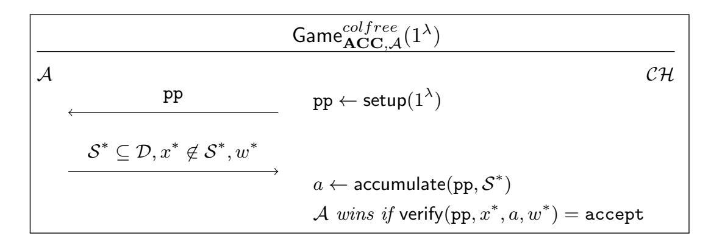
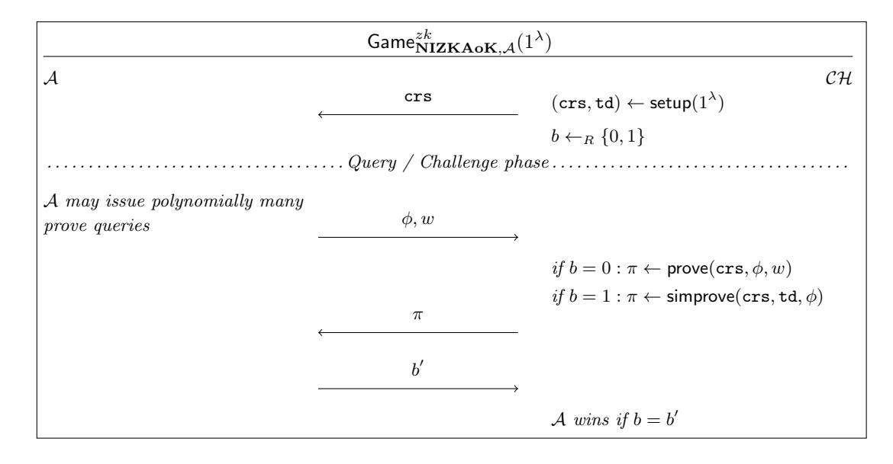
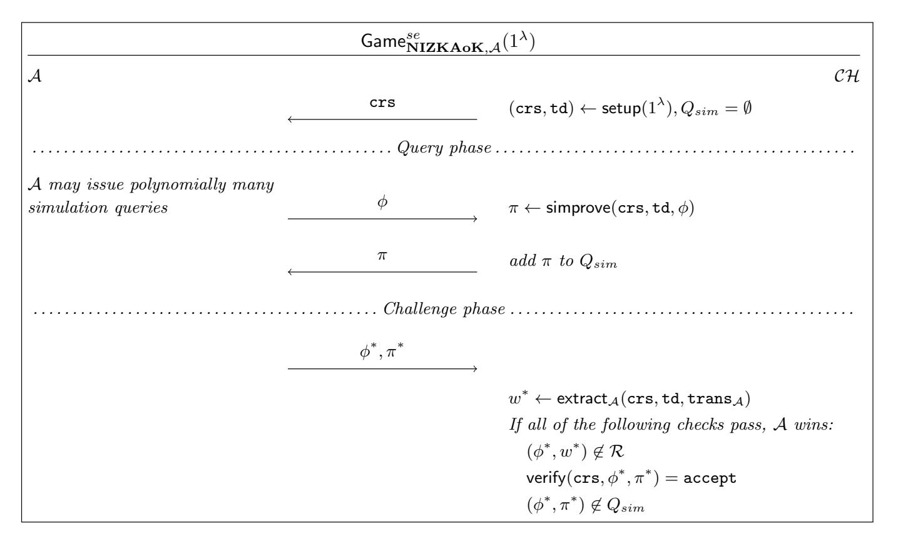
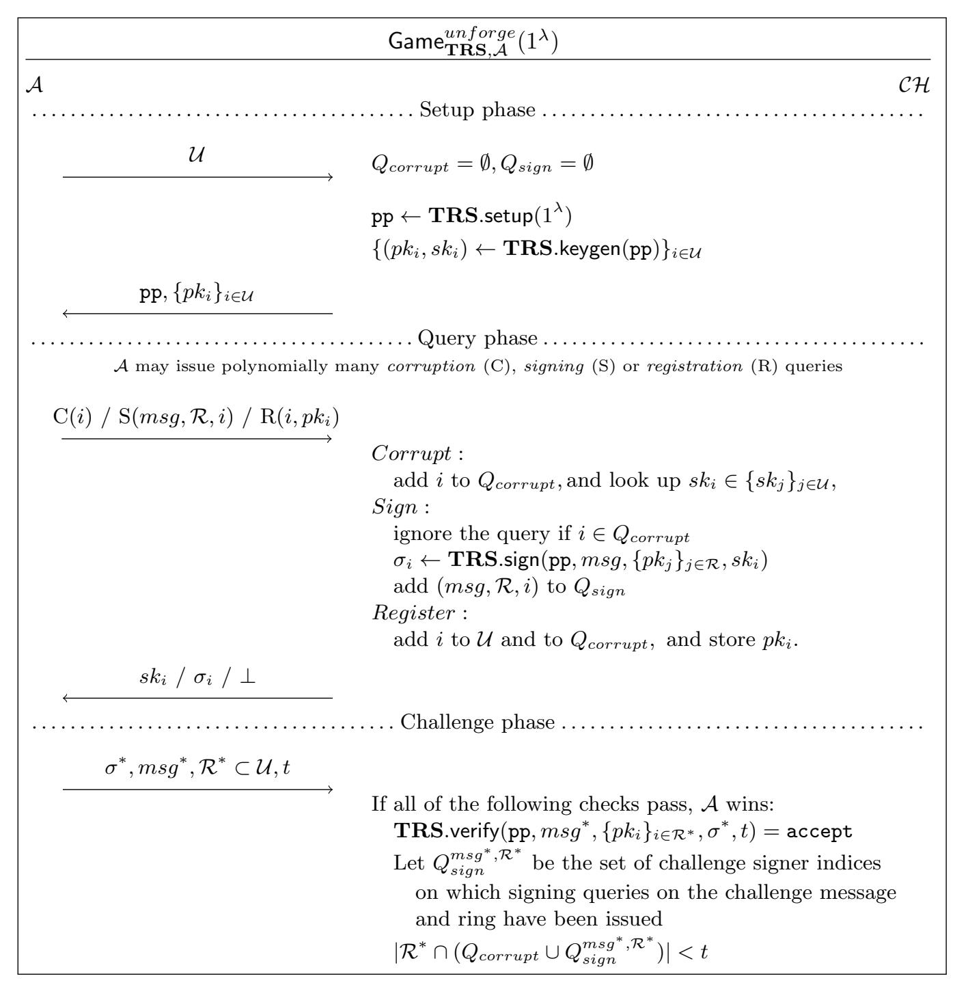
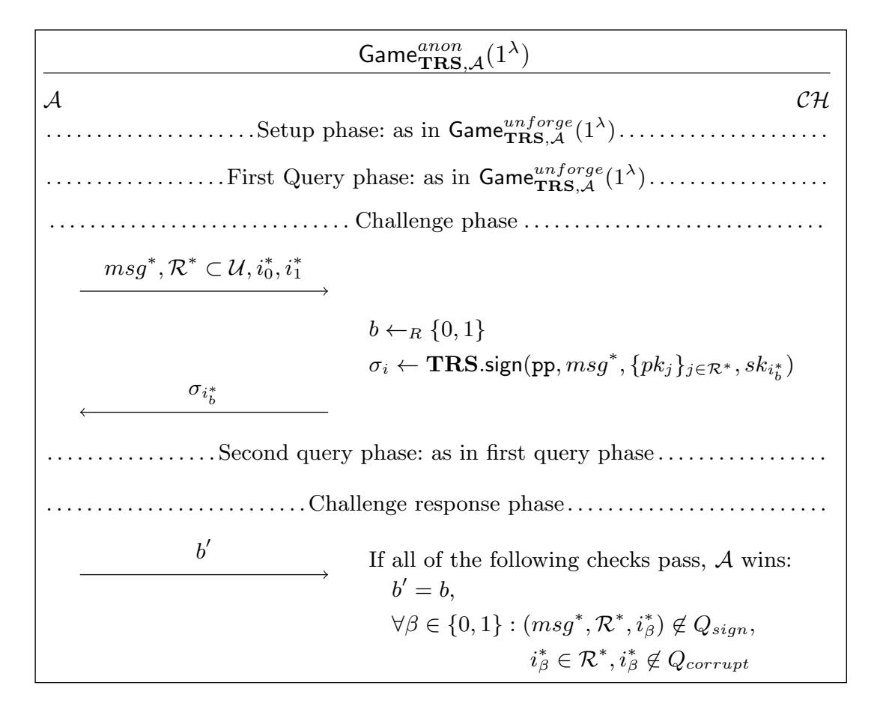
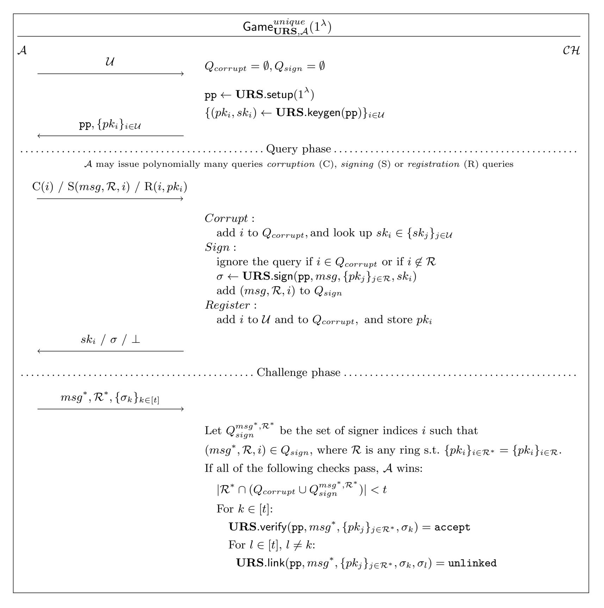
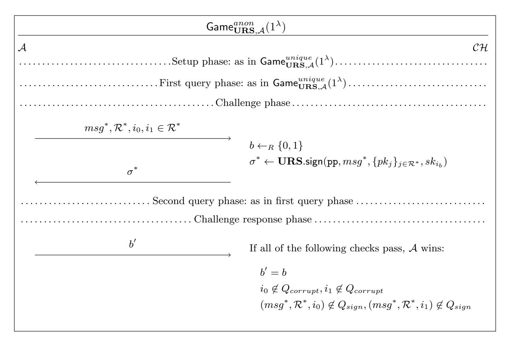

{0}------------------------------------------------

# <span id="page-0-1"></span><span id="page-0-0"></span>Stronger Notions and a More Efficient Construction of Threshold Ring Signatures

Alexander Munch-Hansen<sup>1</sup> , Claudio Orlandi<sup>1</sup> , and Sophia Yakoubov<sup>1</sup>

> Aarhus University, Aarhus, Denmark {almun, orlandi, sophia.yakoubov}@cs.au.dk

Abstract. We consider threshold ring signatures (introduced by Bresson et al. [\[BSS02\]](#page-28-0)), where any t signers can sign a message while anonymizing themselves within a larger (size-n) group. The signature proves that t members of the group signed, without revealing anything else about their identities.

Our contributions in this paper are two-fold. First, we strengthen existing definitions of threshold ring signatures in a natural way; we demand that a signer cannot be de-anonymized even by their fellow signers. This is crucial, since in applications where a signer's anonymity is important, we do not want anonymity to be compromised by a single insider. Our definitions demand non-interactive signing, which is important for anonymity, since truly anonymous interaction is difficult or impossible in many scenarios.

Second, we give the first rigorous construction of a threshold ring signature with size independent of n, the number of users in the larger group. Instead, our signatures have size linear in t, the number of signers. This is also a very important contribution; signers should not have to choose between achieving their desired degree of anonymity (possibly very large n) and their need for communication efficiency.

Keywords: Threshold ring signatures · Anonymity · Unique ring signatures · Compact signatures

## <span id="page-0-2"></span>1 Introduction

It is often desirable for parties to anonymously sign on behalf of a group. A group signature scheme [\[Cv91\]](#page-28-1) enables this; the signature proves that a member of the group signed, but does not reveal which one. However, the downside of group signatures is that the group must be set up and maintained by a trusted group manager. <sup>1</sup> Threshold (group) signatures similarly allow any t of the parties in

<sup>1</sup> List signatures [\[CSST06\]](#page-28-2) are a related primitive. Like group signatures, list signatures require a group manager to set up the keys and parameters. However, in a list signature scheme, signers may only sign a certain amount of times before their anonymity is revoked.

{1}------------------------------------------------

a group to sign on behalf of the group together. The signature proves that t members of the group signed without revealing which ones. But, as in group signatures, trusted setup is required for each group.

A ring signature scheme (introduced by Rivest et al. [\[RST01\]](#page-30-0)) enables signing on behalf of a group without the need for interactive or trusted setup. Instead, everyone independently generates a key pair, and publishes their public key. The signer chooses the group (or ring) to anonymize herself amongst at signing time, and does so using that ring's public keys. In this paper, we focus on threshold ring signature schemes (introduced by Bresson et al. [\[BSS02\]](#page-28-0)), which are a natural extension of ring signature schemes. In a threshold ring signature scheme, any t signers can sign a message together while anonymizing themselves within a larger (size-n) group. Like a ring signature scheme, a threshold ring signature scheme allows the signers to pick the larger group they want to anonymize themselves amongst in an ad-hoc way at signing time.

There are two main contributions in this paper: a strengthening of threshold ring signature definitions, and a new construction with more compact signatures. Our new definition demands that a signer cannot be de-anonymized even by their fellow signers. In applications where a signer's anonymity is important, this protects their anonymity from insiders.

Our construction has signatures of size linear in t, the number of signers. All prior rigorous constructions have signatures with size dependent on n, the size of the larger group. Compact signatures are important; signers should not have to choose between achieving their desired degree of anonymity (possibly very large n) and their need for communication efficiency.

#### <span id="page-1-0"></span>1.1 Application: Whistleblowing

We can imagine a set of people within a large corporation wanting to blow the whistle on some corrupt activity within that organization; however, they are afraid to come forward publicly because of the repercussions they might face. On the other hand, blowing the whistle anonymously may not be effective, since it is important that the public believe that the message came from within the organization, from a sufficient number of organization members (and that it thus has credibility). Threshold ring signatures are the perfect solution. The whistleblowers form a size-t sub-group, and anonymize themselves within the entire size-n organization. Anyone can then verify that t members of the organization all blew the whistle on the corrupt activity.

Small signature sizes are important here, since often the size n of an organization is unreasonably large. In this application, it also becomes especially important that each individual whistleblower retain anonymity, even against their fellow whistleblowers. Otherwise, in order to de-anonymize all of the whistleblowers, all the organization administration would have to do is get one of the whistleblowers' cooperation.

{2}------------------------------------------------

#### <span id="page-2-0"></span>1.2 Our Contributions

As we mentioned earlier, we make two contributions: we give a stronger definition of threshold ring signatures, and a construction that meets those definitions while achieving signatures with size O(t).

Stronger Definitions Our most significant definitional contribution is a strengthening of the anonymity property. We require that an adversary not be able to tell the difference between signatures produced by two different subsets of signers of the same size t (within the same group of size n), as long as the two subsets contain the same corrupt parties. All previous definitions of anonymity [\[YLA](#page-30-1)+11, [PBB12,](#page-30-2) [OTYO18,](#page-30-3) [HS20\]](#page-29-0) do not allow the sets of signers to contain any corrupt parties at all; this is a dealbreaker in many applications, where one insider should not be able to bring down the entire group.

We use a strong syntax that fits well with our stronger notion of anonymity. We require that signers be able to produce partial signatures locally, without interacting with their fellow signers; the partial signatures should preserve the signers' anonymity, and should be combinable into a threshold signature by any third party. Having such a non-interactive structure is crucial for preserving anonymity against fellow signers; if signing were interactive, signers might learn their peers' identities via e.g. their IP addresses.

Construction with Succinct Signatures We build the first threshold ring signature scheme with signatures of size O(t); all previous constructions have signatures with size dependent on n. For groups of signers of size t significantly smaller than the larger group of size n they wish to anonymize themselves amongst, this is crucial.

Naively, to produce a threshold ring signature, each of the t signers could produce a ring signature, and their threshold ring signature would simply be a concatenation of these. The issue here is that a verifier would need to be convinced that these ring signatures were produced by distinct signers. An immediate solution to this would be a zero-knowledge proof that each signature was generated using a different secret key; however, this proof would be large, inefficient, and producing it would require interaction between the signers.

Instead, we base our threshold ring signature scheme on a primitive called a unique ring signature scheme (URS), introduced by Franklin and Zhang [\[FZ12\]](#page-29-1)[2](#page-0-0) . A unique ring signature scheme is a ring signature scheme which allows the linking of two signatures produced by the same signer on the same message with respect to the same ring. We can construct a threshold ring signature simply by concatenating t unique ring signatures. A verifier can check that no two unique

<sup>2</sup> A similar approach to building a threshold ring signature scheme was mentioned by Yuen et al. [\[YLA](#page-30-4)<sup>+</sup>13] where they would instead use a traceable ring signature scheme [\[FS06\]](#page-29-2); however, it was not formalized or proven. As far as we can tell, the definition of security they use for a traceable ring signature scheme does not seem to allow such a proof.

{3}------------------------------------------------

ring signatures were produced by the same signer, and so is convinced that t of the n users signed the message.

Any unique ring signature scheme (secure under our definitions, which are slightly modified from those of Franklin and Zhang) can be used to construct a threshold ring signature scheme in such a way. Existing unique ring signature schemes [\[FZ13\]](#page-29-3) require an OR-proof showing that the signer is within the ring. This leads to a signature size that scales with the size of the ring. We are the first to propose a URS with signatures of size independent of the ring size. We present a new, intuitive unique ring signature scheme with signatures of size O(1) which draws inspiration from the construction of Dodis et al. [\[DKNS04\]](#page-28-3). Unlike the work of Yuen et al., we leverage a random oracle, allowing us to get smaller unique signatures. We additionally use an RSA accumulator [\[Bd94\]](#page-28-4)[3](#page-0-0) and the generalized DDH assumption. These assumptions are more standard than the Link-Decisional RSA assumption used in some traceable ring signature constructions [\[TW05,](#page-30-5) [ACST06\]](#page-27-0).

At a high level, our unique ring signature scheme works as follows: each signer in the ring hashes the message (together with the set of n public keys belonging to the super-set of users), and raises it to the power of their secret signing key. By the generalized DDH assumption, this does not reveal the signer's identity. Each signer then proves using non-interactive zero knowledge (NIZK) that they used a signing key corresponding to one of the public keys belonging to the ring.[4](#page-0-0) It may seem that such a proof must be linear in the number n of public keys, but we get around that by using an accumulator [\[Bd94\]](#page-28-4) (a compact representation of an arbitrarily large set that supports efficient proofs of membership) to represent the set of public keys, like in the construction of Dodis et al. [\[DKNS04\]](#page-28-3).

As required by our definitions, our construction is completely non-interactive; each of the t signers produces a unique ring signature independently, and those signatures are then simply concatenated to produce the threshold ring signature. This concatenation can be done by any third party. An important consequence of this is that the scheme is flexible, meaning that a signer can contribute a partial signature at any point, resulting in a threshold signature with a threshold t that is larger by 1.

<sup>3</sup> We could instead use a bilinear map accumulator [\[CKS09\]](#page-28-5); however, the use of such an accumulator would require an a-priori upper bound on the ring size.

<sup>4</sup> Our use of NIZK proofs requires the presence of a common reference string (CRS). At first glance, since a CRS is a form of setup, this might seem to make our construction a group signature scheme instead of a ring signature scheme. However, there is a qualitative difference between a CRS (which is a global and reusable trusted setup) and a per-user trusted setup (in group signatures, parties' secret keys need to be distributed by a trusted party). In particular, once the CRS is generated in a trusted way (perhaps using an MPC ceremony), the parties in our system can generate their own keys independently.

{4}------------------------------------------------

#### <span id="page-4-1"></span>1.3 Fully Compact Threshold Ring Signatures

While our threshold ring signature scheme is the first scheme to give signatures of size independent of the ring size n, the signature size does still depend linearly on the threshold t. A natural question to ask is,

Is it possible to build a threshold ring signature scheme with signatures of constant size?

The answer is that it is possible; any threshold ring signature scheme can be altered to have constant-size signatures with the use of succinct non-interactive arguments of knowledge (SNARKs). This can be done simply by allowing any third party — or perhaps one of the signers — to take the produced signature (whose size might depend on n or t) and replace it with a SNARK of a verifying signature for the given ring. Since SNARK sizes do not depend on the statement being proven or the witness for that statement, this yields a constant-size signature.

While this transformation is optimal from an asymptotic point of view, the non-black box use of public-key cryptography inside a SNARK would make this construction prohibive in practice.<sup>5</sup>

#### <span id="page-4-2"></span><span id="page-4-0"></span>1.4 Related Work

| Work                              | Signature Size           | Adversarial Keys? |
|-----------------------------------|--------------------------|-------------------|
| Our work                          | $\mathbf{O}(\mathbf{t})$ | Yes               |
| Bresson et al. [BSS02]            | $O(n \log n)$            | No                |
| Petzoldt et al. [PBB12]           | O(n)                     | No                |
| Liu et al. $[YLA^+13]$            | $O(t\sqrt{n})$           | No                |
| Zhou et al. [ZZY <sup>+</sup> 17] | O(n)                     | No                |
| Chen et al. [CHGL18]              | O(n)                     | No                |
| Okamoto et al. [OTYO18]           | O(tn)                    | No                |
| Haque et al. [HS20]               | O(n)                     | Yes               |
| Haque et al. [HKSS20]             | O(t)                     | No                |

Fig. 1: Threshold Ring Signature Constructions

In Figure 1 we list some known threshold ring signature constructions, their signature sizes and whether they support adversarial key generation. All prior constructions of threshold ring signatures have signatures whose size depends on the number n of users in the ring  $\mathcal{R}$ . This is not ideal, as the threshold t may be much smaller than n.

<sup>&</sup>lt;sup>5</sup> Even the most basic public-key type operation, a scalar multiplication in an elliptic curve, requires billions of gates [JLE17] when represented by a circuit. This needs to be multiplied by a function of n for any existing threshold ring signature, or t for our construction. While this is the state of the art, we cannot of course rule out that more efficient constructions might emerge in the future, and this could be an interesting venue for further research.

{5}------------------------------------------------

Concurrent Work. Haque et al. [\[HKSS20\]](#page-29-4), posted shortly after this paper, also construct threshold ring signatures of size O(t). The advantage of their work is that their construction does not require a common reference string (CRS), which our construction uses for non-interactive zero knowledge (NIZK) proofs. They get around the need for a CRS by using NIWI (non-interactive witnessindistinguishable) proofs instead of NIZK proofs. However, the advantage of our work is that we support adversarially generated public keys. In the scheme of Haque et al., an adversary who is able to generate and register keys themself is immediately able to break anonymity and unforgeability.[6](#page-0-0)

Relying on honestly generated keys can be riskier than relying on an honestly generated CRS. CRS generation occurs once, and therefore efficiency is not too much of a concern: we can ensure security e.g. via secure multiparty computation (which can be slow), by involving a large number of parties all of whom are extremely unlikely to collude. However, taking such measures in the generation of every party's key pair, which can happen frequently, could be unreasonable.

#### <span id="page-5-2"></span>1.5 Outline

In Section [2,](#page-5-0) we describe the tools and assumptions necessary for our constructions, such as cryptographic accumulators and zero knowledge proofs. In Section [3,](#page-10-0) we define ring and threshold ring signatures. In Section [4,](#page-15-0) we describe our threshold ring signature construction.

## <span id="page-5-0"></span>2 Preliminaries

In this section, we introduce some primitives that we leverage in our constructions. In Section [2.1,](#page-5-1) we describe cryptographic accumulators; in Section [2.2,](#page-7-0) we describe non-interactive zero knowledge arguments of knowledge.

## <span id="page-5-1"></span>2.1 Accumulators

At a high level, a cryptographic accumulator [\[Bd94\]](#page-28-4) is defined as a compact representation of a set S = {x1, . . . , xn} that supports proofs of membership in the underlying set. One natural example of a cryptographic accumulator is a Merkle hash tree; the root of the tree is the accumulator value corresponding to the set S of leaf elements, and the authenticating path of a leaf element is its membership witness. However, the disadvantage of Merkle hash trees is that they are inefficient to use within zero knowledge proofs. Instead, in Section [2.1,](#page-7-1) we

<sup>6</sup> This is by design; in the proof of anonymity, the authors need to create simulated NIWI proofs that are independent of the identities of the signers. They do this by additionally allowing a witness to demonstrate a relationship between two keys in the ring, where this relationship never holds between keys that are honestly generated. If an adversary was able to register maliciously generated keys, she could register two keys that do have this relationship, and use this to forge signatures with arbitrarily high threhsolds, as long as those two corrupt keys are in the ring in question.

{6}------------------------------------------------

describe the RSA accumulator [\[Bd94\]](#page-28-4), which requires only arithmetic operations and is thus more efficient to use within zero knowledge.

Baldimtsi et al. [\[BCY20\]](#page-27-1) give a thorough guide to accumulators and all of their various flavors. In this paper, we only need a limited subset of accumulator functionality, and we present simplified definitions of accumulators accordingly (pared down from Baldimtsi et al. and the work cited therein). In particular, we do not address dynamic changes to the accumulated sets (that is, we only consider static accumulators). We also split the algorithm that was called gen in previous work into two: a setup algorithm, and an accumulate algorithm. This allows us to include the parameters produced by gen that are independent of the accumulated set in the public parameters of our threshold ring signature scheme.

Accumulator Syntax An accumulator parameterized by a domain D has the following algorithms:

#### setup(1<sup>λ</sup> ) → pp:

An algorithm that, given the security parameter, sets up the global public parameters for the accumulator system.

## accumulate(pp, S) → a<sup>S</sup> :

An algorithm that, given the global public parameters pp and a set S ⊆ D, returns an accumulator a<sup>S</sup> representing the set S. In this paper, we require this algorithm to be deterministic.

## witcreate(pp, S, x) → w:

An algorithm that, given the parameters pp, a set S ⊆ D and an element x ∈ S, returns a membership witness w for the element x.

## verify(pp, x, a, w) → accept/reject:

An algorithm that, given the parameters pp, an element x, an accumulator a and a witness w, checks whether w proves that x is in the underlying set a.

Accumulator Security Definitions Of course, an accumulator must be correct (that is, verification using an honestly produced witness must return accept). The important security property of an accumulator is collision freeness. Informally, an accumulator is collision-free if it is hard to fabricate a membership witness w for a value x that is not in the accumulated set. More formally:

<span id="page-6-0"></span>Definition 1 (Collision Freeness for Accumulators). Let λ ∈ N be the security parameter, and let ACC = (setup, accumulate,witcreate, verify) be an accumulator scheme. Consider the following game between a probabilistic polynomialtime adversary A and a challenger CH:

{7}------------------------------------------------



ACC is collision-free for the domain  $\mathcal{D}$  of elements if for any sufficiently large security parameter  $\lambda$ , for any probabilistic polynomial-time adversary  $\mathcal{A}$ , there exists a negligible function  $\nu$  in the security parameter  $\lambda$  such that the probability that  $\mathcal{A}$  wins the game is less than  $\nu(\lambda)$ .

<span id="page-7-1"></span>The RSA Accumulator The RSA accumulator, which was the original accumulator introduced by Benaloh and de Mare [Bd94], is the one most suitable for our needs. The domain  $\mathcal{D}$  for the RSA accumulator is the set of prime integers. We describe the RSA accumulator below.

```
setup(1^{\lambda}):
```

- 1. Select two  $1^{\lambda}$ -bit safe primes p = 2p' + 1 and q = 2q' + 1 where p' and q' are also prime, and let m = pq.
- 2. Select a random integer  $g' \leftarrow \mathbb{Z}_m^*$ .
- 3. Let  $g = (g')^2 \mod m$ .
- 4. Return pp = (m, g).

accumulate(pp = (m, g), S):

Return  $a = g^{\prod_{x \in \mathcal{S}} x} \mod m$ .

 $\mathsf{witcreate}(\mathsf{pp} = (m,g), \mathcal{S}, x) \textbf{:}$ 

Return  $w = g^{\prod_{y \in \mathcal{S}, y \neq x} y} \mod m$ .

verify(pp = (m, g), x, a, w):

If x is a prime and  $w^x \mod m = a$ , return accept. Otherwise, return reject.

The RSA accumulator is collision-free under the strong RSA assumption.

# <span id="page-7-0"></span>2.2 Non-Interactive Zero Knowledge Arguments of Knowledge (NIZKAoK)

Non-interactive zero-knowledge (NIZK) proof and argument systems are a well studied area and have been so for over 30 years [BFM88, FS87, FLS90]. Informally, a zero-knowledge proof of knowledge allows a prover to convince a verifier that the prover knows a witness w for a statement  $\phi$  such that  $(\phi, w)$  satisfy some relation  $\mathcal{R}$ . The difference between a proof and an argument is in the soundness requirement; a proof guarantees that even an all-powerful prover cannot break soundness, while an argument only guarantees soundness against efficient (computationally bounded) provers. Generally, for practical purposes, an argument is enough.

{8}------------------------------------------------

In this section we present the definition of a non-interactive zero knowledge argument of knowledge (NIZKAoK), taken from the work of Groth and Maller [\[GM17\]](#page-29-8). We also describe the concrete relation which we will need in Section [4.2.](#page-17-0)

NIZKAoK Syntax A NIZKAoK scheme has the following algorithms, as described by Groth and Maller [\[GM17\]](#page-29-8):

```
setup(1λ
, R) → (crs, td):
```

An algorithm that, given the security parameter, sets up the common reference string crs and the trapdoor td for the NIZKAoK system.

```
prove(crs, φ, w) → π:
```

An algorithm that, given the common reference string crs for a relation R, a statement φ and a witness w, returns a proof π that (φ, w) ∈ R.

```
verify(crs, φ, π) → accept/reject:
```

An algorithm that, given the common reference string crs for a relation R, a statement φ and a proof π, checks whether π proves the existence of a witness w such that (φ, w) ∈ R.

```
simprove(crs, td, φ) → π:
```

An algorithm that, given the common reference string crs for a relation R, the trapdoor td and a statement φ, simulates a proof of the existence of a witness w such that (φ, w) ∈ R.

NIZKAoK Security Definitions Of course, a NIZKAoK scheme must be correct (that is, verification using an honestly produced proof must return accept). The important security properties of a NIZKAoK scheme are zero knowledge, knowledge soundness, and simulation extractability, described below.

<span id="page-8-0"></span>Definition 2 (Zero Knowledge for NIZKAoK). Informally, a NIZKAoK scheme has zero knowledge if a proof does not leak any more information than the truth of the statement.

More formally, let λ ∈ N be the security parameter, and let NIZKAoK = (setup, prove, verify,simprove) be a NIZKAoK scheme. Consider the following game between a probabilistic polynomial-time adversary A and a challenger CH:



{9}------------------------------------------------

**NIZKAoK** has zero knowledge if for any sufficiently large security parameter  $\lambda$ , for any probabilistic polynomial-time adversary  $\mathcal{A}$ , there exists a negligible function  $\nu$  in the security parameter  $\lambda$  such that the probability that  $\mathcal{A}$  wins the game is less than  $\frac{1}{2} + \nu(\lambda)$ .

Informally, knowledge soundness is the property that guarantees that it is always possible to extract a valid witness from a proof that verifies. Simulation extractability is a stronger version of knowledge soundness guaranteeing that it is always possible to extract a valid witness from a proof that verifies even if the adversary has access to a simulation oracle. This is a flavor of non-malleability; an adversary should not even be able to modify a simulated proof in order to forge a proof.

<span id="page-9-0"></span>Definition 3 (Simulation Extractability for NIZKAoK). Informally, a NIZKAoK scheme has simulation extractability if it is always possible to extract a valid witness from a proof that verifies.

More formally, let  $\lambda \in \mathbb{N}$  be the security parameter, and let  $\mathbf{NIZKAoK} = (\mathsf{setup}, \mathsf{prove}, \mathsf{verify}, \mathsf{simprove})$  be a NIZKAoK scheme. Consider the following game between a probabilistic polynomial-time adversary  $\mathcal{A}$  and a challenger  $\mathcal{CH}$ , where  $\mathsf{trans}_{\mathcal{A}}$  denotes the adversary's inputs and outputs, including its randomness<sup>7</sup>:



**NIZKAoK** has simulation extractability if for any sufficiently large security parameter  $\lambda$ , for any probabilistic polynomial-time adversary  $\mathcal{A}$ , there exists an

<sup>&</sup>lt;sup>7</sup> In the standard simulation-extractability for NIZKs the extractor extracts the witness from the proof only. The definition of Groth and Maller which we use here is more general and also captures non-black box extractions which is used e.g., in SNARKS.

{10}------------------------------------------------

extraction algorithm  $\operatorname{extract}_{\mathcal{A}}$  and a negligible function  $\nu$  in the security parameter  $\lambda$  such that the probability that  $\mathcal{A}$  wins the game is less than  $\nu(\lambda)$ .

#### <span id="page-10-1"></span>2.3 The Generalized Decisional Diffie-Hellman Problem

We leverage the Generalized Decisional Diffie-Hellman (Generalized DDH) Problem [BDZ03], described below.

**Definition 4.** The Generalized DDH Problem in group  $\mathbb{G}$  asks that, given a polynomial-length list L of tuples (u,v) of elements in a group  $\mathbb{G}$ , an adversary A determines whether there exists a fixed r such that for all  $(u,v) \in L$  u is a random element of  $\mathbb{G}$  and  $v = u^r$ , or v and u are independent random elements of  $\mathbb{G}$ .

The generalized DDH problem is considered to be hard in group  $\mathbb{G}$  if for all efficient adversaries  $\mathcal{A}$ , the probability that  $\mathcal{A}$  solves a random instance of the generalized DDH problem correctly is only negligibly greater than  $\frac{1}{2}$ . (We define a random instance of the generalized DDH problem as an L contains independent random elements with probability  $\frac{1}{2}$ , and elements  $v = u^r$  for a random r and independent random values u otherwise.)

## <span id="page-10-0"></span>3 (Threshold) Ring Signature Definitions

In this section, we recall the definitions of ring signatures and threshold ring signatures (focusing on the latter).

#### <span id="page-10-2"></span>3.1 Ring Signature Definitions

Ring signatures were originally defined by Rivest et al. [RST01] as a natural extension of group signature schemes. Group signatures require some trusted authority to act as a group manager, predefining groups of signers and distributing keys to members of those groups. These keys can then be used to anonymously sign messages on behalf of the entire group. However, requiring a trusted authority that distributes — and knows — signers' keys can be a big drawback. Ring signatures instead allow signers to generate their own key pairs, and to form groups in an ad-hoc way.

Ring Signature Syntax A ring signature scheme is defined as a tuple of four algorithms (setup, keygen, sign, verify):

$$\mathsf{setup}(1^{\lambda}) \to \mathsf{pp}$$
:

An algorithm that takes a security parameter  $\lambda$  and outputs a set of public parameters pp. These public parameters pp include the security parameter itself, and any global parameters which can be used within the other algorithms.

{11}------------------------------------------------

## keygen(pp) → (pk, sk):

An algorithm that takes the public parameters pp and outputs a key pair (pk, sk).

## sign(pp, msg, {pkj}j∈R, ski) → σ:

An algorithm that takes the public parameters, a message msg ∈ {0, 1} ∗ to be signed, the set of public keys of the users within the ring {pkj}j∈R, and the secret key sk<sup>i</sup> of the signer i ∈ R (which must correspond to a public key within the set of public keys {pkj}j∈R). Outputs a signature σ on the message msg.

## verify(pp, msg, {pki}i∈R, σ) → accept/reject:

An algorithm that takes the public parameters, the message, the set of public keys of the users within the ring, and a signature σ. Outputs accept or reject, reflecting the validity of the signature σ on the message msg.

An important property of ring signatures is setup freeness, which requires that signers' keys be generated independently. (We note that most ring signature schemes do have a setup algorithm that is run by a trusted authority. However, this authority does not produce the secret keys for the signers; its only job is to produce the public parameters such as moduli and generators used throughout the scheme. The signers can then generate their keys independently using those public parameters.)

Ring Signature Security Definitions Informally, a ring signature scheme must satisfy the following properties [\[Liu19,](#page-29-9) [BSS02,](#page-28-0) [DKNS04\]](#page-28-3):

- Correctness requires that a correctly generated signature must verify.
- Unforgeability requires that an adversary should not be able to forge a signature on behalf of another user.
- Anonymity requires that a signature should completely hide the identity of the signer, even if the adversary has access to a signing oracle.
- Unlinkability requires that no adversary should be able to determine whether two signatures were produced by the same signer, even if the adversary has access to a signing oracle.

Remark 1. Note that anonymity implies unlinkability, and vice versa; however, when access to signing oracles is removed, this is no longer the case.

We omit the formal definitions of ring signatures from this paper, focusing instead on threshold ring signatures.

## <span id="page-11-0"></span>3.2 Threshold Ring Signature Definitions

Threshold ring signatures are similar to ring signatures, but instead of allowing any one signer to anonymize themselves among a set of signers, a threshold ring signature scheme allows any t signers to anonymize themselves among a larger set (or ring) of signers R. A verifier can then check that at least t signers in the ring R signed the message. Note that a ring signature scheme can be viewed as a threshold ring signature scheme with t = 1.

{12}------------------------------------------------

Threshold Ring Signature Syntax A threshold ring signature scheme is usually defined as a tuple of four algorithms (setup, keygen, sign, verify), where sign is interactive and requires the secret keys of t of the signers. We instead choose to define a threshold ring signature scheme as a tuple of five algorithms, by adding combisign. We let sign be locally executed by each signer i (requiring only that signer's secret key ski), and produce partial signatures σ<sup>i</sup> ; combisign can then be run by any third party to combine those partial signatures into a threshold signature.

We describe the syntax of combisign below. Notice that it does not require the secret keys of any of the signers.

## combisign(pp, {σi}i∈S , t) → σ:

An algorithm that takes partial signatures {σi}i∈S from t signers, and outputs a combined signature σ.

The syntax of setup, keygen, sign and verify remain unchanged from those of a ring signature scheme, except that sign outputs partial signatures, and verify takes the threshold t as input.

This syntax specification is very strong. In particular, it demands the following desirable properties:

#### Setup Freeness:

Every signer can generate their own key pair. This is a feature of all ring signature schemes.

#### Dynamic Choice of Ring Size n:

Different sets of signers can choose rings of different sizes.

#### Dynamic Choice of Threshold t:

Arbitrarily many signers' partial signatures can be combined into a single threshold signature; the signers don't need to know t when they produce their partial signature. Verification takes a threshold t, and checks that at least that many signers have signed. The upside of this is what is called flexibility [\[OTYO18\]](#page-30-3), meaning that signers can contribute their partial signatures after others have signed. Our syntax demands a weak notion of flexibility where signers can contribute their signatures before combination via combisign; if combisign is as simple as e.g. concatenation of the partial signatures, the stronger notion of flexibility — where signers can contribute even after combination — follows.

The downside of this flexibility is that the number of signers cannot be hidden by a signature σ.

#### Non-Interactive Signing:

As per our syntax, parties generate partial signatures locally; those partial signatures can be combined into a threshold signature by any third party. Non-interactive signing is essential in ensuring the signers' privacy (even against their peers), since anonymous interactive signing would require anonymous communication, which is often difficult to achieve in practice.

{13}------------------------------------------------

Threshold Ring Signature Security Definitions We base our security definitions on Bresson *et al.* [BSS02] and Haque *et al.* [HS20]. (In particular, we require security against an adversary who can generate and register public keys, as required by Haque *et al.*) We strengthen the definition of anonymity to require that signers remain anonymous even to their fellow signers.

Additionally, both of our security games are defined using partial signatures, where a complete signature will be formed by combining the partial signatures of all the signers. This allows for a simple statement of the games while still demanding security against fellow members of the signing rings  $\mathcal{R}$ . An adversary wins the unforgeability game if he is able to forge a partial signature, and he wins the anonymity game if he is able to distinguish between two partial signatures.

<span id="page-13-3"></span>**Definition 5 (TRS).** A threshold ring signature scheme is secure if it satisfies correctness (Definition 6), unforgeability (Definition 7), and anonymity (Definition 8).

<span id="page-13-0"></span>Definition 6 (Correctness for TRS). Correctness requires that verification return accept on any honestly generated signature.

More formally, let  $\mathbf{TRS} = (\mathsf{setup}, \mathsf{keygen}, \mathsf{sign}, \mathsf{combisign}, \mathsf{verify})$  be a TRS scheme. We say that  $\mathbf{TRS}$  is correct if for all security parameters  $\lambda \in \mathbb{N}$ , for all messages  $msg \in \{0,1\}^*$ , all rings  $\mathcal{R}$ , and all signer sets  $\mathcal{S} \subseteq \mathcal{R}$ :

```
\Pr \begin{bmatrix} \operatorname{pp} \leftarrow \mathbf{TRS}.\operatorname{setup}(1^{\lambda}), \\ \{(pk_i, sk_i) \leftarrow \mathbf{TRS}.\operatorname{keygen}(\operatorname{pp})\}_{i \in \mathcal{R}}, \\ \{\sigma_i \leftarrow \mathbf{TRS}.\operatorname{sign}(\operatorname{pp}, msg, \{pk_j\}_{j \in \mathcal{R}}, sk_i)\}_{i \in \mathcal{S}}, \\ \sigma \leftarrow \mathbf{TRS}.\operatorname{combisign}(\operatorname{pp}, \{\sigma_i\}_{i \in \mathcal{S}}, t = |\mathcal{S}|) : \\ \mathbf{TRS}.\operatorname{verify}(\operatorname{pp}, msg, \{pk_j\}_{j \in \mathcal{R}}, \sigma, t = |\mathcal{S}|) = \operatorname{accept} \end{bmatrix} = 1
```

<span id="page-13-1"></span>**Definition 7 (Unforgeability for TRS).** Unforgeability requires that no efficient adversary  $\mathcal{A}$  is able to forge a valid signature  $\sigma$  for some ring  $\mathcal{R}$  and message  $msg^*$  for which  $\mathcal{A}$  has issued fewer than t corruption queries (on signers in  $\mathcal{R}$ ) or signing queries (for ring  $\mathcal{R}$  and message  $msg^*$ ), where t is the threshold.

More formally, let  $\mathbf{TRS} = (\mathsf{setup}, \mathsf{keygen}, \mathsf{sign}, \mathsf{combisign}, \mathsf{verify})$  be a TRS scheme. Consider the game  $\mathsf{Game}_{\mathbf{TRS},\mathcal{A}}^{Unforge}(1^{\lambda})$  in Figure 2 between a probabilistic polynomial-time adversary  $\mathcal{A}$  and a challenger  $\mathcal{CH}$ .

We say that **TRS** is unforgeable if for any efficient adversary A,

$$\Pr[\mathcal{A} \ wins \ \mathsf{Game}_{\mathbf{TRS},\mathcal{A}}^{unforge}(1^{\lambda})] \leq \mathsf{negl}(\lambda)$$

for some negligible function  $negl(\lambda)$ .

<span id="page-13-2"></span>Remark 2. Note that in the unforgeability game, the challenger responds to signing queries with partial signatures. This is to capture that the adversary might know some of the secret keys (due to corruption queries), and is therefore only interested in seeing the partial signatures by the honest parties. The same holds true for the anonymity game.

{14}------------------------------------------------

<span id="page-14-0"></span>

Fig. 2: The unforgeability game for TRS

**Definition 8 (Anonymity for TRS).** Anonymity requires that no efficient adversary  $\mathcal{A}$  be able to distinguish between partial signatures produced by two different signers in the same ring.

More formally, let  $\mathbf{TRS} = (\mathsf{setup}, \mathsf{keygen}, \mathsf{sign}, \mathsf{combisign}, \mathsf{verify})$  be a TRS scheme. Consider the game  $\mathsf{Game}_{\mathbf{TRS},\mathcal{A}}^{anon}(1^{\lambda})$  in Figure 3 between a probabilistic polynomial-time adversary  $\mathcal{A}$  and a challenger  $\mathcal{CH}$ .

We say that **TRS** is anonymous if for any efficient adversary A,

$$\Pr[\mathcal{A} \ wins \ \mathsf{Game}_{\mathbf{TRS},\mathcal{A}}^{anon}(1^{\lambda})] \leq \frac{1}{2} + \mathsf{negl}(\lambda)$$

for some negligible function  $negl(\lambda)$ .

{15}------------------------------------------------

<span id="page-15-1"></span>

Fig. 3: The anonymity game for TRS

## <span id="page-15-0"></span>4 Our Threshold Ring Signature Construction

A natural approach to building threshold ring signatures is having each of the t signers produce a ring signature, and then appending to the list of t signatures a zero knowledge proof that all of the signatures were produced using distinct signing keys. However, this approach has two downsides.

- 1. Producing the zero knowledge proof requires interaction among the signers.
- 2. The zero knowledge proof may be complex. (One way to do this is to commit to the secret keys used, order the commitments by secret key, prove that each key was used to produce the corresponding signature, and use t range proofs to prove that each committed key is strictly larger than the previous one since we need to prove that the signatures were produced by t distinct signers).

In order to circumvent these two issues, we leverage unique ring signatures (URS) [FZ12, FZ13], which allow the linking of two signatures produced by the same signer on the same message with respect to the same ring.

There are several related primitives in this space. Linkable ring signatures [LWW04] allow the linking of any two signatures produced by the same signer, regardless of message and ring. Traceable ring signatures [FS06] additionally use nonces, and allow the linking of any two signatures produced by the same signer with respect to the same nonce. Furthermore, traceable ring signatures allow a notion of anonymity revocation; if a signer produced two signatures on different messages using the same nonce, her identity can be recovered.

{16}------------------------------------------------

Unique ring signatures can be thought of as traceable ring signatures, with nonces always equal to the message together with the ring, and without anonymity revocation. Unique ring signatures are called unique because in most constructions, there is a part of the signature (called the tag) which is deterministic given the message, ring and signing key.

To build our threshold ring signatures, each of the t signers produce a unique ring signature; then, there is no need to additionally prove that the signatures were produced using distinct signing keys, since this is immediately apparent.[8](#page-0-0) If the underlying unique ring signatures have size O(1), then the threshold ring signatures will have size O(t).

The rest of this section proceeds as follows:

- 1. In Section [4.1,](#page-16-0) we state the definition of a unique ring signature scheme (URS) [\[FZ12\]](#page-29-1).
- 2. In Section [4.2,](#page-17-0) we construct a URS scheme with signatures of size O(1).
- 3. In Section [4.3,](#page-24-0) we use our URS scheme to construct a TRS scheme with signatures of size O(t).

#### <span id="page-16-0"></span>4.1 Unique Ring Signature Definitions

We leverage the notion of unique ring signature (URS) schemes, as defined by Franklin and Zhang [\[FZ12\]](#page-29-1). We modify the definitions of Franklin and Zhang to allow the adversary to register its own public keys.

Unique Ring Signature Syntax We define a unique ring signature scheme as a tuple of five algorithms (setup, keygen, sign, verify, link). The setup, keygen, sign and verify algorithms all have the same input and output behavior as the corresponding ring signature algorithms. The link algorithm (described below) allows any verifier to determine whether two signatures were produced by the same signer (on the same message).

link(pp, msg, {pkj}j∈R, σ0, σ1) → {linked, unlinked}:

An algorithm that takes a message msg, public keys belonging to members of a ring R, and two signatures σ0, σ1. Outputs linked or unlinked, depending on whether the two signatures were produced by the same signer.

Franklin and Zhang avoid the need for a link algorithm by requiring that a part (called the tag) of every signature be uniquely determined by the message, ring and signing key; however, we introduce the link algorithm, which is a more general formalization of this requirement.

<sup>8</sup> A similar idea was mentioned by Yuen et al. [\[YLA](#page-30-4)<sup>+</sup>13]; however, it was not formalized or proven. In particular, a stronger linkability property is needed from the underlying traceable ring signature scheme in order for the TRS construction to be secure. Additionally, since Yuen et al. focus on avoiding the random oracle assumption and we do not, we obtain a TRS construction with size O(t) signatures, while they obtain a TRS construction with size O(t √ n) signatures.)

{17}------------------------------------------------

Unique Ring Signature Security Definitions Informally, a unique ring signature scheme must satisfy the following properties:

- Correctness requires that a correctly generated signature must verify. (This is inherited from ring signatures.)
- Uniqueness requires that no t-1 corrupt signers can produce t signatures that verify for the same message and ring and appear unlinked. (We present this property as Definition 10.)
- Anonymity requires that no adversary can determine whether two signatures that verify for different messages or under different rings were produced by the same signer. (We present this property as Definition 11.)
- Defamation Freeness requires that no adversary can produce a signature that appears linked to an honest signer's signature. We do not require this property for our TRS construction, so we do not define it formally nor prove that our construction meets it. This is loosely defined as an adversary forging an identifier.

<span id="page-17-3"></span>**Definition 9 (URS).** A unique ring signature scheme is secure if it satisfies correctness, uniqueness (Definition 10) and anonymity (Definition 11).

<span id="page-17-1"></span>**Definition 10 (Uniqueness for URS).** Let  $\mathbf{URS} = (\mathsf{setup}, \mathsf{keygen}, \mathsf{sign}, \mathsf{verify}, \mathsf{link})$  be a URS scheme. Consider the game  $\mathsf{Game}_{\mathbf{URS},\mathcal{A}}^{unique}(1^{\lambda})$  in Figure 4 between a probabilistic polynomial-time adversary  $\mathcal{A}$  and a challenger  $\mathcal{CH}$ .

We say that **URS** is unique if for any efficient adversary A,

$$\Pr[\mathcal{A} \ wins \ \mathsf{Game}^{unique}_{\mathbf{URS},\mathcal{A}}(1^{\lambda})] \leq \mathsf{negl}(\lambda)$$

for some negligible function  $negl(\lambda)$ .

18

<span id="page-17-2"></span>**Definition 11 (Anonymity for URS).** Given two signatures for different messages it should be infeasible for an adversary to determine whether they were created by the same signer or not. More formally, let  $\mathbf{URS} = (\mathsf{setup}, \mathsf{keygen}, \mathsf{sign}, \mathsf{verify}, \mathsf{link})$  be a URS scheme. Consider the game  $\mathsf{Game}_{\mathbf{URS}, \mathcal{A}}^{anon}(1^{\lambda})$  in Figure 5 between a probabilistic polynomial-time adversary  $\mathcal{A}$  and a challenger  $\mathcal{CH}$ .

We say that **URS** is anonymous if for any efficient adversary A,

$$\Pr[\mathcal{A} \ wins \ \mathsf{Game}_{\mathbf{URS},\mathcal{A}}^{anon}(1^{\lambda})] \leq \frac{1}{2} + \mathsf{negl}(\lambda)$$

for some negligible function  $negl(\lambda)$ .

#### <span id="page-17-0"></span>4.2 A Unique Ring Signature Scheme

We describe a unique ring signature scheme in Construction 1 in terms of an underlying accumulator scheme  $\mathbf{ACC}$ , a non-interactive zero-knowledge argument of knowledge scheme  $\mathbf{NIZKAoK}$ , a group  $\mathbb G$  (of order p, with generator g) in which the generalized DDH problem is hard, and a random oracle  $\mathsf{H}$  which maps arbitrary strings to elements in  $\mathbb G$ .

{18}------------------------------------------------

<span id="page-18-0"></span>

Fig. 4: The uniqueness game for URS.

Note that t verifying pairwise-unlinked signatures only count as a win for the adversary if the adversary has not corrupted (or queried the signing oracle on the appropriate message and ring for) t or more of the relevant parties.

The non-interactive zero-knowledge argument of knowledge scheme NIZKAoK will be used for the relation  $\mathcal{R}_{sig}$ , which is described below.

{19}------------------------------------------------

<span id="page-19-0"></span>

Fig. 5: The anonymity game for URS.

Note that, if the adversary queried the signing oracle on either of the challenge signer identities with the challenge message and ring, he could legitimately link the output of the signing oracle to one of the signatures, helping him determine whose secret key was used to produce it. So, if such a signing query was asked, we do not count the adversary's win.

$$\mathcal{R}_{\text{sig}} \begin{pmatrix} \phi = (\mathbb{G}, g, \mathbf{ACC}.pp, \\ a_{\mathcal{R}}, \sigma', h), \\ w = (pk, sk, w_a) \end{pmatrix} = \begin{pmatrix} (pk = g^{sk}) \\ \wedge \mathbf{ACC}.\text{verify}(\mathbf{ACC}.pp, a_{\mathcal{R}}, pk, w_a) \\ \wedge (\sigma' = h^{sk}) \end{pmatrix}$$

#### <span id="page-19-1"></span>Construction 1.

setup $(1^{\lambda})$ :

- Sample a DDH group  $(\mathbb{G}, q, p)$  with security parameter  $1^{\lambda}$ .
- $Run \ \mathbf{ACC}.pp \leftarrow \mathbf{ACC}.setup(1^{\lambda}).$
- $Run (NIZKAoK.crs, NIZKAoK.td) \leftarrow NIZKAoK.setup(1^{\lambda}, \mathcal{R}_{sig}).$
- $Set pp = ((\mathbb{G}, g, p), ACC.pp, NIZKAoK.crs).$

keygen(pp):

- $Pick \ sk \leftarrow \mathbb{Z}_p \ at \ random.$
- $Set \ pk = g^{sk}$ .
- If pk is not prime (when interpreted as an integer), redo the first two steps until it is. (We require the public keys to be prime so that they are within the domain of the RSA accumulator.)

 $sign(pp, msg, \{pk_j\}_{j \in \mathcal{R}}, sk)$ :

- Check that each pk; is prime.

{20}------------------------------------------------

-  $Accumulate \{pk_j\}_{j\in\mathcal{R}}$  as

$$a_{\mathcal{R}} \leftarrow \mathbf{ACC}$$
.accumulate $(\mathbf{ACC}.pp, \{pk_i\}_{i \in \mathcal{R}})$ .

(Note that this is publicly computable from the set of public keys, and thus does not need to be included in the threshold ring signature.)

- Let  $pk = g^{sk} \in \{pk_j\}_{j \in \mathcal{R}}$ . Compute an accumulator witness

$$w_a \leftarrow \mathbf{ACC}$$
.witcreate $(\mathbf{ACC}.pp, \{pk_j\}_{j \in \mathcal{R}}, pk)$ .

- Compute  $\sigma' = \mathsf{H}(msg, \{pk_j\}_{j \in \mathcal{R}})^{sk}$ .
- Compute  $\pi$  proving that  $\sigma'$  is  $\mathsf{H}(msg, \{pk_j\}_{j\in\mathcal{R}})$  raised to the power of a secret key corresponding to a public key in the accumulator. In other words,

$$\pi \leftarrow \mathbf{NIZKAoK}.\mathsf{prove} \begin{pmatrix} \mathbf{NIZKAoK}.\mathsf{crs}, \\ \phi = (\mathbb{G}, g, \mathbf{ACC}.\mathsf{pp}, \\ a_{\mathcal{R}}, \sigma', \mathsf{H}(msg, \{pk_j\}_{j \in \mathcal{R}})), \\ w = (pk, sk, w_a) \end{pmatrix}$$

- Return  $\sigma = (\sigma', \pi)$ .
- verify(pp,  $msg, \{pk_j\}_{j\in\mathcal{R}}, \sigma = (\sigma', \pi)$ ):
  - Check that each pk<sub>i</sub> is prime.
  - Accumulate  $\{pk_i\}_{i\in\mathcal{R}}$  as

$$a_{\mathcal{R}} \leftarrow \mathbf{ACC}.\mathsf{accumulate}(\mathbf{ACC}.\mathsf{pp}, \{pk_j\}_{j \in \mathcal{R}})$$

- Verify the proof  $\pi$ ; return

$$NIZKAoK.$$
verify( $\mathbf{NIZKAoK.crs}, \phi = (\mathbb{G}, g, \mathbf{ACC.pp}, a_{\mathcal{R}}, \sigma', \mathsf{H}(msg, \{pk_j\}_{j \in \mathcal{R}})), \pi$ ).

link(pp, 
$$msg$$
,  $\{pk_j\}_{j\in\mathcal{R}}$ ,  $\sigma_0=(\sigma_0',\pi_0)$ ,  $\sigma_1=(\sigma_1',\pi_1)$ ): return linked if  $\sigma_0'=\sigma_1'$ , and unlinked otherwise.

<span id="page-20-0"></span>**Theorem 1.** If **NIZKAoK** is a secure non-interactive zero knowledge argument of knowledge, if **ACC** is a secure accumulator, if H is a random oracle, and if the generalized DDH problem is hard in  $\mathbb{G}$ , then Construction 1 is a secure unique ring signature scheme (Definition 9).

**Proof of Security** We prove Theorem 1 in several steps. First, correctness is apparent on inspection. Second, in Lemma 1 we address uniqueness (Definition 10). Last, in Lemma 2 we address anonymity (Definition 11).

<span id="page-20-1"></span>**Lemma 1.** Construction 1 is unique under the assumptions listed in Theorem 1.

*Proof.* We will construct an algorithm  $\mathcal{B}$  which will use an adversary  $\mathcal{A}$  who can break the uniqueness of the URS scheme in Construction 1 to break the discrete logarithm problem with non-negligible probability if **NIZKAoK** and **ACC** are both secure, if the generalized DDH assumption holds, and if H is a random oracle.

We augment our algorithm  $\mathcal{B}$  with the following powers:

{21}------------------------------------------------

**Programmable Random Oracle:** We allow  $\mathcal{B}$  to program the random oracle H.

Simulation Extractor extract<sub> $\mathcal{A}$ </sub>: We give  $\mathcal{B}$  access to the **NIZKAoK** simulation extractor extract<sub> $\mathcal{A}$ </sub> corresponding to the adversary  $\mathcal{A}$ . Such an efficient extractor is guaranteed to exist, by the simulation extractability of **NIZKAoK** (Definition 3).

Inputs and Outputs of A: We give B access to the inputs and outputs of A, including its randomness tape. We denote this transcript as  $trans_A$ .

We build  $\mathcal{B}$  in a sequence of games. The final game —  $\mathcal{G}_6$  — describes the full behavior of  $\mathcal{B}$ . If the adversary  $\mathcal{A}$  can distinguish interacting with  $\mathcal{B}$  from interacting with an honest challenger, it will have broken **NIZKAoK**, **ACC**, or the generalized DDH assumption. If it cannot distinguish between the two, then it must supply  $\mathcal{B}$  with sufficiently many unlinked signatures with non-negligible probability, which  $\mathcal{B}$  can then use to solve an instance of the discrete logarithm problem. (Note that  $\mathcal{B}$  only solves the discrete logarithm problem with respect to prime challenges; however, since there is a noticeable probability that a random input to the discrete logarithm problem will be prime, this is sufficient.)

**Game**  $\mathcal{G}_0$ :  $\mathcal{B}$  honestly executes the role of the challenger in the uniqueness game described in Definition 10.

Game  $\mathcal{G}_1$ : This is the same as the previous game, but instead of computing the proofs  $\pi$  honestly in response to signing queries,  $\mathcal{B}$  uses the trapdoor NIZKAoK.td to simulate the proofs using the NIZKAoK.simprove algorithm.

This game is indistinguishable from  $\mathcal{G}_0$  by the zero knowledge property of **NIZKAoK** (Definition 2). Imagine that  $\mathcal{B}$  interacts with a zero knowledge challenger to obtain **NIZKAoK**.crs and the proofs  $\pi$ . If, in the game described in Definition 2, the challenger chooses b = 0, the view of the adversary will be as in the previous game; if instead the challenger chooses b = 1, the view of the adversary will be as in this game. If it can guess b with non-negligible probability, it will have broken zero-knowledge.

Game  $\mathcal{G}_2$ : This is the same as the previous game, but  $\mathcal{B}$  keeps track of all of the messages msg and rings  $\mathcal{R}$  it is asked signing queries on, or which it is given forgeries for. If it sees  $(msg_0, \{pk_j\}_{j\in\mathcal{R}_0}) \neq (msg_1, \{pk_j\}_{j\in\mathcal{R}_1})$  such that  $\mathsf{H}(msg_0, \{pk_j\}_{j\in\mathcal{R}_0}) = \mathsf{H}(msg_1, \{pk_j\}_{j\in\mathcal{R}_1})$ , it aborts.

 $\mathcal{B}$  only aborts with negligible probability, since if  $\mathcal{A}$  can find two messages that hash to the same thing, it can be used to break the collision-resistance of  $\mathsf{H}$ .

**Game**  $\mathcal{G}_3$ : This is the same as the previous game, but  $\mathcal{B}$  keeps track of all of the signing sets  $\mathcal{R}$  it is asked signing queries on behalf of, or which it is given forgeries on behalf of. If it ever sees two signer sets  $\mathcal{R}, \mathcal{R}'$  such that  $\{pk_i\}_{i\in\mathcal{R}} \neq \{pk_i\}_{i\in\mathcal{R}'}$  and  $a_{\mathcal{R}} = a_{\mathcal{R}'}$  (where  $a_{\mathcal{R}} = \mathbf{ACC}$ .accumulate( $\mathbf{ACC}$ .pp,  $\{pk_i\}_{i\in\mathcal{R}}$ )), it aborts.

 $\mathcal{B}$  only aborts with negligible probability, since if  $\mathcal{A}$  can find two signer sets that accumulate to the same value, it can be used to break the collision freeness of **ACC** (Definition 1).

{22}------------------------------------------------

Game  $\mathcal{G}_4$ : This is the same as the previous game, but when the adversary returns its unlinked signatures,  $\mathcal{B}$  extracts the witnesses from those signatures that were not previously returned in response to a signing oracle query. Let  $L \subset [t]$  be the indices of such signatures. For  $(msg^*, \{(\sigma_k = (\sigma'_k, \pi_{S,k}), \mathcal{R}_k)\}_{k \in L})$ ,  $\mathcal{B}$  extracts the witnesses  $w_k = (pk_{i_k}, sk_{i_k}, w_{a,k}) \leftarrow \text{extract}_{\mathcal{A}}(\mathbf{NIZKAoK.crs}, \mathbf{NIZKAoK.td}, \mathbf{trans}_{\mathcal{A}})$ .

If it holds that  $(\phi_k = (\mathbb{G}, g, \mathbf{ACC}.pp, a_{\mathcal{R}_k}, \sigma'_k, \mathsf{H}(msg^*)), w_k) \notin \mathcal{R}$  and **NIZKAoK**.verify (**NIZKAoK**.crs,  $\phi_k, \pi_k$ ) = accept,  $\mathcal{B}$  aborts.

Since in the previous two games  $\mathcal{B}$  aborted if it ever saw two messages hash to the same value or two signer sets accumulate to the same value, it must be that the statement  $\phi_k$  is one it has never returned a proof for.

 $\mathcal{B}$  only aborts with negligible probability, since if  $\mathcal{A}$  can find such a statement  $\phi$  and witness w that cause  $\mathcal{B}$  to abort,  $\mathcal{A}$  can trivially be used to break the simulation extractability of **NIZKAoK** (Definition 3). (Just imagine that  $\mathcal{B}$  interacts with a simulation extractability challenger to obtain **NIZKAoK.crs** and the simulated proofs  $\pi$  for signing query responses, and forwards the proofs to  $\mathcal{A}$ . It then forwards the proofs supplied by  $\mathcal{A}$  to the challenger. Of course, in the simulation extractability game, the adversary gives only one proof  $\pi$  from which extraction should succeed; however, if  $\mathcal{B}$  picks a proof from  $\{\pi_{S,k}\}_{k\in L}$  at random to forward to the challenger, if extraction fails for any of the proofs,  $\mathcal{B}$  breaks simulation extractability with non-negligible probability.)

If  $\mathcal{A}$  succeeds in winning the uniqueness game and if  $\mathcal{B}$  does not abort at this point,  $\mathcal{B}$  has successfully extracted witnesses  $\{w_k = (pk_{i_k}, sk_{i_k}, w_{a,k})\}_{k \in L}$  from the unique signatures  $(msg^*, \mathcal{R}^*, \{\sigma_k = (\sigma'_k, \pi_{S,k})\}_{k \in [t]})$  such that  $(pk_{i_k} = g^{sk_{i_k}}) \wedge \mathbf{ACC}$ .verify( $\mathbf{ACC}$ .pp,  $a_{\mathcal{R}^*}, pk_{i_k}, w_{a,k}) \wedge (\sigma'_k = \mathsf{H}(msg^*, \{pk_j\}_{j \in \mathcal{R}^*})^{sk_{i_k}})$ . For  $\mathcal{A}$  to have won, it must also be true that there exists a  $k^* \in L$  such that  $i_{k^*}$  is not corrupt.

Game  $\mathcal{G}_5$ : This is the same as the previous game, but  $\mathcal{B}$  now aborts if  $\mathcal{A}$  can be used to break the collision freeness property of  $\mathbf{ACC}$  (Definition 1). Recall that  $\mathcal{B}$  computes  $a_{\mathcal{R}*}$  as  $a_{\mathcal{R}^*} \leftarrow \mathbf{ACC}$ .accumulate( $\mathbf{ACC}.pp, \{pk_i\}_{i \in \mathcal{R}^*}$ ).  $\mathcal{B}$  aborts if  $\mathbf{ACC}.verify(\mathbf{ACC}.pp, pk_{i_k}, a_{\mathcal{R}^*}, w_{a,k}) = accept$ , and  $pk_{i_k} \notin \{pk_i\}_{i \in \mathcal{R}^*}$ .

 $\mathcal{B}$  only aborts with negligible probability, since if  $\mathcal{A}$  finds  $pk_{i_k}, w_{a,k}, \mathcal{R}^*$  that make  $\mathcal{B}$  abort,  $\mathcal{A}$  can trivially be used to break the collision freeness property of **ACC**. (Just imagine that  $\mathcal{B}$  interacts with a collision freeness challenger to obtain **ACC**.pp.)

If  $\mathcal{A}$  succeeds in winning the uniqueness game and if  $\mathcal{B}$  does not abort at this point, it must be that  $pk_{i_k} \in \{pk_i\}_{i \in \mathcal{R}^*}$ .

Game  $\mathcal{G}_6$ : If  $\mathcal{A}$  successfully breaks the uniqueness property, we know that each pair of signatures it returned appears unique. So,  $\sigma'_k = \mathsf{H}(msg, \{pk_i\}_{i \in \mathcal{R}^*})^{sk_{i_k}}$  for  $k \in L$  are all distinct, and  $sk_{i_k}$  for  $k \in L$  must all be distinct as well. At least one of those secret keys belongs to an honest party. Let  $i^* = i_k$  be the identity of that honest signer (whose secret key  $sk_{i^*}$  was extracted by  $\mathcal{B}$ ). In this game,  $\mathcal{B}$  guesses  $i^*$  at the beginning of the game. If  $\mathcal{B}$  does not abort in the previous game,  $pk_{i^*}$  is guaranteed to be an actual public key

{23}------------------------------------------------

corresponding to one of the signers  $i^*$  in the system (of which there are polynomially many), so  $\mathcal{B}$  has a non-negligible (one-in-polynomial) chance of guessing correctly. At the beginning, when it is generating public-private key pairs, it generates all the others honestly, but sets  $pk_{i^*}$  to a random prime element of  $\mathbb{G}$  (for which it does not know the corresponding secret key). (Note that  $pk_{i^*}$  is still identically distributed to an honestly generated public key.)

Now that  $\mathcal{B}$  does not know  $sk_{i^*}$ , it will have trouble coming up with  $\sigma' = \mathsf{H}(msg)^{sk_{i^*}}$  for signing queries on msg on behalf of signer  $i^*$ . (Note that the proof  $\pi$  in the signature is already being simulated, and so not knowing  $sk_{i^*}$  does not pose an obstacle to producing  $\pi$ .) Instead of computing them honestly,  $\mathcal{B}$  will now pick  $\sigma'$  to be a random element of  $\mathbb{G}$  (consistently returning the same element per message msg that  $\mathcal{A}$  asks for a signature from signer  $i^*$  on).

This game is indistinguishable from the previous game by the hardness of the generalized decisional Diffie-Hellman problem, thanks to the use of the programmable random oracle H. Just imagine that  $\mathcal{B}$  interacts with a generalized DDH challenger at the beginning of the game to obtain  $(u_1 = g, v_1 = pk_{i^*})$  (aborting if  $pk_{i^*}$  isn't prime) and all  $(u = \mathsf{H}(msg, \{pk_i\}_{i \in \mathcal{R}}), v = \sigma')$  pairs.  $\mathcal{B}$  will store the (u, v) tuples, and set  $\mathsf{H}(msg, \{pk_i\}_{i \in \mathcal{R}}) = u, \sigma = v$  as needed. Finally, if  $\mathcal{B}$  is correct in its guess of  $i^*$ , then it will have been able to use  $\mathcal{A}$  to compute the discrete log of  $pk_{i^*}$ , since if  $\mathcal{A}$  succeeds in winning the unforgeability game,  $\mathcal{B}$  can extract  $sk_{i^*}$  such that  $pk_{i^*} = g^{sk_{i^*}}$  from  $\mathcal{A}$ 's forgery. (Just imagine that, instead of picking  $pk_{i^*}$  randomly,  $\mathcal{B}$  gets  $pk_{i^*}$  as a discrete log challenge.)

<span id="page-23-0"></span>**Lemma 2.** Construction 1 is anonymous under the assumptions listed in Theorem 1 (however, it does not require the security of the RSA accumulator).

*Proof.* Game  $\mathcal{G}_0$ :  $\mathcal{B}$  honestly executes the role of the challenger in the anonymity game described in Definition 11.

Game  $\mathcal{G}_1$ : This is the same as the previous game, but instead of computing the proofs  $\pi$  honestly in response to signing queries,  $\mathcal{B}$  uses the trapdoor **NIZKAoK**.td to simulate the proofs using the **NIZKAoK**.simprove algorithm.

This game is indistinguishable from  $\mathcal{G}_0$  by the zero knowledge property of **NIZKAoK** (Definition 2) (as in the proof of Lemma 1).

Game  $\mathcal{G}_2$ : At the beginning of this game,  $\mathcal{B}$  guesses the signer index  $i_0$  that  $\mathcal{A}$  will ask for a challenge on. It also guesses when  $\mathcal{A}$  will ask the first hash query on the challenge message and ring ("never" being a valid guess).  $\mathcal{B}$  has a nonnegligible (one-in-polynomial) chance of guessing both those things correctly. It sets  $pk_{i_0}$  to be a random prime element of  $\mathbb{G}$  (such that the corresponding secret key is not known) and  $\mathsf{H}(msg^*, \{pk_i\}_{i\in\mathcal{R}^*})$  to be a random element of  $\mathbb{G}$ .

{24}------------------------------------------------

Now that  $\mathcal{B}$  does not know  $sk_{i_0}$ , it will have trouble coming up with the "unique" parts of signatures  $\sigma'$  on behalf of signer  $i_0$ . (Note that the proof  $\pi$  in the signature is already being simulated, and so not knowing  $sk_{i_0}$  does not pose an obstacle to producing  $\pi$ ; the only remaining challenge is in producing  $\sigma'$ .) Instead of computing  $\sigma'$  honestly,  $\mathcal{B}$  will now pick  $\sigma'$  to be a random element of  $\mathbb{G}$  (consistently returning the same element per message msg that  $\mathcal{A}$  asks for a signature from signer  $i_0$  on).

If  $\mathcal{B}$  is incorrect in its guesses, it aborts.

Just like in the last game of the proof of Lemma 1, if  $\mathcal{B}$  does not abort, this game is indistinguishable from the previous game by the generalized DDH assumption, thanks to the powers of the programmable random oracle.

**Game**  $\mathcal{G}_3$ : At the beginning of this game,  $\mathcal{B}$  additionally guesses the signer index  $i_1$  that  $\mathcal{A}$  will ask for a challenge on. If  $\mathcal{B}$  is incorrect in its guesses, it aborts. It handles signing queries / challenges for  $i_1$  just like it does for  $i_0$ . If  $\mathcal{B}$  does not abort, this game is indistinguishable from the previous game, for the same reasons as above.

Note that now, the distribution of the challenge is independent of b, so the adversary cannot win with probability greater than  $\frac{1}{2}$ .

#### <span id="page-24-0"></span>4.3 A Threshold Ring Signature Scheme

We build threshold ring signatures out of unique ring signatures in a generic way. If the underlying unique ring signatures have size O(1), then the resulting threshold ring signatures have size O(t), where t is the threshold. We require the additional assumption that no message msg is ever signed twice by the same ring  $\mathcal{R}$ . This is because we use the underlying unique ring signature scheme to sign the message together with the ring; if the same message is signed twice by the same ring, then the partial signatures will be linkable across the two threshold signature instances, and in this case we cannot guarantee anonymity.

We describe our TRS construction formally below, in terms of the underlying URS. (We assume the public keys are always ordered in a canonical way (e.g. lexicographically), so that in the underlying URS, the same message and set of keys always hashes to the same value.)

#### <span id="page-24-1"></span>Construction 2.

```
setup(1^{\lambda}): Return\ \mathbf{URS}.pp \leftarrow \mathbf{URS}.setup(1^{\lambda}). keygen(pp): Return\ (sk,pk) \leftarrow \mathbf{URS}.keygen(\mathbf{URS}.pp). sign(pp, msg, sk_i, \{pk_j\}_{j \in \mathcal{R}}): Return\ \sigma_i \leftarrow \mathbf{URS}.sign(\mathbf{URS}.pp, msg, \{pk_j\}_{j \in \mathcal{R}}, sk_i). combisign(pp, \{\sigma_i\}_{i \in \mathcal{S}}, t = |\mathcal{S}|): Return\ \sigma = \{\sigma_i\}_{i \in \mathcal{S}}. (So simple!)<sup>9</sup> verify(pp, msg, \{pk_j\}_{j \in \mathcal{R}}, \sigma = \{\sigma_i\}_{i \in \mathcal{S}}, t): - If\ |\sigma| < t, \ return\ \mathtt{reject}.
```

<sup>&</sup>lt;sup>9</sup> The signing set S is only mentioned here for the sake of clarity. The set of signers is never leaked to the party who performs the combining of the signatures, as each signature is anonymous and does not leak the individual signers.

{25}------------------------------------------------

- For σ<sup>i</sup> ∈ σ, if URS.verify(URS.pp, msg, {pkj}j∈R, σi) = reject, return reject.
- For all pairs of different signatures σ<sup>i</sup> , σ<sup>j</sup> in σ, if URS.link(URS.pp, msg, {pkj}j∈R, σ<sup>i</sup> , σ<sup>j</sup> ) = linked, return reject. [10](#page-0-0)
- Return accept.

Remark 3. Note that, since combisign simply takes a concatenation of the partial signatures, our construction satisfies flexibility [\[OTYO18\]](#page-30-3). Flexibility requires that a signer i ∈ R can take an existing threshold signature σ on message msg using the ring R that verifies with threshold t, and create a signature σ <sup>∗</sup> on the same msg and R, that verifies with threshold t + 1. This is trivially achieved in our construction; signer i simply produces his own partial signature σ<sup>i</sup> , and appends it to the existing signature.

Remark 4. Note that there is an immediate transformation from this construction to a linkable threshold ring signature scheme. Our threshold ring signature scheme uses a unique ring signature scheme as a primitive, providing a way of using the signatures to verify the distinctness of the t signers while disallowing linking across signatures. If one instead uses a regular linkable ring signature scheme (where signatures from the same signer are linkable across messages and rings), our TRS construction (Construction [2\)](#page-24-1) would also be linkable across multiple signatures. See [\[MH20\]](#page-30-7) for details.

<span id="page-25-0"></span>Theorem 2. If URS is a secure unique ring signature scheme (Definition [9\)](#page-17-3), then Construction [2](#page-24-1) is a secure threshold ring signature scheme (Definition [5\)](#page-13-3).

Proof of Security We prove Theorem [2](#page-25-0) in several steps. First, correctness is apparent on inspection. Second, in Lemma [3](#page-25-1) we address anonymity. Last, in Lemma [4](#page-26-0) we address unforgeability.

<span id="page-25-1"></span>Lemma 3. If URS satisfies anonymity (Definition [11\)](#page-17-2) then Construction [2](#page-24-1) satisfies anonymity (Definition [8\)](#page-13-2).

Proof. We will construct an algoritm B which will break the anonymity of the underlying URS scheme against a URS challenger CH, by assuming we have an attacker A who can break the anonymity of the TRS scheme in Construction [2.](#page-24-1)

Setup B receives from A the set of users U on which A wants to play the game. B then sets up the game with the URS challenger CH, receiving the public parameters pp as well as public keys for each user i ∈ U. It forwards this information to the TRS adversary A.

First Query Phase A may issue corruption, signing and registration queries to B, which are handled as follows:

<sup>10</sup> Recall that the link algorithm simply checks equality of two sub-strings in σi, σ<sup>j</sup> . Thus the running time of verify can be made O(tlog(t)) by sorting these strings and checking for repeated entries.

{26}------------------------------------------------

- Corruption or Registration for Party i:  $\mathcal{B}$  forwards this query to  $\mathcal{CH}$ , and the answer from  $\mathcal{CH}$  is then forwarded back to  $\mathcal{A}$ .
- Signing message msg by  $i \in \mathcal{R}$ :  $\mathcal{B}$  issues a signing query to  $\mathcal{CH}$  for  $(msg, \mathcal{R}, i)$ , getting  $\sigma_i$ .  $\mathcal{B}$  then returns  $\sigma_i$  to  $\mathcal{A}$ .
- **Challenge** Once  $\mathcal{A}$  is done issuing queries,  $\mathcal{A}$  sends  $\mathcal{B}$  a challenge message  $msg^*$ , a ring  $\mathcal{R}^*$ , and two users  $i_0^*$  and  $i_1^*$ .  $\mathcal{B}$  then forwards  $(msg^*, \mathcal{R}^*, i_0^*, i_1^*)$  to  $\mathcal{CH}$  and gets back  $\sigma^*$ .  $\mathcal{B}$  forwards  $\sigma^*$  to  $\mathcal{A}$ .
- **Second Query Phase**  $\mathcal{A}$  is allowed to issue additional signing, registration and corruption queries to  $\mathcal{B}$ . These are handled in similar fashion to the first query phase.
- Challenge Response  $\mathcal{A}$  returns a bit b' to  $\mathcal{B}$ . This bit b' is simply forwarded to  $\mathcal{CH}$ .

If  $\mathcal{A}$  has a non-negligible probability of winning the TRS anonymity game then  $\mathcal{B}$  has non-negligible probability of winning the URS anonymity game. This follows from  $\sigma^*$  being a URS signature for  $msg^*$  using the ring  $\mathcal{R}^*$  signed by either  $i_0^*$  or  $i_1^*$ . If  $\mathcal{A}$  can then with non-negligible probability guess which case we are in, with b=0 implying that  $i_0^*$  signed the message and b=1 that  $i_1^*$  signed the message, then  $\mathcal{B}$  will with non-negligible probability guess correctly as well.  $\square$ 

<span id="page-26-0"></span>**Lemma 4.** If URS satisfies uniqueness (Definition 10) then Construction 2 satisfies unforgeability (Definition 7).

*Proof.* We will construct an algorithm  $\mathcal{B}$  which will break the *uniqueness* of the underlying URS scheme against a URS challenger  $\mathcal{CH}$ , by assuming we have an attacker  $\mathcal{A}$  who can break the *unforgeability* of the TRS scheme in Construction 2.

- **Setup**  $\mathcal{B}$  receives from  $\mathcal{A}$  the set of users  $\mathcal{U}$  on which  $\mathcal{A}$  wants to play the game.  $\mathcal{B}$  then sets up the game with the URS challenger  $\mathcal{CH}$ , receiving the public parameters pp as well as public keys for each user  $i \in \mathcal{U}$ .  $\mathcal{B}$  forwards this information to the TRS adversary  $\mathcal{A}$ .
- Query  $\mathcal{A}$  may issue corruption, signing and registration queries to  $\mathcal{B}$ , which  $\mathcal{B}$  handles as in the proof of Lemma 3, by forwarding to the URS challenger  $\mathcal{CH}$  (with the appropriate modifications to the messages) and returning the challenger's response to the adversary.
- Challenge  $\mathcal{A}$  produces a signature  $\sigma^*$  on some message  $msg^*$  and under some ring  $\mathcal{R}^*$  such that fewer than t members of  $\mathcal{R}^*$  are corrupt.
  - $\mathcal{B}$  parses  $\sigma^* = {\sigma_1^*, \dots, \sigma_t^*}$ .
  - $\mathcal{B}$  sends  $msg^*, \mathcal{R}^*, \{\sigma_k^*\}_{k \in [t]}$  to  $\mathcal{CH}$ .

If  $\mathcal{A}$  has a non-negligible probability of winning the TRS unforgeability game, then  $\mathcal{B}$  has non-negligible probability of winning the URS uniqueness game against the challenger  $\mathcal{CH}$ .

{27}------------------------------------------------

## <span id="page-27-2"></span>5 Conclusion

In this paper, we made two contributions to the field of threshold ring signature schemes. First, we gave a stronger security definition for TRS anonymity which is more natural in practice. In particular, our definition demands that signers cannot be de-anonymized even by their fellow signers and ring-members. This is crucial, as in many applications, it is unrealistic to assume that there are no insiders in the ring.

Secondly, we construct the first TRS scheme with signatures of size O(t) (where t is the number of signers), independent of the number n of parties in the ring R. This new construction meets our stronger definitions. We achieve this by using a TrRS scheme as a building block. To this end, we strengthen the definitions of TrRS, and propose a new TrRS construction from standard assumptions which produces signatures of constant size.

Acknowledgements. The authors would like to thank the anonymous reviewers for their useful feedback, and in particular for pointing us to [\[FZ12\]](#page-29-1) (a previous version of this manuscript used a different abstraction for the intermediate building block). This research was supported by: the Concordium Blockhain Research Center, Aarhus University, Denmark; the Carlsberg Foundation under the Semper Ardens Research Project CF18-112 (BCM); the European Research Council (ERC) under the European Unions's Horizon 2020 research and innovation programme under grant agreement No 669255 (MPCPRO); the European Research Council (ERC) under the European Unions's Horizon 2020 research and innovation programme under grant agreement No 803096 (SPEC) and the Defense Advanced Research Projects Agency (DARPA) under Contract No. HR001120C0085. Any opinions, findings and conclusions or recommendations expressed in this material are those of the author(s) and do not necessarily reflect the views of the Defense Advanced Research Projects Agency (DARPA).

## References

- <span id="page-27-0"></span>ACST06. Man Ho Au, Sherman S. M. Chow, Willy Susilo, and Patrick P. Tsang. Short linkable ring signatures revisited. In Andrea S. Atzeni and Antonio Lioy, editors, Public Key Infrastructure, pages 101–115, Berlin, Heidelberg, 2006. Springer Berlin Heidelberg.
- BBB<sup>+</sup>17. Benedikt B¨unz, Jonathan Bootle, Dan Boneh, Andrew Poelstra, Pieter Wuille, and Greg Maxwell. Bulletproofs: Short proofs for confidential transactions and more. Cryptology ePrint Archive, Report 2017/1066, 2017. <https://eprint.iacr.org/2017/1066>.
- BCFK19. Daniel Benarroch, Matteo Campanelli, Dario Fiore, and Dimitris Kolonelos. Zero-knowledge proofs for set membership: Efficient, succinct, modular. Cryptology ePrint Archive, Report 2019/1255, 2019. [https://eprint.](https://eprint.iacr.org/2019/1255) [iacr.org/2019/1255](https://eprint.iacr.org/2019/1255).
- <span id="page-27-1"></span>BCY20. Foteini Baldimtsi, Ran Canetti, and Sophia Yakoubov. Universally composable accumulators. In Stanislaw Jarecki, editor, Topics in Cryptology –

{28}------------------------------------------------

- CT-RSA 2020, volume 12006 of Lecture Notes in Computer Science, pages 638–666, San Francisco, CA, USA, February 24–28, 2020. Springer, Heidelberg, Germany. [doi:10.1007/978-3-030-40186-3\\_27](https://doi.org/10.1007/978-3-030-40186-3_27).
- <span id="page-28-4"></span>Bd94. Josh Cohen Benaloh and Michael de Mare. One-way accumulators: A decentralized alternative to digital sinatures (extended abstract). In Tor Helleseth, editor, Advances in Cryptology – EUROCRYPT'93, volume 765 of Lecture Notes in Computer Science, pages 274–285, Lofthus, Norway, May 23– 27, 1994. Springer, Heidelberg, Germany. [doi:10.1007/3-540-48285-7\\_24](https://doi.org/10.1007/3-540-48285-7_24).
- <span id="page-28-8"></span>BDZ03. Feng Bao, Robert H. Deng, and Huafei Zhu. Variations of Diffie-Hellman problem. In Sihan Qing, Dieter Gollmann, and Jianying Zhou, editors, ICICS 03: 5th International Conference on Information and Communication Security, volume 2836 of Lecture Notes in Computer Science, pages 301–312, Huhehaote, China, October 10–13, 2003. Springer, Heidelberg, Germany.
- <span id="page-28-7"></span>BFM88. Manuel Blum, Paul Feldman, and Silvio Micali. Non-interactive zeroknowledge and its applications. In Proceedings of the Twentieth Annual ACM Symposium on Theory of Computing, STOC '88, page 103–112, New York, NY, USA, 1988. Association for Computing Machinery. [doi:](https://doi.org/10.1145/62212.62222) [10.1145/62212.62222](https://doi.org/10.1145/62212.62222).
- <span id="page-28-0"></span>BSS02. Emmanuel Bresson, Jacques Stern, and Michael Szydlo. Threshold ring signatures and applications to ad-hoc groups. In Moti Yung, editor, Advances in Cryptology – CRYPTO 2002, volume 2442 of Lecture Notes in Computer Science, pages 465–480, Santa Barbara, CA, USA, August 18–22, 2002. Springer, Heidelberg, Germany. [doi:10.1007/3-540-45708-9\\_30](https://doi.org/10.1007/3-540-45708-9_30).
- CFQ19. Matteo Campanelli, Dario Fiore, and Ana¨ıs Querol. LegoSNARK: Modular design and composition of succinct zero-knowledge proofs. Cryptology ePrint Archive, Report 2019/142, 2019. [https://eprint.iacr.org/2019/](https://eprint.iacr.org/2019/142) [142](https://eprint.iacr.org/2019/142).
- <span id="page-28-6"></span>CHGL18. J. Chen, Y. Hu, W. Gao, and H. Liang. Lattice-based threshold ring signature with message block sharing. KSII Transactions on Internet and Information Systems, 13:1003–1019, 02 2018. [doi:10.3837/tiis.2019.02.028](https://doi.org/10.3837/tiis.2019.02.028).
- <span id="page-28-5"></span>CKS09. Jan Camenisch, Markulf Kohlweiss, and Claudio Soriente. An accumulator based on bilinear maps and efficient revocation for anonymous credentials. In Stanislaw Jarecki and Gene Tsudik, editors, PKC 2009: 12th International Conference on Theory and Practice of Public Key Cryptography, volume 5443 of Lecture Notes in Computer Science, pages 481– 500, Irvine, CA, USA, March 18–20, 2009. Springer, Heidelberg, Germany. [doi:10.1007/978-3-642-00468-1\\_27](https://doi.org/10.1007/978-3-642-00468-1_27).
- <span id="page-28-2"></span>CSST06. S´ebastien Canard, Berry Schoenmakers, Martijn Stam, and Jacques Traor´e. List signature schemes. Discrete Applied Mathematics, 154(2):189–201, 2006. Coding and Cryptography. URL: [https://](https://www.sciencedirect.com/science/article/pii/S0166218X05002283) [www.sciencedirect.com/science/article/pii/S0166218X05002283](https://www.sciencedirect.com/science/article/pii/S0166218X05002283), [doi:](https://doi.org/https://doi.org/10.1016/j.dam.2005.08.003) [https://doi.org/10.1016/j.dam.2005.08.003](https://doi.org/https://doi.org/10.1016/j.dam.2005.08.003).
- <span id="page-28-1"></span>Cv91. David Chaum and Eug`ene van Heyst. Group signatures. In Donald W. Davies, editor, Advances in Cryptology – EUROCRYPT'91, volume 547 of Lecture Notes in Computer Science, pages 257–265, Brighton, UK, April 8– 11, 1991. Springer, Heidelberg, Germany. [doi:10.1007/3-540-46416-6\\_22](https://doi.org/10.1007/3-540-46416-6_22).
- <span id="page-28-3"></span>DKNS04. Yevgeniy Dodis, Aggelos Kiayias, Antonio Nicolosi, and Victor Shoup. Anonymous identification in ad hoc groups. In Christian Cachin and Jan Camenisch, editors, Advances in Cryptology – EUROCRYPT 2004, vol-

{29}------------------------------------------------

- ume 3027 of Lecture Notes in Computer Science, pages 609–626, Interlaken, Switzerland, May 2–6, 2004. Springer, Heidelberg, Germany. [doi:](https://doi.org/10.1007/978-3-540-24676-3_36) [10.1007/978-3-540-24676-3\\_36](https://doi.org/10.1007/978-3-540-24676-3_36).
- <span id="page-29-7"></span>FLS90. Uriel Feige, Dror Lapidot, and Adi Shamir. Multiple non-interactive zero knowledge proofs based on a single random string. Proceedings [1990] 31st Annual Symposium on Foundations of Computer Science, pages 308–317 vol.1, 1990.
- <span id="page-29-6"></span>FS87. Amos Fiat and Adi Shamir. How to prove yourself: Practical solutions to identification and signature problems. In Andrew M. Odlyzko, editor, Advances in Cryptology — CRYPTO' 86, pages 186–194, Berlin, Heidelberg, 1987. Springer Berlin Heidelberg.
- <span id="page-29-2"></span>FS06. Eiichiro Fujisaki and Koutarou Suzuki. Traceable ring signature. Cryptology ePrint Archive, Report 2006/389, 2006. [https://eprint.iacr.org/](https://eprint.iacr.org/2006/389) [2006/389](https://eprint.iacr.org/2006/389).
- <span id="page-29-1"></span>FZ12. Matthew Franklin and Haibin Zhang. A framework for unique ring signatures. Cryptology ePrint Archive, Report 2012/577, 2012. [https:](https://eprint.iacr.org/2012/577) [//eprint.iacr.org/2012/577](https://eprint.iacr.org/2012/577).
- <span id="page-29-3"></span>FZ13. Matthew K. Franklin and Haibin Zhang. Unique ring signatures: A practical construction. In Ahmad-Reza Sadeghi, editor, Financial Cryptography and Data Security - 17th International Conference, FC 2013, Okinawa, Japan, April 1-5, 2013, Revised Selected Papers, volume 7859 of Lecture Notes in Computer Science, pages 162–170. Springer, 2013. [doi:10.1007/978-3-](https://doi.org/10.1007/978-3-642-39884-1_13) [642-39884-1\\\_13](https://doi.org/10.1007/978-3-642-39884-1_13).
- <span id="page-29-8"></span>GM17. Jens Groth and Mary Maller. Snarky signatures: Minimal signatures of knowledge from simulation-extractable SNARKs. In Jonathan Katz and Hovav Shacham, editors, Advances in Cryptology – CRYPTO 2017, Part II, volume 10402 of Lecture Notes in Computer Science, pages 581–612, Santa Barbara, CA, USA, August 20–24, 2017. Springer, Heidelberg, Germany. [doi:10.1007/978-3-319-63715-0\\_20](https://doi.org/10.1007/978-3-319-63715-0_20).
- <span id="page-29-4"></span>HKSS20. Abida Haque, Stephan Krenn, Daniel Slamanig, and Christoph Striecks. Logarithmic-size (linkable) threshold ring signatures in the plain model. Cryptology ePrint Archive, Report 2020/683, 2020. [https://eprint.iacr.](https://eprint.iacr.org/2020/683) [org/2020/683](https://eprint.iacr.org/2020/683).
- <span id="page-29-0"></span>HS20. Abida Haque and Alessandra Scafuro. Threshold ring signatures: New definitions and post-quantum security. In Aggelos Kiayias, Markulf Kohlweiss, Petros Wallden, and Vassilis Zikas, editors, PKC 2020: 23rd International Conference on Theory and Practice of Public Key Cryptography, Part II, volume 12111 of Lecture Notes in Computer Science, pages 423–452, Edinburgh, UK, May 4–7, 2020. Springer, Heidelberg, Germany. [doi:10.1007/](https://doi.org/10.1007/978-3-030-45388-6_15) [978-3-030-45388-6\\_15](https://doi.org/10.1007/978-3-030-45388-6_15).
- <span id="page-29-5"></span>JLE17. Bargav Jayaraman, Hannah Li, and David Evans. Decentralized certificate authorities. CoRR, abs/1706.03370, 2017. URL: [http://arxiv.org/abs/](http://arxiv.org/abs/1706.03370) [1706.03370](http://arxiv.org/abs/1706.03370), [arXiv:1706.03370](http://arxiv.org/abs/1706.03370).
- <span id="page-29-9"></span>Liu19. Joseph K. Liu. Ring signature. In Kuan-Ching Li, Xiaofeng Chen, and Willy Susilo, editors, Advances in Cyber Security: Principles, Techniques, and Applications, pages 93–114. Springer, 2019. [doi:10.1007/978-981-13-](https://doi.org/10.1007/978-981-13-1483-4_5) [1483-4\\\_5](https://doi.org/10.1007/978-981-13-1483-4_5).
- <span id="page-29-10"></span>LWW04. Joseph K. Liu, Victor K. Wei, and Duncan S. Wong. Linkable spontaneous anonymous group signature for ad hoc groups. In Huaxiong Wang, Josef Pieprzyk, and Vijay Varadharajan, editors, Information Security and Privacy, pages 325–335, Berlin, Heidelberg, 2004. Springer Berlin Heidelberg.

{30}------------------------------------------------

- <span id="page-30-7"></span>MH20. Alexander Munch-Hansen. Stronger notions and a more efficient construction of threshold ring signatures. 06 2020.
- <span id="page-30-3"></span>OTYO18. Takeshi Okamoto, Raylin Tso, Michitomo Yamaguchi, and Eiji Okamoto. A k-out-of-n ring signature with flexible participation for signers. IACR Cryptology ePrint Archive, 2018:728, 2018.
- <span id="page-30-2"></span>PBB12. Albrecht Petzoldt, Stanislav Bulygin, and Johannes Buchmann. A multivariate based threshold ring signature scheme. Cryptology ePrint Archive, Report 2012/194, 2012. <https://eprint.iacr.org/2012/194>.
- <span id="page-30-0"></span>RST01. Ronald L. Rivest, Adi Shamir, and Yael Tauman. How to leak a secret. In Colin Boyd, editor, Advances in Cryptology – ASIACRYPT 2001, volume 2248 of Lecture Notes in Computer Science, pages 552–565, Gold Coast, Australia, December 9–13, 2001. Springer, Heidelberg, Germany. [doi:10.](https://doi.org/10.1007/3-540-45682-1_32) [1007/3-540-45682-1\\_32](https://doi.org/10.1007/3-540-45682-1_32).
- <span id="page-30-5"></span>TW05. Patrick P. Tsang and Victor K. Wei. Short linkable ring signatures for evoting, e-cash and attestation. In Robert H. Deng, Feng Bao, HweeHwa Pang, and Jianying Zhou, editors, Information Security Practice and Experience, pages 48–60, Berlin, Heidelberg, 2005. Springer Berlin Heidelberg.
- <span id="page-30-1"></span>YLA<sup>+</sup>11. Tsz Yuen, Joseph Liu, Man Ho Au, Willy Susilo, and Jianying Zhou. Threshold ring signature without random oracles. pages 261–267, 01 2011. [doi:10.1145/1966913.1966947](https://doi.org/10.1145/1966913.1966947).
- <span id="page-30-4"></span>YLA<sup>+</sup>13. T. H. Yuen, J. K. Liu, M. H. Au, W. Susilo, and J. Zhou. Efficient linkable and/or threshold ring signature without random oracles. The Computer Journal, 56(4):407–421, 2013.
- <span id="page-30-6"></span>ZZY<sup>+</sup>17. Guomin Zhou, Peng Zeng, Xiaohui Yuan, Siyuan Chen, and Kim-Kwang Choo. An efficient code-based threshold ring signature scheme with a leaderparticipant model. Security and Communication Networks, 2017:1–7, 08 2017. [doi:10.1155/2017/1915239](https://doi.org/10.1155/2017/1915239).

{31}------------------------------------------------

## Table of Contents

|                    |                                        | Stronger Notions and a More Efficient Construction of Threshold Ring |
|--------------------|----------------------------------------|----------------------------------------------------------------------|
|                    |                                        | Signatures<br>1                                                      |
|                    |                                        | Alexander Munch-Hansen, Claudio Orlandi, and Sophia Yakoubov         |
| 1                  |                                        | Introduction<br>1                                                    |
|                    | 1.1                                    | Application: Whistleblowing<br>2                                     |
|                    | 1.2                                    | Our Contributions<br>3                                               |
|                    | 1.3                                    | Fully Compact Threshold Ring Signatures<br>5                         |
|                    | 1.4                                    | Related Work<br>5                                                    |
|                    | 1.5                                    | Outline<br>6                                                         |
| 2<br>Preliminaries |                                        | 6                                                                    |
|                    | 2.1                                    | Accumulators<br>6                                                    |
|                    | 2.2                                    | Non-Interactive Zero Knowledge Arguments of Knowledge                |
|                    |                                        | (NIZKAoK)<br>8                                                       |
|                    | 2.3                                    | The Generalized Decisional Diffie-Hellman Problem<br>11              |
| 3                  | (Threshold) Ring Signature Definitions |                                                                      |
|                    | 3.1                                    | Ring Signature Definitions<br>11                                     |
|                    | 3.2                                    | Threshold Ring Signature Definitions<br>12                           |
| 4                  |                                        | Our Threshold Ring Signature Construction<br>16                      |
|                    | 4.1                                    | Unique Ring Signature Definitions<br>17                              |
|                    | 4.2                                    | A Unique Ring Signature Scheme<br>18                                 |
|                    | 4.3                                    | A Threshold Ring Signature Scheme<br>25                              |
| 5                  |                                        | Conclusion<br>28                                                     |