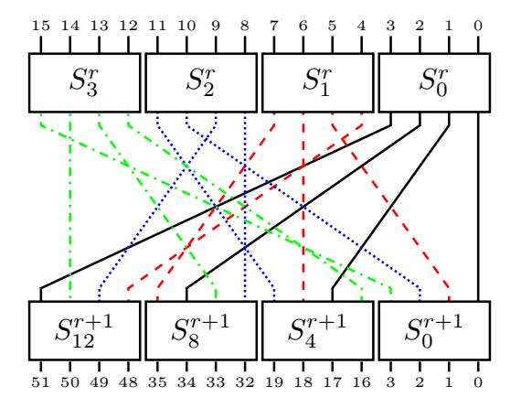
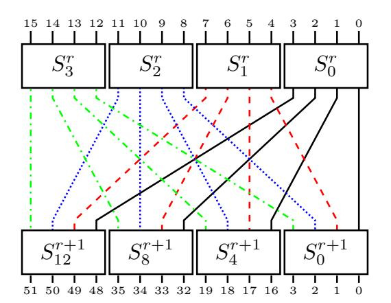
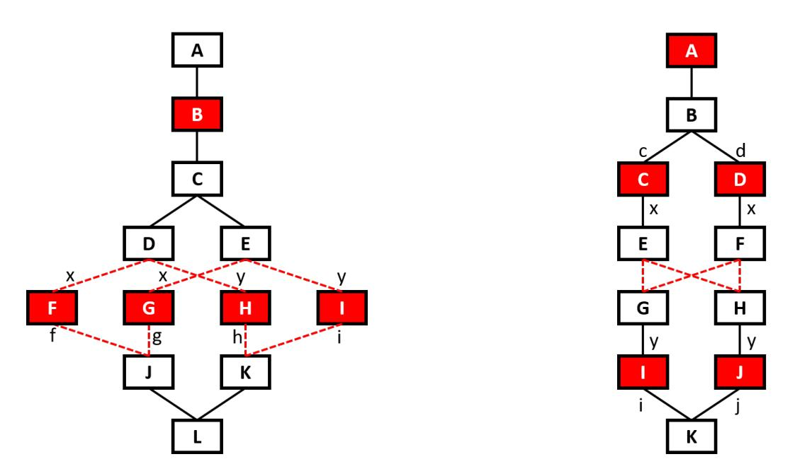
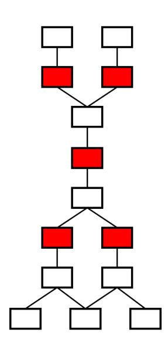
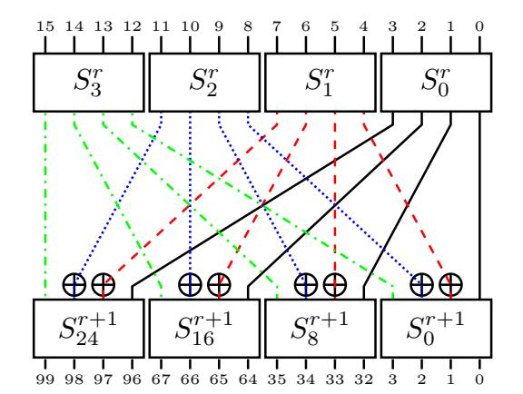
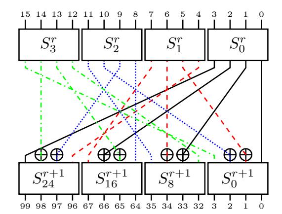
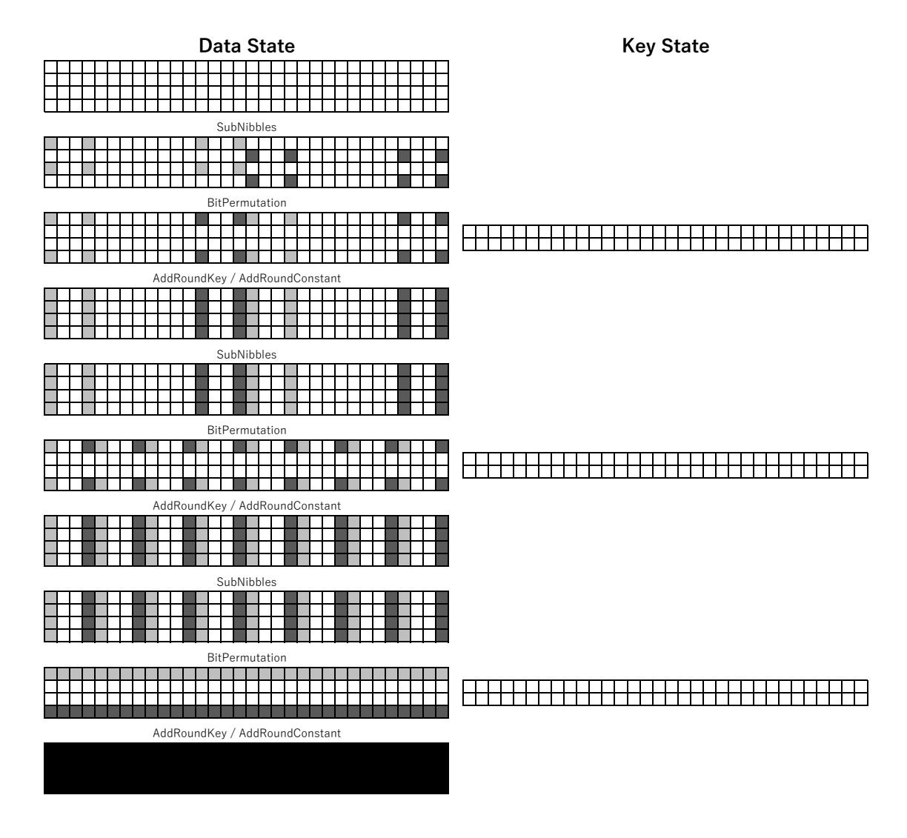

{0}------------------------------------------------

# On the Design of Bit Permutation Based Ciphers

# The Interplay Among S-box, Bit Permutation and Key-addition

Sumanta Sarkar1 , Yu Sasaki2 , Siang Meng Sim3

> 1 TCS Innovation Labs, India sumanta.sarkar1@tcs.com

2 NTT Secure Platform Laboratories, Japan yu.sasaki.sk@hco.ntt.co.jp

3 DSO National Laboratories, Singapore crypto.s.m.sim@gmail.com

Abstract. Bit permutation based block ciphers, like PRESENT and GIFT, are well-known for their extreme lightweightness in hardware implementation. However, designing such ciphers comes with one major challenge – to ensure strong cryptographic properties simply depending on the combination of three components, namely S-box, a bit permutation and a key addition function. Having a wrong combination of components could lead to weaknesses. In this article, we studied the interaction between these components, improved the theoretical security bound of GIFT and highlighted the potential pitfalls associated with a bit permutation based primitive design. We also conducted analysis on TRIFLE, a first-round candidate for the NIST lightweight cryptography competition, where our findings influenced the elimination of TRIFLE from second-round of the NIST competition. In particular, we showed that internal state bits of TRIFLE can be partially decrypted for a few rounds even without any knowledge of the key.

Keywords: lightweight cryptography, block cipher, bit permutation, S-box, differential cryptanalysis, linear cryptanalysis, PRESENT, GIFT, TRIFLE

# 1 Introduction

Block ciphers are often inspired by the principle of confusion and diffusion [\[25\]](#page-19-0). The Substitution Permutation Network (SPN) has been widely followed in constructing block ciphers, for example, Rijndael [\[12\]](#page-18-0) that became the block cipher standard AES[1](#page-0-0) . Confusion property comes from the substitution layer (SubBytes) which applies some S-boxes in parallel. The output of the substitution layer is processed by two linear operations, namely, byte permutation (ShiftRows)

1 In this article we will use AES instead of Rijndael.

{1}------------------------------------------------

and matrix multiplication (MixColumns). The wide-trail strategy proposed in AES [\[11\]](#page-18-1) allows designers to measure the strength of SPN ciphers against two basic attacks, namely, differential cryptanalysis [\[6\]](#page-18-2) and linear cryptanalysis [\[21\]](#page-19-1). The core strategy is to count the number of active S-boxes for some rounds. The four round propagation [\[12\]](#page-18-0) shows that the resistance of AES against differential and linear cryptanalysis depends on the permutation layer. Then AES adopted maximum distance separable (MDS) matrices for MixColumns as these matrices have the optimal diffusion property. The key-addition operation introduces secret key material into the internal state of a cipher during computation, and often accompanied with round constant addition which breaks any structural symmetry to avoid attacks like slide attacks [\[7\]](#page-18-3) and invariant subspace attacks [\[18\]](#page-19-2). Extreme lightweight primitive designs like SKINNY [\[5\]](#page-18-4) and GIFT [\[3\]](#page-18-5) add key materials to only half of the internal state each round (like Feistel network) to save on the hardware implementation cost.

One of the ISO/IEC 29192-2:2019 lightweight block cipher standards PRESENT [\[8\]](#page-18-6) followed the SPN, however, in order to reduce the hardware cost it completely removed diffusion matrix. Essentially one round of PRESENT comprises of the S-box layer, a bit permutation and key-addition operation. Such construction is given a more specific name — Substitution-bitPermutation Network (SbPN) [\[3\]](#page-18-5). As the bit permutation does not cost anything in hardware (simple wiring), the only cost is the S-box implementation and some XOR gates for the key-addition. The novelty of PRESENT is that it uses 4-bit S-boxes with differential branch number 3, and the output of S-boxes is optimally diffused by a bit permutation. The bit permutation plays a crucial role: despite the absence of diffusion matrices, together with the S-box it ensures strong cryptographic properties. Later GIFT [\[3\]](#page-18-5) took the design of PRESENT to the next level – strengthens the resistance against linear cryptanalysis, which is the PRESENT Achilles heel, and further reduced the hardware implementation cost. It proposes a new paradigm called Bad Output must go to Good Input (BOGI) which allows designers to select S-box lighter than that of PRESENT, and accordingly chooses a bit permutation to maintain strong security. To further reduce the hardware cost, GIFT made an aggressive yet careful move to add key materials to only half of the internal state in each round. Without careful analysis, this is a risky move as a wrong combination with other cipher components could lead to unexpected and undesirable properties.

Over the last decade lightweight cryptography has been enriched with interesting designs and primitive constructions, that it has also drawn the attention of US National Institute of Standards and Technology (NIST). NIST is in the process of standardising lightweight cryptography [\[22\]](#page-19-3). To this call NIST has received several authenticated encryption based on GIFT, for example GIFT-COFB [\[2\]](#page-18-7), HyENA [\[10\]](#page-18-8), Simple [\[15\]](#page-19-4) and SUNDAE-GIFT [\[1\]](#page-18-9). Moreover, there are also multiple submissions whose designs are inspired by GIFT, in particular a submission called TRIFLE [\[13\]](#page-18-10) whose underlying block cipher TRIFLE-BC is inspired by GIFT.

A study on TRIFLE-BC and Motivation of this paper. TRIFLE-BC constructed its S-box using cellular automata (CA) rules, and combined a PRESENT- 

{2}------------------------------------------------

like bit permutation with GIFT-128 key-addition. The intention was to maintain low hardware cost while achieving low side-channel protection cost as well.

The first observation on TRIFLE were reported by one of the authors of this paper on April 25, 2019 [\[23\]](#page-19-5), which was the origin of this research. On June 19, 2019, Liu and Isobe submitted their article on ePrint [\[19\]](#page-19-6) (later published by SAC 2019 [\[20\]](#page-19-7)) which included the 44-round key recovery on TRIFLE-BC and 11-round key recovery on TRIFLE (AEAD) by differential cryptanalysis. Soon after we reported our extended analysis to the mailing list on June 26, 2019 [\[26\]](#page-19-8), which was independently done from [\[19\]](#page-19-6). On July 6, 2019, Fl´orez Guti´errez reported the 50-round (full-round) key recovery on TRIFLE-BC by linear cryptanalysis [\[17\]](#page-19-9).

On August 30, 2019, NIST announced the second round candidates and TRIFLE was not selected. On October 7, 2019, NIST released the reasons [\[28\]](#page-19-10). ([37], [39], [16] in NIST's report correspond to [\[23\]](#page-19-5), [\[26\]](#page-19-8), [\[20\]](#page-19-7) in this paper.)

Several observations have been made that highlight undesirable properties in the block cipher TRIFLE-BC. NIST believes that these properties are cause for concern. In particular, the combination of S-box fixed points [37], subspace transitions, ability to decrypt a quarter of the state over two rounds without knowledge of the key, and long single active bit trails [39] could be combined to mount attacks. An iterative differential characteristic on reduced-round TRIFLE-BC that leveraged these properties was independently described by Liu and Isobe [16].

We believe that a series of our reports was a main reason for NIST not to select TRIFLE for the second round. Note that the full-round linear cryptanalysis [\[17\]](#page-19-9) was not mentioned by NIST.

Although new cipher design proposals often include their design rationale, the experiences in fail design attempts or consequences of violating certain design criteria are often omitted. This could lead to misunderstanding of the design philosophy and designing ciphers with undesirable properties. While the design principle of SPN is well-understood thanks to the popularisation of Rijndael (AES), SbPN has not gotten much attention.

In this paper, we revisit the design principle of PRESENT and GIFT. As evident from the design rationale of GIFT and PRESENT that in SbPN, the S-box and bit permutation are closely intertwined. Therefore, one has to be careful while adopting SbPN for cipher design, and should choose the components of SbPN appropriately. For instance, some crucial aspects of SbPN have been overlooked by TRIFLE-BC which render weaknesses into the cipher. In this paper we give a critical view on this, and come up with a general guideline for designing such ciphers.

Main contributions. We revisited the design philosophy of PRESENT and GIFT, looking at the interplay among the S-box, bit permutation and key-addition operations. (1) We enhanced the BOGI paradigm of GIFT, introducing what we called the BOGI+ criteria to improve the theoretical differential/linear bounds of primitives that adopt BOGI paradigm. (2) Using the BOGI+ criteria, we

{3}------------------------------------------------

reaffirmed the computer-aided bounds of GIFT with our pen-and-paper analysis. (3) We presented the essence of the SbPN design strategies and lastly (4) highlighted the weaknesses of TRIFLE-BC that this a direct consequence of SbPN design oversight.

Outline of the paper. First, we give a quick recap of SbPN components in Sect. 2. Next, we analyse the interaction between these components in Sect. 3. We summarise the potential pitfalls when selecting the components in Sect. 4. Finally, we present a case study on TRIFLE-BC in Sect. 4.1 and conclude in Sect. 5.

### 2 SbPN Components

**Definition 1.** [3] Substitution-bit Permutation network (SbPN) is a subclassification of Substitution-Permutation network, where the permutation layer only comprises of bit permutation. An m/n-SbPN cipher is an n-bit cipher in which substitution layer comprises of m-bit (Super-)S-boxes.

In this work, we focus on bit permutation based ciphers that use 4-bit S-boxes, or 4/n-SbPN ciphers. For brevity, we use SbPN instead for the rest of this paper. A round function of an SbPN cipher typically consists of 3 core operations:

SubNibbles An S-box layer that applies 4-bit S-boxes to all nibbles of the state. PermBits A bit permutation layer that bit-wise permutes the state. AddKey Key-addition that XORs the round keys (subkeys) to the state.

Depending on the design, the constant-addition operation may either XOR the round constants directly to the internal state or to the key state as part of the key schedule. For most of our discussion, the constant-addition and key schedule are irrelevant, thus we only bring them up only when necessary.

For the rest of this section, we recap some properties of S-boxes (used in SubNibbles), characteristics of bit permutation (used in PermBits) and types of key-addition (used in AddKey).

#### 2.1 Properties of S-boxes

Let  $\mathbb{F}_2^m$  be the vector space formed by the  $2^m$  binary m-tuples. An S-box is a mapping  $\mathcal{S}: \mathbb{F}_2^m \to \mathbb{F}_2^m$ . We call  $\mathcal{S}$  as an  $m \times m$  S-box (or simply m-bit S-box). In general S-boxes are chosen to be bijective, however, non-bijective S-box has also been used, e.g., in [14].

Differential and linear cryptanalysis are the basic attacks that the designer needs to take care of. In order to resist the differential cryptanalysis, the S-box should have low differential uniformity (DU). Let

$$\mathcal{D}_S(\delta, \Delta) = \{ \#x : S(x) \oplus S(x \oplus \delta) = \Delta \}.$$

{4}------------------------------------------------

Then DU of S is defined as

$$\mathtt{DU}(\mathcal{S}) = \max_{\delta \neq 0, \Delta \neq 0} \mathcal{D}_S(\delta, \Delta).$$

If DU(S) = k, then S is called k-differential uniform. DU(S) values are always even, and 2 is the lowest possible. S-boxes that are 2-differential uniform are called almost perfect non-linear (APN). So far APN permutations are only known to exist over  $\mathbb{F}_2^m$  when m is odd, and for m = 6 when m is even [9]. The differential distribution table (DDT) is the collection of all  $\mathcal{D}_S(\delta, \Delta)$  values.

On the other hand in linear cryptanalysis, the attacker exploits the probabilistic linear relations, also called *linear approximations*, between the input plaintext, key, and the ciphertext. Basically the attacker looks for relations

$$\bigoplus_{i=0}^{m-1} a_i x_i = \bigoplus_{i=0}^{m-1} b_i y_i,$$

that happen with high probability, where  $(x_0, \ldots, x_{m-1})$  and  $(y_0, \ldots, y_{m-1})$  are the input and output of an S-box respectively, and  $(a_0, \ldots, a_{m-1}) \in \mathbb{F}_2^m$  and  $(b_0, \ldots, b_{m-1}) \in \mathbb{F}_2^m$  are called input and output mask respectively. The maximum probability for all the non-zero input and output mask pairs is called the *linear probability* of  $\mathcal{S}$  denoted as  $\mathcal{L}_{\mathcal{S}}$ . For all possible input and output mask pairs the probabilistic bias of the relations is recorded in the *Linear Approximation Table* (LAT).

**Definition 2 (4-bit Optimal S-box).** A 4-bit S-box is optimal if both the maximum differential and linear probabilities are  $2^{-2}$ .

It is important to know the number of active S-boxes after a certain number of rounds. For instance, if c is the number of differentially active S-boxes in r rounds, and DU(S) = k, then the complexity of the differential cryptanalysis is at least  $(\frac{k}{2^m})^c$ . On the other hand if  $\ell$  is the number of linearly active S-boxes and  $\mathcal{L}_S = p$ , then the complexity of the linear cryptanalysis is at least  $p^{\ell}$ .

Additionally, there are two important security notions called branch numbers.

**Definition 3 (Differential Branch Number).** For an m-bit S-box S, its differential branch number denoted as DBN(S) is defined as

$$\textit{DBN}(\mathcal{S}) = \min_{x,y \in \mathbb{F}_2^m, \, x \neq y} \{ wt(x \oplus y) + wt(\mathcal{S}(x) \oplus \mathcal{S}(y)) \}.$$

In [24], it was proved that  $DBN(S) \leq \lceil \frac{2m}{3} \rceil$ . For 4-bit S-boxes, the bound is 3 and it is tight. For example, PRESENT uses a 4-bit S-box with DBN(S) = 3.

Next we define linear branch number for which we first define *correlation* coefficient. For any  $\alpha, \beta \in \mathbb{F}_2^m$  the correlation coefficient of  $\mathcal{S}$  with respect to  $(\alpha, \beta)$  is given by

$$C_{\mathcal{S}}(\alpha, \beta) = \sum_{x \in \mathbb{F}_2^m} (-1)^{\beta \cdot \mathcal{S}(x) + \alpha \cdot x}.$$

{5}------------------------------------------------

**Definition 4 (Linear Branch Number).** For an m-bit S-box S, its linear branch number denoted as LBN(S) is defined as

$$\mathit{LBN}(\mathcal{S}) = \min_{\alpha,\beta \in \mathbb{F}_2^m \setminus \{0\},\, \mathcal{C}_{\mathcal{S}}(\alpha,\beta) \neq 0} \{wt(\alpha) + wt(\beta)\}.$$

In [24], it was also proved that  $LBN(S) \leq m-1$ . In case of 4, the maximum possible LBN is 3. As a bit permutation based block cipher lacks the diffusion layer like MixColumns of AES, one way to increase the number of active S-boxes is to use S-boxes with higher branch numbers.

**XOR-Permutation Equivalence.** Let  $\mathcal{P}$  and  $\mathcal{Q}$  be two bit permutations of  $\mathbb{F}_2^m$  and  $c_i, c_o \in \mathbb{F}_2^m$  are some constants. Then two *m*-bit S-boxes  $\mathcal{S}$  and  $\mathcal{S}'$  are said to be XOR-permutation equivalent if the following holds for all  $x \in \mathbb{F}_2^m$ ,

$$\mathcal{S}'(x) = (\mathcal{Q} \circ \mathcal{S} \circ \mathcal{P})(x \oplus c_i) \oplus c_o.$$

Note that any bit permutation of  $\mathbb{F}_2^m$  is actually an  $m \times m$  permutation matrix. Several properties remain invariant in the equivalent class. For example, differential uniformity, linear probability, differential branch number and linear branch number are the same for two XOR-permutation equivalent S-boxes.

Hamming weight 1 transitions. For any Hamming weight 1 input difference  $\delta$  that has no transition to Hamming weight 1 output difference  $\Delta$ , we call it good input or otherwise bad input. Conversely, any Hamming weight 1 output difference  $\Delta$  that has no transition from Hamming weight 1 input difference  $\delta$ , we call it good output or otherwise bad output. The same analogue applies to the linear masking of an S-box.

**Definition 5 (Score of an S-box).** [3] The row score and column score of an S-box is the number of good input and good output respectively. The score of an S-box is the sum of the row and column score.

**BOGI paradigm.** Given an S-box, one can determine the *score of the S-box*. If the score is at least 4, it is possible to construct a bit permutation that, together with the S-box, guarantees certain security bounds. Refer to [3] for more details.

Remark: One might find that the score metric is similar to the  $CarD1_S$  and  $CarL1_S$  metric described in [30].  $Car*1_S$  counts the number of times a Hamming weight 1 input causes an Hamming weight 1 output, but it does not capture the position of these transitions. The score metric is a more refined description of the Hamming weight 1 transitions, allowing one to design SbPN cipher with minimally guaranteed security. Consider an S-box  $S_A$  with the following differential transitions  $1 \to 2$ ,  $2 \to 4$ ,  $4 \to 8$ ,  $8 \to 1$ , and another S-box  $S_B$  with  $1 \to 1$ ,  $1 \to 2$ ,  $2 \to 1$ ,  $2 \to 2$ . Under the  $Car*1_S$  metric, both  $S_A$  and  $S_B$  have  $CarD1_S = 4$  and are indifferent unless verified with computer-aided tool. Under the score metric,  $S_A$  with score 0 is obviously not suitable for SbPN ciphers, while  $S_B$  has score 4 and can be used with BOGI paradigm to achieve a minimally guaranteed security bound.

{6}------------------------------------------------

Affine subspace transition. Let a ⊕ V be a (affine) subspace, where V ⊆ F m 2 and a ∈ F m 2 , it is a linear subspace if a ∈ V . If there exists b ⊕ V 0 such that

$$\forall x \in a \oplus V, \quad \mathcal{S}(x) \in b \oplus V',$$

then a ⊕ V → b ⊕ V 0 is a (affine) subspace transition through the S-box S.

# 2.2 Characteristics of Bit Permutation

Apart from "Our observation", this section is an abstract from the design rationale of GIFT [\[3\]](#page-18-5). We recommend reading Sect. 3.2 of [\[3\]](#page-18-5) for a better understanding. For concise, we denote bit-position 4i + x as bit x, where 0 ≤ i ≤ n/4.

PRESENT bit permutation. To analyse the PRESENT bit permutation, the designers partition the 16 S-boxes into 4 groups, namely {S0, S1, S2, S3}, {S4, S5, S6, S7}, {S8, S9, S10, S11} and {S12, S13, S14, S15}, and presented the following four properties [\[8\]](#page-18-6): (1) The input bits to an S-box come from 4 distinct S-boxes of the same group. (2) The input bits to a group of four S-boxes come from 16 different S-boxes. (3) The four output bits from a particular S-box enter four distinct S-boxes, each of which belongs to a distinct group of S-boxes in the subsequent round. (4) The output bits of S-boxes in distinct groups go to distinct S-boxes.

GIFT bit permutation. The designers revisited the analysis on the bit permutation and presented an elegant way to decompose the bit permutation, providing better insights and proposed framework to construct any bit permutation that is a multiple of 16 (and at least 64-bit) [\[3\]](#page-18-5). The bit permutation is partitioned into several identical 16-bit permutations, so called the group mapping. Each group mapping maps 16-bit output bits of 4 S-boxes to input bits of another 4 S-boxes. The grouping of the S-boxes is denoted as S-box mapping.

GIFT S-box mapping: The S-boxes Si are partitioned in two ways — Quotient group Qx = {S4x, S4x+1, S4x+2, S4x+3} and Remainder group Rx = {Sx, Sq+x, S2q+x, S3q+x} where q = n/16 and 0 ≤ x ≤ q − 1. S-box mapping maps Qx to Rx, where the specific bit permutation is defined by the group mapping.

Projecting the S-box mapping description on PRESENT bit permutation, the PRESENT S-box mapping coincide with the S-box mapping for n = 64.

Group mapping: The mapping of the output bits from a Quotient group to the input of a Remainder group in the next round. The output bits from an S-box in the Quotient group goes to 4 distinct S-boxes in the Remainder group.

For GIFT, its group mapping is described as follows:

{7}------------------------------------------------

| $Qx^r \qquad Rx^{r+1}$ | $\mathcal{S}_x^{r+1}$ | $\mathcal{S}^{r+1}_{q+x}$ | $\mathcal{S}_{2q+x}^{r+1}$ | $\left[ \mathcal{S}^{r+1}_{3q+x} \right]$ |
|------------------------|-----------------------|---------------------------|----------------------------|-------------------------------------------|
| $\mathcal{S}^r_{4x}$   | $(0,\pi(0))$          | $(1,\pi(1))$              | $(2,\pi(2))$               | $(3, \pi(3))$                             |
| $\mathcal{S}^r_{4x+1}$ | $(1,\pi(1))$          | $(2,\pi(2))$              | $(3,\pi(3))$               | $(0,\pi(0))$                              |
| $\mathcal{S}^r_{4x+2}$ | $(2,\pi(2))$          | $(3,\pi(3))$              | $(0,\pi(0))$               | $(1, \pi(1))$                             |
| $\mathcal{S}^r_{4x+3}$ | $(3,\pi(3))$          | $(0,\pi(0))$              | $(1,\pi(1))$               | $(2,\pi(2))$                              |

Table 1:  $\mathcal{G}$ -group mapping

where (l, m) denotes the output bit l of the S-box in the corresponding row will map to the input bit m of the S-box in the corresponding column in the next round.

Fig. 1:  $\mathcal{G}$ -group mapping of GIFT-64

 $\pi(\cdot)$  is a bijective permutation on  $\{0,1,2,3\}$  that is determined by the properties of the DDT (resp. LAT) of the S-box. The only requirement for the permutation is that it must map bad output to good input, hence the name BOGI. Conversely, one may choose an XOR-permutation equivalent S-box that works with identity permutation  $\pi(i) = i$  as in GIFT. For simplicity, we assume  $\pi$  to be identity and denote such group mapping as  $\mathcal{G}$ -group mapping.

PRESENT bit permutation could also be described in a similar manner:

| $Qx^r \qquad Rx^{r+1}$ | $\mathcal{S}_x^{r+1}$ | $\mathcal{S}_{q+x}^{r+1}$ | $\mathcal{S}_{2q+x}^{r+1}$ | $\left \mathcal{S}^{r+1}_{3q+x}\right $ |
|------------------------|-----------------------|---------------------------|----------------------------|-----------------------------------------|
| $\mathcal{S}^r_{4x}$   | (0,0)                 | (1,0)                     | (2,0)                      | (3,0)                                   |
| $\mathcal{S}^r_{4x+1}$ | (0,1)                 | (1,1)                     | (2,1)                      | (3,1)                                   |
| $\mathcal{S}^r_{4x+2}$ | (0,2)                 | (1, 2)                    | (2,2)                      | (3, 2)                                  |
| $\mathcal{S}^r_{4x+3}$ | (0,3)                 | (1,3)                     | (2,3)                      | (3,3)                                   |

Table 2:  $\mathcal{P}$ -group mapping

where (l, m) denotes the output bit l of the S-box in the corresponding row will map to the input bit m of the S-box in the corresponding column in the next round.

Fig. 2:  $\mathcal{P}$ -group mapping of PRESENT

We denote PRESENT-like group mappings as  $\mathcal{P}$ -group mappings. The main difference between  $\mathcal{P}$ -group and  $\mathcal{G}$ -group mapping is that the latter always maps bit i to bit  $\pi(i)$ , while the former has 16 distinct bit position mapping (i, j).

**Optimal bit permutation.** A full diffusion is where any single bit flip has an influence over the entire internal state. For an 4/n-SbPN cipher, suppose a single input bit is flipped, the maximum number of affected bits after r round is  $4^r$ . Thus, a bit permutation is optimal if full diffusion (starting from any bit) is achieved in  $\lceil \log_4(n) \rceil$  rounds.

Our observation. The aforementioned 4 properties of PRESENT bit permutation is not sufficient to ensure full diffusion for an 128-bit bit permutation. One could duplicate and concatenate 2 copies of PRESENT bit permutation without

{8}------------------------------------------------

interaction, this will satisfy the 4 properties but will never achieve full diffusion because there is no mixing between the two halves of the internal state. The reason that it doesn't work is simple — there is no clear definition on how the S-boxes are grouped.

On the other hand, the GIFT S-box mapping has been shown to be optimal permutation for both 64-bit and 128-bit [\[3\]](#page-18-5). We conjecture that GIFT S-box mapping provides an optimal permutation for any arbitrary block size that is multiple of 16. In addition, we proposed using GIFT S-box mapping as the framework to build 4/n-SbPN ciphers, especially for 64-bit and 128-bit, and not just satisfying the 4 properties of PRESENT bit permutation.

#### 2.3 Types of Key-addition

In conventional designs, key materials are added to the entire internal state. In recent lightweight designs, like SKINNY [\[5\]](#page-18-4) and GIFT [\[3\]](#page-18-5), the key materials are only added to half of its internal state (so-called partial key-addition). One obvious benefit is to reduce hardware footprint. While one of the drawbacks is having a weaker related-key differential bounds for lower number of rounds.

Related-key differential bounds. In a nutshell, related-key differential cryptanalysis is an attack model where differences can be introduced in the master key. Naturally, if it takes r rounds for the all key materials of the master key to be added to the internal state, the highest related-key differential probability for the first r − 1 rounds is 1. Since partial key-addition takes more rounds to introduce all the key materials into the internal state, it directly increases r.

Invariant subspace analysis. This is a weak key attack, introduced by [\[18\]](#page-19-2), that exploits subspaces which are preserved through arbitrary number of rounds. A "simple" way to break any subspace structures is through the addition of round constants, as discussed in [\[4\]](#page-18-13). However, as seen in [\[16,](#page-19-13)[27\]](#page-19-14), round constants may not work if the designers are not careful, hence the scare quote for simple. To reduce the dependency of the round constant to prevent invariant subspace attacks, we are interested to analyse the properties of the S-box and key-addition against these attacks. Counter-intuitively, when designing SbPN ciphers, having partial key-addition could actually help finding suitable S-box candidates easier. This is because we can relax some of the conditions necessary for S-boxes to be resistant against invariant subspace attack. Details will be explained in Sect. [3.2.](#page-13-0)

# 3 Interaction Between Components

In this section, we discuss the pair combination of the 3 main components of SbPN.

{9}------------------------------------------------

#### 3.1 S-box & Bit Permutation

One of the most important analysis to be performed for new cipher design is resistance against differential and linear cryptanalysis. A common approach is to use some computer-aided tool to find out the upper bound for the differential probability or linear bias of the SbPN structure. The designers of RECTANGLE [\[29\]](#page-19-15) (4/64-SbPN cipher) adopted this approach and provided experimental evidence. However, due to the bit-oriented nature of the SbPN structure, analysing larger state size (say 128-bit) and large number of rounds is computationally infeasible.

Another approach is to provide theoretical proof that the combination of a particular S-box and a bit permutation guarantees some upper bound. Such theoretical arguments also serve as a guideline to design primitives with strong cryptographic properties. The designers of PRESENT [\[8\]](#page-18-6) are one of the first to propose a theoretical argument for 4/64-SbPN. Combining DBN 3 S-boxes with a 64-bit optimal bit permutation, they proved that any 5 consecutive rounds of PRESENT have at least 10 differentially active S-boxes (denoted as 10-AS/5-round).

A third approach is a hybrid method. First, select components satisfying certain cryptographic criteria to guarantee some theoretical upper bound, and then perform the computer-aided analysis to obtain more accurate results. This approach requires much lower computational effort than the first approach and obtain more accurate bounds (usually better bounds) than using the second approach alone. The designers of GIFT [\[3\]](#page-18-5) first introduced the BOGI paradigm that, with the correct combination of S-box and bit permutation, guarantees at least 7-AS/5-round; and used computer-aided search to show that GIFT achieves at least 18-AS/9-round, the same number of active S-boxes ratio as PRESENT.

Theorem 1. (BOGI paradigm) If an SbPN construction satisfies all the differential (resp. linear) BOGI criteria, the longest consecutive single active S-box differential (resp. linear) trail is 3. And the 4/n-SbPN structure has at least 7-AS/5-round, where n ≥ 64 is multiple of 16.

Proof. BOGI criteria ensures that there is no consecutive single bit transition (having single active bit input and output), thus the longest consecutive single active S-box trail is 3, only the middle S-box can have single bit transition (1–1–1). Beyond that, there are at least 2 active bits at input of the preceding S-box and output of the succeeding S-box which leads to at least 7 active S-boxes (2–1–1–1–2). For n ≥ 64, the active bits different S-boxes of the same round will not go to the same S-box because of the Quotient and Remainder grouping. Thus, there are at least 7-AS/5-round (1–1–1–2–2 or 2–2–1–1–1). ut

Although S-boxes with DBN = 3 provide strong cryptographic properties (10-AS/5-round) for SbPN structure, it is known that there is no 4-bit optimal S-boxes simultaneously having DBN = 3 and LBN = 3. BOGI paradigm did a trade-off to have good cryptographic properties on both the differential and linear cases simultaneously at a cost of a weaker theoretical bound (7-AS/5-round).

For the rest of this section, we first analyse the various possible differential or linear characteristics, followed by proposing new criteria to improve the theoretic 

{10}------------------------------------------------

bounds of BOGI paradigm (we called it BOGI+ criteria). Lastly, we apply our results to improve the theoretic bound for GIFT.

Differential/Linear characteristics with single active S-box. To simplify the discussion, we assume that some G-group mapping with identity π, and all the S-box mappings use this same group mapping.

For any r-round differential/linear characteristic, suppose that there is some round with 1 active S-box. By Theorem [1,](#page-9-0) the trail will eventually split and have multiple active S-boxes in some round. For the average number of active S-boxes to maintain below the ratio of 2, one of the two patterns must occur:

Fig. 3: Net pattern Fig. 4: Cross pattern

Each box represents an S-box and red boxes are S-boxes with Hamming weight 1 transition. The solid black lines are the active bits trail and dashed red lines form the special pattern.

For the net pattern (Fig. [3\)](#page-10-0), although it propagates to more than 2 active S-boxes at some round, if it manages to converge back to 2 active S-boxes, it can achieve 11-AS/6-round. If it can further converge to 1 single active S-box, then it could lead to an iterative 6-round structure. Thus, the focus is to analyse the conditions for the four Hamming weight 1 transitions to occur between the net pattern. Notice that the 2 active S-boxes, SD and SE, belonged to the same remainder group as they originated from a same S-box SC . Thus, they are in different quotient groups but in the same position (same row of the group mapping). For them to propagate to 4 S-boxes that belong to only 2 quotient groups, hence allowing converging to occur, SF and SG must have the active input bit at the same bit position, say bit x. Similarly for SH and SI at bit y. In addition, since the input bits to SF and SH came from a same S-box, we must have x =6 y. Finally, for output of SF and SG (resp. with the other S-box pair SH and SI ) to go to the same S-box SJ (resp. SK), the active output bit positions, 

{11}------------------------------------------------

say bit f and g, must be different, i.e. f 6= g and h =6 i. In summary, such net pattern needs 4 distinct Hamming weight 1 transitions:

$$x \mapsto f, \ x \mapsto g, \ y \mapsto h, \ y \mapsto i.$$

That said, we have the following lemma.

Lemma 1. Assume an SbPN construction satisfies all the BOGI criteria, any S-box that allows a net pattern has 4 distinct Hamming weight 1 transitions; and both its row and column score at most 2.

A cross pattern (Fig. [4\)](#page-10-0) could potentially be iterative, resulting in 2-AS/round characteristic, as observed in the differential characteristic of PRESENT and GIFT-64. But such iterative pattern is acceptable as long as this pattern is not propagated from a single active S-box, and does not converge to a single active S-box. Otherwise, a trail can start or end with 3 consecutive single active S-boxes and with this cross pattern as the main body. Such characteristics have (2r − 3)-AS/r-round or even 11r-AS/7r-round iterative pattern. Note that the cross pattern cannot occur immediately after the splitting because the S-boxes SC and SD are in the same remainder group and different quotient groups. Therefore, the focus is on the conditions for the Hamming weight 1 transition at SC , SD and SI , SJ . Originated from SB, SC and SD are in the same remainder group with different active input bit positions, say bit c and d, and we know c 6= d. For SE and SF to be in the quotient group, the active output bit positions of SC and SD must be the same bit position, bit x. Similar argument for SI and SJ in the backward direction, i.e. i 6= j. In short, for a cross pattern to begin with a single active S-box requires the following 2 Hamming weight 1 transitions:

$$c \mapsto x, \ d \mapsto x.$$

For a cross pattern to converge to a single active S-box, it requires a different pair of Hamming weight 1 transitions:

$$y \mapsto i, \ y \mapsto j.$$

Lemma 2. Assume an SbPN construction satisfies all the BOGI criteria, any S-box that allows a single active S-box to propagate to a cross pattern has a row score of at most 2; any S-box that has a cross pattern converging to a single active S-box has a column score of at most 2.

There could be other patterns that eventually converge back to a single S-box, but those patterns will result in a trail with more than 2-AS/round or require an S-box with even lower scores. Suppose the initial split lead to 3 or 4 active S-boxes, with 3 consecutive single active S-boxes, the trail has 3-AS/3-round. Upon propagating to 3 (resp. 4) active S-boxes, the trail now has 6-AS/4-round (resp. 7-AS/4-round) active S-boxes. Since all 3 (resp. 4) active S-boxes are in different quotient groups, any further propagation to more active S-boxes will result in a trail with more than an average of 2 active S-boxes per round. For all the active S-boxes to have Hamming weight 1 transitions, it would require either the row or column score to be lower than 2.

{12}------------------------------------------------

New criteria for guaranteed good bounds (BOGI+ criteria). Here, we introduce new criteria that guarantee higher theoretical bound. As they are built upon BOGI paradigm, we call them the BOGI+ criteria.

Theorem 2. (BOGI+ criteria) Assume an SbPN construction satisfies all the differential (resp. linear) BOGI criteria, if the differential (resp. linear) property of the S-box satisfies exactly one of the follow criteria:

- has a differential (resp. linear) row score of 3,
- has a differential (resp. linear) column score of 3,

then a 4/n-SbPN structure has at least (2r − 3)-AS/r-round, where r ≥ 9.

If both criteria are satisfied, then a 4/nSbPN construction has at least 2r-AS/r-round, where r ≥ 9.

Proof. For any r-round characteristic, if each round has at least 2 active S-boxes, then we have at least 2r-AS/r-round and we are done. Otherwise, there exists some round with exactly 1 active S-box.

If both criteria are satisfied, both the net and cross patterns cannot occur, then the longest characteristic with 1 active S-box at some round and has an average below 2-AS/round is 8 round, an example is shown in Fig. [5.](#page-12-0) Thus for r ≥ 9, we have at least 2r-AS/r-round.

Fig. 5: 14 active S-boxes in a 8-round characteristic. Each box represents an S-box, 1-1 transition S-boxes are in red.

If exactly one of the two criteria is satisfied, say the S-box has column score 3 but row score 2, by Lemma [1](#page-11-0) the net pattern cannot occur. But there could be a characteristic starting with 3 consecutive single active S-boxes, followed by an iterative cross pattern (2-AS/round) without converging back to 1 active S-box (by Lemma [2\)](#page-11-1). This results in an r-round characteristic with (2r − 3) active S-boxes, where r ≥ 9. ut 

{13}------------------------------------------------

Improved theoretical bound for GIFT. Using the above results, we can improve the theoretical bound of GIFT. Tab. [3](#page-13-1) and [4](#page-13-2) shows the 1-1 bit DDT and 1-1 bit LAT of the GIFT S-box respectively.

Table 3: 1-1 bit DDT of GIFT S-box. Table 4: 1-1 bit LAT of GIFT S-box.

| ∆O |  |  |           |  |   | β         |  |         |  |
|----|--|--|-----------|--|---|-----------|--|---------|--|
|    |  |  | 1 2 4 8   |  |   |           |  | 1 2 4 8 |  |
|    |  |  | 1 0 0 0 2 |  |   | 1 0 0 2 4 |  |         |  |
|    |  |  | 2 0 0 0 0 |  |   | 2 0 0 0 2 |  |         |  |
| ∆I |  |  | 4 0 0 0 0 |  | α | 4 0 0 0 0 |  |         |  |
|    |  |  | 8 0 0 0 0 |  |   | 8 0 0 0 0 |  |         |  |

For the differential case, from Tab. [3](#page-13-1) we see that both the row and column have score 3. By Theorem [2,](#page-12-1) there are at least 18 differentially active S-boxes in 9 rounds. For the linear case, although the BOGI+ criteria are not satisfied, we know from Lemma [1](#page-11-0) that the net pattern is not possible. By enumerating the possible cross patterns based on the LAT of GIFT S-box, we can see that the cross pattern is not possible either[2](#page-13-3) . Thus, there are at least 18 linearly active S-boxes in 9 rounds.

### 3.2 S-box & Add Round Keys

In [\[16\]](#page-19-13), the authors studied the resistance criteria of an S-box against invariant subspace attacks [\[18\]](#page-19-2) for the case of full key-addition. To achieve a high level resistance against invariant subspace attack, an S-box should have the following two conditions [\[16\]](#page-19-13): (1) There are no affine subspace transitions of dimension more than 2. (2) There are no affine subspace transitions of dimension 2 that can be connected (output subspace of one coincides with input subspace of another).

Interestingly, these two conditions could be relaxed when a cipher design uses partial key-addition. Similar to [\[16\]](#page-19-13), we assume that any subspace is preserved over the linear layer (in our case, the bit permutation layer). First, we give an example before generalising our observation.

Example 1. Suppose the partial key-addition adds key bits to bit 1 and 2 of every nibble. Consider the following subspace transition of an S-box: 0 ⊕ {0, 2, 4, 6} → 1 ⊕ {0, 2, 4, 6}. After the SubNibbles, supposed that the PermBits preserves the affine subspace 1⊕ {0, 2, 4, 6}, if the AddKey XORs x ∈ {1, 3, 5, 7} to each nibble, the subspace will return to 0 ⊕ {0, 2, 4, 6} and we will have an invariant subspace. However, notice that 1⊕ {0, 2, 4, 6} will not be sent back to 0⊕ {0, 2, 4, 6} because bit 0 is not updated by the partial key-addition. Hence, this subspace transition posts no threat to the cipher. 4

In summary, we can check if the partial key-addition and/or constant-addition could link any subspace transition from the output back to the input of the S-box. If it doesn't, then this S-box candidate is still resistant against invariant

2Due to the page constraints, we omit the case-by-case analysis.

{14}------------------------------------------------

subspace attack. That said, we introduce a third condition for S-boxes to have high resistance against invariant subspace attacks: (3) Exceptions can be made if none of the necessary values for connecting the affine subspaces can be attained by the key-addition or add-constant.

### 3.3 Bit Permutation & Add Round Keys

With the partial key-addition, designers need to take care of how the internal state is masked with the key materials. Without loss of generality, we assume the order of operations to be PermBits – AddKey – SubNibbles, this is because the XOR gates of AddKey can be moved across the bit wiring (PermBits) trivially.

One desirable property is that none of the internal state bit values can be determined with probability 1 after SubNibbles. Since S-boxes are applied to the internal state nibble-wise, each nibble should be masked by some key bit prior to the SubNibbles operation. In addition, taking into consideration of efficient software implementation, more specifically the bit-slice implementation, the key materials should be added to the same bit position of each nibble. For example, GIFT-128 adds the key materials to bit 1 and bit 2 of each nibble.

Although this approach works well for G-group mappings, it doesn't work that well with P-group mappings. From the P-group mapping (see Tab. [2](#page-7-0) and Fig. [2\)](#page-7-1), we see that if bit i of each nibble in round r + 1 is masked with the some key bits, then only the output of S r 4x+i is masked with those key bits.

This implies that for any partial key-addition that doesn't add key material to bit i, during the backward computation some nibble will have no obscurity and one can inverse the S-box to know the input values trivially.

The problem lies with the nature of P-group mapping having distinct bit position mappings. Having irregular partial key-addition could resolve this issue but it could potentially make the cipher description confusing and software implementation less efficient. On the other hand, a G-group mapping does not have this issue because masking bit i of each nibble implies masking bit π −1 (i) of each nibble, no nibble will be left unmasked.

In summary, partial key-addition works fine with G-group mapping but not as well with P-group mapping.

# 4 Highlights on security aspects of SbPN Design

We have seen in the previous section that various components have different cause and effect when combined with other components. It creates a "chicken and egg" situation for the order of component selections. As different designers have different design rationale in mind, there is no standard procedure for designing an 4/n-SbPN cipher that would suit everyone. Nevertheless, having strong cryptographic properties is a common goal for all cipher designers. That said, we summarise our results thus far and classify them according to the relevant cryptanalysis techniques.

{15}------------------------------------------------

Differential/Linear cryptanalysis. Having an S-box with differential and linear branch number 3 is great for proving high security bounds when combined with either P-group mapping or G-group mapping. But if such option is unavailable, one should minimally select an S-box with score 4 and combine with G-group mapping. If both differential and linear rely on the score 4 property, make sure that π can simultaneously satisfy both the differential and linear BOGI criteria. If that doesn't work, one should search for other S-box candidates.

If there is an abundant choice of S-boxes with score 4, selecting one with row and/or column score 3 will directly improve its theoretical bound. Otherwise, further analysis like computer-aided tool is necessary to get more accurate bounds.

Invariant subspace attack and related-key differential. In the process of analysing the affine subspace transition through the S-box, one can consider the position of the key-addition and constant-addition to see if any affine subspaces can be preserved. This could potentially find S-box candidates that otherwise would been discarded by the first two conditions in Sect. [3.2.](#page-13-0)

A full key-addition tend to have better related-key differential bounds but also makes invariant subspace attack more probable. Nonetheless, with stronger key schedule and further analysis, invariant subspace attack could be mitigated.

Partial encryption or decryption. Although partial key-addition could save a substantial amount of hardware resources, one should avoid using P-group mappings together with partial key-addition as it could result determining part of the internal state information without having to guess any key materials.

### 4.1 A case study on TRIFLE-BC

TRIFLE is one of the 56 first-round candidates for the NIST lightweight cryptography standardization process. Its underlying cipher TRIFLE-BC adopts SbPN. The block size and the key size of TRIFLE-BC are 128 bits. It computes 50 rounds in total, and each round consists of the following 3 operations that are of interest to us.

- SubNibbles applies the 4-bit S-box 0c9735e46ba2d18f to each nibble.
- BitPermutation moves bit-position i to bi/4c+(i%4)×32 for i = 0, 1, . . . , 127.
- During AddRoundKey, a 64-bit round key computed by a key schedule algorithm is XORed to bit 1 and 2 of the state.

A state is often denoted by a 4 × 32 matrix. The bit i in the vector form, where 0 ≤ i ≤ 127, corresponds to the bit in the (bi/4c)-th column from the left and (i mod 4)-th row from the top.

Long single active S-box trail. The DBN takes a crucial role to ensure the security of SbPN. However, as pointed out by the designers, DBN = 2 for the TRIFLE S-box, besides there are 4 differential propagation with DBN = 2; 8 → 4, 

{16}------------------------------------------------

 $4 \rightarrow 2$ ,  $2 \rightarrow 1$ , and  $1 \rightarrow 8$ . Clearly, attackers can construct a differential characteristic only with those four transitions, which leads to an r-round differential characteristic only with r active S-boxes.

This property ensures only a weak security. The designers of TRIFLE realized this property, hence tried to mitigate the damage from this property by limiting the probability of each propagation to  $2^{-3}$ . However as independently pointed out by Liu et al. [20], this still allows r-round differential characteristics with probability  $2^{-3r+2}$ , where the factor  $2^2$  comes from the fact that the first round input and the last round output can have more than 1 active bits, thus the probability can be  $2^{-2}$  for those 2 rounds.

**Keyless Partial Decryption.** The bad interaction between the partial keyaddition and the bit permutation pointed out in Sect. 3.3 actually occurs in TRIFLE-BC.

TRIFLE-BC XORs key material to bit 1 and bit 2 or each nibble while adopting the  $\mathcal{P}$ -group mapping. While in the forward direction (encryption), 2 of the 4 input bits to every S-box is masked with some secret key material, it is not the case from the backward direction (decryption).

Fig. 6: TRIFLE-BC group mapping

Fig. 7: GIFT-128 group mapping

As one can see from Fig. 6, 2 of the 4 S-boxes (black and green) in the previous round of TRIFLE-BC is not masked by any key material. Such property does not exist in PRESENT because all bits are masked with some key material. Whereas for GIFT (Fig. 7), bit i is mapped to bit i, thus 2 of the 4 output bits to every S-box is masked with some key material.

Namely, the attacker can compute some inverse S-boxes in round r even without knowing any round key bits in round r as summarized below.

Let  $X_i^r$  denote bit i of the state just before **SubNibbles** at round r. Given 4 bit values in bit positions  $\{X_i^{r+1}, X_{i+32}^{r+1}, X_{i+64}^{r+1}, X_{i+96}^{r+1}\}$ , where  $i \in \{0, 3, 4, 7, 8, 11, 12, 15, 16, 19, 20, 23, 24, 27, 28, 31\}$ , the values of  $\{X_{4i}^r, X_{4i+1}^r, X_{4i+2}^r, X_{4i+3}^r\}$  are fully determined independently of the key.

By using the above, part of the internal state bits of TRIFLE that can be recovered without subkey guesses during the 3-round decryption are depicted in Fig. 8.

{17}------------------------------------------------

Fig. 8: Partially decrypted state bits without subkey guess. In the data state, row i corresponds to bit i, columns correspond to the S-boxes. Black cells are ciphertext bits and gray cells are decrypted bits without subkey. Different shades of gray is for the convenience to trace the bit permutation.

# 5 Conclusion

In this article we have provided an extensive insight of SbPN designs. We have introduced BOGI+ criteria which is further refinement of the BOGI criteria as given by GIFT, and with this new criteria we have been able to improve the theoretical bounds of active S-boxes in GIFT. Our analysis goes much deeper and explains the interplay between S-box, bit permutation and key addition and how to choose them for a secure SbPN design. We highly recommend designers to follow our guidelines while creating a new SbPN cipher, and avoid flaws that render weaknesses as observed in a recent SbPN cipher TRIFLE-BC.

# Acknowledgements

The authors would like to thank Thomas Peyrin for the meaningful discussion on the study of TRIFLE-BC.

{18}------------------------------------------------

# References

- 1. Banik, S., Bogdanov, A., Peyrin, T., Sasaki, Y., Sim, S.M., Tischhauser, E., Todo, Y.: SUNDAE-GIFT, submission to NIST Lightweight Cryptography project (2019)
- 2. Banik, S., Chakraborti, A., Iwata, T., Minematsu, K., Nandi, M., Peyrin, T., Sasaki, Y., Sim, S.M., Todo, Y.: GIFT-COFB, submission to NIST Lightweight Cryptography project (2019)
- 3. Banik, S., Pandey, S.K., Peyrin, T., Sasaki, Y., Sim, S.M., Todo, Y.: GIFT: A small present - towards reaching the limit of lightweight encryption. In Fischer, W., Homma, N., eds.: Cryptographic Hardware and Embedded Systems - CHES 2017 - 19th International Conference, Taipei, Taiwan, September 25-28, 2017, Proceedings. Volume 10529 of Lecture Notes in Computer Science., Springer (2017) 321–345
- 4. Beierle, C., Canteaut, A., Leander, G., Rotella, Y.: Proving resistance against invariant attacks: How to choose the round constants. In Katz, J., Shacham, H., eds.: Advances in Cryptology - CRYPTO 2017 - 37th Annual International Cryptology Conference, Santa Barbara, CA, USA, August 20-24, 2017, Proceedings, Part II. Volume 10402 of Lecture Notes in Computer Science., Springer (2017) 647–678
- 5. Beierle, C., Jean, J., K¨olbl, S., Leander, G., Moradi, A., Peyrin, T., Sasaki, Y., Sasdrich, P., Sim, S.M.: The SKINNY family of block ciphers and its low-latency variant MANTIS. In Robshaw, M., Katz, J., eds.: Advances in Cryptology - CRYPTO 2016 - 36th Annual International Cryptology Conference, Santa Barbara, CA, USA, August 14-18, 2016, Proceedings, Part II. Volume 9815 of Lecture Notes in Computer Science., Springer (2016) 123–153
- 6. Biham, E., Shamir, A.: Differential cryptanalysis of the full 16-round DES. In Brickell, E.F., ed.: CRYPTO'92. Volume 740 of LNCS., Springer, Heidelberg (August 1993) 487–496
- 7. Biryukov, A., Wagner, D.A.: Slide attacks. In Knudsen, L.R., ed.: Fast Software Encryption, 6th International Workshop, FSE '99, Rome, Italy, March 24-26, 1999, Proceedings. Volume 1636 of Lecture Notes in Computer Science., Springer (1999) 245–259
- 8. Bogdanov, A., Knudsen, L.R., Leander, G., Paar, C., Poschmann, A., Robshaw, M.J.B., Seurin, Y., Vikkelsoe, C.: PRESENT: An Ultra-Lightweight Block Cipher. In Paillier, P., Verbauwhede, I., eds.: Cryptographic Hardware and Embedded Systems - CHES 2007. Volume 4727 of LNCS., Springer (2007) 450–466
- 9. Browning, K., Dillon, J., McQuistan, M., Wolfe, A.: An APN permutation in dimension six. Finite Fields: Theory and Applications 518 (2010) 33–42
- 10. Chakraborti, A., Datta, N., Jha, A., Nandi, M.: HyENA, submission to NIST Lightweight Cryptography project (2019)
- 11. Daemen, J., Rijmen, V.: AES and the wide trail design strategy. In Knudsen, L.R., ed.: Advances in Cryptology - EUROCRYPT 2002, International Conference on the Theory and Applications of Cryptographic Techniques, Amsterdam, The Netherlands, April 28 - May 2, 2002, Proceedings. Volume 2332 of Lecture Notes in Computer Science., Springer (2002) 108–109
- 12. Daemen, J., Rijmen, V.: The Design of Rijndael: AES - The Advanced Encryption Standard. Information Security and Cryptography. Springer (2002)
- 13. Datta, N., Ghoshal, A., Mukhopadhyay, D., Patranabis, S., Picek, S., Sadhukhan, R.: TRIFLE, submission to NIST Lightweight Cryptography project (2019)
- 14. DES: Data encryption standard. In: In FIPS PUB 46, Federal Information Processing Standards Publication. (1977) 46–2

{19}------------------------------------------------

- 15. Gueron, S., Lindell, Y.: Simple, submission to NIST Lightweight Cryptography project (2019)
- 16. Guo, J., Jean, J., Nikolic, I., Qiao, K., Sasaki, Y., Sim, S.M.: Invariant subspace attack against midori64 and the resistance criteria for s-box designs. IACR Trans. Symmetric Cryptol. 2016(1) (2016) 33–56
- 17. Guti´errez, A.F.: (July 6, 2019) OFFICIAL COMMENT: TRIFLE. Email to lwcforum. (2019) Available at [https://csrc.nist.gov/CSRC/media/Projects/](https://csrc.nist.gov/CSRC/media/Projects/Lightweight-Cryptography/documents/round-1/official-comments/TRIFLE-official-comment.pdf) [Lightweight-Cryptography/documents/round-1/official-comments/](https://csrc.nist.gov/CSRC/media/Projects/Lightweight-Cryptography/documents/round-1/official-comments/TRIFLE-official-comment.pdf) [TRIFLE-official-comment.pdf](https://csrc.nist.gov/CSRC/media/Projects/Lightweight-Cryptography/documents/round-1/official-comments/TRIFLE-official-comment.pdf).
- 18. Leander, G., Abdelraheem, M.A., AlKhzaimi, H., Zenner, E.: A cryptanalysis of PRINTcipher: The invariant subspace attack. In Rogaway, P., ed.: CRYPTO 2011. Volume 6841 of LNCS., Springer, Heidelberg (August 2011) 206–221
- 19. Liu, F., Isobe, T.: Iterative differential characteristic of trifle-bc. Cryptology ePrint Archive, Report 2019/727 (2019) <https://eprint.iacr.org/2019/727>.
- 20. Liu, F., Isobe, T.: Iterative differential characteristic of TRIFLE-BC. In Paterson, K.G., Stebila, D., eds.: Selected Areas in Cryptography - SAC 2019 - 26th International Conference, Waterloo, ON, Canada, August 12-16, 2019, Revised Selected Papers. Volume 11959 of Lecture Notes in Computer Science., Springer (2019) 85–100
- 21. Matsui, M.: Linear cryptoanalysis method for DES cipher. In Helleseth, T., ed.: EUROCRYPT'93. Volume 765 of LNCS., Springer, Heidelberg (May 1994) 386–397
- 22. NIST: Round 1 of the nist lightweight cryptography project (2019)
- 23. Sarkar, S.: (April 25, 2019) Re: TRIFLE S-box has some structural weakness. Email to lwc-forum. (2019) Available at [https://csrc.nist.](https://csrc.nist.gov/CSRC/media/Projects/Lightweight-Cryptography/documents/round-1/official-comments/TRIFLE-official-comment.pdf) [gov/CSRC/media/Projects/Lightweight-Cryptography/documents/round-1/](https://csrc.nist.gov/CSRC/media/Projects/Lightweight-Cryptography/documents/round-1/official-comments/TRIFLE-official-comment.pdf) [official-comments/TRIFLE-official-comment.pdf](https://csrc.nist.gov/CSRC/media/Projects/Lightweight-Cryptography/documents/round-1/official-comments/TRIFLE-official-comment.pdf).
- 24. Sarkar, S., Syed, H.: Bounds on differential and linear branch number of permutations. In Susilo, W., Yang, G., eds.: Information Security and Privacy, Cham, Springer International Publishing (2018) 207–224
- 25. Shannon, C.E.: Communication theory of secrecy systems. Bell System Technical Journal, Vol 28, pp. 656 - 715 (October 1949)
- 26. Sim, S.M.: (June 26, 2019) OFFICIAL COMMENT: TRIFLE. Email to lwcforum. (2019) Available at [https://csrc.nist.gov/CSRC/media/Projects/](https://csrc.nist.gov/CSRC/media/Projects/Lightweight-Cryptography/documents/round-1/official-comments/TRIFLE-official-comment.pdf) [Lightweight-Cryptography/documents/round-1/official-comments/](https://csrc.nist.gov/CSRC/media/Projects/Lightweight-Cryptography/documents/round-1/official-comments/TRIFLE-official-comment.pdf) [TRIFLE-official-comment.pdf](https://csrc.nist.gov/CSRC/media/Projects/Lightweight-Cryptography/documents/round-1/official-comments/TRIFLE-official-comment.pdf).
- 27. Sim, S.M., Peyrin, T., Sarkar, S., Sasaki, Y.: (June 26, 2019) OFFICIAL COMMENT: TRIFLE. Official comments received on TRIFLE. (2019) [https://csrc.nist.gov/CSRC/media/Projects/Lightweight-Cryptography/](https://csrc.nist.gov/CSRC/media/Projects/Lightweight-Cryptography/documents/round-1/official-comments/TRIFLE-official-comment.pdf) [documents/round-1/official-comments/TRIFLE-official-comment.pdf](https://csrc.nist.gov/CSRC/media/Projects/Lightweight-Cryptography/documents/round-1/official-comments/TRIFLE-official-comment.pdf).
- 28. Turan, M.S., McKay, K., C¸ a˘gda¸s C¸ alık, Chang, D., Bassham, L.: Status report on the first round of the nist lightweight cryptography standardization process. NISTIR 8268 (2019) <https://csrc.nist.gov/publications/detail/nistir/8268/final>.
- 29. Zhang, W., Bao, Z., Lin, D., Rijmen, V., Yang, B., Verbauwhede, I.: RECTANGLE: a bit-slice lightweight block cipher suitable for multiple platforms. SCIENCE CHINA Information Sciences 58(12) (2015) 1–15
- 30. Zhang, W., Bao, Z., Rijmen, V., Liu, M.: A new classification of 4-bit optimal s-boxes and its application to present, RECTANGLE and SPONGENT. In Leander, G., ed.: Fast Software Encryption - 22nd International Workshop, FSE 2015, Istanbul, Turkey, March 8-11, 2015, Revised Selected Papers. Volume 9054 of Lecture Notes in Computer Science., Springer (2015) 494–515