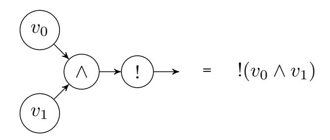
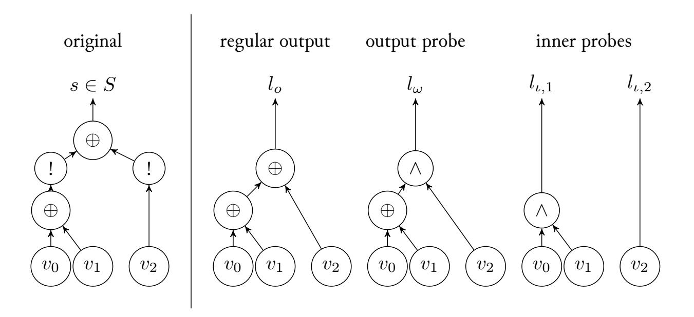
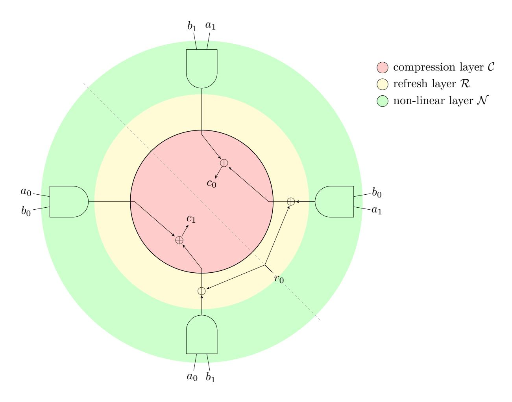

{0}------------------------------------------------

# **An F-algebra for analysing information leaks in the presence of glitches**

Vittorio Zaccaria

Department of Electronics, Information and Bioengineering, Politecnico di Milano, Piazza Leonardo da Vinci 32, 20133 Milano - Italy first.last@polimi.it, ORCID: 0000-0001-5685-9795

**Abstract.** This report deals with the problem of identifying the potential correlations between the observable power consumption of a digital circuit and its inputs, when the operating conditions of the circuit involve a logic hazard (also known as *glitch*). This problem is of utmost importance when the circuit is a cryptographic primitive that must ensure that secret input data (e.g., keys) does not leak.

We present a universal algebra construction that allows to derive a set of artifacts from a digital circuit among which a conservative estimate of the Boolean expression that the circuit might leak as well as the extended input/output correlation matrix [\[1\]](#page-9-0). This allows the evaluation of the robustness against *side channel attacks* through a set of constructions that fall under the umbrella of *robust probing security* [\[2\]](#page-9-1). We believe that such a formalization is well suited for CAD synthesis tools to help the design of more robust cryptographic primitives.

**Keywords:** No keywords given.

#### **1 Introduction**

A glitch is a temporary fluctuation of the logic values of internal nodes which occurs when different paths from the inputs to the output have different delays. A glitch might produce additional power consumption, with respect to the ideal regime, and for this reason it might present problems when the circuit is a cryptographic primitive that is the target of a *correlation power attack*. In these circuits, some of the inputs should be guaranteed to be unobservable by an external attacker and they are colloquially referred to as the *secret* [\[3\]](#page-10-0); however, it is usually understood that glitches' additional power consumption might be used to derive the secret itself [\[4\]](#page-10-1). A common approach to detect if such a scenario is possible, is to model glitches as *extended probes* on the circuit's nodes, whose observations are correlated with all the inputs to the logic cone associated with that node [\[5\]](#page-10-2). We will show that this concept, which is non completely formalized in literature (see Section [2\)](#page-0-0), admits an algebraic formalization that can be put to work to derive the correlation matrix from a symbolical description of the circuit. We believe that such algebraic reasoning (introduced in Section [3](#page-3-0) and [4\)](#page-4-0) might be useful when one wants to integrate such analysis in a CAD flow. In Section [5](#page-6-0) we show a practical application of the presented method, as well as some practical benchmarking consideration on real-world circuits. Section [6](#page-9-2) concludes this report by highlighting possible future work.

## <span id="page-0-0"></span>**2 Background work**

A *side channel attack* of a cryptographic circuit consists in exploiting available side-channel information such as power consumption or time measurements to derive secret information 

{1}------------------------------------------------

(i.e., the key) that is used for cryptographic operation [\[6\]](#page-10-3). In the context of power-based attacks, a *probing* attack is an attack where the attacker is allowed to put power probes into the circuit (which correspond to logic nodes) whose observations are then combined to derive the secret [\[7\]](#page-10-4).

Among probing attacks, a *correlation based attack* derives the secret by exploiting the expected correlation of the observed power and the secret itself. A *d-probing secure circuit* is a circuit where it is guaranteed that if the attacker uses up to *d* probes, it will be impossible to construct any meaningful correlation with the secret. To build a *d*-probing secure implementation of a circuit

$$t = f(s)$$

where *s* is the secret, designers use *masking* [\[8\]](#page-10-5), i.e., they encode the secret *s* over a set of *d* + 1 *shares S* = {*si*}*<sup>i</sup>*=0*...d* where

$$s_0 = s \oplus \bigoplus_{i=1}^d s_i$$

while *s<sup>i</sup> , i >* 0 are uniformly random values. They then design a set of *d* functions:

$$t_i = f_i(\operatorname{subset}_i(S)), t = \bigoplus_{i=0}^d t_i$$

and, to ensure composition, any subset of {*ti*}*i*=0*...d* must be uniformly distributed if the input shares *s<sup>i</sup>* are uniformly distributed. In typical implementation, *refresh blocks* are often used to inject randomness to ensure this property [\[2\]](#page-9-1). Of course, ensuring that each internal node is not correlated with the secret is a hard problem; the current understanding is that probing security might be preserved when combining functions that present *strong-non-interference* [\[2\]](#page-9-1).

The correlation matrix associated with a Boolean function allows to detect any vulnerability that exploitable in a correlation attack [\[9,](#page-10-6) [10\]](#page-10-7). At the moment, there does not exist a complete mathematical formalization that allows computing the correlation matrix between glitch-enabled probes and the secret; the work presented here is a first step towards this goal. It is not, however, the first work addressing an algebraic modeling for circuits' glitches. Probably one of the most important works in this field is the seminal paper from Brzozowski and Ésik [\[11\]](#page-10-8). In their work, the authors provide a change counting algebra that models the input waveforms as nonempty words over 0 and 1 which account for unwanted transitions over an otherwise stable signal. The algebra can derive a similar waveform for the outputs by considering the worst case scenario of the propagation of such changes within the circuit. Unfortunately, this framework is hardly applicable when one wants to detect whether a certain set of either internal or output transients present correlation with the circuit's input shares. On one side, while it is possible to simulate internal transients given an input one, correlations must be computed separately and they might well depend on initial values used for the simulation[1](#page-1-0) . On the other side, one is forced to determine the fixed point of the state of all internal wires which admittedly might limit the applicability of the whole approach given the exponential complexity.

Vaudenay [\[12\]](#page-10-9) employs a different algebraic scheme, where input variables of a circuit are divided in two sets, i.e., variables that present a glitch (Γ) and variables that do not (*V* ). They show that the observable power consumption of the circuit is symbolically expressible in terms of variables in *V* and that this expression can be derived algebraically once glitch assumptions on Γ have been set. However, this approach produces only an

<span id="page-1-0"></span><sup>1</sup>This might be mitigated by exploiting the equivalence with some algebra *C<sup>k</sup>* which would imply evaluating the initial state only for a limited set of values.

{2}------------------------------------------------

approximation of the dependency of observable power and inner circuit nodes and, as it is based on opinionated assumptions, it is very difficult to apply in real cases.

Compared to previous works, we will show that it is possible to build an hazard algebra which computes directly the correlation matrix between the inputs of the circuit and all the probes that an attacker can put on it. This correlation matrix is not built through simulation (as in [\[11\]](#page-10-8)) nor on particular assumptions on glitched inputs (as in [\[12\]](#page-10-9)).

#### **2.1 On notation and terminology**

The study of algebraic structure that we present is based on the concept of *functors* and their *algebras* (colloquially referred to as *F-algebras*). These abstract algebra constructions allow for a synthetic description of the properties of the objects we are going to treat (namely, operators and associated domains).

**Definition 1** (Functor)**.** A *functor* is a function whose domain and co-domain are function themselves (i.e., an *higher-order function)*. A functor has the additional property that it respects function composition, i.e., given a functor *T*:

$$T(g \circ f) = Tg \circ Tf$$

A functor might change the domain of the function on which it acts; in general if *g* : *A* → *B*, the function *T g* acts from a domain *T A* to a domain *T B*.

**Definition 2** (Functor algebra)**.** A functor algebra is a pair (*A, u* : *T A* → *A*) where *A* is the *carrier* domain of the algebra while *T* is its *signature*. For example, if *T A* = *A* × *A*, then (*A, u* : *A*×*A* → *A*) would be the description of a binary operator *u*. Complex algebras can be described by using slightly more complex signatures, e.g., *T A* = 1 + (*A* × *A*) could be seen as the signature of a monoidal poset (*A,* >*,* ∧) with a unit > and a binary operator ∧. For this reason, we will use subscripts in the functor signature to identify the operators in the algebra, i.e., we will write

<span id="page-2-0"></span>
$$TA = 1_{\top} + (A \times A)_{\wedge} \tag{1}$$

Note that a functor signature does not specify underlying algebraic laws (this is possible but not necessary in our exposition). Later on, we will introduce a suitable signature functor for the Boolean expressions used in this report.

**Definition 3** (Algebra morphism)**.** Given a functor *T*, a function *κ* is called an *F-algebra morphism* (*S, ψ*) → (*U, φ*) if the following diagram commutes:

$$TS \xrightarrow{T\kappa} TU$$

$$\downarrow^{\psi} \qquad \qquad \downarrow^{\phi}$$

$$S \xrightarrow{\kappa} U$$

By Lambek's lemma [\[13\]](#page-10-10), there exists a prototypical (also called *initial*) algebra (*S, ψ*) for which *ψ* is invertible. In the case of a Boolean signature *T*, its initial algebra *S* is the domain of graphs representing the Boolean circuit. More importantly, there exists a unique morphism from *S* to *U* such that the following commutes:

$$TS \xrightarrow{T\kappa_{\phi}} TU$$

$$\downarrow^{\simeq} \qquad \qquad \downarrow^{\phi}$$

$$S \xrightarrow{\kappa_{\phi}} U$$

The function *κ<sup>φ</sup>* is called the *cata-morphism* of *φ* and corresponds to a precise recursive definition derived from the non-recursive *φ*. This essentially means that, from *S*, one can build, recursively, new representations on other carrier domains (e.g., *U*) by exploiting an algebra over them (e.g., *φ*).

{3}------------------------------------------------

#### **2.2 Previously proposed algebras**

Both previously introduced algebras ([\[11\]](#page-10-8) and [\[12\]](#page-10-9)) can be seen as particular types of F-algebras by defining a suitable carrier type[2](#page-3-1) . For Brzozowski's F-algebra (*B, β*), the carrier type *B* is the set of all nonempty words over 0 and 1, in which no two consecutive letters are the same. Such values represent waveforms with a constant initial value, a transient period involving a finite number of changes, and a constant final value. Waveforms of this type are called *transients* by the authors. In this case, authors derive by simulation the value in *B* corresponding to the output of a circuit represented in *S* (thus indirectly defining the function *κβ*). For Vaudenay's F-algebra (*S, γ*), where *S* is the same a graph representation of the circuit, *γ* maps a subset of input variables to constant values.

### <span id="page-3-0"></span>**3 Sequential circuits as elements of initial F-algebras**

In this paper, we focus on non-feedback circuit that contain zero or more registers and where inputs are indexed with integers. Just as Eq. [1](#page-2-0) represented the operations within a simple monoidal poset, we embed the Boolean constants and operators (>*,* ⊥*,* ∧*,* ∨*,* ¬) in the following signature functor:

$$TX = 1_{\perp} + 1_{\top} + (X \times X)_{\wedge} + (X \times X)_{\vee} + X_{\neg} + X_{!} + \mathbb{N}_{v}$$

where we use subscripts to identify the actual operators referenced, e.g.,

- the binary operators such as ∧ and ∨ and ¬ correspond to AND and OR and NOT
- ! has the meaning *sampled value of*, i.e., *a* =!*c* means that *a* is the value of *c* after being sampled into a register (we use the same notation as in [\[14\]](#page-10-11)).
- conventional neutral elements 0 and 1 of ∨ and ∧ respectively
- *v* corresponds to an integer labeling of the inputs; this is useful for referencing the names of the inputs.

Given this signature we will intend *a* ⊕ *b* as ¬*a* ∧ *b* ∨ *a* ∧ ¬*b*.

As said before, the initial algebra *S* is a directed graph structure that *symbolically* represents the actual circuit. For our purposes, a value *s* ∈ *S* represents the graph of the logic network built with conventional operators, registers and input variables as identified by indexes; for example, this is a value in *S* which represents a circuit which takes two inputs, combines them with the binary operator ∧ and samples the output in a register (!):



For all intents and purposes, a circuit representation in *S* can be derived from a low level description of the circuit itself. In our experiments, we will work by parsing any *s* ∈ *S* from the netlist of a circuit in Verilog format.

<span id="page-3-1"></span><sup>2</sup>The functor underlying both of them is the signature functor of a Boolean algebra.

{4}------------------------------------------------

### <span id="page-4-0"></span>4 Notable F-algebra morphisms

#### 4.1 Computing the Fourier expansion

In the following section, we will need to derive dependencies between a function and its input parameters. We will use the Fourier expansion as the coefficients of the expansion represent exactly the correlation of the output with xor'ed combination of inputs [9], [15]:

**Definition 4** (Fourier expansion of a Boolean function). The Fourier expansion of a Boolean function  $f: \mathbb{F}_2^n \to \mathbb{F}_2^1$  is a pseudo-Boolean function

$$\mathcal{F}_f \equiv \widehat{f}(\gamma) = 2^{-n} \sum_{x \in \mathbb{F}_2^n} (-1)^{f(x)} \chi_{\gamma}(x)$$

where  $\chi_{\gamma}(x) = (-1)^{\gamma \cdot x}$  is called *Fourier character* or parity function and forms an orthonormal basis for the vector space for all functions  $f: \mathbb{F}_2^n \to \mathbb{Q}$  [15]. The *spectral coordinate*  $\gamma \in \mathbb{F}_2^n$  identifies a subset of the original n variables while  $\widehat{f}(\gamma)$  represents, informally, the contribution of the XOR of that subset on the overall function value.

The Fourier expansion of a Boolean function of n variables, is an element of the group algebra  $(\mathbb{Q}[\mathbb{F}_2^n], \star, \nu)$  over the rational field  $\mathbb{Q}$ , where  $\star$  is the conventional convolution<sup>3</sup> while the identity is:

$$\nu = \gamma \mapsto (\gamma == 0)$$

Another notable element of the above algebra is:

$$\mathcal{F}_{id_i} = \gamma \mapsto (\gamma == 2^i)$$

which is the Fourier expansion of the identity over the *i*-th parameter. This algebra can be equipped with an operator  $\cdot$  which corresponds to  $\mathcal{F}_{f \wedge g} = \mathcal{F}_f \cdot \mathcal{F}_g$ 

Since our initial algebra allows to define functions of arbitrary size, we need the carrier of the F-Algebra to contain the Fourier expansion of functions with any number of input variables, i.e., the graded group algebra

$$U = \bigoplus_{i} \mathbb{Q}[\mathbb{F}_2^i]$$

where  $\bigoplus$  must be indented as the direct sum of vector spaces.

Convolution  $(\star)$  between two Fourier expansions of functions with n and m parameters is done by extending<sup>4</sup> the original functions over max(n, m) parameters.

From a symbolic expression of a function  $s \in S$  it is possible to derive its corresponding Fourier expansion by taking the cata-morphism  $\kappa_u$  of the following F-algebra (U, u):

$$u(f \land g) = f \cdot g$$

$$u(f \lor g) = ((f \star u(\top)) \cdot (g \star u(\top))) \star u(\top)$$

$$u(!f) = f$$

$$u(\neg f) = f \star u(\top)$$

$$u(\bot) = \nu$$

$$u(\top) = -1 \times \nu$$

$$u(v \ n) = \mathcal{F}_{id_i}$$

<span id="page-4-2"></span><span id="page-4-1"></span><sup>&</sup>lt;sup>3</sup>Note that for the convolution between two Fourier expansions it holds that  $\mathcal{F}_f \star \mathcal{F}_g = \mathcal{F}_{f \oplus g}$ <sup>4</sup>The inverse of a restriction.

{5}------------------------------------------------

#### **4.2 Computing the leakage of a single-output function**

In the *robust probing model* [\[5,](#page-10-2) [4\]](#page-10-1), researchers have devised a dramatically conservative way to reason about glitches and the security of secrets. In fact, they assume that the glitches associated with a cone of logic can produce power spikes that are, *at worst*, correlated with the actual value of the inputs of the cone. This means that, when not considering glitches, the power consumption of *s* = *v*<sup>0</sup> ⊕ *v*<sup>1</sup> is correlated with just *v*<sup>0</sup> ⊕ *v*<sup>1</sup> while in the case of glitches, the observable information (power) is correlated with both *v*0*, v*<sup>1</sup> and *v*<sup>0</sup> ⊕ *v*<sup>1</sup> unless a register is present; a glitch is thus seen as a companion boolean function ("extended probe") that is available for free to the attacker. The additional information, other than the circuit outputs, that the attacker might observe is referred to as *leakage*. We will model these leakages as Boolean functions themselves through a new carrier type *L* (for *Leakage*) that can be derived from any circuit *s* ∈ *S*, again through a cata-morphism. Any *l* ∈ *L* is tuple containing at least two functions,

$$l = (l_o, l_\omega, \{l_{\iota,1} \dots l_{\iota,n}\}), n \ge 0$$

which correspond to:

- the regular function from which it has been derived (*l<sup>o</sup>* ∈ *S*)
- the information on the inputs derivable from its cone of logic (*l<sup>ω</sup>* ∈ *S*, aka *output probe*) up to the last register output when glitches are present.
- the information on the inputs derivable from all the previous register inputs (zero or more *l<sup>ι</sup>* ∈ *S*), also called *internal probes*.

One can derive a leakage *l* ∈ *L* from any circuit *s* ∈ *S* through an appropriate algebra (*L, λ* : *T L* → *L*):

$$\lambda((o_1, \omega_1, \iota_1) \land (o_2, \omega_2, \iota_2)) = (o_1 \land o_2, \omega_1 \land \omega_2, \iota_1 \cup \iota_2)$$
(2)

$$\lambda((o_1, \omega_1, \iota_1) \vee (o_2, \omega_2, \iota_2)) = (o_1 \vee o_2, \omega_1 \wedge \omega_2, \iota_1 \cup \iota_2)$$
(3)

$$\lambda(!(o_1, \omega_1, \iota_1)) = (o_1, o_1, \{\omega_1\} \cup \iota_1) \tag{4}$$

$$\lambda(\neg(o_1, \omega_1, \iota_1)) = (\neg o_1, \omega_1, \iota_1) \tag{5}$$

<span id="page-5-2"></span><span id="page-5-1"></span><span id="page-5-0"></span>
$$\lambda(\bot) = (\bot, \top, \{\}) \tag{6}$$

$$\lambda(\top) = (\top, \top, \{\}) \tag{7}$$

$$\lambda(v \ n) = (v \ n, v \ n, \{\}) \tag{8}$$

Note that, for the construction of output probes (in [\(2\)](#page-5-0) and [\(3\)](#page-5-1)), we usexs logical conjunction because its Fourier expansion has a correlation with all its inputs. By induction, any output probe built in this way will have correlation with all its inputs, thus any derivation is consistent with the robust probing security model. Instead, registers break information flow by forcing the current output probe *ω*<sup>1</sup> to be considered as an nner probe (Eq. [4\)](#page-5-2).

The following picture shows an example input graph of a Boolean circuit (left) and the corresponding leakage expressions of the probes (right) as computed by the algebra morphism *κλ*:

{6}------------------------------------------------



We note that the subset of operators of the above algebra respect distributivity, commutativity and identity of Boolean algebras except:

- annihilators of ∧ and ∨: *s* ∧ ⊥ 6= ⊥ and *s* ∨ > 6= >
- complementation: *s* ∧ ¬*s* 6= ⊥ and *s* ∨ ¬*s* 6= >

#### <span id="page-6-0"></span>**5 Possible applications**

In this report we are concerned with deriving the correlation matrix[5](#page-6-1) of both glitches and regular output of any circuit expressed in *S*. Note that *L* is embedded in a cartesian power of *S*, i.e.,

$$\exists q.L \simeq S^q$$

We will call this embedding *ι* and note that it extends also for a cartesian product of *L*'s, i.e., there exists *k* for which:

$$\iota^m:L^m\to S^k$$

An *n*-vector Boolean function can be seen as an element of *S <sup>n</sup>* i.e., a function *F inSet*(*n*) → *S*. Its correlation matrix *c* assigns a Fourier expansion to any combination of outputs

$$c: 2^n \to U$$

whose codomain is the graded algebra *U*, i.e., *c* ∈ *U* 2 *n* . It is possible to build a correlation matrix by exploiting the function *κu*, i.e., through a function

$$\kappa_u^n: S^n \to U^{2^n}$$

that is built from *κ<sup>u</sup>* using the convolution operator *?* of the graded algebra *U*. In practice, any line of of the matrix is understood as the convolution of the Fourier expansion of a combination of function outputs. It is possible to build a mapping *σ <sup>m</sup>* from an *m*-vector Boolean function to the correlation matrix of its leakages in *U* 2 *n* by concatenating the algebra morphisms described before with *κ m λ* , i.e.:

<span id="page-6-2"></span>
$$\sigma^m = \kappa_u^n \circ \iota^m \circ \kappa_\lambda^m \tag{9}$$

To see an application of this mapping, consider the *domain oriented masked-AND* circuit [\[16\]](#page-10-13). This is a well-known *probing secure* construction that, given two values *a, b* encoded in two uniformly random *secret shares a*<sup>0</sup> ⊕ *a*<sup>1</sup> = *a, b*<sup>0</sup> ⊕ *b*<sup>1</sup> = *b*, produces *c*<sup>0</sup> and *c*<sup>1</sup> such that *c*<sup>0</sup> ⊕*c*<sup>1</sup> = *a*∧*b*. This construction can be extended over *d*+ 1 shares for achieving

<span id="page-6-1"></span><sup>5</sup>The correlation matrix of a vector Boolean function is a scaled version of its Walsh transform. For this reason, this might be sometimes referred with the latter name.

{7}------------------------------------------------

d probing security and is split into three layers, the non-linear layer performs the shared multiplication, the refresh layer re-masks the intermediate shares with a random value  $r_0$  and samples them into a register (black ring) while the compression layer produces the two output shares.

<span id="page-7-0"></span>

Figure 1: The domain oriented masking construction for multiplying two bits encoded over 2 shares.

Given the expressions of  $c_0$  and  $c_1$  we obtain, through the algebra morphism  $\iota^2 \circ \kappa_{\lambda}^2$  (first part of Eq. 9), the following construction in  $S^8$ , where  $c_{\omega_*}$  are the output probes, while  $c_{\iota_*}$  are the internal probes:

$$c_0 = ((a_1 \wedge b_1) \oplus ((a_1 \wedge b_0) \oplus r_0)) \tag{10}$$

$$c_1 = ((a_0 \wedge b_0) \oplus ((a_0 \wedge b_1) \oplus r_0)) \tag{11}$$

$$c_{\omega_0} = ((a_1 \wedge b_1) \wedge ((a_1 \wedge b_0) \oplus r_0)) \tag{12}$$

$$c_{\omega_1} = ((a_0 \wedge b_0) \wedge ((a_0 \wedge b_1) \oplus r_0)) \tag{13}$$

$$c_{\iota_0} = (a_0 \wedge b_0) \tag{14}$$

$$c_{\iota_1} = ((a_0 \wedge b_1) \wedge r_0) \tag{15}$$

$$c_{\iota_2} = (a_1 \wedge b_1) \tag{16}$$

$$c_{\iota_3} = ((a_1 \wedge b_0) \wedge r_0) \tag{17}$$

By applying  $\kappa_u^8$  we obtain the corresponding correlation matrix, shown in Figure 2, where  $\alpha_*$  are the hamming weight of the input spectral coordinates while  $\omega_*$  the hamming weight of the output spectral coordinates. Roughly speaking, a 1 in a specific cell indicates a correlation different from zero from a certain number of output lines to a certain amount of input shares. For example, a 1 in the cell

$$i = (\omega_{c_b} = 0, \omega_{c_{-,\omega}} = 2), j = (\alpha_a = 1, \alpha_b = 1, \alpha_r = 0)$$

indicates an existing correlation between two of the outputs (either  $c_{-}$  or  $c_{\omega}$ ) with one

{8}------------------------------------------------

```
0\ 0\ 0\ 0\ 0\ 0\ 0\ 0\ 1\ 1\ 1\ 1\ 1\ 1\ 1\ 1\ 1
        0\;0\;0\;1\;1\;1\;2\;2\;2\;0\;0\;0\;1\;1\;1\;2\;2\;2\;\alpha_b
        0\;1\;2\;0\;1\;2\;0\;1\;2\;0\;1\;2\;0\;1\;2\;0\;1\;2\;\alpha_a
\omega_{c_{\iota}} \ \omega_{c_{-,\omega}}
0
     0 \quad 1
0
     1
        1 1
            1 1
                       11 11 11
 0
        11111111111111111111
     2
        11111111111111111111
 0
     3
 0
        1111111111111111111
     4
     0
        1 1
            1 1
                       1 1 1 1
 1
 1
        11111111111111111111
     1
1
     2
        11111111111111111111
        11111111111111111111
1
     3
 1
        11111111111111111111
     4
 2
        1111111111111111111
     0
 2
     1
        11111111111111111111
 2
     2
        11111111111111111111
 2
        1111111111111111111
     3
 2
        1111111111111111111
     4
 3
     0
        1111111111111111111
 3
     1
        1111111111111111111
 3
     ^{2}
        11111111111111111111
 3
        11111111111111111111
     3
        11111111111111111111
 3
     4
        11111111111111111111
 4
     0
 4
        11111111111111111111
     1
        11111111111111111111
 4
     2
             11111 11111
 4
     3
        1 1
                                1 1
                  1 1
 4
     4
        1 1
                             1
```

Figure 2: Derived correlation matrix for the DOM example.

share of a and one share of b. Note that a correlation with two shares of the input (e.g., a) would expose the secret as one could correlate with the XOR of both shares.

It can be seen that the construction is *robust 1-probing secure* as, even if one has access to either output or inner probes, one needs more than one probe to get more than one share in input (and thus reconstruct the secret). However, it is possible to get one input share with one output share. While this is not problematic in itself, the propagation of this information might dangerously combine with other data when one adds more circuit stages<sup>6</sup>. Table 3 reports the computation times for a set of benchmark cyrptographic gadgets. The gadgets are those available in netlist form publicly [14].

An alternative application to detect vulnerabilities could be directly implemented within synthesis algorithms [19]; for example, let us consider the DOM gadget of Figure 1 where we purposefully introduce a vulnerability by summing  $r_0$  to  $a_1 \wedge b_1$  instead of  $a_1 \wedge b_0$ . Applying  $\iota^2 \circ \kappa_{\lambda}^2$  we would get the following:

$$c_0 = ((a_1 \wedge b_1) \oplus ((a_1 \wedge b_0) \oplus r_0)) \tag{18}$$

$$c_1 = (((a_0 \wedge b_0) \oplus r_0) \oplus (a_0 \wedge b_1)) \tag{19}$$

$$c_{\omega_0} = ((a_1 \wedge b_1) \wedge ((a_1 \wedge b_0) \oplus r_0)) \tag{20}$$

$$c_{\omega_1} = (((a_0 \wedge b_0) \wedge r_0) \wedge (a_0 \wedge b_1)) \tag{21}$$

$$c_{\iota_0} = (a_0 \wedge b_0) \tag{22}$$

$$c_{\iota_1} = (a_0 \wedge b_1) \tag{23}$$

$$c_{\iota_2} = (a_1 \wedge b_1) \tag{24}$$

$$c_{\iota_3} = ((a_1 \wedge b_0) \wedge r_0) \tag{25}$$

and we note that,  $c_{\omega,1}$  can be factorized in

$$(b_0 \wedge b_1)z$$

<span id="page-8-1"></span><sup>&</sup>lt;sup>6</sup>This construction is said to be *not strongly non-interferent* [2].

{9}------------------------------------------------

<span id="page-9-3"></span>

| Name                 | Order | Time           | Probes   | Inputs  |
|----------------------|-------|----------------|----------|---------|
| DOM [16]             | 1     | 0.006 s        | (4, 2)   | (2, 1)  |
| ISW [7]              | 1     | 0.004 s        | (0, 4)   | (2, 1)  |
| Trichina [17]        | 1     | 0.005 s        | (2, 2)   | (2, 1)  |
| Keccak [18]          | 1     | 9.66 s         | (10, 20) | (2, 5)  |
| ISW (MVerif) [7, 14] | 1     | 0.004 s        | (4, 2)   | (2, 1)  |
| DOM [16]             | 2     | 0.094 s        | (12, 3)  | (3, 3)  |
| Keccak [18]          | 2     | 6 m, 57.179 s  | (45, 30) | (3, 15) |
| ISW (MVerif) [7, 14] | 2     | 0.084 s        | (12, 3)  | (3, 3)  |
| DOM [16]             | 3     | 3.109 s        | (20, 4)  | (4, 6)  |
| ISW (MVerif) [7, 14] | 3     | 7.917 s        | (24, 4)  | (4, 6)  |
| DOM [16]             | 4     | 22 m, 29.902 s | (25, 10) | (5, 10) |
| ISW (MVerif) [7, 14] | 4     | 36 m, 19.023 s | (40, 5)  | (5, 10) |

Figure 3: Benchmark data for an application of the proposed algebra to verify if the circuits are *d*-probing secure. The computation of *σ <sup>m</sup>* has done on a single processor 2.9 GHz Intel i7 processor. The Probe column refers to the pair of respectively inner (*cι*) and outer (*c*<sup>−</sup>*,ω*) probes. The Inputs column shows the number of shares for each input variable and the number of additional random refresh values used in the gadget to preserve uniformity of the output secret encoding.

where *z* is free of *b*<sup>0</sup> and *b*1. The mere existence of this factorization means that *cω,*<sup>1</sup> is correlated (due to the spectral decomposition of the ∧ operator) with *b*<sup>0</sup> ⊕ *b*<sup>1</sup> = *b*, where *b* is the secret. This means that the original circuit is not robust against glitches. Thus, to check for a vulnerability, a synthesis tool could try to find whether the computed probes are factorizable. This applies also to sets of probes, for which one should consider if the cumulative xor of their expressions is factorizable.

### <span id="page-9-2"></span>**6 Conclusions**

We have shown that the detection of vulnerabilities admits an algebraic formalization that can be used to derive important information from a circuit representation. Such a formalization allows the production of different artifacts, from the explicit algebraic representation of the information derivable from a probe, to the underlying correlation matrix. The algebraic manipulation algorithms available in a synthesis tool might be used in conjunction with the proposed algebra, to help designers with a feedback on potential vulnerabilities of the circuit they are designing.

#### **References**

- <span id="page-9-0"></span>[1] Joan Daemen, René Govaerts, and Joos Vandewalle. Correlation matrices. In Bart Preneel, editor, *Fast Software Encryption*, Lecture Notes in Computer Science, pages 275–285. Springer Berlin Heidelberg, 1995.
- <span id="page-9-1"></span>[2] Gilles Barthe, Sonia Belaïd, François Dupressoir, Pierre-Alain Fouque, Benjamin Grégoire, Pierre-Yves Strub, and Rébecca Zucchini. Strong Non-Interference and Type-Directed Higher-Order Masking. In *Proceedings of the 2016 ACM SIGSAC Conference on Computer and Communications Security*, CCS '16, pages 116–129, New York, NY, USA, 2016. ACM.

{10}------------------------------------------------

<span id="page-10-0"></span>[3] Begül Bilgin, Svetla Nikova, Ventzislav Nikov, Vincent Rijmen, and Georg Stütz. Threshold Implementations of All 3 ×3 and 4 ×4 S-Boxes. In *Cryptographic Hardware and Embedded Systems – CHES 2012*, Lecture Notes in Computer Science, pages 76–91. Springer, Berlin, Heidelberg, September 2012.

- <span id="page-10-1"></span>[4] Lauren De Meyer, Begül Bilgin, and Oscar Reparaz. Consolidating Security Notions in Hardware Masking. *IACR Transactions on Cryptographic Hardware and Embedded Systems*, pages 119–147, May 2019.
- <span id="page-10-2"></span>[5] Sebastian Faust, Vincent Grosso, Santos Merino Del Pozo, Clara Paglialonga, and François-Xavier Standaert. Composable Masking Schemes in the Presence of Physical Defaults and the Robust Probing Model. *IACR Cryptology ePrint Archive*, (report n. 711), 2017.
- <span id="page-10-3"></span>[6] Paul Kocher, Joshua Jaffe, and Benjamin Jun. Differential Power Analysis. In *Advances in Cryptology — CRYPTO '99*, volume 1666 of *Lecture Notes in Computer Science*, pages 388–397. Springer, Berlin, Heidelberg, 1999.
- <span id="page-10-4"></span>[7] Yuval Ishai, Amit Sahai, and David Wagner. Private Circuits: Securing Hardware against Probing Attacks. In Dan Boneh, editor, *Advances in Cryptology — CRYPTO 2003*, Lecture Notes in Computer Science, pages 463–481. Springer Berlin Heidelberg, 2003.
- <span id="page-10-5"></span>[8] Suresh Chari, Charanjit S. Jutla, Josyula R. Rao, and Pankaj Rohatgi. Towards Sound Approaches to Counteract Power-Analysis Attacks. In Michael Wiener, editor, *Advances in Cryptology — CRYPTO '99*, Lecture Notes in Computer Science, pages 398–412, Berlin, Heidelberg, 1999. Springer.
- <span id="page-10-6"></span>[9] G. Z. Xiao and J. L. Massey. A spectral characterization of correlation-immune combining functions. *IEEE Transactions on Information Theory*, 34(3):569–571, May 1988.
- <span id="page-10-7"></span>[10] V. Zaccaria, F. Melzani, and G. Bertoni. Spectral Features of Higher-Order Side-Channel Countermeasures. *IEEE Transactions on Computers*, 67(4):596–603, April 2018.
- <span id="page-10-8"></span>[11] J. Brzozowski and Z. Ésik. Hazard Algebras. *Formal Methods in System Design*, 23(3):223–256, November 2003.
- <span id="page-10-9"></span>[12] Serge Vaudenay. Side-Channel Attacks on Threshold Implementations Using a Glitch Algebra. In Sara Foresti and Giuseppe Persiano, editors, *Cryptology and Network Security*, Lecture Notes in Computer Science, pages 55–70. Springer International Publishing, 2016.
- <span id="page-10-10"></span>[13] Joachim Lambek. A Fixpoint Theorem for complete Categories. *Mathematische Zeitschrift*, 103:151–161, 1968.
- <span id="page-10-11"></span>[14] Gilles Barthe, Sonia Belaïd, Gaëtan Cassiers, Pierre-Alain Fouque, Benjamin Grégoire, and François-Xavier Standaert. maskVerif: Automated analysis of software and hardware higher-order masked implementations. *IACR Cryptology ePrint Archive*, (report n. 562), 2018.
- <span id="page-10-12"></span>[15] Ryan O'Donnel. *Analysis of Boolean Functions*. Cambridge University Press.
- <span id="page-10-13"></span>[16] Hannes Gross, Stefan Mangard, and Thomas Korak. Domain-Oriented Masking: Compact Masked Hardware Implementations with Arbitrary Protection Order. *IACR Cryptology ePrint Archive*, (report n. 486), 2016.

{11}------------------------------------------------

- <span id="page-11-1"></span>[17] Elena Trichina. Combinational Logic Design for AES SubByte Transformation on Masked Data. *IACR Cryptology ePrint Archive*, (report n. 236), 2003.
- <span id="page-11-2"></span>[18] Hannes Gross, David Schaffenrath, and Stefan Mangard. Higher-Order Side-Channel Protected Implementations of Keccak. *IACR Cryptology ePrint Archive*, (report n. 395), 2017.
- <span id="page-11-0"></span>[19] E. Testa, M. Soeken, L. G. Amar, and G. De Micheli. Logic Synthesis for Established and Emerging Computing. *Proceedings of the IEEE*, 107(1):165–184, January 2019.