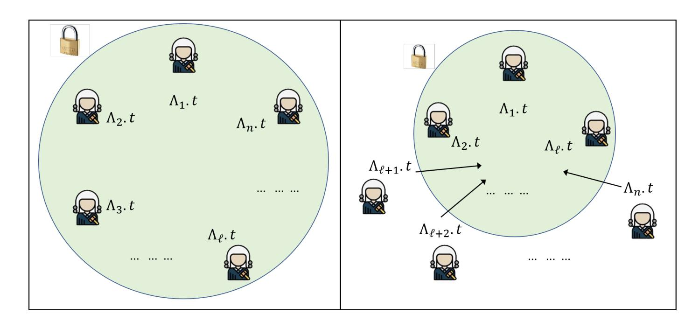
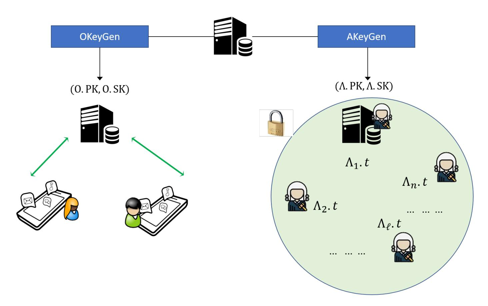

{0}------------------------------------------------

# How to (legally) keep secrets from mobile operators

Ghada Arfaoui<sup>1</sup> , Olivier Blazy<sup>2</sup> , Xavier Bultel<sup>3</sup> , Pierre-Alain Fouque<sup>4</sup> , Thibaut Jacques<sup>4</sup> , Adina Nedelcu1,<sup>4</sup> and Cristina Onete<sup>2</sup>

<sup>1</sup> Orange Labs, <sup>2</sup> XLIM, University of Limoges, <sup>3</sup> INSA Centre Val-de-Loire, <sup>4</sup> IRISA, University of Rennes 1

Abstract. Secure-channel establishment allows two endpoints to communicate confidentially and authentically. Since they hide all data sent across them, good or bad, secure channels are often subject to mass surveillance in the name of (inter)national security. Some protocols are constructed to allow easy data interception . Others are designed to preserve data privacy and are either subverted or prohibited to use without trapdoors.

We introduce LIKE, a primitive that provides secure-channel establishment with an exceptional, session-specific opening mechanism. Designed for mobile communications, where an operator forwards messages between the endpoints, it can also be used in other settings. LIKE allows Alice and Bob to establish a secure channel with respect to n authorities. If the authorities all agree on the need for interception, they can ensure that the session key is retrieved. As long as at least one honest authority prohibits interception, the key remains secure; moreover LIKE is versatile with respect to who learns the key. Furthermore, we guarantee non-frameability: nobody can falsely incriminate a user of taking part in a conversation; and honest-operator: if the operator accepts a transcript as valid, then the key retrieved by the authorities is the key that Alice and Bob should compute. Experimental results show that our protocol can be efficiently implemented.

# 1 Introduction

For almost a decade mass surveillance has caused controversy, widespread protests, and scandals; and yet, it is on the rise. The NSA, for instance, illegally collected phone-call data from all Verizon customers, and the data of all calls occurring in the Bahamas and Afghanistan [27]. During the present COVID-19 pandemic, Germany used contacttracing data to pursue criminal investigations [25]. The need for privacy-enhancing solutions that provide transparency and limit mass surveillance has never been greater.

User privacy is a human right acknowledged by Article 12 of the Universal Declaration for Human Rights [42]: "No one shall be subjected to arbitrary interference with his privacy [...] or correspondence [...]. Everyone has the right to the protection of the law against such [...] attacks." The European General Data Protection Regulation (GDPR) and e-Privacy both aim to protect privacy in digital environments, requiring minimal, transparent, secure, and usercontrolled storage of data. Increasingly aware of mass surveillance, users now choose more frequently to secure their communications by using, *e.g.*, WhatsApp and Viber. In mobile networks, data is encrypted by mobile network operators, which have an incentive to improve the privacy they offer their users.

Unfortunately, mobile data remains at risk, especially when exceptional access to it lies with a single entity. In 2016, only the integrity of Tim Cook (Apple CEO) and his awareness of the danger of such a precedent prevented encrypted phone data to be given to the FBI [30]. His refusal was not a deterrent, and risks to privacy and encryption grow every day [24].

Law-enforcement agencies argue that mobile data can be pivotal to investigations, which are undermined by individuals "going dark" [20]. Even strong privacy advocates, such as Abelson *et al.* [6] agree that *targeted* investigations, *limited in scope and motivation*, can be legitimate and useful (see the corruption-scandal regarding Nicolas Sarkozy's campaign funds). It is this type of limited Lawful Interception (LI) that emerging EU legislation advocates [23].

Recent research [45] has tried to find a middle ground between privacy and lawful interception, enabling the latter at high cost. Unfortunately, that approach sacrifices a crucial real-world requirement: timely (exceptional) decryption [2]. In this paper we define and instantiate Lawful-Interception Key-Exchange (LIKE), a novel primitive allowing mobile users to E2E encrypt their conversation, but providing exceptional lawful interception. This would remove the "[...] need to choose between compliance and strong encryption" ( cf. Joel Wallenstrom).

LIKE combats mass surveillance in multiple ways. It *fine-grains* the window of interception to a single session, such that one exceptional opening will not affect past or future conversations. Moreover, the freshness used in the 

{1}------------------------------------------------

protocol is user- not authority-generated, thus *removing the need* for a centralized, secure party storing all the keys. We also divide the responsibility of exceptional opening between multiple authorities that *must agree* to lawfully intercept communications. Finally, we make the primitive *versatile*, allowing only one, or only several authorities to ultimately retrieve the session key. This makes our solution more privacy-preserving than mobile protocols today, while at the same time remaining compatible to the strictest LI-supporting 3GPP texts [2].

Lawful interception. Regardless of one's stand on it, Lawful Interception (LI) is part of our world, regulated by laws and standards. Ignoring it can lead to privacy threats (subversion or mass surveillance). Solutions that provide privacy but no LI are discarded as unlawful, regardless of their merits. We take the alternative approach: we analyze LI requirements and technically provide for them, while still maximizing data privacy.

LI requirements in mobile communications are authored by 3GPP and standardized by organizations, *e.g.*, ETSI. LI is the procedure through which a law enforcement agency, holding a legal warrant, can obtain information about phone calls: either metadata (time of calls, identity of callers) or contents (of conversations happening in real time). By law, a mobile operator *must* provide the data requested and specified by a warrant. Three main types of requirements regulate LI: user-privacy requirements, LI-security requirements, and requirements on encryption.

- R1 User Privacy: the interception is limited in time (as dictated by the warrant) and to a targeted user. The law enforcement agency should not get data packages or conversations outside the warrant, from the same or other users.
- R2 LI Security: LI must be undetectable by either users (whose quality of service should stay the same) or nonauthorized third parties (including other law-enforcement agencies). Intercepted data must be provided promptly, with no undue delay.
- R3 Special case: if it implements encryption, the operator must provide either decrypted content, or a means to decrypt it (*e.g.*, a decryption key). However, if the users employ other means of encryption, not provided by the operator, the latter is not obliged to provide decrypted (or decryptable) conversations.

#### 1.1 Our contributions

LIKE. Based on these requirements, we define a novel cryptographic primitive called Lawful-Interception Key Exchange (LIKE, in short). This protocol allows (only) the end users to compute session keys in the presence of a variable number n of authorities (*e.g.*, a court of justice, a law enforcement agency, operators), which all parties must agree on; the operators output a public *session state*. Given the session state, authorities may each extract a trapdoor. The use of all n trapdoors can yield a session key. Importantly, unless they are an authority, operators *cannot* recover the end users' key; instead they forward and verify the compliance of exchanged messages (else the operator aborts).

We also formalize the following strong properties:

- C Correctness: Under normal conditions, Alice and Bob obtain the same key. Moreover, this will be the key retrieved by the collaboration of all the authorities by means of lawful interception (requirement R2)
- KS Key-security: If at least one authority and both users are honest for a given session, that session's key remains indistinguishable from a random key of the same length with respect to an adversary that can control all the remaining parties (including the other authorities and the operator); (requirements R1 and R2)
- NF Non-Frameability: The collusion of malicious users, the authorities, and the operator cannot frame an honest user of participating to a session she has not been a party to (requirement R2);
- HO Honest Operator: If an honest operator forwards the so-called session state (see below) of a session it deems correct, then the key recovered by the authorities is the one that the session transcript should have yielded (requirement R3). Thus operators can prove that this protocol is compliant with LI specifications.

Our protocol & Implementation. As our second contribution, we describe an instantiation of LIKE using standard building blocks (signatures, zero knowledge proofs and signatures of knowledge) which we prove secure, provided the Bilinear Decisional Diffie-Hellman problem is intractable, the signature scheme is unforgeable, and our zeroknowledge proofs/signatures are secure.

Mindful of practical requirements, we place most of the burden during AKE on the operator (not on the endpoints). Our proofs and signatures of knowledge can be simply implemented based on Schnorr and respectively Chaum and Pedersen proofs (with Fiat-Shamir). The two endpoints do have to compute a pairing operation –however, we explain 

{2}------------------------------------------------

that the actual computation can actually be delegated to the mobile phone, leaving a single exponentiation (in the target group) to be performed on the USIM card.

The complexity of the opening procedure is reduced. Some steps are parallelizable and run in constant time (trapdoor generation), but others are linear (combining the trapdoors). Even so the computational burden remains minimal and in line with requirements R2 (constant quality of service, since only authorities run LI, not the operator) and R3 (no undue delay would be incurred by the operator, and only minimal delays occur at the authorities). A proof-of-concept implementation given in Section 7 illustrates this point.

#### 1.2 Related work

Existing encryption in mobile networks is not E2E secure, only providing privacy with respect to non-authorized third parties. This solution is compliant to LI requirements [3–5] because the secure channel it provides is between the user and the operator (rather than user-to-user); thus the operator has unrestricted access to all user communications. Our LIKE protocol provides much stronger privacy in that respect.

LIKE also provides much stronger guarantees than key-escrow [37, 21, 7, 44, 40, 10, 18, 34, 32, 33, 26, 35, 41, 38, 19]: we can handle malicious authority input; we fine-grain exceptional opening so that it only holds for one session at a time; we allow authorities to remain offline at all times except for exceptional opening; we minimize storage and computational costs for users and authorities; we have no central key-generation authority which knows all secret keys; and we guarantee the new properties of non-frameability and honest operator, which are tailored to the LI requirements analyzed above. In return, our use-case is narrower than typically considered in key-escrow: by considering the case of mobile communications, we can safely assume that parties always use the operator as a proxy, unlike in generic key-escrow settings.

Our work is motivated by the same problem handled by [11, 45], but we take a different approach: rather than make LI computationally costly, we limit its scope, divide exceptional opening between several authorities, and fine-grain access. Our setup also resembles that of reverse firewalls [36] – which builds on related work pioneered by Young and Yung [46, 22, 31]. Although apparently similar, the setup of these works is complementary to ours. Kleptography describes ways for users to abuse protocols such that the latter appear to be running normally, while subliminal information is allowed to leak. For instance in key-exchange, a government agency could substitute the implementation of the protocol by one with a backdoor, to make the key recoverable even without formal LI. We also consider the case that Alice and Bob might be malicious (the HO property). However, rather than wanting to exfiltrate information – which is the adversarial goal in typical reverse-firewalls– in our case, Alice and Bob aim to cheat by choosing protocol contributions that might make LI malfunction. To be provably-secure, LIKE protocols must prevent this.

# 2 Preliminaries

Notations. By x Ð y we mean that variable x takes a value y, while x \$ÐÝ X indicates x is chosen from the uniform distribution on <sup>X</sup>. The notation <sup>J</sup>1, n<sup>K</sup> is short for <sup>t</sup>1, <sup>2</sup>, , nu. Let <sup>A</sup>pxq Ñ <sup>a</sup> express that algorithm <sup>A</sup>, running on input x, outputs a, and PxApxq, Bpyqypzq Ñ pa, bq to express that protocol P implements the interactions of Apxq Ñ a and Bpyq Ñ b, where z is an additional public input of A and B. Let λ be a security parameter.

#### Building blocks.

Definition 1 (Digital signatures). *A* digital signature scheme DS *is defined by three algorithms* pSGen, SSig, SVerq*.*

- SGenpppq Ñ pPK, SKq*: Takes as input the public parameters of the system* pp *and outputs a* key pair *called respectively public and private key.*
- SSigpSK, mq Ñ σ*: Takes as input a private key* SK *and a message* m *and outputs a signature* σ*.*
- SVerpm, σ, PKq Ñ 0, 1*: Takes as input a message* m*, a signature* sigma *and a public key* PK*, and outputs* 1 *if* σ *is a valid signature of* m *and* 0 *otherwise.*

Definition 2 (EUF-CMA [28]). *A security property expected from a digital signature scheme* DS *is the Existential Unforgeability under Chosen Message Attack (EUF-CMA). Let* Sig *be an oracle that, on input a message* m*, returns* SSigpSK, mq*. Let* A *be PPT adversary. We define the following experiment.*

{3}------------------------------------------------

```
\begin{split} &\frac{\mathsf{Exp}^{\mathsf{EUF-CMA}}_{\mathsf{DS}}(\mathcal{A}):}{(\mathsf{PK},\mathsf{SK}) \leftarrow \mathsf{SGen}(\mathsf{pp})} \\ &(m,\sigma) \leftarrow \mathcal{A}^{\mathsf{Sig}(\cdot)}(\mathsf{PK}); \\ &\mathsf{Return} \ 1 \ \text{if} \ (m,\sigma) \ \text{was not output by} \ \mathsf{Sig}(\cdot) \ \text{and} \ \mathsf{SVer}(m,\sigma,\mathsf{PK}) = 1 \\ &\mathsf{Return} \ 0 \end{split}
```

We denote by  $Adv_{DS}^{EUF\text{-}CMA}(\lambda)$  the maximum advantage over all PPT adversaries. A digital signature scheme DS is EUF-CMA if, for all PPT adversaries  $\mathcal{A}$ ,  $Adv_{DS,\mathcal{A}}^{EUF\text{-}CMA}(\lambda) = \mathbb{P}\left[\mathsf{Exp}_{DS,\mathcal{A}}^{\mathsf{EUF\text{-}CMA}}(\lambda) = 1\right]$  is negligible.

**Definition 3 (BDDH assumption [14]).** Let  $\mathbb{G}_1 = \langle g_1 \rangle$ ,  $\mathbb{G}_2 = \langle g_2 \rangle$ , and  $\mathbb{G}_T$  be groups of prime order p of length  $\lambda$ . Let  $e: \mathbb{G}_1 \times \mathbb{G}_2 \to \mathbb{G}_T$  be a type 3 bilinear map. The Bilinear decisional Diffie-Hellman problem (BDDH) assumption holds in  $(\mathbb{G}_1, \mathbb{G}_2, \mathbb{G}_T, e)$  if, given  $(a, b, c, d_1) \stackrel{\$}{\leftarrow} (\mathbb{Z}_p^*)^4$ ,  $d_0 \leftarrow abc$ , and  $\beta \stackrel{\$}{\leftarrow} \{0, 1\}$ , no PPT adversary  $\mathcal{A}$  can guess  $\beta$  from  $(g_1^a, g_2^a, g_1^b, g_2^b, g_1^c, g_2^c, e(g_1, g_2)^{d_\beta})$  with non-negligible advantage. We denote by  $\mathsf{Adv}^\mathsf{BDDH}(\lambda)$  the maximum advantage over all PPT adversaries.

**Signature of Knowledge.** Let  $\mathcal{R}$  be a binary relation and let  $\mathcal{L}$  be a language such that  $s \in \mathcal{L} \Leftrightarrow (\exists w, (s, w) \in \mathcal{R})$ . A Non-Interactive Proof of Knowledge (NIPoK) [9] allows a prover to convince a verifier that he knows a witness w such that  $(s, w) \in \mathcal{R}$ . Here, we follow [15] and write NIPoK  $\{w : (w, s) \in \mathcal{R}\}$  for the proof of knowledge of w for the statement s and the relation  $\mathcal{R}$ . A *signature of knowledge* essentially allows one to sign a message and prove in zero-knowledge that a particular statement holds for the key [16]. In this paradigm, w is a secret key and s is the corresponding public key.

**Definition 4 (Signature of Knowledge).** Let  $\mathcal{R}$  be a binary relation and  $\mathcal{L}$  be a language such that  $s \in \mathcal{L} \Leftrightarrow (\exists w, (s, w) \in \mathcal{R})$ . A Signature of Knowledge for  $\mathcal{L}$  is a pair of algorithms (SoK, SoKver) with SoK<sub>m</sub>  $\{w : (s, w) \in \mathcal{R}\} \to \pi$  and SoKver $(m, s, \pi) \to b$ , such that:

- Perfect Zero Knowledge: There exists a polynomial time algorithm Sim, the simulator, such that Sim(m, s) and  $SoK_m\{w:(s,w)\in\mathcal{R}\}$  follow the same probability distribution.
- Knowledge Extractor: There exists a PPT knowledge extractor Ext and a negligible function  $\epsilon_{SoK}$  such that for any algorithm  $\mathcal{A}^{Sim(\cdot,\cdot)}(\lambda)$  having access to a simulator that forges signatures for chosen instance/message tuples and that outputs a fresh tuple  $(s,\pi,m)$  with  $SoKver(m,s,\pi)=1$ , the extractor  $Ext^{\mathcal{A}}(\lambda)$  outputs w such that  $(s,w)\in\mathcal{R}$  having access to  $\mathcal{A}(\lambda)$  with probability at least  $1-\epsilon_{SoK}(\lambda)$ .

We omit the definition of NIPoK which is the same as SoK without the messages.

#### 3 LIKE protocols

Lawful-interception (authenticated) key-exchange (LIKE) consists of two mechanisms: a multiparty AKE protocol between 2 mobile subscribers (users) and a (number of) mobile network operators (performing the same actions), and an Extract-and-Open mechanism for LI between a number of *authorities*.

**Intuition.** Our AKE component allows user Alice, subscribing to operator  $O_A$ , and Bob, subscribing to  $O_B$ , to compute a session key in the presence of  $O_A$  and  $O_B$ . The operators do not compute the session key, just some auxiliary *session state*, which allows for session authentication and ulterior key-recovery.

In the Extract-and-Open component, each authority uses its secret key to *extract* a trapdoor from the session state. The trapdoors are then used together to *open* the session key.

**Formalization.** Let USERS be a set of mobile users and OPS be a set of operators, such that each user is affiliated to precisely one operator. We also consider a set of authorities AUTH of cardinality |AUTH|, with elements indexed as  $\Lambda_1, \ldots, \Lambda_{|AUTH|}$ .

Let PARTIES be the set of all participants: USERS  $\cup$  OPS  $\cup$  AUTH. Mobile users have no super-role: USERS  $\cap$  AUTH  $= \emptyset = \text{USERS} \cap \text{OPS}$ . Syntactically, OPS  $\cap$  AUTH  $= \emptyset$ ; however, operators can act as authorities by registering a second set of (authority) credentials and using those for opening. This is described in Section 8.

{4}------------------------------------------------

Parties, attributes, and oracles are formally introduced in the next section. We use a dot notation to refer to attributes of a party P: A.PKis Alice's public key and  $\Lambda_i$ .SK is the secret key of the *i*-th authority. We write  $O_A$  to indicate Alice's operator even though we have no user registration and can run the protocol with any two operators chosen by the users. The operators are assumed to transit all communication (as is the case today). The parties can agree on a variable number n of (distinct) authorities, with  $1 \le n \le |AUTH|$ .

**Definition 5.** A lawful interception key exchange (LIKE) protocol is defined by the following algorithms:

- Setup( $1^{\lambda}$ )  $\rightarrow$  pp: Takes as input a security parameter and outputs public system parameters pp, known to all parties.
- UKeyGen(pp)  $\rightarrow$  (U.PK, U.SK): Takes as input the public parameters pp and outputs a user key pair.
- OKeyGen(pp) → (O.PK, O.SK): Takes as input the public parameters pp and outputs an operator key pair.
- AKeyGen(pp)  $\rightarrow (\Lambda.PK, \Lambda.SK)$ : Takes as input the public parameters pp and outputs an authority key pair.
- AKE⟨A(A.SK),  $O_A(O_A.SK)$ ,  $O_B(O_B.SK)$ , B(B.SK)⟩(PK<sub>A→B</sub>) → (k<sub>A</sub>, sst<sub>A</sub>, sst<sub>B</sub>, k<sub>B</sub>): An authenticated key-exchange protocol between users (A, B) ∈ USERS² and their operators (O<sub>A</sub>, O<sub>B</sub>) ∈ OPS², the latter providing active middleware at all times. The parties each take as input a secret key, and they all have access to the same set of public values PK<sub>A→B</sub> containing: parameters pp, public keys (A.PK, B.PK), and a vector of authority public keys APK =  $(\Lambda_i.PK)_{i=1}^n$  with (distinct)  $\Lambda_i$  ∈ AUTH for all i. At the end of the protocol, A (resp. B) returns a session secret key k<sub>A</sub> (resp. k<sub>B</sub>) and the operator O<sub>A</sub> (resp. O<sub>B</sub>) returns a (public) session state sst<sub>A</sub> (resp. sst<sub>B</sub>). In case of failure, the parties output a special symbol  $\bot$  instead.
- Verify(pp, sst, A.PK, B.PK, O.PK, APK)  $\rightarrow$  b: Takes as input session state sst, user public keys A.PK and B.PK, an operator public key O.PK, a set of authority public keysAPK =  $(\Lambda_i.PK)_{i=1}^n$ , outputting a bit b = 1 if sst was correctly generated and authenticated by O, and b = 0 otherwise.
- TDGen(pp,  $\Lambda$ .SK, sst)  $\rightarrow \Lambda$ .t: Takes as input authority secret key  $\Lambda$ .SK and session state sst, and outputs trapdoor  $\Lambda$ .t.
- Open(pp, sst, APK,  $\mathcal{T}$ )  $\rightarrow$  k: Takes as input session state sst, two vectors APK =  $(\Lambda_i.PK)_{i=1}^n$  with n distinct public keys, and  $\mathcal{T} = (\Lambda_i.t)_{i=1}^n$  (authority public keys and corresponding trapdoors), and outputs either a session key k, or a symbol  $\bot$ .

We defer the full correctness definition to Appendix A. It essentially states that if parameters are normally generated, for an honestly-run protocol session: both operators approve it, both users accept computing the same key, and that same key is extracted from either of the operators' session states.

To use a LIKE scheme, keys are generated based on the parties' role: UKeyGen for users, OKeyGen for operators, and AKeyGen for authorities. Then, Alice, Bob, and the operators run AKE as described above. At the end, Alice and Bob share a session key (unknown to the operator), and each operator returns a public session state sst. The values included in sst are protocol-dependent, and they must allow the authorities to verify that the session was run correctly and recover the session key. The verification is not exclusively meant for authorities: the algorithm Verify checks the validity of the session and authenticates its participants.

The authorities may later retrieve session keys. Each authority verifies the soundness of a given sst, then extracts a trapdoor to the session key, using its secret key. Given all the trapdoors, the algorithm Open retrieves the session key. Depending on the LI scenario, the Open algorithm may be run by one or multiple parties (thus, whoever has all the trapdoors extracts the key). Our protocol is versatile and can adapt to many cases, some of which are shown in Section 8.

#### 4 Security Model

This section formalizes LIKE security: an essential contribution to the paper, which provides much stronger guarantees than regular authenticated key exchange or key-escrow. We begin by giving the adversarial model, then list the oracles which adversaries can use to manipulate honest parties, and formalize security games for each property.

**The adversarial model.** We assume all parties (users, operators, authorities) have unique and unchanging roles. Parties may still play multiple roles if the same physical entity registers as multiple users in our scheme (an authority and an operator, for instance). Each party P is associated with these attributes:

{5}------------------------------------------------

- (SK, PK): long-term private (resp. public) keys SK (resp. PK). Such keys are output by UKeyGen, OKeyGen, or AKeyGen.
- $\gamma$ : a corruption flag, indicating whether that party has been corrupted (1) or not (0). The flag starts out as 0, and if it changes to 1, it can never flipped back to 0.

Alice, Bob, and their operators run AKE in *sessions*. At each new session, a new *instance* of each party is created (yielding four instances per session). We denote by  $\pi_P^i$  the *i*-th instance generated during the experiment, where P denotes the corresponding party. In addition to the long-term keys and corruption bits of the party, instances keep track of the following attributes:

- sid: a session identifier consisting of a tuple of session-specific values, like public parameters or randomness.
   This attribute stores only state pertinent to that session, does not include secret values, and is computable by the instances running the session. The value of sid is initially set to ⊥ and changes during the protocol run.
- PID: partner identifiers. If P ∈ USERS, then PID ∈ USERS such that P ≠ PID, else P ∈ OPS and PID ∈ USERS<sup>2</sup> including two distinct parties.
- − OID: operator identifiers. If  $P \in USERS$  then  $OID \in OPS^2$ . Else  $OID \in OPS$ .
- AID: distinct authority identifiers such that AID  $\in$  AUTH<sup>n</sup>.
- $\alpha$ : an accept flag, undefined ( $\alpha = \bot$ ) until the instance terminates, either in an abort (setting  $\alpha = 0$ ) or without error ( $\alpha = 1$ ).
- k: the session key, initialized to  $\perp$ , and modified if the protocol terminates without error. Operator instances do not have this attribute.
- sst: a set of values pertaining to the instance's view of the session, initialized to  $\bot$  and modified if the protocol terminates without error. User instances do not have this attribute.
- $\rho$ : a reveal bit, initialized to 0 and set to 1 if the adversary reveals a session key  $k \neq \bot$ . Operator instances do not have this attribute.
- b: a bit chosen uniformly at random upon the creation of the instance.
- $\tau$ : the transcript of the session, initialized as  $\perp$ , turning to the ordered list of messages sent and received by that instance in the same order.

An auxiliary function IdentifySession(sst,  $\pi$ ) is defined, taking as input session state sst and a party instance  $\pi$ , outputting 1 if  $\pi$  took part in the session where sst was created, and 0 otherwise. We need this at opening, when authorities must extract and verify the session identifier for themselves.

Notice that, unlike in typical AKE, we have two types of parties running each session (users and operators), and three attributes that describe partners: mobile user partners in PID, operator partners in OID, and authorities partnering it in AID. Moreover, IdentifySession and sst are protocol dependent, *i.e.*, , they will have a different instantiation depending on the protocol we analyse.

We define matching conversation defined as follows:

**Definition 6** (Matching instances). For any  $(i,j) \in \mathbb{N}^2$  and  $(A,B) \in USERS^2$  such that  $A \neq B$ , we say that  $\pi_A^i$  and  $\pi_B^j$  have matching conversation if all the following conditions hold:  $\pi_A^i$ .sid  $\neq \bot$ ,  $\pi_A^i$ .sid  $= \pi_B^j$ .sid, and  $\pi_A^i$ .AID  $= \pi_B^j$ .AID. If two instances  $\pi_A^i$  and  $\pi_B^j$  have matching conversation, we sometimes say, by abuse of language, that  $\pi_A^i$  matches  $\pi_B^j$ .

**Oracles.** We define LIKE security in terms of games played by an adversary plays against a challenger. In each game, the adversary  $\mathcal{A}$  may query some or all of the oracles below. Intuitively,  $\mathcal{A}$  may register honest or malicious participants (using Register), initiate new sessions (using NewSession), interact in the AKE protocol (using Send), corrupt parties (using Corrupt), reveal session keys (using Reveal), or reveal LI trapdoors (using RevealTD). Finally, the adversary has to query a testing oracle (Test) and tell whether the output was the real session key or a random one. Each oracle *aborts* if queried with ill-formatted input, or if insufficient information exists for the response.

- Register(P, role, PK)  $\rightarrow \bot \cup$  P.PK: On input party P  $\notin$  USERS $\cup$  OPS $\cup$  AUTH, role role  $\in$  {user, operator, authority}, and public key PK:
  - If role = user (resp. operator, authority), add P to the set USERS (resp. OPS, AUTH).
  - If role = user (resp. operator and authority) and PK =  $\bot$ , run UKeyGen(pp)  $\rightarrow$  (P.PK, P.SK) (resp. OKeyGen and AKeyGen).

{6}------------------------------------------------

- If PK  $\neq \perp$ , set the P. $\gamma = 1$ , P.PK = PK, and P.SK =  $\perp$ . Finally, return P.PK.
- NewSession(P, PID, OID, AID) →  $\pi_P^i$ : On input party P ∈ USERS ∪ OPS, if P ∈ USERS then PID, OID and AID must be such that: PID ∈ USERS with P ≠ PID; OID ∈ OPS<sup>2</sup>; and AID ∈ AUTH\* with |AID| ≠ 0. If P ∈ OPS, then PID, OID, and AID are such that PID ∈ USERS<sup>2</sup>; OID ∈ OPS; and AID ∈ AUTH\* such that |AID| ≠ 0. On the *i*-th call to this oracle, return new instance  $\pi_P^i$  with already-set values for PID, OID, and AID.
- Send $(\pi_P^i, m) \rightarrow m'$ : Send message m to instance  $\pi_P^i$  and return message m' according to protocol (potentially  $\perp$  for inexistent, aborted, or terminated instance, for ill-formed m, or if  $P.SK = \perp$ ).
- Reveal $(\pi_P^i)$   $\rightarrow$  k: For accepting user instance  $\pi_P^i$ , return the session key  $\pi_P^i$ .k and set  $\pi_P^i.\rho = 1$ . For accepting operator instance  $\pi_P^i$  return the session state  $\pi_P^i$ .sst and set  $\pi_P^i.\rho = 1$ . If  $\pi_P^i$  is not an accepting instance  $(\alpha \neq 1)$ , return  $\perp$ .
- Corrupt(P)  $\rightarrow$  P.SK: Return P.SK of input party P (all roles) and set P. $\gamma = 1$  for all instances of this party.
- Test $(\pi_P^i) \to \tilde{k}$ : Return  $\bot$  if input instance  $\pi_P^i$  is not an accepting user instance or if this oracle has been queried before, outputting a value that is non- $\bot$ . Else, if  $\pi_P^i$ .b = 0, return  $\pi_P^i$ .k, and otherwise return randomly-sampled r from the same domain as  $\pi_P^i$ .k. This oracle can only be called once during an experiment, which means that only one instance bit b is actually used.
- RevealTD(sst, A, B, O,  $(\Lambda_i)_{i=1}^n$ , l)  $\rightarrow \Lambda_l$ .t: If Verify(pp, sst, A.PK, B.PK, O.PK,  $(\Lambda_i.PK)_{i=1}^n$ ) = 1, run  $\Lambda_l$ .t  $\leftarrow$  TDGen(pp,  $\Lambda_l$ .SK, sst), return  $\Lambda_l$ .t; else return  $\bot$ .

Notice that the operators do not contribute in a traditional sense to the security of the key; instead they verify the soundness of the exchanges and produce a session state sst, which proves the operator's honesty to the authorities. The two operators need not agree on sst, and only one sst is required for the opening procedure (as is the case in most applications). However, if during AKE one operator validates, but not the other, then ultimately the session is aborted.

We define LIKE security in terms of three properties: key-security (KS), non-frameability (NF), and honest operator (HO). For the reader's convenience, some useful notations from the model may also be found summarized in Appendix A.

**Key-security.** Our KS game extends AKE security [12]. The adversary may query all the oracles above (subject to *key-freshness* as defined below) and must distinguish a real session key from one randomly chosen from the same domain.

The KS notion is much stronger than traditional 2-party AKE. The attacker can adaptively corrupt all but the users targeted in the challenge, all but one out of the n selected authorities, and all the operators;  $\mathcal{A}$  may also register malicious users, retroactively corrupt users (thus ensuring forward secrecy), and learn all but one trapdoor in the challenge session. Thus, the session key is only known by the endpoints, and by the collusion of *all* the n authorities (LI); all other (collusions of) parties fail to distinguish it from a random key. More formally, the tested target instance must be key-fresh with respect to Definition 7. The full game  $\operatorname{Exp}_{\mathsf{LIKE},\mathcal{A}}^{\mathsf{KS}}(\lambda)$  is given in Table 1.

**Definition 7** (**Key freshness**). Let  $\pi_P^j$  be the j-th created instance, associated to party  $P \in USERS$ . Let A be a PPT adversary against LIKE. Parse  $\pi_P^j$ . PID as P' and  $\pi_P^j$ . AID as  $(\Lambda_i)_{i=1}^n$ . The key  $\pi_P^j$ .k is fresh if all the following conditions hold:

- $-\pi_{\mathsf{P}}^{j}.\alpha=1$ ,  $\mathsf{P}.\gamma=0$  when  $\pi_{\mathsf{P}}^{j}.\alpha$  became 1, and  $\pi_{\mathsf{P}}^{j}.\rho=0$ .
- if  $\pi_{\mathsf{P}}^{j}$  matches  $\pi_{\mathsf{P}'}^{k}$  for  $k \in \mathbb{N}$ , then:  $\pi_{\mathsf{P}'}^{k}.\alpha = 1$ ,  $\mathsf{P}'.\gamma = 0$  when  $\pi_{\mathsf{P}'}^{k}.\alpha$  became 1, and  $\pi_{\mathsf{P}'}^{k}.\rho = 0$ .
- if no  $\pi_{\mathsf{P}'}^k$  matches  $\pi_{\mathsf{P}}^j$ ,  $\mathsf{P}'.\gamma=0$ .
- $\exists l \in [1, n]$  such that for any  $O \in \pi_P^j$ .OID,  $\mathcal{A}$  has never queried RevealTD(sst, A, B, O,  $(\Lambda'_i)_{i=1}^{n'}, l'$ ) and:
  - $\Lambda_l.\gamma = 0$  and  $\Lambda_l = \Lambda'_{l'}$ ;
  - IdentifySession(sst,  $\pi_P^j$ ) = 1.

**Definition 8.** For an an adversary A the value:

$$\mathsf{Adv}^{\mathsf{KS}}_{\mathsf{LIKE},\mathcal{A}}(\lambda) := \left| \mathbb{P} \left[ \mathsf{Exp}^{\mathsf{KS}}_{\mathsf{LIKE},\mathcal{A}}(\lambda) = 1 \right] - \frac{1}{2} \right|$$

{7}------------------------------------------------

```
 \begin{array}{l} \frac{\mathsf{Exp}^{\mathsf{KS}}_{\mathsf{LiKE},\mathcal{A}}(\lambda) \colon}{\mathsf{pp} \leftarrow \mathsf{Setup}(1^{\lambda});} \\ \mathcal{O}_{\mathsf{KS}} \leftarrow \begin{cases} \mathsf{Register}(\cdot,\cdot,\cdot), \mathsf{Send}(\cdot,\cdot), \\ \mathsf{NewSession}(\cdot,\cdot,\cdot), \\ \mathsf{Reveal}(\cdot), \mathsf{Reveal}(\mathsf{TD}(\cdot,\cdot), \\ \mathsf{Corrupt}(\cdot,\cdot), \mathsf{Test}(\cdot) \\ \mathsf{If} \ \pi_{\mathsf{P}}^{i}. \mathsf{k} \ \mathsf{is} \ \mathsf{fresh} \ \mathsf{and} \ \pi_{\mathsf{P}}^{i}. \mathsf{b} = \mathsf{d}, \ \mathsf{return} \ \mathsf{1}; \\ \mathsf{Else} \ b' \overset{\$}{\leftarrow} \{0,1\}, \ \mathsf{return} \ b'. \end{cases} \\ \begin{array}{l} \mathsf{Exp}^{\mathsf{NF}}_{\mathsf{LiKE},\mathcal{A}}(\lambda) \colon \\ \mathsf{pp} \leftarrow \mathsf{Setup}(1^{\lambda}) \\ \mathcal{O}_{\mathsf{NF}} \leftarrow \left\{ \mathsf{Register}(\cdot,\cdot,\cdot), \mathsf{Send}(\cdot,\cdot), \mathsf{Reveal}(\cdot), \\ \mathsf{NewSession}(\cdot,\cdot,\cdot), \mathsf{Reveal}(\mathsf{TD}(\cdot,\cdot), \mathsf{Corrupt}(\cdot,\cdot) \\ \mathsf{NewSession}(\cdot,\cdot,\cdot), \mathsf{Reveal}(\mathsf{TD}(\cdot,\cdot), \mathsf{Corrupt}(\cdot,\cdot)) \\ \mathsf{(sst}, \mathsf{P}) \leftarrow \mathcal{A}^{\mathcal{O}_{\mathsf{NF}}}(\lambda, \mathsf{pp}); \\ \mathsf{If} \ \exists \ (\mathsf{A}, \mathsf{B}) \in \mathsf{USERS}^2, \ n \in \mathbb{N}, \ \mathsf{O} \in \mathsf{OPS}, \ (\Lambda_i)_{i=1}^n \in \mathsf{AUTH}^n \ \mathsf{s.t.} \\ \mathsf{Verify}(\mathsf{pp}, \mathsf{sst}, \mathsf{A.PK}, \mathsf{B.PK}, \mathsf{O.PK}, \ (\Lambda_i.\mathsf{PK})_{i=1}^n) = 1; \\ \mathsf{P} \in \{\mathsf{A}, \mathsf{B}\}; \\ \mathsf{P}.\gamma = 0; \\ \forall i, \ \mathsf{if} \ \pi_{\mathsf{P}}^i \neq \bot \colon \mathsf{IdentifySession}(\mathsf{sst}, \pi_{\mathsf{P}}^i) = 0 \ \mathsf{or} \ \pi_{\mathsf{P}}^i.\alpha = 0, \\ \mathsf{Then} \ \mathsf{return} \ \mathsf{1}, \\ \mathsf{Else} \ \mathsf{return} \ \mathsf{0}. \end{array} \right.
```

Table 1: Games for key-security (KS, left) and non-frameability (NF, right).

```
\begin{split} & \underbrace{\mathsf{Exp}^{\mathsf{HO}}_{\mathsf{LIKE},\mathcal{A}}(\lambda) \colon}_{\mathsf{pp}} \leftarrow \mathsf{Setup}(1^{\lambda}); \\ & \mathcal{O}_{\mathsf{HO}} \leftarrow \left\{ \begin{aligned} & \mathsf{Register}(\cdot,\cdot,\cdot), \mathsf{NewSession}(\cdot,\cdot,\cdot), \mathsf{Send}(\cdot,\cdot), \\ & \mathsf{Reveal}(\cdot), \mathsf{RevealTD}(\cdot,\cdot), \mathsf{Corrupt}(\cdot,\cdot) \end{aligned} \right\}; \\ & (j,\mathsf{sst},\mathsf{A},\mathsf{B},\mathsf{O}, (\Lambda_i,\Lambda_i.t)^n_{i=1}) \leftarrow \mathcal{A}^{\mathcal{O}_{\mathsf{HO}}}(\lambda,\mathsf{pp}); \\ & \mathsf{If} \ \mathsf{O}.\gamma = 1 \ \mathsf{then} \ \mathsf{return} \ \bot; \\ & \mathsf{If} \ \mathsf{Verify}(\mathsf{pp},\mathsf{sst},\mathsf{A}.\mathsf{PK},\mathsf{B}.\mathsf{PK},\mathsf{O}.\mathsf{PK}, (\Lambda_i.\mathsf{PK})^n_{i=1}) = 0 \ \mathsf{then} \ \mathsf{return} \ \bot; \\ & \mathsf{If} \ \mathsf{IdentifySession}(\mathsf{sst},\pi^j_\mathsf{O}.\mathsf{sid}) = 0 \ \mathsf{then} \ \mathsf{return} \ \bot; \\ & k_* \leftarrow \mathsf{Open}(\mathsf{pp},\mathsf{sst}, (\Lambda_i.\mathsf{PK})^n_{i=1}, (\Lambda_i.t)^n_{i=1}); \\ & \mathsf{Return} \ (k_*,\pi^j_\mathsf{O},\{\mathsf{P}_i.\mathsf{PK}\}^{q_r}_{i=1}). \end{aligned}
```

Table 2: The honest-operator HO game, where  $q_r$  is the number of queries to Register, and  $P_i$  is the party input as the i-th such query.

denotes its advantage against  $\operatorname{Exp}_{\mathsf{LIKE},\mathcal{A}}^{\mathsf{KS}}(\lambda)$ . A lawful-interception authenticated key-exchange scheme LIKE is key-secure if for all PPT  $\mathcal{A}$ ,  $\operatorname{Adv}_{\mathsf{LIKE},\mathcal{A}}^{\mathsf{KS}}(\lambda)$  is a negligible function of the security parameter  $\lambda$ .

**Non-Frameability.** In this game, A attempts to frame a user  $P^*$  for running an AKE session (with session state sst) which  $P^*$  rejected or did not take part in. The adversary may corrupt all parties apart from  $P^*$ , as formalized in Table 1.

**Definition 9.** The advantage of an adversary A in the non-frameability experiment  $\mathsf{Exp}^{\mathsf{NF}}_{\mathsf{LIKE},\mathcal{A}}(\lambda)$  in Table 1 is defined as:

$$\mathsf{Adv}^{\mathsf{NF}}_{\mathsf{LIKE},\mathcal{A}}(\lambda) = \mathbb{P}\left[\mathsf{Exp}^{\mathsf{NF}}_{\mathsf{LIKE},\mathcal{A}}(\lambda) = 1\right].$$

A lawful interception authenticated key-exchange scheme LIKE is non-frameable if all PPT adversaries A, have negligible  $Adv_{LIKE,A}^{NF}(\lambda)$  as a function of  $\lambda$ .

**Honest Operator.** The HO game captures the fact that honest operators will abort if they detect ill-formed or non-authentic messages. The adversary must create a valid session state sst, accepted by the operators, for which the authorities Open to an incorrect session key. The attacker can provide some trapdoors and corrupt all the parties except the operator that approves sst.

Ideally, LIKE schemes should guarantee that if the (honest) operator approves a session, then the extracted key (output in  $\mathsf{Exp}^{\mathsf{HO}}_{\mathsf{LIKE},\mathcal{A}}(\lambda)$ , see Table 2) will be the one used by Alice and Bob. However, malicious endpoints could run a protocol perfectly, then use a different key (*e.g.*, , exchanged out of band) to encrypt messages. This flaw is universal to secure-channel establishment featuring malicious endpoints. The best a LIKE protocol can guarantee is that the extracted key is the one that *would have resulted* from an honest protocol run yielding sst. We express this in terms of a *key extractor*, which, given an operator instance and a set of public keys, outputs the key k associated with the session in which the instance took part.

{8}------------------------------------------------

**Definition 10** (**Key extractor**). For any LIKE, a key extractor  $\mathsf{Extract}(\cdot, \cdot)$  is a deterministic unbounded algorithm such that, for any users A and B, operators  $\mathsf{O}_\mathsf{A}$  and  $\mathsf{O}_\mathsf{B}$ , and set of n authorities  $(\Lambda_i)_{i=1}^n$ , any set  $\{\mathsf{pp}, \mathsf{A.PK}, \mathsf{A.SK}, \mathsf{B.PK}, \mathsf{B.SK}, \mathsf{O}_\mathsf{A.PK}, \mathsf{O}_\mathsf{A.SK}, \mathsf{O}_\mathsf{B.PK}, \mathsf{O}_\mathsf{B.SK}, \mathsf{k}, \mathsf{sst}, \mathsf{APK} = (\Lambda_i.\mathsf{PK})_{i=1}^n, (\Lambda_i.\mathsf{SK})_{i=1}^n, \tau_\mathsf{A}, \tau_\mathsf{B}, \mathsf{PPK}\}$  generated as follows:

```
\begin{array}{l} \mathsf{pp} \leftarrow \mathsf{Setup}(\lambda); \ (\mathsf{A.PK}, \mathsf{A.SK}) \leftarrow \mathsf{UKeyGen}(\mathsf{pp}); \ (\mathsf{B.PK}, \mathsf{B.SK}) \leftarrow \mathsf{UKeyGen}(\mathsf{pp}); \\ (\mathsf{O_A.PK}, \mathsf{O_A.SK}) \leftarrow \mathsf{OKeyGen}(\mathsf{pp}); \ (\mathsf{O_B.PK}, \mathsf{O_B.SK}) \leftarrow \mathsf{OKeyGen}(\mathsf{pp}); \\ \forall i \in \llbracket 1, n \rrbracket, \ (\varLambda_i.\mathsf{PK}, \varLambda_i.\mathsf{SK}) \leftarrow \mathsf{AKeyGen}(\mathsf{pp}); \\ (\mathsf{k}, \mathsf{sst}_\mathsf{A}, \mathsf{sst}_\mathsf{B}, \mathsf{k}) \leftarrow \mathsf{AKE} \langle \mathsf{A}(\mathsf{A.SK}), \mathsf{O_A}(\mathsf{O_A.SK}), \\ \mathsf{O_B}(\mathsf{O_B.SK}), \mathsf{B}(\mathsf{B.SK}) \rangle \langle \mathsf{pp}, \mathsf{A.PK}, \mathsf{B.PK}, \mathsf{APK}); \\ \tau_\mathsf{A} \ \textit{is the transcript of the execution yielding } \mathsf{sst}_\mathsf{A} \ \textit{from } \mathsf{O_A} \ \textit{'s point of view}; \\ \mathsf{PK} \leftarrow \{\mathsf{O_A.PK}, \mathsf{O_B.PK}, \mathsf{A.PK}, \mathsf{B.PK}\} \cup \{\varLambda_i.\mathsf{PK}\}_{i=1}^n; \\ \textit{it holds that } \forall (U, P) \in \{\mathsf{A}, \mathsf{B}\}^2 \ \textit{such that } U \neq P \ \textit{and any instance } \pi_{\mathsf{O}_U} \ \textit{such that } \pi_{\mathsf{O}_U}.\tau = \tau_U, \ \pi_{\mathsf{O}_U}.\mathsf{PID} = P, \\ \pi_{\mathsf{O}_U}.\mathsf{AID} = (\varLambda_i)_{i=1}^n, \ \textit{and } \pi_{\mathsf{O}_U}.\mathsf{sst} = \mathsf{sst}, \ \textit{then:} \ \mathsf{Pr}[\mathsf{Extract}(\pi_{\mathsf{O}_U}, \mathsf{PPK}) = \mathsf{k}] = 1 \\ \end{array}
```

Notice that our extractor is unbounded, as it must be in order to preserve key security (otherwise the extractor would allow the operator to find the session key).

**Definition 11.** For any lawful interception key-exchange scheme LIKE that admits a key extractor Extract the advantage of an adversary  $\mathcal{A}$  in the honest-operator game  $\mathsf{Exp}^{\mathsf{HO}}_{\mathsf{LIKE},\mathcal{A}}(\lambda)$  in Table 2 is defined as:  $\mathsf{Adv}^{\mathsf{HO}}_{\mathsf{LIKE},\mathcal{A}}(\lambda) =$ 

$$\mathbb{P}\left[ \begin{matrix} (k_*, \pi_{\mathsf{O}}, \mathsf{PPK}) \leftarrow \mathsf{Exp}^{\mathsf{HO}}_{\mathsf{LIKE}, \mathcal{A}}(\lambda); \\ k \leftarrow \mathsf{Extract}(\pi_{\mathsf{O}}, \mathsf{PPK}) \end{matrix} \right. : \begin{matrix} k \neq \bot \land k_* \neq \bot \\ \land k \neq k_* \end{matrix} \right].$$

A LIKE scheme is honest-operator secure if, for all adversaries running in time polynomial in  $\lambda$ ,  $\mathsf{Adv}^{\mathsf{HO}}_{\mathsf{LIKE},\mathcal{A}}(\lambda)$  is negligible as a function of  $\lambda$ .

### 5 Our protocol

Our LIKE schemerequires a signature scheme DS = (SGen, SSig, SVer); a signature of knowledge scheme (SoK, SoKver) allowing to prove knowledge of a discrete logarithm in group  $\mathbb{G}_2 = \langle g_2 \rangle$ ; and two NIZK proofs of knowledge – one denoted NIPoK  $\{x:y=g_1^x\}$  that allows to prove knowledge of the discrete logarithm of  $y=g_1^x$  in a cyclic group  $\mathbb{G}_1 = \langle g_1 \rangle$  for private witness x; and another denoted NIPoK  $\{x:y_1=g_1^x \land y_T=g_T^x\}$  that allows to prove knowledge of the discrete logarithm of values  $y_1=g_1^x$  and  $y_T=g_T^x$  in same-size groups  $\mathbb{G}_1=\langle g_1 \rangle$  and  $\mathbb{G}_T=\langle g_T \rangle$  for private witness x.

The proof and the signature of knowledge of a discrete logarithm can be instantiated by using Fiat-Shamir on Schnorr's protocol [39]. For the proof, we use the hash of the statement and the commitment as a challenge; for the signature of knowledge, we add the message into the hash [16]. The proof of the discrete logarithm equality can be instantiated by using Fiat-Shamir on the Chaum and Pedersen protocol [17].

Our scheme follows the syntax in Section 3. We divide its presentation into four components: (a) setup and key generation, (b) authenticated key-exchange, (c) public verification, and (d) lawful interception.

**Setup and key generation.** This part instantiates the four following algorithms of the LIKE syntax presented in Section 3.

- Setup( $1^{\lambda}$ ): Based on  $\lambda$ , chooses  $\mathbb{G}_1 = \langle g_1 \rangle$ ,  $\mathbb{G}_2 = \langle g_2 \rangle$ , and  $\mathbb{G}_T$ , three groups of prime order p of length  $\lambda$ ,  $e: \mathbb{G}_1 \times \mathbb{G}_2 \to \mathbb{G}_T$  a type 3 bilinear mapping, and outputs  $\mathsf{pp} = (1^{\lambda}, \mathbb{G}_1, \mathbb{G}_2, \mathbb{G}_T, e, p, g_1, g_2)$ .
- UKeyGen(pp): Runs (U.PK, U.SK)  $\leftarrow$  SGen(pp) and returns (U.PK, U.SK).
- OKeyGen(pp): Runs  $(O.PK, O.SK) \leftarrow SGen(pp)$  and returns (O.PK, O.SK).
- AKeyGen(pp): Picks  $\Lambda$ .SK  $\stackrel{\$}{\leftarrow} \mathbb{Z}_p^*$ , sets  $\Lambda$ .pk  $\leftarrow g_1^{\Lambda.SK}$  and  $\Lambda$ .ni  $\leftarrow$  NIPoK $\{\Lambda.SK : \Lambda.pk = g_1^{\Lambda.SK}\}$ , lets  $\Lambda.PK \leftarrow (\Lambda.pk, \Lambda.ni)$ , and returns  $(\Lambda.PK, \Lambda.SK)$ .

{9}------------------------------------------------

**precomputation: all parties parse** APK **as** 
$$(\Lambda_i.\mathsf{pk}, \Lambda_i.\mathsf{ni})_{i=1}^n$$
; **check all**  $\Lambda_i.\mathsf{ni}$ ;  $\omega \leftarrow \mathsf{A} \|\mathsf{B}\| (\Lambda_i)_{i=1}^n$ ;  $\Lambda.\mathsf{pk} \leftarrow \prod_{i=1}^n \Lambda_i.\mathsf{pk}$ 

$$x \overset{\$}{\leftarrow} \mathbb{Z}_p^*; X_1 \leftarrow g_1^x; X_2 \leftarrow g_2^x; \\ \operatorname{ni}_X \leftarrow \operatorname{SoK}_{\omega} \{x : X_2 = g_2^x\}; \\ m_X \leftarrow (X_1 \| X_2 \| \operatorname{ni}_X); \\ \text{Check } e(X_1, g_2) = e(g_1, X_2); \\ \text{Verify } \sigma_Y^1, \operatorname{ni}_Y; \\ \text{Verify } \sigma_Y^1, \operatorname{ni}_Y; \\ \text{Verify } \sigma_Y^1, \operatorname{ni}_Y; \\ \text{Verify } \sigma_X \leftarrow \operatorname{SSig}(\operatorname{A.SK}, M); \\ \text{Return } \mathsf{k} \leftarrow e\left(\Lambda.\operatorname{pk}, Y\right)^x; \\ \text{Return } \mathsf{k} \leftarrow e\left(\Lambda.\operatorname{pk}, Y\right)^x; \\ \text{Return } \mathsf{k} \leftarrow e\left(\Lambda.\operatorname{pk}, Y\right)^x; \\ \text{Verify } \sigma_{X}^1; \\ \text{Verify } \sigma_{X}^2; \\ \text{Verify } \sigma_{X}^2; \\ \text{Verify } \sigma_{X}^2; \\ \text{Verify } \sigma_{X}^2; \\ \text{Verify } \sigma_{X}^2; \\ \text{Verify } \sigma_{X}^2; \\ \text{Verify } \sigma_{X}^2; \\ \text{Verify } \sigma_{X}^2; \\ \text{Verify } \sigma_{X}^2; \\ \text{Verify } \sigma_{X}^2; \\ \text{Verify } \sigma_{X}^2; \\ \text{Verify } \sigma_{X}^2; \\ \text{Verify } \sigma_{X}^2; \\ \text{Verify } \sigma_{X}^2; \\ \text{Verify } \sigma_{X}^2; \\ \text{Verify } \sigma_{X}^2; \\ \text{Verify } \sigma_{X}^2; \\ \text{Verify } \sigma_{X}^2; \\ \text{Verify } \sigma_{X}^2; \\ \text{Verify } \sigma_{X}^2; \\ \text{Verify } \sigma_{X}^2; \\ \text{Verify } \sigma_{X}^2; \\ \text{Verify } \sigma_{X}^2; \\ \text{Verify } \sigma_{X}^2; \\ \text{Verify } \sigma_{X}^2; \\ \text{Verify } \sigma_{X}^2; \\ \text{Verify } \sigma_{X}^2; \\ \text{Verify } \sigma_{X}^2; \\ \text{Verify } \sigma_{X}^2; \\ \text{Verify } \sigma_{X}^2; \\ \text{Verify } \sigma_{X}^2; \\ \text{Verify } \sigma_{X}^2; \\ \text{Verify } \sigma_{X}^2; \\ \text{Verify } \sigma_{X}^2; \\ \text{Verify } \sigma_{X}^2; \\ \text{Verify } \sigma_{X}^2; \\ \text{Verify } \sigma_{X}^2; \\ \text{Verify } \sigma_{X}^2; \\ \text{Verify } \sigma_{X}^2; \\ \text{Verify } \sigma_{X}^2; \\ \text{Verify } \sigma_{X}^2; \\ \text{Verify } \sigma_{X}^2; \\ \text{Verify } \sigma_{X}^2; \\ \text{Verify } \sigma_{X}^2; \\ \text{Verify } \sigma_{X}^2; \\ \text{Verify } \sigma_{X}^2; \\ \text{Verify } \sigma_{X}^2; \\ \text{Verify } \sigma_{X}^2; \\ \text{Verify } \sigma_{X}^2; \\ \text{Verify } \sigma_{X}^2; \\ \text{Verify } \sigma_{X}^2; \\ \text{Verify } \sigma_{X}^2; \\ \text{Verify } \sigma_{X}^2; \\ \text{Verify } \sigma_{X}^2; \\ \text{Verify } \sigma_{X}^2; \\ \text{Verify } \sigma_{X}^2; \\ \text{Verify } \sigma_{X}^2; \\ \text{Verify } \sigma_{X}^2; \\ \text{Verify } \sigma_{X}^2; \\ \text{Verify } \sigma_{X}^2; \\ \text{Verify } \sigma_{X}^2; \\ \text{Verify } \sigma_{X}^2; \\ \text{Verify } \sigma_{X}^2; \\ \text{Verify } \sigma_{X}^2; \\ \text{Verify } \sigma_{X}^2; \\ \text{Verify } \sigma_{X}^2; \\ \text{Verify } \sigma_{X}^2; \\ \text{Verify } \sigma_{X}^2; \\ \text{Verify } \sigma_{X}^2; \\ \text{Verify } \sigma_{X}^2; \\ \text{Verify } \sigma_{X}^2; \\ \text{Verify } \sigma_{X}^2; \\ \text{Verify } \sigma_{X}^2; \\ \text{Verify } \sigma$$

Fig. 1: The AKE component of LIKE, with operators  $O_A$  and  $O_B$  under a single heading. Operators run protocol steps in turn, forwarding messages to the next participant. If some verification fails, we assume operators instantly abort. The only message *not* forwarded by  $O_A$  to Alice is marked in the dashed box. Note that  $X_1$  is not used during this protocol; we will see later that this element is required to generate the trapdoors.

The setup algorithm is run only once; key-generation is run once per party. The users and operators generate signature keys required in the authenticated key-exchange step. Authorities generate private/public keys, then prove (in zero-knowledge) that they know the private key. This prevents attacks in which authorities choose keys that cancel out other authority keys, breaking key security.

**Authenticated key exchange.** Whenever two users communicate, they run the AKE component of our LIKE syntax,  $AKE\langle A(A.SK), O_A(O_A.SK), O_B(O_B.SK), B(B.SK) \rangle$  (pp, A.PK, B.PK, APK). Our protocol is described in Fig. 1. For readability we "merge"  $O_A$  and  $O_B$  since they act almost identically. Neither  $O_A$ , nor  $O_B$  computes session keys.

In Figure 1, Alice, Bob, and the operators first verify the public keys of the n authorities, aborting if their NIZK proofs are incorrect. Notice that in the figure we omit to state that any failed verification leads to an abort. If a user has already performed these verifications, future sessions with those authority keys can proceed directly.

The heart of the protocol is the exchange between Alice and Bob. Alice generates a secret x and sends  $X_1 = g_1^x$ ,  $X_2 = g_2^x$ , with an associated signature of knowledge linking this key share to  $\omega$ . Bob proceeds similarly, sampling y and sending  $Y = g_2^y$  and a signature of knowledge. The endpoints also send a signature over the transcript, thus authenticating each other and their conversation.

The two operators verify the messages they receive, aborting in case of failure, and otherwise forwarding the messages. An exception is Bob's last message, verified by both operators, but not forwarded to Alice. The operators check the signatures and signatures of knowledge and the equality of the exponents in Alice's DH elements.

Given Bob's public value Y, all the authority public keys, and her private exponent x, Alice computes her session key as a pairing of the product of all authority public keys and Y, all raised to her secret x:  $\mathsf{k} = e(\prod_{i=1}^n \Lambda_i.\mathsf{pk}, Y)^x$ . Due to bilinearity, this is equal to  $e(\prod_{i=1}^n \Lambda_i.\mathsf{pk}, g_2^y)^x = e(\prod_{i=1}^n \Lambda_i.\mathsf{pk}, g_2^x)^y = e(\prod_{i=1}^n \Lambda_i.\mathsf{pk}, X_2)^y$ , which is Bob's key. Thus our scheme is correct for the endpoints. Note that all endpoint computations including secret values can be done by a SIM card except the pairing. Since the pairing is on public values, it can be delegated to a less secure environment (like the phone); then the exponentiation can be done on the SIM card. The operator's output is the session state sst, the signed session transcript from the their point of view.

**Verification.** We instantiate Verify as follows:

{10}------------------------------------------------

- Verify(pp, sst, A.PK, B.PK, O.PK, APK)  $\rightarrow b$ : Parse APK as a set  $(\Lambda_i.PK)_{i=1}^n$  and parse each  $\Lambda_i.PK$  as  $(\Lambda_i.pk, \Lambda_i.ni)$ , set  $\omega \leftarrow A\|B\|(\Lambda_i)_{i=1}^n$ . Parse sst as  $\omega'\|m_X\|m_Y\|\sigma_Y^1\|\sigma_X\|\sigma_Y^2\|\sigma_O$ ,  $m_X$  as  $X_1\|X_2\|ni_X$  and  $m_Y$  as  $Y\|ni_Y$ . if:
  - $\forall i \in [1, n]$ , NIPoKver $(\Lambda_i.pk, \Lambda_i.ni) = 1$ ;
  - $e(X_1, g_2) = e(g_1, X_2);$
  - $\bullet \ \operatorname{SoKver}(\omega,(g_2,X_2),\operatorname{ni}_X) = \operatorname{SoKver}(\omega,(g_2,Y),\operatorname{ni}_Y) = 1;$
  - SVer(B.PK,  $\sigma_Y^1$ ,  $\omega || m_X || m_Y$ ) = 1;
  - SVer(A.PK,  $\sigma_X$ ,  $\omega || m_X || m_Y || \sigma_Y^1$ ) = 1;
  - SVer(B.PK,  $\sigma_Y^2$ ,  $\omega \| m_X \| m_Y \| \sigma_Y^1 \| \sigma_X ) = 1;$
  - SVer(O.PK,  $\sigma_O$ ,  $\omega || m_X || m_Y || \sigma_Y^1 || \sigma_X || \sigma_Y^2 ) = 1;$

then the algorithm returns 1, else it returns 0.

Intuitively, the signatures authenticate Alice, Bob, and the operator outputting sst. The Verify algorithm retraces the operator's verifications of the authorities' proofs, of the signatures and SoKs, and of the equality of the discrete logarithms for  $X_1$  and  $X_2$ .

**Lawful Interception.** Lawful interception employs two algorithms, one for trapdoor generation, and another which uses all the trapdoors to extract a key.

- $\ \mathsf{TDGen}(\mathsf{pp}, \Lambda.\mathsf{SK}, \mathsf{sst}) \colon \mathsf{Parse} \ \mathsf{sst} \ \mathsf{as} \ (\omega \| m_X \| m_Y \| \sigma_Y^1 \| \sigma_X \ \| \sigma_Y^2 \| \sigma_O). \ \mathsf{Compute} \ \Lambda.t_1 \leftarrow e(X_1, Y)^{\Lambda.\mathsf{SK}}, \Lambda.t_2 \leftarrow \mathsf{NIPoK} \left\{ \Lambda.\mathsf{SK} : \Lambda.\mathsf{pk} = g_1^{\Lambda.\mathsf{SK}} \wedge \Lambda.t_1 = e(X_1, Y)^{\Lambda.\mathsf{SK}} \right\} \ \mathsf{and} \ \Lambda.t \leftarrow (\Lambda.t_1, \Lambda.t_2), \ \mathsf{and} \ \mathsf{return} \ \Lambda.t.$
- Open(pp, sst, APK,  $\mathcal{T}$ ): Parse  $\mathcal{T}$  as  $(\Lambda_i.t)_{i=1}^n$ , parse sst as  $A\|B\|(\Lambda_i)_{i=1}^n\|m_X\|m_Y\|\sigma_Y^1\|\sigma_X\|\sigma_Y^2\|\sigma_O$ ,  $m_X$  as  $X_1\|X_2\|$ niX and  $M_Y$  as  $Y\|$ niY, APK as  $(\Lambda_i.PK)_{i=1}^n$ , parse each  $\Lambda_i.PK$  as  $(\Lambda_i.pk, \Lambda_i.ni)$ , each  $\Lambda_i.t$  as  $(\Lambda_i.t_1, \Lambda_i.t_2)$  and verify the non-interactive proof of knowledge: NIPoKver $((g_1, \Lambda_i.pk, (X_1, Y), \Lambda_i.t_1), \Lambda_i.t_2)$ ; if any verification fails, the Open algorithm returns  $\bot$ . Compute and return  $k \leftarrow \prod_{i=1}^n (\Lambda_i.t_1)$ .

tion fails, the Open algorithm returns  $\bot$ . Compute and return  $\mathsf{k} \leftarrow \prod_{i=1}^n (\Lambda_i.t_1)$ . Informally, each authority  $\Lambda_i$  generates a trapdoor  $\Lambda_i.t_1 = e(X_1,Y)^{\Lambda_i.\mathsf{SK}}$  as well as a proof  $\Lambda_i.t_2$  that ensures that  $\Lambda_i.t_1$  has been generated correctly, using the same  $\Lambda_i.\mathsf{SK}$  that is associated at key-generation with that authority  $(e.g., \log_{g_1}(\Lambda_i.\mathsf{pk}) = \log_{e(X_1,Y)}(\Lambda_i.t_1))$ . The session key is recovered by multiplying all the trapdoors from  $\Lambda_1.t_1$  to  $\Lambda_n.t_1$ , i.e.,  $\prod_{i=1}^n \Lambda_1.t_i = \prod_{i=1}^n e(X_1,Y)^{\Lambda_i.\mathsf{SK}} = \prod_{i=1}^n e(g_1^x,g_2^y)^{\Lambda_i.\mathsf{SK}} = e(g_1,g_2^{xy})^{\sum_{i=1}^n \Lambda_i.\mathsf{SK}} = e(g_1^{\sum_{i=1}^n \Lambda_i.\mathsf{SK}},g_2^{x\cdot y}) = e(\prod_{i=1}^n \Lambda_i.\mathsf{pk},X_2)^y$ . This is indeed Bob's key, proving correctness with respect to LI.

**Complexity.** Due to the NIZK verification and computing the product of the n authority public keys, the AKE protocol runs in linear time with respect to n. If, however, authorities do not change between protocol runs (as is likely in practice), the runtime will be constant with respect to n.

#### 6 Security

We present our main theorem in this section, provide proof sketches in Appendix B, and give full proofs in the appendix C. In the following, let sid :=  $X_2 \| Y$ , and define IdentifySession(sst,  $\pi_P^j$ ) for some party P and integer j as follows. Parsing sst as:

$$A\|B\|(\Lambda_i)_{i=1}^n\|X_1\|X_2\|ni_X\|Y\|ni_Y\|\sigma_Y^1\|\sigma_X\|\sigma_Y^2\|\sigma_Q$$

the algorithm IdentifySession(sst,  $\pi_{P}^{j}$ ) returns 1 iff:

- $X_2 \parallel Y = \pi_{\mathsf{P}}^i.\mathsf{sid},$
- if  $\pi_P^j$  plays the role of Alice then P = A and  $\pi_P^j$ . PID = B, else  $\pi_P^j$ . PID = A and P = B, and
- $\pi_{P}^{j}$ .AID =  $(\Lambda_{i})_{i=1}^{n}$ .

**Theorem 1.** Suppose LIKE is instantiated with an EUF-CMA signature scheme DS, extractable and zero-knowledge proofs/signature of knowledge, and let pp be chosen such that the BDDH assumption holds. Then:

- Our protocol is key-secure and, for all PPT adversaries  $\mathcal{A}$  making at most  $q_r$  queries to Register,  $q_{ns}$  queries to NewSession,  $q_s$  queries to Send and  $q_t$  queries to RevealTD:

$$\begin{split} \mathsf{Adv}_{\mathsf{LIKE},\mathcal{A}}^{\mathsf{KS}}(\lambda) \leqslant \frac{q_{\mathsf{s}}^2}{p} + q_{\mathsf{ns}} \cdot q_{\mathsf{r}}^2 \cdot \left(\mathsf{Adv}_{\mathsf{DS}}^{\mathsf{EUF-CMA}}(\lambda) + q_{\mathsf{ns}} \cdot q_{\mathsf{r}} \cdot \left( (2 \cdot q_{\mathsf{t}} + q_{\mathsf{s}}) \cdot \epsilon_{\mathsf{SoK}}(\lambda) + q_{\mathsf{r}} \cdot \epsilon_{\mathsf{NIPoK}}(\lambda) + \mathsf{Adv}^{\mathsf{BDDH}}(\lambda) \right) \right). \end{split}$$

{11}------------------------------------------------

- Our protocol is non-frameable, and for all PPT adversaries A making at most  $q_r$  queries to Register, we have:
- $\begin{array}{l} \mathsf{Adv}^{\mathsf{NF}}_{\mathsf{LIKE},\mathcal{A}}(\lambda) \leqslant q_{\mathsf{r}} \cdot \mathsf{Adv}^{\mathsf{EUF\text{-}CMA}}_{\mathsf{DS}}(\lambda). \\ \mathsf{-} \textit{Our protocol is honest-operator, and for all PPT adversaries } \mathcal{A} \textit{ making at most } q_{\mathsf{r}} \textit{ queries to } \mathsf{Register}, \textit{ we have } \\ \mathsf{Adv}^{\mathsf{HO}}_{\mathsf{LIKE},\mathcal{A}}(\lambda) \leqslant q_{\mathsf{r}} \cdot \epsilon_{\mathsf{NIPoK}}(\lambda) + \mathsf{Adv}^{\mathsf{EUF\text{-}CMA}}_{\mathsf{DS}}(\lambda). \end{array}$

An important ingredient in our protocol are the proofs and signatures of know-ledge. We start with the latter. Without Alice's and Bob's signatures of knowledge, given honestly-generated  $X_1, X_2, Y$  from the challenge session,  $\mathcal{A}$  could choose random values r, s, run the protocol using  $X_1' \leftarrow X_1^r, X_2' \leftarrow X_2^r$  and  $Y' \leftarrow Y^s$  for two corrupted users and the same authorities, obtain sst, and run RevealTD on sst for each authority. Using Open, the adversary obtains:  $\mathsf{k}' = \prod_{i=1}^n (X_1', Y_2')^{\Lambda_i.\mathsf{SK}} = \left(\prod_{i=1}^n (X_1, Y_2)^{\Lambda_i.\mathsf{SK}}\right)^{r\cdot s}$ , and can compute the targeted key as  $\mathsf{k} = (\mathsf{k}')^{1/r\cdot s}$ . This attack does not work if  $\mathcal{A}$  must prove knowledge of the discrete logarithm of  $X_2'$  and Y'. Moreover,  $\mathcal{A}$  cannot reuse  $X_2$  and Y together with the signature of the honest user, since that signature uses the identity of the users as a message.

Each authority must prove knowledge of its secret key. Without this proof, an authority  $\Lambda_i$  could pick random r and compute:  $\Lambda_j.\mathsf{pk} = g_1^r / \left(\prod_{i=1; i \neq j}^n \Lambda_i.\mathsf{pk}\right)$ . In this case, Alice's session key becomes:  $\mathsf{k} = e\left(\prod_{i=1}^n \Lambda_i.\mathsf{pk}, Y\right)^x = e(g_1^r, g_2^y)^x = e(X_1, Y)^r$ , and the authority computes it as  $e(X_1, Y)^r$ . This attack is not possible if the authority must prove the knowledge of its secret key.

Finally, each authority must prove that the trapdoor is well-formed. This is essential for the HO property: otherwise, the authority can output a fake trapdoor, distorting the output of the algorithm Open.

#### **Proof-of-concept implementation** 7

We provide a proof-of-concept C-implementation of LIKE, which runs the entire primitive from setup to key-recovery, but omitting network exchanges. The implementation features: two authorities, Alice, Bob, and a single operator (since both operators would have to perform the same computations). The choice of two authorities was arbitrary: one for the justice system, and another for law-enforcement. More authorities would translate into a slightly higher runtime for the endpoints (one exponentiation per added authority), and a higher runtime for LI, depending on which authorities may view the session key (see Section 8). However, even the worst added complexity would only involve an increased number of multiplications and potentially, the establishment of a secure multiparty channel. We measure the time-complexity of various operations during key-exchange and recovery, and provide averaged results in Table 2.

**Setup.** All tests are done on a Debian GNU/Linux 10 (buster) machine with an AMD Ryzen 5 1600 Six-Core Processor and 8GB RAM. We use the Ate pairing [43] over the BN462 Barreto-Naehrig curve [29] with 128-bit security, thus following the recommendations of [8] for pairing curve parameters. We use the base points described in [29] as the generators of groups  $\mathbb{G}_1$  and  $\mathbb{G}_2$ .

For the signature scheme, we use ed25519 [13], SHA-256 as our hash function, and we implement the signatures/proofs of knowledge as explained in Section 5. We use mcl [1] for our elliptic-curve and pairing computations. For the ed25519 signature scheme and SHA-256 we used openssl.

**Results.**: Table 2 shows our results, averaged over 5000 protocol runs. The protocol steps involving the authorities (trapdoor generation/opening) have linear complexity in the number of authorities n (n = 2 in our case) because all trapdoors are necessary to open, and opening is linear in n. In the table, A, B, and O denote the total runtimes of Alice, Bob, and the operator respectively, during AKE (omitting the pre-computation). Verification, TDGen, and Open represent the runtime for those algorithms – which could be improved through parallelization for the last two algorithms. The runtime given for TDGen is a cumulation for the two authorities we consider; thus, each authority has a runtime of about half that value. For reference we also include the runtime of a single pairing, since it is our most expensive computation.

Our results above are promising, but insufficient for protocol deployment. An immediate next step would be to implement it on a mobile phone. Stronger security might even require long-term secrets for Alice and Bob to be stored in a secure element, like the SIM card, possibly delegating some computations to the mobile phone as described in Section 5. Moreover our protocol (and LIKE at large) would require further testing and standardization prior to deployment.

{12}------------------------------------------------

| Operations                  | A | B | O | Verification TDGen Open Pairing |      |      |     |
|-----------------------------|---|---|---|---------------------------------|------|------|-----|
| CPU time (ms) 9.1 15.2 10.9 |   |   |   | 12.9                            | 12.7 | 10.4 | 3.3 |

Fig. 2: Average CPU time (in milliseconds) for 5000 trials.

# 8 Using our protocol

In this section we explore how our generic setup can be tailored to a number of different Lawful Interception requirements and scenarios. This highly depends on the roles of the entities involved: the operator, the authorities, and the entity that establishes a warrant, which we call a judge for simplicity. This is a gross simplification of the legal process, however, at the level of abstraction that we consider the matter, we only need that the entity's key be associated with that specific protocol instance.

*The role of the authorities* Lawful interception may involve multiple authorities: court of law, law-enforcement agencies, and/or other administrative agencies (including city halls, government, etc.). For this scenario, we assume the operator is *not* an authority. We call an authority *privileged* if it is allowed to view the output of the opening algorithm. We explicitly assume that authorities behave honestly in the dissemination of their trapdoors, specifically: (i) no authorities disseminates its trapdoor to a non-authority; (ii) no privileged authority disseminates its trapdoor to a non-privileged authority.



Fig. 3: An overview of the opening procedure for the case of n privileged authorities (left) and that of ` out of n privileged authorities (right). The circle and lock denote a secure channel shared by the parties within the circle.

Since privileged authorities are the only entities that must see sensitive data, such as the reconstructed key and the communication contents it unlocks, they are more computationally involved in key recovery. Take the case of n out of n privileged entities. To protect user privacy, they must first exchange their trapdoors over a secure channel (otherwise, an adversary may gain the trapdoors and open the key itself). Then, each authority must perform the opening procedure, involving the verification of the soundness of the trapdoors and possibly the session state.

Unprivileged authorities have a much lighter computational burden, while also being essential to the LI process. As long as there is at least one privileged authority, the only thing unprivileged authorities must do is broadcast their trapdoors. In the case of 1 out of n privileged authorities, the privileged party receives all the trapdoors, then computes its own, and finally opens the key within a secure environment. For ` out of n privileged parties with 1 ` n, the privileged authorities receive the trapdoors of unprivileged parties, then exchange their own privileged trapdoors over a secure channel. Finally, each privileged party runs the opening algorithm. This is also visible in Figure 3.

{13}------------------------------------------------

*The role of the operator* In some cases, the operator could also play the role of an authority. Apart from participating in the authenticated key-exchange, it will need to generate a trapdoor and potentially take part in the opening process. A na¨ıve solution would be to have the operator use its operator credentials when it plays its part as an authority; however, they may have a different format, and we opt for having the operator using two distinct sets of credentials for its roles, as depicted in Figure 4. For the operator, the following steps are modified:

- Key generation: The operator runs AKeyGen in addition to OKeyGen to get its credentials.
- AKE: The operator uses its operator credentials only in the course of the AKE protocol sessions between any two users.
- Trapdoor generation: Unlike in our original case, the operator will now also need to generate trapdoors for lawful interception, using only its authority credentials.
- Opening: Depending on whether the operator should have access or not to the output of the opening algorithm, the operator must also take part in the opening of the session key.

As the two credentials are independent, the operator's participation in the opening procedure reveals no information about its operator credentials, and vice-versa.



Fig. 4: When the operator is also an authority, it generates two pairs of independent credentials, using its operator credentials for AKE (left-hand side) and its authority credentials for the opening of sessions (right-hand side).

*The role of the judge* We can consider three types of involvement from the judge: no judge (no warrants are needed), implicit judge (provides warrant to each authority, but takes no part in the opening), and explicit judge (provides warrants and takes part in the opening). We consider a case in which the operator is not an authority, and there is a single privileged authority (*i.e.*, only one authority can learn the output of the opening algorithm). If the privileged participant is the judge, we find ourselves in the third case (explicit judge).

- No judge: The judge has no bearing on the setup of the protocol and may *not* be one of the authorities.
- Explicit judge: At the other extreme is the case of the explicit judge. Without loss of generality, we assume that the judge is Λ1. The protocol is run as in the case of 1 privileged authority.
- Implicit judge: An intermediate case, in where judge must generate warrants authorizing LI, but it is not necessarily an authority. This case can be treated in two ways. The simplest solution is to consider the judge an unprivileged authority and run the protocol as indicated earlier. Then, LI cannot take place if the judge does not authorize it, but the judge does not learn the output of the opening protocol. A more complicated scenario is that

{14}------------------------------------------------

in which the judge specifically does not take part in the protocol. In that case, our protocol must be composed with a different component, which provides guarantees with respect to the exact legal dependencies between the judge, its warrant, and the authorities. We consider this latter approach as possible future work.

# 9 Conclusion

In this paper we bridge the gap between privacy and fine-grained lawful interception by introducing LIKE, a new primitive ensuring channel-establishment that is secure except with respect to: Alice, Bob, or a collusion of n legitimate authorities. In addition, users cannot be framed of wrong-doing, even by a collusion of all the authorities and operators. Finally, both the operator and the authorities are guaranteed that the LI procedure will reveal the key that Alice and Bob should have computed in any given session.

We instantiate LIKE by using efficient NIZK proofs and signatures of knowledge, and signatures. As our proof-ofconcept implementation also demonstrates, the protocol is fast, and even problematic computations could be delegated on a mobile phone.

So far, our protocol only works for domestic communications, with both operators subject to an identical authority set. An extension to multiple authority sets is not obvious and we thus leave this as an open question.

# References

- 1. MCL. https://github.com/herumi/mcl (2020)
- 2. 3GPP: TS 33.106 3rd Generation Partnership Project; Technical Specification Group Services and System Aspects; 3G security; Lawful interception requirements (Release 15) (6 2018)
- 3. 3GPP: TS 33.126 3GPP; Technical Specification Group Services and System Aspects; Security; Lawful Interception requirements (Rel. 16) (09 2019)
- 4. 3GPP: TS 33.127 3GPP; Technical Specification Group Services and System Aspects; Security; Lawful Interception (LI) architecture and functions (Rel. 16) (03 2020)
- 5. 3GPP: TS 33.128 3GPP; Technical Specification Group Services and System Aspects; Security; Protocol and procedures for Lawful Interception (LI); Stage 3 (Rel. 16) (03 2020)
- 6. Abelson, H., Anderson, R., Bellovin, S.M., Benaloh, J., Blaze, M., Diffie, W.W., Gilmore, J., Green, M., Landau, S., Neumann, P.G., Rivest, R.L., Schiller, J.I., Schneier, B., Specter, M.A., Weitzner, D.J.: Keys under doormats. Communications of the ACM 58(10), 24–26 (2015)
- 7. Azfar, A.: Implementation and Performance of Threshold Cryptography for Multiple Escrow Agents in VoIP. In: Proceedings of SPIT/IPC. pp. 143–150 (2011)
- 8. Barbulescu, R., Duquesne, S.: Updating key size estimations for pairings. Journal of cryptology 32, 1298–1336 (2019)
- 9. Bellare, M., Goldreich, O.: On Defining Proofs of Knowledge. In: CRYPTO '92. LNCS, vol. 740. Springer (1992)
- 10. Bellare, M., Goldwasser, S.: Verifiable Partial Key Escrow. In: CCS '97. ACM (1997)
- 11. Bellare, M., Rivest, R.L.: Translucent Cryptography An Alternative to Key Escrow, and Its Implementation via Fractional Oblivious Transfer. J. Cryptology 12(2) (1999)
- 12. Bellare, M., Rogaway, P.: Entity authentication and key distribution. In: CRYPTO '93. LNCS, vol. 773. Springer (1993)
- 13. Bernstein, D.J., Duif, N., Lange, T., Schwabe, P., Yang, B.Y.: High-speed high-security signatures. In: Proceedings of CHES 2011. pp. 124–142 (2011)
- 14. Boyen, X.: The uber-assumption family. In: Pairing 2008. Springer (2008)
- 15. Camenisch, J., Stadler, M.: Efficient group signature schemes for large groups (extended abstract). In: CRYPTO '97. LNCS, vol. 1294. Springer (1997)
- 16. Chase, M., Lysyanskaya, A.: On signatures of knowledge. In: CRYPTO. LNCS, vol. 4117. Springer (2006)
- 17. Chaum, D., Pedersen, T.P.: Wallet databases with observers. In: CRYPTO '92. LNCS, vol. 740, pp. 89–105. Springer (1992)
- 18. Chen, L., Gollmann, D., Mitchell, C.J.: Key escrow in mutually mistrusting domains. In: Proceedings of Security Protocols. pp. 139–153 (1996)
- 19. Chen, M.: Escrowable identity-based authenticated key agreement in the standard model. In: Chinese Electronics Journal. vol. 43, pp. 1954–1962 (10 2015)
- 20. Comey, J., (FBI): https://www.fbi.gov/news/speeches/going-dark-are-technology-privacy-and-public-safety-on-a-collisioncourse (2014)
- 21. Denning, D.E., Branstad, D.K.: A taxonomy for key escrow encryption systems. Commun. ACM 39(3) (1996)

{15}------------------------------------------------

- 22. Desmedt, Y.: Abuses in Cryptography and How to Fight Them. In: CRYPTO '88. LNCS, vol. 403. Springer (1988)
- 23. EU: Draft council resolution on encryption security through encryption and security despite encryption. https://files.orf.at/vietnam2/files/fm4/202045/783284\_fh\_st12143-re01en20\_783284.pdf (2020)
- 24. Europol: https://www.europol.europa.eu/newsroom/news/europol-and-european-commission-inaugurate-new-decryption-platform-to-tackle-challenge-of-encrypted-material-for-law-enforcement
- 25. FairTrials: https://www.fairtrials.org/news/short-update-police-germany-defend-use-contact-tracing-criminal-investigations (2020)
- 26. Fan, Q., Zhang, M., Zhang, Y.: Key Escrow Scheme with the Cooperation Mechanism of Multiple Escrow Agents (2012)
- 27. Franceschi-Bicchierai, L.: The 10 biggest revelations from edward snowden's leaks. https://mashable.com/2014/06/05/edward-snowden-revelations/?europe=true (2014)
- 28. Goldwasser, S., Micali, S., Rivest, R.L.: A digital signature scheme secure against adaptive chosen-message attacks. SIAM J. Comput. 17(2), 281–308 (1988). https://doi.org/10.1137/0217017, https://doi.org/10.1137/0217017
- 29. IETF: Pairing-friendly curves. https://datatracker.ietf.org/doc/draft-irtf-cfrg-pairing-friendly-curves/ (2020)
- 30. Kahney, L.: The fbi wanted a back door to the iphone. tim cook said no. https://www.wired.com/story/the-time-time-cook-stood-his-ground-against-fbi/(2019)
- 31. Kilian, J., Leighton, F.T.: Fair Cryptosystems, Revisited: A Rigorous Approach to Key-Escrow (Extended Abstract). In: CRYPTO '95. LNCS, vol. 963. Springer (1995)
- 32. Long, Y., Cao, Z., Chen, K.: A dynamic threshold commercial key escrow scheme based on conic. Appl. Math. Comput. **171**(2), 972–982 (2005)
- 33. Long, Y., Chen, K., Liu, S.: Adaptive Chosen Ciphertext Secure Threshold Key Escrow Scheme from Pairing. Informatica, Lith. Acad. Sci. 17(4), 519–534 (2006)
- 34. Martin, K.M.: Increasing Efficiency of International Key Escrow in Mutually Mistrusting Domains. In: Cryptography and Coding. LNCS, vol. 1355, pp. 221–232. Springer (1997)
- 35. Micali, S.: Fair Public-Key Cryptosystems. In: CRYPTO '92. LNCS, vol. 740. Springer (1992)
- 36. Mironov, I., Stephens-Davidowitz, N.: Cryptographic Reverse Firewalls. In: EUROCRYPT. vol. 9057, pp. 657–686. Springer (2015)
- 37. Museum, C.: Clipper chip, available at https://www.cryptomuseum.com/crypto/usa/clipper.htm
- 38. Ni, L., Chen, G., Li, J.: Escrowable identity-based authenticated key agreement protocol with strong security. Comput. Math. Appl. **65**(9), 1339–1349 (2013)
- 39. Schnorr, C.: Efficient identification and signatures for smart cards. In: CRYPTO '89. LNCS, vol. 435, pp. 239–252. Springer (1989)
- 40. Shamir, A.: Partial key escrow: A new approach to software key escrow, presented at Key Escrow Conference, 1995
- 41. Shamir, A.: Identity-Based Cryptosystems and Signature Schemes. In: CRYPTO. pp. 47–53 (1984)
- 42. UN: https://www.un.org/en/universal-declaration-human-rights/ (1948)
- 43. Vercauteren, F.: Optimal pairings. IEEE Transactions on Information Theory **56**(1), 455–461 (2010)
- 44. Wang, Z., Ma, Z., Luo, S., Gao, H.: Key escrow protocol based on a tripartite authenticated key agreement and threshold cryptography. IEEE Access 7, 149080–149096 (2019)
- 45. Wright, C.V., Varia, M.: Crypto crumple zones: Enabling limited access without mass surveillance. In: Proceedings of EuroS&P 2018. IEEE (2018)
- 46. Young, A.L., Yung, M.: Kleptography from Standard Assumptions and Applications. In: Proceedings of SCN. pp. 271–290 (2010)

### **A** Model complements

**Definition 12** (Correctness). Let  $\lambda$  a security parameter and n an integer. Run pp  $\leftarrow$  Setup( $1^{\lambda}$ ), (A.PK, A.SK)  $\leftarrow$  UKeyGen(pp), (B.PK, B.SK)  $\leftarrow$  UKeyGen(pp), (O<sub>A</sub>.PK, O<sub>A</sub>.SK)  $\leftarrow$  OKeyGen(pp), (O<sub>B</sub>.PK, O<sub>B</sub>.SK)  $\leftarrow$  OKeyGen(pp). For all  $i \in [1, n]$ ,

- $(\Lambda_i.\mathsf{PK}, \Lambda_i.\mathsf{SK}) \leftarrow \mathsf{AKeyGen}(\mathsf{pp}). \ Let \ \mathsf{APK} \leftarrow (\Lambda_i.\mathsf{PK})_{i=1}^n. \ Then:$
- $PK_{A\rightarrow B} \leftarrow (pp, A.PK, B.PK, APK)$ ;
- $(k_A, sst_A, sst_B, k_B) \leftarrow$
- $AKE\langle A(A.SK), O_A(O_A.SK), O_B(O_B.SK), B(B.SK) \rangle (PK_{A\rightarrow B});$
- $b_A \leftarrow Verify(pp, sst_A, A.PK, B.PK, O_A.PK, APK);$
- For all i in [1, n],  $\Lambda_i.t_A \leftarrow \mathsf{TDGen}(\mathsf{pp}, \Lambda_i.\mathsf{SK}, \mathsf{sst}_A)$ ;
- $k_A^* \leftarrow \mathsf{Open}(\mathsf{pp}, \mathsf{sst}_A, (\Lambda_i.\mathsf{PK})_{i=1}^n, (\Lambda_i.t_A)_{i=1}^n);$
- $b_B \leftarrow Verify(pp, sst_B, A.PK, B.PK, O_B.PK, APK);$

{16}------------------------------------------------

| Symbol Meaning |                                                                                       |  |  |  |
|----------------|---------------------------------------------------------------------------------------|--|--|--|
| рр             | Global public parameters                                                              |  |  |  |
| $\Lambda_i$    | The <i>i</i> -th authority                                                            |  |  |  |
| $\gamma$       | Corruption bit, indicates if a party is corrupted                                     |  |  |  |
| $\alpha$       | Accept bit, indicates if a party instance has terminated in an accepting state or not |  |  |  |
| $\rho$         | Reveal bit, indicates if a party's session key was revealed                           |  |  |  |
| k              | Session key, computed by endpoints or by collusion of authorities                     |  |  |  |
| sst            | Session state, computed by operators                                                  |  |  |  |
| PID            | Users partnered to a given instance                                                   |  |  |  |
| AID            | Authorities implicitly partnered to a given instance (may open key)                   |  |  |  |
| OID            | Operators partnered to a given instance                                               |  |  |  |

Fig. 5: Useful notations from our model and their significance

```
- For all i in [1, n], \Lambda_i.t_B \leftarrow \mathsf{TDGen}(\mathsf{pp}, \Lambda_i.\mathsf{SK}, \mathsf{sst}_B);

- \mathsf{k}_\mathsf{B}^* \leftarrow \mathsf{Open}(\mathsf{pp}, \mathsf{sst}_\mathsf{B}, \mathsf{APK}, (\Lambda_i.t_\mathsf{B})_{i=1}^n).

For any (\mathsf{b}_\mathsf{A}, \mathsf{b}_\mathsf{B}, \mathsf{k}_\mathsf{A}, \mathsf{k}_\mathsf{A}^*, \mathsf{k}_\mathsf{B}, \mathsf{k}_\mathsf{B}^*) generated as above: \mathsf{Pr}[\mathsf{b}_\mathsf{A} = \mathsf{b}_\mathsf{B} = 1 \land \mathsf{k}_\mathsf{A} = \mathsf{k}_\mathsf{A}^* = \mathsf{k}_\mathsf{B} = \mathsf{k}_\mathsf{B}^*] = 1.
```

## **B** Proof sketches

Our main theorem includes three statements; we prove these in order below.

**First statement: KS.** We begin by proving that the adversary has a negligible probability of winning the key-security experiment by querying the oracle Test on an instance that matches no other instance. Notably, if the tested instance does not abort the protocol, the adversary will have to break the EUF-CMA of the signature scheme to generate the expected signatures without using a matching session.

Thus, the targeted instance must have a matching one. By key-freshness,  $\mathcal{A}$  must test a key generated by two honest users, such that the trapdoor of at least one honest authority has never been queried to the oracle RevealTD. We prove (by a reduction) that  $\mathcal{A}$  can only win by breaking the BDDH assumption. Let  $(W_*, X_*, Y_*, W'_*, X'_*, Y'_*, Z_*)$  be a BDDH instance. We set  $W_*$  as the part of the public key  $\Lambda$ .pk of the honest authority, and we set  $X_2$  as  $X'_*$ ,  $X_1$  as  $X_*$  and Y as  $Y'_*$  for the session that matches the tested instance. Then, we build the key as follows, where  $\Lambda$  is the honest authority:  $\mathsf{k} \leftarrow Z_* \prod_{i=1;\Lambda_i \neq \Lambda}^n e(X_*, Y'_*)^{\Lambda_i.\mathsf{SK}}$ . To compute the secret keys of the authorities controlled by the adversary, we run the extractor on the proofs of knowledge of the discrete logarithm of the public keys  $\Lambda_i.\mathsf{PK}$ . If  $Z_*$  is a random value,  $\mathsf{k}$  will be random for the adversary, else  $Z_* = e(X_*, Y'_*)^{\Lambda.\mathsf{SK}}$ . Moreover, we simulate the oracle RevealTD on sessions with values X and Y chosen by the adversary by using the extractor on the signatures of knowledge of their discrete logarithms.

**Second statement: NF.** To win the non-frameability experiment, the adversary has to build a valid session state sst for a given user, containing a valid signature of this user. We prove this theorem by reduction: assuming that an adversary is able to break the non-frameability, since this adversary generates a valid signature for a user, we can use it to break the EUF-CMA security.

**Third statement: HO.** The first step of the HO proof is to design a key extractor, which takes in input a session state sst, brute-forces the discrete logarithm of Bob's Y, then computes the key as Bob would:  $\mathsf{k} = e\left(\prod_{i=1}^n \Lambda_i.\mathsf{pk}, X_2\right)^y$ . Our goal is to prove that this is the key the authorities would retrieve.

We first show (by reduction) that the adversary can only build by itself a valid sst (that may match a fake authority set) with negligible probability. Namely, if an adversary can output valid signatures for an honest operator, then we can use it to break the EUF-CMA of the signature scheme.

Moreover, for any authority  $\Lambda$  and any values  $X_1$  and Y, the proof of knowledge of a trapdoor ensures that  $g_1^{\Lambda,\text{SK}} = \Lambda.\text{pk}$  and  $\Lambda.t_1 = e(X_1,Y)^{\Lambda,\text{SK}}$ , which implies that  $\Lambda.t_1 = e(\Lambda.\text{pk},X_2)^y$  and:  $k_* = \prod_{i=1}^n \Lambda_i.t_1 = e\left(\prod_{i=1}^n \Lambda_i.\text{pk},X_2\right)^y$ . Thus, to win the HO experiment (and return a key such that  $k \neq k_*$ ), the adversary must produce a proof on a false statement, which happens with negligible probability.

{17}------------------------------------------------

# C Appendix

*Proof.* (**Th.1: Key-security**). We show that  $\mathsf{Adv}^{\mathsf{KS}}_{\mathsf{LIKE},\mathcal{A}}(\lambda)$  is negligible for any PPT adversary  $\mathcal{A}$ , and thus our LIKE scheme is key-secure, using the following sequence of games:

Game  $G_0$ : This game is the same as  $Exp_{\mathsf{LIKE},\mathcal{A}}^{\mathsf{KS}}(\lambda)$ .

 $\overline{\text{Game G}_1}$ : This game is similar to  $G_0$ , but aborts if the Send oracle returns twice the same element as  $X_2$  or Y. An abort only happens if two out of the  $q_s$  queried instances choose the same randomness from  $G_2$  (which is of size p), yielding:

$$|\mathbb{P}[\mathcal{A} \text{ wins } G_0] - \mathbb{P}[\mathcal{A} \text{ wins } G_1]| \leq q_s^2/p.$$

Let  $\pi_{\mathsf{P}_*}^{i*}$  denote a tested instance. Excluding collisions for  $X_2$  and Y implies that  $\pi_{\mathsf{P}_*}^{i*}$  now has at most one matching instance. Indeed, suppose two or more instances matching  $\pi_{\mathsf{P}_*}^{i*}$  exist. We parse  $\pi_{\mathsf{P}_*}^{i*}$  sid as  $Z_0 \| Z_1$  where  $Z_i$  (for  $i \in \{0,1\}$ ) was generated by  $\pi_{\mathsf{P}_*}^{i*}$ .

By Def. 6, all instances matching  $\pi_{\mathsf{P}_*}^{i_*}$  must sample the same  $Z_{1-i} \in \mathbb{G}_2$  – impossible after  $G_1$ . Game  $G_2$ : Let  $\mathsf{P}_i$  be the i-th party instantiated by Register. Game  $G_2$  proceeds as  $G_1$  except that it begins by choosing  $(u,v,w) \xleftarrow{\$} [\![1,q_{\mathsf{ns}}]\!] \times [\![1,q_{\mathsf{r}}]\!]^2$ . If  $\mathcal{A}$  returns  $(i_*,\mathsf{P}_*,\mathsf{d}_*)$  such that, given  $\mathsf{P}'_* \leftarrow \pi_{\mathsf{P}_*}^{i_*}$ . PID, we have  $i_* \neq u$  or  $\mathsf{P}_* \neq \mathsf{P}_v$  or  $\mathsf{P}'_* \neq \mathsf{P}_w$ , then  $G_2$  aborts, returning a random bit. The adversary increases its winning advantage by a factor equalling the probability of guessing correctly:

$$|\mathbb{P}\left[\mathcal{A} \text{ wins } G_1\right] - 1/2| \leq q_{\mathsf{ns}} \cdot q_{\mathsf{r}}^2 |\mathbb{P}\left[\mathcal{A} \text{ wins } G_2\right] - 1/2|.$$

Game  $G_3$ : Let  $(i_*, P_*, d_*)$  be the adversary's test session that  $G_2$  guessed. Let  $P'_* \leftarrow \pi^{i_*}_{P_*}$ . PID. Game  $G_3$  works as  $G_2$ , except that, if there exists no  $\pi^k_{P'_*}$  matching  $\pi^{i_*}_{P_*}$ , the experiment aborts and returns a random bit. For any adversary A:

$$|\mathbb{P}[\mathcal{A} \text{ wins } G_2] - \mathbb{P}[\mathcal{A} \text{ wins } G_3]| \leq \mathsf{Adv}_{\mathsf{DS}}^{\mathsf{EUF}\mathsf{-CMA}}(\lambda).$$

Assume to the contrary that there exists an adversary  $\mathcal{A}$  that wins  $G_2$  with probability  $\epsilon_{\mathcal{A}}(\lambda)$  by returning a guess  $(i_*, \mathsf{P}_*, \mathsf{d}_*)$  such that, setting  $\mathsf{P}'_* \leftarrow \pi_{\mathsf{P}_*}^{i_*}$ . PID, no  $k \in \mathbb{N}$  exists such that  $\pi_{\mathsf{P}_*}^{i_*}$  and  $\pi_{\mathsf{P}'_*}^{k}$  match. Game  $G_2$  demands  $\mathsf{P}'_* \leftarrow \mathsf{P}_w$  (guessed by  $G_2$ ); key-freshness (Def. 7) requires  $\mathsf{P}_w$  to be uncorrupted and ending in an accepting state. We use  $\mathcal{A}$  to build a PPT adversary  $\mathcal{B}$  that breaks the EUF-CMA security of DS with non-negligible probability.  $\mathcal{B}$  receives the verification key  $\mathsf{PK}$ , initializes  $\mathcal{L}_S \leftarrow \emptyset$ , and faithfully simulates  $G_2$  to  $\mathcal{A}$ , except for  $\mathcal{A}$ 's following queries: Oracle Register( $\mathsf{P}$ , role,  $\mathsf{PK}$ ): If  $\mathsf{P} = \mathsf{P}_w$  with  $\mathsf{P}.\mathsf{PK} = \bot$ , then  $\mathcal{B}$  sets  $\mathsf{P}.\mathsf{PK} \leftarrow \mathsf{PK}$ .

Oracle Send( $\pi_{\mathsf{P}}^i$ , m): There are two particular cases:  $\mathsf{P} = \mathsf{P}_w$  and  $\mathsf{P} = \mathsf{P}_*$ . If  $\mathsf{P} = \mathsf{P}_w$ , then  $\mathcal{B}$  queries its  $\mathsf{Sig}(\cdot)$  oracle to answer  $\mathcal{A}$ 's queries. Depending on the role of  $\mathsf{P}_w$  and the protocol step,  $\mathcal{B}$  runs one of:  $\sigma_Y^1 \leftarrow \mathsf{Sig}(\omega \| m_X \| m_Y \| \sigma_Y^1)$ , or  $\sigma_Y^2 \leftarrow \mathsf{Sig}(\omega \| m_X \| m_Y \| \sigma_Y^1 \| \sigma_X)$ . Here, if  $\mathsf{P}_w$  is the initiator,  $\omega = \mathsf{P}_w \| \mathsf{P}_w . \mathsf{PID} \| (\Lambda_l)_{l=1}^n$ ; else  $\omega = \mathsf{P}_w . \mathsf{PID} \| \mathsf{P}_w \| (\Lambda_l)_{l=1}^n$ . Moreover,  $m_X = X_1 \| X_2 \| \mathsf{ni}_X$  and  $m_Y = Y \| \mathsf{ni}_Y$ . The message/signature pairs are stored in  $\mathcal{L}_S$ . Since  $\mathsf{sid} = X_2 \| Y$ , the elements  $X_2$  and Y, the identities  $\mathsf{P}_w$  and  $\pi_{\mathsf{P}_w}^i$ .  $\mathsf{PID}$ , and the set of authorities  $\pi_{\mathsf{P}_w}^i$ .  $\mathsf{AID} = (\Lambda_l)_{l=1}^n$  are parts of the message signed in  $\sigma_X$ ,  $\sigma_Y^1$  and  $\sigma_Y^2$ .

If  $\mathsf{P} = \mathsf{P}_*$ ,  $i = i_*$ , and  $\pi_\mathsf{P}^i.\mathsf{PID} = \mathsf{P}_w$ , if  $\mathsf{SVer}(\mathsf{P}_w.\mathsf{PK},\sigma_Y^2,M_Y) = 1$  for  $M_Y \leftarrow \omega \|m_X\|m_Y\|\sigma_Y^1\|\sigma_X$ , and  $(M_Y,\sigma_Y^2) \notin \mathcal{L}_S$ ,  $\mathcal{B}$  aborts the game and returns  $(M_Y,\sigma_Y^2)$ . Otherwise, if  $\mathsf{SVer}(\mathsf{P}_w.\mathsf{PK},\sigma_X,M_X) = 1$  for  $M_X \leftarrow \omega \|m_X\|m_Y\|\sigma_Y^1$  and  $(M_X,\sigma_X) \notin \mathcal{L}_S$ ,  $\mathcal{B}$  aborts the game and returns  $(M_X,\sigma_X)$ .

**Oracle** Corrupt(P): If  $P = P_w$ ,  $\mathcal{B}$  aborts (due to  $G_2$ ).

 $\mathcal{B}$  wins if it sends its challenger a message/signature pair  $(M,\sigma) \notin \mathcal{L}_S$  such that  $\mathsf{SVer}(\hat{\mathsf{PK}},\sigma,M) = 1$  with  $\hat{\mathsf{PK}} = \mathsf{P}_w.\mathsf{PK}$ . We first argue that  $\mathcal{A}$  must query  $\mathsf{Send}$  on input  $\mathsf{P} = \mathsf{P}_*$ ,  $i = i_*$ , and  $\pi_{\mathsf{P}}^i.\mathsf{PID} = \mathsf{P}_w$ , on message  $M_Y = \omega \| m_X \| m_Y \| \sigma_Y^1 \| \sigma_X$  such that  $\mathsf{SVer}(\mathsf{P}_w.\mathsf{PK},\sigma_Y^2,M_Y) = 1$ , or on message  $M_X \leftarrow \omega \| m_X \| m_Y \| \sigma_Y^1$  such that  $\mathsf{SVer}(\mathsf{P}_w.\mathsf{PK},\sigma_X,M_X) = 1$ . Indeed, if  $\mathcal{A}$  does not, the (honest) target instance  $\pi_{\mathsf{P}_*}^{i_*}$  rejects.

Now we can assume that A has queried Send either with  $\sigma_X$  or with  $\sigma_Y$  as above. We have two cases: the submitted message/signature pair is in  $\mathcal{L}_S$ , or it is not. If the latter happens, clearly  $\mathcal{B}$  wins. Assume that the former happens, *i.e.*,

{18}------------------------------------------------

the signature  $\sigma_Y^2$  or  $\sigma_X$  are in  $\mathcal{L}_S$  (generated by  $\mathcal{B}$ 's oracle). We recall that by assumption  $\mathcal{A}$ 's challenge instance has no matching instance, *i.e.*, there exists no  $\pi_{\mathsf{P}_w}^j$  such that  $\pi_{\mathsf{P}_w}^j$ .sid  $\neq \bot$  or  $\pi_{\mathsf{P}_w}^j$ .sid, and  $\pi_{\mathsf{P}_w}^j$ .AID  $= \pi_{\mathsf{P}_*}^{i*}$ .AID. However, if  $\pi_{\mathsf{P}_w}^j$ .sid  $\neq \pi_{\mathsf{P}_*}^{i*}$ .sid, or  $\pi_{\mathsf{P}_w}^j$ .AID  $\neq \pi_{\mathsf{P}_*}^{i*}$ .AID, then the signature is generated for the fresh message and  $\mathcal{A}$  would win.

Thus,  $Adv_{DS,\mathcal{B}}^{\mathsf{EUF-CMA}}(\lambda) = \epsilon_{\mathcal{A}}(\lambda)$ , concluding the proof.

After  $G_2$ ,  $G_3$ , either a unique instance  $\pi_{P_w}^r$  exists, matching  $\pi_{P_*}^{i_*}$  or the experiment returns a random bit.

Game  $G_4$ : Game  $G_4$  runs as  $G_3$  except that it begins by picking  $r \leftarrow [1, q_{ns}]$  (a guess for the matching instance). If  $\mathcal{A}$  returns  $(i_*, \mathsf{P}_*, \mathsf{d}_*)$  such that  $\pi^{i_*}_{\mathsf{P}_*}$  and  $\pi^{r}_{\mathsf{P}_w}$  do not match, then the experiment returns a random bit. The advantage of  $\mathcal{A}$  on  $G_4$  increases w.r.t. that in  $G_3$  by a factor equalling the correct guessing probability:

$$|\mathbb{P}[\mathcal{A} \text{ wins } G_3] - 1/2| \leq q_{\mathsf{ns}} |\mathbb{P}[\mathcal{A} \text{ wins } G_4] - 1/2|.$$

Game  $G_5$ : Game  $G_5$  proceeds as  $G_4$ , except that it begins by picking  $l \leftarrow [1, q_r]$ . If the l-th party queried to the oracle Register is not authority, or, if it is an authority (we will denote it  $\Lambda_l$ ), and is either corrupted, or RevealTD is called on the query (sst, A, B,  $(\Lambda'_i)_{i=1}^{n'}$ , l') such that  $\Lambda_l = \Lambda'_{l'}$  and IdentifySession(sst,  $\pi^u_{P_v}$ .sid) = 1, then the experiment aborts by returning a random bit. By key-freshness (Def. 7), if no index l exists such that  $\Lambda_l$  is uncorrupted  $(\Lambda_l \cdot \gamma = 0)$  and RevealTD has never been called on the query (sst, A, B,  $(\Lambda'_i)_{i=1}^{n'}$ , l') such that  $\Lambda_l = \Lambda'_{l'}$  and

IdentifySession(sst,  $\pi_P^j$ .sid) = 1, then the experiment returns a random bit. Thus, the advantage of  $\mathcal{A}$  in  $G_5$  is superior to that in  $G_4$  by a factor equalling the guessing probability:

$$|\mathbb{P}[\mathcal{A} \text{ wins } G_4] - 1/2| \leq q_{\mathsf{ns}} |\mathbb{P}[\mathcal{A} \text{ wins } G_5] - 1/2|.$$

Game  $G_6$ : Let Ext denote the knowledge extractor of the signature of knowledge. This game is the same as  $G_5$  except that it begins by initializing  $\mathcal{L}[] \leftarrow \emptyset$  and:

- each time the Send oracle generates an element  $d \stackrel{\$}{\leftarrow} \mathbb{Z}_p^*$  and  $D \leftarrow g_2^d$  together with a signature of knowledge  $\operatorname{ni}_D \leftarrow \operatorname{SoK}_\omega \left\{ d : D = g_2^d \right\}, \mathcal{L}[(D, \omega, \sigma_D)] \leftarrow d;$
- each time the oracles Send or RevealTD verify a valid signature of knowledge SoKver $(\omega, (g_2, D), \text{ni}_D) = 1$  in a query sending by  $\mathcal{A}$  with  $\mathcal{L}[(D, \omega, \sigma_D)] = \bot$ , it runs the key extractor  $\text{Ext}(\lambda)$  on  $\mathcal{A}$  in order to extract the witness d that matches the proof  $\text{ni}_D$ . If  $g_2^d \neq D$  then the experiment aborts by returning a random bit, else it sets  $\mathcal{L}[(D, \omega, \sigma_D)] \leftarrow d$ .

The difference between  $G_5$  and  $G_6$  is the possibility of the extractor failing when it is called. Since RevealTD requires 2 calls (for the verification of sst) and Send, one at each query:

$$|\mathbb{P}[\mathcal{A} \text{ wins } G_5] - \mathbb{P}[\mathcal{A} \text{ wins } G_6]| \leq (2 \cdot q_t + q_s) \cdot \epsilon_{\mathsf{SoK}}(\lambda).$$

Game  $G_7$ : Let Ext denote the extractor of the NIZK proof of knowledge NIPoK  $\{d: D=g_1^d\}$ . Game  $G_7$  runs as  $G_6$ , except it begins by initializing an empty list  $\mathcal{L}'[\ ] \leftarrow \emptyset$  and:

- Honest authority: if Register generates  $(\Lambda.PK, \Lambda.SK)$  for an authority  $\Lambda$ , it sets  $\mathcal{L}'[\Lambda.PK] \leftarrow \Lambda.SK$ ;
- Malicious authority: if Register receives a query  $(\Lambda, role, PK)$  with role = authority and  $PK \neq \bot$ , it sets  $PK \leftarrow \Lambda_PK$  and parses PK as  $(\Lambda.pk, \Lambda.ni)$ .

If NIPoKver $((g_1, \Lambda.pk), \Lambda.ni) = 1$ ,  $G_7$  runs the extractor  $\mathsf{Ext}(\lambda)$  on  $\mathcal{A}$  to get the witness  $\Lambda.\mathsf{SK}$  for  $\Lambda.ni$ . If  $g_1^{\Lambda.\mathsf{SK}} \neq \Lambda.\mathsf{pk}$  then the experiment aborts by returning a random bit, else it sets  $\mathcal{L}'[\Lambda.\mathsf{PK}] \leftarrow \Lambda.\mathsf{SK}$ .

Once more, the difference between the games is the possibility that Ext fails in at least one of the calls to the registration oracle, yielding:

$$|\mathbb{P}\left[\mathcal{A} \text{ wins } G_6\right] - \mathbb{P}\left[\mathcal{A} \text{ wins } G_7\right]| \leqslant q_r \cdot \epsilon_{\mathsf{NIPoK}}(\lambda).$$

Finally, we claim that:

$$|\mathbb{P}[\mathcal{A} \text{ wins } G_7] - 1/2| \leq \mathsf{Adv}_{\mathcal{A}}^{\mathsf{BDDH}}(\lambda).$$

We prove this claim by reduction. Assume that  $\mathcal{A}$  wins  $G_7$  with non-negligible probability  $\epsilon_{\mathcal{A}}(\lambda)$ . We show how to build an algorithm  $\mathcal{B}$  that breaks the BDDH problem with probability  $\epsilon_{\mathcal{A}}(\lambda)$ .

{19}------------------------------------------------

In what follows, Sim<sub>NIPoK</sub> denotes the simulator of the proofs of knowledge and Sim<sub>SoK</sub> is the simulator of the signature of knowledge. For readability, if the context is clear, we use the same notation for the simulators of the two proof of knowledge systems we use to instantiate our scheme.

 $\mathcal{B}$  plays the BDDH with  $(\mathbb{G}_1 = \langle g_1 \rangle, \mathbb{G}_2 = \langle g_2 \rangle, \mathbb{G}_T, e, p)$  and receives  $(\hat{W}, \hat{X}, \hat{Y}, \hat{W}', \hat{X}', \hat{Y}', \hat{Z})$  from its challenger. Then  $\mathcal{B}$  sets pp  $\leftarrow (1^{\lambda}, \mathbb{G}_1, \mathbb{G}_2, \mathbb{G}_T, e, p, g_1, g_2)$ , it runs  $\mathcal{A}(\mathsf{pp})$  and simulates  $G_7$  to  $\mathcal{A}$  as in the real game except for following cases.

**Oracle** Register(P,role, PK)  $\rightarrow$  P.PK: On the l-th query, if role  $\neq$  authority or PK  $\neq \bot$ ,  $\mathcal{B}$  aborts and returns a random bit (this is a faithful simulation since  $G_5$ ), else it sets  $\Lambda_l \leftarrow P$ ;  $\Lambda_l.pk \leftarrow \hat{W}$ ;  $\Lambda_l.ni \leftarrow \mathsf{Sim}_{\mathsf{NIPoK}}(g_1,\hat{W})$ ;  $\Lambda_l.PK \leftarrow (\Lambda_l.pk, \Lambda_l.ni)$  and returns  $\Lambda_l.PK$ .

**Oracle** Send( $\pi_P^i$ , m): If  $P = P_*$  and  $i = i_*$  (challenge instance, guessed in  $G_3$ ), or if  $P = P_w$  and i = r (unique matching instance, guessed in  $G_4$ ), then we distinguish two cases:

- P plays the role of Alice: then  $\mathcal{B}$  proceeds as in  $G_7$  except for generating  $(X_1, X_2, \mathsf{ni}_X)$  by setting  $X_2 \leftarrow \hat{X}'$ ,  $X_1 \leftarrow \hat{X}$  and by running  $\mathsf{ni}_X \leftarrow \mathsf{Sim}_{\mathsf{SoK}}(\omega, (g_2, \hat{X}'))$ , where  $\omega = (\mathsf{P}_v \| \mathsf{P}_w \| \pi_{\mathsf{P}_v}^i.\mathsf{AID})$ .
- P plays the role of Bob: then  $\mathcal{B}$  proceeds as in  $G_7$  except for generating  $(Y, \mathsf{ni}_Y)$  by setting  $Y \leftarrow \hat{Y}'$  and by running  $\mathsf{ni}_Y \leftarrow \mathsf{Sim}_{\mathsf{SoK}}(\omega, (g_2, \hat{Y}'))$ , where  $\omega = (\mathsf{P}_w || \mathsf{P}_v || \pi_{\mathsf{P}_w}^i.\mathsf{AID})$ .

At the end of the protocol, the oracle does not compute k and sets  $\pi_P^i$ .k  $\leftarrow \bot$ .

**Oracle** Test $(\pi_{\mathsf{P}}^i)$ : If  $\mathsf{P} = \mathsf{P}_*$  and  $i = i_*$ , parsing  $\pi_{\mathsf{P}}^i$ . AID as  $(\Lambda'_j)_{j=1}^n$ ,  $\mathcal{B}$  sets AuthSet  $\leftarrow \left\{\Lambda'_j\right\}_{j=1}^n \setminus \{\Lambda_l\}$ , it computes:  $\check{\mathsf{K}} \leftarrow \left(\prod_{\Lambda \in \mathsf{AuthSet}} e(\hat{X}, \hat{Y}')^{\mathcal{L}'[\Lambda.\mathsf{PK}]}\right) \cdot \hat{Z}$ , and returns it. Note that if  $\mathcal{B}$ 's challenge bit is 0, then  $\hat{Z} = e(\hat{X}, \hat{Y}')^{\Lambda_l.\mathsf{SK}}$  for  $\Lambda_l.\mathsf{SK}$  such that  $g_1^{\Lambda_l.\mathsf{SK}} = \Lambda_l.\mathsf{pk}$ , so  $\check{\mathsf{K}}$  is the real key expected for  $\pi_{\mathsf{P}_*}^{i_*}$ . If, however, the challenge bit of  $\mathcal{B}$  is 1, then  $\hat{Z}$  is a random value.

**Oracle** RevealTD(sst, A, B, O,  $(\Lambda'_i)_{i=1}^n$ , l'):

- if IdentifySession(sst,  $\pi_{P_*}^{i_*}$ ) = 1 and  $\Lambda'_{l'} = \Lambda_l$  (challenge instance, honest authority), then  $\mathcal{B}$  aborts returning a random bit, as for key freshness;
- if IdentifySession(sst,  $\pi_{P_*}^{i_*}$ ) = 1 and  $\Lambda'_{l'} \neq \Lambda_l$  (challenge instance, other authority), then  $\mathcal{B}$  knows the secret key of  $\Lambda'_{l'}$ . It acts as in  $G_7$  except that it computes  $\Lambda'_{l'}.t_1 \leftarrow e(\hat{X},\hat{Y}')^{\mathcal{L}'[\Lambda'_{l'}.PK]}, \Lambda'_{l'}.t_2 \leftarrow \mathsf{Sim}_{\mathsf{NIPoK}}(g_1,\Lambda'_{l'}.\mathsf{pk},g_T,\Lambda'_{l'}.t_1)$  and  $\Lambda'_{l'}.t \leftarrow (\Lambda'_{l'}.t_1,\Lambda'_{l'}.t_2)$ ;
- if IdentifySession(sst,  $\pi_{\mathsf{P}_*}^{i_*}$ )  $\neq 1$  and  $\Lambda'_{l'} = \Lambda_l$  (non-challenge session, honest authority), then  $\mathcal{B}$  parses sst as  $(\omega' \parallel m_X \parallel m_Y \parallel \sigma_Y^1 \parallel \sigma_X \parallel \sigma_Y^2 \parallel \sigma_O)$ ,  $m_X$  as  $X_1 \parallel X_2 \parallel \mathsf{ni}_X$  and  $m_Y$  as  $Y \parallel \mathsf{ni}_Y$ , and sets  $\omega \leftarrow \mathsf{A} \parallel \mathsf{B} \parallel (\Lambda'_i)_{i=1}^n$ . Note that here, IdentifySession(sst,  $\pi_{\mathsf{P}_v}^u$ )  $\neq 1$  implies that  $X_2 \parallel Y \neq \hat{X}' \parallel \hat{Y}'$ , or  $\mathsf{A} \parallel \mathsf{B} \neq \mathsf{P}_* \parallel \mathsf{P}_w$  (or  $\mathsf{A} \parallel \mathsf{B} \neq \mathsf{P}_w \parallel \mathsf{P}_*$  depending on who plays the role of Alice and Bob), or  $(\Lambda'_i)_{i=1}^n \neq \pi_{\mathsf{P}_*}^{i_*}$ . AID. It acts as in  $G_7$  except that:
  - if  $A\|B\|(\Lambda_i')_{i=1}^n \neq P_*\|P_w\|\pi_{P_*}^{i*}$ . AID (or  $P_w\|P_*\|\pi_{P_w}^r$ . AID, if  $P_*$  plays the role of Bob), then  $\mathcal B$  computes  $\Lambda_l.t_1 \leftarrow e(\Lambda_l.\operatorname{pk},X)^{\mathcal L[(Y,\omega,\sigma_Y)]}; \Lambda.t_2 \leftarrow \operatorname{Sim}_{\mathsf{NIPoK}}(g_1,\Lambda_l.\operatorname{pk},g_T,\Lambda_l.t_1)$  and  $\Lambda_l.t \leftarrow (\Lambda_l.t_1,\Lambda_l.t_2)$ . Here,  $\mathcal L[(Y,\omega,\sigma_Y)]$  is always defined since  $\omega \neq P_*\|P_w\|\pi_{P_*}^{i*}$ . AID (or  $P_w\|P_*\|\pi_{P_w}^r$ . AID if  $P_*$  plays the role of Bob).
  - if  $A\|B\|(\Lambda'_i)_{i=1}^n = P_*\|P_w\|\pi_{P_*}^{i_*}$ . AID (or  $P_w\|P_*\|\pi_{P_w}^r$ . AID, if  $P_*$  plays the role of Bob) and  $X_2 = \hat{X}'$ , then  $Y \neq \hat{Y}'$ , and  $\mathcal{B}$  computes  $\Lambda_l.t_1 \leftarrow e(\Lambda_l.\operatorname{pk}, \hat{X}')^{\mathcal{L}[(Y,\omega,\sigma_Y)]}$ ;  $\Lambda.t_2 \leftarrow \operatorname{Sim}_{\mathsf{NIPoK}}(g_1,\Lambda_l.\operatorname{pk},g_T,\Lambda_l.t_1)$  and  $\Lambda_l.t \leftarrow (\Lambda_l.t_1,\Lambda_l.t_2)$ . In this case,  $\mathcal{L}[(Y,\omega,\sigma_Y)]$  is always defined because  $Y \neq \hat{Y}'$ .
  - else if  $A\|B\|(\Lambda'_i)_{i=1}^n = P_*\|P_w\|\pi_{P_*}^{i*}$ . AID (or  $P_w\|P_*\|\pi_{P_w}^r$ . AID, if  $P_*$  plays the role of Bob) and  $Y = \hat{Y}'$ ,  $X_2 \neq \hat{X}'$ .  $\mathcal{B}$  sets  $\Lambda'_{l'}.t_1 \leftarrow e(\Lambda_l.\operatorname{pk},\hat{Y}')^{\mathcal{L}[(X_2,\omega,\sigma_X)]}$ ;  $\Lambda.t_2 \leftarrow \operatorname{Sim}_{\mathsf{NIPoK}}(g_1,\Lambda_l.\operatorname{pk},g_T,\Lambda_l.t_1)$  and  $\Lambda_l.t \leftarrow (\Lambda_l.t_1,\Lambda_l.t_2)$ . In this case,  $\mathcal{L}[(X_2,\omega,\sigma_Y)]$  is always defined because  $X_2 \neq \hat{X}'$ .

At the end of the game,  $\mathcal{B}$  forwards the bit  $b_*$  received from  $\mathcal{A}$ . The game is perfectly simulated for  $\mathcal{A}$ , and  $\mathcal{B}$  wins its BDDH challenge with the same probability as  $\mathcal{A}$  wins  $G_7$ , which concludes the claim. Finally, by composing the probability of all the games, we obtain the bound of  $\mathsf{Adv}^{\mathsf{KS}}_{\mathsf{LIKE},\mathcal{A}}(\lambda)$ .

#### Proof. (Th2. Non-frameability).

Game  $G_0$ : The original game  $\mathsf{Exp}_{\mathsf{LIKE},\mathcal{A}}^{\mathsf{NF}}(\lambda)$ .

{20}------------------------------------------------

Game  $G_1$ : Let  $P_i$  the *i*-th party instantiated by Register. Game  $G_1$  runs as  $G_0$  except that it begins by picking  $u \leftarrow [1, q_r]$ . If A returns (sst, P) such that  $P \neq P_u$ , then  $G_1$  aborts and returns 0. The advantage of A on  $G_1$  increases w.r.t. that in  $G_0$  by a factor equal to the probability of correctly guessing u:

$$\mathbb{P}\left[\mathcal{A} \text{ wins } G_0\right] \leqslant q_r \cdot \mathbb{P}\left[\mathcal{A} \text{ wins } G_1\right].$$

We prove that  $\mathbb{P}[A \text{ wins } G_1] \leq \mathsf{Adv}_{\mathsf{DS}}^{\mathsf{EUF-CMA}}(\lambda)$  by reduction. Assume there exists an adversary A that wins  $G_1$  with probability  $\epsilon_{\mathcal{A}}(\lambda)$  by returning  $(\mathsf{sst}_*, \mathsf{P}_*)$  such that  $\exists (\mathsf{A}, \mathsf{B}) \in \mathsf{USERS}^2, \mathsf{O} \in \mathsf{OPS}, n \in \mathbb{N} \text{ and } (\Lambda_i)_{i=1}^n \in \mathsf{AUTH}^n$  such that:

- $P_* = P_u; P_* \in \{A, B\}; P_*.\gamma = 0;$
- Verify(pp, sst<sub>\*</sub>, A.PK, B.PK, O.PK,  $(\Lambda_i.PK)_{i=1}^n$ ) = 1;
- $\forall i, \text{ if } \pi_{\mathsf{P}_*}^i \neq \bot \text{ then IdentifySession}(\mathsf{sst}_*, \pi_{\mathsf{P}_*}^i) = 0 \text{ or } \pi_{\mathsf{P}_*}^i.\alpha = 0.$

We build a PPT adversary  $\mathcal{B}$  breaking the EUF-CMA security of DS with non-negligible probability.  $\mathcal{B}$  receives the verification key PK from its challenger, initializes a set  $\mathcal{L}_S \leftarrow \emptyset$ , then it simulates  $G_1$  to  $\mathcal{A}$  as in the real game, except in the following situations:

**Oracle** Register(P, role, PK): If  $P = P_*$  (as guessed before) and  $PK = \bot$ ,  $\mathcal{B}$  sets  $P_*.PK \leftarrow PK$ .

Oracle Send( $\pi_P^i, m$ ): If  $P = P_*$ ,  $\mathcal{B}$  simulates the oracle faithfully except it uses its  $Sig(\cdot)$  oracle to produce signatures. Depending on the role of  $P_*$  and the protocol step, it runs either  $\sigma_Y^1 \leftarrow Sig(\omega \| m_X \| m_Y)$ ,  $\sigma_X \leftarrow Sig(\omega \| m_X \| m_Y \| \sigma_Y^1)$  or  $\sigma_Y^2 \leftarrow Sig(\omega \| m_X \| m_Y \| \sigma_Y^1 \| \sigma_X)$ , where  $\omega = A \|B\| (\Lambda_i)_{i=1}^n$ ,  $m_X = X_1 \|X_2\| ni_X$  and  $m_Y = Y \| ni_Y$ . The message/signature pairs are stored in  $\mathcal{L}_S$ .

Since sid =  $X_2 \| Y$ , then  $X_2$ , Y,  $A = P_*$ ,  $B = \pi_{P_*}^i$ . PID (or  $A = \pi_{P_*}^i$ . PID,  $B = P_*$ , depending on who plays the role of Alice and Bob), and  $(\Lambda_i)_{i=1}^n = \pi_{P_*}^i$ . AID are parts of the messages signed in  $\sigma_X$ ,  $\sigma_Y^1$ , and  $\sigma_Y^2$ .

**Oracle** Corrupt(P): If  $P = P_*$ , then  $\mathcal{B}$  aborts.

We parse  $\operatorname{sst}_*$  as  $\omega' \| m_X \| m_Y \| \sigma_Y^1 \| \sigma_X \| \sigma_Y^2 \| \sigma_O$ ,  $m_X$  as  $X_1 \| X_2 \| \operatorname{ni}_X$  and  $m_Y$  as  $Y \| \operatorname{ni}_Y$ . For readability, we denote by  $M_X$  the value  $\omega' \| X_1 \| X_2 \| \operatorname{ni}_X \| Y \| \operatorname{ni}_Y \| \sigma_Y^1$ , and  $M_Y$  the value  $M_X \| \sigma_X$ . If  $\operatorname{Verify}(\mathsf{pp}, \mathsf{sst}_*, \mathsf{A.PK}, \mathsf{B.PK}, \mathsf{O.PK}, (\Lambda_i.\mathsf{PK})_{i=1}^n) = 1$ , we have that  $\operatorname{SVer}(\mathsf{A.PK}, \sigma_X, M_X) = 1$  and  $\operatorname{SVer}(\mathsf{B.PK}, \sigma_Y^2, M_Y) = 1$ .

If  $\forall i, \pi_{\mathsf{P}_*}^i \neq \bot$ , then IdentifySession(sst<sub>\*</sub>,  $\pi_{\mathsf{P}_*}^i$ ) = 0 or  $\pi_{\mathsf{P}_*}^i$ .  $\alpha = 0$ . Thus the oracle Send never outputs valid  $\sigma_X$  or  $\sigma_Y^2$  by using the Sig(·) oracle on messages matching the session identifier sid =  $X_2 \| Y$ , the identities A, B, and  $(\Lambda_i)_{i=1}^n$  together. We have two cases. If  $\mathsf{P}_* = \mathsf{A}$ , then  $(M_X, \sigma_X) \notin \mathcal{L}_S$ . If  $\mathsf{P}_* = \mathsf{B}$ , then  $(M_Y, \sigma_Y^2) \notin \mathcal{L}_S$ . Finally, if  $\mathsf{P}_* = \mathsf{A}$ , then  $\mathcal{B}$  returns  $(M_X, \sigma_X)$ . If  $\mathsf{P}_* = \mathsf{B}$ , then  $\mathcal{B}$  returns  $(M_Y, \sigma_Y^2)$ .

The experiment is perfectly simulated for  $\mathcal{A}$ , and if  $\mathcal{A}$  wins, then  $\mathcal{B}$  returns a fresh and valid signature. Hence, we get  $\mathsf{Adv}_{\mathsf{DS},\mathcal{B}}^{\mathsf{EUF-CMA}}(\lambda) = \epsilon_{\mathcal{A}}(\lambda)$ , which concludes the proof.

*Proof.* (**Th3. Honest operator**). For this proof, we first describe the (deterministic, unbounded) key-extractor algorithm  $\mathsf{Extract}(\pi_\mathsf{O}, \mathsf{PPK})$  which, given as input an operator instance  $\pi_\mathsf{O}$  and a set of public keys, outputs the same key k as the (honest) instances of Alice and Bob.

Extract( $\pi_0$ , PPK) works as follows:

- Parse  $\pi_0$ . $\tau$  as  $(m_X, m_X', (m_Y, \sigma_Y^1), (m_Y', \sigma_{Y'}^1), \sigma_X, \sigma_X', \sigma_Y^2, \sigma_0)$  if O is the operator of Alice,  $(m_X, m_X', (m_Y, \sigma_Y^1), (m_Y', \sigma_{Y'}^1), \sigma_X, \sigma_X', \sigma_Y^2, \sigma_Y'^2, \sigma_0)$  otherwise,  $m_X$  as  $(X_1 \| X_2 \| \mathsf{ni}_X), m_Y$  as  $(Y \| \mathsf{ni}_Y), \pi_0$ . PID as  $(\mathsf{A}, \mathsf{B})$  and  $\pi_0$ . AID as  $(\Lambda_i)_{i=1}^n$ ,
- Set y = 0. While  $g_2^y \neq Y$ , do y = y + 1. Output y (which exists, since  $Y \in \mathbb{G}_2$ ).
- For all  $i \in [1, n]$ , if  $\Lambda_i$ .PK  $\notin$  PPK then abort, else parse each  $\Lambda_i$ .PK as  $(\Lambda_i.pk, \Lambda_i.ni)$ .
- Compute  $k \leftarrow e \left(\prod_{i=1}^n \Lambda_i.pk, X_2\right)^y$  and return k.

This extractor is correct because k is computed exactly as for Bob in the real protocol.

Informally, in the HO security game, the adversary aims to output a session state sst and a serie of trapdoors such that (i) Verify accepts the session state and (ii) when applied to sst and the trapdoors, Open returns a key matching the one extracted from Extract on the corresponding operator instance. The adversary can corrupt all users and all authorities, but not the operator. We use the following sequence of games:

Game  $G_0$ : The original game  $\mathsf{Exp}_{\mathsf{LIKE},\mathcal{A}}^{\mathsf{HO}}(\lambda)$ :

 $\overline{\text{Game G}_1} \text{: Let O}_i \text{ be the } i\text{-th oracle party output by Register. Game G}_1 \text{ runs as G}_0 \text{ except that it begins by picking } u \overset{\$}{\leftarrow} \llbracket 1, q_r \rrbracket. \text{ If } \mathcal{A} \text{ returns } (j_*, \text{sst}_*, \mathsf{A}_*, \mathsf{B}_*, \mathsf{O}_*, (\Lambda_{*,i}, \Lambda_{*,i}.t)_{i=1}^n) \text{ such that O}_u \neq \mathsf{O}_*, \text{ then the experiment returns 0.}$ 

{21}------------------------------------------------

The advantage of  $\mathcal{A}$  on  $G_1$  will be minored by the advantage of  $G_0$  multiplied by the probability of guessing correctly the operator  $O_*$ :  $|\mathbb{P}[\mathcal{A} \text{ wins } G_0] - 1/2| \leq q_r |\mathbb{P}[\mathcal{A} \text{ wins } G_1] - 1/2|$ .

Game  $G_2$ : Let  $(j_*, sst_*, A_*, B_*, O_*, (\Lambda_{*,i}, \Lambda_{*,i}.t)_{i=1}^n)$  be the guess of the adversary. Game  $G_2$  runs as  $G_1$ , except that if for all  $k \in \mathbb{N}$ ,  $\pi_{O_*}^k$  sid  $= sid_*$  or  $\pi_{O_*}^k$ . PID  $= (A_*, B_*)$  or  $\pi_{O_*}^k$ . AID  $= (\Lambda_{*,i})_{i=1}^n$ , then  $G_2$  aborts and returns 0. For any adversary A,

$$|\mathbb{P}[\mathcal{A} \text{ wins } G_0] - \mathbb{P}[\mathcal{A} \text{ wins } G_1]| \leq \mathsf{Adv}_{\mathsf{DS}}^{\mathsf{EUF-CMA}}(\lambda).$$

We prove this claim by reduction. Assume that there exists  $\mathcal{A}$  winning  $G_1$  with probability  $\epsilon_{\mathcal{A}}(\lambda)$  by returning a guess  $(j_*, \mathsf{sst}_*, \mathsf{A}_*, \mathsf{B}_*, \mathsf{O}_*, (\Lambda_{*,i}, \Lambda_{*,i}.t)_{i=1}^n)$  such that for all  $k \in \mathbb{N}$ ,  $\pi_{\mathsf{O}_*}^k$  sid  $\neq \mathsf{sid}_*$  or  $\pi_{\mathsf{O}_*}^k$ . PID  $\neq (\mathsf{A}_*, \mathsf{B}_*)$  or  $\pi_{\mathsf{O}_*}^k$ . AID  $\neq (\Lambda_{*,i})_{i=1}^n$ . We recall that if  $\mathcal{A}$  wins  $G_0$ , then  $\mathsf{O}_*.\gamma = 0$  and  $\mathsf{Verify}(\mathsf{pp}, \mathsf{sst}_*, \mathsf{A}_*.\mathsf{PK}, \mathsf{B}_*.\mathsf{PK}, \mathsf{O}_*.\mathsf{PK}, (\Lambda_{*,i}.\mathsf{PK})_{i=1}^n) = 1$ .

Then, according to the rules of  $G_1$ , if  $O_* \neq O_u$ , the experiment returns 0. We build a PPT adversary  $\mathcal{B}$  that breaks the EUF-CMA security of DS with non-negligible advantage.  $\mathcal{B}$  receives the verification key  $\widehat{PK}$ , initializes an empty set  $\mathcal{L}_S \leftarrow \emptyset$ , and then simulates  $G_0$  to  $\mathcal{A}(pp)$  faithfully, except in the following situations:

**Oracle** Register(P, role, PK): If the *u*-th registration query has role  $\neq$  operator), or PK  $\neq \perp$  then  $\mathcal{B}$  aborts (as required since  $G_1$ ). Else  $\mathcal{B}$  sets  $O_u \leftarrow P$  and sets  $O_u \cdot PK \leftarrow PK$ .

Oracle Send( $\pi_P^i$ , m): If  $P = O_u$ , then  $\mathcal{B}$  simulates this oracle faithfully, except that it queries its  $Sig(\cdot)$  oracle to produce signatures, storing the message/signature pairs in  $\mathcal{L}_S$ .  $\mathcal{B}$  sets  $M_O \leftarrow \omega \|m_X\|m_Y\|\sigma_Y^1\|\sigma_X\|\sigma_Y^2$ , runs  $\sigma_O \leftarrow Sig(M_O)$ , stores  $(M_O, \sigma_O)$  in  $\mathcal{L}_S$ , and sets sst  $\leftarrow (M_O\|\sigma_O)$ .

**Oracle** Corrupt(P): If  $P = O_u$ , then  $\mathcal{B}$  aborts.

Finally,  $\mathcal{A}$  returns  $(j_*, \mathsf{sst}_*, \mathsf{A}_*, \mathsf{B}_*, \mathsf{O}_*, (\Lambda_{*,i}, \Lambda_{*,i}.t)_{i=1}^n)$ ,  $\mathcal{B}$  parses  $\mathsf{sst}_*$  as  $(\omega_* \| m_{*,X} \| m_{*,Y} \| \sigma_{*,Y}^1 \| \sigma_{*,X} \| \sigma_{*,Y}^2 \| \sigma_{*,Y}^2 \| \sigma_{*,Y}^2 \| \sigma_{*,Y}^2 \| \sigma_{*,Y}^2 \| \sigma_{*,Y}^2 \| \sigma_{*,Y}^2 \| \sigma_{*,Y}^2 \| \sigma_{*,Y}^2 \| \sigma_{*,Y}^2 \| \sigma_{*,Y}^2 \| \sigma_{*,Y}^2 \| \sigma_{*,Y}^2 \| \sigma_{*,Y}^2 \| \sigma_{*,Y}^2 \| \sigma_{*,Y}^2 \| \sigma_{*,Y}^2 \| \sigma_{*,Y}^2 \| \sigma_{*,Y}^2 \| \sigma_{*,Y}^2 \| \sigma_{*,Y}^2 \| \sigma_{*,Y}^2 \| \sigma_{*,Y}^2 \| \sigma_{*,Y}^2 \| \sigma_{*,Y}^2 \| \sigma_{*,Y}^2 \| \sigma_{*,Y}^2 \| \sigma_{*,Y}^2 \| \sigma_{*,Y}^2 \| \sigma_{*,Y}^2 \| \sigma_{*,Y}^2 \| \sigma_{*,Y}^2 \| \sigma_{*,Y}^2 \| \sigma_{*,Y}^2 \| \sigma_{*,Y}^2 \| \sigma_{*,Y}^2 \| \sigma_{*,Y}^2 \| \sigma_{*,Y}^2 \| \sigma_{*,Y}^2 \| \sigma_{*,Y}^2 \| \sigma_{*,Y}^2 \| \sigma_{*,Y}^2 \| \sigma_{*,Y}^2 \| \sigma_{*,Y}^2 \| \sigma_{*,Y}^2 \| \sigma_{*,Y}^2 \| \sigma_{*,Y}^2 \| \sigma_{*,Y}^2 \| \sigma_{*,Y}^2 \| \sigma_{*,Y}^2 \| \sigma_{*,Y}^2 \| \sigma_{*,Y}^2 \| \sigma_{*,Y}^2 \| \sigma_{*,Y}^2 \| \sigma_{*,Y}^2 \| \sigma_{*,Y}^2 \| \sigma_{*,Y}^2 \| \sigma_{*,Y}^2 \| \sigma_{*,Y}^2 \| \sigma_{*,Y}^2 \| \sigma_{*,Y}^2 \| \sigma_{*,Y}^2 \| \sigma_{*,Y}^2 \| \sigma_{*,Y}^2 \| \sigma_{*,Y}^2 \| \sigma_{*,Y}^2 \| \sigma_{*,Y}^2 \| \sigma_{*,Y}^2 \| \sigma_{*,Y}^2 \| \sigma_{*,Y}^2 \| \sigma_{*,Y}^2 \| \sigma_{*,Y}^2 \| \sigma_{*,Y}^2 \| \sigma_{*,Y}^2 \| \sigma_{*,Y}^2 \| \sigma_{*,Y}^2 \| \sigma_{*,Y}^2 \| \sigma_{*,Y}^2 \| \sigma_{*,Y}^2 \| \sigma_{*,Y}^2 \| \sigma_{*,Y}^2 \| \sigma_{*,Y}^2 \| \sigma_{*,Y}^2 \| \sigma_{*,Y}^2 \| \sigma_{*,Y}^2 \| \sigma_{*,Y}^2 \| \sigma_{*,Y}^2 \| \sigma_{*,Y}^2 \| \sigma_{*,Y}^2 \| \sigma_{*,Y}^2 \| \sigma_{*,Y}^2 \| \sigma_{*,Y}^2 \| \sigma_{*,Y}^2 \| \sigma_{*,Y}^2 \| \sigma_{*,Y}^2 \| \sigma_{*,Y}^2 \| \sigma_{*,Y}^2 \| \sigma_{*,Y}^2 \| \sigma_{*,Y}^2 \| \sigma_{*,Y}^2 \| \sigma_{*,Y}^2 \| \sigma_{*,Y}^2 \| \sigma_{*,Y}^2 \| \sigma_{*,Y}^2 \| \sigma_{*,Y}^2 \| \sigma_{*,Y}^2 \| \sigma_{*,Y}^2 \| \sigma_{*,Y}^2 \| \sigma_{*,Y}^2 \| \sigma_{*,Y}^2 \| \sigma_{*,Y}^2 \| \sigma_{*,Y}^2 \| \sigma_{*,Y}^2 \| \sigma_{*,Y}^2 \| \sigma_{*,Y}^2 \| \sigma_{*,Y}^2 \| \sigma_{*,Y}^2 \| \sigma_{*,Y}^2 \| \sigma_{*,Y}^2 \| \sigma_{*,Y}^2 \| \sigma_{*,Y}^2 \| \sigma_{*,Y}^2 \| \sigma_{*,Y}^2 \| \sigma_{*,Y}^2 \| \sigma_{*,Y}^2 \| \sigma_{*,Y}^2 \| \sigma_{*,Y}^2 \| \sigma_{*,Y}^2 \| \sigma_{*,Y}^2 \| \sigma_{*,Y}^2 \| \sigma_{*,Y}^2 \| \sigma_{*,Y}^2 \| \sigma_{*,Y}^2 \| \sigma_{*,Y}^2 \| \sigma_{*,Y}^2 \| \sigma_{*,Y}^2 \| \sigma_{*,Y}^2 \| \sigma_{*,Y}^2 \| \sigma_{*,Y}^2 \| \sigma_{*,Y}^2 \| \sigma_{*,Y}^2 \| \sigma_{*,Y}^2 \| \sigma_{*,Y}^2 \| \sigma_{*,Y}^2 \| \sigma_{*,Y}^2 \| \sigma_{*,Y}^2 \| \sigma_{*,Y}^2 \| \sigma_{*,Y}^2 \| \sigma_{*,Y}^2 \| \sigma_{*,Y}^2 \| \sigma_{*,Y}^2 \| \sigma_{*,Y}^2 \| \sigma_{*,Y}^2 \| \sigma_{*,Y}^2 \| \sigma_{*,Y}^2 \| \sigma_{*,Y}^2$ 

Note that  $G_1$  is perfectly simulated for  $\mathcal{A}$  by  $\mathcal{B}$ . If for all  $k \in \mathbb{N}$ ,  $\pi_{\mathsf{O}_*}^k$  sid  $\neq$  sid $_*$  or  $\pi_{\mathsf{O}_*}^k$ . PID  $\neq$   $(\mathsf{A}_*,\mathsf{B}_*)$  or  $\pi_{\mathsf{O}_*}^k$ . AID  $\neq$   $(\Lambda_{*,i})_{i=1}^n$ , then sst $_*$  was not returned by Send on an oracle instance, so  $(m_*,\sigma_*) \notin \mathcal{L}_S$ . Moreover, if  $\mathcal{A}$  wins  $G_1$ , Verify(pp, sst $_*$ ,  $\mathsf{A}_*$ .PK,  $\mathsf{B}_*$ .PK,  $\mathsf{O}_*$ .PK,  $(\Lambda_{*,i}.\mathsf{PK})_{i=1}^n$ ) = 1, implying that  $\mathsf{SVer}(\mathsf{O}_*.\mathsf{PK},\omega_*\|m_{*,X}\|m_{*,Y}\|$   $\sigma_{*,Y}^1\|\sigma_{*,X}\|\sigma_{*,Y}^2,\sigma_{*,O})$  = 1, so  $\sigma_*$  is a valid signature on  $m_*$  for the key  $\mathsf{PK}$ . We also have that  $\mathsf{O}_* = \mathsf{O}_u$ .

If  $\mathcal{A}$  wins  $G_0$  such that for all  $k \in \mathbb{N}$ ,  $\pi_{\mathsf{O}_*}^k$  sid  $\neq$  sid $_*$  or  $\pi_{\mathsf{O}_*}^k$ . PID  $\neq$   $(\mathsf{A}_*,\mathsf{B}_*)$  or  $\pi_{\mathsf{O}_*}^k$ . AID  $\neq$   $(\Lambda_{*,i})_{i=1}^n$ , then  $\mathcal{B}$  wins his game. Hence,  $\mathsf{Adv}_{\mathsf{DS},\mathcal{B}}^{\mathsf{EUF-CMA}}(\lambda) = \epsilon_{\mathcal{A}}(\lambda)$ , concluding the proof.

 $\frac{\text{Game G}_3\text{: In this game, Ext denotes the knowledge extractor of NIPoK } {\{d:D_1=g_1^d \land D_2=g_T^d\}}. \text{ Let } (j_*, \mathsf{sst}_*, \mathsf{A}_*, \mathsf{B}_*, \mathsf{O}_*, (\Lambda_{*,i}, \Lambda_{*,i}.t)_{i=1}^n) \text{ be the guess of the adversary. Game G}_3 \text{ runs as G}_2 \text{ except that:}$ 

- $G_3$  begins by initializing an empty list  $\mathcal{L}[] \leftarrow \emptyset$ .
- Each time it runs RevealTD(sst, A, B, O,  $(\Lambda_i)_{i=1}^n$ , l)  $\to \Lambda_l$ . t to the adversary,  $G_3$  sets  $\mathcal{L}[\Lambda_l, t] \leftarrow \Lambda_l$ . SK.
- After the guess of the adversary, it sets  $\omega_* \leftarrow A_* \|B_*\| (\Lambda_{*,i})_{i=1}^n$ , it parses the session state sst\*\* as  $(\omega_*' \|m_{*,X}\| m_{*,Y} \|\sigma_{*,Y}^1\|\sigma_{*,X}\|\sigma_{*,Y}^2\|\sigma_{*,O})$ ,  $m_{*,X}$  as  $X_{*,1} \|X_{*,2}\| ni_{*,X}$  and  $m_{*,Y}$  as  $Y_* \|ni_{*,Y}$ .
- For each  $i \in [1, n]$  such that  $\mathcal{L}[\Lambda_{*,i}.t] = \bot$ , it parses  $\Lambda_{*,i}.\mathsf{PK}$  as  $(\Lambda_{*,i}.\mathsf{pk}, \Lambda_{*,i}.\mathsf{ni})$  and  $\Lambda_{*,i}.t$  as  $(\Lambda_{*,i}.t_1, \Lambda_{*,i}.t_2)$ . If  $1 \leftarrow \mathsf{NIPoKver}((g_1, \Lambda_{*,i}.\mathsf{pk}, e(X_{*,1}, Y_*), \Lambda_{*,i}.t_1), \Lambda_{*,i}.t_2)$ , then it runs  $\mathsf{Ext}(\lambda)$  on  $\mathcal{A}$  in order to extract the witness w for the proof  $\Lambda_{*,i}.t_2$  and sets  $\mathcal{L}[\Lambda_{*,i}.t] \leftarrow w$ . Else,  $G_3$  aborts and returns 0. If  $g_1^{\mathcal{L}[\Lambda_{*,i}.t]} \neq \Lambda_{*,i}.\mathsf{pk}$  or  $e(X_{*,1}, Y_*)^{\mathcal{L}[\Lambda_{*,i}.t]} \neq \Lambda_{*,i}.t_1$ , then  $G_3$  aborts and returns 0.

The two games only differ if the extractor Ext fails on a valid proof of knowledge generated by A, in any of the (at most)  $q_r$  calls to the extractor. Hence:

$$|\mathbb{P}[\mathcal{A} \text{ wins } G_1] - \mathbb{P}[\mathcal{A} \text{ wins } G_2]| \leq q_r \cdot \epsilon_{\mathsf{NIPoK}}(\lambda).$$

Finally, we show that  $\mathbb{P}\left[\mathcal{A} \text{ wins } G_2\right] = 0$ . Assume that an adversary  $\mathcal{A} \text{ wins } G_2 \text{ with non-zero probability. We parse } \pi_{O_*}^{j_*}.\tau$  as  $(m_X,m_X',(m_Y,\sigma_Y^1),(m_Y',\sigma_{Y'}^1),\sigma_X,\sigma_X',\sigma_Y^2)$ ,  $m_X$  as  $(X_1\|X_2\|\operatorname{ni}_X)$ ,  $m_Y$  as  $(Y\|\operatorname{ni}_Y)$ ,  $\pi_{O_*}^{j_*}$ . PID as (A,B) and  $\pi_{O_*}^{j_*}$ . AID as  $(\Lambda_i)_{i=1}^n$ . On the other hand, we parse sst\*\* as  $(\omega_*\|m_{*,X}\|m_{*,Y}\|\sigma_{*,Y}^1\|\sigma_{*,X}\|\sigma_{*,Y}^2\|\sigma_{*,O})$ ,  $\omega_*$  as  $A_*\|B_*\|(\Lambda_{*,i})_{i=1}^n$ ,  $m_{*,X}$  as  $X_{*,1}\|X_{*,2}\|\operatorname{ni}_{*,X}$  and  $m_{*,Y}$  as  $Y_*\|\operatorname{ni}_{*,Y}$ . According to the rules of the game  $G_1$ ,  $\pi_{O_*}^{j_*}$ . sid = sid\*\* and  $\pi_{O_*}^{j_*}$ . PID =  $(A_*,B_*)$  and  $\pi_{O_*}^{j_*}$ . AID =  $(\Lambda_{*,i})_{i=1}^n$ , which implies that we have  $X_{*,1}=X_1$ ,  $X_{*,2}=X_2$ ,  $Y_*=Y$ , and  $\omega_*=A\|B\|(\Lambda_i)_{i=1}^n$ . By definition, Extract returns  $k=e\left(\prod_{i=1}^n\Lambda_i.\operatorname{pk},X_2\right)^y$ , where  $Y=g_2^y$ . We recall that  $e(X_1,g_2)=e(g_1,X_2)$ .

{22}------------------------------------------------

Algorithm Open(pp, sst\*, 
$$(\Lambda_{*,i}.t)_{i=1}^n$$
,  $(\Lambda_{*,i}.\mathsf{PK})_{i=1}^n$ ) returns: 
$$\mathsf{k}_* = \prod_{i=1}^n (\Lambda_{*,i}.t_1) = \prod_{i=1}^n e(X_{*,1},Y_*)^{\mathcal{L}[\Lambda_{*,i}.t]}$$
$$= \prod_{i=1}^n e(X_1,Y)^{\mathcal{L}[\Lambda_{*,i}.t]} = \prod_{i=1}^n e(X_1,g_2)^{\mathcal{L}[\Lambda_{*,i}.t]}$$
$$= \prod_{i=1}^n e(X_1,g_2)^{\mathcal{Y}\cdot\mathcal{L}[\Lambda_{*,i}.t]} = \prod_{i=1}^n e(g_1,X_2)^{\mathcal{Y}\cdot\mathcal{L}[\Lambda_{*,i}.t]}$$
$$= \prod_{i=1}^n e(g_1^{\mathcal{L}[\Lambda_{*,i}.t]},X_2)^{\mathcal{Y}} = \prod_{i=1}^n e(\Lambda_{*,i}.\mathsf{pk},X_2)^{\mathcal{Y}}$$
$$= \prod_{i=1}^n e(\Lambda_{i}.\mathsf{pk},X_2)^{\mathcal{Y}} = e\left(\prod_{i=1}^n \Lambda_{i}.\mathsf{pk},X_2\right)^{\mathcal{Y}}$$
$$= \mathsf{k},$$

which implies that  $k_* = k$  with probability 1, so  $\mathcal A$  cannot win the game. This concludes the proof.