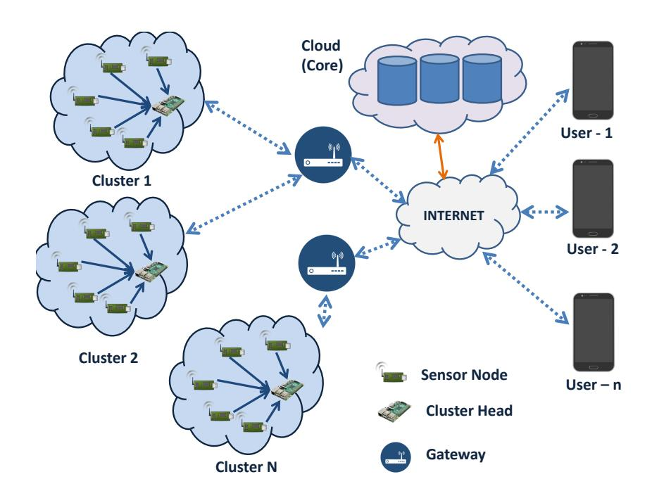
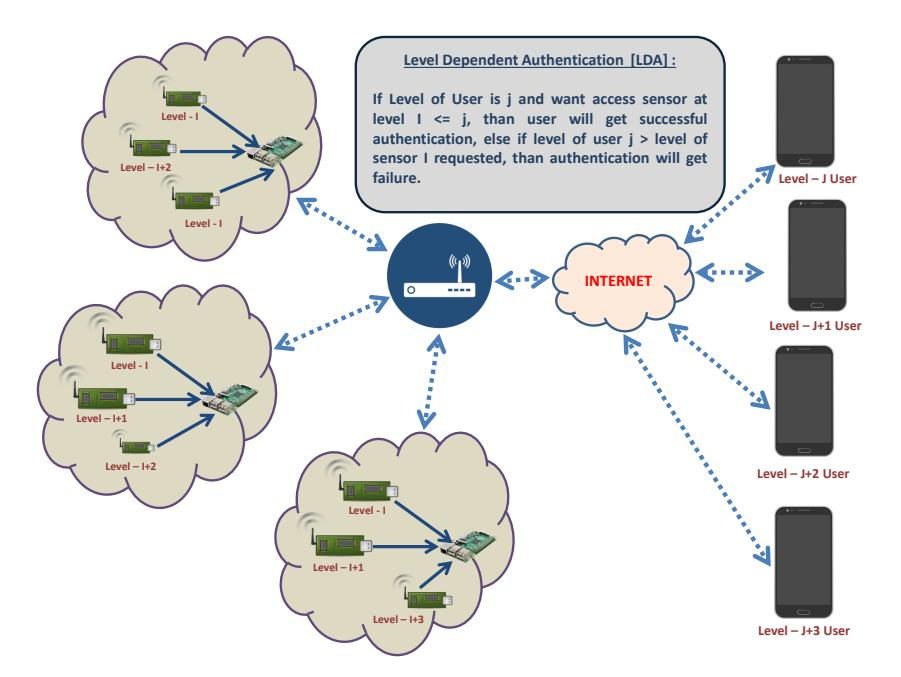
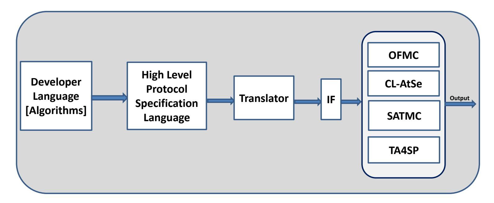
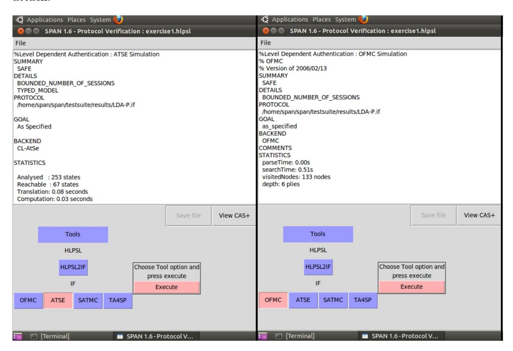
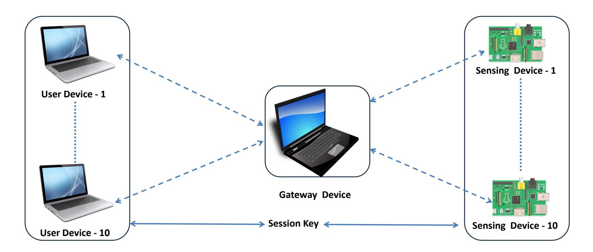
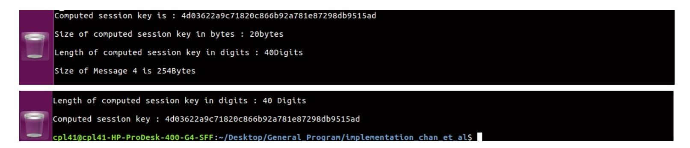
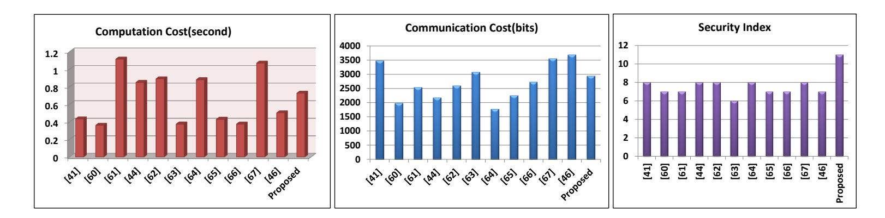

{0}------------------------------------------------

# A Level Dependent Authentication for IoT Paradigm

Chintan Patel1,1,<sup>∗</sup> , Nishant Doshia,1

Pandit Deendayal Petroleum University, Gandhinagar, India

<sup>a</sup>Pandit Deendayal Petroleum University, Gandhinagar, India

### Abstract

The Internet of Things (IoT) based services are getting a widespread expansion in all the directions and dimensions of the 21st century. The IoT based deployment involves an internet-connected sensor, mobiles, laptops, and other networking and computing devices. In most IoT based applications, the sensor collects the data and communicates it to the end-user via gateway device or fog device over a precarious internet channel. The attacker can use this open channel to capture the sensing device or the gateway device to collect the IoT data or control the IoT system. For a long time, numerous researchers are working towards designing the authentication mechanism for the sensor network to achieve reliable and computationally feasible security. For the resource constraint environment of the IoT, it is essential to design reliable, efficient, and secure authentication protocol. In this paper, we propose a novel approach of authentication in the IoT paradigm called a Level-Dependent Authentication(LDA). In the LDA protocol, we propose a security reliable and resource efficient key sharing mechanism in which users at level l<sup>i</sup> can communicate with the sensor at level l<sup>j</sup> if and only if the level of user in the organizational hierarchy is lower or equal to the level of sensor deployment. We provide a security analysis for the proposed LDA protocol using random oracle based games & widely accepted AVISPA tools. We prove mutual authentication for the proposed protocol using BAN logic. In this paper, we also discuss a comparative analysis of the proposed protocol with other existing IoT authentication systems based on communication cost, computation cost, and security index. We provide an implementation for the proposed protocol using a globally adopted IoT protocol called MQTT protocol. Finally, we present the collected data related to the networking parameters like throughput and round trip delay.

Keywords: IoT, Level Dependent Authentication, Key agreement, RoR, AVISPA, BAN Logic

# 1. Introduction

The rapid development of science and technology plays a remarkable role in the life of people. Communication and computation technology got spring in the last 30 years.

<sup>∗</sup>Chintan Patel

{1}------------------------------------------------

With the launch of the world's first computer system ENIAC in 1946 and SPUTNIK - 1 satellite in 1959, a new ara of communication was inaugurated. The internet provides connectivity from the metro city to an interior village of the world by passing through its journey of 1st generation communication(100 bits per second) system to modern 5th generation communication system(1Gbps). A micro-electro-mechanical system based project SMART DUST brings up a sensing technology and mote development [\[1\]](#page-37-0). The internet communication system is divided into a broad category of the wired and wireless environment. Due to certain limitations of wired communication like locality, the wireless communication system took a big leap in the last 20 years. With an advantage of the considerable mobility system, the wireless communication system unlatches many doors for the human being. A survey published by an Akyildiz in [\[2\]](#page-37-1) highlighted numerous futuristic aspects of Wireless Sensor Network (WSN). An Authors in [\[2\]](#page-37-1) highlighted specific ground characteristics for a sensing node such as inadequate power resources, low data rate, small size, less computation capability, autonomous and adeptness. A sensing technology's pervasive application area attracts an academy and industry to provide a burgeoning improvement in its limiting parameters. Sectors such as smart healthcare, smart home, intelligent green environment, intelligent disaster relief, the pervasive military system, and forest animal tracking use a WSN for a cataclysmic change in their working environment.

The WSN brings up vast opportunities as well as enormous challenges. Broadly, two significant obstacles attract the research community to focus on. The first challenge is designing a highly productive sensor node, and the second one is developing a reliable and trustworthy wireless communication system. Numerous capabilities of sensing nodes such as event-based working and connecting environmental space with the technological area attract researchers to work on application-oriented research for the development of conventional technology. The researchers highlight that energy, memory, latency, unreliability, and security are the primary concerns for technocrats [\[3\]](#page-37-2). Various surveys presented in the past and recent pass on WSN highlighted privacy of user and security of the system with data as a significant challenge [\[4,](#page-37-3) [5,](#page-37-4) [6\]](#page-37-5).

The confidentiality assures that the data and critical parameters of a sensing node will not be available to an intruder. The data integrity assures that received data is not manipulated. The availability of the service from the sensing node is a critical challenge due to resource constraints of sensing node and MIRAI type distributed denial of service attacks (DDoS). The recent surveys on WSN security highlights that the designing a secure and reliable key exchange mechanism can protect the communication system from attacks like spoofing attack, traffic analysis attack, wormhole attack, time synchronization problems, flooding and so on [\[7\]](#page-37-6).

The combination of WSN with other advanced technology like the internet, cloud computing, or fog computing expands its dimensions with the new term called an "Internet of Things (IoT)." The sensing node in WSN does not provide connectivity with the internet. Still, it communicates via the sink node while in the IoT, the sensing node can directly communicate over the internet. Thus, we can say that WSN is an integral part of an IoT based architecture. Kevin Aston highlighted an IoT word when he was working as a researcher in MIT's AUTO-ID lab around 2009 [\[8\]](#page-37-7). The International Telecommunication Unit (ITU) defines the IoT systems' objective as access to "Any service at Any time on Any location by Anyone."

The IoT adds one more "A" in the "CIA" security trio, and makes it "CIAA." An

{2}------------------------------------------------

extra "A" stands for the authentication [\[9\]](#page-38-0). The authentication creates mutual trust between the communicating parties. The secure authentication setup provides a safe and unbreakable session key that is used for further communication. Other researchers in [\[10,](#page-38-1) [11,](#page-38-2) [12\]](#page-38-3) also provides a brief and introductory survey on IoT security. The authors in [\[10,](#page-38-1) [11,](#page-38-2) [12\]](#page-38-3) highlight security and privacy as a crucial challenge in the successful deployment of the IoT system in various industries like the agriculture, health-care, aerospace, automotive, telecommunication, logistics, intelligent transportation system, supply chain management, mining production and so on.

<span id="page-2-0"></span>

| Paper | Security challenges                                                  |  |  |  |  |  |  |
|-------|----------------------------------------------------------------------|--|--|--|--|--|--|
| [13]  | Authentication, Data integrity, Man-in-the-Middle attack             |  |  |  |  |  |  |
| [14]  | Data confidentiality, Device identity management, User               |  |  |  |  |  |  |
|       | id management, integrity of data, Authentication, Access<br>control  |  |  |  |  |  |  |
| [15]  | Sensor data protection, Key agreement, Light weight au               |  |  |  |  |  |  |
|       | thentication, Secure cloud computing, Privacy and pro                |  |  |  |  |  |  |
|       | tection                                                              |  |  |  |  |  |  |
| [16]  | Secure boot strapping of object, Secure transmissions, IoT           |  |  |  |  |  |  |
|       | data security, Authentication and authorization, Access              |  |  |  |  |  |  |
|       | control                                                              |  |  |  |  |  |  |
| [17]  | RFID protocol security,RFID authentication, Key man                  |  |  |  |  |  |  |
|       | agement, Designing light weight solutions, handling mas              |  |  |  |  |  |  |
|       | sive heterogeneity, Access control, Node trust manage                |  |  |  |  |  |  |
|       | ment                                                                 |  |  |  |  |  |  |
| [18]  | Confidentiality, Integrity, trust, Authentication, Access            |  |  |  |  |  |  |
|       | control                                                              |  |  |  |  |  |  |
| [19]  | Privacy,<br>Integrity,<br>Access<br>control,<br>trust,<br>identifica |  |  |  |  |  |  |
|       | tion,Authentication                                                  |  |  |  |  |  |  |
| [20]  | Confidentiality,<br>Integrity,<br>availability,<br>Authentication,   |  |  |  |  |  |  |
|       | Non-reputation                                                       |  |  |  |  |  |  |

Table 1: Major IoT security challenges highlighted in literature

The Table[.1.](#page-2-0) highlights various security challenges highlighted in various surveys on IoT security. IoT security surveys published in [\[21,](#page-38-12) [22,](#page-38-13) [23,](#page-38-14) [24,](#page-38-15) [25,](#page-38-16) [26,](#page-38-17) [27\]](#page-38-18) also highlights the importance of designing a lightweight remote user authentication(RUA) protocol for the complex IoT network models. The heterogeneous environment available in the IoT makes it difficult for the researchers to focus on all the security parameters. The successful authentication mechanism assures a successful session key generation between the sensing nodes and end-users. The heterogeneity and resource constraint environment of an IoT application is two significant challenges in designing the lightweight authentication mechanism. Major devices in the IoT environment are sensing nodes that capture realtime data and transmit those data to the users. The sensing nodes suffer from challenges like less power backup, low computation capability, and small memory storage.

The journey of Remote User Authentication (RUA) was started in 1981 when Lam-

{3}------------------------------------------------

port et al. proposed the first password-based authentication protocol using a one-way function [\[28\]](#page-38-19). Some of the significant drawbacks founded in the Lamport et al. scheme were the availability of the password table and high hash overhead. Later on, in 2004, the Das et al. .[\[29\]](#page-39-0) proposed an RUA scheme based on the dynamic identity where the password table was not required. Subsequently, numerous password-based authentication schemes were introduced so far. The password-based authentication schemes were not secure against the attacks like password guessing, insider, and replay attack. Thus, in 2002, Hwang et al. [\[30\]](#page-39-1) proposed the first RUA scheme based on the smart card. The Das et al. [\[31\]](#page-39-2) in 2009 introduced the first intelligent card-based RUA scheme for WSN. Later on, many researchers published a smart card-based RUA scheme. Still, during the literature study, we actively observed that the only smart card based authentication schemes do not provide security against various attacks like the smart card stolen attack due to adversary's capability to capture the smart card data using power analysis and reverse engineering [\[32,](#page-39-3) [33,](#page-39-4) [34\]](#page-39-5). Thus, to overcome the limitations of the smart card based RUA scheme, Lee et al. [\[35\]](#page-39-6) proposed a first fingerprint-based RUA scheme in 2002; subsequently, many authors have proposed an RUA scheme based on a password, smart card, and biometrics. The biometrics based authentication has its advantages like it is prone to stolen attack, zero guessing probability and the uniqueness between each living entity. The biometrics based schemes work based on feature extraction and minutiae mapping of factors in human traits.

Overall, RUA schemes can be treed in three parts. The first RUA type is uni-factor RUA schemes in which only "Password" is used as a security parameter. The second RUA type is a two-factor RUA scheme in which both the smart card and the password are used jointly as a security parameter. The Third RUA type is multi-factor RUA in which some human traits like fingerprints or iris pattern is also attached with the smart card and password. If we compare these three types based on security and complexity, we can say that "the higher security is directly proportional with, the more computations and storage requirements."

For the IoT paradigm, it is essential to define whether a user wants to capture realtime live data or delay-tolerant data. This decision depends on the structure and network model for any IoT application. The following Fig[.1.](#page-4-0) shows a basic IoT network model. The Home area network (HAN) with deployed sensor nodes, cluster heads, and internet-connected gateways creates a Local Area Network Model (LANM) for any IoT application. Users of the IoT application can capture live data by establishing secure authentication with the gateway device and sensor nodes. Applications such as home controlling, office controlling, food status monitoring in which users prefer a live data capturing through a lightweight authentication.

Motivation: In most of the recent past authentication schemes proposed for the IoT environment, authors focus on the algorithms in which users need a separate registration for each deployed sensing device, which is infeasible in the realtime scenario where thousands of sensors are deployed. In the IoT based network model, there is a hierarchy where the user at a certain level accesses multiple sensing devices at the same time. It is necessary to design an algorithm in which the user at a particular level in the hierarchy can establish a secure session key with all the eligible sensing devices through the single registration. The security vulnerabilities existing in recently proposed literature also inspired us to design an authentication scheme that is secure, reliable, and resources efficient.

{4}------------------------------------------------

<span id="page-4-0"></span>

Figure 1: IoT Generic Network Model

# A. Our Contribution:

In this paper, we propose a Level-Dependent Authentication (LDA) scheme designed using an Elliptic Curve Cryptography (ECC) for the IoT based environment where users of the IoT system are at a different level in the hierarchy and have access of a predefined set of sensing devices. We propose a novel authentication idea for IoT-based network models where each user of the system has access to smart devices based on their level in the organizational hierarchy. We also prove that the proposed LDA scheme achieves more executive efficiency, flexible functionalities, and necessary security compare to other existing schemes. The summary of our contribution is as follow:

- Level Dependent Authentication : We set forth a unique concept in the authentication with the name of a "Level Dependent Authentication (LDA)."
- Multi-factor Authentication : For designing the authentication scheme, we make use user 's identity, password, smart card, biometric, and Elliptic Curve Cryptography (ECC) based operations.
- Formal Security Analysis : The Formal security proof for the proposed scheme is given using two ways. The first way is a random oracle based security proof in which adversaries have access to random oracles, and using those oracles; it tries to capture secrets and data. The second way is using the AVISPA tool, which assures that the proposed scheme is secure against a replay attack and a man-in-the-middle attack.
- Mutual Authentication Verification : We examine the mutual authentication property for the proposed scheme using an old but highly efficient tool called a "BAN Logic."
- Comparative Analysis : We provide a comparative analysis of the proposed scheme with the other existing systems to show that the proposed scheme is highly efficient in terms of computation cost, communication cost, and other networking parameters like delay, loss, and throughput.

{5}------------------------------------------------

• Implementation : Implementation for the proposed scheme is done using the widely used MQTT protocol as a communication protocol between users, sensors, and a gateway. The analysis of implementation using a wireshark tool helped us to collect the networking data for comparative analysis.

# A.1. Level Dependent Authentication

An access control (AC) mechanism assures that only a valid user can access the sensing device based on their level in a hierarchy. Handling an access control for the small number of devices is not a significant challenge and can be implemented using the Access Control List (ACL). In the IoT, the scalability and heterogeneity of devices are two significant challenges against smooth access control implementation. For performing AC, every intermediary device like gateway needs to maintain a list of valid users for each sensor. The physical attack is also one of the critical challenges, and it is infeasible to keep the static list for this highly dynamic environment. Rather than this approach, we proposed a novel and realtime implemented approach to tackle these challenges using a single user registration and lightweight authentication mechanism.

<span id="page-5-0"></span>

Figure 2: Level Dependent Authentication

As shown in Fig[.2.](#page-5-0), every user in the IoT application will be assigned a particular level by the gateway device (or by registration authority in the multi-gateway scenario) during the user registration. Assigning this level will be based on the role of the user in the organization or industry. In parallel, during the sensor initialization phase, every sensor also gets a level based on its data generation mechanism. Thus, the overall idea of the LDA approach is articulated in the following algorithm: So the major advantages of using level dependent authentication can be listed as follow:

- No need to maintain ACL in the system. This characteristic differentiates the proposed approach from other access control mechanisms.
- No chance for any unauthorized user to get access to any sensing device.
- Lighter implementation of intermediary devices.
- Very less registration by the user device (near to one only).

{6}------------------------------------------------

```
Result: Access of Sensing Device to User
User-level = i;
Sensor-level = j;
while Gateway received request from user do
   if j ≤ i then
       Access-Allowed;
   else
       Access-Not-Allowed;
   end
end
```

Algorithm 1: Level Dependent Authentication

• Reduction of the computational complexity of the gateway device and sensing device for unauthorized requests.

The LDA approach's noticed challenge is that it increases the short time (in millisecond) for the gateway device for level verification. In most of the IoT implementations, gateway devices are powerful routing devices or servers which are resource capable of performing this operation. Thus, we can say that this is a negligible challenge. The proposed LDA approach does not. require to store any separate access control list or the list of user's roles. Various other Role-based Access Control or Attribute-Based Access Control methods available are used only for access control verification; these methods do not provide any mechanism for authentication or the secure key setup. These methods consume space, memory, and list verification time, which increases unnecessary space and time complexity. At the same time, the proposed LDA scheme provides access control with authentication in a resource-constrained environment with highly optimized resource utilization.

The rest of the paper is organized as follows: In section [2,](#page-6-0) we provide related work proposed by other authors in the recent past. In section [3,](#page-8-0) we articulate essential preliminaries used in this paper. In section [4,](#page-13-0) we articulate the proposed ECC based LDA scheme for the generic IoT model. Section [5](#page-16-0) presents an informal security analysis for the proposed scheme. In section [6,](#page-20-0) we prove a formal security model for the proposed LDA scheme using random oracles. The formal security analysis using the AVISPA tool is shined in section [7.](#page-27-0) In section [8,](#page-27-1) we prove the mutual authentication using a BAN Logic. Section [9](#page-32-0) discusses the implementation approach of the proposed scheme using MQTT and provides a comparison with the other existing schemes in terms of space complexity, time complexity and other networking parameters like round trip delay, throughput, and packet loss. Finally, section [10](#page-37-8) concludes this paper with certain future directions for the LDA approach.

# <span id="page-6-0"></span>2. Recent related work

In this paper, we propose a Level Dependent Authentication (LDA) scheme for IoT based heterogeneous environments (LDA-IoT). After reviewing existing IoT based schemes, we conclude that LDA-IoT is a novel concept where we take a realistic model in which different users of an IoT system have access to numerous sensors. Thus, it is also necessary 

{7}------------------------------------------------

to propose a reliable, efficient, and resource preserving authentication scheme. In 2009, Das et al. [\[31\]](#page-39-2) proposed a first authentication scheme for wireless sensor networks (WSN). Since then, many researchers put forward numerous authentication schemes for WSN, which is followed by an IoT authentication as a superset. In this section, we discuss authentication schemes proposed in the recent past for various IoT based applications like smart home, smart grid, and industrial IoT.

In 2014, Turkanovic et al. [\[36\]](#page-39-7) proposed RUA scheme using a smart card for IoT notations and pointed out that their scheme provides secure key agreement and lower computation cost compare to existing schemes. In 2016, Farash et al. [\[37\]](#page-39-8) pointed out certain limitations in Turkanovic et al.'s scheme. They highlighted that Turkanovic et al.'s scheme is vulnerable against the session key and secret parameter disclosure attack, stolen smart card attack, Man-in-the-Middle (MITM) attack, and user traceability. In the same paper, Farash et al. [\[37\]](#page-39-8) proposed a new authentication scheme for the IoT environment and claimed that their scheme is highly secured and computationally feasible compare to analyzed schemes and other existing schemes. Unfortunately, in the same year, Amin et al. [\[38\]](#page-39-9) highlighted that the scheme proposed by Farash et al. is vulnerable against session-specific temporary attack, user impersonation, and offline password guessing attack. In the same paper, Amin et al. proposed a new smart card based three-factor authentication scheme using XOR and hash operations and claimed security and feasibility of the scheme. In 2017, Jiang et al. [\[39\]](#page-39-10) pointed out that the scheme proposed by Amin et al. is vulnerable from tracking attack and session-specific temporary credential attack. Jiang et al. [\[39\]](#page-39-10) also proposed a secure, lightweight, and efficient authentication scheme based on bio-hacking and rubin cryptosystem for wearables.

Smart Home(SH) is one of the most promising IoT application which consists of heterogeneous intelligent home appliances like smart tv, smart meter, smart refrigerator, smart washing machine, smart door lock, smart window viper and so on. Due to the overloaded adoption of smart homes, it becomes essential for the researcher to focus on security and privacy issues also. In 2017, Wazid et al. [\[40\]](#page-39-11) proposed a secure key establishment scheme using a hash function with symmetric encryption and provided the security analysis using random oracle based Real-Or-Random (ROR) model. In the same year, Kumar et al. [\[41\]](#page-39-12) also proposed a new authentication scheme for the smart home environment using XOR, hash, and symmetric encryption. By security analysis using AVISPA and performance comparison based on computation cost and communication cost, Kumar et al. proved the feasibility and security of their scheme in resource constraint environment. By considering privacy as a significant challenge, Poh et al. [\[42\]](#page-39-13) proposed an authentication scheme in two phases. In the first phase, the author proposed a lightweight key establishment protocol, and in the second phase, the author used token-based searchable encryption-based queries to achieve privacy.

Smart Grid (SG) is a network of all renewable and non-renewable energy generators, distributors, and consumers. The smart grid's fundamental objective is to reduce non-renewable energy consumption in the world and forecast renewable energy to let consumers also become a generator. The smart meter is an intelligent device that collects the information regarding energy consumption and needs from the user and passes that information at a regular interval to the energy control station. Information regarding energy usage must be securely communicated with the energy control station and other smart grid entities because leakage of this information can create a loophole in the user's privacy. In 2017, Mahmood et al. [\[43\]](#page-39-14) proposed an ECC based authentication 

{8}------------------------------------------------

scheme without making use of the third party like a registration server. In 2018, Gope et al. [\[44\]](#page-39-15) introduced an authentication scheme between the smart meter and energy service provider using a Physically Unclonable Function (PUF). In 2018, Abbasinezhad et al. [\[45\]](#page-39-16) reviewed an authentication scheme proposed in [\[43\]](#page-39-14) and pointed out that their scheme is vulnerable against perfect forward secrecy, private key leakage, and known session-specific temporary information attack. Abbasinezhad et al. proposed a new authentication scheme using ECC and claimed reliable security and computational feasibility by comparing it with the previously proposed scheme. The smart grid will play a significant role in the successful deployment of Electric Vehicle (EV) in the market. Communication between EV and SG networks must ensure that an intruder can not trace the location of EV and can not play with the user's privacy. Roman et al. [\[46\]](#page-39-17), in 2019, proposed a paring based authentication scheme between EV and authentication servers of the smart grid.

Industrial Internet of Things (IIoT) is one of the prominent applications of IoT. IIoT makes use of sensing technology for trusted observation of industrial production, reliable data management, intelligent decision making, and efficient human resource utilization. Authentication between IIoT user and sensing devices plays a vital role in managing the security of the complete hierarchy of IIoT. Li et al. [\[47\]](#page-39-18) in 2018 proposed a privacypreserving authentication scheme for the IIoT environment and proved security for the proposed scheme using random oracle based adversary capabilities. Karate et al. [\[48\]](#page-39-19) proposed a signature-based authentication scheme for a cloud-centric IIoT environment. In 2018, karati et al. [\[48\]](#page-39-19) proposed an efficient scheme between the key generator, cloud server, data owner, and data consumer and prove the security using widely accepted game theory-based analysis. Li et al. [\[49\]](#page-40-0) and Esfahani et al. [\[50\]](#page-40-1) also proposed a lightweight authentication scheme for secure communication between machine to machine (M2M). Authors in [\[51\]](#page-40-2) proposed a secure authentication protocol for industrial IoT. The limitation of these protocols is that they consider all sensors at a similar level, but in the realtime industrial deployment, it is not the real scenario.

Overall, the authentication in the IoT environment consists of many independent entities, complicated technologies, and resource constraint devices. Thus, it is essential to propose an authentication scheme that is reliable, efficient, and suitable for IoT's resource constraint environment.

### <span id="page-8-0"></span>3. Preliminaries

In this section, we discuss the basic preliminaries required for successful deployment of the proposed authentication scheme.

### A. System Model

Fig.??. shows a smart campus, a replica of the many IoT-based applications in a realtime deployment. Any IoT based network model consists of three abstract sections. The first section is a home network where ground-level smart devices are deployed. The second section is a server network where a service provider or cloud server is used for trusted computations. And the third section consists of users who receive services/data from IoT applications. Data collected in the IoT paradigm is used for intelligent decision making using data analysis, machine learning, and artificial intelligence.

{9}------------------------------------------------

- User U<sup>i</sup> is having a mobile application or other software utility connected with the campus gateway device via the internet. Nowadays, most of the smart mobiles or user devices come with sufficient memory and computation power to perform cryptographic operations. But still, the challenge is the interms of energy consumption. In many IoT applications, users are not at the same level in the hierarchy, and each user U<sup>i</sup> have different access controls.
- The campus gateway CG is also a trusted platform module as a resource capable entity in this network model. The CG works as a data integrator from ground level sensing devices and data forwarder to users (Ui) via the internet. In some network models, CG also works like a fog device for edge level processing. With the help of a gateway device, the user retrieves the realtime data from the sensing device. The mutual authentication between user and sensing device occurs through the gateway, and they establish a session key. The gateway device performs the validation of both the user device and sensing device in terms of their communication eligibility. The gateway device verifies the user device and sensing device level and decides eligibility of the user to access the sensing device. The gateway device performs system initialization, different key parameter generation for the user, and sensing device to avoid the collision.
- The sensing devices SD<sup>j</sup> are the most challenging entities of this network model due to its resource limitations in terms of memory, power, bandwidth, and physical security.
- 1. Communication Model: The communication model highlights protocols or mediums which are used by IoT entities.
  - Communication between sensing devices and campus gateway: Most of the sensing devices SD<sup>j</sup> communicates in short-range and uses protocols like Zigbee, BLE, or Z-Wave at the network layer and MQTT at the application layer to communicate with the CG via the wireless interface.
  - Communication between campus gateway and users: The campus gateway CG communicates with user U<sup>i</sup> via long-range internet communication protocols like GPRS or WI-FI at the network layer and MQTT or COAP type protocols at the application layer.

### B. Elliptic Curve Cryptography

We use an ECC for the proposed scheme due to its advantageous characteristics over existing traditional diffie-hellman method and factoring based RSA algorithms [\[52\]](#page-40-3). The ECC based on finite field or binary field provides smaller key size and lesser computation complexity than conventional cryptography protocols. The 160 bit key of ECC offers equal security to 1024 bit key of RSA [\[53\]](#page-40-4). The energy consumption by ECC is also lesser compared to other traditional public-key cryptography protocols [\[54\]](#page-40-5). An elliptic curve is a cubical curve with non-repeatable roots defined over finite field F of order n of the form E(F) is,

$$Y^2 = (X^3 + aX + b)modn (1)$$

{10}------------------------------------------------

where X and Y are the points of elliptic curve denoted by P(X,Y). Constants a, b ∈ F<sup>n</sup> and value of a and b will satisfy,

$$4a^3 + 27b^2 \neq 0 \tag{2}$$

Scalar point multiplication operation of elliptic curve point P is defined as n ∗ P = P + P+.......+ P for n number of times. Any adversary who is having P and n ∗ P can not retrieve the value of n in polynomial time. It satisfies discrete logarithm properties. Alice selects random number x and computes X = x\*P while bob picks random number y and computes Y = y\*P and shares X and Y, Thus, at last, both Alice and Bob will have secret value SK = x\*y\*P.

# C. One way Hash Function

The one way cryptographic hash function defined as a H : {0, 1} <sup>∗</sup> → {0, 1} <sup>n</sup>. It takes the binary string p ∈ {0, 1} <sup>n</sup> of any arbitrary length as input and produces a fixed size binary string Q ∈ {0, 1} <sup>n</sup> as an output. Thus, the hash function is an auxiliary function used for digital signature, key exchange, random number generation authentication, and many other cryptographic protocol developments. Every cryptographic hash function must satisfy properties like variable size input, fixed-size output, one-way computation, weak collision, collision resistance, and randomness [\[55\]](#page-40-6).

### D. Biometric Computations

A biometric-based security mechanism was adopted since long back due to the proven weak security mechanism of identity and password-based authentication. In biometricbased authentication, the user uses a finger-print or retina as a unique biometric input for verification. The security of stored biometric templates is a critical challenge in biometricbased security. A noisy nature of biometric does not suit the hash-based processing. Thus, in 2004, Dodis et al. [\[56\]](#page-40-7) proposed a fuzzy extractor, which becomes a widely accepted biometric template protection mechanism. We consider following notations,

- M is a metric space with the distance function Dis: M \* M → R <sup>+</sup> = [0,∞]. The measurement of an "error" is occurred through hamming distance.
- L denotes length of biometric secret key.
- T denotes threshold value for error tolerance.
- Tuple (B<sup>i</sup> ,R<sup>i</sup> ,Pi) where B<sup>i</sup> is a biometric for the i th user, R<sup>i</sup> is extracted random string defined as a R<sup>i</sup> ∈ 0, 1 <sup>L</sup>, P<sup>i</sup> is a public auxiliary string for the B<sup>i</sup> .

Fuzzy Extractor : is equipped with two algorithms called a a Gen() and Rep(). It can extract any random string from the given biometric template of a user i as input and produce the same random string even for the different biometric template from the same user i from the same trait.

• Gen() : Generation function is a uni-input and bio-output function that uses probabilistic generation procedure. It is defined as, Gen(Bi) = (R<sup>i</sup> ,Pi). Over here Ri is a secret string while P<sup>i</sup> is a public string.

{11}------------------------------------------------

- Rep(): Reproduction function is a bio-input and uni-output function that uses deterministic reproduction procedure. It is defined as,  $Rep(B'_i, P_i) = (R_i)$ . Over here,  $B'_i$  is a biometric template for same user i but obvious it will not be the same as  $B_i$ , thus it satisfies hamming distance  $H_d(B_i, B'_i) \leq \mathcal{T}$ .
- if  $(B_i, B_i')$  belongs to the same user then the distance between  $B_i$  and  $B_i'$  will be low with high probability,  $Pr[H_d(B_i, B_i') < \mathcal{T}] \ge 1$   $\varphi_{fn}$  where fn is "false negative".
- if  $(B_i, B'_i)$  belongs to different user then the distance between  $B_i$  and  $B'_i$  will be high with low probability,  $Pr[H_d(B_i, B'_i) > \mathcal{T}'] \geq 1 \varphi_{fp}$  where fp is "false positive" and  $\mathcal{T}' > \mathcal{T}$ .

### E. Adversary Model

An adversary model used in this paper is considered from a similar model discussed in [57]. The adversary is an intruder who tries to capture the communicated messages as well as tries to gain physical access to devices belongs to network topology. In the IoT based network model, it is possible to define an adversary with the robust capabilities for improvement in the designing of reliable protocols and also to perform better security validation for the proposed authentication protocol. Thus, we follow the following adversary capability model in this paper. The similar model is also used in [58, 59, 39]:

- $C_1$ . An Adversary  $\mathcal{A}$  can compute valid pair of identity\*password offline in polynomial time using the available dictionary.
- $C_2$ . An Adversary  $\mathcal{A}$  can capture a smart card and can retrieve the information from it.
- $C_3$ . An Adversary  $\mathcal{A}$  have full access on the communication channel between user gateway, sensor node gateway, and user sensor node.
- $C_4$ . An Adversary  $\mathcal{A}$  may get previously computed session key.
- $C_5$ . An Adversary  $\mathcal{A}$  may get the secret of the gateway node during failure situations.
- $C_6$ . An Adversary A can compromise sensor node physically and can get stored information.
- $C_7$ . An Adversary  $\mathcal{A}$  can capture the level of user or sensing device.
- $C_8$ . An Adversary  $\mathcal{A}$  can generate bot nodes and can send simultaneous ping messages to the user device and sensing device.

# F. Use cases for proposed LDA scheme

In the proposed scheme, we propose a novel idea of the Level-Dependent Authentication (LDA), which fulfills the requirement of real-time deployment of the IoT application. The proposed LDA scheme is used in IoT applications with a hierarchical access control model. Let us consider a university campus use case where more than thousands of sensors deployed and users like (students, faculty, dean, director) want to access those sensors. They have to register with the system. Now three basic questions arise over here:

{12}------------------------------------------------

- Is it possible for a director as a user (who has access to complete campus) to register for each sensor individually?
- Is it possible that the director device, as a user device, knows the identity of each sensor?
- Is it possible to make an access control list of these thousands of heterogeneous sensors whose nature is dynamic in terms of physical presence as well as logical presence?

If the answer to the above questions is "NO," then most of the proposed authentication scheme for IoT environment will be proven as unpractical solutions. The proposed LDA scheme reduces the number of user registration steps drastically. It also eliminates the need to inform every user about each sensing device's identity to access it. It is infeasible to use non-optimized role-based access control or attribute-based access control in the IoT environment. Thus, the proposed LDA also solves the need for a separate access control mechanism for the IoT paradigm.

# 4. Proposed Level-Dependent Authentication

In this section, we set forth the proposed authentication and key exchange scheme for the network model discussed in Fig[.1.](#page-4-0) The proposed scheme consists of the initialization phase in which the gateway device works as a master device and performs offline and secure initialization for the user device, sensing device, and gateway itself. The initialization phase is followed by the registration phase and the login and authentication phase.

Table[.2](#page-13-0) presents notations and symbols used in the articulation of the proposed scheme. We use the random number and timestamp to protect the proposed scheme from the replay attack. We assume that all the entities have a synchronized clock.

{13}------------------------------------------------

<span id="page-13-0"></span>

| Symbols | Description                               |  |  |  |  |  |
|---------|-------------------------------------------|--|--|--|--|--|
| Rx      | Random Number generated during initialize |  |  |  |  |  |
|         | phase                                     |  |  |  |  |  |
| rx      | Random Number generated during authenti   |  |  |  |  |  |
|         | cation phase                              |  |  |  |  |  |
| Tx      | Time-stamp                                |  |  |  |  |  |
| li      | User Level                                |  |  |  |  |  |
| lj      | Sensor Level                              |  |  |  |  |  |
| SIDj    | Sensor identity                           |  |  |  |  |  |
| UIDi    | User identity                             |  |  |  |  |  |
| GW ID   | Gateway identity                          |  |  |  |  |  |
| Gp      | Elliptic curve generator                  |  |  |  |  |  |
| ∆T      | Time-stamp threshold                      |  |  |  |  |  |
| Ks      | Gateway node master secret                |  |  |  |  |  |
| Bioi    | User biometric template                   |  |  |  |  |  |
| Mx      | Message Number                            |  |  |  |  |  |
| T ID    | Temporary Identity                        |  |  |  |  |  |
| Gen(.)  | Generation procedure in fuzzy extractor   |  |  |  |  |  |
| Rep(.)  | Reproduction procedure in fuzzy extractor |  |  |  |  |  |
| H(.)    | One-way Hash function                     |  |  |  |  |  |
|         | Enc(.)/Dec(.) ECC encryption/decryption   |  |  |  |  |  |
| L,      | XOR and Concatenation respectively        |  |  |  |  |  |
| B,Z     | Computed Parameters                       |  |  |  |  |  |

Table 2: Symbols and Notations

# A. Initialization:

This phase call on offline by the gateway device with trusted platform module [\[60\]](#page-40-11).

# A.1. User Initialization

Let R<sup>i</sup> be a secret random number generated by the gateway GW for the user device U<sup>i</sup> as a password. The GW computes UID<sup>i</sup> = Ri\*P where P is a point on elliptic curve. The GW generates random master secret K<sup>s</sup> and computes X<sup>1</sup> = H(UID<sup>i</sup> ||Ks), Z1=H(l<sup>i</sup> ||Ks||H(UIDi)). Here l<sup>i</sup> is the level for the user U<sup>i</sup> . GW stores R<sup>i</sup> , UID<sup>i</sup> , X<sup>1</sup> and Z<sup>1</sup> in the hidden memory of U<sup>i</sup> .

# A.2. Sensing Device initialization

Let R<sup>j</sup> be a secret random number generated by the gateway GW for a sensing device SD<sup>j</sup> . The GW computes SID<sup>j</sup> = Rj\*P where P is a point on elliptic curve. The GW computes X<sup>2</sup> = H(SID<sup>j</sup> ||Ks), Z2=H(l<sup>j</sup> ||Ks||H(SID<sup>j</sup> )). Here l<sup>j</sup> is the level for the sensor SD<sup>j</sup> . GW stores R<sup>j</sup> , SID<sup>j</sup> , X<sup>2</sup> and Z<sup>2</sup> in hidden memory of SD<sup>j</sup> .

# A.3. Gateway Node Initialization

The gateway GW generates random number R<sup>k</sup> as a secret parameter and compute GW ID = Rk\*P as a public identity.

{14}------------------------------------------------

# B. User registration

User registration is a phase which is carried out through secure channel.

- 1. U<sup>i</sup> → GW : User U<sup>i</sup> sends X1, UID<sup>i</sup> to GW.
- 2. GW → U<sup>i</sup> : Gateway node verifies X1∗ = H(UID<sup>i</sup> ||Ks) ?= X1. The GW device generates r<sup>1</sup> and computes T ID<sup>i</sup> = H(r1||X1), M1= H(T ID<sup>i</sup> ||GW ID||Ri), B<sup>1</sup> = X<sup>1</sup> ⊕ r<sup>1</sup> and sends smart sard (SC) = (T ID<sup>i</sup> , M1, B1).
- 3. User U<sup>i</sup> generates biometric parameters using fuzzy extractor as BiO = Gen(δ<sup>i</sup> , γi) in which δ<sup>i</sup> is a secret key parameter which is used for verification and γ<sup>i</sup> is a public parameter which is also an input during reproduction stage. U<sup>i</sup> computes M<sup>2</sup> = H( T ID<sup>i</sup> ||δ<sup>i</sup> ||Ri), user stores SC = (T ID<sup>i</sup> , M1, B1, M2).

### C. Authentication and key establishment:

The authentication and key establishment between User U<sup>i</sup> and S<sup>j</sup> involves authentication of U<sup>i</sup> with GW and S<sup>j</sup> with GW. After an authentication, U<sup>i</sup> and S<sup>j</sup> computes session key. We have used an ECC based encryption/decryption during key establishment phase.

1. U<sup>i</sup> → GW : User provides R<sup>i</sup> ,UID<sup>i</sup> , X1, Z<sup>1</sup> and Bio∗ to Smart card reader (SCR) with SC. SCR computes δi∗ = Rep(Bio∗, γi) and verifies following:

$$TID_{i}^{*} = H(r_{1}||X_{1}) \stackrel{?}{=} TID_{i},$$

$$r_{1} = X_{1} \oplus B_{1},$$

$$M_{1}^{*} = H(TID_{i}^{*}||GWID||R_{i}) \stackrel{?}{=} M_{1},$$

$$M_{2}^{*} = H(TID_{i}^{*}||\delta_{i}^{*}||R_{i}) \stackrel{?}{=} M_{2},$$

If all conditions successfully verified, then SCR generates random number r2, and computes following:

$$B_2 = TID_i^* \oplus UID_i,$$

$$M_4 = Enc_{GWID}(r_2, UID_i, SID_j),$$

$$M_5 = H(TID_i^*||SID_j||GWID||T_1),$$

$$TID_i^{**} = H(TID_i^*||r_2),$$

sends authentication Message 1 = (T ID<sup>i</sup> ∗∗ , M4, M5, T1, Z<sup>1</sup> ,B2) to GW.

2. GW → S<sup>j</sup> : Gateway Node GW computes current time T<sup>2</sup> and verifies ∆T ≤ T<sup>2</sup> - T1, if yes then performs following:

$$(r_2, SID_j, UID_i) = Dec_{R_k}(M_4),$$

$$TID_i = H(r_1||H(UID_i||K_s))$$

$$TID_i' = H(TID_i||r_2) \stackrel{?}{=} TID_i^{**}, \text{ if yes}$$

$$M_6 = H(H(SID_j||K_s)||T_3)),$$

$$15$$

{15}------------------------------------------------

sends message 2 = (M6, T3) to S<sup>j</sup> .

3. S<sup>j</sup> → GW : S<sup>j</sup> takes current time T<sup>4</sup> and verifies ∆T ≤ T<sup>4</sup> - T3, if verified then computes following:

$$M_6^* = H(H(X_2)||T_1) \stackrel{?}{=} M_6,$$
  
 $M_7 = H(X_2||GWNID_k||T_5),$ 

sends message 3 = (M7, Z2, T5) to GW.

4. GW → S<sup>j</sup> : Gateway Node GW takes current time T<sup>6</sup> and verifies ∆T ≤ T<sup>6</sup> - T5, if yes than performs following:

$$M_7^* = \mathrm{H}(\mathrm{H}(SNID_j||K_s)||GWNID_k||T_5) \stackrel{?}{=} M_7,$$

Gets l<sup>i</sup> and l<sup>j</sup> from Z<sup>1</sup> and Z<sup>2</sup> respectively by computing:

$$Z_1*=H(l_i||K_s||H(UID_i))$$
 till  $Z_1*\stackrel{?}{=} Z_1$  satisfies for valid  $l_i$ ,  $Z_2*=H(l_j||K_s||H(SID_j))$  till  $Z_2*\stackrel{?}{=} Z_2$  satisfies for valid  $l_j$ ,

Verifies if l<sup>i</sup> ≤ l<sup>j</sup> , then continue else transmits 0 signal to U<sup>i</sup> and sensing device S<sup>j</sup> ,

Verifies 
$$M_5^* = H(TID_i^*||SID_j||GWID||T_1) \stackrel{?}{=} M_5$$
,  
 $M_8 = H(UID_i||r_2||SID_j||GWID||T_7)$ ,  
 $M_9 = Enc_{SID_j}(UID_i, r_2)$ ,

sends message 4 = (M8, M9, T7) to sensing device S<sup>j</sup> .

5. S<sup>j</sup> → GW : S<sup>j</sup> takes current time T<sup>8</sup> and verifies ∆T ≤ T<sup>8</sup> - T7,if verified then computes following:

$$Dec_{R_{j}}(M_{9}) = (UID_{i}, r_{2})),$$

$$M_{8}^{*} = H(UID_{i}||r_{2}||SID_{j}||GWID||T_{7}) \stackrel{?}{=} M_{8}),$$
generates random number  $r_{3}$ ,
$$M_{10} = Enc_{RIDU_{i}}(r_{3}),$$

$$M_{11} = H(GWID||SID_{j}||r_{3}||T_{8}),$$

$$M_{12} = H(GWID||SID_{j}||r_{2}||T_{8}),$$

send message 5 = (M10,M11,M12,T8) to GW.

6. GW → U<sup>i</sup> : Gateway node GW takes current time T<sup>9</sup> and verifies ∆T ≤ T<sup>9</sup> - T8, if yes then performs following:

$$M_{12} = H(GWID_k||SID_j||r_2||T_8) \stackrel{?}{=} M_{12},$$
 gets current time stamp,  $T_9$ , 
$$M_k = H(Z_1||Z_2||K_s||T_9)$$
 16

{16}------------------------------------------------

sends message  $6 = (M_{10}, M_{11}, M_k, T_8, T_9)$  to  $U_i$  and message  $7 = (M_k, T_9)$  to  $S_j$ 

7. User  $U_i$ : takes current time  $T_{10}$  and verifies  $\Delta T \leq T_{10}$  -  $T_9$ , if yes then performs following:

$$Dec_{R_i}(M_{10}) = (r_3),$$

$$M_{11}^* = H(GWID_k||SID_j||r_3||T_8) \stackrel{?}{=} M_{11}, \text{ if yes.}$$

$$\mathbf{SK} = H(r_2||r_3||UID_i||SID_j||GWID_k||T_8||M_k||T_9)$$

8. Sensor  $S_j$ : takes current timestamp  $T_{11}$  and verifies  $\Delta T \leq T_{11}$  -  $T_9$ , if yes then performs following:

$$\mathbf{SK} = \mathbf{H}(r_2||r_3||UID_i||SID_j||GWID_k||T_8||M_k||T_9)$$

#### <span id="page-16-0"></span>5. Security Analysis of LDA

## A. Informal Security Analysis

In this subsection, we discuss an informal security analysis for the proposed LDA Protocol. We also summarize this discussion in Table. 3 by comparing the proposed scheme with the other existing schemes.

# A.1. Secured against traceability

In most of the IoT application, it is expected that an original identity of the user or device must not relieve. If an adversary  $\mathcal{A}$  can capture the identity of the user then it creates a problem for user's privacy preservation. The adversary  $\mathcal{A}$  can easily trace the user and it's functionalities. In the proposed LDA scheme, the first public authentication request  $message\ 1$  by user  $U_i$  to GW is  $\langle TID_i^{**}, M_4, M_5, T_1, Z_1, B_2 \rangle$ . The  $message\ 1$  is distinct for each new request due to following reason. The author computes  $M_4 = Enc_{GWID}(r_2, TID_i^*, SID_j)$ ,  $M_5 = H(TID_i^*||SID_j||GWID||T_1)$ , in which  $r_2$  is a random number and  $T_1$  is a latest timestamp, Thus, the inclusion of  $r_2$  and  $T_1$  ensures that  $M_4$  and  $M_5$  are different for each session. Similarly other communicated messages ( $message\ 2$ ,  $message\ 3$ ,  $message\ 4$ ,  $message\ 5$ ,  $message\ 6$ ,  $message\ 7$ ) by user  $U_i$  and sensing device  $S_j$  are also distinct for each session.

# A.2. Anonymity

An anonymity preservation can be achieved by securing an identity of the user  $U_i$  and the sensor  $S_j$  from adversary A. Identity of user  $U_i$  is  $UID_i$  which is secured by one-way hash function in computations of  $X_1 = \mathrm{H}(UID_i||K_s)$  and  $Z_1 = \mathrm{H}(l_i||K_s||H(UID_i))$ . During authentication messages, user uses temporary id  $TID_i = \mathrm{H}(r_1||X_1)$  which is protected using one-way hash function and ECC based encryption. Identity of the sensing device  $(SID_j)$  is also protected by computed parameters  $X_2 = \mathrm{H}(SID_j||K_s)$ ,  $Z_2 = \mathrm{H}(l_j||K_s||H(SID_j))$  which are protected by one-way hash function. Gateway node communicates following messages with the user and the sensor device,  $\langle M_6, T_3 \rangle$ ,  $\langle M_8, M_9, T_7 \rangle$ , and  $\langle M_{10}, M_{11}, T_8, T_9 \rangle$ . Each message communicated by the gateway device uses timestamp and is protected by one-way hash function and encryption. Therefore, anonymity of the sensing device and the user device is achieved in the proposed LDA scheme.

{17}------------------------------------------------

#### A.3. Mutual Authentication and Integrity

The mutual authentication is an important property that assures security from unauthorized access to any unknown adversary  $\mathcal{A}$ . The proposed LDA scheme achieves mutual authentication for the participating entities. The gateway device GW authenticates user  $U_i$  by performing the following operations. The GW computes  $TID_i^{'} = H(TID_i||r_2)$   $\stackrel{?}{=} TID_i^{**}$  to ensure the temporary id, which is received from the user  $U_i$ . Computation of  $TID_i = H(r_1||H(UID_i||K_s))$  includes secret parameter  $K_s$  which an adversary can never get. The gateway GW authenticates sensing device by computing  $M_7^*$  =  $H(H(SNID_j||K_s)||GWID||T_5)\stackrel{?}{=} M_7$ , which includes master secret  $K_s$  and gateway node identity GWID. Similarly, the user authenticates gateway and sensing device during verification of the parameter  $M_{11}$ , and the sensing device validates user and gateway during verification of the parameter  $M_8$ . In the proposed scheme, all the communicated messages are verified by a one-way hash function, which ensures integrity for the proposed scheme.

#### A.4. Protected against Replay Attack

In the replay attacks, an adversary  $\mathcal{A}$  replays old messages which are captured by  $\mathcal{A}$  by tracking of communications between  $U_i$ , GW and  $S_j$ . Let us assume, an adversary  $\mathcal{A}$  captures  $message \ 1 = \langle TID_i^{**}, M_4, M_5, T_1, Z_1, B_2 \rangle$  and communicate  $message \ 1$  to start a new session with the GW device. After receiving a message from  $\mathcal{A}$ , gateway GW performs validation of time interval between current time and message generation time by performing  $\Delta T \leq T_2 - T_1$ . Here  $T_2$  is current time or receiving time at gateway GW. This validation will fail because interval will not be lesser then the previously decided  $\Delta T$ . Similarly, every communication between user  $U_i$ , gateway GW and sensor  $S_j$  is protected by threshold  $\Delta T$ . Thus, the proposed LDA scheme is secured against a replay attack.

#### A.5. Secured Against Man-in-the-Middle Attack(MITM)

In this attack, an adversary  $\mathcal{A}$  captures the messages communicated by valid participants of the system and modifies messages. We assume that  $\mathcal{A}$  captures the message  $1 = \langle TID_i^{**}, M_4, M_5, T_1, Z_1, B_2 \rangle$  communicated by user  $U_i$  to GW. Let  $\mathcal{A}$  updates the message 1 by message  $1' = \langle TID_i^{**'}, M'_4, M'_5, T'_1, Z'_1, B'_2 \rangle$  and send to GW. Now the gateway verifies  $TID_i^{**'}$  with  $TID_i$  by capturing  $r_2$  from the decryption of  $M_4$ . Thus, the modified  $TID_i^{**'}$  does not match with the  $TID_i$ . Therefore, the gateway devices stops further communication. Similarly, all the communications in the proposed protocol is secured using encryptions and one-way hash functions. Hence, we can claim that proposed scheme is immune enough against the MITM attack.

#### A.6. Key Establishment with Perfect Forward Secrecy

The protection against perfect forward secrecy assures that even through an adversary  $\mathcal{A}$  captures all messages of the previous session and final session key, then also  $\mathcal{A}$  must not get the ability to compute key for the ongoing session. We compute the session key in the proposed scheme as follows. The session key  $SK = H(r_2||r_3||UID_i||SID_j||GWID_k||T_8)$ , that includes two random numbers and one timestamp. It is nearly impossible for an adversary  $\mathcal{A}$  to generate the random numbers, which will match with the same  $r_2$  and  $r_3$ .

{18}------------------------------------------------

Now let us assume that an adversary gets the long term secret K<sup>s</sup> from the gateway. Then also, the adversary could not break the previous session messages due to hash protected random numbers. Therefore, the proposed LDA scheme achieves perfect forward secrecy, and it is nearly impossible for an adversary to link the current session with the previous session.

# A.7. Resistance against Gateway Node bypass attack

In the proposed authentication scheme, it is impossible for any valid user U<sup>i</sup> and sensing device S<sup>j</sup> to bypass the gateway device GW because the proposed scheme does not provide any direct communication between the user device and sensing device. In our MQTT implementation, we implemented in such a way that U<sup>i</sup> and S<sup>j</sup> can publish data with the gateway GW device's topic only and can not publish on each other's topic. In the proposed LDA scheme, when gateway node receives first authentication request from the user U<sup>i</sup> , it computes M<sup>6</sup> = H(H(SID<sup>j</sup> ||Ks)||T3)) which is not possible for the user U<sup>i</sup> to compute because U<sup>i</sup> is not aware of Ks. Similarly when gateway node receives message from user, it computes M<sup>k</sup> = H(Z1||Z2||Ks) before key generation which is not possible for S<sup>j</sup> to compute because S<sup>j</sup> is also not aware of K<sup>s</sup> and Z1. As a result, due to master key K<sup>s</sup> and time stamp validation and random numbers, it is impossible for Ui , S<sup>j</sup> or A to bypass the gateway GW.

### A.8. Resistance against Gateway Node impersonation attack

Let us assume that an adversary A intercepts message 1, message 2, message 3, message 4, message 5, message 6, message 7 and try to create other valid messages message 1', message 2', message 3', message 4', message 5', message 6', message 7' on behalf of the gateway GW where message 1 = T ID<sup>i</sup> ∗∗, M4, M5, T1, Z1, B<sup>2</sup> , message 2 = M6, T<sup>3</sup> , message 3 = M7, Z2, T<sup>5</sup> , message 4 = M8, M9, T<sup>7</sup> ,message 5 = M10, M11, M12, T<sup>8</sup> ,message 6 = M10, M11, Mk, T8, T<sup>9</sup> and message 7 = M<sup>k</sup> . Now let us assume that an adversary A generates random number {r 0 2 , r 0 <sup>3</sup>} and time-stamps {T 0 1 , T 0 2 , T 0 3 , T 0 4 , T 0 5 , T 0 6 , T 0 <sup>7</sup>}. Still to compute the message M<sup>6</sup> and Mk, adversary requires KS. To calculate M8, M<sup>11</sup> and M12, the adversary A needs {UID<sup>i</sup> , SIDj}. These are secured identities. Thus, an adversary A can not compute valid messages message 1', message 2', message 3', message 4', message 5', message 6', message 7' on behalf of the gateway GW. Therefore, the proposed LDA scheme is protected against the gateway node impersonation attack.

{19}------------------------------------------------

<span id="page-19-0"></span>

| Scheme  | $> S_1$  | $S_2$    | $S_3$    | $S_4$    | $S_5$ | $S_6$    | $S_7$ | $S_8$    | $S_9$    | $S_{10}$ | $S_{11}$ |
|---------|----------|----------|----------|----------|-------|----------|-------|----------|----------|----------|----------|
| [37]    | <b>√</b> | <b>√</b> | X        | <b>√</b> | 1     | Х        | 1     | <b>√</b> | <b>√</b> | ✓        | X        |
| [61]    | 1        | <b>√</b> | X        | <b>√</b> | 1     | X        | 1     | <b>√</b> | X        | 1        | X        |
| [62]    | 1        | X        | <b>√</b> | <b>√</b> | X     | 1        | 1     | <b>√</b> | X        | <b>✓</b> | X        |
| [40]    | X        | <b>√</b> | <b>√</b> | X        | 1     | 1        | 1     | <b>√</b> | 1        | 1        | X        |
| [63]    | 1        | <b>✓</b> | <b>√</b> | <b>√</b> | X     | 1        | 1     | X        | 1        | <b>✓</b> | X        |
| [64]    | 1        | <b>√</b> | X        | <b>√</b> | X     | 1        | 1     | X        | <b>√</b> | X        | X        |
| [65]    | 1        | <b>✓</b> | <b>✓</b> | X        | 1     | <b>√</b> | 1     | X        | 1        | <b>\</b> | X        |
| [66]    | 1        | 1        | 1        | X        | 1     | 1        | X     | 1        | 1        | X        | X        |
| [67]    | 1        | <b>√</b> | X        | <b>√</b> | 1     | 1        | X     | <b>√</b> | 1        | X        | X        |
| [68]    | 1        | <b>✓</b> | /        | X        | 1     | 1        | 1     | 1        | X        | 1        | X        |
| [42]    | <b>√</b> | X        | <b>√</b> | <b>√</b> | 1     | X        | 1     | <b>√</b> | X        | <b>✓</b> | X        |
| Propose | d 🗸      | <b>✓</b> | /        | <b>√</b> | 1     | 1        | 1     | 1        | 1        | <b>✓</b> | 1        |

**Note:**  $S_1$ : Tracebility,  $S_2$ : Anonymity,  $S_3$ : Mutual authentication and Integrity,  $S_4$ : Replay attack,  $S_5$ : Man-in-The-Middle Attack,  $S_6$ : Forward secrecy,  $S_7$ : Gateway by pass attack,  $S_8$ : Gateway impersonation attack,  $S_9$ : Sensing device capture attack,  $S_{10}$ : Privilege insider attack,  $S_{11}$ : Level Dependent Authentication,  $\checkmark$ : the protocol supports this feature,  $\checkmark$ : the protocol doesn't support this feature.

Table 3: Security Comparison

#### A.9. Secured against sensing device capture attack

Now, let us assume that an adversary  $\mathcal{A}$  physically captures sensing device  $S_j$  and uses a power analysis attack [32, 34] retrieves a piece of information stored in sensing device  $S_j$ . Thus, let us assume that  $\mathcal{A}$  successfully retrieves  $\langle R_j, SID_j, Z_2, X_2 \rangle$  from sensor memory. For computing  $SID_j$ , the gateway node GW uses a Random Number Generator (RNG). For the computation of  $Z_2$  and  $X_2$ , the gateway GW uses master secret  $K_s$ . Thus, RNG helps gateway GW in unique identity generation for each sensor. Thus, the compromise of session key between  $U_i$  and  $S_j$  does not compromise the other session keys. Now let us assume that  $\mathcal{A}$  tries to compute session key by using extracted data. Still,  $\mathcal{A}$  could not get success due to non-availability of the master key  $K_S$  and other parameters like  $r_2$ ,  $Z_1$  and  $X_1$ . Thus, the proposed LDA scheme achieves safety against the sensing device capture attack.

#### A.10. Secured against Smart-card and Password Capture attack

Now, let us assume that an adversary  $\mathcal{A}$  gets the user's smart card and try to generate the password from the password list. Thus,  $\mathcal{A}$  has  $\{TID_i, M_1, B_1, M_2\}$  as a smart card parameters and  $R'_i$  as a guessed password. If  $\mathcal{A}$  tries to log in, then he must provide the Bio\* with the SC and other parameters. It is nearly impossible for  $\mathcal{A}$  to come up with the same biometric parameter Bio\* based on which SCR performs further computation. Thus, adversary  $\mathcal{A}$  could not satisfy the condition  $M_2^* = H(TID_i^*||\delta_i^*||R_i) \stackrel{?}{=} M_2$ . Hence, even though an adversary  $\mathcal{A}$  captures the smart card and generates a valid password, he/she could not access the proposed system.

{20}------------------------------------------------

# A.11. Secured against privilege insider attack

Let us assume that  $\mathcal{A}$  is a malicious insider of the gateway node GW. He/she is aware of  $\{UID_i, SID_j, GWID\}$  and the gateway master secret  $K_s$ . Let us assume that  $\mathcal{A}$  also tracks messages received by the gateway node GW, and thus, he/she receives  $Z_1$  and  $Z_2$  from the valid user  $U_i$  and the sensor device  $S_j$  respectively. Let us assume that  $\mathcal{A}$  also gets ECC parameters, biometric generator function, and stored data in the user smart card. In the proposed LDA scheme, the session key computation occurs as follows. The session key  $SK = H(r_2||r_3||UID_i||SID_j||GWID_k||T_8||M_k)$ . After tracking all the above-said information on the gateway node, malicious insider  $\mathcal{A}$  obtains  $T_8$  from the message 5. Still,  $\mathcal{A}$  needs random number  $r_3$  to compute the session key, which is generated by the sensing device  $S_j$  for the valid  $U_i$ . The  $r_3$  is encrypted with parameter  $M_{10}$  and is not possible to decrypt for  $\mathcal{A}$  or even valid gateway GW to get it. Thus, it is nonproductive efforts for any malicious insider  $\mathcal{A}$  to compute the final session key or next session key.

## <span id="page-20-0"></span>6. Formal Security Model

To perform the formal security analysis of the proposed LDA scheme, we use a widely accepted random oracle based Real-Or-Random (ROR) model. The ROR model [69] is one of the key formal and conventional security models used by security researchers to prove that an adversary  $\mathcal{A}$  with the random oracle queries can not achieve self-confidence for the retrieved key. The supreme target of the ROR model is that an adversary  $\mathcal{A}$  must not be able to distinguish the retrieved random value and the real session key. In the recent past, Authors in [70, 71, 72, 73, 74] also used the ROR model for their formal security modeling.

**Random Oracle:** The proposed LDA protocol  $LDA_P$  uses cryptographic public Hash function which is formalized as a random oracle call  $\mathcal{H}(m)$ . Thus, whenever a probabilistic polynomial adversary  $\mathcal{A}$  communicates with the message  $m_i$  then the oracle  $\mathcal{H}(m_i)$  computes fix size irreversible random value  $r_i$  for the message. The oracle maintains a list L initialized with the NULL value in which it stores pair of  $(m_i, r_i)$  for each i where i = 0 to n and the returns value  $r_i$  to an adversary  $\mathcal{A}$ .

**Participants:** In the proposed LDA scheme, there are three participants, user  $U_i$ , gateway GW, and sensing device  $S_j$ . The ROR modeling for these participants and adversary  $\mathcal{A}$  is as follow:

**Oracles:**  $\to \Omega^m_{U_i}$ ,  $\Omega^n_{GW}$ , and  $\Omega^o_{S_j}$  are oracles with the instances m, n and o for the  $U_i$ , GW and  $S_j$  respectively. These are also called as a participants for the protocol  $LDA_P$ .

Oracles Freshness:  $\to \Omega^m_{U_i}$ ,  $\Omega^n_{GW}$  and  $\Omega^o_{S_j}$  consider as a fresh oracles if the reveal oracle query  $\mathcal{R}$  does not provide correct session key SK to  $\mathcal{A}$ .

**Oracles Partnering:**  $\rightarrow$  Oracle instances  $\Omega^x$  and  $\Omega^y$  are partners if following conditions are fulfilled simultaneously:

- Both instances  $\Omega^x$  and  $\Omega^y$  are in the acceptance state.
- Both  $\Omega^x$  and  $\Omega^y$  share the common session-id sid and achieve the mutual authentication.
- Both  $\Omega^x$  and  $\Omega^y$  satisfy the partner identification and vice-versa.

{21}------------------------------------------------

• No other instance other than  $\Omega^x$  and  $\Omega^y$  accept with partner identification equal to  $\Omega^x$  and  $\Omega^y$ .

sid is a session identification. It represents the transcript of all the communicated messages between the participants before acceptance state.

Oracle Accepted state:  $\rightarrow$  An instance  $\Omega^x$  reaches to accept state after communicating the last message with the partner instance  $\Omega^y$ . The concatenation of all delivered messages by both participants before reaching the acceptance state makes sid for a particular session.

Adversary:  $\rightarrow$  Let us assume that an adversary  $\mathcal{A}$  controls complete communication channel defined over Dolev-Yao model [57]. An adversary  $\mathcal{A}$  can read, modify, inject, or fabricate the messages over this channel. An adversary  $\mathcal{A}$  accesses random oracle queries that give the capability to  $\mathcal{A}$  for capturing and modifying the communication.

**Freshness:**  $\to$  The instances  $\Omega^m_{U_i}$  or  $\Omega^o_{S_j}$  are fresh instances if SK computed between  $\Omega^m_{U_i}$  and  $\Omega^o_{S_j}$  is not revealed to an adversary  $\mathcal{A}$  by using *reveal* query on any instance  $\Omega^x$  [69].

Adversary Model:  $\rightarrow$  The modeling of an adversary  $\mathcal{A}$  is done using the famous Dolev-Yao model [57]. It defines  $\mathrm{send}(snd)$  and  $\mathrm{receive}(rcv)$  channels. Adversary  $\mathcal{A}$  can perform the passive attack as well as an active attack. The adversary  $\mathcal{A}$  can receive, read, update, and delete the communicated messages as well as add the new messages on the communication channel. The following random oracle queries give the capabilities to an adversary  $\mathcal{A}$ :

 $\mathcal{R}(\Omega^x) : \to \text{The } \mathbf{reveal} \text{ query } \mathcal{R} \text{ provides session key } SK \text{ to the adversary } \mathcal{A} \text{ generated}$  by  $\Omega^x$  and it's partner for the same sid.

 $\mathcal{S}(\Omega^x, msg) : \to \text{The adversary } \mathcal{A} \text{ formalizes } send \text{ query as an active attack. Using the } send \text{ query, an adversary } \mathcal{A} \text{ communicates with an instance } \Omega^x. \text{ An adversary } \mathcal{A} \text{ sends message to } \Omega^x \text{ as well as gets response from the participant instance } \Omega^x. \text{ Thus, using this query, adversary } \mathcal{A} \text{ communicates with the user participant with instance } \Omega^x.$ 

 $\mathcal{E}(\Omega^x, \Omega^y) : \to \text{The } execute \text{ query } \mathcal{E} \text{ is formalized as a passive attack through which an adversary } \mathcal{A} \text{ gets the capacity to monitor the communication between instances } \Omega^x \text{ and } \Omega^y. \text{Thus, an execute query grants the read permission to an adversary } \mathcal{A}.$ 

 $CorruptUserDevice(\Omega^m_{U_i}): \rightarrow The \ CorruptUserDevice \ query \ enables \ an \ adversary \ \mathcal{A}$  to capture the stored data inside the user  $U_i$  's device.

 $CorruptUserSc(\Omega^m_{U_i}): \rightarrow \text{ The } CorruptUserSc \text{ query enables an adversary } \mathcal{A} \text{ to capture the data from the user } U_i$ 's smart card (SC).

CorruptSensingDevice  $(\Omega_{S_j}^o)$ :  $\to$  The CorruptSensingDevice query enables an adversary  $\mathcal{A}$  to capture the stored data inside the sensing device  $S_j$ . This query also enables an adversary  $\mathcal{A}$  to receive the secret credential  $(R_j)$  of the sensing device  $S_j$ . Above three queries (CorruptUserDevice, CorruptUserSc, CorruptSensingDevice achieve the weak-corruption model in which the participant's internal data and temporary key does not corrupt.

 $CorruptLevelSensingDevice(\Omega_{S_j}^o): \to \text{The } CorruptLevelSensingDevice}$  enables an adversary  $\mathcal{A}$  to get the deployment level  $(l_j)$  for the sensing  $device(S_j)$  with an objective of the performing an active attack.

 $\mathcal{T}(\Omega^x) :\to \text{Before starting of this oracle game, an unbiased coin b get tossed. The output of this toss decides the return value for the$ *test* $query <math>\mathcal{T}$ . If the recently generated

{22}------------------------------------------------

session key between the user  $U_i$  and the sensor device  $S_j$  is SK, and an adversary  $\mathcal{A}$  performs the test query on an instance  $\Omega^m$  which is the instance of  $U_i$  or its partner instance  $\Omega^o$  which is an instance of  $S_j$  then if the toss output is b=1, participant instance  $\Omega^m$  returns an original session key. In contrast, if b=0, then  $\Omega^m$  returns a random value of the session key SK's size to an adversary  $\mathcal{A}$ . If none of the condition matches, then an instance  $\Omega^m$  returns NULL. According to an adversarial model discussed earlier in the paper, the gateway device GW is a trusted device; thus, an adversary  $\mathcal{A}$  can not apply these oracles on the gateway device. We like to put note over here that, an adversary  $\mathcal{A}$  has limited access to CorruptUserDevice, CorruptUserSc, CorruptSensingDevice, CorruptLevelSensingDevice queries while  $\mathcal{A}$  can perform test query( $\mathcal{T}(\Omega^x)$ ) as many time as it wish.

Semantic Security of session key in ROR Model: The semantic security of the session key SK depends on an adversary  $\mathcal{A}'s$  capability of indistinguishability between the random number and the actual session key. The output of a test query  $\mathcal{T}$  depends on the value of b' guessed by  $\mathcal{A}$ . If the value of b' is similar to the value of b, which is a hidden bit set by an oracle instance  $\Omega^m$  and used by  $\mathcal{T}(\Omega^m)$  to retrieve the original session key. Thus, the overall game depends on the correct guess by  $\mathcal{A}$  for bit b. If an adversary guesses the correct value of b, then it gets the correct session key.

Let SUCC define success position for an adversary, then the advantage of an adversary A in capturing the correct session key SK for the proposed protocol  $LDA_P$  is  $Adv_{LDA-P}$ . The  $Adv_{LDA-P}$  represents the success of an adversary A, and if the  $Adv_{LDA-P}$  is negligible, then we can say that the proposed scheme achieves security under the ROR model. Thus, we can define  $Adv_{LDA-P}$  as follow:

$$Adv_{LDA-P}(\mathcal{A}) = 2 * Pr[\mathcal{SUCC}] - 1 \tag{3}$$

We can also rewrite same equation as follow:

$$Adv_{LDA-P}(\mathcal{A}) = 2 * Pr[b' = b] - 1 \tag{4}$$

Where  $\Pr[\mathcal{SUCC}]$  represents the probability for the success of an adversary  $\mathcal{A}$ , if we can prove that the  $Adv_{LDA-P}$  is negligible under the proposed protocol  $LDA_P$ , then we can say that the proposed protocol is secure.

Semantic Security for the Password based protocol The semantic security of the password base protocol  $LDA - P_{pw}$  defines an adversary  $\mathcal{A}$ 's capability of guessing the correct password. A password based protocol  $LDA - P_{pw}$  is semantically secure if the advantage function  $Adv_{LDA-P_{pw}}$  is negligible under the following condition:

<span id="page-22-0"></span>
$$Adv_{LDA-P_{pw},|\mathcal{D}|}(\mathcal{A}) \ge max(q_s,(\frac{1}{|\mathcal{DS}|},\rho_{fp}))$$
 (5)

In equation 5,  $q_s$  represents number of send queries ( $\mathcal{S}$ ),  $|\mathcal{DS}|$  shows the finite size of the password dictionary,  $\rho_{fp}$  shows probability of the false positive occurrence by an adversary  $\mathcal{A}$  [73].

#### A. Formal Security Proof

The Security proof for the proposed protocol LDA - P is represented in the following theorem: [70, 71].

{23}------------------------------------------------

**Theorem 1.** Let A is a polynomial-time attacker running against the proposed protocol LDA - P within a limited time  $t_A$ . Let an adversary A tries to attack the proposed protocol LDA - P then it needs to perform the oracle queries. Let  $q_h$  defines the number of  $hash(\mathcal{H})$  queries,  $q_s$  defines the number of  $send(\mathcal{S})$  queries,  $q_e$  establishes the number of  $execute(\mathcal{E})$  query, the number of bits for the biometric key is defined as  $\rho_i$ , the uniformly distributed password dictionary is defined as DC either against the user  $U_i$  or the sensor device  $S_j$  then we can say that the proposed protocol is secured if,

<span id="page-23-0"></span>
$$Adv_{LDA-P}(\mathcal{A}) \le \frac{q_h^2}{2^{l_h}} + max(q_s, (\frac{1}{|\mathcal{DC}| * 2^l}, \rho_{fp})) + (\frac{q_s + q_e}{2^{l_r}}) + (\frac{1}{2^{l_j}})$$
 (6)

In Equation 6,  $l_h$  is the size of the return value of  $Hash(\mathcal{H})$  query generated by  $\mathcal{A}$  in bits,  $l_r$  is the size of the random nonce generated by the protocol LDA - P.  $|\mathcal{DC}|$  shows the finite size of a password dictionary, and  $\rho_{fp}$  shows the probability of a false positive occurrence by  $\mathcal{A}$ .

Proof. We define four security games:  $\{Gm_0, Gm_1, Gm_2, Gm_3, Gm_4\}$  for to prove that the proposed protocol P is secured against an adversary  $\mathcal{A}$  and  $Adv_{LDA-P}(\mathcal{A})$  under defined ROR model. The Game starts with the  $Gm_0$  and terminates at the  $Gm_4$ . Now let us define an event  $SUCC_i$  which represents the correct guess for the bit b in each game  $Gm_i$  via the test query  $\mathcal{T}$  by an adversary  $\mathcal{A}$ .

### Game $Gm_0$ :

The  $Gm_0$  is the initial game in which a real protocol LDA - P is equal to an initial game so that:

$$Adv_{LDA-P}(\mathcal{A}) = 2 * Pr[\mathcal{SUCC}_0] - 1 \tag{7}$$

# Game $Gm_1$ :

In the  $Gm_1$ , an Execute query  $\mathcal{E}$  is performed by single intruder or multiple intruder  $\mathcal{A}$ . An adversary  $\mathcal{A}$  performs  $\mathcal{E}(\Omega^m, \Omega^n, \Omega^o)$  query to spoof communication between valid participants. An Adversary  $\mathcal{A}$  performs the test query  $\mathcal{T}$  to achieve the session key. An adversary  $\mathcal{A}$  must be capable enough to differentiate between a real session key and a random number. If the information retrieved using above queries provide sufficient information to  $\mathcal{A}$  for the computation of SK, then we can say that the  $Gm_1$  is won by adversary  $\mathcal{A}$  else we can say that:

<span id="page-23-1"></span>
$$Pr[\mathcal{SUCC}_0] = Pr[\mathcal{SUCC}_1] \tag{8}$$

**Simulation of**  $Gm_1$ : The game  $Gm_1$  defines passive attack. Let us assume that adversary gets messages:

Message 1:  $GW \to S_j$ :  $(H(UID_i||r_2||SID_j||GWID||T_7)$ ,  $Enc(UID_i, r_2)$ ,  $T_7)$ Message 2:  $S_j \to GW$ :  $(Enc(r_3), H(GWID||SID_j||r_3||T_8), H(GWID||SID_j||r_2||T_8)$ ,

 $T_8$ )  $Message 3: GW \rightarrow U_i: (\operatorname{Enc}(r_3), \operatorname{H}(GWID||SID_j||r_3||T_8), \operatorname{H}(Z_1||Z_2||K_s||T_9), T_8,$ 

 $Message~3:~GW~\rightarrow~U_i;~(\operatorname{Elic}(T_3),~\operatorname{H}(GWID||SID_j||T_3||I_8),~\operatorname{H}(Z_1||Z_2||K_s||I_9),~I_8$ 

Message 4:  $GW \to S_i$ :  $(H(Z_1||Z_2||K_s||T_9), T_9)$ 

Note that the session key computation at user side  $U_i$  and Sensing device side  $S_j$  occurs as  $SK = H(r_2||r_3||UID_i||SID_j||GWID_k||T_8||M_k||T_9)$ . where  $M_k = H(Z_1||Z_2||K_s||T_9)$ . To Compute the session key an adversary  $\mathcal{A}$  needs  $\{r_2, r_3, UID_i, SID_j \text{ and } GWID_k\}$ 

{24}------------------------------------------------

which involves random number and digested identities which are unknown to him/her. Thus, the winning probability for an adversary  $\mathcal{A}$  does not increase. And hence, it is obvious that an Equation 8 satisfies for an adversary  $\mathcal{A}$  under the game  $Gm_1$ . Game  $Gm_2$ :

**Definition:** This game executes following queries,

- Hash query  $\mathcal{H}(\Omega^m, m_i)$  to retrieve hash output of message  $m_i$ .
- Send query  $\mathcal{S}(\Omega_{S_i}^n)$  to get messages from Sensing device.
- Send query  $\mathcal{S}(\Omega_{U_i}^m)$  to get messages from User device.

In this game an adversary A convinces legal participants for receiving a modified messages. Thus in this game A can also perform hash operation to validate the modification. An adversary  $\mathcal{A}$  validates collision and as per birthday paradox defines, the probability of a collision for the oracle  $\mathcal{H}$  is at most  $\frac{q_h^2}{2^l h}$ . In the proposed protocol (LDA-P), the first message communicated between GW and  $S_j$  is message 1 = 1 $(H(UID_i||r_2||SID_j||GWID||T_7), Enc(UID_i, r_2), T_7)$  which includes secret identity of the user device and sensing device, random number  $r_2$  and time stamp  $T_7$ . Thus, it is not possible to generate collision after performing the send query  $\mathcal{S}$ . Similarly every other communicated messages (message 2, message 3, message 4) contains random nonces, time-stamps, gateway master secrets and so on. maximum collision possibility for the random numbers is at most  $\frac{q_s+q_e}{2^{l_r}}$ . Thus after this game, we achieve following result:

$$Pr[\mathcal{SUCC}_2] - Pr[\mathcal{SUCC}_1] \le \frac{q_h^2}{2^{l_h}} + \frac{q_s + q_e}{2^{l_r}}$$
(9)

Game  $Gm_3$ :

**Definition:** This game executes after the  $Gm_0$ ,  $Gm_1$ ,  $Gm_2$  games. The game  $Gm_3$ performs following query,

- Query  $CorruptUserSc(\Omega_{U_i}^m)$  provides user  $U_i$ 's smart card data to an adversary  $\mathcal{A}$ .
- Query  $CorruptUserDevice(\Omega_{U_i}^m)$  provides data stored in user  $U_i$ 's device to an adversary  $\mathcal{A}$ .
- An adversary  $\mathcal{A}$  tries to guess the password used by the user.

In this game  $Gm_3$ , an adversary tries to read the smart card data for the user  $U_i$ . The user  $U_i$  stores  $(TID_i, M_1, B_1, M_2)$  in the smart card where  $TID_i = H(r_1||X_1), M_1 =$  $H(TID_i||GWID||R_i), B_1 = X_1 \oplus r_1, M_2 = H(TID_i||\delta_i||R_i).$  Using CorruptUserSc query, an adversary A reads these all the parameters and tries to compute password  $PW_i$ . But the password  $PW_i$  is protected through a random number by gateway and the probability of guessing a correct random number is almost NULL. Now an adversary tries to acquire the biometric  $\rho_i$  from the user's data by performing the query CorruptUserDevice. In the proposed LDA-P protocol, we use strong fuzzy extractor which retrieves at most l bits and guessing probability for  $\rho_i \in 0, 1^l$  is approximately  $\frac{1}{2^l}$ . Now an adversary tries to perform the online password guessing attack but for a particular session, the number of attempts allowed to execute is limited Thus, we can say that,

$$Pr[\mathcal{SUCC}_3] - Pr[\mathcal{SUCC}_2] \le max(q_s, (\frac{1}{|\mathcal{DS}| * 2^l}, \rho_{fp}))$$

$$25$$
(10)

{25}------------------------------------------------

Game  $Gm_4$ :

**Definition:** This game executes after the completion of  $Gm_0$  to  $Gm_3$  games. The game  $Gm_4$  performs following query,

- Query  $CorruptSensingDevice(\Omega_{S_j}^o)$  enables an adversary  $\mathcal{A}$  to capture stored parameter inside the sensing device  $S_i$ .
- Query  $CorruptLevelSensingDevice(\Omega_{S_j}^o)$  enables an adversary  $\mathcal{A}$  for capability of guessing the level  $l_j$  for the sensing device  $S_j$

Now let us assume an adversary  $\mathcal{A}$  performs above query on the proposed protocol LDA-P then it receives  $Z_2$ ,  $X_2$ , and sensing device long term secret  $R_j$  from the memory of sensing device. The session key computed between user  $U_i$  and sensing device  $S_j$  does not use either  $Z_2$  or  $X_2$ . Now let us assume that  $\mathcal{A}$  uses  $R_j$  to encrypt the receiving messages then he/she can get  $r_2$  parameter of the session key SK but can not capture the  $r_3$  and other parameters due to their ECC based encryption, randomness and hashed outputs. By using CorruptLevelSensingDevice query, an adversary  $\mathcal{A}$  guesses the level  $l_j$  for the sensing device. During the session key computation, neither the user  $U_i$  nor the sensing device  $S_j$  uses  $l_j$  directly for the session key computation. Now let us assume that the probability of guessing the correct level is  $\frac{1}{2^{l_j}}$  where  $2^{l_j}$  represents the number of bits used for the level. Thus, after this game we have,

$$Pr[\mathcal{SUCC}_4] - Pr[\mathcal{SUCC}_3] \le \frac{1}{2^{l_j}}$$
 (11)

Thus, after completion of all games  $Gm_0$  to  $Gm_4$ , an adversary  $\mathcal{A}$  tried all the random oracle queries but he/she does not achieve success in session key generation. Now the only option left with an adversary is to guess the correct bit b for to win this game. Thus, an adversary  $\mathcal{A}$  performs test query  $\mathcal{T}$ . Hence overall,

<span id="page-25-0"></span>
$$Pr[\mathcal{SUCC}_4] = \frac{1}{2 * 2^{l_j}} \tag{12}$$

Now, from equation 8, we get  $\frac{1}{2}*Adv_{LDA-P} = [Pr[Succ_0] - \frac{1}{2}]$ . So by using the triangular inequality, we can get the following  $[Pr[SUCC_1] - [Pr[SUCC_4] \le [Pr[SUCC_1] - [Pr[SUCC_2] + [Pr[SUCC_2] - [Pr[SUCC_4] \le [Pr[SUCC_2] + [Pr[SUCC_2] - [Pr[SUCC_3] \le \frac{q_h^2}{2^l h} + \max(q_s, (\frac{1}{|\mathcal{DC}|*2^l}, \rho_{fp})) + (\frac{q_s + q_e}{2^l r}) + (\frac{1}{2^{l_j}})$ . Using equation 8-12,

<span id="page-25-1"></span>
$$|Pr[\mathcal{SUCC}_0] - \frac{1}{2}| \le \frac{q_h^2}{2^{l_h}} + max(q_s, (\frac{1}{|\mathcal{DC}| * 2^l}, \rho_{fp})) + (\frac{q_s + q_e}{2^{l_r}}) + (\frac{1}{2^{l_j}})$$
 (13)

So finally, from the equation 6 and 13, we can derive

$$Adv_{LDA-P}(\mathcal{A}) \le \frac{q_h^2}{2^{l_h}} + max(q_s, (\frac{1}{|\mathcal{DC}| * 2^l}, \rho_{fp})) + (\frac{q_s + q_e}{2^{l_r}}) + (\frac{1}{2^{l_j}})$$
 (14)

#### 7. Formal Security Analysis Using AVISPA

In this section, we perform security simulation of the proposed authentication scheme using widely accepted Automated Verification of Internet Security Protocol and Application (AVISPA) tool. The AVISPA is a simulation tool used for the formal security

{26}------------------------------------------------

analysis by many security researchers [\[63,](#page-40-14) [73,](#page-41-6) [75\]](#page-41-8). An AVISPA is a push-button tool which provides security verification of a proposed protocol against the attacks like replay attack and Man-in-Middle attack. For further security analysis of the proposed protocol P, we use this widely accepted and recommended tool. Performing the simulation in AVISPA is the real challenge due to its specific simulation environment. Fig[.3.](#page-26-0) shows the flow for an AVISPA simulation.

<span id="page-26-0"></span>

Figure 3: AVISPA Flow

AVISPA performs its simulation in the language called as a High-Level Protocol Specification Language (HLPSL), which is difficult to read as well as less ambiguous. The HLPSL is a rule-based language that specifies the proposed protocol action as well as an intruder action. Every proposed protocol is translated into HLPSL for AVISPA simulations. Roles in the HLPSL indicates the principals, session, and environment. There are three types of roles in HLPSL:

- Basic Role: This role defines the principals' performance in the execution of the proposed protocol. In the proposed protocol, there are two(User and Gateway) essential roles that define transitions.
- Composed Role: This rule provides session modeling for the events of essential roles.
- Environment Role: It defines the effective principals and session whose execution is considered. The environment role is the leading role and is a starting point of the simulation execution.

The protocol specified in the HLPSL is converted into an Intermediate Format (IF) using the translator HLPSL2IF. In the communication channel simulation, we use SND and RCV dependent Delev-Yao channel, which is the only channel supported by an AVISPA. We simulate three phases (registration phase, login and authentication phase, key derivation phase) available in the proposed protocol.

As shown in Fig[.3.](#page-26-0), the AVISPA tool has four sub-tools that work as a back-end to IF. Protocol converted in an IF is injected into these back-end tools. The back-end tools generate an Output Format (OF) using the On-the-Fly Model Checker tool. The 

{27}------------------------------------------------

Constraint Logic-based model checker tool, tree automata-based an automatic approximation for the security protocol analysis tool, and SAT-Based model tracker tool are four major back-end tools that produce an OF. The OF defines whether the proposed protocol is secured or not against the replay attack and the Man-in-The-Middle (MITM) attack.

<span id="page-27-0"></span>

Figure 4: AVISPA Simulation

Fig[.4.](#page-27-0) shows that using the CL-AtSe tool, protocol analyzes 253 states. It reaches to 67 states. Translation time was around 0.08s, while the computation time was 0.03s. Simulation using OFMC shows that the simulation visits 133 nodes up to a depth of 6 piles with search time 0.51 second. Simulation using both tools shows that the proposed protocol is secured against a replay attack and a MITM attack. The simulation of the proposed protocol is not possible in SATMC and TA4SP due to their incapability of simulating bitwise XOR operation. Thus, these tools generate a nonconclusive outcome.

# <span id="page-27-1"></span>8. Mutual Authentication Using BAN Logic

In this section, we present mutual authentication, freshness, and key-establishment capacity of the proposed scheme using the BAN Logic. The BAN Logic is a tool that operates based on the proportional logic and is a widely accepted tool to prove the mutual authentication property of the authentication scheme [\[76\]](#page-41-9).

# .1. Notations

In this subsection, we defines basic notations used during proof of authentication.

{28}------------------------------------------------

- $A \mid \equiv X$ : Principal A believes that the statement X is true.
- $A \triangleleft X$ : Principal A receives Message X. A can see this message and can operate on it. A can also send it to other principals.
- $A \mid \sim X$ : Principal A once said message X, either now or sometime in the past, but it is true that A believes message X.
- $A \Rightarrow X$ : Principal A has jurisdiction over statement X and all principals can trust A for the statement X.
- #(X): Message X is a recent message and the same message not sent in the past at any time of communication.
- $\langle X \rangle_Y$ : The statement X is combined with the Y; thus, any principal say Y, then it will provide the identity of whoever says  $\langle X \rangle_Y$ . Therefore, Y can be used as proof of the origin of X.
- $\{X\}_k$ : Statement X is encrypted using key k.
- $A \stackrel{k}{\longleftrightarrow} B$ : Key k is shared between principals A and B.
- $\stackrel{K}{\longmapsto} A$ : key K is public key of principal A.
- $A \xrightarrow{k_s} B$ :  $K_s$  is secret, which is only known by principals A and B. Either any one principal use this secret  $k_s$  to prove their identity to each other.

# .2. Inference Rules

In this subsection, we provide basic inference rules; using those rules, we derive certain properties like freshness and belief for authentication proof.

 $R_1$ . Message Meaning Rule, that says that if A receives message X that is encrypted by key K and the key is shared only with B then a message sent by B.

$$\frac{A|{\equiv}A {\stackrel{K}{\longleftrightarrow}} B, A{\triangleleft} {\{X\}}_K}{A|{\equiv}B|{\sim}X}$$

 $R_2$ . Nonce verification rule is used to prove that the message X is recent message and sender still believes on it.

$$\frac{A|\equiv\#(X),A|\equiv B|{\sim}X}{A|\equiv B|\equiv X}$$

 $R_3$ . Jurisdiction rule says that if A believes that B has jurisdiction over X then A trusts B on the correctness of message X.

$$\frac{A|\!\equiv\! Q\!\!\Rightarrow\!\! X,\!A|\!\equiv\! B|\!\equiv\! X}{A|\!\equiv\! X}$$

 $R_4$ . Seeing rule says that if message X is encrypted by shared key K then both, A and B can see X.

{29}------------------------------------------------

$$\underline{A|\equiv B \stackrel{K}{\longleftrightarrow} A, A \triangleleft \{X\}_K}$$

 $R_5$ . Seeing rule say that if A believes that K is a public key of B and X is encrypted by relative private key then A can see the message X.

$$\underbrace{A| \equiv \stackrel{K}{\longmapsto} B, A \triangleleft \{X\}_{K^{-1}}}_{A \triangleleft X}$$

 $R_6$ . Seeing rule say that if A see (X,Y) than A sees X or A sees Y.

$$\frac{A \triangleleft (X,Y)}{A \triangleleft X}$$

 $R_7$ . Fresh rule says that if one part of formula (say X) is fresh, it means that entire formula is fresh.

$$\frac{A|\equiv \#(X)}{A|\equiv \#(X,Y)}$$

 $R_8$ . Sensor belief rule says that sensor believes on messages send by the user via gateway.

$$\frac{GWN|\!\equiv\!User|\!\equiv\!X,\!Sensor|\!\equiv\!GWN|\!\equiv\!X}{Sensor|\!\equiv\!User|\!\sim\!X}$$

 $R_9$ . User belief rule says that user believes on messages send by the sensor via a gateway device.

$$\frac{GWN|\!\equiv\!Sensor|\!\equiv\!X,\!User|\!\equiv\!GWN|\!\equiv\!X}{User|\!\equiv\!Sensor|\!\sim\!X}$$

.3. Mutual Authentication of the proposed LDA

In this section, we discuss the mutual authentication verification between the user  $U_i$  and the sensing device  $S_j$  using the BAN Logic. This proof mainly consists of the following steps: (I) Initial assumption, (II) Goal declaration, (III) Message formation, and (IV) Formal verification.

- 1. **Initial assumptions:** In this section, we discuss the mutual authentication verification between the user  $U_i$  and the sensing device  $S_j$  using the BAN Logic. This proof mainly consists of the following steps: (I) Initial assumption, (II) Goal declaration, (III) Message formation, and (IV) Formal verification.
  - $J_1. \ U_i \mid \equiv \#(T_i), \ S_i \mid \equiv \#(T_i), GW \mid \equiv \#(T_i);$
  - $J_2. \ U_i \mid \equiv \#(r_1), \ GW \mid \equiv \#(r_2), \ S_i \mid \equiv \#(r_2), \ U_i \mid \equiv \#(r_3);$
  - $J_3. \ GW \mid \equiv U_i \Rightarrow X, \ GW \mid \equiv S_i \Rightarrow X, \ S_i \mid \equiv GW \Rightarrow X.$
  - $J_4. \ U_i \mid \equiv (\stackrel{GWID}{\longmapsto} GW), \ S_j \mid \equiv (\stackrel{RIDU_i}{\longmapsto} U_i), \ GW \mid \equiv (\stackrel{SID_j}{\longmapsto} S_j)$
  - $J_5. \ U_i \mid \equiv S_j \Rightarrow (U_i \stackrel{SK}{\longleftrightarrow} S_j)$

{30}------------------------------------------------

2. Goal Declaration: The expected goals in the proposed LDA scheme includes trust in shared key and freshness of communicated messages. In LDA scheme, expected goals are as follow:

$$G_{1}. \ U_{i} \mid \equiv U_{i} \stackrel{SK}{\longleftrightarrow} S_{j}$$

$$G_{2}. \ S_{j} \mid \equiv U_{i} \stackrel{SK}{\longleftrightarrow} S_{j}$$

$$G_{3}. \ U_{i} \mid \equiv S_{j} \mid \equiv U_{i} \stackrel{SK}{\longleftrightarrow} S_{j}$$

$$G_{4}. \ S_{j} \mid \equiv U_{i} \mid \equiv U_{i} \stackrel{SK}{\longleftrightarrow} S_{j}$$

$$G_{5}. \ U_{i} \mid \equiv GW \mid \sim \#(X)$$

$$G_{6}. \ GW \mid \equiv S_{j} \mid \sim \#(X)$$

$$G_{7}. \ S_{j} \mid \equiv GW \mid \sim \#(X)$$

3. Message Formation: The login and Authentication phase of the proposed LDA scheme includes exchanges of the following messages which can be written in the generic form as follow:

Message 1: 
$$GW \to S_j$$
:  $(H(UID_i||r_2||SID_j||GWID||T_7)$ ,  $Enc(UID_i, r_2), T_7)$   
Message 2:  $S_j \to GW$ :  $(Enc(r_3), H(GWID||SID_j||r_3||T_8), H(GWID||SID_j||r_2||T_8), T_8)$   
Message 3:  $GW \to U_i$ :  $(Enc(r_3), H(GWID||SID_j||r_3||T_8), H(Z_1||Z_2||K_s||T_9), T_8, T_9)$   
Message 4:  $GW \to S_j$ :  $(H(Z_1||Z_2||K_s||T_9), T_9)$ 

Idealized form: The ideal forms for the above messages can be written as follows:

$$\begin{aligned} & \textit{Message 1: } \textit{GW} \rightarrow \textit{S}_{j} \text{: } \textit{S}_{j} \triangleleft \langle < ((\textit{U}ID_{i}||r_{2}||SID_{j}||GWID||T_{7}), (\textit{U}ID_{i}, r_{2}), T_{7}) > \rangle \\ & \textit{GW}| \equiv (\stackrel{\textit{S}ID_{j}}{\longrightarrow} \textit{S}_{j}) \\ & \textit{Message 2: } \textit{S}_{j} \rightarrow \textit{GW: } \textit{GW} \triangleleft \langle < ((r_{3}), (\textit{GW}ID||SID_{j}||r_{3}||T_{8}), (\textit{GW}ID||SID_{j}||r_{2}||T_{8}), \\ & \textit{T}_{8}) > \rangle \\ & \textit{S}_{j}| \equiv (\stackrel{\textit{R}IDU_{i}}{\longrightarrow} \textit{U}_{i}) \\ & \textit{Message 3: } \textit{GW} \rightarrow \textit{U}_{i} \text{: } \textit{U}_{i} \triangleleft \langle < ((r_{3}), (\textit{GW}ID||SID_{j}||r_{3}||T_{8}), (Z_{1}||Z_{2}||K_{s}||T_{9}), T_{8}, \\ & \textit{T}_{9}) > \rangle \\ & \textit{GW}| \equiv (\stackrel{\textit{R}IDU_{i}}{\longrightarrow} \textit{U}_{i}) \\ & \textit{Message 4: } \textit{GW} \rightarrow \textit{S}_{j} \text{: } \textit{S}_{j} \triangleleft \langle < ((Z_{1}||Z_{2}||K_{s}||T_{9}), T_{9}) > \rangle \end{aligned}$$

4. Formal Verification

Theorem 2. The proposed scheme achieves the secure mutual authentication between the user U<sup>i</sup> and the sensing device S<sup>j</sup> , and it achieves expected goals.

Proof. Expected goals [G<sup>1</sup> - G7] are achieved as follow:

S1: We can obtain from the message 1,

$$S_j \triangleleft \langle \langle (UID_i||r_2||SID_j||GWID||T_7), (UID_i, r_2), T_7) \rangle \rangle_{GW|\equiv (\stackrel{SID_j}{\longleftarrow} S_j)}$$

{31}------------------------------------------------

```
S2: Using S1, R1 and J1, we get,
```

$$S_j \mid \equiv GW \mid \sim \langle <((UID_i||r_2||SID_j||GWID||T_7), (UID_i, r_2), T_7) > \rangle$$

S3: Using S2, J2, R2, we can obtain that,

$$S_j \mid \equiv GW \mid \equiv \langle \langle (UID_i \mid \mid r_2 \mid \mid SID_j \mid \mid GWID \mid \mid T_7), (UID_i, r_2), T_7) \rangle \rangle$$

S4: We can obtain from the message 2,

$$GW \triangleleft \langle \langle ((r_3), (GWID||SID_j||r_3||T_8), (GWID||SID_j||r_2||T_8), T_8) \rangle \rangle \underset{S_j | \equiv (\stackrel{RIDU_i}{\longrightarrow} U_i)}{}$$

S5: Using S4, R<sup>1</sup> and J1, we get,

$$GW \mid \equiv S_j \mid \sim \langle < ((r_3), (GWID ||SID_j||r_3||T_8), (GWID ||SID_j||r_2||T_8), T_8) > \rangle$$

S6: Using S4, J2, R2, we can obtain that,

$$GW \mid \equiv S_j \mid \equiv \langle \langle (r_3), (GWID || SID_j || r_3 || T_8), (GWID || SID_j || r_2 || T_8), T_8) \rangle \rangle$$

S7: Using J3,J<sup>4</sup> R7,R<sup>3</sup> we can obtain that,

$$S_j \mid \equiv (GWID||SID_j||r_3||T_8), S_j \mid \equiv (GWID||SID_j||r_2||T_8),$$

S8: We can obtain from the message 3,

$$U_i \triangleleft \langle <((r_3), (GWID||SID_j||r_3||T_8), (Z_1||Z_2||K_s||T_9), T_8, T_9) > \rangle \underset{GW|\equiv (\stackrel{RIDU_i}{\longleftarrow} U_i)}{}$$

S9: Using S8, R<sup>1</sup> and J3,J4, we get,

$$U_i \mid \equiv GW \mid \sim \langle < ((r_3), (GWID||SID_j||r_3||T_8), (Z_1||Z_2||K_s||T_9), T_8, T_9) > \rangle$$

S10: Using S9, J3, R2, we can obtain that,

$$U_i \mid \equiv GW \mid \equiv \langle \langle (r_3), (GWID||SID_j||r_3||T_8), (Z_1||Z_2||K_s||T_9), T_8, T_9 \rangle \rangle$$

S11: Using J4, R7,R<sup>3</sup> we can obtain that,

$$U_i \mid \equiv (GWID||SID_j||r_3||T_8), U_i \mid \equiv (Z_1||Z_2||K_s||T_9),$$

S12: We can obtain from the message 4,

$$S_j \triangleleft \langle \langle (|Z_1||Z_2||K_s||T_9), T_9 \rangle \rangle$$

S13: Using S1, R<sup>1</sup> and J1, we get,

$$S_j \mid \equiv GW \mid \sim \langle \langle ((Z_1||Z_2||K_s||T_9), T_9) \rangle \rangle$$

S14: Using S4, J2, R2, we can obtain that,

$$S_j \mid \equiv GW \mid \sim \langle \langle ((Z_1||Z_2||K_s||T_9), T_9) \rangle \rangle$$

S15: Using J3,J<sup>4</sup> R7,R<sup>3</sup> we can obtain that,

$$S_j \mid \equiv (Z_1 || Z_2 || K_s || T_9),$$

S16: Using S3,S4, S14, S15, R3, R8,J<sup>5</sup> we can achieve that,

$$S_j \mid \equiv U_i \stackrel{SK}{\longleftrightarrow} S_j [G_2]$$

S17: Using S9,S10, S11, R3, R9, J<sup>5</sup> we can achieve that,

$$U_i \mid \equiv U_i \stackrel{SK}{\longleftrightarrow} S_j [G_1]$$

S18: Using S3,S4, S14, S15, J5, R3, R<sup>7</sup> and R8, we get,

$$S_j \mid \equiv U_i \mid \equiv U_i \stackrel{SK}{\longleftrightarrow} S_j [G_3]$$

{32}------------------------------------------------

S19: Using S9,S10, S11, J5, R3, R<sup>7</sup> and R9, we get,

$$U_j \mid \equiv S_j \mid \equiv U_i \stackrel{SK}{\longleftrightarrow} S_j [G_4]$$

S20: Using S1, R2, R5, R7, J<sup>1</sup> and J2, We achieve,

$$S_j \mid \equiv GW \mid \sim \#(Message1)$$

S21: Using S4, S12, R2, R5, R7, J<sup>1</sup> and J2, We achieve,

$$S_j \mid \equiv GW \mid \sim \#(Message1, Message3) [G_7]$$

S22: Using S4, R2, R5, R7, J<sup>1</sup> and J2, We achieve,

$$GW \mid \equiv S_j \mid \sim \#(Message2) \ [G_6]$$

S23: Using S8, R2, R5, R7, J<sup>1</sup> and J2, We achieve,

$$U_i \mid \equiv GW \mid \sim \#(Message4) \ [G_5]$$

Thus, the above verification clearly shows that the proposed authentication scheme achieves all defined goals (G<sup>1</sup> - G7).

# <span id="page-32-0"></span>9. Implementation and Performance analysis

In this section, we discuss the implementation approach for the proposed LDA scheme. We implement the proposed authentication scheme using the Message Queuing Telemetry Transport (MQTT) protocol is an application layer protocol and IPv6 as a network layer protocol. In this section, we also provide a comparison of the proposed authentication scheme in terms of communication cost (in bits), computation cost (based on operations), and networking parameters like round-trip delay, packet loss, and throughput. In the sensor-based scenario, the energy consumption of the device is one of the essential parameters that require attention; thus, we also highlight energy consumption by the proposed protocol and other existing protocols.

# A. Implementation Scenario

An environment for the implementation of the proposed LDA scheme is highlighted in the following Table. [4.](#page-33-0)

{33}------------------------------------------------

<span id="page-33-0"></span>

| Network      | Generic IoT Model                  |
|--------------|------------------------------------|
| Model        |                                    |
| Protocol     | Using MQTT                         |
| Broker       | Mosquitto                          |
| Secure chan  | By<br>Enabling<br>TLS<br>communica |
| nel          | tion in Mosquitto                  |
| ECC Curve    | NIST P-256 Curve                   |
| ECC<br>Multi | Using double and Add method        |
| plication    |                                    |
| Message for  | JSON Type                          |
| mat          |                                    |
| Language     | Python                             |
| User Device  | Intel(R) Core(TM) i3-7500 CPU      |
|              | with 2.80 GHz.                     |
| Sensing      | 1 GB RAM, Raspberry PI 3.0         |
| device       |                                    |
| Gateway      | Architecture = x86-64, Proces      |
| System       | sor:<br>Intel(R) Core(TM) i5-7500  |
|              | CPU with 3.40 GHz.                 |

Table 4: Implementation Environment

For the implementation of the proposed LDA Protocol, we use ten user devices, ten sensing devices, and one intermediate gateway. The configuration for all the devices is highlighted in Table [4.](#page-33-0) We have created a publish-subscribe model for communication using the MQTT protocol in which the user device and the sensing device subscribes to the gateway topics and communicate with each other via the gateway device. For the initialization and registration phase, we create a secure channel using the TLS connection of the MQTT protocol. To achieve higher accuracy in MQTT communication is a big challenge. The lightweight and secure MQTT communication is also a futuristic research area for the IoT security paradigm.

The above Fig[.5.](#page-34-0) shows the implementation model, and the following Fig[.6](#page-34-1) shows the generated session key between the user device and the sensing device.

# B. Computation Cost

The computation cost represents the number of cryptographic operations used in the proposed scheme during the login and authentication stage. It also gives the total time required by those operations at each participant's devices. Let TE/TD, Th, Tecm, Tf e represent the computation cost of ECC encryption/decryption operation, one-way hash function H(.), ECC Point multiplication and fuzzy extra traction operation respectively. We do not consider the computation cost of the bitwise XOR operation because it takes very little time (almost 0 ms) compare to other operations. Though we have implemented the proposed protocol, we use of self observations to compute the computation cost for the proposed LDA scheme as well as other existing schemes. Following are our realtime observations through deployment of devices in university campus,

{34}------------------------------------------------

<span id="page-34-0"></span>

Figure 5: IoT Implementation Model

<span id="page-34-1"></span>

Figure 6: Computed Session Key

- For the gateway device, TE/T<sup>D</sup> operation takes 0.06783 seconds, T<sup>h</sup> operation takes 0.00034 seconds and the Tecm operation takes 0.0589 seconds.
- For the user device, TE/T<sup>D</sup> operation takes 0.07083 seconds, T<sup>h</sup> operation takes 0.00041 seconds, the Tecm operation takes 0.0607 seconds and Tf e operation takes 0.0503 seconds.
- For the sensing device, TE/T<sup>D</sup> operation takes 0.08883 seconds, T<sup>h</sup> operation takes 0.00084 seconds and the Tecm operation takes 0.0703 seconds.

Above all the costs are an average of 100 times verified outputs.

{35}------------------------------------------------

| Scheme User   |                             | Gateway     | Sensor      | Time(S)  |
|---------------|-----------------------------|-------------|-------------|----------|
| [37]          | 11*Th                       | 14*Th       | 7*Th        | 0.043417 |
| [61]          | Tf e+9*Th                   | 11*Th       | 5*Th        | 0.36123  |
| [62]          | Tf e+5*Tecm+5*Th5*Tecm+4*Th |             | 4*Tecm+3*Th | 1.11501  |
| [40]          | 10*Th+Te                    | 10*Th+2*Te  | 9*Th+Te     | 0.84912  |
| [63]          | Tf e+13*Th+2*Te             | 5*Th+4*Te   | 4*Th+2*Te   | 0.89077  |
| [64]          | 12*Th                       | 16*Th       | 6*Th        | 0.34576  |
| [65]          | 2*Te+6*Th                   | 5*Te+13*Th  | 1*Te+5*Th   | 0.88002  |
| [66]          | 2*Tecm+8*Th                 | Tecm+9*Th   | 4*Th        | 0.42944  |
| [67]          | 11*Th                       | 17*Th       | 6*Th        | 0.37449  |
| [68]          | 4*Tecm+5*Th                 | 3*Tecm+7*Th | 4*Tecm+6*Th | 1.06933  |
| [42]          | 6*Th                        | 2*Th+2*Te   | 6*Th        | 0.503    |
| Proposed 7*Th | + 2*Te<br>+                 | 11*Th+2*Te  | 5*Th+1*Te   | 0.72656  |
|               | Tf e                        |             |             |          |

Table 5: Computation Costs Comparison

# C. Communication Cost

The communication cost represents the number of bits communicated before establishing the session key for the proposed protocol. To perform the communication cost analysis, we consider the size of the proposed LDA scheme's parameters. We consider a communication cost in the unit of "bits." In the proposed LDA protocol, the size of a randomly generated identity and a password is 160 bits. Due to resource constraints, as a biometric parameter, we use 160 bits random binary string. The output size of a hash operation is 160 bits due to the use of SHA-1. The size of the randomly generated nonce is 128 bits, and the size of the timestamp is 32 bits. We use ECC for the key generation. Each point in the ECC has two coordinates, and each coordinate size is 160 bits; thus, one point (Xp, Yp) represents a total of 160 + 160 = 320 bits. Therefore, the public key size (PKs) is 320 bits, while the private key (Ks) size is 160 bits as per ECC computation of the proposed LDA scheme.

| Scheme   | User | Gateway | Sensor | Total |
|----------|------|---------|--------|-------|
|          |      |         |        | Cost  |
| [37]     | 632  | 792     | 2048   | 3472  |
| [61]     | 512  | 1088    | 384    | 1984  |
| [62]     | 992  | 1024    | 512    | 2528  |
| [40]     | 480  | 1176    | 512    | 2168  |
| [63]     | 736  | 1344    | 512    | 2592  |
| [64]     | 832  | 1120    | 320    | 3072  |
| [65]     | 480  | 800     | 480    | 1760  |
| [66]     | 960  | 960     | 320    | 2240  |
| [67]     | 960  | 1440    | 320    | 2720  |
| [68]     | 832  | 2048    | 672    | 3552  |
| [42]     | 640  | 2240    | 800    | 3680  |
| Proposed | 832  | 1248    | 864    | 2944  |

Table 6: Communication Costs Comparison in bits

{36}------------------------------------------------

Following Fig.7. gives overview of security index, communication cost and computation cost. The comparative analysis shows that the proposed scheme has little higher

<span id="page-36-0"></span>

Figure 7: Comparison Chart

computation and communication costs than other existing schemes. Still, the security index for the proposed scheme is higher compared to other existing schemes. In the proposed scheme, we propose a novel idea of the Level-Dependent Authentication (LDA), which fulfills the requirement of real-time deployment of the IoT application. The proposed LDA scheme is used in IoT applications with a hierarchical access control model. The proposed LDA reduces the number of user registration steps, reduces memory utilization and search operations and discard the need of separate access control mechanism.

#### D. Networking Parameters

In this subsection, we discuss networking related parameters like throughput, round trip delay (RTD), and packet loss. We use the "WIRE-SHARK" tool to monitor MQTT packets and collect the data regarding packet loss, the number of packets transmitted per unit time, and how much time each packet takes to reach the destination. Rather than simulation through any simulator, we deployed our raspberry pi, and laptop devices to implement the proposed scheme and collected real-time data. Thus, the outcome of throughput, RTD, and packet loss for the proposed scheme is as follows.

### D.1. Throughput

The throughput can be computed in two ways, one based on the number of bits transmitted per unit time and the second based on the number of packets transmitted per unit time. Our implementation collected data for ten static users, one gateway, and ten static sensors. The throughput is 167 bps, 237 bps, and 93bps at the user, gateway, and the sensor device, respectively. Thus, the computation cost for the proposed scheme is 4.98 seconds, 5.26 seconds, and 9.29 seconds at the user, gateway, and sensor device, respectively. We point out here that we installed a "mosquitto" broker for this implementation. Now, if we consider the number of packets transmitted per unit time, then the throughput can be computed as  $\frac{totalpacketreceived*packetsize}{totaltime}[62].$  Thus, by this formula, the average number of packet received at the user is 9, the sensor is 11 and gateway is 45 where packet size communicated from user to gateway is 7 byte, gateway to user and sensor is 9 byte and sensor to the gateway is 5 byte through MQTT. Therefore, the average throughput for the proposed scheme is 22.58 bps.

{37}------------------------------------------------

### D.2. Round Trip Delay(RTD)

The round trip delay is computed as an average time required by a communicated packet to arrive at the destination from the source [\[62\]](#page-40-13). For the experimental purpose, through our scenario of ten users, one gateway, and ten sensing device, we generated a simultaneous request to gateway device from each user for accessing sensors of different levels. Then the average RTD at the user device, which includes the time required between sending a request to receiving a reply from the gateway via a sensing device, is 0.4836 seconds. The average RTD at the sensing device, which includes the time between the sensor's reply to the gateway and gateway's response to the sensor, is 0.4625 second. If we send some requests in which the user is not eligible to get access to the sensor of a particular level, then the RTD increases due to gateway node take little more verification time. If the gateway device does not found a valid user, subsequently, it communicates zero signal to both the user and sensor device to terminate communication.

# <span id="page-37-8"></span>10. Conclusion

This paper highlights a novel concept of Level-Dependent Authentication (LDA) in which the gateway defines user and sensor levels during initialization. Later on, only valid users can access the sensors deployed at a particular level. The proposed scheme has three important phases. In the initialization phase, the gateway creates a credential for the user and sensor. Later on, the user does the registration, which is followed by login and authentication. The security analysis for the proposed scheme is provided through the random oracles and an AVISPA tool. The BAN Logic is used to prove the mutual authentication property. The implementation of the proposed scheme was performed through the raspberry-pi and laptops as a static device and the MQTT as an application layer protocol. Overall, the proposed scheme successfully achieves a security objective for the real-time deployment of any generic IoT application. This paper also provides a comparative analysis of the proposed scheme with the other existing schemes.

# References

- <span id="page-37-0"></span>[1] J. M. Kahn, R. H. Katz, K. S. J. Pister, Next century challenges: Mobile networking for "smart dust", in: MobiCom, 1999.
- <span id="page-37-1"></span>[2] I. Akyildiz, W. Su, Y. Sankarasubramaniam, E. Cayirci, [Wireless sensor networks: a survey,](http://www.sciencedirect.com/science/article/pii/S1389128601003024) Computer Networks 38 (4) (2002) 393 – 422. [doi:https://doi.org/10.1016/S1389-1286\(01\)00302-4](http://dx.doi.org/https://doi.org/10.1016/S1389-1286(01)00302-4). URL <http://www.sciencedirect.com/science/article/pii/S1389128601003024>
- <span id="page-37-2"></span>[3] D. Culler, D. Estrin, M. Srivastava, Overview of sensor networks, Computer 37 (8) (2004) 41–49. [doi:10.1109/MC.2004.93](http://dx.doi.org/10.1109/MC.2004.93).
- <span id="page-37-3"></span>[4] J. Yick, B. Mukherjee, D. Ghosal, Wireless sensor network survey, Computer networks 52 (12) (2008) 2292–2330.
- <span id="page-37-4"></span>[5] T. Arampatzis, J. Lygeros, S. Manesis, A survey of applications of wireless sensors and wireless sensor networks, in: Proceedings of the 2005 IEEE International Symposium on, Mediterrean Conference on Control and Automation Intelligent Control, 2005., IEEE, 2005, pp. 719–724.
- <span id="page-37-5"></span>[6] P. Rawat, K. D. Singh, H. Chaouchi, J. M. Bonnin, Wireless sensor networks: a survey on recent developments and potential synergies, The Journal of supercomputing 68 (1) (2014) 1–48.
- <span id="page-37-6"></span>[7] J. Sen, A survey on wireless sensor network security, arXiv preprint arXiv:1011.1529.
- <span id="page-37-7"></span>[8] A. Kevin, [That 'internet of things' thing,](http://www.rfidjournal.com/articles/pdf?4986) RFID Journal[arXiv:http://www.rfidjournal.com/](http://arxiv.org/abs/http://www.rfidjournal.com/articles/pdf?4986) [articles/pdf?4986](http://arxiv.org/abs/http://www.rfidjournal.com/articles/pdf?4986).
  - URL <http://www.rfidjournal.com/articles/pdf?4986>

{38}------------------------------------------------

- <span id="page-38-0"></span>[9] J. Gubbi, R. Buyya, S. Marusic, M. Palaniswami, [Internet of things \(iot\): A vision, architectural](http://dx.doi.org/10.1016/j.future.2013.01.010) [elements, and future directions,](http://dx.doi.org/10.1016/j.future.2013.01.010) Future Gener. Comput. Syst. 29 (7) (2013) 1645–1660. [doi:10.](http://dx.doi.org/10.1016/j.future.2013.01.010) [1016/j.future.2013.01.010](http://dx.doi.org/10.1016/j.future.2013.01.010). URL <http://dx.doi.org/10.1016/j.future.2013.01.010>
- <span id="page-38-1"></span>[10] F. Mattern, C. Floerkemeier, [From active data management to event-based systems and more,](http://dl.acm.org/citation.cfm?id=1985625.1985645) Springer-Verlag, Berlin, Heidelberg, 2010, Ch. From the Internet of Computers to the Internet of Things, pp. 242–259. URL <http://dl.acm.org/citation.cfm?id=1985625.1985645>
- <span id="page-38-2"></span>[11] L. Da Xu, W. He, S. Li, Internet of things in industries: A survey, IEEE Transactions on industrial informatics 10 (4) (2014) 2233–2243.
- <span id="page-38-3"></span>[12] J. Lin, W. Yu, N. Zhang, X. Yang, H. Zhang, W. Zhao, A survey on internet of things: Architecture, enabling technologies, security and privacy, and applications, IEEE Internet of Things Journal 4 (5) (2017) 1125–1142. [doi:10.1109/JIOT.2017.2683200](http://dx.doi.org/10.1109/JIOT.2017.2683200).
- <span id="page-38-4"></span>[13] L. Atzori, A. Iera, G. Morabito, [The internet of things: A survey,](http://dx.doi.org/10.1016/j.comnet.2010.05.010) Comput. Netw. 54 (15) (2010) 2787–2805. [doi:10.1016/j.comnet.2010.05.010](http://dx.doi.org/10.1016/j.comnet.2010.05.010). URL <http://dx.doi.org/10.1016/j.comnet.2010.05.010>
- <span id="page-38-5"></span>[14] D. Miorandi, S. Sicari, F. De Pellegrini, I. Chlamtac, [Internet of things: Vision, applications and](http://dx.doi.org/10.1016/j.adhoc.2012.02.016) [research challenges,](http://dx.doi.org/10.1016/j.adhoc.2012.02.016) Ad Hoc Networks 10 (7) (2012) 1497–1516. [arXiv:1207.0203](http://arxiv.org/abs/1207.0203), [doi:10.1016/j.](http://dx.doi.org/10.1016/j.adhoc.2012.02.016) [adhoc.2012.02.016](http://dx.doi.org/10.1016/j.adhoc.2012.02.016). URL <http://dx.doi.org/10.1016/j.adhoc.2012.02.016>
- <span id="page-38-6"></span>[15] H. Suo, J. Wan, C. Zou, J. Liu, Security in the internet of things: A review 3.
- <span id="page-38-7"></span>[16] E. Borgia, [The internet of things vision: Key features, applications and open issues,](http://www.sciencedirect.com/science/article/pii/S0140366414003168) Computer Communications 54 (2014) 1 – 31. [doi:https://doi.org/10.1016/j.comcom.2014.09.008](http://dx.doi.org/https://doi.org/10.1016/j.comcom.2014.09.008). URL <http://www.sciencedirect.com/science/article/pii/S0140366414003168>
- <span id="page-38-8"></span>[17] Q. Jing, A. V. Vasilakos, J. Wan, J. Lu, D. Qiu, [Security of the internet of things: Perspectives](http://dx.doi.org/10.1007/s11276-014-0761-7) [and challenges,](http://dx.doi.org/10.1007/s11276-014-0761-7) Wirel. Netw. 20 (8) (2014) 2481–2501. [doi:10.1007/s11276-014-0761-7](http://dx.doi.org/10.1007/s11276-014-0761-7). URL <http://dx.doi.org/10.1007/s11276-014-0761-7>
- <span id="page-38-9"></span>[18] J. Granjal, E. Monteiro, J. S. Silva, Security for the internet of things: A survey of existing protocols and open research issues, IEEE Communications Surveys Tutorials 17 (3) (2015) 1294–1312. [doi:](http://dx.doi.org/10.1109/COMST.2015.2388550) [10.1109/COMST.2015.2388550](http://dx.doi.org/10.1109/COMST.2015.2388550).
- <span id="page-38-10"></span>[19] D. Gil, A. Ferr´andez, H. Mora-Mora, J. Peral, [Internet of things: A review of surveys based on](http://www.mdpi.com/1424-8220/16/7/1069) [context aware intelligent services,](http://www.mdpi.com/1424-8220/16/7/1069) Sensors 16 (7). [doi:10.3390/s16071069](http://dx.doi.org/10.3390/s16071069). URL <http://www.mdpi.com/1424-8220/16/7/1069>
- <span id="page-38-11"></span>[20] C. Maple, [Security and privacy in the internet of things,](https://www.tandfonline.com/doi/full/10.1080/23738871.2017.1366536) Journal of Cyber Policy 2 (2) (2017) 155–184. [doi:10.1080/23738871.2017.1366536](http://dx.doi.org/10.1080/23738871.2017.1366536). URL <https://www.tandfonline.com/doi/full/10.1080/23738871.2017.1366536>
- <span id="page-38-12"></span>[21] K. Zhao, L. Ge, A survey on the internet of things security, in: 2013 Ninth International Conference on Computational Intelligence and Security, 2013, pp. 663–667. [doi:10.1109/CIS.2013.145](http://dx.doi.org/10.1109/CIS.2013.145).
- <span id="page-38-13"></span>[22] S. Sicari, A. Rizzardi, L. Grieco, A. Coen-Porisini, [Security, privacy and trust in internet of things:](http://www.sciencedirect.com/science/article/pii/S1389128614003971) [The road ahead,](http://www.sciencedirect.com/science/article/pii/S1389128614003971) Computer Networks 76 (2015) 146 – 164. [doi:https://doi.org/10.1016/j.](http://dx.doi.org/https://doi.org/10.1016/j.comnet.2014.11.008) [comnet.2014.11.008](http://dx.doi.org/https://doi.org/10.1016/j.comnet.2014.11.008). URL <http://www.sciencedirect.com/science/article/pii/S1389128614003971>
- <span id="page-38-14"></span>[23] Y. Yang, L. Wu, G. Yin, L. Li, H. Zhao, A survey on security and privacy issues in internet-of-things, IEEE Internet of Things Journal 4 (5) (2017) 1250–1258. [doi:10.1109/JIOT.2017.2694844](http://dx.doi.org/10.1109/JIOT.2017.2694844).
- <span id="page-38-15"></span>[24] A. Mosenia, N. K. Jha, A comprehensive study of security of internet-of-things, IEEE Transactions on Emerging Topics in Computing 5 (4) (2017) 586–602. [doi:10.1109/TETC.2016.2606384](http://dx.doi.org/10.1109/TETC.2016.2606384).
- <span id="page-38-16"></span>[25] Y. Atwady, M. Hammoudeh, [A survey on authentication techniques for the internet of things,](http://doi.acm.org/10.1145/3102304.3102312) in: Proceedings of the International Conference on Future Networks and Distributed Systems, ICFNDS '17, ACM, New York, NY, USA, 2017. [doi:10.1145/3102304.3102312](http://dx.doi.org/10.1145/3102304.3102312). URL <http://doi.acm.org/10.1145/3102304.3102312>
- <span id="page-38-17"></span>[26] F. A. Alaba, M. Othman, I. A. T. Hashem, F. Alotaibi, [Internet of things security,](https://doi.org/10.1016/j.jnca.2017.04.002) J. Netw. Comput. Appl. 88 (C) (2017) 10–28. [doi:10.1016/j.jnca.2017.04.002](http://dx.doi.org/10.1016/j.jnca.2017.04.002). URL <https://doi.org/10.1016/j.jnca.2017.04.002>
- <span id="page-38-18"></span>[27] H. J. J. J. Mohamed Amine Ferrag, Leandros A. Maglaras, L. Shu, Authentication protocols for internet of things: A comprehensive survey, Security and Communication Networks vol. 2017 (Article ID 6562953) (2017) 41 pages. [doi:https://doi.org/10.1155/2017/6562953](http://dx.doi.org/https://doi.org/10.1155/2017/6562953).
- <span id="page-38-19"></span>[28] L. Lamport, [Password authentication with insecure communication,](http://doi.acm.org/10.1145/358790.358797) Commun. ACM 24 (11) (1981) 770–772. [doi:10.1145/358790.358797](http://dx.doi.org/10.1145/358790.358797). URL <http://doi.acm.org/10.1145/358790.358797>

{39}------------------------------------------------

- <span id="page-39-0"></span>[29] M. L. Das, A. Saxena, V. P. Gulati, A dynamic id-based remote user authentication scheme, IEEE Transactions on Consumer Electronics 50 (2) (2004) 629–631. [doi:10.1109/TCE.2004.1309441](http://dx.doi.org/10.1109/TCE.2004.1309441).
- <span id="page-39-1"></span>[30] M.-S. Hwang, C.-C. Lee, Y.-L. Tang, [A simple remote user authentication scheme,](http://dx.doi.org/10.1016/S0895-7177(02)00106-1) Math. Comput. Model. 36 (1-2) (2002) 103–107. [doi:10.1016/S0895-7177\(02\)00106-1](http://dx.doi.org/10.1016/S0895-7177(02)00106-1). URL [http://dx.doi.org/10.1016/S0895-7177\(02\)00106-1](http://dx.doi.org/10.1016/S0895-7177(02)00106-1)
- <span id="page-39-2"></span>[31] M. L. Das, [Two-factor user authentication in wireless sensor networks,](http://dx.doi.org/10.1109/TWC.2008.080128) Trans. Wireless. Comm. 8 (3) (2009) 1086–1090. [doi:10.1109/TWC.2008.080128](http://dx.doi.org/10.1109/TWC.2008.080128). URL <http://dx.doi.org/10.1109/TWC.2008.080128>
- <span id="page-39-3"></span>[32] T. S. Messerges, E. A. Dabbish, R. H. Sloan, Power analysis attacks of modular exponentiation in smartcards, in: C¸. K. Ko¸c, C. Paar (Eds.), Cryptographic Hardware and Embedded Systems, Springer Berlin Heidelberg, Berlin, Heidelberg, 1999, pp. 144–157.
- <span id="page-39-4"></span>[33] T. S. Messerges, E. A. Dabbish, R. H. Sloan, [Examining smart-card security under the threat](https://doi.org/10.1109/TC.2002.1004593) [of power analysis attacks,](https://doi.org/10.1109/TC.2002.1004593) IEEE Trans. Comput. 51 (5) (2002) 541–552. [doi:10.1109/TC.2002.](http://dx.doi.org/10.1109/TC.2002.1004593) [1004593](http://dx.doi.org/10.1109/TC.2002.1004593).
  - URL <https://doi.org/10.1109/TC.2002.1004593>
- <span id="page-39-5"></span>[34] P. C. Kocher, J. Jaffe, B. Jun, [Differential power analysis,](http://dl.acm.org/citation.cfm?id=646764.703989) in: Proceedings of the 19th Annual International Cryptology Conference on Advances in Cryptology, CRYPTO '99, Springer-Verlag, Berlin, Heidelberg, 1999, pp. 388–397. URL <http://dl.acm.org/citation.cfm?id=646764.703989>
- <span id="page-39-6"></span>[35] J. K. Lee, S. R. Ryu, K. Y. Yoo, Fingerprint-based remote user authentication scheme using smart cards, Electronics Letters 38 (12) (2002) 554–555. [doi:10.1049/el:20020380](http://dx.doi.org/10.1049/el:20020380).
- <span id="page-39-7"></span>[36] M. Turkanovi´c, B. Brumen, M. H¨olbl, A novel user authentication and key agreement scheme for heterogeneous ad hoc wireless sensor networks, based on the internet of things notion, Ad Hoc Networks 20 (2014) 96–112.
- <span id="page-39-8"></span>[37] M. S. Farash, M. Turkanovi´c, S. Kumari, M. H¨olbl, An efficient user authentication and key agreement scheme for heterogeneous wireless sensor network tailored for the internet of things environment, Ad Hoc Networks 36 (2016) 152–176.
- <span id="page-39-9"></span>[38] R. Amin, G. Biswas, A secure light weight scheme for user authentication and key agreement in multi-gateway based wireless sensor networks, Ad Hoc Networks 36 (2016) 58–80.
- <span id="page-39-10"></span>[39] Q. Jiang, S. Zeadally, J. Ma, D. He, Lightweight three-factor authentication and key agreement protocol for internet-integrated wireless sensor networks, IEEE Access 5 (2017) 3376–3392.
- <span id="page-39-11"></span>[40] M. Wazid, A. K. Das, V. Odelu, N. Kumar, W. Susilo, Secure remote user authenticated key establishment protocol for smart home environment, IEEE Transactions on Dependable and Secure Computing.
- <span id="page-39-12"></span>[41] P. Kumar, A. Braeken, A. Gurtov, J. Iinatti, P. H. Ha, Anonymous secure framework in connected smart home environments, IEEE Transactions on Information Forensics and Security 12 (4) (2017) 968–979.
- <span id="page-39-13"></span>[42] G. S. Poh, P. Gope, J. Ning, Privhome: Privacy-preserving authenticated communication in smart home environment, IEEE Transactions on Dependable and Secure Computing.
- <span id="page-39-14"></span>[43] K. Mahmood, S. A. Chaudhry, H. Naqvi, S. Kumari, X. Li, A. K. Sangaiah, [An elliptic curve cryp](http://www.sciencedirect.com/science/article/pii/S0167739X17309263)[tography based lightweight authentication scheme for smart grid communication,](http://www.sciencedirect.com/science/article/pii/S0167739X17309263) Future Generation Computer Systems 81 (2018) 557 – 565. [doi:https://doi.org/10.1016/j.future.2017.05.002](http://dx.doi.org/https://doi.org/10.1016/j.future.2017.05.002). URL <http://www.sciencedirect.com/science/article/pii/S0167739X17309263>
- <span id="page-39-15"></span>[44] P. Gope, B. Sikdar, Privacy-aware authenticated key agreement scheme for secure smart grid communication, IEEE Transactions on Smart Grid (2018) 1–1[doi:10.1109/TSG.2018.2844403](http://dx.doi.org/10.1109/TSG.2018.2844403).
- <span id="page-39-16"></span>[45] D. Abbasinezhad-Mood, M. Nikooghadam, [Design and hardware implementation of a security](http://www.sciencedirect.com/science/article/pii/S0167739X17315376)[enhanced elliptic curve cryptography based lightweight authentication scheme for smart grid com](http://www.sciencedirect.com/science/article/pii/S0167739X17315376)[munications,](http://www.sciencedirect.com/science/article/pii/S0167739X17315376) Future Generation Computer Systems 84 (2018) 47 – 57. [doi:https://doi.org/10.](http://dx.doi.org/https://doi.org/10.1016/j.future.2018.02.034) [1016/j.future.2018.02.034](http://dx.doi.org/https://doi.org/10.1016/j.future.2018.02.034).
- URL <http://www.sciencedirect.com/science/article/pii/S0167739X17315376>
- <span id="page-39-17"></span>[46] L. F. Roman, P. R. Gondim, J. Lloret, [Pairing-based authentication protocol for v2g networks](http://www.sciencedirect.com/science/article/pii/S1570870518305997) [in smart grid,](http://www.sciencedirect.com/science/article/pii/S1570870518305997) Ad Hoc Networks 90 (2019) 101745, recent advances on security and privacy in Intelligent Transportation Systems. [doi:https://doi.org/10.1016/j.adhoc.2018.08.015](http://dx.doi.org/https://doi.org/10.1016/j.adhoc.2018.08.015). URL <http://www.sciencedirect.com/science/article/pii/S1570870518305997>
- <span id="page-39-18"></span>[47] X. Li, J. Niu, M. Z. A. Bhuiyan, F. Wu, M. Karuppiah, S. Kumari, A robust ecc-based provable secure authentication protocol with privacy preserving for industrial internet of things, IEEE Transactions on Industrial Informatics 14 (8) (2017) 3599–3609.
- <span id="page-39-19"></span>[48] A. Karati, S. H. Islam, M. Karuppiah, Provably secure and lightweight certificateless signature scheme for iiot environments, IEEE Transactions on Industrial Informatics 14 (8) (2018) 3701–

{40}------------------------------------------------

- 3711.
- <span id="page-40-0"></span>[49] X. Li, J. Peng, J. Niu, F. Wu, J. Liao, K.-K. R. Choo, A robust and energy efficient authentication protocol for industrial internet of things, IEEE Internet of Things Journal 5 (3) (2017) 1606–1615.
- <span id="page-40-1"></span>[50] A. Esfahani, G. Mantas, R. Matischek, F. B. Saghezchi, J. Rodriguez, A. Bicaku, S. Maksuti, M. Tauber, C. Schmittner, J. Bastos, A lightweight authentication mechanism for m2m communications in industrial iot environment, IEEE Internet of Things Journal.
- <span id="page-40-2"></span>[51] D. Wang, W. Li, P. Wang, Measuring two-factor authentication schemes for real-time data access in industrial wireless sensor networks, IEEE Transactions on Industrial Informatics 14 (9) (2018) 4081–4092. [doi:10.1109/TII.2018.2834351](http://dx.doi.org/10.1109/TII.2018.2834351).
- <span id="page-40-3"></span>[52] A. K. Das, M. Wazid, A. R. Yannam, J. J. P. C. Rodrigues, Y. Park, Provably secure ecc-based device access control and key agreement protocol for iot environment, IEEE Access 7 (2019) 55382– 55397. [doi:10.1109/ACCESS.2019.2912998](http://dx.doi.org/10.1109/ACCESS.2019.2912998).
- <span id="page-40-4"></span>[53] C. Patel, N. Doshi, Internet of Things Security: Challenges, Advances, and Analytics, Auerbach Publications, 2018.
- <span id="page-40-5"></span>[54] Z. Liu, H. Seo, Iot-nums: Evaluating nums elliptic curve cryptography for iot platforms, IEEE Transactions on Information Forensics and Security 14 (3) (2019) 720–729. [doi:10.1109/TIFS.](http://dx.doi.org/10.1109/TIFS.2018.2856123) [2018.2856123](http://dx.doi.org/10.1109/TIFS.2018.2856123).
- <span id="page-40-6"></span>[55] W. Stallings, Cryptography and Network Security: Principles and Practice, 5th Edition, Prentice Hall Press, Upper Saddle River, NJ, USA, 2010.
- <span id="page-40-7"></span>[56] Y. Dodis, L. Reyzin, A. Smith, Fuzzy extractors: How to generate strong keys from biometrics and other noisy data, in: International conference on the theory and applications of cryptographic techniques, Springer, 2004, pp. 523–540.
- <span id="page-40-8"></span>[57] D. Dolev, A. C. Yao, [On the security of public key protocols,](https://doi.org/10.1109/SFCS.1981.32) in: Proceedings of the 22Nd Annual Symposium on Foundations of Computer Science, SFCS '81, IEEE Computer Society, Washington, DC, USA, 1981, pp. 350–357. [doi:10.1109/SFCS.1981.32](http://dx.doi.org/10.1109/SFCS.1981.32). URL <https://doi.org/10.1109/SFCS.1981.32>
- <span id="page-40-9"></span>[58] D. Wang, W. Li, P. Wang, Measuring two-factor authentication schemes for real-time data access in industrial wireless sensor networks, IEEE Transactions on Industrial Informatics 14 (9) (2018) 4081–4092.
- <span id="page-40-10"></span>[59] D. Wang, Q. Gu, H. Cheng, P. Wang, [The request for better measurement: A comparative evalu](http://doi.acm.org/10.1145/2897845.2897916)[ation of two-factor authentication schemes,](http://doi.acm.org/10.1145/2897845.2897916) in: Proceedings of the 11th ACM on Asia Conference on Computer and Communications Security, ASIA CCS '16, ACM, New York, NY, USA, 2016, pp. 475–486. [doi:10.1145/2897845.2897916](http://dx.doi.org/10.1145/2897845.2897916). URL <http://doi.acm.org/10.1145/2897845.2897916>
- <span id="page-40-11"></span>[60] A. K. Das, M. Wazid, N. Kumar, A. V. Vasilakos, J. J. P. C. Rodrigues, Biometrics-based privacypreserving user authentication scheme for cloud-based industrial internet of things deployment, IEEE Internet of Things Journal 5 (6) (2018) 4900–4913. [doi:10.1109/JIOT.2018.2877690](http://dx.doi.org/10.1109/JIOT.2018.2877690).
- <span id="page-40-12"></span>[61] A. K. Das, [A secure and robust temporal credential-based three-factor user authentication scheme](https://doi.org/10.1007/s12083-014-0324-9) [for wireless sensor networks,](https://doi.org/10.1007/s12083-014-0324-9) Peer-to-Peer Networking and Applications 9 (1) (2016) 223–244. [doi:](http://dx.doi.org/10.1007/s12083-014-0324-9) [10.1007/s12083-014-0324-9](http://dx.doi.org/10.1007/s12083-014-0324-9). URL <https://doi.org/10.1007/s12083-014-0324-9>
- <span id="page-40-13"></span>[62] S. Challa, M. Wazid, A. K. Das, N. Kumar, A. Goutham Reddy, E. Yoon, K. Yoo, Secure signaturebased authenticated key establishment scheme for future iot applications, IEEE Access 5 (2017) 3028–3043. [doi:10.1109/ACCESS.2017.2676119](http://dx.doi.org/10.1109/ACCESS.2017.2676119).
- <span id="page-40-14"></span>[63] M. Wazid, A. K. Das, V. Odelu, N. Kumar, M. Conti, M. Jo, Design of secure user authenticated key management protocol for generic iot networks, IEEE Internet of Things Journal 5 (1) (2018) 269–282. [doi:10.1109/JIOT.2017.2780232](http://dx.doi.org/10.1109/JIOT.2017.2780232).
- <span id="page-40-15"></span>[64] R. Amin, S. H. Islam, G. Biswas, M. K. Khan, N. Kumar, [A robust and anonymous patient](http://www.sciencedirect.com/science/article/pii/S0167739X16301509) [monitoring system using wireless medical sensor networks,](http://www.sciencedirect.com/science/article/pii/S0167739X16301509) Future Generation Computer Systems 80 (2018) 483 – 495. [doi:https://doi.org/10.1016/j.future.2016.05.032](http://dx.doi.org/https://doi.org/10.1016/j.future.2016.05.032). URL <http://www.sciencedirect.com/science/article/pii/S0167739X16301509>
- <span id="page-40-16"></span>[65] R. Ali, A. K. Pal, S. Kumari, M. Karuppiah, M. Conti, [A secure user authentication and key](http://www.sciencedirect.com/science/article/pii/S0167739X17303862)[agreement scheme using wireless sensor networks for agriculture monitoring,](http://www.sciencedirect.com/science/article/pii/S0167739X17303862) Future Generation Computer Systems 84 (2018) 200 – 215. [doi:https://doi.org/10.1016/j.future.2017.06.018](http://dx.doi.org/https://doi.org/10.1016/j.future.2017.06.018). URL <http://www.sciencedirect.com/science/article/pii/S0167739X17303862>
- <span id="page-40-17"></span>[66] X. Li, J. Niu, S. Kumari, F. Wu, A. K. Sangaiah, K.-K. R. Choo, [A three-factor anonymous](http://www.sciencedirect.com/science/article/pii/S1084804517302254) [authentication scheme for wireless sensor networks in internet of things environments,](http://www.sciencedirect.com/science/article/pii/S1084804517302254) Journal of Network and Computer Applications 103 (2018) 194 – 204. [doi:https://doi.org/10.1016/j.jnca.](http://dx.doi.org/https://doi.org/10.1016/j.jnca.2017.07.001) [2017.07.001](http://dx.doi.org/https://doi.org/10.1016/j.jnca.2017.07.001).

{41}------------------------------------------------

- URL <http://www.sciencedirect.com/science/article/pii/S1084804517302254>
- <span id="page-41-0"></span>[67] F. Wu, L. Xu, S. Kumari, X. Li, J. Shen, K.-K. R. Choo, M. Wazid, A. K. Das, [An efficient authen](http://www.sciencedirect.com/science/article/pii/S1084804516303150)[tication and key agreement scheme for multi-gateway wireless sensor networks in iot deployment,](http://www.sciencedirect.com/science/article/pii/S1084804516303150) Journal of Network and Computer Applications 89 (2017) 72 – 85, emerging Services for Internet of Things (IoT). [doi:https://doi.org/10.1016/j.jnca.2016.12.008](http://dx.doi.org/https://doi.org/10.1016/j.jnca.2016.12.008). URL <http://www.sciencedirect.com/science/article/pii/S1084804516303150>
- <span id="page-41-1"></span>[68] Y. Zhou, T. Liu, F. Tang, F. Wang, M. Tinashe, [A privacy-preserving authentication and key](https://www.mdpi.com/2079-9292/8/4/450) [agreement scheme with deniability for iot,](https://www.mdpi.com/2079-9292/8/4/450) Electronics 8 (4). [doi:10.3390/electronics8040450](http://dx.doi.org/10.3390/electronics8040450). URL <https://www.mdpi.com/2079-9292/8/4/450>
- <span id="page-41-2"></span>[69] M. Abdalla, P.-A. Fouque, D. Pointcheval, Password-based authenticated key exchange in the threeparty setting, in: S. Vaudenay (Ed.), Public Key Cryptography - PKC 2005, Springer Berlin Heidelberg, Berlin, Heidelberg, 2005, pp. 65–84.
- <span id="page-41-3"></span>[70] C. Chang, H. Le, A provably secure, efficient, and flexible authentication scheme for ad hoc wireless sensor networks, IEEE Transactions on Wireless Communications 15 (1) (2016) 357–366. [doi:](http://dx.doi.org/10.1109/TWC.2015.2473165) [10.1109/TWC.2015.2473165](http://dx.doi.org/10.1109/TWC.2015.2473165).
- <span id="page-41-4"></span>[71] A. K. Das, M. Wazid, N. Kumar, A. V. Vasilakos, J. J. P. C. Rodrigues, Biometrics-based privacypreserving user authentication scheme for cloud-based industrial internet of things deployment, IEEE Internet of Things Journal 5 (6) (2018) 4900–4913. [doi:10.1109/JIOT.2018.2877690](http://dx.doi.org/10.1109/JIOT.2018.2877690).
- <span id="page-41-5"></span>[72] S. Roy, S. Chatterjee, A. K. Das, S. Chattopadhyay, S. Kumari, M. Jo, Chaotic map-based anonymous user authentication scheme with user biometrics and fuzzy extractor for crowdsourcing internet of things, IEEE Internet of Things Journal 5 (4) (2018) 2884–2895. [doi:10.1109/JIOT.2017.](http://dx.doi.org/10.1109/JIOT.2017.2714179) [2714179](http://dx.doi.org/10.1109/JIOT.2017.2714179).
- <span id="page-41-6"></span>[73] S. Chatterjee, S. Roy, A. K. Das, S. Chattopadhyay, N. Kumar, A. V. Vasilakos, Secure biometricbased authentication scheme using chebyshev chaotic map for multi-server environment, IEEE Transactions on Dependable and Secure Computing 15 (5) (2018) 824–839. [doi:10.1109/TDSC.](http://dx.doi.org/10.1109/TDSC.2016.2616876) [2016.2616876](http://dx.doi.org/10.1109/TDSC.2016.2616876).
- <span id="page-41-7"></span>[74] W. Li, L. Xuelian, J. Gao, H. Y. Wang, Design of secure authenticated key management protocol for cloud computing environments, IEEE Transactions on Dependable and Secure Computing (2019) 1–1[doi:10.1109/TDSC.2019.2909890](http://dx.doi.org/10.1109/TDSC.2019.2909890).
- <span id="page-41-8"></span>[75] J. Srinivas, A. K. Das, N. Kumar, J. Rodrigues, Cloud centric authentication for wearable healthcare monitoring system, IEEE Transactions on Dependable and Secure Computing (2018) 1–1[doi:10.](http://dx.doi.org/10.1109/TDSC.2018.2828306) [1109/TDSC.2018.2828306](http://dx.doi.org/10.1109/TDSC.2018.2828306).
- <span id="page-41-9"></span>[76] M. Burrows, M. Abadi, R. M. Needham, A logic of authentication, Proceedings of the Royal Society of London. A. Mathematical and Physical Sciences 426 (1871) (1989) 233–271.