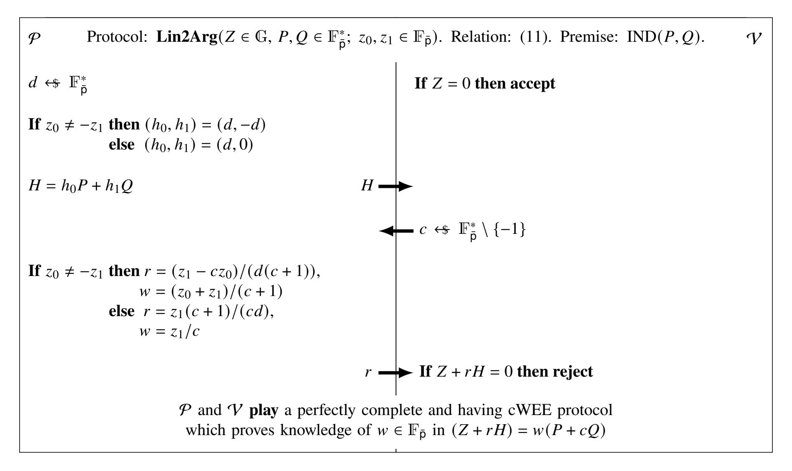
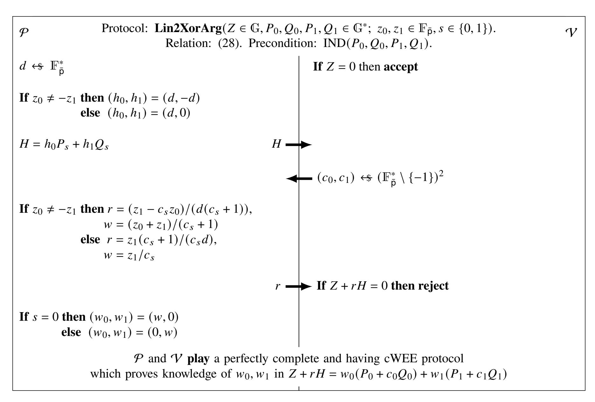
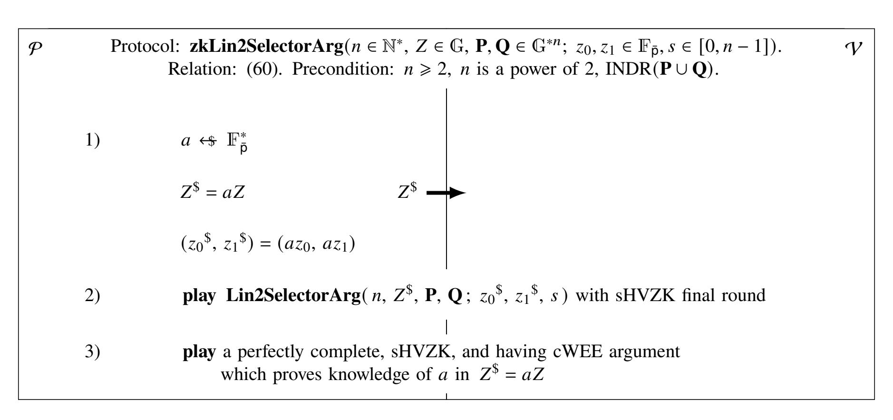

{0}------------------------------------------------

# Lin2-Xor Lemma: an OR-proof that leads to the membership proof and signature

Anton A. Sokolov

acmxddk@gmail.com

#### Full version

Abstract In this paper we introduce an novel two-round public coin OR-proof protocol that extends in a natural way to the log-size membership proof and signature in a prime-order group. In the lemma called Lin2-Xor we prove that our OR-proof is perfectly complete and has witness-extended emulation under the discrete logarithm assumption. We derive from it a log-size one-out-of-many proof, which retains the perfect completeness and witness-extended emulation. Both of our OR- and membership- proofs easily acquire the special honest verifier zero-knowledge property under the decisional Diffie-Hellman assumption. We sketch out a setup-free pairings-free log-size linkable ring signature with strong security model on top of our membership proof. Many recently proposed discrete-log setup-free pairings-free log-size ring signatures are based on the ideas of commitment-to-zero proving system by Groth and Kohlweiss or on the Bulletproofs inner-product compression method by Bünz et al. Our Lin2-Xor lemma provides an alternative technique which, using the general reduction similar to Bulletproofs, leads directly to the log-size linkable ring signature under the same prerequisites.

**Keywords:** OR-proof, membership proof, witness-extended emulation, log-size, ring signature, linkable, anonymity, zero-knowledge, unforgeability

# 1 INTRODUCTION

In simple words, given a reference set and a commitment to an element, the problem is to convince verifier that opening of this commitment is an element in the set. A protocol solving this problem is called a proof of membership. For a reference set of two elements it is called as OR-proof.

A closely related problem, which usually reduces to the one of building an appropriate membership proof, is to anonymously sign a message. That is, a message is to be signed in such a way as to convince verifier that someone out of a group of possible signers has actually signed it without revealing the signer identity. A group of possible signers is called an anonymity set or, interchangeably, a ring. When every signer is allowed to sign only once, a ring signature is called linkable. It is desirable that signature size and verification complexity are to be minimal. Efficient solutions to this problem play a role for cryptographic applications, e.g., in the telecommunication and peer-to-peer distributed systems.

A formal notion of OR-proof is given in the work of Cramer, Damgård, and Schoenmakers [13]. An introductory example by Damgård can be found in [14]. The recent survey by Fischlin, Harasser, and Janson [17] summarizes the class of OR-proofs and signatures established by [13]. Also, the technique of constructing a ring signature by Abe, Ohkubo, and Suzuki [1] can be considered, e.g., according to the survey in [13], as a sequential OR-proof.

A notion of ring signatures and the early yet efficient schemes are presented by Rivest, Shamir, and Tauman [29] and Abe, Ohkubo, and Suzuki [1]. The widely known linkable ring signature scheme by Liu, Wei, and Wong [25] is based on the results in [1]. A practical example of a system that uses a linkable ring signature is CryptoNote [32]. Nice feature of all these schemes is that there is no trusted setup process and no selected entities in them, an actual signer is allowed to form a ring in an ad hoc manner without notifying the other participants about this. The size and verification complexity of these signatures grow linearly in signer anonymity set size.

In this paper, we present a simple two-round OR-proof scheme which does not require any trusted setup, too. In many other aspects it differs from the schemes described in [13, 14, 17, 1, 29, 25], and we identify its properties here. For instance, an one-out-of-n proof, and hence a ring signature, can be derived from our OR-proof by applying it  $\log_2(n)$  times to an anonymity set of size n. In this sense, the  $\log_2(n)$  our OR-proofs can be viewed as an algorithm on a binary tree built over the anonymity set, like the Merkle tree [26]. With the difference that our OR-proof gets zero-knowledge almost for free, whereas for the Merkle tree it is complicated.

{1}------------------------------------------------

OR-proofs, membership proofs, and signatures are often constructed in a prime-order group under the discrete logarithm problem hardness assumption (DL) in the random oracle model (ROM). Scheme anonymity is usually reduced to one of the stronger hardness assumptions, typically to the decisional Diffie-Hellman one (DDH), e.g., as in [1, 25]. We follow this practice.

The works by Groth and Kohlweiss [21], Bünz, Bootle, Boneh, Poelstra, Wuille, Maxwell [10], Yuen, Sun, Liu, Au, Esgin, Zhang, Gu [33], Noether and Goodell [27], Diamond [5], Lai, Ronge, Ruffing, Schröder, Thyagarajan, Wang [23], Black and Henry [6], as well as some more recent works, show that under the DL and DDH assumptions in a prime-order group it is possible to build the setup-free logarithmic size membership proofs, ring signatures, and even more, generalized provers for arbitrary arithmetic circuits. At the same time, the question of what approach results in the most efficient and secure linkable ring signature in a prime-order group under DL/DDH seems to be still open. Our OR-proof along with the schemes derived from it can be considered as a step towards answering this question. Although, for now we are only exploring properties of this new approach.

As another line of solutions, in the works of Groth [20], Hopwood, Bowe, Hornby, Wilcox [22], and in some others it is shown that arithmetic circuit provers and ring signatures with asymptotically lower than logarithmic sizes and lower than linear verification complexities can be built at the cost of requiring a trusted setup or bilinear pairings to an underlying prime-order group. However, this line of solutions is out of the scope of our current work.

The OR-proof that we present here uses an novel technique based on balancing two verifier's challenges with a single prover's reply. For one-out-of-n proof, we use this technique as the core part of a reduction procedure, which by itself is similar to the Bulletproofs reduction by Bünz et al. [10]. In comparison to Bulletproofs, our technique directly proves that a half of a committed set is zero. Hence, by applying it  $\log_2(n)$  times to a set of n elements, we obtain the one-out-of-n proof with logarithmic size.

In the Lin2-Xor and its derived lemmas, we formally prove that the presented OR- and membership- proofs are perfectly complete and sound, i.e., have witness-extended emulation. We formally prove that they are special honest verifier zero-knowledge for the inputs which they are intended for. As an example, we sketch out a setup-free log-size linkable ring signature built on top of our one-out-of-many proof. In concluson, we discuss the signature security model and provide a proof sketch that it is strong. We informally show that it can be as strong as the LSAG [25] security model.

## 1.1 CONTRIBUTION

## 1.1.1 LIN2-XOR LEMMA

We formulate and prove Lin2-Xor lemma that allows for committing to exactly one pair of elements out of two pairs of elements, and subsequently proving this commitment is exactly what it is. The Lin2-Xor lemma defines a 2-round public coin OR-proof protocol that, being successfully played between any prover and an honest verifier, convinces the latter that the prover knows opening  $(z_0, z_1, s)$  to the input commitment Z such that

$$Z = z_0 P_s + z_1 Q_s,$$

where the pair  $(P_s, Q_s)$ ,  $s \in \{0, 1\}$ , is taken from a publicly known set of four group generators  $\{P_0, Q_0, P_1, Q_1\}$ . This is the main lemma of our paper. A necessary precondition is that there is no known discrete logarithm relationship between the four generators in the set.

In the case of successful completion of the Lin2-Xor lemma protocol, no additional proof is required that the commitment Z is in the form of  $z_0P_s + z_1Q_s$ . The verifier is convinced both of the form  $Z = z_0P_s + z_1Q_s$  and prover's knowledge of witness  $(z_0, z_1, s)$  in this case.

The witness for our OR-proof contains two scalars  $z_0, z_1$ , whereas we can expect a witness comprised of only one scalar along with the index s for an OR-proof. Our OR-proof can be turned into this form by admixing a hash-to-group of Z to all  $Q_i$ 's, which denies any nonzero value of  $z_1$ . In this case Z becomes a member of  $\{P_i\}_{i=0}^1$ . We do not get rid of  $z_1$  from the start, since the witness in the form of  $(z_0, z_1, s)$  makes our OR-proof extensible to a membership proof.

Under the DL assumption, the Lin2-Xor lemma asserts that its protocol is an argument of knowledge, namely, that it is perfectly complete and has computational witness-extended emulation (cWEE). In a separate lemma we prove that the protocol is special honest verifier zero-knowledge under the DDH assumption, provided that  $k_0$  is distributed independently and uniformly at random and  $z_1 = 0$ .

## 1.1.2 LIN2-SELECTOR LEMMA

Using the Lin2-Xor lemma protocol as a disjunction unit, we advance to Lin2-Selector lemma that allows for convincing verifier that given element Z is a commitment to exactly one pair of elements out of many pairs of elements. Namely, the Lin2-Selector lemma provides an  $(\log_2(n) + 1)$ -round public coin protocol that convinces

{2}------------------------------------------------

verifier of prover's knowledge of opening  $(z_0, z_1, s)$  to the commitment Z such that

$$Z = z_0 P_s + z_1 Q_s,$$

where the pair  $(P_s, Q_s)$ ,  $s \in [0, n-1]$ , is taken from a publicly known set of generator pairs  $\{(P_j, Q_j)\}_{j=0}^{n-1}$  with unknown discrete logarithm relationship between the generators in this set.

The amount of rounds is logarithmic in the number n of the base element pairs. Consequently, the amount of data transmitted from prover to verifier during the Lin2-Selector lemma protocol execution is logarithmic in n. Thus, this protocol is a log-size one-out-of-many proof. We prove that it is perfectly complete and has cWEE. Also, it is zero-knowledge, provided that  $z_0$  has an independent and uniform distribution and  $z_1 = 0$ .

#### 1.1.3 LINKABLE RING SIGNATURE L2LRS

As a primer, we construct a log-size linkable ring signature called L2LRS on top of the Lin2-Selector lemma membership proof. L2LRS has key image in the form of  $x^{-1}\mathbf{H_{point}}(xG)$ . We provide the signature scheme along with a proof sketch for its security properties such as unforgeability w.r.t insider corruption and anonymity. As L2SLRS is based on a complete, having cWEE, and zero-knowledge underlying proving system, namely, on our membership proof, the already well-developed, e.g., in [25, 21, 27], formal methods for proving signature security properties are applicable to it. Since these methods, presented in all details, are quite voluminous, we limit ourselves to sketching the proof, referring interested readers to the mentioned works for complete information.

Also, by noticing a similarity between the L2LRS key image and the LSAG [25] key image  $x\mathbf{H}_{point}(xG)$ , we draw a parallel to the LSAG signature security model and informally show that L2LRS is likely as secure as LSAG. Although a formal proof or disproof of this remains an open question.

# 1.2 METHOD OVERVIEW

## **1.2.1 LIN2 LEMMA**

As a warm-up, we formulate and prove a helper lemma, called Lin2, that provides a perfectly complete and having cWEE protocol shown in Figure 1. The protocol connects the element Z to the generators P and Q in the equation

<span id="page-2-1"></span>
$$Z + rH = w(P + cQ). \tag{1}$$

For this protocol, P and Q are fixed commonly known generators, and Z is the common input to P and V. While running this protocol, H is the first P's message, c is V's challenge, r is P's reply, and w is an nonzero scalar known to P. The fact of  $w \ne 0$  is verified by checking that  $Z + rH \ne 0$ .

The Lin2 lemma states that if no discrete logarithm relationship between P and Q is known, if P is able to reply with some scalar r to the random challenge c and, in addition to this, if P is able to show that the above equation holds for some known to it nonzero private w, then the scalars  $z_0$  and  $z_1$  in the equality

<span id="page-2-0"></span>
$$Z = z_0 P + z_1 Q \tag{2}$$

are certainly known to  $\mathcal{P}$ . We consider the trivial case of  $z_0 = z_1 = 0$  as simply accepting without any conversation between  $\mathcal{P}$  and  $\mathcal{V}$ , and let  $\mathcal{V}$  detect it by checking if Z = 0 at the beginning of the protocol.

A reasonable question may arise, why do we introduce such a protocol for proving Z is a weighted sum of linearly independent P and Q, when we can resort to a bit more efficient and already well-studied Schnorr-like two-generator protocol, namely, to the Okamoto's one [7]? The answer is that the Lin2 lemma protocol has a similar, however simpler, design compared to our Lin2-Xor lemma protocol and, hence, we describe this protocol to make it easier to understand our main protocol later on.

Informally, using the planar metaphor, it is possible to see why this protocol is sound. That is, why Z always belongs to the plane spanned by P and Q, which corresponds to (2). Suppose, this is not the case. Let us denote the mentioned plane as Plane(P,Q). We observe that  $w(P+cQ) \in Plane(P,Q)$  in any case. Hence, r is required to be chosen by P in such a way as to bring (Z+rH) on Plane(P,Q). Evidently, this requirement along with the supposition that  $Z \notin Plane(P,Q)$  completely determines the choice of r. Thus, r is fixed and independent of the challenge c. Hence, the point  $F = (Z+rH) \in Plane(P,Q)$  is fixed at the moment of releasing c.

With the above, under the supposition that  $Z \notin \text{Plane}(P,Q)$ , the equation (1) rewrites as  $w^{-1}F = P + cQ$ . Since c is random, the point (P + cQ) has a random rotation angle in polar coordinates on Plane(P,Q). At the same time, the point  $w^{-1}F$  has a constant rotation angle on Plane(P,Q), which is equal to rotation angle of the fixed point F. Therefore,  $\mathcal{P}$  is unable to satisfy (1) by controlling r and w in response to c. Thus, the supposition is false and, hence, it holds that  $Z \in \text{Plane}(P,Q)$ .

We also claim that the protocol is perfectly complete, that is,  $\mathcal{P}$  succeeds for any input  $Z \in \text{Plane}(P,Q)$ . Let us show why. For the special case of Z = 0, the protocol simply accepts. For  $Z \neq 0$ , having at input  $Z \in \text{Plane}(P,Q)$ ,

{3}------------------------------------------------

 $\mathcal{P}$  picks a point  $H \in \text{Plane}(P,Q)$  such that it is non-collinear to Z. Namely,  $\mathcal{P}$  picks H = (P - Q), call it as diagonal, if Z is not collinear to the diagonal. Otherwise it picks H = P, call it as horizontal. Thus,  $\mathcal{P}$  publishes H which is non-collinear to Z.

With the fixed non-collinear Z and H, the surjection  $w^{-1}(Z+rH)$  maps all possible (r,w)'s to Plane(P,Q) excluding the line spanned by H. That is, the type of this surjection is  $\mathbb{F}_{\bar{p}} \times \mathbb{F}_{\bar{p}}^* \mapsto \text{Plane}(P,Q) \setminus \text{Line}(H)$ . At the same time, the random challenge  $c \in \mathbb{F}_{\bar{p}}$  brings (P+cQ) at any point on the corresponding 'shifted' line defined by P,Q in Plane(P,Q). We forbid the values of 0 and -1 for the challenge c and, thus, the intersection points with the horizontal and diagonal are never picked on this line. In sum, we have that, for any challenge value except for the forbidden  $\{0,-1\}$ , the randomly sampled point (P+cQ) always gets to the codomain of  $w^{-1}(Z+rH)$ . Thus,  $\mathcal{P}$  is always able to pick r,w in response to c such that (1) holds for them, which proves the claim.

For evenly and independently distributed input  $Z \in \text{Line}(P)$ ,  $Z \neq 0$ , using a reduction to DDH it is possible to prove that this protocol is special honest verifier zero-knowledge, assuming that the means used to convince  $\mathcal{V}$  in  $\mathcal{P}$ 's knowledge of w in (1) do not leak anything, as if the Schnorr-id scheme [30] were used for that. However, since this is only a helper protocol, we do not discuss its zero-knowledge. Instead, we will prove zero-knowledge for our Lin2-Selector lemma membership proof protocol later on and, thus, will obtain the zero-knowledge property for both of our OR- and membership- proofs at once.

#### 1.2.2 LIN2-XOR LEMMA

We consider the following linear combination R of four fixed prime-order group generators  $P_0$ ,  $Q_0$ ,  $P_1$ ,  $Q_1$  such that no discrete logarithm relationship is known between them

<span id="page-3-1"></span>
$$R = w_0 \left( P_0 + c_0 Q_0 \right) + w_1 \left( P_1 + c_1 Q_1 \right). \tag{3}$$

We wonder what V is convinced about when (Z+rH) is nonzero and equal to R. That is, we consider the equality

<span id="page-3-0"></span>
$$Z + rH = w_0 (P_0 + c_0 Q_0) + w_1 (P_1 + c_1 Q_1),$$
(4)

where  $c_0, c_1$  are random challenges from  $\mathbb{F}_{\bar{p}}^* \setminus \{-1\}$ , whereas the scalars  $r, w_0, w_1$  are controlled by  $\mathcal{P}$ .

Our main protocol in Figure 2 works as follows. For the trivial input Z = 0, it is simply accepting. For  $Z \neq 0$  at the common input, which we call as non-trivial, in the first round  $\mathcal{P}$  sends H as the first message,  $\mathcal{V}$  generates the challenge pair  $(c_0, c_1)$ ,  $\mathcal{P}$  replies with r such that (Z + rH) is nonzero. In the second round,  $\mathcal{P}$  convinces  $\mathcal{V}$  with any other good means that (4) holds for some privately known to  $\mathcal{P}$  weights  $w_0, w_1$ . It appears to be that, for any non-trivial input, successful completion of this protocol convinces  $\mathcal{V}$  that exactly one of the two private weights  $w_0, w_1$  is zero, and also that

$$Z \in \text{Plane}(P_0, Q_0) \oplus Z \in \text{Plane}(P_1, Q_1).$$

This may seem strange at a glance, nevertheless in our Lin2-Xor lemma we prove that this is the case. Thus, we have OR-proof here. By the good means above we imply a perfectly complete protocol that allows for cWEE.

In the geometrical metaphor, the protocol soundness can be seen the following way. Since the points Z, H are published prior to the challenge  $(c_0, c_1)$  is released, the plane Plane(Z, H) is fixed and independent of the randomness  $(c_0, c_1)$ . Also,  $\mathcal{P}$  always replies with  $(Z + rH) \in Plane(Z, H)$ . At the same time, if we suppose that  $w_0 \neq 0 \land w_1 \neq 0$ , then the point R defined by (3) has two independent random rotation angles in two different fixed planes, i.e., in the  $Plane(P_0, Q_0)$  and  $Plane(P_1, Q_1)$ . These two independent random angles are completely determined by the challenges  $c_0, c_1$  and do not depend on  $w_0, w_1$  controlled by  $\mathcal{P}$ . Thus, (4) forces  $\mathcal{P}$  to balance out these two independent random rotations in two different planes with the sole controlled by  $\mathcal{P}$  rotation in the fixed Plane(Z, H), which is determined by the choice of the controlled r. Since this is not possible, the supposition is wrong, and at least one of  $w_0$  and  $w_1$  must be zero. By letting  $w_1 = 0$  or  $w_0 = 0$ , we reduce (4) to (1) and obtain the Lin2 lemma protocol which is already proved sound.

As our protocol in Figure 2 reduces to the one in Figure 1, its completeness also reduces to the completeness of the latter. Thus, our main protocol is perfectly complete for any Z. We also prove that it is zero-knowledge, for the input Z evenly distributed and restricted to  $Z \in \text{Line}(P_s) \setminus \{0\}, s \in \{0,1\}$ . We prove this as a subset case of zero-knowledge for our Lin2-Selector lemma membership proof protocol.

## 1.2.3 LIN2-SELECTOR LEMMA

It turns out that the first round of the Lin2-Xor lemma protocol in Figure 2 can be 'stacked', i.e., applied many times as an  $(\log_2(n) + 1)$ -round game to an arbitrary number 2n of fixed base generators for which no discrete logarithm relationship, i.e., no non-trivial linear relation, is known. Thus, the first round of the Lin2-Xor lemma protocol becames a reduction step similar to that by Bünz et al. [10]. We assume the number of the base generators 2n is a power of 2. The multiplier 2 here is due to that we have n main (P's) and n helper (Q's) base generators.

{4}------------------------------------------------

For instance, for eight fixed linearly independent base generators  $P_0$ ,  $Q_0$ ,  $P_1$ ,  $Q_1$ ,  $P_2$ ,  $Q_2$ ,  $P_3$ ,  $Q_3$ , and for the common input Z, we repeat the first round of the Lin2-Xor lemma protocol two times, and, after that, we perform the second round of the Lin2-Xor lemma protocol.

In detail, this game looks as follows.  $\mathcal{P}$  sends an element  $H_0$  as the first message,  $\mathcal{V}$  releases the challenge pair  $(c_0, c_1)$ , and both  $\mathcal{P}$  and  $\mathcal{V}$  construct four elements as the sums  $(P_0+c_0Q_0)$ ,  $(P_1+c_1Q_1)$ ,  $(P_2+c_0Q_2)$ ,  $(P_3+c_1Q_3)$ . At the same time,  $\mathcal{P}$  replies with the scalar  $r_0$ . We observe, that the four constructed elements are linearly independent of each other, provided that the initial eight generators are linearly independent. Hence,  $\mathcal{P}$  and  $\mathcal{V}$  play the Lin2-Xor lemma protocol with these four elements as base generators, taking the already defined element  $(Z+r_0H_0)$  as the common input. With appropriate renaming,  $\mathcal{P}$  sends  $H_1$ ,  $\mathcal{V}$  releases one more challenge pair  $(\bar{c}_0, \bar{c}_1)$ ,  $\mathcal{P}$  replies with  $r_1$  and, finally, proves knowledge of  $w_0, w_1$  in the equality

$$(Z + r_0 H_0) + r_1 H_1 = w_0 ((P_0 + c_0 Q_0) + \bar{c}_0 (P_1 + c_1 Q_1)) + w_1 ((P_2 + c_0 Q_2) + \bar{c}_1 (P_3 + c_1 Q_3)).$$
 (5)

According to the Lin2-Xor lemma, its protocol completion for the input  $(Z + r_0H_0)$  convinces  $\mathcal{V}$  that only one of  $w_0, w_1$  is zero. Without limiting generality, for the first, let us consider the case of  $(w_0 \neq 0 \land w_1 = 0)$ . According to the same lemma,  $\mathcal{V}$  is convinced that  $(Z + r_0H_0)$  is a linear combination of  $(P_0 + c_0Q_0)$ ,  $(P_1 + c_1Q_1)$  with weights known to  $\mathcal{P}$ . The latter means that the protocol of the Lin2-Xor lemma has been as well successfully completed for the the base generators  $P_0, Q_0, P_1, Q_1$  and input Z. Therefore, by the Lin2-Xor lemma applied again,  $\mathcal{V}$  is convinced that  $\mathcal{P}$  knows coordinates of Z either on Plane $(P_0, Q_0)$  or on Plane $(P_1, Q_1)$ .

By recalling that we have considered only the case of  $(w_0 \neq 0 \land w_1 = 0)$ , and considering the opposite one, namely,  $(w_0 = 0 \land w_1 \neq 0)$ , we arrive at that  $\mathcal{V}$  is convinced that  $\mathcal{P}$  knows coordinates of Z either on Plane $(P_2, Q_2)$  or on Plane $(P_3, Q_3)$  in the opposite case. Thus, in sum, since  $\mathcal{V}$  is convinced that exactly one of the cases  $(w_0 \neq 0 \land w_1 = 0)$  and  $(w_0 = 0 \land w_1 \neq 0)$  takes place, it is convinced that  $Z \in \text{Plane}(P_s, Q_s)$ ,  $s \in [0, 3]$ .

The same way the Lin2-Xor lemma protocol can be extended to the general case of  $Z \in \text{Plane}(P_s, Q_s)$ ,  $s \in [0, n-1]$ , for n power of 2. The generalized membership proof protocol is shown in Figure 5. In the corresponding Lin2-Selector lemma we prove its perfect completeness and soundness. Using a reduction to the (P,Q)-DDH problem [9], which is known to be equivalent to DDH, we prove that the membership proof in Figure 5 is zero-knowledge, for the input Z evenly distributed and restricted to  $Z \in \text{Line}(P_s) \setminus \{0\}$ ,  $s \in [0, n-1]$ .

## 1.2.4 RANDOMIZED INPUT

As a technical step which makes our protocols zero-knowledge for arbitary distribution of input, we multiply the input Z by a randomly sampled scalar a. Thus, we have Z 'randomized', which allows us to apply an assumption from the DDH family to our protocols.

To maintain the link with the original not-randomized input, we add to our protocols a zero-knowledge proof of knowledge of the linking factor *a* between the original and randomized inputs. Namely, we add the Schnorr-id protocol to their very last rounds for this purpose.

## 1.2.5 SIGNATURE L2LRS

By restricting the Lin2-Selector lemma protocol input Z to the values from the set  $\mathbf{P} = \bigcup_{i=0}^{n-1} \operatorname{Line}(P_i)$ , which we can easily accomplish by admixing a hash of Z to all  $Q_i$ 's, we obtain a traditional proof of membership. Namely, for any generator set  $\mathbf{P}$ ,  $n \ge 2$ , such that no non-trivial linear combination between elements in this set is known, for  $\forall Z \in (\bigcup_{i=0}^{n-1} \operatorname{Line}(P_i)) \setminus \{0\}$ , our proof of membership convinces verifier that  $\exists i \in [0, n-1] : Z \in \operatorname{Line}(P_i)$ .

Let honest public keys K's be defined usual way as K = xG. Let there be a ring K. The ring contains honest public keys, and it may contain dishonest public keys as well. Using the hash-to-group function  $H_{point}$  we build the set of random generators  $U = \{H_{point}(K_i)\}_{i=0}^{n-1}$ . All generators in  $U \cup \{G\}$  are linearly independent.

We construct our L2LRS signature the following way. For the ring **K**, for a random scalar  $\xi$ , let  $\mathbf{P} = \mathbf{K} + \xi \mathbf{U}$ . Apparently, this **P** is a set of linearly independent generators. Let the actual signing key  $K_i \in \mathbf{K}$  have private key x such that  $K_i = xG$ . Let the key image be  $I = x^{-1}U_i$ . Let the Lin2-Selector lemma protocol input be  $Z = (G + \xi I)$ . By playing the Lin2-Selector lemma membership proof protocol for the set **P** and input Z,  $\mathcal{P}$  convinces  $\mathcal{V}$  that

$$\exists i \in [0, n-1] : (G + \xi I) \in \operatorname{Line}(K_i + \xi U_i),$$

which means that  $\mathcal{V}$  is made convinced of  $\mathcal{P}$ 's knowledge of x such that, for some i,  $K_i = xG \land I = x^{-1}U_i$ .

In other words, this way V is convinced that P knows actual signing private key and also that the key image I is calculated honestly. This is exactly what a linkable ring signature should supply. Since the Lin2-Selector lemma protocol is zero-knowledge, V gets minimum minimorum of information about the signing index and private key.

{5}------------------------------------------------

## 1.2.6 COMPARISON WITH BULLETPROOFS

The nearest technique, that our Lin2-Xor lemma OR-proof in Figure 2 can be compared with, is the Bulletproofs introduced by Bünz et al. in [10]. If we consider the inner-product argument [10] for two two-dimensional vector commitments  $Z_0 = (a_0P_0 + a_1P_1)$  and  $Z_1 = (b_0Q_0 + b_1Q_1)$ , then the core part of Bünz's argument [10] can be regarded as a two-round game, like ours, however with the following equality after the first round

<span id="page-5-0"></span>
$$Z + c^{2}L + c^{-2}R = w_{0}(cP_{0} + c^{-1}P_{1}) + w_{1}(c^{-1}Q_{0} + cQ_{1}),$$
(6)

where  $P_0, P_1, Q_0, Q_1$  are the linearly independent base generators,  $Z = (Z_0 + Z_1)$  is the input, (L, R) is the  $\mathcal{P}$ 's first message, c is the challenge, and  $w_0, w_1$  are weights known to  $\mathcal{P}$  which it convinces  $\mathcal{V}$  of in the second round.

For the sake of this comparison, in (6) we omitted the part that actually stores the inner-pruduct. The latter is a feature of [10] that has no correspondence in our scheme. The second, i.e., final, round where knowledge of  $w_0$ ,  $w_1$  is proved, can be considered the same for both of Bünz's argument and our OR-proof.

Now, let us compare (6) with (4) that we have for our OR-proof after the first round. For this comparison, we use element naming closer to Bulletproofs, hence the elements  $P_1$  and  $Q_0$  are swapped in (6) compared to (4), it is only a syntactic distinction. We may observe that both of our OR-proof and core part of Bünz's  $2 \times 2$  argument use four linearly independent generators. Also, both of them transmit roughly the same amount of data, albeit our OR-proof communicates the first message H and reply r, whereas Bünz's argument communicates L, R in the first message and zero reply.

We foresee a reasonable question about if our OR-proof is just a specialization of Bünz's argument for the particular case. Namely, for the case of splitting  $(a_0, a_1, b_0, b_1)$  into two parts such that  $\mathcal{P}$  proves that one of them is zero without revealing which one. We know from [10] that it is possible to prove the statement

$$(a_0, a_1) = (0, 0) \oplus (b_0, b_1) = (0, 0)$$

by involving the omitted by us in (6) inner-product part that allows for proving  $(a_0b_0 + a_1b_1) = 0$ . However, this will require checking  $a_0b_0 \neq -a_1b_1$ , which implies additional communication costs. The improved argument by Chung et al. [12] allows to escape from the latter check by admixing random weights to the inner product, however this still incur additional communication. We aim for a concise direct solution for such a XOR.

Hence, let us try to change the left-hand side of (6) without increasing the amount of communicated data. It contains three fixed elements weighted by different degrees of the randomness c. We can try to cut off one of them, thus making the argument reject some inputs. Apparently, if we simply let L = 0 or R = 0, then the seen factor  $c^2$  or  $c^{-2}$  would reveal which inputs are zero. Hence, we have to let  $\mathcal{P}$  send a scalar reply and arrive to the form of communication used in our OR-proof. Thus, the equality (6) gets closer to (4) and takes the form of

<span id="page-5-1"></span>
$$Z + rH = w_0(cP_0 + c^{-1}P_1) + w_1(c^{-1}Q_0 + cQ_1),$$
(7)

where  $(H, r) = (L/d, dc^2) \oplus (dR, c^{-2}/d)$ , for some  $\mathcal{P}$ 's private randomness d that hides from  $\mathcal{V}$  which degree of c is used. Also,  $\mathcal{P}$  checks  $(Z + rH) \neq 0$ . This way, the protocol accepts  $(a_0, b_1) = (0, 0) \oplus (b_0, a_1) = (0, 0)$ .

At this point, it may seem that by letting  $\mathcal{P}$  send H, r instead of L, R we have obtained the OR-proof as a slightly modified subset of Bulletproofs. However, this is not the case. The protocol using (7) accepts, for instance,

$$(a_0, a_1, b_0, b_1) = (1, 1, 1, 1), \text{ with } H = (dP_1 + dQ_0), w_0 = w_1 = c, r = (c^2 - 1)/d,$$

as well as many other inputs with all of  $a_0$ ,  $a_1$ ,  $b_0$ ,  $b_1$  nonzero.

The problem with the solution based on (7) is that the same random transformation is applied to both of the base element pairs  $(P_0, P_1)$  and  $(Q_1, Q_0)$ . Therefore, in our solution we use two different random transformations for them. Namely, for each of these two base element pairs we use its own independent randomnesses,  $c_0$  and  $c_1$ , respectively. This is the key difference of our OR-proof from Bünz's argument, which makes our solution novel.

Bulletproofs's reduction technique [10] is, generally speaking, that the equality (6), where we ommit the innerproduct part, is applied to many quadruples of generators in parallel, thus shrinking the amount of them in half. With this, for each of quadruples, four corresponding privately known weights  $a_0, a_1, b_0, b_1$  are transformed into the new weights  $w_0, w_1$ . This step is repeated many times untill there remain only two final  $w_0, w_1$ .

Our 1-out-of-many proof in Figure 5 has the similar reduction, however in each step we communicate H, r and check the equality (4), instead of communicating L, R and checking (6). Additionally, since each time we have two different random challenges, we have to swap base generator pairs at each reduction step, however this is only a technical difference of our reduction.

The core Bulletproofs protocol is only an argument of knowledge, and is not zero-knowledge. The Bulletproofs-based solutions add zero-knowledge in different ways for the price of some additional communication. Our 1-out-of-many proof is at least less general, and we prove it is zero-knowledge as is, for the intended inputs, and make it zero-knowledge for any reasonable inputs for the price of communicating two more scalars.

{6}------------------------------------------------

#### 1.2.7 COMPARISON WITH THE OTHER SCHEMES

Having conducted an extensive search in publications, we were unable to identify any other of the existing methods that would be close to the technique proposed by us in the Lin2-Xor lemma OR-proof in Figure 2.

In comparison to the parallel OR-proofs [13, 14, 17] which may divide random challenges into parts, e.g., by bitwise XOR'ing them, all of our schemes handle the random challenges in the direct way, as in the Schnorr-id protocol. Like in the sequential OR-proofs, e.g., in the signatures [1, 25], we receive next round challenges from the random oracle by feeding it with public transcript which allows for Fiat–Shamir heuristic, however, our protocols are not circular.

The recently proposed in [33, 27, 5, 23] setup-free log-size membership proof and linkable ring signature schemes originate from the ideas of Jens Groth and Markulf Kohlweiss [21] or from the Bulletproofs idea of Bünz et al. [10]. We construct our signature L2LRS on the base of our own membership proof, which has the novel core part and Bulletproofs-style reduction.

A general bilinear arithmetic circuit prover, e.g., built on top of Bulletproofs [10] or on its improved versions, e.g., by Chung et al. [12], allows for solving the signature problem by reducing it to an arithmetic circuit. However, we address the problem in a direct way, which seems to us more concise compared to the general arithmetic-circuit-based solutions.

A parallel can be drawn with the work [21], which introduced a mechanism resembling the Kronecker's delta to select a member of anonymity set without revealing it. Our signature uses the Lin2-Xor and, consequently, Lin2-Selector lemmas in exactly the same role. However, there is a difference in anonymity set constructions. The anonymity sets in [21] are scattered on a plane defined by two linearly independent generators, while the anonymity sets for the Lin2-Selector lemma protocol are themselves sets of linearly independent generators.

# **2 PRELIMINARIES**

Let  $\mathbb{G}$  be a cyclic group of prime order  $\bar{p}$  in which the discrete logarithm problem (DL) is hard, and let  $\mathbb{F}_{\bar{p}}$  be a scalar field of  $\mathbb{G}$ . Let G be a generator of  $\mathbb{G}$ . As  $\mathbb{G}$  is a prime-order group, any nonzero element  $A \in \mathbb{G}$  is a generator of  $\mathbb{G}$ . Let 0 denote the zero element of  $\mathbb{G}$  and also denote the zero scalar in  $\mathbb{F}_{\bar{p}}$ , it's easy to distinguish its meaning from the context.

Let lowercase italic and Greek letters denote scalars in  $\mathbb{F}_{\bar{p}}$ . Let uppercase italic letters denote the elements in  $\mathbb{G}$ . Sets of scalars and elements are usually written in bold, assumed ordered, and called as vectors. We follow Python notation for indexing them, the same for matrices. Also, instead of writting, e.g.,  $\mathbf{A}_{[i]}$ , to dereference *i*-th element of the set  $\mathbf{A}$  we may simply write  $A_i$ .

Special case, which is rare, letters with tilde denote multivariate polynomials, e.g.  $\tilde{p}$ , and sets of them, e.g.,  $\tilde{P}$ . The letters n, m, i, j, k, s, t, b, g are reserved for integers. The letter t also may denote a trascript or a tuple, it is clear from context. The same goes for the letter p and lowercase words, which can denote probability or transcript components. The letter  $\lambda$  is reserved for security parameter.

All definitions and lemmas herein are given in the context of a game between prover  $\mathcal{P}$  and verifier  $\mathcal{V}$ , unless otherwise stated. We write the game protocols as interactive, assuming all of them can be translated into corresponding non-interactive schemes using the Fiat-Shamir heuristic in ROM [16, 28].

# 2.1 DEFINITIONS

We use the tools and definitions from the Bulletproofs paper [10], as well as some taken from the works of Bootle et al. [8], Lindell [24], Groth [19], and Bresson et al. [9].

Let GGen be an algorithm that on input  $\{1\}^{\lambda}$  returns a description  $\bar{\mathbb{G}} = (\mathbb{G}, \bar{p}, G)$  of the group  $\mathbb{G}$  such that  $|\bar{p}| \geqslant 2^{\lambda}$ . We assume any  $\mathcal{P}$ 's starategy is restricted to be polynomial time in the security parameter  $\lambda$  everywhere. A PPT adversary  $\mathcal{A}$  is an non-uniform probabilistic interactive Turing Machine that runs in polynomial time in the security parameter  $\lambda$ . We will omit mentioning the security parameter  $\lambda$  when it is implicit.

A function  $\mu(\cdot)$  is negligible if for every positive polynomial  $p(\cdot)$  and all sufficiently large  $\lambda$ 's, it holds that  $|\mu(\lambda)| < 1/p(\lambda)$ , which is denoted as  $\mu(\lambda) \approx 0$ . For a function  $\nu(\cdot)$ , for a constant  $\tau$ , if  $|\tau - \nu(\lambda)| \approx 0$ , we write  $\nu(\lambda) \approx \tau$ . If  $\nu(\lambda) \approx 1$ , we say  $\nu(\cdot)$  is overwhelming. For a function  $\eta(\cdot)$ , if there exists a polynomial  $p_{bound}(\cdot)$  such that it holds  $|\eta(\lambda)| < p_{bound}(\lambda)$  for any  $\lambda$ , we say  $\eta(\cdot)$  is polynomially bounded.

For a set  $\mathbb{S}$ , we write  $x \leftrightarrow \mathbb{S}$  to say that x is independently and uniformly sampled from the set  $\mathbb{S}$ . All sets that we use, except for  $\mathbb{G}$ ,  $\mathbb{F}_{\bar{p}}$ ,  $\mathbb{F}_{\bar{p}}[X]$ , have cardinalities which are polynomially bounded in  $\lambda$ .

If  $p(\lambda)$  is a probability of some event to be detected, and if  $p(\lambda) \approx 1$ , we say the event holds with overwhelming probability, abbreviated as w.o.p. For example, if the event is a fulfillment of an equality, and if the probability of this fulfillment is overwhelming, we say that the equality holds w.o.p.

It follows from the definition of overwhelming probability that, for a polynomially bounded sequence of events,

{7}------------------------------------------------

each of which holds w.o.p. provided that all the previous events in the sequence hold unconditionally, the last event in the sequence holds w.o.p. If all events in a polynomially bounded sequence hold at least with non-negligible probability, then the last event holds with non-negligible probability.

## **Discrete Log assumption (DL) definition:**

For all PPT  $\mathcal{A}$ 

$$\Pr\left[\begin{array}{c} \bar{\mathbb{G}} \leftarrow \mathsf{GGen}(\{1\}^{\lambda}); \ G_0 \leftrightarrow \mathbb{G}; \\ a_0 \in \mathbb{F}_{\bar{\mathsf{p}}} \leftarrow \mathcal{A}(\bar{\mathbb{G}}, G_0) \end{array} \right] \approx 0.$$

## **Discrete Log Relation assumption (DLR) definition:**

For all  $n \ge 2$  and all PPT  $\mathcal{A}$ 

$$\Pr\left[\begin{array}{c} \bar{\mathbb{G}} \leftarrow \mathsf{GGen}(\{1\}^{\lambda}); \ G_1, \dots, G_n \leftrightarrow \mathbb{G}; \\ a_1, \dots, a_n \in \mathbb{F}_{\bar{\mathsf{p}}} \leftarrow \mathcal{A}(\bar{\mathbb{G}}, G_1, \dots, G_n) \end{array} \right] : \exists a_i \neq 0 \land \sum_{i=1}^n a_i G_i = 0 \right] \approx 0.$$

It is well-known, e.g., from [8], that DLR is equivalent to DL.

#### **Public Coin definition:**

The triple  $(Setup, \mathcal{P}, \mathcal{V})$  is called public coin if all messages sent from the verifier to the prover are chosen uniformly at random and independently of the prover's messages, i.e., the challenges correspond to the verifier's randomness  $\rho$ .

## **Argument of Knowledge definition:**

The public coin triple  $(Setup, \mathcal{P}, \mathcal{V})$  is called an argument of knowledge for relation  $\mathcal{R}$  if it satisfies the following two definitions.

According to the definition by Groth [19], completeness suffices. Anyway, all of our protocols in this paper have perfect completeness, as we will prove.

#### **Perfect Completeness definition:**

 $(Setup, \mathcal{P}, \mathcal{V})$  has completeness if for all  $\mathcal{A}$ 

$$\Pr\left[\begin{array}{c} (\sigma, u; w) \notin \mathcal{R} \lor \langle \mathcal{P}(\sigma, u; w), \mathcal{V}(\sigma, u) = 1 \middle| \begin{array}{c} \sigma \leftarrow Setup(\{1\}^{\lambda}); \\ (u, w) \leftarrow \mathcal{A}(\sigma) \end{array}\right] = 0.$$

If the probability is only negligible, then the triple is said to have completeness, not perfect.

#### **Computational Witness-Extended Emulation (cWEE) definition:**

 $(Setup, \mathcal{P}, \mathcal{V})$  has computational witness-extended emulation if for all deterministic polynomial time  $\mathcal{P}^*$  there exists an expected polynomial time emulator  $\mathcal{E}$  such that for all pairs of interactive adversaries  $\mathcal{A}_1, \mathcal{A}_2$ 

$$\Pr\left[\begin{array}{c|c} \mathcal{A}_{1}(tr) = 1 & \sigma \leftarrow Setup(\{1\}^{\lambda}); (u, s) \leftarrow \mathcal{A}_{2}(\sigma); \\ tr \leftarrow \langle \mathcal{P}^{*}(\sigma, u, s), \mathcal{V}(\sigma, u) \rangle \end{array}\right] \approx \\ \Pr\left[\begin{array}{c|c} \mathcal{A}_{1}(tr) = 1 & \wedge \\ (tr \text{ is accepting } \Rightarrow (\sigma, u; w) \in \mathcal{R}) & \sigma \leftarrow Setup(\{1\}^{\lambda}); \\ (u, s) \leftarrow \mathcal{A}_{2}(\sigma); \\ (tr, w) \leftarrow \mathcal{E}^{O}(\sigma, u) \end{array}\right].$$

where the oracle is given by  $O = \langle \mathcal{P}^*(\sigma, u, s), \mathcal{V}(\sigma, u) \rangle$ , and permits rewinding to a specific point and resuming with fresh randomness for the verifier from this point onwards.

For all protocols in this paper, we assume that if a protocol has cWEE, then its emulator  $\mathcal{E}$  is able to return witness w as well as a polynomially bounded accepting transcript tree, from which the same w can be extracted. In other words, we assume existance of witness extractors for those protocols having cWEE which we use. This is a quite natural assumption, since cWEE of protocols is typically proved by demonstrating their witness extractors.

#### Witness extractor definition:

Let  $(Setup, \mathcal{P}, \mathcal{V})$  be a (2k-1)-move, public coin interactive protocol. Let  $\mathcal{X}$  be a witness extraction algorithm that succeeds with overwhelming probability in extracting a witness from an  $(n_1, \ldots, n_k)$ -tree of accepting transcripts in probabilistic polynomial time, provided that  $\prod_{i=1}^k n_i$  is bounded above by a polynomial in the security parameter  $\lambda$ . We call  $\mathcal{X}$  as witness extractor.

{8}------------------------------------------------

If we are able to demonstrate a witness extractor X for a protocol ( $Setup, \mathcal{P}, V$ ) then, by the Forking Lemma [8], the protocol has cWEE.

By the definition, X finds witness from a polynomially bounded accepting transcript tree at input. As the Forking Lemma [8] shows, if X is constructed, then it is used by the emulator  $\mathcal{E}$  equipped with a rewind oracle in the cWEE game, and the mere fact of existence of X prevents any adversary from winning the game.

Without changing the definitions, we will assume that X itself is equipped with the rewind oracle, as it is done, e.g., in the course of proof of cWEE in [10]. Although the rewinding and building of the transcript tree is a probabilistic process, for X, we will nevertheless only count the probabilities arising from extracting witnesses from the ready tree, since the ready tree is by definition at the input of X.

## Special Honest-Verifier Zero-Knowledge (sHVZK) definition:

The public coin argument  $(Setup, \mathcal{P}, \mathcal{V})$  is called a special honest verifier zero-knowledge argument for  $\mathcal{R}$  if there exists a PPT simulator  $\mathcal{S}$  such that for all (non-uniform) adversaries  $\mathcal{A}$ 

$$\Pr\left[\begin{array}{c|c} (\sigma, u; w) \in \mathcal{R} \land \mathcal{A}(tr) = 1 & \sigma \leftarrow Setup(\{1\}^{\lambda}); (u, w, \rho) \leftarrow \mathcal{A}(\sigma); \\ tr \leftarrow \langle \mathcal{P}(\sigma, u; w), \mathcal{V}(\sigma, u; \rho) \rangle \end{array}\right] \approx \\ \Pr\left[\begin{array}{c|c} (\sigma, u; w) \in \mathcal{R} \land \mathcal{A}(tr) = 1 & \sigma \leftarrow Setup(\{1\}^{\lambda}); (u, w, \rho) \leftarrow \mathcal{A}(\sigma); \\ tr \leftarrow \mathcal{S}(\sigma, u, \rho) \end{array}\right],$$

where  $\rho$  is the public coin randomness used by the verifier.

The above definition is by Groth [19]. Note that in the sHVZK game the randmoness  $\rho$  is chosen adversarially by  $\mathcal{A}$ , and  $\rho$  is allowed to be not-independent and not-uniform in this game.

## Diffie-Hellman assumption (DDH) definition:

For all PPT  $\mathcal{A}$ 

$$\Pr\left[\begin{array}{c|c} \mathcal{A}(\bar{\mathbb{G}},t)=1 & \bar{\mathbb{G}} \leftarrow \mathsf{GGen}(\{1\}^{\lambda}); \\ a,b \leftrightarrow \mathbb{F}_{\bar{\mathsf{p}}}; \\ t=(aG,bG,abG) \end{array}\right] \approx \Pr\left[\begin{array}{c|c} \mathcal{A}(\bar{\mathbb{G}},t)=1 & \bar{\mathbb{G}} \leftarrow \mathsf{GGen}(\{1\}^{\lambda}); \\ a,b,c \leftrightarrow \mathbb{F}_{\bar{\mathsf{p}}}; \\ t=(aG,bG,cG) \end{array}\right].$$

## (P,Q) Diffie-Hellman assumption ((P,Q)-DDH) definition:

For all  $n \ge 1$  and all PPT  $\mathcal{A}$  which provide  $\tilde{P}, \tilde{Q} \subset \mathbb{F}_{\tilde{p}}[X_1, \dots, X_n]$  such that all polynomials in  $\tilde{Q}$  are linearly independent and  $\mathrm{Span}(\tilde{P}) \cap \mathrm{Span}(\tilde{Q}) = \emptyset$ 

$$\Pr\left[\begin{array}{c|c} \bar{\mathbb{G}} \leftarrow \mathsf{GGen}(\{1\}^{\lambda}); \\ \tilde{P}, \tilde{Q} \leftarrow \mathcal{A}(\bar{\mathbb{G}}); \\ x_{1}, \dots, x_{n} \leftrightarrow \mathbb{F}_{\bar{\mathbb{p}}}; \\ t = \left(\left\{\tilde{p}_{i}(x_{1}, \dots, x_{n})G\right\}_{\tilde{p}_{i} \in \tilde{P}}, \left\{\tilde{q}_{j}(x_{1}, \dots, x_{n})G\right\}_{\tilde{q}_{j} \in \tilde{Q}}\right) \end{array}\right] \approx \\ \Pr\left[\begin{array}{c|c} \mathcal{A}(t) = 1 & \bar{\mathbb{G}} \leftarrow \mathsf{GGen}(\{1\}^{\lambda}); \\ \tilde{P}, \tilde{Q} \leftarrow \mathcal{A}(\bar{\mathbb{G}}); \\ x_{1}, \dots, x_{n}, y_{1}, \dots, y_{|\tilde{Q}|} \leftrightarrow \mathbb{F}_{\bar{\mathbb{p}}}; \\ t = \left(\left\{\tilde{p}_{i}(x_{1}, \dots, x_{n})G\right\}_{\tilde{p}_{i} \in \tilde{P}}, \left\{y_{j}G\right\}_{j \in [1, \dots, |\tilde{Q}|]}\right) \end{array}\right].$$

Bresson et al. proved in [9] that DDH implies (P,Q)-DDH. In this paper, to avoid overlap with our notations, we use tilde for the sets P, Q compared to the original paper [9].

Informally, the (P,Q)-DDH assumption asserts that if  $\tilde{P}, \tilde{Q} \subset \mathbb{F}_{\tilde{p}}[X_1, \dots, X_n]$  are two sets of exponents of G expressed as multivariate polynomials of random  $x_1, \dots, x_n$  such that all polynomials in  $\tilde{Q}$  are linearly independent, if  $\operatorname{Span}(\tilde{P}) \cap \operatorname{Span}(\tilde{Q}) = \emptyset$ , then a tuple containing the corresponding to  $\tilde{P}, \tilde{Q}$  elements in  $\mathbb{G}$  is indistinguishable from the tuple containing the same elements for  $\tilde{P}$  and randomly sampled from  $\mathbb{G}$  elements for  $\tilde{Q}$ .

## **Indistinguishability definition:**

We say that the tuples  $t_0$ ,  $t_1$  are (computationally) indistinguishable, if they are sampled from the given distributions  $\mathcal{D}_0$ ,  $\mathcal{D}_1$ , respectively, and for all non-uniform PPT  $\mathcal{A}$ 

$$\Pr\left[ \ \mathcal{A}(t) = 1 \ \middle| \ t \leftarrow \mathcal{D}_0 \ \right] \approx \Pr\left[ \ \mathcal{A}(t) = 1 \ \middle| \ t \leftarrow \mathcal{D}_1 \ \right].$$

Actually,  $\mathcal{D}_0$ ,  $\mathcal{D}_1$  are thought of as the corresponding families of distributions parametrized by  $\lambda$ , which we omit. For the subset case when the above distributions  $\mathcal{D}_0$ ,  $\mathcal{D}_1$  are defined as outputs of PPT's  $\mathcal{T}_0$ ,  $\mathcal{T}_1$ , respectively, the above indistinguishability game becomes

$$\Pr\left[\begin{array}{c|c} \mathcal{A}(\bar{\mathbb{G}},t)=1 & \bar{\mathbb{G}}\leftarrow\mathsf{GGen}(\{1\}^{\lambda});\\ t\leftarrow\mathcal{T}_{\bar{0}}(\bar{\mathbb{G}}) \end{array}\right]\approx\Pr\left[\begin{array}{c|c} \mathcal{A}(\bar{\mathbb{G}},t)=1 & \bar{\mathbb{G}}\leftarrow\mathsf{GGen}(\{1\}^{\lambda});\\ t\leftarrow\mathcal{T}_{\bar{1}}(\bar{\mathbb{G}}) \end{array}\right].$$

{9}------------------------------------------------

Thus, we say that the corresponding tuples in the DDH and (P,Q)-DDH definitions are indistinguishable. As follows from the definition of negligible function, indistinguishability is transitive when the number of hops is polynomially bounded. Since all our proofs unfold in a polynomially bounded number of steps, in all of them we have transitive indistinguishability.

# **3 LINEARLY INDEPENDENT ELEMENTS**

In this paper we rely on the DLR and DDH assumption families, each comprised of a number of equivalent assumptions. All of them address linearly independent sets of elements in G. Here we formalize two kinds of linear independence in order to use them in our proofs. The first kind, which is stronger, applies to elements randomly sampled from G. The second, weaker one, applies to any element set for which it is proved that finding an non-trivial relation between its elements is hard.

## Set of randomly sampled group elements (INDR) definition:

For  $\bar{\mathbb{G}} \leftarrow \mathsf{GGen}(\{1\}^{\lambda})$ , for  $\mathbf{S} \subset \mathbb{G}$ ,  $|\mathbf{S}| \ge 1$ , we say  $\mathbf{S}$  is a set of randomly sampled group elements and write INDR( $\mathbf{S}$ ), if all elements in  $\mathbf{S}$  are sampled independently and uniformly at random from  $\mathbb{G}$  without knowing their exponents, or if  $\mathbf{S}$  is generated by sampling the set of exponents  $\mathbf{x} = \{x_1, \dots, x_n\} \leftrightarrow \mathbb{F}^n_{\bar{p}}$ , building  $\mathbf{S} = \{x_1 G, \dots, x_n G\}$ , and forgetting the set  $\mathbf{x}$  without disclosing or using it for anything else.

For instance, the set of generators  $S = \{G_1, \ldots, G_n\}$  sampled in the DLR game is INDR(S). Also, in the (P,Q)-DDH game, it holds that INDR( $\{y_jG\}_{j\in[1,\ldots,|\tilde{Q}|]}$ ). A set of randomly sampled group elements is typically obtained using an ideal hash-to-group function. Also, a set  $S \subset G$  such that INDR(S) can be obtained from an oracle that samples exponents independently and uniformly at random from  $F_{\bar{p}}$ , yields S, and forgets the exponents without disclosing or using them for anything else.

If a set  $S' \subset \mathbb{G}$  is proved to be indistinguishable from S such that INDR(S), then the fact of indistinguishability of S' from S does not imply INDR(S'). The question of when such an implication can be established remains open, however we do not investigate it in this paper. Thus, for S', S, so far it only follows from the above fact that there is no  $\mathcal{A}$  winning the indistinguishability game for them.

## Set of linearly independent elements (IND) definition:

For  $\bar{\mathbb{G}} \leftarrow \mathsf{GGen}(\{1\}^{\hat{\lambda}})$ , for  $\mathbf{S} \subset \mathbb{G}$ ,  $|\mathbf{S}| \geqslant 2$ , we say  $\mathbf{S}$  is a set of linearly independent elements and write  $\mathsf{IND}(\mathbf{S})$ , if for all (non-uniform) PPT  $\mathcal{A}$ 

$$\Pr\left[ a_1, \dots, a_{|\mathbf{S}|} \in \mathbb{F}_{\bar{p}} \leftarrow \mathcal{A}(\bar{\mathbb{G}}, \mathbf{S}) : \exists a_i \neq 0 \land \sum_{i=1}^{|\mathbf{S}|} a_i S_i = 0 \right] \approx 0.$$

According to DRL, INDR(S),  $|S| \ge 2$  immediately implies IND(S). However, INDR(S) does not follow from IND(S). It is clear that, for  $S' \subseteq S$ , (INDR(S)  $\land |S'| \ge 1$ ) implies INDR(S').

Also, for  $S' \subseteq S$ ,  $(IND(S) \land |S'| \ge 2)$  implies IND(S'). We have the following two lemmas about the basic properties of INDR and IND. We assume that the group definition  $\overline{\mathbb{G}}$  is given implicitly in the lemma premises hereinafter.

Note, for any element sets  $A, B \subset \mathbb{G}$ , we claim neither that  $INDR(A) \wedge INDR(B)$  implies  $INDR(A \cup B)$ , nor that  $IND(A) \wedge IND(B)$  implies  $IND(A \cup B)$ .

## Lemma 1 (INDR-to-IND):

For any  $x \in \mathbb{F}_{\bar{p}}^*$  such that x is known, for any  $\mathbf{S} \subset \mathbb{G}$ ,  $|\mathbf{S}| \ge 1$ , if  $\mathrm{INDR}(\mathbf{S})$  then  $\mathrm{IND}(\{xG\} \cup \mathbf{S})$ .

*Proof.* Suppose existence of winning  $\mathcal{A}$  for the IND game for  $\{xG\} \cup \mathbf{S}$ . Let us denote as  $a_0$  the coefficient that corresponds to xG in this game. For the first, let us consider the case when  $\mathcal{A}$  has non-negligible probability of generating winning events with  $a_0 = 0$ . If  $|\mathbf{S}| \ge 2$ , then  $\mathcal{A}$  also wins the DLR game in this case. For  $a_0 = 0 \land |\mathbf{S}| = 1$ , there is only negligible probability for winning event to happen, since there is only negligible probability for  $0 \in \mathbb{G}$  to be uniformly sampled from  $\mathbb{G}$ .

Thus, the winning  $\mathcal{A}$  has non-negligible probability of generating winning events with  $a_0 \neq 0$ . Each of these events has also some  $a_i \neq 0$ ,  $i \neq 0$ , since  $\mathbb{G}$  is a prime-order group.

We construct  $\mathcal{A}'$  that wins the DLR game for  $n=2|\mathbf{S}|$  using  $\mathcal{A}$  as follows.  $\mathcal{A}'$  splits the randomly sampled generator set into two halves, appends  $\{xG\}$  to both of them, and invokes  $\mathcal{A}$  with these halves at input. Since, by the above,  $\mathcal{A}$  has non-negligible probability, say,  $\hat{p}$ , of finding an non-trivial decomposition of zero having  $a_0 \neq 0$ ,  $a_i \neq 0$ ,  $i \neq 0$ ,  $\mathcal{A}$  also has non-negligible probability, which is  $\hat{p}^2$ , of finding such a decomposition for both of the input halves. As  $a_0 \neq 0$  in both of the decompositions,  $\mathcal{A}'$  eliminates xG from them and, thus, obtains an non-trivial decomposition of zero by the sampled generator set of size  $2|\mathbf{S}|$ . Therefore,  $\mathcal{A}'$  wins the DLR game.

Thus, by DLR, no  $\mathcal{A}$  can win the IND game for  $\{xG\} \cup S$ . Hence, IND $(\{xG\} \cup S)$  by the definition.

{10}------------------------------------------------

## <span id="page-10-7"></span>Lemma 2 (IND-to-IND):

For any two sets  $\mathbf{S}, \mathbf{B} \subset \mathbb{G}$  such that  $n = |\mathbf{S}|$ ,  $m = |\mathbf{B}|$ , and  $m \leq n$ , for a known matrix  $\mathbf{M} \in \mathbb{F}_{\bar{p}}^{n \times m}$  such that

$$\mathbf{S} \cdot \mathbf{M} = \mathbf{B} \,, \tag{8}$$

if  $rank(\mathbf{M}) = m$  and  $IND(\mathbf{S})$ , then  $IND(\mathbf{B})$ .

*Proof.* Suppose existence of winning  $\mathcal{A}$  for the IND game for **B**. We will build  $\mathcal{A}'$  that wins the IND game for **S**. Let us consider the matrix  $\mathbf{M}' \in \mathbb{F}_{\bar{p}}^{m \times m}$  such that  $\mathbf{M}'$  is a submatrix of **M** and rank( $\mathbf{M}'$ ) = m, i.e.,  $\det(\mathbf{M}') \neq 0$ . The matrix  $\mathbf{M}'$  exists, as rank( $\mathbf{M}$ ) = m by the premise. Also, we consider  $\mathbf{S}' \subseteq \mathbf{S}$  such that  $\mathbf{S}' \in \mathbb{G}^m$  and  $\mathbf{S}'$  corresponds to those rows of **M** which are included in  $\mathbf{M}'$ . Thus, we have

<span id="page-10-1"></span>
$$\mathbf{S}' = \mathbf{B} \cdot \mathbf{M}'^{-1} \,. \tag{9}$$

 $\mathcal{A}'$  invokes  $\mathcal{A}$  with  $\mathbf{B}$  at input, and with non-negligible probability obtains  $\mathbf{a} \in \mathbb{F}_{\bar{p}}^m$  such that  $\mathbf{a} \neq \{0\}^m$  and  $\langle \mathbf{a}, \mathbf{B} \rangle = 0$  from it.  $\mathcal{A}'$  calculates  $\mathbf{a}' \in \mathbb{F}_{\bar{p}}^m$  as  $\mathbf{a}' = \mathbf{a} \cdot \mathbf{M}'^{\top}$ . Since  $\det(\mathbf{M}') \neq 0$ ,  $\mathbf{a}' \neq \{0\}^m$ . It follows from (9) that  $\langle \mathbf{a}', \mathbf{S}' \rangle = 0$ . Namely, having both sides of (9) multiplied by  $\mathbf{a}'^{\top}$ , we have

$$\langle \mathbf{a}', \mathbf{S}' \rangle = \mathbf{S}' \cdot \mathbf{a}'^{\top} = \mathbf{B} \cdot \mathbf{M}'^{-1} \cdot \mathbf{M}' \cdot \mathbf{a}^{\top} = \mathbf{B} \cdot \mathbf{a}^{\top} = \langle \mathbf{a}, \mathbf{B} \rangle = 0.$$
 (10)

Thus,  $\mathcal{A}'$  with non-negligible probability obtains nonzero vector  $\mathbf{a}'$ .  $\mathcal{A}'$  augments  $\mathbf{a}'$  to the right size with zeros and has  $\langle \mathbf{a}', \mathbf{S} \rangle = 0$ , which is the winning event in the IND game for  $\mathbf{S}$ .

As follows from the above two lemmas and definitions of INDR, IND, breaking the IND linear independence game implies breaking DLR, since the chance of hitting 0 when sampling from G is negligible. Hence, we often refer to breaking the IND linear independence game as to breaking DLR hereinafter.

At the same time, for the cases where we appeal to DDH, e.g., in indistinguishability games, IND may not suffice, while INDR can be sufficient.

# **4 LIN2 LEMMA**

Let us consider the relation (11), for which well-studied Okamoto protocol [7] already exists. Our two-round protocol for this relation is shown in Figure 1. It is different, so as to be a part of our main protocol later.

<span id="page-10-2"></span>
$$\mathcal{R}_{\text{Lin2}} = \{ Z \in \mathbb{G}, \, P, Q \in \mathbb{G}^*; \, z_0, z_1 \in \mathbb{F}_{\bar{\mathsf{D}}} \mid Z = z_0 P + z_1 Q \}$$
 (11)

It is perfectly complete and sound, which we prove in the following lemma. For the second round of our protocol, we imply that an arbitrary argument for the relation  $\mathcal{R} = \{A \in \mathbb{G}, B \in \mathbb{G}^*; w \in \mathbb{F}_{\bar{p}} \mid A = wB\}$  is played such that A = Z + rH, B = P + cQ in it.

# <span id="page-10-0"></span>Lemma 3 (Lin2):

<span id="page-10-3"></span>For the relation (11), for IND(P,Q) in it, the protocol in Figure 1 has the following properties

- A) perfect completeness
- <span id="page-10-4"></span>B) computational witness-extended emulation
- <span id="page-10-5"></span>C) it is an argument of knowledge

*Proof.* A) Note that c never equals to 0 or -1, and d never equals to 0. For the case of  $(z_0 = 0 \land z_1 = 0)$ ,  $\mathcal{V}$  simply accepts. Thus, we have to consider only the cases  $(z_0 \neq -z_1 \land (z_0 \neq 0 \lor z_1 \neq 0))$  and  $(z_0 = -z_1 \land (z_0 \neq 0 \lor z_1 \neq 0))$ .

For the case of  $(z_0 \neq -z_1 \land (z_0 \neq 0 \lor z_1 \neq 0))$ ,  $\mathcal{P}$  sends to  $\mathcal{V}$  the following (Z + rH), which we write in the matrix form, as vector -rows an -columns, and reduce

<span id="page-10-6"></span>
$$Z + rH = \begin{bmatrix} P & Q \end{bmatrix} \begin{pmatrix} \begin{bmatrix} z_0 \\ z_1 \end{bmatrix} + \frac{z_1 - cz_0}{d(c+1)} \begin{bmatrix} d \\ -d \end{bmatrix} \end{pmatrix} = \begin{bmatrix} P & Q \end{bmatrix} \begin{pmatrix} \frac{1}{c+1} \begin{bmatrix} cz_0 + z_0 \\ cz_1 + z_1 \end{bmatrix} + \frac{1}{c+1} \begin{bmatrix} z_1 - cz_0 \\ -z_1 + cz_0 \end{bmatrix} \end{pmatrix} = \begin{bmatrix} P & Q \end{bmatrix} \begin{pmatrix} \frac{1}{c+1} \begin{bmatrix} z_0 + z_1 \\ cz_0 + cz_1 \end{bmatrix} \end{pmatrix} = \begin{bmatrix} P & Q \end{bmatrix} \begin{pmatrix} \frac{z_0 + z_1}{c+1} \begin{bmatrix} 1 \\ c \end{bmatrix} \end{pmatrix} = \frac{z_0 + z_1}{c+1} (P + cQ).$$
(12)

{11}------------------------------------------------

<span id="page-11-0"></span>

<span id="page-11-3"></span>Figure 1: Lin2 lemma protocol.

As  $z_0 \neq -z_1$ ,  $(Z+rH) \neq 0$ , and the protocol proceeds to the second round which succeeds for  $w = (z_0+z_1)/(c+1)$ . For the case of  $(z_0 = -z_1 \land (z_0 \neq 0 \lor z_1 \neq 0))$ , let  $z = z_1$ ,  $z \neq 0$ . The reduction is following

$$Z + rH = \begin{bmatrix} P & Q \end{bmatrix} \begin{pmatrix} \begin{bmatrix} -z \\ z \end{bmatrix} + \frac{z(c+1)}{cd} \begin{bmatrix} d \\ 0 \end{bmatrix} \end{pmatrix} = \begin{bmatrix} P & Q \end{bmatrix} \begin{pmatrix} \frac{1}{c} \begin{bmatrix} -cz \\ cz \end{bmatrix} + \frac{cz+z}{c} \begin{bmatrix} 1 \\ 0 \end{bmatrix} \end{pmatrix} = \begin{bmatrix} P & Q \end{bmatrix} \begin{pmatrix} \frac{1}{c} \begin{bmatrix} z \\ cz \end{bmatrix} \end{pmatrix} = \begin{bmatrix} \frac{z}{c} (P+cQ) . \end{bmatrix}$$
(13)

As  $z \neq 0$ ,  $(Z + rH) \neq 0$ , and the protocol proceeds to the second round succeeding for  $w = z_1/c$ . Thus, for any  $z_0, z_1$  known to  $\mathcal{P}$ , the protocol succeeds, hence it is perfectly complete by definition.

B) Let us construct a PPT witness extractor X for this protocol. As the unnamed protocol played in the second round has cWEE, it has an emulator  $\mathcal{E}_{\text{second\_round}}$ . For an accepting protocol transcript,  $\mathcal{E}_{\text{second\_round}}$  returns the scalar w which satisfies the equality (Z + rH) = w(P + cQ).

Having obtained w for  $c, r, \mathcal{X}$  rewinds and obtains w' for c', r'. Thus,  $\mathcal{X}$  has the system of two equalities, where  $c, c' \in \mathbb{G}^* \setminus \{-1\}$ , it holds strictly that  $(w \neq 0 \land w' \neq 0)$ , and  $c \neq c'$  w.o.p.

<span id="page-11-1"></span>
$$\begin{cases}
Z + rH = w(P + cQ) \\
Z + r'H = w'(P + c'Q)
\end{cases}$$
(14)

X tries to find a solution to the equality system (14) in the form of  $\hat{Z} = \hat{z}_0 P + \hat{z}_1 Q$ ,  $\hat{H} = \hat{h}_0 P + \hat{h}_1 Q$ . For this, X rewrites (14) as the matrix equation

$$\begin{bmatrix} \hat{z}_0 & \hat{z}_1 & \hat{h}_0 & \hat{h}_1 \end{bmatrix} \cdot \mathbf{M} = \begin{bmatrix} w & cw & w' & c'w' \end{bmatrix}, \tag{15}$$

where

<span id="page-11-2"></span>
$$\mathbf{M} = \begin{bmatrix} 1 & 0 & 1 & 0 \\ 0 & 1 & 0 & 1 \\ r & 0 & r' & 0 \\ 0 & r & 0 & r' \end{bmatrix} . \tag{16}$$

{12}------------------------------------------------

The right-hand side of (15) is not the zero vector, as at least  $w \neq 0$  in it. Hence, if X is able to invert M, then it obtains an non-trivial solution for (15). Let us estimate probability for M to be invertible, we have to know its determinant for this.

$$\det(\mathbf{M}) = \det\begin{pmatrix} \begin{bmatrix} 1 & 0 & 1 & 0 \\ 0 & 1 & 0 & 1 \\ r & 0 & r' & 0 \\ 0 & r & 0 & r' \end{bmatrix} = \det\begin{pmatrix} \begin{bmatrix} 1 & 0 & 1 \\ 0 & r' & 0 \\ r & 0 & r' \end{bmatrix} + \det\begin{pmatrix} \begin{bmatrix} 0 & 1 & 1 \\ r & 0 & 0 \\ 0 & r & r' \end{bmatrix} \end{pmatrix} = \tag{17}$$

$$r' \det \begin{pmatrix} \begin{bmatrix} 1 & 1 \\ r & r' \end{bmatrix} \end{pmatrix} - r \det \begin{pmatrix} \begin{bmatrix} 1 & 1 \\ r & r' \end{bmatrix} \end{pmatrix} = r'(r' - r) - r(r' - r) = (r' - r)^2. \tag{18}$$

Thus,  $det(\mathbf{M}) = 0$  iff r' = r. For the case of r' = r, by subtracting the first equality from the second in (14),  $\mathcal{X}$  obtains

<span id="page-12-0"></span>
$$w'(P + c'Q) - w(P + cQ) = 0,$$
(19)

which rewrites as

$$(w' - w)P + (w'c' - wc)Q = 0. (20)$$

As  $(w \neq 0 \land w' \neq 0)$ , and also as (c' - c) = 0 only with negligible probability, the case when both weights of P and Q in (19) are zero, i.e.,

<span id="page-12-2"></span>
$$\begin{cases} w' - w = 0 \\ w'c' - wc = 0 \end{cases}$$
 (21)

holds only with negligible probability.

Thus, as IND(P,Q) by the premise, (19) implies w.o.p. that, for the case of r' = r, the extractor  $\mathcal{X}$  breaks DLR w.o.p. Hence, the probability of the case r' = r is negligible and, thus,  $\mathbf{M}$  is invertible w.o.p. As a result,  $\mathcal{X}$  solves (15) w.o.p. as

$$\begin{bmatrix} \hat{z}_0 & \hat{z}_1 & \hat{h}_0 & \hat{h}_1 \end{bmatrix} = \begin{bmatrix} w & cw & w' & c'w' \end{bmatrix} \cdot \mathbf{M}^{-1}. \tag{22}$$

Let us estimate the probability that the found by X solution  $\hat{Z}, \hat{H}$  to the system (14) is equal to Z, H, which are the protocol common input and first message, respectively. Since the transcript is accepting, Z, H satisfy (14). By subtracting the pair of equalities (14) for  $\hat{Z}, \hat{H}$  from the pair of equalities (14) for Z, H, we have

$$\begin{cases} (Z - \hat{Z}) + r(H - \hat{H}) = 0\\ (Z - \hat{Z}) + r'(H - \hat{H}) = 0 \end{cases},$$
(23)

which reduces to

<span id="page-12-1"></span>
$$\begin{cases} (Z - \hat{Z}) = -r(H - \hat{H}) \\ (r' - r)(H - \hat{H}) = 0 \end{cases}$$
 (24)

As we have already proved,  $(r'-r) \neq 0$  w.o.p. Hence, the system (24) implies w.o.p. that

<span id="page-12-4"></span>
$$Z = \hat{Z} \wedge H = \hat{H}. \tag{25}$$

Thus, X finds w.o.p. the weights  $\hat{z}_0$ ,  $\hat{z}_1$ ,  $\hat{h}_0$ ,  $\hat{h}_1$  (22) in the decompositions

<span id="page-12-5"></span><span id="page-12-3"></span>
$$Z = \hat{z}_0 P + \hat{z}_1 Q,\tag{26}$$

$$H = \hat{h}_0 P + \hat{h}_1 Q \,. \tag{27}$$

The found decomposition (26) contains witness  $(z_0, z_1) = (\hat{z}_0, \hat{z}_1)$  to the relation (11) and, therefore, X returns it. We have constructed the PPT witness extractor X for this protocol, which with overwhelming probability extracts witness from an accepting transcript tree. Therefore, by the Forking Lemma, the protocol has cWEE.

Moreover, according to (25), for which we proved that it is satisfied for any Z, H in a successful transcript, we have proved that the found witness  $(\hat{z}_0, \hat{z}_1)$  is unique, and the same about the scalar pair  $(\hat{h}_0, \hat{h}_1)$  in (27).

C) Since we have already proved the cases (Lin2-A) and (Lin2-B), the protocol is an argument of knowledge by the corresponding definition. The lemma is proved. □

{13}------------------------------------------------

# **5 LIN2-XOR LEMMA**

Our main protocol is shown in Figure 2. In the Lin2-Xor lemma we prove that it is an argument of knowledge for the following relation

<span id="page-13-2"></span>
$$\mathcal{R}_{\text{Lin2Xor}} = \{ Z \in \mathbb{G}, P_0, Q_0, P_1, Q_1 \in \mathbb{G}^*; z_0, z_1 \in \mathbb{F}_{\bar{\mathbf{p}}}, s \in \{0, 1\} \mid Z = z_0 P_s + z_1 Q_s \}.$$
 (28)

This relation, informally, asserts that the statement Z is a linear combination of the elements from at most one of the two element pairs  $(P_0, Q_0)$ ,  $(P_1, Q_1)$ . We assume that all elements in the set  $\{P_0, Q_0, P_1, Q_1\} \subset \mathbb{G}^*$  are linearly independent of each other, i.e.,  $IND(P_0, Q_0, P_1, Q_1)$ .

The argument in Figure 2 is a modified version of our argument in Figure 1. The only modification is that  $\mathcal{V}$  generates two scalar challenges instead of one, and  $\mathcal{P}$  replies as if it were playing for our previous argument using only one of the pairs  $(P_0, Q_0)$  and  $(P_1, Q_1)$ , namely, the desired one. For the argument's second round, we imply that an arbitrary argument of knowledge for the relation (11) is used, with appropriate renamings. The renamings are for the generators, and also  $(z_0, z_1) \leftarrow (w_0, w_1)$  in it.

<span id="page-13-1"></span>

Figure 2: Lin2-Xor lemma protocol.

## <span id="page-13-0"></span>**Lemma 4** (Lin2-Xor):

<span id="page-13-3"></span>For the relation (28), for  $IND(P_0, Q_0, P_1, Q_1)$  in it, the protocol in Figure 2 has the following properties

- <span id="page-13-4"></span>A) perfect completeness
- B) computational witness-extended emulation
- <span id="page-13-5"></span>C) it is an argument of knowledge
- <span id="page-13-6"></span>D) on successful completion of the lemma's protocol, V is convinced that either Z=0 or with overwhelming probability  $\mathcal{P}$  knows w in  $(Z+rH)=w(P_s+c_sQ_s)$  such that  $s\in\{0,1\}$  is the witness index in (28).

*Proof.* A) The proof of perfect completeness for the protocol in Figure 2 replicates one-to-one the proof of Lin2 lemma's protocol perfect completeness in (Lin2-A). The only modification is that now  $[P_s, Q_s]$  is used instead of [P,Q] in (12) and (13), and also one of (w,0) and (0,w) is fed to the second round. Which one depends on s.

B) For cWEE, we follow the way of (Lin2-B), however with the bigger matrices now. For the special case of Z = 0, witness extractor X returns  $(z_0, z_1, s) = (0, 0, 0)$ . The value of s is taken arbitrarily from  $\{0, 1\}$  in this case.

{14}------------------------------------------------

For  $Z \neq 0$ , having rewound the transcript one time, the extractor X has the equality system

<span id="page-14-0"></span>
$$\begin{cases}
Z + rH = w_0(P_0 + c_0Q_0) + w_1(P_1 + c_1Q_1) \\
Z + r'H = w'_0(P_0 + c'_0Q_0) + w'_1(P_1 + c'_1Q_1)
\end{cases}$$
(29)

In this system, due to the check of  $(Z + rH) \neq 0$  in the protocol and premised IND $(P_0, Q_0, P_1, Q_1)$ , it holds that

$$((w_0, w_1) \neq (0, 0) \land (w'_0, w'_1) \neq (0, 0))$$
 w.o.p. (30)

X makes a hypothesis that both of Z, H are linear combinations of  $P_0$ ,  $Q_0$ ,  $P_1$ ,  $Q_1$ , and seeks for the weights in

<span id="page-14-5"></span><span id="page-14-4"></span><span id="page-14-2"></span>
$$\hat{Z} = \hat{z}_0 P_0 + \hat{z}_1 Q_0 + \hat{z}_2 P_1 + \hat{z}_3 Q_1,$$

$$\hat{H} = \hat{h}_0 P_0 + \hat{h}_1 Q_0 + \hat{h}_2 P_1 + \hat{h}_3 Q_1,$$
(31)

where hats denote that these are hypothesized values.

X rewrites (29) in the matrix form as

$$\begin{bmatrix} \hat{z}_0 & \hat{z}_1 & \hat{z}_2 & \hat{z}_3 & \hat{h}_0 & \hat{h}_1 & \hat{h}_2 & \hat{h}_3 \end{bmatrix} \cdot \mathbf{M} = \begin{bmatrix} w_0 & c_0 w_0 & w_1 & c_1 w_1 & w_0' & c_0' w_0' & w_1' & c_1' w_1' \end{bmatrix},$$
 (32)

where

$$\mathbf{M} = \begin{bmatrix} 1 & 0 & 0 & 0 & 1 & 0 & 0 & 0 \\ 0 & 1 & 0 & 0 & 0 & 1 & 0 & 0 \\ 0 & 0 & 1 & 0 & 0 & 0 & 1 & 0 \\ 0 & 0 & 0 & 1 & 0 & 0 & 0 & 1 \\ r & 0 & 0 & 0 & r' & 0 & 0 & 0 \\ 0 & r & 0 & 0 & 0 & r' & 0 & 0 \\ 0 & 0 & r & 0 & 0 & 0 & r' & 0 \\ 0 & 0 & 0 & r & 0 & 0 & 0 & r' \end{bmatrix} . \tag{33}$$

To estimate probability for M to be invertible, we note that it is a block matrix and calculate its determinant using the formula from [31]

$$\det(\mathbf{M}) = \det \begin{pmatrix} \begin{bmatrix} (r'-r) & 0 & 0 & 0 \\ 0 & (r'-r) & 0 & 0 \\ 0 & 0 & (r'-r) & 0 \\ 0 & 0 & 0 & (r'-r) \end{pmatrix} = (r'-r)^4.$$
 (34)

Suppose that r' = r holds with non-negligible probability. In this case, the system (29) implies that the following equality holds with non-negligible probability too

<span id="page-14-1"></span>
$$(w_0 - w_0')P_0 + (w_0c_0 - w_0'c_0')Q_0 + (w_1 - w_1')P_1 + (w_1c_1 - w_1'c_1')Q_1 = 0. (35)$$

Let us estimate probability that all weights for  $P_0$ ,  $Q_0$ ,  $P_1$ ,  $Q_1$  in (35) are zero, i.e.

<span id="page-14-3"></span>
$$\begin{cases} w_0 - w'_0 = 0 \\ w_1 - w'_1 = 0 \\ w_0 c_0 - w'_0 c'_0 = 0 \\ w_1 c_1 - w'_1 c'_1 = 0 \end{cases}$$
(36)

The inequalities (30) imply that  $(w_0 \neq 0 \lor w_1 \neq 0) \land (w_0' \neq 0 \lor w_1' \neq 0)$  holds w.o.p. in (36). By inserting the first pair of equalities in (36) into the second one and dividing by nonzero factors, we obtain

$$\begin{cases} c_0 - c_0' = 0 \\ c_1 - c_1' = 0 \end{cases} , \tag{37}$$

which holds only with negligible probability due to the fact that  $c_0, c'_0, c_1, c'_1$  are sampled independently and uniformly.

Thus, we have obtained that under the above supposition of non-negligible probability for r' = r to hold, there is only negligible probability for all weights of  $P_0$ ,  $Q_0$ ,  $P_1$ ,  $Q_1$  in (35) to be equal to zero. Since IND $(P_0, Q_0, P_1, Q_1)$  by the premise, this implies that X breaks DLR with non-negligible probability under the supposition.

{15}------------------------------------------------

Hence, the supposition is wrong and the probability of the case r' = r is negligible, that is,  $r' \neq r$  holds w.o.p. Recalling (39), we have that **M** is invertible w.o.p. Therefore, with overwhelming probability  $\mathcal{X}$  solves the equation (32) for the weights in the decompositions of  $\hat{Z}$ ,  $\hat{H}$  as

Since  $(w_0 \neq 0 \lor w_1 \neq 0)$  w.o.p. by (30), this is an non-trivial solution to (32).

Let us estimate the probability that the found by X solution (38),(31) to the system (29) differs from the actual Z, H in the transcript, which are also the solution to (29). By subtracting the pair of equalities (29) for  $\hat{Z}, \hat{H}$  from the pair of equalities (29) for Z, H, we have

<span id="page-15-1"></span><span id="page-15-0"></span>
$$\begin{cases} (Z - \hat{Z}) + r(H - \hat{H}) = 0\\ (Z - \hat{Z}) + r'(H - \hat{H}) = 0 \end{cases},$$
(39)

which reduces to

<span id="page-15-2"></span>
$$\begin{cases} (Z - \hat{Z}) = -r(H - \hat{H}) \\ (r' - r)(H - \hat{H}) = 0 \end{cases}$$
 (40)

As we have already proved,  $(r' - r) \neq 0$  holds w.o.p. Hence, the system (40) implies

$$(Z = \hat{Z} \wedge H = \hat{H}) \text{ w.o.p.}$$

$$(41)$$

and, thus, X has found the weights in the decompositions of the common input Z and first message H by the base generators

$$Z = \hat{z}_0 P_0 + \hat{z}_1 Q_0 + \hat{z}_2 P_1 + \hat{z}_3 Q_1, \tag{42}$$

$$H = \hat{h}_0 P_0 + \hat{h}_1 Q_0 + \hat{h}_2 P_1 + \hat{h}_3 Q_1. \tag{43}$$

Since IND( $P_0, Q_0, P_1, Q_1$ ), the found weights  $\hat{z}$ 's and  $\hat{h}$ 's are unique, otherwise DLR is broken with non-negligible probability. Hence, these weights remain the same and are independent of the conversation in the transcript. The weights  $\hat{z}$ 's and  $\hat{h}$ 's are no longer hypothesized, they are taken as known to X from this moment on.

Thus far, we have been mainly replicating the proof of (Lin2-B) to the case of four base generators instead of two. Now we will prove the core part of our lemma, which is completely new.

Let us prove that, for  $w_0$ ,  $w_1$  obtained as a witness to the second round, it holds that

<span id="page-15-7"></span>
$$w_0 = 0 \oplus w_1 = 0 \text{ w.o.p.}$$
 (44)

According to (30), we already have  $(w_0 \neq 0 \lor w_1 \neq 0)$  w.o.p. Now, we will prove that probability of the case that  $(w_0 \neq 0 \land w_1 \neq 0)$  holds is negligible by making X break the assumption that  $\mathbb{F}_{\bar{p}}$  is a prime-order field in this case. In a nutshell, X will do this using four transcripts where  $w_0, w_1$  are both nonzero.

Suppose that probability of the case  $(w_0 \neq 0 \land w_1 \neq 0)$  is non-negligible. Then, by repeatedly performing rewindings in a polynomially bounded time X finds  $c_0'', c_1'', r'', w_0'', w_1''$  such that  $(w_0'' \neq 0 \land w_1'' \neq 0)$  and

<span id="page-15-3"></span>
$$Z + r''H = w_0''(P_0 + c_0''Q_0) + w_1''(P_1 + c_1''Q_1).$$
(45)

Using the already known weights  $\hat{z}_0$ ,  $\hat{z}_1$ ,  $\hat{z}_2$ ,  $\hat{z}_3$ ,  $\hat{h}_0$ ,  $\hat{h}_1$ ,  $\hat{h}_2$ ,  $\hat{h}_3$ , which were found from (38), the equality (45) rewrites as the system

<span id="page-15-4"></span>
$$\begin{cases} \hat{z}_{0} + r'' \hat{h}_{0} = w_{0}'' \\ \hat{z}_{1} + r'' \hat{h}_{1} = c_{0}'' w_{0}'' \\ \hat{z}_{2} + r'' \hat{h}_{2} = w_{1}'' \\ \hat{z}_{3} + r'' \hat{h}_{3} = c_{1}'' w_{1}'' \end{cases}$$

$$(46)$$

which implies the following two matrix equalities that represent the first and second pairs in (46), respectively

<span id="page-15-5"></span>
$$\begin{bmatrix} 1 & -\hat{h}_0 \\ c_0^{"} & -\hat{h}_1 \end{bmatrix} \begin{bmatrix} w_0^{"} \\ r^{"} \end{bmatrix} = \begin{bmatrix} \hat{z}_0 \\ \hat{z}_1 \end{bmatrix} , \tag{47}$$

<span id="page-15-6"></span>
$$\begin{bmatrix} 1 & -\hat{h}_2 \\ c_1^{\prime\prime} & -\hat{h}_3 \end{bmatrix} \begin{bmatrix} w_1^{\prime\prime} \\ r^{\prime\prime} \end{bmatrix} = \begin{bmatrix} \hat{z}_2 \\ \hat{z}_3 \end{bmatrix} . \tag{48}$$

Let us consider the following two disjoint cases for  $(\hat{h}_0, \hat{h}_1)$ 

{16}------------------------------------------------

- 1.  $(\hat{h}_0, \hat{h}_1) = (0, 0)$ . The equality (47) gives  $\begin{cases} w_0'' = \hat{z}_0 \\ w_0'' c_0'' = \hat{z}_1 \end{cases}$  that implies  $\begin{cases} \hat{z}_0 \neq 0 \text{ as } w_0'' \neq 0 \\ c_0'' = \hat{z}_1/\hat{z}_0 \end{cases}$ . Thus, this case has only negligible probability, as the uniformly sampled  $c_0''$  has only negligible probability to hit the fixed value  $\hat{z}_1/\hat{z}_0$ , which is known prior to  $c_0''$  is sampled.
- 2.  $(\hat{h}_0, \hat{h}_1) \neq (0,0)$ . The determinant of the matrix in (47) is  $(c_0''\hat{h}_0 \hat{h}_1)$ . It is not equal to zero with overwhelming probability in the current case, as at least one of  $\hat{h}_0$ ,  $\hat{h}_1$  is nonzero and both of them are known prior to  $c_0''$  is uniformly sampled. Hence, X can find  $w_0''$ , r'' from (47) as

<span id="page-16-0"></span>
$$\begin{bmatrix} w_0^{\prime\prime} \\ r^{\prime\prime} \end{bmatrix} = \frac{1}{c_0^{\prime\prime} \hat{h}_0 - \hat{h}_1} \cdot \begin{bmatrix} -\hat{h}_1 & \hat{h}_0 \\ -c_0^{\prime\prime} & 1 \end{bmatrix} \begin{bmatrix} \hat{z}_0 \\ \hat{z}_1 \end{bmatrix} . \tag{49}$$

The same for the two disjoint cases for  $(\hat{h}_2, \hat{h}_3)$ 

- 1.  $(\hat{h}_2, \hat{h}_3) = (0, 0)$ . The equality (48) gives  $\begin{cases} w_1'' = \hat{z}_2 \\ w_1'' c_1'' = \hat{z}_3 \end{cases}$  that implies  $\begin{cases} \hat{z}_2 \neq 0 \text{ as } w_1'' \neq 0 \\ c_1'' = \hat{z}_3/\hat{z}_2 \end{cases}$ . This case has negligible probability, as the uniformly sampled  $c_1''$  has negligible probability hitting  $\hat{z}_3/\hat{z}_2$ , which is known prior to  $c_1''$  is sampled.
- 2.  $(\hat{h}_0, \hat{h}_1) \neq (0, 0)$ . The determinant of the matrix in (48) is  $(c_2'' \hat{h}_2 \hat{h}_3)$ . It is nonzero with overwhelming probability in the current case, as at least one of  $\hat{h}_2$ ,  $\hat{h}_3$  is nonzero and both of them are known prior to  $c_1''$  is uniformly sampled. Hence, X can find  $w_1''$ , r'' from (48) as

<span id="page-16-1"></span>
$$\begin{bmatrix} w_1'' \\ r'' \end{bmatrix} = \frac{1}{c_2'' \hat{h}_2 - \hat{h}_3} \cdot \begin{bmatrix} -\hat{h}_3 & \hat{h}_2 \\ -c_1'' & 1 \end{bmatrix} \begin{bmatrix} \hat{z}_2 \\ \hat{z}_3 \end{bmatrix} . \tag{50}$$

At this moment, X has  $(w_0'' \neq 0 \land w_1'' \neq 0)$  by the supposition, and also with non-negligible probability it has the values  $c_0'', c_1'', r'', w_0'', w_1''$  such that (45), (46) hold for them. Also, it has  $\hat{z}$ 's and  $\hat{h}$ 's known from (38), and  $((\hat{h}_0, \hat{h}_1) \neq (0, 0) \land (\hat{h}_2, \hat{h}_3) \neq (0, 0))$  holds for them w.o.p. by the considered above disjoint cases, which by the way implies that  $H \neq 0$  w.o.p. in (45).

From (49), (50),  $\mathcal{X}$  finds the following representations of  $w_0''$ ,  $w_1''$ , and also two representations of r''. Under the supposition made above, all the following equalities hold at least with non-negligible probability, we will not mention this explicitly for the rest of the proof

<span id="page-16-5"></span>
$$w_0'' = \frac{\hat{z}_1 \hat{h}_0 - \hat{z}_0 \hat{h}_1}{c_0'' \hat{h}_0 - \hat{h}_1} \tag{51}$$

<span id="page-16-6"></span>
$$w_1'' = \frac{\hat{z}_3 \hat{h}_2 - \hat{z}_2 \hat{h}_3}{c_1'' \hat{h}_2 - \hat{h}_3} \tag{52}$$

<span id="page-16-2"></span>
$$r'' = \frac{\hat{z}_1 - c_0'' \hat{z}_0}{c_0'' \hat{h}_0 - \hat{h}_1} \tag{53}$$

<span id="page-16-3"></span>
$$r'' = \frac{\hat{z}_3 - c_1'' \hat{z}_2}{c_1'' \hat{h}_2 - \hat{h}_3} \tag{54}$$

By merging (53), (54) together, thus eliminating r'', X obtains

<span id="page-16-4"></span>
$$\frac{\hat{z}_1 - c_0'' \hat{z}_0}{c_0'' \hat{h}_0 - \hat{h}_1} = \frac{\hat{z}_3 - c_1'' \hat{z}_2}{c_1'' \hat{h}_2 - \hat{h}_3},\tag{55}$$

where gets rid of fractions by multiplying by the nonzero denominators

$$c_0''c_1''(\hat{z}_2\hat{h}_0 - \hat{h}_2\hat{z}_0) + c_0''(\hat{z}_0\hat{h}_3 - \hat{h}_0\hat{z}_3) + c_1''(\hat{z}_1\hat{h}_2 - \hat{h}_1\hat{z}_2) + (\hat{z}_3\hat{h}_1 - \hat{h}_3\hat{z}_1) = 0.$$
 (56)

All  $\hat{z}$ 's and  $\hat{h}$ 's in (56) are fixed, i.e., do not change from the moment they were obtained from (38). At the same time,  $c_0''$ 's and  $c_1''$ 's are sampled anew for each rewinding. Using rewindings, X obtains three more transcripts such that  $(w_0 \neq 0 \land w_1 \neq 0)$  in them, whereas  $c_0''$ 's and  $c_1''$ 's are newly sampled. This is possible by our supposition of non-negligible probability for this to happen.

Having composed a generalized Vandermonde  $4 \times 4$  matrix with rows in the form  $\begin{bmatrix} c_0'' c_1'' & c_0'' & c_1'' & 1 \end{bmatrix}$  containing randomnesses from the four available transcripts, and solving the corresponding matrix equation that

{17}------------------------------------------------

<span id="page-17-1"></span>(56) transforms to, X finds that the four expressions in brackets in (56) are all necessarily equal to zero. That is, Xobtains the following system

$$\hat{z}_2 \hat{h}_0 = \hat{h}_2 \hat{z}_0 \tag{57a}$$

$$\hat{z}_0 \hat{h}_3 = \hat{h}_0 \hat{z}_3 \tag{57b}$$

$$\begin{cases} \hat{z}_2 \hat{h}_0 = \hat{h}_2 \hat{z}_0 \\ \hat{z}_0 \hat{h}_3 = \hat{h}_0 \hat{z}_3 \end{cases}$$

$$\begin{cases} \hat{z}_1 \hat{h}_2 = \hat{h}_1 \hat{z}_2 \\ \hat{z}_2 \hat{h}_1 = \hat{h}_2 \hat{z}_1 \end{cases}$$
(57a)
$$(57b)$$
(57c)

<span id="page-17-2"></span><span id="page-17-0"></span>
$$\hat{z}_3 \hat{h}_1 = \hat{h}_3 \hat{z}_1 \tag{57d}$$

Now, X calculates the product of  $w_0''$ ,  $w_1''$  using (51), (52)

$$w_0''w_1'' = \frac{\hat{z}_1\hat{h}_0 - \hat{z}_0\hat{h}_1}{c_0''\hat{h}_0 - \hat{h}_1} \cdot \frac{\hat{z}_3\hat{h}_2 - \hat{z}_2\hat{h}_3}{c_1''\hat{h}_2 - \hat{h}_3} = \frac{\hat{z}_1\hat{h}_0\hat{z}_3\hat{h}_2 + \hat{z}_0\hat{h}_1\hat{z}_2\hat{h}_3 - \hat{z}_1\hat{h}_0\hat{z}_2\hat{h}_3 - \hat{z}_0\hat{h}_1\hat{z}_3\hat{h}_2}{(c_0''\hat{h}_0 - \hat{h}_1)(c_1''\hat{h}_2 - \hat{h}_3)}$$
(58)

For each of the four summands in the common nominator in (58), X performs the substitutions according to (57b), (57c), (57a), (57d), respectively. Thus, the nominator vanishes, which makes  $w_0''w_1''$  be zero

$$w_0''w_1'' = \frac{\hat{z}_1\hat{h}_3\hat{z}_0\hat{h}_2 + \hat{z}_0\hat{h}_2\hat{z}_1\hat{h}_3 - \hat{z}_1\hat{h}_2\hat{z}_0\hat{h}_3 - \hat{z}_0\hat{h}_3\hat{z}_1\hat{h}_2}{(c_0''\hat{h}_0 - \hat{h}_1)(c_1''\hat{h}_2 - \hat{h}_3)} = 0.$$
(59)

By the above supposition, it holds that  $(w_0'' \neq 0 \land w_1'' \neq 0)$ . According to (59),  $w_0'' w_1'' = 0$  holds with nonnegligible probability. Thus, under the supposition, X with non-negligible probability finds two nonzero factors of 0 in  $\mathbb{F}_{\bar{p}}$ , breaking this way the assumption that  $\mathbb{F}_{\bar{p}}$  is of prime-order. Hence, the supposition is wrong and there is only negligible probability for  $w_0, w_1$  to be simultaneously nonzero in an accepting transcript.

Having received with overwhelming probability only one nonzero  $w_s \in \{w_0, w_1\}, s \in \{0, 1\}, X$  proceeds with this  $w_s$  exactly the same way as the Lin2 lemma's extractor does in (Lin2-B) for the base generator set  $\{P,Q\} = \{P_s,Q_s\}$ . Thus, X with overwhelming probability finds and returns the sought witness  $(z_0,z_1,s)$ . Otherwise, assuming that DRL holds in any case, X with non-negligible probability breaks the assumption that the order of  $\mathbb{F}_{\bar{p}}$  is prime.

We have constructed the PPT witness extractor X for this protocol and, hence, by Forking Lemma, the protocol has cWEE. In the course of this proof we showed that the found witness is unique and, hence, it is  $(\hat{z}_{2s}, \hat{z}_{2s+1}), s \in \{0, 1\}$ . As a side note, the same can be said about  $(\hat{h}_{2s}, \hat{h}_{2s+1})$  in  $H = \hat{h}_{2s}P_s + \hat{h}_{2s+1}Q_s$ .

C) Since we have already proved the cases (Lin2-Xor-A) and (Lin2-Xor-B), the protocol is an argument of knowledge by the definition.

D) For the input Z = 0, the protocol simply accepts. For an accepted  $Z \neq 0$ , in the course of (Lin2-Xor-B) proof we already showed that X with overwhelming probability obtains  $w_0, w_1$  such that both the equality (Z + rH) = $w_0(P_0 + c_0Q_0) + w_1(P_1 + c_1Q_1)$  and the condition (44) hold for them. Namely, X with overwhelming probability obtains  $w_s \in \{w_0, w_1\}$ ,  $s \in \{0, 1\}$  such that  $w_s \neq 0$  and  $(Z + rH) = w_s(P_s + c_sQ_s)$ . Thus,  $w = w_s$ . This proves the case. The lemma is proved.

# **6 LIN2-SELECTOR LEMMA**

Let us run the first round of the Lin2-Xor lemma protocol in Figure 2 for two pairs of base generators out of n pairs of generators, as shown in Figure 3. Thus, for n = 2, we obtain the protocol in Figure 4, which is a by-design equivalent to the protocol in Figure 2.

For  $n \ge 2$ , we construct the protocol in Figure 5, which is an argument for the relation

<span id="page-17-3"></span>
$$\mathcal{R}_{\text{Lin2Selector}} = \{ Z \in \mathbb{G}, \, \mathbf{P}, \mathbf{Q} \in \mathbb{G}^{*n}; \, z_0, z_1 \in \mathbb{F}_{\bar{p}}, s \in [0, n-1] \mid Z = z_0 P_s + z_1 Q_s \} \,. \tag{60}$$

The protocol in Figure 5 repeats the Lin2-Xor lemma protocol first round  $log_2(n)$  times, each time shrinking the base generator set by half, and then plays the final round of the Lin2-Xor lemma protocol. We assume n is a power of 2. This kind of reduction is similar to the one in [10], the difference is in the filling and in how we prove soundness of the resulting argument.

# <span id="page-17-4"></span>6.1 DESCRIPTION AND ALTERNATIVE NAMING

The protocol in Figure 5 has  $(\log_2(n) + 1)$  rounds. Let us write down the recurrent formula for the base generators  $(\hat{\mathbf{P}}, \hat{\mathbf{Q}})$  in each round of the protocol. For convenience, we denote them without hats and also we use the

{18}------------------------------------------------

```
Procedure: Lin2XorStep maps
\mathcal{P}
                                                                                                                                                                                       \mathcal{V}
                                         (n \in \mathbb{N}^*, Z \in \mathbb{G}, \mathbf{P}, \mathbf{Q} \in \mathbb{G}^{*n}; z_0, z_1 \in \mathbb{F}_{\bar{p}}, s \in [0, n-1]) \mapsto
                                                     (H \in \mathbb{G}^*, r \in \mathbb{F}_{\bar{p}}^*, \hat{\mathbf{P}}, \hat{\mathbf{Q}} \in \mathbb{G}^{*\frac{n}{2}}; w_0, w_1 \in \mathbb{F}_{\bar{p}}).
        Precondition: (n \mod 2) = 0, IND(\mathbf{P} \cup \mathbf{Q}). Postcondition: H \neq 0, IND(\hat{\mathbf{P}} \cup \hat{\mathbf{Q}}), w_0 = 0 \oplus w_1 = 0.
d \leftrightarrow \mathbb{F}_{\bar{\mathsf{p}}}^*
                                                                                                  If Z = 0 then accept
If z_0 \neq -z_1 then (h_0, h_1) = (d, -d)
                    else (h_0, h_1) = (d, 0)
H = h_0 P_s + h_1 O_s
                                                                                    H \bullet
                                                                                         \mathbf{\hat{P}} = \mathbf{P}_{[::2]} + c_0 \mathbf{Q}_{[::2]}
\mathbf{\hat{Q}} = \mathbf{P}_{[1::2]} + c_1 \mathbf{Q}_{[1::2]}
t = (s \mod 2)
If z_0 \neq -z_1 then r = (z_1 - c_t z_0)/(d(c_t + 1)),
                            w = (z_0 + z_1)/(c_t + 1)
                     else r = z_1(c_t + 1)/(c_t d),
                            w = z_1/c_t
                                                                                              ► If Z + rH = 0 then reject
If t = 0 then (w_0, w_1) = (w, 0)
              else (w_0, w_1) = (0, w)
                                                                                                  Common output: (H, r, \hat{\mathbf{P}}, \hat{\mathbf{Q}})
Private output: (w_0, w_1)
```

Figure 3: Lin2-Selector lemma step.

```
Protocol: Lin2XorArgEd(Z \in \mathbb{G}, P_0, Q_0, P_1, Q_1 \in \mathbb{G}^*; z_0, z_1 \in \mathbb{F}_{\bar{p}}, s \in \{0, 1\}).

Relation: (28). Precondition: IND(P_0, Q_0, P_1, Q_1).

1)

P = [P_0, P_1], \mathbf{Q} = [Q_0, Q_1]

play (H, r, \hat{\mathbf{P}}, \hat{\mathbf{Q}}; w_0, w_1) = \mathbf{Lin2XorStep}(2, Z, \mathbf{P}, \mathbf{Q}; z_0, z_1, s)

2)

play a perfectly complete and having cWEE protocol which proves knowledge of w_0, w_1 in Z + rH = w_0 \hat{\mathbf{P}}_{[0]} + w_1 \hat{\mathbf{Q}}_{[0]}
```

<span id="page-18-3"></span><span id="page-18-2"></span>Figure 4: Lin2-Xor lemma protocol equivalent.

round number  $k \in [0, \log_2(n)]$  as a superscript in curly brackets.

$$(\mathbf{P}^{\{0\}}, \mathbf{Q}^{\{0\}}) = (\mathbf{P}, \mathbf{Q}),$$
 (61)

$$(\mathbf{P}^{\{k\}}, \mathbf{Q}^{\{k\}}) = (\mathbf{P}^{\{k-1\}}_{[::2]} + c_0^{\{k-1\}} \mathbf{Q}^{\{k-1\}}_{[::2]}, \mathbf{P}^{\{k-1\}}_{[1::2]} + c_1^{\{k-1\}} \mathbf{Q}^{\{k-1\}}_{[1::2]}), \text{ for } 0 < k \le \log_2(n).$$
 (62)

In the first round, the generators  $\mathbf{P}^{\{0\}}$ ,  $\mathbf{Q}^{\{0\}}$  are equal to the input generators  $\mathbf{P}$ ,  $\mathbf{Q}$ . For each subsequent round, they are built as merged even and odd, respectively, generator pairs from the previous round, which was performed in accordance with Figure 3. Thus, the generators  $(\mathbf{P}^{\{k\}}, \mathbf{Q}^{\{k\}})$  are exactly the input  $(\mathbf{P}, \mathbf{Q})$  for k-th call,  $0 \le k < \log_2(n)$ , to the step procedure in Figure 3. For  $k = \log_2(n)$ , they are one-element sets that arrive at input of the final round, which is implemented with the unnamed protocol, as shown in Figure 5. Note that generator set size

{19}------------------------------------------------

```
Protocol: Lin2SelectorArg(n \in \mathbb{N}^*, Z \in \mathbb{G}, \mathbf{P}, \mathbf{Q} \in \mathbb{G}^{*n}; z_0, z_1 \in \mathbb{F}_{\bar{p}}, s \in [0, n-1]).
P
                                                                                                                                                                                            V
                                 Relation: (60). Precondition: n \ge 2, n is a power of 2, IND(\mathbf{P} \cup \mathbf{Q}).
                                   \hat{n} = n
             1)
                                  \hat{\mathbf{P}} = \mathbf{P}, \ \hat{\mathbf{Q}} = \mathbf{Q}
                                   \hat{Z} = Z
                                  \hat{s} = s
                                  s = s

(w_0, w_1) = (z_0, z_1)
                                   while (\hat{n} \ge 2) play (H, r, \hat{\mathbf{P}}, \hat{\mathbf{Q}}; w_0, w_1) = \mathbf{Lin2XorStep}(\hat{n}, \hat{Z}, \hat{\mathbf{P}}, \hat{\mathbf{Q}}; w_0, w_1, \hat{s})
             2)
                                                            \hat{Z} = \hat{Z} + rH
                                                            \hat{n} = \hat{n}/2
                                                            \hat{s} = \lfloor \hat{s}/2 \rfloor
                                   endwhile
             3)
                                   play a perfectly complete and having cWEE protocol
                                            which proves knowledge of w_0, w_1 in \hat{Z} = w_0 \hat{\mathbf{P}}_{[0]} + w_1 \hat{\mathbf{Q}}_{[0]}
```

Figure 5: Lin2-Selector lemma protocol.

in *k*-th round is

<span id="page-19-5"></span>
$$|\mathbf{P}^{\{k\}}| = |\mathbf{Q}^{\{k\}}| = n/2^k. \tag{63}$$

From the recurrent formulas (61), (62) we can observe that, if there is an imaginary root connecting the two one-element sets  $\mathbf{P}^{\{\log_2(n)\}}$  and  $\mathbf{Q}^{\{\log_2(n)\}}$ , then all the generators at all levels can be viewed as a binary tree of height  $(\log_2(n) + 1)$  growing upside down from the root at  $(\log_2(n) + 1)$ -th level. The leaves of this tree are the initial input  $\mathbf{P}^{\{0\}} \cup \mathbf{Q}^{\{0\}}$ , and the nodes are elements of  $\mathbf{P}^{\{k\}} \cup \mathbf{Q}^{\{k\}}$  at each level k > 0.

Let us introduce the family of generator sets  $\{\mathbf{X}^{\{k\}}\}_{k=0}^{\log_2(n)}$  which represents generators in the tree at each level  $k \in [0, \log_2(n)]$ , with the only exclusion of the root level. For each k, the set  $\mathbf{X}^{\{k\}}$  contains the elements of  $\mathbf{P}^{\{k\}}$  at even positions and the elements of  $\mathbf{Q}^{\{k\}}$  at odd ones. That is, we have the following alternative naming that we consider as more convenient for further analysis.

$$\mathbf{X}^{\{k\}}$$
 is a set of size  $|\mathbf{X}^{\{k\}}| = n/2^{k-1}$  such that 
$$\begin{cases}
\mathbf{X}_{[::2]}^{\{k\}} = \mathbf{P}^{\{k\}} \\
\mathbf{X}_{[1::2]}^{\{k\}} = \mathbf{Q}^{\{k\}}
\end{cases}$$
 (64)

The formulas (61), (62) rewrite as, for  $0 \le k \le \log_2(n)$ ,

$$\mathbf{X}_{[i]}^{\{0\}} = (1 - \operatorname{lastbit}(i))\mathbf{P}_{[\operatorname{shift}(i,-1)]} + \operatorname{lastbit}(i)\mathbf{Q}_{[\operatorname{shift}(i,-1)]}, \text{ for } 0 \le i < 2n,$$
(65)

$$\mathbf{X}_{[i]}^{\{k\}} = \mathbf{X}_{[\text{shift}(i,1)]}^{\{k-1\}} + c_{\text{lastbit}(i)}^{\{k-1\}} \mathbf{X}_{[\text{shift}(i,1)+1]}^{\{k-1\}}, \text{ for } k \neq 0 \text{ and } 0 \leq i < \text{shift}(2n, -k).$$
 (66)

We use the binary-wise functions bit(i, j), lastbit(i), and shift(i, j) that return, respectively, j-th bit in the binary representation of i, 0-th bit of i, and the left shift of i with zeros filling. For the negative j's the truncating right shift is implied. These functions are defined as follows

<span id="page-19-2"></span><span id="page-19-1"></span>
$$shift(i,j) = \lfloor i \cdot 2^j \rfloor, \tag{67}$$

$$bit(i, j) = (shift(i, -j) \bmod 2), \tag{68}$$

<span id="page-19-4"></span><span id="page-19-3"></span>
$$lastbit(i) = bit(i, 0). (69)$$

The formulas (65), (66) for  $k \in [0, \log_2(n)]$  and  $i \in [0, \text{shift}(2n, -k) - 1]$  unfold as

$$\mathbf{X}_{[i]}^{\{k\}} = \sum_{j=\text{shift}(i,k)}^{\text{shift}(i+1,k)-1} \epsilon_j^{\{k\}} \mathbf{X}_{[j]}^{\{0\}},$$
(70)

where 
$$\epsilon_j^{\{k\}} = \prod_{m=0}^{k-1} \left( c_{\text{bit}(j,m+1)}^{\{m\}} \right)^{\text{bit}(j,m)}$$
, and  $\prod_{m=0}^{-1} (\cdot) = 1$ . (71)

{20}------------------------------------------------

This formula shows, that each generator at k-th level is a weighted sum of  $2^k$  base generators with nonzero weights. As a synonym, we say the generator covers  $2^k$  base generators. Also, it is seen from (70) that, for each level k, all its generators have non-intersecting sets of covered base generators and, in sum, cover all of the base generators.

For honest  $\mathcal{P}$  in Figure 5, we observe that the witness index s at k-th step in Figure 3 is

<span id="page-20-2"></span>
$$s^{\{k\}} = \text{shift}(s, -k) . \tag{72}$$

We also observe that the scalar w in Figure 3 is always nonzero. As a consequence, the case of  $z_0 = -z_1$  never happens there, for any step, except for the first one which is an exceptional case. If we restrict the input witness for the argument in Figure 5 to be having only one of  $z_0$ ,  $z_1$  nonzero, then the first step turns into normal one. Thus, the first two 'else' blocks in Figure 3 are never entered for all steps with k > 0, and for k = 0 this is true when the mentioned restriction is applied on the input  $z_0$ ,  $z_1$ . In this case, the formula for  $H_k$  published at k-th step,  $k \in [0, \log_2(n) - 1]$ , is

$$H_{k} = d_{k} \left( \mathbf{X}_{[2s^{\{k\}}]}^{\{k\}} - \mathbf{X}_{[2s^{\{k\}}+1]}^{\{k\}} \right) =$$

$$d_{k} \left( \sum_{j=\text{shift}(s^{\{k-1\}}+1,k)}^{\{shift}(s^{\{k-1\}}+1,k)-1)} \epsilon_{j}^{\{k\}} \mathbf{X}_{[j]}^{\{0\}} - \sum_{j=\text{shift}(s^{\{k-1\}}+1,k)}^{\{shift}(s^{\{k-1\}}+1,k))} \epsilon_{j}^{\{k\}} \mathbf{X}_{[j]}^{\{0\}} \right), \text{ where } \epsilon_{j}^{\{k\}} \text{ are by (71)}.$$

$$(73)$$

Thus,  $H_k$  covers  $2^{k+1}$  base generators, for any k.

As we can see, the algorithm in Figure 5 walks from the leaf pair  $(\mathbf{X}_{[2s]}^{\{0\}}, \mathbf{X}_{[2s+1]}^{\{0\}})$  to the node  $\mathbf{X}_{[2 \operatorname{shift}(s,-1)]}^{\{1\}}$ , then to the node  $\mathbf{X}_{[2 \operatorname{shift}(s,-2)]}^{\{2\}}$ , and so on, to the root of the binary tree. The algorithm's path in the tree is completely determined by the binary representation of the input witness index s. At k-th step,  $k \in [0, \log_2(n) - 1]$ , the algorithm transforms the step's private input  $(w_0^{\{k\}}, w_1^{\{k\}})$ , which is denoted as  $(z_0, z_1)$  within the step procedure in Figure 3, into the next step's private input  $(w_0^{\{k+1\}}, w_1^{\{k+1\}})$ .

According to Figure 3, only one of  $w_0^{\{k\}}$ ,  $w_1^{\{k\}}$  is nonzero by-design, for all k > 0, provided that the initial input

According to Figure 3, only one of  $w_0^{\{k\}}$ ,  $w_1^{\{k\}}$  is nonzero by-design, for all k > 0, provided that the initial input Z is nonzero. An honest  $\mathcal{P}$  which follows Figure 3 produces, for all k > 0, a series of, as we call them, accumulated public inputs  $Z^{\{k\}}$ 's. Namely, for  $k \in [1, \log_2(n)]$ ,

<span id="page-20-1"></span><span id="page-20-0"></span>
$$Z^{\{k\}} = Z + \sum_{m=0}^{k-1} r_m H_m , \qquad (74)$$

such that it holds that

$$Z^{\{k\}} = w^{\{k\}} \mathbf{X}_{[s^{\{k-1\}}]}^{\{k\}}, \tag{75}$$

where 
$$w^{\{k\}} = w_{\text{lastbit}(s^{\{k-1\}})}^{\{k\}}$$
 (76)

Informally, we can say that, for any k > 0, the public accumulator  $Z^{\{k\}}$  covers  $2^k$  base generators right before the execution of k-th step, which is in accordance with (74), (75), (70). Right after k-th step, the accumulator covers  $2^{k+1}$  base generators, which is in accordance with (73). Thus, a similarity to Merkle tree [26] can be observed, where the algorithm accumulates the result by walking to the root of a binary tree and doubling the covered set of base decoys at each step.

## 6.2 LEMMAS

<span id="page-20-3"></span>Lemma 5 (helper IND-lemma):

Given k sets  $\mathbf{S}_0, \ldots, \mathbf{S}_{k-1} \subset \mathbb{G}^*$  such that  $\forall i, i' \in [0, k-1], i \neq i' : \mathbf{S}_i \neq \emptyset \land \mathbf{S}_i \cap \mathbf{S}_{i'} = \emptyset$ , for their direct sum  $\hat{\mathbf{S}} = \bigcup_{i=0}^{k-1} \mathbf{S}_i$ , for the set of linear representatives  $\mathbf{R} = \{R_i \mid R_i = \sum_{j \in |\mathbf{S}_i|} r_{ij}(\mathbf{S}_i)_{[j]}, i \in [0, k-1]\} \subset \mathbb{G}^*$  such that  $\forall i, j : r_{ij} \neq 0$  for it, if  $\mathrm{IND}(\hat{\mathbf{S}})$  then  $\mathrm{IND}(\mathbf{R})$ .

*Proof.* Knowing the weights  $r_{ij}$ 's in  $R_i = \sum_{j \in |\mathbf{S}_i|} r_{ij}(\mathbf{S}_i)_{[j]}$ ,  $\forall R_i \in \mathbf{R}$ , we build the matrix  $\mathbf{M} \in \mathbb{F}_{\bar{p}}^{(\sum_{\forall i} |\mathbf{S}_i|) \times k}$  such that  $\hat{\mathbf{S}} \cdot \mathbf{M} = \mathbf{R}$ . Since  $\forall R_i \in \mathbf{R} : R_i = \sum_{j \in |\mathbf{S}_i|} r_{ij}(\mathbf{S}_i)_{[j]}, |\mathbf{S}_i| > 0, \forall r_{ij} \neq 0$ , it holds that each column of  $\mathbf{M}$  contains at least one nonzero scalar such that all other scalars in its row are zero. Thus,  $\operatorname{rank}(\mathbf{M}) = k$  and, by the IND-to-IND lemma,  $\operatorname{IND}(\hat{\mathbf{S}})$  implies  $\operatorname{IND}(\mathbf{R})$ .

Informally, the helper IND-lemma lemma asserts that if an element set  $\hat{\mathbf{S}}$  is a direct sum of k its nonempty subsets  $\mathbf{S}_i$  which contain only nonzero elements, and if  $\mathbf{R}$ ,  $|\mathbf{R}| = k$ , is a set of elements such that i-th element in  $\mathbf{R}$  is a linear combination with nonzero coefficients of elements from  $\mathbf{S}_i$ , then IND( $\hat{\mathbf{S}}$ ) implies IND( $\mathbf{R}$ ).

Note, above we do not claim that  $IND(\mathbf{R} \cup \hat{\mathbf{S}})$ , this obviously does not hold.

{21}------------------------------------------------

## <span id="page-21-0"></span>Lemma 6 (Lin2-Selector):

<span id="page-21-1"></span>For the relation (60), for IND( $\mathbf{P} \cup \mathbf{Q}$ ) in it, the protocol in Figure 5 has the follwing properties

- A) perfect completeness
- <span id="page-21-2"></span>B) computational witness-extended emulation
- <span id="page-21-7"></span>C) it is an argument of knowledge

*Proof.* Let us use the alternative notation defined in Section 6.1.

We claim that, for each round  $k \in [0, \log_2(n)]$ , the generator set  $\mathbf{X}^{\{k\}}$  (64) comprises linearly independent elements, i.e.,  $\mathrm{IND}(\mathbf{X}^{\{k\}})$  for each k. The proof is that, in the first round,  $\mathrm{IND}(\mathbf{X}^{\{0\}})$  by the premise. In the second round, for each index  $i \in [0, \ldots n-1]$ , by (66) the base generator  $\mathbf{X}^{\{1\}}_{[i]}$  is a linear combination of  $\mathbf{X}^{\{0\}}_{[2i]}$  and  $\mathbf{X}^{\{0\}}_{[2i+1]}$ , with nonzero weights. Hence, by the helper IND-lemma, it holds that  $\mathrm{IND}(\mathbf{X}^{\{1\}})$ . And the same for the next rounds. Namely, according to (66),  $\mathbf{X}^{\{k\}}_{[i]}$  is a linear combination of  $\mathbf{X}^{\{k-1\}}_{[2i]}$  and  $\mathbf{X}^{\{k-1\}}_{[2i+1]}$  with nonzero weights. Thus, by the helper IND-lemma,  $\mathrm{IND}(\mathbf{X}^{\{k\}})$ , for  $k \in [0, \log_2(n)]$ .

A) For the case of the input Z = 0, which is valid, the protocol in Figure 5 simply accepts in the first round.

Having at the input the nonzero element Z and valid witness  $(z_0, z_1, s)$  for the relation (60), the protocol plays in the 'while', for each round  $k \in [0, \log_2(n) - 1]$ , the step shown in Figure 3 with the base generators  $\mathbf{X}^{\{k\}}$ . At each step, by-design, it transforms the step's input witness into the next step's input witness. Each of these steps is actually the first round of the Lin2-Xor lemma protocol in Figure 2 played for the two base generator pairs  $(\mathbf{X}_{[2s^{\{k\}}]}^{\{k\}}, \mathbf{X}_{[2s^{\{k\}}+1]}^{\{k\}})$  and  $(\mathbf{X}_{[2(s^{\{k\}}+1)]}^{\{k\}}, \mathbf{X}_{[2(s^{\{k\}}+1)+1]}^{\{k\}})$  and for the witness  $(w_0^{\{k\}}, w_1^{\{k\}}, s^{\{k\}})$ , where we let  $(w_0^{\{0\}}, w_1^{\{0\}}) = (z_0, z_1)$ .

For each  $k \in [0, \log_2(n) - 2]$ , as the Lin2-Xor lemma protocol is perfectly complete, k-th round does not fail and also, by the same reason, it produces a valid witness for the next round. Thus,  $(\log_2(n) - 1)$ -th round has the valid witness at input. Finally, the  $(\log_2(n) - 1)$ -th and  $\log_2(n)$ -th rounds are played together as the full Lin2-Xor lemma protocol and, as it is perfectly complete, the rounds do not fail.

We have proved that our protocol produces an accepting transcript for any valid witness at input. Therefore, the protocol is perfectly complete by definition. Note that in this proof of completeness we do not use the fact that each round only one of  $w_0$ ,  $w_1$  is actually nonzero, knowledge of them suffices.

B) For the special case of Z = 0, witness extractor X returns  $(z_0, z_1, s) = (0, 0, 0)$ . The value of s is taken arbitrarily from [0, n-1] in this case.

For the case of nonzero Z, an accepting transcript contains  $\{(H_k, r_k)\}_{k=0}^{\log_2(n)-1}$ , where each  $(H_k, r_k)$  corresponds to the protocol's k-th round performed with the procedure in Figure 3. X extracts the desired witness  $(z_0, z_1, s)$  by starting from the transcript tail and walking backward considering two rounds at a time, as follows.

As the transcript is accepting, its final  $log_2(n)$ -th round is played, according to Figure 5, for

<span id="page-21-3"></span>
$$Z + \sum_{m=0}^{\log_2(n)-1} r_m H_m = w_0^{\{\log_2(n)\}} \mathbf{X}_{[0]}^{\{\log_2(n)\}} + w_1^{\{\log_2(n)\}} \mathbf{X}_{[1]}^{\{\log_2(n)\}},$$
(77)

where  $|\mathbf{X}^{\{\log_2(n)\}}| = 2$  by (64), and  $(w_0^{\{\log_2(n)\}}, w_1^{\{\log_2(n)\}})$  is the witness  $(w_0, w_1)$  for the unnamed protocol played in the final round in Figure 5.  $\mathcal{X}$  can obtain  $(w_0, w_1)$  here using a witness extractor of the final round's unnamed protocol. However,  $\mathcal{X}$  does more than that, as follows.

X rearranges the left-hand side of (77) as

<span id="page-21-5"></span>
$$Z^{\{\log_2(n)-1\}} + rH = w_0^{\{\log_2(n)\}} \mathbf{X}_{[0]}^{\{\log_2(n)\}} + w_1^{\{\log_2(n)\}} \mathbf{X}_{[1]}^{\{\log_2(n)\}},$$
(78)

where 
$$\begin{cases} Z^{\{\log_2(n)-1\}} = Z + \sum_{m=0}^{\log_2(n)-2} r_m H_m \\ r = r_{\log_2(n)-1} \\ H = H_{\log_2(n)-1} \end{cases} . \tag{79}$$

 $\mathcal{X}$  considers the last cycle of the 'while' together with the final round in Figure 5 as the Lin2-Xor lemma's argument in Figure 4, for the input  $Z^{\{\log_2(n)-1\}}$  defined by (79) and the base generator set  $\mathbf{X}^{\{\log_2(n)-1\}\}}$ , which is of four generators. Namely,  $\mathcal{X}$  treats the tail of the transcript that starts from (r, H) in (78) as the Lin2-Xor lemma's argument accepting transcript.

X uses the witness extractor of the Lin2-Xor lemma's argument built in (Lin2-Xor-B). Using this witness extractor, X obtains  $(z_0, z_1, s')$  such that  $s' \in \{0, 1\}$  and

<span id="page-21-6"></span><span id="page-21-4"></span>
$$Z^{\{\log_2(n)-1\}} = z_0 \mathbf{X}_{[2s']}^{\{\log_2(n)-1\}} + z_1 \mathbf{X}_{[2s'+1]}^{\{\log_2(n)-1\}}.$$
 (80)

{22}------------------------------------------------

If  $(\log_2(n) - 1) = 0$ , i.e., if n = 2, then  $Z = Z^{\{\log_2(n) - 1\}}$  and the sought scalar witness  $(z_0, z_1)$  is found.

Otherwise, if  $(\log_2(n) - 1) \neq 0$ , X gives consideration only to the lower or upper halves of all the sets  $\mathbf{X}^{\{k\}}$ . It considers the lower halves if s' = 0, otherwise the upper ones. Formally, X renames, for  $k \in [0, \log_2(n) - 1]$ ,

$$\mathbf{X}^{\{k\}} \leftarrow \begin{cases} \mathbf{X}_{\left[:\frac{n}{2^{k}}\right]}^{\{k\}} & \text{if } s' = 0\\ \mathbf{X}_{\left[\frac{n}{2^{k}}\right]}^{\{k\}} & \text{if } s' = 1 \end{cases}, \text{ recalling that size of } \mathbf{X}^{\{k\}} \text{ is given by (64)},$$

$$(81)$$

$$(w_0^{\{\log_2(n)-1\}}, w_1^{\{\log_2(n)-1\}}) \leftarrow (z_0, z_1)$$
, recalling the found  $(z_0, z_1)$  is the input to the 'while' last cycle. (82)

After this renamings, (80) becomes

<span id="page-22-2"></span><span id="page-22-1"></span>
$$Z^{\{\log_2(n)-1\}} = w_0^{\{\log_2(n)-1\}} \mathbf{X}_{[0]}^{\{\log_2(n)-1\}} + w_1^{\{\log_2(n)-1\}} \mathbf{X}_{[1]}^{\{\log_2(n)-1\}}, \tag{83}$$

and, inserting  $Z^{\{\log_2(n)-1\}}$  from (79), it rewrites as

$$Z + \sum_{m=0}^{\log_2(n)-2} r_m H_m = w_0^{\{\log_2(n)-1\}} \mathbf{X}_{[0]}^{\{\log_2(n)-1\}} + w_1^{\{\log_2(n)-1\}} \mathbf{X}_{[1]}^{\{\log_2(n)-1\}}, \tag{84}$$

where the pair  $(w_0^{\{\log_2(n)-1\}}, w_1^{\{\log_2(n)-1\}})$  is obtained using the witness extractor of the perfectly complete and having cWEE protocol of the Lin2-Xor lemma.

Thus, since the equality (84) is exactly the equality (77) for the n divided by 2, the witness extraction problem with the parameter n has been reduced to the same problem with the parameter n/2. Therefore, X renames  $n \leftarrow n/2$  in addition to the already performed renamings (81), (82). Then, X goes back to the rearrangement (78) and proceeds recursively until the sought witness  $(z_0, z_1)$  for the case n = 2 is found.

The core of the above reduction is that X treats the protocol transcript tail starting from the last (r, H) as the Lin2-Xor lemma's argument accepting transcript. As the latter matches the specification for the unnamed argument at the final round of the protocol, X uses it as the the final round argument for the reduced transcript. When this backward reduction is performed recursively many times, each time the unnamed argument in the final round of the current protocol 'absorbs' the last step of the 'while' in Figure 5 and, thus, becomes the final round unnamed argument for the next recursion step.

Having obtained the sought scalar pair  $(z_0, z_1)$  such that  $Z = z_0 \mathbf{X}_{[2s]}^{\{0\}} + z_1 \mathbf{X}_{[2s+1]}^{\{0\}}$  for some index  $s \in [0, n-1]$ ,  $\mathcal{X}$  is able to determine s in a polynomial time using the fact of  $IND(\mathbf{X}^{\{0\}})$ . However, there is a simpler way. Since each recursion step  $\mathcal{X}$  halves the set  $\mathbf{X}^{\{0\}}$  and takes its upper or lower part according to the bit  $s' \in \{0, 1\}$ , as  $\mathcal{X}$  eventually finds the proper piece of  $\mathbf{X}^{\{0\}}$  where two base generators for the input Z reside, it just restores s from the bitstring log of all halving choices s'.

 $\mathcal{X}$  returns the witness  $(z_0, z_1, s)$  found in a polynomial time. Thus, by Forking Lemma, the protocol has cWEE. C) Since we have already proved the cases (Lin2-Selector-A) and (Lin2-Selector-B), the protocol is an argument of knowledge by the definition. The lemma is proved.

# 7 ZERO-KNOWLEDGE

In the previous sections we presented the OR-proof argument in Figure 2 and one-out-of-many argument in Figure 5. Their perfect completeness and cWEE properties are proved in the corresponding Lin2-Xor and Lin2-Selector lemmas.

In this section we will show how to convert these two arguments into zero-knowledge by adding just a few extra bytes and requiring for the unnamed protocol played in their final rounds to be zero-knowledge. We will be considering only the Lin2-Selector lemma's argument in Figure 5 when proving zero-knowledge property for both of the arguments in Figure 2 and Figure 5, as the same proof applies to both.

Namely, the Lin2-Xor lemma's argument in Figure 2 is the subset case of the Lin2-Selector lemma's argument in Figure 5, for n = 2. This is seen from Figure 4. Thus, a proof of zero-knowledge for the Lin2-Selector lemma's argument will suffice.

# <span id="page-22-3"></span>7.1 CONVERSION TO ZERO-KNOWLEDGE WITH A PRELIMINARY STEP

The conversion to zero-knowledge for the Lin2-Selector lemma's argument in Figure 5 is that, for the first, we exclude the case of zero input. That is, from now on we require  $Z \in \mathbb{G}^*$ . The case of Z = 0 is handled at the beginning of the protocol and produces no transcript. Thus, the argument is trivially not zero-knowledge for Z = 0.

<span id="page-22-0"></span>

{23}------------------------------------------------

For the second, what we actually need to make the argument be zero-knowledge, is to have the input Z distributed independently and uniformly at random in it. We accomplish this by introducing a preliminary step, where Z is replaced with its 'randomized' copy  $Z^{\$}$  by simply letting it be  $Z^{\$} = aZ$  such that  $a \leftrightarrow \mathbb{F}_{\bar{D}}^{*}$ .

Third, we will be interested only in the case of  $z_1 = 0$  for the input witness  $(z_0, z_1, s)$ . As the argument is perfectly complete and has cWEE for any inputs, restricting the scope of zero-knowledge does not affect security. Once we prove that the argument is zero-knowledge for  $Z \neq 0 \land z_1 = 0$ ,  $\mathcal{P}$  will have a guarantee that its proof does not leak anything as long as this condition is met. It still will be able to produce proofs which do not meet this condition, however without such a guarantee.

At the same time, we do not claim that the argument leaks information in the case of  $Z \neq 0 \land z_1 \neq 0$ . We let  $z_1$  be zero just to ease the proof. As the witness index s remains completely in our disposal, the case of  $z_1 = 0$  leaves us ample room to construct a formally proven zero-knowledge membership proof. It is left as open question though, if the Lin2-Selector lemma's argument is zero-knowledge in the unused case of  $Z \neq 0 \land z_1 \neq 0$ . However, informally, we see no obstacle to this.

The zero-knowledge version of the Lin2-Selector lemma argument is shown in Figure 6. The proof of  $Z^{\$} = aZ$  for the randomized copy of its input is required to be zero-knowledge, and the same about the proof of  $\hat{Z} = w_0 \hat{\mathbf{P}}_{[0]} + w_1 \hat{\mathbf{Q}}_{[0]}$  in the final round of the nested argument from Figure 5. Note that we require the base generators  $\mathbf{P} \cup \mathbf{Q}$  to be randomly sampled from  $\mathbb{G}$  in it, not merely linearly independent. We will use this to apply a DDH-family assumption to the argument's transcript.

<span id="page-23-0"></span>

Figure 6: Zero-knowledge version of Lin2-Selector lemma argument.

Apparently, Lin2-Selector lemma remains in force for the converted argument in Figure 6. Anyway, here is the formal lemma.

## <span id="page-23-4"></span>Lemma 7 (rndi-Lin2-Selector):

<span id="page-23-1"></span>For the relation (60), for  $INDR(\mathbf{P} \cup \mathbf{Q})$  in it, the protocol in Figure 6 has the following properties

- <span id="page-23-2"></span>A) perfect completeness
- <span id="page-23-3"></span>B) computational witness-extended emulation
- C) it is an argument of knowledge

*Proof.* A) Perfect completeness follows trivially from (Lin2-Selector-A) and from the fact that the unnamed argument which we use to prove  $Z^{\$} = aZ$  in the final round is perfectly complete.

- B) Witness extractor  $\mathcal{X}$  for this argument uses the nested argument witness extractor, which exists by (Lin2-Selector-B). As the last step in obtaining the input witness,  $\mathcal{X}$  uses witness extractor of the argument for  $Z^{\$} = aZ$ .
- C) As both of the cases (rndi-Lin2-Selector-A) and (rndi-Lin2-Selector-B) are proved, the protocol is an argument of knowledge by the definition.

{24}------------------------------------------------

<span id="page-24-2"></span><span id="page-24-1"></span><span id="page-24-0"></span>Let us write down explicitly the argument's transcript. We consider it as comprised of three parts, as follows.

Input part. 
$$tr_iput = (\mathbf{P}, \mathbf{Q}, Z)$$
 (85)

First part. 
$$\operatorname{tr\_first\_part} = (Z^{\$}, \{H_k\}_{k=0}^{\log_2(n)-1}, \{r_k\}_{k=0}^{\log_2(n)-1}, \rho)$$
 (86)

Final part. 
$$tr_final_part = \begin{pmatrix} transcript of the unnamed argument in the final round 3) in Figure 5 plus transcript of the unnamed argument in the final round 3) in Figure 6 \ (87)$$

For the sake of security analysis, we include the base generators into the input part, although they are known to both of  $\mathcal{P}$  and  $\mathcal{V}$  beforehand and not transmitted. The first part contains the  $\mathcal{P}$ 's messages and also includes the corresponding  $\mathcal{V}$ 's challenges  $\rho$ . We assume that the challenges  $\rho$  can be generated adversarially, as required by the sHVZK game.

The final part contains two transcripts of the unnamed protocols in the final rounds in Figure 5 and Figure 6, which are played in Figure 6 one after another. We require for both of these unnamed protocols to be sHVZK arguments of knowledge, and consider the final part as a single sHVZK argument which proves knowledge of  $w_0, w_1$  in  $\hat{Z} = w_0 \hat{\mathbf{P}}_{[0]} + w_1 \hat{\mathbf{Q}}_{[0]}$  and a in  $Z^{\$} = aZ$ , where the elements  $Z, Z^{\$}, \hat{Z}, \hat{\mathbf{P}}_{[0]}, \hat{\mathbf{Q}}_{[0]}$  are either taken directly from tr\_input, tr\_first\_part or built from the elements in tr\_input, tr\_first\_part using the publicly known scalars in accordance to Figure 5, Figure 6.

Looking a bit ahead, we are going to prove that  $tr_first_part \setminus \rho$  is indistinguishable from randomness. Since the simulator for the final part is the union of simulators for both of the unnamed sHVZK arguments, our transcript simulator will generate randomness for the first part, and also will use the existing unified simulator for the final part.

# 7.2 FIRST PART INDISTINGUISHABILITY FROM RANDOMNESS

We use the notation from Section 6.1 here. As we explained in Section 7.1, we assume that the input witness  $(z_0, z_1, s)$  has the form of  $(z_0, z_1, s) = (z, 0, s)$  and, hence, the common input is  $Z = z\mathbf{X}_{\lfloor 2s \rfloor}^{\{0\}}$ . The input z is not assumed random, although it can be. In the worst case, which we also implicitly assume, z and s are known to an adversary, especially since the sHVZK game allows this. At the same time, the input  $Z^{\$}$  to the nested Lin2-Selector lemma argument has the form of  $Z^{\$} = az\mathbf{X}_{\lfloor 2s \rfloor}^{\{0\}}$ ,  $a \leftrightarrow \mathbb{F}_{\bar{p}}^{*}$ . As a is used neither directly nor indirectly anywhere else,  $Z^{\$}$  is distributed independently and uniformly at random in  $\operatorname{tr}_{\mathtt{first}}$  part defined by (86).

After  $Z^{\$}$ , the entire content of  $tr\_first\_part$  is written by the nested Lin2-Selector lemma argument shown in Figure 5. In the 'while' in it, there are  $\log_2(n)$  repetitions of the Lin2-Xor first round, which is defined separately as the step shown in Figure 3. At each step, r and H are written to  $tr\_first\_part$ , and we prove that they all together are indistinguishable from independently and uniformly sampled randomness, including  $Z^{\$}$ . Our proof relies upon the (P,Q)-DDH assumption by Bresson et al. [9], which is proved to be an equivalent to DDH.

The intuition is that each k-th step in the 'while' exposes  $r_k, H_k$ , which themselves reveal nothing, as both of them contain the independent private randomness  $d^{\{k\}} \iff \mathbb{F}_{\bar{p}}^*$ . The only source which can reveal some information is the product  $r_k H_k$ , where  $d^{\{k\}}$  vanishes. As we observed in Section 6.1, for each  $k \in [0, \log_2(n) - 1]$ ,  $H_k$  covers  $2^{k+1}$  base generators, i.e., is represented as a weighted sum of them with nonzero weights. The weights are given by the formulas (73), (71) and seem rather complex, nevertheless (71) makes it clear that all they are nonzero and are built from the publicly known scalars.

All of  $H_k$ 's are linearly independent from each other and from  $Z^{\$}$ . This can be understood from the fact that  $H_{\log_2(n)-1}$  covers n base generators with nonzero weights. At the same time, all the other  $H_k$ 's together with  $Z^{\$}$ , excluding  $H_{\log_2(n)-1}$ , can cover no more than (n-1) base generators in any linear combination. Thus,  $H_{\log_2(n)-1}$  is independent of the others. The same reason works for  $H_{\log_2(n)-2}$  and subsequently for all the other  $H_k$ 's and  $Z^{\$}$ .

For  $r_k$ 's without the masking randomnesses  $d^{\{k\}}$ , we can observe that all of them contain the input randomness az,  $a \leftrightarrow \mathbb{F}_{\bar{p}}^*$ , provided that the input witness  $z_0$ ,  $z_1$  is in the form of  $(z_0, z_1) = (z, 0)$ . Also,  $r_k$ 's have some nonzero factors which depend on the public scalars and input witness index s. Letting the index s and witness factor z be publicly known would not decrease distinguishability between  $r_k H_k$ 's and independent uniform randomness. Hence, we can consider  $r_k$ 's as having the form of a multiplied by some publicly known factors. Moreover, we can prove that each  $r_k$  has the uniform distribution and one-to-one correspondence to the independently sampled  $d^{\{k\}}$ .

Thus, exponents of  $r_k H_k$ 's and  $Z^{\$}$  can be represented as degree-2 multivariate polynomials of the private random a and base generator exponents. We put these degree-2 multivariate polynomials into the set  $\tilde{Q}$ . Since all  $H_k$ 's and  $Z^{\$}$  are linearly independent of each other, all of these degree-2 polynomials are linearly independent, too. We collect exponents of all the other publicly seen elements into the set  $\tilde{P}$ . The linear combinations of those polynomials which are already in  $\tilde{P}$  reveal nothing, therefore we omit including them in  $\tilde{P}$ , except for the exponent

{25}------------------------------------------------

of the input Z which we include anyway. Thus,  $\tilde{P}$  contains only the exponents of base generators  $\mathbf{X}^{\{0\}}$  and exponent of Z, for which the factor z is assumed to be not necessarily random and publicly seen.

Since all the polynomials in  $\tilde{P}$  are of degree-1, whereas  $\tilde{Q}$  contains only degree-2 polynomials, their spans cannot intersect, i.e.,  $\operatorname{Span}(\tilde{P}) \cap \operatorname{Span}(\tilde{Q}) = \emptyset$ . Therefore, by the (P,Q)-DDH assumption, all of  $r_k H_k$ 's and  $Z^{\$}$  are indistinguishable from independent uniform randomness.

## <span id="page-25-1"></span>Lemma 8 (view-Lin2-Selector):

For the argument in Figure 6, for INDR( $\mathbf{P} \cup \mathbf{Q}$ ) in it, for its accepting transcript's first part  $\mathsf{tr}_\mathsf{first}_\mathsf{part}$  defined by (86), for the distribution  $\mathcal{D}$  of the witness  $(z_0, z_1, s)$  and challenges  $\rho$  in it such that  $z_0 \neq 0 \land z_1 = 0$ , if there exists an adversary  $\mathcal{A}_{Lin2Selector}$  that has non-negligible probability of distinguishing  $\mathsf{tr}_\mathsf{first}_\mathsf{part} \setminus \rho$  from independent uniform randomness, in the presence of the transcript's public input  $\mathsf{tr}_\mathsf{input}$  (85) and challenges  $\rho$ , then the DDH assumption is broken.

*Proof.* We use the notation from 6.1. Given  $\mathcal{A}_{Lin2Selector}$  from the premise, we build winning  $\mathcal{A}$  for the (P,Q)-DDH game. First of all,  $\mathcal{A}$  is required to constuct the sets of polynomials  $\tilde{P}, \tilde{Q} \subset \mathbb{F}_{\bar{p}}[X_1, \ldots, X_n]$  and return them to the game. To accomplish this,  $\mathcal{A}$  runs an honest  $\langle \mathcal{P}, \mathcal{V} \rangle$  game of the argument in Figure 6 on its own using both of the witness  $(z_0, z_1, s) = (z \neq 0, 0, s)$  and challenges  $\rho = \{(c_0^{\{k\}}, c_1^{\{k\}})\}_{k=0}^{\log_2(n)-1}$  taken from  $\mathcal{D}$ .

According to Figure 6, it has  $Z^{\$} = az\mathbf{X}_{[2s]}^{\{0\}}$ ,  $a \leftrightarrow \mathbb{F}_{\bar{p}}^{*}$ . According to Figure 3, in the first step of the run the scalar w is calculated as  $w = az/(c_{\text{lastbit}(s)}^{\{0\}} + 1)$ . For k-th step,  $k \in [0, \log_2(n) - 1]$ , the step's input  $(z_0^{\{k\}}, z_1^{\{k\}})$ , which is the previous step's output  $(w_0^{\{k-1\}}, w_1^{\{k-1\}})$ , has the following form, where we let  $(w_0^{\{-1\}}, w_1^{\{-1\}}) = (z_0^{\$}, z_1^{\$}) = (az, 0)$ ,

$$(z_0^{\{k\}}, z_1^{\{k\}}) = (w_0^{\{k-1\}}, w_1^{\{k-1\}}) = \begin{cases} (w^{\{k-1\}}, 0) \text{ if } \operatorname{bit}(s, k-1) = 0\\ (0, w^{\{k-1\}}) \text{ if } \operatorname{bit}(s, k-1) = 1 \end{cases}$$
(88)

<span id="page-25-0"></span>such that 
$$w^{\{k\}} = \frac{az}{\prod_{j=0}^{k} (c_{\text{bit}(s,j)}^{\{j\}} + 1)}$$
. (89)

Thus, according to Figure 3,  $\mathcal{A}$  has k-th round's  $r_k$  calculated by the following formula

$$r_k = \frac{a}{d_k} \cdot \mu(s, k)$$
, where  $d_k \leftrightarrow \mathbb{F}_{\bar{p}}^*$  is an independent randomness, (90)

and 
$$\mu(s,k) = z \cdot \frac{\text{bit}(s,k) - (1-\text{bit}(s,k))c_{\text{bit}(s,k)}^{\{k\}}}{(c_{\text{bit}(s,k)}^{\{k\}} + 1)\prod_{j=0}^{k-1}(c_{\text{bit}(s,j)}^{\{j\}} + 1)} \neq 0$$
 is built from the known to  $\mathcal{A}$  scalars. (91)

Here  $r_k$  is represented as the fraction  $a/d_k$  of two independent randomnesses multiplied by the fractional expression  $\mu(s,k)$ , which contains the challenges and witness taken from  $\mathcal{D}$ . The randomness a is common to all  $r_k$ 's. The denominator of  $\mu(s,k)$  is nonzero, as all challenges belong to  $\mathbb{F}_{\bar{p}}^* \setminus \{-1\}$ , the same is for  $d_k$  sampled from  $\mathbb{F}_{\bar{p}}^*$ . The numerator of  $\mu(s,k)$  is also nonzero, and the same for z which is nonzero by the premise. Thus, all  $r_k$ 's are nonzero.

 $\mathcal{A}$  expresses the products  $r_k H_k$  using (90) for  $r_k$  and (73) for  $H_k$  as

$$r_k H_k = a \cdot \mu(s, k) \cdot \left( \mathbf{X}_{[2s^{\{k\}}]}^{\{k\}} - \mathbf{X}_{[2s^{\{k\}}+1]}^{\{k\}} \right). \tag{92}$$

We claim that IND( $\{Z^{\$}\} \cup \{r_k H_k\}_{k=0}^{\log_2(n)-1}$ ). Here is a proof. Let us consider the set  $\mathbf{S} = \{H_k\}_{k=-1}^{\log_2(n)-1} \subset \mathbb{G}$ , where we let  $H_{-1} = Z^{\$}$ . Since all  $r_k$ 's are nonzero, we have IND( $\{Z^{\$}\} \cup \{r_k H_k\}_{k=0}^{\log_2(n)-1}$ ) iff IND( $\mathbf{S}$ ). We claim that IND( $\mathbf{S}$ ). Suppose the opposite, then there exists a subset  $\mathbf{S}' \subset \mathbf{S}$ ,  $|\mathbf{S}'| > 1$ , and a vector  $\alpha \subset \mathbb{F}_{\bar{p}}^*$  of nonzero scalars such that  $\langle \alpha, \mathbf{S}' \rangle = 0$ . Let  $S_i \in \mathbf{S}$  be an element with maximal k in  $\mathbf{S}'$ , let us denote this maximal k as k'. According to the formula (73) and definition of  $H_{-1}$ ,  $S_i$  is a sum with nonzero weights of  $2^{k'+1}$  base generators in  $\mathbf{X}^{\{0\}}$ . The same holds for the element  $\alpha_i S_i$ . Now, let us consider the rest of  $\mathbf{S}'$ , i.e.  $\mathbf{S}' \setminus \{S_i\}$ . There is, in sum, at most  $(2^{k'+1}-1)$  generators from  $\mathbf{X}^{\{0\}}$  covered by  $\mathbf{S}' \setminus \{S_i\}$ . Thus, the equality  $\langle \alpha, \mathbf{S}' \rangle = 0$  results in at least one nonzero weight for a generator from  $\mathbf{X}^{\{0\}}$  in it, which breaks DLR. Therefore, it holds that IND( $\mathbf{S}$ ) and IND( $\{Z^{\$}\} \cup \{r_k H_k\}_{k=0}^{\log_2(n)-1}$ ).

 $\mathcal{A}$  collects all exponents of the elements in  $\{Z^{\$}\} \cup \{r_k H_k\}_{k=0}^{\log_2(n)-1}$  in the form of multivariate polynomials of random  $a, x_0, \ldots, x_{2n-1}$  into the set  $\tilde{Q}$  of size  $|\tilde{Q}| = (\log_2(n) + 1)$ . Since  $\mathrm{IND}(\{Z^{\$}\} \cup \{r_k H_k\}_{k=0}^{\log_2(n)-1})$ , all polynomials in  $\tilde{Q}$  are linearly independent.

Also,  $\mathcal{A}$  lets the set  $\tilde{P}$  be of size  $|\tilde{P}| = (2n+1)$  and contain exponents of  $\mathbf{X}^{\{0\}}$ , which are degree-1 monomials of random  $a, x_0, \ldots, x_{2n-1}$ , and also contain the exponent of the input Z which is the degree-1 monomial  $zx_{2s}$  of

{26}------------------------------------------------

the same  $a, x_0, \ldots, x_{2n-1}$ . Note that neither of these monomials use a, which we include just to show that the polynomials in  $\tilde{P}$  and  $\tilde{Q}$  are of the same set of random scalars. Also, note that only  $\tilde{Q}$  is composed of linearly independent polynomials, whereas  $\tilde{P}$  has a linearly dependent one, however the (P,Q)-DDH game does not require for  $\tilde{P}$  to contain only linearly independent ones.

As  $\tilde{P}$  contains only degree-1 polynomials, whereas  $\tilde{Q}$  contains only degree-2 polynomials of the same random scalars, it holds that  $\mathrm{Span}(\tilde{P}) \cap \mathrm{Span}(\tilde{Q}) = \emptyset$ .

At this point,  $\mathcal{A}$  yields  $\tilde{P}$ ,  $\tilde{Q}$  to the (P,Q)-DDH game, while retaining the used challenges  $\rho$  in memory. Next,  $\mathcal{A}$  receives from the game the tuple of elements

$$t = (\mathbf{X}^{\{0\}}, Z', Z'', Y_0, \dots, Y_{\log_2(n)-1}), \tag{93}$$

The base generator set  $X^{\{0\}}$  is resampled in t, however, since all the other elements in t use this resampled  $X^{\{0\}}$ , we keep using the old name for it. In the tuple t, Z' corresponds to the input Z, whereas Z'' corresponds to  $Z^{\$}$ , and  $Y_k$ 's correspond to  $r_kH_k$ 's. According to the (P,Q)-DDH game,  $\mathcal{A}$  is unaware of whether  $(Z'', Y_0, \ldots, Y_{\log_2(n)-1})$  is generated using  $\tilde{Q}$  or sampled independently and uniformly at random.

 $\mathcal{A}$  samples  $\{r'_k\}_{k=0}^{\log_2(n)-1} \leftrightarrow \mathbb{F}_{\bar{p}}^{*\log_2(n)}$  and lets

$$t' = (\mathbf{X}^{\{0\}}, Z', Z'', \{Y_k/r_k'\}_{k=0}^{\log_2(n)-1}, \{r_k'\}_{k=0}^{\log_2(n)-1}, \rho),$$
(94)

where 
$$\operatorname{tr_input'} = (\mathbf{X}^{\{0\}}, Z')$$
 (95)

and 
$$\operatorname{tr\_first\_part'} = (Z'', \{Y_k/r_k'\}_{k=0}^{\log_2(n)-1}, \{r_k'\}_{k=0}^{\log_2(n)-1}, \rho).$$
 (96)

Then,  $\mathcal{A}$  invokes  $\mathcal{A}_{Lin2Selector}$  with t' as input, and returns to the game what the latter returns. Thus,  $\mathcal{A}$  wins the (P,Q)-DDH game, provided that  $\mathcal{A}_{Lin2Selector}$  operates in the mode it is supposed to.

Let us prove the latter. Namely, that  $\mathcal{A}_{Lin2Selector}$  receives tr\_input'  $\cup$  tr\_first\_part' of an accepting transcript when  $\tilde{Q}$  is used to produce t, and receives randomness in place of tr\_first\_part'  $\setminus \rho$  when sampled elements are used instead.

For the case when sampled elements are used instead of  $\tilde{Q}$ , it is trivially seen that each item in tr\_first\_part'\  $\rho$  is sampled independently and uniformly at random, taking into account that  $r'_k$ 's are also sampled independently and uniformly. This case is correct.

For the other case, when  $tr_{input'}$  and  $tr_{first_part'} \setminus \rho$  are calculated using  $\tilde{P}$  and  $\tilde{Q}$  over the newly sampled scalars  $a, x_0, \ldots, x_{2n-1}$ , we make the following claim. For the newly sampled value of a denoted as a', the union  $tr_{input'} \cup tr_{first_part'}$  is the input and first part of an new accepting transcript where the next values were sampled independently and uniformly for  $d_k$ 's

<span id="page-26-0"></span>
$$d_k = \frac{a'}{r'_k} \cdot \mu(s, k) \,. \tag{97}$$

The proof of this claim is that, by inserting these values of  $d_k$ 's into the formulas (90), (73), we obtain, respectively, honestly calculated  $r_k$ 's and  $H_k$ 's of an new transcript, which are equal to the values in tr\_first\_part' (96). There is the one-to-one map (90) between  $r_k$  and  $d_k$ , where the latter is sampled independently and uniformly in an honest transcript. Hence,  $r_k$  can be sampled instead of  $d_k$ , as long as  $d_k$  is recalculated so as to satisfy (90), which is exactly done with (97). Thus, tr\_input'  $\cup$  tr\_first\_part' is the input and first part of an honest transcript with the input witness (z, 0, s). As the argument is perfectly complete, this implies that the transcript is accepting. The claim is proved.

Thus,  $\mathcal{A}_{Lin2Selector}$  operates in the correct mode, receiving either a stream of randomness or a stream of first parts of accepting transcripts. By the premise, it distinguishes them. Hence,  $\mathcal{A}$  wins the (P,Q)-DDH game and, as (P,Q)-DDH is an equivalent of DDH,  $\mathcal{A}$  breaks DDH. The lemma is proved.

## 7.3 SPECIAL HONEST VERIFIER ZERO-KNOWLEDGE

Having the view-Lin2-Selector lemma proved, in the following lemma we will prove that the argument in Figure 6 is sHVZK. Thus, we will have the Lin2-Selector argument, as well as its subset case Lin2-Xor argument, proved sHVZK for the case if their base generators are sampled randomly from  $\mathbb{G}$ , final rounds are sHVZK, inputs are nonzero, randomized, and have witnesses restricted to  $z_0 \neq 0 \land z_1 = 0$ .

## <span id="page-26-2"></span>Lemma 9 (zk-Lin2-Selector):

For the relation (60), for INDR( $\mathbf{P} \cup \mathbf{Q}$ ) in it, under the DDH assumption, the argument in Figure 6 is special honest verifier zero-knowledge, provided that its witness  $(z_0, z_1, s)$  is restricted to  $z_0 \neq 0 \land z_1 = 0$ .

<span id="page-26-1"></span>

{27}------------------------------------------------

*Proof.* Let us consider the protocol in Figure 6 as the interactive procedure  $\langle \mathcal{P}, \mathcal{V} \rangle_0$  followed by the protocol  $\langle \mathcal{P}, \mathcal{V} \rangle_1$ . Their combination  $\langle \mathcal{P}, \mathcal{V} \rangle = \langle \mathcal{P}, \mathcal{V} \rangle_0 \circ \langle \mathcal{P}, \mathcal{V} \rangle_1$  results in the complete protocol in Figure 6. The input and transcript of  $\langle \mathcal{P}, \mathcal{V} \rangle_0$  are, respectively, tr\_input (85) and tr\_first\_part (86). The protocol  $\langle \mathcal{P}, \mathcal{V} \rangle_1$ , in its turn, given tr\_input ∪ tr\_first\_part as input, produces the transcript tr\_final\_part (87).

As shown in Figure 6, we require for the final round of the argument in Figure 5 to be sHVZK. Thus, the protocol  $\langle \mathcal{P}, \mathcal{V} \rangle_1$  is the union of two unnamed sHVZK protocols in the final rounds in Figure 6, Figure 5. Hence,  $\langle \mathcal{P}, \mathcal{V} \rangle_1$  is sHVZK. Let us denote its simulator as  $\mathcal{S}_1$ . We will not make explicit the relation for the protocol  $\langle \mathcal{P}, \mathcal{V} \rangle_1$ . It will be enough that, as follows from the perfect completeness of  $\langle \mathcal{P}, \mathcal{V} \rangle$ , the relation for  $\langle \mathcal{P}, \mathcal{V} \rangle_1$  is satisfied strictly when the relation for  $\langle \mathcal{P}, \mathcal{V} \rangle$  is satisfied and  $\langle \mathcal{P}, \mathcal{V} \rangle_0$  is played honestly.

For the procedure  $\langle \mathcal{P}, \mathcal{V} \rangle_0$ , we define its simulator  $\mathcal{S}_0$  as filling in all items in tr\_first\_part \ \rho \ with independently and uniformly sampled randomness. Thus, the full protocol  $\langle \mathcal{P}, \mathcal{V} \rangle$  simulator is  $\mathcal{S} = \mathcal{S}_0 \circ \mathcal{S}_1$ .

Suppose that there exists an adversary  $\mathcal{A}$  that breaks the sHVZK game for  $\langle \mathcal{P}, \mathcal{V} \rangle$  and  $\mathcal{S}$ , provided that  $\mathcal{A}$ generates inputs and witnesses complying the restriction in the premise. According to the definition of sHVZK, this implies that, for  $\mathcal{A}$ , it holds that

<span id="page-27-3"></span><span id="page-27-1"></span><span id="page-27-0"></span>
$$prob_{\mathcal{A}}(\langle \mathcal{P}, \mathcal{V} \rangle_0 \circ \langle \mathcal{P}, \mathcal{V} \rangle_1) \not\approx prob_{\mathcal{A}}(\mathcal{S}_0 \circ \mathcal{S}_1), \text{ where}$$
 (98)

$$prob_{\mathcal{A}}(\langle \mathcal{P}, \mathcal{V} \rangle_{0} \circ \langle \mathcal{P}, \mathcal{V} \rangle_{1}) = \Pr \left[ \begin{array}{c|c} (\sigma, u; w) \in \mathcal{R} \land & \sigma \leftarrow Setup(\{1\}^{\lambda}); (u, w, \rho) \leftarrow \mathcal{A}(\sigma); \\ \mathcal{A}(tr) = 1 & tr \leftarrow \langle \mathcal{P}(\sigma, u; w), \mathcal{V}(\sigma, u; \rho) \rangle \end{array} \right],$$
(99)  
$$prob_{\mathcal{A}}(\mathcal{S}_{0} \circ \mathcal{S}_{1}) = \Pr \left[ \begin{array}{c|c} (\sigma, u; w) \in \mathcal{R} \land & \sigma \leftarrow Setup(\{1\}^{\lambda}); (u, w, \rho) \leftarrow \mathcal{A}(\sigma); \\ \mathcal{A}(tr) = 1 & tr \leftarrow \mathcal{S}(\sigma, u, \rho) \end{array} \right].$$
(100)

$$prob_{\mathcal{A}}(\mathcal{S}_{0} \circ \mathcal{S}_{1}) = \Pr \left[ \begin{array}{c} (\sigma, u; w) \in \mathcal{R} \land \\ \mathcal{A}(tr) = 1 \end{array} \middle| \begin{array}{c} \sigma \leftarrow Setup(\{1\}^{\lambda}); (u, w, \rho) \leftarrow \mathcal{A}(\sigma); \\ tr \leftarrow \mathcal{S}(\sigma, u, \rho) \end{array} \right].$$
 (100)

Without loss of generality, we can assume that  $\mathcal{A}$  produces only those  $(u, w, \rho)$ 's that satisfy  $(\sigma, u; w) \in \mathcal{R}$ . Let us denote as  $\mathcal{D}$  the distribution of  $(u, w, \rho)$ 's produced by  $\mathcal{A}$ .

For the same  $\mathcal{A}$ , let us consider sHVZK game where, on one side, the same  $\langle \mathcal{P}, \mathcal{V} \rangle = \langle \mathcal{P}, \mathcal{V} \rangle_0 \circ \langle \mathcal{P}, \mathcal{V} \rangle_1$ is played, which gives the same as in (99) probability  $prob_{\mathcal{A}}(\langle \mathcal{P}, \mathcal{V} \rangle_0 \circ \langle \mathcal{P}, \mathcal{V} \rangle_1)$ . And, on the other side,  $\langle \mathcal{P}, \mathcal{V} \rangle_0 \circ \mathcal{S}_1$  is played, which gives some probability  $\operatorname{prob}_{\mathcal{A}}(\langle \mathcal{P}, \mathcal{V} \rangle_0 \circ \mathcal{S}_1)$ . This game is the sHVZK game for the protocol  $\langle \mathcal{P}, \mathcal{V} \rangle_1$  and its simulator  $\mathcal{S}_1$ . In this game, the adversary  $\mathcal{A}_1$ , as we denote it, internally gets  $(\mathsf{tr}_{\mathsf{input}}, w, \rho)$  from  $\mathcal{A}$ , honestly plays  $\langle \mathcal{P}, \mathcal{V} \rangle_0$  on its own producing  $(\mathsf{tr}_{\mathsf{input}} \cup \mathsf{tr}_{\mathsf{first}} \mathsf{part}, w')$  which satisfies relation for  $\langle \mathcal{P}, \mathcal{V} \rangle_1$ , and then  $(\text{tr}_{input} \cup \text{tr}_{first}_{part}, w', \rho)$  is fed to  $\langle \mathcal{P}, \mathcal{V} \rangle_1$  and  $\mathcal{S}_1$ . Finally,  $\mathcal{A}_1(tr)$  redirects to  $\mathcal{A}(tr)$  and returns what the latter returns. Since  $\langle \mathcal{P}, \mathcal{V} \rangle_1$  is sHVZK, it holds that

<span id="page-27-2"></span>
$$prob_{\mathcal{A}}(\langle \mathcal{P}, \mathcal{V} \rangle_0 \circ \langle \mathcal{P}, \mathcal{V} \rangle_1) \approx prob_{\mathcal{A}}(\langle \mathcal{P}, \mathcal{V} \rangle_0 \circ \mathcal{S}_1).$$
 (101)

Now, for the same  $\mathcal{A}$ , let us consider another sHVZK game where, on one side,  $\langle \mathcal{P}, \mathcal{V} \rangle_0 \circ \mathcal{S}_1$  is played, which gives the probability  $prob_{\mathcal{A}}(\langle \mathcal{P}, \mathcal{V} \rangle_0 \circ \mathcal{S}_1)$ . And, on the other side,  $\mathcal{S}_0 \circ \mathcal{S}_1$  is played, which gives the probability  $prob_{\mathcal{A}}(\mathcal{S}_0 \circ \mathcal{S}_1)$ , the same as in (100). This is the distinguishability game for  $\langle \mathcal{P}, \mathcal{V} \rangle_0$  and  $\mathcal{S}_0$ , where  $\mathcal{T}_0, \mathcal{T}_1$ generate the honest and simulated, respectively, transcripts of  $\langle \mathcal{P}, \mathcal{V} \rangle_0$ . Internally, both of  $\mathcal{T}_0$  and  $\mathcal{T}_1$  invoke  $\mathcal{A}$ that supplies  $(u, w, \rho)$ 's from  $\mathcal{D}$ , which then are used by  $\mathcal{T}_0, \mathcal{T}_1$  for generating their outputs. In this game, the adversary  $\mathcal{A}_2$ , as we denote it, tries to distinguish between the  $\mathcal{T}_0$ ,  $\mathcal{T}_1$  outputs, which are transcripts of  $\langle \mathcal{P}, \mathcal{V} \rangle_0$  and  $S_0$ . To accomplish this,  $\mathcal{A}_2$  adds the simulated with  $S_1$  transcript's final part to what it receives and redirects to  $\mathcal{A}$ , returning what the latter returns.

We have the following probabilities in this distinguishability game for  $\langle \mathcal{P}, \mathcal{V} \rangle_0$  and  $\mathcal{S}_0$  with  $\mathcal{T}_0, \mathcal{T}_1, \mathcal{A}_2$ . On the one side, it holds by-design that

$$prob_{\mathcal{T}_0,\mathcal{T}_1,\mathcal{A}_2}(\langle \mathcal{P}, \mathcal{V} \rangle_0) = prob_{\mathcal{A}}(\langle \mathcal{P}, \mathcal{V} \rangle_0 \circ \mathcal{S}_1).$$
 (102)

On the other side, by-design, it holds that

<span id="page-27-7"></span><span id="page-27-6"></span><span id="page-27-5"></span><span id="page-27-4"></span>
$$prob_{\mathcal{T}_0,\mathcal{T}_1,\mathcal{A}_2}(\mathcal{S}_0) = prob_{\mathcal{A}}(\mathcal{S}_0 \circ \mathcal{S}_1). \tag{103}$$

At the same time, according to (101) and (98), the equality (102) rewrites as

$$prob_{\mathcal{T}_0,\mathcal{T}_1,\mathcal{A}_2}(\langle \mathcal{P}, \mathcal{V} \rangle_0) \approx prob_{\mathcal{A}}(\langle \mathcal{P}, \mathcal{V} \rangle_0 \circ \langle \mathcal{P}, \mathcal{V} \rangle_1) \not\approx prob_{\mathcal{A}}(\mathcal{S}_0 \circ \mathcal{S}_1).$$
 (104)

From (104), using (103), it follows that

$$prob_{\mathcal{T}_0,\mathcal{T}_1,\mathcal{A}_2}(\langle \mathcal{P}, \mathcal{V} \rangle_0) \not\approx prob_{\mathcal{T}_0,\mathcal{T}_1,\mathcal{A}_2}(\mathcal{S}_0).$$
 (105)

Thus, having supposed existence of adversary  $\mathcal{A}$  that breaks sHVZK for the argument in Figure 6, we have constructed the adversary  $\mathcal{A}_2$  that, according to (105), distinguishes with non-negligible probability the  $tr_first_part \setminus \rho$  from independently and uniformly sampled randomness.

Therefore, the premise of the view-Lin2-Selector lemma is met with  $\mathcal{A}_{Lin2Selector} = \mathcal{A}_2$  and  $\mathcal{D}$  supplied by the alleged  $\mathcal{A}$ . Hence, by the view-Lin2-Selector lemma, existence of  $\mathcal{A}$  implies that the DDH assumption is broken. From this, it follows that the argument in Figure 6 is sHVZK under DDH. The lemma is proved. 

{28}------------------------------------------------

# **8 LINKABLE RING SIGNATURE**

In the previous sections we constructed the **zkLin2SelectorArg** proof of membership shown in Figure 6, and formally proved that it is perfectly complete, sHVZK, and having cWEE.

In this section, we will present a simple log-size linkable ring signature based on **zkLin2SelectorArg**, and will briefly discuss its security properties. For this section, the presentation will be mostly informal. Our signature follows the general approach, which is known, e.g., from [21, 25, 27], to constructing a ring signature as an amendment on top of a complete, sHVZK, and having cWEE membership proof. Therefore, most of the proofs for our signature properties can be adopted from [21, 25, 33, 18, 27].

# **8.1 SIGNATURE L2LRS**

We assume that all of our interactive protocols are rendered non-interactive with the Fiat-Shamir heuristic in the random oracle model [16, 28, 4]. The random oracle is modeled with the ideal hash function  $\mathbf{H}_{scalar}(\dots)$  that accepts any number of parameters and returns an independently and uniformly, yet deterministically, sampled scalar from  $\mathbb{F}_{\bar{p}}^*$ . This kind of sampling is called pseudo-random, we omit mentioning this.

The group  $\mathbb{G}$  is assumed to be a prime-order pairings-free elliptic curve point group. So, elements in  $\mathbb{G}$  are also called as points from now. For direct sampling points from the curve, which are thus subject to DLR and DDH, we use the  $\mathbf{H}_{point}(\dots)$  ideal hash-to-curve function that returns an independently and uniformly distributed, yet deterministically chosen, point from  $\mathbb{G}$ . The first parameter to both of  $\mathbf{H}_{scalar}$  and  $\mathbf{H}_{point}$  is the group definition  $\mathbb{G}$ , therefore, the outputs of  $\mathbf{H}_{point}$  are linearly independent from each other and from G.

A linkable ring signature, as it is defined, e.g., in [25, 27], has to convince a verifier that prover knows private key for one of the public keys in the ring. In addition to this, the signature has to convince it that a linking tag, a.k.a. key image, which is used to link signatures signed with the same public key, is calculated properly.

Our linkable ring signature in Figure 7, called as L2LRS, is a proof for the relation

<span id="page-28-1"></span>
$$\mathcal{R}_{L2LRS} = \{ \mathbf{K}, \mathbf{U} \in \mathbb{G}^{*n}, \ I \in \mathbb{G}^{*}; \ x \in \mathbb{F}_{\bar{\mathbf{p}}}^{*}, \ s \in [0, n-1] \ | \ K_{s} = xG \land I = x^{-1}U_{s} \},$$
(106)

where **K** is the ring of public keys, **U** is a set of  $\mathbf{H}_{point}$  images of keys in **K**, and *I* is the linking tag.

The relation between a honest public key K and the corresponding private key x is defined as K = xG. Our signature does not impose any assumption on public keys in the ring. This means that K can contain any elements, including adversarially generated and malformed ones, such as those without known relation to G. The only requirement for the keys in K is to be nonzero and distinct, which is easy to check.

<span id="page-28-0"></span>Protocol: **L2LRS**
$$(n \in \mathbb{N}^*, \mathbf{K} \in \mathbb{G}^{*n}; x \in \mathbb{F}_{\bar{p}}^*, s \in [0, n-1])$$
.

Relation: (106). Precondition:  $n \ge 2$ ,  $n$  is a power of 2,  $\mathbf{K}$  contains no duplicates.

1)

$$I = x^{-1}\mathbf{H}_{point}(\bar{\mathbb{G}}, \mathbf{K}_{[s]})$$
2)
$$\xi = \mathbf{H}_{scalar}(\bar{\mathbb{G}}, \mathbf{K}, I)$$

$$\mathbf{P} = \mathbf{K} + \xi \cdot \{\mathbf{H}_{point}(\bar{\mathbb{G}}, \mathbf{K}_{[i]})\}_{i=0}^{n-1}, \mathbf{Q} = \{\mathbf{H}_{point}(\bar{\mathbb{G}}, I, \mathbf{K}_{[i]})\}_{i=0}^{n-1}, Z = G + \xi I$$

play  $\mathbf{z}\mathbf{k}\mathbf{Lin}\mathbf{2}\mathbf{S}\mathbf{e}\mathbf{l}\mathbf{e}\mathbf{c}\mathbf{t}\mathbf{o}\mathbf{r}\mathbf{A}\mathbf{r}\mathbf{g}(n, Z, \mathbf{P}, \mathbf{Q}; x^{-1}, 0, s)$ 

Figure 7: Signature L2LRS.

As for the signature message, it is implicitly attached to the signature in Figure 7 the usual way, as a parameter to the random oracle, e.g., as in [25, 21, 27]. We omit showing this, keeping in mind that it is unfeasible to have the same random oracle responses for different messages.

Assuming that the spaces occupied by a point in  $\mathbb{G}$  and a scalar in  $\mathbb{F}_{\bar{p}}$  are equal, and also assuming the Schnorr-id protocol with size 2 and Okamoto's protocol with size 3 are used in the final rounds of **zkLin2SelectorArg**, our signature size is

$$sizeof(L2LRS) = 2\log_2(n) + 7.$$
(107)

The signature has key image in the form of  $I = x^{-1}\mathbf{H}_{\mathbf{point}}(K)$ , which seems to have the same security as the key image  $x\mathbf{H}_{\mathbf{point}}(K)$  of the widely used LSAG scheme [25, 32, 18]. We will further elaborate on this in more

{29}------------------------------------------------

detail. The key image *I* is the only elemement that our signature adds to the underlying perfecty complete, sHVZK, and having cWEE protocol transcript. Thus, the presented signature should support the same quite strong security model as the LSAG-type signatures. Although, we do not prove this formally and leave as an open question.

To check that the underlying **zkLin2SelectorArg** proof of membership works as expected, let us examine its input. For the base generator set  $P \cup Q$ , it holds that INDR( $P \cup Q$ ). In fact, as all elements in **K** are different, we have each  $P_i \in P$  built as the sum of  $K_i$  with its independently and uniformly sampled image  $\mathbf{H}_{point}(K_i)$  multiplied by the independent nonzero factor  $\xi$ . Due to the random-self-reducibility of DL [15, 9], we have all elements in P sampled independently and uniformly at random. The same holds for Q, which is a different family of  $\mathbf{H}_{point}(K_i)$ 's images due to the presence of I as an additional input to  $\mathbf{H}_{point}$ .

Thus, in our signature, by rndi-Lin2-Selector lemma, verifier is convinced that signer knows  $z_0, z_1, s$  such that

$$Z = z_0 P_s + z_1 Q_s, \text{ which unfolds as}$$
 (108)

$$G + \xi I = z_0(K_s + \xi \mathbf{H}_{point}(\bar{\mathbb{G}}, K_s)) + z_1 \mathbf{H}_{point}(\bar{\mathbb{G}}, I, K_s).$$

$$(109)$$

It follows from (109) that, in the case of  $z_1 \neq 0$ , the randomly sampled point  $\mathbf{H_{point}}(\bar{\mathbb{G}}, I, K_s)$  belongs to the linear span of the known in advance points  $G, I, K_s, \mathbf{H_{point}}(\bar{\mathbb{G}}, K_s)$ . By belonging to the span we mean that the scalar weights in the linear decomposition are known. However, as  $\mathbf{H_{point}}(\bar{\mathbb{G}}, I, K_s)$  is just a randomly sampled point, this implies that the vast majority of points in  $\mathbb{G}$  belong to the same span, which is not true. Therefore, the verifier is convinced that  $z_1 = 0$ . Thus, (109) rewrites as

<span id="page-29-1"></span><span id="page-29-0"></span>
$$G + \xi I = z_0(K_s + \xi \mathbf{H}_{\mathbf{point}}(\bar{\mathbb{G}}, K_s)). \tag{110}$$

Since G, I are known prior to sampling the scalar  $\xi$ , the sum  $Z = G + \xi I$  is nonzero with overwhelming probability. Having  $Z \neq 0 \land z_1 = 0$  at input, by zk-Lin2-Selector lemma, the nested **zkLin2SelectorArg** proof is zero-knowledge. Thus, our signature convinces the verifier that, for any random  $\xi$ , the equality (110) holds at some value of  $z_0$  picked by prover. Also, the signature reveals no more information than the key image I can reveal.

To advance from the equality (110) to the relation (106), we observe that, for the hash image  $\mathbf{H}_{point}(\bar{\mathbb{G}}, K_s)$  and its preimage  $K_s$ , it holds that  $\mathrm{IND}(K_s, \mathbf{H}_{point}(\bar{\mathbb{G}}, K_s))$ . Hence, by the Random-Weight-Reply lemma provided below, the equality (110) for the randomly sampled  $\xi$  implies that the verifier is convinced that the following system holds for some  $z_0$  known to prover

$$\begin{cases} G = z_0 K_s \\ I = z_0 \mathbf{H}_{\mathbf{point}}(\bar{\mathbb{G}}, K_s) \end{cases}$$
 (111)

This system, according to the relation (106), for  $z_0 = x^{-1}$ , is exactly what the linkable ring signature should convince a verifier of. Thus, we have proved that the L2LRS scheme in Figure 7 is a linkable ring signature for (106).

## <span id="page-29-2"></span>Lemma 10 (Random-Weight-Reply):

For any four nonzero elements X, Y, C, D such that IND(C, D), for the relation

<span id="page-29-4"></span>
$$\mathcal{R} = \{ X, Y \in \mathbb{G}, C, D \in \mathbb{G}^* ; w \in \mathbb{F}_{\bar{p}} \mid (X = wC) \land (Y = wD) \}, \tag{112}$$

the protocol in Figure 8 is perfectly complete and has cWEE.

<span id="page-29-3"></span>Protocol: 
$$\mathbf{RwrArg}(X, Y \in \mathbb{G}, C, D \in \mathbb{G}^*; w \in \mathbb{F}_{\bar{p}})$$
. Relation: (112). Premise:  $\mathbf{IND}(C, D)$ .  $\mathcal{V}$ 

$$\qquad \qquad \qquad \qquad \qquad \qquad \qquad \qquad \qquad \qquad \qquad \qquad \qquad \qquad \qquad \qquad \qquad \qquad \qquad$$

Figure 8: Random-Weight-Reply lemma protocol.

*Proof.* Perfect completeness of the protocol follows trivially from perfect completeness of its last round. Let us build the protocol's witness extractor X.

X unwinds to the challenge  $\xi$  and, for two values  $\xi, \xi'$  of it along with the values w, w' of the witness obtained using the last round witness extractor, has the following system of equalities

$$\begin{cases} X + \xi Y = w(C + \xi D) \\ X + \xi' Y = w'(C + \xi' D) \end{cases}, \tag{113}$$

{30}------------------------------------------------

which rewrites in the matrix form as

<span id="page-30-0"></span>
$$\begin{bmatrix} X & Y \end{bmatrix} \begin{bmatrix} 1 & 1 \\ \xi & \xi' \end{bmatrix} = \begin{bmatrix} C & D \end{bmatrix} \begin{bmatrix} 1 & 1 \\ \xi & \xi' \end{bmatrix} \cdot \begin{bmatrix} w & 0 \\ 0 & w' \end{bmatrix} . \tag{114}$$

The equation [\(114\)](#page-30-0), where det 1 1 ′ <sup>≠</sup> <sup>0</sup> with overwhelming probability, resolves for , as follows

$$\begin{bmatrix} X & Y \end{bmatrix} = \begin{bmatrix} C & D \end{bmatrix} \begin{bmatrix} 1 & 1 \\ \xi & \xi' \end{bmatrix} \cdot \begin{bmatrix} w & 0 \\ 0 & w' \end{bmatrix} \cdot \begin{bmatrix} 1 & 1 \\ \xi & \xi' \end{bmatrix}^{-1} = \tag{115}$$

$$\begin{bmatrix} C & D \end{bmatrix} \begin{bmatrix} 1 & 1 \\ \xi & \xi' \end{bmatrix} \cdot \begin{pmatrix} \begin{bmatrix} w & 0 \\ 0 & w \end{bmatrix} + \begin{bmatrix} 0 & 0 \\ 0 & w' - w \end{bmatrix} \end{pmatrix} \cdot \begin{bmatrix} 1 & 1 \\ \xi & \xi' \end{bmatrix}^{-1} = \tag{116}$$

<span id="page-30-2"></span><span id="page-30-1"></span>
$$\begin{bmatrix} C & D \end{bmatrix} \begin{pmatrix} w \cdot \begin{bmatrix} 1 & 0 \\ 0 & 1 \end{bmatrix} + (w' - w) \cdot \begin{bmatrix} -\xi & 1 \\ -\xi \xi' & \xi' \end{bmatrix} \end{pmatrix} . \tag{117}$$

For the case of only negligible probability of having ′ ≠ during the unwindings, the equality [\(117\)](#page-30-1) yields the desired witness for the relation [\(112\)](#page-29-4).

For the opposite case of non-negligible probability of ′ ≠ . The extractor X makes a polynomially bounded number of unwindings and gets ′′, ′′ such that ′′ ≠ and , are resolved similarly to [\(117\)](#page-30-1) as

<span id="page-30-3"></span>
$$\begin{bmatrix} X & Y \end{bmatrix} = \begin{bmatrix} C & D \end{bmatrix} \begin{pmatrix} w \cdot \begin{bmatrix} 1 & 0 \\ 0 & 1 \end{bmatrix} + (w'' - w) \cdot \begin{bmatrix} -\xi & 1 \\ -\xi \xi'' & \xi'' \end{bmatrix}$$
 (118)

By eliminating - from [\(117\)](#page-30-1), [\(118\)](#page-30-2), X obtains

$$\begin{bmatrix} 0 & 0 \end{bmatrix} = \begin{bmatrix} C & D \end{bmatrix} \begin{pmatrix} (w' - w) \cdot \begin{bmatrix} -\xi & 1 \\ -\xi \xi' & \xi' \end{bmatrix} - (w'' - w) \cdot \begin{bmatrix} -\xi & 1 \\ -\xi \xi'' & \xi'' \end{bmatrix} \right). \tag{119}$$

It follows from [\(119\)](#page-30-3) that

<span id="page-30-4"></span>
$$((w'-w)-(w''-w))C+((w'-w)\xi'-(w''-w)\xi'')D=0.$$
(120)

As IND(, ) by the premise, if at least one of , has nonzero coefficient in [\(120\)](#page-30-4), then DLR is broken. Therefore, from the equality to zero for the coefficient of , it follows that ′ = ′′. With this, the coefficient of rewrites as ( ′ − ) ( ′ − ′′), that shows that it can be zero only with negligible probability.

Thus, if probability of having different for different runs of the protocol is non-negligible, then X is able to break DLR with non-negligible probability. Otherwise, X returns witness for the relation [\(112\)](#page-29-4). The lemma is proved. □

# **8.2 SECURITY FOR THE CASE OF EVEN KEY DISTRIBUTION**

Works presenting new signature schemes, such as [\[1,](#page-34-3) [5,](#page-34-5) [6,](#page-34-6) [18,](#page-34-12) [21,](#page-35-4) [23,](#page-35-7) [25,](#page-35-1) [27,](#page-35-6) [30,](#page-35-10) [33\]](#page-35-5), provide proofs that they cannot be tampered with certain types of attacks. These proofs have many things in common, e.g. in attack modeling, however they may differ in details. The works [\[21,](#page-35-4) [25,](#page-35-1) [27\]](#page-35-6) contain a set of security requirements typically imposed on linkable ring signatures, so below we mainly retell the definitions from these works and refer to the approaches presented there to prove attack resistance.

We first consider the concept of linkable ring signature called as LRS in [\[27\]](#page-35-6), where KeyGen is obliged to return independently and uniformly distributed keys in the security games with adversary A. This requirement seems rather strong, anyway, in practice, a system using linkable ring signature often fulfills it by-design, e.g., [\[32\]](#page-35-2). The definitions are as follows.

## **Linkable ring signature (LRS) definition:**

LRS is four procedures:

- KeyGen() → (, ): Generates a secret key and corresponding public key such that = . The case of (, ) = (0, 0) is excluded.
- Sign(, , ) → : Generates a signature on a message with respect to the ring = {0, . . . , −1}, provided that is a secret key corresponding to some ∈ generated by KeyGen. The ring itself is not required to be composed only of keys generated by KeyGen, the only requirement for is that the actual signer's public key ∈ has to be generated by KeyGen.

{31}------------------------------------------------

- Verify $(\sigma, m, R) \to \{0, 1\}$ : Verifies the signature  $\sigma$  on the message m with respect to the ring R. Outputs 0 if the signature is rejected, and 1 if accepted.
- Link $(\sigma, \sigma') \to \{0, 1\}$ : Determines if the signatures  $\sigma$  and  $\sigma'$  were signed using the same private key. Outputs 0 if the signatures were signed using different private keys, and 1 if they were signed using the same private key.

## **Correctness definition:**

Consider this game between a challenger and a PPT adversary  $\mathcal{A}$ :

- The challenger runs KeyGen()  $\rightarrow$  (x, X) and supplies the keys to  $\mathcal{A}$ .
- The adversary  $\mathcal{A}$  chooses a ring such that  $X \in R$  and a message m, and sends them to the challenger.
- The challenger signs the message with Sign $(x, m, R) \rightarrow \sigma$ .

If  $Pr[Verify(\sigma, m, R) = 1] = 1$ , we say that the LRS is perfectly correct.

## Unforgeability w.r.t. insider corruption definition:

Consider this game between a challenger and a PPT adversary  $\mathcal{A}$ :

- The adversary  $\mathcal{A}$  is granted access to a public key oracle GenOracle that (on the *i*-th invocation) runs KeyGen()  $\rightarrow$  ( $x_i, X_i$ ) and returns  $X_i$  to  $\mathcal{A}$ . In this game, KeyGen genarates key pairs (x, X)'s where x's are chosen independently and uniformly at random.
- The adversary  $\mathcal{A}$  is granted access to a corruption oracle CorruptOracle(i) that returns  $x_i$  if it corresponds to a query to GenOracle.
- The adversary  $\mathcal{A}$  is granted access to a signing oracle SignOracle(X, m, R) that runs Sign(x, m, R)  $\to \sigma$  and returns  $\sigma$  to  $\mathcal{A}$ , provided that X corresponds to a query to GenOracle and  $X \in R$ .
- Then,  $\mathcal{A}$  outputs  $(\sigma, m, R)$  such that SignOracle was not queried with  $(\_, m, R)$ , all keys in R were generated by queries to GenOracle, and no key in R was corrupted by CorruptOracle.

If  $\Pr[\text{Verify}(\sigma, m, R) = 1] \approx 0$ , we say that the LRS is unforgeable w.r.t. insider corruption.

## **Anonymity definition:**

Consider this game between a challenger and a PPT adversary  $\mathcal{A}$ :

- The adversary  $\mathcal{A}$  is granted access to the public key oracle GenOracle and the corruption oracle CorruptOracle. In this game, KeyGen genarates key pairs (x, X)'s where x's are chosen independently and uniformly at random.
- The adversary  $\mathcal{A}$  chooses a message m, a ring R, and indices  $i_0$  and  $i_1$ , and sends them to the challenger. We require that  $X_{i_0}, X_{i_1} \in R$  such that both keys were generated by queries to GenOracle, and neither key was corrupted by CorruptOracle.
- The challenger selects a uniformly random bit  $b \in \{0, 1\}$ , generates the signature Sign $(x_{i_b}, m, R) \to \sigma$ , and sends it to  $\mathcal{A}$ .
- The adversary  $\mathcal{A}$  chooses a bit  $b' \in \{0, 1\}$ .

If  $\Pr[b' = b] \approx 1/2$  and  $\mathcal{A}$  did not make any corruption queries after receiving  $\sigma$ , we say that the LRS is anonymous.

## **Linkability definition:**

Consider the following game between a challenger and a PPT adversary  $\mathcal{A}$ :

- For  $i \in [0, k-1]$ , the adversary  $\mathcal{A}$  produces a public key  $X_i$ , message  $m_i$ , ring  $R_i$ , and signature  $\sigma_i$ .
- The adversary  $\mathcal{A}$  produces another message m, ring R, and signature  $\sigma$ .
- All tuples  $(X_i, m_i, R_i, \sigma_i)$  and  $(m, R, \sigma)$  are sent to the challenger.
- The challenger checks the following:
  - |V| = k, where  $V = \bigcup_{i=0}^{k-1} R_i$ .
  - Each  $X_i \in V$ .
  - Each  $R_i \subset V$ .
  - Verify $(\sigma_i, m_i, R_i) = 1$  for all i.
  - Verify $(\sigma, m, R) = 1$ .
  - For all  $i \neq j$ , we have Link $(\sigma_i, \sigma_j) = \text{Link}(\sigma_i, \sigma) = 0$ .
- If all checks pass,  $\mathcal{A}$  wins.

If  $\mathcal{A}$  wins with only negligible probability for all k, we say the LRS is linkable.

{32}------------------------------------------------

## Non-frameability definition:

Consider also the following game between a challenger and a PPT adversary  $\mathcal{A}$ :

- The adversary  $\mathcal{A}$  is granted access to the public-key oracle GenOracle, which redirects to KeyGen and returns the public key generated by KeyGen. In this game, KeyGen genarates key pairs (x, X)'s, where x's are chosen independently and uniformly at random.
- The adversary  $\mathcal{A}$  is granted access to the corruption oracle CorruptOracle.
- The adversary  $\mathcal{A}$  is granted access to the signing oracle SignOracle.
- The adversary  $\mathcal{A}$  chooses a public key X that was generated by a query to GenOracle, but was not corrupted by CorruptOracle. It selects a message m and ring R such that  $X \in R$ . It queries SignOracle $(X, m, R) \to \sigma$ .
- The adversary  $\mathcal{A}$  then produces a tuple  $(m', R', \sigma')$  and sends  $(m', R', \sigma')$  to the challenger, along with  $(X, m, R, \sigma)$ .
- If  $Verify(\sigma', m', R') = 0$  or if  $\sigma'$  was produced using a query to SignOracle, the challenger aborts. If  $Pr[Link(\sigma, \sigma') = 1] \approx 0$ , we say that the LRS is non-frameable.

We omit showing explicitly the KeyGen, Sign, Verify, Link procedures for our L2LRS signature in Figure 7, assuming that KeyGen is implemented as required by considered security games, Link is implemented trivially, e.g., as in [25, 27], whereas the Sign and Verify follow the scheme in Figure 7.

## Lemma 11 (Even-LRS):

The L2LRS scheme in Figure 7 is LRS with the following properties: perfect correctness, unforgeability w.r.t. insider corruption, anonymity, linkability, non-frameability.

*Proof.* (Sketch) The perfect correctness and linkability are trivially seen from the scheme. The key property is unforgeability w.r.t. insider corruption, we look at it in the next paragraph. Anonymity follows from the sHVZK of the underlying proving system and distribution of key image, which is even by DDH, namely, by DDDH [2]. DDDH is applicable here due to the fact that private keys are sampled evenly, according to the definition of KeyGen in the anonymity game. Non-frameability proof can be constructed as in [18, 27].

Let us consider unforgeability w.r.t. insider corruption. The idea of the proof is the same as in [25, 21]. The key point is that  $\mathbf{H}_{point}$  is simulated by randomly picking  $r \leftrightarrow \mathbb{F}_{\bar{p}}^*$  and returning rG. Using the simulated  $\mathbf{H}_{point}$ , master algorithm  $\mathcal{M}$  breaks DL the following way. Using the sHVZK property of the underlying protocol,  $\mathcal{M}$  constructs a simulated signature which has a signing public key K such that private key for K is unknown. For the key image having the form of  $I = x\mathbf{H}_{point}(K)$ ,  $\mathcal{M}$  simulates key image as I = rK, where r is taken from the internal cache of the simulated  $\mathbf{H}_{point}$  and corresponds to rG returned by  $\mathbf{H}_{point}$  in response to the query K. Private key behind K remains unknown. The simulated signature is indistinguishable from a real one.  $\mathcal{M}$  feeds it to adversary  $\mathcal{H}$  that has non-negligible probability of making a forgery.  $\mathcal{H}$  returns a forgery for the simulated signature. Next, by unwinding the forgery transcript using witness extractor of the underlying protocol, which has cWEE,  $\mathcal{M}$  finds private key behind K. However, no private key behind K is known and, thus, as long as  $\mathcal{H}$  forges the signature, M breaks DL.

For our case where the key image is in the form of  $I = x^{-1}\mathbf{H_{point}}(K)$ , we need the simulated  $\mathbf{H_{point}}$  and I to be kept indistinguishable from the real ones. Fortunately, for the even distribution of keys generated by KeyGen in the definition of unforgeability w.r.t. insider corruption game, we can simulate  $\mathbf{H_{point}}$  by letting it return rK,  $r \leftrightarrow \mathbb{F}_{\bar{p}}^*$ , for input K. Thus, by DDH, the simulated  $\mathbf{H_{point}}$  remains indistinguishable from the real  $\mathbf{H_{point}}$ . The master  $\mathcal{M}$  simulates key image as I = rG, thus obtaining the same distribution of the simulated key image as for the real  $I = x^{-1}\mathbf{H_{point}}(K)$ . As a result, the simulated signature is indistinguishable from the real one, and  $\mathcal{M}$  proceeds as above, breaking DL by finding private key behind the public key K for which no private key is known. Thus, our signature is unforgeable w.r.t. insider corruption.

## 8.3 SECURITY FOR THE CASE OF UNEVEN KEY DISTRIBUTION

We can consider the stronger security model by including security games in which ring keys are not restricted to even distribution. The following is the definition of existential unforgeability against adaptive chosen plaintext, adaptive chosen-public-key attackers, which we know from [1, 25].

Existential unforgeability against adaptive chosen message / public key attackers (EU\_CMA/CPA) definition: For any  $\mathcal{A}$ :

- A large list  $\mathcal{L}$  of public keys is generated using KeyGen. The adversary  $\mathcal{A}$  is granted access to this list, however  $\mathcal{A}$  is not able to know private keys for the public keys in it.
- The adversary  $\mathcal{A}$  is granted access to a signing oracle SignOracle(m', R') that, for any  $R' \subseteq \mathcal{L}$ , returns  $\sigma'$  such that Verify( $\sigma', m', R'$ ) = 1.

{33}------------------------------------------------

• Then,  $\mathcal{A}$  outputs  $(\sigma, m, R)$  such that  $R \subseteq \mathcal{L}$  and SignOracle was not queried with (m, R). If  $\Pr[\operatorname{Verify}(\sigma, m, R) = 1] \approx 0$ , we say that the LRS is unforgeable against adaptive chosen message and adaptive chosen public key attackers (EU\_CMA/CPA).

As we can observe from the definition of EU\_CMA/CPA, distribution of keys in the ring is not specified. Hence, we can assume that the distribution is most favorable to  $\mathcal{A}$ . Although it seems like there is still a tiny informal part left in this definition that specifies by whom the list  $\mathcal{L}$  is built, and also ensures that  $\mathcal{A}$  cannot mine a secret key from the distribution in it. Thus, we use this definition, assuming that distribution of public keys in  $\mathcal{L}$ , and hence in the rings, is favorable to  $\mathcal{A}$ , however it is still the case that  $\mathcal{A}$  cannot know any private key from it.

The definition of Signer Ambiguity from [25], which is also agnostic to distribution of keys, is

## **Signer Ambiguity definition:**

For any  $\mathcal{A}$ :

• For any ring R such that n = |R|, for any set D, t = |D| of private keys for the public keys in R, for any m and  $\sigma$  such that  $\operatorname{Verify}(\sigma, m, R) = 1$  and  $\sigma$  is generated for the index  $\pi$  in R,

• 
$$\pi' \leftarrow \mathcal{A}(m, R, D, \sigma)$$
  
If  $\Pr[\pi' = \pi] \approx \begin{cases} 1/(n-t), & \text{if private key at index } \pi \text{ in } R \text{ belogns to } D \\ 0, & \text{otherwise} \end{cases}$ , we say that LRS is signer ambigous.

For this paper, we formulate the following lemma as an open question. The meaning of this lemma is that the LSAG signature [25] is de-facto one of the most secure signature schemes known to date, of linear size though. It therefore makes sense to compare the security of our log-size L2LRS with it.

## **Lemma 12** (Uneven-LRS, informal):

The L2LRS scheme in Figure 7 has EU\_CMA/CPA and Signer Ambiguity for a distribution of keys  $\mathcal{D}$ , if the LSAG signature [25] is Signer Ambiguous for the distribution of keys  $\mathcal{D}$ .

*Proof.* (Informal) The intuition is that in both of LSAG and L2LRS we have underlying proving systems which by themselves reveal nothing. The only source that may reveal something is, for LSAG, the tuple (G, xG, rG, xrG), where  $x \in \mathcal{D}$  is the exponent of signing key, whereas  $r \leftrightarrow \mathbb{F}_{\bar{p}}$  is the independent uniform randomness provided by  $\mathbf{H}_{point}$ , and finally xr is the exponent of key image. For L2LRS, the corresponding tuple is  $(G, xG, rG, x^{-1}rG)$  with the same meaning of the exponents.

For the high-entropy distribution case of  $x \leftrightarrow \mathbb{F}_{\bar{p}}$ , by DDH, we have that xr and  $x^{-1}r$  in the above tuples are indistinguishable from an independent  $c \leftrightarrow \mathbb{F}_{\bar{p}}$ . This allows us to simulate  $\mathbf{H}_{point}$ 's output rG as xrG, and subsequently simulate key image  $x^{-1}rG$  as rG, so that the simulated signature is taken for real in the EU\_CMA/CPA and Signer Ambiguity games. The key point here is that, as long as adversary  $\mathcal{A}$  in the EU\_CMA/CPA and Signer Ambiguity games is unable to differentiate xr from independent uniform randomnesses in (G, xG, rG, xrG), we can swap r and xr and thus obtain EU\_CMA/CPA and Signer Ambiguity for L2LRS.

For the low-entropy distribution case, we still have a class of distributions  $\mathcal{D}$ ,  $x \leftarrow \mathcal{D}$ , where xr is indistinguishable from independent uniform randomness. Namely, the class of distributions  $\mathcal{D}$  for which the DDH-II assumption [11, 3] holds. Thus, L2LRS is EU\_CMA/CPA and Signer Ambiguous for any well-spread distribution  $\mathcal{D}$  such that  $x \leftarrow \mathcal{D} \in \text{DDH-II}$ .

Moving further, we observe that in order to make the adversary  $\mathcal{A}$  in the EU\_CMA/CPA and Signer Ambiguity games be unable to differentiate xr from independent uniform randomnesses in (G, xG, rG, xrG), a weaker than DDH-II assumption suffices. Namely, it suffices that the distributions of (G, xG, rG, xrG),  $x \leftarrow \mathcal{D}$ ,  $r \leftrightarrow \mathbb{F}_{\bar{p}}$  and (G, xG, rG, cG),  $x \leftarrow \mathcal{D}$ ,  $r \leftrightarrow \mathbb{F}_{\bar{p}}$  be close. We can then feed into  $\mathcal{A}$  a stream of randomly mixed real (G, xG, rG, xrG, ...) and simulated (G, xG, xrG, rG, ...) signatures, and  $\mathcal{A}$  will produce with non-negligible probability a forgery for a simulated one, which we will break DL with.

At the same time, it is the Signer Ambiguity game for LSAG that guarantees us that  $\mathcal{D}$  is such a distribution. Namely, we can always conduct an experiment with LSAG, where a two-key ring is constructed as  $R = \{K_0, K_1\}$  such that  $K_0 = x_0G$ ,  $x_0 \leftarrow \mathcal{D}$ , and  $K_1 = x_1G$ ,  $x_1 \leftrightarrow \mathbb{F}_{\bar{p}}$ . We flip a coin and sign with  $x_0$  or  $x_1$ . Due to LSAG's Signer Ambiguity, the distributions of  $(G, x_0G, rG, x_0rG)$  and  $(G, x_1G, rG, x_1rG)$  turn out to be close. As  $(G, x_1G, rG, x_1rG)$  is indistinguishable from  $(G, x_1G, rG, cG)$ ,  $c \leftrightarrow \mathbb{F}_{\bar{p}}$ , by DDH, the distributions of  $(G, x_0G, rG, x_0rG)$  and  $(G, x_1G, rG, cG)$  are close.

Since substituting one element from the first tuple into its place in the second tuple does not cut the closeness, the distributions of  $(G, x_0G, rG, x_0rG)$  and  $(G, x_0G, rG, cG)$  appear to be close as well. Recalling that the sampling is  $x_0 \leftarrow \mathcal{D}$ ,  $r, c \leftrightarrow \mathbb{F}_{\bar{p}}$  in them, we obtain the sought closeness of distributions. Thus, L2LRS is EU\_CMA/CPA and Signer Ambiguous for any distribution of keys  $\mathcal{D}$  such that LSAG is Signer Ambiguous for  $\mathcal{D}$ .

{34}------------------------------------------------

# **ACKNOWLEDGEMENTS**

Author thanks everyone who occasionally had talks with him about privacy systems while writing this article, and thanks Olga Kolesnikova for reading the early drafts and making amicable comments on the narrative. Also, author would like to thank the people from Zano project for their support during the first reviews, for sharing knowledge on the current state of the art with hashing to curve, special thanks to Valeriy Pisarkov for proofreading the early drafts of Lin2-Xor, Lin2- Selector lemmas and protocols. Author thanks an anonymous reviewer for comments which enabled the article to be rigorous.

# **REFERENCES**

- <span id="page-34-3"></span>[1] Masayuki Abe, Miyako Ohkubo, and Koutarou Suzuki. "1-out-of-n signatures from a variety of keys". In: *ASIACRYPT 2002*. Springer-Verlag. 2002, pp. 415–432.
- <span id="page-34-15"></span>[2] Feng Bao, Robert H. Deng, and HuaFei Zhu. "Variations of Diffie-Hellman Problem". In: *Information and Communications Security*. Ed. by Sihan Qing, Dieter Gollmann, and Jianying Zhou. Springer Berlin Heidelberg, 2003, pp. 301–312.
- <span id="page-34-17"></span>[3] James Bartusek, Fermi Ma, and Mark Zhandry. *The Distinction Between Fixed and Random Generators in Group-Based Assumptions*. Cryptology ePrint Archive, Paper 2019/202. 2019. URL: https://eprint.iacr.org/2019/202.
- <span id="page-34-13"></span>[4] Mihir Bellare and Phillip Rogaway. "Random oracles are practical: a paradigm for designing efficient protocols". In: *CCS '93: Proceedings of the 1st ACM conference on Computer and communications security*. Association for Computing Machinery. 1993, pp. 62–73.
- <span id="page-34-5"></span>[5] E. Diamond Benjamin. "Many-out-of-many" proofs with applications to anonymous Zether. Tech. rep. Cryptology ePrint Archive, Report 2020/293, 2020. https://eprint.iacr.org/2020/293, 2020.
- <span id="page-34-6"></span>[6] William Black and Ryan Henry. *There Are 10 Types of Vectors (and Polynomials) Efficient Zero-Knowledge Proofs of "One-Hotness" via Polynomials with One Zero*. Tech. rep. Cryptology ePrint Archive, Report 2019/968, 2019. https://eprint.iacr.org/2019/968, 2019.
- <span id="page-34-7"></span>[7] Dan Boneh and Victor Shoup. A Graduate Course in Applied Cryptography. Dan Boneh's publications web page, http://crypto.stanford.edu/~dabo/pubs/abstracts/bookShoup.html.https://toc.cryptobook.us/book.pdf. 2020.
- <span id="page-34-11"></span>[8] Jonathan Bootle et al. Efficient Zero-Knowledge Arguments for Arithmetic Circuits in the Discrete Log Setting. Cryptology ePrint Archive, Paper 2016/263. 2016. URL: https://eprint.iacr.org/2016/263.
- <span id="page-34-8"></span>[9] Emmanuel Bresson et al. "A generalization of DDH with applications to protocol analysis and computational soundness". In: *CRYPTO 2007, LNCS 4622*. Springer. 2007, pp. 482–499.
- <span id="page-34-4"></span>[10] Benedikt Bünz et al. "Bulletproofs: Short proofs for confidential transactions and more". In: 2018 IEEE Symposium on Security and Privacy (SP). IEEE. 2018, pp. 315–334.
- <span id="page-34-16"></span>[11] Ran Canetti. "Towards realizing random oracles: Hash functions that hide all partial information". In: *Advances in Cryptology* — *CRYPTO* '97. Ed. by Burton S. Kaliski. Berlin, Heidelberg: Springer Berlin Heidelberg, 1997, pp. 455–469. ISBN: 978-3-540-69528-8.
- <span id="page-34-9"></span>[12] Heewon Chung et al. *Bulletproofs+: Shorter Proofs for Privacy-Enhanced Distributed Ledger*. Cryptology ePrint Archive, Paper 2020/735. 2020. URL: https://eprint.iacr.org/2020/735.
- <span id="page-34-0"></span>[13] Ronald Cramer, Ivan Damgård, and Berry Schoenmakers. "Proofs of partial knowledge and simplified design of witness hiding protocols". In: *CRYPTO '94, LNCS 839*. Springer-Verlag. 1994, pp. 174–187.
- <span id="page-34-1"></span>[14] Ivan Damgård. On Σ-protocols. CPT 2010, v.2. https://cs.au.dk/~ivan/Sigma.pdf. 2010.
- <span id="page-34-14"></span>[15] J. Feigenbaum and L. Fortnow. "On the random-self-reducibility of complete sets". In: [1991] Proceedings of the Sixth Annual Structure in Complexity Theory Conference. 1991, pp. 124–132. DOI: 10.1109/SCT. 1991.160252.
- <span id="page-34-10"></span>[16] Amos Fiat and Adi Shamir. "How To Prove Yourself: Practical Solutions to Identification and Signature Problems". In: *CRYPTO 1986. Lecture Notes in Computer Science*. Vol. 263. Springer Berlin Heidelberg. 1986, pp. 186–194.
- <span id="page-34-2"></span>[17] Marc Fischlin, Patrick Harasser, and Christian Janson. *Signatures from Sequential-OR Proofs*. Cryptology ePrint Archive, Paper 2020/271. 2020. URL: https://eprint.iacr.org/2020/271.
- <span id="page-34-12"></span>[18] Brandon Goodell, Sarang Noether, and RandomRun. *Concise Linkable Ring Signatures and Forgery Against Adversarial Keys*. Cryptology ePrint Archive, Report 2019/654. https://ia.cr/2019/654. 2019.

{35}------------------------------------------------

- <span id="page-35-13"></span>[19] Jens Groth. "A Verifiable Secret Shuffle of Homomorphic Encryptions". In: *Journal of Cryptology* 23.4 (Oct. 2010), pp. 546–579. ISSN: 1432-1378. DOI: 10.1007/s00145-010-9067-9. URL: https://doi.org/10.1007/s00145-010-9067-9.
- <span id="page-35-8"></span>[20] Jens Groth. *On the Size of Pairing-based Non-interactive Arguments*. Tech. rep. Cryptology ePrint Archive, Report 2016/260, 2016. https://eprint.iacr.org/2016/260, 2016.
- <span id="page-35-4"></span>[21] Jens Groth and Markulf Kohlweiss. "One-out-of-many proofs: Or how to leak a secret and spend a coin". In: *Annual International Conference on the Theory and Applications of Cryptographic Techniques*. Springer. 2015, pp. 253–280.
- <span id="page-35-9"></span>[22] Daira Hopwood et al. *Zcash protocol specification*. Tech. rep. Tech. rep. 2016–1.10. Zerocoin Electric Coin Company, Tech. Rep., 2016.
- <span id="page-35-7"></span>[23] Russell WF Lai et al. "Omniring: Scaling private payments without trusted setup". In: *Proceedings of the 2019 ACM SIGSAC Conference on Computer and Communications Security*. 2019, pp. 31–48.
- <span id="page-35-12"></span>Yehuda Lindell. *How To Simulate It - A Tutorial on the Simulation Proof Technique*. Cryptology ePrint Archive, Paper 2016/046. 2016. URL: https://eprint.iacr.org/2016/046.
- <span id="page-35-1"></span>[25] Joseph K Liu, Victor K Wei, and Duncan S Wong. "Linkable Spontaneous Anonymous Group Signature for Ad Hoc Groups (Extended Abstract)". In: *Proc. Ninth Australasian Conf. Information Security and Privacy (ACISP)*. 2004.
- <span id="page-35-3"></span>[26] Ralph C. Merkle. "A Digital Signature Based on a Conventional Encryption Function". In: *Advances in Cryptology* — *CRYPTO* '87. Ed. by Carl Pomerance. Springer Berlin Heidelberg, 1988, pp. 369–378. ISBN: 978-3-540-48184-3.
- <span id="page-35-6"></span>[27] Sarang Noether and Brandon Goodell. *Triptych: logarithmic-sized linkable ring signatures with applications*. Cryptology ePrint Archive, Report 2020/018. https://ia.cr/2020/018. 2020.
- <span id="page-35-11"></span>[28] David Pointcheval and Jacques Stern. "Security Proofs for Signature Schemes". In: *Advances in Cryptology*, *EUROCRYPT* '96. Springer Berlin Heidelberg, 1996, pp. 387–398.
- <span id="page-35-0"></span>[29] Ronald L Rivest, Adi Shamir, and Yael Tauman. "How to leak a secret". In: *Asiacrypt 2001, LNCS 2248*. Springer-Verlag. 2001, pp. 552–565.
- <span id="page-35-10"></span>[30] Claus-Peter Schnorr. "Efficient Signature Generation by Smart Cards". In: *J. Cryptology* 4.3 (1991), pp. 161–174.
- <span id="page-35-14"></span>[31] John R. Silvester. "Determinants of block matrices". In: *The Mathematical Gazette* 84.501 (2000), pp. 460–467. DOI: 10.2307/3620776.
- <span id="page-35-2"></span>[32] Nicolas Van Saberhagen. *CryptoNote v 2.0.* https://cryptonote.org/whitepaper.pdf. 2013.
- <span id="page-35-5"></span>[33] Tsz Hon Yuen et al. *RingCT 3.0 for Blockchain Confidential Transaction: Shorter Size and Stronger Security*. Tech. rep. Cryptology ePrint Archive, Report 2019/508, 2019. https://eprint.iacr.org/2019/508, 2019.